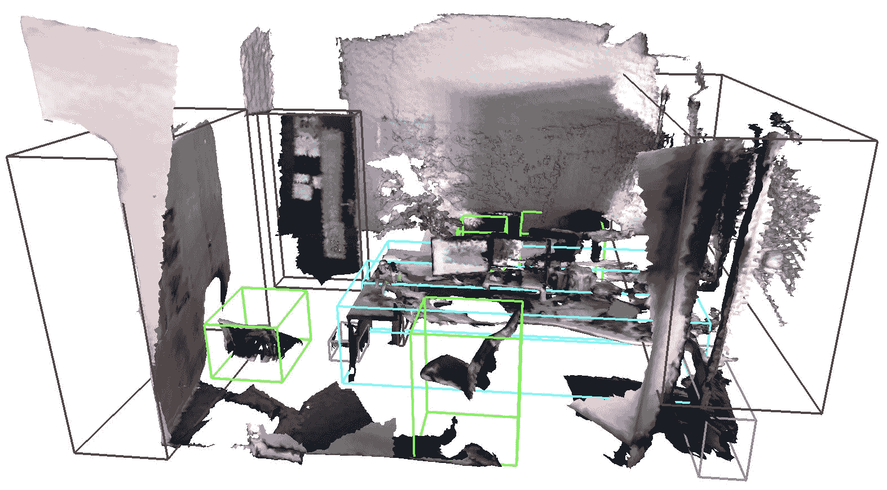

<!--yml

分类：未分类

日期：2024-09-06 19:47:51

-->

# [2202.13589] 无监督点云表示学习与深度神经网络：综述

> 来源：[`ar5iv.labs.arxiv.org/html/2202.13589`](https://ar5iv.labs.arxiv.org/html/2202.13589)

# 无监督点云表示学习与深度神经网络：综述

小奥然^∗，黄家兴^∗，关大言，张小琴，陆世坚，邵玲 小奥然和黄家兴为共同第一作者。小奥然、黄家兴和陆世坚在新加坡南洋理工大学计算机科学与工程学院工作。关大言在阿联酋穆罕默德·本·扎耶德人工智能大学工作。张小琴在中国温州大学浙江省安全与应急智能信息重点实验室工作。邵玲在中国科学院终端人工智能实验室工作。通讯作者：陆世坚（shijian.lu@ntu.edu.sg）和张小琴（zhangxiaoqinnan@gmail.com）

###### 摘要

点云数据因其在各种不利情况下的优越准确性和鲁棒性而得到广泛探索。与此同时，深度神经网络（DNNs）在监控和自动驾驶等各种应用中取得了非常令人印象深刻的成功。点云与 DNN 的融合催生了许多深度点云模型，这些模型大多在大规模和密集标注的点云数据的监督下进行训练。由于大规模点云标注的限制，无监督点云表示学习，即从未标注的点云数据中学习通用且有用的点云表示，近年来受到越来越多的关注。本文全面回顾了使用 DNNs 进行的无监督点云表示学习。首先描述了近期研究的动机、一般流程及术语。接着简要介绍了相关背景，包括广泛采用的点云数据集和 DNN 架构。随后，根据技术方法对现有的无监督点云表示学习方法进行了广泛讨论。我们还对所评审的方法在多个广泛采用的点云数据集上进行了定量基准测试和讨论。最后，我们分享了对无监督点云表示学习未来研究中几个挑战和问题的谦虚看法。与本调查相关的项目已在[`github.com/xiaoaoran/3d_url_survey`](https://github.com/xiaoaoran/3d_url_survey)上建立。

###### 关键词：

点云，无监督表示学习，自监督学习，深度学习，迁移学习，3D 视觉，预训练，深度神经网络

## 1 引言

近年来，3D 获取技术发展迅速。这可以通过各种 3D 传感器的普及来见证，如自动驾驶车辆中的 LiDAR 传感器、Kinect 和 Apple 设备中的 RGB-D 摄像头、各种重建任务中的 3D 扫描仪等。与此同时，捕捉准确几何信息的不同模态 3D 数据，如网格、点云、深度图像和体积网格，已被收集并广泛应用于不同领域，如自动驾驶、机器人技术、医疗治疗、遥感等。

图 1：点云上无监督表示学习的通用流程：深度神经网络首先通过无监督学习在某些预文本任务上使用未标注的点云进行预训练。然后，将学习到的无监督点云表示转移到各种下游任务中，为网络初始化提供支持，接着用少量标注的任务特定点云数据对预训练的网络进行微调。

点云作为一种普遍且广泛使用的 3D 数据来源，可以直接通过入门级深度传感器捕获，然后进行三角化成网格或转换为体素。这使其在各种 3D 场景理解任务中具有广泛的应用[1]，如 3D 物体检测和形状分析、语义分割等。随着深度神经网络（DNN）的进步，点云理解引起了越来越多的关注，这从近年来开发的大量深度架构和深度模型中可见一斑[2]。另一方面，深度网络的有效训练需要大规模的人工标注训练数据，如物体检测的 3D 边界框和语义分割的点级标注，这通常因 3D 视角变化和人类感知与点云显示之间的视觉不一致而收集起来费时费力。高效收集大规模标注点云已成为处理各种真实世界任务时有效设计、评估和部署深度网络的一个瓶颈[3]。

图 2：现有无监督方法在点云表示学习中的分类。

无监督表示学习（URL）旨在从未标记的数据中学习鲁棒和通用的特征表示，近年来已被深入研究以缓解繁琐且耗时的数据标注挑战。如图 1 所示，URL 的工作原理类似于预训练，通过从未标记的数据中学习有用的知识，并将所学知识转移到各种下游任务中 [4]。更具体地说，URL 可以提供有用的网络初始化，通过这种初始化，可以在少量标记和任务特定的训练数据下训练出表现良好的网络模型，相较于从随机初始化训练，更不容易出现过拟合。因此，URL 可以帮助减少训练数据和注释，这在自然语言处理（NLP） [5、6]、二维计算机视觉 [7、8、9、10] 等领域已经显示出很大的有效性。

类似于来自其他数据类型（如文本和二维图像）的 URL，点云的 URL 最近在计算机视觉研究领域引起了越来越多的关注。已有许多 URL 技术被报道，这些技术通常通过设计不同的预训练任务来实现，例如 3D 物体重建 [11]、部分物体完成 [12]、3D 拼图解决 [13] 等。然而，与自然语言处理（NLP）和二维计算机视觉任务相比，点云的 URL 仍然落后许多。目前，大多数现有的 3D 场景理解开发仍然是从头开始在各种目标新数据上进行训练。另一方面，点云数据的 URL 正面临越来越多的问题和挑战，这在很大程度上是由于缺乏大规模和高质量的点云数据、统一的深度骨干网络架构、可泛化的技术方法以及全面的公共基准。

此外，关于点云的 URL 仍然缺乏系统性的调查，无法提供关于这一新兴但具有挑战性的任务的清晰全貌。为填补这一空白，本文从数据集、网络架构、技术方法、性能基准和未来研究方向的角度，全面回顾了无监督点云表示学习的最新进展。如图 2 所示，我们根据预训练任务将现有方法大致分为四类，包括使用数据生成、全局和局部上下文、多模态数据和局部描述符的 URL 方法，具体细节将在后续小节中讨论。

本工作的主要贡献有三方面：

1.  1.

    它提供了对无监督点云表示学习最近发展的全面综述。据我们所知，这是首个提供此激动人心的研究主题概览和全貌的综述。

1.  2.

    它研究了无监督点云表示学习的最新进展，包括对多个公共数据集上现有方法的全面基准测试和讨论。

1.  3.

    它分享了无监督点云表示学习中若干研究挑战和潜在的研究方向。

本文其余部分的组织结构如下：在第二部分中，我们介绍了无监督点云学习的背景知识，包括术语定义、点云理解的常见任务以及与此工作相关的调查。在第三部分中，我们介绍了广泛使用的数据集及其特征。在第四部分中，我们介绍了常用的深度点云架构及典型的点云 URL 模型。在第五部分中，我们系统回顾了点云 URL 方法。在第六部分中，我们总结并比较了现有方法在多个基准数据集上的性能。最后，在第七部分中，我们列出了无监督点云表示学习的几个有前途的未来方向。

## 2 背景

### 2.1 基本概念

我们首先定义了在接下来的章节中将使用的所有相关术语和概念。

点云数据：点云 $P$ 是一个向量集合 $P=\{p_{1},...,p_{N}\}$，其中每个向量表示一个点 $p_{i}=[C_{i},A_{i}]$。这里，$C_{i}\in\mathbf{R}^{1\times 3}$ 表示点的 3D 坐标 $(x_{i},y_{i},z_{i})$，而 $A_{i}$ 表示点的特征属性，如 RGB 值、LiDAR 强度、法线值等，这些都是可选的并且会因 3D 传感器及应用而有所不同。

监督学习：在深度学习的范式下，监督学习旨在通过使用标记的训练数据来训练深度网络模型。

无监督学习：无监督学习旨在通过使用未标记的训练数据来训练网络。

无监督表示学习：URL 是无监督学习的一个子集。它旨在从数据中学习有意义的表示，而不使用任何数据标签/注释，所学到的表示可以转移到不同的下游任务中。一些文献中使用“自监督学习”这一术语。

半监督学习：在半监督学习中，深度网络使用少量标记数据和大量未标记数据进行训练。它旨在通过从少量标记数据和分布相似的大量未标记数据中学习，以减轻数据注释的约束。

预训练：网络预训练在其他数据集上通过特定的预文本任务进行学习。学到的参数通常用于模型初始化，以便进一步使用各种任务特定的数据进行微调。

迁移学习：迁移学习旨在跨任务、模态或数据集转移知识。与本调查相关的典型场景是进行无监督学习以进行预训练，将从未标记数据中学到的知识转移到各种下游网络中。

### 2.2 常见的 3D 理解任务

本小节介绍了常见的 3D 理解任务，包括对象分类和对象部分分割中的对象级任务，以及 3D 对象检测、语义分割和实例分割中的场景级任务。这些任务已被广泛采用，以评估通过各种无监督学习方法学习到的点云表示的质量，这将在第六部分中详细讨论。

图 3：对象部分分割的示意图：第一行展示了来自 ShapeNetPart 数据集的几个对象样本，包括飞机、摩托车和桌子。第二行展示了不同部分的分割地面真值，不同颜色突出显示了不同的部分。

#### 2.2.1 对象分类

对象分类的目标是将点云对象分类到若干预定义的类别中。最常用的两个评估指标是：总体准确率（OA）代表测试集中所有实例的平均准确率；平均类别准确率（mAcc）代表测试集中所有对象类别的平均准确率。

#### 2.2.2 对象部分分割

对象部件分割是点云表示学习中的一项重要任务。它的目标是将部件类别标签（例如飞机翼、桌腿等）分配给每个点，如图 3 所示。平均交并比（mIoU）[15] 是最广泛采用的评估指标。对于每个实例，计算属于该对象类别的每个部件的 IoU。部件 IoU 的平均值表示该对象实例的 IoU。总体 IoU 计算为所有测试实例的 IoU 的平均值，而类别-wise IoU（或类 IoU）则计算为该类别下实例的平均值。

#### 2.2.3 3D 对象检测

点云上的 3D 对象检测是许多实际应用中至关重要且不可或缺的任务，如自动驾驶和家用机器人。该任务旨在在 3D 空间中定位对象，即 3D 对象边界框，如图 4 所示。平均精度 (AP) 指标已广泛用于 3D 对象检测的评估 [16, 17]。

(a) ScanNet-V2 数据集

(b) KITTI 数据集

图 4：点云对象检测中的 3D 边界框示例：这两幅图展示了从 [16] 和 [20] 中裁剪的 ScanNet-V2 [18] 和 KITTI [19] 数据集中的 3D 边界框。

(a) 原始样本

(b) 语义注释

图 5：语义点云分割的示例：左侧是来自 S3DIS [21] 的点云样本，右侧的图展示了对应的真实标签，其中不同的类别用不同的颜色突出显示。

#### 2.2.4 3D 语义分割

点云上的 3D 语义分割是 3D 理解中的另一个关键任务，如图 5 所示。与分割点云对象的对象部件分割不同，3D 语义分割旨在为场景级点云中的每个点分配一个类别标签，其复杂性要高得多。广泛采用的评估指标包括 OA、语义类别上的 mIoU 和 mAcc。

#### 2.2.5 3D 实例分割

3D 实例分割旨在检测并描绘场景级点云中的每个独特对象，如图 6 所示。除了只考虑语义类别的语义分割外，实例分割还为每个对象分配唯一的身份。均值平均精度 (mAP) 已广泛用于此任务的定量评估。

(a) 原始样本

(b) 实例注释

图 6: 点云上的实例分割示意图：左侧的点云样本来自 ScanNet-V2 [18]，右侧的图显示了对应的真实数据，不同实例用不同颜色突出显示。

### 2.3 相关调查

据我们所知，本文是首个全面回顾无监督点云学习的调查。已有几项相关但不同的调查。例如，一些论文回顾了点云深度监督学习的最新进展：Ioannidou 等人 [22] 回顾了 3D 数据的深度学习方法；Xie 等人 [23] 提供了点云分割任务的文献综述；Guo 等人 [2] 提供了有关点云深度学习的综合详细调查，涵盖了分类、检测、跟踪和分割等多个任务。此外，还有一些工作回顾了其他数据模态上的无监督表示学习：Jing 等人 [24] 介绍了 2D 计算机视觉中无监督表示学习的进展；Liu 等人 [25] 研究了 2D 计算机视觉、NLP 和图学习中的无监督表示学习方法的最新进展；Qi 等人 [26] 介绍了包括无监督和半监督方法在内的小数据学习的最新进展。

## 3 点云数据集

表 I: 先前 URL 研究中用于训练和评估的点云常用数据集的总结。

| 数据集 | 年份 | #样本 | #类别 | 类型 | 表示 | 标签 |
| --- | --- | --- | --- | --- | --- | --- |
| KITTI [19] | 2013 | 15K 帧 | 8 | 户外驾驶 | RGB & LiDAR | 边界框 |
| ModelNet10 [27] | 2015 | 4,899 个对象 | 10 | 合成对象 | 网格 | 对象类别标签 |
| ModelNet40 [27] | 2015 | 12,311 个对象 | 40 | 合成对象 | 网格 | 对象类别标签 |
| ShapeNet [14] | 2015 | 51,190 个对象 | 55 | 合成对象 | 网格 | 对象/部分类别标签 |
| SUN RGB-D [28] | 2015 | 5K 帧 | 37 | 室内场景 | RGB-D | 边界框 |
| S3DIS [21] | 2016 | 272 次扫描 | 13 | 室内场景 | RGB-D | 点类别标签 |
| ScanNet [18] | 2017 | 1,513 次扫描 | 20 | 室内场景 | RGB-D & 网格 | 点类别标签 & 边界框 |
| ScanObjectNN [29] | 2019 | 2,902 个对象 | 15 | 真实世界物体 | 点 | 物体类别标签 |
| ONCE [30] | 2021 | 1M 场景 | 5 | 室外驾驶 | RGB & LiDAR | 边界框 |

在本节中，我们总结了用于训练和评估无监督点云表示学习的常用数据集。如表 I 所示，现有工作主要从 1) 合成物体数据集（包括 ModelNet [27] 和 ShapeNet [14]）或 2) 真实场景数据集（包括 ScanNet [18] 和 KITTI [19]）中学习无监督点云表示。此外，还收集了各种特定任务的数据集，可用于微调下游模型，例如用于点云分类的 ScanObjectNN [29]、ModelNet40 [27] 和 ShapeNet [14]，用于部件分割的 ShapeNetPart [14]，用于语义分割的 S3DIS [21]、ScanNet [18] 或 Synthia4D [31]，以及用于对象检测的室内数据集 SUNRGB-D [28] 和 ScanNet [18] 以及室外数据集 ONCE [30]。

$\bullet$ModelNet10/ModelNet40 [27]: ModelNet 是一个用于 3D 分类的合成物体级数据集。原始的 ModelNet 提供了由顶点和面表示的 CAD 模型。点云通过从模型中均匀采样生成。ModelNet40 包含 13,834 个 40 类别的对象，其中 9,843 个对象组成训练集，其余的组成测试集。ModelNet10 由 3,377 个 10 类别的样本组成，这些样本被分为 2,468 个训练样本和 909 个测试样本。

$\bullet$ShapeNet [14]: ShapeNet 包含 55 类别的合成 3D 对象。它通过从在线开源 3D 库中收集 CAD 模型来策划。与 ModelNet 类似，ShapeNet 中的合成对象是完整的、对齐的，并且没有遮挡或背景。它的扩展版 ShapeNetPart 包含 16,881 个 16 类别的对象，并由点云表示。每个对象由 2 到 6 个部件组成，数据集中总共有 50 个部件类别。

$\bullet$ScanObjectNN [29]: ScanObjectNN 是一个真实物体级数据集，其中 2,902 个 3D 点云对象来自于真实室内场景的扫描。与合成物体数据集不同，ScanObjectNN 中的点云对象具有噪声（包括背景点、遮挡和物体的孔洞），并且未对齐轴。

$\bullet$S3DIS [21]: 斯坦福大规模 3D 室内空间（S3DIS）数据集包含了来自 3 幢办公楼 6 个大型室内区域的超过 2.15 亿个点，每个区域为 6000 平方米。这些扫描被表示为带有 13 种物体类别点级语义标签的点云。

$\bullet$ScanNet-V2 [18]: ScanNet-V2 是一个包含超过 1500 个扫描的 250 万个视图的 RGB-D 视频数据集，这些扫描是在办公室和客厅等室内场景中捕获的，并用三维摄像机姿势、表面重建以及语义和实例标签进行了注释，用于分割。

$\bullet$SUN RGB-D [28]: SUN RGB-D 数据集是从室内环境收集的单视图 RGB-D 图像的集合。总共有 10335 个带有全视角和 3D 定向物体边界框标记的 RGB-D 图像，覆盖了 37 个物体类别。

$\bullet$KITTI [19]: KITTI 是一个首创的室外数据集，提供了来自激光雷达传感器的密集点云以及其他模态，包括前置立体图像和 GPS/IMU 数据。它为 22 个场景提供了 20 万个 3D 盒子，用于 3D 物体检测。

$\bullet$ONCE [30]: ONCE 数据集包含 100 万个激光雷达场景和 700 万张对应的摄像机图像。共有 581 个序列，其中 560 个序列无标签用于无监督学习，10 个序列有标签用于测试。它为室外环境中的目标检测提供了一个无监督学习的基准。

关于点云的公开可用数据集在数据大小和场景多样性方面仍然受到限制，特别是与用于 2D 计算机视觉和 NLP 研究的图像和文本数据集相比。例如，BooksCorpus 中有 8 亿个单词，英文维基百科中有 25 亿个单词，可以为 NLP 的无监督表示学习提供全面的数据来源 [32]；ImageNet[33]拥有 1000 万多张图像用于无监督视觉表示学习。未来研究对大规模和高质量的点云数据需求急剧增长。我们在第七部分中对这个问题进行了详细讨论，参见第七部分。

## 4 种常见的深度学习架构

在过去的十年中，深度学习在点云处理和理解中发挥了越来越重要的作用。这可以从最近几年开发的丰富的深度架构中看出。与将点云转换为像八叉树[34]或哈希体素列表[35]这样的结构的传统 3D 视觉不同，深度学习更倾向于对不同的可区分性和/或高效的神经处理更加友好的结构，这在各种 3D 任务中取得了非常出色的性能。

与自然语言处理（NLP）和二维计算机视觉相比，基于 DNN 的点云处理和理解还远远滞后。这在无监督表示学习任务中尤其明显，主要是由于点云数据缺乏规律性表示。具体而言，词嵌入和二维图像具有规律且明确定义的结构，但由无序点集表示的点云没有这种通用且结构化的数据格式。

在本节中，我们介绍了为点云的 URL 探索的深度架构。过去十年中，点云的深度学习取得了显著进展，我们看到提出了大量 3D 深度架构和 3D 模型。然而，我们并没有像 2D 计算机视觉中的 VGG [36] 或 ResNet [37]这样的通用“3D 骨干网络”。因此，本调查集中在点云 URL 中常用的架构。为清晰起见，我们将其大致分为五类，即基于点的架构、基于图的架构、稀疏体素架构、空间 CNN 架构和基于 Transformer 的架构。请注意，还存在其他用于各种 3D 任务的深度架构，如[2]中讨论的投影网络[38, 39, 40, 41, 42, 43]，递归神经网络[44, 45, 46]，3D 胶囊网络[47]等。然而，它们不常用于 URL 任务，因此在本调查中未详细介绍。

### 4.1 基于点的深度架构

基于点的网络旨在直接处理原始点云，无需事先进行点数据转换。独立的点特征通常首先通过堆叠多层感知机（MLPs）网络提取，然后通过对称聚合函数聚合成全局特征。

PointNet [15] 是一种开创性的基于点的网络，如图 7 所示。它堆叠了多个 MLP 层来独立学习点级特征，并将学习到的特征传递到最大池化层，以提取全局特征以实现排列不变性。为了改进 PointNet，Qi 等人提出了 PointNet++ [48]，从点的邻域中学习局部几何细节，其中集合抽象层包括采样层、分组层和 PointNet 层，用于学习局部和层次特征。PointNet++ 在包括物体分类和语义分割在内的多个 3D 任务中取得了巨大的成功。以 PointNet++ 作为骨干网络，Qi 等人设计了 VoteNet [16]，这是第一个基于点的 3D 物体检测网络。VoteNet 采用了霍夫投票策略，它在物体中心周围生成新点，并将这些点与周围点分组，以生成 3D 框建议。

图 7：点云物体分类的 PointNet 简化架构 [15]，其中参数 $n$ 和 $m$ 分别表示点数和特征维度。

### 4.2 基于图的深度架构

基于图的网络将点云视为欧几里得空间中的图，顶点是点，边缘捕捉邻近点的关系，如图 8 所示。它使用图卷积，其中滤波器权重根据边缘标签进行条件化，并为每个输入样本动态生成。这允许通过强制权重共享来减少学习模型的自由度，并提取能够捕捉邻近点之间依赖关系的局部特征。

动态图卷积神经网络（DGCNN） [49] 是一种典型的基于图的网络，已被广泛用于点云的 URL。它堆叠了一个名为 EdgeConv 的图卷积模块，该模块在特征空间中对图进行动态卷积。DGCNN 将 EdgeConv 集成到 PointNet 结构的基本版本中，以学习点云理解的全局形状属性和语义特征。

图 8：图卷积网络（GCN）的示意图：每个图由多个顶点组成，表示点 $X_{i}$ 或特征 $Z_{i}$（由圆点突出显示），以及连接顶点的边表示点之间的关系（以黑线显示）。$C$ 表示输入通道，$F$ 表示输出特征维度，$Y_{i}$ 表示标签。

### 4.3 稀疏体素基础深度架构

体素基础架构在对体积表示应用 3D CNN 之前，将点云体素化为 3D 网格。由于点云数据的稀疏性，这通常会涉及巨大的计算冗余或在处理大量点时牺牲表示准确性。为了克服这一限制， [50、51、52、53] 采用稀疏张量作为基本单元，其中点云用数据列表和索引列表表示。与标准卷积操作不同，后者使用滑动窗口（PyTorch 和 TensorFlow 中的 im2col 函数）来构建计算管道，稀疏卷积 [50] 收集所有原子操作，包括卷积核元素，并将其保存到规则书中作为计算指令。

最近，Choy 等人提出了 Minkowski Engine [51]，引入了广义稀疏卷积和用于稀疏张量的自动微分库。此基础上，Xie 等人 [54] 采用了统一 U-Net [55] 架构，并建立了一个主干网络（SR-UNet，如图 9）用于无监督预训练。学习到的编码器可以迁移到不同的下游任务，如分类、物体检测和语义分割。

图 9：展示了采用统一 U-Net [55] 架构进行稀疏卷积的 SR-UNet [54]。该图基于 [54] 重新制作。

### 4.4 空间 CNN 基础深度架构

基于空间 CNN 的网络已被开发，以扩展常规网格 CNN 的能力，以分析不规则间隔的点云。根据卷积核，它们可以分为连续卷积网络和离散卷积网络 [2]。如图 10 所示，连续卷积网络在连续空间中定义卷积核，其中邻近点的权重由它们相对于中心点的空间分布决定。不同的是，离散卷积网络在规则网格上操作，并在离散空间中定义卷积核，其中邻近点相对于中心点有固定的偏移量。连续卷积模型的一个典型例子是 RS-CNN [56]，它已被广泛应用于点云的 URL。具体来说，RS-CNN 提取局部中心及其周围点之间的几何拓扑关系，并为卷积学习动态权重。

图 10：3D 空间卷积的示意图，包括连续卷积和离散卷积。参数 $p$ 和 $q_{i}$ 分别表示中心点及其邻近点。该图基于 [2] 重制。

### 4.5 基于 Transformer 的深度架构

图 11：用于点云无监督预训练的 Transformer 架构 [57]。更多网络细节见 [57]。该图基于 [57, 58] 重制。

在过去几年中，由于其结构优越性和多功能性，Transformers 在 NLP 研究领域 [59, 32] 和 2D 图像处理 [58, 60] 取得了惊人的进展。最近，它们也被引入到点云处理领域 [61, 57]。图 11 显示了用于点云的标准 Transformer 架构 [57]，其中包含一系列 Transformer 块 [59]，每个块由多头自注意力层和前馈网络组成。无监督预训练的 Transformer 编码器可用于微调下游任务，如对象分类和语义分割等。

## 5 无监督点云表示学习

在本节中，我们回顾了现有的点云 URL 方法。如图 2 所示，我们根据其前提任务将现有方法大致分为四类，包括基于生成的方法、基于上下文的方法、基于多模态的方法和基于局部描述符的方法。借助这一分类法，我们整理了现有方法，并在本节的后续小节中系统介绍它们。

### 5.1 基于生成的方法

表 II: 点云无监督表示学习的生成方法总结。

| 方法 | 发布于 | 类别 | 贡献 |
| --- | --- | --- | --- |
| VConv-DAE [62] | ECCV 2016 | 完成 | 通过预测 3D 网格中的缺失部分进行学习 |
| TL-Net [63] | ECCV 2016 | 重建 | 通过 3D 生成和 2D 预测进行学习 |
| 3D-GAN [64] | NeurIPS 2016 | GAN | 3D 体素的先锋 GAN |
| 3D-DescriptorNet [65] | CVPR 2018 | 完成 | 使用基于能量的模型进行点云完成的学习 |
| FoldingNet [66] | CVPR 2018 | 重建 | 通过折叠 3D 物体表面进行学习 |
| SO-Net [67] | CVPR 2018 | 重建 | 对单个点和 SOM 节点执行层次特征提取 |
| Latent-GAN [68] | ICML 2018 | GAN | 原始点云和潜在嵌入的先锋 GAN |
| MRT [69] | ECCV 2018 | 重建 | 一种具有多网格架构的新型点云自编码器 |
| VIP-GAN [70] | AAAI 2019 | GAN | 通过解决对象的多视角互预测任务进行学习 |
| G-GAN [11] | ICLR 2019 | GAN | 具有图卷积的先锋 GAN |
| 3DCapsuleNet [47] | CVPR 2019 | 重建 | 使用 3D 点胶囊网络进行学习 |
| L2G-AE [71] | ACM MM 2019 | 重建 | 通过点云的全局和局部重建进行学习 |
| MAP-VAE [72] | ICCV 2019 | 重建 | 通过 3D 重建和半对半预测进行学习 |
| PointFlow [73] | ICCV 2019 | 重建 | 通过将点云建模为分布的分布进行学习 |
| PDL [74] | CVPR 2020 | 重建 | 点分布学习的概率框架 |
| GraphTER [75] | CVPR 2020 | 重建 | 提出了用于点云的图基自编码器 |
| SA-Net [76] | CVPR 2020 | 完成 | 通过跳跃注意机制完成点云对象进行学习 |
| PointGrow [77] | WACV 2020 | 重建 | 一种可以递归生成点云样本的自回归模型。 |
| PSG-Net [78] | ICCV 2021 | 重建 | 通过种子生成重建点云对象进行学习 |
| OcCo [12] | ICCV 2021 | 完成 | 通过补全遮蔽的点云对象进行学习 |
| Point-Bert [57] | CVPR 2022 | 重建 | 通过恢复 3D 对象的遮蔽标记来学习变换器 |
| Point-MAE [79] | ECCV 2022 | 重建 | 自编码器变换器从输入数据中恢复被遮蔽的部分 |
| Point-M2AE [80] | NeurIPS 2022 | 重建 | 具有分层点云编码和重建的遮蔽自编码器 |

基于生成的 URL 方法涉及在训练过程中生成点云对象。根据所使用的前置任务，它们可以进一步分为四个子类别，包括点云自我重建（用于生成与输入相同的点云对象）、点云 GAN（用于生成虚假的点云对象）、点云上采样（用于生成形状相似但点云更密集的对象）和点云补全（用于预测不完整点云对象中的缺失部分）。这些 URL 方法的真实数据是点云本身。因此，这些方法不需要人工标注，并且可以以无监督的方式进行学习。表 II 显示了一些基于生成的方法。

#### 5.1.1 通过点云自我重建进行学习

自我重建的网络通常将点云样本编码成表示向量，并将其解码回原始输入数据，在此过程中提取形状信息和语义结构。这属于典型的 URL 方法，因为它不涉及任何人工标注。一个代表性网络是自编码器[81]，它具有如图 12 所示的编码器网络和解码器网络。编码器将点云对象压缩并编码成低维嵌入向量（即代码字）[66]，然后由解码器解码回 3D 空间。

图 12：自编码器在无监督点云表示学习中的示意图：编码器通过代码字向量学习表示点云对象，而解码器从代码字中重建输出对象。

该模型通过强制最终输出与输入相同来进行优化。在此过程中，编码被验证并通过尝试从编码中再生输入来学习，而自编码器通过训练网络忽略不重要的数据（“噪声”）来学习低维表示 [82]。排列不变的损失 [83] 被广泛采用作为训练目标，以描述输入和输出点云对象之间的相似性。它们可以通过 Chamfer 距离 $L_{\mathrm{CD}}$ 或地球搬运工距离 $L_{\mathrm{EMD}}$ 来测量，如下所示：

|  | $L_{\mathrm{CD}}=\sum_{p\in P}\min_{p^{\prime}\in P^{\prime}}{\|p-p^{\prime}\|^{2}}+\sum_{p^{\prime}\in P^{\prime}}\min_{p\in P}{\|p^{\prime}-p\|^{2}}$ |  | (1) |
| --- | --- | --- | --- |
|  | $L_{\mathrm{EMD}}=\min_{\phi:P\rightarrow P^{\prime}}\sum_{x\in P}{\|p-\phi(p)\|_{2}}$ |  | (2) |

其中 $P$ 和 $P^{\prime}$ 表示相同大小的输入和输出点云，$\phi:P\rightarrow P^{\prime}$ 是双射，$p$ 和 $p^{\prime}$ 是点。

自我重建已成为过去十年中最广泛采用的从点云中获取 URL 的前置任务之一。通过假设点云表示应该在 3D 空间中是生成性的，并且可以从 2D 空间中预测，Girdhar 等人提出了 TL-Net [63]，该方法使用 3D 自编码器重建 3D 体积网格，并使用 2D 卷积网络从投影图像中学习 2D 特征。Yang 等人设计了 FoldingNet [66]，它引入了一种基于折叠的解码器，将规范的 2D 网格变形到点云对象的底层 3D 物体表面。Li 等人提出了 SO-Net [67]，它引入了自组织映射，通过自我重建来学习点云的层次特征。Zhao 等人 [47] 将胶囊网络 [84] 扩展到 3D 点云处理，设计的 3D 胶囊网络可以从非结构化的 3D 数据中学习通用表示。Gao 等人 [75] 提出了基于图的自编码器，可以在全局和局部变换下学习点云结构的内在模式。Chen 等人 [85] 设计了一个深度自编码器，利用图拓扑推断和过滤来从 3D 点云中提取紧凑的表示。

一些研究探讨了全球和局部几何以从点云对象中学习鲁棒的表示[71, 72]。例如，[71] 在编码器中引入了层次自注意力用于信息聚合，并使用递归神经网络（RNN）作为解码器来进行点云的局部和全球重建。[72] 提出了 MAP-VAE，它引入了一个半对半预测任务，首先将点云对象分成前半部分和后半部分，然后训练 RNN 从相应的前半部分序列预测后半部分序列。一些研究则将点云重建公式化为点分布学习任务[73, 74, 77]。例如，[73] 提出了 PointFlow，它通过建模形状的分布和给定形状的点的分布来生成 3D 点云。[74] 提出了一个概率框架，通过点分布学习提取无监督的形状描述符，该框架将每个点与一个高斯分布关联，并将点云建模为点的分布。[77] 提出了一个自回归模型 Pointgrow，它可以从头开始生成多样且逼真的点云样本，或者在语义上下文中生成。

此外，一些研究从不同的对象分辨率中学习点云表示[69, 78, 86]。例如，Gadelha 等人[69] 设计了一个具有多分辨率树结构的自编码器，通过粗到细的分析学习点云表示。Yang 等人[78] 提出了一个具有种子生成模块的自编码器，该模块允许在多个阶段提取依赖于输入的点特征，分辨率逐渐增加。Chen 等人[86] 提出了通过重建不同分辨率的点云对象来学习采样不变特征，并最小化它们之间的 Chamfer 距离。

图 13：GAN 的示意图，通常由一个生成器$G$和一个判别器$D$组成，在训练过程中彼此对抗（以零和博弈的形式，其中一个代理的收益是另一个代理的损失）。

#### 5.1.2 通过点云 GAN 进行学习

生成对抗网络（GAN）[87]是一个典型的深度生成网络。如图 13 所示，它由生成器和判别器组成。生成器旨在合成尽可能逼真的数据样本，而判别器则尝试区分真实样本和合成样本。因此，GAN 学习生成具有与训练集相同统计特征的新数据，建模可以被表述为一个最小-最大问题：

|  | $\min_{G}\max_{D}L_{GAN}=\log D(x)+\log(1-D(G(z))),$ |  | (3) |
| --- | --- | --- | --- |

其中 $G$ 是生成器，$D$ 代表判别器。$x$ 和 $z$ 分别代表真实样本和从分布 $p(z)$ 随机抽样的噪声向量。

在对点云进行 URL 的 GAN 训练中，生成器从采样向量或潜在嵌入中学习以生成点云实例，而判别器则尝试区分输入点云是否来自真实数据分布或生成的数据分布。在训练过程中，这两个子网络相互对抗，判别器学习提取有用的特征表示以进行点云对象识别。学习过程无需人工标注，因此网络可以以无监督的方式进行训练。之后，通过微调模型，将学习到的判别器扩展到各种下游任务，如对象分类或部件分割。

几个网络成功地将 GAN 应用于点云的 URL [64, 68, 11, 88]。例如，Wu 等人[64] 提出了第一个应用于 3D 体素的 GAN 模型。然而，体素化过程要么牺牲表示精度，要么产生巨大的冗余。Achlioptas 等人提出了 Latent-GAN [68]，这是第一个用于原始点云的 GAN 模型。Li 等人[88] 进一步提出了一种具有层次采样和推理网络的点云 GAN 模型，该模型学习一种随机过程以生成新的点云对象。Valsesia 等人[11] 设计了第一个基于图的 GAN 模型，用于从点云中提取局部特征。这些方法通过将学习到的表示微调到高级下游 3D 任务来评估其泛化能力。

#### 5.1.3 通过点云上采样进行学习

如图 14 所示，给定一组点，点云上采样旨在生成一个具有相似几何形状的更密集的点集。此任务需要深度点云网络在没有任何监督的情况下学习 3D 形状的潜在几何形状，学习到的表示可以用于 3D 下游任务中的微调。

图 14：点云上采样的示意图：网络 DNN 通过解决一个再现具有相同几何形状但点分布更密集的对象的前置任务来学习点云表示。

Li 等人[89]将 GAN 引入到点云上采样任务中，并提出了 PU-GAN，通过在物体表面上的补丁上对点进行上采样，从潜在空间中学习各种点分布。生成器旨在生成上采样的点云，而判别器则试图区分其输入的点云是由生成器生成的还是实际的点云。类似于第 5.1.2 节中介绍的 GAN，学习到的判别器可以转移到下游任务中。Remelli 等人[90]设计了一种自编码器，可以将稀疏点云上采样为密集表示。编码器学习到的权重也可以用作下游任务的初始化权重，如第 5.1.1 节中所述。尽管近年来点云上采样受到越来越多的关注[91, 92, 89, 93, 94, 95]，但其性能主要通过生成的点云质量来评估，而在迁移学习中的表现尚未得到充分研究。

图 15：OcCo[12]的流程图。以遮挡的点云对象作为输入，训练一个编码器-解码器模型来完成遮挡的点云，其中编码器学习点云表示，解码器学习生成完整对象。学习到的编码器权重可以用于下游任务的网络初始化。图来自[12]，经作者许可使用。

#### 5.1.4 通过点云补全进行学习

表 III：基于上下文的方法在无监督点云表示学习中的总结。

| 方法 | 发表在 | 类别 | 贡献 |
| --- | --- | --- | --- |
| MultiTask [96] | ICCV 2019 | 混合型 | 通过聚类、重建和自监督分类进行学习 |
| Jigsaw3D [13] | NeurIPS 2019 | 空间上下文 | 通过解决 3D 拼图进行学习 |
| Constrast&Cluster [97] | 3DV 2019 | 混合型 | 通过对比和聚类与 GNN 进行学习 |
| GLR [98] | CVPR 2020 | 混合型 | 通过全球-局部推理进行 3D 物体学习 |
| Info3D [99] | ECCV 2020 | 上下文相似性 | 通过对比物体的全局和局部部分进行学习 |
| PointContrast [54] | ECCV 2020 | 上下文相似性 | 通过对比场景点云的不同视角进行学习 |
| ACD [100] | ECCV 2020 | 上下文相似性 | 通过对比从 3D 物体中分解出的凸成分进行学习 |
| Rotation3D [101] | 3DV 2020 | 空间上下文 | 通过预测旋转角度进行学习 |
| HNS [102] | ACM MM 2021 | 上下文相似性 | 通过对比 3D 物体的局部补丁与困难负样本进行学习 |
| CSC [3] | CVPR 2021 | 上下文相似性 | 提高场景点云视角对比的技术 |
| STRL [1] | ICCV 2021 | 时间上下文 | 从点云序列中学习时空数据的不变性 |
| RandomRooms [103] | ICCV 2021 | 上下文相似性 | 构建带有合成物体的伪场景以进行对比学习 |
| DepthContrast [104] | ICCV 2021 | 上下文相似性 | 通过点和体素的联合对比学习 |
| SelfCorrection [105] | ICCV 2021 | 混合型 | 通过区分和恢复破坏的物体进行学习 |
| PC-FractalDB [106] | CVPR 2022 | 上下文相似性 | 利用分形几何生成高质量的预训练数据 |
| 4dcontrast [107] | ECCV 2022 | 时间上下文 | 通过对比 3D 场景序列中的动态对应关系进行学习 |
| DPCo [108] | ECCV 2022 | 上下文相似性 | 一个用于点云预训练的统一对比学习框架 |
| ProposalContrast [109] | ECCV 2022 | 上下文相似性 | 通过对比区域提议进行 3D 探测器的预训练 |
| MaskPoint [110] | ECCV 2022 | 上下文相似性 | 通过区分遮挡物体点和采样噪声点进行学习 |
| FAC [111] | CVPR 2023 | 上下文相似性 | 通过对比分组的前景和背景进行学习 |

点云完成是一项基于其余 3D 点云预测任意缺失部分的任务。为了实现这一目标，深度网络需要学习 3D 物体的内部几何结构和语义知识，以便正确预测缺失部分。除此之外，学习到的表示可以迁移到下游任务。整个过程无需人工标注，因此属于无监督表示学习。

点云完成在过去十年中一直是一个活跃的研究领域[112, 113, 114, 115, 76, 116, 117]，并在不同的 URL 基准测试中进行评估[62, 65, 76, 12]。一项开创性的工作是 VConv-DAE [62]，它将点云对象体素化为体积网格，并通过从其余部分预测缺失的体素来学习物体形状分布。Xie 等人[65]设计了 3D-DescriptorNet，用于体积形状模式的概率建模。Achlioptas 等人[68]介绍了首个用于原始点云完成的深度神经网络，这是一种具有编码器-解码器结构的基于点的网络。Yuan 等人[113]提出了 Point Completion Network，这是一种具有自动编码器结构的网络，通过修复不完整的点云对象来学习有用的表示。Wen 等人[76]提出了 SA-Net，它在编码器中引入了跳跃注意机制，选择性地将几何信息从局部区域转移到解码器，以生成完整的点云对象。Wang 等人[12]提出学习一个编码器-解码器模型，通过不同的相机视角恢复被遮挡的点，如图 15 所示。编码器参数被用作下游任务的初始化，包括分类、部分分割和语义分割。

最近，利用掩码输入恢复缺失部分作为点云 URL 的前文本任务在自然语言处理[5, 6]和二维计算机视觉[10]中已经证明了其显著成功。这一思想也在三维点云学习中得到了探讨[57, 79, 110, 118]。例如，Yu 等人[57]提出了一种 Point-BERT 范式，通过掩码点建模任务对点云 Transformer 进行预训练。他们使用离散变分自编码器生成对象补丁的标记，并随机掩盖这些标记以训练 Transformer 恢复原始完整的点标记。Point-BERT 学习到的表示可以很好地迁移到新的任务和领域，如对象分类和对象部件分割。

### 5.2 基于上下文的方法

基于上下文的方法是另一类重要的点云 URL，近年来受到越来越多的关注。这些方法不同于以生成方式学习表示的生成方法，它们采用区分性的前文本任务来学习点云的不同上下文，包括上下文相似性、空间上下文结构和时间上下文结构。设计的前文本任务无需人工标注，表 III 列出了最近的方法。

#### 5.2.1 基于上下文相似性的学习

图 16：一个实例对比学习的示意图，通过自我区分学习局部平滑的表示，将查询（来自 Anchor 样本）拉近到正键（来自正样本）并将其推远离负键（来自负样本）。

这种方法通过探索样本之间的潜在上下文相似性来学习点云的无监督表示。一种典型的方法是对比学习，它在近年来在 2D 视觉 [7, 8, 119] 和 3D 视觉 [54, 3, 104] 中表现出色。图 16 展示了实例级对比学习的示例。以一个输入点云对象实例作为锚点，其增强视图被定义为正样本，而其他不同的实例则为负样本。网络通过优化自我辨别任务来学习点云的表示，即查询（锚点的特征）应该接近正键（正样本的特征），而远离负键（负样本的特征）。这种学习策略以无监督的方式将相似样本的表示聚集在一起，并帮助网络从未标记的数据分布中学习语义结构。以下定义的 InfoNCE 损失 [120] 及其变体通常用作训练中的目标函数：

|  | $\mathcal{L}_{\mathrm{InfoNCE}}=-\log\frac{\exp{(q\cdot k_{+}/\tau)}}{\sum_{i=0}^{K}{\exp(q\cdot k_{i}/\tau)}},$ |  | (4) |
| --- | --- | --- | --- |

其中 $q$ 是编码的查询，$\{k_{0},k_{1},k_{2},...\}$ 是键，其中 $k_{+}$ 是正键，$\tau$ 是控制分布集中度的温度超参数。

类似于生成基础的方法，不同的对比学习方法 [99, 121, 100, 102, 122] 被提出用于学习合成单个对象的表示。例如，Sanghi 等人 [99] 提出了通过最大化合成对象及其局部部分之间的互信息来学习有用的特征表示。Wang 等人 [121] 提出了一种混合对比学习策略，该策略使用不同分辨率的对象进行实例级对比，以捕获层次化的全局表示，同时对比点和实例以学习局部特征。Gadelha 等人 [100] 将 3D 对象分解为凸组件，并在相同组件之间构建正对和在不同组件之间构建负对用于对比学习。Du 等人 [102] 将困难负样本采样策略引入实例和局部部分之间的对比学习。此外，Rao 等人 [98] 将对比学习、法线估计和自我重建统一到同一框架中，并制定了一种多任务学习方法。

图 17：PointContrast [54] 的流程：从两个不同视角捕获的同一场景的两个扫描 $x^{1}$ 和 $x^{2}$ 通过 $T_{1}$ 和 $T_{2}$ 进行数据增强。计算两个视角之间的对应映射，以最小化匹配点特征的距离并最大化不匹配点特征的距离，以进行对比学习。该图摘自 [54]，经作者许可。

最近，Xie 等人提出了 PointContrast [54]，一个对比学习框架，学习场景点云的表示，如图 17 所示。这项工作首次表明，网络权重在 3D 场景局部帧上预训练后，可以在多个 3D 高级任务（包括物体分类、语义分割和物体检测）上进行微调，从而提升性能。首先，在 ScanNet [18] 的两个对齐视图之间提取密集的对应关系以构建点对，然后使用统一的骨干网（SR-UNet）进行点级对比学习。最后，将学习到的模型转移到包括分类、语义分割和物体检测在内的多个下游 3D 任务中，取得了一致的性能提升。

由于 PointContrast 带来了新的见解，表明从场景级点云学习的无监督表示可以跨领域泛化并提升高级场景理解任务，几项无监督预训练工作已被提出用于场景级 3D 任务。考虑到 PointContrast 专注于点级对齐而没有捕捉场景中的空间配置和背景，Hou 等人 [3] 通过将空间划分为空间不均匀的单元来进行对应匹配，将空间背景集成到预训练目标中。Hou 等人 [123] 建立了一个多模态对比学习框架，该框架模型化 2D 多视角对应关系以及 2D-3D 对应关系与几何到图像对齐。虽然上述工作 [54, 3, 123] 需要从多个相机视角捕获的 3D 数据，但 Zhang 等人 [104] 提出了 DepthContrast，可以处理单视角数据。与之前的方法使用真实点云不同，Rao 等人 [103] 从 ShapeNet [14] 生成了合成场景和对象用于网络预训练。

另一种无监督的上下文相似性学习方法是聚类。在这种方法中，样本首先通过诸如 K-Means [124]的聚类算法被分组到不同的聚类中，并且每个样本被分配一个聚类 ID 作为伪标签。然后，网络以监督方式进行训练，以学习数据分布的语义结构。学习到的参数用于模型初始化，以微调各种下游任务。一个典型的例子是 DeepClustering [125]，这是第一个用于二维视觉表示学习的无监督聚类方法。然而，之前的研究并没有采用纯粹的聚类策略来处理点云的 URL。相反，提出了将聚类与其他无监督学习方法（例如，自我重建 [96] 或对比学习 [97]) 结合的混合方法，以学习更鲁棒的表示。

#### 5.2.2 利用空间上下文结构进行学习

带有空间坐标的点云提供了对象和场景的三维形状的准确几何描述。点云中的丰富空间上下文可以在 URL 的预文本任务中加以利用。例如，可以训练网络来理清不同对象部分之间的关系。同样，学习到的参数可以用于下游任务的模型初始化。由于训练中不需要人工标注，关键是设计有效的预文本任务以利用空间上下文作为 URL 目标。

图 18：3DJigsaw [13] 的流程：一个对象被拆分成体素，每个点被分配一个体素标签。拆分的体素通过预处理被随机重新排列，深度神经网络被训练以预测每个点的体素标签。该图表基于 [13] 进行再现。

Sauder 等人提出的 Jigsaw3D [13]方法是利用点云的空间上下文的开创性工作之一。如图 18 所示，物体首先被分割成体素，每个点被分配一个体素标签。然后将随机重新排列的点云输入网络，通过预测每个点的正确体素标签来优化网络。在训练过程中，网络旨在从点云中提取空间关系和几何信息。在其后续工作[126]中，设计了另一个预文本任务，用于预测同一物体的两个局部部分之间的十种空间关系之一。受 2D 方法的启发，该方法预测图像旋转[127]，Poursaeed 等人[101]提出通过预测 3D 物体的旋转角度来学习表示。Thabet 等人[128]设计了一个预文本任务，用于预测由 Morton-order Space Filling Curve 定义的点序列中的下一个点。Chen 等人[105]提出通过区分形状中扭曲部分与正确部分来学习物体的空间上下文。Sun 等人[129]引入了混合与解耦任务，以利用空间上下文线索。

#### 5.2.3 利用时间上下文结构进行学习

点云序列是由连续的点云帧组成的一种常见点云数据类型。例如，有从 RGB-D 视频帧[18]转化而来的室内点云序列，以及具有每次扫描由一次 LiDAR 传感器扫描收集的连续点云扫描的 LiDAR 序列数据[19, 130, 131]。点云序列包含丰富的时间信息，可以通过设计预文本任务来提取，并用作监督信号来训练深度神经网络。学习到的表示可以转移到下游任务。

图 19: STRL [1]的流程图：一个在线网络从两个相邻的点云帧$X^{u}$和$X^{v}$中学习空间和时间结构。该图采用了[1]的图示，并获得了作者许可。

最近，Huang 等人[1]提出了一个时空表示学习（STRL）框架，如图 19 所示。STRL 将 BYOL [8] 从二维视觉扩展到三维视觉，并从点云中提取空间和时间表示。它将两个相邻的点云帧视为正样本对，并最小化样本对学习特征表示之间的均方误差。Chen 等人[107]利用在静态三维环境中移动的合成三维形状来创建动态场景和时间顺序中的样本对。他们进行对比学习，以获得具有动态理解的三维表示。

具有时间上下文结构的无监督学习在二维计算机视觉任务[132、133、134、135]和三维计算机视觉任务[1、107]中都证明了其有效性。如第七部分所述，这一方向非常有前景，但仍需要更多的研究以更好地利用时间上下文信息。

### 5.3 基于多模态的方法

图像[19]和自然语言描述[136]等不同模态可以为点云数据提供额外的信息。跨模态建模关系可以被设计为 URL 的前置任务，这有助于网络学习更鲁棒和全面的表示。同样，学习到的参数可以用作各种下游任务的初始化权重。

图 20：管道 CMCV [4]：CMCV 使用 2D CNN 从 3D 物体的渲染视图中提取 2D 特征，并使用 3D GCN 从点云中提取 3D 特征。这两种特征通过一个两层全连接网络（FCN）进行连接，以预测跨模态的对应关系。图表基于 [4] 复制。

一些近期工作[4, 137]利用 3D 点云对象和 2D 图像之间的对应关系进行 URL。例如，Jing 等人[4]将不同视角的 3D 对象渲染成 2D 图像，以便从多模态数据中学习。如图 20 所示，他们分别使用 2D CNN 和 3D GCN 提取图像特征和点云特征，然后对模态内对应关系和模态间对应关系进行对比学习。他们的研究表明，预训练的 2D CNN 和 3D GCN 在分类性能上都优于随机初始化。不同的是，Wang 等人[138]将点云投影为彩色图像，然后将其输入到冻结权重的图像预训练模型中，以提取下游任务所需的代表性特征。然而，如何与其他模态（如文本描述和音频数据）一起学习无监督点云表示仍是一个待探索的领域。我们期待在这个有前景的研究方向上看到更多研究。

### 5.4 基于局部描述符的方法

前述方法旨在学习点云的语义结构以进行高级理解，而基于局部描述符的方法则专注于学习低级任务的表示。例如，Deng 等人[139]引入了 PPF-FoldNet，该方法提取旋转不变的 3D 局部描述符用于 3D 匹配[140]。一些工作[141, 142]利用非刚性形状对应提取作为点云 URL 的前文本任务，旨在找到两个可变形 3D 形状之间的点对点对应关系。Jiang 等人[143]探索了无监督的 3D 配准，以找到能够精确对齐源点云到目标的最优刚性变换。

现有的基于局部描述符的方法主要在低级任务上进行评估。然而，如何将学习到的特征表示适应于其他高级任务却很少讨论。我们期待未来更多相关研究。

### 5.5 优缺点

基于生成的方法在 3D URL 中得到了广泛研究，得益于它们在不假设任何下游任务的情况下恢复原始数据分布的能力。然而，大多数现有研究集中在对象级点云上，其特点是点数有限和数据变异性，限制了它们在对象分类和部件分割任务中的应用。此外，这些方法在场景级任务（如 3D 目标检测和语义分割）中的效果有限，因为生成具有复杂分布、丰富噪声和稀疏变化的场景级点云以及各种遮挡情况十分困难。尽管如此，基于生成的方法在 2D 图像上最近取得了非常显著的进展 [10]，展示了它们处理 3D 点云数据的巨大潜力。预计在场景级任务以及各种下游应用中会有更多的努力。

基于上下文的方法由于能够处理复杂的真实世界数据，最近已成为场景级任务（如 3D 语义分割、3D 实例分割和 3D 目标检测）的普遍方法。然而，它们仍面临一些挑战。首先是困难样本挖掘，这对有效的对比学习至关重要。除此之外，为上下文方法设计有效的自监督也是一个挑战，特别是在考虑各种任务和应用的泛化时。

基于多模态的方法允许利用额外的数据模态来丰富点云的分布。点云与其他数据模态之间的配对对应关系还提供了额外的监督，从而增强了学习到的无监督点云表示。然而，多模态方法仍面临多个挑战。例如，获取大规模配对数据通常是一项复杂的任务，设计有效的跨领域任务也是如此。此外，如何在多个模态之间学习有效的同质表示空间仍然是一个非常开放的研究问题。

基于局部描述符的方法在捕捉详细的空间线索和利用低级位置信息方面具有明显优势。然而，这些方法在将学到的表示转移到高级识别模型中的能力受到限制，这限制了它们在更复杂和抽象的识别任务中的应用范围。

## 6 基准性能

表 IV: 比较在 ModelNet10 和 ModelNet40 上的线性形状分类 [27]：线性 SVM 分类器使用通过不同的无监督方法学习的表示进行训练。标记为 ^* 的准确率是通过多模态数据预训练获得的。[T] 表示修改过的 Transformer 模型。[ST] 表示标准 Transformer 模型。

| 方法 | 年份 | 预处理任务 | 主干 | 预训练数据集 | ModelNet10 | ModelNet40 |
| --- | --- | --- | --- | --- | --- | --- |
| 有监督学习 | 2017 | 不适用 | PointNet [15] | 不适用 | - | 89.2 |
| 2017 | PointNet++ [48] | - | 90.7 |
| 2019 | DGCNN [49] | - | 93.5 |
| 2019 | RSCNN [56] | - | 93.6 |
| 2021 | [T]PointTransformer [144] |  | - | 93.7 |
| 2022 | [ST]Transformer [57] |  | - | 91.4 |
| SPH [145] | 2003 | 生成 | - | ShapeNet | 79.8 | 68.2 |
| LFD [146] | 2003 | 生成 | - | ShapeNet | 79.9 | 75.5 |
| TL-Net [63] | 2016 | 生成 | - | ShapeNet | - | 74.4 |
| VConv-DAE [62] | 2016 | 生成 | - | ShapeNet | 80.5 | 75.5 |
| 3D-GAN [64] | 2016 | 生成 | - | ShapeNet | 91.0 | 83.3 |
| 3D DescriptorNet [65] | 2018 | 生成 | - | ShapeNet | - | 92.4 |
| FoldingNet [66] | 2018 | 生成 | - | ModelNet40 | 91.9 | 84.4 |
| FoldingNet [66] | 2018 | 生成 | - | ShapeNet | 94.4 | 88.4 |
| Latent-GAN [68] | 2018 | 生成 | - | ModelNet40 | 92.2 | 87.3 |
| Latent-GAN [68] | 2018 | 生成 | - | ShapeNet | 95.3 | 85.7 |
| MRTNet [69] | 2018 | 生成 | - | ShapeNet | 86.4 | - |
| VIP-GAN [70] | 2019 | 生成 | - | ShapeNet | 94.1 | 92.0 |
| 3DCapsuleNet [47] | 2019 | 生成 | - | ShapeNet | - | 88.9 |
| PC-GAN [88] | 2019 | 生成 | - | ModelNet40 | - | 87.8 |
| L2G-AE [71] | 2019 | 生成 | - | ShapeNet | 95.4 | 90.6 |
| MAP-VAE [72] | 2019 | 生成 | - | ShapeNet | 94.8 | 90.2 |
| PointFlow [73] | 2019 | 生成 | - | ShapeNet | 93.7 | 86.8 |
| MultiTask [96] | 2019 | 混合 | - | ShapeNet | - | 89.1 |
| Jigsaw3D [13] | 2019 | 上下文 | PointNet | ShapeNet | 91.6 | 87.3 |
| Jigsaw3D [13] | 2019 | 上下文 | DGCNN | ShapeNet | 94.5 | 90.6 |
| ClusterNet [97] | 2019 | 上下文 | DGCNN | ShapeNet | 93.8 | 86.8 |
| CloudContext [126] | 2019 | 上下文 | DGCNN | ShapeNet | 94.5 | 89.3 |
| NeuralSampler [90] | 2019 | 生成 | - | ShapeNet | 95.3 | 88.7 |
| PointGrow [77] | 2020 | 生成 | - | ShapeNet | 85.8 | - |
| Info3D [99] | 2020 | 上下文 | PointNet | ShapeNet | - | 89.8 |
| Info3D [99] | 2020 | 上下文 | DGCNN | ShapeNet | - | 91.6 |
| ACD [100] | 2020 | 上下文 | PointNet++ | ShapeNet | - | 89.8 |
| PDL [74] | 2020 | 生成 | - | ShapeNet | - | 84.7 |
| GLR [98] | 2020 | 混合 | PointNet++ | ShapeNet | 94.8 | 92.2 |
| GLR [98] | 2020 | 混合 | RSCNN | ShapeNet | 94.6 | 92.2 |
| SA-Net-cls [76] | 2020 | 生成 | - | ShapeNet | - | 90.6 |
| GraphTER [75] | 2020 | 生成 | - | ModelNet40 | - | 89.1 |
| Rotation3D [101] | 2020 | 上下文 | PointNet | ShapeNet | - | 88.6 |
| Rotation3D [101] | 2020 | 上下文 | DGCNN | ShapeNet | - | 90.8 |
| MID [121] | 2020 | 上下文 | HRNet | ShapeNet | - | 90.3 |
| GTIF [85] | 2020 | 生成 | HRNet | ShapeNet | 95.9 | 89.6 |
| HNS [102] | 2021 | 上下文 | DGCNN | ShapeNet | - | 89.6 |
| ParAE [147] | 2021 | 生成 | PointNet | ShapeNet | - | 90.3 |
| ParAE [147] | 2021 | 生成 | DGCNN | ShapeNet | - | 91.6 |
| CMCV [4] | 2021 | 多模态 | DGCNN | ShapeNet | - | 89.8^* |
| GSIR [86] | 2021 | 上下文 | DGCNN | ModelNet40 | - | 90.4 |
| STRL [1] | 2021 | 上下文 | PointNet | ShapeNet | - | 88.3 |
| STRL [1] | 2021 | 上下文 | DGCNN | ShapeNet | - | 90.9 |
| PSG-Net [78] | 2021 | 生成 | PointNet++ | ShapeNet | - | 90.9 |
| SelfCorrection [105] | 2021 | 混合 | PointNet | ShapeNet | 93.3 | 89.9 |
| SelfCorrection [105] | 2021 | 混合 | RSCNN | ShapeNet | 95.0 | 92.4 |
| OcCo [12] | 2021 | 生成 | [ST]Transformer | ShapeNet | - | 92.1 |
| CrossPoint [137] | 2022 | 多模态 | PointNet | ShapeNet | - | 89.1^* |
| CrossPoint [137] | 2022 | 多模态 | DGCNN | ShapeNet | - | 91.2^* |
| Point-BERT [57] | 2022 | 生成 | [ST]Transformer | ShapeNet | - | 93.2 |
| Point-MAE [79] | 2022 | 生成 | [ST]Transformer | ShapeNet | - | 93.8 |

我们使用两个广泛采用的评估指标对代表性的 3D URL 方法进行基准测试。基准测试在公共点云数据上进行，所有性能数据均来自相应的论文。

### 6.1 评估标准

有两种指标被广泛用于评估学习到的无监督点云表示的质量。

$\bullet$ 线性分类首先应用预训练的无监督模型从某些标记数据中提取特征。然后，它用提取的特征及相应的标签训练一个监督线性分类器，其中预学习的无监督表示的质量通过训练好的线性分类器在测试数据上的表现来评估。因此，线性分类可以被视为一种表示学习度量，它以隐式方式提供了聚类分析。

$\bullet$ 微调通过使用下游任务的标记数据优化预训练的无监督模型。它可以通过评估微调模型在下游测试数据上的表现来评估预学习的无监督表示的质量，即通过无监督预训练相比于随机初始化能获得多少性能提升。

表 V：对对象分类数据集 ModelNet40 和 ScanObjectNN 的无监督预训练性能比较。性能数据以“A/B”的格式呈现，其中“A”表示从头开始训练的分类模型，具有随机初始化，而“B”表示用无监督预训练模型初始化的分类模型进行微调。由于不同的实现，性能在“A”下可能有所不同，具体情况请参考相关论文。

| 方法 | 主干 | ModelNet40 | ScanObjectNN |
| --- | --- | --- | --- |
| Jigsaw3D [13] | PointNet [15] | 89.2/89.6(+0.4) | 73.5/76.5(+3.0) |
| Info3D [99] | PointNet [15] | 89.2/90.2(+1.0) | -/- |
| SelfCorrection [105] | PointNet [15] | 89.1/90.0(+0.9) | -/- |
| OcCo [12] | PointNet [15] | 89.2/90.1(+0.9) | 73.5/80.0(+6.5) |
| ParAE [147] | PointNet [15] | 89.2/90.5(+1.3) | -/- |
| Jigsaw3D [13] | PCN [113] | 89.3/89.6(+0.3) | 78.3/78.2(-0.1) |
| OcCo [12] | PCN [113] | 89.3/90.3(+1.0) | 78.3/80.4(+2.1) |
| GLR [98] | RSCNN [56] | 91.8/92.2(+0.5) | -/- |
| SelfCorrection [105] | RSCNN [56] | 91.7/93.0(+1.3) | -/- |
| Jigsaw3D [13] | DGCNN [49] | 92.2/92.4(+0.2) | 82.4/82.7(+0.3) |
| Info3D [99] | DGCNN [49] | 93.5/93.0(-0.5) | -/- |
| OcCo [12] | DGCNN [49] | 92.5/93.0(+0.5) | 82.4/83.9(+1.6) |
| ParAE [147] | DGCNN [49] | 92.2/92.9(+0.7) | -/- |
| STRL [1] | DGCNN [49] | 92.2/93.1(+0.9) | -/- |
| OcCo [12] | Transformer [57] | 91.2/92.2(+1.0) | 79.9/84.9(+5.0) |
| Point-BERT [57] | Transformer [57] | 91.2/93.4(+2.2) | 79.9/87.4(+7.5) |

注意，URL 可以通过其他定量指标进行评估。例如，重建误差 [66] 可以显示学习到的表示如何编码原始点云。不同的聚类指标，例如标准化互信息 [96]，可以补充线性分类指标。然而，这些指标大多是特定于任务的，例如，重建误差可能无法很好地评估场景级点云的表示，因为它们固有的噪声、遮挡和稀疏性。实际上，尽管学习到的 3D 无监督表示对 3D URL 研究至关重要，但很少有通用指标可以直接和明确地评估这些表示的质量。需要更多的研究来推动这一研究领域的发展。

除了定量指标之外，无监督特征表示还可以以定性方式进行评估。例如，广泛采用 t-SNE（t 分布的随机邻居嵌入）[[148](https://wiki.example.org/t-SNE)]来压缩所学特征表示的维度并可视化压缩后的特征嵌入。

### 6.2 对象级任务

#### 6.2.1 对象分类

对象分类是评估中最常用的任务，因为现有的大部分工作都是在对象级点云数据集上学习点云表示。如[6.1](https://wiki.example.org/evaluation_criteria/unsupervised_point_cloud_representation_learning_with_deep_neural_networks)部分所述，线性分类协议和微调协议都被广泛采用。

表 VI：基于 ShapeNetPart [[14](https://wiki.example.org/ShapeNetPart)] 的 3D URL 方法的比较。 "无监督" 表示对学习的无监督点特征进行线性分类。 "转换" 是以“A/B”格式呈现，其中“A”是使用随机初始化从头训练的分割模型的结果，而“B”是通过使用无监督预训练模型初始化的分割模型进行微调的结果。我们还提供了具有随机初始化的不同主干模型的监督性能（“监督”）的结果（从原始论文中提取）。

| URL 方法 | 类型 | 主干 | 类别 mIoU | 实例 mIoU |
| --- | --- | --- | --- | --- |
| 无 | 监督 | PointNet | 80.4 | 83.7 |
| 监督 | PointNet++ | 81.9 | 85.1 |
| 监督 | DGCNN | 82.3 | 85.1 |
| 监督 | RSCNN | 84.0 | 86.2 |
| 监督 | Transformer | 83.4 | 85.1 |
| Latent-GAN [[68](https://wiki.example.org/Latent-GAN)] | 无监督 | - | 57.0 | - |
| MAP-VAE [[72](https://wiki.example.org/MAP-VAE)] | 无监督 | - | 68.0 | - |
| CloudContext [[126](https://wiki.example.org/CloudContext)] | 无监督 | DGCNN | - | 81.5 |
| GraphTER [[75](https://wiki.example.org/GraphTER)] | 无监督 | - | 78.1 | 81.9 |
| MID [[121](https://wiki.example.org/MID)] | 无监督 | HRNet | 83.4 | 84.6 |
| HNS [[102](https://wiki.example.org/HNS)] | 无监督 | DGCNN | 79.9 | 82.3 |
| CMCV [[4](https://wiki.example.org/CMCV)] | 无监督 | DGCNN | 74.7 | 80.8 |
| SO-Net [[67](https://wiki.example.org/SO-Net)] | 转换 | SO-Net | -/- | 84.6/84.9(+0.3) |
| Jigsaw3D [[13](https://wiki.example.org/Jigsaw3D)] | 转换 | DGCNN | 82.3/83.1(+0.8) | 85.1/85.3(+0.2) |
| MID [[121](https://wiki.example.org/MID)] | 转换 | HRNet | 84.6/85.2(+0.6) | 85.5/85.8(+0.3) |
| CMCV [[4](https://wiki.example.org/CMCV)] | 转换 | DGCNN | 77.6/79.1(+1.5) | 83.0/83.7(+0.7) |
| OcCo [[12](https://wiki.example.org/OcCo)] | 转换 | PointNet | 82.2/83.4(+1.2) | -/- |
| OcCo [[12](https://wiki.example.org/OcCo)] | 转换 | DGCNN | 84.4/85.0(+0.6) | -/- |
| OcCo [[12](https://wiki.example.org/OcCo)] | 转换 | Transformer | 83.4/83.4(+0.0) | 85.1/85.1(+0.0) |
| Point-BERT [[57](https://wiki.example.org/Point-BERT)] | 转换 | Transformer | 83.4/84.1(+0.7) | 85.1/85.6(+0.5) |

表 IV 总结了现有方法的线性分类性能。具体来说，线性分类器使用不同无监督方法在 ShapeNet 或 ModelNet40 数据集上学习到的表示进行训练，并报告了 ModelNet10 和 ModelNet40 上的测试集分类结果。为了比较，我们还列出了相同骨干模型在相同数据集上的监督学习表现。可以看出，无监督学习方法的表现不断提升，有些方法甚至超越了监督学习方法，展示了点云 URL 的有效性和巨大潜力。

表 VII：S3DIS 上的语义分割 [21]：它比较了带有随机权重初始化的监督训练和使用从无监督预训练任务中学习到的预训练权重进行微调的效果。它使用 DGCNN 作为分割模型，模型在不同的单个区域上训练，并在区域 5（上部）和区域 6（下部）上测试。

| 方法 | 在不同训练区域的区域 5 的 OA | 在不同训练区域的区域 5 的 mIoU |
| --- | --- | --- |
| 区域 1 | 区域 2 | 区域 3 | 区域 4 | 区域 6 | 区域 1 | 区域 2 | 区域 3 | 区域 4 | 区域 6 |
| --- | --- | --- | --- | --- | --- | --- | --- | --- | --- |
| 从头开始 | 82.9 | 81.2 | 82.8 | 82.8 | 83.1 | 43.6 | 34.6 | 39.9 | 39.4 | 43.9 |
| Jigsaw3D [13] | 83.5(+0.6) | 81.2(+0.0) | 84.0(+1.2) | 82.9(+0.1) | 83.3(+0.2) | 44.7(+1.1) | 34.9(+0.3) | 42.4(+2.5) | 39.9(+0.5) | 43.9(+0.0) |
| ParAE [147] | 91.8(+8.9) | 82.3(+1.1) | 89.5(+6.7) | 88.2(+5.4) | 86.4(+3.3) | 53.5(+9.9) | 38.5(+3.9) | 48.4(+8.5) | 45.0(+5.6) | 49.2(+5.3) |
| 方法 | 在不同训练区域的区域 6 的 OA | 在不同训练区域的区域 6 的 mIoU |
| 区域 1 | 区域 2 | 区域 3 | 区域 4 | 区域 5 | 区域 1 | 区域 2 | 区域 3 | 区域 4 | 区域 5 |
| 从头开始 | 84.6 | 70.6 | 77.7 | 73.6 | 76.9 | 57.9 | 38.9 | 49.5 | 38.5 | 48.6 |
| STRL [1] | 85.3(+0.7) | 72.4(+1.8) | 79.1(+1.4) | 73.8(+0.2) | 77.3(+0.4) | 59.2(+1.3) | 39.2(+0.8) | 51.9(+2.4) | 39.3(+0.8) | 49.5(+0.9) |

表 V 列出了 ModelNet40 和 ScanObjectNN 数据集上的微调性能。我们可以看到，与随机初始化相比，使用无监督预训练权重初始化的分类模型始终能够获得更好的分类性能，无论主干网络架构如何。另一方面，性能差距仍然有限，主要由于预训练数据集（即 ShapeNet 和 ModelNet40）的大小和多样性有限以及现有主干模型的简单性。相比之下，由于预训练数据集 ImageNet [33] 规模更大以及更强大的主干网络 ResNet [37]，2D 图像的无监督预训练最先进方法能够在分类任务中获得更显著的性能提升。如第七部分讨论，我们期待更多样的数据集以及更先进、更强大的主干模型为这一领域奠定更强的基础。

#### 6.2.2 对象部件分割

表 VI 展示了使用线性分类协议（即表 VI 中的“Unsup.”）和微调协议（即表 VI 中的“Trans.”）在 ShapeNetPart 数据集 [14] 上的对象部件分割基准测试。如表所示，无监督学习和监督学习（即“Unsup.” 与 “Sup.”）之间的性能差距正在缩小。此外，无监督预训练在大多数情况下在微调协议下（即“Trans.” 与 “Sup.”）表现更好，尽管改进仍然有限。

表 VIII：S3DIS 上的语义分割性能 [21]。上半部分：模型在 Area5（Fold#1）上进行测试，其余数据上进行训练。下半部分：三次运行的六折交叉验证。

| 方法 | 主干网络 | mACC | mIoU |
| --- | --- | --- | --- |
| 从头开始 | SR-UNet | 75.5 | 68.2 |
| PointConstrast [54] | 77.0 | 70.9 |
| DepthContrast [104] | - | 70.6 |
| 方法 | 骨干网络 | OA | mIoU |
| 从头开始 | PointNet | 78.2 | 47.0 |
| Jigsaw3D [13] | 80.1 | 52.6 |
| OcCo [12] | 82.0 | 54.9 |
| 从头开始 | PCN | 82.9 | 51.1 |
| Jigsaw3D [13] | 83.7 | 52.2 |
| OcCo [12] | 85.1 | 53.4 |
| 从头开始 | DGCNN | 83.7 | 54.9 |
| Jigsaw3D [13] | 84.1 | 55.6 |
| OcCo [12] | 84.6 | 58.0 |

### 6.3 场景级任务

如第 5.2 节中讨论的那样，由于在各种应用中的巨大潜力，无监督预训练在场景级任务中最近变得越来越普遍。这伴随着一系列 3D URL 研究，调查了在不同场景级点云数据集上预训练的有效性。我们提供了这些方法在不同 3D 任务上的综合基准测试。

表 IX：不同无监督学习方法的预训练效果比较。基准是对数据集 SUN RGB-D [28] 和 ScanNet-V2 [18] 的 3D 目标检测任务。“@0.25” 和 “@0.5” 分别表示 IoU 阈值 0.25 (mAP@0.25) 和 0.5 (mAP@0.5) 的每类结果的平均精度 (AP)。

| 方法 | 骨干网络 | SUN RGB-D | ScanNet-V2 |
| --- | --- | --- | --- |
| @0.5 | @0.25 | @0.5 | @0.25 |
| 从头开始 | SR-UNet | 31.7 | 55.6 | 35.4 | 56.7 |
| PointConstrast [54] | 34.8 | 57.5 | 38.0 | 58.5 |
| PC-FractalDB [106] | 35.9 | 57.1 | 37.0 | 59.4 |
| 从头开始 | VoteNet | 32.9 | 57.7 | 33.5 | 58.6 |
| STRL [1] | - | 58.2 | - | - |
| RandRooms [103] | 35.4 | 59.2 | 36.2 | 61.3 |
| DepthContrast [104] | - | - | - | 62.2 |
| CSC [3] | 33.6 | - | - | - |
| PointContrast [54] | 34.0 | - | 38.0 | - |
| 4DContrast [107] | 34.4 | - | 39.3 | - |
| 从头开始 | PointNet++ | - | 57.5 | - | 58.6 |
| PointContrast [54] | - | 57.9 | - | 58.5 |
| RandRooms [103] | - | 59.2 | - | 61.3 |
| DepthContrast [104] | - | 60.7 | - | - |
| PC-FractalDB [106] | 33.9 | 59.4 | 38.3 | 61.9 |
| DPCo [108] | 35.6 | 59.8 | 41.5 | 64.2 |
| 从头开始 | H3DNet | 39.0 | 60.1 | 48.1 | 67.3 |
| RandRooms [103] | 43.1 | 61.6 | 51.5 | 68.6 |

表 X：数据集 ONCE [30] 上的目标检测性能。基线模型是从头开始训练的。无监督学习方法用于预训练模型。$U_{small}$、$U_{median}$ 和 $U_{large}$ 分别表示用于无监督学习的小、中、大量未标记数据。

| 方法 | 车辆 | 行人 | 骑行者 | mAP |
| --- | --- | --- | --- | --- |
| 基线 [149] | 69.7 | 26.1 | 59.9 | 51.9 |
| $U_{small}$ |
| BYOL [8] | 67.6 | 17.2 | 53.4 | 46.1 (-5.8) |
| PointContrast [54] | 71.5 | 22.7 | 58.0 | 50.8 (-0.1) |
| SwAV [150] | 72.3 | 25.1 | 60.7 | 52.7 (+0.8) |
| DeepCluster [125] | 72.1 | 27.6 | 50.3 | 53.3 (+1.4) |
| $U_{median}$ |
| BYOL [8] | 69.7 | 27.3 | 57.2 | 51.4 (-0.5) |
| PointContrast [54] | 70.2 | 29.2 | 58.9 | 52.8 (+0.9) |
| SwAV [150] | 72.1 | 28.0 | 60.2 | 53.4 (+1.5) |
| DeepCluster [125] | 72.1 | 30.1 | 60.5 | 54.2 (+2.3) |
| $U_{large}$ |
| BYOL [8] | 72.2 | 23.6 | 60.5 | 52.1 (+0.2) |
| PointContrast [54] | 73.2 | 27.5 | 58.3 | 53.0 (+1.1) |
| SwAV [150] | 72.0 | 30.6 | 60.3 | 54.3 (+2.4) |
| DeepCluster [125] | 71.9 | 30.5 | 60.4 | 54.3 (+2.4) |

表 XI: 实例分割在数据集 S3DIS [21] 和 ScanNet-V2 [18] 上的性能。报告了所有语义类别的平均精度（mAP）的均值，3D IoU 阈值为 0.25。

| 方法 | 骨干网络 | S3DIS | ScanNet |
| --- | --- | --- | --- |
| 从头开始 | SR-UNet | 59.3 | 53.4 |
| PointContrast [54] | 60.5 | 55.8 |
| CSC [3] | 63.4 | 56.5 |
| 4DContrast [107] | - | 57.6 |

表 VII 和 VIII 展示了在 S3DIS [21] 数据集上的语义分割性能。我们将它们分别总结，因为以前的工作使用了不同的微调设置。在表 VII 中，无监督预训练的 DGCNN 在 S3DIS 的每个区域上进行了微调，并在 Area 5（表的上部）或 Area 6（表的下部）上进行测试。表 VIII 则展示了微调不同分割网络在整个数据集上的性能，分别遵循一折（表的上部）和六折交叉验证设置（表的下部）。

我们还总结了处理物体检测的无监督预训练的现有工作。表 IX 和 X 展示了它们在室内数据集（包括 SUN RGB-D [28] 和 ScanNet-V2 [18]）以及室外 LiDAR 数据集 ONCE [30] 上的性能。此外，一些工作还研究了用于实例分割的无监督预训练。我们在表 XI 中总结了它们在 S3DIS [21] 和 ScanNet-V2 [18] 上的性能。

令人振奋的是，无监督学习表示可以跨领域泛化，并在多个高层次 3D 任务中提升性能，相比于从头开始训练。这些实验展示了点云 URL 在节省昂贵的人工标注方面的巨大潜力。然而，改进仍然有限，我们期待在这一领域有更多的研究。

## 未来方向

点云的 URL 在过去十年中取得了显著进展。在本节中，我们分享了该研究领域的若干潜在未来研究方向。

需要统一的 3D 骨干网：深度学习在 2D 计算机视觉中取得巨大成功的一个主要原因是 CNN 架构的标准化，如 VGG [36]、ResNet [37] 等。例如，统一的骨干网结构大大促进了不同数据集和任务之间的知识迁移。对于 3D 点云，尽管最近报告了各种 3D 深度架构，但类似的发展尚未得到充分探索。这可以从第六部分中的 URL 方法表中观察到，其中大多数采用了非常不同的骨干网模型。这阻碍了 3D 点云网络在可扩展设计和在各种新任务中的高效部署的发展。设计某些可以像 2D 计算机视觉中的 ResNet 一样普遍的通用骨干网，对于 3D 点云网络的发展，包括无监督点云表示学习，至关重要。

需要更大的数据集：如第三部分所述，大多数现有的 URL 数据集最初是为监督学习任务收集的。由于点云注释繁琐且耗时，这些数据集在数据规模和数据多样性方面受到严重限制，不适合 URL，因为 URL 通常需要大量具有良好规模和多样性的点云。这一问题很好地解释了第六部分中表格中 URL 的微小改进。因此，迫切需要收集大规模、高质量的未标注点云数据集，这些数据集在物体级和场景级点云、室内和室外点云等方面具有足够的多样性。

场景级任务的无监督预训练：如第 5.2 节所述，大多数早期研究关注于物体级点云处理，尽管一些开创性的研究[54, 3, 123, 103, 1]探讨了如何在场景级点云上进行 DNN 的预训练，以提升物体检测和实例分割等各种场景级下游任务。之前的研究表明，学到的无监督表示可以有效地在领域和任务之间进行泛化。因此，场景级点云的 URL 因其在各种应用中的巨大潜力值得更多关注。另一方面，这方面的研究仍处于初期阶段，主要由于网络架构和数据集的限制。我们预见到在不久的将来会有更多相关研究进行。

从多模态数据中学习表示：3D 传感器通常配备其他传感器，这些传感器可以捕捉点云的额外和补充信息。例如，深度相机通常配备光学传感器以捕获更好的外观信息。LiDAR 传感器、光学传感器、GPU 和 IMU 常常被一起安装作为传感器套件，以捕获互补信息并在自主车辆和移动机器人导航中提供一定的冗余。近年来，从这种多模态数据中进行无监督学习引起了越来越多的关注。例如，已探索将多模态数据之间的对应关系作为无监督学习的预文本任务，如第 5.3 节所述。然而，这方面的研究仍然不够深入，我们期待更多关于点云、RGB 图像、深度图等的相关研究。

学习时空表示：支持捕捉序列点云的 3D 传感器在如今变得越来越受欢迎。可以从点云流中提取丰富的时间信息，作为无监督学习的有用监督信号，而现有的大多数工作仍然集中在静态点云上。我们期望设计出更多有效的预文本任务，以有效地从未标记的序列点云帧中学习时空表示。

## 8 结论

无监督表示学习旨在从未标注的数据中学习有效的表示，这在点云数据研究中取得了显著进展。本文对点云的无监督表示学习进行了现代化综述。首先介绍了广泛采用的数据集和深度网络架构。接着，提供了方法的全面分类法和详细回顾。随后，讨论并基准测试了多种 3D 点云任务中的代表性方法。最后，我们分享了对几个潜在未来研究方向的谦虚看法。我们希望这项工作能够为未来在点云数据中的无监督表示学习奠定坚实和可靠的基础。

## 致谢

本项目部分由新加坡教育部资助，属于 Tier-1 计划，项目编号为 RG18/22。它还部分得到 RIE2020 行业对接基金——行业合作项目（IAF-ICP）资助，并通过新加坡电信有限公司（Singtel）在 Singtel 认知与人工智能企业实验室（SCALE@NTU）的现金和实物贡献得到支持。

## 参考文献

+   [1] S. Huang, Y. Xie, S.-C. Zhu 和 Y. Zhu，“用于 3D 点云的时空自监督表征学习，”载于*IEEE/CVF 国际计算机视觉大会论文集*，2021 年，第 6535–6545 页。

+   [2] Y. Guo, H. Wang, Q. Hu, H. Liu, L. Liu 和 M. Bennamoun，“3D 点云的深度学习：综述，”*IEEE 模式分析与机器智能汇刊*，2020 年。

+   [3] J. Hou, B. Graham, M. Nießner 和 S. Xie，“利用对比场景上下文探索数据高效的 3D 场景理解，”载于*IEEE/CVF 计算机视觉与模式识别大会论文集*，2021 年，第 15 587–15 597 页。

+   [4] L. Jing, L. Zhang 和 Y. Tian，“通过跨模态和跨视角对应进行自监督特征学习，”载于*IEEE/CVF 计算机视觉与模式识别大会论文集*，2021 年，第 1581–1591 页。

+   [5] A. Radford, J. Wu, R. Child, D. Luan, D. Amodei, I. Sutskever *等*，“语言模型是无监督的多任务学习者，”*OpenAI 博客*，第 1 卷，第 8 期，第 9 页，2019 年。

+   [6] J. D. M.-W. C. Kenton 和 L. K. Toutanova，“Bert：用于语言理解的深度双向变换器的预训练，”载于*NAACL-HLT 会议论文集*，2019 年，第 4171–4186 页。

+   [7] K. He, H. Fan, Y. Wu, S. Xie 和 R. Girshick，“用于无监督视觉表征学习的动量对比，”载于*IEEE/CVF 计算机视觉与模式识别大会论文集*，2020 年，第 9729–9738 页。

+   [8] J.-B. Grill, F. Strub, F. Altché, C. Tallec, P. Richemond, E. Buchatskaya, C. Doersch, B. Pires, Z. Guo, M. Azar *等*，“自引导潜在：一种新的自监督学习方法，”载于*神经信息处理系统*，2020 年。

+   [9] X. Chen, H. Fan, R. Girshick 和 K. He，“通过动量对比学习改进基线，”*arXiv 预印本 arXiv:2003.04297*，2020 年。

+   [10] K. He, X. Chen, S. Xie, Y. Li, P. Dollár 和 R. Girshick，“掩码自编码器是可扩展的视觉学习者，”载于*IEEE/CVF 计算机视觉与模式识别大会论文集*，2022 年，第 16 000–16 009 页。

+   [11] D. Valsesia, G. Fracastoro 和 E. Magli，“通过图卷积学习局部生成模型用于 3D 点云，”载于*国际学习表征会议*，2018 年。

+   [12] H. Wang, Q. Liu, X. Yue, J. Lasenby 和 M. J. Kusner，“通过遮挡补全进行无监督点云预训练，”载于*IEEE/CVF 国际计算机视觉大会论文集（ICCV）*，2021 年 10 月，第 9782–9792 页。

+   [13] J. Sauder 和 B. Sievers，“通过重建空间进行点云的自监督深度学习，”*神经信息处理系统进展*，第 32 卷，第 12 962–12 972 页，2019 年。

+   [14] A. X. Chang, T. Funkhouser, L. Guibas, P. Hanrahan, Q. Huang, Z. Li, S. Savarese, M. Savva, S. Song, H. Su *等*，“Shapenet：一个信息丰富的 3D 模型库，”*arXiv 预印本 arXiv:1512.03012*，2015 年。

+   [15] C. R. Qi, H. Su, K. Mo 和 L. J. Guibas，“PointNet：用于 3D 分类和分割的点集深度学习，”在 *IEEE 计算机视觉与模式识别会议论文集*，2017 年，第 652–660 页。

+   [16] C. R. Qi, O. Litany, K. He 和 L. J. Guibas，“用于点云中 3D 目标检测的深度 Hough 投票，”在 *IEEE/CVF 国际计算机视觉会议论文集*，2019 年，第 9277–9286 页。

+   [17] S. Shi, X. Wang 和 H. Li，“PointRCNN：从点云生成和检测 3D 目标提案，”在 *IEEE/CVF 计算机视觉与模式识别会议论文集*，2019 年，第 770–779 页。

+   [18] A. Dai, A. X. Chang, M. Savva, M. Halber, T. Funkhouser 和 M. Nießner，“ScanNet：丰富注释的室内场景 3D 重建，”在 *IEEE 计算机视觉与模式识别会议论文集*，2017 年，第 5828–5839 页。

+   [19] A. Geiger, P. Lenz, C. Stiller 和 R. Urtasun，“视觉遇见机器人：Kitti 数据集，” *国际机器人研究杂志*，第 32 卷，第 11 期，第 1231–1237 页，2013 年。

+   [20] C. R. Qi, W. Liu, C. Wu, H. Su 和 L. J. Guibas，“用于 RGB-D 数据的 Frustum PointNets 进行 3D 目标检测，”在 *IEEE 计算机视觉与模式识别会议论文集*，2018 年，第 918–927 页。

+   [21] I. Armeni, O. Sener, A. R. Zamir, H. Jiang, I. Brilakis, M. Fischer 和 S. Savarese，“大规模室内空间的 3D 语义解析，”在 *IEEE 计算机视觉与模式识别会议论文集*，2016 年，第 1534–1543 页。

+   [22] A. Ioannidou, E. Chatzilari, S. Nikolopoulos 和 I. Kompatsiaris，“基于 3D 数据的计算机视觉深度学习进展：综述，” *ACM 计算机调查*，第 50 卷，第 2 期，第 1–38 页，2017 年。

+   [23] Y. Xie, J. Tian 和 X. X. Zhu，“在 3D 中用标签连接点：点云语义分割综述，” *IEEE 地球科学与遥感杂志*，第 8 卷，第 4 期，第 38–59 页，2020 年。

+   [24] L. Jing 和 Y. Tian，“使用深度神经网络的自监督视觉特征学习：综述，” *IEEE 模式分析与机器智能汇刊*，2020 年。

+   [25] X. Liu, F. Zhang, Z. Hou, L. Mian, Z. Wang, J. Zhang 和 J. Tang，“自监督学习：生成性还是对比性，” *IEEE 知识与数据工程汇刊*，2021 年。

+   [26] G.-J. Qi 和 J. Luo，“大数据时代的小数据挑战：无监督和半监督方法的最新进展综述，” *IEEE 模式分析与机器智能汇刊*，2020 年。

+   [27] Z. Wu, S. Song, A. Khosla, F. Yu, L. Zhang, X. Tang 和 J. Xiao，“3D ShapeNets：体积形状的深度表示，”在 *IEEE 计算机视觉与模式识别会议论文集*，2015 年，第 1912–1920 页。

+   [28] S. Song, S. P. Lichtenberg 和 J. Xiao，“Sun rgb-d：一个 RGB-D 场景理解基准套件，”在 *IEEE 计算机视觉与模式识别会议论文集*，2015 年，第 567–576 页。

+   [29] M. A. Uy, Q.-H. Pham, B.-S. Hua, T. Nguyen, 和 S.-K. Yeung，“重新审视点云分类：一个新的基准数据集和基于真实世界数据的分类模型，” 见 *IEEE/CVF 国际计算机视觉会议论文集*，2019，页 1588–1597。

+   [30] J. Mao, M. Niu, C. Jiang, H. Liang, J. Chen, X. Liang, Y. Li, C. Ye, W. Zhang, Z. Li *等人*，“百万场景用于自动驾驶：一次数据集，” *arXiv 预印本 arXiv:2106.11037*，2021。

+   [31] G. Ros, L. Sellart, J. Materzynska, D. Vazquez, 和 A. M. Lopez，“Synthia 数据集：一个用于城市场景语义分割的大型合成图像集合，” 见 *IEEE 计算机视觉与模式识别会议论文集*，2016，页 3234–3243。

+   [32] J. Devlin, M.-W. Chang, K. Lee, 和 K. Toutanova，“Bert：用于语言理解的深度双向变换器的预训练，” *arXiv 预印本 arXiv:1810.04805*，2018。

+   [33] J. Deng, W. Dong, R. Socher, L.-J. Li, K. Li, 和 L. Fei-Fei，“Imagenet：一个大规模分层图像数据库，” 见 *2009 IEEE 计算机视觉与模式识别会议*。Ieee，2009，页 248–255。

+   [34] A. Hornung, K. M. Wurm, M. Bennewitz, C. Stachniss, 和 W. Burgard，“Octomap：基于八叉树的高效概率 3D 映射框架，” *自主机器人*，第 34 卷，第 3 期，页 189–206，2013。

+   [35] M. Nießner, M. Zollhöfer, S. Izadi, 和 M. Stamminger，“基于体素哈希的实时 3D 重建，” *ACM 图形学交易*（ToG），第 32 卷，第 6 期，页 1–11，2013。

+   [36] K. Simonyan 和 A. Zisserman，“用于大规模图像识别的非常深卷积网络，” 见 *学习表征国际会议*，2015。

+   [37] K. He, X. Zhang, S. Ren, 和 J. Sun，“用于图像识别的深度残差学习，” 见 *IEEE 计算机视觉与模式识别会议论文集*，2016，页 770–778。

+   [38] H. Su, S. Maji, E. Kalogerakis, 和 E. Learned-Miller，“用于 3D 形状识别的多视角卷积神经网络，” 见 *IEEE 国际计算机视觉会议论文集*，2015，页 945–953。

+   [39] T. Yu, J. Meng, 和 J. Yuan，“用于 3D 物体识别的多视角协调双线性网络，” 见 *IEEE 计算机视觉与模式识别会议论文集*，2018，页 186–194。

+   [40] B. Yang, W. Luo, 和 R. Urtasun，“Pixor：基于点云的实时 3D 物体检测，” 见 *IEEE 计算机视觉与模式识别会议论文集*，2018，页 7652–7660。

+   [41] Z. Yang 和 L. Wang，“多视角 3D 物体识别的关系学习，” 见 *IEEE/CVF 国际计算机视觉会议论文集*，2019，页 7505–7514。

+   [42] X. Wei, R. Yu, 和 J. Sun，“View-gcn：基于视角的图卷积网络用于 3D 形状分析，” 见 *IEEE/CVF 计算机视觉与模式识别会议论文集*，2020，页 1850–1859。

+   [43] 肖安，杨旭，陆思，管大洪和黄静，“FPS-Net：用于大规模激光雷达点云分割的卷积融合网络”，*ISPRS 摄影测量与遥感杂志*，vol . 176，pp. 237-249，2021 年。

+   [44] 黄强，王伟和 U. Neumann，“用于三维点云分割的循环切片网络”，在*IEEE 计算机视觉与模式识别会议论文集*中，2018 年，第 2626-2635 页。

+   [45] X. Ye，J. Li，H. Huang，L. Du 和 X. Zhang，“具有上下文融合的 3D 循环神经网络用于点云语义分割”，在*欧洲计算机视觉会议（ECCV）论文集*中，2018 年，第 403-417 页。

+   [46] C. Zou，E. Yumer，J. Yang，D. Ceylan 和 D. Hoiem，“3D-PRNN：用于生成形状基元的循环神经网络”，在*IEEE 国际计算机视觉会议论文集*中，2017 年，第 900-909 页。

+   [47] 赵勇，T. Birdal，H. Deng 和 F. Tombari，“3D 点胶囊网络”，在*IEEE/CVF 计算机视觉与模式识别会议论文集*中，2019 年，第 1009-1018 页。

+   [48] C. R. Qi，L. Yi，H. Su 和 L. J. Guibas，“PointNet ++：度量空间中点集的深层逐级特征学习”，*神经信息处理系统的进展*，vol. 30，2017 年。

+   [49] 王耀，孙洋，刘泽，S. E. Sarma，M. M. Bronstein 和 J. M. Solomon，“用于点云学习的动态图形 CNN”，*图形学 ACM 事务（TOG）*，vol. 38，no. 5，pp. 1-12，2019 年。

+   [50] B. Graham， M. Engelcke 和 L. Van Der Maaten，“具有子流形稀疏卷积网络的三维语义分割”，在*IEEE 计算机视觉和模式识别会议论文集*中，2018 年，第 9224-9232 页。

+   [51] C. Choy, J. Gwak 和 S. Savarese，“4D 时空卷积网络：Minkowski 卷积神经网络”，在*IEEE/CVF 计算机视觉与模式识别会议论文集*中，2019 年，第 3075-3084 页。

+   [52] H. Tang，Z. Liu，X. Li，Y. Lin 和 S. Han，“TorchSparse：高效点云推理引擎”，在*机器学习和系统（MLSys）会议*上，2022 年。

+   [53] H. Tang，Z. Liu，S. Zhao，Y. Lin，J. Lin，H. Wang 和 S. Han，“搜索高效的三维架构与稀疏的点-体素卷积”，在*欧洲计算机视觉会议*上。Springer，2020 年，第 685-702 页。

+   [54] S. Xie，J. Gu，D. Guo，C. R. Qi，L. Guibas 和 O. Litany，“PointContrast：面向 3D 点云理解的无监督预训练”，在*欧洲计算机视觉会议*上。Springer，2020 年，第 574-591 页。

+   [55] O. Ronneberger, P. Fischer 和 T. Brox，“U-Net：用于生物医学图像分割的卷积网络”，在*医学图像计算与计算辅助干预国际会议*上。Springer，2015 年，第 234-241 页。

+   [56] Y. Liu，B. Fan，S. Xiang 和 C. Pan，“Relation-Shape 卷积神经网络用于点云分析”，在*IEEE/CVF 计算机视觉与模式识别会议论文集*中，2019 年，第 8895-8904 页。

+   [57] X. Yu, L. Tang, Y. Rao, T. Huang, J. Zhou 和 J. Lu，“Point-bert：通过掩蔽点建模预训练 3D 点云变换器，” 发表在*IEEE/CVF 计算机视觉与模式识别会议论文集*，2022 年，第 19 313–19 322 页。

+   [58] A. Dosovitskiy, L. Beyer, A. Kolesnikov, D. Weissenborn, X. Zhai, T. Unterthiner, M. Dehghani, M. Minderer, G. Heigold, S. Gelly, J. Uszkoreit 和 N. Houlsby，“一张图像值 16x16 个词：用于大规模图像识别的变换器，” *ICLR*，2021 年。

+   [59] A. Vaswani, N. Shazeer, N. Parmar, J. Uszkoreit, L. Jones, A. N. Gomez, Ł. Kaiser 和 I. Polosukhin，“注意力即你所需，” 发表在*神经信息处理系统进展*，第 30 卷，2017 年。

+   [60] Z. Liu, Y. Lin, Y. Cao, H. Hu, Y. Wei, Z. Zhang, S. Lin 和 B. Guo，“Swin transformer：使用移动窗口的分层视觉变换器，” 发表在*IEEE/CVF 国际计算机视觉会议论文集*，2021 年，第 10 012–10 022 页。

+   [61] H. Zhao, L. Jiang, J. Jia, P. H. Torr 和 V. Koltun，“Point transformer，” 发表在*IEEE/CVF 国际计算机视觉会议（ICCV）论文集*，2021 年 10 月，第 16 259–16 268 页。

+   [62] A. Sharma, O. Grau 和 M. Fritz，“Vconv-dae：无对象标签的深度体积形状学习，” 发表在*欧洲计算机视觉会议论文集*，Springer，2016 年，第 236–250 页。

+   [63] R. Girdhar, D. F. Fouhey, M. Rodriguez 和 A. Gupta，“学习可预测和生成的对象向量表示，” 发表在*欧洲计算机视觉会议论文集*，Springer，2016 年，第 484–499 页。

+   [64] J. Wu, C. Zhang, T. Xue, W. T. Freeman 和 J. B. Tenenbaum，“通过 3D 生成对抗建模学习对象形状的概率潜在空间，” 发表在*第 30 届国际神经信息处理系统会议论文集*，2016 年，第 82–90 页。

+   [65] J. Xie, Z. Zheng, R. Gao, W. Wang, S.-C. Zhu 和 Y. N. Wu，“学习描述符网络用于 3D 形状合成与分析，” 发表在*IEEE 计算机视觉与模式识别会议论文集*，2018 年，第 8629–8638 页。

+   [66] Y. Yang, C. Feng, Y. Shen 和 D. Tian，“Foldingnet：通过深度网格变形的点云自动编码器，” 发表在*IEEE 计算机视觉与模式识别会议论文集*，2018 年，第 206–215 页。

+   [67] J. Li, B. M. Chen 和 G. H. Lee，“So-net：自组织网络用于点云分析，” 发表在*IEEE 计算机视觉与模式识别会议论文集*，2018 年，第 9397–9406 页。

+   [68] P. Achlioptas, O. Diamanti, I. Mitliagkas 和 L. Guibas，“学习 3D 点云的表示和生成模型，” 发表在*国际机器学习会议*，PMLR，2018 年，第 40–49 页。

+   [69] M. Gadelha, R. Wang 和 S. Maji，“多分辨率树网络用于 3D 点云处理，” 发表在*欧洲计算机视觉会议（ECCV）论文集*，2018 年，第 103–118 页。

+   [70] Z. Han, M. Shang, Y.-S. Liu, 和 M. Zwicker, “视图间预测生成对抗网络：通过学习全球形状记忆支持局部视图预测进行 3D 形状的无监督表示学习，” 发表在 *AAAI 人工智能会议论文集*，第 33 卷，第 01 期，2019 年，页码 8376–8384。

+   [71] X. Liu, Z. Han, X. Wen, Y.-S. Liu, 和 M. Zwicker, “L2g 自编码器：通过局部到全局重建与层次自注意力理解点云，” 发表在 *第 27 届 ACM 国际多媒体会议论文集*，2019 年，页码 989–997。

+   [72] Z. Han, X. Wang, Y.-S. Liu, 和 M. Zwicker, “多角度点云变分自编码器：通过联合自重建和半对半预测进行多角度 3D 点云的无监督特征学习，” 发表在 *2019 IEEE/CVF 国际计算机视觉会议（ICCV）*。IEEE，2019 年，页码 10 441–10 450。

+   [73] G. Yang, X. Huang, Z. Hao, M.-Y. Liu, S. Belongie, 和 B. Hariharan, “Pointflow: 使用连续归一化流生成 3D 点云，” 发表在 *IEEE/CVF 国际计算机视觉会议论文集*，2019 年，页码 4541–4550。

+   [74] Y. Shi, M. Xu, S. Yuan, 和 Y. Fang, “无监督深度形状描述符与点分布学习，” 发表在 *IEEE/CVF 计算机视觉与模式识别会议论文集*，2020 年，页码 9353–9362。

+   [75] X. Gao, W. Hu, 和 G.-J. Qi, “Graphter: 通过自编码节点级变换无监督学习图转换等变表示，” 发表在 *IEEE/CVF 计算机视觉与模式识别会议论文集*，2020 年，页码 7163–7172。

+   [76] X. Wen, T. Li, Z. Han, 和 Y.-S. Liu, “通过跳跃注意力网络和层次折叠的点云完成，” 发表在 *IEEE/CVF 计算机视觉与模式识别会议论文集*，2020 年，页码 1939–1948。

+   [77] Y. Sun, Y. Wang, Z. Liu, J. Siegel, 和 S. Sarma, “Pointgrow: 自回归学习的点云生成与自注意力，” 发表在 *IEEE/CVF 冬季计算机视觉应用会议论文集*，2020 年，页码 61–70。

+   [78] J. Yang, P. Ahn, D. Kim, H. Lee, 和 J. Kim, “渐进种子生成自编码器用于无监督点云学习，” 发表在 *IEEE/CVF 国际计算机视觉会议论文集*，2021 年，页码 6413–6422。

+   [79] Y. Pang, W. Wang, F. E. Tay, W. Liu, Y. Tian, 和 L. Yuan, “点云自监督学习的掩码自编码器，” 发表在 *计算机视觉–ECCV 2022: 第 17 届欧洲会议，特拉维夫，以色列，2022 年 10 月 23–27 日，论文集，第 II 部分*。Springer，2022 年，页码 604–621。

+   [80] R. Zhang, Z. Guo, P. Gao, R. Fang, B. Zhao, D. Wang, Y. Qiao, 和 H. Li, “Point-m2ae: 用于层次点云预训练的多尺度掩码自编码器，” *神经信息处理系统进展*，2022 年。

+   [81] M. A. Kramer, “使用自联想神经网络的非线性主成分分析，” *AIChE 期刊*，第 37 卷，第 2 期，页码 233–243，1991 年。

+   [82] 自编码器，“自编码器 — 维基百科，自由百科全书，” 2022 年，[在线；访问日期 2022 年 2 月 16 日]。[在线]。可用：[`en.wikipedia.org/wiki/Autoencoder`](https://en.wikipedia.org/wiki/Autoencoder)

+   [83] H. Fan, H. Su, 和 L. J. Guibas，“用于从单张图像重建 3D 物体的点集生成网络，” 见于 *IEEE 计算机视觉与模式识别会议论文集*，2017 年，页码 605–613。

+   [84] S. Sabour, N. Frosst, 和 G. E. Hinton，“胶囊之间的动态路由，” *神经信息处理系统进展*，第 30 卷，2017 年。

+   [85] S. Chen, C. Duan, Y. Yang, D. Li, C. Feng, 和 D. Tian，“通过图拓扑推断和过滤进行深度无监督 3D 点云学习，” *IEEE 图像处理学报*，第 29 卷，页码 3183–3198，2020 年。

+   [86] H. Chen, S. Luo, X. Gao, 和 W. Hu，“无监督学习几何采样不变表示用于 3D 点云，” 见于 *2021 IEEE/CVF 国际计算机视觉会议研讨会 (ICCVW)*。 IEEE 计算机学会，2021 年，页码 893–903。

+   [87] I. Goodfellow, J. Pouget-Abadie, M. Mirza, B. Xu, D. Warde-Farley, S. Ozair, A. Courville, 和 Y. Bengio，“生成对抗网络，” *神经信息处理系统进展*，第 27 卷，2014 年。

+   [88] C.-L. Li, M. Zaheer, Y. Zhang, B. Poczos, 和 R. Salakhutdinov，“点云生成对抗网络，” *arXiv 预印本 arXiv:1810.05795*，2018 年。

+   [89] R. Li, X. Li, C.-W. Fu, D. Cohen-Or, 和 P.-A. Heng，“Pu-gan: 点云上采样对抗网络，” 见于 *IEEE/CVF 国际计算机视觉会议论文集*，2019 年，页码 7203–7212。

+   [90] E. Remelli, P. Baque, 和 P. Fua，“Neuralsampler: 欧几里得点云自编码器和采样器，” *arXiv 预印本 arXiv:1901.09394*，2019 年。

+   [91] L. Yu, X. Li, C.-W. Fu, D. Cohen-Or, 和 P.-A. Heng，“Pu-net: 点云上采样网络，” 见于 *IEEE 计算机视觉与模式识别会议论文集*，2018 年，页码 2790–2799。

+   [92] W. Yifan, S. Wu, H. Huang, D. Cohen-Or, 和 O. Sorkine-Hornung，“基于补丁的渐进式 3D 点集上采样，” 见于 *IEEE/CVF 计算机视觉与模式识别会议论文集*，2019 年，页码 5958–5967。

+   [93] Y. Qian, J. Hou, S. Kwong, 和 Y. He，“Pugeo-net: 一种以几何为中心的 3D 点云上采样网络，” 见于 *欧洲计算机视觉会议*。 Springer，2020 年，页码 752–769。

+   [94] G. Qian, A. Abualshour, G. Li, A. Thabet, 和 B. Ghanem，“Pu-gcn: 使用图卷积网络进行点云上采样，” 见于 *IEEE/CVF 计算机视觉与模式识别会议论文集*，2021 年，页码 11 683–11 692。

+   [95] R. Li, X. Li, P.-A. Heng, 和 C.-W. Fu，“通过解耦细化进行点云上采样，” 见于 *IEEE/CVF 计算机视觉与模式识别会议论文集*，2021 年，页码 344–353。

+   [96] K. Hassani 和 M. Haley， “点云上的无监督多任务特征学习，” 见 *IEEE/CVF 国际计算机视觉会议论文集*，2019 年，页码 8160–8171。

+   [97] L. Zhang 和 Z. Zhu， “通过对比和聚类使用图卷积神经网络进行点云理解的无监督特征学习，” 见 *2019 国际 3D 视觉会议 (3DV)*。   IEEE，2019 年，页码 395–404。

+   [98] Y. Rao, J. Lu, 和 J. Zhou， “3D 点云的无监督表示学习的全局-局部双向推理，” 见 *IEEE/CVF 计算机视觉与模式识别会议论文集*，2020 年，页码 5376–5385。

+   [99] A. Sanghi， “Info3d：使用互信息最大化和对比学习进行 3D 对象表示学习，” 见 *欧洲计算机视觉会议*。   Springer，2020 年，页码 626–642。

+   [100] M. Gadelha, A. RoyChowdhury, G. Sharma, E. Kalogerakis, L. Cao, E. Learned-Miller, R. Wang, 和 S. Maji， “使用近似凸分解进行点云的标签高效学习，” 见 *欧洲计算机视觉会议*。   Springer，2020 年，页码 473–491。

+   [101] O. Poursaeed, T. Jiang, H. Qiao, N. Xu, 和 V. G. Kim， “通过方向估计进行点云的自监督学习，” 见 *2020 国际 3D 视觉会议 (3DV)*。   IEEE，2020 年，页码 1018–1028。

+   [102] B. Du, X. Gao, W. Hu, 和 X. Li， “用于自监督点云学习的自对比学习与困难负样本采样，” 见 *第 29 届 ACM 国际多媒体会议论文集*，2021 年，页码 3133–3142。

+   [103] Y. Rao, B. Liu, Y. Wei, J. Lu, C.-J. Hsieh, 和 J. Zhou， “Randomrooms：从合成形状和随机布局中进行无监督预训练，用于 3D 对象检测，” 见 *IEEE/CVF 国际计算机视觉会议论文集*，2021 年，页码 3283–3292。

+   [104] Z. Zhang, R. Girdhar, A. Joulin, 和 I. Misra， “在任何点云上自监督预训练 3D 特征，” 见 *IEEE/CVF 国际计算机视觉会议论文集 (ICCV)*，2021 年 10 月，页码 10 252–10 263。

+   [105] Y. Chen, J. Liu, B. Ni, H. Wang, J. Yang, N. Liu, T. Li, 和 Q. Tian， “用于无监督点云理解的形状自我修正，” 见 *IEEE/CVF 国际计算机视觉会议论文集*，2021 年，页码 8382–8391。

+   [106] R. Yamada, H. Kataoka, N. Chiba, Y. Domae, 和 T. Ogata， “带有自然 3D 结构的点云预训练，” 见 *IEEE/CVF 计算机视觉与模式识别会议论文集 (CVPR)*，2022 年 6 月，页码 21 283–21 293。

+   [107] Y. Chen, M. Nießner, 和 A. Dai， “4dcontrast：用于 3d 场景理解的动态对应的对比学习，” 见 *计算机视觉–ECCV 2022：第十七届欧洲会议，特拉维夫，以色列，2022 年 10 月 23–27 日，会议论文集，第 XXXII 部分*。   Springer，2022 年，页码 543–560。

+   [108] L. Li 和 M. Heizmann，"深入分析 3D 视觉自监督预训练中的不变性"，发表于 *计算机视觉–ECCV 2022：第 17 届欧洲会议，以色列特拉维夫，2022 年 10 月 23–27 日，论文集，第 XXX 部分*。   Springer，2022，第 656–673 页。

+   [109] J. Yin, D. Zhou, L. Zhang, J. Fang, C.-Z. Xu, J. Shen, 和 W. Wang，"Proposalcontrast：基于激光雷达的 3D 目标检测的无监督预训练"，发表于 *计算机视觉–ECCV 2022：第 17 届欧洲会议，以色列特拉维夫，2022 年 10 月 23–27 日，论文集，第 XXXIX 部分*。   Springer，2022，第 17–33 页。

+   [110] H. Liu, M. Cai, 和 Y. J. Lee，"点云的自监督学习中的掩码判别"，发表于 *计算机视觉–ECCV 2022：第 17 届欧洲会议，以色列特拉维夫，2022 年 10 月 23–27 日，论文集，第 II 部分*。   Springer，2022，第 657–675 页。

+   [111] K. Liu, A. Xiao, X. Zhang, S. Lu, 和 L. Shao，"Fac：通过前景感知特征对比进行 3D 表示学习"，发表于 *IEEE/CVF 计算机视觉与模式识别会议（CVPR）*，2023。

+   [112] T. Groueix, M. Fisher, V. G. Kim, B. C. Russell, 和 M. Aubry，"一种纸浆法用于学习 3D 表面生成"，发表于 *IEEE 计算机视觉与模式识别会议论文集*，2018，第 216–224 页。

+   [113] W. Yuan, T. Khot, D. Held, C. Mertz, 和 M. Hebert，"Pcn：点云完成网络"，发表于 *2018 年国际 3D 视觉会议（3DV）*。   IEEE，2018，第 728–737 页。

+   [114] Z. Huang, Y. Yu, J. Xu, F. Ni, 和 X. Le，"Pf-net：用于 3D 点云完成的点分形网络"，发表于 *2020 IEEE/CVF 计算机视觉与模式识别会议（CVPR）*，2020，第 7659–7667 页。

+   [115] M. Liu, L. Sheng, S. Yang, J. Shao, 和 S.-M. Hu，"用于密集点云完成的形态学和采样网络"，发表于 *AAAI 人工智能会议论文集*，第 34 卷，第 07 期，2020，第 11,596–11,603 页。

+   [116] W. Zhang, Q. Yan, 和 C. Xiao，"通过分离特征聚合保持细节的点云完成"，发表于 *计算机视觉–ECCV 2020：第 16 届欧洲会议，英国格拉斯哥，2020 年 8 月 23–28 日，论文集，第 XXV 部分 16*。   Springer，2020，第 512–528 页。

+   [117] C. Xie, C. Wang, B. Zhang, H. Yang, D. Chen, 和 F. Wen，"基于风格的点生成器与对抗渲染用于点云完成"，发表于 *IEEE/CVF 计算机视觉与模式识别会议论文集*，2021，第 4619–4628 页。

+   [118] K. Fu, P. Gao, S. Liu, R. Zhang, Y. Qiao, 和 M. Wang，"Pos-bert：点云一阶段 BERT 预训练"，*arXiv 预印本 arXiv:2204.00989*，2022。

+   [119] T. Chen, S. Kornblith, M. Norouzi, 和 G. Hinton，"一种简单的视觉表示对比学习框架"，发表于 *国际机器学习会议*。   PMLR，2020，第 1597–1607 页。

+   [120] A. v. d. Oord, Y. Li, 和 O. Vinyals，"通过对比预测编码进行表示学习"，*arXiv 预印本 arXiv:1807.03748*，2018。

+   [121] P.-S. Wang, Y.-Q. Yang, Q.-F. Zou, Z. Wu, Y. Liu, 和 X. Tong，“通过多分辨率实例区分进行无监督 3d 学习以分析形状，” *ACM 图形学交易*，2020 年。

+   [122] J. Jiang, X. Lu, W. Ouyang, 和 M. Wang，“用于 3d 点云数据的无监督表示学习，” *arXiv 预印本 arXiv:2110.06632*，2021 年。

+   [123] J. Hou, S. Xie, B. Graham, A. Dai, 和 M. Nießner，“Pri3d: 3d 先验是否有助于 2d 表示学习？”在 *IEEE/CVF 国际计算机视觉大会 (ICCV)*，2021 年 10 月，pp. 5693–5702。

+   [124] J. A. Hartigan 和 M. A. Wong，“算法 136: 一个 k-means 聚类算法，” *皇家统计学会杂志，C 系列（应用统计学）*，第 28 卷，第 1 期，pp. 100–108，1979 年。

+   [125] M. Caron, P. Bojanowski, A. Joulin, 和 M. Douze，“深度聚类用于无监督视觉特征学习，”在 *欧洲计算机视觉会议（ECCV）论文集*，2018 年，pp. 132–149。

+   [126] J. Sauder 和 B. Sievers，“点云无监督深度学习的上下文预测，” *arXiv 预印本 arXiv:1901.08396*，第 2 卷，第 4 期，第 5 页，2019 年。

+   [127] S. Gidaris, P. Singh, 和 N. Komodakis，“通过预测图像旋转进行无监督表示学习，”在 *国际学习表示会议*，2018 年。

+   [128] A. Thabet, H. Alwassel, 和 B. Ghanem，“3d 点云中局部特征的自监督学习，”在 *IEEE/CVF 计算机视觉与模式识别大会研讨会*，2020 年，pp. 938–939。

+   [129] C. Sun, Z. Zheng, X. Wang, M. Xu, 和 Y. Yang，“通过混合和解缠结进行点云预训练，” *arXiv 预印本 arXiv:2109.00452*，2021 年。

+   [130] J. Behley, M. Garbade, A. Milioto, J. Quenzel, S. Behnke, C. Stachniss, 和 J. Gall，“Semantickitti: 用于 lidar 序列的语义场景理解数据集，”在 *IEEE/CVF 国际计算机视觉大会论文集*，2019 年，pp. 9297–9307。

+   [131] A. Xiao, J. Huang, D. Guan, F. Zhan, 和 S. Lu，“从合成到真实 lidar 点云的迁移学习，用于语义分割，”在 *AAAI 人工智能会议论文集*，第 36 卷，第 3 期，2022 年，pp. 2795–2803。

+   [132] C. Feichtenhofer, H. Fan, B. Xiong, R. Girshick, 和 K. He，“大规模无监督时空表示学习研究，”在 *IEEE/CVF 计算机视觉与模式识别大会*，2021 年，pp. 3299–3309。

+   [133] X. Song, S. Zhao, J. Yang, H. Yue, P. Xu, R. Hu, 和 H. Chai，“用于动作识别的时空对比领域适应，”在 *IEEE/CVF 计算机视觉与模式识别大会论文集*，2021 年，pp. 9787–9795。

+   [134] K. Hu, J. Shao, Y. Liu, B. Raj, M. Savvides, 和 Z. Shen，“视频自监督学习的对比和顺序表示，”在 *IEEE/CVF 国际计算机视觉大会论文集*，2021 年，pp. 7939–7949。

+   [135] H. Kuang、Y. Zhu、Z. Zhang、X. Li、J. Tighe、S. Schwertfeger、C. Stachniss 和 M. Li，“视频对比学习与全球上下文”，见于 *IEEE/CVF 国际计算机视觉会议论文集*，2021 年，第 3195–3204 页。

+   [136] D. Z. Chen、A. X. Chang 和 M. Nießner，“Scanrefer：使用自然语言在 rgb-d 扫描中进行三维物体定位”，见于 *欧洲计算机视觉会议*。Springer，2020 年，第 202–221 页。

+   [137] M. Afham、I. Dissanayake、D. Dissanayake、A. Dharmasiri、K. Thilakarathna 和 R. Rodrigo，“Crosspoint：用于三维点云理解的自监督跨模态对比学习”，见于 *IEEE/CVF 计算机视觉与模式识别会议论文集*，2022 年，第 9902–9912 页。

+   [138] Z. Wang、X. Yu、Y. Rao、J. Zhou 和 J. Lu，“P2p：通过点对像素提示调整预训练图像模型以进行点云分析”，见于 *神经信息处理系统进展*，2022 年。

+   [139] H. Deng、T. Birdal 和 S. Ilic，“Ppf-foldnet：旋转不变三维局部描述符的无监督学习”，见于 *欧洲计算机视觉会议论文集（ECCV）*，2018 年，第 602–618 页。

+   [140] A. Zeng、S. Song、M. Nießner、M. Fisher、J. Xiao 和 T. Funkhouser，“3dmatch：从 rgb-d 重建中学习局部几何描述符”，见于 *IEEE 计算机视觉与模式识别会议论文集*，2017 年，第 1802–1811 页。

+   [141] Y. Zeng、Y. Qian、Z. Zhu、J. Hou、H. Yuan 和 Y. He，“Corrnet3d：三维点云密集对应关系的无监督端到端学习”，见于 *IEEE/CVF 计算机视觉与模式识别会议论文集*，2021 年，第 6052–6061 页。

+   [142] I. Lang、D. Ginzburg、S. Avidan 和 D. Raviv，“Dpc：通过交叉和自我构建的无监督深度点匹配”，见于 *2021 年国际三维视觉会议（3DV）*。IEEE，2021 年，第 1442–1451 页。

+   [143] H. Jiang、Y. Shen、J. Xie、J. Li、J. Qian 和 J. Yang，“用于无监督点云配准的采样网络引导交叉熵方法”，见于 *IEEE/CVF 国际计算机视觉会议论文集*，2021 年，第 6128–6137 页。

+   [144] H. Zhao、L. Jiang、J. Jia、P. H. Torr 和 V. Koltun，“点变换器”，见于 *IEEE/CVF 国际计算机视觉会议论文集*，2021 年，第 16 259–16 268 页。

+   [145] M. Kazhdan、T. Funkhouser 和 S. Rusinkiewicz，“旋转不变的球面谐波表示三维形状描述符”，见于 *几何处理研讨会*，第 6 卷，2003 年，第 156–164 页。

+   [146] D.-Y. Chen、X.-P. Tian、Y.-T. Shen 和 M. Ouhyoung，“基于视觉相似性的三维模型检索”，见于 *计算机图形论坛*，第 22 卷，第 3 期。Wiley 在线图书馆，2003 年，第 223–232 页。

+   [147] B. Eckart、W. Yuan、C. Liu 和 J. Kautz，“通过学习离散生成模型对三维点云进行自监督学习”，见于 *IEEE/CVF 计算机视觉与模式识别会议论文集*，2021 年，第 8248–8257 页。

+   [148] L. Van der Maaten 和 G. Hinton，"使用 t-sne 进行数据可视化。" *机器学习研究期刊*，第 9 卷，第 11 期，2008 年。

+   [149] Y. Yan, Y. Mao, 和 B. Li，"Second: 稀疏嵌入卷积检测"，*传感器*，第 18 卷，第 10 期，页码 3337，2018 年。

+   [150] M. Caron, I. Misra, J. Mairal, P. Goyal, P. Bojanowski, 和 A. Joulin，"通过对比聚类分配进行无监督学习的视觉特征"，*神经信息处理系统进展*，第 33 卷，页码 9912–9924，2020 年。

| ![[无标题图片]](img/dc667d3bd71eb0fcf6152d59da45d9fd.png) | Aoran Xiao 于 2016 年和 2019 年分别从中国武汉大学获得了学士和硕士学位。他目前在南洋理工大学计算机科学与工程学院攻读博士学位。他的研究兴趣包括点云处理、计算机视觉和遥感。 |
| --- | --- |
| ![[无标题图片]](img/519ed1d04f38970f4ec322b419d2464b.png) | Jiaxing Huang 在英国格拉斯哥大学和新加坡南洋理工大学分别获得了电子与电气工程学士和硕士学位。他目前是南洋理工大学计算机科学与工程学院的研究助理和博士生。他的研究兴趣包括计算机视觉和机器学习。 |
| ![[无标题图片]](img/32a1f6341548c7dd617e1f0326bdae09.png) | Dayan Guan 目前是阿联酋穆罕默德·本·扎耶德人工智能大学的研究科学家。在此之前，他曾在南洋理工大学担任研究员，时间为 2019 年 11 月至 2022 年 3 月。2019 年 9 月，他获得了中国浙江大学的博士学位。他的研究兴趣包括计算机视觉、模式识别和深度学习。 |
| ![[无标题图片]](img/08bee97017240cb66de44a95b2d61c41.png) | Xiaoqin Zhang 是 IEEE 的高级会员。他于 2005 年从中国中南大学获得电子信息科学与技术学士学位，并于 2010 年从中国科学院自动化研究所模式识别国家重点实验室获得模式识别与智能系统博士学位。他目前是中国温州大学的教授。他在国际和国内期刊以及国际会议上发表了 100 多篇论文，包括 IEEE T-PAMI、IJCV、IEEE T-IP、IEEE T-NNLS、IEEE T-C、ICCV、CVPR、NIPS、IJCAI、AAAI 等。他的研究兴趣包括模式识别、计算机视觉和机器学习。 |
| ![[未标注的图片]](img/c02bcf06ed26db965b2457ebcd13290d.png) | Shijian Lu 是新加坡南洋理工大学计算机科学与工程学院的副教授。他在新加坡国立大学获得了电气与计算机工程博士学位。他的主要研究兴趣包括图像和视频分析、视觉智能以及机器学习。 |
| ![[未标注的图片]](img/a69193d2971afcd51c063197002e7771.png) | Ling Shao 是 Termin Group 的首席科学家及 Termin International 的总裁。他曾是阿布扎比人工智能创新研究院的创始首席执行官和首席科学家。他的研究兴趣包括计算机视觉、深度学习、医学成像以及视觉和语言。他是 IEEE、IAPR、BCS 和 IET 的会士。 |
