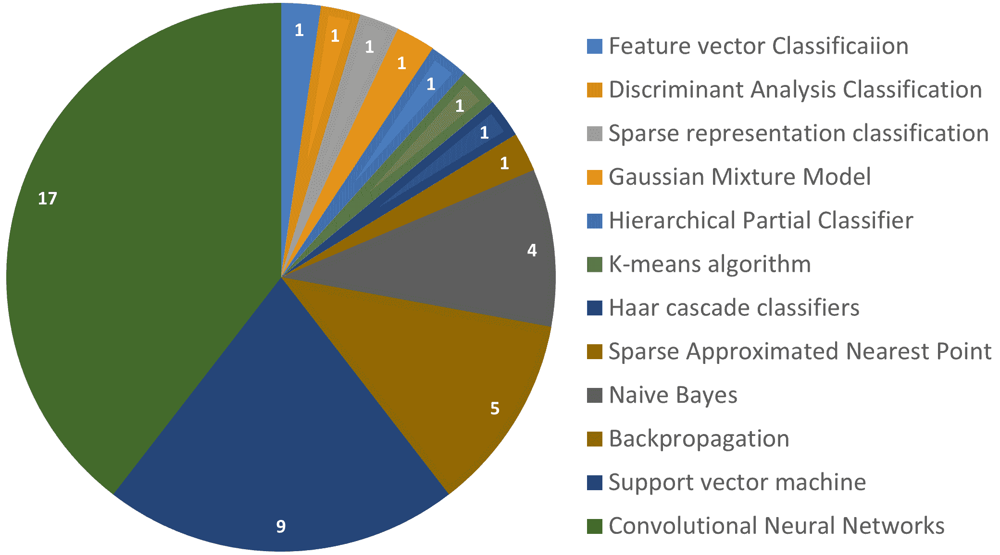

<!--yml

category: 未分类

date: 2024-09-06 19:47:43

-->

# [2203.06951] 水下栖息地的鱼类分类的计算机视觉和深度学习：一项调查

> 来源：[`ar5iv.labs.arxiv.org/html/2203.06951`](https://ar5iv.labs.arxiv.org/html/2203.06951)

\UseRawInputEncoding\corraddress

Mostafa Rahimi Azghadi 博士，澳大利亚昆士兰州汤斯维尔詹姆斯库克大学科学与工程学院\corremailmostafa.rahimiazghadi@jcu.edu.au \presentadd[]澳大利亚昆士兰州汤斯维尔詹姆斯库克大学科学与工程学院\fundinginfo 这项研究得到了澳大利亚研究培训计划（RTP）奖学金以及澳大利亚研究理事会通过其工业转型研究计划的资助。

# 水下栖息地的鱼类分类的计算机视觉和深度学习：一项调查

Alzayat Saleh，澳大利亚昆士兰州汤斯维尔詹姆斯库克大学科学与工程学院 Marcus Sheaves，澳大利亚昆士兰州汤斯维尔詹姆斯库克大学科学与工程学院 Mostafa Rahimi Azghadi，澳大利亚昆士兰州汤斯维尔詹姆斯库克大学科学与工程学院 ARC Research Hub for Supercharging Tropical Aquaculture through Genetic Solutions，澳大利亚昆士兰州汤斯维尔詹姆斯库克大学

###### 摘要

海洋科学家利用远程水下图像和视频记录来调查鱼类在其自然栖息地中的物种。这有助于他们更接近地了解和预测鱼类对气候变化、栖息地退化和捕捞压力的响应。这些信息对于开发人类消费的可持续渔业以及环境保护至关重要。然而，庞大的视频数量使得从中提取有用信息对于人类而言是一个令人望而却步和耗时的任务。解决这一问题的一个有前途的方法是先进的深度学习（Deep Learning (DL)）技术。DL 可以帮助海洋科学家迅速有效地解析大量视频，解锁传统手动监测方法无法获得的精细信息。在本文中，我们首先对 2003-2021 年在水下栖息地对鱼类分类进行的计算机视觉（CV）和 DL 研究进行调查。然后，我们概述 DL 的关键概念，并分析和综合 DL 研究。我们还讨论了开发水下图像处理的 DL 时所面临的主要挑战，并提出了解决方法。最后，我们对海洋栖息地监测研究领域提供了见解，并展望了水下图像处理的 DL 的未来。本文旨在向希望对 DL 的基本概念有高层次了解并调查水下栖息地的最新 DL 鱼类分类的海洋科学家提供信息。

###### 关键词： 

鱼类栖息地、监测、计算机视觉、深度学习

## 术语

| AI | 人工智能 |
| --- | --- |
| ANN | 人工神经网络 |
| AUV | 自主水下车辆 |
| CNN | 卷积神经网络 |
| CV | 计算机视觉 |
| DL | 深度学习 |
| DNN | 深度神经网络 |
| FCN | 完全卷积网络 |
| LSTM | 长短期记忆 |
| ML | 机器学习 |
| OCR | 光学字符识别 |
| RNN | 循环神经网络 |
| ROV | 遥控操作车辆 |
| RUV | 远程水下视频 |

## 1 引言

理解和建模鱼类如何响应气候变化、栖息地退化和渔业压力对于环境保护至关重要，也是确保自然渔业可持续的关键步骤，以支持日益增长的人类消费[138]。有效的监测是支撑决策支持机制的一个重要第一步，用于识别问题和规划行动，以保护和恢复栖息地。然而，海洋生态系统的复杂性与现有的监测机制之间仍存在差距。

海洋科学家使用水下摄像机记录、建模和理解鱼类栖息地和行为。水下远程视频（RUV）记录在海洋应用中[138]显示出对渔业、生态系统管理和保护计划的巨大潜力[95]。随着消费级高清摄像机的引入，现在可以部署大量的 RUV 或自主水下车辆（AUV）来收集大量数据，并进行更有效的监测[97, 102, 125]。然而，水下栖息地带来了多种视频监测挑战，如不良的水质条件、鱼类物种之间的高度相似性、混乱的背景和鱼类之间的遮挡。此外，部署的 RUV 和 AUV 生成的数据量迅速超过了人类视频观众的容量，使得视频分析变得过于昂贵[58]。此外，人类比精心设计的机器中心监测算法更容易出错。因此，自动化的全面监测系统可以显著降低劳动成本，同时提高产出和准确性，从而提高对鱼类数量、分布和生物多样性的估计精度[37]。实施此类系统需要有效的计算机视觉（CV）过程。因此，已经进行了大量研究，以基于 CV 算法开发监测工具和技术，确定鱼类如何利用各种海洋环境以及区分鱼类物种[142]。

图 1：四种典型计算机视觉任务的示意图 从左：图像分类（即图像中是否有鱼，或图像中是什么类型（类别）的鱼？）、物体检测/定位、语义分割、实例分割。

在图像分析和计算机视觉领域，深度学习（DL）方法在从农业[88]到医学[108, 5]的各种应用中一贯产生了最先进的结果，使用了深度神经网络[140, 81, 83]。值得注意的是，视频本质上由图像或帧组成，这些图像通过图像分析技术进行处理。因此，基于图像和视频的监测任务可以使用 DL 模型，如卷积神经网络，这些网络以图像（帧）作为输入。因此，用于图像任务的方法也适用于图像和视频。

许多基于 DNN 的方法在海洋应用中超越了传统方法，包括生态和栖息地监测，使用视频陷阱数据[134, 121]。深度学习（DL）是一种通过对输入数据进行持续分析来模仿人类知识获取的技术。过去十年 DNN 成功的主要驱动因素包括计算机科学家大社区的架构进展、更强大的计算机和处理器以及对大量数据的访问，这对开发成功的通用 DL 应用至关重要。

DNN 在许多计算机视觉（CV）应用中得到了成功应用，如物体分类、识别和分割，这要归功于卷积神经网络（CNN）的发明。CNN 是一类 DNN，最常用于视觉分析。例如，CNN 已成功用于鱼类栖息地的分析[136, 58, 97]。与其他图像识别算法相比，CNN 的显著优势在于它们只需有限的预处理。CNN 不是手工设计的，而是自主发现和学习数据中的隐藏特征。它们逐层学习，具备不同层次的抽象能力。例如，它们在前几层学习简单的形状（边缘、线条等），在后续层理解更复杂的模式，并在最终层学习物体类别。

一个假设性的挑战是，卷积神经网络（CNNs）需要大量的图像来进行充分的训练，并将其学习推广到未见过的场景中。另一方面，CNNs 具有一个有趣且强大的特性，使得它们能够将其学习和知识转移到不同的领域。这意味着它们可以被微调以适应新的数据集（例如鱼类数据集），而不是它们已经训练过的数据集（例如一般物体）。然而，使用特定领域的标注数据集进行微调意味着需要花费成本/精力/时间来生成标注，并且还需要更大规模的数据集，这些数据集可能并不总是可用的。

为计算机视觉算法提供 CNNs 强大的学习和推理能力，可以为海洋科学家和生态学家提供强有力的工具，帮助他们更好地理解和管理海洋环境。然而，尽管深度学习及其变体如 CNNs 已被应用于各种领域的多个应用[25, 92, 82]，它们在海洋科学和鱼类栖息地监测中与计算机视觉结合的使用并不被广泛认可，这意味着它们仍然未被充分利用。为了解决这个问题，本文介绍了深度学习的关键概念和典型架构，并提供了针对水下鱼类栖息地监测的关键计算机视觉技术的全面调查。此外，我们还提供了水下鱼类栖息地监测领域中的挑战和机遇的见解。值得注意的是，我们的文章旨在为海洋科学家提供一个一般性和高层次的介绍，而不是详细的介绍，这对于理解后续关于深度学习在水下鱼类分类中的应用讨论是有用的。

尽管最近的调查回顾了用于海洋生态学的深度学习技术[35]，并简要讨论了基于深度学习的鱼类图像分析，但据我们所知，目前尚无专门针对水下栖息地鱼类分类的深度学习的全面调查和综述。我们的论文试图填补这一空白，促进现代深度学习方法在挑战性的水下鱼类图像分析和监测领域的应用。我们通过全面回顾和分析文献，提供有关深度学习模型的使用情况、其训练数据集、标注技术、性能以及与其他类似工作的比较。这种详细的分析在[35]中并未提供。

此外，还有另一项调查[71]专注于分类、检测、计数、行为识别和生物量估计五个不同任务。与[71]相比，我们提供了不同的分析和文献回顾，因为我们主要关注水下图像中的鱼类分类。李和杜的工作[71]主要适用于水产养殖领域，而我们的论文主要回顾了“水下栖息地中的鱼类分类技术”及其带来的挑战。李和杜介绍了多种不同的 DL 架构背景，其中一个是 CNN，这也是我们论文的重点。此外，李和杜介绍的挑战和机遇与我们的论文不同，我们的论文主要关于其自然栖息地中的水下鱼类分类。

此外，我们提供了使用水下相机进行鱼类分类的 CV 和 DL 研究的历史回顾，并分析了它们的准确性如何随时间演变。这些内容未被包括在先前的研究中[35、71]。

## 2 计算机视觉与机器学习背景

人类具有自然理解周围世界三维结构的能力。视觉科学家[89]已经花了几十年试图理解人类视觉系统如何运作[131]。受到他们研究结果的启发，CV 研究人员[7、44、117]也在致力于从照片中恢复物体的 3D 形状和外观。从单张图像或图像集合中自动检索、解释和理解有用信息的过程被称为 CV。另一个定义是，CV 是人工智能（AI）的一个领域，专注于训练计算机以类似于人类的方式检测、识别和理解图像。这需要为自动视觉理解发展逻辑和算法基础[77]。这种理解可以包括图像分类、物体定位、物体识别、语义分割和实例分割，如图 1 所示。如今，具备 CV 能力的计算机可以从单张图像或图像序列中提取、分析和解释重要信息。

尽管取得了这些进展，但让计算机理解图片的水平与两岁小孩相当的目标仍然无法实现。这部分原因在于计算机视觉（CV）是一个逆向问题，我们试图在知识不足以完全描述解决方案的情况下恢复特定的未知量。在计算机视觉应用中，原因通常是一个探索过程，而效果是观察到的数据。相应的正向问题则包括在完全了解探索过程的情况下预测经验数据。从某种意义上讲，解决逆向问题意味着*向后计算*，这通常比正向问题解决更困难[38]。

图 2：机器学习（ML）与深度学习（DL）的比较。在机器学习技术中，特征需要由领域专家提取，而深度学习依赖于人工神经网络的层来提取这些特征。

60 多年前，机器学习技术的引入缓解了逆向计算的问题。然而，在传统的机器学习方法中，大多数复杂的学习特征必须由领域专家识别，以减少数据的复杂性，使模式更加明显，从而成功学习（参见图 2-top）。然而，深度学习提供了一种根本上新的机器学习方法。大多数深度学习算法具有自动从数据中学习高级特征的突破性能力，几乎不需要或无需人工干预（参见图 2-bottom）。

深度学习（DL）基于神经网络，神经网络是通用函数，能够学习几乎任何可以通过多个实例表示的数据类型。当你将大量标记实例的特定类型数据输入到神经网络中时，它将能够揭示这些示例之间的共同模式，并将其转化为数学方程，帮助对未来的数据进行分类。在这一基本特性的驱动下，深度学习和深度神经网络（DNN）由于硬件和云计算资源的进步，从理论转向了实践[5]。近年来，深度学习方法在各种领域中超越了以往的最先进的机器学习技术，其中计算机视觉是最显著的例子之一。

在引入深度学习（DL）之前，计算机视觉的能力受到严重限制，需要大量的手动编码和工作。然而，由于深度学习和神经网络研究的进展，计算机视觉现在能够在与对象识别和分类相关的多个任务中超越人类 [110、109、100、120]。配备深度学习的计算机视觉今天被广泛应用于各种实际应用中，包括但不限于：

+   •

    光学字符识别（OCR） [94]：自动车牌识别和读取信件上的手写邮政编码；

+   •

    机器检测 [91]：利用立体视觉和先进照明进行组件的快速质量保证检测，以评估飞机机翼或汽车车身部件的公差水平，或使用 X 射线技术检测钢铸件中的缺陷；

+   •

    零售 [126]：自动结账通道的物体检测；

+   •

    医学影像 [29]：术前和术中影像的配准或对人脑解剖结构随年龄变化的长期分析；

+   •

    汽车安全 [30]：检测街道上意外出现的物体，例如行人（如完全自主驾驶车辆）；

+   •

    监控 [14]：监控入侵者、高速公路交通研究以及监控游泳池以防溺水；

+   •

    指纹识别和生物识别 [56]：用于自动入场认证和法医软件。

这展示了深度学习对计算机视觉的显著影响，并展示了其在海洋视觉分析应用中的潜力。

图 3：展示了一种名为 UNET 的流行 CNN 架构 [104]。UNET 的第一个组件是编码器，用于从输入图像中提取特征。第二个组件是解码器，它输出每个像素的分数。该网络由五个不同的层组成，包括卷积层（Conv Layer）、修正线性单元（ReLU）、池化层、反卷积层（DeConv）和 Softmax。这里，DNN 层的任务是仅对输入图像中属于鱼体的像素给出高分，从而产生所示的白色斑块输出，显示鱼的位置。

## 计算机视觉方法在鱼类分类中的演变

过去二十年见证了新型计算机视觉方法在鱼类分类中的出现，这些方法包括设计和评估复杂的算法，这些算法在数据量足够大以及使用强大的图形处理单元（GPU）之前无法应用，但现在已变得可能。在这里，我们对计算机视觉应用的发展及其不同方法在过去二十年的演变进行了系统的文献综述。

### 3.1 搜索和选择标准

我们系统地回顾了 2003 年至 2021 年间使用计算机视觉进行水下鱼类分类的文献。使用的检索词包括“水下鱼类分类”、“深度学习”、“计算机视觉”、“机器视觉”。检索的数据库包括 Wiley Online Library、IEEE Xplore、Elsevier/ScienceDirect 和 ACM Digital Library。我们认为结合这四个数据库可以准确代表这一主题的全球研究。

我们将检索过程分为两个阶段。首先，我们在数据库中查询了标题和内容中包含上述关键词的文章。其次，我们独立审阅了每篇文章的标题和摘要，以检查其与我们的研究主题的相关性。在个别标题和摘要审阅后，我们考虑了 64 篇文章进行全文阅读。在全文阅读阶段，我们提取了与我们研究主题相关的信息。在这一阶段，显然有 21 篇论文与我们的工作不相关，因此被排除。这使我们剩下 43 篇关于鱼类分类的论文，其中 26 篇为经典计算机视觉方法，17 篇为深度学习论文。图 4 展示了所识别研究中使用的方法，并将其分类为几组，基于其分类算法，这些算法可以分为传统的 CV 和现代的 DL 模型。

图 4：2003 年至 2021 年间使用不同计算机视觉技术进行鱼类分类的方法概述。从图中可以明显看出，深度学习及其卷积神经网络（CNN）比经典的机器学习方法吸引了更多的关注。

图 5：2003 年至 2021 年间，鱼类分类计算机视觉（CV）和深度学习（DL）模型的出版趋势和性能概述。这里的条形图显示了多年来累计的出版数量及其增长，而折线图展示了文献中每年的最高分类准确率，位于右侧纵轴。

### 3.2 两十年来鱼类分类算法的演变

鱼类分类研究的出版趋势总结见图 5。图中展示了出版物的累计数量以及过去二十年来研究的发展情况。显然，出版物的数量逐渐增加，但在 2016 年，当最初几项使用深度学习结合计算机视觉方法的研究出现时，研究数量出现了最大增幅，并且在深度学习在鱼类分类中兴起后的几年（2015-2019）经历了快速的上升轨迹，然后开始放缓。

图 5 还显示了每年达到的最高分类准确率，作为质量评估指标。显然，自 2016 年首次提出深度学习技术用于鱼类分类以来，准确率达到了最高值。同时可以看到，不同年份的准确率存在较大差异。这些差异的主要原因包括（i）使用了不同的分类和计算机视觉方法，和（ii）使用了不同的鱼类图像来源，这些图像在捕捉方式和环境上存在差异。这些因素导致了研究之间的巨大变异，例如不同的图像分辨率以及时间上的分辨率和图像质量的不一致。例如，一些鱼类图像数据集是灰度的[19, 20, 55]，而其他数据集是彩色的[144, 143, 113]。一些数据集仅包含图像[46, 55]，而其他数据集包括视频[74, 22, 39]。另外，一些数据集[43]使用了来自互联网的低质量图像，这些图像由于分辨率、颜色和角度的广泛变化，对准确性产生了负面影响。这些图像也是在随机地点拍摄的。由于这些各种研究中的因素，直接比较准确率值是不切实际的，但准确率的趋势仍然可以在图 5 中观察到。

在 2000 年代初至 2016 年，计算机视觉用于鱼类分类主要是通过手动提取鱼类特征，然后构建识别这些特征的分类器。这些传统研究按时间顺序列在表 1 中。虽然存在许多模型，但大多数经典的非深度学习模型基于局部和工程特征。这些包括使用 Haar 特征[84]、尺度不变特征变换（SIFT）[72]和方向梯度直方图（HOG）[23]的研究，这些方法需要手工设计的算法。由于这些算法不适合识别未经训练的动物图像，并且无法从复杂背景中捕捉鱼类特征，它们通常使用大量手工提取的样本来构建分类器。

如表格 1 所示，支持向量机 [105, 42, 31, 43, 20, 87, 39, 132, 46] 是鱼类识别中最常用的分类器之一，但在用样本过多时容易过拟合。这一问题限制了应用规模。早期工作中另一种常用的分类技术是反向传播，用于训练简单的前馈浅层神经网络 [4, 3, 98, 6, 13]。虽然该技术可以处理简单样本，但由于神经网络的浅层结构，难以扩展，这将在下一节中解释。朴素贝叶斯 [85, 143, 144, 55] 自 2000 年代初至 2017 年也被用于鱼类分类。这种技术不需要大量的训练数据，且如表格 1 所示，可以达到良好的准确性水平。表格 1 还展示了一些其他计算机视觉分类技术，虽然它们不像上述方法那样流行，但也能表现出良好的性能。然而，需要注意的是，表格 1 中的大多数计算机视觉技术都是针对其目标数据集精心设计的，如果用于其他类似的数据集，则可能无法表现出类似的性能。它们可能需要从手动特征工程到设计详细的分类模型等方面进行全面的调整。

相比之下，深度学习可以自动提取特征并执行分类任务。这些特征对数据缩放、平移、旋转和失真具有不变性。由于这些特征更适合分类，分类性能通常优于使用手工设计特征的传统计算机视觉任务。此外，与传统的计算机视觉方法相比，深度学习分类模型通常需要更简单的重新设计程序来处理新的相似数据集，因为它们能够自主提取特征。

尽管深度学习于 2012 年出现 [62]，但其首次用于水下鱼类分类是在 2016 年 [109]。之后，另外 16 项工作也使用了深度学习及其卷积神经网络，如图 4 所示，开发了从大量数据中学习特征的模型，而无需人工干预。这些研究表明，通过使用深度学习，一些常见的鱼类图像分类挑战，如图像噪声减少、难度大或稀有鱼类的分类，以及小鱼的分类，可以得到解决。

在本文的后续部分，我们主要关注深度学习，它的工作原理以及如何应用于开发高效且高性能的水下鱼类分类器。我们还将批判性地分析作为我们系统文献综述一部分发现的 17 个深度学习研究。

表 1：2003-2021 年间使用传统分类器和基于工程特征的水下鱼类分类的计算机视觉研究列表。最后一列展示了工作的准确率。

| 文章 | 年份 | 分类方法 | 准确率 |
| --- | --- | --- | --- |
| 自动鱼类物种分类和迁徙监测系统 [70] | 2003 | 特征向量分类 | 92 |
| 确定鱼类分类任务的适当特征集 [85] | 2005 | 朴素贝叶斯 | 90 |
| 实时水下可食用鱼种分类 [143] | 2006 | 朴素贝叶斯 | 98 |
| 一鱼、两鱼、黄油鱼、号角鱼：识别水下视频中的鱼 [105] | 2007 | 支持向量机 | 90 |
| 通过计算机视觉分类孔雀鱼（Poecilia reticulata）的性别 [144] | 2008 | 朴素贝叶斯 | 96 |
| 自动鱼类分类用于水下物种行为理解 [118] | 2010 | 判别分析分类 | 92 |
| 基于神经网络的从尺寸和形状测量中提取鲁棒特征的鱼类识别 [4] | 2010 | 反向传播 | 86 |
| 基于颜色特征签名的鲁棒特征提取的鱼类分类使用反向传播分类器 [3] | 2011 | 反向传播 | 84 |
| 基于颜色、纹理和多类支持向量机的鱼类物种分类，使用计算机视觉 [42] | 2012 | 支持向量机 | 97 |
| 使用稀疏表示进行现实世界水下鱼类识别和鉴定 [40] | 2013 | 稀疏表示分类 | 81 |
| 使用水下摄像头视频进行长期连续鱼群分析的研究工具 [10] | 2013 | 高斯混合模型 | 97 |
| 基于机器学习技术的尼罗罗非鱼自动分类方法 [31] | 2013 | 支持向量机 | 94 |
| 基于形状和纹理的鱼类图像识别系统 [98] | 2013 | 反向传播 | 90 |
| 一种使用元启发式算法和反向传播分类器的通用鱼类分类方法 [6] | 2014 | 反向传播 | 80 |
| GMM 改进了鱼类识别中的层次分类的拒绝选项 [43] | 2014 | 支持向量机 | 74 |
| 用于水下鱼类物种识别的监督和非监督特征提取方法 [19] | 2014 | 层次部分分类器 | 93 |
| 用于水下鱼类图像的特征学习和物体识别框架 [20] | 2015 | 支持向量机 | 98 |
| 一种用于基于视频的物体分类的地面真实数据生成新工具 [74] | 2015 | K-means 算法 | 93 |
| 使用 Haar 级联和新的图像数据集（标记的野生鱼类）在不受约束的水下视频中自动检测岩鱼 [22] | 2015 | Haar 级联分类器 | 89 |
| 使用支持向量机进行鱼类分类 [87] | 2015 | 支持向量机 | 79 |
| 从不受控水下环境中拍摄的视频中识别鱼类 [113] | 2016 | 稀疏近似最近点 | 94 |
| 水下视频中的鱼类活动追踪与物种识别 [39] | 2016 | 支持向量机 | 91 |
| 基于 HSV 颜色空间的锦鲤分类 [55] | 2016 | 朴素贝叶斯 | 97 |
| 使用部件统计的光学鱼类分类 [13] | 2016 | 反向传播 | 95 |
| 使用双层代码本学习进行细粒度鱼类识别的收缩编码 [132] | 2017 | 支持向量机 | 98 |
| 使用混合特征和 SVM 分类器对孟加拉国土著鱼类进行分类 [46] | 2019 | 支持向量机 | 94 |

## 深度学习背景

深度学习（DL）[34, 68] 是机器学习（ML）算法的一个子集，它通过使用具有多层的神经网络来非常松散地模拟人脑的功能，使其能够从大量数据中“学习”。这种学习发生在神经网络从输入训练数据中提取更高层次的特征时。术语“深度”指的是神经网络中使用了多个层次。较低的层次，例如在图像处理中的层次，可能检测到边缘，而较高的层次可能识别对象的部分。

### 4.1 深度学习与机器学习的区别

机器学习（ML）通常被称为能够识别数据模式并自动创建预测模型的一类算法。深度学习（DL）是标准 ML 的一个子类，因为它使用与 ML 相同类型的数据和学习方法。然而，在处理非结构化数据时，例如文本和图像，ML 通常需要经过一些预处理，以将数据转换为结构化格式进行学习。相反，DL 通常不需要 ML 所需的数据预处理。它能够识别和分析非结构化数据，并自动进行特征提取，从而显著减少对人工知识的需求（见图 2-底部）。

例如，要在图像中识别鱼类，ML 需要明确地定义特定鱼类特征（如形状、颜色、大小和模式），这些特征以像素模式的形式表示。这对于非 ML 专家可能是一个挑战，因为这通常需要深入的领域知识和良好的编程技能。而 DL 技术则完全跳过了这一过程。通过使用通用学习技术，DL 系统可以自动识别和提取数据中的特征。这意味着我们只需要告诉 DL 算法图像中是否存在鱼类，给定足够的示例，它将能够弄清楚鱼类的样子。将数据分解为具有不同抽象层次的层，使算法能够学习定义数据的复杂特征，从而实现自动学习方法。DL 算法可能能够确定哪些特征（如鱼尾）在区分不同动物时最为重要。在 DL 出现之前，这种特征层次结构需要由 ML 专家手动确定和创建。

### 4.2 深度学习如何工作

深度神经网络（DNN），也称为人工神经网络，是深度学习的基础。DNN 通过适当地检测、分类和特征化给定数据集中的对象，使用数据输入、权重和偏置的组合来学习数据。DNN 由多个连接的节点层组成，每一层都提高和优化了网络的预测或分类能力。例如，图 3 展示了一种用于图像处理的流行 DNN 架构，称为 UNET [104]。UNET 是一个相当复杂的深度学习架构，由几个不同的组件和层组成，旨在实现一个特定的学习目标，即在输入图像中分割鱼体。

任何深度神经网络（DNN）由三种类型的层组成，即输入层、输出层和隐藏层。可见的层是输入层和输出层（见图 6）。深度学习模型在输入层接收数据进行处理，最终的预测或分类在输出层生成。在典型的神经网络中，包括 DNN，学习通过两个一般过程进行，即前向传播和反向传播。前向传播指的是输入数据通过网络层传播以生成预测或分类结果。反向传播，简称反向传播，是网络学习发生的地方。反向传播使用训练模型来确定预测错误，然后通过反向传递的方式改变神经网络的权重和偏置。前向传播和反向传播共同工作，使神经网络能够生成预测并减少网络错误。通过多次前向传播和反向传播迭代，神经网络的预测或分类准确性得到提高。

几乎所有 DNN 都基于上述相同的原理进行工作。然而，不同的深度学习网络和架构用于解决不同的任务。例如，CNNs 通常用于计算机视觉和图像分类应用中，可以识别图像中的特征和模式，从而完成对象检测和识别等任务。然而，对于具有不同性质的任务，如自然语言处理、语音识别或时间序列预测 [49]，常常使用递归神经网络（RNNs）。尽管它们的架构有所不同，许多深度学习技术都使用监督学习的概念来处理输入数据并完成不同的任务。

图 6：一个单层神经网络的示意图，由输入层、隐藏层和输出层组成。

### 4.3 监督学习

监督学习是一种用于寻找和优化将输入映射到其对应输出的函数的方法，也称为训练样本[61]。监督学习使用基于人工标注的训练数据集，这些数据集由人工观察者或“监督者”准备，因此得名。

监督学习的目标是生成一个推断函数 $f$，该函数映射到训练样本，然后可以用于映射到训练样本之外的新样本。为了完成任何一般任务，计算机可以被编程找到函数 $f$ 以将 $X$ 映射到 $Y$，即（$f:X\mapsto Y$），其中 $X$ 是输入域，$Y$ 是输出域。例如，在图像分类任务中，$X$ 是图像数据集，$Y$ 是一组对应的分类标签，决定图像数据集中是否存在一个对象。

要确定能够识别图像中鱼类的函数 $f$，例如，使用深度学习（DL）的一种解决方案是进行特征工程。然而，通常很难执行这一操作，即根据训练数据集中的领域知识手动挑选鱼的特征。此外，大多数情况下，手动挑选的特征需要被修剪以减少其像素维度。相比之下，收集大量的 $(x,y)\in X\times Y$ 数据集以寻找映射函数 $f$ 通常更为可行，这相较于直接的特征工程，提供了监督学习的优势。具体来说，在鱼类分类任务中，收集了一大批鱼类图像数据集，其中每张图像 $x$ 都用 $y$ 标记，显示鱼的存在与否，而无需手动挑选其特征。

主要的监督学习方法之一是训练神经网络，这是深度学习的基础，特别是用于计算机视觉应用如鱼类图像处理。因此，我们将接下来的子节专门用于神经网络及其基本工作原理。

### 4.4 神经网络

“神经网络”[21]是一个计算机程序，其最初的构思是模仿构成大脑灰质的实际脑神经网络。计算机的神经网络，即人工神经网络，通过使用大量数据来“学习”执行特定任务，通常是通过不涉及任何任务特定规则的监督网络训练。如简要提到的，神经网络由三种类型的层构成：输入层、隐藏层或潜在层和输出层（见图 6）。这些层中包含处理神经元（图 6 中的彩色圆圈）以及它们之间的连接突触（权重）（图中的边）。

输入层是网络的门户。它从外部数据提供信息给网络，并且在此层中不进行任何计算。相反，输入节点将信息传递给隐藏层。此层对外界不可见，作为输入的抽象，与神经网络结构无关。隐藏层（层）处理从输入层接收的数据，并将结果传递到输出层。最后，输出层将网络所学到的信息带到外部世界。

神经网络中的学习是通过最小化损失函数来实现的。通常，损失函数是一个返回标量值的函数，用于表示网络执行特定任务的效果。例如，在图像分类中，网络期望正确地将所有包含鱼的图像分类为鱼，将所有不包含鱼的图像分类为非鱼，损失值为零。在学习过程中，网络接收大量输入数据，例如成千上万的鱼类图像，并最终学会最小化预测输出与真实目标值之间的损失。在监督学习的情况下，这些真实目标值提供给网络，以寻找上一节中描述的函数 $f$，以最小化损失函数。这种最小化通过使用诸如随机梯度下降（SGD）[75]等算法来优化 $f$，帮助找到最小化损失的网络权重/参数。

图 7：池化层的示意图：（左）从形状为$224\times 224\times 1$的表示块中空间下采样得到的新表示，形状为$112\times 112\times 1$。（右）池化层的类型（最大池化和平均池化）。

### 4.5 卷积神经网络

CNN 可能是最常用的人工神经网络。它们在计算机视觉领域一直是主要的深度学习工具，并且被广泛应用于水下海洋栖息地监测 [107]。CNN 的设计灵感来源于人脑皮层的神经元结构，但规模要小得多 [111]。CNN [69] 特别设计用于处理具有某些空间或拓扑特征的数据集（例如图像、视频），其中每个神经元的布置方式使得它们重叠，从而对视觉领域中的多个点做出反应。CNN 神经元是对人脑神经元的简单数学设计，利用这种设计并行转换输入和输出之间的非线性关系。CNN 中有两种主要的层类型，即卷积层和池化层，它们生成特征图，详细说明见以下小节。

#### 4.5.1 卷积层

在这一层中，卷积过程（即将输入神经元的小矩阵与称为滤波器的小权重数组相乘）被应用于有限的领域（取决于滤波器的大小），以避免需要学习数十亿个权重（参数），如果一层中的所有神经元都连接到下一层的所有神经元，就会需要这些权重。通过卷积层的权重共享和与其对应特征图的滤波器的结合，避免了这种过度计算。在卷积操作中，将输入神经元的小矩阵与其同样大小的矩阵，即滤波器相乘。在卷积层中，这一卷积操作通过在整个输入神经元上滑动滤波器来进行，生成特征图。滤波器作用于输入的缩小区域（卷积核）。卷积层可以使用相同的卷积核大小，也可以使用不同的卷积核大小，这使得通过较少的参数从输入中提取复杂特征成为可能。此外，权重共享有助于避免模型过拟合，即记忆训练数据 [1]，同时减少计算内存需求，并提高学习性能 [60]。

#### 4.5.2 池化层

这一层用于减少输入特征的空间维度（非深度），并通过减少具有指定空间大小的表示的数量来增加避免过拟合的控制。池化操作可以通过两种不同的方式进行，即最大池化和平均池化。在这两种方法中（见图 7），通过取 4 个像素中的最大值并将其下采样为一个像素来缩小输入图像的大小。池化层在传统 CNN 架构中的卷积层之间系统地实施。池化层对每个通道（激活图）单独操作，并在空间上对其进行下采样。通过减少空间信息，池化层使 CNN 更具计算效率。

#### 4.5.3 特征图

特征图，也称为激活图，是对前一层图像应用卷积滤波器或特征检测器的结果。滤波器以指定数量的像素在前一层上移动。例如，在图 8 中，有 37 个大小为 $3\times 3$ 的滤波器以步长 1 移动于输入图像，并产生 37 个特征图。

CNN 层的绝大多数是卷积层。这些层用于对图像的不同部分应用相同的卷积滤波操作，从而创建出可以用于检测特征的*神经元*，例如边缘和角落。卷积层中的每个神经元通过一组权重与前一层的特征图或输入层图像连接。特征图有助于可视化 CNN 正在学习的特征，从而理解网络学习过程，如图 8 所示。

## 5 深度学习在鱼类栖息地监测中的应用

在最近出版的国际海洋探索委员会 (ICES) 海洋科学期刊的特刊 "机器学习和人工智能在海洋科学中的应用" [99] 中，展示了深度学习和 CNN 的许多应用。这些应用包括识别捕捞鱼类的物种 [76]、分析渔业监控视频 [32] 和自然死亡率估计 [73]。其他已发表的工作则使用 CNN 进行其他海洋应用，如自动船只检测 [18] 和深海矿产资源勘探分析 [54]。然而，在本文中，我们重点关注 CNN 在计算机视觉任务中的应用。

这些任务主要旨在从水下视频和图像中提取知识。尽管最近已使用卷积神经网络（CNN）进行各种视觉分析任务，如分割 [33, 2, 47, 139]、定位 [119, 51, 57] 和计数 [124, 112, 28]，但在水下鱼类栖息地监测中，最常见且研究最广泛的计算机视觉任务是分类。因此，本文主要集中在水下鱼类图像的分类上。我们调查了一些最新的鱼类分类研究，并对这些研究进行了高层次的技术讨论。

分类任务定义为将输入样本分类到不同的类别中，通常基于二分类中某一对象/类别的存在或缺失；或者在多类别分类中，基于属于不同类别的多个不同对象的存在 [48]。同样，图像分类则涉及根据图像中的对象为整个图像分配标签。可以设想，当图像中存在鱼时，可以将其标记为鱼，若无鱼则标记为负样本。同样，不同物种的图像应自动分配到各自的类别中或赋予代表其类别的标签。

如果手动进行分类，这是一个困难的过程，因为图像可能需要被分类为多个类别。此外，可能有成千上万的图像需要分类，这使得任务非常耗时且容易出错。因此，自动化可以帮助更快、更高效地完成分类任务。

图 8：用于分类任务的卷积神经网络（CNN）特征图示意图。特征图是输入图像的二维表示。这里 $(3\times 3)$ 是滑过整个图像以生成特征图的滤波器的大小。

在鱼类和海洋栖息地监测的背景下，计算机视觉（CV）提供了一个低成本、长期且非破坏性的观察机会。使用深度学习对 CV 收集的海洋栖息地图像进行的初步任务之一是鱼类分类，这是一切智能鱼类监测系统的关键组成部分，因为它可能会激活对鱼类图像的进一步处理。然而，基于图像和视频处理的水下监测面临许多挑战，这些挑战与鱼类图像收集时的恶劣条件相关。这些挑战包括由于光线不足和水体浑浊导致的水下图像质量差，从而导致分辨率和对比度低。此外，在不受控制的环境中，鱼类的运动可能会造成失真、变形、遮挡和重叠。许多早期研究[11, 122, 26]尝试解决这些挑战。其中一些研究专注于在挑战存在的情况下，使用均值漂移算法[12]来正确提取传统的低级特征，如颜色和纹理。然而，与深度学习方法相比，这些研究并不十分成功。

随着卷积神经网络（CNN）的出现，许多研究人员利用它们来提取输入图像的高级和低级特征。这些特征可以被 CNN 自动检测，携带丰富的语义信息，可以用于识别图像中的物体。此外，CNN 具有应对上述挑战的能力。因此，它们目前是文献中用于鱼类分类的主要水下图像处理工具，如表 2 和表 3 所示。这些表格列出了一些最新的分类工作，同时提供了所使用的深度学习模型和模型实施框架的详细信息。它还提供了数据源的信息，以及数据及其标签的预处理，同时报告分类准确率（CA）和与其他方法的简要比较（如果所评审的工作提供了这些信息）。比较不同分类方法时的主要指标之一是其 CA，它定义为网络正确预测的百分比。

|  | $CA=(TP+TN)/(TP+TN+FP+FN),$ |  | (1) |
| --- | --- | --- | --- |

其中 TP（真正例）和 TN（真负例）表示正确分类实例的数量，而 FP（假正例）和 FN（假负例）表示错误分类实例的数量。对于多类分类，CA 在所有类别中进行平均。

DL 算法在不同应用中的准确性不断提高。然而，它们也存在固有的局限性，在为特定应用选择 DL 算法之前应加以考虑。这是因为在鱼类分类任务中，例如，由于训练和测试样本的分布，准确性可能与真实准确性有显著差异。为了解决分类准确性的局限性，接收操作特性（ROC）[63]和曲线下面积（AUC）[52]被广泛作为标准度量，用于确定模型在二分类环境中的性能。它们的定义与准确性非常相似，但它们帮助我们理解分类器在给定分类阈值下产生正确输出的概率，包括期望的真正例和假负例。

表 2 和 3 中的工作可以分为两个主要类别。第一个类别涉及设计有效的 CNN，解决无约束、复杂且噪声较多的水下场景的挑战，而第二个类别则尝试解决通常存在的鱼类训练数据集有限的问题。

如前所述，在处理无约束的水下场景时，应该特别关注实施一种能够处理光强度变化、鱼的方向和背景环境以及各种鱼类之间形状和模式相似性的分类方法。为了克服这些挑战并提高分类准确性，已有多种方法被提出。在[128]中，作者使用了不同的激活函数来检验哪种最适合鱼类分类，而在[110]中，则研究了不同数量的卷积层和不同的滤波器大小。在[109]中，作者使用了一个层次特征组合的 CNN 模型，以学习特定物种的视觉特征，从而提高准确性。在另一项工作[100]中，使用了主成分分析于两个卷积层中，之后在非线性层进行了二进制哈希处理，在特征池化层中使用了块状直方图。此外，[120]中使用了单图像超分辨率方法来解决低分辨率图像的有限判别信息问题。此外，[17]使用了两个独立的分类分支，第一个分支旨在处理鱼的姿态和尺度变化并提取判别特征，而第二个分支则利用上下文信息准确推断鱼的类型。这些研究表明，根据环境类型和数据集中鱼类物种的相似性，应考虑并研究各种技术，以找到最佳的分类准确性。

如前所述，在野外数据收集有时非常困难且具有挑战性，因此，为了最大化训练的成功率，必须从项目开始时就考虑收集现场数据。这确保了收集的训练数据集具有良好的样本多样性，包括在不同环境条件下（如水体浑浊度和盐度）收集的样本，并且能够捕捉鱼类物种的相似性。数据集的多样性和全面性是模型在实际应用中达到高分类准确率的关键因素之一。数据增强是另一种重要的方法，通过增加数据集的大小和多样性来帮助提高分类准确性。数据增强的替代方法是迁移学习，但模型应始终进行微调以适应新数据集，以最大化准确性。图像预处理是另一种可以帮助提高分类准确性的技术，处理新鱼类数据集时应予以考虑。

数据集限制，即鱼类图像数量有限，以及不同鱼类数量少等，是水下鱼类栖息地监测中普遍存在的挑战，特别是在鱼类分类中。[107、53、103、123]利用迁移学习解决了这一挑战。

迁移学习是一种机器学习方法，通过将学习一个问题或领域时获得的信息转移到不同但相关的问题或领域来工作。将一个随机初始化的分类器与一个在 ImageNet[106]上预训练的分类器进行比较，Saleh 等人[107]实现了$99\%$的鱼类分类准确率，显著优于随机初始化的分类器。这一发现表明，迁移学习可以将从 ImageNet 学习领域获得的信息带入鱼类分类领域，并且可以成为评估鱼类环境的有用且关键的方法。迁移学习还在[59]中使用，其中将一般领域的水上鱼类图像学习转移并用于水下鱼类分类。以相同的方式，为了训练能够生成合理结果的大规模模型，[141]收集了来自各种专业鱼类网站和 Google 引擎的 1000 个鱼类类别，共 54,459 张非约束图像。

除了迁移学习外，一些研究还开发了适应其应用的特定机器学习技术。例如，在之前的一项研究[116]中，使用了预训练的 CNN 作为通用特征提取器，以避免大量训练数据的需求。作者展示了通过将 CNN 提取的特征输入到支持向量机（SVM）分类器[96]中，可以实现鱼类分类的$94.3\%$的分类准确率，这显著优于单独使用 CNN 所得到的 53.5%的准确率。此外，[24]使用了[116]中的相同技术，实现了$98.79\%$的分类准确率。此外，[45]通过修改 AlexNet[62]模型的层数，开发了一种新的鱼类分类技术。此外，[58]通过增加 27,000 张水上和水下鱼类图像，提出了一种在小数据集上训练 CNN 鱼类检测器的高效标注方法。

CNN 有时能够在识别水下图像中的鱼类时超越人类表现。通过对 $900,000$ 张图像进行训练，Villon 等人 [129] 达到了 $94.9\%$ 的分类准确率，而人类的准确率仅为 $89.3\%$。这个结果主要是因为 CNN 能够成功区分被珊瑚或其他鱼类部分遮挡的鱼，而人类则无法做到。此外，[129] 中开发的最佳 CNN 模型在使用典型硬件（Titan X GPU）时，平均每条鱼的识别时间为 $0.06$ 秒。这表明深度学习技术可以以高效且经济的方式进行准确的水下鱼类分类。这有助于监测水下鱼类，并推进与鱼类生态相关的海洋研究。

如果深度学习方法要在鱼类分类等不同的海洋应用中广泛部署，则需要高效地实现它们，以便它们能够在低功耗的嵌入式系统上运行，这些系统可以在水下无人机等移动设备上实时运行。为此，Meng 等人 [80] 开发了一种带有全景摄像头的水下无人机，用于识别自然湖中的鱼类，以帮助保护环境。他们训练了一种高效的 CNN 进行鱼类识别，并在识别 115 张图像时仅需 $6$ 秒，达到了 $87\%$ 的准确率。这一有前景的结果表明，深度学习可以用于分类水下鱼类，同时满足移动监测设备的实时条件。此外，其他在农业等领域证明有效的减少功耗和提高分类任务速度的高效硬件设计方法 [66] 也可以在边缘水下处理器上采用。

在深度学习应用中，视频存储目前是一个瓶颈，可以通过实时算法来绕过，因为它们只需要在内存中存储部分视频帧，并在帧可用时就地处理。这消除了将所有帧存储和从内存中检索所需的时间。这在需要快速处理大量数据的情况下很有帮助，例如在水下鱼类观察摄像头中，帧不断收集，必须存储在本地或转移到水面，这两种方式都很昂贵且大多不可能。使用实时处理算法，可以处理帧并仅发送或存储获得的信息，即帧中的鱼类数量，这比整个帧要轻得多。

表 2：分类

| 文章 | 深度学习模型 | 框架 | 数据 | 注释/预处理/增强 | 类别和标签 | 性能指标 | 指标值 | 与其他方法的比较 |
| --- | --- | --- | --- | --- | --- | --- | --- | --- |
| 使用深度学习技术的鱼类类别识别 [128] | CNN | Keras, Tensorflow | 作者创建的数据集包含 560 张鱼类图像，其中 400 张用于训练，160 张用于测试。 | 每张图像被标记为鱼类种类名称 | 10 种不同鱼类的 10 个类别 | CA | 95% | NA |
| 不同 DL 结构在鱼类分类中的比较 [110] | CNN | Torch | 公开的 QUT 鱼类数据集包含 3960 张不同环境中的 468 种鱼类的图像。 | 每张图像被标记为鱼类种类名称 | 468 种不同鱼类的 468 个类别 | CA | 46.02% | NA |
| 基于 DL 的非约束水下环境中的鱼类分类 [109] | CNN | NA | 图像来自公开的 Fish4Knowledge 数据集（LifeCLEF 2014, LifeCLEF 2015） | 每张图像被标记为鱼类种类名称 | 25 种不同鱼类的 25 个类别 | CA | 96.75% | 与传统的 SVM 机器学习工具比较，该工具达到了 83.94% |
| Deep-Fish: 基于 DL 架构的准确水下活鱼识别 [100] | CNN | Matlab | 图像来自公开的 Fish4Knowledge 数据集 | 每张图像被标记为鱼类种类名称 | 23 种不同鱼类的 23 个类别 | CA | 98.64% | 与常规机器学习工具比较，基线方法达到了 93.58% |
| 从低分辨率水下图像中识别鱼类 [120] | CNN | NA | 93 个来自 LifeCLEF 2015 鱼类数据集的视频 | 每张图像通过绘制边界框并按种类名称标注 | 15 种不同鱼类的 15 个类别 | CA | 76.57% | 作者使用了传统的 Gabor 特征和稠密 SIFT 特征，分别生成了 38.28% 和 28.63% 的 CA。 |
| 基于 DL 的自动鱼类分类系统 [17] | CNN | NA | 八个目标类别：黄鳍金枪鱼、大眼金枪鱼、黄鳍金枪鱼、马鲛鱼、月鱼、鲨鱼、其他。 | 每张图像被标记为鱼类种类名称 | 8 种不同鱼类的 8 个类别 | CE | 0.578, 1.387 | 在 Kaggle 测试集的第 1 阶段排名第 17 位，第 2 阶段排名第 16 位。 |
| 评估 DL 算法用于水下视觉分析的现实鱼类栖息地数据集 [107] | ResNet-50 CNN | Pytorch | 作者创建的数据库包含来自热带澳大利亚偏远沿海海洋环境中的 20 个栖息地的 39,766 张图像 | 点级和语义分割标签 | 20 种不同鱼类的 20 个类别 | CA | 0.99 | NA |
| 深度学习在小样本量情况下的水下图像识别 [53] | CNN | Caffe | 图像来自公开的 Fish4Knowledge 数据集 | 每张图像被标记为鱼类种类名称 | 10 种不同鱼类的 10 个类别 | CA | 85.08% | NA |

| 使用 CNN 和 DL 进行水下鱼类物种分类 [103] | CNN | NA | 27000 张来自公开 Fish4Knowledge 数据集的图像 | 每张图像都被分配了鱼类物种名称作为标签 | 23 个鱼类类别 | CA | 96.29% | NA | 表 3：分类

| 文章 | DL 模型 | 框架 | 数据 | 注释/预处理/数据增强 | 类别和标签 | 性能指标 | 指标值 | 与其他方法的比较 |
| --- | --- | --- | --- | --- | --- | --- | --- | --- |
| 通过深度学习进行水下活鱼识别 [123] | AlexNet CNN | Matlab | 27000 张来自公开 Fish4Knowledge 数据集的图像 | 每张图像都被分配了鱼类物种名称作为标签 | 23 类 23 种不同的鱼类 | CA | 99.45% | NA |
| WildFish++：多媒体研究的综合鱼类基准 [141] | CNN | NA | 作者创建的数据集，包含来自各种专业网站和 Google 引擎的 54,459 张标注图像 | 每张图像都被分配了鱼类物种名称作为标签 | 100 类 1000 种不同的鱼类 | CA | 74.7% | 与其他先进方法进行比较 |
| 水下视频中的自动鱼类物种分类：利用预训练的 DNN 模型弥补标签数据不足 [116] | CNN | MATLAB | 数据集包含 2011 到 2013 年西澳大利亚 16 个物种的 50 到 120 个 10 秒视频片段。 | 每张图像都被分配了鱼类物种名称作为标签 | 16 类 16 种不同的鱼类 | CA | 89.0% | 将他们提出的 CNN+SVM 方法（CA 为 89.0%）与两个先前的工作进行比较；SRC（Hsiao 等 [41]) 49.1% 和 CNN（Salman 等 [109]) 53.5% |
| 使用深度学习技术进行水下鱼类物种识别 [24] | CNN | Keras, Tensorflow | 35000 张来自公开 Fish4Knowledge 数据集的图像 | 每张图像都被分配了鱼类物种名称作为标签 | 23 类 23 种不同的鱼类 | CA | 98.79% | NA |
| 使用深度卷积神经网络进行自动鱼类物种分类 [45] | 修改版 AlexNet CNN | Tensorflow | 图像来自两个公开数据集：QUT 鱼类数据集和 LifeClef-15 | 每张图像都被分配了鱼类物种名称作为标签 | 6 类 6 种不同的鱼类 | CA | 90.48% | 将他们提出的修改版 AlexNet（CA 为 90.48%）与原始 AlexNet（CA 为 86.65%）进行比较 |
| 使用弱多域监督进行水下鱼类检测 [58] | CNN | Keras, Tensorflow | 作者创建的数据集，包含 40000 张从视频序列中标注的鱼类图像 | 每张图像标注为鱼类或非鱼类 | 2 类 | CA | 99.94% | NA |
| 用于水下图像中准确快速识别珊瑚礁鱼类的深度学习方法 [129] | GoogLeNet CNN | Caffe | 作者创建的数据集包含来自马约特岛周围 50 多个珊瑚礁点的 450,000 张图像 | 注释包括在单个鱼周围画一个矩形，并将物种名称作为标签。 | 20 种鱼类的 20 个类别 | CA | 94.9% | 与人类专家的准确率比较。正确识别的比率为 94.9%，高于人类的正确识别率（89.3%）。 |
| 基于深度学习的水下无人机全景相机自动鱼类识别 [80] | CNN | NA | 作者创建的包含 100 张通过 Google 搜索引擎标记的图像的数据集 | 每张图像都分配了鱼类物种名称作为标签 | 4 种鱼类的 4 个类别。 | CA | 87% | NA |

## 6 个挑战及其应对方法

尽管深度学习在通过视觉分析进行海洋栖息地监测方面取得了快速进展，但仍存在四个主要挑战。第一个挑战是开发能够泛化学习并在新未见过的数据样本上表现良好的模型。第二个挑战是有限的数据集，特别是对于海洋视觉处理任务。第三个挑战是水下场景中的图像质量较低。第四个挑战是深度学习与生态学之间的差距。

为应对这些挑战，已经开发了各种计算机算法和技术。在以下子节中，我们将详细解释这些挑战，并简要回顾应对这些挑战的各种方法。然而，我们不打算详细介绍这些方法，因为它们超出了本文的范围。感兴趣的读者可以参考相关的深度学习资料和引用的论文。

### 6.1 模型泛化

在深度学习（DL）中，最困难的挑战之一是提高深度卷积网络的泛化能力。这指的是模型在之前观察过的数据（即训练数据）与从未见过的数据（即测试数据）之间的性能差距。训练准确率和验证准确率之间的差距通常是过拟合的迹象。过拟合发生在模型准确地预测训练数据时，主要是因为它记住了训练数据，而不是学习其特征。

监控过拟合的一种方法是绘制每个训练周期的训练和验证准确性。通过这种方式，我们可以看到如果验证和训练准确性/误差之间的差距在扩大（过拟合或欠拟合）或缩小（学习）。一种提高深度学习模型泛化能力的知名有效方法是使用正则化[64]。一些应用于鱼类和海洋栖息地监测领域的正则化方法包括迁移学习[145]、批量归一化[47]、dropout[45]和使用正则化项[124]。

### 6.2 数据集限制

训练深度学习（DL）模型的另一个挑战是数据集的有限性。深度学习模型需要大量的数据集进行训练。不幸的是，大多数数据集都很大、成本高昂且耗时。因此，模型训练通常是通过从少量数据集中收集样本进行的，而不是从大量数据集中收集样本。

数据集可以分为两个部分：标记数据和未标记数据。标记数据是需要标注类别的数据集，例如图像中的鱼种，或者图像中是否存在鱼。未标记数据是尚未处理的数据集。标记数据形成了训练集，其大小与训练模型的准确性密切相关。训练集越大，训练模型的准确性越高。然而，大型训练集的构建成本很高。它们需要大量的资源，如人力、空间和资金，这使得许多研究人员难以实现，从而阻碍了他们的研究。

由于难以获得大规模标记数据集，已经提出了各种技术来应对这一挑战。一些应用于鱼类和海洋栖息地监测领域的技术包括迁移学习[101]、数据增强[107, 110]、使用混合特征[78, 15, 9]、弱监督学习[67]和主动学习[86]。

### 6.3 图像质量

水下图像识别的平均准确性显著低于陆地图像识别。这主要归因于水下照片的低质量，这些照片常常由于水的物理特性和恶劣的水下环境而出现模糊和颜色退化。

大多数计算机视觉应用在将图像输入到图像处理器之前会进行一些初步的图像预处理。在水下场景中，这些预处理技术通常用于增强图像质量。预处理还可以帮助解决红色通道信息丢失的问题，这对于获取相关的颜色数据是必要的。红色通道信息丢失的问题是指在场景中红色的实际强度丧失，例如，与蓝色和绿色通道相比。这在水下环境中更为明显，且随着深度的增加，红色通道值比其他颜色通道衰减得更强。因此，我们应该考虑到红色通道值不仅取决于与主体的距离，还取决于主体反射的光强，因为强光的反射通常比低强度光的反射要强。另一个在水下图像中检测特定目标时出现的问题是，多个像素可能会在图像中被激活，形成一个对象。例如，阳光通过潜望镜镜头照射可能会导致某个像素的虚假激活。需要一种可靠的方法和系统来确定远程水下图像中的特定像素是否由于目标存在而被激活，还是由于其他原因。

水下照片的预处理已被广泛研究，并且已提出了几种解决方案来纠正典型的水下图像伪影[16, 65]。然而，这些方法产生的图像质量对观察者来说是主观的，并且由于采集设置的差异，这些方法可能不适用于所有数据集。根据实证结果[8, 114]，当前的趋势似乎是根据数据集执行图像修复和增强处理，即确定针对特定数据集的最合适的预处理策略。这一策略还取决于数据集中图像的用途（例如标记、分类或两者兼有）。

此外，基本的图像增强技术已被证明在提高图像质量方面有效。例如，在[15]中，通过增加背景的均匀性来提升水下图像的对比度，以用于海洋动物分类。这表明简单的增强方法可能会导致性能的提高。此外，一些近期的研究采用了深度学习算法，通过低质量图像来增强图像质量。例如，在[36]中，进行了低分辨率与高分辨率图像之间的端到端映射。

相较于最先进的手工制作和传统图像增强方法，基于深度学习（DL）的算法在处理地面照片的图像质量方面通常表现更好。然而，需要进行大量新的研究以定制这些基于 DL 的技术以适应水下图像和海洋数据集。这为鱼类监测应用中的图像质量增强提供了未来的研究机会。以下，我们讨论一些其他的机会。

### 6.4 深度学习差距

深度学习（DL）是一个新兴领域，在生态学方面有很多潜力。第一个也是最明显的生态应用是鱼类分类或鱼类计数。然而，DL 预测的鱼类计数与绝对丰度（每单位面积或体积的鱼类数量）之间仍然存在差距。现有的 DL 文献主要讨论了卷积神经网络（CNN）在物种分类或鱼类计数等生态问题中的应用。然而，鱼类的绝对丰度对生态研究和物种保护非常重要。

生态研究中的另一个重要问题是鱼类种群动态。解决这个问题的一步是分析鱼类运动和鱼类密度的长期数据。然而，这类长期数据集相对稀少且获取成本高。因此，需要从有限的数据中尽可能多地获取信息。这需要创新的方法来准确估计鱼类密度，或者更好的是，估计鱼类的绝对丰度。

其他可以使用 DL 解决的典型生态问题包括物种栖息地选择，或者物理环境与物种生命周期之间的关系[127, 115, 130]。DL 方法可以帮助我们，因为它们可以利用所有可用的信息。目前的 DL 研究状态可以通过考虑替代网络架构、更复杂的训练算法以及更详细的问题领域知识来改进。现有的 DL 文献表明，未来可能会出现许多新方法。其中大多数尚未拥有足够的数据来证明它们能够超越现有方法。然而，也有成功应用的例子，如鱼类分类。对于许多生态问题，DL 方法可以提供非常准确的鱼类密度或绝对丰度预测。然而，目前尚不清楚这种准确性是否只能通过适当的方法获得，还是这是某个特定数据集的特性。从这个角度来看，开发一种能够从极少量数据中预测鱼类密度和绝对丰度的一般方法是生态学中的一个主要问题。

解决这个问题的一个潜在方法是利用在其他数据集上训练的深度学习模型，只要这些数据集与鱼类密度/丰度问题相关。生态文献表明，物理环境与物种生命周期（例如鱼类密度）之间的关系可能是复杂的，因为物理环境因物种而异。因此，我们可能能够在其他相关问题（例如环境科学或工程）中找到许多类似的数据集。除了开发和测试从极少数据中估计鱼类绝对丰度的通用方法外，还需要开发能够利用生态知识和特定问题领域数据的通用方法。

## 7 深度学习在鱼类栖息地监测中的应用机会

需要制定新的方法和技术，以提高深度学习模型在各种海洋栖息地监测应用中的准确性，并使其更接近陆地环境中的模型。

### 7.1 时空与图像数据融合

目前大多数海洋栖息地监测和视觉处理工具仅使用基于图像的数据来训练其模型，以理解栖息地和监测环境。在这些工具中，每一帧或图像都是单独处理的，邻近帧之间的时空相关性往往被忽视。利用这些额外信息并将其与图像处理模型融合可能会带来好处[137]。例如，将主从相机设置与 LSTM [133] 融合，可以帮助在 3D 鱼类追踪系统中学习鱼类的运动模型。未来的工作应考虑在训练模型和理解场景时包括时空信息。特别是，类似于长短期记忆（LSTM）网络或其他 RNN 模型的方法可以与 CNN 结合使用，通过利用时间域信息来获得更好的分类或预测结果。例如，[79]中将 RNN 和 CNN 模型结合起来，以实现对水下视频中鲑鱼进食动作的更好识别。在[93]中，作者提出了一种时空递归网络来分类行为模式。类似的方案在[135]中也有提出。然而，它们的性能和复杂性在很大程度上依赖于 RNN 跟踪帧的时间关系的能力以及 CNN 的有效性。

例如，根据之前的连续观察来估计和监测鱼类的发展，以及分析鱼类行为，都是需要时间域信息的应用，这些信息不仅有用，而且至关重要。这些模型还可以用于构建新的基于视频的协议，以监测极度濒危的珊瑚礁鱼类的生物多样性。

### 7.2 水下嵌入式和边缘处理

深度神经网络（DNNs）近年来在工业和研究中均表现出成功，特别是在计算机视觉（CV）任务中。具体而言，大规模深度学习模型在处理大规模数据的实际场景中取得了很大成功。这主要得益于它们编码大量数据的能力和处理数百万个模型参数的能力，这些能力在评估新数据时增强了泛化性能。然而，这种高计算复杂性和大量存储需求使得它们在实时应用中难以使用，尤其是在资源受限的设备上（例如嵌入式设备和水下边缘处理器用于在线监测）。一种解决方法是使用压缩网络，如二值神经网络，这些网络在实现低功耗和高速边缘推理引擎[66]方面显示出前景，用于近水下传感器处理。这可以显著提高水下图像分析能力，因为收集的大容量图像不需要传输到地面进行处理，只需将少量结果传输到岸上。这也解决了另一个问题，即具有挑战性的水下通信[50]。

### 7.3 结合多平台数据

使用不同的数据采集平台，如自主水下航行器（AUVs）或有人潜艇，可以提供来自相同或不同水下栖息地的不同视角的图像数据，以训练更有效的深度神经网络（DNNs）。此外，使用来自多个平台的同步数据可以提供更多监测信息，例如鱼类分布模式，特别是在平台数量有限的情况下。然而，结合多个平台的数据引入了一些挑战，如缺乏真实数据（例如所有平台采样区域中的鱼数），以及需要开发能够以稳健方式整合这些数据的技术。未来的研究可以致力于解决这些挑战，以充分发挥多平台数据组合的显著优势。

### 7.4 自动化鱼类测量和监测

深度学习（DL）可用于实现自动化鱼类测量，这可能在水下鱼类监测中非常有用，例如通过监测鱼类长度[90]和数量[27]来调查鱼类生长[137]。这里，数量指的是图像或视频帧中的鱼的数量，而不是每单位面积或体积的鱼数。此外，自动化测量可以实现远程鱼类评估，例如当监测地点较为偏远，或环境条件和潜在危险不允许人类频繁进行水下侦察时。

深度学习（DL）也可以用于自动化监测其他鱼类生物变量，如其运动动态、现存物种及其丰度和生物量。除此之外，DL 还可以用于自动化理解环境和栖息地特征。为了实现这些目标，应收集新的数据集，并在未来的研究中开发或定制新的或现有的 DL 技术。

## 8 结论

深度学习（DL）处于机器学习技术的最前沿，提供了实现水下视频作为鱼类视觉采样工具所需的处理能力。它为应对恶劣水质条件、鱼类物种间高度相似性、杂乱背景、鱼类间遮挡等挑战提供了高效且准确的解决方案，这些挑战限制了水下视频质量的时空一致性。因此，DL 结合监测硬件和水下通信技术的诸多进展，为水下视频提供了全面的鱼类采样途径。这可以涵盖从浅水淡水和海洋到深海的范围，为真正比较理解海洋和水生鱼类及生态系统铺平了道路，这在过去是无法实现的。同样重要的是，DL 解决了处理水下视频产生的大量数据的问题，以一致且具有成本效益的方式，将一种极其昂贵的活动转变为简单的计算机处理问题。通过处理大量数据，DL 使水下鱼类视频调查得以在前所未有的空间和时间重复水平上进行，实现了水下视频在多个栖息地和多个空间尺度上的同步部署，或提供连续数据，从而带来了巨大的知识进步。

DL 及相关技术在海洋栖息地监测中具有广泛应用的潜力，(1)用于数据分类和特征提取，以提高自动监测工具的质量；或(2)提供可靠的方式来调查鱼类栖息地并理解其运动动态。虽然这将使海洋生态系统研究人员和从业者提高监测效率，但 DL 的有效发展将需要集中协调的数据收集、模型开发和模型部署工作，以及透明且可重复的研究数据和工具，这将帮助我们更快地实现目标。

## 致谢

本研究得到了澳大利亚研究培训计划（RTP）奖学金的支持。我们感谢澳大利亚研究委员会根据其工业转型研究计划提供的资助。

## 利益冲突

所有作者声明他们没有利益冲突。

## 数据可用性声明

数据共享不适用于本文，因为在当前研究中没有生成或分析数据集。

## ORCID

Alzayat Saleh [0000-0001-6973-019X](https://orcid.org/0000-0001-6973-019X)

Marcus Sheaves [0000-0003-0662-3439](https://orcid.org/0000-0003-0662-3439)

Mostafa Rahimi Azghadi [0000-0001-7975-3985](https://orcid.org/0000-0001-7975-3985)

\printendnotes

## 参考文献

+   Abdel-Hamid 等人 [2013] Abdel-Hamid, O., Deng, L. 和 Yu, D. (2013) 探索用于语音识别的卷积神经网络结构和优化技术。见 Interspeech，第 11 卷，73–75。

+   Alshdaifat 等人 [2020] Alshdaifat, N. F. F., Talib, A. Z. 和 Osman, M. A. (2020) 改进的深度学习框架用于水下视频中的鱼类分割。生态信息学，59，101121。

+   Alsmadi 等人 [2011] Alsmadi, M. K., Omar, K. B. 和 Mohd Noah, S. A. (2011) 基于从颜色特征中提取的鲁棒特征的鱼类分类，使用反向传播分类器。计算机科学杂志，7，52–58。

+   Alsmadi 等人 [2010] Alsmadi, M. K., Omar, K. B., Noah, S. A. 和 Almarashdeh, I. (2010) 基于从大小和形状测量中提取的鲁棒特征的鱼类识别，使用神经网络。计算机科学杂志，6，1088–1094。

+   Azghadi 等人 [2020] Azghadi, M. R., Lammie, C., Eshraghian, J. K., Payvand, M., Donati, E., Linares-Barranco, B. 和 Indiveri, G. (2020) 深度网络加速器的硬件实现，面向医疗保健和生物医学应用。IEEE 生物医学电路与系统汇刊，14，1138–1159。

+   Badawi 和 Alsmadi [2014] Badawi, U. A. 和 Alsmadi, M. K. (2014) 一种通用的鱼类分类方法，使用具有反向传播分类器的元启发式算法。理论与应用信息技术杂志，66，803–812。

+   Ballard 和 Brown [1982] Ballard, D. H. 和 Brown, C. M. (1982) 计算机视觉。普伦蒂斯霍尔。网址：[`archive.org/details/computervision0000ball`](https://archive.org/details/computervision0000ball)。

+   Beijbom 等人 [2012] Beijbom, O., Edmunds, P. J., Kline, D. I., Mitchell, B. G. 和 Kriegman, D. (2012) 珊瑚礁调查图像的自动注释。见 IEEE 计算机协会计算机视觉与模式识别会议论文集，1170–1177。

+   Blanchet 等人 [2016] Blanchet, J.-N., Déry, S., Landry, J.-A. 和 Osborne, K. (2016) 使用多种纹理表示对自然场景图像中的珊瑚进行自动注释。PeerJ。

+   Boom 等人 [2014] Boom, B. J., He, J., Palazzo, S., Huang, P. X., Beyan, C., Chou, H.-M., Lin, F.-P., Spampinato, C. 和 Fisher, R. B. (2014) 一种研究工具，用于对珊瑚礁中的鱼群进行长期和持续分析，使用水下摄像机录像。生态信息学，23，83–97。

+   Boom et al. [2012] Boom, B. J., Huang, P. X., Beyan, C., Spampinato, C., Palazzo, S., He, J., Beauxis-Aussalet, E., Lin, S. I., Chou, H. M., Nadarajan, G., Chen-Burger, Y. H., van Ossenbruggen, J., Giordano, D., Hardman, L., Lin, F. P. 和 Fisher, R. B. (2012) 长期水下摄像机监控以监测和分析鱼类群体。动物和昆虫行为视觉观察与分析研讨会 (VAIB)，与 ICPR 2012 相关联。

+   Boudhane 和 Nsiri [2016] Boudhane, M. 和 Nsiri, B. (2016) 水下图像处理方法用于在潜艇环境中定位和检测鱼类。《视觉通信与图像表现学报》，39，226–238。网址：[`linkinghub.elsevier.com/retrieve/pii/S1047320316300840`](https://linkinghub.elsevier.com/retrieve/pii/S1047320316300840)。

+   Boudhane et al. [2016] Boudhane, M., Nsiri, B. 和 Toulni, H. (2016) 使用部件统计进行光学鱼类分类。《数学与计算机模拟国际期刊》，10，18–22。

+   Brunetti et al. [2018] Brunetti, A., Buongiorno, D., Trotta, G. F. 和 Bevilacqua, V. (2018) 行人检测和跟踪的计算机视觉与深度学习技术：一项综述。《神经计算》。

+   Cao et al. [2016] Cao, Z., Principe, J. C., Ouyang, B., Dalgleish, F. 和 Vuorenkoski, A. (2016) 使用结合 CNN 和手工设计的图像特征进行海洋动物分类。见于 OCEANS 2015 - MTS/IEEE Washington。

+   Carlevaris-Bianco et al. [2010] Carlevaris-Bianco, N., Mohan, A. 和 Eustice, R. M. (2010) 水下单幅图像去雾的初步结果。见于 OCEANS 2010 MTS/IEEE SEATTLE，1–8。IEEE。网址：[`ieeexplore.ieee.org/document/5664428/`](http://ieeexplore.ieee.org/document/5664428/)。

+   Chen et al. [2018] Chen, G., Sun, P. 和 Shang, Y. (2018) 使用深度学习的自动鱼类分类系统。见于国际人工智能工具会议论文集，ICTAI。

+   Chen et al. [2019] Chen, L., Xia, Y., Pan, D. 和 Wang, C. (2019) 基于深度学习的主动监控系统，用于船只与桥梁之间的防碰撞。见于 IABSE 研讨会，Guimaraes 2019：迈向弹性建筑环境风险与资产管理 - 报告。

+   Chuang et al. [2014] Chuang, M. C., Hwang, J. N., Kuo, F. F., Shan, M. K. 和 Williams, K. (2014) 通过基于指数收益的分层部分分类识别活鱼种类。见于《国际图像处理会议论文集》，5232–5236。法国巴黎：IEEE。

+   Chuang et al. [2016] Chuang, M. C., Hwang, J. N. 和 Williams, K. (2016) 水下鱼类图像的特征学习和目标识别框架。《IEEE 图像处理学报》，25，1862–1872。

+   Cook [2020] Cook, T. R. (2020) 神经网络。见于《理论与应用计量经济学高级研究》，161–189。网址：[`link.springer.com/10.1007/978-3-030-31150-6_6`](http://link.springer.com/10.1007/978-3-030-31150-6_6)。

+   Cutter 等人 [2015] Cutter, G., Stierhoff, K. 和 Zeng, J. (2015) 使用 Haar 级联和新的图像数据集在无约束的水下视频中自动检测岩鱼：野外标记鱼类。发表于 - 2015 IEEE 冬季计算机视觉应用研讨会，WACVW 2015，57–62。

+   Dalal 和 Triggs [2005] Dalal, N. 和 Triggs, B. (2005) 用于人类检测的方向梯度直方图。发表于 - 2005 IEEE 计算机协会计算机视觉与模式识别会议，CVPR 2005，第 I 卷，886–893。

+   Deep 和 Dash [2019] Deep, B. V. 和 Dash, R. (2019) 使用深度学习技术进行水下鱼类物种识别。发表于 2019 第六届信号处理与集成网络国际会议，SPIN 2019。

+   Deng 和 Yu [2013] Deng, L. 和 Yu, D. (2013) 深度学习：方法与应用。

+   Martinez-de Dios 等人 [2003] Martinez-de Dios, J. R., Serna, C. 和 Ollero, A. (2003) 鱼场中的计算机视觉和机器人技术。Robotica, 21, 233–243。网址：[`www.cambridge.org/core/product/identifier/S0263574702004733/type/journal_article`](https://www.cambridge.org/core/product/identifier/S0263574702004733/type/journal_article)。

+   Ditria 等人 [2019] Ditria, E., Lopez-Marcano, S., Sievers, M., Jinks, E., Brown, C. 和 Connolly, R. (2019) 使用对象检测自动分析鱼类丰度：通过深度学习优化动物生态学。Frontiers in Marine Science。

+   Ditria 等人 [2021] Ditria, E. M., Connolly, R. M., Jinks, E. L. 和 Lopez-Marcano, S. (2021) 用于自动识别和计数鱼类的带注释视频资料在无约束的海草栖息地中。Frontiers in Marine Science, 8。网址：[`www.frontiersin.org/articles/10.3389/fmars.2021.629485/full`](https://www.frontiersin.org/articles/10.3389/fmars.2021.629485/full)。

+   Erickson 等人 [2017] Erickson, B. J., Korfiatis, P., Akkus, Z. 和 Kline, T. L. (2017) 医学影像中的机器学习。RadioGraphics, 37, 505–515。网址：[`pubs.rsna.org/doi/10.1148/rg.2017160130`](http://pubs.rsna.org/doi/10.1148/rg.2017160130)。

+   Falcini 等人 [2017] Falcini, F., Lami, G. 和 Costanza, A. M. (2017) 汽车软件中的深度学习。IEEE Software, 34, 56–63。网址：[`ieeexplore.ieee.org/document/7927925/`](https://ieeexplore.ieee.org/document/7927925/)。

+   Fouad 等人 [2014] Fouad, M. M. M., Zawbaa, H. M., El-Bendary, N. 和 Hassanien, A. E. (2014) 使用机器学习技术的自动尼罗罗非鱼分类方法。发表于第十三届国际混合智能系统会议，HIS 2013，173–178。

+   French 等 [2020] French, G., Mackiewicz, M., Fisher, M., Holah, H., Kilburn, R., Campbell, N. 和 Needle, C. (2020) 用于分析渔业监控视频和自动化鱼类弃置监测的深度神经网络。ICES 海洋科学期刊，77，1340–1353。网址: [`academic.oup.com/icesjms/article/77/4/1340/5542623`](https://academic.oup.com/icesjms/article/77/4/1340/5542623)。

+   [33] Garcia, R., Prados, R., Quintana, J., Tempelaar, A., Gracias, N., Rosen, S., Vågstøl, H., Løvall, K., Vagstol, H. 和 Lovall, K. () 使用深度学习自动分割鱼类及其在鱼体大小测量中的应用。ICES 海洋科学期刊，77，1354–1366。网址: [`doi.org/10.1093/icesjms/fsz186`](https://doi.org/10.1093/icesjms/fsz186)。

+   Goodfellow 等 [2016] Goodfellow, I., Bengio, Y., Courville, A. 和 Bengio, Y. (2016) 深度学习，第 1 卷。麻省理工学院出版社。

+   Goodwin 等 [2022] Goodwin, M., Halvorsen, K. T., Jiao, L., Knausgård, K. M., Martin, A. H., Moyano, M., Oomen, R. A., Rasmussen, J. H., Sørdalen, T. K. 和 Thorbjørnsen, S. H. (2022) 解锁深度学习在海洋生态学中的潜力：概述、应用与展望。ICES 海洋科学期刊，79，319–336。网址: [`arxiv.org/abs/2109.14737v1`](https://arxiv.org/abs/2109.14737v1)。

+   He 和 Li [2019] He, T. 和 Li, X. (2019) 基于深度学习的图像质量识别技术。视觉通信与图像表示期刊，65。

+   Hilborn 和 Walters [1992] Hilborn, R. 和 Walters, C. J. (1992) 定量渔业资源评估：选择、动态和不确定性。鱼类生物学与渔业评论，2，177–178。网址: [`link.springer.com/10.1007/BF00042883`](http://link.springer.com/10.1007/BF00042883)。

+   Hohage 等 [2020] Hohage, T., Sprung, B. 和 Weidling, F. (2020) 反问题。在应用物理学专题中，145–164。网址: [`link.springer.com/10.1007/978-3-030-34413-9_5`](http://link.springer.com/10.1007/978-3-030-34413-9_5)。

+   Hossain 等 [2016] Hossain, E., Alam, S. M., Ali, A. A. 和 Amin, M. A. (2016) 水下视频中的鱼类活动跟踪与物种识别。2016 年第五届信息学、电子学与视觉国际会议，ICIEV 2016，62–66。

+   Hsiao 等 [2014a] Hsiao, Y. H., Chen, C. C., Lin, S. I. 和 Lin, F. P. (2014a) 现实世界中的水下鱼类识别与鉴定，采用稀疏表示。生态信息学，23，13–21。

+   Hsiao 等 [2014b] Hsiao, Y.-H., Chen, C.-C., Lin, S.-I. 和 Lin, F.-P. (2014b) 现实世界中的水下鱼类识别与鉴定，采用稀疏表示。生态信息学，23，13–21。

+   Hu 等 [2012] Hu, Y., Mian, A. S. 和 Owens, R. (2012) 使用稀疏近似最近点进行面部识别。IEEE 模式分析与机器智能期刊，34，1992–2004。

+   Huang 等人 [2014] Huang, P. X., Boom, B. J. 和 Fisher, R. B. (2014) GMM 改进了鱼类识别中的分层分类拒绝选项。在 IEEE 冬季计算机视觉应用会议, 371–376。IEEE。网址: [`ieeexplore.ieee.org/document/6836076`](https://ieeexplore.ieee.org/document/6836076)。

+   Huang [1996] Huang, T. (1996) 计算机视觉：演变与承诺。日内瓦：CERN。网址: [`cds.cern.ch/record/400313/files/p21.pdf`](http://cds.cern.ch/record/400313/files/p21.pdf)。

+   Iqbal 等人 [2021] Iqbal, M. A., Wang, Z., Ali, Z. A. 和 Riaz, S. (2021) 基于深度卷积神经网络的自动鱼类分类。无线个人通信。

+   Islam 等人 [2019] Islam, M. A., Howlader, M. R., Habiba, U., Faisal, R. H. 和 Rahman, M. M. (2019) 使用混合特征和 SVM 分类器的孟加拉国本土鱼类分类。在第五届国际计算机、通信、化学、材料与电子工程会议, IC4ME2 2019。

+   Islam 等人 [2020] Islam, M. J., Edge, C., Xiao, Y., Luo, P., Mehtaz, M., Morse, C., Enan, S. S. 和 Sattar, J. (2020) 水下图像的语义分割：数据集和基准测试。http://arxiv.org/abs/2004.01241。网址: [`arxiv.org/abs/2004.01241`](http://arxiv.org/abs/2004.01241)。

+   Ismail Fawaz 等人 [2019] Ismail Fawaz, H., Forestier, G., Weber, J., Idoumghar, L. 和 Muller, P.-A. (2019) 时序分类的深度学习：综述。数据挖掘与知识发现, 33, 917–963。网址: [`link.springer.com/10.1007/s10618-019-00619-1`](https://link.springer.com/10.1007/s10618-019-00619-1)。

+   Jahanbakht 等人 [2022] Jahanbakht, M., Xiang, W. 和 Azghadi, M. R. (2022) 基于堆叠深度神经网络的海表温度预测。IEEE 地球科学与遥感快报, 19, 1–5。网址: [`ieeexplore.ieee.org/document/9507522/`](https://ieeexplore.ieee.org/document/9507522/)。

+   Jahanbakht 等人 [2021] Jahanbakht, M., Xiang, W., Hanzo, L. 和 Azghadi, M. R. (2021) 水下物联网与大规模海洋数据分析 - 综合调查。IEEE 通信调查与教程, 23, 904–956。网址: [`ieeexplore.ieee.org/document/9328873/`](https://ieeexplore.ieee.org/document/9328873/)。

+   Jalal 等人 [2020] Jalal, A., Salman, A., Mian, A., Shortis, M. 和 Shafait, F. (2020) 使用具有时间信息的深度学习在水下环境中进行鱼类检测和种类分类。生态信息学, 57, 101088。

+   Janssens 和 Martens [2020] Janssens, A. C. J. 和 Martens, F. K. (2020) 现代方法的反思：重新审视 ROC 曲线下面积。国际流行病学杂志, 49, 1397–1403。

+   Jin 和 Liang [2017] Jin, L. 和 Liang, H. (2017) 小样本情况下水下图像识别的深度学习。在 OCEANS 2017 - 阿伯丁。

+   Juliani 和 Juliani [2021] Juliani, C. 和 Juliani, E. (2021) 通过基于网络的表征相似性分析进行深度海洋矿产勘探的地形形态和模式发现。矿产地质学评论。

+   Kartika 和 Herumurti [2017] Kartika, D. S. Y. 和 Herumurti, D. (2017) 基于 HSV 颜色空间的锦鲤分类。发表于 2016 国际信息与通信技术与系统会议（ICTS 2016）论文集，96–100。

+   Kim 等 [2016] Kim, S., Park, B., Song, B. S. 和 Yang, S. (2016) 基于深度信念网络的指纹活性检测统计特征学习。模式识别快报，77，58–65。网址：[`linkinghub.elsevier.com/retrieve/pii/S0167865516300198`](https://linkinghub.elsevier.com/retrieve/pii/S0167865516300198/)。

+   Knausgård 等 [2021] Knausgård, K. M., Wiklund, A., Sørdalen, T. K., Halvorsen, K. T., Kleiven, A. R., Jiao, L. 和 Goodwin, M. (2021) 温带鱼检测与分类：一种基于深度学习的方法。应用智能。

+   Konovalov 等 [2019a] Konovalov, D. A., Saleh, A., Bradley, M., Sankupellay, M., Marini, S. 和 Sheaves, M. (2019a) 使用弱多领域监督的水下鱼类检测。发表于 2019 国际联合神经网络大会（IJCNN），第 2019 年 7 月卷，1–8。IEEE。网址：[`ieeexplore.ieee.org/document/8851907/`](https://ieeexplore.ieee.org/document/8851907/)。

+   Konovalov 等 [2019b] — (2019b) 使用弱多领域监督的水下鱼类检测。发表于 2019 国际联合神经网络大会（IJCNN），第 2019 年 7 月卷，1–8。IEEE。网址：[`ieeexplore.ieee.org/document/8851907/`](https://ieeexplore.ieee.org/document/8851907/)。

+   Korekado 等 [2003] Korekado, K., Morie, T., Nomura, O., Ando, H., Nakano, T., Matsugu, M. 和 Iwata, A. (2003) 一种用于图像识别的卷积神经网络 VLSI，采用融合/混合模拟-数字架构。发表于国际知识基础与智能信息工程系统会议，169–176。Springer.

+   Kotsiantis [2007] Kotsiantis, S. B. (2007) 监督机器学习：分类技术综述。

+   Krizhevsky 等 [2012] Krizhevsky, A., Sutskever, I. 和 Hinton, G. E. (2012) 使用深度卷积神经网络进行 ImageNet 分类。发表于《神经信息处理系统进展》第 25 卷（编辑：F. Pereira, C. J. C. Burges, L. Bottou 和 K. Q. Weinberger），1097–1105。Curran Associates, Inc.

+   Krupinski [2017] Krupinski, E. A. (2017) 受试者工作特征（ROC）分析。前沿学习研究，5，31–42。

+   Kukačka 等 [2017] Kukačka, J., Golkov, V. 和 Cremers, D. (2017) 深度学习的正则化：一个分类学。arXiv 预印本 arXiv:1710.10686.

+   Kumar 和 Prabhaka [2011] Kumar, C. 和 Prabhaka, P. (2011) 一种基于图像的水下图像增强技术。International Journal of Machine Intelligence, 3, 217–224。网址: [`arxiv.org/ftp/arxiv/papers/1212/1212.0291.pdf`](http://arxiv.org/ftp/arxiv/papers/1212/1212.0291.pdf)。

+   Lammie 等人 [2019] Lammie, C., Olsen, A., Carrick, T. 和 Rahimi Azghadi, M. (2019) 边缘设备上的低功耗高速深度 FPGA 推理引擎用于杂草分类。IEEE Access。

+   Laradji 等人 [2021] Laradji, I. H., Saleh, A., Rodriguez, P., Nowrouzezahrai, D., Azghadi, M. R. 和 Vazquez, D. (2021) 基于亲和力 LCFCN 的弱监督水下鱼类分割。Scientific Reports, 11, 17379。网址: [`www.nature.com/articles/s41598-021-96610-2http://www.ncbi.nlm.nih.gov/pubmed/34462458http://www.pubmedcentral.nih.gov/articlerender.fcgi?artid=PMC8405733`](https://www.nature.com/articles/s41598-021-96610-2http://www.ncbi.nlm.nih.gov/pubmed/34462458http://www.pubmedcentral.nih.gov/articlerender.fcgi?artid=PMC8405733)。

+   LeCun 等人 [2015] LeCun, Y., Bengio, Y. 和 Hinton, G. (2015) 深度学习。Nature, 521, 436–444。网址: [`www.nature.com/articles/nature14539`](http://www.nature.com/articles/nature14539)。

+   LeCun 等人 [1998] LeCun, Y., Bottou, L., Bengio, Y., Haffner, P. 和其他人 (1998) 基于梯度的学习应用于文档识别。Proceedings of the IEEE, 86, 2278–2324。

+   Lee 等人 [2003] Lee, D. J., Redd, S., Schoenberger, R., Xu, X. 和 Zhan, P. (2003) 自动化鱼类物种分类和迁徙监测系统。在 IECON 会议论文集 (工业电子学会议), 第 2 卷, 1080–1085。

+   Li 和 Du [2021] Li, D. 和 Du, L. (2021) 深度学习算法在水产机器视觉系统中的近期进展，重点关注鱼类。Artificial Intelligence Review, 1–40。网址: [`link.springer.com/article/10.1007/s10462-021-10102-3https://link.springer.com/10.1007/s10462-021-10102-3`](https://link.springer.com/article/10.1007/s10462-021-10102-3https://link.springer.com/10.1007/s10462-021-10102-3)。

+   Lindeberg [2012] Lindeberg, T. (2012) 尺度不变特征变换。Scholarpedia, 7, 10491。网址: [`www.scholarpedia.org/article/Scale_Invariant_Feature_Transform`](http://www.scholarpedia.org/article/Scale_Invariant_Feature_Transform)。

+   Liu 等人 [2020] Liu, C., Zhou, S., Wang, Y. G. 和 Hu, Z. (2020) 使用基于树的集成学习模型进行自然死亡率估计。ICES Journal of Marine Science, 77, 1414–1426。网址: [`academic.oup.com/icesjms/article/77/4/1414/5854079`](https://academic.oup.com/icesjms/article/77/4/1414/5854079)。

+   Lopez-Villa 等人 [2015] Lopez-Villa, J. S., Insuasti-Ceballos, H. D., Molina-Giraldo, S., Alvarez-Meza, A. 和 Castellanos-Dominguez, G. (2015) 一种用于视频对象分类的地面真实数据生成的新工具。在 2015 年第 20 届信号处理、图像和计算机视觉研讨会，STSIVA 2015 - 会议论文集中。

+   Loshchilov 和 Hutter [2017] Loshchilov, I. 和 Hutter, F. (2017) SGDR: 带有热重启的随机梯度下降。在国际学习表征会议上。

+   Lu 等人 [2020] Lu, Y. C., Tung, C. 和 Kuo, Y. F. (2020) 使用深度卷积神经网络识别捕获的金枪鱼和剑鱼的种类。ICES 海洋科学期刊，77，1318–1329。网址：[`academic.oup.com/icesjms/article/77/4/1318/5509966`](https://academic.oup.com/icesjms/article/77/4/1318/5509966)。

+   Mader 等人 [2018] Mader, A. O., Lorenz, C., Bergtholdt, M., von Berg, J., Schramm, H., Modersitzki, J. 和 Meyer, C. (2018) 使用自动学习的条件随机场在医学图像中检测和定位空间相关的点标记。计算机视觉与图像理解。

+   Mahmood 等人 [2016] Mahmood, A., Bennamoun, M., An, S., Sohel, F., Boussaid, F., Hovey, R., Kendrick, G. 和 Fisher, R. B. (2016) 使用混合特征表示进行珊瑚分类。在《国际图像处理会议论文集》中，ICIP。

+   Måløy 等人 [2019] Måløy, H., Aamodt, A. 和 Misimi, E. (2019) 用于水产养殖中通过水下视频识别鲑鱼进食动作的时空递归网络。《计算机与电子农业》，167，105087。

+   Meng 等人 [2018] Meng, L., Hirayama, T. 和 Oyanagi, S. (2018) 基于深度学习的全景摄像头水下无人机自动鱼类识别。IEEE Access。

+   Miikkulainen 等人 [2019] Miikkulainen, R., Liang, J., Meyerson, E., Rawal, A., Fink, D., Francon, O., Raju, B., Shahrzad, H., Navruzyan, A., Duffy, N. 和 Hodjat, B. (2019) 进化深度神经网络。在《神经网络与脑计算时代的人工智能》中，293–312。Elsevier。网址：[`linkinghub.elsevier.com/retrieve/pii/B9780128154809000153`](https://linkinghub.elsevier.com/retrieve/pii/B9780128154809000153)。

+   Min 等人 [2017] Min, S., Lee, B. 和 Yoon, S. (2017) 生物信息学中的深度学习。

+   Montavon 等人 [2018] Montavon, G., Samek, W. 和 Müller, K. R. (2018) 理解和解释深度神经网络的方法。数字信号处理，73，1–15。

+   Mutneja 和 Singh [2021] Mutneja, V. 和 Singh, S. (2021) 基于提升的机器学习中的 Haar 特征训练参数分析，以改进人脸检测。《先进技术与工程探索国际期刊》，8，919–931。

+   Nery 等人 [2005] Nery, M. S., Machado, A. M., Campos, M. F., Pádua, F. L., Carceroni, R. 和 Queiroz-Neto, J. P. (2005) 确定鱼类分类任务的合适特征集。在《巴西计算机图形与图像处理研讨会》中，第 2005 卷，173–180。

+   Nilssen 等 [2017] Nilssen, I., Moller, T. 和 Nattkemper, T. W. (2017) 针对固定观察点水下图像物种分类的主动学习。见 Proceedings - 2017 IEEE 国际计算机视觉会议研讨会, ICCVW 2017, vol. 2018-Janua, 2891–2897.

+   Ogunlana 等 [2015] Ogunlana, S. O., Olabode, O. 和 Oluwadare, S. A. A. (2015) 使用支持向量机进行鱼类分类。非洲计算与信息通信技术期刊, 8, 75–82.

+   Olsen 等 [2019] Olsen, A., Konovalov, D. A., Philippa, B., Ridd, P., Wood, J. C., Johns, J., Banks, W., Girgenti, B., Kenny, O., Whinney, J., Calvert, B., Azghadi, M. R. 和 White, R. D. (2019) DeepWeeds: 用于深度学习的多类杂草物种图像数据集。科学报告, 9, 2058. 网址: [`www.nature.com/articles/s41598-018-38343-3http://www.nature.com/articles/s41598-018-38343-3`](https://www.nature.com/articles/s41598-018-38343-3http://www.nature.com/articles/s41598-018-38343-3).

+   Oomes [2001] Oomes, A. H. J. (2001) 知觉：理论、发展与组织。视光学与视觉科学, 78, 477. 网址: [`journals.lww.com/00006324-200107000-00005`](http://journals.lww.com/00006324-200107000-00005).

+   Palmer 等 [2022] Palmer, M., Álvarez-Ellacuría, A., Moltó, V. 和 Catalán, I. A. (2022) 使用深度学习对鱼类长度和捕捞数量的自动、操作性、高分辨率监测。渔业研究, 246, 106166. 网址: [`linkinghub.elsevier.com/retrieve/pii/S0165783621002940`](https://linkinghub.elsevier.com/retrieve/pii/S0165783621002940).

+   Park 等 [2016] Park, J. K., Kwon, B. K., Park, J. H. 和 Kang, D. J. (2016) 基于机器学习的表面缺陷检测成像系统。精密工程与制造 - 绿色技术国际期刊.

+   Pathak 等 [2018] Pathak, A. R., Pandey, M. 和 Rautaray, S. (2018) 深度学习在目标检测中的应用。Procedia 计算机科学, 132, 1706–1717. 网址: [`linkinghub.elsevier.com/retrieve/pii/S1877050918308767`](https://linkinghub.elsevier.com/retrieve/pii/S1877050918308767).

+   Peng 等 [2019] Peng, Y., Kondo, N., Fujiura, T., Suzuki, T., Wulandari, Yoshioka, H. 和 Itoyama, E. (2019) 使用长短期记忆和惯性测量单元的递归神经网络分类多种牛行为模式。农业计算与电子学, 157, 247–253.

+   Permaloff 和 Grafton [1992] Permaloff, A. 和 Grafton, C. (1992) 光学字符识别。PS: 政治科学与政治, 25, 523. 网址: [`www.jstor.org/stable/419444?origin=crossref`](https://www.jstor.org/stable/419444?origin=crossref).

+   Piggott et al. [2020] Piggott, C. V., Depczynski, M., Gagliano, M. 和 Langlois, T. J. (2020) 在挑战性环境中研究幼鱼种群的远程视频方法。《实验海洋生物学与生态学杂志》，532，151454。网址: [`linkinghub.elsevier.com/retrieve/pii/S0022098119304319`](https://linkinghub.elsevier.com/retrieve/pii/S0022098119304319)。

+   Pisner and Schnyer [2019] Pisner, D. A. 和 Schnyer, D. M. (2019) 支持向量机。发表于《机器学习：方法及其在脑部疾病中的应用》。

+   Pope et al. [2010] Pope, K. L., Lochmann, S. E. 和 Young, M. K. (2010) 鱼类种群评估方法。《北美内陆渔业管理》。

+   Pornpanomchai et al. [2013] Pornpanomchai, C., Lurstwut, B., Leerasakultham, P. 和 Kitiyanan, W. (2013) 基于形状和纹理的鱼类图像识别系统。《Kasetsart 期刊 - 自然科学》，47，624–634。

+   Proud et al. [2020] Proud, R., Mangeni-Sande, R., Kayanda, R. J., Cox, M. J., Nyamweya, C., Ongore, C., Natugonza, V., Everson, I., Elison, M., Hobbs, L., Kashindye, B. B., Mlaponi, E. W., Taabu-Munyaho, A., Mwainge, V. M., Kagoya, E., Pegado, A., Nduwayesu, E. 和 Brierley, A. S. (2020) 机器学习和人工智能在海洋科学中的应用：所有文章。《ICES 海洋科学杂志》，77，1267–1455。网址: [`academic.oup.com/icesjms/article/77/4/1267/5873749`](https://academic.oup.com/icesjms/article/77/4/1267/5873749)。

+   Qin et al. [2016] Qin, H., Li, X., Liang, J., Peng, Y. 和 Zhang, C. (2016) DeepFish：一种具有深度结构的准确水下活鱼识别方法。《神经计算》，187，49–58。网址: [`linkinghub.elsevier.com/retrieve/pii/S0925231215017312`](https://linkinghub.elsevier.com/retrieve/pii/S0925231215017312)。

+   Qiu et al. [2018] Qiu, C., Zhang, S., Wang, C., Yu, Z., Zheng, H. 和 Zheng, B. (2018) 改进小规模细粒度鱼类图像分类的迁移学习和挤压激励网络。《IEEE Access》，6，78503–78512。

+   Rasmussen and Morrissey [2008] Rasmussen, R. S. 和 Morrissey, M. T. (2008) 商业鱼类和海鲜物种的方法。《食品科学与食品安全的综合评论》。

+   Rathi et al. [2017] Rathi, D., Jain, S. 和 Indu, S. (2017) 使用卷积神经网络和深度学习的水下鱼类物种分类。2017 年第九届模式识别国际会议（ICAPR）。网址: [`dx.doi.org/10.1109/icapr.2017.8593044`](http://dx.doi.org/10.1109/icapr.2017.8593044)。

+   Ronneberger et al. [2015] Ronneberger, O., Fischer, P. 和 Brox, T. (2015) U-net：用于生物医学图像分割的卷积网络。发表于国际医学图像计算与计算机辅助手术会议，234–241。

+   Rova et al. [2007] Rova, A., Mori, G. 和 Dill, L. M. (2007) 一鱼、二鱼、黄油鱼、号角鱼：在水下视频中识别鱼类。发表于 IAPR 会议上的机器视觉应用，MVA 2007，404–407。

+   Russakovsky et al. [2015] Russakovsky, O., Deng, J., Su, H., Krause, J., Satheesh, S., Ma, S., Huang, Z., Karpathy, A., Khosla, A., Bernstein, M., Berg, A. C. 和 Fei-Fei, L. (2015) ImageNet 大规模视觉识别挑战赛。International Journal of Computer Vision (IJCV), 115。

+   Saleh et al. [2020] Saleh, A., Laradji, I. H., Konovalov, D. A., Bradley, M., Vazquez, D. 和 Sheaves, M. (2020) 用于评估水下视觉分析算法的现实鱼类栖息地数据集。Scientific Reports, 10, 14671。URL: [`www.ncbi.nlm.nih.gov/pubmed/32887922http://www.pubmedcentral.nih.gov/articlerender.fcgi?artid=PMC7473859https://www.nature.com/articles/s41598-020-71639-x`](http://www.ncbi.nlm.nih.gov/pubmed/32887922http://www.pubmedcentral.nih.gov/articlerender.fcgi?artid=PMC7473859https://www.nature.com/articles/s41598-020-71639-x)。

+   Saleh et al. [2021] Saleh, A., Laradji, I. H., Lammie, C., Vazquez, D., Flavell, C. A. 和 Azghadi, M. R. (2021) 用于测量腹部肌肉尺寸的深度学习定位方法。IEEE Journal of Biomedical and Health Informatics, 25, 3865–3873。URL: [`ieeexplore.ieee.org/document/9444630/`](https://ieeexplore.ieee.org/document/9444630/)。

+   Salman et al. [2016] Salman, A., Jalal, A., Shafait, F., Mian, A., Shortis, M., Seager, J. 和 Harvey, E. (2016) 基于深度学习的无约束水下环境中的鱼类物种分类。Limnology and Oceanography: Methods, 14, 570–585。

+   Sarigül 和 Avci [2017] Sarigül, M. 和 Avci, M. (2017) 鱼类分类的不同深度结构比较。International Journal of Computer Theory and Engineering。

+   Schmidhuber [2015] Schmidhuber, J. (2015) 神经网络中的深度学习：概述。Neural Networks, 61, 85–117。URL: [`dx.doi.org/10.1016/j.neunet.2014.09.003`](http://dx.doi.org/10.1016/j.neunet.2014.09.003)。

+   Schneider 和 Zhuang [2020] Schneider, S. 和 Zhuang, A. (2020) 使用深度学习在声纳图像中计数鱼类和海豚。arXiv 预印本 arXiv:2007.12808。URL: [`arxiv.org/abs/2007.12808`](http://arxiv.org/abs/2007.12808)。

+   Shafait et al. [2016] Shafait, F., Mian, A., Shortis, M., Ghanem, B., Culverhouse, P. F., Edgington, D., Cline, D., Ravanbakhsh, M., Seager, J. 和 Harvey, E. S. (2016) 从非受控水下环境中捕获的视频中识别鱼类。ICES Journal of Marine Science, 73, 2737–2746。

+   Shihavuddin et al. [2013] Shihavuddin, A., Gracias, N., Garcia, R., Gleason, A. 和 Gintert, B. (2013) 基于图像的珊瑚礁分类与专题制图。Remote Sensing, 5, 1809–1841。URL: [`www.mdpi.com/2072-4292/5/4/1809`](http://www.mdpi.com/2072-4292/5/4/1809)。

+   Shryock et al. [2014] Shryock, D. F., Defalco, L. A. 和 Esque, T. C. (2014) 生活史特征预测沙漠生态系统中多年生物种对火灾的反应。Ecology and Evolution, 4, 3046–3059。

+   Siddiqui 等人 [2018] Siddiqui, S. A., Salman, A., Malik, M. I., Shafait, F., Mian, A., Shortis, M. R. 和 Harvey, E. S. (2018) 水下视频中的自动鱼类物种分类：利用预训练深度神经网络模型弥补有限标记数据的不足。ICES 海洋科学杂志。

+   Sonka 等人 [2008] Sonka, M., Hlavac, V. 和 Boyle, R. (2008) 图像处理、分析与机器视觉。汤姆森出版社。

+   Spampinato 等人 [2010] Spampinato, C., Giordano, D., Di Salvo, R., Chen-Burger, Y.-H. J., Fisher, R. B. 和 Nadarajan, G. (2010) 自动鱼类分类用于水下物种行为理解。在第 1 届国际研讨会论文集中，分析检索跟踪事件运动图像流，45–50. 意大利佛罗伦萨: ACM.

+   Su 等人 [2020] Su, Y., Guo, L., Jin, Z. 和 Fu, X. (2020) 基于移动信标的大规模水下声学传感器网络中的迭代定位机制。IEEE 互联网事物杂志。

+   Sun 等人 [2017] Sun, C., Shrivastava, A., Singh, S. 和 Gupta, A. (2017) 重访深度学习时代数据的非凡有效性。在 IEEE 计算机视觉国际会议论文集中，卷 2017 年 10 月, 843–852.

+   Tabak 等人 [2019] Tabak, M. A., Norouzzadeh, M. S., Wolfson, D. W., Sweeney, S. J., Vercauteren, K. C., Snow, N. P., Halseth, J. M., Di Salvo, P. A., Lewis, J. S., White, M. D., Teton, B., Beasley, J. C., Schlichting, P. E., Boughton, R. K., Wight, B., Newkirk, E. S., Ivan, J. S., Odell, E. A., Brook, R. K., Lukacs, P. M., Moeller, A. K., Mandeville, E. G., Clune, J. 和 Miller, R. S. (2019) 机器学习用于分类相机陷阱图像中的动物物种：生态学中的应用。生态学与进化方法。

+   Takada 等人 [2014] Takada, Y., Koyama, K. 和 Usami, T. (2014) 基于相机信息和陀螺仪传感器的小型机器人鱼位置估计。机器人学, 3, 149–162. URL: [`www.mdpi.com/2218-6581/3/2/149`](http://www.mdpi.com/2218-6581/3/2/149).

+   Tamou 等人 [2018] Tamou, A. B., Benzinou, A., Nasreddine, K. 和 Ballihi, L. (2018) 通过深度学习进行水下活鱼识别。在计算机科学讲义（包括人工智能讲义和生物信息学讲义）中。

+   Tarling 等人 [2021] Tarling, P., Cantor, M., Clapés, A. 和 Escalera, S. (2021) 使用自监督和不确定性正则化的深度学习来计数水下图像中的鱼类。技术报告，其他. URL: [`www.echoview.com.`](http://www.echoview.com.)

+   Thorstad 等人 [2013] Thorstad, E. B., Rikardsen, A. H., Alp, A. 和 Okland, F. (2013) 电子标签在鱼类研究中的应用 - 鱼类遥测方法概述。土耳其渔业与水产科学杂志。

+   Trinh 等人 [2012] Trinh, H., Fan, Q., Gabbur, P. 和 Pankanti, S. (2012) 通过二次规划进行手部追踪及其在零售活动识别中的应用。在 IEEE 计算机视觉与模式识别会议论文集中。

+   Van Allen 等 [2012] Van Allen, B. G., Dunham, A. E., Asquith, C. M. 和 Rudolf, V. H. (2012) 生命史预测在随机世界中物种衰退的风险。皇家学会 B 辑：生物科学，279，2691–2697。

+   Varalakshmi 和 Julanta Leela Rachel [2019] Varalakshmi, P. 和 Julanta Leela Rachel, J. (2019) 使用深度学习技术识别鱼类类别。载于 2019 年第 3 届国际计算与通信技术会议论文集，ICCCT 2019。

+   Villon 等 [2018] Villon, S., Mouillot, D., Chaumont, M., Darling, E. S., Subsol, G., Claverie, T. 和 Villéger, S. (2018) 一种用于精确快速识别珊瑚礁鱼类的深度学习方法。生态信息学。

+   Vincenzi 等 [2019] Vincenzi, S., Crivelli, A. J., Jeseňsek, D., Campbell, E. 和 Garza, J. C. (2019) 物种入侵对本土物种的种群动态、重要生理指标和生命史的影响。种群生态学，61，25–34。

+   Wang 和 Weiland [2017] Wang, B. 和 Weiland, J. D. (2017) 视觉系统。载于《神经假体学：理论与实践：第二版》。

+   Wang 等 [2017a] Wang, G., Hwang, J. N., Williams, K., Wallace, F. 和 Rose, C. S. (2017a) 用于细粒度鱼类识别的双层代码本学习的压缩编码。载于《计算机视觉分析水下图像的第二届研讨会论文集》，CVAUI 2016 - 与国际模式识别大会 ICPR 2016 联合举办，31–36。

+   Wang 等 [2017b] Wang, S. H., Zhao, J., Liu, X., Qian, Z.-M., Liu, Y. 和 Chen, Y. Q. (2017b) 使用 LSTM 网络的学习运动学模型对游动鱼群进行 3D 跟踪。载于 2017 IEEE 国际声学、语音与信号处理会议（ICASSP），1068–1072。IEEE。网址：[`ieeexplore.ieee.org/document/7952320/`](http://ieeexplore.ieee.org/document/7952320/)。

+   Willi 等 [2019] Willi, M., Pitman, R. T., Cardoso, A. W., Locke, C., Swanson, A., Boyer, A., Veldthuis, M. 和 Fortson, L. (2019) 使用深度学习和公民科学在相机陷阱图像中识别动物物种。生态与进化方法，10，80–91。网址：[`onlinelibrary.wiley.com/doi/10.1111/2041-210X.13099`](https://onlinelibrary.wiley.com/doi/10.1111/2041-210X.13099)。

+   Xu 等 [2021] Xu, J.-L., Hugelier, S., Zhu, H. 和 Gowen, A. A. (2021) 使用结合多时态和光谱特征的深度学习进行时间序列光谱图像分类。分析化学学报，1143，9–20。网址：[`linkinghub.elsevier.com/retrieve/pii/S0003267020311429`](https://linkinghub.elsevier.com/retrieve/pii/S0003267020311429)。

+   Xu 等 [2019] Xu, L., Bennamoun, M., An, S., Sohel, F. 和 Boussaid, F. (2019) 深度学习用于海洋物种识别。见《智能创新、系统与技术》，第 136 卷，129–145 页。Springer Science and Business Media Deutschland GmbH。网址: [`link.springer.com/10.1007/978-3-030-11479-4_7`](http://link.springer.com/10.1007/978-3-030-11479-4_7)。

+   Yang 等 [2020] Yang, X., Zhang, S., Liu, J., Gao, Q., Dong, S. 和 Zhou, C. (2020) 深度学习在智能鱼类养殖中的应用、机会与挑战。

+   Zarco-Perello 和 Enríquez [2019] Zarco-Perello, S. 和 Enríquez, S. (2019) 遥控水下视频揭示了海草床中鱼类的更高多样性和丰富度，以及营养相互作用中的栖息地差异。Scientific reports，第 9 卷，6596 页。网址: [`www.ncbi.nlm.nih.gov/pubmed/31036932http://www.pubmedcentral.nih.gov/articlerender.fcgi?artid=PMC6488625`](http://www.ncbi.nlm.nih.gov/pubmed/31036932http://www.pubmedcentral.nih.gov/articlerender.fcgi?artid=PMC6488625)。

+   Zhang 等 [2022] Zhang, W., Wu, C. 和 Bao, Z. (2022) DPANet: 用于鱼类分割的双池聚合注意力网络。IET 计算机视觉，第 16 卷，67–82 页。网址: [`onlinelibrary.wiley.com/doi/10.1049/cvi2.12065`](https://onlinelibrary.wiley.com/doi/10.1049/cvi2.12065)。

+   Zheng 等 [2020] Zheng, H., Wang, R., Ji, W., Zong, M., Wong, W. K., Lai, Z. 和 Lv, H. (2020) 用于面部表情识别的辨别性深度多任务学习。信息科学，第 533 卷，60–71 页。网址: [`linkinghub.elsevier.com/retrieve/pii/S0020025520303601`](https://linkinghub.elsevier.com/retrieve/pii/S0020025520303601)。

+   Zhuang 等 [2020] Zhuang, P., Wang, Y. 和 Qiao, Y. (2020) WildFish++: 一个用于多媒体研究的全面鱼类基准。IEEE 多媒体学报。

+   Zion [2012] Zion, B. (2012) 计算机视觉技术在水产养殖中的应用 – 综述。计算机与电子农业，第 88 卷，125–132 页。网址: [`linkinghub.elsevier.com/retrieve/pii/S0168169912001950`](https://linkinghub.elsevier.com/retrieve/pii/S0168169912001950)。

+   Zion 等 [2007] Zion, B., Alchanatis, V., Ostrovsky, V., Barki, A. 和 Karplus, I. (2007) 实时水下可食鱼类物种分拣。计算机与电子农业，第 56 卷，34–45 页。网址: [`linkinghub.elsevier.com/retrieve/pii/S0168169906001244`](https://linkinghub.elsevier.com/retrieve/pii/S0168169906001244)。

+   Zion 等 [2008] — (2008) 利用计算机视觉分类孔雀鱼（Poecilia reticulata）的性别。水产工程，第 38 卷，97–104 页。

+   Zurowietz 和 Nattkemper [2020] Zurowietz, M. 和 Nattkemper, T. W. (2020) 用于海洋环境监测和探索的无监督知识迁移。IEEE Access，第 8 卷，143558–143568 页。
