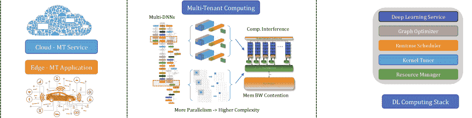
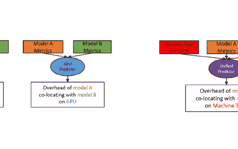
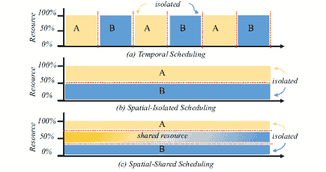
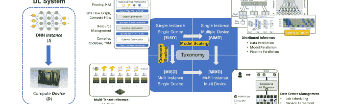

<!--yml

类别: 未分类

日期: 2024-09-06 19:47:39

-->

# [2203.09040] 多租户深度学习推断在 GPU 上的调查

> 来源：[`ar5iv.labs.arxiv.org/html/2203.09040`](https://ar5iv.labs.arxiv.org/html/2203.09040)

# 多租户深度学习推断在 GPU 上的调查

Fuxun Yu^†, Di Wang^‡, Longfei Shangguan^‡, Minjia Zhang^‡, Chenchen Liu^§, Tolga Soyata^†, Xiang Chen^†

^†乔治梅森大学, ^‡微软, ^§马里兰大学巴尔的摩县分校

###### 摘要

深度学习（DL）模型已实现了卓越的性能。同时，像 NVIDIA GPU 这样的计算硬件也展示了强大的计算扩展趋势，每一代都具有 2$\times$的吞吐量和内存带宽。由于 GPU 的强大计算扩展性，将多个 DL 模型共同部署到同一个 GPU 上进行多租户深度学习推断已被广泛应用，以提高资源利用率、增强服务吞吐量，并降低能源成本等。然而，实现高效的多租户 DL 推断具有挑战性，需要全面的全栈系统优化。之前的调查要么针对总结单租户深度学习推断优化，要么仅关注某个单一优化层，如图级、内核级等。本调查旨在总结和分类 GPU 上多租户 DL 推断的新兴挑战和优化机会。通过概述整个优化栈，总结多租户计算创新，阐述最新技术进展，我们希望本调查能够为新的优化视角提供启示，并激发未来大规模 DL 推断系统优化的创新工作。

## I 引言

深度学习（DL）模型在视觉、语音和语言领域等认知任务中已实现卓越性能，并已被应用于医疗分析、机器翻译、产品推荐，*等*。基于 DL 的智能势头吸引了数百万用户，并创造了广泛的云端和边缘应用，如 VR/AR 游戏、智能机器人和车辆、大规模推荐系统，甚至元宇宙应用[12]，其中许多应用具有多模态、多任务和显著的任务复杂性，如图 1（a）所示。

这些大规模 DL 应用的出现促使了 DL 加速器，特别是 GPU，在云端和边缘的广泛采用。根据报告[31]，2018 年 GPU 占据了 29.8 亿美元云数据中心加速器市场的 85%。边缘硬件市场，随着智能制造、监控应用的兴起，也预计将从 2021 年的 9.2 亿美元增长到 2026 年的 20.8 亿美元，边缘 GPU 也稳步增长到超过 50%的市场份额，包括 Nvidia Jetson、TX2、Xavier、Orin 等。

在这种趋势下，最近几代 GPU 的容量呈指数增长速度。¹¹1 详细的 GPU 容量扩展统计数据可以在[37]中找到。从 K80、P40 和 P100 到最近的 T40、V100、A100 架构，GPU 保持了性能翻倍的趋势。上一代 V100[7]提供了每秒 120 万次浮点运算（TFLOPS）和 900 GB/s 的内存带宽，而最新的 A100[6]的数据进一步增加到 312 TFLOPS 和 1.6TB/s 的内存带宽。A100 报告的 ResNet50[14]推理速度为 36,436 张图像/秒，显示出超越传统单 DL 模型执行方案的计算能力。因此，随着应用复杂性和 GPU 容量的扩展趋势，单模型执行无法满足应用场景的需求，也无法充分利用 GPU。

多租户 DL 推理，如图 1（b）所示，是一种有前景的解决方案，通过在一个强大的 GPU 上同时运行混合 DL 模型负载，来提高利用率、吞吐量和电力效率等，满足上述多模态和多任务需求。

最近出现了许多处理多租户深度学习（DL）推理在 GPU 上优化的工作。这些工作通常从传统的单模型优化经验中借鉴单一优化点的视角，例如，从 DL 模型调度的角度[44、10、2]，或从 GPU 资源管理的角度[9、38、19]。然而，要实现多租户 DL 计算的*终极*效率更具挑战性，因为这需要彻底考虑单一与多租户 DL 推理之间的差异，并且需要多层次 DL 优化或全栈协同优化。因此，系统性回顾多租户 DL 推理优化的机会和挑战是非常必要的。

我们的调查是首个深入分析多租户 GPU 调度问题的工作，总结了单租户与多租户计算优化的主要差异，并揭示了多租户 DL 推理在 GPU 上出现的机会和潜在好处。为了便于理解，我们的工作还借鉴了以前的 DL 计算栈的一些经验，并从层次化的角度比较了 GPU 上的单租户与多租户 DL 推理。

图 1：多租户 DL 计算在 GPU 上的新兴趋势。

单租户与多租户：分层比较。传统的单租户深度学习编译器（图 1 (c)）已经包括了多层次的优化：算法级压缩 [45, 29, 46]，图级重写 [15, 49, 17]，运行时调度 [10, 34]和内核调优 [3, 16, 11, 40]等。然而，针对单租户的优化通常不适合于多租户推理，以下是一些例子。

从顶层图级来看，以有向无环图（DAGs）表示的多租户深度学习推理工作负载，其多模型操作的数量显著高于单模型。这导致许多不可合并的操作，并暴露出更大的调度空间。在较低的内核级别，TVM [3]是一个例子。作为最具竞争力的内核自动调优框架之一，TVM 内置了单租户执行设置的假设，其调优配置旨在饱和 GPU 的所有 SM 和内存带宽。然而，这种假设以及单租户目标的调优不适用于每个内核部分资源可用的多内核并发执行。根据 [8]，相同计算内核的单租户与多租户调优配置之间的最大吞吐量差距可能达到$5\times$。

更深入到 GPU 硬件层面，多租户深度学习推理需要大量调度支持来解决诸如租户间干扰等问题，例如用于资源分区、隔离和分配的专用 GPU 硬件原语等。随着多租户应用的当前趋势，GPU 厂商如 Nvidia 最近发布了许多新功能，包括 Multi-Stream [22]、Multi-Process Service (MPS) [25]、Multi-Instance GPU (MIG) [24]和虚拟 GPU (vCS) [26]，以支持运行时调度和资源管理，这为多租户深度学习调度和优化提供了新的研究机会。

考虑到这些差异，本研究将采用这种优化堆栈的视角，深入分析多租户面临的挑战，并介绍新兴的工作。

通过回顾在 GPU 上的多租户深度学习计算中出现的挑战、机遇和研究成果，我们希望这份调查能够激发更多的设计和创新，推动这一有前景的新领域的发展。剩余的论文组织如下：第 II 节介绍了多租户 GPU 计算堆栈中的新挑战和机遇，以及当前厂商 GPU 支持的高层次概述。第 III 节详细总结了多租户计算的最新研究成果。然后我们在第 IV 节中给出了我们的愿景和见解。第 V 节总结了本文。

## II 挑战与机遇

对于 GPU 上的多租户计算

在本节中，我们首先通过完整的深度学习计算堆栈来描述单租户与多租户深度学习计算优化之间的主要差异。接着介绍了最近发布的 GPU 特性，如 Stream、MPS、MIG，这些特性为多租户计算优化提供了重要的基础后端支持。

### II-A 多租户深度学习计算的挑战

传统的深度学习计算优化通常扩展到<svg height="11.25" overflow="visible" version="1.1" width="11.25"><g transform="translate(0,11.25) matrix(1 0 0 -1 0 0) translate(5.62,0) translate(0,5.62)" fill="#000000" stroke="#000000" stroke-width="0.4pt"><g transform="matrix(1.0 0.0 0.0 1.0 -3.46 -4.46)" fill="#000000" stroke="#000000"><foreignobject width="6.92" height="8.92" transform="matrix(1 0 0 -1 0 16.6)" overflow="visible">1</foreignobject></g></g></svg> 服务级编排[36]、<svg height="11.25" overflow="visible" version="1.1" width="11.25"><g transform="translate(0,11.25) matrix(1 0 0 -1 0 0) translate(5.62,0) translate(0,5.62)" fill="#000000" stroke="#000000" stroke-width="0.4pt"><g transform="matrix(1.0 0.0 0.0 1.0 -3.46 -4.46)" fill="#000000" stroke="#000000"><foreignobject width="6.92" height="8.92" transform="matrix(1 0 0 -1 0 16.6)" overflow="visible">2</foreignobject></g></g></svg> 图级优化[15, 43]、<svg height="11.25" overflow="visible" version="1.1" width="11.25"><g transform="translate(0,11.25) matrix(1 0 0 -1 0 0) translate(5.62,0) translate(0,5.62)" fill="#000000" stroke="#000000" stroke-width="0.4pt"><g transform="matrix(1.0 0.0 0.0 1.0 -3.46 -4.46)" fill="#000000" stroke="#000000"><foreignobject width="6.92" height="8.92" transform="matrix(1 0 0 -1 0 16.6)" overflow="visible">3</foreignobject></g></g></svg> 运行时调度[10]、<svg height="11.25" overflow="visible" version="1.1" width="11.25"><g transform="translate(0,11.25) matrix(1 0 0 -1 0 0) translate(5.62,0) translate(0,5.62)" fill="#000000" stroke="#000000" stroke-width="0.4pt"><g transform="matrix(1.0 0.0 0.0 1.0 -3.46 -4.46)" fill="#000000" stroke="#000000"><foreignobject width="6.92" height="8.92" transform="matrix(1 0 0 -1 0 16.6)" overflow="visible">4</foreignobject></g></g></svg> 内核级调优[3, 39]和<svg height="11.25" overflow="visible" version="1.1" width="11.25"><g transform="translate(0,11.25) matrix(1 0 0 -1 0 0) translate(5.62,0) translate(0,5.62)" fill="#000000" stroke="#000000" stroke-width="0.4pt"><g transform="matrix(1.0 0.0 0.0 1.0 -3.46 -4.46)" fill="#000000" stroke="#000000"><foreignobject width="6.92" height="8.92" transform="matrix(1 0 0 -1 0 16.6)" overflow="visible">5</foreignobject></g></g></svg> 资源级管理[9, 19]。尽管在这些不同级别的计算优化方面已有许多前期工作，但多租户计算展现出显著特征，使这些方法不适用。根据相同的优化堆栈，我们在表 I 中总结了主要差异，并在图 2 中分析了计算挑战。

表 I：多租户优化的挑战。

完全优化堆栈 单租户 多租户 协同放置 否 是 <svg height="10.12" overflow="visible" version="1.1" width="10.12"><g transform="translate(0,10.12) matrix(1 0 0 -1 0 0) translate(5.06,0) translate(0,5.06)" fill="#000000" stroke="#000000" stroke-width="0.4pt"><g transform="matrix(1.0 0.0 0.0 1.0 -3.11 -4.01)" fill="#000000" stroke="#000000"><foreignobject width="6.23" height="8.03" transform="matrix(1 0 0 -1 0 16.6)" overflow="visible">1</foreignobject></g></g></svg> 服务级干扰 否 高干扰 <svg height="10.12" overflow="visible" version="1.1" width="10.12"><g transform="translate(0,10.12) matrix(1 0 0 -1 0 0) translate(5.06,0) translate(0,5.06)" fill="#000000" stroke="#000000" stroke-width="0.4pt"><g transform="matrix(1.0 0.0 0.0 1.0 -3.11 -4.01)" fill="#000000" stroke="#000000"><foreignobject width="6.23" height="8.03" transform="matrix(1 0 0 -1 0 16.6)" overflow="visible">2</foreignobject></g></g></svg> 图级 DAG(s) 大多 顺序 顺序 + 并行 并行性 有限 广泛 <svg height="10.12" overflow="visible" version="1.1" width="10.12"><g transform="translate(0,10.12) matrix(1 0 0 -1 0 0) translate(5.06,0) translate(0,5.06)" fill="#000000" stroke="#000000" stroke-width="0.4pt"><g transform="matrix(1.0 0.0 0.0 1.0 -3.11 -4.01)" fill="#000000" stroke="#000000"><foreignobject width="6.23" height="8.03" transform="matrix(1 0 0 -1 0 16.6)" overflow="visible">3</foreignobject></g></g></svg> 运行时复杂度 低 高 资源使用 独占 共享 <svg height="10.12" overflow="visible" version="1.1" width="10.12"><g transform="translate(0,10.12) matrix(1 0 0 -1 0 0) translate(5.06,0) translate(0,5.06)" fill="#000000" stroke="#000000" stroke-width="0.4pt"><g transform="matrix(1.0 0.0 0.0 1.0 -3.11 -4.01)" fill="#000000" stroke="#000000"><foreignobject width="6.23" height="8.03" transform="matrix(1 0 0 -1 0 16.6)" overflow="visible">4</foreignobject></g></g></svg> 内核级调优 目标 100% 利用 $x$% 部分利用 <svg height="10.12" overflow="visible" version="1.1" width="10.12"><g transform="translate(0,10.12) matrix(1 0 0 -1 0 0) translate(5.06,0) translate(0,5.06)" fill="#000000" stroke="#000000" stroke-width="0.4pt"><g transform="matrix(1.0 0.0 0.0 1.0 -3.11 -4.01)" fill="#000000" stroke="#000000"><foreignobject width="6.23" height="8.03" transform="matrix(1 0 0 -1 0 16.6)" overflow="visible">5</foreignobject></g></g></svg> 资源级管理 无资源分区 <svg height="11.25" overflow="visible" version="1.1" width="11.25"><g transform="translate(0,11.25) matrix(1 0 0 -1 0 0) translate(5.62,0) translate(0,5.62)" fill="#000000" stroke="#000000" stroke-width="0.4pt"><g transform="matrix(1.0 0.0 0.0 1.0 -3.46 -4.46)" fill="#000000" stroke="#000000"><foreignobject width="6.92" height="8.92" transform="matrix(1 0 0 -1 0 16.6)" overflow="visible">1</foreignobject></g></g></svg>

服务级别：以 AI 为中心的云服务同时处理数百万个服务查询 [41]。凭借 GPU 的巨大计算能力，可以战略性地共置多个深度学习查询以实现高效的并发执行，这是多租户 GPU 计算与传统 CPU 多任务之间的一个关键区别。通过允许并发深度学习工作负载之间的资源共享，服务提供商可以潜在地提高 GPU 资源利用率，降低所有权成本（COO），如基础设施和电力成本，尤其是对于大型数据中心 [24]。

然而，战略性共置仍面临挑战，比如可能发生的租户间干扰 [19]，这可能会降低服务质量，如尾延迟和吞吐量的服务级目标（SLA）。随着共置工作负载数量的增加，这种情况可能变得更糟，降低整体服务吞吐量。因此，近年来有许多服务级别协调工作 [19, 42, 5]，设计了不同的启发式、建模或预测机制，以在 GPU 上进行高效的多租户计算。

图 2：多租户深度学习计算挑战。

<svg   height="11.25" overflow="visible" version="1.1" width="11.25"><g transform="translate(0,11.25) matrix(1 0 0 -1 0 0) translate(5.62,0) translate(0,5.62)" fill="#000000" stroke="#000000" stroke-width="0.4pt"><g transform="matrix(1.0 0.0 0.0 1.0 -3.46 -4.46)" fill="#000000" stroke="#000000"><foreignobject width="6.92" height="8.92" transform="matrix(1 0 0 -1 0 16.6)" overflow="visible">2</foreignobject></g></g></svg>

图层级：具有许多操作符的深度神经网络（DNNs）通常表示为有向无环图（DAGs），这些图使用节点表示操作符，边表示数据流和依赖关系 [15]。单模型的 DAG 通常是顺序的，具有有限的并行性，如 VGG、ResNets、MobileNets 和 EfficientNets，它们只有一个或两个分支，因此暴露出较小的调度空间 [20]。

相比之下，具有多个并行 DAG 的多租户深度学习计算通常具有广泛的操作符间并行性，如图 2 所示，这使得租户间的操作调度更加灵活 [44]。此类图调度存在一定的挑战，如操作符和调度空间数量增加导致的复杂性增加，以及更复杂的 GPU 资源争用分析等。

<svg   height="11.25" overflow="visible" version="1.1" width="11.25"><g transform="translate(0,11.25) matrix(1 0 0 -1 0 0) translate(5.62,0) translate(0,5.62)" fill="#000000" stroke="#000000" stroke-width="0.4pt"><g transform="matrix(1.0 0.0 0.0 1.0 -3.46 -4.46)" fill="#000000" stroke="#000000"><foreignobject width="6.92" height="8.92" transform="matrix(1 0 0 -1 0 16.6)" overflow="visible">3</foreignobject></g></g></svg>

运行时级别：由于之前的操作符并行度有限，只有少数研究 [10, 2] 涉及运行时调度，如 Inception、NasNets 和 Transformers 等多分支模型。这些研究利用某些 GPU 运行时原语 (*例如*，Nvidia 多流 [22]) 进行并发操作符调度，但其中许多会引入较大的运行时开销。例如，多流同步会强制所有流等待/停滞，直到最后一个流完成其工作负载 [22]。随着操作符数量和调度复杂性的增加，多租户调度往往会遭受更大的开销。由于对 GPU 多租户调度的关注增加，GPU 厂商最近发布了一系列重要功能，如 CUDA 图 [27]，以解决这些调度开销问题。

<svg   height="11.25" overflow="visible" version="1.1" width="11.25"><g transform="translate(0,11.25) matrix(1 0 0 -1 0 0) translate(5.62,0) translate(0,5.62)" fill="#000000" stroke="#000000" stroke-width="0.4pt"><g transform="matrix(1.0 0.0 0.0 1.0 -3.46 -4.46)" fill="#000000" stroke="#000000"><foreignobject width="6.92" height="8.92" transform="matrix(1 0 0 -1 0 16.6)" overflow="visible">4</foreignobject></g></g></svg>

内核级别：内核配置如循环分块、线程阻塞、内存合并，*等等*，可能会显著影响每个操作符的计算效率。之前的单租户内核级别的研究如 TVM [3] 和 TF-XLA [39] 试图找到能充分利用 GPU 资源的最佳配置，即专用资源使用。然而，由于多租户 DNN 共享底层资源，针对单租户设置优化的内核在多租户场景中可能会变得次优。最近，有一些研究表明，多租户深度学习计算应根据实际执行中的可用资源比例优化内核配置 [8]，这显示出 5$\times$ 的吞吐量差异。

<svg   height="11.25" overflow="visible" version="1.1" width="11.25"><g transform="translate(0,11.25) matrix(1 0 0 -1 0 0) translate(5.62,0) translate(0,5.62)" fill="#000000" stroke="#000000" stroke-width="0.4pt"><g transform="matrix(1.0 0.0 0.0 1.0 -3.46 -4.46)" fill="#000000" stroke="#000000"><foreignobject width="6.92" height="8.92" transform="matrix(1 0 0 -1 0 16.6)" overflow="visible">5</foreignobject></g></g></svg>

资源级别：为了实现自适应的多租户资源分区和配置，它需要战略设计和硬件支持。自适应资源配置面临的第一个挑战在于 DL 工作负载的动态性[44]。不同深度结构的多种 DL 模型具有高度不稳定的计算/内存需求，使得模型间的资源共享和竞争高度动态，因此难以确定最优资源分区。另一方面，自适应资源管理要求灵活的 GPU 重新配置能力。尽管存在某些支持资源分区的自适应资源配置功能（*例如*，Nvidia 多进程服务，多实例 GPU[25, 24]），但重新配置过程需要不可忽视的时间（*例如*，几毫秒），这是近期资源调度工作的一大限制[9, 19]。

图 3：多流、MPS 和 MIG 示意图。

### II-B 新兴的多租户计算机会

之前，阻碍 GPU 上多租户 DL 计算采用和发展的一个重要原因是硬件调度机制不足。但随着对这一话题关注的增加，像 Nvidia 这样的 GPU 供应商推出了某些新的 GPU 多租户功能，以支持多租户 DL 推理，这为多租户调度提供了很大的机会。这些多租户 GPU 调度功能可以分为两大类：软件级别和硬件级别支持。

<svg   height="11.25" overflow="visible" version="1.1" width="11.25"><g transform="translate(0,11.25) matrix(1 0 0 -1 0 0) translate(5.62,0) translate(0,5.62)" fill="#000000" stroke="#000000" stroke-width="0.4pt"><g transform="matrix(1.0 0.0 0.0 1.0 -3.46 -4.46)" fill="#000000" stroke="#000000"><foreignobject width="6.92" height="8.92" transform="matrix(1 0 0 -1 0 16.6)" overflow="visible">1</foreignobject></g></g></svg>

软件方法：第一个 GPU 多任务功能是 Fermi GPU 架构中支持的 Multi-Stream 机制 [22]（图 3 (a)）。作为一种基于软件的编程模型，一个流可以包含一系列在 GPU 上执行的操作。不同流中的操作可以并行运行并共享底层 GPU 资源，如 SMs [22]。类似的功能 Hyper-Q [21] 引入于 Kepler GPU 架构（2013），扩展了之前的 16 路硬件内核队列到 32 路，以支持更高的并发性。随着并发支持，CUDA 库还发布了一些调度 API，如 DeviceSync、StreamWait 等，以支持更细粒度的调度能力 [23]。这些软件级 API 提供了有价值的多租户 GPU 调度机制，许多近期工作开始探讨细粒度的 DL 操作级调度技术 [44, 10]。

表 II: GPU 对多租户计算的支持。

机制 流 MPS MIG 分区类型 无 逻辑 物理 最大分区 无限制 48 7 SM 隔离 无 按百分比 是 内存带宽隔离 无 无 是 性能 QoS 无 部分 是 重新配置 动态 进程启动 空闲时

表 III: 多租户计算优化的近期工作（JCT: 任务完成时间，SLA: 服务级协议）。

| 参考 | 硬件 | 视角 | 算法/策略 | 改进/成就 |
| --- | --- | --- | --- | --- |
| Inter-Aware [19] | GPU | DL 服务级编排 |

&#124; $\bullet$ 基于 ML 的干扰预测器 &#124;

&#124; $\bullet$ 主动查询调度器 &#124;

|

&#124; $\bullet$ 减少任务干扰 &#124;

&#124; $\bullet$ 提升服务吞吐量 &#124;

|

| Irina [42] | GPU | DL 服务级编排 |
| --- | --- | --- |

&#124; $\bullet$ 在线查询调度器 &#124;

&#124; $\bullet$ 基于启发式的抢占 &#124;

&#124; $\bullet$ 并发执行与批处理 &#124;

| $\bullet$ 降低客户端 JCT |
| --- |
| PREMA [5] | NPU | DL 服务级编排 |

&#124; $\bullet$ 在线查询调度器 &#124;

&#124; $\bullet$ 基于启发式的抢占 &#124;

|

&#124; $\bullet$ 减少高优先级任务 JCT &#124;

&#124; $\bullet$ 维持低优先级 SLA &#124;

|

| 运行时感知 [44] | GPU | 图与运行时级调度 |
| --- | --- | --- |

&#124; $\bullet$ 多模型 DAG 重写 &#124;

&#124; $\bullet$ 基于 ML 的调度搜索 &#124;

&#124; $\bullet$ Multi-Stream 运行时调度 &#124;

| $\bullet$ 减少推理延迟 |
| --- |
| Spatial-Tune [8] | GPU | 内核级自动调优 |

&#124; $\bullet$ 基于 MPS 的资源分配 &#124;

&#124; $\bullet$ 部分资源内核调优 &#124;

|

&#124; $\bullet$ 提升的内核性能 &#124;

&#124; $\bullet$ 减少内核间干扰 &#124;

|

| GSlice [9] | GPU | 资源级管理 |
| --- | --- | --- |

&#124; $\bullet$ 基于 MPS 的资源分区 &#124;

&#124; $\bullet$ 自适应批处理 &#124;

|

&#124; $\bullet$ 提升的服务吞吐量 &#124;

&#124; $\bullet$ 维护 SLA &#124;

|

| Spatial-Partition [4] | GPU | 资源级管理 |
| --- | --- | --- |

&#124; $\bullet$ 基于 MPS 的资源分区 &#124;

&#124; $\bullet$ 考虑干扰的调度 &#124;

|

&#124; $\bullet$ 提升的服务吞吐量 &#124;

&#124; $\bullet$ 维护 SLA &#124;

|

| MIG-Serving [38] | GPU | 资源级管理 |
| --- | --- | --- |

&#124; $\bullet$ 基于 MIG 的资源重新配置 &#124;

&#124; $\bullet$ 快速与慢查询调度 &#124;

|

&#124; $\bullet$ 提升的服务吞吐量 &#124;

&#124; $\bullet$ 维护 SLA &#124;

|

| Planaria [13] |
| --- |

&#124; 收缩型 &#124;

&#124; 数组 &#124;

| 资源级管理 | $\bullet$ 架构重新配置 |
| --- | --- |

&#124; $\bullet$ 提升的服务吞吐量 &#124;

&#124; $\bullet$ 减少能耗 &#124;

|

<svg height="11.25" overflow="visible" version="1.1" width="11.25"><g transform="translate(0,11.25) matrix(1 0 0 -1 0 0) translate(5.62,0) translate(0,5.62)" fill="#000000" stroke="#000000" stroke-width="0.4pt"><g transform="matrix(1.0 0.0 0.0 1.0 -3.46 -4.46)" fill="#000000" stroke="#000000"><foreignobject width="6.92" height="8.92" transform="matrix(1 0 0 -1 0 16.6)" overflow="visible">2</foreignobject></g></g></svg>

硬件方法：除了软件支持外，NVIDIA 最近还发布了先进的硬件级资源管理机制，以支持灵活的资源分配、隔离和虚拟化。这些资源管理方法可以分为两种类型：逻辑和物理。多进程服务（MPS）[25]是一种逻辑资源分区机制（图 3 (b)），允许用户将流式多处理器（SMs）划分并分配给不同的进程，例如，将 30%和 70%分配给两个并发进程。这种分区通过基于软件的进程到 SM 映射调度完成，因此被认为是逻辑性的。值得注意的是，尽管 MPS 支持逻辑 SM 分区，但其他 GPU 资源如内存带宽并未分区，因此 MPS 无法完全避免进程间资源竞争和干扰。为了解决这一问题，最近在安培架构上引入的多实例 GPU（MIG）[24]通过专门的 GPU 架构设计实现了 SMs 和内存带宽的物理分区（图 3 (c)）。这种物理分区确保了资源的完全隔离，因此不同进程之间不会发生干扰。MIG 支持将一个 A100 GPU 拆分为七个完全隔离的 GPU 实例。同时，它在 GPU 完全或部分空闲时提供了某种重新配置能力。例如，一个 A100 可以被拆分为三个实例，比例为 4:2:1，然后重新配置为 3:3:1 等[24]。关于 Stream、MPS 和 MIG 的更详细比较可以在表 II 中找到。

## III 多租户计算优化：

设计与创新

基于前述挑战和机遇，我们从不同角度审视了应对多租户调度优化的新兴研究。我们在表 III 中总结了这些研究。从自上而下的视角来看，这些研究被分为几个层次，即从 DL 服务级别编排、图形和运行时级别调度，到内核级别的自动调优，再到 GPU 资源级别管理。

### III-A 服务级别编排

DL 服务级别的调度是大规模数据中心中提高 GPU 利用率的重要功能。作为最上层的调度级别，这种调度通常将一个服务查询视为基本调度单元。这减少了调度复杂性，因为无需考虑 DNN 模型结构细节（操作符和图）。一个例子是微软深度学习推理服务（DLIS）系统 [36]。服务调度器对不同模型的资源需求进行特征描述，然后通过服务路由器将一个或多个查询策略性地分配到主机上。因此，它可以最大化每秒服务的查询数（QPS），同时确保最小的查询间干扰，以维持类似的尾部延迟。

然而，设计一个适当的共置策略或系统并非易事。例如，一个具有挑战性的因素是服务动态，即未确定的到达率和/或传入 DL 查询的分布，不同的 RNN/LSTM 查询具有不同的输入和控制状态。不同于我们可以获得完整信息的静态工作负载，这种动态场景要求我们利用历史数据或预测未来的工作负载动态。PREMA [5] 提出了一个预测性的多任务 DNN 调度算法，该算法结合了离线记录和基于令牌的在线作业调度，以确定最佳的多租户共置策略。

多租户共置的另一个挑战是如何准确预测模型间的资源干扰。这是确保 QoS（例如尾部延迟）的关键因素。[19] 训练了一个基于 ML 的延迟退化预测器，利用离线剖析的硬件级特征，如 SM 和 DRAM 使用、PCIE 读/写带宽、缓冲区使用等。然后，使用延迟退化预测器来评估模型放置对每个查询的潜在影响。

然而，这些工作存在一定的可扩展性问题，因为它们主要针对静态模型类型、硬件类型等，这些可能不适合动态工作负载。同时，由于每个 DNN 可能有许多操作符（*例如*，层），其资源消耗波动，这种粗粒度的调度（以一个完整查询作为基本单元）可能会偶尔遭遇资源不足或冲突，从而仍然阻碍 QoS。

### III-B 图和运行时级调度

图和运行时级调度可以通过启用更精细的调度（*例如*，DNN 操作符）来帮助解决上述粗粒度挑战。这可以通过利用 GPU 软件级支持，如多流机制和调度 API 来实现。例如，[44] 提出了一个基于 ML 的调度策略，用于多租户 DNN 执行加速。它首先将多个 DNN 的计算图及所有操作符抽象成一个全局中间表示（IR），这使得不同租户之间的资源共享更加灵活，从而提高了利用率。为了在巨大的调度空间中找到最佳的并发操作符执行策略，他们设计了一种基于 ML 的自动搜索方法，通过定义三个主要因素：调度搜索空间、基于分析的延迟成本模型以及 ML 搜索算法。基于离线分析记录，搜索算法可以找到最佳调度，以实现最佳的 GPU 利用率和吞吐量。

这样的图和运行时级操作符调度通常由于其精细化设计可以实现更好的性能，但它们也面临更多的可扩展性问题（*例如*，当共存工作负载的数量增加到非常大时）。与此同时，它也仅适用于静态或已知的多租户工作负载，无法处理动态模型类型。

### III-C 资源级管理

除了前述工作外，解决跨租户推断问题的另一个优化视角是进行精细化资源管理[9, 13]。例如，将 GPU 资源进行空间划分并分配给不同的深度学习工作负载，可以将不同作业的资源（*例如*，流多处理器（SMs）、内存带宽）隔离，从而避免在硬件资源级别的作业干扰。然而，正如我们之前介绍的，直到最近 GPU 厂商发布了一系列资源共享和划分支持，如多流、多进程服务（MPS [25]）和多实例 GPU（MIG [24]），才能实现精细化资源划分。最新的资源级管理工作都建立在这些技术基础上。

例如，GSlice [9] 使用 MPS 对不同的 DNN 作业进行自适应 SM 划分。他们设计了一种自学习方法，以动态调整每个工作负载的 GPU 资源分配比例，从而避免共存深度学习工作负载之间的干扰并最大化吞吐量。[4] 通过 MPS 利用类似的空间划分机制，同时结合了时间调度策略。MIG-Serving [38] 是最近期的工作，它采用了在 A100 上新发布的 MIG 功能，实现了多租户调度的空间资源管理。

然而，这种空间资源分区解决方案也存在一个固有的局限性，即当工作负载变化时，重新配置的灵活性不足，并且需要调整资源分区。对于 GPU 来说，重新配置资源分区需要一定时间（*例如*，几十毫秒或更长），这可能甚至超过一个深度学习推断工作负载的处理时间。因此，频繁重新配置并不实际，从而限制了这种解决方案在面对动态工作负载时的性能。[9] 试图通过利用备用/影子进程来减少由于 MPS 重新配置时间造成的停顿。然而，切换一个分区配置到另一个配置的最小时间仍然需要几秒钟，这在在线服务中仍然不可忽视。

### III-D 解决剩余挑战的潜在方向

<svg   height="11.25" overflow="visible" version="1.1" width="11.25"><g transform="translate(0,11.25) matrix(1 0 0 -1 0 0) translate(5.62,0) translate(0,5.62)" fill="#000000" stroke="#000000" stroke-width="0.4pt"><g transform="matrix(1.0 0.0 0.0 1.0 -3.46 -4.46)" fill="#000000" stroke="#000000"><foreignobject width="6.92" height="8.92" transform="matrix(1 0 0 -1 0 16.6)" overflow="visible">1</foreignobject></g></g></svg>

基于 ML 的预测和在线学习：为了解决服务动态的问题，使用基于 ML 的预测模型（*例如*，强化学习、LSTM、*等等*）是一种有前景的方向，它可以潜在地预测未来查询趋势并指导整体调度。基于 ML 的模型可以通过历史服务记录在离线状态下进行初步训练。在在线服务过程中，可以利用延迟/吞吐量作为反馈来进行主动学习和持续学习[30, 28]，从而持续提高预测准确性和调度效果。

利用基于 ML 的预测的另一种方法是进行轻量级建模，以预测在不同多模型和硬件组合下的延迟退化，以便调度器能够做出更好的关于延迟 SLA 约束的决策。例如，工作[19] 构建了一个 ML 模型，以预测不同机器上多模型推断情况的延迟。由于最终调度方案的有效性高度依赖于建模准确性，因此需要解决硬件/模型类型的可扩展性和普遍性问题，这也是非常具有挑战性的。

图 4：未来更大规模深度学习系统的发展趋势。

<svg   height="11.25" overflow="visible" version="1.1" width="11.25"><g transform="translate(0,11.25) matrix(1 0 0 -1 0 0) translate(5.62,0) translate(0,5.62)" fill="#000000" stroke="#000000" stroke-width="0.4pt"><g transform="matrix(1.0 0.0 0.0 1.0 -3.46 -4.46)" fill="#000000" stroke="#000000"><foreignobject width="6.92" height="8.92" transform="matrix(1 0 0 -1 0 16.6)" overflow="visible">2</foreignobject></g></g></svg>

软件-硬件协同调度：软件和硬件的调度可以相辅相成，提供高作业调度灵活性和严格的资源隔离。一些最近的研究采用了这种时空结合的视角。[4] 使用 MPS 进行资源分区，然后实现基于启发式的任务调度器，寻找 DNN 查询与 GPU 分区之间的适当映射。此外，软件-硬件调度还可以用于减轻某些重新配置的开销。例如，在分区的 GPU 切片内进行基于软件的调度是有潜力的，*例如*，将多流与 MIG 结合。在这种方式下，可以实现细粒度的调度，而无需重新划分整个 GPU，从而避免重新配置的开销。

## IV 面向大规模深度学习计算：

远景与洞察

### IV-A 架构设计与“全栈循环”

多租户深度学习计算的快速发展带来了许多系统栈优化的挑战。除了 GPU 之外，这也启发了其他面向深度学习的硬件架构设计师（*例如*，TPU、芯片组、神经形态和基于量子加速器）在面对快速变化的深度学习应用环境时优化灵活性和敏捷性。具体而言，一个重要的未来趋势是“全栈循环”，即去除垂直深度学习系统栈中的边界，并进行全栈集成，以追求最佳性能和灵活性。

这一努力的一个例子是通过 tvm unity 进行的深度学习编译器改造 [32]，如图 4 (a) 所示。目前的深度学习计算栈进行的是分层优化（图形-运行时-内核-资源）和单向自上而下的部署。然而，这阻止了基于模型工作负载和硬件特性的 SW/HW 协同编译的反馈回路和跨层交互。因此，统一层之间的抽象将极大地促进新的全栈优化作为一个循环，不仅适用于多租户计算，也适用于未来更广泛的深度学习应用。

另一个例子是对基于多芯片模块（MCM）的多功能和灵活的 SW/HW 协同设计的日益关注 [33, 48]。与传统的大型单片芯片相比，这种 MCM 将更小的芯片模块组合成一个更大的系统，从而显著降低了制造和设计成本。然而，它需要全面的应用意识来优化芯片设计和整体性能。因此，这些芯片模块也可以从深度学习计算的全栈循环架构中受益匪浅。

### IV-B 未来的大规模深度学习系统全景

多租户深度学习计算是由于 GPU 显著的计算规模化趋势而自然出现的推广结果。然而，最近观察到另一种模型规模化趋势，即设计和训练超大规模的通用智能 AI 模型。例如，近期的 SOTA 巨型 AI 模型 Megatron-NLG [35] 已经达到了 5300 亿个参数，并且需要几十个 GPU 执行多节点分布式推理。如果考虑这种模型规模化，可能会观察到更多新的深度学习计算模式，并丰富未来的深度学习与系统全景。

我们通过使用图中的分类法描述了未来的大规模深度学习系统的全景，如图 4 (b) 所示。使用实例（I）来表示一个 DNN 模型，设备（D）来表示硬件，传统的深度学习系统大多数属于单实例单设备（SISD）领域，仅构成了全范围的左上角四分之一。随着计算规模化趋势的出现，多租户计算成为了多个实例单设备（MISD），这是我们在本次调查中总结的内容。

同时，随着模型规模化趋势的推进，单实例多设备（SIMD）交互模式也逐渐显现，并受到越来越多的关注，例如超大规模巨型模型的分布式推理 [18, 47, 50]，包括语言模型、推荐模型等。最后，多实例多设备（MIMD）计算最终将结合所有这些模式，成为未来以深度学习为中心的数据中心优化的实际需求。

## V 结论

基于深度学习的智能创建了广泛的应用程序，具有多模态和多任务等显著复杂性。GPU 是一种主要的深度学习加速器，在云端和边缘计算中使这种复杂的深度学习应用程序得以普及。同时，其逐代增长的能力表现出指数级的扩展。随着应用复杂性和 GPU 能力的扩展，多租户深度学习计算正在成为一种有效的 GPU 计算范式，以提高吞吐量、资源利用率和功率效率。本调查总结和分类了多租户深度学习推理在 GPU 上的新兴挑战和优化机会，并与传统的单租户优化进行了层次比较。我们希望本调查能够为未来大规模深度学习系统优化提供新的视角和创新工作。

## 参考文献

+   [1]

+   Bai 等 [2021] Yang Bai、Xufeng Yao、Qi Sun 和 Bei Yu. 2021. AutoGTCO：图与张量共同优化，用于 GPU 上的变换器图像识别。在 *2021 IEEE/ACM 计算机辅助设计国际会议 (ICCAD)*。

+   Chen 等 [2018] Tianqi Chen、Thierry Moreau、Ziheng Jiang、Lianmin Zheng、Eddie Yan、Haichen Shen、Meghan Cowan、Leyuan Wang、Yuwei Hu、Luis Ceze 等. 2018. $\{$TVM$\}$：一种自动化的端到端优化编译器用于深度学习。在 *第 13 届 $\{$USENIX$\}$ 操作系统设计与实现研讨会 ($\{$OSDI$\}$ 18)*。578–594。

+   Choi 等 [2021] Seungbeom Choi、Sunho Lee、Yeonjae Kim、Jongse Park、Youngjin Kwon 和 Jaehyuk Huh. 2021. 基于 GPU 空间分区的多模型机器学习推理服务。*arXiv 预印本 arXiv:2109.01611* (2021)。

+   Choi 和 Rhu [2020] Yujeong Choi 和 Minsoo Rhu. 2020. Prema：一种用于可抢占神经处理单元的预测多任务调度算法。在 *2020 IEEE 国际高性能计算架构研讨会 (HPCA)*。

+   Choquette 等 [2021] Jack Choquette、Wishwesh Gandhi、Olivier Giroux、Nick Stam 和 Ronny Krashinsky. 2021. Nvidia A100 张量核心 GPU：性能与创新。*IEEE Micro* 41, 2 (2021)，29–35。

+   NVIDIA 公司 [2017] NVIDIA 公司. 2017. *NVIDIA Tesla V100 GPU 架构*。技术报告。 [`www.nvidia.com/object/volta-architecture`](http://www.nvidia.com/object/volta-architecture)。

+   Dhakal 等 [2020a] Aditya Dhakal、Junguk Cho、Sameer G Kulkarni、KK Ramakrishnan 和 Puneet Sharma. 2020a. GPU 的空间共享用于自动调优 DNN 模型。*arXiv 预印本 arXiv:2008.03602* (2020)。

+   Dhakal 等 [2020b] Aditya Dhakal、Sameer G Kulkarni 和 KK Ramakrishnan. 2020b. Gslice：用于可扩展推理平台的 GPU 控制空间共享。在 *第 11 届 ACM 云计算研讨会论文集*。492–506。

+   Ding 等 [2020] Yaoyao Ding、Ligeng Zhu、Zhihao Jia、Gennady Pekhimenko 和 Song Han. 2020. IOS：用于 CNN 加速的操作调度器。*arXiv 预印本 arXiv:2011.01302* (2020)。

+   Dumoulin 和 Visin [2016] Vincent Dumoulin 和 Francesco Visin. 2016. 深度学习卷积算术指南. *arXiv 预印本 arXiv:1603.07285* (2016).

+   Fernandez [2022] Peter Fernandez. 2022. Facebook, Meta, 元宇宙与图书馆. *图书馆高科技新闻* (2022).

+   Ghodrati 等 [2020] Soroush Ghodrati, Byung Hoon Ahn, Joon Kyung Kim, Sean Kinzer, Brahmendra Reddy Yatham, Navateja Alla, Hardik Sharma, Mohammad Alian, Eiman Ebrahimi, Nam Sung Kim, 等. 2020. Planaria: 动态架构裂变用于深度神经网络的空间多租户加速. 见 *2020 年第 53 届 IEEE/ACM 国际微架构年会 (MICRO)*. IEEE, 681–697.

+   He 等 [2016] Kaiming He, Xiangyu Zhang, Shaoqing Ren 和 Jian Sun. 2016. 图像识别的深度残差学习. 见 *IEEE 计算机视觉与模式识别会议论文集*. 770–778.

+   Jia 等 [2019] Zhihao Jia, Oded Padon, James Thomas, Todd Warszawski, Matei Zaharia 和 Alex Aiken. 2019. TASO: 通过自动生成图替代优化深度学习计算. 见 *第 27 届 ACM 操作系统原理研讨会论文集*. 47–62.

+   Lavin 和 Gray [2016] Andrew Lavin 和 Scott Gray. 2016. 卷积神经网络的快速算法. 见 *IEEE 计算机视觉与模式识别会议论文集*. 4013–4021.

+   Li 等 [2020] Ao Li, Bojian Zheng, Gennady Pekhimenko 和 Fan Long. 2020. GPU 内核的自动横向融合. *arXiv 预印本 arXiv:2007.01277* (2020).

+   Lui 等 [2021] Michael Lui, Yavuz Yetim, Özgür Özkan, Zhuoran Zhao, Shin-Yeh Tsai, Carole-Jean Wu 和 Mark Hempstead. 2021. 理解容量驱动的扩展神经推荐推断. 见 *2021 年 IEEE 系统与软件性能分析国际研讨会 (ISPASS)*. IEEE, 162–171.

+   Mendoza 等 [2021] Daniel Mendoza, Francisco Romero, Qian Li, Neeraja J Yadwadkar 和 Christos Kozyrakis. 2021. 关注干扰的推断服务调度. 见 *第 1 届机器学习与系统研讨会论文集*. 80–88.

+   Niu 等 [2021] Wei Niu, Jiexiong Guan, Yanzhi Wang, Gagan Agrawal 和 Bin Ren. 2021. DNNFusion: 通过高级操作符融合加速深度神经网络执行. 见 *第 42 届 ACM SIGPLAN 编程语言设计与实现国际会议论文集*. 883–898.

+   NVIDIA [2013] NVIDIA. 2013. Hyper-Q. [`developer.download.nvidia.com/compute/DevZone/C/html_x64/6_Advanced/simpleHyperQ/doc/HyperQ.pdf`](https://developer.download.nvidia.com/compute/DevZone/C/html_x64/6_Advanced/simpleHyperQ/doc/HyperQ.pdf).

+   NVIDIA [2015] NVIDIA. 2015. CUDA 多流. [`developer.nvidia.com/blog/gpu-pro-tip-cuda-7-streams-simplify-concurrency/`](https://developer.nvidia.com/blog/gpu-pro-tip-cuda-7-streams-simplify-concurrency/).

+   NVIDIA [2020a] NVIDIA. 2020a. CUDA 编程指南。 [`docs.nvidia.com/cuda/cuda-c-programming-guide/index.html`](https://docs.nvidia.com/cuda/cuda-c-programming-guide/index.html)。

+   NVIDIA [2020b] NVIDIA. 2020b. NVIDIA 多实例 GPU (MIG)。 [`docs.nvidia.com/datacenter/tesla/mig-user-guide/`](https://docs.nvidia.com/datacenter/tesla/mig-user-guide/)。

+   NVIDIA [2020c] NVIDIA. 2020c. NVIDIA 多进程服务 (MPS)。 [`docs.nvidia.com/deploy/pdf/CUDA-Multi-Process-Service-Overview.pdf`](https://docs.nvidia.com/deploy/pdf/CUDA-Multi-Process-Service-Overview.pdf)。

+   NVIDIA [2020d] NVIDIA. 2020d. NVIDIA 虚拟计算服务器。 [`www.nvidia.com/content/dam/en-zz/Solutions/design-visualization/solutions/resources/documents1/Technical-Brief-Multi-Instance-GPU-NVIDIA-Virtual-Compute-Server.pdf`](https://www.nvidia.com/content/dam/en-zz/Solutions/design-visualization/solutions/resources/documents1/Technical-Brief-Multi-Instance-GPU-NVIDIA-Virtual-Compute-Server.pdf)。

+   NVIDIA [2021] NVIDIA. 2021. CUDA 图。 [`developer.nvidia.com/blog/cuda-graphs/`](https://developer.nvidia.com/blog/cuda-graphs/)。

+   Parisi et al. [2019] German I Parisi, Ronald Kemker, Jose L Part, Christopher Kanan, and Stefan Wermter. 2019. 神经网络的持续终身学习：综述。 *Neural Networks* 113 (2019), 54–71。

+   Qin et al. [2018] Zhuwei Qin, Fuxun Yu, Chenchen Liu, and Xiang Chen. 2018. 功能导向的卷积滤波器剪枝。 *arXiv preprint arXiv:1810.07322* (2018)。

+   Ren et al. [2021] Pengzhen Ren, Yun Xiao, Xiaojun Chang, Po-Yao Huang, Zhihui Li, Brij B Gupta, Xiaojiang Chen, and Xin Wang. 2021. 深度主动学习调查。 *ACM Computing Surveys (CSUR)* 54, 9 (2021), 1–40。

+   Reports [2021] Market Reports. 2021. 全球数据中心加速器市场规模、状态及 2020-2025 年预测。 [`www.mynewsdesk.com/brandessence/pressreleases/data-center-accelerator-market-size-2021-cagr-38-dot-7-percent-3112488`](https://www.mynewsdesk.com/brandessence/pressreleases/data-center-accelerator-market-size-2021-cagr-38-dot-7-percent-3112488)。

+   Sampson et al. [2022] Adrian Sampson, Tianqi Chen, and Jared Roesch. 2022. Apache TVM Unity: 机器学习软件和硬件生态系统的愿景。 [`tvm.apache.org/2021/12/15/tvm-unity`](https://tvm.apache.org/2021/12/15/tvm-unity)。

+   Shao et al. [2019] Yakun Sophia Shao, Jason Clemons, Rangharajan Venkatesan, Brian Zimmer, Matthew Fojtik, Nan Jiang, Ben Keller, Alicia Klinefelter, Nathaniel Pinckney, Priyanka Raina, et al. 2019. Simba：通过多芯片模块架构扩展深度学习推断。在 *Proceedings of the 52nd Annual IEEE/ACM International Symposium on Microarchitecture*。14–27。

+   Shen et al. [2021] Haichen Shen, Jared Roesch, Zhi Chen, Wei Chen, Yong Wu, Mu Li, Vin Sharma, Zachary Tatlock, and Yida Wang. 2021. Nimble: 高效编译动态神经网络以进行模型推断。 *Proceedings of MLSys* (2021)。

+   Smith 等 [2022] Shaden Smith, Mostofa Patwary, Brandon Norick, Patrick LeGresley, Samyam Rajbhandari, Jared Casper, Zhun Liu, Shrimai Prabhumoye, George Zerveas, Vijay Korthikanti 等。2022。使用 DeepSpeed 和 Megatron 训练 Megatron-Turing NLG 530B，一个大规模生成语言模型。*arXiv 预印本 arXiv:2201.11990* (2022)。

+   Soifer 等 [2019] Jonathan Soifer, Jason Li, Mingqin Li, Jeffrey Zhu, Yingnan Li, Yuxiong He, Elton Zheng, Adi Oltean, Maya Mosyak, Chris Barnes 等。2019。微软的深度学习推理服务。见 *2019 $\{$USENIX$\}$ 运维机器学习大会 (OpML 19)*。15–17。

+   Sun 等 [2019] Yifan Sun, Nicolas Bohm Agostini, Shi Dong, 和 David Kaeli。2019。用产品数据总结 CPU 和 GPU 设计趋势。*arXiv 预印本 arXiv:1911.11313* (2019)。

+   Tan 等 [2021] Cheng Tan, Zhichao Li, 和等。2021。使用多实例 GPU 服务 DNN 模型：一个可重配置机器调度问题的案例。*arXiv:2109.11067* (2021)。

+   TensorFlow [2020] TensorFlow。2020。TensorFlow XLA（加速线性代数）。[`www.tensorflow.org/xla`](https://www.tensorflow.org/xla)。

+   Vanholder [2016] Han Vanholder。2016。使用 TensorRT 的高效推理。见 *GPU 技术大会*，第 1 卷。2。

+   Wesolowski 等 [2021] Lukasz Wesolowski, Bilge Acun, Valentin Andrei, Adnan Aziz, Gisle Dankel, Christopher Gregg, Xiaoqiao Meng, Cyril Meurillon, Denis Sheahan, Lei Tian 等。2021。数据中心级别的 GPU 机器学习工作负载分析与优化。*IEEE Micro* 41, 5 (2021), 101–112。

+   Wu 等 [2020] Xiaorui Wu, Hong Xu, 和 Yi Wang。2020。Irina：通过高效的在线调度加速 DNN 推理。见 *第 4 届亚太网络研讨会*。36–43。

+   Yang 等 [2021] Yichen Yang, Phitchaya Phothilimthana, Yisu Wang, Max Willsey, Sudip Roy, 和 Jacques Pienaar。2021。张量图超优化的平等饱和。*机器学习与系统论文集* 3 (2021)，255–268。

+   Yu 等 [2021] Fuxun Yu 等。2021。针对多租户 DNN 推理的自动运行时感知调度。见 *第 40 届 IEEE 国际计算机辅助设计大会 (ICCAD) 论文集*。

+   Yu 等 [2020a] Fuxun Yu, Chenchen Liu, Di Wang, Yanzhi Wang, 和 Xiang Chen。2020a。AntiDote：基于注意力的动态优化以提高神经网络的运行时效率。见 *2020 年欧洲设计、自动化与测试大会与展览 (DATE)*。

+   Yu 等 [2020b] Fuxun Yu, Zhuwei Qin, Di Wang, Ping Xu, Chenchen Liu, Zhi Tian, 和 Xiang Chen。2020b。Dc-cnn：通过结构解耦重新定义计算流以提高 CNN 效率。见 *2020 年欧洲设计、自动化与测试大会与展览 (DATE)*。IEEE, 1097–1102。

+   赵等人 [2018] 朱然·赵、卡姆亚尔·米尔扎扎德·巴里久和安德烈亚斯·格斯特劳尔。2018。Deepthings：在资源受限的物联网边缘集群上进行分布式自适应深度学习推断。*IEEE 集成电路与系统计算机辅助设计汇刊* 37，11 (2018)，2348–2359。

+   郑等人 [2020b] 郭郑、王科和艾哈迈德·劳里。2020b。基于芯片组的多功能灵活系统设计用于异构多核架构。发表于 *2020 年第 57 届 ACM/IEEE 设计自动化会议 (DAC)*。IEEE，1–6。

+   郑等人 [2020a] 郎敏·郑、程凡·贾、敏敏·孙、赵吴、科迪·郝·余、阿梅尔·哈吉-阿里、伊达·王、俊·杨、丹阳·卓、考什克·森等。2020a。Ansor：为深度学习生成高性能张量程序。发表于 *第 14 届$\{$USENIX$\}$操作系统设计与实现研讨会 ($\{$OSDI$\}$ 20)*。863–879。

+   周等人 [2019] 李周、郝文、拉杜·特奥多雷斯库和大卫·HC·杜。2019。通过容器化分区在边缘分发深度神经网络。发表于 *第 2 届$\{$USENIX$\}$边缘计算热点话题研讨会 (HotEdge 19)*。
