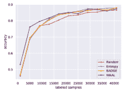

<!--yml

类别：未分类

日期：2024-09-06 19:47:36

-->

# [2203.13450] 深度主动学习的比较调研

> 来源：[`ar5iv.labs.arxiv.org/html/2203.13450`](https://ar5iv.labs.arxiv.org/html/2203.13450)

# 深度主动学习的比较调研

**詹雪莹**

香港城市大学

xyzhan2-c@my.cityu.edu.hk &**Qingzhong Wang**

百度研究院

wangqingzhong@baidu.com

**黄宽豪**

加州大学

khhuang@cs.ucla.edu

\AND**熊浩毅**

百度研究院

xionghaoyi@baidu.com &**Dejing Dou**

百度研究院

doudejing@baidu.com &**Antoni B. Chan**

香港城市大学

abchan@cityu.edu.hk 该工作在第一作者在百度研究院期间完成。

###### 摘要

尽管深度学习（DL）需要大量数据并且通常依赖于广泛的标注数据来实现良好性能，但主动学习（AL）通过从未标注数据中选择一小部分样本进行标注和训练，从而减少标注成本。因此，深度主动学习（DAL）近年来作为在有限标注成本/预算下最大化模型性能的可行解决方案而兴起。尽管已经开发了大量的 DAL 方法并进行过各种文献综述，但在公平比较设置下对 DAL 方法的性能评估仍然不可用。我们的工作旨在填补这一空白。在这项工作中，我们通过重新实现 19 种高度引用的 DAL 方法构建了一个 DAL 工具包，*$\text{DeepAL}^{+}$*。我们调研并分类了与 DAL 相关的工作，并在常用数据集和 DAL 算法之间构建了比较实验。此外，我们探讨了一些影响 DAL 效果的因素（例如，批量大小、训练过程中的轮次），为研究人员设计 DAL 实验或进行 DAL 相关应用提供了更好的参考。

## 1 引言

得益于在超参数化架构中的表示学习能力，深度神经网络（DNNs）已被广泛应用于各种机器学习（ML）任务。虽然 DNNs 可以处理大量训练数据并提供相当不错的性能，但收集和注释数据以供 DNNs 训练变得极其昂贵且耗时。另一方面，给定大量未标记的数据，主动学习（AL）通过选择小部分样本进行标注和训练来提高学习效率[76]。这样，DNNs 与 AL 的交集出现了一个*甜蜜点*，在这里可以实现表示学习并降低标注成本。深度主动学习（DAL）已在多个任务中得到应用，例如命名实体识别[9, 62]，语义解析[16]，目标检测[53, 23]，图像分割[6, 55]，计数[81]等。除了这些应用外，还设计了多个统一的 DAL 框架，并在各种任务上表现良好[57, 2, 50, 63]。

DAL 起源于用于经典 ML 任务的 AL，这在过去几年中已被广泛研究。AL 在经典 ML 任务中的应用出现在大量文献综述中 [59, 71, 19, 1, 17, 39, 74] 和比较研究中 [36, 56, 60, 68, 7, 65, 51, 49, 44, 80]。一些用于经典 ML 的传统 AL 方法已经推广到 DL 任务中 [69, 20, 3]。将 AL 方法调整以适用于经典 ML 任务面临几个需要克服的问题 [52]：1) 与使用固定预处理特征来计算不确定性/代表性的传统 AL 方法不同，在 DL 任务中，特征表示是与 DNN 共同学习的。因此，在 DAL 过程中，特征表示会动态变化，因此基于代表性的度量所使用的成对距离/相似度需要在每个阶段重新计算，而在经典 ML 任务中的 AL，这些成对项可以预先计算。2) DNN 通常对其预测过于自信，因此评估未标记数据的不确定性可能不可靠。Ren 等人 [52] 对 DAL 进行了全面的综述，系统地总结和分类了 $189$ 项现有工作。确实这是对 DAL 的全面研究，并指导了希望使用它的新研究人员和有经验的研究人员。然而，由于缺乏不同数据集/任务中各种 DAL 算法的实验比较，研究人员很难区分哪些 DAL 算法适合哪些任务。我们的工作旨在填补这一空白。

在这项工作中，我们通过重新实现本文中调查的 19 种 DAL 方法，构建了一个名为*$\text{DeepAL}^{+}$*的 DAL 工具包。*$\text{DeepAL}^{+}$*是我们之前工作的续集*DeepAL* [27]。与包含 2018 年前 11 种高引用 DAL 方法的*DeepAL*相比，在*$\text{DeepAL}^{+}$*中，1）我们升级和优化了在*DeepAL*中已经实现的一些算法；2）我们重新实现了更多的高引用 DAL 算法，其中大多数是在 2018 年后提出的；3）除了在*DeepAL*中采用的如*MNIST* [14]、*CIFAR* [38]和*SVHN* [45]等研究较多的数据集外，我们在*$\text{DeepAL}^{+}$*中整合了更多复杂的任务，如医学图像分析 [66, 31] 和具有相关背景（包含虚假关联）的物体识别 [54]。我们在多个任务上基于*$\text{DeepAL}^{+}$*对各种 DAL 方法进行了比较实验，并探讨了研究人员感兴趣的因素，如每次 AL 迭代中的批量大小和训练周期数的影响，以及时间成本比较。有关*$\text{DeepAL}^{+}$*的更多描述请参见附录 B 部分。

我们希望我们的比较研究/基准测试能为 DAL 提供真实的比较评估，快速了解哪些 DAL 模型更有效，以及 DAL 中的挑战和可能的研究方向，并为未来 DAL 方法的公平比较实验提供指导。更重要的是，我们期待我们的*$\text{DeepAL}^{+}$*能推动 DAL 的发展，因为*$\text{DeepAL}^{+}$*是可扩展的，允许轻松地整合新的基础任务/数据集、新的 DAL 算法和新的基础学习模型。这使得将 DAL 应用于下游任务以及设计新的 DAL 算法变得更加容易。*$\text{DeepAL}^{+}$*是一个持续的过程。我们将不断扩展它，加入更多的基础任务、模型和 DAL 算法。我们的*$\text{DeepAL}^{+}$*可在[`github.com/SineZHAN/deepALplus`](https://github.com/SineZHAN/deepALplus)上获取。

## 2 DAL 方法

本节概述了近年来高引用的 DAL 方法，包括查询策略和增强 DAL 方法的技术视角。

##### 问题定义。

我们仅讨论池式 AL，因为大多数 DAL 方法属于此类别。池式 AL 从大量未标记的 $i.i.d.$ 数据样本中迭代选择最有信息的数据，直到基本学习器达到一定性能水平或固定预算耗尽 [11]。我们考虑 DAL 的一般过程，以分类任务为例，其他任务（例如图像分割）遵循其任务领域的共同定义。我们有一个初始标记集 ${\mathcal{D}}_{l}=\{(\mathbf{x}_{j},y_{j})\}_{j=1}^{M}$ 和一个大型未标记数据池 ${\mathcal{D}}_{u}=\{\mathbf{x}_{i},\}_{i=1}^{N}$，其中 $M\ll N$，$y_{i}\in\{0,1\}$ 是 $\mathbf{x}_{i}$ 的类别标签（用于二分类），或 $y_{i}\in\{1,...,k\}$ 用于多分类。在每次迭代中，我们从 ${\mathcal{D}}_{u}$ 中基于基本学习模型 $\mathcal{M}$ 和获取函数 $\alpha(\mathbf{x},\mathcal{M})$ 选择批量样本 ${\mathcal{D}}_{q}$，并从 oracle 查询它们的标签。数据样本由 ${\mathcal{D}}_{q}^{*}=\arg\max\nolimits_{\mathbf{x}\in{\mathcal{D}}_{u}}^{b}\alpha(\mathbf{x},\mathcal{M})$ 选择，其中上标 $b$ 表示选择前 $b$ 个点。然后更新 ${\mathcal{D}}_{l}$ 和 ${\mathcal{D}}_{u}$，并在 ${\mathcal{D}}_{l}$ 上重新训练 $\mathcal{M}$。当预算 $Q$ 耗尽或达到所需模型性能时，DAL 终止。

### 2.1 查询策略

从查询策略的角度来看，DAL 可以分为 3 个分支：基于不确定性、基于代表性/多样性和组合策略，如图 1 所示。

图 1：DAL 采样/查询策略的分类。

#### 2.1.1 基于不确定性的查询策略

基于不确定性的 DAL 选择具有高内在不确定性或认知不确定性的数据样本，其中内在不确定性指数据生成过程中的自然随机影响导致的不确定性。认知不确定性来源于建模/学习过程，并由知识不足引起 [59, 58, 46, 30]。许多基于不确定性的 DAL 测度是从经典 ML 任务的池式 AL 技术中改编过来的。典型方法包括：

1.  1.

    最大熵（Entropy）[61] 选择数据 $\mathbf{x}$ 以最大化预测熵 $H_{\mathcal{M}}[y|\mathbf{x}]$：$\alpha_{\textbf{entropy}}(\mathbf{x},\mathcal{M})=H_{\mathcal{M}}[y|\mathbf{x}]=-\sum\nolimits_{k}p_{\mathcal{M}}(y=k|\mathbf{x})\log p_{\mathcal{M}}(y=k|\mathbf{x})$，其中 $p_{\mathcal{M}}(y|\mathbf{x})$ 是来自分类器 $\mathcal{M}$ 的后验标签概率。

1.  2.

    边际（Margin）[45] 选择其两个最可能标签 $(\hat{y}_{1},\hat{y}_{2})$ 后验概率差异最小的数据 $\mathbf{x}$：$\alpha_{\textbf{margin}}(\mathbf{x},\mathcal{M})=-[p_{\mathcal{M}}(\hat{y}_{1}|\mathbf{x})-p_{\mathcal{M}}(\hat{y}_{2}|\mathbf{x})]$。

1.  3.

    最小置信度（LeastConf）[69] 选择最可能标签 $\hat{y}$ 后验概率最低的数据 $\mathbf{x}$：$\alpha_{\textbf{LeastConf}}(\mathbf{x},\mathcal{M})=-p_{\mathcal{M}}(\hat{y}|\mathbf{x})$。类似的方法是变异率（VarRatio）[18]，它测量与 LeastConf 类似的置信度缺乏：$\alpha_{\textbf{VarRatio}}(\mathbf{x},\mathcal{M})=1-p_{\mathcal{M}}(\hat{y}|\mathbf{x})$。

1.  4.

    贝叶斯主动学习中的分歧（BALD）[26, 20] 选择那些预计能够最大化从模型参数 $\mathbf{\omega}$ 中获得信息的数据点，即预测与模型后验之间的互信息：$\alpha_{\textbf{BALD}}(\mathbf{x},\mathcal{M})=H_{\mathcal{M}}[y|\mathbf{x}]-\mathbb{E}_{p(\mathbf{\omega}|D_{l})}[H_{\mathcal{M}}[y|\mathbf{x},\mathbf{\omega}]]$。

1.  5.

    平均标准差（MeanSTD）[29] 最大化所有 $k$ 类别预测概率的平均标准差：$\alpha_{\textbf{MeanSTD}}(\mathbf{x},\mathcal{M})=\frac{1}{k}\sum\nolimits_{k}\sqrt{\text{Var}_{q(\omega)}[p(y=k|\mathbf{x},\omega)]}$。

受生成对抗样本的最新进展启发，一些深度主动学习（DAL）方法利用对抗攻击来排名每个未标记数据样本的不确定性/信息量。DeepFool 主动学习方法（AdvDeepFool）[15] 查询最接近其对抗攻击（DeepFool）的未标记样本。具体地，$\alpha_{\textbf{AdvDeepFool}}(\mathbf{x},\mathcal{M})=\mathbf{r}_{\mathbf{x}}$，其中 $\mathbf{r}_{\mathbf{x}}$ 是导致标签改变的最小扰动，例如，对于二分类问题，$\mathbf{r}_{\mathbf{x}}=\mathop{\mathrm{argmin}}_{\mathbf{r},~{}\mathcal{M}(\mathbf{x})\neq\mathcal{M}(\mathbf{x}+\mathbf{r})}-\tfrac{\mathcal{M}(\mathbf{x}+\mathbf{r})}{||\nabla\mathcal{M}(\mathbf{x}+\mathbf{r})||^{2}_{2}}\nabla\mathcal{M}(\mathbf{x}+\mathbf{r})$。DeepFool 攻击可以被其他攻击方法替代，例如，基本交互方法（BIM）[40]，称为 AdvBIM。

生成对抗主动学习（GAAL）[83]通过生成对抗网络（GANs）合成查询。与从未标记的数据池中选择点的常规主动学习不同，GAAL 通过 GAN 生成图像以便查询人工标注者。然而，生成的数据如果非常接近分类器的决策边界可能没有意义，甚至人工标注者也可能无法区分其类别。一种改进的方法称为贝叶斯生成主动深度学习（BGADL）[67]，将主动学习与数据增强结合。BGADL 利用典型的贝叶斯 DAL 方法来处理其获取函数（例如，$\alpha_{\textbf{BALD}}$），然后训练一个 VAE-ACGAN 生成合成数据样本以扩大训练集。其他实际的不确定性度量方法包括：i）利用梯度：Wang 等人[72]发现梯度范数可以有效地指导未标记数据的选择；即，选择具有较高梯度范数的未标记数据可以降低测试损失的上界。另一项利用梯度的工作是基于多样化梯度嵌入的批量主动学习（BADGE）[2]，将不确定性度量为相对于输出层参数的梯度大小，因为深度神经网络是通过如 SGD 等基于梯度的方法进行优化的。ii）损失预测损失（LPL）[78]使用损失预测策略，通过附加一个小的参数模块来训练预测未标记输入相对于目标模型的损失，通过最小化预测损失与目标损失之间的损失预测损失来进行训练。LPL 选择预测损失最高的前$b$个数据样本。

#### 2.1.2 代表性/基于多样性的查询策略

代表性/多样性策略选择代表未标记集的样本批次，基于这样的直觉：一旦标记，所选的代表性示例可以作为整个数据集的替代品 [2]。聚类方法在基于代表性的策略中被广泛使用。一个典型的方法是 KMeans，它通过按比例抽样距离最近的已选质心的平方距离来选择质心。另一种广泛采用的方法 [21, 57] 基于核心集选择一批代表性点，核心集是数据集的一个子样本，可以用作全体数据集的代理。CoreSet 在当前模型的倒数第二层空间 $h(\mathbf{x})$ 中进行测量。首先，给定 ${\mathcal{D}}_{l}$，选择与其在隐藏空间中最近邻的距离最大的示例 $\mathbf{x}_{u}$，其中 $u=\arg\max\nolimits_{\mathbf{x}_{i}\in{\mathcal{D}}_{u}}\min\nolimits_{\mathbf{x}_{j}\in{\mathcal{D}}_{l}}\Delta(h(\mathbf{x}_{i},\mathbf{x}_{j}))$。然后重复抽样直到达到批次大小 $b$。另一种方法，Cluster-Margin [12] 选择模型最不自信的一组多样化示例。它首先进行层次聚合聚类，使用平均链接作为预处理，然后选择具有最低边际分数（Margin）的未标记子集，再筛选为包含 $b$ 个样本的多样化集合。与 CoreSet 相比，Cluster-Margin 仅在预处理中运行一次聚类。

点过程也被应用于基于代表性的 DAL，例如 Active-DPP [4]。确定性点过程（DPP）通过构建成对的（非）相似性矩阵并计算其行列式来捕捉多样性。BADGE 也利用 DPP 作为代表性度量。判别性 AL（DiscAL） [22] 是一种代表性度量，类似于 GANs，试图欺骗一个试图区分来自两个不同分布（未标记/标记）的数据的判别器。变分对抗 AL（VAAL） [64] 使用 VAE 和训练来区分未标记数据和标记数据的对抗网络来学习标签数据在潜在空间中的分布。该网络通过重建和对抗损失进行优化。$\alpha_{\textbf{VAAL}}$ 是通过估计数据来自未标记数据的概率来形成的判别器。Wasserstein 对抗 AL（WAAL） [63] 通过 $\mathcal{H}$-散度在对抗训练中搜索多样化的未标记批次，这些批次也具有比标记样本更大的多样性。

#### 2.1.3 组合查询策略

由于 DAL 对于更大的批量大小（代表性/多样性）和更精确的决策边界（不确定性）的需求，组合策略已成为 DAL 的主流方法。其目标是实现查询选择中不确定性和代表性/多样性之间的权衡。我们在本文中主要讨论与多个目标（不确定性、多样性等）相关的优化方法，包括加权和优化和两阶段优化。

加权和优化既简单又灵活，其中目标函数的和用权重 $\beta$ 加权：$\alpha_{\textbf{weighted-sum}}=\alpha_{\textbf{uncertainty}}+\beta\alpha_{\textbf{representative}}$。然而，两个因素限制了它在组合 DAL 中的使用：1）它引入了额外的超参数 $\beta$ 进行调整；2）与基于不确定性的度量提供每个样本的单一得分不同，代表性通常以矩阵形式表达，这不容易转换为单个每样本得分。加权和优化的一个例子是开发-探索 [77] 选择最不确定且冗余最少的样本（开发），以及最具多样性的样本（探索）。具体来说，在开发步骤中，$\alpha_{\textbf{exploitation}}=\alpha_{\textbf{entropy}}({\mathcal{D}}_{q},\mathcal{M})-\tfrac{\beta}{|{\mathcal{D}}_{q}|}\alpha_{\textbf{similarity}}({\mathcal{D}}_{q})$。使用 DPPs 是在不引入额外超参数的情况下很好地平衡不确定性得分和成对多样性的方法 [4, 2, 79]。然而，DAL 中的 DPPs 采样并不简单，因为 DPPs 的时间复杂度为 $O(N^{3})$。

两阶段（多阶段）优化是一种流行的组合策略，每个阶段都使用不同的标准来优化前一个阶段的选择。例如，阶段 1 选择一个比 $b$ 更大的信息子集，然后阶段 2 选择具有最大多样性的 $b$ 个样本。WAAL 使用两阶段优化，通过在阶段 1 训练 DNN 以实现判别学习，并在阶段 2 进行批量选择 [63]。BADGE 在阶段 1 为每个未标记的数据样本计算梯度嵌入，然后在阶段 2 使用 KMeans++ 进行聚类 [2]。多样化小批量主动学习（DBAL） [82] 首先将未标记的数据池预过滤到前 $\rho b$ 个最具信息量/不确定性的样本（$\rho$ 是预过滤因子），然后用（加权）KMeans 将这些样本聚成 $b$ 个簇，并选择最接近簇中心的 $b$ 个样本。

### 2.2 DAL 方法的增强

在第 2.1 节中，许多被高度引用的 DAL 方法设计了获取函数，例如**熵**、**CoreSet**和**BADGE**。这些方法由于仅涉及数据选择过程，而不是主干网络的训练过程，因此容易适应各种任务。然而，这些 DAL 方法的性能表现有限，例如，某些方法可能无法超过在全数据上训练的表现。一些 DAL 模型被提出用于增强 DAL 方法，突破这些限制，这些方法可以分为两个方面：数据方面和模型方面。数据方面包括数据增强和伪标签，而模型方面包括附加额外网络、修改损失函数和集成。由于篇幅限制，我们排除了那些修改 DAL 方法的相关联合任务，如半监督/自监督/无监督/监督学习、迁移学习或强化学习。

##### 数据方面。

伪标签利用大规模未标记数据进行训练。成本效益主动学习（CEAL）[70]为下一个迭代的训练分配由$\mathcal{M}$预测的高置信度（低熵$H_{\mathcal{M}}[y|\mathbf{x}]$）伪标签。然而，这引入了新的超参数来阈值预测置信度，如果调整不好，可能会用错误标签破坏训练集[15]。数据增强使用标记样本来扩大训练集。然而，数据增强可能浪费计算资源，因为它无差别地生成样本，这些样本不一定具有信息性。AdvDeepFool 将对抗样本添加到训练集中[15]，而 BGADL 则采用 ACGAN 和贝叶斯数据增强生成与选定样本一样有信息量的新人工样本[67]。

##### 模型方面。

一些研究人员利用额外的模块来提高目标模型的性能，并在 DAL 中进行选择。例如，LPL 联合学习目标骨干模型和损失预测模型，这可以预测目标模型何时可能产生错误的预测。Choi 等人[10]构建了混合密度网络来估计每个定位和分类头输出的概率分布，以用于目标检测任务。修订目标模型的损失函数也是一种有前途的方法。WAAL 通过利用未标记的数据来采用最小-最大损失，以更好地区分标记样本和未标记样本[63]。另一种方法是集成学习。DNN 使用 softmax 层来获得标签的后验概率，并在计算不确定性时倾向于过度自信。为了增加不确定性，Gal 等人[20]利用 Monte-Carlo（MC）Dropout，其中权重$\omega$中的不确定性通过使用 MC 积分对近似后验进行边际化来引起预测不确定性。这可以视为一个通过 dropout 采样的模型集合。Beluch 等人[3]发现，多个分类器的集成在计算不确定性分数时表现优于 MC Dropout。

## 3 DAL 的比较实验

我们在$19$种方法上进行比较，这些方法在$10$个公开数据集上进行，其中这些数据集的选择参考了[52]（见[52]中的表 2）和引用率高的 DAL 论文。

### 3.1 实验设置

##### 数据集。

考虑到一些 DAL 方法目前仅支持计算机视觉任务，如 VAAL，为了保持实验的一致性和公平性，我们采用了与大多数 DAL 论文类似的图像分类任务。我们使用：*MNIST* [14]、*FashionMNIST* [75]、*EMNIST* [13]、*SVHN* [45]、*CIFAR10*、*CIFAR100* [38]和*TinyImageNet* [41]。我们基于*CIFAR10*构建了一个不平衡的数据集，称为*CIFAR10-imb*，它对训练集进行子采样，类别 0 至 9 的比例为 1:2:$\cdots$:10。我们还考虑了医学影像分析任务，包括乳腺癌组织病理图像分类（*BreakHis*）[66]和胸部 X 光肺炎分类（Pneumonia-MNIST）[31]。此外，我们还采用了一个具有相关背景的目标识别数据集（*Waterbird*）[54, 35]。该数据集包含水鸟和陆鸟类别，这些类别被手动混合到水域和陆地背景中。这具有挑战性，因为 DNN 可能会虚假地依赖背景，而不是学习识别对象语义。

##### DAL 方法。

我们测试了随机采样（Random）、熵（Entropy）、边际（Margin）、LeastConf 及其 MC Dropout 版本 [3]（分别表示为 EntropyD、MarginD、LeastConfD）、BALD、MeanSTD、VarRatio、CEAL（Entropy）、KMeans、CoreSet 的贪婪版本（表示为 KCenter）、BADGE、对抗 BIM、WAAL、VAAL 和 LPL。对于 KMeans，考虑到我们需要对大量数据进行聚类，基于 scikit-learn 库的原始 KMeans 实现[48]在大规模未标记数据池上会耗时过长。因此，为了节省时间成本并使我们的*$\text{DeepAL}^{+}$* 更适应 DL 任务，我们基于 faiss 库[28]实现了 GPU 版本的 KMeans（KMeans（GPU））。

对于所有 AL 方法，我们采用了 ResNet18（无预训练）[24]作为基本学习器。为了公平比较，在所有 DAL 方法中使用了一致的基本分类器实验设置。我们使用*$\text{DeepAL}^{+}$*工具包运行这些实验。

##### 实验协议。

我们对每个实验重复进行$3$次试验，随机分割初始标记和未标记池（使用相同的随机种子），并报告平均测试性能。为了简洁起见，我们报告了*总体性能*，使用*预算曲线下面积（AUBC）* [80, 79]，其中性能-预算曲线是通过评估 DAL 方法在不同预算下生成的（例如，准确率与预算）。较高的 AUBC 值表示更好的总体性能。我们还报告了最终准确率（F-acc），即预算$Q$耗尽后的准确率。实验设置的更多细节（即数据集、实现）见附录的 D 节。

|  |  | *MNIST* | *FashionMNIST* | *EMNIST* | *SVHN* | *PneumoniaMNIST* |
| --- | --- | --- | --- | --- | --- | --- |
|  | 模型 | AUBC | F-acc | AUBC | F-acc | AUBC | F-acc | AUBC | F-acc | AUBC | F-acc |
|  | 完整 | $-$ | $0.9916$ | $-$ | $0.9120$ | $-$ | $0.8684$ | $-$ | $0.9190$ | $-$ | $0.9039$ |
|  | 随机 | $0.9570$ | $0.9738$ | $0.8313$ | $0.8434$ | $0.8057$ | $0.8377$ | $0.8110$ | $0.8806$ | $0.8283$ | $\mathbf{0.9077}$ |
|   Unc | LeastConf | $0.9677$ | $0.9892$ | $0.8377$ | $0.8820$ | $0.8113$ | $0.8479$ | $0.8350$ | $0.9094$ | $0.8520$ | $\mathbf{0.9097}$ |
| LeastConfD | $0.9750$ | $0.9915$ | $0.8450$ | $0.8744$ | $0.8117$ | $0.8483$ | $0.8320$ | $0.9083$ | $0.8243$ | $0.8654$ |
| Margin | $0.9733$ | $0.9881$ | $0.8427$ | $0.8772$ | $0.8103$ | $0.8468$ | $0.8373$ | $0.9138$ | $0.8580$ | $0.8859$ |
| MarginD | $0.9703$ | $0.9899$ | $0.8417$ | $0.8756$ | $0.8197$ | $0.8472$ | $0.8357$ | $0.9104$ | $0.8230$ | $\mathbf{0.9149}$ |
| Entropy | $0.9723$ | $0.9883$ | $0.8397$ | $0.8660$ | $0.8090$ | $0.8458$ | $0.8297$ | $0.9099$ | $0.8570$ | $\mathbf{0.9132}$ |
| EntropyD | $0.9683$ | $0.9887$ | $0.8417$ | $0.8784$ | $0.8167$ | $0.8507$ | $0.8290$ | $0.9091$ | $0.8177$ | $0.8710$ |
| BALD | $0.9697$ | $0.9885$ | $0.8423$ | $0.8888$ | $0.8197$ | $0.8448$ | $0.8333$ | $0.9020$ | $0.8270$ | $\mathbf{0.9204}$ |
| MeanSTD | $0.9713$ | $0.9735$ | $0.8457$ | $0.8766$ | $0.8110$ | $0.8426$ | $0.8323$ | $0.9087$ | $0.7827$ | $0.8802$ |
| VarRatio | $0.9717$ | $0.9841$ | $0.8410$ | $0.8754$ | $0.8107$ | $0.8497$ | $0.8357$ | $0.9079$ | $0.8530$ | $0.8672$ |
| CEAL(Entropy) | $0.9787$ | $0.9889$ | $0.8477$ | $0.8826$ | $0.8163$ | $0.8459$ | $0.8430$ | $0.9142$ | $0.8543$ | $\mathbf{0.9179}$ |
| Repr/Div | KMeans | $0.9640$ | $0.9813$ | $0.8260$ | $0.8525$ | $0.7903$ | $0.8264$ | $0.8027$ | $0.8671$ | $0.8243$ | $\mathbf{0.9044}$ |
| KMeans (GPU) | $0.9637$ | $0.9747$ | $0.8343$ | $0.8657$ | $0.7990$ | $0.8362$ | $0.8120$ | $0.8688$ | $0.8333$ | $\mathbf{0.9155}$ |
| KCenter | $0.9740$ | $0.9877$ | $0.8353$ | $0.8466$ | $*$ | $*$ | $0.8283$ | $0.9000$ | $0.8130$ | $\mathbf{0.9189}$ |
| VAAL | $0.9623$ | $0.9573$ | $0.8297$ | $0.8535$ | $0.8027$ | $0.8363$ | $0.8117$ | $0.8813$ | $0.8393$ | $0.9064$ |
|  | BADGE(KMeans++) | $0.9707$ | $0.9904$ | $0.8437$ | $0.8662$ | $*$ | $*$ | $0.8377$ | $0.9057$ | $0.8340$ | $\mathbf{0.9066}$ |
| Enhance | AdvBIM | $0.9680$ | $0.9840$ | $0.8437$ | $0.8729$ | # | # | # | # | $0.8297$ | $0.9197$ |
| LPL | $0.8913$ | $0.9732$ | $0.7600$ | $0.8471$ | $0.5640$ | $0.6474$ | $0.8737$ | $\mathbf{0.9452}$ | $0.8593$ | $\mathbf{0.9346}$ |
| WAAL | $0.9890$ | $\mathbf{0.9946}$ | $0.8703$ | $0.8984$ | $0.8293$ | $0.8423$ | $0.8603$ | $0.9135$ | $0.9663$ | $\mathbf{0.9564}$ |
|  |  | *CIFAR10* | *CIFAR100* | *CIFAR10-imb* | *Tiny ImageNet* | *BreakHis* |
|  | Full | $-$ | $0.8793$ | $-$ | $0.6062$ | $-$ | $0.8036$ | $-$ | $0.4583$ | $-$ | $0.8306$ |
|  | Random | $0.7967$ | $0.8679$ | $0.4667$ | $0.5903$ | $0.7103$ | $\mathbf{0.8105}$ | $0.2577$ | $0.3544$ | $0.8010$ | $0.8150$ |
|   Unc | LeastConf | $0.8150$ | $0.8785$ | $0.4747$ | $\mathbf{0.6072}$ | $0.7330$ | $0.8022$ | $0.2417$ | $0.3470$ | $0.8213$ | $0.8302$ |
| LeastConfD | $0.8137$ | $\mathbf{0.8825}$ | $0.4730$ | $0.5997$ | $0.7323$ | $\mathbf{0.8065}$ | $0.2620$ | $0.3698$ | $0.8140$ | $\mathbf{0.8313}$ |
| Margin | $0.8153$ | $\mathbf{0.8834}$ | $0.4790$ | $0.6010$ | $0.7367$ | $0.8029$ | $0.2557$ | $0.3611$ | $0.8217$ | $0.8289$ |
| MarginD | $0.8140$ | $\mathbf{0.8837}$ | $0.4777$ | $0.6000$ | $0.7260$ | $\mathbf{0.8128}$ | $0.2607$ | $0.3541$ | $0.8253$ | $\mathbf{0.8364}$ |
| Entropy | $0.8130$ | $0.8784$ | $0.4693$ | $0.6048$ | $0.7320$ | $\mathbf{0.8187}$ | $0.2343$ | $0.3346$ | $0.8213$ | $0.8251$ |
| EntropyD | $0.8140$ | $0.8787$ | $0.4677$ | $0.6004$ | $0.7317$ | $0.7963$ | $0.2627$ | $0.3716$ | $0.8017$ | $0.8115$ |
| BALD | $0.8103$ | $0.8762$ | $0.4760$ | $0.5942$ | $0.7210$ | $0.7927$ | $0.2623$ | $0.3648$ | $0.8147$ | $0.8296$ |
| MeanSTD | $0.8087$ | $\mathbf{0.8821}$ | $0.4717$ | $0.5963$ | $0.7203$ | $0.7996$ | $0.2510$ | $0.3551$ | $0.8053$ | $0.8202$ |
| VarRatio | $0.8150$ | $0.8780$ | $0.4747$ | $0.5959$ | $0.7353$ | $\mathbf{0.8165}$ | $0.2407$ | $0.3426$ | $0.8197$ | $0.8264$ |
| CEAL(Entropy) | $0.8150$ | $\mathbf{0.8794}$ | $0.4693$ | $0.6043$ | $0.7327$ | $\mathbf{0.8187}$ | $0.2347$ | $0.3400$ | $0.8163$ | $0.8181$ |
|   Repr/Div | KMeans | $0.7910$ | $0.8713$ | $0.4570$ | $0.5834$ | $0.7070$ | $0.7908$ | $0.2447$ | $0.3385$ | $0.8203$ | $\mathbf{0.8394}$ |
| KMeans (GPU) | $0.7977$ | $0.8718$ | $0.4687$ | $0.5842$ | $0.7140$ | $0.7921$ | $0.1340$ | $0.2288$ | $0.8140$ | $\mathbf{0.8323}$ |
| KCenter | $0.8047$ | $0.8741$ | $0.4770$ | $0.5993$ | $0.7233$ | $0.7826$ | $0.2540$ | $0.346$ | $0.8027$ | $0.8289$ |
| VAAL | $0.7973$ | $0.8679$ | $0.4693$ | $0.5870$ | $0.7113$ | $0.7950$ | $0.1313$ | $0.2191$ | $0.8197$ | $\mathbf{0.8344}$ |
|  | BADGE(KMeans++) | $0.8143$ | $\mathbf{0.8794}$ | $0.4803$ | $0.6034$ | $0.7347$ | $\mathbf{0.8126}$ | # | # | $0.8343$ | $\mathbf{0.8470}$ |
| Enhance | AdvBIM | $0.7997$ | $0.8750$ | $0.4713$ | $0.5855$ | # | # | # | # | $0.8240$ | $\mathbf{0.8337}$ |
| LPL | $0.8220$ | $\mathbf{0.9028}$ | $0.4640$ | $\mathbf{0.6369}$ | $0.7477$ | $\mathbf{0.8478}$ | $0.0090$ | $0.0051$ | $0.8277$ | $\mathbf{0.8316}$ |
| WAAL | $0.8253$ | $0.8717$ | $0.4277$ | $0.5560$ | $0.7523$ | $0.7993$ | $0.0157$ | $0.0050$ | $0.8620$ | $\mathbf{0.8698}$ |

表 1：DAL 比较实验的总体结果。我们将 F-acc 值中高于完整性能的值用粗体表示。我们用红色、青色和蓝色分别标记了每个任务的 F-acc 和 AUBC 的前 1、2 和 3 名。“$*$”表示实验需要过多内存，例如 *EMNIST* 上的 KCenter。“#”表示尚未完成的实验。所有任务的完整表格见附录中的表 4、5、6、7 和 8。

### 3.2 比较实验分析

为了分析实验结果，我们大致将任务分为三组：1) 标准图像分类，包括 *MNIST*、*FashionMNIST*、*EMNIST*、*SVHN*、*CIFAR10*、*CIFAR10-imb*、*CIFAR100* 和 *TinyImageNet*；2) 医学图像分析，包括 *BreakHis* 和 *PneumoniaMNIST*；3) 比较研究，包括 *MNIST* 和 *Waterbird*，将在第 3.4 节中介绍。我们在表 1 中报告了 *AUBC (acc)* 和 F-acc 性能。我们提供了整体准确度-预算曲线和总结表格，详见图 5 和附录中的表 4 至表 9。

在组 1 的典型基于不确定性的策略中，标准图像分类任务（见表格 1），从 LeastConf 到 CEAL 的平均性能通常比 Random 高 $1\%\sim 3\%$（*AUBC*）。在这些基于不确定性的方法中，我们进行了各方法与其他方法的配对 t 检验，比较了组 1 标准图像分类任务中的 AUBC，结果没有方法表现显著优于其他方法（所有 $p$-值均大于 $0.05$）。考虑到 dropout，与原始版本（例如 EntropyD 与 Entropy）相比，正常图像分类任务中的影响微乎其微（或甚至与直觉相反），这与 [3] 中的观察一致，*TinyImageNet* 除外。在 *TinyImageNet* 上，dropout 版本的性能通常比原始版本高 $1\%\sim 3\%$。一个可能的解释是，使用单个骨干模型提供的特征表示来计算不确定性评分并不准确，而 dropout 技术可以帮助增加不确定性，增加无标签数据样本之间的不确定性评分差异。因此，dropout 版本在 *TinyImageNet* 上提供了更好的获取函数。另一个比较组是 CEAL(Entropy) 和 Entropy，CEAL 在 $8$ 个数据集上的平均性能比 Entropy 高 $0.5\%$，阈值为置信度/熵 1e-5。这一思路似乎有效，但必须仔细调整阈值以获得更好的性能。在医学图像分析任务（例如 *PneumoniaMNIST*）中，性能略有不同；VarRatio 甚至比 Random 低 $4.5\%$。此外，我们观察到许多 DAL 算法的 F-acc 高于完整数据的性能（例如 KCenter 的 F-acc 为 $0.9189$ 和完整数据为 $0.9039$），且 dropout 版本的表现比正常方法差，例如 Entropy 的 $0.857$ 和 EntropyD 的 $0.8177$。这些异常现象可能是由于训练/测试集之间的分布偏移和 AL 过程中的数据冗余造成的。详细解释见附录 E.1 节。

相比于基于不确定性的度量，基于代表性/多样性的方法（KMeans、KCenter 和 VAAL）的表现并没有明显的优势。此外，它们的时间和内存成本相对较高，因为 KMeans 和 KCenter 使用的成对距离矩阵在每次迭代中都需要重新计算当前特征表示，而 VAAL 需要重新训练一个 VAE。此外，对于像*EMNIST*这样的大型无标签数据池，需要高内存负载来存储成对距离矩阵。

与经典机器学习任务上的基于代表性的主动学习策略的表现相比[80]，我们认为良好的基于代表性的深度主动学习性能是基于良好的特征表示。我们的分析与[43]中的隐式分析一致。与 CPU 版 KMeans 相比，KMeans (GPU)在时间效率上更高（见附录中的 E.1 节），并且表现更好（见表 1）。

结合策略 BADGE 在多个数据集上显示出其优势，在这些数据集中，它的表现始终相对较好。与单独的 KMeans 相比，BADGE 的 AUBC 性能提高了$1\%\sim 3\%$，并且在*CIFAR100*数据集上，其表现与基于不确定性的策略相当，并且 AUBC 更高。

对于像 LPL、WAAL、AdvBIM 和 CEAL 这样的增强型深度主动学习方法，我们很高兴看到它们相对于典型的深度主动学习方法的潜力。例如，LPL 在完整训练上提高了在*SVHN*上的 F-acc（$0.9452$对比$0.8793$）、*CIFAR10*（$0.9028$对比$0.8793$）、*CIFAR100*（$0.6369$对比$0.6062$）和*CIFAR10-imb*（$0.8478$对比$0.8036$）。然而，LPL 对用于预测目标损失的 LossNet 中的超参数非常敏感，例如，由 LossNet 中的 FC 层确定的特征大小。LPL 在*EMNIST*和*TinyImageNet*上的结果表明，它并不适用于所有数据集（我们尝试了许多 LossNet 的超参数设置，但都没有成功）。WAAL 也出现了类似的现象。一个可能的解释是，*EMNIST*和*TinyImageNet*包含的类别过多，这给 LPL 中的损失预测和 WAAL 中的多样化特征提取带来了困难。在第 3.4 节中，这一解释得到了进一步验证——我们采用了预训练的 ResNet18 作为基本分类器，这为损失预测获得了更好的特征表示，从而使 LPL 的性能优于未预训练的版本（$0.9923$对比$0.8913$）。对 CIFAR100 的性能比较也支持了这一解释。AdvBIM 通过增加对抗样本来进行训练，但并没有像 LPL 那样取得突破性的表现。这些对抗样本被当前的主干模型学习到，因此 AdvBIM 提供的改进是边际性的。此外，AdvBIM 非常耗时，因为它需要在每次迭代中计算每个未标记数据样本的对抗距离$\mathbf{r}$。由于计算要求过高，AdvBIM 在*EMNIST*和*TinyImageNet*上的运行无法完成。

### 3.3 消融研究 – 训练周期和批量大小

相比于通常是凸优化问题并具有全局最优解的经典机器学习任务[80]，深度学习通常涉及具有局部最小值的非凸优化问题。不同的超参数，如学习率、优化器、训练周期数量和主动学习（AL）批次大小，会导致不同的解和各种性能。在这里，我们对每次主动学习迭代中的训练周期数量和批次大小 $b$ 的影响进行了消融研究。图 3 展示了结果（更多图见附录中的图 6）。与随机方法相比，当模型使用更多的训练周期时，熵方法（Entropy）表现更好，例如，当模型训练 $30$ 个周期时，熵方法将 AUBC 提高了约 $1.5$。我们还发现，使用更多的训练周期会带来更好的性能，例如，对于随机方法，AUBC 从约 $0.66$ 逐渐增加到 $0.80$。值得注意的是，增加训练周期数所带来的 AUBC 改进具有递减回报。一些研究人员在深度主动学习（DAL）训练过程中喜欢使用大量的周期，例如，Yoo 和 Kweon [78] 使用了 $200$ 个周期。然而，其他研究人员如[32]则建议，由于泛化问题，增加训练周期数不会有效提高测试性能。因此，选择一个最优的训练周期数量对于减少计算成本同时保持良好的模型性能至关重要。有趣的是，AL 批次大小对性能的影响较小，例如，熵方法在使用不同的 AL 批次大小 $500$、$1000$ 和 $2000$ 时，表现相似，这对于 DAL 来说很重要，因为我们可以使用相对较大的批次大小来减少训练周期的数量。

WAAL 的表现始终优于熵方法（Entropy）和 BADGE，并且训练周期数量对其性能影响较小，例如，当训练 $5$ 个周期时，WAAL 的 AUBC 为 $0.825$，当训练周期增加到 30 个时，AUBC 保持不变。可能的原因是 WAAL 考虑了样本之间的多样性，并通过利用未标记数据的信息构建了良好的表示，从而减少了数据偏差。此外，我们在图 A3 中展示了使用不同批次大小和训练周期的准确度-预算曲线。我们还总结了训练周期对 WAAL 的影响较小，这对主动学习方法非常重要，因为较少的训练周期可以节省训练时间。此外，WAAL 超越了其对手（即 Badge 和 Entropy）。

图 2：在 *CIFAR10* 上的不同训练周期数量和批次大小的消融研究。

图 3：ResNet18 在有无 ImageNet1K 预训练下的激活图。

(a)

(b)

(c)

(d)

(e)

(f)

(g)

(h)

图 4：*MNIST*和*Waterbird*数据集上的总体（不匹配，最差组）准确率与预算曲线。

### 3.4 预训练如何影响 DAL 性能？

近年来，预训练已成为 DNN 研究和应用的核心技术[25]。在我们的工作中，我们选择了*Waterbird*和*MNIST*数据集进行对比实验，分别使用未预训练的 ResNet18 和预训练的 ResNet18（简称 ResNet18P，预训练数据为 ImageNet-1K）。*Waterbird*和*MNIST*具有完全不同的性质。*Waterbird*数据集包含虚假关联，未预训练模型会更多地关注背景，例如，当背景是水时，分类器会错误地将陆地鸟分类为水鸟。预训练模型提供了更好的特征表示，并允许更好的对象语义（见图 3）。*Waterbird*数据集基于对象和背景被分为四组：$\{(\text{水鸟, 水}),\text{(水鸟, 陆地}),\text{(陆地鸟, 陆地}),\text{(陆地鸟, 陆地})\}$。除了整体准确率外，我们还报告了不匹配和最差组的准确率[54, 42]，它们分别指代组$\{(\text{水鸟, 陆地}),\text{(陆地鸟, 水})\}$的准确率和四组中的最低准确率。在*MNIST*上，没有有效的背景信息。因此，无论是否预训练，两种模型都会关注语义本身。此实验的目标是观察预训练技术如何影响在困难任务（即*Waterbird*）和简单/研究充分的任务（即*MNIST*）上的 DAL，以及基本学习者生成的特征表示如何影响 DAL 方法。

图 4 展示了*MNIST*和*Waterbird*的总体（以及*Waterbird*中的不匹配和最差组）准确度与预算曲线。在*MNIST*中，预训练确实增强了总体 DAL 性能，但这些方法的排名没有变化（除了 LPL），例如，Entropy $>$ EntropyD $>$ KMeans，在*MNIST*的 ResNet18 和 ResNet18P 中均是如此。基于 ResNet18P，LPL 表现远超其他方法，因为损失预测更准确，特征表示更好。在*Waterbird*中，考虑到 ResNet18 没有预训练，正常的 DAL 方法如 Entropy、EntropyD、CEAL 和 KMeans 受限于主干网络的质量，这影响了 DAL 的选择。此外，选择更多数据甚至会引入更多的偏差（*Waterbird*在四个组中是不平衡的），并导致性能下降。这些 DAL 方法在使用预训练的 ResNet18P 时恢复正常，因为它有助于生成具有准确方向的预测（即，专注于目标本身，如图 3 所示）。在*Waterbird*中，LPL 和没有预训练的 WAAL 表现更好，可能是因为它们借助增强技术（即，损失预测和收集未标记数据的信息）获取了更多信息。然而，LPL 和 WAAL 在有无预训练的情况下都无法很好地学习最差组。一个可能的解释是，它们受到了这些组的不平衡问题的影响，这导致了损失预测和收集未标记数据的信息中的偏差问题，从而导致最差组的表现不佳。

## DAL 的挑战与未来方向

由于仅通过设计获取函数（如第 2.2 节和第 3.2 节所示）来改进 DAL 的空间有限，研究人员专注于提出有效的方法来增强 DAL 方法，如 LPL，以及在每轮中增加批量大小，以减少时间和计算成本。然而，增强方法可能并不适用于所有任务（如表 1 所示）。在 DAL 中需要更好且更通用的增强方法。Cluster-Margin 已扩展到比之前研究大几个数量级的批量大小（100K-1M）[12]，这很难被超越。

另一个显著的情况是研究趋势转向开发新方法，以更好地利用未标记的数据，如半监督学习和自监督学习（S4L）。Chan 等人[8]将 S4L 与 DAL 结合，并进行了广泛的实验，证明了 DAL 的大部分好处被 S4L 技术所涵盖。一个明确的方向是在 DAL 过程中，在标签非常稀少的情况下更好地利用未标记的数据。

最近，一些研究者在更复杂的任务上使用了 DAL，例如视觉问答（VQA）[30]，并观察到 DAL 方法可能表现不佳。

许多潜在原因限制了 DAL 的性能：i) 可能需要特定任务的 DAL；ii) 需要更好的特征表示；iii) 需要考虑各种数据集属性，例如 VQA 任务中的集体离群点[30]。这些都是需要及时解决的可能研究方向。因此，随着处理现实场景中更大更复杂数据（例如，分布外（OOD）、稀有类别、不平衡数据和更大未标记数据池[37, 12]）的需求增加，不同数据类型下的 DAL 变得越来越受欢迎。例如，Kothawade 等人[37]让 DAL 在稀有类别、冗余、不平衡和 OOD 数据场景中发挥作用。

另一个可能的研究方向是将 DAL 技术应用于数据不足的新任务，如自动驾驶、医学图像分析等。Haussmann 等人[23]在夜间行人和自行车检测的自动驾驶环境中应用了 AL，以改善夜间对行人和自行车的检测。结果显示，与人工筛选的数据相比，使用 AL 选出的数据在行人检测的平均精度上有$3\times$的相对提升，自行车检测上有$4.4\times$的提升。Budd 等人[5]展示了 AL 在医学领域采用的调研。不同任务在整合 DAL 技术时有不同的关注点。例如，在医学影像中，有许多罕见但重要的疾病（如各种癌症），而非癌症图像相比癌症图像要多得多[37]。因此，在医学图像分析中设计 AL 策略时必须考虑罕见类别。更重要的是，标记医学图像需要专业知识，标注成本和工作量仍然很大。近年来，任务特定的 DAL 也值得研究。

## 致谢和资金披露

本文的部分实验（包括在*PneumoniaMNIST*和*BreakHis*数据集上的实验）是在百度数据联邦平台（Baidu FedCube）上进行的。有关使用，请通过{fedcube,shubang}@baidu.com 与我们联系。

## 参考文献

+   Aggarwal 等人[2014] Charu C Aggarwal, Xiangnan Kong, Quanquan Gu, Jiawei Han, 和 S Yu Philip. 主动学习：一项综述。见于*数据分类*，第 599–634 页。Chapman and Hall/CRC，2014 年。

+   Ash 等人[2020] Jordan T. Ash, Chicheng Zhang, Akshay Krishnamurthy, John Langford, 和 Alekh Agarwal. 通过多样化、不确定的梯度下界进行深度批量主动学习。见于*第 8 届国际学习表征会议，ICLR 2020，埃塞俄比亚亚的斯亚贝巴，2020 年 4 月 26-30 日*。OpenReview.net，2020 年。

+   Beluch 等人[2018] William H Beluch, Tim Genewein, Andreas Nürnberger, 和 Jan M Köhler. 集成学习在图像分类中的强大作用。见于*IEEE 计算机视觉与模式识别会议论文集*，第 9368–9377 页，2018 年。

+   Bıyık 等人[2019] Erdem Bıyık, Kenneth Wang, Nima Anari, 和 Dorsa Sadigh. 使用行列式点过程的批量主动学习。*arXiv 预印本 arXiv:1906.07975*，2019 年。

+   Budd 等人[2021] Samuel Budd, Emma C Robinson, 和 Bernhard Kainz. 主动学习和人机协作深度学习在医学图像分析中的调查。*医学图像分析*，71:102062，2021 年。

+   Casanova 等人[2020] Arantxa Casanova, Pedro O Pinheiro, Negar Rostamzadeh, 和 Christopher J Pal. 强化主动学习用于图像分割。*arXiv 预印本 arXiv:2002.06583*，2020 年。

+   Cawley[2011] Gavin C Cawley. 主动学习的基准方法。见于*主动学习与实验设计研讨会（与 AISTATS 2010 同时举行）*，第 47–57 页。JMLR 研讨会与会议论文集，2011 年。

+   Chan 等人[2021] Yao-Chun Chan, Mingchen Li, 和 Samet Oymak. 主动学习的边际效益：自监督是否会吃掉它的蛋糕？见于*ICASSP 2021-2021 IEEE 国际声学、语音与信号处理会议（ICASSP）*，第 3455–3459 页。IEEE，2021 年。

+   Chen 等人[2015] Yukun Chen, Thomas A Lasko, Qiaozhu Mei, Joshua C Denny, 和 Hua Xu. 一项关于临床文本中命名实体识别的主动学习方法的研究。*生物医学信息学杂志*，58:11–18，2015 年。

+   Choi 等人[2021] Jiwoong Choi, Ismail Elezi, Hyuk-Jae Lee, Clement Farabet, 和 Jose M Alvarez. 通过概率建模进行深度对象检测的主动学习。*arXiv 预印本 arXiv:2103.16130*，2021 年。

+   Chu 等人[2011] Wei Chu, Martin Zinkevich, Lihong Li, Achint Thomas, 和 Belle Tseng. 数据流中的无偏在线主动学习。见于*第 17 届 ACM SIGKDD 国际知识发现与数据挖掘会议论文集*，第 195–203 页，2011 年。

+   Citovsky 等人[2021] Gui Citovsky, Giulia DeSalvo, Claudio Gentile, Lazaros Karydas, Anand Rajagopalan, Afshin Rostamizadeh, 和 Sanjiv Kumar. 大规模批量主动学习。*神经信息处理系统进展*，34，2021 年。

+   Cohen 等 [2017] Gregory Cohen, Saeed Afshar, Jonathan Tapson 和 Andre Van Schaik。Emnist：将 mnist 扩展到手写字母。在 *2017 国际联合神经网络会议 (IJCNN)*，第 2921–2926 页。IEEE，2017 年。

+   Deng [2012] Li Deng。用于机器学习研究的手写数字图像的 mnist 数据库。*IEEE 信号处理杂志*，29(6):141–142，2012 年。

+   Ducoffe 和 Precioso [2018] Melanie Ducoffe 和 Frederic Precioso。针对深度网络的对抗性主动学习：一种基于边际的方法。*arXiv 预印本 arXiv:1802.09841*，2018 年。

+   Duong 等 [2018] Long Duong, Hadi Afshar, Dominique Estival, Glen Pink, Philip R Cohen 和 Mark Johnson。深度语义解析的主动学习。在 *第 56 届计算语言学协会年会论文集 (第 2 卷：短论文)*，第 43–48 页，2018 年。

+   Elahi 等 [2016] Mehdi Elahi, Francesco Ricci 和 Neil Rubens。协同过滤推荐系统中的主动学习调查。*计算机科学评论*，20:29–50，2016 年。

+   Freeman 和 Freeman [1965] Linton C Freeman 和 Linton C Freeman. *初级应用统计学：行为科学学生的指南*。纽约：Wiley，1965 年。

+   Fu 等 [2013] Yifan Fu, Xingquan Zhu 和 Bin Li。关于主动学习的实例选择的调查。*知识与信息系统*，35(2):249–283，2013 年。

+   Gal 等 [2017] Yarin Gal, Riashat Islam 和 Zoubin Ghahramani。使用图像数据的深度贝叶斯主动学习。在 *国际机器学习会议*，第 1183–1192 页。PMLR，2017 年。

+   Geifman 和 El-Yaniv [2017] Yonatan Geifman 和 Ran El-Yaniv。长尾上的深度主动学习。*arXiv 预印本 arXiv:1711.00941*，2017 年。

+   Gissin 和 Shalev-Shwartz [2019] Daniel Gissin 和 Shai Shalev-Shwartz。区分性主动学习。*arXiv 预印本 arXiv:1907.06347*，2019 年。

+   Haussmann 等 [2020] Elmar Haussmann, Michele Fenzi, Kashyap Chitta, Jan Ivanecky, Hanson Xu, Donna Roy, Akshita Mittel, Nicolas Koumchatzky, Clement Farabet 和 Jose M Alvarez。用于目标检测的可扩展主动学习。在 *2020 IEEE 智能车辆研讨会 (IV)*，第 1430–1435 页。IEEE，2020 年。

+   He 等 [2016] Kaiming He, Xiangyu Zhang, Shaoqing Ren 和 Jian Sun。深度残差学习用于图像识别。在 *IEEE 计算机视觉与模式识别会议论文集*，第 770–778 页，2016 年。

+   Hendrycks 等 [2019] Dan Hendrycks, Kimin Lee 和 Mantas Mazeika。使用预训练可以提高模型的鲁棒性和不确定性。在 *国际机器学习会议*，第 2712–2721 页。PMLR，2019 年。

+   Houlsby 等 [2011] Neil Houlsby, Ferenc Huszár, Zoubin Ghahramani 和 Máté Lengyel。用于分类和偏好学习的贝叶斯主动学习。*arXiv 预印本 arXiv:1112.5745*，2011 年。

+   Huang [2021] Kuan-Hao Huang。Deepal：Python 中的深度主动学习。*arXiv 预印本 arXiv:2111.15258*，2021 年。

+   Johnson 等 [2019] Jeff Johnson, Matthijs Douze, 和 Hervé Jégou。使用 GPU 进行大规模相似性搜索。*IEEE 大数据事务*，7(3)：535–547，2019。

+   Kampffmeyer 等 [2016] Michael Kampffmeyer, Arnt-Borre Salberg, 和 Robert Jenssen。使用深度卷积神经网络对城市遥感图像中的小物体进行语义分割和不确定性建模。在 *IEEE 计算机视觉与模式识别会议论文集*，页码 1–9，2016。

+   Karamcheti 等 [2021] Siddharth Karamcheti, Ranjay Krishna, Li Fei-Fei, 和 Christopher D Manning。注意你的异常值！研究异常值对视觉问答主动学习的负面影响。*arXiv 预印本 arXiv:2107.02331*，2021。

+   Kermany 等 [2018] Daniel S Kermany, Michael Goldbaum, Wenjia Cai, Carolina CS Valentim, Huiying Liang, Sally L Baxter, Alex McKeown, Ge Yang, Xiaokang Wu, Fangbing Yan 等。通过基于图像的深度学习识别医疗诊断和可治疗疾病。*Cell*，172(5)：1122–1131，2018。

+   Keskar 等 [2016] Nitish Shirish Keskar, Dheevatsa Mudigere, Jorge Nocedal, Mikhail Smelyanskiy, 和 Ping Tak Peter Tang。关于深度学习的大批量训练：泛化差距和尖锐极小值。*arXiv 预印本 arXiv:1609.04836*，2016。

+   Killamsetty 等 [2021] Krishnateja Killamsetty, Durga Sivasubramanian, Ganesh Ramakrishnan, 和 Rishabh Iyer。Glister: 基于泛化的数据子集选择用于高效和鲁棒的学习。在 *AAAI 人工智能会议论文集*，第 35 卷，页码 8110–8118，2021。

+   Kirsch 等 [2019] Andreas Kirsch, Joost Van Amersfoort, 和 Yarin Gal. Batchbald: 高效且多样化的批量获取用于深度贝叶斯主动学习。*神经信息处理系统进展*，32，2019。

+   Koh 等 [2021] Pang Wei Koh, Shiori Sagawa, Henrik Marklund, Sang Michael Xie, Marvin Zhang, Akshay Balsubramani, Weihua Hu, Michihiro Yasunaga, Richard Lanas Phillips, Irena Gao 等。Wilds: 真实环境下分布转移的基准。在 *国际机器学习大会*，页码 5637–5664。PMLR，2021。

+   Körner 和 Wrobel [2006] Christine Körner 和 Stefan Wrobel。基于多类集成的主动学习。在 *欧洲机器学习会议*，页码 687–694。Springer，2006。

+   Kothawade 等 [2021] Suraj Kothawade, Nathan Beck, Krishnateja Killamsetty, 和 Rishabh Iyer。Similar: 基于子模信息度量的主动学习在现实场景中的应用。*神经信息处理系统进展*，34，2021。

+   Krizhevsky 等 [2009] Alex Krizhevsky, Geoffrey Hinton 等。学习来自小图像的多层特征。2009。

+   Kumar 和 Gupta [2020] Punit Kumar 和 Atul Gupta。分类、回归和聚类的主动学习查询策略：综述。*计算机科学与技术期刊*，35(4)：913–945，2020。

+   Kurakin 等人 [2016] 阿列克谢·库拉金、伊恩·古德费洛、萨米·本吉奥 等。物理世界中的对抗样本，2016。

+   Le 和 Yang [2015] 雅·勒 和 宣·杨。Tiny imagenet 视觉识别挑战。*CS 231N*，7(7)：3，2015。

+   Liu 等人 [2022] 子全·刘、易·徐、元洪·徐、齐·钱、浩·李、荣·金、向阳·季 和 安东尼·B·陈。从预训练和数据增强的角度对分布偏移鲁棒性的实证研究。*arXiv 预印本 arXiv:2205.12753*，2022。

+   Munjal 等人 [2020] 普拉提克·穆贾尔、纳西尔·哈亚特、穆纳瓦尔·哈亚特、贾姆希德·苏拉蒂 和 沙达布·汗。利用神经网络进行鲁棒和可重复的主动学习。*arXiv 预印本 arXiv:2002.09564*，2020。

+   Naseem 等人 [2021] 乌斯曼·纳西姆、马图布·库希、沙赫·卡利德·汗、卡姆兰·肖卡特 和 穆罕默德·阿里·莫尼。生物医学文本挖掘的主动学习比较分析。*应用系统创新*，4(1)：23，2021。

+   Netzer 等人 [2011] 尤瓦尔·内策尔、陶·王、亚当·科茨、亚历山德罗·比萨科、博·吴 和 安德鲁·Y·吴。在自然图像中读取数字的无监督特征学习。2011。

+   Nguyen 等人 [2019] 武林·阮、塞巴斯蒂安·德斯特克 和 艾克·赫勒梅耶。认知不确定性采样。在 *国际发现科学会议*，第 72–86 页。斯普林格，2019。

+   Paszke 等人 [2019] 亚当·帕兹克、萨姆·格罗斯、弗朗西斯科·马萨、亚当·勒雷、詹姆斯·布拉德伯里、格雷戈里·查南、特雷弗·基林、泽明·林、娜塔利亚·吉梅尔斯赫因、卢卡·安蒂加 等。PyTorch：一种命令式风格的高性能深度学习库。*神经信息处理系统进展*，32，2019。

+   Pedregosa 等人 [2011] 法比安·佩德雷戈萨、盖尔·瓦罗克斯、亚历山大·格朗福、文森特·米歇尔、贝特朗·蒂里翁、奥利维耶·格里塞尔、马修·布隆德尔、彼得·普雷滕霍费、罗恩·维斯、文森特·迪布尔 和 其他人。Scikit-learn：Python 中的机器学习。*机器学习研究期刊*，12：2825–2830，2011。

+   Pereira-Santos 等人 [2019] 达维·佩雷拉-桑托斯、里卡多·巴斯托斯·卡瓦尔坎特·普鲁登西奥 和 安德烈·CPLF·德·卡瓦略。主动学习策略的实证研究。*神经计算*，326：15–27，2019。

+   Pinsler 等人 [2019] 罗伯特·平斯勒、乔纳森·戈登、埃里克·纳利斯尼克 和 霍塞·米格尔·埃尔南德斯-洛巴托。贝叶斯批量主动学习作为稀疏子集近似。*神经信息处理系统进展*，32：6359–6370，2019。

+   Ramirez-Loaiza 等人 [2017] 玛利亚·E·拉米雷斯-洛阿萨、马纳利·香玛、吉特·库马尔 和 穆斯塔法·比尔吉克。主动学习：常见基线的实证研究。*数据挖掘与知识发现*，31(2)：287–313，2017。

+   Ren 等人 [2021] 彭臻·任、云·肖、肖军·常、博耀·黄、智辉·李、布里吉·B·古普塔、小江·陈 和 欣·王。深度主动学习的调查。*ACM 计算机调查（CSUR）*，54(9)：1–40，2021。

+   Roy 等人 [2018] 苏摩亚·罗伊、阿西姆·安梅什 和 维奈·P·南布迪里。用于目标检测的深度主动学习。在 *BMVC*，第 362 卷，第 91 页，2018。

+   Sagawa 等 [2019] Shiori Sagawa, Pang Wei Koh, Tatsunori B Hashimoto 和 Percy Liang. 分布鲁棒神经网络。在 *国际学习表征会议*，2019。

+   Saidu 和 Csató [2021] Isah Charles Saidu 和 Lehel Csató. 使用贝叶斯 Unet 进行高效语义图像分割的主动学习。*成像期刊*，7(2):37，2021。

+   Schein 和 Ungar [2007] Andrew I Schein 和 Lyle H Ungar. 针对逻辑回归的主动学习：评估。*机器学习*，68(3):235–265，2007。

+   Sener 和 Savarese [2017] Ozan Sener 和 Silvio Savarese. 卷积神经网络的主动学习：核心集方法。*arXiv 预印本 arXiv:1708.00489*，2017。

+   Senge 等 [2014] Robin Senge, Stefan Bösner, Krzysztof Dembczyński, Jörg Haasenritter, Oliver Hirsch, Norbert Donner-Banzhoff 和 Eyke Hüllermeier. 可靠分类：学习能够区分随机不确定性和知识性不确定性的分类器。*信息科学*，255:16–29，2014。

+   Settles [2009] Burr Settles. 主动学习文献综述。2009。

+   Settles 和 Craven [2008] Burr Settles 和 Mark Craven. 针对序列标注任务的主动学习策略分析。在 *2008 年自然语言处理经验方法会议论文集*，页 1070–1079，2008。

+   Shannon [2001] Claude Elwood Shannon. 通信的数学理论。*ACM SIGMOBILE 移动计算与通信评论*，5(1):3–55，2001。

+   Shen 等 [2017] Yanyao Shen, Hyokun Yun, Zachary C Lipton, Yakov Kronrod 和 Animashree Anandkumar. 用于命名实体识别的深度主动学习。*arXiv 预印本 arXiv:1707.05928*，2017。

+   Shui 等 [2020] Changjian Shui, Fan Zhou, Christian Gagné 和 Boyu Wang. 深度主动学习：统一和原则化的查询和训练方法。在 *国际人工智能与统计学会议*，页 1308–1318。PMLR，2020。

+   Sinha 等 [2019] Samarth Sinha, Sayna Ebrahimi 和 Trevor Darrell. 变分对抗主动学习。在 *IEEE/CVF 国际计算机视觉会议论文集*，页 5972–5981，2019。

+   Sivaraman 和 Trivedi [2014] Sayanan Sivaraman 和 Mohan M Trivedi. 路面车辆检测的主动学习：比较研究。*机器视觉与应用*，25(3):599–611，2014。

+   Spanhol 等 [2015] Fabio A Spanhol, Luiz S Oliveira, Caroline Petitjean 和 Laurent Heutte. 用于乳腺癌组织病理图像分类的数据集。*IEEE 生物医学工程学报*，63(7):1455–1462，2015。

+   Tran 等 [2019] Toan Tran, Thanh-Toan Do, Ian Reid 和 Gustavo Carneiro. 贝叶斯生成主动深度学习。在 *国际机器学习会议*，页 6295–6304。PMLR，2019。

+   Tuia 等 [2011] Devis Tuia, Michele Volpi, Loris Copa, Mikhail Kanevski 和 Jordi Munoz-Mari. 监督遥感图像分类的主动学习算法综述。*IEEE 选择信号处理期刊*，5(3):606–617，2011 年。

+   Wang 和 Shang [2014] Dan Wang 和 Yi Shang. 一种用于深度学习的新型主动标注方法。在*2014 国际神经网络联合会议 (IJCNN)*，第 112–119 页。IEEE，2014 年。

+   Wang 等 [2016] Keze Wang, Dongyu Zhang, Ya Li, Ruimao Zhang 和 Liang Lin. 针对深度图像分类的成本效益主动学习。*IEEE 视频技术电路与系统汇刊*，27(12):2591–2600，2016 年。

+   Wang 和 Hua [2011] Meng Wang 和 Xian-Sheng Hua. 多媒体注释和检索中的主动学习: 一项综述。*ACM 智能系统与技术事务 (TIST)*，2(2):1–21，2011 年。

+   Wang 等 [2021] Tianyang Wang, Xingjian Li, Pengkun Yang, Guosheng Hu, Xiangrui Zeng, Siyu Huang, Cheng-Zhong Xu 和 Min Xu. 通过提高测试性能来增强主动学习。*arXiv 预印本 arXiv:2112.05683*，2021 年。

+   Wei 等 [2015] Kai Wei, Rishabh Iyer 和 Jeff Bilmes. 数据子集选择和主动学习中的次模性。在*国际机器学习会议*，第 1954–1963 页。PMLR，2015 年。

+   Wu 等 [2020] Jian Wu, Victor S Sheng, Jing Zhang, Hua Li, Tetiana Dadakova, Christine Leon Swisher, Zhiming Cui 和 Pengpeng Zhao. 图像分类的多标签主动学习算法: 概述与未来展望。*ACM 计算机调查 (CSUR)*，53(2):1–35，2020 年。

+   Xiao 等 [2017] Han Xiao, Kashif Rasul 和 Roland Vollgraf. Fashion-mnist: 一个用于机器学习算法基准测试的新图像数据集。*arXiv 预印本 arXiv:1708.07747*，2017 年。

+   Xie 等 [2021] Yichen Xie, Masayoshi Tomizuka 和 Wei Zhan. 朝着通用且高效的主动学习迈进。*arXiv 预印本 arXiv:2112.07963*，2021 年。

+   Yin 等 [2017] Changchang Yin, Buyue Qian, Shilei Cao, Xiaoyu Li, Jishang Wei, Qinghua Zheng 和 Ian Davidson. 基于深度相似性的批量模式主动学习与探索-利用。 在*2017 IEEE 国际数据挖掘会议 (ICDM)*，第 575–584 页。IEEE，2017 年。

+   Yoo 和 Kweon [2019] Donggeun Yoo 和 In So Kweon. 主动学习的学习损失。在*IEEE/CVF 计算机视觉与模式识别会议论文集*，第 93–102 页，2019 年。

+   Zhan 等 [2021a] Xueying Zhan, Qing Li 和 Antoni B Chan. 基于多个标准的主动学习与固定大小的行列式点过程。*arXiv 预印本 arXiv:2107.01622*，2021 年 a。

+   Zhan 等 [2021b] Xueying Zhan, Huan Liu, Qing Li 和 Antoni B. Chan. 一项比较综述: 基于池的主动学习基准测试。在 Zhi-Hua Zhou 编辑的*第三十届国际人工智能联合会议 IJCAI 2021 论文集，虚拟会议 / 加拿大蒙特利尔，2021 年 8 月 19-27 日*，第 4679–4686 页。ijcai.org，2021 年 b。

+   赵振等 [2020] 赵振、苗静、赵晓晓和李李。有限监督下的主动人群计数。在*计算机视觉–ECCV 2020: 第 16 届欧洲会议，英国格拉斯哥，2020 年 8 月 23-28 日，会议录，第 XX 部分 16*，第 565-581 页。施普林格，2020 年。

+   兹赫达诺夫 [2019] 费多尔·兹赫达诺夫。多样化小批量主动学习。*arXiv 预印本 arXiv:1901.05954*，2019 年。

+   朱佳杰和何塞·本托 [2017]。生成对抗主动学习。*arXiv 预印本 arXiv:1702.07956*，2017 年。

## 附录 A 相关工作：与其他现有 DAL 工具包的比较

现有主要的 DAL 工具包/库包括：

+   •

    我们之前的工作*DeepAL*¹¹1[`github.com/ej0cl6/deep-active-learning`](https://github.com/ej0cl6/deep-active-learning) [27]。

+   •

    Pytorch Active Learning (PAL)库 ²²2[`github.com/rmunro/pytorch_active_learning`](https://github.com/rmunro/pytorch_active_learning)。附有《人机协作机器学习》一书。

+   •

    DISTIL 库³³3[`github.com/decile-team/distil`](https://github.com/decile-team/distil)。

与我们之前的工作*DeepAL*相比，我们 1) 增加了更多的内置支持数据集/任务，其中*DeepAL*仅支持*CIFAR10*、*MNIST*、*FashionMNIST*和*SVHN*，而在*$\text{DeepAL}^{+}$*中，我们新增了*EMNIST*、*TinyImageNet*、*PneumoniaMNIST*、*BreakHis*以及像*waterbirds*这样的 wilds 系列任务 [35]。2) 然后我们优化了部分现有算法，使其更适用于深度主动学习任务，比如 KMeans，我们通过使用 faiss-gpu 库 [4] 重新实现了它，比基于 scikit-learn 库 [48] 的 KMeans 实现要快得多，性能也更好。我们对代表性基础的方法，如 KCenter，进行了主成分分析（PCA）以减少维度，因为在 DAL 任务中存储成对相似度矩阵需要太多内存。注意，*DeepAL*和*$\text{DeepAL}^{+}$*都移除了 CoreSet 方法 [57]，因为 CoreSet 使用贪婪的 2-OPT 解决 k-Center 问题作为初始化，并检查混合整数程序（MIP）的可行性。他们采用了 Gourbi 优化器⁴⁴4[`www.gurobi.com/`](https://www.gurobi.com/) 来解决 MIP，这不是一个免费的优化器。用户可以使用 KCenter，它是 CoreSet 的贪婪优化。3) 我们增加了更多独立的 DAL 方法实现，如 MeanSTD、VarRatio、BADGE、LPL、VAAL、WAAL 和 CEAL。

PAL 库是一个基础的人机协作框架。用户需要通过输入计算机要求的实例的真实标签来与计算机互动。除了典型的基于不确定性/代表性/多样性/自适应的主动学习方法，如 Least Confidence，PAL 还包括转移学习的主动学习（ALTL）。PAL 更倾向于提供一个模板，并告诉人们如何将主动学习应用于不同的人机协作任务。如果有人对主动学习研究领域不熟悉，他可以尝试使用这个库来了解主动学习是如何工作的。

DISTIL 库主要用于作者组提出的子模函数[37]，除了*DeepAL*和*$\text{DeepAL}^{+}$*中已经实现的功能外，他们还有如 FASS [73]、BatchBALD [34]（我们也实现了这种方法，它基于 BALD，但真的很占用内存，所以我们最后删除了它）、Glister [33]（用于鲁棒学习）和子模（条件）互信息（S(C)MI）[37]用于 AL。他们的库使用起来很方便，尤其是如果有人想使用他们的子模函数。他们没有 LPL 和 WAAL 等增强技术的 AL 实现。

我们对我们的*$\text{DeepAL}^{+}$*与现有的 DAL 库进行了简要比较，见表 2。

| 工具包 | 实现数量 | 与*$\text{DeepAL}^{+}$*的比较 |
| --- | --- | --- |
| *DeepAL* | 11 | 我们之前的工作，我们进行了更新。 |
| *PAL* | 11 | 包含 ALTL 方法，*$\text{DeepAL}^{+}$*具有更多具体的算法重新实现 |
| *DISTIL* | 20 | 主要用于子模函数的实现，没有采用增强技术的 AL 实现。 |
| *$\text{DeepAL}^{+}$* | $19$ | $-$ |

表 2：我们*$\text{DeepAL}^{+}$*与现有 DAL 库的比较。我们排除了 Random，因为严格来说，它不属于 AL 方法。

## 附录 B 对 DeepAL$+$工具包的更多介绍

我们在之前的 A 部分中列出了一些对我们*$\text{DeepAL}^{+}$*的介绍。*$\text{DeepAL}^{+}$*使用方便，使用单个命令即可运行实验，我们通过易于分离的模式构建框架/基准，我们分割了基础网络、查询策略、数据集/任务设计和参数添加（例如，设置训练轮次、优化器参数）。在这些基准中添加新的 AL 采样策略、新的基础骨干网络以及新的数据集/任务都很简单。这使得用户更容易提出新的 AL 采样策略，在多个基础任务上测试新方法，并与大多数 SOTA DAL 方法进行比较。我们真诚希望我们的*$\text{DeepAL}^{+}$*能帮助 DAL 研究领域的研究人员减少不必要的工作量，更多地专注于设计新的 DAL 方法。该工作仍在进行中；我们将继续添加最新和表现良好的 DAL 方法，并纳入更多的数据集/任务。此外，如果新提出的 DAL 方法是基于*DeepAL*或*$\text{DeepAL}^{+}$*设计的，它将更容易进一步纳入我们的工具包，如 BADGE 和 WAAL。

## 附录 C 许可证

##### 数据集。

我们列出了我们实验中使用的数据集的许可证，所有在比较实验中使用的数据集都是公开数据集：

+   •

    CIFAR10 和 CIFAR100 [38]: MIT 许可证。

+   •

    MNIST [14], EMNIST [13]: 创用 CC 署名-相同方式共享 3.0 许可证。

+   •

    FashionMNIST [75]: MIT 许可证。

+   •

    PneumoniaMNIST [31]: CC BY 4.0 许可证。

+   •

    BreakHis [66]: 创用 CC 署名 4.0 国际许可证。

+   •

    Waterbird [54, 35]: MIT 许可证。

##### 方法。

我们列出了所有相关的原始 DAL 方法实现的许可证，以及我们在 *DeepAL$+$* 工具包中重新实现的基础骨干模型：

+   •

    PyTorch [47]: 修改版 BSD。

+   •

    Scikit-Learn [48]: BSD 许可证。

+   •

    BADGE [2]: 未列出。

+   •

    LPL [78]: 未列出。

+   •

    VAAL [64]: BSD 2-Clause “简化版”许可证。

+   •

    WAAL [63]: 未列出。

+   •

    CEAL [70]: 未列出。

+   •

    起源于 DeepAL [27] 库实现的方法：MIT 许可证。

+   •

    KMeans (faiss 库 [28] 实现): MIT 许可证。

+   •

    ResNet18 [24]: MIT 许可证。

## 附录 D 实验设置

### D.1 数据集

考虑到一些 DAL 方法目前仅支持计算机视觉任务，如 VAAL，为了实验的一致性和公平性，我们采用了 1) 图像分类任务，类似于大多数 DAL 论文。我们使用了以下数据集（详细信息见表 3）：*MNIST* [14], *FashionMNIST* [75], *EMNIST* [13], *SVHN* [45], *CIFAR10* 和 *CIFAR100* [38] 以及 *Tiny ImageNet* [41]。此外，为了探索 DAL 在不平衡数据上的表现，我们基于 *CIFAR10* 构建了一个不平衡数据集，称为 *CIFAR10-imb*，它对 0 到 9 类的训练集进行 1:2:$\cdots$:10 的子采样。2) 医学图像分析任务，包括乳腺癌组织病理图像分类（*BreakHis*） [66] 和肺炎-MNIST（儿科胸部 X 射线）（*PneumoniaMNIST*） [31]。此外，我们还采用了一个具有相关背景的物体识别数据集（*Waterbird*） [54]，它考虑了两个类别：水鸟和陆鸟。这些物体被手动混合到水和陆地背景中，水鸟（陆鸟）在水（陆地）背景下更频繁出现。这是一个具有挑战性的任务，因为深度神经网络可能会虚假地依赖背景，而不是学习识别语义/物体。

| 数据集 | $\#i$ | $\#u$ | $\#t$ | $b$ | $Q$ | $\#k$ | $\#e$ |
| --- | --- | --- | --- | --- | --- | --- | --- |
| *MNIST* | $500$ | $59,500$ | $10,000$ | $250$ | $10,000$ | $10$ | $20$ |
| *FashionMNIST* | $500$ | $59,500$ | $10,000$ | $250$ | $10,000$ | $10$ | $20$ |
| *EMNIST* | $1,000$ | $696,932$ | $116,323$ | $500$ | $50,000$ | $62$ | $20$ |
| *SVHN* | $500$ | $72,757$ | $26,032$ | $250$ | $20,000$ | $10$ | $20$ |
| *CIFAR10* | $1,000$ | $49,000$ | $10,000$ | $500$ | $40,000$ | $10$ | $30$ |
| *CIFAR100* | $1,000$ | $49,000$ | $10,000$ | $500$ | $40,000$ | $100$ | $40$ |
| *Tiny ImageNet* | $1,000$ | $99,000$ | $10,000$ | $500$ | $40,000$ | $200$ | $40$ |
| *CIFAR10-imb* | $1,000$ | $26,499$ | $10,000$ | $500$ | $20,000$ | $10$ | $30$ |
| *BreakHis* | $100$ | $5,436$ | $2,373$ | $100$ | $5,000$ | $2$ | $10$ |
| *PneumoniaMNIST* | $100$ | $5,132$ | $5,232$ | $100$ | $5,000$ | $2$ | $10$ |
| *Waterbird* | $100$ | $4,695$ | $5,794$ | $100$ | $4,000$ | $2$ | $10$ |

表 3：用于对比实验的数据集。$\#i$ 是初始标记池的大小，$\#u$ 是未标记数据池的大小，$\#t$ 是测试集的大小，$\#k$ 是类别数，$\#e$ 是每个 AL 轮次中用于训练基本分类器的轮次数。

### D.2 实现细节

我们采用了 ResNet18⁵⁵5[`pytorch.org/vision/stable/models.html#id10`](https://pytorch.org/vision/stable/models.html#id10) [24] 作为基本学习器。在 *MNIST*、*EMNIST*、*FashionMNIST*、*TinyImagenet*、*CIFAR10* 和 *CIFAR100* 上，我们使用了 *Adam* 优化器（学习率：$1e-3$）。在 *PneumoniaMNIST*、*BreakHis* 和 *Waterbird* 上，由于 Adam 会导致过拟合，我们使用了 SGD 优化器，在 *BreakHis* 和 *PneumoniaMNIST* 上学习率为：1e-2，在 *Waterbird* 上学习率为：$0.0005$，权重衰减：1e-5，动量：$0.9$。

为了公平比较，所有 DAL 方法中使用了一致的基本分类器实验设置。数据集特定的实现细节如下讨论。

+   •

    *MNIST*、*FashionMNIST* 和 *EMNIST*：训练轮次为 $20$，ResNet18 中第一卷积层的卷积核大小为 $7\times 7$（与原始 PyTorch 实现一致），输入预处理步骤包括归一化。

+   •

    *CIFAR10*、*CIFAR100*：训练轮次为 $30$，ResNet18 中第一卷积层的卷积核大小为 $3\times 3$（与 PyTorch-CIFAR 实现⁶⁶6[`github.com/kuangliu/pytorch-cifar/blob/master/models/resnet.py`](https://github.com/kuangliu/pytorch-cifar/blob/master/models/resnet.py) 一致），输入预处理步骤包括随机裁剪（pad=4）、随机水平翻转（$p=0.5$）和归一化。

+   •

    *TinyImageNet*：训练轮次为 $40$，与 *CIFAR* 使用相同的 ResNet18 实现，输入预处理步骤包括随机旋转（角度=20）、随机水平翻转（$p=0.5$）和归一化。

+   •

    *SVHN*：训练轮次为 $20$，与 *MNIST* 使用相同的 ResNet18 实现，输入预处理步骤包括归一化。

+   •

    *BreakHis*: 训练轮次为$10$，与*CIFAR*中的 ResNet10 实现相同，输入预处理步骤包括随机旋转（角度=90），随机水平翻转（$p=0.8$），随机调整裁剪（scale=224），随机改变图像的亮度、对比度、饱和度和色调—ColorJitter（亮度=0.4，对比度=0.4，饱和度=0.4，色调=0.1）以及归一化。

+   •

    *肺炎 MNIST*: 训练轮次为$10$，与*CIFAR*中的 ResNet18 实现相同，输入预处理步骤包括调整大小（shape=255），中心裁剪（shape=224），随机水平翻转（$p=0.5$），随机旋转（角度=10），随机灰度，随机仿射（平移=(0.05, 0.05)，角度=0）。

+   •

    *水鸟*: 训练轮次为$30$，与*MNIST*中的 ResNet18 实现相同，输入预处理步骤包括随机水平翻转（$p=0.5$）。

模型特定的实现细节如下讨论。对于 MC Dropout 实现，我们采用了$10$次前向传递。对于 CEAL（熵），我们设置了伪标签分配的置信度/熵分数阈值为$1e-5$。对于 KCenter，由于使用完整的特征向量在配对距离计算中需要太多内存，我们采用主成分分析（PCA）将特征维度减少到$32$，参考[30]。对于 VAAL 中的 VAE，我们遵循了[64]中的相同架构，并用*Adam*优化器（学习率：$1e-3$）训练 VAE $30$轮。对于 LPL，我们用*Adam*优化器（学习率：$1e-2$）训练 LossNet；由于 LossNet 与基本分类器共同训练，我们首先共同训练 LossNet 和基本分类器，然后进行正常的训练过程，接着我们分离特征更新（与停止训练基本分类器相同），并为训练 LossNet 分配$20$个额外的轮次。

### D.3 我们比较实验中的实验环境

我们在一台 16GB 内存的 Tesla V100-SXM2 GPU 上进行实验，除了在*肺炎 MNIST*和*BreakHis*上运行实验，因为运行这些实验需要$>16GB$和$<32GB$内存。我们在另一台 32GB 内存的 Tesla V100-SXM2 GPU 上运行*肺炎 MNIST*和*BreakHis*的实验。每个实验仅使用一个 GPU。

## 附录 E 完整实验结果

### E.1 总体实验

#### E.1.1 标准图像分类任务的性能

表格 4、5 和 6 记录了标准图像分类任务组的整体表现，包括 *MNIST*、*FashionMNIST*、*EMNIST*、*SVHN*、*CIFAR10*、*CIFAR1O-imb*、*CIFAR100* 和 *TinyImageNet* 数据集。包括 AUBC (acc) 的表现，均值和标准差经过 3 次试验，平均运行时间（以随机运行时间为单位）和 F-acc 分数。

注意，KMeans(GPU) 在主要任务中表现优于 KMeans，即表格 5。然而，从平均运行时间来看，KMeans(GPU) 的时间似乎比 KMeans 更长，这并不意味着 KMeans(GPU) 的运行速度比 KMeans 慢，因为运行时间计算没有包括等待时间，例如等待内存分配、数据从 GPU 到 CPU 或从 CPU 到 GPU 的加载时间。在 KMeans 中，每次 AL 迭代时，我们需要从 GPU 加载数据（特征嵌入）到 CPU，并使用 scikit-learn 库进行计算。在这个步骤中，程序必须浪费时间等待操作系统分配计算所需的内存。然而，这些等待时间在 KMeans(GPU) 中可以节省。因此，实际上，KMeans(GPU) 在使用 GPU 进行计算的 DAL 任务中运行速度比 KMeans 更快。

#### E.1.2 医学图像分析任务的性能。

表 7 记录了医学图像分析组的整体表现，包括*PneumoniaMNIST*和*BreakHis*数据集。LPL、WAAL 和 BADGE 在这些医学图像分析任务上表现良好。另一个值得关注的现象是：所有基于 MC dropout 的版本（即 LeastConfD、MarginD、EntropyD 以及 BALD），表现都不如原始版本（即 LeastConf、Margin 和 Entropy），尤其是在*PneumoniaMNIST*上。例如，在*PneumoniaMNIST*上，LeastConf 的 AUBC 值为 0.852，而 LeastConfD 仅为 0.8243 AUBC 值。一个潜在的原因是，在*PneumoniaMNIST*中，要判断一张胸部 X 光片是否存在肺炎，需要检查局部病变并观察肺部的整体状况。基本学习者需要局部和全局特征才能做出准确预测。然而，MC dropout 减少了模型的能力，可能忽略了一些特征信息，使得预测不够令人信服[3]，并影响了 DAL 性能。另一个现象是，考虑到 F-acc，我们注意到许多 DAL 方法的 F-acc 高于在完整数据集上训练的准确率（0.9039），例如，MarginD 为 0.9149，BALD 为 0.9204，CEAL 为 0.9179，AdvBIM 为 0.9197。这些结果可以总结为一个现象：从完整子集选择的子集会贡献于更好的性能。这是因为*PneumoniaMNIST*在训练集和测试集之间存在分布/数据集的变化。此外，这个数据集可能包含冗余的数据样本和混淆信息。也就是说，这些医学图像不是一对一的，它们是多对一的。一名患者可能对应多张胸部 X 光片，这造成了冗余。此外，一些患者可能有多种疾病，例如，我们可以在一些 X 光片上看到患者使用的后脊椎固定器。这些特征也可能影响预测结果。

与标准任务（即我们比较调查中的标准图像分类任务）相比，现实生活中的应用会遇到更多意外问题，如我们之前讨论的*PneumoniaMNIST*数据集。这就是为什么我们致力于添加更多不同类型的任务来测试 DAL 方法。我们也鼓励 DAL 研究人员在各种数据场景和任务上尝试 DAL 方法。

|  | *MNIST* | *MNIST (w/ pre-train)* | *Waterbird* | *Waterbird (w/ pre-train)* |
| --- | --- | --- | --- | --- |
| 模型 | AUBC | F-acc | 时间 | AUBC | F-acc | 时间 | AUBC | F-acc | 时间 | AUBC | F-acc | 时间 |
| 完整 | $-$ | $0.9916$ | $-$ | $-$ | $0.9931$ | $-$ | $-$ | $0.5678$ | $-$ | $-$ | $0.8459$ | $-$ |
| 随机 | 0.9570 $\pm$ 0.0036 | 0.9738 | 1.00 | 0.9767 $\pm$ 0.0005 | 0.9822 | 1.00 | 0.5950 $\pm$ 0.0092 | 0.5657 | 1.00 | 0.8070 $\pm$ 0.0043 | 0.8511 | 时间 |
| LeastConf | 0.9677 $\pm$ 0.0041 | 0.9892 | 1.14 | 0.9833 $\pm$ 0.0012 | 0.9794 | 1.38 | 0.5843 $\pm$ 0.0054 | 0.5612 | 2.78 | 0.8473 $\pm$ 0.0021 | 0.8605 | 1.00 |
| LeastConfD | 0.9745 $\pm$ 0.0008 | 0.9915 | 2.17 | 0.9840 $\pm$ 0.0029 | 0.9926 | 2.37 | 0.5847 $\pm$ 0.0009 | 0.5947 | 2.87 | 0.7947 $\pm$ 0.0173 | 0.8516 | 1.00 |
| Margin | 0.9733 $\pm$ 0.0012 | 0.9881 | 1.25 | 0.9813 $\pm$ 0.0029 | 0.9875 | 1.35 | 0.5840 $\pm$ 0.0029 | 0.6064 | 0.99 | 0.8460 $\pm$ 0.0029 | 0.8629 | 2.01 |
| MarginD | 0.9703 $\pm$ 0.0025 | 0.9899 | 2.84 | 0.9843 $\pm$ 0.0005 | 0.9883 | 2.41 | 0.5960 $\pm$ 0.0049 | 0.5629 | 1.19 | 0.7983 $\pm$ 0.0166 | 0.8458 | 1.00 |
| Entropy | 0.9723 $\pm$ 0.0052 | 0.9883 | 1.54 | 0.9830 $\pm$ 0.0024 | 0.9907 | 1.09 | 0.5823 $\pm$ 0.0074 | 0.6204 | 1.02 | 0.8473 $\pm$ 0.0019 | 0.8557 | 1.19 |
| EntropyD | 0.9643 $\pm$ 0.0045 | 0.9887 | 3.14 | 0.9840 $\pm$ 0.0022 | 0.9912 | 2.08 | 0.5817 $\pm$ 0.0101 | 0.6321 | 1.19 | 0.8000 $\pm$ 0.0222 | 0.8477 | 1.03 |
| BALD | 0.9697 $\pm$ 0.0034 | 0.9885 | 3.12 | 0.9807 $\pm$ 0.0009 | 0.9834 | 2.16 | 0.5970 $\pm$ 0.0070 | 0.6136 | 2.01 | 0.7773 $\pm$ 0.0012 | 0.8452 | 2.32 |
| MeanSTD | 0.9713 $\pm$ 0.0034 | 0.9735 | 2.50 | 0.9847 $\pm$ 0.0005 | 0.9907 | 2.20 | 0.5890 $\pm$ 0.0063 | 0.5758 | 2.20 | 0.7890 $\pm$ 0.0107 | 0.8401 | 1.64 |
| VarRatio | 0.9717 $\pm$ 0.0083 | 0.9841 | 1.77 | 0.9847 $\pm$ 0.0005 | 0.9902 | 1.26 | 0.5803 $\pm$ 0.0026 | 0.5570 | 1.87 | 0.8460 $\pm$ 0.0029 | 0.8577 | 2.32 |
| CEAL(Entropy) | 0.9787 $\pm$ 0.0019 | 0.9889 | 3.33 | 0.9863 $\pm$ 0.0005 | 0.9872 | 2.27 | 0.5943 $\pm$ 0.0071 | 0.5811 | 1.93 | 0.8460 $\pm$ 0.0022 | 0.8518 | 1.06 |
| KMeans | 0.9640 $\pm$ 0.0016 | 0.9813 | 8.78 | # | # | # | 0.5920 $\pm$ 0.0022 | 0.5846 | 2.31 | 0.7823 $\pm$ 0.0066 | 0.8410 | 1.43 |
| Kmeans(GPU) | 0.9637 $\pm$ 0.0021 | 0.9747 | 10.14 | 0.9743 $\pm$ 0.0005 | 0.98 | 3.34 | 0.5663 $\pm$ 0.0054 | 0.5987 | 1.30 | 0.7937 $\pm$ 0.0041 | 0.8365 | 2.33 |
| KCenter | 0.9740 $\pm$ 0.0014 | 0.9877 | 7.10 | 0.9523 $\pm$ 0.0039 | 0.9659 | 8.60 | 0.6097 $\pm$ 0.0108 | 0.6373 | 2.13 | 0.8297 $\pm$ 0.0031 | 0.8555 | 1.31 |
| VAAL | 0.9623 $\pm$ 0.0024 | 0.9573 | 19.20 | 0.9737 $\pm$ 0.0005 | 0.9718 | 6.93 | 0.6217 $\pm$ 0.0025 | 0.5758 | 9.78 | 0.8070 $\pm$ 0.0029 | 0.8546 | 9.69 |
| BADGE(KMeans++) | 0.9707 $\pm$ 0.0062 | 0.9904 | 32.51 | 0.9647 $\pm$ 0.0026 | 0.9841 | 7.04 | 0.5837 $\pm$ 0.0074 | 0.6194 | 2.47 | 0.8460 $\pm$ 0.0014 | 0.8538 | 1.94 |
| AdvBIM | 0.9680 $\pm$ 0.0037 | 0.9840 | 20.74 | # | # | # | # | # | # | 0.8033 $\pm$ 0.0082 | 0.8380 | 10.64 |
| LPL | 0.8913 $\pm$ 0.0062 | 0.9732 | 5.44 | 0.9923 $\pm$ 0.0005 | 0.9955 | 2.29 | 0.7277 $\pm$ 0.0017 | 0.7783 | 4.50 | 0.7803 $\pm$ 0.0073 | 0.7817 | 4.51 |
| WAAL | 0.9890 $\pm$ 0.0014 | 0.9946 | 36.10 | 0.9780 $\pm$ 0.0008 | 0.9943 | 2.39 | 0.6837 $\pm$ 0.0073 | 0.7784 | 6.87 | 0.7009 $\pm$ 0.0067 | 0.7783 | 6.81 |

表 4：*MNIST* 的带预训练与不带预训练、*Waterbird* 的带预训练与不带预训练的 DAL 比较实验结果。我们报告了整体准确度的 AUBC、配额$Q$耗尽后的最终准确度（F-acc）以及整个 AL 过程（包括训练和查询过程）的平均运行时间，相对于随机方法。我们将每个任务的 F-acc 和 AUBC 按红色、青色和蓝色分别标记为第一、第二和第三名。“#”表示实验尚未完成。

|  | *CIFAR10* | *CIFAR10-imb* | *CIFAR100* | *SVHN* |
| --- | --- | --- | --- | --- |
| Model | AUBC | F-acc | Time | AUBC | F-acc | Time | AUBC | F-acc | Time | AUBC | F-acc | Time |
| Full | $-$ | $0.8793$ | $-$ | $-$ | $0.8036$ | $-$ | $-$ | $0.6062$ | $-$ | $-$ | $0.9190$ | $-$ |
| Random | 0.7967 $\pm$ 0.0005 | 0.8679 | 1.00 | 0.7103 $\pm$ 0.0017 | 0.8015 | 1.00 | 0.4667 $\pm$ 0.0009 | 0.5903 | 1.00 | 0.8110 $\pm$ 0.0008 | 0.8806 | 1.00 |
| LeastConf | 0.8150 $\pm$ 0.0000 | 0.8785 | 1.04 | 0.7330 $\pm$ 0.0022 | 0.8022 | 1.04 | 0.4747 $\pm$ 0.0009 | 0.6072 | 1.02 | 0.8350 $\pm$ 0.0028 | 0.9094 | 1.05 |
| LeastConfD | 0.8137 $\pm$ 0.0012 | 0.8825 | 1.10 | 0.7323 $\pm$ 0.0033 | 0.8065 | 1.18 | 0.4730 $\pm$ 0.0008 | 0.5997 | 1.13 | 0.8320 $\pm$ 0.0008 | 0.9083 | 1.68 |
| Margin | 0.8153 $\pm$ 0.0005 | 0.8834 | 1.01 | 0.7367 $\pm$ 0.0033 | 0.8029 | 0.80 | 0.4790 $\pm$ 0.0008 | 0.6010 | 0.93 | 0.8373 $\pm$ 0.0005 | 0.9138 | 1.35 |
| MarginD | 0.8140 $\pm$ 0.0008 | 0.8837 | 1.17 | 0.7260 $\pm$ 0.0014 | 0.8128 | 0.86 | 0.4777 $\pm$ 0.0005 | 0.6000 | 1.06 | 0.8357 $\pm$ 0.0034 | 0.9104 | 1.46 |
| Entropy | 0.8130 $\pm$ 0.0008 | 0.8784 | 1.07 | 0.7320 $\pm$ 0.0019 | 0.8187 | 0.73 | 0.4693 $\pm$ 0.0017 | 0.6048 | 0.78 | 0.8297 $\pm$ 0.0009 | 0.9099 | 1.33 |
| EntropyD | 0.8140 $\pm$ 0.0000 | 0.8787 | 1.12 | 0.7317 $\pm$ 0.0021 | 0.7963 | 0.78 | 0.4677 $\pm$ 0.0005 | 0.6004 | 0.87 | 0.8290 $\pm$ 0.0008 | 0.9091 | 1.43 |
| BALD | 0.8103 $\pm$ 0.0009 | 0.8762 | 1.18 | 0.7210 $\pm$ 0.0024 | 0.7927 | 1.20 | 0.4760 $\pm$ 0.0008 | 0.5942 | 1.03 | 0.8333 $\pm$ 0.0005 | 0.9020 | 1.51 |
| MeanSTD | 0.8087 $\pm$ 0.0009 | 0.8821 | 1.11 | 0.7203 $\pm$ 0.0017 | 0.7996 | 0.78 | 0.4717 $\pm$ 0.0012 | 0.5963 | 1.11 | 0.8323 $\pm$ 0.0026 | 0.9087 | 2.52 |
| VarRatio | 0.8150 $\pm$ 0.0008 | 0.8780 | 1.00 | 0.7353 $\pm$ 0.0024 | 0.8165 | 1.03 | 0.4747 $\pm$ 0.0012 | 0.5959 | 0.97 | 0.8357 $\pm$ 0.0009 | 0.9079 | 1.45 |
| CEAL(Entropy) | 0.8150 $\pm$ 0.0016 | 0.8794 | 1.00 | 0.7327 $\pm$ 0.0050 | 0.8187 | 0.75 | 0.4693 $\pm$ 0.0005 | 0.6043 | 0.94 | 0.8430 $\pm$ 0.0028 | 0.9142 | 1.16 |
| KMeans | 0.7910 $\pm$ 0.0016 | 0.8713 | 0.50 | 0.7070 $\pm$ 0.0029 | 0.7908 | 3.06 | 0.4570 $\pm$ 0.0008 | 0.5834 | 1.01 | 0.8027 $\pm$ 0.0012 | 0.8671 | 5.22 |
| KMeans(GPU) | 0.7977 $\pm$ 0.0009 | 0.8718 | 1.64 | 0.7140 $\pm$ 0.0008 | 0.7921 | 1.54 | 0.4687 $\pm$ 0.0005 | 0.5842 | 1.28 | 0.8120 $\pm$ 0.0008 | 0.8688 | 5.76 |
| KCenter | 0.8047 $\pm$ 0.0012 | 0.8741 | 0.98 | 0.7233 $\pm$ 0.0009 | 0.7826 | 2.87 | 0.4770 $\pm$ 0.0016 | 0.5993 | 1.02 | 0.8283 $\pm$ 0.0017 | 0.9000 | 5.66 |
| VAAL | 0.7973 $\pm$ 0.0009 | 0.8679 | 1.26 | 0.7113 $\pm$ 0.0012 | 0.7950 | 4.58 | 0.4693 $\pm$ 0.0005 | 0.5870 | 1.20 | 0.8117 $\pm$ 0.0012 | 0.8813 | 9.84 |
| BADGE(KMeans++) | 0.8143 $\pm$ 0.0005 | 0.8794 | 2.08 | 0.7347 $\pm$ 0.0019 | 0.8126 | 5.91 | 0.4803 $\pm$ 0.0005 | 0.6028 | 1.12 | 0.8377 $\pm$ 0.0017 | 0.9057 | 10.27 |
| AdvBIM | 0.7997 $\pm$ 0.0005 | 0.8750 | 2.59 | # | # | # | # | # | # | # | # | # |
| LPL | 0.8220 $\pm$ 0.0014 | 0.9028 | 2.19 | 0.7477 $\pm$ 0.0060 | 0.8478 | 3.14 | 0.4640 $\pm$ 0.0024 | 0.6369 | 0.71 | 0.8737 $\pm$ 0.0061 | 0.9452 | 2.26 |
| WAAL | 0.8253 $\pm$ 0.0005 | 0.8717 | 1.65 | 0.7523 $\pm$ 0.0021 | 0.7993 | 4.00 | 0.4277 $\pm$ 0.0005 | 0.5560 | 1.13 | 0.8603 $\pm$ 0.0017 | 0.9139 | 9.88 |

表 5: DAL 比较实验的结果，包括*CIFAR10*、*CIFAR10-imb*、*CIFAR100* 和 *SVHN*。我们报告了总体准确率的 AUBC、配额 $Q$ 耗尽后的最终准确率（F-acc），以及与随机方法相比的整个主动学习过程（包括训练和查询过程）的平均运行时间。我们用红色、青色和蓝色分别标出每个任务的 F-acc 和 AUBC 的前 1、2 和 3 名。“#”表示实验尚未完成。

|  | *EMNIST* | *FashionMNIST* | *TinyImageNet* |
| --- | --- | --- | --- |
| 模型 | AUBC | F-acc | 时间 | AUBC | F-acc | 时间 | AUBC | F-acc | 时间 |
| 完整 | $-$ | $0.8684$ | $-$ | $-$ | $0.9120$ | $-$ | $-$ | $0.4583$ | $-$ |
| 随机 | 0.8057 $\pm$ 0.0026 | 0.8377 | 1.00 | 0.8313 $\pm$ 0.0034 | 0.8434 | 1.00 | 0.2577 $\pm$ 0.0017 | 0.3544 | 1.00 |
| LeastConf | 0.8113 $\pm$ 0.0068 | 0.8479 | 1.11 | 0.8377 $\pm$ 0.0029 | 0.8820 | 1.10 | 0.2417 $\pm$ 0.0009 | 0.3470 | 1.00 |
| LeastConfD | 0.8177 $\pm$ 0.0005 | 0.8483 | 1.90 | 0.8450 $\pm$ 0.0036 | 0.8744 | 1.80 | 0.2620 $\pm$ 0.0000 | 0.3698 | 0.93 |
| Margin | 0.8103 $\pm$ 0.0041 | 0.8468 | 0.85 | 0.8427 $\pm$ 0.0040 | 0.8772 | 1.21 | 0.2557 $\pm$ 0.0012 | 0.3611 | 1.02 |
| MarginD | 0.8197 $\pm$ 0.0017 | 0.8472 | 0.72 | 0.8417 $\pm$ 0.0012 | 0.8756 | 2.07 | 0.2607 $\pm$ 0.0017 | 0.3541 | 1.32 |
| 熵 | 0.8090 $\pm$ 0.0057 | 0.8458 | 0.97 | 0.8397 $\pm$ 0.0029 | 0.8660 | 1.22 | 0.2343 $\pm$ 0.0005 | 0.3346 | 1.02 |
| EntropyD | 0.8167 $\pm$ 0.0019 | 0.8507 | 0.15 | 0.8417 $\pm$ 0.0033 | 0.8784 | 2.02 | 0.2627 $\pm$ 0.0005 | 0.3716 | 0.09 |
| BALD | 0.8197 $\pm$ 0.0024 | 0.8448 | 1.87 | 0.8423 $\pm$ 0.0095 | 0.8888 | 2.07 | 0.2623 $\pm$ 0.0017 | 0.3648 | 0.91 |
| MeanSTD | 0.8110 $\pm$ 0.0014 | 0.8426 | 0.68 | 0.8457 $\pm$ 0.0017 | 0.8766 | 2.18 | 0.2510 $\pm$ 0.0008 | 0.3551 | 0.17 |
| VarRatio | 0.8107 $\pm$ 0.0060 | 0.8497 | 1.14 | 0.8410 $\pm$ 0.0037 | 0.8754 | 1.27 | 0.2407 $\pm$ 0.0005 | 0.3426 | 1.06 |
| CEAL(熵) | 0.8167 $\pm$ 0.0039 | 0.8459 | 2.05 | 0.8477 $\pm$ 0.0026 | 0.8826 | 1.29 | 0.2347 $\pm$ 0.0009 | 0.3400 | 1.03 |
| KMeans | 0.7863 $\pm$ 0.0068 | 0.8222 | 1.56 | 0.8260 $\pm$ 0.0036 | 0.8525 | 5.93 | 0.2447 $\pm$ 0.0009 | 0.3385 | 0.55 |
| KMeans（GPU） | 0.7990 $\pm$ 0.0022 | 0.8362 | 1.90 | 0.8343 $\pm$ 0.0012 | 0.8657 | 7.58 | 0.1340 $\pm$ 0.0008 | 0.2288 | 0.79 |
| KCenter | * | * | * | 0.8353 $\pm$ 0.0019 | 0.8466 | 0.76 | 0.2540 $\pm$ 0.0000 | 0.3460 | 0.43 |
| VAAL | 0.8027 $\pm$ 0.0019 | 0.8363 | 1.78 | 0.8297 $\pm$ 0.0012 | 0.8535 | 12.78 | 0.1313 $\pm$ 0.0005 | 0.2191 | 0.15 |
| BADGE（KMeans++） | * | * | * | 0.8437 $\pm$ 0.0019 | 0.8662 | 19.36 | # | # | # |
| AdvBIM | # | # | # | 0.8390 $\pm$ 0.0016 | 0.8737 | 22.86 | # | # | # |
| LPL | 0.5447 $\pm$ 0.0023 | 0.6555 | 1.09 | 0.7600 $\pm$ 0.0094 | 0.8471 | 4.00 | 0.0090 $\pm$ 0.0000 | 0.0051 | 0.40 |
| WAAL | 0.8293 $\pm$ 0.0005 | 0.8423 | 1.59 | 0.8703 $\pm$ 0.0012 | 0.8984 | 18.42 | 0.0157 $\pm$ 0.0005 | 0.0050 | 0.58 |

表 6：DAL 比较实验的结果，包括 *EMNIST*、*FashionMNIST* 和 *TinyImageNet*。我们报告了准确率的 AUBC、配额 $Q$ 耗尽后的最终准确率（F-acc）以及相对于随机方法的整个 AL 过程（包括训练和查询过程）的平均运行时间。我们对每个任务的 F-acc 和 AUBC 进行排名，分别用红色、青色和蓝色表示第 1、2 和 3 名。"$*$" 表示实验需要过多内存，例如 *EMNIST* 上的 KCenter，而 "#" 表示实验尚未完成。

|  | *PneumoniaMNIST* | *BreakHis* |
| --- | --- | --- |
| 模型 | AUBC | F-acc | 时间 | AUBC | F-acc | 时间 |
| Full | $-$ | $0.9039$ | $-$ | $-$ | $0.8306$ | $-$ |
| 随机 | 0.8283 $\pm$ 0.0073 | 0.9077 | 1.00 | 0.8010 $\pm$ 0.0014 | 0.8150 | 1.00 |
| LeastConf | 0.8520 $\pm$ 0.0022 | 0.9097 | 0.62 | 0.8213 $\pm$ 0.0017 | 0.8302 | 0.91 |
| LeastConfD | 0.8243 $\pm$ 0.0127 | 0.8654 | 1.10 | 0.8130 $\pm$ 0.0022 | 0.8269 | 1.02 |
| Margin | 0.8580 $\pm$ 0.0045 | 0.8859 | 0.96 | 0.8217 $\pm$ 0.0009 | 0.8289 | 1.12 |
| MarginD | 0.8230 $\pm$ 0.0054 | 0.9149 | 1.27 | 0.8257 $\pm$ 0.0012 | 0.8364 | 1.16 |
| Entropy | 0.8570 $\pm$ 0.0028 | 0.9132 | 0.95 | 0.8213 $\pm$ 0.0005 | 0.8251 | 1.30 |
| EntropyD | 0.8177 $\pm$ 0.0045 | 0.8710 | 1.26 | 0.8017 $\pm$ 0.0009 | 0.8115 | 1.49 |
| BALD | 0.8270 $\pm$ 0.0014 | 0.9204 | 0.87 | 0.8150 $\pm$ 0.0016 | 0.8334 | 0.89 |
| MeanSTD | 0.7827 $\pm$ 0.0041 | 0.8802 | 1.18 | 0.7960 $\pm$ 0.0016 | 0.8076 | 0.98 |
| VarRatio | 0.8530 $\pm$ 0.0065 | 0.8672 | 0.72 | 0.8270 $\pm$ 0.0008 | 0.8365 | 0.74 |
| CEAL（熵） | 0.8543 $\pm$ 0.0102 | 0.9179 | 0.75 | 0.8143 $\pm$ 0.0025 | 0.8206 | 0.80 |
| KMeans | 0.8243 $\pm$ 0.0042 | 0.9044 | 0.64 | 0.8203 $\pm$ 0.0024 | 0.8394 | 0.68 |
| KMeans（GPU） | 0.8333 $\pm$ 0.0053 | 0.9155 | 1.04 | 0.8140 $\pm$ 0.0016 | 0.8323 | 1.38 |
| KCenter | 0.8130 $\pm$ 0.0057 | 0.9189 | 1.01 | 0.8027 $\pm$ 0.0012 | 0.8289 | 1.45 |
| VAAL | 0.8393 $\pm$ 0.0063 | 0.9064 | 5.33 | 0.8197 $\pm$ 0.0021 | 0.8344 | 2.81 |
| BADGE(KMeans++) | 0.8340 $\pm$ 0.0022 | 0.9066 | 0.56 | 0.8343 $\pm$ 0.0012 | 0.8470 | 0.68 |
| AdvBIM | 0.8297 $\pm$ 0.0087 | 0.9197 | 3.61 | 0.8240 $\pm$ 0.0008 | 0.8337 | 2.52 |
| LPL | 0.8593 $\pm$ 0.0087 | 0.9346 | 4.53 | 0.8277 $\pm$ 0.0009 | 0.8316 | 2.66 |
| WAAL | 0.9663 $\pm$ 0.0012 | 0.9564 | 5.24 | 0.8620 $\pm$ 0.0036 | 0.8698 | 2.78 |

表 7：DAL 比较实验的结果，包括 *PneumoniaMNIST* 和 *BreakHis*。我们报告了整体准确率的 AUBC，配额 $Q$ 用尽后的最终准确率（F-acc），以及相对于 Random 的整个 AL 过程（包括训练和查询过程）的平均运行时间。我们用红色、青色和蓝色分别标记每个任务的 F-acc 和 AUBC 排名前 1、2 和 3。

|  | *Waterbird (mismatch)* | *Waterbird (mismatch w/ pre-train)* | *Waterbird (worst group)* | *Waterbird (worst group w/ pre-train)* |
| --- | --- | --- | --- | --- |
| Model | AUBC | F-acc | Time | AUBC | F-acc | Time | AUBC | F-acc | Time | AUBC | F-acc | Time |
| Random | 0.2892 $\pm$ 0.1309 | 0.2713 | 1.00 | 0.6378 $\pm$ 0.0720 | 0.7209 | 1.00 | 0.0405 $\pm$ 0.0321 | 0.0535 | 1.00 | 0.3893 $\pm$ 0.1329 | 0.5177 | 1.00 |
| LeastConf | 0.2587 $\pm$ 0.1158 | 0.2224 | 2.78 | 0.7139 $\pm$ 0.0418 | 0.7402 | 1.00 | 0.0452 $\pm$ 0.0310 | 0.0467 | 2.78 | 0.5508 $\pm$ 0.0872 | 0.5348 | 1.00 |
| LeastConfD | 0.2691 $\pm$ 0.1525 | 0.2635 | 2.88 | 0.6115 $\pm$ 0.0795 | 0.7229 | 2.01 | 0.0458 $\pm$ 0.0334 | 0.0621 | 2.88 | 0.3869 $\pm$ 0.1383 | 0.5576 | 2.01 |
| Margin | 0.2592 $\pm$ 0.1167 | 0.3034 | 0.99 | 0.7117 $\pm$ 0.0408 | 0.7450 | 1.00 | 0.0449 $\pm$ 0.0308 | 0.0389 | 0.99 | 0.5509 $\pm$ 0.0851 | 0.5475 | 1.00 |
| MarginD | 0.2923 $\pm$ 0.1512 | 0.3089 | 1.19 | 0.6190 $\pm$ 0.0779 | 0.7109 | 1.19 | 0.0381 $\pm$ 0.0303 | 0.0581 | 1.19 | 0.3943 $\pm$ 0.1358 | 0.5675 | 1.19 |
| Entropy | 0.2578 $\pm$ 0.1173 | 0.3255 | 1.03 | 0.7133 $\pm$ 0.0396 | 0.7289 | 1.03 | 0.0475 $\pm$ 0.0337 | 0.0498 | 1.03 | 0.5516 $\pm$ 0.0825 | 0.5540 | 1.03 |
| EntropyD | 0.2612 $\pm$ 0.1463 | 0.3608 | 1.19 | 0.6221 $\pm$ 0.0842 | 0.7163 | 2.32 | 0.0466 $\pm$ 0.0342 | 0.1158 | 1.19 | 0.3910 $\pm$ 0.1393 | 0.5582 | 2.32 |
| BALD | 0.2929 $\pm$ 0.1333 | 0.3421 | 2.02 | 0.5798 $\pm$ 0.0943 | 0.7107 | 1.64 | 0.0405 $\pm$ 0.0287 | 0.1022 | 2.02 | 0.3788 $\pm$ 0.1488 | 0.5680 | 1.64 |
| MeanSTD | 0.2789 $\pm$ 0.1386 | 0.2237 | 2.20 | 0.5999 $\pm$ 0.0925 | 0.7003 | 2.32 | 0.0461 $\pm$ 0.0298 | 0.0472 | 2.20 | 0.3782 $\pm$ 0.1473 | 0.5665 | 2.32 |
| VarRatio | 0.2512 $\pm$ 0.1063 | 0.2307 | 1.88 | 0.7111 $\pm$ 0.0413 | 0.7333 | 1.06 | 0.0465 $\pm$ 0.0305 | 0.0696 | 1.88 | 0.5509 $\pm$ 0.0854 | 0.5488 | 1.06 |
| CEAL(Entropy) | 0.2863 $\pm$ 0.1510 | 0.3436 | 1.93 | 0.7119 $\pm$ 0.0432 | 0.7224 | 1.43 | 0.0440 $\pm$ 0.0333 | 0.0363 | 1.93 | 0.5458 $\pm$ 0.0852 | 0.5680 | 1.43 |
| KMeans | 0.2809 $\pm$ 0.1130 | 0.2984 | 2.31 | 0.5867 $\pm$ 0.0992 | 0.7005 | 2.33 | 0.0428 $\pm$ 0.0275 | 0.0457 | 2.31 | 0.3499 $\pm$ 0.1335 | 0.4943 | 2.33 |
| KMeans(GPU) | 0.2361 $\pm$ 0.1354 | 0.2831 | 1.31 | 0.6131 $\pm$ 0.0811 | 0.6922 | 1.31 | 0.0544 $\pm$ 0.0384 | 0.0524 | 1.31 | 0.4669 $\pm$ 0.1173 | 0.5774 | 1.31 |
| KCenter | 0.3272 $\pm$ 0.1520 | 0.3870 | 2.13 | 0.6810 $\pm$ 0.0665 | 0.7156 | 2.12 | 0.0315 $\pm$ 0.0257 | 0.0363 | 2.13 | 0.4872 $\pm$ 0.1188 | 0.5696 | 2.12 |
| VAAL | 0.3521 $\pm$ 0.1716 | 0.3500 | 9.79 | 0.6469 $\pm$ 0.0517 | 0.7301 | 9.69 | 0.0323 $\pm$ 0.0306 | 0.0633 | 9.79 | 0.3688 $\pm$ 0.1656 | 0.5135 | 9.69 |
| BADGE(KMeans++) | 0.2637 $\pm$ 0.1347 | 0.3215 | 2.48 | 0.7118 $\pm$ 0.0449 | 0.7260 | 1.94 | 0.0458 $\pm$ 0.0328 | 0.0639 | 2.48 | 0.5391 $\pm$ 0.1005 | 0.5587 | 1.94 |
| AdvBIM | # | # | # | 0.6309 $\pm$ 0.0836 | 0.6965 | 10.64 | # | # | # | 0.4164 $\pm$ 0.1499 | 0.5992 | 10.64 |
| LPL | 0.6332 $\pm$ 0.1979 | 0.7783 | 4.50 | 0.5494 $\pm$ 0.2175 | 0.7786 | 4.51 | 0.0187 $\pm$ 0.0035 | 0.0005 | 4.50 | 0.1094 $\pm$ 0.0112 | 0.0099 | 4.51 |
| WAAL | 0.5543 $\pm$ 0.2544 | 0.7784 | 6.88 | 0.6036 $\pm$ 0.2138 | 0.7782 | 6.81 | 0.0382 $\pm$ 0.0054 | 0.0005 | 6.88 | 0.0390 $\pm$ 0.0055 | 0.0010 | 6.81 |

表 8: *Waterbird* 的结果。我们报告了不匹配和最差组准确度的 AUBC、配额 $Q$ 用尽后的最终准确度（F-acc）以及相对于随机方法的整个 AL 过程的平均运行时间（包括训练和查询过程）。我们将高于全面性能的 F-acc 值加粗。由于标记前三种方法的参考价值不大，因此我们没有对它们进行排名。“#” 表示实验尚未完成。

### E.2 DAL 方法排名和总结

我们接下来考虑 DAL 方法在八个标准图像分类数据集和两个医学图像分析数据集上的总体表现，分别使用胜-平-负计数，如表 9 所示。我们使用 $0.5\%$ 的边际，例如，如果方法 A 在成对比较中优于方法 B $0.5\%$，则计算为“胜”。表 9 显示了不确定性基于 DAL 方法的优势，如 LeastConfD（第 3 位），以及伪标签用于增强不确定性基于 DAL 方法，即 CEAL（第 2 位）。WAAL 表现最好。此外，Dropout 方法也可以改善 DAL 方法，例如 LeastConfD 排名第 3，而 LeastConf 仅排第 9。LPL 仅排第 13。尽管它们在一些数据集（例如，*SVHN*、*CIFAR10*）上表现最佳，并且赢得了高计数，但在其他数据集（例如，*Tiny ImageNet*）上的表现极差，这导致了它们的低排名。VAAL 和 KMeans 的表现甚至不如 Random。AdvBIM 排名远远落后，因为许多任务不完整。这是 AdvBIM 的一个缺陷（AdvDeepF 也是如此），即这些方法在每轮 AL 中为每个未标记的数据样本重新计算对抗距离 $\mathbf{r}$ 的成本过高。

在医学图像分析任务中，WAAL 和 LPL 优于其他 DAL 方法，这不断展示了 DAL 在增强技术下的优势。结合策略，BADGE 也获得了不错的排名（第 4 位）。更明显的是，BADGE 在各种任务上总是能取得可比的表现。因此，对于新任务/未见数据，我们建议首先尝试结合的 DAL 方法。在医学图像分析任务中，VAAL 比标准图像分类任务表现更好。

|  | *标准图像分类（8 个数据集）* | *医学图像分析（2 个数据集）* |
| --- | --- | --- |
| 排名 | 方法 | $\text{win}-\text{tie}-\text{loss}$ | 方法 | $\text{win}-\text{tie}-\text{loss}$ |
| 1 | WAAL | $103-2-31$ | WAAL | $34-0-0$ |
| 2 | CEAL | $74-35-27$ | LPL | $25-6-3$ |
| 3 | LeastConfD | $63-59-14$ | VarRatio | $23-7-4$ |
| 4 | MarginD | $61-55-20$ | BADGE | $24-1-9$ |
| 5 | Margin | $60-57-19$ | Margin | $19-10-5$ |
| 6 | BALD | $56-59-21$ | 熵 | $18-11-5$ |
| 7 | EntropyD | $54-55-27$ | LeastConf | $18-9-7$ |
| 8 | VarRatio | $52-58-26$ | VAAL | $16-9-12$ |
| 9 | LeastConf | $51-53-32$ | CEAL | $15-7-12$ |
| 10 | Badge | $46-49-41$ | AdvBIM | $13-11-10$ |
| 11 | MeanSTD | $44-50-42$ | MarginD | $12-9-13$ |
| 12 | 熵 | $40-54-42$ | KMeans | $10-9-15$ |
| 13 | LPL | $57-4-75$ | BALD | $7-8-19$ |
| 14 | KCenter | $41-34-61$ | LeastConfD | $7-6-21$ |
| 15 | 随机 | $26-23-87$ | 随机 | $4-7-23$ |
| 16 | VAAL | $20-15-101$ | EntropyD | $2-3-29$ |
| 17 | KMeans | $18-9-109$ | KCenter | $2-3-29$ |
| 18 | AdvBIM | $10-25-101$ | MeanSTD | $0-1-33$ |

表 9：在标准图像分类任务和 2 个医学图像分析任务上，使用胜-平-负比较 DAL 方法的结果，基于 AUBC（准确率）。方法按$2\times win+tie$排序。

为了观察不同 DAL 方法在不同 AL 阶段的性能差异，我们提供了多个数据集上的整体准确率-预算曲线，如图 5 所示。从该图中可以观察到，由于在标记数据不足的情况下训练的损失预测不准确，LPL 在 AL 过程的早期阶段较弱。在后期，通过在更多标记数据上共同训练 LossNet 和基本分类器，LossNet 显示了增强基本分类器的能力。相比之下，WAAL 在 AL 过程的早期阶段表现更好，因为其设计的损失函数更适合 AL。它有助于区分标记和未标记样本，并在早期阶段选择更具代表性的数据样本。因此，当限制标记成本的预算时，WAAL 带来了更多的好处。

(a) MNIST

(b) FashionMNIST

(c) SVHN

(d) CIFAR10

(e) CIFAR10-imb

(f) CIFAR100

图 5：*MNIST*、*FashionMNIST*、*CIFAR10*、*CIFAR10 (imb)* 和 *CIFAR100* 数据集的整体准确率-预算曲线。AUBC（准确率）的均值和标准差在图例中以括号形式显示。

### E.3 消融研究：训练轮次和批量大小

我们展示了使用不同批量大小和训练轮次的准确率-预算曲线，如图 6 所示。对该消融研究的详细分析见主文献。

(a) $b=1000$, $\#e=5$

(b) $b=2000$, $\#e=5$

(c) $b=4000$, $\#e=5$

(d) $b=10000$, $\#e=5$

(e) $b=1000$, $\#e=10$

(f) $b=2000$, $\#e=10$

(g) $b=4000$, $\#e=10$

(h) $b=10000$，$\#e=10$

(i) $b=1000$，$\#e=15$

(j) $b=2000$，$\#e=15$

(k) $b=4000$，$\#e=15$

(l) $b=10000$，$\#e=15$

(m) $b=1000$，$\#e=20$

(n) $b=2000$，$\#e=20$

(o) $b=4000$，$\#e=20$

(p) $b=10000$，$\#e=20$

(q) $b=1000$，$\#e=25$

(r) $b=2000$，$\#e=25$

(s) $b=4000$，$\#e=25$

(t) $b=10000$，$\#e=25$

(u) $b=1000$，$\#e=30$

(v) $b=2000$，$\#e=30$

(w) $b=4000$，$\#e=30$

(x) $b=10000$，$\#e=30$

图 6：不同 DAL 方法在*CIFAR10*数据集上，不同批量大小和每次主动学习轮次中的训练周期数的准确性-预算曲线。从左到右，$b$的值分别为$1,000$、$2,000$、$4,000$和$10,000$。从上到下，训练周期的值为$5$、$10$、$15$、$20$、$25$和$30$。

### E.4 消融研究：有无预训练技术

MNIST、Waterbird 以及使用或不使用预训练技术的详细结果见表格 4 和 8，包括整体准确率、误差组准确率和最差组准确率。我们记录了 AUBC (acc) 的均值和标准差（基于 3 次实验）、F-acc 和平均运行时间。我们在主要论文中对这个实验进行了详细分析。从表格 4 和 8 中可以观察到，在 *Waterbird* 无预训练的情况下，大多数典型的 DAL 采样方法，如 LeastConf、Margin、Entropy、KCenter 等，表现甚至比 Random 更差。
