<!--yml

分类：未分类

日期：2024-09-06 19:47:30

-->

# [2203.14009] 结合进化和深度强化学习进行策略搜索：综述

> 来源：[`ar5iv.labs.arxiv.org/html/2203.14009`](https://ar5iv.labs.arxiv.org/html/2203.14009)

# 结合进化和深度强化学习进行策略搜索：综述

[![[未标注图片]](img/7a79f54fc141ff6f269955be00e2e38d.png) 奥利维耶·西戈](https://orcid.org/0000-0002-8544-0229)，

索邦大学，CNRS，智能系统与机器人研究所，

F-75005 巴黎，法国

Olivier.Sigaud@isir.upmc.fr

###### 摘要

深度神经进化和深度强化学习近年来受到了很多关注。一些研究对它们进行了比较，突出了它们的优缺点，但一个新兴的趋势是将它们结合起来，以便从两者的优势中受益。在本文中，我们通过将文献组织成相关的研究组，并将每组中的所有现有组合纳入一个通用框架，来提供对这一新兴趋势的综述。我们系统地覆盖了所有易于获取的论文，不论其出版状态如何，重点关注组合机制而不是实验结果。总共，我们覆盖了 2017 年之后的 45 种算法。我们希望这一努力将有助于领域的发展，促进对方法之间关系的理解，从而进行更深入的分析，指出缺失的有用比较，并提出新的机制组合。

## 1 引言

认为生物物种的非凡适应能力源于在种群层面上作用的进化机制和在个体层面上作用的学习机制的结合，这一思想在生命科学中已有悠久历史（Simpson，1953），并且激发了早期的人工智能（AI）研究（Holland 和 Reitman，1978）。这一早期起点导致了两种正式框架的独立发展，即进化方法和强化学习（RL）。进化方面的早期历史在 Bäck 等（1997）中有很好的覆盖，强化学习方面则在 Sutton 和 Barto（2018）中得到了描述。尽管这些独立的发展，专注于组合的研究仍然保持活跃，特别是在学习分类器系统（Lanzi，1999；Sigaud 和 Wilson，2007）和鲍德温效应的研究（Weber 和 Depew，2003）方面。关于所有进化和强化学习组合的更广泛视角和综述可以在 Drugan（2019）中找到。

在本文中，我们提出了对这种结合的新方法的调查，这种方法建立在进化和深度 RL 方法因计算能力的提升和高效深度神经网络库的可用性而取得的前所未有的进展上。正如本调查所示，该主题正迅速获得广泛关注，出现了各种不同的方法，甚至有专门实施这些方法的库（Tangri 等，2022）。因此，我们认为现在是为这个不断增长的领域奠定坚实基础的最佳时机，通过列出这些方法并提供一个统一的视角来涵盖它们。最近有关于进化和 RL 方法比较的综述（Qian 和 Yu，2021；Majid 等，2021）提到了一些这些组合的出现。与这些综述相比，我们的调查严格关注这些组合，并尝试在发布时尽可能详尽地列出相关论文，无论其出版状态如何。

本调查将算法分组，利用进化部分达到相同目的。在第二部分中，我们首先回顾了那些进化在寻找高效策略的算法，即结合深度神经进化和深度 RL 的算法。接着在第三部分中，我们涵盖了那些进化直接寻找给定状态下高效动作的算法，而非策略的算法。在第四部分中，我们讨论了深度 RL 算法与寻求多样性方法的结合。最后，在第五部分中，我们涵盖了进化方法的各种其他应用，如优化超参数或系统的形态。为了使调查尽可能简短，我们假设读者熟悉策略搜索中的进化和 RL 方法，并对其各自的优缺点有较好的理解。我们建议读者参考 Sigaud 和 Stulp（2019）了解方法介绍，并通过关于比较的综述了解其优缺点（Qian 和 Yu，2021；Majid 等，2021）。

## 2 性能策略的演变

我们的第一个家族的方法结合了深度神经进化循环和深度强化学习循环。图 1 提供了一个通用模板来展示这种组合。模板留下的核心问题是两个循环如何相互作用。请注意，这个模板并不太适用于那些组合纯粹是顺序的工作，比如 Kim 等 (2007) 或者 gep-pg 算法（Colas 等，2018）。此外，为避免与多智能体设置混淆，请注意，智能体在与自身环境副本的孤立互动中，不能相互作用。

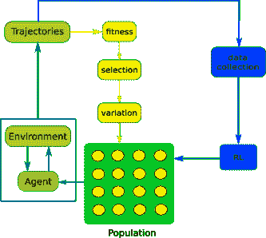

图 1：结合深度神经进化和深度强化学习的算法通用模板。一个智能体群体与环境互动，产生由状态、动作和奖励组成的轨迹。从左侧，一个进化循环根据智能体的适应度选择和进化这些智能体，这种适应度是基于轨迹整体计算的。从右侧，一个深度强化学习循环使用存储在重放缓冲区中的轨迹的基本步骤计算的梯度来改进一个或多个智能体。

表 1：演变策略的组合。表中说明了行中的算法是否使用列中的机制。颜色说明如下。关于其他组合机制（+ 组合机制）：Critic 梯度加法 $\bullet$（绿色），来自 Actor 的种群 $\spadesuit$（蓝色），无 x（红色）。在所有其他列中：$\bullet$（绿色）：是，x（红色）：否。在 bnet 中，BBNE 代表基于行为的神经进化，CPG 代表笛卡尔遗传编程（Miller 和 Harding，2009）。不同的 GA 标签代表各种遗传算法，我们不详细讨论。

| <svg version="1.1" height="24.45" width="66.58" overflow="visible"><g transform="translate(0,24.45) scale(1,-1)"><g  transform="translate(0,0)"><g transform="translate(0,12.3) scale(1, -1)"><foreignobject width="31.9" height="12.3" overflow="visible">算法</foreignobject></g></g> <g  transform="translate(33.29,12.3)"><g transform="translate(0,12.15) scale(1, -1)"><foreignobject width="33.29" height="12.15" overflow="visible">属性</foreignobject></g></g></g></svg> | RL 算法 | 进化算法 | Actor 注入 | + 组合机制 | 适应度 | 软更新 | 缓冲过滤 |
| --- | --- | --- | --- | --- | --- | --- | --- |
| erl Khadka 和 Tumer (2018) | ddpg | GA | $\bullet$ | x | x | x | x |
| cerl Khadka 等 (2019) | td3 | GA | $\bullet$ | x | x | x | x |
| pderl Bodnar 等 (2020) | td3 | GA | $\bullet$ | x | x | x | x |
| esac Suri 等 (2020) | sac | ES | $\bullet$ | x | x | x | x |
| fidi-rl Shi 等人 (2019) | ddpg | ars | $\bullet$ | x | x | x | x |
| x-ddpg Espositi 和 Bonarini (2020) | ddpg | GA | $\bullet$ | x | x | x | x |
| cem-rl Pourchot 和 Sigaud (2019) | td3 | cem | x | $\bullet$ | x | x | x |
| cem-acer Tang (2021) | acer | cem | x | $\bullet$ | x | x | x |
| serl 王等人 (2022) | ddpg | GA | $\bullet$ | x | $\bullet$ | x | x |
| spderl 王等人 (2022) | td3 | GA | $\bullet$ | x | $\bullet$ | x | x |
| pgps Kim 等人 (2020) | td3 | cem | $\bullet$ | x | $\bullet$ | $\bullet$ | x |
| bnet Stork 等人 (2021) | BBNE | CPG | $\bullet$ | x | $\bullet$ | x | x |
| cspc Zheng 等人 (2020) | sac + ppo | cem | $\bullet$ | x | x | x | $\bullet$ |
| supe-rl Marchesini 等人 (2021) | rainbow 或 ppo | GA | $\bullet$ | $\spadesuit$ | x | $\bullet$ | x |
| g2ac Chang 等人 (2018) | a2c | GA | x | $\spadesuit$ | x | x | x |
| g2ppo Chang 等人 (2018) | ppo | GA | x | $\spadesuit$ | x | x | x |

结合进化与深度强化学习的主要动机是组合可能带来的性能提升。例如，通过对简单的适应度景观和简化版组件的简单实验，结合进化和强化学习可以显示出比单独使用任一方法效果更好（Todd 等人，2020）。这是为什么呢？其中一个解释如下。深度强化学习中策略梯度方法的一个弱点是，它们基于有限的样本集计算真实梯度的估计值。由于估计的高方差，这个梯度可能非常不准确，但它会盲目地应用于当前策略，而没有检查这是否确实改善了策略。相比之下，进化方法中的变异选择方法评估它们生成的所有策略，并剔除表现不佳的策略。因此，结合策略梯度和变异选择方法的第一个好理由是，后者可能会剔除那些已经因梯度步骤而恶化的策略。下面我们列出了基于这一理念的不同方法。这一视角产生了最多的组合列表。我们在以下章节中进一步将这个列表分成几个组。

### 2.1 深度强化学习演员注入

结合进化与强化学习的复兴的主要算法之一是 erl (Khadka 和 Tumer，2018)，见图 LABEL:fig:erl_cerl。它与 g2ac 和 g2ppo 算法（Chang 等人，2018）同时发布，但其影响更大。其结合机制在于将强化学习演员注入到进化种群中。

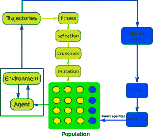

((a))

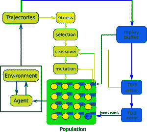

((b))

图 2：erl、esac、fidi-rl 和 cerl（a）以及 pderl 架构（b）的模板架构。在 erl 中，一个由 ddpg（Lillicrap 等，2016）学习到的演员定期被注入到种群中并进行进化选择。如果 ddpg 的表现优于 GA，这将加速进化过程。否则，ddpg 代理将被忽略。在 esac 中，ddpg 被 sac（Haarnoja 等，2018）替代，在 fidi-rl 中，GA 被 ars（Mania 等，2018）替代。在 cerl 中，ddpg 代理被一组 td3 演员替代，这些演员共享相同的回放缓冲区，但每个演员使用不同的折扣因子。再一次，那些表现优于其余种群的演员被保留并增强进化过程，而其余的则通过进化选择被丢弃。在 pderl 中，erl 的遗传操作符被使用局部回放缓冲区的操作符替代，以更好地利用每个代理的基于步长的经验。

erl 算法很快被 cerl（Khadka 等，2019）所跟进，cerl 扩展了 erl 从 RL 到分布式 RL，其中多个代理并行学习，所有这些代理都被注入到进化种群中。erl 和 cerl 的主要弱点在于它们依赖于遗传算法，该算法对神经网络架构的直接编码应用标准的 $n$-点交叉和高斯权重变异操作符。这种方法已知需要繁琐的超参数调整，并且通常表现不如数学基础更扎实的进化策略（Salimans 等，2017）。特别是，基于直接编码的遗传操作符在 erl 和 cerl 中已被证明会引发高效个体行为的灾难性遗忘风险。

pderl 算法（Bodnar 等，2020，见图 LABEL:fig:pderl），基于这一批评，并提出了两种替代的进化操作符。所有代理携带自己的回放缓冲区，交叉选择两个父代中的最佳经验来填充子代的缓冲区，然后应用行为克隆以获得符合缓冲区数据的新策略。这个操作符受 Gangwani 和 Peng（2018）工作的启发。对于变异，他们采用了 Lehman 等（2018）提出的改进操作符，这可以看作是应用高斯-牛顿方法执行策略梯度步骤（Pierrot 等，2018）。

erl 的另一个后续算法是 esac 算法（Suri 等，2020）。它使用 sac 算法代替 ddpg，并用修改后的进化策略代替遗传算法，但架构遵循相同的模板。同样，fidi-rl 算法（Shi 等，2019）结合了 ddpg 和增强随机搜索（ars），这是一种有限差分算法，可以看作是进化策略的简化版本（Mania 等，2018）。fidi-rl 使用 erl 架构。该方法被证明优于单独使用 ars 和 ddpg，但 esac 和 fidi-rl 都没有与本调查中列出的其他组合进行比较。最后，x-ddpg 算法是 erl 的一个版本，具有多个异步 ddpg 代理，其中进化代理和 ddpg 代理的缓冲区是分开的，并且每个时间步骤将最新的 ddpg 代理注入到进化种群中（Espositi 和 Bonarini，2020）。

bnet 算法（Stork 等，2021）在本调查中处于边缘位置，因为它并不真正使用 RL 算法，而是使用行为基础的神经进化（BBNE）机制，该机制仅受到 RL 算法的松散启发，而不依赖于梯度下降。bnet 结合了基于标准适应度的稳健选择方法、基于代理行为优势的第二机制以及基于政策回报的替代估计的第三机制。BBNE 机制类似于优势加权回归（awr）算法（Peng 等，2019），但它使用进化方法来优化基于行为的标准，而不是标准的基于梯度的方法。选择这种方法的原因是进化部分依赖于笛卡尔遗传编程（Miller 和 Harding，2009），它进化神经网络的结构，但梯度下降操作无法应用于在训练过程中结构不断变化的网络。

chdrl 架构（Zheng 等，2020）通过多种方式扩展了 erl 方法，以提高组合的样本效率。首先，它使用两个级别的 RL 算法，一个是策略内的，一个是策略外的，以从策略外学习的较高样本效率中受益。其次，它不再定期将演员注入进化种群，而是仅当被注入的演员的表现显著优于进化代理时才这样做。第三，它将标准重放缓冲区与一个较小的本地缓冲区结合使用，该缓冲区填充了过滤后的数据，以确保使用最有益的样本。图 LABEL:fig:cspc 中描绘的 cspc 算法是使用 sac 和 ppo（Schulman 等，2017）算法的 chdrl 实例。

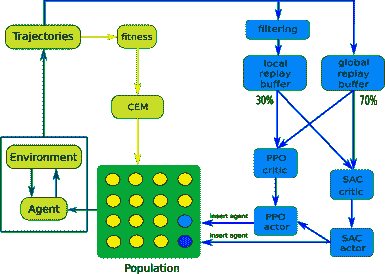

((a))

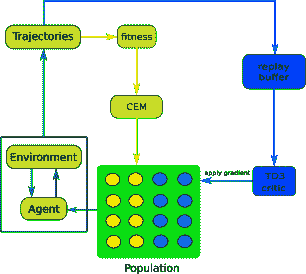

((b))

图 3：cspc (a) 和 cem-rl (b) 架构。在 cspc 中，结合了一个 on-policy 和一个 off-policy 算法，两个回放缓冲区和一个基于性能的演员注入规则，以提高 erl-like 方法的样本效率。在 cem-rl 中，td3 评论家的梯度步骤应用于进化代理的一半种群。如果应用该梯度是有利的，相应的个体会被保留，否则会被丢弃。

请注意，如果在进化种群中注入 RL 演员，并且进化使用直接编码，那么 RL 演员和进化个体需要共享一个共同的结构。去除这一约束可能是有用的，因为进化方法通常应用于比 RL 方法更小的策略。为此，可以调用任何政策蒸馏机制，该机制致力于从一个大型策略中获得一个具有类似能力的小型策略。

### 2.2 RL 梯度加法

另一种方法是对这个种群中的一些成员应用梯度步骤，而不是将 RL 演员注入种群。这就是 cem-rl 算法（Pourchot and Sigaud, 2019）的方法，见图 LABEL:fig:cemrl。这项工作随后由 cem-acer（Tang, 2021）跟进，cem-acer 简单地用 acer（Wang et al., 2017）替代了 td3（Fujimoto et al., 2018）。

### 2.3 从 RL 演员的进化

((a))

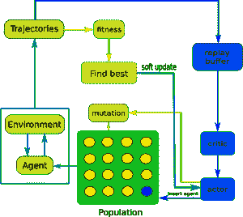

((b))

图 4：在 g2n (a) 和 supe-rl (b) 架构中，进化种群是从 RL 演员本地构建的。在 g2n 中，进化部分探索演员网络中央层的结构。在 supe-rl 中，应用了更标准的变异，非变异的演员被插入进化种群，并且演员向其最佳后代软更新。

在目前列出的算法中，主要循环是进化的，而 RL 循环则以较慢的速度用于加速它。相比之下，在 g2n (Chang et al., 2018) 和 supe-rl (Marchesini et al., 2021) 算法中，主要循环是 RL 循环，进化用于促进探索。

在 g2n 中，如图 LABEL:fig:ggn 所示，进化用于根据二进制基因组激活或停用演员架构中的中央层神经元。通过使用进化操作符对基因组进行采样，各种演员架构被评估，并且表现最佳的架构会通过一个评论家梯度步骤，从而使其基因组用于生成新的人口架构。这个机制在演员结构和生成的轨迹中提供了相当多的探索，并且优于基因组的随机采样。研究了两种 g2n 方法实例，基于 a2c 的 g2ac 和基于 ppo 的 g2ppo，它们都优于它们使用的 RL 算法。

如图 LABEL:fig:superl 所示，supe-rl 算法与 g2n 类似，只是中央层结构的进化被替换为对演员所有参数进行标准高斯噪声突变。此外，如果一个后代比当前的 RL 智能体更好，后者将通过软更新机制向这个更好的后代进行修改。最后，非突变演员也被插入进化种群中，这与 g2n 不同。

### 2.4 使用替代适应度

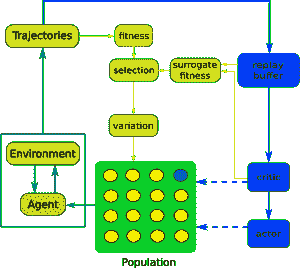

((a))

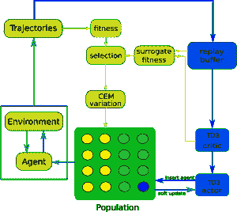

((b))

图 5：sc-erl（a）和 pgps（b）架构是两种通过使用评论网络作为评估进化个体的替代品来提高样本效率的方法。在 sc-erl 中，替代控制部分是通用的，可以应用于 erl、c erl 或 cem-rl 等多个架构。它将评论网络视为适应度的替代模型，使得可以在不生成额外样本的情况下估计新个体的适应度。（b）pgps 使用了相同的思想，但结合了其他几种机制，例如对演员进行软更新以接近最佳进化智能体，或者使用替代适应度填充一半种群，其余一半则来自 cem 生成的智能体。

我们迄今列举的所有结合进化和强化学习（RL）的方法的一个弱点是，它们需要评估智能体以执行进化选择步骤，这可能会影响样本效率。在 sc-erl（Wang et al., 2022）和 pgps（Kim et al., 2020）架构中，这个问题通过使用一个评论网络作为评估智能体的替代品来解决。重要的是，个体的评估必须最初依赖于真实的适应度，但可以随着评论网络准确度的提高而越来越频繁地调用评论网络。如图 LABEL:fig:scerl 所示，sc-erl 架构是通用的，可以应用于我们迄今列举的任何组合中。在实践中，它被应用于 erl、pderl 和 cem-rl，导致在前两个案例中得到了 serl 和 spderl 算法。

pgps 算法（Kim et al., 2020），如图 LABEL:fig:pgps 所示，建立在相同的思想上，但在特定的进化和 RL 机制组合的背景下使用这一思想，该组合借鉴了之前描述的几种方法的思想。更详细地说，种群的一半填充了通过替代适应度评估的智能体，而另一半则由 cem 生成。此外，当前的 td3 演员被注入到种群中，并通过软更新受益于种群中的最佳智能体。

## 3 动作进化以提高性能

在本节中，我们讨论了使用进化方法来优化给定状态下的动作，而不是优化策略参数。一般的想法是，变异选择方法如 cem 可以根据这些参数的某些性能函数来优化任何参数向量。在前一节中列出的方法中，参数是策略的参数，性能是该策略的回报。在这里列出的方法中，参数指定了给定状态下的动作，性能是该动作在该状态下的 Q 值。

在像 Q-learning 这样的 RL 算法中，代理需要找到给定状态下的最高价值动作，这有两个目的：进行评论更新，即使用$Q(s_{t},a_{t})\leftarrow r(s_{t},a_{t})+\max_{a}Q(s_{t+1},a)-Q(s_{t},a_{t})$来更新对动作值函数的估计，以及进行动作选择时使用$\mathop{\rm argmax}_{a}Q(s_{t},a)$。当动作空间是连续的，这就相当于解决一个昂贵的优化问题，这在每次训练步骤中都是必要的。演员-评论家方法的标准解决方案是将演员的动作视为最佳动作的良好代理。我们记作$\bar{a_{t}}$的最佳动作被认为是演员的动作$\bar{a_{t}}=\pi(s_{t})$，因此使用$Q(s_{t},a_{t})\leftarrow r(s_{t},a_{t})+\max_{a}Q(s_{t+1},\pi(s_{t+1}))-Q(s_{t},a_{t})$来进行评论更新，并使用$\bar{a_{t}}$进行动作选择。

但作为一种替代方法，可以调用变异选择方法在有限的采样动作集合中找到表现最好的动作。这种方法在 qt-opt 算法（Kalashnikov 等，2018）、cgp（Simmons-Edler 等，2019）、sac-cepo（Shi 和 Singh，2021）、grac（Shao 等，2021）和 eas-rl（Ma 等，2022）算法中都有应用。这是我们在本节中首先介绍的方法。zospi 算法（Sun 等，2020）也通过变异选择方法优化动作，尽管它来自不同的视角。

表 2：性能进化行动的组合。绿色单元格表示进化优化发生的地方。我们指定使用 cem 来优化动作，表示为$\bar{a_{t}}=\text{{\sc cem}}(\textit{source},N,N_{e},I)$，其中 source 是我们从中采样初始动作的来源，$N$是样本的大小（即种群），$N_{e}$是从一代到下一代保留的精英解的数量，$I$是迭代次数。对于 pso，所示参数是动作数量$N$和迭代次数$T$。我们使用$\bar{a_{t}}=\mathop{\rm argmax}(\textit{source},N)$来从给定来源的$N$个样本中简单地选择最佳动作。

| <svg version="1.1" height="24.45" width="66.58" overflow="visible"><g transform="translate(0,24.45) scale(1,-1)"><g  transform="translate(0,0)"><g transform="translate(0,12.3) scale(1, -1)"><foreignobject width="31.9" height="12.3" overflow="visible">Algo.</foreignobject></g></g> <g  transform="translate(33.29,12.3)"><g transform="translate(0,12.15) scale(1, -1)"><foreignobject width="33.29" height="12.15" overflow="visible">Prop.</foreignobject></g></g></g></svg> | 批评者更新 | 动作选择 | 策略更新 |
| --- | --- | --- | --- |
| qt-opt Kalashnikov 等人 (2018) | $\bar{a_{t}}=$cem（随机，64，6，2） | $\bar{a_{t}}=$cem（随机，64，6，2） | 无策略 |
| cgp Simmons-Edler 等人 (2019) | $\bar{a_{t}}=$cem（随机，64，6，2） | $\bar{a_{t}}=\pi(s_{t})$ | BC 或 DPG |
| eas-rl Ma 等人 (2022) | $\bar{a_{t}}=$pso（10，10） | $\bar{a_{t}}=\pi(s_{t})$ | BC + DPG |
| sac-cepo Shi 和 Singh (2021) | sac 更新 | $\bar{a_{t}}=$cem（$\pi$，60 \clipbox*.250pt 0pt 0pt 0pt →140，$3\%$ \clipbox*.250pt 0pt 0pt 0pt →$7\%$，6 \clipbox*.250pt 0pt 0pt 0pt →14） | BC |
| grac Shao 等人 (2021) | $\bar{a_{t}}=$cem（$\pi$，256，5，2） | $\bar{a_{t}}=$cem（$\pi$，256，5，2） | PG 具有两个损失 |
| zospi Sun 等人 (2020) | ddpg 更新 | $\bar{a_{t}}=\pi(s_{t})$ + 扰动网络 | BC（$\bar{a_{t}}=\mathop{\rm argmax}(随机，50)$） |

如表 2 所示，qt-opt 算法（Kalashnikov 等人，2018）简单地在动作空间中随机抽取 64 个动作，并执行两次 cem 迭代以获得高性能的动作，适用于批评者更新和动作选择。令人惊讶的是，即使在大动作空间中，这种简单的方法也能表现良好。这个简单的想法随后在 cgp 算法（Simmons-Edler 等人，2019）中得到了改进，以避免动作推断的计算成本。该算法不是在每个时间步骤使用 cem 来抽样动作，而是基于 cem 的行为学习了一个策略网络。这个网络可以看作是 cem 抽样过程的替代品，并通过行为克隆（BC）从抽样的 $\bar{a_{t}}$ 中进行训练，或通过批评者的确定性策略梯度（DPG）步骤进行训练。

eas-rl 算法（Ma 等人，2022）与 cgp 类似，但它使用粒子群优化（pso）代替 cem。此外，根据获得的动作 $\bar{a_{t}}$ 的优势符号，它使用 BC 或 DPG 来更新每个样本的策略。

与 cgp 对称，sac-cepo 算法（Shi 和 Singh，2021）使用 sac 进行标准的评论员更新，但使用 cem 选择动作。更准确地说，它引入了从当前策略中采样动作而不是随机选择的思想，并使用 BC 从采样的动作中更新该策略。此外，论文探讨了 cem 参数的效果，但没有提供确凿的结论。

grac 算法（Shao 等，2021）结合了 cgp 和 sac-cepo 的思想。一个随机策略网络在每一步输出一个初始的高斯分布。然后，使用 cem 从这个分布中抽取 256 个动作的步骤来进一步优化评论员更新和动作选择。策略本身通过两种训练损失的组合进行更新。

最后，zospi 算法（Sun 等，2020）调用变异选择来更新策略，而不是更新评论员或选择动作。其要点在于，与梯度下降算法倾向于陷入局部最小值并由于各种近似而可能错过适当方向相比，变异选择方法更具鲁棒性。因此，为了更新其主要策略，zospi 简单地从一组动作中进行采样，并对这些动作中最佳的动作执行 BC，这可以看作是一个简单的变异选择方法。典型的采样动作数量是 50 个。然后，它添加了一个策略扰动网络来进行探索，该网络使用梯度下降进行训练。

## 4 多样性策略的演变

探索与利用之间的权衡是强化学习的核心。特别是当奖励信号稀疏时，高效的探索变得至关重要。本调查研究的所有论文都管理一个代理群体，因此它们的探索能力可以从保持代理之间的行为多样性中受益。这种保持行为多样性的思想是两类寻求多样性算法的核心，即完全不使用奖励信号的新颖性搜索（NS）算法（Lehman 和 Stanley，2011），见图 LABEL:fig:ns_rl，以及尝试最大化多样性和表现的质量-多样性（QD）算法（Pugh 等，2016；Cully 和 Demiris，2017），见图 LABEL:fig:me。由于 NS 方法只关注多样性，它在没有奖励的情况下表现更好，或者当奖励信号非常稀疏或具有误导性时，因为在没有奖励的情况下，最好的做法是尽可能均匀地覆盖相关空间（Doncieux 等，2019）。相比之下，当奖励信号可以为策略搜索过程提供贡献时，QD 方法更为合适。在本节中，我们将分别讨论这两类方法。

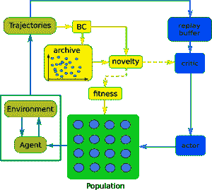

((a))

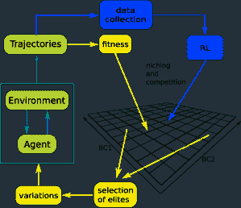

((b))

图 6: 结合深度 RL 与新颖性搜索 (a) 和质量-多样性 (b) 的模板架构。后者基于 Mouret (2020) 中的图 2。这两种架构依赖于行为特征空间，并在该空间中维护一个档案库。

### 4.1 新颖性搜索方法

表 3: 组合进化的多样性策略。NS: 新颖性搜索。策略参数: 在策略参数空间中计算距离。GC-ddpg: 目标条件 ddpg。手动 BC: 在手动定义的行为特征空间中计算距离。

| <svg version="1.1" height="24.45" width="66.58" overflow="visible"><g transform="translate(0,24.45) scale(1,-1)"><g  transform="translate(0,0)"><g transform="translate(0,12.3) scale(1, -1)"><foreignobject width="31.9" height="12.3" overflow="visible">算法.</foreignobject></g></g> <g  transform="translate(33.29,12.3)"><g transform="translate(0,12.15) scale(1, -1)"><foreignobject width="33.29" height="12.15" overflow="visible">属性.</foreignobject></g></g></g></svg> | RL 算法 | 多样性算法 | 距离空间 |
| --- | --- | --- | --- |
| p3s-td3 Jung et al. (2020) | td3 | 寻找最佳 | 策略参数. |
| deprl Liu and Feng (2021) | td3 | cem | 策略参数. |
| arac Doan et al. (2019) | sac | 类似 NS | 策略参数. |
| ns-rl Shi et al. (2020) | GC-ddpg | 真正的 NS | 手动 BC |
| pns-rl Liu et al. (2018) | td3 | 真正的 NS | 手动 BC |

在群体中保持代理之间的距离可以在不同的空间中实现。例如，svpg 算法（Liu et al., 2017）在核空间中定义距离，并在策略梯度中增加一个损失项，用于增加代理之间的成对距离。或者，dvd 算法（Parker-Holder et al., 2020）在行动嵌入空间中定义距离，这些距离对应于每个代理在一个足够大的随机状态集合中指定的动作。然后，dvd 通过计算行列式来优化所有策略之间的全局距离，通过最大化它们之间空间的体积。尽管这些方法很有趣，但图 7 中描绘的这两种方法并未出现在表 3 中，因为前者没有进化成分，后者使用 nsr-es（Conti et al., 2018）但没有 RL 成分。

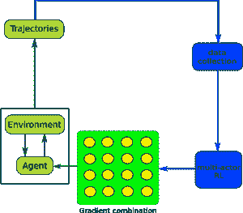

((a))

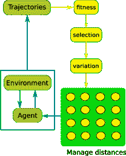

((b))

图 7：svpg (a) 和 dvd (b) 架构。在 svpg 中，每个代理计算的个体策略梯度被组合，以确保代理之间的多样性和性能提升。在 dvd 中，纯粹的进化方法与一个多样性机制结合，该机制试图最大化行为特征在动作嵌入空间中的体积。虽然这两种架构都尝试最大化代理群体中的多样性和性能，但它们未能结合进化和 RL。

关于本调查的重点，p3s-td3 算法（Jung 等，2020）是一个更具边界性的案例。尽管 p3s-td3 在本调查中提到的几篇论文中被用作基线，但其进化循环的等效部分仅限于在种群中寻找最佳代理，如图 LABEL:fig:p3s 所示。这意味着评估所有这些代理，但不使用变异或选择。此外，p3s-td3 中维护解决方案之间距离的机制是专门设计的，作用于策略参数空间。这也是 deprl 算法（Liu 和 Feng，2021）的情况，deprl 算法只是 cem-rl 的一种变体，其中添加了一个专门的机制以强制执行进化种群成员之间的距离。

arac 算法（Doan 等， 2019）也使用了策略参数空间中的距离，但它真正符合进化和深度 RL 的结合，见图 LABEL:fig:arac。arac 的一个独特特点是，它基于代理的创新性选择进入重放缓冲区的数据，这可以节省大量不太有用的梯度计算。类似的想法也出现在（Chen，2019）中，在那里，算法使用一个精英重放缓冲区，包含仅有的顶级轨迹，这与我们在 cspc 算法（Zheng 等，2020）中看到的相似。

迄今为止列出的方法既没有使用手动定义的行为特征空间来计算代理之间的距离，也没有使用以前代理的档案来评估创新性。因此，它们并不真正符合 NS 方法。我们现在转向结合这两种特征的算法。

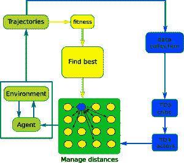

((a))

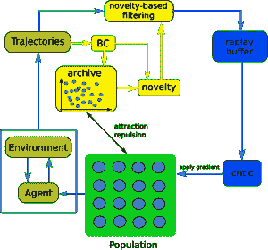

((b))

图 8：p3s-td3（a）和 arac（b）架构。在 p3s-td3 中，所有代理都用 RL 进行训练和评估，然后它们都对最佳代理执行软更新。arac 算法维护一个遵循来自共同 sac 评论员（Haarnoja et al., 2018）的梯度的策略种群。评论员本身是通过最具新颖性的代理的轨迹进行训练的。此外，通过将吸引-排斥损失 $\mathcal{L}_{AR}$ 添加到代理的更新中来确保种群中的多样性。这个损失是相对于使用新颖性标准选择的先前代理的档案计算的。

图 LABEL:fig:ns_rl 表明，在结合进化和 RL 时，新颖性可以作为适应度函数、作为学习评论员的奖励信号，或两者兼而有之。实际上，在下面描述的两个算法中，它都被用作两者。更准确地说，RL 部分用于将其余种群向最具新颖性的代理移动。

在 pns-rl 算法（Liu et al., 2018）中，一组代理遵循一个结合了标准策略梯度更新和软更新的领导者。然后，对于组中的任何代理，如果其表现相对于档案中的平均表现足够高，它将被添加到档案中。关键是，领导者被选为在给定手动定义的行为特征下最大化档案中新颖性的代理。此外，为了高效的并行化，该算法考虑了多个组而不是一个，但所有组共享相同的领导者。

ns-rl 算法（Shi et al., 2020）可以看作是 cem-rl 的一个版本，其 RL 部分通过训练不太新颖的代理，以最小化每一步到最具新颖代理的 BC 的距离，从而针对更高的新颖性。由于最具新颖性的代理及其 BC 在每次迭代中都会改变，因此 RL 部分使用了目标条件策略。这意味着目标空间与行为特征空间是相同的。

### 4.2 质量-多样性方法

表 4：包括 RL 组件的质量-多样性算法。这些算法都依赖于 Map-Elites 方法，并且 BC 空间是手动定义的。表格中每个行的算法说明了质量和多样性是否通过 RL 方法或进化方法进行优化。

| <svg version="1.1" height="24.45" width="66.58" overflow="visible"><g transform="translate(0,24.45) scale(1,-1)"><g transform="translate(0,0)"><g transform="translate(0,12.3) scale(1, -1)"><foreignobject width="31.9" height="12.3" overflow="visible">算法</foreignobject></g></g> <g transform="translate(33.29,12.3)"><g transform="translate(0,12.15) scale(1, -1)"><foreignobject width="33.29" height="12.15" overflow="visible">属性</foreignobject></g></g></g></svg> | 存档类型 | Q. 改进 | D. 改进 |
| --- | --- | --- | --- |
| pga-me Nilsson 和 Cully (2021) | Map-Elites | td3 或 GA | td3 或 GA |
| qd-pg-PF Cideron 等人 (2020) | Pareto 前沿 | td3 | td3 |
| qd-pg-ME Pierrot 等人 (2020) | Map-Elites | td3 | td3 |
| cma-mega-ES Tjanaka 等人 (2022) | Map-Elites | cma-es | cma-es |
| cma-mega-(td3, ES) Tjanaka 等人 (2022) | Map-Elites | td3 + cma-es | cma-es |

相较于仅尝试优化种群多样性的 NS 方法，QD 方法将这一初始目标与优化注册策略的性能及其质量相结合。正如图 LABEL:fig:me 所示，当与 RL 循环结合时，QD 循环可以根据是否使用进化算法或深度 RL 算法来改善质量和多样性，从而产生各种解决方案。

结果可能性空间详见表格 4。具体而言，pga-me 算法（Nilsson 和 Cully，2021）使用两种优化机制，td3 和 GA，以生成新解决方案，这些解决方案如果足够新颖或比之前注册的具有相同行为特征的方案更高效，则会被添加到档案中。相比之下，在 qd-rl 方法中，提升质量和多样性的机制被明确分开，并包括使用 td3 改进质量评论员和多样性评论员。存在两种实现方式。首先，qd-pg-PF 算法（Cideron 等人，2020）维护一个高质量和多样性的 Pareto 前沿。另一方面，qd-pg-ME 算法（Pierrot 等人，2020）维护一个 Map-Elites 档案，并引入了状态描述符的附加概念，以解释学习基于状态的质量评论员。最后，cma-mega 方法（Tjanaka 等人，2022）使用 ES 改进多样性，使用 ES 或 ES 和 RL 的组合改进质量。

总结来看，可以发现，通过 RL、进化或两者结合，都可以改善质量和多样性。

## 5 其他方面的进化

在我们迄今为止调查的所有架构中，进化部分用于优化策略参数或特定状态下的一组奖励动作。在本节中，我们简要介绍了进化与深度 RL 的组合，其中进化用于优化 RL 过程中的其他重要内容，或者 RL 机制用于改进进化而无需调用完整的 RL 算法。我们将优化超参数作为一个单独的部分，因为这是一个重要且活跃的领域。

表格 5：进化应用于除动作或策略参数之外的其他内容，或超出策略参数的所有算法。前半部分的所有算法都优化了超参数。 *：Park 和 Lee (2021) 的算法没有名字。BT 代表行为树。

| <svg version="1.1" height="24.45" width="66.58" overflow="visible"><g transform="translate(0,24.45) scale(1,-1)"><g  transform="translate(0,0)"><g transform="translate(0,12.3) scale(1, -1)"><foreignobject width="31.9" height="12.3" overflow="visible">Algo.</foreignobject></g></g> <g  transform="translate(33.29,12.3)"><g transform="translate(0,12.15) scale(1, -1)"><foreignobject width="33.29" height="12.15" overflow="visible">Prop.</foreignobject></g></g></g></svg> | RL 算法 | Evo 算法 | 进化什么？ |
| --- | --- | --- | --- |
| ga-drl Sehgal 等 (2019); Sehgal 等 (2022) | ddpg (+her) | GA | 超参数 |
| pbt Jaderberg 等 (2017) | 任何 | Ad hoc | 参数和超参数 |
| aac Grigsby 等 (2021) | sac | Ad hoc | 参数和超参数 |
| searl Franke 等 (2021) | td3 | GA | 结构、参数和超参数 |
| oht-es Tang 和 Choromanski (2020) | 任何 | ES | 超参数 |
| epg Houthooft 等 (2018) | Ad hoc ($\sim$ ppo) | ES | 奖励相关函数 |
| eQ Leite 等 (2020) | $\sim$ ddpg | $\sim$ cem | 评论员 |
| evo-RL Hallawa 等 (2017) | Q-learning, dqn, ppo | BT | 部分策略 |
| derl Gupta 等 (2021) | ppo | GA | 系统的形态 |
| * Park 和 Lee (2021) | ppo | GA | 系统的形态 |

### 5.1 MBRL 中的演变

cem 算法可用于优化开环控制器，以在 plaNet (Hafner 等，2019) 和 poplin (Wang 和 Ba，2019) 算法中执行模型预测控制（MPC）于机器人系统，并且在 (Pinneri 等，2020；Pinneri 等，2021) 中提出了一种针对这一特定背景的改进版 cem。此外，这种结合开环控制器和 MPC 的方法在 pets 算法 Chua 等 (2018) 中被视为实现了一种基于模型的强化学习（MBRL）形式，cem 被用于 pets 中选择开始 MPC 的点，相比于随机发射有所改进。最后，在 Bharadhwaj 等 (2020) 中，作者提议交替进行 cem 迭代和随机梯度下降（SGD）迭代，以提高 MPC 计划优化的效率，这种方法类似于 cem-rl 结合策略梯度步骤和 cem 步骤。但所有这些方法都应用于开环控制背景，其中无法应用真正的强化学习算法，因此它们未出现在表 5 中。

### 5.2 超参数的演变

超参数优化（HPO）以其困难和在深度 RL 中的关键性而著称。在这种情况下，利用进化方法的最直接方式是在一个进化循环中嵌套深度 RL 算法，该循环调整超参数。这是 ga-drl 算法（Sehgal 等人，2019；Sehgal 等人，2022）的方法，但显然会面临非常高的计算成本。值得注意的是，作者提到 ga-drl 使用 ddpg + her，但 her 的使用并不清楚，因为算法似乎没有使用目标条件策略。

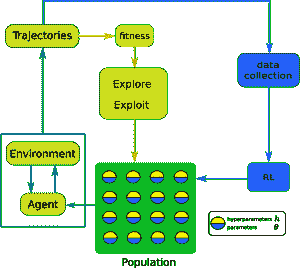

图 9: pbt 架构。进化部分包括两个操作符，探索和利用，它们同时作用于代理的超参数和参数。

更有趣的是，pbt 架构（Jaderberg 等人，2017）旨在通过将分布式 RL 与一种进化机制相结合来解决这个问题，该机制同时作用于 RL 训练循环中的参数和超参数。它成功地应用于多个具有挑战性的应用（Jaderberg 等人，2019），并具备根据当前训练动态调整超参数的有趣能力，这是一种重要的元学习能力（Khamassi 等人，2017）。pbt 算法的后续是 aac 算法（Grigsby 等人，2021），它基本上应用了相同的方法，但在最近的深度 RL 文献中通过吸取教训优化了超参数集合。

pbt 的一个限制是每个演员使用自己的重放缓冲区。相比之下，在 searl 算法（Franke 等人，2021）中，所有代理的经验被共享到一个唯一的缓冲区。此外，searl 同时进行超参数优化和神经网络架构搜索，从而比 pbt 达到更好的性能。最后，oht-es 算法（Tang 和 Choromanski，2020）也使用共享的重放缓冲区，但将进化的角色限制为优化超参数，并通过 ES 算法来实现。鉴于问题的重要性，还有许多其他超参数优化方法，其中大多数并未明确采用进化方法。有关这一主题的更广泛调查，请参见 Parker-Holder 等人（2022）。

### 5.3 杂项 RL 或控制组件的演变

最后，我们简要回顾了表 5 中列出的其他算法。epg 算法（Houthooft et al., 2018）采用了元学习方法来进化替代策略梯度算法中策略梯度代理损失的损失函数的参数。其目标是找到一个奖励函数，以最大化 RL 算法在给定任务中的能力。其设计的一个结果是，它不能应用于演员-评论员方法。

与其进化一群智能体不同，eQ 算法（Leite et al., 2020）则进化了一组评论员，这些评论员在给定智能体的学习过程中是固定的。这在某种程度上与前面提到的 zoac 算法（Lei et al., 2022）相对称，该算法使用进化来更新给定使用 RL 训练的评论员的演员。

evo-RL 算法（Hallawa et al., 2021）进化部分策略。进化在一个离散动作背景下进行，采用遗传编程方法（Koza et al., 1994），只指定了作为行为树（Colledanchise and Ögren, 2018）的部分策略。然后，像 dqn（Mnih et al., 2015）或 ppo 这样的 RL 算法负责为未指定动作的状态学习策略。个体的适应度通过结合 BT 部分和学习部分的整体行为进行评估，但只有 BT 部分被进化以生成下一代，受益于鲍德温效应（Simpson, 1953）。

最后，一些研究考虑了进化机械系统的形态，其控制通过 RL 进行学习。表 5 仅提到两个近期实例，一个算法未命名（Gupta et al., 2021）和 derl（Park and Lee, 2021），但这一思想已产生了更多的研究，例如（Ha, 2019; Luck et al., 2020）。

### 5.4 通过 RL 机制改进的进化

在不使用完整 RL 部分的情况下，一些算法通过从 RL 中提取组件来增强进化方法。

首先，tres（信任域进化策略）算法（Liu et al., 2019）将一些来自 trpo（Schulman et al., 2015）和 ppo（Schulman et al., 2017）算法的理念融入了 ES 中，如引入重要性采样机制和使用剪切代理目标，以执行自然梯度更新。不幸的是，tres 既没有与 nes 算法（Wierstra et al., 2014）进行比较，也没有与具有类似特性的 Lehman et al.的安全变异机制（2018）进行比较。

其次，对 zoac 算法（Lei 等，2022）有两种观点。一种观点是，它与第三部分中描述的 zospi 算法相近，即一种演员-评论家方法，其中用更稳健的无导数方法替代了基于评论家的演员更新的梯度下降。然而，作者提出的更准确的观点是，zoac 是一种 ES 方法，其中标准的 ES 梯度估计器被使用优势函数的梯度估计器所替代，以利用时间差分方法在有效处理时间信用分配问题上的能力。

最后，借助其引导式 ES 算法（Maheswaranathan 等，2019），作者研究了如何通过利用受偏差和方差影响的近似梯度的知识来改进简单的 ES 梯度估计器。尽管他们的研究是一般性的，但将其应用于近似梯度为策略梯度的背景是自然的，此时引导式 ES 结合了进化和强化学习。这项工作常常被引用于一种非常活跃的最新趋势中，该趋势通过使用比高斯方向更好的方法来改进 ES 算法的探索能力，从而获得更有信息的梯度近似器（Choromanski 等，2018；2019；Zhang 等，2020；Dereventsov 等，2022）。特别是，sges 算法（Liu 等，2020）结合了引导式 ES 思想和改进的探索思想，以生成一种竞争力强的基于 ES 的策略搜索算法。

## 6 结论

在本文中，我们提供了一个列表，列出了所有我们能够找到的结合进化过程和深度强化学习的算法，无论相关论文的出版状态如何。我们的重点是机制，主要贡献是将这些算法根据进化优化在架构中的角色分类为几个方法组。

我们没有涉及相关领域，如结合深度强化学习和模仿学习的算法，尽管其中至少有一个也包括进化（Lü 等，2021）。此外，我们也未涉及专注于进化和深度强化学习组合实现的工作，例如（Lee 等，2020），这表明了这种组合中异步性的的重要性。

尽管存在这些局限性，调查的范围仍然过于广泛，无法对不同组合方法进行更深入的分析或进行性能的比较评估。未来，我们打算分别关注不同类别，以提供更深入的分析，并在统一基准下，对这些算法之间以及与最先进的深度强化学习算法进行比较评估。

我们对基本机制的关注也暗示了设计这些机制的新组合的可能性，即组合组合。例如，可以在单一架构中包含选择发送到重放缓冲区的样本的思想，以最大化 RL 组件的效率，更高效的交叉或变异操作符（如 pderl），软策略更新，超参数调整等。毫无疑问，如果这些组合能够带来额外的性能提升，尽管实现复杂度增加，这些组合将在未来出现。

## 致谢

作者想要感谢 Giuseppe Paolo、Stéphane Doncieux 和 Antonin Raffin 对该手稿的有用意见，以及 ISIR 的几位同事对算法提出的问题和意见。

## 参考文献

+   （1）

+   Bäck 等（1997）Thomas Bäck、Ulrich Hammel 和 H.-P. Schwefel。1997 年。进化计算：对历史和现状的评论。*IEEE 进化计算学报* 1，1（1997），3–17。

+   Bharadhwaj 等（2020）Homanga Bharadhwaj、Kevin Xie 和 Florian Shkurti。2020 年。通过交叉熵和基于梯度的优化进行模型预测控制。发表于 *动态和控制的学习*。PMLR，277–286。

+   Bodnar 等（2020）Cristian Bodnar、Ben Day 和 Pietro Lió。2020 年。近端蒸馏进化强化学习。发表于 *第 34 届 AAAI 人工智能会议，AAAI 2020，第 32 届人工智能创新应用会议，IAAI 2020，第十届 AAAI 人工智能教育进展研讨会，EAAI 2020，美国纽约，2020 年 2 月 7-12 日*。AAAI Press，3283–3290。 [`aaai.org/ojs/index.php/AAAI/article/view/5728`](https://aaai.org/ojs/index.php/AAAI/article/view/5728)

+   Chang 等（2018）Simyung Chang、John Yang、Jaeseok Choi 和 Nojun Kwak。2018 年。用于深度强化学习的遗传门控网络。发表于 *神经信息处理系统进展 31：2018 年神经信息处理系统年会，NeurIPS 2018，2018 年 12 月 3-8 日，加拿大蒙特利尔*，Samy Bengio、Hanna M. Wallach、Hugo Larochelle、Kristen Grauman、Nicolò Cesa-Bianchi 和 Roman Garnett（编辑）。1754–1763。 [`proceedings.neurips.cc/paper/2018/hash/d516b13671a4179d9b7b458a6ebdeb92-Abstract.html`](https://proceedings.neurips.cc/paper/2018/hash/d516b13671a4179d9b7b458a6ebdeb92-Abstract.html)

+   Chen（2019）Gang Chen。2019。将确定性策略梯度估计与多样化的偏差-方差权衡相结合以有效深度强化学习。*ArXiv 预印本* abs/1911.10527（2019）。[`arxiv.org/abs/1911.10527`](https://arxiv.org/abs/1911.10527)

+   Choromanski 等人（2019）Krzysztof Choromanski、Aldo Pacchiano、Jack Parker-Holder、Yunhao Tang 和 Vikas Sindhwani。2019。从复杂性到简单性：用于黑箱优化的自适应 ES-Active 子空间。在 *神经信息处理系统进展 32：2019 年神经信息处理系统年会，NeurIPS 2019，2019 年 12 月 8-14 日，加拿大温哥华*，Hanna M. Wallach、Hugo Larochelle、Alina Beygelzimer、Florence d’Alché-Buc、Emily B. Fox 和 Roman Garnett（编）。10299–10309。[`proceedings.neurips.cc/paper/2019/hash/88bade49e98db8790df275fcebb37a13-Abstract.html`](https://proceedings.neurips.cc/paper/2019/hash/88bade49e98db8790df275fcebb37a13-Abstract.html)

+   Choromanski 等人（2018）Krzysztof Choromanski、Mark Rowland、Vikas Sindhwani、Richard E. Turner 和 Adrian Weller。2018。具有紧凑架构的结构化演化以实现可扩展的策略优化。在 *第 35 届国际机器学习大会论文集，ICML 2018，瑞典斯德哥尔摩，2018 年 7 月 10-15 日* *（机器学习研究论文集）*，Jennifer G. Dy 和 Andreas Krause（编），第 80 卷。PMLR，969–977。[`proceedings.mlr.press/v80/choromanski18a.html`](http://proceedings.mlr.press/v80/choromanski18a.html)

+   Chua 等人（2018）Kurtland Chua、Roberto Calandra、Rowan McAllister 和 Sergey Levine。2018。在少量试验中使用概率动态模型进行深度强化学习。*神经信息处理系统进展* 31（2018）。

+   Cideron 等人（2020）Geoffrey Cideron、Thomas Pierrot、Nicolas Perrin、Karim Beguir 和 Olivier Sigaud。2020。QD-RL: 在强化学习中有效地混合质量与多样性。*ArXiv 预印本* abs/2006.08505（2020）。[`arxiv.org/abs/2006.08505`](https://arxiv.org/abs/2006.08505)

+   Colas 等人（2018）Cédric Colas、Olivier Sigaud 和 Pierre-Yves Oudeyer。2018。GEP-PG: 在深度强化学习算法中解耦探索与利用。在 *第 35 届国际机器学习大会论文集，ICML 2018，瑞典斯德哥尔摩，2018 年 7 月 10-15 日* *（机器学习研究论文集）*，Jennifer G. Dy 和 Andreas Krause（编），第 80 卷。PMLR，1038–1047。[`proceedings.mlr.press/v80/colas18a.html`](http://proceedings.mlr.press/v80/colas18a.html)

+   Colledanchise 和 Ögren（2018）Michele Colledanchise 和 Petter Ögren。2018。*机器人与人工智能中的行为树：简介*。CRC Press。

+   Conti 等（2018）Edoardo Conti, Vashisht Madhavan, Felipe Petroski Such, Joel Lehman, Kenneth O. Stanley 和 Jeff Clune. 2018. 通过新颖性寻求代理的种群改进深度强化学习中的探索。在 *神经信息处理系统进展 31：2018 年神经信息处理系统年度会议，NeurIPS 2018，2018 年 12 月 3-8 日，加拿大蒙特利尔* 上，Samy Bengio, Hanna M. Wallach, Hugo Larochelle, Kristen Grauman, Nicolò Cesa-Bianchi 和 Roman Garnett（主编）。5032–5043。 [`proceedings.neurips.cc/paper/2018/hash/b1301141feffabac455e1f90a7de2054-Abstract.html`](https://proceedings.neurips.cc/paper/2018/hash/b1301141feffabac455e1f90a7de2054-Abstract.html)

+   Cully 和 Demiris（2017）Antoine Cully 和 Yiannis Demiris. 2017. 质量与多样性优化：一个统一的模块化框架。*IEEE 进化计算学报* 22, 2（2017），245–259。

+   Dereventsov 等（2022）Anton Dereventsov, Clayton G. Webster 和 Joseph Daws. 2022. 一种用于高维黑箱优化的自适应随机梯度自由方法。在 *国际计算智能会议论文集* 上。Springer, 333–348。

+   Doan 等（2019）Thang Doan, Bogdan Mazoure, Audrey Durand, Joelle Pineau 和 R Devon Hjelm. 2019. 连续控制强化学习的吸引-排斥 Actor-Critic。*ArXiv 预印本* abs/1909.07543（2019）。 [`arxiv.org/abs/1909.07543`](https://arxiv.org/abs/1909.07543)

+   Doncieux 等（2019）Stephane Doncieux, Alban Laflaquière 和 Alexandre Coninx. 2019. 新颖性搜索：理论视角。在 *遗传与进化计算会议论文集* 上。99–106。

+   Drugan（2019）Madalina M. Drugan. 2019. 强化学习与进化计算的对比：混合算法的综述。*群体与进化计算* 44（2019），228–246。

+   Espositi 和 Bonarini（2020）Federico Espositi 和 Andrea Bonarini. 2020. 通过与强化学习的混合化解决遗传算法的泛化限制的梯度偏差。在 *国际机器学习、优化和数据科学会议* 上。Springer, 273–284。

+   Franke 等（2021）Jörg K. H. Franke, Gregor Köhler, André Biedenkapp 和 Frank Hutter. 2021. 样本高效的自动深度强化学习。在 *第 9 届国际学习表示会议，ICLR 2021，虚拟活动，奥地利，2021 年 5 月 3-7 日* 上。OpenReview.net。 [`openreview.net/forum?id=hSjxQ3B7GWq`](https://openreview.net/forum?id=hSjxQ3B7GWq)

+   Fujimoto 等 (2018) Scott Fujimoto, Herke van Hoof, 和 David Meger。2018 年。解决演员-评论家方法中的函数逼近误差。在*第 35 届国际机器学习会议论文集，ICML 2018，瑞典斯德哥尔摩，2018 年 7 月 10-15 日* *(机器学习研究论文集)*，Jennifer G. Dy 和 Andreas Krause (Eds.)，第 80 卷。PMLR，1582–1591。 [`proceedings.mlr.press/v80/fujimoto18a.html`](http://proceedings.mlr.press/v80/fujimoto18a.html)

+   Gangwani 和 Peng (2018) Tanmay Gangwani 和 Jian Peng。2018 年。通过遗传蒸馏进行策略优化。在*第 6 届国际学习表征会议，ICLR 2018，加拿大温哥华，2018 年 4 月 30 日 - 5 月 3 日，会议跟踪论文集*。OpenReview.net。 [`openreview.net/forum?id=ByOnmlWC-`](https://openreview.net/forum?id=ByOnmlWC-)

+   Grigsby 等 (2021) Jake Grigsby, Jin Yong Yoo, 和 Yanjun Qi。2021 年。朝着自动化演员-评论家解决方案进行连续控制。*ArXiv 预印本* abs/2106.08918 (2021)。 [`arxiv.org/abs/2106.08918`](https://arxiv.org/abs/2106.08918)

+   Gupta 等 (2021) Agrim Gupta, Silvio Savarese, Surya Ganguli, 和 Li Fei-Fei。2021 年。通过学习和进化实现具身智能。*ArXiv 预印本* abs/2102.02202 (2021)。 [`arxiv.org/abs/2102.02202`](https://arxiv.org/abs/2102.02202)

+   Ha (2019) David Ha。2019 年。用于改进代理设计的强化学习。*人工生命* 25, 4 (2019)，352–365。

+   Haarnoja 等 (2018) Tuomas Haarnoja, Aurick Zhou, Kristian Hartikainen, George Tucker, Sehoon Ha, Jie Tan, Vikash Kumar, Henry Zhu, Abhishek Gupta, Pieter Abbeel 等。2018 年。软演员-评论家算法及应用。*ArXiv 预印本* abs/1812.05905 (2018)。 [`arxiv.org/abs/1812.05905`](https://arxiv.org/abs/1812.05905)

+   Hafner 等 (2019) Danijar Hafner, Timothy Lillicrap, Ian Fischer, Ruben Villegas, David Ha, Honglak Lee, 和 James Davidson。2019 年。从像素中学习潜在动态以进行规划。在*国际机器学习会议*中。PMLR，2555–2565。

+   Hallawa 等 (2021) Ahmed Hallawa, Thorsten Born, Anke Schmeink, Guido Dartmann, Arne Peine, Lukas Martin, Giovanni Iacca, AE Eiben, 和 Gerd Ascheid。2021 年。Evo-RL：进化驱动的强化学习。在*遗传与进化计算会议论文集*中。153–154。

+   Hallawa 等 (2017) Ahmed Hallawa, Jaro De Roose, Martin Andraud, Marian Verhelst, 和 Gerd Ascheid。2017 年。由本能驱动的动态硬件重配置：针对自主传感器的进化算法优化压缩。在*遗传与进化计算会议论文集*中。1727–1734。

+   Holland 和 Reitman (1978) John H Holland 和 Judith S Reitman。1978 年。基于自适应算法的认知系统。在*模式引导推理系统*中。Elsevier，313–329。

+   Houthooft 等（2018）Rein Houthooft, Yuhua Chen, Phillip Isola, Bradly C. Stadie, Filip Wolski, Jonathan Ho, 和 Pieter Abbeel. 2018. Evolved Policy Gradients. 在 *NeurIPS 2018 年度会议：神经信息处理系统 2018，2018 年 12 月 3-8 日，加拿大蒙特利尔*，Samy Bengio, Hanna M. Wallach, Hugo Larochelle, Kristen Grauman, Nicolò Cesa-Bianchi 和 Roman Garnett（编者）。5405–5414. [`proceedings.neurips.cc/paper/2018/hash/7876acb66640bad41f1e1371ef30c180-Abstract.html`](https://proceedings.neurips.cc/paper/2018/hash/7876acb66640bad41f1e1371ef30c180-Abstract.html)

+   Jaderberg 等（2019）Max Jaderberg, Wojciech M Czarnecki, Iain Dunning, Luke Marris, Guy Lever, Antonio Garcia Castaneda, Charles Beattie, Neil C Rabinowitz, Ari S Morcos, Avraham Ruderman 等。2019. 使用基于人群的强化学习在 3D 多人游戏中达到人类水平的表现。*Science* 364, 6443 (2019), 859–865.

+   Jaderberg 等（2017）Max Jaderberg, Valentin Dalibard, Simon Osindero, Wojciech M Czarnecki, Jeff Donahue, Ali Razavi, Oriol Vinyals, Tim Green, Iain Dunning, Karen Simonyan 等。2017. 基于人群的神经网络训练。*ArXiv 预印本* abs/1711.09846 (2017). [`arxiv.org/abs/1711.09846`](https://arxiv.org/abs/1711.09846)

+   Jung 等（2020）Whiyoung Jung, Giseung Park, 和 Youngchul Sung. 2020. 基于人群的并行策略搜索用于强化学习。在 *第 8 届国际学习表示会议，ICLR 2020，2020 年 4 月 26-30 日，埃提奥比亚亚的斯亚贝巴*。OpenReview.net. [`openreview.net/forum?id=rJeINp4KwH`](https://openreview.net/forum?id=rJeINp4KwH)

+   Kalashnikov 等（2018）Dmitry Kalashnikov, Alex Irpan, Peter Pastor, Julian Ibarz, Alexander Herzog, Eric Jang, Deirdre Quillen, Ethan Holly, Mrinal Kalakrishnan, Vincent Vanhoucke 等。2018. Qt-opt: 可扩展的深度强化学习用于基于视觉的机器人操作。*ArXiv 预印本* abs/1806.10293 (2018). [`arxiv.org/abs/1806.10293`](https://arxiv.org/abs/1806.10293)

+   Khadka 等（2019）Shauharda Khadka, Somdeb Majumdar, Tarek Nassar, Zach Dwiel, Evren Tumer, Santiago Miret, Yinyin Liu 和 Kagan Tumer. 2019. 协作进化强化学习。在 *第 36 届国际机器学习会议，ICML 2019，2019 年 6 月 9-15 日，美国加利福尼亚州长滩* *（机器学习研究会议论文集）*，Kamalika Chaudhuri 和 Ruslan Salakhutdinov（编者），第 97 卷。PMLR, 3341–3350. [`proceedings.mlr.press/v97/khadka19a.html`](http://proceedings.mlr.press/v97/khadka19a.html)

+   Khadka 和 Tumer（2018）Shauharda Khadka 和 Kagan Tumer. 2018. 在强化学习中的演化引导策略梯度。载于 *神经信息处理系统进展 31：2018 年神经信息处理系统年度会议，NeurIPS 2018，2018 年 12 月 3-8 日，加拿大蒙特利尔*，Samy Bengio, Hanna M. Wallach, Hugo Larochelle, Kristen Grauman, Nicolò Cesa-Bianchi 和 Roman Garnett（编辑）。1196–1208。 [`proceedings.neurips.cc/paper/2018/hash/85fc37b18c57097425b52fc7afbb6969-Abstract.html`](https://proceedings.neurips.cc/paper/2018/hash/85fc37b18c57097425b52fc7afbb6969-Abstract.html)

+   Khamassi 等（2017）Mehdi Khamassi, George Velentzas, Theodore Tsitsimis 和 Costas Tzafestas. 2017. 将主动探索和参数化强化学习应用于模拟的人机交互任务。载于 *2017 年首届 IEEE 国际机器人计算会议（IRC）*。IEEE，28–35。

+   Kim 等（2007）Kyung-Joong Kim, Heejin Choi 和 Sung-Bae Cho. 2007. 将演化与强化学习结合用于 Othello 玩家。载于 *2007 IEEE 计算智能与游戏研讨会*。IEEE，203–209。

+   Kim 等（2020）Namyong Kim, Hyunsuk Baek 和 Hayong Shin. 2020. PGPS：将策略梯度与基于种群的搜索结合。载于 *提交至 ICLR 2021*。

+   Koza 等（1994）John R. Koza 等. 1994. *遗传编程 II*。第 17 卷。MIT press Cambridge。

+   Lanzi（1999）Pier Luca Lanzi. 1999. XCS 分类器系统中的泛化分析。*演化计算* 7, 2（1999），125–149。

+   Lee 等（2020）Kyunghyun Lee, Byeong-Uk Lee, Ukcheol Shin 和 In So Kweon. 2020. 一种高效的异步方法用于整合演化与基于梯度的策略搜索。载于 *神经信息处理系统进展 33：2020 年神经信息处理系统年度会议，NeurIPS 2020，2020 年 12 月 6-12 日，虚拟*，Hugo Larochelle, Marc’Aurelio Ranzato, Raia Hadsell, Maria-Florina Balcan 和 Hsuan-Tien Lin（编辑）。 [`proceedings.neurips.cc/paper/2020/hash/731309c4bb223491a9f67eac5214fb2e-Abstract.html`](https://proceedings.neurips.cc/paper/2020/hash/731309c4bb223491a9f67eac5214fb2e-Abstract.html)

+   Lehman 等（2018）Joel Lehman, Jay Chen, Jeff Clune 和 Kenneth O Stanley. 2018. 通过输出梯度实现深度和递归神经网络的安全突变。载于 *遗传与进化计算会议论文集*。117–124。

+   Lehman 和 Stanley（2011）Joel Lehman 和 Kenneth O Stanley. 2011. 放弃目标：通过对新颖性的搜索进行演化。*演化计算* 19, 2（2011），189–223。

+   Lei 等（2022）Yuheng Lei, Jianyu Chen, Shengbo Eben Li 和 Sifa Zheng. 2022. 零阶演员-评论家。*ArXiv 预印本* abs/2201.12518（2022）。 [`arxiv.org/abs/2201.12518`](https://arxiv.org/abs/2201.12518)

+   Leite et al. (2020) Abe Leite, Madhavun Candadai, 和 Eduardo J Izquierdo. 2020. 超越贝尔曼方程的强化学习：使用进化探索评论目标. 见于 *ALIFE 2020：2020 年人工生命会议*。

+   Lillicrap et al. (2016) Timothy P. Lillicrap, Jonathan J. Hunt, Alexander Pritzel, Nicolas Heess, Tom Erez, Yuval Tassa, David Silver, 和 Daan Wierstra. 2016. 使用深度强化学习的连续控制. 见于 *第 4 届国际学习表示会议，ICLR 2016，波多黎各圣胡安，2016 年 5 月 2-4 日，会议论文集*，Yoshua Bengio 和 Yann LeCun（编）。[`arxiv.org/abs/1509.02971`](http://arxiv.org/abs/1509.02971)

+   Liu et al. (2020) Fei-Yu Liu, Zi-Niu Li, 和 Chao Qian. 2020. 基于历史估计梯度的自指导进化策略. 见于 *第二十九届国际人工智能联合会议，IJCAI 2020*，Christian Bessiere（编）。ijcai.org, 1474–1480. [`doi.org/10.24963/ijcai.2020/205`](https://doi.org/10.24963/ijcai.2020/205)

+   Liu et al. (2019) Guoqing Liu, Li Zhao, Feidiao Yang, Jiang Bian, Tao Qin, Nenghai Yu, 和 Tie-Yan Liu. 2019. 信任区域进化策略. 见于 *第三十三届 AAAI 人工智能会议，AAAI 2019，第三十一届人工智能创新应用会议，IAAI 2019，第九届 AAAI 人工智能教育进展研讨会，EAAI 2019，夏威夷檀香山，美国，2019 年 1 月 27 日 - 2 月 1 日*。AAAI Press, 4352–4359. [`doi.org/10.1609/aaai.v33i01.33014352`](https://doi.org/10.1609/aaai.v33i01.33014352)

+   Liu and Feng (2021) Jian Liu 和 Liming Feng. 2021. 多样性进化策略深度强化学习. *计算智能与神经科学* 2021 (2021)。

+   Liu et al. (2018) Qihao Liu, Yujia Wang, 和 Xiaofeng Liu. 2018. PNS：用于困难探索环境中的强化学习的群体引导新颖性搜索. 见于 *2021 IEEE/RSJ 国际智能机器人与系统会议（IROS）*。IEEE, 5627–5634。

+   Liu et al. (2017) Yang Liu, Prajit Ramachandran, Qiang Liu, 和 Jian Peng. 2017. Stein 变分策略梯度. 见于 *第三十三届人工智能不确定性会议，UAI 2017，澳大利亚悉尼，2017 年 8 月 11-15 日*，Gal Elidan, Kristian Kersting, 和 Alexander T. Ihler（编）。AUAI Press. [`auai.org/uai2017/proceedings/papers/239.pdf`](http://auai.org/uai2017/proceedings/papers/239.pdf)

+   Lü et al. (2021) Shuai Lü, Shuai Han, Wenbo Zhou, 和 Junwei Zhang. 2021. 进化强化学习的招募模仿机制. *信息科学* 553 (2021), 172–188。

+   Luck et al. (2020) Kevin Sebastian Luck, Heni Ben Amor, 和 Roberto Calandra. 2020. 数据高效的形态与行为共同适应深度强化学习. 见于 *机器人学习会议*。PMLR, 854–869。

+   Ma et al. (2022) Yan Ma, Tianxing Liu, Bingsheng Wei, Yi Liu, Kang Xu, and Wei Li. 2022. 基于梯度的策略学习的进化动作选择。*ArXiv preprint* abs/2201.04286 (2022). [`arxiv.org/abs/2201.04286`](https://arxiv.org/abs/2201.04286)

+   Maheswaranathan et al. (2019) Niru Maheswaranathan, Luke Metz, George Tucker, Dami Choi, and Jascha Sohl-Dickstein. 2019. 指导性进化策略：通过代理梯度增强随机搜索。在*第 36 届国际机器学习大会，ICML 2019，2019 年 6 月 9-15 日，加州洛杉矶，USA* *(机器学习研究会议录)*，Kamalika Chaudhuri 和 Ruslan Salakhutdinov（编辑），第 97 卷。PMLR, 4264–4273. [`proceedings.mlr.press/v97/maheswaranathan19a.html`](http://proceedings.mlr.press/v97/maheswaranathan19a.html)

+   Majid et al. (2021) Amjad Yousef Majid, Serge Saaybi, Tomas van Rietbergen, Vincent Francois-Lavet, R. Venkatesha Prasad, and Chris Verhoeven. 2021. 深度强化学习与进化策略：比较调查。*ArXiv preprint* abs/2110.01411 (2021). [`arxiv.org/abs/2110.01411`](https://arxiv.org/abs/2110.01411)

+   Mania et al. (2018) Horia Mania, Aurelia Guy, and Benjamin Recht. 2018. 静态线性策略的简单随机搜索在强化学习中具有竞争力。在*神经信息处理系统进展 31：2018 年神经信息处理系统年会，NeurIPS 2018，2018 年 12 月 3-8 日，加拿大蒙特利尔*，Samy Bengio, Hanna M. Wallach, Hugo Larochelle, Kristen Grauman, Nicolò Cesa-Bianchi, 和 Roman Garnett（编辑）。1805–1814. [`proceedings.neurips.cc/paper/2018/hash/7634ea65a4e6d9041cfd3f7de18e334a-Abstract.html`](https://proceedings.neurips.cc/paper/2018/hash/7634ea65a4e6d9041cfd3f7de18e334a-Abstract.html)

+   Marchesini et al. (2021) Enrico Marchesini, Davide Corsi, and Alessandro Farinelli. 2021. 深度强化学习中策略进化的遗传软更新。在*第 9 届国际学习表征会议，ICLR 2021，虚拟活动，奥地利，2021 年 5 月 3-7 日*。OpenReview.net. [`openreview.net/forum?id=TGFO0DbD_pk`](https://openreview.net/forum?id=TGFO0DbD_pk)

+   Miller and Harding (2009) Julian Francis Miller and Simon L Harding. 2009. 笛卡尔遗传编程。在*第 11 届年度遗传和进化计算会议：晚期论文会议录*。3489–3512.

+   Mnih et al. (2015) Volodymyr Mnih, Koray Kavukcuoglu, David Silver, Andrei A. Rusu, Joel Veness, Marc G. Bellemare, Alex Graves, Martin Riedmiller, Andreas K. Fidjeland, Georg Ostrovski, et al. 2015. 通过深度强化学习实现人类水平控制。*Nature* 518, 7540 (2015), 529.

+   Mouret (2020) Jean-Baptiste Mouret. 2020. 机器行为的进化：从微观到宏观进化。*Iscience* 23, 11 (2020), 101731.

+   Nilsson 和 Cully（2021）Olle Nilsson 和 Antoine Cully。2021。策略梯度辅助 MAP-Elites。发表于 *遗传与进化计算会议论文集*。866–875。

+   Park 和 Lee（2021）Jai Hoon Park 和 Kang Hoon Lee。2021。基于遗传算法和强化学习的模块化机器人计算设计。*对称性* 13, 3（2021），471。

+   Parker-Holder 等（2020）Jack Parker-Holder、Aldo Pacchiano、Krzysztof Marcin Choromanski 和 Stephen J. Roberts。2020。在基于种群的强化学习中实现有效的多样性。发表于 *Advances in Neural Information Processing Systems 33: Annual Conference on Neural Information Processing Systems 2020, NeurIPS 2020, December 6-12, 2020, virtual*，Hugo Larochelle、Marc’Aurelio Ranzato、Raia Hadsell、Maria-Florina Balcan 和 Hsuan-Tien Lin（编）。[`proceedings.neurips.cc/paper/2020/hash/d1dc3a8270a6f9394f88847d7f0050cf-Abstract.html`](https://proceedings.neurips.cc/paper/2020/hash/d1dc3a8270a6f9394f88847d7f0050cf-Abstract.html)

+   Parker-Holder 等（2022）Jack Parker-Holder、Raghu Rajan、Xingyou Song、André Biedenkapp、Yingjie Miao、Theresa Eimer、Baohe Zhang、Vu Nguyen、Roberto Calandra、Aleksandra Faust 等。2022。自动化强化学习（AutoRL）：综述与开放问题。*ArXiv 预印本* abs/2201.03916（2022）。[`arxiv.org/abs/2201.03916`](https://arxiv.org/abs/2201.03916)

+   Peng 等（2019）Xue Bin Peng、Aviral Kumar、Grace Zhang 和 Sergey Levine。2019。优势加权回归：简单且可扩展的离线策略强化学习。*ArXiv 预印本* abs/1910.00177（2019）。[`arxiv.org/abs/1910.00177`](https://arxiv.org/abs/1910.00177)

+   Pierrot 等（2020）Thomas Pierrot、Valentin Macé、Geoffrey Cideron、Nicolas Perrin、Karim Beguir 和 Olivier Sigaud。2020。用于神经连续控制的样本高效质量多样性。*未出版*（2020）。

+   Pierrot 等（2018）Thomas Pierrot、Nicolas Perrin 和 Olivier Sigaud。2018。在统一框架中的一阶和二阶梯度下降变体。*ArXiv 预印本* abs/1810.08102（2018）。[`arxiv.org/abs/1810.08102`](https://arxiv.org/abs/1810.08102)

+   Pinneri 等（2020）Cristina Pinneri、Shambhuraj Sawant、Sebastian Blaes、Jan Achterhold、Joerg Stueckler、Michal Rolinek 和 Georg Martius。2020。用于实时规划的样本高效交叉熵方法。*ArXiv 预印本* abs/2008.06389（2020）。[`arxiv.org/abs/2008.06389`](https://arxiv.org/abs/2008.06389)

+   Pinneri 等（2021）Cristina Pinneri、Shambhuraj Sawant、Sebastian Blaes 和 Georg Martius。2021。从零阶轨迹优化器中提取强策略用于机器人任务。发表于 *第九届国际学习表征会议，ICLR 2021，虚拟活动，奥地利，2021 年 5 月 3-7 日*。OpenReview.net。[`openreview.net/forum?id=Nc3TJqbcl3`](https://openreview.net/forum?id=Nc3TJqbcl3)

+   Pourchot 和 Sigaud（2019）Aloïs Pourchot 和 Olivier Sigaud。2019。CEM-RL：结合进化方法和基于梯度的方法进行策略搜索。在 *第七届国际学习表征会议，ICLR 2019，美国路易斯安那州新奥尔良，2019 年 5 月 6-9 日*。OpenReview.net。[`openreview.net/forum?id=BkeU5j0ctQ`](https://openreview.net/forum?id=BkeU5j0ctQ)

+   Pugh 等人（2016）Justin K. Pugh、Lisa B. Soros 和 Kenneth O. Stanley。2016。质量多样性：进化计算的新前沿。*机器人与人工智能前沿* 3 (2016)，40。

+   Qian 和 Yu（2021）Hong Qian 和 Yang Yu。2021。无导数强化学习：综述。*ArXiv 预印本* abs/2102.05710 (2021)。[`arxiv.org/abs/2102.05710`](https://arxiv.org/abs/2102.05710)

+   Salimans 等人（2017）Tim Salimans、Jonathan Ho、Xi Chen、Szymon Sidor 和 Ilya Sutskever。2017。进化策略作为强化学习的可扩展替代方案。*ArXiv 预印本* abs/1703.03864 (2017)。[`arxiv.org/abs/1703.03864`](https://arxiv.org/abs/1703.03864)

+   Schulman 等人（2015）John Schulman、Sergey Levine、Pieter Abbeel、Michael I. Jordan 和 Philipp Moritz。2015。信任域策略优化。在 *第 32 届国际机器学习会议，ICML 2015，法国里尔，2015 年 7 月 6-11 日* *(JMLR 工作坊与会议录)*，Francis R. Bach 和 David M. Blei（编），第 37 卷。JMLR.org，1889–1897。[`proceedings.mlr.press/v37/schulman15.html`](http://proceedings.mlr.press/v37/schulman15.html)

+   Schulman 等人（2017）John Schulman、Filip Wolski、Prafulla Dhariwal、Alec Radford 和 Oleg Klimov。2017。近端策略优化算法。*ArXiv 预印本* abs/1707.06347 (2017)。[`arxiv.org/abs/1707.06347`](https://arxiv.org/abs/1707.06347)

+   Sehgal 等人（2019）Adarsh Sehgal、Hung La、Sushil Louis 和 Hai Nguyen。2019。使用遗传算法进行参数优化的深度强化学习。在 *2019 年第三届 IEEE 国际机器人计算会议（IRC）*。IEEE，596–601。

+   Sehgal 等人（2022）Adarsh Sehgal、Nicholas Ward、Hung Manh La、Christos Papachristos 和 Sushil Louis。2022。GA-DRL：基于遗传算法的深度强化学习功能优化器，用于机器人操作任务。*ArXiv 预印本* abs/2203.00141 (2022)。[`arxiv.org/abs/2203.00141`](https://arxiv.org/abs/2203.00141)

+   Shao 等人（2021）Lin Shao、Yifan You、Mengyuan Yan、Shenli Yuan、Qingyun Sun 和 Jeannette Bohg。2021。GRAC：自指导和自正则化的演员-评论家。 在 *机器人学习会议*。PMLR，267–276。

+   Shi 等人（2019）Longxiang Shi、Shijian Li、Longbing Cao、Long Yang、Gang Zheng 和 Gang Pan。2019。FiDi-RL：结合深度强化学习与有限差分策略搜索以提高连续控制的学习效率。*ArXiv 预印本* abs/1907.00526 (2019)。[`arxiv.org/abs/1907.00526`](https://arxiv.org/abs/1907.00526)

+   Shi et al. (2020) 龙翔·石、施建、钱郑、敏耀和刚潘。2020 年。通过深度强化学习实现高效的新奇搜索。*IEEE Access* 8 (2020)，128809–128818。

+   Shi and Singh (2021) 珍阳·石和苏里亚·PN·辛格。2021 年。具有交叉熵策略优化的软演员-评论家。*ArXiv 预印本* abs/2112.11115 (2021)。[`arxiv.org/abs/2112.11115`](https://arxiv.org/abs/2112.11115)

+   Sigaud and Stulp (2019) 奥利维耶·西戈和弗里克·斯图尔普。2019 年。连续动作领域的策略搜索：概述。*神经网络* 113 (2019)，28–40。

+   Sigaud and Wilson (2007) 奥利维耶·西戈和 S. W. 威尔逊。2007 年。学习分类器系统：综述。*软计算期刊* 11, 11 (2007)，1065–1078。

+   Simmons-Edler et al. (2019) 莱利·西蒙斯-埃德勒、本·艾斯纳、埃里克·米切尔、塞巴斯蒂安·胜和丹尼尔·李。2019 年。带有交叉熵引导策略的连续动作 Q 学习。*ArXiv 预印本* abs/1903.10605 (2019)。[`arxiv.org/abs/1903.10605`](https://arxiv.org/abs/1903.10605)

+   Simpson (1953) 乔治·盖尔福德·辛普森。1953 年。鲍德温效应。*进化* 7, 2 (1953)，110–117。

+   Stork et al. (2021) 约尔格·斯托克、马丁·扎费尔、尼尔斯·艾斯勒、帕特里克·蒂谢尔曼、托马斯·巴茨-贝尔斯坦和 AE·艾本。2021 年。在强化学习中基于行为的神经进化训练。在*遗传和进化计算会议附录*。1753–1761。

+   Sun et al. (2020) 郝顺、 ziping·徐、于航·宋、孟芳、界超·熊、博·戴和博磊·周。2020 年。零阶监督策略改进。*ArXiv 预印本* abs/2006.06600 (2020)。[`arxiv.org/abs/2006.06600`](https://arxiv.org/abs/2006.06600)

+   Suri et al. (2020) 卡鲁什·苏里、肖·琦·石、康斯坦丁·N·普拉塔尼奥蒂斯和尤里·A·劳里申。2020 年。用于可扩展控制的最大变异强化学习。*ArXiv 预印本* abs/2007.13690 (2020)。[`arxiv.org/abs/2007.13690`](https://arxiv.org/abs/2007.13690)

+   Sutton and Barto (2018) 理查德·S·萨顿和安德鲁·G·巴托。2018 年。*强化学习：导论*。MIT 出版社。

+   Tang (2021) 云豪·唐。2021 年。使用离策略演员-评论家引导进化策略。在*第 20 届国际自主代理和多代理系统会议论文集*。1317–1325。

+   Tang and Choromanski (2020) 云豪·唐和克日什托夫·乔罗曼斯基。2020 年。通过进化策略在离策略学习中的在线超参数调整。*ArXiv 预印本* abs/2006.07554 (2020)。[`arxiv.org/abs/2006.07554`](https://arxiv.org/abs/2006.07554)

+   Tangri et al. (2022) 罗汉·唐格里、丹尼洛·P·曼迪奇、安东尼·G·康斯坦丁尼德斯。2022 年。Pearl: 并行进化和强化学习库。*ArXiv 预印本* abs/2201.09568 (2022)。[`arxiv.org/abs/2201.09568`](https://arxiv.org/abs/2201.09568)

+   Tjanaka 等 (2022) Bryon Tjanaka, Matthew C Fontaine, Julian Togelius, 和 Stefanos Nikolaidis. 2022. 近似用于可微分质量多样性的梯度。 *ArXiv 预印本* abs/2202.03666 (2022). [`arxiv.org/abs/2202.03666`](https://arxiv.org/abs/2202.03666)

+   Todd 等 (2020) Graham Todd, Madhavun Candadai, 和 Eduardo J. Izquierdo. 2020. 在 nk 适应度景观中进化与学习的互动。 在 *人工生命会议论文集*。 MIT 出版社，761–767。

+   Wang 和 Ba (2019) Tingwu Wang 和 Jimmy Ba. 2019. 使用策略网络探索基于模型的规划。 *arXiv 预印本 arXiv:1906.08649* (2019).

+   Wang 等 (2022) Yuxing Wang, Tiantian Zhang, Yongzhe Chang, Bin Liang, Xueqian Wang, 和 Bo Yuan. 2022. 一种用于昂贵进化强化学习的替代辅助控制器。 *ArXiv 预印本* abs/2201.00129 (2022). [`arxiv.org/abs/2201.00129`](https://arxiv.org/abs/2201.00129)

+   Wang 等 (2017) Ziyu Wang, Victor Bapst, Nicolas Heess, Volodymyr Mnih, Rémi Munos, Koray Kavukcuoglu, 和 Nando de Freitas. 2017. 样本高效的演员-评论家与经验回放。 在 *第 5 届国际学习表示会议，ICLR 2017，法国图盎，2017 年 4 月 24-26 日，会议论文集*。 OpenReview.net. [`openreview.net/forum?id=HyM25Mqel`](https://openreview.net/forum?id=HyM25Mqel)

+   Weber 和 Depew (2003) Bruce H. Weber 和 David J. Depew. 2003. *进化与学习：重新考虑鲍德温效应*。 MIT 出版社。

+   Wierstra 等 (2014) Daan Wierstra, Tom Schaul, Tobias Glasmachers, Yi Sun, Jan Peters, 和 Jürgen Schmidhuber. 2014. 自然进化策略。 *机器学习研究期刊* 15, 1 (2014), 949–980.

+   Zhang 等 (2020) Jiaxing Zhang, Hoang Tran, 和 Guannan Zhang. 2020. 通过方向性高斯平滑进化策略加速强化学习。 *ArXiv 预印本* abs/2002.09077 (2020). [`arxiv.org/abs/2002.09077`](https://arxiv.org/abs/2002.09077)

+   Zheng 等 (2020) Han Zheng, Pengfei Wei, Jing Jiang, Guodong Long, Qinghua Lu, 和 Chengqi Zhang. 2020. 合作异质深度强化学习。 在 *神经信息处理系统进展 33：2020 年神经信息处理系统年度会议，NeurIPS 2020，2020 年 12 月 6-12 日，虚拟*，Hugo Larochelle, Marc’Aurelio Ranzato, Raia Hadsell, Maria-Florina Balcan, 和 Hsuan-Tien Lin (编辑)。 [`proceedings.neurips.cc/paper/2020/hash/ca3a9be77f7e88708afb20c8cdf44b60-Abstract.html`](https://proceedings.neurips.cc/paper/2020/hash/ca3a9be77f7e88708afb20c8cdf44b60-Abstract.html)
