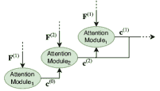
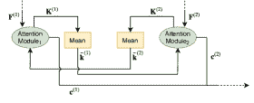

<!--yml

分类：未分类

日期：2024 年 9 月 6 日 19:47:26

-->

# [2203.14263] 关于深度学习中注意力机制的全面调查

> 来源：[`ar5iv.labs.arxiv.org/html/2203.14263`](https://ar5iv.labs.arxiv.org/html/2203.14263)

\stackMath

# 关于深度学习中注意力机制的全面调查

Gianni Brauwers 和 Flavius Frasincar G. Brauwers 和 F. Frasincar 现为荷兰鹿特丹伊拉斯谟大学经济学院成员（电子邮件：{frasincar, brauwers}@ese.eur.nl）。手稿收到日期：2020 年 7 月 6 日；修订日期：2021 年 6 月 21 日；通讯作者：F. Frasincar

###### 摘要

注意力是一个重要的机制，可用于各种深度学习模型，涉及多个不同领域和任务。本调查概述了文献中提出的最重要的注意力机制。通过一个由一般注意力模型、统一符号和全面的注意力机制分类法组成的框架来解释各种注意力机制。此外，还回顾了评估注意力模型的各种措施，并讨论了基于提出的框架来描述注意力模型结构的方法。最后，考虑了注意力模型领域的未来工作。

###### 关键词：

注意力模型，深度学习，介绍和调查，神经网络，监督学习

## 1 引言

模仿人类注意力的想法最早出现在计算机视觉领域[1, 2]，旨在通过引入一个只关注图像特定区域而不是整个图像的模型来降低图像处理的计算复杂性，同时提高性能。虽然，今天我们所知的注意力机制的真正起点通常被认为来源于自然语言处理领域[3]。Bahdanau 等人[3]在机器翻译模型中实现了注意力，以解决递归神经网络结构的一些问题。在 Bahdanau 等人[3]强调了注意力的优势后，注意力技术得到了改进[4]，并迅速在各种任务中流行，如文本分类[5, 6]，图像描述[7, 8]，情感分析[6, 9]，以及语音识别[10, 11, 12]。

注意力机制在深度学习中已成为一种流行技术，原因有几个。首先，包含注意力机制的模型在所有之前提到的任务以及许多其他任务上都达到了**最先进**的结果。此外，大多数注意力机制可以与基础模型（如递归神经网络或卷积神经网络）共同训练，使用常规的反向传播[3]。另外，注意力机制为神经网络模型引入了一种特定类型的解释[8]，这些模型通常被认为难以解释。此外，Transformer 模型的引入[13]进一步证明了注意力机制的有效性，从而进一步提升了注意力机制的流行度。注意力机制最初是作为对递归神经网络的扩展[14]引入的。然而，[13]中提出的 Transformer 模型在注意力研究中标志着重大进展，因为它展示了注意力机制足以构建**最先进**的模型。这意味着诸如递归神经网络特别难以并行化等缺点可以被绕过。与最初引入注意力机制[3]的情况一样，Transformer 模型最初是为机器翻译创建的，但很快被广泛应用于其他任务，如图像处理[15]、视频处理[16]和推荐系统[17]。

本调查的目的是解释注意力的一般形式，并提供深度学习中注意力技术的全面概述。其他关于注意力模型的调查已经被发布。例如，在[18]中，提供了计算机视觉中注意力的调查；[19]概述了图模型中的注意力；[20, 21, 22]均为自然语言处理中的注意力调查。本文在部分基础上构建于上述调查的信息上。然而，我们提供了自己的重要贡献。本文与上述调查的主要区别在于，其他调查通常集中于某一领域内的注意力模型。本文则提供了跨领域的注意力技术概述。我们以一般方式讨论注意力技术，使其能够在各种领域中理解和应用。此外，我们发现以前调查中提出的分类法缺乏必要的深度和结构来正确区分各种注意力机制。此外，一些重要的注意力技术在以前的调查中尚未得到适当讨论，而其他提出的注意力机制似乎缺乏技术细节或直观解释。因此，在本文中，我们通过统一的符号表示、对每种注意力技术的技术和直观解释的结合，以及全面的注意力机制分类法，展示了重要的注意力技术。

本文的结构如下。第二部分介绍了一般注意力模型，为读者提供了对注意力属性及其应用的基本理解。本文的主要贡献之一是第三部分中提出的注意力技术分类法。在这一节中，注意力机制按照提出的分类法进行解释和分类。第四部分提供了性能测量和评估注意力模型的方法的概述。此外，分类法被用来评估各种注意力模型的结构。最后，在第五部分中，我们给出了结论和对进一步研究的建议。

图 1：任务模型的一般结构示意图。

## 2 一般注意力模型

本节介绍了具有相应符号的一般注意力形式。这里介绍的符号基于在 [23] 中引入的符号，并在 [13] 中普及。本文接下来的部分将使用本节介绍的框架。

要实现一般的注意力模型，首先需要描述一个可以使用注意力的模型的一般特征。首先，我们将完整模型称为任务模型，其结构如图 1 所示。该模型简单地接受输入，执行指定的任务，并产生期望的输出。例如，任务模型可以是一个语言模型，它接受一段文本作为输入，并生成内容的摘要、情感分类，或逐字翻译成另一种语言的文本。或者，任务模型可以接受一张图像，并为该图像生成标题或分割。任务模型包括四个子模型：特征模型、查询模型、注意力模型和输出模型。在子节 2.1 中，讨论了用于准备注意力计算输入的特征模型和查询模型。在子节 2.2 中，讨论了注意力模型和输出模型，这些模型负责生成输出。

### 2.1 注意力输入

假设任务模型的输入是矩阵 $\bm{X}\in\mathbb{R}^{d_{x}\times n_{x}}$，其中 $d_{x}$ 代表输入向量的大小，$n_{x}$ 代表输入向量的数量。这个矩阵中的列可以代表句子中的单词、图像中的像素、声学序列的特征，或任何其他的输入集合。接着，特征模型被用来从 $\bm{X}$ 中提取 $n_{f}$ 个特征向量 $\bm{f}_{1},\dots,\bm{f}_{n_{f}}\in\mathbb{R}^{d_{f}}$，其中 $d_{f}$ 代表特征向量的大小。特征模型可以是递归神经网络（RNN）、卷积神经网络（CNN）、简单的嵌入层、对原始数据的线性变换，或根本没有任何变换。基本上，特征模型包括所有将原始输入 $\bm{X}$ 转换为注意力模型将关注的特征向量 $\bm{f}_{1},\dots,\bm{f}_{n_{f}}$ 的步骤。

为了确定要关注哪些向量，注意力模型需要查询 $\bm{q}\in\mathbb{R}^{d_{q}}$，其中 $d_{q}$ 表示查询向量的大小。该查询由查询模型提取，并通常根据模型所期望的输出类型进行设计。查询告诉注意力模型要关注哪些特征向量。它可以被字面理解为查询或问题。例如，对于图像描述任务，假设使用解码器 RNN 模型根据 CNN 从图像中获得的特征向量生成输出描述。在每个预测步骤中，RNN 模型的隐藏状态可以用作查询，以关注 CNN 特征向量。在每一步中，查询是一个问题，因为它根据当前的预测上下文从特征向量中请求必要的信息。

图 2：通用注意力模块的内部机制。

### 2.2 注意力输出

特征向量和查询用作注意力模型的输入。该模型由一个或多个通用注意力模块组成。图 2 展示了通用注意力模块的概述。通用注意力模块的输入是查询 $\bm{q}\in\mathbb{R}^{d_{q}}$ 和特征向量矩阵 $\bm{F}=[\bm{f}_{1},\dots,\bm{f}_{n_{f}}]\in\mathbb{R}^{d_{f}\times n_{f}}$。从矩阵 $\bm{F}$ 中提取两个单独的矩阵：键矩阵 $\bm{K}=[\bm{k}_{1},\dots,\bm{k}_{n_{f}}]\in\mathbb{R}^{d_{k}\times n_{f}}$ 和值矩阵 $\bm{V}=[\bm{v}_{1},\dots,\bm{v}_{n_{f}}]\in\mathbb{R}^{d_{v}\times n_{f}}$，其中 $d_{k}$ 和 $d_{v}$ 分别表示键向量（$\bm{K}$ 的列）和值向量（$\bm{V}$ 的列）的维度。获得这些矩阵的通用方法是通过对 $\bm{F}$ 进行线性变换，使用权重矩阵 $\bm{W}_{K}\in\mathbb{R}^{d_{k}\times d_{f}}$ 和 $\bm{W}_{V}\in\mathbb{R}^{d_{v}\times d_{f}}$，分别用于 $\bm{K}$ 和 $\bm{V}$。$\bm{K}$ 和 $\bm{V}$ 的计算在 (1) 中给出。两个权重矩阵可以在训练过程中学习或由研究人员预定义。例如，可以选择将 $\bm{W}_{K}$ 和 $\bm{W}_{V}$ 定义为等于单位矩阵，以保留原始特征向量。定义键和值的其他方法也是可能的，例如为键和值使用完全独立的输入。唯一需要遵守的约束是 $\bm{K}$ 和 $\bm{V}$ 的列数保持一致。

|  | $\setstackgap{L}{8pt}\stackunder{\bm{K}}{\scriptscriptstyle d_{k}\times n_{f}}=\stackunder{\bm{W}_{K}}{\scriptscriptstyle d_{k}\times d_{f}}\times\stackunder{\bm{F}}{\scriptscriptstyle d_{f}\times n_{f}},\hskip 20.0pt\stackunder{\bm{V}}{\scriptscriptstyle d_{v}\times n_{f}}=\stackunder{\bm{W}_{V}}{\scriptscriptstyle d_{v}\times d_{f}}\times\stackunder{\bm{F}}{\scriptscriptstyle d_{f}\times n_{f}}.$ |  | (1) |
| --- | --- | --- | --- |

注意力模块的目标是生成 $\bm{V}$ 中值向量的加权平均。用于生成此输出的权重通过注意力评分和对齐步骤获得。查询 $\bm{q}$ 和键矩阵 $\bm{K}$ 用于计算注意力评分向量 $\bm{e}=[e_{1},\dots,e_{n_{f}}]\in\mathbb{R}^{n_{f}}$。这通过评分函数 $\text{score}()$ 完成，如 (2) 中所示。

|  | $\setstackgap{L}{8pt}\stackunder{e_{l}}{\scriptscriptstyle 1\times 1}=\text{score}(\stackunder{\bm{q}}{\scriptscriptstyle d_{q}\times 1},\stackunder{\bm{k}_{l}}{\scriptscriptstyle d_{k}\times 1}).$ |  | (2) |
| --- | --- | --- | --- |

如前所述，查询表示对信息的请求。注意力评分 $e_{l}$ 表示根据查询，键向量 $\bm{k}_{l}$ 中包含的信息的重要性。如果查询和键向量的维度相同，评分函数的一个例子是取向量的点积。不同类型的评分函数将在 3.2.1 节中进一步讨论。

接下来，注意力评分通过对齐层进一步处理。注意力评分通常可能在 $[0,1]$ 之外有广泛的范围。然而，由于目标是生成加权平均，评分通过对齐函数 $\text{align}()$ 重新分配，如 (3) 中定义。

|  | $\setstackgap{L}{8pt}\stackunder{a_{l}}{\scriptscriptstyle 1\times 1}=\text{align}(\stackunder{e_{l}}{\scriptscriptstyle 1\times 1};\stackunder{\bm{e}}{\scriptscriptstyle n_{f}\times 1}),$ |  | (3) |
| --- | --- | --- | --- |

其中 $a_{l}\in\mathbb{R}^{1}$ 是对应于第 $l$ 个值向量的注意力权重。一个对齐函数的例子是使用 softmax 函数，但各种其他对齐类型在 3.2.2 中讨论。注意力权重为注意力模块提供了相当直观的解释。每个权重直接表示了每个特征向量对于这个特定问题相对于其他特征向量的重要性。这可以让我们更深入地理解模型的行为，以及输入和输出之间的关系。注意力权重向量 $\bm{a}=[a_{1},\dots,a_{n_{f}}]\in\mathbb{R}^{n_{f}}$ 用于通过计算值矩阵 $\bm{V}$ 列的加权平均来生成上下文向量 $\bm{c}\in\mathbb{R}^{d_{v}}$，如 (4) 所示。

|  | $\setstackgap{L}{8pt}\stackunder{\bm{c}}{\scriptscriptstyle d_{v}\times 1}=\sum^{n_{f}}_{l=1}\stackunder{a_{l}}{\scriptscriptstyle 1\times 1}\times\stackunder{\bm{v}_{l}}{\scriptscriptstyle d_{v}\times 1}.$ |  | (4) |
| --- | --- | --- | --- |

如图 1 所示，上下文向量随后在输出模型中用于创建输出 $\hat{\bm{y}}$。该输出模型将上下文向量转换为输出预测。例如，它可能是一个简单的 softmax 层，该层以上下文向量 $\bm{c}$ 为输入，如 (5) 所示。

|  | $\setstackgap{L}{8pt}\stackunder{\hat{\bm{y}}}{\scriptscriptstyle d_{y}\times 1}=\text{softmax}(\stackunder{\bm{W}_{c}}{\scriptscriptstyle d_{y}\times d_{v}}\times\stackunder{\bm{c}}{\scriptscriptstyle d_{v}\times 1}+\stackunder{\bm{b}_{c}}{\scriptscriptstyle d_{y}\times 1}),$ |  | (5) |
| --- | --- | --- | --- |

其中 $d_{y}$ 是输出选择或类别的数量，$\bm{W}_{c}\in\mathbb{R}^{d_{y}\times d_{v}}$ 和 $\bm{b}_{c}\in\mathbb{R}^{d_{y}}$ 是可训练的权重。

### 2.3 注意力应用

注意力机制是一种相当通用的机制，可以在各种问题领域中使用。考虑使用 RNN 模型的机器翻译任务。此外，还要考虑使用基本 CNN 模型的图像分类问题。虽然 RNN 生成一系列隐藏状态向量，而 CNN 创建特征图，其中图像中的每个区域由一个特征向量表示。RNN 隐藏状态是按顺序组织的，而 CNN 特征图是按空间组织的。然而，注意力机制仍然可以在这两种情况下应用，因为注意力机制本质上不依赖于特征向量的组织。这一特性使得在不同领域的各种模型中实现注意力机制变得容易。

注意力机制可以应用于另一个领域，即音频处理 [24, 25]。声学序列可以通过一系列特征向量表示，这些向量与音频样本的特定时间段相关。这些向量可以是原始输入音频，也可以通过例如 RNN 或 CNN 进行提取。视频处理是另一个可以直观应用注意力机制的领域 [26, 27]。视频数据由图像序列组成，因此注意力可以应用于单个图像以及整个序列。推荐系统通常结合用户的互动历史来生成推荐。可以根据例如用户互动的产品的 id 或其他特征提取特征向量，并对其应用注意力机制 [28]。一般来说，注意力机制也可以应用于许多使用时间序列作为输入的问题，无论是医学 [29]、金融 [30] 还是其他领域，只要能够提取特征向量。

注意力机制不依赖于特征向量的组织结构，使其能够应用于各种具有不同数据结构的问题，这从前面的领域示例中可以看出。然而，这可以进一步拓展到对数据的不规则结构应用注意力机制。例如，蛋白质结构、城市交通流和通信网络不能总是使用整齐的结构组织来表示，例如时间序列这样的序列，或图像这样的网格。在这种情况下，数据的不同方面通常表示为图中的节点。这些节点可以用特征向量表示，这意味着注意力机制也可以应用于使用图结构数据的领域 [31, 19]。

通常，注意力可以应用于任何可以定义或提取特征向量集的问题。因此，图 2 中展示的一般注意力模型适用于广泛的领域。然而，问题在于一般注意力模块有多种不同的应用和扩展。因此，在第三部分中，提供了对各种不同注意力机制的全面概述。

图 3：注意力机制的分类法。

## 3 注意力分类法

存在许多不同类型的注意力机制和扩展，一个模型可以使用这些注意力技术的不同组合。因此，我们提出了一种分类法，可以用于分类不同类型的注意力机制。图 3 提供了注意力机制可以组织成的不同类别和子类别的视觉概览。这三大类是基于注意力技术是否设计来处理特定类型的特征向量（特征相关）、特定类型的模型查询（查询相关），或者是否仅仅是一个与特征模型或查询模型都无关的一般机制（一般）。对这些类别及其子类别的进一步解释将在以下小节中提供。本节讨论的每种机制要么是对第二部分中展示的一般注意力模块的现有内部机制的修改，要么是其扩展。

提出的分类法还可以用于分析注意力模型的架构。即，主要类别及其子类别可以被解释为注意力模型的正交维度。一个注意力模型可以由来自任何或所有类别的技术组合而成。一些特性，如评分和对齐函数，通常是任何注意力模型所必需的。其他机制，如多头注意力或共同注意力，在每种情况下并不是必需的。最后，在表 I 中，提供了使用的符号及其对应描述的概述。

表 I：符号。

| 符号 | 描述 |
| --- | --- |
| $\bm{F}$ | 大小为 $d_{f}\times n_{f}$ 的矩阵，其中包含特征向量 $\bm{f}_{1},\dots,\bm{f}_{n_{f}}\in\mathbb{R}^{d_{f}}$ 作为列。这些特征向量由特征模型提取。 |
| $\bm{K}$ | 尺寸为 $d_{k}\times n_{f}$ 的矩阵，包含关键向量 $\bm{k}_{1},\dots,\bm{k}_{n_{f}}\in\mathbb{R}^{d_{k}}$ 作为列。这些向量用于计算注意力分数。 |
| $\bm{V}$ | 尺寸为 $d_{v}\times n_{f}$ 的矩阵，包含值向量 $\bm{v}_{1},\dots,\bm{v}_{n_{f}}\in\mathbb{R}^{d_{v}}$ 作为列。这些向量用于计算上下文向量。 |
| $\bm{W}_{K}$ | 尺寸为 $d_{k}\times d_{f}$ 的权重矩阵，用于从 $\bm{F}$ 矩阵中创建 $\bm{K}$ 矩阵。 |
| $\bm{W}_{V}$ | 尺寸为 $d_{v}\times d_{f}$ 的权重矩阵，用于从 $\bm{F}$ 矩阵中创建 $\bm{V}$ 矩阵。 |
| $\bm{q}$ | 尺寸为 $d_{q}$ 的查询向量。该向量本质上代表一个问题，并用于计算注意力分数。 |
| $\bm{c}$ | 尺寸为 $d_{v}$ 的上下文向量。该向量是注意力模型的输出。 |
| $\bm{e}$ | 尺寸为 $d_{n_{f}}$ 的分数向量，包含注意力分数 $e_{1},\dots,e_{n_{f}}\in\mathbb{R}^{1}$。这些用于计算注意力权重。 |
| $\bm{a}$ | 尺寸为 $d_{n_{f}}$ 的注意力权重向量，包含注意力权重 $a_{1},\dots,a_{n_{f}}\in\mathbb{R}^{1}$。这些是计算上下文向量时使用的权重。 |

### 3.1 特征相关的注意力机制

基于特定的输入数据集，特征模型提取特征向量，以便注意力模型可以关注这些不同的向量。这些特征可能具有需要特殊注意力机制处理的特定结构。这些机制可以分类处理以下特征特性之一：特征的多样性、特征的层级或特征的表示。 |

#### 3.1.1 特征的多样性

对于大多数任务，模型只处理单一输入，如图像、句子或声学序列。我们将这种机制称为单一特征注意力。其他模型则设计为基于多个输入来使用注意力，以便将更多信息引入模型中，且这些信息可以以多种方式加以利用。然而，这确实意味着存在多个特征矩阵，需要特殊的注意力机制才能充分使用。例如，[32] 引入了一个名为共同注意力的概念，以允许所提出的视觉问答（VQA）模型同时关注图像和问题。 |

共注意力机制通常可以分为两组 [33]：粗粒度共注意力和细粒度共注意力。这两组的区别在于根据两个特征矩阵计算注意力分数的方式。粗粒度注意力机制使用一个特征矩阵的紧凑表示作为查询来关注另一个特征向量。另一方面，细粒度共注意力使用一个输入的所有特征向量作为查询。因此，没有信息丢失，这就是这些机制被称为细粒度的原因。

图 4：交替共注意力的示意图。

作为粗粒度共注意力的一个例子，[32] 提出了一个交替共注意力机制，该机制使用来自一个注意力模块的上下文向量（即紧凑的表示）作为另一个模块的查询，反之亦然。交替共注意力机制在图 4 中展示。给定一组两个输入矩阵 $\bm{X}^{(1)}$ 和 $\bm{X}^{(2)}$，特征通过特征模型提取，以生成特征矩阵 $\bm{F}^{(1)}\in\mathbb{R}^{d_{f}^{(1)}\times n_{f}^{(1)}}$ 和 $\bm{F}^{(2)}\in\mathbb{R}^{d_{f}^{(2)}\times n_{f}^{(2)}}$，其中 $d_{f}^{(1)}$ 和 $d_{f}^{(2)}$ 分别表示从第一个和第二个输入中提取的特征向量的维度，而 $n_{f}^{(1)}$ 和 $n_{f}^{(2)}$ 分别表示从第一个和第二个输入中提取的特征向量的数量。在 [32] 中，共注意力用于视觉问答（VQA），因此两个输入矩阵是图像数据和问题数据，其中图像的特征模型由 CNN 模型组成，问题的特征模型包括词嵌入、卷积层、池化层和 LSTM 模型。首先，计算第一组特征 $\bm{F}^{(1)}$ 的注意力，而不使用查询（图 4 中的注意力模块[1]）。在 [32] 中，为该注意力机制使用了调整后的加性注意力分数函数。常规加性分数函数的一般形式可以参见 (6)。

|  | $\setstackgap{L}{11pt}\text{score}(\stackunder{\bm{q}}{\scriptscriptstyle d_{q}\times 1},\stackunder{\bm{k}_{l}}{\scriptscriptstyle d_{k}\times 1})=\stackunder{\bm{w}^{T}}{\scriptscriptstyle 1\times d_{w}}\times\text{act}(\stackunder{\bm{W}_{1}}{\scriptscriptstyle d_{w}\times d_{q}}\times\stackunder{\bm{q}}{\scriptscriptstyle d_{q}\times 1}+\stackunder{\bm{W}_{2}}{\scriptscriptstyle d_{w}\times d_{k}}\times\stackunder{\bm{k}_{l}}{\scriptscriptstyle d_{k}\times 1}+\stackunder{\bm{b}}{\scriptscriptstyle d_{w}\times 1}),$ |  | (6) |
| --- | --- | --- | --- |

其中 $\text{act}()$ 是一个非线性激活函数，$\bm{w}\in\mathbb{R}^{d_{w}}$、$\bm{W}_{1}\in\mathbb{R}^{d_{w}\times d_{q}}$、$\bm{W}_{2}\in\mathbb{R}^{d_{w}\times d_{k}}$ 和 $\bm{b}\in\mathbb{R}^{d_{w}}$ 是可训练的权重矩阵，其中 $d_{w}$ 是权重矩阵的预定义维度。可以在 (7) 中看到这种得分函数的一个变体，它适应于在没有查询的情况下进行计算的实际应用。

|  | $\setstackgap{L}{11pt}\stackunder{e^{(0)}_{l}}{\scriptscriptstyle 1\times 1}=\stackunder{\bm{w}^{(1)T}}{\scriptscriptstyle 1\times d_{w}}\times\text{act}(\stackunder{\bm{W}^{(1)}}{\scriptscriptstyle d_{w}\times d_{k}^{(1)}}\times\stackunder{\bm{k}_{l}^{(1)}}{\scriptscriptstyle d_{k}^{(1)}\times 1}+\stackunder{\bm{b}^{(1)}}{\scriptscriptstyle d_{w}\times 1}),$ |  | (7) |
| --- | --- | --- | --- |

其中 $\bm{w}^{(1)}\in\mathbb{R}^{d_{w}}$、$\bm{W}^{(1)}\in\mathbb{R}^{d_{w}\times d_{k}^{(1)}}$ 和 $\bm{b}^{(1)}\in\mathbb{R}^{d_{w}}$ 是 Attention Module[1] 的可训练权重矩阵，$\bm{k}_{l}^{(1)}\in\mathbb{R}^{d_{k}^{(1)}}$ 是从 $\bm{F}^{(1)}$ 通过线性变换得到的键矩阵 $\bm{K}^{(1)}$ 的第 $l$ 列（见 (1)），其中 $d_{w}$ 是权重矩阵的预指定维度，$d_{k}^{(1)}$ 是键向量的预指定维度。

也许有人会想知道为什么在以这种方式计算注意力时查询是缺失的。从本质上讲，这种注意力模型中的查询与其他可训练参数一起学习。因此，查询可以被解释为一个一般性的问题：“哪些特征向量包含最重要的信息？”。这也被称为自注意力机制，因为注意力是仅基于特征向量本身计算的。自注意力机制在小节 3.3.1 中有更详细的解释。

分数与对齐函数结合（参见 (3)），例如 softmax 函数，以创建用于计算上下文向量 $\bm{c}^{(0)}\in\mathbb{R}^{d_{v}^{(1)}}$ 的注意力权重（参见 (4)）。这个上下文向量不是作为注意力模型的输出，而是作为计算上下文向量 $\bm{c}^{(2)}\in\mathbb{R}^{d_{v}^{(2)}}$ 的查询，基于第二个特征矩阵 $\bm{F}^{(2)}$，其中 $d_{v}^{(2)}$ 是通过线性变换从 $\bm{F}^{(2)}$ 获得的值向量的维度（参见 (1)）。对于这个模块（图 4 中的注意力模块[2]），使用另一种分数函数来计算注意力分数，将 $\bm{c}_{0}$ 作为查询输入，如 (8) 中所示。在这种情况下可以使用任何函数，但在 [32] 中使用了加法函数。

|  | $\setstackgap{L}{11pt}\stackunder{e_{l}^{(2)}}{\scriptscriptstyle 1\times 1}=\text{score}(\stackunder{\bm{c}^{(0)}}{\scriptscriptstyle d_{v}^{(1)}\times 1},\stackunder{\bm{k}_{l}^{(2)}}{\scriptscriptstyle d_{k}^{(2)}\times 1}).$ |  | (8) |
| --- | --- | --- | --- |

然后使用这些注意力分数来计算注意力权重，例如，使用 softmax 函数作为对齐函数，之后上下文向量 $\bm{c}^{(2)}$ 可以作为第二组值向量的加权平均得出。最后，上下文向量 $\bm{c}^{(2)}$ 被用作第一个注意力模块的查询，这将产生第一个特征矩阵 $\bm{F}^{(1)}$ 的上下文向量 $\bm{c}^{(1)}$。注意力分数根据 (9) 计算。在 [32] 中，使用了与 (7) 中相同的函数和权重矩阵，但增加了一个查询，使其与一般的加法分数函数相同（参见 (6)）。其余的注意力计算过程与之前类似。

|  | $\setstackgap{L}{11pt}\stackunder{e_{l}^{(1)}}{\scriptscriptstyle 1\times 1}=\text{score}(\stackunder{\bm{c}^{(2)}}{\scriptscriptstyle d_{v}^{(2)}\times 1},\stackunder{\bm{k}_{l}^{(1)}}{\scriptscriptstyle d_{k}^{(1)}\times 1}).$ |  | (9) |
| --- | --- | --- | --- |

生成的上下文向量 $\bm{c}^{(1)}$ 和 $\bm{c}^{(2)}$ 被串联在一起，用于输出模型的预测。交替共注意力固有地包含一种顺序性，因为上下文向量需要一个接一个地计算。这可能带来计算上的不利影响，因为无法并行化。与使用像交替共注意力这样的顺序机制不同，[34] 提出了可以并行计算两个特征矩阵上的注意力的交互式共注意力机制，如图 5 所示。与使用上下文向量作为查询不同，使用键向量的无权平均值作为查询。平均键的计算方法在 (10) 中提供，注意力分数的计算方法在 (11) 中展示。在这种情况下，可以使用任何分数函数，但 [34] 使用了加法分数函数。

|  | $\setstackgap{L}{13pt}\stackunder{\bar{\bm{k}}^{(1)}}{\scriptscriptstyle d_{k}^{(1)}\times 1}=\frac{1}{n^{(1)}_{f}}\sum^{n^{(1)}_{f}}_{l=1}\stackunder{\bm{k}_{l}^{(1)}}{\scriptscriptstyle d_{k}^{(1)}\times 1},\hskip 20.0pt\stackunder{\bar{\bm{k}}^{(2)}}{\scriptscriptstyle d_{k}^{(2)}\times 1}=\frac{1}{n^{(2)}_{f}}\sum^{n^{(2)}_{f}}_{l=1}\stackunder{\bm{k}_{l}^{(2)}}{\scriptscriptstyle d_{k}^{(2)}\times 1};$ |  | (10) |
| --- | --- | --- | --- |
|  | $\setstackgap{L}{13pt}\stackunder{e^{(1)}_{l}}{\scriptscriptstyle 1\times 1}=\text{score}(\stackunder{\bar{\bm{k}}^{(2)}}{\scriptscriptstyle d_{k}^{(2)}\times 1},\stackunder{\bm{k}_{l}^{(1)}}{\scriptscriptstyle d_{k}^{(1)}\times 1}),\hskip 5.0pt\stackunder{e^{(2)}_{l}}{\scriptscriptstyle 1\times 1}=\text{score}(\stackunder{\bar{\bm{k}}^{(1)}}{\scriptscriptstyle d_{k}^{(1)}\times 1},\stackunder{\bm{k}_{l}^{(2)}}{\scriptscriptstyle d_{k}^{(2)}\times 1}).$ |  | (11) |

从注意力分数中，通过对齐函数创建注意力权重，并用于生成上下文向量$\bm{c}^{(1)}$和$\bm{c}^{(2)}$。

图 5：交互式共同注意的示意图。

粗粒度的共同注意机制使用一种紧凑的输入表示作为查询来计算另一个输入的注意力，而细粒度的共同注意则在计算注意力分数时逐个考虑每个输入的每个元素。在这种情况下，查询变成了一个矩阵。细粒度共同注意的一个例子是平行共同注意[32]。与交互式共同注意类似，平行共同注意同时计算两个特征矩阵上的注意力，如图 6 所示。我们首先评估由线性变换特征矩阵$\bm{F}^{(1)}$和$\bm{F}^{(2)}$得到的键矩阵$\bm{K}^{(1)}\in\mathbb{R}^{d_{k}^{(1)}\times n_{f}^{(1)}}$和$\bm{K}^{(2)}\in\mathbb{R}^{d_{k}^{(2)}\times n_{f}^{(2)}}$，其中$d_{k}^{(1)}$和$d_{k}^{(2)}$是预设的键的维度。其思路是将一个输入的键矩阵作为计算另一个输入注意力的查询。然而，由于$\bm{K}^{(1)}$和$\bm{K}^{(2)}$具有完全不同的维度，因此计算一个亲和矩阵$\bm{A}\in\mathbb{R}^{n_{f}^{(1)}\times n_{f}^{(2)}}$，该矩阵用于将一个键矩阵本质上转换到另一个键矩阵的空间。在[32]中，$\bm{A}$的计算如(12)所示。

|  | $\setstackgap{L}{11pt}\stackunder{\bm{A}}{\scriptscriptstyle n_{f}^{(1)}\times n_{f}^{(2)}}=\text{act}(\stackunder{\bm{K}^{{(1)}^{T}}}{\scriptscriptstyle n_{f}^{(1)}\times d_{k}^{(1)}}\times\stackunder{\bm{W}_{A}}{\scriptscriptstyle d_{k}^{(1)}\times d_{k}^{(2)}}\times\stackunder{\bm{K}^{(2)}}{\scriptscriptstyle d_{k}^{(2)}\times n_{f}^{(2)}}),$ |  | (12) |
| --- | --- | --- | --- |

其中 $\bm{W}_{A}\in\mathbb{R}^{d_{k}^{(1)}\times d_{k}^{(2)}}$ 是一个可训练的权重矩阵，$\text{act}()$ 是一个激活函数，在 [32] 中使用了 $\text{tanh}()$ 函数。[35] 提出了计算该矩阵的另一种方法，即可以使用 (13) 计算矩阵 $\bm{A}$ 的每个独立元素 $A_{i,j}$。

|  | $\setstackgap{L}{11pt}\stackunder{A_{i,j}}{\scriptscriptstyle 1\times 1}=\stackunder{\bm{w}_{A}^{T}}{\scriptscriptstyle 1\times 3d_{k}}\times\text{concat}(\stackunder{\bm{k}_{i}^{(1)}}{\scriptscriptstyle d_{k}\times 1},\stackunder{\bm{k}_{j}^{(2)}}{\scriptscriptstyle d_{k}\times 1},\stackunder{\bm{k}_{i}^{(1)}}{\scriptscriptstyle d_{k}\times 1}\circ\stackunder{\bm{k}_{j}^{(2)}}{\scriptscriptstyle d_{k}\times 1}),$ |  | (13) |
| --- | --- | --- | --- |

其中 $\bm{w}_{A}\in\mathbb{R}^{3d_{k}}$ 表示一个可训练的权重向量，$\text{concat}()$ 表示向量连接，$\circ$ 表示逐元素乘法，也称为哈达玛积。请注意，在这种情况下，每个键矩阵的键必须具有相同的维度 $d_{k}$，以使逐元素乘法有效。亲和力矩阵可以被解释为两个键矩阵列的相似性矩阵，并帮助将例如图像键转换到与句子中单词的键相同的空间，反之亦然。注意力得分向量 $\bm{e}^{(1)}$ 和 $\bm{e}^{(2)}$ 可以使用修改版的加性得分函数计算，如 (14) 和 (15) 所示。本调查中的先前注意力得分示例都使用得分函数为每个值向量单独计算每个注意力得分。然而，(14) 和 (15) 用于计算所有注意力得分的完整向量。实际上，注意力得分是以聚合的形式计算的。

|  | $\setstackgap{L}{11pt}\stackunder{\bm{e}^{(1)}}{\scriptscriptstyle 1\times n_{f}^{(1)}}=\stackunder{\bm{w}_{1}}{\scriptscriptstyle 1\times d_{w}}\times\text{act}(\stackunder{\bm{W}_{2}}{\scriptscriptstyle d_{w}\times d_{k}^{(2)}}\times\stackunder{\bm{K}^{(2)}}{\scriptscriptstyle d_{k}^{(2)}\times n_{f}^{(2)}}\times\stackunder{\bm{A}^{T}}{\scriptscriptstyle n_{f}^{(2)}\times n_{f}^{(1)}}+\stackunder{\bm{W}_{1}}{\scriptscriptstyle d_{w}\times d_{k}^{(1)}}\times\stackunder{\bm{K}^{(1)}}{\scriptscriptstyle d_{k}^{(1)}\times n_{f}^{(1)}});$ |  | (14) |
| --- | --- | --- | --- |
|  | $\setstackgap{L}{11pt}\stackunder{\bm{e}^{(2)}}{\scriptscriptstyle 1\times n_{f}^{(2)}}=\stackunder{\bm{w}_{2}}{\scriptscriptstyle 1\times d_{w}}\times\text{act}(\stackunder{\bm{W}_{1}}{\scriptscriptstyle d_{w}\times d_{k}^{(1)}}\times\stackunder{\bm{K}^{(1)}}{\scriptscriptstyle d_{k}^{(1)}\times n_{f}^{(1)}}\times\stackunder{\bm{A}}{\scriptscriptstyle n_{f}^{(1)}\times n_{f}^{(2)}}+\stackunder{\bm{W}_{2}}{\scriptscriptstyle d_{w}\times d_{k}^{(2)}}\times\stackunder{\bm{K}^{(2)}}{\scriptscriptstyle d_{k}^{(2)}\times n_{f}^{(2)}}),$ |  | (15) |

其中 $\bm{w}_{1}\in\mathbb{R}^{d_{w}}$，$\bm{w}_{2}\in\mathbb{R}^{d_{w}}$，$\bm{W}_{1}\in\mathbb{R}^{d_{w}\times d_{k}^{(1)}}$，以及 $\bm{W}_{2}\in\mathbb{R}^{d_{w}\times d_{k}^{(2)}}$ 是可训练的权重矩阵，其中 $d_{w}$ 是权重矩阵的预设维度。注意 $\text{tanh}()$ 被用于[32]中的激活函数，特征矩阵作为键矩阵。在这种情况下，亲和力矩阵 $\bm{A}$ 可以看作是特征空间之间的翻译器。如前所述，亲和力矩阵本质上是两个输入键向量的相似性矩阵。在[33]中，这一事实被用来提出确定注意力分数的不同方法。即，可以将一行或一列中的最大相似性值作为注意力分数，如（16）中所示。

图 6：平行共同注意力的示意图。

|  | $\setstackgap{L}{8pt}\stackunder{e_{i}^{(1)}}{\scriptscriptstyle 1\times 1}=\stackunder{\text{max}}{\scriptscriptstyle j=1,\dots,n_{f}^{(2)}}\stackunder{A_{i,j}}{\scriptscriptstyle 1\times 1},\hskip 20.0pt\stackunder{e_{j}^{(2)}}{\scriptscriptstyle 1\times 1}=\stackunder{\text{max}}{\scriptscriptstyle i=1,\dots,n_{f}^{(1)}}\stackunder{A_{i,j}}{\scriptscriptstyle 1\times 1}.$ |  | (16) |
| --- | --- | --- | --- |

接下来，使用注意力分数通过对齐函数计算注意力权重，以便可以将两个上下文向量 $\bm{c}^{(1)}$ 和 $\bm{c}^{(2)}$ 作为从线性变换特征得到的值向量的加权平均。对于对齐函数，[32] 提议使用 softmax 函数，值向量被简单地设置为特征向量。结果上下文向量可以连接或相加。

最后，粗粒度和细粒度的共同注意力可以结合起来，创建一个更复杂的共同注意力机制。[33] 提出了多粒度共同注意力机制，该机制计算两个输入的粗粒度和细粒度共同注意力。每个机制为每个输入生成一个上下文向量。这四个结果上下文向量被连接起来，并在输出模型中用于预测。

与共同注意机制分开的一个机制是旋转注意机制[36]。该技术通常用于文本情感分析环境，其中涉及三个输入：需要确定情感的短语（目标短语）、目标短语之前的文本（左上下文）和目标短语之后的文本（右上下文）。这三个输入中的单词都由特征模型编码，生成以下特征矩阵：$\bm{F}^{t}=[\bm{f}^{t}_{1},\dots,\bm{f}^{t}_{n^{t}_{f}}]\in\mathbb{R}^{d_{f}^{t}\times n_{f}^{t}}$、$\bm{F}^{l}=[\bm{f}^{l}_{1},\dots,\bm{f}^{l}_{n^{l}_{f}}]\in\mathbb{R}^{d_{f}^{l}\times n_{f}^{l}}$和$\bm{F}^{r}=[\bm{f}^{r}_{1},\dots,\bm{f}^{r}_{n^{r}_{f}}]\in\mathbb{R}^{d_{f}^{r}\times n_{f}^{r}}$，分别对应目标短语词汇、左上下文词汇和右上下文词汇，其中$d_{f}^{t}$、$d_{f}^{l}$和$d_{f}^{r}$表示对应输入的特征向量维度，$n_{f}^{t}$、$n_{f}^{l}$和$n_{f}^{r}$表示对应输入的特征向量数量。[36]中使用的特征模型包括目标短语、左上下文和右上下文的词嵌入和分开的 Bi-LSTM 模型。这意味着特征向量实际上是从 Bi-LSTM 模型中获得的隐藏状态向量。使用这些特征的想法是从输入中提取一个单一向量$\bm{r}$，以便可以使用 softmax 层进行分类。因此，我们现在面临两个挑战：如何将输入表示为一个单一向量，以及如何将左上下文和右上下文的信息整合到该向量中。[36]提出使用旋转注意机制来解决这个问题。

首先，通过使用一个池化层对$\bm{F}^{t}$的列进行平均，创建一个单一的目标短语表示，如在(17)中所示。

|  | $\setstackgap{L}{11pt}\stackunder{\bm{r}^{t}}{\scriptscriptstyle d_{f}^{t}\times 1}=\frac{1}{n^{t}_{f}}\sum^{n^{t}_{f}}_{i=1}\stackunder{\bm{f}^{t}_{i}}{\scriptscriptstyle d_{f}^{t}\times 1}.$ |  | (17) |
| --- | --- | --- | --- |

$\bm{r}^{t}$ 然后被用作查询，从左侧和右侧上下文分别创建上下文向量。例如，对于左侧上下文，关键向量 $\bm{k}_{1}^{l},\dots,\bm{k}_{n_{f}^{l}}^{l}\in\mathbb{R}^{d_{k}^{l}}$ 和值向量 $\bm{v}_{1}^{l},\dots,\bm{v}_{n_{f}^{l}}^{l}\in\mathbb{R}^{d_{v}^{l}}$ 从左侧上下文特征向量 $\bm{f}_{1}^{l},\dots,\bm{f}_{n_{f}^{l}}^{l}\in\mathbb{R}^{d_{f}^{l}}$ 中提取，方法与之前类似，其中 $d_{k}^{l}$ 和 $d_{v}^{l}$ 分别是关键向量和值向量的维度。注意[36] 提议使用原始特征向量作为键和值，意味着线性变换由单位矩阵的乘法组成。接下来，使用 (18) 计算分数。

|  | $\setstackgap{L}{8pt}\stackunder{e_{i}^{l}}{\scriptscriptstyle 1\times 1}=\text{score}(\stackunder{\bm{r}^{t}}{\scriptscriptstyle d_{f}^{t}\times 1},\stackunder{\bm{k}_{i}^{l}}{\scriptscriptstyle d_{k}^{l}\times 1}).$ |  | (18) |
| --- | --- | --- | --- |

对于分数函数，[36] 提议使用一个激活的一般分数函数 [34]，其中使用了 tanh 激活函数。注意力分数可以与对齐函数和相应的值向量结合，生成上下文向量 $\bm{r}^{l}\in\mathbb{R}^{d_{v}^{l}}$。[36] 中使用的对齐函数呈现为 softmax 函数。可以采用类似的过程来获取右侧上下文的表示，$\bm{r}^{r}$。这两个上下文表示可以用来创建目标短语的新表示，再次使用注意力。首先，从目标短语特征向量 $\bm{f}_{1}^{t},\dots,\bm{f}_{n_{f}^{t}}^{t}\in\mathbb{R}^{d_{f}^{t}}$ 中提取关键向量 $\bm{k}_{1}^{t},\dots,\bm{k}_{n_{f}^{t}}^{t}\in\mathbb{R}^{d_{k}^{t}}$ 和值向量 $\bm{v}_{1}^{t},\dots,\bm{v}_{n_{f}^{t}}^{t}\in\mathbb{R}^{d_{v}^{t}}$，方法与之前类似，使用线性变换，其中 $d_{k}^{t}$ 和 $d_{v}^{t}$ 分别是关键向量和值向量的维度。再次注意，[36] 中原始特征向量作为键和值。然后使用 (19) 计算左侧感知目标表示的注意力分数。

|  | $\setstackgap{L}{8pt}\stackunder{e_{i}^{l_{t}}}{\scriptscriptstyle 1\times 1}=\text{score}(\stackunder{\bm{r}^{l}}{\scriptscriptstyle d_{v}^{l}\times 1},\stackunder{\bm{k}_{i}^{t}}{\scriptscriptstyle d_{k}^{t}\times 1}).$ |  | (19) |
| --- | --- | --- | --- |

注意力得分可以与对齐函数及相应的值向量结合，以生成上下文向量$\bm{r}^{l_{t}}\in\mathbb{R}^{d_{v}^{t}}$。对于这个注意力计算，[34]建议使用之前相同的得分和对齐函数。右侧感知目标表示$\bm{r}^{r_{t}}$可以以类似的方式计算。最后，为了获得用于分类的完整表示向量$\bm{r}$，将向量$\bm{r}^{l}$、$\bm{r}^{r}$、$\bm{r}^{l_{t}}$和$\bm{r}^{r_{t}}$拼接在一起，如（20）所示。

|  | $\setstackgap{L}{8pt}\stackunder{\bm{r}}{\scriptscriptstyle(d_{v}^{l}+d_{v}^{r}+d_{v}^{t}+d_{v}^{t})\times 1}=\text{concat}(\stackunder{\bm{r}^{l}}{\scriptscriptstyle d_{v}^{l}\times 1},\stackunder{\bm{r}^{r}}{\scriptscriptstyle d_{v}^{r}\times 1},\stackunder{\bm{r}^{l_{t}}}{\scriptscriptstyle d_{v}^{t}\times 1},\stackunder{\bm{r}^{r_{t}}}{\scriptscriptstyle d_{v}^{t}\times 1}).$ |  | (20) |
| --- | --- | --- | --- |

总结来说，旋转注意力机制使用目标短语来计算左侧和右侧上下文的新表示，然后利用这些左侧和右侧的表示来计算目标短语的新表示。第一步旨在捕捉对目标短语最重要的左侧和右侧上下文中的词汇。第二步则旨在捕捉实际目标短语本身最重要的信息。本质上，这一机制通过在目标和上下文之间旋转注意力来改善表示。

结合来自不同输入的信息到一个模型中可以在许多应用中非常有益。例如，在医学数据领域，通常会有许多不同类型的数据，如各种扫描图像或文档，这些数据可以提供不同的信息。在[37]中，使用了一个共注意力机制来自动生成医学报告，以同时关注图像和语义标签。类似地，在[38]中，提出了一种共注意力模型，它将一般人口统计特征和患者医疗历史特征结合起来，以预测未来的健康信息。此外，在[38]中使用了消融研究来表明模型中的共注意力部分具体提高了性能。一个多特征注意力被广泛研究的领域是推荐系统。例如，在[39]中，提出了一种共注意力网络，关注产品评论和用户撰写的评论。在[40]中，提出了一种视频推荐模型，关注用户特征和视频特征。共注意力技术也与图网络结合使用，例如，用于多文档的阅读理解[41]和假新闻检测[42]。相比于共注意力，旋转注意力通常只在情感分析领域被探索，这可能是由于使用这种技术所需的数据特定结构。在[43]中提出了一种旋转注意力的实现，用于情感分析，其中该机制通过重复注意力旋转来迭代地进一步改进表示。

#### 3.1.2 特征层次

之前讨论的注意力机制在单一层次上处理数据。我们称这些注意力技术为单层次注意力机制。然而，一些数据类型可以在多个层次上进行分析和表示。例如，在分析文档时，可以在句子层次、词汇层次，甚至是字符层次进行分析。当所有这些层次的表示或嵌入可用时，可以利用额外的信息层次。例如，可以选择基于句子的字符或词汇进行翻译。然而，在[44]中，引入了一种名为注意力-通过-注意力的技术，允许结合字符层次和词汇层次的信息。其思想是逐字符预测句子翻译，同时结合词汇层次注意力模块的信息。

图 7: 通过注意力实现的注意力示意图。

首先，特征模型（例如，由词嵌入和 RNNs 组成）用于将输入句子编码为字符级特征矩阵$\bm{F}^{(c)}\in\mathbb{R}^{d_{f}^{(c)}\times n_{f}^{(c)}}$和词级特征矩阵$\bm{F}^{(w)}\in\mathbb{R}^{d_{f}^{(w)}\times n_{f}^{(w)}}$，其中$d_{f}^{(c)}$和$n_{f}^{(c)}$分别表示字符嵌入的维度和字符数量，而$d_{f}^{(w)}$和$n_{f}^{(w)}$则表示词级别的相应参数。对该方法至关重要的是数据中的每一层都可以被表示或嵌入。在尝试预测翻译句子中的一个字符时，通过查询模型（如字符级 RNN）生成查询$\bm{q}^{(c)}\in\mathbb{R}^{d_{q}}$，其中$d_{q}$是查询向量的维度。如图 7 所示，查询用于计算词级特征向量$\bm{F}^{(w)}$的注意力。这生成了上下文向量$\bm{c}^{(w)}\in\mathbb{R}^{d_{v}^{(w)}}$，其中$d_{v}^{(w)}$表示词级注意力模块的值向量的维度。这个上下文向量总结了哪些词包含对预测下一个字符最重要的信息。如果我们知道哪些词最重要，那么识别输入句子中哪些字符最重要就变得容易。因此，下一步是关注$\bm{F}^{(c)}$中的字符级特征，添加一个额外的查询输入：词级上下文向量$\bm{c}^{(w)}$。因此，注意力模型的实际查询输入将是查询$\bm{q}^{(c)}$和词上下文向量$\bm{c}^{(w)}$的拼接。这个字符级注意力模块的输出是上下文向量$\bm{c}^{(c)}$。注意力模型的完整上下文输出是词级和字符级上下文向量的拼接。

注意力机制通过注意力技术使用每个层级的表示。然而，并非每个数据层级都有准确的表示，或者在过程中让模型从下层表示构建表示可能更为合适。这种情况下可以使用一种称为分层注意力的技术[5]。分层注意力是另一种技术，它允许在数据的不同层级上应用注意力。然而，与注意力通过注意力技术相比，具体机制运作有很大不同。其思路是从最低层级开始，然后使用注意力创建下一层级的表示或总结。这个过程会重复进行，直到达到最高层级。为了更清楚地说明这一点，假设我们尝试创建一个文档分类模型，类似于[5]中的实现。我们分析一个包含 $n_{S}$ 个句子的文档，其中第 $s$ 个句子包含 $n_{s}$ 个单词，$s=1,\dots,n_{S}$。可以基于单词集合使用注意力来分类文档。然而，这样做会遗漏大量重要的上下文，因为模型会将所有单词视为一个长句子，从而忽略了各个句子内部的上下文。相反，可以利用文档的分层结构（单词构成句子，句子构成文档）。

图 8：分层注意力的示意图。

图 8 说明了层次注意力的结构。对于文档中的每一个句子，会生成一个句子表示 $\bm{c}^{(s)}\in\mathbb{R}^{d_{v}^{(S)}}$，其中 $s=1,\dots,n_{S}$，$d_{v}^{(S)}$ 是用于句子表示的注意力模型中的值向量的维度（图 8 中的 Attention Module[S]）。这个表示是来自注意力模块的上下文向量，基本上总结了该句子。每个句子首先经过特征模型以提取特征矩阵 $\bm{F}^{(s)}\in\mathbb{R}^{d_{f}^{(S)}\times n_{s}}$，其中 $s=1,\dots,n_{S}$，$d_{f}^{(S)}$ 代表每个单词的特征向量的维度，$n_{s}$ 代表句子 $s$ 中单词的数量。为了进一步说明，$\bm{F}^{(s)}$ 的列是与句子 $s$ 中的单词对应的特征向量。如图 8 所示，每个特征矩阵 $\bm{F}^{(s)}$ 被用作注意力模型的输入，生成上下文向量 $\bm{c}^{(s)}$，对于每个 $s=1,\dots,n_{S}$。在这一步中没有使用查询，因此可以认为这是一个自注意力机制。这些上下文向量本质上是句子中单词的总结。上下文向量矩阵 $\bm{C}=[\bm{c}^{(1)},\dots,\bm{c}^{(n_{S})}]\in\mathbb{R}^{d_{v}^{(S)}\times n_{S}}$ 是通过将所有获得的上下文向量作为列组合在一起构造的。最后，使用 $\bm{C}$ 作为特征输入来计算注意力，生成整个文档的表示，即上下文向量 $\bm{c}^{(D)}\in\mathbb{R}^{d_{v}^{(D)}}$，其中 $d_{v}^{(D)}$ 是文档表示的注意力模型中值向量的维度（图 8 中的 Attention Module[D]）。这个上下文向量可以用来对文档进行分类，因为它本质上是文档中所有句子（因此也包括所有单词）的总结。

多层次模型可以用于各种任务。例如，在[28]中，层次注意力被应用于推荐系统，以建模用户在长期和短期层次上的偏好。同样，[45]提出了一种层次模型，用于根据用户偏好推荐社交媒体图片。层次注意力也成功应用于其他领域。例如，[46]提出在视频动作识别模型中使用层次注意力，以捕捉长期和短期层次上的运动信息。此外，[47]提出了一种用于跨领域情感分类的层次注意力模型。在[48]中，提出了一种用于聊天机器人响应生成的层次注意力模型。最后，利用图像数据，[49]提出了一种用于人群计数的层次注意力模型。

#### 3.1.3 特征表示

在基本的注意力模型中，使用单一的嵌入或表示模型来生成模型需要关注的特征表示。这被称为单一表示注意力。然而，也可以选择将多个表示集成到模型中。在[50]中，认为允许模型访问多个嵌入可以生成更高质量的表示。同样，[51]将相同书籍的多个表示（文本、句法、语义、视觉等）整合到特征模型中。特征表示是注意力模型的重要组成部分，但注意力也可以是特征模型的重要部分。其思路是通过对多个表示进行加权平均来创建新的表示，其中权重通过注意力确定。这种技术被称为多表示注意力，并允许创建所谓的元嵌入。假设要为一个词$\bm{x}$创建元嵌入，并且有$E$个嵌入$\bm{x}^{(e_{1})},\dots,\bm{x}^{(e_{E})}$。每个嵌入$\bm{x}^{(e_{i})}$的大小为$d_{e_{i}}$，其中$i=1,\dots,E$。由于并非所有嵌入的大小相同，因此需要进行转换以规范化嵌入维度。使用嵌入特定的权重参数，每个嵌入$\bm{x}^{(e_{i})}$被转换为大小规范化的嵌入$\bm{x}^{(t_{i})}\in\mathbb{R}^{d_{t}}$，其中$d_{t}$是每个转换后的词嵌入的大小，如在(21)中所示。

|  | $\setstackgap{L}{8pt}\stackunder{\bm{x}^{(t_{i})}}{\scriptscriptstyle d_{t}\times 1}=\stackunder{\bm{W}_{e_{i}}}{\scriptscriptstyle d_{t}\times d_{e_{i}}}\times\stackunder{\bm{x}^{(e_{i})}}{\scriptscriptstyle d_{e_{i}}\times 1}+\stackunder{\bm{b}_{e_{i}}}{\scriptscriptstyle d_{t}\times 1},$ |  | (21) |
| --- | --- | --- | --- |

其中 $\bm{W}_{e_{i}}\in\mathbb{R}^{d_{t}\times d_{e_{i}}}$ 和 $\bm{b}_{e_{i}}\in\mathbb{R}^{d_{t}}$ 是可训练的嵌入特定权重矩阵。最终的嵌入 $\bm{x}^{(e)}\in\mathbb{R}^{d_{t}}$ 是之前计算的变换表示的加权平均，如在 (22)中所示。

|  | $\setstackgap{L}{8pt}\stackunder{\bm{x}^{(e)}}{\scriptscriptstyle d_{t}\times 1}=\sum_{i=1}^{E}\stackunder{a_{i}}{\scriptscriptstyle 1\times 1}\times\stackunder{\bm{x}^{(t_{i})}}{\scriptscriptstyle d_{t}\times 1}.$ |  | (22) |
| --- | --- | --- | --- |

最终表示 $\bm{x}^{(e)}$ 可以解释为来自注意力模型的上下文向量，这意味着权重 $a_{1},\dots,a_{E}\in\mathbb{R}^{1}$ 是注意力权重。注意力可以像往常一样计算，其中特征矩阵 $\bm{F}$ 的列是变换后的表示 $\bm{x}^{(t_{1})},\dots,\bm{x}^{(t_{E})}$。在这种情况下，查询可以忽略，因为它在所有情况下都是常量。本质上，查询是“在每种情况下哪些表示是最重要的？”。因此，这是一个自注意力机制。

尽管这是一个有趣的想法，但多表示注意力的应用还是有限的。这种技术的一个应用示例见于[52]，在该示例中，多表示注意力机制被应用于生成多语言的元嵌入。另一个示例是[53]，在该示例中，提出了一种多表示文本分类模型，该模型结合了相同文本的不同表示。例如，提出的模型使用了词性标注、命名实体识别器以及字符级和词级嵌入的嵌入。

### 3.2 一般注意力机制

这个主要类别包括可以应用于任何类型的注意力模型的注意力机制。该组件的结构可以分解为以下几个子方面：注意力评分函数、注意力对齐和注意力维度。

表 II：评分函数 ($\text{score}(\bm{q},\bm{k}_{l})$) 形式概述。

| 名称 | 功能 | 参数 |
| --- | --- | --- |

| 加法（连接） [3] | $\bm{w}^{T}\times\text{act}(\bm{W}_{1}\times\bm{q}+\bm{W}_{2}\times\bm{k}_{l})+\bm{b})$ | <math   alttext="\bm{w}\in\mathbb{R}^{d_{w}}\newline \bm{W}_{1}\in\mathbb{R}^{d_{w}\times d_{q}}\newline

\bm{W}_{2}\in\mathbb{R}^{d_{w}\times d_{k}}\newline

$\bm{b}\in\mathbb{R}^{d_{w}}$，$\bm{W}_{1}\in\mathbb{R}^{d_{w}\times d_{q}}$，$\bm{W}_{2}\in\mathbb{R}^{d_{w}\times d_{k}}$，$\bm{b}\in\mathbb{R}^{d_{w}}$ |

| 乘法（点积） [4] | $\bm{q}^{T}\times\bm{k}_{l}$ | - |
| --- | --- | --- |
| 缩放的乘法 [13] | $\frac{\bm{q}^{T}\times\bm{k}_{l}}{\sqrt{d_{k}}}$ | - |
| 通用形式 [4] | $\bm{k}_{l}^{T}\times\bm{W}\times\bm{q}$ | $\bm{W}\in\mathbb{R}^{d_{k}\times d_{q}}$ |
| 带偏差的通用形式 [54] | $\bm{k}_{l}^{T}\times(\bm{W}\times\bm{q}+\bm{b})$ | $\bm{W}\in\mathbb{R}^{d_{k}\times d_{q}}\newline \bm{b}\in\mathbb{R}^{d_{k}}$ |
| 激活的通用形式 [34] | $\text{act}(\bm{k}_{l}^{T}\times\bm{W}\times\bm{q}+b)$ | $\bm{W}\in\mathbb{R}^{d_{k}\times d_{q}},\newline b\in\mathbb{R}^{1}$ |
| 相似度 [55] | $\text{similarity}(\bm{q},\bm{k}_{l})$ | - |

#### 3.2.1 注意力评分

注意力得分函数是计算注意力的关键组成部分。已经开发了各种方法，每种方法都有其自身的优点和缺点。这些函数的概述见表 II。表 II 的每一行展示了函数$\text{score}(\bm{q},\bm{k}_{l})$的一个可能形式，如(23)中所示，其中$\bm{q}$是查询向量，$\bm{k}_{l}$是$\bm{K}$的第$l$列。请注意，本节中展示的得分函数可以使用矩阵形式的$\bm{K}$更高效地计算，而不是分别计算每一列。尽管如此，为了更清楚地说明键和查询之间的关系，得分函数仍以$\bm{k}_{l}$的形式展示。

|  | $\setstackgap{L}{8pt}\stackunder{e_{l}}{\scriptscriptstyle 1\times 1}=\text{score}(\stackunder{\bm{q}}{\scriptscriptstyle d_{q}\times 1},\stackunder{\bm{k}_{l}}{\scriptscriptstyle d_{k}\times 1}).$ |  | (23) |
| --- | --- | --- | --- |

由于其简单性，最受欢迎的得分函数选择是连接得分函数[3]和乘法得分函数[4]。乘法得分函数由于高度优化的向量运算，具有计算成本低的优点。然而，当维度$d_{k}$过大时，乘法函数可能会产生非最优结果[56]。当$d_{k}$很大时，$\bm{q}$和$\bm{k}_{l}$之间的点积可能会变得非常大。为了说明这一点，在[13]中，举了一个例子，其中$\bm{q}$和$\bm{k}_{l}$的元素都是正态分布的，均值为零，方差为一。然后，向量的点积具有$d_{k}$的方差。方差越大，数值越可能很大。当在对齐步骤中应用这些大数值的 softmax 函数时，梯度会变得非常小，这意味着模型在收敛时会遇到困难[13]。为此，[13]建议将乘法函数缩放因子调整为$\frac{1}{\sqrt{d_{k}}}$，以产生缩放后的乘法得分函数。

在[4]中，通过引入权重矩阵$\bm{W}$扩展了乘法评分函数。这种形式被称为一般评分函数，它允许对$\bm{k}_{l}$进行额外的变换。偏置一般评分函数[54]是一般函数的进一步扩展，引入了偏置权重向量$\bm{b}$。最终扩展的函数被称为激活一般评分函数，在[34]中引入，它包括使用偏置权重$b$和激活函数$\text{act}()$。

之前介绍的评分函数都基于确定键向量和查询向量之间的相似度。因此，更典型的相似度度量，如欧几里得（L[2]）距离和余弦相似度，也可以实现[55]。这些评分方法被总结为相似度评分函数，由$\text{similarity}()$函数表示。

通常，不同领域的评分函数没有共同的使用标准。对特定任务选择评分函数通常基于经验实验。然而，当效率至关重要时，存在例外。在这种情况下，乘法或缩放乘法评分函数通常是最佳选择。例如，Transformer 模型通常计算开销很大。

#### 3.2.2 注意力对齐

注意力对齐是注意力评分之后的步骤。这个对齐过程直接决定了模型将关注输入数据的哪些部分。对齐函数表示为$\text{align}()$，并有多种形式。$\text{align}()$函数以先前计算的注意力评分向量$\bm{e}$为输入，计算$\bm{e}$的每个元素$e_{l}$的注意力权重$a_{l}$。这些注意力权重随后可以用来通过对值向量$\bm{v}_{1},\dots,\bm{v}_{n_{f}}$进行加权平均来创建上下文向量$\bm{c}$：

|  | $\setstackgap{L}{8pt}\stackunder{\bm{c}}{\scriptscriptstyle d_{v}\times 1}=\sum^{n_{f}}_{l=1}\stackunder{a_{l}}{\scriptscriptstyle 1\times 1}\times\stackunder{\bm{v}_{l}}{\scriptscriptstyle d_{v}\times 1}.$ |  | (24) |
| --- | --- | --- | --- |

计算这些权重的最流行方法是简单的 softmax 函数，如(25)所示。

|  | $\setstackgap{L}{8pt}\stackunder{a_{l}}{\scriptscriptstyle 1\times 1}=\text{align}(\stackunder{e_{l}}{\scriptscriptstyle 1\times 1};\stackunder{\bm{e}}{\scriptscriptstyle n_{f}\times 1})=\frac{\text{exp}(e_{l})}{\sum^{n_{f}}_{j=1}\text{exp}(e_{j})}.$ |  | (25) |
| --- | --- | --- | --- |

这种对齐方法在计算机视觉环境中通常被称为**软对齐**[8]，或者对于序列数据被称为**全局对齐**[4]。然而，这两个术语都表示相同的功能，并且可以类似地进行解释。软/全局对齐可以被解释为模型关注所有特征向量。例如，模型关注图像中的所有区域，或者句子中的所有单词。尽管注意力模型通常确实更关注输入的特定部分，但由于 softmax 函数的特性，输入的每一部分至少会受到一些关注。此外，softmax 函数的一个优点是它为输入向量引入了概率解释。这使得人们可以轻松分析输入的哪些部分对输出预测是重要的。

相对于软/全局对齐，其他方法旨在实现更集中形式的对齐。例如，**硬对齐**[8]，也被称为**硬注意力**或**非确定性注意力**，是一种对齐类型，强制注意力模型专注于一个特定的特征向量。首先，这种方法以与全局对齐完全相同的方式实现 softmax 函数。然而，输出$a_{1},\dots,a_{n_{f}}$不会被用作上下文向量计算的权重。相反，这些值作为概率来从中选择一个值向量。一个值$m\in\mathbb{R}^{1}$是从一个多项分布中抽取的，其中$a_{1},\dots,a_{n_{f}}$作为概率的参数。然后，上下文向量简单地定义如下：

|  | $\setstackgap{L}{8pt}\stackunder{\bm{c}}{\scriptscriptstyle d_{v}\times 1}=\stackunder{\bm{v}_{m}}{\scriptscriptstyle d_{v}\times 1}.$ |  | (26) |
| --- | --- | --- | --- |

与软对齐相比，硬对齐在推断过程中通常更高效。另一方面，硬注意力的主要缺点是，由于注意力的随机对齐，模型的训练不能通过常规的反向传播方法进行。相反，需要通过模拟和采样或强化学习 [57] 来计算硬注意力层的梯度。因此，软/全局注意力通常是首选。然而，在某些情况下可以做出妥协。局部对齐 [4] 是一种实现类似于软/全局对齐的 softmax 分布的方法。但是，softmax 分布仅基于输入的一个子集来计算。此方法通常与序列数据结合使用。需要指定一个变量 $p\in\mathbb{R}^{1}$ 来确定区域的位置。接近 $p$ 的特征向量将被模型关注，而距离 $p$ 太远的向量将被忽略。子集的大小将由变量 $D\in\mathbb{R}^{1}$ 确定。总结来说，注意力模型将在子集 $[p-D,p+D]$ 内的注意力分数上应用 softmax 函数。换句话说，将窗口放在输入上，并在该窗口内计算软/全局注意力：

|  | $\setstackgap{L}{8pt}\stackunder{a_{l}}{\scriptscriptstyle 1\times 1}=\text{align}(\stackunder{e_{l}}{\scriptscriptstyle 1\times 1};\stackunder{\bm{e}}{\scriptscriptstyle n_{f}\times 1})=\frac{\text{exp}(e_{l})}{\sum^{p+D}_{j=p-D}\text{exp}(e_{j})}.$ |  | (27) |
| --- | --- | --- | --- |

剩下的问题是如何确定位置参数 $p$。第一种方法称为单调对齐。这种简单的方法是将位置参数直接设置为输出序列中预测的位置。另一种确定区域位置的方法称为预测对齐。顾名思义，模型尝试实际预测序列中感兴趣的位置：

|  | $\setstackgap{L}{8pt}\stackunder{p}{\scriptscriptstyle 1\times 1}=\stackunder{S}{\scriptscriptstyle 1\times 1}\times\text{sigmoid}(\stackunder{\bm{w}_{p}^{T}}{\scriptscriptstyle 1\times d_{p}}\times\text{tanh}(\stackunder{\bm{W}_{p}}{\scriptscriptstyle d_{p}\times d_{q}}\times\stackunder{\bm{q}}{\scriptscriptstyle d_{q}\times 1})),$ |  | (28) |
| --- | --- | --- | --- |

其中 $S\in\mathbb{R}^{1}$ 是输入序列的长度，而 $\bm{w}_{p}\in\mathbb{R}^{d_{p}}$ 和 $\bm{W}_{p}\in\mathbb{R}^{d_{p}\times d_{q}}$ 都是可训练的权重参数。通过将 sigmoid 函数乘以 $S$ 可以确保 $p$ 的值在范围 $[0,S]$ 内。此外，在 [4] 中，建议在对齐函数中添加一个额外的项，以偏向于 $p$ 附近的对齐：

|  | $\setstackgap{L}{8pt}\stackunder{a_{l}}{\scriptscriptstyle 1\times 1}=\text{align}(\stackunder{e_{l}}{\scriptscriptstyle 1\times 1};\stackunder{\bm{e}}{\scriptscriptstyle n_{f}\times 1})\text{exp}(-\frac{(l-p)^{2})}{2\sigma^{2}}),$ |  | (29) |
| --- | --- | --- | --- |

其中 $\sigma\in\mathbb{R}^{1}$ 根据 [4] 实证设置为 $\frac{D}{2}$。另一种在软对齐和硬对齐之间妥协的方法是强化对齐 [58]。类似于局部对齐，这种方法确定了特征向量的一个子集，并对其计算软对齐。然而，与使用窗口确定子集的方法不同，强化对齐使用强化学习代理 [57]，类似于硬对齐，以选择特征向量的子集。基于这些选择的特征向量的注意力计算与常规软对齐相同。

软对齐通常被认为是几乎所有领域中注意力模型的标准对齐函数。然而，其他对齐方法在不同领域中也展现了有趣的应用。例如，硬注意力在 [59] 中用于视觉问答任务。在 [60] 中，软注意力和硬注意力都用于多智能体游戏抽象的图注意力模型。同样，在 [61] 中，全球对齐和局部对齐都用于评论评分预测。强化对齐已在 [62] 中与共注意力结构结合，用于方面情感分类任务。在 [63] 中，强化对齐用于利用监控图像进行人员重新识别任务。

#### 3.2.3 注意力维度

所有之前的注意力模型规范都使用标量权重 $a_{l}$ 为每个值向量 $\bm{v}_{l}$ 赋值。这种技术被称为单维注意力。然而，[64] 提出了计算这些向量中每个特征的权重的方法。这种技术被称为多维注意力，因为注意力权重现在变成了更高维的向量。其核心思想是模型不再需要关注整个向量，而是可以从这些向量中挑选特定的元素。更具体地说，注意力是为每个维度计算的。因此，模型必须为每个值向量 $\bm{v}_{l}\in\mathbb{R}^{d_{v}}$ 创建一个注意力权重向量 $\bm{a}_{l}\in\mathbb{R}^{d_{v}}$。然后，可以通过对值向量 $\bm{v}_{1},\dots,\bm{v}_{n_{f}}\in\mathbb{R}^{d_{v}}$ 和相应的注意力权重向量 $\bm{a}_{1},\dots,\bm{a}_{n_{f}}\in\mathbb{R}^{d_{v}}$ 进行逐元素乘法 ($\circ$) 并求和来计算上下文向量，如下所示：

|  | $\setstackgap{L}{8pt}\stackunder{\bm{c}}{\scriptscriptstyle d_{v}\times 1}=\sum^{n_{f}}_{l=1}\stackunder{\bm{a}_{l}}{\scriptscriptstyle d_{v}\times 1}\circ\stackunder{\bm{v}_{l}}{\scriptscriptstyle d_{v}\times 1}.$ |  | (30) |
| --- | --- | --- | --- |

然而，由于需要创建注意力权重向量，这项技术要求调整注意力评分和权重计算。例如，表 II 中的拼接评分函数可以通过将 $\bm{w}\in\mathbb{R}^{d_{w}}$ 权重向量调整为权重矩阵 $\bm{W}_{d}\in\mathbb{R}^{d_{w}\times d_{v}}$ 来进行调整：

|  | $\setstackgap{L}{8pt}\stackunder{\bm{e}_{l}}{\scriptscriptstyle d_{v}\times 1}=\stackunder{\bm{W}_{d}^{T}}{\scriptscriptstyle d_{v}\times d_{w}}\times\text{act}(\stackunder{\bm{W}_{1}}{\scriptscriptstyle d_{w}\times d_{q}}\times\stackunder{\bm{q}}{\scriptscriptstyle d_{q}\times 1}+\stackunder{\bm{W}_{2}}{\scriptscriptstyle d_{w}\times d_{k}}\times\stackunder{\bm{k}_{l}}{\scriptscriptstyle d_{k}\times 1}+\stackunder{\bm{b}}{\scriptscriptstyle d_{w}\times 1}).$ |  | (31) |
| --- | --- | --- | --- |

这个新的评分函数产生了注意力评分向量 $\bm{e}_{1},\dots,\bm{e}_{n_{f}}\in\mathbb{R}^{d_{v}}$。这些评分向量可以组合成一个评分矩阵 $\bm{e}=[\bm{e}_{1},\dots,\bm{e}_{n_{f}}]\in\mathbb{R}^{d_{v}\times n_{f}}$。为了产生多维注意力权重，虽然对齐函数保持不变，但它会应用于每个特征的注意力评分列。为了说明，当实现软注意力时，来自评分向量 $\bm{e}_{l}$ 的第 $i$ 个元素产生的注意力权重定义如下：

|  | $\setstackgap{L}{8pt}\stackunder{a_{l,i}}{\scriptscriptstyle 1\times 1}=\text{align}(\stackunder{e_{l,i}}{\scriptscriptstyle 1\times 1};\stackunder{\bm{e}}{\scriptscriptstyle d_{v}\times n_{f}})=\frac{\text{exp}(e_{l,i})}{\sum^{n_{f}}_{j=1}\text{exp}(e_{j,i})},$ |  | (32) |
| --- | --- | --- | --- |

其中 $e_{l,i}$ 代表评分向量 $\bm{e}_{l}$ 的第 $i$ 个元素，而 $a_{l,i}$ 是注意力权重向量 $\bm{a}_{l}$ 的第 $i$ 个元素。最后，这些注意力权重向量可以用于计算上下文向量，如 (30) 中所示。

多维注意力是一种非常通用的机制，可以应用于几乎所有的注意力模型，但该技术的实际应用相对较少。一个应用示例是[65]，其中多维注意力用于基于文本和多媒体帖子中的视觉上下文的命名实体识别模型。在[66]中，多维注意力用于社区问答中的答案选择模型。在[67]中，医学图像分割的 U-net 模型扩展了多维注意力机制。类似地，在[68]中，Transformer 模型扩展了多维注意力机制以生成对话回应。在[69]中，多维注意力用于扩展图注意力网络以进行对话状态跟踪。最后，对于下一项推荐任务，[70]提出了一种包含多维注意力的模型。

### 3.3 查询相关的注意力机制

查询是任何注意力模型的重要组成部分，因为它们直接决定从特征向量中提取哪些信息。这些查询基于任务模型的期望输出，可以被解释为字面上的问题。一些查询具有特定的特性，需要特定类型的机制来处理。因此，这一类别包括处理特定查询特性类型的注意力机制。这一类别的机制处理以下两种查询特性之一：查询的类型或查询的多样性。

#### 3.3.1 查询的类型

不同的注意力模型用于不同的目的，这意味着需要不同的查询类型。基本查询是那些通常根据数据和模型定义起来比较简单的查询。例如，RNN 中的一个预测的隐藏状态通常用作下一个预测的查询。也可以使用辅助变量的向量作为查询。例如，在进行医学图像分类时，可以将一般的患者特征纳入查询中。

一些注意力机制，例如共同注意力、旋转注意力和注意力上的注意力，使用特定的查询。例如，旋转注意力使用来自另一个注意力模块的上下文向量作为查询，而交互式共同注意力使用基于另一个输入的平均键向量。另一种情况是，当注意力完全基于特征向量计算时。这一概念之前提到过，称为自注意力或内部注意力 [71]。我们说这些模型使用自注意力查询。有两种解释这种查询的方法。首先，可以说查询是常量。例如，文档分类只需要模型输出一个单一的分类。因此，查询始终是相同的，即：“文档的类别是什么？”。查询可以被忽略，注意力可以仅基于特征本身进行计算。通过将查询向量调整为常量向量或完全去除查询，可以调整评分函数：

|  | $\setstackgap{L}{11pt}\text{score}(\stackunder{\bm{k}_{l}}{\scriptscriptstyle d_{k}\times 1})=\stackunder{\bm{w}^{T}}{\scriptscriptstyle 1\times d_{w}}\times\text{act}(\stackunder{\bm{W}}{\scriptscriptstyle d_{w}\times d_{k}}\times\stackunder{\bm{k}_{l}}{\scriptscriptstyle d_{k}\times 1}+\stackunder{\bm{b}}{\scriptscriptstyle d_{w}\times 1}).$ |  | (33) |
| --- | --- | --- | --- |

此外，也可以将自注意力解释为在过程中学习查询，即查询可以定义为一个可训练的权重向量。例如，点积评分函数可能采取以下形式：

|  | $\setstackgap{L}{11pt}\text{score}(\stackunder{\bm{k}_{l}}{\scriptscriptstyle d_{k}\times 1})=\stackunder{\bm{q}^{T}}{\scriptscriptstyle 1\times d_{k}}\times\stackunder{\bm{k}_{l}}{\scriptscriptstyle d_{k}\times 1},$ |  | (34) |
| --- | --- | --- | --- |

其中，$\bm{q}\in\mathbb{R}^{d_{k}}$ 是一个可训练的权重向量。也可以将向量 $\bm{b}\in\mathbb{R}^{d_{w}}$ 解释为查询，在 (33) 中。自注意力的另一个用途是揭示特征向量 $\bm{f}_{1},\dots,\bm{f}_{n_{f}}$ 之间的关系。这些关系可以作为额外的信息融入到特征向量的新表示中。对于基本的注意力机制，键矩阵 $\bm{K}$ 和值矩阵 $\bm{V}$ 从特征矩阵 $\bm{F}$ 中提取，而查询 $\bm{q}$ 单独生成。对于这种类型的自注意力，查询向量的提取过程类似于键和值，通过一个可训练权重的转换矩阵 $\bm{W}_{Q}\in\mathbb{R}^{d_{q}\times d_{f}}$。我们定义矩阵 $\bm{Q}=[\bm{q}_{1},\dots,\bm{q}_{n_{f}}]\in\mathbb{R}^{d_{q}\times n_{f}}$，可以通过以下方式获得：

|  | $\setstackgap{L}{8pt}\stackunder{\bm{Q}}{\scriptscriptstyle d_{q}\times n_{f}}=\stackunder{\bm{W}_{Q}}{\scriptscriptstyle d_{q}\times d_{f}}\times\stackunder{\bm{F}}{\scriptscriptstyle d_{f}\times n_{f}}.$ |  | (35) |
| --- | --- | --- | --- |

$\bm{Q}$ 的每一列都可以用作注意力模型的查询。当使用查询$\bm{q}$计算注意力时，得到的上下文向量$\bm{c}$将总结特征向量中与查询相关的重要信息。由于查询，或$\bm{Q}$ 的一列，现在也是特征向量表示，因此上下文向量包含所有对该特定特征向量重要的特征向量的信息。换句话说，上下文向量捕捉特征向量之间的关系。例如，自注意力可以提取单词之间的关系：哪些动词指代哪些名词，哪些代词指代哪些名词，等等。对于图像，自注意力可以用来确定哪些图像区域彼此相关。

虽然自注意力被归类于查询相关类别，但它与特征模型也有很大关系。即，自注意力是一种常用于特征模型中的技术，用以创建改进的特征向量表示。例如，语言处理的 Transformer 模型[13]和图像处理的 Transformer 模型[15]，都使用了多轮的（多头）自注意力来提升特征向量的表示。这些自注意力机制捕捉到的关系被纳入到新的表示中。一种简单的确定这种新表示的方法是将特征向量直接设置为获得的自注意力上下文向量[71]，如在(36)中所示。

|  | $\setstackgap{L}{8pt}\stackunder{\bm{f}^{(\text{new})}}{\scriptscriptstyle d_{f}\times 1}=\stackunder{\bm{c}}{\scriptscriptstyle d_{f}\times 1},$ |  | (36) |
| --- | --- | --- | --- |

其中，$\bm{f}^{(\text{new})}$ 是更新后的特征向量。另一种可能性是将上下文向量与之前的特征向量相加，再通过一个额外的归一化层[13]：

|  | $\setstackgap{L}{8pt}\stackunder{\bm{f}^{(\text{new})}}{\scriptscriptstyle d_{f}\times 1}=\text{Normalize}(\stackunder{\bm{f}^{(\text{old})}}{\scriptscriptstyle d_{f}\times 1}+\stackunder{\bm{c}}{\scriptscriptstyle d_{f}\times 1}),$ |  | (37) |
| --- | --- | --- | --- |

其中，$\bm{f}^{(\text{old})}$ 是之前的特征向量，$\text{Normalize}()$ 是一个归一化层[72]。使用这些技术，自注意力已被用来创建改进的词嵌入或句子嵌入，从而提高模型的准确性[71]。

自注意力可以说是更重要的注意力类型之一，部分原因是它在高度流行的 Transformer 模型中的重要作用。自注意力是一种非常通用的机制，可以应用于几乎任何问题。因此，自注意力在许多不同领域的 Transformer 基础架构和其他类型的模型中都得到了广泛的探索。例如，在[73]中，自注意力被探索用于图像识别任务，结果表明这种技术在鲁棒性和泛化能力方面可能具有显著优势。在[74]中，自注意力被用于生成对抗网络（GAN）[75]中，以确定在生成新图像的区域时应关注输入图像的哪些区域。在[76]中，自注意力被用于设计最先进的医学图像分割模型。自然，自注意力也可以用于视频处理。在[77]中，提出了一种自注意力模型用于视频摘要，达到了最先进的结果。在其他领域，如音频处理，自注意力也被探索过。在[78]中，自注意力被用于创建语音识别模型。自注意力也在重叠领域中得到了探索。例如，在[79]中，自注意力 Transformer 架构被用于创建一个可以从音频识别短语和从视频中进行唇读的模型。对于下一个项目推荐问题，[80]提出了一种 Transformer 模型，明确捕捉了使用自注意力的项目-项目关系。自注意力也在任何自然语言处理领域中具有应用。例如，在[81]中，自注意力被用于情感分析。自注意力在图模型中也非常受欢迎。例如，自注意力在[82]中被探索用于通信网络和评分网络中的表示学习。此外，第一个图网络的注意力模型基于自注意力[83]。

#### 3.3.2 查询的多样性

在之前的示例中，注意力模型通常使用单一查询进行预测。我们称这种模型为使用单一查询注意力的模型。然而，也有一些注意力架构允许模型使用多个查询来计算注意力。请注意，这与例如一个可能涉及多个查询来生成预测序列的 RNN 不同。也就是说，这种模型每次预测仍然只需要一个查询。

一个包含多个查询的技术示例是多头注意力[13]，如图 9 所示。多头注意力通过并行实现多个注意力模块，利用同一查询的多个不同版本来工作。其思路是使用不同的权重矩阵对查询$\bm{q}$进行线性变换。每个新形成的查询本质上要求不同类型的相关信息，使注意力模型能够将更多信息引入上下文向量的计算中。一个注意力模型实现了$d\geq 1$个头，每个注意力头都有其自己的查询向量、键矩阵和值矩阵：$\bm{q}^{(j)}$、$\bm{K}^{(j)}$和$\bm{V}^{(j)}$，其中$j=1,\dots,d$。查询$\bm{q}^{(j)}$是通过对原始查询$\bm{q}$进行线性变换获得的，而矩阵$\bm{K}^{(j)}$和$\bm{V}^{(j)}$则通过对$\bm{F}$进行线性变换获得。因此，每个注意力头都有其自己的可学习的权重矩阵$\bm{W}_{q}^{(j)}$、$\bm{W}_{K}^{(j)}$和$\bm{W}_{V}^{(j)}$用于这些变换。第$j$个头的查询、键和值的计算定义如下：

|  | $\setstackgap{L}{8pt}\begin{split}\stackunder{\bm{q}^{(j)}}{\scriptscriptstyle d_{q}\times 1}=\stackunder{\bm{W}_{q}^{(j)}}{\scriptscriptstyle d_{q}\times d_{q}}\times\stackunder{\bm{q}}{\scriptscriptstyle d_{q}\times 1},\hskip 30.0pt\stackunder{\bm{K}^{(j)}}{\scriptscriptstyle d_{k}\times n_{f}}=\stackunder{\bm{W}_{K}^{(j)}}{\scriptscriptstyle d_{k}\times d_{f}}\times\stackunder{\bm{F}}{\scriptscriptstyle d_{f}\times n_{f}},\\ \stackunder{\bm{V}^{(j)}}{\scriptscriptstyle d_{v}\times n_{f}}=\stackunder{\bm{W}_{V}^{(j)}}{\scriptscriptstyle d_{v}\times d_{f}}\times\stackunder{\bm{F}}{\scriptscriptstyle d_{f}\times n_{f}}.\hskip 60.0pt\end{split}$ |  | (38) |
| --- | --- | --- | --- |

因此，每个头都创建了自己对查询$\bm{q}$和输入矩阵$\bm{F}$的表示。每个头可以学习关注输入的不同部分，使得模型能够关注更多的信息。例如，在训练机器翻译模型时，一个注意力头可以学习关注哪些名词（例如，学生、汽车、苹果）是某些动词（例如，走路、驾驶、购买）所指的，而另一个注意力头则学习关注哪些名词是某些代词（例如，他、她、它）所指的[13]。每个头还将创建其自己的注意力得分向量$\bm{e}^{(j)}=[e_{1}^{(j)},\dots,e_{n_{f}}^{(j)}]\in\mathbb{R}^{n_{f}}$和相应的注意力权重向量$\bm{a}^{(j)}=[a_{1}^{(j)},\dots,a_{n_{f}}^{(j)}]\in\mathbb{R}^{n_{f}}$。可以预期，每个注意力模型都会生成其自己的上下文向量$\bm{c}^{(j)}\in\mathbb{R}^{d_{v}}$，如下所示：

|  | $\setstackgap{L}{8pt}\stackunder{\bm{c}^{(j)}}{\scriptscriptstyle d_{v}\times 1}=\sum^{n_{f}}_{l=1}\stackunder{a_{l}^{(j)}}{\scriptscriptstyle 1\times 1}\times\stackunder{\bm{v}_{l}^{(j)}}{\scriptscriptstyle d_{v}\times 1}.$ |  | (39) |
| --- | --- | --- | --- |

图 9: 多头注意力的示意图。

目标仍然是创建一个单一的上下文向量作为注意力模型的输出。因此，单个注意力头生成的上下文向量被串联成一个单一的向量。之后，使用权重矩阵$\bm{W}_{O}\in\mathbb{R}^{d_{c}\times d_{v}d}$进行线性变换，以确保得到的上下文向量$\bm{c}\in\mathbb{R}^{d_{c}}$具有期望的维度。这个计算在(40)中进行了展示。维度$d_{c}$可以通过将其设为$d_{v}$等方式预先指定，以使上下文向量维度保持不变。

|  | $\setstackgap{L}{8pt}\stackunder{\bm{c}}{\scriptscriptstyle d_{c}\times 1}=\stackunder{\bm{W}_{O}}{\scriptscriptstyle d_{c}\times d_{v}d}\times\text{concat}(\stackunder{\bm{c}^{(1)}}{\scriptscriptstyle d_{v}\times 1},...,\stackunder{\bm{c}^{(d)}}{\scriptscriptstyle d_{v}\times 1}).$ |  | (40) |
| --- | --- | --- | --- |

多头注意力并行处理多个注意力模块，但注意力模块也可以按顺序实现，以迭代地调整上下文向量。这些注意力模块中的每一个被称为“重复”或“轮次”注意力。这种注意力架构被称为多跳注意力模型，也被称为多步注意力模型。需要注意的是，多跳注意力是一种在各种工作中以不同形式提出的机制。虽然该机制总是涉及多个轮次的注意力，但[84]中提出的多跳实现与[85]或[86]中提出的机制不同。另一个有趣的例子是[87]，其中提出了一种“多跳”注意力模型，在本调查中实际上被视为交替共同注意力，如在小节 3.1.1 中解释。

我们提出了一种通用的多跳注意力形式，它在很大程度上是对[85]和[88]中介绍的技术的概括。图 10 提供了多跳注意力机制的一个示例实现。

图 10：多跳注意力的示例插图。实线箭头表示基本的多跳模型结构，而虚线箭头表示可选的连接。

一般的想法是迭代地转换查询，并使用该查询来转换上下文向量，使得模型可以在每一步提取不同的信息。记住，查询类似于一个具体的问题。因此，可以将转换后的查询解释为以不同的方式或从不同的角度提出相同的问题，类似于多头注意力中的查询。之前表示为$\bm{q}$的查询现在被称为初始查询，记作$\bm{q}^{(0)}$。在第$s$步时，当前查询$\bm{q}^{(s)}$被转换为新的查询表示$\bm{q}^{(s+1)}$，可能使用当前上下文向量$\bm{c}^{(s)}$作为另一个输入，以及某些转换函数$\text{transform}()$：

|  | $\setstackgap{L}{8pt}\stackunder{\bm{q}^{(s+1)}}{\scriptscriptstyle d_{q}\times 1}=\text{transform}(\stackunder{\bm{q}^{(s)}}{\scriptscriptstyle d_{q}\times 1},\;\stackunder{\bm{c}^{(s)}}{\scriptscriptstyle d_{v}\times 1}).$ |  | (41) |
| --- | --- | --- | --- |

对于转换函数$\text{transform}()$的具体形式，[85]建议使用类似于自注意力的机制。从本质上讲，[85]中提出的问题回答匹配模型所使用的查询最初是基于从问题中提取的一组特征向量。[85]还将原始查询$\bm{q}^{(0)}$定义为这些特征向量的无权平均值。在每一步$s$中，可以使用之前的查询$\bm{q}^{(s)}$作为该过程中的查询，对这些特征向量进行注意力计算。这一计算的结果上下文向量即为下一个查询向量。使用上下文向量$\bm{c}^{(s)}$而不是$\bm{q}^{(s)}$作为该过程的查询也是一种可能性，这类似于[43]中提出的 LCR-Rot-hop 模型和[88]中提出的多步骤模型。这样的连接由图中的虚线箭头表示 10。转换机制使用$\bm{q}^{(s)}$或上下文向量$\bm{c}^{(s)}$作为查询，但也可以通过串联的组合。

每个查询表示作为输入传递给注意力模块，以计算对特征矩阵 $\bm{F}$ 列的注意力，正如之前所见。然而，一个主要的区别是，上下文向量 $\bm{c}^{(s)}$ 也作为输入使用，因此，注意力模型的实际查询输入是 $\bm{c}^{(s)}$ 和 $\bm{q}^{(s+1)}$ 的连接。调整后的注意力得分函数在 (42) 中展示。请注意，初始上下文向量 $\bm{c}^{(0)}$ 是预定义的。一种方法是将其设置为从 $\bm{F}$ 中提取的值向量 $\bm{v}_{1},\dots,\bm{v}_{n_{f}}\in\mathbb{R}^{d_{v}}$ 的无权平均值。

|  | $\setstackgap{L}{8pt}\stackunder{e_{l}^{(s)}}{\scriptscriptstyle 1\times 1}=\text{score}(\text{concat}(\stackunder{\bm{q}^{(s+1)}}{\scriptscriptstyle d_{q}\times 1},\stackunder{\bm{c}^{(s)}}{\scriptscriptstyle d_{v}\times 1}),\stackunder{\bm{k}_{l}}{\scriptscriptstyle d_{k}\times 1}).$ |  | (42) |
| --- | --- | --- | --- |

然后使用对齐函数和值向量生成下一个上下文向量 $\bm{c}^{(s+1)}$。需要注意的是，在 [85] 中，每次迭代中使用的权重是相同的权重，这意味着参数的数量不会随着重复次数的增加而增加。然而，如 Transformer 模型 [13] 和 [88] 所示，使用具有不同权重矩阵的多个跳跃也是可行的。理解为什么 $\bm{c}^{(s)}$ 是注意力模型查询输入的一部分可能很困难。从本质上讲，这种技术与自注意力密切相关，因为在每次迭代中，从特征向量和上下文向量中创建新的上下文表示。这个机制的精髓在于希望迭代地改变查询和上下文向量，同时关注特征向量。在这个过程中，上下文向量的新表示吸收了更多不同种类的信息。这也是这种注意力与多头注意力的主要区别。多头注意力从多个查询中创建多个上下文向量，并将它们组合成最终的上下文向量作为输出。多跳注意力通过结合来自不同查询的信息来迭代地细化上下文向量。这确实有需要顺序计算注意力的缺点。

有趣的是，由于提出的多跳注意力机制存在不同变体，一些人认为 Transformer 模型的编码器和解码器由几个单跳注意力机制组成[84]，而不是一个多跳模型。然而，在本次调查的背景下，我们认为 Transformer 模型是一种多跳机制的替代形式，因为特征矩阵$\bm{F}$在每一步中并未直接重复使用。相反，$\bm{F}$仅用作第一次跳跃的输入，并通过自注意力机制转化为新的表示。自注意力机制将$\bm{F}$中的每个特征向量作为查询，从而生成每次注意力跳跃的上下文向量矩阵。这些中间上下文向量被转换为矩阵，表示矩阵$\bm{F}$的迭代变换，并在连续步骤中使用。因此，Transformer 模型通过提取和整合新信息迭代地优化特征矩阵$\bm{F}$。

在处理分类任务时，另一种思路是为每个类别使用不同的查询。这是基于胶囊网络[90]的胶囊注意力[89]的基本原理。假设我们有特征向量$\bm{f}_{1},\dots,\bm{f}_{n_{f}}\in\mathbb{R}^{d_{f}}$，并且模型可以预测$d_{y}$个类别。那么，胶囊注意力模型为每个$d_{y}$个类别定义一个胶囊，每个胶囊将特征向量作为输入。每个胶囊由以下三个模块组成：注意力模块、概率模块和重建模块，如图 11 所示。注意力模块都使用自注意力查询，因此每个模块学习自己的查询：“哪些特征向量对识别此类别很重要？”。在[89]中，使用了自注意力乘性评分函数来实现这一目的：

|  | $\setstackgap{L}{11pt}\stackunder{e_{c,l}}{\scriptscriptstyle 1\times 1}=\stackunder{\bm{q}_{c}^{T}}{\scriptscriptstyle 1\times d_{k}}\times\stackunder{\bm{k}_{l}}{\scriptscriptstyle d_{k}\times 1},$ |  | (43) |
| --- | --- | --- | --- |

其中$e_{c,l}\in\mathbb{R}^{1}$是胶囊$c$中向量$l$的注意力分数，$\bm{q}_{c}\in\mathbb{R}^{d_{k}}$是胶囊$c$的可训练查询，对于$c=1,\dots,d_{y}$。每个注意力模块然后使用一个对齐函数，并利用生成的注意力权重确定上下文向量$\bm{c}_{c}\in\mathbb{R}^{d_{v}}$。接下来，上下文向量$\bm{c}_{c}$通过一个由线性变换和 sigmoid 激活函数组成的概率层：

|  | $\setstackgap{L}{11pt}\stackunder{p_{c}}{\scriptscriptstyle 1\times 1}=\text{sigmoid}(\stackunder{\bm{w}_{c}^{T}}{\scriptscriptstyle 1\times d_{v}}\times\stackunder{\bm{c}_{c}}{\scriptscriptstyle d_{v}\times 1}+\stackunder{b_{c}}{\scriptscriptstyle 1\times 1}),$ |  | (44) |
| --- | --- | --- | --- |

其中 $\bm{w}_{c}\in\mathbb{R}^{d_{v}}$ 和 $b_{c}\in\mathbb{R}^{1}$ 是可训练的胶囊特定权重参数，而 $p_{c}\in\mathbb{R}^{1}$ 是预测正确类别为类别 $c$ 的概率。最终层是重建模块，它创建一个类别向量表示。这个表示 $\bm{r}_{c}\in\mathbb{R}^{d_{v}}$ 通过简单地将上下文向量 $\bm{c}_{c}$ 乘以概率 $p_{c}$ 来确定：

|  | $\setstackgap{L}{11pt}\stackunder{\bm{r}_{c}}{\scriptscriptstyle d_{v}\times 1}=\stackunder{p_{c}}{\scriptscriptstyle 1\times 1}\times\stackunder{\bm{c}_{c}}{\scriptscriptstyle d_{v}\times 1}.$ |  | (45) |
| --- | --- | --- | --- |

当训练模型时，会使用胶囊表示。首先，模型被训练以尽可能准确地预测概率 $p_{1},\dots,p_{d_{y}}$ 与真实值相比。其次，通过一个联合损失函数，模型还被训练以准确构建胶囊表示 $\bm{r}_{1},\dots,\bm{r}_{d_{y}}$。定义了一个特征表示 $\bm{f}\in\mathbb{R}^{d_{f}}$，它只是原始特征向量的未加权平均。其思想是训练模型，使得来自不是正确类别的胶囊的向量表示与 $\bm{f}$ 显著不同，而来自正确胶囊的表示与 $\bm{f}$ 非常相似。在 [89] 中，使用胶囊表示与特征表示之间的点积作为向量之间距离的度量。请注意，在这种情况下 $d_{v}$ 必须等于 $d_{f}$，否则向量将具有不兼容的维度。有趣的是，由于注意力是为每个类别单独计算的，因此可以追踪哪些特定的特征向量对哪些特定类别很重要。在 [89] 中，利用这个思想发现哪些词汇对应于哪个情感类别。

图 11: 基于胶囊的注意力的示意图。

可以利用多个查询的任务数量是相当可观的，这得益于机制的通用性。因此，本节描述的技术在各种领域得到了广泛的探索。例如，基于音频频谱图的说话人识别中使用了**多头注意力**[91]。在[92]中，多头注意力用于新闻文章推荐。此外，多头注意力对图注意力模型也有益处[83]。至于**多跳注意力**，之前提到过不少论文，但仍有许多有趣的例子。例如，在[93]中，提出了一种用于药物推荐的多跳注意力模型。此外，几乎每个 Transformer 模型都使用了**多头**和**多跳**注意力。Transformer 模型在各种领域得到了广泛的探索。例如，在[94]中，实施了一种用于图像描述的 Transformer 模型。在[95]中，探索了用于医学图像分割的 Transformers。在[96]中，使用了 Transformer 模型来进行文本消息中的情感识别。Transformer 应用的最后一个例子是[17]，提出了一种用于推荐系统的 Transformer 模型。与**多头**和**多跳**注意力相比，基于胶囊的注意力在处理多个查询方面可以说是最不受欢迎的机制之一。一个例子是[97]，其中提出了一种基于注意力的胶囊网络，该网络还包括了多跳注意力机制，用于视觉问答。另一个例子是[98]，其中使用基于胶囊的注意力进行餐馆评论的方面级情感分析。

查询的多样性是一个特别有趣的类别，因为 Transformer 模型 [13] 结合了一种多跳和多头注意力的形式。由于 Transformer 模型的初步成功，已经产生了许多改进和迭代的模型，这些模型通常旨在提高预测性能、计算效率或两者兼具。例如，Transformer-XL [99] 是原始 Transformer 的扩展，通过使用递归机制，不受限于处理输出时的上下文窗口。这使得模型能够学习更长的依赖关系，同时在评估阶段计算效率更高。另一个 Transformer 的扩展是 Reformer 模型 [100]。该模型通过局部敏感哈希在计算上显著更高效，并通过可逆残差层在内存上更高效。这些计算改进至关重要，因为 Transformer 模型的主要缺点之一是由于模型复杂性使计算成本呈平方级别增长。Linformer 模型 [101] 通过使用低秩矩阵近似注意力权重，将模型的复杂性降低为线性扩展，同时实现了与 Transformer 模型相似的性能。Lite-Transformer 模型 [102] 通过在 Transformer 块中实现两个专注于捕捉全局和局部信息的分支，取得了类似的结果。另一个有趣的 Transformer 架构是 Synthesizer [103]。该模型用“合成”注意力权重替代了成对自注意力机制。有趣的是，该模型的性能与原始 Transformer 相对接近，这意味着 Transformer 模型的成对自注意力机制的必要性可能值得怀疑。有关 Transformer 架构的更全面概述，请参阅 [104]。

表 III: 根据提出的分类法分析的注意力模型。两个机制之间的加号（+）表示这两种技术在同一模型中结合，而逗号（,）表示这两种机制在同一论文中进行了测试，但不一定是组合在同一模型中。

|  | 特征相关 | 一般 | 查询相关 |
| --- | --- | --- | --- |
|  | 多样性 | 层次 | 表示 | 评分 | 对齐 | 维度 | 类型 | 多样性 |
| Bahdanau et al. [3] | 单一 | 单层 | 单一表示 | 加性 | 全局 | 单维度 | 基本 | 单一 |
| Luong et al. [4] | 单一 | 单层 | 单一表示 | 乘性, 位置 | 全局, 局部 | 单维度 | 基本 | 单一 |
| Xu et al. [8] | 单一 | 单层次 | 单一表示 | 加性 | 软、硬 | 单维度 | 基本 | 单一 |
| Lu et al. [32] | 并行共同注意 | 分层 | 单一表示 | 加性 | 全局 | 单维度 | 专门化 | 单一 |
| Yang et al. [5] | 单一 | 分层 | 单一表示 | 加性 | 全局 | 单维度 | 自注意力 | 单一 |
| Li et al. [47] | 单一 | 分层 | 单一表示 | 加性 | 全局 | 单维度 | 自注意力 | 单一 |
| Vaswani et al. [13] | 单一 | 单层次 | 单一表示 | 缩放乘法 | 全局 | 单维度 | 自注意力 + 基本 | 多头 + 多跳 |
| Wallaart and Frasincar [43] | 旋转 | 单层次 | 单一表示 | 激活的通用 | 全局 | 单维度 | 专门化 | 多跳 |
| Kiela et al. [50] | 单一 | 单层次 | 多重表示 | 加性 | 全局 | 单维度 | 自注意力 | 单一 |
| Shen et al. [64] | 单一 | 单层次 | 单一表示 | 加性 | 全局 | 多维度 | 自注意力 | 单一 |
| Zhang et al. [74] | 单一 | 单层次 | 单一表示 | 乘法 | 全局 | 单维度 | 自注意力 | 单一 |
| Li et al. [105] | 并行共同注意 | 单层次 | 单一表示 | 缩放乘法 | 全局 | 单维度 | 自注意力 + 专门化 | 单一 |
| Yu et al. [106] | 并行共同注意 | 单层次 | 单一表示 | 乘法 | 全局 | 单维度 | 自注意力 + 专门化 | 多头 |
| Wang et al. [62] | 并行共同注意 | 单层次 | 单一表示 | 加性 | 强化 | 单维度 | 专门化 | 单一 |
| Oktay et al. [67] | 单一 | 单层次 | 单一表示 | 加性 | 全局 | 多维度 | 自注意力 + 专门化 | 单一 |
| Winata et al. [52] | 单一 | 单层次 | 多重表示 | 加性 | 全局 | 单维度 | 自注意力 | 多头 |
| Wang et al. [89] | 单一 | 单层次 | 单一表示 | 乘法 | 全局 | 单维度 | 自注意力 | 基于胶囊 |

## 4 注意力模型的评估

在本节中，我们介绍了对注意力模型进行各种类型评估的方法。首先，可以使用第三部分中提出的分类法评估注意力模型的结构。对于这样的分析，我们将注意力机制类别（见图 3）视为模型的正交维度。通过确定模型在每个类别中使用的机制，可以分析模型的结构。表 III 提供了文献中注意力模型的概述，并根据模型实现的注意力机制进行相应的分析。

其次，我们讨论了评估注意力模型性能的各种技术。注意力模型的性能可以使用外在或内在性能度量进行评估，这在小节 4.1 和 4.2 中分别讨论了。

### 4.1 外在评估

通常，注意力模型的性能通过外在性能度量来衡量。例如，自然语言处理领域通常使用的性能度量包括 BLEU [107]、METEOR [108]和 Perplexity [109]指标。在音频处理领域，通常使用 Word Error Rate [110]和 Phoneme Error Rate [111]。对于一般分类任务，通常使用错误率、精确度和召回率。对于计算机视觉任务，使用的指标有 PSNR [112]、SSIM [113]或 IoU [114]。通过这些性能度量，可以将注意力模型与其他先进的模型进行比较，或进行消融研究。如果可能，可以通过将注意力机制替换为其他机制并观察模型的整体性能是否下降，来测试注意力机制的重要性 [105, 115]。一个例子是将用于生成上下文向量的加权平均替换为简单的无加权平均，并观察是否存在整体模型性能的下降 [35]。这种消融方法可以用来评估注意力权重是否能够实际区分重要信息与无关信息。

### 4.2 内在评估

注意力模型还可以通过特定于注意力的内在性能指标来进行评估。在 [4] 中，通过对齐误差率（AER）正式评估注意力权重，以测量注意力权重与注释的注意力向量之间的准确性。[116] 将这一思想融入到注意力模型中，通过使用黄金注意力向量来监督注意力机制。为此构建了一个联合损失函数，该函数包括常规任务特定损失和注意力权重损失函数。黄金注意力向量基于标注的文本数据集，其中关键词是手工标记的。然而，由于注意力受到人类注意力的启发，可以通过将注意力模型与人类的注意力行为进行比较来评估注意力模型。

#### 4.2.1 人类注意力评估

在 [117] 中，提出了注意力正确性的概念，这是一种定量内在性能指标，用于根据实际的人类注意力行为评估注意力机制的质量。首先，这一指标的计算需要包含人类注意力行为的数据。例如，一个包含图像的数据集，其中标出了人类在执行某些任务时关注的区域，如图像标题生成。人类关注的区域被称为真实区域。假设一个注意力模型关注于 $n_{f}$ 个特征向量 $\bm{f}_{1},\dots,\bm{f}_{n_{f}}\in\mathbb{R}^{d_{f}}$。特征向量 $\bm{f}_{i}$ 对应于给定图像的区域 $R_{i}$，对于 $i=1,\dots,n_{f}$。我们将集合 $G$ 定义为属于真实区域的区域集合，使得 $R_{i}\in G$ 如果 $R_{i}$ 是真实区域的一部分。注意力模型通过常规的注意力过程计算注意力权重 $a_{1},\dots,a_{n_{f}}\in\mathbb{R}^{1}$。然后可以使用 (46) 计算注意力正确性（$AC$）指标。

|  | $\setstackgap{L}{8pt}\stackunder{AC}{\scriptscriptstyle 1\times 1}=\sum_{i:R_{i}\in G}\stackunder{a_{i}}{\scriptscriptstyle 1\times 1}.$ |  | (46) |
| --- | --- | --- | --- |

因此，这一指标等于真实区域的注意力权重之和。由于例如软最大对齐函数使得注意力权重之和等于 1，$AC$ 值将是介于 0 和 1 之间的值。如果模型仅关注真实区域，则 $AC$ 等于 1，如果注意力模型没有关注任何真实区域，$AC$ 将等于 0。

在[118]中，使用排名相关度指标来比较生成的注意力权重与人类的注意力行为。该工作的结论是，标准注意力模型生成的注意力图通常与人类注意力不符。注意力模型通常集中在更大的区域或多个小的非相邻区域。因此，一种改进注意力模型的技术是允许模型通过结合常规损失函数和基于人类注视行为的注意力权重损失函数来学习人类注意力模式，类似于[116]中用于监督注意力机制的注释注意力向量。[117]提议以这种方式使用人类注意力数据来监督注意力机制。类似地，在[119]中提出了一种最先进的视频字幕生成模型，该模型通过学习人类注视数据来改进注意力机制。

#### 4.2.2 手动评估

评估注意力模型的方法之一是手动检查注意力权重。如前所述，注意力权重直接指示了注意力模型认为数据的哪些部分最为重要。因此，观察模型集中于输入的哪些部分对于确定模型是否正常工作非常有帮助。这为通常被认为是黑箱的模型行为提供了一些解释。然而，与其检查模型是否集中于数据中最重要的部分，一些人使用注意力权重来确定数据中哪些部分最重要。这意味着注意力模型提供了一种解释，这在研究人员中存在争议。特别是在[120]中，进行了广泛的实验来调查注意力权重与重要信息之间的关系，以确定注意力是否真的能提供有意义的解释。在题为“注意力不是解释”的论文中发现，注意力权重通常与重要特征不相关。此外，作者能够用完全不同的值替换生成的注意力权重，同时保持模型输出不变。这些所谓的“对抗性”注意力分布表明，注意力模型可能关注完全不同的信息而仍得出相同的结论，这使得解释变得困难。然而，在另一篇题为“注意力不是不解释”的论文[121]中，通过挑战先前工作的假设质疑了注意力不是解释的观点。发现对抗性注意力分布的表现不如学习到的注意力权重可靠，表明尚未证明注意力不能用于解释。

总体而言，关于注意力模型的可解释性的结论是，研究人员在基于注意力模式得出结论时必须非常小心。例如，如果模型发现专注于数据的错误部分，并且这些信息是可用的，则可以通过注意力权重诊断注意力模型的问题。然而，相反，注意力权重可能只是用来获得关于为何关注数据某些部分的合理解释，而不是得出这些部分对问题具有重要性的结论[121]。然而，仍然需要谨慎，因为这种方法的可行性可能依赖于模型架构[122]。

## 5 结论

本调查提供了关于深度学习中注意力模型的最新研究概述。注意力机制作为深度学习模型的重要发展，已显示出显著提高模型性能的能力，为多个研究领域的各种任务产生了最先进的结果。我们展示了一个综合的分类法，可以用来分类和解释文献中提出的多种注意力机制。分类法的组织是基于由特征模型、注意力模型、查询模型和输出模型组成的任务模型的结构。此外，注意力机制的讨论采用了基于查询、键和值的框架。最后，我们展示了如何使用外部和内部度量来评估注意力模型的性能，以及如何利用分类法分析注意力模型的结构。

注意力机制通常相对简单易懂且实现，且可以显著提高性能。因此，这成为了一个高度活跃的研究领域，新型的注意力机制和模型不断被开发。新机制不仅不断被开发，现有机制在新任务中的探索也仍有广阔的机会。例如，多维注意力[64]是一种显示出有希望结果的技术，并且足够通用，可以在几乎任何注意力模型中实现。然而，目前在现有工作中还没有得到广泛应用。同样，多头注意力[13]是一种可以高效并行化并实现于几乎任何注意力模型中的技术。然而，它主要仅在基于 Transformer 的架构中被看到。最后，类似于[43]将旋转注意力与多跳注意力相结合的方式，将多维注意力、多头注意力、基于胶囊的注意力或本调查中提出的其他机制结合起来，可能会为本调查中提到的各种研究领域产生新的最先进的结果。

本调查主要集中在监督模型的注意力机制上，因为这些模型占据了文献中注意力模型的最大比例。与对注意力模型进行的总体研究相比，针对半监督学习[123、124]或无监督学习[125、126]的注意力模型研究受到了有限关注，并且只是在最近才开始活跃。由于获得大量标注数据是一项艰巨的任务，注意力机制在这些任务中可能在未来扮演更重要的角色。然而，随着更大、更详细的数据集的可用，注意力模型的研究可以更进一步。例如，我们提到注意力权重可以基于手工标注的数据[116]或实际的人类注意行为[117、119]直接进行训练。随着新数据集的发布，未来的研究可能会集中在开发能够融入这些数据类型的注意力模型上。

虽然注意力机制直观上容易理解，但仍然缺乏理论支持。因此，我们期望更多的理论研究能进一步加深对复杂深度学习系统中注意力机制的理解。尽管如此，注意力模型的实际优势是显而易见的。由于注意力模型在多个领域提供了显著的性能提升，并且还有许多进一步发展的机会，我们预见这些模型在未来仍将受到广泛关注。

## 参考文献

+   [1] H. Larochelle 和 G. E. Hinton, “学习将视网膜窥视与三阶玻尔兹曼机结合起来，” *第 24 届神经信息处理系统年会 (NIPS 2010)*。Curran Associates, Inc., 2010, 页 1243–1251。

+   [2] V. Mnih, N. Heess, A. Graves, 和 k. kavukcuoglu, “视觉注意力的递归模型，” *第 27 届神经信息处理系统年会 (NIPS 2014)*。Curran Associates, Inc., 2014, 页 2204–2212。

+   [3] D. Bahdanau, K. Cho, 和 Y. Bengio, “通过联合学习对齐和翻译的神经机器翻译，” *第三届国际学习表征会议 (ICLR 2015)*, 2015。

+   [4] T. Luong, H. Pham, 和 C. D. Manning, “基于注意力的神经机器翻译的有效方法，” *2015 年自然语言处理实证方法会议 (EMNLP 2015)*。ACL, 2015, 页 1412–1421。

+   [5] Z. Yang, D. Yang, C. Dyer, X. He, A. Smola, 和 E. Hovy, “用于文档分类的层次注意力网络，” *2016 年北美计算语言学协会会议：人类语言技术 (NAACL-HLT 2016)*。ACL, 2016, 页 1480–1489。

+   [6] Y. Wang, M. Huang, X. Zhu, 和 L. Zhao，“基于注意力的 LSTM 用于方面级情感分类”，见于 *2016 年自然语言处理实证方法会议（EMNLP 2016）*。ACL，2016，第 606–615 页。

+   [7] P. Anderson, X. He, C. Buehler, D. Teney, M. Johnson, S. Gould, 和 L. Zhang，“用于图像描述和视觉问答的自下而上和自上而下注意力”，见于 *2018 年 IEEE/CVF 计算机视觉与模式识别会议（CVPR 2018）*，2018，第 6077–6086 页。

+   [8] K. Xu, J. Ba, R. Kiros, K. Cho, A. Courville, R. Salakhudinov, R. Zemel, 和 Y. Bengio，“展示、关注和讲述：具有视觉注意力的神经图像描述生成”，见于 *第 32 届国际机器学习会议（ICML 2015）*，第 37 卷。PMLR，2015，第 2048–2057 页。

+   [9] Y. Ma, H. Peng, 和 E. Cambria，“通过将常识知识嵌入到注意力 LSTM 中的目标化方面情感分析”，见于 *第 32 届 AAAI 人工智能会议（AAAI 2018）*。AAAI 出版社，2018，第 5876–5883 页。

+   [10] J. K. Chorowski, D. Bahdanau, D. Serdyuk, K. Cho, 和 Y. Bengio，“基于注意力的语音识别模型”，见于 *第 28 届神经信息处理系统年会（NIPS 2015）*。Curran Associates, Inc.，2015，第 577–585 页。

+   [11] D. Bahdanau, J. Chorowski, D. Serdyuk, P. Brakel, 和 Y. Bengio，“端到端基于注意力的大词汇量语音识别”，见于 *2016 年 IEEE 国际声学、语音和信号处理会议（ICASSP 2016）*。IEEE 信号处理学会，2016，第 4945–4949 页。

+   [12] S. Kim, T. Hori, 和 S. Watanabe，“基于 CTC-注意力的端到端语音识别联合多任务学习”，见于 *2017 年 IEEE 国际声学、语音和信号处理会议（ICASSP 2017）*。IEEE 信号处理学会，2017，第 4835–4839 页。

+   [13] A. Vaswani, N. Shazeer, N. Parmar, J. Uszkoreit, L. Jones, A. N. Gomez, L. u. Kaiser, 和 I. Polosukhin，“注意力即一切”，见于 *第 31 届神经信息处理系统年会（NIPS 2017）*。Curran Associates, Inc.，2017，第 5998–6008 页。

+   [14] K. Cho, B. van Merriënboer, D. Bahdanau, 和 Y. Bengio，“关于神经机器翻译的特性：编码器-解码器方法”，见于 *第 8 届统计翻译中的句法、语义和结构研讨会（SSST 2014）*。ACL，2014，第 103–111 页。

+   [15] N. Parmar, A. Vaswani, J. Uszkoreit, L. Kaiser, N. Shazeer, A. Ku, 和 D. Tran，“图像变换器”，见于 *第 35 届国际机器学习会议（ICML 2018）*，第 80 卷。PMLR，2018，第 4055–4064 页。

+   [16] L. Zhou, Y. Zhou, J. J. Corso, R. Socher, 和 C. Xiong，“基于掩蔽变换器的端到端稠密视频描述”，见于 *2018 年 IEEE/CVF 计算机视觉与模式识别会议（CVPR 2018）*。IEEE 计算机学会，2018，第 8739–8748 页。

+   [17] F. Sun, J. Liu, J. Wu, C. Pei, X. Lin, W. Ou 和 P. Jiang, “BERT4Rec：使用来自 Transformer 的双向编码器表示进行序列推荐，”发表于 *第 28 届 ACM 国际信息与知识管理大会（CIKM 2019）*。ACM，2019 年，第 1441–1450 页。

+   [18] F. Wang 和 D. M. J. Tax, “基于注意力的 RNN 模型及其在计算机视觉中的应用调查，” *arXiv:1601.06823*，2016 年。

+   [19] J. B. Lee, R. A. Rossi, S. Kim, N. K. Ahmed 和 E. Koh, “图中的注意力模型：一项调查，” *ACM 数据知识发现转化*，第 13 卷，第 62:1–62:25 页，2019 年。

+   [20] S. Chaudhari, V. Mithal, G. Polatkan 和 R. Ramanath, “注意力模型的详尽调查，” *ACM 智能系统与技术学报*，第 12 卷，第 5 期，第 1–32 页，2021 年。

+   [21] D. Hu, “关于 NLP 问题中的注意力机制的入门调查，”发表于 *2019 年智能系统大会（IntelliSys 2019）论文集*，AISC 系列，第 1038 卷。Springer，2020 年，第 432–448 页。

+   [22] A. Galassi, M. Lippi 和 P. Torroni, “注意力，请注意！对自然语言处理中的神经注意力模型的批判性回顾，” *arXiv:1902.02181*，2019 年。

+   [23] M. Daniluk, T. Rocktäschel, J. Welbl 和 S. Riedel, “神经语言建模中的注意力跨度过短的问题，”发表于 *第 5 届国际学习表征会议（ICLR 2017）*，2017 年。

+   [24] Y. Xu, Q. Kong, Q. Huang, W. Wang 和 M. D. Plumbley, “基于深度卷积递归模型的注意力和定位，用于弱监督音频标记，”发表于 *第 18 届国际语音通信协会年会（Interspeech 2017）*。ISCA，2017 年，第 3083–3087 页。

+   [25] C. Yu, K. S. Barsim, Q. Kong 和 B. Yang, “用于弱监督音频分类的多层次注意力模型，”发表于 *声景和事件检测与分类 2018 研讨会（DCASE 2018）*，2018 年，第 188–192 页。

+   [26] S. Sharma, R. Kiros 和 R. Salakhutdinov, “使用视觉注意力的动作识别，”发表于 *第 4 届国际学习表征会议研讨会（ICLR 2016）*，2016 年。

+   [27] L. Gao, Z. Guo, H. Zhang, X. Xu 和 H. T. Shen, “基于注意力的 LSTM 和语义一致性的视频描述，” *IEEE 多媒体学报*，第 19 卷，第 9 期，第 2045–2055 页，2017 年。

+   [28] H. Ying, F. Zhuang, F. Zhang, Y. Liu, G. Xu, X. Xie, H. Xiong 和 J. Wu, “基于层次注意力网络的序列推荐系统，”发表于 *第 27 届国际人工智能联合会议（IJCAI 2018）*。IJCAI，2018 年，第 3926–3932 页。

+   [29] H. Song, D. Rajan, J. Thiagarajan 和 A. Spanias, “关注与诊断：使用注意力模型进行临床时间序列分析，”发表于 *第 32 届 AAAI 人工智能大会（AAAI 2018）*。AAAI Press，2018 年，第 4091–4098 页。

+   [30] D. T. Tran, A. Iosifidis, J. Kanniainen, 和 M. Gabbouj, “用于金融时间序列数据分析的时间注意力增强双线性网络，” *IEEE 神经网络与学习系统汇刊*, vol. 30, no. 5, pp. 1407–1418, 2019.

+   [31] P. Veličković, G. Cucurull, A. Casanova, A. Romero, P. Lio, 和 Y. Bengio, “图注意力网络，” 载于 *第 6 届国际学习表征会议 (ICLR 2018)*, 2018.

+   [32] J. Lu, J. Yang, D. Batra, 和 D. Parikh, “用于视觉问答的层次问题-图像共同注意力，” 载于 *第 30 届神经信息处理系统年会 (NIPS 2016)*。 Curran Associates, Inc., 2016, pp. 289–297.

+   [33] F. Fan, Y. Feng, 和 D. Zhao, “用于方面级情感分类的多粒度注意力网络，” 载于 *2018 自然语言处理实证方法会议 (EMNLP 2018)*。 ACL, 2018, pp. 3433–3442.

+   [34] D. Ma, S. Li, X. Zhang, 和 H. Wang, “用于方面级情感分类的互动注意力网络，” 载于 *第 26 届国际人工智能联合会议 (IJCAI 2017)*。 IJCAI, 2017, pp. 4068–4074.

+   [35] M. Seo, A. Kembhavi, A. Farhadi, 和 H. Hajishirzi, “用于机器理解的双向注意力流，” 载于 *第 4 届国际学习表征会议 (ICLR 2016)*, 2016.

+   [36] S. Zheng 和 R. Xia, “基于旋转注意力的左-中-右分离神经网络用于基于方面的情感分析，” *arXiv:1802.00892*, 2018.

+   [37] B. Jing, P. Xie, 和 E. Xing, “医学影像报告的自动生成，” 载于 *第 56 届计算语言学协会年会 (ACL 2018)*。 ACL, 2018, pp. 2577–2586.

+   [38] J. Gao, X. Wang, Y. Wang, Z. Yang, J. Gao, J. Wang, W. Tang, 和 X. Xie, “CAMP: 用于医疗诊断预测的共同注意力记忆网络，” 载于 *2019 IEEE 国际数据挖掘会议 (ICDM 2019)*。 IEEE, 2019, pp. 1036–1041.

+   [39] Y. Tay, A. T. Luu, 和 S. C. Hui, “用于推荐的多指针共同注意力网络，” 载于 *第 24 届 ACM SIGKDD 国际知识发现与数据挖掘会议 (KDD 2018)*。 ACM, 2018, pp. 2309–2318.

+   [40] S. Liu, Z. Chen, H. Liu, 和 X. Hu, “用户-视频共同注意力网络用于个性化短视频推荐，” 载于 *2019 万维网大会 (WWW 2019)*。 ACM, 2019, pp. 3020–3026.

+   [41] M. Tu, G. Wang, J. Huang, Y. Tang, X. He, 和 B. Zhou, “通过推理异质图实现多文档跨文档阅读理解，” 载于 *第 57 届计算语言学协会年会 (ACL 2019)*。 计算语言学协会, 2019, pp. 2704–2713.

+   [42] Y.-J. Lu 和 C.-T. Li, “GCAN: 图感知共同注意力网络用于社交媒体上可解释的假新闻检测，” 载于 *第 58 届计算语言学协会年会 (ACL 2020)*。 ACL, 2020, pp. 505–514.

+   [43] O. Wallaart 和 F. Frasincar，“一种基于词汇化领域本体和注意力神经模型的方面情感分析混合方法，” 在 *第 16 届扩展语义网会议（ESWC 2019）*，LNCS 系列，第 11503 卷。 Springer，2019 年，第 363–378 页。

+   [44] S. Zhao 和 Z. Zhang，“通过注意力进行注意力的神经机器翻译，” 在 *第 32 届人工智能会议（AAAI 2018）*。 AAAI 出版社，2018 年，第 563–570 页。

+   [45] L. Wu, L. Chen, R. Hong, Y. Fu, X. Xie 和 M. Wang，“用于社交上下文图像推荐的层次注意力模型，” *IEEE Transactions on Knowledge and Data Engineering*，2019 年。

+   [46] Y. Wang, S. Wang, J. Tang, N. O’Hare, Y. Chang 和 B. Li，“用于视频动作识别的层次注意力网络，” *arXiv:1607.06416*，2016 年。

+   [47] Z. Li, Y. Wei, Y. Zhang 和 Q. Yang，“用于跨领域情感分类的层次注意力转移网络，” 在 *第 32 届人工智能会议（AAAI 2018）*。 AAAI 出版社，2018 年，第 5852–5859 页。

+   [48] C. Xing, Y. Wu, W. Wu, Y. Huang 和 M. Zhou，“用于响应生成的层次递归注意力网络，” 在 *第 32 届人工智能会议（AAAI 2018）*。 AAAI 出版社，2018 年，第 5610–5617 页。

+   [49] V. A. Sindagi 和 V. M. Patel， “HA-CCN: 基于层次注意力的众包计数网络，” *IEEE Transactions on Image Processing*，第 29 卷，第 323–335 页，2019 年。

+   [50] D. Kiela, C. Wang 和 K. Cho，“用于改进句子表示的动态元嵌入，” 在 *2018 年自然语言处理实证方法会议（EMNLP 2018）*。 ACL，2018 年，第 1466–1477 页。

+   [51] S. Maharjan, M. Montes, F. A. González 和 T. Solorio，“一种基于流派的注意力模型以提高图书的喜好度预测，” 在 *2018 年自然语言处理实证方法会议（EMNLP 2018）*。 ACL，2018 年，第 3381–3391 页。

+   [52] G. I. Winata, Z. Lin 和 P. Fung，“学习多语言元嵌入以进行代码切换命名实体识别，” 在 *第 4 届自然语言处理表示学习研讨会（RepL4NLP 2019）*。 ACL，2019 年，第 181–186 页。

+   [53] R. Jin, L. Lu, J. Lee 和 A. Usman，“用于文本分类的多表示卷积神经网络，” *Computational Intelligence*，第 35 卷，第 3 期，第 599–609 页，2019 年。

+   [54] A. Sordoni, P. Bachman, A. Trischler 和 Y. Bengio，“用于机器阅读的迭代交替神经注意力，” *arXiv:1606.02245*，2016 年。

+   [55] A. Graves, G. Wayne 和 I. Danihelka，“神经图灵机，” *arXiv:1410.5401*，2014 年。

+   [56] D. Britz, A. Goldie, M.-T. Luong 和 Q. Le，“神经机器翻译架构的大规模探索，” 在 *2017 年自然语言处理实证方法会议（EMNLP 2017）*。 ACL，2017 年，第 1442–1451 页。

+   [57] R. J. Williams，“用于连接主义强化学习的简单统计梯度跟随算法，” *Machine Learning*，第 8 卷，第 3 期，第 229–256 页，1992 年。

+   [58] T. Shen, T. Zhou, G. Long, J. Jiang, S. Wang, 和 C. Zhang，“强化自注意力网络：一种硬注意力和软注意力混合的序列建模方法，”发表于*第 27 届国际人工智能联合会议 (IJCAI 2018)*。IJCAI，2018 年，第 4345–4352 页。

+   [59] M. Malinowski, C. Doersch, A. Santoro, 和 P. Battaglia，“通过引导硬注意力学习视觉问答，”发表于*2018 年欧洲计算机视觉大会 (ECCV 2018)*，2018 年。

+   [60] Y. Liu, W. Wang, Y. Hu, J. Hao, X. Chen, 和 Y. Gao，“通过图注意力神经网络进行多智能体游戏抽象，”发表于*第 34 届 AAAI 人工智能会议 (AAAI 2020)*，第 34 卷，第 05 期。AAAI Press，2020 年，第 7211–7218 页。

+   [61] S. Seo, J. Huang, H. Yang, 和 Y. Liu，“具有双重局部和全局注意力的可解释卷积神经网络用于评论评分预测，”发表于*第 11 届 ACM 推荐系统会议 (RecSys 2017)*。ACM，2017 年，第 297–305 页。

+   [62] J. Wang, C. Sun, S. Li, X. Liu, L. Si, M. Zhang, 和 G. Zhou，“用于问答的方面情感分类与强化双向注意力网络，”发表于*第 57 届计算语言学协会年会 (ACL 2019)*。ACL，2019 年，第 3548–3557 页。

+   [63] M. Jiang, C. Li, J. Kong, Z. Teng, 和 D. Zhuang，“用于行人重识别的跨层强化注意力网络，”*视觉通信与图像表示期刊*，第 69 卷，第 102775 页，2020 年。

+   [64] T. Shen, T. Zhou, G. Long, J. Jiang, S. Pan, 和 C. Zhang，“DiSAN：用于 RNN/CNN 自由语言理解的方向性自注意力网络，”发表于*第 32 届 AAAI 人工智能会议 (AAAI 2018)*。AAAI Press，2018 年，第 5446–5455 页。

+   [65] O. Arshad, I. Gallo, S. Nawaz, 和 A. Calefati，“通过视觉上下文辅助文本内表示用于多模态命名实体识别，”发表于*2019 年国际文档分析与识别大会 (ICDAR 2019)*。IEEE，2019 年，第 337–342 页。

+   [66] W. Wu, X. Sun, 和 H. Wang，“用于社区问答中的答案选择的问答浓缩网络，”发表于*第 56 届计算语言学协会年会 (ACL 2018)*。ACL，2018 年，第 1746–1755 页。

+   [67] O. Oktay, J. Schlemper, L. L. Folgoc, M. Lee, M. Heinrich, K. Misawa, K. Mori, S. McDonagh, N. Y. Hammerla, B. Kainz, B. Glocker, 和 D. Rueckert，“Attention U-Net：学习关注胰腺的位置，”发表于*第 1 届医学影像深度学习会议 (MIDL 2018)*，2018 年。

+   [68] R. Tan, J. Sun, B. Su, 和 G. Liu，“通过上下文和多维机制扩展变换器以生成对话回应，”发表于*第 8 届国际自然语言处理与中文计算会议 (NLPCC 2019)*，系列 LNCS，由 J. Tang, M.-Y. Kan, D. Zhao, S. Li, 和 H. Zan 主编，第 11839 卷。Springer，2019 年，第 189–199 页。

+   [69] L. Chen, B. Lv, C. Wang, S. Zhu, B. Tan, 和 K. Yu, “基于图注意力神经网络的模式引导多领域对话状态追踪，” 在 *第 34 届 AAAI 人工智能会议 (AAAI 2020)*，第 34 卷，第 05 期。 AAAI Press，2020，第 7521–7528 页。

+   [70] H. Wang, G. Liu, A. Liu, Z. Li, 和 K. Zheng, “Dmran: 一种基于层次化细粒度注意力的推荐网络，” 在 *第 28 届国际人工智能联合会议 (IJCAI 2019)*。

+   [71] Z. Lin, M. Feng, C. N. d. Santos, M. Yu, B. Xiang, B. Zhou, 和 Y. Bengio, “结构化自注意句子嵌入，” 在 *第 5 届国际学习表征会议 (ICLR 2017)*，2017。

+   [72] J. L. Ba, J. R. Kiros, 和 G. E. Hinton, “层归一化，” *arXiv:1607.06450*，2016。

+   [73] H. Zhao, J. Jia, 和 V. Koltun, “探索自注意力在图像识别中的应用，” 在 *2020 IEEE/CVF 计算机视觉与模式识别会议 (CVPR 2020)*，2020，第 10 076–10 085 页。

+   [74] H. Zhang, I. Goodfellow, D. Metaxas, 和 A. Odena, “自注意力生成对抗网络，” 在 *第 36 届国际机器学习会议 (ICML 2019)*，系列：机器学习研究会议录，K. Chaudhuri 和 R. Salakhutdinov 主编，第 97 卷。 PMLR，2019，第 7354–7363 页。

+   [75] I. Goodfellow, J. Pouget-Abadie, M. Mirza, B. Xu, D. Warde-Farley, S. Ozair, A. Courville, 和 Y. Bengio, “生成对抗网络，” 在 *第 27 届年度神经信息处理系统会议 (NIPS 2014)*。 Curran Associates, Inc.，2014，第 2672–2680 页。

+   [76] A. Sinha 和 J. Dolz, “用于医学图像分割的多尺度自引导注意力，” *IEEE 生物医学与健康信息学期刊*，第 25 卷，第 1 期，第 121–130 页，2021。

+   [77] J. Fajtl, H. S. Sokeh, V. Argyriou, D. Monekosso, 和 P. Remagnino, “使用注意力总结视频，” 在 *2018 亚洲计算机视觉会议 (ACCV 2018)*，系列：LNCS，第 11367 卷。 Springer，2018，第 39–54 页。

+   [78] J. Salazar, K. Kirchhoff, 和 Z. Huang, “用于语音识别中的连接主义时序分类的自注意力网络，” 在 *2019 IEEE 国际声学、语音和信号处理会议 (ICASSP 2019)*。 IEEE，2019，第 7115–7119 页。

+   [79] T. Afouras, J. S. Chung, A. Senior, O. Vinyals, 和 A. Zisserman, “深度音频-视觉语音识别，” *IEEE 模式分析与机器智能学报*，第 1 页，2018。

+   [80] S. Zhang, Y. Tay, L. Yao, 和 A. Sun, “具有自注意力的下一个项目推荐，” *arXiv 预印本 arXiv:1808.06414*，2018。

+   [81] G. Letarte, F. Paradis, P. Giguère, 和 F. Laviolette, “自注意力对情感分析的重要性，” 在 *2018 黑箱 NLP 工作坊：分析和解释 NLP 中的神经网络 (BlackboxNLP 2018)*。 ACL，2018，第 267–275 页。

+   [82] A. Sankar, Y. Wu, L. Gou, W. Zhang 和 H. Yang，“Dysat：通过自注意力网络在动态图上进行深度神经表征学习”，发表于*第 13 届国际网络搜索与数据挖掘会议 (WSDM 2020)*，2020 年，第 519–527 页。

+   [83] P. Veličković, G. Cucurull, A. Casanova, A. Romero, P. Liò 和 Y. Bengio，“图注意力网络”，发表于*第五届国际学习表征会议 (ICLR 2017)*，2017 年。

+   [84] S. Iida, R. Kimura, H. Cui, P.-H. Hung, T. Utsuro 和 M. Nagata，“头部注意力：一种用于神经机器翻译的多跳注意力”，发表于*第 57 届计算语言学协会年会：学生研究研讨会 (ACL-SRW 2019)*。ACL, 2019 年，第 217–222 页。

+   [85] N. K. Tran 和 C. Niedereée，“用于问答匹配的多跳注意力网络”，发表于*第 41 届 ACM SIGIR 信息检索研究与发展国际会议 (SIGIR 2018)*。ACM, 2018 年，第 325–334 页。

+   [86] Y. Gong 和 S. R. Bowman，“沉思的读者：使用门控多跳注意力进行推理”，发表于*第五届国际学习表征会议 (ICLR 2017)*，2017 年。

+   [87] S. Yoon, S. Byun, S. Dey 和 K. Jung，“使用多跳注意力机制进行语音情感识别”，发表于*2019 年 IEEE 国际声学、语音和信号处理会议 (ICASSP 2019)*。IEEE, 2019 年，第 2822–2826 页。

+   [88] Z. Yang, X. He, J. Gao, L. Deng 和 A. Smola，“用于图像问答的堆叠注意力网络”，发表于*2016 年 IEEE/CVF 计算机视觉与模式识别会议 (CVPR 2016)*，2016 年，第 21–29 页。

+   [89] Y. Wang, A. Sun, J. Han, Y. Liu 和 X. Zhu，“通过胶囊进行情感分析”，发表于*2018 年全球互联网大会 (WWW 2018)*。ACM, 2018 年，第 1165–1174 页。

+   [90] S. Sabour, N. Frosst 和 G. E. Hinton，“胶囊之间的动态路由”，发表于*第 31 届神经信息处理系统年会 (NIPS 2017)*。Curran Associates, Inc., 2017 年，第 3859–3869 页。

+   [91] M. India, P. Safari 和 J. Hernando，“用于说话人识别的自我多头注意力”，发表于*第 20 届国际语音通信协会年会 (Interspeech 2019)*。ISCA, 2019 年，第 2822–2826 页。

+   [92] C. Wu, F. Wu, S. Ge, T. Qi, Y. Huang 和 X. Xie，“基于多头自注意力的神经新闻推荐”，发表于*2019 年自然语言处理经验方法会议与第九届国际联合自然语言处理会议 (EMNLP-IJCNLP 2019)*。ACL, 2019 年，第 6389–6394 页。

+   [93] Y. Wang, W. Chen, D. Pi 和 L. Yue，“具有多跳记忆网络的对抗性正则化药物推荐模型”，*知识与信息系统*，第 63 卷，第 1 期，第 125–142 页，2021 年。

+   [94] M. Cornia, M. Stefanini, L. Baraldi 和 R. Cucchiara，“用于图像描述的网状记忆变换器”，发表于*2020 年 IEEE/CVF 计算机视觉与模式识别会议 (CVPR 2020)*，2020 年，第 10 578–10 587 页。

+   [95] J. 陈, Y. 陆, Q. 余, X. 罗, E. 阿德利, Y. 王, L. 陆, A. L. 尤伊尔, 和 Y. 周, “TransUnet: Transformers 在医学图像分割中的强大编码器作用,” *arXiv 预印本 arXiv:2102.04306*, 2021.

+   [96] P. 钟, D. 王, 和 C. 苗, “知识增强 Transformer 用于文本对话中的情感检测,” 见 *2019 年自然语言处理实证方法会议暨第 9 届国际联合自然语言处理会议 (EMNLP-IJCNLP 2019)*. ACL, 2019, 第 165–176 页.

+   [97] Y. 周, R. 吉, J. 苏, X. 孙, 和 W. 陈, “用于视觉问答的动态胶囊注意力,” 见 *第 33 届 AAAI 人工智能会议 (AAAI 2019)*, 第 33 卷，第 01 期. AAAI 出版社, 2019, 第 9324–9331 页.

+   [98] Y. 王, A. 孙, M. 黄, 和 X. 朱, “基于 AS-胶囊的方面级情感分析,” 见 *全球互联网大会*, 2019, 第 2033–2044 页.

+   [99] Z. 戴, Z. 杨, Y. 杨, J. 卡博内尔, Q. 乐, 和 R. 萨拉赫胡丁诺夫, “Transformer-XL: 超越固定长度上下文的注意力语言模型,” 见 *第 57 届计算语言学协会年会 (ACL 2019)*. ACL, 2019, 第 2978–2988 页.

+   [100] N. 基塔耶夫, Ł. 凯瑟尔, 和 A. 列夫斯卡亚, “Reformer: 高效的 Transformer,” 见 *第 8 届学习表征国际会议 (ICLR 2020)*, 2020.

+   [101] S. 王, B. 李, M. 哈布萨, H. 方, 和 H. 马, “Linformer: 具有线性复杂度的自注意力,” *arXiv:2006.04768*, 2020.

+   [102] Z. 吴, Z. 刘, J. 林, Y. 林, 和 S. 韩, “长短距离注意力的轻量级 Transformer,” 见 *第 8 届学习表征国际会议 (ICLR 2020)*, 2020.

+   [103] Y. 泰, D. 巴赫里, D. 梅茨勒, D.-C. 胶, Z. 赵, 和 C. 郑, “Synthesizer: 重新思考 Transformer 模型的自注意力,” 见 *第 38 届国际机器学习大会 (ICML 2021)*, 第 139 卷. PMLR, 2021, 第 10 183–10 192 页.

+   [104] Y. 泰, M. 德赫加尼, D. 巴赫里, 和 D. 梅茨勒, “高效 Transformer: 一项调查,” *arXiv:2009.06732*, 2020.

+   [105] X. 李, J. 宋, L. 高, X. 刘, W. 黄, X. 何, 和 C. 甘, “超越 RNNs: 结合共注意力的定位自注意力用于视频问答,” 见 *第 33 届 AAAI 人工智能会议 (AAAI 2019)*, 第 33 卷. AAAI 出版社, 2019, 第 8658–8665 页.

+   [106] A. W. 于, D. 多汉, M.-T. 陆, R. 赵, K. 陈, M. 诺鲁齐, 和 Q. V. 乐, “QANet: 结合局部卷积和全局自注意力以实现阅读理解,” 见 *第 6 届学习表征国际会议 (ICLR 2018)*, 2018.

+   [107] K. 帕皮尼, S. 罗科斯, T. 沃德, 和 W.-J. 朱, “BLEU: 一种自动评估机器翻译的方法,” 见 *第 40 届计算语言学协会年会 (ACL 2002)*. ACL, 2002, 第 311–318 页.

+   [108] S. Banerjee 和 A. Lavie，“METEOR：一种用于机器翻译评估的自动度量，具有与人类判断更高的相关性，”发表于*2005 年机器翻译和/或摘要内在与外在评估度量研讨会*。ACL, 2005, 页 65–72。

+   [109] R. Sennrich，“用于统计机器翻译中翻译模型领域适应的困惑度最小化，”发表于*第 13 届欧洲计算语言学协会年会（EACL 2012）*。ACL, 2012, 页 539–549。

+   [110] M. Popović 和 H. Ney，“词错误率：在 POS 类上的分解及错误分析的应用，”发表于*第 2 届统计机器翻译研讨会（WMT 2007）*。ACL, 2007, 页 48–55。

+   [111] P. Schwarz, P. Matějka, 和 J. Černockỳ，“朝着降低音素识别错误率的方向发展，”发表于*第 7 届文本、语音与对话国际会议（TSD 2004）*，系列 LNCS，第 3206 卷。Springer, 2004, 页 465–472。

+   [112] D. S. Turaga, Y. Chen, 和 J. Caviedes，“压缩图像的无参考 PSNR 估计，”*信号处理：图像通信*，第 19 卷，第 2 期，页 173–184, 2004。

+   [113] P. Ndajah, H. Kikuchi, M. Yukawa, H. Watanabe, 和 S. Muramatsu，“用于去噪图像的 SSIM 图像质量度量，”发表于*第 3 届 WSEAS 国际可视化、成像与模拟会议（VIS 2010）*。WSEAS, 2010, 页 53–58。

+   [114] M. A. Rahman 和 Y. Wang，“在深度神经网络中优化交并比用于图像分割，”发表于*第 12 届视觉计算国际研讨会（ISVC 2016）*，系列 LNCS，第 10072 卷。Springer, 2016, 页 234–244。

+   [115] X. Chen, L. Yao, 和 Y. Zhang，“用于自动多类分割 COVID-19 胸部 CT 图像的残差注意 U-net，”*arXiv:2004.05645*，2020。

+   [116] S. Liu, Y. Chen, K. Liu, 和 J. Zhao，“利用论据信息通过监督注意机制提高事件检测，”发表于*第 55 届计算语言学协会年会（ACL 2017）*。ACL, 2017, 页 1789–1798。

+   [117] C. Liu, J. Mao, F. Sha, 和 A. Yuille，“神经图像字幕生成中的注意力正确性，”发表于*第 31 届 AAAI 人工智能会议（AAAI 2017）*。AAAI Press, 2017, 页 4176–4182。

+   [118] A. Das, H. Agrawal, L. Zitnick, D. Parikh, 和 D. Batra，“视觉问答中的人类注意力：人类和深度网络是否关注相同的区域？”*计算机视觉与图像理解*，第 163 卷，页 90–100, 2017。

+   [119] Y. Yu, J. Choi, Y. Kim, K. Yoo, S.-H. Lee, 和 G. Kim，“通过人眼注视数据监督神经注意力模型进行视频字幕生成，”发表于*2017 年 IEEE 计算机视觉与模式识别会议（CVPR 2017）*。IEEE 计算机学会, 2017。

+   [120] S. Jain 和 B. C. Wallace，“注意力并非解释，”发表于*2019 年北美计算语言学协会人类语言技术会议（NAACL-HLT 2019）*。ACL, 2019, 页 3543–3556。

+   [121] S. Wiegreffe 和 Y. Pinter, “注意力并非解释，” 见于 *2019 年自然语言处理实证方法大会及第 9 届国际自然语言处理联合会议 (EMNLP-IJCNLP 2019)*。   ACL, 2019, 页码 11–20。

+   [122] A. K. Mohankumar, P. Nema, S. Narasimhan, M. M. Khapra, B. V. Srinivasan, 和 B. Ravindran, “朝向透明且可解释的注意力模型，” 见于 *第 58 届计算语言学协会年会 (ACL 2020)*。   ACL, 2020, 页码 4206–4216。

+   [123] K. K. Thekumparampil, C. Wang, S. Oh, 和 L.-J. Li, “基于注意力的图神经网络用于半监督学习，” *arXiv:1803.03735*，2018。

+   [124] D. Nie, Y. Gao, L. Wang, 和 D. Shen, “ASDNet: 基于注意力的半监督深度网络用于医学图像分割，” 见于 *第 21 届医学图像计算与计算机辅助干预国际会议 (MICCAI 2018)*，卷号 LNCS，第 11073 卷。   Springer, 2018, 页码 370–378。

+   [125] Y. Alami Mejjati, C. Richardt, J. Tompkin, D. Cosker, 和 K. I. Kim, “无监督注意力引导的图像到图像翻译，” 见于 *第 32 届神经信息处理系统年会 (NIPS 2018)*。   Curran Associates, Inc., 2018, 页码 3693–3703。

+   [126] R. He, W. S. Lee, H. T. Ng, 和 D. Dahlmeier, “一种无监督神经注意力模型用于方面提取，” 见于 *第 55 届计算语言学协会年会 (ACL 2017)*。   ACL, 2017, 页码 388–397。

| ![[未标注图片]](img/b82c9e2e5d3c92985b9ac16c33097aa3.png) | Gianni Brauwers 于 1998 年在荷兰 Spijkenisse 出生。他于 2019 年获得了荷兰鹿特丹伊拉斯姆斯大学的经济计量学和运筹学学士学位，目前在该校攻读经济计量学与管理科学硕士学位。他是荷兰鹿特丹伊拉斯姆斯大学的研究助理，研究重点为神经注意力模型和情感分析。 |
| --- | --- |
| ![[未标注图片]](img/318ebb088d471a90f84e394d8e0670e9.png) | Flavius Frasincar 于 1971 年出生在罗马尼亚布加勒斯特。他在 1996 年获得了计算机科学硕士学位，在 1997 年获得了计算机科学哲学硕士学位，均来自罗马尼亚布加勒斯特理工大学；他在 2000 年获得了计算机科学工程博士学位，在 2005 年获得了计算机科学博士学位，均来自荷兰埃因霍温理工大学。自 2005 年以来，他一直担任荷兰鹿特丹伊拉斯姆斯大学计算机科学助理教授。他在数据库、Web 信息系统、个性化、机器学习和语义网等领域发表了许多论文。他是《决策支持系统》、《国际 Web 工程与技术杂志》和《荷兰计算语言学杂志》的编辑委员会成员，同时是《Web 工程杂志》的主编。Frasincar 博士是计算机协会的会员。 |
