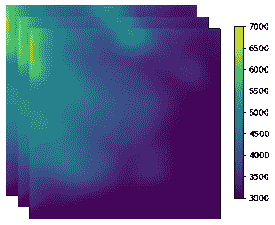
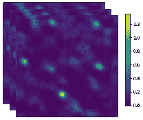

<!--yml

类别：未分类

日期：2024-09-06 19:47:19

-->

# [2204.02780] 使用深度学习消除中性氢强度映射调查中的主光束效应

> 来源：[`ar5iv.labs.arxiv.org/html/2204.02780`](https://ar5iv.labs.arxiv.org/html/2204.02780)

# 使用深度学习消除中性氢强度映射调查中的主光束效应

[Shulei Ni](https://orcid.org/0000-0002-5386-1627) 物理系，科学学院，东北大学，中国沈阳 110819 [Yichao Li](https://orcid.org/0000-0003-1962-2013) 物理系，科学学院，东北大学，中国沈阳 110819 [Li-Yang Gao](https://orcid.org/0000-0001-5469-5408) 物理系，科学学院，东北大学，中国沈阳 110819 [Xin Zhang](https://orcid.org/0000-0002-6029-1933) 物理系，科学学院，东北大学，中国沈阳 110819 前沿科学中心，工业智能与系统优化，东北大学，中国沈阳 110819 智能产业数据分析与优化重点实验室（教育部），东北大学，中国 Xin Zhang zhangxin@mail.neu.edu.cn

###### 摘要

在中性氢（HI）强度测绘（IM）调查中，宇宙学信号的前景污染极为严重，而射电望远镜自身引起的系统效应进一步加剧了去除前景的困难。在这项工作中，我们研究了深度学习方法，具体来说是 3D U-Net 算法，是否在考虑望远镜主光束引起的系统效应时，能在前景去除中发挥关键作用。我们考虑了两种光束模型，即作为简单案例的高斯光束模型和作为复杂案例的余弦光束模型。传统的主成分分析（PCA）方法被用作比较，并且更重要的是，作为 U-Net 方法的预处理步骤，以减少天图的动态范围。我们发现，在高斯光束的情况下，PCA 方法可以有效地清除前景。然而，PCA 方法无法处理由余弦光束引起的系统效应，而额外的 U-Net 方法可以显著改善结果。为了展示 PCA 和 U-Net 方法如何恢复 HI 信号，我们还推导了 HI 角动量谱以及 HI 二维功率谱，在进行前景去除后。结果发现，在高斯光束的情况下，使用 U-Net 的 HI 图与原始 HI 图的一致性比使用 PCA 高$27.4\%$，而在余弦光束的情况下，使用 U-Net 的一致性比使用 PCA 高$144.8\%$。因此，基于 U-Net 的前景去除可以有效消除望远镜主光束效应，为未来 HI IM 实验中的 HI 功率谱恢复提供了新的思路。

## 1 引言

宇宙大尺度结构（LSS）携带着关于宇宙演化历史的关键性信息。中性氢（HI）强度测绘（IM）被提议作为一种有前途的 LSS 调查技术（例如，Battye 等，2004；McQuinn 等，2006；Pritchard & Loeb，2008）。HI IM 依赖于观察大量星系在大体素中的 HI 21 厘米辐射，并且可以快速进行以覆盖非常大的调查体积，这对于宇宙学研究非常理想（Chang 等，2008；Loeb & Wyithe，2008；Mao 等，2008；Wyithe & Loeb，2008；Wyithe 等，2008；Bagla 等，2010；Seo 等，2010；Lidz 等，2011；Ansari 等，2012；Battye 等，2013）。

Chang 等人 (2010) 首次使用格林班克望远镜 (GBT) 探索了 HI IM 技术，通过测量 HI IM 调查与光学星系调查之间的互相关函数。到目前为止，已经有几个其他的 HI IM 探索通过测量 HI IM 调查与光学星系调查之间的互相关功率谱完成，例如，使用 GBT 或帕克斯望远镜 (Masui 等人，2013；Anderson 等人，2018；Wolz 等人，2017，2022)，但 HI IM 自相关功率谱仍未被检测到 (Switzer 等人，2013)。此外，一些专门设计的射电望远镜或望远镜阵列针对 HI IM LSS 调查，如天籁 (Chen，2012)，CHIME (Bandura 等人，2014)，BINGO (Peel 等人，2019)，FAST (Nan 等人，2011)，HIRAX (Newburgh 等人，2016)，要么在建设中，要么在收集数据 (Wu 等人，2021；Li 等人，2020；Wuensche 等人，2021；Abdalla 等人，2021；Amiri 等人，2022)。HI IM 被提议作为使用平方千米阵列 (SKA) 进行宇宙学探索的主要技术 (Santos 等人，2015；Bull 等人，2015；Bacon 等人，2020)。此外，借助新建的 MeerKAT 阵列，也提议以单盘模式进行 HI IM 调查 (Santos 等人，2017；Li 等人，2021；Wang 等人，2021)。

然而，HI IM 数据分析存在几个技术挑战。主要挑战来自从同一频率范围内明亮的前景射电发射中提取微弱的 HI 亮度波动，即银河系及附近射电星系点源的同步辐射或自由-自由辐射。数据显示，前景发射的强度，尤其是银河系的同步辐射，比 HI 信号强大约 $5$ 个数量级。此外，银河系的自由-自由辐射以及星系外点源的辐射可能比 HI 信号强大约 $3$ 个数量级。

已经进行了大量工作来减去前景，提出了一些用于扣除 HI 前景的方法。这些方法各有优缺点，主要分为两类：非盲算法和盲算法。非盲算法主要依赖于通过拟合几个低阶多项式来提取光滑前景分量的光滑前景谱模型假设。然而，实际数据的复杂系统效应可能严重破坏光滑前景的假设。非盲算法在实际数据分析中表现不佳，很难消除前景干扰。盲算法是 HI IM 实际数据分析中常用的前景减除方法，主要包括主成分分析（PCA）（de Oliveira-Costa et al., 2008）、快速独立成分分析（fastICA）（Hothi et al., 2020）、相关成分分析（CCA）（Bonaldi & Brown, 2015）、高斯过程（Mertens et al., 2018；Soares et al., 2022）等。盲算法能够应对简单的系统效应，并在一定程度上提高前景减除的准确性。但它们通常会导致严重的信号丢失，并且在处理复杂光束时存在一定的随机性和不稳定性。

这些前景减除方法都依赖于前景辐射谱的光滑性假设。仪器的系统效应与前景纠缠在一起，导致这些算法的前景减除效果不尽如人意。因此，开发新的 HI 前景减除算法刻不容缓。深度学习通过底层特征形成更抽象的高层特征，以发现仪器效应如何影响信号。因此，我们希望使用深度学习方法来应对这一挑战。

深度学习在复杂系统的特征识别方面具有独特的优势 (Makinen et al., 2021; Villanueva-Domingo & Villaescusa-Navarro, 2021)。在 Makinen et al. (2021) 的研究中，已经对 U-Net（卷积网络深度学习方法之一）在前景分离中的应用进行了普遍讨论。本研究的主要目标是将深度学习算法应用于前景分离，以消除仪器效应并提高前景分离效果。我们计划通过一系列模拟研究深度学习在消除前景分离中的仪器效应的应用。这项工作中考虑的仪器效应主要包括天线波束的频率依赖性和旁瓣泄漏。目前，分析主要基于 MeerKAT 的天线波束模型 (Matshawule et al., 2021)。我们使用模拟软件对 HI 观测信号、前景以及不同复杂度的波束模型的仪器效应进行模拟。这些模拟数据分别用作训练集、测试集和验证集，以研究应用 U-Net 深度学习方法来消除仪器效应并优化前景降噪效果。

论文的其余部分组织如下：在第二部分中，我们介绍了我们的模拟方法。在第三部分中，我们考虑了天线波束的频率依赖性和旁瓣泄漏。在第四部分中，我们解释了 PCA 和深度学习如何去除前景。在第五部分中，我们展示了分析结果并进行了一些讨论。在第六部分中，我们得出结论。

## 2 天空模拟

在本节中，我们描述了用于分析的模拟天空组件，包括宇宙 HI 信号（第 2.1 节）、前景发射（第 2.2 节）和白噪声（第 2.3 节）。这些模拟天空组件是使用公开可用的包生成的，即宇宙强度映射实验的实现（CRIME；[`intensitymapping.physics.ox.ac.uk/CRIME.html`](http://intensitymapping.physics.ox.ac.uk/CRIME.html)）（Alonso 等，2014）。接下来，我们简要介绍模拟方法。模拟天空组件都使用 HEALPix 像素化策略提供（Górski 等，2005）。考虑到低角分辨率的需求，我们使用 $N_{\rm side}=256$ 的地图，对应的角分辨率为 $13.73~{}{\rm arcmin}$，这对于未来的 HI IM 实验已经足够。同时，我们考虑了 $900~{}{\rm MHz}$ 到 $1050~{}{\rm MHz}$ 的频率范围。

### 2.1 宇宙信号

HI 21 厘米辐射的平均亮度温度从红移 $z$ 为

|  | $\bar{T}_{\rm HI}(z)=190.55~{}{\rm mK}\frac{\Omega_{\rm b}h(1+z)^{2}x_{\rm HI}(z)}{\sqrt{\Omega_{\rm m}(1+z)^{3}+\Omega_{\rm\Lambda}}},$ |  | (1) |
| --- | --- | --- | --- |

其中 $h=H_{0}/(100{\rm~{}km~{}s^{-1}~{}Mpc^{-1}})$ 是无量纲哈勃常数，$x_{\rm HI}$ 是 HI 质量在总重子中的比例，$\Omega_{\rm b}$、$\Omega_{\rm m}$ 和 $\Omega_{\Lambda}$ 分别是重子、总物质和暗能量密度的比例。HI 亮度温度波动表示为

|  | $T_{\rm HI}(z,\hat{\bf n})=\bar{T}_{\rm HI}(z)(1+\delta_{\rm HI}(z,\hat{\bf n})),$ |  | (2) |
| --- | --- | --- | --- |

其中 $\delta_{\rm HI}(z,\hat{\bf n})$ 是红移空间中的 HI 过密度场。最终的模拟地图是使用均匀频率切片生成的，依据为 $z+1=\nu_{0}/\nu$，其中 $\nu_{0}=1420.406~{}{\rm MHz}$ 是 HI 21 厘米辐射的静止框架频率。HI 波动信号是使用具有功率谱的对数正态实现来模拟的（Alonso 等，2014；Olivari 等，2018）

|  | $C_{\rm\ell}^{\rm HI}(\nu_{1},\nu_{2})=\frac{2}{\pi}\int{\rm d}k~{}k^{2}P_{\rm DM}(k)W_{\ell,\nu_{1}}(k)W_{\ell,\nu_{2}}(k),$ |  | (3) |
| --- | --- | --- | --- |

其中 $P_{\rm DM}(k)$ 是红移 $z=0$ 下的基础暗物质功率谱，$W_{\ell,\nu}$ 是定义的窗口函数

|  | $\begin{split}W_{\ell,\nu_{i}}(k)=\int\mathrm{d}z~{}\bar{T}_{\rm HI}(z)\phi(\nu_{i},z)D(z)\\ &\times\Big{(}b(z)j_{\ell}(k\chi)-f(z)j^{\prime\prime}_{\ell}(k\chi)\Big{)},\end{split}$ |  | (4) |
| --- | --- | --- | --- |

其中 $j_{\ell}$ 是 $\ell$-th 球面贝塞尔函数，$\phi(\nu_{i},z)$ 是以 $\nu_{i}$ 为中心的频率选择函数，$D(z)$ 是增长因子，$f(z)$ 是增长率，$b(z)$ 是 HI 密度相对于潜在暗物质密度的线性偏差，即 $\delta_{\rm HI}=b(z)\delta_{\rm DM}$。

在我们的模拟中，我们使用了 Planck 2018 $\Lambda$CDM 结果中的最佳拟合宇宙学参数（Aghanim et al., 2020），即 $H_{0}=67.7$ km s^(-1) Mpc^(-1)，$\Omega_{\rm b}=0.049$，$\Omega_{\rm m}=0.311$，$\Omega_{\Lambda}=0.689$ 和 $\sigma_{8}=0.81$。例如，图 1 显示了一个频率切片为 $\nu=1000~{}{\rm MHz}$ 的模拟 HI 图。

### 2.2 前景组件

前景由许多不同的组件组成，这些组件通过不同的发射机制发射。根据文献中的分析，我们在模拟中考虑了四种不同的前景组件，即银河同步辐射、银河自由-自由发射、外银河自由-自由发射和外银河点源，这些被认为是 HI 信号的主要污染源。

前景是通过两种不同的角分布方法来模拟的，即各向异性和各向同性。银河同步辐射是由分散在银河磁场中的高能带电粒子加速运动产生的。其角结构高度各向异性，亮度温度在银河平面附近急剧增加。

在模拟中，银河同步辐射幅度模板基于 $408$ MHz 的 Haslam 图（Haslam et al., 1982）。通过将 Haslam 图的亮度温度 $T_{\rm Haslam}(\hat{\bf n})$ 外推到其他频率，考虑方向依赖的谱指数，来模拟银河同步辐射。谱指数 $\gamma(\hat{\bf n})$ 由 Planck 天空模型 (PSM) 生成（Delabrouille et al., 2013）。各向异性银河同步辐射通过以下方法进行模拟

|  | $T_{{\rm syn},0}(\nu,\hat{\bf n})=T_{\rm Haslam}(\hat{\bf n})\left(\frac{408~{}{\rm MHz}}{\nu}\right)^{\gamma(\hat{\bf n})}.$ |  | (5) |
| --- | --- | --- | --- |

由于 Haslam 天图的低分辨率，小尺度上的角结构信息丢失。我们假设在小尺度上可以忽略银河同步辐射的各向异性。因此，基于以下谱的形式，

|  | $C^{\rm fg}_{\ell}(\nu_{1},\nu_{2})=A\left(\frac{\ell_{\rm ref}}{\ell}\right)^{\beta}\left(\frac{\nu_{\rm ref}^{2}}{\nu_{1}\nu_{2}}\right)^{\alpha}\exp{\left(-\frac{\log^{2}(\nu_{1}/\nu_{2})}{2\xi^{2}}\right)},$ |  | (6) |
| --- | --- | --- | --- |

我们使用 Santos、Cooray 和 Knox (SCK) 实施的方法生成同步辐射的各向同性结构（Santos 等，2005），并通过随机实现 $\delta T_{\rm syn}(\nu,\hat{\bf n})$。在公式 (6) 中，$A$ 是功率谱的幅度，$\xi$ 是辐射的频率—空间相关长度。我们使用参考尺度 $\ell_{\rm ref}=1000$ 和参考频率 $\nu_{\rm ref}=130~{}{\rm MHz}$。其余参数列在表 1 中。为了将同步辐射模拟限制在小尺度上，随机实现被调整到 $0$，在与 Haslam 图的分辨率尺度重叠的尺度上，然后再添加到最终的银河系同步辐射图中。

|  | $T_{{\rm syn}}(\nu,\hat{\bf n})=T_{{\rm syn},0}(\nu,\hat{\bf n})+\delta T_{\rm syn}(\nu,\hat{\bf n}).$ |  | (7) |
| --- | --- | --- | --- |

图 1 显示了在频率 $1000~{}{\rm MHz}$ 下模拟的银河系同步辐射图的一个示例。

表 1：不同组件的各向同性前景功率谱模型的参数 参见公式 ([6)]。基准值为 $\ell_{\rm ref}=1000$ 和 $\nu_{\rm ref}=130$ MHz。

| 前景组件 | $A~{}[{\rm mK}^{2}]$ | $\beta$ | $\alpha$ | $\xi$ |
| --- | --- | --- | --- | --- |
| 各向同性银河系同步辐射 | $700$ | $2.4$ | $2.80$ | $4.0$ |
| 点源 | $57.0$ | $1.1$ | $2.07$ | $1.0$ |
| 银河系自由—自由 | $0.088$ | $3.0$ | $2.15$ | $35$ |
| 外源自由—自由 | $0.014$ | $1.0$ | $2.10$ | $35$ |

此外，SCK 模型也用于模拟自由—自由辐射和外源点源。

外星系点源是来自银河系之外的射电星系。包括邻近的射电星系和高红移射电星系。对于高红移星系，需要考虑它们与宇宙学信号的关联。我们使用 SCK 模型通过方程 (6) 引入射电星系的 LSS 功率谱模型来模拟具有某些聚集特性的射电星系，具体的模拟参数见表 1。严格来说，高红移射电星系是 HI 信号的背景组件。然而，它们对 HI 的干扰效应与前景相同，在模拟中也作为前景组件使用。图 1 显示了在 $1000~{}{\rm MHz}$ 频率下模拟的外星系点源图的示例。

自由—自由发射是由高速电子在被星际离子偏转时产生的电磁辐射，即制动辐射。自由—自由发射是不均匀的，考虑到其异常平滑的频率依赖性及其次要幅度，为了简化模拟，我们将自由—自由发射近似为各向同性，并通过方程 (6) 引入其分布功率谱模型来模拟自由—自由发射的天空图。在 $1000~{}{\rm MHz}$ 下，银河系和外星系自由—自由发射图的示例见图 1 和 1。

总前景图是通过结合所有不同组件生成的，

|  | $\begin{split}T_{\rm fg}(\nu,\hat{\bf n})&amp;=T_{\rm syn}(\nu,\hat{\bf n})+T_{\rm PS}(\nu,\hat{\bf n})\\ &amp;+T_{\rm GFF}(\nu,\hat{\bf n})+T_{\rm EGFF}(\nu,\hat{\bf n}),\end{split}$ |  | (8) |
| --- | --- | --- | --- |

就银河系同步辐射图$T_{\rm syn}(\nu,\hat{\bf n})$、外星系点源图$T_{\rm PS}(\nu,\hat{\bf n})$、银河系自由—自由辐射图$T_{\rm GFF}(\nu,\hat{\bf n})$和外星系自由—自由辐射图$T_{\rm EGFF}(\nu,\hat{\bf n})$而言。

图 1: 不同组件的模拟天空图。面板(a)–(f)分别为 HI、白噪声、银河系同步辐射、银河系自由—自由辐射、外星系自由—自由辐射和外星系点源的图。使用直方图均衡的颜色映射显示这些图，以增强图像的对比度。

### 2.3 白噪声

我们还考虑了仪器噪声及其对观察到的 HI 信号的影响。仪器产生了无关的白噪声和相关的$1/f$噪声（Li 等， 2021）。$1/f$噪声的影响与详细的扫描策略有关。为了简化模拟，我们只考虑了白噪声，并在我们的模拟图上添加了高斯随机实现，$T_{\rm noise}(\nu,\hat{\bf n})$，其均方根值（RMS）为

|  | $\sigma_{\rm noise}=T_{\rm sys}\sqrt{\frac{4\pi f_{\rm sky}}{\Omega_{\rm beam}N_{\rm dish}t_{\rm obs}\Delta\nu}},$ |  | (9) |
| --- | --- | --- | --- |

其中$N_{\rm dish}$是望远镜天线或馈源的数量，$\Omega_{\rm beam}\approx{(\lambda}/{\rm D})^{2}$是望远镜主光束的固体角，$t_{\rm obs}$是总观测时间，$\Delta\nu$是频率分辨率。

由于没有针对 HI 的全天空实验，我们参考了目前可用实验——MeerKAT 望远镜的观测参数，以进行噪声的简单模拟。分析显示，相对于前景，仪器噪声要小得多，因此我们仅简要考虑了仪器噪声。我们固定了望远镜的灵敏度$T_{\rm sys}=16~{}{\rm K}$，天线数量$N_{\rm dish}=64$，观测时间$t_{\rm obs}=8000~{}{\rm h}$，天空覆盖度$f_{\rm sky}=1$，频率分辨率$\Delta\nu=2.34375~{}{\rm MHz}$，以及天线直径$D=13.5{\rm m}$。因此，无关的高斯白噪声的均方根值为$\sigma_{\rm noise}=0.25~{}{\rm mK}$。例如，图 1 显示了在$\nu=1000~{}{\rm MHz}$下的一个模拟噪声图。

表 1 中列出的前景参数在我们的模拟中是固定的。实际上，这些参数可能会有所不同，导致前景特征的变化。然而，这种参数的变化并不会增加前景组件的自由度。使用盲前景减法的预处理方法，例如主成分分析（PCA），可以在没有准确测量前景参数的情况下去除主要的前景组件。当前景参数发生变化时，残差的影响较小。为了简化分析，我们跳过了通过改变前景参数生成稳健训练集模拟的步骤。

## 3 主光束模型

最终模拟的天空图是不同组件的线性组合。

|  | $T_{\rm sky}(\nu,\hat{\bf n})=T_{\rm HI}(\nu,\hat{\bf n})+T_{\rm fg}(\nu,\hat{\bf n})+T_{\rm noise}(\nu,\hat{\bf n}).$ |  | (10) |
| --- | --- | --- | --- |

观测的天空图是与望远镜主光束卷积后的观测天空图。

图 2: MeerKAT 光束模型 (Matshawule et al., 2021)。面板 (a): 在 1000 MHz 下，标准高斯模型（橙色）和余弦模型（蓝色）的主光束模型比较。面板 (b): 高斯模型 橙色，见公式 ([12)] 和余弦模型 蓝色，见公式 ([14)] 的 $\lambda/D$ 归一化光束大小随频率的变化。

主光束的频率依赖性，例如光束大小的频率演变，可能会使前景辐射变得复杂。大多数 HI IM 实验中已注意到这种特征，可以通过将光束大小降级到最大值来克服（Switzer et al., 2013）。为了模拟这种效应，我们使用了一个具有频率依赖光束大小的简单高斯光束模型，

|  | $B_{\rm G}(\nu,\theta)=\exp\left[-4\ln 2\left(\frac{\theta}{\Delta\theta_{\rm G}(\nu)}\right)^{2}\right],$ |  | (11) |
| --- | --- | --- | --- |

其中，$\Delta\theta_{\rm G}(\nu)$ 是主光束的半最大宽度（FWHM），即依赖于频率的光束大小。这种频率依赖性被建模为（Matshawule et al., 2021）

|  | $\Delta\theta_{\rm G}(\nu)=1.16\frac{\lambda(\nu)}{D},$ |  | (12) |
| --- | --- | --- | --- |

其中 $\lambda(\nu)=c/\nu$ 是在频率 $\nu$ 下的波长，$c$ 是光速。$1.16$ 的因子是 MeerKAT 主波束的良好近似。我们在整个工作中以 MeerKAT 波束为例，并使用 $D=13.5~{}{\rm m}$。

高斯波束模型仅包括主波束尺寸的频率变化，无法准确恢复实际的主波束特征。使用 MeerKAT L 波段全极化“天体全息”观测，Asad 等人 (2021) 重建了基于 Zernike 的波束模型，并提供了名为 EIDOS 的软件工具 ([`github.com/ratt-ru/eidos`](https://github.com/ratt-ru/eidos))，这是最准确的 MeerKAT 天线波束模型。通过这样的模型，可以清晰地看到两个重要特征。一个是主波束的旁瓣。EIDOS 软件在 $5^{\circ}$ 半径范围内提供了准确的主波束旁瓣特征。为了扩展旁瓣到较大的分离角，参考 Matshawule 等人 (2021)，我们使用余弦衰减的场照明函数来产生旁瓣模式，

|  | $B_{\rm C}(\nu,\theta)=\left[\frac{\cos(1.189\pi/\Delta\theta_{\rm C}(\nu))}{1-4(1.189\theta/\Delta\theta_{\rm C}^{2}(\nu))}\right]^{2},$ |  | (13) |
| --- | --- | --- | --- |

在本工作中称之为余弦波束模型。高斯和余弦波束模型在 $1000$ MHz 频率下的主波束模式如图 2 所示。

余弦波束模型也具有频率依赖的波束尺寸 $\Delta\theta_{\rm C}(\nu)$。使用 EIDOS 软件生成的另一个重要主波束特征是波束尺寸随频率演变，如方程 (12) 所示，但也展示了低水平的频率依赖的波动。这种波动可以通过在高阶多项式函数上叠加正弦波振荡来很好地建模 (Matshawule et al., 2021)。

|  | $\Delta\theta_{\rm C}(\nu)=\frac{\lambda(\nu)}{D}\left[\sum_{d=0}^{8}a_{d}\hat{\nu}^{d}+A\sin\left(\frac{2\pi\hat{\nu}}{T}\right)\right],$ |  | (14) |
| --- | --- | --- | --- |

其中 $\hat{\nu}=\nu/{\rm MHz}$，$A=0.1$，$T=20$，$a_{d}=\{3.4\times 10^{-21},\ -3.0\times 10^{-17},\ -1.2\times 10^{-11},\ -2.6\times 10^{-10},\ 3.5\times 10^{-7},\ -3.0\times 10^{-4},\ 0.16449,\ -50.37020,\ 6704.28133\}$。高斯和余弦波束模型的 $\lambda/D$ 归一化波束尺寸如图 2 所示。

在这项工作中，我们使用高斯光束模型作为简单的情况，并考虑余弦光束模型作为实际情况。虽然该模型基于 MeerKAT 主要光束测量，但这里讨论的频率依赖效应在大多数 HI IM 实验中都存在，因为大多数射电望远镜天线都具有类似的旁瓣和频率依赖的涟漪特征。

测量的天空亮度温度图是原始天空图与某一个光束模型的卷积结果（见图 3）。

图 3：不同光束卷积的全天空图在 1000 MHz 下：高斯光束卷积的 (a) 和余弦光束卷积的 (b) 图。图像使用直方图均衡颜色映射来增强图像的对比度。

## 4 U-Net 网络

本节介绍了用于我们前景去除分析的深度神经网络架构（3D U-Net）（Çiçek 等，2016；Fabian & Klaus，2019；Makinen 等，2021）。U-Net 网络是最初为生物医学图像分割开发的卷积神经网络（CNN）（Ronneberger 等，2015）。它基于 CNN，但有显著的结构修改。基本的 U-Net 架构如图 4 所示。除了标准的 CNN 架构外，U-Net 在上采样部分具有许多特征通道，使得网络能够通过一系列转置卷积将上下文信息传播到更高分辨率的层。主要的思想是向传统的收缩网络中添加连续的层，用上采样操作替换收敛操作。因此，这些层增加了输出分辨率。扩展路径在程度上或多或少与收缩部分对称，并形成了 U 形结构（Ronneberger 等，2015）。

U-Net 网络主要用于处理二维图像。相比之下，HI 观测可以在特定频率范围内获得多个频率通道的数据。频率之间的相关性是区分 HI 信号与前景的主要特征。研究表明，前景信号的频率相关性强于 HI 信号。此外，望远镜主光束形状随频率的复杂变化是前景去除的主要难点。因此，在深度学习中引入频率信息是必要的，以消除系统效应并准确提取前景信息。对于 HI 前景去除问题，我们采用了 U-Net 网络的广义模型，即 3D U-Net，它可以同时包含角度和频率信息（Ronneberger 等，2015；Çiçek 等，2016；Villanueva-Domingo & Villaescusa-Navarro，2021；Fabian & Klaus，2019；Makinen 等，2021）。

图 4：U-Net 架构。每个橙色框对应一个多通道特征图和一系列卷积操作。每个框的底部展示了通道数量和输出大小。深红色框和深蓝色框分别表示输入和输出。浅蓝色框展示了转置卷积过程中框的连接部分。下箭头、右箭头和上箭头分别表示最大池化、跳跃连接和转置卷积。最后一个箭头操作表示一个 $1\times 1\times 1$ 卷积，用于将 64 个特征映射到最终的 3D 数据。这一可视化使用了 PlotNeuralNet 库（[`github.com/HarisIqbal88/PlotNeuralNet`](https://github.com/HarisIqbal88/PlotNeuralNet)）。

### 4.1 数据预处理

图 5：$214.86~{}{\rm{deg}}^{2}$ 天区的数据立方体。从左到右，天区的中心分别是 $(l,b)=(179.648^{\circ},33.331^{\circ})$、$(l,b)=(224.824^{\circ},9.594^{\circ})$ 和 $(l,b)=(303.398^{\circ},2.836^{\circ})$，其中 $l$ 和 $b$ 分别为银河经度和银河纬度。天区的红移范围是 $z\in[0.353,0.578]$。天区的单位是 mK。面板 (a) 显示了未经光束卷积处理的原始模拟天区，面板 (b) 显示了经过高斯光束卷积处理的天区，面板 (c) 显示了经过余弦光束卷积处理的天区。

U-Net 的核心算法是语义分割，这是一种检测每个像素所属类别的方法（Ronneberger et al., 2015; Makinen et al., 2021; Villanueva-Domingo & Villaescusa-Navarro, 2021）。它只能处理 2D 平面图像或 3D 天区，但不能直接处理弯曲图像或天区。如文献中所示（Makinen et al., 2021），前景污染的平滑成分可以有效去除。然而，非平滑的前景残差，主要由于系统效应引起，给 HI 大尺度结构信号的检测带来了挑战。前景残差可以通过模型无关的前景减除方法进一步减少，如 PCA。由于前景的平滑成分不是主要问题，并且可以通过当前的前景清理方法有效去除，我们首先对模拟数据进行 PCA 处理，然后再输入 U-Net 架构。

另一方面，进行 PCA 预处理是必要的。如果没有预处理步骤，U-Net 在恢复 HI 波动信号时表现较差。这主要是由于图像幅度的动态范围较大（Liu et al., 2014; de Oliveira-Costa et al., 2008; Di Matteo et al., 2002），使得使用 U-Net 网络提取正确信息变得困难。然而，激进的 PCA 模式减除可能导致 HI 信号丢失（Switzer et al., 2015）。根据文献中的模拟，平滑的前景污染可以通过几个 PCA 模式显著去除（Spinelli et al., 2022）。为了避免 HI 信号丢失，我们仅减除前三个 PCA 模式。减除更多的 PCA 模式，例如 Makinen et al. (2021) 中的前六个 PCA 模式，可能会提高基准测试。只要 U-Net 能够处理残差，我们希望将预处理步骤的模式减除保持在最低限度。然而，实际上，预处理需要进一步改进，因为实际的前景污染比模拟的更复杂。

3D U-Net 架构需要具有 HEALPix 像素化的等面积正方形图像数据。全天地图需要被划分为几个小的天空补丁。我们将全天地图分成 $192$ 个等面积补丁，对应于 HEALPix Nside 为 $4$ 的像素面积。每个补丁包含 $64\times 64$ 像素。完整的频率范围，即 $900\sim 1050$ MHz，被分为 $64$ 个频带。最后，模拟的全天被分割成 $192$ 个形状为 $64\times 64\times 64$ 的天空补丁。图 5 中展示了三个天空补丁作为示例。原始模拟天空地图、高斯光束卷积天空地图和余弦光束卷积天空地图的天空补丁分别显示在顶部、中部和底部面板中。我们对训练、测试和验证数据集使用相同的天空分割方法。

在我们的模拟中使用了方向依赖的光谱指数。PCA 通过对输入数据立方体进行奇异值分解（SVD）来执行。数据立方体已经被重塑为 $N_{\nu}\times N_{\theta}$，其中 $N_{\nu}$ 是频率通道数，$N_{\theta}$ 是指向方向数。奇异模式被用作基函数，如 Makinen 等人（2021）的方程 (3.2) 所示，前几个模式代表了前景污染。无需假设每个前景分量在频率和角度方向上是可分离的。用 PCA 估计的前景模式与模拟输入的前景分量并不完全相同，而是输入分量的线性组合。只要前景分量可以用功率谱形式表示，它们就可以被显著减除。

### 4.2 损失函数

尽管通过 PCA 模式减除显著减少了动态幅度范围，但残留前景和 HI 信号之间仍存在较大变异性。根据 Makinen 等人（2021），在我们的分析中使用了 Logcosh 损失函数，

|  | $L(p,t)=\sum_{i}\log\cosh(p_{i}-t_{i}),$ |  | (15) |
| --- | --- | --- | --- |

其中 $p_{i}\in p$ 表示预测，$t_{i}\in t$ 表示模拟目标。Logcosh 函数的行为类似于 L1 范数，因为它对离群值更具鲁棒性，灵敏度较低，这也是我们选择它的主要原因。

### 4.3 训练和测试

表 2：U-Net 架构设计中的超参数描述。

| 超参数 | 描述 | 先验值 | 最优值 |
| --- | --- | --- | --- |
| $\eta$ | 优化器的学习率 | $10^{-2},10^{-3},10^{-4},10^{-5}$ | $10^{-4}$ |
| $\omega$ | 优化器的权重衰减 | $10^{-4},10^{-5},10^{-6},10^{-7}$ | $10^{-5}$ |
| $n_{\rm filter}$ | 卷积滤波器的初始数量 | 8, 16, 32 | 32 |
| $b$ | 批量大小，即每步梯度下降的样本数 | 8, 16 | 16 |
| $\Omega$ | 训练的优化器 | Adam, NAdam | NAdam |

图 6：每个网络的损失函数随周期数的变化。深蓝色实线表示训练集损失函数的演变，浅蓝色虚线表示验证集损失函数的演变。面板（a）是针对高斯光束卷积图的 U-Net 前景扣除，面板（b）是针对余弦光束卷积图的 U-Net 前景扣除。

图 7：PCA+U-Net 前景扣除后的模拟天空图的角谱。面板（a）展示了来自高斯光束卷积天空图的角谱，面板（b）展示了来自余弦光束卷积天空图的角谱。

任何 CNN 的核心是卷积层，这些层通过在输入上进行一系列滤波器的卷积来定义。网络基本上是一个层的堆叠。参考 Makinen 等人（2021），我们将卷积核的数量固定为 $32$。核大小定义了卷积的视野，固定为 $3\times 3\times 3$。为了获得所需的输出维度，我们使用了“same”填充来处理卷积和转置卷积中的样本边界。步幅定义了核在图像上移动的步长。我们在卷积中使用步幅为 1 的默认设置，在转置卷积中使用步幅为 2 的默认设置。

我们选择的 U-Net 架构经过端到端训练，使用一组 HI 前景模拟进行前景去除。表格 2 展示了该网络使用的超参数详细信息。该分析使用了 NAdam 优化器，并采用了默认的 TensorFlow 参数（Reddi 等人，2019）。超参数经过精心调优以优化网络。批量大小优化为 $16$，初始卷积滤波器的数量优化为 $32$，这两者都受到 GPU 内存的限制。初始学习率设置为 $10^{-2}$，如果在 20 个 epochs 后验证损失函数没有改善，则按 $10$ 的因子衰减。同时，权重衰减也在表格 2 中列出的先验值集合中进行测试。最终，我们发现学习率和权重衰减的优化值分别为 $10^{-4}$ 和 $10^{-5}$。可训练参数的总数为 $7.4\times 10^{7}$。根据 Makinen 等人（2021），我们在每个卷积中应用了整流线性单元（ReLU）激活。图 6 展示了损失函数的演变。深蓝色实线表示训练集损失函数的演变，浅蓝色虚线表示验证集损失函数的演变。高斯光束卷积图和余弦光束卷积图的结果分别显示在左侧和右侧面板中。

验证集的损失函数在高斯和余弦光束卷积图分别经过约 $20$ 和 $50$ 轮后收敛。图 7 中展示了 $20$ 和 $100$ 轮的恢复功率谱，其中高斯图的结果显示在左面板，余弦图的结果显示在右面板。显著的是，高斯光束卷积图的恢复角功率谱在 $20$ 和 $100$ 轮的情况下是一致的，因为损失函数在 $20$ 轮后收敛。尽管余弦情况中的损失函数在约 $50$ 轮后收敛，但在恢复功率谱方面的改善在 $20$ 轮后不明显。因此，在我们的分析中，我们采用了 $20$ 轮计算方案以加快计算速度。

完成训练后，我们调查了网络预测的准确性。在图 8 中，我们展示了在高斯和余弦仪器效应存在的情况下，PCA 和 PCA+U-Net 的前景减法结果。

## 5 结果与讨论

图 8：前景减法后模拟天空图的角功率谱。蓝色、橙色和绿色线条分别表示初始 HI 模型、使用前 3 个 PCA 模式的前景减法结果和 PCA 与 U-Net 结合的前景减法结果。面板(a)显示了高斯光束卷积天空图的角功率谱，面板(b)显示了余弦光束卷积天空图的角功率谱。

图 9：与图 5 中展示的相同天空区域的数据立方体，但已经去除了前景。从上到下依次是初始 HI 图像(a)、经 PCA 处理的高斯光束卷积图像(b)、经 PCA+U-Net 处理的高斯光束卷积图像(c)、经 PCA 处理的余弦光束卷积图像(d)和经 PCA+U-Net 处理的余弦光束卷积图像(e)。立方体的单位是 mK。

图 10：PCA 清理图像与初始 HI 模型的二维自相关功率谱比。面板(a)显示了高斯卷积图像的结果，面板(b)显示了余弦光束卷积图像的结果。

图 11：PCA 清理图像与初始 HI 模型的二维交叉相关功率谱比。面板(a)显示了高斯卷积图像的结果，面板(b)显示了余弦光束卷积图像的结果。

图 9 中显示了前景清理后的三个不同的小区域图像，分别展示在不同的列中。图 9 展示了初始 HI 信号图像的不同天空区域。图 9 和 9 分别展示了经过 PCA 和 PCA+U-Net 处理的高斯光束卷积图像的天空区域。这些经过 PCA 和 PCA+U-Net 清理的图像与初始 HI 图像具有很好的一致性。结果表明，PCA 和 PCA+U-Net 前景去除方法表现良好，简单高斯光束模型造成的系统效应可以通过这两种方法有效消除。

图 9 和 9 分别展示了使用 PCA 和 PCA+U-Net 处理后的 Cosine 波束卷积图。正如图 9 所示，PCA 清理后的图像存在额外的结构。通过额外的 U-Net 处理可以消除这些结构，正如图 9 所示。

我们可以通过将角功率谱与初始 HI 模型进行比较来验证前景去除的效率。前景去除后，天空图像被重新填充回原始位置，形成清理后的整个天空图。角功率谱见图 8。初始 HI 功率谱模型用蓝线表示。橙线显示了使用前$3$个 PCA 模式清理后的模拟图结果。绿色线表示 PCA 和 U-Net 前景去除组合后的结果。

### 5.1 PCA 前景去除

我们比较了高斯光束卷积地图和余弦光束卷积地图的结果。对于高斯光束卷积地图，HI 信号可以通过简单地减去一些 PCA 模式来恢复，例如，在本分析中减去$3$个模式。大尺度的变化是由于盲目前景减法过程中信号损失的影响，而小尺度的减少是由于光束平滑的影响。然而，如果地图与余弦光束卷积，HI 信号无法通过 PCA 前景减法恢复。原因在于余弦光束模型比高斯光束引入了更多的系统效应。如在第三部分讨论的那样，使用高斯光束模型时，仅引入了频率变化引起的光束大小变化。余弦光束模型包括了光束旁瓣和频率依赖的光束大小波动。通过光束旁瓣可以观察到视场外亮源的强度，这些是非平滑的成分。同时，光束大小波动直接使前景谱形状变复杂。这些效应可以通过二维功率谱进一步研究。

利用$192$个天空补丁的数据立方体，我们估计了二维自相关功率谱，并绘制了前景清除地图与初始 HI 模型之间的比率。

|  | $R(k_{\parallel},k_{\perp})_{\rm auto}=\frac{\bar{P}_{\rm cln}(k_{\parallel},k_{\perp})}{P_{\rm HI}(k_{\parallel},k_{\perp})}-1,$ |  | (16) |
| --- | --- | --- | --- |

其中 $\bar{P}_{\rm cln}(k_{\parallel},k_{\perp})=\frac{1}{192}\sum_{i=1}^{192}P^{i}_{\rm cln}(k_{\parallel},k_{\perp})$ 和 $P^{i}_{\rm cln}(k_{\parallel},k_{\perp})$ 是一个前景清除的天空补丁的二维功率谱。PCA 清除地图的结果如图 10 所示。左侧面板显示了高斯光束卷积地图的结果。$R(k_{\parallel},k_{\perp})_{\rm auto}$ 的值在大尺度（即 $k_{\perp}\lesssim 0.06$ Mpc^(-1)）下通常与 $0$ 一致，这表明在大尺度下可以通过 PCA 恢复 HI 信号。负的 $R(k_{\parallel},k_{\perp})_{\rm auto}$ 值表明信号减少，特别是在大 $k_{\perp}$ 下。这种信号减少主要是由于光束平滑效应。我们无法在小 $k_{\parallel}$ 下观察到显著的信号减少。如文献（Switzer 等，2015）所示，这些尺度下的 HI 信号在 PCA 前景减法过程中总是会被去除。然而，由于我们只去除了前$3$个 PCA 模式，这种信号损失效应仍然可以忽略不计。

Cosine 波束卷积图的结果显示在图 10 的右侧面板中。在$k_{\parallel}\sim 0.7~{}{\rm Mpc}^{-1}$处存在显著的额外功率。这种额外功率主要是由于 Cosine 波束模型引起的波束尺寸波动。我们的结果与文献中的模拟分析（Matshawule et al., 2021）一致。为了去除这种系统效应，需要进行激进的模式减法，这可能导致不可忽视的 HI 信号损失（Switzer et al., 2015）。

注意，图 10 中的白色条纹没有任何物理意义，这是由于对数分箱在线性$k$-空间中不均匀所致。图 11–13 也是如此。

为了检查去除前景后的 HI 图与初始 HI 图之间的一致性，我们估计了交叉相关功率谱$P_{\rm cln,HI}(k_{\parallel},k_{\perp})$。一致性可以通过前景清理图与初始 HI 图之间的功率谱比率来评估。

|  | $R(k_{\parallel},k_{\perp})_{\rm cross}=\frac{\bar{P}_{\rm cln,HI}(k_{\parallel},k_{\perp})}{P_{\rm HI}(k_{\parallel},k_{\perp})}-1,$ |  | (17) |
| --- | --- | --- | --- |

其中，$\bar{P}_{\rm cln,HI}(k_{\parallel},k_{\perp})$ 表示不同天空区域间的平均交叉相关功率谱。PCA 清理后的图像结果如图 11 所示。高斯和余弦光束卷积图像的结果分别显示在左侧和右侧面板中。显然，通过交叉相关功率谱估计器消除了余弦光束卷积情况下$R(k_{\parallel},k_{\perp})_{\rm auto}$ 中显示的额外功率。这是因为由于系统效应造成的功率谱误差可以通过交叉相关消除。高斯和余弦光束卷积情况下$R(k_{\parallel},k_{\perp})_{\rm cross}$ 的值显示了类似的趋势。大$k_{\perp}$ 处的负$R(k_{\parallel},k_{\perp})_{\rm cross}$ 值表明相关效率的降低，主要是由于光束平滑效应。然而，虽然系统效应可以通过交叉相关功率谱去除，但它仍然扩大了功率谱估计误差并偏向自相关功率谱。去除系统效应对于自相关功率谱检测至关重要。

### 5.2 附加的 U-Net 前景去除

图 12：U-Net 清理图像与初始 HI 模型的二维自相关功率谱比。面板 (a) 显示了来自高斯卷积图像与初始 HI 图像自相关的结果，面板 (b) 显示了来自余弦光束卷积图像与初始 HI 图像自相关的结果。

图 13：U-Net 清理图像与初始 HI 模型的二维交叉相关功率谱比。面板 (a) 显示了来自高斯卷积图像与初始 HI 图像交叉的结果，面板 (b) 显示了来自余弦光束卷积图像与初始 HI 图像交叉的结果。

我们没有使用激进的附加模式减法，而是将残差图送入 U-Net 架构。U-Net 清理后的图的角功率谱在图 8 中以绿色线条显示。U-Net 前景减法在高斯和余弦光束卷积的情况下都能校正角功率谱。但是，在高斯光束卷积的情况下，U-Net 的校正效果并不明显。从余弦光束卷积图中的结果可以看到显著改进，如图 8 所示。通过额外的 U-Net 前景减法，大尺度上的角功率谱偏差被显著消除。恢复后的角功率谱与初始 HI 功率谱一致。接下来，我们可以进一步用 2D 功率谱进行研究。

在 U-Net 前景减法后的天空区域中，$R(k_{\parallel},k_{\perp})_{\rm auto}$ 值如公式 (16) 所示，显示在图 12 中。高斯和余弦光束卷积情况的结果分别显示在左侧和右侧面板。这两个结果通常是一致的，表明 U-Net 前景减法可以去除由简单的高斯光束模型或复杂的余弦光束模型引起的系统效应。

在 U-Net 前景减法后的天空区域中，$R(k_{\parallel},k_{\perp})_{\rm cross}$ 值如公式 (17) 所示，显示在图 13 中，左侧面板为高斯光束卷积情况，右侧面板为余弦光束卷积情况。$R(k_{\parallel},k_{\perp})_{\rm cross}$ 值通常为 $\sim 0$，表明恢复后的 HI 波动信号与初始 HI 信号一致。

### 5.3 PCA 与 U-Net

在图 8 中，PCA 在使用高斯光束减少前景的效果上是有效的，但略逊于 U-Net 网络。从图 8 可以看出，PCA 在处理余弦光束卷积天空图时的结果远远不如 U-Net。这表明 PCA 在处理卷积复杂束的天空图时效果不佳，而 U-Net 网络在天空图的卷积束后能够学习到大尺度信息。相比之下，U-Net 网络仍能在大尺度上恢复原始 HI 信号的角功率谱。

在图 10–13 中，我们绘制了横向 ($k_{\perp}$) 和径向 ($k_{\parallel}$) 方向的平均自相关和交叉相关功率谱。我们定义了一个一致性度量：

|  | $\Gamma={\rm mean}\left\{R(k_{\parallel},k_{\perp})_{\rm X}\right\}+1,$ |  | (18) |
| --- | --- | --- | --- |

其中 ${\rm mean}\{\cdot\cdot\cdot\}$ 代表在 $k_{\parallel}$–$k_{\perp}$ 区间内的均值，而 $R(k_{\parallel},k_{\perp})_{\rm X}$ 是在方程（16）和（17）中定义的谱比，其中下标 X 表示自谱或交叉谱。

我们首先讨论自相关功率谱的情况。我们使用 PCA 和 U-Net 方法分别得到与原始 HI 地图的一致性，即 $\Gamma^{\rm gau}_{\rm pca}=60.73\%$，$\Gamma^{\rm cos}_{\rm pca}=28.46\%$，$\Gamma^{\rm gau}_{\rm unet}=77.38\%$，和 $\Gamma^{\rm cos}_{\rm unet}=69.66\%$。因此，可以明显看出，3D U-Net 方法在恢复 HI 信号方面远优于 PCA 方法。我们发现，在高斯光束的情况下，使用 U-Net 方法的一致性比 PCA 高 $27.4\%$，而在余弦光束的情况下，使用 U-Net 方法的一致性比 PCA 高 $144.8\%$。PCA 和 U-Net 前景减除在大尺度下的 $R(k_{\parallel},k_{\perp})_{\rm cross}\sim 0$ 结果表明，恢复的 HI 波动与初始 HI 信号一致。

应注意，尽管天空图被划分为 192 个小天空补丁，但大尺度上的 HI 波动仍然可以得到适当恢复。这是因为前景污染或此处考虑的系统效应在频率间高度相关。结果表明，即使在小天空补丁观测的情况下，使用 U-Net 架构也能很好地消除望远镜主光束引起的系统效应。这对于当前阶段的大多数 HI IM 实验来说是理想的。

U-Net 架构是监督深度学习方法之一。这意味着使用 U-Net 架构进行前景减除是模型依赖的。主光束模型的准确性会影响前景减除的效率。然而，望远镜主光束，特别是对于望远镜阵列，可以通过“天体全息”观测进行测量（Asad 等，2021）。因此，基于 U-Net 的前景减除为未来 HI IM 实验消除主光束效应提供了新的思路。

PCA 目前是最有效的盲前景减除方法之一，这一方法在不同的分析中，包括模拟数据和实际观测数据，都得到了广泛讨论。由于系统效应，大多数盲前景减除方法，包括 PCA 方法，都可能导致显著的前景残余或 substantial 信号损失。在这项工作中，我们展示了通过 U-Net 网络进行额外的前景减除可以消除主光束效应，并提高 PCA 前景减除的效率。这可能改善其他盲前景减除方法，如 ICA，以及非盲前景减除方法。

## 6 结论

深度学习源于人工神经网络，能够克服传统特征提取和匹配的不足，并在图像识别领域取得了重大突破。深度学习通过结合底层特征形成更抽象的高级表示，并用大量特定数据进行训练，在天文学中取得了很大成功。

在 HI 21-cm IM 调查中，宇宙学信号上的前景污染极为严重，而由射电望远镜本身引起的系统效应进一步加剧了前景去除的难度。这些前景主要来源于银河系同步辐射、银河系自由—自由辐射、银河系外自由—自由辐射和银河系外点源辐射，其强度总共比 HI IM 调查中的宇宙学信号高出五个数量级。因此，找到一种有效的前景去除方法是 HI IM 观测中的关键挑战之一。

在这项工作中，我们使用了类似于 Makinen 等人(2021)的网络结构。与 Makinen 等人(2021)相比，我们考虑了 MeerKAT 望远镜的频带，更重要的是，我们关注了射电望远镜主光束引起的系统效应。对于射电望远镜主光束效应，我们将高斯光束模型视为简单情况，将余弦光束模型视为复杂情况。我们探讨了深度学习方法，具体而言，本工作中的 U-Net 算法，是否能在消除这种主光束引起的系统效应和提高前景去除效率方面发挥关键作用。

PCA 前景去除的结果在使用高斯光束卷积图与余弦光束卷积图之间有所不同。当处理高斯光束卷积图时，恢复的角功率谱与初始 HI 角功率谱基本一致。使用二维功率谱时，我们发现$R(k_{\parallel},k_{\perp})_{\rm auto}$ 见方程 ([16)] 在大尺度下接近$0$。这表明 PCA 前景去除可以恢复部分 HI 信号。然而，在小尺度下发现 HI 信号有所减少，这归因于光束平滑效应。

然而，在处理余弦光束卷积图时，去除 $3$ 个 PCA 模式的角功率谱与初始 HI 角功率谱显著偏离。通过 2D 功率谱，我们发现 $k_{\parallel}\sim 0.7~{}{\rm Mpc}^{-1}$ 处存在显著的额外功率，这与余弦光束模型引起的光束尺寸波动有关。因此，PCA 前景去除在余弦光束卷积图中无法有效去除前景。这表明 PCA 前景去除无法消除由复杂的主光束模型（如余弦光束模型）引起的复杂系统效应。

此外，我们还评估了去除前景后的 HI 图与初始 HI 图之间的交叉关联功率谱的一致性。在 Gaussian 和余弦光束卷积图中，$R(k_{\parallel},k_{\perp})_{\rm cross}$ 见方程 ([17)] 的值显示出类似的趋势。在大 $k_{\perp}$ 下，负的 $R(k_{\parallel},k_{\perp})_{\rm cross}$ 值表明相关效率的降低，这主要是由于光束平滑效应。

我们并未直接使用 U-Net 进行前景去除，而是保守地将 PCA 去除后的残差输入到 U-Net 网络中。当处理余弦光束卷积图时，结果显著改善。特别是，大尺度角功率谱的偏差显著消除，恢复的角功率谱与初始 HI 角功率谱一致。通过研究 2D 功率谱，我们发现 Gaussian 和余弦光束卷积图的 $R(k_{\parallel},k_{\perp})_{\rm auto}$ 值通常是一致的。我们通过定义一致性度量来量化结果，如方程 (18) 所示。我们发现，在 Gaussian 光束的情况下，使用 U-Net 与原始 HI 图的一致性比使用 PCA 提高了 $27.4\%$，而在余弦光束的情况下，使用 U-Net 的一致性比使用 PCA 提高了 $144.8\%$。通过交叉关联功率谱，我们发现 $R(k_{\parallel},k_{\perp})_{\rm cross}\sim 0$，这表明恢复的 HI 信号与初始 HI 信号一致。因此，结果表明 U-Net 前景去除方法可以消除由望远镜主光束引起的系统效应。

在这项工作中，我们发现基于 U-Net 的前景分离方法可以显著提高前景分离效率，尤其是在严重的主光束诱导的系统效应情况下。U-Net 基于完全卷积网络，其架构经过修改和扩展，以便在更少的训练图像下工作并提供更精确的分割。这种监督式深度学习方法依赖于模拟训练集的完整性。由于详细的主光束特征以及系统效应在不同实验之间可能有所不同，因此如果考虑不同实验，则需要准确的光束模型。这样的光束模型可以通过‘astro-holographic’观测或电磁仿真提供（Asad 等，2021）。因此，基于 U-Net 的前景分离方法为未来 HI IM 实验（如 SKA 和 HERA）（DeBoer 等，2017）的 HI 功率谱恢复提供了新的视角。

## 致谢

本项工作得到中国国家自然科学基金（资助号：11975072, 11835009, 11875102, 和 11690021）、辽宁振兴人才计划（资助号：XLYC1905011）、中央高校基础研究基金（资助号：N2005030）、中国国家 111 计划（资助号：B16009）以及中国载人航天工程的科学研究资助（资助号：CMS-CSST-2021-B01）的支持。

## 参考文献

+   Abdalla 等（2021）Abdalla, E., 等. 2021, arXiv e-prints, arXiv:2107.01633. [`arxiv.org/abs/2107.01633`](https://arxiv.org/abs/2107.01633)

+   Aghanim 等（2020）Aghanim, N., 等. 2020, Astron. Astrophys., 641, A6, doi: [10.1051/0004-6361/201833910](http://doi.org/10.1051/0004-6361/201833910)

+   Alonso 等（2014）Alonso, D., Ferreira, P. G., & Santos, M. G. 2014, Mon. Not. Roy. Astron. Soc., 444, 3183, doi: [10.1093/mnras/stu1666](http://doi.org/10.1093/mnras/stu1666)

+   Amiri 等（2022）Amiri, M., 等. 2022, arXiv e-prints, arXiv:2202.01242. [`arxiv.org/abs/2202.01242`](https://arxiv.org/abs/2202.01242)

+   Anderson 等（2018）Anderson, C. J., 等. 2018, Mon. Not. Roy. Astron. Soc., 476, 3382, doi: [10.1093/mnras/sty346](http://doi.org/10.1093/mnras/sty346)

+   Ansari 等（2012）Ansari, R., Campagne, J. E., Colom, P., 等. 2012, Astron. Astrophys., 540, A129, doi: [10.1051/0004-6361/201117837](http://doi.org/10.1051/0004-6361/201117837)

+   Asad 等（2021）Asad, K. M. B., Girard, J. N., de Villiers, M., 等. 2021, Monthly Notices of the Royal Astronomical Society, 502, 2970–2983, doi: [10.1093/mnras/stab104](http://doi.org/10.1093/mnras/stab104)

+   Bacon 等（2020）Bacon, D. J., 等. 2020, Publ. Astron. Soc. Austral., 37, e007, doi: [10.1017/pasa.2019.51](http://doi.org/10.1017/pasa.2019.51)

+   Bagla 等（2010）Bagla, J. S., Khandai, N., & Datta, K. K. 2010, Mon. Not. Roy. Astron. Soc., 407, 567, doi: [10.1111/j.1365-2966.2010.16933.x](http://doi.org/10.1111/j.1365-2966.2010.16933.x)

+   Bandura 等人 (2014) Bandura, K., 等人 2014, Proc. SPIE Int. Soc. Opt. Eng., 9145, 22, doi: [10.1117/12.2054950](http://doi.org/10.1117/12.2054950)

+   Battye 等人 (2013) Battye, R. A., Browne, I. W. A., Dickinson, C., 等人 2013, Mon. Not. Roy. Astron. Soc., 434, 1239, doi: [10.1093/mnras/stt1082](http://doi.org/10.1093/mnras/stt1082)

+   Battye 等人 (2004) Battye, R. A., Davies, R. D., & Weller, J. 2004, Mon. Not. Roy. Astron. Soc., 355, 1339, doi: [10.1111/j.1365-2966.2004.08416.x](http://doi.org/10.1111/j.1365-2966.2004.08416.x)

+   Bonaldi 和 Brown (2015) Bonaldi, A., & Brown, M. L. 2015, Mon. Not. Roy. Astron. Soc., 447, 1973, doi: [10.1093/mnras/stu2601](http://doi.org/10.1093/mnras/stu2601)

+   Bull 等人 (2015) Bull, P., Ferreira, P. G., Patel, P., & Santos, M. G. 2015, Astrophys. J., 803, 21, doi: [10.1088/0004-637X/803/1/21](http://doi.org/10.1088/0004-637X/803/1/21)

+   Chang 等人 (2010) Chang, T.-C., Pen, U.-L., Bandura, K., & Peterson, J. B. 2010, Nature, 466, 463, doi: [10.1038/nature09187](http://doi.org/10.1038/nature09187)

+   Chang 等人 (2008) Chang, T.-C., Pen, U.-L., Peterson, J. B., & McDonald, P. 2008, Phys. Rev. Lett., 100, 091303, doi: [10.1103/PhysRevLett.100.091303](http://doi.org/10.1103/PhysRevLett.100.091303)

+   Chen (2012) Chen, X. 2012, Int. J. Mod. Phys. Conf. Ser., 12, 256, doi: [10.1142/S2010194512006459](http://doi.org/10.1142/S2010194512006459)

+   de Oliveira-Costa 等人 (2008) de Oliveira-Costa, A., Tegmark, M., Gaensler, B. M., 等人 2008, Mon. Not. Roy. Astron. Soc., 388, 247, doi: [10.1111/j.1365-2966.2008.13376.x](http://doi.org/10.1111/j.1365-2966.2008.13376.x)

+   DeBoer 等人 (2017) DeBoer, D. R., Parsons, A. R., Aguirre, J. E., 等人 2017, PASP, 129, 045001, doi: [10.1088/1538-3873/129/974/045001](http://doi.org/10.1088/1538-3873/129/974/045001)

+   Delabrouille 等人 (2013) Delabrouille, J., 等人 2013, Astron. Astrophys., 553, A96, doi: [10.1051/0004-6361/201220019](http://doi.org/10.1051/0004-6361/201220019)

+   Di Matteo 等人 (2002) Di Matteo, T., Perna, R., Abel, T., & Rees, M. J. 2002, Astrophys. J., 564, 576, doi: [10.1086/324293](http://doi.org/10.1086/324293)

+   Fabian 和 Klaus (2019) Fabian, I., & Klaus, M.-H. 2019, arXiv e-prints, arXiv:1908.02182. [`arxiv.org/abs/1908.02182`](https://arxiv.org/abs/1908.02182)

+   Górski 等人 (2005) Górski, K. M., Hivon, E., Banday, A. J., 等人 2005, Astrophys. J., 622, 759, doi: [10.1086/427976](http://doi.org/10.1086/427976)

+   Haslam 等人 (1982) Haslam, C. G. T., Salter, C. J., Stoffel, H., & Wilson, W. E. 1982, Astron. Astrophys. Suppl. Ser., 47, 1

+   Hothi 等人 (2020) Hothi, I., 等人 2020, Mon. Not. Roy. Astron. Soc., 500, 2264, doi: [10.1093/mnras/staa3446](http://doi.org/10.1093/mnras/staa3446)

+   Li 等人 (2020) Li, J., 等人 2020, Sci. China Phys. Mech. Astron., 63, 129862, doi: [10.1007/s11433-020-1594-8](http://doi.org/10.1007/s11433-020-1594-8)

+   Li 等 (2021) Li, Y., Santos, M. G., Grainge, K., Harper, S., & Wang, J. 2021, Mon. Not. Roy. Astron. Soc., 501, 4344, doi: [10.1093/mnras/staa3856](http://doi.org/10.1093/mnras/staa3856)

+   Lidz 等 (2011) Lidz, A., Furlanetto, S. R., Oh, S. P., 等 2011, Astrophys. J., 741, 70, doi: [10.1088/0004-637X/741/2/70](http://doi.org/10.1088/0004-637X/741/2/70)

+   Liu 等 (2014) Liu, A., Parsons, A. R., & Trott, C. M. 2014, Phys. Rev. D, 90, 023018, doi: [10.1103/PhysRevD.90.023018](http://doi.org/10.1103/PhysRevD.90.023018)

+   Loeb & Wyithe (2008) Loeb, A., & Wyithe, S. 2008, Phys. Rev. Lett., 100, 161301, doi: [10.1103/PhysRevLett.100.161301](http://doi.org/10.1103/PhysRevLett.100.161301)

+   Makinen 等 (2021) Makinen, T. L., Lancaster, L., Villaescusa-Navarro, F., 等 2021, JCAP, 04, 081, doi: [10.1088/1475-7516/2021/04/081](http://doi.org/10.1088/1475-7516/2021/04/081)

+   Mao 等 (2008) Mao, Y., Tegmark, M., McQuinn, M., Zaldarriaga, M., & Zahn, O. 2008, Phys. Rev. D, 78, 023529, doi: [10.1103/PhysRevD.78.023529](http://doi.org/10.1103/PhysRevD.78.023529)

+   Masui 等 (2013) Masui, K. W., 等 2013, Astrophys. J. Lett., 763, L20, doi: [10.1088/2041-8205/763/1/L20](http://doi.org/10.1088/2041-8205/763/1/L20)

+   Matshawule 等 (2021) Matshawule, S. D., Spinelli, M., Santos, M. G., & Ngobese, S. 2021, Mon. Not. Roy. Astron. Soc., 506, 5075, doi: [10.1093/mnras/stab1688](http://doi.org/10.1093/mnras/stab1688)

+   McQuinn 等 (2006) McQuinn, M., Zahn, O., Zaldarriaga, M., Hernquist, L., & Furlanetto, S. R. 2006, Astrophys. J., 653, 815, doi: [10.1086/505167](http://doi.org/10.1086/505167)

+   Mertens 等 (2018) Mertens, F. G., Ghosh, A., & Koopmans, L. V. E. 2018, Mon. Not. Roy. Astron. Soc., 478, 3640, doi: [10.1093/mnras/sty1207](http://doi.org/10.1093/mnras/sty1207)

+   Nan 等 (2011) Nan, R., Li, D., Jin, C., 等 2011, Int. J. Mod. Phys. D, 20, 989, doi: [10.1142/S0218271811019335](http://doi.org/10.1142/S0218271811019335)

+   Newburgh 等 (2016) Newburgh, L. B., 等 2016, Proc. SPIE Int. Soc. Opt. Eng., 9906, 99065X, doi: [10.1117/12.2234286](http://doi.org/10.1117/12.2234286)

+   Olivari 等 (2018) Olivari, L. C., Dickinson, C., Battye, R. A., 等 2018, Mon. Not. Roy. Astron. Soc., 473, 4242, doi: [10.1093/mnras/stx2621](http://doi.org/10.1093/mnras/stx2621)

+   Peel 等 (2019) Peel, M., Wuensche, C. A., Abdalla, E., 等 2019, Journal of Astronomical Instrumentation

+   Pritchard & Loeb (2008) Pritchard, J. R., & Loeb, A. 2008, Phys. Rev. D, 78, 103511, doi: [10.1103/PhysRevD.78.103511](http://doi.org/10.1103/PhysRevD.78.103511)

+   Reddi 等 (2019) Reddi, S. J., Kale, S., & Kumar, S. 2019, CoRR, abs/1904.09237

+   Ronneberger 等 (2015) Ronneberger, O., Fischer, P., & Brox, T. 2015, arXiv e-prints, arXiv:1505.04597. [`arxiv.org/abs/1505.04597`](https://arxiv.org/abs/1505.04597)

+   Santos 等 (2005) Santos, M. G., Cooray, A., & Knox, L. 2005, Astrophys. J., 625, 575, doi: [10.1086/429857](http://doi.org/10.1086/429857)

+   Santos 等人 (2015) Santos, M. G., 等. 2015, PoS, AASKA14, 019, doi: [10.22323/1.215.0019](http://doi.org/10.22323/1.215.0019)

+   Santos 等人 (2017) Santos, M. G., 等. 2017, 在 MeerKAT 科学：通向 SKA 的道路上. [`arxiv.org/abs/1709.06099`](https://arxiv.org/abs/1709.06099)

+   Seo 等人 (2010) Seo, H.-J., Dodelson, S., Marriner, J., 等. 2010, Astrophys. J., 721, 164, doi: [10.1088/0004-637X/721/1/164](http://doi.org/10.1088/0004-637X/721/1/164)

+   Soares 等人 (2022) Soares, P. S., Watkinson, C. A., Cunnington, S., & Pourtsidou, A. 2022, Mon. Not. Roy. Astron. Soc., 510, 5872, doi: [10.1093/mnras/stab2594](http://doi.org/10.1093/mnras/stab2594)

+   Spinelli 等人 (2022) Spinelli, M., Carucci, I. P., Cunnington, S., 等. 2022, MNRAS, 509, 2048, doi: [10.1093/mnras/stab3064](http://doi.org/10.1093/mnras/stab3064)

+   Switzer 等人 (2015) Switzer, E. R., Chang, T.-C., Masui, K. W., Pen, U.-L., & Voytek, T. C. 2015, Astrophys. J., 815, 51, doi: [10.1088/0004-637X/815/1/51](http://doi.org/10.1088/0004-637X/815/1/51)

+   Switzer 等人 (2013) Switzer, E. R., 等. 2013, Mon. Not. Roy. Astron. Soc., 434, L46, doi: [10.1093/mnrasl/slt074](http://doi.org/10.1093/mnrasl/slt074)

+   Villanueva-Domingo 和 Villaescusa-Navarro (2021) Villanueva-Domingo, P., & Villaescusa-Navarro, F. 2021, Astrophys. J., 907, 44, doi: [10.3847/1538-4357/abd245](http://doi.org/10.3847/1538-4357/abd245)

+   Wang 等人 (2021) Wang, J., 等. 2021, Mon. Not. Roy. Astron. Soc., 505, 3698, doi: [10.1093/mnras/stab1365](http://doi.org/10.1093/mnras/stab1365)

+   Wolz 等人 (2017) Wolz, L., 等. 2017, Mon. Not. Roy. Astron. Soc., 464, 4938, doi: [10.1093/mnras/stw2556](http://doi.org/10.1093/mnras/stw2556)

+   Wolz 等人 (2022) —. 2022, Mon. Not. Roy. Astron. Soc., 510, 3495, doi: [10.1093/mnras/stab3621](http://doi.org/10.1093/mnras/stab3621)

+   Wu 等人 (2021) Wu, F., 等. 2021, Mon. Not. Roy. Astron. Soc., 506, 3455, doi: [10.1093/mnras/stab1802](http://doi.org/10.1093/mnras/stab1802)

+   Wuensche 等人 (2021) Wuensche, C. A., 等. 2021, arXiv e-prints, arXiv:2107.01634. [`arxiv.org/abs/2107.01634`](https://arxiv.org/abs/2107.01634)

+   Wyithe 和 Loeb (2008) Wyithe, S., & Loeb, A. 2008, Mon. Not. Roy. Astron. Soc., 383, 606, doi: [10.1111/j.1365-2966.2007.12568.x](http://doi.org/10.1111/j.1365-2966.2007.12568.x)

+   Wyithe 等人 (2008) Wyithe, S., Loeb, A., & Geil, P. 2008, Mon. Not. Roy. Astron. Soc., 383, 1195, doi: [10.1111/j.1365-2966.2007.12631.x](http://doi.org/10.1111/j.1365-2966.2007.12631.x)

+   Çiçek 等人 (2016) Çiçek, Ö., Abdulkadir, A., Lienkamp, S. S., Brox, T., & Ronneberger, O. 2016, arXiv e-prints, arXiv:1606.06650. [`arxiv.org/abs/1606.06650`](https://arxiv.org/abs/1606.06650)
