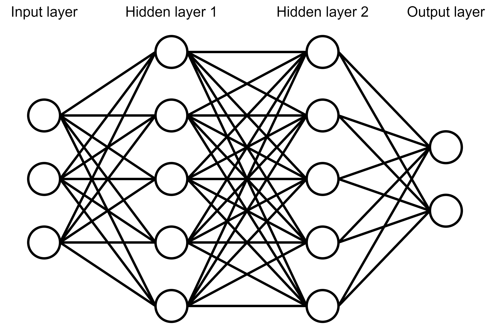
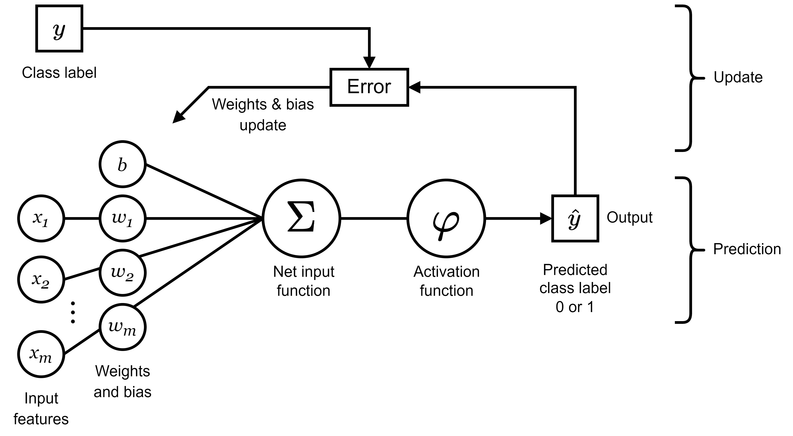

<!--yml

类别：未分类

日期：2024-09-06 19:47:11

-->

# [2204.02921] 关于最近提出的深度学习激活函数的调查

> 来源：[`ar5iv.labs.arxiv.org/html/2204.02921`](https://ar5iv.labs.arxiv.org/html/2204.02921)

# 关于最近提出的深度学习激活函数的调查

Murilo Gustineli

murilogustineli@gmail.com

###### 摘要

人工神经网络（ANN），通常被称为神经网络，是一种机器学习算法，并已取得广泛成功，其灵感来源于人脑的生物结构。神经网络因其从数据中学习复杂函数逼近的能力而 inherently 强大。这种概括能力能够影响涉及图像识别、语音识别、自然语言处理等多个学科领域。激活函数是神经网络的重要子组件。它们定义了在给定一组输入的情况下，网络中一个节点的输出。本文讨论了神经网络中激活函数的主要概念，包括：对深度神经网络的简要介绍，激活函数的总结及其在神经网络中的应用，它们最常见的属性，不同类型的激活函数，一些挑战、局限性及激活函数面临的替代解决方案，最后进行总结。

## 1 引言

现代人工神经网络架构受到大脑神经结构的启发，大脑是一个复杂的输入输出连接网，通过神经元在网络中传递决策信号。深度神经网络（DNN）是一种在输入层和输出层之间具有多个层的人工神经网络[1]。输入层和输出层之间的层称为隐藏层。只有一个隐藏层的网络称为“浅层”神经网络。深度学习是机器学习的一个子集，其中神经网络从大型数据集中学习。深度学习中的“深度”一词指的是网络中使用的多层。神经元、输入、权重、偏差和函数是神经网络的基本组件[2]。这些组件像人脑一样共同工作，并且可以像其他机器学习算法一样进行训练。下图表示一个多层神经网络，由输入层的三个神经元、两个每个有五个神经元的隐藏层和输出层的两个神经元组成。

图 1：多层神经网络的结构

## 2 背景

激活函数是一种非线性函数，用于通过定义神经元在一组输入下的输出，来训练神经网络 [3]。该函数在网络中的每个神经元中使用，帮助网络学习数据中的复杂模式，从而进行预测。此外，激活函数的目的是在神经网络中引入非线性。

人工神经网络由大量互连的节点组成，这些节点称为感知器或神经元。一个感知器（见下图）接收特征（x）的实值输入，并将每个输入与其相关的权重（w）和偏置（b）相乘，计算净输入，即所有连接神经元的总和。净输入的结果传递给激活函数，该函数将输出数学地转换到 -1 和 1 的范围，由原点处的超平面进行分类。这些不同的平面对应于输入数据点的预测类别标签。这个输出在学习阶段用于计算预测误差，并更新权重和偏置单元。

图 2：感知器：示例

感知器的第一个组件是输入矩阵。输入是一个 $m$ 维矩阵 $x\ =\ [x_{1}\ x_{2}\ ...\ x_{m}]$，其中每个 $x_{i}$ 代表一个单独的数据点。例如，如果神经网络的输入矩阵是图像，则单个数据点将是该图像的一个像素。输入矩阵的维度将取决于图像的大小。因此，一个 28x28 像素的黑白图像将具有维度为 $28\times 28$ 的输入矩阵，其中 $x_{m}=784$。感知器的第二个组件是权重矩阵。权重矩阵与输入矩阵具有相同的维度，因此 $w\ =\ [b\ w_{1}\ w_{2}\ ...\ w_{m}]$，其中每个 $w_{i}$ 代表与其对应输入相关的权重，$b$ 代表偏置单元。输入矩阵和权重矩阵的内积的求和传递给激活函数，产生一个介于 0 和 1 之间的输出。请注意，感知器的表示可能会根据神经网络的结构有所不同。

## 3 激活函数的属性

激活函数具有共同的属性。其中一些最重要的属性包括非线性、可微性、连续性、有界性和零中心性 [4]。所有激活函数都是非线性函数，这意味着函数的图像不同于直线，其中输入的变化与输出的变化不成正比。可微性与函数的导数相关。一个实变量的可微函数是指其导数在其定义域的每一点都存在的函数。损失函数的梯度在反向传播过程中使用梯度下降法计算 [3]。因此，激活函数必须对其输入是可微的。连续函数是指当自变量发生连续变化时，函数值也会连续变化。这意味着没有突然的值变化，这些突然的变化被称为不连续性。有界函数受到某种形式的边界或限制的限制。有界函数的范围具有下界和上界。这对于神经网络很重要，因为激活函数负责将输出值保持在一定范围内，否则，值可能会超出合理范围。当函数的范围包含正值和负值时，称其为零中心的。如果一个函数不是零中心的，例如 sigmoid 函数，层的输出总是偏移到正值或负值。因此，权重矩阵需要更多的更新才能充分训练，从而增加了训练网络所需的纪元数。这就是为什么零中心属性即使不是必须的也很有用。激活函数的计算成本定义为在给定输入时生成激活函数输出所需的时间。梯度的计算成本同样重要，因为它在反向传播中计算，当权重被更新时。低计算成本需要较少的时间来训练神经网络，而相反的情况也是如此。因此，在机器学习研究领域中，寻找计算成本较低的函数是非常受欢迎的。

## 4 激活函数面临的挑战

广泛使用的激活函数面临的两个主要挑战是梯度消失问题和神经元死亡问题。本节将涵盖这两个问题。

### 4.1 梯度消失问题

当梯度值在反向传播深入网络时接近零，导致权重饱和而未被正确更新时，就会发生这个问题。因此，损失停止减少，网络不能得到有效训练。这个问题被称为梯度消失问题。那些权重没有得到正确更新的神经元被称为饱和神经元。

### 4.2 神经元死亡问题

如前所述，激活函数的输出值范围在 0 和 1 之间。当值接近零时，它迫使相应的神经元处于非活动状态，从而不对最终输出做出贡献。此外，权重可能会以某种方式更新，使得网络中大部分的加权和被强制为零。这种情况可能迫使大量输入被停用，从而导致网络性能出现不可恢复的问题。因此，这些被强制停用的神经元被称为“死神经元”，而这一问题被称为“死神经元问题”。

## 5 种不同类型的激活函数

近年来最常用的激活函数包括 Sigmoid、Tanh、ReLU、LReLU 和 PReLU。

### 5.1 Sigmoid

sigmoid 函数，通常称为逻辑 sigmoid 函数，是当前前馈神经网络中最常见的函数之一。这主要是由于它的非线性以及其导数的简单性，这使得计算相对便宜。AF sigmoid 函数是一个有界的可微分实函数，定义在所有实输入值上，并且具有正导数。sigmoid 函数定义为

|  | $f(x)\ =\ \frac{1}{1+e^{-x}}$ |  |
| --- | --- | --- |

此外，sigmoidal 函数被认为会随着其自变量变大而迅速接近一个固定的有限上限，并且随着其自变量变小而迅速接近一个固定的有限下限。sigmoid 的中心部分（无论是接近 0 还是偏移）被认为是大致线性的 [5]。sigmoid 函数包含一个指数项，从函数定义中可以看出。指数函数，如 sigmoid 函数，具有高计算成本。尽管该函数计算昂贵，但其梯度却不然。梯度可以通过以下公式计算

|  | $f\prime(x)\ =\ f(x)(1-f(x))$ |  |
| --- | --- | --- |

一个主要缺点是 sigmoid 函数的范围被限制在 0 和 1 之间。因此，它总是产生非负值作为输出。sigmoid 函数将大范围的输入限制在 0 和 1 之间的小范围内。因此，对输入值的大幅度变化会导致输出值的小幅度变化，从而也导致小的梯度值。由于梯度值小，它可能容易遭遇梯度消失问题。双曲正切函数或 tanh 函数被创建用以结合 sigmoid 函数的优点以及其以零为中心的特性。

### 5.2 Tanh

双曲正切函数或 tanh 函数比 sigmoid 函数更受欢迎，因为在大多数情况下，它为多层神经网络提供了更好的训练性能。tanh 函数继承了 sigmoid 函数的所有有价值的属性。tanh 函数定义为

|  | $f(x)\ =\ \frac{1-e^{-x}}{1+e^{-x}}$ |  |
| --- | --- | --- |

tanh 函数是连续的、可导的且有界的，其值范围在 -1 和 1 之间。因此，可能的输出范围扩大了，包括负值、正值和零输出。此外，tanh 函数是零中心的，因此，与 sigmoid 函数相比，减少了训练网络所需的周期数。零中心特性是 tanh 函数提供的主要优点之一，从而有助于反向传播过程。sigmoid 和 tanh 函数在计算上都比较昂贵，因为它们是指数函数。与 sigmoid 类似，tanh 函数将大量的输入范围限制在 -1 和 1 之间。因此，对输入值的大变化导致输出值的小变化。这会导致接近零的梯度值。由于梯度值可能接近零，tanh 遇到梯度消失问题。梯度消失问题促使了对激活函数的更多研究，进而导致了 ReLU 的发展。

### 5.3 ReLU

自从其提出[6]以来，整流线性单元函数（ReLU）由于其高效的特性在神经网络中被广泛使用。ReLU 函数定义为

|  | $f(x)\ =\ max(0,\ x)$ |  |
| --- | --- | --- |

其中 x 是激活函数的输入。ReLU 函数是连续的、非有界的且非零中心的。与 sigmoid 和 tanh 函数不同，ReLU 不是指数函数，因此计算成本低，因为它将负值强制为零。这个特性使得 ReLU 函数成为神经网络中的更好选择，因为它在性能和泛化能力上优于 sigmoid 和 tanh 函数。传递到 ReLU 函数的负输入将评估为零输出。因此，负权重的神经元不会对网络的整体性能做出贡献，遭遇之前看到的死神经元问题。为了尝试解决死神经元问题，引入了 ReLU 的一种新变体，称为 LReLU。

### 5.4 LReLU

Leaky ReLU (LReLU) 函数是连续的、非有界的、零中心的，并且计算成本低。LReLU 定义为

|  | $f(x)\ =\ \begin{cases}0.01x&amp;\text{当}\ x\leq 0\\ x&amp;\text{否则}\end{cases}$ |  |
| --- | --- | --- |

与 ReLU 不同，LReLU 函数允许负输入作为输出传递。对于小于 0 的 x 输入值，左侧导数为 0.01，而右侧导数为 1。对于大于 0 的 x 输入值，梯度始终为 1，因此，该函数不会遭遇梯度消失问题。另一方面，负输出的梯度将始终为 0.01，导致可能会遇到梯度消失问题的风险。

### 5.5 PReLU

为了解决 leaky ReLU 函数遇到的梯度消失问题，He 等人引入了参数化 ReLU (PReLU) 函数[7]。PReLU 函数定义为

|  | $f(x)\ =\ \begin{cases}ax\ &\text{当}\ x\leq 0\\ x\ &\text{否则}\end{cases}$ |  |
| --- | --- | --- |

其中 a 是一个可学习的参数，x 是激活函数的输入。当 a 为 0.01 时，PReLU 函数等于 LReLU，而当 a = 0 时，PReLU 函数等于 ReLU。因此，PReLU 通常用于表示修正非线性。PReLU 是非有界的、连续的，并且以零为中心。当 x 小于零时，函数的梯度为 a，而当 x 大于零时，函数的梯度为 1。PReLU 函数的正部分没有梯度消失问题，因为梯度始终为 1。然而，负侧的梯度始终为 a，这通常接近于零。这就可能出现梯度消失问题。

## 6 激活函数面临挑战的替代解决方案

采用修正线性单元（ReLU）激活函数来解决由饱和激活函数引起的梯度消失问题是一个重大发现，使得训练深度网络成为可能。从那时起，许多增强的 ReLU 变体被提出。本节将涵盖最新的激活函数突破，这些函数试图解决神经网络中使用的新型 ReLU 函数所面临的一些局限性。

### 6.1 Swish

基于强化学习的搜索技术已被用于发现新颖的激活函数，这些激活函数可能作为广泛使用的 ReLU 函数的潜在替代品，从而发现了 Swish 函数 [8]。研究发现，Swish 在各种大型数据集上的深度模型中表现优于 ReLU。在几乎所有任务中，与 ReLU 和其他新颖的激活函数相比，Swish 的表现达到或超过了基准。Swish 的公式定义为

|  | $f(x)\ =\ x\times\text{sigmoid}(\beta x)$ |  |
| --- | --- | --- |

Swish 的简单性和与 ReLU 的相似性使从业者可以通过更改一行代码轻松地将 ReLU 替换为 Swish 单元。Swish 是向上无界的，向下有界的。与 ReLU 不同，Swish 是平滑的且非单调的。因此，Swish 的非单调性是其与最常见激活函数的关键区别。与 ReLU 相比，Swish 平滑、连续的特性在深度神经网络架构中对信息传播至关重要。Swish 和 ReLU 之间的主要区别是当 x < 0 时，Swish 的非单调“隆起”。所做的研究为该隆起捕捉到的 -limit<x<0 （-limit 为预定义）范围内的预激活信号提供了实证依据。此外，根据选定的架构，隆起可以根据其使用案例进行调节。由于这一直观认识，Swish 能够超越其他单调激活函数，使其成为 ReLU 的良好替代候选者。

### 6.2 Mish

Mish 是一种自我正则化、平滑、连续、非单调的激活函数，受到 Swish 的自我门控特性的启发。Mish 已被提议 [9] 作为新型激活函数的替代品，包括 Swish，它是一种更强大的激活函数，效果显著优于 ReLU。Mish 函数定义为

|  | $f(x)\ =\ x\ \text{tanh}\left(\text{softplus}(x)\right)$ |  |
| --- | --- | --- |

Mish 在各种计算机视觉任务中，倾向于与 Swish、ReLU 和 Leaky ReLU 的神经网络架构相匹配或改善其性能。尽管 Mish 的设计受到了 Swish 工作的影响，但它是通过系统分析和实验发现的，这些特性使得 Swish 非常成功。Mish 在下界受限但在上界不受限，类似于 Swish。根据研究，Mish 始终优于上述函数以及 Swish 和 ReLU。

Mish 使用自我门控特性，即将未调制的输入与输入的非线性函数的输出相乘。Mish 通过保留少量负信息消除了 Dying ReLU 问题的必要前提条件。这一特性有助于改善网络信息流。Mish 在上界不受限，避免了饱和和梯度消失问题，这会导致训练变慢。下界受限也是有利的，因为这导致更强的正则化效果。与 ReLU 不同，Mish 是连续可微的，这更为理想，因为它避免了奇异性，从而减少了在基于梯度优化时的不良副作用。

Mish 的平滑特性也有助于更好的梯度流。更平滑的输出地形意味着更平滑的损失地形，使得优化和泛化更容易。Mish 的最小值大于 ReLU 和 Swish，这增加了泛化能力，因为前者包含几个局部最小值。此外，与装备了 ReLU 和 Swish 的网络相比，Mish 的损失最低，证明了 Mish 对损失表面的预处理效果。在大多数实验条件下，Mish 在实证数据方面优于 Swish、ReLU 和 Leaky ReLU。

### 6.3 GCU

Papert 和 Minsky [10] 首次指出，单个神经元无法学习 XOR 函数，因为一个单一的超平面（在此示例中为一条直线）无法将该函数公式的输出类别分开。此外，XOR 问题需要至少 3 个神经元才能解决。为了尝试解决这个问题，提出了一种新的激活函数，Growing Cosine Unit (GCU) [11]，其优点是使用振荡激活函数来改善梯度流并减轻梯度消失问题。GCU 函数定义为

|  | $C(z)\ =\ z\times\text{cos}\ z$ |  |
| --- | --- | --- |

由于其生物学上的合理性，大多数当前使用的激活函数是非振荡的且单调增长的。振荡激活函数可以改善梯度流并减少网络规模。振荡激活函数具有以下优势：减轻梯度消失问题，因为它们在其定义域内除了孤立点外都有非零导数；改善紧凑网络架构的性能；并且计算成本低于最先进的 Swish 和 Mish 激活函数。

因此，振荡激活函数允许神经元在神经元超平面的正负半空间内部改变分类（输出符号），使得用更少的神经元做出复杂决策成为可能。此外，GCU 振荡函数提供了 XOR 问题的单神经元解决方案。研究发现，使用 GCU 训练的复合网络在各种架构和基准测试中优于独立的 Sigmoids、Swish、Mish 和 ReLU 网络。GCU 函数在计算上比 Swish 和 Mish 更便宜。GCU 激活还减少了训练时间，并允许用更小的网络解决分类问题。

## 7 种生物启发式振荡激活函数

最近的研究发现，人类皮层第二层和第三层的生物神经元具有振荡激活特性，并且能够单独学习 XOR 函数。生物神经元中的振荡激活函数可能解释了生物神经网络与人工神经网络之间的性能差异。研究表明，振荡激活函数在许多任务上优于流行的激活函数[11]。本文提出了 4 种新的生物启发式振荡激活函数（Shifted Quadratic Unit（SQU）、Non-Monotonic Cubic（NCU）、Shifted Sinc Unit（SSU）和 Decaying Sine Unit（DSU）），这些函数使单个神经元能够在没有手动特征工程的情况下学习 XOR 问题。振荡激活函数在许多基准任务上也优于流行的激活函数，如在更少的神经元下解决分类问题和减少训练时间。

使用在更广泛输入范围内具有较大导数的激活函数，如 ReLU、LReLU、PReLU、Swish 和 Mish 激活函数，可以大大减少梯度消失问题[12]。这些新型激活函数是无界的，在深度网络中表现更好，并且对所有正值的导数值接近于 1 或更大[7]。然而，大多数神经网络中的激活函数是单调的或几乎单调的函数，在原点处具有一个零。Albert Gidon 等人[13]发现了一种能够独立学习 XOR 函数的新型神经元（这是单一神经元使用 sigmoid、ReLU、LReLU、PReLU、Swish 和 Mish 激活函数无法完成的任务）。为了在 XOR 数据集中区分类别，需要两个超平面，这就需要使用具有多个零的激活函数，如 [14] 所述。鉴于生物神经元的输出对小输入值是增加的，因此可以看出，如果生物神经元能够学习 XOR 函数，那么输出最终必须减少到零。因此，尽管传统的激活函数需要一个 3 神经元网络，其中 2 个隐藏层和 1 个输出层来学习 XOR 函数，但通过使用振荡激活函数（如 Growing Cosine Unit（GCU））可以用一个神经元学习 XOR 函数。

已经证明，振荡激活函数在许多任务上优于流行的激活函数[11] [15]。本文提出了 4 个新的振荡激活函数，使得单个人工神经元可以像生物神经元一样学习 XOR 函数。这些振荡激活函数在许多基准任务上也优于流行的激活函数，如用更少的神经元和减少的训练时间解决分类问题。

论文中提出的四个振荡函数定义如下：

+   •

    非单调立方单位（NCU）：$f(z)\ =\ z\ -\ z^{3}$

+   •

    移位二次单位（SQU）：$f(z)\ =\ z^{2}+z$

+   •

    衰减正弦单位（DSU）：$f(z)=\frac{\pi}{2}(\operatorname{sinc}{(z-\pi)}-\operatorname{sinc}{(z+\pi)})$

+   •

    移位 sinc 单位（SSU）：$f(z)\ =\ \pi\ \text{sinc}(z\ -\ \pi)$

研究结果表明，像 NCU、SQU、DSU 和 SSU 这样的振荡激活函数在 20 个周期内会收敛，同时在 4 层卷积层下保持最佳的准确性。在 3 层卷积层下，它们的准确性保持在 68%以上。此外，Quadratic (SQU) 即使在减少周期数量的情况下也保持上述准确性。结果显示，具有振荡激活的网络可以使用更少的神经元，表现更好，并且比使用更常见激活函数的网络训练更快。最后，本研究的发现表明，具有振荡激活函数的深度网络可能能够弥补生物神经网络和人工神经网络之间的性能差距。未来需要研究评估本研究中描述的新型振荡激活函数在其他基准问题和模型设计上的表现。

## 8 结论

神经网络由于其从数据中学习复杂函数近似的能力而本质上强大。这种泛化能力已能够影响涉及图像识别、语音识别、自然语言处理等多个学科领域。激活函数是神经网络中的一个重要子组件。它们定义了网络中一个节点在给定一组输入时的输出。本文讨论了流行的激活函数，并提供了它们属性的比较。最近的研究提出，振荡激活函数在许多基准任务上优于流行的激活函数，例如在使用更少的神经元和减少训练时间的情况下解决分类问题。

## 参考文献

+   [1] Jürgen Schmidhuber. 深度学习在神经网络中的概述。Neural networks, 61:85–117, 2015。

+   [2] Yann LeCun, Yoshua Bengio 和 Geoffrey Hinton. 深度学习。nature, 521(7553):436–444, 2015。

+   [3] Yann LeCun, Bernhard Boser, John S Denker, Donnie Henderson, Richard E Howard, Wayne Hubbard 和 Lawrence D Jackel. 反向传播应用于手写邮政编码识别。Neural computation, 1(4):541–551, 1989。

+   [4] Leonid Datta. 激活函数及其与 Xavier 和 He 正态初始化的关系调查。arXiv 预印本 arXiv:2004.06632, 2020。

+   [5] Jun Han 和 Claudio Moraga. Sigmoid 函数参数对反向传播学习速度的影响。在国际人工神经网络研讨会中，第 195–201 页。Springer, 1995。

+   [6] Richard HR Hahnloser, Rahul Sarpeshkar, Misha A Mahowald, Rodney J Douglas 和 H Sebastian Seung. 数字选择与模拟放大在受皮层启发的硅电路中共存。nature, 405(6789):947–951, 2000。

+   [7] Kaiming He, Xiangyu Zhang, Shaoqing Ren 和 Jian Sun. 深入探讨修正器：在 ImageNet 分类中超越人类级别的表现。在 IEEE 国际计算机视觉会议论文集中，第 1026–1034 页, 2015。

+   [8] Prajit Ramachandran、Barret Zoph 和 Quoc V Le。寻找激活函数。arXiv 预印本 arXiv:1710.05941, 2017。

+   [9] Diganta Misra。**Mish**：一种自我正则化的非单调激活函数。arXiv 预印本 arXiv:1908.08681, 2019。

+   [10] Jan Mycielski。**马文·明斯基** 和 **西摩·帕普特**，《感知机》，计算几何导论。《美国数学学会公告》，78(1):12–15, 1972。

+   [11] Mathew Mithra Noel、Advait Trivedi、Praneet Dutta 等人。**生长余弦单元**：一种新型的振荡激活函数，可以加速训练并减少卷积神经网络中的参数。arXiv 预印本 arXiv:2108.12943, 2021。

+   [12] Andrea Apicella、Francesco Donnarumma、Francesco Isgrò 和 Roberto Prevete。**现代可训练激活函数**的调查。《神经网络》，138:14–32, 2021。

+   [13] Albert Gidon、Timothy Adam Zolnik、Pawel Fidzinski、Felix Bolduan、Athanasia Papoutsi、Panayiota Poirazi、Martin Holtkamp、Imre Vida 和 Matthew Evan Larkum。**树突行动电位** 和人类 2/3 层皮层神经元中的计算。《科学》，367(6473):83–87, 2020。

+   [14] Ehsan Lotfi 和 M-R Akbarzadeh-T。一种新型的单神经元感知机，具有通用逼近和异或计算属性。《计算智能与神经科学》，2014, 2014。

+   [15] Matthew Mithra Noel、Shubham Bharadwaj、Venkataraman Muthiah-Nakarajan、Praneet Dutta 和 Geraldine Bessie Amali。**生物启发的振荡激活函数**可以弥合生物神经元和人工神经元之间的性能差距。arXiv 预印本 arXiv:2111.04020, 2021。
