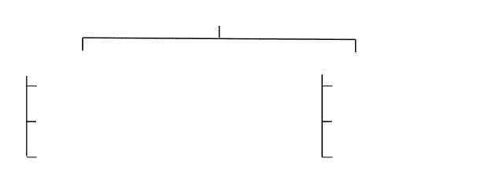
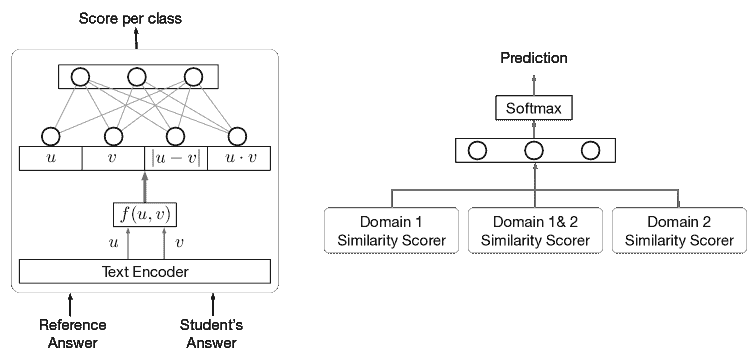
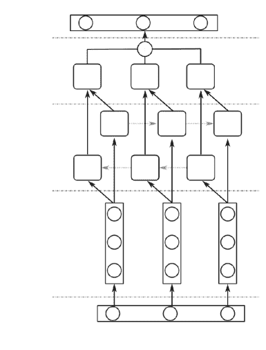
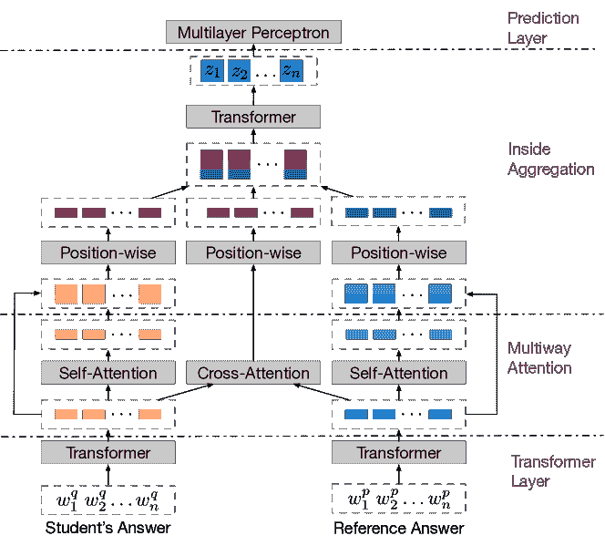

<!--yml

category: 未分类

日期：2024-09-06 19:47:08

-->

# [2204.03503] 使用深度学习的自动化简答题评分调查：从词嵌入到变换器

> 来源：[`ar5iv.labs.arxiv.org/html/2204.03503`](https://ar5iv.labs.arxiv.org/html/2204.03503)

# 使用深度学习的自动化简答题评分调查：从词嵌入到变换器

Stefan Haller 荷兰特文特大学恩斯赫德 s.m.haller@student.utwente.nl， Adina Aldea 荷兰特文特大学恩斯赫德 a.aldea@utwente.nl， Christin Seifert 荷兰特文特大学恩斯赫德 - 德国杜伊斯堡-埃森大学埃森 christin.seifert@uni-due.de 和 Nicola Strisciuglio 荷兰特文特大学恩斯赫德 n.strisciuglio@utwente.nl

###### 摘要。

自动化简答题评分（ASAG）在教育领域引起了关注，因为它能够应对不断增长的学生数量。自然语言处理和机器学习的最新进展在很大程度上影响了 ASAG 领域，我们对最近的研究进展进行了调查。我们通过提供对最近发布的采用深度学习方法的全面分析，来补充之前的调查。特别是，我们将分析重点放在从手工设计特征到*表示学习*方法的过渡上，这些方法可以从大规模数据集中自动学习代表性特征。我们将对深度学习方法的分析分为三类：词嵌入、序列模型和基于注意力的方法。深度学习对 ASAG 的影响与其他 NLP 领域不同，因为我们发现仅凭学习到的表示不能获得最佳结果，而是与手工设计的特征以互补方式工作。最佳性能确实是通过将精心设计的特征与最新模型（如变换器架构）提供的语义描述相结合的方法来实现的。我们确定了挑战，并对未来的研究方向提供了展望。

深度学习、机器学习、自然语言处理、简答题评分、文本表示学习

## 1\. 引言

在教育领域，大量关注被投入到学生学习过程的特征化，以确定学习者获取新知识的效率和成功。评估和量化知识获取是评估学习过程质量的基本方面。由于评估过程耗时且具有个体性，因此必须尽可能提高其效率，例如，通过使用某种程度的评分自动化，同时保持或甚至提高其质量（Mohler 和 Mihalcea，2009）。

除了形成性评估（例如作业的教师反馈），主要的评估方法是总结性评估（例如书面考试）（Suzen et al., 2018），在这种方法中，学生获得的知识可以通过多种方式进行测试。可以制定不同类型的问题：封闭式问题（例如选择题）或开放式回答问题（例如作文或简答题）（Burrows et al., 2015）。选择题的自动评分是直接且即时的。自动化作文评分（AES）和自动化简答题评分（ASAG）是更具挑战性的任务，因为这些答案的评估需要理解文本并进行更详细的分析（Magooda et al., 2016; Suzen et al., 2018）。AES 和 ASAG 之间的主要区别在于，后者处理的是通常与参考答案进行评分的简短回答，而前者则关注对较长文本答案的评分，评分基于拼写、语法和连贯性的质量评估，而不是信息内容的紧凑性（Magooda et al., 2016）。

对于文本开放性回答的评估具有挑战性，需要运用来自不同领域的技术和方法，如自然语言处理（NLP）、文本理解和阅读理解。深度学习和 NLP 的最新进展促进了针对文本数据的机器学习模型的设计和分析（Suzen et al., 2018; Neterer and Guzide, 2018），并引发了它们在不同应用领域（如 AES 和 ASAG）的适用性问题。这些进展及其在 ASAG 中的应用在最近的综述中没有涉及，这些综述仅回顾了基于特征提取并与经典机器学习模型结合使用的方法（Burrows et al., 2015; Galhardi and Brancher, 2018; Blessing et al., 2021）。本研究专注于 ASAG，对于 ASAG 而言，构建有效的语义表示是至关重要的。

在本文中，我们通过分析基于深度学习的最新 ASAG 方法，扩展了之前的调研。我们首先从历史角度出发，概述了该领域随时间变化和发展的情况，然后深入探讨了最新方法的贡献。我们关注文本表示的作用，即特征，它们在有效描述句子和段落特征方面的重要性，以及从手工设计特征到通过深度学习方法自动学习特征的转变。我们按照一个简单的分类法组织这些工作，该分类法重点关注使用的文本表示类型。它包括基于*经典机器学习*的方法，这些方法将手工设计的特征与分类器相结合，以及*深度学习*方法，这些方法能够直接从训练数据中学习相关特征。我们根据特征类型将第一类方法分组，即词汇特征、句法特征和语义特征。第二类方法，即基于深度学习的方法，则根据用于学习文本表示的机制进行组织，例如词嵌入、序列模型和基于注意力的模型。此外，我们还识别了网络架构设计中的趋势，并对未来的发展和需要解决的挑战提供了展望，如在跨语言环境中改进文本理解以及实际方法在跨领域文本（例如不同学科）中的泛化。

文章的剩余部分组织如下。在第二部分中，我们讨论了当前工作的贡献与以往调查方法的对比，而在第三部分中，我们提供了与 ASAG 研究领域相关的历史发展视角。在第四部分中，我们详细阐述了调查的范围和组织结构，而在第五部分中，我们展示了最常用的基准数据集的细节。在第六部分中，我们提供了现有工作的分类学。在第 7 和第八部分中，我们分别分析了基于经典机器学习和深度学习方法的工作。在第九部分中，我们讨论了实际趋势并展望了 ASAG 领域未来的发展，在第十部分中得出结论。

## 2\. 贡献

自动化短答案评分（ASAG）领域的发展和进展在一些调查论文中已有回顾（Burrows 等，2015；Galhardi 和 Brancher，2018；Blessing 等，2021）。在（Burrows 等，2015）中可以找到对整个领域的统一和全面的概述，其中从历史角度讨论了直到 2014 年的分析组件发展。作者将现有方法组织成五个组，这些组对应于时间主题，也称为*时代*。属于某个时代的分类方法共享相同的方法和重点：词汇和句子匹配、特征提取与比较、语义信息的使用、基于机器学习工具的推理以及词嵌入。

在（Galhardi 和 Brancher，2018）中，提供了将特征工程与基于机器学习的预测模型相结合的方法的综合分析。作者进行了系统的文献综述，重点关注现有数据集、应用的 NLP 技术和 ASAG 的机器学习算法。他们强调了适当特征集设计在有效训练机器学习模型中的作用和重要性。其他已发表的评论（Blessing 等，2021）没有讨论 ASAG 领域发展的进一步方面。

尽管最近在短答案评分方面的深度学习方法取得了重要进展，并提高了性能，但这些进展尚未得到覆盖。在这项工作中，我们弥补了这一空白，旨在通过对基于深度网络和表征学习技术的方法进行深入分析和组织，来补充之前的调查。我们详细描述了从手工工程特征到语义丰富的文本表示的过渡，作为在 ASAG 和 NLP 任务中显著提高性能的关键驱动因素。我们将 ASAG 系统的深度学习发展追溯到三个阶段，这些阶段与学习文本表示所使用的技术类型有关：（1）基于词嵌入的模型，（2）学习整个句子表示的序列模型，以及（3）基于注意力的模型。通过对现有模型的这种组织，本调查不仅为未来的扩展提供了可能性，还提供了已发布工作的全面而结构化的概述。本调查的关键贡献包括：

+   •

    我们提供了对最新的自动化短答案评分方法及其在不同数据集上表现的全面比较；

+   •

    我们概述了用于评估 ASAG 系统的主要基准数据集；

+   •

    我们识别出实际的趋势和最有前景的模型架构，以推动 ASAG 的性能提升；

+   •

    我们分析了 NLP 和深度学习方法的进展对 ASAG 领域的影响。

## 3\. 历史视角

ASAG 领域的发展经历了多个里程碑。在(Burrows et al., 2015)中，作者识别了一些进展趋势并将其与特定时间段关联起来。最初，研究者使用概念图将答案与参考答案进行比较，通过将其分解为几个概念。推断出的概念被用作基本参考模型。通过检查它们与参考答案的相似性来预测答案的正确性。这些方法被信息检索领域中更关注从学生答案中提取相关特征，即特征，以便与参考答案直接比较的方法扩展或部分替代。这些初期阶段的研究没有考虑句子中的语义信息和词汇之间的关系。这些主要涉及基于正则表达式或解析树的文本分析（Burrows et al., 2015）。随后，通过使用大量文本语料库，例如 WordNet（Fellbaum, 2000）、词汇同义词和知识库方法，建模和利用了句子之间的语义相似性。语义特征提高了 ASAG 方法的整体性能，并使其更具灵活性（Magooda et al., 2016）。

机器学习方法的发展用于构建预测模型也影响了 ASAG 领域。可训练分类系统的推断能力使研究者将焦点转向研究使用不同特征集来提取文本的相关特征，即词汇、句法、语义特征及其组合的效果。构建合理的特征集需要大量的特征工程，以便在特定问题和具有特定特征的数据集上表现良好。因此，特征集的构建需要领域专家的知识，以确保系统在特定数据集上取得良好的性能结果（Ott et al., 2013）。提出此类方法的论文表明，语义特征提取方法是获得高性能的关键。

自然语言处理领域的一个重要里程碑是词嵌入方法的发展，这些方法将词语或短语从词汇表映射到具有有趣和有用属性的向量空间中，用于预测任务。词嵌入的目的是关注这些特征空间应保留的属性，例如捕捉语义相似性。这对 ASAG 领域产生了重大影响，因为它提高了基于机器学习的系统从文本中提取有意义的语义信息的能力，相较于之前基于手工制作特征的方法。顺序机器学习模型的发展，例如递归神经网络（RNNs）(De Mulder et al., 2015; Dyer et al., 2016)和长短期记忆网络（LSTMs）(Cheng et al., 2016)，能够学习词序列（句子和段落）中的依赖关系，这对计算文本表示的改进起到了重要作用。长距离依赖关系在文本中随后通过基于注意力的神经网络成功建模，这些网络首先与递归网络结合使用（Yoon et al., 2017），然后作为独立模型（Vaswani et al., 2017）使用。基于注意力的方法被应用于语义文本相似性检测（Lan et al., 2020; Liu et al., 2019c; Raffel et al., 2019）、释义识别（Yang et al., 2019; Liu et al., 2019b; Ratner et al., 2019）、阅读理解（Lan et al., 2020; Raffel et al., 2019; Zhang et al., 2020b; Devlin et al., 2019）和文本蕴涵识别（Liu et al., 2019c; Yang et al., 2019; Liu et al., 2019b）等任务。建模文本中的长距离依赖关系的方法已成为大多数自然语言处理和 ASAG 任务的最新技术。

## 4\. 综述的组织

该调查分为三个部分。第一部分涵盖了用于短答案评分（ASAG）算法评估的重要基准数据集（参见第五部分）。每个数据集具有特定的特征，这些特征能够评估 ASAG 系统的不同方面，例如对训练阶段未见过的问题或新主题、新领域的答案评分等与其泛化能力相关的方面。

我们跟踪了基于经典机器学习工具和人工设计特征集的方法在进展和性能改进方面的表现，以及在调查的第二部分和第三部分中更近期的深度学习方法（参见第七部分和第八部分）。我们特别关注它们提取语义丰富文本表示的能力。我们分析了最近发布的方法，并详细阐述了 ASAG 领域的最新发展和趋势。

### 4.1\. 范围

我们专注于自动短答案评分方法的分析，这些方法由以下标准定义（Burrows 等，2015）。

1.  (1)

    答案必须反映学生的知识，而不仅仅是报告提供的提示文本中的段落；

1.  (2)

    答案以自然语言给出；

1.  (3)

    答案的长度约为$50$词，但可以包含多达约$100$¹¹1 某些分析的数据集中包含了超出该阈值的异常值（见表 1），但这些异常值仍然被考虑在内，因为大多数答案在此阈值以下；

1.  (4)

    答案的评分集中于内容而非写作质量；

1.  (5)

    可能的答案受到问题的封闭形式的限制。

最近几年发布的大多数 ASAG 方法都是基于监督学习策略的，旨在支持教育环境中的评分效率（Burrows 等，2015；Galhardi 和 Brancher，2018）。无监督方法，如排名或聚类，被用来根据相似性将学生答案分组，旨在提高评分的一致性，并可以作为监督学习方法的补充工具。

实际上，对于那些内容不会随着时间剧烈变化的课程，考试所用的问题库会稍微扩展或不会发生显著变化，相同的问题会被重复使用。这导致了对同一问题有多个答案，这些答案可以作为模型终身优化的训练输入。在这种情况下，利用标记问题、参考答案和学生答案的自动评分系统主要是基于监督学习的。因此，我们重点审查了大量用于 ASAG 的监督方法，并提供了由于使用标记正确答案进行训练而更为精确的评估。

### 4.2\. 搜索方法

我们采用了半系统的方法进行文献回顾，包括以下步骤：a) 在科学数据库中基于关键词的搜索；b) 重点关注基准数据集及其测试方法；c) 基于相关论文的参考文献进行倒查。

我们在主要的科学数据库中搜索相关论文，即 ScienceDirect、Google Scholar、ResearchGate、Semantic Scholar 和 arXiv。我们使用的主要搜索词包括‘自动评分系统’、‘自动化评估’、‘学生数字评估’、‘短答案评分’，并根据结果对其进行了调整。我们随后确定了最常用的基准数据集（见第五部分），并选择了报告其结果的论文。这使我们能够在回顾中纳入那些提出自动评分系统的论文，即使它们使用了略微不同的任务定义，如答案相似性的推断或自动问答。最后，我们通过调查已经选定论文的参考文献列表，进一步收集了其他论文。选择标准包括引用次数和出版年份、与相关主题和应用的契合度，以及在类似数据集上的测试。

我们特别关注了过去五年内发表的论文，以便识别最新的发展和趋势。过去几年发表论文数量的增加表明对 ASAG 系统及其在教育用途中的应用有着日益增长的兴趣。

## 5\. 短答案评分的基准数据集

现有方法已经在不同的数据集上进行过测试，例如 SciEntsBank、Beetle、Texas、ASAP-SAS 等。这些数据集在许多方面有所不同：问题数量、答案数量、问题类型、领域、语言、评分依据和答案长度。对于我们的分析，我们依赖于我们调查的这些方法原始论文中报告的结果。它们通常在可用数据集的子集上进行测试，因此有时无法直接比较性能。这主要是由于可用公共数据集的不同组成和特性。一些数据集是专有的或来源不明，因此我们将其排除在我们的分析之外（例如，Large-Scale Industry Dataset (Dhamecha et al., 2018; Saha et al., 2019))。

在这篇综述中，我们重点介绍了用于基准测试 ASAG 方法的四个最广泛使用的数据集：SciEntsBank（Dzikovska et al., 2013）、Beetle（Dzikovska et al., 2013）、Texas（Mohler et al., 2011）和 ASAP-SAS（Kaggle, [[n. d.]](#bib.bib29)）数据集。它们的公开可用性和答案领域的多样性允许评估自动评分算法的不同性能和能力方面。此外，它们还保证了现有方法的公平比较。在接下来的部分中，我们将描述这些数据集，并提供有关它们设计的特定任务和应用的信息。在表 1 中，我们总结了所考虑数据集的特点和详细组成。

表 1\. SciEntsBank、Beetle、Texas2011 和 ASAP-SAS 基准数据集的详细特征。“附加信息”指示是否除了问题本身之外，还有用于任务的额外文本信息。

| 特点 | SciEntsBank | Beetle | Texas2011 | ASAP-SAS |
| --- | --- | --- | --- | --- |
| 训练问答对 | 4,969 | 17,198 | 2,442 | 17,207 |
| 正确答案的百分比 | 40.41% | 42.49% | 44.22% | 21.57% |
| 领域数量 | 12 | 2 | 1 | 4 |
| 问题数量 | 135 | 47 | 85 | 10 |
| 每个问题的平均答案数量 | 37 | 366 | 29 | 1,721 |
| 平均答案长度（以词数计） | 13 | 10 | 18 | 42 |
| 最大答案长度（以词数计） | 110 | 80 | 173 | 325 |
| 最小答案长度（以词数计） | 1 | 1 | 1 | 1 |
| 附加信息 | 否 | 否 | 否 | 是 |
| 标签的规模 | 2 类、3 类、5 类 |  |  |  |
| 分类 | 2 类、3 类、5 类分类 | 分数在 0 到 5 之间 | 分数在 0 到 2 或 0 到 3 之间 |  |
| 是否公开可用 | 是 | 是 | 是 | 是 |

### 5.1\. SciEntsBank 和 Beetle 数据集

SciEntsBank 和 Beetle 数据集是 SemEval 2013 挑战（Dzikovska et al., 2013）的一部分，其目标是识别常见的错误，如遗漏、错误或主题不相关的陈述，以便开发定制的纠正策略。该挑战旨在评估短答案评分系统的不同方面。

数据集包含三种标签集，用于训练模型在 2 类、3 类和 5 类任务问题上的表现。2 类任务包括将答案分类为正确或错误，而 3 类任务中，每个答案被标记为正确、矛盾或错误。2 类和 3 类任务涉及识别文本蕴涵（RTE）任务。5 类任务旨在评估对非领域、正确、部分正确、不完整、矛盾和不相关答案的识别。这些任务旨在改进用于辅导的对话系统。

测试协议旨在评估算法在三组数据上的表现，这些数据代表了评分系统可能遇到的挑战性情况，即：a）训练阶段未见过的答案，b）未用于训练模型的未见过的问题，以及 c）来自未见领域的问题/答案。这些测试旨在评估自动评分方法的泛化属性及其对训练领域以外的问题和领域的适用性。

#### SciEntsBank

SciEntsBank 数据集包括在北美学校的$3$到$6$年级的标准化评估中收集的学生答案。数据集总共包含$4969$个答案，涉及$12$个领域的$135$个问题（详见表 1）。根据领域类别，所需的评分涉及 2 分类、3 分类或 5 分类。

#### Beetle

与 SciEntsBank 数据集相比，Beetle 数据集旨在测试学生与真实教程对话系统的互动。该系统教授高中物理和电力电子学基础。为了创建这个数据集，对话被修订过，只使用了与问题相关的答案（而非互动协议）。问题包括事实性问题和解释定义问题。该语料库总共包含 47 个问题，每个问题的平均学生回答数量为 366。Beetle 数据集仅包含未见过的答案和未见过的问题类别。

### 5.2\. 北德克萨斯大学数据集

北德克萨斯大学数据集（Texas2011）也被广泛用于评估和比较自动评分系统的表现。它包含 30 名学生对 80 个不同问题的回答，产生了大约 2400 个问答对。答案的平均长度为 50 个词令。问题来源于计算机科学领域的两个考试的 10 个作业。这些答案由两位评估者评分，评分范围为 0 到 5。评分以整数形式给出。评分过程中没有明确的规则，两位评估者的平均评分被认为是标准答案（Mohler et al., 2011）。该数据集的目的是尽可能真实地反映短答案评分过程中的现实问题。这导致了更复杂和嵌套的答案结构，也包括了表格的使用。

### 5.3\. ASAP-SAS 数据集

自动化学生评估奖短答题评分（ASAP-SAS）数据集作为 Kaggle 比赛的一部分于 2013 年发布，由休利特基金会赞助（Kaggle, [[n. d.]](#bib.bib29)）。它包含来自不同领域的十个问题，例如英语、生物学、英语语言艺术、科学。总的来说，训练数据集包含$17,207$个答案（每个问题约$1,700$个答案），测试集包含$5,224$个答案。平均每个答案有$50$个单词，虽然少量答案（<$5\%$）也超过 100 个单词。每个问题的评分范围为$0$到$2$或$0$到$3$。

比赛和数据集的设计旨在通过现实且多样化的问题来挑战评估系统。由于十个问题的多样性，它进一步旨在支持评分系统的发展及其在教育领域的实际应用。这个数据集的一个独特特点是问题结构差异很大：例如，有些问题要求从 1 或 2 页的提示文本中提取具体信息。其他问题还包含图片或图表，学生需要陈述自己的观察和结果解释。

## 6\. 分类

现有的 ASAG 方法大致分为两类，即（1）依赖于手工特征和经典机器学习（CML）方法的早期方法，例如逻辑回归或支持向量机，以及（2）将特征设计作为学习问题并结合训练预测模型的深度学习（DL）方法（Sung et al., 2019a）。第二类方法可以进一步分为三个子类别，分别对应 NLP 方法的发展阶段，即词嵌入、序列模型和基于注意力的模型（Young et al., 2018; Otter et al., 2021）。图 1 展示了 ASAG 方法分类的概述。

图 1\. 自动化简答评分方法的分类。这些方法的分类基于机器学习方法和使用的表示类型（特征）。对于经典的机器学习方法，特征由领域专家手工设计，而在深度学习方法中，不同类型的表示是直接从数据中学习得到的。

词嵌入技术，最显著的如 Word2Vec (Mikolov et al., 2013)，旨在用在学习的潜在空间中相近的向量来表示语义相似的词。这些自动学习的表示能够有效地表征大规模文本语料中的信息。更长范围的关系，在词组和较长的句子中，被纳入了第二类方法的发展中，这包括基于递归神经网络（RNN）和长短期记忆网络（LSTM）的方法。这些模型捕捉句子中词语之间的长距离关系，从而提供更丰富的句子和段落表示。这些模型通常为特定的下游任务进行训练，并可以使用诸如 Word2Vec (Sutskever et al., 2014)的方法的嵌入结果。然而，由于梯度消失问题，递归网络往往更关注短期上下文信息，无法有效捕捉句子中的长距离依赖关系。LSTM 在一定程度上缓解了这个问题。这个限制最终由基于注意力机制的神经网络模型解决，这些模型构成了我们识别出的第三类深度学习方法。基于注意力的模型放松了对句子中标记的严格顺序分析，能够在不考虑它们在句子中的距离的情况下建模词语依赖关系，同时通过多头注意力机制实现对较长文本序列的并行处理 (Galassi et al., 2020)。完全基于注意力的架构被称为 Transformers (Vaswani et al., 2017)。

## 7\. 手工工程特征与机器学习

基于手工工程特征的方法依赖于从文本中提取词汇、句法和语义特征，使用依存和成分解析器，或计算句子重叠的函数。这些特征的主要目标是通过检测特定模式来描述良好答案的关键组件（例如特定术语、概念）。

在大多数审查过的论文中，从原始文本中提取的特征向量与经典的机器学习分类器结合使用，例如逻辑回归、支持向量机、随机森林或朴素贝叶斯分类器。一些审查过的方法基于集成方法，结合了多个分类器的预测。在下面的部分中，我们将这些方法进行回顾，按所使用的文本表示特征类型组织为 1）词汇特征、2）句法特征和 3）语义特征，并详细说明它们在现有方法中的相关性和应用。需要注意的是，很少有方法使用了不同类型特征组合的特征集。这使得很难得出某一特征或特征组相对于其他特征的绝对优越性结论。我们在表 2 中提供了审查方法的概述，并在表 3 中列出了它们在基准数据集上的结果。

### 7.1\. 词汇特征

词汇特征已被广泛用于描述短文本答案的特征。例如，它们包括单词、词干或词形还原后的单词、以及其前缀或后缀。词汇特征的提取是一个简单的过程，并且已经提出了多种算法，在 ASAG 任务中使用这些特征，例如计算句子之间重叠程度的方法、n-gram 表示或词汇统计。

估计词重叠的算法是早期 ASAG 系统的一个基本组成部分。基于重叠的特征测量句子之间的重合词，即学生答案和参考答案，使用方法来估计两个或多个样本句子的词级或字符级重叠。这些方法通常与不同的预处理方法结合使用，例如词形还原或词干提取，以进一步提高结果的质量（Ott et al., 2013; Meurers et al., 2011; Mohler et al., 2011）。在（Pribadi et al., 2017）中，作者比较了三种词重叠计算方法：i）Dice 系数，ii）Jaccard 系数和 iii）余弦系数，并研究了它们对 ASAG 系统性能的影响。这些方法计算两个句子中的重叠词，并计算它们之间的相似性得分。作者发现，余弦系数对句子相似性估计的性能贡献最大。在（Pribadi et al., 2016）中，使用了加权余弦系数，从而进一步提高了 ASAG 系统的性能。其他方法提取了重叠词的原始数量，并计算了几种字符串相似性得分，例如余弦相似性和 Lesk 相似性（Dzikovska et al., 2012）。此外，作者基于词汇特征计算了子树匹配，其中计数了重叠词和词干。在（Meurers et al., 2011）中，作者使用了基于参考答案和学生答案之间重叠词的特征。

增加重叠检测方法的复杂性和支持进一步提高了性能。在 (Jimenez 等， 2013) 中，作者提出了一种以分层方式计算句子重叠的方法，称为 SoftCardinality。它通过考虑单词和句子之间的不同字符 q-gram 来计算多个相似性分数，并在 SemEval 数据集上取得了最先进的结果。取得的结果表明，更细致的特征提取技术能够描述文本的更复杂特征，从而提高评分系统的整体性能。在 (Heilman 和 Madnani， 2013) 中得出了类似结论，作者提出了一种基于文本词汇相似性的计算方法，该方法使用字符和单词 n-gram。具体来说，相似性是通过考虑两个句子中的重叠数量以及字符串编辑距离特征来计算的。这种方法使用了来自 (Heilman 和 Madnani， 2012) 的附加特征，这些特征是根据对齐学生答案和参考答案所需的编辑工作量计算的。最终分数由逻辑回归分类器预测。此外，还使用了领域适应，其中不同特征在每个领域有各自的权重。

表 2\. 基于词汇、句法和语义特征的 ASAG 方法的详细信息，这些特征与机器学习分类器结合使用。

|  |  |  | 特征 |
| --- | --- | --- | --- |
| 参考 | 年份 | 分类器 | 词汇 | 句法 | 语义 |
| (Mohler 等， 2011) | 2011 | 支持向量机 | 词汇重叠 | 依赖分析器，词性标注，带词性标注的 n-gram | WordNet，LSA |
| (Meurers 等， 2011) | 2011 | $k$NN | 词袋模型，n-gram，词汇重叠 | 依赖分析器，词性标注，带词性标注的 n-gram，词汇同义词 | - |
| (Dzikovska 等， 2012) | 2012 | 决策树 | 词袋模型，n-gram，词汇重叠 | 依赖分析器，词性标注，带词性标注的 n-gram | - |
| (Kouylekov 等， 2013) | 2013 | 支持向量机，朴素贝叶斯 | 词汇重叠 | - | 基于语料库的词汇统计关联 |
| (Levy 等， 2013) | 2013 | 朴素贝叶斯 | 词袋模型，n-gram | 依赖分析器，词性标注，带词性标注的 n-gram | WordNet，LSA，ESA |
| (Heilman 和 Madnani， 2013) | 2013 | 逻辑回归 | 词汇/字符重叠 | - | - |
| (Ott 等， 2013) | 2013 | 支持向量机，逻辑回归 | 词袋模型，n-gram，词汇/字符重叠 | 依赖分析器，词性标注，带词性标注的 n-gram，最小编辑距离 | WordNet，LSA，ESA |
| (Jimenez 等， 2013) | 2013 | 装袋决策树 | 词汇/字符重叠 | - | - |
| (Ramachandran 等, 2015) | 2015 | 随机森林回归器 | 词袋模型, n-grams, 词重叠 | 依存句法分析器, 词性标记, 词图, 短语模式 | WordNet |
| (Magooda 等, 2016) | 2016 | 支持向量机 | 词袋模型, 词/字符重叠 | - | word2vec, GloVE |
| (Sultan 等, 2016) | 2016 | 随机森林 | 词袋模型, n-grams, 词/字符重叠 | - | word2vec, GloVE |
| (Roy 等, 2016) | 2016 | 逻辑回归 | 词重叠 | - | word2vec, WordNet, LSA |
| (Galhardi 等, 2018) | 2018 | 随机森林, 极端梯度提升 | 词袋模型, n-grams, 词/字符重叠 | 依存句法分析器, 词性标记 | WordNet (同义词相似度) |
| (Kumar 等, 2019) | 2019 | 随机森林 | 词袋模型, n-grams, 词重叠 | 依存句法分析器, 词性标记, 带词性标记的 n-grams | word2vec, doc2vec |

表 3\. 基于手工设计特征的 ASAG 方法性能概述，详细信息见表 2。除非另有说明，我们报告准确率。$\mathbf{\hat{F}}$ 是 F1 分数，$\mathbf{F_{M}}$ 和 $\mathbf{F_{m}}$ 分别是宏平均和微平均 F1 分数，QW-K 是二次加权 Kappa 测度，RMSE 是均方根误差，$\mathbf{\rho}$ 是 Pearson 相关系数。性能度量以与原始论文相同的精度报告。

|  |  |  | SciEntsBank | Beetle | Texas2011 | 其他 |
| --- | --- | --- | --- | --- | --- | --- |
| 参考文献 | 年份 | 分类器 | 2 分类 | 3 分类 | 5 分类 | 2 分类 | 3 分类 | 5 分类 |  |  |
| (Mohler 等, 2011) | 2011 | 支持向量机 | - | - | - | - | - | - | $0.518$ ($\mathbf{\rho}$) $0.998$ (RMSE) | - |
| (Meurers 等, 2011) | 2011 | $k$NN | - | - | - | - | - | - | - | $0.79$ 英语开发语料库 |
| (Dzikovska 等, 2012) | 2012 | 决策树 | - | - | $0.29$ ($F_{M}$) $0.42$ ($F_{m}$) | - | - | - | - | - |
| (Kouylekov 等, 2013) | 2013 | 支持向量机, 朴素贝叶斯 | $0.612$ | $0.55$ | $0.421$ | $0.648$ | $0.523$ | $0.464$ | - | - |
| (Levy 等, 2013) | 2013 | 朴素贝叶斯 | $0.696$ ($\hat{F}$) | $0.606$ ($\hat{F}$) | $0.464$ ($\hat{F}$) | - | - | - | - | - |
| (Heilman 和 Madnani, 2013) | 2013 | 逻辑回归 | - | - | $0.524$ ($\hat{F}$) | - | - | $0.659$ ($\hat{F}$) | - | - |
| (Ott 等, 2013) | 2013 | 支持向量机, 逻辑回归 | $0.684$ | $0.612$ | $0.486$ | $0.77$ | $0.624$ | $0.588$ | - | - |
| (Jimenez 等, 2013) | 2013 | 带袋决策树 | $0.726$ | $0.649$ | $0.527$ | $0.724$ | $0.538$ | $0.513$ | - | - |
| (Ramachandran et al., 2015) | 2015 | 随机森林回归器 | - | - | - | - | - | - | $0.61$ ($\mathbf{\rho}$) $0.86$ (RMSE) | $0.78$ (QW-K) ASAP-SAS |
| (Magooda et al., 2016) | 2016 | 支持向量机 | $0.605$ ($\hat{F}$) | - | $0.48$ ($\hat{F}$) | - | - | - | - | - |
| (Sultan et al., 2016) | 2016 | 随机森林 | - | - | $0.56$ ($\hat{F}$) | - | - | - | $0.85$ ($\mathbf{\rho}$) $0.63$ (RMSE) | - |
| (Roy et al., 2016) | 2016 | 逻辑回归 | - | - | $0.565$ ($\hat{F}$) | - | - | - | $0.82$ (RMSE) | - |
| (Galhardi et al., 2018) | 2018 | 随机森林，极端梯度提升 | $0.775$ | $0.719$ | $0.59$ | $0.81$ | $0.643$ | $0.644$ | - | - |
| (Kumar et al., 2019) | 2019 | 随机森林 | - | - | - | - | - | - | - | $0.791$ (QW-K) ASAP-SAS |

### 7.2\. 句法特征

句法特征能够量化关于句子意义的重要信息，因为它们检测并描述句子中单词的角色和依赖关系。能够表征单词之间关系的能力使得对文本答案的意义进行推理成为可能（van der Lee 和 van den Bosch, 2017）。从文本中提取句法特征的基本方法是使用解析树和词性标注（POS 标记）或依赖 n-gram（Popović, 2011）。依赖 n-gram 是通过对单词的句法关系进行分组来推导的，例如，将动词和主语放在一起。在（Levy et al., 2013）中，句法特征是通过生成由 POS 标记组合组成的 n-gram 计算的。序列中单词的依赖关系随后用于评估答案的内容并评估其与参考答案的相似性。这种方法基于对句子进行释义的概念，其结果是一个具有不同措辞但相似意义的句子。在（Dzikovska et al., 2012）中，作者使用了基于 POS 标记的不同相似性评分。其他方法则关注于句法依赖，使用了解析树，并提取了图对齐特征（Mohler et al., 2011）。通过生成具有相似 POS 标记的单词对并计算相应的相似性，丰富了相似性测量。其基本假设是结构相似的答案更可能具有相似的意义。

### 7.3\. 语义特征

词汇特征无法捕捉句子的语义内容，而句法特征只能在有限的程度上捕捉这些特征。因此，设计了更复杂的特征，通过利用知识库来识别词汇的意义，从而更稳健地计算句子之间的相似性。这些方法使用了像 WordNet （Miller, 1995）这样的知识来源，以及基于潜在语义分析（LSA）（Landauer et al., 1998）和显式语义分析（ESA）（Gabrilovich and Markovitch, 2007a）的计算方法，并结合了不同的相似性度量。WordNet 建模了词汇之间的语义关系，引导出同义词和下义词。许多方法将 WordNet 与相似性度量结合使用，以更好地结合词汇的语义含义。LSA 是一种基于语料库的相似性方法，其中词汇在多维语义空间中表示为向量（Kaur and Hornof, 2005）。这种方法获得了普及，并被证明在性能上优于词汇和 n-gram 向量（Mohler and Mihalcea, 2009）。LSA 被用来估计词汇之间的相似性，并结合词汇加权因子来增强特定词汇的相关性（Kouylekov et al., 2013）。ESA 的设计旨在利用从维基百科中提取的知识（Gabrilovich and Markovitch, 2007b），并被证明在某些情况下表现得与 LSA 相当或更优。在（Levy et al., 2013）中，作者通过使用基于 WordNet 的预定义上下文向量来包括语义相似性。他们提出首先根据句子中词汇的依赖关系来解析答案，然后使用 ESA 和 WordNet 计算最近公共祖先和最短路径长度来计算语义相似性。在（Ott et al., 2013）中，WordNet 也被用来提取参考答案和学生答案之间的相似性信息。作者强调了使用不同特征提取语义信息并加权它们以实现有效分类任务的重要性。

## 8\. 深度学习方法

ASAG 领域的深度学习发展与 NLP 领域的方法论进展保持一致。我们将 ASAG 的深度学习方法分为三类，这些类别对应于 NLP 的历史发展及其与文本表示方法的关系。

第一类包含基于词嵌入模型的方法（例如 Word2Vec (Mikolov 等, 2013））。这些模型计算表示，将相似的词转换为在嵌入潜在空间中彼此接近的向量，并通过对单词嵌入进行求和或平均来生成句子嵌入。词嵌入和句子嵌入能够比以前的人工设计特征（Hightower, 2020）更有效地捕捉文本数据中的语义信息。第二类方法使用递归神经网络（RNNs），其中基于长短期记忆（LSTM）网络的方法非常流行，用于建模文本数据的顺序特性。这些方法通过考虑不同长度的单词句子以及句子中单词之间的长距离关系来捕捉文本的语义特性。这使得预测模型能够对给定答案进行更为稳健和有效的推断（Saha 等, 2019）。第三类方法部署基于注意力机制的技术，能够描述句子中单词之间的长距离关系。与 RNNs 不同，基于注意力的方法不需要显式建模句子中单词的顺序特性，而是能够并行处理较长的句子。这些架构进步由多个自注意力组件的使用决定，每个组件捕捉单词之间的特定关系。仅基于注意力的架构被称为 Transformers (Vaswani 等, 2017)。

我们将在本节的其余部分详细阐述这三类方法的细节，讨论学习到的文本表示的优点、缺点和性能。在表 LABEL:tab:DLdesc 中，我们提供了所审阅论文的方法论方面的概述，而在表 LABEL:tab:DLresults 中，我们总结了它们在基准数据集上的性能结果。

### 8.1. 词嵌入

基于词嵌入的 ASAG 深度学习方法将语义相似的词编码为潜在空间中的相近点（Roy 等，2016；Magooda 等，2016；Sultan 等，2016）。词嵌入的一般成功归因于它们描述文本丰富语义特征的能力。这些方法已成功提高了词语相似度的评估，但在 ASAG 系统中对整个句子的表示方面并未明显优于以前的方法。例如，在（Magooda 等，2016）中，作者比较了使用预训练嵌入模型（如 Word2Vec（Mikolov 等，2013）和 GloVe（Pennington 等，2014）获得的文本词向量表示上的不同相似性度量。他们发现词和句子的嵌入在 SemEval 5-way 任务中表现低于平均水平。其他仅专注于嵌入的 approaches 在 ASAG 任务中未能超越手工设计特征的模型（Gomaa 和 Fahmy，2020；Magooda 等，2016）。

为了弥补词嵌入技术在表示整个句子时的不足，设计了几种将词嵌入与手工设计特征结合的方法。例如，（Roy 等，2016）提出的方法结合了类似外部知识的同义词库和 WordNet 以及句法相似性特征。在 SciEntsBank 数据集上取得了顶级性能结果，具有改进的泛化能力。其他方法，如（Sultan 等，2016）提出的方法，通过结合（求和或平均）单词嵌入计算了整个句子的表示。使用外部同义词数据集获得了词汇上相似的词对，带有标记的分级短答案。使用预训练词嵌入和余弦相似度函数计算词语的语义相似性，而通过对词嵌入向量求和来计算整个句子的表示。这种方法在专有数据集上取得了相对良好的结果，但突出了对句子表示进一步发展的需求。

表 4\. ASAG 的深度学习方法概述、它们从文本中学习的语义类型以及它们架构的重点。

|  |  |  |  |  |  |
| --- | --- | --- | --- | --- | --- |
| 参考文献 | 类别 | 年份 | 模型 | 特征 | 重点 |
| (Riordan 等，2017) | DL3 | 2017 | 带注意力的 LSTM+CNN | 结合了不同模型架构（CNN、LSTM）的序列表示 | 复杂的堆叠模型以利用不同模型的优势 |
| (Kumar 等，2017) | DL2 | 2017 | BiLSTM | 使用 BiLSTM 的序列表示 | 复杂的模型架构和包含数据增强 |
| (Saha 等, 2018) | DL1 | 2018 | 随机森林 | 句子表示与工程特征的结合 | 关注领域适应的序列表示与工程特征的组合 |
| (Kumar 等, 2019) | DL1 | 2019 | 随机森林 | 句子和词语表示 | 序列表示与各种工程特征的组合 |
| (Wang 等, 2019) | DL3 | 2019 | 双向 LSTM（BiLSTM） | 基于注意力的句子表示 | 复杂结构和工程特征的结合 |
| (Saha 等, 2019) | DL2 | 2019 | 双向长短期记忆网络（BiLSTM） | 不同句子表示（领域特定和非特定）的组合 | 复杂结构和领域适应 |
| (Gomaa 和 Fahmy, 2020) | DL1 | 2019 | 逻辑回归 | 单词和句子的序列表示 | 迁移学习的简单应用 |
| (Sung 等, 2019a) | DL3 | 2019 | BERT | 基于注意力的序列表示 | 迁移学习的简单应用 |
| (Qi 等, 2019) | DL3 | 2019 | BiLSTM+CNN | 基于 BiLSTM 和 CNN 的注意力 | 复杂的堆叠 BiLSTM 和 CNN |
| (Liu 等, 2019a) | DL3 | 2019 | 多维注意力变换器 | 注意力 | 结合不同注意力机制的复杂结构 |
| (Sung 等, 2019b) | DL3 | 2019 | BERT | 注意力 | 领域适应的迁移学习 |
| (Zhang 等, 2019) | DL2 | 2019 | LSMT | CBOW 词向量 | 结合来自维基百科的领域特定知识和领域通用知识 |
| (Zhang 等, 2020a) | DL2 | 2020 | 深度信念网络（DBN） | 高斯混合模型（GMM）和笛卡尔积用于特征组合 | 通过结合不同的特征提取方法进行复杂的特征工程 |
| (Camus 和 Filighera, 2020) | DL3 | 2020 | RoBERTa | 基于注意力的序列表示 | 目标迁移学习及结合不同学习方法（跨语言、NLI 特定模型训练） |
| (Condor, 2020) | DL3 | 2020 | BERT | 基于注意力的序列表示 | 迁移学习的简单应用 |
| (Sahu 和 Bhowmick, 2020) | DL1 | 2020 | 堆叠回归集成 | 各种工程特征的汇编 | 通过多层感知器和各种工程特征的八种不同回归模型的集成 |
| (Gaddipati 等, 2020) | DL2 | 2020 | 堆叠双向 LSTM（ELMo） | 基于双向 LSTM 的序列表示 | 从预训练模型简单应用迁移学习 |

表 5\. 总结了表 LABEL:tab:DLdesc 中列出的基于深度学习的 ASAG 方法的性能结果。除非另有说明，否则我们报告准确度。$\mathbf{\hat{F}}$ 是 F1 分数，QW-K 是二次加权κ度量，C-K 是科恩κ，RMSE 是均方根误差，而 $\mathbf{\rho}$ 是皮尔逊相关系数。性能测量以与原始论文相同的精度报告。

|  |  |  |  |  |  |  |  |  |  |  |
| --- | --- | --- | --- | --- | --- | --- | --- | --- | --- | --- |
|  | SciEntsBank | Beetle | Texas2011 | 其他 |
|  |  |  |  |  |  |  |  |  |  |  |
| 参考 | 分类 | 年份 | 2-way | 3-way | 5-way | 2-way | 3-way | 5-way |  |  |
| (瑞欧丹等, 2017) | DL3 | 2017 | $0.712$ | - | $0.533$ | $0.79$ | - | $0.633$ | $0.518$ ($\mathbf{\rho}$) $0.998$ (RMSE) | $0.723$ (QW-K) ASAP-SAS |
| (库马尔等, 2017) | DL2 | 2017 | - | $0.634$(MAE) $0.904$(RMSE) $0.316$ ($\mathbf{\rho}$) | - | - | - | - | $0.61$ ($\mathbf{\rho}$), $0.77$ (RMSE) | - |
| (萨哈等, 2018) | DL1 | 2018 | $0.752$ | $0.654$ | $0.540$ | - | - | - | $0.57$ ($\mathbf{\rho}$) $0.902$ (RMSE) |  |
| (库马尔等, 2019) | DL1 | 2019 | - | - | - | - | - | - | - | $0.791$ (QW-K) ASAP-SAS |
| (王等, 2019) | DL3 | 2019 | - | - | - | - | - | - | - | $0.77$ (QW-K) ASAP-SAS |
| (萨哈等, 2019) | DL2 | 2019 | $0.803$ ($\hat{F}$) | $0.744$ ($\hat{F}$) | $0.656$ ($\hat{F}$) | - | - | - | - | $0.721$ ($\hat{F}$) 大规模工业数据集 |
| (戈马和法赫米, 2020) | DL1 | 2019 | - | - | $0.503$ ($\hat{F}$) | - | - | - | $0.63$ ($\mathbf{\rho}$) $0.91$ (RMSE) | - |
| (宋等, 2019a) | DL3 | 2019 | - | $0.68$ ($\hat{F}$) | - | - | - | - | - | - |
| (齐等, 2019) | DL3 | 2019 | - | - | - | - | - | - | - | $0.969$(Acc) $0.969$ ($\hat{F}$) 中文数据 |
| (刘等, 2019a) | DL3 | 2019 | - | - | - | - | - | - | - | $0.889$(Acc) $0.944$ (AUC) 真实世界 K-12 |
| (宋等, 2019b) | DL3 | 2019 | - | - | - | - | - | - | - | $0.799$ (Acc) 大规模工业数据集 |
| (张等, 2019) | DL2 | 2019 | - | - | - | - | - | - | - | $0.626$ (QW-K) ASAP-SAS |
| (张等, 2020a) | DL2 | 2020 | - | - | - | - | - | - | - | $0.850$(Acc) $0.830$ ($\hat{F}$) Cordillera |
| (卡缪斯和菲利赫拉, 2020) | DL3 | 2020 | - | 0.718 | - | - | - | - | - | - |
| (康多尔, 2020) | DL3 | 2020 | - | - | - | - | - | - | - | $0.76$(Acc) $0.684$ (C-K) DT-Grade |
| (萨胡和博米奇, 2020) | DL1 | 2020 | - | - | 0.746 | - | - | $0.666$ | - | - |
| (加迪帕提等, 2020) | DL2 | 2020 | - | - | - | - | - | - | $0.485$ ($\mathbf{\rho}$) $0.978$ (RMSE) | - |

以往的研究表明，当词嵌入和手工设计特征结合使用时，ASAG 系统表现良好，而单独使用词嵌入则不能 consistently produce good results（Gomaa and Fahmy, 2020；Magooda et al., 2016）。例如，在（Kumar et al., 2019）中，通过结合手工设计和学习的特征来构建一个大特征集，从而实现了良好的性能结果。作者提出了一种方法，该方法结合了常用的文本表示，如 Word2Vec、Doc2Vec、词性标注、n-gram 重叠，以及捕捉学生答案多样性和风格的特征。该方法的设计基于这样的假设：在语言使用方面使用更复杂的文本形式是高质量答案的一个指标。他们在 ASAP-SAS 数据集上取得了最先进的结果，并证明了 Word2Vec 和 Doc2Vec 嵌入结合用于文本重叠量化和加权关键词的特征在自动评分中发挥了重要作用。通过包括表示答案复杂性的特征，所提系统的准确性显著提高。一方面，研究人员一致认可嵌入的作用和描述能力（Kumar et al., 2019）。另一方面，研究表明，基于先验知识捕捉文本复杂属性的手工设计特征对于整体系统性能有益：通过嵌入式表示从文本中提取的知识与之前提出的句法、语义和词汇特征是互补的（Roy et al., 2016）。

### 8.2\. 基于序列的模型

顺序机器学习模型被应用于 ASAG，以提高所学特征的质量和词语与句子表示的鲁棒性。Kumar 等人（Kumar et al., 2017）提出使用一种结合了地球移动者距离的双向 LSTM 架构和池化层的方法。作者比较了参考答案和学生答案的潜在向量之间的成对距离。他们展示了使用基于序列的模型提取语义文本特征能够提高所学表示的质量和自动评分系统的性能。

对于自然语言处理（NLP）中的序列模型训练及其在 ASAG 问题上的适应，给予了更多关注。具体而言，通过迁移学习技术探索了将预训练模型从其他更一般领域的文本序列分析任务调整到 ASAG 任务中的细化（Cai, 2019; Tsiakmaki et al., 2020）。迁移学习提供了利用从大型文本数据语料库中学到的特征的可能性，这些特征具有更强的语义表示能力。在这种背景下，通用句子表示模型通常在迁移学习设置中用于提取词汇表示（Conneau et al., 2017）。作者在大型斯坦福自然语言推断语料库上训练了一个双向 LSTM 网络（Conneau et al., 2017），然后将特征提取适应于 SemEval ASAG 任务（Saha et al., 2018）。通过计算适应模型计算的参考答案和学生答案的词汇和句子嵌入之间的语义相似性，作者在 SemEval 任务上取得了**最先进的**性能（见表 LABEL:tab:DLresults）。在(Saha et al., 2018)中，也使用了手工设计的特征来处理不同的问题类型。这些结果表明，将学习的基于序列的特征和手工设计的特征相结合，可以提高 ASAG 方法的性能。

预训练序列模型的领域适应也在（Zhang et al., 2019）中进行了探索。作者训练了一种 LSTM，重点是从维基百科中融合领域特定知识和领域通用知识。在（Saha et al., 2019）中，使用了领域适应和迁移学习技术的组合（见图 2）。作者认为，依赖文本相似性、释义或蕴涵的系统性能取决于其应用的领域。因此，他们提出了一种深度学习架构，使用具有 BiLSTM 层的编码器将参考答案和学生答案嵌入到向量表示中，训练时使用来自多个领域的问答数据。为了计算答案相似性，作者提议在所有考虑的领域的答案上训练一个通用评分模型，以及在特定领域的答案上训练的特定评分模型。最终对测试答案的正确性的预测是通过将通用评分器和领域特定评分器给出的分数相加来计算的。这种方法在 SemEval 任务中取得了最先进的结果，表明对具有多领域和领域特定数据的预测模型的综合训练有助于提高 ASAG 系统的整体性能。这表明 ASAG 任务模型的性能结果受限于底层词嵌入模型有效捕捉词汇和句子的语义特性的能力。因此，能够整合更长序列关系的模型被证明能丰富嵌入的语义信息，并改善模型性能。然而，这通常伴随着模型复杂性的增加（Sahu 和 Bhowmick, 2020; Zhang et al., 2020a）。

图 2\. 发表在（Saha et al., 2019）中的方法架构。作者通过在领域特定的回答子集和领域无关的数据集上训练不同的相似性评分器来实现领域适应。

序列模型的集成也被认为是一种增强学习特征表示能力的方法（Zhang et al., 2020a; Sahu 和 Bhowmick, 2020）。这两项研究使用了八种不同的堆叠回归模型的集成，其预测结果通过多层感知机结合。作者在训练数据中包括了响应的总结，这有助于学习到更强健的模型。

### 8.3\. 基于注意力的模型

更近期的 ASAG 方法探索了更复杂的特征表示，这些表示通过基于注意力和变换器模型计算，以更好地捕捉和描述文本的语义和结构特征。注意力机制使得计算句子中每个词之间的关系和相对重要性成为可能。注意力机制允许建模词语之间的依赖关系及其在句子中的重要性，且对预测任务的长期依赖关系进行建模。建模过程中没有明确考虑词语的顺序性。

纯粹依赖注意力机制的架构在（Vaswani et al., 2017）中被引入，称为变换器。它们由一个能够表征序列数据中长期特征和依赖关系的编码器-解码器结构组成。在变换器架构中，注意力机制通过多个并行的注意力头组件来建模，每个组件能够学习不同的依赖关系。

基于注意力的模型在其总体架构上有所不同。在（Riordan et al., 2017）中，将 LSTM 和卷积神经网络（CNN）与注意力机制结合，证明了它们优于之前的方法。特别是，增强了注意力的双向 LSTM 在 ASAG 问题上获得了竞争性的结果（见表 LABEL:tab:DLresults）。根据作者的说法，输入嵌入的选择和对预训练模型在特定任务上的正确微调对获得良好结果至关重要。若干进一步的工作集中于一致地应用迁移学习技术，旨在将特征嵌入空间微调至感兴趣的领域。为此，提出了更复杂的架构，由堆叠或集成的网络和注意力模块组成（Camus and Filighera, 2020; Pribadi et al., 2017; Riordan et al., 2017）。

其他方法基于变换器模型（Vaswani et al., 2017）。它们的成功和高性能结果归功于计算的高度并行化，这允许在更大的数据集上训练模型，以及建模长期依赖关系的能力。因此，进一步的研究工作集中于探索使用变换器计算文本嵌入的效果及其对自然语言处理（NLP）和 ASAG 任务的影响（Camus and Filighera, 2020）。在（Sung et al., 2019a）中，双向编码器表示的变换器（BERT）模型在 ASAG 任务上进行了微调，取得了最先进的性能。作者观察到，BERT 模型可以使用仅少量标记示例在目标任务上进行微调并取得非常好的性能，尽管它存在跨领域泛化不足的问题。

基准数据集中数据的稀疏特性要求使用迁移学习和领域适应技术，以对变换器模型进行微调，并将学习过程定制到当前任务或其特定领域。在 (Sung et al., 2019b)中，研究了不同训练方法对 ASAG 的影响。作者表明，利用非结构化领域文本数据和问答对来微调模型，比仅使用任务特定数据取得了更好的结果。 (Sung et al., 2019b)中提出的方法在 SemEval 3-way 任务上取得了高于所有先前工作的结果，尽管 SemEval 5-way 任务的结果未被报告。在 (Camus and Filighera, 2020)中，作者比较了使用不同学习策略（如跨语言和任务特定训练）微调的几种最先进变换器的性能，并注意到 ASAG 任务上的结果一致得到提升。

<svg version="1.1" fill="none" height="366.818873668189" stroke="none" width="277.708592777086" overflow="visible"><g transform="translate(0,366.818873668189) scale(1,-1)"><g transform="translate(0,0)"><g transform="translate(0,281) scale(1, -1)"><foreignobject width="213" height="281" overflow="visible"></foreignobject></g></g><g transform="translate(83.33,280.56)"><g transform="translate(0,9.685900096859) scale(1, -1)"><foreignobject width="9.4091600940916" height="7.7487200774872" overflow="visible">$h_{1}$</foreignobject></g></g><g transform="translate(138.89,280.56)"><g transform="translate(0,9.685900096859) scale(1, -1)"><foreignobject width="15.220700152207" height="7.7487200774872" overflow="visible">$h_{n-1}$</foreignobject></g></g><g transform="translate(202.78,280.56)"><g transform="translate(0,9.1324200913242) scale(1, -1)"><foreignobject width="10.1010101010101" height="7.7487200774872" overflow="visible">$h_{n}$</foreignobject></g></g><g transform="translate(113.89,231.94)"><g transform="translate(0,9.685900096859) scale(1, -1)"><foreignobject width="9.4091600940916" height="7.7487200774872" overflow="visible">$h_{2}$</foreignobject></g></g><g transform="translate(166.67,231.94)"><g transform="translate(0,9.685900096859) scale(1, -1)"><foreignobject width="15.220700152207" height="7.7487200774872" overflow="visible">$h_{n-1}$</foreignobject></g></g><g transform="translate(231.94,231.94)"><g transform="translate(0,9.1324200913242) scale(1, -1)"><foreignobject width="10.1010101010101" height="7.7487200774872" overflow="visible">$h_{n}$</foreignobject></g></g><g transform="translate(83.33,186.11)"><g transform="translate(0,9.685900096859) scale(1, -1)"><foreignobject width="9.4091600940916" height="7.7487200774872" overflow="visible">$h_{2}$</foreignobject></g></g><g transform="translate(138.89,186.11)"><g transform="translate(0,9.685900096859) scale(1, -1)"><foreignobject width="15.220700152207" height="7.7487200774872" overflow="visible">$h_{n-1}$</foreignobject></g></g><g transform="translate(202.78,186.11)"><g transform="translate(0,9.1324200913242) scale(1, -1)"><foreignobject width="10.1010101010101" height="7.7487200774872" overflow="visible">$h_{n}$</foreignobject></g></g><g transform="translate(22.22,347.22)"><text x="0" y="0" transform="scale(1, -1)" fill="black" font-size="80%">输出</text></g><g transform="translate(27.78,336.11)"><text x="0" y="0" transform="scale(1, -1)" fill="black" font-size="80%">层</text></g><g transform="translate(148.06,312.5)"><text x="0" y="0" transform="scale(1, -1)" fill="black" font-size="80%">+</text></g><g transform="translate(22.22,308.33)"><text x="0" y="0" transform="scale(1, -1)" fill="black" font-size="80%">注意力</text></g><g transform="translate(33.33,297.22)"><text x="0" y="0" transform="scale(1, -1)" fill="black" font-size="80%">层</text></g><g transform="translate(33.33,241.67)"><text x="0" y="0" transform="scale(1, -1)" fill="black" font-size="80%">双向 LSTM</text></g><g transform="translate(22.22,230.56)"><text x="0" y="0" transform="scale(1, -1)" fill="black" font-size="80%">隐藏层</text></g><g transform="translate(33.33,141.67)"><text x="0" y="0" transform="scale(1, -1)" fill="black" font-size="80%">句子</text></g><g transform="translate(19.44,130.56)"><text x="0" y="0" transform="scale(1, -1)" fill="black" font-size="80%">表示</text></g><g transform="translate(27.78,37.5)"><text x="0" y="0" transform="scale(1, -1)" fill="black" font-size="80%">输入层</text></g></g></svg>

图 3\. 在 (Qi et al., 2019) 中提出的模型架构示意图。作者提出将 CNN 和 BiLSTM 与注意力层结合使用，这在输出层计算之前对预测进行了优化。

由于注意力机制对于变换器模型的成功至关重要（Conneau et al., 2017; Peters et al., 2018; Radford, 2018; Howard and Ruder, 2018; Devlin et al., 2019; Yang et al., 2019），以及其在 ASAG 中的应用，研究者们关注如何在模型中优化使用注意力机制。例如，在 (Qi et al., 2019) 中，注意力层与 BiLSTM 和 CNN 架构结合，用于计算问题-答案表示。模型架构的结构如图 3 所示。这些嵌入被连接并用于对学生答案进行评分。通过这种方法，作者利用了文本的语义特征和长期依赖性，并取得了良好的性能结果。此外，在 (Wang et al., 2019) 中，研究表明，注意力机制可以用来提取学生答案中的关键元素。作者展示了通过在文本上考虑更大的观察窗口，而不是仅使用词级注意力，性能可以得到改善。在 (Liu et al., 2019a) 中，探索了不同的注意力机制组合。如图 4 所示，模型为学生答案、参考答案及其交叉注意力计算了独立的表示。这些不同的表示然后按位置进行聚合，并用作基础变换器模型的输入表示。他们的方法在真实世界 K-12 数据集上取得了总体良好的结果（见表 LABEL:tab:DLresults）。

图 4\. 在 (Liu et al., 2019a) 中提出的模型架构示意图。作者结合了学生答案和参考答案的不同表示。随后，这些表示在预测阶段被聚合。

使用基于注意力的模型显著提高了 ASAG 任务的性能，这归因于这些模型学习到的更强大的表示。然而，对更长文本数据的分析和比较仍然是 ASAG 系统中的一个挑战。我们将在下一节讨论该领域进一步发展的挑战和前景。

## 9\. 讨论

ASAG 领域经历了从基于精心设计的手工文本特征的方法到基于深度学习的特征学习架构的转变。这一演变受到 NLP 领域进展的强烈影响。从在通用 NLP 任务上训练的非常大的模型中进行迁移学习已成为一种常见的做法。然而，这带来了好处，同时也在 ASAG 领域创造了挑战。

单词嵌入、序列模型以及基于注意力和 transformer 的模型逐渐有助于提高文本表示的语义丰富性和描述能力。这在自然语言处理领域取得了令人印象深刻的进展（Sahu 和 Bhowmick，2020），主要得益于能够利用大量数据的关系和结构的多样性。然而，ASAG 方法的表现并未见同样水平的提升。这主要归因于 ASAG 基准数据集的稀疏性，以及为一般 NLP 任务开发的非常复杂的模型在这一应用领域的泛化能力不足。尽管迁移学习方法显示出有希望的前景（Sung 等，2019a），但 ASAG 的基本方面如稀疏性和领域差异需要明确解决。

Transformer 和基于注意力的模型在自然语言处理（NLP）中取得了惊人的成果（Liu 等，2019c）。然而，对于 ASAG 任务，单独调整过的 transformer 模型在基准数据集上的表现并没有达到最佳水平。我们假设这些复杂的嵌入模型无法有效地解开短答案中包含的语义丰富的信息。表现最佳的方法确实将由 transformers 计算的复杂嵌入表示与专门设计来处理短答案特定方面和特征的一组手工特征相结合。目前，NLP 和 ASAG 的研究社区正在探讨如何优化中等大小段落的嵌入，以最佳地代表学生答案中包含的语义信息。特别关注：a）不同特征的组合以利用它们的能力，b）使用多分类器系统（例如堆叠架构、集成和混合模型）以利用潜在的互补建模和预测能力，以及 c）优化训练过程以影响模型更关注哪些语义信息（例如，不同的领域适应策略、一般或任务导向的预训练）。

### 9.1. 开放挑战

我们已经认识到 ASAG 方法必须面对的许多挑战，特别是由于当前任务的特殊性。在接下来的段落中，我们将对此进行讨论。

#### 语义理解。

现有方法难以有效建模短答案的丰富语义内容。这是因为通常短答案是以一种在少数句子中提供大量信息的非常简洁的方式编写的。因此，ASAG 系统需要更好和更深入的文本上下文和语义理解的方法，应该研究自然语言理解（NLU）技术（Navigli, 2018）的应用。

#### 语言变异。

学生回答的分析面临几个与句子构造相关的挑战。一个概念或意图可以通过不同的方式表达，例如使用不同的词语或句子结构（Roy et al., 2016）。此外，答案可能缺乏完整的句子形式，或者故意编写以迷惑自动评估系统。对非句子回答的评分具有挑战性，因为这些回答可能不符合参考答案的结构模式或语法上不正确（Saha et al., 2018）。评分系统需要能够考虑这些情况，并从片段中解释或推断完整的答案。此外，大多数现有方法无法区分无意义和相关的答案。由于系统的自动化特性，关键是检测学生是否试图通过连续不连贯的关键词来欺骗系统，而不是提供完整的答案。

#### 问题和参考答案的细节。

训练 ASAG 模型依赖于参考答案和标签的正确性和可靠性。一些用于训练模型的参考答案可能过于简略，不包含足够的细节，甚至不完全有意义。这对自动评分算法构成问题，因为这些算法必须经过训练以应对数据不确定性。同样，ASAG 模型还应该能够处理不同的问题类型和答案期望。例如，一些问题可能要求提供定义，而其他问题则期望更复杂和详细的答案（Roy et al., 2016）。特别是开放性问题具有挑战性，因为它们要求学生基于事实表达自己的想法。因此，参考答案可能不合适，因为正确答案可能差异很大（Zhang et al., 2019）。

#### 跨领域和答案的概括。

ASAG 系统在评估来自不同领域的问题答案时需要保持一致的性能水平（Saha 等，2018）。这不是一个简单的任务，因为现有的数据集对某些领域有偏向，或参考答案的分数较高（Wang 等，2018）。因此，可用基准数据集的稀疏性对有效训练具有强泛化能力的模型提出了挑战。此外，对于给定的问题，多个参考答案都可以是正确的，这意味着没有绝对的黄金标准来与学生答案进行比较（Roy 等，2016）。为 ASAG 训练模型需要考虑可用数据的稀疏特性和可能的噪声标签，以避免过拟合。

### 9.2\. 展望与未来工作

深度学习方法对 ASAG 系统性能的提升有很大帮助，并且已被证明能够有效地补充基于手工设计特征的方法的文本表示能力。为了进一步改善深度学习方法在短答案评分中的应用可能性和范围，需要采取必要的步骤来解决上述具体问题和挑战。

可用的基准数据集相当稀疏，且未能充分代表不同领域中问题和简短参考答案的变异性。这限制了基于学习的方法的泛化能力，从而导致过拟合。因此，像扩展现有数据集、数据增强（Wei 和 Zou，2019）、以及通过生成模型创建合成数据（Tevet 等，2019）这样的任务，对于推动该领域的未来进展非常重要。

深度学习模型的可解释性（Guidotti et al., 2018）和鲁棒性（Wang et al., 2021）也是需要进一步研究的重要方面。这些确实是评估模型是否能够进行稳健决策并成功应用于不同主题领域评分的重要特征。此外，能够一致地解释某个模型所做的决策，还支持分析分数由哪些词汇或语义结构决定。因此，性能分析和模型检查是相辅相成的方面，应共同考虑，以评估开发的方法，而不是仅仅关注改进基准结果。前景广阔的研究领域包括识别现有方法的优势，确定适用于特定任务的方法集，并随后设计和测试多领域案例的集成方法。然而，为了实现这一目标，应采取技术来解释模型预测。这些方面与需要表征训练模型对测试答案变化的预测鲁棒性紧密相关（Wang et al., 2020）。一个需要考虑的研究目标是研究 ASAG 模型对学生答案变化的敏感性，以避免它们被某些关键词或词序交换所欺骗。这必须结合更广泛使用自然语言理解（NLU）技术，以更好地评估给定答案的内容和语义（Namazifar et al., 2021）。这种方法也可以用于识别模型的弱点并采取适当的对策。这也有助于检查和控制拼写错误或由特定关键词组成的无意义句子对答案评分计算的相关性。

## 10\. 结论

我们回顾了自动短答评分（ASAG）领域的近期进展，并概述了使用深度学习技术取得的进展和结果。我们通过识别关键特征和架构选择，丰富了先前的文献分析，这些特征和选择影响了 ASAG 系统在深度学习时代的表现。我们将方法改进与近期方法在基准数据集上取得的结果进行了关联。

本调查提供了从经典机器学习到深度学习方法的分类、研究趋势和展望。尽管深度学习架构通过迁移学习和领域适应技术被调整用于 ASAG 任务，但仍不足以应对该领域的挑战和要求。仅靠深度学习方法难以有效捕捉短答案的语义，以便与参考答案进行一致比较。为了弥补这一点，开发了分类器集成、堆叠模型，尤其是结合特征工程和深度表示学习的混合模型。深度学习模型的嵌入能力和基于注意力的 Transformer 分析被证明与先前开发的词汇、句法和语义特征互补，从而增强 ASAG 系统的性能。然而，为了促进进一步的发展，必要建立一个统一的基准方法，例如设计一个全面的基准数据集。

## 参考文献

+   (1)

+   Blessing et al. (2021) Guembe Blessing, Ambrose Azeta, Sanjay Misra, Felix Chigozie, 和 Ravin Ahuja. 2021. 基于机器学习的自动文本评估预测用于开放和远程学习：综述。载于 *生物启发计算及应用创新*。Springer International Publishing, Cham, 369–380。

+   Burrows et al. (2015) Steven Burrows, Iryna Gurevych, 和 Benno Stein. 2015. 自动短答案评分的时代与趋势。*国际人工智能教育杂志* 25, 1 (2015 年 3 月 1 日), 60–117。 [`doi.org/10.1007/s40593-014-0026-8`](https://doi.org/10.1007/s40593-014-0026-8)

+   Cai (2019) Changzhi Cai. 2019. 使用递归神经网络的自动作文评分。载于 *第 3 届国际高性能编译、计算与通信会议论文集*。Association for Computing Machinery, New York, NY, USA, 1–7。 [`doi.org/10.1145/3318265.3318296`](https://doi.org/10.1145/3318265.3318296)

+   Camus 和 Filighera (2020) Leon Camus 和 Anna Filighera. 2020. 调查 Transformer 在自动短答案评分中的应用。载于 *人工智能教育*，Ig Ibert Bittencourt, Mutlu Cukurova, Kasia Muldner, Rose Luckin, 和 Eva Millán (编)。Springer International Publishing, Cham, 43–48。

+   Cheng et al. (2016) Jianpeng Cheng, Li Dong, 和 Mirella Lapata. 2016. 用于机器阅读的长短期记忆网络。载于 *2016 年自然语言处理经验方法会议论文集*。Association for Computational Linguistics, Austin, Texas, 551–561。 [`doi.org/10.18653/v1/D16-1053`](https://doi.org/10.18653/v1/D16-1053)

+   Condor (2020) Aubrey Condor. 2020. 探索自动短答案评分作为辅助人工评分的工具。*人工智能教育* 12164 (2020), 74 – 79。

+   Conneau et al. (2017) Alexis Conneau, Douwe Kiela, Holger Schwenk, Loïc Barrault, 和 Antoine Bordes. 2017. 《从自然语言推理数据中监督学习通用句子表示》。发表于 *2017 年自然语言处理实证方法会议论文集*。计算语言学协会，丹麦哥本哈根，670–680。 [`doi.org/10.18653/v1/D17-1070`](https://doi.org/10.18653/v1/D17-1070)

+   De Mulder et al. (2015) Wim De Mulder, Steven Bethard, 和 Marie-Francine Moens. 2015. 《递归神经网络在统计语言建模中的应用调查》。*计算机语音与语言* 30, 1 (2015), 61–98。 [`doi.org/10.1016/j.csl.2014.09.005`](https://doi.org/10.1016/j.csl.2014.09.005)

+   Devlin et al. (2019) Jacob Devlin, Ming-Wei Chang, Kenton Lee, 和 Kristina Toutanova. 2019. 《BERT：深度双向变换器的语言理解预训练》。发表于 *2019 年北美计算语言学协会：人类语言技术会议，NAACL-HLT 2019，2019 年 6 月 2-7 日，明尼阿波利斯，MN，美国，第 1 卷（长文和短文）*，Jill Burstein, Christy Doran, 和 Thamar Solorio (编辑)。计算语言学协会，4171–4186。 [`doi.org/10.18653/v1/n19-1423`](https://doi.org/10.18653/v1/n19-1423)

+   Dhamecha et al. (2018) Tejas I. Dhamecha, Smit Marvaniya, Swarnadeep Saha, Renuka Sindhgatta, 和 Bikram Sengupta. 2018. 《在对话式辅导中平衡人力投入和学生回应分析器的性能》。发表于 *教育中的人工智能*，Carolyn Penstein Rosé, Roberto Martínez-Maldonado, H. Ulrich Hoppe, Rose Luckin, Manolis Mavrikis, Kaska Porayska-Pomsta, Bruce McLaren, 和 Benedict du Boulay (编辑)。Springer International Publishing，Cham，70–85。

+   Dyer et al. (2016) Chris Dyer, Adhiguna Kuncoro, Miguel Ballesteros, 和 Noah A. Smith. 2016. 《递归神经网络语法》。发表于 *2016 年北美计算语言学协会：人类语言技术会议论文集*。计算语言学协会，加利福尼亚州圣地亚哥，199–209。 [`doi.org/10.18653/v1/N16-1024`](https://doi.org/10.18653/v1/N16-1024)

+   Dzikovska et al. (2013) Myroslava Dzikovska, Rodney Nielsen, Chris Brew, Claudia Leacock, Danilo Giampiccolo, Luisa Bentivogli, Peter Clark, Ido Dagan, 和 Hoa Trang Dang. 2013. 《SemEval-2013 任务 7：联合学生回应分析与第八届文本蕴涵识别挑战》。发表于 *第二届词汇和计算语义学联合会议 (*SEM)，第 2 卷：第七届语义评估国际研讨会 (SemEval 2013) 会议论文集*。计算语言学协会，美国乔治亚州亚特兰大，263–274。 [`aclanthology.org/S13-2045`](https://aclanthology.org/S13-2045)

+   Dzikovska 等（2012）Myroslava O. Dzikovska、Rodney D. Nielsen 和 Chris Brew。2012。面向解释性问题的有效教程反馈：数据集和基准。在 *2012 年北美计算语言学协会：人类语言技术会议论文集* 中。计算语言学协会，加拿大蒙特利尔，200–210。 [`aclanthology.org/N12-1021`](https://aclanthology.org/N12-1021)

+   Fellbaum（2000）C. Fellbaum。2000。WordNet：一个电子词汇数据库。*Language* 76（2000），706。

+   Gabrilovich 和 Markovitch（2007a）Evgeniy Gabrilovich 和 Shaul Markovitch。2007a。使用基于维基百科的显式语义分析计算语义相关性。在 *第 20 届国际人工智能联合会议* *(IJCAI’07)* 中。Morgan Kaufmann Publishers Inc.，美国旧金山，1606–1611。

+   Gabrilovich 和 Markovitch（2007b）Evgeniy Gabrilovich 和 Shaul Markovitch。2007b。使用基于维基百科的显式语义分析计算语义相关性。在 *第 20 届国际人工智能联合会议* *(IJCAI’07)* 中。Morgan Kaufmann Publishers Inc.，美国旧金山，1606–1611。

+   Gaddipati 等（2020）Sasi Kiran Gaddipati、Deebul Nair 和 P. Plöger。2020。对预训练迁移学习模型在自动短答案评分中的比较评估。*ArXiv* abs/2009.01303（2020）。

+   Galassi 等（2020）Andrea Galassi、Marco Lippi 和 Paolo Torroni。2020。自然语言处理中的注意力。*IEEE Transactions on Neural Networks and Learning Systems*（2020），1–18。 [`doi.org/10.1109/TNNLS.2020.3019893`](https://doi.org/10.1109/TNNLS.2020.3019893)

+   Galhardi 和 Brancher（2018）Lucas Busatta Galhardi 和 Jacques Duílio Brancher。2018。用于自动短答案评分的机器学习方法：系统评估。在 *人工智能进展 - IBERAMIA 2018* 中，Guillermo R. Simari、Eduardo Fermé、Flabio Gutiérrez Segura 和 José Antonio Rodríguez Melquiades（编辑）。Springer International Publishing，Cham，380–391。

+   Galhardi 等（2018）Lucas B. Galhardi、Helen Senefonte、Rodrigo de Souza 和 Jacques Brancher。2018。探索用于自动短答案评分的不同特征。在 *第十五届国家人工智能与计算会议论文集* 中。SBC，巴西阿雷格里港，1–12。 [`doi.org/10.5753/eniac.2018.4399`](https://doi.org/10.5753/eniac.2018.4399)

+   Gomaa 和 Fahmy（2020）Wael Hassan Gomaa 和 Aly Aly Fahmy。2020。Ans2vec：一个短答案评分系统。在 *高级机器学习技术与应用国际会议（AMLTA2019）* 中，Aboul Ella Hassanien、Ahmad Taher Azar、Tarek Gaber、Roheet Bhatnagar 和 Mohamed F. Tolba（编辑）。Springer International Publishing，Cham，586–595。

+   Guidotti et al. (2018) Riccardo Guidotti, Anna Monreale, Salvatore Ruggieri, Franco Turini, Fosca Giannotti 和 Dino Pedreschi. 2018. 黑匣子模型解释方法概述。 *ACM 计算机调查* 51, 5, 文章 93 (2018)，42 页。 [`doi.org/10.1145/3236009`](https://doi.org/10.1145/3236009)

+   Heilman and Madnani (2012) Michael Heilman 和 Nitin Madnani. 2012. 短语重述评分的 ETS：歧视性编辑模型。 在**SEM 2012:第一届词汇与计算语义联合会议-第 1 卷：主会议和共享任务的论文集，以及第 2 卷：第六届国际语义评估研讨会论文集（SemEval 2012）*。 Association for Computational Linguistics，Montréal，Canada，529–535。 [`aclanthology.org/S12-1076`](https://aclanthology.org/S12-1076)

+   Heilman and Madnani (2013) Michael Heilman 和 Nitin Madnani. 2013. ETS：领域自适应和堆叠用于短答案评分。 在*第 2 届词汇与计算语义联合会议（*SEM）第 2 卷：第七届国际语义评估研讨会论文集（SemEval 2013）*。 Association for Computational Linguistics，Atlanta，Georgia，USA，275–279。 [`aclanthology.org/S13-2046`](https://aclanthology.org/S13-2046)

+   Hightower (2020) Mallory Hightower. 2020. NLP 模型的高层历史。[`towardsdatascience.com/high-level-history-of-nlp-models-bc8c8b142ef7`](https://towardsdatascience.com/high-level-history-of-nlp-models-bc8c8b142ef7)

+   Howard and Ruder (2018) Jeremy Howard 和 Sebastian Ruder. 2018. 通用语言模型微调用于文本分类。 在*第 56 届 ACM 年会会议论文集（第 1 卷：长篇论文）*。 Association for Computational Linguistics，Melbourne，Australia，328–339。 [`doi.org/10.18653/v1/P18-1031`](https://doi.org/10.18653/v1/P18-1031)

+   Jimenez et al. (2013) Sergio Jimenez, Claudia Becerra 和 Alexander Gelbukh. 2013. SOFTCARDINALITY: 学生回答分析的层次文本重叠。 在*第 2 届词汇与计算语义联合会议（*SEM）第 2 卷：第七届国际语义评估研讨会论文集（SemEval 2013）*。 Association for Computational Linguistics，Atlanta，Georgia，USA，280–284。 [`aclanthology.org/S13-2047`](https://aclanthology.org/S13-2047)

+   Kaggle ([n. d.]) Kaggle。[n. d.]。Hewlett Foundation：短答案评分。 [`www.kaggle.com/c/asap-sas/`](https://www.kaggle.com/c/asap-sas/)

+   Kaur and Hornof (2005) Ishwinder Kaur 和 Anthony J. Hornof. 2005. *LSA、WordNet 和 PMI-IR 用于预测用户点击行为的比较*。 Association for Computing Machinery，New York, NY，USA，51–60. [`doi.org/10.1145/1054972.1054980`](https://doi.org/10.1145/1054972.1054980)

+   Kouylekov 等人 (2013) Milen Kouylekov, Luca Dini, Alessio Bosca 和 Marco Trevisan。2013。Celi: EDITS 和通用文本对分类。在 *第二届联合词汇与计算语义学会议 (*SEM)，第 2 卷：第七届国际语义评估研讨会 (SemEval 2013) 论文集*。计算语言学协会，美国乔治亚州亚特兰大，592–597。 [`aclanthology.org/S13-2099`](https://aclanthology.org/S13-2099)

+   Kumar 等人 (2017) Sachin Kumar, Soumen Chakrabarti 和 Shourya Roy。2017。基于 Siamese LSTM 的 Earth Mover’s Distance 池化用于自动短答案评分。在 *第二十六届国际联合人工智能会议论文集，IJCAI-17*。2046–2052。 [`doi.org/10.24963/ijcai.2017/284`](https://doi.org/10.24963/ijcai.2017/284)

+   Kumar 等人 (2019) Yaman Kumar, Swati Aggarwal, Debanjan Mahata, Rajiv Ratn Shah, Ponnurangam Kumaraguru 和 Roger Zimmermann。2019。使用 AutoSAS 评分短答案的自动化系统。在 *AAAI*。

+   Lan 等人 (2020) Zhenzhong Lan, Mingda Chen, Sebastian Goodman, Kevin Gimpel, Piyush Sharma 和 Radu Soricut。2020。ALBERT：一种用于自监督学习语言表示的轻量级 BERT。(2020)。 [`openreview.net/forum?id=H1eA7AEtvS`](https://openreview.net/forum?id=H1eA7AEtvS)

+   Landauer 等人 (1998) Thomas K Landauer, Peter W. Foltz 和 Darrell Laham。1998。潜在语义分析简介。*Discourse Processes* 25, 2-3 (1998), 259–284。 [`doi.org/10.1080/01638539809545028`](https://doi.org/10.1080/01638539809545028)

+   Levy 等人 (2013) Omer Levy, Torsten Zesch, Ido Dagan 和 Iryna Gurevych。2013。在 *第二届联合词汇与计算语义学会议 (*SEM)，第 2 卷：第七届国际语义评估研讨会 (SemEval 2013) 论文集*。计算语言学协会，美国乔治亚州亚特兰大，285–289。

+   Liu 等人 (2019a) Tianqiao Liu, Wenbiao Ding, Zhiwei Wang, Jiliang Tang, Gale Yan Huang 和 Zitao Liu。2019a。通过多维注意力网络自动短答案评分。*ArXiv* abs/1909.10166 (2019)。

+   Liu 等人 (2019b) Xiaodong Liu, Pengcheng He, Weizhu Chen 和 Jianfeng Gao。2019b。通过知识蒸馏提高多任务深度神经网络用于自然语言理解。*ArXiv* abs/1904.09482 (2019)。

+   Liu 等人 (2019c) Yinhan Liu, Myle Ott, Naman Goyal, Jingfei Du, Mandar Joshi, Danqi Chen, Omer Levy, Mike Lewis, Luke Zettlemoyer 和 Veselin Stoyanov。2019c。RoBERTa：一种强健优化的 BERT 预训练方法。(2019)。 [`arxiv.org/abs/1907.11692`](http://arxiv.org/abs/1907.11692) cite arxiv:1907.11692。

+   Magooda et al. (2016) Ahmed Ezzat Magooda, Mohamed A. Zahran, Mohsen A. Rashwan, Hazem M. Raafat, 和 Magda B. Fayek. 2016. 基于向量的短答案评分技术。在 *第二十九届国际佛罗里达人工智能研究学会会议（FLAIRS 2016）论文集，佛罗里达州基拉戈，2016 年 5 月 16-18 日*，Zdravko Markov 和 Ingrid Russell（编辑）。AAAI 出版社，238–243。

+   Meurers et al. (2011) Detmar Meurers, Ramon Ziai, Niels Ott, 和 Stacey M Bailey. 2011. 整合平行分析模块以评估阅读理解问题答案的含义。*国际持续工程教育与终身学习期刊* 21 (2011), 355–369。

+   Mikolov et al. (2013) Tomas Mikolov, Kai Chen, G. Corrado, 和 J. Dean. 2013. 向量空间中词表示的高效估计。在 *ICLR*。

+   Miller (1995) George A. Miller. 1995. WordNet: 一个英语词汇数据库。*Commun. ACM* 38, 11 (1995 年 11 月), 39–41. [`doi.org/10.1145/219717.219748`](https://doi.org/10.1145/219717.219748)

+   Mohler et al. (2011) Michael Mohler, Razvan Bunescu, 和 Rada Mihalcea. 2011. 利用语义相似性度量和依赖图对齐学习短答案问题评分。在 *第 49 届计算语言学协会年会：人类语言技术会议论文集*。计算语言学协会，美国俄勒冈州波特兰，752–762。

+   Mohler 和 Mihalcea (2009) Michael Mohler 和 Rada Mihalcea. 2009. 用于自动短答案评分的文本到文本语义相似性。在 *第十二届欧洲计算语言学学会会议（EACL 2009）论文集*。计算语言学协会，希腊雅典，567–575。

+   Namazifar et al. (2021) Mahdi Namazifar, Alexandros Papangelis, Gokhan Tur, 和 Dilek Hakkani-Tür. 2021. 语言模型是你所需的一切：自然语言理解作为问答系统。在 *ICASSP 2021 - 2021 IEEE 国际声学、语音与信号处理会议（ICASSP）*。7803–7807. [`doi.org/10.1109/ICASSP39728.2021.9413810`](https://doi.org/10.1109/ICASSP39728.2021.9413810)

+   Navigli (2018) Roberto Navigli. 2018. 自然语言理解：使用说明（现在及未来）。在 *第 27 届国际联合人工智能会议* *(IJCAI’18)* 论文集。AAAI 出版社，5697–5702。

+   Neterer 和 Guzide (2018) Jacob Russell Neterer 和 Osman Guzide. 2018. 自然语言处理中的深度学习。*西弗吉尼亚科学院会议论文集* 90, 1. [`pwvas.org/index.php/pwvas/article/view/339`](https://pwvas.org/index.php/pwvas/article/view/339)

+   Ott et al. (2013) Niels Ott, Ramon Ziai, Michael Hahn, 和 Detmar Meurers. 2013. CoMeT: 整合不同层次的语言建模以进行意义评估。发表于 *第二届词汇与计算语义联合会议 (*SEM)，第 2 卷：第七届国际语义评估研讨会（SemEval 2013）论文集*。计算语言学协会，亚特兰大，乔治亚州，美国，608–616。 [`aclanthology.org/S13-2102`](https://aclanthology.org/S13-2102)

+   Otter et al. (2021) Daniel W. Otter, Julian R. Medina, 和 Jugal K. Kalita. 2021. 深度学习在自然语言处理中的应用综述。*IEEE 神经网络与学习系统汇刊* 32, 2 (2021), 604–624。 [`doi.org/10.1109/TNNLS.2020.2979670`](https://doi.org/10.1109/TNNLS.2020.2979670)

+   Pennington et al. (2014) Jeffrey Pennington, R. Socher, 和 Christopher D. Manning. 2014. Glove: 全球词向量表示。发表于 *EMNLP*。

+   Peters et al. (2018) Matthew E. Peters, Mark Neumann, Mohit Iyyer, Matt Gardner, Christopher Clark, Kenton Lee, 和 Luke Zettlemoyer. 2018. 深度上下文化的词表示。(2018 年 6 月), 2227–2237。 [`doi.org/10.18653/v1/N18-1202`](https://doi.org/10.18653/v1/N18-1202)

+   Popović (2011) Maja Popović. 2011. 词素和基于 n-gram 的 POS 标签评估指标。发表于 *第六届统计机器翻译研讨会论文集*。计算语言学协会，爱丁堡，苏格兰，104–107。 [`aclanthology.org/W11-2110`](https://aclanthology.org/W11-2110)

+   Pribadi et al. (2016) Feddy Setio Pribadi, Teguh Bharata Adji, 和 Adhistya Erna Permanasari. 2016. 使用加权余弦系数的自动简答评分。(2016), 70–74。 [`doi.org/10.1109/IC3e.2016.8009042`](https://doi.org/10.1109/IC3e.2016.8009042)

+   Pribadi et al. (2017) Feddy Setio Pribadi, Teguh Bharata Adji, Adhistya Erna Permanasari, Anggraini Mulwinda, 和 Aryo Baskoro Utomo. 2017. 使用词汇重叠方法的自动简答评分。*AIP 会议论文集* 1818, 1, 020042。 [`doi.org/10.1063/1.4976906`](https://doi.org/10.1063/1.4976906)

+   Qi et al. (2019) Hui Qi, Yue Wang, Jinyu Dai, Jinqing Li, 和 Xiaoqiang Di. 2019. 基于注意力的混合模型用于自动简答评分。发表于 *模拟工具与技术*，Houbing Song 和 Dingde Jiang (编辑)。施普林格国际出版公司，Cham，385–394。

+   Radford (2018) Alec Radford. 2018. 通过生成预训练提高语言理解。

+   Raffel et al. (2019) Colin Raffel, Noam Shazeer, Adam Roberts, Katherine Lee, Sharan Narang, Michael Matena, Yanqi Zhou, Wei Li, 和 Peter J. Liu. 2019. 利用统一文本到文本的变换器探索迁移学习的极限。*ArXiv* abs/1910.10683 (2019)。

+   Ramachandran et al. (2015) Lakshmi Ramachandran、Jian Cheng 和 Peter Foltz. 2015. 使用基于图的词汇语义文本匹配识别短答案评分模式。在 *第十届自然语言处理创新应用研讨会论文集*。计算语言学协会，丹佛，科罗拉多州，97–106。 [`doi.org/10.3115/v1/W15-0612`](https://doi.org/10.3115/v1/W15-0612)

+   Ratner et al. (2019) Alexander Ratner、Braden Hancock、Jared Dunnmon、Frederic Sala、Shreyash Pandey 和 Christopher Ré. 2019. 使用多任务弱监督训练复杂模型。*Proceedings of the … AAAI Conference on Artificial Intelligence. AAAI Conference on Artificial Intelligence* 33 (2019), 4763–4771。

+   Riordan et al. (2017) Brian Riordan、Andrea Horbach、Aoife Cahill、Torsten Zesch 和 Chong Min Lee. 2017. 研究用于短答案评分的神经架构。在 *BEA@EMNLP*。

+   Roy et al. (2016) Shourya Roy、Himanshu S. Bhatt 和 Y. Narahari. 2016. 基于迭代迁移学习的集成技术用于自动短答案评分。*ArXiv* abs/1609.04909 (2016)。

+   Saha et al. (2019) Swarnadeep Saha、Tejas I. Dhamecha、Smit Marvaniya、Peter Foltz、Renuka Sindhgatta 和 Bikram Sengupta. 2019. 自动短答案评分的联合多领域学习。*ArXiv* abs/1902.09183 (2019)。

+   Saha et al. (2018) Swarnadeep Saha、Tejas I. Dhamecha、Smit Marvaniya、Renuka Sindhgatta 和 Bikram Sengupta. 2018. 句子级别或标记级别特征用于自动短答案评分？：两者皆用。在 *人工智能教育*，Carolyn Penstein Rosé、Roberto Martínez-Maldonado、H. Ulrich Hoppe、Rose Luckin、Manolis Mavrikis、Kaska Porayska-Pomsta、Bruce McLaren 和 Benedict du Boulay（编辑）。Springer International Publishing, Cham, 503–517。

+   Sahu and Bhowmick (2020) A. Sahu 和 P. K. Bhowmick. 2020. 特征工程和基于集成的方法以改善自动短答案评分性能。*IEEE Transactions on Learning Technologies* 13 (2020), 77–90。

+   Sultan et al. (2016) Md Arafat Sultan、Cristobal Salazar 和 Tamara Sumner. 2016. 以高准确率快速简便地进行短答案评分。在 *2016 年北美计算语言学协会：人类语言技术会议论文集*。计算语言学协会，圣地亚哥，加州，1070–1075。 [`doi.org/10.18653/v1/N16-1123`](https://doi.org/10.18653/v1/N16-1123)

+   Sung et al. (2019a) Chul Sung, Tejas Indulal Dhamecha, 和 Nirmal Mukhi. 2019a. 使用基于 Transformer 的预训练改进短答案评分。在 *人工智能教育*，Seiji Isotani、Eva Millán、Amy Ogan、Peter Hastings、Bruce McLaren 和 Rose Luckin（编辑）。Springer International Publishing, Cham, 469–481。

+   Sung 等 (2019b) Chul Sung, Tejas I. Dhamecha, Swarnadeep Saha, Tengfei Ma, V. Pulla Reddy, 和 Rishi Arora. 2019b. 在领域资源上预训练 BERT 用于短答案评分。载于 *EMNLP/IJCNLP*.

+   Sutskever 等 (2014) Ilya Sutskever, Oriol Vinyals, 和 Quoc V. Le. 2014. 使用神经网络的序列到序列学习。载于 *Proceedings of the 27th International Conference on Neural Information Processing Systems - Volume 2* *(NIPS’14)*. MIT Press, 美国剑桥, MA, 3104–3112.

+   Suzen 等 (2018) Neslihan Suzen, Alexander N. Gorban, Jeremy Levesley, 和 Eugenij Moiseevich Mirkes. 2018. 使用文本挖掘方法的自动短答案评分和反馈。 *ArXiv* abs/1807.10543 (2018).

+   Tevet 等 (2019) Guy Tevet, Gavriel Habib, Vered Shwartz, 和 Jonathan Berant. 2019. 评估文本生成对抗网络作为语言模型。载于 *Proceedings of the 2019 Conference of the North American Chapter of the Association for Computational Linguistics: Human Language Technologies, Volume 1 (Long and Short Papers)*. 计算语言学协会, 美国明尼阿波利斯, 2241–2247. [`doi.org/10.18653/v1/N19-1233`](https://doi.org/10.18653/v1/N19-1233)

+   Tsiakmaki 等 (2020) Maria Tsiakmaki, Georgios Kostopoulos, Sotiris Kotsiantis, 和 Omiros Ragos. 2020. 从深度神经网络迁移学习以预测学生表现。 *Applied Sciences* 10, 6 (2020). [`doi.org/10.3390/app10062145`](https://doi.org/10.3390/app10062145)

+   van der Lee 和 van den Bosch (2017) Chris van der Lee 和 Antal van den Bosch. 2017. 探索语言变体识别中的词汇和句法特征。载于 *Proceedings of the Fourth Workshop on NLP for Similar Languages, Varieties and Dialects (VarDial)*. 计算语言学协会, 西班牙瓦伦西亚, 190–199. [`doi.org/10.18653/v1/W17-1224`](https://doi.org/10.18653/v1/W17-1224)

+   Vaswani 等 (2017) Ashish Vaswani, Noam Shazeer, Niki Parmar, Jakob Uszkoreit, Llion Jones, Aidan N Gomez, Łukasz Kaiser, 和 Illia Polosukhin. 2017. 《Attention is All you Need》。30 (2017). [`proceedings.neurips.cc/paper/2017/file/3f5ee243547dee91fbd053c1c4a845aa-Paper.pdf`](https://proceedings.neurips.cc/paper/2017/file/3f5ee243547dee91fbd053c1c4a845aa-Paper.pdf)

+   Wang 等 (2019) Tianqi Wang, Naoya Inoue, Hiroki Ouchi, Tomoya Mizumoto, 和 Kentaro Inui. 2019. 将评估标准注入短答案评分系统。载于 *Proceedings of the 2nd Workshop on Deep Learning Approaches for Low-Resource NLP (DeepLo 2019)*. 计算语言学协会, 中国香港, 175–182. [`doi.org/10.18653/v1/D19-6119`](https://doi.org/10.18653/v1/D19-6119)

+   Wang 等 (2018) Tianqi Wang, Tomoya Mizumoto, Naoya Inoue, 和 Kentaro Inui. 2018. 识别短答案评分中的当前问题。

+   Wang et al. (2020) Tianlu Wang, Xuezhi Wang, Yao Qin, Ben Packer, Kang Li, Jilin Chen, Alex Beutel, 和 Ed Chi. 2020. CAT-Gen：通过受控对抗文本生成提高 NLP 模型的鲁棒性。在*2020 年自然语言处理实证方法会议（EMNLP）论文集*。计算语言学协会，在线，5141–5146. [`doi.org/10.18653/v1/2020.emnlp-main.417`](https://doi.org/10.18653/v1/2020.emnlp-main.417)

+   Wang et al. (2021) Wenqi Wang, Run Wang, Lina Wang, Zhibo Wang, 和 Aoshuang Ye. 2021. 面向文本的鲁棒深度神经网络：综述。arXiv:cs.CL/1902.07285

+   Wei and Zou (2019) Jason Wei 和 Kai Zou. 2019. EDA：用于提升文本分类任务性能的简单数据增强技术。在*2019 年自然语言处理实证方法会议与第九届国际联合自然语言处理会议（EMNLP-IJCNLP）论文集*。中国香港，6382–6388. [`doi.org/10.18653/v1/D19-1670`](https://doi.org/10.18653/v1/D19-1670)

+   Yang et al. (2019) Zhilin Yang, Zihang Dai, Yiming Yang, Jaime Carbonell, Russ R Salakhutdinov, 和 Quoc V Le. 2019. XLNet：用于语言理解的广义自回归预训练。在*神经信息处理系统进展*，H. Wallach, H. Larochelle, A. Beygelzimer, F. d'Alché-Buc, E. Fox, 和 R. Garnett（编辑），第 32 卷。Curran Associates, Inc. [`proceedings.neurips.cc/paper/2019/file/dc6a7e655d7e5840e66733e9ee67cc69-Paper.pdf`](https://proceedings.neurips.cc/paper/2019/file/dc6a7e655d7e5840e66733e9ee67cc69-Paper.pdf)

+   Yoon et al. (2017) Yoon, Carl Denton, Luong Hoang, 和 Alexander M. Rush. 2017. 结构化注意力网络。*CoRR* abs/1702.00887 (2017). arXiv:1702.00887

+   Young et al. (2018) Tom Young, Devamanyu Hazarika, Soujanya Poria, 和 Erik Cambria. 2018. 基于深度学习的自然语言处理的最新趋势 [综述文章]。*IEEE 计算智能杂志* 13, 3 (2018), 55–75. [`doi.org/10.1109/MCI.2018.2840738`](https://doi.org/10.1109/MCI.2018.2840738)

+   Zhang et al. (2019) Lishan Zhang, Yuwei Huang, Xi Yang, Shengquan Yu, 和 Fuzhen Zhuang. 2019. 一种自动化短答案评分模型，用于半开放式问题。*互动学习环境* 0, 0 (2019), 1–14. [`doi.org/10.1080/10494820.2019.1648300`](https://doi.org/10.1080/10494820.2019.1648300)

+   Zhang et al. (2020a) Yuan Zhang, Chen Lin, 和 Min Chi. 2020a. 更深入：通过结合学生和问题模型的自动短答案评分。*用户建模与用户适应交互* 30, 1 (2020 年 3 月 1 日), 51–80. [`doi.org/10.1007/s11257-019-09251-6`](https://doi.org/10.1007/s11257-019-09251-6)

+   Zhang 等人（2020b）Zhuosheng Zhang, Yuwei Wu, Hai Zhao, Zuchao Li, Shuailiang Zhang, Xi Zhou 和 Xiang Zhou。2020b。语义感知的语言理解 BERT。《人工智能 AAAI 会议论文集》34, 05（2020 年 4 月），9628-9635。[`doi.org/10.1609/aaai.v34i05.6510`](https://doi.org/10.1609/aaai.v34i05.6510)
