<!--yml

分类：未分类

日期：2024-09-06 19:47:05

-->

# [2204.05924] DeepZipper II: 使用深度学习在暗能量调查数据中寻找透镜型超新星

> 来源：[`ar5iv.labs.arxiv.org/html/2204.05924`](https://ar5iv.labs.arxiv.org/html/2204.05924)

# DeepZipper II: 使用深度学习在暗能量调查数据中寻找透镜型超新星

[R. Morgan](https://orcid.org/0000-0002-7016-5471) 物理系，威斯康星大学麦迪逊分校，麦迪逊，WI 53706，美国 费米国家加速器实验室，邮政信箱 500，巴塔维亚，IL 60510，美国 太空和时间遗产调查公司 数据科学奖学金计划，美国 [B. Nord](https://orcid.org/0000-0001-6706-8972) 费米国家加速器实验室，邮政信箱 500，巴塔维亚，IL 60510，美国 卡夫利宇宙学物理研究所，芝加哥大学，芝加哥，IL 60637，美国 [K. Bechtol](https://orcid.org/0000-0001-8156-0429) 物理系，威斯康星大学麦迪逊分校，麦迪逊，WI 53706，美国 太空和时间遗产调查，933 North Cherry Avenue，图森，AZ 85721，美国 [A. Möller](https://orcid.org/0000-0001-8211-8608) 天体物理与超级计算中心，斯威本科技大学，维多利亚 3122，澳大利亚 W. G. Hartley 天文学系，日内瓦大学，ch. d’Ecogia 16，CH-1290 Versoix，瑞士 [S. Birrer](https://orcid.org/0000-0003-3195-5507) 卡夫利粒子天体物理学与宇宙学研究所，物理系，斯坦福大学，斯坦福，CA 94305，美国 SLAC 国家加速器实验室，门洛公园，CA 94025，美国 [S. J. González](https://orcid.org/0000-0001-7282-3864) 物理系，威斯康星大学麦迪逊分校，麦迪逊，WI 53706，美国 [M. Martinez](https://orcid.org/0000-0002-8397-8412) 物理系，威斯康星大学麦迪逊分校，麦迪逊，WI 53706，美国 R. A. Gruendl 天体物理调查中心，国家超级计算应用中心，1205 West Clark St.，厄本那，IL 61801，美国 天文学系，伊利诺伊大学厄本那-香槟分校，1002 W. Green Street，厄本那，IL 61801，美国 [E. J. Buckley-Geer](https://orcid.org/0000-0002-3304-0733) 费米国家加速器实验室，邮政信箱 500，巴塔维亚，IL 60510，美国 天文学与天体物理学系，芝加哥大学，芝加哥，IL 60637，美国 A. J. Shajib 天文学与天体物理学系，芝加哥大学，芝加哥，IL 60637，美国 NHFP 爱因斯坦研究员 [A. Carnero Rosell](https://orcid.org/0000-0003-3044-5150) 加那利天体物理研究所，E-38205 拉古纳，特内里费，西班牙 多机构电子天文学实验室 - LIneA，Rua Gal. José Cristino 77，里约热内卢，RJ - 20921-400，巴西 拉古纳大学，天体物理系，E-38206 拉古纳，特内里费，西班牙 [C. Lidman](https://orcid.org/0000-0003-1731-0497) 引力天体物理中心，科学学院，澳大利亚国立大学，ACT 2601，澳大利亚 天文学与天体物理学研究所，澳大利亚国立大学，ACT 2601，澳大利亚 T. Collett 宇宙学与引力研究所，朴茨茅斯大学，朴茨茅斯，PO1 3FX，英国 T. M. C. Abbott Cerro Tololo 美洲观测站，NSF 国家光学-红外天文学研究实验室，邮政信箱 603，拉塞雷纳，智利 M. Aguena 多机构电子天文学实验室 - LIneA，Rua Gal. José Cristino 77，里约热内卢，RJ - 20921-400，巴西 F. Andrade-Oliveira 物理系，密歇根大学，安娜堡，MI 48109，美国 [J. Annis](https://orcid.org/0000-0002-0609-3987) 费米国家加速器实验室，邮政信箱 500，巴塔维亚，IL 60510，美国 D. Bacon 宇宙学与引力研究所，朴茨茅斯大学，朴茨茅斯，PO1 3FX，英国 [S. Bocquet](https://orcid.org/0000-0002-4900-805X) 大学天文台，物理系，路德维希-马克西米利安大学，Scheinerstr. 1，81679 慕尼黑，德国 [D. Brooks](https://orcid.org/0000-0002-8458-5047) 物理与天文学系，伦敦大学学院，Gower Street，伦敦，WC1E 6BT，英国 D. L. Burke 卡夫利粒子天体物理学与宇宙学研究所，邮政信箱 2450，斯坦福大学，斯坦福，CA 94305，美国 SLAC 国家加速器实验室，门洛公园，CA 94025，美国 [M. Carrasco Kind](https://orcid.org/0000-0002-4802-3194) 天体物理调查中心，国家超级计算应用中心，1205 West Clark St.，厄本那，IL 61801，美国 天文学系，伊利诺伊大学厄本那-香槟分校，1002 W. Green Street，厄本那，IL 61801，美国 [J. Carretero](https://orcid.org/0000-0002-3130-0204) 高能物理研究所（IFAE），巴塞罗那科学与技术研究所，UAB 校区，08193 贝拉特拉（巴塞罗那），西班牙 [F. J. Castander](https://orcid.org/0000-0001-7316-4573) 加泰罗尼亚空间研究所（IEEC），08034 巴塞罗那，西班牙 空间科学研究所（ICE, CSIC），UAB 校区，Carrer de Can Magrans, s/n，08193 巴塞罗那，西班牙 [C. Conselice](https://orcid.org/0000-0003-1949-7638) 乔德雷银行天体物理中心，物理与天文学学院，曼彻斯特大学，牛津路，曼彻斯特，M13 9PL，英国 诺丁汉大学，物理与天文学学院，诺丁汉 NG7 2RD，英国 L. N. da Costa 多机构电子天文学实验室 - LIneA，Rua Gal. José Cristino 77，里约热内卢，RJ - 20921-400，巴西 国家天文台，Rua Gal. José Cristino 77，里约热内卢，RJ - 20921-400，巴西 M. Costanzi 天文学组，物理系，的里雅斯特大学，via Tiepolo 11，I-34131 的里雅斯特，意大利 INAF-的里雅斯特天文台，via G. B. Tiepolo 11，I-34143 的里雅斯特，意大利 宇宙学基础物理研究所，Via Beirut 2，34014 的里雅斯特，意大利 [J. De Vicente](https://orcid.org/0000-0001-8318-6813) 能源、环境与技术研究中心（CIEMAT），马德里，西班牙 [S. Desai](https://orcid.org/0000-0002-0466-3288) 物理系，印度理工学院海得拉巴分校，Kandi，特伦甘纳 502285，印度 P. Doel 物理与天文学系，伦敦大学学院，Gower Street，伦敦，WC1E 6BT，英国 S. Everett 圣克鲁斯粒子物理研究所，圣克鲁斯，CA 95064，美国 I. Ferrero 理论天体物理学研究所，奥斯陆大学。邮政信箱 1029 Blindern，NO-0315 奥斯陆，挪威 [B. Flaugher](https://orcid.org/0000-0002-2367-5049) 费米国家加速器实验室，邮政信箱 500，巴塔维亚，IL 60510，美国 D. Friedel 天体

###### 摘要

引力透镜超新星（LSNe）是宇宙膨胀的重要探测工具，但它们仍然稀少且难以发现。当前的宇宙调查可能包含 5-10 个 LSNe，而下一代实验预计将包含几百到几千个这样的系统。我们在观测到的暗能量调查（DES）五年超新星领域中寻找这些系统——这是 10 个 3 平方度的天空区域，在五年内大约每六晚用$griz$波段成像。为了执行搜索，我们利用 DeepZipper 方法：一种多分支深度学习架构，经过 LSNe 图像级模拟训练，能够同时从图像时间序列中学习空间和时间关系。我们发现我们的方法在 DES 超新星字段数据上获得了 61.13%的 LSN 召回率和 0.02%的假阳性率。DeepZipper 从一个限光度（$m_{i}$ $<$ 22.5）的 3,459,186 个系统的目录中选择了 2,245 个候选者。我们通过人工视觉检查来审查网络选择的系统，并在 DES 超新星领域中发现了三个候选 LSNe。

光学天文学 – 机器学习 – 短暂源 – 强引力透镜^†^†软件：astropy (Astropy Collaboration et al., 2013)，deeplenstronomy (Morgan et al., 2021)，lenstronomy (Birrer & Amara, 2018; Birrer et al., 2021)，matplotlib (Hunter, 2007)，numpy (Harris et al., 2020)，pandas (McKinney et al., 2010)，PlotNeuralNet (Iqbal, 2018)，PyTorch (Paszke et al., 2019)，Scikit-Learn (Pedregosa et al., 2011)，scipy (Virtanen et al., 2020)。\setwatermarkfontsize

0.75in

FERMILAB-PUB-22-243-SCD DES-2021-0682

## 1 引言

银河尺度的引力透镜现象发生在前景星系的引力势足够大，以至于能够偏转背景星系的光子，从而使其在到达观察者的过程中发生偏折。这一过程产生了背景星系的弧形和/或多个图像（Treu, 2010）。对于背景星系包含超新星（SN）的特定情况，贡献于每个透镜超新星（LSN）多个图像的光子沿不同的路径和距离到达观察者，并根据前景星系质量的分布遇到不同深度的引力势。由于光速是常量，不同的路径对应于每个 SN 图像光子的不同到达时间。将这种时间延迟与前景星系质量分布模型结合，可以直接推断今天宇宙的膨胀率$H_{0}$以及其他宇宙学参数（Refsdal, 1964）。

历史上，LSNe 非常稀有——至今仅发现了几例 (Kelly 等人，2015; Rodney 等人，2021; Goobar 等人，2017; Amanullah 等人，2011; Quimby 等人，2014; Rodney 等人，2015)。然而，现代光学时域调查数据集，例如由暗能量调查的 SN 区域（DES；Abbott 等人，2016; Diehl，2020）在南半球收集的，Zwicky 瞬态设施（Graham 等人，2019）和年轻超新星实验（Jones 等人，2021）在北半球收集的，以及未来十年由 Vera C. Rubin 天文台的空间与时间遗产调查（LSST；Ivezić 等人，2019）收集的数据，是寻找 LSNe 的有前景的地方。根据成像深度、天空区域和观测持续时间，预计 DES SN 区域将包含 $\sim 0.5-2$ 个 LSNe，而 LSST 宽场预计将包含 $\sim 2,000$ 个 LSNe (Oguri，2019)。这些数据集包含数亿到数十亿个非 LSNe 的天体，为搜索带来了重大挑战 (Abbott 等人，2021; Marshall 等人，2017)。特别是，快速识别 LSN 以便在超新星在爆炸后的几周到几个月内褪色之前进行后续观测至关重要 (Mihalas，1963)。为了跟上大规模调查的数据流并及时识别候选 LSNe，我们需要快速且稳健的算法。

在 Morgan 等人 (2022) 的研究中——以下简称“DZ1”——我们设计了一种用于 LSNe 的深度学习检测架构（“ZipperNet”），并在模拟光学调查数据集上展示了其性能，这些数据集模拟了 DES 和 LSST。在这项工作中，我们使用 ZipperNet 搜索 DES SN 区域 (Abbott 等人，2021) 以寻找 LSNe。我们还讨论了执行全面 LSN 搜索所需的数据收集和数据处理步骤。我们已将所有数据处理和深度学习的代码公开在 (Morgan，2022)。

我们的工作如下呈现。在第二部分中，我们描述了 DES SN 领域数据的特征。在第三部分中，我们描述了我们深度学习方法的训练和优化。在第四部分中，我们量化了该架构在 DES SN 领域数据上的性能，并展示了候选的 LSN 系统。在第五部分中，我们讨论了结果的意义以及在鲁宾天文台数据中检测 LSNe 的前景。在第六部分中，我们进行了总结。

## 2 数据收集

### 2.1 DES SN 领域

DES SN 领域数据的收集目的是 a) 促进 DES 中的 Ia 型超新星 (SN-Ia) 宇宙学分析，这些分析使用单次观测图像，和 b) 使得星系人口建模（在 DES 广域巡天的探测极限附近）成为可能，这些建模使用叠加图像。所有数据均使用 DECam（Flaugher 等，2015）在智利 Cerro-Tololo 美洲天文台的 Victor M. Blanco 望远镜上收集，时间为 2012 年至 2018 年。共有 10 个 3 平方度领域——8 个浅场（X1, X2, E1, E2, C1, C2, S1 和 S2），单次观测深度约为 $\sim 23.5$ mag，以及 2 个深场（X3 和 C3），单次观测深度约为 $\sim 24.5$ mag。每个领域在 $griz$ 波段大约每六晚成像一次，持续五年，受太阳、月亮和天气条件的影响。用于此分析的 SN 领域图像的中位全宽半高点扩散函数（“seeing”）在 $griz$ 波段分别为 1.37″、1.26″、1.15″ 和 1.08″。

### 2.2 候选系统选择与数据减少

我们从所有 DES 数据发布 1（也称为“第 3 年黄金目录”）（Abbott 等，2018）的目录对象开始搜索候选 LSNe。我们通过要求对象位于 SN 领域内，并要求所有$griz$ MAG_AUTO 测量值亮度大于 27.5 mag 来构建初始样本。然后，在该样本中，我们要求$i$波段 MAG_AUTO 值仅需大于 22.5 mag，以限制 DES SN 领域首次搜索中的对象总数。同样，在初始样本中，我们要求目录级参数大小测量（CM_T）大于 0.05，这排除了非扩展对象（例如，恒星），具有约 99%的星系纯度和 98%的星系完整性。为了评估纯度和完整性，我们采用结合 DES 光度和近红外光度的最近邻机器学习分类器作为真值，该分类器在 mag${}_{i}<22.5$时表现出近乎完美的性能（Hartley 等，2021）。这些筛选条件产生了 3,459,186 个候选系统用于我们的分析。

我们接下来介绍了在 DES SN 领域曝光的五年间用于 LSNe 搜索的图像选择（Abbott 等，2021）。如果一个系统在同一晚在同一波段有两张图像，我们选择观测条件更好的那张图像。对于每张图像，我们还要求目录中物体的质心距离所有 CCD 边缘超过 23 像素：这允许构建 45 像素乘 45 像素的图像剪切而不会产生部分图像。最后，为了强制统一观测周期并简化数据处理，我们要求每个$griz$波段中有相同数量的观测。我们确定有效观测最少的波段，并排除其他波段的图像以匹配它。这样，我们按采样率递减的顺序排除时间序列的图像区域。因此，对于从 DES 目录中选择的 SN 领域的每个候选透镜星系，我们获得一个在每个$griz$波段中图像数量相同的时间序列图像集。一个典型的时间序列图像集长度为$\sim 20-35$周期。我们独立处理每年的 DES 数据。

## 3 深度学习方法

### 3.1 训练集构建

我们在 DES 深度场中检测 LSNe 的方法需要 LSNe（正样本）和非 LSNe（负样本）的样本来训练 ZipperNet 的二分类模型。为了构建训练集，我们使用了总数据集的$\sim 2$%——76,203 个时间序列图像集。由于缺乏真实的 LSN 样本，我们通过使用引力透镜模拟软件（deeplenstronomy；Morgan 等，2021）在训练集中的 DES 图像中添加 LSNe 来创建正样本。对于负样本，我们从数据集中随机选择时间序列图像集。即便存在随机选择到真实 LSN 作为负训练样本的错误情况，由于 LSNe 在 DES 超新星场中预计非常稀有，这种错误应该不常发生且不会影响训练。然而，最有可能出现的两种假阳性类型将是非透镜超新星和没有超新星的强透镜星系；不幸的是，这两种系统在我们的数据集中也预计会很稀少。因此，为了准备一个具有更多挑战性的分类系统的增强表示的训练集，我们还使用 deeplenstronomy 将透镜源星系和非透镜超新星注入到部分负样本图像中。

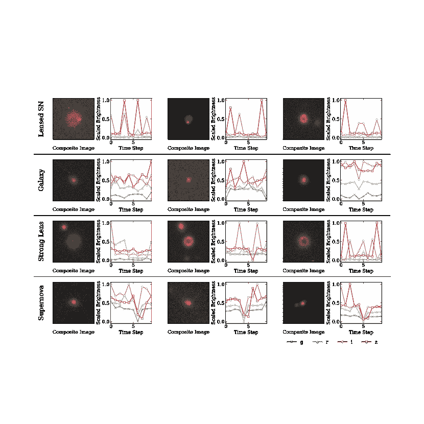

图 1：我们训练数据集中系统的示例。合成图像是平均$gri$图像的 RGB 可视化，缩放亮度值是从时间序列图像集中每个时间步的$g$（蓝色“$\times$”）、$r$（绿色三角形）、$i$（橙色圆圈）、$z$（红色方块）图像中提取的值，使用了 DZ1 中提出的光圈方法。

将模拟光源注入实时序列图像集的过程具有多重好处。训练数据集包含了所有类型的天文系统，这些系统是从总数据集中选择的，因为 ZipperNet 会对它们进行分类。此外，模拟源星系和超新星的特性是从真实数据中提取的，保持了所有固有的物理相关性。我们结合了 DES 第 3 年金色目录和 DES 第 1 年形态目录（Tarsitano 等，2018），从中获取了约$100,000$个星系的样本，用于模拟参数的提取。模拟的源星系采用 Sersic 光分布模型，这些模型具有与颜色无关的椭圆率、Sersic 指数、带宽半光半径、带宽亮度以及光度红移——所有这些都在 DES 管道中测量。与 DZ1 一样，注入的超新星是使用公开的休克框架 SN 光谱能量分布（Kessler 等，2010）进行模拟的，这些分布在 deep lens astronomy 中进行了红移调整，并计算了每个带的观测亮度。注入的超新星在第一次观测前 20 天和最后一次观测后 20 天之间达到峰值亮度：数据集包含仅下降（约 15%）、仅上升（约 15%）以及完整光曲线（约 70%）。

为了计算真实星系对模拟光源光的透镜效应，我们使用透镜星系的测量光度红移，从$[0.4\arcsec,1.8\arcsec]$区间随机选择一个爱因斯坦半径，并将透镜的质量分布建模为单一等温椭圆体，采用文献中类似的方法（Rojas 等，2021）。为了简化，质量分布与真实透镜星系的光共享测量的中心位置和椭圆率值。这种简化预计不会对性能产生重大影响，因为这些参数预计是正相关的。根据质量分布，我们计算了源星系和 LSN 的透镜位置，并考虑了不同超新星图像的时间延迟。deep lens astronomy 模拟的输出是具有三种对象的时间序列图像集——LSNe、透镜源星系和未透镜超新星。

总体而言，为训练而保留的 76,203 个时间序列图像集中，有 25%注入了 LSN Ia，25%注入了透镜核心坍塌超新星（LSN CC），以构建正类。此外，16.5%的训练时间序列图像集保持原样，16.5%注入了星系-星系强透镜，8.25%注入了 SN Ia，8.25%注入了 SN CC。正类和负类训练集在总数上是相等的，以在训练过程中保持数据集的平衡。我们在第 3.4 节中详细描述了训练的细节，但值得在此提到的是，考虑到我们选择的损失函数，平衡类别对于防止类别表示偏倚学习的特征表示至关重要。本小节其余部分详细描述了这种模拟注入过程。训练数据集中的对象示例收集在图 1 中。

### 3.2 预处理

在我们训练 ZipperNet 并将其应用于观察数据集之前，我们会进行一系列标准化步骤。我们首先将时间序列图像集截断为每个波段中的 10 个“时间步”。时间步指的是观测序列中的单次曝光；在 DES SN 领域，时间步大约为 6-7 天。如果图像集中包含更多时间步，我们将其分隔为多个 10 时间步的序列：时间步 1-10 为一个序列；时间步 2-11 为第二个序列；依此类推。然后，对于每个 10 步图像序列，我们使用 DZ1 中提出的背景减除孔径技术提取总亮度，孔径半径为 15 像素。重要的是，在提取总亮度时，图像的零点未被使用，以保持与所有非图像数据产品的独立性。这个选择产生了噪声主导的提取亮度光曲线，如图 1 所示，但在分析的其余部分显示，ZipperNet 仍能识别 LSNe 的时间特征，即使在噪声中。

接下来，我们在每个波段内对图像进行平均，以获得每个波段的单个图像用于 10 步图像序列。最后，我们将平均图像的像素值和提取的亮度值线性缩放到每个样本范围 0 到 1。ZipperNet 的输入结果是两种不同的数据——1）每个$griz$波段中的缩放图像作为$4\times 45\times 45$-元素数组和 2）每个$griz$波段中的缩放 10 步光变曲线作为$4\times 10$-元素数组。在将训练数据集处理成 10 步序列并下采样以保持正负类的均等表示后，我们总共有 1,000,012 个训练样本。我们将这些样本分成 90%的训练集和 10%的验证集。

### 3.3 ZipperNet

| Layer | 规格 |
| --- | --- |
| conv1^† | Conv2D — ($k$: 10, $p$: 2, $s$: 1) — (4 $\rightarrow$ 16) |
| maxpool | MaxPool2D ($k$: 2) |
| conv2^† | Conv2D — ($k$: 5, $p$: 2, $s$: 1) — (16 $\rightarrow$ 32) |
| maxpool | MaxPool2D ($k$: 2) |
| conv3^† | Conv2D — ($k$: 3, $p$: 2, $s$: 1) — (32 $\rightarrow$ 64) |
| maxpool | MaxPool2D ($k$: 2) |
| flatten | 重塑 (12$\times$12$\times$64 $\rightarrow$ 9216$\times$1) |
| fc1^† | 全连接层 (9216 $\rightarrow$ 408) |
| fc2^† | 全连接层 (408 $\rightarrow$ 25) |
| lstm1 | LSTM ($h$: 128) |
| lstm2 | LSTM ($h$: 128) |
| lstm3 | LSTM ($h$: 128) |
| fc3^† | 全连接层 (128 $\rightarrow$ 50) |
| concat | 连接 fc2 和 fc3 输出 |
| fc4^† | 全连接层 (75 $\rightarrow$ 6) |
| fc5^‡ | 全连接层 (6 $\rightarrow$ 2) |

表 1：ZipperNet 层规格。我们采用以下简写：卷积核大小（$k$）、填充（$p$）、步幅（$s$）和隐藏单元（$h$）。箭头表示数据表示的大小在通过层时的变化。“^†”表示修正线性单元（ReLU）激活函数。“^‡”表示 LogSoftmax 激活函数。总的来说，我们的模型包含 4,148,225 个可训练参数。

ZipperNet 的双分支架构最初在 DZ1 中提出并验证，我们在此总结。一条分支接收每个波段的缩放时间平均图像作为输入，以提取卷积特征的块。另一条分支接收缩放的提取亮度时间序列作为输入，以提取序列特征的块。特征提取块的输出被展平并连接。接下来，一系列全连接层对连接的特征表示进行加权和压缩，以产生一个输出分数，表示输入系统包含一个 LSN。本文使用的 ZipperNet 类似于 DZ1 的图 2，并且该分析的确切超参数设置在表 1 中给出。

我们使用验证数据集对架构和学习算法进行了全面的超参数优化。从原型 ZipperNet 在 DZ1 中的超参数设置进行的细微调整反映了针对训练数据中实际 DES 图像的专门化。我们发现，增加另一个卷积层、增加另一个长短期记忆（LSTM）层、对卷积层的内核和步幅设置进行微调以及去除 dropout 层会提升性能。学习算法的选择设置在 3.4 节中展示。

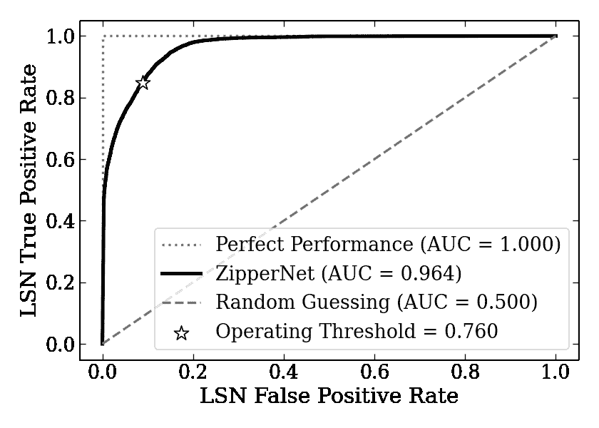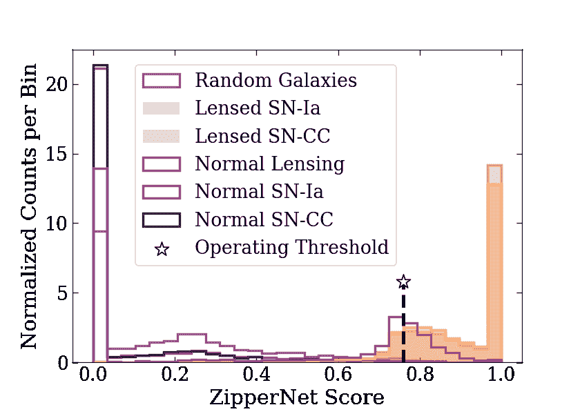

图 2：左图：接收器操作特征（ROC）曲线显示了所有可能值的 ZipperNet 操作阈值下的 LSN 真正例率和 LSN 假正例率。选择 0.760 的操作阈值是为了将假正例率降到真正例率迅速下降之前的点。右图：验证数据集中每个类别的缩放 ZipperNet 评分的直方图。所选操作阈值限制了负类中的所有系统的假正例，同时保持了大部分正类。

### 3.4 训练

为了训练 ZipperNet，我们在 Fermilab 的 DES 集群上实现了一个分布式设置，使用了五台计算机（2 台配备 Intel 3.2 GHz 处理器和 256 GB 内存的机器，1 台配备 AMD 2.2 GHz 处理器和 512 GB 内存的机器，以及 2 台配备 IntelX 2.6 GHz 处理器和 768 GB 内存的机器）。训练数据集被分成五个相等的块，每个块放置在一台独立的计算机上。在每台计算机上，我们实例化了一个 ZipperNet，并将权重初始化为相同的随机选定值。然后，我们开始将训练数据块传递通过五台计算机上的 ZipperNet 实例。在定期间隔（每`1/15`个块），我们收集五个 ZipperNet 实例的参数，并对参数值进行平均。数学上，平均操作等同于通过正常训练更新权重，前提是学习率按照网络实例的数量进行缩放。在这个设置中，我们使用了五个示例的批量大小，并使用带有 0.9 Nesterov 动量系数的随机梯度下降法、0.001 的常量学习率以及分类交叉熵损失来更新每个训练步骤中的权重。我们将块中所有数据的耗尽称为“一次训练迭代”，并在数据全部通过网络实例后重新开始该块。我们允许训练持续进行五次训练迭代，并达到最终的验证集准确率 93.0%。这一原始准确率依赖于验证数据集中不同类型负例的表示。在 4 节中，我们使用物理上有意义的指标来评估性能。

### 3.5 候选选择标准

训练好的 ZipperNet 在输入（一个平均图像和光曲线的配对）上的输出是一个通常在 -100.0 到 50.0 之间的分数。根据我们验证数据集中该范围的最小值和最大值，我们将 ZipperNet 输出分数线性缩放到范围 $[0.0,1.0]$，使其类似于概率。接下来，我们选择一个 ZipperNet 分数阈值，超过该阈值的候选系统会被纳入我们的最终样本，而低于该阈值的候选系统则被排除。我们通过遍历可能的阈值并分析高于该阈值的 LSNe 的比例与高于该阈值的银河系的比例来选择此阈值。图 2 左侧面板显示了这些数量在不同阈值下的可达值。我们预期银河系会是最大的背景：给定天空区域内的银河系数量比 SL 或 SNe 的数量高几个数量级。因此，我们通过将高于阈值的银河系比例降低到最低值，然后再观察高于阈值的 LSNe 的比例开始迅速下降来选择阈值。根据这一分析，我们为缩放后的 ZipperNet 分数选择了 0.76 的操作阈值。右侧面板的图 2 将该阈值值与我们验证数据集中系统的 ZipperNet 分数进行了背景说明。

我们制定了最终选择标准，以缩小由 ZipperNet 选择的候选系统样本。我们利用第 3.2 节中数据处理的一个方面，其中具有超过 10 个周期的时间序列图像集被拆分为 10 周期的子序列，然后由 ZipperNet 独立分类。在分析 ZipperNet 对时间序列图像集所有子序列的分类时，我们发现 LSNe 比银河系更有可能出现多个检测。这个关系在图 3 中使用我们的验证数据集进行了说明，我们利用这一点来开发一个关于时间序列图像集的总检测的标准。重要的是，由于我们的预处理方法，我们训练和验证数据中的时间序列图像集的总长度不需要与真实数据匹配，因此，基于验证数据集设置对 ZipperNet 检测数量（阈值以上的评分）的严格要求是不准确的。相反，为了将验证数据集和真实数据置于相同的基础上，我们对检测数量与子序列数量的比率设置了要求。因此，我们选择这个比率的阈值，以使假阳性率最小化到人工检查最终样本变得可行的程度。我们选择要求至少 60% 的子序列有 ZipperNet 分数高于 0.76，才将候选系统包括在我们最终的候选 LSNe 样本中。60% 的阈值和 0.76 的 ZipperNet 分数阈值是通过计算所有可能值的 LSN 召回率和银河系假阳性率同时确定的。

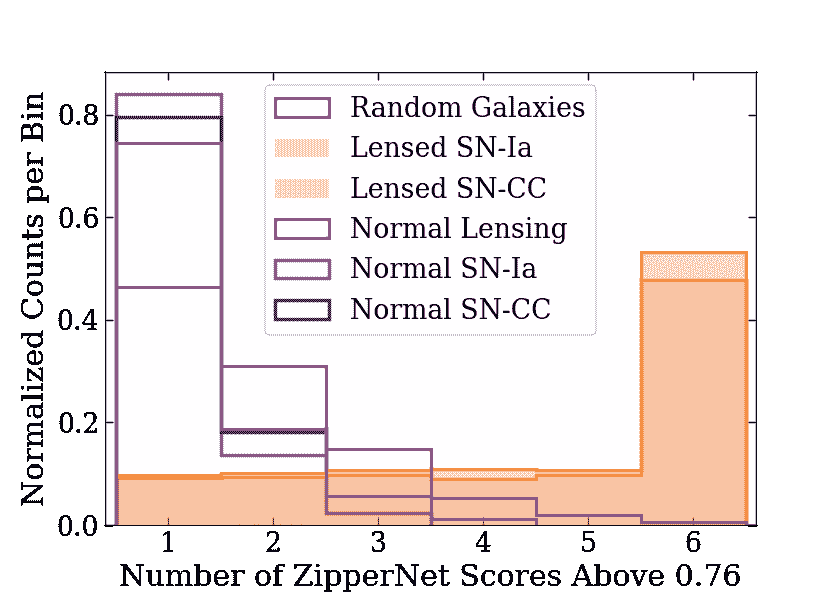

图 3：在我们的验证数据集中，各类对象的时间序列图像集子序列中，有多少在 ZipperNet 阈值之上评分。平均而言，LSNe 时间序列图像集的子序列中，高于 ZipperNet 阈值的比例高于所有类型的负例。

## 4 结果

### 4.1 性能指标

为了评估完全训练的 ZipperNet 的性能，我们定义了关注的量和指标，并在验证数据集上计算它们。我们引入两个描述分类评分阈值的术语：“被分类为 LSN”表示候选系统在至少 60% 的子序列中 ZipperNet 分数高于阈值；“被分类为背景”表示候选系统在少于 60% 的子序列中 ZipperNet 分数高于阈值。我们定义了关于基于阈值分数的指标的以下术语：

+   –

    一个真正的正例 (TP) 是一个 LSN，并且被分类为 LSN；

+   –

    一个假阳性 (FP) 是一个星系、星系-星系透镜或无透镜的超新星，并且被分类为 LSN。

+   –

    一个真正的负例 (TN) 是一个星系、星系-星系透镜或无透镜的超新星，并且被分类为背景；并且

+   –

    一个假阴性 (FN) 是一个 LSN，但被分类为背景。

使用这些量度，像准确率这样的常见指标很容易计算；然而，由于我们训练和验证数据集中稀有物理系统的增强表示，这些指标可能会产生误导。我们则专注于具有物理意义且对验证数据集中类别表示具有鲁棒性的类别特定指标：LSN 召回率为

|  | $\displaystyle\textrm{LSN Recall}=\textrm{TP / (TP + FN)};$ |  | (1) |
| --- | --- | --- | --- |

LSN 类型特定的召回率为

|  | $\displaystyle\textrm{LSN}_{\textrm{type}}\textrm{ Recall}=\textrm{TP}_{\textrm{type}}\textrm{ / }(\textrm{TP}_{\textrm{type}}+\textrm{FN}_{\textrm{type}}),$ |  | (2) |
| --- | --- | --- | --- |

其中类型为“ Ia” 或 “ CC”；每种负类的假阳性率为

|  | $\displaystyle\textrm{FPR}_{\textrm{type}}=\textrm{FP}_{\textrm{type}}\textrm{ / }(\textrm{TN}_{\textrm{type}}+\textrm{FN}_{\textrm{type}}),$ |  | (3) |
| --- | --- | --- | --- |

其中类型为“ Galaxy”，“ SL”，“ SN-Ia”，“ SN-CC”。这些指标的值在表 2 中收集，分别对应 ZipperNet 及其与最终样本选择标准的组合。

| 指标 | ZipperNet | + Final | 方程 |
| --- | --- | --- | --- |
| LSN 召回率 | 0.8447 | 0.6113 | Eq. 1 |
| LSN${}_{\textrm{Ia}}$ 召回率 | 0.8426 | 0.5949 | Eq. 2 |
| LSN${}_{\textrm{CC}}$ 召回率 | 0.8468 | 0.6273 | Eq. 2 |
| FPR${}_{\textrm{Galaxy}}$ | 0.0157 | 0.0002 | Eq. 3 |
| FPR${}_{\textrm{SL}}$ | 0.2448 | 0.0046 | Eq. 3 |
| FPR${}_{\textrm{SN-Ia}}$ | 0.0049 | 0.0001^† | Eq. 3 |
| FPR${}_{\textrm{SN-CC}}$ | 0.0046 | 0.0001^† | 等式 3 |

表 2：用于评估 ZipperNet 性能的指标和我们最终的样本选择，这些指标对验证数据集的类别表示具有鲁棒性。所有指标在第 4.1 节中定义。 “$\dagger$” 表示由于统计精度有限，指标值使用了上限。

这些指标中有几个关键结果值得强调。ZipperNet LSN 召回率表明，大约 84% 的验证数据集中的所有 LSN 得分高于操作阈值。ZipperNet 星系假阳性率表明，大约 1.5% 的星系将得分高于我们的操作阈值，并错误地填充我们的候选样本。仅凭自身，ZipperNet 是一个强大的分类器，但最小化的星系假阳性率仍然足够大，导致结果候选样本过大，不适合视觉检查。通过对每个组成子序列的 ZipperNet 检测数量进行选择标准的添加，性能得到了提升。关键是，最终的星系假阳性率降低，便于对最终候选样本进行视觉检查。这种更严格的选择导致最终的 LSN 召回率降低。然而，大多数被移除的 LSNe 是那些在观测窗口之前或之后达到峰值的。

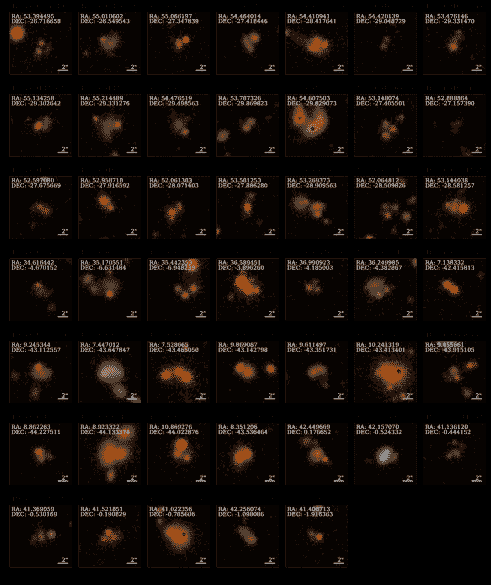

图 4：ZipperNet 检测到的候选系统，这些系统显示了透镜的证据，但在其光变曲线中未显示类似超新星的变化。这些候选者的属性汇总在表 B.1 中。来自 DES SN 组的差分成像检测用白色星形标记显示。

### 4.2 搜索 DES SN 字段

将我们训练好的 ZipperNet 和额外的选择标准应用于 DES SN 领域数据，产生了 2245 个候选 LSNe，其中大约一半在 DES 数据的多个年份中有 ZipperNet 探测。我们预计这些系统中的大多数将具有可分辨的特征，这基于分析的两个方面。首先，这 2245 个候选 LSNe 是在 DES 星系的亮度限制样本中识别出的，这导致低红移、附近的星系比高红移、遥远的星系更具代表性。其次，根据 ZipperNet 对该数据集的物理选择函数（见附录 A.1），大爱因斯坦半径和更好观测条件的系统中的 LSNe 更可能被回忆。因此，由于该候选样本中的大多数系统应该具有可分辨的特征，人眼检查成为识别最有趣候选 LSNe 的一种可行方法。

在 DES 内部的强透镜专家团队检查了 2245 个候选 LSNe 系统的 6 年合成彩色复合图像，以寻找透镜现象，这类似于先前进行的强透镜搜索。该团队使用以下系统为所有对象分配了一个分数：

+   1:

    探测结果是图像伪影，如衍射峰或来自亮前景恒星的污染；

+   2:

    只有一个对象，如星系或恒星；

+   3:

    有多个没有透镜证据的对象，如 SN 或星系团；

+   4:

    有多个具有透镜证据的对象。

使用该系统和每个对象的中位数得分，检查团队分别识别出得分为 “1”、“2”、“3”、“4” 的对象 522、802、871 和 50 个。对于有透镜证据的 50 个系统，我们从 DES 单幅图像中提取了每个对象的孔径光曲线。来自 50 个有透镜证据的系统中的三个系统被确定具有类似 SN 的时间变化，并将其整体得分提高到 “5”。得分为 “4” 或 “5” 的候选系统分别展示在图 4 和 5 中，其属性汇总在表 B.1 中。

在这次分析中，得分达到或超过“4”的 50 个候选系统显示出其图像中存在透镜效应。这些样本中仍然存在非透镜系统：例如，DES-700492744 是一个高自行运动的白矮星，在两个蓝色点源之间出现为红色物体；尽管如此，为了完整性，我们包括了所有由标注团队标记为有趣的系统。这些系统中有些也显示出透镜配置中点源的证据：有接近圆形的物体位于透镜配置内。进一步地，我们通过提取每个图像中源的 5 年背景去除的光变曲线来分析候选系统的时间变化。得分为“5”的物体显示出类似 SN 的时间变化证据：一个短暂的上升期后跟随一个大约一个月的亮度稳定衰减，如图 5 所示。得分为“4”的物体则未显示出这种时间行为，但仍然有可能一些得分为“4”的物体是强透镜系统，并且可能包含透镜类星体。第 4.3 节包含了得分为“5”的三个物体的详细介绍。

最后，我们将 2,245 个 ZipperNet 识别的系统与在 DES 5 年光度 SN Ia 宇宙学分析中识别的系统进行交叉匹配（Möller 等，2022）。在 Möller 等（2022）的研究中，差分成像（Kessler 等，2015）识别出了 31,636 个瞬变，而 SALT-II SN Ia 光变曲线拟合（Guy, J.等，2010）从这些瞬变样本中识别出了 2,381 个单季节 SNe。光变曲线拟合选择的 SNe 更可能是 SNe Ia 而非 SNe CC，并且总样本中的大多数 SNe CC 也被拟合排除了。此外，这一选择过程旨在寻找正常的 SNe Ia，并不适用于可能由透镜效应造成的光变曲线变化。总的来说，ZipperNet 样本与 DES SN 分析瞬变样本之间存在 104 个系统的重叠（使用 5″半径）。除了四个重叠系统——DES-691702170、DES-699127397、DES-699340227 和 DES-700977591——其余系统均被标记团队评分为“2”或“3”，表明没有令人信服的透镜效应证据。检测到的瞬变位置标记在图 4 中。只有 DES-699127397 中的瞬变通过了 SALT-II SN Ia 光变曲线拟合。DES-699340227 和 DES-700977591 中的差分成像检测似乎是由于图像减法错误造成的虚假检测。最后，尽管 DES-691702170 和 DES-699127397 中检测到的瞬变可能是 SNe，但这些系统似乎不是透镜，并且可能应该从标记团队获得更低的评分；DES-691702170 缺乏明显的透镜星系，而 DES-699127397 中的星系位置更可能是一群星系而非由于不对称对齐造成的相同背景星系的多重图像。

根据表 2 中的 SN 假阳性率，这种重叠与预期的 ZipperNet SN 背景一致。视觉检查团队评分为 5 的三个系统，表明存在透镜效应和类似 SN 的时间行为，未包含在重叠样本中。我们认为 SNe 的微弱或透镜星系的前景污染可能导致差分成像中未检测到这些系统，但对这一差异的全面理解超出了我们分析的重点。

### 4.3 最终 LSN 候选对象

ZipperNet 及后续人工视觉检查识别出的三个最有趣的系统是 DES-691022126、DES-701263907 和 DES-699919273。我们展示了这些系统的 5 年颜色复合图像，并在图 5 中提取了每个感兴趣对象的光曲线。通过光曲线，可以轻松区分 DES 超新星计划的五个观测季节，我们将每个观测季节称为“Y1”到“Y5”。我们通过对复合图像中显示的孔径内的像素进行求和，减去 DES 测量的天文背景，并使用 DES 测量的零点转换为星等来提取光曲线。重要的是，星等是孔径内所有对象的组合，因此，例如，一个超新星光曲线会包含来自其宿主星系的污染。所有估计的爱因斯坦半径都是通过测量对象之间的角距离获得的，而不是对透镜系统的完整建模。为了简化展示，我们选择仅展示这些可视化的$z$带光曲线，尽管所有四个波段都进行了评估以识别类似超新星的时间行为。在这个数据集中，像$g$和$r$这样较蓝的波段比红色的$i$和$z$波段具有更大的点扩散函数（PSF），导致孔径光度测量噪声更大。此外，LSNe 可能处于高红移状态，导致 LSN 时间特征在红色波段更为明显。

DES-691022126 是一个由四个物体组成的系统，这些物体在图 5 的顶部面板中标记为 A、B、C 和 D。我们根据物体 C 和 D 的亮度在时间上的稳定性，将其解释为银河系。物体 A 和 B 的颜色更红，并且在查看每个物体的 5 年中位 $z$-波段亮度的误差条的典型大小时，显示出更大的亮度变化。此外，物体 A 和 B 的光曲线都包含了月时间尺度上的线性亮度下降期：物体 A 在 Y5 中，物体 B 在 Y3 中。ZipperNet 在 Y2 和 Y3 中检测到了该系统，但在 Y5 中没有检测到。我们认为它在 Y3 中检测到了物体 B 的线性下降，并且可能物体 C 包含了在 Y2 和 Y3 之间的某个超新星的光，这一超新星的开始被 ZipperNet 检测到了。物体 A 在 Y5 中的亮度线性下降未被 ZipperNet 检测到，这可能是由于物体 A 是系统中最暗的源，且 ZipperNet 的选择函数（见图 A.1 的右下面板）影响了检测结果。物体 A 和 B 之间共享的类似 SN 的光曲线特征，加上大约 1.7″ 的爱因斯坦半径的引力透镜证据，支持了该系统作为 LSN 的主张。

相比之下，DES-701263907 是一个更复杂的系统，如图 5 中间面板所示。图像中占主导地位的是一个红移为 $0.03$ 的大型前景星系（SIMBAD 来源 LEDA 135660）。天体 B（SIMBAD 来源 SDSS J024352.54-003708.4）被编入目录，红移也是 $0.03$，但根据其蓝色，它也可能是一个致密的星形成区域。这个致密区域，加上 LEDA 135660 本身的引力势，会有很大的透镜交叉截面，增加背景天体被透镜的可能性。由于图 5 中的光变曲线提取方法没有减去宿主星系的影响，因此无法评估这些天体的变异性，而这超出了本文的范围。然而，考虑到前景污染，我们将天体 A 确定为系统中最具变异性的源。在 DES-701263907 的图像剪裁中，我们还注意到 2020 年 9 月检测到的超新星（AT2020scq）的位置。可能天体 B 充当主要透镜星系，天体 A 是 ZipperNet 在 2018 年识别出的 LSN，AT2020scq 是延迟约两年的天体 A 的第二次出现。考虑到红移为 $0.03$ 的大型前景星系和潜在的爱因斯坦半径 $\approx 3.0$″，这个时间延迟与 LSN 一致。

最后，DES-699919273 是另一个由四个天体组成的系统，我们在图 5 底部面板中将其列为 A、B、C 和 D。我们将天体 C 解释为透镜星系，将天体 D 解释为没有超新星的源星系的图像，将天体 A 和 B 解释为源星系的图像，其中在 DES 观测期间某个时刻曾出现过超新星。该系统的爱因斯坦半径为 $\approx 2.1$″。特别地，我们注意到天体 A 在 Y3 中的 $z$-带光度线性下降，以及天体 B 在 Y5 中的几乎相同的 $z$-带光度线性下降。ZipperNet 在 Y5 中检测到了线性下降，但在 Y3 中没有这样的检测。我们将此事件解释为分类器记忆不完美的另一种表现。然而，在透镜几何中的两个图像中出现的类似超新星的时间信号是存在 LSN 的证据。

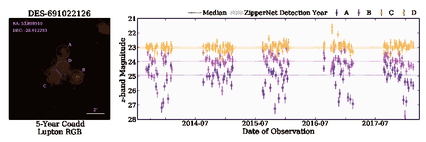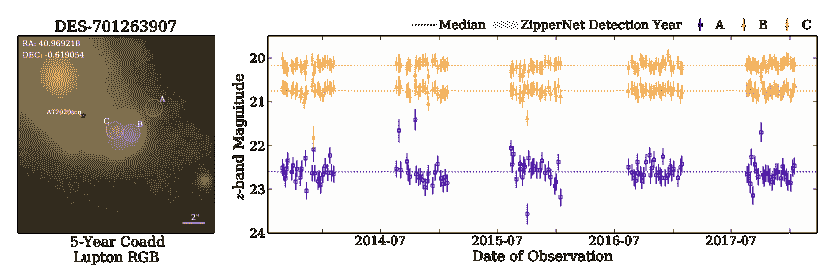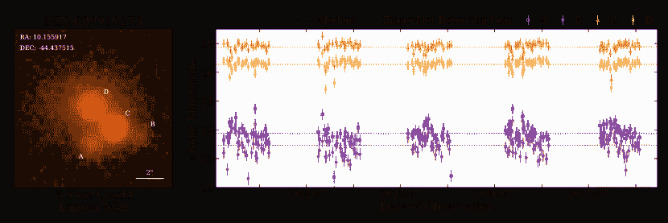

图 5: ZipperNet 和人工视觉检查识别的候选 LSNe。用于从每个源提取幅度测量的孔径显示在叠加图像上并进行了注释。候选者的属性汇总在表 B.1。

## 5 讨论

本分析中提出的方法包含几个可以改进的领域，以提高 LSN 召回率，同时降低误报率。其中一个改进是加入质心计算，以考虑在堆叠和平均图像之前的位置亚像素级偏移。尽管偏移很小，但在$\approx 0.25$″尺度下的错位可能会导致基于图像的特征变得不那么清晰，且卷积层更难识别。在堆叠图像时，仅包括高图像质量的图像（例如，视场高于某些质量阈值和/或云量低于某些质量阈值）也可能提高性能：这将确保最终合成图像中的特征解析能力仅受限于仪器。这些可能性集中在改善数据中空间特征的表现，以增强 ZipperNet 学习关系的能力，并由我们方法的物理选择函数分析所激发，详见附录 A.1。

数据预处理中的光曲线提取步骤还可以通过去除常见伪影，如衍射条纹和饱和像素，以避免污染提取的亮度，从而得到改进。类似地，分析光曲线特征清晰度与光曲线提取中使用的孔径半径的关系，可能会发现不同的孔径半径会提高性能。将时间序列图像集缩放到具有标准化的均值和标准差的像素值，可能会使光曲线更平滑。最后，本分析中使用的预处理步骤通过标准化节奏来筛选图像，尽管其他方法在时间序列中展示了任意数量图像的成功（Kodi Ramanah 等，2022）。去除对标准化节奏的需求将大大提高这种方法在实时 LSNe 识别中的适用性，并消除丢弃图像的需要。

可能通过对训练集进行微妙的调整，可以改善分析中的机器学习方面。例如，在模拟透镜系统时，我们做出了简化的近似，即质量分布的椭圆率在角度和强度上等同于光分布。虽然质量和光分布之间可能存在强烈的相关性，但排除质量分布椭圆率与光分布椭圆率关系不同的训练集示例，可能会使 LSN 选择偏向那些这些量高度相关的系统。我们还使用了均匀分布的爱因斯坦半径，而使用像 Kodi Ramanah 等人（2022）提出的具有物理动机的分布的方法，可能会导致性能的提升。

在考虑实时 LSN 检测管道时，对方法进行几项更改可能会改善性能。我们设想在观测进行时构建 10 周期时间序列图像集：在收集到系统的新图像后，时间序列中的第一张图像被丢弃，并创建一个新的 10 周期序列。这种方法有两个缺点：（1）需要隐含的 10 个周期才能使用训练好的 ZipperNet，以及（2）我们最终选择标准是基于 ZipperNet 阈值以上的子序列比例，需要额外的周期来创建和跟踪多个子序列。通过上述讨论的预处理改进，可能有可能显著提升 ZipperNet 性能，使得可以去除额外的选择标准。此外，我们没有对少于 10 个周期的时间序列图像集进行实验，因此可能可以在对总周期数的要求不那么严格的情况下进行分析。

使用当前的配置，我们成功地将包含 3,459,186 个对象的目录减少到 2,245 个，采用了我们深度学习的方法，并通过人工视觉检查识别了 50 个感兴趣的系统，其中三个显示出一些 LSN 的证据。虽然我们没有确认或进一步表征这三个感兴趣的系统，但它们都包含透镜特征，并且在人工视觉检查过程中发现了点源。全面表征将涉及场景建模光度测量（Brout 等，2019），以获得不受宿主星系污染的光变曲线，对该时间序列光度测量的光度分类，系统中所有对象的红移测量，以及透镜建模，这些都超出了本次搜索的范围。由于任何检测到的 LSNe 现在都已消失，因此后续观测确认 LSNe 不太可能提供除红移外的额外信息。然而，在 DES 操作期间，ZipperNet 在多个年份中检测到了一些感兴趣的系统。因此，这些具有点源的持久透镜系统提供了有趣的透镜类星体搜索候选者。三个最有趣的候选者（DES-691022126，DES-701263907 和 DES-699919273）是我们在这次分析中使用的 5 年 DES 数据集中最可能的 LSNe。考虑到系统的大致时间延迟和爱因斯坦半径，光谱红移和透镜建模可能产生三个独立的$H_{0}$测量值。

ZipperNet 架构本身为今后的 LSN 识别提供了一个新的强大工具。这次分析的附带代码（Morgan，2022）也使数据收集、处理、模拟、训练、分类和候选选择程序在未来分析中可用。随着 Vera C. Rubin 天文台的首次观测即将到来，建立一个检测 LSNe 的管道对于时间延迟宇宙学测量至关重要。本次分析和建议的改进提供了一个模板，用于这样的管道，能够在没有传统和计算密集型图像处理算法依赖的情况下，实时检测 LSNe 在短时间序列图像中。

## 6 结论

本分析展示了一种深度学习 LSN 检测算法在观测到的光学调查数据集上的应用。该算法利用一种称为 ZipperNet 的新型神经网络架构，同时从图像和时间数据中学习特征，以识别 DES 数据中的 LSNe。使用在模拟的 LSNe 中训练的 ZipperNet，并结合对每个系统检测次数的选择标准，我们的方法在 LSN 召回率为 61.13% 和假阳性率为 0.02% 的情况下表现良好。该技术在 DES SN 领域识别了 2,245 个候选 LSN 系统，人眼检查发现 50 个感兴趣的系统，其中三个包含时间变化的透镜源的证据。对这些感兴趣的候选系统的确认留待未来工作，这些系统在完全表征后可能有助于直接测量 $H_{0}$。展望鲁宾天文台时代，DZ1 开发的方法及在此处实现的 DES SN 领域中具有帮助识别数百个 LSNe 的潜力。

## 致谢

R. Morgan 感谢大学研究协会费米实验室访问学者计划资助了他在本项目上的工作。R. Morgan 还感谢 LSSTC 数据科学奖学金计划，该计划由 LSSTC、NSF 网络培训资助 #1829740、布林森基金会和摩尔基金会资助；他在该计划中的参与对本工作有所裨益。

我们感谢深空实验室作为一个多领域专家和合作者的社区，他们为开放讨论、创意生成和合作提供了环境。这个社区对本项目的发展至关重要。

本材料基于国家科学基金会研究生研究奖学金计划资助的工作，资助编号为 1744555。材料中表达的任何观点、发现、结论或建议均为作者（们）的意见，不一定反映国家科学基金会的观点。

DES 项目的资金来源包括美国能源部、美国国家科学基金会、西班牙科学与教育部、英国科学与技术设施委员会、英格兰高等教育资助委员会、伊利诺伊大学厄尔巴纳-香槟分校的国家超级计算应用中心、芝加哥大学的 Kavli 宇宙物理研究所、俄亥俄州立大学的宇宙学与天体粒子物理中心、德克萨斯 A&M 大学的米切尔基础物理与天文学研究所、Financiadora de Estudos e Projetos、Carlos Chagas Filho 研究基金会、里约热内卢州科研援助委员会、国家科学技术发展委员会和科学、技术与创新部、德国研究基金会以及参与暗能量 survey 的合作机构。

合作机构包括阿贡国家实验室、加州大学圣克鲁斯分校、剑桥大学、马德里能源、环境与技术研究中心、芝加哥大学、伦敦大学学院、DES-巴西联盟、爱丁堡大学、苏黎世联邦理工学院（ETH）、费米国家加速器实验室、伊利诺伊大学厄尔巴纳-香槟分校、空间科学研究所（IEEC/CSIC）、高能物理研究所、劳伦斯伯克利国家实验室、慕尼黑路德维希-马克西米利安大学及其卓越集群宇宙、密歇根大学、NSF 的 NOIRLab、诺丁汉大学、俄亥俄州立大学、宾夕法尼亚大学、朴茨茅斯大学、SLAC 国家加速器实验室、斯坦福大学、苏塞克斯大学、德克萨斯 A&M 大学以及 OzDES 会员联盟。

部分基于在 NSF 的 NOIRLab（NOIRLab 计划编号 2012B-0001；首席研究员：J. Frieman）位于 Cerro Tololo Inter-American Observatory 的观察数据，该实验室由天文学研究大学协会（AURA）在与国家科学基金会的合作协议下管理。

DES 数据管理系统得到国家科学基金会的资助，资助编号为 AST-1138766 和 AST-1536171。来自西班牙机构的 DES 参与者部分由 MICINN 资助，资助编号包括 ESP2017-89838、PGC2018-094773、PGC2018-102021、SEV-2016-0588、SEV-2016-0597 和 MDM-2015-0509，其中一些包括来自欧盟的 ERDF 基金。IFAE 部分由加泰罗尼亚自治区政府的 CERCA 计划资助。研究工作得到欧盟第七框架计划（FP7/2007-2013）下欧洲研究委员会的资助，包括 ERC 资助协议 240672、291329 和 306478。我们感谢巴西国家科学与技术研究所（INCT）e-Universe（CNPq 资助编号 465376/2014-2）的支持。

本文已通过 DES 合作组的内部审查。该手稿由 Fermi Research Alliance, LLC 在与美国能源部科学办公室高能物理办公室的合同编号 DE-AC02-07CH11359 下撰写。

## 附录 A 镜像 SN 物理选择函数

我们介绍了 ZipperNet 的选择函数以及我们对探测数量的选择标准。在这一部分，我们分析了四个核心属性以理解我们方法的选择函数：爱因斯坦半径、观测条件、源星系的亮度以及 LSN 的亮度。LSN 召回率是这四个属性的函数，见图 A.1。

我们发现，我们的方法在识别较大的爱因斯坦半径时比识别较小的爱因斯坦半径更为顺利。同样，我们发现我们的方法在良好的观测条件下比在一般或较差的观测条件下更容易识别 LSNe。这两种属性突显了图像中空间特征清晰度的重要性。差的观测条件或小的爱因斯坦半径都是图像分辨率受损的情况，因此空间特征变得难以或不可能实现。这种算法性能的趋势指向数据质量特征，而非我们方法引入的选择偏差。最后，我们发现源星系亮度对这个幅度限制分析适用范围内的性能影响很小。我们观察到 22 mag 更亮的 LSNe 有类似的趋势，但注意到对于较暗的 LSNe 性能有所下降。这个幅度阈值接近 DES SN 领域的单次观测极限幅度，可能是由于 Malmquist 偏差，但在 LSN 图像的可检测性中可能存在二阶选择效应。

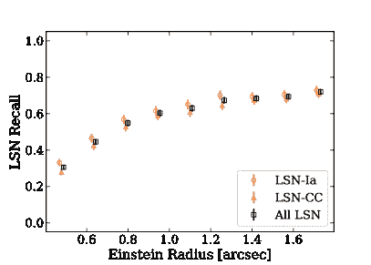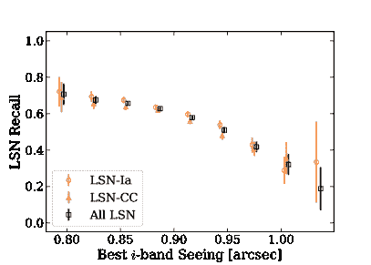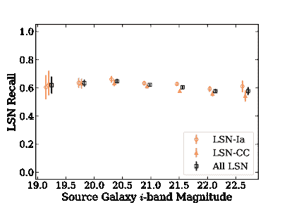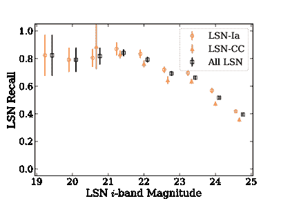

图 A.1：我们验证数据集中的模拟 LSNe 的物理选择函数。我们测量 LSNe 召回率（定义在第 4.1 节）作为爱因斯坦半径、观测效果、源星系未透镜亮度和 LSNe 模拟未透镜亮度的函数。误差条显示一个标准差的统计不确定性。

## 附录 B 候选元数据

| 编号 | 合并 ID | 赤经 [度] | 赤纬 [度] | 亮度[i] | 红移 | 领域 | 检测年份 | 检查 |
| --- | --- | --- | --- | --- | --- | --- | --- | --- |
| 1 | DES-691022126 | 53.898910 | -28.912293 | 21.73 | - | C2 | Y2 Y3 | 5 |
| 2 | DES-701263907 | 40.969218 | -0.619054 | 17.31 | 0.030024 | S2 | Y5 | 5 |
| 3 | DES-699919273 | 10.155917 | -44.437515 | 18.95 | 0.556 | E2 | Y5 | 5 |
| 4 | DES-690157493 | 53.394495 | -26.716658 | 21.82 | - | C1 | Y1 | 4 |
| 5 | DES-690456076 | 55.010602 | -26.549543 | 20.79 | - | C1 | Y1 Y2 Y3 Y4 | 4 |
| 6 | DES-690583502 | 55.066197 | -27.347839 | 21.44 | - | C1 | Y1 Y2 Y3 Y4 Y5 | 4 |
| 7 | DES-690642061 | 54.464014 | -27.418446 | 21.62 | - | C1 | Y2 | 4 |
| 8 | DES-690918939 | 54.410941 | -28.417641 | 20.65 | - | C2 | Y2 | 4 |
| 9 | DES-691032289 | 54.420139 | -29.048729 | 21.80 | - | C2 | Y2 | 4 |
| 10 | DES-691068769 | 53.476146 | -29.331470 | 20.89 | - | C2 | Y1 Y2 Y4 Y5 | 4 |
| 11 | DES-691440047 | 55.134258 | -29.302642 | 20.72 | - | C2 | Y2 | 4 |
| 12 | DES-691442767 | 55.214489 | -29.331276 | 21.79 | 0.139740 | C2 | Y4 | 4 |
| 13 | DES-691524775 | 54.476519 | -29.498563 | 21.37 | - | C2 | Y2 | 4 |
| 14 | DES-691664180 | 53.787326 | -29.869823 | 21.05 | - | C2 | Y5 | 4 |
| 15 | DES-691702170 | 54.607503 | -29.829073 | 19.42 | - | C2 | Y4 | 4 |
| 16 | DES-691896609 | 53.148074 | -27.405501 | 22.04 | 0.725 | C3 | Y1 Y2 Y4 | 4 |
| 17 | DES-691902610 | 52.888864 | -27.157390 | 22.37 | - | C3 | Y2 | 4 |
| 18 | DES-691947063 | 52.597080 | -27.675669 | 22.22 | - | C3 | Y1 | 4 |
| 19 | DES-691968734 | 52.958718 | -27.916592 | 21.93 | 0.610106 | C3 | Y2 | 4 |
| 20 | DES-692023723 | 52.061383 | -28.071403 | 22.20 | 0.949 | C3 | Y1 Y2 Y3 Y4 Y5 | 4 |
| 21 | DES-692243027 | 53.581253 | -27.886280 | 21.18 | 0.739 | C3 | Y4 | 4 |
| 22 | DES-692639734 | 53.269373 | -28.909563 | 21.01 | 0.471666 | C3 | Y2 Y4 | 4 |
| 23 | DES-693331974 | 52.064812 | -28.509826 | 22.47 | - | C3 | Y2 Y5 | 4 |
| 24 | DES-693351134 | 53.144038 | -28.581257 | 20.66 | 0.815070 | C3 | Y1 Y2 Y4 Y5 | 4 |
| 25 | DES-695852037 | 34.616442 | -4.670152 | 21.25 | - | X1 | Y1 Y2 Y4 Y5 | 4 |
| 26 | DES-696865317 | 35.170551 | -6.631484 | 20.56 | - | X2 | Y1 Y2 Y4 Y5 | 4 |
| 27 | DES-697161182 | 35.442353 | -6.948239 | 22.25 | - | X2 | Y1 | 4 |
| 28 | DES-697274399 | 36.589451 | -3.896260 | 20.39 | 0.435 | X3 | Y2 Y3 Y4 Y5 | 4 |
| 29 | DES-697446876 | 36.990923 | -4.185003 | 22.47 | 0.463 | X3 | Y2 Y4 Y5 | 4 |
| 30 | DES-697521552 | 36.249985 | -4.382867 | 22.23 | 0.798 | X3 | Y2 Y3 Y4 Y5 | 4 |
| 31 | DES-698587357 | 7.138332 | -42.415813 | 21.02 | - | E1 | Y1 | 4 |
| 32 | DES-698925976 | 9.245344 | -43.112557 | 20.18 | 0.318563 | E1 | Y2 Y4 | 4 |
| 33 | DES-699088459 | 7.447012 | -43.647847 | 18.95 | - | E1 | Y2 | 4 |
| 34 | DES-699127397 | 7.528665 | -43.465050 | 21.21 | 0.657900 | E1 | Y1 Y2 Y3 Y4 Y5 | 4 |
| 35 | DES-699219206 | 9.869087 | -43.142798 | 20.47 | - | E2 | Y2 | 4 |
| 36 | DES-699235372 | 9.611497 | -43.351731 | 20.46 | - | E2 | Y2 | 4 |
| 37 | DES-699340227 | 10.241319 | -43.413401 | 20.32 | - | E2 | Y1 Y2 Y3 Y4 Y5 | 4 |
| 38 | DES-699466457 | 9.455661 | -43.915105 | 22.19 | 0.469 | E2 | Y1 | 4 |
| 39 | DES-699478563 | 8.862263 | -44.227511 | 20.67 | 0.751 | E2 | Y2 | 4 |
| 40 | DES-699621639 | 8.923322 | -44.133374 | 19.12 | 0.235 | E2 | Y1 Y2 | 4 |
| 41 | DES-699723043 | 10.869276 | -44.022876 | 21.71 | - | E2 | Y1 Y2 Y3 Y5 | 4 |
| 42 | DES-699926736 | 8.351206 | -43.536464 | 21.14 | - | E1 | Y1 Y2 Y4 Y5 | 4 |
| 43 | DES-700364825 | 42.449669 | 0.176652 | 20.46 | - | S1 | Y4 | 4 |
| 44 | DES-700492744 | 42.157070 | -0.524332 | 19.30 | - | S1 | Y5 | 4 |
| 45 | DES-700541568 | 41.136120 | -0.444152 | 21.63 | - | S2 | Y4 | 4 |
| 46 | DES-700548040 | 41.369059 | -0.530169 | 21.29 | - | S2 | Y1 Y2 Y4 | 4 |
| 47 | DES-700863020 | 41.521851 | -0.190829 | 20.52 | - | S2 | Y2 | 4 |
| 48 | DES-700977591 | 41.022356 | -0.785606 | 18.75 | 0.287564 | S2 | Y1 Y2 Y5 | 4 |
| 49 | DES-701328706 | 42.256074 | -1.098086 | 20.76 | - | S2 | Y1 | 4 |
| 50 | DES-701662201 | 41.406713 | -1.916363 | 21.23 | - | S2 | Y3 | 4 |

表 B.1：由 ZipperNet 检测到的、在人工视觉检查中获得 4 或 5 分的系统属性。 “Coadd Id.” 来自 DES Y3 GOLD 目录。 “Years Detected” 表示在这些年份中，候选对象被 ZipperNet 选中。 “Redshift” 值为 DES 的光度估计（显示至三位有效数字）或来自 OzDES 的光谱测量（Yuan 等人，2015），指的是候选透镜星系。

本附录列出了由 ZipperNet 检测到并由人工视觉检查评分为 “4” 或 “5” 的系统属性。

## 参考文献

+   Abbott 等人 (2016) Abbott, T., Abdalla, F. B., Aleksić, J., 等人. 2016, [皇家天文学会月刊, 460, 1270](http://dx.doi.org/10.1093/mnras/stw641)

+   Abbott 等人 (2018) Abbott, T. M. C., Abdalla, F. B., Allam, S., 等人. 2018, [天体物理学杂志补编系列, 239, 18](http://dx.doi.org/10.3847/1538-4365/aae9f0)

+   Abbott 等（2021）Abbott, T. M. C., Adamów, M., Aguena, M., 等。2021 年，[The Astrophysical Journal Supplement Series, 255, 20](http://dx.doi.org/10.3847/1538-4365/ac00b3)

+   Amanullah 等（2011）Amanullah, R., Goobar, A., Clément, B., 等。2011 年，[The Astrophysical Journal, 742, L7](http://dx.doi.org/10.1088/2041-8205/742/1/l7)

+   Astropy Collaboration 等（2013）Astropy Collaboration, Robitaille, T. P., Tollerud, E. J., 等。2013 年，[A&A, 558, A33](http://dx.doi.org/10.1051/0004-6361/201322068)

+   Birrer & Amara（2018）Birrer, S. & Amara, A. 2018 年，[Physics of the Dark Universe, 22, 189](http://dx.doi.org/10.1016/j.dark.2018.11.002)

+   Birrer 等（2021）Birrer, S., Shajib, A. J., Gilman, D., 等。2021 年，[Journal of Open Source Software, 6, 3283](http://dx.doi.org/10.21105/joss.03283)

+   Brout 等（2019）Brout, D., Sako, M., Scolnic, D., 等。2019 年，[The Astrophysical Journal, 874, 106](http://dx.doi.org/10.3847/1538-4357/ab06c1)

+   Diehl（2020）Diehl, H. T. 2020 年，[Fermilab Technical Report, FERMILAB-TM-2720-AE](http://dx.doi.org/10.2172/1596042)

+   Flaugher 等（2015）Flaugher, B., Diehl, H. T., Honscheid, K., 等。2015 年，[The Astronomical Journal, 150, 150](http://dx.doi.org/10.1088/0004-6256/150/5/150)

+   Goobar 等（2017）Goobar, A., Amanullah, R., Kulkarni, S. R., 等。2017 年，[Science, 356](http://dx.doi.org/10.1126/science.aal2729)

+   Graham 等（2019）Graham, M. J., Kulkarni, S. R., Bellm, E. C., 等。2019 年，[Publications of the Astronomical Society of the Pacific, 131, 078001](http://dx.doi.org/10.1088/1538-3873/ab006c)

+   Guy, J. 等（2010）Guy, J., Sullivan, M., Conley, A., 等。2010 年，[A&A, 523, A7](http://dx.doi.org/10.1051/0004-6361/201014468)

+   Harris 等（2020）Harris, C. R., Millman, K. J., van der Walt, S. J., 等。2020 年，[Nature, 585, 357–362](http://dx.doi.org/10.1038/s41586-020-2649-2)

+   Hartley 等（2021）Hartley, W. G., Choi, A., Amon, A., 等。2021 年，[Monthly Notices of the Royal Astronomical Society, 509, 3547](http://dx.doi.org/10.1093/mnras/stab3055)

+   Hunter（2007）Hunter, J. D. 2007 年，[Computing in science and engineering, 9, 90](http://dx.doi.org/10.1109/MCSE.2007.55)

+   Iqbal（2018）Iqbal, H. 2018 年，HarisIqbal88/PlotNeuralNet v1.0.0

+   Ivezić 等（2019）Ivezić, Ž., Kahn, S. M., Tyson, J. A., 等。2019 年，[The Astrophysical Journal, 873, 111](http://dx.doi.org/10.3847/1538-4357/ab042c)

+   Jones 等（2021）Jones, D. O., Foley, R. J., Narayan, G., 等。2021 年，[The Astrophysical Journal, 908, 143](http://dx.doi.org/10.3847/1538-4357/abd7f5)

+   Kelly 等（2015）Kelly, P. L., Rodney, S. A., Treu, T., 等。2015 年，[Science, 347, 1123](http://dx.doi.org/10.1126/science.aaa3350)

+   Kessler 等（2010）Kessler, R., Bassett, B., Belov, P., 等。2010 年，[Publications of the Astronomical Society of the Pacific, 122, 1415](http://dx.doi.org/10.1086/657607)

+   Kessler 等（2015）Kessler, R., Marriner, J., Childress, M., 等。2015 年，[AJ, 150, 172](http://dx.doi.org/10.1088/0004-6256/150/6/172)

+   Kodi Ramanah et al. (2022) Kodi Ramanah, D., Arendse, N., & Wojtak, R. 2022, [《皇家天文学会月刊》，512, 5404](http://dx.doi.org/10.1093/mnras/stac838)

+   Marshall et al. (2017) Marshall, P., Clarkson, W., Shemmer, O., 等. 2017, LSST 科学合作观察策略白皮书：“基于科学驱动的 LSST 观察策略优化”

+   McKinney et al. (2010) McKinney, W. 等. 2010, [《第九届科学中的 Python 会议论文集》，第 445 卷](http://dx.doi.org/10.25080/majora-92bf1922-00a), Austin, TX, 51

+   Mihalas (1963) Mihalas, D. 1963, [《天文学期刊》，75, 256](http://dx.doi.org/10.1086/127944)

+   Möller et al. (2022) Möller, A., Smith, M., Sako, M., 等. 2022, arXiv 电子预印本, arXiv:2201.11142

+   Morgan (2022) Morgan, R. 2022, DeepZipper II: 分析与数据处理代码, 10.5281/zenodo.6419722

+   Morgan et al. (2021) Morgan, R., Nord, B., Birrer, S., Lin, J. Y.-Y., & Poh, J. 2021, [《开放源码软件期刊》，6, 2854](http://dx.doi.org/10.21105/joss.02854)

+   Morgan et al. (2022) Morgan, R., Nord, B., Bechtol, K., 等. 2022, [《天体物理学杂志》，927, 109](http://dx.doi.org/10.3847/1538-4357/ac5178)

+   Oguri (2019) Oguri, M. 2019, [《物理学进展报告》，82, 126901](http://dx.doi.org/10.1088/1361-6633/ab4fc5)

+   Paszke et al. (2019) Paszke, A., Gross, S., Massa, F., 等. 2019, [《神经信息处理系统进展 32》，编辑 H. Wallach, H. Larochelle, A. Beygelzimer, F. d'Alché-Buc, E. Fox, & R. Garnett](http://papers.neurips.cc/paper/9015-pytorch-an-imperative-style-high-performance-deep-learning-library.pdf) (Curran Associates, Inc.), 8024

+   Pedregosa et al. (2011) Pedregosa, F., Varoquaux, G., Gramfort, A., 等. 2011, [《机器学习研究杂志》，12, 2825–2830](https://dl.acm.org/doi/10.5555/1953048.2078195)

+   Quimby et al. (2014) Quimby, R. M., Oguri, M., More, A., 等. 2014, [《科学》，344, 396](http://dx.doi.org/10.1126/science.1250903)

+   Refsdal (1964) Refsdal, S. 1964, [《皇家天文学会月刊》，128, 307](http://dx.doi.org/10.1093/mnras/128.4.307)

+   Rodney et al. (2021) Rodney, S. A., Brammer, G. B., Pierel, J. D. R., 等. 2021, [《自然天文学》，5, 1118](http://dx.doi.org/10.1038/s41550-021-01450-9)

+   Rodney et al. (2015) Rodney, S. A., Patel, B., Scolnic, D., 等. 2015, [《天体物理学杂志》，811, 70](http://dx.doi.org/10.1088/0004-637x/811/1/70)

+   Rojas et al. (2021) Rojas, K., Savary, E., Clément, B., 等. 2021, 使用卷积神经网络在暗能量调查中寻找强引力透镜系统

+   Tarsitano et al. (2018) Tarsitano, F., Hartley, W. G., Amara, A., 等. 2018, [《皇家天文学会月刊》，481, 2018](http://dx.doi.org/10.1093/mnras/sty1970)

+   Treu (2010) Treu, T. 2010, [《年鉴天文学与天体物理学》，48, 87](http://dx.doi.org/10.1146/annurev-astro-081309-130924)

+   Virtanen et al. (2020) Virtanen, P., Gommers, R., Oliphant, T. E., 等. 2020, [《自然方法》，17, 261](http://dx.doi.org/10.1038/s41592-019-0686-2)

+   Yuan 等（2015）Yuan, F., Lidman, C., Davis, T. M., 等。2015 年，[《皇家天文学会月刊》, 452, 3047](http://dx.doi.org/10.1093/mnras/stv1507)
