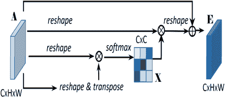

<!--yml

category: 未分类

date: 2024-09-06 19:47:01

-->

# [2204.07756] 深度学习中的视觉注意力方法：深入调查

> 来源：[`ar5iv.labs.arxiv.org/html/2204.07756`](https://ar5iv.labs.arxiv.org/html/2204.07756)

# 深度学习中的视觉注意力方法：深入调查

Mohammed Hassanin，Saeed Anwar，Ibrahim Radwan，Fahad S Khan 和 Ajmal Mian Mohammed Hassanin 在南澳大学（UniSA）以及埃及法尤姆大学计算机与信息学院工作。电子邮件：mohammed.hassanin@unisa.edu.au。Saeed Anwar 在澳大利亚国立大学工程与计算机科学学院工作。他还隶属于 Data61，CSIRO（联邦科学与工业研究组织），悉尼科技大学和堪培拉大学。Ibrahim Radwan 在堪培拉大学工作。Fahad S. Khan 是阿布扎比穆罕默德·本·扎耶德人工智能大学和瑞典林雪平大学计算机视觉实验室的副教授。Ajmal Mian 是西澳大学计算机科学教授。通讯作者：Saeed Anwar（电子邮件：saeed.anwar@anu.edu.au）

###### 摘要

受人类认知系统的启发，注意力是一种模仿人类对特定信息的认知意识的机制，通过放大关键细节来更加关注数据的核心方面。深度学习已经利用注意力来提升许多应用的性能。有趣的是，相同的注意力设计适用于处理不同的数据模态，并且可以轻松地融入大型网络中。此外，可以在一个网络中结合多种互补的注意力机制。因此，注意力技术变得极具吸引力。然而，文献中缺乏关于注意力技术的全面调查，以指导研究人员在其深度模型中应用注意力。需要注意的是，除了在训练数据和计算资源方面要求高之外，变压器仅涵盖了自注意力的一个类别，而不是众多可用的类别。我们填补了这一空白，并提供了对 50 种注意力技术的深入调查，按其最显著的特征进行分类。我们通过介绍注意力机制成功的基本概念来启动讨论。接下来，我们提供一些基本信息，如每种注意力类别的优缺点，描述其基本构建块、基本公式及主要用途，以及计算机视觉中的应用。我们还讨论了与注意力机制相关的挑战和开放问题。最后，我们推荐了深度注意力的未来研究方向。

###### 索引词：

注意力机制，深度注意力，注意力模块，计算机视觉和机器学习中的注意力。

## 1 引言

注意力与人类认知系统有自然的联系。根据认知科学，人类的视神经接收大量的数据，超过了它能够处理的能力。因此，人脑会对输入信息进行权衡，仅关注必要的信息。随着机器学习，特别是深度学习的进展，以及处理大量和多重输入数据流的能力的提高，研究人员在许多领域采用了类似的概念，并制定了各种注意力机制，以提高深度神经网络模型在机器翻译 [1, 2]、视觉识别 [3]、生成模型 [4]、多智能体强化学习 [5]等方面的性能。在过去十年里，深度学习取得了飞跃式的发展，产生了许多能够学习数据中复杂关系的深度神经网络架构。一般来说，神经网络提供隐式注意力，从数据中提取有意义的信息。

|  |  |  |
| --- | --- | --- |
| 非自注意力 | 自注意力方法 | 所有类型的注意力 |

图 1：视觉图表展示了包括 CVPR、ICCV、ECCV、NeurIPS、ICML 和 ICLR 在内的顶级会议中与注意力相关的论文数量的增加。

深度学习中的显式注意力机制最早是为了应对在针对机器翻译问题设计的编码器-解码器架构中的*遗忘*问题而引入的 [6]。由于网络的编码器部分专注于生成代表性的输入向量，解码器则从表示向量生成输出。通过生成上下文向量来解决*遗忘*问题的方法是使用双向递归神经网络（RNN） [6]，然后基于上下文向量以及先前的隐藏状态解码输出。上下文向量通过对中间表示的加权和来计算，这使得这种方法成为显式注意力的一个例子。此外，长短期记忆（LSTM） [7]被用于生成上下文向量和输出。这两种方法计算上下文向量时都考虑了编码器的所有隐藏状态。然而， [8] 提出了另一种思路，通过使注意力机制只关注隐藏状态的一个子集来生成上下文向量中的每一项。这比以前的注意力方法计算开销更小，展示了*全局*和*局部*注意力机制之间的权衡。

另一个基于注意力的突破是由 Vaswani 等人[2]提出的，他们基于自注意力机制创建了一个完整的架构。输入序列中的项目首先被并行编码为多种表示，称为键、查询和值。这个被称为 Transformer 的架构，帮助更有效地捕捉输入序列中每个项目相对于其他项目的重要性。最近，许多研究人员已将基本的 Transformer 架构扩展到特定应用中。

为了关注图像中的重要部分并抑制不必要的信息，基于注意力的学习进展已经渗透到多个计算机视觉任务中，这些任务要么为每个图像像素使用不同的注意力图，将其与其他像素的表示进行比较[3，9，4]，要么生成一个注意力图来提取整个图像的全局表示[10，11]。然而，注意力机制的设计高度依赖于具体问题。为了强制选择与输入中关键信息相对应的隐藏状态，注意力技术已作为插件单元应用于基于视觉的任务中，减轻了梯度消失的风险。总而言之，注意力分数被计算，隐藏状态被选择，可能是确定性的也可能是随机的。

{森林}

分叉边缘，树=厚，绘制，对齐=左，边=-latex，填充=白色，模糊阴影，圆角，上色=白色，下色=蓝色！20，边+=-¿，l sep’+=13pt，[注意力类型[软注意力[通道[挤压$\&amp;$ 激励

高效通道

分割注意力

二阶

高阶

和谐

自学习

双重

双重

频率通道]] [空间[共同注意力

$\&amp;$ 共同激励

空间金字塔

空间-光谱

像素级上下文

金字塔特征

注意力金字塔

区域]] [自[变换器

独立自我

聚类

插槽

高效

随机特征

非局部

稀疏

X-Linear

轴向

高效机制]] [算术[注意力丢弃

镜像

反向]] [多模态[交叉

交叉交错

感知器

堆叠交叉

提升]] [逻辑[顺序

排列不变

展示-关注-讲述

卡尔曼滤波

预言者]]]] [硬注意力[统计[贝叶斯[信念网络。

排斥]] [变分]] [强化型[自我批判

强化-SA]] [高斯[自我监督

不确定性感知]] [聚类]]]]

图 2：注意力类型的分类法。这些注意力根据执行注意力的方法进行分类。一些注意力技术可以适应多个类别；在这种情况下，注意力会根据最主要的特征和主要应用进行分组。

近年来，注意力机制成为了重要的研究中心，图像注意力在许多不同的机器学习和视觉应用中蓬勃发展，例如分类[12]、检测[13]、图像描述[14]、3D 分析[15]等。尽管深度学习中应用的注意力技术表现出色，但目前尚无文献综述全面回顾所有，尤其是基于深度学习的视觉注意力机制，以便根据其基本结构进行分类，并突显其优缺点。最近，研究人员调查了应用特定的注意力技术，重点关注基于 NLP 的[16]、基于 Transformer 的[17, 18]和基于图的[19]方法。然而，尚无全面研究汇总所有为视觉输入开发的深度学习注意力技术。

在本文中，我们回顾了视觉特定的注意力技术。我们的综述涵盖了许多基本构建块（操作和功能）以及旨在学习适当表示的完整架构，同时使模型对输入图像或视频中的相关和重要信息保持关注。我们的综述大致分类了计算机视觉文献中提出的注意力机制，包括软注意力、硬注意力、多模态、算术、类别注意力和逻辑注意力。我们注意到一些方法属于多个类别；然而，我们将每种方法分配到它与该类别其他方法具有主导关联的类别。这样的分类有助于跟踪常见的注意力机制特征，并提供可能有助于设计新型注意力技术的见解。图 2 展示了注意力机制的分类。

我们强调，由于如图 1 所述，已发布的论文数量巨大，视觉注意力领域的综述是必要的。从图 1 可以明显看出，去年发表的文章数量较之前几年显著增加，我们预计未来几年也会出现类似趋势。此外，我们的综述列出了对计算机视觉和机器学习社区至关重要的文章，以帮助其在模型中采用最合适的注意力机制，避免重复注意力方法。它还识别了研究空白，提供了当前研究背景，提出了可行的研究方向和未来关注领域。

由于变压器已被应用于许多视觉应用；一些调查 [18, 17] 总结了变压器在计算机视觉中的最新趋势。尽管变压器提供了高准确度，但这伴随着极高的计算复杂性，限制了其在移动和嵌入式系统应用中的可行性。此外，基于变压器的模型需要比卷积神经网络（CNNs）显著更多的训练数据，并且缺乏高效的硬件设计和通用性。根据我们的调查，变压器仅覆盖了 50 种不同注意力类别中的单一类别。另一个显著的区别是，我们的调查关注于注意力类型，而不是变压器基础调查 [18, 17] 涵盖的应用。

## 2 视觉中的注意力

视觉中的注意力的主要目的是模仿人类视觉认知系统，并关注输入图像中的关键特征 [20]。我们根据生成注意力分数所用的主要功能（如 softmax 或 sigmoid）对注意力方法进行分类。表 I Attention ‣ 2 Attention in Vision ‣ Visual Attention Methods in Deep Learning: An In-Depth Survey") 提供了本调查中展示的类别的总结、应用、优点和局限性。

### 2.1 软性（确定性）注意力

本部分介绍了通道注意力、空间注意力和自注意力等软注意力方法。在通道注意力中，由于每个特征图（通道）都会关注输入的特定部分，因此通道注意力会按通道进行评分计算。在空间注意力中，主要思想是关注图像中的关键区域。关注感兴趣区域有助于目标检测、语义分割和人物再识别。与通道注意力相比，空间注意力会关注空间地图（由宽度和高度界定）中的重要部分。它可以独立使用，也可以作为通道注意力的补充机制。另一方面，自注意力旨在通过提取输入序列标记之间的关系来编码高阶交互和上下文信息。与通道注意力不同的是，自注意力在生成注意力分数的方式上不同，因为它主要计算了相同输入的两个地图（K，Q）之间的相似性，而通道注意力则是从单个地图中生成分数。然而，自注意力和通道注意力都作用于通道。软注意力方法将注意力分数计算为所有输入实体的加权和[8]，主要使用 softmax 和 sigmoid 等软函数。由于这些方法可微分，因此可以通过反向传播技术进行训练。然而，它们也存在其他问题，如计算复杂度高和对未关注对象分配权重的问题。

#### 2.1.1 通道注意力

**Squeeze & Excitation Attention**：Squeeze-and-Excitation（SE）块[21]，如图 3 Attention ‣ 2 Attention in Vision ‣ Visual Attention Methods in Deep Learning: An In-Depth Survey")（a）所示，是一种用于执行动态通道注意力的单元设计。SE 注意力接受卷积块的输出，并通过全局平均池化将每个通道转换为一个值；这个过程称为“挤压”。通过经过全连接层和 ReLU 进行降低输出通道比例和增加非线性。特征通过全连接层传递，然后通过 sigmoid 函数实现平滑的门控操作。卷积块的特征图根据辅助网络的输出进行加权，称为“激励”。该过程可以总结为

|  | $f_{s}=\sigma(FC(ReLU(FC(f_{g})))),$ |  | (1) |
| --- | --- | --- | --- |

其中$FC$是全连接层，$f_{g}$是全局平均池化，$\sigma$是 sigmoid 操作。其主要思想是选择每个通道的最佳表示，以生成注意力分数。

高效通道注意力（ECA）[22] 基于 squeeze $\&amp;$ excitation 网络[21]，旨在通过去除降维来提高效率并减少模型复杂性。ECA（见图 3 Attention ‣ 2 Attention in Vision ‣ Visual Attention Methods in Deep Learning: An In-Depth Survey")(g)）通过分析每个通道及其 $k$ 个邻居，实现局部的跨通道交互，遵循通道级全局平均池化，但没有降维。ECA 通过快速 1D 卷积实现高效处理。大小 $k$ 表示可以参与一个通道注意力预测的邻居数量，即局部跨通道交互的覆盖范围。

分裂注意力网络：ResNest [23] 是 ResNet [24] 的一种变体，使用了分裂注意力块，如图 3 Attention ‣ 2 Attention in Vision ‣ Visual Attention Methods in Deep Learning: An In-Depth Survey")(h) 所示。注意力通过对之前模块的输入进行求和并应用全局池化来获得，经过复合函数处理，即卷积层-批量归一化-ReLU 激活。输出再次通过卷积层。之后，应用 softmax 来归一化值，然后与相应的输入相乘。最后，将所有特征相加。这一机制类似于 squeeze $\&amp;$ excitation 注意力[21]。ResNest 也是一种特殊的 squeeze $\&amp;$ excitation，其中通过平均池化和分裂通道的求和来挤压通道。

CBAM 中的通道注意力：卷积块注意力模块（CBAM）[25] 采用通道注意力，并利用跨通道特征关系，因为每个特征图通道被视为一个特征检测器，专注于输入图像的“是什么”部分。输入特征图的空间维度被挤压以计算通道注意力，随后通过平均池化和最大池化获得两个描述符进行聚合。这些描述符被传递到一个三层共享多层感知器（MLP）中以生成注意力图。随后，每个 MLP 的输出被逐元素相加，然后通过 sigmoid 函数处理，如图 3 Attention ‣ 2 Attention in Vision ‣ Visual Attention Methods in Deep Learning: An In-Depth Survey")(b) 所示。总之，通道注意力的计算方式是

|  | $f_{ch}=\sigma(MLP(MaxPool(f))+MLP(AvgPool(f))),$ |  | (2) |
| --- | --- | --- | --- |

其中$\sigma$表示 sigmoid 函数，$f$表示输入特征。在 MLP 中，每个卷积层后采用 ReLU 激活函数。CBAM 中的通道注意力与 Squeeze and Excitation (SE)注意力相同[26]，前提是仅使用平均池化。

二阶注意力网络：对于单幅图像超分辨率，在[27]中，作者提出了一种二阶通道注意力模块，简称 SOCA，通过二阶特征统计学习特征间依赖性。首先计算并规范化协方差矩阵（$\Sigma$），使用来自前一网络层的特征图以获得辨别表示。对称正半定协方差矩阵被分解为$\Sigma=U\Lambda U^{T}$，其中$U$是正交的，$\Lambda$是具有非递增特征值的对角矩阵。特征值的幂$\Sigma=U\Lambda^{\alpha}U^{T}$有助于实现注意力机制，即如果$\alpha<1$，则大于 1.0 的特征值会非线性地缩小，而其他特征值则伸展。作者根据之前的工作选择了$\alpha<\frac{1}{2}$[28]。后续的注意力机制类似于 SE[21]，如图 3 Attention ‣ 2 Attention in Vision ‣ Visual Attention Methods in Deep Learning: An In-Depth Survey")(c)所示，但作者提供的是二阶统计量（即全局协方差池化），而不是一阶统计量（即全局平均池化）。

高阶注意力：为了编码全局信息和上下文表示，[29]，Ding 等人提出了具有自适应感受野和动态权重的高阶注意力（HA）。HA 主要为每个像素构建一个特征图，包括与其他像素的关系。HA 解决了固定形状感受野在高形状物体（即相似形状物体）情况下导致错误预测的问题。具体来说，在为每个像素计算注意力图后，使用图转导形成最终特征图。这种特征表示用于通过加权求和的上下文信息更新每个像素位置。高阶注意力图是通过 Hadamard 积计算的[30, 31]。由于它从通道中生成注意力分数，因此被归类为通道注意力，类似于 SE[26]。

和谐注意力：提出了一种联合注意力模块，包括软像素和硬区域注意力 [32]。其主要思想是通过联合学习注意力选择和特征表示，解决之前的注意力模块在人员重识别中的局限性，从而解决受限注意力机制导致的对齐校准问题 [33, 34, 35, 36]。具体来说，和谐注意力在一个分支中学习两种类型的软注意力（空间和通道），在另一个分支中学习硬注意力。此外，提出了跨交互注意力，协调这两种注意力类型，如图 3(i)所示。

表 I：总结了注意力类型及其分类、应用、优缺点。同时提供了原始论文的参考文献和讨论部分的链接。

| 类型 | 类别 | 节点 | 参考文献 | 应用 | 优势 | 局限性 |
| --- | --- | --- | --- | --- | --- | --- |
|  | 通道 | 2.1.1 | SE-Net [26], ECA-Net [22], CBAM [25], [32], A2-Net [29], Dual [37] | 视觉识别，人脸重识别，医学图像分割，视频识别 | • 易于建模 • 可微分梯度 • 非局部操作 • 编码上下文 • 性能提升 | • 内存使用昂贵 • 计算成本高 • 偏向 softmax 径向性质 • 由于缺乏多样性可能导致注意力崩溃 |
|  | 空间 | 2.1.2 | CBAM [25], PFA [38], [39], [40] | 视觉识别，领域适应，显著性检测 |  |  |
|  | 自注意力 | 2.1.3 | Transformers [2], Image Transformers [41], [42], [43] | 视觉识别，多模态任务，视频处理，低级视觉，视频识别，3D 分析 |  |  |
| 软（确定性） | 基于类别的 | 2.1.7 | GAIN [44] [45] | 可解释的机器学习，人物重识别，语义分割 | • 提供梯度理解 • 不需要额外监督 | • 额外计算 • 仅用于监督分类 |
|  | 多模态的 | 2.1.5 | CAN [46], SCAN [47], Perceiver [48], Boosted [49] | 少样本分类，图像-文本匹配，图像标注 | • 有利于基于视觉-语言的应用 • 提供有针对性的监督信号 • 实现更高的准确率 | • 内存使用昂贵 • 高计算成本 • 继承软注意力和硬注意力的局限性 |
|  | 算术的 | 2.1.4 | Drop-out [50], Mirror [51], Reverse [52], Inverse [53], Reciprocal [54] | 弱监督目标定位，线条检测，语义分割 | • 高效的方法 • 简单的思想 • 易于实现 • 丰富模型的语义 | • 限于特定应用 • 无法扩展 • 继承软注意力和硬注意力的局限性 |
|  | 逻辑的 | 2.1.6 | 循环的 [55], 序列的 [56, 57], 排列不变的 [58] | 图像识别，目标检测与分割，对抗性图像分类，图像标记，异常检测 | • 克服软注意力的问题 • 解决硬注意力的缺点 | • 复杂的架构 • 高计算成本 • 迭代处理 |
| 硬（随机） | 统计学的 | 2.2.1 | 贝叶斯 [59], 排斥性 [60], 变分 [61], [62] | 视觉问答，图像标注，图像翻译，自然语言处理 |  |  |
|  | 基于强化学习 | 2.2.2 | RESA [63], [64], 自我批评 [65] | 人员再识别，自然语言处理 | • 编码上下文 • 编码高阶交互 • 多样的注意力分数 • 更高的改进 | • 内存使用开销大 • 计算成本高 • 不可微分 • 梯度消失 • 训练需要技巧 |
|  | 高斯 | 2.2.3 | GatCluster [66], 不确定性 [67] | 图像聚类 医学 自然语言处理 |  |  |
|  | 聚类 | 2.2.4 | 最大期望 [68], GatCluster [66] | 语义分割 |  |  |

自动学习注意力：Ma 等人[57]引入了一种自动设计注意力的新颖理念。该模块称为高阶组注意力（HOGA），其形式为一个有向无环图（DAG）[69, 70, 71, 72]，其中每个节点代表一个组，每条边代表一个异质注意力操作。节点之间存在顺序连接以表示注意力操作的混合。因此，这些连接可以表示为 K 阶注意力模块，其中 K 是注意力操作的数量。DARTS [73]被定制以有效地促进搜索过程。该自动学习模块可以集成到遗留架构中，并且表现优于手动设计的模块。然而，注意力模块的核心理念与之前的架构保持一致，即 SE [26], CBAM [25], splat [23], mixed [74]。

双重注意力网络：陈等人[75]提出了双重注意力网络（A2-Nets），该网络在两个步骤中关注输入图像。第一步使用双线性池化来编码实体之间的二阶关系，从而收集所需特征；第二步则自适应地将特征分布到不同位置。在这种架构中，首先通过双线性池化捕捉到的二阶统计数据（其他函数如 SE 的平均池化[26]中大多丢失的），然后计算注意力分数，不是从整个图像[3]中，而是从一个紧凑的包中，因此仅丰富所需上下文的对象。第一步，即特征收集，使用外积$\sum_{\forall i}a_{i}b_{i}^{T}$，然后使用 softmax 来关注判别特征。第二步，即分布，基于用所需特征补充每个位置，其总和为$1$。A2-Nets 的完整设计如图 3 Attention ‣ 2 Attention in Vision ‣ Visual Attention Methods in Deep Learning: An In-Depth Survey")(d)所示。实验比较表明，A2-Net 在性能上优于 SE 和非局部网络，并且在内存和时间方面更为高效。

双重注意力网络：Jun 等人[37]提出了一种用于场景分割的双重注意力网络，该网络由位置注意力和通道注意力并行工作组成。位置注意力旨在编码局部上下文特征。注意力过程非常直接：输入特征$f_{A}$通过三个卷积层生成三个特征图（$f_{B}$、$f_{C}$和$f_{D}$），然后进行重塑。对$f_{B}$和$f_{C}$的转置进行矩阵乘法，然后使用 softmax 获得空间注意力图。接着，对生成的$f_{D}$特征和空间注意力图进行矩阵乘法。最后，输出与标量相乘，并逐元素与输入特征$f_{A}$相加，如图 3 Attention ‣ 2 Attention in Vision ‣ Visual Attention Methods in Deep Learning: An In-Depth Survey")(f)所示。

尽管通道注意力涉及的步骤与位置注意力类似，但它不同于位置注意力，因为特征被直接使用，而不是通过卷积层。输入特征 $f_{A}$ 被重塑、转置、相乘（即 $f_{A}\times f_{A}^{\prime}$），然后通过 softmax 层得到通道注意力图。此外，输入特征与通道注意力图相乘，然后进行逐元素求和，以得到最终输出，如图 3(e) 所示。

|  |
| --- |
| (a) SENet [21] |
|  |
| (b) CBAM [25] |
|  |
| (c) SOCA [27] |
|  |
| (d) A${}^{2}-$Net [75] |
|  |
| (e) DAN Positional [37] |
|  |
| (f) DAN Channel [37] |
|  |
| (g) ECA-Net [22] |
|  |
| (h) RESNest [23] |
|  |
| (i) Harmonious [32] |

图 3：基于通道的注意力方法的核心结构。生成注意力分数的不同方法包括 squeeze 和 excitation [26]，分割和 squeeze [23]，计算二阶 [37] 或高效的 squeeze 和 excitation [22]。图像取自原始论文，最佳效果为彩色显示。

频率通道注意力：通道注意力需要全局平均池化作为预处理步骤。Qin 等人 [76] 认为全局平均池化操作可以用频率成分替代。频率注意力将离散余弦变换视为带余弦部分的加权输入和。由于全局平均池化是频域特征分解的特例，作者使用了包括零频成分在内的 2D 离散余弦变换的各种频率成分，即全局平均池化。

#### 2.1.2 空间注意力

与主要生成通道注意力分数的通道注意力不同，空间注意力专注于从特征图的空间补丁中生成注意力分数，而不是通道。然而，生成注意力的操作顺序类似。

CBAM 中的空间关注使用空间特征关系来补充通道关注[25]. 空间关注侧重于关注信息部分，通过依次应用平均池化和最大池化来计算，并将两者连接以得到单个特征描述符。此外，对连接的特征描述符进行卷积操作以生成空间关注图，以加强或抑制。特征图通道信息通过平均池化特征和最大池化特征进行聚合，然后进行连接和卷积，生成 2D 空间关注图。整个过程如图 4 Attention ‣ 2 Attention in Vision ‣ Visual Attention Methods in Deep Learning: An In-Depth Survey")(a)所示，计算公式为：

| | $f_{sp}=\sigma(Conv_{7\times 7}([MaxPool(f);AvgPool(f)])),$ | | (3) |
| --- | --- | --- | --- |

其中，$Conv_{7\times 7}$表示 7×7 卷积操作，$\sigma$表示 sigmoid 函数。

协同关注和协同激励：Hsieh 等人[77]提出了协同关注和协同激励以检测所有属于同一目标的实例进行单次检测。其主要思想是通过编码长范围依赖和二阶交互的非局部网络来丰富提取的特征表示[3]. 相关激励是基于 squeeze-and-excite 网络[26]，如图 4 Attention ‣ 2 Attention in Vision ‣ Visual Attention Methods in Deep Learning: An In-Depth Survey")(e)所示。其中，squeeze 使用全局平均池化[78]对空间位置进行重新加权，而 co-excite 则作为查询和目标特征之间的桥梁。使用协同关注和协同激励编码高语境表示，可以改善单次检测器性能，实现最先进的结果。

空间金字塔注意力网络，简称 SPAN [79]，被提出用于本地化多种图像操作。它由三个主要模块组成，即特征提取（头）模块、金字塔空间注意力模块和决策（尾）模块。头模块使用 Wider & Deeper VGG 网络作为骨干网络，而 Bayer 和 SRM 层从视觉伪影和噪声模式中提取特征。像素的空间关系通过五个局部自注意力块递归应用来实现，为了保留细节，自注意力的输入与块的输出相加，如图 4 Attention ‣ 2 Attention in Vision ‣ Visual Attention Methods in Deep Learning: An In-Depth Survey")(c)所示。这些特征然后被送入最终的 2D 卷积块尾模块，以在应用 sigmoid 激活后生成输出掩模。

空间-频谱自注意力：图 4 Attention ‣ 2 Attention in Vision ‣ Visual Attention Methods in Deep Learning: An In-Depth Survey")(d)展示了空间-频谱自注意力的架构，它由两个注意力模块组成，即空间注意力和频谱注意力，两者都利用自注意力。

1.  1.

    空间注意力：为了建模非局部区域信息，Meng 等人[40]利用 3$\times$3 卷积核来融合输入特征，以指示基于区域的相关性，然后通过卷积网络将融合特征映射到 Q $\&amp;$ K。卷积核的数量表示头的数量，大小表示维度。此外，来自 Q $\&amp;$ K 的维度指定特征构建相关的注意力图，然后在序列中调制相应的维度，以实现顺序无关属性。最后，为了完成空间相关建模，特征被传递到反卷积层。

1.  2.

    频谱注意力：首先，频谱通道样本与一个卷积核进行卷积，并展平成单一维度，作为该通道的特征向量。输入特征被转换为 Q $\&amp;$ K，为频谱轴建立注意力图。由于图像模式在精确位置上的相邻通道具有更高的相关性，这通过注意力图上的频谱平滑度进行表示。相似度通过归一化的余弦距离表示为频谱嵌入，其中每个相似分数被缩放并与注意力图中的系数求和，然后用于调制自注意力中的“值”，从而引入频谱平滑度约束。

像素级上下文注意力（PiCANet）[55]旨在实现准确的显著性检测。PiCANet 在每个像素的上下文区域生成一个映射，并构建一个附加的上下文特征，以增强局部和全局水平的特征表现能力。为了生成全局注意力，每个像素需要通过 ReNet [80] 进行“观察”，该网络包含四个水平和垂直的递归神经网络。来自不同方向的上下文使用 biLSTM 进行混合，将每个像素的信息传播到所有其他像素。接着，卷积层将特征图转换为不同的通道，并通过软最大化函数进行进一步的归一化，用于对特征图加权。局部注意力在局部邻域上进行，形成一个局部特征立方体，其中每个像素需要使用具有相同感受野的几个卷积层“观察”局部区域中的每个其他像素。然后，这些特征被转换为通道并使用 softmax 进行归一化，进一步加权求和以得到最终的注意力。

金字塔特征注意力从不同层的 VGG [38] 中提取特征。低层 VGG 提取的低级特征被提供给空间注意力机制 [25]，而从高层获得的高级特征则被供给给通道注意力机制 [25]。特征金字塔注意力一词源于从不同层获得的 VGG 特征。

空间注意力金字塔：为了进行无监督领域适应，Li 等 [39] 引入了一个空间注意力金字塔，该金字塔从多个具有不同大小的平均池化层中提取特征。这些特征被传递到空间注意力，然后是通道级注意力。所有经过注意力处理的特征被拼接成一个单一的语义向量。

区域注意力网络（RANet） [81] 被提出用于语义分割。它包含了新颖的网络组件，即区域构建块（RCB）和区域交互块（RIB），用于构建上下文表示，如图 4(b) 所示。RCB 分析边界分数和语义分数图，以计算每个图像像素对的注意力区域分数。高注意力分数表明这些像素来自同一物体区域，从而将图像划分为不同的物体区域。随后，RIB 采用区域图，并选择不同区域中的代表性像素，每个代表性像素接收来自其他像素的上下文信息，以有效地表示物体区域的局部内容。此外，捕捉不同物体之间的空间和类别关系，交流不同区域的代表性像素，产生全局上下文表示以增强像素，最终形成用于分割的上下文特征图。

|  |
| --- |
| (a) 空间注意力 [25] |
|  |
| (b) RANet [81] |
|  |
| (c) Co-excite [77] |

图 4：基于空间的注意力方法的结构，包括 RANet [81] 和 Co-excite [77]。这些方法关注于空间图中最重要的部分。图像来源于 [25, 81, 77]。

#### 2.1.3 自注意力

自注意力机制，也被称为*内部注意力*，是一种编码所有输入实体之间关系的注意力机制。它是一种使输入序列相互作用并汇总注意力分数的过程，这些分数展示了它们的相似程度。其主要思想是将特征图复制成三个副本，然后测量它们之间的相似性。除了使用物理特征图的通道和空间注意力外，自注意力通过复制特征副本来测量长距离依赖关系。然而，自注意力方法使用通道来计算注意力分数。Cheng 等人使用长短期记忆网络（LSTM）提取单个句子中单词之间的相关性[42]。在递归迭代过程中，每个隐藏状态产生一个注意力向量，这个向量关注序列中该位置的所有响应。在[82]中，提出了一种可分解的解决方案，将输入划分为子问题，相比于[42]，提高了处理效率。注意力向量被计算为内容（词袋）的对齐因子。尽管这些方法引入了自注意力的概念，但它们在资源消耗上非常昂贵，并且未考虑上下文信息。此外，RNN 模型顺序处理输入，因此很难并行化或高效处理大规模方案。

Transformers：Vaswani 等人[2]提出了一种基于自注意力概念的新方法，称为 transformers，该方法不使用卷积或递归模块。如图 5 (f)所示，它主要由编码器-解码器层组成，其中编码器包括自注意力模块，随后是位置前馈层，而解码器与编码器相同，只是在中间有一个编码器-解码器注意力层。位置编码由一个正弦波表示，该波在线性层之前将时间的推移作为输入。这种位置编码作为一个泛化项，帮助识别未见过的序列，并编码相对位置而不是绝对表示。算法 1 展示了使用 transformers 计算自注意力（多头注意力）的详细步骤。尽管 transformers 在基于文本的模型中取得了很大进展，但在编码句子上下文方面存在不足，因为它计算了左侧序列的词的注意力。为了解决这个问题，Bidirectional Encoder Representations from Transformers（BERT）通过联合编码句子的两侧来学习上下文信息[83]。

输入：实体$\mathbf{X}\in\mathbf{R}$的一组序列$(x_{1},x_{2},...,x_{n})$ 输出：$\mathbf{X}$序列的注意力得分。1 初始化权重：每个输入序列的 Key（$\mathbf{W_{K}}$）、Query（$\mathbf{W_{Q}}$）、Value（$\mathbf{W_{V}}$）。2 为每个输入序列及其对应的权重推导 Key、Query、Value，使得$\mathbf{Q=XW_{Q}}$，$\mathbf{K=XW_{K}}$，$\mathbf{V=XV_{Q}}$。3 通过计算查询和键的点积来计算注意力得分。4 计算这些得分和 Values $\mathbf{V}$的缩放点积注意力，

|  | $\mathrm{softmax}\left(\frac{\mathbf{QK^{T}}}{\sqrt{d_{k}}}\right)\mathbf{V}.$ |  |
| --- | --- | --- |

5 对所有头重复步骤 1 到 4

算法 1 使用 transformers（多头注意力）生成自注意力的主要步骤

独立自注意力：如上所述，卷积特征由于其局部偏置的感受野而未考虑全局信息。Ramachandran 等人 [43] 提出了一个完全注意力的网络，用自注意力模块替代空间卷积。卷积干（前几层卷积）用于捕获空间信息。他们设计了一个小内核（例如 $n\times n$），而不是同时处理整个图像。这一设计构建了一个计算高效的模型，使其能够处理原始大小的图像而无需下采样。计算复杂度减少到 $\mathcal{O}(hwn^{2})$，其中 $h$ 和 $w$ 分别表示高度和宽度。提取一个补丁作为查询以及每个局部补丁，同时使用身份图像作为值和键。计算注意力图遵循与算法 1 相同的步骤。尽管独立自注意力与卷积模型相比显示了有竞争力的结果，但它在编码位置信息方面存在问题。

聚类注意力：为了应对变换器的计算低效问题，Vyas 等人 [84] 提出了一个聚类注意力机制，该机制依赖于这样的观点：相关的查询在欧几里得中心附近遵循相同的分布。基于这一观点，他们使用带有固定中心的 K 均值算法将相似的查询进行分组。计算时不是计算所有查询，而是计算聚类中心。因此，总复杂度被最小化为线性形式 $\mathcal{O}(qc)$，其中 $q$ 是查询的数量，而 $c$ 是聚类的数量。

|  |
| --- |
| (a) 高效注意力 [85] |
|  |
| (b) 插槽注意力 [86] |
|  |
| (c) RFA [87] |
|  |
| (d) X-Linear [88] |
|  |
| (e) 轴向 [89] |
|  |
| (f) 变换器 [2] |

图 5：自注意力方法的架构：变换器 [2]、轴向注意力 [89]、X-Linear [88]、插槽 [86] 和 RFA [87]（图片取自相关文章）。所有这些方法都是自注意力，它们通过测量相同输入的两个图的相似性来生成分数。然而，在处理方式上有所不同。

Slot Attention: Locatello 等人[90] 提出了 slot attention，这是一种学习场景中物体表示的注意力机制。一般来说，它学习将图像解耦为一系列的 slots。如图 5 Attention ‣ 2 Attention in Vision ‣ Visual Attention Methods in Deep Learning: An In-Depth Survey")(d) 所示，每个 slot 代表一个单一物体。Slot attention 模块应用于一个学习到的表示 $h\in\mathbb{R}^{W\times H\times D}$，其中 $H$ 是高度，$W$ 是宽度，$D$ 是表示大小。SAM 主要有两个步骤：使用迭代注意力机制学习 $n$ 个 slots，并表示各个物体（slots）。在每次迭代中，执行两个操作：1) 使用 softmax 进行 slot 竞争，然后按照 slot 维度进行归一化，使用以下方程

|  | $a=Softmax\bigg{(}\frac{1}{\sqrt{D}}n(h).q(c)^{T}\bigg{)}.$ |  | (4) |
| --- | --- | --- | --- |

2) 对被关注表示的加权均值聚合过程

|  | $r=Weightedmean\bigg{(}a,v(h)\bigg{)},$ |  | (5) |
| --- | --- | --- | --- |

其中 $k,q,v$ 是可学习变量，如 [2] 所示。然后，使用前馈层预测 slot 表示 $s=fc(r)$。

Slot attention 基于 Transformer-like 注意力[2]，在 CNN 特征提取器之上。给定一个图像 $\mathbb{I}$，slot attention 将场景解析为一组 slots，每个 slot 指代一个物体 $(z,x,m)$，其中 $z$ 是物体特征，$x$ 是输入图像，$m$ 是掩码。在解码器中，卷积网络用于学习 slot 表示和物体掩码。训练过程由 $\ell_{2}$-norm 损失引导

|  | $\mathbb{L}=\bigg{\rVert}\bigg{(}\sum_{k=1}^{K}mx_{k}\bigg{)}-\mathbb{I}\bigg{\lVert}_{2}^{2}$ |  | (6) |
| --- | --- | --- | --- |

在 slot-attention 模块之后，Li 等人开发了一种基于 slot attentions 的可解释分类器[90]。该方法旨在为一个类别 $l$ 找到正支持和负支持。通过这种方式，分类器不仅可以被解释，而不是完全成为黑箱。该工作的主要实体是 xSlot，一种 slot attention 的变体[86]，与一个类别相关，并对该类别在输入图像中的包含情况给出信心。

高效注意力：使用非对称聚类（SMYRF），Daras 等人 [91] 提出了对称局部敏感哈希 (LSH) 聚类的创新方法，以减少注意力图的大小，从而开发出高效的模型。他们观察到注意力权重是稀疏的，注意力矩阵是低秩的。因此，预训练模型的值会衰减。在 SMYRF 中，通过平衡聚类（由非对称变换和自适应方案生成）来解决这个问题，从而近似注意力图。SMYRF 是一种替代预训练模型的正常密集注意力的模块，无需在集成此模块后重新训练模型，SMYRF 在内存、性能和速度方面显示出了显著的效果。因此，特征图可以扩大以包含上下文信息。在某些模型中，内存使用减少了 $50\%$。尽管 SMYRF 在自注意力模型中提高了内存使用，但与高效注意力模型的改进幅度是微不足道的（见图 5 Attention ‣ 2 Attention in Vision ‣ Visual Attention Methods in Deep Learning: An In-Depth Survey") (a)）。

随机特征注意力：变压器在时间和内存复杂性方面存在一个主要缺陷，这限制了注意力的扩展，并因此限制了更高阶的交互。Peng 等人 [87] 提出了将变压器的空间和时间复杂性从二次方降低到线性。他们通过使用随机函数来简单地增强 softmax 近似。随机特征注意力 (RFA) [92] 使用从基于简单分布的傅里叶随机特征 [93, 94] 中采样的 softmax 变体。利用 [95] 的核技巧 $exp(x.y)\approx\phi(x).\phi(y)$，softmax 近似被简化为线性，如图 5 Attention ‣ 2 Attention in Vision ‣ Visual Attention Methods in Deep Learning: An In-Depth Survey") (c) 所示。此外，RFA 连接的相似性和递归网络有助于开发一种门控机制，以学习近期偏差 [96, 97, 98]。RFA 可以轻松集成到骨干网络中，以替代普通的 softmax，而不会显著增加参数数量，仅增加了 $0.1\%$。将 RFA 插入到变压器中显示出与 softmax 相当的结果，而门控 RFA 在语言模型中表现优于 softmax。RFA 的执行速度是传统变压器的 2$\times$ 快。

非局部网络：近期在人工智能领域的突破大多基于卷积神经网络（CNNs）[99, 24] 的成功。特别是，它们可以并行处理，并且是提取特征的归纳偏差。然而，CNNs 由于其局部偏向的接收域，未能学习整个图像的上下文。因此，CNNs 忽略了长距离依赖。在[3]中，Wang 等人提出了非局部网络，以缓解 CNNs 对局部信息的偏差，并将全局信息融合到网络中。它通过整个特征图的加权和来增强卷积特征的每个像素。在这种方式下，图像中的相关补丁以长距离的方式进行编码。非局部网络在长距离交互任务（如视频分类[100]）以及低级图像处理[101, 102]中显示了显著的改善。非局部模型注意力在网络中以图形方式展现[103]。然而，在同一阶段堆叠多个非局部模块会显示出不稳定性和训练过程中的不良姿态[104]。在[105]中，Liu 等人利用非局部网络形成两个模态（RGB 和深度）之间的自互注意力，以学习全局上下文信息。其思路很简单，即在 softmax 归一化之前将相应的特征相加，如$\mathrm{softmax}(f^{r}(\mathbb{X}^{r})+\alpha^{d}\bigodot f^{d}(\mathbb{X}^{d}))$ 用于 RGB 注意力，反之亦然。

非局部稀疏注意力（NLSA）：Mei 等人[106] 提出了一个稀疏的非局部网络，将非局部模块的优点结合起来，以编码长距离依赖和稀疏表示，从而提高鲁棒性。深度特征被分割成不同的组（桶），这些组内具有高内相关性。局部敏感哈希（LSH）[107] 用于查找与每个桶相似的特征。然后，非局部块处理其桶内的像素以及相似的像素。NLSA 将复杂度从二次降至渐近线性，同时利用稀疏表示的优势，仅关注信息丰富的区域。

X-Linear 注意力：双线性池化是一种计算过程，它计算两个实体之间的外积，而不是内积[108, 109, 110, 111]，并显示了编码高阶交互的能力，从而在模型中增强了可区分性。此外，它即使在压缩表示的情况下，也能生成具有所需细节的紧凑模型[110]。特别是，双线性应用在细粒度视觉识别[112, 113, 114]和视觉问答[115]中显示出了显著的改进。如图 5 Attention ‣ 2 Attention in Vision ‣ Visual Attention Methods in Deep Learning: An In-Depth Survey")(e) 所示，在查询和键之间执行低秩双线性池化，因此，键和查询之间的 $2^{nd}$-阶交互被编码。通过这种查询-键交互，空间和通道注意力与值一起被聚合。通道注意力与 squeeze-excitation 注意力[26]相同。x-linear 模块的最终输出与键和值的低秩双线性进行聚合[88]。他们声称，编码更高阶交互只需要相应地重复 x-linear 模块（例如，对于 $4^{th}$-阶交互使用三个迭代 x-linear 块）。无穷阶交互的建模也通过使用 h Exponential Linear Unit [116] 进行了解释。X-Linear 注意力模块提出了一种新颖的注意力机制，与 transformer [2] 不同。它能够在没有位置编码的情况下，以仅线性复杂度编码输入标记之间的关系，而 transformer 中是二次复杂度。

Axial-Attention：Wang 等人 [89] 提出了轴向注意力，用于编码主题的全球信息和长程上下文。尽管传统的自注意力方法使用全连接层来编码非局部交互，但由于其密集的连接，它们非常昂贵 [2, 117, 118, 41]。轴向注意力以非局部的方式使用自注意力模型，没有任何限制。简单来说，它将二维自注意力分解为一维自注意力的两个轴（宽度和高度）。这样，轴向注意力在关注广泛区域时表现出有效性。此外，与 [119, 120, 121] 不同，轴向注意力使用位置信息以无偏的方式包含上下文信息。通过轴向注意力，计算复杂度降至 $\mathcal{O}(hwm)$。此外，轴向注意力在与全注意力模型 [122, 43] 以及卷积模型 [24, 123] 的比较中显示出具有竞争力的表现。

高效注意力机制：传统的注意力机制建立在双矩阵乘法上，导致 $n \times n$ 的二次复杂度，其中 $n$ 是矩阵的大小。许多方法提出了高效的注意力架构 [124, 85, 125, 126]。在 [85] 中，Zhuoran 等人利用了矩阵乘法的结合特性，提出了高效的注意力。形式上，它们没有使用 $\rho(QK^{T})V$ 形式的点积，而是以高效的序列 $\rho_{q}(Q)(\rho_{k}(K)^{T}V)$ 进行处理，其中 $\rho$ 表示一个归一化步骤。关于 $\mathrm{softmax}$ 的归一化，它在结束时执行了两次而不是一次。因此，复杂度从二次 $\mathcal{O}(n^{2})$ 降至线性 $\mathcal{O}(n)$。通过简单的变化，处理复杂度和内存使用被减少，使得注意力模块能够融入大规模任务中。

#### 2.1.4 算术注意力

这部分介绍了算术注意力方法，例如 dropout、mirror、reverse、inverse 和 reciprocal。我们称之为算术注意力，因为这些方法与上述技术有所不同，尽管它们使用了它们的核心。然而，这些方法主要通过简单的算术方程（如注意力的倒数等）来生成最终的注意力分数。

基于注意力的 Dropout 层：在弱监督对象定位中，没有位置注释的情况下检测整个对象是一个具有挑战性的任务[127, 127, 128]。Choe 等人[129]提出通过两个步骤使用 Dropout 层来提高定位准确性：通过隐藏最具辨别性的部分使整个对象位置均匀，并在整个区域上进行注意力处理以提高识别性能。如图 6 Attention ‣ 2 Attention in Vision ‣ Visual Attention Methods in Deep Learning: An In-Depth Survey") (a)所示，ADL 有两个分支：1）丢弃掩模以隐藏辨别部分，通过一个阈值超参数执行，该值大于此阈值的部分设置为零，反之亦然；2）重要性图为通道贡献赋予权重，使用 sigmoid 函数。尽管提出的想法很简单，但实验表明它是有效的（比最先进的技术提高了 15%）。

镜像注意力：在一项线检测应用[51]中，Lee 等人开发了镜像注意力以学习更多的语义特征。他们围绕候选线翻转特征图，然后将特征图拼接在一起。如果线条未对齐，则应用零填充。

反向注意力：Huang 等人 [130] 提出了在训练中使用负背景（例如与类别无关的内容）来学习语义特征。他们的动机是高层语义表示中类别间的辨别能力较差，以及来自潜在表示的正确类别反应较弱。网络由两个分支组成，第一个分支通过卷积学习目标类别的区分特征，第二个分支学习与目标类别无关的反向注意力分数。这些分数被聚合在一起形成最终的注意力，如图 6 (b)所示。更深入地看反向注意力，它主要依赖于否定卷积提取的特征，随后是 sigmoid $\mathrm{sigmoid}(-F_{conv})$。然而，为了收敛，这个简单的方程被改为 $\mathrm{sigmoid}(\frac{1}{ReLU(F_{conv})+0.125}-4)$。在语义分割数据集上，反向注意力在最先进技术上取得了显著改进。在类似的工作中，Chen 等人 [52] 提出了使用反向注意力进行显著物体检测。主要直觉是擦除网络的最终预测，从而学习物体的缺失部分。然而，注意力分数的计算方法与 [130] 不同，他们使用 $1-\mathrm{sigmoid}(F_{i+1})$ 其中 $F_{i+1}$ 表示下一阶段的特征。

|  |
| --- |
| (a) 基于注意力的 Dropout [129] |
|  |
| (b) 反向注意力 [130] |

图 6：基于算术的注意力方法，如基于注意力的 Dropout [129]和反向注意力[130]。图像来自原始论文。这些方法使用算术运算生成注意力分数，如反向、Dropout 或倒数。

#### 2.1.5 多模态注意力

如名称所示，多模态注意力旨在处理多模态任务，利用不同的模态生成注意力，例如文本和图像。需要注意的是，下面的一些注意力方法，如 Perceiver [48]和 Criss-Cross [131, 132]，是变换器类型[2]，但通过包括文本、音频和图像来定制以适应多模态任务。

交叉注意力网络：在[46]中，提出了一个交叉注意力模块（CAN）来增强少样本分类的整体区分能力[133]。受到人类识别新图像行为的启发，首先识别已见和未见部分之间的相似性。CAN 学习编码查询与目标对象之间的相关性。如图 7 Attention ‣ 2 Attention in Vision ‣ Visual Attention Methods in Deep Learning: An In-Depth Survey") (a)所示，查询和目标的特征被独立提取，然后通过相关层使用余弦距离计算它们之间的交互。接下来，应用 1D 卷积来融合相关性（首先进行 GAP）和注意力，之后进行 softmax 归一化。输出被重塑为单通道特征图，以保持空间表示。尽管实验表明 CAN 产生了最先进的结果，但它依赖于不可学习的函数，如余弦相关性。此外，该设计适用于少样本分类，但并不通用，因为它依赖于两个流（查询和目标）。

十字交叉注意力：上下文信息在场景理解中仍然非常重要[131, 132]。十字交叉注意力提出了在十字交叉路径中编码图像中每个像素的上下文。通过构建十字交叉注意力的递归模块，为每个像素编码整个上下文。这个模块在内存和时间上比非局部块[3]更高效，其中内存减少了$11x$，GFLOPS 减少了$85\%$。由于本调查关注核心注意力思想，我们在图 7 Attention ‣ 2 Attention in Vision ‣ Visual Attention Methods in Deep Learning: An In-Depth Survey") (b)中展示了十字交叉模块。最初，对特征图应用了三个$1\times 1$卷积，其中两个卷积相互乘积（第一个图与第二个图的每一行），以生成每个像素的十字交叉注意力。然后，应用 softmax 生成注意力分数，并与第三个卷积的结果进行聚合。然而，编码的上下文仅捕捉了十字交叉方向的信息，而不是整个图像。为此，作者通过共享权重重复了注意力模块，形成递归的十字交叉，从而包括整个上下文。[134]

Perceiver 传统方法：CNN 在处理多个任务上已取得了很高的性能 [24, 135, 136]，但它们的设计和训练是针对单一领域，而非多模态任务 [137, 138, 139]。受生物系统通过多种模态同时理解环境的启发，Jaegle 等人提出了 Perceiver，它利用这些模态之间的关系进行迭代处理。Perceiver 的主要概念是形成一个由一组潜在单元组成的注意力瓶颈。这解决了传统 Transformer 中的二次处理规模问题，并通过迭代处理促使模型专注于重要特征。为了弥补空间上下文，使用傅里叶变换对特征进行编码 [140, 141, 142, 143]。如图 7 Attention ‣ 2 Attention in Vision ‣ Visual Attention Methods in Deep Learning: An In-Depth Survey") (c) 所示，由于权重共享，Perceiver 类似于 RNN。它由两个主要组件组成：交叉注意力用于将输入图像或输入向量映射到潜在向量，Transformer 塔将潜在向量映射到具有相同大小的类似向量。该架构表明 Perceiver 是一个注意力瓶颈，它学习从高维数据到低维数据的映射函数，然后将其传递给 Transformer [2]。交叉注意力模块具有多字节注意层，以丰富上下文，这可能会受到映射的限制。这种设计将二次处理的复杂度 $\mathcal{O}(M^{2})$ 降低到 $\mathcal{O}(MN)$，其中 $M$ 是序列长度，$N$ 是可以选择小于 $M$ 的超参数。此外，迭代注意力的权重共享将参数减少到十分之一，并增强了模型的泛化能力。

堆叠交叉注意力：Lee 等人[47]提出了一种在图像和句子上下文之间进行注意力的方法。给定图像和句子，它为图像中的每个区域学习句子中单词的注意力，然后通过将每个区域与句子进行比较来对图像区域进行评分。这种处理方式使得堆叠交叉注意力能够发现文本和图像之间的所有可能对齐方式。首先，他们通过以下几个步骤计算图像-文本交叉注意力：a) 计算所有图像-文本对的余弦相似度[144]，然后进行$\ell_{2}$归一化[145]，b) 计算这些对的注意力的加权和，其中图像部分通过 softmax 计算[146]，c) 使用 LogSumExp 池化[147, 148]计算这些对之间的最终相似度。重复相同的步骤以获得文本-图像交叉注意力，但第二步中的注意力使用基于文本的 softmax。尽管堆叠注意力通过在图像上关注文本及反之亦然来丰富多模态任务的语义，但共享语义可能会在缺乏相似性的情况下导致对齐错误。对主要概念进行稍微的修改后，许多在问答和图像描述等不同范式中的工作[149, 150, 151, 152, 153]使用了堆叠交叉注意力。

增强注意力：尽管自上而下的注意力机制[154]在没有先验知识的情况下无法聚焦于感兴趣的区域，视觉刺激方法[155, 156]本身也不足以生成图像的描述。因此，在 7 Attention ‣ 2 Attention in Vision ‣ Visual Attention Methods in Deep Learning: An In-Depth Survey") (d)中，作者提出了一种增强注意力模型，将两者结合在一种方法中，以关注来自语言的自上而下信号，并独立关注来自刺激的显著区域。首先，他们将刺激注意力与视觉特征集成$ I^{{}^{\prime}}=W\ I\circ\mathrm{log}(W_{sal}I+\epsilon))$，其中$I$是从骨干网络提取的特征，$W_{sal}$表示产生刺激注意力的层的权重，$W$是输出视觉特征层的层的权重。通过对$ I^{{}^{\prime}}$使用 Hadamard 乘积来实现增强注意力。他们的实验结果表明，增强注意力显著提高了性能。

|  |
| --- |
| (a) 交叉注意力[46] |
|  |
| (b) Criss-Cross 注意力[134] |
|  |
| (c) Perceiver[48] |
|  |
| (d) 增强注意力 [49] |

图 7：多模态注意力方法，包括基于注意力的感知器[48]、交叉注意力[46]、增强注意力[49]、交叉注意力模块[46]。上述方法使用多模态生成注意力分数。图像取自原始论文。

#### 2.1.6 逻辑注意力

类似于人类更加关注关键特征，一些方法已被提出以使用递归更好地编码关系。这些方法依赖于使用 RNN 或任何类型的顺序网络来计算注意力。我们将其称为逻辑方法，因为它们使用类似于逻辑门的架构。

顺序注意力模型：受到灵长类动物视觉系统的启发，Zoran 等人[56] 提出了软的、顺序的、空间的自上而下注意力方法（S3TA），以更多地关注图像的关注区域[157]（如图 8 Attention ‣ 2 Attention in Vision ‣ Visual Attention Methods in Deep Learning: An In-Depth Survey") (b)所示）。在顺序处理的每一步，模型查询输入并基于空间信息以自上而下的方式细化总分。具体来说，骨干网络提取特征[24, 123, 69]通道，这些通道被拆分成键和值。傅里叶变换对这两组空间信息进行编码，以防空间信息在后续使用中消失。主要模块是一个自上而下的控制器，它是长短期记忆模型（LSTM）[96]的一个版本，其中其先前的状态被解码为查询向量。每个查询向量的大小等于键和空间基的通道之和。在每个空间位置，这些向量之间的相似性通过内积计算，然后 softmax 得出注意力分数。这些注意力分数与值相乘，然后求和，以生成每个查询的相应答案向量。所有这些步骤都在 LSTM 的当前步骤中完成，然后传递到下一步。请注意，注意力模块的输入是 LSTM 状态的输出，以更多关注相关信息，并且注意力图仅包含一个通道以保持空间信息。实证评估表明，注意力对于对抗鲁棒性至关重要，因为对抗扰动会使对象的注意力偏离，从而降低模型性能。这种注意力模型证明了其抵御强攻击[158]和自然噪声[159]的能力。尽管 S3TA 提供了一种通过递归网络增强注意力模块的新方法，但其效率较低。

排列不变注意力：最初，Zaheer 等人[160]建议以集合的形式处理深度网络，而不是元素的有序列表。例如，对提取的特征集合进行池化，如$\rho(pool({\phi(x_{1}),\phi(x_{2}),\cdots,\phi(x_{n})}))$，其中$\rho$和$\phi$是连续函数，pool 可以是$sum$函数。正式地，任何深度学习特征的集合都是排列不变的，如果$f(\pi x)=\pi f(x)$。因此，Lee 等人[58]提出了一种基于注意力的方法，用于处理数据集合。在[160]中，提出了简单函数（$sum$或$mean$）来组合网络的不同分支，但由于压缩数据，丢失了重要信息。为了解决这些问题，集合变换器[58]对池化函数进行参数化，并提供了可以编码高阶交互的更丰富表示。他们提出了三项主要贡献：a) 集合注意力块（SAB），类似于多头注意力块（MAB）层[2]，但没有位置编码和 dropout；b) 诱导集合注意力块（ISAB），将复杂度从$\mathcal{O}(n^{2})$降低到$\mathcal{O}(mn)$，其中$m$是诱导点向量的大小；c) 通过多头注意力（PMA）进行池化，对可学习的种子向量集合进行 MAB 操作。

显示、注意与描述：Xu 等人[62]引入了两种类型的注意力机制，用于关注特定图像区域，以生成与图像对齐的描述序列，使用了 LSTM[161]。他们使用了两种类型的注意力：硬注意力和软注意力。硬注意力应用于在分配多项分布后学习$logp(y|a)$的潜变量，其中$a$是潜变量。通过使用多项分布并减少估计量的方差，他们通过最大化变分下界来训练模型，如[162、163]所指出，前提是注意力在每一点上的总和为$1$，即$\sum_{i}\alpha_{ti}=1$，其中$\alpha$指代注意力分数。对于软注意力，他们使用 softmax 生成注意力分数，但对于$p(s_{t}|a)$，如[50]中所述，其中$s_{t}$是该步骤提取的特征。软注意力的训练可以通过普通的反向传播完成，并最小化$-\log(p(y|a))+\sum_{i}(1-\sum_{t}\alpha_{ti})^{2}$的负对数似然。这一模型在当时达到了视觉描述的基准，并为视觉注意力的发展铺平了道路。

Kalman 过滤注意力：Liu 等人识别了两个主要限制，阻碍了注意力在各个领域中的使用，其中包括学习或历史不足 [164]。这些问题是 1) 对输入查询的对象注意力被过去的训练所覆盖；2) 传统注意力未能编码类似查询之间的层次关系。为了解决这些问题，他们提出了使用 Kalman 过滤器注意力。此外，KFAtt-freq 用于捕捉相同查询的同质性，纠正对频繁查询的偏差。

Prophet 注意力：在 Prophet 注意力 [165] 中，作者注意到传统的注意力模型存在偏差，导致任务焦点偏离，尤其是在序列模型如图像描述 [166, 167] 和视觉定位 [168, 169] 中。此外，这种偏差发生是因为注意力模型利用序列中的前一个输入来关注图像，而非输出。如图 8 Attention ‣ 2 Attention in Vision ‣ Visual Attention Methods in Deep Learning: An In-Depth Survey") (a) 所示，模型关注的是“黄色和伞”而不是“伞和穿戴”。类似自我监督的方式，他们基于未来生成的词计算注意力向量。然后，他们利用这些正确的注意力来指导训练过程，这可以视为对整个模型的正则化。简单来说，这种方法基于对同一句子中后续序列的注意力求和，以消除对输入的偏差。总体而言，Prophet 注意力解决了序列模型对历史的偏见，同时忽视了未来。

|  |
| --- |
| (a) Prophet   [165] |
|  |
| (b) S3TA  [56] |

图 8：基于逻辑的注意力方法的核心结构，如 Prophet 注意力 [165] 和 S3TA [56]，这些方法使用逻辑网络，如 RNN，来推断注意力分数。图像来自原始论文，最佳效果请使用彩色查看。

图 9：引导注意力推断网络的示例 [44]。

#### 2.1.7 基于类别的注意力

上述方法根据特征生成注意力分数，无论类别是否存在。另一方面，一些方法使用类别注释来强制网络关注特定区域。

引导注意力推断网络：在[44]中，作者提出了类别感知注意力，即由标签引导的引导注意力推断网络（GAIN）。与其仅专注于图像中的最具区分性的部分[170]不同，GAIN 在特征图中包含了上下文信息。根据[171]，GAIN 从推断分支中获取注意力图，这些图随后用于训练。如图 9 Attention ‣ 2 Attention in Vision ‣ Visual Attention Methods in Deep Learning: An In-Depth Survey")所示，通过二维卷积、全局平均池化和 ReLU，提取了每个类别的重要特征$A^{c}$。接着，得到每个类别的特征为$I-(T(A^{c})\bigodot I)$，其中$\bigodot$是矩阵乘法。$T(A^{c})=\frac{1}{1+exp(-w(A^{c}-\sigma))}$，其中$\sigma$是阈值参数，$w$是缩放参数。他们的实验表明，在没有递归运行的情况下，GAIN 相比于最先进的技术有显著提升。

课程增强监督注意力网络：大多数注意力方法以弱监督方式训练，因此，注意力分数仍然远未达到最佳表示[2, 3]。在[45]中，作者提出了一种新颖的方法来生成监督注意力网络（SAN）。通过卷积层，他们将最后一层的输出定义为等于类别数。因此，使用全局平均池化[78]进行注意力操作会为每个类别生成一个权重。在类似的研究中，Fukui 等人提出使用由三个分支组成的网络来获取类别特定的注意力分数：特征提取器用于学习区分特征，注意力分支用于基于响应模型计算注意力分数，感知模块通过前两个模块输出每个类别的注意力分数。主要目标是增加 CNN 网络的视觉解释[170]，因为它在细粒度识别和图像分类等多个领域显示了显著的改进。

注意力类特征网络：张等人[172]提出了 ACFNet，这是一种利用上下文信息来改进语义分割的新颖方法。与传统的基于空间的全局信息学习方法[173]不同，这种上下文信息是基于类别的，首先提出了类中心的概念，然后利用它来汇聚所有对应的像素，以形成特定的类别表示。在训练阶段，使用真实标签来学习类别中心，而在测试阶段使用粗略的分割结果。最终，类注意力图是类别中心和粗略分割结果的综合。结果表明，使用 ACFNet 对语义分割有显著的改进。

### 2.2 硬性（随机）注意力

与使用隐藏状态的加权平均不同，硬性注意力选择其中一个状态作为注意力分数。提出硬性注意力依赖于回答两个问题：（1）如何建模问题，以及（2）如何在不消失梯度的情况下进行训练。在这一部分中，讨论了硬性注意力方法及其训练机制，包括贝叶斯注意力、变分推断、强化注意力和高斯注意力的讨论。贝叶斯注意力和变分注意力的主要思想是使用潜在随机变量作为注意力分数。强化注意力用伯努利- sigmoid 单元[174]替代 softmax，而高斯注意力则使用 2D 高斯核。同样，自我批评注意力[65]使用再强化技术生成注意力分数，而期望最大化使用 EM 来生成分数。

#### 2.2.1 基于统计的注意力

贝叶斯注意力模块（BAM）：与确定性注意力模块不同，范等人[59]提出了一种基于贝叶斯图模型的随机注意力方法。首先，将键和值对齐以形成注意力权重的分布参数，处理为潜在随机变量。他们通过重参数化训练整个模型，结果来自于通过对数正态分布或威布尔分布进行权重归一化。使用 Kullback–Leibler (KL) 散度作为正则化器，引入以键的函数形式存在的上下文先验分布。他们的实验表明，BAM 在视觉问答、图像字幕生成和机器翻译等多个领域显著超越了现有的最先进技术。然而，这种改进是以计算成本和内存使用为代价的。与确定性注意力模型相比，它通常是一个高效的替代方案，在语言-视觉任务中表现出一致的有效性。

+   •

    贝叶斯注意力信念网络：张等人 [175] 提出了使用贝叶斯信念模块生成注意力得分，利用其建模高结构数据及不确定性估计的能力。如 10（b）所示，他们介绍了一种简单结构，通过四个步骤将任何确定性注意力模型转换为随机模型：1) 使用 Gamma 分布构建解码器网络 2) 使用 Weibull 分布以及随机和确定性路径分别用于向下和向上 3) 从当前网络的查询和键对 BABN 分布进行参数化 4) 使用证据下界来优化编码器和解码器。由于编码器中存在 Weibull 分布，整个网络是可微分的。在准确性和不确定性方面，BABN 在 NLP 任务中显示出相较于现有技术的改进。

+   •

    排斥注意力：多头注意力 [2] 是变换器中使用的核心注意力。然而，当提取相同特征时，MHA 可能导致注意力崩溃 [60, 176, 177]，从而导致特征表示的区分能力不够多样。为解决此问题，An 等人 [60] 将 MHA 适配到具有潜在随机注意力的贝叶斯网络中。MHA 被视为不共享参数的特殊情况，并且使用粒子优化样本对注意力参数进行贝叶斯推断会施加注意力排斥性 [178]。通过这种采样方法，每个 MHA 被视为寻求后验分布近似的样本，远离其他头部。

|  |
| --- |
| (a) 自我批评注意力 [65] |
|  |
| (c) 期望最大化注意力 [68] |
|  |
| (b) 贝叶斯注意力信念网络 [175] |
|  |
| (d) 高斯注意力 [66] |

图 10：硬注意力架构的插图。EMA [68]、高斯 [66]、自我批评 [65] 和贝叶斯 [175] 的构建模块。图像取自原始论文。

变分注意力 在一项旨在改善潜在变量对齐的研究中，Deng 等人 [61] 提出了使用变分注意力机制。潜在变量至关重要，因为它编码了实体之间的依赖关系，而变分推断方法以随机方式表示它 [179, 180]。另一方面，软注意力可以编码对齐，但由于 softmax 的性质，表现较差。使用随机方法在优化得当时表现更佳 [181, 182]。主要思想是提出变分注意力，同时保持训练的可处理性。他们介绍了两种类型的变分注意力：使用基于策略梯度和软注意力方差的摊销变分推断的类别（硬）注意力；以及使用 Dirichlet 分布的放松（概率软注意力），允许关注多个来源。关于重参数化，Dirichlet 分布不可参数化，因此梯度具有较高的方差 [183]。受 [61] 启发，Bahuleyan 等人开发了基于随机注意力的变分推断 [184]，但使用了正态分布代替 Dirichlet 分布。他们观察到，变分编码器-解码器不应有直接连接，否则传统注意力会作为绕过连接。

#### 2.2.2 基于强化学习的注意力

自我批评注意力：Chen 等人 [65] 提出了一个自我批评注意力模型，该模型使用代理生成注意力，并使用 REINFORCE 算法重新评估这种注意力的收益。他们观察到，大多数注意力模块以弱监督方式训练。因此，注意力图并不总是具有区分性，并且在训练过程中缺乏监督信号 [185]。为了监督注意力图的生成，他们使用了一种强化算法来指导整个过程。如图 10 Attention ‣ 2 Attention in Vision ‣ Visual Attention Methods in Deep Learning: An In-Depth Survey") (a) 所示，特征图被评估以预测是否需要自我校正。

强化自注意力网络：Shen 等人 [63] 使用了一种强化技术，将软注意力和硬注意力结合在一起。软注意力在建模局部和全局依赖关系方面表现出有效性，其输出来自点积相似度 [6]。然而，软注意力基于 softmax 函数，该函数为每个项目分配值，即使是未被关注的项目，这会削弱整体注意力。另一方面，硬注意力 [12] 仅关注重要的区域或标记，并忽略其他部分。尽管它对文本任务很重要，但在时间效率和可微分性方面并不高效 [174]。Shen 等人 [63] 使用硬注意力来提取丰富的信息，然后将其输入软注意力进行进一步处理。同时，软注意力用于奖励硬注意力，从而稳定训练过程。具体来说，他们使用硬注意力并行编码输入中的标记，同时将其与软注意力 [186] 结合，不使用任何 CNN/RNN 模块（参见图 10 Attention ‣ 2 Attention in Vision ‣ Visual Attention Methods in Deep Learning: An In-Depth Survey") (e)）。在 [64] 中，提出了强化注意力以从视频中提取更好的时间上下文。具体来说，这个注意力模块使用 Bernoulli-sigmoid 单元 [174]，这是一个随机模块。因此，为了训练整个系统，使用 REINFORCE 算法来稳定梯度 [183]。

#### 2.2.3 基于高斯的注意力

自监督高斯注意力：大多数软注意力模型使用 softmax 来预测特征图的注意力 [2, 41, 23]，但这种方法存在各种缺陷。在 [187] 中，Niu 等人提出用高斯注意力模块替代经典的 softmax。正如图 10 Attention ‣ 2 Attention in Vision ‣ Visual Attention Methods in Deep Learning: An In-Depth Survey") (d) 所示，他们构建了一个 2D 高斯核来生成注意力图，而不是对每个单独元素使用 softmax $K=e(-\frac{1}{\alpha}(u-\mu)^{T}\sum^{-1}(u-\mu))$，其中 $u=[x,y]^{T}$，$\mu=[\mu_{x},\mu^{y}]^{T}$。一个全连接层传递提取的特征，然后使用高斯核来预测注意力分数。使用高斯核证明了其在区分重要特征方面的有效性。由于不需要进一步的学习步骤，如全连接层或卷积，这显著减少了参数数量。由于随机梯度下降（SGD）不匹配，随机训练模型需要精心设计 [188, 189, 190]，高斯注意力模型开发了二分类损失，它采用归一化的 logits 来抑制低分数并区分高分数。这种归一化使用了修改版的 softmax，其中输入值被平方并除以温度值（例如批量大小）。

不确定性感知注意力：由于注意力是在没有完全监督的情况下生成的（即以弱监督的方式），因此其可靠性不完全 [44]。为了解决这个问题，[67] 提出了基于输入的不确定性。它根据输入生成不同的注意力图，从而为不确定的输入学习更高的方差。高斯分布用于处理注意力权重，使其在高置信度情况下给出小值，反之亦然 [191]。贝叶斯网络被用来构建带有变分推断的模型作为解决方案 [192, 193]。注意，这个模型是随机的，并且由于随机性，SGD 反向传播流程可能无法正常工作 [194]。因此，他们使用了重参数化技巧 [195, 196] 来训练他们的模型。

#### 2.2.4 聚类

期望最大化注意力：传统的软注意力机制通过将每个位置与所有位置进行比较来编码长程依赖关系，这在计算上非常昂贵[3]。在这方面，Li 等人[68] 提出了使用期望最大化来构建一种注意力方法，该方法迭代地形成一组基础来计算注意力图[197]。主要直觉是使用期望最大化来选择一个紧凑的基础集，而不是像[3, 39]中那样使用所有像素（见图 10 Attention ‣ 2 Attention in Vision ‣ Visual Attention Methods in Deep Learning: An In-Depth Survey") (c)）。这些基础被视为学习参数，而潜在变量则作为注意力图。输出是基础的加权和，注意力图则是权重。估计步骤由 $z=\frac{\mathbb{K}(x_{n},\mu_{n})}{\sum_{j}\mathbb{K}(x_{n},\mu_{j})}$ 定义，其中 $\mathbb{K}$ 表示核函数。最大化步骤通过数据似然最大化更新 $\mu$ 使得 $\mu=\frac{z_{nk}(x_{n},\mu_{n})}{\sum_{j}z_{jk}}$。最后，特征与注意力分数相乘 $\mathbb{X}=\mathbb{Z}\mu$。由于 EMA 是一个随机模型，训练整个模型需要特别注意。首先，作者对 $\mu$ 进行 mini-batch 平均并更新最大化步骤以稳定训练。其次，他们通过 $\ell_{2}$-Norm 将 $\mu$ 的值规范化到 (1, $T$) 之间。EMA 已显示出去除噪声表示的能力，并在第三步之后提供了有希望的结果。此外，值得注意的是，复杂度从二次形式 $\mathcal{O}(N^{2})$ 减少到线性形式 $\mathcal{O}(NK)$。

## 3 开放问题与挑战

尽管注意力模型在性能提升和有趣的显著特征方面有所改进，但它们在计算机视觉应用中的实际设置仍面临各种挑战。主要的障碍包括对高计算成本、大量训练数据的需求、模型的效率，以及性能提升的成本效益分析。此外，如何可视化和解释注意力模块也面临一些挑战。本节概述了这些挑战和局限性，提及了为解决这些限制所做的一些最新努力，并突出了一些开放的研究问题。

泛化：注意力模型的泛化是一个具有挑战性的任务。许多提出的模型特定于特定应用，只在提出的设置下表现良好。虽然一些模型（例如通道和空间注意力）在分类中表现更好，因为注意力模型主要设计用于高层任务，但在低层视觉任务中直接应用时会失败。此外，数据质量对注意力模型的泛化和鲁棒性有显著影响。因此，仍需在更广泛的低层视觉任务上泛化预训练的注意力模型。

效率：视觉模型的效率对许多实时计算机视觉应用至关重要。不幸的是，当前的模型更注重性能而非效率。最近，自注意力已经成功应用于变换器，并显示出更好的性能；然而，这带来了巨大的计算复杂度，例如基础 ViT [9] 的计算量为 180 亿 FLOP，而 CNN 模型[198, 199] 为 6 亿 FLOP，处理一张图像时性能相当。尽管像高效通道注意力这样的尝试使注意力模型更高效，但训练仍然复杂；因此，需要高效的模型来部署在实时设备上。

多模型数据：注意力主要应用于单一领域数据和单一任务设置。一个重要的问题是注意力模型是否可以以有意义的方式融合输入数据并利用数据中的多种标签类型（或任务）。此外，尚未看到注意力模型是否能够利用各种标签，例如将 KITTI 数据集的点云和 RGB 图像结合起来，以提供有意义的性能。同样，注意力模型也可以用于了解它们是否能够以统一的方式预测标签、动作和属性之间的关系。

训练数据量：注意力模型通常依赖于比简单非注意力模型更多的训练数据来学习重要的方面。例如，变换器中的自注意力需要自行学习不变性、平移等，而不是像非注意力 CNN 那样，这些属性由于池化等操作而内置。数据的增加也意味着更多的训练时间和计算资源。因此，如何用更高效的注意力模型解决这个问题仍是一个悬而未决的问题。

性能比较：采用注意力模块的模型通常将其性能与基线进行比较，而忽略其他注意力模块。不同注意力模型之间缺乏比较提供了关于相对于其他注意力的实际性能提升的信息。因此，需要对文献中提出的不同注意力模型的参数增加量与性能提升进行更深入的分析。

## 4 结论

在本文中，我们回顾了 70 多篇与视觉应用中使用的各种注意力机制相关的文章。我们对注意力技术进行了全面的讨论，包括其优缺点。我们将文献中提出的现有注意力机制重新结构化为基于计算其注意力分数的分层框架。选择注意力分数计算来对所审查的技术进行分组，对于确定基于注意力的模型如何构建以及所采用的训练策略是有效的。

尽管开发的基于注意力的技术在建模显著特征和提升性能方面表现出色，但仍存在各种挑战和未解答的问题，特别是在计算机视觉任务中使用这些技术时。我们列出了这些挑战，并突出了仍未解决的研究问题。尽管最近有一些努力试图解决这些限制，我们仍然距离解决视觉中的注意力问题还有很长的路要走。这项调查将帮助研究人员更好地集中精力有效应对这些挑战，并开发更适合视觉应用的注意力机制。

## 5 致谢

Ajmal Mian 教授是澳大利亚研究委员会未来研究奖（项目编号 FT210100268）的获得者，该奖项由澳大利亚政府资助。我们感谢 Mubarak Shah 教授的有益评论，这些评论显著改善了调查的展示效果。

## 参考文献

+   [1] J. 盖林，M. 奥利，D. 格朗杰，D. 雅拉茨，和 Y. N. 多芬，“卷积序列到序列学习”，发表于*国际机器学习会议*。 PMLR，2017 年。

+   [2] A. 瓦斯瓦尼，N. 沙泽尔，N. 帕尔马尔，J. 乌斯科雷特，L. 琼斯，A. N. 戈麦斯，Ł. 凯瑟尔，和 I. 波洛苏金，“注意力是你需要的一切”，发表于*NeurIPS*，2017 年。

+   [3] X. 王，R. 吉尔什克，A. 古普塔，和 K. 何，“非局部神经网络”，发表于*CVPR*，2018 年。

+   [4] H. 张，I. 古德费洛，D. 梅塔克萨斯，和 A. 奥德纳，“自注意力生成对抗网络”，发表于*国际机器学习会议*。 PMLR，2019 年。

+   [5] S. 伊克巴尔和 F. 沙，“用于多智能体强化学习的演员-注意力-评论员”，发表于*ICML*。 PMLR，2019 年。

+   [6] D. Bahdanau, K. Cho, 和 Y. Bengio, “通过共同学习对齐和翻译的神经机器翻译，” *arXiv:1409.0473*，2014 年。

+   [7] I. Sutskever, O. Vinyals, 和 Q. V. Le, “基于神经网络的序列到序列学习，” 收录于*神经信息处理系统进展*，2014 年。

+   [8] M.-T. Luong, H. Pham, 和 C. D. Manning, “基于注意力的神经机器翻译的有效方法，” 收录于*2015 年自然语言处理实证方法会议论文集*，2015 年。

+   [9] A. Dosovitskiy, L. Beyer, A. Kolesnikov, D. Weissenborn, X. Zhai, T. Unterthiner, M. Dehghani, M. Minderer, G. Heigold, S. Gelly *等*，“图像价值 16x16 个单词：用于大规模图像识别的变换器，” *arXiv 预印本 arXiv:2010.11929*，2020 年。

+   [10] A. R. Kosiorek, A. Bewley, 和 I. Posner, “层次注意递归跟踪，” 收录于*第 31 届国际神经信息处理系统会议论文集*，2017 年。

+   [11] S. Jetley, N. A. Lord, N. Lee, 和 P. H. Torr, “学会注意，” 收录于*国际学习表征会议*，2018 年。

+   [12] K. Xu, J. Ba, R. Kiros, K. Cho, A. Courville, R. Salakhudinov, R. Zemel, 和 Y. Bengio, “展示、关注与讲述：带有视觉注意力的神经图像描述生成，” 收录于*ICML*，2015 年，第 2048–2057 页。

+   [13] Z.-Q. Zhao, P. Zheng, S.-t. Xu, 和 X. Wu, “深度学习中的目标检测：综述，” *TNNLS*，2019 年。

+   [14] M. Z. Hossain, F. Sohel, M. F. Shiratuddin, 和 H. Laga, “深度学习在图像描述中的全面调查，” *CSUR*，2019 年。

+   [15] S. Qiu, Y. Wu, S. Anwar, 和 C. Li, “调查 3D 点云目标检测中的注意力机制，” 收录于*国际 3D 视觉会议（3DV）*，2021 年，第 403–412 页。

+   [16] D. Hu, “自然语言处理问题中注意力机制的介绍性调查，” 收录于*SAI 智能系统会议*。Springer，2019 年。

+   [17] K. Han, Y. Wang, H. Chen, X. Chen, J. Guo, Z. Liu, Y. Tang, A. Xiao, C. Xu, Y. Xu *等*，“视觉变换器综述，” *arXiv 预印本 arXiv:2012.12556*，2020 年。

+   [18] S. Khan, M. Naseer, M. Hayat, S. W. Zamir, F. S. Khan, 和 M. Shah, “视觉中的变换器：综述，” *arXiv 预印本 arXiv:2101.01169*，2021 年。

+   [19] J. B. Lee, R. A. Rossi, S. Kim, N. K. Ahmed, 和 E. Koh, “图中的注意力模型：综述，” *ACM 知识发现数据（TKDD）*，2019 年。

+   [20] K. M. Hermann, T. Kocisky, E. Grefenstette, L. Espeholt, W. Kay, M. Suleyman, 和 P. Blunsom, “教机器阅读和理解，” *NIPS*，第 28 卷，2015 年。

+   [21] J. Hu, L. Shen, 和 G. Sun, “挤压和激励网络，” 收录于*CVPR*，2018 年。

+   [22] W. Qilong, W. Banggu, Z. Pengfei, L. Peihua, Z. Wangmeng, 和 H. Qinghua, “ECA-NET：高效的通道注意力用于深度卷积神经网络，” 收录于*CVPR*，2020 年。

+   [23] H. Zhang, C. Wu, Z. Zhang, Y. Zhu, H. Lin, Z. Zhang, Y. Sun, T. He, J. Mueller, R. Manmatha *等*，“ResNeSt：分裂注意力网络，” *arXiv:2004.08955*，2020 年。

+   [24] K. He, X. Zhang, S. Ren, 和 J. Sun，"用于图像识别的深度残差学习"，发表于 *CVPR*，2016 年。

+   [25] S. Woo, J. Park, J.-Y. Lee, 和 I. S. Kweon，"CBAM：卷积块注意力模块"，发表于 *ECCV*，2018 年。

+   [26] J. Hu, L. Shen, 和 G. Sun，"挤压和激励网络"，发表于 *CVPR*，2018 年。

+   [27] T. Dai, J. Cai, Y. Zhang, S.-T. Xia, 和 L. Zhang，"单幅图像超分辨率的二阶注意力网络"，发表于 *CVPR*，2019 年 6 月。

+   [28] P. Li, J. Xie, Q. Wang, 和 W. Zuo，"二阶信息对于大规模视觉识别是否有帮助？"，发表于 *ICCV*，2017 年。

+   [29] F. Ding, G. Yang, J. Wu, D. Ding, J. Xv, G. Cheng, 和 X. Li，"用于医学图像分割的高阶注意力网络"，发表于 *MICCAI*，2020 年。

+   [30] R. A. Horn，"哈达玛积"，发表于 *Proc. Symp. Appl. Math*，第 40 卷，1990 年。

+   [31] J.-H. Kim, K.-W. On, W. Lim, J. Kim, J.-W. Ha, 和 B.-T. Zhang，"用于低秩双线性池化的哈达玛积"，*arXiv:1610.04325*，2016 年。

+   [32] W. Li, X. Zhu, 和 S. Gong，"用于行人再识别的和谐注意力网络"，发表于 *CVPR*，2018 年 6 月。

+   [33] D. Yi, Z. Lei, S. Liao, 和 S. Z. Li，"用于行人再识别的深度度量学习"，发表于 *ICPR*，2014 年。

+   [34] D. Li, X. Chen, Z. Zhang, 和 K. Huang，"通过身体和潜在部位学习深度上下文感知特征以进行行人再识别"，发表于 *CVPR*，2017 年，页 384–393。

+   [35] L. Zheng, L. Shen, L. Tian, S. Wang, J. Wang, 和 Q. Tian，"可扩展的行人再识别：基准"，发表于 *ICCV*，2015 年。

+   [36] W. Li, R. Zhao, T. Xiao, 和 X. Wang，"Deepreid：用于行人再识别的深度滤波配对神经网络"，发表于 *CVPR*，2014 年。

+   [37] J. Fu, J. Liu, H. Tian, Y. Li, Y. Bao, Z. Fang, 和 H. Lu，"用于场景分割的双重注意力网络"，发表于 *CVPR*，2019 年。

+   [38] T. Zhao 和 X. Wu，"用于显著性检测的金字塔特征注意力网络"，发表于 *CVPR*，2019 年。

+   [39] C. Li, D. Du, L. Zhang, L. Wen, T. Luo, Y. Wu, 和 P. Zhu，"用于无监督领域适应的空间注意力金字塔网络"，发表于 *ECCV*，2020 年。

+   [40] Z. Meng, J. Ma, 和 X. Yuan，"端到端低成本压缩光谱成像与空间-光谱自注意力"，发表于 *ECCV*，2020 年。

+   [41] N. Parmar, A. Vaswani, J. Uszkoreit, L. Kaiser, N. Shazeer, A. Ku, 和 D. Tran，"图像变换器"，发表于 *ICML*，2018 年。

+   [42] J. Cheng, L. Dong, 和 M. Lapata，"用于机器阅读的长短期记忆网络"，发表于 *EMNLP*，2016 年。

+   [43] P. Ramachandran, N. Parmar, A. Vaswani, I. Bello, A. Levskaya, 和 J. Shlens，"视觉模型中的独立自注意力"，发表于 *NeurIPS*，2019 年。

+   [44] K. Li, Z. Wu, K.-C. Peng, J. Ernst, 和 Y. Fu，"告诉我哪里看：引导注意力推断网络"，发表于 *CVPR*，2018 年。

+   [45] X. Zhu, J. Qian, H. Wang, 和 P. Liu，"课程增强的监督注意力网络用于行人再识别"，*信号处理快报*，第 27 卷，2020 年。

+   [46] R. Hou, H. Chang, B. Ma, S. Shan, 和 X. Chen，"用于少样本分类的交叉注意力网络"，*arXiv:1910.07677*，2019 年。

+   [47] K.-H. Lee, X. Chen, G. Hua, H. Hu, 和 X. He，“用于图像-文本匹配的堆叠交叉注意力”，在*ECCV*，2018 年，页码 201–216。

+   [48] A. Jaegle, F. Gimeno, A. Brock, A. Zisserman, O. Vinyals, 和 J. Carreira，“Perceiver：通过迭代注意力实现的通用感知”，*arXiv:2103.03206*，2021 年。

+   [49] S. Chen 和 Q. Zhao，“增强注意力：利用人类注意力进行图像描述”，在*ECCV*，2018 年，页码 68–84。

+   [50] P. Baldi 和 P. Sadowski，“Dropout 学习算法”，*人工智能*，第 210 卷，页码 78–122，2014 年。

+   [51] D. Jin, J. T. Lee, 和 C. S. Kim，“利用镜像注意力和比较排名匹配的语义线检测”，在*ECCV*，2020 年。

+   [52] S. Chen, X. Tan, B. Wang, 和 X. Hu，“用于显著性物体检测的逆注意力”，在*ECCV*，2018 年。

+   [53] H. Zhang, H. Wang, Y. Cao, C. Shen, 和 Y. Li，“使用逆梯度注意力进行鲁棒水印”，*arXiv 预印本 arXiv:2011.10850*，2020 年。

+   [54] C. Xia, J. Li, J. Su, 和 Y. Tian，“通过合作学习探索互惠注意力以检测显著性物体”，*arXiv 预印本 arXiv:1909.08269*，2019 年。

+   [55] N. Liu, J. Han, 和 M.-H. Yang，“Picanet：学习像素级上下文注意力用于显著性检测”，在*IEEE CVPR*，2018 年。

+   [56] D. Zoran, M. Chrzanowski, P.-S. Huang, S. Gowal, A. Mott, 和 P. Kohli，“利用序列注意力模型进行鲁棒图像分类”，在*CVPR*，2020 年。

+   [57] B. Ma, J. Zhang, Y. Xia, 和 D. Tao，“自动学习注意力”，在*NIPS*，H. Larochelle, M. Ranzato, R. Hadsell, M. F. Balcan, 和 H. Lin 编辑，2020 年。

+   [58] J. Lee, Y. Lee, J. Kim, A. Kosiorek, S. Choi, 和 Y. W. Teh，“集合变换器：基于注意力的置换不变神经网络框架”，在*ICML*，2019 年。

+   [59] X. Fan, S. Zhang, B. Chen, 和 M. Zhou，“贝叶斯注意力模块”，*arXiv:2010.10604*，2020 年。

+   [60] B. An, J. Lyu, Z. Wang, C. Li, C. Hu, F. Tan, R. Zhang, Y. Hu, 和 C. Chen，“排斥注意力：重新思考多头注意力作为贝叶斯推断”，在*EMNLP*，2020 年。

+   [61] Y. Deng, Y. Kim, J. Chiu, D. Guo, 和 A. M. Rush，“潜在对齐与变分注意力”，在*NeurIPS*，2018 年。

+   [62] K. Xu, J. Ba, R. Kiros, K. Cho, A. Courville, R. Salakhudinov, R. Zemel, 和 Y. Bengio，“展示，关注和讲述：带有视觉注意力的神经图像描述生成”，在*ICML*，2015 年，页码 2048–2057。

+   [63] T. Shen, T. Zhou, G. Long, J. Jiang, S. Wang, 和 C. Zhang，“强化自注意力网络：一种硬性和软性注意力的混合序列建模方法”，在*IJCAI*，2018 年，页码 4345–4352。

+   [64] N. Karianakis, Z. Liu, Y. Chen, 和 S. Soatto，“用于深度基础人员再识别的强化时间注意力和分率传输”，在*ECCV*，2018 年，页码 715–733。

+   [65] G. Chen, C. Lin, L. Ren, J. Lu, 和 J. Zhou，“用于人员再识别的自我批判性注意力学习”，在*ICCV*，2019 年。

+   [66] C. Niu, J. Zhang, G. Wang, 和 J. Liang，“Gatcluster：用于图像聚类的自监督高斯注意力网络”，在*ECCV*，2020 年。

+   [67] J. Heo, H. B. Lee, S. Kim, J. Lee, K. J. Kim, E. Yang, 和 S. J. Hwang, “面向不确定性的注意力机制用于可靠的解释和预测，”发表于*NeurIPS*，2018 年。

+   [68] X. Li, Z. Zhong, J. Wu, Y. Yang, Z. Lin, 和 H. Liu, “期望最大化注意力网络用于语义分割，”发表于*ICCV*，2019 年。

+   [69] H. Pham, M. Guan, B. Zoph, Q. Le, 和 J. Dean, “通过参数共享进行高效神经架构搜索，”发表于*ICML*，2018 年。

+   [70] S. Yang 和 D. Ramanan, “多尺度识别与 DAG-CNNs，”发表于*ICCV*，2015 年。

+   [71] C. Szegedy, W. Liu, Y. Jia, P. Sermanet, S. Reed, D. Anguelov, D. Erhan, V. Vanhoucke, 和 A. Rabinovich, “通过卷积深入探讨，”发表于*CVPR*，2015 年。

+   [72] L. Wang 和 H. Sahbi, “用于动作识别的有向无环图核函数，”发表于*ICCV*，2013 年。

+   [73] H. Liu, K. Simonyan, 和 Y. Yang, “Darts: 可微分架构搜索，”发表于*ICLR*，2018 年。

+   [74] B. Chen, W. Deng, 和 J. Hu, “用于行人重识别的混合高阶注意力网络，”发表于*ICCV*，2019 年。

+   [75] Y. Chen, Y. Kalantidis, J. Li, S. Yan, 和 J. Feng, “A 2-nets: 双重注意力网络，”发表于*NeurIPS*，2018 年，pp. 350–359。

+   [76] Z. Qin, P. Zhang, F. Wu, 和 X. Li, “Fcanet: 频率通道注意力网络，”*arXiv:2012.11879*，2020 年。

+   [77] T.-I. Hsieh, Y.-C. Lo, H.-T. Chen, 和 T.-L. Liu, “基于协同注意力和协同激励的一次性目标检测，”发表于*NIPS*，H. Wallach, H. Larochelle, A. Beygelzimer, F. d'Alché-Buc, E. Fox, 和 R. Garnett 编辑，2019 年。

+   [78] M. Lin, Q. Chen, 和 S. Yan, “网络中的网络，”*arXiv:1312.4400*，2013 年。

+   [79] X. Hu, Z. Zhang, Z. Jiang, S. Chaudhuri, Z. Yang, 和 R. Nevatia, “Span: 用于图像操控定位的空间金字塔注意力网络，”发表于*ECCV*，2020 年。

+   [80] F. Visin, K. Kastner, K. Cho, M. Matteucci, A. Courville, 和 Y. Bengio, “Renet: 基于递归神经网络的卷积网络替代方案，”*arXiv:1505.00393*，2015 年。

+   [81] D. Shen, Y. Ji, P. Li, Y. Wang, 和 D. Lin, “Ranet: 用于语义分割的区域注意力网络，”*NIPS*，2020 年。

+   [82] A. Parikh, O. Täckström, D. Das, 和 J. Uszkoreit, “自然语言推理的可分解注意力模型，”发表于*EMNLP*，2016 年。

+   [83] J. Devlin, M.-W. Chang, K. Lee, 和 K. Toutanova, “Bert: 深度双向变换器的预训练用于语言理解，”发表于*北美计算语言学协会: 人类语言技术会议*，2019 年。

+   [84] A. Vyas, A. Katharopoulos, 和 F. Fleuret, “具有聚类注意力的快速变换器，”发表于*NeurIPS*，2020 年。

+   [85] Z. Shen, M. Zhang, H. Zhao, S. Yi, 和 H. Li, “高效注意力: 具有线性复杂度的注意力，”发表于*WACV*，2021 年。

+   [86] F. Locatello, D. Weissenborn, T. Unterthiner, A. Mahendran, G. Heigold, J. Uszkoreit, A. Dosovitskiy, 和 T. Kipf, “基于插槽注意力的对象中心学习，”*arXiv:2006.15055*，2020 年。

+   [87] H. Peng, N. Pappas, D. Yogatama, R. Schwartz, N. Smith, 和 L. Kong, “随机特征注意力，”发表于 *ICLR*，2021 年。

+   [88] Y. Pan, T. Yao, Y. Li, 和 T. Mei, “用于图像描述的 X-linear 注意力网络，”发表于 *CVPR*，2020 年。

+   [89] H. Wang, Y. Zhu, B. Green, H. Adam, A. Yuille, 和 L.-C. Chen, “Axial-deeplab: 用于全景分割的独立轴注意力，”发表于 *ECCV*，2020 年。

+   [90] L. Li, B. Wang, M. Verma, Y. Nakashima, R. Kawasaki, 和 H. Nagahara, “Scouter: 基于槽注意力的可解释图像识别分类器，” *arXiv:2009.06138*，2020 年。

+   [91] G. Daras, N. Kitaev, A. Odena, 和 A. G. Dimakis, “Smyrf: 使用不对称聚类的高效注意力，” *arXiv:2010.05315*，2020 年。

+   [92] A. S. Rawat, J. Chen, X. Y. Felix, A. T. Suresh, 和 S. Kumar, “使用随机傅里叶特征的采样 softmax。”发表于 *NeurIPS*，2019 年。

+   [93] A. Rahimi, B. Recht *等*，“用于大规模核机器的随机特征。”发表于 *NIPS*，第 3 卷，第 4 期，2007 年。

+   [94] J. Yang, V. Sindhwani, H. Avron, 和 M. Mahoney, “用于平移不变核的准蒙特卡罗特征映射，”发表于 *ICML*，2014 年。

+   [95] T. Hofmann, B. Schölkopf, 和 A. J. Smola, “机器学习中的核方法，” *The annals of statistics*，2008 年。

+   [96] S. Hochreiter 和 J. Schmidhuber, “长短期记忆，” *Neural computation*，第 9 卷，第 8 期，1997 年。

+   [97] K. Cho, B. van Merrienboer, Ç. Gülçehre, D. Bahdanau, F. Bougares, H. Schwenk, 和 Y. Bengio, “使用 RNN 编码器-解码器学习短语表示用于统计机器翻译，”发表于 *EMNLP*，2014 年。

+   [98] J. Schmidhuber, “学习控制快速权重记忆：动态递归网络的替代方案，” *Neural Computation*，1992 年。

+   [99] Y. LeCun, Y. Bengio, 和 G. Hinton, “深度学习，” *nature*，第 521 卷，第 7553 期，2015 年。

+   [100] W. Kay, J. Carreira, K. Simonyan, B. Zhang, C. Hillier, S. Vijayanarasimhan, F. Viola, T. Green, T. Back, P. Natsev *等*，“The kinetics human action video dataset，” *arXiv:1705.06950*，2017 年。

+   [101] A. Buades, B. Coll, 和 J.-M. Morel, “一种非局部图像去噪算法，”发表于 *CVPR*，第 2 卷，2005 年。

+   [102] C. Xie, Y. Wu, L. v. d. Maaten, A. L. Yuille, 和 K. He, “特征去噪以提高对抗性鲁棒性，”发表于 *CVPR*，2019 年。

+   [103] P. Veličković, G. Cucurull, A. Casanova, A. Romero, P. Liò, 和 Y. Bengio, “图注意力网络，”发表于 *ICLR*，2018 年。 [在线]. 可用: [`openreview.net/forum?id=rJXMpikCZ`](https://openreview.net/forum?id=rJXMpikCZ)

+   [104] Y. Tao, Q. Sun, Q. Du, 和 W. Liu, “非局部神经网络、非局部扩散和非局部建模，”发表于 *NeurIPS*，2018 年。

+   [105] N. Liu, N. Zhang, 和 J. Han, “学习选择性自我互注意力以进行 RGB-D 显著性检测，”发表于 *CVPR*，2020 年。

+   [106] Y. Mei, Y. Fan, 和 Y. Zhou, “具有非局部稀疏注意力的图像超分辨率，”发表于 *CVPR*，2021 年，第 3517–3526 页。

+   [107] A. Gionis, P. Indyk, R. Motwani *等*，“通过哈希进行高维相似性搜索，”发表于 *Vldb*，第 99 卷，第 6 期，1999 年，第 518–529 页。

+   [108] J.-H. Kim, K.-W. On, W. Lim, J. Kim, J.-W. Ha, 和 B.-T. Zhang, “用于低秩双线性池化的 Hadamard 积”，发表于*ICLR*，2017 年。

+   [109] T.-Y. Lin, A. RoyChowdhury, 和 S. Maji, “用于细粒度视觉识别的双线性 cnn 模型”，发表于*ICCV*，2015 年。

+   [110] Y. Gao, O. Beijbom, N. Zhang, 和 T. Darrell, “紧凑双线性池化”，发表于*CVPR*，2016 年。

+   [111] A. Fukui, D. H. Park, D. Yang, A. Rohrbach, T. Darrell, 和 M. Rohrbach, “用于视觉问答和视觉定位的多模态紧凑双线性池化”，发表于*EMNLP*，2016 年。

+   [112] T.-Y. Lin, A. RoyChowdhury, 和 S. Maji, “用于细粒度视觉识别的双线性 cnn 模型”，发表于*ICCV*，2015 年。

+   [113] C. Yu, X. Zhao, Q. Zheng, P. Zhang, 和 X. You, “用于细粒度视觉识别的分层双线性池化”，发表于*ECCV*，2018 年。

+   [114] S. Kong 和 C. Fowlkes, “用于细粒度分类的低秩双线性池化”，发表于*CVPR*，2017 年。

+   [115] Z. Yu, J. Yu, J. Fan, 和 D. Tao, “具有协同注意力学习的多模态分解双线性池化用于视觉问答”，发表于*ICCV*，2017 年。

+   [116] J. T. Barron, “连续可微的指数线性单元”，*arXiv:1704.07483*，2017 年。

+   [117] J. Devlin, M.-W. Chang, K. Lee, 和 K. Toutanova, “Bert: 深度双向变换器的预训练用于语言理解”，发表于*Conference of the North American Chapter of the Association for Computational Linguistics: Human Language Technologies*，2019 年。

+   [118] N. Carion, F. Massa, G. Synnaeve, N. Usunier, A. Kirillov, 和 S. Zagoruyko, “基于变换器的端到端目标检测”，发表于*ECCV*，2020 年。

+   [119] I. Bello, B. Zoph, A. Vaswani, J. Shlens, 和 Q. V. Le, “注意力增强卷积网络”，发表于*ICCV*，2019 年。

+   [120] P. Ramachandran, N. Parmar, A. Vaswani, I. Bello, A. Levskaya, 和 J. Shlens, “视觉模型中的独立自注意力”，*arXiv:1906.05909*，2019 年。

+   [121] H. Hu, Z. Zhang, Z. Xie, 和 S. Lin, “图像识别的局部关系网络”，发表于*ICCV*，2019 年。

+   [122] I. Bello, B. Zoph, A. Vaswani, J. Shlens, 和 Q. V. Le, “注意力增强卷积网络”，发表于*ICCV*，2019 年。

+   [123] G. Huang, Z. Liu, L. Van Der Maaten, 和 K. Q. Weinberger, “密集连接卷积网络”，发表于*CVPR*，2017 年。

+   [124] N. Kitaev, L. Kaiser, 和 A. Levskaya, “Reformer: 高效的变换器”，发表于*ICLR*，2019 年。

+   [125] L. Wu, X. Liu, 和 Q. Liu, “中心变换器: 通过注意力学习抽象”，*arXiv preprint arXiv:2102.08606*，2021 年。

+   [126] Y. J. Kim 和 H. Hassan, “Fastformers: 高效的自然语言理解变换器模型”，发表于*Proceedings of SustaiNLP: Workshop on Simple and Efficient Natural Language Processing*，2020 年。

+   [127] M. Pandey 和 S. Lazebnik, “基于可变形部件模型的场景识别和弱监督目标定位”，发表于*ICCV*，2011 年，页码 1307–1314。

+   [128] R. Gokberk Cinbis, J. Verbeek 和 C. Schmid，“多折 MIL 训练用于弱监督目标定位”，发表于 *CVPR*，2014，页码 2409–2416。

+   [129] J. Choe 和 H. Shim，“基于注意力的 dropout 层用于弱监督目标定位”，发表于 *CVPR*，2019，页码 2219–2228。

+   [130] Q. Huang, C. Wu, C. Xia, Y. Wang 和 C. J. Kuo，“具有逆向注意力的语义分割”，发表于 *BMVC*，2017。

+   [131] D. Lin, Y. Ji, D. Lischinski, D. Cohen-Or 和 H. Huang，“用于语义分割的多尺度上下文交织”，发表于 *ECCV*，2018，页码 603–619。

+   [132] H. Zhang, K. Dana, J. Shi, Z. Zhang, X. Wang, A. Tyagi 和 A. Agrawal，“用于语义分割的上下文编码”，发表于 *CVPR*，2018，页码 7151–7160。

+   [133] F. Sung, Y. Yang, L. Zhang, T. Xiang, P. H. Torr 和 T. M. Hospedales，“学习比较：用于少样本学习的关系网络”，发表于 *CVPR*，2018。

+   [134] Z. Huang, X. Wang, L. Huang, C. Huang, Y. Wei 和 W. Liu，“CCNet：用于语义分割的交叉注意力”，发表于 *ICCV*，2019，页码 603–612。

+   [135] X. Chen, X.-T. Yuan, Q. Chen, S. Yan 和 T.-S. Chua，“具有标签独占上下文的多标签视觉分类”，发表于 *ICCV*，2011。

+   [136] M. Hassanin, I. Radwan, N. Moustafa, M. Tahtali 和 N. Kumar，“减轻对非常深网络的对抗攻击影响”，*应用软计算*，2021。

+   [137] Y. Luo, Y. Wen, D. Tao, J. Gui 和 C. Xu，“用于图像分类的大边距多模态多任务特征提取”，*TIP*，2015。

+   [138] W. Xu, W. Liu, X. Huang, J. Yang 和 S. Qiu，“用于图像分类的多模态自适应学习”，*神经计算*，第 309 卷，2018。

+   [139] E. Alberts, G. Tetteh, S. Trebeschi, M. Bieth, A. Valentinitsch, B. Wiestler, C. Zimmer 和 B. H. Menze，“使用低维纹理特征的多模态图像分类用于基因组脑肿瘤识别”，发表于 *生物医学图像分析中的图形、计算解剖学与成像遗传学*，2017。

+   [140] B. Mildenhall, P. P. Srinivasan, M. Tancik, J. T. Barron, R. Ramamoorthi 和 R. Ng，“NeRF：将场景表示为神经辐射场以进行视图合成”，发表于 *ECCV*，2020。

+   [141] E. R. Kandel, J. H. Schwartz, T. M. Jessell, S. Siegelbaum, A. J. Hudspeth 和 S. Mack，*神经科学原理*。 McGraw-hill 纽约，2000。

+   [142] K. O. Stanley，“组成模式生成网络：一种发展抽象的新方法”，*遗传编程与可演化机器*，第 8 卷，第 2 期，2007。

+   [143] N. Parmar, A. Vaswani, J. Uszkoreit, L. Kaiser, N. Shazeer, A. Ku 和 D. Tran，“图像变换器”，发表于 *ICML*，2018。

+   [144] A. Karpathy, A. Joulin 和 L. Fei-Fei，“用于双向图像句子映射的深度片段嵌入”，*arXiv:1406.5679*，2014。

+   [145] F. Wang, X. Xiang, J. Cheng 和 A. L. Yuille，“NormFace：用于人脸验证的 L2 超球面嵌入”，发表于 *国际多媒体会议*，2017，页码 1041–1049。

+   [146] J. Chorowski, D. Bahdanau, D. Serdyuk, K. Cho, 和 Y. Bengio，“基于注意力的语音识别模型”，发表在*NeurIPS*，2015 年，第 577–585 页。

+   [147] X. He, L. Deng, 和 W. Chou，“序列模式识别中的判别学习”，*信号处理杂志*，2008 年，第 14–36 页。

+   [148] Y. Huang, Q. Wu, C. Song, 和 L. Wang，“学习图像和句子匹配的语义概念和顺序”，发表在*CVPR*，2018 年。

+   [149] J. Lu, C. Xiong, D. Parikh, 和 R. Socher，“知道何时查看：通过视觉哨兵的自适应注意力用于图像描述”，发表在*CVPR*，2017 年。

+   [150] L. Chen, H. Zhang, J. Xiao, L. Nie, J. Shao, W. Liu, 和 T.-S. Chua，“Sca-cnn: 卷积网络中用于图像描述的空间和通道注意力”，发表在*CVPR*，2017 年，第 5659–5667 页。

+   [151] Z. Yang, X. He, J. Gao, L. Deng, 和 A. Smola，“用于图像问答的堆叠注意力网络”，发表在*CVPR*，2016 年，第 21–29 页。

+   [152] P. Anderson, X. He, C. Buehler, D. Teney, M. Johnson, S. Gould, 和 L. Zhang，“图像描述和视觉问答的自下而上和自上而下注意力”，发表在*CVPR*，2018 年，第 6077–6086 页。

+   [153] D.-K. Nguyen 和 T. Okatani，“通过密集对称共同注意力改进视觉和语言表示的融合，用于视觉问答”，发表在*CVPR*，2018 年。

+   [154] J. Lu, C. Xiong, D. Parikh, 和 R. Socher，“知道何时查看：通过视觉哨兵的自适应注意力用于图像描述”，发表在*CVPR*，2017 年，第 375–383 页。

+   [155] H. R. Tavakoli, R. Shetty, A. Borji, 和 J. Laaksonen，“关注图像描述生成模型生成的描述”，发表在*ICCV*，2017 年，第 2487–2496 页。

+   [156] Y. Sugano 和 A. Bulling，“与人类一起看：注视辅助的神经图像描述”，*arXiv:1608.05203*，2016 年。

+   [157] A. Mott, D. Zoran, M. Chrzanowski, D. Wierstra, 和 D. J. Rezende，“利用注意力增强代理朝向可解释的强化学习”，*arXiv:1906.02500*，2019 年。

+   [158] A. Madry, A. Makelov, L. Schmidt, D. Tsipras, 和 A. Vladu，“朝向对抗攻击有抵抗力的深度学习模型”，发表在*ICLR*，2018 年。

+   [159] D. Hendrycks, K. Zhao, S. Basart, J. Steinhardt, 和 D. Song，“自然对抗样本”，*arXiv:1907.07174*，2019 年。

+   [160] M. Zaheer, S. Kottur, S. Ravanbhakhsh, B. Póczos, R. Salakhutdinov, 和 A. J. Smola，“深度集合”，发表在*NeurIPS*，2017 年。

+   [161] W. Zaremba, I. Sutskever, 和 O. Vinyals，“递归神经网络正则化”，*arXiv:1409.2329*，2014 年。

+   [162] V. Mnih, N. Heess, A. Graves, 和 K. Kavukcuoglu， “视觉注意力的递归模型”，发表在*NeurIPS*，2014 年，第 2204–2212 页。

+   [163] J. Ba, V. Mnih, 和 K. Kavukcuoglu，“带有视觉注意力的多对象识别”，发表在*ICLR（海报）*，2015 年。

+   [164] H. Liu, J. LU, X. Zhao, S. Xu, H. Peng, Y. Liu, Z. Zhang, J. Li, J. Jin, Y. Bao, 和 W. Yan，“卡尔曼滤波注意力在 CTR 预测中的用户行为建模”，发表在*NIPS*，2020 年。

+   [165] F. Liu, X. Ren, X. Wu, S. Ge, W. Fan, Y. Zou 和 X. Sun, “先知注意力：用未来注意力预测注意力”，*NIPS*，第 33 卷，2020 年。

+   [166] J.-Y. Pan, H.-J. Yang, P. Duygulu 和 C. Faloutsos, “自动图像描述”，见 *ICME*，2004 年。

+   [167] M. Z. Hossain, F. Sohel, M. F. Shiratuddin 和 H. Laga, “深度学习在图像描述中的全面调查”，*ACM Computing Surveys*，2019 年。

+   [168] C. Deng, Q. Wu, Q. Wu, F. Hu, F. Lyu 和 M. Tan, “通过累积注意力进行视觉定位”，见 *CVPR*，2018 年。

+   [169] G. A. Sigurdsson, J.-B. Alayrac, A. Nematzadeh, L. Smaira, M. Malinowski, J. Carreira, P. Blunsom 和 A. Zisserman, “视频中的视觉定位用于无监督词翻译”，见 *CVPR*，2020 年。

+   [170] B. Zhou, A. Khosla, A. Lapedriza, A. Oliva 和 A. Torralba, “学习用于区分性定位的深度特征”，见 *CVPR*，2016 年。

+   [171] R. R. Selvaraju, M. Cogswell, A. Das, R. Vedantam, D. Parikh 和 D. Batra, “Grad-cam：通过基于梯度的定位从深度网络中获取视觉解释”，见 *ICCV*，2017 年。

+   [172] F. Zhang, Y. Chen, Z. Li, Z. Hong, J. Liu, F. Ma, J. Han 和 E. Ding, “Acfnet：用于语义分割的注意力类特征网络”，见 *ICCV*，2019 年，第 6798–6807 页。

+   [173] L.-C. Chen, G. Papandreou, F. Schroff 和 H. Adam, “重新思考用于语义图像分割的空洞卷积”，*arXiv 预印本 arXiv:1706.05587*，2017 年。

+   [174] R. J. Williams, “用于连接主义强化学习的简单统计梯度跟随算法”，*Machine learning*，第 229–256 页，1992 年。

+   [175] S. Zhang, X. Fan, B. Chen 和 M. Zhou, “贝叶斯注意力信念网络”，*arXiv 预印本 arXiv:2106.05251*，2021 年。

+   [176] A. Prakash, J. Storer, D. Florencio 和 C. Zhang, “Repr：改进卷积滤波器的训练”，见 *CVPR*，2019 年。

+   [177] S. Han, J. Pool, S. Narang, H. Mao, E. Gong, S. Tang, E. Elsen, P. Vajda, M. Paluri, J. Tran *等*，“Dsd：深度神经网络的稠密-稀疏-稠密训练”，*arXiv:1607.04381*，2016 年。

+   [178] Q. Liu 和 D. Wang, “Stein 变分梯度下降：一种通用贝叶斯推断算法”，见 *第 30 届 NeurIPS*，2016 年。

+   [179] H. Salimbeni, V. Dutordoir, J. Hensman 和 M. Deisenroth, “通过重要性加权变分推断的深度高斯过程”，见 *ICML*，2019 年。

+   [180] I. Drori, “深度变分推断”，见 *非线性几何数据的变分方法手册*，2020 年。

+   [181] J. W.-B. Lin 和 J. D. Neelin, “面向一般环流模型的随机深层对流参数化”，*Geophysical research letters*，第 30 卷，第 4 期，2003 年。

+   [182] H. Wang 和 D.-Y. Yeung, “关于贝叶斯深度学习的调查”，*ACM Computing Surveys*，第 53 卷，第 5 期，2020 年。

+   [183] M. Jankowiak 和 F. Obermeyer, “超越重参数化技巧的路径导数”，见 *ICML*，2018 年。

+   [184] H. Bahuleyan, L. Mou, O. Vechtomova 和 P. Poupart, “用于序列到序列模型的变分注意力”，见 *COLING*，2018 年。

+   [185] C.-Y. Lee, S. Xie, P. Gallagher, Z. Zhang 和 Z. Tu，"深度监督网络"，在 *人工智能与统计*，2015 年。

+   [186] T. Shen, T. Zhou, G. Long, J. Jiang, S. Pan 和 C. Zhang，"Disan: 用于 RNN/CNN 自注意力网络的方向性自注意力网络"，在 *AAAI 人工智能大会*，2018 年。

+   [187] C. Niu, J. Zhang, G. Wang 和 J. Liang，"Gatcluster: 自监督高斯注意力网络用于图像聚类"，在 *ECCV*，Springer，2020 年。

+   [188] G. Heigold, E. McDermott, V. Vanhoucke, A. Senior 和 M. Bacchiani，"深度神经网络序列训练的异步随机优化"，在 *ICASSP*，2014 年。

+   [189] G. Huang, Y. Sun, Z. Liu, D. Sedra 和 K. Q. Weinberger，"具有随机深度的深度网络"，在 *ECCV*，2016 年。

+   [190] G. Heigold, E. McDermott, V. Vanhoucke, A. Senior 和 M. Bacchiani，"深度神经网络序列训练的异步随机优化"，在 *ICASSP*，2014 年。

+   [191] A. Kendall 和 Y. Gal，"我们在计算机视觉中的贝叶斯深度学习中需要哪些不确定性？"，在 *NeurIPS*，2017 年。

+   [192] N. L. Zhang 和 D. Poole，"贝叶斯网络计算的简单方法"，在 *加拿大人工智能大会*，1994 年。

+   [193] D. M. Blei, A. Kucukelbir 和 J. D. McAuliffe，"变分推断：统计学家的回顾"，*美国统计协会杂志*，2017 年。

+   [194] D. P. Kingma 和 M. Welling，"自编码变分贝叶斯"，*arXiv:1312.6114*，2013 年。

+   [195] Y. Gal, J. Hron 和 A. Kendall，"Concrete dropout"，在 *NeurIPS*，2017 年。

+   [196] D. P. Kingma, T. Salimans 和 M. Welling，"变分 dropout 和局部重参数化技巧"，在 *NeurIPS*，2015 年。

+   [197] A. P. Dempster, N. M. Laird 和 D. B. Rubin，"通过 EM 算法从不完整数据中最大似然估计"，*皇家统计学会杂志：B 系列（方法学）*，1977 年。

+   [198] K. Han, Y. Wang, Q. Tian, J. Guo, C. Xu 和 C. Xu，"Ghostnet: 从廉价操作中获取更多特征"，在 *CVPR*，2020 年。

+   [199] S. Anwar 和 N. Barnes，"特征注意力下的真实图像去噪"，在 *ICCV*，2019 年。
