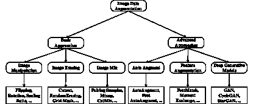

<!--yml

分类：未分类

日期：2024-09-06 19:46:55

-->

# [2204.08610] 图像数据增强在深度学习中的应用：综述

> 来源：[`ar5iv.labs.arxiv.org/html/2204.08610`](https://ar5iv.labs.arxiv.org/html/2204.08610)

# 图像数据增强在深度学习中的应用：综述

苏荣杨^(1,2)    魏康肖^(1,3)    孟晨张³    苏涵郭^(1,3)    贾恩赵⁴    傅饶申^(1,2)¹¹1 联系人 ¹ 南京大学软件技术国家重点实验室，中国

² 南京大学计算机科学与技术系，中国

³南京大学人工智能学院，中国

⁴南京大学电子科学与工程学院，中国

sryang@smail.nju.edu.cn, mg20370042@smail.nju.edu.cn, zhangmengchen@pjlab.org.cn, dg20370004@smail.nju.edu.cn, jianzhao@nju.edu.cn, frshen@nju.edu.cn

###### 摘要

深度学习在许多计算机视觉任务中取得了显著的成果。深度神经网络通常依赖大量的训练数据以避免过拟合。然而，实际应用中的标记数据可能有限。通过提高训练数据的数量和多样性，数据增强已成为深度学习模型训练中不可避免的一部分。

作为提高训练数据充分性和多样性的有效方式，数据增强已成为深度学习模型在图像数据上成功应用的必要部分。本文系统回顾了不同的图像数据增强方法。我们提出了这些方法的分类，并展示了它们的优点和局限性。我们还在三个典型的计算机视觉任务上进行了广泛的实验，包括语义分割、图像分类和目标检测。最后，我们讨论了数据增强面临的当前挑战以及未来研究方向，提出了一些有用的研究指导。

## 1 引言

深度学习在许多领域取得了令人难以置信的进展，包括计算机视觉（CV）Hassaballah 和 Awad (2020)、推荐系统（RS）Liu 等 (2021a)、自然语言处理（NLP）Torfi 等 (2020) 等。这些研究领域的发展主要受到以下三个方面的影响：深度网络架构的进展、强大的计算能力以及获取大数据的能力。

首先，网络架构的规模通常与其泛化能力成正比，例如 152 层的 ResNet He 等人（2016），与浅层网络相比，其通过增加深度可以获得显著的准确性提升。其次，计算能力的发展对深度学习有显著影响。随着计算能力的增强，可以设计出更深层次的模型。最后，充足的开放数据集，如 Imagenet Russakovsky 等人（2015）、MS-COCO Lin 等人（2014）和 PASCAL VOC Everingham 等人（2015），对深度学习模型的发展至关重要。

然而，我们观察到这三方面的发展存在一些不平衡。虽然为不同的计算机视觉任务提出了各种网络架构，且图形处理单元（GPU）的计算能力迅速提升，但对于使用数据增强方法生成合格训练数据的关注却较少。数据增强的核心思想是通过生成合成数据集来提高训练数据的充分性和多样性。增强的数据可以被视为从接近真实分布中提取的。然后，增强的数据集可以代表更全面的特征。但在图像数据增强方法中仍然存在一些研究挑战。首先，图像数据增强技术可以应用于各种计算机视觉任务，如目标检测 Liu 等人（2020）、语义分割 Minaee 等人（2021）和图像分类 Algan 和 Ulusoy（2021）。但挑战在于数据增强方法是任务独立的。因为操作同时在图像数据和标签上进行，而不同任务下标签类型不同，针对目标检测任务的数据增强方法不能直接应用于语义分割任务。这导致了效率低下和可扩展性差。

其次，数据增强的理论研究尚未开展。例如，对于足够的训练数据集的大小没有定量标准。生成的训练数据的大小通常根据个人经验和大量实验进行设计。此外，当原始数据集的大小非常小时，可能会存在悖论。我们将面临如何基于极少的数据生成合格数据的挑战。

据我们所知，相关图像数据增强研究的工作并未从计算机视觉任务的角度回顾图像数据增强方法。Wang 等人 (2017) 探索并比较了图像分类中数据增强的多种解决方案，但仅涉及图像分类任务和传统变换及生成对抗网络的实验。Wang 等人 (2020) 从变换类型和深度学习的角度回顾了现有的人脸数据增强工作，但调查仅针对人脸识别任务。另一项工作主要关注基于数据扭曲和过采样的不同数据增强技术，Khosla 和 Saini (2020)。然而，它没有提供不同方法的系统评审。与我们密切相关的另一项工作是 Shorten 和 Khoshgoftaar (2019)，它展示了一些现有方法和数据增强的有前景的发展，但没有对各种实际任务的数据增强效果进行评估，并且缺少一些新提出的方法，如 CutMix Yun 等人 (2019)、AugMix Hendrycks 等人 (2019)、GridMask Chen 等人 (2020) 等。

在本文中，我们旨在通过总结现有的新颖图像数据增强方法来填补上述空白。为此，我们提出了一种图像数据增强方法的分类，如图 1 所示。基于这一分类，我们从常见计算机视觉任务的角度系统回顾数据增强技术，包括目标检测、语义分割和图像分类。此外，我们还从这三种计算机视觉任务的角度进行实验。根据实验结果，我们比较了不同类型的数据增强方法及其组合在各种深度学习模型上的表现，使用了开放的图像数据集。我们还将讨论图像数据增强研究的未来方向。

图 1：图像数据增强方法的分类。

本文的其余部分组织如下。我们首先介绍基本的数据增强方法，如传统图像处理、基于图像擦除的方法和基于图像混合的方法。然后，我们讨论一些高级技术，包括自动增强方法、特征增强技术和深度生成模型。为了评估各种数据增强方法的效果，我们在三个典型的计算机视觉任务中使用各种常见的公共图像数据集进行实验。最后，我们强调一些未来研究的有前景方向。

## 2 基本数据增强方法

### 2.1 图像处理

基本图像处理侧重于图像变换，如旋转、翻转和裁剪等。大多数这些技术直接操作图像，且易于实现。考虑的方法在表格中以简洁的描述展示。1。

表 1：基本图像处理及其简洁描述。

|       方法 |       描述 |
| --- | --- |
|       翻转 |       水平、垂直或两者同时翻转图像。 |
|       旋转 |       以角度旋转图像。 |
|       缩放比例 |       增加或减少图像大小。 |
|       噪声注入 |       在图像中添加噪声。 |
|       颜色空间 |       更改图像颜色通道。 |
|       对比度 |       更改图像对比度。 |
|       锐化 |       修改图像的锐度。 |
|       平移 |       水平、垂直或两者同时移动图像。 |
|       裁剪 |       裁剪图像的子区域。 |

然而，存在一些缺点。首先，仅在现有数据遵循接近实际数据分布的假设下，应用基本图像处理才有意义。其次，一些基本图像处理方法，如平移和旋转，存在填充效应。也就是说，操作后，图像的一些区域会被移出边界并丢失。因此，将应用一些插值方法来填补空白部分。通常，图像边界之外的区域假定为常数 0，处理后会变成黑色。此外，无论是哪个 CV 任务，感兴趣的对象都不应移出画框。

### 2.2 图像擦除

基于图像擦除的图像增强方法通常会删除图像中的一个或多个子区域。主要思想是用常数值或随机值替换这些子区域的像素值。

在 DeVries 和 Taylor (2017b) 的研究中，作者考虑了一种简单的正则化技术，即在训练卷积神经网络（CNNs）时随机遮盖输入图像的方形区域，这被称为 cutout。这种方法能够提高 CNNs 的鲁棒性和整体性能。Singh 等人 (2018) 提出了 Hide-and-Seek (HaS) 方法，用于随机隐藏训练图像中的局部区域，这可以迫使网络在隐藏最具区分性的内容时寻求其他相关内容。Zhong 等人 (2020) 提出了随机擦除方法，该方法随机选择图像中的矩形区域，并用随机值替换其像素。这种方法虽然简单，但效果显著。最近，在 Chen 等人 (2020) 的研究中，作者分析了信息丢失的需求，并提出了一种结构化方法 GridMask，该方法也是基于删除输入图像中的区域。与 Cutout 和 HaS 不同，GridMask 不删除连续区域，也不随机选择方形区域，而是删除一组空间均匀分布的方形区域，其密度和大小可以控制。此外，为了平衡物体遮挡和信息保留，Li 等人 (2020) 提出了 FenceMask，该方法基于物体遮挡策略的模拟。

### 2.3 图像混合

图像混合数据增强近年来受到越来越多的关注。这些方法主要是通过将两张或更多的图像或图像的子区域混合成一张图像来完成的。

在 Inoue (2018) 中，作者通过将每个新图像与训练集中随机选择的两幅图像合成来扩大数据集，这被称为配对样本。使用的合成方法是对每个像素的两个图像的强度进行平均。 Zhang 等人 (2017) 讨论了一种更通用的合成方法，Mixup。Mixup 不仅仅是对两个图像的强度进行平均，而是进行凸组合样本对及其标签。因此，Mixup 在数据增强和监督信号之间建立了线性关系，并可以规范化神经网络，使其在训练样本之间偏好简单的线性行为。与配对样本和 Mixup 类似，Yun 等人 (2019) 提出了 CutMix。CutMix 不仅仅是简单地去除像素或混合训练集中的图像。CutMix 将去除的区域替换为另一张图像的补丁，相比 Mixup 可以生成更自然的图像。Harris 等人 (2020) 提出了 Fmix，该方法使用通过对来自傅里叶空间的低频图像应用阈值获得的随机二进制掩码。Fmix 可以采用各种形状的随机掩码，并且能提高相对于 Mixup 和 CutMix 的性能。与多个样本混合不同，AugMix Hendrycks 等人 (2019) 首先将多个增强操作混合成三条增强链，然后将几条增强链的结果以凸组合的方式混合。因此，整个过程通常是混合由相同图像在不同增强管道中生成的结果。在 ManifoldMix 中，Verma 等人 (2019) 通过混合隐藏表示而不是输入样本来改进神经网络在多个层次上的隐藏表示和决策边界。

## 3 高级方法

### 3.1 自动增强

研究人员试图自动搜索增强方法以获得更好的性能，而不是手动设计数据增强方法。Auto augment 已成为深度学习研究的前沿，并被广泛研究。Auto augment 基于不同数据具有不同特性的事实，因此不同的数据增强方法具有不同的好处。自动搜索增强方法比手动设计能带来更多的好处。Cubuk 等人 (2019) 描述了一种简单的程序，称为 AutoAugment，用于自动搜索改进的数据增强策略。具体而言，AutoAugment 包含两个部分：搜索算法和搜索空间。搜索算法旨在找到最高验证准确率的最佳策略。搜索空间包含许多策略，详细说明了各种增强操作及其应用的幅度。然而，自动增强方法的一个关键挑战是从大量候选操作的搜索空间中选择有效的增强策略。搜索算法通常使用 Reinforcement Learning Sutton 和 Barto (2018)，这带来了高时间成本。因此，为了减少 AutoAugment 的时间成本，Lim 等人 (2019) 提出了 Fast AutoAugment，通过基于密度匹配的更高效的搜索策略来寻找有效的增强策略。与 AutoAugment 相比，这种方法可以加快搜索时间。同时，Ho 等人 (2019) 提出了 Population Based Augmentation (PBA)，以减少 AutoAugment 的时间成本，该方法生成非固定的增强策略计划而不是固定的增强策略。PBA 能在较少的计算时间内匹配 AutoAugment 在多个数据集上的表现。最近，Cubuk 等人 (2020) 提出了 RandAugment，超越了所有以前的自动增强技术，包括 AutoAugment 和 PBA。RandAugment 通过去除单独的搜索，大大减少了数据增强的搜索空间，这在计算上是昂贵的。此外，RandAugment 进一步提高了 AutoAugment 和 PBA 的性能。

然而，数据增强可能会引入噪声增强示例，并对推断产生负面影响。因此，Gong 等人 (2021) 提出了 KeepAugment，利用显著性图来检测原始图像上的重要区域，然后在增强过程中保留这些信息丰富的区域。KeepAugment 自动改进数据增强方案，如 AutoAugment。在 Tian 等人 (2020) 的研究中，作者观察到后期训练中的增强操作更具影响力，并提出了 Augmentation-wise Weight Sharing 策略。与 AutoAugment 相比，该方法显著提高了效率，并使得在大规模数据集上直接搜索变得可行。与离线方式搜索的自动增强方法不同，Lin 等人 (2019) 将增强策略形式化为一个参数化的概率分布，参数可以与网络参数一起优化，称为 OHL-Auto-Aug。

### 3.2 特征增强

与仅在输入空间中进行数据增强不同，特征增强是在学习到的特征空间中进行变换。在 DeVries 和 Taylor (2017a) 的研究中，作者声称在流形上遍历时，更可能在特征空间中遇到真实的样本，而不是在输入空间中。因此，研究了通过操作数据在学习到的特征空间中的向量表示来进行的各种增强方法，包括添加噪声、最近邻插值和外推。最近，Kuo 等人 (2020) 提出了 FeatMatch，这是一种新颖的基于学习特征的细化和增强方法，用于产生一组复杂的变换。此外，FeatMatch 可以利用来自类内和类间原型表示的信息。更近期的研究中，Li 等人 (2021) 提出了一个隐式数据增强方法，称为 Moment Exchange，通过鼓励模型利用潜在特征的矩信息来实现。具体来说，将一个训练图像的学习特征的矩替换为另一个图像的矩。

### 3.3 深度生成模型

数据增强的**最终目标**是从分布中抽取样本，这些样本代表了数据集的生成机制。因此，我们生成数据的数据分布不应与原始数据分布不同。这是深度生成模型的核心思想。在所有深度生成模型方法中，生成对抗网络（GANs）**Goodfellow 等人**（2014）是非常具代表性的方法。一方面，生成器可以帮助生成新的图像。另一方面，判别器确保新生成的图像与原始图像之间的差距不会太大。尽管 GAN 确实是一种强大的无监督生成技术来增强数据**Perez 和 Wang**（2017），但如何生成高质量数据并评估它们仍然是一个具有挑战性的问题。在本小节中，我们将介绍一些基于 GAN 的图像数据增强技术。

在**Isola 等人**（2017）中，基于条件对抗网络**Mirza 和 Osindero**（2014），作者提出了 Pix2Pix 来学习从输入图像到输出图像的映射。然而，训练 Pix2Pix 需要大量配对数据。收集这些配对数据具有挑战性。因此，在**Zhu 等人**（2017）中，与 Pix2Pix 不同，提出了 CycleGAN 模型来学习从源域$X$到目标域$Y$的图像转换，且无需配对样本。随着源域和目标域数量的增加，CycleGAN 必须为每个配对域单独训练模型。例如，如果任务是进行$n$个域之间的转换，我们需要在每两个域之间训练$n\times(n-1)$个模型。为了解决这个问题，**Choi 等人**（2018）提出了 StarGAN，以提高处理多个域时的可扩展性和鲁棒性。一般来说，StarGAN 只建立一个模型来在多个域之间进行图像到图像的转换。在生成阶段，我们只需向生成器提供源图像和指示目标域的属性标签。然而，StarGAN 将域标签作为额外输入，并为每个域学习一个确定性映射，这可能导致每个域在给定输入图像时产生相同的输出。为了解决这个问题，**Choi 等人**（2020）提出了 StarGAN $v2$，这是一种可扩展的方法，可以在多个域之间生成多样化的图像。在这项工作中，研究人员将图像的域和风格定义为视觉上不同的类别组和每个图像的具体外观。例如，狗可以用作域，但狗的种类有很多，比如拉布拉多犬和哈士奇。因此，具体的狗品种可以视为图像的风格。通过这种方式，StarGAN $v2$可以将一个域的图像转换为目标域的多样化图像，并支持多个域。

## 4 评估

在本节中，根据我们的分类法，我们在三种典型的计算机视觉任务——语义分割、图像分类和目标检测——中进行了广泛的评估，以展示数据增强在提升性能方面的有效性。为了公平起见，我们使用了最常用的公共数据集进行此任务。

### 4.1 语义分割

在本小节中，我们对 PASCAL VOC 数据集进行了语义分割实验。在表 2 中，我们报告了多个语义分割模型在 Intersection over Union（IoU）指标上的性能提升：deeplabv3+ Liu et al. (2021b)、PSPNet Zhao et al. (2017)、GCNet Cao et al. (2019) 和 ISANet Huang et al. (2019)。

在我们的实验中，我们根据图 1 中的分类法应用了不同的数据增强方法。具体而言，应用的图像操作方法包括翻转、缩放比例、旋转、噪声注入、裁剪、平移和锐化。应用的图像擦除方法包括随机擦除、GridMask、FenceMask、Cutout 和 HaS。应用的图像混合方法包括马赛克、Mixup、CutMix 和 Fmix。表 2 展示了在语义分割模型上有无数据增强的平均 IoU。我们观察到数据增强方法对所有模型都带来了 IoU 的提升。

|       模型 |
| --- |

&#124;       无增强 &#124;

&#124;       (%) &#124;

|

&#124;       有增强 &#124;

&#124;       (%) &#124;

|

&#124;       提升 &#124;

&#124;       (%) &#124;

|

| --- | --- | --- | --- |
| --- | --- | --- | --- |
|       DeepLabV3+ |       75.32% |       75.75% |       0.53% |
|       PSPNet |       73.38% |       74.33% |       0.95% |
|       GCNet |       71.86% |       72.93% |       1.07% |
|       ISANet |       71.65% |       74.26% |       2.61% |

表 2：基于 IoU 和准确度的数据增强对语义分割的提升。

### 4.2 图像分类

在本实验中，我们比较了几种广泛使用的图像分类技术在数据增强前后的分类准确率，包括 Wide-ResNet Zagoruyko 和 Komodakis (2016)、DenseNet Huang 等 (2017) 和 Shake ResNet Gastaldi (2017)。这些模型在几个公共图像分类数据集上进行了评估，包括 CIFAR-10 Krizhevsky 和 Hinton (2010)、CIFAR-100 Krizhevsky et al. 和 SVHN Netzer 等 (2011)。此外，应用的数据增强方法与 4.1 中的方法相同，包括若干图像处理方法、图像擦除方法和图像混合方法。

表 3 总结了数据增强前后的图像分类结果。可以观察到，数据增强带来了平均准确率提升（AAI）。

|       数据集 |       模型 |
| --- | --- |

&#124;       w/o aug &#124;

&#124;       (%) &#124;

|

&#124;       w/ aug &#124;

&#124;       (%) &#124;

|

&#124;       AAI &#124;

&#124;       (%) &#124;

|

| --- | --- | --- | --- | --- |
| --- | --- | --- | --- | --- |
|  |       DenseNet |       94.15 |       94.59 |       0.44 |
|       CIFAR-10 |       Wide-ResNet |       93.34 |       94.67 |       1.33 |
|  |       Shake-ResNet |       93.7 |       94.84 |       1.11 |
|  |       DenseNet |       74.98 |       75.93 |       0.95 |
|       CIFAR-100 |       Wide-ResNet |       74.46 |       76.52 |       2.06 |
|  |       Shake-ResNet |       73.96 |       76.76 |       2.80 |
|  |       DenseNet |       97.91 |       97.98 |       0.07 |
|       SVHN |       Wide-ResNet |       98.23 |       98.31 |       0.80 |
|  |       Shake-ResNet |       98.37 |       98.40 |       0.30 |

表 3: 数据增强对 CIFAR-10、CIFAR-100 和 SVHN 的图像分类准确率提升。

### 4.3 目标检测

在本小节中，我们比较了各种图像数据增强方法在广泛使用的 COCO2017 数据集上的效果，该数据集通常用于目标检测任务。我们展示了在两个流行的目标检测深度模型 FasterRCNN Ren et al. (2016) 和 CenterNet Duan et al. (2019) 中，有无数据增强的实验结果。我们考虑的数据增强方法与 4.1 中使用的方法相同，包括几种图像处理方法、图像擦除方法和图像混合方法。在表 4 中，我们报告了在均值平均精度（mAP）、AP50 和 AP75 上的性能提升，并总结了所有方法的平均指标。我们观察到数据增强方法带来了有希望的性能提升。

|       指标 |  |       Faster R-CNN |       CenterNet |
| --- | --- | --- | --- |
|  |       无增强 |       36.40 |       41.42 |

|

&#124;       mAP &#124;

&#124;       (%) &#124;

|       有增强 |       36.80 |       41.15 |
| --- | --- | --- |
|  |       API |       2.40 |       -0.27 |
|  |       无增强 |       57.20 |       58.29 |

|

&#124;       AP50 &#124;

&#124;       (%) &#124;

|       有增强 |       58.0 |       58.01 |
| --- | --- | --- |
|  |       API |       0.80 |       -0.28 |
|  |       无增强 |       39.50 |       45.53 |

|

&#124;       AP75 &#124;

&#124;       (%) &#124;

|       有增强 |       40.0 |       45.30 |
| --- | --- | --- |
|  |       API |       0.50 |       -0.23 |

表 4：COCO2017 数据集上应用数据增强方法与未应用数据增强方法的目标检测结果。

## 5 未来方向的讨论

尽管在图像数据增强研究中做出了大量努力以提高深度学习模型的性能，但仍存在一些未完全解决的开放问题，具体总结如下。

关于数据增强的理论研究。目前对数据增强的理论研究仍然不足。数据增强更多被视为一种辅助工具，用于提升性能。具体来说，一些方法可以提高准确性，但我们并没有完全理解其背后的原因，例如配对样本和混合样本。对于人眼来说，配对样本和混合样本的增强数据在视觉上并没有意义。此外，对于足够训练数据集的规模也没有理论支持。适合任务和模型的数据集规模通常是基于个人经验和大量实验设计的。例如，研究人员根据具体模型、训练目标和数据收集的难度来确定数据集的规模。严格和彻底的可解释性不仅可以解释为什么一些增强技术是有效的，还可以帮助指导选择或设计最适用和有效的方法来扩展我们的数据集。因此，一个关键的未来视角是为数据增强开发理论支持。

数据增强方法的评估。训练数据的数量和多样性对模型的泛化能力非常重要。然而，由于没有统一的指标，如何评估合成图像的质量仍然是一个未解决的问题 Salimans 等人 (2016)。在这一阶段，研究人员通过以下几种方式评估合成数据的质量。首先，合成数据通常通过人工评估，这既耗时又劳动密集且主观。亚马逊机械土耳其人（AMT）常用于评估输出的真实性。AMT 通过要求参与者对使用不同方法合成的各种图像进行投票，来评估生成图像的质量和真实性。其次，一些研究将评估与特定任务结合起来，即根据任务指标在有无数据增强的情况下评估数据增强方法，例如通过分类精度评估分类任务，通过掩膜的 IOU 评估语义分割。然而，没有专门针对合成数据本身的评估指标。通常，评估指标基于个体数据的多样性和整体数据分布的一致性，而不考虑任务是什么。数据质量分析可以帮助设计评估指标。

类别不平衡。类别不平衡或数据非常少会严重扭曲数据分布 Sun 等人 (2009)。这种情况发生是因为学习过程通常对多数类样本存在偏向，从而少数类样本未得到良好建模。合成少数类过采样技术 (SMOTE) Chawla 等人 (2002) 是对少数类进行过采样。然而，过采样是重复从当前数据集中抽取。这可能会饱和少数类并导致过拟合。*最终*，我们期望生成的数据可以模拟与训练数据相似的分布，同时保持多样性不丧失。

生成数据的数量。数据增强的一个有趣点是，训练数据量的增加并不完全与性能提升成正比。当达到一定量的数据时，继续增加数据并不会改善效果。这可能部分是因为尽管数据量增加了，但数据的多样性保持不变。因此，生成多少数据才足以提高模型性能还有待进一步探索。

数据增强的选择和组合。由于各种数据增强可以组合生成新的图像数据，因此数据增强技术的选择和组合至关重要。图像识别实验显示，Pawara 等人 (2017) 的组合方法通常比单一方法效果更好。因此，选择和组合方法是进行数据增强时的关键点。然而，从我们的评估来看，适用于不同数据集和任务的方法并不相同。因此，必须为每个新的任务和数据集仔细设计、实施和测试增强方法集合。

## 6 结论

随着深度学习的发展，对训练数据集的要求变得越来越严格。因此，我们强调数据增强是解决有限标记图像数据短缺的有效方案。本文对各种计算机视觉任务中的图像数据增强方法进行了全面回顾。我们提出了一个分类法，总结了每个类别中的代表性方法。然后，我们在各种计算机视觉任务中对这些方法进行了实证比较。最后，我们讨论了挑战，并强调了未来的前景。

## 参考文献

+   Algan 和 Ulusoy [2021] Görkem Algan 和 Ilkay Ulusoy。在存在噪声标签的情况下进行图像分类：一项调查。《知识基系统》，215:106771，2021 年。

+   Cao 等人 [2019] Yue Cao, Jiarui Xu, Stephen Lin, Fangyun Wei 和 Han Hu。Gcnet: 非局部网络遇见挤压激励网络及其更远。arXiv 预印本 arXiv:1904.11492，2019 年。

+   Chawla 等人 [2002] Nitesh V Chawla, Kevin W Bowyer, Lawrence O Hall 和 W Philip Kegelmeyer。Smote: 合成少数类过采样技术。《人工智能研究杂志》，16:321–357，2002 年。

+   Chen 等 [2020] Pengguang Chen, Shu Liu, Hengshuang Zhao 和 Jiaya Jia. Gridmask 数据增强。arXiv 预印本 arXiv:2001.04086, 2020。

+   Choi 等 [2018] Yunjey Choi, Minje Choi, Munyoung Kim, Jung-Woo Ha, Sunghun Kim 和 Jaegul Choo. Stargan：用于多领域图像到图像转换的统一生成对抗网络。发表于 IEEE 计算机视觉与模式识别会议（CVPR）论文集，页面 8789–8797, 2018。

+   Choi 等 [2020] Yunjey Choi, Youngjung Uh, Jaejun Yoo 和 Jung-Woo Ha. Stargan v2：多领域的多样化图像合成。发表于 IEEE 计算机视觉与模式识别会议（CVPR）论文集，页面 8185–8194, 2020。

+   Cubuk 等 [2019] Ekin D Cubuk, Barret Zoph, Dandelion Mane, Vijay Vasudevan 和 Quoc V Le. Autoaugment：从数据中学习增强策略。发表于 IEEE/CVF 计算机视觉与模式识别大会论文集，页面 113–123, 2019。

+   Cubuk 等 [2020] Ekin D Cubuk, Barret Zoph, Jonathon Shlens 和 Quoc V Le. Randaugment：一种实用的自动化数据增强方法，具有简化的搜索空间。发表于 IEEE/CVF 计算机视觉与模式识别大会研讨会论文集，页面 702–703, 2020。

+   DeVries 和 Taylor [2017a] Terrance DeVries 和 Graham W Taylor. 特征空间中的数据集增强。arXiv 预印本 arXiv:1702.05538, 2017。

+   DeVries 和 Taylor [2017b] Terrance DeVries 和 Graham W Taylor. 改进的卷积神经网络正则化方法。arXiv 预印本 arXiv:1708.04552, 2017。

+   Duan 等 [2019] Kaiwen Duan, Song Bai, Lingxi Xie, Honggang Qi, Qingming Huang 和 Qi Tian. Centernet：用于目标检测的关键点三元组。发表于 IEEE/CVF 国际计算机视觉大会论文集，页面 6569–6578, 2019。

+   Everingham 等 [2015] Mark Everingham, S. M. Ali Eslami, Luc Van Gool, Christopher K. I. Williams, John M. Winn 和 Andrew Zisserman. Pascal 视觉目标类别挑战：回顾。Int. J. Comput. Vis., 111(1):98–136, 2015 年 1 月。

+   Gastaldi [2017] Xavier Gastaldi. Shake-shake 正则化。arXiv 预印本 arXiv:1705.07485, 2017。

+   Gong 等 [2021] Chengyue Gong, Dilin Wang, Meng Li, Vikas Chandra 和 Qiang Liu. Keepaugment：一种简单的信息保留数据增强方法。发表于 IEEE/CVF 计算机视觉与模式识别大会论文集，页面 1055–1064, 2021。

+   Goodfellow 等 [2014] Ian Goodfellow, Jean Pouget-Abadie, Mehdi Mirza, Bing Xu, David Warde-Farley, Sherjil Ozair, Aaron Courville 和 Yoshua Bengio. 生成对抗网络。发表于 NIPS 会议论文集，页面 2672–2680, 2014。

+   Harris 等 [2020] Ethan Harris, Antonia Marcu, Matthew Painter, Mahesan Niranjan, Adam Prügel-Bennett 和 Jonathon Hare. Fmix：增强混合样本数据增强。arXiv 预印本 arXiv:2002.12047, 2020。

+   Hassaballah 和 Awad [2020] Mahmoud Hassaballah 和 Ali Ismail Awad. 计算机视觉中的深度学习：原理与应用。CRC Press, 2020。

+   He 等人 [2016] Kaiming He, Xiangyu Zhang, Shaoqing Ren 和 Jian Sun. 图像识别的深度残差学习. 发表在 IEEE 计算机视觉与模式识别会议 (CVPR) 论文集，页面 770–778，2016 年。

+   Hendrycks 等人 [2019] Dan Hendrycks, Norman Mu, Ekin D Cubuk, Barret Zoph, Justin Gilmer 和 Balaji Lakshminarayanan. Augmix: 一种简单的数据处理方法以提高鲁棒性和不确定性. arXiv 预印本 arXiv:1912.02781，2019 年。

+   Ho 等人 [2019] Daniel Ho, Eric Liang, Xi Chen, Ion Stoica 和 Pieter Abbeel. 基于人群的增强：有效的增强策略调度学习. 发表在国际机器学习会议，页面 2731–2741。PMLR，2019 年。

+   Huang 等人 [2017] Gao Huang, Zhuang Liu, Laurens Van Der Maaten 和 Kilian Q Weinberger. 密集连接卷积网络. 发表在 IEEE 计算机视觉与模式识别会议论文集，页面 4700–4708，2017 年。

+   Huang 等人 [2019] Lang Huang, Yuhui Yuan, Jianyuan Guo, Chao Zhang, Xilin Chen 和 Jingdong Wang. 用于语义分割的交织稀疏自注意力. arXiv 预印本 arXiv:1907.12273，2019 年。

+   Inoue [2018] Hiroshi Inoue. 通过样本配对进行图像分类的数据增强. CoRR, abs/1801.02929，2018 年。

+   Isola 等人 [2017] Phillip Isola, Jun-Yan Zhu, Tinghui Zhou 和 Alexei A Efros. 条件对抗网络的图像到图像翻译. 发表在 IEEE 计算机视觉与模式识别会议 (CVPR) 论文集，页面 1125–1134，2017 年。

+   Khosla 和 Saini [2020] Cherry Khosla 和 Baljit Singh Saini. 通过不同的数据增强技术提升深度学习模型性能的调查. 发表在 2020 国际智能工程与管理会议 (ICIEM)，页面 79–85，2020 年。

+   Krizhevsky 和 Hinton [2010] Alex Krizhevsky 和 Geoff Hinton. CIFAR-10 上的卷积深度信念网络. 未发表手稿，40(7):1–9，2010 年。

+   [27] Alex Krizhevsky, Vinod Nair 和 Geoffrey Hinton. CIFAR-100（加拿大高级研究院）。

+   Kuo 等人 [2020] Chia-Wen Kuo, Chih-Yao Ma, Jia-Bin Huang 和 Zsolt Kira. Featmatch: 基于特征的半监督学习增强. 发表在欧洲计算机视觉会议，页面 479–495。Springer，2020 年。

+   Li 等人 [2020] Pu Li, Xiangyang Li 和 Xiang Long. Fencemask: 一种针对预提取图像特征的数据增强方法. arXiv 预印本 arXiv:2006.07877，2020 年。

+   Li 等人 [2021] Boyi Li, Felix Wu, Ser-Nam Lim, Serge Belongie 和 Kilian Q. Weinberger. 关于特征标准化和数据增强. 发表在 IEEE/CVF 计算机视觉与模式识别会议 (CVPR) 论文集，页面 12383–12392，2021 年 6 月。

+   Lim 等人 [2019] Sungbin Lim, Ildoo Kim, Taesup Kim, Chiheon Kim 和 Sungwoong Kim. 快速自动增强. 神经信息处理系统进展，32:6665–6675，2019 年。

+   Lin et al. [2014] Tsung-Yi Lin, Michael Maire, Serge J. Belongie, James Hays, Pietro Perona, Deva Ramanan, Piotr Dollár, 和 C. Lawrence Zitnick. Microsoft COCO: 背景中的常见对象。ECCV 会议论文集, 计算机科学讲义系列第 8693 卷, 页码 740–755, Springer, 2014 年。

+   Lin et al. [2019] Chen Lin, Minghao Guo, Chuming Li, Xin Yuan, Wei Wu, Junjie Yan, Dahua Lin, 和 Wanli Ouyang. 用于自动增强策略的在线超参数学习。IEEE/CVF 国际计算机视觉会议论文集, 页码 6579–6588, 2019 年。

+   Liu et al. [2020] Li Liu, Wanli Ouyang, Xiaogang Wang, Paul Fieguth, Jie Chen, Xinwang Liu, 和 Matti Pietikäinen. 通用目标检测的深度学习：综述。国际计算机视觉期刊, 128(2):261–318, 2020 年。

+   Liu et al. [2021a] Baichuan Liu, Qingtao Zeng, Likun Lu, Yeli Li, 和 Fucheng You. 基于深度学习的推荐系统综述。物理学杂志：会议系列, 1754(1):012148, 2021 年 2 月。

+   Liu et al. [2021b] Baichuan Liu, Qingtao Zeng, Likun Lu, Yeli Li, 和 Fucheng You. 基于深度学习的推荐系统综述。物理学杂志：会议系列, 1754(1):012148, 2021 年 2 月。

+   Minaee et al. [2021] Shervin Minaee, Yuri Y Boykov, Fatih Porikli, Antonio J Plaza, Nasser Kehtarnavaz, 和 Demetri Terzopoulos. 使用深度学习的图像分割：综述。IEEE 计算机视觉与模式分析汇刊, 2021 年。

+   Mirza and Osindero [2014] Mehdi Mirza 和 Simon Osindero. 条件生成对抗网络。CoRR, abs/1411.1784, 2014 年。

+   Netzer et al. [2011] Yuval Netzer, Tao Wang, Adam Coates, Alessandro Bissacco, Bo Wu, 和 Andrew Y Ng. 使用无监督特征学习读取自然图像中的数字。2011 年。

+   Pawara et al. [2017] Pornntiwa Pawara, Emmanuel Okafor, Lambert Schomaker, 和 Marco Wiering. 用于植物分类的数据增强。国际智能视觉系统高级概念会议论文集, 页码 615–626, Springer, 2017 年。

+   Perez and Wang [2017] Luis Perez 和 Jason Wang. 使用深度学习进行图像分类的数据增强效果。CoRR, abs/1712.04621, 2017 年。

+   Ren et al. [2016] Shaoqing Ren, Kaiming He, Ross Girshick, and Jian Sun. Faster r-cnn: 通过区域提议网络实现实时目标检测。IEEE Trans. Pattern Anal. Mach. Intell., 39(6):1137–1149, 2016 年 1 月。

+   Russakovsky et al. [2015] Olga Russakovsky, Jia Deng, Hao Su, Jonathan Krause, Sanjeev Satheesh, Sean Ma, Zhiheng Huang, Andrej Karpathy, Aditya Khosla, Michael Bernstein, Alexander C. Berg, 和 Li Fei-Fei. ImageNet 大规模视觉识别挑战。国际计算机视觉期刊, 115(3):211–252, 2015 年。

+   Salimans et al. [2016] Tim Salimans, Ian Goodfellow, Wojciech Zaremba, Vicki Cheung, Alec Radford, 和 Xi Chen. 改进的生成对抗网络训练技术。NIPS 会议论文集, 页码 2234–2242, 2016 年。

+   Shorten 和 Khoshgoftaar [2019] Connor Shorten 和 Taghi M Khoshgoftaar. 关于深度学习图像数据增强的调查。大数据期刊，6(1):1–48，2019。

+   Singh 等 [2018] Krishna Kumar Singh, Hao Yu, Aron Sarmasi, Gautam Pradeep 和 Yong Jae Lee. 躲猫猫：一种用于弱监督定位及其他的数据显示增强技术。arXiv 预印本 arXiv:1811.02545，2018。

+   Sun 等 [2009] Yanmin Sun, Andrew KC Wong 和 Mohamed S Kamel. 不平衡数据分类：综述。国际模式识别与人工智能期刊，23(04):687–719，2009。

+   Sutton 和 Barto [2018] Richard S Sutton 和 Andrew G Barto. 强化学习：导论。MIT press，2018。

+   Tian 等 [2020] Keyu Tian, Chen Lin, Ming Sun, Luping Zhou, Junjie Yan 和 Wanli Ouyang. 通过增强-wise 权重共享改进自动增强。arXiv 预印本 arXiv:2009.14737，2020。

+   Torfi 等 [2020] Amirsina Torfi, Rouzbeh A Shirvani, Yaser Keneshloo, Nader Tavaf 和 Edward A Fox. 深度学习推动的自然语言处理进展：综述。arXiv 预印本 arXiv:2003.01200，2020。

+   Verma 等 [2019] Vikas Verma, Alex Lamb, Christopher Beckham, Amir Najafi, Ioannis Mitliagkas, David Lopez-Paz 和 Yoshua Bengio. 流形 mixup：通过插值隐藏状态来获得更好的表示。在国际机器学习大会论文集，页码 6438–6447。PMLR，2019。

+   Wang 等 [2017] Jason Wang, Luis Perez 等. 使用深度学习进行图像分类的数据增强效果。卷积神经网络视觉识别，11:1–8，2017。

+   Wang 等 [2020] Xiang Wang, Kai Wang 和 Shiguo Lian. 关于面部数据增强以训练深度神经网络的调查。神经计算与应用，页码 1–29，2020。

+   Yun 等 [2019] Sangdoo Yun, Dongyoon Han, Seong Joon Oh, Sanghyuk Chun, Junsuk Choe 和 Youngjoon Yoo. Cutmix：一种用于训练具有可定位特征的强分类器的正则化策略。见 IEEE/CVF 国际计算机视觉大会论文集，页码 6023–6032，2019。

+   Zagoruyko 和 Komodakis [2016] Sergey Zagoruyko 和 Nikos Komodakis. 宽残差网络。arXiv 预印本 arXiv:1605.07146，2016。

+   Zhang 等 [2017] Hongyi Zhang, Moustapha Cisse, Yann N Dauphin 和 David Lopez-Paz. mixup: 超越经验风险最小化。arXiv 预印本 arXiv:1710.09412，2017。

+   Zhao 等 [2017] Hengshuang Zhao, Jianping Shi, Xiaojuan Qi, Xiaogang Wang 和 Jiaya Jia. 金字塔场景解析网络。见 IEEE 计算机视觉与模式识别会议论文集 (CVPR)，2017。

+   Zhong 等 [2020] Zhun Zhong, Liang Zheng, Guoliang Kang, Shaozi Li 和 Yi Yang. 随机擦除数据增强。见 第三十四届 AAAI 人工智能会议论文集，AAAI 2020，第三十二届人工智能创新应用会议，IAAI 2020，第十届 AAAI 教育进展研讨会，EAAI，页码 13001–13008。AAAI Press，2020。

+   Zhu 等人 [2017] Jun-Yan Zhu、Taesung Park、Phillip Isola 和 Alexei A Efros。使用循环一致性对抗网络的无配对图像到图像转换。发表于《IEEE 计算机视觉与模式识别会议》（CVPR），第 2223–2232 页，2017 年。
