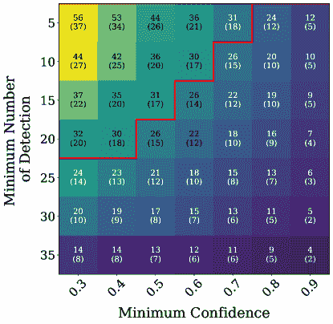
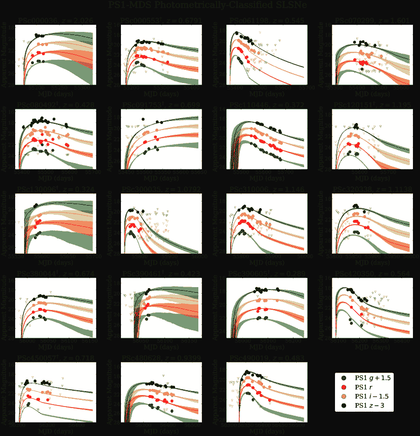
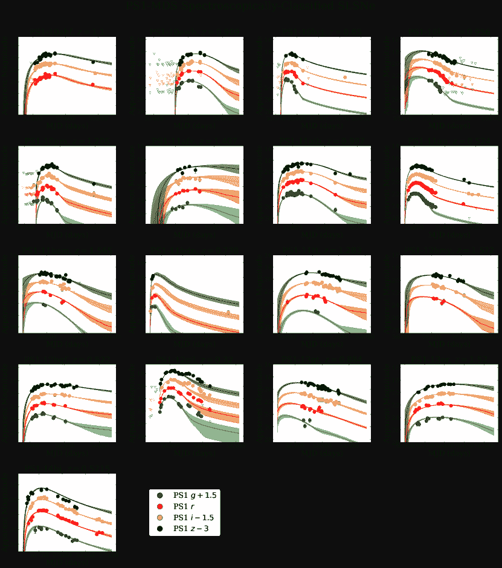
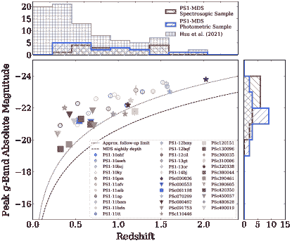
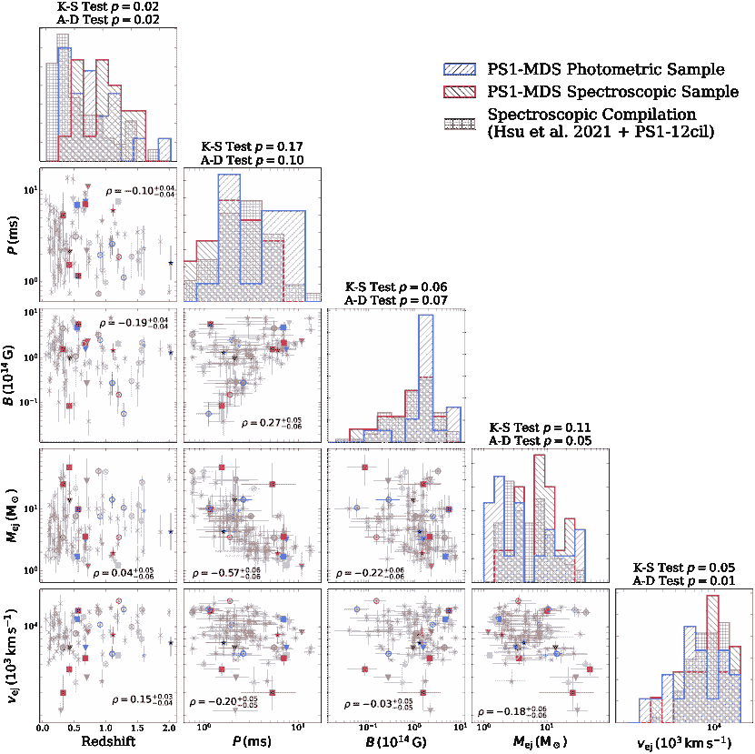
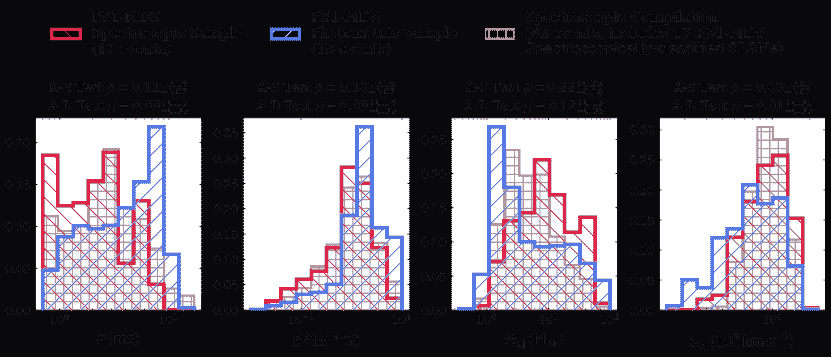
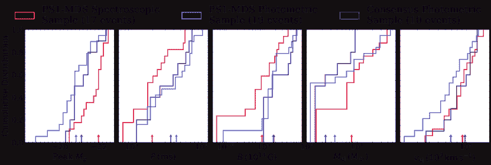

<!--yml

category: 未分类

date: 2024-09-06 19:46:53

-->

# [2204.09809] 光度分类的超光度超新星：基于机器学习分类的科学案例研究

> 来源：[`ar5iv.labs.arxiv.org/html/2204.09809`](https://ar5iv.labs.arxiv.org/html/2204.09809)

# 光度分类的超光度超新星：基于机器学习分类的科学案例研究

[Brian Hsu](https://orcid.org/0000-0002-9454-1742) 天体物理中心 | 哈佛与史密森学会，60 Garden Street, Cambridge, MA 02138-1516, USA [Griffin Hosseinzadeh](https://orcid.org/0000-0002-0832-2974) 斯图尔德天文台，亚利桑那大学，933 North Cherry Avenue, Tucson, AZ 85721-0065, USA [V. Ashley Villar](https://orcid.org/0000-0002-5814-4061) 天文学与天体物理学系，宾夕法尼亚州立大学，University Park, PA 16802, USA 计算与数据科学研究所，宾夕法尼亚州立大学，University Park, PA 16802, USA 引力与宇宙研究所，宾夕法尼亚州立大学，University Park, PA 16802, USA [Edo Berger](https://orcid.org/0000-0002-9392-9681) 天体物理中心 | 哈佛与史密森学会，60 Garden Street, Cambridge, MA 02138-1516, USA NSF 人工智能研究所

###### 摘要

随着即将到来的维拉·C·鲁宾天文台遗产空间与时间巡天（LSST），预计仅有 $\sim 0.1\%$ 的瞬态天体将被光谱分类。为了研究稀有的瞬态天体，例如 I 型超光度超新星（SLSNe），我们必须依赖光度分类。在这种背景下，我们进行了一项关于 SLSNe 的初步研究，使用我们的 SuperRAENN 和 Superphot 算法对 Pan-STARRS1 中深度巡天（PS1-MDS）中的 SLSNe 进行光度分类。我们首先利用一系列简单选择指标构建了一个光度样本的子样本，旨在最小化污染并确保足够的数据质量用于建模。然后，我们使用瞬态天体模块化开源拟合器（MOSFiT）将多波段光曲线拟合为磁星自旋衰减模型。通过将光度样本的磁星引擎和喷发物参数分布与 PS1-MDS 光谱样本及更大文献光谱样本的分布进行比较，我们发现这些样本总体一致，但光度样本扩展到了更慢的自旋和更低的喷发物质量，这对应于较低光度事件，符合光度选择的预期。尽管我们的 PS1-MDS 光度样本仍小于整体 SLSN 光谱样本，但我们的方法为通过光度选择和研究在 LSST 时代实现 SLSN 样本数量的数量级增长奠定了基础。

超新星（1668）

## 1 引言

贫氢（I 型）超亮超新星（以下简称 SLSNe）是核心塌缩超新星（CCSNe）的一个稀有亚类，它们在 UV/光学中辐射的能量是典型 CCSNe 的$\sim 10-100$倍，通常表现出更长的持续时间和更热的连续光谱（例如，Chomiuk et al., 2011; Quimby et al., 2011; Nicholl et al., 2015; Inserra et al., 2017; Lunnan et al., 2018; De Cia et al., 2018）。SLSNe 仅占体积 CCSN 率的$\sim 0.1\%$（Quimby et al., 2018; Frohmaier et al., 2021），但在限光度光学调查中，它们占所有瞬态的$\sim 2\%$（Perley et al., 2020; Gomez et al., 2021），这要归功于它们的高光度。SLSNe 在光谱上被分类为缺乏氢巴尔末线、存在蓝色连续谱，以及在$\sim 3600-4600$ Å 处具有独特的早期“W”形 O II 吸收线（例如，Lunnan et al., 2013; Mazzali et al., 2016; Quimby et al., 2018; Nicholl, 2021）。

已提出几种机制来驱动 SLSNe，但**磁星中心引擎模型**（Kasen & Bildsten, 2010; Woosley, 2010; Dessart et al., 2012; Metzger et al., 2015; Nicholl et al., 2017b）在解释 SLSN 群体的光变曲线和光谱方面最为成功。该模型解释了峰值光度和时间尺度的广泛范围（例如，Nicholl et al. 2017b; Blanchard et al. 2020），早期 UV/光学光谱（例如，Nicholl et al. 2017a），星云阶段光谱（例如，Nicholl et al. 2016b, 2019; Jerkstrand et al. 2017），以及 SN 2015bn 和 SN 2016inl 在$\gtrsim 10^{3}$ d 处观察到的幂律衰减率（Nicholl et al., 2018; Blanchard et al., 2021）。对磁星引擎的额外支持来自 SLSNe 的低金属量宿主星系，这些星系最接近于长时间伽马射线暴的宿主，后者是一种可能由中心引擎驱动的稀有 CCSNe 群体（Lunnan et al., 2014; Perley et al., 2016）。虽然磁星引擎模型可以解释大量 SLSN 特性，但也提出了其他机制来解释一些 SLSN 特性；例如，Chen et al. (2022) 最近主张 Zwicky 瞬态设施（ZTF; Bellm et al. 2019）中至少一些 SLSNe 的光变曲线可以通过环星际相互作用（CSM）和 Ni⁵⁶衰变的组合同样解释。此外，Hosseinzadeh et al. (2021) 还探索了抛射物-CSM 相互作用作为 SLSN 光变曲线中峰后波动的潜在来源。

随着正在进行和即将开始的广域光学调查，特别是 Vera C. Rubin 天文台的空间和时间遗产调查（LSST; Ivezić et al., 2019），只有一小部分超新星正在进行光谱分类（目前约为 $\sim 10\%$，LSST 预计约为 $\sim 0.1\%$; Villar et al. 2020）。这影响了对稀有超新星类别（如 SLSNe）研究的能力。正如 Villar et al. (2018) 所示，LSST 可能每年发现 $\sim 10^{4}$ 个 SLSNe 至 $z\sim 3$（其中至少 $\sim 20\%$ 将具有良好测量的物理属性），但识别这些事件需要光度分类。

最近，我们提出了两个基于机器学习的超新星光度分类流程，SuperRAENN (Villar et al., 2020) 和 Superphot (Hosseinzadeh et al., 2020)，这些流程基于来自 Pan-STARRS1 中深层调查 (PS1-MDS; Huber et al., 2017) 的 2315 个类超新星瞬变进行训练。这两个分类器使用了多个超新星类别，特别是 SLSNe。SuperRAENN 结合了一种新颖的无监督递归自编码神经网络（RAENN）和随机森林分类器，形成了一种半监督算法。Superphot 利用基于光曲线及其结果参数的灵活分析模型拟合的随机森林方法。

在这里，作为对 LSST 时代将至关重要的方法和分析类型的演示，我们首次探讨和研究了来自 Pan-STARRS1 中深层调查 (PS1-MDS, Huber et al., 2017) 的光度分类 SLSNe，这些是由 SuperRAENN 和 Superphot 识别的。我们首先探讨如何从光度分类样本中有效地构建一个纯净且测量良好的 SLSNe 子集（§2）。然后，我们使用先前用于研究光谱分类 SLSNe 的相同磁星发动机模型（使用 MOSFiT, Guillochon et al. 2018；§3）对光度分类的 SLSNe 光曲线进行建模。最后，我们将结果参数分布与光谱分类 PS1-MDS SLSNe 的分布进行比较，以及与总体光谱分类 SLSNe 样本的比较（§4）。

本文中，我们假设基于普朗克 2015 年的结果(普朗克协作组，2016)，采用了平坦的$\Lambda$CDM 宇宙学模型，其中$\Omega_{\mathrm{m}}=0.308$，$H_{0}=67.8\ \text{km}\ \text{s}^{-1}\ \text{Mpc}$。我们使用 Schlafly & Finkbeiner (2011)修正了所有的光度测量，遵循了 Fitzpatrick (1999)的消光定律，$R_{V}=3.1$。

## 2 样本构建

表 1：顺序选择标准

| 指标 |  |  | 两者 | 总 SLSNe |
| --- | --- | --- | --- | --- |
|  | SuperRAENN | Superphot |  |  |
| --- | --- | --- | --- | --- |
| (顺序应用) |  |  | 算法 | 分类   ^($\ast$)^($\ast$)footnotemark: |
| --- | --- | --- | --- | --- |
| 未应用任何标准 | 37 | 58 | 28 | 67 |
| 不在$1^{\prime\prime}$内的 AGN 宿主中心 | 25 | 44 | 16 | 53 |
| 分类置信度 $\geq$ 0.5 | 18 | 28 | 10 | 36 |
| 跨越所有 4 个波段的探测 $\geq$ 11 | 16 | 17 | 9 | 24 |
| PSRF $\leq 1.1$ | 13 | 13 | 7 | 19 |

^∗^∗脚注: 光度分类为 SLSNe 的总数将考虑两种算法对事件的分类。

本文使用的数据来自 PS1-MDS。我们推荐读者参阅 Chambers et al.(2016)以获取 PS1 调查望远镜和 PS1-MDS 观测策略的详细信息，以及 Villar et al.(2020)和 Hosseinzadeh et al.(2020)以获取类似 SNe 瞬变体的整体样本和其光变曲线的定义，光谱分类事件的子样本描述，光度分类方法和结果，所有相关数据（包括光度和宿主星系红移），以及算法和训练过程的完整描述。

本文中，我们关注光度分类为 SLSNe 的样本。¹¹1 两种分类管道均是开源的，并可通过 GitHub 获取：[`github.com/villrv/SuperRAENN`](https://github.com/villrv/SuperRAENN)和[`github.com/griffin-h/superphot`](https://github.com/griffin-h/superphot)。我们使用 SuperRAENN (Villar et al., 2020)和 Superphot (Villar et al., 2018; Hosseinzadeh et al., 2020)对 58 和 37 个 SLSNe 进行了光度分类，使用了相同的 557 个光谱分类 SNe 的训练集，其中包括在 Lunnan et al.(2018)中研究过的 17 个 SLSNe。在这里，我们采用具有最高概率的类别作为每个瞬变天体的预测 SN 类型。

结合由两个算法分类为 SLSNe 的所有瞬态事件，并考虑到有 28 个事件被两个算法都分类为 SLSNe，我们获得了一个初步样本，包含 67 个光度分类的 SLSNe。为了进一步评估和可能剔除光度样本，我们调查了几个后分类选择标准。我们发现三个有效的标准，有助于减少样本污染，并导致具有足够数据以进行稳健建模的事件。此外，我们在建模后应用了基于模型收敛的附加质量筛选。这些标准及其对样本大小的影响总结在表 1 中，我们将在下面详细讨论这些标准。

### 2.1 活跃星系核宿主星系

在将我们的算法应用于 PS1-MDS SN 类瞬态样本之前，我们系统地排除了具有长期变异性的光变曲线，以避免活跃星系核（AGN）的干扰。然而，一些在调查的 4.5 年时间跨度内几乎没有其他变异的大型 AGN 闪光可能会通过这一初步的定性筛选，并最终被归类为 SLSNe。特别是，Hosseinzadeh 等人（2020）发现 14 个光度分类的 SLSNe，其宿主星系光谱展示了宽的 AGN 谱线，位于宿主中心$1^{\prime\prime}$范围内²²2 这些瞬态事件包括 PSc000478、PSc010120、PSc010186、PSc020026、PSc030013、PSc052281、PSc110163、PSc130394、PSc130732、PSc350614、PSc390545、PSc400050、PSc480585 和 PSc550061。虽然这些在原则上可以是位于 AGN 近旁的 SLSNe，但它们更可能是大型 AGN 闪光或潮汐破坏事件，这些都不是 SuperRAENN 和 Superphot 中的分类类别。排除这些事件后，结果是一个包含 53 个事件的综合样本（表 1，第 2 行）。

### 2.2 分类信心

我们的初步样本要求将最高的分类概率分配为 SLSN。然而，鉴于分类类别的数量，这并不一定意味着分类信心很高。Hosseinzadeh 等人（2020）和 Villar 等人（2020）表明，将分类信心阈值提高到 $p\gtrsim 0.75$ 可以在所有类别范围内提高纯度³³纯度指的是给定光度类中属于等效光谱类的部分（Hosseinzadeh 等人，2020）。，但这会以样本完整性为代价。在这里，我们应用分类信心阈值 $p_{\rm SLSN}\geq 0.5$，作为纯度和样本大小之间的折衷（这对应于大约 $0.78$ 的纯度，见 Hosseinzadeh 等人 2020）。这一选择标准将样本大小从 53 减少到 36 个事件（表 1，第 3 行）。

### 2.3 光变曲线数据点数量

分类信心和利用 MOSFiT (§3.1) 有意义地建模光变曲线的能力都受到光变曲线数据点数量的影响；即，数据点的数量与约束 MOSFiT 模型和返回统计上有意义的后验分布的能力相关。这里我们设置了一个阈值：四个观测滤光片（$griz$）总共 $\geq 11$ 个数据点，以匹配模型自由参数的数量⁴⁴一个参数设置为常数值，剩下 11 个自由参数；见 §3.1。这一选择标准将样本大小从 36 减少到 24（表 1，第 4 行）。

### 2.4 模型收敛

前述选择标准在建模之前应用。在应用了所有三个标准后，我们使用在 MOSFiT 中实现的磁星中心引擎模型对 24 个光度分类的 SLSNe 进行建模。虽然我们已经减少了样本以仅识别数据点足够且作为 SLSNe 具有高置信度的事件，但具有边际检测或可能被误分类的事件原则上仍可能存活于上述预建模选择指标中。因此，我们基于模型收敛因子进行额外的筛选，该因子通过计算 Gelman-Rubin 统计量或潜在尺度缩减因子（PSRF；Gelman & Rubin 1992）来测量，PSRF 估计我们 MCMC 模型中参数空间的探索程度。Brooks & Gelman (1998) 建议 PSRF $<1.2$提供可靠的收敛，但我们设定了更严格的阈值 PSRF $<1.1$，如 Nicholl et al. (2017b) 和 Hsu et al. (2021) 中所做的，这也是我们模型的终止值（参见 §3.1）。这一后建模选择筛选将我们的样本大小从 24 减少到 19（表 1，第 5 行）。

我们最终的光度样本包含 10 个事件，这些事件被两个算法都归类为 SLSNe，其余 9 个事件被 SuperRAENN 或 Superphot 中的任意一个算法归类为 SLSN。有关我们最终样本中每个瞬变体的预测 SN 类型及其分类置信度，请参见表 2。

表 2: 最终 SLSN 光度样本的分类结果

|  | SuperRAENN | Superphot |
| --- | --- | --- |
| PScID | —————————— | —————————— |
| --- | --- | --- |
|  | SN 类型 | 置信度 | SN 类型 | 置信度 |
| --- | --- | --- | --- | --- |
| PSc000036 | SLSN | 1.00 | SLSN | 0.89 |
| PSc000553^($\dagger$)^($\dagger$)脚注标记: | SLSN | 0.84 | SNIIn | 0.52 |
| PSc061198 | SLSN | 0.41 | SLSN | 0.82 |
| PSc070299 | SLSN | 1.00 | SLSN | 0.99 |
| PSc080492^($\dagger$)^($\dagger$)脚注标记: | SLSN | 0.86 | SNIIn | 0.50 |
| PSc091753^($\dagger$)^($\dagger$)脚注标记: | SLSN | 0.78 | SNIIn | 0.47 |
| PSc110446 | SLSN | 0.94 | SLSN | 0.94 |
| PSc120151^($\dagger$)^($\dagger$)脚注标记: | SNIIn | 0.66 | SLSN | 0.86 |
| PSc130096^($\dagger$)^($\dagger$)脚注标记: | SNIa | 0.93 | SLSN | 0.71 |
| PSc300035 | SLSN | 0.76 | SLSN | 0.89 |
| PSc310006 | SLSN | 1.00 | SLSN | 0.98 |
| PSc320338 | SLSN | 0.98 | SLSN | 0.94 |
| PSc380044^($\dagger$)^($\dagger$)脚注标记： | SNIIn | 0.39 | SLSN | 0.58 |
| PSc390461^($\dagger$)^($\dagger$)脚注标记： | SNIa | 1.00 | SLSN | 0.77 |
| PSc390605^($\dagger$)^($\dagger$)脚注标记： | SLSN | 0.64 | SNIIn | 0.95 |
| PSc420350 | SLSN | 0.39 | SLSN | 0.69 |
| PSc450057^($\dagger$)^($\dagger$)脚注标记： | SLSN | 0.51 | SNIIn | 0.61 |
| PSc480628 | SLSN | 0.61 | SLSN | 0.73 |
| PSc490019 | SLSN | 0.60 | SLSN | 0.39 |

^†^†脚注文本：事件仅由一个分类器分类为 SLSN。

注释。— 来自 SuperRAENN 和 Superphot 的最终 19 个光度 SLSN 的分类结果。在这里，我们采用分类概率最高的 SN 类别作为每个过渡体的预测 SN 类型。如果任一算法将事件分类为 SLSN，我们将其包含在样本中。

### 2.5 我们选择的理由

在图 1 中，我们展示了最小分类置信度和数据点数量变化对最终样本大小的综合影响；我们将其作为指南，使我们的最终样本包括具有足够置信度和数据点的事件，以获得稳健的模型。在每个单元格中，我们显示了每对最小置信度和检测数量阈值下幸存的事件数量，并在括号中引用了应用了 AGN 和收敛切割后的最终样本大小。为了提取与 PS1-MDS 光谱样本（17 个事件）具有统计意义的结果的可比样本大小，我们在图 1 中概述了产生最小最终样本大小 $\geq 17$ 的最小置信度和检测阈值组合。我们发现我们选择的最小置信度（$\geq 0.5$）和检测数量（$\geq 11$）落在概述区域内，表明我们的选择标准是合理和有依据的。

图 1：矩阵展示了在所有 4 个滤光片中，最小分类置信度和最小光曲线数据点数量变化的效果。每个单元格中的顶部数字表示满足这两个阈值的事件总数（共 67 个）。括号中的数字表示去除 AGN 主体和模型不收敛事件后的最终样本大小。红色标记的区域表示与 PS1-MDS 光谱样本样本大小（$\geq 17$）相当的组合边界。

## 3 磁星模型拟合

### 3.1 模型简要描述

我们使用描述于 Nicholl 等（2017b）中的磁星自旋减速模型，通过模块化开源瞬态拟合器（MOSFiT；Guillochon 等，2018）拟合 19 个光度分类的超光度超新星的光学光曲线。MOSFiT 是一个开源的 Python 基光曲线拟合软件包，采用马尔可夫链蒙特卡洛（MCMC）算法将单区、灰色不透明度解析模型拟合到多波段光曲线上（Nicholl 等，2017b）。

磁星模型有 12 个自由参数，其中 8 个是我们通过边际化来获得与喷射物和引擎特性相关的 4 个关键物理参数的无关参数。我们将一个无关参数，即磁场与磁星旋转轴之间的角度 $\theta_{PB}$ 固定为 $90^{\circ}$，因为这确保了所得到的 $B$-场强度是下限（参见 Nicholl 等，2017b）。无关参数 $\kappa$、$\kappa_{\gamma}$、$M_{\rm NS}$、$n_{\rm H,host}$ 模型约束不强。具有足够晚期观测的事件可能会约束 $\gamma$-射线不透明度 $\kappa_{\gamma}$，但我们的样本情况并非如此。中子星质量与自转周期和磁场强度是简并的，但约束不强。爆炸时间 $t_{\rm exp}$ 是纯磁星模型中爆炸和首次观测之间的时间。约束超光度超新星观测特性的主要参数是中子星的初始自转周期 $P$、磁场强度 $B$、喷射物质量 $M_{\rm ej}$ 和喷射物速度 $\varv_{\rm ej}$（后两个可以结合以确定动能 $E_{K}$）。模型参数及其先验列于表 3。

表 3：磁星模型参数的先验

| 参数 | 先验 | 下限 | 上限 | 高斯 |
| --- | --- | --- | --- | --- |
| /单位 | 形状 | 下界 | 上界 | 平均值 | 标准差 |
| --- | --- | --- | --- | --- | --- |
| $P/\rm ms$ | 平坦 | 0.7 | 20 | $\cdots$ | $\cdots$ |
| $B/10^{14}\ \rm G$ | 平坦 | 0.1 | 10 | $\cdots$ | $\cdots$ |
| $M_{\rm ej}$/$M_{\odot}$ | 平坦 | 0.1 | 100 | $\cdots$ | $\cdots$ |
| $\varv_{\rm ej}/10^{4}\ \rm km\ s^{-1}$ | 高斯 | 0.1 | 3.0 | 1.47 | 4.3 |
| $\kappa/\ \rm g\ cm^{-2}$ | 平坦 | 0.05 | 0.2 | $\cdots$ | $\cdots$ |
| $\kappa_{\gamma}/\ \rm g\ cm^{-2}$ | 对数-平坦 | 0.01 | 100 | $\cdots$ | $\cdots$ |
| $M_{\rm NS}$/$M_{\odot}$ | 平坦 | 1.4 | 2.2 | $\cdots$ | $\cdots$ |
| $T_{\rm min}/10^{3}\ \rm K$ | 高斯 | 3.0 | 10.0 | 6.0 | 1.0 |
| $n_{\rm H,host}$/cm^(-2) | 对数-平坦 | $10^{16}$ | $10^{23}$ | $\cdots$ | $\cdots$ |
| $t_{\rm exp}/\rm days$ | 平坦 | $-100$ | 0 | $\cdots$ | $\cdots$ |
| $\sigma$/mag | 对数-平坦 | 10^(-3) | 100 | $\cdots$ | $\cdots$ |

注。— $P$ 是磁星的初始自旋周期；$B$ 是磁场强度；$M_{\rm ej}$ 是喷射物质量；$\varv_{\rm ej}$ 是喷射物速度；$\kappa$ 是不透明度；$\kappa_{\gamma}$ 是伽马射线不透明度；$M_{\rm NS}$ 是中子星质量；$T_{\rm min}$ 是光球温度下限；$n_{\rm H,host}$ 是宿主星系中的氢列密度，作为消光的代理；$t_{\rm exp}$ 是相对于首次观测数据点的爆炸时间；$\sigma$ 是额外的光度不确定度，用于获得约为${\approx}1$的归一化卡方值。所有先验，包括高斯先验，都按上述规定进行限制。有关模型的详细描述，请参见 Nicholl 等人（2017b）。

对于每个光变曲线拟合，前 10,000 次迭代用于烧入集成体，在此过程中，随着集成体收敛到全局最优解，会周期性地进行最小化；其余的运行时间用于采样后验概率分布。通过计算 PSRF 来测量收敛情况，当 PSRF $<1.1$时，我们终止拟合。大多数事件通常需要 30,000–60,000 次迭代才能达到收敛，这取决于数据点的数量和围绕模型的散布情况。

### 3.2 光变曲线拟合

在图 2 中，我们展示了 19 个 PS1-MDS 光度分类超亮超新星的磁星模型光变曲线拟合。阴影区域是 MOSFiT 光变曲线拟合，其中上下限为从 120 个 MCMC 行走者计算出的 1$\sigma$不确定性，而实线光变曲线则基于参数中位数。为了与 PS1-MDS 光谱样本进行适当比较，我们在图 3 中也展示了 17 个 PS1-MDS 光谱分类超亮超新星（这些用于分类训练样本）。之前的研究（Nicholl et al., 2017b; Villar et al., 2018; Blanchard et al., 2020）已经以与本研究相同的方式对除了 PS1-12cil 之外的所有这些事件进行了建模。来自 PS1-MDS 光谱分类样本的两个特殊事件，PS1-11ap 和 PS1-12cil，表现出峰值后的波动（例如，Inserra et al., 2013; Nicholl et al., 2014; Inserra et al., 2017; Nicholl et al., 2016a; Hosseinzadeh et al., 2021）。由于我们的 MOSFiT 模型不考虑这些“波动”，我们用 Hosseinzadeh et al. (2021)中提出的版本替代了 Blanchard et al. (2020)的 PS1-11ap 模型，该版本在拟合前将这些波动转换为上限。我们还包括了 Hosseinzadeh et al. (2021)中对 PS1-12cil 的模型，以完成 PS1-MDS 光谱超亮超新星样本。为了说明目的，我们将所有光变曲线（包括光度和光谱样本）外推回推测的爆炸时间，并在最后一次探测后向前延伸 100 天。

图 2：19 个 PS1-MDS 光度分类超亮超新星的多波段消光校正视星等光变曲线，以及我们使用 MOSFiT 的磁星模型拟合。每个瞬变的名称及其光谱宿主星系的红移都标在每个面板的顶部。为了清晰起见，不同的滤光片被移位，如图例所示。开口三角形表示$3\sigma$上限，而实心圆表示探测。实线和阴影区域表示中位模型和$1\sigma$范围。仅由一个分类器分类为超亮超新星的事件标有匕首符号。

图 3: 与图 2 相同，但针对 PS1-MDS 光谱分类的 SLSNe。PS1-11ap 和 PS1-12cil 的光变曲线来自 Hosseinzadeh 等 (2021)，在建模时未考虑峰值后的泵浦。

表 4: 光度分类的 SLSNe 的磁星参数值

|  | $P$ | $B$ | $M_{\rm ej}$ | $\varv_{\rm ej}$ |
| --- | --- | --- | --- | --- |
| SLSN 名称 |  |  |  |  |
| --- | --- | --- | --- | --- |
|  | (ms) | (10¹⁴ G) | (M[⊙]) | (10³ km s^(-1)) |
| --- | --- | --- | --- | --- |
| PSc000036 | $\phantom{0}{1.61}_{-0.58}^{+0.87}$ | ${1.30}_{-0.42}^{+0.57}$ | $\phantom{0}{4.31}_{-2.16}^{+4.25}$ | $\phantom{0}{7.47}_{-1.64}^{+0.85}$ |
| PSc000553^($\dagger$)^($\dagger$)脚注标记: | $\phantom{0}{7.45}_{-0.95}^{+0.97}$ | ${1.56}_{-0.51}^{+0.67}$ | $\phantom{0}{3.19}_{-1.04}^{+1.87}$ | $\phantom{0}{6.83}_{-0.80}^{+0.96}$ |
| PSc061198 | $\phantom{0}{6.89}_{-0.84}^{+0.82}$ | ${4.73}_{-1.25}^{+0.91}$ | $\phantom{0}{1.69}_{-0.44}^{+0.46}$ | ${11.46}_{-0.53}^{+0.46}$ |
| PSc070299 | $\phantom{0}{2.32}_{-1.28}^{+1.81}$ | ${1.87}_{-1.13}^{+1.00}$ | $\phantom{0}\phantom{0}{9.38}_{-7.50}^{+15.07}$ | $\phantom{0}{5.91}_{-0.65}^{+1.12}$ |
| PSc080492^($\dagger$)^($\dagger$)脚注标记: | $\phantom{0}{2.10}_{-0.69}^{+0.90}$ | ${0.94}_{-0.29}^{+0.30}$ | ${13.54}_{-4.75}^{+12.43}$ | $\phantom{0}{6.76}_{-0.74}^{+0.87}$ |
| PSc091753^($\dagger$)^($\dagger$)脚注标记: | $\phantom{0}{2.18}_{-0.86}^{+0.83}$ | ${0.27}_{-0.14}^{+0.23}$ | $\phantom{0}{28.62}_{-17.73}^{+37.64}$ | $\phantom{0}{3.97}_{-0.24}^{+0.21}$ |
| PSc110446 | $\phantom{0}{2.27}_{-1.14}^{+1.07}$ | ${1.40}_{-0.54}^{+0.78}$ | $\phantom{0}{7.52}_{-4.74}^{+19.93}$ | $\phantom{0}{8.22}_{-1.22}^{+1.98}$ |
| PSc120151^($\dagger$)^($\dagger$)脚注标记: | $\phantom{0}{7.51}_{-0.93}^{+0.69}$ | ${2.04}_{-0.49}^{+0.64}$ | $\phantom{0}{1.23}_{-0.23}^{+0.20}$ | $\phantom{0}{5.96}_{-0.38}^{+0.30}$ |
| PSc130096^($\dagger$)^($\dagger$)脚注标记: | $\phantom{0}{5.30}_{-2.84}^{+4.18}$ | ${1.55}_{-1.12}^{+2.20}$ | ${25.45}_{-17.95}^{+30.36}$ | $\phantom{0}{3.00}_{-0.82}^{+1.12}$ |
| PSc300035 | $\phantom{0}{2.87}_{-1.22}^{+1.16}$ | ${7.66}_{-1.55}^{+1.36}$ | $\phantom{0}{1.75}_{-0.33}^{+0.33}$ | ${14.09}_{-1.16}^{+1.47}$ |
| PSc310006 | $\phantom{0}{4.35}_{-0.62}^{+0.66}$ | ${0.97}_{-0.31}^{+0.41}$ | $\phantom{0}{1.44}_{-0.25}^{+0.38}$ | ${11.99}_{-0.79}^{+1.08}$ |
| PSc320338 | $\phantom{0}{6.02}_{-0.86}^{+1.06}$ | ${1.46}_{-0.56}^{+0.67}$ | $\phantom{0}{1.93}_{-0.46}^{+0.47}$ | $\phantom{0}{8.63}_{-1.36}^{+1.36}$ |
| PSc380044^($\dagger$)^($\dagger$)脚注标记: | $\phantom{0}{7.00}_{-0.95}^{+0.88}$ | ${2.14}_{-0.52}^{+0.65}$ | $\phantom{0}{3.58}_{-1.44}^{+2.25}$ | $\phantom{0}{5.64}_{-0.64}^{+0.58}$ |
| PSc390461^($\dagger$)^($\dagger$)脚注标记: | $\phantom{0}{1.53}_{-0.55}^{+0.85}$ | ${0.08}_{-0.05}^{+0.07}$ | ${47.89}_{-24.13}^{+28.57}$ | $\phantom{0}{4.60}_{-0.53}^{+0.57}$ |
| PSc390605^($\dagger$)^($\dagger$)脚注标记: | $\phantom{0}{2.15}_{-0.94}^{+1.61}$ | ${2.21}_{-0.67}^{+0.68}$ | ${30.24}_{-10.10}^{+14.93}$ | $\phantom{0}{2.17}_{-0.22}^{+0.34}$ |
| PSc420350 | $\phantom{0}{1.17}_{-0.29}^{+0.42}$ | ${5.59}_{-1.27}^{+1.30}$ | $\phantom{0}{9.90}_{-2.60}^{+6.85}$ | ${13.36}_{-1.26}^{+1.14}$ |
| PSc450057^($\dagger$)^($\dagger$)脚注标记: | ${10.83}_{-1.56}^{+1.03}$ | ${2.31}_{-0.56}^{+0.42}$ | $\phantom{0}{1.16}_{-0.36}^{+0.84}$ | $\phantom{0}{9.02}_{-0.17}^{+0.26}$ |
| PSc480628 | $\phantom{0}{4.67}_{-0.52}^{+0.71}$ | ${1.74}_{-0.44}^{+0.36}$ | $\phantom{0}{2.74}_{-1.25}^{+1.97}$ | $\phantom{0}{3.71}_{-0.40}^{+0.89}$ |
| PSc490019 | $\phantom{0}{7.98}_{-1.15}^{+1.07}$ | ${5.95}_{-1.72}^{+0.91}$ | $\phantom{0}{1.50}_{-0.30}^{+0.65}$ | ${10.74}_{-1.17}^{+1.34}$ |

^†^†脚注文本: 事件仅由一个分类器分类为 SLSN。

总体来说，我们发现模型很好地拟合了观测到的光变曲线，对于数据更为丰富的事件约束更为精确。基于 120 个 MCMC 行走者的后验概率分布计算的四个主要物理参数（$P$、$B$、$M_{\rm ej}$、$\varv_{\rm ej}$）的中位数值和$1\sigma$不确定性汇总在表 4 中。我们的模型包括一个内在散射项$\sigma$，旨在建模未被统计不确定性捕捉到的白噪声系统散射。

样本中位数值和四个关键模型参数的相关$1\sigma$范围，以及动能⁵⁵我们模型假设了 Margalit 等人描述的解析密度分布（2018）。对于均匀密度分布，动能为$E_{K}=\frac{3}{10}M_{\rm ej}{\varv_{\rm ej}}^{2}$。$E_{K}=\frac{1}{2}M_{\rm ej}{\varv_{\rm ej}}^{2}$，在 PS1-MDS 光度学和光谱学样本中列在表 5 中。我们还在表 5 中列出了一个更大 SLSN 综合样本的值，其中包括 82 个光谱分类的 SLSNe（81 个来自 Hsu 等人 2021，加上来自 Hosseinzadeh 等人 2021 的 PS1-12cil），作为对比样本。比较这些样本，我们发现 PS1-MDS 光度学样本显示出较慢的自转、较高的$B$场值和较低的喷发物质量，但这些值在$1\sigma$范围内一致。

表 5: 磁星参数样本中位数值

|  | PS1-MDS | PS1-MDS | SLSN |
| --- | --- | --- | --- |
| 参数 |  |  |  |
| --- | --- | --- | --- |
|  | 光度学 | 光谱学 | 综合 |
| --- | --- | --- | --- |
| $P$ (ms) | $4.35_{-2.32}^{+3.11}$ | $1.96_{-0.90}^{+2.36}$ | $2.67_{-1.34}^{+3.26}$ |
| $B$ ($10^{14}$ G) | $1.56_{-0.63}^{+3.28}$ | $0.88_{-0.59}^{+1.43}$ | $1.14_{-0.86}^{+1.75}$ |
| $M_{\rm ej}$ (M[⊙]) | $3.19_{-1.70}^{+22.6}$ | $7.70_{-4.35}^{+16.5}$ | $4.56_{-2.37}^{+6.02}$ |
| $\varv_{\rm ej}$ ($10^{3}$ km s) | $6.83_{-2.89}^{+4.69}$ | $9.09_{-3.10}^{+4.15}$ | $9.25_{-2.58}^{+3.40}$ |
| $E_{K}$ ($10^{51}$ erg) | $2.21_{-1.10}^{+2.98}$ | $6.48_{-4.24}^{+7.93}$ | $3.78_{-1.86}^{+5.09}$ |

注释。— PS1-MDS SLSN 样本（光度学和光谱学）的磁星引擎和喷发物参数的中位数值和$1\sigma$范围，以及 SLSN 综合样本（来自 Hsu 等人 2021，加上 PS1-12cil），包括 17 个 PS1-MDS 光谱分类的 SLSNe。

## 4 样本属性

### 4.1 观测属性

PS1-MDS 样本（包括光谱和光度样本）整体覆盖了范围广泛的红移，$z\approx 0.3-2$。为了正确比较 PS1-MDS SLSNe 的观测属性，我们将它们的观测峰值视星等校正到单一的静止框架滤光器。由于我们没有光谱样本的完整光谱集，而光度样本则没有光谱，我们没有应用完整的$K$-修正；相反，我们仅对每个事件在最接近静止框架$g$-带的波段应用了一个宇宙学$K$-修正因子$2.5\log_{10}(1+z)$，并修正银河系的消光。我们在图 4 中绘制了结果峰值$g$-带绝对星等与红移的关系。PS1-MDS 光谱样本的范围从$\approx-20.5$到$\approx-22.6$，而光度样本的范围则更广，从$\approx-18.7$到$\approx-22.6$。正如预期的那样，低亮度 SLSNe 被限制在较低的红移($z\lesssim 0.5$)内，而高亮度事件则分布在较高的红移($z\approx 2$)上。光谱样本本质上更亮，峰值星等中位数为$-22$，而光度样本为$-20.8$。

我们还在图 4 中绘制了每次访问的 PS1-MDS 极限星等$\approx 23.3$ (Villar 等，2020)，以及有效的光谱跟进极限$\approx 22.5$ (Lunnan 等，2018)。大多数光度样本的峰值绝对星等在光谱跟进深度附近或以下，这解释了为什么这些事件没有被选择进行光谱跟进。然而，存在 5 个光度分类的 SLSNe（PSc061198、PSc080492、PSc110446、PSc390605 和 PSc490019）在较低红移($z\leq 0.6$)下，比阈值亮度高出 1 个星等以上，但没有被选为跟进候选对象。

图 4：PS1-MDS SLSNe 的峰值绝对静止帧$g$-带亮度与红移的关系（实心方块：仅由 Superphot 光度分类；实心三角形：仅由 SuperRAENN 光度分类；实心星形：由 SuperRAENN 和 Superphot 光度分类；空心圆：光谱分类）。顶部面板展示了 PS1-MDS 光度（蓝色）和光谱（红色）样本的红移分布，相比于 Hsu 等人（2021）的 SLSN 汇编（82 个光谱 SLSNe，其中包括 17 个来自 PS1-MDS），而右侧面板展示了 PS1-MDS 样本的峰值亮度分布。每个峰值亮度都经过了银河系消光修正，并包含一个$2.5\log(1+z)$的宇宙学$K$-修正因子。

### 4.2 物理性质与相关性

在图 5 中，我们展示了 PS1-MDS 样本和 SLSN 汇编的主要物理参数（$P$、$B$、$M_{\rm ej}$和$\varv_{\rm ej}$；后验的中位数）与红移的二维分布，这些事件来自于广泛的调查（包括 PS1-MDS 光谱样本）。我们探索了三种样本之间的差异以及合并样本（所有三个样本，总共 101 个 SLSNe）的参数相关性。具体来说，我们使用双样本 Kolmogorov-Smirnov（K-S）检验（Smirnov，1948）和双样本 Anderson-Darling（A-D）检验（Anderson & Darling，1952）比较 PS1-MDS 光度样本和光谱汇编样本。两种检验方法旨在确定两个分布是否来自同一基础总体。A-D 检验是 K-S 检验的一种改进，对分布的尾部更为敏感，而 K-S 检验则对分布的均值赋予更多权重。我们报告了这些检验的$p$-值，以确定这两个分布是否来自同一参数分布，这些$p$-值显示在图 5 每列的顶部。

图 5：关键磁星模型参数（$P$, $B$, $M_{\rm ej}$, $\varv_{\rm ej}$）的中位值和 1$\sigma$不确定性（实心方块：光度测量；空心圆：光谱测量；光度分类的 SLSNe 的图例符号与图 4 中的相同）。PS1-11ap 和 PS1-12cil 的模型均来自 Hosseinzadeh 等人（2021）。灰色十字标记了 Hsu 等人（2021）所确认的剩余光谱 SLSNe。在顶部面板中，我们展示了 PS1-MDS 光度样本（蓝色）、PS1-MDS 光谱样本（红色）以及 SLSN 汇编样本（灰色）的参数分布，以及与 K-S 检验和 A-D 检验统计量相关的中位$p$-值，这些值是使用 PS1-MDS 光度样本和 SLSN 汇编计算得出的。在每个面板中，我们引用了使用 PS1-MDS 光度样本和文献数据集计算的斯皮尔曼等级相关系数的中位值和 1$\sigma$界限。在所有参数对中，$P$和$M_{\rm ej}$表现出最强的相关性，这与 Blanchard 等人（2020）和 Hsu 等人（2021）的发现一致。

两个样本之间的红移分布差异反映了各种调查（例如 PS1-MDS、暗能量调查、PTF 等）的设计特征。在磁星模型参数方面，我们发现总体分布比较一致，除了抛射物速度，其 A-D 测试的$p$值具有统计显著性。这表明我们可以在 95% 的置信水平下拒绝原假设，即光度样本和光谱样本的抛射物速度来自同一分布。这可能是由于 A-D 测试对尾部分布的敏感性所致。光谱样本的抛射物速度范围为$\varv_{\rm ej}\approx(3.6-16)\times 10^{3}$ km s^(-1)，而光度样本的抛射物速度范围为$\varv_{\rm ej}\approx(2.2-14)\times 10^{3}$ km s^(-1)，其中有两个事件⁶⁶6 这两个$\varv_{\rm ej}$异常值（PSc130096 和 PSc390605）具有相对较少的数据点。PSc130096 缺乏明确的峰值和任何峰值后的数据，因此模型仅被边际约束。PSc390605 同样缺乏峰值前和峰值后的数据，导致模型仅被边际约束。两个异常值的$\varv_{\rm ej}$值超出了光谱样本的范围。去除这两个异常值后，更新的 A-D 测试$p$值约为 0.06，这表明除了这两个特定的数据点外，其余光度样本与光谱样本很好地匹配。我们将在下一小节中更详细地探讨光度样本中磁星参数的后验分布。

与先前的 SLSN 参数研究（例如，Blanchard 等人 2020；Hsu 等人 2021）一样，我们结合了 PS1-MDS 光度样本和文献样本，以确认已知的相关性并探索新的相关性。对于每对参数，我们执行蒙特卡罗程序来计算斯皮尔曼等级相关系数（$\rho$；Spearman，1904）及其相关的 $1\sigma$ 置信区间，使用 Curran (2014) 中描述的方法。结果总结在图 5 的每个面板中。我们发现了与 Hsu 等人（2021）相同的结果，其中大多数参数组合表现出没有相关性、轻微相关性，或主要由于参数空间中某些区域缺少事件而导致的轻微相关性。Blanchard 等人（2020）首次讨论的质量-自旋相关性在合并光度样本和光谱样本后依然强烈。所有其他轻微相关性在 Blanchard 等人（2020）和 Hsu 等人（2021）中已被解释为观察偏差，我们在此未发现任何新的统计显著相关性。

### 4.3 光度样本的后验分布

为了探讨 PS1-MDS 光度样本和光谱样本之间的磁星和喷发物参数是否存在差异，我们在图 6 中展示了 PS1-MDS 光度样本、PS1-MDS 光谱样本和汇编样本的联合后验分布。我们通过从每个 MOSFiT 拟合中随机选择 100 个行走者来构建联合后验分布。我们在这里选择 100 个行走者，而不是 §3.2 中描述的全部 120 个行走者，是因为 Blanchard 等人（2020）先前建模的一些事件只有 100 个行走者。

为了捕捉测试统计量中的不确定性，我们在每个面板中计算并报告了使用修改后的引导法在 PS1-MDS 光度样本和光谱编译样本之间的两样本 K-S 测试和两样本 A-D 测试$p$-值。对于每个参数，我们通过重复以下程序 5000 次来计算$p$-值的分布。我们通过从每个事件的个体后验中随机抽取一个 MCMC 游走者，组建 19 个光度分类 SLSNe 的联合后验分布，82 个光谱分类 SLSNe 的联合后验分布也是如此。然后，我们计算这两个联合后验分布之间的 K-S 和 A-D 测试的$p$-值。在图 6 每个面板的顶部报告这些分布的中位数和 1$\sigma$范围。

图 6：磁星和喷射物参数的标准化联合后验分布，包括 PS1-MDS 光度样本（蓝色）、PS1-MDS 光谱样本（红色）和光谱编译样本（灰色）。这些分布是 MOSFiT 参数的累积后验分布，由从每个 SLSN 拟合中随机抽取的 100 个 MCMC 游走者组成。每个面板的顶部引用了$ p $-值的中位数及其 1$\sigma$范围，使用引导法比较 PS1-MDS 光度样本和 SLSN 编译样本的 K-S 和 A-D 测试。

除了$\varv_{\rm ej}$，物理参数的后验分布之间的吻合良好；如前所述，从光度样本中移除 PSc130096 和 PSc390605 会导致$p={0.11}_{-0.08}^{+0.15}$（K-S）和$p={0.05}_{-0.03}^{+0.06}$（A-D）。我们还注意到，虽然 K-S 和 A-D 测试表明$P$和$M_{\rm ej}$的分布来自相同的分布，光度样本偏向于较慢的自转和较低的喷射物质量（这一趋势仍然与质量-自转关系一致）。这种差异可以归因于光度 SLSNe 的系统性较低的亮度（图 4），与 PS1-MDS 光谱 SLSNe 相比。

### 4.4 分类不确定性的影响

如表格 2 所示，我们最终样本中的 19 个光度分类 SLSNe 中有 9 个仅由两个分类器中的一个指定为 SLSNe。为了调查这些分类不一致的影响，我们仅使用 Superphot 和 SuperRAENN 都分类为 SLSNe 的事件重复前述分析。这一“共识”光度样本的峰值绝对星等范围为$\approx-20.3$到$\approx-22.6$。然而，尽管排除了一些最低亮度的事件，媒介峰值星等仍比光谱样本的$\approx 1$ mag 暗（见图 7，左侧），我们发现与完整样本中观察到的相同的系统性低亮度趋势（见图 4）。因此，我们对光度样本探测到的较低亮度的结论保持不变。

系统性地移除仅由一个分类器分类为 SLSNe 的对象消除了$\varv_{\rm ej}$分布中的不一致性，但在$B$和$M_{\rm ej}$中引入了轻微的统计显著差异。共识样本的$B\approx(1-7.7)\times 10^{14}$ G，$\varv_{\rm ej}\approx(0.37-1.41)\times 10^{4})$ km s^(-1)的范围上升，$M_{\rm ej}\approx 1.4-9.9$ M[⊙]的范围下降，以及$P\approx(1.17-7.98)$ ms 的参数分布范围相似。这些变化与较高亮度的 SLSNe 一致且符合预期。有关这些磁星模型参数的变化，请参见图 7。$B$的变化在后验分布中有所反映，但在$M_{\rm ej}$中反映不强。

图 7：PS1-MDS 光谱（红色）、光度（蓝色）和共识光度（紫色）样本的峰值绝对静止框架$g$-带光度和磁星模型参数值的累计分布。每个面板中的箭头表示样本的中位数参数值。共识光度样本仅包含被两个分类器都标记为 SLSNe 的事件。与全光度样本的中位数$\approx-20.8$相比，它表现出更高的中位数光度$\approx-21.1$（紫色箭头），但仍比光谱样本的中位数$\approx-22$暗约 1 个光度级。尽管全光度样本和共识光度样本的中位$B$值相当（全样本约为$1.74\times 10^{15}$ G，共识样本约为$1.80\times 10^{15}$ G），但共识样本的$B$值范围要窄得多且更高。$M_{\rm ej}$的变化更明显，中位值较低（全样本约为 3.58 M[⊙]，共识样本约为 2.33 M[⊙]）。所有的磁星模型参数的变化都与比全光度样本亮度更高的 SLSNe 一致。

## 5 讨论与结论

本文介绍了一个基于机器学习的光度分类时间域科学案例研究，重点是来自 PS1-MDS 的 SLSNe。我们的分析包括两个未来此类研究（无论是 SLSNe 还是其他类型的瞬态天体）需要进行的关键方面。首先，我们从两个独立的基于机器学习的管道（SuperRAENN 和 SuperPhot）中获得的标称为 SLSNe 的事件样本开始。然后，我们应用各种选择标准以提高样本纯度（例如，去除可能的 AGN 耀斑，提高最低分类概率阈值），代价是样本的完整性。经过这些筛选后的样本量为初始样本的 36%（67 中的 24）。样本精炼后，我们使用 MOSFiT 进行建模，以提取物理参数，以便将光度样本与以相同方式建模的现有光谱样本进行比较。模型收敛的要求将样本中的 5 个事件排除在外（从 24 减少到 19，减少了 21%）。样本精炼和建模这两个关键步骤对于所有光度分类样本的研究都是必不可少的。

将我们的光度 SLSN 样本与 PS1-MDS 光谱分类的 SLSNe 以及更大的光谱 SLSNe 样本进行比较时，我们发现两者在观察性质和推断出的磁星与喷发物参数上整体相似。我们确实注意到光度样本可能存在磁星自转速度较慢和喷发物质量较低的潜在偏移，这可能反映出光度 SLSNe 系统性地比光谱 PS1-MDS SLSNe 暗（由于光谱学所需的有效星等极限较浅）。如果确实如此，那么它突显了在深度调查（如 PS1-MDS 和 LSST）中光度分类的重要优势。

我们的初步分类和后续建模都依赖于红移信息的存在。以我们的 PS1-MDS 样本为例，红移是在调查结束后通过宿主星系光谱确定的。这种数据对于 LSST 预计的大样本（例如，每年$\gtrsim 10^{6}$颗超新星，以及每年$\sim 10^{4}$颗 SLSNe，Villar 等 2018）可能难以获得。然而，稳健的光度红移可能与光谱红移一样有用。我们还注意到，尽管 PS1-MDS 样本设计用来消除变量 AGN，我们初步光度样本中的一个污染源似乎是 AGN（21%，67 个事件中的 14 个）。这些污染的 AGN 再次通过宿主星系光谱识别出来，这在 LSST 样本中将无法获得；更加稳健的 AGN 消除将至关重要。

总体而言，我们的分析突显了构建光度分类超新星纯样本的一些挑战，但我们认为这些挑战是可以克服的。这里探索的光度样本比已知的光谱样本小几个数量级，但展望 LSST，即使是具有相对低完整性的高度保守选择，也将轻松超越光谱样本两个数量级。

哈佛大学的 Berger 时间领域小组部分由 NSF 和 NASA 资助，包括 NSF 通过 AST-2108531 号资助的支持，以及 NSF 通过合作协议 PHY-2019786（NSF 人工智能与基础相互作用研究所 [`iafi.org/`](http://iafi.org/)）的支持。VAV 部分由 NSF 通过 AST-2108676 号资助支持。本文中展示的计算是在由哈佛大学 FAS 科学研究计算组支持的 FASRC Cannon 集群上进行的。

软件：Astropy (Astropy Collaboration 等人, 2013, 2018)，消光（Barbary, 2016），MOSFiT (Guillochon 等人, 2018)，Matplotlib (Hunter, 2007)，NumPy (Oliphant, 2006)，pymccorrelation (Curran, 2014; Privon 等人, 2020)，Scipy (Virtanen 等人, 2020)，Superphot (Hosseinzadeh 等人, 2020)，SuperRAENN (Villar 等人, 2020)

ADS, PS1

## 参考文献

+   Anderson & Darling（1952）Anderson, T. W., & Darling, D. A. 1952, [The Annals of Mathematical Statistics](https://dx.doi.org/10.1214/aoms/1177729437), 23, 193

+   Astropy Collaboration 等人（2013）Astropy Collaboration, Robitaille, T. P., Tollerud, E. J., 等. 2013, [A&A](https://dx.doi.org/10.1051/0004-6361/201322068), [558, A33](https://ui.adsabs.harvard.edu/abs/2013A&A...558A..33A)

+   Astropy Collaboration 等人（2018）Astropy Collaboration, Price-Whelan, A. M., Sipőcz, B. M., 等. 2018, [AJ](https://dx.doi.org/10.3847/1538-3881/aabc4f), [156, 123](https://ui.adsabs.harvard.edu/abs/2018AJ....156..123A)

+   Barbary（2016）Barbary, K. 2016, [JOSS](https://dx.doi.org/10.21105/joss.00058), [1, 58](https://ui.adsabs.harvard.edu/abs/2016JOSS....1...58B)

+   Bellm 等人（2019）Bellm, E. C., Kulkarni, S. R., Barlow, T., 等. 2019, [PASP](https://dx.doi.org/10.1088/1538-3873/ab0c2a), [131, 068003](https://ui.adsabs.harvard.edu/abs/2019PASP..131f8003B)

+   Blanchard 等人（2021）Blanchard, P. K., Berger, E., Nicholl, M., 等. 2021, [ApJ](https://dx.doi.org/10.3847/1538-4357/ac1b27), [921, 64](https://ui.adsabs.harvard.edu/abs/2021ApJ...921...64B)

+   Blanchard 等人（2020）Blanchard, P. K., Berger, E., Nicholl, M., & Villar, V. A. 2020, [ApJ](https://dx.doi.org/10.3847/1538-4357/ab9638), [897, 114](https://ui.adsabs.harvard.edu/abs/2020ApJ...897..114B)

+   Brooks & Gelman（1998）Brooks, S. P., & Gelman, A. 1998, [Journal of Computational and Graphical Statistics](https://dx.doi.org/10.1080/10618600.1998.10474787), 7, 434

+   Chambers 等人（2016）Chambers, K. C., Magnier, E. A., Metcalfe, N., 等. 2016, arXiv e-prints, [arXiv](https://arxiv.org/abs/1612.05560):[1612.05560](https://ui.adsabs.harvard.edu/abs/2016arXiv161205560C)

+   Chen 等人（2022）Chen, Z. H., Yan, L., Kangas, T., 等. 2022, arXiv e-prints, [arXiv](https://arxiv.org/abs/2202.02060):[2202.02060](https://ui.adsabs.harvard.edu/abs/2022arXiv220202060C)

+   Chomiuk 等人（2011）Chomiuk, L., Chornock, R., Soderberg, A. M., 等. 2011, [ApJ](https://dx.doi.org/10.1088/0004-637x/743/2/114), [743, 114](https://ui.adsabs.harvard.edu/abs/2011ApJ...743..114L)

+   Curran（2014）Curran, P. A. 2014, [arXiv](https://arxiv.org/abs/1411.3816):[1411.3816](https://ui.adsabs.harvard.edu/abs/2014arXiv1411.3816C)

+   De Cia 等人（2018）De Cia, A., Gal-Yam, A., Rubin, A., 等. 2018, [ApJ](https://dx.doi.org/10.3847/1538-4357/aab9b6), [860, 100](https://ui.adsabs.harvard.edu/abs/2018ApJ...860..100D)

+   Dessart 等（2012）Dessart, L., Hillier, D. J., Waldman, R., Livne, E., & Blondin, S. 2012, [MNRAS](https://dx.doi.org/10.1111/j.1745-3933.2012.01329.x), [426, L76](https://ui.adsabs.harvard.edu/abs/2012MNRAS.426L..76D)

+   Fitzpatrick（1999）Fitzpatrick, E. L. 1999, [PASP](https://dx.doi.org/10.1086/316293), [111, 63](https://ui.adsabs.harvard.edu/abs/1999PASP..111...63F)

+   Frohmaier 等（2021）Frohmaier, C., Angus, C. R., Vincenzi, M., 等. 2021, [MNRAS](https://dx.doi.org/10.1093/mnras/staa3607), [500, 5142](https://ui.adsabs.harvard.edu/abs/2021MNRAS.500.5142F)

+   Gelman & Rubin（1992）Gelman, A., & Rubin, D. B. 1992, [StaSc](https://dx.doi.org/10.1214/ss/1177011136), [7, 457](https://ui.adsabs.harvard.edu/abs/1992StaSc...7..457G)

+   Gomez 等（2021）Gomez, S., Berger, E., Hosseinzadeh, G., 等. 2021, [ApJ](https://dx.doi.org/10.3847/1538-4357/abf5e3), [913, 143](https://ui.adsabs.harvard.edu/abs/2021ApJ...913..143G)

+   Guillochon 等（2018）Guillochon, J., Nicholl, M., Villar, V. A., 等. 2018, [ApJS](https://dx.doi.org/10.3847/1538-4365/aab761), [236, 6](https://ui.adsabs.harvard.edu/abs/2018ApJS..236....6G)

+   Hosseinzadeh 等（2021）Hosseinzadeh, G., Berger, E., Metzger, B. D., 等. 2021, arXiv e-prints, [arXiv](https://arxiv.org/abs/2109.09743):[2109.09743](https://ui.adsabs.harvard.edu/abs/2021arXiv210909743H)

+   Hosseinzadeh 等（2020）Hosseinzadeh, G., Dauphin, F., Villar, V. A., 等. 2020, [ApJ](https://dx.doi.org/10.3847/1538-4357/abc42b), [905, 93](https://ui.adsabs.harvard.edu/abs/2020ApJ...905...93H)

+   Hsu 等（2021）Hsu, B., Hosseinzadeh, G., & Berger, E. 2021, [ApJ](https://dx.doi.org/10.3847/1538-4357/ac1aca), [921, 180](https://ui.adsabs.harvard.edu/abs/2021ApJ...921..180H)

+   Huber 等（2017）Huber, M., PS1 Science Consortium, & Pan-STARRS IPP Team. 2017, 在 American Astronomical Society Meeting Abstracts, Vol. 229, American Astronomical Society Meeting Abstracts #229, 237.06

+   Hunter（2007）Hunter, J. D. 2007, [CSE](https://dx.doi.org/10.1109/MCSE.2007.55), [9, 90](https://ui.adsabs.harvard.edu/abs/2007CSE.....9...90H)

+   Inserra 等（2013）Inserra, C., Smartt, S. J., Jerkstrand, A., 等. 2013, [ApJ](https://dx.doi.org/10.1088/0004-637X/770/2/128), [770, 128](https://ui.adsabs.harvard.edu/abs/2013ApJ...770..128I)

+   Inserra 等（2017）Inserra, C., Nicholl, M., Chen, T. W., 等. 2017, [MNRAS](https://dx.doi.org/10.1093/mnras/stx834), [468, 4642](https://ui.adsabs.harvard.edu/abs/2017MNRAS.468.4642I)

+   Ivezić 等（2019）Ivezić, Ž., Kahn, S. M., Tyson, J. A., 等. 2019, [ApJ](https://dx.doi.org/10.3847/1538-4357/ab042c), [873, 111](https://ui.adsabs.harvard.edu/abs/2019ApJ...873..111I)

+   Jerkstrand 等（2017）Jerkstrand, A., Smartt, S. J., Inserra, C., 等. 2017, [ApJ](https://dx.doi.org/10.3847/1538-4357/835/1/13), [835, 13](https://ui.adsabs.harvard.edu/abs/2017ApJ...835...13J)

+   Kasen & Bildsten (2010) Kasen, D., & Bildsten, L. 2010, [ApJ](https://dx.doi.org/10.1088/0004-637X/717/1/245), [717, 245](https://ui.adsabs.harvard.edu/abs/2010ApJ...717..245K)

+   Lunnan et al. (2013) Lunnan, R., Chornock, R., Berger, E., 等. 2013, [ApJ](https://dx.doi.org/10.1088/0004-637X/771/2/97), [771, 97](https://ui.adsabs.harvard.edu/abs/2013ApJ...771...97L)

+   Lunnan et al. (2014) Lunnan, R., Chornock, R., Berger, E., 等. 2014, [ApJ](https://dx.doi.org/10.1088/0004-637X/787/2/138), [787, 138](https://ui.adsabs.harvard.edu/abs/2014ApJ...787..138L)

+   Lunnan et al. (2018) Lunnan, R., Chornock, R., Berger, E., 等. 2018, [ApJ](https://dx.doi.org/10.3847/1538-4357/aa9f1a), [852, 81](https://ui.adsabs.harvard.edu/abs/2018ApJ...852...81R)

+   Margalit et al. (2018) Margalit, B., Metzger, B. D., Thompson, T. A., Nicholl, M., & Sukhbold, T. 2018, [MNRAS](https://dx.doi.org/10.1093/mnras/sty013), [475, 2659](https://ui.adsabs.harvard.edu/abs/2018MNRAS.475.2659M)

+   Mazzali et al. (2016) Mazzali, P. A., Sullivan, M., Pian, E., Greiner, J., & Kann, D. A. 2016, [MNRAS](https://dx.doi.org/10.1093/mnras/stw512), [458, 3455](https://ui.adsabs.harvard.edu/abs/2016MNRAS.458.3455M)

+   Metzger et al. (2015) Metzger, B. D., Margalit, B., Kasen, D., & Quataert, E. 2015, [MNRAS](https://dx.doi.org/10.1093/mnras/stv2224), [454, 3311](https://ui.adsabs.harvard.edu/abs/2015MNRAS.454.3311M)

+   Nicholl (2021) Nicholl, M. 2021, [Astronomy and Geophysics](https://dx.doi.org/10.1093/astrogeo/atab092), [62, 5.34](https://ui.adsabs.harvard.edu/abs/2021A&G....62.5.34N)

+   Nicholl et al. (2019) Nicholl, M., Berger, E., Blanchard, P. K., Gomez, S., & Chornock, R. 2019, [ApJ](https://dx.doi.org/10.3847/1538-4357/aaf470), [871, 102](https://ui.adsabs.harvard.edu/abs/2019ApJ...871..102N)

+   Nicholl et al. (2017a) Nicholl, M., Berger, E., Margutti, R., 等. 2017a, [ApJL](https://dx.doi.org/10.3847/2041-8213/aa56c5), [835, L8](https://ui.adsabs.harvard.edu/abs/2017ApJ...835L...8N)

+   Nicholl et al. (2017b) Nicholl, M., Guillochon, J., & Berger, E. 2017b, [ApJ](https://dx.doi.org/10.3847/1538-4357/aa9334), [850, 55](https://ui.adsabs.harvard.edu/abs/2017ApJ...850...55N)

+   Nicholl et al. (2014) Nicholl, M., Smartt, S. J., Jerkstrand, A., 等. 2014, [MNRAS](https://dx.doi.org/10.1093/mnras/stu1579), [444, 2096](https://ui.adsabs.harvard.edu/abs/2014MNRAS.444.2096N)

+   Nicholl et al. (2015) Nicholl, M., Smartt, S. J., Jerkstrand, A., 等. 2015, [MNRAS](https://dx.doi.org/10.1093/mnras/stv1522), [452, 3869](https://ui.adsabs.harvard.edu/abs/2015MNRAS.452.3869N)

+   Nicholl et al. (2016a) Nicholl, M., Berger, E., Smartt, S. J., 等. 2016a, [ApJ](https://dx.doi.org/10.3847/0004-637X/826/1/39), [826, 39](https://ui.adsabs.harvard.edu/abs/2016ApJ...826...39N)

+   Nicholl et al. (2016b) Nicholl, M., Berger, E., Margutti, R., 等. 2016b, [ApJL](https://dx.doi.org/10.3847/2041-8205/828/2/L18), [828, L18](https://ui.adsabs.harvard.edu/abs/2016ApJ...828L..18N)

+   Nicholl et al. (2018) Nicholl, M., Blanchard, P. K., Berger, E., et al. 2018, [ApJL](https://dx.doi.org/10.3847/2041-8213/aae70d), [866, L24](https://ui.adsabs.harvard.edu/abs/2018ApJ...866L..24N)

+   Oliphant (2006) Oliphant, T. E. 2006, 《NumPy 指南》（美国：Trelgol 出版公司）

+   Perley et al. (2016) Perley, D. A., Quimby, R. M., Yan, L., et al. 2016, [ApJ](https://dx.doi.org/10.3847/0004-637X/830/1/13), [830, 13](https://ui.adsabs.harvard.edu/abs/2016ApJ...830...13P)

+   Perley et al. (2020) Perley, D. A., Fremling, C., Sollerman, J., et al. 2020, [ApJ](https://dx.doi.org/10.3847/1538-4357/abbd98), [904, 35](https://ui.adsabs.harvard.edu/abs/2020ApJ...904...35P)

+   Planck Collaboration et al. (2016) Planck Collaboration, Ade, P. A. R., Aghanim, N., et al. 2016, [A&A](https://dx.doi.org/10.1051/0004-6361/201525830), [594, A13](https://ui.adsabs.harvard.edu/abs/2016A&A...594A..13P)

+   Privon et al. (2020) Privon, G. C., Ricci, C., Aalto, S., et al. 2020, [ApJ](https://dx.doi.org/10.3847/1538-4357/ab8015), [893, 149](https://ui.adsabs.harvard.edu/abs/2020ApJ...893..149P)

+   Quimby et al. (2011) Quimby, R. M., Kulkarni, S. R., Kasliwal, M. M., et al. 2011, [Natur](https://dx.doi.org/10.1038/nature10095), [474, 487](https://ui.adsabs.harvard.edu/abs/2011Natur.474..487Q)

+   Quimby et al. (2018) Quimby, R. M., De Cia, A., Gal-Yam, A., et al. 2018, [ApJ](https://dx.doi.org/10.3847/1538-4357/aaac2f), [855, 2](https://ui.adsabs.harvard.edu/abs/2018ApJ...855....2Q)

+   Schlafly & Finkbeiner (2011) Schlafly, E. F., & Finkbeiner, D. P. 2011, [ApJ](https://dx.doi.org/10.1088/0004-637X/737/2/103), [737, 103](https://ui.adsabs.harvard.edu/abs/2011ApJ...737..103S)

+   Smirnov (1948) Smirnov, N. 1948, [数学统计年鉴](https://dx.doi.org/10.1214/aoms/1177730256), 19, 279

+   Spearman (1904) Spearman, C. 1904, 《美国心理学杂志》，15, 72

+   Villar et al. (2018) Villar, V. A., Nicholl, M., & Berger, E. 2018, [ApJ](https://dx.doi.org/10.3847/1538-4357/aaee6a), [869, 166](https://ui.adsabs.harvard.edu/abs/2018ApJ...869..166V)

+   Villar et al. (2020) Villar, V. A., Hosseinzadeh, G., Berger, E., et al. 2020, [ApJ](https://dx.doi.org/10.3847/1538-4357/abc6fd), [905, 94](https://ui.adsabs.harvard.edu/abs/2020ApJ...905...94V)

+   Virtanen et al. (2020) Virtanen, P., Gommers, R., Oliphant, T. E., et al. 2020, [NatMe](https://dx.doi.org/10.1038/s41592-019-0686-2), [17, 261](https://ui.adsabs.harvard.edu/abs/2020NatMe..17..261V)

+   Woosley (2010) Woosley, S. E. 2010, [ApJL](https://dx.doi.org/10.1088/2041-8205/719/2/L204), [719, L204](https://ui.adsabs.harvard.edu/abs/2010ApJ...719L.204W)
