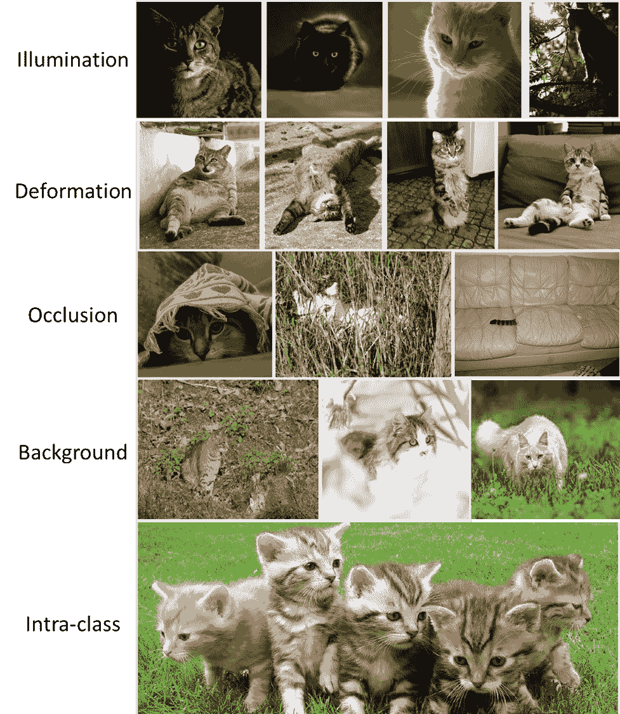

<!--yml

类别：未分类

日期：2024-09-06 19:46:38

-->

# [2205.01491] 深度学习图像增强技术的综合调查

> 来源：[`ar5iv.labs.arxiv.org/html/2205.01491`](https://ar5iv.labs.arxiv.org/html/2205.01491)

# 深度学习图像增强技术的综合调查

Mingle Xu，电子工程系，全北国立大学，全北 54896，韩国；Sook Yoon，计算机工程系，木浦国立大学，全南 58554，韩国；Alvaro Fuentes，智能机器人核心研究所，全北国立大学，全北 54896，韩国；Dong Sun Park，智能机器人核心研究所，全北国立大学，全北 54896，韩国

###### 摘要

尽管深度学习在计算机视觉领域取得了令人满意的性能，但仍需要大量图像。然而，收集图像通常是昂贵且具有挑战性的。许多图像增强算法已被提出以缓解这一问题。因此，理解现有算法对于寻找适合的和开发新方法至关重要。在本研究中，我们使用一种新颖的信息分类法对深度学习的图像增强进行全面调查。为了考察图像增强的基本目标，我们介绍了计算机视觉任务中的挑战和附近分布。然后将算法分为三类：无模型、基于模型和优化策略。无模型类别采用图像处理方法，而基于模型的方法利用图像生成模型来合成图像。相比之下，优化策略方法旨在找到操作的最佳组合。基于这种分析，我们认为我们的调查增强了选择合适方法和设计新算法所需的理解。

###### 关键词：

图像增强，深度学习，图像变化，附近分布，数据增强，计算机视觉。^†^†期刊：LaTeX 模板期刊

## 1 引言

近年来，深度学习在计算机视觉领域取得了显著的进展，这主要基于三个关键要素：高效的计算设备、强大的算法以及大量的图像。过去十年的主要工作之一是设计一个具有大量可训练参数的强大模型¹¹1https://spectrum.ieee.org/andrew-ng-data-centric-ai。训练这样一个模型需要大量的图像才能达到具有竞争力的性能。然而，收集图像通常是一个昂贵且具有挑战性的过程。在实际应用中，例如医学[1]和农业图像[2]，在有限数据集下获得令人满意的性能尤其具有挑战性。

为了解决这个问题，图像增强已被证实是一种有效且高效的策略[3, 4]。如表 1 所列，许多图像增强方法已被用于图像分类和目标检测。因此，了解现有的图像增强方法对于部署合适的算法至关重要。虽然之前也有类似的调查[5, 6, 7]，但我们的研究具有几个重要的不同点。首先，我们没有限制于特定类型的图像，如面部图像[8]。同样，我们考虑了许多类型的图像增强算法，包括生成对抗网络[9]和图像混合[10]。第三，我们不专注于特定的应用，如目标检测[5]。相反，我们将图像分类和目标检测视为两个主要应用，并考虑了其他图像和视频应用，如分割和跟踪。最后，与两个相关研究[6, 7]不同，我们的调查涵盖了更多近期有效的图像增强算法，如实例级多个图像混合，以及对基于模型的方法的综合分析。因此，本文涵盖了更广泛的算法，形成了一种新颖的信息分类法。

具体而言，我们首先解释了为什么不同的图像增强算法在各种应用中被设计和利用。更具体地说，介绍了计算机视觉中的挑战和邻域分布，以说明图像增强的必要性。通过增强图像数据，可以缓解上述挑战，并扩展邻域分布空间，从而提高训练模型的泛化能力。基于这一分析，我们认为当识别出新的挑战时，新颖的图像增强方法是有前景的。同时，一旦在应用中观察到挑战，可以通过适当的增强方法来缓解。

总结来说，我们的研究做出了以下贡献。

+   1.

    我们考察了*挑战*和*邻域分布*，以证明图像增强在深度学习中的必要性。

+   2.

    我们提供了一项关于图像增强的全面调查，并引入了一种新颖的*信息分类法*，涵盖了更广泛的算法。

+   3.

    我们讨论了图像增强的现状和未来方向，以及三个相关主题：理解图像增强、利用图像增强的新策略和特征增强。

本论文的其余部分组织如下。第二部分介绍了研究分类法。第三部分介绍了图像增强的两个基本启示：计算机视觉任务的挑战和邻域分布。无模型图像增强在第四部分中介绍，而基于模型的方法在第五部分中讨论。第六部分介绍了确定最佳图像增强的过程，接着是讨论部分。最后一部分呈现了结论。

| 论文 | 图像增强方法 |
| --- | --- |
| AlexNet [11] | 平移、翻转、强度变化 |
| ResNet [12] | 裁剪、翻转 |
| DenseNet [13] | 翻转、裁剪、平移 |
| MobileNet [14] | 裁剪、弹性失真 |
| NasNet [15] | 剪裁、裁剪、翻转 |
| ResNeSt [16] | AutoAugment、混合、裁剪 |
| DeiT [17] | AutoAugmentat、RandAugment、随机擦除、混合、CutMix |
| Swin Transformer [18] | RandAugment、混合、CutMix、随机擦除 |
| Faster R-CNN [19] | 翻转 |
| YOLO [20] | 缩放、平移、色彩空间 |
| SSD [21] | 裁剪、调整大小、翻转、色彩空间、失真 |
| YOLOv4 [22] | 马赛克、失真、缩放、色彩空间、裁剪、翻转、旋转、随机擦除、剪裁、藏猫猫、网格掩码、混合、CutMix、StyleGAN |

表 1: 用于图像分类（上）和物体检测（下）的图像增强算法。

## 2 分类法

如表 2 所示，我们将图像增强算法分为三类。无模型的方法不利用预训练模型进行图像增强，可能使用单张或多张图像。相反，基于模型的算法需要图像增强算法使用训练好的模型生成图像。增强过程可以是无条件的、标签条件的或图像条件的。最后，优化策略算法从大参数空间中确定具有合适参数的最佳操作。这些算法进一步可以细分为基于强化学习和基于对抗学习的方法。前者利用由多样化操作及其幅度组成的大量搜索空间，并有一个代理在搜索空间内找到最优策略。相反，对抗学习方法则找到与任务模型具有足够大损失的相应幅度的算法。

| 类别 | 相关方法 |
| --- | --- |
| 无模型 | 单图像 | 几何变换 | 平移、旋转、翻转、缩放、弹性失真。 |
| 彩色图像处理 | 抖动。 |
| 强度变换 | 模糊和添加噪声，Hide-and-Seek [23], Cutout [24], Random Erasing [25], GridMask [26]。 |
| 多图像 | 非实例级 | SamplePairing [27], Mixup [28], BC Learning [29], CutMix [30], Mosaic [22], AugMix [31], PuzzleMix [32], Co-Mixup [33], SuperMix [34], GridMix [35]。 |
| 实例级 | CutPas [36], Scale and Blend [37], Context DA [38], Simple CutPas [39], Continuous CutPas [40]。 |
| 基于模型 | 无条件 | DCGAN [41], [42, 43, 44] |
| 标签条件 | BDA [45], ImbCGAN [46], BAGAN [47], DAGAN [48], MFC-GAN [49], IDA-GAN [50]。 |
| 图像条件 | 保持标签 | S+U Learning [51], AugGAN [52], Plant-CGAN [53], StyleAug [54], Shape bias [55]。 |
| 标签变化 | EmoGAN [56], $\delta$-encoder [57], Debiased NN [58], StyleMix [59], GAN-MBD [60], SCIT [2]。 |
| 基于优化策略 | 基于强化学习 | AutoAugment [61], Fast AA [62], PBA [63], Faster AA [64], RandAugment [65], MADAO [66], LDA [67], LSSP [68]。 |
|  | 对抗学习基础 | ADA [69], CDST-DA [70], AdaTransform [71], Adversarial AA [72], IF-DA [73], SPA [74]。 |

表 2：相关方法的分类。

## 3 图像增强的动机

### 3.1 挑战

| 挑战 | 描述 | 策略及相关研究 |
| --- | --- | --- |
| 图像变化 | 许多数据集和应用中存在以下基本变化，包括光照、变形、遮挡、背景、视角和多尺度，如图 1 所示。几何变换和颜色图像处理改善了大多数变化。遮挡：Hide-and-Seek [23], Cutout [24], Random Erasing [25], GridMask [26]。背景或上下文：CutMix [30], Mosaic [22], CutPas [36]。多尺度：Scale and Blend [37], Simple CutPas [39]。 |
| 类别不平衡和少量图像 | 不同类别之间的图像数量不同，或者某些类别只有少量图像。通过实例级操作重用少数类的实例是一种策略，简单的复制粘贴 [39]。大多数研究尝试为少数类生成图像：ImbCGAN [46]，DAGAN [48]，MFC-GAN [49]，EmoGAN [56]，$\delta$-encoder [57]，GAN-MBD [60]，SCIT [2]。 |
| 领域迁移 | 训练和测试数据集代表不同的领域，通常指风格。 | 改变现有图像的风格是主要策略，包括 S+U Learning [51]，StyleAug [54]，Shape bias [55]，Debiased NN [58]，StyleMix [59]。 |
| 数据记忆 | 较大的模型具有许多可学习参数，往往会记住特定的数据点，这可能导致过拟合。 | 机制是增加数据集大小，无论是在相邻分布内还是之间。内版本假定标签保持不变，而间版本更改标签，例如 Mixup [28]，AugMix [31]，Co-Mixup [33]。 |

表 3：从数据集和深度学习模型的角度来看，计算机视觉任务中的挑战。

图 1：来自 Class CS231n 的图像变化示例。

表 3 描述了计算机视觉任务中面临的四种挑战。第一个挑战是*图像变化*，这是由照明和变形等效应造成的。图 1 说明了图像变化²²2http://cs231n.stanford.edu/。*类别不平衡*是另一个挑战，其中不同的物体以不同的频率被观察到。在医学成像中，异常情况往往发生的概率较低，这在隐私问题的影响下更加严重。当用不平衡的数据集进行训练时，模型对正常情况分配更高的概率。此外，类别不平衡变成了从多个类别到单一类别的少量图像。此外，*领域迁移*是一个挑战，其中训练和测试数据集展现了不同的分布。这在自动驾驶的昼夜领域中得到了体现。由于白天收集图像更为方便，我们可能希望用白天的数据集训练我们的模型，但在夜晚进行评估。

深度学习带来了一个新的挑战，即 *数据记忆*。一般来说，更多的可学习参数需要更多的数据进行训练，这被称为结构风险 [75]。随着参数的增加，深度学习模型可能会记住特定的数据点，而训练图像数量不足，这会引入过拟合的问题，形成泛化能力的问题 [76]。

幸运的是，图像增强方法可以通过增加训练数据集中图像的数量和多样性来缓解这些挑战并提高模型的泛化能力。为了有效利用图像增强算法，关键是要理解应用的挑战并应用合适的方法。本研究旨在提供一项调查，增强对各种图像增强算法的理解。

### 3.2 邻域分布

在监督学习范式中，我们期望找到一个函数 $f\in\mathcal{F}$，该函数反映了输入 $x$ 和目标 $y$ 在联合分布 $P(x,y)$ 中的关系。为了学习 $f$，定义了一个损失函数 $l$，以减少预测 $f(x)$ 和实际目标 $y$ 之间的差异，适用于 $P(x,y)$ 中的所有示例。然后，我们可以通过最小化 $P(x,y)$ 上的 $l$ 来优化 $f$，这被称为期望风险 [75]，可以表示为 $R(f)=\int{l(f(x),y)dP(x,y)}$。然而，大多数应用中 $P(x,y)$ 是未知的 [77]。作为替代，我们可以使用经验分布 $P_{e}(x,y)$ 来近似 $P(x,y)$。在这种情况下，观察到的数据集 $\mathcal{D}={(x_{i},y_{i})}_{i=1}^{n}$ 被认为是经验分布，其中 $(x_{i},y_{i})$ 对于给定的 $i$ 在 $P_{e}(x,y)$ 中：

|  | $P_{e}(x,y)=\frac{1}{n}\sum_{i=1}^{n}\delta((x=x_{i},y=y_{i})],$ |  | (1) |
| --- | --- | --- | --- |

其中，$\delta(x,y)$ 是一个以 $(x_{i},y_{i})$ 为中心的狄拉克质量函数，假设概率分布中的所有质量集中在一个点 [78]。另一种自然的近似 $P(x,y)$ 的方法是邻域分布 $P_{v}(x,y)$，它用点 $(x_{i},y_{i})$ 周围的密度估计来替代狄拉克质量函数 [79]：

|  | $P_{v}(x,y)=\frac{1}{n}\sum_{i=1}^{n}\delta_{v}(x=x_{i},y=y_{i}),$ |  | (2) |
| --- | --- | --- | --- |

其中，$\delta_{v}$ 是 $\mathcal{D}$ 中 $(x_{i},y_{i})$ 的邻域点集。邻域分布假设 $P(x,y)$ 在任何点 $(x_{i},y_{i})$ 周围是光滑的 [77]。在 $P_{v}(x,y)$ 中，模型不容易记住所有数据点，因此在测试过程中往往能获得更高的性能。实现邻域分布的一种方法是应用图像增强，通过这种方式，原始数据点 $(x_{i},y_{i})$ 可以在其邻域内移动。例如，高斯邻域分布相当于在图像中添加高斯噪声 [79]。

## 4 无模型图像增强

图像处理方法，如几何变换和像素级操作，可以用于增强目的 [6, 7]。在本研究中，我们将无模型图像增强称为与基于模型的图像增强对比。无模型方法包括单图像和多图像分支。如名称所示，前者从单个图像生成增强图像，而后者则从多个图像生成输出。

### 4.1 单图像增强

从邻域分布来看，单图像增强（SiA）的目标是波动训练数据集中的数据点并增加分布密度。一般来说，SiA 利用传统的图像处理方法，这些方法易于理解和执行。SiA 方法包括几何变换、彩色图像处理和强度变换。几何变换试图修改像素之间的空间关系 [80]，包括仿射变换和弹性变形，而彩色图像处理旨在改变输入图像的颜色。与之相比，最后一种方法倡导改变图像的部分内容，近年来受到了更多关注。

#### 4.1.1 几何变换

自然捕捉的图像中的对象可能会出现许多变化。几何变换可以用来增加这种变化。例如，*平移* 提供了一种增强对象位置的方式。此外，图像可以被 *旋转*，改变对象的视角。旋转角度应仔细考虑，以确保适当标签的保留。同样，*翻转* 可以根据训练和测试数据集的特征水平或垂直执行。例如，Cityscapes [81] 数据集可以进行水平增强但不能垂直增强。此外，通过 *缩放* 可以放大或缩小对象，以模拟多尺度变化。最后，*弹性扭曲* 可以改变对象的形状或姿态。在这些方法中，翻转在过去十年中已被广泛应用于各种计算机视觉任务，如图像分类 [11, 12, 13]、对象检测 [82, 83] 和图像翻译 [84, 85]。使用这些方法时必须考虑两个因素：操作的幅度以保留标签身份和数据集中的变化。

#### 4.1.2 彩色图像处理

与灰度图像不同，彩色图像包含三个通道。彩色图像处理用于增强假设训练和测试数据集的颜色分布（如对比度）会波动。虽然彩色图像处理可以获得更好的性能，但由于训练和测试数据集之间的颜色变化较小，使用较少。然而，一个有趣的点是通过彩色图像处理用于对比度学习的鲁棒特征 [86]，这代表了一种任务无关的学习情况。

#### 4.1.3 强度变换

| 论文 | 年份 | 亮点 |
| --- | --- | --- |
| 捉迷藏 [23] | 2017 | 将图像拆分为随机阻挡的补丁。 |
| Cutout [24] | 2017 | 对每张图像应用一个固定大小的掩码，位置随机。 |
| 随机擦除 [25] | 2020 | 随机选择一个矩形区域，并用随机值替换其像素。图 3。 |
| GridMask [26] | 2020 | 对图像应用多尺度网格掩码，以模拟遮挡。图 4。 |

表 4：关注强度变换的研究。每项研究均附有对应的图例（如有）。

与几何变换和颜色图像处理不同，强度变换涉及像素或补丁级别的变化。随机噪声，如高斯噪声，是最简单的强度变换算法之一 [75]。经典方法在像素级别独立利用随机噪声；然而，最近补丁级别在深度学习算法中表现出显著改进 [23, 24, 25, 26]。关于强度变换的研究列在表 4 中。其基本概念是这些变化促使模型通过避免琐碎的解决方案来学习鲁棒特征 [76]。

Cutout [24] 随机遮罩最重要的区域，使用发现机制模拟遮挡。然而，最重要的方面是成本。Hide-and-Seek [23] 直接阻挡图像的一部分，旨在通过多次随机过程遮挡最重要的区域，这种方法简单且快速。图 2 显示图像被分割成 $s\times s$ 的补丁，每个补丁被随机遮挡。一个缺点是每个补丁的相同大小导致相同程度的遮挡。为了解决这个问题，采用了 Random Erasing [25]，使用三个随机值：遮挡区域的大小、高宽比和区域的左上角。图 3 展示了 Random Erasing 在三项计算机视觉任务中的一些示例。此外，这种方法可以在图像和对象感知条件下使用，从而简化对象检测。

GridMask 旨在平衡删除和保留，目的是遮挡对象的某些重要区域，同时保留其他区域以模拟真实遮挡。为此，GridMask 使用一组预定义的遮罩，而不是单一遮罩 [23, 24, 25]。如图 4 所示，生成的遮罩由四个值获得，表示每个网格的宽度和高度以及相邻网格遮罩的垂直和水平距离。通过调整这四个值，可以获得不同大小和高宽比的网格遮罩。在这些条件下，GridMask 实现了删除和保留之间的更好平衡，并且初步实验表明它比 Cutout [24] 和 Hide-and-Seek [23] 更少产生失败案例。

图 2：Hide-and-Seek [23] 进行图像增强，将一张图像分割成若干个补丁，每个补丁都以指定的概率随机遮挡。

图 3：Random Erasing [25] 的示例。

图 4：GridMask [26] 及其设置。

### 4.2 多图像增强

多图像增强（MiA）算法在多于一张图像上执行。这些方法可以进一步分类为实例级和非实例级。因为一张图像可能包含多个实例，我们可以对实例进行掩膜并独立使用。与 SiA 不同，MiA 需要算法合并多个输入实例。 |

| 论文 | 年份 | 亮点 |
| --- | --- | --- |
| 样本配对 [27] | 2018 | 将两个图像与单一标签结合。 |
| 混合 [28] | 2018 | 线性融合图像及其标签。图 5。 |
| BC 学习 [29] | 2018 | 结合两个图像及其标签。将图像视作波形，并声明图像混合对机器有意义。 |
| CutMix [30] | 2019 | 空间上融合两个图像，并线性融合标签。图 5。 |
| 马赛克 [22] | 2020 | 空间上混合四个图像及其注释，从而丰富每个类别的上下文。 |
| AugMix [31] | 2020 | 一张图像经历几个基本增强，然后与原图像融合。 |
| 拼图混合 [32] | 2020 | 优化掩码以融合两个图像，从而利用显著信息和潜在统计。 |
| Co-Mixup [33] | 2021 | 最大化输入图像的显著信号和增强图像之间的多样性。 |
| 超级混合 [34] | 2021 | 使用牛顿迭代方法优化掩码以融合两个图像，从而利用显著区域，比梯度下降快 65 倍。 |
| 网格混合 [35] | 2021 | 将两个图像拆分为补丁，空间上融合这些补丁，并线性合并注释。 |
| 剪切、粘贴和学习 [36] | 2017 | 剪切对象实例并将其粘贴到随机背景中。图 6。 |
| 缩放和混合 [37] | 2017 | 剪切和缩放对象实例，并在有意义的位置混合它们。 |
| 上下文数据增强 [38] | 2018 | 使用上下文指导结合对象实例以获得有意义的图像。 |
| 简单复制-粘贴 [39] | 2021 | 随机将对象实例粘贴到图像中，并进行大规模抖动。 |
| 连续复制-粘贴 [40] | 2021 | 部署剪切、粘贴和学习到视频中。 |

表 5: 与多图像增强相关的研究，分为非实例级（上）和实例级（下）。 |

#### 4.2.1 非实例级 |

图 5: 非实例级别的多图像算法比较 [30]。

在 MiA 算法的背景下，非实例级别的方法采用并融合了图像。相关的研究列在表 5 中。最简单的方法之一是计算每个像素的平均值。在配对样本 [27] 中，将两张图像融合生成一个增强图像，并从其中一张源图像中获得标签。这个假设在 Mixup [28] 中得到了推广，在那里标签也被融合。图 5 展示了配对样本和 Mixup 之间的差异。在数学上，$\tilde{x}=\lambda x_{i}+(1-\lambda)x_{j}$ 和 $\tilde{y}=\lambda y_{i}+(1-\lambda)y_{j}$，其中 $x_{i}$ 和 $x_{j}$ 是两张图像，$y_{i}$ 和 $y_{j}$ 是对应的一热标签，而 $\tilde{x}$ 和 $\tilde{y}$ 分别表示生成的图像和标签。通过调整 $0\leq\lambda\leq 1$，可以创建许多具有不同标签的图像，从而平滑增强图像中两个标签之间的差距。尽管配对样本和 Mixup 产生了令人满意的结果，但这些融合图像对人类而言并不合理。因此，这些融合图像从波形的角度来看被认为对机器有意义 [29]。此外，邻域分布也可以用于理解这种情况。更具体地说，改变图像变化但保持标签可以看作是在特定标签的邻域分布空间中的偏差，而图像融合可以被视为两个标签的邻域分布之间的插值 [28]。

与 BC Learning [29] 相对，CutMix [30] 在空间上融合图像，以获得人类可解释的结果。图 5 中的最后一张图片展示了该方法的基本策略，其中融合图像由两个源图像在空间上组成，其标签是通过两个图像之间某些像素的比例获得的。尽管多图像增强通常利用两张图像，但也可以使用更多图像。例如，Mosaic [22] 使用四张图像，其中一张图像中的物体数量增加，从而显著减少了对大批量数据的需求以进行密集预测。AugMix [31] 随机应用基础的多重图像增强方法，并将结果与原始图像融合。

实例级别图像增强的扩展类似于强度变换的扩展。为了考虑最重要的区域，PuzzleMix [32] 区分前景和背景，并在前景中混合重要信息。此外，通过最大化来自多个输入图像的显著区域来合成每个增强图像 [33]，同时最大化增强图像之间的多样性。为了快速定位主要区域，SuperMix [34] 使用了一种牛顿迭代方法的变体。与 Hide-and-Seek [23] 类似，GridMix [35] 将图像划分为固定大小的网格，每个输出图像的补丁随机取自两个输入图像的对应补丁。通过这种分析，我们相信 GridMask [87] 可以适应于融合大小可变的图像对。

#### 4.2.2 实例级别

与直接使用图像的非实例级方法不同，实例级方法利用从图像中遮蔽的实例。相关研究列在表 5 的第二部分中。实例级方法包括两个主要步骤。如图 6 所示，第一个步骤是根据语义掩码从源图像中剪切实例，并获得干净的背景感知。接下来，将获得的实例和背景进行合并。Cut, Paste and Learn [36]是一种早期的实例级方法，其中实例粘贴到背景后会出现局部伪影。由于局部区域特征对目标检测非常重要，因此采用了各种混合模式来减少局部伪影。除了边界外，实例的尺度和位置并非微不足道，因为对象可能是多尺度的，并且可以借助其上下文进行识别，如[37]所述。

图 6：训练和测试过程中的 Cut, Paste and Learn [36]。

有趣的是，实例级图像增强可以缓解类不平衡带来的挑战。通过重新利用稀有实例，相应类别的图像数量会增加。Simple Copy-Paste [39] 表明实例级可以实现强大的图像增强方法，例如分割。虽然它基于 Copy, Paste and Learn，但 Simple Copy-Paste 在两个特征上有所不同。首先，背景图像从数据集中随机选择，并进行随机尺度抖动和水平翻转。其次，利用大规模抖动以获得更显著的性能。复制粘贴概念也被应用于时间序列任务 [40]，如跟踪。

## 5 基于模型的图像增强

模型必须经过预训练，以进行基于模型的图像增强，从而生成增强后的图像。本研究将这一过程根据生成图像的条件分为三类：无条件、标签条件和图像条件。表 6 提供了有关适当研究的信息。

| 论文 | 年份 | 亮点 |
| --- | --- | --- |
| BDA [45] | 2017 | 使用 CGAN 生成经过蒙特卡罗 EM 算法优化的图像。图 7。 |
| ImbCGAN [46] | 2018 | 将 CGAN 部署为不平衡类别的图像增强。 |
| BAGAN [47] | 2018 | 训练自编码器以初始化生成器。 |
| DAGAN [48] | 2018 | 图像作为生成器和判别器的类别条件。图示 8。 |
| MFC-GAN [49] | 2019 | 使用多个假类获取少数类的细粒度图像。 |
| IDA-GAN[50] | 2021 | 同时训练变分自编码器和 CGAN。 |
| S$+$U Learning [51] | 2017 | 使用 CGAN 将合成图像从图形模型转换为真实图像。 |
| AugGAN [52] | 2018 | 旨在更改风格时语义保留对象。 |
| Plant-CGAN [53] | 2018 | 使用 CGAN 将语义实例布局转换为真实图像。 |
| StyleAug [54] | 2019 | 通过风格迁移改变图像风格。 |
| Shape bias [55] | 2019 | 将图像风格从绘制图像迁移，以减轻 CNN 的纹理偏差。 |
| EmoGAN [56] | 2018 | 将中性面孔转换为另一种情感。 |
| $\delta$-encoder [57] | 2018 | 将图像视为类别条件，以生成新类或不频繁出现类的图像。 |
| Debiased NN [58] | 2021 | 通过风格迁移和适当的标签合并风格和内容。图示 10。 |
| StyleMix [59] | 2021 | 合并两个具有风格、内容和标签的图像。图示 11。 |
| GAN-MBD [60] | 2021 | 通过多分支判别器将图像从一个类别转换为另一个类别，同时保持语义。图示 9。 |
| SCIT [2] | 2022 | 将健康叶片转换为异常叶片，同时保留其风格。 |

表 6: 相关于基于模型的图像增强、标签条件（顶部）、标签保留图像条件（中部）和标签更改图像条件（底部）的研究。 |

### 5.1 无条件图像生成 |

图像合成模型有助于图像增强，使其能够生成新图像。从理论上讲，对于生成对抗网络（GAN）模型，经过训练后，生成图像的分布与原始数据集的分布相似 [88]。然而，生成的图像与原始图像并不相同，可以被视为位于附近分布的点。在 DCGAN [41] 中，可以对两个随机噪声或潜在向量进行插值，以生成中间图像，这可以看作是两个原始数据点之间的波动。一般来说，以噪声作为输入的生成模型被认为是无条件模型，相应的图像生成过程被认为是无条件图像生成。如果数据集涵盖了单一类别，例如具有一个异常类别的医学图像 [42]，则可以直接应用无条件图像生成模型进行增强。此外，特定的无条件模型可以在存在多个类别的情况下用于单一类别 [43], [44]。

### 5.2 标签条件图像生成

尽管无条件图像生成具有潜力，但不同类别的共享信息无法被利用。相比之下，标签条件图像生成预计能够利用共享信息，并使用多数类数据学习少数类的变化。标签条件图像生成需要一个特定的标签作为额外输入，生成的图像应与标签条件一致。

图 7: GAN 和标签条件 GAN 的变体 [45]。G: 生成器，A: 鉴别器，C: 分类器，D: 鉴别器。

标签条件图像生成的主要问题是标签条件的使用。CGAN [89] 使用标签来生成器，而鉴别器则不使用标签。因此，生成器往往忽略标签信息，因为鉴别器无法提供有关条件的反馈。ACGAN [90] 在鉴别器中引入了一个辅助分类器，鼓励生成器生成与标签条件一致的图像。BDA [45] 采用了更复杂的分类器，将分类器与鉴别器分开。图 7 说明了 BDA 与其他标签条件算法的区别。此外，MFC-GAN [49] 采用了多个假类的分类损失来稳定训练。

标签条件图像生成的主要应用之一是类别不平衡 [49] [46] [50]。生成模型期望从多数类中学习有用的特征，并用它们生成少数类的图像。这些生成的图像用于重新平衡原始训练数据集。然而，用不平衡的数据集训练 GAN 模型可能具有挑战性，因为多数类主导了判别器损失，生成器倾向于生成多数类的图像。为了解决这一挑战，采用了具有重建损失的预训练自编码器来初始化生成器 [47] [50]。

图 8：DAGAN 的流程图 [48]，其中标签信息通过编码器从图像中获得，而不是通过标签。

尽管可以使用各种判别器和分类器，但上述算法利用的是一热标签的类别条件。一种结果限制是训练的模型只能生成已知类别的图像。为克服这一限制，DAGAN [48] 利用图像编码器提取类别，以使生成的图像被认为具有与原始图像相同的类别。图 8 展示了 DAGAN 算法。

### 5.3 图像条件图像生成

在图像生成中，图像可以作为条件使用，称为图像翻译。一般来说，图像由内容和风格组成 [91, 92]。内容指的是依赖类别的属性，如狗和猫，而风格则指的是独立于类别的元素，如颜色和光照。图像条件图像生成可以细分为两种类型：标签保留和标签变化。前者要求保留内容，而后者则要求改变内容。

#### 5.3.1 标签保留图像生成

标签保持假设生成图像的标签与输入图像的标签相同。一个积极的应用领域是领域迁移，其中源域的风格与目标域不同。为了解决这个挑战，可以将原始图像从源域翻译到目标域。为了在图像翻译过程中保持对象，AugGAN 使用了一个分割模块，该模块提取上下文感知特征，并与生成器共享参数 [52]。在实际应用中，通过图形模型生成的合成图像被翻译为自然图像 [51]，叶片布局被翻译为真实叶片图像 [53]。此外，图像翻译可以用于具有领域迁移的语义分割 [93]。此外，标签保持可以被用来提高训练模型的鲁棒性。受 CNN 在纹理上对形状的偏向的观察启发，原始图像被翻译为具有不同纹理的图像，这使得 CNN 可以将更多关注分配给形状 [55]。

在图像生成过程中，获得期望风格常常是具有挑战性的。大多数算法使用编码器从图像中提取风格，如 DRIT++ [94] 和 SPADE [95]。这种图像翻译方法可以视为图像融合。相反，Jackson 等人 [54] 提出了风格增强，其中风格是从多元正态分布中生成的。另一个挑战是，*一个* 模型可以用于生成 *多个* 域的图像，且训练图像较少。为了解决这个问题，MetalGAN 利用领域损失和元学习策略 [96]。

#### 5.3.2 标签变化图像生成

与标签保留相比，标签变化改变了标签依赖。例如，中性面孔可以被转变为不同的情绪[56]。尽管生成的图像具有较差的保真度，但该方法改善了情绪分类。除了改变标签依赖性之外，标签独立性的保留最近也受到关注，作为提高目标类变异性的方式，从而缓解类别不平衡。为了从一个类转换到另一个类，利用风格损失在翻译图像时保持风格[2]。类似地，引入了具有较少通道的多分支判别器，以实现语义一致性，例如对象的数量[60]。图 9 展示了几个令人满意的翻译图像。为了解决严重的类别不平衡，提出了$\delta$-编码器，用于从一个标签提取独立特征到另一个标签[57]。如 DAGAN [48]的情况，类别信息由图像提供。$\delta$-编码器和解码器旨在在训练阶段重建给定图像，而解码器在测试阶段提供新的标签图像，并要求生成相同的标签。

图 9：由 GAN-MBD [60] 实现的语义层次匹配用于标签变化的图像增强，包括位置、数量和姿势。

与标签保留相比，标签变化通过同时改变标签和风格显著提高了模型的鲁棒性。如图 10 所示，传统的图像增强在将猩猩的颜色更改为柠檬的颜色后，并不会改变标签，这会导致形状偏差。相比之下，当训练一个纹理偏差模型时，翻译后的图像标记为柠檬。为了平衡偏差，通过风格迁移获得的翻译图像带有两个标签[58]——猩猩和柠檬——这消除了偏差。受到 Mixup [28]的启发，Hong 等人开发了 StyleMix [59]，它将两个输入合并以获得内容和风格标签，如图 11 所示。这些标签随后被融合以获得生成图像的最终标签。

图 10：带有形状和纹理的有偏模型和无偏模型的标签分配 [58]。

图 11：不同算法的标签分配示例 [59]。

## 6 优化基于策略的图像增强

前两节中提到的所有算法代表了特定的方案，其中需要领域知识以实现更好的性能。通常，根据数据集的特征，利用具有所需幅度的单个操作进行图像增强。然而，超参数优化具有挑战性且耗时。缓解这一问题的一种方法是设计确定最佳增强策略的算法。这些算法称为基于策略的优化，涵盖了两类：基于强化学习的和基于对抗学习的。前一类采用强化学习（RL）来确定最佳策略，而后一类则采用生成大量训练损失和小验证损失的增强操作及其幅度。由于生成对抗网络（GANs）可以用于模型基础和优化策略基础的图像增强，因此采用 GANs 是主要区别。基于模型的类别旨在*直接*生成图像，而不是其他目标，如寻找最佳变换 [69]。关于基于策略的优化的研究列在表 7 中。

| 论文 | 年份 | 亮点 |
| --- | --- | --- |
| AutoAugment [61] | 2019 | 使用强化学习来确定最佳增强策略。 图 12。 |
| Fast AA [62] | 2019 | 使用高效的密度匹配进行增强策略搜索。 |
| PBA [63] | 2019 | 通过基于群体的训练采用非平稳增强策略调度。 |
| 更快的 AA [64] | 2019 | 使用通过近似梯度的可微分策略搜索管道。 |
| RandAugment [65] | 2020 | 通过概率调整减少 AutoAug 的搜索空间。 |
| MADAO [66] | 2020 | 通过 Neumann 系列逼近同时训练任务模型并优化搜索空间。 |
| LDA [67] | 2020 | 将策略搜索视为目标检测的离散优化。 |
| LSSP [68] | 2021 | 学习用于序列图像增强的样本特定策略。 |
| ADA [69] | 2016 | 寻找一个小的变换，使变换后的样本产生最大的分类损失。 |
| CDST-DA [70] | 2017 | 使用生成对抗网络（GAN）优化生成序列，将变换后的图像推向相同类别分布内。 |
| AdaTransform [71] | 2019 | 使用竞争任务在训练阶段获得具有高任务损失的增强图像，并使用合作任务在测试阶段获得具有低任务损失的增强图像。图 13。 |
| Adversarial AA [72] | 2020 | 优化一个策略以增加任务损失，同时允许任务模型最小化损失。 |
| IF-DA [73] | 2020 | 使用影响函数预测图像增强如何影响验证损失，并最小化近似的验证损失。 |
| SPA [74] | 2021 | 选择合适的样本进行图像增强。 |

表 7：与优化图像增强策略相关的研究。上半部分和下半部分分别提出了基于强化学习和对抗学习的图像增强。

### 6.1 基于强化学习

AutoAugment [61] 是一种开创性的方法，采用强化学习。正如图 12 所示，通过迭代步骤来寻找最佳策略。控制器从具有操作类型及其对应概率和幅度的搜索空间中采样策略，任务网络随后获取验证精度作为反馈来更新控制器。由于搜索空间非常大，因此利用了较轻的子网络。训练后，控制器用于训练原始任务模型，并可以在其他数据集中进行微调。

图 12：AutoAugment [61] 的概述，这是一种基于强化学习的图像增强方法。

尽管 AutoAugment 在多个数据集上实现了令人满意的分类性能，但它需要较长的训练时间。为了解决这个问题，已经从不同的角度进行了多项研究。例如，RandAugment [65] 用均匀概率替代了 AutoAugment 中的多个概率。相对而言，Fast AA [62] 和 Faster AA [64] 利用密度匹配，对训练和增强训练数据集的密度进行对齐，而不是使用 Proximal Policy Optimization [97] 来优化 AutoAugment 中的控制器。此外，PBA [63] 尝试从基于人群的训练中学习一个策略调度，而不是单一策略。

除了较长的训练阶段外，AutoAugment 还利用了子模型，这可能导致学习的策略对于最终任务模型并不最优。为了解决这个问题，Hataya 等人 [66] 使用相同的可微图像增强管道同时训练目标模型和图像增强策略。而 Adversarial AA [72] 则同时利用对抗损失和强化学习。

上述算法的一个局限性是学习到的图像增强策略是在数据集级别的。相对而言，类级别和样本级别的图像增强方法在 [98] 和 [68] 中被考虑，其中每个类或样本使用特定的策略。此外，[67] 中考虑了实例级别的图像增强，用于目标检测，其中操作仅在边界框内部进行。

### 6.2 基于对抗学习的

图像增强的主要目标是通过训练数据集训练任务模型，以在测试数据集上实现足够的泛化能力。一个假设是困难样本更有用，而导致更大训练损失的输入图像被认为是困难样本。基于对抗学习的图像增强旨在学习一种图像增强策略，以基于原始训练样本生成困难样本。

一种早期的方法 [69] 尝试找到一个小的变换，以最大化增强样本上的训练损失，其中学习优化找到给定操作的最佳幅度。主要的限制之一是标签保留假设，即增强图像保留与原始图像相同的标签。为了满足这一假设，一个常见的策略是使用人工知识设计操作类型和相应幅度的范围。为了削弱这一假设，Ratner 等人 [70] 引入了生成对抗损失，以学习一个变换序列，其中鉴别器将生成的图像推向原始类别之一，而不是未见过或空类别。

有趣的是，SPA [74] 尝试选择合适的样本，并且仅对那些增强图像引发的训练损失大于原始图像的样本进行图像增强。尽管 SPA 在样本层面上同时训练图像增强策略和任务模型，但所学策略在验证数据集上的影响尚不清楚。为了解决这个问题，采用了一种影响函数来近似验证损失的变化，而无需实际比较性能 [73]。另一个有趣的概念是在*测试阶段*使用图像增强。为实现这一点，AdaTransform [71] 学习了两个任务——竞争任务和合作任务——如图 13 所示。在竞争任务中，变换器通过增加目标网络的损失来增加输入的方差，而鉴别器则试图使增强图像更真实。相反，在合作任务中，变换器通过减少目标网络的损失来学习降低增强图像的方差。训练完成后，变换器用于减少输入图像的方差，从而简化测试过程。

图 13：AdaTransform [71] 的概述。AdaTransform 包含两个任务——竞争训练和合作测试——以及三个组件：变换器 $T$、鉴别器 $D$ 和目标网络 $N$。变换器通过与 $D$ 和 $N$ 竞争来增加训练数据的方差。它还在测试阶段与 $N$ 合作以减少数据方差。

## 7 讨论

在本节中，首先讨论了提到的策略在图像增强中的应用。接着，展示了几个未来的发展方向。此外，还讨论了三个相关主题：从理论角度理解图像增强，结合其他策略采用图像增强，以及增强特征而非图像。

当前情况。数据集被认为是获得令人满意性能的关键。一种生成适当数据集的方法是通过图像增强算法，这些算法在多个数据集和异质模型上表现出色。例如，Mixup [28] 在 ImageNet-2012 上将 ResNet-50 和 ResNet-101 的验证准确率分别提高了 1.5% 和 1.2%。非平凡地，GAN-MBD [60] 在 102Flowers 数据集中，在不平衡的数据集设置下达到了 84.28 的分类准确率，比非图像增强、几何变换和焦点损失分别高出 33.11、31.44 和 14.05。目前，无模式和优化策略被广泛使用，而基于模式的方法则是针对特定挑战（如类别不平衡和领域适应）而活跃的研究主题。此外，尽管大多数算法保持标签不变，但标签变化的算法最近也受到了关注。

未来方向。尽管存在许多图像增强算法，开发新颖的算法仍然对提高深度学习的性能至关重要。我们认为，识别新的挑战或变体可能会激发新的方法，如果这些方法可以通过图像增强进行模拟的话。此外，大多数图像增强算法是针对分类设计的，因此，将其扩展到其他应用领域是一个应用广泛的方向，通过融入基于应用的知识，例如视频中的时间序列 [40]。另一个有趣的方向是将特定应用与一般计算机视觉任务（如 ImageNet [99] 和 COCO [100]）区分开来，然后找到新的动机来设计图像增强。例如，植物健康和病变叶子的多数变化是共享的，因此可以相互转换 [2]。最后，从系统的角度考虑图像增强是很有吸引力的。例如，图像增强调度对优化的影响，如学习率和批量大小，在 [101] 中进行了分析。

理解图像增强。本研究旨在从挑战和邻近分布的角度理解图像增强在深度学习中的目标。尽管也验证了图像增强类似于正则化 [79]，但大多数证据来自实验，因此从理论上理解它们是有吸引力的。最近，核理论 [102] 和群体理论 [103] 被用于分析图像增强的效果。此外，在模型泛化的背景下，图像增强带来的改进已通过亲和性和多样性 [104] 进行了量化。

利用图像增强的新策略。尽管图像增强通常以监督方式使用，但这并非必须的。首先，可以通过图像增强创建前置任务，例如预测旋转角度[105]和图像块的相对位置[106]。其次，图像增强可以用来生成对比学习的正样本，前提是增强图像与对应的原始图像相似[107, 108, 109]。此外，半监督学习从图像增强中受益[79, 110, 111]。

特征增强尝试在特征空间而不是图像空间进行增强，从而降低计算成本，但没有视觉证据。特征空间通常在语义级别具有比图像空间更密集的信息。因此，特征空间中的操作更高效[112]，例如领域知识[113]。同时，我们认为图像增强中的大多数技术可以扩展到特征增强，例如从 Mixup [28]到 Manifold Mixup [114]以及遮挡特征[115]。

## 结论

本研究调查了广泛的图像增强算法，并提出了一种新颖的分类法，涵盖了三类：无模型、基于模型和优化策略基础。为了理解图像增强的目标，我们分析了在计算机视觉任务中部署深度学习模型的挑战，并采用了邻域分布的概念。我们发现图像增强显著提高了任务性能，许多算法针对特定挑战设计，例如用于遮挡的强度变换，以及用于类别不平衡和领域迁移的基于模型的算法。基于这一分析，我们认为新挑战可以激发新方法的灵感。相反，在识别数据集带来的挑战后，可以选择合适的方法。此外，我们讨论了图像增强的现状和可能的发展方向，并提出了三个相关的有趣话题。我们希望我们的研究能够增强对图像增强的理解，并鼓励社区优先考虑数据集的特征。

## 致谢

这项研究部分得到了由韩国教育部资助的国家研究基金会（NRF）的基础科学研究项目（编号：2019R1A6A1A09031717）的支持，得到了韩国科学技术信息通信部（MSIT）资助的国家研究基金会（NRF）项目（编号：2020R1A2C2013060）的支持，以及由农业、食品和林业技术规划评估研究所（IPET）和韩国智能农场研发基金会（KosFarm）通过智能农场创新技术开发项目资助的支持，资金来源于农业部、食品和农村事务部（MAFRA）、科学技术信息通信部（MSIT）和农村发展管理局（RDA）（编号：421027-04）。

## 参考文献

+   [1] G. Litjens, T. Kooi, B. E. Bejnordi, A. A. A. Setio, F. Ciompi, M. Ghafoorian, J. A. Van Der Laak, B. Van Ginneken, C. I. Sánchez, 关于医学图像分析中的深度学习的调查，《医学图像分析》42 (2017) 第 60–88 页。

+   [2] M. Xu, S. Yoon, A. Fuentes, J. Yang, D. Park, 风格一致的图像翻译：一种新颖的数据增强范式，用于提高植物疾病识别，《植物科学前沿》12: 773142\. doi: 10.3389/fpls。

+   [3] S. C. Wong, A. Gatt, V. Stamatescu, M. D. McDonnell, 理解分类中的数据增强：何时进行变形？在：2016 年国际数字图像计算技术与应用会议（DICTA），IEEE，2016，第 1–6 页。

+   [4] L. Taylor, G. Nitschke, 通过通用数据增强改进深度学习，在：2018 IEEE 计算智能研讨会系列（SSCI），IEEE，2018，第 1542–1547 页。

+   [5] P. Kaur, B. S. Khehra, E. B. S. Mavi, 物体检测的数据增强：综述，在：2021 IEEE 国际中西部电路与系统研讨会（MWSCAS），IEEE，2021，第 537–543 页。

+   [6] C. Shorten, T. M. Khoshgoftaar, 关于深度学习图像数据增强的调查，《大数据期刊》6 (1) (2019) 第 1–48 页。

+   [7] N. E. Khalifa, M. Loey, S. Mirjalili, 深度学习在数字图像增强中的最新趋势的综合调查，《人工智能评论》（2021）第 1–27 页。

+   [8] X. Wang, K. Wang, S. Lian, 关于面部数据增强以训练深度神经网络的调查，《神经计算与应用》32 (19) (2020) 第 15503–15531 页。

+   [9] F. H. K. d. S. Tanaka, C. Aranha, 使用生成对抗网络（GANs）的数据增强，arXiv 预印本 arXiv:1904.09135。

+   [10] H. Naveed, 调查：图像混合和删除用于数据增强，arXiv 预印本 arXiv:2106.07085。

+   [11] A. Krizhevsky, I. Sutskever, G. E. Hinton, 使用深度卷积神经网络的 Imagenet 分类，《神经信息处理系统进展》25。

+   [12] K. He, X. Zhang, S. Ren, J. Sun, 用于图像识别的深度残差学习，在：IEEE 计算机视觉与模式识别会议论文集，2016，第 770–778 页。

+   [13] G. Huang, Z. Liu, L. Van Der Maaten, K. Q. Weinberger，密集连接卷积网络，见：IEEE 计算机视觉与模式识别会议论文集，2017 年，第 4700–4708 页。

+   [14] A. G. Howard, M. Zhu, B. Chen, D. Kalenichenko, W. Wang, T. Weyand, M. Andreetto, H. Adam，Mobilenets: 用于移动视觉应用的高效卷积神经网络，arXiv 预印本 arXiv:1704.04861。

+   [15] B. Zoph, V. Vasudevan, J. Shlens, Q. V. Le，学习可迁移架构用于可扩展图像识别，见：IEEE 计算机视觉与模式识别会议论文集，2018 年，第 8697–8710 页。

+   [16] H. Zhang, C. Wu, Z. Zhang, Y. Zhu, H. Lin, Z. Zhang, Y. Sun, T. He, J. Mueller, R. Manmatha 等，Resnest: 分割注意力网络，arXiv 预印本 arXiv:2004.08955。

+   [17] H. Touvron, M. Cord, M. Douze, F. Massa, A. Sablayrolles, H. Jégou，训练数据高效的图像变换器及通过注意力进行蒸馏，见：国际机器学习会议，PMLR，2021 年，第 10347–10357 页。

+   [18] Z. Liu, Y. Lin, Y. Cao, H. Hu, Y. Wei, Z. Zhang, S. Lin, B. Guo，Swin transformer: 使用移位窗口的分层视觉变换器，见：IEEE/CVF 国际计算机视觉会议论文集，2021 年，第 10012–10022 页。

+   [19] S. Ren, K. He, R. Girshick, J. Sun，Faster r-cnn: 面向实时对象检测的区域提议网络，神经信息处理系统进展 28。

+   [20] J. Redmon, S. Divvala, R. Girshick, A. Farhadi，你只看一次: 统一的实时对象检测，见：IEEE 计算机视觉与模式识别会议论文集，2016 年，第 779–788 页。

+   [21] W. Liu, D. Anguelov, D. Erhan, C. Szegedy, S. Reed, C.-Y. Fu, A. C. Berg，SSD: 单次多框检测器，见：欧洲计算机视觉会议，Springer，2016 年，第 21–37 页。

+   [22] A. Bochkovskiy, C.-Y. Wang, H.-Y. M. Liao，Yolov4: 对象检测的最佳速度和精度，arXiv 预印本 arXiv:2004.10934。

+   [23] K. K. Singh, Y. J. Lee，藏匿与寻找: 迫使网络在弱监督对象和动作定位中细致，见：2017 IEEE 国际计算机视觉会议 (ICCV)，IEEE，2017 年，第 3544–3553 页。

+   [24] T. DeVries, G. W. Taylor，通过切除改进卷积神经网络的正则化，arXiv 预印本 arXiv:1708.04552。

+   [25] Z. Zhong, L. Zheng, G. Kang, S. Li, Y. Yang，随机擦除数据增强，见：AAAI 人工智能会议论文集，第 34 卷，2020 年，第 13001–13008 页。

+   [26] P. Chen, S. Liu, H. Zhao, J. Jia，Gridmask 数据增强，arXiv 预印本 arXiv:2001.04086。

+   [27] H. Inoue，通过配对样本进行数据增强用于图像分类，arXiv 预印本 arXiv:1801.02929。

+   [28] H. Zhang, M. Cisse, Y. N. Dauphin, D. Lopez-Paz，Mixup: 超越经验风险最小化，arXiv 预印本 arXiv:1710.09412。

+   [29] Y. Tokozume, Y. Ushiku, T. Harada, 类别间学习用于图像分类，发表于：IEEE 计算机视觉与模式识别会议论文集，2018 年，第 5486–5494 页。

+   [30] S. Yun, D. Han, S. J. Oh, S. Chun, J. Choe, Y. Yoo, Cutmix：用于训练具有可定位特征的强分类器的正则化策略，发表于：IEEE/CVF 国际计算机视觉会议论文集，2019 年，第 6023–6032 页。

+   [31] D. Hendrycks, N. Mu, E. D. Cubuk, B. Zoph, J. Gilmer, B. Lakshminarayanan, Augmix：一种简单的方法来提高数据偏移下的鲁棒性和不确定性，发表于：国际学习表示会议，第 1 卷，2020 年，第 6 页。

+   [32] J.-H. Kim, W. Choo, H. O. Song, Puzzle mix：利用显著性和局部统计进行最佳混合，发表于：国际机器学习会议，PMLR，2020 年，第 5275–5285 页。

+   [33] J. Kim, W. Choo, H. Jeong, H. O. Song, Co-mixup：基于显著性引导的联合混合，发表于：国际学习表示会议，2021 年。

+   [34] A. Dabouei, S. Soleymani, F. Taherkhani, N. M. Nasrabadi, Supermix：监督混合数据增强，发表于：IEEE/CVF 计算机视觉与模式识别会议论文集，2021 年，第 13794–13803 页。

+   [35] K. Baek, D. Bang, H. Shim, Gridmix：通过局部上下文映射进行强正则化，《模式识别》109 (2021) 107594。

+   [36] D. Dwibedi, I. Misra, M. Hebert, 剪切、粘贴和学习：意外简单的实例检测合成，发表于：IEEE 国际计算机视觉会议论文集，2017 年，第 1301–1310 页。

+   [37] G. Georgakis, A. Mousavian, A. C. Berg, J. Kosecka, 合成室内场景中的目标检测训练数据，arXiv 预印本 arXiv:1702.07836。

+   [38] N. Dvornik, J. Mairal, C. Schmid, 建模视觉上下文是增强对象检测数据集的关键，发表于：欧洲计算机视觉会议（ECCV）论文集，2018 年，第 364–380 页。

+   [39] G. Ghiasi, Y. Cui, A. Srinivas, R. Qian, T.-Y. Lin, E. D. Cubuk, Q. V. Le, B. Zoph, 简单的复制-粘贴是一个强大的数据增强方法，适用于实例分割，发表于：IEEE/CVF 计算机视觉与模式识别会议论文集，2021 年，第 2918–2928 页。

+   [40] Z. Xu, A. Meng, Z. Shi, W. Yang, Z. Chen, L. Huang, 连续复制-粘贴用于单阶段多目标跟踪和分割，发表于：IEEE/CVF 国际计算机视觉会议论文集，2021 年，第 15323–15332 页。

+   [41] A. Radford, L. Metz, S. Chintala, 使用深度卷积生成对抗网络的无监督表示学习，arXiv 预印本 arXiv:1511.06434。

+   [42] A. Madani, M. Moradi, A. Karargyris, T. Syeda-Mahmood, 胸部 X 射线生成与数据增强用于心血管异常分类，发表于：医学成像 2018：图像处理，第 10574 卷，国际光学与光子学学会，2018 年，第 105741M 页。

+   [43] M. Frid-Adar, E. Klang, M. Amitai, J. Goldberger, H. Greenspan, 使用 gan 进行合成数据增强以改进肝脏病变分类，见：2018 IEEE 第 15 届生物医学成像国际研讨会（ISBI 2018），IEEE，2018，第 289–293 页。

+   [44] M. Frid-Adar, I. Diamant, E. Klang, M. Amitai, J. Goldberger, H. Greenspan, 基于 gan 的合成医学图像增强以提高 cnn 在肝脏病变分类中的表现，《Neurocomputing》321 (2018) 321–331。

+   [45] T. Tran, T. Pham, G. Carneiro, L. Palmer, I. Reid, 一种贝叶斯数据增强方法用于学习深度模型，《神经信息处理系统进展》30。

+   [46] G. Douzas, F. Bacao, 使用条件生成对抗网络进行有效的数据生成以应对不平衡学习，《专家系统应用》91 (2018) 464–471。

+   [47] G. Mariani, F. Scheidegger, R. Istrate, C. Bekas, C. Malossi, Bagan: 使用平衡 gan 的数据增强，arXiv 预印本 arXiv:1803.09655。

+   [48] A. Antoniou, A. Storkey, H. Edwards, 数据增强生成对抗网络，arXiv 预印本 arXiv:1711.04340。

+   [49] A. Ali-Gombe, E. Elyan, Mfc-gan: 使用多个虚假类别生成对抗网络进行类别不平衡数据集分类，《Neurocomputing》361 (2019) 212–221。

+   [50] H. Yang, Y. Zhou, Ida-gan: 一种新颖的不平衡数据增强 gan，见：2020 年第 25 届国际模式识别大会（ICPR），IEEE，2021，第 8299–8305 页。

+   [51] A. Shrivastava, T. Pfister, O. Tuzel, J. Susskind, W. Wang, R. Webb, 通过对抗训练从模拟和无监督图像中学习，见：IEEE 计算机视觉与模式识别会议论文集，2017，第 2107–2116 页。

+   [52] S.-W. Huang, C.-T. Lin, S.-P. Chen, Y.-Y. Wu, P.-H. Hsu, S.-H. Lai, Auggan: 基于 gan 的数据增强的跨领域适应，见：欧洲计算机视觉会议（ECCV）论文集，2018，第 718–731 页。

+   [53] Y. Zhu, M. Aoun, M. Krijn, J. Vanschoren, H. T. Campus, 使用条件生成对抗网络进行叶子计数的数据增强，见：BMVC，2018，第 324 页。

+   [54] P. T. Jackson, A. A. Abarghouei, S. Bonner, T. P. Breckon, B. Obara, 风格增强：通过风格随机化进行数据增强，见：CVPR 研讨会，第 6 卷，2019，第 10–11 页。

+   [55] R. Geirhos, P. Rubisch, C. Michaelis, M. Bethge, F. A. Wichmann, W. Brendel, Imagenet 训练的 cnn 对纹理存在偏见；增加形状偏见提高准确性和鲁棒性，arXiv 预印本 arXiv:1811.12231。

+   [56] X. Zhu, Y. Liu, J. Li, T. Wan, Z. Qin, 使用生成对抗网络进行情感分类的数据增强，见：太平洋-亚洲知识发现与数据挖掘会议，Springer，2018，第 349–360 页。

+   [57] E. Schwartz, L. Karlinsky, J. Shtok, S. Harary, M. Marder, A. Kumar, R. Feris, R. Giryes, A. Bronstein, Delta-encoder: 一种有效的样本合成方法用于少样本对象识别，《神经信息处理系统进展》31。

+   [58] Y. Li, Q. Yu, M. Tan, J. Mei, P. Tang, W. Shen, A. Yuille, 等., 形状-纹理去偏神经网络训练, 见：国际学习表示会议, 2020。

+   [59] M. Hong, J. Choi, G. Kim, Stylemix: 分离内容与风格以增强数据增强, 见：IEEE/CVF 计算机视觉与模式识别会议论文集, 2021, 第 14862–14870 页。

+   [60] Z. Zheng, Z. Yu, Y. Wu, H. Zheng, B. Zheng, M. Lee, 基于多分支判别器的不平衡跨物种图像到图像翻译的生成对抗网络, 神经网络 141 (2021) 355–371。

+   [61] E. D. Cubuk, B. Zoph, D. Mane, V. Vasudevan, Q. V. Le, Autoaugment: 从数据中学习增强策略, 见：IEEE/CVF 计算机视觉与模式识别会议论文集, 2019, 第 113–123 页。

+   [62] S. Lim, I. Kim, T. Kim, C. Kim, S. Kim, 快速自动增强, 神经信息处理系统 32。

+   [63] D. Ho, E. Liang, X. Chen, I. Stoica, P. Abbeel, 基于人群的增强：高效学习增强策略时间表, 见：国际机器学习会议, PMLR, 2019, 第 2731–2741 页。

+   [64] R. Hataya, J. Zdenek, K. Yoshizoe, H. Nakayama, Faster autoaugment: 使用反向传播学习增强策略, 见：欧洲计算机视觉会议, Springer, 2020, 第 1–16 页。

+   [65] E. D. Cubuk, B. Zoph, J. Shlens, Q. V. Le, Randaugment: 实用的自动数据增强与简化的搜索空间, 见：IEEE/CVF 计算机视觉与模式识别会议研讨会论文集, 2020, 第 702–703 页。

+   [66] R. Hataya, J. Zdenek, K. Yoshizoe, H. Nakayama, 数据增强优化的元方法, 见：IEEE/CVF 计算机视觉应用冬季会议论文集, 2022, 第 2574–2583 页。

+   [67] B. Zoph, E. D. Cubuk, G. Ghiasi, T.-Y. Lin, J. Shlens, Q. V. Le, 学习物体检测的数据增强策略, 见：欧洲计算机视觉会议, Springer, 2020, 第 566–583 页。

+   [68] P. Li, X. Liu, X. Xie, 学习特定样本的序列图像增强策略, 见：第 29 届 ACM 国际多媒体会议论文集, 2021, 第 4491–4500 页。

+   [69] A. Fawzi, H. Samulowitz, D. Turaga, P. Frossard, 图像分类的自适应数据增强, 见：2016 IEEE 国际图像处理会议（ICIP）, IEEE, 2016, 第 3688–3692 页。

+   [70] A. J. Ratner, H. Ehrenberg, Z. Hussain, J. Dunnmon, C. Ré, 学习组合领域特定变换用于数据增强, 神经信息处理系统 30。

+   [71] Z. Tang, X. Peng, T. Li, Y. Zhu, D. N. Metaxas, Adatransform: 自适应数据变换, 见：IEEE/CVF 国际计算机视觉会议论文集, 2019, 第 2998–3006 页。

+   [72] X. Zhang, Q. Wang, J. Zhang, Z. Zhong, 对抗性自动增强, arXiv 预印本 arXiv:1912.11188。

+   [73] D. Lee, H. Park, T. Pham, C. D. Yoo，《通过影响函数学习增强网络》，发表于《IEEE/CVF 计算机视觉与模式识别会议论文集》，2020 年，第 10961–10970 页。

+   [74] T. Takase, R. Karakida, H. Asoh，《自适应数据增强用于训练神经网络》，《神经计算》442（2021）296–306。

+   [75] V. Vapnik，《学习理论的风险最小化原则》，《神经信息处理系统进展》4 卷。

+   [76] C. Zhang, S. Bengio, M. Hardt, B. Recht, O. Vinyals，《理解深度学习需要重新思考泛化》（2016），arXiv 预印本 arXiv:1611.03530。

+   [77] V. Vapnik，《统计学习理论的本质》，施普林格科学与商业媒体，1999 年。

+   [78] I. Goodfellow, Y. Bengio, A. Courville，《深度学习》，MIT 出版社，2016 年。

+   [79] O. Chapelle, J. Weston, L. Bottou, V. Vapnik，《邻域风险最小化》，《神经信息处理系统进展》13 卷。

+   [80] M. P. Ekstrom，《数字图像处理技术》，第 2 卷，学术出版社，2012 年。

+   [81] M. Cordts, M. Omran, S. Ramos, T. Rehfeld, M. Enzweiler, R. Benenson, U. Franke, S. Roth, B. Schiele，《Cityscapes 数据集用于语义城市场景理解》，发表于《IEEE 计算机视觉与模式识别会议论文集》，2016 年，第 3213–3223 页。

+   [82] C.-Y. Wang, A. Bochkovskiy, H.-Y. M. Liao，《Scaled-YOLOv4：扩展跨阶段部分网络》，发表于《IEEE/CVF 计算机视觉与模式识别会议论文集》，2021 年，第 13029–13038 页。

+   [83] W. Ma, Y. Wu, F. Cen, G. Wang，《MDFN：用于目标检测的多尺度深度特征学习网络》，《模式识别》100（2020）107149。

+   [84] J.-Y. Zhu, T. Park, P. Isola, A. A. Efros，《使用循环一致对抗网络进行未配对的图像到图像翻译》，发表于《IEEE 国际计算机视觉会议论文集》，2017 年，第 2223–2232 页。

+   [85] W. Xu, K. Shawn, G. Wang，《朝向学习统一的多对多映射以进行多样化图像翻译》，《模式识别》93（2019）570–580。

+   [86] T. Chen, S. Kornblith, M. Norouzi, G. Hinton，《视觉表征对比学习的简单框架》，发表于《国际机器学习会议》，PMLR，2020 年，第 1597–1607 页。

+   [87] J. Yang，《基于 Gridmask 的数据增强用于孟加拉手写字符分类》，发表于《2020 年第二届国际智能医学与图像处理会议论文集》，2020 年，第 98–102 页。

+   [88] I. Goodfellow, J. Pouget-Abadie, M. Mirza, B. Xu, D. Warde-Farley, S. Ozair, A. Courville, Y. Bengio，《生成对抗网络》，《神经信息处理系统进展》27 卷。

+   [89] M. Mirza, S. Osindero，《条件生成对抗网络》，arXiv 预印本 arXiv:1411.1784。

+   [90] A. Odena, C. Olah, J. Shlens，《使用辅助分类器 GANs 进行条件图像合成》，发表于《国际机器学习会议》，PMLR，2017 年，第 2642–2651 页。

+   [91] X. Huang, S. Belongie, 实时任意风格迁移与自适应实例归一化, 见: 《IEEE 国际计算机视觉会议论文集》, 2017, 页 1501–1510.

+   [92] V. Dumoulin, J. Shlens, M. Kudlur, 一种用于艺术风格的学习表示, arXiv 预印本 arXiv:1610.07629.

+   [93] R. Li, W. Cao, Q. Jiao, S. Wu, H.-S. Wong, 简化的无监督图像翻译用于语义分割适应, 《模式识别》 105 (2020) 107343.

+   [94] H.-Y. Lee, H.-Y. Tseng, Q. Mao, J.-B. Huang, Y.-D. Lu, M. Singh, M.-H. Yang, Drit++: 通过解耦表示进行多样化图像到图像的转换, 《计算机视觉国际期刊》 128 (10) (2020) 2402–2417.

+   [95] T. Park, M.-Y. Liu, T.-C. Wang, J.-Y. Zhu, 具有空间自适应归一化的语义图像合成, 见: 《IEEE/CVF 计算机视觉与模式识别会议论文集》, 2019, 页 2337–2346.

+   [96] T. Fontanini, E. Iotti, L. Donati, A. Prati, Metalgan: 使用 cgan 和元学习的多领域无标签图像合成, 《神经网络》 131 (2020) 185–200.

+   [97] J. Schulman, F. Wolski, P. Dhariwal, A. Radford, O. Klimov, 近端策略优化算法, arXiv 预印本 arXiv:1707.06347.

+   [98] J. Lemley, S. Bazrafkan, P. Corcoran, 智能增强学习最优数据增强策略, 《IEEE Access》 5 (2017) 5858–5869.

+   [99] J. Deng, W. Dong, R. Socher, L.-J. Li, K. Li, L. Fei-Fei, Imagenet: 大规模分层图像数据库, 见: 2009 IEEE 计算机视觉与模式识别会议, IEEE, 2009, 页 248–255.

+   [100] T.-Y. Lin, M. Maire, S. Belongie, J. Hays, P. Perona, D. Ramanan, P. Dollár, C. L. Zitnick, Microsoft coco: 语境中的常见对象, 见: 《欧洲计算机视觉会议》, Springer, 2014, 页 740–755.

+   [101] B. Hanin, Y. Sun, 数据增强如何影响线性回归的优化, 《神经信息处理系统进展》 34.

+   [102] T. Dao, A. Gu, A. Ratner, V. Smith, C. De Sa, C. Ré, 现代数据增强的核理论, 见: 《国际机器学习会议》, PMLR, 2019, 页 1528–1537.

+   [103] S. Chen, E. Dobriban, J. Lee, 数据增强的群论框架, 《神经信息处理系统进展》 33 (2020) 21321–21333.

+   [104] R. Gontijo-Lopes, S. Smullin, E. D. Cubuk, E. Dyer, 数据增强中的权衡: 实证研究, 见: 《国际学习表示会议》, 2020.

+   [105] N. Komodakis, S. Gidaris, 通过预测图像旋转进行无监督表示学习, 见: 《国际学习表示会议 (ICLR)》, 2018.

+   [106] C. Doersch, A. Gupta, A. A. Efros, 通过上下文预测进行无监督视觉表示学习, 见: 《IEEE 国际计算机视觉会议论文集》, 2015, 页 1422–1430.

+   [107] M. Ye, X. Zhang, P. C. Yuen, S.-F. Chang，在：**通过不变和扩散实例特征进行无监督嵌入学习**，《IEEE/CVF 计算机视觉与模式识别会议论文集》，2019，页码 6210–6219。

+   [108] J.-B. Grill, F. Strub, F. Altché, C. Tallec, P. Richemond, E. Buchatskaya, C. Doersch, B. Avila Pires, Z. Guo, M. Gheshlaghi Azar 等，**Bootstrap your own latent**——自监督学习的新方法，《神经信息处理系统进展》33（2020）21271–21284。

+   [109] M. Caron, H. Touvron, I. Misra, H. Jégou, J. Mairal, P. Bojanowski, A. Joulin，在：**自监督视觉变换器中的新兴属性**，《IEEE/CVF 计算机视觉国际会议论文集》，2021，页码 9650–9660。

+   [110] D. Berthelot, N. Carlini, E. D. Cubuk, A. Kurakin, K. Sohn, H. Zhang, C. Raffel, **Remixmatch**：通过分布对齐和增强锚定进行半监督学习，arXiv 预印本 arXiv:1911.09785。

+   [111] Q. Xie, Z. Dai, E. Hovy, T. Luong, Q. Le，**无监督数据增强**用于一致性训练，《神经信息处理系统进展》33（2020）6256–6268。

+   [112] Y. Wang, G. Huang, S. Song, X. Pan, Y. Xia, C. Wu, 使用语义数据增强正则化深度网络，《IEEE 模式分析与机器智能汇刊》。

+   [113] Q. Wang, F. Meng, T. P. Breckon，**使用规范变分自编码器的**数据增强进行无监督领域适应，arXiv 预印本 arXiv:2012.00848。

+   [114] V. Verma, A. Lamb, C. Beckham, A. Najafi, I. Mitliagkas, D. Lopez-Paz, Y. Bengio，**Manifold mixup**：通过插值隐藏状态来获得更好的表示，在：国际机器学习会议，PMLR，2019，页码 6438–6447。

+   [115] F. Cen, X. Zhao, W. Li, G. Wang，**深度特征增强**用于遮挡图像分类，《模式识别》111（2021）107737。
