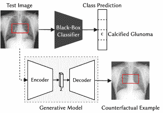

<!--yml

类别：未分类

日期：2024-09-06 19:46:34

-->

# [2205.04766] 医学图像分类中的可解释深度学习方法：综述

> 来源：[`ar5iv.labs.arxiv.org/html/2205.04766`](https://ar5iv.labs.arxiv.org/html/2205.04766)

# 医学图像分类中的可解释深度学习方法：综述

Cristiano Patrício cristiano.patricio@ubi.pt ， João C. Neves jcneves@di.ubi.pt 比拉内尔大学和 NOVA LINCS 科维良葡萄牙 6201-001 以及 Luís F. Teixeira luisft@fe.up.pt 波尔图大学和 INESC TEC 波尔图葡萄牙 4200-465（2023）

###### 摘要。

深度学习的显著成功激发了对其在医学影像诊断中应用的兴趣。尽管最先进的深度学习模型在分类不同类型的医学数据方面达到了人类水平的准确性，但这些模型在临床工作流中的应用仍然很少，主要原因在于其缺乏可解释性。深度学习模型的黑箱特性引发了制定解释这些模型决策过程的策略的需求，从而催生了可解释人工智能（XAI）这一话题。在这一背景下，我们提供了关于应用于医学影像诊断的 XAI 的全面综述，包括视觉、文本、基于示例和基于概念的解释方法。此外，本文还回顾了现有的医学影像数据集和评估解释质量的现有指标。此外，我们还包括了一组基于报告生成的方法的性能比较。最后，还讨论了将 XAI 应用于医学影像的主要挑战以及未来的研究方向。

可解释人工智能、可解释性、解释能力、深度学习、医学图像分析^†^†版权：acmcopyright^†^†期刊年份：2023^†^†doi：10.1145/nnnnnnn.nnnnnnn^†^†ccs：应用计算 健康护理信息系统

## 1\. 引言

在过去十年中，人工智能（AI）领域取得的进展支持了大多数计算机视觉应用的准确性显著提高。医学图像分析是其中一个进展显著的应用领域，它在分类不同类型的医学数据（例如，胸部 X 光片 (91)，角膜图像 (167））方面达到了人类水平的准确性。然而，尽管有这些进展，自动化医学影像在临床实践中的应用仍然很少。根据扎卡里·利普顿 (78)，这一明显矛盾的解释很简单，医生永远不会信任算法的决定，除非他们理解其决策过程。这一事实引发了对能够解释 AI 算法决策过程的策略的需求，随后催生了一个新的研究主题——可解释人工智能（XAI）。根据 DARPA (47)，XAI 旨在“产生更多可解释的模型，同时保持高水平的学习性能（预测准确性）；并使人类用户能够理解、适当地信任和有效地管理新一代人工智能伙伴”。尽管其具有普遍适用性，但 XAI 在高风险决策中尤为重要，例如临床工作流程，其中错误决策的后果可能导致人员死亡。这一点也得到了欧盟通用数据保护条例（GDPR）法律的支持，该法律要求对算法的决策过程进行解释，从而在算法用于患者护理之前提高其透明度 (42)。

鉴于此，在将深度学习方法部署到临床实践之前，投资于研究改善深度学习方法可解释性的创新策略至关重要。在过去几年中，这一主题的研究主要集中在制定间接分析预构建模型决策过程的方法。这些方法通过分析输入图像特定区域对最终预测的影响（基于扰动的方法 (113; 88) 和基于遮挡的方法 (174)) 或检查网络激活（显著性方法 (128; 177)) 来操作。这些方法可以应用于任意网络架构，而无需对模型进行额外的定制，这支持了它们在 XAI 早期阶段的流行。然而，最近已显示出后期策略在解释的重要性方面存在一些缺陷 (118; 3)。因此，研究人员将注意力集中在设计能够自我解释其决策过程的模型/架构上。固有可解释模型被认为在医学成像中尤其有用 (118)，这也解释了最近在这一范式下而非传统后期策略中的医学成像工作的增长。尽管固有可解释模型最近受到欢迎，但现有的关于应用于医学成像的深度学习可解释性的调查尚未全面回顾这一新兴研究趋势中的进展。此外，针对深度学习在医学成像中应用的决策过程的研究数量显著增加，说明了对最新方法进行更新审查的必要性，这些方法未被最后的主题调查覆盖。此外，医学成像分析的特定挑战，包括图像复杂性（与一般图像相比，解剖结构、器官和伪影往往更难识别）、数据可用性和误分类风险，强调了对医学成像应用的可解释性进行专门调查的必要性。

为了解决这些问题，我们全面回顾了应用于医学诊断的可解释深度学习的最新进展。特别是，本调查提供了以下贡献：

+   •

    对于可解释深度学习在医学成像中的最新调查的回顾，包括从每项工作中得出的主要结论，以及与我们的调查的比较分析；

+   •

    深度学习方法应用于医学成像研究中常用的数据集的详尽列表；

+   •

    对最先进的可解释医学影像方法进行全面审查，包括事后和本质上可解释的模型。

+   •

    常用于基准测试可解释性方法的指标的完整描述，无论是可视的还是文本的解释。

+   •

    关于文本解释质量的可解释医学影像方法的基准测试。

+   •

    在医学影像可解释深度学习主题的未来研究方向。

## 2\. 关联调查

解释深度学习模型的决策已经是近年来研究的一个活跃领域，文献中提出了各种方法和算法。XAI 的快速发展引发了对最新技术发展的全面概述的需求，大多数情况下，需要分析特定领域，因为近年来发表的作品数量庞大。因此，在本节中，我们对应用于医学成像的深度学习的现有调查进行了批判性分析（第 2.1 节），特别关注可解释方法（第 2.2 节），并将我们的调查与已分析的调查进行了比较（第 2.3 节）。

### 2.1\. 医学图像分析中的深度学习

深度学习的出现显著改变了计算机视觉领域，其中手工制作的特征提取被卷积神经网络（CNNs）的端到端学习所取代。这一新范式始于 2012 年 Krizhevsky 等人的开创性工作（66），但并没有立即被所有的计算机视觉应用所应用。Litjens 等人（80）首先总结了深度学习引发的医学图像分析的进展，清楚地表明在 2017 年，CNN 在医学成像研究中只有成为标准方法，被明显地优先于传统的手工制作特征提取，适用于大多数解剖区域。根据综述的作品，作者得出结论，数据预处理和数据增强技术对于获得更好的结果至关重要，并且医学图像与文本数据（医学报告）的组合可以提高图像分类的准确性（125）。尽管当时这项调查的相关性很大，但是过去 5 年深度学习领域的快速发展使得该工作已经过时，因为调查的主要结论目前已经司空见惯，新的深度学习模型目前正在医学成像领域得到应用。

鉴于此，Rehman 等人 (112) 提供了有关应用于医学图像分析的深度学习进展的更新概述。该综述被分为不同的模式识别任务（图像分类、分割、图像配准）。关于图像分类任务，作者建议使用生成模型进行数据增强以提高结果。该综述还给出了未来研究方向，以克服 Litjens 等人 (80) 识别出的最常见挑战。建议使用如迁移学习和合成数据生成等技术来应对这些挑战，同时提升所开发策略的泛化能力。然而，作者总结道，大规模注释数据集的不可用仍然是医学成像领域的主要挑战之一，这影响了深度学习模型的性能，导致数据过拟合和偏差问题。

### 2.2\. 可解释的深度学习在医学成像中的应用

Litjens 等人 (80) 和 Rehman 等人 (112) 的研究表明，近年来深度学习的使用极大地提高了医学成像分析算法的性能，也使得为不同的图像模态和识别任务创建了大量的方法。然而，这与临床医生拒绝依赖他们不了解的决策形成了对比 (78)。实际上，正如 Litjens 等人 (80) 预见的那样，设计可解释模型在医学成像中的重要性在近年来不断增长，现在已成为医学成像中的主要挑战之一。接下来的段落描述了专注于回顾可解释深度学习在医学成像中应用的不同综述。此外，还概述了每项工作的主要结论及与我们综述的简要比较。

#### 2.2.1\. 综合评论

Tjoa 和 Guan (146) 提供了机器学习和深度学习解释性方法的一般概述，重点介绍其在医学领域的应用。作者考虑了两种解释性： (i) 感知解释性，其中包括显著性方法，和 (ii) 通过数学结构的解释性，其中包括能够分析数据模式的数学公式。虽然涵盖了大量图像模态的研究，但该调查缺乏对所评审工作的比较。此外，Tjoa 和 Guan 的调查更适合技术导向的读者，这一点通过对医学界的直观分类较差得到证实。大多数工作是基于其数学基础进行讨论的，而不是描述所提出方法背后的理由。作为主要结论，Tjoa 和 Guan 指出，将视觉和文本解释结合起来是传达医学影像分析算法解释的最有前景的方式，并且这些算法应始终作为对临床医生的补充援助/支持，最终决策应由临床医生负责。

Singh 等 (134) 提出了一个关于医学影像中深度学习模型可解释性的工作的综述。这些方法大致分为两大类（基于归因的和非基于归因的），根据它们确定输入特征对目标输出的贡献的能力。两类方法通过描述应用于不同医学数据图像模态的工作进行回顾。然而，该调查主要集中在基于归因的类别上，对于非基于归因的方法的现有方法的讨论较为肤浅，其中包括内在可解释的方法。基于回顾的工作，作者总结出利用患者记录数据和图像可以成为推动深度学习在医学影像中表现的一个令人兴奋的研究方向。与我们的调查相比，Singh 等的工作缺乏对内在可解释方法的全面分析，对现有医学影像数据集的分析，以及对最突出评审方法的基准测试。

最近，Salahuddin 等人 (120) 对一组可解释性方法进行了评审，这些方法根据生成的解释类型被分为九个不同的类别。他们还讨论了评估解释的问题，并描述了一套用于定量和定性测量解释质量的评估策略。与其他调查类似，作者们也强调了在设计和验证可解释性模型时涉及临床医生的重要性，以确保生成解释的实用性。对于未来的展望，Salahuddin 等人声称，基于案例和概念学习的模型是有前景的可解释性模型，因为它们本质上是可解释的，并且能实现与黑箱 CNN 相似的性能。尽管这是该主题最完整的调查之一，但它缺乏对该领域大多数相关数据集的描述，以及对评审的最突出方法的基准测试。

#### 2.2.2\. 特定图像模式评审

与上述工作相比，Pocevičiūtė 等人 (109) 的工作专注于特定的图像模式。针对数字病理学的 XAI 技术根据三个标准进行了评审：1）将要解释的内容（例如，模型预测、预测不确定性）；2）解释模式；3）解释的推导方式（例如，基于扰动的策略、可解释网络设计）。作者指出了开发一个用于客观测量解释质量的工具箱的重要性，因为缺乏评估框架仍然是 XAI 领域中的一个开放问题。此外，作者表示，使用反事实示例可以增强方法的可解释性。与我们的调查相比，这项工作忽略了文本解释模式，仅关注于视觉解释，无论是通过视觉示例还是显著性图。

Gulum 等人 (46) 对应用于癌症检测的磁共振成像 (MRI) 扫描的视觉解释技术进行了评审。与 Pocevičiūtė 等人 (109) 的工作相反，Gulum 等人讨论了用于衡量解释质量的策略，但他们仅考虑了一种度量标准来定量评估解释。他们还强调，缺乏基于人类评估的解释方法研究。作为未来的方向，Gulum 等人强调了开发本质上可解释的方法的必要性，而不是传统的事后策略。最后，作者提出了使用与模型预测相关的不确定性估计来感知模型在进行预测时的信心。尽管其相关性很高，但 Gulum 等人的工作仅针对特定的图像模式（MRI）和目标疾病（癌症）。

#### 2.2.3\. 特定解释模式评审

虽然视觉解释通常是解释模型决策的主要选择，但这些策略可能不可靠，因为它们经常突出显示区域，而不考虑兴趣类别 (118)。这促使了对文本解释的研究，特别是在医学成像的情况下，促使研究人员设计了能够产生不同类型文本解释的方法：1）文本概念和 2）文本报告。Messina 等人 (96) 和 Ayesha 等人 (9) 的调查涵盖了这一主题的最新进展。

在 (96) 中，提供了有关从医学图像生成自动报告的当前最先进技术的全面概述。作者回顾了 40 篇论文，涉及四个维度：使用的数据集、模型设计、可解释性和评估指标。此外，还提供了最相关方法的基准，基于 IU 胸部 X 光数据集的 NLP 指标性能。根据分析的工作，作者确定了以下挑战和未来研究方向：1）获得的解释由临床医生验证不切实际，需要创建与临床医生意见正相关的自动指标；2）大多数研究集中在胸部 X 光上，主要由于公共数据的可用性；3）监督学习可能不是医学报告生成学习的最合适策略，而强化学习似乎是一个更合理的训练范式。

类似于 Messina 等人的工作，Ayesha 等人 (9) 对现有的医学图像自动生成字幕方法进行了详细的调查。最常用的数据集和评估指标也被讨论。对各种基于深度学习的医学图像字幕生成方法进行了广泛的研究，包括编码器-解码器基、检索基、注意力基、概念检测基和患者元数据基。此外，还提供了对审查方法性能的比较分析。最后，Ayesha 等人建议了一些未来的研究方向，以解决医学成像中的主要开放问题。他们指出，缺乏大规模标注数据集是医学成像领域的主要限制，在该领域数据稀缺且经常被错误标注。此外，他们声称缺乏适当的评估指标来评估生成的字幕仍然是一个悬而未决的问题，因为对生成文本的评估仍基于标准的 NLP 指标，如 BLEU 分数、ROUGE、METEOR 和 CIDEr。最后，Ayesha 等人还指出了拥有一个能够同时检测多种疾病的模型的重要性。

表 1\. 关于应用于医学成像的可解释深度学习主题的综述之间的比较分析。我们的综述是首个全面回顾该主题的不同解释模式和解释过程的进展的综述。同时，它分析了该领域最相关的数据集，以及这些数据集在可解释方法开发中的应用。

| 调查 | 年份 | 解释 | 模型类型 | 医学成像 | 基准性能 |
| --- | --- | --- | --- | --- | --- |
| 视觉 | 文本 | 事后解释 | 内部模型 | 数据集 |
| Pocevičiūtė 等 (109) | 2020 | ✓ | ✗ | ✓ | ✓ | ✗ | ✗ |
| Tjoa 和 Guan (146) | 2020 | ✓ | ✓ | ✓ | ✓ | ✗ | ✗ |
| Singh 等 (134) | 2020 | ✓ | ✓ | ✓ | ✓ | ✗ | ✗ |
| Gulum 等 (46) | 2021 | ✓ | ✗ | ✓ | ✓ | ✗ | ✗ |
| Ayesha 等 (9) | 2021 | ✗ | ✓ | ✗ | ✓ | ✓ | ✓ |
| Salahuddin 等 (120) | 2022 | ✓ | ✓ | ✓ | ✓ | ✗ | ✗ |
| Messina 等 (96) | 2022 | ✗ | ✓ | ✗ | ✓ | ✓ | ✓ |
| 本综述 | 2023 | ✓ | ✓ | ✓ | ✓ | ✓ | ✓ |

### 2.3\. 讨论

尽管每项综述都有显著贡献，但很少有综述描述了医学成像领域最重要的数据集。此外，大多数综述集中在解释性特定方面，如视觉或文本方法，少数工作全面回顾了为医学图像分析制定的固有可解释模型。另一个问题是缺乏对审阅方法之间性能的比较。因此，本综述通过提供对当前最先进的 XAI 在医学诊断中的应用的更广泛概述，包括单模态和多模态方法，涵盖了这些局限性，并紧接着介绍了最重要的医学成像数据集，以及使用标准评估指标的模型性能比较。此外，本综述还探索了一个当代趋势和一个未充分利用的固有可解释模型类别，特别是基于概念的学习方法。如后续章节所述，这些方法对医学诊断具有优势，因为它们提供了与医生知识对齐的高层次概念背景中的解释，并通过模型干预促进医生与 AI 之间的互动。表 1 总结了所审阅的综述与我们的工作（本综述）之间的主要差异。

图 1\. 提议的 XAI 方法分类法。提议的分类法受到审阅论文中提出的各种分类法的启发。

## 3\. XAI 背景

从历史角度来看，解释专家系统的问题起源于 80 年代中期（99），但 XAI 这一术语直到 2004 年由 Van 等人提出（153）。然而，XAI 直到深度学习主导 AI 时才获得关注，2015 年 DARPA 启动的可解释 AI 计划是这种兴趣的初步迹象，该计划的主要目标是产生更可解释的模型，以增加对其理解和透明度，从而增强用户的信任。后来，欧盟（EU）（42）引入了有关“算法解释权”的立法，赋予公民对从个人数据获得的算法决策提出解释的权利。考虑到这一点，研究人员将努力转向创建可解释模型，而不仅仅关注准确性，从而导致 XAI 的流行和兴趣呈指数增长，该主题的研究数量在近年来迅速增加。

本节提供了 XAI 方法的分类概述、开创性 XAI 方法的描述，以及提供这些方法实现的现有框架（见附录 A.1 中的表 4）。

### 3.1\. XAI 方法分类

根据审查的文献，XAI 方法可以根据以下三种标准进行分类：（i）模型无关与模型特定；（ii）全局可解释性与局部可解释性；以及（iii）事后解释与内在解释。图 1 说明了 XAI 方法的一般分类，每个类别将在以下段落中详细介绍。

##### 模型无关与模型特定

可解释性方法的一个区分因素是它们对模型的适用范围。模型无关方法可以用于解释任意模型，不限于特定的模型架构。相反，模型特定方法受限于特定的模型架构，这意味着这些方法需要访问模型的内部信息。

##### 全局可解释性与局部可解释性

XAI 方法提供的解释类型大致分为全局和局部，全局解释提供关于模型在总体数据分布中的功能的见解，而局部解释则针对特定数据样本提供见解。全局可解释性方法解释了数据中的哪些模式，即类别特征，对模型预测的贡献最大。这些解释可以揭示模型学习的关键推理。另一方面，局部可解释性方法旨在解释模型为何对单个输入进行特定预测。

##### 事后分析与内在分析

这一标准区分了解释机制是存在于模型的内部架构中（内在的）还是在模型的学习/开发之后应用的（事后的）。事后方法通常通过扰动数据的部分来了解不同特征对模型预测的贡献，或通过分析确定不同特征对模型预测的贡献。另一方面，内在模型，也称为模型内部方法或固有可解释模型，是自解释的，因为它们被设计成从模型的内部特征中生成人类可理解的表示。

##### 解释模式

解释模式指的是每种可解释性方法提供的解释类型。在审查的方法中，解释可以以显著性图（特征归因解释）、语义描述（文本解释）、类似例子（示例解释）或使用高级概念（概念解释）的形式提供。在第五章中，我们使用了这种分类方法来讨论所审查的方法。

### 3.2\. 经典 XAI 方法

解释深度学习模型的初步尝试依赖于对模型的事后分析。尽管事后方法最近遭受了批评（118），但它们在许多医学成像领域仍被使用，并且对解释可解释深度学习的进展很重要。因此，以下部分简要描述了根据事后分析的两个主要类别最流行的 XAI 算法。

#### 3.2.1\. 基于扰动的方法

基于扰动的方法的基本原理是感知输入中的扰动如何影响模型的预测。基于扰动的方法的例子包括 LIME（113）和 SHAP（88）。

##### LIME

LIME（113）代表局部可解释模型无关解释。顾名思义，它可以解释任何黑箱模型，根据 XAI 分类法，它是一种事后模型无关的方法，提供局部解释。LIME 的直觉是通过一个可解释模型局部近似复杂模型（黑箱模型），通常称为局部替代模型。因此，使用一个简单的可解释模型在预测周围局部解释个体实例，例如线性模型或决策树。图 2a) 提供了 LIME 整体功能的直观说明。

为了在局部范围内近似模型预测，使用了一个新的数据集，该数据集由受扰动的样本组成，这些样本依据其与正在解释的实例的接近程度进行条件化。通过复杂模型获得这些扰动样本的标签。在表格数据的情况下，扰动实例在正在解释的实例周围进行采样，通过随机改变特征值来获得既接近又远离正在解释的实例的样本。类似地，当 LIME 应用于图像分类问题时，首先将正在解释的图像分割成超像素，即图像中具有共同特征（如颜色和强度）的像素组。然后，通过随机遮挡一部分超像素来获得原始数据的扰动版本，从而得到一个有遮挡区域的图像。用于拟合可解释模型的新数据集由正在解释的图像的扰动版本组成，而在可解释模型中具有最高正系数的超像素表明它们对预测贡献很大。因此，它们将被选为可解释表示的一部分，该表示仅为一个二进制向量，指示这些超像素的存在或缺失。

##### SHAP

SHAP (88)受合作博弈论中的沙普利值启发(130)，通过确定特征值对模型预测的平均贡献来操作，使用特征幂集的所有组合。例如，给定基于年龄、性别和身体质量指数(BMI)来预测中风风险的任务，对特定预测的 SHAP 解释以每个特征的贡献来说明。这一贡献来自于使用$2^{n}$的特征幂集组合观察到的模型预测变化确定，其中缺失的特征被随机值替换。图 2b)说明了上述例子。与 LIME 类似，SHAP 是一种局部的模型无关解释方法，可应用于表格数据和图像数据。对于表格数据，解释以每个特征的重要性值的形式给出。对于图像数据，它遵循与 LIME 类似的流程，通过计算超像素之间所有可能的组合的沙普利值。提出了 SHAP 方法的几种变体，以更高效地逼近沙普利值，包括 KernelSHAP、DeepSHAP 和 TreeSHAP (87)。

<svg   height="213.38" overflow="visible" version="1.1" width="614.13"><g transform="translate(0,213.38) matrix(1 0 0 -1 0 0) translate(160.02,0) translate(0,121.77)" fill="#000000" stroke="#000000" stroke-width="0.4pt"><g transform="matrix(1.0 0.0 0.0 1.0 -155.41 -84)" fill="#000000" stroke="#000000"><foreignobject width="299" height="168" transform="matrix(1 0 0 -1 0 16.6)" overflow="visible"></foreignobject></g><g transform="matrix(1.0 0.0 0.0 1.0 150.5 -87)" fill="#000000" stroke="#000000"><foreignobject width="299" height="174" transform="matrix(1 0 0 -1 0 16.6)" overflow="visible"></foreignobject></g><g transform="matrix(1.0 0.0 0.0 1.0 9.16 -113.7)" fill="#000000" stroke="#000000"><foreignobject width="17.68" height="13.84" transform="matrix(1 0 0 -1 0 16.6)" overflow="visible">(a)</foreignobject></g><g transform="matrix(1.0 0.0 0.0 1.0 272.78 -113.7)" fill="#000000" stroke="#000000"><foreignobject width="18.45" height="13.84" transform="matrix(1 0 0 -1 0 16.6)" overflow="visible">(b)</foreignobject></g></g></svg>

图 2\. (a) LIME。黑色曲线代表由复杂黑箱模型学习的决策边界。LIME 通过将一个可解释的模型（由绿色虚线表示）拟合到测试样本的变化（橙色圆圈），从而解释新的测试样本（虚线圆圈）。这些变化是通过随机扰动测试样本特征生成的。拟合的模型使我们能够感知每个特征对分类特定测试样本的贡献。(b) SHAP。对于一个 13 岁女性，体质指数为 29.1，平均葡萄糖水平为 76.55 的分类模型预测的中风风险是“无中风”。通过条形图可以看到，每个特征的 Shapley 值，其中“年龄”对“无中风”预测的影响最大，其次是 BMI 和平均葡萄糖水平特征。

#### 3.2.2\. 显著性

显著性图是解释模型决策的最流行技术之一。显著性方法生成视觉解释图，表示图像像素对模型分类的重要性。

类激活映射（CAM）(177) 是一种开创性的显著性方法，它通过使用网络最后一层全局平均池化（GAP）层输出的线性组合来生成显著性图。尽管 CAM 是一个开创性的贡献，但它仅适用于遵循特定模式的架构。为了解决这个问题，Selvaraju 等人(128) 提出了梯度加权类激活映射（Grad-CAM）(128)，它利用目标类相对于输入图像的梯度信息来生成一个类别区分的定位图，从而作为模型预测的视觉解释。因此，Grad-CAM 是 CAM 的一个推广。另一方面，SmoothGrad(139) 是另一种基于梯度的解释方法，其核心思想是减弱梯度基方法提供的解释噪声。SmoothGrad 的原理是通过向输入图像添加噪声来采样多个图像。然后，为每个采样图像计算敏感度图。最终的图是敏感度图的平均值。

Integrated Gradients (IG) (144) 是一种归因方法，它通过线性插值生成一组基线和原始图像之间的图像。这些插值图像在特征空间中产生细微变化，并且每个插值图像的强度一致增加。通过计算每个特征（像素）的梯度，可以测量特征变化与模型预测变化之间的相关性。得分较高的像素是对预测贡献最大的像素。Layer-wise Relevance Propagation (LRP) (10) 是一种替代梯度的解决方案，它将决策函数分解为网络中每个神经元的相关性分数。输出通过模型向后传播，以确定输入的相关性分数，从而生成图像像素的重要性热图。

显著性方法的主要优势在于与基于扰动的方法相比，计算成本降低。然而，不同的研究认为，梯度方法提供的解释可能模糊和不可靠，并且对对抗性扰动敏感 (3; 40)。

## 4\. 数据集

在审查的文献中，基于审查的论文，考虑了 25 个公开的医学影像数据集，以提供对现有医学影像数据库的全面概述。表 3 展示了所选数据集的主要特征，按图像类型分组。

表 2\. 医学影像数据集。标有“*”的数据集报告以西班牙语书写。标有“**”的数据集报告以葡萄牙语书写。

| 数据集 | 图像类型 | 年份 | 图像数量 | 备注 |
| --- | --- | --- | --- | --- |
| IU Chest X-Ray (32) | 胸部 X 光 | 2016 | 7,470 | 包含报告 |
| Chest X-Ray14 (159) | 胸部 X 光 | 2017 | 112,120 | 多标签 |
| CheXpert (54) | 胸部 X 光 | 2019 | 224,316 | 多标签 |
| MIMIC-CXR (56) | 胸部 X 光 | 2019 | 377,110 | 包含报告 |
| PadChest^∗ (19) | 胸部 X 光 | 2020 | 160,868 | 包含报告 |
| VinDr-CXR (102) | 胸部 X 光 | 2020 | 18,000 | 多标签 |
| COVIDx (156) | 胸部 X 光 | 2020 | 13,975 | 多类别 |
| Inbreast^(∗∗) (100) | 乳腺 X 光 | 2012 | 410 | 包含报告 |
| CBIS-DDSM (73) | 乳腺 X 光 | 2017 | 2,620 | 多类别 |
| VinDr-SpineXR (103) | 脊柱 X 光 | 2021 | 10,469 | 多标签/边界框 |
| 膝关节骨关节炎 (101) | 膝关节 X 光 | 2006 | 8,894 | 多类别 |
| PH² (95) | 皮肤镜图像 | 2013 | 200 | 多标签/病变分割 |
| HAM10000 (149) | 皮肤镜图像 | 2018 | 10,015 | 多类别/病变分割 |
| SKINL2 (31) | 皮肤镜图像 | 2019 | 376 | 多类别 |
| Derm7pt (57) | 皮肤镜图像 | 2019 | 2,000 | 多类别 |
| ISIC 2020 (117) | 皮肤镜图像 | 2020 | 33,126 | 多标签 |
| SkinCon (29) | 皮肤镜图像 | 2022 | 3,230 | 概念注释 |
| BreakHis (141) | 显微镜图像 | 2015 | 9,109 | 多类别 |
| Camelyon17 (79) | 显微镜图像 | 2018 | 1,000 | 多类别 |
| Databiox (17) | 显微镜图像 | 2020 | 922 | 多类别 |
| BCIDR^((priv)) (176) | 显微镜图像 | 2017 | 5,000 | 包含报告 |
| APTOS (140) | 视网膜图像 | 2019 | 5,590 | 多类别 |
| LIDC-IDRI (8) | CT 扫描 | 2011 | 1,018 | 包含注释 |
| COV-CTR (75) | CT 扫描 | 2023 | 728 | 包含报告 |
| PEIR (55) | 照片 | 2017 | 33,648 | 包含报告 |
| ROCO (107) | 多模态 | 2018 | 81,825 | 包含报告/UMLS 概念 |

### 4.1\. 胸部 X 光

关于 X 射线成像模式，IU 胸部 X 射线 (32)、Chest X-ray 14 (159)、CheXpert (54)、MIMIC-CXR (56)、PadChest (19)、COVIDx (156) 和 VinDr-CXR (102) 数据集涉及胸部解剖区域。此外，IU 胸部 X 射线、MIMIC-CXR 和 PadChest 数据集包含自由文本放射学报告。报告用英语书写，PadChest 数据集的报告用西班牙语书写。MIMIC-CXR 和 CheXpert 是最大的数据库，分别包含 $377,110$ 和 $224,316$ 张 X 射线影像。CheXpert 不提供原始自由文本报告，但提供了一个基于规则的自动标注器，用于从符合 Fleischner 协会推荐词汇表 (49) 的医学报告中提取关键词。这个工具也在 MIMIC-CXR 数据集中用于从放射学报告中提取标签。UI 胸部 X 射线 (32) 包含 $7,470$ 张胸部 X 射线影像和 $3,955$ 张自由文本报告，是文献中使用最多的数据集。VineDr-CXR 包含 $18,000$ 张胸部 X 射线影像，标注了 $22$ 个发现（局部标签）和 $6$ 个诊断（全局标签）。局部标签是从放射学报告的“发现”部分推断出来的。相反，全局标签来自“印象”部分，表示怀疑的疾病，如“肺炎”、“结核病”、“肺肿瘤”、“慢性阻塞性肺疾病”、“其他疾病”和“无发现”。此外，每个“发现”都在 X 射线影像上用边界框标注。最后，COVIDx (156) 数据集包含 13,975 张胸部 X 射线影像，覆盖 $13,870$ 个患者病例，按“正常”、“肺炎”和“COVID-19”病例分布。

值得注意的是，大多数胸部 X 射线数据集的标签是使用自动规则标注器（如 CheXpert NLP 工具 (54)）提取的。然而，依赖这些自动工具可能会对标签的质量造成一些问题。因此，VinDr-CXR (102) 数据集的作者仅提供了训练集和测试集中的放射科医师级注释。

### 4.2\. 其他 X 射线模式

在同一段 X 射线影像中，与 VinDr-CXR (102) 数据集的方法类似，VinDr-SpinalXR (103) 是一个最近的数据集，包括 $10,469$ 张脊柱 X 射线图像，这些图像由经验丰富的放射科医生手动标注，围绕 $13$ 类异常发现绘制了边界框。膝关节骨关节炎 (101) 数据集包含 8,894 张膝关节 X 射线图像，用于膝关节检测以及膝关节 Kellgren 和 Lawrence 分级 (59)，分级范围从 0 到 4，根据严重程度的不同。关于乳腺 X 射线数据集，Inbreast (100) 包含 $410$ 张乳腺 X 射线图像以及 115 份用葡萄牙语撰写的放射学报告。类似地，CBIS-DDSM (73) 数据集由 $2,620$ 张乳腺扫描图像组成，分为“正常”、“良性”和“恶性”病例。

### 4.3\. 皮肤镜检查

在皮肤科范围内，ISIC 2020 (117) 数据集包括 $33,126$ 张不同分类（恶性、黑色素瘤、角化症等）的皮肤病变图像，是国际皮肤影像合作组织的一部分，该组织每年举办挑战赛，以提升皮肤镜图像中恶性皮肤病变的诊断水平。HAM10000 (149) 数据集包括 $10,015$ 张皮肤镜图像，按色素病变领域的诊断类别进行分布。PH² (95) 数据集包括 $200$ 张黑色素病变的皮肤镜图像，包括普通痣、非典型痣和黑色素瘤。此外，PH² 数据库包含病变的医学分割、临床和组织学诊断，以及对若干皮肤镜标准的评估。Derm7pt (57) 是另一个皮肤镜图像数据集，包含超过 $2,000$ 张图像，按照 7 点黑色素瘤检查表标准进行了标注。最后，SKINL2 (31) 数据库包括 $376$ 张皮肤病变的光场图像，这些图像根据皮肤病变类型和对应的国际疾病分类（ICD）代码，手动标注为八个类别。SkinCon (29) 包含来自 Fitzpatrick 17k 皮肤疾病数据集 (45) 的 3,230 张图像，标注了 48 个临床概念。

### 4.4\. 显微镜检查

关于由显微镜图像组成的数据集，BreakHis (141) 数据集包括 $9,109$ 张乳腺肿瘤组织的显微图像，这些图像分布在不同的放大倍数（40x、100x、200x 和 400x）下，并被分类为“良性”和“恶性”肿瘤。Camelyon 17 (79) 数据集包含 $1,000$ 张带注释的淋巴结全切片图像（WSI）。这是一个挑战赛的一部分，其主要目标是对淋巴结组织学切片中的乳腺癌转移进行分类。同样，Databiox (17) 数据集包含 $922$ 张病理显微镜图像，具有四个放大级别（4x、10x、20x 和 40x），用于侵袭性导管癌（IDC）分级任务，IDC 分为三个等级。

### 4.5. 其他

对于盲点检测目的，APTOS (140) 数据集提供 $5,590$ 张使用眼底摄影拍摄的视网膜图像。临床医生根据糖尿病视网膜病变的严重程度对每张图像进行了标注，评分范围从 0（糖尿病视网膜病变）到 4（增殖性糖尿病视网膜病变）。在 COVID-19 的背景下，COVID-19 CT Reports (COV-CTR) (75) 是一个数据集，由 728 张 CT 扫描图像及其对应的中文和英文报告组成。

关于多模态成像的数据库，病理教育信息资源（PEIR）是一个多学科的公共访问图像数据库，旨在用于医学教育。PEIR 数据库包含 $33,648$ 张图像及其相应的描述，来自不同子类的 PEIR 相册（PEIR Pathology、PEIR Radiology 和 PEIR Slice）。类似地，放射学对象在上下文（ROCO） (107) 数据集是一个多模态图像数据集，包含 $81,825$ 张放射学图像，分为 CT、MRI、X 射线、超声和乳腺摄影。每张图像都附有相应的说明和标注的统一医学语言系统（UMLS）概念。

### 4.6. 讨论

根据表 2，胸部 X 光是同时拥有最多数据集和最大规模的成像模态。大规模数据集的优点在于它们可以用来从头开始训练模型。然而，一些例子的自动标记过程可能会影响模型的可靠性，因为某些类别标签未经人工验证，可能会被错误标记。另一方面，从每个数据集的图像数量来看，与其他成像模态相比，大规模数据集的稀缺性是显而易见的，这阻碍了专业任务特定模型的出现，因为训练数据有限。大多数医疗成像数据集主要用于分类或分割任务，其中类别和掩码注释的标记对于其预期目的已经足够。然而，当这些数据集用于解释性目的时，它们的注释可能不适合进行全面的定性评估。尽管如此，一些数据集，如 SkinCon 等，已明确创建以便于解释，并包含适当的注释以促进此类评估。因此，研究人员在构建新的医疗数据集时特别重要的是要考虑解释性问题，确保包含适当的注释，以进一步促进对数据的全面和有信息量的分析。

## 5. 医疗诊断中的 XAI 方法

如前所述，深度学习模型在实际应用中必须具备透明性和可信度。此外，这一要求在临床实践中尤为重要，因为不够充分的信息可能会危及患者的生命。在回顾的文献中，已经提出了几种方法来赋予深度学习方法以可解释性，这些方法应用于医疗诊断。以下部分总结并分类了在医疗诊断中应用的可解释模型中最相关的工作。此外，我们特别关注于本质上可解释的神经网络及其在医学成像中的适用性。我们根据解释方式对方法进行分类：（i）特征归因解释，（ii）文本解释，（iii）示例解释，（iv）概念解释，以及（v）其他方法；灵感来自于 (97) 中提出的分类法。表 5 中提供了按照可解释性方法、图像模式和数据集分类的回顾方法列表，见附录 A.2¹¹1。表 5 的互动版本可通过此 [链接](https://github.com/CristianoPatricio/Explainable-Deep-Learning-Methods-in-Medical-Image-Classification-A-Survey) 查看。

  (a) (b)

图 3\. (a) 基于扰动的方法。通过开启和关闭某些像素来随机扰动输入图像，得到一个包含遮挡部分的图像（图中的扰动示例）。然后，将扰动后的图像输入分类模型，利用预测置信度来确定对类别预测做出积极贡献的区域。这些区域将被用来获得最终的解释图（图中的解释）。(b) 显著性方法。将输入图像输入分类模型以获得类别预测。然后，计算类别相对于最后一层卷积特征图的分数梯度。在计算特征图对预测类别的重要性之后，将其与各自的权重加权，接着进行 ReLU 操作，以获得最终的显著性图。

### 5.1\. 特征归因解释

特征归因方法指明了每个输入特征对最终模型预测的贡献。这些方法可以处理表格数据或图像数据，通过条形图描绘特征重要性分数，或使用显著性图。现有的特征归因方法中，我们将其分为 (i) 基于扰动的方法和 (ii) 显著性方法，重点介绍它们在医学图像分析中的应用。图 3 展示了这些方法的一般流程图。

#### 5.1.1\. 基于扰动的方法

如在 3.2.1 部分所述，基于扰动的方法旨在对输入数据进行修改，以观察这如何影响模型的预测。常见的基于扰动的方法包括 LIME (113)和 SHAP (88)。关于使用扰动方法来解释医学诊断算法的预测，Malhi 等人 (92)应用了 LIME 方法来解释分类器在胃镜图像中检测出出血的决策。类似地，Punn 等人 (110)应用了 LIME 技术来解释用于分类胸部 X 光图像中肺部疾病的各种最先进深度学习模型的预测。Magesh 等人 (90)也使用了 LIME 来证明帕金森病分类器模型的决策。在黑色素瘤检测的背景下，Young 等人 (171)使用了 Kernel SHAP (88)解释性方法来调查其在提供黑色素瘤分类器解释中的可靠性。他们得出结论，解释性策略突出了与最终预测无关的特征。作者还对解释性方法进行了合理性检查，结果确认这些方法通常会对性能相似的模型给出不同的解释。这可以通过模型可能学习到一些虚假的关联来解释，导致解释性方法对在生成的显著性图上突出显示的虚假区域赋予了夸大的重要性。在相同的背景下，Wang 等人 (158)提出了一种用于皮肤病变诊断的多模态 CNN，该模型考虑了患者的元数据和皮肤病变图像。为了分析每个特征在患者元数据中的贡献，他们采用了 SHAP。类似地，Eitel 等人 (35)依赖于基于遮挡的解释性方法 (174)并调查了其在阿尔茨海默病分类任务中的鲁棒性。

RISE 由 Petsiuk 等人 (108) 提出，也是一种后验模型不可知的方法，用于通过生成显著性图来解释黑箱模型的预测，该显著性图指示模型预测的重要像素。其核心思想是通过随机掩膜对输入图像进行一组扰动图像的探测，以感知模型的响应，因为图像的重要区域会被随机遮挡。最终显著性图作为生成的掩膜的线性组合生成，这些掩膜按模型预测的输出概率加权。为了评估，作者提出了两个新颖的度量指标，即删除和插入，基于图像中重要像素的移除和插入，以感知模型性能的增加或减少。

#### 5.1.2\. 显著性方法

Saliency 方法可以生成一个显著性图，其中每个像素被分配一个值，表示其对某一类别预测的相关性。流行的技术包括 CAM (177)、Grad-CAM (128)、DeepLIFT (131) 和 Integrated Gradients (144)。

Rajpurkar 等人 (111) 提出了 CheXNeXt 模型用于检测肺部病理，并使用 CAM 确定胸部 X 光片上对最终模型预测贡献最大的区域。

在从胸部 X 光片中检测 COVID-19 的背景下，Lin 等人 (77) 使用了 Grad-CAM 和 Guided Grad-CAM 来研究模型认为更具区分性的区域。生成的热图显示，当未使用预处理时，CNN 倾向于集中于非肺部区域（例如脊柱、心脏、背景），这些区域被认为与分类决策无关。然而，当使用掩膜过程仅突出肺部区域时，生成的热图仅突出相关区域，因为 CNN 注意力限制在检测肺部疾病（肺部区域）的关键区域。按照相同的程序，Lopatina 等人 (84) 使用 DeepLIFT 归因算法研究多发性硬化分类模型的决策，Sayres 等人 (124) 使用 Integrated Gradients 为从视网膜眼底图像预测糖尿病视网膜病变的任务提供解释。

与之前的方法相比，Rio-Torto 等人（115）提出了一种包含解释器和分类器的模型内联合架构，以生成对预测类别标签的视觉解释。解释器由基于 U-Net 的编码器-解码器网络组成，分类器则基于 VGG-16。由于分类器是利用解释器提供的解释进行训练的，因此分类器只关注图像中包含类别的相关区域。提供的解释的定性评估是使用 Captum 库提供的最先进的可解释性方法进行的（65）。此外，还进行了准确率、平均精度、AUROC、AOPC（121）和提出的 POMPOM 指标等方面的定量分析。

#### 5.1.3. 讨论

尽管特征归因方法简单且适用于广泛的方式，这些方法仍然可能产生模糊的解释，使其定性评估变得困难。此外，某些方法需要预处理技术以生成更可信的解释（77）。因此，研究人员开始探索其他方式，例如文本解释，发现文本解释确实是有效的解释，并且在某些情况下，比视觉解释更受欢迎，因为它们本质上是易于理解的（152）。

### 5.2. 通过文本进行解释

使用语义描述成为解释模型决策的另一种方式，因为大多数临床医生更倾向于文本解释而非单纯的视觉解释，文本和视觉解释的结合优于单独使用其中之一（39）。通常，提供文本解释可以基于三种范式：（i）图像字幕生成，（ii）结合视觉解释的图像字幕生成，以及（iii）概念归因（152）。图 4 描绘了大多数工作采用的基于输入图像的视觉特征生成文本描述的通用方案。

图 4. 通过文本描述进行解释。获取图像数据的文本描述的典型架构结合了一个图像嵌入模型（例如，CNN）用于从输入图像中提取特征，以及一个语言模型（例如，LSTM）用于生成单词句子。注意力模块可以插入这两个模型之间，以引导语言模型仅关注输入图像的相关区域，从而提高单词句子的生成效果。

#### 5.2.1. 图像字幕生成

生成用于解释模型决策的文本描述任务可以看作是图像描述问题的扩展，这通常在自然语言处理（NLP）中处理。确实，大多数旨在为给定输入图像生成文本描述的工作遵循了经典的策略，即结合使用卷积神经网络（CNN）提取视觉特征与递归神经网络（RNN）（例如，LSTM）生成单词句子。基于这一范式，Sun 等人（143）开发了一个联合框架，用于生成单词序列，以提供乳腺 X 光图像中恶性肿瘤诊断任务的文本解释。类似地，Singh 等人（137）在一个由 CNN 和堆叠长短期记忆（LSTM）组成的编码器-解码器框架上进行了构建，以自动生成胸部 X 光图像的放射学报告。关于具有视觉解释的图像描述，Zhang 等人（176）提出了一种多模态方法，称为 MDNet，由图像嵌入模型和语言模型组成，可以生成诊断报告，通过症状描述检索图像，并可视化网络注意力。MDNet 模型在包含膀胱癌组织病理图像的数据集（BCIDR）上进行了评估。此外，MDNet 还启发了几种方法。例如，Jing 等人（55）提出了一种多任务学习框架，带有共同注意机制，以指导根据包含异常的局部区域生成文本。他们展示了分层 LSTM 模型在生成长文本报告时的表现更佳。随后，Wang 等人（160）提出了 TieNet，该模型利用注意模块从胸部 X 光图像中提取最重要的信息，并利用其诊断报告来指导模型生成更连贯的报告。类似地，Barata 等人（12）提出了一种分层分类模型，使用包括通道和空间注意在内的注意模块，以识别皮肤病变中的相关区域，并进一步指导 LSTM 在不同位置的注意，同时为网络提供更多的透明度。Lee 等人（72）还使用基于 CNN-RNN 架构的视觉和文本解释来解释乳腺肿块分类器的决策。以相同的方式，Gale 等人（39）提出了一种基于 RNN 的模型无关解释方法，用于为深度学习分类器的决策生成文本解释。此外，他们开发了一种视觉注意机制，负责突出显示分类骨盆 X 光图像中髋部骨折的相关区域。Yin 等人（170）也使用注意机制在句子级别关注区域。他们提出了分层递归神经网络（HRNN）模型，由两个级别的 LSTM 组成：一个单词 RNN 和一个句子 RNN。句子 RNN 生成主题向量，而单词 RNN 接收句子 RNN 的输出并推断构成最终报告的单词。此外，他们引入了一种匹配机制，将主题向量和句子映射到一个共同的语义空间中，以最小化对比损失。类似于 Yin 等人（170）的工作，Liu 等人（83）提出的模型从图像中生成主题，然后从这些主题完成句子。与（170）相比，这项工作允许生成更连贯的报告生成，因为它使用了通过 CIDEr 进行的强化学习的微调过程。

Li 等人（74）提出了一种更具颠覆性的方案，提出了包含检索策略模块和生成模块的混合检索-生成强化代理（HRGR-Agent）。检索策略模块负责决定句子是从生成模块获取还是从由一组模板句子组成的模板数据库中检索。此外，检索策略和生成模块通过强化学习进行更新，通过使用 CIDEr 的句子级和词级奖励进行指导。

与之前的方法相比，Chen 等人（25）利用了 Transformer（154）架构，他们在解码器中加入了两个记忆模块。这些模块负责记忆文本模式，并协助 Transformer 的解码器生成包含与胸部 X 光图像相关信息的放射学报告。最近的研究（81; 82; 162; 161; 169）也反映了相同的趋势，这些研究采用基于变压器的模型，并添加了自定义模块，以更好地捕捉输入图像的相关特征，从而在放射学报告生成任务中取得了更好的性能。最近，Selivanov 等人（127）介绍了一种新颖的图像标注架构，结合了两个语言模型，融入了图像注意力（SAT）（166）和文本注意力（GPT-3）（18），与以前的方法相比，表现突出。有关 Transformer 在医学成像中应用的更全面分析，请参见 Shamshad 等人（129）的调查。

#### 5.2.2\. 概念归因

基于概念的归因的核心思想是从 CNN 的内部激活中学习人类定义的概念。Kim 等人提出了使用概念提供全局解释的方案（60），引入了概念激活向量（CAVs），这些向量以通常与图像部分相关的人类可理解的概念来提供解释。Kim 等人还提出了使用 CAVs 进行测试（TCAV），可以量化用户定义的概念对分类结果的重要性。图 5 展示了基于概念的归因方法的典型流程。在医学影像的背景下，“微动脉瘤”可以被视为一个概念，可以在人眼底图像中被识别，且表示糖尿病视网膜病变的存在（152）。在相同的研究方向上，Graziani 等人（44）提出了一种基于概念的归因框架，用于生成乳腺组织病理分类器的 CNN 决策解释。他们在 TCAV 的基础上，结合了回归概念向量（RCV），提供概念的连续值度量，而不仅仅是指示其存在或不存在。这在医学领域尤为有用，因为例如肿瘤大小的值比表示其存在或不存在的二进制值更具信息量。Graziani 等人还得出结论，通过去除卷积层的空间依赖性和在回归问题中引入 L2 范数正则化，可以改进 CNN 中间层对概念的学习。最近，Lucieri 等人（85）介绍了 ExAID，一个为黑色素瘤分类任务提供多模态概念解释的框架。他们的框架依赖于 CAVs 进行概念识别，并使用 TCAV 方法估计特定概念对决策的影响。作者通过仅替换识别出的概念及其对预测的重要性来提供模板短语形式的文本解释。为了在训练分类器的潜在空间中定位学习到的概念区域，作者使用了概念定位图（86），该图通过基于扰动的概念定位生成显著性图，突出显示与学习到的概念相关的区域，从而提供可视化解释。

图 5\. 概念归因解释。在第一阶段，人为定义的概念（常规点和小球、非典型色素网络、典型色素网络、条纹、不规则点和小球，以及蓝白色面纱）被建模为数值特征，遵循 CAV 技术。然后，在输入图像通过分类器模型后，类预测会根据每个概念对最终预测的重要性进行全球解释。

#### 5.2.3\. 讨论

总结来说，除了 Chen 等人的工作 (25)，上述所有基于文本的解释方法都依赖 RNN 架构生成文本描述，以提供对模型决策的更人性化解释。然而，正如 Pascanu 等人所述 (105)，基于 RNN 的方法，如 LSTM，在生成长文本报告方面存在一些限制。相反，基于概念的归因方法提供了更客观和人类易懂的分类决策解释方式。然而，这些方法的主要限制是需要对概念示例进行人工标注，这对于特定医疗图像模态可能不切实际，从而增加了临床医生参与标注任务的需求。

### 5.3\. 示例解释

通过选择一组相似示例来解释模型决策的方法被称为基于示例的解释方法。除了解释算法决策外，这一策略在临床医生之间也常用于解释其决策过程的理由。下面，我们将基于示例的解释方法分类为以下几类：（i）基于案例的推理，（ii）反事实解释，以及（iii）原型。

#### 5.3.1\. 基于案例的推理

基于案例的推理（CBR）和基于内容的图像检索（CBIR）是基于示例的解释方法，旨在搜索数据库中与特定查询图像视觉上相似的条目。使用 DNN 实现 CBR 系统的一般方案如图 6a 所示。尽管在临床环境中使用 CBIR 系统的想法并不新颖 (4)，但对 CBIR 方法的兴趣重新燃起，因为它们为深度学习医疗诊断方法提供了可解释性 (26; 48; 6)。

<svg   height="200.78" overflow="visible" version="1.1" width="586.6"><g transform="translate(0,200.78) matrix(1 0 0 -1 0 0) translate(161.99,0) translate(0,109.96)" fill="#000000" stroke="#000000" stroke-width="0.4pt"><g transform="matrix(1.0 0.0 0.0 1.0 -157.37 -85.5)" fill="#000000" stroke="#000000"><foreignobject width="299" height="171" transform="matrix(1 0 0 -1 0 16.6)" overflow="visible"></foreignobject></g><g transform="matrix(1.0 0.0 0.0 1.0 180 -83)" fill="#000000" stroke="#000000"><foreignobject width="240" height="166" transform="matrix(1 0 0 -1 0 16.6)" overflow="visible"></foreignobject></g><g transform="matrix(1.0 0.0 0.0 1.0 9.16 -101.88)" fill="#000000" stroke="#000000"><foreignobject width="17.68" height="13.84" transform="matrix(1 0 0 -1 0 16.6)" overflow="visible">(a)</foreignobject></g><g transform="matrix(1.0 0.0 0.0 1.0 272.78 -101.88)" fill="#000000" stroke="#000000"><foreignobject width="18.45" height="13.84" transform="matrix(1 0 0 -1 0 16.6)" overflow="visible">(b)</foreignobject></g></g></svg>

图 6\. (a) 基于案例推理的解释。与目录中的图片特征向量使用距离度量（如 L2 距离）进行比较，最终按照与输入图像相似度对图片进行检索。 (b) 反事实例解释。为了解释分类器做出的预测，通过控制性地修改输入图像，通常使用生成模型（例如 GAN）来转换原始类别，即从正常到异常或反之。 因此，反事实例旨在通过显示图像被分类为“异常”而非“正常”来解释预测，这是通过生成的反事实例中不存在组织炎（白点）来感知到的。

最近，Barnett 等人 (14) 提出了一个新型的可解释 AI 算法（IAIA-BL），用于使用 CBR 对乳腺肿块进行分类。该模型不仅提供了恶性肿块的预测，还通过使用已知的医学特征（肿块边缘）提供了解释。给定一个待分析的图像区域，该算法通过欧氏距离将该区域与一组先前类似的病例（图像补丁）进行比较。相似性分数然后被用来提供每个医学特征的肿块边缘分数，这些分数随后被用来预测恶性评分（良性或恶性）。该模型使用了一种细化注释损失来惩罚数据中医学不相关区域的激活。作者还引入了一种可解释的评价指标，即激活精度，用于量化“相关区域”中用于分类肿块边缘的相关信息比例，相对于放射科医师的注释。实验结果表明，IAIA-BL 达到了与黑箱模型相当的性能。

Tschandl 等人 (148) 提出了另一种方法，在这种方法中，他们比较了 ResNet-50 softmax 分类器的预测结果与使用 CBIR 获得的诊断准确率。与 Barnett 等人 (14) 的研究相反，Tschandl 等人测量了两个特征向量之间的余弦相似度，以检索与图像查询最相似的图像。结果显示，通过 CBIR 获得的诊断准确率与 softmax 分类器的性能相当，这使得 Tschandl 等人声称 CBIR 可以替代传统的 softmax 分类器，以提高临床工作流程中的诊断可解释性。

更近期的方法由 Barata 和 Santiago 提出 (13)，其中将 CBIR 应用于解释 CNN 模型在皮肤癌诊断中的决策。与 Tschandl 等人的工作相比，Barata 和 Santiago 实现了一种扩展的类别交叉熵损失函数，由三种正则化损失组成，即三元组损失、对比损失和蒸馏损失。这些损失促使模型学习到更结构化的特征空间。在 ISIC 2018 (149) 皮肤镜数据集上的实验结果证实，不同损失函数的组合导致了更结构化的特征空间，从而提升了分类模型的性能。Lamy 等人 (69) 提出了一个具有可解释性的 CBR 系统，配有视觉界面，结合了定量和定性方法。与上述讨论的工作相比，该系统使用了数值数据，并提供了一个用户研究，其中临床医生验证了他们的方法。

Hu 等人（53）近期的工作介绍了 eXplainable Medical Image Retrieval (X-MIR) 方法，该方法探讨了使用基于相似性的显著性图来视觉解释检索图像。具体来说，他们通过使用基于相似性的公式调整了显著性图生成过程以解决图像检索问题。这些基于相似性的显著性方法以检索图像和查询图像为输入，生成一个显著性图，突出显示检索图像中与查询图像最相似的区域。为了评估生成的显著性图的质量，作者采用了两种因果指标，即删除和插入（有关详细描述，请参见 6.1），以测量基于显著性图的重要区域逐渐扰动检索图像时图像相似性得分的减少或增加。作者在两个医疗数据集（即 COVIDx (156) 和 ISIC 2017）上评估了他们的方法。他们发现，在检索图像正确时生成的显著性图集中于相关区域，而在检索图像错误时则观察到相反的情况。最后，作者指出了与临床医生进行用户研究以验证其方法实用性的重要性。Silva 等人（132）也探讨了在医学图像检索中加入显著性图，以提高顶级检索结果的类别一致性，同时通过视觉解释增强整个系统的可解释性。

为了评估使用 CBIR 系统作为辅助工具通过皮肤病学图像分类皮肤病变的有效性，Sadeghi 等人进行了以用户为中心的研究（119）。邀请了十六位非专家用户对四个类别（痣、脂溢性角化病、基底细胞癌和恶性黑色素瘤）的皮肤病变图像进行分类，条件包括使用 CBIR 和不使用 CBIR。结果显示，CBIR 使用户能够对新的皮肤病变图像进行显著更准确的分类。这些发现表明，CBIR 确实可以帮助临床医生理解模型决策，并使经验较少的从业人员提高技能。因此，基于 CBIR 的系统作为决策支持工具在加速病理诊断方面具有显著的临床应用价值。

#### 5.3.2\. 反事实解释

对抗解释基于“对输入数据的一个操作会导致一个结果”的原则 (97)。其思想是以受控的方式扰动输入数据，以逆转最终模型预测，将修改后的输入作为对抗例子，如图 6b 中所示。此外，对抗解释被认为是可人为解释的和事后解释的，意味着它们不需要访问模型内部。

Schutte 等人 (126) 的工作采用了一种新方法，通过使用生成模型生成描述病理演变的图像序列来解释深度学习模型的预测。通过生成的图像序列，人们可以理解哪些生物标志物触发了模型的预测。具体而言，所提出的方法旨在识别潜在空间中的最佳方向，以生成一系列具有微小修改的合成图像，从而导致不同的模型预测。通过观察这些修改后的合成图像，人们可以感知导致模型预测的特征。对两个医学图像数据集的实验结果表明，所提出的方法可以可视化最相关特征的位置及其如何通过分析生成的图像贡献于模型预测。此外，这种生成方法可能有助于新生物标志物的识别。

Kim 等人 (62) 提出了对抗生成网络 (CGN)，该网络能够生成对抗图像来解释肺炎分类器从胸部 X 射线图像的预测。为了引导 CGN 从查询图像生成对比图像，分类网络的预测被操控以将原始类别转换为负类。从输入图像中减去对抗图像可以生成归因图，证明了与预测最相关的区域。

同样，Singla 等人 (138) 使用条件生成对抗网络（cGAN）生成了一组具有改变后验概率的反事实图像，以解释胸部 X 光分类器的类别预测。此外，将语义分割和目标检测的上下文纳入损失函数中，以保留生成反事实图像中的医学图像的细微信息。生成反事实解释的有效性通过三个评估指标来评估，即 1) Fréchet 实例距离分数，用于评估反事实图像的视觉质量，2) 反事实有效性分数，用于量化反事实图像的类别模糊性，以及 3) 外来物体保留分数，用于评估生成解释中患者独特属性的存在。此外，还采用了临床测量指标，即心胸比和膈角，以展示解释在临床背景中的实用性。

鉴于图像合成领域的最新进展，使用生成扩散概率模型 (50) 来生成反事实解释是一个有趣的未来研究方向，因为在医学成像中这一领域尚未得到充分探索。使用这些模型生成反事实解释的好处与它们处理缺失数据的能力和对分布变化的鲁棒性有关 (58)。一个显著的例子是 Sanchez 等人 (122) 的工作，他们依靠条件扩散模型合成健康的反事实脑图像示例，通过观察图像与健康反事实之间的差异来分割病变。

图 7\. 原型解释。在模型训练过程中，会学习一组原型来可视化地表示某个类别（在图中用蓝色和橙色表示）。在测试阶段，通过相似度度量（如余弦相似度）将从测试图像中提取的特征与一组原型进行比较。然后，最终的类别预测基于原型与输入图像不同部分之间计算的相似度分数。

#### 5.3.3\. 原型

虽然大多数关于可解释性的研究仍然倾向于使用事后方法，一些作者提倡需要设计本质上可解释的模型 (118)，以获得人类确实能够解释的解释。模型训练阶段原型的学习是开发本质上可解释模型的一个常见策略。这一思想最初在 (22) 中进行了探讨，作者们在网络末尾加入了一个名为 ProtoPNet 的原型层 (22; 14)，用于鸟类物种识别。这种方法的基本原理是图像的不同部分在训练过程中充当类别代表原型。当新图像在测试阶段需要评估时，网络找到与测试图像部分最相似的原型。最终的类别预测基于通过原型之间的相似度计算的分数。图 7 说明了从输入图像不同部分与一组学习的原型之间的相似度分数中推导类别预测的一般流程。

基于 ProtoPNet，Donnelly 等人 (33) 引入了可变形 ProtoPNet。这种原型案例基础的可解释神经网络提供了空间上灵活的可变形原型，即可以改变相对位置以检测输入图像中的语义相似部分的原型。

尽管 ProtoPNet 具有重要意义，Hoffmann 等人 (51) 调查了其缺陷，并证明 ProtoPNet 可能容易受到对抗性和压缩噪声的影响，从而妨碍模型的内在可解释性。尽管这些限制在鸟类识别问题中并不显著，但在如医疗保健领域等高风险应用中，缺乏鲁棒性可能会带来严重后果。

关于这些固有可解释网络在医学影像中的适用性，Kim 等人 (61) 提出了一个名为 XProtoNet 的可解释诊断框架，用于胸部 X 光检查，在动态区域内学习疾病代表特征，使用发生图。与 ProtoPNet 相反，XProtoNet 中的原型在区域上是类别代表性的且完全动态的，这对于适应医学图像中判别区域大小的高变异性尤为重要。为了生成适当的发生图，作者引入了两个正则化项。L1 损失迫使发生区域足够小，以避免覆盖无关区域，变换损失则通过仿射变换将每个发生图近似为变换版本，该变换没有改变疾病模式的相对位置。对 NIH 胸部 X 光数据集 (159) 的实验确认 XProtoNet 在从 X 光图像中诊断胸部疾病方面超越了现有最先进模型。后来，Singh 等人 (135) 介绍了一个名为 Generalized Prototypical Part Network（Gen-ProtoPNet）的可解释深度学习模型，用于从 X 光图像中检测 Covid-19。Gen-ProtoPNet 的灵感来源于原始的 ProtoPNet (22) 和 NP-ProtoPNet (136)。与使用 L2 距离计算原型之间相似性的 ProtoPNet 和 NP-ProtoPNet 不同，Gen-ProtoPNet 使用了 L2 距离的广义版本，允许使用任意维度的原型部分，即方形和矩形空间维度。此外，在两个 Covid-19 胸部 X 光数据集 (28; 157) 上的实验确认，使用大于 1 x 1 的空间维度的原型部分可以提高模型性能，特别是在使用 VGG-16 模型作为特征提取器时。

#### 5.3.4\. 讨论

依赖于基于示例的策略可能是更值得信赖的选择，因为检索到的示例是可信的，并且通常包含与输入查询图像类似的发现。然而，如果每个类别的示例数量不足，则示例基于的系统性能可能会受到影响。这个假设在基于原型的方法中也是适用的，其中性能直接依赖于类别代表性原型的多样性和数量。关于反事实解释，发现可靠的因果结构以创建真实解释是可取的，以进一步改善对图像进行干预的建模 (138)。

### 5.4\. 概念解释

基于概念的学习方法的基本原理是使用人为指定的概念作为中间步骤来推导最终预测结果。这个想法被 Kumar 等人（67）和 Lampert 等人（68）的研究所采用，并在少样本学习方法中得到了具体应用。在(68)中，提出的模型首先估计了一组属性，然后使用这些属性来推断最终预测。这类模型架构在 Koh 等人的研究中被称为概念瓶颈模型（CBM）（64）。简单来说，这些模型依赖于编码器-解码器范式，其中编码器负责根据原始输入图像预测概念，解码器则利用编码器预测的概念来做出最终预测。编码器通常是一个 CNN 模型，最后卷积层后插入一个瓶颈层，而解码器可以是一个多层感知机，用于将概念映射到最终预测结果。这一流程在图 8 中进行了说明。CBM 的理念可以应用于任何模型，只需在最后的卷积层后插入瓶颈层。然而，这些方法的主要缺点是需要注释概念。Koh 等人对不同学习 CBM 的方法进行了系统研究。他们得出的结论是，联合训练是首选方法，这可以最小化分类损失和概念损失的加权和。作者还指出，可以干预概念预测以改变最终输出，这引发了一个问题：例如，重新审视 100 个概念并判断哪些概念会被修改以做出正确预测的可行性。后来，Yuksekgonul 等人（173）引入了事后 CBM（PCBM），以解决 CBM 的一些局限性，特别是对概念级注释的需求。作者声称，PCBM 可以将任何预训练模型转换为概念瓶颈模型。当没有概念注释时，PCBM 可以利用其他数据集中的概念示例，并训练线性二分类器来区分单一概念的示例和负样本。Yuksekgonul 等人（173）发现 CBM 的问题在于它们需要每张图像的概念级注释，这在皮肤病变的背景下尤其昂贵且难以获得。概念激活向量（CAVs）（60）可以被采用于通过自动预测未见图像上的单一概念的存在或缺失来缓解这个问题。

图 8\. 概念解释。在第一阶段，概念层被训练以预测与输入图像相关的概念。然后，给定测试图像，模型首先预测图像中呈现的概念，这些概念随后被全连接层处理以推断最终预测。同时，可以生成概念层过滤器的可视化图，突出显示每个概念的相关区域。此外，还可以获得每个概念对最终预测的贡献，以感知哪些概念对最终决策的影响更大。

陈等人（24）提出了一种不同的方法，即概念白化（CW），这是一个插入到神经网络中的模块，可以替代批量归一化层，使得潜在空间中的每一点都能用已知概念来解释。在类似的研究方向上，决策过程被分解为一组人类可解释的概念，并且对这些概念在图像中存在的空间位置进行了可视化解释（163; 106）。特别是，Patrício 等人（106）提出了一种通过使用硬注意机制来强制概念激活的视觉一致性的方法，以引导概念过滤器的激活到与概念视觉相关的位置。这一策略已被证明能改善基于概念的方法在皮肤病变诊断中的视觉解释。

Ghorbani 等人 (41) 介绍了 ACE，该方法可以以无监督的方式自动识别一组高级概念。在第一阶段，使用 SLIC (2) 算法对每个图像进行多分辨率分割。然后，根据欧几里得距离对这些分割进行聚类，欧几里得距离在潜在空间中进行测量。每组分割代表一个不同的概念，标记为伪概念。最后，为了保留每组中的重要概念，计算了 TCAV (60) 重要性得分。Fang 等人 (36) 的工作基于 ACE 的原理。作者提出了视觉概念挖掘（VCM）方法，以基于人类可解释的概念解释传染性角膜炎分类器的决策。VCM 包括两个阶段：（i）所提议的潜在概念生成模块负责根据在生成的显著性图上突出显示的相关区域对图像块进行分割，识别相关概念；（ii）视觉概念提取模块学习分割图像部分之间的相似性和多样性，并根据 DeepCluster (21) 算法对它们进行分组。VCM 的作者声称，他们的方法学习到的概念与医学注释一致，同时对不同类别更加多样，而 ACE 提供的概念则过于宽泛。

Sarkar 等人提出了一种颠覆性的方法 (123)，该方法引入了一种 ante-hoc 可解释模型。在基础分类架构上方使用了概念编码器，用于学习一组人类可解释的概念，从而为分类器的预测提供解释。此外，概念编码器的输出被传递给解码器，解码器重建输入图像，鼓励模型捕捉输入图像的语义特征。尽管该方法仅报告了通用数据集的结果，但将此工作扩展到医学影像数据集是很有意义的。最近，遵循 CBM 的理念，Yan 等人 (168) 提出了一个方法，通过允许医生根据他们的知识和专业知识干预训练模型的决策，从而提高皮肤癌诊断的可信度。这种人机协作框架允许在训练阶段发现和消除模型的潜在混淆行为（例如，伪影或偏差）。他们得出结论，修改预测概念的输出会导致模型更加准确。

#### 5.4.1\. 讨论

尽管基于概念的解释方法在医学成像中尚未得到充分探讨，但它们构成了一种有前景的提供人类可理解解释的方式。这些方法的主要优点在于它们在设计上是可解释的，因为最终的预测是基于学到的概念。然而，依赖于这些概念的手动注释是概念学习方法的主要限制。最近，为了克服对概念注释的依赖，提出的方法基于无监督技术来发现与输入图像相关的一组伪概念（41; 36）。

### 5.5\. 其他方法

与上述讨论的方法相反，一些作者研究了赋予模型可解释性的替代策略，包括使用贝叶斯神经网络（BNN）来量化模型预测相关的不确定性，或使用对抗训练来提高生成解释的质量。

#### 5.5.1\. 贝叶斯方法

尽管 CNN 架构取得了成功，但由于内部参数的确定性特性，量化其不确定性是不切实际的。此外，当数据存在偏差时，CNN 可能会过高估计数据。为了解决这些问题，Thiagarajan 等人（145）提出使用贝叶斯 CNN（BCNN），以便对与预测相关的不确定性进行估计。特别地，对乳腺组织病理图像中的侵袭性导管癌（IDC）分类器的预测相关的不确定性进行了量化。通过 t-SNE（151）技术将具有高不确定性的示例投影到较低维度的空间中，以便于数据可视化和测试数据的解释。此外，不确定性允许选择需要人工评估的示例，这在医学成像领域的问题中是一个有趣的方法。同样，Billah 和 Javed（16）依赖 BCNN 量化用于血癌诊断的分类模型预测的不确定性。最近，Gour 和 Jain（43）提出了 UA-ConvNet，一种不确定性感知 CNN，用于从胸部 X 光图像中检测 COVID-19，并提供模型不确定性的估计。为此，他们使用了 Monte Carlo dropout（38）来获得模型预测的概率分布。

#### 5.5.2\. 对抗训练

在对抗训练中，训练集的示例在每次训练循环中都增加了对抗扰动，从而提高了模型在面对潜在恶意示例时的鲁棒性（11）。

Margeloiu 等人 (93) 首次尝试使用对抗训练来提高医学影像诊断任务中的解释性。他们探索了使用对抗训练来改善 CNNs 的解释性，特别是在应用于皮肤癌诊断时。具体来说，训练模型使用 Projected Gradient Descent (PGD) 对抗攻击进行从头再训练 (89)。在皮肤科数据集 HAM10000 (149) 上的实验表明，鲁棒模型的显著性图比标准训练模型获得的显著性图显著更清晰且视觉上更一致。

然而，仍需进一步研究，因为对抗训练在医学影像解释中的研究尚未深入。具体来说，需要将上述研究结果应用于其他数据集和网络架构，以感知方法的泛化能力。此外，正如作者在 (93) 中所述，由于显著性方法对训练噪声的敏感性，该方法尚未准备好在实际场景中部署，这可能导致这些方法将重要性分配给图像中的伪影（例如，黑暗区域和无关的医学区域）。因此，理解对抗训练的局限性对于改善医学影像诊断任务中的解释性至关重要。

#### 5.5.3\. 讨论

与分类器预测相关的不确定性估计在临床工作流程中非常有用，因为临床医生可以根据不确定性值支持他们的决策。此外，对抗训练的使用可以被视为一种提高模型对对抗攻击鲁棒性的方法。正如 Margeloiu 等人 (93) 也展示的那样，对抗训练模型生成的解释似乎更具连贯性和清晰度。尽管这些策略在医学影像中的利用尚不充分，但这些初步发现可能会鼓励采用这些替代策略作为改进模型可靠性和鲁棒性的附加层。

## 6\. 评估指标

根据解释方式的类型（视觉或文本），评估生成解释的质量有不同的方法。我们将文献中使用的评估指标分为两类：（i）评估视觉解释质量的指标；（ii）评估文本解释质量的指标。

### 6.1\. 评估视觉解释的质量

评估模型解释的质量仍然是一个活跃的研究领域。评估模型可解释性的一个常见方法，特别是在医学领域应用时，是请求临床医生和放射科医生的专家意见。然而，这种评估方法耗时且依赖于临床医生的经验水平 (39; 150)。

因此，已经尝试提出能够客观评估解释质量的评价指标。Samek 等人 (121) 是在提出如何客观评估热图质量的问题方面的先驱，他们引入了最相关的第一（MoRF）扰动曲线下的区域（AOPC）测量。这一测量基于区域扰动策略，根据图像的类别相关性迭代地从输入图像的某些区域中移除信息，从而感知模型性能的下降。实验结果表明，较大的 AOPC 值表示模型对扰动的敏感性较高，这表明热图实际上是信息丰富的。

受 (121) 工作的启发，Petsiuk 等人 (108) 提出了两种因果指标，即删除和插入，用于评估黑箱模型生成的解释。删除指标测量类别概率的降级，因为从显著性图中得出的重要像素被移除。另一方面，插入指标旨在测量类别概率的增加，因为像素是基于生成的显著性图插入的。

后来，Hooker 等人 (52) 认为 Petsiuk 等人 (108) 提出的基于修改的指标可能无法捕捉模型降级背后的实际推理，因为这种降级可能是由于用来替换移除像素的值引入的伪影。因此，作者提出了 RemOve And Retrain (ROAR) 方法，通过验证在移除重要特征时重新训练的模型的准确性如何下降来评估可解释性方法。最重要的特征在图像的某些区域中被移除，并为每种可解释性方法分配一个固定的无信息值。该指标的主要缺点是需要重新训练模型，这在计算上是昂贵的。

最近，Rio-Torto 等人 (115) 提出了 POMPOM（百分比的有意义像素超出掩模）度量标准，该标准确定了相对于总像素数量的区域外有意义像素的数量，以评估给定解释的质量。同样，Barnett 等人 (14) 引入了激活精度评估度量，以量化用于分类质量边界的“相关区域”中的相关信息的比例，涉及放射科医生的注释。尽管这两种度量标准都很重要，但它们需要手动标注掩模，这既耗时又可能难以获取某些医学图像数据集。

尽管这些提出的评估度量标准具有重要贡献，我们相信可以借助贝叶斯神经网络（BNN）的特性开发一种新的模型可解释性评估方法。考虑到 BNN 的权重遵循概率分布，我们可以从后验分布中抽样不同的“模型”，并为给定示例生成任意数量的解释 (20)。然后，利用这些生成的解释进行交集或并集操作似乎是估计大多数解释是否突出相同感兴趣区域（ROI）的一个有趣方向。

### 6.2\. 评估文本解释的质量

在这一类别中，度量标准用于衡量生成文本的质量，起源于通用 NLP 任务。回顾的论文中最常用的度量标准有 BLEU (104)、ROUGE-L (76)、METEOR (71) 和 CIDEr (155)。

BLEU（双语评价替代指标）分数是 NLP 中最常用的评估度量。简单来说，它比较生成句子（也称为候选句子）和真实句子（也称为参考句子）之间的 n-gram 匹配，表示为修改精度²²2 考虑每个 n-gram 在参考句子中的最大频率（截断计数）。然后通过将候选句子的截断计数总和除以候选 n-grams 的总数来计算修改精度。BLEU 度量有 N 种变体（BLEU-N），通常 N $\in\{1,2,3,4\}$，根据所考虑的 n-grams。BLEU 分数的值范围从 0 到 1，这意味着接近 1 的值表示翻译质量更好。正式地，BLEU 分数按照以下公式计算：

| (1) |  | $BLEU=BP.\exp{\sum_{n=1}^{N}w_{n}\log{p_{n}}},$ |  |
| --- | --- | --- | --- |

其中 $p_{n}$ 是 $n$-gram 的修改精度，$w_{n}$ 是一个权重，范围从 $0$ 到 $1$，且 $\sum_{n=1}^{N}w_{n}=1$，即，如果 $N=4$，则 $w_{n}=1/N$，BP 是简洁惩罚，用于惩罚生成的短句，如下所示：

| (2) |  | $BP=\left\{\begin{matrix}1&amp;\textrm{if}\;\;c>r\\ \exp(1-\frac{1}{c})&amp;\textrm{if}\;\;c\leq r\end{matrix}\right.,$ |  |
| --- | --- | --- | --- |

其中 $c$ 是候选翻译的长度，$r$ 是参考语料库的长度。

ROUGE（**面向召回的生成评估**）度量实际上是一组度量。我们关注 ROUGE-L 变体，因为它是大多数审查方法中普遍使用的度量。ROUGE-L 测量生成句子和真实句子之间的最长公共子序列（LCS），包括精度和召回率。这意味着如果两个句子共享一个长的子句，那么两个句子之间的相似度预计会很高。ROUGE-L 的最终值以 F1 分数给出，如下所示（公式 3）：

| (3) |  | $ROUGE-L_{F1}=2\cdot\frac{Precision\cdot Recall}{Precision+Recall},$ |  |
| --- | --- | --- | --- |

其中 $Precision=\frac{LCS(c,r)}{m}$ 和 $Recall=\frac{LCS(c,r)}{n}$，$LCS(c,r)$ 表示候选句子（c）和参考句子（r）之间的最长公共子序列，$m$ 是参考句子中的 $n$-grams 数量，$n$ 是候选句子中的 $n$-grams 数量。

与上述讨论的两种度量标准不同，METEOR（**具有明确排序的翻译评估度量**）通过包括一个加权最终得分的块惩罚来关注句子中单词的位置。

| (4) |  | $METEOR=F_{mean}\cdot(1-Penalty)$ |  |
| --- | --- | --- | --- |

其中 $Penalty=0.5\cdot(\frac{m}{n})$，其中 $m$ 是块的数量，$n$ 是单词匹配的总数，$F_{mean}=\frac{10PR}{R+9P}$。

另一种度量标准，CIDEr（**基于共识的图像描述评估**），是一种使用**词频-逆文档频率**（TF-IDF） (116) 对每个 $n$-gram 进行加权的评估度量。CIDEr 的直觉是，频繁出现的 $n$-grams 在参考句子中不太可能具有信息性，因此它们使用 IDF 术语的权重较低。CIDEr[n]，$n=\{1,2,3,4\}$，是候选句子与参考句子之间的平均余弦相似度，同时考虑了精度和召回率。

TF-IDF 加权 $g_{k}(s_{ij})$ 对每个 $n$-gram $w_{k}$ 的计算如下：

| (5) |  | $g_{k}(s_{ij})=\frac{h_{k}(s_{ij})}{\sum_{w_{l}\in\omega}h_{l}(s_{ij})}\log(\frac{\left&#124;I\right&#124;}{\sum_{I_{p}\in I}}\min(1,\sum_{q}h_{k}(s_{pq}))),$ |  |
| --- | --- | --- | --- |

其中 $h_{k}(s_{ij})$ 是 $n$-gram 在参考句子 $s_{ij}$ 中出现的次数，$h_{k}(c_{i})$ 是候选句子 $c_{i}$ 中的次数，$\omega$ 是所有 $n$-grams 的词汇表，$I$ 是所有图像的集合。

| (6) |  | $CIDEr_{n}(c_{i},S_{i})=\frac{1}{m}\sum_{j}\frac{g^{n}(c_{i})\cdot g^{n}(s_{ij})}{\&#124;g^{n}(c_{i})\&#124;\&#124;g^{n}(s_{ij})\&#124;}.$ |  |
| --- | --- | --- | --- |

最终的 CIDEr 分数是 CIDEr[n]的加权平均值：

| (7) |  | $CIDEr(c_{i},S_{i})=\sum_{n=1}^{N}w_{k}CIDEr_{n}(c_{i},S_{i}),$ |  |
| --- | --- | --- | --- |

其中 $w_{n}=1/N,N=4$。

## 7\. 性能比较

在前面的章节中，我们回顾了几项工作，这些工作专注于提供自动医学诊断输出的解释。在回顾结束时，出现了一个重要的问题：“什么是最佳方法？”不幸的是，在许多情况下，没有简单的答案，因为大多数方法采用不同的评估指标，这使得与其他竞争方法进行性能比较变得不可行。为了解决这个问题，我们比较了一些已回顾方法的性能。为了找到公平比较方法的共同基础，我们仅选择了那些考虑了相同数据集进行评估的方法。如表 3 所示，IU 胸部 X 光数据集 (32) 是回顾中使用最广泛的数据集。因此，我们验证了在 IU 胸部 X 光数据集 (32) 上评估的方法是否使用了相同的评估指标。此外，由于 MIMIC-CXR (56) 数据集提供了官方的训练-测试划分，我们包括了一些在该数据集上报告结果并使用相同评估指标的方法。通过这种方式，我们对这些方法之间的性能进行了比较。表 3 以一组 NLP 评估指标（BLEU 分数、ROUGE、METEOR 和 CIDEr）呈现了每种选择的方法的结果。

表 3\. 选择的方法在解释分类器决策方面生成文本说明的性能。标记为“–”的空格表示相应指标没有值。¹ 结果摘自刘等人的工作 (83)。在 IU 胸部 X 光数据集上评估的方法用符号 ($\star$, $\dagger$, $\circ$, $\ddagger$) 标记，意味着每个符号标记的方法使用了相同的训练-验证-测试划分。

|  | 模型 | 年份 | BLEU-1 | BLEU-2 | BLEU-3 | BLEU-4 | ROUGE-L | METEOR | CIDEr |
| --- | --- | --- | --- | --- | --- | --- | --- | --- | --- |
|  | IU 胸部 X 光 |
| 查找 + 印象 | Jing et al. (55)^† | 2017 | ${0.517}$ | ${0.386}$ | 0.306 | 0.247 | ${0.447}$ | 0.217 | $0.327$ |
| Singh et al. (137)^∘ | 2019 | $0.374$ | $0.224$ | $0.153$ | $0.110$ | $0.308$ | $0.164$ | ${0.360}$ |
| HRNN (170)^† | 2019 | $0.445$ | $0.292$ | $0.201$ | $0.154$ | $0.344$ | $0.175$ | $0.342$ |
| Selivanov et al. (127)^† | 2023 | 0.520 | 0.390 | $0.296$ | $0.235$ | 0.450 | $-$ | 0.701 |
| 发现 | HRGR-Agent (74)^⋆ | 2018 | $0.438$ | $0.298$ | $0.208$ | $0.151$ | $0.322$ | $-$ | $0.343$ |
| TieNet¹ (160)^⋆ | 2018 | $0.330$ | $0.194$ | $0.124$ | $0.081$ | $0.311$ | $-$ | $1.334$ |
| Liu et al. (83)^⋆ | 2019 | $0.369$ | $0.246$ | $0.171$ | $0.115$ | $0.359$ | $-$ | 1.490 |
| R2Gen (25)^⋆ | 2020 | ${0.470}$ | ${0.304}$ | ${0.219}$ | ${0.165}$ | ${0.371}$ | ${0.187}$ | $-$ |
| PPKED (81)^⋆ | 2021 | $0.483$ | $0.315$ | $0.224$ | $0.168$ | $0.376$ | $-$ | $0.351$ |
| CA (82)^⋆ | 2021 | $0.492$ | $0.314$ | $0.222$ | $0.169$ | $0.381$ | $0.193$ | $-$ |
| ICT (175)^⋆ | 2023 | ${0.503}$ | 0.341 | 0.246 | ${0.186}$ | ${0.390}$ | 0.208 | $-$ |
| METransformer (161)^⋆ | 2023 | $0.483$ | $0.322$ | $0.228$ | $0.172$ | $0.380$ | $0.192$ | $0.435$ |
| VLCI (23)^⋆ | 2023 | 0.505 | $0.334$ | $0.245$ | 0.189 | $0.397$ | $0.204$ | $0.456$ |
| Yang et al. (169)^⋆ | 2023 | ${0.497}$ | $0.319$ | $0.230$ | $0.174$ | 0.399 | $-$ | $0.407$ |
|  | MIMIC-CXR |
|  | TieNet¹ (160)^‡ | 2018 | $0.332$ | $0.212$ | $0.142$ | $0.095$ | $0.296$ | $-$ | $1.004$ |
|  | Liu et al. (83)^‡ | 2019 | $0.352$ | ${0.223}$ | ${0.153}$ | ${0.104}$ | ${0.307}$ | $-$ | ${1.153}$ |
|  | R2Gen (25) | 2020 | ${0.353}$ | $0.218$ | $0.145$ | $0.103$ | $0.277$ | $0.142$ | $-$ |
|  | CA (82) | 2021 | $0.350$ | $0.219$ | $0.152$ | $0.109$ | $0.283$ | ${0.151}$ | $-$ |
|  | PPKED (81) | 2021 | $0.360$ | $0.224$ | $0.149$ | $0.106$ | $0.284$ | $0.149$ | $-$ |
|  | MSAT (162) | 2022 | $0.373$ | $0.235$ | $0.162$ | $0.120$ | $0.282$ | $0.143$ | $0.299$ |
|  | ICT (175) | 2023 | ${0.376}$ | ${0.233}$ | ${0.157}$ | ${0.113}$ | $0.276$ | $0.144$ | $-$ |
|  | METransformer (161) | 2023 | $0.386$ | ${0.250}$ | ${0.169}$ | ${0.124}$ | $0.291$ | 0.152 | $0.362$ |
|  | Yang et al. (169) | 2023 | $0.386$ | $0.237$ | $0.157$ | $0.111$ | $0.274$ | $-$ | $0.111$ |
|  | VLCI (23) | 2023 | $0.400$ | $0.245$ | $0.165$ | $0.119$ | $0.280$ | $0.150$ | $0.190$ |
|  | Selivanov et al. (127) | 2023 | 0.725 | 0.626 | 0.505 | 0.418 | 0.480 | $-$ | 1.989 |

### 7.1\. 结果讨论

值得注意的是，表格 3 中呈现的所有结果均来自每种方法的原始论文，除了 TieNet (160) 方法，其结果取自 Liu 等人的工作 (83)，因为在原始论文中，作者仅提供了使用 BLEU、METEOR 和 ROUGE-L 在 ChestX-ray14 中的结果。

关于考虑“发现+印象”部分的生成自由文本报告的方法，正如表 3 中结果所示，Selivanov 等人 (127) 提出的模型在 BLUE-1、BLEU-2 和 ROUGE-L 方面更为准确。用于临床记录的预处理和压缩方法以及两个大型语言模型（Show-Attend-Tell (SAT) (166) 和 Generative Pretrained Transformer (GPT-3) (18)) 的组合可以解释性能的提升。此外，生成的报告还附带 2D 热图，用于定位输入扫描中的每个病变。相反，Jing 等人 (55) 的方法在 BLEU-3、BLEU-4 和 METEOR 指标上表现优越，这可以通过作者采用的共同注意机制来解释。由于 Singh 等人 (137) 的方法不遵循相同的数据划分，因此与其他方法不完全可比。

在仅考虑“发现”部分的选定方法中，ICT (175) 在 BLEU-2、BLEU-3 和 METEOR 指标上表现优越。他们的基于变换器的模型结合了两个模块，负责捕捉医疗报告的内部和外部特征作为辅助信息，并通过整合这些信息来校准报告生成过程。这种组合在报告生成模型中带来了性能提升，并改善了医疗诊断质量。相比之下，在 BLEU-1 分数方面，VLCI (23) 表现更佳，与 ICT (175) 可媲美，这可以通过作者采用的跨模态因果干预策略来解释，以减少来自视觉和语言混淆因素的虚假相关性。此外，刘等人 (83) 提出的模型采用了通过 CIDEr 进行强化学习的微调程序，以确保更连贯的报告生成，这也能解释在 CIDEr 指标上的表现。

关于报告 MIMIC-CXR 数据集结果的方法，值得注意的是，只有 TieNet（160）和刘等人[82]采用了不同的数据划分策略。因此，这些方法主要作为参考，因为它们不同的数据划分使得与其他方法的直接比较不可行。相反，Selivanov 等人提出的模型（127）在所有指标上都表现出优越的性能，除了 METEOR（作者未报告）。他们的方法利用了两个大型语言模型，SAT 和 GPT-3，这些模型在大型文本语料库上进行了训练。这种语言模型的融合显著提高了标准文本生成分数，如表格 3 所示。

总体来说，在表格 3 中可以明显看出，使用基于变换器的模型（81; 82; 162; 161; 169）以及额外机制来捕捉复杂且相关的特征，确实有效地提高了生成报告的性能，这在 MIMIC-CXR 数据集的结果中得到了验证。

## 8\. 一般讨论

尽管 XAI 是一个相对较新的研究领域，其不断增长是不容否认的，特别是在医疗领域。然而，尽管在为医疗影像开发可解释的深度学习模型方面取得了进展并付出了努力，但仍然存在一些未解决的问题，需要更多的研究和进展来推动这个不断增长的领域。本节识别了文献中的开放挑战和潜在的研究路径，以进一步提高解释的可信度并促进深度学习系统在临床常规中的应用。

根据回顾的文献，可以得出结论，医学影像模型解释的首选方法是生成显著性图，使用经典技术，如 Grad-CAM、集成梯度或 LRP。然而，正如一些作者所证明的，显著性图可能不可靠且脆弱（118; 3），因为它们通常突出图像中不相关的区域。此外，给出的解释经常对于不同的类别非常相似，并且往往没有一个是有用的解释（118）。因此，开发固有可解释的模型已经成为医学影像领域的一个有前景的研究方向。尽管这些方法在医学影像中仍然基本未被探索，但未来的研究无疑将致力于开发固有可解释的模型。这些模型的主要好处在于提供自身的解释，这有助于提高其透明度和可信度，增加被纳入临床常规的可能性。

另一方面，不同的最终用户可能在解释时具有不同的背景和偏好，这可能产生一些矛盾的意见。这促使了文本解释的使用，一些作者（39）偏爱文本解释，因为它们天生易于被人类理解（152）。自那时以来，生成文本描述以解释预测的技术以及结合视觉和文本解释的多模态方法已经出现。然而，生成自由文本报告被认为是一项具有挑战性的任务，因为放射科医师报告在技术上是结构化的，而基于 RNN 的最常用语言模型在生成长文本时存在一些局限性，正如 Pascanu 等人（105）所述。

作为对基于文本的解释的替代方案，提出了使用基于示例的解释方法，因为这种解释方式直接与人类如何向其他人解释事物相关。因此，一些基于示例的方法应运而生，取得了有前景的结果，甚至可以与标准分类器的表现相媲美。这些基于示例的方法包括 CBR 方法、基于原型的方法和基于概念的方法。最近，Schutte 等人（126）提出了一种突破性的方法，致力于生成合成示例以解释模型决策，如第 5.5 节中讨论的那样。使用基于示例的方法的可能局限性与覆盖所有类别的足够数据的可用性相关，同时也要注意这些方法对对抗攻击的敏感性，尽管这可以通过使用对抗训练（93）来防止。

另外，其他方法也作为解释模型决策的候选方法出现。采用贝叶斯神经网络来估计或量化模型预测的不确定性可能是一个有趣的选项，尽管很少有工作尝试证明其有效性。

未来医学图像解释的研究还可以包括使用视觉变换器（ViTs） (34)。根据 (94)，视觉变换器在医学分类任务中的性能（准确性）与卷积神经网络（CNN）相当。此外，ViTs 具有提供内建显著性图的好处，这些图用于更好地理解模型的决策。

关于医学图像数据集，现有的公开医学图像描述数据集数量有限，需要生成更多的大型数据集。此外，大多数现有数据集仅关注于少数解剖部位，例如胸部，而忽略了其他重要部位如乳房和大脑 (9)。

### 8.1\. 挑战和未来研究趋势

尽管医学影像和深度学习的进展迅速，但仍存在一些问题没有得到明确的解决。

+   •

    小数据集：医学数据的收集依赖于多个实体和背景官僚体系。然而，主要问题与医生在标注大量数据时的可用性相关，这既耗时又昂贵。这在解释性人工智能（XAI）领域尤为关键，因为需要额外的标注（例如，概念、文本描述）。因此，符合解释性的医学数据集在类别代表性方面较低，导致开发的方法在实际场景中的泛化能力和适用性较差。为了超越这些限制，出现了不同的数据增强技术作为收集新数据的替代方案。最近，Wickramanayake 等人 (164) 提出了 BRACE 框架，通过模型决策中的基于概念的解释来增强数据集，这有助于发现训练集中代表性不足的样本。此外，Wickramanayake 等人引入了一种效用函数，以选择在代表性不足区域的图像和导致误分类的概念。具有高效用分数的图像被选择以纳入训练集。另一方面，使用生成性方法以受控的方式进行数据增强可能是一个有趣的研究方向。

+   •

    标签数据不足：尽管大多数研究依赖于监督学习范式，但在医学领域，这通常不是最佳选择，因为标签注释的过程对于大规模数据集来说既耗时又昂贵，特别是在数字病理学等领域，手动注释受到观察者之间和观察者内部的差异影响 (172)。大多数研究采用了迁移学习来解决这些问题，但该技术在医学领域并不完全有效，因为原始模型是在属于标准目标检测数据集（如 ImageNet）的图像上训练的，这些数据集与医学影像的模式不相同。因此，自监督学习（SSL）应运而生，以应对这些挑战，使网络能够在无需注释数据的情况下学习具有视觉意义的特征表示 (27)。除了在处理稀缺标签数据方面的有效性外，它还赋予模型鲁棒性，使其对对抗攻击更具抵抗力。在医学影像中，由于医学数据集的特点，SSL 的使用似乎是一个有前途的研究方向。此外，对比学习方法取得了令人印象深刻的结果，因为对比损失鼓励网络学习在多个视图中出现的高级特征，这些视图是通过几何变换（如随机裁剪、颜色失真、高斯模糊）创建的。有关以医学领域为重点的 SSL 最新技术的全面概述，请参阅 (27)。本质上可解释的模型，特别是概念瓶颈模型，需要对每个类别或图像的概念进行注释。表 2 中呈现的数据集显示，大多数数据集不包括这种类型的注释，这阻碍了概念瓶颈模型的快速应用。此外，尽管出现了一些方法以超越这些问题（CAV (60))，但关于临床概念的注释仍然是必要的。这可以通过临床医生与 AI 社区之间更紧密的合作来解决。正如第 4.6 节中讨论的那样，医学影像数据集中的适当注释对于确保医学诊断解释性方法的快速发展是必要的。

+   •

    解释的定性评估：自动评估解释方法提供的解释仍然是一个未解的挑战。如在第 6.1 节中讨论的，在医学领域中，评估解释的最常用方法是求助于临床专家的专业知识。然而，考虑到专家意见的变异性 (147)，这一策略特别具有偏见和主观性。另一方面，现有的客观测量视觉解释质量的策略仍然依赖于相关区域的手动标注 (115)，或迭代的模型再训练（ROAR (52））。因此，我们认为，设计用于评估模型解释质量的客观指标将成为 XAI 主题的一个重要研究趋势。

+   •

    医学影像中的报告生成：文本解释通常通过生成形成句子的单词来使用基于 RNN 的方法获得。然而，基于 RNN 的方法在生成长文本报告方面存在一些限制 (105)。因此，采用 Transformers 进行放射学报告的自动生成，旨在克服传统 RNN 的限制，即梯度消失问题。Transformer 架构的自注意力机制允许学习构成序列的单词之间的上下文关系。此外，基于 Transformer 的网络可以比传统 RNN 更快地进行训练，因为它们允许同时处理顺序数据。随着基础模型（如生成预训练 Transformer (127））的兴起，之前方法中遇到的限制，特别是生成文本的连贯性问题，得到了缓解。另一方面，使用基于概念的方法作为自由文本报告生成和基于概念的解释之间的过渡桥梁可能是一个令人兴奋的未来研究方向。与其尝试生成具有挑战性的自由文本报告，不如拥有一组足够描述图像中现象的概念，这可以支持临床医生撰写完整报告。

+   •

    临床实践中的部署：在临床实践中实施 XAI 方法需要严格的验证，以确保其安全性、有效性和可靠性，由于临床环境的复杂性和动态性，这可能会很具挑战性。此外，医学影像领域受到了严格的监管，XAI 方法的开发和部署必须遵守监管和法律要求 (42)，如 FDA 批准 (15)、数据隐私法规和责任问题。

## 9\. 结论

本文回顾了应用于医学影像诊断的可解释深度学习的进展。首先，我们介绍了现有相关调查的比较分析，重点突出每个调查的主要结论和弱点。接着，简要描述了最突出的 XAI 方法，以向读者提供该领域的基本概念，这对于讨论医学影像领域的最新进展是必要的。此外，介绍了几种实现 XAI 方法的框架，并简要讨论了现有的医学影像数据集。随后，我们全面回顾了针对医学影像的深度学习决策过程解释的研究。这些研究根据解释方式分为特征归因解释、文本解释、实例解释和概念解释。与其他相关调查不同，我们将本综述重点放在了固有可解释模型上，而不是后验方法，这在深度学习可解释性领域被认为是未来的研究方向。我们还讨论了文献中采用的评估指标，描述了现有的视觉解释质量评估指标和用于评估生成文本解释质量的常用自然语言处理（NLP）指标。此外，基于使用的数据集和采用的评估指标，对一组突出的 XAI 方法的性能进行了比较。最后，讨论了 XAI 在医学诊断中的未来展望，识别了文献中的开放挑战和改善解释可信度以及促进深度学习系统在临床常规中应用的潜在研究途径。总之，我们相信这项综述将对 XAI 社区特别是医学影像领域有所帮助，为该领域的研究和未来进展提供指导。

## 致谢

本工作由葡萄牙科学技术基金会（FCT）资助，资助编号为“2022.11566.BD”，并由 NOVA LINCS（UIDB/04516/2020）在 FCT.IP 的财政支持下提供支持。

## 参考文献

+   (1)

+   Achanta 等（2012）拉达克里希纳·阿昌塔、阿普·沙吉、凯文·史密斯、奥雷利安·卢奇、帕斯卡尔·弗亚和萨宾·苏斯特朗克。2012 年。SLIC 超像素与最先进的超像素方法的比较。*IEEE 模式分析与机器智能学报* 34, 11（2012），2274–2282。

+   Adebayo 等（2018）朱利叶斯·阿德巴约、贾斯汀·吉尔默、迈克尔·穆利、伊恩·古德费洛、莫里茨·哈特和宾·金。2018 年。显著性图的合理性检查。*神经信息处理系统进展* 31（2018）。

+   Akgül 等（2011）切尤洪·布拉克·阿克古尔、丹尼尔·L·鲁宾、桑迪·纳佩尔、克里斯托弗·F·博利厄、哈伊特·格林斯潘和布拉克·阿卡尔。2011 年。放射学中的基于内容的图像检索：现状与未来方向。*数字成像杂志* 24, 2（2011），208–222。

+   Alber 等（2019）马克西米利安·阿尔伯、塞巴斯蒂安·拉普什金、菲利普·西格勒、米里亚姆·哈戈尔、克里斯托夫·T·舒特、格雷戈瓦·蒙塔冯、沃伊切赫·萨梅克、克劳斯-罗伯特·穆勒、斯文·达赫和彼得-简·金德曼斯。2019 年。iNNvestigate 神经网络！*机器学习研究杂志* 20, 93（2019），1–8。

+   Allegretti 等（2021）斯特凡诺·阿列格雷蒂、费德里科·博莱利、费德里科·波拉斯特里、萨布丽娜·隆吉塔诺、乔瓦尼·佩拉卡尼和科斯坦蒂诺·格拉纳。2021 年。通过基于内容的图像检索支持皮肤病变诊断。在*IEEE 国际模式识别会议（ICPR）*上。8053–8060。

+   Ancona 等（2018）马尔科·安科纳、恩尼亚·切奥里尼、曾吉兹·厄兹提雷利和马库斯·格罗斯。2018 年。为了更好地理解基于梯度的深度神经网络归因方法。在*国际学习表征会议（ICLR）*上。

+   Armato III 等（2011）塞缪尔·G·阿玛托 III、杰弗里·麦克伦南、卢克·比多、迈克尔·F·麦克尼特-格雷、查尔斯·迈耶、安东尼·P·里夫斯、宾生·赵、丹妮丝·R·阿贝尔、克劳迪娅·I·亨施克、埃里克·A·霍夫曼等。2011 年。肺部影像数据库联盟（LIDC）和影像数据库资源计划（IDRI）：一个完成的 CT 扫描肺结节参考数据库。*医学物理* 38, 2（2011），915–931。

+   Ayesha 等（2021）哈里姆·艾莎、萨吉德·伊克巴尔、梅赫林·塔里克、穆罕默德·阿布拉尔、穆罕默德·萨瑟乌拉、伊沙克·阿巴斯、阿姆贾德·雷赫曼、穆罕默德·法鲁克·汗·尼亚齐和沙菲克·侯赛因。2021 年。自动医学图像解读：现状与未来方向。*模式识别* 114（2021），107856。

+   Bach 等（2015）塞巴斯蒂安·巴赫、亚历山大·宾德、格雷戈瓦·蒙塔冯、弗雷德里克·克劳申、克劳斯-罗伯特·穆勒和沃伊切赫·萨梅克。2015 年。逐层相关传播的像素级解释用于非线性分类器决策。*PLoS ONE* 10, 7（2015），e0130140。

+   Bai 等（2021）陶·白、林琦·罗、俊·赵、碧寒·温和钱·王。2021 年。对抗训练的最新进展以提高对抗鲁棒性。在*国际联合人工智能会议（IJCAI）*上。4312–4321。

+   Barata 等（2019） Catarina Barata, Jorge S Marques, 和 M Emre Celebi。2019 年。用于皮肤病变分级诊断的深度注意力模型。*《IEEE 计算机视觉与模式识别会议工作坊论文集（CVPRW）》*。2757–2765。

+   Barata 和 Santiago（2021） Catarina Barata 和 Carlos Santiago。2021 年。通过 CBIR 提高皮肤癌诊断的可解释性。*《医学图像计算与计算机辅助手术国际会议论文集（MICCAI）》*。550–559。

+   Barnett 等（2021） Alina Jade Barnett, Fides Regina Schwartz, Chaofan Tao, Chaofan Chen, Yinhao Ren, Joseph Y Lo, 和 Cynthia Rudin。2021 年。使用基于案例的推理和深度学习的可解释乳腺影像分类。*《深度学习、基于案例的推理和自动化机器学习研讨会：现在与未来的协同》 - IJCAI*。

+   Benjamens 等（2020） Stan Benjamens, Pranavsingh Dhunnoo, 和 Bertalan Meskó。2020 年。基于人工智能的 FDA 批准的医疗设备和算法的现状：一个在线数据库。*《NPJ 数字医学》* 3, 1（2020），118。

+   Billah 和 Javed（2022） Mohammad Ehtasham Billah 和 Farrukh Javed。2022 年。基于贝叶斯卷积神经网络的血癌诊断模型。*《应用人工智能》*（2022），1–22。

+   Bolhasani 等（2020） Hamidreza Bolhasani, Elham Amjadi, Maryam Tabatabaeian, 和 Somayyeh Jafarali Jassbi。2020 年。用于乳腺侵袭性导管癌分级的组织病理图像数据集。*《医学信息解锁》* 19（2020），100341。

+   Brown 等（2020） Tom Brown, Benjamin Mann, Nick Ryder, Melanie Subbiah, Jared D Kaplan, Prafulla Dhariwal, Arvind Neelakantan, Pranav Shyam, Girish Sastry, Amanda Askell 等。2020 年。语言模型是少样本学习者。*《神经信息处理系统进展（NeurIPS）》* 33（2020），1877–1901。

+   Bustos 等（2020） Aurelia Bustos, Antonio Pertusa, Jose-Maria Salinas, 和 Maria de la Iglesia-Vayá。2020 年。PadChest：一个大型胸部 X 光图像数据集，具有多标签注释报告。*《医学图像分析》* 66（2020），101797。

+   Bykov 等（2021） Kirill Bykov, Marina M-C Höhne, Adelaida Creosteanu, Klaus-Robert Müller, Frederick Klauschen, Shinichi Nakajima, 和 Marius Kloft。2021 年。解释贝叶斯神经网络。*arXiv 预印本 arXiv:2108.10346*（2021）。

+   Caron 等（2018） Mathilde Caron, Piotr Bojanowski, Armand Joulin, 和 Matthijs Douze。2018 年。用于无监督学习视觉特征的深度聚类。*《欧洲计算机视觉会议论文集（ECCV）》*。132–149。

+   Chen 等（2019） Chaofan Chen, Oscar Li, Chaofan Tao, Alina Jade Barnett, Jonathan Su, 和 Cynthia Rudin。2019 年。这看起来像那样：用于可解释图像识别的深度学习。*《神经信息处理系统国际会议论文集（NIPS）》*。

+   Chen 等 (2023) Weixing Chen、Yang Liu、Ce Wang、Guanbin Li、Jiarui Zhu 和 Liang Lin。2023 年。用于放射科报告生成的视觉-语言因果干预。*arXiv 预印本 arXiv:2303.09117* (2023)。

+   Chen 等 (2020a) Zhi Chen、Yijie Bei 和 Cynthia Rudin。2020 年。用于可解释图像识别的概念美白。*自然机器智能* 2, 12 (2020), 772–782。

+   Chen 等 (2020b) Zhihong Chen、Yan Song、Tsung-Hui Chang 和 Xiang Wan。2020 年。通过记忆驱动的变换器生成放射科报告。在 *自然语言处理实证方法会议（EMNLP）会议录* 中。1439–1449。

+   Chittajallu 等 (2019) Deepak Roy Chittajallu、Bo Dong、Paul Tunison、Roddy Collins、Katerina Wells、James Fleshman、Ganesh Sankaranarayanan、Steven Schwaitzberg、Lora Cavuoto 和 Andinet Enquobahrie。2019 年。XAI-CBIR：用于从微创手术视频中基于内容的视频帧检索的可解释人工智能系统。在 *IEEE 生物医学影像国际研讨会（ISBI）会议录* 中。66–69。

+   Chowdhury 等 (2021) Alexander Chowdhury、Jacob Rosenthal、Jonathan Waring 和 Renato Umeton。2021 年。将自监督学习应用于医学：前沿技术和医学应用的回顾。*信息学* 8, 3 (2021), 59。

+   Cohen 等 (2020) Joseph Paul Cohen、Paul Morrison 和 Lan Dao。2020 年。COVID-19 图像数据集收集。*arXiv 2003.11597* (2020)。[`github.com/ieee8023/covid-chestxray-dataset`](https://github.com/ieee8023/covid-chestxray-dataset)

+   Daneshjou 等 (2022) Roxana Daneshjou、Mert Yuksekgonul、Zhuo Ran Cai、Roberto Novoa 和 James Y Zou。2022 年。SkinCon：由领域专家密集注释的皮肤疾病数据集，用于细粒度调试和分析。*神经信息处理系统进展* 35 (2022), 18157–18167。

+   Darias 等 (2021) Jesus M Darias、Belén Díaz-Agudo 和 Juan A Recio-Garcia。2021 年。关于模型无关的 XAI 库的系统评审。 (2021)。

+   de Faria 等 (2019) Sergio de Faria、Jose Filipe、Pedro Pereira、Luis Tavora、Pedro Assuncao、Miguel Santos、Rui Fonseca-Pinto、Felicidade Santiago、Victoria Dominguez 和 Martinha Henrique。2019 年。皮肤病变的光场图像数据集。在 *IEEE 医学与生物学工程学会国际会议（EMBC）会议录* 中。3905–3908。

+   Demner-Fushman 等 (2016) Dina Demner-Fushman、Marc D Kohli、Marc B Rosenman、Sonya E Shooshan、Laritza Rodriguez、Sameer Antani、George R Thoma 和 Clement J McDonald。2016 年。准备一组放射学检查以供分发和检索。*美国医学信息学学会杂志* 23, 2 (2016), 304–310。

+   Donnelly 等 (2021) Jon Donnelly、Alina Jade Barnett 和 Chaofan Chen。2021 年。可变形 ProtoPNet：使用可变形原型的可解释图像分类器。*arXiv 预印本 arXiv:2111.15000* (2021)。

+   Dosovitskiy 等 (2021) Alexey Dosovitskiy, Lucas Beyer, Alexander Kolesnikov, Dirk Weissenborn, Xiaohua Zhai, Thomas Unterthiner, Mostafa Dehghani, Matthias Minderer, Georg Heigold, Sylvain Gelly, Jakob Uszkoreit 和 Neil Houlsby. 2021. 一张图像胜过 16x16 个词：大规模图像识别中的变压器。载于*国际学习表征大会论文集 (ICLR)*。

+   Eitel 和阿尔茨海默病神经影像学倡议 (ADNI) Fabian Eitel 和 Kerstin Ritter 为阿尔茨海默病神经影像学倡议 (ADNI) 做的研究。2019. 测试卷积神经网络在基于 MRI 的阿尔茨海默病分类中的归因方法的鲁棒性。载于*医学影像计算和临床决策支持的机器智能可解释性 (IMIMIC)*. 3–11。

+   Fang 等 (2020) Zhengqing Fang, Kun Kuang, Yuxiao Lin, Fei Wu 和 Yu-Feng Yao. 2020. 基于概念的细粒度图像解释及其在传染性角膜炎分类中的应用。载于*ACM 国际多媒体会议论文集*。700–708。

+   Fong 等 (2019) Ruth Fong, Mandela Patrick 和 Andrea Vedaldi. 2019. 通过极端扰动和光滑掩膜理解深度网络。载于*IEEE/CVF 国际计算机视觉大会论文集 (ICCV)*. 2950–2958。

+   Gal 和 Ghahramani (2016) Yarin Gal 和 Zoubin Ghahramani. 2016. Dropout 作为贝叶斯近似：在深度学习中表示模型不确定性。载于*国际机器学习大会论文集 (ICML)*. 1050–1059。

+   Gale 等 (2019) William Gale, Luke Oakden-Rayner, Gustavo Carneiro, Andrew P Bradley 和 Lyle J Palmer. 2019. 为可解释的深度学习生成放射科医生质量的报告。载于*IEEE 国际生物医学影像学研讨会论文集 (ISBI)*. 1275–1279。

+   Ghorbani 等 (2019a) Amirata Ghorbani, Abubakar Abid 和 James Zou. 2019a. 神经网络的解释是脆弱的。载于*AAAI 人工智能会议论文集*，第 33 卷. 3681–3688。

+   Ghorbani 等 (2019b) Amirata Ghorbani, James Wexler, James Y Zou 和 Been Kim. 2019b. 朝着自动化概念解释的方向前进。载于*神经信息处理系统进展*，第 32 卷。

+   Goodman 和 Flaxman (2017) Bryce Goodman 和 Seth Flaxman. 2017. 欧盟关于算法决策的法规与“解释权”。*AI 杂志* 38, 3 (2017), 50–57。

+   Gour 和 Jain (2022) Mahesh Gour 和 Sweta Jain. 2022. 面向不确定性的卷积神经网络用于 COVID-19 X 光图像分类。*计算机与生物医学* 140 (2022), 105047。

+   Graziani 等 (2020) Mara Graziani, Vincent Andrearczyk, Stéphane Marchand-Maillet 和 Henning Müller. 2020. 概念归因：向医生解释 CNN 的决策。*计算机与生物医学* 123 (2020), 103865。

+   Groh 等（2021）Matthew Groh, Caleb Harris, Luis Soenksen, Felix Lau, Rachel Han, Aerin Kim, Arash Koochek 和 Omar Badri。2021 年。使用 Fitzpatrick 17k 数据集评估在皮肤病学领域训练的深度神经网络。在*IEEE/CVF 计算机视觉与模式识别会议（CVPR）论文集*中，1820–1828 页。

+   Gulum 等（2021）Mehmet A Gulum, Christopher M Trombley 和 Mehmed Kantardzic。2021 年。医学影像中可解释深度学习癌症检测模型的综述。*应用科学* 11, 10（2021），4573。

+   Gunning 和 Aha（2019）David Gunning 和 David Aha。2019 年。DARPA 的可解释人工智能（XAI）计划。*AI 杂志* 40, 2（2019），44–58 页。

+   Gupta 等（2021）Tarun Gupta, Libin Kutty, Ritu Gahir, Nnamdi Ukwu, Sayantan Polley 和 Marcus Thiel。2021 年。IRTEX：带文本解释的图像检索。在*IEEE 国际人机系统会议（ICHMS）论文集*中，1–4 页。

+   Hansell 等（2008）David M. Hansell, Alexander A. Bankier, Heber MacMahon, Theresa C. McLoud, Nestor L. Müller 和 Jacques Remy。2008 年。Fleischner Society：胸部影像学术语词汇表。*放射学* 246, 3（2008），697–722 页。

+   Ho 等（2020）Jonathan Ho, Ajay Jain 和 Pieter Abbeel。2020 年。去噪扩散概率模型。*神经信息处理系统进展* 33（2020），6840–6851 页。

+   Hoffmann 等（2021）Adrian Hoffmann, Claudio Fanconi, Rahul Rade 和 Jonas Kohler。2021 年。这看起来像那个……真的如此吗？深度网络中潜在空间原型解释性的不足。在*ICML 解释性人工智能的理论基础、批评和应用趋势研讨会*中。

+   Hooker 等（2019）Sara Hooker, Dumitru Erhan, Pieter-Jan Kindermans 和 Been Kim。2019 年。深度神经网络中可解释性方法的基准。在*神经信息处理系统进展*中，第 32 卷，9737–9748 页。

+   Hu 等（2022）Brian Hu, Bhavan Vasu 和 Anthony Hoogs。2022 年。X-MIR：可解释的医学图像检索。在*IEEE/CVF 冬季计算机视觉应用会议（WACV）论文集*中，440–450 页。

+   Irvin 等（2019）Jeremy Irvin, Pranav Rajpurkar, Michael Ko, Yifan Yu, Silviana Ciurea-Ilcus, Chris Chute, Henrik Marklund, Behzad Haghgoo, Robyn Ball, Katie Shpanskaya 等。2019 年。CheXpert：一个具有不确定性标签和专家比较的大型胸部 X 光数据集。在*AAAI 人工智能会议论文集*中，第 33 卷，590–597 页。

+   Jing 等（2018）Baoyu Jing, Pengtao Xie 和 Eric Xing。2018 年。关于医学影像报告的自动生成。在*第 56 届计算语言学协会年会（ACL）论文集*中。

+   Johnson 等人（2019）Alistair EW Johnson, Tom J Pollard, Seth J Berkowitz, Nathaniel R Greenbaum, Matthew P Lungren, Chih-ying Deng, Roger G Mark 和 Steven Horng。2019。MIMIC-CXR，一个去标识化的公共胸部放射图像数据库，包含自由文本报告。*科学数据* 6, 1 (2019), 1–8。

+   Kawahara 等人（2019）Jeremy Kawahara, Sara Daneshvar, Giuseppe Argenziano 和 Ghassan Hamarneh。2019。七点检查表和使用多任务多模态神经网络的皮肤病变分类。*IEEE 生物医学与健康信息学期刊* 23, 2 (2019), 538–546。

+   Kazerouni 等人（2022）Amirhossein Kazerouni, Ehsan Khodapanah Aghdam, Moein Heidari, Reza Azad, Mohsen Fayyaz, Ilker Hacihaliloglu 和 Dorit Merhof。2022。医学图像分析中的扩散模型：全面综述。*arXiv 预印本 arXiv:2211.07804* (2022)。

+   Keenan 等人（2020）Oisin J. F. Keenan, George Holland, Julian F. Maempel, John F. Keating 和 Chloe E. H. Scott。2020。放射学分类系统与严重膝关节骨关节炎中的确认软骨损失之间的相关性。*骨与关节杂志* 102-B, 3 (2020), 301–309。

+   Kim 等人（2018）Been Kim, Martin Wattenberg, Justin Gilmer, Carrie J. Cai, James Wexler, Fernanda B. Viégas 和 Rory Sayres。2018。超越特征归因的可解释性：使用概念激活向量（TCAV）的定量测试。在 *国际机器学习大会（ICML）* 论文集。2668–2677。

+   Kim 等人（2021b）Eunji Kim, Siwon Kim, Minji Seo 和 Sungroh Yoon。2021b。XProtoNet：使用全局和局部解释进行胸部放射影像诊断。在 *IEEE/CVF 计算机视觉与模式识别大会（CVPR）* 论文集。15719–15728。

+   Kim 等人（2021a）Junho Kim, Minsu Kim 和 Yong Man Ro。2021a。通过反事实生成的病变检测解释。在 *IEEE 国际图像处理大会（ICIP）* 论文集。96–100。

+   Kindermans 等人（2018）Pieter-Jan Kindermans, Kristof T Schütt, Maximilian Alber, Klaus-Robert Müller, Dumitru Erhan, Been Kim 和 Sven Dähne。2018。学习如何解释神经网络：PatternNet 和 PatternAttribution。在 *国际学习表示大会（ICML）*。

+   Koh 等人（2020）Pang Wei Koh, Thao Nguyen, Yew Siang Tang, Stephen Mussmann, Emma Pierson, Been Kim 和 Percy Liang。2020。概念瓶颈模型。在 *国际机器学习大会（ICML）* 论文集。5338–5348。

+   Kokhlikyanet（2019）Kokhlikyanet。2019。Pytorch Captum。 [在线]。访问时间：2021 年 1 月 21 日。可用：[`github.com/pytorch/captum`](https://github.com/pytorch/captum)。

+   Krizhevsky 等人（2012）Alex Krizhevsky, Ilya Sutskever 和 Geoffrey E Hinton。2012。使用深度卷积神经网络进行 ImageNet 分类。*神经信息处理系统进展（NIPS）* 25 (2012)。

+   Kumar 等（2009）Neeraj Kumar、Alexander C. Berg、Peter N. Belhumeur 和 Shree K. Nayar。2009 年。面部验证的属性和相似性分类器。在*IEEE 国际计算机视觉会议（CVPR）论文集*中。365–372。

+   Lampert 等（2009）Christoph H Lampert、Hannes Nickisch 和 Stefan Harmeling。2009 年。通过类间属性转移学习检测未见的物体类别。在*IEEE 计算机视觉与模式识别会议（CVPR）论文集*中。951–958。

+   Lamy 等（2019）Jean-Baptiste Lamy、Boomadevi Sekar、Gilles Guezennec、Jacques Bouaud 和 Brigitte Séroussi。2019 年。用于乳腺癌的可解释人工智能：一种视觉案例推理方法。*医学中的人工智能* 94（2019），42–53。

+   Lapuschkin 等（2016）Sebastian Lapuschkin、Alexander Binder、Grégoire Montavon、Klaus-Robert Müller 和 Wojciech Samek。2016 年。人工神经网络的 LRP 工具箱。*机器学习研究杂志* 17, 114（2016），1–5。

+   Lavie 和 Agarwal（2007）Alon Lavie 和 Abhaya Agarwal。2007 年。METEOR：一种与人工判断高度相关的机器翻译评估自动指标。在*统计机器翻译研讨会论文集*中。228–231。

+   Lee 等（2019）Hyebin Lee、Seong Tae Kim 和 Yong Man Ro。2019 年。基于视觉词约束模型的多模态解释生成，用于可解释的计算机辅助诊断。在*医学图像计算中的机器智能可解释性与临床决策支持的多模态学习*中。21–29。

+   Lee 等（2017）Rebecca Sawyer Lee、Francisco Gimenez、Assaf Hoogi、Kanae Kawai Miyake、Mia Gorovoy 和 Daniel L Rubin。2017 年。用于计算机辅助检测和诊断研究的策划乳腺 X 光数据集。*科学数据* 4, 1（2017），1–9。

+   Li 等（2018）Christy Y Li、Xiaodan Liang、Zhiting Hu 和 Eric P Xing。2018 年。用于医疗图像报告生成的混合检索生成强化代理。在*国际神经信息处理系统会议（NIPS）论文集*中。1537–1547。

+   Li 等（2023）Mingjie Li、Rui Liu、Fuyu Wang、Xiaojun Chang 和 Xiaodan Liang。2023 年。用于医疗报告生成的辅助信号引导的知识编码解码器。*世界宽网* 26, 1（2023），253–270。

+   Lin（2004）Chin-Yew Lin。2004 年。ROUGE：一种自动评估摘要的工具包。在*文本摘要扩展*中。74–81。

+   Lin 和 Lee（2020）Tsung-Chieh Lin 和 Hsi-Chieh Lee。2020 年。基于图像预处理、引导 Grad-CAM、机器学习和风险管理的 Covid-19 胸部 X 光图像分析。在*国际医疗和健康信息学会议（ICMHI）论文集*中。281–288。

+   Lipton（2017）Zachary C Lipton。2017 年。医生就是不接受这一点！*arXiv 预印本 arXiv:1711.08037*（2017）。

+   Litjens 等（2018）Geert Litjens、Peter Bandi、Babak Ehteshami Bejnordi、Oscar Geessink、Maschenka Balkenhol 等。2018 年。《1399 例 H&E 染色乳腺癌患者的哨兵淋巴结切片：CAMELYON 数据集》。*GigaScience* 7, 6（2018）。

+   Litjens 等（2017）Geert Litjens、Thijs Kooi、Babak Ehteshami Bejnordi、Arnaud Arindra Adiyoso Setio、Francesco Ciompi、Mohsen Ghafoorian、Jeroen Awm Van Der Laak、Bram Van Ginneken 和 Clara I Sánchez。2017 年。《关于医学图像分析中深度学习的调查》。*医学图像分析* 42（2017），60–88。

+   Liu 等（2021a）Fenglin Liu、Xian Wu、Shen Ge、Wei Fan 和 Yuexian Zou。2021a。《探索和提炼放射学报告生成的后验和先验知识》。发表于 *IEEE/CVF 计算机视觉与模式识别会议*。13753–13762。

+   Liu 等（2021b）Fenglin Liu、Changchang Yin、Xian Wu、Shen Ge、Ping Zhang 和 Xu Sun。2021b。《对比注意力用于自动胸部 X 射线报告生成》。发表于 *计算语言学协会发现：ACL-IJCNLP 2021*。269–280。

+   Liu 等（2019）Guanxiong Liu、Tzu-Ming Harry Hsu、Matthew McDermott、Willie Boag、Wei-Hung Weng、Peter Szolovits 和 Marzyeh Ghassemi。2019 年。《临床准确的胸部 X 射线报告生成》。发表于 *医疗保健机器学习会议*。249–269。

+   Lopatina 等（2020）Alina Lopatina、Stefan Ropele、Renat Sibgatulin、Jürgen R Reichenbach 和 Daniel Güllmar。2020 年。《基于易损性加权图像的多发性硬化症患者深度学习驱动识别的相关性分析》。*前沿神经科学*（2020），1356。

+   Lucieri 等（2022）Adriano Lucieri、Muhammad Naseer Bajwa、Stephan Alexander Braun、Muhammad Imran Malik、Andreas Dengel 和 Sheraz Ahmed。2022 年。《ExAID：一种用于计算机辅助诊断皮肤病变的多模态解释框架》。*计算方法与生物医学程序*（2022），106620。

+   Lucieri 等（2020）Adriano Lucieri、Muhammad Naseer Bajwa、Andreas Dengel 和 Sheraz Ahmed。2020 年。《使用概念定位图解释基于 AI 的决策支持系统》。发表于 *神经信息处理国际会议*。185–193。

+   Lundberg 等（2018）Scott M Lundberg、Gabriel G Erion 和 Su-In Lee。2018 年。《树集成的个性化特征归因一致性》。*arXiv 预印本 arXiv:1802.03888*（2018）。

+   Lundberg 和 Lee（2017）Scott M Lundberg 和 Su-In Lee。2017 年。《统一的模型预测解释方法》。发表于 *神经信息处理系统国际会议（NIPS）*。4768–4777。

+   Madry 等（2018）Aleksander Madry、Aleksandar Makelov、Ludwig Schmidt、Dimitris Tsipras 和 Adrian Vladu。2018 年。《朝着对抗攻击具有抵抗力的深度学习模型迈进》。发表于 *国际学习表征会议（ICLR）*。

+   Magesh 等人 (2020) Pavan Rajkumar Magesh、Richard Delwin Myloth 和 Rijo Jackson Tom。2020 年。一种基于 LIME 的可解释机器学习模型用于帕金森病的早期检测，应用于 DaTscan 图像。*生物医学计算机* 126 (2020), 104041。

+   Majkowska 等人 (2020) Anna Majkowska、Sid Mittal、David F Steiner、Joshua J Reicher、Scott Mayer McKinney、Gavin E Duggan、Krish Eswaran、Po-Hsuan Cameron Chen、Yun Liu、Sreenivasa Raju Kalidindi 等人。2020 年。使用深度学习模型进行胸部 X 射线图像解释：使用放射科医生裁定的参考标准和调整后的人群评估。*放射学* 294, 2 (2020), 421–431。

+   Malhi 等人 (2019) Avleen Malhi、Timotheus Kampik、Husanbir Pannu、Manik Madhikermi 和 Kary Främling。2019 年。解释基于机器学习的体内胃部图像分类。在 *数字图像计算：技术与应用 (DICTA)* 中。1–7。

+   Margeloiu 等人 (2020) Andrei Margeloiu、Nikola Simidjievski、Mateja Jamnik 和 Adrian Weller。2020 年。利用对抗训练提高医学影像诊断的可解释性。在 *医学影像与 NeurIPS 研讨会* 中。

+   Matsoukas 等人 (2021) Christos Matsoukas、Johan Fredin Haslum、Magnus Söderberg 和 Kevin Smith。2021 年。是时候用 Transformers 替代 CNNs 来处理医学图像了吗？在 *ICCV 2021：自动医学诊断计算机视觉研讨会 (CVAMD)* 中。

+   Mendonça 等人 (2013) Teresa Mendonça、Pedro Ferreira、Jorge Marques、André Marcal 和 Jorge Rozeira。2013 年。PH 2-用于研究和基准测试的皮肤镜图像数据库。在 *IEEE 医学与生物工程学会 (EMBS) 国际会议论文集* 中。5437–5440。

+   Messina 等人 (2022) Pablo Messina、Pablo Pino、Denis Parra、Alvaro Soto、Cecilia Besa、Sergio Uribe、Marcelo Andía、Cristian Tejos、Claudia Prieto 和 Daniel Capurro。2022 年。关于深度学习和可解释性在医学图像自动报告生成中的应用的综述。*ACM 计算调查 (CSUR)* 54, 10s (2022), 1–40。

+   Molnar (2022) Christoph Molnar。2022 年。可解释的机器学习：使黑箱模型可解释的指南。可用：https://christophm.github.io/interpretable-ml-book。

+   Montavon 等人 (2017) Grégoire Montavon、Sebastian Lapuschkin、Alexander Binder、Wojciech Samek 和 Klaus-Robert Müller。2017 年。使用深度泰勒分解解释非线性分类决策。*模式识别* 65 (2017), 211–222。

+   Moore 和 Swartout (1988) Johanna D Moore 和 William R Swartout。1988 年。专家系统中的解释：一项综述。*南加州大学* (1988)。

+   Moreira 等人 (2012) Inês C Moreira、Igor Amaral、Inês Domingues、António Cardoso、Maria Joao Cardoso 和 Jaime S Cardoso。2012 年。INbreast：迈向全幅数字化乳腺摄影数据库。*学术放射学* 19, 2 (2012), 236–248。

+   Nevitt 等 (2006) M Nevitt, D Felson 和 Gayle Lester. 2006. 骨关节炎倡议。*队列研究协议* 1 (2006)。

+   Nguyen 等 (2020) Ha Nguyen, Khanh Lam, Linh Le, Hieu Pham, Dat Tran 等. 2020. VinDr-CXR: 一个带有放射科医师注释的胸部 X 射线开放数据集。*arXiv 预印本 arXiv:2012.15029* (2020)。

+   Nguyen 等 (2021) Hieu T. Nguyen, Hieu H. Pham, Nghia T. Nguyen, Ha Q. Nguyen, Thang Q. Huynh 等. 2021. VinDr-SpineXR: 用于从放射线图像中检测和分类脊柱病变的深度学习框架。在 *国际医学图像计算与计算机辅助干预会议（MICCAI）论文集*。291–301。

+   Papineni 等 (2002) Kishore Papineni, Salim Roukos, Todd Ward 和 Wei-Jing Zhu. 2002. BLEU：一种自动评估机器翻译的方法。在 *计算语言学协会年会论文集（ACL）*。311–318。

+   Pascanu 等 (2013) Razvan Pascanu, Tomas Mikolov 和 Yoshua Bengio. 2013. 训练递归神经网络的难度。在 *国际机器学习会议（ICML）论文集*。1310–1318。

+   Patrício 等 (2023) Cristiano Patrício, João C. Neves 和 Luis F. Teixeira. 2023. 医学图像中的一致性概念解释及其在皮肤病变诊断中的应用。在 *IEEE/CVF 计算机视觉与模式识别会议研讨会（CVPRW）论文集*。3799–3808。

+   Pelka 等 (2018) Obioma Pelka, Sven Koitka, Johannes Rückert, Felix Nensa 等. 2018. 胶囊放射学对象 (ROCO)：多模态图像数据集。在 *血管内成像与计算机辅助支架植入及生物医学数据的大规模注释与专家标签合成*。180–189。

+   Petsiuk 等 (2018) Vitali Petsiuk, Abir Das 和 Kate Saenko. 2018. RISE: 随机输入采样用于解释黑箱模型。在 *英国机器视觉会议（BMVC）*。

+   Pocevičiūtė 等 (2020) Milda Pocevičiūtė, Gabriel Eilertsen 和 Claes Lundström. 2020. 数字病理学中的 XAI 调查。在 *人工智能与机器学习在数字病理学中的应用：前沿技术与未来挑战*。56–88。

+   Punn 和 Agarwal (2021) Narinder Singh Punn 和 Sonali Agarwal. 2021. 使用微调的深度神经网络自动诊断 COVID-19，基于有限的后前位胸部 X 射线图像。*应用智能* 51, 5 (2021), 2689–2702。

+   Rajpurkar 等 (2018) Pranav Rajpurkar, Jeremy Irvin, Robyn L Ball, Kaylie Zhu, Brandon Yang, Hershel Mehta, Tony Duan, Daisy Ding, Aarti Bagul 等. 2018. 胸部 X 射线诊断中的深度学习：CheXNeXt 算法与执业放射科医师的回顾性比较。*PLoS 医学* 15, 11 (2018)。

+   Rehman et al. (2021) Aasia Rehman, Muheet Ahmed Butt, 和 Majid Zaman. 2021. 使用深度学习方法的医学图像分析调查。载于*IEEE 国际计算方法与通信会议（ICCMC）论文集*。1334–1342。

+   Ribeiro et al. (2016) Marco Tulio Ribeiro, Sameer Singh, 和 Carlos Guestrin. 2016. “我为什么应该信任你？”：解释任何分类器的预测。载于*ACM SIGKDD 国际知识发现与数据挖掘会议论文集*。1135–1144。

+   Richter et al. (2020) Lorenz Richter, Ayman Boustati, Nikolas Nüsken, Francisco Ruiz, 和 Omer Deniz Akyildiz. 2020. VarGrad：一种低方差梯度估计器用于变分推断。*神经信息处理系统进展* 33 (2020)，13481–13492。

+   Rio-Torto et al. (2020) Isabel Rio-Torto, Kelwin Fernandes, 和 Luís Teixeira. 2020. 理解 CNN 的决策：一种模型内的方法。*模式识别快报* 133 (2020)，373–380。

+   Robertson (2004) Stephen Robertson. 2004. 理解逆文档频率：关于 IDF 的理论论证。*文献学杂志* 60 (2004)，503–520。

+   Rotemberg et al. (2021) Veronica Rotemberg, Nicholas Kurtansky, Brigid Betz-Stablein, Liam Caffery, Emmanouil Chousakos, Noel Codella, Marc Combalia, Stephen Dusza, Pascale Guitera, David Gutman, 等. 2021. 一种以患者为中心的图像和元数据数据集，用于在临床背景下识别黑色素瘤。*科学数据* 8, 1 (2021)，1–8。

+   Rudin (2019) Cynthia Rudin. 2019. 停止解释黑箱机器学习模型用于高风险决策，改用可解释的模型。*自然机器智能* 1, 5 (2019)，206–215。

+   Sadeghi et al. (2018) Mahya Sadeghi, Parmit K Chilana, 和 M Stella Atkins. 2018. 用户如何感知基于内容的图像检索用于识别皮肤图像。载于*理解与解释医学图像计算应用中的机器学习*。141–148。

+   Salahuddin et al. (2022) Zohaib Salahuddin, Henry C. Woodruff, Avishek Chatterjee, 和 Philippe Lambin. 2022. 深度神经网络在医学图像分析中的透明度：解释方法的综述。*生物医学计算机* 140 (2022)，105111。

+   Samek et al. (2016) Wojciech Samek, Alexander Binder, Grégoire Montavon, Sebastian Lapuschkin, 和 Klaus-Robert Müller. 2016. 评估深度神经网络所学内容的可视化。*IEEE 神经网络与学习系统学报* 28, 11 (2016)，2660–2673。

+   Sanchez et al. (2022) Pedro Sanchez, Antanas Kascenas, Xiao Liu, Alison Q O’Neil, 和 Sotirios A Tsaftaris. 2022. 什么是健康？生成性反事实扩散用于病变定位。载于*深度生成模型：第二届 MICCAI 研讨会，DGM4MICCAI 2022，与 MICCAI 2022 同步举行，新加坡，2022 年 9 月 22 日，会议论文集*。34–44。

+   Sarkar 等（2022）**安尼尔班·萨尔卡尔**、**迪帕克·维贾凯尔提**、**安尼利亚·萨尔卡尔**和**维尼斯·N·巴拉苏布拉马尼安**。2022。通过概念学习前瞻性可解释模型的框架。见 *IEEE/CVF 计算机视觉与模式识别会议（CVPR）论文集*，10286–10295。

+   Sayres 等（2019）**罗里·塞耶斯**、**安库尔·塔利**、**艾赫桑·拉希米**、**凯蒂·布卢默**、**大卫·科兹**、**纳阿玛·哈梅尔**、**乔纳森·克劳斯**、**阿鲁纳查拉姆·纳拉亚纳斯瓦米**、**扎赫拉·拉斯特加**、**德里克·吴** 等。2019。使用深度学习算法和集成梯度解释来辅助糖尿病视网膜病变评分。 *眼科学* 126，4（2019），552–564。

+   Schlegl 等（2015）**托马斯·施莱格尔**、**塞巴斯蒂安·M·瓦尔德斯坦**、**沃尔夫-迪特尔·福格尔**、**乌尔苏拉·施密特-厄尔弗斯**和**乔治·朗斯**。2015。利用卷积神经网络从医学图像中预测语义描述。见 *国际医学影像信息处理会议（IPMI）论文集*，437–448。

+   Schutte 等（2021）**凯瑟琳·舒特**、**奥利维耶·莫安德罗**、**保罗·赫伦特**、**让-巴普蒂斯特·希拉提**和**西蒙·杰戈**。2021。使用 StyleGAN 对深度学习模型在医学图像上的视觉可解释性。见 *医学影像与 NeurIPS 研讨会*。

+   Selivanov 等（2023）**亚历山大·塞利瓦诺夫**、**奥列格·Y·罗戈夫**、**达尼尔·切萨科夫**、**阿尔忒弥斯·谢尔曼诺夫**、**伊琳娜·费杜洛娃**和**德米特里·V·迪洛夫**。2023。通过生成预训练变换器进行医学图像字幕生成。*科学报告* 13，1（2023），4171。

+   Selvaraju 等（2017）**拉姆普拉萨斯·R·塞尔瓦拉朱**、**迈克尔·科斯维尔**、**阿比谢克·达斯**、**拉马克里希纳·维丹塔姆**、**德维·帕里克**和**德鲁夫·巴特拉**。2017。Grad-CAM：通过基于梯度的定位从深度网络中获得视觉解释。见 *IEEE 国际计算机视觉会议（ICCV）论文集*，618–626。

+   Shamshad 等（2023）**法哈德·沙姆沙德**、**萨尔曼·汗**、**赛义德·瓦卡斯·扎米尔**、**穆罕默德·哈里斯·汗**、**穆纳瓦尔·哈亚特**、**法哈德·沙赫巴兹·汗**和**华祝·傅**。2023。医学影像中的变换器：一项调查。*医学影像分析*（2023），102802。

+   Shapley（2016）**L. S. Shapley**。2016。n 人游戏的价值。见 *博弈理论的贡献（AM-28）*，**哈罗德·威廉·库恩**和**阿尔伯特·威廉·塔克**（编）。第 II 卷，307–318。

+   Shrikumar 等（2017）**阿万提·施里库马尔**、**佩顿·格林赛德**和**安舒尔·昆达杰**。2017。通过传播激活差异学习重要特征。见 *国际机器学习会议（ICML）论文集*，第 70 卷，3145–3153。

+   Silva 等（2020）**威尔逊·席尔瓦**、**亚历山大·波林格**、**贾梅·S·卡多索**和**毛里西奥·雷耶斯**。2020。以可解释性为指导的基于内容的医学图像检索。见 *国际医学图像计算与计算机辅助手术会议（MICCAI）论文集*，305–314。

+   Simonyan 等（2014）**卡伦·西蒙尼扬**、**安德烈亚·维达尔迪**和**安德鲁·齐瑟曼**。2014。深度卷积网络内部：可视化图像分类模型和显著性图。见 *国际学习表征会议（ICLR）研讨会*。

+   Singh 等（2020）Amitojdeep Singh、Sourya Sengupta 和 Vasudevan Lakshminarayanan. 2020. 医学图像分析中的可解释深度学习模型。*Journal of Imaging* 6, 6（2020），52。

+   Singh 和 Yow（2021a）Gurmail Singh 和 Kin-Choong Yow. 2021a. 用于 Covid-19 检测的可解释深度学习模型与胸部 X 光图像。*IEEE Access* 9（2021），85198–85208。

+   Singh 和 Yow（2021b）Gurmail Singh 和 Kin-Choong Yow. 2021b. 这些看起来与那些不同：用于图像识别的可解释深度学习模型。*IEEE Access* 9（2021），41482–41493。

+   Singh 等（2019）Sonit Singh、Sarvnaz Karimi、Kevin Ho-Shon 和 Len Hamey. 2019. 从胸部 X 光到放射学报告：一种多模态机器学习方法。见于*Digital Image Computing: Techniques and Applications (DICTA)*。1–8。

+   Singla 等（2023）Sumedha Singla、Motahhare Eslami、Brian Pollack、Stephen Wallace 和 Kayhan Batmanghelich. 2023. 平滑地解释黑箱 - 一种反事实方法。*Medical Image Analysis* 84（2023），102721。

+   Smilkov 等（2017）Daniel Smilkov、Nikhil Thorat、Been Kim、Fernanda Viégas 和 Martin Wattenberg. 2017. SmoothGrad：通过添加噪声去除噪声。见于*ICML Workshop on Visualization for Deep Learning*。

+   Society（2019）Asia Pacific Tele-Ophthalmology Society. 2019. APTOS 糖尿病视网膜病变数据集。 [在线]。访问日期：2021 年 11 月 23 日。可用： [`www.kaggle.com/c/aptos2019-blindness-detection/data`](https://www.kaggle.com/c/aptos2019-blindness-detection/data)。

+   Spanhol 等（2015）Fabio A Spanhol、Luiz S Oliveira、Caroline Petitjean 和 Laurent Heutte. 2015. 乳腺癌组织病理图像分类数据集。*IEEE Transactions on Biomedical Engineering* 63, 7（2015），1455–1462。

+   Springenberg 等（2014）Jost Tobias Springenberg、Alexey Dosovitskiy、Thomas Brox 和 Martin Riedmiller. 2014. 追求简单性：全卷积网络。*arXiv preprint arXiv:1412.6806*（2014）。

+   Sun 等（2019）Li Sun、Weipeng Wang、Jiyun Li 和 Jingsheng Lin. 2019. 基于改进编码-解码方法的医学图像报告生成研究。见于*Intelligent Computing Theories and Application*。686–696。

+   Sundararajan 等（2017）Mukund Sundararajan、Ankur Taly 和 Qiqi Yan. 2017. 深度网络的公理化归因。见于*Proceedings of the International Conference on Machine Learning (ICML)*。3319–3328。

+   Thiagarajan 等（2021）Ponkrshnan Thiagarajan、Pushkar Khairnar 和 Susanta Ghosh. 2021. 通过贝叶斯神经网络分类器获得的不确定性的解释和使用，用于乳腺组织病理图像。*IEEE Transactions on Medical Imaging* 41, 4（2021），815–825。

+   Tjoa 和 Guan（2020）Erico Tjoa 和 Cuntai Guan. 2020. 关于可解释人工智能（XAI）的调查：面向医学 XAI。*IEEE Transactions on Neural Networks and Learning Systems* 32, 11（2020），4793–4813。

+   Tonekaboni et al. (2019) Sana Tonekaboni, Shalmali Joshi, Melissa D McCradden, and Anna Goldenberg. 2019. 临床医生需求：为临床最终使用解释机器学习提供背景。在*机器学习健康医疗会议论文集*中。359–380。

+   Tschandl et al. (2019) Philipp Tschandl, Giuseppe Argenziano, Majid Razmara, and Jordan Yap. 2019. 利用深度分类特征进行基于内容的皮肤镜图像检索的诊断准确性。*英国皮肤病学杂志* 181, 1 (2019), 155–165。

+   Tschandl et al. (2018) Philipp Tschandl, Cliff Rosendahl, and Harald Kittler. 2018. HAM10000 数据集：多源常见色素性皮肤病变的大规模皮肤镜图像收集。*科学数据* 5, 1 (2018), 1–9。

+   Tsiknakis et al. (2020) Nikos Tsiknakis, Eleftherios Trivizakis, Evangelia E Vassalou, Georgios Z Papadakis, Demetrios A Spandidos, Aristidis Tsatsakis, Jose Sánchez-García, Rafael López-González, Nikolaos Papanikolaou, Apostolos H Karantanas, et al. 2020. COVID-19 胸部 X 射线筛查的可解释人工智能框架。*实验与治疗医学* 20, 2 (2020), 727–735。

+   Van der Maaten and Hinton (2008) Laurens Van der Maaten and Geoffrey Hinton. 2008. 使用 t-SNE 可视化数据。*机器学习研究杂志* 9, 11 (2008).

+   van der Velden et al. (2022) Bas H.M. van der Velden, Hugo J. Kuijf, Kenneth G.A. Gilhuijs, and Max A. Viergever. 2022. 解释性人工智能（XAI）在基于深度学习的医学图像分析中的应用。*医学图像分析* 79 (2022), 102470。

+   Van Lent et al. (2004) Michael Van Lent, William Fisher, and Michael Mancuso. 2004. 用于小型战术行为的可解释人工智能系统。在*国家人工智能大会论文集*中。900–907。

+   Vaswani et al. (2017) Ashish Vaswani, Noam Shazeer, Niki Parmar, Jakob Uszkoreit, Llion Jones, Aidan N Gomez, Łukasz Kaiser, and Illia Polosukhin. 2017. 注意力就是一切。在*神经信息处理系统进展*中。5998–6008。

+   Vedantam et al. (2015) Ramakrishna Vedantam, C Lawrence Zitnick, and Devi Parikh. 2015. CIDEr：基于共识的图像描述评估。*IEEE 计算机视觉与模式识别会议论文集*中。4566–4575。

+   Wang et al. (2020a) Linda Wang, Zhong Qiu Lin, and Alexander Wong. 2020a. COVID-Net：一种为检测胸部 X 射线图像中 COVID-19 病例量身定制的深度卷积神经网络设计。*科学报告* 10, 1 (2020), 1–12。

+   Wang et al. (2020b) Lucy Lu Wang, Kyle Lo, Yoganand Chandrasekhar, Russell Reas, Jiangjiang Yang, Darrin Eide, Kathryn Funk, Rodney Kinney, Ziyang Liu, William Merrill, et al. 2020b. CORD-19：新冠病毒开放研究数据集。*ArXiv* (2020).

+   Wang et al. (2021) Sutong Wang, Yunqiang Yin, Dujuan Wang, Yanzhang Wang, 和 Yaochu Jin. 2021. 基于可解释性的多模态卷积神经网络用于皮肤病变诊断。*IEEE 控制论汇刊* (2021)。

+   Wang et al. (2017) Xiaosong Wang, Yifan Peng, Le Lu, Zhiyong Lu, Mohammadhadi Bagheri, 和 Ronald Summers. 2017. ChestX-ray8: 医院规模的胸部 X 射线数据库及其在弱监督分类和常见胸部疾病定位中的基准。见于 *IEEE 计算机视觉与模式识别会议 (CVPR) 会议录*。2097–2106。

+   Wang et al. (2018) Xiaosong Wang, Yifan Peng, Le Lu, Zhiyong Lu, 和 Ronald Summers. 2018. TieNet: 文本-图像嵌入网络用于胸部 X 射线中常见胸部疾病的分类和报告。见于 *IEEE 计算机视觉与模式识别会议 (CVPR) 会议录*。9049–9058。

+   Wang et al. (2023) Zhanyu Wang, Lingqiao Liu, Lei Wang, 和 Luping Zhou. 2023. METransformer: 通过具有多个可学习专家标记的 Transformer 生成放射学报告。见于 *IEEE/CVF 计算机视觉与模式识别会议 (CVPR) 会议录*。11558–11567。

+   Wang et al. (2022) Zhanyu Wang, Mingkang Tang, Lei Wang, Xiu Li, 和 Luping Zhou. 2022. 用于放射报告生成的医学语义辅助 Transformer。见于 *医学图像计算与计算机辅助干预–MICCAI 2022: 第 25 届国际会议，新加坡，2022 年 9 月 18–22 日，会议录，第三部分*。655–664。

+   Wickramanayake et al. (2021a) Sandareka Wickramanayake, Wynne Hsu, 和 Mong Li Lee. 2021a. 通过引导概念学习实现可理解的卷积神经网络。见于 *IEEE 国际联合神经网络会议 (IJCNN) 会议录*。1–8。

+   Wickramanayake et al. (2021b) Sandareka Wickramanayake, Wynne Hsu, 和 Mong Li Lee. 2021b. 基于解释的数据增强用于图像分类。见于 *神经信息处理系统进展*，第 34 卷。

+   Windisch et al. (2020) Paul Windisch, Pascal Weber, Christoph Fürweger, Felix Ehret, Markus Kufeld, Daniel Zwahlen, 和 Alexander Muacevic. 2020. 使用卷积神经网络对 MRI 切片进行基本脑肿瘤检测的模型可解释性实现。*神经放射学* 62, 11 (2020), 1515–1518。

+   Xu et al. (2015) Kelvin Xu, Jimmy Ba, Ryan Kiros, Kyunghyun Cho, Aaron Courville, Ruslan Salakhudinov, Rich Zemel, 和 Yoshua Bengio. 2015. 展示、关注和讲述: 带有视觉注意力的神经图像描述生成。见于 *国际机器学习会议 (ICML)*。2048–2057。

+   Xu et al. (2021) Yesheng Xu, Ming Kong, Wenjia Xie, Runping Duan, Zhengqing Fang, Yuxiao Lin, Qiang Zhu, Siliang Tang, Fei Wu, 和 Yu-Feng Yao. 2021. 临床图像分类中传染性角膜炎的深度序列特征学习。*工程* 7, 7 (2021), 1002–1010。

+   闫等人（2023）闫思源、于真、张雪林、德瓦里卡纳斯·马哈帕特拉、谢卡尔·S·钱德拉、莫妮卡·简达、彼得·索耶、葛宗元。2023。通过重写模型的决策实现可信的皮肤癌诊断。见于*IEEE/CVF 计算机视觉与模式识别会议（CVPR）论文集*。11568–11577。

+   杨等人（2023）杨书新、吴贤、葛申、郑卓照、S·凯文·周、李晓。2023。利用学习的知识库和多模态对齐生成放射学报告。*医学图像分析*（2023），102798。

+   印等人（2019）尹昌昌、钱步跃、魏吉尚、李晓宇、张贤利、李扬、郑庆华。2019。使用分层递归神经网络自动生成医学影像诊断报告。见于*IEEE 国际数据挖掘会议（ICDM）论文集*。728–737。

+   杨等人（2019）凯尔·杨、加雷斯·布斯、贝克斯·辛普森、鲁本·达顿、萨莉·沙普内尔。2019。深度神经网络还是皮肤科医生？见于*医学图像计算中的机器智能可解释性和临床决策支持的多模态学习*。48–55。

+   于等人（2021）于航、杨劳伦斯·T、张青辰、戴维·阿姆斯特朗、M·贾马尔·丁。2021。用于医学图像分析的卷积神经网络。*神经计算* 444（2021），92–110。

+   尤克塞克戈努尔等人（2022）梅尔特·尤克塞克戈努尔、玛吉·王、詹姆斯·邹。2022。事后概念瓶颈模型。*arXiv 预印本 arXiv:2205.15480*（2022）。

+   扎伊勒和费格斯（2014）马修·D 扎伊勒和罗布·费格斯。2014。卷积网络的可视化和理解。见于*欧洲计算机视觉会议（ECCV）论文集*。818–833。

+   张等人（2023）张俊三、沈秀璇、万少华、索提里奥斯·K·戈乌多斯、吴杰、程明、张维山。2023。通过信息校准的新型深度学习模型用于医学报告生成。*IEEE 生物医学与健康信息学期刊*（2023）。

+   张等人（2017）张自朝、谢元朴、邢富勇、梅森·麦戈夫、杨林。2017。MDNet: 一种语义和视觉上可解释的医学图像诊断网络。见于*IEEE 计算机视觉与模式识别会议（CVPR）论文集*。6428–6436。

+   周等人（2016）周伯磊、阿迪提亚·科斯拉、阿加塔·拉佩德里扎、奥德·奥利瓦、安东尼奥·托拉尔巴。2016。用于判别性定位的深度特征学习。见于*IEEE 计算机视觉与模式识别会议（CVPR）论文集*。2921–2929。

## 附录 A 附录

### A.1. 可解释性框架

对机器学习可解释性的日益关注促进了实现经典 XAI 方法的框架的发展。LRP Toolbox (70) 于 2016 年推出，提供了用于人工神经网络的 LRP (10) 算法的实现，支持 Matlab 和 Python。此外，LRP toolbox 发布了与 Caffe 深度学习框架兼容的扩展。DeepExplain (7) 是一个实现了扰动和基于梯度的归因方法的框架，包括 Saliency Maps (133)、Gradient * Input (131)、Integrated Gradients (IG) (144)、DeepLIFT (131)、$\epsilon$-LRP (10) 和 DeConvNet (174)。它还支持 Tensorflow 以及带有 Tensorflow 后端的 Keras。或者，iNNvestigate (5) 是一个更完整的工具箱，提供了对 SmoothGrad (139)、DeConvNet (174)、Guided-BackProp (142)、PatternNet (63)、Input * Gradients (131)、DeepTaylor (98)、PatternAttribution (63)、LRP (10) 和 Integrated Gradients (IG) (144) 的实现。它也支持 Tensorflow 和 Keras。

关于 PyTorch 框架，TorchRay (37) 实现了几种可视化方法，包括 Gradient (133)、Guided-BackProp (142)、Grad-CAM (128) 和 RISE (108)。由于提供了用于重现多个论文中结果的代码，TorchRay 被认为是以研究为导向的。Captum (65) 是一个 PyTorch 库，提供了用于模型可解释性和理解的最先进算法。它包含了用于 PyTorch 模型的通用实现，如 Integrated Gradients (144)、SmoothGrad (139)、VarGrad (114) 等。表 4 总结了上述框架以及支持的 XAI 方法。此外，我们还建议读者参考 Darias 等人 (30) 的工作，其中介绍了一些其他的模型无关 XAI 库。

表 4\. 公开可用的可解释性框架。

| 框架 | 年份 | 方法 | 支持的深度学习库 |
| --- | --- | --- | --- |
| LRP Toolbox (70) | 2016 | LRP | Caffe |
| DeepExplain (7) | 2017 | Saliency maps, Grad * Input, $\epsilon$-LRP, DeepLIFT, DeConvNet | Tensorflow, Keras |
| iNNvestigate (5) | 2019 | SmoothGrad, DeConvNet, Guided-BackProp, PatternNet, LRP Input * Gradients, DeepTaylor, PatternAttribution, IG | Tensorflow, Keras |
| TorchRay (37) | 2019 | Gradient, Guided-BackProp, Grad-CAM, RISE | PyTorch |
| Captum (65) | 2019 | SmoothGrad, DeConvNet, Guided-BackProp, PatternNet, LRP 输入*梯度, DeepLIFT, DeepTaylor, LIME, Kernel SHAP, IG | PyTorch |

### A.2\. 方法

表 5\. 按可解释性方法、图像模态和数据集分类的 XAI 方法总结。标记为“-”的空白表示仅通过文本句子提供解释。

| 方法 | 年份 | 可解释性方法 | 模态 | 数据集 |
| --- | --- | --- | --- | --- |
| Zhang 等人 (176) | 2017 | 基于注意力 | 显微镜图像 | BCIDR |
| Jing 等人 (55) | 2017 | 基于注意力 | X 光 | IU 胸部 X 光，PEIR Gross |
| Rajpurkar 等人 (111) | 2018 | CAM | X 光 | ChestX-ray8 |
| Wang 等人 (160) | 2018 | 显著性图 | X 光 | IU 胸部 X 光，ChestX-ray14 |
| Gale 等人 (39) | 2018 | SmoothGrad | X 光 | 骨盆 X 光 |
| Li 等人 (74) | 2018 | 基于文本 | X 光 | IU 胸部 X 光，CX-CHR（私有） |
| Malhi 等人 (92) | 2019 | LIME | 内窥镜 | 红色病变内窥镜 |
| Young 等人 (171) | 2019 | KernelSHAP | 皮肤镜 | HAM10000 |
| Eitel 等人 (35) | 2019 | 遮挡 | MRI | ADNI 计划 |
| Sayres 等人 (124) | 2019 | 集成梯度 | 眼底图像 | 私有 |
| Barata 等人 (12) | 2019 | CAM | 皮肤镜 | ISIC 2017, ISIC 2018 |
| Tschandl 等人 (148) | 2019 | CBIR | 皮肤镜 | EDRA, ISIC 2017, 私有数据集 |
| Sun 等人 (143) | 2019 | 基于文本 | 乳腺摄影 | Inbreast |
| Lee 等人 (72) | 2019 | 显著性图 | 乳腺摄影 | CBIS-DDSM |
| Lamy 等人 (69) | 2019 | CBR | 乳腺摄影 | BCW, 乳腺肿块, 乳腺癌 |
| Singh 等人 (137) | 2019 | 堆叠 LSTM | X 光 | IU 胸部 X 光 |
| Yin 等人 (170) | 2019 | t-SNE | X 光 | IU 胸部 X 光 |
| Liu 等人 (83) | 2019 | 注意力图 | X 光 | IU 胸部 X 光，MIMIC-CXR |
| Windish 等人 (165) | 2020 | Grad-CAM | MRI | IXI, 胶质母细胞瘤 |
| Magesh 等人 (90) | 2020 | LIME | DaTscan | PPMI |
| Lin 等人 (77) | 2020 | 引导 Grad-CAM | X 光 | COVIDx |
| Lopatina 等人 (84) | 2020 | DeepLIFT | MRI | 私有 |
| Graziani 等人 (44) | 2020 | TCAV | 显微镜图像 | Camelyon16, Camelyon17 |
| Margeloiu 等人 (93) | 2020 | 对抗训练 | 皮肤镜 | HAM10000 |
| Rio-Torto 等人 (115) | 2020 | 模型内 | 显微镜图像 | NIH-NCI 子宫颈癌 |
| Fang 等人 (36) | 2020 | 基于概念 | 显微镜图像 | 感染性角膜炎数据集 |
| Chen 等人 (25) | 2020 | 多头注意力 | X 光 | IU 胸部 X 光，MIMIC-CXR |
| Silva 等人 (132) | 2020 | CBIR, 显著性图 | X 光 | CheXpert |
| Punn 等 (110) | 2021 | LIME | X 光 | COVID-19 Dataset |
| Wang 等 (158) | 2021 | SHAP | 皮肤镜 | HAM10000 |
| Billah 和 Javed (16) | 2021 | BCNN | 显微图像 | ALL-IDB |
| Barata 等 (13) | 2021 | CBIR | 皮肤镜 | ISIC 2018 |
| Thiagarajan 等 (145) | 2021 | t-SNE | 显微图像 | 乳腺组织病理 |
| Barnett 等 (14) | 2021 | 原型激活图 | 乳腺 X 光 | Mammography Private Dataset |
| Kim 等 (62) | 2021 | 反事实示例 | X 光 | Chest X-ray 14, VinDr-CXR |
| Schutte 等 (126) | 2021 | Grad-CAM | X 光/显微图像 | 骨关节炎 X 光, Camelyon16 |
| Kim 等 (61) | 2021 | 显著性图 | X 光 | NIH chest X-ray14 |
| Singh 等 (135) | 2021 | 原型激活图 | X 光 | CORD-19 |
| Liu 等 (81) | 2021 | 基于文本 | X 光 | IU Chest X-ray, MIMIC-CXR |
| Liu 等 (82) | 2021 | 基于文本 | X 光 | IU Chest X-ray, MIMIC-CXR |
| Lucieri 等 (85) | 2022 | TCAV | 皮肤镜 | ISIC 2019, Derm7pt, PH2, SkinL2 |
| Hu 等 (53) | 2022 | CBIR | X 光/皮肤镜 | COVIDx, ISIC 2019 |
| Gour 和 Jain (43) | 2022 | 基于不确定性的 | X 光 | COVID19CXr |
| Yuksekgonul 等 (173) | 2022 | CBM | 皮肤镜 | HAM 10000, ISIC 2020 |
| Wang 等 (162) | 2022 | 基于文本 | X 光 | MIMIC-CXR |
| Singla 等 (138) | 2023 | 反事实示例 | X 光 | MIMIC-CXR |
| Yan 等 (168) | 2023 | CBM | 皮肤镜 | ISIC 2016-2020 |
| Selivanov 等 (127) | 2023 | 基于文本 | X 光 | IU Chest X-ray, MIMIC-CXR |
| Zhang 等 (175) | 2023 | 基于文本 | X 光 | IU Chest X-ray, MIMIC-CXR, COV-CTR |
| Wang 等 (161) | 2023 | 基于文本 | X 光 | IU Chest X-ray, MIMIC-CXR |
| Chen 等 (23) | 2023 | 基于文本 | X 光 | IU Chest X-ray, MIMIC-CXR |
| Yang 等 (169) | 2023 | 基于文本 | X 光 | IU Chest X-ray, MIMIC-CXR |
| Patrício 等 (106) | 2023 | CBM | 皮肤镜 | PH2, Derm7pt |
