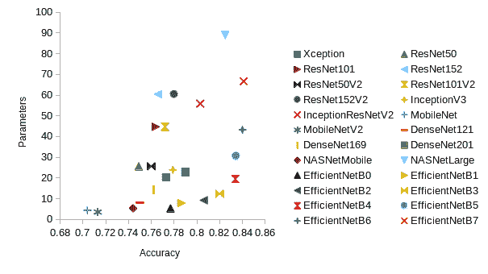
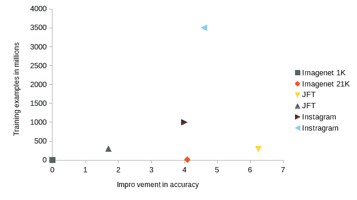
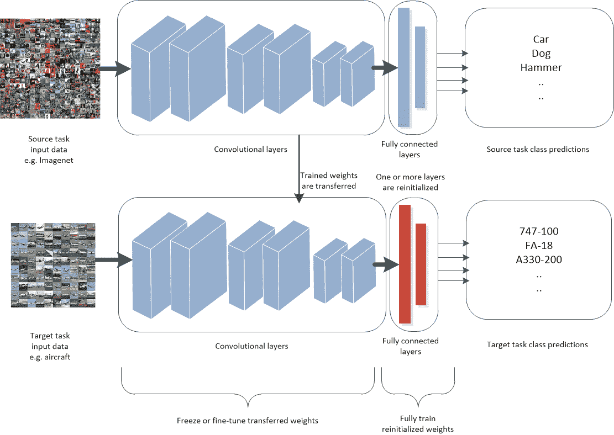

<!--yml

分类：未分类

日期：2024-09-06 19:46:30

-->

# [2205.09904] 图像分类的深度迁移学习：综述

> 来源：[`ar5iv.labs.arxiv.org/html/2205.09904`](https://ar5iv.labs.arxiv.org/html/2205.09904)

\jyear

2021

[1]\fnm 乔 \sur 普莱斯特

[1]\orgdiv 工程与信息技术学院，\orgname 新南威尔士大学，\orgaddress\street 诺斯科特大道，\city 坎贝尔，\postcode2612，\stateACT，\country 澳大利亚

2]\orgdiv 人工智能中心，\orgname 科廷大学，\orgaddress\street 肯特街，\city 本特利，\postcode6102，\stateWA，\country 澳大利亚

# 图像分类的深度迁移学习：综述

j.plested@unsw.edu.au    \fnm 汤姆 \sur 盖迪恩 tom.gedeon@curtin.edu.au *

###### 摘要

深度神经网络，如卷积神经网络（CNNs）和变换器，近年来在图像分类领域取得了许多成功。**最佳实践**的表现是当大型深度模型能够在丰富的标注数据上进行训练时。然而，在许多现实世界的场景中，无法满足获得最佳性能所需的大量训练数据。在这些场景中，迁移学习可以帮助提高性能。迄今为止，还没有对深度迁移学习在图像分类中的整体情况进行全面综述的调查。然而，已经出版了一些关于深度迁移学习的最近综述，以及与特定专业化目标图像分类任务相关的综述。我们认为，为了未来该领域的发展，汇总所有当前知识并分析和讨论总体模式是重要的。在本调查中，我们正式定义了深度迁移学习及其在图像分类中试图解决的问题。我们调查了该领域的现状，并确定了最近取得的进展。我们展示了当前知识的空白之处，并提出了填补这些知识空白的建议。我们提出了一种新的迁移学习在图像分类中应用的分类法。这一分类法使我们更容易看到迁移学习有效和未能发挥其潜力的总体模式。这也让我们能够建议问题所在以及如何更有效地使用迁移学习。我们展示了在这一新分类法下，许多迁移学习被证明无效或甚至阻碍性能的应用是可以预期的，这些情况考虑了源数据集和目标数据集及使用的技术。在许多情况下，关键问题是针对大型且非常相似的目标数据集设计的方法和超参数设置被用于较小且相似度较低的目标数据集。我们确定了可能导致更好结果的替代选择。

###### 关键词：

深度迁移学习，图像分类，卷积神经网络，深度学习

## 1 介绍

深度神经网络架构，如卷积神经网络（CNNs）和最近的变压器，在图像分类中取得了许多成功 krizhevsky2012imagenet； girshick2014rich； li2020deep； masi2018deep； mazurowski2019deep。已一致证明，当任务有大量标记数据可用且可以训练大型模型时，这些模型表现最佳 ngiam2018domain； mahajan2018exploring； kolesnikov2019big。然而，许多现实世界场景中无法满足大量训练数据的要求。一些原因包括：

1.  1.

    数据不足因为数据非常稀少或存在隐私等问题。例如，医学领域中新型和稀有疾病的诊断任务由于样本稀少和隐私问题而有有限的训练数据。

1.  2.

    收集和/或标注数据的成本非常高。例如，标注工作只能由领域内的高资质专家完成。

1.  3.

    长尾分布中，少量对象/词汇/类别非常频繁，因此容易建模，而许多更多的对象则很稀有，因此难以建模 bengio2015sharing。例如，大多数语言生成问题。

我们可能还希望从少量训练示例中学习的原因还有几个：

+   •

    从认知科学的角度来看，尝试模仿人类从少量示例中学习一般概念的能力是很有趣的。

+   •

    可能存在计算资源的限制，这限制了从随机初始化的大量数据中训练大型模型。例如，环境问题 strubell2019energy。

在所有这些场景中，迁移学习通常可以大大提高性能。在这种范式中，模型在相关的数据集和任务上进行训练，利用更多的数据，训练后的权重被用于初始化目标任务的模型。为了使这个过程提高而不是损害性能，数据集必须足够相关，并且使用最佳实践方法。

在本次调查中，我们回顾了图像分类领域中深度迁移学习的最新进展，并指出了知识缺乏和可以改进的领域。随着现代深度 CNN 模型在更广泛的实际应用领域中的需求呈指数增长，迁移学习领域的工作也在以相应的速度增长。定期评估和调查当前领域的状态、近期进展和现有知识的空白至关重要。我们还提出了如何推进该领域以填补这些知识空白的建议。虽然在相关领域和具体子领域有很多调查，但据我们所知，没有针对图像分类中的深度迁移学习进行的综合性调查。我们认为，为了未来领域的进步，将所有知识汇总并分析和讨论总体模式是重要的。

我们做出以下贡献：

1.  1.

    正式定义深度迁移学习及其在图像分类中的问题

1.  2.

    对该领域近期进展进行彻底审查

1.  3.

    提出迁移学习应用中源数据集和目标数据集关系的分类法，以突出为何迁移学习在某些应用领域表现不如预期

1.  4.

    对该领域常用的源数据集和目标数据集进行详细总结，为希望了解迁移学习最佳表现与结果不一致之间关系的读者提供便捷的参考

1.  5.

    总结该领域的当前知识，并指出知识空白以及未来研究的建议方向。

在第二部分中，我们回顾了该领域所有的综述，从一般迁移学习到更为相关的领域。在第三部分中，我们介绍了问题领域，并形式化了迁移学习试图解决的小数据集学习中的困难。本节包括本文中使用的术语和定义。第四部分详细说明了在图像分类的深度学习中常用的源数据集和目标数据集。第五部分提供了对迁移学习所有最新进展和改进的详细分析，并突出当前知识中的空白。在第六部分中，我们概述了与图像分类的深度迁移学习紧密相关的其他问题领域，包括每个领域的相似性和差异。最后，第七部分总结了所有当前的知识、空白和问题，并推荐了未来工作的方向。

## 2 相关工作

在过去十年中，许多关于深度迁移学习的综述已经发布，且在最近几年其数量增长更快。然而，它们与我们的综述有两个主要区别。第一类综述是更为一般性的，提供了迁移学习的高层次概述，并尝试涵盖所有机器学习子领域和所有任务子领域。这类综述在第 2.1 节中讨论。第二类综述则更为具体，提供了某一狭窄领域特定任务进展的全面分解。这些综述在第 5.7 节的相关部分讨论。还有一些与我们的综述更为相关的调查，它们的差异在第 2.2 节中讨论。

### 2.1 一般迁移学习综述

最新的一般迁移学习综述 jiang2022transferability 是对深度迁移学习相关的大多数领域的极其广泛的概述，包括第六部分中概述的深度迁移学习在图像分类中的应用。由于这是一个广泛的一般性综述，因此没有强调深度迁移学习如何应用于图像分类，因此没有涵盖这一领域的趋势。

zhuang2020comprehensive 中给出了对一般迁移学习技术的深入理论分析。迁移学习技术被分为基于数据和基于模型的两大类，然后进一步细分为子类。深度学习模型作为模型分类的一个子部分被明确讨论。重点在于生成模型，如自编码器和生成对抗网络（GANs），并回顾了几篇相关论文。神经网络在参数控制策略和特征变换策略部分也有简要提及。然而，重点在于无监督预训练策略，而不是迁移学习的最佳实践。

张等人 zhang2019recent 的方法与我们在分类迁移学习任务空间中的方法最为相似。他们根据源数据集和目标数据集及其标签属性将迁移学习分为 17 类。随后，他们回顾了每一类中的方法。由于这是一个一般性的迁移学习综述，没有专注于深度学习和图像分类，因此没有涵盖这一领域的趋势。

Weiss 等人 weiss2016survey 将一般迁移学习分为同质迁移（源数据集和目标数据集分布相同）和异质迁移（分布不同），并对每种情况进行了详细描述。他们回顾了每一类中的许多不同方法，但其中很少与深度神经网络相关。

### 2.2 紧密相关的工作

有一些最近的综述论文，从标题上看似乎与主题更为相关。然而，这些论文是简短的总结性论文，包含了有限的细节，而不是全面的综述论文。

一项关于深度迁移学习的综述 tan2018survey 定义了深度迁移学习，并根据使用的技术子集将其分为四类。重点更多地放在展示广泛的技术选择上，而不是提供详细信息或特别关注深度迁移学习方法。过去十年间的大多数重要工作未被涵盖。

“图像分类的深度学习和迁移学习方法” krishna2019deep 专注于定义 CNN 以及过去十年的一些主要架构和结果。论文包括一些简短的段落定义迁移学习，并且一些图像分类结果包含迁移学习，但没有对该主题进行综述。

“卷积神经网络的迁移学习综述” ribani2019survey 是一篇简短的论文，简要介绍了迁移学习任务和设置，并介绍了一般类别的方法和应用。它没有综述任何特定的方法或应用。

“视觉分类的迁移学习：综述” shao2014transfer 是一篇完整的综述论文，但较旧，未包括深度学习技术。

在“大数据时代的小样本学习” shu2018small 中，深度迁移学习是大量工作的一个部分，但不是重点。虽然提到了应用于图像分类领域的深度学习示例，但没有讨论与图像分类相关的深度迁移学习方法的改进。

## 3 概述

### 3.1 问题定义

在本节中，介绍了论文中使用的定义。迁移学习可以通过任务和模式进行分类。我们首先定义模型，然后定义任务，最后说明它们在这种情况下如何相互作用。

深度学习是神经网络的现代名称，神经网络具有多个隐藏层。神经网络本身是机器学习的一个子领域。Mitchell mitchell1997machine 提供了机器学习的简明定义：

###### 定义 1。

“如果计算机程序在某类任务 T 和性能测量 P 上的表现随着经验 E 的增加而改善，则称该程序从经验 E 中学习。”

神经网络被 Gurney gurney1997introduction 定义为：

###### 定义 2。

“神经网络是一个由简单处理单元、单元或节点（称为神经元）相互连接的集合，其功能大致基于动物神经元。网络的处理能力存储在单元间的连接强度或权重中，这些权重通过适应或从一组训练模式中学习获得。”

我们在本综述中考虑的多层前馈神经网络中的神经元具有非线性激活函数 goodfellow2016deep，并且以层的形式排列，权重 $W$ 从一层向下一层前馈。

一般来说，神经网络通过梯度下降和反向传播从经验 E（即训练模式集合）中学习以改善其在任务 T 上的性能。反向传播是链式法则的应用，用于将导数从神经网络的最终层传播到隐藏层和输入权重 rumelhart1986learning。还有一些较少使用的训练神经网络的方法，例如遗传算法，它们在特定应用中已显示出成功。在本文中，我们假设训练是通过反向传播进行的，以确保通用性。

尽管已证明具有一个隐藏层的神经网络是通用近似器 hornik1989multilayer，但实际上，由于损失函数相对于权重是非凸的，因此优化起来很困难。出于这个原因，现代网络通常被安排成非常深的网络和特定任务的架构，例如用于图像的卷积神经网络（CNNs）和变换器，以便于参数的训练。

这些网络的层次结构使得可以学习越来越复杂的模式。这是近年来深度学习在许多不同任务中成功的原因之一，相较于其他机器学习算法。然而，这仅在有足够数据进行训练的情况下适用。图 1 显示了随着模型参数数量的增加，ImageNet 1K 上性能的提升。图 2 显示，对于大型现代 CNN 模型，通常在源数据集中的训练样本数量增加时，ImageNet 1K 上的性能也会提升。这表明，当从随机初始化训练到 ImageNet 1K 时，大型现代 CNN 可能会过拟合。当然，也有一些异常值，因为额外源数据的性能提升还取决于源数据与目标数据的相关性。这个问题在 5.3.1 节中有进一步讨论。这两个结果结合起来表明，深度学习的性能随着数据集和模型的大小而扩展。

图 1：由于模型大小的增加，在 ImageNet 1K 上性能的提升，以百万个参数的数量来衡量

图 2：由于源数据集大小增加，在 ImageNet 1K 上性能的百分比提升

如第一部分所述，在许多现实场景中，大量数据不可用，或者我们由于其他原因希望在少量数据上训练模型。

### 3.2 从小数据集与大数据集学习

对于从少量训练示例中学习的问题进行了详细回顾，见 wang2020generalizing。

#### 3.2.1 经验风险最小化

我们希望找到一个最小化预期风险的函数 $f$：

|  | $R_{TRUE}\left(f\right)=E[\ell(f(x),y)]=\intop\ell(f(x),y)\,dp(x,y)$ |  |
| --- | --- | --- |

其中

|  | $f^{*}=arg\,min_{f}R_{TRUE}\left(f\right)$ |  |
| --- | --- | --- |

$R_{TRUE}\left(f\right)$ 是实际风险，如果我们能够访问所有可能的数据和标签的无限集合，那么 $\hat{f}$ 是最小化实际风险的函数。然而在实际应用中，联合概率分布 $P(x,y)=P(y|x)P(x)$ 是未知的，唯一可用的信息包含在训练集里。因此，实际风险被经验风险所替代，经验风险是训练集 $D$ 上样本损失的平均值。

|  | $R_{n}\left(f\right)=\frac{1}{n}\sum_{i=1}^{n}\ell(f(x_{i}),y_{i}),$ |  |
| --- | --- | --- |

导致经验风险最小化 vapnik1992principles。

在开始训练模型之前，我们必须选择一组候选函数 $\mathcal{F}$。在 CNN 的情况下，这涉及选择确定模型架构的相关超参数，包括层数、每个卷积层中的滤波器数量和形状、是否以及在哪里包含诸如残差连接和归一化层等特性，以及更多。这将我们的最终函数限制在由构成给定架构的自由参数定义的候选函数集 $\mathcal{F}$ 中。我们尝试找到一个在 $\mathcal{F}$ 中最小化经验风险的函数：

|  | $f_{n}=arg\,min_{f}R_{n}\left(f\right)$ |  |
| --- | --- | --- |

由于最优函数 $f^{*}$ 不太可能在 $\mathcal{F}$ 中，我们还定义：

|  | $f_{\mathcal{F}}^{*}=arg\,min_{f\epsilon\mathcal{F}}R_{TRUE}\left(f\right)$ |  |
| --- | --- | --- |

成为最小化实际风险的函数 $\mathcal{F}$ 中的函数。然后我们可以分解从选择 $\mathcal{F}$ 中最小化 $R_{n}\left(f\right)$ 的函数所带来的额外误差：

|  | $\displaystyle E[R(f_{n})-R(f^{*})]$ | $\displaystyle=E[R(f_{\mathcal{F}}^{*})-R(f^{*})]$ |  |
| --- | --- | --- | --- |
|  |  | $\displaystyle+E[R(f_{n})-R(f_{\mathcal{F}}^{*})]$ |  |
|  |  | $\displaystyle=\varepsilon_{app}+\varepsilon_{est}$ |  |

近似误差$\varepsilon_{app}$衡量了$\mathcal{F}$中的函数能多接近地逼近最优解$f^{*}$。估计误差$\varepsilon_{est}$衡量了最小化经验风险$R(f_{n})$而不是期望风险$R(f^{*})$的效果 bottou2008tradeoffs。因此，找到尽可能接近$f^{*}$的函数可以分解为：

1.  1.

    选择一个更可能包含最优函数的模型类

1.  2.

    在$D$中拥有大量且广泛的训练样本，以更好地逼近所有可能的数据和标签的无限集合。

#### 3.2.2 不可靠的经验风险最小化器

通常，$\varepsilon_{est}$可以通过拥有更多样本来减少 wang2020generalizing。因此，当$D$中有足够且多样化的标记训练样本时，经验风险$R(f_{n})$可以对$\mathcal{F}$中的最优$f$即$R(f_{\mathcal{F}}^{*})$提供良好的近似。当$D$中训练样本的数量$n$很少时，经验风险$R(f_{n})$可能不是期望风险$R(f_{\mathcal{F}}^{*})$的良好近似。在这种情况下，经验风险最小化器会发生过拟合。

为了缓解当$D_{train}$不足时，使用不可靠的经验风险最小化器的问题，可以利用先验知识。先验知识可以用于增强$D_{train}$中的数据、限制候选函数$\mathcal{F}$，或者通过初始化或正则化来约束$f$的参数 wang2020generalizing。如 CNNs 和递归神经网络（RNNs）等任务特定的深度神经网络架构就是通过对最优函数形式的先验知识来约束候选函数$\mathcal{F}$的例子。

在这篇综述中，我们重点关注迁移学习作为一种约束$f$参数的形式，以解决不可靠的经验风险最小化器问题。6 节讨论了深度迁移学习如何与其他使用先验知识来解决小数据集问题的技术相关联。

### 3.3 深度迁移学习

深度迁移学习是应用于深度神经网络的迁移学习。Pan 和 Yang pan2009survey 将迁移学习定义为：

###### 定义 3.

“给定源领域$\mathcal{D\mathrm{{}_{S}}}$和学习任务$T_{S}$，目标领域$\mathcal{D\mathrm{{}_{T}}}$和学习任务$T_{T}$，迁移学习旨在通过利用$\mathcal{D\mathrm{{}_{S}}}$和$T_{S}$中的知识来帮助提高在$\mathcal{D\mathrm{{}_{T}}}$中目标预测函数$f_{T}\left(.\right)$的学习，其中$\mathcal{D\mathrm{{}_{S}}}$$\neq\mathcal{D\mathrm{{}_{T}}}$，或$T_{S}\neq T_{T}$。”

本文将深度迁移学习定义如下：

###### 定义 4.

给定源领域 $\mathcal{D\mathrm{{}_{S}}}$ 和学习任务 $T_{S}$，目标领域 $\mathcal{D\mathrm{{}_{T}}}$ 和学习任务 $T_{T}$，深度迁移学习旨在通过用在源任务 $T_{S}$ 上使用源数据集 $D_{S}$ 训练得到的权重 $W$ 来初始化目标模型 $M$，以提高其在目标任务 $T_{T}$ 上的性能，其中 $\mathcal{D\mathrm{{}_{S}}}\neq\mathcal{D\mathrm{{}_{T}}}$，或 $T_{S}\neq T_{T}$。

当模型被“转移”到目标任务 $T_{T}$ 和数据集 $D_{T}$ 时，一些或所有的 $W$ 会被保留。在完全训练任何重新初始化的权重之后，模型用于在 $T_{T}$ 上进行预测，并且可以选择继续在预训练的权重上进行训练（微调）。图 3 展示了应用深度神经网络进行迁移学习时的预训练和微调流程。

图 3：深度迁移学习

将第 3.2.2 节的讨论与定义 4 结合起来，使用深度迁移学习技术进行预训练权重 W 可以看作是对 W 的正则化。用在大源数据集上经过良好训练的权重来初始化 W，而不是使用非常小的随机值，结果会得到一个更平坦的损失面和更小的梯度，这反过来会导致更稳定的更新 neyshabur2020being；liu2019towards。在经典的迁移学习设置中，源数据集通常比目标数据集大几个数量级。一个例子是对包含 130 万训练图像的 ImageNet 1K 进行预训练，然后转移到医学成像任务中，这些任务通常只有数百个标记样本。因此，即使在相同的学习率和训练轮数下，训练目标数据集时权重更新的次数也会比预训练时少几个数量级。这也防止了模型创建基于小目标数据集中噪声或特性的过大权重。

迁移学习的进展可以根据对 W 参数进行约束的方式进行分类，具体如下：

1.  1.

    初始化。回答如下问题：

    +   •

        预训练应该进行多少？

    +   •

        更多的源数据还是更相关的源数据更好？

    +   •

        哪些预训练参数应该被转移或重新初始化？

1.  2.

    参数正则化。正则化权重，假设如果将参数约束到接近某个设定点，它们就不太容易过拟合。

1.  3.

    特征正则化。对每个训练样本所产生的特征进行正则化，这些特征由权重产生。基于这样的假设，即如果特征与大型源数据集中的特征接近，则模型不容易过拟合。

我们在第四部分中描述了基于这些类别以及源数据集与目标数据集之间关系的深度迁移学习的进展和问题。然后，在第五部分中，我们描述了深度迁移学习如何与其他方法相关。

### 3.4 负迁移

根据定义 3，迁移学习的既定目标是利用 $\mathcal{D\mathrm{{}_{S}}}$ 和 $T_{S}$ 中的知识来改善 $\mathcal{D\mathrm{{}_{T}}}$ 中目标预测函数 $f_{T}\left(.\right)$ 的学习。为了实现这一目标，源数据集必须足够类似于目标数据集，以确保在预训练中学习的特征与目标任务相关。如果源数据集与目标数据集关系不密切，预训练可能对目标模型产生负面影响。这就是负迁移 rosenstein2005transfer ; pan2009survey 。Wang 等人 wang2019characterizing ; wang2019transferable 定义了负迁移间隙（NTG）如下：

###### 定义 5。

“让 $\epsilon_{\tau}$ 代表目标领域的测试误差，$\theta$ 是特定的迁移学习算法，其负迁移间隙被定义，$\varnothing$ 用来表示源领域数据/信息未被目标领域学习者使用的情况。那么，当使用源数据的误差大于不使用源数据的误差时，就会发生负迁移：$\epsilon_{\tau}(\theta(S,\tau))>\epsilon_{\tau}(\theta(\varnothing,\tau))$，负迁移的程度可以通过负迁移间隙来评估。”

|  | $NTG=\epsilon_{\tau}(\theta(S,\tau))-\epsilon_{\tau}(\theta(\varnothing,\tau))$ |  |
| --- | --- | --- |

从这个定义中我们可以看到，当负迁移间隙为正时，负迁移发生。Wang 等人详细阐述了影响负迁移的因素 wang2019characterizing ; wang2019transferable：

+   •

    源领域与目标领域之间的差异。迁移学习假设源领域 $P_{S}(X,Y)$ 和目标领域 $P_{T}(X,Y)$ 的联合分布之间存在某种相似性。这些值之间的差异越大，源领域中可以利用来提高目标领域性能的信息就越少。在极端情况下，如果没有相似性，迁移学习将无法改善性能。

+   •

    负迁移相对与源数据集和目标数据集的规模及质量。例如，如果标记的目标数据足够丰富，仅在这些数据上训练的模型可能表现良好。在这种情况下，迁移学习方法更可能会削弱目标学习性能。相反，如果没有标记的目标数据，劣质的迁移学习方法会比随机猜测表现更好，这意味着负迁移不会发生。

使用深度神经网络时，一旦权重经过预训练以响应大型源数据集中的特定特征，权重在微调期间不会远离其预训练值 neyshabur2020being。如果目标数据集的规模比源数据集小几个数量级，这种情况尤为明显。这一前提允许迁移学习提高性能，但也可能导致负迁移。如果迁移的权重预训练以响应不适合的特征，那么这种训练在微调阶段不会完全逆转，模型可能更容易对这些不适当的特征过拟合。这种情况通常导致对目标训练集的特异性进行过拟合 plested2019analysis；kornblith2021better。相关情境在 kornblith2021better 中探讨，其中显示改善预训练特征与源数据集拟合的替代损失函数会导致目标数据集上的性能下降。作者指出“……在原始任务的不可变特征学习与迁移任务相关特征之间存在权衡。”

在图像分类模型中，通过较低层学习到的特征较为通用，而在较高层学习到的特征更为特定于任务 yosinski2014transferable。如果迁移的层数较少，负迁移的可能性应该较小，而从随机初始化训练所有层则是这一情况的极端。虽然对此的研究有限，但在 abnar2021exploring 中已显示出一定程度的效果。

## 4 用于图像分类的迁移学习常用数据集

### 4.1 来源

##### ImageNet 1K、5K、9K、21K

ImageNet 是一个根据 WordNet 层级组织的图像数据库 imagenet_cvpr09 。ImageNet 1K 或 ILSVRC2012 是 ImageNet 的一个知名子集，用于年度挑战。ImageNet 1K 包含 1,000 个常见图像类别，每个类别至少有 1,000 张图像，总共略超过 130 万张训练图像。ImageNet 5K、9K 和 21K 是更大的 ImageNet 数据集子集，分别包含最常见的 5,000、9,000 和 21,000 个图像类别。这三个 ImageNet 数据集都可以作为源数据集和目标数据集使用，具体取决于进行的实验类型。由于其庞大的规模和通用类别，它们最常被用作源数据集。

##### JFT 数据集

JFT 是一个用于大规模图像分类的内部 Google 数据集，包含超过 3 亿张高分辨率图像 hinton2015distilling 。图像的标签来自 18,291 个类别。例如，该数据集中标注了 1,165 种动物和 5,720 种车辆 sun2017revisiting 。共有 3.75 亿个标签，平均每张图像有 1.26 个标签。

##### Instagram 标签数据集

Mahajan 等人 mahajan2018exploring 收集了一个最大规模为 35 亿张标注图像的弱标注图像数据集，这个数据集比常用的大型源数据集 ImageNet 1K 大 3,000 多倍。使用标签作为训练和评估的依据。通过变化所选的标签和样本图像的数量，创建了不同大小和视觉分布的各种数据集。创建的一个数据集包含了 1,500 个与 1,000 个 ImagNet 1K 类别高度匹配的标签。

##### Places365

Places365 (Places) zhou2017places 包含了 365 个场景类别，这些场景类别是通过计算与 WordNet 英语词典中场景、地点和环境名称对应的所有条目而获得的。他们包括任何能够合理完成短语“我在一个地方”或“我们去那个地方”的具体名词。共有两个数据集：

+   •

    Places365-standard 总共有 180 万个训练样本，每个类别最少有 3,068 张图像。

+   •

    Places365-challenge 拥有 800 万个训练样本。

Places365 通常作为源数据集使用，当目标数据集基于场景时，例如 SUN。

##### Inaturalist

Inaturalist van2018inaturalist 包含来自超过 5,000 种植物和动物的 859,000 张图像。当目标数据集包含细粒度的植物或动物类别时，Inaturalist 通常作为源数据集使用。

### 4.2 目标

##### 一般

一般的图像分类数据集包含来自 WordNet miller1995wordnet 中许多不同类别的各种类别，包括上位类和下位类。ImageNet 是一个典型的通用图像分类数据集。

一些常用于目标数据集的通用图像分类数据集示例如下：

+   •

    CIFAR-10 和 CIFAR-100 krizhevsky2009learning：每个数据集总共有 50,000 个训练图像和 10,000 个测试图像，图像尺寸为 32x32 彩色图像，分别来自 10 个和 100 个类别。

+   •

    PASCAL VOC 2007 pascal-voc-2007：包含 20 个类别，属于人员、动物、车辆和室内物体的上级类别。包含 9,963 张图像，有 24,640 个标注对象，并且训练/测试划分为 50/50。每张图像的尺寸大约为 $501\times 375$。

+   •

    Caltech-101 fei2004learning：包含 101 个类别的物体图像。每个类别约有 40 到 800 张图像，大多数类别约有 50 张图像。每张图像的尺寸大约为 $300\times 200$ 像素。

+   •

    Caltech-256 griffin2007caltech：是 Caltech-101 的扩展，包含 256 个类别，每个类别至少有 80 张图像。它包括一个大杂乱类别，用于测试背景排除。

##### 精细分类

精细分类图像数据集包含一个特定上级类别的下属类别。示例如下：

+   •

    Food-101（Food）bossard14：包含 101 种不同的食物类别，共有 75,750 个训练样本和 25,250 个测试样本。

+   •

    Birdsnap（Birds）berg2014birdsnap：包含 500 种不同的鸟类，共有 47,386 个训练样本和 2,443 个测试样本。

+   •

    Stanford Cars（Cars）KrauseStarkDengFei-Fei_3DRR2013：包含 196 种不同的汽车型号，共有 8,144 个训练样本和 8,041 个测试样本。

+   •

    FGVC 飞机（Aircraft）maji13fine-grained：包含 100 种不同的飞机型号，共有 6,667 个训练样本和 3,333 个测试样本。

+   •

    Oxford-IIIT Pets（Pets）parkhi2012cats：包含 37 种不同的猫和狗品种，共有 3,680 个训练样本和 3,369 个测试样本。

+   •

    Oxford 102 Flowers（Flowers）nilsback2008automated：包含 102 种不同类型的花卉，共有 2,040 个训练样本和 6,149 个测试样本。

+   •

    Caltech-uscd Birds 200（CUB）wah2011caltech：包含 200 种不同的鸟类，每个类别大约有 60 个训练样本。

+   •

    Stanford Dogs（Dogs）khosla2011novel：包含 120 个犬种的 20,580 张图像。

##### 场景

场景数据集包含不同的室内和/或室外场景设置的示例。示例如下：

+   •

    SUN397（SUN）xiao2010sun：包含 397 个场景类别。该数据集在 Places-365 之前使用了相同的数据收集技术。最终数据集包含至少有 100 个训练样本的场景。

+   •

    MIT 67 室内场景 quattoni2009recognizing：包含 67 个室内类别，总计 15,620 张图像。每个类别至少有 100 张图像。

##### 其他

还有一些其他数据集没有明确的主题，并且与常见源数据集的关联较小。这些数据集通常与深度迁移学习结合使用，用于图像分类，展示模型和技术的广泛适用性。这些例子包括：

+   •

    可描述纹理（DTD）cimpoi2014describing：包含了 3,760 个纹理图像的训练样本，涵盖 47 类纹理形容词。

+   •

    戴姆勒行人分类 munder2006experimental：包含了 23,520 张有两个类别的训练图像，即包含行人和不包含行人。

+   •

    德国交通标志（GTSRB）stallkamp2012man：包含了 39,209 张分类为 43 类的德国交通标志的训练图像。

+   •

    Omniglot lake2015human：包含了超过 120 万个来自 50 种书写系统的 1,623 种不同手写字符的训练样本。

+   •

    野外的 SVHN 数字（SVHN）netzer2011reading：包含了 73,257 个从街景图像中裁剪出的标记数字的训练样本。

+   •

    UCF101 动态图像（UCF101）soomro2012ucf101：包含了 9,537 张从动作视频中裁剪出的 101 类动作的静态帧。

+   •

    视觉十项全能挑战（Decathlon）rebuffi2017learning：一个旨在同时解决 10 个图像分类问题的挑战，包括：ImageNet、CIFAR-100、飞机、戴姆勒行人、可描述纹理、德国交通标志、Omniglot、SVHN、UCF101、VGG-Flowers。所有图像的短边都调整为 72 像素。

## 5 深度迁移学习的进展和改进领域

在过去的十年中，卷积神经网络（CNN）在图像分类任务上的成功激励了许多研究人员将其应用于越来越广泛的领域。模型性能受训练数据量和模型中可训练参数数量之间关系的强烈影响，如图 1 和图 2 所示。因此，利用迁移学习使大型 CNN 模型在训练数据有限或存在其他约束的领域中进行训练的兴趣日益增长。

随着深度学习在 2012 年至 2016 年间变得流行，研究了特征的可转移性以及执行深度转移学习的最佳实践 agrawal2014analyzing；azizpour2015factors；huh2016makes；sharif2014cnn；yosinski2014transferable 。虽然一些最近的作品介绍了改进的迁移学习技术和见解，但更多的作品专注于一般 kornblith2019better；mahajan2018exploring；li2020rethinking；plested2021non 或特定 raghu2019transfusion；heker2020joint 应用领域的最佳实践，而不是技术。我们将对这两者进行全面的审查。

在审查深度迁移学习用于图像分类的应用时，我们将应用程序分为几个类别。我们将任务分为两个方向：小目标数据集与大目标数据集，以及紧密相关的源和目标数据集与松散相关的源和目标数据集。例如，使用 ImageNet imagenet_cvpr09 作为源数据集来预训练医学图像上的肿瘤分类模型，这是一种松散相关的迁移，并且由于隐私和疾病的稀缺性，目标数据集可能相对较小。这种类别划分与影响负迁移的因素一致，如 wang2019characterizing；wang2019transferable 所述。

目标数据集大小的区分是有用的，因为已经证明小目标数据集对迁移学习超参数的变化更为敏感 plested2019analysis。同时也表明，当向不太相关的目标任务进行迁移时，标准迁移学习超参数的表现并不理想 he2018rethinking；kornblith2019better；plested2021non，负迁移是这一现象的一个极端例子 wang2019characterizing；wang2019transferable，在确定超参数时应考虑数据集之间的相似性 li2020rethinking；plested2021non。这些区别在一定程度上解释了近年来深度迁移学习方法性能出现矛盾的原因 he2018rethinking；li2020rethinking；wan2019towards；zoph2020rethinking。

我们通过描述深度迁移学习技术的一般研究，包括最新进展，来开始本节。然后，我们审查我们上面划分的每个应用领域的工作。第七部分总结了当前知识，并对该领域的未来研究方向提出最终建议。

### 5.1 图像分类的一般深度迁移学习

早期的深度迁移学习工作显示：

1.  1.

    深度迁移学习在许多不同任务中结果与最先进的性能相当或更好，特别是与浅层机器学习方法相比 sharif2014cnn ; azizpour2015factors 。

1.  2.

    更多的预训练，无论是在训练样本数量还是迭代次数上，通常会带来更好的性能 agrawal2014analyzing ; azizpour2015factors ; huh2016makes 。

1.  3.

    在目标任务上进行权重微调通常会带来更好的性能，特别是当目标数据集更大且与源数据集的相似性较低时 agrawal2014analyzing ; yosinski2014transferable ; azizpour2015factors 。

1.  4.

    当源数据集和目标数据集及任务紧密匹配时，迁移更多层通常会带来更好的性能，但当它们关系较少时，迁移较少的层更为有效 agrawal2014analyzing ; yosinski2014transferable ; azizpour2015factors ; chu2016best ; abnar2021exploring 。

1.  5.

    更深的网络通常会带来更好的性能 azizpour2015factors 。

应注意，以上所有引用的研究在残差网络 he2016deep 和其他现代非常深的卷积神经网络出现之前完成。有人认为，当残差网络与微调结合使用时，特征的可迁移性会更强 he2016deep 。由于许多上述研究是在类似时间段内进行的，因此一些结果尚未结合。例如，大多数研究是以相对较浅的网络 AlexNet 作为基础进行的，许多研究没有进行微调和/或仅仅将深度神经网络作为特征检测器，不论其迁移到哪个层次。后来证明，当有效使用微调时，迁移少于最大层数可以带来更好的性能。即使在源数据集和目标数据集高度相关的情况下，特别是对于较小的目标数据集 plested2019analysis ; plested2021non ; abnar2021exploring ，这一点也适用。

最近的研究表明，模型在 ImageNet 1K 上的表现与预训练模型迁移到其他任务时的表现有很好的相关性 kornblith2019better 。作者进一步展示了深度迁移学习相比于随机初始化的性能提升高度依赖于目标数据集的大小以及源数据集和目标数据集类别之间的关系。以下章节将对此进行更多讨论。

### 5.2 最近的进展

与图像分类的深度迁移学习相关的知识进展可以分为技术进展和最佳实践的一般见解。我们在这里描述迁移学习技术的进展，最佳实践的见解见于第 5.2.4 节。技术的最新进展分为正则化、基于超参数的、源领域与目标领域匹配以及其他一些不符合前述类别的技术。我们在第 5.3.1 节和第 5.6.1 节讨论源领域与目标领域的匹配及其他内容。在我们对最新工作的审查中，我们尝试展示新模型相对于旧模型的改进证据的平衡视角以及这些改进的局限性。然而，在一些较新的案例中，这很困难，因为原始论文提供的证据有限，且尚未有新工作展示这些方法的局限性。

#### 5.2.1 基于正则化的技术进展

大多数基于正则化的技术旨在通过限制模型权重或其产生的特征，解决不可靠的经验风险最小化问题 3.2.2，以防其拟合数据中的小的特性。这些技术通过向损失函数添加正则化项 $\lambda\cdot\Omega\left(.\right)$ 来实现：

|  | $min_{w}L\left(w\right)=\left\{\frac{1}{n}\sum_{i=1}^{n}L\left(z\left(x_{i},w\right),y_{i}\right)+\lambda\cdot\Omega\left(.\right)\right\}$ |  |
| --- | --- | --- |

其中第一个项 $\frac{1}{n}\sum_{i=1}^{n}L\left(z\left(x_{i},w\right),y_{i}\right)$ 是经验损失，第二项是正则化项。调整参数 $\lambda>0$ 平衡了两者之间的权衡。

权重正则化直接限制了模型权重的移动范围。

知识蒸馏或基于特征的正则化使用源网络和目标网络中一个或多个层的特征图输出之间的距离来正则化模型：

|  | $\Omega(w,w_{s})=\frac{1}{n}\sum_{j=1}^{N}\sum_{i=1}^{n}d\left(F_{j}\left(w_{t},x_{i}\right),F_{j}\left(w_{s},x_{i}\right)\right)$ |  |
| --- | --- | --- |

其中 $F_{j}\left(w_{t},x_{i}\right)$ 是由目标网络中第 j 个滤波器以权重 $w_{t}$ 对输入值 $x_{i}$ 输出的特征图，而 $d\left(.\right)$ 是两个特征图之间的不相似度度量。

基于正则化的深度迁移学习技术的成功在很大程度上依赖于源数据集和目标数据集密切相关的假设。这是为了确保目标数据集的最佳权重或特征不会与在源数据集上训练的那些权重或特征相差太远。

在过去三年里，已经出现了许多新的基于正则化的技术。我们按时间顺序回顾了主要的新技术。

1.  1.

    L2-SP li2018explicit ; li2020baseline 是一种权重正则化的形式。迁移学习的目的是创建通过保持特征接近那些在源数据集上训练的模型来进行正则化，从而减少过拟合问题。作者认为，由于这一点，在目标数据集训练阶段，微调的权重应该向预训练权重衰减，而不是衰减到零。原论文测试了几种将权重衰减到其起始点的正则化器，称为 SP 正则化器。L2-SP 正则化器 $\Omega(w)=\frac{\alpha}{2}\left\|w-w^{0}\right\|_{2}^{2}$，即源权重与当前权重之间的 L2 损失，已被证明在论文中使用 Resent-101 模型的四个目标数据集上显著优于标准 L2 损失。原论文展示了在四个与预训练时使用的两个源数据集非常相似的小目标数据集上的迁移结果。后来已经证明，当源数据集和目标数据集关系较远时，L2-SP 正则化器可能会导致最小的改进甚至负迁移 li2020rethinking ; wan2019towards ; plested2021non ; chen2019catastrophic 。更近期的工作表明，在某些情况下，使用 L2-SP 正则化用于较低层，并在较高层使用 L2 正则化，可以提高性能 plested2021non 。

1.  2.

    DELTA li2019delta 是知识蒸馏或特征图基于正则化的一个例子。它基于重复使用对目标任务没有用处的 CNN 通道，而不改变有用的通道的思想。通过源模型和目标模型的最终层特征图之间的加权 L2 损失来正则化目标任务的训练：

    |  | $\displaystyle\Omega(w,w^{0},x_{i},y_{i})=\sum_{j=1}^{N}(W_{j}(w^{0},x_{i},y_{i})$ |  |
    | --- | --- | --- |
    |  | $\displaystyle\cdot\left\|FM_{j}(w,x_{i})-FM_{j}(w^{0},x_{i}))\right\|_{2}^{2}$ |  |

    其中 $FM_{j}(w,x_{i})$ 是第 $j$ 个滤波器对第 $i$ 个输入的输出。每个滤波器的注意力权重 $W_{j}$ 是通过逐个去除模型的滤波器（将其输出权重设为 0），计算损失的增加来计算的。那些导致损失大幅增加的滤波器将被设置为更高的正则化权重，鼓励它们保持与源任务上训练的滤波器相似。而在目标任务中不那么有用的滤波器则正则化较少，可以有更多变化。这种正则化在大多数情况下使用 ResNet-101 和 Inceptionv3 模型时，图像数据集 ImageNet 1K 作为源数据集和多种目标数据集，其性能略好于 L2-SP 正则化。原始论文在 Caltech 256-30 上展示了 DELTA 的最先进性能，但他们使用的主要是与原始 L2-SP 论文 li2018explicit 相同的数据集，并且对于使用的两个额外数据集，他们展示了 L2-SP 优于基准 L2 正则化。之后已经证明，与 L2-SP 类似，当源数据集和目标数据集不够相似时，DELTA 也可能阻碍性能 kou2020stochastic ; chen2019catastrophic ; jeon2020sample 。

1.  3.

    Wan 等人 wan2019towards 提出了将迁移学习梯度更新分解为经验损失和正则化损失梯度向量。然后，当两个向量之间的角度大于 90 度时，他们进一步将正则化损失梯度向量分解为垂直于经验损失梯度的部分和朝向经验损失梯度的相反方向的剩余向量。他们去除了后者，希望通过不允许正则化项将权重移动到经验损失项的相反方向来防止负迁移。他们展示了他们的建议在四个不同的数据集上使用 ResNet 18 时性能略有提升。然而，由于他们没有在现代深度模型上进行测试，因此与当前最先进的技术相比，他们的结果较差。因此，很难判断他们的正则化方法在一般情况下的表现。

1.  4.

    批量光谱收缩（BSS）chen2019catastrophic 引入了一种损失惩罚机制，该机制在每次批量更新期间对每个批次的通道特征中的较小奇异值施加惩罚，从而抑制不可转移的光谱成分。他们使用在 ImageNet 1K 上预训练的 ResNet50，并在多个不同目标数据集上进行微调来测试这种方法。结果表明，他们的方法从未对给定的数据集造成性能损害，并且在较小的目标数据集上通常比 L2、L2-SP 和 DELTA 正则化产生显著的性能提升。他们还表明 BSS 可以在 L2-SP 阻碍性能的情况下提高对不太相似的目标数据集的性能。

1.  5.

    基于样本的正则化 jeon2020sample 提出了使用同一类别的输入对的特征图之间的距离以及权重正则化进行正则化。该模型使用 ResNet-50 进行测试，并从 ImageNet 1K 和 Places365 转移到许多不同的细粒度分类任务中。作者在所有测试中都报告了比 L2-SP、DELTA 和 BSS 更好的结果。他们的结果再次证实，在大多数情况下，BSS 的性能优于 DELTA 和 L2SP，并且在某些情况下，与标准的 L2 正则化基线相比，DELTA 和 L2SP 会降低性能。

#### 5.2.2 基于归一化的技术进展

除了基于正则化的方法外，还有一些最近的技术试图更好地将目标域的微调与源域对齐。这是通过对现代 CNN 中的层之间使用的标准批量归一化或其他形式的归一化进行调整实现的。

1.  1.

    在许多域适应任务中，将源域和目标域共享批量归一化超参数比拥有独立的超参数更有效 wang2019transferable ；maria2017autodial 。王等人 wang2019transferable 引入了一个称为域自适应α的额外批量归一化超参数。这使用了基于每个通道的可转移性值的标准批量归一化，并使用规范化之前的均值和方差统计数据对其进行缩放。就我们所知，尚未将这些技术应用于一般的监督式迁移学习案例。

1.  2.

    随机归一化 kou2020stochastic 基于小批量统计数据或基于每个滤波器的移动统计数据对批量归一化进行抽样，概率超参数为 p。在对目标数据集进行微调时，移动统计数据使用在预训练期间计算的统计数据初始化，以起到正则化的作用。这旨在解决小批量大小导致批次统计嘈杂或使用移动统计量对所有特征图进行归一化时训练崩溃的问题 ioffe2017batch ；ioffe2015batch 。作者的结果显示，他们的方法在三个标准目标数据集的低采样版本上改进了 BSS、DELTA 和 L2-SP，并在相同数据集的较大版本中除了 BSS 之外的所有结果都有所改进。他们的结果再次表明，在大多数情况下，BSS 的性能优于 DELTA 和 L2SP，并且在许多情况下，与标准的 L2 正则化基线相比，DELTA 和 L2SP 会降低性能。

#### 5.2.3 其他最近的新技术

Guo 等人 guo2019spottune 对在 ImageNet 1K 上预训练的 ResNet 模型进行了两个副本的操作。一个模型作为固定特征选择器使用，预训练层被冻结，另一个模型则进行微调。他们重新初始化了两个模型中的最终分类层。然后使用强化学习训练的策略网络来创建一个掩码，以独特的方式将每个模型的层结合在一起，针对每个目标示例。他们展示了 SpotTune 模型在与等效尺寸的单一模型（SpotTune 架构中的两个单独模型的双倍大小）进行微调时，提高了性能，并在大多数情况下达到了接近或优于最先进水平的效果。MultiTune 通过去除策略网络并在最终分类层之前将每个模型的特征串联起来，从而简化了 SpotTune，而不是选择层。它还通过使用两种不同的非二元微调超参数设置 plested2021non 而不是一个微调和一个冻结的模型，改进了 SpotTune。结果显示，在大多数测试情况下，MultiTune 的准确度改善或等于 SpotTune，并且训练时间显著减少。

迁移学习中的共调节方法 you2020co 使用了源数据集中硬标签到目标数据集中软标签的概率映射。这种映射允许他们保留 ResNet50 中的最终分类层，并使用目标数据和源数据集中的软标签进行训练。与许多其他最近的结果一样，他们展示了他们的算法在所有其他算法中表现更佳，包括 BSS、DELTA 和 L2SP，但在相同模型尺寸、源数据集和目标数据集下，他们的结果显著低于最先进水平。他们确实展示了对目标数据集的相同排序，使用 BSS 优于 DELTA，DELTA 优于 L2SP。

#### 5.2.4 最佳实践的见解

除了技术和模型的进展外，最近还有大量研究扩展了早期关于图像分类深度迁移学习最佳实践的工作，如第 5.1 节所述。这些研究提供了在进行图像分类深度迁移学习时需要做出的以下决策的见解：

+   •

    *选择适合任务的最佳模型*。在 kornblith2019better 中发现，在 ImageNet 上表现更好的模型在一系列目标数据集上表现更好，但这种效果最终会饱和 abnar2021exploring。给定一组在源任务上具有类似准确度的模型，目标任务的最佳模型在不同目标数据集之间可能有所不同 abnar2021exploring。

+   •

    *选择最佳的预训练数据*。在许多情况下，与目标数据集更为相关的小规模源数据集进行预训练，往往能比与目标数据集关系较远的大规模源数据集获得更好的结果 mensink2021factors ; ngiam2018domain ; mahajan2018exploring ; cui2016fine ; cui2018large ; puigcerver2020scalable 。为了获得最佳结果，源数据集应包括目标数据集的图像领域 mensink2021factors 。例如，ImageNet 1k 包含比 Oxford Pets 更多的宠物类别，使其成为理想的源数据集和目标数据集组合。有关定义“更相关”的相似度的各种度量方法在第 5.3.1 节中有所概述。

+   •

    *寻找最佳的微调超参数*。几项研究包括对学习率、学习率衰减、权重衰减和动量的广泛超参数搜索 kornblith2019better ; li2018explicit ; mahajan2018exploring ; li2020rethinking ; plested2021non 。这些研究展示了目标数据集的大小与其与源数据集的相似性与微调超参数设置之间的关系。最佳学习率和动量在更相关的源和目标数据集上都显示较低 li2020rethinking ; plested2021non 。此外，从随机权重重新初始化的层数与最佳学习率有很强的关系 neyshabur2020being ; plested2021non 。

+   •

    *多步骤迁移过程是否优于单步骤过程*。当源数据集非常不同且较大时，多步骤预训练过程（其中中间数据集较小且与目标数据集更为相关）通常优于单步骤预训练过程 mensink2021factors ; ng2015deep ; puigcerver2020scalable ; gonthier2020analysis 。与此相关的是，在更相关的源数据集上使用自监督学习技术进行预训练，可以优于在不太相关的数据集上使用监督学习技术 zoph2020rethinking 。

+   •

    *使用哪种类型的正则化*。当源数据集和目标数据集密切相关时，L2-SP 或其他更现代的迁移学习特定正则化技术如 DELTA、BSS、随机归一化等能够提高性能，但当它们不太相关时往往会阻碍性能 li2018explicit；li2019delta；wan2019towards；plested2021non。这些正则化技术在第 5.2.1 节中有更详细的讨论。

+   •

    *使用哪种损失函数*。与交叉熵损失函数相比，其他替代损失函数在源任务上产生更高类别分离的表示，从而获得更高的准确性，但在目标任务中效果较差 kornblith2021better。结果显示了在源任务上表现更好的特征与在目标任务中相关特征之间的权衡。

为了对源数据集（大于 ImageNet 1K）进行超参数和协议的泛化，Kolesnikov 等人创建了 Big Transfer（BiT）kolesnikov2019big。他们在 ImageNet 1K 和 21K 以及 JFT 上预训练了不同大小的 ResNet，然后将其转移到四个小到中等规模的相关图像分类目标数据集以及 COCO-2017 目标检测数据集 lin2014microsoft。基于这些实验，他们对在非常大的数据集上预训练时的深度迁移学习做出了一些一般性声明，包括：

1.  1.

    批量归一化（BN）ioffe2015batch 对 BiT 有害，而结合了权重标准化的组归一化 wu2018group 在大批量下表现良好。

1.  2.

    MixUp zhang2017mixup 对于在大源数据集上的预训练没有帮助，仅在微调中对中等大小目标数据集（20-500K 训练样本）有用。

1.  3.

    正则化（L2，L2-SP，dropout）在微调阶段不会提升性能，即使是非常大的模型（实验中使用的最大模型有 9.28 亿个参数）。根据目标数据集的大小调整训练和学习率衰减时间，较大的数据集时间更长，能够提供足够的正则化。

作者使用一般的微调超参数来调整学习率调度、训练时间和 MixUp 的使用量/量，这些仅根据目标数据集的大小进行调整，而不是针对单个目标数据集。他们在 ImageNet 上预训练的模型和在 300 倍大源数据集 JFT 上预训练的模型都表现出可比的性能，或在许多情况下接近最先进水平。然而，他们的目标数据集 ImageNet、CIFAR 10 & 100 和 Pets 与源数据集非常相关，使得迁移更容易。他们的最终目标数据集 Flowers 也被认为更适合从源数据集进行迁移。有关哪些目标数据集更容易迁移的进一步讨论请参见 5.6。

我们预计为密切相关的数据集制定的最佳实践建议将不适用于关系较远的目标数据集，这已被许多其他方法和建议所证明 li2018explicit ; li2019delta ; wan2019towards ; plested2021non ; li2020rethinking ; chen2019catastrophic ; kou2020stochastic。为了验证这一假设，我们重新进行了 BiT 中的一些实验，使用 Stanford Cars 作为目标数据集，该数据集与源数据集 ImageNet 21K 差异很大，并且已知更难迁移 kornblith2019better ; plested2021non。我们首先确认了可以重现论文中列出的数据集的最先进结果，然后使用 Stanford Cars 得出了表 1 中的结果。这些结果表明，对于这个关系较远的数据集，BiT 的表现远低于最先进水平。第一列显示了使用论文中所有推荐的超参数的结果。尽管通过增加学习率和在学习率衰减之前增加训练轮数可以提高性能，但最终结果仍远低于可比模型、源数据集和目标数据集的最先进水平。Stanford Cars 中的细粒度分类任务与更通用的 ImageNet 和 JFT 数据集已知相差较大。因此，建议针对更密切相关的目标数据集不适用也就不足为奇了。

表 1: 大规模迁移 (BiT): 一般视觉表示学习 kolesnikov2019big 使用在 ImageNet 21K 上预训练的 BiT-M 扩展的结果。最佳效果是该模型、源数据集和目标数据集的已知最佳结果。默认值是论文中为此大小的目标数据集指定的学习率衰减计划，x2 是与默认值相比，学习率衰减之前的批次数量的两倍。

| 数据集 | 默认 lr (0.003) | lr 0.01 | lr 0.03 | lr 0.1 | 最佳效果 |
| --- | --- | --- | --- | --- | --- |
|  | 默认衰减 | x2 | 默认衰减 | x2 | 默认衰减 | x2 | 默认衰减 | x2 |  |
| 汽车 | 86.20 | 86.15 | 85.81 | 87.49 | 81.41 | 88.96 | 27.51 | 5.22 | 95.3ngiam2018domain |

#### 5.2.5 关于可迁移性的见解

在这里，我们回顾了那些对迁移学习过程中模型权重、表示和损失景观的变化提供更一般见解的工作，以及对预训练权重在目标任务上的可迁移性进行测量的研究。

neyshabur2020being 使用了几种分析特征空间的方法。他们发现，从预训练权重训练的模型在目标领域上犯相似的错误，具有相似的特征，并且在参数空间中的 $\ell_{2}$ 距离惊人地接近。它们处于损失景观的相同盆地。从随机初始化训练的模型则不在同一盆地中，犯不同的错误，具有不同的特征，并且在参数空间中的 $\ell_{2}$ 距离较远。

与随机初始化的模型相比，liu2019towards 还展示了预训练模型具有更平坦和更易于导航的损失景观。他们展示了改进的 Lipschitz 连续性，这大大加速并稳定了训练。特别是，具有大奇异值的权重梯度的奇异向量在权重矩阵中被缩小。因此，通过预训练层反向传播的梯度幅度被控制，预训练权重矩阵稳定了梯度的幅度，尤其是在较低层，从而导致更稳定的训练。

最近提出了几种用于测量预训练权重可迁移性的技术：

1.  1.

    H-score bao2019information 是一种衡量预训练模型 $f$ 在新的输入空间 $X$ 和输出空间 $Y$ 上表现如何的指标，基于类间协方差 $cov(\mathbb{E}_{P_{X|Y}}[f(X)|Y])$ 和特征冗余 $tr(cov(f(X)))$。

    |  | $\mathcal{H}(f)=tr(cov(f(X))^{-1}cov(\mathbb{E}_{P_{X&#124;Y}}[f(X)&#124;Y])$ |  |
    | --- | --- | --- |

    H-score 随着类间协方差的增加和特征冗余的减少而增加。作者展示了 H-score 与目标任务性能有很强的相关性。他们还展示了它可以用来对迁移性进行排名，并创建任务迁移的最小生成树。后者可能在指导多步骤迁移学习时对不相关的任务有用，如第 5.2.4 节中讨论的那样。

1.  2.

    迁移学习任务中的迁移性和负条件熵（NCE），其中源数据集和目标数据集相同，但任务不同，定义在 tran2019transferability 中。作者将迁移性定义为对数似然 $l_{Y}(w_{Z},k_{Y})$，其中 $w_{z}$ 是在源任务 $Z$ 上预训练的模型主干的权重，$k_{Y}$ 是在目标任务上训练的分类器的权重。他们然后将条件交叉熵（NCE）定义为另一种迁移性度量，定义为给定源领域标签 $\bar{z}$ 的目标领域标签 $\bar{y}$ 的经验交叉熵。为了实证证明 NCE 度量的有效性，将 ResNet18 模型作为主干与 SVM 分类器配对。对于 437 个源任务和目标任务的组合，NCE 被证明与目标任务的准确性有很强的相关性。

1.  3.

    LEEP nguyen2020leep 是另一个迁移性的度量。利用预训练模型，估计源数据集和目标数据集标签上的标签的联合分布来构建经验预测器。LEEP 是经验预测器的对数期望。LEEP 数学上定义为：

    |  | $T(\theta,D)=\frac{1}{n}\sum_{i=1}^{n}log\left(\sum_{z\epsilon Z}\hat{P}\left(y_{i}&#124;z\right)\theta\left(x_{i}\right)_{z}\right)$ |  |
    | --- | --- | --- |

    其中 $\theta\left(x_{i}\right)_{z}$ 是使用预训练权重 $\theta$ 对目标输入数据 $x_{i}$ 的源标签 $z$ 的概率预测，$\hat{P}\left(y_{i}|z\right)$ 是给定源标签 $z$ 的目标标签 $y_{i}$ 的经验条件概率。LEEP 被证明具有良好的理论属性，并且在经验上证明其与源任务上预训练权重的性能增益有很强的相关性。这在源任务 ImageNet 1K 和 CIFAR10 以及从密切相关的 CIFAR100 和不太相关的 FashionMNIST 中随机选择的 200 个目标任务上得到证明。作者通过使用预训练模型 $\theta$ 为目标数据创建虚拟标签，将 NCE 扩展到源数据集和目标数据集不同的情况。他们展示了 LEEP 与性能增益的相关性强于扩展的 NCE 度量和 H-score。

### 5.3 大规模密切相关的目标数据集

Yosinski 等人对大规模紧密相关的图像数据集进行了早期的系统性和极其深入的深度迁移学习研究 yosinski2014transferable。他们使用了 AlexNet krizhevsky2012imagenet 进行了两个实验。第一个实验将 ImageNet 1K imagenet_cvpr09 划分为两个随机选择的 500 个对象类别的集合。另一个实验将 ImageNet 划分为两个尽可能不同的类别集合，以构成源数据集和目标数据集。这两个类别集合分别是自然物体类别和人造物体类别。在这两个实验中，他们使用了每个类别的完整 1,000 多个训练样本，因此都属于非常大的目标数据集。在创建源数据集和目标数据集后，他们在源数据集上对 AlexNet krizhevsky2012imagenet 进行了预训练，然后将不同层数的权重转移到目标数据集，同时将剩余的层用小随机权重重新初始化。接着，他们训练了整个模型或仅重新初始化的层，应用当时的标准训练超参数进行微调，这些参数包括学习率 0.1，每 30 个周期乘以 0.1 衰减一次。

Yosinski 等人 yosinski2014transferable 认为，在图像任务上训练的 CNN 的低层权重更加通用，容易在任务之间转移，而高层则更具任务特异性。他们展示了微调在迁移学习中的重要性，以便中层的脆弱共适应特征能够共同重新训练以适应新任务。最后，他们证明了对于更相关的源和目标数据集（随机选择的类别），转移的层数越多，最终性能越好。而对于相关性较低的数据集，高层的可转移性较差。需要注意的是，对于相关性较低的源和目标数据集，没有进行微调的实验。唯一进行的实验是冻结了转移的权重，以展示权重的原始可转移性。

发现转移更多层数能获得更好性能 yosinski2014transferable 对迁移学习的超参数产生了深远的影响。重要的是要注意，他们的结果仅在大规模且紧密相关的目标数据集以及他们特定的微调超参数下有效。实际上，他们展示了当源数据集和目标数据集关系较少时，高层的可转移性较差。尽管如此，他们的结果和训练超参数已被用作模板，以指导各种数据集和任务的迁移学习程序 he2018rethinking；scott2018adapted；wu2018facial；tan2019efficientnet；mormont2018comparison；kornblith2019better。

Yosinski 等人对紧密相关的数据集（从 ImageNet 1K 中随机选择的类别）进行的原始实验已被重复进行，同时改变目标数据集的大小和微调超参数 plested2019analysis 。这些实验表明，当使用最佳的微调超参数时，迁移更多层通常不会导致更好的性能。它们还表明，迁移正确数量的层和使用最佳微调超参数对性能的影响要大得多，尤其是在目标数据集的大小减少时。最近的工作 plested2021non 扩展了这些实验，涵盖了更多当前的、更深层的模型，这些模型在迁移学习中表现更好 he2016deep 以及相关性较低的源数据集和目标数据集。这项工作确认了对于某些数据集，迁移更多的层效果更好。然而，对于其他数据集，重新初始化随机权重、多层甚至整个 Inception v4 模型的块，会比迁移所有层但最终分类层的基线性能更好。

#### 5.3.1 更多 versus 更好匹配的预训练数据

最近的研究通过在数据集上进行预训练，测试了迁移学习在大规模源数据集和目标数据集上的有效性，这些数据集比 ImageNet 1K 大 6$\times$he2017mask 、300$\times$ sun2017revisiting ; ngiam2018domain ; xie2020self ，甚至比 ImageNet 1K 大 3000$\times$ mahajan2018exploring ，目标数据集的规模最大可达 mahajan2018exploring 的 9$\times$。

一般来说，增加源数据集的规模会提高目标数据集的性能。这种情况即使在目标数据集很大时也会发生，例如 ImageNet 1K（1K 类别，1.3M 训练图像）和 ImageNet 5k（5K 类别，6.6M 训练图像）或 9k（9K 类别 10.5M 训练图像）ngiam2018domain ; mahajan2018exploring ; kolesnikov2019big 。然而，与目标数据更紧密匹配的精心策划的源数据比在更大、更通用的源数据集上进行预训练可能表现更好 ngiam2018domain ; mahajan2018exploring 。

早期研究在 huh2016makes 中表明，额外的预训练数据仅在与目标任务高度相关时才有用。在某些情况下，添加额外的不相关训练数据实际上可能会降低性能。

在较近期的工作中，一种 ResNeXt-101 32×16d 在各种大型 Instagram 源数据集上进行了预训练。当使用 ImageNet 1K 作为目标数据集时，模型在预训练源数据集（其中包含与 ImageNet 1K 类别最为匹配的 960M 张图像和标签）上的性能与使用 3.5B 张图像和 17K 不同标签进行预训练的模型相同 mahajan2018exploring。然而，当目标数据集为 ImageNet 5K 或 9K，或者是任务更为特定的 Caltech Birds wah2011caltech 和 Places365 zhou2017places 时，使用较小源数据集的预训练表现显著更差。

在 ngiam2018domain 中发现了类似的结果。使用与目标类别紧密匹配的类别子组数据进行预训练，一贯地取得了比使用包含 3 亿张图像和 18,291 个类别的整个 JFT 数据集更好的性能。使用他们的重新加权类别技术进行源预训练时，也达到了类似的性能，这样类别分布统计与目标类别分布更为匹配。有趣的是，将相同技术应用于预训练较小的 ImageNet 1K 数据集时，大多数情况下性能提升甚微，对一个目标数据集的性能甚至显著下降。这表明存在一个训练样本数量的最小阈值，在此阈值下，更好匹配的训练数据优于更多的训练数据。与 mahajan2018exploring 的结果相反，这些结果显示，对于大多数目标类别，使用整个 JFT 数据集进行预训练的表现不如仅使用 ImageNet 1K 进行预训练。在某些情况下，使用整个 JFT 数据集进行预训练的性能甚至不如用随机权重初始化而不进行预训练。这可能表明 JFT 数据集的适用性存在问题，该数据集中的图像标签是非互斥的，平均每张图像有 1.26 个标签，这可能不适合作为具有互斥目标分类任务的源任务。

与 ngiam2018domain 相似的设置，Puigcerver 等人 puigcerver2020scalable 通过从一个预训练在全部 JFT 的模型开始，然后在不同子类上微调该模型的副本，产生了大量不同的“专家”模型。然后使用 K 最近邻等性能代理来选择每个目标任务的相关专家。他们发现，从预训练在整个 JFT 的最佳专家开始，再在仅子集类别上进行微调的结果，比仅在整个 JFT 上进行预训练的表现更好。这些结果与 ng2015deep 的结果一致，显示出一个中间数据集更接近目标数据集的多阶段微调流程可以比直接从较大且不相关的源数据集转移得到更好的性能。

Sun 等人 sun2017revisiting 发现，用来自完整 JFT 数据集的 3 亿张图片对 ResNet 101 he2016deep 进行预训练，在 ImageNet 1K 分类上的表现明显优于随机初始化。当目标任务是 COCO-2017 数据集上的物体检测时，lin2014microsoft 使用完整 JFT 数据集或 JFT 加 ImageNet 1K 进行预训练，性能提升比仅用 ImageNet 1K 作为源数据集要大得多。这些结果表明，大型 ResNet 101 模型在从随机初始化训练时通常会对 ImageNet 1K 分类任务过拟合，尽管数据集有超过 100 万个标记的训练样本。他们发现，较大的 ResNet 模型在 COCO 物体检测任务上比小型模型表现更好，ResNet 152 的表现优于 ResNet 101 和 50。考虑到 ResNet 101 和 152 在 ImageNet 1K 上预训练时 mAP@[0.5,0.95] 的差异不显著，但在 300 倍大的 JFT 数据集上预训练时有显著差异，这再次表明较大的模型可能会对 ImageNet 1K 过拟合。

Yalniz 等人 yalniz2019billion 创建了一个多步骤半监督训练程序，包括：

1.  1.

    在 ImageNet 1K 上训练模型

1.  2.

    使用该模型为高达 10 亿张社交媒体图片打标签，这些图片的标签与 ImageNet 1K 类别相关。

1.  3.

    使用这些弱自标记的示例来训练新模型

1.  4.

    最终，用 ImageNet 1K 训练集对新模型进行微调。

他们展示了在一系列较小的 ResNet 架构上，ImageNet 1K 性能的显著提升。

Xie 等人 xie2020self 扩展了上述训练程序 yalniz2019billion，在 ImageNet 1K 上训练一个大型 EfficientNet tan2019efficientnet 模型，然后使用该模型标记来自完整 JFT 数据集的 3 亿张图像，并使用来自 JFT 的弱自标记图像和来自 ImageNet 1K 的真实标记图像来训练模型。这在 ImageNet 1K 上实现了最先进的性能。他们还发现，将此模型测试于更困难的 ImageNet 测试集，例如 ImageNet-A（特别困难的 ImageNet 1K 测试样本）hendrycks2019benchmarking，以及 ImageNet-C 和 ImageNet-P（含有模糊、雾化、旋转和缩放等干扰和扰动的测试图像）hendrycks2021natural 也显著提高了最先进的性能。在三个更困难的 ImageNet 测试集中的两个测试集上，最先进的准确率翻了一番。

#### 5.3.2 匹配源数据集和目标数据集的相似性度量

鉴于前一节的发现，如何测量源数据集和目标数据集之间的相似性是一个重要问题。在某些情况下，源和目标域的相似性可以通过人类直觉和/或类别标签之间的相似性 mahajan2018exploring ; ngiam2018domain ; puigcerver2020scalable 有效估计。此外，还有许多方法通过计算域相似性来寻找最佳源数据进行预训练：

+   •

    Cui 等人 cui2018large 表明，目标数据集的性能随着源域和目标域之间的地球移动者距离的相似性度量的增加而提高。

+   •

    域自适应迁移学习（DATL）ngiam2018domain 使用基于比率 $P_{t}(y)/P_{s}(y)$ 的重要性权重来重新加权类别，从而在源预训练期间使类别分布统计匹配目标统计 $P_{t}(y)$。其中 $P_{t}(y)$ 和 $P_{s}(y)$ 描述了目标数据集和源数据集中标签的分布。他们表明，使用自适应迁移或与目标数据集更为匹配的源数据集子集能提高性能，相较于使用整个未加权的 3 亿 JFT 训练样本。

+   •

    Puigcerver 等人 puigcerver2020scalable 在特定的 JFT 源数据子集上训练了一大批专家模型，基于类别标签。然后，他们根据如 k 近邻等性能代理来确定每次预测的最佳模型。该技术在多个目标数据集上的表现优于在整个 JFT 数据集上进行训练。

+   •

    使用强化学习为源数据集中的每个类别学习权重，以便在预训练期间更加依赖更有效的训练样本，zhu2019learning 也使用强化学习来评估特定任务中的单个训练样本，并在训练过程中更加依赖更有价值的样本，yoon2020data。

+   •

    Ge 等人 ge2017borrowing 使用 CNN 中前两层滤波器的激活图为源域和目标域的图像创建直方图。然后，他们使用最近邻排序找到与目标数据集中图像最相似的源数据集图像。源域中的样本根据其与给定目标样本的 KL 散度进行加权。

### 5.4 大规模目标数据集与较少相似任务

几乎没有与通常用于预训练的图像分类任务密切相关的大规模图像数据集。Places365 数据集包含 180 万张训练图像，在 mahajan2018exploring 中被用作源任务。研究表明，当源数据集和目标数据集相关性较低时，源训练数据集越大、越多样化，目标数据集的结果就越好。

最大的物体检测数据集是 COCO lin2014microsoft，包含 135,000 张图像，涉及 80 个类别。关于使用 ImageNet 1K 和其他常见源数据集进行预训练是否提高 COCO 数据集上的物体检测性能的结果存在不一致。这些结果在第 5.7.5 节中详细讨论。

### 5.5 较小的目标数据集

通常无法在随机初始化的小数据集上训练深度神经网络，mazurowski2019deep ; mormont2018comparison ; kraus2017automated ; heker2020joint。这意味着随着目标数据集大小的减少，对迁移学习的依赖性会增加。研究还表明，迁移学习的超参数对性能的影响在目标数据集减小时更为显著，plested2019analysis。随着目标数据集大小的减少，有两个相互竞争的因素影响迁移学习的性能：

1.  1.

    经验风险估计变得不那么可靠，如第 3.2.2 节中详细描述的，这使得目标数据集中出现过拟合特性的可能性更大。

1.  2.

    预训练权重隐式地对微调模型进行正则化，最终权重不会远离其预训练值 neyshabur2020being ; liu2019towards ; raghu2019transfusion。

第一点的结果是需要越来越多地使用迁移学习和其他方法来减少过拟合。第二点中提到的隐式正则化可以对减少第 1 点中的经验风险估计的过拟合产生积极影响。如果从源数据集转移的权重对目标数据集来说距离最优值较远，它也可能产生负面影响（负迁移）。当权重及其产生的特征被限制在远离最优时，性能的负面影响可能会因为第 1 点而加剧 plested2019analysis。

### 5.6 较小的目标数据集和类似任务。

最著名的迁移学习研究 yosinski2014transferable 是在强相关和非常大的源和目标数据集上使用 AlexNet krizhevsky2012imagenet 进行的。相同的实验在 plested2019analysis 中重复进行了，但包括了不同规模的小目标数据集。他们展示了使用更优迁移学习超参数相比于 yosinski2014transferable 的常见超参数在性能上的显著改善。随着数据集规模的减少，这种改善显著增加。通过使用相对于常用超参数的最优超参数，发现平均准确率从仅 10 个示例的 500 类中最小目标数据集的 20.86%提高到 30.12%。在任何实验中，转移所有层（除了最后的分类层）的常用做法被证明都不是最优的。

在 ImageNet 1K imagenet_cvpr09 上预训练 CNN 模型并转移到显著较小的目标数据集时，深度迁移学习相比于随机初始化的改进与目标数据集与源数据集的关系越紧密正相关。改进与目标数据集的大小负相关。这两种相关性在 kornblith2019better 中都被强烈观察到。使用迁移学习的性能提升与源数据集和目标数据集的相似性之间的正相关性最为明显。作者指出，在斯坦福汽车和 FGVC 飞机数据集上，改进意外地很小。与从头训练的等效模型相比，这两个数据集的改进仅为 0.6% 和 0.2%。斯坦福汽车和 FGVC 飞机数据集分别包含了细粒度的汽车和飞机品牌及型号，而 ImageNet 1K 不包含品牌和型号，仅有一些粗略的类别。这意味着这两个任务中源数据集和目标数据集之间的相似性远低于例如更通用的 CIFAR-10/100 或牛津-印度理工学院宠物数据集，其中源数据集中的细粒度类别比目标数据集多。

在斯坦福汽车和 FGVC 飞机任务中，使用微调（fine-tuning）相比于固定的预训练特征的改进显著更大，分别为 25.4% 和 25.7%，相比于实验中使用的其他 10 个数据集。这表明预训练特征不适合该任务。作为对比，在相似性尺度的另一端，牛津-印度理工学院宠物数据集（Oxford-IIIT Pets）显示了从随机初始化训练 83.2% 的准确率到微调预训练模型后的 94.5% 准确率的最大改进之一。在这个数据集中，使用微调相比于固定的预训练权重的性能提升为 1.1%。这表明预训练特征在没有微调的情况下已经很好地适应了任务。这种性能差异很可能由于牛津-印度理工学院宠物数据集的规模大约是斯坦福汽车和 FGVC 飞机数据集的一半。最近的工作显示，使用固定预训练权重与微调即使使用非常差的超参数在目标任务上的性能差异可以用来预测给定源任务和目标任务及模型的迁移学习超参数 plested2021non。

在 kornblith2019better 中，目标数据集大小与基线性能改进之间的负相关关系在表 2 中的性能提升与目标训练集大小的比较中明显可见。另一个明显的相关性是，基线准确度较低的目标数据集的性能提升幅度较大，因为改进空间更大。如果我们移除基线性能超过 88% 的所有数据集，这些数据集的性能提升大致会按目标数据集的大小倒序排列。这突显了目标数据集大小与迁移学习性能之间的负相关关系。唯一的差异来自于一般任务和场景任务的性能提升大于细粒度和纹理任务，如表 3 和 4。我们预计前者与 ImageNet 1K 源数据集的关系会更紧密。

在比较与基线性能的提高以及目标数据集的大小时，Flowers 和 Food-101 都是有趣的异常值。它们都是细粒度任务，而 ImageNet 1K 每个类别的样本非常少。未来的研究方向可以深入探讨 ImageNet 1K 预训练模型以及在这两个目标数据集上微调的模型中对颜色特征的依赖，因为我们预计颜色在分类中会很有用。

表 2：与目标数据集大小相比的性能提升，来自 kornblith2019better 的实验结果

| 数据集 | 类型 | 大小（千） | 性能提升 / 基线性能 | 性能提升排名 |
| --- | --- | --- | --- | --- |
| Food-101 | 细粒度 | 78 | 3 / 87 | 8 |
| CIFAR-10 | 一般 | 50 | 1.98 / 96.06 | 10 |
| CIFAR-100 | 一般 | 50 | 6.7 / 81 | 6 |
| Birdsnap | 细粒度 | 47 | 2.5 / 75.9 | 9 |
| SUN397 | 场景 | 20 | 11.4 / 55 | 3 |
| Stanford Cars | 细粒度 | 8 | 0.6 / 92.7 | 11 |
| FGVC Aircraft | 细粒度 | 7 | 0.2 / 88.8 | 12 |
| PASCAL VOC 2007 | 一般 | 5 | 16.5 / 70.9 | 2 |
| 可描述的纹理 | 纹理 | 4 | 11.3 / 66.8 | 4 |
| Oxford-IIIT Pets | 细粒度 | 4 | 11.3 / 83.2 | 4 |
| Caltech-101 | 一般 | 3 | 17.9 / 77 | 1 |
| Oxford 102 Flowers | 细粒度 | 2 | 4.55 / 93.9 | 7 |

表 3：针对一般和场景目标数据集的目标数据集大小的性能提升。实验结果来自 kornblith2019better

| 数据集 | 类型 | 大小（千） | 性能提升 / 基准性能 | 性能提升排名 |
| --- | --- | --- | --- | --- |
| CIFAR-100 | 一般 | 50 | 6.7 / 81 | 4 |
| SUN397 | 场景 | 20 | 11.4 / 55 | 3 |
| PASCAL VOC 2007 | 一般 | 5 | 16.5 / 70.9 | 2 |
| Caltech-101 | 一般 | 3 | 17.9 / 77 | 1 |

表 4：针对细粒度分类目标数据集的目标数据集大小的性能提升。实验结果来自 kornblith2019better

| 数据集 | 类型 | 大小（千） | 性能提升 / 基准性能 | 性能提升排名 |
| --- | --- | --- | --- | --- |
| Food-101 | 细粒度 | 78 | 3 / 87 | 3 |
| Birdsnap | 细粒度 | 47 | 2.5 / 75.9 | 4 |
| 可描述的纹理 | 纹理 | 4 | 11.3 / 66.8 | 2 |
| Oxford-IIIT Pets | 细粒度 | 4 | 11.3 / 83.2 | 1 |

#### 5.6.1 更多与更好匹配的预训练数据 第二部分

与大型目标任务类似，匹配更好的预训练数据已被证明能在目标任务上产生比更多预训练数据更好的性能。

在场景分类任务 Places365 上进行预训练，相比于用较小且不相关的 ImageNet 1K 预训练，取得了在场景分类数据集 MIT Indoor 67 上显著更好的性能。然而，对与 ImageNet 1K 更相关的目标任务（如 Stanford Dogs 和 Caltech256-30 和 60），情况则相反。

源数据和目标数据类通过地球移动者距离 peleg1989unified；rubner2000earth 在 cui2018large 中进行匹配。结果表明，使用匹配良好的子集进行预训练比使用最大源数据集在各种细粒度视觉分类（FGVC）任务中表现更好。他们还展示了地球移动者距离计算的源域与目标域相似性与目标任务性能之间的强相关性，除了一个目标任务外。

Ge 和 Yuge2017borrowing 发现，通过在目标任务上微调模型并结合源任务中最相关的数据，可以提升模型性能。相关数据是通过在 Gabor 滤波器激活上使用最近邻计算得到的。Sabatelli 等人 sabatelli2018deep 发现，当目标任务是艺术分类时，使用较小的艺术分类源数据集进行预训练，相比于较大且不相关的 ImageNet 1K，性能得到改善。在相同领域，Gonthier 等人 gonthier2020analysis 使用了一个包含以下步骤的两步微调过程：

1.  1.

    在 ImageNet 1K 上进行预训练

1.  2.

    对一个比目标任务大一个数量级的艺术分类数据集进行微调。

1.  3.

    对最终目标艺术分类数据集进行微调。

他们发现，这种方法比仅在 ImageNet 1K 或仅在中间艺术分类数据集上进行预训练的表现更好。

### 5.7 较小的目标数据集与任务相似性较低

转移学习在许多目标数据集较小且与 ImageNet 1K 及其他常见源数据集关联较少的领域已被证明有效。然而，也有一些最近的结果显示，在这一类别中，深度转移学习相对于随机初始化几乎没有改进 zoph2020rethinking；he2018rethinking；raghu2019transfusion。与源数据集更紧密相关的小型目标数据集通常比与源数据集关联较少的大型目标数据集表现更好，见 5.6 和 kornblith2019better。应用于更紧密相关但未标记的源数据集的任务特定自监督学习方法，通常比应用于关联较少的源数据集的监督学习方法表现更好 zoph2020rethinking；azizi2021big。最近的研究表明，即使目标数据集与源数据集非常不相似，且转移学习没有带来性能提升，它仍然可以加速收敛速度 he2018rethinking；raghu2019transfusion。

#### 5.7.1 人脸识别

人脸识别通常依赖于在类似 ImageNet 1K 的一般图像分类数据集上对深度 CNN 架构进行预训练。然而，这一研究领域也存在其独特的挑战 masi2018deep：

1.  1.

    由于每个类别仅代表一个个体，类别之间往往只有细微的差别，每个类别的训练图像数量也较少。

1.  2.

    与图像分类任务相比，人脸识别数据集中的类别数量可以多得多，常见的人脸识别数据集可能有数十、数百甚至数百万个不同的个体。

与第 1 点相关，人脸识别模型的一个常见挑战是：在大量公开可用的名人面孔上进行预训练，然后利用转移学习技术快速学习分类新面孔，即便样本有限。为应对这一挑战，已提出了几种对典型的交叉熵损失进行改进的方法：

+   •

    明确最小化类内方差 wen2016discriminative，

+   •

    增加类别之间的间距 liu2016large；liu2017sphereface，

+   •

    鼓励特征位于超球面上 ranjan2017l2；zheng2018ring。

这些方法都旨在通过预训练生成一个定义明确的特征空间，以便源受试者和目标受试者之间可能会有良好的分离。当面部识别数据集中的受试者数量变得非常庞大时，通常使用深度度量学习损失而不是分类损失 schroff2015facenet；wang2018cosface；deng2019arcface。最近的研究表明，专为面部识别设计的度量，如 CosFacewang2018cosface 和 ArcFacedeng2019arcface，在应用于常见的深度度量学习基准数据集或小规模细粒度图像分类任务时可能更为成功 musgrave2020metric。深度度量学习在第 6.3 节中有进一步讨论。

#### 5.7.2 面部表情识别

像许多细粒度分类问题一样，面部表情识别（FER）数据集通常面临挑战，因为它们规模较小。大多数知名的 FER 数据集少于 10,000 张图像或视频。即使是较大的数据集，通常也只有约 100 个不同的受试者，这使得个体图像高度相关。面部表情识别的一个额外挑战是，由于不同的个人属性（如年龄、性别、种族背景和表达能力水平），存在较大的受试者间（类内）变化 li2020deep。

再次，对于此任务，已显示使用更接近目标数据集的源数据进行预训练会获得更好的性能。对大型面部识别数据集进行预训练已被证明比对更通用且关系较远的 ImageNet 1K 进行预训练效果更佳 imagenet_cvpr09。多阶段预训练管道，通过在较小的目标数据集上进行最终微调之前，使用较大的 FER 数据集进行中期微调，已被证明在 ng2015deep 中提高了性能。

#### 5.7.3 使用通用图像分类数据集进行医学影像分类任务的预训练

使用深度神经网络进行医学影像任务时，两个主要问题与本综述最相关的是：

1.  1.

    数据稀缺。在医学图像数据集中，训练数据的数量通常只有几百或几千个样本，而不是在更通用的图像数据集中通常可用的十万、百万甚至十亿个样本 mazurowski2019deep。

1.  2.

    类别严重不平衡。健康图像的样本通常比罕见疾病图像的样本多得多 mazurowski2019deep。

由于上述问题，从头开始训练非常深的网络在许多医学成像案例中是有问题的。深度迁移学习已被几乎所有医学成像模态采用，包括 X 射线、CT 扫描、病理图像、正电子发射断层扫描（PET）和 MRI。mazurowski2019deep 。尽管如此，针对医学成像分类领域中深度迁移学习的最佳实践的研究仍然有限。

早期实验 tajbakhsh2016convolutional 比较了在 ImageNet 1K 上预训练的 AlexNet（带和不带细化调整）、从头开始训练的 AlexNet 和使用手工特征的传统模型。他们证明了：

1.  1.

    使用经过适当细化调整的预训练 AlexNet CNN 一致地优于或匹配了随机初始化和传统方法的训练效果。

1.  2.

    尽管使用预训练和细化调整的 AlexNet 对于相对较大的目标数据集的性能提升是微小的，但随着目标数据集大小的减少，性能提升则显著增加。

最近，Mormont 等人进行了关于数字病理分类的深度迁移学习实验，使用了带有残差连接的现代模型和四个不同的目标数据集。mormont2018comparison 。这些模型是在 ImageNet 1K 上进行预训练的。当使用预训练模型作为固定特征提取器时，最后一层的特征总是被网络内部某一层的特征所超越。与该领域之前的结果一致，他们发现细化调整比固定提取效果更好。然而，他们没有将细化调整与测试网络中不同层以获得最佳性能结合起来，这一点我们建议未来的工作中加以考虑。

#### 5.7.4 医学图像领域中更多 vs 更好匹配的预训练数据

在过去两年中，有许多研究探讨了当与领域内数据集（其规模小几个数量级）相比时，一个非常大但关联较少的源数据集是否更适合用于医学领域的图像分类预训练。raghu2019transfusion ; heker2020joint 。这两种情境也与在中等规模的领域内无标签数据集上进行的自监督预训练进行了比较。azizi2021big 。

以前的研究结果表明，使用更大规模的源数据集进行预训练会提高目标任务的性能，这一结果在 mustafa2021supervised 中被扩展到了医学图像领域。研究表明，当源数据集的规模从含有 130 万训练样本的 ImageNet 1K 增加到含有 3 亿训练样本的 JFT 时，三个著名的小型医学图像分类目标任务的性能有所提升。所有预训练的结果都优于随机初始化。还有一些研究表明，在适中规模的医学图像数据集上进行监督式预训练，并转移到一个较小的数据集上，可以提高性能，相较于从随机初始化开始训练 Kraus2017automated； heker2020joint ，以及其他浅层机器学习方法 Kraus2017automated 和甚至 ImageNet 1K 的预训练 heker2020joint。

Raghu 等人 raghu2019transfusion 表明，当医学图像数据集较大（约二十万个训练样本）时，使用 ImageNet 1K 进行预训练仅能在性能上带来有限的提升。 这适用于大型 CNN 模型，如大型 ResNet50 和 Inception v3，以及为医学数据集优化的小型 CNN 模型。当训练样本数量减少到 5000 的小型数据集时，使用 ImageNet 1K 进行预训练相较于随机初始化只带来小幅提升。他们还重申，较低层次的特征比较高层次更具迁移性，即使源任务和目标任务非常不同，yosinski2014transferable。

在 azizi2021big 中，使用了两步自监督预训练过程来处理两种不同的医学影像分类目标任务。 这一过程包括：

1.  1.

    在 ImageNet 1K 上的自监督预训练

1.  2.

    随后在与目标任务相同来源的大型未标记医学数据集上进行自监督微调

1.  3.

    随后在最终的标记医学图像分类任务上进行微调。

研究发现，这种方法在目标任务上的结果显著优于仅在 ImageNet 上进行自监督预训练，并且相比仅在未标记医学数据集上预训练或使用监督方法在 ImageNet 1K 上预训练，结果略有改善。

使用类似于 ng2015deep 中的多阶段监督预训练流程似乎尚未应用于深度 CNN 对医学图像的分类。这可能是一个有用的进一步研究领域。

#### 5.7.5 使用图像分类数据集进行预训练以用于目标检测任务

虽然这有些超出本文的范围，但我们简要回顾一下在图像分类数据集上进行预训练是否对目标检测任务有益的证据。

从 girshick2014rich 开始，许多研究表明，当使用 ImageNet 预训练时，目标检测任务的性能有所提升 ren2015faster；redmon2016you。预训练已成为实现目标检测任务最佳结果的常识，因为数据集通常比图像分类数据集如 ImageNet imagenet_cvpr09 要小。然而，许多最新结果对此观点提出了挑战。

在 COCO 目标检测任务上，lin2014microsoft 的结果显示，与 ImageNet 1K imagenet_cvpr09 的预训练相比，随机初始化权重的结果相当，当训练协议调整为适合从随机初始化训练的最优设置时 he2018rethinking。即使目标数据集减少到总共 10K 张图像，或者 COCO 全部数据集的 10%，这个结果仍然被重复。许多其他实验显示了有无预训练的类似结果 shen2017dsod；shen2017learning；zhu2019scratchdet，并且当使用更精确的边界框重叠度量时，性能通常在没有预训练的情况下更好 he2018rethinking；zhu2019scratchdet。

mahajan2018exploring 报告了在 300 倍大的 Instagram 标签数据集上进行预训练的混合结果，相同 COCO 任务的改进充其量是微小的，而在 ImageNet 和 CUB2011 分类任务上报告的改进则更大。然而，在 sun2017revisiting 中，与 ImageNet 1K 相比，当在包含 3 亿训练样本的大型 JFT 源数据集上进行预训练时，COCO 的性能显著提高。再次，这些混合结果似乎表明，当目标数据集较小且与源数据集不太相似时，深度迁移学习训练超参数可能对结果有很大影响。

在这个领域，多阶段预训练管道 ng2015deep 可能再次值得考虑。开发更多领域特定的自监督预训练技术也可以考虑。

#### 5.7.6 语义图像分割

由于收集和创建逐像素标记的分割数据集本身的困难，它们的规模不如图像分类数据集（如 ImageNet）的大。因此，语义图像分割模型通常在 ImageNet 1K 和其他图像分类数据集（如 JFT）上进行预训练 garcia2018survey；ghosh2019understanding；minaee2020image。在这里注意到的模式与其他迁移学习应用相同，即更多的训练数据往往会产生更好的结果 chen2018encoder。最近的研究表明，对未标记但更相关的数据进行自我训练可以持续改善性能，而从头开始训练相同模型则会减少性能（负迁移），特别是当目标数据集更大时 zoph2020rethinking。

### 5.8 **与基于标签的分类法的比较**

**迁移学习**通常根据源任务和目标任务的标签可用性以及源领域和目标领域是否来自同一分布进行分类，如 pan2009survey 所示。

1.  1.

    **归纳迁移学习**：在这种情况下，目标领域实例的标签信息是可用的。源任务和目标任务不同但相关，数据可以来自相同或不同但相关的领域。这是一个更广泛的类别，通常适用于图像分类。因此，这也是本综述的主要焦点。

1.  2.

    **迁移学习中的传导性迁移学习**：在传导性迁移学习中，标签信息仅来自源领域。任务是相同的，但源领域和目标领域不同。一个常见的例子是领域适配，这在第 6.1 节中讨论。传导性迁移学习不是本综述的重点，因为在图像分类中，源领域和目标领域具有完全相同的类别标签的情况很少见。这种情况在自然语言处理领域更为常见，例如，在两个略微不同的产品评价领域之间转移的情感分析模型。

1.  3.

    无监督或半监督迁移学习：纯无监督学习，即源领域和目标领域都没有标签，在迁移学习中很少有用。然而，通常称没有目标任务标签的领域适应为无监督领域适应。半监督学习是更常见的情况，指的是源领域没有标签而目标领域有标签。半监督学习最常用于目标领域或相关领域中有数量级更多的未标记数据的情况 srivastava2015unsupervised ; pathak2016context ; jing2020self ; radford2015unsupervised ; ledig2017photo 。在这种情况下，使用无监督或自监督学习算法在未标记数据上进行训练，然后在标记数据上进行微调。如果未标记数据的量没有显著大于标记数据，这种技术往往会导致负迁移 paine2014analysis 。

我们认为，对于现代深度卷积神经网络（CNN），这些网络拥有数百万个参数和上百层用于图像分类，源领域和目标领域的大小及相似性比预训练时使用的标签更为重要。学到的特征的鲁棒性和普适性也比最终的分类任务更为重要。例如，一个非常大且与目标领域完全相同或相似但没有标签，或者标签较弱的源领域，会比一个完全标注但与目标领域差异很大的源数据集产生更好的结果 zoph2020rethinking ; azizi2021big 。

### 5.9 讨论

在这次迁移学习技术和应用的综述中有两个主要主题：

1.  1.

    一般来说，更多的源数据更好，但与目标任务更密切相关的源数据集通常会比更大的源数据集在目标任务上表现得更好。

1.  2.

    目标数据集的大小以及它与源数据集的相关性会强烈影响迁移学习的性能。特别是，使用次优的迁移学习超参数可能会导致负迁移，尤其当目标数据集与源数据集关系较远且足够大到可以从随机初始化进行训练时。

当前，迁移学习通常采取全有或全无的方法。要么迁移所有层提升性能，要么不提升甚至可能降低性能（负迁移）。冻结层也常用相同的方法，要么层被冻结，要么以与模型其余部分相同的学习率进行微调，权重正则化也是如此，要么所有迁移的权重都衰减到其预训练值（L2SP 或其他最近的正则化技术），要么衰减到零（有时根本不衰减）。我们主张摒弃全有或全无的方法，改为将所有迁移学习的决策视为一个滑动尺度。迁移所有层、冻结层和将所有权重衰减到预训练值的做法处于尺度的一个极端，可能仅对源数据集和目标数据集极其相似的情况是最优的。从头开始训练则处于尺度的另一端，可能仅在源领域和目标领域没有任何相似性时才是最优的。这与 yosinski2014transferable 中的观察一致，即“第一层特征似乎并非特定于某一数据集或任务，而是通用的，适用于许多数据集和任务”。Abnar 等人的最新工作显示了通过考虑源任务和目标任务的相似性来改善迁移学习的潜力 abnar2021exploring。需要更多的工作来展示如何在给定的源和目标数据集关系及目标数据集大小下，最优地执行迁移学习，而不是仅仅展示迁移学习是否有效。

## 6 图像分类中的深度迁移学习相关领域

有几个不同的问题领域与深度迁移学习紧密相关，或者将其作为最先进模型的标准部分。我们简要地审视了它们如何与图像分类的深度迁移学习相关。

### 6.1 域适应

领域适应（DA）可以被认为是最相关的问题领域。在领域适应中，任务 $T$ 保持不变，但领域 $D$ 在源任务和目标任务之间有所不同。根据 Pan 和 Yang 的定义 3 pan2009survey，领域适应属于一般迁移学习中的传递迁移学习，如第 5.8 节所述。其他人将其定义为一个独立领域 goodfellow2016deep。无论如何，领域适应并不是这篇综述的重点，因为在图像分类中，源领域和目标领域有完全相同的类别标签的情况很少见。这种情况在自然语言处理领域更为常见，例如，你可能会发现情感分析模型在两个略有不同的产品评论领域之间的迁移 csurka2017domain；wang2018deep1；zhang2017transfer。在图像分类的领域适应中使用的少数数据集经过精心策划，以确保不同领域中的对象类别相同 gong2012geodesic；saenko2010adapting；tommasi2014testbed。

尽管在图像分类中关于领域适应问题的例子较少，但已经开发出了一些技术，这些技术可能对图像分类的深度迁移学习更广泛地有用。Wang 和 Deng 指出：“当目标领域的标记样本在监督式领域适应中可用时，软标签和度量学习总是有效的” wang2018deep1。度量学习在 K-shot 学习中被证明是有效的，如第 6.3 节所述。最近的研究表明，它可以在稍微大一点但仍然较小的细粒度目标数据集中提高性能，每类最多可达 42 个样本 ridnik2020tresnet。在领域适应中，使用类似于在 ng2015deep 中对面部表情识别有效的多阶段适应也是很常见的。

### 6.2 概念漂移和多任务学习

概念漂移问题与领域适应相关，因为它涉及到将模型适应于随时间变化的分布。多任务学习是另一个相关的问题领域，重点是学习一个能够在多个领域的多个任务中表现良好的模型。尽管两者都可以视为迁移学习的一种类型，但纯迁移学习任务与概念漂移或多任务学习之间的区别非常重要。前者的重点是尽可能好地学习目标任务，表现仅根据这一点来评估。而在概念漂移和多任务学习中，重点则是要很好地学习多个任务：

+   •

    在概念漂移学习中，需要很好地建模新分布，而不忘记对旧分布的所有学习。

+   •

    在多任务学习中，需要很好地学习多个任务。这需要在不让新任务覆盖已学任务的情况下实现。

上述问题是灾难性遗忘的例子。灾难性遗忘定义为在学习一组新模式时，网络对已学知识的突然和完全的遗忘 french1999catastrophic ; mccloskey1989catastrophic ; ratcliff1990connectionist 。一般迁移学习与概念漂移或多任务学习之间的主要区别在于，前者通常不会考虑灾难性遗忘。

### 6.3 K-shot 或少样本学习

K-shot 或少样本（K-shot）学习问题领域特别关注从非常少量甚至零标记样本中学习。该领域新工作的重点通常是改善定义和学习最佳嵌入空间的度量标准、与新样本的比较以及数据增强技巧。迁移学习在大多数使用的技术中是隐含的，因为权重在相关任务上进行了预训练 wang2020generalizing ; kaya2019deep 。

对于 k-shot 图像分类任务，改进深度迁移学习方法可以分为：

+   •

    数据增强和其他改进源数据集的方法

+   •

    定义嵌入空间“优度”的度量标准，以及如何利用这些信息来对小目标类别进行分类

+   •

    考察基于目标数据集更新权重的最佳方法。

我们关注于最后一项内容下的方法，因为它们与本次综述最为相关。然而，如前所述，度量方法最近被证明能提高一些超出标准 K-shot 学习定义的小数据集的迁移学习表现 ridnik2020tresnet 。建议进一步研究以扩展这些结果。

##### 权重更新方法

权重更新方法探讨了从源任务或其他相关任务中更新权重的最佳方式，包括决定是否更新任何权重。许多模型在广泛的 K-shot 学习技术中不对权重进行任何更新。最近有一些证据表明，在各种情况下权重更新是优越的 scott2018adapted ，但考虑到目标数据集较小，必须使用正确的迁移学习超参数。许多不对权重进行更新的模型确实在相关数据集上模拟了少样本学习场景。它们在可用类别的子集上进行训练，然后通过最大化在未见类别上的性能来优化模型。这将导致模型对未见示例具有良好的泛化能力 vinyals2016matching ; snell2017prototypical 。

在《从少数例子中泛化：关于少样本学习的调查》wang2020generalizing 中，Wang 等人将迁移学习定义为少样本学习技术中“告知参数空间”这一范畴的一部分。在这个总体范畴下，迁移学习和相关主题可以分为几种不同的策略，以处理非常小的目标数据集：

1.  1.

    精炼预训练参数：这些方法明确关注于提高深度迁移学习方法在非常小目标数据集上的效果。它们被分为明确正则化以避免过拟合的方法，包括：

    +   •

        提前停止

    +   •

        有选择地仅更新某些权重

    +   •

        一起更新某些权重组

    +   •

        权重正则化。

1.  2.

    精炼元学习参数：这些方法源于多任务学习。参数 $W_{0}$ 是从几个相关任务中学习得到的，然后在目标任务上再次进行微调。模型在从多任务模型到任务特定模型的权重更新方式上有所不同。使用任务特定信息或对使用元学习参数的不确定性建模的正则化方法也可以包括在此分类中。

1.  3.

    学习优化器：这些方法致力于学习优化器，以便在用少量训练样本微调预训练模型时，能比手工设计的优化器在特定问题领域表现得更好。

尽管在图像分类的深度迁移学习中，来自 K-shot 学习的精炼预训练参数类别有很多交集，但后者仅关注非常小的目标数据集。这意味着它们也没有考虑目标数据集的大小变化以及源数据集和目标数据集之间的关系如何影响最佳迁移学习方法和超参数。

### 6.4 无监督或自监督学习

在无监督或自监督深度学习（自监督）中，通过使用数据本身的某个方面作为训练信号来学习数据集分布的模型。最一般的例子是自编码器，它由编码器和解码器组成，目标是与输入相同。中间的编码以某种方式被正则化，希望能产生有意义的语义编码。其他任务特定的自监督学习例子包括预测视频的下一帧 srivastava2015unsupervised、预测句子的下一个词 brown2020language、图像修补或上采样 pathak2016context；ledig2017photo，还有许多其他例子。有关学习图像表示的自监督方法的详细讨论，参见 jing2020self。生成对抗网络（GANs）也是自监督学习的一个例子 radford2015unsupervised；goodfellow2014generative。在学习分类真实与虚假的训练样本时，GAN 中的判别器学习数据分布的有用特征，这些权重可以用于初始化分类模型。

自监督学习与迁移学习密切相关，因为在源任务的数据标注有限但有大量相关的未标注数据时，常常使用自监督学习进行预训练。研究表明，当未标注数据与标注数据的比例较高时，自监督学习对性能有益，但当比例较低时可能会损害性能 paine2014analysis。这与深度迁移学习中经常出现的更多与更好匹配的源训练数据的问题相关，详细讨论见 5.3.1 和 5.6.1。

## 7 讨论和未来方向建议

### 7.1 当前知识总结

在图像分类的深度迁移学习的早期工作中，显示了迁移学习相对于从随机初始化权重开始的训练是有效的，特别是在涉及小目标数据集且源数据集与目标数据集相似时 agrawal2014analyzing；yosinski2014transferable；azizpour2015factors。

我们的综述突出了当前知识的局限性，并提出了未来研究方向，以扩展现有的知识体系：

1.  1.

    微调通常比冻结权重在大多数情况下效果更好 agrawal2014analyzing ; yosinski2014transferable ; azizpour2015factors 。在目标领域较小且任务极其相似的有限情况下，冻结较低层可能效果更好 plested2019analysis 。需要更多工作来验证这一点是否适用于现代深度卷积神经网络。

1.  2.

    最近的正则化技术，如 L2-SP、DELTA、BSS 和随机归一化，通常在源任务和目标任务非常相似时能够提高性能。然而，研究表明，L2-SP 和 DELTA 特别是在源数据集和目标数据集相关性较低时，可能会导致最小的改进甚至更差的性能 li2020rethinking ; wan2019towards ; plested2021non ; chen2019catastrophic 。到目前为止，大多数工作集中在这些技术在源数据集和目标数据集非常紧密相关时的比较。需要更多工作来展示这些方法在应用于相似性较低的数据集时的表现。近期的研究表明，在某些情况下，使用 L2-SP 正则化用于较低层，L2 正则化用于较高层，能够比对所有层使用同一种正则化方法提高性能 plested2021non 。虽然迄今为止的证据有限，但这与 yosinski2014transferable 和 abnar2021exploring 的观察结果相一致，即较低层比较高层更具可迁移性。

1.  3.

    在对源任务和目标任务较相似时，微调过程中学习率和动量应设定较低，而对相关性较低的数据集则应设定较高 li2020rethinking ; plested2021non 。学习率也应在源任务和目标任务越相似时更快衰减，以避免过多改变预训练参数 kolesnikov2019big 。类似地，在目标数据集较小的情况下，学习率应更快衰减，因为经验风险估计可能不太可靠，过拟合问题更为严重 plested2019analysis ; kolesnikov2019big 。然而，当目标数据集较小时，必须考虑到每个周期的权重更新次数较少，应减少更新次数，而不一定减少周期数。当源数据集和目标数据集相关性较低时，可能需要对较高层以较高的学习率进行微调，而不是对较低层 plested2021non 。需要更多工作来展示当源任务和目标任务差异很大时，学习率、动量和更新次数在衰减学习率前的变化。

1.  4.

    当源数据集和目标数据集都很大且非常相似，并且所有层的学习率都很高时，传输更多层比传输更少层更好 yosinski2014transferable 。当目标数据集较小且微调超参数更为优化时，这种情况并不一定成立 plested2019analysis ; plested2021non ; abnar2021exploring 。这与第 3 点相关，即对于更相似的任务，学习率和动量应较低。由于经验风险最小化器在小数据集上不可靠，因此更容易过拟合。预训练权重限制了它们在这种不可靠的风险最小化器下能够移动的距离 neyshabur2020being ; liu2019towards ，因此它充当正则化器来防止过拟合。限制过拟合的另一种方法是使用较小的学习率和动量，并且迅速衰减学习率，以防止权重因不可靠的统计数据而变得过大。这两项因素结合在一起意味着当预训练层更多时，更大的微调学习率可能是最佳的，而当预训练层较少时，则较低的学习率更为合适 plested2019analysis ; plested2021non 。因此，重要的是同时调整预训练层的数量和最佳学习率。近期研究还表明，当源数据集和目标数据集不太相似且目标数据集较小时，使用固定的低层预训练特征而不进行微调，可以比使用高层特征获得更好的性能 mormont2018comparison ; abnar2021exploring 。

1.  5.

    一般来说，更多的源数据和目标数据更好。预训练在比 ImageNet 1K 大 3,000 倍的数据集上所带来的性能改进表明，最大的现代模型在 ImageNet 1K 上出现了过拟合。使用更大的数据集进行预训练有助于防止这种情况 ngiam2018domain ; mahajan2018exploring ; kolesnikov2019big 。然而，当数据丰富时，相关性较高的数据比更多的数据更好 ngiam2018domain ; mahajan2018exploring 。在某些情况下，使用更多相关的未标记源数据集进行自监督学习已被证明比在相关性较低的标记数据集上进行监督学习效果更好 heker2020joint ; zoph2020rethinking 。还需要更多的研究来确定在什么情况下前者优于后者。包括一个更相关的中间任务的多步骤微调过程已被证明在多个与 ImageNet 1K 非常不同的目标数据集的专业任务中，相比于单步从 ImageNet 1K 转移能提高性能 ng2015deep ; gonthier2020analysis ; azizi2021big 。还需要更多研究来观察这种技术是否能在其他有限的相关数据可用的任务中带来好处。

1.  6.

    迁移性度量可以预测预训练模型在特定目标任务上的表现 bao2019information ; tran2019transferability ; nguyen2020leep 。一个具有冻结权重的简单分类模型的表现可以为目标任务的迁移学习最佳实践提供一些见解 plested2021non 。还需要更多的研究来确定迁移性度量是否可以帮助确定在各种源和目标数据集上优化迁移学习超参数。

### 7.2 最佳实践建议

我们针对图像分类深度迁移学习的最佳实践建议，根据目标数据集的大小和与源数据集的相似性，汇总如下。

##### 较大且相似的目标数据集

在这种情况下，大多数技术都能很好地工作，因此不需要花费太多时间寻找适合给定任务的最佳技术。当源数据集和目标数据集相似时，较低的学习率和动量更适合微调。当目标数据集非常大，例如 ImageNet 1K 时，这可能不是必需的，因为对一个表现不佳的经验风险最小化器的过拟合问题较小。所有权重应进行微调而不是冻结。L2-SP 正则化或其他更近期的技术，如 DELTA、BSS、随机归一化等，可能会表现得相当好。一般来说，对于非常大的目标数据集，需要的正则化会较少。

##### 较大且不太相似的目标数据集

预训练权重可能不会提高性能，在这种情况下负迁移的可能性更大，因此需要谨慎处理。微调时应使用较高的学习率、动量，并在衰减学习率之前训练更长时间。这是为了尝试将权重从使用预训练权重时产生的损失景观的平坦盆地中移出，并进一步远离其预训练值 neyshabur2020being；liu2019towards。最近的正则化技术，如 L2-SP、DELTA、BSS、随机归一化等，在这种情况下不应使用，因为权重应该允许根据更大的目标数据集自由移动。也可以尝试重新初始化更多的权重层，以便利用更一般的较低层，同时让更具体的较高层从随机初始化中训练 yosinski2014transferable；plested2021non；abnar2021exploring。

##### 更小、相似度更高的数据集

在这种情况下，迁移学习确实表现突出，尽管在数据集较小时，需要更加小心使用有效的超参数 plested2019analysis。最优的学习率和动量可能会较低，因为权重不需要从预训练值中移动太远。如果移动距离过大，小数据集更容易导致过拟合不可靠的经验风险最小化器。最近的正则化技术，如 L2-SP、DELTA、BSS、随机归一化等，可能会在这种情况下显著提高性能。

##### 更小、相似度较低的数据集

在这种情况下，迁移学习如果做得好，可以非常有用，但也可能导致差劲的结果。很难在

1.  1.

    允许权重从预训练值中移动足够远，以免模型使用不适合分类任务的特征

1.  2.

    不允许权重过拟合不可靠的经验风险最小化器。

如果有任何方法可以使用更相关的数据集，这可能会改善结果。可能是

1.  1.

    在一个大型、未标记的、更相关的数据集上进行无监督预训练，而不是在一个大型、标记的、相似度较低的数据集上。

1.  2.

    使用一个中等大小、密切相关的数据集，作为预训练的大型源数据集的替代，或在将权重从不太相关的源任务转移到最终目标任务时作为中介微调步骤。

如果无法使用更相关的数据集，则应使用较高的初始学习率和动量，但学习率应快速衰减。最近的正则化技术，如 L2-SP、DELTA、BSS、随机归一化等，不应在所有层中使用，但在某些情况下，可能在较低层中有利。

## 参考文献

+   [1] Samira Abnar, Mostafa Dehghani, Behnam Neyshabur 和 Hanie Sedghi。探索大规模预训练的极限。arXiv 预印本 arXiv:2110.02095，2021 年。

+   [2] Pulkit Agrawal, Ross Girshick 和 Jitendra Malik。分析多层神经网络在物体识别中的性能。在欧洲计算机视觉会议，页面 329–344。Springer，2014 年。

+   [3] Shekoofeh Azizi, Basil Mustafa, Fiona Ryan, Zachary Beaver, Jan Freyberg, Jonathan Deaton, Aaron Loh, Alan Karthikesalingam, Simon Kornblith, Ting Chen 等人。大型自监督模型推动医学图像分类的进展。arXiv 预印本 arXiv:2101.05224，2021 年。

+   [4] Hossein Azizpour, Ali Sharif Razavian, Josephine Sullivan, Atsuto Maki 和 Stefan Carlsson。通用卷积网络表示的迁移性因素。IEEE 模式分析与机器智能汇刊，38(9)：1790–1802，2015 年。

+   [5] Yajie Bao, Yang Li, Shao-Lun Huang, Lin Zhang, Lizhong Zheng, Amir Zamir 和 Leonidas Guibas。任务迁移学习中的信息论方法。在 2019 年 IEEE 国际图像处理会议（ICIP），页面 2309–2313。IEEE，2019 年。

+   [6] Samy Bengio。在 2015 年 ACM 多模态互动国际会议论文集，页面 1–1，2015 年。

+   [7] Thomas Berg, Jiongxin Liu, Seung Woo Lee, Michelle L Alexander, David W Jacobs 和 Peter N Belhumeur。Birdsnap：大规模细粒度鸟类视觉分类。在 IEEE 计算机视觉与模式识别会议论文集，页面 2011–2018，2014 年。

+   [8] Lukas Bossard, Matthieu Guillaumin 和 Luc Van Gool。Food-101 – 使用随机森林挖掘判别性组件。在欧洲计算机视觉会议，2014 年。

+   [9] Léon Bottou 和 Olivier Bousquet。大规模学习的权衡。在神经信息处理系统进展中，页面 161–168，2008 年。

+   [10] Tom B Brown, Benjamin Mann, Nick Ryder, Melanie Subbiah, Jared Kaplan, Prafulla Dhariwal, Arvind Neelakantan, Pranav Shyam, Girish Sastry, Amanda Askell 等人。语言模型是少量样本学习者。arXiv 预印本 arXiv:2005.14165，2020 年。

+   [11] Liang-Chieh Chen, Yukun Zhu, George Papandreou, Florian Schroff 和 Hartwig Adam。用于语义图像分割的 atrous 可分离卷积编码器-解码器。在欧洲计算机视觉会议（ECCV）论文集，页面 801–818，2018 年。

+   [12] Xinyang Chen, Sinan Wang, Bo Fu, Mingsheng Long 和 Jianmin Wang。灾难性遗忘遇上负迁移：用于安全迁移学习的批光谱收缩。openreview，2019 年。

+   [13] Brian Chu, Vashisht Madhavan, Oscar Beijbom, Judy Hoffman 和 Trevor Darrell。将视觉分类器微调到新领域的最佳实践。在欧洲计算机视觉会议，页面 435–442。Springer，2016 年。

+   [14] Mircea Cimpoi, Subhransu Maji, Iasonas Kokkinos, Sammy Mohamed, 和 Andrea Vedaldi. 描述自然界中的纹理. 在 IEEE 计算机视觉与模式识别会议论文集, 页码 3606–3613, 2014.

+   [15] Gabriela Csurka. 视觉应用中的领域适应: 一项全面的调查. arXiv 预印本 arXiv:1702.05374, 2017.

+   [16] Yin Cui, Yang Song, Chen Sun, Andrew Howard, 和 Serge Belongie. 大规模细粒度分类和领域特定迁移学习. 在 IEEE 计算机视觉与模式识别会议论文集, 页码 4109–4118, 2018.

+   [17] Yin Cui, Feng Zhou, Yuanqing Lin, 和 Serge Belongie. 使用深度度量学习与人工参与的细粒度分类和数据集引导. 在 IEEE 计算机视觉与模式识别会议论文集, 页码 1153–1162, 2016.

+   [18] J. Deng, W. Dong, R. Socher, L.-J. Li, K. Li, 和 L. Fei-Fei. ImageNet: 一个大规模的层次化图像数据库. 在 CVPR09, 2009.

+   [19] Jiankang Deng, Jia Guo, Niannan Xue, 和 Stefanos Zafeiriou. Arcface: 用于深度人脸识别的附加角度边际损失. 在 IEEE/CVF 计算机视觉与模式识别会议论文集, 页码 4690–4699, 2019.

+   [20] M. Everingham, L. Van Gool, C. K. I. Williams, J. Winn, 和 A. Zisserman. PASCAL 视觉对象类别挑战 2007 (VOC2007) 结果. http://www.pascal-network.org/challenges/VOC/voc2007/ workshop/index.html.

+   [21] Li Fei-Fei, Rob Fergus, 和 Pietro Perona. 从少量训练样本中学习生成视觉模型: 一种增量贝叶斯方法，在 101 个对象类别上进行测试. 在 2004 计算机视觉与模式识别会议研讨会, 页码 178–178. IEEE, 2004.

+   [22] Robert M French. 连接主义网络中的灾难性遗忘. 认知科学趋势, 3(4):128–135, 1999.

+   [23] Alberto Garcia-Garcia, Sergio Orts-Escolano, Sergiu Oprea, Victor Villena-Martinez, Pablo Martinez-Gonzalez, 和 Jose Garcia-Rodriguez. 深度学习技术在图像和视频语义分割中的应用调查. 应用软计算, 70:41–65, 2018.

+   [24] Weifeng Ge 和 Yizhou Yu. 从富有者那里借取宝贵的知识: 通过选择性联合微调的深度迁移学习. 在 IEEE 计算机视觉与模式识别会议论文集, 页码 1086–1095, 2017.

+   [25] Swarnendu Ghosh, Nibaran Das, Ishita Das, 和 Ujjwal Maulik. 理解图像分割的深度学习技术. ACM 计算机调查 (CSUR), 52(4):1–35, 2019.

+   [26] Ross Girshick, Jeff Donahue, Trevor Darrell, 和 Jitendra Malik. 精确目标检测和语义分割的丰富特征层次. 在 IEEE 计算机视觉与模式识别会议论文集, 页码 580–587, 2014.

+   [27] Boqing Gong, Yuan Shi, Fei Sha, 和 Kristen Grauman. 用于无监督领域适应的测地流核。发表于 2012 年 IEEE 计算机视觉与模式识别会议，第 2066–2073 页。IEEE，2012 年。

+   [28] Nicolas Gonthier, Yann Gousseau, 和 Saïd Ladjal. 卷积神经网络在艺术图像中的迁移学习分析。arXiv 预印本 arXiv:2011.02727，2020 年。

+   [29] Ian Goodfellow, Yoshua Bengio, Aaron Courville, 和 Yoshua Bengio. 深度学习，第 1 卷。MIT 出版社剑桥，2016 年。

+   [30] Ian Goodfellow, Jean Pouget-Abadie, Mehdi Mirza, Bing Xu, David Warde-Farley, Sherjil Ozair, Aaron Courville, 和 Yoshua Bengio. 生成对抗网络。神经信息处理系统进展，第 27 卷，2014 年。

+   [31] Gregory Griffin, Alex Holub, 和 Pietro Perona. Caltech-256 物体类别数据集。authors.library.caltech.edu，2007 年。

+   [32] Yunhui Guo, Honghui Shi, Abhishek Kumar, Kristen Grauman, Tajana Rosing, 和 Rogerio Feris. Spottune：通过自适应微调进行迁移学习。发表于 IEEE 计算机视觉与模式识别会议论文集，第 4805–4814 页，2019 年。

+   [33] Kevin Gurney. 神经网络导论。CRC 出版社，1997 年。

+   [34] Kaiming He, Ross Girshick, 和 Piotr Dollár. 重新思考 ImageNet 预训练。arXiv 预印本 arXiv:1811.08883，2018 年。

+   [35] Kaiming He, Georgia Gkioxari, Piotr Dollár, 和 Ross Girshick. Mask R-CNN。发表于 IEEE 国际计算机视觉会议论文集，第 2961–2969 页，2017 年。

+   [36] Kaiming He, Xiangyu Zhang, Shaoqing Ren, 和 Jian Sun. 深度残差学习用于图像识别。发表于 IEEE 计算机视觉与模式识别会议论文集，第 770–778 页，2016 年。

+   [37] Michal Heker 和 Hayit Greenspan. 通过迁移学习联合肝脏病变分割与分类。arXiv 预印本 arXiv:2004.12352，2020 年。

+   [38] Dan Hendrycks 和 Thomas Dietterich. 基准测试神经网络对常见扰动和干扰的鲁棒性。arXiv 预印本 arXiv:1903.12261，2019 年。

+   [39] Dan Hendrycks, Kevin Zhao, Steven Basart, Jacob Steinhardt, 和 Dawn Song. 自然对抗样本。发表于 IEEE/CVF 计算机视觉与模式识别会议论文集，第 15262–15271 页，2021 年。

+   [40] Geoffrey Hinton, Oriol Vinyals, 和 Jeff Dean. 提炼神经网络中的知识。arXiv 预印本 arXiv:1503.02531，2015 年。

+   [41] Kurt Hornik, Maxwell Stinchcombe, Halbert White 等. 多层前馈网络是通用逼近器。神经网络，第 2 卷，第 5 期：359–366，1989 年。

+   [42] Minyoung Huh, Pulkit Agrawal, 和 Alexei A Efros. 什么使得 ImageNet 适合迁移学习？arXiv 预印本 arXiv:1608.08614，2016 年。

+   [43] Sergey Ioffe. 批量重标定：减少批量归一化模型中的小批量依赖。arXiv 预印本 arXiv:1702.03275，2017 年。

+   [44] Sergey Ioffe 和 Christian Szegedy. 批量归一化：通过减少内部协变量偏移加速深度网络训练。arXiv 预印本 arXiv:1502.03167, 2015。

+   [45] Yunho Jeon, Yongseok Choi, Jaesun Park, Subin Yi, Dongyeon Cho 和 Jiwon Kim. 基于样本的正则化：一种面向更好泛化的迁移学习策略。arXiv 预印本 arXiv:2007.05181, 2020。

+   [46] Junguang Jiang, Yang Shu, Jianmin Wang 和 Mingsheng Long. 深度学习中的迁移性：综述。arXiv 预印本 arXiv:2201.05867, 2022。

+   [47] Longlong Jing 和 Yingli Tian. 使用深度神经网络的自监督视觉特征学习：综述。IEEE 模式分析与机器智能学报, 2020。

+   [48] Mahmut Kaya 和 Hasan Şakir Bilge. 深度度量学习：综述。对称性, 11(9):1066, 2019。

+   [49] Aditya Khosla, Nityananda Jayadevaprakash, Bangpeng Yao 和 Fei-Fei Li. 用于细粒度图像分类的新数据集：斯坦福犬。CVPR 细粒度视觉分类研讨会论文集, 卷 2, 2011。

+   [50] Alexander Kolesnikov, Lucas Beyer, Xiaohua Zhai, Joan Puigcerver, Jessica Yung, Sylvain Gelly 和 Neil Houlsby. 大规模迁移 (BIT)：通用视觉表示学习。arXiv 预印本 arXiv:1912.11370, 2019。

+   [51] Simon Kornblith, Ting Chen, Honglak Lee 和 Mohammad Norouzi. 为什么更好的损失函数会导致更少的可迁移特征？神经信息处理系统进展, 34, 2021。

+   [52] Simon Kornblith, Jonathon Shlens 和 Quoc V Le. 更好的 Imagenet 模型是否能更好迁移？在 IEEE 计算机视觉与模式识别会议论文集, 页码 2661–2671, 2019。

+   [53] Zhi Kou, Kaichao You, Mingsheng Long 和 Jianmin Wang. 随机归一化。神经信息处理系统进展, 33, 2020。

+   [54] Oren Z Kraus, Ben T Grys, Jimmy Ba, Yolanda Chong, Brendan J Frey, Charles Boone 和 Brenda J Andrews. 使用深度学习的高内容显微镜数据自动分析。分子系统生物学, 13(4):924, 2017。

+   [55] Jonathan Krause, Michael Stark, Jia Deng 和 Li Fei-Fei. 用于细粒度分类的 3D 物体表示。在第四届国际 IEEE 3D 表示与识别研讨会 (3dRR-13), 悉尼, 澳大利亚, 2013。

+   [56] Sajja Tulasi Krishna 和 Hemantha Kumar Kalluri. 图像分类的深度学习和迁移学习方法。国际近期技术与工程期刊 (IJRTE), 7(5S4):427–432, 2019。

+   [57] Alex Krizhevsky, Geoffrey Hinton 等. 从微小图像中学习多层特征。cs.toronto.edu, 2009。

+   [58] Alex Krizhevsky, Ilya Sutskever 和 Geoffrey E Hinton. 使用深度卷积神经网络的 ImageNet 分类。在神经信息处理系统进展, 页码 1097–1105, 2012。

+   [59] Brenden M Lake, Ruslan Salakhutdinov 和 Joshua B Tenenbaum. 通过概率程序归纳实现人类水平的概念学习。科学, 350(6266):1332–1338, 2015。

+   [60] 克里斯蒂安·莱迪格、卢卡斯·泰斯、费伦茨·胡萨尔、何塞·卡巴列罗、安德鲁·坎宁安、亚历杭德罗·阿科斯塔、安德鲁·艾特肯、阿利汗·特贾尼、约翰内斯·托茨、泽汉·王等。**使用生成对抗网络的真实感单图像超分辨率**。在 IEEE 计算机视觉与模式识别会议录，第 4681–4690 页，2017 年。

+   [61] 李浩、普拉提克·乔杜哈里、杨浩、迈克尔·拉姆、阿维纳什·拉维钱德兰、拉胡尔·博提卡和斯特凡诺·索托。**重新思考微调的超参数**。arXiv 预印本 arXiv:2002.11770，2020 年。

+   [62] 李山和邓伟宏。**深度面部表情识别：综述**。IEEE 情感计算汇刊，2020 年。

+   [63] 李兴建、熊浩毅、王汉超、饶玉轩、刘丽萍和关军。**Delta：使用注意力的深度学习迁移**。arXiv 预印本 arXiv:1901.09229，2019 年。

+   [64] 李旭红、伊夫·格朗瓦莱和弗朗克·达沃内。用于卷积网络迁移学习的**显式归纳偏差**。arXiv 预印本 arXiv:1802.01483，2018 年。

+   [65] 李旭红、伊夫·格朗瓦莱和弗朗克·达沃内。用于卷积神经网络迁移学习的**基线正则化方案**。模式识别，98:107049，2020 年。

+   [66] 林宗义、迈克尔·马伊尔、塞尔日·贝隆吉、詹姆斯·海斯、皮耶特罗·佩罗纳、德瓦·拉马南、皮奥特·多拉尔和 C·劳伦斯·齐特尼克。**Microsoft COCO：上下文中的常见物体**。在欧洲计算机视觉会议上，第 740–755 页。斯普林格，2014 年。

+   [67] 刘洪、龙铭胜、王建民和迈克尔·I·乔丹。**理解深度表示的可迁移性**。arXiv 预印本 arXiv:1909.12031，2019 年。

+   [68] 刘伟扬、温艳东、俞智定、李明、比克沙·拉杰和宋乐。**SphereFace：用于面部识别的深度超球面嵌入**。在 IEEE 计算机视觉与模式识别会议录，第 212–220 页，2017 年。

+   [69] 刘伟扬、温艳东、俞智定和杨萌。卷积神经网络的**大边距软最大损失**。在 ICML，第 2 卷，第 7 页，2016 年。

+   [70] 德鲁夫·马哈詹、罗斯·吉尔希克、维尼什·拉曼纳坦、何恺明、马诺哈尔·帕卢里、李翼轩、阿什温·巴兰比和劳伦斯·范德马滕。探索**弱监督预训练的极限**。在欧洲计算机视觉会议（ECCV）会议录，第 181–196 页，2018 年。

+   [71] S. 马吉、J. 卡纳拉、E. 拉赫图、M. 布拉什科和 A. 维达尔迪。**飞机的细粒度视觉分类**。技术报告，芝加哥丰田技术学院，2013 年。

+   [72] 法比奥·玛丽亚·卡尔鲁奇、洛伦佐·波尔齐、芭芭拉·卡普托、艾丽莎·里奇和塞缪尔·罗塔·布洛。**Autodial：自动域对齐层**。在 IEEE 国际计算机视觉会议上，第 5067–5075 页，2017 年。

+   [73] 伊亚科波·马西、吴越、塔尔·哈斯纳和普瑞姆·纳塔拉詹。**深度面部识别：综述**。在 2018 年第 31 届 SIBGRAPI 图形、模式和图像会议（SIBGRAPI）上，第 471–478 页。IEEE，2018 年。

+   [74] Maciej A Mazurowski, Mateusz Buda, Ashirbani Saha, 和 Mustafa R Bashir. 放射学中的深度学习：概念概述及聚焦于 MRI 的最新进展调查。*《磁共振成像杂志》*，49(4):939–954, 2019.

+   [75] Michael McCloskey 和 Neal J Cohen. 连接主义网络中的灾难性干扰：序列学习问题。发表于《学习与动机心理学》，第 24 卷，页码 109–165\. Elsevier, 1989.

+   [76] Thomas Mensink, Jasper Uijlings, Alina Kuznetsova, Michael Gygli, 和 Vittorio Ferrari. 在不同外观领域和任务类型中的迁移学习影响因素。arXiv 预印本 arXiv:2103.13318, 2021.

+   [77] George A Miller. Wordnet：一个英语词汇数据库。*《ACM 通讯》*，38(11):39–41, 1995.

+   [78] Shervin Minaee, Yuri Boykov, Fatih Porikli, Antonio Plaza, Nasser Kehtarnavaz, 和 Demetri Terzopoulos. 使用深度学习进行图像分割：综述。arXiv 预印本 arXiv:2001.05566, 2020.

+   [79] Tom M Mitchell 等. 《机器学习》。1997 年。Burr Ridge, IL: McGraw Hill, 45(37):870–877, 1997.

+   [80] Romain Mormont, Pierre Geurts, 和 Raphaël Marée. 数字病理学深度迁移学习策略的比较。发表于 IEEE 计算机视觉与模式识别会议论文集，页码 2262–2271, 2018.

+   [81] Stefan Munder 和 Dariu M Gavrila. 关于行人分类的实验研究。*IEEE 模式分析与机器智能学报*，28(11):1863–1868, 2006.

+   [82] Kevin Musgrave, Serge Belongie, 和 Ser-Nam Lim. 量度学习的现实检验。发表于欧洲计算机视觉会议，页码 681–699. Springer, 2020.

+   [83] Basil Mustafa, Aaron Loh, Jan Freyberg, Patricia MacWilliams, Megan Wilson, Scott Mayer McKinney, Marcin Sieniek, Jim Winkens, Yuan Liu, Peggy Bui 等. 大规模医疗影像的监督迁移学习。arXiv 预印本 arXiv:2101.05913, 2021.

+   [84] Yuval Netzer, Tao Wang, Adam Coates, Alessandro Bissacco, Bo Wu, 和 Andrew Y Ng. 在自然图像中通过无监督特征学习读取数字。research.google, 2011.

+   [85] Behnam Neyshabur, Hanie Sedghi, 和 Chiyuan Zhang. 迁移学习中转移的是什么？arXiv 预印本 arXiv:2008.11687, 2020.

+   [86] Hong-Wei Ng, Viet Dung Nguyen, Vassilios Vonikakis, 和 Stefan Winkler. 使用迁移学习对小数据集进行情感识别的深度学习。发表于 2015 年 ACM 国际多模态互动会议，页码 443–449, 2015.

+   [87] Jiquan Ngiam, Daiyi Peng, Vijay Vasudevan, Simon Kornblith, Quoc V Le, 和 Ruoming Pang. 使用专门模型的领域自适应迁移学习。arXiv 预印本 arXiv:1811.07056, 2018.

+   [88] Cuong Nguyen, Tal Hassner, Matthias Seeger, 和 Cedric Archambeau. Leep：一种新的衡量学习表示转移能力的指标。发表于国际机器学习大会，页码 7294–7305\. PMLR, 2020.

+   [89] Maria-Elena Nilsback 和 Andrew Zisserman. 在大量类别中进行自动化花卉分类。发表于 2008 第六届印度计算机视觉、图形与图像处理会议，页码 722–729。IEEE，2008 年。

+   [90] Tom Le Paine、Pooya Khorrami、Wei Han 和 Thomas S Huang. 针对近期进展的无监督预训练分析。arXiv 预印本 arXiv:1412.6597，2014 年。

+   [91] Sinno Jialin Pan 和 Qiang Yang. 迁移学习综述。IEEE 知识与数据工程汇刊，22(10):1345–1359，2009 年。

+   [92] Omkar M Parkhi、Andrea Vedaldi、Andrew Zisserman 和 CV Jawahar. 猫与狗。发表于 2012 IEEE 计算机视觉与模式识别会议，页码 3498–3505。IEEE，2012 年。

+   [93] Deepak Pathak、Philipp Krahenbuhl、Jeff Donahue、Trevor Darrell 和 Alexei A Efros. 上下文编码器：通过修复进行特征学习。发表于 IEEE 计算机视觉与模式识别会议论文集，页码 2536–2544，2016 年。

+   [94] Shmuel Peleg、Michael Werman 和 Hillel Rom. 统一的分辨率变化方法：空间和灰度级别。IEEE 模式分析与机器智能汇刊，11(7):739–742，1989 年。

+   [95] Jo Plested 和 Tom Gedeon. 深度神经网络中迁移学习协议之间的交互分析。发表于国际神经信息处理会议，页码 312–323。Springer，2019 年。

+   [96] Jo Plested、Xuyang Shen 和 Tom Gedeon. 非二元深度迁移学习用于图像分类。arXiv 电子印刷本，页面 arXiv:2107.08585，2021 年 7 月。

+   [97] Joan Puigcerver、Carlos Riquelme、Basil Mustafa、Cedric Renggli、André Susano Pinto、Sylvain Gelly、Daniel Keysers 和 Neil Houlsby. 可扩展的专家模型迁移学习。arXiv 预印本 arXiv:2009.13239，2020 年。

+   [98] Ariadna Quattoni 和 Antonio Torralba. 室内场景识别。发表于 2009 IEEE 计算机视觉与模式识别会议，页码 413–420。IEEE，2009 年。

+   [99] Alec Radford、Luke Metz 和 Soumith Chintala. 使用深度卷积生成对抗网络的无监督表示学习。arXiv 预印本 arXiv:1511.06434，2015 年。

+   [100] Maithra Raghu、Chiyuan Zhang、Jon Kleinberg 和 Samy Bengio. Transfusion: 理解医学影像的迁移学习。arXiv 预印本 arXiv:1902.07208，2019 年。

+   [101] Rajeev Ranjan、Carlos D Castillo 和 Rama Chellappa. 用于判别性人脸验证的 L2 约束 softmax 损失。arXiv 预印本 arXiv:1703.09507，2017 年。

+   [102] Roger Ratcliff. 识别记忆的联结主义模型：学习和遗忘函数所施加的约束。心理学评论，97(2):285，1990 年。

+   [103] Sylvestre-Alvise Rebuffi、Hakan Bilen 和 Andrea Vedaldi. 使用残差适配器学习多个视觉领域。发表于神经信息处理系统进展，页码 506–516，2017 年。

+   [104] Joseph Redmon、Santosh Divvala、Ross Girshick 和 Ali Farhadi。你只看一次：统一的实时物体检测。发表于 IEEE 计算机视觉与模式识别会议论文集，页码 779–788，2016 年。

+   [105] Shaoqing Ren、Kaiming He、Ross Girshick 和 Jian Sun。Faster R-CNN：通过区域提议网络实现实时物体检测。神经信息处理系统进展，28:91–99，2015 年。

+   [106] Ricardo Ribani 和 Mauricio Marengoni。卷积神经网络迁移学习的综述。发表于 2019 年第 32 届 SIBGRAPI 图形、模式与图像教程会议（SIBGRAPI-T），页码 47–57。IEEE，2019 年。

+   [107] Tal Ridnik、Hussam Lawen、Asaf Noy 和 Itamar Friedman。TResNet：高性能 GPU 专用架构。arXiv 预印本 arXiv:2003.13630，2020 年。

+   [108] Michael T Rosenstein、Zvika Marx、Leslie Pack Kaelbling 和 Thomas G Dietterich。迁移还是不迁移。发表于 NIPS 2005 迁移学习研讨会，卷 898，页码 1–4，2005 年。

+   [109] Yossi Rubner、Carlo Tomasi 和 Leonidas J Guibas。地球移动者距离作为图像检索的度量。国际计算机视觉期刊，40(2):99–121，2000 年。

+   [110] David E Rumelhart、Geoffrey E Hinton 和 Ronald J Williams。通过反向传播错误学习表示。自然，323(6088):533–536，1986 年。

+   [111] Matthia Sabatelli、Mike Kestemont、Walter Daelemans 和 Pierre Geurts。艺术分类问题的深度迁移学习。发表于欧洲计算机视觉会议 (ECCV) 论文集，页码 0–0，2018 年。

+   [112] Kate Saenko、Brian Kulis、Mario Fritz 和 Trevor Darrell。将视觉类别模型适应到新领域。发表于欧洲计算机视觉会议，页码 213–226。Springer，2010 年。

+   [113] Florian Schroff、Dmitry Kalenichenko 和 James Philbin。FaceNet：用于人脸识别和聚类的统一嵌入。发表于 IEEE 计算机视觉与模式识别会议论文集，页码 815–823，2015 年。

+   [114] Tyler Scott、Karl Ridgeway 和 Michael C Mozer。适应的深度嵌入：K-shot 归纳迁移学习方法的综合。发表于神经信息处理系统进展，页码 76–85，2018 年。

+   [115] Ling Shao、Fan Zhu 和 Xuelong Li。视觉分类的迁移学习：综述。IEEE 神经网络与学习系统汇刊，26(5):1019–1034，2014 年。

+   [116] Ali Sharif Razavian、Hossein Azizpour、Josephine Sullivan 和 Stefan Carlsson。CNN 特征即取即用：一个令人惊叹的识别基准。发表于 IEEE 计算机视觉与模式识别会议研讨会论文集，页码 806–813，2014 年。

+   [117] Zhiqiang Shen、Zhuang Liu、Jianguo Li、Yu-Gang Jiang、Yurong Chen 和 Xiangyang Xue。DSOD：从零开始学习深度监督物体检测器。发表于 IEEE 国际计算机视觉会议论文集，页码 1919–1927，2017 年。

+   [118] 沈志强、施宏辉、罗杰里奥·费里斯、曹亮亮、闫水成、刘丁、王新超、薛向阳和托马斯·S·黄。使用门控递归特征金字塔从头学习目标检测器。arXiv 预印本 arXiv:1712.00886，1，2017 年。

+   [119] 朱军、徐宗本和孟德宇。大数据时代的小样本学习。arXiv 预印本 arXiv:1808.04572，2018 年。

+   [120] 杰克·斯内尔、凯文·斯威尔斯基和理查德·S·泽梅尔。用于少样本学习的原型网络。arXiv 预印本 arXiv:1703.05175，2017 年。

+   [121] 胡拉姆·苏姆罗、阿米尔·罗尚·扎米尔和穆巴拉克·沙赫。UCF101：一个包含 101 种人类动作类别的野外视频数据集。arXiv 预印本 arXiv:1212.0402，2012 年。

+   [122] 尼提什·斯里瓦斯塔瓦、埃尔曼·曼西莫夫和鲁斯兰·萨拉赫丁诺夫。使用 LSTM 的无监督视频表示学习。发表于《国际机器学习会议》，第 843–852 页，2015 年。

+   [123] 约翰内斯·斯塔尔坎普、马克·施利普辛、简·萨尔门和克里斯蒂安·伊格尔。人与计算机：交通标志识别的机器学习算法基准测试。《神经网络》，32:323–332，2012 年。

+   [124] 艾玛·斯特鲁贝尔、阿南雅·甘尼什和安德鲁·麦卡勒姆。深度学习在自然语言处理中的能量和政策考虑。arXiv 预印本 arXiv:1906.02243，2019 年。

+   [125] 陈孙、阿布希纳夫·斯里瓦斯塔瓦、索拉布·辛格和阿布希纳夫·古普塔。重新审视深度学习时代数据的非理性有效性。发表于《IEEE 计算机视觉国际会议论文集》，第 843–852 页，2017 年。

+   [126] 尼玛·塔伊巴赫什、申嘉瑜、苏利亚坎特·R·古鲁杜、R·托德·赫斯特、克里斯托弗·B·肯德尔、迈克尔·B·戈特韦和姜明。医学图像分析中的卷积神经网络：全训练还是微调？《IEEE 医学影像学事务》，35(5):1299–1312，2016 年。

+   [127] 谭传琪、孙福春、孔涛、张文昌、杨超和刘春芳。深度迁移学习综述。发表于《国际人工神经网络会议》，第 270–279 页。施普林格，2018 年。

+   [128] 谭铭星和阮国维。EfficientNet：重新思考卷积神经网络的模型缩放。arXiv 预印本 arXiv:1905.11946，2019 年。

+   [129] 塔蒂亚娜·托马西和廷内·图特拉斯。跨数据集分析的测试平台。发表于《欧洲计算机视觉会议》，第 18–31 页。施普林格，2014 年。

+   [130] 安·T·陈、阮国维和塔尔·哈斯纳。监督分类任务的可迁移性和难度。发表于《IEEE/CVF 国际计算机视觉会议论文集》，第 1395–1405 页，2019 年。

+   [131] 格兰特·范·霍恩、奥伊辛·麦克·阿奥达、杨宋、尹崔、陈孙、亚历克斯·谢泼德、哈特维格·亚当、皮耶特罗·佩罗纳和谢尔盖·贝隆吉。iNaturalist 物种分类和检测数据集。发表于《IEEE 计算机视觉与模式识别会议论文集》，第 8769–8778 页，2018 年。

+   [132] 弗拉基米尔·瓦普尼克。学习理论中的风险最小化原则。发表于《神经信息处理系统进展》，第 831–838 页，1992 年。

+   [133] Oriol Vinyals、Charles Blundell、Timothy Lillicrap、Daan Wierstra 等. 用于一次性学习的匹配网络。《神经信息处理系统进展》，29:3630–3638, 2016。

+   [134] Catherine Wah、Steve Branson、Peter Welinder、Pietro Perona 和 Serge Belongie. Caltech-UCSD Birds-200-2011 数据集。vision.caltech.edu, 2011。

+   [135] Ruosi Wan、Haoyi Xiong、Xingjian Li、Zhanxing Zhu 和 Jun Huan. 致力于让深度迁移学习永远不会造成伤害。在 2019 IEEE 国际数据挖掘大会（ICDM）论文集中，页码 578–587。IEEE, 2019。

+   [136] Hao Wang、Yitong Wang、Zheng Zhou、Xing Ji、Dihong Gong、Jingchao Zhou、Zhifeng Li 和 Wei Liu. Cosface：用于深度人脸识别的大间隔余弦损失。在 IEEE 计算机视觉与模式识别会议论文集中，页码 5265–5274, 2018。

+   [137] Mei Wang 和 Weihong Deng. 深度视觉领域适应：综述。《神经计算》，312:135–153, 2018。

+   [138] Ximei Wang、Ying Jin、Mingsheng Long、Jianmin Wang 和 Michael Jordan. 可迁移归一化：提高深度神经网络的可迁移性。openreview.net, 2019。

+   [139] Yaqing Wang、Quanming Yao、James T Kwok 和 Lionel M Ni. 从少量示例中进行泛化：少样本学习综述。《ACM 计算调查》（CSUR），53(3):1–34, 2020。

+   [140] Zirui Wang、Zihang Dai、Barnabás Póczos 和 Jaime Carbonell. 描述和避免负迁移。在 IEEE/CVF 计算机视觉与模式识别会议论文集中，页码 11293–11302, 2019。

+   [141] Karl Weiss、Taghi M Khoshgoftaar 和 DingDing Wang. 迁移学习综述。《大数据杂志》，3(1):9, 2016。

+   [142] Yandong Wen、Kaipeng Zhang、Zhifeng Li 和 Yu Qiao. 一种用于深度人脸识别的区分特征学习方法。在欧洲计算机视觉会议论文集中，页码 499–515。Springer, 2016。

+   [143] Yue Wu、Tal Hassner、KangGeon Kim、Gerard Medioni 和 Prem Natarajan. 使用调整的卷积神经网络进行面部标志点检测。《IEEE 模式分析与机器智能交易》，40(12):3067–3074, 2018。

+   [144] Yuxin Wu 和 Kaiming He. 组归一化。在欧洲计算机视觉会议（ECCV）论文集中，页码 3–19, 2018。

+   [145] Jianxiong Xiao、James Hays、Krista A Ehinger、Aude Oliva 和 Antonio Torralba. Sun 数据库：从修道院到动物园的大规模场景识别。在 2010 IEEE 计算机学会计算机视觉与模式识别会议论文集中，页码 3485–3492。IEEE, 2010。

+   [146] Qizhe Xie、Minh-Thang Luong、Eduard Hovy 和 Quoc V Le. 使用噪声学生的自训练改进 Imagenet 分类。在 IEEE/CVF 计算机视觉与模式识别会议论文集中，页码 10687–10698, 2020。

+   [147] I Zeki Yalniz、Hervé Jégou、Kan Chen、Manohar Paluri 和 Dhruv Mahajan. 十亿级半监督学习用于图像分类。arXiv 预印本 arXiv:1905.00546, 2019。

+   [148] Jinsung Yoon, Sercan Arik, 和 Tomas Pfister. 使用强化学习的数据估值。发表于国际机器学习大会，页码 10842–10851\. PMLR，2020 年。

+   [149] Jason Yosinski, Jeff Clune, Yoshua Bengio, 和 Hod Lipson. 深度神经网络中的特征可迁移性有多高？发表于神经信息处理系统进展，页码 3320–3328，2014 年。

+   [150] Kaichao You, Zhi Kou, Mingsheng Long, 和 Jianmin Wang. 迁移学习的协同调整。神经信息处理系统进展，33，2020 年。

+   [151] Hongyi Zhang, Moustapha Cisse, Yann N Dauphin, 和 David Lopez-Paz. mixup: 超越经验风险最小化。arXiv 预印本 arXiv:1710.09412，2017 年。

+   [152] Jing Zhang, Wanqing Li, 和 Philip Ogunbona. 跨数据集识别的迁移学习：一项调查。arXiv 预印本 arXiv:1705.04396，2017 年。

+   [153] Jing Zhang, Wanqing Li, Philip Ogunbona, 和 Dong Xu. 跨数据集视觉识别的迁移学习的最新进展：面向问题的视角。ACM 计算机调查（CSUR），52(1)：1–38，2019 年。

+   [154] Yutong Zheng, Dipan K Pal, 和 Marios Savvides. Ring loss: 面部识别的凸特征归一化。发表于 IEEE 计算机视觉与模式识别会议，页码 5089–5097，2018 年。

+   [155] Bolei Zhou, Agata Lapedriza, Aditya Khosla, Aude Oliva, 和 Antonio Torralba. Places: 一个 1000 万图像的场景识别数据库。IEEE 模式分析与机器智能学报，40(6)：1452–1464，2017 年。

+   [156] Linchao Zhu, Sercan O Arik, Yi Yang, 和 Tomas Pfister. 学习迁移学习。openreview.net，2019 年。

+   [157] Rui Zhu, Shifeng Zhang, Xiaobo Wang, Longyin Wen, Hailin Shi, Liefeng Bo, 和 Tao Mei. Scratchdet: 从头开始训练单次目标检测器。发表于 IEEE 计算机视觉与模式识别会议，页码 2268–2277，2019 年。

+   [158] Fuzhen Zhuang, Zhiyuan Qi, Keyu Duan, Dongbo Xi, Yongchun Zhu, Hengshu Zhu, Hui Xiong, 和 Qing He. 关于迁移学习的综合调查。IEEE 会议录，2020 年。

+   [159] Barret Zoph, Golnaz Ghiasi, Tsung-Yi Lin, Yin Cui, Hanxiao Liu, Ekin D Cubuk, 和 Quoc V Le. 重新思考预训练和自训练。arXiv 预印本 arXiv:2006.06882，2020 年。
