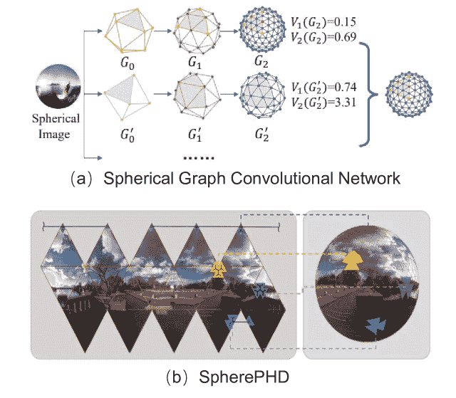
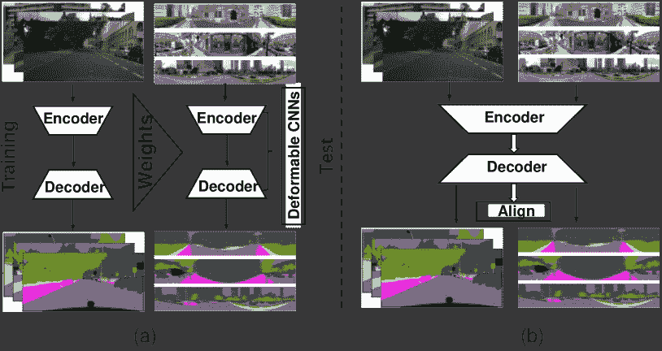

<!--yml

类别：未分类

日期：2024-09-06 19:46:28

-->

# [2205.10468] 全景视觉中的深度学习：综述与新视角

> 来源：[`ar5iv.labs.arxiv.org/html/2205.10468`](https://ar5iv.labs.arxiv.org/html/2205.10468)

\pdfximage

supplement.pdf

# 全景视觉中的深度学习：综述与新视角

Hao Ai^∗，Zidong Cao^∗，Jinjing Zhu，Haotian Bai，Yucheng Chen，和 Lin Wang H. Ai 和 Z. Cao，J. Zhu，H. Bai，Y. Chen 在中国广州香港科技大学（HKUST）人工智能研究组工作。电子邮件：{haoai, zidongcao, jinjingzhu, haotianbai, yuchengchen}@ust.hk。L. Wang 在香港科技大学（HKUST）人工智能研究组工作，同时也是香港科技大学计算机科学与工程系的成员。电子邮件：linwang@ust.hk。手稿收到时间：2022 年 4 月 19 日；修订时间：2022 年 8 月 26 日。(^∗平等贡献，通讯作者：Lin Wang)

###### 摘要

全景图像（ODI）数据以$360^{\circ}\times 180^{\circ}$的视场角捕捉，这比针孔相机要宽得多，并且包含比传统平面图像更丰富的空间信息。因此，由于在自动驾驶和虚拟现实等众多应用中的更有利性能，全景视觉吸引了广泛关注。近年来，客户级别的$360^{\circ}$相机的普及使全景视觉更加流行，而深度学习（DL）的进步显著推动了其研究和应用。本文对全景视觉中深度学习方法的最新进展进行了系统而全面的回顾和分析。我们的工作涵盖了四个主要内容：（i）介绍全景成像的原理、ODI 上的卷积方法以及数据集，以突出与 2D 平面图像数据相比的差异和困难；（ii）全景视觉深度学习方法的结构化和层次化分类；（iii）最新的创新学习策略和应用的总结；（iv）通过突出潜在的研究方向，深入讨论挑战和开放问题，以激发更多的社区研究。

###### 关键词：

全景视觉，深度学习（DL），综述，入门，分类

## 1 引言

随着 3D 技术的快速发展和对逼真视觉体验的追求，计算机视觉的研究兴趣逐渐从传统的 2D 平面图像数据转向全向图像（ODI）数据，也被称为 360°图像、全景图像或球面图像数据。由 360°摄像机捕获的 ODI 数据具有 360°×180°的视场（FoV），比针孔摄像机要宽得多；因此，它可以通过反映比传统平面图像更丰富的空间信息来捕获整个周围环境。由于其沉浸式体验和完整视角，ODI 数据已广泛应用于诸多应用领域，例如增强现实（AR）/虚拟现实（VR）、自动驾驶和机器人导航。一般来说，原始的 ODI 数据被表示为例如等距投影（ERP）或立方体映射（CP），以便与成像流程保持一致 [1], [2]。作为一种新颖的数据领域，ODI 数据具有领域独特优势（球形成像的宽视场，丰富的几何信息，多种投影类型）和挑战（ERP 类型的严重失真，CP 格式的内容不连续），这使得全向视觉的研究既有价值又具挑战性。

近年来，消费级 360°摄像机的普及使全向视觉更加流行，深度学习（DL）的进展显著推动了其研究和应用。特别是作为数据驱动技术，公共数据集的不断发布，例如 SUN360 [3], Salient 360$!$ [4], Stanford2D3D [5], Pano-AVQA [6]和 PanoContext [7]，迅速使 DL 方法在各种全向视觉任务上取得了显著突破，并经常达到最先进的性能。此外，基于各种架构开发了各种深度神经网络（DNN）模型，从卷积神经网络（CNNs） [8], 循环神经网络（RNNs） [9], 生成对抗网络（GANs） [10], 图神经网络（GNNs） [11], 到视觉变换器（ViTs） [12]。总体来说，最先进的 DL 方法集中在四个主要方面：（I）利用卷积滤波器从 ODI 数据中提取特征（全向视频（ODV）可以被视为一组时间上的 ODI），（II）通过考虑输入数量和投影类型进行网络设计，（III）新颖的学习策略，以及（IV）实际应用。

本文系统地综述和分析了全向视觉中深度学习方法的最新进展。之前，Zou 等人[13]仅关注于基于曼哈顿假设从单一 ODI 重建房间布局的算法。同样，Silveira 等人[14]仅回顾了基于 ODI 的近期 3D 场景几何恢复方法。此外，还存在一些对 FoV 适应的视频流方法[15], [16]的有限综述，特别是在投影类型、视觉失真问题和高效网络结构方面。最近，Chiariotti 等人[17]提供了对现有 ODV 流媒体系统文献的更广泛综述。与他们不同，我们强调了深度学习的重要性，并深入探讨了全向视觉的最新进展，既系统又全面。本研究提出的结构性和层级分类见图 1。

图 1：基于深度学习的全向视觉的层级和结构分类。

总结来说，本研究的主要贡献可以概括为以下几点：(I) 据我们所知，这是首个全面回顾和分析全景视觉的深度学习方法的调查，包括全景成像原理、表示学习、数据集、分类法和应用，突显了与 2D 平面图像数据的差异和难点。(II) 我们总结了过去五年大部分（如果不是全部，就是代表性的）顶级会议/期刊论文（超过 200 篇），并对全景视觉的深度学习最近趋势进行了层次性和结构性的分析。此外，我们对每个类别的讨论和挑战提供了见解。(III) 我们总结了全景视觉的最新新颖学习策略和潜在应用。(IV) 由于全景视觉的深度学习是一个活跃但复杂的研究领域，我们提供了对尚未解决的挑战和开放问题的深刻讨论，并提出了潜在的未来方向，以激发社区更深入的研究。同时，我们在表格中总结了某些流行全景视觉任务的代表性方法及其关键策略。II、表格 III、表格 IV、表格 V 和表格 VI。为了提供更好的任务间比较，我们展示了一些代表性方法在基准数据集上的定量和定性结果，所有统计数据均来自原始论文。由于篇幅有限，实验结果展示在补充材料的第二部分中。(V) 我们创建了一个开源库，提供所有提到的工作的分类及代码链接。我们将不断更新我们的开源库，增加该领域的新成果，并希望它能为未来的研究提供启示。开源库链接是[`github.com/VLISLAB/360-DL-Survey`](https://github.com/VLISLAB/360-DL-Survey)。

图 2：代表性$360^{\circ}$相机的示例。

图 3：ERP、CP 和切线表示类型的示意图。

本文的其余部分组织如下。在第二部分中，我们介绍了 ODI 的成像原理、全向视觉的卷积方法以及一些代表性数据集。第三部分介绍了各种任务的现有 DL 方法，并提供了相关论文的分类。第四部分涵盖了全向视觉任务的新颖学习范式，例如无监督学习、迁移学习和强化学习。第五部分随后审视了应用，接着是第六部分，我们讨论了开放问题和未来方向。最后，第七部分总结了本文。

## 2 背景

### 2.1 全向成像

#### 2.1.1 获取

普通相机的视场角小于 $180^{\circ}$，因此最多只能捕捉半球的视图。然而，理想的 $360^{\circ}$ 相机可以捕捉从所有方向射向焦点的光线，使得投影平面成为整个球面。在实际中，大多数 $360^{\circ}$ 相机无法实现这一点，由于盲区排除了顶部和底部区域¹¹1[`en.wikipedia.org/wiki/Omnidirectional_(360-degree)_camera`](https://en.wikipedia.org/wiki/Omnidirectional_(360-degree)_camera)。根据镜头数量，$360^{\circ}$ 相机可以分为三类：（i）单鱼眼镜头相机，无法覆盖整个球面。然而，如果已知内外参数，可以通过将多张图像投影到球面上并进行拼接来实现全景图像；（ii）两个鱼眼镜头位于对面的位置的相机，每个镜头的视场角超过 $180^{\circ}$，如 Insta360 ONE²²2[`www.insta360.com/product/insta360-one`](https://www.insta360.com/product/insta360-one) 和 LG 360 CAM³³3[`www.lg.com/sg/lg-friends/lg-360-CAM`](https://www.lg.com/sg/lg-friends/lg-360-CAM)。这类 $360^{\circ}$ 相机对镜头的需求最小，价格便宜，方便，受到行业和消费者的青睐。来自两台相机的图像随后被拼接在一起以获得全景图像，但拼接过程可能导致边缘模糊；（iii）具有两个以上镜头的相机，如 Titan（八个镜头）⁴⁴4[`www.insta360.com/product/insta360-titan/`](https://www.insta360.com/product/insta360-titan/)。此外，GoPro Omni⁵⁵5[`gopro.com/en/us/news/omni-is-here`](https://gopro.com/en/us/news/omni-is-here) 是第一个将六台普通相机放置在立方体的六个面上的相机系统，其合成结果具有更高的精度和较少的边缘模糊。这类 $360^{\circ}$ 相机是专业级的。

#### 2.1.2 球面成像

我们首先定义球面坐标 $(\theta,\phi,\rho)$，其中 $\theta\in(0,2\pi)$ ，$\phi\in(0,\pi)$，$\rho$ 分别表示球面的纬度、经度和半径。我们还定义了笛卡尔坐标 $(x,y,z)$。球面坐标与笛卡尔坐标之间的转换公式如下 [18]：

|  | <math   alttext="\begin{array}[]{&#124;c&#124;}\rho\\ \theta\\

\phi\\

\end{array}=\begin{array}[]{&#124;c&#124;}(x^{2}+y^{2}+z^{2})^{1/2}\\

\arctan(x/z)\\

\arccos(y/\rho)\\

\end{array}\ ,\ \begin{array}[]{&#124;c&#124;}x\\

y\\

z\\

\end{array}=\begin{array}[]{&#124;c&#124;}\rho\sin(\theta)\sin(\phi)\\

\rho\cos(\phi)\\

\rho\cos(\theta)\sin(\phi)\\

\begin{array}[]{&#124;c&#124;}\rho\\ \theta\\ \phi\\ \end{array}=\begin{array}[]{&#124;c&#124;}(x^{2}+y^{2}+z^{2})^{1/2}\\ \arctan(x/z)\\ \arccos(y/\rho)\\ \end{array}\ ,\ \begin{array}[]{&#124;c&#124;}x\\ y\\ z\\ \end{array}=\begin{array}[]{&#124;c&#124;}\rho\sin(\theta)\sin(\phi)\\ \rho\cos(\phi)\\ \rho\cos(\theta)\sin(\phi)\\ \end{array}。

等距圆柱投影（ERP）⁶⁶6[`en.wikipedia.org/wiki/Equirectangular_projection`](https://en.wikipedia.org/wiki/Equirectangular_projection)是通过均匀采样球面网格来表示的，如图 3(a)所示。水平单位角为$\vartheta=2\pi/w$，垂直单位角为$\varphi=\pi/h$。特别地，如果水平和垂直单位角相等，则宽度$w$是高度$h$的两倍。总之，ERP 中每个像素坐标$(u,v)$可以映射到球面坐标$(\theta,\phi)=(u\cdot\vartheta,v\cdot\varphi)$，反之亦然。立方体映射（CP）将球面投影到六个具有$90^{\circ}$视场、等长边$w$和焦距$\frac{w}{2}$的立方体面上，如图 3(b)所示。我们将立方体面表示为$f_{i}$，$i\in\{B,D,F,L,R,U\}$，分别代表后、下、前、左、右和上。通过将立方体中心设置为原点，每个面的外部矩阵可以简化为$90^{\circ}$或$180^{\circ}$旋转矩阵和零平移矩阵[19]。给定平面$f_{i}$上的一个像素，我们将$f_{i}$变换到前面（等同于笛卡尔坐标系），并使用方程 1 计算$(\theta,\phi)$。

图 4：基于 ERP 的卷积滤波器在全向图像中的示例。(a)、(b)、(c)和(d)最初出现在[20]、[21]、[22]和[23]中。

切线投影是*正射投影*[24]，一种从球面上点$P_{s}$通过球心$O$到切平面上点$P_{t}$的非共形投影，切平面的中心为$P_{c}$⁷⁷7[`mathworld.wolfram.com/GnomonicProjection.html`](https://mathworld.wolfram.com/GnomonicProjection.html)，如图 3(c)所示。对于 ERP 图像上的一个像素$P_{e}(u_{e},v_{e})$，我们首先计算其在单位球上的对应点$P_{s}(\theta=u_{e}\cdot\vartheta,\phi=v_{e}\cdot\varphi)$，遵循 ERP 格式的变换。$P_{s}(\theta,\phi)$到$P_{t}(u_{t},v_{t})$的投影定义为：

|  | <math   alttext="\begin{split}&amp;u_{t}=\frac{\cos(\phi)\sin(\theta-\theta_{c})}{\cos{c}},\\ &amp;y_{t}=\frac{\cos(\phi_{c})\sin(\phi)-\sin(\phi_{c})\cos(\phi)\cos(\theta-\theta_{c})}{\cos(c)},\\

此处为数学公式，请勿翻译。

其中 $(\theta_{c},\phi_{c})$ 是切平面中心 $P_{c}$ 的球面坐标，$(u_{t},v_{t})$ 是切平面与 $\overrightarrow{OP_{s}}$ 的延长线的交点坐标。逆变换公式为：

|  | $\begin{split}&amp;\theta=\theta_{c}+\tan^{-1}(\frac{u_{t}\sin(c)}{\gamma\cos(\phi_{c})\cos(c)-v_{t}\sin(\phi_{c})\sin(c)}),\\ &amp;\phi=\sin^{-1}(\cos(c)\sin(\phi_{c})+\frac{1}{\gamma}v_{t}\sin(c)\cos(\phi_{c})),\end{split}$ |  | (3) |
| --- | --- | --- | --- |

其中 $\gamma=\sqrt{u_{t}^{2}+v_{t}^{2}}$ 和 $c=\tan^{-1}\gamma$。通过方程 2 和 3，我们可以建立球面坐标与切平面图像上的像素之间的一对一正向和逆向映射函数[25]。

二十面体通过一个柏拉图立体来近似球面[26]。与 ERP 和 CP 相比，二十面体投影很好地解决了球面畸变的问题。虽然一些实际应用需要更少的畸变表示，我们可以增加细分数量以进一步减轻球面畸变。具体而言，二十面体中的每个面可以细分为四个更小的面，以实现更高的分辨率和更少的畸变[26]。一些 CNN 专门设计用于处理二十面体[27, 28]。值得注意的是，细分程度的选择需要在效率和准确性之间取得平衡。

其他投影。对于 CP，立方体面上的不同采样位置决定了不同的空间采样率，从而导致畸变。为了解决这个问题，提出了等角立方图（EAC）投影 ⁸⁸8[`blog.google/products/google-ar-vr/bringing-pixels-front-and-center-vr-video/`](https://blog.google/products/google-ar-vr/bringing-pixels-front-and-center-vr-video/)以保持均匀采样。此外，一些投影可以将球面转换为非空间域，例如 3D 旋转群（SO3）[29]和球面傅里叶变换（SFT）[30]。

#### 2.1.3 球面立体视觉

球面立体视觉涉及的是两个视点，两个视点之间具有已知的水平或垂直基线 [18]。由于球面投影，球面立体视觉比传统针孔相机的立体视觉更加不规则。根据公式 1，我们将基线定义为 $\textbf{b}=(\delta x,\delta y,\delta z)$，球面坐标与笛卡尔坐标之间的导数对应关系可以表示如下：

|  | <math alttext="\begin{array}[]{&#124;c&#124;}\delta_{\rho}\\ \delta_{\theta}\\

\delta_{\phi}\\

\end{array}=\begin{array}[]{&#124;c c c&#124;}\sin(\theta)\sin(\phi)&amp;\cos(\phi)&amp;\cos(\theta)\sin(\phi)\\

\frac{\cos(\theta)}{\rho\sin(\phi)}&amp;0&amp;\frac{-\sin(\theta)}{\rho\sin(\phi)}\\

\frac{\sin(\theta)\cos(\phi)}{\rho}&amp;\frac{-\sin(\phi)}{\rho}&amp;\frac{\cos(\theta)\cos(\phi)}{\rho}\\

\end{array}\ \begin{array}[]{&#124;c&#124;}\delta x\\

\delta y\\

\delta z\\

\end{array}。" display="block"><semantics ><mrow ><mrow  ><mtable displaystyle="true" rowspacing="0pt"  ><mtr ><mtd class="ltx_border_l ltx_border_r"  ><msub ><mi >δ</mi><mi >ρ</mi></msub></mtd></mtr><mtr ><mtd ><msub  ><mi >δ</mi><mi >θ</mi></msub></mtd></mtr><mtr ><mtd class="ltx_border_l ltx_border_r"  ><msub ><mi >δ</mi><mi >ϕ</mi></msub></mtd></mtr></mtable><mo >=</mo><mrow ><mtable columnspacing="5pt" displaystyle="true" rowspacing="0pt"  ><mtr ><mtd   ><mrow ><mrow ><mi  >sin</mi><mo >⁡</mo><mrow ><mo stretchy="false" >(</mo><mi  >θ</mi><mo stretchy="false"  >)</mo></mrow></mrow><mo lspace="0.167em" rspace="0em"  >​</mo><mrow ><mi >sin</mi><mo  >⁡</mo><mrow ><mo stretchy="false" >(</mo><mi >ϕ</mi><mo stretchy="false" >)</mo></mrow></mrow></mrow></mtd><mtd ><mrow  ><mi >cos</mi><mo >⁡</mo><mrow  ><mo stretchy="false"  >(</mo><mi >ϕ</mi><mo stretchy="false" >)</mo></mrow></mrow></mtd><mtd ><mrow ><mrow  ><mi >cos</mi><mo >⁡</mo><mrow ><mo stretchy="false" >(</mo><mi  >θ</mi><mo stretchy="false"  >)</mo></mrow></mrow><mo lspace="0.167em" rspace="0em"  >​</mo><mrow ><mi >sin</mi><mo >⁡</mo><mrow ><mo stretchy="false" >(</mo><mi >ϕ</mi><mo stretchy="false" >)</mo></mrow></mrow></mrow></mtd></mtr><mtr ><mtd ><mstyle displaystyle="false" ><mfrac  ><mrow ><mi >cos</mi><mo >⁡</mo><mrow ><mo stretchy="false" >(</mo><mi >θ</mi><mo stretchy="false" >)</mo></mrow></mrow><mrow ><mi  >ρ</mi><mo lspace="0.167em" rspace="0em"  >​</mo><mrow ><mi >sin</mi><mo >⁡</mo><mrow ><mo stretchy="false"  >(</mo><mi >ϕ</mi><mo stretchy="false"  >)</mo></mrow></mrow></mrow></mfrac></mstyle></mtd><mtd ><mn >0</mn></mtd><mtd ><mstyle displaystyle="false" ><mfrac  ><mrow ><mo rspace="0.167em" >−</mo><mrow ><mi >sin</mi><mo >⁡</mo><mrow ><mo stretchy="false"  >(</mo><mi >θ</mi><mo stretchy="false"  >)</mo></mrow></mrow></mrow><mrow ><mi >ρ</mi><mo lspace="0.167em" rspace="0em" >​</mo><mrow ><mi >sin</mi><mo >⁡</mo><mrow ><mo stretchy="false"  >(</mo><mi >ϕ</mi><mo stretchy="false"  >)</mo></mrow></mrow></mrow></mfrac></mstyle></mtd></mtr><mtr ><mtd ><mstyle displaystyle="false" ><mfrac  ><mrow ><mrow ><mi >sin</mi><mo >⁡</mo><mrow ><mo stretchy="false" >(</mo><mi >θ</mi><mo stretchy="false" >)</mo></mrow></mrow><mo lspace="0.167em" rspace="0em"  >​</mo><mrow ><mi >cos</mi><mo >⁡</mo><mrow ><mo stretchy="false"  >(</mo><mi >ϕ</mi><mo stretchy="false"  >)</mo></mrow></mrow></mrow><mi >ρ</mi></mfrac></mstyle></mtd><mtd ><mstyle displaystyle="false" ><mfrac  ><mrow ><mo rspace="0.167em" >−</mo><mrow ><mi >sin</mi><mo >⁡</mo><mrow ><mo stretchy="false"  >(</mo><mi >ϕ</mi><mo stretchy="false"  >)</mo></mrow></mrow></mrow><mi >ρ</mi></mfrac></mstyle></mtd><mtd ><mstyle displaystyle="false" ><mfrac ><mrow  ><mrow ><mi >cos</mi><mo >⁡</mo><mrow ><mo stretchy="false"  >(</mo><mi >θ</mi><mo stretchy="false"  >)</mo></mrow></mrow><mo lspace="0.167em" rspace="0em"  >​</mo><mrow ><mi >cos</mi><mo >⁡</mo><mrow ><mo stretchy="false"  >(</mo><mi >ϕ</mi><mo stretchy="false"  >)</mo></mrow></mrow></mrow><mi >ρ</mi></mfrac></mstyle></mtd></mtr></mtable><mo lspace="0.667em" rspace="0em"  >​</mo><mtable displaystyle="true" rowspacing="0pt"  ><mtr ><mtd class="ltx_border_l ltx_border_r"  ><mrow ><mi >δ</mi><mo lspace="0em" rspace="0em"  >​</mo><mi >x</mi></mrow></mtd></mtr><mtr ><mtd class="ltx_border_l ltx_border_r"  ><mrow ><mi >δ</mi><mo lspace="0em" rspace="0em"  >​</mo><mi >y</mi></mrow></mtd></mtr><mtr ><mtd class="ltx_border_l ltx_border_r"  ><mrow ><mi >δ</mi><mo lspace="0em" rspace="0em"  >​</mo><mi >z</mi></mrow></mtd></mtr></mtable></mrow></mrow><mo lspace="0.167em"  >.</mo></mrow><annotation-xml encoding="MathML-Content" ><apply ><matrix  ><matrixrow ><apply ><csymbol cd="ambiguous" >subscript</csymbol><ci >𝛿</ci><ci >𝜌</ci></apply></matrixrow><matrixrow ><apply  ><csymbol cd="ambiguous"  >subscript</csymbol><ci >𝛿</ci><ci >𝜃</ci></apply></matrixrow><matrixrow ><apply ><csymbol cd="ambiguous" >subscript</csymbol><ci >𝛿</ci><ci >italic-ϕ</ci></apply></matrixrow></matrix><apply ><matrix ><matrixrow  ><apply ><apply ><ci  >𝜃</ci></apply><apply ><ci >italic-ϕ</ci></apply></apply><apply ><ci  >italic-ϕ</ci></apply><apply ><apply ><ci  >𝜃</ci></apply><apply ><ci >italic-ϕ</ci></apply></apply></matrixrow><matrixrow ><apply ><apply  ><ci >𝜃</ci></apply><apply ><ci >𝜌</ci><apply ><ci >italic-ϕ</ci></apply></apply></apply><cn type="integer" >0</cn><apply ><apply  ><apply ><ci >𝜃</ci></apply></apply><apply ><ci >𝜌</ci><apply ><ci >italic-ϕ</ci></apply></apply></apply></matrixrow><matrixrow ><apply ><apply  ><apply ><ci >𝜃</ci></apply><apply ><ci >italic-ϕ</ci></apply></apply><ci >𝜌</ci></apply><apply ><apply ><apply ><ci >italic-ϕ</ci></apply></apply><ci >𝜌</ci></apply><apply ><apply  ><apply ><ci >𝜃</ci></apply><apply ><ci >italic-ϕ</ci></apply></apply><ci >𝜌</ci></apply></matrixrow></matrix><matrix ><matrixrow ><apply  ><ci >𝛿</ci><ci >𝑥</ci></apply></matrixrow><matrixrow ><apply ><ci >𝛿</ci><ci >

在公式 4 中，$(\delta_{\theta},\delta_{\phi})$ 表示球面坐标 $(\theta,\phi,\rho)$ 中的角度差异。根据公式 4，我们可以发现对于垂直基线 $\textbf{b}_{v}=(0,\delta y,0)$，$\theta$ 没有变化，这种情况较为简单。然而，对于水平基线 $\textbf{b}_{h}=(\delta x,0,0)$，$\theta$ 和 $\phi$ 两个角度都会发生差异。

### 2.2 ODI 上的卷积方法

由于 ODI 的自然投影表面是球面，标准的 CNN 在将球面图像投影回平面时，处理固有的畸变能力较差。为了增强从球面图像中提取“无偏”信息的能力，已经提出了许多基于 CNN 的方法。这些方法可以分为两类： (i) 在平面投影上应用 2D 卷积滤波器； (ii) 直接在球面域中利用球面卷积滤波器。在本小节中，我们将详细分析这些方法。

#### 2.2.1 基于平面投影的卷积

作为最常见的球面到平面投影，ERP 引入了严重的畸变，特别是在极点处。考虑到它提供了全球信息且计算成本较低，Su 等人[20] 提出了一个名为球面卷积的代表性方法，该方法利用根据球面坐标调整的自适应核大小的常规卷积滤波器。然而，如图 4(a) 所示，常规卷积权重仅在每一行之间共享，且不能从头开始训练。受到球面卷积的启发，SphereNet[21] 提出了另一种典型的方法，通过直接调整卷积滤波器的采样网格位置来处理 ERP，以实现畸变不变性，并且可以端到端训练，如图 4(b) 所示。这在概念上类似于 [22]、[23] 中的内容，如图 4(c) 和 (d) 所示。特别是，在 ODI 广泛应用之前，Cohen 等人[29] 讨论了 ERP 引入的空间变异畸变，并提出了一种旋转不变的球面 CNN 方法来学习 SO3 表示。相比之下，KTN[31, 32] 学习一个传递函数，以实现从常规平面图像中学习的卷积核可以直接应用于 ERP，而无需重新训练。在 [33] 中，ERP 被表示为加权图，并通过将全向摄像机的几何结构纳入图结构中来引入了一种新的图构建方法，以缓解畸变。[19, 34] 关注于直接将传统的 2D CNN 应用于 CP 和切向投影，这些投影没有畸变。

图 5：两种代表性的球面卷积方法。（a）和（b）最初展示于 [35] 和 [27]。

#### 2.2.2 球面卷积

一些方法已经探索了球面领域中的特殊卷积滤波器。Esteves 等人 [36] 提出了第一个球面 CNN 架构，该架构考虑了球面调和域中的卷积滤波器，以解决标准 CNN 中 3D 旋转等变性的问题。与 [36] 不同，Yang 等人 [35] 提出了一个代表性框架，将球面图像映射到基于球面几何的旋转等变表示。如图 5(a) 所示，SGCN [35] 将输入的球面图像表示为基于 GICOPix [35] 的图。此外，它通过 GCN 层探索了图的等距变换等变性。在 [37] 和 [38] 中也提出了类似的策略。在 [37] 中，提出了从二十面体学习球面表示的测度等变 CNN。相比之下，Shakerinava 等人 [38] 将二十面体扩展到所有柏拉图固体的像素化，并将测度等变 CNN 泛化到像素化球面上。由于效率与旋转等变性之间的权衡，DeepSphere [39] 将采样球体建模为连接像素的图，并设计了一种新颖的图卷积网络 (GCN)，通过调整图上像素的邻近像素数量来平衡计算效率和采样灵活性。与上述方法相比，SpherePHD [27] 提出了另一种代表性的 ODI 表示。如图 5(b) 所示，SpherePHD 将球面图像表示为球面多面体，并提供了特定的卷积和池化方法。

### 2.3 数据集

表 I：ODI 图像和视频数据集摘要。N/A 表示“不可用”，GT 表示“真实值”。

| 数据集 | 大小 | 数据类型 | 分辨率 | GT | 目的 |
| --- | --- | --- | --- | --- | --- |
| Stanford2D3D [5] | 70496 RGB+1413 ERP 图像 | 真实 | 1080 $\times$ 1080 | $\checkmark$ | 物体检测，场景理解 |
| Structured3D [40] | 196k 图像 | 合成 | 512 $\times$ 1024 | ✗ | 物体检测，场景理解，图像合成，3D 建模 |
| SUNCG [41] | 45622 场景 | 合成 | N/A | ✗ | 深度估计 |
| 360-Sport [42] | 342 个 360^∘ 视频 | 真实 | N/A | $\checkmark$ | 视觉导航 |
| Wild-360 [43] | 85 个 360^∘ 视频 | 真实 | N/A | $\checkmark$ | 视频显著性 |

基于深度学习的方法的性能与数据集的质量和数量密切相关。随着球形成像设备的发展，大量 ODI 和 ODV 数据集在各种视觉任务中公开可用。特别是，大多数 ODV 数据来自像 Vimeo 和 YouTube 这样的公共视频分享平台。在表 I 中，我们列出了一些用于不同目的的代表性 ODI 和 ODV 数据集，并展示了它们的属性，例如，大小、分辨率、数据来源。数据集的完整总结可以在补充材料中找到。根据数据来源，数据集分为两类：真实世界数据集和合成数据集。大多数真实世界数据集仅提供 2D 投影模态的图像，并应用于某些特定任务。然而，Stanford2D3D [5]包含三种模态，包括 2D 和 2.5D，适合跨模态学习。此外，一些数据集是从现有数据集中选择的，例如从 SUN360 [3]中收集的 PanoContext [7]。对于合成数据集，图像完整且高质量，没有自然噪声，注释比现实世界场景中更容易获得。例如，SUNCG [41] 是通过 Plannar5D 平台创建的，所有 3D 场景由单独标记的 3D 物体网格组成。Structured3D [40] 和 OmniFlow [44] 利用渲染引擎生成包含 3D 结构注释和相应光流的照片级真实图像。类似于真实世界数据集，还有一些数据集，例如 omni-SYNTHIA [45]，是从大型合成数据集中提取的，用于特定任务。

## 3 全向视觉任务

### 3.1 图像/视频处理

#### 3.1.1 图像生成

见解：图像生成旨在从部分或嘈杂的数据中恢复或合成完整而清晰的 ODI 数据。

对于 ODI 的图像生成，存在四个热门研究方向：（i）全景深度图完成；（ii）ODI 完成；（iii）全景语义图完成；（iv）ODI 上的视图合成。在这一小节中，我们提供了一些代表性工作的全面分析。

深度补全：由于现实世界中稀疏到密集的全景深度图非常稀缺，该任务主要利用模拟技术生成人工稀疏深度图作为训练数据。Liu 等人 [46] 提出了一个具有代表性的两阶段框架来实现全景深度补全。在第一阶段，提出了一种球面归一化卷积网络，用于从稀疏深度输入中预测初始密集深度图和置信图。然后，将第一阶段的输出与对应的 ODI 结合，通过跨模态深度补全网络生成最终的全景密集深度图。特别地，BIPS [47] 提出了一个 GAN 框架，从摄像机和深度传感器在任意配置下捕获的场景的有限输入信息中合成 RGB-D 室内全景。然而，BIPS 忽略了合成与真实 LIDAR 扫描仪之间的大分布差距，这可以通过领域适应技术得到更好的解决。

ODI 补全：它旨在填补缺失区域以生成完整且合理的 ODI。考虑到从单个有限 FoV 图像生成 ODI 时涉及的高度自由度，Hara 等人 [48] 利用球面结构的基本属性——场景对称性——来控制自由度并提高生成 ODI 的合理性。与 [48] 相对的是，Akimoto 等人 [49] 提出了一个基于变换器的框架，从固定的有限 FoV 图像中合成任意分辨率的 ODI，并鼓励合成 ODI 的多样性。此外，Sumantri 等人 [50] 提出了一个首个从一组未知 FoV 图像（无重叠）中重建 ODI 的流程，包括两个步骤：（i）相对于全景的输入图像 FoV 估计；（ii）使用输入图像和估计的 FoV 进行 ODI 合成。

语义场景补全（SSC）：它旨在重建具有整个房间占用和语义标签的室内场景。现有工作，如 [51]，大多基于 RGB-D 数据和 LiDAR 扫描仪。作为首个使用 ODI 数据完成 SSC 任务的工作，[52] 仅使用单个 ODI 及其对应的深度图作为输入，并从输入的全景深度图生成体素网格。该体素网格被划分为八个重叠视图，每个划分的网格，代表一个普通 RGB-D 传感器的单一视图，被提交给预先在标准 2.5D 合成 RGB-D 数据上训练的 3D CNN 模型[53]。这些部分推断结果被对齐并合并，以获得最终结果。

表 II：一些代表性方法的跨视图合成和地理定位。

| 方法 | 发表时间 | 输入 | 视图合成 | 定位 | 亮点 |
| --- | --- | --- | --- | --- | --- |
| Lu [54] | CVPR’20 | 图像 | $\checkmark$ | ✗ | 利用深度和语义 |
| Li [55] | ICCV’21 | 视频 | $\checkmark$ | ✗ | 带有深度和语义的 3D 点云表示 |
| Zhai [56] | CVPR’17 | 图像 | $\checkmark$ | $\checkmark$ | 使用迁移学习进行语义分割任务预训练 |
| Regmi [57] | ICCV’19 | 图像 | $\checkmark$ | $\checkmark$ | 两阶段训练：卫星视图合成和特征匹配 |
| Toker [58] | CVPR’21 | 图像 | $\checkmark$ | $\checkmark$ | 视图合成和特征匹配的端到端训练 |
| Shi [59] | NIPS’19 | 图像 | ✗ | $\checkmark$ | 极坐标变换 |
| Zhu [60] | CVPR’22 | 图像 | ✗ | $\checkmark$ | 基于注意力的变换器并去除无信息补丁 |
| Shi [61] | CVPR’20 | 图像 | ✗ | $\checkmark$ | 在定位过程中添加方向估计 |
| Zhu [62] | CVPR’21 | 图像 | ✗ | $\checkmark$ | 提出多个卫星图像可以覆盖一个地面图像 |

视图合成：视图合成的目标是从未知视角生成 ODI。由 Hsu 等人提出的 OmniNeRF [63] 是全景视图合成的首个代表性学习方法。为了生成新视角的 ODI，它首先通过辅助深度图和衍生的梯度图像将 ODI 投影到 3D 领域，然后转换视图位置以重新投影 3D 坐标到 2D 空间。神经辐射场（NeRF） [64] 用于学习基于像素的表示，并解决由于视角转换引起的信息丢失问题。类似的策略，由 [65] 提出，利用条件生成器合成新视图。以视频作为输入，Pathdreamer [66] 设计了一个分层结构，以从一次前观测和未来视角的轨迹中进行未观测视图合成。

#### 3.1.2 跨视图合成与地理定位

见解：跨视图合成旨在从卫星视图图像合成地面视图 ODI，而地理定位旨在匹配地面视图 ODI 和卫星视图图像以确定它们之间的关系。

地面视图，也称为街景图像，通常是全景的，以提供完整的周边信息，而卫星视图则是平面图像，捕捉了几乎世界的每个角落。从卫星视图图像合成地面视图图像存在一些方法。Lu 等人[54] 提出了一个具有代表性的工作，包括三个阶段：卫星阶段、地理变换阶段和街景阶段。卫星阶段从卫星图像预测深度图和分割图。地理变换阶段将卫星阶段的输出转换为全景图。最后，街景阶段通过 GAN 从分割图预测街景全景。Sat2Vid [55]，即第一个跨视角视频合成工作，也采用三个阶段来使用带有语义和深度提示的体素网格生成街景 ODV，这与 [54] 中的概念类似。

一般来说，地理定位框架由两个模块组成：跨合成模块和检索模块。Shi 等人[59] 提出了一个具有代表性的对比学习管道，用于计算嵌入空间中地面视图 ODI 和卫星视图图像之间的距离，类似于 [58、57]。特别是，在 [58] 中，通过 GAN 从卫星视图的极坐标变换合成地面视图 ODI，受对应地面视图真实图像的监督。同时，额外的检索分支用于约束两个领域的潜在表示。Regmi 等人 [57] 使用条件 GAN 巧妙地从地面视图 ODI 合成卫星视图图像。为了学习鲁棒的卫星查询表示，他们融合了卫星视图合成和地面视图 ODI 的特征，然后在嵌入空间中匹配查询特征与卫星视图特征。作为最新的工作，TransGeo [60] 是第一个基于 ViT 的框架，用于从卫星图像和地面视图 ODI 中提取位置信息。通过注意机制，TransGeo 去除了卫星视图图像中不信息丰富的区域，超越了之前基于 CNN 的方法。

讨论：大多数跨视角合成和地理定位方法假设参考图像精确地位于任何查询图像的位置。然而，在实践中，两个视图通常在方向 [61] 和空间位置 [62] 上并不完全对齐。因此，如何在挑战性条件下应用跨视角合成和地理定位方法是一个有价值的研究方向。

#### 3.1.3 压缩

与传统透视图像相比，全向数据记录了更丰富的几何信息，具有更高的分辨率和更广的视场，这使得有效压缩变得更加具有挑战性。早期的 ODI 压缩方法直接利用现有的透视方法来压缩 ODI 的透视投影。例如，Simone 等人[67] 提出了自适应量化方法来解决将 ODI 投影到 ERP 时视口图像块中的频率偏移问题。相比之下，OmniJPEG [68] 首先估计 ODI 中的感兴趣区域，然后基于该区域内容的几何变换进行编码，采用了一种称为 OmniJPEG 的新格式，该格式是 JPEG 格式的扩展[69]，并且可以在传统的 JPEG 解码器上查看。考虑到 ERP 失真，[70] 提出了基于图的编码器来适应球面。为了使编码过程在计算上可行，引入了基于率失真优化的图划分算法[71]，以在重建信号的失真、每个子图上的信号平滑性和划分描述的编码成本之间实现权衡。作为代表性的基于 CNN 的 ODI 压缩工作，OSLO [72] 应用 HEALPix [73] 直接在球面上定义卷积操作，并将标准 CNN 技术适应于球面域。所提出的球面表示在 ERP 上的表现优于类似的可学习压缩模型。

对于 ODV 压缩，Li 等人[74] 提出了旨在优化 ODV 编码过程的代表性工作。他们分析了从不同平面投影类型恢复球面域信号的失真影响，然后应用了基于球面域信号失真的率失真优化方法。类似地，Wang 等人[75] 提出了基于球面坐标变换的运动模型来解决投影中的失真问题。另一种代表性方法[76] 将 ODV 映射到菱形十二面体（RD）图上，并直接在 RD 图上应用平面透视视频编码方法。具体而言，提出了基于率控制的算法，以实现更好的质量和更小的比特率误差用于 ODV 压缩[77]，[78]。Zhao 等人[78] 利用博弈论找到最优的帧间/帧内比特率分配，而 Li 等人[77] 提出了用于 ERP 的新比特分配算法，基于编码树单元（CTU）级别。类似于[20]，同一行的 CTU 具有相同的权重，以减少失真影响。

潜力与挑战：基于上述分析，这一研究领域仅存在少数基于 DL 的方法。大多数工作将传统的平面编码方法与球面领域的几何信息结合在一起。基于 DL 的 ODI/ODV 压缩仍面临一些挑战。基于 DL 的图像压缩方法需要有效的度量作为约束，例如峰值信噪比（PSNR）和结构相似性（SSIM）。然而，由于球面成像，传统度量在衡量 ODI 质量方面较弱。此外，ODI 的平面投影具有高内存和失真，增加了计算成本和压缩难度。未来的研究可能考虑基于球面几何信息扩展更有效的度量，并从部分输入中恢复高质量的压缩 ODI。

#### 3.1.4 照明估计

见解：它旨在从低动态范围（LDR）ODI 中预测高动态范围（HDR）照明。

照明恢复在许多实际任务中被广泛应用，包括场景理解、重建和编辑。Hold-Geoffroy 等人 [79] 提出了一个代表性的户外照明估计框架。他们首先训练了一个 CNN 模型，以从户外 ODI 的视口中预测天空参数，例如太阳位置和大气条件。然后，他们根据预测的照明参数重建了给定测试图像的照明环境图。同样，在 [80] 中，利用 CNN 模型预测视口中光源的位置，并对 CNN 进行微调，以从 ODI 中预测光强度，即环境图。在 [81] 中，从 ODI 的视口回归出室内照明的几何和光度参数，并使用中间潜在向量重建环境图。另一个代表性方法称为 EMLight [82]，由回归网络和神经投影仪组成。回归网络输出光参数，神经投影仪将光参数转换为照明图。特别是，光参数的真实值通过从照明中生成的高斯图分解，这由球面高斯函数生成。

讨论与潜力：从上述分析可以看出，先前的照明估计工作在 ODI 上仅使用单个视口作为输入。原因可能是视口没有失真且成本低，分辨率较低。然而，它们严重缺乏空间信息。因此，将对比学习应用于从多个视口或切线图像组件中学习鲁棒表示可能是有益的。

#### 3.1.5 ODI 超分辨率（SR）

现有的头戴显示器（HMD）设备[83]需要至少 21600$\times$10800 像素的 ODI 以获得沉浸式体验，而当前的相机系统[84]无法直接捕捉到这么高分辨率的图像。一个替代方法是捕捉低分辨率（LR）ODI 并高效地将其超分辨率处理为高分辨率（HR）ODI。LAU-Net[85]作为首个考虑 ODI 超分辨率的纬度差异的工作，介绍了一个多层次纬度自适应网络。它将 ODI 分割成不同的纬度带，并以不同的自适应因子分层放大这些带，这些因子通过强化学习方案进行学习。除了在 ERP 上考虑超分辨率，Yoon 等人[28]提出了一项具有代表性的工作 SphereSR，旨在学习一个统一的连续球面局部隐式图像函数，并根据球面坐标查询生成任意分辨率的投影。对于 ODV 超分辨率，SMFN[86]是第一个基于 DNN 的框架，包括单帧和多帧联合网络及双网络。单帧和多帧联合网络融合了来自相邻帧的特征，双网络则约束了解空间，以找到更好的答案。

#### 3.1.6 直立调整

Insight: 直立调整旨在纠正相机与场景之间方向的不对齐，以提高使用窄视场（NFoV）显示器（如 VR 应用）时 ODI 和 ODV 的视觉质量。

标准的直立调整方法包括两个步骤：(i) 估计 ODI 的极点位置；(ii) 应用旋转矩阵对齐估计出的北极点。早期的代表性工作[87]根据全景图中的几何结构（例如，弯曲的直线和消失点）来估计相机旋转。然而，这些方法受限于曼哈顿[88]或亚特兰大世界[89]假设，并依赖于几何结构的必要先验知识。近年来，基于深度学习的直立调整得到了广泛研究。无需对场景结构做任何特定假设，DeepUA[90]提出了一个代表性的基于 CNN 的框架，来估计从 ODI 中采样的多个 NFoV 图像的二维旋转，然后通过三维和二维旋转之间的几何关系来估计三维相机旋转。相比之下，Deep360Up[91]直接将 ERP 图像作为输入，并根据估计的上向量方向合成直立版本。特别地，Jung 等人[92]提出了一个两阶段的 ODI 直立调整管道。首先，通过 CNN 模型从旋转后的 ERP 图像中提取特征图。然后，将特征图映射到球面图中。最后，应用 GCN 来估计三维相机旋转，即对应北极点的球面上的点的位置。

图 6：ODI-QA 和 ODV-QA 的代表性网络。(a)、(b)和(c)最初显示在[93]、[2]和[94]中。

#### 3.1.7 视觉质量评估

由于全景数据的超高分辨率和球面表示，视觉质量评估（V-QA）对于优化现有的图像/视频处理算法非常有价值。接下来，我们分别介绍一些关于 ODI-QA 和 ODV-QA 的代表性工作。

对于 ODI-QA，根据参考图像的可用性，它可以进一步分为两类：完整参考（FR）ODI-QA 和无参考（NR）ODI-QA。在现有的 FR ODI-QA 方法中，一些工作专注于将传统的 FR 图像质量评估指标，如**PSNR**和**SSIM**，扩展到全向领域，例如[95]、[96]。这些工作将 ODI 及其投影表示的特殊几何结构引入传统的质量评估指标中，以更准确地测量客观质量。此外，还有一些基于深度学习的 FR ODI-QA 方法。如图 6(a)所示，**Lim**等人[93、97]提出了一种新颖的对抗学习框架，包括一个质量评分预测器和一个人类感知引导器，以自动评估符合人类感知的图像质量。NR ODI-QA，也称为盲 ODI-QA，预测 ODI 质量而无需昂贵的参考 ODI。考虑到 ERP 格式中的多视点图像，**Xu**等人[98]应用了一种新颖的视点导向 GCN 来处理 ERP 图像中的无失真视点，并将这些特征聚合，通过图像质量回归器来估计质量评分。类似的策略应用于[99、100]。相比之下，[2]从 CP 图像及其对应的眼动（EM）和头动（HM）热点图中提取特征，并提供了良好的基于投影的潜力，即从多个投影格式中提取特征并融合这些特征，以提高盲 ODI-QA 的性能，如图 6(b)所示。

对于 ODV-QA，Li 等人[94]提出了一种基于视口的代表性 CNN 方法，包括一个视口提案网络和一个视口质量网络，如图 6(c)所示。视口提案网络生成若干潜在视口及其误差图，视口质量网络对每个提议的视口进行 V-QA 评分。最终的 V-QA 分数通过所有视口 V-QA 分数的加权平均来计算。[101]是另一种代表性方法，它考虑了 ODV 空间畸变的时间变化，并融合了来自多个视口的时空目标质量度量，以学习主观质量评分。类似地，Gao 等人[102]对 ODV 的时空畸变进行了建模，并通过整合三种现有的 ODI-QA 目标度量，提出了一种新颖的 FR 目标度量。

图 7：Sph IoU[103]和 FoV-IoU[104]的示意图。

### 3.2 场景理解

#### 3.2.1 物体检测

与透视图像相比，基于 DL 的 ODI 物体检测仍面临两个主要困难：（i）传统卷积核在处理 ODI 投影中的不规则平面网格结构时效果较差；（ii）传统 2D 物体检测采用的标准不适用于球面图像。为解决第一个困难，提出了畸变感知结构，例如[105]中的多尺度特征金字塔网络，[106]中的多核层。然而，这两种方法的检测流程类似于 2D 领域的方法，即将整个 ERP 图像作为输入，并预测兴趣区域（ROIs）以获得最终的边界框。考虑到 ERP 的宽广视场，Yang 等人[107]提出了一个代表性框架，可以利用传统的 2D 图像来训练全景检测器。检测过程包括三个子步骤：立体投影、YOLO 检测器和边界框后处理。特别是，他们从一个 ERP 生成了四个$180^{\circ}\times 180^{\circ}$视场的立体投影，并由 YOLO 检测器预测了四个结果图。最后，子窗口检测到的边界框被重新投影到 ERP 上，并重新对齐成最终的无畸变边界框。

为了应对第二个难点，介绍了一种新的球形边界框（SphBB）和球形交并比（SphIoU）用于全景图像物体检测，如图 7 的第一行所示。SphBB 通过物体中心的坐标 $\theta$ 和 $\phi$ 以及目标占据的无偏视场 $\alpha$ 和 $\beta$ 来表示。SphIoU 类似于平面 IoU，通过两个 SphBB 之间的 IoU 计算得出。具体而言，FoVBBs 被移动到无扭曲的赤道上。类似地，Cao 等人 [104] 提出了一个不需要额外移动的新 IoU 计算方法，称为 FoV-IoU。如图 7 的第二行所示，FoV-IoU 比 SphIoU 更好地近似了两个 FoV-BB 之间 IoU 的准确计算。

图 8：无监督全景图像语义分割的代表性方法。 (a) 使用变形卷积神经网络的无监督学习 [108]。 (b) 使用领域适应的无监督学习 [109]。

#### 3.2.2 语义分割

表 III: 一些代表性方法的语义分割。“S”：监督，“U”：无监督，“D”：领域适应。

| 方法 | 发表期刊 | 输入 | 数据集 | 变形 | 监督 | 亮点 |
| --- | --- | --- | --- | --- | --- | --- |
| Tateno [108] | ECCV’2018 | ERP | Stanford2d3d | $\checkmark$ | U | 扭曲感知卷积 |
| Zhang [45] | ICCV’2019 | 切线 | Stanford2D3D/Omni-SYNTHIA | $\checkmark$ | S | 面向方向的卷积 |
| Lee [27] | CVPR’2019 | 切线 | SYNTHIA/Stanford2D3D | $\checkmark$ | S | 二十面体测地多面体 |
| Viu [110] | ICRA’2020 | ERP | SUN360 | $\checkmark$ | S | 等距圆柱卷积 |
| Yang [111] | CVPR’2021 | ERP | PASS/WildPASS | ✗ | U | 并发注意力网络 |
| Zhang [112] | CVPR’2022 | ERP | Stanford2D3D/DensePASS | $\checkmark$ | U | 变形多层感知机 |
| Zhang [113] | T-ITS’2022 | ERP | DensePASS/VISTAS | ✗ | D | 不确定性感知适应 |

基于深度学习的全景语义分割已被广泛研究，因为全景图像可以包含关于周围空间的全面信息。尽管如此，仍然存在许多实际挑战，例如平面投影的扭曲、物体变形、计算复杂度和稀少的标注数据。接下来，我们将介绍一些通过监督学习和无监督学习进行全景图像语义分割的代表性方法。

由于缺乏现实世界的数据集，Deng 等人 [114] 首先从现有的城市交通场景数据集中生成了 ODI，然后设计了一种称为缩放增强的方法，将传统图像转换为鱼眼图像。同时，他们提出了一个基于 CNN 的框架，具有特殊的池化模块，用于集成局部和全局上下文信息，并处理 ODI 中的复杂场景。考虑到 CNN 在处理 ODI 中的畸变方面固有的局限性，Deng 等人 [115] 提出了一种称为受限可变形卷积的方法，用于建模几何变换，并从输入特征图中学习卷积滤波器的大小。缩放增强也被应用于 [115] 以丰富训练数据。作为第一个在真实世界户外 ODI 上进行语义分割的框架，SemanticSO [116] 构建了一个利用等距卷积 [117] 的畸变感知 CNN 模型。

由于地面实况标注对 ODI 的时间和成本消耗巨大，人们已尝试从传统图像中合成 ODI 数据集，并利用知识迁移直接采用使用透视图像训练的模型。PASS [118] 是首个绕过完全密集全景标注，聚合由传统透视图像表示的特征，以实现全景图像中的逐像素分割的工作。基于 PASS，DS-PASS [119] 进一步重用从透视图像中学到的知识，并将从 2D 领域学习到的模型适配到全景领域。同时，在 DS-PASS 中，通过实施基于注意力的侧向连接，增强了对空间细节的敏感性，以实现精确分割。为了减少 ODI 与透视图像之间的领域差距，Yang 等人 [111] 提出了一个代表性的跨领域迁移框架，设计了一个高效的并行注意力网络，以捕捉 ODI 图像中的长程依赖，并将未标记的 ODI 和标记的透视图像集成到训练中。类似的策略也应用于 [120]、[121] 和 [109]。特别是在 [109] 中，使用了一个共享注意力模块从 2D 领域和全景领域提取特征，并使用两个领域适应模块通过透视分支“教”全景分支。对于无监督语义分割，也存在一些考虑 ODI 几何结构的工作 [108]。例如，Zhang 等人 [45] 提出了基于 ODI 二十面体网格表示的方向感知 CNN 框架，并引入了一种高效的北对齐核卷积插值方法，用于球面上的特征。

#### 3.2.3 单目深度估计

表 IV: 一些代表性方法的单目深度估计。“S”：监督，“D”：领域适应。

| 方法 | 发表 | 监督类型 | 输入类型 | 架构 | 损失函数 |
| --- | --- | --- | --- | --- | --- |
| Zioulis [122] | ECCV’18 | S | ERP | 矩形滤波器 | l2 损失+平滑损失 |
| Pintore [123] | CVPR’21 | S | ERP | 基于切片的表示和 LSTM | BerHu 损失 [124] |
| Zhuang [125] | AAAI’22 | S | ERP | 扩张滤波器 | BerHu 损失 |
| Wang [19] | CVPR’20 | S | ERP+CP | 双分支网络和双重投影融合 | BerHu 损失 |
| Rey-Area [34] | CVPR’22 | S | 切线 | 透视网络+对齐+混合 | 能量函数 |
| Li [25] | CVPR’22 | S | 切线 | 几何嵌入+Transformer | BerHu 损失 |
| Jin [126] | CVPR’20 | S | ERP | 结构信息作为先验和正则化器 | l1 损失+交叉熵损失 |
| Wang [127] | ACCV’18 | Self-S | CP | 深度估计+相机运动估计 | 光度 + 姿态损失 |
| Zioulis [18] | 3DV’19 | Self-S | ERP | 水平、垂直和三目视图合成 | 光度 + 平滑损失 |
| Yun [128] | AAAI’22 | S+Self-S | ERP | ViT+姿态估计 | SSIM [129]+梯度 +L1+光度损失 |
| Tateno [108] | ECCV’18 | D | ERP | 失真感知滤波器 | BerHu 损失 |

图 9：代表性单目深度估计方法。(a) 具有 ERP 和 CP 作为输入的双分支方法。(b) 以切线图像作为输入，并将其重新投影到 ERP 图像中的方法。(c) 利用额外几何信息作为先验和正则化器的方法。(d) 具有特定基线的视图合成方法。(e) 带有姿态估计的自监督多帧方法。

多亏了大规模全景深度数据集的出现，单目深度估计得到了快速发展。如图 9 所示，出现了几个趋势：（i）定制化网络，例如，畸变感知卷积滤波器[108]和鲁棒表示[123];（ii）不同的 ODI 投影类型[19]，[130]，[25]，如图 9(a)，(b)所示；（iii）固有几何先验[131]，[126]，如图 9(c)所示；（iv）多视角[18]或姿态估计[128]，如图 9(d)，(e)所示。

定制化网络：为了减少拉伸畸变的影响，Zioulis 等人[122]首次提出了直接使用 ODI 的工作。该方法遵循[20]将常规的正方形卷积滤波器转换为行式矩形，并通过变化滤波器的大小来解决极点的畸变。Tateno 等人[108]提出了一种可变形卷积滤波器，根据单位球坐标对切平面上的像素网格进行采样。最近，Zhuang 等人[125]提出了一个新颖的框架，将不同的膨胀卷积结合起来，并在 ERP 图像中扩展感受野。相比之下，Pintore 等人[123]提出了一个名为 SliceNet 的框架，使用常规卷积滤波器直接处理 ERP。SliceNet 仅沿垂直方向减少输入张量，以收集一系列垂直切片，并采用 LSTM[132]网络来恢复切片之间的长短期空间关系。

不同的投影格式：有一些尝试通过其他无失真投影格式来解决 ERP 中的失真问题，例如 CP、切线投影。作为代表性工作，BiFuse [19] 引入了一个双分支管道，其中一个分支处理 ERP 输入，另一个分支从 CP 中提取特征，以模拟人类的外周和中央视力，如图 9（a）所示。然后，提出了一个融合模型来结合两个分支的语义和几何信息。受到 BiFuse 的启发，UniFuse [133] 设计了一个更有效的融合模块，以结合这两种特征，并且在解码阶段单向地将 CP 特征馈送到 ERP 特征。为了更好地提取全局上下文信息，GLPanoDepth [134] 将 ERP 输入转换为一组 CP 图像，然后利用 ViT 模型学习长期依赖关系。由于切线投影比 CP 产生的失真更少，360MonoDepth [34] 在 2D 领域 [135] 训练了 SoTA 深度估计模型，使用切线图像并将预测的切线深度图重新投影到 ERP 中进行对齐和混合，如图 9（b）所示。然而，直接将切线图像重新投影回 ERP 格式会导致重叠和不连续。因此，OmniFusion [25]（迄今为止的 SoTA 方法）引入了额外的 3D 几何嵌入，以缓解补丁级特征中的差异，并利用基于注意力的变换器聚合补丁级信息。

几何信息先验：一些方法添加额外的几何信息先验来提高性能，例如边缘平面信息、表面法线、边界，如图 9(c)所示。Eder 等人[131]假设每个场景是分段平面的，每个平面区域的主曲率，即深度的二阶导数，应为零。因此，他们提出了一种平面感知学习方案，该方案联合预测深度、表面法线和边界。类似于[131]，Feng 等人[136]提出了一个框架，通过表面法线和不确定性评分来精细化深度估计。对于具有更高不确定性的像素，其预测主要来自邻近像素。特别地，Jin 等人[126]证明了几何结构的表示，例如角点、边界和平面，可以为深度估计提供正则化，并作为先验信息有益。

多视角：由于 ODI 深度标注成本高昂，一些研究利用多视角合成数据以获得竞争性结果。Zioulis 等人[18]探索了用于自监督单目深度估计的球面视角合成。如图 9(d)所示，在[18]中，预测 ERP 格式深度图后，通过深度图像渲染合成了垂直和水平基线的立体视角。合成图像通过与同视角的真实图像进行光度图像重建损失来进行监督。为了同时提高准确性和稳定性，Yun 等人[128]提出了一个联合学习框架，通过监督学习估计单目深度，并通过自监督学习从 ODV 的相邻帧中估计姿态，如图 9(e)所示。

讨论：根据上述分析，大多数方法仅考虑室内场景，主要有两个原因：（i）一些几何先验在野外无效，例如平面假设；（ii）户外场景由于近似无限区域（例如天空）的尺度模糊和各种形状及大小的物体而更具挑战性[130]。

已证明直接将基于深度学习（DL）的方法应用于二维光流估计会得到不令人满意的结果 [137]。为此，Xie 等人 [138] 引入了一个小型诊断数据集 FlowCLEVR，并评估了三种量身定制的卷积滤波器的性能，即相关卷积、坐标卷积和可变形卷积，用于估计全景光流。领域适应框架 [139, 140] 受益于光流估计在视角域中的发展。类似于 [137]，OmniFlowNet [139] 基于 FlowNet2 构建，其卷积操作灵感来自于 [117]。特别地，作为 [141] 的扩展，LiteFlowNet360 [140] 使用核变换技术来解决由球面到平面投影引起的固有失真问题。一个具有代表性的流程由 [142] 提出，包括数据增强方法和光流估计模块。数据增强方法克服了 ERP 引入的失真，光流估计模块利用球面边界的周期性，将远程估计转换为相对短距离估计。

#### 3.2.4 视频摘要

见解：视频摘要旨在通过选择包含最关键信息的部分，生成代表性和完整的摘要。

与二维视频摘要方法相比，目前针对全景视频（ODV）摘要的工作较少。Pano2Vid [143] 是一个具有代表性的框架，包含两个子步骤：在整个 ODV 帧中检测感兴趣的候选事件，并应用动态规划将检测到的事件连接起来。然而，Pano2Vid 需要观察整个视频，并且在视频流应用中能力较弱。Deep360Pilot [42] 是第一个设计出类人在线代理以自动导航 ODV 的框架。Deep360Pilot 包含三个步骤：物体检测以获取感兴趣的候选物体，训练 RNN 以选择重要物体，并在 ODV 中捕捉精彩瞬间。AutoCam [144] 根据对人类行为的理解，从 ODV 中生成普通的 NFoV 视频。Yu 等人 [145] 采用了类似的策略。他们建立了一个深度排序模型，用于空间摘要，从每一帧中选择 NFoV 镜头，并通过将相同模型扩展到时间域生成时空亮点视频。此外，Lee [146] 提出了一个新颖的深度排序神经网络模型，用于在空间和时间上总结 ODV。

讨论：基于以上分析，目前在这一研究领域仅存在少数几种方法。作为一个时间相关任务，将变压器机制应用于 ODV 总结可能是有益的。此外，以前的工作仅考虑了 ERP 格式，这种格式存在最严重的失真问题。因此，考虑 CP、切线投影或球面格式作为 ODV 总结的输入会更好。

### 3.3 3D 视觉

表 V：代表性研究中的房间布局估计概述。

| 方法 | 发表 | 体系结构 | 亮点 | 投影 | 任务 |
| --- | --- | --- | --- | --- | --- |
| 张[147] | ICCV’21 | Mask RCNN+ODN +LIEN+HorizonNet | 上下文关系建模 | ERP | 布局+对象+语义标签 |
| 杨[148] | CVPR’19 | 两个 ResNet 用于天花板和地板 | 投影特征融合 | ERP，天花板 | 布局 |
| Zou [149] | CVPR’18 | CNN+3D 布局回归器 | 边界+角点图预测 | ERP | 布局 |
| Tran [150] | CVPR’21 | HorizonNet+EMA | 半监督学习 | ERP | 布局 |
| Pintore [151] | ECCV’20 | ResNet+RNN | 亚特兰大世界室内模型 | ERP，天花板 | 布局 |
| 孙[152] | CVPR’19 | ResNet+RNN | 布局的一维表示 | ERP | 布局 |
| 孙[153] | CVPR’21 | ResNet+高效高度压缩 | 潜在的水平特征 | ERP | 布局，深度+语义标签 |
| 王[154] | CVPR’21 | HorizonNet$\&amp;$L2D 变换 | 可微分深度渲染 | ERP | 布局 |

#### 3.3.1 房间布局估计与重建

见解：房间布局估计和重建包含多个子任务，如布局估计、3D 对象检测和 3D 对象重建。这个综合任务旨在基于单一 ODI 促进整体场景理解。

由于室内全景图能够覆盖更广泛的周边环境并捕捉更多的上下文线索，相比传统透视图像，它们对场景理解是有益的，并且被广泛应用于房间布局估计和重建。Zou 等人[13]总结了布局估计和重建的一般过程包括三个子步骤：基于边缘的对齐、布局元素预测和 3D 布局元素恢复，如图 10 所示。代表性工作由张等人[147]提出，进行首个基于深度学习的整体 3D 场景理解管道，该管道从单一的 ODI 中恢复 3D 房间布局和详细信息，例如形状、姿态和对象位置。在 [147] 中，设计了一种基于上下文的 GNN 来预测对象和房间布局之间的关系，并在房间布局的几何精度和 3D 对象排列上取得了 SoTA 表现。

对于对齐，这个预处理步骤提供了室内几何信息作为先验知识，以简化网络训练。一些最先进的方法[148、149、150]遵循“曼哈顿世界”假设，其中所有墙壁都与标准坐标系对齐，地面平面方向通过选择长直线段并投票确定三个相互正交的消失方向来估计。相反，AtlantaNet[151]预测的是不受“曼哈顿世界”假设限制的较少约束场景中的 3D 布局。AtlantaNet 遵循“亚特兰大世界”假设，将重力对齐的 ODI 投影到两个水平面上，以预测地面平面上的 2D 房间足迹和房间高度，从而恢复 3D 布局。

图 10：一般房间布局预测架构。

对于布局元素预测，主要任务是估计布局边界和角点位置。一方面，相关方法通常选择 ODI 的不同投影作为输入。例如，一些方法[149、152、153]仅从 ERP 图像中预测布局。除了 ERP 之外，Yang 等人[148]还添加了一张通过等距矩形到透视（E2P）转换从 ERP 获取的透视天花板视图图像，作为额外输入。然后，他们通过一个双分支网络从这两种格式中提取特征，并融合这两种模态特征来预测布局元素。[148]的优点是它直接使用多投影模型联合预测曼哈顿世界地面平面，而不是估计角点数。另一方面，最近的方法在特征表示方式上有所不同。例如，HorizonNet[152]将 ODI 的房间布局表示为三个 1D 嵌入向量，并从 1D 预测中恢复 3D 房间布局，计算成本低。不同的是，Wang 等人[154]通过对少量点进行光线投射，将布局转换为“视界深度”。这种转换保持了布局估计的简单性，并提高了对未见过的房间布局的泛化能力。

对于最终恢复，一般策略[149, 148, 152] 是通过优化在墙壁和角落之间映射每个像素来重建布局。特别地，它定义了地板、天花板和角落的概率图的加权损失。主要困难在于当相机位置不理想时的布局边界遮挡。为了解决这个问题，HorizonNet [152] 通过检查相邻墙壁的第一主成分分析（PCA）分量的方向来观察遮挡，并根据全球几何形状的长期依赖关系恢复被遮挡的部分。

#### 3.3.2 立体匹配

人类的双眼视差取决于视网膜上的投影差异，即球面投影而不是平面投影。因此，基于 ODIs 的立体匹配更接近人类视觉系统。在[155]中，他们讨论了全向畸变对基于 CNN 的方法的影响，并比较了从视角和全向立体图像中预测的视差图的质量。实验结果表明，基于 ODIs 的立体匹配在许多应用中更具优势，例如机器人技术、AR/VR 及其他几个应用。一般的立体匹配算法包括四个步骤：（i）匹配成本计算，（ii）成本聚合，（iii）优化后的视差计算，以及（iv）视差细化。作为第一个基于 DNN 的全向立体框架，SweepNet [156] 提出了一个宽基线立体系统，从一对由超宽视场镜头捕获的图像中计算匹配成本图，并在设备坐标系统中使用全局球体扫描直接生成全向深度图。相比之下，OmniMVS [157] 以四个 220^∘视场的鱼眼图像作为输入来训练一个端到端的 DNN 模型，并使用 3D 编码器-解码器块来规范化成本体积。[158]中提出的方法作为 OmniMVS 的扩展，基于先验指导的不确定性提供了一种新的成本体积规范化。另一个代表性工作 360SD-Net [159] 是第一个用于全向立体深度估计的端到端可训练网络，以上下 ODI 对作为输入。它通过额外的极角坐标输入和可学习的成本体积来减轻 ERP 图像中的畸变。

#### 3.3.3 SLAM

SLAM 是一个复杂的系统，采用多种摄像头，例如单目、立体或 RGB-D，结合移动体上的传感器，以实时重建环境并估计体的位置。SLAM 常用于实时导航和现实增强，例如 Google Earth。立体信息，如关键点[160] 和密集或半密集深度图[161]，对于构建准确的现代 SLAM 系统不可或缺。具体而言，与传统的单目 SLAM [162] 或多视角 SLAM [163] 相比，全向数据由于大视场提供了更丰富的纹理和结构信息，全向 SLAM 避免了周围环境中断帧的影响，并享有完整定位和映射的技术优势。Caruso 等人 [164] 提出了一个代表性的单目 SLAM 方法，用于全向摄像头，其中直接图像对齐和逐像素距离滤波被直接制定。Zachary 等人 [165] 提出了一个接受多种类型传感器数据的通用框架，能够对相机位置和逐像素深度进行迭代更新。DeepFactors [166] 执行姿态和深度变量的联合优化，以检测回环闭合。由于全向数据具有丰富的几何和纹理信息，进一步的工作可能会考虑如何挖掘深度学习的全部潜力，并利用这些成像优势来构建一个快速而准确的 SLAM 系统。

### 3.4 人类行为理解

#### 3.4.1 显著性预测

表 VI: 一些代表性方法的深度 ODI 和 ODV 显著性预测。EM 和 HM 意为眼动和头动。

| 方法 | 输入 | 发表 | EM | HM | 亮点 | 贡献 |
| --- | --- | --- | --- | --- | --- | --- |
| Dai [167] | IMG | ICASSP’20 | $\checkmark$ | $\checkmark$ | CP $\&amp;$ 2D CNN | 膨胀卷积 |
| Lv [168] | IMG | ACM MM’20 | $\checkmark$ | $\checkmark$ | 球形图像 $\&amp;$ GCN | 带球形插值的 GCN |
| Chao [169] | IMG | TMM’21 | $\checkmark$ | $\checkmark$ | 多视角$\&amp;$ 2D CNN | 不同视场视口 |
| Abdelaziz [170] | IMG | ICCV’21 | $\checkmark$ | $\checkmark$ | ERP $\&amp;$ 2D CNN $\&amp;$ 自注意力机制 | 对比学习以最大化互信息 |
| Xu [171] | IMG | TIP’21 | ✗ | $\checkmark$ | ERP $\&amp;$ 深度强化学习 | 生成对抗模仿学习 |
| Nguyen [172] | VID | ACM MM’18 | ✗ | $\checkmark$ | ERP $\&amp;$ 2D CNN $\&amp;$ LSTM | 迁移学习 |
| Chen [43] | VID | CVPR’18 | ✗ | $\checkmark$ | CP $\&amp;$ 2D CNN $\&amp;$ convLSTM | 时空网络 $\&amp;$ 立方体填充 |
| Zhang [173] | VID | ECCV’18 | $\checkmark$ | $\checkmark$ | ERP $\&amp;$ 球面 CNN | 球面冠卷积核 |
| Xu [174] | VID | TPAMI’19 | ✗ | $\checkmark$ | ERP $\&amp;$ 深度强化学习 | 深度强化学习 |
| Zhu [175] | VID | TCSVT’21 | $\checkmark$ | ✗ | 图像块 $\&amp;$ GCN | 图卷积和特征对齐 |
| Qiao [176] | VID | TMM’21 | $\checkmark$ | ✗ | 多视口 $\&amp;$ 2D CNN $\&amp;$ convLSTM | 多任务深度神经网络 |

最近，在 ODI 显著性预测方面出现了几种研究趋势，这些趋势建立在深度学习进展的基础上：（i）从 2D 传统卷积到 3D 特定卷积；（ii）从单一特征到多个特征；（iii）从单一 ERP 输入到多类型输入；（iv）从普通 CNN 基础学习到新型学习策略。在表 VI 中，提出了众多基于深度学习的方法用于 ODI 显著性预测。接下来，我们将介绍和分析一些代表性网络，如图 11 所示。

(i) 为了直接将 2D 深度显著性预测器应用于全景图（ODI）并减少全景图中的不理想失真，许多研究 [177, 167] 将全景图转换为 2D 投影格式。作为 DNNs 在 ODI 显著性预测中的首次尝试，SalNet360 [177] 将等距投影（ERP）划分为一组六个 CP 补丁作为输入，因为 CP 避免了像 ERP 一样在极点附近的严重失真。然后，SalNet360 结合预测的显著性图和这些补丁的每像素球面坐标，输出一个 ERP 格式的结果显著性图。不同的是，一些研究 [178, 168] 提出了针对全景图的卷积滤波器进行显著性预测，并从非失真的空间中学习特征之间的关系。代表性工作 SalGCN [168] 将 ERP 图像转化为球面图信号表示，生成显著性图的球面图信号表示，并通过基于球面冠的插值最终重建 ERP 格式的显著性图。SalGFCN [179] 提出了一个最先进的（SoTA）方法，该方法由一个基于扩张图卷积和瓶颈中的注意机制的残差 U-Net 架构组成。 (ii) 视口是 ERP 上的矩形窗口，由观察者头部运动引起不同的狭窄视场（FoV）。由于视口的失真较少，一些研究 [180, 181] 选择了一组视口作为输入，并从这些视口中提取多个独立的特征。最终的全景显著性图由一组视口显著性图生成，并通过赤道偏置的后处理进行优化。不同于大多数先前的多特征研究提取低级几何特征，Mazumdar 等 [180] 引入了一个 2D 检测器首先寻找重要对象，这种局部信息可以提高整体显著性图的性能。最近，Chao 等 [169] 在每个视口中利用了三种不同的视场来提取丰富的显著特征，并更好地结合了局部和全局信息。此外，在损失函数中应用了拉伸加权图，以避免 ERP 图像南北极拉伸带来的不成比例影响。

(iii) 多类型输入的 ODI 显著性预测方法专注于 ODI 的投影变换，这一点在第 2.1 节中已有提及。这些方法旨在利用不同投影格式的特性，以实现比单一 ERP 输入更好的性能[177, 182, 183]。由于 ERP 格式极点的几何失真，Djemai 等人[182]引入了一组 CP 图像，这些图像通过五种不同的旋转 ERP 图像投影到基于 CNN 的方法中。然而，CP 图像中的边界失真和不连续性导致提取的特征缺乏全局信息。为了解决这个问题，SalBiNet360[183]同时将 ERP 和 CP 图像作为输入。它构建了一个分叉网络，分别预测全局和局部显著性图。最终的显著性输出是全局和局部显著性图的融合。此外，Zhu[184]提供了一个开创性的多域模型，该模型利用频域中的球谐函数对 ERP 图像进行分解，并在空间域中将频率组件与 ERP 图像的多个视口相结合以提取特征。

(iv) 作为首个使用 GAN 预测 ODI 显著性图的方法，SalGAN360[185]提供了一种新的生成器损失，这种损失是根据三种评估指标设计的，以微调 SalGAN[186]。SalGAN360 构建了一个不同的分支，以多个立方体投影（MCP）作为输入，以模拟无失真的内容。对于基于注意力的 ODI 显著性预测，Zhu 等人提出了 RANSP[187]和 AAFFN[188]。这两种方法都包含部分引导注意力（PA）模块，这是一种规范化的部分置信图，可以突出图像中的特定区域。此外，引入了一个注意力感知模块来细化最终的显著性图。特别地，RANSP 预测头部注视，而 AAFFN 预测眼睛注视。

ODV 显著性预测 在 ODV 的显著性预测中，关键点是对每一帧的准确显著性预测以及观看过程的时间一致性。由于动态内容的视频在实际应用中广泛使用，深度 ODV 显著性预测在学术界受到了更多关注。Nguyen 等人 [172] 提出了一个代表性的迁移学习框架，将传统的显著性模型转变为一种新颖的显著性模型 PanoSalNet，这与 [189] 和 [177] 相似。相比之下，Cheng 等人 [43] 提出了一个由静态模型和 ConvLSTM 模块组成的时空网络。静态模型的灵感来自于 [190]，ConvLSTM [132] 用于聚合时间信息。他们还实现了 Cube Padding 技术，通过在视图间传播共享信息来连接立方体面。类似于 [180]，一个视口显著性预测模型在 [176] 中被提出，该模型首先研究人类注意力以检测 ODV 的目标视口，然后基于视口内容预测注视点。特别地，所提出的多任务深度神经网络（MT-DNN）模型将视口内容和视口位置作为输入，其结构遵循 [43]，采用 CNN 和 ConvLSTM 来探索空间和时间特征。另一种具有代表性的模型由 [173] 提出，其中卷积核在球面冠上定义，卷积操作对应于核在球面上的旋转。考虑到常见的平面 ERP 格式，Zhang 等人 [173] 基于采样贴片在 ERP 上的位置重新采样了卷积核。还有一些基于新颖学习策略的工作。Xu 等人 [174] 开发了基于深度强化学习（DRL）的头部运动（HM）显著性预测网络。所提出的基于 DRL 的头部运动预测方法拥有离线和在线版本。在离线版本中，多个 DRL 工作流程确定每个全景帧中的潜在 HM 位置，并生成潜在 HM 位置的热图。在在线版本中，DRL 模型将根据当前观察到的 HM 位置估计一个主体的下一个 HM 位置。Zhu 等人 [175] 提出了一个基于图的 CNN 模型，通过马尔可夫链估计视觉显著性的比例。链的边权代表观看行为的特征，节点是来自时空单元的特征向量。

图 11：深度显著性预测方法。（a）在 ODI 的平面投影上直接使用传统的 2D 模型。（b）使用特定的 ODI 感知 CNN 预测全方向显著性图。（c）聚合由多个视口图像预测的显著性图。（d）结合来自不同投影类型的显著性图。（e）使用注意力机制。

#### 3.4.2 注视行为

注视跟随，也称为注视估计，涉及检测场景中人们注视的对象和专注的内容。由于正常透视图像是 NFoV 捕获的，注视目标总是位于场景之外。ODI 注视跟随被提出以解决这个问题，因为 ODI 具有捕捉整个视野的强大能力。之前的 3D 注视跟随方法可以直接检测球体空间中人类主体的注视目标，但忽略了 ODI 的场景信息，导致注视跟随效果不佳。Gaze360 [191]使用鱼眼镜头校正来预处理图像，收集了一个大规模的注视数据集。然而，由于球体到平面投影的失真，长距离注视中的注视目标可能不在人的二维视线中，这在二维图像中不再相同。Li 等人[192]提出了第一个 ODI 注视跟随框架，并收集了第一个 ODI 注视跟随数据集，称为 GazeFollow360\。他们在局部区域和远程区域检测注视目标。对于 ODI 注视预测，Xu 等人[193]建立了一个用于动态 360^∘沉浸式视频的大规模眼动追踪数据集，并对注视预测进行了详细分析。他们利用时间显著性、空间显著性和历史注视路径进行注视预测，结合了 CNN 和 LSTM，这与[194]提出的架构类似。

挑战和潜力：ODI 包含更丰富的上下文信息，可以提升对注视行为的理解。然而，仍然存在一些挑战。首先，针对 ODI 的注视跟随和注视预测数据集很少。数据是基于 DL 的方法的“引擎”，因此收集定量和定性数据集是必要的。其次，由于球体到平面投影类型中的失真问题，未来的研究应考虑如何通过几何变换纠正这一失真。最后，相比于正常的二维图像，ODI 中的注视跟随和注视预测需要理解更广泛的场景信息。空间上下文关系应进一步探讨。

#### 3.4.3 视听场景理解

因为 ODVs 可以让观察者对整个周围环境有身临其境的理解，最近的研究重点放在 ODVs 上的音频-视觉场景理解上。由于其能够使观众体验到来自各个方向的声音，ODV 的空间声场是全面场景感知的关键线索。作为首个针对全方向空间化问题的研究，Morgado 等人[195]设计了一种四块架构，应用自监督学习来生成空间声场，利用单声道音频和 ODV 作为联合输入。他们还提出了一个具有代表性的自监督框架[196]，用于从 ODVs 的音频-视觉空间内容中学习表征。在[197]中，ODIs 与多通道音频信号结合用于定位视觉观察中的声音源对象。自监督训练方法包括两个 DNN 模型：一个用于视觉对象检测，另一个用于声音源估计。这两个 DNN 模型都基于变分推断进行训练。Vasudevan 等人[198]同时完成了一个音频任务——空间声音超分辨率，以及两个视觉任务——密集深度预测和场景语义标注。他们提出了一个跨模态蒸馏框架，包括一个共享编码器和三个任务特定解码器，以将知识从视觉转移到音频。对于 ODVs 的音频-视觉显著性预测，AVS360[199]是第一个端到端框架，具有两个分支以理解音频和视觉线索。特别是，AVS360 考虑了 ODV 中的几何失真，并从立方体映射图像中提取球面表示。此外，作为对 ODV 中音频-视觉内容的首个用户行为分析，Chao 等人[200]设计了使用具有三种不同音频模式的 ODVs 的对比研究，并证明了音频线索可以改善 ODV 中的音频-视觉注意力。

讨论：根据上述分析，该研究领域的大多数工作将 ERP 图像处理为普通的 2D 图像，并忽视了固有的失真。未来的研究可以探索如何更好地结合 ODI 的球面成像特性和几何信息与空间音频线索，以提供更真实的音频-视觉体验。

#### 3.4.4 视觉问答

视觉问答（VQA）是一个综合且有趣的任务，结合了计算机视觉（CV）、自然语言处理（NLP）和知识表示与推理（KR）。更宽的视场 ODI 和 ODV 对 VQA 研究更有价值和挑战，因为它们可以提供类似于人类视觉系统的立体空间信息。VQA 360^∘，在[201]中提出，是第一个基于 ODI 的 VQA 框架。它引入了一个基于 CP 的模型，采用多层融合和注意力扩散来减少空间扭曲。同时，收集的 VQA 360^∘数据集为未来的发展提供了基准。此外，Yun 等人[6]提出了第一个基于 ODV 的 VQA 工作，Pano-AVQA，它结合了来自三种模态的信息：语言、音频和 ODV 帧。由变压器网络提取的融合多模态表示提供了对全方位环境的整体语义理解。他们还提供了第一个关于 ODV 的空间和音频-VQA 数据集。

讨论与挑战：基于上述分析，针对 ODI/ODV 的 VQA 工作还较少。与 2D 领域的方法相比，最大的困难是如何利用球面投影类型，如二十面体和切线图像。由于在 2D 领域已经发布了二十多个数据集和众多有效网络[202]，未来的研究可能会考虑如何有效地迁移知识，以学习更强大的全向视觉 DNN 模型。

## 4 新颖的学习策略

无监督/半监督学习。ODI 数据稀缺的问题由于全景标注不足而又昂贵。这一问题通常通过半监督学习或无监督学习来解决，这些方法可以利用大量未标记的数据来增强泛化能力。对于半监督学习，Tran 等人[150]利用‘Mean-Teacher’模型[203]通过在同一场景中从标记和未标记的数据中学习来进行 3D 房间布局重建。对于无监督学习，Djilali 等人[170]提出了第一个 ODI 显著性预测框架。它计算来自多个场景的不同视图之间的互信息，并将对比学习与无监督学习相结合，以学习潜在表示。此外，无监督学习可以与监督学习结合，以增强泛化能力。Yun 等人[128]提出将自监督学习与监督学习结合用于深度估计，缓解数据稀缺问题并增强稳定性。

GAN。为了减少视角图像和 ODI 之间的领域差异，P2PDA[113]和 DENSEPASS[109]利用 GAN 框架，并设计了对抗损失来促进语义分割。在图像生成方面，BIPS[47]提出了一种 GAN 框架，以合成基于任意摄像机和深度传感器配置的 RGB-D 室内全景图像。

注意力机制。在跨视角地理定位方面，[60]中使用 ViT[12]来去除无信息的图像块，并将有信息的图像块提升到更高分辨率。这种注意力引导的非均匀裁剪策略可以节省计算成本，将其重新分配给有信息的图像块，从而提高性能。类似的策略在无监督显著性预测[170]中也被采用。在[170]中，采用自注意力模型来构建两个输入之间的空间关系，并选择足够不变的特征。

转移学习。许多研究致力于将从源 2D 领域学到的知识转移到 ODI 领域，以促进在众多视觉任务中的学习，例如语义分割[115]和深度估计[108]。设计基于视角图像的可变形 CNN 或 MLP 可以增强模型在 ODI 领域中的能力，应用于多个任务，例如语义分割[115, 108, 45, 27, 110, 112]、视频超分辨率[86]、深度估计[108]和光流估计[138]。然而，这些方法严重依赖于手工设计的模块，缺乏对不同场景的泛化能力。无监督领域自适应旨在通过减少视角图像和 ODI 之间的领域差距，将知识从视角领域转移到 ODI 领域。P2PDA[113]和 BendingRD[112]减少了视角图像和 ODI 之间的领域差距，从而有效地获得 ODI 的伪密集标签。知识蒸馏（KD）是另一种有效的技术，将知识从复杂的教师模型转移到紧凑的学生模型，同时保持学生的性能。然而，我们发现很少有研究将 KD 应用于全向视角任务。在语义分割中，ECANets[111]通过来自全球各地的多样化全景图像进行数据蒸馏。

深度强化学习（DRL）。在显著性预测中，[171] 通过将头部运动轨迹解释为离散动作，并根据正确的策略给予奖励，预测了头部固定位置。此外，在目标检测中，Pais 等人 [204] 通过考虑 3D 边界框及其在图像中的对应失真投影，提供了现实世界中的行人位置。DRL 的另一个应用是根据像素密度自适应选择放大因子[85]，这解决了 ERP 中像素密度不均的问题。

多任务学习。通过在相关任务之间共享表示，可以提高模型的泛化能力，并改善所有相关任务的表现。MT-DNN [176] 将显著性检测任务与视口检测任务结合，以预测每帧的视口显著性图，并提高了 ODVs 中的显著性预测性能。DeepPanoContext [147] 通过联合预测物体形状、3D 姿态、语义类别和房间布局，增强了全景场景理解。类似地，HoHoNet [153] 提出了一个潜在水平特征（LHFeat）和一个新颖的地平线到密集模块，以完成各种任务，包括房间布局重建和每像素密集预测任务，如深度估计、语义分割。

## 应用

增强现实（AR）与虚拟现实（VR）。随着技术的进步和互动场景需求的增长，AR 和 VR 近年来发展迅速。VR 旨在模拟真实或虚构的环境，参与者可以通过感知和互动获得沉浸式体验和个性化内容。利用在 ODIs 中捕捉整个环境的$360^{\circ}\times 180^{\circ}$视场的优势，360 VR/AR 促进了沉浸式体验的发展。

[205] 对 360 VR 进行了详细的 SWOT（即优势、劣势、机会和威胁）分析，以确保它适合用于提高运动员的决策能力。理解人类行为对 360 VR 的应用至关重要。[194] 提出了一个考虑偏好的视口预测框架，而 [193] 将历史扫描路径与图像内容结合进行凝视预测。此外，为了增强沉浸体验，Kim 等人 [206] 提出了一个新颖的管道，用于估计房间声学，以便通过 $360^{\circ}$ 摄像机逼真地再现空间音频。重要的是，在 VR/AR 中强烈需要获取 3D 数据以提供 3D 立体感。然而，消费级深度传感器只能捕捉透视深度图，而全景深度图则需要耗时的拼接技术。因此，单目深度估计技术，如 OmniDepth [122] 和 UniFuse [133]，在 VR/AR 中展现了很大的前景。

机器人导航。除了第 3.3.3 节提到的 SLAM，我们进一步讨论了 ODI/ODV 在机器人导航领域的相关应用，包括远程呈现系统、监控和基于深度学习的优化方法。

远程呈现系统旨在克服空间限制，使人们能够远程访问和互动。ODI/ODV 因提供更真实和自然的场景而越来越受欢迎，特别是在开放环境下的户外活动中[207]。[208] 提出了一个基于 ODV 的远程呈现系统原型，以支持更自然的互动和远程环境探索，其中在远程环境中的真实步行可以同时控制机器人平台的相关运动。监控旨在替代人工以实现安全目的，其中校准对敏感数据至关重要。因此，Pudics 等人[209] 提出了一个安全导航系统，专门用于障碍物检测和规避，配备了校准设计以获得适当的距离和方向。与 NFoV 图像相比，全景图像通过在一次拍摄中提供完整的视野，可以显著降低计算成本。此外，Ran 等人[210] 提出了一个基于未校准的 $360^{\circ}$ 摄像头的轻量级框架。该框架通过将其公式化为一系列分类任务来准确估计航向方向，并通过节省校准和修正过程来避免冗余计算。为了应对黑暗环境，例如地下矿井，Mansouri 等人[211] 提出了另一个 DNN 模型，通过利用在线航向率命令来避免隧道中的碰撞，并在线计算场景中的深度信息。

自动驾驶。它需要对周围环境有全面的了解，而全景视觉在这方面表现优越。一些研究集中在为自动驾驶设置 $360^{\circ}$ 平台[212, 213]。具体而言，[212] 使用了立体摄像头、偏振摄像头和全景摄像头来形成一个多模态视觉系统，以捕捉全景景观。[213] 提出了基于视觉和激光雷达扫描仪的多模态 $360^{\circ}$ 感知方案，用于 3D 物体检测和跟踪。除了平台之外，公共全景数据集的出现对于自动驾驶的 DL 方法应用至关重要。Caeser 等人[214] 首次引入了相关数据集，该数据集包含六个摄像头、五个雷达和一个激光雷达。所有设备均具有 $360^{\circ}$ 的视场。最近，OpenMP 数据集[215] 由六个摄像头和四个激光雷达捕捉，包含复杂环境中的场景，例如过曝或黑暗的城市区域。Kumar 等人[216] 提出了一个多任务视觉感知网络，包含自动驾驶中的六个重要任务：深度估计、视觉里程计、语义分割、运动分割、物体检测和镜头污染检测。重要的是，由于实时性能对自动驾驶至关重要，而车辆中的嵌入式系统通常具有有限的内存和计算资源，因此轻量级 DNN 模型在实践中更受青睐。

## 6 讨论与新视角

投影格式的缺点。ERP 是最普遍的投影格式，因为它在平面格式中具有广泛的视场。ERP 的主要挑战是向极点的拉伸畸变不断增加。因此，许多研究提出了针对畸变设计的特定卷积滤波器[21, 20]。相比之下，CP 和切线图像是无畸变的投影格式，通过将球面投影到多个平面上来实现。它们类似于透视图像，因此可以充分利用许多预训练模型和数据集[25]。然而，CP 和切线图像面临更高的计算成本、差异性和不连续性的问题。

我们总结了利用 CP 和切线图像的两个潜在方向：（i）投影平面之间的大面积重叠区域会导致冗余计算成本。然而，像素密度在不同采样位置之间变化。通过将更多资源分配给密集区域（例如赤道）和将较少资源分配给稀疏区域（例如极点），计算可以更加高效，参考[85]。（ii）目前，不同的投影平面通常是并行处理的，这缺乏全局一致性。为了解决不同局部平面之间的差异，探索以 ERP 作为输入的额外分支[19]或基于注意力的变换器来构建非局部依赖关系[25]是有效的。然而，这些约束主要添加到特征图上，而不是预测上。此外，也可以通过预测分布的一致性来解决这些差异，例如不同平面之间的一致深度范围以及相同边缘和大梯度区域的一致不确定性评分。

数据高效学习。DL 方法的挑战之一是需要大规模高质量注释的数据集。然而，对于全景视觉，构建大规模数据集既昂贵又繁琐。因此，有必要探索更多的数据高效方法。一种有前景的方向是将从标记 2D 数据集上训练的模型中学到的知识转移到将要在未标记全景数据集上训练的模型中。具体来说，可以应用领域自适应方法来缩小透视图像和 ODI 之间的差距[109]。通过将从繁重的透视 DNN 模型中学习到的特征信息转移到学习 ODI 数据的紧凑 DNN 模型中，KD 也是一种有效的解决方案[111]。最后，最近的自监督方法，例如[217]，展示了无需额外训练注释的预训练效果。

物理约束。现有的透视图像方法在推断全局场景和未见区域的光照方面存在局限。由于 ODI 的广阔视场，能够捕捉到完整的周围环境场景。此外，可以根据光照和场景结构之间的物理约束来揭示反射率，参考[218]。因此，未来的方向可以是共同利用计算机图形学，如光线追踪和渲染模型，来帮助计算反射率，从而有助于更高精度的全局光照估计。此外，基于光照传输理论处理和渲染 ODI 也很有前景。

多模态全向视觉。这指的是使用相同的 DNN 模型从不同类型的模态（例如，文本-图像用于视觉问答，音频-视觉场景理解）中学习表示。这是全向视觉的一个有前景但实际的方向。例如，[213] 介绍了一个基于视觉和 LiDAR 信息的多模态感知框架，用于 3D 物体检测和跟踪。然而，现有的研究将 ODI 视为透视图像，并忽略了 ODI 中的固有失真。未来的工作可以探索如何利用 ODI 的优势，例如，完整的视场（FoV），来辅助其他模态的表示。重要的是，不同模态的获取存在明显差异。例如，捕捉 RGB 图像要比捕捉深度图更容易。因此，一个有前景的方向是从一种模态中提取可用信息，然后通过多任务学习、知识蒸馏等方式转移到另一种模态。然而，应考虑不同模态之间的差异，以确保多模态的一致性。

潜在的对抗攻击风险。针对全向视觉模型的对抗攻击研究较少。张等人[219] 提出了第一种具有代表性的攻击方法，通过仅扰动从 ODI 渲染出的一个切线图像来欺骗 DNN 模型。该攻击方法具有稀疏性，因为它仅扰动输入 ODI 的一小部分。因此，他们进一步提出了一种位置搜索方法来寻找球面上的切线点。在这一方向上还有许多有前景但具有挑战性的研究问题，例如，分析不同 DNN 模型对 ODI 的攻击的泛化能力，网络架构和训练方法的白盒攻击，以及对抗攻击的防御。

元宇宙的潜力。元宇宙旨在创建一个包含大规模高保真数字模型的虚拟世界，用户可以自由创建内容并获得沉浸式互动体验。元宇宙得益于 AR 和 VR 头戴设备，其中 ODI 因其完整的视场（FoV）而受到青睐。因此，一个潜在的方向是从 ODI 生成高保真的 2D/3D 模型，并详细模拟现实世界的物体和场景。此外，为了帮助用户获得沉浸式体验，可以进一步探索和集成分析和理解人类行为的技术（例如，注视跟踪、显著性预测）。

智慧城市的潜力。智慧城市专注于通过各种设备收集城市数据，并利用这些数据提高效率、安全性和便利性等。利用全景图像中的 ODI 特性可以促进城市形式比较的发展。如在第 3.1.2 节中提到的，一个有前途的方向是将街景图像转换为卫星图像以进行城市规划。除了在第 3.3.1 节中讨论的房间布局，ODI 还可以应用于更多的室内设计。为了实现平面图设计，Wang 等人[220]利用人类活动图和可编辑家具布局来改善用户互动。然而，[220]的输入是外墙的边界，限制了可视化和操作。未来的工作可以考虑直接操作 ODI，使室内设计在所有方向上都可见，从而提升互动发展，并使专业服务更加可及。

## 7 结论

在这项调查中，我们全面回顾和分析了全景视觉的深度学习方法的最新进展。我们首先介绍了全景成像的原理、卷积方法和数据集。然后，我们提供了深度学习方法的分层和结构化分类。对于分类中的每个任务，我们总结了当前的研究状态，并指出了机遇和挑战。我们进一步回顾了新颖的学习策略和应用。在构建当前方法之间的联系后，我们讨论了需要解决的关键问题，并指出了有前途的未来研究方向。我们希望这项工作能够为研究人员提供一些见解，并促进该领域的进展。

## 参考文献

+   [1] J. Pi, Y. Zhang, L. Zhu, X. Wu, 和 X. Zhou，“面向内容的混合等角立方体投影用于全景视频编码，” *VCIP*，2020 年。

+   [2] H. Jiang, G. yi Jiang, M. Yu, Y. Zhang, Y. Yang, Z. Peng, F. Chen, 和 Q. Zhang，“基于立方体映射的感知驱动盲质量评估用于 360 度图像，” *TIP*，2021 年。

+   [3] J. Xiao, K. A. Ehinger, A. Oliva, 和 A. Torralba，“使用全景场所表示识别场景视角，” *CVPR*，2012 年。

+   [4] Y. Rai, J. Gutiérrez, 和 P. Le Callet，“用于 360 度图像的头部和眼部运动数据集，” *ACM MMSys*，2017 年。

+   [5] I. Armeni, S. Sax, A. R. Zamir, 和 S. Savarese，“用于室内场景理解的联合 2D-3D-语义数据，” *arXiv*，2017 年。

+   [6] H. Yun, Y. Yu, W. Yang, K. Lee, 和 G. Kim，“Pano-avqa: 基于 360^∘ 视频的音频-视觉问答，” *ICCV*，2021 年。

+   [7] Y. Zhang, S. Song, P. Tan, 和 J. Xiao，“Panocontext: 用于全景场景理解的全房间 3D 上下文模型，”在 *ECCV*，2014 年。

+   [8] K. He, X. Zhang, S. Ren, 和 J. Sun，“用于图像识别的深度残差学习，” *CVPR*，2016 年。

+   [9] L. R. Medsker 和 L. Jain，“递归神经网络，” *设计与应用*，2001 年。

+   [10] I. Goodfellow, J. Pouget-Abadie, M. Mirza, B. Xu, D. Warde-Farley, S. Ozair, A. Courville, 和 Y. Bengio，“生成对抗网络，” *NIPS*，2014 年。

+   [11] F. Scarselli, M. Gori, A. C. Tsoi, M. Hagenbuchner, 和 G. Monfardini，“图神经网络模型，” *IEEE TNNLS*，2008 年。

+   [12] A. Dosovitskiy, L. Beyer, A. Kolesnikov, D. Weissenborn, X. Zhai, T. Unterthiner, M. Dehghani, M. Minderer, G. Heigold, S. Gelly *等*，“一张图像价值 16x16 个词：用于大规模图像识别的 Transformers，” *ICLR*，2020 年。

+   [13] C. Zou, J.-W. Su, C.-H. Peng, A. Colburn, Q. Shan, P. Wonka, H. kuo Chu, 和 D. Hoiem，“从单张 360^∘ 图像重建曼哈顿房间布局：前沿方法的比较研究，” *IJCV.*，2021 年。

+   [14] T. L. T. da Silveira, P. G. L. Pinto, J. Murrugarra-Llerena, 和 C. R. Jung，“来自 360^∘ 图像的 3D 场景几何估计：综述，” *ACM Computing Surveys (CSUR)*，2022 年。

+   [15] M. Zink, R. K. Sitaraman, 和 K. Nahrstedt，“可扩展的 360^∘ 视频流传输：挑战、解决方案和机遇，” *IEEE 会议论文集*，2019 年。

+   [16] M. Xu, C. Li, S. Zhang, 和 P. L. Callet，“360^∘ 视频/图像处理的最新进展：感知、评估和压缩，” *IEEE J-STSP*，2020 年。

+   [17] A. Yaqoob, T. Bi, 和 G.-M. Muntean，“自适应 360 视频流的综述：解决方案、挑战和机遇，” *IEEE Commun. Surv. Tutor.*，2020 年。

+   [18] N. Zioulis, A. Karakottas, D. Zarpalas, F. Alvarez, 和 P. Daras，“用于自监督 360 深度估计的球面视图合成，”在 *3DV*，2019 年。

+   [19] F.-E. Wang, Y.-H. Yeh, M. Sun, W.-C. Chiu, 和 Y.-H. Tsai，“Bifuse: 通过双投影融合的单目 360 深度估计，”在 *CVPR*，2020 年。

+   [20] Y.-C. Su 和 K. Grauman，“学习球面卷积以快速提取 360^∘ 图像的特征，”在 *NIPS*，2017 年。

+   [21] B. Coors, A. P. Condurache, 和 A. Geiger，“Spherenet: 学习球面表示用于全向图像中的检测和分类，”在 *ECCV*，2018 年。

+   [22] Q. Zhao, C. Zhu, F. Dai, Y. Ma, G. Jin, 和 Y. Zhang，“用于球面图像的畸变感知卷积神经网络，”在 *IJCAI*，2018 年。

+   [23] R. Khasanova 和 P. Frossard，“用于全向图像表示的几何感知卷积滤波器，”在 *ICML*，2019 年。

+   [24] T. O’Beirne，“几何学导论，” *Physics Bulletin*，1962 年。

+   [25] Y. Li, Y. Guo, Z. Yan, X. Huang, Y. Duan, 和 L. Ren，“Omnifusion: 通过几何感知融合的 360 单目深度估计，” *CVPR*，2022 年。

+   [26] M. Eder, M. Shvets, J. Lim, 和 J.-M. Frahm，“缓解球面失真的切线图像”，发表于 *CVPR*，2020。

+   [27] Y. Lee, J. Jeong, J. S. Yun, W. Cho, 和 K. jin Yoon，“Spherephd: 在 360^∘ 图像的球面多面体表示上应用卷积神经网络”，发表于 *CVPR*，2019。

+   [28] Y. Yoon, I. Chung, L. Wang, 和 K.-J. Yoon，“Spheresr”，发表于 *CVPR*，2022。

+   [29] T. S. Cohen, M. Geiger, J. Köhler, 和 M. Welling，“球面卷积神经网络”，发表于 *arXiv*，2018。

+   [30] J. Cruz-Mota, I. Bogdanova, B. Paquier, M. Bierlaire, 和 J.-P. Thiran，“球面上的尺度不变特征变换：理论与应用”，发表于 *IJCV*，2012。

+   [31] Y.-C. Su 和 K. Grauman，“紧凑球面卷积的核变换网络”，发表于 *CVPR*，2019。

+   [32] ——，“用于 360 识别的球面卷积学习”，发表于 *TPAMI*，2021。

+   [33] P. Frossard 和 R. Khasanova，“基于图的全向图像分类”，发表于 *ICCV Workshops*，2017。

+   [34] M. Rey-Area, M. Yuan, 和 C. Richardt，“360MonoDepth: 高分辨率 360^∘ 单目深度估计”，发表于 *CVPR*，2022。

+   [35] Q. Yang, C. Li, W. Dai, J. Zou, G.-J. Qi, 和 H. Xiong，“用于球面图像分类的旋转等变图卷积网络”，发表于 *CVPR*，2020。

+   [36] C. Esteves, C. Allen-Blanchette, A. Makadia, 和 K. Daniilidis，“使用球面卷积神经网络学习 so(3) 等变表示”，发表于 *ECCV*，2018。

+   [37] T. Cohen, M. Weiler, B. Kicanaoglu, 和 M. Welling，“量规等变卷积网络与二十面体卷积神经网络”，发表于 *ICML*，2019。

+   [38] M. Shakerinava 和 S. Ravanbakhsh，“像素化球体的等变网络”，发表于 *ICML*，2021。

+   [39] M. Defferrard, M. Milani, F. Gusset, 和 N. Perraudin，“Deepsphere: 基于图的球面卷积神经网络”，发表于 *ICLR*，2020。

+   [40] J. Zheng, J. Zhang, J. Li, R. Tang, S. Gao, 和 Z. Zhou，“Structured3d: 大规模照片级真实感数据集用于结构化 3d 建模”，发表于 *ECCV*，2020。

+   [41] S. Song, F. Yu, A. Zeng, A. X. Chang, M. Savva, 和 T. Funkhouser，“基于单幅深度图像的语义场景补全”，发表于 *CVPR*，2017。

+   [42] H.-N. Hu, Y.-C. Lin, M.-Y. Liu, H.-T. Cheng, Y.-J. Chang, 和 M. Sun，“深度 360 驾驶员：学习深度代理以操控 360 体育视频”，发表于 *CVPR*，2017。

+   [43] H.-T. Cheng, C.-H. Chao, J.-D. Dong, H.-K. Wen, T.-L. Liu, 和 M. Sun，“用于 360 视频的弱监督显著性预测的立方体填充”，发表于 *CVPR*，2018。

+   [44] R. Seidel, A. Apitzsch, 和 G. Hirtz，“Omniflow: 人类全向光流”，发表于 *CVPR Workshops*，2021。

+   [45] C. Zhang, S. Liwicki, W. Smith, 和 R. Cipolla，“基于二十面体球体的方向感知语义分割”，发表于 *ICCV*，2019。

+   [46] R. Liu, G. Zhang, J. Wang, 和 S. Zhao，“跨模态 360^∘ 深度补全与重建用于大规模室内环境”，发表于 *IEEE Trans. Intell. Transp. Syst.*，2022。

+   [47] C. Oh, W. Cho, D. Park, Y. Chae, L. Wang, 和 K.-J. Yoon，“Bips: 通过残差深度辅助对抗学习进行双模态室内全景合成”，发表于 *arXiv*，2021。

+   [48] T. Hara, Y. Mukuta 和 T. Harada，"考虑场景对称性从单一图像生成球面图像"，发表于 *AAAI*，2021 年。

+   [49] N. Akimoto, Y. Matsuo 和 Y. Aoki，"高效 3DCG 背景创建的多样化可行 360 度图像扩展"，发表于 *arXiv*，2022 年。

+   [50] J. S. Sumantri 和 I. K. Park，"从稀疏图像集合中合成 360 度全景图像，视场角未知"，发表于 *WACV*，2020 年。

+   [51] L. Roldao, R. De Charette 和 A. Verroust-Blondet，"3D 语义场景完成：综述"，发表于 *arXiv*，2021 年。

+   [52] A. Dourado, H. Kim, T. E. de Campos 和 A. Hilton，"从单一 360 度图像和深度图进行语义场景完成"，发表于 *VISIGRAPP*，2020 年。

+   [53] A. Dai, D. Ritchie, M. Bokeloh, S. Reed, J. Sturm 和 M. Nießner，"Scancomplete：大规模场景完成和 3D 扫描的语义分割"，发表于 *CVPR*，2018 年。

+   [54] X. Lu, Z. Li, Z. Cui, M. R. Oswald, M. Pollefeys 和 R. Qin，"面向几何的城市区域卫星到地面图像合成"，发表于 *CVPR*，2020 年。

+   [55] Z. Li, Z. Li, Z. Cui, R. Qin, M. Pollefeys 和 M. R. Oswald，"Sat2vid：从单一卫星图像生成街景全景视频"，发表于 *ICCV*，2021 年。

+   [56] M. Zhai, Z. Bessinger, S. Workman 和 N. Jacobs，"从航空图像预测地面场景布局"，发表于 *CVPR*，2017 年。

+   [57] K. Regmi 和 M. Shah，"弥合地面到航空图像匹配的领域差距"，发表于 *ICCV*，2019 年。

+   [58] A. Toker, Q. Zhou, M. Maximov 和 L. Leal-Taixé，"回到地球：用于地理定位的卫星到街景图像合成"，发表于 *CVPR*，2021 年。

+   [59] Y. Shi, L. Liu, X. Yu 和 H. Li，"面向空间的特征聚合用于基于图像的交叉视图地理定位"，发表于 *NIPS*，2019 年。

+   [60] S. Zhu, M. Shah 和 C. Chen，"Transgeo：跨视图图像地理定位中只需使用 Transformer"，发表于 *arXiv*，2022 年。

+   [61] Y. Shi, X. Yu, D. Campbell 和 H. Li，"我在看什么？通过交叉视图匹配进行位置和方向联合估计"，发表于 *CVPR*，2020 年。

+   [62] S. Zhu, T. Yang 和 C. Chen，"Vigor：跨视图图像地理定位超越一对一检索"，发表于 *CVPR*，2021 年。

+   [63] C.-Y. Hsu, C. Sun 和 H.-T. Chen，"在 360 度世界中移动：从单一全景图像合成全景视差"，发表于 *arXiv*，2021 年。

+   [64] B. Mildenhall, P. P. Srinivasan, M. Tancik, J. T. Barron, R. Ramamoorthi 和 R. Ng，"Nerf：将场景表示为神经辐射场用于视图合成"，发表于 *ECCV*，2020 年。

+   [65] T. Hara 和 T. Harada，"利用全景图像完成提升新视图合成"，发表于 *arXiv*，2022 年。

+   [66] J. Y. Koh, H. Lee, Y. Yang, J. Baldridge 和 P. Anderson，"Pathdreamer：一种用于室内导航的世界模型"，发表于 *ICCV*，2021 年。

+   [67] F. D. Simone, P. Frossard, P. Wilkins, N. Birkbeck 和 A. C. Kokaram，"面向全景图像编码的几何驱动量化"，发表于 *PCS*，2016 年。

+   [68] M. Řeřábek, E. Upenik 和 T. Ebrahimi，"JPEG 向后兼容的全景图像编码"，发表于 *Applications of digital image processing XXXIX*，2016 年。

+   [69] G. K. Wallace，“JPEG 静态图片压缩标准”，*IEEE TCE*，1992 年。

+   [70] M. Rizkallah, F. D. Simone, T. Maugey, C. Guillemot, 和 P. Frossard，“针对全向图像编码的率失真优化图分割”，*EUSIPCO*，2018 年。

+   [71] G. J. Sullivan 和 T. Wiegand，“视频压缩的率-失真优化”，*IEEE Signal Process Mag*，1998 年。

+   [72] N. M. Bidgoli, R. G. d. A. Azevedo, T. Maugey, A. Roumy, 和 P. Frossard，“Oslo: 用于全向图像的球面学习及其在 360 度图像压缩中的应用”，*arXiv*，2021 年。

+   [73] K. M. Gorski, E. Hivon, A. J. Banday, B. D. Wandelt, F. K. Hansen, M. Reinecke, 和 M. Bartelman，“Healpix: 一个用于高分辨率离散化和快速分析球面数据的框架”，*天体物理学杂志*，2005 年。

+   [74] Y. Li, J. Xu, 和 Z. Chen，“全向视频编码的球面域率-失真优化”，*IEEE TCSVT*，2019 年。

+   [75] Y. Wang, D. Liu, S. Ma, F. Wu, 和 W. Gao，“基于球面坐标变换的全景视频编码运动模型”，*IEEE J-ESTCS*，2019 年。

+   [76] C.-W. Fu, L. Wan, T. Wong, 和 A. C.-S. Leung，“菱形十二面体映射：一种高效的全景视频编码方案”，*IEEE TMM*，2009 年。

+   [77] L. Li, N. Yan, Z. Li, S. Liu, 和 H. Li，“$\lambda$-域感知率控制用于 360 度视频压缩”，*IEEE J-STSP*，2020 年。

+   [78] T. Zhao, J. Lin, Y. Song, X. Wang, 和 Y. Niu，“基于博弈论的 360 度视频编码率控制”，*ACM MM*，2021 年。

+   [79] Y. Hold-Geoffroy, K. Sunkavalli, S. Hadap, E. Gambaretto, 和 J.-F. Lalonde，“深度户外光照估计”，在*CVPR*，2017 年。

+   [80] M.-A. Gardner, K. Sunkavalli, E. Yumer, X. Shen, E. Gambaretto, C. Gagné, 和 J.-F. Lalonde，“从单张图像中学习预测室内光照”，*ACM TOG*，2017 年。

+   [81] M.-A. Gardner, Y. Hold-Geoffroy, K. Sunkavalli, C. Gagné, 和 J.-F. Lalonde，“深度参数化室内光照估计”，*ICCV*，2019 年。

+   [82] F. Zhan, C. Zhang, Y. Yu, Y. Chang, S. Lu, F. Ma, 和 X. Xie，“Emlight: 通过球面分布逼近进行光照估计”，*AAAI*，2021 年。

+   [83] J. P. Rolland 和 H. Hua，“头戴显示系统”，*光学工程百科全书*，2005 年。

+   [84] C. Ozcinar, A. Rana, 和 A. Smolic，“使用对抗学习的全向图像超分辨率”，在*MMSP*，2019 年。

+   [85] X. Deng, H. Wang, M. Xu, Y. Guo, Y. Song, 和 L. Yang，“Lau-net: 用于全向图像超分辨率的纬度自适应上采样网络”，*CVPR*，2021 年。

+   [86] H. Liu, Z. Ruan, C. Fang, P. Zhao, F. Shang, Y. Liu, 和 L. Wang，“用于 360 度全景视频超分辨率的单帧与多帧联合网络”，*arXiv*，2020 年。

+   [87] M. Bosse, R. J. Rikoski, J. J. Leonard, 和 S. Teller，“来自全向视频的消失点和 3D 线条”，*ICIP*，2002 年。

+   [88] C. A. Vanegas, D. G. Aliaga, 和 B. Benes，“使用曼哈顿世界语法进行建筑重建”，在*CVPR*，2010 年。

+   [89] G. Schindler 和 F. Dellaert，“Atlanta world: 一个用于复杂人工环境中同时进行低级边缘分组和相机标定的期望最大化框架，”发表于 *CVPR*，2004。

+   [90] J. Jeon, J. Jung 和 S. Lee，“通过多次滚转估计对 360 度全景图进行深度竖直调整，” *ACCV*，2018。

+   [91] R. Jung, A. S. J. Lee, A. Ashtari 和 J. C. Bazin，“Deep360up：一种基于深度学习的自动 VR 图像竖直调整方法，” *VR*，2019。

+   [92] R. Jung, S. Cho 和 J. Kwon，“使用图卷积网络的竖直调整，” *ICIP*，2020。

+   [93] H. taek Lim, H. G. Kim 和 Y. M. Ro，“Vr iqa net：基于对抗学习的深度虚拟现实图像质量评估，” *ICASSP*，2018。

+   [94] C. Li, M. Xu, L. Jiang, S. Zhang 和 X. Tao，“用于 360^∘ 视频质量评估的视口提议 CNN，” *CVPR*，2019。

+   [95] Y. Sun, A. Lu 和 L. Yu，“用于全景视频的加权球面均匀质量评估，” *IEEE SPL*，2017。

+   [96] M. Xu, C. Li, Z. Chen, Z. Wang 和 Z. Guan，“全景视频的视觉质量评估，” *IEEE TCSVT*，2019。

+   [97] H. G. Kim, H. taek Lim 和 Y. M. Ro，“基于人类感知引导的全景图像深度虚拟现实图像质量评估，” *IEEE TCSVT*，2020。

+   [98] J. Xu, W. Zhou 和 Z. Chen，“使用视口导向图卷积网络的盲全景图像质量评估，” *IEEE TCSVT*，2021。

+   [99] W. Zhou, J. Xu, Q. Jiang 和 Z. Chen，“通过分析多频信息和局部-全局自然度对 360 度图像进行无参考质量评估，” *IEEE TCSVT*，2022。

+   [100] W. Sun, X. Min, G. Z. S. K. Gu, H. Duan 和 S. Ma，“Mc360iqa: 一种用于盲目 360 度图像质量评估的多通道 CNN，” *IEEE J-STSP*，2020。

+   [101] R. G. de Albuquerque Azevedo, N. Birkbeck, I. Janatra, B. Adsumilli 和 P. Frossard，“用于 360 度视频质量评估的视口驱动多指标融合方法，” *ICME*，2020。

+   [102] P. Gao, P. Zhang 和 A. Smolic，“全景视频的质量评估：一种时空失真建模方法，” *IEEE TMM*，2022。

+   [103] P. Zhao, A. You, Y. Zhang, J. Liu, K. Bian 和 Y. Tong，“用于快速且准确的 360 物体检测的球面标准，”发表于 *AAAI*，2020。

+   [104] M. Cao, S. Ikehata 和 K. Aizawa，“360 ^∘ 图像中的视场 iou 进行物体检测，” *arXiv*，2022。

+   [105] G. Tong, H. Chen, Y. Li, X. Du 和 Q. Zhang，“基于 ms-rpn 结构的交通道路场景全景图像物体检测，” *IET Comput. Vis.*，2019。

+   [106] K.-H. Wang 和 S.-H. Lai，“360 度相机中的曲面空间物体检测，”发表于 *ICASSP*，2019。

+   [107] W. Yang, Y. Qian, J.-K. Kämäräinen, F. Cricri 和 L. Fan，“在等距全景图中的物体检测，”发表于 *ICPR*，2018。

+   [108] K. Tateno, N. Navab 和 F. Tombari，“用于全景图像中密集预测的失真感知卷积滤波器，”发表于 *ECCV*，2018。

+   [109] C. Ma, J. Zhang, K. Yang, A. Roitberg, 和 R. Stiefelhagen，“Densepass: 通过带注意力增强上下文交换的无监督领域适应实现密集全景语义分割，” *ITSC*，2021 年。

+   [110] J. Guerrero-Viu, C. Fernandez-Labrador, C. Demonceaux, 和 J. J. Guerrero，“我房间里有什么？室内全景图像的物体识别，” 在 *ICRA, 2020*，2020 年。

+   [111] K. Yang, J. Zhang, S. Reiß, X. Hu, 和 R. Stiefelhagen，“捕捉全范围上下文用于全向分割，” *CVPR*，2021 年。

+   [112] J. Zhang, K. Yang, C. Ma, S. Reiß, K. Peng, 和 R. Stiefelhagen，“弯曲现实：用于适应全景语义分割的失真感知变换器，” *arXiv*，2022 年。

+   [113] J. Zhang, C. Ma, K. Yang, A. Roitberg, K. Peng, 和 R. Stiefelhagen，“超越视场：通过无监督领域适应实现密集全景语义分割，” *IEEE Trans. on Intell. Trans. Sys.*，2021 年。

+   [114] L. Deng, M. Yang, Y. Qian, C. Wang, 和 B. Wang，“基于 CNN 的城市交通场景语义分割，使用鱼眼摄像头，” *IV*，2017 年。

+   [115] L. Deng, M. Yang, H. Li, T. Li, B. Hu, 和 C. Wang，“基于限制性可变形卷积的道路场景语义分割，使用环视摄像头，” *IEEE Trans. Intell. Transp. Syst.*，2020 年。

+   [116] S. Orhan 和 Y. Bastanlar，“户外全景图像的语义分割，” *Signal Image Video Process.*，2022 年。

+   [117] C. Fernandez-Labrador, J. M. Fácil, A. Pérez-Yus, C. Demonceaux, J. Civera, 和 J. J. Guerrero，“布局角落：从 360 图像中端到端的布局恢复，” *IEEE Robot. Autom. Lett.*，2020 年。

+   [118] K. Yang, X. Hu, L. M. Bergasa, E. Romera, X. Huang, D. Sun, 和 K. Wang，“我们能超越视场吗？用于现实世界周边感知的全景环形语义分割，” *IV*，2019 年。

+   [119] K. Yang, X. Hu, H. Chen, K. Xiang, K. Wang, 和 R. Stiefelhagen，“Ds-pass: 通过 swaftnet 实现详细敏感的全景环形语义分割，用于周边感知，” *IV*，2020 年。

+   [120] A. Jaus, K. Yang, 和 R. Stiefelhagen，“全景全景分割：通过无监督对比学习实现完整的周边理解，” *IV*，2021 年。

+   [121] K. Yang, X. Hu, Y. Fang, K. Wang, 和 R. Stiefelhagen，“全向监督的全向语义分割，” *IEEE Trans. Intell. Transp. Syst.*，2022 年。

+   [122] N. Zioulis, A. Karakottas, D. Zarpalas, 和 P. Daras，“Omnidepth: 室内球形全景的密集深度估计，” 在 *ECCV*，2018 年。

+   [123] G. Pintore, E. Almansa, 和 J. Schneider，“Slicenet: 从单一室内全景图像中基于切片的表示进行深度密集深度估计，” *CVPR*，2021 年。

+   [124] I. Laina, C. Rupprecht, V. Belagiannis, F. Tombari, 和 N. Navab，“通过全卷积残差网络进行更深的深度预测，” 在 *3DV*，2016 年。

+   [125] C. Zhuang, Z. Lu, Y. Wang, J. Xiao, 和 Y. Wang，“Acdnet: 适应性结合膨胀卷积进行单目全景深度估计，” *arXiv*，2021 年。

+   [126] L. Jin, Y. Xu, J. Zheng, J. Zhang, R. Tang, S. Xu, J. Yu, 和 S. Gao, “基于几何结构和正则化的 360 室内图像深度估计，” 在 *CVPR*，2020 年。

+   [127] F.-E. Wang, H.-N. Hu, H.-T. Cheng, J.-T. Lin, S.-T. Yang, M.-L. Shih, H.-K. Chu, 和 M. Sun, “从 360^∘视频中自监督学习深度和相机运动，” 在 *ACCV*，2018 年。

+   [128] I. Yun, H.-J. Lee, 和 C. E. Rhee, “通过非局部密集预测变换器和联合监督与自监督学习改进 360 单目深度估计，” *arXiv*，2021 年。

+   [129] Z. Wang, A. C. Bovik, H. R. Sheikh, 和 E. P. Simoncelli, “图像质量评估：从误差可见性到结构相似性，” *IEEE TIP*，2004 年。

+   [130] Q. Feng, H. P. Shum, 和 S. Morishima, “野外 360 深度估计——depth360 数据集和 segfuse 网络，” 在 *VR*，2022 年。

+   [131] M. Eder, P. Moulon, 和 L. Guan, “Pano popups: 基于平面感知网络的室内 3D 重建，” 在 *3DV*，2019 年。

+   [132] X. Shi, Z. Chen, H. Wang, D.-Y. Yeung, W.-K. Wong, 和 W.-c. Woo, “卷积 LSTM 网络：用于降水即时预报的机器学习方法，” *NIPS*，2015 年。

+   [133] H. Jiang, Z. Sheng, S. Zhu, Z. Dong, 和 R. Huang, “Unifuse: 用于 360 全景深度估计的单向融合，” *IEEE Robot. Autom. Lett.*，2021 年。

+   [134] J. Bai, S. Lai, H. Qin, J. Guo, 和 Y. Guo, “Glpanodepth: 从全局到局部的全景深度估计，” *arXiv*，2022 年。

+   [135] R. Ranftl, A. Bochkovskiy, 和 V. Koltun, “用于密集预测的视觉变换器，” 在 *ICCV*，2021 年。

+   [136] B. Y. Feng, W. Yao, Z. Liu, 和 A. Varshney, “通过双四元数损失对 360 图像进行深度估计，” 在 *3DV*，2020 年。

+   [137] A. Apitzsch, R. Seidel, 和 G. Hirtz, “Cubes3d: 基于神经网络的全景图像场景中的光流估计，” *arXiv*，2018 年。

+   [138] S. Xie, P. K. Lai, R. Laganière, 和 J. Lang, “在全向图像的流量估计中的有效卷积神经网络层，” *3DV*，2019 年。

+   [139] C.-O. Artizzu, H. Zhang, G. Allibert, 和 C. Demonceaux, “Omniflownet: 用于全景图像的光流估计的视角神经网络适配，” *ICPR*，2021 年。

+   [140] K. Bhandari, Z. Zong, 和 Y. Yan, “重新审视 360 视频中的光流估计，” *ICPR*，2021 年。

+   [141] T.-W. Hui, X. Tang, 和 C. C. Loy, “Liteflownet: 用于光流估计的轻量级卷积神经网络，” *CVPR*，2018 年。

+   [142] H. Shi, Y. Zhou, K. Yang, Y. Ye, X. Yin, Z. Yin, S. Meng, 和 K. Wang, “Panoflow: 用于全景图像的光流学习，” *arXiv*，2022 年。

+   [143] Y. Su, D. Jayaraman, 和 K. Grauman, “Pano2vid: 自动化摄影技术用于观看 360^∘视频，” 在 *ACCV*，2016 年。

+   [144] Y. Su 和 K. Grauman, “使 360^∘视频在 2D 中可观看：学习点击无缝观看的视频摄影技术，” 在 *CVPR*，2017 年。

+   [145] Y. Yu, S. Lee, J. Na, J. Kang, 和 G. Kim, “用于 360^∘视频的时空亮点检测的深度排名模型，” 在 *AAAI*，2018 年。

+   [146] S. Lee, J. Sung, Y. Yu, 和 G. Kim, “基于记忆网络的方法进行 360^∘视频的故事化时间总结，” *CVPR*, 2018。

+   [147] C. Zhang, Z. Cui, C. Chen, S. Liu, B. Zeng, H. Bao, 和 Y. Zhang, “Deeppanocontext: 具有整体场景上下文图和基于关系的优化的全景 3D 场景理解，” *ICCV*, 2021。

+   [148] S.-T. Yang, F.-E. Wang, C.-H. Peng, P. Wonka, M. Sun, 和 H. kuo Chu, “Dula-net: 用于从单张 RGB 全景图像估计房间布局的双投影网络，” *CVPR*, 2019。

+   [149] C. Zou, A. Colburn, Q. Shan, 和 D. Hoiem, “Layoutnet: 从单张 RGB 图像重建 3D 房间布局，” *CVPR*, 2018。

+   [150] P. V. Tran, “Sslayout360: 从 360^∘全景图中进行半监督的室内布局估计，” *CVPR*, 2021。

+   [151] G. Pintore, M. Agus, 和 E. Gobbetti, “Atlantanet: 从单张 $360^{\circ}$ 图像中推断 3D 室内布局，超越曼哈顿世界假设，” *ECCV*, 2020。

+   [152] C. Sun, C.-W. Hsiao, M. Sun, 和 H.-T. Chen, “Horizonnet: 利用 1D 表示和全景拉伸数据增强进行房间布局学习，” *CVPR*, 2019。

+   [153] C. Sun, M. Sun, 和 H.-T. Chen, “Hohonet: 利用潜在水平特征进行 360 室内整体理解，” *CVPR*, 2021。

+   [154] F.-E. Wang, Y.-H. Yeh, M. Sun, W.-C. Chiu, 和 Y.-H. Tsai, “Led2-net: 通过可微分深度渲染进行单目 360^∘布局估计，” *CVPR*, 2021。

+   [155] J. Seuffert, A. P. Grassi, T. Scheck, 和 G. Hirtz, “全向失真对基于 CNN 的立体视觉影响的研究，” *VISIGRAPP*, 2021。

+   [156] C. Won, J. Ryu, 和 J. Lim, “Sweepnet: 宽基线全向深度估计，” *ICRA*, 2019。

+   [157] ——, “Omnimvs: 全向立体匹配的端到端学习，” *ICCV*, 2019。

+   [158] ——, “用于全向立体匹配的不确定性先验的端到端学习，” *IEEE TPAMI*, 2021。

+   [159] N.-H. Wang, B. Solarte, Y.-H. Tsai, W.-C. Chiu, 和 M. Sun, “360sd-net: 可学习成本体积的 360^∘立体深度估计，” *ICRA*, 2020。

+   [160] A. Chiuso, P. Favaro, H. Jin, 和 S. Soatto, “结构从运动中按时间因果集成，” *IEEE TPAMI*, 2002。

+   [161] R. Mur-Artal 和 J. D. Tardós, “Orb-slam2: 一个开源的单目、立体和 RGB-D 相机 SLAM 系统，” *IEEE T-RO*, 2017。

+   [162] R. Mur-Artal, J. M. M. Montiel, 和 J. D. Tardós, “Orb-slam: 一种多功能且准确的单目 SLAM 系统，” *IEEE T-RO*, 2015。

+   [163] S. Urban 和 S. Hinz, “Multicol-slam-一个模块化实时多摄像头 SLAM 系统，” *arXiv*, 2016。

+   [164] D. Caruso, J. J. Engel, 和 D. Cremers, “大规模直接 SLAM 用于全向相机，” *IROS*, 2015。

+   [165] Z. Teed 和 J. Deng, “Droid-slam: 单目、立体和 RGB-D 相机的深度视觉 SLAM，” *NIPS*, 2021。

+   [166] J. Czarnowski, T. Laidlow, R. Clark, 和 A. J. Davison, “Deepfactors: 实时概率密集单目 SLAM，” *IEEE Robot. Autom. Lett.*, 2020。

+   [167] F. 戴, Y. 张, Y. 马, H. 李, 和 Q. 赵, “用于全景图像显著性预测的扩张卷积神经网络，” *ICASSP*，2020 年。

+   [168] H. 吕, Q. 杨, C. 李, W. 戴, J. 邹, 和 H. 熊, “Salgcn：基于球面图卷积网络的 360 度图像显著性预测，” *ACM MM*，2020 年。

+   [169] F.-Y. Chao, L. 张, W. Hamidouche, 和 O. Déforges, “一种基于多视场视口的视觉显著性模型，使用自适应加权损失进行 360^∘图像的处理，” *IEEE TMM*，2021 年。

+   [170] Y. Abdelaziz, D. Djilali, T. Krishna, K. McGuinness, 和 N. E. O’Connor, “用无监督学习重新思考 360^∘图像视觉注意建模，” *ICCV*，2021 年。

+   [171] M. 徐, L. 杨, X. 陶, Y. 段, 和 Z. 王, “使用生成对抗模仿学习进行全向图像的显著性预测，” *IEEE TIP*，2021 年。

+   [172] A. Nguyen, Z. Yan, 和 K. Nahrstedt, “你的注意力是独特的：在头戴显示器中检测 360 度视频显著性，以预测头部运动，” *ACM MM*，2018 年。

+   [173] Z. 张, Y. 徐, J. 于, 和 S. 高, “360^∘视频中的显著性检测，” 见 *ECCV*，2018 年。

+   [174] M. 徐, Y. 宋, J. 王, M. 乔, L. 霍, 和 Z. 王, “预测全景视频中的头部运动：一种深度强化学习方法，” *IEEE TPAMI*，2019 年。

+   [175] Y. 朱, G. 翟, Y. 杨, H. 段, X. 闵, 和 X. 杨, “支持视行为的 360 度视频视觉显著性预测器，” *IEEE TCSVT*，2021 年。

+   [176] M. 乔, M. 徐, Z. 王, 和 A. Borji, “360^∘视频中的视口依赖显著性预测，” *IEEE TMM*，2021 年。

+   [177] R. Monroy, S. Lutz, T. Chalasani, 和 A. Smolic, “Salnet360：用于全向图像的显著性图，基于 CNN，” *Signal Process Image Commun*，2017 年。

+   [178] R. 张, C. 陈, J. 张, J. 彭, 和 A. M. T. Alzbier, “基于快速映射卷积和自适应赤道偏置感知的 360 度视觉显著性检测，” *The Visual Computer*，2022 年。

+   [179] Y. 杨, Y. 朱, Z. 高, 和 G. 翟, “Salgfcn：基于图的全卷积网络进行全景显著性预测，” *VCIP*，2021 年。

+   [180] P. Mazumdar 和 F. Battisti, “一种基于内容的 360 度图像显著性估计方法，” *ICIP*，2019 年。

+   [181] T. 铃木 和 T. 山中, “考虑先验分布的全向图像显著性图估计，” *SMC*，2018 年。

+   [182] I. Djemai, S. A. Fezza, W. Hamidouche, 和 O. Déforges, “使用基于 CNN 的融合扩展 2D 显著性模型，以预测 360 度图像中的头部运动，” *ISCAS*，2020 年。

+   [183] D. 陈, C. 青, X. 徐, 和 H. 朱, “Salbinet360：基于局部-全局分叉深度网络的 360^∘图像显著性预测，” *VR*，2020 年。

+   [184] Y. 朱, G. 翟, X. 闵, 和 J. 周, “360 度图像中头部和眼睛运动的显著性图预测，” *IEEE TMM*，2020 年。

+   [185] F.-Y. Chao, L. 张, W. Hamidouche, 和 O. Déforges, “Salgan360：基于生成对抗网络的 360 度图像视觉显著性预测，” *ICME Workshop*，2018 年。

+   [186] J. Pan, C. Canton-Ferrer, K. McGuinness, N. E. O’Connor, J. Torres, E. Sayrol, 和 X. G. i Nieto, “Salgan: 基于生成对抗网络的视觉显著性预测，” *arXiv*, 2017。

+   [187] D. Zhu, Y. Chen, T. Han, D. Zhao, Y. Zhu, Q. Zhou, G. Zhai, 和 X. Yang, “Ransp: 基于注意力网络的全景图像显著性预测，” *ICME*, 2020。

+   [188] D. Zhu, Y. Chen, D. Zhao, Q. Zhou, 和 X. Yang, “基于注意力感知特征融合网络的全景图像显著性预测，” *Appl. Intell.*, 2021。

+   [189] M. Assens, X. G. i Nieto, K. McGuinness, 和 N. E. O’Connor, “Saltinet: 使用显著性体积对 360 度图像进行扫描路径预测，” *ICCV Workshop*, 2017。

+   [190] B. Zhou, A. Khosla, À. Lapedriza, A. Oliva, 和 A. Torralba, “为判别性定位学习深度特征，” *CVPR*, 2016。

+   [191] P. Kellnhofer, A. Recasens, S. Stent, W. Matusik, 和 A. Torralba, “Gaze360: 在自然环境中进行物理上不受限的凝视估计，” 在 *CVPR*, 2019。

+   [192] Y. Li, W. Shen, Z. Gao, Y. Zhu, G. Zhai, 和 G. Guo, “这里还是那里？在 360 度图像中的凝视跟踪，” *ICCV*, 2021。

+   [193] Y. Xu, Y. Dong, J. Wu, Z. Sun, Z. Shi, J. Yu, 和 S. Gao, “在动态 360 度沉浸式视频中的凝视预测，” *CVPR*, 2018。

+   [194] C. Wu, R. Zhang, Z. Wang, 和 L. Sun, “一种用于在 360 度沉浸式视频中学习长期视口预测的球面卷积方法，” 在 *AAAI*, 2020。

+   [195] P. Morgado, N. Vasconcelos, T. R. Langlois, 和 O. Wang, “360 视频的自监督空间音频生成，” 在 *NeurIPS*, 2018。

+   [196] P. Morgado, Y. Li, 和 N. Nvasconcelos, “从视听空间对齐中学习表征，” *NeurIPS*, 2020。

+   [197] Y. Masuyama, Y. Bando, K. Yatabe, Y. Sasaki, M. Onishi, 和 Y. Oikawa, “通过概率空间建模进行自监督神经视听声音源定位，” *IROS*, 2020。

+   [198] A. B. Vasudevan, D. Dai, 和 L. V. Gool, “带有双耳声音的语义对象预测和空间声音超分辨率，” 在 *ECCV*, 2020。

+   [199] F.-Y. Chao, C. Ozcinar, L. Zhang, W. Hamidouche, O. Déforges, 和 A. Smolic, “针对具有空间音频的全景视频的视听显著性预测，” *VCIP*, 2020。

+   [200] F.-Y. Chao, C. Ozcinar, C. Wang, E. Zerman, L. Zhang, W. Hamidouche, O. Déforges, 和 A. Smolic, “全景视频在虚拟现实应用中的视听感知，” *ICME Workshop*, 2020。

+   [201] S.-H. Chou, W.-L. Chao, W.-S. Lai, M. Sun, 和 M.-H. Yang, “在 360 度图像上的视觉问答，” 在 *WACV*, 2020。

+   [202] F. Liu, T. Xiang, T. M. Hospedales, W. Yang, 和 C. Sun, “逆视觉问答：一个新的基准和 VQA 诊断工具，” *IEEE TPAMI*, 2020。

+   [203] A. Tarvainen 和 H. Valpola, “平均教师是更好的角色模型：权重平均一致性目标改进半监督深度学习结果。” *ICLR*, 2017。

+   [204] G. D. Pais, T. J. Dias, J. C. Nascimento, 和 P. Miraldo, “Omnidrl: 使用深度强化学习在全向相机上的鲁棒行人检测*，” *2019 International Conference on Robotics and Automation (ICRA)*, 2019。

+   [205] A. Kittel, P. Larkin, I. Cunningham, 和 M. Spittle, “360 虚拟现实：与虚拟现实的 SWOT 分析，” *Frontiers in Psychology*, 2020。

+   [206] H. Kim, L. Hernaggi, P. J. B. Jackson, 和 A. Hilton, “用于 VR/AR 的沉浸式空间音频再现，基于 360^∘图像的房间声学建模，” 在 *VR*, 2019。

+   [207] Y. Heshmat, B. Jones, X. Xiong, C. Neustaedter, A. Tang, B. E. Riecke, 和 L. Yang, “用光束进行地理寻宝：通过具有 360 度视角的远程机器人共享户外活动，” *CHI Conference on Human Factors in Computing Systems*, 2018。

+   [208] J. Zhang, “一个基于 360^∘视频的机器人平台，用于远程重定向行走，” 在 *VAM-HRI*, 2018。

+   [209] G. Pudics, M. Z. Szabo-Resch, 和 Z. Vámoossy, “使用全向相机的安全机器人导航，” *CINTI*, 2015。

+   [210] L. Ran, Y. Zhang, Q. Zhang, 和 T. Yang, “基于卷积神经网络的机器人导航，使用未标定的球形图像†，” *Sensors (Basel, Switzerland)*, 2017。

+   [211] S. S. Mansouri, P. S. Karvelis, C. Kanellakis, D. Kominiak, 和 G. Nikolakopoulos, “基于视觉的地下矿井 MAV 导航，使用卷积神经网络，” *IECON*, 2019。

+   [212] D. Sun, X. Huang, 和 K. Yang, “用于自动驾驶的多模态视觉传感器，” 在 *Counterterrorism, Crime Fighting, Forensics, and Surveillance Technologies III*, 2019。

+   [213] J. Beltrán, C. Guindel, I. Cortés, A. Barrera, A. Astudillo, J. Urdiales, M. Álvarez, F. Bekka, V. Milanés, 和 F. García, “迈向自动驾驶：一种多模态 360^∘感知方案，” 在 *ITSC*, 2020。

+   [214] H. Caesar, V. Bankiti, A. H. Lang, S. Vora, V. E. Liong, Q. Xu, A. Krishnan, Y. Pan, G. Baldan, 和 O. Beijbom, “nuscenes: 一个用于自动驾驶的多模态数据集，” 在 *CVPR*, 2020。

+   [215] X. Zhang, Z. Li, Y. Gong, D. Jin, J. Li, L. Wang, Y. Zhu, 和 H. Liu, “Openmpd: 一个用于自动驾驶的开放多模态感知数据集，” *IEEE Trans. Veh. Technol.*, 2022。

+   [216] V. R. Kumar, S. Yogamani, H. Rashed, G. Sitsu, C. Witt, I. Leang, S. Milz, 和 P. Mäder, “Omnidet: 基于环视摄像头的多任务视觉感知网络，用于自动驾驶，” *IEEE Robot. Autom. Lett.*, 2021。

+   [217] Z. Yan, X. Li, K. Wang, Z. Zhang, J. Li, 和 J. Yang, “用于单目全景深度完成的多模态掩蔽预训练，” *arXiv*, 2022。

+   [218] J. Li, H. Li, 和 Y. Matsushita, “从 360^∘全景立体图像中估计光照、反射率和几何信息，” *CVPR*, 2021。

+   [219] Y. Zhang, Y. Liu, J. Liu, P. Zhan, L. Wang, 和 Z. Xu, “Sp attack: 单视角攻击生成对抗全向图像，” 在 *ICASSP*, 2022。

+   [220] S. Wang, W. Zeng, X. Chen, Y. Ye, Y. Qiao, and C.-W. Fu, “Actfloor-gan: Activity-guided adversarial networks for human-centric floorplan design,” *TVCG*, 2021.

| ![[未标注的图片]](img/772c6b488f1ee1299002d58638841609.png) | **艾浩**是香港科技大学（HKUST）广州校区人工智能前沿视觉学习与智能系统实验室的博士生。他的研究兴趣包括模式识别（图像分类、面部识别等）、深度学习（尤其是不确定性学习、注意力机制、迁移学习、半监督/自监督学习）和全景视觉。 |
| --- | --- |
| ![[未标注的图片]](img/74eeddb266fd6648c3f1148a5e7d865e.png) | **曹子栋**是香港科技大学（HKUST）广州校区人工智能前沿视觉学习与智能系统实验室的研究助理。他的研究兴趣包括 3D 视觉（深度补全、深度估计等）、深度学习（自监督学习、弱监督学习等）和全景视觉。 |
| ![[未标注的图片]](img/4dbb154db3ce6200aad6d269ae0fb4c8.png) | **朱金晶**是香港科技大学（HKUST）广州校区人工智能前沿视觉学习与智能系统实验室的博士生。他的研究兴趣包括计算机视觉（图像分类、人员再识别、动作识别等）、深度学习（尤其是迁移学习、知识蒸馏、多任务学习、半监督/自监督学习等）、全景视觉和基于事件的视觉。 |
| ![[未标注的图片]](img/c866d5a65fa037d59cea97b45f2bdd22.png) | **白浩天**是香港科技大学（HKUST）广州校区人工智能前沿视觉学习与智能系统实验室的研究助理。他的研究兴趣包括 3D 重建（如人类和房间）、计算机视觉（尤其是注意力机制、无监督/弱监督学习和领域适应）以及因果推断。 |
| ![[未标注的图片]](img/8ec1f5329f39c1d56937428e3890663e.png) | **陈宇成**是香港科技大学（HKUST）广州校区人工智能前沿视觉学习与智能系统实验室的硕士研究生。她的研究兴趣包括低级视觉（神经渲染、反射去除等）、深度学习（尤其是领域适应、迁移学习、半监督/自监督学习）和全景视觉。 |
| ![[未标注的图片]](img/17c3d1c8c58af3fb77c625c6cdbe74c3.png) | 林旺是香港科技大学广州校区人工智能研究中心的助理教授，也是香港科技大学中环校区计算机科学与工程系的附属助理教授。他获得了韩国先进科技学院（KAIST）的荣誉博士学位。他的研究兴趣包括计算机视觉/图形学、机器学习和人类-人工智能协作。 |

\foreach\x

在 1,…,0 请参见 supplement.pdf 的第 \x 页
