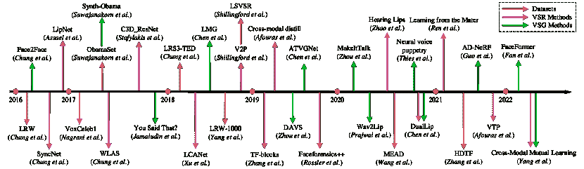
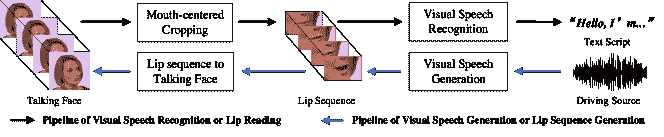
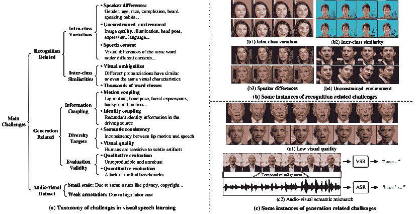
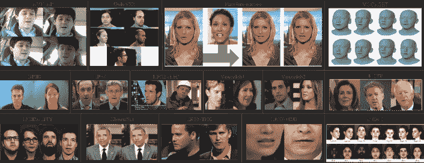
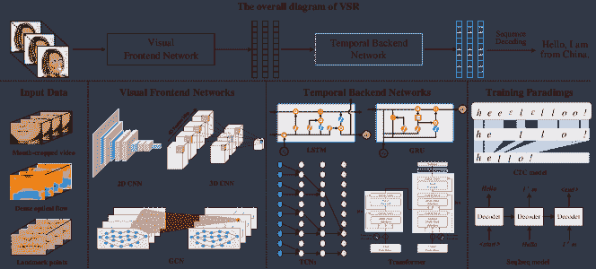
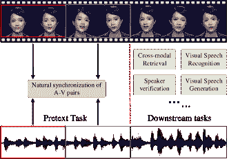
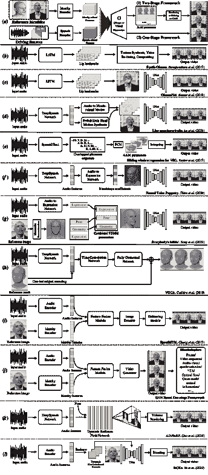

<!--yml

类别：未分类

日期：2024-09-06 19:46:19

-->

# [2205.10839] 深度学习在视觉语音分析中的应用：一项综述

> 来源：[`ar5iv.labs.arxiv.org/html/2205.10839`](https://ar5iv.labs.arxiv.org/html/2205.10839)

# 深度学习在视觉语音分析中的应用：一项综述

Changchong Sheng, Gangyao Kuang, Liang Bai, Chenping Hou, Yulan Guo, Xin Xu, Matti Pietikäinen, 和 Li Liu^∗

###### 摘要

视觉语音，作为语音的视觉领域，由于其广泛应用，如公共安全、医疗治疗、军事防御和影视娱乐，吸引了越来越多的关注。作为一种强大的人工智能策略，深度学习技术极大地推动了视觉语音学习的发展。在过去五年中，已经提出了许多基于深度学习的方法来解决这一领域的各种问题，特别是自动视觉语音识别和生成。为了推动未来视觉语音研究的发展，本文旨在全面回顾深度学习在视觉语音分析中的最新进展。我们涵盖了视觉语音的不同方面，包括基本问题、挑战、基准数据集、现有方法的分类以及最新的性能表现。此外，我们还识别了当前研究中的空白，并讨论了未来研究的有趣方向。

###### 关键词：

深度学习、视觉语音、唇读、语音感知、计算机视觉、计算机图形学

## 1 引言

人类的语音本质上是双模态的：视觉和听觉。视觉语音指的是语音的视觉领域，即在说话时自然产生的嘴唇、舌头、牙齿、下颌等及下半脸其他面部肌肉的运动[1]，而听觉语音指的是说话者发出的声学波形。语音感知本质上是双模态的，这一点在几十年前著名的麦戈克效应[2]中得到了证明，表明人类的语音感知不仅依赖于听觉信息，还依赖于如唇部运动等视觉线索。因此，毫无疑问，视觉语音对人类语音感知有贡献，尤其是对于听力受损或听力困难的人群，或当声学信息受到干扰时。

作为计算机视觉和多媒体领域的一个基础而具有挑战性的课题，自动视觉语音分析（VSA）近年来受到了越来越多的关注，因为它在许多新兴应用中扮演着重要角色。VSA 包含两个基本的、紧密相关且形式对偶的问题：视觉语音识别（VSR）或唇读，视觉语音生成（VSG）或唇部序列生成。由于深度学习的迅猛发展，该领域已经取得了显著的进展。VSA 的典型学术和实际应用包括多模态语音识别和增强、说话人识别和验证 [3]、医疗辅助、安全、法医学、视频压缩、娱乐、人机交互、情感理解 [4, 5] 等。

以一些应用实例为例，在语音识别和增强中，视觉语音可以作为一种补充信号，用于提高当前音频语音识别和分离在各种不利声学条件下的准确性和鲁棒性 [6, 7, 8, 9]。在医疗领域，解决 VSR 任务还可以帮助听力障碍者 [10] 和有声带病变的人。在公共安全中，VSA 可以应用于人脸伪造检测 [11] 和活体检测 [12]。在人机交互中，视觉语音可以作为一种新型的交互信息，提高交互的多样性和鲁棒性 [13, 14]。在娱乐领域，VSG 技术在虚拟游戏中个性化 3D 对话头像生成 [15] 和实现高保真度的照片级真实对话视频生成（如视觉配音）在电影后期制作中扮演着关键角色 [16]。此外，VSR 还可以用于转录档案静默电影。

VSA 的核心在于视觉语音表示学习和序列建模。在传统 VSA 方法主导的时代，视觉语音的浅层表示，如 visemes [17, 18]，口部几何描述符 [19]，线性变换特征 [20]，统计表示 [21]，以及序列建模，如高斯过程动态模型 [22]，隐马尔可夫模型（HMMs） [23]，决策树模型 [24]，在解决 VSA 任务中被广泛使用。自从深度神经网络（DNNs）在图像分类任务中的重大突破 [25] 以来，大多数计算机视觉和自然语言问题都明确关注深度学习方法，包括 VSA。2016 年以来，基于深度学习的 VSA 方法 [26, 27] 远远超越了传统方法，使 VSA 进入了深度学习时代。同时，大规模 VSA 数据集 [27, 28, 29, 30, 31] 的出现促进了基于深度学习的 VSA 研究的进一步发展。本文主要关注基于深度学习的 VSA 方法。图 1 展示了从 2016 年至今 VSA 技术的里程碑，包括代表性的深度 VSR 和 VSG 方法以及相关视听数据集。

图 1：从 2016 年至今视觉语音分析的时间节点，包括代表性的 VSR 和 VSG 方法，以及视听数据集。在 2016 年引入相关深度网络之前，手工特征工程方法主导了 VSA 的发展。

尽管近年来深度学习取得了令人鼓舞的进展，VSA 技术仍处于早期阶段，无法达到足以满足实际应用的水平。这当然不是因为研究人员缺乏努力，因为已有许多优秀的 VSA 工作 [6, 32, 28, 33, 34, 35]。因此，系统回顾该领域的最新发展，识别主要挑战和阻碍进展的开放问题，并定义有前景的未来方向至关重要。然而，VSA 研究的很大一部分仍然相当分散，并且没有这样的系统性综述存在。这激励了本综述，以填补这一空白。

### 1.1 本调查的范围

本次调查的主要目标是提供对当前基于深度学习的 VSA 方法的全面概述，特别是 VSR 和 VSG 及相关应用、主要挑战、基准数据集、方法和前沿成果，同时指出现有的差距和有前景的未来研究方向。

我们综合概述 VSR 和 VSG 主要有三个原因。首先，作为 VSA 中最基础的问题，VSR 和 VSG 涵盖了视觉语音分析的大部分方面。其他与 VSA 相关的任务，如语音增强、说话人验证、面部伪造检测等，可以视为 VSR 和 VSG 的扩展应用。其次，由于 VSR 和 VSG 是形式上的对偶且互相促进，双重学习[36]和生成对抗学习机制[37]在许多现有的 VSA 工作中被广泛采用[32, 38, 39, 40, 41]。因此，我们打算为读者提供一个并列视角，以了解 VSR 和 VSG 的演变。第三，VSR 和 VSG 有共同的核心技术点，如视觉语音表示学习方法和上下文序列建模方法。我们希望这对读者理解这些方法的跨任务可迁移性有所帮助。

### 1.2 与相关综述的不同之处

已经发布了几篇关于 VSA 的综述[42, 43, 44, 45, 46]。然而，它们仅部分地回顾了特定的 VSA 任务。例如，[43, 44, 46]对 VSR 进行了综述，而[42, 45]则关注于 VSG。我们将简要总结相关综述，然后强调我们的新贡献。

在 2014 年，Zhou 等人[46]总结了视觉特征提取在视觉语音识别（VSR）中的三个核心问题：说话者依赖性、头部姿势变化以及时空信息的有效编码。随后，他们从问题解决的角度回顾了主流的视觉特征提取和动态视听语音融合方法，这为读者了解 VSR 的发展带来了新的视角。2015 年，Mattheyses 等人[45]付出了巨大努力，对视听语音合成进行了广泛而全面的概述。我们建议读者参考[45]了解 2015 年前 VSG 的发展历史。由于[45]和[46]对传统 VSR 和 VSG 方法进行了全面的调查，因此本文主要关注由深度学习技术引起的最新进展。Adriana 等人[44]根据识别任务的差异总结了 VSR 数据集，并回顾了传统和基于深度学习的 VSR 方法。他们主要关注现有数据集，以及对每个数据集上不同识别任务的 VSR 方法的分析。然而，[44]中的研究主要集中在 2018 年之前的工作，而最近的显著成功并未涵盖。最近，Fenghour 等人[43]进行了一项调查，回顾了深度学习驱动的 VSR 方法，包括视听数据集、特征提取、分类网络和分类方案。然而，一些重要的 VSR 进展被遗漏了，例如自监督学习方法[47, 48, 49, 50]，跨模态知识蒸馏方法[51, 52, 34]，图神经网络骨干架构[53, 54]，等等。Chen 等人[42]对几种具有代表性的独立于身份的 VSG 方法进行了深思熟虑的分析，并设计了一个 VSG 性能评估基准。然而，他们的核心贡献是明确的评估标准，而非对 VSG 方法的全面讨论和概述。

现在我们来总结本文的主要贡献。

+   $\bullet$

    据我们所知，这篇文章是*首篇*系统性和全面评审深度学习方法在视觉语音分析中的应用的调查论文，涵盖了两个基本问题，即视觉语音识别和视觉语音生成。

+   $\bullet$

    对每个问题进行了问题定义、主要挑战、基准数据集和测试协议的总结，并且特别地，还确定了不同 VSA 问题之间的关系。

+   $\bullet$

    我们提出了一种分类法来对突出的方法进行分组。此外，还分析了代表性方法的性能比较、优点和缺点及其潜在联系。

+   $\bullet$

    本领域的开放问题和有前景的方向已被提供。

本文的剩余部分结构如下。VSA 的问题定义和主要挑战在第二部分中总结。在第三部分中，我们回顾了音频-视觉数据集和评价指标，并从多个角度比较数据集属性。第四部分阐述了 VSR 的一般框架和代表性方法。第五部分提供了现有 VSG 方法的全面调查。第二部分中的图示了 VSR 和 VSG 方法的分类。在第六部分中，我们总结了本文并讨论了未来可能有前景的研究方向。

<svg height="372.16" overflow="visible" version="1.1" width="763.86"><g transform="translate(0,372.16) matrix(1 0 0 -1 0 0) translate(15.47,0) translate(0,122.61)" fill="#000000" stroke="#000000"><g stroke-width="0.4pt"><g transform="matrix(1.0 0.0 0.0 1.0 -11.78 238.18)" fill="#000000" stroke="#000000"><foreignobject width="156.91" height="9.84" transform="matrix(1 0 0 -1 0 16.6)" overflow="visible">视觉语音中的深度学习</foreignobject></g><g transform="matrix(1.0 0.0 0.0 1.0 19.71 224)" fill="#000000" stroke="#000000"><foreignobject width="187.78" height="11.07" transform="matrix(1 0 0 -1 0 16.6)" overflow="visible">视觉语音识别（第四部分）</foreignobject></g><g transform="matrix(1.0 0.0 0.0 1.0 51.21 209.83)" fill="#000000" stroke="#000000"><foreignobject width="172.47" height="11.07" transform="matrix(1 0 0 -1 0 16.6)" overflow="visible">主干网络架构（第 4.2 节）</foreignobject></g><g transform="matrix(1.0 0.0 0.0 1.0 82.71 195.66)" fill="#000000" stroke="#000000"><foreignobject width="177.23" height="11.07" transform="matrix(1 0 0 -1 0 16.6)" overflow="visible">视觉前端网络（第 4.2.1 节）</foreignobject></g><g transform="matrix(1.0 0.0 0.0 1.0 114.2 185.53)" fill="#000000" stroke="#000000"><foreignobject width="630.8" height="20.32" transform="matrix(1 0 0 -1 0 16.6)" overflow="visible">基于 CNN 的：VGG [27]，ResNet [55]，STCNN [56]…</foreignobject></g><g transform="matrix(1.0 0.0 0.0 1.0 114.2 167.31)" fill="#000000" stroke="#000000"><foreignobject width="431.51" height="11.07" transform="matrix(1 0 0 -1 0 16.6)" overflow="visible">基于 GCN 的：STGCN [53]，ASST-GCN [54]</foreignobject></g><g transform="matrix(1.0 0.0 0.0 1.0 114.2 153.14)" fill="#000000" stroke="#000000"><foreignobject width="260.38" height="11.07" transform="matrix(1 0 0 -1 0 16.6)" overflow="visible">基于 Transformer 的：VTP [57]</foreignobject></g><g transform="matrix(1.0 0.0 0.0 1.0 82.71 138.97)" fill="#000000" stroke="#000000"><foreignobject width="191.01" height="11.07" transform="matrix(1 0 0 -1 0 16.6)" overflow="visible">时间后端网络（第 4.2.2 节）</foreignobject></g><g transform="matrix(1.0 0.0 0.0 1.0 114.2 124.79)" fill="#000000" stroke="#000000"><foreignobject width="359.77" height="11.07" transform="matrix(1 0 0 -1 0 16.6)" overflow="visible">基于 RNN 的：BiLSTM，BiGRU，BiConvLSTM [58]</foreignobject></g><g transform="matrix(1.0 0.0 0.0 1.0 114.2 110.62)" fill="#000000" stroke="#000000"><foreignobject width="501.32" height="11.07" transform="matrix(1 0 0 -1 0 16.6)" overflow="visible">基于 TCN 的：MST-TCN [59]，DS-TCN [60]</foreignobject></g><g transform="matrix(1.0 0.0 0.0 1.0 114.2 96.45)" fill="#000000" stroke="#000000"><foreignobject width="512.15" height="11.07" transform="matrix(1 0 0 -1 0 16.6)" overflow="visible">基于 Transformer 的：Transformer [6]，TF-blocks [61]…</foreignobject></g><g transform="matrix(1.0 0.0 0.0 1.0 51.21 82.27)" fill="#000000" stroke="#000000"><foreignobject width="157.24" height="11.07" transform="matrix(1 0 0 -1 0 16.6)" overflow="visible">学习范式（第 4.3 节）</foreignobject></g><g transform="matrix(1.0 0.0 0.0 1.0 82.71 68.1)" fill="#000000" stroke="#000000"><foreignobject width="154.17" height="11.07" transform="matrix(1 0 0 -1 0 16.6)" overflow="visible">监督学习（第 4.3.1 节）</foreignobject></g><g transform="matrix(1.0 0.0 0.0 1.0 114.2 53.93)" fill="#000000" stroke="#000000"><foreignobject width="429.31" height="11.07" transform="matrix(1 0 0 -1 0 16.6)" overflow="visible">基于 CTC 的：TM-CTC [6]，LCANet [62]</foreignobject></g><g transform="matrix(1.0 0.0 0.0 1.0 114.2 39.75)" fill="#000000" stroke="#000000"><foreignobject width="437.7" height="11.07" transform="matrix(1 0 0 -1 0 16.6)" overflow="visible">基于 seq2seq 的：WAS [28]，TM-seq2seq [6]</foreignobject></g><g transform="matrix(1.0 0.0 0.0 1.0 114.2 25.58)" fill="#000000" stroke="#000000"><foreignobject width="459.07" height="11.07" transform="matrix(1 0 0 -1 0 16.6)" overflow="visible">基于 KD 的：self-KD [52]，cross-modal KD [63]</foreignobject></g><g transform="matrix(1.0 0.0 0.0 1.0 82.71 11.41)" fill="#000000" stroke

图 2：代表性的视觉语音识别和生成方法的分类。

## 2 背景

图 3：视觉语音分析的两个形式对偶的基本问题。上部：视觉语音识别或唇读；下部：视觉语音生成或唇部序列生成。

### 2.1 问题

视觉语音分析可以分为两个基本问题：识别和生成。如图 3 所示，这两个问题是形式上的对偶，并具有相反的处理流程。

视觉语音识别（VSR），也称为自动唇读，涉及设计算法以根据说话者的口型推断文本内容。给定一个说话面部视频，VSR 系统首先裁剪视频并获得以嘴部为中心的裁剪视频。然后，它将裁剪的视频解码成特定类型的文本（词语、短语或句子）。根据识别目标，VSR 主要包括两种类型：词级和句子级。词级 VSR 旨在将输入视频分类到预定义词汇类别之一，而句子级 VSR 尝试从输入视频中预测连续的句子。更具体地说，VSR 系统主要由两个子问题组成：视觉语音表示学习和识别。由于即使是最好的识别器在差的视觉语音特征上也会表现不佳，因此提取具有辨别性的视觉语音特征显得相对更为重要。

作为 VSR 的对偶任务，视觉语音生成（VSG）的目标是合成一个与驱动源（例如一段参考音频或文本）和目标身份对应的真实感、高质量的对话视频。具体而言，VSG 系统首先从驱动源中提取语音表示，然后将学习到的语音表示与目标身份融合，以输出连续的对话帧。从学习目标的角度来看，VSG 的目标比 VSR 更具主观性和多样性，使得 VSG 成为比 VSR 更具挑战性的问题。

图 4：视觉语音分析的主要挑战。（a）主要挑战的分类。（b）不同挑战的一些实际示例。（b1）上面和下面的线分别是“wind”这个词在不同语境下的不同视觉动态；（b2）上面的视频实例指的是“place”这个词，而下面的视频指的是“please”这个词。然而，它们的视觉动态非常相似；（b3）两个人分别说“after”这个词，嘴唇动作有明显差异；（b4）说话者在说话过程中头部姿态的实时变化示例。

### 2.2 主要挑战

表 I：常用视听数据集的统计信息。

| 数据集名称 | #小时 | #词汇 | #发言 | #受试者 |
| --- | --- | --- | --- | --- |

&#124; 图像大小 &#124;

&#124; FPS &#124;

| 环境 | 数据类型 | 年份 | 亮点 | 下载链接 |
| --- | --- | --- | --- | --- |
| AVICAR [75] | $\sim$33 |

&#124; $26^{\dagger}$ &#124;

&#124; $13^{\ddagger}$ &#124;

&#124; 1317 &#124;

| 59k | 86 |
| --- | --- |

&#124; 720×480 &#124;

&#124; 30 &#124;

| 汽车驾驶 |
| --- |

&#124; 4 视角面部- &#124;

&#124; 居中视频 &#124;

| 2004 |
| --- |

&#124; 在车载环境中记录，含各种噪声 &#124;

&#124; 条件；包含四种脚本：孤立数字， &#124;

&#124; 孤立字母、电话号码和句子 &#124;

| [76] |
| --- |
| GRID [77] | $\sim$28 | 51 | 33k | 33 |

&#124; 720×576 &#124;

&#124; 25 &#124;

| 实验室控制 |
| --- |

&#124; 3 秒面部- &#124;

&#124; 居中视频 &#124;

| 2006 |
| --- |

&#124; 每句包含六词序列 &#124;

&#124; 特定形式 &#124;

| [78] |
| --- |
| 模态 [79] | $\sim$31 | 182 | 5880 | 35 |

&#124; 1920×1080 &#124;

&#124; 100 &#124;

| 实验室控制 |
| --- |

&#124; 立体感 &#124;

&#124; RGB-D 面部- &#124;

&#124; 居中视频 &#124;

| 2015 |
| --- |

&#124; 命令类句子；高分辨率，含 &#124;

&#124; 噪声条件变化 &#124;

| [80] |
| --- |
| OuluVS2 [81] | $\sim$2 | 不适用 | 2120 | 53 |

&#124; 1920×1080 &#124;

&#124; 30 &#124;

| 实验室控制 |
| --- |

&#124; 5 视角面部- &#124;

&#124; 居中视频 &#124;

| 2015 |
| --- |

&#124; 三种发言类型；高录音质量； &#124;

&#124; 从 0 到 90 度的五个视角 &#124;

| [82] |
| --- |
| IBM AV-ASR [83] | $\sim$40 | $\sim$10.4k | 不适用 | 262 |

&#124; 704×480 &#124;

&#124; 30 &#124;

| 实验室控制 |
| --- |

&#124; 面部中心 &#124;

&#124; 视频 &#124;

| 2015 |
| --- |

&#124; 大词汇量；在干净、录音室环境中记录 &#124;

&#124; 条件 &#124;

| 未公开 |
| --- |
| LRW [27] | $\sim$111 | 500 | $\sim$539K | 1k+ |

&#124; 256×256 &#124;

&#124; 25 &#124;

| 在野外 |
| --- |

&#124; 1.2 秒面部- &#124;

&#124; 居中视频 &#124;

| 2016 |
| --- |

&#124; 从英国电视节目中收集； &#124;

&#124; 每个视频对应一个词汇类别 &#124;

| [84] |
| --- |
| LRS2-BBC [6] | $\sim$225 | $\sim$62.8k | $\sim$144.5k | 1k+ |

&#124; 160×160 &#124;

&#124; 25 &#124;

| 在野外 |
| --- |

&#124; 面部中心 &#124;

&#124; 视频 &#124;

| 2017 |
| --- |

&#124; 从英国电视中收集；大规模； &#124;

&#124; 开放世界；句子级唇读 &#124;

| [85] |
| --- |
| VoxCeleb1 [30] | $\sim$352 | 不适用 | $\sim$153.5k | 1k+ | 不适用 | 在野外 |

&#124; 公共 YouTube &#124;

&#124; 视频 &#124;

| 2017 |
| --- |

&#124; 大规模；在野外；主要用于发言人 &#124;

&#124; 识别与验证 &#124;

| [86] |
| --- |
| ObamaSet [87] | $\sim$14 | 不适用 | 不适用 | 1 | 不适用 | 在野外 |

&#124; 公共 YouTube &#124;

&#124; 视频 &#124;

| 2017 |
| --- |

&#124; 重点关注奥巴马；从奥巴马的 &#124;

&#124; 每周总统讲话；高质量 &#124;

| [88] |
| --- |
| LRS3-TED [89] | $\sim$475 | $\sim$71.1k | $\sim$151.8k | 5k+ |

&#124; 224×224 &#124;

&#124; 25 &#124;

| 野外场景 |
| --- |

&#124; 面部中心 &#124;

&#124; 视频 &#124;

| 2018 |
| --- |

&#124; 更大规模；以及相应的 &#124;

&#124; 字幕和词对齐边界 &#124;

| [90] |
| --- |
| VoxCeleb2 [29] | $\sim$2.4k | 不适用 | $\sim$1.1m | 6k+ | 不适用 | 野外场景 |

&#124; 公共 YouTube &#124;

&#124; 视频 &#124;

| 2018 |
| --- |

&#124; 显著更大规模；广泛的不同 &#124;

&#124; 民族、口音、职业和年龄 &#124;

| [91] |
| --- |
| LSVSR [92] | $\sim$3.9k | $\sim$127k | $\sim$2.9m | 不适用 | 不适用 | 野外场景 |

&#124; 面部中心 &#124;

&#124; 视频 &#124;

| 2018 |
| --- |

&#124; 现有最大规模的视觉语音识别 &#124;

&#124; 数据集；从公共 YouTube 视频中提取 &#124;

| 不公开 |
| --- |
| LRW-1000 [31] | $\sim$57 | 1k | $\sim$718K | 2k+ | 不适用 | 野外场景 |

&#124; 口部中心 &#124;

&#124; 视频 &#124;

| 2019 |
| --- |

&#124; 第一个大规模普通话音视频数据集 &#124;

&#124; 语音数据集；从电视节目中收集 &#124;

| [93] |
| --- |
| Faceforensics++ [94] | $\sim$5.7 | 不适用 | $\sim$1k | 1k | 不适用 | 野外场景 |

&#124; 操作过的 &#124;

&#124; 对话视频 &#124;

| 2019 | 常用于面部伪造检测。 | [95] |
| --- | --- | --- |
| VOCASET [69] | 不适用 | 不适用 | 255 | 12 |

&#124; 5023 个顶点 &#124;

&#124; 60 &#124;

| 实验室控制 |
| --- |

&#124; 3D 面部 &#124;

&#124; 网格 &#124;

| 2019 |
| --- |

&#124; 更高质量的 3D 扫描以及对齐 &#124;

&#124; 整个头部 &#124;

| [96] |
| --- |
| MEAD [97] | $\sim$39 | 不适用 | 不适用 | 60 |

&#124; 1920×1080 &#124;

&#124; 30 &#124;

| 实验室控制 |
| --- |

&#124; 7 视角面部- &#124;

&#124; 中心视频 &#124;

| 2020 | 多视角情感音视频数据集 | [98] |
| --- | --- | --- |
| HDTF [68] | $\sim$15.8 | 不适用 | 10k+ | 300+ | 不适用 | 野外场景 |

&#124; 面部中心 &#124;

&#124; 视频 &#124;

| 2021 |
| --- |

&#124; 比之前野外场景中的视频分辨率更高 &#124;

&#124; 数据集 &#124;

| [99] |
| --- |

+   1

    $\dagger$: 字母，$\ddagger$: 数字。

尽管经过多年的发展，大多数视觉语音分析（VSA）方法由于各种挑战未能满足实际需求。如图 4（a）所示，为了系统地呈现 VSA 中的挑战，我们将主要困难分类为与识别相关的和与生成相关的，并讨论音视频数据集的挑战。在图 4（b）&（c）中，我们提供了一些典型挑战的实例，以便直观理解。

#### 2.2.1 识别相关挑战

从表示学习的角度来看，视觉语音识别的理想是提取具有强区分性和鲁棒性的语音相关特征。然而，这两个目标都面临着严重的实际挑战。识别相关挑战主要源于（1）类内变化的广泛范围和（2）类间相似性。

类内变化可以分为两种类型：视觉语音固有因素和其他与识别无关的因素。就视觉语音固有因素而言，如图 4(b1)所示，由于不同的语境、连续阅读、语音情感变化、语速等，一个词可以产生非常不同的视觉动态。同时，许多与语音无关的干扰信息对视觉语音识别产生了显著影响，如说话者差异、头部姿势变化、面部表情、成像条件等。如图 4(b3)所示，尽管两位说话者说的是相同的词“after”，他们的唇部动作看起来却不同。早期的视觉语音识别研究仅考虑了实验室环境中的正面讲述面部视频，限制了其在实际应用中的可用性。如今，野外的视觉语音识别引起了越来越多的关注，许多音视频数据集来自各种现实场景（如电视新闻、公共演讲视频等）。图 4(b4)展示了来自 LRS3 数据集的一个示例视频，其中一位说话者的头部姿势变化非常剧烈。在不受约束的环境下，排除这些无关运动信息的干扰非常困难。除了头部姿势变化，光照、噪声干扰、分辨率低等也给视觉语音识别带来了很大的困难。

除了类内变化，视觉语音识别还受到类间相似性的影响。正如我们所知，音位是语言中最小的可识别声音单位，用于区分单词。类似地，视音位是视觉语音中最小的可识别单位。视音位的数量远小于音位。在英语中，视音位的数量约为音位的三分之一。因此，几个音位对应到少数几个视音位。一些音位，如[p]和[b]，[k]和[g]，[t]和[d]等，具有几乎相同的视觉特征，因此在视觉领域不考虑上下文的情况下几乎无法区分。我们将这种现象定义为视觉模糊，这是类间相似性的主要原因。图 4(b2)展示了一个单词级视觉模糊的实例。类间相似性的另一个挑战来自于成千上万的词类。不同词类中的细微差别（例如词的不同形式）使得问题更加复杂。

#### 2.2.2 生成相关的挑战

与视觉语音识别不同，视觉语音生成不仅需要与语音相关的信息，还需要与身份相关的信息。如图 4(a)所示，生成相关的挑战主要来自于（1）信息耦合，（2）多样性目标，以及（3）评估有效性。

一段带有对话的面部视频包含多种耦合信息，例如各种与运动相关的信息和与身份相关的信息。对于运动耦合来说，在对话面部视频中发生的运动可以分为两种类型：内在运动（头部姿势、面部表情、嘴唇运动等）和外在运动（相机运动、背景运动等）。所有这些不同的运动都是高度耦合的。运动耦合的挑战不仅在于将嘴唇运动与所有这些与语音无关的运动分离开来，还在于将合成的嘴唇序列与给定的身份图像进行整合。视觉语音生成的另一个耦合问题是身份耦合。如图 4(c1) 所示，人们在观察这些图像时可能会感到毛骨悚然和不适，因为生成的面部身份被微妙地改变了。这种现象，也被称为“恐怖谷效应” [100]，发生在当人们观察一个几乎像人的合成面孔时，但却不完美。通常，驱动源包含了丰富的源身份信息。因此，关键挑战在于如何从驱动源中去除身份信息，以避免在目标身份合成过程中出现污染。此外，大多数现有的方法只能适应特定的目标身份，因为不同的发言者在外貌、说话习惯等方面存在显著差异。因此，身份泛化的缺乏也是一个重要的挑战。

语义一致性和视觉质量是优秀视觉语音生成（VSG）方法最期望的特性。语义一致性表示合成的嘴唇序列应与驱动源在同步和语音一致性方面保持一致。如图 4(c2) 所示，语义一致性主要涉及两个要求：时间对齐和语音匹配。然而，由于不同数据模态在时间分辨率和语音特征上的固有差异，实现驱动源与生成对话视频之间的同步语音映射是困难的。至于视觉质量，有两个难点：（1）由于生成的嘴唇运动序列的保真度和视觉质量难以定量定义，因此缺乏明确的训练目标。（2）由于人类对细微的伪影非常敏感，将生成的嘴唇序列无误地整合到整个面部中而不产生以人为主的感知错误是一个复杂的问题。

除了上述困难之外，高效评估视觉语音生成方法是另一个挑战。现有的评估，包括定性和定量指标，存在许多局限性。例如，像用户研究这样的定性指标是不可重复的和不稳定的。至于定量指标，尽管有十几种评估指标，但其中一些并不合适，甚至相互矛盾。

#### 2.2.3 数据集相关挑战

除了上述以问题为导向的困难和挑战之外，音视频数据集相关的问题也对视觉语音分析（VSA）的进展产生了显著影响。由于目前大多数深度学习方法都是数据驱动的，因此数据集的重要性不言而喻。然而，现有的音视频数据集由于隐私保护和高劳动成本而遭受规模小和标注薄弱的问题。一个潜在的研究方向是基于未标注的音视频数据实现跨模态自监督视觉语音学习[50, 101, 49]。尽管如此，数据集规模限制的问题仍然有待解决。

图 5：来自 AVICAR、OuluVS2、Faceforensics++、GRID、LRW、LRS2-BBC、VoxCeleb1、VoxCeleb2、MODALITY、ObamaSet、LRS3-TED、LRW-1000、VOCASET、HDTF、MEAD 的一些示例图像。有关这些数据集的总结，请参见表 I。

## 3 数据集与评估指标

数据集在视觉语音研究的历史中扮演了重要角色，特别是在大数据时代。首先，基准数据集作为一个共同的平台，用于测量和比较竞争的 VSA 算法的性能；其次，作为典型的数据驱动学习策略，深度学习技术在许多音视频学习任务中取得了显著进展。值得注意的是，大量标注数据在其成功中发挥了至关重要的作用；第三，数据集还进一步推动了该领域向越来越复杂和具有挑战性的问题发展。因此，在本节中，我们首先回顾现有的常用 VSA 数据集，包括其动机、统计信息、亮点以及下载链接，然后介绍不同任务的评估指标，最后讨论音视频数据集的未来趋势。

### 3.1 数据集

有几十个常用的视听数据集是为 VSA（视觉语音分析）构建的。统计数据、亮点和下载链接汇总在表格 I 中，一些选定的样本图像展示在图 5 中。我们将这些数据集分为两种类型：受控环境和非受控环境。接下来，我们将简要介绍它们。

#### 3.1.1 受控环境下的数据集

从表格 I 中可以看出，在 2015 年之前，视觉语音研究主要集中在受控环境中。可控因素包括录音条件、设备、数据类型、脚本等。这些数据集为视觉语音研究提供了极好的基础。接下来，我们将回顾一些在受控环境下收集的代表性视听数据集。

AVICAR [75] 是在汽车驾驶环境中录制的最具代表性的公共视听数据集。如前所述，视觉语音可以有助于基于音频的语音识别，特别是在嘈杂环境中。受到此激励，AVICAR 被收集用于建模驾驶汽车中的双模态语音，因为汽车驾驶是典型的噪声环境。

GRID [77] 包含 34 位说话者说出 1,000 个语法上相同的短语的高质量音频和视频录音，旨在进行全面的视听感知分析和微观建模。除了语音识别外，它还可以支持视听语音分离任务。

MODALITY [79] 包含 31 小时的录音，旨在测试视听语音识别（AVSR）系统的鲁棒性。与其他数据集的不同之处在于，其语料库包括来自 RGB-D 摄像头的高分辨率、高帧率立体视频流。

OuluVS2 [81] 是一个用于非刚性口腔运动分析的多视角视听数据集。它包括 53 位说话者发出三种类型的语句。此外，它是从五个不同视角记录的，视角跨度从正面到侧面。多个视角的说话口腔模拟了真实世界的情况，因为用户在讲话时可能并不总是面对摄像机。

IBM AV-ASR [83] 是一个包含 262 位说话者在清洁、录音室环境中录制的 40 小时视听记录的大型语料库。与之前的受控环境数据集相比，它在词汇量和说话者数量上具有显著优势。然而，该数据集并未公开提供。

VOCASET [69] 是一个带有约 29 分钟 4D 人脸扫描和同步音频的人脸数据集，其中包括 12 位演讲者（6 位女性和 6 位男性）的数据，这些 4D 人脸扫描是以 60fps 的速度录制的。作为高质量的 4D 人脸音视频数据集的代表，VOCASET 极大地推进了 3D VSG 的研究。

MEAD [97]，即 Multi-view Emotional Audio-visual Dataset，是一个大规模、高质量的情感音视频数据集。与之前的数据集不同，它关注的是自然情感对话人脸生成，并考虑了多种情感状态（三个强度水平的八种不同情感）。

#### 3.1.2 无控制环境下的数据集

最近，研究人员逐渐将重点转向野外环境下的视觉语音学习。为了推动研究，人们构建了许多大规模的野外音视频数据集。下面介绍一些在野外环境下收集的音视频数据集。

LRW [27] 是一个由多阶段数据自动采集流程构建的字级别音视频数据集。它从 BBC 电视节目的丰富数据量中革命性地扩大了数据规模和说话人数量。该数据集包含了超过一千人讲述的一百万个词语实例。LRW 的主要目标是测试无关说话人的字级别唇读方法。

LRS2-BBC [6] 是一个句子级别的音视频数据集，具有与 LRW 数据集相似的数据收集流程和数据来源。它是为了句子级别的唇读而构建的，这是一个比字级别唇读更具挑战性的 VSR 问题。LRS2-BBC 中的所有视频都是从 BBC 节目中收集的，它包含了约 14.45 万个话语，词汇量约为 6.28 万。

VoxCeleb1 [30]是一个从开源 YouTube 媒体中收集的大规模无文本依赖的音视频数据集。它包含了 1251 位名人的超过 10 万个话语。虽然它主要用于说话人识别，但也可以用于 VSG。

ObamaSet [87] 是一个专注于对美国前总统巴拉克·奥巴马进行视觉演讲分析的特定音视频数据集。所有视频样本均从他的周播视频中收集而来。与之前的数据集不同，它仅关注巴拉克·奥巴马，并不提供任何人类注释。因此，它只用于面向奥巴马的 VSG。

LRS3-TED [89]是一个大规模的句子级音视频数据集。与 LRS2-TED 相比，它在持续时间、词汇量和演讲者数量方面规模更大。它由来自于 400 多小时 TED 和 TEDx 视频的说话面部视频、相应的字幕和单词对齐边界组成。此外，在现有公开可用的英文音视频数据集中，它是最大的。

VoxCeleb2 [29] 是 VoxCeleb1 的高级版本，扩展了民族多样性。在 VoxCeleb2 中，VoxCeleb1 数据集被重新用于作为说话人验证的测试集。此外，它目前是最大的公开音视频数据集。

LSVSR [92] 是现存最大的视频语音识别数据集，由文本和面孔说话的视频片段对组成（3886 小时的视频）。这些视频来自公共 YouTube 视频。但遗憾的是，由于许可限制，该数据集不可公开获取。

LRW-1000 [31] 是最大的字级中文普通话音视频数据集。它包含 1k 个词汇类别，共有 718,018 个样本，来自 2000 多位个体发言者。每个类别对应一个普通话词汇的音节，该词汇由一个或多个汉字组成。所有视频均来自中国电视台的电视节目。

Faceforensics++ [94] 是一个用于面部操控检测的自动化基准。不同于现有的音视频数据集，所有视频都基于 DeepFakes [102]、Face2Face [103]、FaceSwap [104]、NeuralTextures [105] 这些面部操控方法进行过操作。它通常用于测试伪造视频检测方法。

HDTF [68] 是一个大规模的真实环境音视频数据集，用于生成对话面孔。它包含约 362 个不同的高分辨率视频，均从网上收集。由于原始视频的高质量，裁剪后的以面孔为中心的视频视觉质量也比之前的数据集如 LRW 和 LRS2-BBC 要高。

除了表格 I 中列出的数据集外，还有几个录制了不同语言的音视频数据集。例如，西班牙语数据集 VLRF [106]，澳大利亚英语数据集 [107]，俄语数据集 HAVRUS [108]等也推动了对各种语言 VSA 的研究。

考虑到数据集在 VSA 中的关键作用，我们将总结和讨论数据集，以帮助读者了解 VSA 的发展。与早期的视听数据集相比，近期的数据集在受试者数量、数据集规模、录制条件和脚本多样性、数据质量等方面都有所改进。由于隐私保护法律（例如欧洲联盟的一般数据保护条例（GDPR）），一些现有的大规模数据集[83，92]无法公开获取。一个直观的解决方案是自动从在线媒体（如 Youtube、BBC 或其他在线电视节目）收集可用数据。然而，现有的视听数据自动收集算法可能会导致大量低质量数据。因此，优化的自动收集算法对未来的 VSA 数据集至关重要。

图 6：VSR 的整体图以及各种视觉前端网络、时间骨干网络和训练范式。

### 3.2 评估指标

#### 3.2.1 VSR 上的评估指标

词级 VSR 任务本质上是一个多类分类问题。因此，由于其简单性和效率，分类准确率是分类模型最常用的评估指标。此外，$Top-k$准确率，即实际类别与分类模型预测的$k$个最可能类别中的任何一个相等的标准准确率，也在 VSR 中广泛使用。

对于句子级任务，字符错误率（CER）和词错误率（WER）[109]，也称为平均字符级和词级编辑距离，是最常用的评估指标。CER 的定义为${\rm CER}=(S+D+I)/N$，其中$S$、$D$和$I$分别是将参考文本转化为假设文本所需的替换、删除和插入的数量，$N$是参考文本中的字符数。这个指标在预测字符串与实际值相似时会赋予较小的惩罚。例如，如果实际值是“about”，模型预测是“above”，则${\rm CER}=0.4$。WER 和 CER 的计算方法相同，区别在于公式应用于字符级还是词级。此外，BLEU[110]，一种修改后的 n-gram 精度，用于将候选句子与一个或多个参考句子进行比较，有时也会被采用。

#### 3.2.2 VSG 上的评估指标

对 VSG 的适当评估仍然是一个未解的问题，许多最近的研究探讨了 VSG 上的各种评估指标。我们根据三个学习目标对这些指标进行了分类，即身份保留、视觉质量、视听语义一致性。

身份保留。VSG 的一个重要目标是尽可能地保留目标身份，因为人类对合成视频中细微的外观变化非常敏感。由于身份是一个语义概念，直接评估是不切实际的。为了评估生成的视频在多大程度上保留了目标身份，现有工作通常使用生成的视频帧与真实图像之间的嵌入距离来衡量身份保留性能。例如，Vougioukas 等人[40]采用了平均内容距离（ACD）[111]来测量目标图像表示的平均欧几里得距离，该表示是使用 OpenFace[112]获得的，并与生成帧的表示进行比较。此外，Zakharov 等人[113]使用 ArcFace 网络[114]的嵌入向量之间的余弦相似度来测量身份不匹配。

视觉质量。要评估合成视频帧的质量，重建误差测量（例如，均方误差）是一种自然的评估方式。然而，重建误差仅关注像素级对齐，而忽略了整体视觉质量。因此，现有工作通常采用峰值信噪比（PSNR）和结构相似性指数测量（SSIM）来评估生成帧的整体视觉质量。最近，Prajwal 等人[38]引入了 Fr${\rm\acute{e}}$chet Inception Distance（FID）来测量合成数据和真实数据分布之间的距离，因为 FID 与人类感知评估更加一致。此外，累积概率模糊检测（CPBD）[115]，一种无参考度量，也被广泛用于评估视频生成过程中的清晰度损失。

视听语义一致性。生成视频和驱动源的语义一致性主要包含视听同步和语音一致性。对于视听同步，Landmark Distance（LMD）[116]计算合成视频帧与真实帧之间的唇部区域地标的欧几里得距离。另一个同步评估指标是使用预训练的音频到视频同步网络[48]来预测生成帧与真实帧之间的偏移量。对于语音一致性，Chen 等人[42]提出了一种唇同步评估指标，即唇读相似度距离（LRSD），它测量由唇读网络获得的语义级别语音嵌入的欧几里得距离。为了更好地评估语音一致性，还使用生成帧与真实帧的唇读结果（准确率、CER 或 WER）比较作为一致性评估指标。

除了上述客观指标，主观指标如用户研究在 VSG 中也被广泛使用。

## 视觉语音识别

### 4.1 总体框架

视觉语音识别（VSR），也称为唇读，旨在从发言者的嘴部动作中解码语音。VSR 的一个重要预处理步骤是嘴部中心感兴趣区域（ROI）的裁剪。一个讲话面孔视频包含大量与 VSR 任务无关的冗余信息（如姿势、光照、性别、肤色等）。为了减少冗余信息，有必要从原始输入视频中裁剪出嘴部中心的视频。然而，定义嘴部中心 ROI 的大小仍然是一个未解问题。Koumparoulis 等人[117]证明了 ROI 的选择会显著影响最终的识别性能，但仍无法确定最佳 ROI。

如图 6 所示，一个 VSR 系统通常包含三个子模块。第一个子模块是视觉特征提取，旨在从嘴部裁剪的视频中提取紧凑而有效的视觉特征向量。然后，第二个子模块是时间上下文聚合，旨在聚合时间上下文信息，以便更好地解码和识别文本脚本。上述两个子模块也是基于深度学习的 VSR 方法的核心。本文将在 4.2 节中总结和讨论现有的深度网络用于视觉特征提取和时间上下文聚合。最后一个子模块是文本解码，即将特征表示转换为文本。

本节的其余部分组织如下。4.2 节展示了我们对 VSR 的深度表示学习网络的分类法。接着，我们在 4.3 节中回顾并讨论了各种 VSR（监督学习和无监督学习）的视觉语音表示学习范式。4.4 节为读者提供了一个全面的总结，以了解现有 VSR 方法的进展和局限性。

### 4.2 主干架构

在深度学习时代之前，VSR 的表示学习已经被探索了很长时间。从特征工程的角度来看，传统的特征提取方法可以分为三类：基于外观的、基于形状的和基于运动的[8]。尽管简单且易于解释，但传统的表示学习方法通常效果不好，特别是在非受控环境下。本文主要总结和讨论了深度学习技术驱动的表示学习方法。考虑到深度表示学习与传统特征提取之间的显著差异，我们引入了一种基于两个独立部分的新分类策略：视觉前端网络和时间后端网络。

#### 4.2.1 视觉前端网络

如图 6 所示，主要有三种输入数据类型：以嘴部为中心的视频、密集光流和标志点。其中，嘴部为中心的视频和密集光流是规则网格数据，因此 CNN 是最适合且最常用的骨干架构。另一方面，由于标志点是非规则数据，一些现有的工作[118、53、54]采用了图卷积网络（GCNs）来从标志点中提取视觉特征。接下来，我们回顾这些骨干架构。

表 II：各种视觉前端网络架构和时间后端网络架构的优缺点。

| 架构 | 可用输入 | 优势 | 劣势 |
| --- | --- | --- | --- |
| 2D CNNs | 嘴部视频 | 高内存/时间效率 | 捕捉时间关联性差 |
| 3D CNNs | 嘴部视频 / 光流 | 强大的短期时空建模能力 | 高内存/时间成本 |
| 3D + 2D CNNs | 嘴部视频 / 光流 | 高内存/时间效率；强区分能力 | 不擅长捕捉细微的唇部动态 |
| Visual transformers | 嘴部视频 | 高鲁棒性；强区分能力 | 高内存/时间成本 |
| GCNs | 嘴唇标志点 | 高计算效率；语义保留 | 精度低；鲁棒性差 |
| RNNs | 视觉特征 | 相对较好的泛化能力 | 短期依赖；串行计算 |
| Transformers | 视觉特征 | 长期依赖；并行计算 | 小数据集上的过拟合；难以收敛 |
| TCNs | 视觉特征 | 适应多尺度模式；高内存效率 | 短期依赖 |

基于 CNN 的架构。CNN 已成为深度学习领域中最常见的架构之一。自从 **AlexNet**[119] 在 2012 年提出以来，研究人员发明了多种更深、更宽、更轻的 CNN 模型[120]。代表性的 CNN 架构，如 VGG[121], ResNet[122], MobileNet[123], DenseNet[124], ShuffleNet[125] 等，已被广泛应用于 VSR 的视觉表示学习。

**Chung** 等人首次提出了用于单词级 VSR 的端到端深度视觉表示学习[27]。他们基于 VGG-M 主干网络，比较了不同的图像序列输入（Multiple Towers vs. Early Fusion）和时间融合（2D CNNs vs. 3D CNNs）架构，并讨论了它们的优缺点。实验结果显示，2D CNNs 相较于 3D CNNs 显著优越。然而，以上结论并不够严谨，因为消融研究不足，并且单词级 VSR 数据集具有非常短期的依赖性。2017 年，**Assael** 等人[56] 提出了 LipNet，这是第一个端到端句子级 VSR 模型。LipNet 使用三层时空卷积神经网络（STCNN，也称为 3D CNN）提取视觉特征。实验结果确认了使用 STCNN 提取时空特征优于仅聚合空间特征的直觉。考虑到 3D CNNs 更能捕捉口部区域的动态，而 2D CNNs 在时间和内存上更高效，**Stafylakis** 等人[55] 提出了将 3D CNNs 和 2D CNNs 结合用于视觉特征提取。具体来说，提出的视觉主干网络由一个影子 3D CNN 和 2D ResNet 组成。3D CNN 仅有一层用于聚合口部运动的短期时间信息。由于模型的卓越性能，许多 VSR 模型[126, 61, 59, 52, 50] 采用了它作为视觉特征提取的主干网络。最近，**Feng** 等人[127] 通过整合 Squeeze-and-Extract[128] 模块改进了这一架构。除了 VGG 和 ResNet，研究人员还采用了其他代表性的 2D CNN 架构，包括 DenseNet[58], ShuffleNet[52], MobileNet[129] 等。

基于 GCN 的架构。考虑到 CNN 不适用于不规则网格数据，研究人员提出利用图卷积网络（GCNs）从面部标志点中提取视觉特征[130]。刘 等[53] 提出了第一个端到端的 GCN 模型（ST-GCN），通过学习唇部标志点及其关系来提取基于形状的视觉特征。他们首先提出了唇部图连接关系，并基于节点的流形距离定义了图邻接矩阵。然后，他们结合图像特征和形状特征，以提取更具判别性的视觉特征。然而，唇部图连接关系并不存在于自然界中，直观引导的预定义唇部图限制了基于形状特征的表示能力。受此启发，Sheng 等[54] 提出了自适应语义-空间-时间图卷积网络（ASST-GCN）。与[53]不同，ASST-GCN 参数化图连接并自动学习自适应图连接。此外，他们引入了两种图结构，即语义图和空间-时间图，使图参数可以与网络训练中的其他参数一起自适应地学习。现有研究表明，基于图像的特征比基于标志点的特征更具判别性。Sheng 等[54] 总结了这一原因。标志点检测的准确性和坐标分辨率显著影响其特征判别能力。然而，面部标志点检测具有挑战性，尤其是在不受控环境中。由于图像和标志特征之间的互补性，CNN 和 GCN 的结合通常被广泛采用[118, 53, 54]。

基于视觉变换器的架构。受到变换器架构在自然语言处理（NLP）领域显著成功的启发，研究人员最近将变换器应用于计算机视觉（CV）任务[131]。近期，变换器表现出作为 CNN 的潜在替代品。Afouras 等[57] 设计了一种端到端的基于视觉变换器的池化机制，该机制学习跟踪和聚合唇部运动表示。所提出的视觉主干网络可以减少对复杂预处理的需求，提高视觉表示的鲁棒性。消融研究清楚地表明，基于视觉变换器的池化机制显著提升了 VSR 的性能。

基于上述骨干架构，一些研究通过利用双流网络进一步提高视觉表示。例如，Weng 等人[132]成功将双流（原始灰度视频流和稠密光流流）I3D 模型迁移到 VSR，并在词级 VSR 上取得了可比性能。然而，稠密光流和 3D 卷积计算非常耗时，导致特征提取效率低。Wang 等人[58]利用 2D CNN 和 3D CNN 提取帧级空间特征和短期时空特征，然后用自适应掩码融合特征，以获得强大、多层次的视觉特征。

#### 4.2.2 时序后端网络

基于视觉特征构建的时序后端网络旨在进一步聚合上下文信息。在传统的视觉语音识别（VSR）中，常用经典统计模型（如隐马尔可夫模型，HMM）进行时序信息聚合。

基于 RNN 的架构。在深度学习领域，递归神经网络（RNNs）是用于学习序列数据的代表性网络结构。典型的 RNN 结构（如 LSTM 和 GRU）如图 6 所示，其基本结构类似于 HMM，其中观察状态序列之间的依赖关系通过隐藏状态序列的转换进行描述。与 HMM 相比，RNN 由于在隐藏状态转移过程中的非线性转换具有更强的表示能力。双向 RNN（BiRNNs）是基本 RNN 的变体，旨在从先前和未来的时间步聚合上下文信息。许多研究[56, 28, 55, 132, 133, 134, 135, 127, 50]采用基于 RNN（BiLSTM 或 BiGRU）的网络架构作为 VSR 中的时序后端网络。除了上述基本 RNN 结构外，还进行了各种修改[58, 136]以改善 VSR 的特征学习。例如，Wang 等人[58]利用 BiConvLSTM[137]作为时序后端网络。ConvLSTM 是传统全连接 LSTM 的卷积对偶，能够在保留空间信息的同时建模时序依赖。Wang 等人将注意力机制集成到模型中，以进一步改进 BiConvLSTM 架构。

基于 Transformer 的架构。与基于 RNN 的架构相比，Transformers[138]在长期依赖和并行计算方面具有显著优势。然而，transformers 通常也存在一些缺陷。首先，transformers 在小规模数据集上比 RNNs 和 TCNs 更容易过拟合。其次，transformers 在一些特定任务（例如，单词级 VSR 任务）中的短期上下文有限。因此，transformers 更适合于句子级 VSR 任务，而非单词级 VSR 任务。[6]是首个将 transformers 引入 VSR 的工作。基于基本的 transformer 架构，作者提出了两种后端模型：TM-seq2seq 和 TM-CTC。这两种模型的区别在于训练目标。实验清楚地显示，基于 transformer 的后端网络在句子级 VSR 任务中的表现远优于基于 RNN 的后端网络。由于基本的 transformer 对短期依赖没有额外关注，Zhang 等人[61]提出了多个时间焦点块（TF-blocks），帮助特征关注其邻域并捕捉更多短期时间依赖。结果表明，短期依赖在句子级 VSR 中与长期依赖同样重要。

基于 TCN 的架构。在深度序列模型的背景下，RNNs 和 Transformers 对内存和计算能力的需求较高。时间卷积网络（TCNs）是另一种深度序列模型，已经对基本的 TCN 进行了各种改进，使其更适合于 VSR。例如，Afouras 等人[60]使用了深度可分离卷积（DS-TCN）用于句子级 VSR。然而，DS-TCN 的性能不如 transformers，因为基于 TCN 的模型在捕捉长期依赖方面表现较差。为了使时间后端网络能够捕捉多尺度时间模式，Martinez[59]提出了利用多尺度 TCN（MS-TCN）结构，该结构在单词级 LRW 数据集上取得了 SOTA 结果（87.9% Acc）。

表格。II 总结了各种视觉前端网络和时间后端网络的一般优缺点，以及相应视觉前端网络的可用输入。如我们所知，大多数现有的 VSR 模型都源于其他领域使用的一般骨干模型（例如，动作识别[139, 140]、音频语音识别[137]等），而很少有模型是专门为 VSR 设计的。因此，未来应更多关注适应 VSR 特性的特定结构。

### 4.3 学习范式

#### 4.3.1 监督学习用于 VSR

主流的 VSR 任务有两种：词级别和句子级别。前者是从输入视频中识别孤立的词汇（即，谈话面部视频分类），通常使用多分类交叉熵损失进行训练，因为词汇类别数量有限。后者是进行不受约束的句子级序列预测。然而，由于不受约束的词汇类别和视频帧长度，这比词级 VSR 任务复杂得多。

端到端句子级 VSR 任务（句子预测）的有监督学习可以分为两种类型。给定输入序列，第一种类型使用神经网络作为发射模型，该模型输出每个输出符号的可能性（例如，音素、字符、词汇）。这些方法通常使用 HMM 进行第二阶段的解码。这个变体的一个流行版本是扭曲时间分类（CTC）[141]，其中模型预测帧级标签，然后寻找帧级预测与输出序列之间的最佳对齐。CTC 的主要缺点是输出标签之间没有条件关系（它假设每个单元是条件独立的），因此需要作为后处理步骤的语言模型。与基本的 CTC 不同，Xu 等人[62]提出了 LCANet，它将编码的时空特征输入到级联注意力 CTC 解码器中。引入注意力机制改善了 CTC 在隐藏神经层中的条件独立假设缺陷。该方法的另一个假设是它假设输入和输出序列之间的单调排序，这适用于 VSR 但不适用于机器翻译。

第二种类型是序列到序列（seq2seq）模型，这些模型首先读取整个输入序列，然后预测输出句子。一些研究采用了这种方法进行语音识别[142]。Chan 等人[143]提出了一种优雅的 seq2seq 方法，用于将音频信号转录为字符。Seq2seq 模型在时间$t$解码一个输出符号（例如，音素、字符、词汇），该符号基于之前的输出$1,...,t-1$。因此，与基于 CTC 的模型不同，该模型隐式地学习了一个输出符号的语言模型，不需要进一步处理。然而，已有研究[144]表明，在解码 seq2seq 模型时，结合外部语言模型也是有益的。Chung 等人[28]提出了 WAS（Watch, Attend and Spell）模型，这是一种经典的 seq2seq VSR 模型。借助注意力机制，WAS 模型更能捕捉长期依赖关系。

基于 transformer 主干架构，Afouras 等 [6] 深入分析了 CTC 模型和 seq2seq 模型在 VSR 中的优缺点。通常，在句子级别的 VSR 任务中，seq2seq 模型的表现优于 CTC 模型。但 seq2seq 模型需要更多的训练时间和推理时间。此外，CTC 模型在序列长度增加时具有更好的泛化能力和更快的适应速度。

除了上述标签级监督学习范式，特征级监督学习在 VSR 中也得到了广泛探索。知识蒸馏 [145] 技术是特征级监督学习的关键。例如，Ma 等 [52] 提出了一个多阶段自蒸馏训练框架用于词级 VSR 任务。类似于标签平滑，KD 可以提供具有类间相似性信息的额外监督信号。一些工作 [51, 63, 146] 利用跨模态 KD 通过从经过良好训练的 ASR 模型中蒸馏来训练一个强大的 VSR 模型。在 ASR 模型的帮助下，KD 技术可以显著加快 VSR 模型的训练速度。同时，将 CTC 损失和 KD 损失结合起来，可以进一步提高 VSR 的性能。

图 7：自监督学习在视觉语音中的一般动机和可用下游任务。

#### 4.3.2 无监督学习用于 VSR

无监督学习在视频超级分辨率（VSR）中的目标是学习具有区分性的视觉表征，而无需人工标注。尽管过去十年取得了显著进展，监督深度学习的成功仍然严重依赖于大量人工标注的训练数据，这在许多现实世界应用中，包括 VSR 任务，存在严重的局限性。首先，监督学习受限于主要由标记训练数据定义的相对狭窄的领域，因此导致有限的泛化能力。其次，像大规模注释数据集这样的准确标注数据收集成本高昂。最近，因其高标签效率和良好的泛化能力，自监督学习受到了越来越多的关注。

表 III：代表性 VSR 方法的比较。

| 任务类型 | 方法 | 前端网络 | 后端网络 | 实验设置 | 性能（数据集） | 亮点 |
| --- | --- | --- | --- | --- | --- | --- |
| 学习范式 | 额外数据集 | 额外语言模型 | 输出符号 |
| 词级别 | Chung 等 [27] | VGG-M | / | / | / | / | word |

&#124; 61.1%（LRW） &#124;

&#124; 25.7%（LRW-1000） &#124;

|

&#124; 讨论了各种时间融合方式 &#124;

&#124; 词级 VSR 网络 &#124;

|

| Stafylakis 等 [55] | C3D-ResNet34 | BiLSTM | / | / | / | word |
| --- | --- | --- | --- | --- | --- | --- |

&#124; 83.5%（LRW） &#124;

&#124; 38.2%（LRW-1000） &#124;

|

&#124; 提出了最广泛使用的视觉 &#124;

&#124; 前端网络，即 C3D_ResNet &#124;

|

| Wang 等人[58] |
| --- |

&#124; ResNet34 &#124;

&#124; 3D-DenseNet52 &#124;

| BiConvLSTM | / | / | / | 单词 |
| --- | --- | --- | --- | --- |

&#124; 83.3% (LRW) &#124;

&#124; 36.9% (LRW-1000) &#124;

|

&#124; 引入了 BiConvLSTM 架构 &#124;

&#124; 用于 VSR &#124;

|

| Liu 等人[53] |
| --- |

&#124; C3D-ResNet34 &#124;

&#124; ST-GCN &#124;

| BiGRU | / | / | / | 单词 | 84.25% (LRW) |
| --- | --- | --- | --- | --- | --- |

&#124; 首次利用基于 GCN 的网络 &#124;

&#124; 在 VSR 中 &#124;

|

| Martinez 等人[59] | C3D-ResNet18 | MS-TCN | / | / | / | 单词 |
| --- | --- | --- | --- | --- | --- | --- |

&#124; 85.3% (LRW) &#124;

&#124; 41.4% (LRW-1000) &#124;

|

&#124; 通过多尺度 TCN 提高了性能; &#124;

&#124; 适应不同的输入长度 &#124;

|

| Sheng 等人[54] |
| --- |

&#124; C3D-ResNet18 &#124;

&#124; ASST-GCN &#124;

| MSTCN | / | / | / | 单词 | 85.7% (LRW) |
| --- | --- | --- | --- | --- | --- |

&#124; 引入了唇部语义编码; &#124;

&#124; 不需要预定义的唇部图 &#124;

|

| Ma 等人[52] | C3D-ResNet18 | MS-TCN |
| --- | --- | --- |

&#124; 多阶段 &#124;

&#124; KD &#124;

| / | / | 单词 |
| --- | --- | --- |

&#124; 87.7% (LRW) &#124;

&#124; 43.2% (LRW-1000) &#124;

|

&#124; 借助 KD 提高了泛化能力 &#124;

&#124; 并在 LRW 上取得了 SOTA 结果 &#124;

|

| Feng 等人[127] | SE-C3D-ResNet18 | BiGRU | / | / | / | 单词 |
| --- | --- | --- | --- | --- | --- | --- |

&#124; 85.0% (LRW) &#124;

&#124; 48.0% (LRW-1000) &#124;

|

&#124; 引入了 Squeeze-and-Extract 模块; &#124;

&#124; 在 LRW-1000 上取得了 SOTA 结果 &#124;

|

| Yang 等人[34] | C3D-ResNet18 | ResNet18 |
| --- | --- | --- |

&#124; 跨模态 &#124;

&#124; 互学习 &#124;

| / | / | 单词 |
| --- | --- | --- |

&#124; $\mathbf{88.5\%^{\dagger}}$ (LRW) &#124;

&#124; $\mathbf{50.5\%^{\dagger}}$ (LRW-1000) &#124;

|

&#124; 提出了音频的统一框架 &#124;

&#124; 视觉语音识别和合成 &#124;

|

| 句子级别 | Assael 等人[56] | ST-CNN | BiGRU | CTC 损失 | / | $\surd$ | 字符 |
| --- | --- | --- | --- | --- | --- | --- | --- |

&#124; 1.9% CER (GRID) &#124;

&#124; 4.8% WER (GRID) &#124;

|

&#124; 第一个端到端的句子级别 VSR 模型 &#124;

|

| Xu 等人[62] | C3D + HighwayNet | BiGRU | CTC 损失 | / | / | 字符 |
| --- | --- | --- | --- | --- | --- | --- |

&#124; 1.3% CER (GRID) &#124;

&#124; 2.9% WER (GRID) &#124;

|

&#124; 弥补了 CTC 方法的缺陷 &#124;

|

| Afouras 等人[6] | C3D-ResNet18 | Transformer | CTC 损失 | LRW, MVLRS, LRS2 | $\surd$ | 字符 |
| --- | --- | --- | --- | --- | --- | --- |

&#124; 54.7% CER (LRS2) &#124;

&#124; 66.3% WER (LRS3) &#124;

| 深入分析了 CTC 模型和 seq2seq 模型的优缺点 |
| --- |
| seq2seq 损失 |

&#124; 48.3% CER (LRS2) &#124;

&#124; 58.9% WER (LRS3) &#124;

|

| Shillingford 等人[92] | ST-CNN | BiLSTM | CTC 损失 | LSVSR | $\surd$ | 音素 |
| --- | --- | --- | --- | --- | --- | --- |

&#124; 28.3% CER (LSVSR) &#124;

&#124; 40.9% WER (LSVSR) &#124;

&#124; 55.1 WER (LRS3) &#124;

|

&#124; 采用了音素作为输出符号 &#124;

&#124; 并提出了最大的 LSVSR 数据集 &#124;

|

| Zhang 等 [61] | C3D-ResNet18 | TF-blocks | seq2seq 损失 | LRW, LRS2 | / | 字符 |
| --- | --- | --- | --- | --- | --- | --- |

&#124; 1.3% WER（GRID） &#124;

&#124; 51.7% WER（LRS2） &#124;

&#124; 60.1% WER（LRS3） &#124;

|

&#124; 将因果卷积集成到变换器中 &#124;

&#124; 用于 VSR &#124;

|

| Makino 等 [147] | ST-CNN | RNN-T（BiLSTM） | seq2seq 损失 | YT-31khrs | $\surd$ | 字符 | 33.6% WER（LRS3） |
| --- | --- | --- | --- | --- | --- | --- | --- |

&#124; 提出了基于 RNN-T 的 VSR 系统，并 &#124;

&#124; 从 YouTube 收集了一个大型数据集 &#124;

|

| Ma 等 [148] | C3D-ResNet18 |
| --- | --- |

&#124; Conformer + &#124;

&#124; 变换器 &#124;

|

&#124; CTC 损失 + &#124;

&#124; seq2seq 损失 &#124;

|

&#124; LRW, LRS2, &#124;

&#124; LRS3 &#124;

| $\surd$ | 字符 |
| --- | --- |

&#124; 37.9% WER（LRS2） &#124;

&#124; 43.3% WER（LRS3） &#124;

|

&#124; 提出了混合 CTC/Attention 模型 &#124;

&#124; 并在 LRS3 上取得了 SOTA 结果 &#124;

|

| Afouras 等 [57] | 3DCNN+VTP | 变换器 | seq2seq 损失 |
| --- | --- | --- | --- |

&#124; LRS2, LRS3, &#124;

&#124; MVLRS, TEDx &#124;

| $\surd$ | 子词 |
| --- | --- |

&#124; 22.6% WER（LRS2） &#124;

&#124; 30.7% WER（LRS3） &#124;

|

&#124; 引入子词作为输出符号，并 &#124;

&#124; 将 2DCNN 替换为视觉变换器 &#124;

|

+   1

    $\dagger$: 训练中使用了音频数据。

近期在跨模态自监督学习中的进展表明，相应的音频可以作为监督信号来学习有效的视觉表示。正如图 7 所示，视听自监督学习旨在从共现的音视频数据对中提取有效的表示，而无需额外的标注。基于音频和视频的自然同步特性，现有方法主要采用对比学习来实现这一目标。Chung 等人 [149] 是首个以端到端方式训练音视频同步模型的研究者，他们使用了基于边际的 [150] 成对对比损失。除了 VSR，他们还证明了训练出的网络可以有效地微调到其他任务，如说话人检测。在相同的训练策略下，Korbar 等人 [151] 扩展了研究范围，涵盖了任意的人类活动，而不仅仅是嘴唇动作。除了边际损失，L1 损失和二分类损失 [47, 152, 153, 154] 也被广泛用于音视频表示学习。这些研究证明了学习到的音视频表示可以进一步转移到更多下游任务中，如声音源位置可视化、动作识别、音视频源分离等。最近，Chung 等人 [101] 将对比任务重新表述为多重匹配任务，并证明使用多个负样本可以提高性能。考虑到现有方法仅利用视频和对应音频的自然同步，Sheng 等人 [50] 提出了一个新颖的自监督学习框架，称为对抗双对比自监督学习（ADC-SSL），通过明确地将视觉表示与与语音无关的信息分离，超越了之前的方法。为实现这一目标，他们通过三个前置任务结合了对比学习和对抗训练：音视频同步、身份辨别和模态分类。

### 4.4 总结与性能比较

我们在视觉语音识别的各个方面都见证了显著的进展。在本小节中，我们将对现有的视觉语音识别（VSR）方法在代表性数据集上的表现进行比较，并总结 VSR 的主要问题。

#### 4.4.1 性能比较

在本节中，我们比较了现有的基于深度学习的 VSR 方法。由于提出的 VSR 方法数量庞大，无法列出并比较所有方法。因此，我们选择了具有代表性的工作和几个里程碑式的方法。表 III 总结了一些代表性 VSR 方法在大规模常用基准数据集上的性能和一些实验设置，包括 LRW[27]、LRW-1000[31]、GRID[77]、LRS2[6]和 LRS3[89]。

对于词级 VSR 任务，已经设计了各种视觉前端网络以提升性能，如 VGG-M、C3D-ResNet、ST-GCN、ASST-GCN 等。其中，C3D-ResNet 架构是最广泛使用的。[55] 提供了 LRW 数据集上的基准（C3D-ResNet34 + BiLSTM，83.5%）。许多后续工作继承了这个结构，并通过引入一些技巧进一步提高了性能，如标签平滑、权重衰减、丢弃、Squeeze-and-Extract 模块、双流、多阶段 KD 等。至于时间后端网络，基于 RNN 的模型和基于 TCN 的模型性能相似。基于 C3D-ResNet18 + MSTCN，Ma 等人[52] 将 LRW 上的 SOTA 提升到了 87.7%。最近，越来越多的工作[149、47、101、49、50、34] 尝试通过在训练阶段利用额外的音频信息来改进视觉表征，而不是通过网络架构的设计，因为音频信号可以提供比文本注释更精细的监督。基于跨模态音视互学的 SOTA 结果（LRW 上的 88.5%和 LRW-1000 上的 50.5%）[34] 已经实现。

对于句子级 VSR 任务，基于深度学习的 VSR 方法已经远远超越了人类读唇者[56]。如表 III 所示，深度 VSR 模型在简单的（受限录制环境和有限语料库）GRID 数据集上几乎达到了性能饱和（SOTA 结果：1.3% WER）。因此，研究人员更多地关注于不受约束环境下的 VSR。由于实际需求的驱动，我们更加关注大规模野外数据集（如 LRS2 和 LRS3）。句子级 VSR 方法的公平性能比较相当困难，因为存在太多额外的影响因素。例如，一些方法使用了额外的数据集来训练模型（其中一些数据集甚至不可公开获取）。此外，模型的输出通常通过额外的语言模型进行优化，而语言模型是基于现有的大规模文本语料库进行训练的。语言模型的引入可以显著提高性能，因此比较这些由不同语言模型优化的方法是不公平的。因此，为了让读者更清楚，我们在表 III 中列出了一些具有代表性的句子级 VSR 模型及其实验设置。

#### 4.4.2 主要问题和事实

在过去十年中，基于深度学习的 VSR 技术得到了显著发展。然而，仍有一些问题亟待解决。我们总结如下：

+   $\bullet$

    原始谈话面部视频的裁剪预处理对识别结果有显著影响，如何定义 VSR 任务的最佳嘴唇 ROI 值得进一步探索。

+   $\bullet$

    在实际应用中，实时性是 VSR 的另一个重要需求。然而，大多数现有的 VSR 方法只关注识别准确性，而忽视了实时性。因此，未来应考虑准确性和实时性之间的权衡。

+   $\bullet$

    现有 VSR 方法缺乏正式的鲁棒性分析。如我们在第 2.2.1 节中提到，VSR 面临许多挑战，如说话者差异和不受约束的环境。现有的基于深度学习的 VSR 网络很少针对这些问题。因此，VSR 方法的鲁棒性分析在未来需要更多关注。

+   $\bullet$

    VSR 研究的另一个严重问题是缺乏公平的基准用于算法比较，尤其是句子级别的 VSR 任务。VSR 的性能受多种因素影响，如额外的语言模型、多训练数据集、音频信号和实现细节。由于缺乏统一的测试平台，公正比较 VSR 算法并不容易实现。

## 5 可视语音生成

可视语音生成（VSG），也称为唇部序列生成，旨在合成与驱动源（音频片段或一段文本）相对应的唇部序列。

传统的 VSG 方法面临严重的实际挑战[45]，如复杂的生成流程、适用环境受限、过度依赖细粒度的视觉语音（音素）注释等。为了实现驱动源与唇部动态的映射，具有代表性的传统 VSG 方法主要采用跨模态检索方法[155, 156, 16, 103]和基于 HMM 的方法[157, 158]。例如，Thies 等人[103]介绍了一种典型的基于图像的嘴部合成方法，该方法通过从离线样本中检索和变形最佳匹配的嘴部形状来生成逼真的嘴部内部。然而，基于检索的方法是静态的文本-音素-视觉语音映射，并没有真正考虑讲话的上下文信息。同时，基于检索的方法对头部姿势变化非常敏感。基于 HMM 的方法也存在一些缺点，如先验假设的限制（例如，高斯混合模型（GMM）及其对角协方差）。随着深度学习技术的广泛推广，我们在本节中主要回顾基于深度学习的 VSG 方法。

为了使读者清楚 VSG 的范围，我们首先解释 VSG 与另一个热门话题——即说话面部生成（TFG）的关系和区别¹¹1 说话面部生成也被称为说话面合成、说话头生成或说话肖像生成。这些概念可以互换，为了保持一致，本文采用了“说话面部生成（TFG）”这一表达。[159, 71]。

TFG 旨在合成与驱动源和目标身份相对应的现实高质量说话面部视频。根据驱动源的模式，TFG 可以分为音频驱动、文本驱动和视频驱动。其中，视频驱动的 TFG 主要集中在视频导向的面部表情转移，而不是可视语音生成。因此，视频驱动的 TFG 方法不会出现在本文中。

传统上，VSG 可以视为文本驱动（音频驱动）TFG 的一个关键子组件。另一个组件是视频编辑，按照特定的编辑流程生成最终合成的发言面部视频，基于生成的嘴唇序列。最近，为了减少人工干预和简化整体流程的复杂性，越来越多的研究者尝试以端到端的方式合成完整的发言面部，而不是仅仅合成嘴唇序列。因此，VSG 与文本驱动（音频驱动）TFG 之间的定义边界变得模糊，这意味着一些文本驱动（音频驱动）TFG 方法也在我们的综述范围之内。因此，为了全面调查 VSG，我们还回顾了一些由文本和音频驱动的 TFG 方法，因为这些工作隐含或显式地涉及 VSG 模块。

### 5.1 总体流程

给定一个参考身份（目标说话者的图像或 3D 面部模型）和一个驱动源（音频或文本），VSG 的目标是生成最终合成的发言嘴唇（面部）视频。现有的 VSG 方法具有各种属性，例如输入模态（文本驱动或音频驱动）、合成策略（基于计算机图形学、基于图像重建或混合）、说话者泛化（说话者独立或说话者依赖）、学习范式（监督学习或无监督学习），对这些方法进行分类并非易事。

本节提供了一种新颖的 VSG 方法分类，如图 8(a)所示。具体而言，我们将 VSG 方法组织为两种框架：a) 两阶段框架，包括两个映射步骤，即从驱动源到面部参数和从面部参数到视频；b) 单阶段（统一）框架，具有单一生成过程，其中不涉及中间面部参数。接下来，我们将在第 5.2 节和第 5.3 节详细回顾和分析当前的两阶段和单阶段 VSG 方法及其优缺点。

### 5.2 两阶段 VSG 框架

两阶段 VSG 框架主要包括两个步骤：a) 使用 DNN 将驱动源映射到面部参数；b) 基于 GPU 渲染、视频编辑或生成对抗网络（GANs）将学习到的面部参数转换为输出视频[37]。根据面部参数的数据类型，现有的两阶段 VSG 方法可以分为基于地标的、基于系数的、基于顶点的及其他。

图 8: (a): 视觉语音生成的总体框架。 (b)-(h): 代表性的两阶段 VSG 方法。 (i)-(l): 代表性的一阶段 VSG 方法。

#### 5.2.1 基于标志点的方法

面部标志点围绕面部组件捕捉因头部运动和面部表情引起的刚性和非刚性面部变形[160]。面部标志点广泛应用于各种面部分析任务，包括 VSG。作为开创性工作，Suwajanakorn 等人[87]采用了一个简单的单层 LSTM 与时间延迟机制来学习从音频系数到唇部标志点的非线性映射。如图 8(b)所示，模型输出了前美国总统奥巴马的合成说话面部视频，遵循了面部纹理合成、视频重新定时和目标视频合成的流程。超越计算机图形视频生成方法，如图 8(c)所示，Kumar 等人[64]提出了 LSTM + UNet 架构，通过用 pix2pix 框架[161]替代复杂的视频生成管道来改进模型。这样，就不需要涉及面部的细节，例如合成逼真的牙齿。然而，由于上述方法仅在奥巴马的每周讲话视频上进行了训练，它们不能推广到新的身份或声音。LSTM + UNet VSG 骨干架构在许多后续工作中得到了广泛采用[162, 97, 163, 15]。与之前使用音频 MFCC 特征作为输入的方法不同，Sinha 等人[162, 163]引入了 DeepSpeech[164]特征，因为 DeepSpeech 特征对于说话者变化更为鲁棒。

在 2018 年，Jalalifar 等人 [165] 提出了 LSTM + C-GAN VSG 主干架构，使用基本的条件生成对抗网络 (C-GAN) [166] 生成给定学习到的地标的对话面部。由于 LSTM 网络和 C-GAN 网络是互相独立的，该模型可以用来自另一人的音频重新激活目标面部。在 2019 年，Chen 等人 [65] 提出了新颖的 LSTM + 卷积 RNN 结构，进一步考虑了生成过程中相邻视频帧之间的相关性。此外，他们还提出了一种新颖的动态像素级损失来解决相关音频-视觉区域中的像素抖动问题。Wang 等人 [167] 提出了一个三阶段 VSG 框架。首先，他们使用 3D Hourglass 网络作为运动场生成器，根据输入音频、头部运动和参考图像预测地标点。然后将预测的地标点转换为稠密的运动场。最后，使用一阶运动模型 [168] 获得合成的对话视频。最近，他们通过用自注意力架构 [41] 替代 3D Hourglass 网络，进一步更新了运动场生成器。

除了二维地标方法，映射驾驶源到三维地标也得到了广泛的探索。音频信号包含诸如语音内容、说话风格、情感等语义层次的信息。Zhou 等人 [15] 使用语音转换神经网络来学习解耦的语音内容和身份特征。然后，引入基于 LSTM 的网络来根据语音内容特征预测三维地标。最后，使用 UNet 风格的生成网络实现最终合成的对话面部视频。关键在于从解耦的音频内容特征和说话者感知特征中预测三维地标，以便捕捉可控的唇部同步和头部运动动态。如图 8(d) 所示，Lu 等人 [169] 引入了使用自回归预测编码 (APC) 模型 [170] 和流形投影来提取高级语音信息，以获得更好的泛化能力。然后，设计了一个音频到唇部相关运动的模块来预测三维唇部地标。最后，引入了一个图像到图像转换网络 (UNet) 来合成视频帧。

#### 5.2.2 基于系数的方法

基于 2D 系数。主动外观模型（AAM）是最常用的面部系数模型之一，表示形状和纹理变化及其相关性。Fan 等[26]利用两层 BiLSTM 网络根据重叠的三音素输入估计嘴部区域的 AAM 系数，然后将其转移到面部图像上以生成照片级逼真的说话头。实验表明，BiLSTM 网络的性能优于之前的 HMM 方法。类似地，如图 8(e)所示，Taylor 等[66]引入了一种简单有效的 DNN 作为滑动窗口预测器，以自动学习基于固定长度音素序列的 AAM 系数。此外，该模型可以通过有效的重新定向方法驱动其他面部模型。AAM 系数的主要实际限制是参考面部 AAM 参数化可能在重新定向到新对象时造成潜在错误。

基于 3D 系数。除了 2D 面部系数模型外，通过主成分分析（PCA）得到的 3D 面部系数在 VSG 中使用更为广泛[171, 172, 173, 67, 174, 70, 175]。Pham 等[171, 172, 176]提出利用基于 CNN + RNN 的骨干架构将音频信号映射到 3D 面部的混合形状系数[177]。然而，这些方法在很大程度上依赖于目标说话者的预训练 3D 面部模型。Hussen 等[173]微调了一个预训练的基于 DNN 的声学模型，将驱动音频映射到 3D 混合形状系数，他们认为预训练的声学模型在说话者无关的 VSG 任务上比随机初始化的模型具有更好的泛化能力。如图 8(f)所示，Thies 等[67]提出了一种通用的 Audio2Expression 网络和一个专门的基于 UNet 的神经面部渲染网络，用于音频驱动的 VSG。所提出的 Audio2Expression 网络旨在基于 DeepSpeech 音频特征估计时间上稳定的 3D 混合形状系数，使用 CNN 基础架构和内容感知过滤网络。通过这种方式，该模型能够从另一个人的音频序列合成说话面部视频。

除了 3D blendshape 模型外，Kim 等人 [178, 179] 还介绍了 3D Morphable Model (3DMM) [180]，一种更密集的 3D 面部参数表示，用于视频导向的 face2face 翻译。3DMM 系数包含了刚性头部姿态参数、面部身份系数、表情系数、双眼注视方向参数和球面谐波照明系数。参考上述基于 3DMM 的 face2face 翻译流程 [181, 174, 175, 68, 182, 4, 183]，将驱动源从视频转换为音频片段（文本脚本），并将这一流程迁移到 VSG 任务中。这些方法具有类似的框架，如图 8(g) 所示。该框架的流程图大致遵循以下四个步骤：1）训练一个网络，将驱动源映射到面部表情系数，因为面部表情系数中隐含了视觉语音信息。2）使用预训练的深度面部重建模型获取参考身份图像的 3DMM 系数。3）将参考身份图像的 3DMM 系数和预测的面部表情系数结合，得到混合 3DMM 系数。4）使用 GPU 渲染或生成网络合成说话视频。

根据上述流程图，Song 等人[181] 设计了一种新颖的 Audio2Expression 网络。他们通过实验证明，嵌入语音特征中的源身份信息会降低将语音映射到嘴部动作的性能。因此，他们明确添加了一个 ID-Removing 子网络，以去除驱动音频中的身份信息。同时，引入了一个 UNet 风格的生成网络，以嘴部标记引导完成嘴部区域。Yi 等人[174] 提出了一个基于 LSTM 的网络，将音频 MFCC 特征映射到面部表情和头部姿势，他们认为音频和头部姿势在短时间内是相关的。此外，他们提出了一种记忆增强的 GAN，将这些合成的视频帧细化为真实的帧。Wu 等人[182] 提出了一个任意谈话风格模仿的 VSG 方法。在映射阶段，他们引入了额外的风格参考视频作为输入，并使用深度 3D 重建模型获取参考视频的风格代码。接下来，他们将音频特征与重建的风格代码连接，以预测风格化的 3DMM 系数。然而，以上基于 3DMM 的模型无法将视觉语音信息与其他面部表情如眉毛和头部姿势分离。因此，Zhang 等人[68] 提出了一个新颖的流引导 VSG 框架，包括一个风格特定的动画生成器和一个流引导的视频生成器，以合成高视觉质量的视频。此外，风格特定的动画生成器成功地将嘴唇动态与眉毛和头部姿势分离。Li 等人[184] 采用了类似的框架用于文本驱动的 VSG。Ji 等人[4] 提出了一个情感视频肖像（EVP），以实现音频驱动的情感控制，用于合成谈话面孔。与以前的方法不同，他们在 audio2expression 阶段采用了 cross-reconstruction[185] 技术，将输入音频分解为解耦的内容和情感嵌入。

#### 5.2.3 基于顶点的方法

3D 面部顶点是 VSG 中另一个常用的 3D 面部模型。例如，Karras 等人[5] 使用了一个简单的基于 CNN 的架构来学习从输入音频到目标面部的 3D 顶点坐标（共 15,066 个顶点）的非线性映射。为了使合成的视频更自然，他们引入了一个额外的情感代码，作为面部玩偶情感状态的直观控制。然而，所提出的模型专门针对特定的说话人。为了解决这个问题，如图 8(h) 所示，Cudeiro 等人[69] 将模型扩展到多个主体。所提出的 VOCA 模型将 Deepspeech 音频特征和一个说话人的 one-hot 向量串联，并输出 3D 顶点（共 5023 个顶点）位移，而不是顶点坐标。VOCA 的关键贡献在于额外的身份控制参数可以改变依赖于身份的视觉动态。基于 VOCA，Liu 等人[186] 提出了一个几何引导的密集透视网络（GDPnet），通过来自不同视角的两个约束来实现更强健的生成。Fan 等人[187] 提出了一个基于 Transformer 的自回归 VSG 模型 FaceFormer，用于编码长期音频上下文信息并预测一系列 3D 面部顶点。

Richard 等人[188] 提出了一个用于 VSG 的分类潜在空间，该空间通过交叉模态损失将音频相关和音频无关（如眼睛眨动、眉毛）信息解耦。然后，使用具有跳跃连接的 UNet 风格架构来预测 3D 顶点坐标。由于模态解耦机制，面部无关区域的合理运动是可控的，使得合成的视频更加逼真。Lahiri 等人[70] 提出了一个依赖于说话人的 VSR 方法，该方法将音频到说话面部映射问题分解为 3D 面部形状的预测和对 2D 纹理图集的回归。为此，他们首先引入了一个归一化预处理阶段，以消除头部运动和光照变化的影响。然后，训练了一个几何解码器和一个自回归纹理合成网络，分别学习顶点位移和相应的以嘴唇为中心的纹理。最后，使用基于计算机图形的渲染管线生成目标说话人的说话视频。

### 5.3 单阶段 VSG 框架

两阶段 VSG 框架在 2018 年之前一直占主导地位。然而，两阶段 VSG 框架存在处理流程复杂、面部参数标注昂贵且耗时、需要额外的辅助技术如面部关键点检测和单目 3D 人脸重建等问题。因此，研究人员更加关注探索一阶段（端到端）VSG 方法。一阶段 VSG 流程是指直接从驱动源生成说话嘴唇（面部）视频的架构，采用不涉及任何中间面部参数的端到端学习策略。

Speech2Vid [189] 是最早探索一阶段 VSG 框架的工作之一。如图 8(i)所示，它由四个子网络组成。音频编码器旨在基于驱动音频提取语音特征；身份编码器旨在基于参考图像提取身份特征；图像解码器尝试基于融合的语音和身份特征输出合成图像。上述子网络形成了一个自编码器架构，并使用 L1 重建损失进行训练。此外，引入了一个单独的预训练去模糊 CNN 作为后处理模块，以提高图像质量。作为开创性工作，Speech2Vid 为说话者独立 VSG 提供了基准，并极大地激发了一阶段 VSG 的研究。然而，Speech2Vid 在训练过程中仅使用 L1 重建损失，这对 VSG 的效率不高，原因如下：1）L1 重建损失作用于整个面部，面部的自发运动主要发生在面部的上部，从而抑制了视觉语音生成。2）由于 Speech2Vid 是时间独立的（没有对其先前输出的知识），它通常生成的序列视频连贯性较差。3）没有考虑生成视频与驱动音频的一致性。

#### 5.3.1 基于 GAN 的方法

为了克服 Speech2Vid 的上述限制，许多研究人员尝试通过利用生成对抗训练 [37]策略来提升 VSG 的性能。如图 8(j)所示，基于 GAN 的 VSG 方法通常包括三个子架构，即编码器、生成器和鉴别器。

以音频驱动的视觉语音生成（VSG）为例，一段音频自然地包含了各种信息，如语音、情感、说话风格等。正如我们在第 2.2.2 节中强调的，信息耦合给视觉语音识别（VSR）带来了巨大的挑战。为了解决这个问题，Zhou 等人[71]提出了一种新型的 VSG 框架，称为解耦音频-视觉系统（DAVS）。与之前的 VSG 方法相比，他们更关注解耦语音和身份特征提取，这依赖于监督对抗训练。然而，DAVS 在训练阶段需要额外的词汇-ID 标签和人物-ID 标签。Sun 等人[72]通过在自监督对比学习框架内学习语音和身份特征来改进模型，无需额外的标注。Si 等人[190]利用知识蒸馏从音频输入中解耦情感特征、身份特征和语音特征，借助于预训练的情感识别教师网络和预训练的面部识别教师网络。最近，一些研究尝试将额外的可控面部动态，如情感和头部姿态，编码到生成管道中，以生成更加自然和自发的说话面孔。例如，[191, 192]引入了额外的情感编码器，而[193]则在生成管道中设计了隐式姿态编码。

考虑到仅使用图像重建损失的缺陷，基于生成对抗网络（GAN）的方法专注于为 VSG 定制更有效的学习目标。例如，Prajwal 等人[194, 38]为唇动同步的 VSG 引入了一个简单的音频-视觉同步判别器。此外，Chen 等人[116]提出了一种音频-视觉导数相关损失，以优化特征空间中两种模态的一致性，并提出了一个三流 GAN 判别器，根据输入音频信号强制生成说话嘴部视频。

对于时间相关的视频生成，[40, 195, 196] 利用自回归风格的 VSG 生成网络进行说话脸部生成。使用了两个判别器，即帧判别器和序列判别器，用于优化生成的面部动态。基于 [40]，Song et al. [39] 进一步引入了 VSR 判别器，以提高生成视频的唇部运动准确性。消融研究表明，额外的 VSR 判别器有助于实现更明显的唇部运动，证明了我们认为 VSR 和 VSG 是相互促进的动机。此外，Chen et al. [32] 开发了 DualLip 系统，通过利用任务的双重性共同提高 VSR 和 VSG，并证明了在额外无标注数据的帮助下，VSR 和 VSG 模型都可以得到增强。除了上述学习目标外，还利用了光流判别器 [197]、与语音相关的面部动作单元 [198] 和跨模态互信息估计器 [199] 来优化生成视频的唇部运动和跨模态一致性。

表 IV: 代表性 VSG 方法的比较。

| 框架 & 方法 | 设置 | GRID | LRW | 亮点 |
| --- | --- | --- | --- | --- |
| 输入^† | 训练集 | 额外要求 | 副产品^‡ | PSNR | SSIM | LMD | PSNR | SSIM | LMD |
| 两阶段 | 基于地标 | Chen et al. [65] | A+I |

&#124; LRW &#124;

&#124; GRID &#124;

| 地标检测器 | / | 32.15 | 0.83 | 1.29 | 30.91 | 0.81 | 1.37 |
| --- | --- | --- | --- | --- | --- | --- | --- |

&#124; 提出了一个卷积-RNN 结构 &#124;

&#124; 利用相邻之间的相关性 &#124;

&#124; 生成阶段的帧 &#124;

|

| Das et al. [163] | A+I | TCD-TIMIT |
| --- | --- | --- |

&#124; 地标检测器; &#124;

&#124; DeepSpeech 模型 &#124;

| 眨眼动作 | 29.9 | 0.83 | 1.22 | / | / | / |
| --- | --- | --- | --- | --- | --- | --- |

&#124; 提出了两个基于 GAN 的网络来 &#124;

&#124; 分别学习运动和纹理 &#124;

|

| Wang et al. [167] | A+I |
| --- | --- |

&#124; GRID &#124;

&#124; LRW &#124;

&#124; VoxCeleb &#124;

|

&#124; 地标检测器; &#124;

&#124; 预训练图像生成器 &#124;

&#124; 和面部编码器 &#124;

| 头部运动 | 30.93 | 0.91 | / | 19.53* | 0.63* | / |
| --- | --- | --- | --- | --- | --- | --- |

&#124; 回归头部运动 &#124;

&#124; 根据音频动态 &#124;

|

| 基于系数 | Song et al. [181] | A+V |
| --- | --- | --- |

&#124; GRID & &#124;

&#124; 一个新颖的数据集 &#124;

| 面部重建 | 头部运动 | 32.23 | 0.97 | / | / | / | / |
| --- | --- | --- | --- | --- | --- | --- | --- |

&#124; 提出了一个音频 ID 移除网络 &#124;

&#124; 用于纯语音特征学习 &#124;

|

| Yi et al. [174] | A+I | LRW | 面部重建 | 头部运动 | / | / | / | 30.94 | 0.75 | 1.58 |
| --- | --- | --- | --- | --- | --- | --- | --- | --- | --- | --- |

&#124;    提出了一个增强记忆的 GAN &#124;

&#124; 用于渲染帧的精炼模块 &#124;

|

| 单阶段 |
| --- |

&#124; 自动 &#124;

&#124; 编码器 &#124;

| Chung et al. [189] | A+I |
| --- | --- |

&#124; VoxCeleb &#124;

&#124; LRW &#124;

| 预训练人脸编码器 | / | 29.36 | 0.74 | 1.35 | 28.06 | 0.46 | 2.25 | 推动了单阶段 VSG 的研究 |
| --- | --- | --- | --- | --- | --- | --- | --- | --- |
| 基于 GAN 的 | Vougioukas 等人 [195] | A+I | GRID | 预训练 VSR 模型 | / | 27.10 | 0.82 | / | 23.08 | 0.76 | / |

&#124; 利用自回归时间 GAN &#124;

&#124; 用于生成更连贯的序列 &#124;

|

| 陈等人 [116] | A+I |
| --- | --- |

&#124; GRID &#124;

&#124; LRW &#124;

| 预训练 FlowNet | / | 29.89 | 0.73 | 1.18 | 28.65 | 0.53 | 1.92 |
| --- | --- | --- | --- | --- | --- | --- | --- |

&#124; 提出了新颖的相关性损失来 &#124;

&#124; 同步唇部动作和输入音频 &#124;

|

| Prajwal 等人 [194] | A+V | LRS2 | / | / | / | / | / | 33.4 | 0.96 | 0.60 |
| --- | --- | --- | --- | --- | --- | --- | --- | --- | --- | --- |

&#124; 证明了唇部同步 &#124;

&#124; 鉴别器改进了跨模态一致性，对 VSG 非常有用 &#124;

|

| 宋等人 [39] | A+I |
| --- | --- |

&#124; TCD-TIMIT &#124;

&#124; LRW &#124;

&#124; VoxCeleb &#124;

| 预训练 VSR 模型 | / | / | / | / | 27.43 | 0.92 | 3.14 |
| --- | --- | --- | --- | --- | --- | --- | --- |

&#124; 引入了唇读鉴别器 &#124;

&#124; 引导唇部动作生成 &#124;

|

| 周等人 [71] | A+V | LRW | 词汇和身份标签 | / | / | / | / | 26.7 | 0.88 | / |
| --- | --- | --- | --- | --- | --- | --- | --- | --- | --- | --- |

&#124; 通过使用解耦的 &#124;

&#124;  音频-视觉表示学习 &#124;

|

| 朱等人 [199] | A+I |
| --- | --- |

&#124; GRID &#124;

&#124; LRW &#124;

| / | / | 31.01 | 0.97 | 0.78 | 32.08 | 0.92 | 1.21 |
| --- | --- | --- | --- | --- | --- | --- | --- |

&#124; 通过一种新颖的 &#124;

&#124; 非对称互信息估计器（AMIE） &#124;

|

| 陈等人 [198] | A+I |
| --- | --- |

&#124; GRID &#124;

&#124; TCD-TIMIT &#124;

| AU 分类器 | / | 29.84 | 0.77 | / | / | / | / |
| --- | --- | --- | --- | --- | --- | --- | --- |

&#124; 使用了音频和语音相关的面部 &#124;

&#124; 作为驱动信息的动作单元（AUs） &#124;

|

| 其他 | Ye 等人 [74] | A+V | 混合数据集 | 预训练 AudioNet | / | / | / | / | 31.98 | 0.81 | 1.44 |
| --- | --- | --- | --- | --- | --- | --- | --- | --- | --- | --- | --- |

&#124; 提出了一个新颖的单阶段 VSG 范式 &#124;

&#124; 引入了动态卷积核 &#124;

|

+   1

    $*$: 包括背景区域。

+   2

    ^†: A-音频, I-图像, V-视频。

+   3

    ^‡: 除了 VSG 的附加效果。

#### 5.3.2 其他方法

此外，还有一些其他的一阶段 VSG 方案被提出。受神经辐射场（NeRF）[200]成功的启发，Guo 等人[73]提出了用于 VSG 的音频驱动神经辐射场（AD-NeRF）模型。如图 8(k)所示，AD-NeRF 将 DeepSpeech 音频特征作为条件输入，学习一个隐式的神经场景表示函数，将音频特征映射到动态神经辐射场以进行说话面部渲染。此外，AD-NeRF 不仅建模头部区域，还通过学习两个独立的神经辐射场来建模上半身。然而，AD-NeRF 在不匹配的驱动音频和说话者上表现不佳。如图 8(l)所示，与之前基于连接的特征融合策略不同，Ye 等人[74]提出了一种具有动态卷积核（DCKs）的全卷积神经网络，用于跨模态特征融合，该网络从音频中提取特征，并将特征重塑为全卷积网络的 DCKs。由于网络架构简单却有效，VSG 的实时性能显著提高。

### 5.4 总结与性能比较

可视语音生成是计算机视觉、计算机图形学和自然语言分析交叉领域中的一个重要且具有挑战性的问题，近年来受到了相当多的关注。此外，得益于深度学习技术的显著进展，VSG 领域已经发生了剧变。在本小节中，我们将讨论大规模数据集上的代表性 VSG 方法，并总结 VSG 的主要问题。

由于 VSG 方法具有多种实现要求（驱动源、额外技术、多样化的注释需求、特定数据集等）和配置（训练集、学习范式、嘴唇或整个面部生成、背景、姿势和情感控制等），在统一和公平的方式下比较每种最近提出的 VSG 方法可能是不切实际的。

然而，将一些代表性 VSG 方法及其要求、配置和亮点整合到一个表格中仍然是有价值的。因此，如表 IV 所示，我们总结了在大规模、常用基准数据集上测试的一些代表性 VSG 方法的性能和实验设置，包括 GRID 和 LRW。

为了让读者对 VSG 方法在不同框架中的表现有一个总体了解，表格中列出了三种常用的定量评估指标，即 PSNR、SSIM 和 LMD，IV。值得注意的是，尽管这三种指标在 VSG 中最为广泛使用，但它们尚未足够有效和完善。尽管最近提出了许多用于 VSG 的定量指标，但以下问题仍需进一步研究。

+   $\bullet$

    在 VSG 的早期阶段，主要使用定性评估方法，例如可视化和用户偏好研究[66, 16, 87]。然而，定性评估不稳定且不可重复。

+   $\bullet$

    许多研究尝试建立 VSG 评估基准，并提出了十多种评估指标。因此，现有的 VSG 评估基准尚未统一。陈等人[42]对 VSG 评估进行了调查，并根据期望的特性设计了统一的 VSG 评估基准。为了推动 VSG 的发展，研究人员应更加关注 VSG 评估基准。

+   $\bullet$

    定量评估和定性评估的结果有时会相互冲突。例如，一些研究[39, 195, 167]观察到，引入图像或视频判别器会对 PSNR 和 SSIM 产生负面影响。然而，这些判别器在用户研究实验中显著提高了视频的真实性和视觉质量。

+   $\bullet$

    在实际应用中，实时性是 VSG 的另一个重要需求。然而，目前大多数 VSG 方法忽略了实时性。因此，实时性能也是未来需要考虑的重要评估指标。

## 6 结论与展望

在本文中，我们对基于深度学习的 VSA 进行了全面的综述。我们关注两个基本问题，即视觉语音识别和视觉语音生成，并总结了现实挑战和当前进展，包括数据集、评估协议、代表性方法、SOTA 性能、实际问题等。我们提供了 VSR 和 VSG 方法的系统概述，并讨论了它们的基本联系、贡献和不足。考虑到第 4.4 节和第 5.4 节中讨论的许多实际问题仍未解决，VSA 研究和应用仍有足够的机会。我们尝试提供一些想法，并讨论以下潜在的未来研究方向。

高级视觉语音传感器。开发更先进的传感器以获取视觉语音数据有至少三个原因。(1) 估计只有 30%到 40%的语音声音可以通过非接触式唇读。 (2) 非接触式视觉语音数据受表情和头部运动等因素的影响。 (3) 现有的 VSA 系统是基于说话者的面部视频开发的。然而，这些系统在说话者的嘴巴被口罩遮盖时（在 2019 冠状病毒病（COVID-19）疫情中很常见）会失效。由于多样的视觉语音数据为 VSA 的发展提供了有希望的途径，因此，一个潜在的解决方案是通过捕捉与语音相关的肌肉运动来开发接触式视觉语音传感器。

少标签学习。如前所述，收集大规模视听数据集的成本相当高，而人工标注的成本更高。现有的基于深度学习的 VSA 方法通常严重依赖标注数据，这是 VSA 研究的当前限制。最近，一些研究探索了跨模态自监督学习、知识蒸馏等。然而，探索其他高效标注学习范式，如领域适应、主动学习、少样本学习等，是有价值的。

多语言 VSA。现有的视听数据集大多是单语的。一般来说，英语是最普遍的语言。然而，在一些实际场景中，如空中交通管制（ATC）和国际会议，需要多语言交流。尽管多语言语音识别已经得到广泛研究，但多语言视觉语音识别仍然鲜有关注。

VSA 的扩展应用。除了 VSR 和 VSG，还有一些热门话题，VSA 也可能发挥作用。其中一个最常见的任务是音视频语音识别（AVSR），这是一种利用视觉和音频信息的语音识别技术。另一个典型的扩展任务是音视频语音增强（AVSE），其目的是通过预测目标信号的幅度和相位来分离给定视频中的说话者声音。此外，在 DeepFake 检测中，VSA 可以作为有效的伪造对话视频检测技术。

VSA 技术在虚拟角色中的应用。作为一种新兴的互联网应用和社交平台，元宇宙最近引起了广泛关注。虚拟头像建模是元宇宙领域中的关键技术。随着元宇宙技术的快速发展，面向虚拟角色的 VSA 技术也应运而生。考虑到现有的 VSA 方法主要集中在现实说话者上，面向虚拟角色的 VSA 研究是未来的潜在方向。

VSA 的安全性和鲁棒性。安全性和鲁棒性是 VSA 技术在公共安全领域中的重要要求。最近的研究表明，基于深度学习的 AI 系统易受各种攻击，例如对抗攻击和欺骗攻击。这在安全领域引发了严重关切。然而，现有的 VSA 方法并没有充分重视安全性和鲁棒性。

VSA 的隐私保护。由于 VSA 涉及与面部相关的私人信息，构建一个公开的大规模音视频数据集非常困难，这也阻碍了 VSA 的发展。为了解决这个问题，可用的隐私保护技术，如联邦学习、同态加密和安全多方计算，可以发挥作用。然而，据我们所知，隐私保护的 VSA 研究尚未开始。

## 参考文献

+   [1] T. Chen, “视听语音处理，” *IEEE 信号处理杂志*，第 18 卷，第 1 期，页码 9–21，2001 年。

+   [2] H. McGurk 和 J. MacDonald, “听嘴唇和看声音，” *自然*，第 264 卷，第 5588 期，页码 746–748，1976 年。

+   [3] Y. Jia, Y. Zhang, R. Weiss, Q. Wang, J. Shen, F. Ren, P. Nguyen, R. Pang, I. Lopez Moreno, Y. Wu *等*，“从说话人验证到多说话人文本到语音合成的迁移学习，” *NeruIPS*，第 31 卷，2018 年。

+   [4] X. Ji, H. Zhou, K. Wang, W. Wu, C. C. Loy, X. Cao, 和 F. Xu, “音频驱动的情感视频肖像，” 见 *CVPR*，2021 年，页码 14 080–14 089。

+   [5] T. Karras, T. Aila, S. Laine, A. Herva, 和 J. Lehtinen, “通过姿态和情感的联合端到端学习驱动的音频面部动画，” *ACM TOG*，第 36 卷，第 4 期，页码 1–12，2017 年。

+   [6] T. Afouras, J. S. Chung, A. Senior, O. Vinyals, 和 A. Zisserman, “深度音视频语音识别，” *IEEE TPAMI*，2018 年。

+   [7] T. Afouras, J. S. Chung, 和 A. Zisserman, “对话：深度视听语音增强，” *arXiv:1804.04121*，2018 年。

+   [8] S. Dupont 和 J. Luettin, “连续语音识别的视听语音建模，” *IEEE TMM*，第 2 卷，第 3 期，第 141–151 页，2000 年。

+   [9] D. Michelsanti, Z.-H. Tan, S.-X. Zhang, Y. Xu, M. Yu, D. Yu, 和 J. Jensen, “基于深度学习的视听语音增强与分离概述，” *IEEE/ACM 语音、音频与语言处理汇刊*，2021 年。

+   [10] N. Tye-Murray, M. S. Sommers, 和 B. Spehar, “正常与受损听力的老年人视听整合与唇读能力，” *耳与听觉*，第 28 卷，第 5 期，第 656–668 页，2007 年。

+   [11] A. Haliassos, K. Vougioukas, S. Petridis, 和 M. Pantic, “嘴唇不会撒谎：一种通用且稳健的面部伪造检测方法，” *CVPR*，2021 年，第 5039–5049 页。

+   [12] Z. Akhtar, C. Micheloni, 和 G. L. Foresti, “生物识别活体检测：挑战与研究机会，” *IEEE 安全与隐私*，第 13 卷，第 5 期，第 63–72 页，2015 年。

+   [13] A. Rekik, A. Ben-Hamadou, 和 W. Mahdi, “通过视觉语音定位的人机交互，” *ACIVS*，2015 年，第 566–574 页。

+   [14] K. Sun, C. Yu, W. Shi, L. Liu, 和 Y. Shi, “Lip-interact：通过无声语音命令改善移动设备交互，” *ACM UIST*，2018 年，第 581–593 页。

+   [15] Y. Zhou, X. Han, E. Shechtman, J. Echevarria, E. Kalogerakis, 和 D. Li, “Makelttalk：面向说话者的动画头像，” *ACM TOG*，第 39 卷，第 6 期，第 1–15 页，2020 年。

+   [16] P. Garrido, L. Valgaerts, H. Sarmadi, I. Steiner, K. Varanasi, P. Perez, 和 C. Theobalt, “Vdub：修改演员面部视频以实现与配音音轨的可信视觉对齐，” *计算机图形学论坛*，第 34 卷，第 2 期。Wiley 在线图书馆，2015 年，第 193–204 页。

+   [17] L. Cappelletta 和 N. Harte, “用于仅视觉语音识别的发音定义比较，” *EUSIPCO*，2011 年，第 2109–2113 页。

+   [18] G. Potamianos, C. Neti, G. Gravier, A. Garg, 和 A. W. Senior, “自动识别视听语音的最新进展，” *IEEE 学报*，第 91 卷，第 9 期，第 1306–1326 页，2003 年。

+   [19] K. Kirchho, “使用发音信息进行稳健的语音识别，” 博士论文，Citeseer，1999 年。

+   [20] G. Potamianos, H. P. Graf, 和 E. Cosatto, “基于图像变换的 HMM 自动唇读方法，” *ICIP*，1998 年，第 173–177 页。

+   [21] I. Matthews, T. F. Cootes, J. A. Bangham, S. Cox, 和 R. Harvey, “唇读的视觉特征提取，” *IEEE TPAMI*，第 24 卷，第 2 期，第 198–213 页，2002 年。

+   [22] S. Deena, S. Hou, 和 A. Galata, “通过建模连贯性动态的非参数切换状态空间模型进行视觉语音合成，” *ICMI 研讨会*，2010 年，第 1–8 页。

+   [23] R. Anderson, B. Stenger, V. Wan, 和 R. Cipolla, “使用主动外观模型的富有表现力的视觉文本转语音，” *CVPR*，2013 年，第 3382–3389 页。

+   [24] T. Kim, Y. Yue, S. Taylor, 和 I. Matthews，“一个用于时空序列预测的决策树框架，”发表于*ACM SIGKDD KDD*，2015 年，第 577–586 页。

+   [25] A. Krizhevsky, I. Sutskever, 和 G. Hinton，“使用深度卷积神经网络的 ImageNet 分类，”发表于*NeurIPS*，2012 年，第 1097–1105 页。

+   [26] B. Fan, L. Wang, F. K. Soong, 和 L. Xie，“使用深度双向 LSTM 的照片级真实谈话头，”发表于*ICASSP*，2015 年，第 4884–4888 页。

+   [27] J. S. Chung 和 A. Zisserman，“野外的唇读，”发表于*ACCV*，2016 年，第 87–103 页。

+   [28] J. S. Chung, A. Senior, O. Vinyals, 和 A. Zisserman，“自然环境中的唇读句子，”发表于*CVPR*，2017 年，第 3444–3453 页。

+   [29] J. S. Chung, A. Nagrani, 和 A. Zisserman，“Voxceleb2：深度说话人识别，”*arXiv:1806.05622*，2018 年。

+   [30] A. Nagrani, J. S. Chung, 和 A. Zisserman，“Voxceleb：大规模说话人识别数据集，”*arXiv:1706.08612*，2017 年。

+   [31] S. Yang, Y. Zhang, D. Feng, M. Yang, C. Wang, J. Xiao, K. Long, S. Shan, 和 X. Chen，“Lrw-1000：一个自然分布的大规模唇读基准，”发表于*FG*，2019 年，第 1–8 页。

+   [32] W. Chen, X. Tan, Y. Xia, T. Qin, Y. Wang, 和 T.-Y. Liu，“Duallip：一个联合唇读和生成的系统，”发表于*ACM MM*，2020 年，第 1985–1993 页。

+   [33] S. Ren, Y. Du, J. Lv, G. Han, 和 S. He，“向大师学习：从跨模态高级知识中提取唇读信息，”发表于*CVPR*，2021 年，第 13 325–13 333 页。

+   [34] C.-C. Yang, W.-C. Fan, C.-F. Yang, 和 Y.-C. F. Wang，“音视频语音识别与操控的跨模态互学习，”发表于*AAAI*，2022 年。

+   [35] Y. Zhao, R. Xu, X. Wang, P. Hou, H. Tang, 和 M. Song，“听唇：通过提炼语音识别器改进唇读，”发表于*AAAI*，第 34 卷，第 04 期，2020 年，第 6917–6924 页。

+   [36] D. He, Y. Xia, T. Qin, L. Wang, N. Yu, T.-Y. Liu, 和 W.-Y. Ma，“机器翻译的双重学习，”*NeurIPS*，第 29 卷，2016 年。

+   [37] I. Goodfellow, J. Pouget-Abadie, M. Mirza, B. Xu, D. Warde-Farley, S. Ozair, A. Courville, 和 Y. Bengio，“生成对抗网络，”*NeurIPS*，第 27 卷，2014 年。

+   [38] K. Prajwal, R. Mukhopadhyay, V. P. Namboodiri, 和 C. Jawahar，“一个唇同步专家是你在野外语音到唇生成所需的一切，”发表于*ACM MM*，2020 年，第 484–492 页。

+   [39] Y. Song, J. Zhu, D. Li, A. Wang, 和 H. Qi，“通过条件递归对抗网络生成谈话面，”发表于*IJCAI*，2019 年，第 919–925 页。

+   [40] K. Vougioukas, S. Petridis, 和 M. Pantic，“基于时间生成对抗网络的端到端语音驱动面部动画，”*arXiv:1805.09313*，2018 年。

+   [41] S. Wang, L. Li, Y. Ding, 和 X. Yu，“基于单一说话者音视频相关学习的一次性谈话面生成，”*arXiv:2112.02749*，2021 年。

+   [42] L. Chen, G. Cui, Z. Kou, H. Zheng, 和 C. Xu，“什么构成了一个好的谈话头视频生成？：调查和基准，”*arXiv:2005.03201*，2020 年。

+   [43] S. Fenghour, D. Chen, K. Guo, B. Li, 和 P. Xiao，“基于深度学习的自动化唇读：调查，”*IEEE Access*，2021 年。

+   [44] A. Fernandez-Lopez 和 F. M. Sukno, “深度学习时代自动唇读的综述，” *Image and Vision Computing*，第 78 卷，第 53–72 页，2018。

+   [45] W. Mattheyses 和 W. Verhelst, “音视频语音合成：最先进技术的概述，” *Speech Communication*，第 66 卷，第 182–217 页，2015。

+   [46] Z. Zhou, G. Zhao, X. Hong, 和 M. Pietikäinen, “视觉语音解码的近期进展综述，” *Image and Vision Computing*，第 32 卷，第 9 期，第 590–605 页，2014。

+   [47] R. Arandjelovic 和 A. Zisserman, “会发声的物体，” 见 *ECCV*，2018，第 435–451 页。

+   [48] S.-W. Chung, J. S. Chung, 和 H.-G. Kang, “完美匹配：改进的跨模态嵌入用于音视频同步，” 见 *ICASSP*，2019，第 3965–3969 页。

+   [49] S.-W. Chung, H. G. Kang, 和 J. S. Chung, “看见声音和听见声音：使用跨模态自监督学习辨别嵌入，” *arXiv:2004.14326*，2020。

+   [50] C. Sheng, M. Pietikäinen, Q. Tian, 和 L. Liu, “用于唇读的跨模态自监督学习：当对比学习遇到对抗训练，” 见 *ACM MM*，2021，第 2456–2464 页。

+   [51] T. Afouras, J. S. Chung, 和 A. Zisserman, “Asr 是你所需要的一切：用于唇读的跨模态蒸馏，” 见 *ICASSP*，2020，第 2143–2147 页。

+   [52] P. Ma, B. Martinez, S. Petridis, 和 M. Pantic, “面向实用唇读的蒸馏和高效模型，” 见 *ICASSP*，2021，第 7608–7612 页。

+   [53] H. Liu, Z. Chen, 和 B. Yang, “使用双向同步融合的唇图辅助音视频语音识别。” 见 *INTERSPEECH*，2020，第 3520–3524 页。

+   [54] C. Sheng, X. Zhu, H. Xu, M. Pietikainen, 和 L. Liu, “用于唇读的自适应语义-时空图卷积网络，” *IEEE TMM*，2021。

+   [55] T. Stafylakis 和 G. Tzimiropoulos, “将残差网络与 LSTM 结合用于唇读，” 见 *Interspeech*，2017。

+   [56] Y. M. Assael, B. Shillingford, S. Whiteson, 和 N. De Freitas, “Lipnet：端到端的句子级唇读，” *arXiv:1611.01599*，2016。

+   [57] T. Afouras, A. Zisserman *等*，“带有视觉注意力的子词级别唇读，” *arXiv:2110.07603*，2021。

+   [58] C. Wang, “用于唇读的多粒度时空建模，” *arXiv:1908.11618*，2019。

+   [59] B. Martinez, P. Ma, S. Petridis, 和 M. Pantic, “使用时间卷积网络的唇读，” 见 *ICASSP*，2020，第 6319–6323 页。

+   [60] T. Afouras, J. S. Chung, 和 A. Zisserman, “深度唇读：模型比较与在线应用，” *arXiv:1806.06053*，2018。

+   [61] X. Zhang, F. Cheng, 和 S. Wang, “基于时空融合的卷积序列学习用于唇读，” 见 *ICCV*，2019，第 713–722 页。

+   [62] K. Xu, D. Li, N. Cassimatis, 和 X. Wang, “Lcanet：级联注意力-CTC 的端到端唇读，” 见 *FG*，2018，第 548–555 页。

+   [63] W. Li, S. Wang, M. Lei, S. M. Siniscalchi, 和 C.-H. Lee, “通过跨模态师生训练提高音视频语音识别性能，” 见 *ICASSP*，2019，第 6560–6564 页。

+   [64] R. Kumar, J. Sotelo, K. Kumar, A. de Brébisson, 和 Y. Bengio，“Obamanet: 从文本生成照片级真实感的唇同步”，*arXiv:1801.01442*，2017 年。

+   [65] L. Chen, R. K. Maddox, Z. Duan, 和 C. Xu，“具有动态像素级损失的层次化跨模态谈话面生成”，发表于 *CVPR*，2019 年，第 7832–7841 页。

+   [66] S. Taylor, T. Kim, Y. Yue, M. Mahler, J. Krahe, A. G. Rodriguez, J. Hodgins, 和 I. Matthews，“一种用于通用语音动画的深度学习方法”，*ACM TOG*，第 36 卷，第 4 期，第 1–11 页，2017 年。

+   [67] J. Thies, M. Elgharib, A. Tewari, C. Theobalt, 和 M. Nießner，“神经语音布偶戏: 音频驱动的面部重现”，发表于 *ECCV*，2020 年，第 716–731 页。

+   [68] Z. Zhang, L. Li, Y. Ding, 和 C. Fan，“基于流引导的一次性谈话面生成与高分辨率音频-视觉数据集”，发表于 *CVPR*，2021 年，第 3661–3670 页。

+   [69] D. Cudeiro, T. Bolkart, C. Laidlaw, A. Ranjan, 和 M. J. Black，“捕捉、学习和合成三维说话风格”，发表于 *CVPR*，2019 年，第 10 101–10 111 页。

+   [70] A. Lahiri, V. Kwatra, C. Frueh, J. Lewis, 和 C. Bregler，“Lipsync3d: 从视频中高效学习个性化三维谈话面，使用姿态和光照标准化”，发表于 *CVPR*，2021 年，第 2755–2764 页。

+   [71] H. Zhou, Y. Liu, Z. Liu, P. Luo, 和 X. Wang，“通过对抗性解耦的音频-视觉表示生成谈话面”，发表于 *AAAI*，第 33 卷，第 01 期，2019 年，第 9299–9306 页。

+   [72] Y. Sun, H. Zhou, Z. Liu, 和 H. Koike，“Speech2talking-face: 推断并驱动具有同步音视频表示的面部”，发表于 *IJCAI*，2021 年。

+   [73] Y. Guo, K. Chen, S. Liang, Y.-J. Liu, H. Bao, 和 J. Zhang，“Ad-nerf: 基于音频驱动的神经辐射场用于谈话头像合成”，发表于 *ICCV*，2021 年，第 5784–5794 页。

+   [74] Z. Ye, M. Xia, R. Yi, J. Zhang, Y.-K. Lai, X. Huang, G. Zhang, 和 Y.-j. Liu，“基于音频驱动的谈话面视频生成与动态卷积核”，*IEEE TMM*，2022 年。

+   [75] B. Lee, M. Hasegawa-Johnson, C. Goudeseune, S. Kamdar, S. Borys, M. Liu, 和 T. Huang，“Avicar: 汽车环境中的音频-视觉语料库”，发表于 *第八届国际语音语言处理会议*，2004 年。

+   [76] http://www.isle.illinois.edu/sst/AVICAR/#information。

+   [77] M. Cooke, J. Barker, S. Cunningham, 和 X. Shao，“用于语音感知和自动语音识别的音频-视觉语料库”，*The Journal of the Acoustical Society of America*，第 120 卷，第 5 期，第 2421–2424 页，2006 年。

+   [78] http://spandh.dcs.shef.ac.uk/gridcorpus/。

+   [79] A. Czyzewski, B. Kostek, P. Bratoszewski, J. Kotus, 和 M. Szykulski，“用于多模态自动语音识别的音频-视觉语料库”，*Journal of Intelligent Information Systems*，第 49 卷，第 2 期，第 167–192 页，2017 年。

+   [80] http://www.modality-corpus.org/。

+   [81] I. Anina, Z. Zhou, G. Zhao, 和 M. Pietikäinen，“Ouluvs2: 用于非刚性嘴部动作分析的多视角音视频数据库”，发表于 *FG*，第 1 卷，2015 年，第 1–5 页。

+   [82] http://www.cse.oulu.fi/CMV/Downloads。

+   [83] Y. Mroueh, E. Marcheret, 和 V. Goel, “深度多模态学习用于音视频语音识别，” 见*ICASSP*，2015 年，第 2130–2134 页。

+   [84] https://www.robots.ox.ac.uk/~vgg/data/lip_reading/lrw1.html 。

+   [85] https://www.robots.ox.ac.uk/~vgg/data/lip_reading/lrs2.html 。

+   [86] https://www.robots.ox.ac.uk/~vgg/data/voxceleb/vox1.html 。

+   [87] S. Suwajanakorn, S. M. Seitz, 和 I. Kemelmacher-Shlizerman, “合成奥巴马：从音频学习嘴型同步，” *ACM ToG*，第 36 卷，第 4 期，第 1–13 页，2017 年。

+   [88] https://github.com/supasorn/synthesizing_obama_network_training  。

+   [89] T. Afouras, J. S. Chung, 和 A. Zisserman, “Lrs3-ted：用于视觉语音识别的大规模数据集，” *arXiv:1809.00496*，2018 年。

+   [90] https://www.robots.ox.ac.uk/~vgg/data/lip_reading/lrs3.html 。

+   [91] https://www.robots.ox.ac.uk/~vgg/data/voxceleb/vox2.html 。

+   [92] B. Shillingford, Y. Assael, M. W. Hoffman, T. Paine, C. Hughes, U. Prabhu, H. Liao, H. Sak, K. Rao, L. Bennett *等*，“大规模视觉语音识别，” *arXiv:1807.05162*，2018 年。

+   [93] http://vipl.ict.ac.cn/view_database.php?id=14 。

+   [94] A. Rossler, D. Cozzolino, L. Verdoliva, C. Riess, J. Thies, 和 M. Nießner, “Faceforensics++：学习检测篡改面部图像，” 见*ICCV*，2019 年，第 1–11 页。

+   [95] https://github.com/ondyari/FaceForensics 。

+   [96] https://voca.is.tue.mpg.de/ 。

+   [97] K. Wang, Q. Wu, L. Song, Z. Yang, W. Wu, C. Qian, R. He, Y. Qiao, 和 C. C. Loy, “Mead: 大规模音视频数据集用于情感化人脸生成，” 见*ECCV*，2020 年，第 700–717 页。

+   [98] https://wywu.github.io/projects/MEAD/MEAD.html 。

+   [99] https://github.com/MRzzm/HDTF 。

+   [100] M. Mori, K. F. MacDorman, 和 N. Kageki, “恐怖谷[来自现场]，” *IEEE Robotics & Automation Magazine*，第 19 卷，第 2 期，第 98–100 页，2012 年。

+   [101] S.-W. Chung, J. S. Chung, 和 H.-G. Kang, “完美匹配：自监督嵌入用于跨模态检索，” *IEEE Journal of Selected Topics in Signal Processing*，第 14 卷，第 3 期，第 568–576 页，2020 年。

+   [102] P. Korshunov 和 S. Marcel, “Deepfakes: 人脸识别的新威胁？评估与检测，” *arXiv:1812.08685*，2018 年。

+   [103] J. Thies, M. Zollhofer, M. Stamminger, C. Theobalt, 和 M. Nießner, “Face2face：实时面部捕捉与 RGB 视频重演，” 见*CVPR*，2016 年，第 2387–2395 页。

+   [104] https://github.com/MarekKowalski/FaceSwap/ 。

+   [105] J. Thies, M. Zollhöfer, 和 M. Nießner, “延迟神经渲染：使用神经纹理的图像合成，” *ACM TOG*，第 38 卷，第 4 期，第 1–12 页，2019 年。

+   [106] A. Fernandez-Lopez, O. Martinez, 和 F. M. Sukno, “朝着估计视觉语音识别上限的方向：视觉唇读可行性数据库，” 见*FG*，2017 年，第 208–215 页。

+   [107] https://austalk.edu.au/ 。

+   [108] V. Verkhodanova, A. Ronzhin, I. Kipyatkova, D. Ivanko, A. Karpov, 和 M. Železnỳ, “Havrus 语料库：高速录制的音视频俄语语音，” 见*International Conference on Speech and Computer*，2016 年，第 338–345 页。

+   [109] E. S. Ristad 和 P. N. Yianilos，"学习字符串编辑距离"，*IEEE TPAMI*，卷 20，第 5 期，页码 522–532，1998 年。

+   [110] K. Papineni, S. Roukos, T. Ward 和 W.-J. Zhu，"Bleu: 一种自动评估机器翻译的方法"，发表于 *ACL*，2002 年，页码 311–318。

+   [111] S. Tulyakov, M.-Y. Liu, X. Yang 和 J. Kautz，"Mocogan: 将运动与内容分解用于视频生成"，发表于 *CVPR*，2018 年，页码 1526–1535。

+   [112] B. Amos, B. Ludwiczuk, M. Satyanarayanan *等*，"Openface: 一款通用面部识别库，具有移动应用"，*CMU 计算机科学学院*，卷 6，第 2 期，页码 20，2016 年。

+   [113] E. Zakharov, A. Shysheya, E. Burkov 和 V. Lempitsky，"现实主义神经说话头模型的少样本对抗学习"，发表于 *ICCV*，2019 年，页码 9459–9468。

+   [114] J. Deng, J. Guo, N. Xue 和 S. Zafeiriou，"Arcface: 用于深度人脸识别的加性角度边际损失"，发表于 *CVPR*，2019 年，页码 4690–4699。

+   [115] N. D. Narvekar 和 L. J. Karam，"一种基于模糊检测累积概率的无参考感知图像清晰度度量"，发表于 *2009 年国际多媒体体验质量研讨会*，2009 年，页码 87–91。

+   [116] L. Chen, Z. Li, R. K. Maddox, Z. Duan 和 C. Xu，"一瞥即知的唇动生成"，发表于 *ECCV*，2018 年，页码 520–535。

+   [117] A. Koumparoulis, G. Potamianos, Y. Mroueh 和 S. J. Rennie，"探讨深度学习中 ROI 尺寸的影响"，发表于 *AVSP*，2017 年，页码 64–69。

+   [118] C. Zhang 和 H. Zhao，"使用局部邻接特征提取器和多层特征融合的唇读"，发表于 *Journal of Physics: Conference Series*，卷 1883，第 1 期，2021 年，页码 012083。

+   [119] A. Krizhevsky, I. Sutskever 和 G. Hinton，"使用深度卷积神经网络进行 ImageNet 分类"，发表于 *NeurIPS*，2012 年，页码 1097–1105。

+   [120] Z. Li, F. Liu, W. Yang, S. Peng 和 J. Zhou，"卷积神经网络综述：分析、应用及前景"，*IEEE TNNLS*，2021 年。

+   [121] K. Simonyan 和 A. Zisserman，"用于大规模图像识别的非常深的卷积网络"，发表于 *ICLR*，2015 年。

+   [122] K. He, X. Zhang, S. Ren 和 J. Sun，"深度残差学习用于图像识别"，发表于 *CVPR*，2016 年，页码 770–778。

+   [123] A. Howard, M. Zhu, B. Chen, D. Kalenichenko, W. Wang, T. Weyand, M. Andreetto 和 H. Adam，"Mobilenets: 针对移动视觉应用的高效卷积神经网络"，发表于 *CVPR*，2017 年。

+   [124] G. Huang, Z. Liu, K. Q. Weinberger 和 L. van der Maaten，"密集连接卷积网络"，发表于 *CVPR*，2017 年。

+   [125] X. Zhang, X. Zhou, M. Lin 和 J. Sun，"ShuffleNet: 一种针对移动设备的极其高效的卷积神经网络"，发表于 *CVPR*，2018 年。

+   [126] S. Petridis, T. Stafylakis, P. Ma, F. Cai, G. Tzimiropoulos 和 M. Pantic，"端到端的视听语音识别"，发表于 *ICASSP*，2018 年，页码 6548–6552。

+   [127] D. Feng, S. Yang, S. Shan 和 X. Chen，"学习一个有效的唇读模型，毫不费力"，*arXiv:2011.07557*，2020 年。

+   [128] J. Hu、L. Shen 和 G. Sun，“压缩和激励网络”，发表于*CVPR*，2018 年。

+   [129] A. Koumparoulis 和 G. Potamianos，“Mobilipnet：资源高效的基于深度学习的唇读”，发表于*Interspeech*，2019 年，第 2763–2767 页。

+   [130] V. Kazemi 和 J. Sullivan，“用回归树集成进行一毫秒人脸对齐”，发表于*CVPR*，2014 年，第 1867–1874 页。

+   [131] K. Han、Y. Wang、H. Chen、X. Chen、J. Guo、Z. Liu、Y. Tang、A. Xiao、C. Xu、Y. Xu *等*，“视觉变换器调查”，发表于*IEEE TPAMI*，2022 年。

+   [132] X. Weng 和 K. Kitani，“利用两流深度 3D CNNs 学习时空特征用于唇读”，发表于*BMVC*，2019 年。

+   [133] M. Luo、S. Yang、S. Shan 和 X. Chen，“序列到序列唇读的伪卷积策略梯度”，发表于*FG*，2020 年，第 273–280 页。

+   [134] X. Zhao、S. Yang、S. Shan 和 X. Chen，“有效唇读的互信息最大化”，发表于*FG*，2020 年，第 420–427 页。

+   [135] J. Xiao、S. Yang、Y. Zhang、S. Shan 和 X. Chen，“基于变形流的双流网络用于唇读”，发表于*FG*，2020 年，第 364–370 页。

+   [136] X. Chen、J. Du 和 H. Zhang，“利用 DenseNet 和 ResBi-LSTM 进行唇读”，*Signal, Image and Video Processing*，第 14 卷，第 5 期，第 981–989 页，2020 年。

+   [137] X. Shi、Z. Chen、H. Wang、D.-Y. Yeung、W.-K. Wong 和 W.-c. Woo，“卷积 LSTM 网络：用于降水现在 casting 的机器学习方法”，发表于*NeurIPS*，第 28 卷，2015 年。

+   [138] A. Vaswani、N. Shazeer、N. Parmar、J. Uszkoreit、L. Jones、A. N. Gomez、Ł. Kaiser 和 I. Polosukhin，“注意力即是你所需”，发表于*NeurIPS*，2017 年，第 5998–6008 页。

+   [139] J. Carreira 和 A. Zisserman，“你要去哪里，动作识别？一种新模型和动力学数据集”，发表于*CVPR*，2017 年，第 6299–6308 页。

+   [140] S. Yan、Y. Xiong 和 D. Lin，“基于骨架的动作识别的空间时间图卷积网络”，发表于*AAAI*，2018 年。

+   [141] A. Graves、S. Fernández、F. Gomez 和 J. Schmidhuber，“连接主义时间分类：用递归神经网络标记未分段的序列数据”，发表于*ICML*，2006 年，第 369–376 页。

+   [142] J. K. Chorowski、D. Bahdanau、D. Serdyuk、K. Cho 和 Y. Bengio，“基于注意力的语音识别模型”，发表于*NeurIPS*，第 28 卷，2015 年。

+   [143] W. Chan、N. Jaitly、Q. V. Le 和 O. Vinyals，“听，注意和拼写”，*arXiv:1508.01211*，2015 年。

+   [144] A. Kannan、Y. Wu、P. Nguyen、T. N. Sainath、Z. Chen 和 R. Prabhavalkar，“将外部语言模型融入序列到序列模型的分析”，发表于*ICASSP*，2018 年，第 1–5828 页。

+   [145] J. Gou、B. Yu、S. J. Maybank 和 D. Tao，“知识蒸馏：综述”，*IJCV*，第 129 卷，第 6 期，第 1789–1819 页，2021 年。

+   [146] J. Yu、S.-X. Zhang、J. Wu、S. Ghorbani、B. Wu、S. Kang、S. Liu、X. Liu、H. Meng 和 D. Yu，“LRS2 数据集的重叠语音的视听识别”，发表于*ICASSP*，2020 年，第 6984–6988 页。

+   [147] T. Makino, H. Liao, Y. Assael, B. Shillingford, B. Garcia, O. Braga 和 O. Siohan，“用于音频-视觉语音识别的递归神经网络转导器”，发表于 *IEEE ASRU workshop*，2019 年，第 905–912 页。

+   [148] P. Ma, S. Petridis 和 M. Pantic，“端到端音频-视觉语音识别与变换器”，发表于 *ICASSP*，2021 年，第 7613–7617 页。

+   [149] J. S. Chung 和 A. Zisserman，“超越时间：自动化的野外嘴唇同步”，发表于 *ACCV*，2016 年，第 251–263 页。

+   [150] R. Hadsell, S. Chopra 和 Y. LeCun，“通过学习不变映射进行降维”，发表于 *CVPR*，第 2 卷，2006 年，第 1735–1742 页。

+   [151] B. Korbar, D. Tran 和 L. Torresani，“从自监督同步中学习音频和视频模型的协作学习”，发表于 *NeurIPS*，2018 年，第 7763–7774 页。

+   [152] A. Owens 和 A. A. Efros，“使用自监督多感官特征的音频-视觉场景分析”，发表于 *ECCV*，2018 年，第 631–648 页。

+   [153] A. Senocak, T.-H. Oh, J. Kim, M.-H. Yang 和 I. So Kweon，“学习在视觉场景中定位声音源”，发表于 *CVPR*，2018 年，第 4358–4366 页。

+   [154] P. Ma, R. Mira, S. Petridis, B. W. Schuller 和 M. Pantic，“Lira：通过自监督学习音频的视觉语音表示”，*arXiv:2106.09171*，2021 年。

+   [155] C. Bregler, M. Covell 和 M. Slaney，“视频重写：通过音频驱动视觉语音”，发表于 *SIGGRAPH*，1997 年，第 353–360 页。

+   [156] P. Garrido, L. Valgaerts, O. Rehmsen, T. Thormahlen, P. Perez 和 C. Theobalt，“自动面部重现”，发表于 *CVPR*，2014 年，第 4217–4224 页。

+   [157] S. Fu, R. Gutierrez-Osuna, A. Esposito, P. K. Kakumanu 和 O. N. Garcia，“使用跨模态隐马尔可夫模型的音频/视觉映射”，*IEEE TMM*，第 7 卷，第 2 期，第 243–252 页，2005 年。

+   [158] L. Xie 和 Z.-Q. Liu，“使用发音建模的现实嘴部同步以实现语音驱动的说话面孔”，*IEEE TMM*，第 9 卷，第 3 期，第 500–510 页，2007 年。

+   [159] A. Jamaludin, J. S. Chung 和 A. Zisserman，“你说了什么？：从音频合成说话的面孔”，*IJCV*，第 127 卷，第 11 期，第 1767–1779 页，2019 年。

+   [160] Y. Wu 和 Q. Ji，“面部标志检测：文献综述”，*IJCV*，第 127 卷，第 2 期，第 115–142 页，2019 年。

+   [161] P. Isola, J.-Y. Zhu, T. Zhou 和 A. A. Efros，“使用条件对抗网络的图像到图像翻译”，发表于 *CVPR*，2017 年，第 1125–1134 页。

+   [162] S. Sinha, S. Biswas 和 B. Bhowmick，“保持身份的现实说话面孔生成”，发表于 *IJCNN*，2020 年，第 1–10 页。

+   [163] D. Das, S. Biswas, S. Sinha 和 B. Bhowmick，“使用级联生成对抗网络的语音驱动面部动画以学习运动和纹理”，发表于 *ECCV*，2020 年，第 408–424 页。

+   [164] A. Hannun, C. Case, J. Casper, B. Catanzaro, G. Diamos, E. Elsen, R. Prenger, S. Satheesh, S. Sengupta 和 A. Coates *等*，“深度语音：扩展端到端语音识别”，*arXiv:1412.5567*，2014 年。

+   [165] S. A. Jalalifar, H. Hasani 和 H. Aghajan，“使用条件生成对抗网络的语音驱动面部重现”，*arXiv:1803.07461*，2018 年。

+   [166] M. Mirza 和 S. Osindero，“条件生成对抗网络”，*arXiv:1411.1784*，2014 年。

+   [167] S. Wang, L. Li, Y. Ding, C. Fan, 和 X. Yu，“Audio2head：基于音频驱动的单次谈话头生成与自然头部运动”，*arXiv:2107.09293*，2021 年。

+   [168] A. Siarohin, S. Lathuilière, S. Tulyakov, E. Ricci, 和 N. Sebe，“用于图像动画的第一阶运动模型”，*NeurIPS*，第 32 卷，2019 年。

+   [169] Y. Lu, J. Chai, 和 X. Cao，“实时语音肖像：实时逼真的谈话头动画”，*ACM TOG*，第 40 卷，第 6 期，第 1–17 页，2021 年。

+   [170] Y.-A. Chung 和 J. Glass，“用于语音的生成预训练与自回归预测编码”，发表于*ICASSP*，2020 年，第 3497–3501 页。

+   [171] H. X. Pham, S. Cheung, 和 V. Pavlovic，“隐式情感感知的语音驱动 3D 面部动画：一种深度学习方法”，发表于*CVPR Workshops*，2017 年，第 80–88 页。

+   [172] H. X. Pham, Y. Wang, 和 V. Pavlovic，“从语音到 3D 面部动画的端到端学习”，发表于*ICMI*，2018 年，第 361–365 页。

+   [173] A. Hussen Abdelaziz, B.-J. Theobald, J. Binder, G. Fanelli, P. Dixon, N. Apostoloff, T. Weise, 和 S. Kajareker，“使用领域适应的声学模型进行说话人无关的语音驱动视觉语音合成”，发表于*ICMI*，2019 年，第 220–225 页。

+   [174] R. Yi, Z. Ye, J. Zhang, H. Bao, 和 Y.-J. Liu，“基于音频驱动的谈话面部视频生成与学习基础的个性化头部姿势”，*arXiv:2002.10137*，2020 年。

+   [175] X. Yao, O. Fried, K. Fatahalian, 和 M. Agrawala，“基于神经重定向的谈话头迭代文本编辑”，*ACM ToG*，第 40 卷，第 3 期，第 1–14 页，2021 年。

+   [176] P. Tzirakis, A. Papaioannou, A. Lattas, M. Tarasiou, B. Schuller, 和 S. Zafeiriou，“从“野外”语音合成 3D 面部运动”，发表于*FG*，2020 年，第 265–272 页。

+   [177] C. Cao, Y. Weng, S. Zhou, Y. Tong, 和 K. Zhou，“Facewarehouse：一个用于视觉计算的 3D 面部表情数据库”，*IEEE TVCG*，第 20 卷，第 3 期，第 413–425 页，2013 年。

+   [178] H. Kim, P. Garrido, A. Tewari, W. Xu, J. Thies, M. Niessner, P. Pérez, C. Richardt, M. Zollhöfer, 和 C. Theobalt，“深度视频肖像”，*ACM TOG*，第 37 卷，第 4 期，第 1–14 页，2018 年。

+   [179] H. Kim, M. Elgharib, M. Zollhöfer, H.-P. Seidel, T. Beeler, C. Richardt, 和 C. Theobalt，“神经风格保留视觉配音”，*ACM TOG*，第 38 卷，第 6 期，第 1–13 页，2019 年。

+   [180] Y. Deng, J. Yang, S. Xu, D. Chen, Y. Jia, 和 X. Tong，“基于弱监督学习的精确 3D 面部重建：从单张图像到图像集”，发表于*CVPR Workshops*，2019 年，第 0–0 页。

+   [181] L. Song, W. Wu, C. Qian, R. He, 和 C. C. Loy，“每个人都在说话：让我按你想要的方式说话”，*IEEE TIFS*，2022 年。

+   [182] H. Wu, J. Jia, H. Wang, Y. Dou, C. Duan, 和 Q. Deng，“模仿任意谈话风格进行逼真的音频驱动谈话面部合成”，发表于*ACM MM*，2021 年，第 1478–1486 页。

+   [183] C. Zhang, Y. Zhao, Y. Huang, M. Zeng, S. Ni, M. Budagavi, 和 X. Guo, “Facial: 通过隐式属性学习合成动态说话面孔，”发表于 *ICCV*，2021 年，第 3867–3876 页。

+   [184] L. Li, S. Wang, Z. Zhang, Y. Ding, Y. Zheng, X. Yu, 和 C. Fan, “Write-a-speaker: 基于文本的情感和节奏说话头生成，”发表于 *AAAI*，第 35 卷，第 3 期，2021 年，第 1911–1920 页。

+   [185] K. Aberman, R. Wu, D. Lischinski, B. Chen, 和 D. Cohen-Or, “学习字符无关的运动以进行 2D 运动重定向，” *arXiv:1905.01680*，2019 年。

+   [186] J. Liu, B. Hui, K. Li, Y. Liu, Y.-K. Lai, Y. Zhang, Y. Liu, 和 J. Yang, “基于几何引导的密集透视网络用于语音驱动的面部动画，” *IEEE TVCG*，2021 年。

+   [187] Y. Fan, Z. Lin, J. Saito, W. Wang, 和 T. Komura, “Faceformer: 基于变压器的语音驱动 3D 面部动画，” *arXiv:2112.05329*，2021 年。

+   [188] A. Richard, M. Zollhöfer, Y. Wen, F. De la Torre, 和 Y. Sheikh, “Meshtalk: 使用跨模态解耦的语音生成 3D 面部动画，”发表于 *ICCV*，2021 年，第 1173–1182 页。

+   [189] J. S. Chung, A. Jamaludin, 和 A. Zisserman, “你刚才说了什么？”发表于 *BMVC*，2017 年。

+   [190] S. Si, J. Wang, X. Qu, N. Cheng, W. Wei, X. Zhu, 和 J. Xiao, “Speech2video: 语音到视频生成的跨模态蒸馏，” *arXiv:2107.04806*，2021 年。

+   [191] N. Sadoughi 和 C. Busso, “基于语音的表情丰富的说话嘴唇与条件序列生成对抗网络，” *IEEE TAC*，第 12 卷，第 4 期，第 1031–1044 页，2019 年。

+   [192] S. E. Eskimez, Y. Zhang, 和 Z. Duan, “从单一图像和情感条件生成语音驱动的说话面孔，” *IEEE TMM*，2021 年。

+   [193] H. Zhou, Y. Sun, W. Wu, C. C. Loy, X. Wang, 和 Z. Liu, “通过隐式模块化音视频表示生成可控姿势的说话面孔，”发表于 *CVPR*，2021 年，第 4176–4186 页。

+   [194] P. KR, R. Mukhopadhyay, J. Philip, A. Jha, V. Namboodiri, 和 C. Jawahar, “走向自动面对面翻译，”发表于 *ACM MM*，2019 年，第 1428–1436 页。

+   [195] K. Vougioukas, S. Petridis, 和 M. Pantic, “基于 GAN 的现实语音驱动面部动画，” *IJCV*，第 128 卷，第 5 期，第 1398–1413 页，2020 年。

+   [196] S. E. Eskimez, R. K. Maddox, C. Xu, 和 Z. Duan, “从噪声语音生成端到端说话面孔，”发表于 *ICASSP*，2020 年，第 1948–1952 页。

+   [197] D. Zeng, H. Liu, H. Lin, 和 S. Ge, “具有表情定制生成对抗网络的说话面孔生成，”发表于 *ACM MM*，2020 年，第 1716–1724 页。

+   [198] S. Chen, Z. Liu, J. Liu, Z. Yan, 和 L. Wang, “基于音频和语音相关面部动作单元的说话头生成，”发表于 *BMVC*，2021 年。

+   [199] H. Zhu, H. Huang, Y. Li, A. Zheng, 和 R. He, “通过注意力音视频一致性学习生成任意说话面孔，”发表于 *IJCAI*，2021 年，第 2362–2368 页。

+   [200] B. Mildenhall, P. P. Srinivasan, M. Tancik, J. T. Barron, R. Ramamoorthi, 和 R. Ng, “Nerf: 通过神经辐射场表示场景以进行视图合成，”发表于 *ECCV*，2020 年，第 405–421 页。
