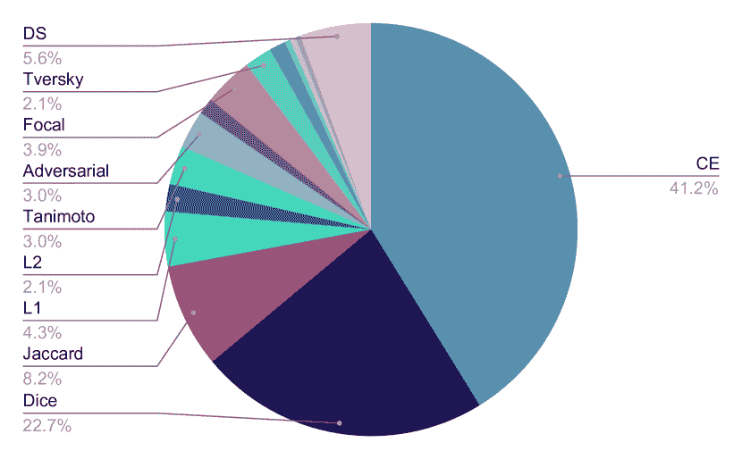
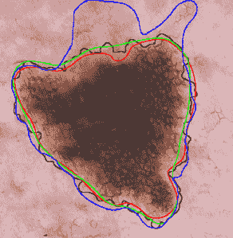

<!--yml

分类: 未分类

日期: 2024-09-06 19:46:13

-->

# [2206.00356] 皮肤病变分割的深度学习调查

> 来源：[`ar5iv.labs.arxiv.org/html/2206.00356`](https://ar5iv.labs.arxiv.org/html/2206.00356)

# 皮肤病变分割的深度学习调查

Zahra Mirikharaji¹¹1 联合第一作者 Kumar Abhishek²²2 联合第一作者 Alceu Bissoto Catarina Barata Sandra Avila Eduardo Valle M. Emre Celebi³³3 联合资深作者 Ghassan Hamarneh⁴⁴4 联合资深作者 医学图像分析实验室，计算机科学学院，西蒙弗雷泽大学，加拿大伯纳比 V5A 1S6 系统与机器人研究所，里斯本技术大学，Avenida Rovisco Pais，里斯本 1049-001，葡萄牙 RECOD.ai 实验室，坎皮纳斯大学计算机学院，Av. Albert Einstein 1251，坎皮纳斯 13083-852，巴西 RECOD.ai 实验室，坎皮纳斯大学电气与计算机工程学院，Av. Albert Einstein 400，坎皮纳斯 13083-952，巴西 中央阿肯色大学计算机科学与工程系，201 Donaghey Ave.，康威，AR 72035，美国

###### 摘要

皮肤癌是一个重大公共健康问题，可以通过计算机辅助诊断来减少这种常见疾病的负担。皮肤病变从图像中分割是实现这一目标的重要步骤。然而，自然和人工伪影（例如头发和气泡）、内在因素（例如病变的形状和对比度）以及图像采集条件的变化使得皮肤病变分割成为一项具有挑战性的任务。最近，许多研究者探讨了深度学习模型在皮肤病变分割中的应用。在这项调查中，我们交叉审查了$177$篇涉及基于深度学习的皮肤病变分割的研究论文。我们从多个维度分析了这些研究，包括输入数据（数据集、预处理和合成数据生成）、模型设计（架构、模块和损失函数）以及评估方面（数据注释要求和分割性能）。我们从一些重要工作的视角和系统视角讨论了这些维度，考察了这些选择如何影响当前趋势，以及如何解决它们的局限性。为了便于比较，我们在一个全面的表格中总结了所有审查的工作，并在在线互动表格中提供了详细信息⁵⁵5 [`github.com/sfu-mial/skin-lesion-segmentation-survey`](https://github.com/sfu-mial/skin-lesion-segmentation-survey)

^†^†期刊: 医学图像分析

## 1 引言

分割是在自动化皮肤病变分析工作流程中一项具有挑战性和关键性的操作。基于规则的皮肤病变诊断系统，在临床环境中较为流行，依赖于准确的病变分割来评估诊断标准，如对称性、边界不规则性和病变大小，这些都是实施 ABCD 算法（病变的对称性、边界、颜色、直径）所需的 (Friedman et al., 1985; Nachbar et al., 1994)及其衍生算法：ABCDE（ABCD 加上病变的演变） (Abbasi et al., 2004)和 ABCDEF（ABCDE 加上“丑小鸭”标志） (Jensen and Elewski, 2015)。相较而言，在基于机器学习的诊断系统中，通过限制图像中的区域，从而将模型的关注点集中在病变的内部，可以提高分类的稳健性。例如，最近的研究表明，分割在通过规范化注意力图 (Yan et al., 2019)、允许裁剪病变图像 (Yu et al., 2017a; Mahbod et al., 2020; Liu et al., 2020; Singh et al., 2023)、跟踪病变的演变 (Navarro et al., 2018)以及去除成像伪影 (Maron et al., 2021a; Bissoto et al., 2022)来提高基于深度学习（DL）的分类性能方面表现出了实用性。在基于 DL 的皮肤病变分类框架中，将勾画出的皮肤病变呈现给用户也有助于解释 DL 的黑箱 (Jaworek-Korjakowska et al., 2021)，因此可能会对计算机辅助诊断（CAD）系统在皮肤癌诊断中的信任感产生影响，或者引发怀疑。

病变检测和分割在分析多病变的广域图像时也作为预处理步骤非常有用 (Birkenfeld et al., 2020)。此外，放射治疗和影像引导的人体或机器人手术病变切除需要对病变进行定位和勾画 (American Cancer Society, 2023)。确保对少数群体公平的诊断，这是这些模型及其信任部署中的一个紧迫问题，需要估算无病变的肤色，这也依赖于对皮肤病变的勾画 (Kinyanjui et al., 2020)。然而，尽管病变分割非常重要，手动勾画皮肤病变仍是一项繁重的任务，存在显著的观察者间和观察者内变异，因此，需要一种快速、可靠且自动化的分割算法。

皮肤癌及其相关费用，每年在美国高达$8.1$亿（Guy Jr et al., 2015），在过去几十年中已成为一个主要的公共健康问题。在美国，仅在 2023 年，就预计会出现$97,610$例新的黑色素瘤病例（Siegel et al., 2023）。一般来说，皮肤癌分为两种类型：黑色素瘤和非黑色素瘤，前者仅占病例的$1\%$，但由于其侵袭性导致了大多数的死亡。早期诊断对于良好的预后至关重要：如果早期发现，黑色素瘤可以通过简单的门诊手术治愈，但如果在晚期诊断，其五年生存率将从超过$99\%$降至$32\%$（American Cancer Society, 2023）。

在自动化皮肤病变分析中，通常使用两种影像模式（Daneshjou et al., 2022）：皮肤镜（显微）图像和临床（宏观）图像。皮肤镜图像能够检查肉眼不可见的病变特征，但即使对皮肤科医生而言也并非总是可用（Engasser and Warshaw, 2010）。另一方面，使用常规相机获取的临床图像易于获得，但质量较低。皮肤镜检查是一种非侵入性的皮肤成像技术，通过让皮肤科医生可视化皮下结构来帮助诊断皮肤病变（Kittler et al., 2002）。然而，即使使用皮肤镜，诊断准确性也可能有很大差异，范围从$24\%$到$77\%$，取决于临床医生的专业水平（Tran et al., 2005）。此外，皮肤镜在经验不足的皮肤科医生手中实际上可能会降低诊断准确性（Binder et al., 1995）。因此，为了减少由于视觉解释的困难和主观性所导致的诊断错误，并减轻皮肤病的负担以及皮肤科医生的有限可及性，开发计算机辅助诊断系统是至关重要的。

分割是将图像划分为有意义区域的过程。特别是语义分割，为每个区域分配适当的类别标签。对于皮肤病变，任务几乎总是二分类的，将病变与周围皮肤分开。自动化皮肤病变分割受限于照明和对比度问题、固有的类别间相似性和类别内变异、遮挡、伪影以及使用的成像工具的多样性。缺乏由专家生成的真实分割掩膜的大型数据集进一步加剧了问题，阻碍了模型的训练和可靠评估。皮肤病变图像被自然伪影如毛发（图 1(a)）、血管（图 1(b)）以及人工伪影如外科标记注释（图 1(c)）、镜头伪影（暗角）（图 1(d)）和气泡（图 1(e)）遮挡。固有因素如病变的大小和形状变化（图 1(f) 和 1(g)）、不同的肤色（图 1(h)）、低对比度（图 1(i)）和模糊边界（图 1(h)）使得皮肤病变的自动分割更加复杂。

(a) 毛发

(b) 血管

(c) 外科标记

(d) 不规则边界和黑色边框

(e) 气泡

(f) 非常小的病变

(g) 非常大的病变

(h) 模糊边界和花纹色彩

(i) 低对比度和颜色校准图

图 1：使皮肤镜图像分割变得复杂的因素（图片来源：ISIC 2016 数据集（Gutman 等，2016））。

`<svg height="576.17" overflow="visible" version="1.1" width="580.52"><g transform="translate(0,576.17) matrix(1 0 0 -1 0 0) translate(283.59,0) translate(0,292.58)" fill="#000000" stroke="#000000" stroke-width="1.2pt"><g transform="matrix(1.0 0.0 0.0 1.0 -68.9 5.9)" fill="#000000" stroke="#000000"><foreignobject width="137.8" height="31.18" transform="matrix(1 0 0 -1 0 16.6)" overflow="visible">基于 DL 的皮肤病变分割 <g fill="#99FF99" stroke="#99FF99"><path d="M -94.9 -139.19 C -94.9 -114.73 -114.73 -94.9 -139.19 -94.9 C -163.66 -94.9 -183.49 -114.73 -183.49 -139.19 C -183.49 -163.66 -163.66 -183.49 -139.19 -183.49 C -114.73 -183.49 -94.9 -163.66 -94.9 -139.19 Z M -139.19 -139.19"></path></g><g transform="matrix(1.0 0.0 0.0 1.0 -178.56 -134.35)" fill="#000000" stroke="#000000"><foreignobject width="78.74" height="29.06" transform="matrix(1 0 0 -1 0 16.6)" overflow="visible">未来研究 §5</foreignobject></g> <clippath ><path d="M -55.68 -55.68 M -33.28 -71.36 C -50.06 -63.54 -63.54 -50.06 -71.36 -33.28 C -63.04 -51.12 -72.34 -66.86 -86.26 -80.78 L -80.78 -86.26 C -66.86 -72.34 -51.12 -63.04 -33.28 -71.36 Z M -89.47 -94.95 L -80.78 -86.26 L -86.26 -80.78 L -94.95 -89.47 Z M -86.26 -80.78 M -99.05 -120.47 C -103.45 -111.03 -111.03 -103.45 -120.47 -99.05 C -110.44 -103.73 -102.78 -97.3 -94.95 -89.47 L -89.47 -94.95 C -97.3 -102.78 -103.73 -110.44 -99.05 -120.47 Z"></path></clippath><g clip-path="url(#pgfcp9)"><g transform="matrix(1.0 0.0 0.0 1.0 -55.68 -55.68)"><g fill="#FFCC99"><path d="M 54.71 -56.66 L 111.36 -0.01 L -0.01 111.36 L -56.66 54.71 Z M -0.01 111.36" style="stroke:none"></path></g><g fill="#99FF99"><path d="M 4.46 -106.9 L -27.83 -139.2 L -139.2 -27.83 L -106.9 4.46 Z M -139.2 -27.83" style="stroke:none"><g transform="matrix(-0.37585 -0.37585 0.80185 -0.80185 -26.1 -26.1)"><defs><lineargradient ></lineargradient></defs></g></path></g></g></g><g fill="#99CCCC" stroke="#99CCCC"><path d="M 183.49 -139.19 C 183.49 -114.73 163.66 -94.9 139.19 -94.9 C 114.73 -94.9 94.9 -114.73 94.9 -139.19 C 94.9 -163.66 114.73 -183.49 139.19 -183.49 C 163.66 -183.49 183.49 -163.66 183.49 -139.19 Z M 139.19 -139.19"></path></g><g transform="matrix(1.0 0.0 0.0 1.0 99.82 -142.65)" fill="#000000" stroke="#000000"><foreignobject width="78.74" height="12.45" transform="matrix(1 0 0 -1 0 16.6)" overflow="visible">评估 §4</foreignobject></g> <clippath ><path d="M 55.68 -55.68 M 71.36 -33.28 C 63.54 -50.06 50.06 -63.54 33.28 -71.36 C 51.12 -63.04 66.86 -72.34 80.78 -86.26 L 86.26 -80.78 C 72.34 -66.86 63.04 -51.12 71.36 -33.28 Z M 94.95 -89.47 L 86.26 -80.78 L 80.78 -86.26 L 89.47 -94.95 Z M 80.78 -86.26 M 120.47 -99.05 C 111.03 -103.45 103.45 -111.03 99.05 -120.47 C 103.73 -110.44 97.3 -102.78 89.47 -94.95 L 94.95 -89.47 C 102.78 -97.3 110.44 -103.73 120.47 -99.05 Z"></path></clippath><g clip-path="url(#pgfcp11)"><g transform="matrix(1.0 0.0 0.0 1.0 55.68 -55.68)"><g fill="#FFCC99"><path d="M 56.66 54.71 L 0.01 111.36 L -111.36 -0.01 L -54.71 -56.66 Z M -111.36 -0.01" style="stroke:none"></path></g><g fill="#99CCCC"><path d="M 106.9 4.46 L 139.2 -27.83 L 27.83 -139.2 L -4.46 -106.9 Z M 27.83 -139.2" style="stroke:none"><g transform="matrix(0.37585 -0.37585 0.80185 0.80185 26.1 -26.1)"><defs><lineargradient ></lineargradient></defs></g></path></g></g></g><g fill="#99CCCC" stroke="#99CCCC"><path d="M 173.64 -257.3 C 173.64 -238.28 158.22 -222.86 139.19 -222.86 C 120.17 -222.86 104.75 -238.28 104.75 -257.3 C 104.75 -276.33 120.17 -291.75 139.19 -291.75 C 158.22 -291.75 173.64 -276.33 173.64 -257.3 Z M 139.19 -257.3"></path></g><g transform="matrix(1.0 0.0 0.0 1.0 109.67 -261.46)" fill="#000000" stroke="#000000"><foreignobject width="59.06" height="11.07" transform="matrix(1 0 0 -1 0 16.6)" overflow="visible">指标 §4.3</foreignobject></g> <g fill="#99CCCC"><path d="M 139.19 -183.49 M 154.34 -180.81 C 144.56 -184.38 133.83 -184.38 124.05 -180.81 C 134.45 -184.6 136.18 -194.56 136.18 -205.63 L 142.21 -205.63 C 142.21 -194.56 143.94 -184.6 154.34 -180.81 Z M 142.21 -205.63 L 142.21 -205.63 L 136.18 -205.63 L 136.18

图 2：本综述各个组成部分的概述。我们根据 DL 基于分割管道的不同元素来构建综述，并以对未来潜在研究方向的讨论作为结论。

在深度学习（DL）革命之前，分割基于经典的图像处理和机器学习技术，例如自适应阈值（Green et al., 1994; Celebi et al., 2013），主动轮廓（Erkol et al., 2005），区域生长（Iyatomi et al., 2006; Celebi et al., 2007a），无监督聚类（Gómez et al., 2007），以及支持向量机（Zortea et al., 2011）。这些方法依赖于手工制作的特征，这些特征难以工程化，并且通常从一开始就限制了不变性和辨别能力。因此，这些传统的分割算法在更大且更复杂的数据集上并不总是表现良好。相比之下，DL 无缝集成了特征提取和任务特定决策，并且不仅应对大数据集，实际上还需要更大的数据集。

*文献综述。* Celebi et al. (2009b) 综述了 18 种用于皮肤病变 dermoscopic 图像的分割算法，这些算法发布于 1998 到 2008 年间，并介绍了它们所需的预处理和后处理步骤。Celebi et al. (2015b) 随后扩展了他们的工作，增加了 32 种在 2009 到 2014 年间发布的算法，讨论了每种方法的性能评估和计算需求，并提出了未来工作的指导方针。这些综述都出现在 DL 被广泛应用于皮肤病变分割之前，但涵盖了所有基于经典图像处理和机器学习的重要工作。Adegun 和 Viriri (2020a) 综述了基于 DL 的皮肤图像分析文献，重点关注 ISIC（国际皮肤成像合作）皮肤图像分析挑战 2018（Codella et al., 2019）和 2019（Tschandl et al., 2018; Codella et al., 2018; Combalia et al., 2019）中的最佳表现算法。然而，由于他们的综述关注于 ISIC 挑战 2018 和 2019，因此它更为通用，涵盖了病变分类和分割。因此，Adegun 和 Viriri (2020a) 对皮肤病变分割的文献综述的论文数量比本综述要少一个数量级。

*主要贡献。* 现有的调查没有在广度或深度上接近本工作，因为我们交叉审查了 $177$ 篇涉及临床和皮肤镜图像中皮肤病变自动分割的研究论文。我们从多个维度分析了这些工作，包括输入数据（数据集、预处理和合成数据生成）、模型设计（架构、模块和损失）以及评估（数据注释和评估指标）。我们从一些重要工作的视角以及系统视角讨论了这些维度，审视这些选择如何影响当前趋势以及如何解决其局限性。我们在一张综合表格中总结了所有审查过的工作，以便于比较。

*搜索策略。* 我们在 DBLP 和 Arxiv Sanity Preserver 上搜索了所有学术出版物：同行评审的期刊论文、会议或研讨会论文以及 2014 年至 2022 年间的非同行评审预印本。DBLP 的搜索查询为 (conv* | trans* | deep | neural | learn*) (skin | derm*) (segment* | delineat* | extract* | localiz*)，从而将我们的搜索限制在涉及皮肤和分割的基于深度学习的工作上。我们使用 DBLP 进行文献搜索的原因是 (a) 它允许定制搜索查询和列表，以及 (b) 我们在其他平台（Google Scholar 和 PubMed）上没有找到 DBLP 未收录的相关出版物。对于未发表的预印本，我们还在 Arxiv Sanity Preserver 上使用类似的查询进行了搜索⁶⁶6Arxiv Sanity Preserver: [`www.arxiv-sanity-lite.com/search?q=segmentation+skin+melanoma+deep+learning+convolution+transformer`](https://www.arxiv-sanity-lite.com/search?q=segmentation+skin+melanoma+deep+learning+convolution+transformer)。我们过滤了搜索结果以去除假阳性（$31$ 篇论文），仅包括与皮肤病变分割相关的论文。我们排除了关注一般皮肤分割和一般皮肤状况（例如银屑病、痤疮或某些皮肤病变亚型）的论文。我们还包括了来自 arXiv 的未发表预印本，这些预印本 (a) 通过了最低质量检查级别，并且 (b) 至少有 10 次引用，排除了那些明显低质量的论文。特别地，以下有一个或多个特征的论文被排除在本次调查之外：(a) 缺少定量结果，(b) 缺少重要部分，如摘要或方法，(c) 写作质量显著差，(d) 没有方法学贡献。这导致了过滤掉明显低质量的论文（上述 (a-c) 标准；$18$ 篇论文）和没有方法学贡献的论文（$20$ 篇论文）。

剩余的文本组织如下：在第二部分中，我们介绍了公开可用的数据集，并讨论了预处理和合成数据生成；在第三部分中，我们回顾了用于深度分割模型的各种网络架构，并讨论了深度模型如何从这些网络中获益。我们还描述了为一般用途或专门用于皮肤病变分割而设计的各种损失函数。在第四部分中，我们详细说明了分割评估技术和措施。最后，在第五部分中，我们讨论了基于深度学习的皮肤病变分割中的开放挑战，并总结了我们的调查。图 2 提供了本调查的结构的视觉概述。

## 2 输入数据

获得足够数量和质量的数据通常是开发有效分割模型的重大障碍。最先进的分割模型具有大量可调参数，这些参数可以使它们在训练于大量标注数据集的情况下实现良好的泛化（Sun et al., 2017; Buslaev et al., 2020）。不幸的是，皮肤病变数据集——像大多数医学图像数据集（Asgari Taghanaki et al., 2021）——由于版权、患者隐私、采集和注释成本、标准化以及许多感兴趣病理的稀缺等问题，往往较小（Curiel-Lewandrowski et al., 2019）。在皮肤病变分割模型的训练中，最常用的两种模式是临床图像，这些图像是使用传统相机拍摄的病变特写，以及皮肤镜图像，这些图像通过光学放大、液体浸泡和低入射角照明或交叉偏振照明的皮肤镜技术获得。皮肤镜可以消除皮肤表面反射（Kittler et al., 2002），揭示皮肤下的结构，并允许识别几十种形态特征，如非典型色素网络、点/小球、条纹、蓝白色区域和斑点（Menzies et al., 2003）。

注释通常是增加数据量的最大障碍。客观评价分割常常需要繁琐的*区域基础注释*，专家手动描绘图像中病变（或临床特征）出现的区域。相比之下，*文本注释*可能涉及诊断（例如，黑色素瘤、癌症、良性痣）、皮肤镜特征的存在/缺失/评分（例如，色素网络、蓝白区、条纹、球形体）、诊断策略（例如，模式分析、ABCD 规则、7 点检查表、3 点检查表）、临床元数据（例如，性别、年龄、解剖部位、家族历史）以及其他细节（例如，时间戳、相机型号）（Caffery 等， 2018）。我们在第 4.1 节中深入讨论了图像注释问题。

### 2.1 数据集

较大、更多样化和更好注释的数据集的可用性是过去十年皮肤图像分析进展的主要推动因素之一（Marchetti 等，2018；Celebi 等，2019）。皮肤图像分析的研究可以追溯到 1980 年代（Vanker 和 Van Stoecker，1984；Dhawan 等，1984），但直到 2000 年代中期，这些研究才使用包含几百张图像的小型私有数据集。

*皮肤镜互动图谱*（有时称为*Edra 图谱*，以出版商命名）由 Argenziano 等（2000）出版，包含一个 CD-ROM，内有$1,039$张皮肤镜图像（$26\%$黑色素瘤，$4\%$癌症，$70\%$痣），分辨率为$1,024\times 683$像素，由三个欧洲大学医院（奥地利格拉茨大学、意大利那不勒斯大学和意大利佛罗伦萨大学）采集。Celebi 等（2007b，2008）的研究在皮肤镜图像分析社区推广了该数据集，成为近十年来的事实标准，直到更大的 ISIC 档案数据集（见下文）可用。最近，Kawahara 等（2019）将这一宝贵数据集以及基于 7 点检查表的附加文本注释，公开发布为*derm7pt*。在皮肤镜互动图谱出版后不久，Menzies 等（2003）出版了*色素皮肤病变表面显微镜图谱：皮肤镜*，其中的 CD-ROM 包含$217$张皮肤镜图像（$39\%$黑色素瘤，$7\%$癌症，$54\%$痣），分辨率为$712\times 454$像素，由澳大利亚悉尼黑色素瘤单位采集。

$\mathsf{PH}^{2}$ 数据集由 Mendonca 等人发布（2013），并由 Mendonca 等人详细描述（2015）。这是第一个提供基于区域的注释以及图像中临床显著颜色（白色、红色、浅棕色、深棕色、蓝灰色和黑色）分割掩模的公开数据集。该数据集包含 $200$ 张皮肤镜图像（$20\%$ 为黑色素瘤，$40\%$ 为非典型痣，$40\%$ 为普通痣），分辨率为 $768\times 560$ 像素，图像在葡萄牙 Pedro Hispano 医院采集。爱丁堡 DermoFit 图像库（Ballerini 等人，2013）还提供了 $1,300$ 张临床图像的基于区域的注释（包括黑色素瘤、脂溢性角化病和基底细胞癌在内的 $10$ 种诊断类别），图像尺寸从 $177\times 189$ 到 $2,176\times 2,549$ 像素不等。图像使用 Canon EOS 350D 单反相机在受控光照条件下并与病变保持一致的距离进行采集，因此图像质量在临床图像中较为罕见。

ISIC 存档包含世界上最大规模的皮肤镜图像策展库。ISIC 是一个由 ISDIS（国际皮肤数字成像学会）赞助的国际学术界和工业界合作伙伴关系，旨在“促进数字皮肤成像的应用，以帮助减少黑色素瘤的死亡率”（ISIC，2023）。截至撰写时，档案馆包含超过 $240,000$ 张图像，其中超过 $71,000$ 张是公开可用的。这些图像是在全球领先的临床中心采集的，使用了各种设备。

除了策划共同形成“ISIC 存档”的数据集外，ISIC 还作为其 *皮肤病变分析以期实现黑色素瘤检测* 挑战的一部分发布了标准档案子集，该挑战自 2016 年起每年组织一次。2016 年、2017 年和 2018 年的挑战包括分割、特征提取和分类任务，而 2019 年和 2020 年的挑战仅包含分类任务。每个子集与一个挑战（年份）、一个或多个任务相关，并有两个（训练/测试）或三个（训练/验证/测试）拆分。ISIC Challenge 2016（Gutman 等人，2016）（简称 ISIC 2016）包含 $1,279$ 张图像，分为 $900$ 张训练图像（$19\%$ 为黑色素瘤，$81\%$ 为痣）和 $379$ 张测试图像（$20\%$ 为黑色素瘤，$80\%$ 为痣）。图像尺寸差异很大，从 $0.5$ 到 $12$ 兆像素不等。所有任务使用了相同的图像。ISIC 2017（Codella 等人，2018）数据集的规模增加了两倍多，包含 $2,750$ 张图像，分为 $2,000$ 张训练图像（$18.7\%$ 为黑色素瘤，$12.7\%$ 为脂溢性角化病，$68.6\%$ 为痣）、$150$ 张验证图像（$20\%$ 为黑色素瘤，$28\%$ 为脂溢性角化病，$52\%$ 为痣）和 $600$ 张测试图像（$19.5\%$ 为黑色素瘤，$15\%$ 为脂溢性角化病，$65.5\%$ 为痣）。同样，图像尺寸差异显著，从 $0.5$ 到 $29$ 兆像素不等，所有任务使用了相同的图像。

ISIC 2018 首次提供了任务的单独数据集，包括$2,594$张训练图像（$20$%为黑色素瘤，$72$%为痣，$8$%为脂溢性角化病），以及$100$/$1,000$张用于验证/测试的图像，图像尺寸从$0.5$到$29$兆像素，适用于分割和特征提取任务（Codella 等，*2019*），以及$10,015$/$1,512$张训练/测试图像用于分类任务，所有图像分辨率为$600\times 450$像素。分类任务的训练数据集为 HAM10000 数据集（Tschandl 等，*2018*），该数据集在奥地利维也纳医科大学和澳大利亚 Cliff Rosendahl 博士的私人诊所中收集，历时$20$年。这使得训练图像数量相比 2017 年增长了五倍，包含七个诊断类别：黑色素瘤（$11.1\%$），痣（$66.9\%$），基底细胞癌（$5.1\%$），光化性角化病或 Bowen 病（$3.3\%$），良性角化病（太阳雀斑、脂溢性角化病或类扁平苔藓角化病，$11\%$），皮肤纤维瘤（$1.1\%$），血管病变（$1.4\%$）。作为 2020 年一项关于皮肤病变诊断的人机协作研究的一部分，该研究涉及皮肤科医生和全科医生（Tschandl 等，*2020*），HAM10000 数据集中的病变由一名皮肤科医生进行分割，随后公开发布（ViDIR Dataverse，*2020*），使其成为最大型的公开皮肤病变分割数据集（表*1*）。

表 1：具有病变分割注释的公共皮肤病变数据集。所有数据集包含皮肤病变的 RGB 图像。

| 数据集 | 年份 | 模式 | 大小 | 训练/验证/测试 | 类别分布 | 额外信息 |
| --- | --- | --- | --- | --- | --- | --- |
| DermQuest⁷⁷7DermQuest 于 2019 年 12 月 31 日停用。然而，137 张图像仍可公开获取（Glaister，*2013*）。 （DermQuest，*2012*） | 2012 | 临床 | $137$ | – | 61 个非黑色素瘤，76 个黑色素瘤 | 通过不同相机在各种光照条件下获取 |
| DermoFit（Ballerini 等，*2013*） | 2013 | 临床 | $1,300$ | – | $1,224$个非黑色素瘤，76 个黑色素瘤 | 尺寸范围从$177\times 189$到$2,176\times 2,549$像素 |
| Pedro Hispano 医院（PH²）（Mendonca 等，*2013*） | 2013 | 镜下检查 | $200$ | – | 160 个良性痣，40 个黑色素瘤 | 尺寸范围从$553\times 763$到$577\times 769$像素，在$20\times$放大倍数下获取 |
| ISIC2016（Gutman 等，*2016*） | 2016 | 镜下检查 | $1,279$ | $900$/–/$379$ | 训练集：727 个非黑色素瘤，173 个黑色素瘤 测试集：304 个非黑色素瘤，75 个黑色素瘤 | 尺寸范围从$566\times 679$到$2,848\times 4,288$像素 |
| ISIC2017 (Codella et al., 2018) | 2017 | 皮肤镜检查 | $2,750$ | $2,000$/$150$/$600$ | 训练集：$1,626$ 个非黑色素瘤，374 个黑色素瘤 测试集：483 个非黑色素瘤，117 个黑色素瘤 | 图片尺寸从 $540\times 722$ 到 $4,499\times 6,748$ 像素 |
| ISIC2018 (Codella et al., 2019) | 2018 | 皮肤镜检查 | $3,694$ | $2,594$/$100$/$1,000$ | – | 图片尺寸从 $540\times 576$ 到 $4,499\times 6,748$ 像素 |
| HAM10000 (Tschandl et al., 2018) (Tschandl et al., 2020) (ViDIR Dataverse, 2020) | 2020 | 皮肤镜检查 | $10,015$ | – | $1,113$ 个非黑色素瘤，$8,902$ 个黑色素瘤 | 所有图像尺寸为 $600\times 450$ 像素 |

ISIC 2019 (Codella et al., 2018; Tschandl et al., 2018; Combalia et al., 2019) 包含 $25,331$ 张训练图像（$18\%$ 黑色素瘤，$51\%$ 痣，$13\%$ 基底细胞癌，$3.5\%$ 日光角化病，$10\%$ 良性角化病，$1\%$ 真皮纤维瘤，$1\%$ 血管病变，以及 $2.5\%$ 鳞状细胞癌）和 $8,238$ 张测试图像（诊断分布未知）。图像尺寸范围从 $600\times 450$ 到 $1,024\times 1,024$ 像素。

ISIC 2020 (Rotemberg et al., 2021) 包含 $33,126$ 张训练图像（$1.8\%$ 黑色素瘤，$97.6\%$ 痣，$0.4\%$ 脂溢性角化病，$0.1\%$ 单纯性雀斑，$0.1\%$ 类似角化病，$0.02\%$ 日光雀斑，$0.003\%$ 咖啡奶块，$0.003\%$ 异常黑色素细胞增生）和 $10,982$ 张测试图像（诊断分布未知），图像尺寸范围从 0.5 到 24 兆像素。多个全球中心贡献了这个数据集，包括美国纪念斯隆-凯特琳癌症中心、黑色素瘤研究所、悉尼黑色素瘤诊断中心、昆士兰大学（澳大利亚）、维也纳医科大学（奥地利）、雅典大学（希腊）和巴塞罗那诊所医院（西班牙）。这个数据集的一个重要新特点是每位患者有多个病变，明确目的是利用患者间和患者内的病变模式，例如所谓的“丑小鸭”病变，这些病变在特定患者中外观异常，并且有较高的恶性风险 (Gachon et al., 2005)。

然而，这些 ISIC 挑战数据集之间存在重叠。Abhishek（2020）分析了所有来自 ISIC 挑战（2016-2018）的病变分割数据集，发现这 3 个数据集之间有相当大的重叠，至少$1,940$张图片在 2 个数据集之间共享，$706$张图片在所有 3 个数据集之间共享。在对 2016 年至 2020 年的 ISIC 挑战数据集进行的最近分析中，Cassidy 等人（2022）发现了数据集之间的重叠以及数据集内的重复项。通过使用重复项移除策略，他们整理出一个新的数据集，其中包括$45,590$张训练图片（$8.61\%$黑色素瘤，$91.39\%$其他）和$11,397$张验证图片（$8.61\%$黑色素瘤，$91.39\%$其他），总共$56,987$张图片。此外，由于结果数据集极度不平衡（黑色素瘤与其他的比例为$1:10.62$），作者还整理了一个平衡数据集，其中包括$7,848$张训练图片（50%黑色素瘤，50%其他）和$1,962$张验证图片（50%黑色素瘤，50%其他）。

图 3：调查研究中不同皮肤病变分割数据集的使用频率。我们发现有$82$篇论文在超过$1$个数据集上进行评估，其中$36$篇论文选择了跨数据集评估（见表 LABEL:tab:main）。ISIC 数据集（ISIC 2016、ISIC 2017、ISIC 2018 和 ISIC 档案）在大多数论文中被使用，其中$177$篇论文中的$168$篇使用了至少一个 ISIC 数据集，而 ISIC 2017 数据集是最受欢迎的（$117$篇论文）。PH²数据集是使用频率第二高的数据集（$56$篇论文），仅次于 ISIC 数据集。

表 1 显示了具有像素级注释的公开可用皮肤病变数据集的列表，包括图像模态、样本大小、原始分割大小和诊断分布。图 3 显示了这些数据集在文献中的出现频率。值得注意的是，还有一些皮肤病变图像数据集没有在我们的调查中描述，因为它们没有提供相应的皮肤病变分割注释。然而，这些数据集，包括 SD-198（Sun 等，2016）、MED-NODE（Giotis 等，2015）、derm7pt（Kawahara 等，2019）、互动皮肤病学图谱（Usatine 和 Madden，2013）、皮肤病学信息系统（DermIS，2012）、DermWeb（Lui 等，2009）、DermNet 新西兰（Oakley 等，1995），可能仍对皮肤病变分割研究具有参考价值（见第五部分）。

计算机视觉数据集中的偏差是一个持续存在的问题 (Torralba and Efros, 2011)，在医学影像中尤为严重，原因包括样本数量较少、图像分辨率不足、缺乏地理或种族多样性，或统计数据与临床实践不符。所有现有的皮肤病变数据集在一定程度上都存在上述问题，我们还增加了注释的可用性和可靠性这一具体问题。对于病变分类，许多样本缺乏黄金标准的组织病理学确认，即使有的地面真实分割也本质上是嘈杂的 (第 4.2 节)。伪影的存在 (图 1) 可能导致虚假的相关性，这是 Bissoto 等人 (2019) 尝试对分类模型进行量化的问题。

### 2.2 合成数据生成

数据增强——从现有样本中合成新样本——在深度学习模型训练中常被使用。增强数据作为正则化器，增加数据的数量和多样性 (Shorten and Khoshgoftaar, 2019)，诱导模型上的期望不变性，并缓解类别不平衡。传统的数据增强对样本应用简单的几何、光度和色彩变换，包括镜像、平移、缩放、旋转、裁剪、随机区域擦除、仿射或弹性变形、色调、饱和度、亮度和对比度的修改。通常，会随机选择几种变换并组合。图 4 展示了这一过程，应用于使用 Albumentations (Buslaev et al., 2020) 的皮肤镜图像，Albumentations 是一种先进的开源图像增强库。

如前所述，增强训练数据可以使模型具有不变性：例如，随机平移和裁剪有助于生成平移不变的模型。这对皮肤病变分析有重要影响，例如，通用数据集（如 ImageNet (Deng et al., 2009))的增强不会包括垂直镜像和大角度旋转，因为自然场景具有强垂直各向异性，而皮肤病变图像是各向同性的。此外，增强测试数据（测试时增强）也可以通过例如平均池化或多数投票 (Shorten and Khoshgoftaar, 2019)，提高泛化能力。Perez et al. (2018)系统地评估了多种数据增强方案对皮肤病变分类的影响，发现训练和测试增强的结合对性能至关重要，有时甚至超越了没有增强的真实数据增加。Valle et al. (2020)在一个大规模实验中发现，测试时增强是分类性能的第二大影响因素，仅次于训练集大小。对于皮肤病变分割尚无此类系统性研究。

(a) 原始

(b) 仿射变形

(c) 弹性变形

(d) 直方图均衡化

(e) HSV 变换

(f) RGB 变换

图 4：应用于皮肤镜图像的各种数据增强变换（图像来源：ISIC 2016 数据集 (Gutman et al., 2016))，使用 Albumentations 库 (Buslaev et al., 2020)。

尽管传统的数据增强对于训练深度学习模型至关重要，但它不足以提供既多样化又可信的样本，这些样本来自于与真实数据相同的分布。因此，现代数据增强（Tajbakhsh 等，2020）采用了生成建模，学习真实数据的概率分布，并从该分布中进行采样。生成对抗网络（GANs）（Goodfellow 等，2020）是这个方向上最有前景的方法（Shorten 和 Khoshgoftaar，2019），尤其在医学图像分析中（Yi 等，2019；Kazeminia 等，2020；Shamsolmoali 等，2021）。GANs 通过生成器和鉴别器之间的对抗训练来工作，生成器试图生成逼真的假样本，而鉴别器试图区分真实样本和假样本。当过程收敛时，生成器的输出令人惊讶地令人信服，但 GANs 计算开销大且训练困难（Creswell 等，2018）。

合成皮肤病变的生成最近受到了一些关注，特别是在提高分类准确性方面。相关工作大致可以分为使用 GANs 从高斯潜变量创建新图像的研究（Baur 等，2018；Pollastri 等，2020；Abdelhalim 等，2021），以及基于图像到图像转换的 GANs 实现（Abhishek 和 Hamarneh，2019；Bissoto 等，2018；Ding 等，2021）。

基于噪声的 GANs，如 DCGAN（Yu 等，2017b），LAPGAN（Denton 等，2015）和 PGAN（Karras 等，2018），学习将高斯潜变量解码为属于训练集分布的图像。这些技术的主要优势是能够创建更多、更具多样性的图像，因为原则上，来自多变量高斯分布的任何样本都可能成为不同的图像。缺点是图像质量通常较低，在分割情况下，需要生成可信的图像和分割掩膜对。

图像到图像转换 GANs，如 pix2pix（Isola 等，2017）和 pix2pixHD（Wang 等，2018），学习从语义分割图中创建新样本。它们具有互补的优缺点。由于过程是确定性的（一个图创建一个图像），它们在样本数量上自由度较小，但图像质量通常较高（或更“可信”）。由于生成的图像与输入的分割图本质上兼容，因此无需生成单独的分割图。

关于皮肤病变的 GANs 的两篇开创性论文（Baur 等人，2018；Bissoto 等人，2018）评估了几种模型。Baur 等人 (2018) 比较了基于噪声的 DCGAN、LAPGAN 和 PGAN 在生成 $256\times 256$ 像素图像方面的表现，使用了定性和定量标准，发现 PGAN 的结果显著更好。他们进一步将 PGAN 与由皮肤科医生和深度学习专家组成的评审团进行“视觉图灵测试”，结果显示两者都在区分假图像和真实图像时遇到困难。Bissoto 等人 (2018) 将 PGAN 适配为在诊断类别上进行条件化，并将图像到图像的 pix2pixHD 应用于 ISIC 2018 数据集的特征提取任务提供的语义注释（表 1），与未修改的 DCGAN 在 $256\times 256$ 像素图像上进行比较，发现修改后的 pix2pixHD 在定性上更优。他们使用在单独分类网络上的性能提升作为定量指标，发现使用 PGAN 和 pix2pixHD 的样本能带来最佳改进。他们还展示了由 pix2pixHD 派生模型生成的高达 $1,024\times 1,024$ 像素的图像。

Pollastri 等人 (2020) 扩展了 DCGAN 和 LAPGAN 架构以生成分割掩码（如上文所述的配对方案），使他们的工作成为迄今为止唯一可用于分割的基于噪声的 GANs。Bi 等人 (2019a) 引入了堆叠对抗学习到 GANs 中，以学习特定类别的皮肤病变图像生成器，基于真实的分割结果。Abhishek 和 Hamarneh (2019) 使用 pix2pix 将二进制分割掩码转换为皮肤镜图像，并利用生成的图像-掩码对来增强皮肤病变分割训练数据集，从而提高分割性能。

Ding 等人 (2021) 将一个分割掩码和一个实例掩码输入到条件 GAN 生成器中，其中实例掩码表示要合成的诊断类别。在这两种情况下，鉴别器接收生成图像的不同分辨率，并要求对每一个做出决策。Abdelhalim 等人 (2021) 是一项近期的工作，也将 PGAN 条件化于类别标签，并使用生成的输出增强黑色素瘤诊断数据集。

最近，Bissoto 等人（2021）对 GAN 合成数据增强在可靠提高皮肤病变分类方面的能力提出了质疑。他们的评估包括四个 GAN 模型、四个数据集和几个增强场景，只在严重的跨模态场景（在皮肤镜图像上训练并在临床图像上测试）中显示出改进。据我们所知，皮肤病变分割没有对应的系统评估。

### 2.3 监督、半监督、弱监督、自监督学习

尽管监督深度学习在各种医学图像分析应用中取得了出色的表现，但其对高质量注释的依赖限制了其适用性，以及对未见过的、分布外的数据的泛化能力。半监督技术尝试从有标签和无标签样本中学习。弱监督技术尝试利用部分注释，如图像级标签或边界框，通常结合少量像素级完全注释的样本。

图 5：对$177$项调查研究中不同监督级别的分解。完全监督模型仍然占据文献的大多数（$163$篇论文），而半监督和弱监督方法仅出现在$9$篇论文中。皮肤病变分割中的自监督方法相当新颖，所有$5$篇论文都出现在 2020 年以后。

由于皮肤病变图像的像素级注释成本高昂，因此在注释精度和效率之间存在权衡。在实践中，注释本质上是有噪声的，可以通过显式建模来避免过拟合。（我们在第 4.2 节讨论了注释变异性的问题。）为应对标签噪声，Mirikharaji 等人（2019）学习了一个对注释噪声具有鲁棒性的模型，利用大量不可靠的注释和少量完美的干净注释。他们建议学习一个与每个训练数据对应的空间自适应权重图，在训练深度模型时对噪声和干净的像素级注释赋予不同的权重。为了去除对完美干净注释集的依赖，Redekop 和 Chernyavskiy（2021）建议通过考虑随机不确定性的量化（Der Kiureghian 和 Ditlevsen，2009；Gal，2016；Depeweg 等人，2018；Kwon 等人，2020）在训练过程中修改噪声的真实值掩码，从而获得高不确定性和低不确定性的区域图。在高度不确定区域中的真实值掩码像素会被翻转，逐渐提高模型对标签噪声的鲁棒性。Ribeiro 等人（2020）通过在训练期间丢弃不一致的样本和注释细节来处理噪声，表明即使在测试时需要详细注释，模型的泛化能力也更强。

当存在标记数据集时，即使标记样本的数量远少于未标记样本的数量，也可以应用半监督和自监督技术。Li 等（2021c）提出了一种半监督方法，使用变换一致的自集成来利用未标记数据并对模型进行正则化。他们最小化网络对不同变换（随机扰动、翻转和旋转）应用于输入图像的预测与模型预测的变换之间的差异。自监督试图通过解决代理任务来利用内在标签，使得可以使用大量未标记的数据对模型进行预训练，然后在目标任务上进行微调。例如，人工在输入图像中应用随机旋转，并训练模型预测确切的旋转角度（Gidaris et al., 2018）。注意到每张图像的旋转角度是已知的，因为它是人工应用的，因此可以在训练过程中用作标签。类似地，对于皮肤病变分割，Li 等（2020b）建议利用颜色分布信息，代理任务是预测来自蓝色和红色颜色通道的值，而绿色通道作为输入。他们还包括了一个任务来估计红色和蓝色颜色分布，以提高模型提取全局特征的能力。预训练后，他们使用较小的标记数据集来微调模型。

### 2.4 图像预处理

预处理可能有助于皮肤病变图像的分割。典型的预处理操作包括：

+   •

    下采样：皮肤镜检查通常是一种高分辨率技术，产生的图像尺寸较大，而许多卷积神经网络（CNN）架构，例如 LeNet、AlexNet、VGG、GoogLeNet、ResNet 等，需要固定大小的输入图像，通常为 $224\times 224$ 或 $299\times 299$ 像素，即使那些能够处理任意大小图像的 CNN（例如，完全卷积网络（FCNs））也可能因计算原因受益于下采样。下采样在皮肤病变分割文献中很常见（Codella et al., 2017; Yu et al., 2017a; Yuan et al., 2017; Al-Masni et al., 2018; Zhang et al., 2019b; Pollastri et al., 2020）。

+   •

    颜色空间转换：大多数模型期望使用 RGB 图像，但一些研究（Codella 等，2017；Al-Masni 等，2018；Yuan 和 Lo，2019；Pollastri 等，2020；Pour 和 Seker，2020）采用了替代颜色空间（Busin 等，2008），如 CIELAB、CIELUV 和 HSV。通常，转换空间的一个或多个通道与 RGB 通道结合，原因包括但不限于提高类别可分性、解耦亮度和色度、确保（近似）感知均匀性、实现对光照或视角的不变性，以及消除高光。

+   •

    额外输入：除了颜色空间转换，近期的研究将更多聚焦于领域特定的输入纳入分割模型中，例如使用离散傅里叶变换的傅里叶域表示（Tang 等，2021b）和基于皮肤照明和成像物理的输入（Abhishek 等，2020）。

+   •

    对比度增强：对比度不足（图 1(i)）是分割失败的主要原因之一（Bogo 等，2015），导致一些研究（Saba 等，2019；Schaefer 等，2011）在分割前增强图像对比度。

+   •

    颜色标准化：光照变化（Barata 等，2015a，b）可能导致皮肤病变分割中的不一致性。这个问题可以通过颜色标准化来解决（Goyal 等，2019b）。

+   •

    人工物去除：皮肤镜图像经常出现伪影，其中头发（图 1(g)）是最具干扰性的（Abbas 等，2011），导致一些研究（Ünver 和 Ayan，2019；Zafar 等，2020；Li 等，2021b）在分割前去除它。

经典机器学习模型（如最近邻、决策树、支持向量机（Celebi 等，2007b，2008；Iyatomi 等，2008；Barata 等，2014；Shimizu 等，2015）），依赖于手工特征（Barata 等，2019），比深度学习模型更受益于预处理，而深度学习模型在正确训练时可以从数据中学习如何绕过输入问题（Celebi 等，2015a；Valle 等，2020）。然而，处理小型或噪声数据集时，预处理仍可能有帮助。

## 3 模型设计与训练

用于像素级分类的多层感知机（MLPs）（Gish and Blanz, 1989; Katz and Merickel, 1989）在开创性的反向传播论文（Rumelhart et al., 1986）发表后不久出现，但这些浅层前馈网络存在许多缺陷（LeCun et al., 1998），包括参数过多、缺乏不变性以及忽视图像中固有结构。

CNN 是深度前馈神经网络，旨在从多维信号（$1$-D 信号、$2$-D 图像、$3$-D 视频等）中逐步提取更加抽象的特征（LeCun et al., 2015）。因此，除了处理 MLPs 上述问题外，CNN 还自动进行 *特征工程*（Bengio et al., 2013），即设计能够将原始信号值转化为判别特征的算法。CNN 相比于传统机器学习分类器的另一个优势是对输入数据的预处理要求较少。由于其显著的优势，CNN 在过去十年中已成为许多医学图像分析应用的首选方法（Litjens et al., 2017）。深度学习革命中的关键推动因素包括：（i）海量数据集的可用性；（ii）强大且廉价的图形处理单元的可用性；（iii）更好的网络架构、学习算法和正则化技术的发展；（iv）开源深度学习框架的发展。

语义分割可以理解为试图回答给定图像中的“什么”和“哪里”这两个并行互补的问题。前者由平移不变的全局特征更好地回答，而后者则需要良好定位的特征，这对深度模型提出了挑战。用于像素级分类的 CNN 最早出现在 2000 年代中期（Ning et al., 2005），但在 Long et al. (2015) 关于 FCNs 的开创性论文发布后，其使用加速了，这篇论文与 U-Net（Ronneberger et al., 2015）已成为许多最先进分割模型的基础。与分类 CNN（如 LeNet、AlexNet、VGG、GoogLeNet、ResNet）相比，FCNs 可以轻松处理任意大小的输入图像。

### 3.1 架构

理想的皮肤病变分割算法应具备准确性、计算开销小、对噪声和输入变换不变、需要少量训练数据且易于实现和训练。不幸的是，到目前为止，没有算法能够实现这些相互矛盾的目标。基于深度学习的分割趋向于在计算和训练数据的代价下实现准确性和不变性。实现的难易程度存在争议：一方面，这些算法通常省去了繁琐的预处理、后处理和特征工程步骤。另一方面，调优和优化它们通常是一个费力的任务。

如图 6 所示，我们将现有文献分类为单网络模型、多网络模型、混合特征模型和 Transformer 模型。前两组模型较为自描述，但注意到后者进一步分为模型集成、多任务方法（通常同时进行分类和分割）和 GANs。混合特征模型结合了深度学习与手工特征。Transformer 模型，如其名所示，使用 Transformer 进行分割，无论是否结合 CNN，并且最近才开始用于皮肤病变分割。我们根据其最相关的特征对工作进行了分类，但第 3.1.1 节中讨论的架构改进也出现在其他部分列出的模型中。图 7 显示了不同架构模块在$177$项调查工作中出现的频率，并按我们对模型架构的分类（图 6）进行分组。

表 LABEL:tab:main 总结了本综述中调查的所有 $177$ 项工作，每项工作的属性包括：出版类型、数据集、架构模块、损失函数和使用的增强方法，报告的 Jaccard 指数，论文是否进行了跨数据集评估 (CDE) 和后处理 (PP)，以及相关代码是否公开发布。对于在多个数据集上报告分割结果的论文，我们列出了所有数据集，并仅列出一个数据集的性能，将该数据集格式化为粗体。由于 ISIC 2017 是最受欢迎的数据集（图 3），无论何时报告，我们都注明在 ISIC 2017 上的性能（Jaccard 指数）。对于未报告 Jaccard 指数而报告 Dice 分数的论文，我们根据后者计算前者，并报告该计算得分，标记为星号。跨数据集评估 (CDE) 是指论文在一个数据集上训练模型但在另一个数据集上进行评估。

`<svg height="476.9" overflow="visible" version="1.1" width="585.17"><g transform="translate(0,476.9) matrix(1 0 0 -1 0 0) translate(292.58,0) translate(0,184.32)" fill="#000000" stroke="#000000" stroke-width="1.2pt"><g transform="matrix(1.0 0.0 0.0 1.0 -68.9 6.92)" fill="#000000" stroke="#000000"><foreignobject width="137.8" height="33.21" transform="matrix(1 0 0 -1 0 16.6)" overflow="visible">分割模型架构 §3.1 <g fill="#FFCC99" stroke="#FFCC99"><path d="M -94.9 -139.19 C -94.9 -114.73 -114.73 -94.9 -139.19 -94.9 C -163.66 -94.9 -183.49 -114.73 -183.49 -139.19 C -183.49 -163.66 -163.66 -183.49 -139.19 -183.49 C -114.73 -183.49 -94.9 -163.66 -94.9 -139.19 Z M -139.19 -139.19"></path></g><g transform="matrix(1.0 0.0 0.0 1.0 -178.56 -134.35)" fill="#000000" stroke="#000000"><foreignobject width="78.74" height="29.06" transform="matrix(1 0 0 -1 0 16.6)" overflow="visible">变压器模型 §3.1.4</foreignobject></g> <clippath ><path d="M -55.68 -55.68 M -33.28 -71.36 C -50.06 -63.54 -63.54 -50.06 -71.36 -33.28 C -63.04 -51.12 -72.34 -66.86 -86.26 -80.78 L -80.78 -86.26 C -66.86 -72.34 -51.12 -63.04 -33.28 -71.36 Z M -89.47 -94.95 L -80.78 -86.26 L -86.26 -80.78 L -94.95 -89.47 Z M -86.26 -80.78 M -99.05 -120.47 C -103.45 -111.03 -111.03 -103.45 -120.47 -99.05 C -110.44 -103.73 -102.78 -97.3 -94.95 -89.47 L -89.47 -94.95 C -97.3 -102.78 -103.73 -110.44 -99.05 -120.47 Z"></path></clippath><g clip-path="url(#pgfcp17)"><g transform="matrix(1.0 0.0 0.0 1.0 -55.68 -55.68)"><g fill="#FFB3B3"><path d="M 54.71 -56.66 L 111.36 -0.01 L -0.01 111.36 L -56.66 54.71 Z M -0.01 111.36" style="stroke:none"></path></g><g fill="#FFCC99"><path d="M 4.46 -106.9 L -27.83 -139.2 L -139.2 -27.83 L -106.9 4.46 Z M -139.2 -27.83" style="stroke:none"><g transform="matrix(-0.37585 -0.37585 0.80185 -0.80185 -26.1 -26.1)"><defs><lineargradient ></lineargradient></defs></g></path></g></g></g><g fill="#D9668C" stroke="#D9668C"><path d="M 183.49 -139.19 C 183.49 -114.73 163.66 -94.9 139.19 -94.9 C 114.73 -94.9 94.9 -114.73 94.9 -139.19 C 94.9 -163.66 114.73 -183.49 139.19 -183.49 C 163.66 -183.49 183.49 -163.66 183.49 -139.19 Z M 139.19 -139.19"></path></g><g transform="matrix(1.0 0.0 0.0 1.0 99.82 -134.35)" fill="#000000" stroke="#000000"><foreignobject width="78.74" height="29.06" transform="matrix(1 0 0 -1 0 16.6)" overflow="visible">混合特征模型 §3.1.3</foreignobject></g> <clippath ><path d="M 55.68 -55.68 M 71.36 -33.28 C 63.54 -50.06 50.06 -63.54 33.28 -71.36 C 51.12 -63.04 66.86 -72.34 80.78 -86.26 L 86.26 -80.78 C 72.34 -66.86 63.04 -51.12 71.36 -33.28 Z M 94.95 -89.47 L 86.26 -80.78 L 80.78 -86.26 L 89.47 -94.95 Z M 80.78 -86.26 M 120.47 -99.05 C 111.03 -103.45 103.45 -111.03 99.05 -120.47 C 103.73 -110.44 97.3 -102.78 89.47 -94.95 L 94.95 -89.47 C 102.78 -97.3 110.44 -103.73 120.47 -99.05 Z"></path></clippath><g clip-path="url(#pgfcp19)"><g transform="matrix(1.0 0.0 0.0 1.0 55.68 -55.68)"><g fill="#FFB3B3"><path d="M 56.66 54.71 L 0.01 111.36 L -111.36 -0.01 L -54.71 -56.66 Z M -111.36 -0.01" style="stroke:none"></path></g><g fill="#D9668C"><path d="M 106.9 4.46 L 139.2 -27.83 L 27.83 -139.2 L -4.46 -106.9 Z M 27.83 -139.2" style="stroke:none"><g transform="matrix(0.37585 -0.37585 0.80185 0.80185 26.1 -26.1)"><defs><lineargradient ></lineargradient></defs></g></path></g></g></g><g fill="#CCCCCC" stroke="#CCCCCC"><path d="M 183.49 139.19 C 183.49 163.66 163.66 183.49 139.19 183.49 C 114.73 183.49 94.9 163.66 94.9 139.19 C 94.9 114.73 114.73 94.9 139.19 94.9 C 163.66 94.9 183.49 114.73 183.49 139.19 Z M 139.19 139.19"></path></g><g transform="matrix(1.0 0.0 0.0 1.0 99.82 144.04)" fill="#000000" stroke="#000000"><foreignobject width="78.74" height="29.06" transform="matrix(1 0 0 -1 0 16.6)" overflow="visible">多网络模型 §3.1.2</foreignobject></g> <clippath

图 6：基于深度学习的皮肤病变分割模型架构分类。

#### 3.1.1 单网络模型

本节中的方法采用单个深度学习模型，通常是 FCN，遵循编码器-解码器结构，其中编码器提取越来越抽象的特征，解码器输出分割掩码。本节讨论了为皮肤病变分割设计深度模型的这些架构选择。

早期基于深度学习的皮肤病变分割工作采用了 FCN（Long 等人，2015）或 U-Net（Ronneberger 等人，2015）。FCN 最初由 VGG16（Simonyan 和 Zisserman，2014）卷积神经网络层组成的主干和一个解卷积层组成。原始论文提出了三个版本，其中两个带有跳跃连接（FCN-8 和 FCN-16），一个没有（FCN-32）。U-Net（Ronneberger 等人，2015），最初提出用于分割电子显微镜图像，在医学图像分割文献中迅速被采纳。顾名思义，它是一个 U 形模型，编码器堆叠的卷积层在滤波器大小上加倍，通过池化层间隔，解码器对称，池化层被上卷积替换。对应的编码器-解码器块之间的跳跃连接改善了层间信息流动，保留了在池化过程中丢失的低级特征，并产生详细的分割边界。

U-Net 在皮肤病变分割文献中经常出现，包括其原始形式（Codella 等人，2017；Pollastri 等人，2020；Ramani 和 Ranjani，2019）和修改形式（Tang 等人，2019a；Alom 等人，2019；Hasan 等人，2020），下文将讨论。一些工作介绍了他们自己的模型（Yuan 等人，2017；Al-Masni 等人，2018）。

图 7：调查研究中不同建筑模块的使用频率。快捷连接，尤其是跳跃连接（$112$ 篇论文）和残差连接（$70$ 篇论文）是基于深度学习的皮肤病变分割模型中最常见的两个组件。注意力机制学习序列中元素之间的依赖关系，无论是空间上的还是通道上的，因此被多个编码器-解码器风格的分割模型使用（$41$ 篇论文）。扩张卷积有助于扩大卷积神经网络模型的感受野，而无需额外的参数，这也是它们在调查研究中成为最受欢迎的卷积变体的原因（$35$ 篇论文）。最后，从 2021 年开始，使用 Transformers 的论文（$12$ 篇论文）开始出现并且呈上升趋势。

##### 3.1.1.1 快捷连接

在全卷积网络（FCNs）中，早期层和晚期层之间的连接已经被广泛探索，以改善模型中前向和后向（梯度）信息的流动，从而促进训练。下面描述了三种最常见的连接类型。

残差连接：创建非线性块，将其未修改的输入添加到其输出中（He et al., 2016），减轻了非常深层网络中的梯度衰减。它为梯度流经网络的早期层提供了直接路径，同时仍允许非常深的模型。这一技术在皮肤病变分割中经常出现，在编码器的实现中（Sarker et al., 2018; Baghersalimi et al., 2019; Yu et al., 2017a）或在编码器和解码器中均有应用（He et al., 2017; Venkatesh et al., 2018; Li et al., 2018a; Tu et al., 2019; Zhang et al., 2019a; He et al., 2018; Xue et al., 2018）。残差连接也出现在递归单元中（Alom et al., 2019, 2020），密集块中（Song et al., 2019），链式池化中（He et al., 2017; Li et al., 2018a; He et al., 2018），以及 1-D 因式分解卷积中（Singh et al., 2019）。

跳跃连接出现在编码器-解码器架构中，将编码器收缩路径中的高分辨率特征连接到解码器扩展路径上的语义特征（Ronneberger et al., 2015）。这些连接有助于保持定位，特别是在区域边界附近，并结合多尺度特征，从而使预测的分割边界更为清晰。跳跃连接在皮肤病变分割中非常受欢迎，因为它们有效且易于实现（Zhang et al., 2019a; Baghersalimi et al., 2019; Song et al., 2019; Wei et al., 2019; Venkatesh et al., 2018; Azad et al., 2019; He et al., 2017; Alom et al., 2019; Sarker et al., 2018; Zeng and Zheng, 2018; Li et al., 2018a; Tu et al., 2019; Yu et al., 2017a; Singh et al., 2019; He et al., 2018; Xue et al., 2018; Alom et al., 2020; Vesal et al., 2018b; Liu et al., 2019b）。

稠密连接通过将每一层与其所有后续层连接，扩展了卷积层，串联了它们的特征（Huang 等人，2017）。在稠密连接中，特征的迭代重用最大化了信息的前向和反向流动。类似于深度监督（第 3.2.5 节），梯度直接通过所有前面的层向后传播。几项工作（Zeng 和 Zheng，2018；Song 等人，2019；Li 等人，2021c；Tu 等人，2019；Vesal 等人，2018b）在编码器和解码器中集成了稠密块。Baghersalimi 等人（2019），Hasan 等人（2020）和 Wei 等人（2019）仅在编码器中迭代使用了多个稠密块，而 Li 等人（2018a）提出了稠密反卷积块以重用来自前面层的特征。Azad 等人（2019）将稠密连接的卷积编码到其编码器-解码器的瓶颈中，以获得更好的特征。

##### 3.1.1.2 卷积模块

如前所述，卷积不仅提供了结构上的优势，尊重了图像输出特征的局部连通结构，而且显著提高了参数共享，因为相对较小的卷积核的参数被大图像的所有补丁共享。卷积是深度分割模型的关键元素。在本节中，我们讨论了一些新的卷积变体，它们增强和多样化了这一操作，这些变体在皮肤病变分割文献中出现。

膨胀卷积：与密集预测网络中需要全分辨率输出的要求相对，深度卷积神经网络（DCNNs）中采用了池化和步幅操作，以增加感受野并降低特征图的空间分辨率。膨胀或空洞卷积专门设计用于语义分割任务，以在保持参数数量不变的同时，指数级地扩展感受野（Yu and Koltun, 2016）。膨胀卷积是卷积模块，其中的过滤器在连续的过滤值之间包含零。Sarker et al.（2018）和 Jiang et al.（2019）在编码器中利用了膨胀残差块，以显式控制图像视野，并将多尺度上下文信息整合到分割网络中。SkinNet（Vesal et al., 2018b）在网络的低层使用了膨胀卷积，以扩大视野并捕捉非局部信息。Liu et al.（2019b）将膨胀卷积引入 U-Net 架构，显著提高了分割性能。此外，DeepLab 架构的不同版本（Chen et al., 2017a, b, 2018a），将标准卷积替换为膨胀卷积，已被用于皮肤病变分割（Goyal et al., 2019a, b; Cui et al., 2019; Chen et al., 2018b; Canalini et al., 2019）。

可分离卷积：可分离卷积或深度可分离卷积（Chollet, 2017）是一种空间卷积操作，它将每个输入通道与其对应的卷积核进行卷积。接下来使用$1\times 1$标准卷积来捕捉深度卷积输出中的通道间依赖关系。深度卷积旨在减少标准卷积的参数数量和计算量，同时保持准确性。DSNet（Hasan et al., 2020）和可分离-Unet（Tang et al., 2019a）在模型中利用了深度可分离卷积，以实现参数减少的轻量化网络。Goyal et al.（2019b）、Cui et al.（2019）和 Canalini et al.（2019）从 DeepLab 架构中采纳了深度可分离卷积，并与膨胀卷积结合，以提高密集预测的速度和准确性。

全局卷积：最先进的分割模型去除了密集连接和全局池化层，以保留恢复全分辨率输出所需的空间信息。因此，通过保持高分辨率特征图，分割模型变得更加适合定位，但相比之下，不适合需要变换不变特征的逐像素分类。为了增加特征图与分类器之间的连接性，应采用较大的卷积核。然而，这些卷积核具有大量参数，从而使其计算开销较大。为了解决这个问题，全局卷积网络（GCN）模块采用了对称并行卷积的组合形式，如$1\times k+k\times 1$和$k\times 1+1\times k$，以覆盖特征图的$k\times k$区域（Peng et al., 2017b）。SeGAN（Xue et al., 2018）在生成器的解码器中使用了带有大卷积核的 GCN 模块来重建分割掩膜，并在判别器架构中使用这些模块以最佳地捕获更大的感受野。

分解卷积：分解卷积（Wang et al., 2017）旨在通过用一系列低维卷积代替高维卷积核，从而减少卷积滤波器参数数量和计算时间。此外，通过在组合卷积核之间添加非线性，网络的容量可能会提高。FCA-Net（Singh et al., 2019）和 MobileGAN（Sarker et al., 2019）在其分割架构中使用了残差 1-D 分解卷积（一个序列的$k\times 1$和$1\times k$卷积，带有 ReLU 非线性）。

##### 3.1.1.3 多尺度模块

在全卷积网络（FCNs）中，考虑语义上下文以进行逐像素标签分配可以得到更准确的预测（Long et al., 2015）。利用多尺度上下文信息、有效地将它们组合起来以及在深度语义分割中编码这些信息已经被广泛探索。

图像金字塔：RefineNet （He 等，2017）及其扩展（He 等，2018），MSFCDN （Zeng 和 Zheng，2018），FCA-Net （Singh 等，2019），以及 Abraham 和 Khan（2019）将多分辨率皮肤病变图像的金字塔作为输入提供给他们的深度分割网络，以提取多尺度的判别特征。RefineNet （He 等，2017，2018），分解通道注意力网络（FCA-Net （Singh 等，2019））和 Abraham 与 Khan（2019）将卷积块并行应用于不同图像分辨率，以生成特征，然后通过上采样将这些特征融合成多尺度特征图。多尺度全卷积 DenseNets（MSFCDN （Zeng 和 Zheng，2018））将从图像金字塔中提取的多尺度特征逐渐整合到编码器的下采样路径中。此外，Jafari 等（2016，2017）从临床图像中提取多尺度的补丁，以预测语义标签，并通过使用局部和全局信息来细化病变边界。虽然在各种图像尺度下聚合计算得到的特征图可以提高分割性能，但也增加了网络的计算成本。

并行多尺度卷积：另一种方法是，在给定单一图像分辨率的情况下，可以采用具有不同核大小的多个卷积滤波器（Zhang 等，2019a；Wang 等，2019a；Jahanifar 等，2018），或具有不同膨胀率的多个膨胀卷积（Goyal 等，2019a，b；Cui 等，2019；Chen 等，2018b；Canalini 等，2019）在并行路径中提取图像的多尺度上下文特征。DSM （Zhang 等，2019a）将多尺度卷积块集成到编码器-解码器结构的跳跃连接中，以处理不同的病变大小。Wang 等（2019a）在编码器-解码器架构的瓶颈中利用多尺度卷积分支，接着使用注意力模块选择性地聚合提取的多尺度特征。

金字塔池化：另一种将多尺度信息整合到深度分割模型中的方法是将金字塔池化（PP）模块集成到网络架构中（Zhao 等，2017）。PP 通过采用不同大小的并行池化核来融合从不同子区域提取的特征层级，接着进行上采样和拼接，以创建最终的特征图。Sarker 等（2018）和 Jahanifar 等（2018）在解码器中利用 PP 以从皮肤病变图像中提取的不同接收场的粗到细特征中获益。

膨胀卷积和跳跃连接是另外两种多尺度信息提取技术，这些在第 3.1.1.2 和第 3.1.1.1 节中进行了说明。

##### 3.1.1.4 注意力模块

在像素级标注任务中利用上下文依赖的明确方式是自注意力机制（Hu 等，2018；Fu 等，2019）。两种类型的注意力模块通过分别在所有位置和通道之间集成特征，捕捉空间和通道维度的全局依赖性。Wang 等（2019a）和 Sarker 等（2019）利用了空间和通道注意力模块，通过检查位置或通道对之间的特征相似性，并通过对所有其他特征的加权和更新每个特征值，从而重新校准特征图。Singh 等（2019）在提出的因式分解通道注意力（FCA）模块中利用了一个通道注意力块，该模块用于研究不同通道图的相关性以提取相关模式。受注意力 U-Net（Oktay 等，2018）的启发，多项工作（Abraham 和 Khan，2019；Song 等，2019；Wei 等，2019）将空间注意力门集成到编码器-解码器架构中，以结合粗糙的语义特征图和精细的定位特征图。Kaul 等（2019）提出了 FocusNet，该网络在混合编码器-解码器架构中利用了压缩-激励块。压缩-激励块对通道之间的相互依赖性进行建模，以重新加权特征图并提高其表示能力。实验结果表明，注意力模块帮助网络聚焦于病变区域并抑制背景中不相关的特征响应。

##### 3.1.1.5 循环卷积神经网络

循环卷积神经网络（RCNN）通过随时间演变循环输入将循环连接整合到卷积层中（Pinheiro 和 Collobert，2014）。将循环卷积层（RCL）叠加在卷积层特征提取器之上，可以在限制网络容量的情况下捕获图像中的空间和上下文依赖关系，并共享 RCL 块中的同一组参数。在皮肤损伤分割的应用中，Attia 等人（2017）在解码器中使用循环层来捕获深度编码特征之间的空间依赖关系，并在原始分辨率下恢复分割图。$\nabla^{N}$-Net（Alom 等人，2020），RU-Net 和 R2U-Net（Alom 等人，2019）将 RCL 块纳入 FCN 架构中，以一种计算高效的方式累积时间上的特征，并提高了皮肤损伤边界检测。Azad 等人（2019）在跳跃连接中添加了一个双卷积 LSTM（BConvLSTM），通过对编码器特征和解码器特征图进行非线性组合。BConvLSTM 由两个独立的卷积 LSTM 模块（ConvLSTM）组成，它们在正向和反向路径上处理特征映射，并将它们的输出连接起来获得最终输出。还提出了对传统池化层的修改，使用了一种稠密池化策略（Nasr-Esfahani 等人，2019）。

#### 3.1.2 多个网络模型

包含多个 DL 子模型的模型的动机多种多样，从减轻训练噪声和利用不同模型学到的特征的多样性到探索多任务学习器之间的协同效应。在查阅了文献之后（图 6），我们进一步将本节中的作品分为标准集成和多任务模型。我们还将内在上是多网络模型的生成对抗模型分为单独的类别。

##### 3.1.2.1 标准集成

集成模型在机器学习中被广泛应用，这是因为不同模型的互补性可能会导致更稳定的组合预测（Sagi 和 Rokach，2018）。集成性能取决于组成模型的质量和多样性，可以在特征级别（早期融合）或预测级别（晚期融合）进行组合。前者结合了组件提取的特征并在其上学习元模型，而后者使用或不使用元模型汇总或组合模型的预测。

本节讨论的所有方法都采用了晚期融合，除了一个与早期融合松散相关的方法 (Tang et al., 2019a)，该方法探索了各种学习率衰减方案，并通过平均不同训练周期学到的权重来构建单一模型，从而绕过训练中的糟糕局部最小值。由于权重对应于卷积滤波器学习到的特征，因此这种方法可以解释为特征融合。

大多数工作使用单一的深度学习架构配合多个训练流程，在训练过程中对配置进行不同程度的调整 (Canalini et al., 2019)。组件模型之间的变化可能涉及网络超参数：每个块的滤波器数量及其大小 (Codella et al., 2017)；优化和正则化超参数：学习率、权重衰减 (Tan et al., 2019b)；训练集：训练集的多次分割 (Yuan et al., 2017; Yuan and Lo, 2019)，每个类别的单独模型 (Bi et al., 2019b)；预处理：不同的颜色空间 (Pollastri et al., 2020)；不同的预训练策略以初始化特征提取器 (Canalini et al., 2019)；或不同的网络参数初始化方法 (Cui et al., 2019)。测试时增强也可以被视为一种推理时集成方法 (Chen et al., 2018b; Liu et al., 2019b; Jahanifar et al., 2018)，它结合了多个增强图像的输出以生成更可靠的预测。

Bi et al. (2019b) 为每个类别训练了一个单独的深度学习模型，以及一个单独的分类模型。对于推理，分类模型的输出用于加权类别特定分割网络的输出。相比之下，Soudani 和 Barhoumi (2019) 训练了一个元“推荐”模型，动态选择每个输入的分割技术，从 ISIC 2017 挑战中前五名得分者中选择，尽管他们的提议仅在一个非常小的测试集上进行了验证（ISIC 2017 测试集的 $10\%$）。

一些研究还通过集成不同的模型架构来进行皮肤病变分割。Goyal et al. (2019b) 探讨了多种融合方法以避免个别模型的严重错误，比较了其输出的平均池化、最大池化和最小池化。一个常见的假设是，集成的组件模型是独立训练的，但 Bi et al. (2017b) 将组件模型级联，即使用一个模型的输出作为下一个模型的输入（结合实际图像输入）。因此，每个模型尝试细化前一个模型获得的分割结果。他们不仅考虑最终模型的输出，还考虑级联中的所有输出，使该技术成为合法的集成。

##### 3.1.2.2 多任务模型

多任务模型共同解决多个目标，希望任务之间的协同作用能够提高整体性能 (Zhang 和 Yang, 2022)。这在医学图像分析中尤其有帮助，其中任务的聚合可能会缓解数据或标注不足的问题。针对皮肤病变，已经提出了一些利用分割和分类的多任务模型 (Chen 等, 2018b; Li 和 Shen, 2018; Yang 等, 2018; Xie 等, 2020b; Jin 等, 2021)。

当任务的模型共享共同的相关特征时，任务之间的协同效应可能会出现。Li 和 Shen (2018) 认为所有特征都可以在任务之间共享，并训练一个单一的全卷积残差网络来在像素级别上分配类别概率。他们通过对病变区域内不同类别的概率进行加权平均，来估计病变区域和类别。Yang 等 (2018) 学习了一个端到端的模型，该模型由一个共享的卷积特征提取器和三个特定任务的分支组成（一个用于分割皮肤病变，一个用于将其分类为黑色素瘤与非黑色素瘤，另一个用于将其分类为脂溢性角化症与非脂溢性角化症）。类似地，Chen 等 (2018b) 添加了一个共同的特征提取器和分开的任务头，并引入了一个可学习的门控函数来控制任务之间信息流动，以建模两个任务之间的潜在关系。

Xie 等 (2020b) 和 Jin 等 (2021) 并没有使用单一的架构来进行分类和分割，而是依次使用三个 CNN 来进行粗略分割、分类，最后进行精细分割。这些工作并没有使用共享特征，而是利用了顺序指导，其中每个任务的输出改善了下一个任务的学习。虽然 Xie 等 (2020b) 将每个网络的输出传递给下一个，假设分类网络是诊断类别和类别激活图 (Zhou 等, 2016)，但 Jin 等 (2021) 引入了特征纠缠模块，这些模块汇总了不同网络学习到的特征。

到目前为止讨论的所有多任务模型的结果都表明分类和分割之间具有互补性，但这些模型之间没有明显的优势。将皮肤镜特征（例如网络、珠粒、回归区域）的分割与其他任务结合起来是一个有前景的研究方向，这可以通过促进提取能够“像人类专家一样”看待病变的特征来弥合分类和分割之间的差距。

我们不考虑在混合组中，将分割作为辅助预处理来进行分类的两阶段模型（Yu 等人，2017a；Codella 等人，2017；Gonzalez-Diaz，2018；Al-Masni 等人，2020），因为在没有两个任务之间的相互影响（损失或特征共享）或反馈的情况下，没有协同作用的机会。

Vesal 等人（2018a）强调了物体定位作为病变描绘辅助任务的重要性，特别是部署 Faster-RCNN（Ren 等人，2015）来回归一个边界框以裁剪病变，然后再训练 SkinNet 分割模型。虽然这种两阶段的方法显著提高了结果，但其计算开销较大（Celebi 等人（2009a）早期提出了一种快速的非深度学习边界框检测算法）。Goyal 等人（2019a）采用了 ROI 检测和深度极值切割来提取病变的极值点（最左、最右、最上、最下像素），并将这些点作为新的辅助通道输入到分割模型中。

##### 3.1.2.3 生成对抗模型

我们在第 2.2 节讨论了用于合成新样本的 GANs 及其在皮肤病变分析中的主要用途。在本节中，我们关注的 GANs 不是用于生成额外的训练样本，而是用于直接提供增强的分割模型。对抗训练通过隐式地观察类别标签和地面真实分割掩码的联合分布，鼓励预测分割的一致性。

Peng 等人（2019），Tu 等人（2019），Lei 等人（2020）和 Izadi 等人（2018）使用了类似 U-Net 的生成器，该生成器以皮肤镜图像作为输入，输出相应的分割结果，而判别器则是一个传统的 CNN，它尝试区分图像与生成的分割对和图像与地面真实值对。生成器必须学会正确地分割病变，以欺骗判别器。Jiang 等人（2019）使用了相同的方案，但增加了一个双重判别器。Lei 等人（2020）还使用了一个第二个判别器，该判别器仅以分割图像作为输入（与输入图像无配对关系）。

由于判别器可能会因为生成掩码的连续概率而容易识别这些掩码，而不是地面真实值的明确离散边界，Wei 等人（2019）和 Tu 等人（2019）通过在将生成的和真实的分割图像输入到判别器之前，先将它们与（归一化的）输入图像进行预乘来解决这个问题。

我们将在第 3.2.8 节进一步讨论对抗损失函数。

#### 3.1.3 混合特征模型

尽管 CNN 的主要优势在于其能够在没有人工干预的情况下学习有意义的图像特征，但一些研究尝试结合两者的优点，策略包括使用前处理或后处理来施加先验知识，或者添加手工制作的特征。向模型提供关于皮肤病变预期形状的先验知识——这是 CNN 所缺乏的——可能会提高性能。Mirikharaji 和 Hamarneh（2018）将形状信息编码到额外的正则化损失中，惩罚偏离星形先验的分割图（第 3.2.6 节）。

条件随机场（CRFs）使用像素级颜色信息模型来细化 CNN 输出的分割掩码。虽然 Tschandl 等（2019）和 Adegun 与 Viriri（2020b）考虑了单个 CNN，但 Qiu 等（2020）将多个 CNN 的输出组合成一个掩码，然后将其与输入图像一起输入到 CRFs 中。Ünver 和 Ayan（2019）使用 GrabCut（Rother 等，2004）来获取给定皮肤镜图像和通过 YOLO（Redmon 等，2016）网络获得的区域提案的分割掩码。这些方法通过基于像素颜色的期望先验来正则化主要基于纹理模式的 CNN 分割。

将手工特征与 CNN 结合的工作遵循两种不同的方法。第一种方法包括预过滤输入图像，以增强病变与周围皮肤之间的对比度。探索的技术包括局部二值模式 (LBPs) (Ross-Howe 和 Tizhoosh, 2018; Jayapriya 和 Jacob, 2020)，小波 (Ross-Howe 和 Tizhoosh, 2018)，拉普拉斯金字塔 (Pour 和 Seker, 2020)，以及拉普拉斯滤波 (Saba et al., 2019)。第二种方法包括预测一个额外的分割掩膜，以与 CNN 生成的掩膜结合。例如，Zhang et al. (2019b) 使用 LBPs 考虑皮肤病变的纹理模式，并引导网络进行更精细的分割。Bozorgtabar et al. (2017b) 还结合像素级颜色信息使用 LBPs 将皮肤镜图像划分为超像素，然后将其评分为病变的一部分或背景。得分掩膜随后与 CNN 输出掩膜结合，以计算最终的分割掩膜。尽管致力于将深度特征与手工特征结合的工作数量有限，但迄今为止的结果表明，这可能是一个有前景的研究方向。

#### 3.1.4 Transformer 模型

最初提出用于自然语言处理 (Vaswani et al., 2017)，近年来 Transformer 已在其他领域广泛应用，包括计算机视觉应用，特别是随着自注意力 (Parmar et al., 2018; Hu et al., 2019; Ramachandran et al., 2019; Cordonnier et al., 2019; Zhao et al., 2020; Dosovitskiy et al., 2020) 计算成本优化的改进，Transformer 也被适应用于语义分割任务 (Ranftl et al., 2021; Strudel et al., 2021; Zheng et al., 2021)。在医学图像分割方面，TransUNet (Chen et al., 2021) 是首批在 U-Net 类编码器-解码器架构的编码器中使用 Transformer 和 CNN 的工作之一，Gulzar 和 Khan (2022) 显示 TransUNet 在皮肤病变分割中优于多个仅使用 CNN 的模型。为了降低高分辨率医学图像的计算复杂度，Cao et al. (2021) 提出了 Swin-Unet 架构，该架构在移动窗口内使用自注意力 (Liu et al., 2021b)。有关 Transformer 在一般医学图像分析中的文献综述，我们建议感兴趣的读者参考 He et al. (2022) 和 Shamshad et al. (2022) 的综述。

Zhang 等人 (2021b) 提出了 TransFuse，该方法并行地从 CNN 和 Transformer 模块中计算特征，其中前者捕捉低级空间信息，后者负责建模全局上下文，然后使用基于自注意力的融合模块将这些特征组合在一起。在 ISIC 2017 数据集上的评估显示了优越的分割性能和更快的收敛速度。多复合 Transformer (Ji 等人, 2021) 利用 Transformer 基于自注意力和跨注意力模块在 U-Net 的编码器和解码器组件之间，学习来自多尺度 CNN 特征的丰富特征。Wang 等人 (2021a) 结合边界感知 Transformer (BAT) 将边界知识融入分割模型中，以处理皮肤病变图像中的模糊边界。最近，Wu 等人 (2022a) 介绍了一种特征自适应 Transformer 网络 (FAT-Net)，它包括一个双 CNN-Transformer 编码器、一个轻量级可训练的特征自适应模块，以及一个使用挤压和激励模块的内存高效解码器。结果分割模型在分割皮肤病变时更为准确，同时比几个仅使用 CNN 的模型更快（参数更少，计算更少）。

### 3.2 损失函数

一个分割模型 $f$ 可以形式化为一个函数 $\hat{y}=f_{\theta}(x)$，它将输入图像 $x$ 映射到由（大量）参数 $\theta$ 参数化的估计分割图 $\hat{y}$。对于皮肤病变，$\hat{y}$ 是一个二值掩码，将病变与周围皮肤分开。给定一组图像 $x_{i}$ 及其对应的真实掩码 $y_{i}$ $\{(x_{i},y_{i});i=1,...,N\}$，训练一个分割模型的过程包括寻找模型参数 $\theta$，以最大化观察这些数据的可能性：

|  | $\theta^{*}=\operatorname*{arg\,max}_{\theta}\sum_{i=1}^{N}\log\mathrm{P}(y_{i}&#124;x_{i};\theta),$ |  | (1) |
| --- | --- | --- | --- |

这通常是通过最小化估计分割掩码与真实分割掩码之间的损失函数间接进行的：

|  | $\theta^{*}=\operatorname*{arg\,min}_{\theta}\sum_{i=1}^{N}\mathcal{L}(\hat{y}_{i}&#124;y_{i})=\operatorname*{arg\,min}_{\theta}\sum_{i=1}^{N}\mathcal{L}(f_{\theta}(x_{i})&#124;y_{i}).$ |  | (2) |
| --- | --- | --- | --- |

损失函数的选择至关重要，因为它不仅编码了主要的优化目标，还包含了指导学习和限制搜索空间所需的先验信息。如表 LABEL:tab:main 所示，许多皮肤病变分割模型使用了损失的组合来增强泛化能力（见图 8）。

图 8：调查的基于深度学习的皮肤病变分割工作的损失函数分布。交叉熵损失是最流行的损失函数（$96$篇论文），其次是 Dice（$53$篇论文）和 Jaccard（$19$篇论文）损失。在$177$篇调查的论文中，有$65$篇使用了损失组合，其中 CE + Dice（$27$篇论文）和 CE + Jaccard（$11$篇论文）是最受欢迎的组合。

#### 3.2.1 基于$p$-范数的损失

基于$p$-范数的损失是最简单的，包括均方误差（MSE）（对于$p=2$）和平均绝对误差（MAE）（对于$p=1$）。

|  | $\mathsf{MSE}(X,Y;\theta)=-\sum_{i=1}^{N}\&#124;y_{i}-\hat{y}_{i}\&#124;_{2},$ |  | (3) |
| --- | --- | --- | --- |
|  | $\mathsf{MAE}(X,Y;\theta)=-\sum_{i=1}^{N}\&#124;y_{i}-\hat{y}_{i}\&#124;_{1}.$ |  | (4) |

在生成对抗网络（GANs）中，为了规范生成器产生的分割结果，通常会使用包含 MSE（$\ell_{2}$损失）（Peng 等，2019）或 MAE（$\ell_{1}$损失）（Peng 等，2019；Tu 等，2019；Lei 等，2020）的混合损失。MSE 也被用作匹配注意力和真实标签图的正则化器（Xie 等，2020a）。

#### 3.2.2 交叉熵损失

语义分割可以视为像素级的分类，即为每个像素分配一个类别标签。从这个角度来看，通过最小化像素级预测的负对数似然（即最大化其似然）可以通过最小化交叉熵损失$\mathcal{L}_{ce}$来实现：

|  | $\mathcal{L}_{ce}(X,Y;\theta)=-\sum_{i=1}^{N}\sum_{p\in\Omega_{i}}y_{ip}\log\hat{y}_{ip}+(1-y_{ip})\log(1-\hat{y}_{ip}),~{}~{}\hat{y}_{ip}=P(y_{ip}=1&#124;X(i);\theta),$ |  | (5) |
| --- | --- | --- | --- |

其中$\Omega_{i}$是所有图像$i$像素的集合，$P$是概率，$x_{ip}$是第$i$张图像中的第$p$个像素，$y_{ip}\in\{0,1\}$和$\hat{y}_{ip}\in[0,1]$分别是真实和预测的$x_{ip}$标签。交叉熵损失出现在大多数深度皮肤病变分割工作中，例如 Song 等（2019），Singh 等（2019），以及 Zhang 等（2019a）。

由于交叉熵损失函数的梯度与预测概率成反比，因此难以预测的样本在参数更新方程中会被赋予更高的权重，从而加快收敛速度。一种变体，即加权交叉熵损失，对像素和类别标签施加不同的惩罚。Nasr-Esfahani 等人（2019）使用与病变边界距离成反比的像素权重，以加强边界的清晰度。类别加权还可以缓解类别不平衡的问题，如果不加以纠正，模型通常会倾向于背景类别，因为病变往往占据图像中相对较小的部分。Chen 等人（2018b）、Goyal 等人（2019a）和 Wang 等人（2019b）应用了这种纠正方法，使用与类别像素频率成反比的类别权重。Mirikharaji 等人（2019）根据使用一组干净标注数据估计的注释噪声对像素进行了加权。上述所有损失函数都独立处理像素而不强制空间一致性，这促使它们与其他一致性寻求损失函数结合使用。

#### 3.2.3 Dice 和 Jaccard 损失

Dice 得分和 Jaccard 指数是两个用于分割评估的流行指标（见第 4.3 节），用于衡量预测分割与真实情况的重叠。模型可能会采用这些指标的可微分近似，称为软 Dice（He 等人，2017；Kaul 等人，2019；He 等人，2018；Wang 等人，2019a）和软 Jaccard（Venkatesh 等人，2018；Hasan 等人，2020；Sarker 等人，2019）来优化与评估指标直接相关的目标。

对于两个类别，这些损失函数定义如下：

|  | $\mathcal{L}_{dice}(X,Y;\theta)=1-\frac{1}{N}\sum_{i=1}^{N}\frac{2\sum_{p\in\Omega}y_{ip}\hat{y}_{ip}}{\sum_{p\in\Omega}y_{ip}+\hat{y}_{ip}},$ |  | (6) |
| --- | --- | --- | --- |
|  | $\mathcal{L}_{jacc}(X,Y;\theta)=1-\frac{1}{N}\sum_{i=1}^{N}\frac{\sum_{p\in\Omega}y_{ip}\hat{y}_{ip}}{\sum_{p\in\Omega}y_{ip}+\hat{y}_{ip}-y_{ip}\hat{y}_{ip}}.$ |  | (7) |

基于重叠的损失函数的不同变体解决了医学图像分割任务中的类别不平衡问题。Tanimoto 距离损失 $\mathcal{L}_{td}$ 是一种修改过的 Jaccard 损失，在一些模型中进行了优化（Canalini 等人，2019；Baghersalimi 等人，2019；Yuan 等人，2017）：

|  | $\mathcal{L}_{td}(X,Y;\theta)=1-\frac{1}{N}\sum_{i=1}^{N}\frac{\sum_{p\in\Omega}y_{ip}\hat{y}_{ip}}{\sum_{p\in\Omega}y_{ip}^{2}+\hat{y}_{ip}^{2}-y_{ip}\hat{y}_{ip}},$ |  | (8) |
| --- | --- | --- | --- |

这与 Jaccard 损失在 ${y}_{ip}$ 和 $\hat{y}_{ip}$ 都是二值时等效。

Tversky 损失 (Abraham and Khan, 2019) 受 Tversky 指数的启发，是另一种 Jaccard 变体，它以不同的方式惩罚假阳性和假阴性，以解决类别不平衡问题：

|  | $\mathcal{L}_{tv}(X,Y;\theta)=1-\frac{1}{N}\sum_{i=1}^{N}\frac{\sum_{p\in\Omega}y_{ip}\hat{y}_{ip}}{\sum_{p\in\Omega}y_{ip}\hat{y}_{ip}+\alpha y_{ip}(1-\hat{y}_{ip})+\beta(1-y_{ip})\hat{y}_{ip}},$ |  | (9) |
| --- | --- | --- | --- |

其中 $\alpha$ 和 $\beta$ 调节假阴性和假阳性的贡献，且满足 $\alpha+\beta=1$。

Abraham 和 Khan (2019) 将 Tversky 损失与焦点损失 (Lin et al., 2017) 结合，后者鼓励算法关注难以预测的像素：

|  | $\mathcal{L}_{ftv}=\mathcal{L}_{tv}^{\frac{1}{\gamma}},$ |  | (10) |
| --- | --- | --- | --- |

其中 $\gamma$ 控制难以预测样本的相对重要性。

#### 3.2.4 Matthews 相关系数损失

Matthews 相关系数 (MCC) 损失是一种基于预测标签和真实标签之间相关性的度量型损失函数 (Abhishek and Hamarneh, 2021)。与第 3.2.3 节中讨论的基于重叠的损失不同，MCC 通过惩罚假阴性标签来考虑背景像素的错误分类，使其在类别分布不均的情况下更有效。MCC 损失定义为：

|  | $\mathcal{L}_{MCC}(X,Y;\theta)=1-\frac{1}{N}\sum_{i=1}^{N}\frac{\sum_{p\in\Omega}\hat{y}_{ip}y_{ip}\frac{\sum_{p\in\Omega}\hat{y}_{ip}\sum_{p\in\Omega}y_{ip}}{M_{i}}}{f(\hat{y}_{i}y_{i})},$ |  | (11) |
| --- | --- | --- | --- |
|  | $f(\hat{y}_{i},y_{i})=\sqrt{\sum_{p\in\Omega}\hat{y}_{ip}\sum_{p\in\Omega}{y}_{ip}-\frac{\sum_{p\in\Omega}\hat{y}_{ip}(\sum_{p\in\Omega}{y}_{ip})^{2}}{M_{i}}-\frac{(\sum_{p\in\Omega}\hat{y}_{ip})^{2}\sum_{p\in\Omega}{y}_{ip}}{M_{i}}+(\frac{\sum_{p\in\Omega}\hat{y}_{ip}\sum_{p\in\Omega}{y}_{ip}}{M_{i}})^{2}}~{},$ |  | (12) |

其中 $M_{i}$ 是图像 $i$ 中的像素总数。

#### 3.2.5 深度监督损失

在深度学习模型中，损失函数不仅可以应用于最终的决策层，还可以应用于中间的隐藏层。隐藏层的监督被称为深度监督，它引导中间特征的学习。深度监督还解决了梯度消失问题，加快了收敛速度，并通过约束特征空间提高了分割性能。深度监督损失出现在若干皮肤病变分割工作中 (He et al., 2017; Zeng and Zheng, 2018; Li et al., 2018a, b; He et al., 2018; Zhang et al., 2019a; Tang et al., 2019b)，其中它在多个层次和不同的尺度上进行计算。损失函数一般为多尺度分割损失的加权和：

|  | $\mathcal{L}_{ds}(X,Y;\theta)=\sum_{l=1}^{m}\gamma_{l}\mathcal{L}_{l}(X,Y;\theta),$ |  | (13) |
| --- | --- | --- | --- |

其中 $m$ 是尺度的数量，$\mathcal{L}_{l}$ 是第 $l^{th}$ 称尺度的损失，$\gamma_{l}$ 调整不同损失的贡献。

#### 3.2.6 星形损失

与像素级损失作用于独立像素并且无法强制空间约束不同，星形损失 (Mirikharaji 和 Hamarneh, 2018) 旨在捕捉类别标签依赖性并在预测的分割掩码中保留目标物体结构。基于关于皮肤病灶形状的先验知识，星形损失 $\mathcal{L}_{ssh}$ 对估计输出中的不连续决策进行如下惩罚：

|  | $\mathcal{L}_{ssh}(X,Y;\theta)=\sum_{i=1}^{N}\sum_{p\in\Omega}\sum_{q\in\ell_{pc}}\mathbbm{1}_{y_{ip}=y_{iq}}\times\lvert y_{ip}-\hat{y}_{ip} \rvert \times \lvert \hat{y}_{ip}-\hat{y}_{iq} \rvert,$ |  | (14) |
| --- | --- | --- | --- |

其中 $c$ 是病灶中心，$\ell_{pc}$ 是连接像素 $p$ 和 $c$ 的线段，而 $q$ 是位于 $\ell_{pc}$ 上的任意像素。这个损失鼓励在 $\ell_{pc}$ 上位于 $p$ 和 $q$ 之间的所有像素在 $p$ 和 $q$ 具有相同真实标签时被分配相同的估计值。结果是在病灶中心形成径向空间一致性。

#### 3.2.7 端点误差损失

许多作者认为病灶边界是分割中最具挑战性的区域。端点误差损失 (Sarker 等， 2018; Singh 等， 2019) 通过使用分割掩码的一阶导数来突出边界，而不是使用其原始值：

|  | $\mathcal{L}_{epe}(X,Y;\theta)=\sum_{i=1}^{N}\sum_{p\in\Omega}\sqrt{(\hat{y}^{0}_{ip}-y^{0}_{ip})^{2}+(\hat{y}^{1}_{ip}-y^{1}_{ip})^{2}},$ |  | (15) |
| --- | --- | --- | --- |

其中 $\hat{y}^{0}_{ip}$ 和 $\hat{y}^{1}_{ip}$ 分别是估计分割图在 $x$ 和 $y$ 空间方向上的方向一阶导数，同样，$y^{0}_{ip}$ 和 $y^{1}_{ip}$ 是真实值的导数。因此，这个损失函数鼓励估计边缘和真实边缘的幅度与方向匹配，从而减轻皮肤病灶分割中的模糊边界。

#### 3.2.8 对抗损失

另一种增加高阶类别标签一致性的方法是对抗训练。对抗训练可以与传统的监督训练一起使用，通过判别器区分估计的分割与真实标签。优化目标将对比像素级损失 $\mathcal{L}_{s}$ 与真实值匹配，并且对抗损失如下：

|  | $\mathcal{L}_{adv}(X,Y;\theta,\theta_{a})=\mathcal{L}_{s}(X,Y;\theta)-\lambda[\mathcal{L}_{ce}(Y,1;\theta_{a})+\mathcal{L}_{ce}(\hat{Y},0;\theta,\theta_{a})],$ |  | (16) |
| --- | --- | --- | --- |

其中 $\theta_{a}$ 是对抗模型参数。对抗损失使用二元交叉熵损失来促使分割模型生成与真实标签图无区别的预测图。对抗目标（公式 (16)) 在一个小型最大博弈中被优化，即同时对 $\theta$ 进行最小化，对 $\theta_{a}$ 进行最大化。

像交叉熵（Izadi et al., 2018; Singh et al., 2019; Jiang et al., 2019）、软 Jaccard（Sarker et al., 2019; Tu et al., 2019; Wei et al., 2019）、端点误差（Tu et al., 2019; Singh et al., 2019）、均方误差（MSE）（Peng et al., 2019）和平均绝对误差（MAE）（Sarker et al., 2019; Singh et al., 2019; Jiang et al., 2019）等像素级损失均已被纳入皮肤病变分割的对抗学习中。此外，Xue et al. (2018) 和 Tu et al. (2019) 提出了一个多尺度对抗项，用于匹配预测图和真实标签中的局部和全局上下文特征层次。特别是，他们最小化从对抗模型的不同层提取的多尺度特征的 MAE。

#### 3.2.9 排序损失

假设在训练模型时，难以预测的像素会导致较大的预测误差，排序损失（Xie et al., 2020b）被提出以鼓励对更难的像素学习更多的判别信息。图像像素根据其预测误差进行排名，选择来自病变或背景区域的预测误差最大的前 $K$ 个像素。设 $\hat{y}_{ij}^{0}$ 和 $\hat{y}_{il}^{1}$ 分别为图像 $i$ 中选定的第 $j$ 个难预测的背景像素和第 $l$ 个难预测的病变像素，我们有：

|  | $\mathcal{L}_{rank}(X,Y;\theta)=\sum_{i=1}^{N}\sum_{j=1}^{K}\sum_{l=1}^{K}\max\{0,\hat{y}_{ij}^{0}-\hat{y}_{il}^{1}+margin\},$ |  | (17) |
| --- | --- | --- | --- |

该损失鼓励 $\hat{y}_{il}^{1}$ 大于 $\hat{y}_{ij}^{0}$ 加上边际。

类似于排序损失，窄带抑制损失（Deng et al., 2020）也在背景和病变的难以预测的像素之间增加了约束。与排序损失不同，窄带抑制损失在真实标签病变边界上以半径 $r$ 收集像素，而不是所有图像像素，然后选择预测误差最大的前 $K$ 个像素。

## 4 评估

评估是任何图像分割任务中的主要挑战之一，包括皮肤病变（Celebi 等，2015b）。分割评估可以是主观的或客观的（Zhang 等，2008），前者涉及由一组人类专家对结果的视觉评估，后者涉及使用定量评估指标将结果与真实分割进行比较。

主观评估可能提供对结果的细致评估，但由于专家必须对每批结果进行评分，因此通常过于繁琐，除非在有限的情况下使用。在客观评估中，专家仅在提供真实分割时被咨询一次，然后这些知识可以无限次重用。然而，由于注释者之间和注释者内部的变化，这引出了一个问题，即任何单一的真实分割是否反映了理想的“真实”分割，这一问题我们在第 4.2 节中讨论。它还引出了选择一个或多个评估指标的问题（第 4.3 节）。

### 4.1 分割注释

获取真实分割对分割算法的客观评估至关重要。对于合成生成的图像（第 2.2 节），真实分割可能通过构建得知，或通过对传统数据增强中的原始真实掩模应用并行变换，或通过训练生成模型来合成与其分割掩模配对的图像。

然而，对于从真实患者那里获得的图像，人类专家必须提供真实分割。已经提出了各种工作流程，以协调学习的简便性、速度、准确性和注释的灵活性。在一个极端，专家在打印在照片纸上的皮肤病变图像上手动描绘病变，然后扫描图像（Bogo 等，2015）。这种技术易于学习且速度快，但打印和扫描程序限制了准确性，且注释的物理性质使得修正变得繁琐。在另一个极端，注释是在计算机上通过半自动化程序进行的（Codella 等，2019），最初由分割算法生成边界，然后由专家使用注释软件通过手动调整分割算法的参数进行细化。这种方法快速且易于修正，但可能需要学习曲线，其准确性取决于所采用的算法以及专家对其的理解程度。

迄今为止，文献中最常见的标注方法是介于完全手动标注和计算机上进行的标注之间。皮肤病变图像文件可以在栅格图形编辑器（例如，GNU 图像处理程序 (GIMP) 或 Adobe Photoshop）中打开，或者在专用标注软件中打开（Ferreira 等人，2012），在这些软件中，专家使用鼠标或触控笔跟踪病变的边界，可以是连续的手绘，也可以是通过连接线段的离散控制点（结果形成多边形（Codella 等人，2019））或平滑曲线段（例如，立方 B 样条（Celebi 等人，2007a））。这种方法提供了一个良好的折中方案，易于实施，快速且准确，在标注者经过适当学习期后。

### 4.2 标注者间一致性

从形式上看，数据集的真实值可以视为真实标签的估计器的样本，这些真实标签是无法直接观察的（Smyth 等人，1995）。对于分类任务，当标注噪声较小时，这个问题通常是微不足道的。然而，在医学图像分割中，真实值受到了偏差（系统性偏离“理想”）和显著噪声的影响（Zijdenbos 等人，1994；Chalana 和 Kim，1997；Guillod 等人，2002；Grau 等人，2004；Bogo 等人，2015；Lampert 等人，2016），后者表现为标注者间（不同专家）和标注者内（同一专家在不同时间）变异性。

在迄今为止最大的此类研究中，Fortina 等人 (2012) 测量了 $12$ 名具有不同经验水平的皮肤科医生在一组 $77$ 张皮肤镜图像上的标注者间变异性，结果显示，标注者间的平均成对 XOR 不相似度（第 4.3）约为 $15\%$，而在 $10\%$ 的情况下，这一数值大于 $28\%$。他们发现经验更丰富的皮肤科医生之间的意见更趋一致，而经验较少的皮肤科医生则一致性较差。此外，经验丰富的皮肤科医生往往比经验较少的皮肤科医生勾勒出更紧密的边界。他们建议，经验丰富的皮肤科医生之间的一致性水平可以作为分割算法可达到的准确度的上限，即如果即使是高度经验丰富的皮肤科医生也对图像的 $10\%$ 部分有分歧，那么期望分割算法能与同一图像上超过 $90\%$ 的真实值一致可能是不合理的（Fortina 等人，2012）。

由于上述变异性问题，尽可能地，皮肤病变分割应对多个专家真实值进行评估，一个好的算法是与真实值的符合程度至少与专家之间的符合程度一样好 (Chalana and Kim, 1997)。然而，由于注释成本，算法通常只对单一真实值进行评估。

当有多个真实值可用时，关键问题是如何使用它们。已经提出了几种方法：

+   •

    偏好其中一个注释（例如，最有经验的专家的注释）并忽略其他注释 (Celebi et al., 2007a)。

+   •

    分别测量并报告每个注释者的结果 (Celebi et al., 2008)，如果目的是对算法进行排名，这可能需要复杂的多变量分析。

+   •

    将每个自动分割结果与所有相应的真实值进行测量并报告平均结果 (Schaefer et al., 2011)。

+   •

    将每个自动分割结果与通过逐像素使用按位或 (Garnavi et al., 2011a; Garnavi and Aldeen, 2011)、按位与 (Garnavi et al., 2011b) 或多数投票 (Iyatomi et al., 2006, 2008; Norton et al., 2012) 形成的*集成真实值*进行测量。

真实值集成过程可以使用*阈值概率图*进行推广 (Biancardi et al., 2010)。首先，将一个样本的所有真实值逐像素平均成一个*概率图*。然后将该图二值化，病变对应于大于或等于选择阈值的像素。OR、AND 和多数投票操作分别对应于阈值 $1/n$、$1$ 和 $(n-\varepsilon)/2n$，其中 $n$ 是真实值的数量，$\varepsilon$ 是一个小的正常数。AND 和 OR 分别对应于最紧和最松的轮廓，其他阈值会导致中间结果。虽然最佳阈值依赖于数据，但较大的阈值将评估重点放在明确的区域，从而导致对分割质量的过于乐观的评估 (Smyth et al., 1995; Lampert et al., 2016)。

上述方法未能考虑标注者的经验或表现差异（Warfield 和 Wells，2004）。更复杂的真实标注融合替代方案包括形状平均（Rohlfing 和 Maurer，2006）、边界平均（Chen 和 Parent，1989；Chalana 和 Kim，1997）、如 STAPLE（Warfield 和 Wells，2004）、TESD（Biancardi 等人，2010）和 SIMPLE（Langerak 等人，2010）的二值标签融合算法，以及其他更近期的算法（Peng 和 Li，2013；Peng 等人，2016，2017a）。

STAPLE（Simultaneous Truth And Performance Level Estimation）在医学图像分割评估中具有很大影响，启发了许多变体。对于每个图像及其真实标注，STAPLE 通过对单个真实标注的最佳组合来估计概率真分割，按标注者的估计灵敏度和特异性加权每一个。STAPLE 可能在标注者较少或其表现差异过大时失效（Langerak 等人，2010；Lampert 等人，2016），这种情况由 SIMPLE（Selective and Iterative Method for Performance Level Estimation）（Langerak 等人，2010）通过迭代丢弃低质量真实标注来解决。

在使用传统评估指标之前，不是尝试将多个真实标注融合为一个，而是可以修改这些指标以考虑标注的变异性。Celebi 等人（2009c）提出了*标准化概率兰德指数*（NPRI）（Unnikrishnan 等人，2007），这是*兰德指数*（Rand，1971）的推广。它在真实标注一致（不一致）的区域对分割结果施加更多（更少）的惩罚。图 9 说明了这个概念：三个经验丰富的皮肤科医生标注的真实标注以红色、绿色和蓝色显示，而自动化结果以黑色显示。NPRI *不* 在图像上部对自动分割结果施加惩罚，因为蓝色边界严重不同于其他两个标注（Celebi 等人，2009c）。尽管 NPRI 具有许多优点，但它有一个微妙的缺陷：它在误分类像素的比例上并非单调（Peserico 和 Silletti，2010）。因此，这个指标可能不适合用来比较效果较差的分割算法。

图 9: 样本分割结果展示了注释者之间的不一致。注意注释者偏好如何影响人工分割，例如，平滑病变边界（绿色）、锯齿状病变边界（黑色）、过度分割的病变（蓝色）等。图源自 Celebi 等 (2009c) 的许可。

### 4.3 评价指标

我们可以将皮肤病变分割问题框架化为一个二元像素级分类任务，其中正类和负类分别对应病变和背景皮肤。假设我们有一张输入图像及其相应的分割：一个由分割算法生成的*自动分割*（AS）和一个由人工专家标出的*人工分割*（MS）。我们可以基于*真正例*、*假阴性*、*假阳性*和*真阴性*的概念制定一些定量分割评价指标，这些定义见表 2。在该表中，实际像素和检测像素分别指 MS 和 AS 中的任何给定像素。

表 2: 皮肤病变分割中真正例、假阴性、假阳性和真阴性像素的定义。

|  | 检测像素 |
| --- | --- |
|  |  | 病变 $(+)$ | 背景 $(-)$ |
| 实际 | 病变 $(+)$ | 真正例 | 假阴性 |
| 像素 | 背景 $(-)$ | 假阳性 | 真阴性 |

对于给定的一对自动和人工分割，我们可以构建一个 $2\times 2$ 混淆矩阵（也称为列联表（Pearson, 1904; Miller 和 Nicely, 1955）） <math alttext="\mathsf{C}=\begin{pmatrix}\textsf{TP}&amp;\textsf{FN}\\

$\textsf{C}=\begin{pmatrix}\textsf{TP}&\textsf{FN}\\ \textsf{FP}&\textsf{TN}\end{pmatrix}$，其中 TP、FN、FP 和 TN 分别表示真正例、假负例、假正例和真负例的数量。显然，我们有 $N=\textsf{TP}+\textsf{FN}+\textsf{FP}+\textsf{TN}$，其中 $N$ 是任一图像中的像素数量。基于这些量，我们可以定义各种标量相似性度量来量化分割的准确性（Baldi 等，2000；Japkowicz 和 Shah，2011；Taha 和 Hanbury，2015）：

+   •

    敏感度（SE）和特异性（SP）（Kahn，1942；Yerushalmy，1947；Binney 等，2021）：SE = $\dfrac{\textsf{TP}}{\textsf{TP}+\textsf{FN}}$ & SP = $\dfrac{\textsf{TN}}{\textsf{TN}+\textsf{FP}}$

+   •

    精确度（PR）和召回率（RE）（Kent 等，1955）：PR = $\dfrac{\textsf{TP}}{\textsf{TP}+\textsf{FP}}$ & RE = $\dfrac{\textsf{TP}}{\textsf{TP}+\textsf{FN}}$

+   •

    准确率（AC）= $\dfrac{\textsf{TP}+\textsf{TN}}{\textsf{TP}+\textsf{FN}+\textsf{FP}+\textsf{TN}}$

+   •

    F-measure（F）（van Rijsbergen，1979）= $\dfrac{2|\textsf{AS}\cap\textsf{MS}|}{|\textsf{AS}|+|\textsf{MS}|}=\dfrac{2\cdot\textsf{PR}\cdot\textsf{RE}}{\textsf{PR}+\textsf{RE}}=\dfrac{2\textsf{TP}}{2\textsf{TP}+\textsf{FP}+\textsf{FN}}$

+   •

    G-mean（GM）（Kubat 等，1998）= $\sqrt{\textsf{SE}\cdot\textsf{SP}}$

+   •

    平衡准确率（BA）（Chou 和 Fasman，1978）= $\dfrac{\textsf{SE}+\textsf{SP}}{2}$

+   •

    Jaccard 指数（J）（Jaccard，1901）= $\dfrac{|\textsf{AS}\cap\textsf{MS}|}{|\textsf{AS}\cup\textsf{MS}|}=\dfrac{\textsf{TP}}{\textsf{TP}+\textsf{FN}+\textsf{FP}}$

+   •

    Matthews 相关系数（MCC）（Matthews，1975）= $\dfrac{\textsf{TP}\cdot\textsf{TN}-\textsf{FP}\cdot\textsf{FN}}{\sqrt{(\textsf{TP}+\textsf{FP})(\textsf{TP}+\textsf{FN})(\textsf{TN}+\textsf{FP})(\textsf{TN}+\textsf{FN})}}$

对于每个相似性度量，值越高，分割效果越好。除了 MCC 之外，所有这些度量都有单位范围，即 $[0,1]$。MCC 的 $[-1,1]$ 范围可以通过加一并除以二映射到 $[0,1]$。然后，将这些单位范围的相似性度量减去一，可以转换为单位范围的差异性度量。注意，也有一些差异性度量没有对应的相似性公式。一个典型的例子是著名的 XOR 度量（Hance 等人，1996），其定义如下：

|  | $\text{{XOR}}=\dfrac{ | \textsf{AS}\oplus\textsf{MS} | }{ | \textsf{MS} | }=\dfrac{ | \left(\textsf{AS}\cup\textsf{MS}\right)-\left(\textsf{AS}\cap\textsf{MS}\right) | }{ | \textsf{MS} | }=\dfrac{\textsf{FP}+\textsf{FN}}{\textsf{TP}+\textsf{FN}}.$ |  | (18) |
| --- | --- | --- | --- | --- | --- | --- | --- | --- | --- | --- | --- |

需要注意的是，不同的评价指标捕捉到分割算法在给定数据集上的不同方面的表现，因此没有一种通用的评价指标（Japkowicz 和 Shah, 2011）。这就是为什么大多数研究采用多种评价指标，以便进行全面的性能评估。然而，这种策略会使算法比较变得复杂，除非一种算法在所有采用的评价指标上都完全优于其他算法。

基于他们观察到专家在手动标记中倾向于避免遗漏病变部分，Garnavi 等人 (2011a) 认为真正的正例在皮肤病变图像的分割中具有最高的重要性。作者还断言，假阳性（错误标识为病变部分的背景像素）比假阴性（错误标识为背景部分的病变像素）重要性要低。因此，他们为 TP 分配了 $1.5$ 的权重，以体现其整体重要性。此外，在涉及 FN 和 FP 的指标中（例如，AC、F 和 XOR），他们为 FP 分配了 0.5 的权重，以强调其相对于 FN 的重要性。使用这些权重，他们构建了一个*加权性能指数*，这是六种常用指标的算术平均值，即 SE、SP、PR、AC、F 和（单位补数）XOR。这个标量评价指标有助于算法之间的比较。

在一项后续研究中，Garnavi 和 Aldeen (2011) 对其加权性能指数中的 TP、FN、FP 和 TN 的权重进行了参数化，然后使用约束非线性程序确定最佳权重。他们在 $55$ 张皮肤镜图像上对五种分割算法进行了实验。他们得出结论，优化后的权重不仅使自动化算法在与人工分割的比较中更准确，而且还减少了这些算法之间的差异。

我们对流行的评价指标及其在皮肤病变分割文献中的应用做出以下关键观察：

+   •

    历史上，由于其简单直观的公式，AC 一直是最受欢迎的评价指标。然而，该指标倾向于偏向多数类，导致在类别不平衡的领域中表现过于乐观。这个缺陷促使了更复杂的性能评价指标的发展，包括 GM、BA 和 MCC。

+   •

    SE 和 SP 在医学领域尤其受欢迎，可以追溯到 1900 年代初的血清学测试报告（Binney 等, 2021）。SE（也称为*真正正例率*）量化了正类的准确性，而 SP（也称为*真正负例率*）量化了负类的准确性。这些指标通常一起使用，因为否则很容易在牺牲另一个指标的情况下最大化一个指标（自动边界包围相应的手动边界将达到完美的 SE，而在相反的情况下，我们将得到完美的 SP）。与 AC 不同，它们适用于类别不平衡的领域。BA 和 GM 分别通过算术平均和几何平均将这些指标合并为一个单一的评价指标。与 AC 不同，这些复合指标适用于类别不平衡的领域（Luque 等, 2020）。

+   •

    PR 是分配到正类的示例中实际属于正类的比例。RE 等同于 SE。PR 和 RE 通常用于信息检索应用，其中重点仅在于相关文档（正类）。F 通过调和平均将这些指标合并为一个单一的评价指标。然而，这种复合指标不适用于类别不平衡的领域（Zou 等, 2004; Chicco 和 Jurman, 2020; Luque 等, 2020）。

+   •

    MCC 等同于*phi 系数*，这实际上是应用于二元数据的*Pearson 相关系数*（Chicco 和 Jurman, 2020）。MCC 值的范围是 $[-1,1]$，其中 $-1$ 和 $1$ 分别表示完全误分类和完全分类，而 $0$ 表示分类效果与随机分类没有差别（Matthews, 1975）。尽管在一定程度上存在偏差（Luque 等, 2020; Zhu, 2020），但该度量似乎适用于类别不平衡的领域（Boughorbel 等, 2017; Chicco 和 Jurman, 2020; Luque 等, 2020）。

+   •

    J(也称为*交集联合* (Jaccard, 1912))和 F(也称为*Dice 系数* 或 *Sørensen-Dice 系数* (Dice, 1945; Sørensen, 1948))在医学图像分割中非常流行（Crum 等，2006）。这些指标之间是单调相关的，如下所示：$J=F/(2-F)$和$F=2J/(1+J)$。因此，将它们同时使用没有太多意义。这些指标之间有两个主要区别：(i) $(1-J)$是一个合适的距离度量，而$(1-F)$则*不是*（它违反了三角不等式）。(ii) 可以证明（Zijdenbos 等，1994），如果 TN 相对于 TP，FN 和 FP 足够大，在皮肤病变分割中很常见，$F$将等效于*Cohen's kappa* (Cohen, 1960), 这是一种被纠正了机会的测量方法。

+   •   

    在前面提到的七个复合评估指标中，AC，GM，BA 和 MCC 是对称的，即它们不受交换类别的影响，而 F，J 和 XOR 是非对称的。

+   •

    XOR 类似于*假阴性率*，即 SE 的补集，只是 XOR 的分子中多了一个额外的 TN 项。虽然 XOR 的值保证是非负的，但它们没有固定上界，这使得这个指标的聚合变得困难。XOR 也对小病变有偏见（Celebi 等，2009c）。然而，由于其直观的形式，XOR 在 2015 年左右在皮肤病变分割中很流行（Celebi 等，2015b）。

+   •

    2016 年和 2017 年的 ISIC 挑战（Gutman 等，2016; Codella 等，2018）采用了五个指标：AC，SE，SP，F 和 J，并根据最后一个指标对参与者进行排名。2018 年的 ISIC 挑战（Codella 等，2019）添加了一个*阈值 Jaccard 指数*，当值大于或等于预定义的阈值时，返回与原始 J 相同的值，否则返回零。实际上，这个修改后的指数将自动分割的 J 值低于阈值的情况视为完全失败。根据早期研究（Codella 等，2017），挑战的组织者将阈值设为$0.65$，该研究确定了三名专家皮肤科医生绘制的手动分割之间的平均 pairwise J 相似性。由于这份调查的大多数论文（177 篇中的 168 篇）使用 ISIC 数据集（图 3），我们在表 LABEL:tab:main 中列出了报告了 J 的所有论文的 J 值。

+   •

    尚未在皮肤病变分割研究中应用一些上述指标（即 GM 和 BA）。

+   •

    上述讨论的评估度量都是基于区域的，因此对边界不规则性（Lee et al., 2003），即边界上的凹陷和突起，比较不敏感。基于边界的评估度量（Taha and Hanbury, 2015）在皮肤病变分割文献中*并未*得到广泛应用，除了对噪声敏感的对称 Hausdorff 度量（Silveira et al., 2009）（Huttenlocher et al., 1993）和偏向小病变的度量（Bogo et al., 2015）。

## 5 讨论与未来研究

在本文中，我们概述了基于深度学习的皮肤病变分割算法。自从 2015 年首次在这些图像上应用 CNNs 以来，该领域已经取得了大量进展（Codella et al., 2015）。事实上，过去$8$年（2015–2022）发表的皮肤病变分割论文数量是之前$17$年（1998–2014）发表数量的三倍多（Celebi et al., 2015b）。

然而，尽管已经有大量的研究工作，皮肤病变分割仍然是一个未解的问题，正如 ISIC 2018 皮肤病变分割实时排行榜（ISIC, 2018）所示。该实时排行榜自 2018 年以来一直开放并接受提交，即使在允许使用外部数据的情况下，最佳的阈值 Jaccard 指数（用于排名的指标）仍为$83.6\%$。此外，2020 年发布的 HAM10000 病变分割数据集（Tschandl et al., 2020; ViDIR Dataverse, 2020）表明，越来越大的皮肤病变分割数据集不断被发布。我们认为，基于深度学习的皮肤病变分割的以下方面值得未来的研究：

+   •

    移动皮肤镜图像分析：随着各种针对智能手机设计的廉价皮肤镜的出现，移动皮肤镜图像分析在全球范围内引起了极大兴趣，尤其是在皮肤科医生有限的地区。典型的基于深度学习（DL）的图像分割算法有数百万个权重。此外，经典的卷积神经网络（CNN）架构已知在处理某些图像失真（如噪声和模糊）方面存在困难（Dodge and Karam，2016），并且基于 DL 的皮肤病变诊断模型已被证明容易受到类似的伪影影响：各种噪声和模糊，亮度和对比度变化，黑暗角落（Maron et al.，2021b），气泡，尺子，墨水标记等（Katsch et al.，2022）。因此，当前的皮肤镜图像分割算法可能不适合在资源受限的移动和边缘设备上执行，这些设备需要保护患者隐私，以避免将皮肤图像上传到远程服务器。应调查更精简的 DL 架构，例如 MobileNet（Howard et al.，2019），ShuffleNet（Zhang et al.，2018），EfficientNet（Tan and Le，2019），MnasNet（Tan et al.，2019a）和 UNeXt（Valanarasu and Patel，2022），以及这些架构在图像噪声和模糊方面的鲁棒性。

+   •

    数据集：为了训练更准确和更强大的深度神经网络分割架构，我们需要更大、更具多样性和更具代表性的皮肤病变数据集，每张图像有多个手动分割。此外，如第 2.1 节中提到的，一些皮肤病变图像分类数据集没有相应的病变掩膜注释，鉴于它们在皮肤图像分析任务中的受欢迎程度，它们可能是手动勾画的良好目标。例如，PAD-UFES-20 数据集（Pacheco et al.，2020）包含使用智能手机拍摄的皮肤病变的临床图像，在该数据集上获取真实分割将有助于推进移动设备上的皮肤图像分析。此外，Daneshjou et al.（2021a）进行的最新研究发现，只有 10%的皮肤病学诊断的 AI 研究包含了至少一个数据集的肤色信息，而且一些研究几乎没有包含深色肤色的图像，这突显了整理具有多样肤色数据集的必要性。

+   •

    收集分割注释：截至本文撰写时，ISIC 档案馆包含超过$71,000$张公开可用的图像。考虑到六年前最大公开皮肤镜图像集仅包含略多于$1,000$张图像，我们已经取得了长足的进步。当前更紧迫的问题是大多数这些图像缺乏人工分割。由于医疗专家的人工分割既费时又昂贵，可以探索众包技术（Kovashka 等，2016）来收集非专家的注释。然后，专家可以修订这些初步注释，或者可以探索解决注释噪声问题的方法（Mirikharaji 等，2019; Karimi 等，2020; Li 等，2021a）。值得注意的是，众包在医学图像注释中的效用已经在多项研究中得到了证明（Foncubierta-Rodriguez 和 Muller，2012; Gurari 等，2015; Sharma 等，2017; Goel 等，2020）。此外，考虑到人工监督注释的时间消耗，另一种选择是使用弱监督注释，例如边界框注释（Dai 等，2015; Papandreou 等，2015），这些注释的收集耗时要少得多。例如，对于一些没有病变掩码注释的大型皮肤病变图像数据集（见第 2.1 节），边界框病变注释比密集像素级分割注释更容易获得。此外，弱监督注释（Bearman 等，2016; Tajbakhsh 等，2020; Roth 等，2021; En 和 Guo，2022）更适合众包（Maier-Hein 等，2014; Rajchl 等，2016; Papadopoulos 等，2017; Lin 等，2019），尤其是对于非专家。

+   •

    处理每张图像的多个注释：如果手头的皮肤病变图像数据集包含每张图像的多个人工分割，则应考虑使用如 STAPLE（Warfield 和 Wells，2004）的算法来融合这些人工分割（见第四部分），或者依赖基于学习的方法，无论是通过适用于 DL 基础分割的 STAPLE 变体（Kats 等，2019; Zhang 等，2020b），还是其他方法（Mirikharaji 等，2021; Lemay 等，2022）。这种融合算法也可以用来构建多个自动分割的集成。 

+   •

    监督分割评估措施：在皮肤图像分析文献（参见第 4.3 节）中受欢迎的监督分割评估措施通常是基于区域的，成对计数的措施。其他基于区域的措施，如信息论措施（例如，互信息，信息变化等），以及基于边界的措施，例如豪斯多夫距离（Taha and Hanbury，2015）也应该被探索。

+   •

    无监督分割和无监督分割评估：当前基于 DL 的皮肤病变分割算法大多是基于监督学习的，如调查研究作品的监督级别分布所示（图 5），这意味着这些算法需要手动进行分割以训练分割预测模型。几乎所有这些分割研究都采用了监督分割评估，这也意味着它们需要手动进行分割以进行测试。由于标注的皮肤病变图像的稀缺性，研究无监督 DL（Ji et al.，2019）以及无监督分割评估（Chabrier et al.，2006; Zhang et al.，2008）可能是有益的。

+   •

    系统评估：到目前为止，对皮肤病变分割文献中进行的系统评估几乎没有。例如，在一些先前的皮肤病变分割研究结果上进行了统计显著性分析，例如 Fortina et al.（2012）。

+   •

    手工制作和深度特征的融合：我们能否协同地整合 DL 模型提取的深度特征和手工制作的特征？例如，探索皮肤病变的形状和外观先验，这可能有益于通过损失项（Nosrati and Hamarneh，2016; El Jurdi et al.，2021; Ma et al.，2021）纳入到皮肤病变分割的深度学习模型中，类似于星形（Mirikharaji and Hamarneh，2018）和边界先验（Wang et al.，2021a）。

+   •

    空间分辨率的损失：CNN 中使用重复的下采样会导致粗略的分割。为了最小化空间分辨率的损失，提出了各种方法，包括分数步幅卷积（或反卷积）（Long et al., 2015）、空洞卷积（Chen et al., 2017a）和条件随机场（Krahenbuhl and Koltun, 2011）。需要进一步研究以确定适用于皮肤病变分割的合适策略，从而有效地最小化或避免空间分辨率的损失。

+   •

    超参数调整：与传统的机器学习分类器（如最近邻、决策树和支持向量机）相比，深度神经网络具有大量与其架构、优化和正则化相关的超参数。一个普通的 CNN 分类器有大约十几个或更多的超参数（Bengio, 2012），系统地调整这些超参数是一项艰巨的任务。*神经架构搜索*是一个活跃的研究领域（Elsken et al., 2019），其中一些模型选择方法已经应用于语义分割（Liu et al., 2019a）和医学图像分割（Weng et al., 2019）。

+   •

    结果的可重复性：Kapoor 和 Narayanan (2022) 定义 ML 基础科学的研究为可重复的条件是相关数据集和代码是公开的，并且数据分析没有问题，其中问题包括数据集的训练和测试分区不明确、数据集分区之间的泄漏、使用整个数据集而不是仅使用训练分区进行特征选择等。由于多个皮肤病变分割数据集附带标准化分区（表 1），代码的共享可以导致更具可重复性的研究（Colliot 等，2022），并且发布代码的研究人员会被引用更多（Vandewalle，2012）。在我们的分析中，我们发现仅有 $38$ 篇被调查的 $177$ 篇论文（$21.47\%$）具有公开访问的代码（表 LABEL:tab:main），这一比例与 Renard 等人（2020）对医学图像分割的小规模分析相似。另一个评估方法泛化性能的潜在评估是其在常见的保留测试集上的评估，其中真实分割掩模是私有的，用户提交他们的测试预测以获得性能评估。例如，ISIC 2018 数据集的测试分区通过实时排行榜提供（ISIC，2018），但很少使用。我们发现，在 2021 年和 2022 年中包含在这次调查中的 $71$ 篇论文中，有 $36$ 篇报告了 ISIC 2018 数据集的结果，但只有 1 篇论文（Saini 等，2021）使用了在线提交平台进行评估。

    

    图 10：按类别基于模态的皮肤病变图像与真实分割图的数量。显然，尽管皮肤镜皮肤病变图像的数量持续增加，但临床图像的数量在过去几年里保持不变。

+   •

    临床图像研究：另一个限制是缺乏带有专家像素级注释的临床皮肤病变图像的基准数据集。如图 10 所示，尽管近年来具有真实分割掩模的皮肤镜图像数据集数量有所增加，但可用的临床图像数据集仍然很少。与需要特殊工具的皮肤镜图像相比，即使是皮肤科医生也不总是使用这些工具（Engasser 和 Warshaw，2010），由数字相机或智能手机拍摄的临床图像具有易于获取的优势，这可以用于根据病变严重程度评估患者的优先级，即对患者进行分诊。如图 3 和表 LABEL:tab:main 所示，大多数深度皮肤病变分割模型是在皮肤镜图像上训练和评估的，主要是由于缺乏大规模临床皮肤病变图像分割数据集（表 1），这导致了对非专业人员自动化工具的需求未得到满足。

+   •

    全身图像研究：虽然已有一些研究致力于在 2D 宽视场图像（Mirzaalian et al., 2016；Li et al., 2017；Korotkov et al., 2019；Soenksen et al., 2021；Huang et al., 2022）和 3D 全身图像（Bogo et al., 2014；Zhao et al., 2022a；Ahmedt-Aristizabal et al., 2023）中检测和追踪皮肤病变的研究，皮肤病变从全身图像中同时分割（Sinha et al., 2023）将有助于早期检测黑色素瘤（Halpern, 2003；Hornung et al., 2021），从而改善患者的预后。

+   •

    下游任务的影响：已经提出了针对皮肤图像分析任务的端到端系统，这些系统直接学习最终任务（例如，预测诊断（Kawahara et al., 2019）或皮肤病变的临床管理决策（Abhishek et al., 2021），这些方法具有计算效率高和优化容易等优点。另一方面，皮肤病变诊断流程已被证明从前期知识的融入中受益，特别是病变分割掩模（Yan et al., 2019）。因此，值得研究病变分割，作为皮肤图像分析流程中的一个中间步骤，如何影响下游的皮肤科任务。

+   •

    从二分类到多分类分割：尽管现有的皮肤病变分割工作主要集中在二分类分割上，但未来的工作可能会探索多分类设置。例如，对皮肤病变中临床皮肤镜特征（如小球、条纹、色素网络）的自动检测和描绘可能会提高分类性能。此外，皮肤镜特征提取任务，如在 ISIC 2016（Gutman et al., 2016）和 2017（Codella et al., 2018）挑战中的任务，可以被表述为一个多分类分割问题（Kawahara and Hamarneh, 2018）。这种多分类表述可以通过深度学习（DL）模型来解决，并可以作为改进皮肤病变诊断的中间步骤，或直接用于诊断模型以规范化注意力图（Yan et al., 2019）。类似地，多分类分割场景还可能包括一个对象上的多种皮肤病理，特别是在视野广阔的图像中，或者分割皮肤、病变和背景，特别是在背景多样的实景图像中，例如 Fitzpatrick17k 数据集中的图像（Groh et al., 2021）。

+   •

    模型的迁移性：由于大多数皮肤病变数据集来自肤色较浅的患者，因此深度模型对肤色多样的群体的普适性存在疑问。随着包含多样肤色的皮肤病学数据集的出现（Groh et al., 2021；Daneshjou et al., 2021b）以及用于诊断病理的有效方法（Bevan and Atapour-Abarghouei, 2022；Wu et al., 2022c；Pakzad et al., 2023；Du et al., 2023），评估基于深度学习的皮肤病变分割模型在多样肤色数据集上的迁移性变得十分重要。

## 6 致谢

作者要感谢 Ben Cardoen 和 Aditi Jain 对手稿进行校对以及创建互动表格的帮助。Z. Mirikharaji、K. Abhishek 和 G. Hamarneh 部分由 BC Cancer Foundation - BrainCare BC Fund、加拿大自然科学与工程研究委员会（NSERC RGPIN-06752）和加拿大健康研究院（CIHR OQI-137993）资助。A. Bissoto 部分由 FAPESP 2019/19619-7 资助。E. Valle 部分由 CNPq 315168/2020-0 资助。S. Avila 部分由 CNPq PQ-2 315231/2020-3 和 FAPESP 2013/08293-7 资助。A. Bissoto 和 S. Avila 还部分由 Google LARA 2020 资助。RECOD.ai 实验室得到 FAPESP、CNPq 和 CAPES 项目的支持。C. Barata 由 FCT 项目和多年资助 [CEECIND/00326/2017] 以及 LARSyS - FCT Plurianual 2020-2023 资助。M. E. Celebi 获得了美国国家科学基金会的支持，奖励号为 OIA-1946391。任何意见、发现、结论或建议均为作者个人观点，不一定反映美国国家科学基金会的观点。

表 3：皮肤病变分割的深度学习模型。报告的性能度量是基于数据集计算的 Jaccard 指数，以粗体显示。如果计算基于报告的 Dice 指数，则分数以星号标记。以下缩写被使用：Ref.：参考文献，Arch.：架构，Seg.：分割，J：Jaccard 指数，CDE：跨数据评估。突出显示的数据集和 PP：后处理，con.：连接，conv.：卷积，CE：交叉熵，WCE：加权交叉熵，DS：深度监督，EPE：端点误差，$\ell_{1}$：$\ell_{1}$ 范数，$\ell_{2}$：$\ell_{2}$ 范数，ADV：对抗损失。有关更多详细信息，请参阅相应部分：第 3.1 节了解模型架构，第 3.2 节了解损失函数，第四部分了解模型评估。该表格的互动版本可以在 [`github.com/sfu-mial/skin-lesion-segmentation-survey`](https://github.com/sfu-mial/skin-lesion-segmentation-survey) 上在线查看。

| Ref. | 场地 | 数据 | 架构模块 | 分割损失 | J | CDE | 增强 | PP | 代码 |
| --- | --- | --- | --- | --- | --- | --- | --- | --- | --- |
| Jafari 等人 (2016) | 同行评审会议 | DermQuest | 图像金字塔 | - | - | ✗ | - | ✓ | ✗ |
| He 等人 (2017) | 同行评审会议 | ISIC2016 ISIC2017 | 残差连接跳跃连接图像金字塔 | Dice CE DS | 75.80% | ✗ | 旋转 | ✓ | ✗ |
| Bozorgtabar 等（2017b） | 同行评审期刊 | ISIC2016 | - | - | 80.60% | ✗ | 旋转 | ✗ | ✗ |
| Ramachandram 和 Taylor（2017） | 同行评审期刊 | ISIC2017 | - | CE | 79.20% | ✗ | 旋转、翻转、颜色抖动 | ✗ | ✗ |
| Yu 等（2017a） | 同行评审期刊 | ISIC2016 | 跳过卷积，残差卷积 | - | 82.90% | ✗ | 旋转、平移、随机噪声裁剪 | ✗ | ✓ |
| Bi 等（2017b） | 同行评审期刊 | ISIC2016 PH² | - | CE | 84.64% | ✓ | 翻转、裁剪 | ✓ | ✗ |
| Jafari 等（2017） | 同行评审期刊 | DermQuest | 图像金字塔 | - | - | ✗ | - | ✓ | ✗ |
| Yuan 等（2017） | 同行评审期刊 | ISIC2016 PH² | - | Tanimoto | 84.7% | ✓ | 翻转、旋转、缩放、平移对比度归一化 | ✓ | ✗ |
| Ramachandram 和 DeVries（2017） | 非同行评审技术报告 | ISIC2017 | 扩张卷积 | CE | 64.20% | ✗ | 旋转、翻转 | ✓ | ✗ |
| Bozorgtabar 等（2017a） | 同行评审会议 | ISIC2016 | - | CE | 82.90% | ✗ | 旋转 | ✓ | ✗ |
| Bi 等（2017a） | 同行评审会议 | ISIC2016 | 平行多尺度卷积 | - | 86.36% | ✗ | 裁剪、翻转 | ✓ | ✗ |
| Attia 等（2017） | 同行评审会议 | ISIC2016 | 循环网络 | - | 93.00% | ✗ | - | ✗ | ✗ |
| Deng 等（2017） | 同行评审会议 | ISIC2016 | 平行多尺度卷积 | - | 84.1% | ✗ | - | ✗ | ✗ |
| Mishra 和 Daescu（2017） | 同行评审会议 | ISIC2017 | 跳过卷积 | Dice | 84.2% | ✗ | 旋转、翻转 | ✓ | ✗ |
| Goyal 等（2017） | 同行评审会议 | ISIC2017 | - | CE Dice | - | ✗ | - | ✗ | ✗ |
| Vesal 等（2018a） | 同行评审会议 | ISIC2017 PH² | 扩张卷积，密集卷积，跳过卷积 | Dice | 88.00% | ✓ | - | ✗ | ✗ |
| Venkatesh 等（2018） | 同行评审会议 | ISIC2017 | 残差卷积，跳过卷积 | Jaccard | 76.40% | ✗ | 旋转、翻转、平移、缩放 | ✓ | ✗ |
| Yang 等（2018） | 同行评审会议 | ISIC2017 | 跳过卷积，平行多尺度卷积 | - | 74.10% | ✗ | 旋转、翻转 | ✗ | ✗ |
| Sarker 等（2018） | 同行评审会议 | ISIC2016 ISIC2017 | 跳过卷积，残差卷积，扩张卷积，金字塔池化 | CE EPE | 78.20% | ✗ | 旋转、缩放 | ✗ | ✓ |
| Al-Masni 等（2018） | 同行评审期刊 | ISIC2017 PH² | - | CE | 77.10% | ✓ | 旋转 | ✗ | ✗ |
| Li 等（2018b） | 同行评审会议 | ISIC2017 | 跳过卷积，残差卷积 | DS | 77.23% | ✗ | 翻转、旋转 | ✗ | ✓ |
| Zeng 和 Zheng（2018） | 同行评审会议 | ISIC2017 | 密集卷积，跳过卷积，图像金字塔 | CE $\ell_{2}$ DS | 78.50% | ✗ | 翻转、旋转 | ✓ | ✗ |
| DeVries 和 Taylor (2018) | 非同行评审技术报告 | ISIC2017 | 跳过卷积 | CE | 73.00% | ✗ | 翻转，旋转 | ✗ | ✗ |
| Izadi 等 (2018) | 同行评审会议 | DermoFit | 跳过卷积 | CE ADV | 81.20% | ✗ | 翻转，旋转弹性变形 | ✗ | ✓ |
| Li 等 (2018a) | 同行评审期刊 | ISIC2016 ISIC2017 | 跳过卷积，残差卷积，密集卷积 | Jaccard DS | 76.50% | ✗ | - | ✗ | ✗ |
| Mirikharaji 和 Hamarneh (2018) | 同行评审会议 | ISIC2017 | 残差卷积 | CE 星形 | 77.30% | ✗ | - | ✗ | ✗ |
| Pollastri 等 (2018) | 同行评审会议 | ISIC2017 | - | Jaccard $\ell_{1}$ | 78.10% | ✗ | GAN | ✓ | ✗ |
| Vesal 等 (2018b) | 摘要 | ISIC2017 | 膨胀卷积，密集卷积，跳过卷积 | Dice | 76.67% | ✗ | 旋转，翻转，平移，缩放，颜色偏移 | ✗ | ✗ |
| Chen 等 (2018b) | 同行评审会议 | ISIC2017 | 残差卷积，膨胀卷积，平行多尺度卷积 | WCE | 78.70% | ✗ | 旋转，翻转，裁剪，缩放，高斯噪声 | ✓ | ✗ |
| Jahanifar 等 (2018) | 非同行评审技术报告 | ISIC2016 ISIC2017 ISIC2018 | 跳过卷积，金字塔池化，平行多尺度卷积 | Tanimoto | 80.60% | ✓ | 翻转，旋转，缩放，平移，剪切，颜色偏移，强度缩放，添加噪声，对比度调整，清晰度调整，光照干扰，头发遮挡 | ✓ | ✗ |
| Mirikharaji 等 (2018) | 同行评审会议 | ISIC2016 | 跳过卷积 | CE | 83.30% | ✗ | 翻转，旋转 | ✗ | ✗ |
| Bi 等 (2018) | 非同行评审技术报告 | ISIC2018 | 残差卷积 | CE | 83.12% | ✗ | GAN | ✗ | ✗ |
| He 等 (2018) | 同行评审期刊 | ISIC2016 ISIC2017 | 跳过卷积，残差卷积，图像金字塔 | CE Dice DS | 76.10% | ✗ | 旋转 | ✓ | ✗ |
| Xue 等 (2018) | 同行评审会议 | ISIC2017 | 跳过卷积，残差卷积，全球卷积，GAN | $\ell_{1}$ DS ADV | 78.50% | ✗ | 裁剪，颜色抖动 | ✗ | ✗ |
| Ebenezer 和 Rajapakse (2018) | 非同行评审技术报告 | ISIC 2018 | 跳过卷积 | Dice | 75.6% | ✗ | 旋转，翻转，缩放 | ✓ | ✓ |
| Goyal 等 (2019b) | 同行评审期刊 | ISIC2017 PH² | 膨胀卷积，平行多尺度卷积，可分离卷积 | - | 79.34% | ✓ | - | ✓ | ✗ |
| Azad 等 (2019) | 同行评审会议 | ISIC2018 | 跳过卷积，密集卷积，递归 CNN | CE | 74.00% | ✗ | - | ✗ | ✓ |
| Alom 等 (2019) | 同行评审期刊 | ISIC2017 | 跳过卷积，残差卷积，递归 CNN | CE | 75.68% | ✗ | - | ✗ | ✗ |
| Yuan 和 Lo (2019) | 同行评审期刊 | ISIC2017 | - | Tanimoto | 76.50% | ✗ | 旋转，翻转，平移，缩放，随机归一化 | ✓ | ✗ |
| Goyal 等（2019a） | 同行评审会议 | ISIC2017 PH² | dilated conv. parallel m.s. conv. | WCE | 82.20% | ✓ | - | ✗ | ✗ |
| Bi 等（2019b） | 同行评审期刊 | ISIC2016 ISIC2017 PH² | skip con. residual con. | CE | 77.73% | ✓ | flipping, cropping | ✓ | ✗ |
| Tschandl 等（2019） | 同行评审期刊 | ISIC2017 | skip con. | CE Jaccard | 76.80% | ✗ | flipping, rotation | ✓ | ✗ |
| Li 等（2021c） | 同行评审期刊 | ISIC2017 | skip con. dense con. semi-supervised ensemble | CE $\ell_{1}$ | 79.80% | ✗ | flipping,rotating scaling | ✓ | ✗ |
| Zhang 等（2019b） | 同行评审期刊 | ISIC2016 ISIC2017 | skip con. | CE | 72.94% | ✗ | - | ✗ | ✗ |
| Baghersalimi 等（2019） | 同行评审期刊 | ISIC2016 ISIC2017 PH² | skip con. residual con. dense con. | Tanimoto | 78.30% | ✓ | flipping,cropping | ✗ | ✗ |
| Jiang 等（2019） | 同行评审会议 | ISIC2017 | residual con. dilated conv. GAN | ADV $\ell_{2}$ | 76.90% | ✗ | rotation,flipping | ✗ | ✗ |
| Tang 等（2019b） | 同行评审会议 | ISIC2016 | skip con. | Tanimoto DS | 85.34% | ✗ | rotation,flipping | ✗ | ✗ |
| Bi 等（2019a） | 同行评审会议 | ISIC2017 | residual con. | CE | 77.14% | ✗ | GAN | ✗ | ✗ |
| Abraham 和 Khan（2019） | 同行评审会议 | ISIC2018 | skip con. image pyramid attention | TV Focal | 74.80% | ✗ | - | ✗ | ✓ |
| Cui 等（2019） | 同行评审会议 | ISIC2018 | dilated conv. parallel m.s. conv. separable conv. | - | 83.00% | ✗ | - | ✗ | ✗ |
| Song 等（2019） | 同行评审会议 | ISIC2017 | skip con. residual con. dense con. attention mod. | CE Jaccard | 76.50% | ✗ | - | ✗ | ✗ |
| Singh 等（2019） | 同行评审期刊 | ISIC2016 ISIC2017 ISIC2018 | skip con. residual con. factorized conv. attention mod. GAN | CE $\ell_{1}$ EPE | 78.65% | ✗ | - | ✗ | ✓ |
| Tan 等（2019b） | 同行评审期刊 | ISIC2017 DermoFit PH² | dilated conv. | Dice | 62.29%^∗ | ✓ | - | ✓ | ✗ |
| Kaul 等（2019） | 同行评审会议 | ISIC2017 | skip con. residual con. attention mod. | Dice | 75.60% | ✗ | channel shift | ✗ | ✗ |
| De Angelo 等（2019） | 同行评审会议 | ISIC2017 Private | skip con. | CE Dice | 76.07% | ✗ | flipping, shifting rotation color jittering | ✓ | ✗ |
| Zhang 等（2019a） | 同行评审期刊 | ISIC2017 PH² | skip con. residual con. parallel m.s. conv. | CE Dice DS | 78.50% | ✓ | flipping, rotation whitening contrast enhance. | ✓ | ✗ |
| Soudani 和 Barhoumi（2019） | 同行评审期刊 | ISIC2017 | residual con. | CE | 78.60% | ✗ | rotation, flipping | ✗ | ✗ |
| Mirikharaji 等 (2019) | 经过同行评审的会议 | ISIC2017 | 跳过卷积 | WCE | 68.91%^∗ | ✗ | - | ✗ | ✗ |
| Nasr-Esfahani 等 (2019) | 经过同行评审的期刊 | DermQuest | 密集卷积 | WCE | 85.20% | ✗ | 旋转、翻转、裁剪 | ✗ | ✗ |
| Wang 等 (2019a) | 经过同行评审的会议 | ISIC2017 ISIC2018 | 跳过卷积 残差卷积 并行多尺度卷积 注意力模型 | WDice | 77.60% | ✗ | 剪裁、翻转 | ✗ | ✗ |
| Sarker 等 (2019) | 非同行评审的技术报告 | ISIC2017 ISIC2018 | 分解卷积 注意力模型 GAN | CE Jaccard $\ell_{1}$,ADV | 77.98% | ✗ | 翻转 gamma 重新构建 对比度调整 | ✗ | ✗ |
| Tu 等 (2019) | 经过同行评审的期刊 | ISIC2017 PH² | 跳过卷积 残差卷积 密集卷积 GAN | Jaccard EPE, $\ell_{1}$ DS, ADV | 76.80% | ✓ | 翻转 | ✗ | ✗ |
| Wei 等 (2019) | 经过同行评审的期刊 | ISIC2016 ISIC2017 PH² | 跳过卷积 残差卷积 注意力模型 GAN | Jaccard $\ell_{1}$ ADV | 80.45% | ✓ | 旋转、翻转 颜色抖动 | ✗ | ✗ |
| Ünver 和 Ayan (2019) | 经过同行评审的期刊 | ISIC2017 PH² | - | $\ell_{2}$ | 74.81% | ✓ | - | ✓ | ✗ |
| Al-masni 等 (2019) | 经过同行评审的会议 | ISIC2017 | - | - | 77.11% | ✗ | 旋转、翻转 | ✗ | ✗ |
| Canalini 等 (2019) | 经过同行评审的会议 | ISIC2017 | 膨胀卷积 并行多尺度卷积 可分离卷积 | CE Tanimoto | 85.00% | ✗ | 旋转、翻转、平移、剪切、缩放、颜色抖动 | ✓ | ✗ |
| Wang 等 (2019b) | 经过同行评审的会议 | ISIC2017 | 残差卷积 | WCE | 78.10% | ✗ | 翻转、缩放 | ✗ | ✗ |
| Alom 等 (2020) | 经过同行评审的会议 | ISIC2018 | 跳过卷积 残差卷积 循环 CNN | CE | 88.83% | ✗ | 翻转 | ✗ | ✗ |
| Pollastri 等 (2020) | 经过同行评审的期刊 | ISIC2017 | - | Tanimoto | 78.90% | ✗ | GAN 翻转、旋转 平移、缩放 颜色抖动 | ✗ | ✗ |
| Liu 等 (2019b) | 经过同行评审的会议 | ISIC2017 | 跳过卷积 膨胀卷积 | CE | 75.20% | ✗ | 缩放、裁剪、旋转、翻转图像变形 | ✗ | ✗ |
| Abhishek 和 Hamarneh (2019) | 经过同行评审的会议 | ISIC2017 PH² | 跳过卷积 | - | 68.69%^∗ | ✓ | 旋转、翻转 GAN | ✗ | ✓ |
| Shahin 等 (2019) | 经过同行评审的会议 | ISIC2018 | 跳过卷积 图像金字塔 | 广义 Dice | 73.8% | ✗ | 旋转翻转缩放 | ✗ | ✗ |
| Adegun 和 Viriri (2019) | 经过同行评审的会议 | ISIC2017 | - | Dice | 83.0% | ✗ | 弹性 | ✗ | ✗ |
| Taghanaki 等 (2019) | 经过同行评审的会议 | ISIC 2017 | 跳过卷积 | Dice $\ell_{1}$ SSIM | 69.35%^∗ | ✗ | 旋转翻转基于梯度的扰动 | ✗ | ✗ |
| Saini 等人 (2019) | 同行评审会议 | ISIC 2017 ISIC 2018 PH2 | 跳过连接 多任务 | Dice | 84.9% | ✗ | 旋转、翻转剪切、拉伸裁剪、对比度 | ✗ | ✗ |
| Wang 等人 (2019c) | 同行评审期刊 | ISIC2016 ISIC2017 | 跳过连接 残差连接 膨胀卷积 | WCE | 81.47% | ✗ | 翻转、缩放 | ✗ | ✗ |
| Kamalakannan 等人 (2019) | 同行评审期刊 | ISIC Archive | 跳过连接 | CE | - | ✗ | - | ✗ | ✗ |
| Hasan 等人 (2020) | 同行评审期刊 | ISIC2017 PH² | 跳过连接 密集连接 可分离卷积 | CE Jaccard | 77.50% | ✓ | 旋转、缩放 移动、翻转 | ✗ | ✓ |
| Al Nazi 和 Abir (2020) | 同行评审会议 | ISIC2018 PH² | 跳过连接 | Dice | 80.00% | ✓ | 旋转、缩放 翻转、弹性分布 高斯分布 直方图均衡 颜色抖动 | ✗ | ✓ |
| Deng 等人 (2020) | 同行评审会议 | ISIC2017 PH² | 膨胀卷积 并行 m.s. 卷积 可分离卷积 半监督 | Dice 窄带抑制 | 83.9% | ✓ | 旋转 | ✓ | ✗ |
| Xie 等人 (2020b) | 同行评审期刊 | ISIC2017 PH² | 膨胀卷积 并行 m.s. 卷积 可分离卷积 | Dice Rank | 80.4% | ✓ | 裁剪、缩放 旋转、剪切 移动、缩放 去白化、翻转 | ✗ | ✓ |
| Zhang 等人 (2020a) | 同行评审会议 | SCD ISIC2016 ISIC2017 ISIC2018 | 跳过连接 | Kappa Loss | 84.00%^∗ | ✗ | 旋转、移动剪切、缩放 翻转 | ✗ | ✓ |
| Saha 等人 (2020) | 同行评审会议 | ISIC2017 ISIC2018 | 跳过连接 密集连接 | CE | 81.9% | ✗ | 颜色抖动 旋转 翻转 翻译 | ✗ | ✗ |
| Henry 等人 (2020) | 同行评审会议 | ISIC2018 | 跳过连接 并行 m. s. 卷积 注意力模块 | - | 78.04% | ✗ | 颜色抖动 旋转、裁剪 翻转、位移 | ✗ | ✓ |
| Jafari 等人 (2020) | 同行评审会议 | ISIC2018 | 跳过连接 残差连接 密集连接 | CE | 75.5% | ✗ | - | ✗ | ✓ |
| Li 等人 (2020a) | 同行评审会议 | ISIC2018 | 跳过连接 残差连接 集成 半监督 | CE Dice | 75.5% | ✗ | - | ✗ | ✗ |
| Guo 等人 (2020) | 同行评审会议 | ISIC2018 | 跳过连接 膨胀卷积 并行 m. s. 卷积 | Focal Jaccard | 77.60% | ✗ | - | ✗ | ✓ |
| Li 等人 (2020b) | 同行评审会议 | ISIC2018 | 跳过连接 残差连接 自监督 | MSE KLD | 87.74%^∗ | ✗ | - | ✗ | ✗ |
| Jiang 等人 (2020) | 同行评审期刊 | ISIC2017 PH² | 跳过连接 残差连接 注意力模块 | CE | 73.35% | ✗ | 翻转 | ✗ | ✗ |
| Qiu 等人 (2020) | 同行评审期刊 | ISIC2017 PH² | 集成 | - | 80.02% | ✗ | 翻译 旋转 剪切 | ✓ | ✗ |
| Xie 等人 (2020a) | 同行评审期刊 | ISIC2016 ISIC2017 PH² | 注意力模块 | CE | 78.3% | ✗ | 旋转 翻转 | ✗ | ✗ |
| Zafar 等人 (2020) | 同行评审期刊 | ISIC2017 PH² | 跳过连接 残差连接 | CE | 77.2% | ✗ | 旋转 | ✗ | ✗ |
| Azad 等人 (2020) | 同行评审会议 | ISIC 2017 ISIC 2018 PH2 | 扩张卷积 注意力模块 | - | 96.98% | ✗ | - | ✗ | ✓ |
| Nathan 和 Kansal (2020) | 非同行评审技术报告 | ISIC 2016 ISIC 2017 ISIC 2018 PH2 | 跳过连接 残差连接 | CE Dice | 78.28% | ✗ | 旋转，翻转 剪切，缩放 | ✗ | ✗ |
| Mirikharaji 等人 (2021) | 同行评审会议 | ISIC Archive PH2 DermoFit | 跳过连接 残差连接 集成 | CE | 72.11% | ✗ | - | ✗ | ✗ |
| Öztürk 和 Özkaya (2020) | 同行评审期刊 | ISIC 2017 PH2 | 残差连接 | - | 78.34% | ✓ | - | ✗ | ✗ |
| Abhishek 等人 (2020) | 同行评审会议 | ISIC 2017 DermoFit PH2 | 跳过连接 | Dice | 75.70% | ✓ | 旋转 翻转 | ✗ | ✓ |
| Kaymak 等人 (2020) | 同行评审期刊 | ISIC 2017 | - | - | 72.5% | ✗ | - | ✗ | ✗ |
| Bagheri 等人 (2020) | 同行评审期刊 | ISIC2017 DermQuest | 扩张卷积 并行多尺度卷积 可分离卷积 | - | 79.05% | ✓ | 旋转，翻转 亮度变化 尺寸调整 | ✗ | ✗ |
| Jayapriya 和 Jacob (2020) | 同行评审期刊 | ISIC2016 | 跳过连接 并行多尺度卷积 | - | 92.42% | ✗ | - | ✗ | ✗ |
| Wang 等人 (2020a) | 非同行评审技术报告 | ISIC2016 ISIC2017 PH² | 残差连接 扩张卷积 注意力模块 | CE Dice DS | 80.30% | ✓ | 翻转，旋转 裁剪 | ✗ | ✗ |
| Wang 等人 (2020b) | 非同行评审技术报告 | ISIC2018 PH² | 注意力模块 跳过连接 并行多尺度卷积 循环 CNN | Dice Focal Tversky | 80.6% | ✗ | 旋转 翻转 裁剪 | ✗ | ✗ |
| Ribeiro 等人 (2020) | 同行评审会议 | ISIC Archive PH² DermoFit | 跳过连接 残差连接 扩张卷积 | Soft Jaccard CE | - | ✓ | 高斯噪声颜色抖动 | ✓ | ✓ |
| Zhu 等人 (2020) | 同行评审会议 | ISIC2018 | 跳过连接 残差连接 扩张卷积 注意力模块 | CE Dice | 82.15% | ✗ | 翻转 | ✗ | ✗ |
| Gu 等人 (2020) | 同行评审期刊 | ISIC 2018 | 残差连接 跳过连接 注意力模块 | Dice | 85.32%^∗ | ✗ | 裁剪，翻转 旋转 | ✗ | ✓ |
| Lei 等人 (2020) | 同行评审期刊 | ISIC 2017 ISIC 2018 | 跳过连接 稠密连接 扩张卷积 GAN | CE $\ell_{1}$ ADV | 77.1% | ✓ | 翻转，旋转 | ✗ | ✗ |
| Andrade 等人 (2020) | 同行评审期刊 | DermoFit SMARTSKINS | 残差连接 扩张卷积 GAN | Dice | 81.03% | ✗ | 翻转，亮度饱和，对比度，色调高斯色调 | ✗ | ✗ |
| Wu 等 (2020) | 同行评审期刊 | ISIC 2017 ISIC 2018 | 残差连接，注意力模块，多尺度 | CE Dice | 82.55% | ✗ | 翻转、旋转、缩放、裁剪、锐化、颜色分布调整、噪声 | ✗ | ✗ |
| Arora 等 (2021) | 同行评审期刊 | ISIC 2018 | 跳跃连接、注意力模块 | Dice Tversky Focal Tversky | 83% | ✗ | 翻转 | ✓ | ✗ |
| Jin 等 (2021) | 同行评审期刊 | ISIC2017 ISIC2018 | 跳跃连接，残差连接，注意力模块 | Dice Focal | 80.00% | ✗ | 翻转、旋转仿射变换、缩放、裁剪 | ✗ | ✓ |
| Hasan 等 (2021) | 同行评审期刊 | ISIC 2016 ISIC 2017 | 跳跃连接、残差连接、可分离卷积 | Dice CE | 66.66%^∗ | ✗ | 翻转、旋转、位移、缩放、强度调整 | ✗ | ✗ |
| Kosgiker 等 (2021) | 同行评审期刊 | ISIC 2017 PH² | - | MSE CE | 90.25% | ✗ | - | ✗ | ✗ |
| Bagheri 等 (2021a) | 同行评审期刊 | ISIC2016 ISIC2017 ISIC2018 PH² DermQuest | 并行多尺度卷积、膨胀卷积 | Dice CE | 85.04% | ✓ | 旋转、翻转、颜色抖动 | ✗ | ✗ |
| Saini 等 (2021) | 同行评审会议 | ISIC2017 ISIC2018 PH² | 金字塔池化、残差连接、跳跃连接、膨胀卷积、注意力模块 | Dice | 85.00% | ✓ | 旋转、剪切、颜色抖动 | ✗ | ✗ |
| Tong 等 (2021) | 同行评审期刊 | ISIC2016 ISIC2017 PH² | 跳跃连接、注意力模块 | CE | 84.2% | ✓ | 翻转 | ✗ | ✗ |
| Bagheri 等 (2021b) | 同行评审期刊 | DermQuest ISIC2017 PH² | 集成 | CE Focal | 86.53% | ✓ | 旋转、翻转、颜色抖动 | ✓ | ✗ |
| Ren 等 (2021) | 同行评审期刊 | ISIC2017 | 密集连接、膨胀卷积、可分离卷积、注意力模块 | Dice CE | 76.92% | ✗ | 翻转、旋转 | ✗ | ✗ |
| Liu 等 (2021a) | 同行评审期刊 | ISIC2017 | 残差连接、膨胀卷积、金字塔池化 | WCE | 79.46% | ✗ | 翻转、裁剪、旋转、图像变形 | ✗ | ✗ |
| Khan 等 (2021) | 同行评审期刊 | ISIC2018 | 跳跃连接、图像金字塔 | Dice | 85.10% | ✗ | - | ✗ | ✓ |
| Redekop 和 Chernyavskiy (2021) | 同行评审会议 | ISIC2017 | - | - | 68.77$\%^{*}$ | ✗ | - | ✗ | ✗ |
| Kaul 等 (2021) | 同行评审会议 | ISIC2018 | 跳跃连接、残差连接、注意力模块 | CE Tversky 自适应对数 | 82.71% | ✗ | - | ✗ | ✓ |
| Abhishek 和 Hamarneh (2021) | 同行评审会议 | ISIC2017 PH² DermoFit | 跳跃连接 | MCC | 75.18% | ✗ | 翻转、旋转 | ✗ | ✓ |
| Tang 等 (2021b) | 同行评审期刊 | ISIC2018 | 跳跃连接 | CE | 78.25% | ✗ | - | ✗ | ✗ |
| Xie 等 (2021) | 同行评审会议 | ISIC2018 | 膨胀卷积、半监督 | CE KL 散度 | 82.37% | ✗ | 缩放、旋转、弹性变换 | ✗ | ✗ |
| Poudel and Lee (2021) | 同行评审期刊 | ISIC2017 | 跳跃连接，注意力模块 | CE | 87.44% | ✗ | 缩放、翻转、旋转、高斯噪声、中值模糊 | ✗ | ✗ |
| Şahin et al. (2021) | 同行评审期刊 | ISIC2016 ISIC 2017 | 跳跃连接，高斯过程 | - | 74.51% | ✗ | 调整大小、旋转、反射 | ✓ | ✗ |
| Sarker et al. (2021) | 同行评审期刊 | ISIC 2017 ISIC 2018 | 平行多尺度卷积，注意力模块，GAN | $\ell_{1}$ Jaccard | 81.98% | ✗ | 翻转、对比度、伽马校正、重建 | ✗ | ✗ |
| Wang et al. (2021b) | 同行评审期刊 | ISIC 2016 ISIC 2017 | 残差连接，跳跃连接，基于病变的池化，特征融合 | CE | 82.4% | ✗ | 翻转、缩放、裁剪 | ✗ | ✗ |
| Sachin et al. (2021) | 书籍章节 | ISIC 2018 | 残差连接，跳跃连接 | - | 75.96% | ✗ | 翻转、缩放、颜色抖动 | ✗ | ✗ |
| Wibowo et al. (2021) | 同行评审期刊 | ISIC 2017 ISIC 2018 PH2 | BConvLSTM 可分离卷积，残差连接，跳跃连接 | Jaccard | 80.25% | ✗ | 失真、模糊、颜色抖动、对比度、伽马校正、锐化 | ✓ | ✓ |
| Gudhe et al. (2021) | 同行评审期刊 | ISIC 2018 | 扩张卷积，残差连接，跳跃连接 | CE | 91% | ✗ | 翻转、缩放、剪切、颜色抖动、高斯模糊、高斯噪声 | ✗ | ✓ |
| Khouloud et al. (2021) | 同行评审期刊 | ISIC 2016 ISIC 2017 ISIC 2018 PH2 | 特征金字塔，残差连接，跳跃连接，注意力模块 | - | 86.92%^∗ | ✗ | - | ✗ | ✗ |
| Gu et al. (2021) | 同行评审会议 | ISIC 2017 | 非对称卷积，跳跃连接 | DS | 79.4% | ✗ | 裁剪、翻转、旋转 | ✗ | ✗ |
| Zhao et al. (2021) | 同行评审期刊 | ISIC 2018 | 金字塔池化，注意力模块，残差连接，跳跃连接 | CE Dice | 86.84% | ✗ | 裁剪 | ✗ | ✗ |
| Tang et al. (2021a) | 同行评审期刊 | ISIC 2016 ISIC 2017 ISIC 2018 | 注意力模块，残差连接，跳跃连接，集成，金字塔池化 | Focal | 80.7% | ✗ | 复制 | ✗ | ✗ |
| Zunair and Hamza (2021) | 同行评审期刊 | ISIC 2018 | 锐化核，残差连接 | CE | 79.78% | ✗ | - | ✗ | ✓ |
| Li et al. (2021a) | 同行评审会议 | ISIC 2017 | 跳跃连接 | CE KL 散度 | 71.12%* | ✗ | - | ✗ | ✓ |
| Zhang et al. (2021a) | 同行评审会议 | ISIC 2016 | 跳跃连接，残差连接，特征融合，半监督，自监督 | CE Dice | 80.49% | ✗ | 翻转、旋转、缩放、裁剪 | ✗ | ✓ |
| Xu et al. (2021) | 同行评审会议 | ISIC 2018 | Transformer 多尺度 | Dice | 89.6% | ✗ | 翻转、旋转 | ✗ | ✗ |
| Ahn et al. (2021) | 同行评审会议 | PH² | 自监督聚类 | CE 空间损失 一致性损失 | 71.53%* | ✗ | - | ✗ | ✓ |
| Zhang 等 (2021b) | 同行评审会议 | ISIC 2017 | skip con. 特征融合 Transformer | CE Jaccard | 79.5% | ✗ | 旋转，翻转，颜色抖动 | ✗ | ✓ |
| Ji 等 (2021) | 同行评审会议 | ISIC 2018 | skip con. multi-scale Transformer | CE Dice | 82.4%* | ✗ | 翻转 | ✗ | ✓ |
| Wang 等 (2021a) | 同行评审会议 | ISIC 2016 ISIC 2018 PH² | multi-scale Transformer | CE Dice | 84.3%* | ✓ | 翻转，缩放 | ✗ | ✓ |
| Yang 等 (2021) | 同行评审期刊 | ISIC 2018 PH² | skip con. multi-scale 特征融合 | CE Dice | 94.0% | ✗ | 旋转，翻转，裁剪，HSC 操作，亮度和对比度变化 | ✗ | ✗ |
| Tao 等 (2021) | 同行评审期刊 | ISIC 2017 PH² | skip con. dense con. attention mod. multi-scale | - | 78.85% | ✗ | 旋转 | ✗ | ✗ |
| Kim 和 Lee (2021) | 同行评审期刊 | ISIC 2016 PH² | residual con. skip con. | 边界感知损失 | 84.33%* | ✗ | - | ✗ | ✗ |
| Dai 等 (2022) | 同行评审期刊 | ISIC2018 PH2 | residual con. skip con. 膨胀卷积 图像金字塔 attention mod. | CE Dice SoftDice | 83.45% | ✓ | 裁剪，翻转，旋转 | ✗ | ✗ |
| Bi 等 (2022) | 同行评审期刊 | ISIC2016 ISIC2017 PH2 | residual con. skip con. attention mod. 特征融合 | CE | 83.70% | ✓ | 裁剪，翻转 | ✗ | ✗ |
| Lin 等 (2022) | 同行评审会议 | ISIC 2017 ISIC 2018 | attention mod. Transformer | CE Jaccard DS | 77.81%* | ✗ | 翻转，旋转 | ✗ | ✗ |
| Wu 等 (2022b) | 同行评审会议 | PH² | skip con. Transformer multi-scale | CE | 70.0%* | ✗ | - | ✗ | ✗ |
| Valanarasu 和 Patel (2022) | 同行评审会议 | ISIC 2018 | skip con. | CE Dice | 81.7% | ✗ | - | ✗ | ✓ |
| Basak 等 (2022) | 同行评审期刊 | ISIC 2017 PH² HAM10000 | residual con. multi-scale attention mod. | CE Jaccard DS | 97.4% | ✗ | - | ✗ | ✓ |
| Wu 等 (2022a) | 同行评审期刊 | ISIC 2016 ISIC 2017 ISIC 2018 PH² | skip con. residual con. attention mod. Transformer | CE Dice | 76.53% | ✗ | 翻转，旋转，亮度变化，对比度变化，H,S,V 变化 | ✗ | ✓ |
| Liu 等 (2022a) | 同行评审期刊 | ISIC 2017 | skip con. residual con. 膨胀卷积 attention mod. | CE Dice | 78.62% | ✗ | 翻转，旋转 | ✗ | ✗ |
| Wang 等 (2022b) | 同行评审期刊 | ISIC 2017 | skip con. residual con. Transformer | - | 84.52% | ✗ | 翻转，旋转 | ✗ | ✓ |
| Zhang 等 (2022a) | 同行评审会议 | ISIC 2017 | skip con. 特征融合 | Dice Focal | 74.54% | ✗ | 翻转 | ✗ | ✗ |
| Wang 等 (2022d) | 同行评审会议 | ISIC 2017 PH² | skip con. residual con. 自监督 | Dice | 76.5% | ✓ | 旋转，翻转，颜色抖动 | ✗ | ✗ |
| Dong 等人 (2022) | 同行评审期刊 | ISIC 2016 ISIC 2017 ISIC 2018 | 残差连接跳跃连接 Transformer 特征融合 | CE Dice | 74.55% | ✗ | - | ✗ | ✗ |
| Chen 等人 (2022) | 同行评审期刊 | ISIC 2017 PH² | 跳跃连接注意力模块递归网络 | CE | 80.36% | ✓ | 翻转、旋转仿射变换、掩码、网格扭曲 | ✗ | ✗ |
| Kaur 等人 (2022b) | 同行评审期刊 | ISIC 2016 ISIC 2017 ISIC 2018 PH² | 膨胀卷积 | CE | 81.7% | ✓ | 缩放、旋转平移 | ✗ | ✗ |
| Badshah 和 Ahmad (2022) | 同行评审期刊 | ISIC 2018 | 残差连接 BConvLSTM | - | 94.5% | ✗ | - | ✗ | ✗ |
| Alam 等人 (2022) | 同行评审期刊 | HAM10000 | 残差连接可分离卷积 | Dice | 91.1% | ✗ | - | ✗ | ✓ |
| Yu 等人 (2022) | 同行评审期刊 | ISIC 2018 | 跳跃连接注意力模块多尺度 | - | 87.89% | ✗ | - | ✗ | ✗ |
| Jiang 等人 (2022) | 同行评审期刊 | ISIC 2017 ISIC 2018 | 跳跃连接注意力模块 ConvLSTM | CE Jaccard | 80.5% | ✗ | - | ✗ | ✗ |
| Ramadan 等人 (2022) | 同行评审期刊 | ISIC 2018 | 跳跃连接注意力模块 | CE Dice 灵敏度-特异度损失 | 91.4% | ✗ | - | ✗ | ✗ |
| Zhang 等人 (2022b) | 同行评审期刊 | ISIC 2017 ISIC 2018 | 跳跃连接密集连接半监督 | CE 对比损失 | 73.89% | ✗ | 缩放、翻转颜色失真 | ✗ | ✗ |
| Tran 和 Pham (2022) | 同行评审期刊 | ISIC 2017 PH² | 跳跃连接注意力模块 | Focal Tversky 模糊损失 | 79.2% | ✗ | 旋转、缩放翻转 | ✗ | ✗ |
| Wang 和 Wang (2022) | 同行评审期刊 | ISIC 2017 | 跳跃连接残差连接注意力模块 | CE Jaccard | 78.28% | ✗ | 旋转、缩放调整、位移 | ✗ | ✗ |
| Zhao 等人 (2022b) | 同行评审会议 | ISIC 2017 | 跳跃连接自监督 | CE Dice | 67.08%* | ✗ | - | ✗ | ✗ |
| Wang 等人 (2022c) | 同行评审会议 | PH² | 少量样本掩膜平均池化 | Dice | 86.97%* | ✗ | - | ✗ | ✗ |
| Wang 等人 (2022a) | 同行评审会议 | ISIC 2017 ISIC 2018 | 残差连接膨胀卷积多尺度特征融合 Transformer | CE Jaccard | 78.76% | ✗ | - | ✗ | ✗ |
| Liu 等人 (2022b) | 同行评审会议 | ISIC 2017 ISIC 2018 | 跳跃连接膨胀卷积多尺度金字塔池化 Transformer | CE | 80.19% | ✗ | - | ✗ | ✗ |
| Gu 等人 (2022) | 同行评审期刊 | ISIC 2017 | 跳跃连接全局自适应池化 | CE $\ell_{2}$ | 80.53% | ✗ | 缩放、旋转翻转 | ✗ | ✗ |
| Khan 等人 (2022) | 同行评审期刊 | ISIC 2017 PH² | 残差连接注意力模块集成 | CE | 79.2% | ✗ | - | ✗ | ✗ |
| Alahmadi 和 Alghamdi (2022) | 同行评审期刊 | ISIC 2017 ISIC 2018 PH² | 跳过 con. 特征融合半监督 Transformer | CE Dice $\ell_{2}$ | 82.78%* | ✗ | - | ✗ | ✗ |
| Li 等（2022）(2022) | 同行评审期刊 | ISIC 2018 | 跳过 con. 残差 con. 膨胀卷积 注意力模块 金字塔池化 多尺度 | CE Dice | 88.92% | ✗ | 翻转，旋转 | ✗ | ✗ |
| Kaur 等（2022a）(2022a) | 同行评审期刊 | ISIC 2016 ISIC 2017 ISIC 2018 PH² | - | Tversky | 77.8% | ✓ | 旋转，缩放 | ✗ | ✗ |

## 参考文献

+   Abbas 等（2011）Abbas, Q., Celebi, M.E., Garcia, I.F., 2011. **毛发去除方法**：对皮肤镜图像的比较研究。生物医学信号处理与控制 6, 395–404。

+   Abbasi 等（2004）Abbasi, N.R., Shaw, H.M., Rigel, D.S., Friedman, R.J., McCarthy, W.H., Osman, I., Kopf, A.W., Polsky, D., 2004. **早期诊断皮肤黑色素瘤**：重新审视 ABCD 标准。Jama 292, 2771–2776。

+   Abdelhalim 等（2021）Abdelhalim, I.S.A., Mohamed, M.F., Mahdy, Y.B., 2021. **基于自注意力的渐进生成对抗网络**用于皮肤病变的数据增强。专家系统与应用 165, 113922。

+   Abhishek（2020）Abhishek, K., 2020. **输入空间增强**用于皮肤病变分割。硕士论文。应用科学：计算机科学学院，西蒙弗雷泽大学。 [`summit.sfu.ca/item/20247`](https://summit.sfu.ca/item/20247)。

+   Abhishek 和 Hamarneh（2019）Abhishek, K., Hamarneh, G., 2019. **Mask2Lesion**：掩膜约束的对抗性皮肤病变图像合成，载于：国际医学成像模拟与合成研讨会，Springer。页码 71–80。

+   Abhishek 和 Hamarneh（2021）Abhishek, K., Hamarneh, G., 2021. **马修斯相关系数损失**用于深度卷积网络：应用于皮肤病变分割，载于：2021 IEEE 第 18 届国际生物医学成像研讨会（ISBI），IEEE。页码 225–229。

+   Abhishek 等（2020）Abhishek, K., Hamarneh, G., Drew, M.S., 2020. 基于**光照**的变换改善皮肤病变分割，载于：IEEE/CVF 计算机视觉与模式识别会议工作坊论文集，页码 728–729。

+   Abhishek 等（2021）Abhishek, K., Kawahara, J., Hamarneh, G., 2021. 利用**深度学习**预测皮肤病变的临床管理。科学报告 11, 1–14。

+   Abraham 和 Khan（2019）Abraham, N., Khan, N.M., 2019. 一种**新型焦点 Tversky 损失函数**结合改进的注意力 U-Net 用于病变分割，载于：2019 IEEE 第 16 届国际生物医学成像研讨会（ISBI 2019），IEEE。页码 683–687。

+   Adegun 和 Viriri（2019）Adegun, A., Viriri, S., 2019. 一种**增强的深度学习框架**用于皮肤病变分割，载于：计算集体智能国际会议，Springer。页码 414–425。

+   Adegun 和 Viriri（2020a）Adegun, A., Viriri, S., 2020a。皮肤病变分析和黑色素瘤癌症检测的深度学习技术：最前沿的调查。《人工智能评论》，1–31URL: [`doi.org/10.1007/s10462-020-09865-y`](https://doi.org/10.1007/s10462-020-09865-y)，doi:[10.1007/s10462-020-09865-y](http://dx.doi.org/10.1007/s10462-020-09865-y)。

+   Adegun 和 Viriri（2020b）Adegun, A.A., Viriri, S., 2020b。基于 FCN 的 DenseNet 框架用于皮肤镜图像中皮肤病变的自动检测和分类。《IEEE Access》8，150377–150396。

+   Ahmedt-Aristizabal 等（2023）Ahmedt-Aristizabal, D., Nguyen, C., Tychsen-Smith, L., Stacey, A., Li, S., Pathikulangara, J., Petersson, L., Wang, D., 2023。使用 3D 全身成像监测色素性皮肤病变。《生物医学计算方法与程序》232，107451。

+   Ahn 等（2021）Ahn, E., Feng, D., Kim, J., 2021。用于医学图像分割的空间引导自监督聚类网络，在：国际医学图像计算与计算机辅助手术会议，Springer，第 379–388 页。

+   Al-Masni 等（2018）Al-Masni, M.A., Al-antari, M.A., Choi, M.T., Han, S.M., Kim, T.S., 2018。通过深度全分辨率卷积网络进行皮肤病变分割。《生物医学计算方法与程序》162，221–231。

+   Al-masni 等（2019）Al-masni, M.A., Al-antari, M.A., Park, H.M., Park, N.H., Kim, T.S., 2019。整合 FrCN 和残差卷积网络的深度学习模型用于皮肤病变分割和分类，在：2019 年 IEEE 欧亚生物医学工程、医疗保健与可持续发展会议（ECBIOS），IEEE，第 95–98 页。

+   Al-Masni 等（2020）Al-Masni, M.A., Kim, D.H., Kim, T.S., 2020。通过集成深度卷积网络进行多重皮肤病变诊断。《生物医学计算方法与程序》190，105351。

+   Al Nazi 和 Abir（2020）Al Nazi, Z., Abir, T.A., 2020。自动皮肤病变分割和黑色素瘤检测：基于 U-Net 和 DCNN-SVM 的迁移学习方法，在：国际计算智能联合会议论文集，Springer，第 371–381 页。

+   Alahmadi 和 Alghamdi（2022）Alahmadi, M.D., Alghamdi, W., 2022。基于 CNN 和 Transformer 特征的半监督皮肤病变分割。《IEEE Access》10，122560–122569。

+   Alam 等（2022）Alam, M.J., Mohammad, M.S., Hossain, M.A.F., Showmik, I.A., Raihan, M.S., Ahmed, S., Mahmud, T.I., 2022。S2C-DeLeNet：一种基于参数转移的分割-分类整合方法，用于从皮肤镜图像中检测皮肤癌病变。《生物医学计算机》150，106148。

+   Alom 等（2020）Alom, M.Z., Aspiras, T., Taha, T.M., Asari, V.K., 2020。通过改进的深度卷积神经网络进行皮肤癌分割和分类，在：2020 年 SPIE 医学成像：医疗保健、研究和应用信息学会议记录，第 1131814 页。

+   Alom 等人 (2019) Alom, M.Z., Yakopcic, C., Hasan, M., Taha, T.M., Asari, V.K., 2019. 用于医学图像分割的循环残差 U-Net。医学成像杂志 6, 014006。

+   美国癌症协会 (2023) American Cancer Society, 2023. 2023 年癌症事实与数字。[`www.cancer.org/content/dam/cancer-org/research/cancer-facts-and-statistics/annual-cancer-facts-and-figures/2023/2023-cancer-facts-and-figures.pdf`](https://www.cancer.org/content/dam/cancer-org/research/cancer-facts-and-statistics/annual-cancer-facts-and-figures/2023/2023-cancer-facts-and-figures.pdf)。

+   Andrade 等人 (2020) Andrade, C., Teixeira, L.F., Vasconcelos, M.J.M., Rosado, L., 2020. 利用敌对图像翻译的数据增强进行移动获取皮肤病理图像分割。成像杂志 7, 2。

+   Argenziano 等人 (2000) Argenziano, G., Soyer, H.P., De Giorgio, V., Piccolo, D., Carli, P., Delfino, M., Ferrari, A., Hofmann-Wellenhof, R., Massi, D., Mazzocchetti, G., Scalvenzi, M., Wolf, I.H., 2000. 皮肤镜互动图谱。Edra 医学出版与新媒体。

+   Arora 等人 (2021) Arora, R., Raman, B., Nayyar, K., Awasthi, R., 2021. 基于注意力的深度卷积神经网络的自动皮肤病变分割。生物医学信号处理与控制 65, 102358。

+   Asgari Taghanaki 等人 (2021) Asgari Taghanaki, S., Abhishek, K., Cohen, J.P., Cohen-Adad, J., Hamarneh, G., 2021. 自然和医学图像的深度语义分割：一项综述。人工智能评论 54, 137–178。

+   Attia 等人 (2017) Attia, M., Hossny, M., Nahavandi, S., Yazdabadi, A., 2017. 使用循环卷积神经网络进行皮肤黑色素瘤分割，见：2017 年 IEEE 第十四届国际生物医学成像研讨会（ISBI 2017），IEEE，pp. 292–296。

+   Azad 等人 (2019) Azad, R., Asadi-Aghbolaghi, M., Fathy, M., Escalera, S., 2019. 具有密集连接卷积的双向 ConvLSTM U-Net，在：IEEE 国际计算机视觉会议研讨会论文集，pp. 0–0.

+   Azad 等人 (2020) Azad, R., Asadi-Aghbolaghi, M., Fathy, M., Escalera, S., 2020. Attention deeplabv3+: 皮肤病变分割的多层级上下文注意力机制，在：欧洲计算机视觉会议研讨会，Springer，pp. 251–266。

+   Badshah 和 Ahmad (2022) Badshah, N., Ahmad, A., 2022. ResBCU-Net：皮肤图像分割的深度学习方法。生物医学信号处理与控制 71, 103137。

+   Bagheri 等人 (2020) Bagheri, F., Tarokh, M.J., Ziaratban, M., 2020. 利用深度神经网络从皮肤镜图像中进行两阶段皮肤病变分割。Jorjani 生物医学杂志 8, 58–72。

+   Bagheri 等人 (2021a) Bagheri, F., Tarokh, M.J., Ziaratban, M., 2021a. 基于 Mask RCNN、multi atrous full-cnn 和测地线方法的皮肤病变分割。国际成像系统与技术杂志。

+   Bagheri et al. (2021b) Bagheri, F., Tarokh, M.J., Ziaratban, M., 2021b. Skin lesion segmentation from dermoscopic images by using mask r-cnn, retina-deeplab, and graph-based methods. Biomedical Signal Processing and Control 67, 102533.

+   Baghersalimi et al. (2019) Baghersalimi, S., Bozorgtabar, B., Schmid-Saugeon, P., Ekenel, H.K., Thiran, J.P., 2019. DermoNet: densely linked convolutional neural network for efficient skin lesion segmentation. EURASIP Journal on Image and Video Processing 2019, 71.

+   Baldi et al. (2000) Baldi, P., Brunak, S., Chauvin, Y., Andersen, C.A., Nielsen, H., 2000. Assessing the Accuracy of Prediction Algorithms for Classification: An Overview. Bioinformatics 16, 412–424.

+   Ballerini et al. (2013) Ballerini, L., Fisher, R.B., Aldridge, B., Rees, J., 2013. A color and texture based hierarchical k-nn approach to the classification of non-melanoma skin lesions, in: Celebi, M.E., Schaefer, G. (Eds.), Color Medical Image Analysis. Springer, pp. 63–86.

+   Barata et al. (2015a) Barata, C., Celebi, M.E., Marques, J.S., 2015a. Improving Dermoscopy Image Classification Using Color Constancy. IEEE Journal of Biomedical and Health Informatics 19, 1146–1152.

+   Barata et al. (2015b) Barata, C., Celebi, M.E., Marques, J.S., 2015b. Toward a Robust Analysis of Dermoscopy Images Acquired Under Different Conditions, in: Celebi, M.E., Mendonca, T., Marques, J.S. (Eds.), Dermoscopy Image Analysis. CRC Press, pp. 1–22.

+   Barata et al. (2019) Barata, C., Celebi, M.E., Marques, J.S., 2019. A Survey of Feature Extraction in Dermoscopy Image Analysis of Skin Cancer. IEEE Journal of Biomedical and Health Informatics 23, 1096–1109.

+   Barata et al. (2014) Barata, C., Ruela, M., Francisco, M., Mendonca, T., Marques, J.S., 2014. Two Systems for the Detection of Melanomas In Dermoscopy Images Using Texture and Color Features. IEEE Systems Journal 8, 965–979.

+   Basak et al. (2022) Basak, H., Kundu, R., Sarkar, R., 2022. MFSNet: A multi focus segmentation network for skin lesion segmentation. Pattern Recognition 128, 108673.

+   Baur et al. (2018) Baur, C., Albarqouni, S., Navab, N., 2018. Generating Highly Realistic Images of Skin Lesions with GANs, in: Proceedings of the Third ISIC Workshop on Skin Image Analysis, pp. 260–267.

+   Bearman et al. (2016) Bearman, A., Russakovsky, O., Ferrari, V., Fei-Fei, L., 2016. What’s the point: Semantic segmentation with point supervision, in: European Conference on Computer Vision, Springer. pp. 549–565.

+   Bengio (2012) Bengio, Y., 2012. Practical Recommendations for Gradient-Based Training of Deep Architectures, in: Montavon, G., Orr, G., Muller, K.R. (Eds.), Neural networks: Tricks of the Trade. Second ed.. Springer, pp. 437–478.

+   Bengio et al. (2013) Bengio, Y., Courville, A., Vincent, P., 2013. Representation Learning: A Review and New Perspectives. IEEE Transactions on Pattern Analysis and Machine Intelligence 35, 1798–1828.

+   Bevan 和 Atapour-Abarghouei（2022）Bevan, P.J., Atapour-Abarghouei, A., 2022. 公平地检测黑色素瘤：皮肤色调检测和去偏见处理用于皮肤病变分类。arXiv 预印本 arXiv:2202.02832。

+   Bi 等人（2019a）Bi, L., Feng, D., Fulham, M., Kim, J., 2019a. 通过堆叠对抗学习改进皮肤病变分割，发表于：2019 IEEE 第 16 届生物医学成像国际研讨会（ISBI 2019），IEEE. 第 1100–1103 页。

+   Bi 等人（2018）Bi, L., Feng, D., Kim, J., 2018. 使用对抗学习基础的数据增强来改进自动皮肤病变分割。arXiv 预印本 arXiv:1807.08392。

+   Bi 等人（2022）Bi, L., Fulham, M., Kim, J., 2022. 用于半自动皮肤病变分割的超融合网络。医学图像分析 76, 102334。

+   Bi 等人（2017a）Bi, L., Kim, J., Ahn, E., Feng, D., Fulham, M., 2017a. 通过全卷积网络实现半自动皮肤病变分割，发表于：2017 IEEE 第 14 届生物医学成像国际研讨会（ISBI 2017），IEEE. 第 561–564 页。

+   Bi 等人（2019b）Bi, L., Kim, J., Ahn, E., Kumar, A., Feng, D., Fulham, M., 2019b. 深度类别特定学习的逐步集成用于皮肤镜图像分割。模式识别 85, 78–89。

+   Bi 等人（2017b）Bi, L., Kim, J., Ahn, E., Kumar, A., Fulham, M., Feng, D., 2017b. 通过多阶段全卷积网络进行皮肤镜图像分割。IEEE 生物医学工程汇刊 64, 2065–2074。

+   Biancardi 等人（2010）Biancardi, A.M., Jirapatnakul, A.C., Reeves, A.P., 2010. 基准真值估计方法的比较。计算机辅助放射学与外科国际杂志 5, 295–305。

+   Binder 等人（1995）Binder, M., Schwarz, M., Winkler, A., Steiner, A., Kaider, A., Wolff, K., Pehamberger, H., 1995. 表面光学显微镜。对皮肤色素病变的诊断具有重要价值，适用于经过正规培训的皮肤科医生。皮肤科档案 131, 286–291。

+   Binney 等人（2021）Binney, N., Hyde, C., Bossuyt, P.M., 2021. 敏感性和特异性的起源。内科学年鉴 174, 401–407。

+   Birkenfeld 等人（2020）Birkenfeld, J.S., Tucker-Schwartz, J.M., Soenksen, L.R., Avilés-Izquierdo, J.A., Marti-Fuster, B., 2020. 使用宽视场图像对可疑色素病变进行计算机辅助分类。生物医学计算方法与程序 195, 105631。

+   Bissoto 等人（2022）Bissoto, A., Barata, C., Valle, E., Avila, S., 2022. 基于伪影的皮肤病变模型领域泛化。arXiv 预印本 arXiv:2208.09756。

+   Bissoto 等人（2019）Bissoto, A., Fornaciali, M., Valle, E., Avila, S., 2019. 在皮肤病变数据集上（去）构建偏见，发表于：IEEE/CVF 计算机视觉与模式识别会议（CVPR）研讨会，第 0–0 页。

+   Bissoto 等（2018）Bissoto, A., Perez, F., Valle, E., Avila, S., 2018. 使用生成对抗网络合成皮肤病变，发表于：OR 2.0 语境感知手术室、计算机辅助机器人内窥镜、临床图像基础程序和皮肤图像分析，第 294–302 页。

+   Bissoto 等（2021）Bissoto, A., Valle, E., Avila, S., 2021. 基于生成对抗网络的数据增强与匿名化用于皮肤病变分析：一项关键评审，发表于：IEEE/CVF 计算机视觉与模式识别会议（CVPR）研讨会论文集，第 1847–1856 页。

+   Bogo 等（2015）Bogo, F., Peruch, F., Fortina, A.B., Peserico, E., 2015. 皮损在哪里？人类与自动分割在黑素细胞皮肤病变的皮肤镜图像中的变异性，发表于：Celebi, M.E., Mendonca, T., Marques, J.S.（编），皮肤镜图像分析。CRC 出版社，第 67–95 页。

+   Bogo 等（2014）Bogo, F., Romero, J., Peserico, E., Black, M.J., 2014. 使用 3D 身体模型自动检测新的或变化的黑素细胞病变，发表于：医学图像计算与计算机辅助干预国际会议，第 593–600 页。

+   Boughorbel 等（2017）Boughorbel, S., Jarray, F., El-Anbari, M., 2017. 使用 Matthews 相关系数度量的优化分类器用于不平衡数据。PLOS One 12, e0177678。

+   Bozorgtabar 等（2017a）Bozorgtabar, B., Ge, Z., Chakravorty, R., Abedini, M., Demyanov, S., Garnavi, R., 2017a. 调查用于皮肤病变分割的深度侧层，发表于：2017 IEEE 第 14 届生物医学成像国际研讨会（ISBI 2017），IEEE。第 256–260 页。

+   Bozorgtabar 等（2017b）Bozorgtabar, B., Sedai, S., Roy, P.K., Garnavi, R., 2017b. 使用深度卷积网络进行皮肤病变分割，辅以局部无监督学习。IBM 研究与开发期刊 61, 6–1。

+   Busin 等（2008）Busin, L., Vandenbroucke, N., Macaire, L., 2008. 颜色空间与图像分割，发表于：Hawkes, P.W.（编），成像与电子物理学进展。学术出版社，第 151 卷，第 65–168 页。

+   Buslaev 等（2020）Buslaev, A., Iglovikov, V.I., Khvedchenya, E., Parinov, A., Druzhinin, M., Kalinin, A.A., 2020. Albumentations：快速且灵活的图像增强。信息 11, 125。

+   Caffery 等（2018）Caffery, L.J., Clunie, D., Curiel-Lewandrowski, C., Malvehy, J., Soyer, H.P., Halpern, A.C., 2018. 将皮肤病学成像转变为数字时代：元数据和标准。数字成像期刊 31, 第 568–577 页。

+   Canalini 等（2019）Canalini, L., Pollastri, F., Bolelli, F., Cancilla, M., Allegretti, S., Grana, C., 2019. 具有多样化训练策略的皮肤病变分割集成，发表于：国际图像和模式分析会议，Springer。第 89–101 页。

+   Cao 等（2021）Cao, H., Wang, Y., Chen, J., Jiang, D., Zhang, X., Tian, Q., Wang, M., 2021. Swin-Unet：类似 Unet 的纯变换器用于医学图像分割。arXiv 预印本 arXiv:2105.05537。

+   Cassidy 等（2022）Cassidy, B., Kendrick, C., Brodzicki, A., Jaworek-Korjakowska, J., Yap, M.H., 2022. ISIC 图像数据集的分析：使用情况、基准和建议。Medical Image Analysis 75, 102305。

+   Celebi 等（2007a）Celebi, M.E., Aslandogan, A., Stoecker, W.V., 2007a. 皮肤镜图像中的无监督边界检测。Skin Research and Technology 13, 454–462。

+   Celebi 等（2019）Celebi, M.E., Codella, N., Halpern, A., 2019. 皮肤镜图像分析：概述与未来方向。IEEE Journal of Biomedical and Health Informatics 23, 474–478。

+   Celebi 等（2009a）Celebi, M.E., Iyatomi, H., Schaefer, G., Stoecker, W.V., 2009a. 皮肤镜图像中病灶的近似定位。Skin Research and Technology 15, 314–322。

+   Celebi 等（2009b）Celebi, M.E., Iyatomi, H., Schaefer, G., Stoecker, W.V., 2009b. 皮肤镜图像中的病灶边界检测。Computerized Medical Imaging and Graphics 33, 148–153。

+   Celebi 等（2008）Celebi, M.E., Iyatomi, H., Stoecker, W.V., Moss, R.H., Rabinovitz, H.S., Argenziano, G., Soyer, H.P., 2008. 皮肤镜图像中蓝白面纱及相关结构的自动检测。Computerized Medical Imaging and Graphics 32, 670–677。

+   Celebi 等（2007b）Celebi, M.E., Kingravi, H., Uddin, B., Iyatomi, H., Aslandogan, A., Stoecker, W.V., Moss, R.H., 2007b. 皮肤镜图像分类的方法论方法。Computerized Medical Imaging and Graphics 31, 362–373。

+   Celebi 等（2015a）Celebi, M.E., Mendonca, T., Marques, J.S.（编辑），2015a. 皮肤镜图像分析。CRC Press。

+   Celebi 等（2009c）Celebi, M.E., Schaefer, G., Iyatomi, H., Stoecker, W.V., Malters, J.M., Grichnik, J.M., 2009c. 皮肤镜图像中边界检测的改进客观评价指标。Skin Research and Technology 15, 444–450。

+   Celebi 等（2013）Celebi, M.E., Wen, Q., Hwang, S., Iyatomi, H., Schaefer, G., 2013. 使用阈值方法集成的皮肤镜图像病灶边界检测。Skin Research and Technology 19, e252–e258。

+   Celebi 等（2015b）Celebi, M.E., Wen, Q., Iyatomi, H., Shimizu, K., Zhou, H., Schaefer, G., 2015b. 皮肤镜图像病灶边界检测的最新调查，见：Celebi, M.E., Mendonca, T., Marques, J.S.（编辑），皮肤镜图像分析。CRC Press，第 97–129 页。

+   Chabrier 等（2006）Chabrier, S., Emile, B., Rosenberger, C., Laurent, H., 2006. 图像分割的无监督性能评估。EURASIP Journal on Advances in Signal Processing 2006, 1–12。

+   Chalana 和 Kim（1997）Chalana, V., Kim, Y., 1997. 医学图像边界检测算法评估方法。IEEE Transactions on Medical Imaging 16, 642–652。

+   Chen 等（2021）Chen, J., Lu, Y., Yu, Q., Luo, X., Adeli, E., Wang, Y., Lu, L., Yuille, A.L., Zhou, Y., 2021. TransUNet：变换器在医学图像分割中的强大编码能力。arXiv 预印本 arXiv:2102.04306。

+   Chen 等（2017a）Chen, L.C., Papandreou, G., Kokkinos, I., Murphy, K., Yuille, A.L., 2017a. DeepLab：利用深度卷积网络、空洞卷积和全连接条件随机场进行语义图像分割。IEEE 模式分析与机器智能汇刊 40，834–848。

+   Chen 等（2017b）Chen, L.C., Papandreou, G., Schroff, F., Adam, H., 2017b. 重新思考空洞卷积在语义图像分割中的应用。arXiv 预印本 arXiv:1706.05587。

+   Chen 等（2018a）Chen, L.C., Zhu, Y., Papandreou, G., Schroff, F., Adam, H., 2018a. 使用空洞可分离卷积的编码器-解码器进行语义图像分割，见于：欧洲计算机视觉会议（ECCV）论文集，页码 801–818。

+   Chen 等（2022）Chen, P., Huang, S., Yue, Q., 2022. 使用递归注意力卷积网络进行皮肤病变分割。IEEE Access 10，94007–94018。

+   Chen 等（2018b）Chen, S., Wang, Z., Shi, J., Liu, B., Yu, N., 2018b. 具有特征传递模块的多任务框架用于皮肤病变分类和分割，见于：2018 IEEE 第 15 届国际生物医学成像研讨会（ISBI 2018），IEEE。页码 1126–1129。

+   Chen 和 Parent（1989）Chen, S.E., Parent, R.E., 1989. 形状平均及其在工业设计中的应用。IEEE 计算机图形与应用 9，47–54。

+   Chicco 和 Jurman（2020）Chicco, D., Jurman, G., 2020. Matthews 相关系数（MCC）在二分类评价中相较于 F1 分数和准确度的优势。BMC 基因组学 21。

+   Chollet（2017）Chollet, F., 2017. Xception：使用深度可分离卷积的深度学习，见于：IEEE 计算机视觉与模式识别会议论文集，页码 1251–1258。

+   Chou 和 Fasman（1978）Chou, P.Y., Fasman, G.D., 1978. 从氨基酸序列预测蛋白质的二级结构，见于：Meister, A.（编），酶学及相关分子生物学领域的进展。John Wiley & Sons，第 47 卷，页码 45–148。

+   Codella 等（2015）Codella, N., Cai, J., Abedini, M., Garnavi, R., Halpern, A., Smith, J.R., 2015. 用于黑色素瘤识别的深度学习、稀疏编码和 SVM，在：国际医学成像机器学习研讨会论文集中，页码 118–126。

+   Codella 等（2019）Codella, N., Rotemberg, V., Tschandl, P., Celebi, M.E., Dusza, S., Gutman, D., Helba, B., Kalloo, A., Liopyris, K., Marchetti, M., Kittler, H., Halpern, A., 2019. 皮肤病变分析以期检测黑色素瘤 2018：国际皮肤成像合作组织（ISIC）主办的挑战。[`arxiv.org/abs/1902.03368`](https://arxiv.org/abs/1902.03368)。

+   Codella 等（2017）Codella, N.C., Nguyen, Q.B., Pankanti, S., Gutman, D.A., Helba, B., Halpern, A.C., Smith, J.R., 2017. 用于黑色素瘤识别的深度学习集成方法在皮肤镜图像中的应用。IBM 研究与发展汇刊 61，5:1–5:15。

+   Codella 等（2018）Codella, N.C.F., Gutman, D., Celebi, M.E., Helba, B., Marchetti, M.A., Dusza, S.W., Kalloo, A., Liopyris, K., Mishra, N., Kittler, H., Halpern, A., 2018. 皮肤病变分析与黑色素瘤检测：2017 年国际生物医学影像研讨会（ISBI）挑战，由国际皮肤影像协作组织（ISIC）主办，载于：2018 年 IEEE 国际生物医学影像研讨会论文集（ISBI 2018），第 168–172 页。

+   Cohen（1960）Cohen, J., 1960. 名义尺度的一致性系数。教育与心理测量，第 20 卷，第 37–46 页。

+   Colliot 等（2022）Colliot, O., Thibeau-Sutre, E., Burgos, N., 2022. 医学影像中的机器学习重现性。arXiv 预印本 arXiv:2209.05097。

+   Combalia 等（2019）Combalia, M., Codella, N.C., Rotemberg, V., Helba, B., Vilaplana, V., Reiter, O., Carrera, C., Barreiro, A., Halpern, A.C., Puig, S., Malvehy, J., 2019. BCN20000: 现实中的皮肤镜病变。arXiv 预印本 arXiv:1908.02288。

+   Cordonnier 等（2019）Cordonnier, J.B., Loukas, A., Jaggi, M., 2019. 自注意力与卷积层之间的关系。arXiv 预印本 arXiv:1911.03584。

+   Creswell 等（2018）Creswell, A., White, T., Dumoulin, V., Arulkumaran, K., Sengupta, B., Bharath, A.A., 2018. 生成对抗网络：概述。IEEE 信号处理杂志，第 35 卷，第 53–65 页。

+   Crum 等（2006）Crum, W.R., Camara, O., Hill, D.L., 2006. 医学图像分析中的广义重叠度量用于评估与验证。IEEE 医学成像学报，第 25 卷，第 1451–1461 页。

+   Cui 等（2019）Cui, Z., Wu, L., Wang, R., Zheng, W.S., 2019. 皮肤病变分割的集成转导学习，载于：模式识别与计算机视觉中国会议（PRCV），Springer 出版社，第 572–581 页。

+   Curiel-Lewandrowski 等（2019）Curiel-Lewandrowski, C., Novoa, R.A., Berry, E., Celebi, M.E., Codella, N., Giuste, F., Gutman, D., Halpern, A., Leachman, S., Liu, Y., Liu, Y., Reiter, O., Tschandl, P., 2019. 在黑色素瘤中的人工智能方法，载于：Fisher, D.E., Bastian, B.C.（编辑），《黑色素瘤》。Springer 出版社，第 599–628 页。

+   Dai 等（2022）Dai, D., Dong, C., Xu, S., Yan, Q., Li, Z., Zhang, C., Luo, N., 2022. Ms red: 一种新颖的多尺度残差编码解码网络用于皮肤病变分割。医学影像分析，第 75 卷，102293。

+   Dai 等（2015）Dai, J., He, K., Sun, J., 2015. BoxSup: 利用边界框监督卷积网络进行语义分割，载于：IEEE 国际计算机视觉会议论文集，第 1635–1643 页。

+   Daneshjou 等 (2022) Daneshjou, R., Barata, C., Betz-Stablein, B., Celebi, M.E., Codella, N., Combalia, M., Guitera, P., Gutman, D., Halpern, A., Helba, B., Kittler, H., Kose, K., Liopyris, K., Malvehy, J., Seog, H.S., Soyer, H.P., Tkaczyk, E.R., Tschandl, P., Rotemberg, V., 2022. 皮肤科基于图像的人工智能报告评估：国际皮肤成像合作组织人工智能工作组的 CLEAR Derm 共识指南。JAMA 皮肤科 158, 90–96。

+   Daneshjou 等 (2021a) Daneshjou, R., Smith, M.P., Sun, M.D., Rotemberg, V., Zou, J., 2021a. 人工智能数据集和算法中的透明度缺乏和潜在偏见：范围评估。JAMA 皮肤科 157, 1362–1369。

+   Daneshjou 等 (2021b) Daneshjou, R., Vodrahalli, K., Liang, W., Novoa, R.A., Jenkins, M., Rotemberg, V., Ko, J., Swetter, S.M., Bailey, E.E., Gevaert, O., Mukherjee, P., Phung, M., Yekrang, K., Fong, B., Sahasrabudhe, R., Zou, J., Chiou, A., 2021b. 皮肤科人工智能中的差异：使用多样临床图像的评估。arXiv 预印本 arXiv:2111.08006。

+   De Angelo 等 (2019) De Angelo, G.G., Pacheco, A.G., Krohling, R.A., 2019. 使用深度学习进行智能手机拍摄的图像皮肤病变分割，见：2019 国际联合神经网络会议 (IJCNN)，IEEE. 页码 1–8。

+   Deng 等 (2009) Deng, J., Dong, W., Socher, R., Li, L.J., Li, K., Fei-Fei, L., 2009. ImageNet：一个大规模分层图像数据库，见：2009 IEEE 计算机视觉与模式识别会议，IEEE. 页码 248–255。

+   Deng 等 (2017) Deng, Z., Fan, H., Xie, F., Cui, Y., Liu, J., 2017. 基于完全卷积神经网络的皮肤镜图像分割，见：2017 IEEE 国际图像处理会议 (ICIP)，IEEE. 页码 1732–1736。

+   Deng 等 (2020) Deng, Z., Xin, Y., Qiu, X., Chen, Y., 2020. 弱监督和半监督深度水平集网络用于自动化皮肤病变分割，见：医学与健康创新。Springer, 页码 145–155。

+   Denton 等 (2015) Denton, E., Chintala, S., Szlam, A., Fergus, R., 2015. 使用对抗网络的拉普拉斯金字塔进行深度生成图像模型，见：第 28 届国际神经信息处理系统会议-卷 1，页码 1486–1494。

+   Depeweg 等 (2018) Depeweg, S., Hernandez-Lobato, J.M., Doshi-Velez, F., Udluft, S., 2018. 在贝叶斯深度学习中的不确定性分解，用于高效且风险敏感的学习，见：国际机器学习会议，PMLR. 页码 1184–1193。

+   Der Kiureghian 和 Ditlevsen (2009) Der Kiureghian, A., Ditlevsen, O., 2009. 随机还是认知？这重要吗？结构安全 31, 105–112。

+   DermIS (2012) DermIS, 2012. 皮肤病信息系统。 [`www.dermis.net/`](https://www.dermis.net/). [在线。访问于 2022 年 1 月 26 日]。

+   DermQuest (2012) DermQuest, 2012. Dermquest。 [`www.dermquest.com`](http://www.dermquest.com). 引用：2020-04-28。

+   DeVries 和 Taylor（2018）DeVries, T., Taylor, G.W., 2018. 利用不确定性估计预测分割质量。arXiv 预印本 arXiv:1807.00502。

+   Dhawan 等（1984）Dhawan, A.P., Gordon, R., Rangayyan, R.M., 1984. 皮肤镜检查：通过透光成像对痣和原位黑色素瘤进行三维计算机断层扫描。《IEEE 医学成像学报》3, 54–61。

+   Dice（1945）Dice, L.R., 1945. 物种间生态关联量度。 《生态学》26, 297–302。

+   Ding 等（2021）Ding, S., Zheng, J., Liu, Z., Zheng, Y., Chen, Y., Xu, X., Lu, J., Xie, J., 2021. 基于条件生成对抗网络的高分辨率皮肤镜图像合成。《生物医学信号处理与控制》64, 102224。

+   Dodge 和 Karam（2016）Dodge, S., Karam, L., 2016. 理解图像质量如何影响深度神经网络，载于：2016 年国际多媒体体验质量会议论文集，第 1–6 页。

+   Dong 等（2022）Dong, Y., Wang, L., Li, Y., 2022. TC-Net：用于皮肤病变分割的变换器和卷积神经网络双编码网络。《PLOS ONE》17, e0277578。

+   Dosovitskiy 等（2020）Dosovitskiy, A., Beyer, L., Kolesnikov, A., Weissenborn, D., Zhai, X., Unterthiner, T., Dehghani, M., Minderer, M., Heigold, G., Gelly, S., 等, 2020. 一张图像胜过 16x16 个词：用于大规模图像识别的变换器。arXiv 预印本 arXiv:2010.11929。

+   Du 等（2023）Du, S., Hers, B., Bayasi, N., Hamarneh, G., Garbi, R., 2023. FairDisCo：通过解缠结对比学习实现皮肤病学中的公平 AI，载于：计算机视觉–ECCV 2022 研讨会：以色列特拉维夫，2022 年 10 月 23–27 日，论文集，第四部分，Springer，第 185–202 页。

+   Ebenezer 和 Rajapakse（2018）Ebenezer, J.P., Rajapakse, J.C., 2018. 使用深度学习进行皮肤病变的自动分割。arXiv 预印本 arXiv:1807.04893。

+   El Jurdi 等（2021）El Jurdi, R., Petitjean, C., Honeine, P., Cheplygina, V., Abdallah, F., 2021. 基于高级先验的医学图像分割损失函数：综述。《计算机视觉与图像理解》210, 103248。

+   Elsken 等（2019）Elsken, T., Metzen, J.H., Hutter, F., 2019. 神经架构搜索：综述。《机器学习研究杂志》20, 1–21。

+   En 和 Guo（2022）En, Q., Guo, Y., 2022. 点击标注：一种用于医学语义分割的点监督对比方差方法。arXiv 预印本 arXiv:2212.08774。

+   Engasser 和 Warshaw（2010）Engasser, H.C., Warshaw, E.M., 2010. 美国皮肤科医生使用皮肤镜的情况：一项横断面调查。《美国皮肤病学会杂志》63, 412–419。

+   Erkol 等（2005）Erkol, B., Moss, R.H., Stanley, R.J., Stoecker, W.V., Hvatum, E., 2005. 使用梯度向量流蛇自动检测皮肤镜图像中的病变边界。《皮肤研究与技术》11, 17–26。

+   Ferreira 等 (2012) Ferreira, P.M., Mendonca, T., Rozeira, J., Rocha, P., 2012. 一种用于皮肤镜图像分割的注释工具，见：第 1 届国际计算机视觉应用真实数据收集视觉接口研讨会论文集，第 1–6 页。

+   Foncubierta-Rodriguez 和 Muller (2012) Foncubierta-Rodriguez, A., Muller, H., 2012. 医学成像中的真实数据生成：基于众包的迭代方法，见：ACM 多媒体 2012 会议众包多媒体研讨会论文集，第 9–14 页。

+   Fortina 等 (2012) Fortina, A.B., Peserico, E., Silletti, A., Zattra, E., 2012. 哪儿是痣？黑色素瘤病变边界定位的操作员间变异性。皮肤研究与技术 18, 311–315。

+   Friedman 等 (1985) Friedman, R.J., Rigel, D.S., Kopf, A.W., 1985. 恶性黑色素瘤的早期检测：医生检查和自我检查的作用。CA：临床医生癌症杂志 35, 130–151。

+   Fu 等 (2019) Fu, J., Liu, J., Tian, H., Li, Y., Bao, Y., Fang, Z., Lu, H., 2019. 用于场景分割的双重注意力网络，见：IEEE 计算机视觉与模式识别会议论文集，第 3146–3154 页。

+   Gachon 等 (2005) Gachon, J., Beaulieu, P., Sei, J.F., Gouvernet, J., Claudel, J.P., Lemaitre, M., Richard, M.A., Grob, J.J., 2005. 皮肤科实践中黑色素瘤识别过程的首次前瞻性研究。皮肤科档案 141, 434–438。

+   Gal (2016) Gal, Y., 2016. 深度学习中的不确定性。博士论文。剑桥大学工程系。[`mlg.eng.cam.ac.uk/yarin/thesis/thesis.pdf`](https://mlg.eng.cam.ac.uk/yarin/thesis/thesis.pdf)。

+   Garnavi 和 Aldeen (2011) Garnavi, R., Aldeen, M., 2011. 皮肤镜图像中边界检测方法的优化加权性能指数。IEEE 生物医学信息技术学报 15, 908–917。

+   Garnavi 等 (2011a) Garnavi, R., Aldeen, M., Celebi, M.E., 2011a. 皮肤镜图像中边界检测方法的加权性能指数。皮肤研究与技术 17, 35–44。

+   Garnavi 等 (2011b) Garnavi, R., Aldeen, M., Celebi, M.E., Varigos, G., Finch, S., 2011b. 使用优化颜色通道上的混合阈值进行皮肤镜图像中的边界检测。计算机医学成像与图形 35, 105–115。

+   Gidaris 等 (2018) Gidaris, S., Singh, P., Komodakis, N., 2018. 通过预测图像旋转进行无监督表示学习，见：国际学习表示会议（ICLR），第 1–16 页。网址：[`openreview.net/forum?id=S1v4N2l0-`](https://openreview.net/forum?id=S1v4N2l0-)。

+   Giotis 等 (2015) Giotis, I., Molders, N., Land, S., Biehl, M., Jonkman, M.F., Petkov, N., 2015. MED-NODE：一种使用非皮肤镜图像的计算机辅助黑色素瘤诊断系统。专家系统与应用 42, 6578–6585。

+   Gish 和 Blanz（1989）Gish, S.L., Blanz, W.E., 1989。比较连接主义和统计分类器在图像分割问题上的表现，见：第二届国际神经信息处理系统会议论文集，614–621 页。

+   Glaister（2013）Glaister, J.L., 2013。从皮肤科照片中自动分割皮肤病变。[`uwaterloo.ca/vision-image-processing-lab/research-demos/skin-cancer-detection`](https://uwaterloo.ca/vision-image-processing-lab/research-demos/skin-cancer-detection)。引用日期：2022-1-31。

+   Goel 等（2020）Goel, S., Sharma, Y., Jauer, M.L., Deserno, T.M., 2020。WeLineation：用于可靠的真值估计的众包分界，见：2020 年医学成像：医疗保健、研究和应用中的成像信息学论文集，113180C–1–113180C–8 页。

+   Gómez 等（2007）Gómez, D.D., Butakoff, C., Ersboll, B.K., Stoecker, W., 2007。独立直方图追踪用于皮肤病变的分割。《IEEE 生物医学工程学报》55，157–161。

+   Gonzalez-Diaz（2018）Gonzalez-Diaz, I., 2018。Dermaknet：将皮肤科医生的知识融入卷积神经网络用于皮肤病变诊断。《IEEE 生物医学与健康信息学杂志》23，547–559。

+   Goodfellow 等（2020）Goodfellow, I., Pouget-Abadie, J., Mirza, M., Xu, B., Warde-Farley, D., Ozair, S., Courville, A., Bengio, Y., 2020。生成对抗网络。《ACM 通讯》63，139–144。

+   Goyal 等（2019a）Goyal, M., Ng, J., Oakley, A., Yap, M.H., 2019a。利用全自动深度极端切割方法进行皮肤病变边界分割，见：2019 年医学成像：分子、结构和功能成像中的生物医学应用，国际光学与光子学学会。第 109530Q 页。

+   Goyal 等（2019b）Goyal, M., Oakley, A., Bansal, P., Dancey, D., Yap, M.H., 2019b。使用集成深度学习方法进行皮肤病变的分割。《IEEE Access》8，4171–4181。

+   Goyal 等（2017）Goyal, M., Yap, M.H., Hassanpour, S., 2017。通过全卷积网络进行皮肤病变的多类语义分割，见：第 13 届国际生物医学工程系统与技术联合会议论文集，Comp2Clinic 研讨会，290–295 页。

+   Grau 等（2004）Grau, V., Mewes, A.U.J., Alcaniz, M., Kikinis, R., Warfield, S.K., 2004。使用先验信息改进的分水岭变换用于医学图像分割。《IEEE 医学成像学报》23，447–458。

+   Green 等（1994）Green, A., Martin, N., Pfitzner, J., O’Rourke, M., Knight, N., 1994。计算机图像分析在黑色素瘤诊断中的应用。《美国皮肤病学会杂志》31，958–964。

+   Groh 等（2021）Groh, M., Harris, C., Soenksen, L., Lau, F., Han, R., Kim, A., Koochek, A., Badri, O., 2021. 使用 Fitzpatrick 17k 数据集评估在皮肤病学中训练的深度神经网络，见：IEEE/CVF 计算机视觉与模式识别会议论文集，pp. 1820–1828。

+   Gu 等（2021）Gu, P., Zheng, H., Zhang, Y., Wang, C., Chen, D.Z., 2021. kCBAC-Net：深度监督的完全二分网络与非对称卷积用于医学图像分割，见：医学图像计算与计算机辅助干预国际会议，Springer。pp. 337–347。

+   Gu 等（2020）Gu, R., Wang, G., Song, T., Huang, R., Aertsen, M., Deprest, J., Ourselin, S., Vercauteren, T., Zhang, S., 2020. CA-Net：用于可解释医学图像分割的全面注意卷积神经网络。《IEEE 医学成像学报》40, 699–711。

+   Gu 等（2022）Gu, R., Wang, L., Zhang, L., 2022. DE-Net：一种具有边界信息的深度边缘网络用于自动皮肤病变分割。《神经计算》468, 71–84。

+   Gudhe 等（2021）Gudhe, N.R., Behravan, H., Sudah, M., Okuma, H., Vanninen, R., Kosma, V.M., Mannermaa, A., 2021. 用于生物医学图像分割的多级膨胀残差网络。《科学报告》11, 1–18。

+   Guillod 等（2002）Guillod, J., Schmid-Saugeon, P., Guggisberg, D., Cerottini, J.P., Braun, R., Krischer, J., Saurat, J.H., Kunt, M., 2002. 数字皮肤镜分割技术的验证。《皮肤研究与技术》8, 240–249。

+   Gulzar 和 Khan（2022）Gulzar, Y., Khan, S.A., 2022. 基于视觉变换器和卷积神经网络的皮肤病变分割——比较研究。《应用科学》12, 5990。

+   Guo 等（2020）Guo, X., Chen, Z., Yuan, Y., 2020. 带有自适应感受野的互补网络用于黑色素瘤分割，见：2020 IEEE 第 17 届生物医学成像国际研讨会（ISBI），IEEE。pp. 2010–2013。

+   Gurari 等（2015）Gurari, D., Theriault, D., Sameki, M., Isenberg, B., Pham, T.A., Purwada, A., Solski, P., Walker, M., Zhang, C., Wong, J.Y., Betke, M., 2015. 如何收集生物医学图像的分割？专家、众包非专家和算法的性能评估基准，见：2015 IEEE 冬季计算机视觉应用会议，pp. 1169–1176。

+   Gutman 等（2016）Gutman, D., Codella, N.C.F., Celebi, M.E., Helba, B., Marchetti, M., Mishra, N., Halpern, A., 2016. 皮肤病变分析以检测黑色素瘤：在 2016 年国际生物医学成像研讨会（ISBI）上的挑战，由国际皮肤成像合作组织（ISIC）主办。[`arxiv.org/abs/1605.01397`](http://arxiv.org/abs/1605.01397)。

+   Guy Jr 等（2015）Guy Jr, G.P., Machlin, S.R., Ekwueme, D.U., Yabroff, K.R., 2015. 美国皮肤癌治疗的流行率和费用，2002-2006 年和 2007-2011 年。《美国预防医学杂志》48, 183–187。

+   Halpern（2003）Halpern, A.C., 2003. 全身皮肤成像作为黑色素瘤检测的辅助工具，见：皮肤医学与外科研讨会，页码 2–8。

+   Hance 等人（1996）Hance, G.A., Umbaugh, S.E., Moss, R.H., Stoecker, W.V., 1996. 无监督的彩色图像分割及其在皮肤肿瘤边界检测中的应用。IEEE 医学与生物学工程杂志 15, 104–111。

+   Hasan 等人（2021）Hasan, M., Roy, S., Mondal, C., Alam, M., Elahi, M., Toufick, E., Dutta, A., Raju, S., Ahmad, M., 等，2021. Dermo-doctor：一个用于皮肤病变检测和识别的框架，基于深度卷积神经网络和端到端双编码器。生物医学信号处理与控制 68, 102661。

+   Hasan 等人（2020）Hasan, M.K., Dahal, L., Samarakoon, P.N., Tushar, F.I., Martí, R., 2020. DSNet：自动化皮肤镜皮肤病变分割。生物医学与医学计算机 103738。

+   He 等人（2022）He, K., Gan, C., Li, Z., Rekik, I., Yin, Z., Ji, W., Gao, Y., Wang, Q., Zhang, J., Shen, D., 2022. 医学图像分析中的变换器：综述。Intelligent Medicine 网址：[`www.sciencedirect.com/science/article/pii/S2667102622000717`](https://www.sciencedirect.com/science/article/pii/S2667102622000717)，doi：[`doi.org/10.1016/j.imed.2022.07.002`](http://dx.doi.org/https://doi.org/10.1016/j.imed.2022.07.002)。

+   He 等人（2016）He, K., Zhang, X., Ren, S., Sun, J., 2016. 图像识别的深度残差学习，见：IEEE 计算机视觉与模式识别会议论文集，页码 770–778。

+   He 等人（2017）He, X., Yu, Z., Wang, T., Lei, B., 2017. 通过深度 RefineNet 进行皮肤病变分割，见：医学图像分析中的深度学习与临床决策支持的多模态学习。Springer，页码 303–311。

+   He 等人（2018）He, X., Yu, Z., Wang, T., Lei, B., Shi, Y., 2018. 密集反卷积网络：多路径融合与密集反卷积用于高分辨率皮肤病变分割。技术与健康护理 26, 307–316。

+   Henry 等人（2020）Henry, H.Y., Feng, X., Wang, Z., Sun, H., 2020. Mixmodule：用于医学图像分割的混合 CNN 核模块，见：2020 IEEE 第 17 届生物医学成像国际研讨会（ISBI），IEEE。页码 1508–1512。

+   Hornung 等人（2021）Hornung, A., Steeb, T., Wessely, A., Brinker, T.J., Breakell, T., Erdmann, M., Berking, C., Heppt, M.V., 2021. 全身摄影在早期检测黑色素瘤中的价值：系统评价。国际环境研究与公共卫生杂志 18, 1726。

+   Howard 等人（2019）Howard, A., Sandler, M., Chu, G., Chen, L.C., Chen, B., Tan, M., W., W., Zhu, Y., Pang, R., Vasudevan, V., Le, Q.V., Adam, H., 2019. 寻找 MobileNetV3，见：IEEE/CVF 国际计算机视觉会议论文集，页码 1314–1324。

+   Hu 等人（2019）Hu, H., Zhang, Z., Xie, Z., Lin, S., 2019. 用于图像识别的局部关系网络，见：IEEE/CVF 国际计算机视觉会议论文集，页码 3464–3473。

+   Hu et al. (2018) Hu, J., Shen, L., Sun, G., 2018. 压缩与激励网络，见：IEEE 计算机视觉与模式识别会议论文集，第 7132–7141 页。

+   Huang et al. (2017) Huang, G., Liu, Z., Van Der Maaten, L., Weinberger, K.Q., 2017. 密集连接卷积网络，见：IEEE 计算机视觉与模式识别会议论文集，第 4700–4708 页。

+   Huang et al. (2022) Huang, W.L., Liu, S., Kang, J., Gandjbakhche, A., Armand, M., 2022. 总体摄影的 DICOM 文件：工作项目提案，见：2022 年光子学在皮肤科和整形外科中的应用，SPIE。第 64–74 页。

+   Huttenlocher et al. (1993) Huttenlocher, D.P., Klanderman, G.A., Rucklidge, W.J., 1993. 使用 Hausdorff 距离比较图像。IEEE 模式分析与机器智能学报 15, 850–863。

+   ISIC (2018) ISIC, 2018. ISIC 实时排行榜：2018.1：病变边界分割。 [`challenge.isic-archive.com/leaderboards/live/`](https://challenge.isic-archive.com/leaderboards/live/)。 [在线。访问日期：2023 年 1 月 17 日]。

+   ISIC (2023) ISIC, 2023. 国际皮肤成像合作：黑色素瘤项目。 [`www.isic-archive.com/`](https://www.isic-archive.com/)。 [在线。访问日期：2023 年 1 月 17 日]。

+   Isola et al. (2017) Isola, P., Zhu, J.Y., Zhou, T., Efros, A.A., 2017. 基于条件对抗网络的图像到图像翻译，见：IEEE 计算机视觉与模式识别会议论文集，第 1125–1134 页。

+   Iyatomi et al. (2008) Iyatomi, H., Oka, H., Celebi, M.E., Hashimoto, M., Hagiwara, M., Tanaka, M., Ogawa, K., 2008. 改进的基于互联网的黑色素瘤筛查系统，具有类似皮肤科医生的肿瘤区域提取算法。计算医学成像与图形学 32, 566–579。

+   Iyatomi et al. (2006) Iyatomi, H., Oka, H., Saito, M., Miyake, A., Kimoto, M., Yamagami, J., Kobayashi, S., Tanikawa, A., Hagiwara, M., Ogawa, K., Argenziano, G., Soyer, H.P., Tanaka, M., 2006. 从皮肤镜图像中定量评估肿瘤提取及评估计算机化提取方法用于自动黑色素瘤诊断系统。黑色素瘤研究 16, 183–190。

+   Izadi et al. (2018) Izadi, S., Mirikharaji, Z., Kawahara, J., Hamarneh, G., 2018. 使用生成对抗网络进行皮肤病变分割，见：2018 IEEE 第十五届生物医学成像国际研讨会（ISBI 2018），IEEE。第 881–884 页。

+   Jaccard (1901) Jaccard, P., 1901. 分布在德朗斯盆地及邻近区域的高山植物群。沃州自然科学学会公报 37, 241–272。

+   Jaccard (1912) Jaccard, P., 1912. 高山区域植物群的分布。新植物学家 11, 37–50。

+   Jafari et al. (2020) Jafari, M., Auer, D., Francis, S., Garibaldi, J., Chen, X., 2020. Dru-net：一种高效的深度卷积神经网络用于医学图像分割，见：2020 IEEE 第十七届生物医学成像国际研讨会（ISBI），IEEE。第 1144–1148 页。

+   Jafari 等人（2016）Jafari, M.H., Karimi, N., Nasr-Esfahani, E., Samavi, S., Soroushmehr, S.M.R., Ward, K., Najarian, K., 2016. 使用深度学习对临床图像中的皮肤病变进行分割，发表于：2016 年第 23 届国际模式识别大会（ICPR），IEEE 出版社，第 337–342 页。

+   Jafari 等人（2017）Jafari, M.H., Nasr-Esfahani, E., Karimi, N., Soroushmehr, S.R., Samavi, S., Najarian, K., 2017. 从非皮肤镜图像中提取皮肤病变以进行黑色素瘤的外科切除。国际计算机辅助放射学与外科杂志 12, 1021–1030。

+   Jahanifar 等人（2018）Jahanifar, M., Tajeddin, N.Z., Koohbanani, N.A., Gooya, A., Rajpoot, N., 2018. 使用多尺度卷积神经网络和领域特定增强的皮肤病变及其属性分割。arXiv 预印本 arXiv:1809.10243。

+   Japkowicz 和 Shah（2011）Japkowicz, N., Shah, M., 2011. 评估学习算法：分类视角。剑桥大学出版社。

+   Jaworek-Korjakowska 等人（2021）Jaworek-Korjakowska, J., Brodzicki, A., Cassidy, B., Kendrick, C., Yap, M.H., 2021. 基于深度学习的方法对皮肤病变进行主要解剖部位分类的可解释性。癌症 13, 6048。

+   Jayapriya 和 Jacob（2020）Jayapriya, K., Jacob, I.J., 2020. 基于混合全卷积网络的皮肤病变分割和黑色素瘤检测，使用深度特征。国际成像系统与技术期刊 30, 348–357。

+   Jensen 和 Elewski（2015）Jensen, J.D., Elewski, B.E., 2015. ABCDEF 规则：结合“ABCDE 规则”和“丑小鸭标志”，以改进患者自我筛查检查。《临床与美学皮肤科杂志》8, 15。

+   Ji 等人（2019）Ji, X., Henriques, J.F., Vedaldi, A., 2019. 用于无监督图像分类和分割的不变信息聚类，发表于：IEEE/CVF 国际计算机视觉会议论文集，第 9865–9874 页。

+   Ji 等人（2021）Ji, Y., Zhang, R., Wang, H., Li, Z., Wu, L., Zhang, S., Luo, P., 2021. 用于准确生物医学图像分割的多复合体 Transformer，发表于：国际医学图像计算与计算机辅助干预会议，Springer 出版社，第 326–336 页。

+   Jiang 等人（2019）Jiang, F., Zhou, F., Qin, J., Wang, T., Lei, B., 2019. 用于皮肤病变分割的决策增强生成对抗网络，发表于：2019 年 IEEE 第 16 届生物医学成像国际研讨会（ISBI 2019），IEEE 出版社，第 447–450 页。

+   Jiang 等人（2022）Jiang, X., Jiang, J., Wang, B., Yu, J., Wang, J., 2022. SEACU-Net：具有挤压和激励层的注意力 ConvLSTM U-Net，用于皮肤病变分割。生物医学计算方法与程序 225, 107076。

+   Jiang 等人（2020）Jiang, Y., Cao, S., Tao, S., Zhang, H., 2020. 基于多尺度注意力卷积神经网络的皮肤病变分割。IEEE Access 8, 122811–122825。

+   Jin 等（2021）Jin, Q., Cui, H., Sun, C., Meng, Z., Su, R., 2021. 用于皮肤病变诊断和分割的级联知识扩散网络。《应用软计算》99, 106881。

+   Kahn（1942）Kahn, R.L., 1942. 梅毒控制中的血清学：灵敏度和特异性的原则，并附健康官员和工业医生的附录。《美国临床病理学杂志》12, 446–446。网址：[`doi.org/10.1093/ajcp/12.8.446d`](https://doi.org/10.1093/ajcp/12.8.446d)，doi：[10.1093/ajcp/12.8.446d](http://dx.doi.org/10.1093/ajcp/12.8.446d)，[arXiv:https://academic.oup.com/ajcp/article-pdf/12/8/446/24886161/ajcpath12-0446d.pdf](http://arxiv.org/abs/https://academic.oup.com/ajcp/article-pdf/12/8/446/24886161/ajcpath12-0446d.pdf)。

+   Kamalakannan 等（2019）Kamalakannan, A., Ganesan, S.S., Rajamanickam, G., 2019. 自学习 AI 框架用于皮肤病变图像分割和分类。《计算机科学与信息技术国际期刊》11, 29--38。

+   Kapoor 和 Narayanan（2022）Kapoor, S., Narayanan, A., 2022. ML 基础科学中的泄漏与可重复性危机。arXiv 预印本 arXiv:2207.07048。

+   Karimi 等（2020）Karimi, D., Dou, H., Warfield, S.K., Gholipour, A., 2020. 带有噪声标签的深度学习：在医学图像分析中探索技术和解决方法。《医学图像分析》65, 101759。

+   Karras 等（2018）Karras, T., Aila, T., Laine, S., Lehtinen, J., 2018. GAN 的渐进式增长以改进质量、稳定性和变异性，见：国际学习表征会议，第 1--26 页。网址：[`openreview.net/forum?id=Hk99zCeAb`](https://openreview.net/forum?id=Hk99zCeAb)。

+   Kats 等（2019）Kats, E., Goldberger, J., Greenspan, H., 2019. 结合解剖知识的软钉算法，见：国际医学图像计算与计算机辅助干预会议，Springer。第 510--517 页。

+   Katsch 等（2022）Katsch, F., Rinner, C., Tschandl, P., 2022. 卷积神经网络架构在皮肤镜图像中对常见伪影的鲁棒性比较。《皮肤病学实践与概念》，e2022126--e2022126。

+   Katz 和 Merickel（1989）Katz, W.T., Merickel, M.B., 1989. 磁共振图像中的平移不变主动脉分割，见：1989 年国际联合神经网络会议论文集，第 327--333 页。

+   Kaul 等（2019）Kaul, C., Manandhar, S., Pears, N., 2019. FocusNet：一种基于注意力的全卷积网络用于医学图像分割，见：2019 IEEE 第 16 届生物医学成像国际研讨会（ISBI 2019），IEEE。第 455--458 页。

+   Kaul 等（2021）Kaul, C., Pears, N., Dai, H., Murray-Smith, R., Manandhar, S., 2021. Focusnet++：用于高效且准确医学图像分割的注意力聚合变换，见：2021 IEEE 第 18 届生物医学成像国际研讨会（ISBI），IEEE。第 1042--1046 页。

+   Kaur 等 (2022a) Kaur, R., GholamHosseini, H., Sinha, R., 2022a. 使用改进的编码器-解码器基于卷积神经网络的框架进行皮肤病变分割。国际成像系统与技术期刊。

+   Kaur 等 (2022b) Kaur, R., GholamHosseini, H., Sinha, R., Lindén, M., 2022b. 在皮肤镜皮肤癌图像中使用膨胀卷积深度神经网络进行自动病变分割。BMC 医学影像 22, 1--13。

+   Kawahara 等 (2019) Kawahara, J., Daneshvar, S., Argenziano, G., Hamarneh, G., 2019. 七点检查表和皮肤病变分类使用多任务多模态神经网络。IEEE 生物医学与健康信息学期刊 23, 538--546。

+   Kawahara 和 Hamarneh (2018) Kawahara, J., Hamarneh, G., 2018. 全卷积神经网络用于检测临床皮肤镜特征。IEEE 生物医学与健康信息学期刊 23, 578--585。

+   Kaymak 等 (2020) Kaymak, R., Kaymak, C., Ucar, A., 2020. 使用全卷积网络的皮肤病变分割：一项比较实验研究。专家系统应用 161, 113742。

+   Kazeminia 等 (2020) Kazeminia, S., Baur, C., Kuijper, A., van Ginneken, B., Navab, N., Albarqouni, S., Mukhopadhyay, A., 2020. 用于医学图像分析的 GANs。医学中的人工智能 109, 101938。

+   Kent 等 (1955) Kent, A., Berry, M.M., Luehrs Jr, F.U., Perry, J.W., 1955. 机器文献检索：VIII. 设计信息检索系统的操作标准。美国文献 (1986 年以前) 6, 93--101。

+   Khan 等 (2021) Khan, A., Kim, H., Chua, L., 2021. Pmed-net：基于金字塔的多尺度编码器-解码器网络用于医学图像分割。IEEE Access 9, 55988--55998。

+   Khan 等 (2022) Khan, A.H., Awang Iskandar, D.N., Al-Asad, J.F., Mewada, H., Sherazi, M.A., 2022. 深度学习与传统机器学习方法的集成学习用于皮肤病变分割和分类。并发与计算：实践与经验 34, e6907。

+   Khouloud 等 (2021) Khouloud, S., Ahlem, M., Fadel, T., Amel, S., 2021. 用于皮肤病变分割和分类的 W-net 和 inception 残差网络。应用智能，1--19。

+   Kim 和 Lee (2021) Kim, M., Lee, B.D., 2021. 一种简单通用的方法用于医学图像分割中的有效边界提取。IEEE Access 9, 103875--103884。

+   Kinyanjui 等 (2020) Kinyanjui, N.M., Odonga, T., Cintas, C., Codella, N.C., Panda, R., Sattigeri, P., Varshney, K.R., 2020. 皮肤科分类器在不同肤色中的公平性，见：医学图像计算与计算机辅助手术--MICCAI 2020：第 23 届国际会议，秘鲁利马，2020 年 10 月 4--8 日，会议论文，第六部分，Springer。第 320--329 页。

+   Kittler 等 (2002) Kittler, H., Pehamberger, H., Wolff, K., Binder, M., 2002. 皮肤镜检查的诊断准确性。柳叶刀肿瘤学 3, 159--165。

+   Korotkov 等 (2019) Korotkov, K., Quintana, J., Campos, R., Jesús-Silva, A., Iglesias, P., Puig, S., Malvehy, J., Garcia, R., 2019. 在全身摄影中的改进皮肤病变匹配方案。IEEE 生物医学与健康信息学杂志 23, 586--598。

+   Kosgiker 等 (2021) Kosgiker, G.M., Deshpande, A., Kauser, A., 2021. Segcaps：一种基于 Segcaps 网络的高效皮肤病变分割方法。国际成像系统与技术杂志 31, 874--894。

+   Kovashka 等 (2016) Kovashka, A., Russakovsky, O., Fei-Fei, L., Grauman, K., 2016. 计算机视觉中的众包。计算机图形学与视觉基础与趋势 10, 177--243。

+   Krahenbuhl 和 Koltun (2011) Krahenbuhl, P., Koltun, V., 2011. 在具有高斯边缘势的完全连接 CRF 中进行高效推断，见：第 24 届国际神经信息处理系统大会论文集，第 109--117 页。

+   Kubat 等 (1998) Kubat, M., Holte, R.C., Matwin, S., 1998. 用于检测卫星雷达图像中油污的机器学习。机器学习 30, 195--215。

+   Kwon 等 (2020) Kwon, Y., Won, J.H., Kim, B.J., Paik, M.C., 2020. 使用贝叶斯神经网络进行分类的不确定性量化：应用于生物医学图像分割。计算统计与数据分析 142, 106816。

+   Lampert 等 (2016) Lampert, T.A., Stumpf, A., Gancarski, P., 2016. 对标注者一致性、地面真值估计和算法评估的实证研究。IEEE 图像处理汇刊 25, 2557--2572。

+   Langerak 等 (2010) Langerak, T.R., van der Heide, U.A., Kotte, A.N.T.J., Viergever, M.A., Van Vulpen, M., Pluim, J.P.W., 2010. 使用选择性和迭代方法进行性能水平估计 (SIMPLE) 的基于图谱的分割中的标签融合。IEEE 医学成像学报 29, 2000--2008。

+   LeCun 等 (2015) LeCun, Y., Bengio, Y., Hinton, G., 2015. 深度学习。自然 521, 436--444。

+   LeCun 等 (1998) LeCun, Y., Bottou, L., Bengio, Y., Haffner, P., 1998. 应用于文档识别的基于梯度的学习。IEEE 汇刊 86, 2278--2324。

+   Lee 等 (2003) Lee, T.K., McLean, D.I., Atkins, M.S., 2003. 不规则指数：一种用于皮肤黑色素瘤病变的新边界不规则性测量方法。医学图像分析 7, 47--64。

+   Lei 等 (2020) Lei, B., Xia, Z., Jiang, F., Jiang, X., Ge, Z., Xu, Y., Qin, J., Chen, S., Wang, T., Wang, S., 2020. 通过具有双重鉴别器的生成对抗网络进行皮肤病变分割。医学图像分析 64, 101716。

+   Lemay 等 (2022) Lemay, A., Gros, C., Naga Karthik, E., Cohen-Adad, J., 2022. 标签融合与训练方法用于可靠表示评估者间不确定性。生物医学成像机器学习 1, 1--27。网址：[`melba-journal.org/2022:031`](https://melba-journal.org/2022:031)。

+   Li 等（2018a）Li, H., He, X., Zhou, F., Yu, Z., Ni, D., Chen, S., Wang, T., Lei, B., 2018a. 用于皮肤病变分割的密集反卷积网络。IEEE 生物医学与健康信息学杂志 23, 527--537。

+   Li 等（2020a）Li, R., Wagner, C., Chen, X., Auer, D., 2020a. 基于通用集成的深度卷积神经网络用于半监督医学图像分割，见：2020 IEEE 第 17 届生物医学成像国际研讨会（ISBI），IEEE 出版社。第 1168--1172 页。

+   Li 等（2021a）Li, S., Gao, Z., He, X., 2021a. 基于超像素引导的噪声标签迭代学习用于医学图像分割，见：国际医学图像计算与计算机辅助干预会议，Springer 出版社。第 525--535 页。

+   Li 等（2021b）Li, W., Raj, A.N.J., Tjahjadi, T., Zhuang, Z., 2021b. 通过深度学习进行数字化脱毛用于皮肤病变分割。模式识别 117, 107994。

+   Li 等（2021c）Li, X., Yu, L., Chen, H., Fu, C.W., Xing, L., Heng, P.A., 2021c. 一致变换自集成模型用于半监督医学图像分割。IEEE 神经网络与学习系统汇刊 32, 523--534。

+   Li 等（2018b）Li, X., Yu, L., Fu, C.W., Heng, P.A., 2018b. 用于皮肤镜图像病变分割的深度监督旋转等变网络，见：OR 2.0 上下文感知手术室、计算机辅助机器人内窥镜、临床图像基础程序和皮肤图像分析。Springer 出版社，第 235--243 页。

+   Li 等（2020b）Li, Y., Chen, J., Zheng, Y., 2020b. 用于内窥镜图像的多任务自监督学习框架，见：2020 IEEE 第 17 届生物医学成像国际研讨会（ISBI），IEEE 出版社。第 2005--2009 页。

+   Li 等（2017）Li, Y., Esteva, A., Kuprel, B., Novoa, R., Ko, J., Thrun, S., 2017. 使用数据合成和深度学习进行皮肤癌检测与追踪，见：AAAI 人工智能会议健康智能联合研讨会，第 1--4 页。

+   Li 和 Shen（2018）Li, Y., Shen, L., 2018. 基于深度学习网络的皮肤病变分析以检测黑色素瘤。传感器 18, 556。

+   Li 等（2022）Li, Y., Xu, C., Han, J., An, Z., Wang, D., Ma, H., Liu, C., 2022. MHAU-Net：基于多尺度混合残差注意力网络的皮肤病变分割。传感器 22, 8701。

+   Lin 等（2022）Lin, A., Xu, J., Li, J., Lu, G., 2022. ConTrans：通过卷积注意力改进 Transformer 用于医学图像分割，见：国际医学图像计算与计算机辅助干预会议，Springer 出版社。第 297--307 页。

+   Lin 等（2019）Lin, H., Upchurch, P., Bala, K., 2019. 块注释：通过子图像分解改进图像注释，见：IEEE/CVF 国际计算机视觉会议论文集，第 5290--5300 页。

+   Lin 等（2017）Lin, T.Y., Goyal, P., Girshick, R., He, K., Dollár, P., 2017. 用于密集物体检测的焦点损失，见：IEEE 国际计算机视觉会议论文集，第 2980--2988 页。

+   Litjens 等 (2017) Litjens, G., Kooi, T., Bejnordi, B.E., Setio, A.A.A., Ciompi, F., Ghafoorian, M., van der Laak, J.A.W.M., van Ginneken, B., Sanchez, C.I., 2017. 医学图像分析中的深度学习综述。医学图像分析 42, 60--88。

+   Liu 等 (2019a) Liu, C., Chen, L.C., Schroff, F., Adam, H., Hua, W., Yuille, A.L., Fei-Fei, L., 2019a. Auto-DeepLab: 用于语义图像分割的层次神经架构搜索，载于：2019 IEEE/CVF 计算机视觉与模式识别会议论文集，pp. 82--92。

+   Liu 等 (2019b) Liu, L., Mou, L., Zhu, X.X., Mandal, M., 2019b. 基于改进的 U-Net 的皮肤病变分割，载于：2019 IEEE 加拿大电气与计算机工程会议（CCECE），IEEE。pp. 1--4。

+   Liu 等 (2020) Liu, L., Mou, L., Zhu, X.X., Mandal, M., 2020. 基于中级特征学习的自动皮肤病变分类。计算机化医学成像与图形 84, 101765。

+   Liu 等 (2021a) Liu, L., Tsui, Y.Y., Mandal, M., 2021a. 使用辅助任务的深度学习皮肤病变分割。成像期刊 7, 67。

+   Liu 等 (2022a) Liu, Q., Wang, J., Zuo, M., Cao, W., Zheng, J., Zhao, H., Xie, J., 2022a. NCRNet: 用于皮肤病变分割的邻域上下文细化网络。生物医学与计算机 146, 105545。

+   Liu 等 (2022b) Liu, X., Fan, W., Zhou, D., 2022b. 通过密集空洞空间变换器进行皮肤病变分割，载于：无线算法、系统与应用国际会议，Springer。pp. 15--26。

+   Liu 等 (2021b) Liu, Z., Lin, Y., Cao, Y., Hu, H., Wei, Y., Zhang, Z., Lin, S., Guo, B., 2021b. Swin Transformer: 使用移动窗口的层次视觉变换器，载于：IEEE/CVF 国际计算机视觉会议论文集，pp. 10012--10022。

+   Long 等 (2015) Long, J., Shelhamer, E., Darrell, T., 2015. 用于语义分割的全卷积网络，载于：IEEE 计算机视觉与模式识别会议论文集，pp. 3431--3440。

+   Lui 等 (2009) Lui, H., 等, 2009. DermWeb, 不列颠哥伦比亚大学皮肤科与皮肤科学系。 [`www.dermweb.com/`](http://www.dermweb.com/)。 [在线。访问日期：2022 年 1 月 26 日]。

+   Luque 等 (2020) Luque, A., Carrasco, A., Martin, A., de las Heras, A., 2020. 基于二元混淆矩阵的分类性能指标中的类别不平衡影响。模式识别 91, 216--231。

+   Ma 等 (2021) Ma, J., Chen, J., Ng, M., Huang, R., Li, Y., Li, C., Yang, X., Martel, A.L., 2021. 医学图像分割中的损失奥德赛。医学图像分析 71, 102035。

+   Mahbod 等 (2020) Mahbod, A., Tschandl, P., Langs, G., Ecker, R., Ellinger, I., 2020. 皮肤病变分割对皮肤镜图像分类性能的影响。生物医学计算方法与程序 197, 105725。

+   Maier-Hein 等人 (2014) Maier-Hein, L., Mersmann, S., Kondermann, D., Bodenstedt, S., Sanchez, A., Stock, C., Kenngott, H.G., Eisenmann, M., Speidel, S., 2014. 非专家能否训练出高度准确的图像分类器？，见：国际医学图像计算与计算机辅助干预会议，Springer。第 438--445 页。

+   Marchetti 等人 (2018) Marchetti, M.A., Codella, N.C.F., Dusza, S.W., Gutman, D.A., Helba, B., Kalloo, A., Mishra, N., Carrera, C., Celebi, M.E., DeFazio, J.L., Jaimes, N., Marghoob, A.A., Quigley, E., Scope, A., Yelamos, O., Halpern, A.C., 2018. 2016 年国际皮肤影像合作国际研讨会生物医学影像挑战赛结果：计算机算法与皮肤科医生在从皮肤镜图像中诊断黑色素瘤的准确性比较。《美国皮肤科医师学会杂志》78, 270--277。

+   Maron 等人 (2021a) Maron, R.C., Hekler, A., Krieghoff-Henning, E., Schmitt, M., Schlager, J.G., Utikal, J.S., Brinker, T.J., 2021a. 通过图像分割减少混杂因素对皮肤癌分类的影响：技术模型研究。《医学互联网研究杂志》23, e21695。

+   Maron 等人 (2021b) Maron, R.C., Schlager, J.G., Haggenmüller, S., von Kalle, C., Utikal, J.S., Meier, F., Gellrich, F.F., Hobelsberger, S., Hauschild, A., French, L., Heinzerling, L., Schlaak, M., Ghoreschi, K., Hilke, F.J., Poch, G., Heppt, M.V., Berking, C., Haferkamp, S., Sondermann, W., Schadendorf, D., Schilling, B., Goebeler, M., Krieghoff-Henning, E., Hekler, A., Fröhling, S., Lipka, D.B., Kather, J.N., Brinker, T.J., 2021b. 皮肤癌分类中神经网络鲁棒性的基准测试。《欧洲癌症杂志》155, 191--199。

+   Matthews (1975) Matthews, B.W., 1975. T4 噬菌体溶菌酶的预测与观察的二级结构比较。《生物化学与生物物理学报》405, 442--451。

+   Mendonca 等人 (2013) Mendonca, T., Ferreira, P.M., Marques, J.S., Marcal, A.R.S., Rozeira, J., 2013. PH²---用于研究和基准测试的皮肤镜图像数据库，见：第 35 届国际医学与生物工程学会年会论文集，第 5437--5440 页。

+   Mendonca 等人 (2015) Mendonca, T.F., Ferreira, P.M., Marcal, A.R.S., Barata, C., Marques, J.S., Rocha, J., Rozeira, J., 2015. PH²---用于研究和基准测试的皮肤镜图像数据库，见：Celebi, M.E., Mendonca, T., Marques, J.S. (编)，皮肤镜图像分析。CRC Press，第 419--439 页。

+   Menzies 等人 (2003) Menzies, S.W., Crotty, K.A., Ingwar, C., McCarthy, W.H., 2003. 色素性皮肤病变的表面显微镜图谱：皮肤镜检查。第二版，McGraw-Hill。

+   Miller 和 Nicely (1955) Miller, G.A., Nicely, P.E., 1955. 对一些英语辅音的感知混淆分析。《声学学会杂志》27, 338--352。

+   Mirikharaji 等 (2021) Mirikharaji, Z., Abhishek, K., Izadi, S., Hamarneh, G., 2021. D-LEMA：来自多个注释的深度学习集成——应用于皮肤病变分割，发表于：IEEE/CVF 计算机视觉与模式识别会议论文集，第 1837--1846 页。

+   Mirikharaji 和 Hamarneh (2018) Mirikharaji, Z., Hamarneh, G., 2018. 用于皮肤病变分割的全卷积网络中的星形先验，发表于：医学图像计算与计算机辅助手术国际会议，Springer。第 737--745 页。

+   Mirikharaji 等 (2018) Mirikharaji, Z., Izadi, S., Kawahara, J., Hamarneh, G., 2018. 用于皮肤病变分割的深度自我上下文全卷积神经网络，发表于：2018 IEEE 第 15 届生物医学成像国际研讨会（ISBI 2018），IEEE。第 877--880 页。

+   Mirikharaji 等 (2019) Mirikharaji, Z., Yan, Y., Hamarneh, G., 2019. 从噪声注释中学习分割皮肤病变，发表于：领域适应与表示迁移及少标签和不完美数据的医学图像学习。Springer，第 207--215 页。

+   Mirzaalian 等 (2016) Mirzaalian, H., Lee, T.K., Hamarneh, G., 2016. 使用结构化图模型跟踪皮肤病变。医学图像分析 27, 84--92。

+   Mishra 和 Daescu (2017) Mishra, R., Daescu, O., 2017. 深度学习用于皮肤病变分割，发表于：2017 IEEE 生物信息学与生物医学国际会议（BIBM），IEEE。第 1189--1194 页。

+   Nachbar 等 (1994) Nachbar, F., Stolz, W., Merkle, T., Cognetta, A.B., Vogt, T., Landthaler, M., Bilek, P., Braun-Falco, O., Plewig, G., 1994. 皮肤镜检查的 ABCD 规则：在诊断可疑的黑色素皮肤病变中的高前瞻性价值。美国皮肤病学会杂志 30, 551--559。

+   Nasr-Esfahani 等 (2019) Nasr-Esfahani, E., Rafiei, S., Jafari, M.H., Karimi, N., Wrobel, J.S., Samavi, S., Soroushmehr, S.R., 2019. 用于皮肤病变分割的全卷积网络中的密集池化层。计算机化医学成像与图形 78, 101658。

+   Nathan 和 Kansal (2020) Nathan, S., Kansal, P., 2020. 病变网——使用坐标卷积和深度残差单元的皮肤病变分割。arXiv 预印本 arXiv:2012.14249。

+   Navarro 等 (2018) Navarro, F., Escudero-Vinolo, M., Bescós, J., 2018. 精确的皮肤病变图像分割与配准以评估病变变化。IEEE 生物医学与健康信息学期刊 23, 501--508。

+   Ning 等 (2005) Ning, F., Delhomme, D., LeCun, Y., Piano, F., Bottou, L., Barbano, P.E., 2005. 朝向从视频中自动表型的胚胎。IEEE 图像处理汇刊 14, 1360--1371。

+   Norton 等 (2012) Norton, K.A., Iyatomi, H., Celebi, M.E., Ishizaki, S., Sawada, M., Suzaki, R., Kobayashi, K., Tanaka, M., Ogawa, K., 2012. 使用非均匀照明校正的三阶段通用边界检测方法应用于皮肤镜图像。皮肤研究与技术 18, 290--300。

+   Nosrati 和 Hamarneh (2016) Nosrati, M.S., Hamarneh, G., 2016. 在医学图像分割中融入先验知识：综述。arXiv 预印本 arXiv:1607.01092。

+   Oakley 等人 (1995) Oakley, A., 等人，1995. DermNet 新西兰信托。 [`dermnetnz.org/`](https://dermnetnz.org/)。 [在线访问。访问日期：2022 年 1 月 26 日]。

+   Oktay 等人 (2018) Oktay, O., Schlemper, J., Folgoc, L.L., Lee, M., Heinrich, M., Misawa, K., Mori, K., McDonagh, S., Hammerla, N.Y., Kainz, B., 等人，2018. 注意力 U-Net：学习如何寻找胰腺。arXiv 预印本 arXiv:1804.03999。

+   Öztürk 和 Özkaya (2020) Öztürk, Ş., Özkaya, U., 2020. 改进的卷积神经网络用于皮肤病变分割。数字成像杂志 33, 958--970。

+   Pacheco 等人 (2020) Pacheco, A.G., Lima, G.R., Salomão, A.S., Krohling, B., Biral, I.P., de Angelo, G.G., Alves Jr, F.C., Esgario, J.G., Simora, A.C., Castro, P.B., 等人，2020. PAD-UFES-20：一个由患者数据和从智能手机收集的临床图像组成的皮肤病变数据集。Data in Brief 32, 106221。

+   Pakzad 等人 (2023) Pakzad, A., Abhishek, K., Hamarneh, G., 2023. CIRCLe: 颜色不变表征学习用于无偏分类皮肤病变，见：计算机视觉--ECCV 2022 研讨会：以色列特拉维夫，2022 年 10 月 23--27 日，会议论文集，第 IV 部分，Springer。第 203--219 页。

+   Papadopoulos 等人 (2017) Papadopoulos, D.P., Uijlings, J.R., Keller, F., Ferrari, V., 2017. 极端点击以实现高效对象标注，见：IEEE 国际计算机视觉会议论文集，第 4930--4939 页。

+   Papandreou 等人 (2015) Papandreou, G., Chen, L.C., Murphy, K.P., Yuille, A.L., 2015. 对深度卷积网络进行弱监督和半监督学习以进行语义图像分割，见：IEEE 国际计算机视觉会议论文集，第 1742--1750 页。

+   Parmar 等人 (2018) Parmar, N., Vaswani, A., Uszkoreit, J., Kaiser, L., Shazeer, N., Ku, A., Tran, D., 2018. 图像变换器，见：国际机器学习会议，PMLR。第 4055--4064 页。

+   Pearson (1904) Pearson, K., 1904. 关于偶然性理论及其与关联和正常相关性的关系。第 1 卷。Dulau and Company 伦敦，英国。

+   Peng 和 Li (2013) Peng, B., Li, T., 2013. 一种用于图像分割定量评估的概率测量。IEEE 信号处理通讯 20, 689--692。

+   Peng 等人 (2016) Peng, B., Wang, X., Yang, Y., 2016. 基于区域的示例参考用于图像分割评估。IEEE 信号处理通讯 23, 459--462。

+   Peng 等人 (2017a) Peng, B., Zhang, L., Mou, X., Yang, M.H., 2017a. 通过参考分割的自适应组合评估分割质量。IEEE 模式分析与机器智能汇刊 39, 1929--1941。

+   Peng 等 (2017b) Peng, C., Zhang, X., Yu, G., Luo, G., Sun, J., 2017b. 大核的重要性--通过全局卷积网络改善语义分割，见：IEEE 计算机视觉与模式识别会议论文集，pp. 4353--4361。

+   Peng 等 (2019) Peng, Y., Wang, N., Wang, Y., Wang, M., 2019. 使用对抗网络的皮肤镜图像分割。多媒体工具与应用 78, 10965--10981。

+   Perez 等 (2018) Perez, F., Vasconcelos, C., Avila, S., Valle, E., 2018. 皮肤病变分析的数据增强，见：第三届 ISIC 皮肤图像分析研讨会论文集，pp. 303--311。

+   Peserico 和 Silletti (2010) Peserico, E., Silletti, A., 2010. (N)PRI 是否适用于评估皮肤病变自动分割？模式识别信函 31, 2464--2467。

+   Pinheiro 和 Collobert (2014) Pinheiro, P.H., Collobert, R., 2014. 用于场景标注的递归卷积神经网络，见：第 31 届国际机器学习会议 (ICML)，PMLR。pp. 82--90。

+   Pollastri 等 (2018) Pollastri, F., Bolelli, F., Palacios, R.P., Grana, C., 2018. 使用生成对抗网络改善皮肤病变分割，见：2018 年 IEEE 第 31 届计算机医学系统国际研讨会 (CBMS)，IEEE。pp. 442--443。

+   Pollastri 等 (2020) Pollastri, F., Bolelli, F., Paredes, R., Grana, C., 2020. 使用 GANs 增强数据以分割黑色素瘤皮损。多媒体工具与应用 79, 15575--15592。

+   Poudel 和 Lee (2021) Poudel, S., Lee, S.W., 2021. 用于医学图像分割的深度多尺度注意力特征。应用软计算 109, 107445。

+   Pour 和 Seker (2020) Pour, M.P., Seker, H., 2020. 基于变换域表示的卷积神经网络用于皮肤病变分割。专家系统与应用 144, 113129。

+   Qiu 等 (2020) Qiu, Y., Cai, J., Qin, X., Zhang, J., 2020. 推断皮肤病变的深度卷积神经网络。IEEE Access 8, 144246--144258。

+   Rajchl 等 (2016) Rajchl, M., Lee, M.C., Schrans, F., Davidson, A., Passerat-Palmbach, J., Tarroni, G., Alansary, A., Oktay, O., Kainz, B., Rueckert, D., 2016. 在分布式弱监督下学习。arXiv 预印本 arXiv:1606.01100。

+   Ramachandram 和 DeVries (2017) Ramachandram, D., DeVries, T., 2017. Lesionseg: 使用深度卷积神经网络进行皮损的语义分割。arXiv 预印本 arXiv:1703.03372。

+   Ramachandram 和 Taylor (2017) Ramachandram, D., Taylor, G.W., 2017. 使用深度超列描述符进行皮肤病变分割。计算机视觉与成像系统杂志 3。

+   Ramachandran 等 (2019) Ramachandran, P., Parmar, N., Vaswani, A., Bello, I., Levskaya, A., Shlens, J., 2019. 视觉模型中的独立自注意力。神经信息处理系统进展 32。

+   Ramadan 等人 (2022) Ramadan, R., Aly, S., Abdel-Atty, M., 2022. 基于修改版 U-Net 深度卷积神经网络的颜色不变皮肤病变语义分割。健康信息科学与系统 10, 1--12。

+   Ramani 和 Ranjani (2019) Ramani, D.R., Ranjani, S.S., 2019. 基于 U-net 的皮肤镜图像分割及多特征提取，用于高效的黑色素瘤诊断，发表于：计算机辅助干预与临床医学图像诊断，页码 81--101。

+   Rand (1971) Rand, W.M., 1971. 聚类方法评价的客观标准。美国统计协会杂志 66, 846--850。

+   Ranftl 等人 (2021) Ranftl, R., Bochkovskiy, A., Koltun, V., 2021. 用于密集预测的视觉变换器，发表于：IEEE/CVF 国际计算机视觉会议论文集，页码 12179--12188。

+   Redekop 和 Chernyavskiy (2021) Redekop, E., Chernyavskiy, A., 2021. 基于不确定性的方法来改善标签不佳的分割数据集，发表于：2021 IEEE 第 18 届生物医学成像国际研讨会 (ISBI)，IEEE，页码 1831--1835。

+   Redmon 等人 (2016) Redmon, J., Divvala, S., Girshick, R., Farhadi, A., 2016. 你只看一次：统一的实时目标检测，发表于：IEEE 计算机视觉与模式识别会议论文集，页码 779--788。

+   Ren 等人 (2015) Ren, S., He, K., Girshick, R., Sun, J., 2015. Faster R-CNN：基于区域提议网络的实时目标检测。神经信息处理系统进展 28。

+   Ren 等人 (2021) Ren, Y., Yu, L., Tian, S., Cheng, J., Guo, Z., Zhang, Y., 2021. 用于皮肤病变分割的序列注意力网络。环境智能与人性化计算杂志，1--12。

+   Renard 等人 (2020) Renard, F., Guedria, S., Palma, N.D., Vuillerme, N., 2020. 深度学习在医学图像分割中的变异性和可重复性。科学报告 10, 1--16。

+   Ribeiro 等人 (2020) Ribeiro, V., Avila, S., Valle, E., 2020. 少即是多：样本选择和标签条件改善皮肤病变分割，发表于：IEEE/CVF 计算机视觉与模式识别会议论文集，页码 738--739。

+   Rohlfing 和 Maurer (2006) Rohlfing, T., Maurer, C.R., 2006. 基于形状的平均。IEEE 图像处理汇刊 16, 153--161。

+   Ronneberger 等人 (2015) Ronneberger, O., Fischer, P., Brox, T., 2015. U-Net：用于生物医学图像分割的卷积网络，发表于：医学图像计算与计算机辅助手术国际会议，页码 234--241。

+   Ross-Howe 和 Tizhoosh (2018) Ross-Howe, S., Tizhoosh, H.R., 2018. 图像预处理和后处理、波形分解以及局部二值模式对 U-net 皮肤病变分割的影响，发表于：2018 国际神经网络联合会议 (IJCNN)，页码 1--8。

+   Rotemberg 等（2021）Rotemberg, V., Kurtansky, N., Betz-Stablein, B., Caffery, L., Chousakos, E., Codella, N., Combalia, M., Dusza, S., Guitera, P., Gutman, D., Halpern, A., Helba, B., Kittler, H., Kose, K., Langer, S., Lioprys, K., Malvehy, J., Musthaq, S., Nanda, J., Reiter, O., Shih, G., Stratigos, A., Tschandl, P., Weber, J., Soyer, H.P., 2021. 一个以患者为中心的图像和元数据数据集，用于通过临床背景识别黑色素瘤。科学数据 8, 34。

+   Roth 等（2021）Roth, H.R., Yang, D., Xu, Z., Wang, X., Xu, D., 2021. 极端情况：弱监督医学图像分割。机器学习与知识提取 3, 507--524。

+   Rother 等（2004）Rother, C., Kolmogorov, V., Blake, A., 2004. "GrabCut" 交互式前景提取使用迭代图割方法。ACM 图形学会会刊（TOG）23, 309--314。

+   Rumelhart 等（1986）Rumelhart, D.E., Hinton, G.E., Williams, R.J., 1986. 通过反向传播误差学习表征。自然 323, 533--536。

+   Saba 等（2019）Saba, T., Khan, M.A., Rehman, A., Marie-Sainte, S.L., 2019. 皮肤癌区域提取与分类：深度 CNN 特征融合与降维的异质框架。医学系统杂志 43, 289。

+   Sachin 等（2021）Sachin, T.S., Sowmya, V., Soman, K., 2021. 深度学习模型在生物医学图像分割中的性能分析，见：生物医学应用中的深度学习。CRC 出版社，第 83--100 页。

+   Sagi 和 Rokach（2018）Sagi, O., Rokach, L., 2018. 集成学习：一项调查。Wiley 跨学科评论：数据挖掘与知识发现 8, e1249。

+   Saha 等（2020）Saha, A., Prasad, P., Thabit, A., 2020. 利用卷积神经网络中的自适应颜色增强进行深度皮肤病变分割，见：2020 年 IEEE 第 17 届生物医学成像国际研讨会（ISBI），IEEE，第 2014--2017 页。

+   Şahin 等（2021）Şahin, N., Alpaslan, N., Hanbay, D., 2021. SegNet 超参数的鲁棒优化用于皮肤病变分割。多媒体工具与应用，1--21。

+   Saini 等（2019）Saini, S., Gupta, D., Tiwari, A.K., 2019. 检测器-分割器网络用于皮肤病变定位与分割，见：计算机视觉、模式识别、图像处理与图形国家会议，Springer，第 589--599 页。

+   Saini 等（2021）Saini, S., Jeon, Y.S., Feng, M., 2021. B-segnet：用于皮肤病变分割的分支分割网络，见：健康、推理和学习会议论文集，第 214--221 页。

+   Sarker 等（2019）Sarker, M., Kamal, M., Rashwan, H.A., Abdel-Nasser, M., Singh, V.K., Banu, S.F., Akram, F., Chowdhury, F.U., Choudhury, K.A., Chambon, S., 等，2019. MobileGAN：使用轻量级生成对抗网络进行皮肤病变分割。arXiv 预印本 arXiv:1907.00856。

+   Sarker 等人（2018）Sarker, M.M.K., Rashwan, H.A., Akram, F., Banu, S.F., Saleh, A., Singh, V.K., Chowdhury, F.U., Abdulwahab, S., Romani, S., Radeva, P., 等人，2018。SLSDeep：基于膨胀残差和金字塔池化网络的皮肤病变分割，收录于：医学图像计算与计算机辅助手术国际会议，Springer。pp. 21--29。

+   Sarker 等人（2021）Sarker, M.M.K., Rashwan, H.A., Akram, F., Singh, V.K., Banu, S.F., Chowdhury, F.U., Choudhury, K.A., Chambon, S., Radeva, P., Puig, D., 等人，2021。SLSNet：一种使用轻量级生成对抗网络的皮肤病变分割。专家系统与应用 183, 115433。

+   Schaefer 等人（2011）Schaefer, G., Rajab, M.I., Celebi, M.E., Iyatomi, H., 2011. 改进皮肤病变分割的颜色与对比度增强。计算机化医学成像与图形 35, 99--104。

+   Shahin 等人（2019）Shahin, A.H., Amer, K., Elattar, M.A., 2019. 具有聚合多分辨率跳跃连接的深度卷积编码解码器用于皮肤病变分割，收录于：2019 IEEE 第 16 届国际生物医学成像研讨会（ISBI 2019），IEEE。pp. 451--454。

+   Shamshad 等人（2022）Shamshad, F., Khan, S., Zamir, S.W., Khan, M.H., Hayat, M., Khan, F.S., Fu, H., 2022. 医学成像中的变压器：一项调查。arXiv 预印本 arXiv:2201.09873。

+   Shamsolmoali 等人（2021）Shamsolmoali, P., Zareapoor, M., Granger, E., Zhou, H., Wang, R., Celebi, M.E., Yang, J., 2021. 图像合成与对抗网络：综合调查与案例研究。信息融合 72, 126--146。

+   Sharma 等人（2017）Sharma, M., Saha, O., Sriraman, A., Hebbalaguppe, R., Vig, L., Karande, S., 2017. 基于众包的染色体分割与深度分类，收录于：IEEE 计算机视觉与模式识别会议论文集，pp. 786--793。

+   Shimizu 等人（2015）Shimizu, K., Iyatomi, H., Celebi, M.E., Norton, K.A., Tanaka, M., 2015. 皮肤病变的四类分类与任务分解策略。IEEE 生物医学工程学报 62, 274--283。

+   Shorten 和 Khoshgoftaar（2019）Shorten, C., Khoshgoftaar, T.M., 2019. 关于深度学习图像数据增强的调查。大数据期刊 6, 60。

+   Siegel 等人（2023）Siegel, R.L., Miller, K.D., Wagle, N.S., Jemal, A., 2023. 癌症统计数据，2023。CA: 临床医生癌症期刊 73, 17--48。网址：[`doi.org/10.3322/caac.21763`](https://doi.org/10.3322/caac.21763)，doi:[10.3322/caac.21763](http://dx.doi.org/10.3322/caac.21763)。

+   Silveira 等人（2009）Silveira, M., Nascimento, J.C., Marques, J.S., Marcal, A.R.S., Mendonca, T., Yamauchi, S., Maeda, J., Rozeira, J., 2009. 针对皮肤黑色素瘤诊断的分割方法比较。IEEE 信号处理学会精选主题期刊 3, 35--45。

+   Simonyan 和 Zisserman（2014）Simonyan, K., Zisserman, A., 2014. 大规模图像识别的非常深卷积网络。arXiv 预印本 arXiv:1409.1556。

+   Singh 等人（2023）Singh, L., Janghel, R.R., Sahu, S.P., 2023. 评估图像分割对皮肤病变检测分类性能影响的实证回顾。IETE 技术评论 40, 190--201。

+   Singh 等人（2019）Singh, V.K., Abdel-Nasser, M., Rashwan, H.A., Akram, F., Pandey, N., Lalande, A., Presles, B., Romani, S., Puig, D., 2019. FCA-Net：基于多尺度特征和因子化通道注意力的皮肤病变分割对抗学习。IEEE Access 7, 130552--130565。

+   Sinha 等人（2023）Sinha, A., Kawahara, J., Pakzad, A., Abhishek, K., Ruthven, M., Ghorbel, E., Kacem, A., Aouada, D., Hamarneh, G., 2023. DermSynth3D：野外注释皮肤病图像的合成。arXiv 预印本 arXiv:2305.12621。

+   Smyth 等人（1995）Smyth, P., Fayyad, U.M., Burl, M.C., Perona, P., Baldi, P., 1995. 从主观标记的金星图像推断真实情况，发表于：神经信息处理系统进展，第 1085--1092 页。

+   Soenksen 等人（2021）Soenksen, L.R., Kassis, T., Conover, S.T., Marti-Fuster, B., Birkenfeld, J.S., Tucker-Schwartz, J., Naseem, A., Stavert, R.R., Kim, C.C., Senna, M.M., Avilés-Izquierdo, J., Collins, J.J., Barzilay, R., Gray, M.L., 2021. 使用深度学习从宽视场图像中检测可疑色素皮肤病变，以达到皮肤科医生级别的检测。科学转化医学 13, eabb3652。

+   Song 等人（2019）Song, L., Lin, J., Wang, Z.J., Wang, H., 2019. 用于皮肤病变分割的密集残差注意力网络，发表于：医学成像中的机器学习国际研讨会，Springer 出版社。第 319--327 页。

+   Sørensen（1948）Sørensen, T.A., 1948. 一种在植物社会学中建立相等振幅组的方法，基于物种内容的相似性及其在丹麦公共草地植被分析中的应用。生物学杂志 5, 1--34。

+   Soudani 和 Barhoumi（2019）Soudani, A., Barhoumi, W., 2019. 基于图像的分割推荐系统，利用众包和迁移学习进行皮肤病变提取。专家系统与应用 118, 400--410。

+   Strudel 等人（2021）Strudel, R., Garcia, R., Laptev, I., Schmid, C., 2021. Segmenter：用于语义分割的变换器，发表于：IEEE/CVF 国际计算机视觉会议论文集，第 7262--7272 页。

+   Sun 等人（2017）Sun, C., Shrivastava, A., Singh, S., Gupta, A., 2017. 重新审视数据在深度学习时代的不合理有效性，发表于：IEEE 国际计算机视觉会议论文集，第 843--852 页。

+   Sun 等人（2016）Sun, X., Yang, J., Sun, M., Wang, K., 2016. 临床皮肤疾病图像自动视觉分类的基准，发表于：欧洲计算机视觉会议，Springer 出版社。第 206--222 页。

+   Taghanaki 等人（2019）Taghanaki, S.A., Abhishek, K., Hamarneh, G., 2019. 通过深度输入转移改进推断，发表于：国际医学图像计算与计算机辅助干预会议，Springer 出版社。第 819--827 页。

+   Taha 和 Hanbury（2015）Taha, A.A., Hanbury, A., 2015. 评估 3D 医学图像分割的度量：分析、选择和工具。BMC 医学成像 15, 29。

+   Tajbakhsh 等人（2020）Tajbakhsh, N., Jeyaseelan, L., Li, Q., Chiang, J.N., Wu, Z., Ding, X., 2020. 接受不完美的数据集：医学图像分割深度学习解决方案的综述。医学图像分析 63, 101693。

+   Tan 等人（2019a）Tan, M., Chen, B., Pang, R., Vasudevan, V., Sandler, M., Howard, A., Le, Q.V., 2019a. MnasNet: 面向平台的神经架构搜索用于移动设备，发表于：IEEE/CVF 计算机视觉与模式识别会议论文集，页码：2820--2828。

+   Tan 和 Le（2019）Tan, M., Le, Q., 2019. EfficientNet: 重新思考卷积神经网络的模型缩放，发表于：国际机器学习会议论文集，页码：6105--6114。

+   Tan 等人（2019b）Tan, T.Y., Zhang, L., Lim, C.P., Fielding, B., Yu, Y., Anderson, E., 2019b. 使用增强粒子群优化的图像分割进化集成模型。IEEE Access 7, 34004--34019。

+   Tang 等人（2019a）Tang, P., Liang, Q., Yan, X., Xiang, S., Sun, W., Zhang, D., Coppola, G., 2019a. 使用可分离的 unet 和随机权重平均的高效皮肤病变分割。生物医学计算方法与程序 178, 289--301。

+   Tang 等人（2021a）Tang, P., Yan, X., Liang, Q., Zhang, D., 2021a. AFLN-DGCL: 具有难度引导课程学习的自适应特征学习网络用于皮肤病变分割。应用软计算 110, 107656。

+   Tang 等人（2021b）Tang, X., Peng, J., Zhong, B., Li, J., Yan, Z., 2021b. 将频率表示引入卷积神经网络以进行医学图像分割，通过双核傅里叶卷积。生物医学计算方法与程序 205, 106110。

+   Tang 等人（2019b）Tang, Y., Yang, F., Yuan, S., 等, 2019b. 具有上下文信息融合结构的多阶段框架用于皮肤病变分割，发表于：2019 IEEE 第 16 届生物医学成像国际研讨会（ISBI 2019），IEEE. 页码：1407--1410。

+   Tao 等人（2021）Tao, S., Jiang, Y., Cao, S., Wu, C., Ma, Z., 2021. 具有密集连接卷积的注意力引导网络用于皮肤病变分割。传感器 21, 3462。

+   Tong 等人（2021）Tong, X., Wei, J., Sun, B., Su, S., Zuo, Z., Wu, P., 2021. Ascu-net: 具有注意力门控、空间和通道注意力的 u-net 用于皮肤病变分割。诊断学 11, 501。

+   Torralba 和 Efros（2011）Torralba, A., Efros, A.A., 2011. 对数据集偏差的无偏见审视，发表于：IEEE/CVF 计算机视觉与模式识别会议论文集，页码：1521--1528。

+   Tran 等人（2005）Tran, H., Chen, K., Lim, A.C., Jabbour, J., Shumack, S., 2005. 评估皮肤科诊断技能：全科医生与皮肤科医生的比较。澳大利亚皮肤病学杂志 46, 230--234。

+   Tran 和 Pham（2022）Tran, T.T., Pham, V.T., 2022. 带有注意力门和模糊主动轮廓模型的全卷积神经网络用于皮肤病变分割。《多媒体工具与应用》81, 13979--13999。

+   Tschandl 等（2020）Tschandl, P., Rinner, C., Apalla, Z., Argenziano, G., Codella, N., Halpern, A., Janda, M., Lallas, A., Longo, C., Malvehy, J., Paoli, J., Puig, S., Rosendahl, C., Soyer, H.P., Zalaudek, I., Kittler, H., 2020. 人机协作用于皮肤癌识别。《自然医学》26, 1229--1234。网址：[`doi.org/10.1038/s41591-020-0942-0`](https://doi.org/10.1038/s41591-020-0942-0)，doi:[10.1038/s41591-020-0942-0](http://dx.doi.org/10.1038/s41591-020-0942-0)。

+   Tschandl 等（2018）Tschandl, P., Rosendahl, C., Kittler, H., 2018. HAM10000 数据集，一大批来自多个来源的常见色素性皮肤病变的皮肤镜图像。《科学数据》，180161。

+   Tschandl 等（2019）Tschandl, P., Sinz, C., Kittler, H., 2019. 针对皮肤病变分割的领域特定分类-预训练的全卷积网络编码器。《生物医学计算机》104, 111--116。

+   Tu 等（2019）Tu, W., Liu, X., Hu, W., Pan, Z., 2019. 带有对抗学习的密集残差网络用于皮肤病变分割。《IEEE Access》7, 77037--77051。

+   Unnikrishnan 等（2007）Unnikrishnan, R., Pantofaru, C., Hebert, M., 2007. 朝向客观评价图像分割算法。《IEEE 模式分析与机器智能学报》29, 929--944。

+   Ünver 和 Ayan（2019）Ünver, H.M., Ayan, E., 2019. 结合 YOLO 和 GrabCut 算法的皮肤病变分割。《诊断学》9, 72。

+   Usatine 和 Madden（2013）Usatine, R.P., Madden, B.D., 2013. 互动皮肤科图谱。德克萨斯大学皮肤科与皮肤外科系 [`www.dermatlas.net/`](https://www.dermatlas.net/) [访问日期：2022 年 1 月 26 日]。

+   Valanarasu 和 Patel（2022）Valanarasu, J.M.J., Patel, V.M., 2022. UNeXt：基于 MLP 的快速医学图像分割网络，发表于：医学图像计算与计算机辅助干预国际会议，Springer. 页码 23--33。

+   Valle 等（2020）Valle, E., Fornaciali, M., Menegola, A., Tavares, J., Bittencourt, F.V., Li, L.T., Avila, S., 2020. 数据、深度与设计：学习可靠的皮肤病变分析模型。《神经计算》383, 303--313。

+   van Rijsbergen（1979）van Rijsbergen, C.J., 1979. 信息检索。第二版，Butterworth--Heinemann。

+   Vandewalle（2012）Vandewalle, P., 2012. 代码共享与图像处理研究影响的关系。《计算科学与工程》14, 42--47。

+   Vanker 和 Van Stoecker（1984）Vanker, A.D., Van Stoecker, W., 1984. 一种用于皮肤科的专家诊断程序。《计算机与生物医学研究》17, 241--247。

+   Vaswani 等 (2017) Vaswani, A., Shazeer, N., Parmar, N., Uszkoreit, J., Jones, L., Gomez, A.N., Kaiser, Ł., Polosukhin, I., 2017. 注意力机制才是你所需要的一切。神经信息处理系统进展 30。

+   Venkatesh 等 (2018) Venkatesh, G., Naresh, Y., Little, S., O’Connor, N.E., 2018. 一种用于皮肤病变分割的深度残差架构，载于：OR 2.0 上下文感知手术室、计算机辅助手术内窥镜、临床图像处理程序和皮肤图像分析。Springer，第 277--284 页。

+   Vesal 等 (2018a) Vesal, S., Patil, S.M., Ravikumar, N., Maier, A.K., 2018a. 一个多任务框架用于皮肤病变检测与分割，载于：OR 2.0 上下文感知手术室、计算机辅助手术内窥镜、临床图像处理程序和皮肤图像分析。Springer，第 285--293 页。

+   Vesal 等 (2018b) Vesal, S., Ravikumar, N., Maier, A., 2018b. SkinNet: 一种用于皮肤病变分割的深度学习框架，载于：2018 IEEE 核科学研讨会及医学成像会议论文集 (NSS/MIC)，IEEE. 第 1--3 页。

+   ViDIR 数据库 (2020) ViDIR 数据库, 2020. HAM10000 二分类病变分割。 [`doi.org/10.7910/DVN/DBW86T`](https://doi.org/10.7910/DVN/DBW86T)。 [在线访问。访问日期：2023 年 1 月 9 日]。

+   Wang 等 (2019a) Wang, H., Wang, G., Sheng, Z., Zhang, S., 2019a. 基于金字塔注意力网络的皮肤病变自动分割，载于：医学成像中的机器学习国际研讨会，Springer. 第 435--443 页。

+   Wang 等 (2022a) Wang, J., Li, B., Guo, X., Huang, J., Song, M., Wei, M., 2022a. CTCNet: 一种结合变换器与卷积神经网络的双向级联分割网络用于皮肤病变，载于：中华模式识别与计算机视觉会议 (PRCV)，Springer. 第 215--226 页。

+   Wang 等 (2021a) Wang, J., Wei, L., Wang, L., Zhou, Q., Zhu, L., Qin, J., 2021a. 边界感知变换器用于皮肤病变分割，载于：医学图像计算与计算机辅助干预国际会议，Springer. 第 206--216 页。

+   Wang 等 (2017) Wang, M., Liu, B., Foroosh, H., 2017. 分解卷积神经网络，载于：IEEE 国际计算机视觉会议研讨会论文集，第 545--553 页。

+   Wang 等 (2020a) Wang, R., Chen, S., Fan, J., Li, Y., 2020a. 级联上下文增强用于自动化皮肤病变分割。arXiv 预印本 arXiv:2004.08107。

+   Wang 等 (2022b) Wang, T., Lan, J., Han, Z., Hu, Z., Huang, Y., Deng, Y., Zhang, H., Wang, J., Chen, M., Jiang, H., 等, 2022b. O-Net: 一种具有深度融合 CNN 和 Transformer 的新框架，用于同时分割和分类。神经科学前沿 16。

+   Wang 等 (2018) Wang, T.C., Liu, M.Y., Zhu, J.Y., Tao, A., Kautz, J., Catanzaro, B., 2018. 使用条件生成对抗网络进行高分辨率图像合成和语义操控，载于：IEEE 计算机视觉与模式识别大会论文集，第 8798--8807 页。

+   Wang 等 (2019b) Wang, X., Ding, H., Jiang, X., 2019b. 通过增强的高级解析和类别加权损失进行皮肤镜图像分割，见：2019 IEEE 国际图像处理会议 (ICIP)，IEEE。第 245--249 页。

+   Wang 等 (2019c) Wang, X., Jiang, X., Ding, H., Liu, J., 2019c. 双向皮肤镜特征学习和多尺度一致性决策融合用于皮肤病变分割。IEEE transactions on image processing 29, 3039--3051。

+   Wang 等 (2021b) Wang, X., Jiang, X., Ding, H., Zhao, Y., Liu, J., 2021b. 知识感知深度框架用于协作皮肤病变分割和黑色素瘤识别。Pattern Recognition 120, 108075。

+   Wang 和 Wang (2022) Wang, Y., Wang, S., 2022. 基于注意力的 SC-Conv U-Net 和特征图扭曲的皮肤病变分割。Signal, Image and Video Processing , 1--9。

+   Wang 等 (2020b) Wang, Y., Wei, Y., Qian, X., Zhu, L., Yang, Y., 2020b. DONet: 双目标网络用于皮肤病变分割。arXiv 预印本 arXiv:2008.08278。

+   Wang 等 (2022c) Wang, Y., Xu, Z., Tian, J., Luo, J., Shi, Z., Zhang, Y., Fan, J., He, Z., 2022c. 跨域少样本学习用于罕见疾病皮肤病变分割，见：ICASSP 2022-2022 IEEE 国际声学、语音与信号处理会议 (ICASSP)，IEEE。第 1086--1090 页。

+   Wang 等 (2022d) Wang, Z., Lyu, J., Luo, W., Tang, X., 2022d. 用于自监督皮肤病变分割的超像素修复，见：2022 IEEE 第 19 届国际生物医学成像研讨会 (ISBI)，IEEE。第 1--4 页。

+   Warfield 和 Wells (2004) Warfield, S. K. 和 Zou, K.H., Wells, W.M., 2004. 同时真实与性能水平估计 (STAPLE)：一种用于图像分割验证的算法。IEEE Transactions on Medical Imaging 23, 903--921。

+   Wei 等 (2019) Wei, Z., Song, H., Chen, L., Li, Q., Han, G., 2019. 基于注意力的 DenseUnet 网络与对抗训练用于皮肤病变分割。IEEE Access 7, 136616--136629。

+   Weng 等 (2019) Weng, Y., Zhou, T., Li, Y., Qiu, X., 2019. NAS-Unet: 医学图像分割的神经架构搜索。IEEE Access 7, 44247--44257。

+   Wibowo 等 (2021) Wibowo, A., Purnama, S.R., Wirawan, P.W., Rasyidi, H., 2021. 轻量级编码-解码模型用于自动皮肤病变分割。Informatics in Medicine Unlocked , 100640。

+   Wu 等 (2022a) Wu, H., Chen, S., Chen, G., Wang, W., Lei, B., Wen, Z., 2022a. FAT-Net: 用于自动皮肤病变分割的特征自适应变换器。Medical Image Analysis 76, 102327。

+   Wu 等 (2020) Wu, H., Pan, J., Li, Z., Wen, Z., Qin, J., 2020. 通过自适应双注意力模块实现自动皮肤病变分割。IEEE Transactions on Medical Imaging 40, 357--370。

+   Wu 等（2022b）Wu, J., Fang, H., Shang, F., Yang, D., Wang, Z., Gao, J., Yang, Y., Xu, Y., 2022b. SeATrans: 通过 Transformer 学习分割辅助诊断模型，载于：国际医学图像计算与计算机辅助干预会议，Springer. 第 677--687 页。

+   Wu 等（2022c）Wu, Y., Zeng, D., Xu, X., Shi, Y., Hu, J., 2022c. FairPrune: 通过剪枝实现皮肤病诊断的公平性，载于：国际医学图像计算与计算机辅助干预会议，Springer. 第 743--753 页。

+   Xie 等（2020a）Xie, F., Yang, J., Liu, J., Jiang, Z., Zheng, Y., Wang, Y., 2020a. 使用高分辨率卷积神经网络进行皮损分割。生物医学计算方法与程序 186, 105241。

+   Xie 等（2020b）Xie, Y., Zhang, J., Xia, Y., Shen, C., 2020b. 一种用于自动化皮损分割和分类的互 bootstrapping 模型。IEEE 医学影像学报 39, 2482--2493。

+   Xie 等（2021）Xie, Z., Tu, E., Zheng, H., Gu, Y., Yang, J., 2021. 带有学习模型信心的半监督皮损分割，载于：ICASSP 2021-2021 IEEE 国际声学、语音与信号处理会议（ICASSP），IEEE. 第 1135--1139 页。

+   Xu 等（2021）Xu, R., Wang, C., Xu, S., Meng, W., Zhang, X., 2021. DC-Net: 双重上下文网络用于 2D 医学图像分割，载于：国际医学图像计算与计算机辅助干预会议，Springer. 第 503--513 页。

+   Xue 等（2018）Xue, Y., Xu, T., Huang, X., 2018. 使用多尺度损失进行对抗性学习以进行皮损分割，载于：2018 IEEE 第 15 届生物医学影像国际研讨会（ISBI 2018），IEEE. 第 859--863 页。

+   Yan 等（2019）Yan, Y., Kawahara, J., Hamarneh, G., 2019. 通过视觉注意力识别黑色素瘤，载于：医学影像信息处理国际会议，Springer. 第 793--804 页。

+   Yang 等（2021）Yang, C.H., Ren, J.H., Huang, H.C., Chuang, L.Y., Chang, P.Y., 2021. 深度混合卷积神经网络用于黑色素瘤皮损分割。计算智能与神经科学 2021。

+   Yang 等（2018）Yang, X., Li, H., Wang, L., Yeo, S.Y., Su, Y., Zeng, Z., 2018. 多目标深度神经网络的皮损分析，载于：2018 年 IEEE 医学与生物工程年会（EMBC），IEEE. 第 1263--1266 页。

+   Yerushalmy（1947）Yerushalmy, J., 1947. 评估医学诊断方法中的统计问题，特别是 X 射线技术。公共卫生报告（1896-1970）62, 1432--1449。

+   Yi 等（2019）Yi, X., Walia, E., Babyn, P., 2019. 医学影像中的生成对抗网络：综述。医学图像分析 58, 101552。

+   Yu 等 (2022) Yu, B., Yu, L., Tian, S., Wu, W., Zhang, D., Kang, X., 2022. mCA-Net：用于皮肤病变分割的改进综合注意卷积神经网络。计算方法在生物力学与生物医学工程：成像与可视化 10, 85--95。

+   Yu 和 Koltun (2016) Yu, F., Koltun, V., 2016. 通过扩张卷积进行多尺度上下文聚合。国际学习表征会议。

+   Yu 等 (2017a) Yu, L., Chen, H., Dou, Q., Qin, J., Heng, P.A., 2017a. 通过非常深的残差网络在皮肤镜图像中自动识别黑色素瘤。IEEE 医学成像交易 36, 994--1004。

+   Yu 等 (2017b) Yu, Y., Gong, Z., Zhong, P., Shan, J., 2017b. 使用深度卷积神经网络进行遥感图像的无监督表示学习，见：国际图像与图形会议，第 97--108 页。

+   Yuan 等 (2017) Yuan, Y., Chao, M., Lo, Y.C., 2017. 使用深度全卷积网络和 Jaccard 距离进行自动皮肤病变分割。IEEE 医学成像交易 36, 1876--1886。

+   Yuan 和 Lo (2019) Yuan, Y., Lo, Y.C., 2019. 使用增强的卷积-反卷积网络改进皮肤镜图像分割。IEEE 生物医学与健康信息学杂志 23, 519--526。

+   Zafar 等 (2020) Zafar, K., Gilani, S.O., Waris, A., Ahmed, A., Jamil, M., Khan, M.N., Sohail Kashif, A., 2020. 使用卷积神经网络从皮肤镜图像中进行皮肤病变分割。传感器 20, 1601。

+   Zeng 和 Zheng (2018) Zeng, G., Zheng, G., 2018. 多尺度全卷积密集网络用于皮肤镜图像中的自动化皮肤病变分割，见：国际图像分析与识别会议，Springer。第 513--521 页。

+   Zhang 等 (2019a) Zhang, G., Shen, X., Chen, S., Liang, L., Luo, Y., Yu, J., Lu, J., 2019a. DSM：用于皮肤癌分割的深度监督多尺度网络学习。IEEE Access 7, 140936--140945。

+   Zhang 等 (2008) Zhang, H., Fritts, J.E., Goldman, S.A., 2008. 图像分割评估：无监督方法的调查。计算机视觉与图像理解 110, 260--280。

+   Zhang 等 (2020a) Zhang, J., Petitjean, C., Ainouz, S., 2020a. 在全卷积网络中用于皮肤病变分割的 Kappa 损失，见：2020 IEEE 第 17 届国际生物医学成像研讨会（ISBI），IEEE。第 2001--2004 页。

+   Zhang 等 (2020b) Zhang, L., Tanno, R., Bronik, K., Jin, C., Nachev, P., Barkhof, F., Ciccarelli, O., Alexander, D.C., 2020b. 学习在专家意见不一致时进行分割，见：国际医学图像计算与计算机辅助干预会议，Springer。第 179--190 页。

+   Zhang 等 (2019b) Zhang, L., Yang, G., Ye, X., 2019b. 通过结合深度全卷积网络和浅层网络与纹理进行自动皮肤病变分割。医学成像杂志 6, 024001。

+   Zhang et al. (2021a) Zhang, R., Liu, S., Yu, Y., Li, G., 2021a. 自监督修正学习用于半监督生物医学图像分割，载于：国际医学图像计算与计算机辅助手术会议，Springer，第 134--144 页。

+   Zhang et al. (2018) Zhang, X., Zhou, X., Lin, M., Sun, J., 2018. ShuffleNet：一种极其高效的移动设备卷积神经网络，载于：IEEE 计算机视觉与模式识别大会论文集，第 6848--6856 页。

+   Zhang et al. (2022a) Zhang, Y., Chen, Z., Yu, H., Yao, X., Li, H., 2022a. 用于皮肤病变分割与分类的特征融合，载于：2022 IEEE 第十九届生物医学成像国际研讨会（ISBI），IEEE，第 1--5 页。

+   Zhang et al. (2021b) Zhang, Y., Liu, H., Hu, Q., 2021b. TransFuse：融合变换器和卷积神经网络用于医学图像分割，载于：国际医学图像计算与计算机辅助手术会议，Springer，第 14--24 页。

+   Zhang and Yang (2022) Zhang, Y., Yang, Q., 2022. 多任务学习综述。《IEEE 知识与数据工程汇刊》。

+   Zhang et al. (2022b) Zhang, Z., Tian, C., Gao, X., Wang, C., Feng, X., Bai, H.X., Jiao, Z., 2022b. 动态原型特征表示学习框架用于半监督皮肤病变分割。《神经计算》507，369--382。

+   Zhao et al. (2021) Zhao, C., Shuai, R., Ma, L., Liu, W., Wu, M., 2021. 基于可变形 3D 卷积和 ResU-NeXt++ 的皮肤镜图像分割，《医学与生物工程与计算》59，1815--1832。

+   Zhao et al. (2020) Zhao, H., Jia, J., Koltun, V., 2020. 探索自注意力用于图像识别，载于：IEEE/CVF 计算机视觉与模式识别大会论文集，第 10076--10085 页。

+   Zhao et al. (2017) Zhao, H., Shi, J., Qi, X., Wang, X., Jia, J., 2017. 金字塔场景解析网络，载于：2017 IEEE 计算机视觉与模式识别大会论文集，第 2881--2890 页。

+   Zhao et al. (2022a) Zhao, M., Kawahara, J., Abhishek, K., Shamanian, S., Hamarneh, G., 2022a. Skin3d：在 3D 全身纹理网格中检测和纵向跟踪色素皮肤病变。《医学图像分析》77，102329。

+   Zhao et al. (2022b) Zhao, Z., Lu, W., Zeng, Z., Xu, K., Veeravalli, B., Guan, C., 2022b. 自监督辅助主动学习用于皮肤病变分割，载于：2022 第 44 届 IEEE 医学与生物学工程年会（EMBC），IEEE，第 5043--5046 页。网址：[`doi.org/10.1109/embc48229.2022.9871734`](https://doi.org/10.1109/embc48229.2022.9871734)，doi：[10.1109/embc48229.2022.9871734](http://dx.doi.org/10.1109/embc48229.2022.9871734)。

+   Zheng 等（2021）Zheng, S., Lu, J., Zhao, H., Zhu, X., Luo, Z., Wang, Y., Fu, Y., Feng, J., Xiang, T., Torr, P.H., 等, 2021. 从序列到序列的角度重新思考语义分割，见于：IEEE/CVF 计算机视觉与模式识别会议论文集，第 6881--6890 页。

+   Zhou 等（2016）Zhou, B., Khosla, A., Lapedriza, A., Oliva, A., Torralba, A., 2016. 学习用于辨别定位的深度特征，见于：IEEE 计算机视觉与模式识别会议论文集，第 2921--2929 页。

+   Zhu 等（2020）Zhu, L., Feng, S., Zhu, W., Chen, X., 2020. ASNet：用于皮肤病变分割的自适应尺度网络，见于：医学成像 2020：分子、结构与功能成像中的生物医学应用，国际光学与光子学学会。SPIE. 第 226--231 页。

+   Zhu（2020）Zhu, Q., 2020. 对不平衡数据集的 Matthews 相关系数（MCC）性能的研究。模式识别快报 136, 71--80。

+   Zijdenbos 等（1994）Zijdenbos, A.P., Dawant, B.M., Margolin, R.A., Palmer, A.C., 1994. 磁共振图像中白质病灶的形态学分析：方法与验证。IEEE 医学成像交易 13, 716--724。

+   Zortea 等（2011）Zortea, M., Skrøvseth, S.O., Schopf, T.R., Kirchesch, H.M., Godtliebsen, F., 2011. 通过迭代分类自动分割皮肤镜图像。国际生物医学成像杂志 2011。

+   Zou 等（2004）Zou, K.H., Warfield, S.K., Bharatha, A., Tempany, C.M., Kaus, M.R., Haker, S.J., Wells III, W.M., Jolesz, F.A., Kikinis, R., 2004. 基于空间重叠指数的图像分割质量的统计验证。学术放射学 11, 178--189。

+   Zunair 和 Hamza（2021）Zunair, H., Hamza, A.B., 2021. Sharp U-Net：用于生物医学图像分割的深度卷积网络。生物医学与医学计算机 136, 104699。
