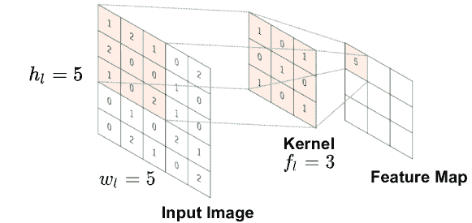

<!--yml

类别：未分类

日期：2024-09-06 19:46:06

-->

# [2206.02165] 关于深度学习基于双重扩散环境中的信道估计的调查

> 来源：[`ar5iv.labs.arxiv.org/html/2206.02165`](https://ar5iv.labs.arxiv.org/html/2206.02165)

DSRC

专用短程通信

C-ITS

合作智能交通系统

RSU

路侧单元

TDL

滤波延迟线

ITS

智能交通系统

IEEE

电气和电子工程师学会

WAVE

无线车载环境接入

V2V

车与车

V2I

车对基础设施

CCH

控制通道

SCH

服务通道

STS

短训练符号

LTS

长训练符号

SS

信号符号

SoA

最先进的

DPA

数据引导

STA

频谱时间平均

CDP

构建数据引导

TRFI

时间域可靠测试频域插值

MMSE-VP

使用虚拟引导的最小均方误差

iCDP

改进的 CDP

SBS

符号逐个

FBF

帧对帧

E-TRFI

增强 TRFI

SR-CNN

超分辨率 CNN

DN-CNN

去噪 CNN

RBF

径向基函数

CNN

卷积神经网络

TS-ChannelNet

时间光谱 ChannelNet

WSSUS

广义平稳无关散射

TDR

传输数据速率

LSTM

长短期记忆

ALS

精确 LS

SLS

简单 LS

ChannelNet

信道网络

ADD-TT

平均决策导向与时间截断

WI

加权插值

DD

决策导向

SR-ConvLSTM

超分辨率卷积长短期记忆

RS

可靠子载波

URS

不可靠子载波

AE-DNN

自编码器深度神经网络

AE

自编码器

T-DFT

截断离散傅里叶变换

TA-TDFT

时间平均 T-DFT

TA

时间平均

PDP

功率延迟剖面

1G

第一代

2G

第二代

3G

第三代

3GPP

第三代合作伙伴计划

4G

第四代

5G

第五代

802.11

IEEE 802.11 规格

A/D

模拟到数字

ADC

模拟到数字

AM

幅度调制

AP

接入点

AR

增强现实

ASIC

应用特定集成电路

ASIP

应用特定集成处理器

AWGN

加性白噪声

BCJR

Bahl, Cocke, Jelinek 和 Raviv

BER

比特误码率

BFDM

双正交频分复用

BPSK

二进制相位键控

基站

基站

CA

载波聚合

CAF

循环自相关函数

Car-2-x

车对车和车对基础设施通信

CAZAC

恒定幅度零自相关波形

CB-FMT

循环块滤波多音

CCDF

互补累积分布函数

CDF

累积分布函数

CDMA

码分多址

CFO

载波频率偏移

CIR

信道脉冲响应

CM

复数乘法

COFDM

编码-OFDM

CoMP

协调多点

COQAM

循环 OQAM

CP

循环前缀

CR

认知无线电

CRC

循环冗余检验

CRLB

Cramér-Rao 下界

CS

循环后缀

CSI

信道状态信息

CSMA

载波侦听多址

CWCU

组件逐项条件无偏

D/A

数字到模拟

D2D

设备对设备

DAC

数字到模拟

DC

直流

DFE

决策反馈均衡器

离散傅里叶变换

离散傅里叶变换

DL

深度学习

DMT

离散多音

深度神经网络

深度神经网络

FNN

前馈神经网络

DSA

动态频谱接入

数字用户线路

数字用户线路

数字信号处理

数字信号处理器

DTFT

离散时间傅里叶变换

DVB

数字视频广播

DVB-T

地面数字视频广播

DWMT

离散小波多音

DZT

离散 Zak 变换

E2E

端到端

eNodeB

演进节点 B 基站

E-SNR

有效信噪比

EVD

特征值分解

FBMC

滤波器组多载波

FD

频域

FDD

频分双工

FDE

频域均衡

FDM

频分复用

FDMA

频分多址

FEC

前向错误纠正

FER

帧错误率

FFT

快速傅里叶变换

FIR

有限冲击响应

FM

频率调制

FMT

过滤多音

FO

频率偏移

F-OFDM

过滤-OFDM

FPGA

现场可编程门阵列

FSC

频率选择性信道

FS-OQAM-GFDM

频移 OQAM-GFDM

FT

傅里叶变换

FTD

分数时间延迟

FTN

快于奈奎斯特信号

GFDM

广义频分复用

GFDMA

广义频分多址

GMC-CDM

广义多载波码分复用

GNSS

全球导航卫星系统

GS

保护符号

GSM

特殊移动组

图形用户界面

图形用户界面

H2H

人对人

H2M

人对机器

HTC

人类通信

I

同相

独立同分布

独立同分布

IB

带内

IBI

块间干扰

IC

干扰消除

ICI

载波间干扰

ICT

信息与通信技术

ICV

信息系数向量

IDFT

逆离散傅里叶变换

IDMA

交织分割多址

IEEE

电气和电子工程师协会

IF

中频

IFFT

逆快速傅里叶变换

物联网

物联网

IOTA

各向同性正交变换算法

IP

网络协议

IP 核

知识产权核心

ISDB-T

地面综合服务数字广播

ISDN

综合服务数字网络

符号间干扰

符号间干扰

ITU

国际电信联盟

IUI

用户间干扰

局域网

局域网

LLR

对数似然比

LMMSE

线性最小均方误差

LNA

低噪声放大器

LO

本地振荡器

LOS

视距

LP

低通

LPF

低通滤波器

LS

最小二乘

LTE

长期演进

LTE-A

LTE-Advanced

LTIV

线性时不变

LTV

线性时变

LUT

查找表

M2M

机器对机器

MA

多重接入

MAC

多重接入控制

MAP

最大后验

MC

多载波

MCA

多载波接入

MCM

多载波调制

MCS

调制编码方案

MF

匹配滤波器

MF-SIC

匹配滤波器与连续干扰消除

MIMO

多输入多输出

MISO

多输入单输出

ML

机器学习

MLD

最大似然检测

MLE

最大似然估计

MMSE

最小均方误差

MRC

最大比合并

MS

移动台

MSE

均方误差

MSK

最小移位键控

MSSS

均方信号分离

MTC

机器类型通信

MU

多用户

MVUE

最小方差无偏估计

NEF

噪声增强因子

NLOS

非视距

NMSE

标准化均方误差

NOMA

非正交多址

NPR

近乎完美重建

NRZ

非归零

OFDM

正交频分复用

OFDMA

正交频分多址

OOB

带外

OQAM

偏移正交振幅调制

OQPSK

偏移正交相位移键控

OTFS

正交时间频率空间

PA

功率放大器

PAM

脉冲幅度调制

PAPR

峰值平均功率比

PC-CC

并行串联卷积码

PCP

伪圆形前/后导

PD

检测概率

pdf

概率密度函数

PDF

概率分布函数

PFA

假警报概率

PHY

物理层

PIC

并行干扰消除

PLC

电力线通信

PMF

概率质量函数

PN

伪噪声

ppm

百万分之一

PRB

物理资源块

PRB

物理资源块

PSD

功率谱密度

Q

正交相位

QAM

正交振幅调制

QoS

服务质量

QPSK

正交相位移键控

R/W

读写

RAM

随机访问内存

RAN

无线接入网

RAT

无线接入技术

RC

升余弦

射频

射频

rms

均方根

RRC

根升余弦

RW

读写

SC

单载波

SCA

单载波接入

SC-FDE

单载波频域均衡

SC-FDM

单载波频分复用

SC-FDMA

单载波频分多址

SD

球面解码

SDD

空间分割双工

SDMA

空间分割多址

SDR

软件定义无线电

SDW

软件定义波形

SEFDM

频谱效率频分复用

SE-FDM

频谱效率频分复用

SER

符号错误率

SIC

连续干扰消除

SINR

信噪比加噪声比

信噪比

信噪比

SISO

单输入单输出

短信服务

短消息服务

SNR

信噪比

STC

空时编码

STFT

短时傅里叶变换

STO

符号时间偏移

SU

单用户

SVD

奇异值分解

TD

时域

TDD

时分双工

时分多址

时分多址

TFL

时间-频率定位

TO

时间偏移

TS-OQAM-GFDM

时间偏移的 OQAM-GFDM

UE

用户设备

UFMC

通用滤波多载波

上行链路

上行链路

US

无关散射

USB

通用串行总线

UW

唯一字

VLC

可见光通信

VR

虚拟现实

WCP

窗口化与 CP

WHT

Walsh-Hadamard 变换

WiMAX

全球微波接入互通

WLAN

无线局域网

W-OFDM

窗口化-OFDM

WOLA

窗口化与重叠

WSS

广义平稳

ZCT

Zadoff-Chu 变换

ZF

零强制

ZMCSCG

零均值圆对称复高斯

ZP

零填充

ZT

零尾

# 基于深度学习的双重色散环境中的通道估计综述

Abdul Karim Gizzini、Marwa Chafii 作者感谢 CY INEX 对该项目的支持，特别是 ASIA Chair of Excellence Grant（PIA/ANR-16-IDEX-0008）。Abdul Karim Gizzini 现任职于法国 ETIS，UMR8051，CY Cergy Paris Université，ENSEA，CNRS（电子邮件：abdulkarim.gizzini@ensea.fr）。Marwa Chafii 现任职于阿布扎比纽约大学（NYU）工程学院，129188，阿联酋，以及纽约大学无线通信研究所，NYU Tandon 工程学院，布鲁克林，11201，纽约（电子邮件：marwa.chafii@nyu.edu）。

###### 摘要

无线通信系统在动态环境中受到多径衰落和多普勒频移的影响，使得通道变得双重色散，通道估计变得十分困难。传统方法中，只有少量导频用于通道估计以保持高数据传输速率。因此，这些估计器在高移动场景中经历了显著的性能下降。近年来，由于其低复杂度、鲁棒性和良好的泛化能力，深度学习已被用于双重色散通道估计。在此背景下，本文对基于深度学习的通道估计技术进行了全面调查，深入研究了不同的方法。研究还提供了广泛的实验模拟和计算复杂度分析。在考虑了调制阶数、移动性、帧长度和深度学习架构等不同参数后，评估了所研究的估计器在多个移动场景中的性能。此外，源代码也在线提供，以使结果可重复。

###### 关键词：

通道估计、深度学习、频率选择性通道、时变通道。

## I 引言

随着第五代网络在全球范围内的商业化，研究第六代（6G）网络已经启动，以满足对高速数据传输和低延迟移动应用的需求，包括无人机[1]、高速铁路[2]和车载通信[3]。移动无线通信系统提供了在不与网络断连的情况下自由移动的能力。然而，移动特性伴随着若干挑战，这些挑战对通信可靠性产生了严重的负面影响，例如快速且频繁的切换[4]、载波频率偏移[5]、载波间干扰[6]、高穿透损耗[7]和快速时变无线通道[8]。

在无线环境中，已知传输信号通过多条路径传播，每条路径具有不同的衰减和延迟，还包括由于网络节点及其周围环境的运动引起的多普勒频移效应。结果，无线信道变得频率选择性和时变。由于精确估计的信道响应影响接收端的后续均衡、解调和解码操作，信道估计的准确性会影响系统性能。因此，在这种环境中通过准确的信道估计确保通信可靠性是至关重要的。

在现有文献中，大量的研究已致力于解决双重扩散通道的问题。虽然一些工作集中在波形设计上[9, 10, 11, 12]，但本文关注的是通道估计任务。通常，通道估计器可以分为两大类：（i）逐符号（SBS）通道估计器：每个接收到的符号的通道是单独估计的，仅使用前一个和当前接收到的导频[13, 14, 15]；（ii）逐帧（FBF）通道估计器：在每个接收到的符号的通道估计中使用了之前、现有以及未来的导频[16]。通过利用 FBF 估计器，可以实现更高的通道估计准确性，因为每个符号的通道估计受益于帧内所有分配的导频的综合知识。然而，传统估计器的性能主要依赖于传输帧内分配的参考训练导频。大多数标准只分配少量导频以保持良好的传输数据率。因此，这些导频不足以准确跟踪双重扩散通道，因为它们的间隔不足以捕捉频域中通道的变化。因此，传统估计器主要依赖于去映射的数据子载波，此外还有导频子载波来更新每个接收到的符号的通道估计。这一过程称为数据-导频辅助（DPA）通道估计，被认为是不可靠的，因为去映射误差从一个符号到另一个符号会被放大，这会导致估计过程中的额外误差，尤其是在高度动态的时变通道中。此外，其他传统估计器如线性最小均方误差（LMMSE）[17]估计器依赖于许多假设，这限制了它们在高度动态时变通道中的性能。此外，线性传统估计器在实际场景中是不切实际的，因为它们依赖于统计模型，要求高实现复杂度，而且在高度动态的环境中缺乏鲁棒性。因此，研究具有良好复杂度与性能权衡的估计器，对于提高通道估计准确性，同时保持良好的数据传输速率以及控制计算复杂度，是至关重要的。

作为一种主流的 AI 方法，深度学习 (DL) 是一种通过识别模式和学习潜在结构来分析数据的高效方法，代表了应对各种科学领域问题的有效方法。DL 算法已被整合到无线通信系统的物理层 [18, 19, 20]，包括信道估计 [21, 22, 23, 24, 25, 26]。这归功于显著提升整体系统性能的巨大成功，特别是当与传统估计器配合使用时，传统估计器提供的粗略信道估计后，DL 被用来实现精确估计。因此，基于 DL 的信道估计器能够在保持低计算复杂度的同时显著提升性能。此外，基于 GPU 的分布式处理允许 DL 在实时应用中的使用，从而 DL 可以通过稳健、低复杂度和通用的解决方案克服传统信道估计的局限性，提升无线系统的性能。

受这些优势的驱动，DL 算法已被整合到频率选择性 [24, 25, 26] 和双散射信道估计中。在本次调查中，我们将探讨最近提出的基于 DL 的双散射环境中的信道估计方案，其中 DL 算法以两种不同的方式应用：（i）在传统的 SBS 信道估计器上采用不同架构和配置的 前馈神经网络 [27, 28, 29]。 （ii）采用 卷积神经网络 处理，其中整个帧的估计信道被建模为 2D 低分辨率噪声图像，而 CNN 基于处理则实现为超分辨率和去噪技术 [30, 31, 32]。

文献中进行的大多数调查[33, 34]在对所研究的信道估计器进行性能评估和复杂度分析时缺乏深入的仿真。此外，它们未涵盖基于 SBS 和 FBF 的估计器。另外，[33]比较了不同 DL 架构在最小二乘法（LS）和 LMMSE 估计器之后的性能，但没有考虑几个传统的信道估计方案，而[34]则提供了多个信道估计器的一般概述，但没有任何性能评估。在这种背景下，据我们所知，这是第一篇在双重散射环境中对最近提出的基于 DL 的 SBS 和 FBF 估计器进行综合研究的调查论文，同时进行不同场景下系统性能的深入仿真，提供详细的复杂度分析，以及用于重现所有呈现结果的源代码。我们认为这篇调查论文是启动深度学习信道估计领域研究的一个非常相关的参考。本文的贡献可以总结如下：

+   •

    对最近提出的基于 DL 的双重散射信道估计技术进行综合研究。

+   •

    对 DL 网络的概述，特别是那些用于研究中的信道估计器的网络，例如 FNN、长短期记忆（LSTM）、超分辨率 CNN（SR-CNN）和去噪 CNN（DN-CNN）。

+   •

    对不同信道估计方案的性能分析，并在归一化均方误差（NMSE）和比特误差率（BER）方面进行公平比较，涵盖不同的移动场景、帧长和调制阶数。

+   •

    对所研究的信道估计器进行详细的计算复杂度分析，涉及所需的总体实值操作。

+   •

    各种信道估计方案的仿真源代码，用于重现本文中呈现的所有比较结果[35]。

本文的其余部分组织如下：第 II 节阐述了系统模型，说明了在双重色散通道上的信号传输。第 III 节简要概述了本综述中使用的主要 DL 网络。最近提出的基于 DL 的 SBS 和 FBF 信道估计方案在第 IV 节和第 V 节中进行了深入研究和讨论。在第 VI 节中，使用不同的调制阶数来展示仿真结果，其中考察了研究的估计器在 BER 和 NMSE 方面的性能。第 VII 节提供了详细的计算复杂度分析。最后，第 VIII 节总结了本研究。

符号说明：在整个论文中，向量用小写粗体符号 $\bm{x}$ 表示，其第 $k$ 个元素为 $\bm{x}[k]$。时间域和频域向量分别用 $\bm{x}$ 和 $\tilde{\bm{x}}$ 表示。矩阵用大写粗体符号 $\bm{X}$ 表示。$\mathrm{E}\left[.\right]$ 表示期望算子。方阵 $\bm{X}$ 的迹为 $\mathrm{trace}\left\{\bm{X}\right\}$。符号 $\odot$ 和 $\oslash$ 分别指代元素级的乘法和除法运算。最后，$\bm{X}$ 的伪逆和共轭矩阵分别用 $\bm{X}^{\dagger}$ 和 $\bm{X}^{\text{H}}$ 表示。

## II 系统模型

考虑一个包含 $I$ 个正交频分复用（OFDM）符号的框架。第 $i$ 个发送的频域 OFDM 符号 $\tilde{\bm{x}}_{i}[k]$ 表示为

|  | <math alttext="\tilde{\bm{x}}_{i}[k]=\left\{\begin{array}[]{ll}\tilde{\bm{x}}_{\text{d}_{i}}[k],&amp;\quad k\in{\mathcal{K}}_{\text{d}}.\\ \tilde{\bm{x}}_{\text{p}_{i}}[k],&amp;\quad k\in{\mathcal{K}}_{\text{p}}.\\

\end{array}\right." display="block"><semantics ><mrow ><mrow  ><msub ><mover accent="true" ><mi  >𝒙</mi><mo >~</mo></mover><mi >i</mi></msub><mo lspace="0em" rspace="0em" >​</mo><mrow  ><mo stretchy="false"  >[</mo><mi >k</mi><mo stretchy="false" >]</mo></mrow></mrow><mo  >=</mo><mrow ><mo >{</mo><mtable columnspacing="5pt" displaystyle="true" rowspacing="0pt"  ><mtr ><mtd  columnalign="left" ><mrow  ><mrow ><msub ><mover accent="true" ><mi  >𝒙</mi><mo >~</mo></mover><msub ><mtext >d</mtext><mi >i</mi></msub></msub><mo lspace="0em" rspace="0em"  >​</mo><mrow ><mo stretchy="false" >[</mo><mi >k</mi><mo stretchy="false" >]</mo></mrow></mrow><mo >,</mo></mrow></mtd><mtd columnalign="left"  ><mrow ><mrow ><mi  >k</mi><mo >∈</mo><msub ><mi >𝒦</mi><mtext >d</mtext></msub></mrow><mo lspace="0em"  >.</mo></mrow></mtd></mtr><mtr ><mtd  columnalign="left" ><mrow  ><mrow ><msub ><mover accent="true" ><mi  >𝒙</mi><mo >~</mo></mover><msub ><mtext >p</mtext><mi >i</mi></msub></msub><mo lspace="0em" rspace="0em"  >​</mo><mrow ><mo stretchy="false" >[</mo><mi >k</mi><mo stretchy="false" >]</mo></mrow></mrow><mo >,</mo></mrow></mtd><mtd columnalign="left"  ><mrow ><mrow ><mi  >k</mi><mo >∈</mo><msub ><mi >𝒦</mi><mtext >p</mtext></msub></mrow><mo lspace="0em"  >.</mo></mrow></mtd></mtr></mtable></mrow></mrow><annotation-xml encoding="MathML-Content" ><apply  ><apply ><apply ><csymbol cd="ambiguous"  >subscript</csymbol><apply ><ci >~</ci><ci  >𝒙</ci></apply><ci >𝑖</ci></apply><apply ><csymbol cd="latexml" >delimited-[]</csymbol><ci >𝑘</ci></apply></apply><apply ><csymbol cd="latexml" >cases</csymbol><matrix  ><matrixrow ><apply ><apply  ><csymbol cd="ambiguous"  >subscript</csymbol><apply ><ci >~</ci><ci >𝒙</ci></apply><apply ><csymbol cd="ambiguous" >subscript</csymbol><ci ><mtext mathsize="70%" >d</mtext></ci><ci >𝑖</ci></apply></apply><apply ><csymbol cd="latexml" >delimited-[]</csymbol><ci >𝑘</ci></apply></apply><apply ><ci  >𝑘</ci><apply ><csymbol cd="ambiguous" >subscript</csymbol><ci >𝒦</ci><ci ><mtext mathsize="70%"  >d</mtext></ci></apply></apply></matrixrow><matrixrow ><apply ><apply  ><csymbol cd="ambiguous"  >subscript</csymbol><apply ><ci >~</ci><ci >𝒙</ci></apply><apply ><csymbol cd="ambiguous" >subscript</csymbol><ci ><mtext mathsize="70%" >p</mtext></ci><ci >𝑖</ci></apply></apply><apply ><csymbol cd="latexml" >delimited-[]</csymbol><ci >𝑘</ci></apply></apply><apply ><ci  >𝑘</ci><apply ><csymbol cd="ambiguous" >subscript</csymbol><ci >𝒦</ci><ci ><mtext mathsize="70%"  >p</mtext></ci></apply></apply></matrixrow></matrix></apply></apply></annotation-xml><annotation encoding="application/x-tex" >\tilde{\bm{x}}_{i}[k]=\left\{\begin{array}[]{ll}\tilde{\bm{x}}_{\text{d}_{i}}[k],&\quad k\in{\mathcal{K}}_{\text{d}}.\\ \tilde{\bm{x}}_{\text{p}_{i}}[k],&\quad k\in{\mathcal{K}}_{\text{p}}.\\ \end{array}\right.</annotation></semantics></math> |  | (1) |

其中 $0\leq k\leq K-1$。$\tilde{\bm{x}}_{\text{d}_{i}}[k]$ 和 $\tilde{\bm{x}}_{\text{p}_{i}}[k]$ 分别表示在一组子载波 ${\mathcal{K}}_{\text{d}}$ 和 ${\mathcal{K}}_{\text{p}}$ 上分配的调制数据符号和预定义的导频符号。$\bm{x}_{i}[k]$ 通过应用 逆离散傅里叶变换 (IDFT) 转换到时间域，如下所示

|  | $\bm{x}_{i}[n]=\frac{1}{\sqrt{{{K}}}}\sum_{k=0}^{{K}-1}\tilde{\bm{x}}_{i}[k]e^{j2\pi\frac{nk}{{K}}}.$ |  | (2) |
| --- | --- | --- | --- |

添加一个长度大于时延扩展的 循环前缀 (CP)。因此，在经过双重色散通道并去除 CP 后，接收到的 OFDM 符号 $\bm{y}_{i}[n]$ 可以表示如下

|  | $\begin{split}\bm{y}_{i}[n]&amp;=\sum_{l=0}^{L-1}{\bm{h}_{i}[l,n]}\bm{x}_{i}[n-l]+{\bm{v}}_{i}[n]\\ &amp;=\frac{1}{\sqrt{{K}}}\sum_{k=0}^{{K}-1}{\tilde{\bm{h}}_{i}[k,n]}\tilde{\bm{x}}_{i}[k]e^{j2\pi\frac{nk}{{K}}}+{\bm{v}}_{i}[n].\end{split}$ |  | (3) |
| --- | --- | --- | --- |

$\bm{h}_{i}[l,n]$ 表示在第 $i$ 个 OFDM 符号处，具有 $L$ 个抽头的离散 线性时变 (LTV) 通道的时延响应，而 $\tilde{\bm{h}}_{i}[k,n]=\sum_{l=0}^{L-1}{{\bm{h}}_{i}[l,n]}e^{-j2\pi\frac{lk}{{K}}}$ 则指的是频率-时间响应。此外，${\bm{v}}_{i}$ 表示方差为 $\sigma^{2}$ 的 加性白高斯噪声 (AWGN)。第 $i$ 个接收的频域 OFDM 符号通过 (3) 的 离散傅里叶变换 (DFT) 得到，因此

|  | $\begin{split}\tilde{\bm{y}}_{i}[k]&amp;=\frac{1}{{{K}}}\sum_{q=0}^{{K}-1}\tilde{\bm{x}}_{i}[q]\sum_{n=0}^{{K}-1}\tilde{\bm{h}}_{i}[q,n]e^{-j2\pi\frac{n(k-q)}{{K}}}+\tilde{\bm{v}}_{i}[k].\end{split}$ |  | (4) |
| --- | --- | --- | --- |

值得注意的是，索引 $k$ 在 (3) 中用于以通道频率-时间响应的形式表达通道时延响应。而在 (4) 中将索引更改为 $q$ 是为了表达第 $i$ 个接收的频域符号。这反过来更好地说明了 DFT 变换。此外，$\tilde{\bm{h}}_{i}[q,n]$ 指的是在 OFDM 符号持续时间尺度（索引 $i$）和符号本身（索引 $n$）下的时变。

|  | $\begin{split}\tilde{\bm{h}}_{i}[q,n]&amp;=\sum_{l=0}^{L-1}e^{-j2\pi\frac{lq}{K}}\int_{\nu=-\nu_{d}}^{\nu=\nu_{d}}\bar{h}(l,\nu)e^{j2\pi\nu n_{i}}e^{j2\pi\nu n}d\nu,\end{split}$ |  | (5) |
| --- | --- | --- | --- |

其中 $\bar{h}(l,\nu)=\sum\limits_{n}{h}[l,n]e^{-j2\pi n\nu}$ 表示通道延迟-多普勒响应，$\nu$ 指的是归一化多普勒频率，$n_{i}=i(K+K_{\text{cp}})+K_{\text{cp}}$。而 $\nu_{d}=\frac{f_{d}}{F_{s}}$ 表示最大多普勒频率。设

|  | $\begin{split}\bar{\bm{h}}_{i}[l,v]&amp;=\frac{1}{K}\sum_{q=0}^{{K}-1}\sum_{n=0}^{{K}-1}\tilde{\bm{h}}_{i}[q,n]e^{-j2\pi\frac{nv}{K}}e^{j2\pi\frac{ql}{K}}\\ &amp;=\int_{\nu=-\nu_{d}}^{\nu=\nu_{d}}\bar{h}(l,\nu)e^{j2\pi\nu n_{i}}\sum_{n=0}^{{K}-1}e^{-j2\pi(\nu-\frac{v}{K})n}d\nu,\end{split}$ |  | (6) |
| --- | --- | --- | --- |

是第 $i$ 个 OFDM 符号的离散延迟-多普勒响应。为了简化起见，假设 $\bar{h}(l,\nu)$ 在两个领域中都是不相关的 [36]，即 $\mathrm{E}\left[\bar{h}(l,\nu)\bar{h}^{*}(l^{\prime},\nu^{\prime})\right]=S_{h}(l,\nu)\delta(l-l^{\prime})\delta(\nu-\nu^{\prime})$，其中 $S_{h}(l,\nu)$ 是延迟-多普勒谱 [37]，而 $\delta(x)$ 表示狄拉克 delta 函数。使用 (6)，我们得到

|  | $\begin{split}\mathrm{E}\left[\bar{\bm{h}}_{i}[l,v]\bar{\bm{h}}_{i}^{*}[l,v^{\prime}]\right]=&amp;\\ \int_{\nu=-\nu_{d}}^{\nu=\nu_{d}}S_{h}(l,\nu)\sum_{n=0}^{{K}-1}&amp;\sum_{n^{\prime}=0}^{{K}-1}e^{-j2\pi\nu(n-n^{\prime})}e^{-j2\pi\frac{n^{\prime}v^{\prime}-nv}{K}}d\nu.\end{split}$ |  | (7) |
| --- | --- | --- | --- |

这个与索引 $i$ 无关的相关性可以近似为如下

|  | $\begin{split}\mathrm{E}\left[\bar{\bm{h}}_{i}[l,v]\bar{\bm{h}}_{i}^{*}[l,v^{\prime}]\right]&amp;\approx K^{2}\rho[l,v]\delta[v-v^{\prime}],\\ \mbox{where }&amp;\rho[l,v]=S_{h}(l,\frac{v}{N}).\end{split}$ |  | (8) |
| --- | --- | --- | --- |

通道的时间选择性依赖于移动性。在非常低的移动性下，$f_{\text{d}}\approx 0$，$\tilde{\bm{h}}_{i}[q,n]=\tilde{\bm{h}}[q]$ 在整个帧内是常量。对于中等到高移动性，单个 OFDM 符号内的通道变化可以忽略，因此，$\tilde{\bm{h}}_{i}[q,n]=\tilde{\bm{h}}_{i}[q]$。在非常高的移动性下，通道在单个 OFDM 符号内会发生变化。在这种情况下，$\tilde{\bm{h}}_{i}[q,n]=\tilde{\bm{h}}_{i}[q]+\tilde{\bm{\epsilon}}_{i}[q,n]$，其中

|  | $\tilde{\bm{h}}_{i}[q]=\frac{1}{K}\sum_{n=0}^{K-1}\tilde{\bm{h}}_{i}[q,n],\leavevmode\nobreak\ \mbox{and }\tilde{\bm{\epsilon}}_{i}[q,n]=\tilde{\bm{h}}_{i}[q,n]-\tilde{\bm{h}}_{i}[q].$ |  | (9) |
| --- | --- | --- | --- |

将其代入 (4)，我们得到

|  | $\begin{split}\tilde{\bm{y}}_{{i}}[k]&amp;=\tilde{\bm{h}}_{i}[k]\tilde{\bm{x}}_{i}[k]+\tilde{\bm{e}}_{i,\text{d}}[k]+\tilde{\bm{v}}_{i}[k],\leavevmode\nobreak\ k\in{\mathcal{K}}_{\text{on}}.\end{split}$ |  | (10) |
| --- | --- | --- | --- |

符号$\tilde{\bm{e}}_{i,\text{d}}[k]$表示多普勒干涉，由以下公式给出

|  | <math   alttext="\begin{split}\tilde{\bm{e}}_{i,\text{d}}[k]&amp;=\frac{1}{{{K}}}\sum_{\begin{subarray}{c}q=0\\ q\neq k\end{subarray}}^{{K}-1}\sum_{n=0}^{{K}-1}\tilde{\bm{h}}_{i}[q,n]e^{-j2\pi\frac{n(k-q)}{{K}}}\tilde{\bm{x}}_{i}[q]\\

&amp;=\frac{1}{K}\sum_{\begin{subarray}{c}q\in{\mathcal{K}}_{\text{on}}\\

\(\tilde{\bm{e}}_{i,\text{d}}[k]\) = \frac{

假设子载波在功率$E_{q}$下是互不相关的，即$\mathrm{E}\left[\tilde{\bm{x}}_{i}[q]\tilde{\bm{x}}^{*}_{i}[q^{\prime}]\right]=E_{q}\delta[q-q^{\prime}]$，并使用（8）然后

多普勒干扰破坏了接收的 OFDM 符号中子载波的正交性，导致整体系统性能显著下降[38]。

&amp;=\sigma^{2}_{d}[k]\delta[k-k^{\prime}].\end{split}" display="block"><semantics ><mtable columnspacing="0pt" displaystyle="true" rowspacing="0pt" ><mtr ><mtd columnalign="right" ><mrow ><mi mathvariant="normal"  >E</mi><mo lspace="0em" rspace="0em"  >​</mo><mrow ><mo  >[</mo><mrow ><msub ><mover accent="true"  ><mi >𝒆</mi><mo >~</mo></mover><mrow ><mi  >i</mi><mo >,</mo><mtext >d</mtext></mrow></msub><mo lspace="0em" rspace="0em"  >​</mo><mrow ><mo stretchy="false" >[</mo><mi  >k</mi><mo stretchy="false"  >]</mo></mrow><mo lspace="0em" rspace="0em"  >​</mo><msubsup ><mover accent="true" ><mi  >𝒆</mi><mo >~</mo></mover><mrow ><mi >i</mi><mo >,</mo><mtext >d</mtext></mrow><mo >∗</mo></msubsup><mo lspace="0em" rspace="0em"  >​</mo><mrow ><mo stretchy="false" >[</mo><msup ><mi >k</mi><mo >′</mo></msup><mo stretchy="false"  >]</mo></mrow></mrow><mo >]</mo></mrow></mrow></mtd><mtd columnalign="left" ><mrow ><mo rspace="0.111em"  >=</mo><mrow ><munderover ><mo movablelimits="false" rspace="0em"  >∑</mo><mrow ><mi >l</mi><mo >=</mo><mn >0</mn></mrow><mrow ><mi >L</mi><mo >−</mo><mn >1</mn></mrow></munderover><mrow ><munder ><mo movablelimits="false" >∑</mo><mtable rowspacing="0pt" ><mtr ><mtd ><mrow ><mi >q</mi><mo >∈</mo><msub ><mi >𝒦</mi><mtext >on</mtext></msub></mrow></mtd></mtr><mtr ><mtd ><mrow ><mi >q</mi><mo >≠</mo><mi >k</mi></mrow></mtd></mtr></mtable></munder><mrow ><msub ><mi >E</mi><mi >q</mi></msub><mo lspace="0em" rspace="0em"  >​</mo><mi >ρ</mi><mo lspace="0em" rspace="0em"  >​</mo><mrow ><mo stretchy="false" >[</mo><mi  >l</mi><mo >,</mo><mrow ><mi >k</mi><mo >−</mo><mi >q</mi></mrow><mo stretchy="false" >]</mo></mrow><mo lspace="0em" rspace="0em" >​</mo><mi  >δ</mi><mo lspace="0em" rspace="0em"  >​</mo><mrow ><mo stretchy="false" >[</mo><mrow ><mi >k</mi><mo >−</mo><msup ><mi >k</mi><mo >′</mo></msup></mrow><mo stretchy="false" >]</mo></mrow></mrow></mrow></mrow></mrow></mtd></mtr><mtr ><mtd  columnalign="left" ><mrow ><mrow ><mo >=</mo><mrow ><msubsup ><mi >σ</mi><mi >d</mi><mn >2</mn></msubsup><mo lspace="0em" rspace="0em" >​</mo><mrow ><mo stretchy="false" >[</mo><mi  >k</mi><mo stretchy="false"  >]</mo></mrow><mo lspace="0em" rspace="0em"  >​</mo><mi >δ</mi><mo lspace="0em" rspace="0em"  >​</mo><mrow ><mo stretchy="false" >[</mo><mrow ><mi >k</mi><mo >−</mo><msup ><mi >k</mi><mo >′</mo></msup></mrow><mo stretchy="false" >]</mo></mrow></mrow></mrow><mo lspace="0em"  >.</mo></mrow></mtd></mtr></mtable><annotation-xml encoding="MathML-Content" ><apply ><apply  ><apply ><ci >E</ci><apply ><csymbol cd="latexml" >delimited-[]</csymbol><apply ><apply ><csymbol cd="ambiguous" >subscript</csymbol><apply ><ci  >~</ci><ci >𝒆</ci></apply><list ><ci >𝑖</ci><ci ><mtext mathsize="70%" >d</mtext></ci></list></apply><apply ><csymbol cd="latexml" >delimited-[]</csymbol><ci >𝑘</ci></apply><apply ><csymbol cd="ambiguous" >subscript</csymbol><apply ><csymbol cd="ambiguous" >superscript</csymbol><apply ><ci  >~</ci><ci >𝒆</ci></apply></apply><list ><ci >𝑖</ci><ci ><mtext mathsize="70%"  >d</mtext></ci></list></apply><apply ><csymbol cd="latexml"  >delimited-[]</csymbol><apply ><csymbol cd="ambiguous"  >superscript</csymbol><ci >𝑘</ci><ci >′</ci></apply></apply></apply></apply></apply></apply></apply><apply ><apply ><csymbol cd="ambiguous"  >superscript</csymbol><apply ><csymbol cd="ambiguous"  >subscript</csymbol><apply ><ci >𝑙</ci><cn type="integer" >0</cn></apply></apply><apply ><ci >𝐿</ci><cn type="integer" >1</cn></apply></apply><apply ><apply ><csymbol cd="ambiguous" >subscript</csymbol><list ><matrix ><matrixrow ><apply ><ci >𝑞</ci><apply ><csymbol cd="ambiguous" >subscript</csymbol><ci >𝒦</ci><ci ><mtext mathsize="50%" >on</mtext></ci></apply></apply></matrixrow><matrixrow ><apply ><ci >𝑞</ci><ci >𝑘</ci></apply></matrixrow></matrix></list></apply><apply ><apply ><csymbol cd="ambiguous"  >subscript</csymbol><ci >𝐸</ci><ci >𝑞</ci></apply><ci >𝜌</ci><interval closure="closed"  ><ci >𝑙</ci><apply ><ci >𝑘</ci><ci >𝑞</ci></apply></interval><ci >𝛿</ci><apply ><csymbol cd="latexml"  >delimited-[]</csymbol><apply ><ci >𝑘</ci><apply ><csymbol cd="ambiguous"  >superscript</csymbol><ci >𝑘</ci><ci >′</ci></apply></apply></apply></apply></apply></apply></apply><apply ><apply ><apply ><csymbol cd="ambiguous" >subscript</csymbol><apply ><csymbol cd="ambiguous" >superscript</csymbol><ci >𝜎</ci><cn type="integer" >2</cn></apply><ci >𝑑</ci></apply><apply ><csymbol cd="latexml" >delimited-[]</csymbol><ci >𝑘</ci></apply><ci >𝛿</ci><apply ><csymbol cd="latexml" >delimited-[]</csymbol><apply ><ci >𝑘</ci><apply ><csymbol cd="ambiguous" >superscript</csymbol><ci >𝑘</ci><ci >′</ci></apply></apply></apply></apply></apply></apply></annotation-xml><annotation encoding="application/x-tex" >\begin{split}\mathrm{E}\left[\tilde{\bm{e}}_{i,\text{d}}[k]\tilde{\bm{e}}^{*}_{i,\text{d}}[k^{\prime}]\right]&=\sum_{l=0}^{L-1}\sum_{\begin{subarray}{c}q\in{\mathcal{K}}_{\text{on}}\\ q\neq k\end{subarray}}E_{q}\rho[l,k-q]\delta[k-k

因此，假设多普勒干扰是不相关的。然而，方差$\sigma^{2}_{d}[k]=\mathrm{E}\left[|\tilde{\bm{e}}_{i,\text{d}}[k]|^{2}\right]$依赖于子载波索引。注意到

|  | $\tilde{\bm{h}}_{i}[k]=\frac{1}{K}\sum_{l=0}^{L-1}\bar{\bm{h}}_{i}[l,0]e^{-j2\pi\frac{kl}{K}},$ |  | (13) |
| --- | --- | --- | --- |

信道增益和多普勒干扰是不相关的，即$\mathrm{E}\left[\tilde{\bm{h}}_{i}[k]\tilde{\bm{e}}_{i,\text{d}}^{*}[k]\right]=0$。此外，可以从由$\bar{\bm{h}}_{i}[l,0]$定义的$L$个不相关的抽头中估计$\tilde{\bm{h}}_{i}[k]$。

## III 深度学习技术概述

本节讨论了在研究的 DL 基础信道估计方案中使用的 DL 网络，并提供了每个网络的数学表示。

### III-A FNN

神经网络是最受欢迎的机器学习算法之一[39]。最初，神经网络受到人脑神经结构的启发，因此其基本构件称为神经元，就像人脑中的神经元一样。它的功能类似于人类神经元，即接收一些输入并产生输出。在纯数学术语中，神经元表示一个数学函数的占位符，其任务是通过对给定输入应用函数来产生输出。神经元被堆叠在一起形成一层。神经网络至少包含一层；如果使用多层，神经网络称为深度 FNN。

考虑图 1 中所示的 FNN 架构。这里$\mathcal{L}$表示层数，包括一个输入层、$\mathcal{L}-2$个隐藏层以及一个输出层。网络的第$l$层隐藏层包含$J_{l}$个神经元，其中$2\leq l\leq L-1$。此外，第$l$层隐藏层中的每个神经元由$j$表示，其中$1\leq j\leq J_{l}$。FNN 的输入$\bm{i}$和输出$\bm{o}$分别表示为$\bm{i}=[i_{1},i_{2},...,i_{\mathcal{N}}]^{T}\in\mathbb{R}^{\mathcal{N}\times 1}$和$\bm{o}=[o_{1},o_{2},...,o_{\mathcal{M}}]^{T}\in\mathbb{R}^{\mathcal{M}\times 1}$，其中$\mathcal{N}$和$\mathcal{M}$分别指 FNN 的输入和输出数量。$\bm{W}_{l}\in\mathbb{R}^{J_{l}\times J_{l-1}}$和$\bm{b}_{l}\in\mathbb{R}^{J_{l}\times 1}$分别表示第$l$层隐藏层的权重矩阵和偏置向量。

每个神经元$n_{(l,j)}$对前一层输出值的加权求和进行非线性变换。这个非线性变换由神经元输入向量$\bm{i}_{(l)}\in\mathbb{R}^{J_{l-1}\times 1}$上的激活函数${f}_{(l,j)}$表示，利用其权重向量$\bm{\omega}_{(l,j)}\in\mathbb{R}^{J_{l-1}\times 1}$和偏置${b}_{(l,j)}$。神经元的输出${o}_{(l,j)}$是

|  | ${o}_{(l,j)}={f}_{(l,j)}\Big{(}b_{(l,j)}+{\bm{\omega}^{T}_{(l,j)}}\bm{i}_{(l)}\Big{)}.$ |  | (14) |
| --- | --- | --- | --- |

图 1：显示输入层、输出层和隐藏层的 FNN 架构。

深度神经网络（DNN）第$l$层隐藏层的整体输出由向量形式表示

|  | $\bm{o}_{(l)}=\bm{f}_{(l)}\Big{(}\bm{b}_{(l)}+{\bm{W}_{(l)}}\bm{i}_{(l)}\Big{)},\leavevmode\nobreak\ \bm{i}_{(l+1)}=\bm{o}_{(l)},$ |  | (15) |
| --- | --- | --- | --- |

其中$\bm{f}_{(l)}$是由$n_{l}$个激活函数叠加而成的向量。

在选择了 FNN 架构之后，表示总的 FNN 权重和偏置的参数${\theta}=(\bm{W},\bm{B})$必须通过在 FNN 训练阶段应用的学习过程进行估计。众所周知，${\theta}$的估计是通过最小化损失函数$\text{Loss}({\theta})$来获得的。损失函数衡量预测的 FNN 输出($\bm{o}_{(\mathcal{L})}^{\text{(P)}}$)与真实输出($\bm{o}_{(\mathcal{L})}^{\text{(T)}}$)之间的差距。因此，经过$N_{\text{train}}$个训练样本的 FNN 训练阶段可以分为两个步骤：（i）计算损失，以及（ii）更新${\theta}$。这个过程会重复进行直到收敛，使得损失变得非常小。因此，可以使用各种优化算法通过迭代更新参数${\theta}$来最小化$\text{Loss}({\theta})$，即随机梯度下降[39]、均方根传播[40]和自适应矩估计（ADAM）[41]。

在 FNN 训练后的最后一步是对训练好的 FNN 进行新数据测试，以评估其性能。FNN 不同原理的详细综合分析见[42]。

### III-B LSTM

另一个著名的 DL 工具是 LSTM 网络，这些网络本质上处理序列数据，其中数据的顺序很重要，并且存在先前数据与未来数据之间的相关性。在这种情况下，LSTM 网络定义了一种特殊的架构，能够学习数据随时间的相关性，使得 LSTM 网络能够根据先前的观察预测未来的数据。

如图 2 所示，LSTM 单元包含被称为门的计算块，这些块负责控制和跟踪信息流动。 LSTM 网络机制可以通过四个主要步骤来解释：

##### 忘记无关信息

通常，LSTM 单元将输入数据分类为相关和无关信息。第一步处理是消除对预测未来不重要的无关信息。这可以通过遗忘门完成，遗忘门决定了 LSTM 单元应该保留哪些信息，以及哪些信息可以被删除。遗忘门处理定义如下

|  | ${\bm{f}}_{t}=\sigma(\bm{W}_{f,t}\bar{\bm{x}}_{t}+\bm{W}^{\prime}_{f,t}\bar{\bm{z}}_{t-1}+\bar{\bm{b}}_{f,t}),$ |  | (16) |
| --- | --- | --- | --- |

其中，$\bar{\sigma}$ 表示 sigmoid 函数，$\bm{W}_{f,t}\in\mathbb{R}^{P\times K_{in}}$，$\bm{W}^{\prime}_{f,t}\in\mathbb{R}^{P\times P}$ 和 $\bar{\bm{b}}_{f,t}\in\mathbb{R}^{P\times 1}$ 是时间 $t$ 的遗忘门权重和偏置，$\bar{\bm{x}}_{t}\in\mathbb{R}^{K_{in}\times 1}$ 和 $\bar{\bm{z}}_{t-1}$ 分别表示 LSTM 单元的输入向量（大小为 $K_{in}$）和前一个隐藏状态（大小为 $P$）。

图 2：LSTM 单元结构 [43]。

##### 存储相关的新信息

在对相关信息进行分类后，LSTM 单元通过输入门对选择的信息进行一些计算

|  | ${\bar{\bm{i}}_{t}}=\sigma(\bm{W}_{\bar{\bm{i}},t}\bar{\bm{x}}_{t}+\bm{W}^{\prime}_{\bar{\bm{i}},t}\bar{\bm{z}}_{t-1}+\bar{\bm{b}}_{\bar{\bm{i}},t}),$ |  | (17) |
| --- | --- | --- | --- |
|  | ${\tilde{{\bm{c}}}}_{t}=\text{tanh}(\bm{W}_{{\tilde{{\bm{c}}}},t}\bar{\bm{x}}_{t}+\bm{W}^{\prime}_{{\tilde{{\bm{c}}}},t}\bar{\bm{z}}_{t-1}+\bar{\bm{b}}_{{\tilde{{\bm{c}}}},t}).$ |  | (18) |

##### 更新新的单元状态

接下来，LSTM 单元应根据上述两个步骤更新当前的单元状态 ${{{\bm{c}}}}_{t}$，使其

|  | ${{{\bm{c}}}}_{t}={\bm{f}}_{t}\odot{\bm{c}}_{t-1}+\bar{\bm{i}}_{t}\odot{\tilde{{\bm{c}}}}_{t}.$ |  | (19) |
| --- | --- | --- | --- |

其中，$\odot$ 表示 Hadamard 积。

##### 生成 LSTM 单元输出

更新隐藏状态并通过输出门生成输出是最终的处理步骤。输出被视为单元状态的过滤版本，可以通过以下方式计算

|  | ${\bm{o}}_{t}=\sigma(\bm{W}_{o,t}\bar{\bm{x}}_{t}+\bm{W}^{\prime}_{o,t}\bar{\bm{z}}_{t-1}+\bar{\bm{b}}_{o,t}),$ |  | (20) |
| --- | --- | --- | --- |
|  | ${\bar{{\bm{z}}}}_{t}={\bm{o}}_{t}\odot\text{tanh}({\bm{c}}_{t}).$ |  | (21) |

文献中存在几种 LSTM 架构变体，其中 LSTM 单元门的相互作用被修改。作者在[44]中提供了对流行 LSTM 架构变体的详细比较。

### III-C CNN

另一种深度学习类型是 CNN 模型。这通常用于处理具有网格模式的数据，如图像[45]。因此，CNN 已普遍成为多种视觉应用（如图像分类）的最先进技术，因为它具有从输入图像中提取模式的能力。CNN 可以视为几个层叠在一起以完成所需任务的集合。这些层包括

+   •

    输入层：它表示二维或三维输入图像。为了简单起见，我们考虑输入到第$l$层的二维图像，记作$\bm{X}_{l}\in\mathbb{R}^{h_{l}\times w_{l}}$，其中$h_{l}$和$w_{l}$分别表示$\bm{X}_{l}$输入图像的高度和宽度。

+   •

    卷积层：指的是一种用于特征提取的特殊线性操作类型，其中预定义的滤波器（称为卷积核）扫描输入矩阵以填充输出矩阵，输出矩阵称为特征图，如图 3 所示。我们注意到，不同的卷积核可以被视为不同的特征提取器。

    定义 CNN 卷积层的两个关键超参数是卷积核的大小和数量，分别记作$f_{l}$和$n_{l}$。典型的卷积核大小为$3\times 3$，但有时为$5\times 5$或$7\times 7$。卷积核的数量是任意的，决定了输出特征图的深度。可以根据应用类型调整这些参数。此外，关于卷积层训练 CNN 模型的过程涉及识别对特定任务在给定训练数据集上效果最佳的卷积核值。在卷积层中，卷积核是训练过程中唯一的自动学习参数。从数学角度来看，对于给定的输入图像$\bm{X}_{l}$和卷积核$\bm{K_{l}}\in\mathbb{R}^{f_{l}\times f_{l}\times 1}$，为简单起见，我们考虑一个卷积核，生成的特征图$\bm{Y}_{l}\in\mathbb{R}^{(h_{l}-f+1)\times(w_{l}-f+1)}$可以表示为

    |  | $\bm{Y}_{l}[x,y]=\sum^{h_{l}}_{i=1}\sum^{w_{l}}_{j=1}\bm{K}_{l}[i,j]\bm{X}_{l}[x+i-1,y+j-1].$ |  | (22) |
    | --- | --- | --- | --- |

    

    图 3：CNN 卷积层示例[46]。

+   •

    激活层：线性操作（如卷积）的输出通过一个非线性激活函数。这种激活函数为卷积神经网络架构引入了非线性处理，因为输入输出卷积神经网络对的关系可能是非线性的。虽然存在多种非线性激活函数，如 sigmoid 或双曲正切（tanh）函数，但目前最常用的函数是修正线性单元（ReLU）。

+   •

    池化层：当图像过大时，这一层用于减少参数的数量。池化操作也被称为子采样或下采样。这会减少所有特征图的维度，但仍能保留重要信息。值得注意的是，没有任何池化层包含可学习参数。最流行的池化操作形式是最大池化，它从输入特征图中提取补丁，输出每个补丁中的最大值，然后丢弃所有其他值。然而，还有其他池化操作，如全局平均池化[47]。

    

    图 4：经典卷积神经网络架构[46]。

+   •

    全连接层：这一层形成卷积神经网络架构的最后一块，主要用于分类问题。这是一个简单的前馈神经网络层，至少包含一个隐藏层，其作用是将二维卷积神经网络层的输出转换为一维向量。在分类问题中，卷积神经网络网络的最终输出表示每个类别的概率，其中最后的全连接层通常具有与类别数量相同的输出节点数。

+   •

    批量归一化：用于通过归一化每层的输出来增加卷积神经网络的稳定性。此外，批量归一化层减少了过拟合，并加速了卷积神经网络的训练。

+   •

    输出层：这一层根据研究的问题进行配置。例如，在分类问题中，卷积神经网络的输出层是一个带有 softmax 激活函数的全连接层。另一方面，在回归问题中，卷积神经网络的输出不使用任何激活函数。

图 4 展示了经典的 CNN 架构。从该图可以看出，CNN 网络中唯一可训练的参数是卷积核和全连接层的权重。与所有其他深度学习（DL）技术类似，CNN 网络通过最小化 CNN 损失函数来更新其可训练参数，该损失函数衡量输入与输出之间的差距。随后，在反向传播操作中，CNN 的卷积核和权重会被更新[48]。最后，在测试阶段，通过将新的未观察图像输入到训练好的 CNN 模型中来检查训练好的 CNN 模型的性能。

值得注意的是，存在一些特殊的卷积神经网络（CNN）架构，如 SR-CNN [49]、DN-CNN [50]以及超分辨率卷积长短期记忆网络（SR-ConvLSTM）[51]，这些架构主要用于回归问题。SR-CNN 用于提高输入图像的质量，它以低分辨率图像作为输入，输出高分辨率图像。DN-CNN 采用另一种方法，通过利用残差学习将噪声从输入的噪声图像中分离出来，以提高图像质量[52]。然后，从提取的噪声中减去输入的噪声图像，从而得到去噪图像。此外，SR-ConvLSTM 结合了 LSTM 和 CNN 网络，通过学习整个输入图像的时间相关性，从而实现更好的估计准确度。

## IV 基于深度学习的 SBS 信道估计

在基于 DL 的 SBS 信道估计中，FNN 和 LSTM 网络主要以以下两种方式与传统估计方案集成：(i) FNN 被实现为传统 DPA、频谱时间平均 (STA)和时域可靠测试频域插值 (TRFI)估计器之后的后处理模块。(ii) LSTM 网络在传统 DPA 估计之前作为预处理单元实现，以迭代地最小化 DPA 反映误差。这两种实现都对提高信道估计的准确性有帮助，尤其是在高移动场景中。然而，LSTM-based 估计在第 VI 节中展示了相对于基于 FNN 的估计有显著的优势。以下是每个基于 DL 的 SBS 估计器所应用的步骤。

### IV-A DPA-FNN

图 5：所研究的基于 DNN 的 SBS 估计器的框图。

DPA 估计[13]利用之前接收到的 OFDM 符号的反映数据子载波来估计现有 OFDM 符号的信道，如下所示

|  | $\tilde{\bm{d}}_{i}[k]=\mathfrak{D}\big{(}\frac{\tilde{\bm{y}}_{i}[k]}{\hat{\tilde{\bm{h}}}_{\text{DPA}_{i-1}}[k]}\big{)},\leavevmode\nobreak\ \hat{\tilde{\bm{h}}}_{\text{DPA}_{0}}[k]=\hat{\tilde{\bm{h}}}_{\text{LS}}[k],$ |  | (23) |
| --- | --- | --- | --- |

其中$\mathfrak{D}(.)$指的是根据使用的调制阶数对最近星座点的反映操作。$\hat{\tilde{\bm{h}}}_{\text{LS}}$表示在接收到的前导符号处的 LS 估计信道，如下所示

|  | $\hat{\tilde{\bm{h}}}_{\text{LS}}[k]=\frac{\sum\limits_{u=1}^{P}\tilde{\bm{y}}^{(p)}_{u}[k]}{P\tilde{\bm{\Lambda}}[k]},\leavevmode\nobreak\ k\in{\mathcal{K}}_{\text{on}},$ |  | (24) |
| --- | --- | --- | --- |

其中$\tilde{\bm{\Lambda}}$表示频域预定义前导序列。然后，最终的 DPA 信道估计以以下方式更新

|  | $\hat{\tilde{\bm{h}}}_{\text{DPA}_{i}}[k]=\frac{\tilde{\bm{y}}_{i}[k]}{\tilde{\bm{d}}_{i}[k]}.$ |  | (25) |
| --- | --- | --- | --- |

DPA 估计存在两个主要局限性。首先，它基于基本的$\hat{\tilde{\bm{h}}}_{\text{LS}}$估计，易受噪声增强的影响。其次，DPA 中的解映射步骤在低信噪比（SNR）区域会导致显著的解映射误差，这主要源于噪声的不完美和双扩散通道变化。在使用高调制阶数的高移动性场景中，这种解映射误差会放大。此外，由于 DPA 估计的通道会在接收帧上迭代更新，解映射误差会在帧中传播，导致性能显著下降。为了解决这些局限性，提出了 DPA-FNN 方案[27]，该方案旨在补偿 DPA 估计误差，其中$\hat{\tilde{\bm{h}}}_{\text{DPA}_{i}}[k]$被输入到一个具有$40-20-40$神经元的三层隐藏 FNN 中，如图 5 所示。虽然在 DPA 方案中加入 FNN 可以获得良好的性能，但仍然不够，因为它忽略了连续接收 OFDM 符号之间的时间和频率相关性。此外，所使用的 FNN 架构可以优化以减少通道估计的计算复杂度。

### IV-B STA-FNN

为了改进传统的 DPA 估计，提出了 STA 估计器[13]，在 DPA 估计的通道上应用了频率和时域平均，如下所示。

|  | $\hat{\tilde{\bm{h}}}_{\text{FD}_{i}}[k]=\sum_{\lambda=-\beta}^{\lambda=\beta}\omega_{\lambda}\hat{\tilde{\bm{h}}}_{\text{DPA}_{i}}[k+\lambda],\leavevmode\nobreak\ \omega_{\lambda}=\frac{1}{2\beta+1}.$ |  | (26) |
| --- | --- | --- | --- |
|  | $\hat{\tilde{\bm{h}}}_{\text{STA}_{i}}[k]=(1-\frac{1}{\alpha})\hat{\tilde{\bm{h}}}_{\text{STA}_{i-1}}[k]+\frac{1}{\alpha}\hat{\tilde{\bm{h}}}_{\text{FD}_{i}}[k].$ |  | (27) |

STA 估计器在低 SNR 区域表现良好。然而，由于较大的 DPA 解映射误差，它在高 SNR 区域存在较大的误差底线。重要的是，在 [13] 中，频率和时间平均系数的值被固定为 $\alpha=\beta=2$。因此，最终的 STA 估计信道是之前估计的信道 (27) 和频率平均信道估计 (26) 之间的线性组合。然而，由于双重分散信道的非线性缺陷，这种线性组合会在实际场景中导致显著的性能下降。在这里，FNN 被用作传统 STA 方案的后处理非线性处理单元 [28]。STA-FNN 除了纠正传统 STA 估计误差外，还捕获了更多的信道样本的时间-频率相关性。此外，优化后的 STA-FNN 架构在显著降低计算复杂性的同时，比 DPA-FNN 表现更好，如第 VII 节中所述。

### IV-C TRFI-FNN

TRFI 估计方案 [15] 是另一种用于改进 DPA 估计的方法。假设两个相邻的 OFDM 符号之间的信道响应时间相关性较高，TRFI 定义了两个子载波集合： (i) ${\mathcal{RS}}_{i}$ 集合：包括可靠的子载波索引，和 (ii) ${\mathcal{URS}}_{i}$ 集合：包含不可靠的子载波索引。然后，使用 ${\mathcal{RS}}_{i}$ 的信道估计通过频域三次插值对 ${\mathcal{URS}}_{i}$ 的估计信道进行插值。这一过程可以表达为以下方式

+   •

    用 ${\hat{\tilde{\bm{h}}}_{\text{TRFI}_{i-1}}[k]}$ 和 ${\hat{\tilde{\bm{h}}}_{\text{DPA}_{i}}[k]}$ 对之前接收到的 OFDM 符号进行均衡，使得

    |  | $\begin{split}{\tilde{\bm{d}}^{\prime}}_{i-1}[k]=\mathfrak{D}\big{(}\frac{\tilde{\bm{y}}_{i-1}[k]}{\hat{\tilde{\bm{h}}}_{\text{DPA}_{i}}[k]}\big{)},\leavevmode\nobreak\ {\tilde{\bm{d}}^{\prime\prime}}_{i-1}[k]=\mathfrak{D}\big{(}\frac{\tilde{\bm{y}}_{i-1}[k]}{\hat{\tilde{\bm{h}}}_{\text{TRFI}_{i-1}}[k]}\big{)}.\end{split}$ |  | (28) |
    | --- | --- | --- | --- |

+   •

    根据解映射结果，子载波被分组如下：

    |  | $\left\{\begin{array}[]{ll}{\mathcal{RS}}_{i}\leftarrow{\mathcal{RS}}_{i}+{k},&amp;\quad\tilde{\bm{d^{\prime}}}_{i-1}[k]=\tilde{\bm{d}}^{\prime\prime}_{i-1}[k]\\ {\mathcal{URS}}_{i}\leftarrow{\mathcal{URS}}_{i}+{k},&amp;\quad\tilde{\bm{d^{\prime}}}_{i-1}[k]\neq\tilde{\bm{d}}^{\prime\prime}_{i-1}[k]\end{array}\right..$ |  | (29) |
    | --- | --- | --- | --- |

+   •

    最后，采用频域三次插值来估计${\mathcal{URS}}_{i}$的信道，如下所示：

    |  | $\hat{\tilde{\bm{h}}}_{\text{TRFI}_{i}}[k]=\left\{\begin{array}[]{ll}\hat{\tilde{\bm{h}}}_{\text{DPA}_{i}}[k],&amp;\quad k\in{\mathcal{RS}}_{i}\\ \text{三次插值},&amp;\quad k\in{\mathcal{URS}}_{i}\end{array}\right..$ |  | (30) |
    | --- | --- | --- | --- |

除了 DPA 估计外，进行频域插值可以提高性能。然而，TRFI 仍然受到解映射和插值误差的影响，因为可靠子载波（RS）的数量与信道变化成反比。此外，当${\tilde{\bm{d}}^{\prime}}_{i-1}[k]\neq{\tilde{\bm{d}}^{\prime\prime}}_{i-1}[k]$的条件在高移动性场景中更为主导。因此，仅选择少量 RS 子载波，使用的三次插值性能会降低。

受 STA-FNN 工作的启发，[29]中的作者使用了与[28]中相同的优化 FNN 架构，虽然输入改为$\hat{\tilde{\bm{h}}}_{\text{TRFI}_{i}}[k]$而不是$\hat{\tilde{\bm{h}}}_{\text{STA}_{i}}[k]$。 TRFI-FNN 纠正了三次插值误差，并学习了信道频域相关性，从而在高 SNR 区域表现出更好的性能。

### IV-D LSTM-FNN-DPA

与基于 FNN 的估计器不同，在传统估计器后使用 DL 处理的方式，[53]的工作表明，在传统估计器之前使用 DL 处理，特别是在 DPA 估计中，可以显著提升整体性能。在这种情况下，作者提出使用两个级联的 LSTM 和 FNN 网络来进行信道估计和噪声补偿，如图 6 所示。

LSTM-FNN-DPA 估计器除了在 DPA 估计中使用 LSTM-FNN 估计的信道外，还使用之前和当前的导频子载波，以便于：

|  | $\tilde{\bm{d}}_{\text{LSTM-FNN}_{i,d}}[k]=\mathfrak{D}\big{(}\frac{\tilde{\bm{y}}_{i,d}[k]}{\hat{\tilde{\bm{h}}}_{\text{LSTM-FNN}_{i-1,d}}[k]}\big{)},\leavevmode\nobreak\ \hat{\tilde{\bm{h}}}_{\text{LSTM}_{0}}[k]=\hat{\tilde{\bm{h}}}_{\text{LS}}[k],$ |  | (31) |
| --- | --- | --- | --- |
|  | $\hat{\tilde{\bm{h}}}_{\text{DL}_{i,d}}[k]=\frac{\tilde{\bm{y}}_{i,d}[k]}{\bm{d}_{\text{LSTM}_{i,d}}[k]}.$ |  | (32) |

尽管这个估计器可以优于基于 FNN 的估计器，但由于使用了两个 DL 网络，计算复杂度较高。

图 6：研究的基于 LSTM 的 SBS 估计器的框图。

### IV-E LSTM-DPA-TA

在 [43] 中，作者建议使用仅 LSTM 网络，而不是在 LSTM-FNN-DPA 估计器中实现的两个网络。此外，通过应用时间平均（TA）处理实现了噪声补偿，如图 6 所示。这种方法仅需前面的导频以及 LSTM 估计的通道作为输入。然后，LSTM 估计的通道用于 DPA 估计，如下所示

|  | $\tilde{\bm{d}}_{\text{LSTM}_{i}}[k]=\mathfrak{D}\big{(}\frac{\tilde{\bm{y}}_{i}[k]}{\hat{\tilde{\bm{h}}}_{\text{LSTM}_{i-1}}[k]}\big{)},\leavevmode\nobreak\ \hat{\tilde{\bm{h}}}_{\text{LSTM}_{0}}[k]=\hat{\tilde{\bm{h}}}_{\text{LS}}[k],$ |  | (33) |
| --- | --- | --- | --- |
|  | $\hat{\tilde{\bm{h}}}_{\text{LSTM-DPA}_{i}}[k]=\frac{\tilde{\bm{y}}_{i}[k]}{\tilde{\bm{d}}_{\text{LSTM}_{i}}[k]}.$ |  | (34) |

最后，为了减轻 AWGN 噪声的影响，对估计的 $\hat{\tilde{\bm{h}}}_{\text{LSTM-DPA}_{i}}[k]$ 通道应用了 TA 处理，使得

|  | $\hat{\bar{\bm{h}}}_{\text{DL-TA}_{i,d}}=(1-\frac{1}{\alpha})\hat{\bar{\bm{h}}}_{\text{DL-TA}_{i-1,d}}+\frac{1}{\alpha}\hat{\bar{\bm{h}}}_{\text{LSTM-DPA}_{i,d}}.$ |  | (35) |
| --- | --- | --- | --- |

这里，$\alpha$ 表示使用的加权系数。在 [43] 中，作者为了简化问题使用了固定的 $\alpha=2$。因此，应用于（35）的 TA 在接收到的 OFDM 帧中根据比例迭代地降低了 AWGN 噪声功率 $\sigma^{2}$。

|  | $\begin{split}{R}_{\text{DL-TA}_{q}}&=\left(\frac{1}{4}\right)^{(q-1)}+\sum_{j=2}^{q}\left(\frac{1}{4}\right)^{(q-j+1)}=\frac{4^{q-1}+2}{3\times 4^{q-1}}.\end{split}$ |  | (36) |
| --- | --- | --- | --- |

这对应于在第$q$个估计通道的 AWGN 噪声功率比，其中${1<q<I+1}$和${R}_{\text{DL-TA}_{1}}=1$表示在$\hat{\tilde{\bm{h}}}_{\text{LS}}[k]$处的 AWGN 噪声功率比。从${R}_{\text{DL-TA}_{q}}$的推导可以看出，噪声功率在接收到的 OFDM 帧上会减少，即 SNR 增加，从而整体性能得到改善。此外，输入维度的减少，加上简单的 TA 处理，显著降低了整体计算复杂度。

表 I: 研究的基于 DL 的 SBS 信道估计器的参数。

| DPA-FNN（隐藏层；每层神经元数量） | (3;40-20-40) |
| --- | --- |
| STA-FNN（隐藏层；每层神经元数量） | (3;15-15-15) |
| TRFI-FNN（隐藏层；每层神经元数量） | (3;15-15-15) |
| LSTM（隐藏层；每层神经元数量） | (1;128) |
| 激活函数 | ReLU |
| 训练轮数 | 500 |
| 训练样本 | 800000 |
| 测试样本 | 200000 |
| 批处理大小 | 128 |
| 优化器 | ADAM |
| 损失函数 | MSE |
| 学习率 | 0.001 |
| 训练信噪比 | 40 dB |

密集实验表明，DL 网络的性能与训练中考虑的 SNR 密切相关[54]。在最高 SNR 值下进行的训练提供了最佳性能。实际上，当在高 SNR 值下进行训练时，DL 网络能够更好地学习信道，因为在该 SNR 范围内信道的影响大于噪声的影响。由于 DL 的强大泛化能力，训练过的网络即使在噪声增加时，即在低 SNR 值下，也能仍然估计信道。因此，FNN 和基于 LSTM 的估计器训练使用 SNR= $40$ dB 以达到最佳性能。此外，利用网格搜索算法[55]进行了密集实验，以选择最适合的 FNN 和 LSTM 超参数，以平衡性能和复杂度。图 5 和 6 展示了 FNN 和 LSTM 基于的估计器的框图。此外，表 I 展示了它们的参数。

## V 基于 DL 的 FBF 信道估计方案

本节介绍了用于提高信道估计精度的 DL-基于 FBF 的估计器，特别是在信道变化严重的高移动性场景中。与 DL-基于 SBS 的估计器类似，DL-基于 FBF 的估计器首先应用传统估计，然后通过 CNN 处理。

表 II：研究的基于 DL 的信道估计器的主要特征和功能。

|

&#124; 估计器 &#124;

&#124; 类型 &#124;

|

&#124; 估计器 &#124;

&#124; 参考 &#124;

|

&#124; 传统的 &#124;

&#124; 估计 &#124;

|

&#124; 基于 DL 的 &#124;

&#124; 方法 &#124;

| 复杂性 |
| --- |

&#124; BER &#124;

&#124; 性能 &#124;

| 鲁棒性 | 优缺点 |
| --- | --- | --- | --- | --- | --- | --- | --- |
| SBS | [27] | DPA | FNN | ++ | ++ | ++ |

&#124; + 显著的性能 &#124;

&#124; 优越性 &#124;

&#124; 传统估计器。 &#124;

&#124; - 忽略时间和 &#124;

&#124; 频率相关性 &#124;

&#124; 连续的 &#124;

&#124; 接收的 OFDM 符号。 &#124;

&#124; - 复杂的 FNN 架构 &#124;

&#124; 以补偿 &#124;

&#124; 传统 DPA &#124;

&#124; 解映射误差。 &#124;

|

| [28] | STA | + | +++ | ++ |
| --- | --- | --- | --- | --- |

&#124; + STA 平均化改善了 &#124;

&#124; AWGN 噪声的影响 &#124;

&#124; 在低 SNR 区域。 &#124;

&#124; + 优化的 FNN 架构。 &#124;

&#124; - 固定平均系数。 &#124;

&#124; - 在 &#124; 中性能下降

&#124; 高移动性场景。 &#124;

|

| [29] | TRFI | + | ++++ | +++ |
| --- | --- | --- | --- | --- |

&#124; + 三次插值增强了 &#124;

&#124; 整体性能的 &#124;

&#124; SNR 区域。 &#124;

&#124; + 优化的 FNN 架构。 &#124;

&#124; - 假设高相关性 &#124;

&#124; 连续 OFDM &#124;

&#124; 符号。 &#124;

&#124; - 在非常 &#124;

&#124; 高移动性场景。 &#124;

|

| [53] | DPA | LSTM 和 FNN | +++ | ++++ | ++++ |
| --- | --- | --- | --- | --- | --- |

&#124; + 超越基于 FNN 的 &#124;

&#124; 估计器。 &#124;

&#124; + 改进的估计 &#124;

&#124; 因为 LSTM 实现了 &#124;

&#124; 在 DPA 估计之前 &#124;

&#124; - 使用 LSTM 和 &#124;

&#124; FNN 在相同架构中。 &#124;

|

| [43] | DPA 和 TA | LSTM | +++ | ++++ | ++++ |
| --- | --- | --- | --- | --- | --- |

&#124; + TA 处理结果 &#124;

&#124; 产生显著下降 &#124;

&#124; AWGN 噪声。 &#124;

&#124; + 仅使用一个 &#124;

&#124; 优化的 LSTM 单元。 &#124;

&#124; + 降低了输入维度。 &#124;

|

| FBF | [30] | 2D RBF |
| --- | --- | --- |

&#124; SR-CNN 和 &#124;

&#124; DN-CNN &#124;

| +++++ | ++ | ++ |
| --- | --- | --- |

&#124; - 2D RBF 插值高 &#124;

&#124; 计算复杂度。 &#124;

&#124; - 2D RBF 函数 &#124;

&#124; 和缩放因子应为 &#124;

&#124; 根据 &#124; 进行优化

&#124; 信道变化。 &#124;

&#124; - 使用两个高复杂度的 &#124;

&#124; CNN 架构。 &#124;

|

| [31] | ADD-TT | SR-ConvLSTM | +++++ | +++ | +++ |
| --- | --- | --- | --- | --- | --- |

&#124; + 超越 ChannelNet &#124;

&#124; 估计器 [29]。 &#124;

&#124; - 固定 ADD-TT 平均 &#124;

&#124; 系数。 &#124;

&#124; - 高计算复杂度 &#124;

&#124; 由于两者的集成 &#124;

&#124; LSTM 和 CNN 架构。 &#124;

|

| [32] | WI |
| --- | --- |

&#124; SR-CNN 或 &#124;

&#124; DN-CNN &#124;

| +++ | ++++ | ++++ |
| --- | --- | --- |

&#124; + 自适应帧结构 &#124;

&#124; 根据移动性 &#124;

&#124; 条件。 &#124;

&#124; + 减少缓冲时间 &#124;

&#124; 在接收端。 &#124;

&#124; + 传输数据速率增益。 &#124;

&#124; + 优化的 CNN &#124;

&#124; 架构。 &#124;

|

### V-A ChannelNet

在[30]中，作者使用了一种基于 CNN 的信道估计器，称为信道网络（ChannelNet）方案，其中实现了 2D 径向基函数（RBF）插值作为初步信道估计。2DRBF 插值的基本动机是通过使用径向基函数，近似从周围已知数据中散布的多维未知数据。为了实现这个目的，计算每个要插值的数据点与其邻居之间的距离函数，其中距离较近的邻居被分配更高的权重。因此，RBF 插值的帧被认为是低分辨率图像，其中利用 SR-CNN 获得改进的估计。最后，为了改善高分辨率估计帧中的噪声影响，实施了 DN-CNN，从而得到高分辨率和噪声减轻的估计信道。ChannelNet 估计器考虑了 IEEE 802.11p 帧中稀疏分配的导频，并最初将 LS 估计应用于接收到的 OFDM 帧中的导频子载波。随后，通过加权求和每个待插值的数据子载波与接收到的 OFDM 帧中所有导频子载波之间的距离来得出 2DRBF 插值，如此

|  | $\hat{\tilde{\bm{H}}}_{\text{RBF}}[k,i]=\sum_{j=1}^{{K_{{p}}}I}\omega_{j}\Phi(&#124;k-{\mathcal{K}}_{f}[j]&#124;,&#124;i-{\mathcal{K}}_{t}[j]&#124;).$ |  | (37) |
| --- | --- | --- | --- |

${\mathcal{K}}_{f}=[{{\mathcal{K}}}_{\text{p}_{1}},\dots,{{\mathcal{K}}}_{\text{p}_{I}}]\in\mathbb{R}^{1\times K_{p}I}$ 和 ${\mathcal{K}}_{t}=[(1)_{\times K_{p}},\dots,(I)_{\times K_{p}}]\in\mathbb{R}^{1\times K_{p}I}$ 分别表示接收到的 OFDM 帧中分配的导频子载波的频率和时间索引向量。$\omega_{j}$ 是 RBF 权重与 RBF 插值函数 $\Phi(.)$ 之间的乘积，连接了 $(k,i)$ 数据子载波和 $({\mathcal{K}}_{f}[j],{\mathcal{K}}_{t}[j])$ 导频子载波。在 [30] 中应用了 RBF 高斯函数，具体为

|  | $\Phi(x,y)=e^{-\frac{(x+y)^{2}}{r_{0}}}.$ |  | (38) |
| --- | --- | --- | --- |

$r_{0}$ 是 2D RBF 尺度因子，取决于所使用的 RBF 函数。值得注意的是，改变 $r_{0}$ 的值会改变插值函数的形状。此外，RBF 权重 $\bm{w}_{\text{RBF}}=[\omega_{1},\dots,\omega_{K_{p}I}]\in\mathbb{R}^{K_{p}I\times 1}$ 是通过以下关系计算得到的：

|  | $\bm{A}_{\text{RBF}}\bm{w}_{\text{RBF}}=\bar{{\bm{h}}}_{\text{LS}}.$ |  | (39) |
| --- | --- | --- | --- |

在这里，$\bm{A}_{\text{RBF}}\in\mathbb{R}^{{K_{{p}}}I\times{K_{{p}}}I}$ 是导频子载波的 RBF 插值矩阵，其条目为 $a_{i,j}=\Phi({\mathcal{K}}_{f}[i],{\mathcal{K}}_{t}[j])$，其中 $i,j=1,\dots,K_{p}I$。可以观察到，$\bar{{\bm{h}}}_{\text{LS}}=\mathrm{vec}\left\{\hat{\tilde{\bm{H}}}_{\text{LS}}\right\}\in\mathbb{C}^{K_{p}I\times 1}$ 是一个包含接收到的 OFDM 帧中所有导频子载波的 LS 估计信道的向量。这可以表示为

|  | $\hat{\tilde{\bm{H}}}_{\text{LS}}[k,i]=\frac{\tilde{\bm{Y}}[k,i]}{\tilde{\bm{P}}[k,i]},\leavevmode\nobreak\ k\in{{\mathcal{K}}}_{\text{p}},\leavevmode\nobreak\ 1\leq i\leq I,$ |  | (40) |
| --- | --- | --- | --- |

$\tilde{\bm{P}}[k,i]$ 是频域预定义的导频子载波，${{\mathcal{K}}}_{\text{p}}$ 指的是接收到的 OFDM 符号中的稀疏导频索引。计算出 $\bm{W}_{\text{RBF}}$ 后，可以计算接收到的 OFDM 帧中每个数据子载波的 RBF 估计信道，如 37 所示。最后，将 RBF 插值估计帧 $\hat{\tilde{\bm{H}}}_{\text{RBF}}$ 作为输入提供给 SR-CNN 和 DN-CNN，以提高信道估计的准确性并减少噪声的影响。

ChannelNet 估计器的局限性在于：（i）2D RBF 插值由于计算 (39) 的高计算复杂性，用于所有数据子载波的信道估计。（ii）2D RBF 函数和缩放因子需要根据信道变化进行优化。（iii）集成的 SR-CNN 和 DN-CNN 架构具有显著的计算复杂性。特别是，ChannelNet 估计器使用固定的 RBF 函数和缩放因子，因此在低 SNR 区域表现显著下降，其中噪声影响仍然占主导地位，以及高移动性车辆场景中，信道在 OFDM 帧内迅速变化。

表 III: 研究的基于 DL 的 FBF 信道估计器的参数。

| 参数 | 值 |
| --- | --- |
| 输入/输出维度 | $2K_{\text{on}}\times I\times 1$ |
| --- | --- |
| SR-CNN（隐藏层 - $n_{l},f_{l}$） | (3 - 9,64; 1,32; 5,1) |
| DN-CNN（隐藏层 - $n_{l},f_{l}$） | (18 - 64, 3) |
| 优化的 SR-CNN（隐藏层 - $n_{l},f_{l}$） | (3 - 9,32; 1,16; 5,1) |
| 优化的 DN-CNN（隐藏层 - $n_{l},f_{l}$） | (7 - 16, 3) |
| SR-ConvLSTM（隐藏层 - $n_{l},f_{l}$） | (3 - 9,64; 1,32; 5,1) |
| 激活函数 | ReLU |
| 迭代次数 | 250 |
| 训练样本 | 8000 |
| 测试样本 | 2000 |
| 批量大小 | 128 |
| 优化器 | ADAM |
| 损失函数 | MSE |
| 学习率 | 0.001 |
| 训练 SNR | 40 dB |

### V-B TS-ChannelNet

时域光谱 ChannelNet (TS-ChannelNet) [31] 基于将 平均决策导向时间截断 (ADD-TT) 插值应用于接收的 OFDM 帧。随后，通过实现 SR-ConvLSTM 网络来跟踪双重扩散信道的变化，学习车辆信道的时间和频率相关性，从而实现准确的估计。观察到 ADD-TT 插值是 SBS 估计器，其中 DPA 估计最初是应用的，如在 (23) 和 (25) 中所解释。随后，通过以如下方式应用时间域截断来减少放大 DPA 解映射误差。

|  | $\hat{{\bm{h}}}_{\text{DPA}_{i}}={\bm{F}}_{\text{K}}^{\text{H}}\hat{\tilde{\bm{h}}}_{\text{DPA}_{i}},$ |  | (41) |
| --- | --- | --- | --- |

其中 ${\bm{F}}_{K}\in\mathbb{C}^{K\times K}$ 表示 $K$-DFT 矩阵，$\hat{{\bm{h}}}_{\text{DPA}_{i}}$ 表示时域 DPA 估计的信道。之后，对重要的 $L$ 个信道抽头应用 $\hat{{\bm{h}}}_{\text{DPA}_{i}}$ 截断操作，如下所示

|  | $\hat{{\bm{h}}}_{\text{DPA}_{i,L}}=\hat{{\bm{h}}}_{\text{DPA}_{i}}(1\mathrel{\mathop{\mathchar 58\relax}}L).$ |  | (42) |
| --- | --- | --- | --- |

接下来，$\hat{{\bm{h}}}_{\text{DPA}_{i,L}}$ 被转换回频域，使得

|  | $\hat{\tilde{\bm{h}}}_{\text{TT}_{i}}={\bm{F}}_{\text{K}}\hat{{\bm{h}}}_{\text{DPA}_{i,L}},$ |  | (43) |
| --- | --- | --- | --- |

对 $\hat{\tilde{\bm{h}}}_{\text{DPA}_{i}}[k]$ 实施平均时间截断操作可以降低噪声的影响和放大解映射误差。此外，通过依次应用频域和时域平均，可以进一步增强 $\hat{\tilde{\bm{h}}}_{\text{TT}_{i}}[k]$ 估计的信道，如下所示

|  | $\hat{\tilde{\bm{h}}}_{\text{FTT}_{i}}[k]=\sum_{\lambda=-\beta}^{\lambda=\beta}\omega_{\lambda}\hat{\tilde{\bm{h}}}_{\text{TT}_{i}}[k+\lambda],\leavevmode\nobreak\ \omega_{\lambda}=\frac{1}{2\beta+1}.$ |  | (44) |
| --- | --- | --- | --- |

最终的 ADD-TT 信道估计通过对之前 ADD-TT 估计的信道和频域平均信道进行时间平均来更新，如(44)所示

|  | $\hat{\tilde{\bm{h}}}_{\text{ADD-TT}_{i}}[k]=(1-{\alpha})\hat{\tilde{\bm{h}}}_{\text{ADD-TT}_{i-1}}[k]+{\alpha}\hat{\tilde{\bm{h}}}_{\text{FTT}_{i}}[k].$ |  | (45) |
| --- | --- | --- | --- |

双重色散信道可以被建模为时间序列预测问题。在这里，可以利用历史数据来预测未来的观测值[56]。受这一可能性的激励，[31] 的作者在 ADD-TT 插值的基础上应用了 SR-ConvLSTM 网络，其中卷积层被添加到 LSTM 网络中以捕捉更多的双重色散信道特征。因此，这改善了估计性能。因此，ADD-TT 估计的整个接收帧的信道被建模为低分辨率图像。接下来，在 ADD-TT 插值后使用 SR-ConvLSTM 网络。与使用两个 CNNs 的 ChannelNet 估计器不同，TS-ChannelNet 估计器只使用一个 SR-ConvLSTM 网络，从而相对减少了总体计算复杂度。然而，由于将 LSTM 和 CNN 集成到一个网络中，TS-ChannelNet 仍然面临着较高的计算复杂度。

图 7：研究的基于 CNN 的 FBF 信道估计器的框图。

### V-C WI-CNN

为了克服 ChannelNet 和 TS-ChannelNet 估计器的局限性，提出了加权插值 (WI)-CNN 估计器，如[32]所示。在此方法中，帧结构根据移动条件进行调整，采用不同的导频分配方案。特别是，传输帧中只需要$P$个导频 OFDM 符号，使得$\tilde{\bm{Y}}_{P}=[\tilde{\bm{y}}^{(p)}_{1},\dots,\tilde{\bm{y}}^{(p)}_{q},\dots,\tilde{\bm{y}}^{(p)}_{P}]\in\mathbb{C}^{K_{\text{on}}\times P}$。索引$1\leq q\leq P$表示帧中 OFDM 导频符号的位置。其他$I_{d}=I-P$个 OFDM 数据符号用于数据传输。根据所采用的导频分配方案，在插入的导频符号处进行信道估计，然后应用 WI 来估计 OFDM 数据符号处的信道。然后将估计的帧建模为 2D 噪声图像，利用优化的 SR-CNN 和 DN-CNN 进行噪声消除。在这种背景下，WI-CNN 的过程如下：

+   •

    在导频符号处的信道估计：定义了两种导频分配方案。完全导频分配（FP），其中$K$个导频插入到所有导频符号中，并对每个插入的导频符号应用 LS 估计，以估计信道，如下所示：

    |  | $\hat{\tilde{\bm{h}}}_{{\text{SLS}}_{q}}[k]=\frac{\tilde{\bm{y}}^{(p)}_{q}[k]}{\tilde{\bm{p}}[k]}.$ |  | (46) |
    | --- | --- | --- | --- |

    $\hat{\tilde{\bm{h}}}_{{\text{SLS}}_{q}}[k]$表示在第$q$个插入的导频符号处的简单 LS (SLS)估计。此外，可以通过对第$q$个接收导频符号$\hat{\bm{h}}_{q,L}$的估计信道脉冲响应实施 DFT 插值，获得准确 LS (ALS)，如下所示：

    |  | $\hat{\tilde{\bm{h}}}_{{\text{ALS}}_{q}}=\bm{F}_{\text{K}}\hat{\bm{h}}_{q,L},\leavevmode\nobreak\ \leavevmode\nobreak\ \hat{\bm{h}}_{q,L}=\bm{F}_{\text{K}}^{\dagger}\hat{\tilde{\bm{h}}}_{{\text{LS}}_{q}}.$ |  | (47) |
    | --- | --- | --- | --- |

    ALS 依赖于 $\tilde{\bm{h}}_{{q}}=\bm{F}_{\text{K}}{\bm{h}}_{q,L}$ 这一事实，其中 ${\bm{h}}_{q,L}\in\mathbb{C}^{L\times 1}$ 表示第 $q$ 个接收导频符号的信道脉冲响应，可以通过使用 $\bm{F}_{\text{K}}$ 的伪逆矩阵来估计，即 $\bm{F}_{\text{K}}^{\dagger}=[(\bm{F}_{\text{K}}^{\text{H}}\bm{F}_{\text{K}})^{-1}\bm{F}_{\text{K}}^{\text{H}}]$。然而，如果双散射信道的拍数 $L$ 已知，则每个插入的导频符号中仅需 $K_{p}=L$ 个导频子载波。因此，（47）可以改写为：

    |  | $\hat{\tilde{\bm{h}}}_{{\text{DFT}}_{q}}=\bm{F}_{\text{K}}\hat{\bm{h}}_{q,L},\leavevmode\nobreak\ \leavevmode\nobreak\ \hat{\bm{h}}_{q,L}=\bm{F}_{p}^{\dagger}\hat{\tilde{\bm{h}}}_{{\text{LS}}_{q}}.$ |  | (48) |
    | --- | --- | --- | --- |

    $\bm{F}_{p}^{\dagger}=[(\bm{F}_{p}^{\text{H}}\bm{F}_{p})^{-1}\bm{F}_{p}^{\text{H}}]$ 表示 $\bm{F}_{p}\in\mathbb{C}^{K_{\text{p}}\times L}$ 的伪逆矩阵，$\bm{F}_{p}$ 是通过从 $K$-DFT 矩阵中选择 ${\mathcal{K}}_{\text{p}}$ 行和 $L$ 列得到的截断 DFT 矩阵。

+   •

    数据符号的信道估计：首先将 $P$ 个导频符号的估计信道分组成 $P$ 个矩阵，以估计每个接收的 OFDM 数据符号的信道，形式为：

    |  | $\hat{\tilde{\bm{H}}}_{q}=[\hat{\tilde{\bm{h}}}_{q-1},\hat{\tilde{\bm{h}}}_{q}],\leavevmode\nobreak\ q=1,\cdots P.$ |  | (49) |
    | --- | --- | --- | --- |

    $\hat{\tilde{\bm{h}}}_{0}=\hat{\tilde{\bm{h}}}_{\text{LS}}$ 指的是接收到的帧开始时的 LS 估计信道（24）。因此，接收到的帧可以分为 $P$ 个子帧，其中 $f$ 表示子帧索引，满足 $1\leq f\leq P$。因此，每个 $f$-th 子帧内第 $i$ 个接收的 OFDM 符号的估计信道可以表达如下：

    |  | $\hat{\tilde{\bm{H}}}_{{\text{WI}}_{f}}=\hat{\tilde{\bm{H}}}_{{f}}\bm{C}_{f}.$ |  | (50) |
    | --- | --- | --- | --- |

    $\hat{\tilde{\bm{H}}}_{f}\in\mathbb{C}^{K\times 2}$ 表示 $f$-th 子帧中导频符号处的 LS 估计信道，$\bm{C}_{f}\in\mathbb{R}^{2\times I_{f}}$ 表示 $f$-th 子帧中 $I_{f}$ 个 OFDM 数据符号的插值权重。插值权重 $\bm{C}_{f}$ 通过最小化理想信道 $\tilde{\bm{H}}_{{f}}$ 与 OFDM 导频符号处的 LS 估计信道 $\hat{\tilde{\bm{H}}}_{{f}}$ 之间的均方误差（MSE）来计算，如 [57] 所述，并在 (51) 中表达。这里，$J_{0}(.)$ 是零阶第一类贝塞尔函数，$T_{\text{s}}$ 表示接收 OFDM 数据符号的持续时间，而 $E_{{{q}}}$ 表示 $q$-th 导频符号处估计信道的总体噪声。

    |  | <math   alttext="\begin{split}\bm{C}_{{f}}&amp;=\mathrm{E}\left[\tilde{\bm{H}}_{{f}}\hat{\tilde{\bm{H}}}^{H}_{{f}}\right]\left[\mathrm{E}\left[\hat{\tilde{\bm{H}}}_{{f}}\hat{\tilde{\bm{H}}}^{H}_{{f}}\right]\right]^{-1}=\begin{bmatrix}\mathrm{E}\left[\tilde{\bm{H}}_{{f}}\hat{\tilde{\bm{h}}}^{H}_{{q}}\right]&amp;\mathrm{E}\left[\tilde{\bm{H}}_{{i}}\hat{\tilde{\bm{h}}}^{H}_{{q+1}}\right]\end{bmatrix}\begin{bmatrix}\mathrm{E}\left[\mathinner{\!\left\lVert{\tilde{\bm{h}}}_{{q}}\right\rVert}^{2}\right]+E_{{{q}}}&amp;\mathrm{E}\left[{\tilde{\bm{h}}}_{{q}}{\tilde{\bm{h}}}^{H}_{{q+1}}\right]\\ \mathrm{E}\left[{\tilde{\bm{h}}}_{{q+1}}{\tilde{\bm{h}}}^{H}_{{q}}\right]&amp;\mathrm{E}\left[\mathinner{\!\left\lVert{\tilde{\bm{h}}}_{{q+1}}\right\rVert}^{2}\right]+E_{{{q+1}}}\end{bmatrix}^{-1}\\

    &amp;=\begin{bmatrix}J_{0}(2\pi f_{\text{d}}(f-1)T_{\text{s}})&amp;J_{0}(2\pi f_{\text{d}}(I_{f}+1-f)T_{\text{s}})\end{bmatrix}\begin{bmatrix}1+E_{{{\Phi}_{q}}}&amp;J_{0}(2\pi f_{\text{d}}I_{f}T_{\text{s}})\\

    `J_{0}(2\pi f_{\text{d}}I_{f}T_{\text{s}})&amp;1+E_{{{q+1}}}\end{bmatrix}^{-1}.\end{split}" display="block"><semantics ><mtable columnspacing="0pt" displaystyle="true" rowspacing="0pt" ><mtr ><mtd columnalign="right" ><msub ><mi >𝑪</mi><mi >f</mi></msub></mtd><mtd columnalign="left" ><mrow ><mo >=</mo><mrow ><mi mathvariant="normal"  >E</mi><mo lspace="0em" rspace="0em"  >​</mo><mrow ><mo  >[</mo><mrow ><msub ><mover accent="true"  ><mi >𝑯</mi><mo >~</mo></mover><mi >f</mi></msub><mo lspace="0em" rspace="0em"  >​</mo><msubsup ><mover accent="true" ><mover accent="true" ><mi >𝑯</mi><mo >~</mo></mover><mo >^</mo></mover><mi >f</mi><mi >H</mi></msubsup></mrow><mo >]</mo></mrow><mo lspace="0em" rspace="0em" >​</mo><msup ><mrow ><mo >[</mo><mrow ><mi mathvariant="normal"  >E</mi><mo lspace="0em" rspace="0em"  >​</mo><mrow ><mo >[</mo><mrow ><msub ><mover accent="true" ><mover accent="true" ><mi >𝑯</mi><mo >~</mo></mover><mo >^</mo></mover><mi >f</mi></msub><mo lspace="0em" rspace="0em" >​</mo><msubsup ><mover accent="true" ><mover accent="true" ><mi >𝑯</mi><mo >~</mo></mover><mo >^</mo></mover><mi >f</mi><mi >H</mi></msubsup></mrow><mo >]</mo></mrow></mrow><mo >]</mo></mrow><mrow ><mo >−</mo><mn >1</mn></mrow></msup></mrow><mo >=</mo><mrow ><mrow ><mo >[</mo><mtable columnspacing="5pt" displaystyle="true" ><mtr ><mtd  ><mrow ><mi mathvariant="normal"  >E</mi><mo lspace="0em" rspace="0em"  >​</mo><mrow ><mo >[</mo><mrow ><msub ><mover accent="true"  ><mi >𝑯</mi><mo >~</mo></mover><mi >f</mi></msub><mo lspace="0em" rspace="0em"  >​</mo><msubsup ><mover accent="true"  ><mover accent="true"  ><mi >𝒉</mi><mo >~</mo></mover><mo >^</mo></mover><mi >q</mi><mi >H</mi></msubsup></mrow><mo >]</mo></mrow></mrow></mtd><mtd ><mrow ><mi mathvariant="normal" >E</mi><mo lspace="0em" rspace="0em" >​</mo><mrow ><mo >[</mo><mrow ><msub ><mover accent="true"  ><mi >𝑯</mi><mo >~</mo></mover><mi >i</mi></msub><mo lspace="0em" rspace="0em"  >​</mo><msubsup ><mover accent="true"  ><mover accent="true"  ><mi >𝒉</mi><mo >~</mo></mover><mo >^</mo></mover><mrow ><mi >q</mi><mo >+</mo><mn >1</mn></mrow><mi >H</mi></msubsup></mrow><mo >]</mo></mrow></mrow></mtd></mtr></mtable><mo >]</mo></mrow><mo lspace="0em" rspace="0em"  >​</mo><msup ><mrow  ><mo >[</mo><mtable columnspacing="5pt" displaystyle="true" rowspacing="0pt" ><mtr  ><mtd ><mrow ><mrow ><mi mathvariant="normal" >E</mi><mo lspace="0em" rspace="0em" >​</mo><mrow ><mpadded width="0.247em"><mo  >[</mo></mpadded><msup ><mrow ><mo fence="true" rspace="0em" stretchy="true" >∥</mo><msub ><mover accent="true" ><mi >𝒉</mi><mo >~</mo></mover><mi >q</mi></msub><mo fence="true" lspace="0em" rspace="0em" stretchy="true" >∥</mo></mrow><mn >2</mn></msup><mo >]</mo></mrow></mrow><mo >+</mo><msub ><mi >E</mi><mi >q</mi></msub></mrow></mtd><mtd ><mrow ><mi mathvariant="normal" >E</mi><mo lspace="0em" rspace="0em" >​</mo><mrow ><mo >[</mo><mrow ><msub ><mover accent="true"  ><mi >𝒉</mi><mo >~</mo></mover><mi >q</mi></msub><mo lspace="0em" rspace="0em"  >​</mo><msubsup ><mover accent="true"  ><mi >𝒉</mi><mo >~</mo></mover><mrow ><mi >q</mi><mo >+</mo><mn >1</mn></mrow><mi >H</mi></msubsup></mrow><mo >]</mo></mrow></mrow></mtd></mtr><mtr ><mtd ><mrow ><mi mathvariant="normal" >E</mi><mo lspace="0em" rspace="0em" >​</mo><mrow ><mo >[</mo><mrow ><msub ><mover accent="true"  ><mi >𝒉</mi><mo >~</mo></mover><mrow ><mi >q</mi><mo >+</mo><mn >1</mn></mrow></msub><mo lspace="0em" rspace="0em"  >​</mo><msubsup ><mover accent="true"  ><mi >𝒉</mi><mo >~</mo></mover><mi >q</mi><mi >H</mi></msubsup></mrow><mo >]</mo></mrow></mrow></mtd><mtd ><mrow ><mrow ><mi mathvariant="normal" >E</mi><mo lspace="0em" rspace="0em" >​</mo><mrow ><mpadded width="0.247em"><mo  >[</mo></mpadded><msup ><mrow ><mo fence="true" rspace="0em" stretchy="true" >∥</mo><msub ><mover accent="true" ><mi >𝒉</mi><mo >~</mo></mover><mrow ><mi >q</mi><mo >+</mo><mn >1</mn></mrow></msub><mo fence="true" lspace="0em" rspace="0em" stretchy="true" >∥</mo></mrow><mn >2</mn></msup><mo >]</mo></mrow></mrow><mo >+</mo><msub ><mi >E</mi><mrow ><mi >q</mi><mo >+</mo><mn >1</mn></mrow></msub></mrow></mtd></mtr></mtable><mo >]</mo></mrow><mrow ><mo >−</mo><mn >1</mn></mrow></msup></mrow></mrow></mtd></mtr><mtr ><mtd  columnalign="left" ><mrow ><mrow ><mo >=</mo><mrow ><mrow ><mo ></mo><mtable columnspacing="5pt" displaystyle="true" ><mtr ><mtd  ><mrow ><msub ><mi >J</mi><mn >0</mn></msub><mo lspace="0em" rspace="0em"  >​</mo><mrow ><mo stretchy="false"  >(</mo><mrow ><mn >2</mn><mo lspace="0em" rspace="0em"  >​</mo><mi >π</mi><mo lspace="0em

+   •

    基于 CNN 的处理：在[WI-CNN 估计器中的最终步骤是应用 CNN 处理，以进一步改善 WI 估计的信道。在此背景下，采用了优化的 SR-CNN 和 DN-CNN。在[32]中进行的研究表明，在低移动性场景下，SR-CNN 和 DN-CNN 网络表现相似，而在高移动性场景下，DN-CNN 优于 SR-CNN。图 7 和表 III 分别展示了所研究的基于 CNN 的信道估计器的框图和配置参数。此外，表 II 总结了所研究的基于 DL 的信道估计器的显著特征。值得注意的是，鲁棒性特征指的是所研究的估计方法在双重散射信道变化增大的情况下保持良好性能的能力。

表 IV：遵循 Jake 的多普勒谱的车辆信道模型的特性。

|

&#124; 信道 &#124;

&#124; 模型 &#124;

|

&#124; 信道 &#124;

&#124; 路径数 &#124;

|

&#124; 车辆速度 &#124;

&#124; [kmph] &#124;

|

&#124; 多普勒 &#124;

&#124; 移位 [Hz] &#124;

| 平均路径增益 [dB] | 路径延迟 [ns] |
| --- | --- | --- | --- | --- | --- |
| VTV-UC | 12 | 45 | 250 |

&#124; [0, 0, -10, -10, -10, -17.8, -17.8, &#124;

&#124; -17.8, -21.1, -21.1, -26.3, -26.3] &#124;

|

&#124; [0, 1, 100, 101, 102, 200, 201, &#124;

&#124; 202, 300, 301, 400, 401] &#124;

|

| VTV-SDWW | 12 | 100-200 | 500-1000 |
| --- | --- | --- | --- |

&#124; [0, 0, -11.2, -11.2, -19, -21.9, -25.3, &#124;

&#124; -25.3, -24.4, -28, -26.1, -26.1] &#124;

|

&#124; [0, 1, 100, 101, 200, 300, 400, &#124;

&#124; 401, 500, 600, 700, 701] &#124;

|

## VI 模拟结果

本节说明了所研究的基于 DL 的 SBS 和 FBF 估计器在 BER、NMSE 方面的性能评估，使用了各种指标和移动性场景。

### VI-A 配置设置

为了模拟双重散射信道，将车辆通信作为一个模拟案例研究，其中定义了三种 tapped delay line（TDL）信道模型[58]，具体如下

+   •

    低移动性：考虑 VTV 城市峡谷（VTV-UC）车辆信道模型。该信道模型是在密集城市交通环境中行驶的两辆车之间测量的，速度为 ${V}=45$ Kmph，相当于 ${f}_{d}=250$ Hz。

+   •

    高和非常高移动性：这些场景测量两辆在高速公路上行驶的车辆之间的通信信道，高速公路车道间有中心墙，速度分别为 ${V}=100$ Kmph 和 $200$ Kmph，相当于 ${f}_{d}=500$ Hz 和 ${f}_{d}=1000$ Hz。该车辆信道模型称为 VTV 高速公路同向有墙（VTV-SDWW）。

使用的信道模型是在宽意义平稳非相关散射（WSSUS）模型 [59] 后生成的。因此，我们有

+   •

    每个路径 $h_{l}(t)$ 是零均值高斯复合过程，$E\{h_{l}(t)\}=0,\forall t$，且每个路径的均值与时间变化无关。此外，时间相关函数 $r_{h_{l}}(t_{1},t_{2})=E\{h_{l}(t_{1})h^{*}_{l}(t_{2})\}$ 只能用差值 $\Delta(t)=(t_{1}-t_{2})$ 表示，因此

    |  | $r_{h_{l}}(t_{1},t_{2})=r_{h_{l}}(\Delta_{t}).$ |  | (52) |
    | --- | --- | --- | --- |

    然后，每个路径 $h_{l}(t)$ 是宽意义平稳（WSS）的。

+   •

    非相关散射（US）意味着路径是非相关的，因此对于 $l_{1}\neq l_{2}$ 我们有

    |  | $\small E[h_{l_{1}}(t)h^{*}_{l_{2}}(t)]=0.$ |  | (53) |
    | --- | --- | --- | --- |

表 IV 说明了定义的 TDL 信道模型的主要特性。

OFDM 仿真参数基于 IEEE 802.11p 标准，如表 V 所示。这些仿真采用 QPSK 和 16QAM 调制方式，SNR 范围为 $[0,5,\dots,40]$ dB。此外，性能评估依据：（i）调制方式，（ii）移动性，（iii）帧长度，以及（iv）DL 架构。

最终观察到，传统的 2D LMMSE 估计器 [17] 被包含在 DL 基于 FBF 估计器的性能评估中，作为性能下限。2D LMMSE 估计器几乎达到与理想信道相似的性能，但计算复杂度高。这使得其在实时应用中不切实际。

表 V：IEEE 802.11p 物理层的仿真参数。

| 参数 | IEEE 802.11p |
| --- | --- |
| 带宽 | 10 MHz |
| 保护间隔时长 | 1.6 $\mu\mbox{s}$ |
| 符号时长 | 8 $\mu\mbox{s}$ |
| 短训练符号时长 | 1.6 $\mu\mbox{s}$ |
| 长训练符号时长 | 6.4 $\mu\mbox{s}$ |
| 总子载波数 | 64 |
| 导频子载波 | 4 |
| 数据子载波数 | 48 |
| 子载波间隔 | 156.25 KHz |

### VI-B 基于 DL 的 SBS 估计方案

#### VI-B1 调制顺序

(a)

(b)

图 8：在$I=100$下的比特错误率（BER），从左到右的移动性：低（$v=45\leavevmode\nobreak\ \text{Kmph},f_{d}=250$ Hz）、高（$v=100\leavevmode\nobreak\ \text{Kmph},f_{d}=500$ Hz）、非常高（$v=200\leavevmode\nobreak\ \text{Kmph},f_{d}=1000$ Hz）。

图 9：在$I=100$下的归一化均方误差（NMSE），从左到右的移动性：低（$v=45\leavevmode\nobreak\ \text{Kmph},f_{d}=250$ Hz）、高（$v=100\leavevmode\nobreak\ \text{Kmph},f_{d}=500$ Hz）、非常高（$v=200\leavevmode\nobreak\ \text{Kmph},f_{d}=1000$ Hz）。

对于 QPSK 调制顺序，我们可以从图 8 和图 9 中看到，传统的 SBS 估计器在不同移动性场景下的性能显著下降，主要是由于 DPA 解映射误差的增大，尤其是在非常高的移动性下。然而，在通道估计过程中应用 DL 技术会显著提高整体性能。首先讨论了 FNN 基础的估计器，其中 FNN 作为传统估计器后的后处理单元。观察到 FNN 可以隐式地学习通道相关性，并防止由于传统 DPA 基础估计引起的高解映射误差，而 STA-FNN 和 TRFI-FNN 在 BER $=10^{-3}$时，相比于传统的 STA 和 TRFI 估计器，在 SNR 方面至少提升了$15$ dB。同时，STA-FNN 估计器在 BER $=10^{-3}$时，比 DPA-FNN 估计器在 SNR 方面提升了约$5$ dB。然而，STA-FNN 在 SNR $=20$ dB 时出现了误差地板，特别是在非常高的移动性场景下。这归因于传统 STA 估计在低 SNR 区域的性能优于 DPA，因为频率和时间平均操作可以缓解低 SNR 区域中的噪声和解映射误差的影响。另一方面，平均操作在高 SNR 区域不再有用，因为噪声影响较小，而 STA 平均系数是固定的。因此，TRFI-FNN 用于提高高 SNR 下的性能，以补偿 STA-FNN 在高 SNR 区域的性能下降。重要的是，STA-FNN 和 TRFI-FNN 可以以自适应的方式使用，其中 STA-FNN 和 TRFI-FNN 分别用于低 SNR 和高 SNR 区域。

对于基于 LSTM 的估计器，使用 LSTM 作为预处理单元，而不是简单的 FNN，在信道估计中显示出显著提高整体性能的效果。这是因为 LSTM 能够通过利用前一个输出，除了当前输入外，有效地学习信道的时间相关性，从而估计当前输出。LSTM-FNN-DPA 估计器[53] 在 BER $=10^{-3}$的 SNR 方面比 STA-FNN 和 TRFI-FNN 估计器高出约$4$ dB。然而，由于利用了两个 DL 网络，即 LSTM 随后是 FNN，该估计器并不完全免受高计算复杂度的影响，这将在下一节中讨论。另一方面，LSTM-DPA-TA 估计器在各种场景中的性能提升可以通过采用 TA 处理来解释，这显著减轻了噪声的影响，与简单的 FNN 架构相比，LSTM 在学习信道时间相关性方面的能力更强。LSTM-DPA-TA 估计器在 BER $=10^{-4}$的 SNR 方面比 LSTM-FNN-DPA 估计器高出约$4$ dB。当采用高调制阶数（16QAM）时，LSTM-DPA-TA 估计器在 BER $=10^{-3}$的 SNR 方面在高移动性和非常高移动性场景中分别比其他估计器高出至少$7$ dB 和$3$ dB，如图 LABEL:BER_16QAM_DL_SBS 所示。

#### VI-B2 移动性

从图 8 可以观察到，所有研究方案的性能随着移动性的增加而下降。然而，当多普勒扩展增加时，时间多样性增益增加，这可以通过比较高移动性 $(f_{d}=500)$和非常高移动性 ($f_{d}=1000$) 下 DL 基估计器的情况来证明。这种行为可以通过 DL 网络减少来自 AWGN 噪声和 DPA 解映射错误的估计误差的能力来解释。相比之下，时间多样性的净增益受到 AWGN 噪声和 DPA 解映射错误的影响，就像传统 SBS 估计器的情况一样。性能下降的原因是由于移动性增加时，AWGN 噪声和 DPA 解映射错误的影响比时间多样性增益更为显著。这一观察结果对于高调制阶数（如 16QAM）也是有效的，如图 LABEL:BER_16QAM_DL_SBS 所示。

图 10：QPSK 的 BER，非常高的移动性（$v=200\leavevmode\nobreak\ \text{Kmph},f_{d}=1000$ Hz），从左到右：$I=10$，$I=100$。

(a)

(b)

图 11：$I=100$ 时的 BER，从左到右的移动性：低 ($v=45\leavevmode\nobreak\ \text{Kmph},f_{d}=250$ Hz)，高 ($v=100\leavevmode\nobreak\ \text{Kmph},f_{d}=500$ Hz)，非常高 ($v=200\leavevmode\nobreak\ \text{Kmph},f_{d}=1000$ Hz)。CNN 指低和高/非常高移动性场景中的 SR-CNN 和 DN-CNN。

#### VI-B3 帧长度

帧长度的影响在图 10 中进行了说明。如图所示，传统估计器的性能严重依赖于帧长度，因为使用短帧 $I=10$ 会导致可忽略的累积 DPA 解映射误差。相比之下，基于 DL 的估计器在使用不同帧长度时表现出更强的鲁棒性。然而，在长帧 ($I=100$) 的情况下，基于 DL 的估计器的性能提升显著。这种行为主要归因于使用短帧时时间分集增益微乎其微，反之亦然。

总结来说，可以推测增加帧长度会增加时间分集增益。此外，帧越长，码字也会变长。因此，时间分集能够补偿多普勒误差，特别是在图 10 中所示的非常高移动性场景下。

#### VI-B4 DL 架构

DPA-FNN 估计器在常规 DPA 估计的基础上集成了三个隐藏层 FNN，使用 $40-20-40$ 个神经元。然而，正如图 8 所示，即使在 FNN 隐藏层中加入更多神经元，纠正 DPA 估计误差也不足够，因为它仅纠正了解映射误差，忽略了接收符号的频率和时间相关性。与此同时，STA-FNN 和 TRFI-FNN 估计器优化了三个隐藏层的 FNN 架构，使用 $15-15-15$ 个神经元。因此，与 DPA-FNN 相比，整体计算复杂性显著降低，同时实现了性能优势。这是因为 STA 考虑了接收的 OFDM 符号之间的频率和时间相关性，而传统的 TRFI 估计器则采用频域三次插值来进一步改进 DPA 估计。

因此，可以得出结论，预估值应足够准确，以便 FNN 处理更加有用。换句话说，随着预估准确度的提高，可以利用低复杂度的 FNN 架构实现显著的性能提升。相反，如果预估值较差，使用高复杂度架构的 FNN 处理会在增加整体计算复杂度的同时，带来有限的性能提升。与 LSTM 基础的估计器类似，在 LSTM-DPA-TA 估计器中使用 TA 处理以减轻 AWGN 噪声的影响，相较于使用两个 DL 网络的 LSTM-FNN-DPA 估计器，能够实现更简单的架构。

### VI-C 基于 DL 的 FBF 估计方案

图 12: 对于$I=100$，从左到右的移动性：低（$v=45\leavevmode\nobreak\ \text{Kmph},f_{d}=250$ Hz），高（$v=100\leavevmode\nobreak\ \text{Kmph},f_{d}=500$ Hz），非常高（$v=200\leavevmode\nobreak\ \text{Kmph},f_{d}=1000$ Hz）。CNN 指在低和高/非常高移动性场景下的 SR-CNN 和 DN-CNN。

#### VI-C1 调制顺序

图 11 展示了采用 QPSK 和 16QAM 调制方式的 DL-Based FBF 估计器的 BER 性能。2D LMMSE 利用信道和噪声统计进行估计，因此在理想情况下性能相当。然而，2D-LMMSE 计算复杂度较高。此外，可以观察到 WI-CNN 估计器的显著 BER 性能优势，其中 FP-ALS-CNN 在 BER = $10^{-3}$时，在 SNR 方面比 ChannelNet 和 TS-ChannelNet 估计器至少提高了$6$ dB 和$3$ dB。重要的是，ChannelNet 和 TS-ChannelNet 估计器在非常高的移动性场景下性能显著下降。这是因为它们的性能依赖于预定义的固定参数的插值方案，在这种情况下，实时更新 RBF 插值函数和 ADD-TT 频率及时间平均参数非常重要。此外，ADD-TT 插值仅使用先前和当前的导频子载波进行每个接收 OFDM 符号的信道估计。相比之下，WI-CNN 估计器没有固定参数。前导符号与未来前导符号之间的时间相关性被考虑在 WI 插值矩阵中(51)，而估计的信道在所有信道抽头中进行整体估计。这些方面导致了 WI-CNN 估计器的优越性能，其中在高移动性下显示出显著的鲁棒性，根据所采用的前导分配方案，即 FP 或 LP，表现出不同的性能增益。此外，WI-CNN 估计器根据移动性条件采用优化的 SR-CNN 和 DN-CNN，其中 SR-CNN 用于低移动性场景，而 DN-CNN 用于高和非常高的移动性场景。

图 13：采用 QPSK 调制和不同帧长度的 VTV-SDWW 高移动性车载信道模型的 BER 性能。

(a)

(b)

图 14：在三种场景下的 BER 性能：（i）第一列 - 低移动性（`$v=45\leavevmode\nobreak\ \text{Kmph},f_{d}=250$ Hz`） （ii）第二列 - 高移动性（`$v=100\leavevmode\nobreak\ \text{Kmph},f_{d}=500$ Hz`） （iii）第三列 - 极高移动性（`$v=200\leavevmode\nobreak\ \text{Kmph},f_{d}=1000$ Hz`）。CNN 指的是低和高/极高移动性场景中的 SR-CNN 和 DN-CNN。

#### VI-C2 移动性

随着移动性的增加，ChannelNet 和 TS-ChannelNet 估计器的整体性能出现了下降，而 WI-CNN 估计器在高移动性下显示了鲁棒性，如图 11 所示。这主要归因于 WI 插值的准确性，加上优化的 SR-CNN 和 DN-CNN。虽然 CNN 处理在 ChannelNet 和 TS-ChannelNet 中已实现，但由于 2D RBF 和 ADD-TT 插值技术在初始估计中的高估计误差，这种后续 CNN 处理无法表现良好。因此，可以得出结论，采用鲁棒的初始估计作为 WI 插值方案，使 CNN 能够以更低的复杂度更好地学习信道相关性，从而提升信道估计。

#### VI-C3 帧长度

图 13 展示了在高移动性车辆场景中，采用 QPSK 调制和不同帧长度的 BER 性能。可以清楚地观察到，WI-FP-ALS 估计器在不同帧长度下优于 ChannelNet 和 TS-ChannelNet，而无需任何后续 CNN 处理。这是由于长码字显示了 WI-FP-ALS 估计器的鲁棒性，而 2D RBF 和 ADD-TT 插值技术即使在考虑短帧时也会遭遇显著的估计误差。此外，在 WI-FP-ALS 估计器之后使用优化的 DN-CNN 显著提高了 BER 性能。

然而，尽管在 ChannelNet 和 TS-ChannelNet 中应用了 CNN 处理，但该后处理 CNN 效果不佳。这归因于初始估计中 2D RBF 和 ADD-TT 插值技术的高估计误差。因此，我们可以得出结论，采用稳健的初始估计作为 WI 插值方案可以使 CNN 更好地学习通道相关性，降低复杂性，从而增强通道估计，如图 12 所示。

图 15：NMSE 性能在三种场景下的表现：(i) 第一列 - 低速移动（$v=45\leavevmode\nobreak\ \text{Kmph},f_{d}=250$ Hz）(ii) 第二列 - 高速移动（$v=100\leavevmode\nobreak\ \text{Kmph},f_{d}=500$ Hz）(iii) 第三列 - 非常高速移动（$v=200\leavevmode\nobreak\ \text{Kmph},f_{d}=1000$ Hz）。CNN 指在低和高速/非常高速移动场景下的 SR-CNN 和 DN-CNN。

### VI-D CNN 架构

ChannelNet 估计器在 2D RBF 插值后使用了 SR-CNN 和 DN-CNN。所用的 SR-CNN 包括三个卷积层，分别为$(v_{1}=9;f_{1}=64),(v_{2}=1,f_{2}=32)$和$(v_{3}=5,f_{3}=1)$。此外，DN-CNN 的深度为$D=18$，每层使用$3\times 3\times 32$的卷积核。同时，SR-ConvLSTM 网络包括三个 ConvLSTM 层，分别为$(v_{1}=9;f_{1}=64),(v_{2}=1,f_{2}=32)$和$(v_{3}=5,f_{3}=1)$，并在 TS-ChannelNet 估计器中的 ADD-TT 插值之后进行整合。SR-ConvLSTM 网络结合了 CNN 和 LSTM 网络[51]，从而增加了整体计算复杂性，后续将进一步讨论。相比之下，由于 WI 估计器的准确性，所用的优化 SR-CNN 和 DN-CNN 显著降低了复杂性。简而言之，所用 CNN 的复杂性随着预估准确性的提高而降低，因为可以利用低复杂度架构，反之亦然。

### VI-E 基于 DL 的 SBS 与基于 DL 的 FBF 估计方案

本节进一步检查了所研究估计器的性能评估，其中仅比较了最佳的基于 DL 的 SBS 和 FBF 估计器。图 14 和 15 展示了所研究的基于 DL 的估计器在低、高和非常高移动场景下的 BER 和 NMSE 性能，采用 QPSK 和 16QAM 调制顺序。

在低移动性场景中，LSTM-DPA-TA SBS 估计器优于 WI-FP-ALS-SR-CNN FBF 估计器。这可以解释为 LSTM 能够比 SR-CNN 更好地学习信道时间相关性，因为在低移动性场景中多普勒误差在某种程度上可以忽略。然而，在高和非常高移动性场景中，WI-FP-ALS-DN-CNN 表现出显著的改进，SNR 方面比 LSTM-DPA-TA SBS 估计器提高了$3$ dB（BER = $10^{-4}$）。在高移动性场景中，多普勒误差的影响较大，LSTM 由于在低移动性场景中无法学习相邻样本之间的时间相关性，导致性能下降。同时，DN-CNN 网络可以显著减轻噪声和多普勒误差的影响，其中 SNR 方面至少记录了$5$ dB 的增益（BER = $10^{-4}$）。总之，可以推断，在低移动性场景中，使用 LSTM 网络比使用 FNN 和 DN-CNN 网络能提高性能。相反，DN-CNN 在高和非常高移动性场景下更有用，因为 DN-CNN 使用接收到的帧中的所有导频子载波。总结来说，随着移动性增加，相邻接收 OFDM 符号之间的时间相关性减少。因此，与 CNN 相比，LSTM 的性能在高移动性场景中会遭受性能下降。另一方面，基于 CNN 的估计器在高移动性场景中比基于 LSTM 的估计器更有用。

最后，观察到基于 DL 的 FBF 估计器在接收端存在较高的缓存时间，因为在开始信道估计之前需要接收完整帧，导致高延迟。然而，在将接收到的帧划分为子帧之后，WI-CNN 估计器的缓存时间降低，从而在接收完整帧之前开始信道估计过程。此外，WI-CNN 估计器还帮助提高了传输数据速率，因为在传输帧中插入的导频较少。

## VII 复杂度分析

本节提供了对所研究的基于 DL 的 SBS 和 FBF 估算器的详细计算复杂度分析。计算复杂度分析是根据估算一个接收到的 OFDM 帧所需的实值算术运算、乘法/除法和求和/减法的数量来进行的。每个复数除法需要$6$次实值乘法、$2$次除法、$2$次求和和$1$次减法。此外，每个复数乘法需要$4$次实值乘法和$3$次求和。

<svg   height="280.85" overflow="visible" version="1.1" width="1187.02" color="#000000"><g transform="translate(0,280.85) matrix(1 0 0 -1 0 0) translate(49.01,0) translate(0,24.86) matrix(1.0 0.0 0.0 1.0 -49.01 -24.86)" fill="#000000" stroke="#000000" stroke-width="0.4pt"><g transform="matrix(1 0 0 1 0 0) translate(143.83,0) translate(0,-517.67)" fill="#000000" stroke="#000000" stroke-width="0.4pt"><g transform="matrix(1.0 0.0 0.0 1.0 -53.62 522.28)" fill="#000000" stroke="#000000"><foreignobject width="107.24" height="9.46" transform="matrix(1 0 0 -1 0 16.6)" overflow="visible">LSTM-FNN-DPA</foreignobject></g><g transform="matrix(1.0 0.0 0.0 1.0 188.69 522.28)" fill="#000000" stroke="#000000"><foreignobject width="97.82" height="9.46" transform="matrix(1 0 0 -1 0 16.6)" overflow="visible">LSTM-DPA-TA</foreignobject></g><g transform="matrix(1.0 0.0 0.0 1.0 442.24 522.28)" fill="#000000" stroke="#000000"><foreignobject width="63.61" height="9.46" transform="matrix(1 0 0 -1 0 16.6)" overflow="visible">DPA-FNN</foreignobject></g><g transform="matrix(1.0 0.0 0.0 1.0 676.77 522.28)" fill="#000000" stroke="#000000"><foreignobject width="68.61" height="9.46" transform="matrix(1 0 0 -1 0 16.6)" overflow="visible">TRFI-FNN</foreignobject></g><g transform="matrix(1.0 0.0 0.0 1.0 917.45 522.28)" fill="#000000" stroke="#000000"><foreignobject width="61.31" height="9.46" transform="matrix(1 0 0 -1 0 16.6)" overflow="visible">STA-FNN</foreignobject></g><g transform="matrix(1.0 0.0 0.0 1.0 -117.42 615.91)" fill="#000000" stroke="#000000"><foreignobject width="17.71" height="11.41" transform="matrix(1 0 0 -1 0 16.6)" overflow="visible">$10^{6}$</foreignobject></g><g transform="matrix(1.0 0.0 0.0 1.0 -117.42 719.51)" fill="#000000" stroke="#000000"><foreignobject width="17.71" height="11.41" transform="matrix(1 0 0 -1 0 16.6)" overflow="visible">$10^{7}$</foreignobject></g><g transform="matrix(0.0 1.0 -1.0 0.0 -129.61 576.97)" fill="#000000" stroke="#000000"><foreignobject width="145.21" height="12.3" transform="matrix(1 0 0 -1 0 16.6)" overflow="visible">实值运算</foreignobject></g><g fill="#FFFFFF" stroke="#000000" transform="matrix(1.0 0.0 0.0 1.0 277.35 777.48)"><g  transform="matrix(1 0 0 -1 0 8.995)"><g  transform="matrix(1 0 0 1 0 8.99)"><g transform="matrix(1 0 0 -1 13.01 0) translate(79.27,0) matrix(1.0 0.0 0.0 1.0 -76.51 -4.15)" fill="#000000" stroke="#000000"><foreignobject width="153.01" height="13.84" transform="matrix(1 0 0 -1 0 16.6)" overflow="visible">乘法/除法</foreignobject></g><g transform="matrix(1 0 0 -1 184.56 0) translate(81.66,0) matrix(1.0 0.0 0.0 1.0 -78.89 -4.15)" fill="#000000" stroke="#000000"><foreignobject width="157.78" height="13.84" transform="matrix(1 0 0 -1 0 16.6)" overflow="visible">求和/减法</foreignobject></g></g></g></g></g></g></svg>

图 16：所研究的基于深度学习的 SBS 估算器的计算复杂性比较。

表 VI：所研究的基于深度学习的 SBS 估计器的详细计算复杂度。

估计器 Mul./Div. Sum./Sub. FNN($J_{2}$-$J_{3}$-$J_{4}$) $2K_{\text{on}}J_{2}$ + $J_{2}J_{3}$ + $J_{3}J_{4}$ + $2K_{\text{on}}J_{4}$ $2K_{\text{on}}J_{2}$ + $J_{2}J_{3}$ + $J_{3}J_{4}$ +$2K_{\text{on}}J_{4}$ LSTM ($P$) $P^{2}+3P+PK_{in}$ $4P+K_{in}-2$ 总体通道估计 STA-FNN $82K_{\text{on}}+2K_{d}+450$ $70K_{\text{on}}+10K_{d}+450$ TRFI-FNN $94K_{\text{on}}+26K_{\text{int}}+450$ $74K_{\text{on}}+30K_{\text{int}}+450$ DPA-FNN $178K_{\text{on}}+1600$ $168K_{\text{on}}+1600$ LSTM-FNN-DPA $512K_{\text{in}}+98K_{d}+71040$ $4K_{\text{in}}+88K_{d}+6776$ LSTM-DPA-TA($64$) $514K_{on}+18K_{d}+16576$ $10K_{on}+8K_{d}+824$ LSTM-DPA-TA($128$) $1026K_{on}+18K_{d}+65920$ $10K_{on}+8K_{d}+1656$

### VII-A 基于深度学习的 SBS 估计器

DPA 估计在基于深度学习的 SBS 估计器中作为初始步骤，需要两个均衡步骤 (23) 和 (25)。每个均衡步骤包括 $K_{\text{on}}$ 个复数值除法。此外，还需要通过 $2K_{\text{on}}$ 次求和和 $2K_{\text{on}}$ 次除法来计算前导的 LS 估计通道。因此，DPA 估计的总体计算复杂度是 $16K_{\text{on}}$ 次乘法/除法和 $6K_{\text{on}}$ 次求和/减法。

STA 估计器除了 DPA 外，还应用了频域和时域平均。频域平均 (26) 的系数是固定的 ($\beta=2$)。因此，每个子载波需要 $5$ 个复数值求和，乘以一个实数值权重，这相当于 $10$ 个实数值求和和 $2$ 个实数值乘法。因此，STA 频域平均步骤需要 $10K_{d}$ 个实数值求和和 $2K_{d}$ 个实数值乘法。STA 时域平均步骤 (27) 需要 $4K_{\text{on}}$ 个实数值除法和 $2K_{\text{on}}$ 个实数值求和。因此，STA 估计器的总体计算复杂度是 $22K_{\text{on}}+2K_{\text{d}}$ 次乘法/除法和 $10K_{\text{on}}+10K_{\text{d}}$ 次求和/减法。

TRFI 估计器在 DPA 估计之后实施了另外两个均衡步骤 [28。随后，它将立方插值应用为最后一步。根据 [28] 中的分析，TRFI 的计算复杂度为 $34K_{\text{on}}+26K_{\text{int}}$ 次乘法/除法和 $14K_{\text{on}}+30K_{\text{int}}$ 次加减运算，其中 $K_{\text{int}}$ 代表每个接收 OFDM 符号中的不可靠子载波的数量。

#### VII-A1 基于 FNN 的估计器

对于基于 FNN 的估计器，DPA-FNN 架构 [27] 由三层隐藏层组成，其中 $J_{1}=J_{5}=2K_{\text{on}}$，$J_{2}=J_{4}=40$，$J_{3}=20$ 个神经元。因此，DPA-FNN 需要 $4K_{\text{on}}J_{2}+2J_{2}J_{3}$ 次乘法和 $2K_{\text{on}}+2J_{2}+J_{3}$ 次加减运算。LS 和 DPA 估计的计算复杂度累计到 DPA-FNN 的计算复杂度，结果总共需要 $178K_{\text{on}}+1600$ 次乘法和 $168K_{\text{on}}+1600$ 次加减运算。

|  | $CC_{\text{FNN}}=2\sum_{l=0}^{L+1}{N}_{l-1}{N}_{l},\leavevmode\nobreak\ \mbox{其中 }{N}_{0}={N}_{L+1}=2K_{\text{on}}.$ |  | (54) |
| --- | --- | --- | --- |

STA-FNN 和 TRFI-FNN 估计器采用一个包含 $15$ 个神经元的三层隐藏层 FNN 架构。这个 FNN 架构需要 $4K_{\text{on}}J_{2}+2J_{2}^{2}$ 次求和运算和 $2K_{\text{on}}+3J_{2}$ 次加减运算。与 DPA-FNN 相比，这个架构的复杂性较低。因此，STA-FNN 的总体计算复杂度为 $82K_{\text{on}}+2K_{d}+450$ 次乘法和 $70K_{\text{on}}+10K_{d}+450$ 次加减运算。此外，TRFI-FNN 需要 $94K_{\text{on}}+26K_{\text{int}}+450$ 次乘法和 $74K_{\text{on}}+30K_{\text{int}}+450$ 次加减运算。与 DPA-FNN 相比，TRFI-FNN 估计器减少了 $48\%$ 的乘法次数和 $56\%$ 的求和次数，其计算复杂度与 STA-FNN 相似。

#### VII-A2 基于 LSTM 的估计器

LSTM 单元的计算复杂度可以根据其四个门的操作次数进行计算。每个门除了 $3P$ 次乘法和 $P$ 次加法外，还需要 $P^{2}+PK_{in}$ 次实数乘法和 $3P+K_{in}-2$ 次加法，这些计算是在 (19) 和 (21) 中所需的。因此，LSTM 的整体计算复杂度为

|  | $CC_{\text{LSTM}}=4(P^{2}+PK_{\text{in}}+3P+K_{\text{in}}-2)+4P.$ |  | (55) |
| --- | --- | --- | --- |

值得注意的是，FNN 基于的估计器比 LSTM 需要更少的计算，从而实现了更低的复杂度。

<svg   height="281" overflow="visible" version="1.1" width="1187.02" color="#000000"><g transform="translate(0,281) matrix(1 0 0 -1 0 0) translate(49.01,0) translate(0,25.01) matrix(1.0 0.0 0.0 1.0 -49.01 -25.01)" fill="#000000" stroke="#000000" stroke-width="0.4pt"><g transform="matrix(1 0 0 1 0 0) translate(143.83,0) translate(0,-408.99)" fill="#000000" stroke="#000000" stroke-width="0.4pt"><g transform="matrix(1.0 0.0 0.0 1.0 -35.94 413.6)" fill="#000000" stroke="#000000"><foreignobject width="71.88" height="9.61" transform="matrix(1 0 0 -1 0 16.6)" overflow="visible">ChannelNet</foreignobject></g><g transform="matrix(1.0 0.0 0.0 1.0 268.95 413.6)" fill="#000000" stroke="#000000"><foreignobject width="94.17" height="9.61" transform="matrix(1 0 0 -1 0 16.6)" overflow="visible">TS-ChannelNet</foreignobject></g><g transform="matrix(1.0 0.0 0.0 1.0 576.72 413.76)" fill="#000000" stroke="#000000"><foreignobject width="110.7" height="9.46" transform="matrix(1 0 0 -1 0 16.6)" overflow="visible">FP-ALS-DN-CNN</foreignobject></g><g transform="matrix(1.0 0.0 0.0 1.0 894.29 413.76)" fill="#000000" stroke="#000000"><foreignobject width="107.62" height="9.46" transform="matrix(1 0 0 -1 0 16.6)" overflow="visible">FP-ALS-SR-CNN</foreignobject></g><g transform="matrix(1.0 0.0 0.0 1.0 -117.42 462.4)" fill="#000000" stroke="#000000"><foreignobject width="17.71" height="11.41" transform="matrix(1 0 0 -1 0 16.6)" overflow="visible">$10^{7}$</foreignobject></g><g transform="matrix(1.0 0.0 0.0 1.0 -117.42 529.28)" fill="#000000" stroke="#000000"><foreignobject width="17.71" height="11.41" transform="matrix(1 0 0 -1 0 16.6)" overflow="visible">$10^{8}$</foreignobject></g><g transform="matrix(1.0 0.0 0.0 1.0 -117.42 596.15)" fill="#000000" stroke="#000000"><foreignobject width="17.71" height="11.41" transform="matrix(1 0 0 -1 0 16.6)" overflow="visible">$10^{9}$</foreignobject></g><g transform="matrix(0.0 1.0 -1.0 0.0 -129.61 468.45)" fill="#000000" stroke="#000000"><foreignobject width="145.21" height="12.3" transform="matrix(1 0 0 -1 0 16.6)" overflow="visible">实数运算</foreignobject></g><g fill="#FFFFFF" stroke="#000000" transform="matrix(1.0 0.0 0.0 1.0 277.35 668.96)"><g  transform="matrix(1 0 0 -1 0 8.995)"><g  transform="matrix(1 0 0 1 0 8.99)"><g transform="matrix(1 0 0 -1 13.01 0) translate(79.27,0) matrix(1.0 0.0 0.0 1.0 -76.51 -4.15)" fill="#000000" stroke="#000000"><foreignobject width="153.01" height="13.84" transform="matrix(1 0 0 -1 0 16.6)" overflow="visible">乘法/除法</foreignobject></g><g transform="matrix(1 0 0 -1 184.56 0) translate(81.66,0) matrix(1.0 0.0 0.0 1.0 -78.89 -4.15)" fill="#000000" stroke="#000000"><foreignobject width="157.78" height="13.84" transform="matrix(1 0 0 -1 0 16.6)" overflow="visible">求和/减法</foreignobject></g></g></g></g></g></g></svg>

图 17：研究的基于深度学习的 FBF 估计器的计算复杂度比较。

LSTM-FNN-DPA 估计器使用一个 LSTM 单元，$P=128$ 和 $K_{in}=112$，之后是一个包含 $N_{1}=40$ 个神经元的隐藏层 FNN 网络。此外，LSTM-FNN-DPA 估计器实现了需要 $18K_{d}$ 次实值乘法/除法和 $8K_{d}$ 次加法/减法的 DPA 估计。因此，LSTM-FNN-DPA 估计器的总体计算复杂度为 $512K_{\text{in}}+98K_{d}+71040$ 次乘法/除法和 $4K_{\text{in}}+88K_{d}+6776$ 次加法/减法。

LSTM-DPA-TA 采用一个 LSTM 单元，$P=128$，作为 LSTM-FNN-DPA 估计器。此外，它还使用 $K_{in}=2K_{on}$，并应用 TA 作为噪声缓解技术到 $\hat{\bar{\bm{h}}}_{\text{LSTM-DPA}_{i,d}}$ 估计的信道，所需的仅为 $2K_{on}$ 次实值乘法/除法和 $2K_{on}$ 次加法/减法。因此，LSTM-DPA-TA 估计器需要 $4P^{2}+P(8K_{on}+3)+18K_{d}+2K_{on}$ 次实值乘法/除法和 $13P+10K_{on}+8K_{d}-8$ 次加法/减法。根据这一分析，LSTM-DPA-TA 估计器在计算复杂度上优于 LSTM-FNN-DPA 估计器。在所需的实值乘法/除法和加法/减法上分别记录了 $9.73\%$ 和 $77.63\%$ 的计算复杂度下降。重要的是，替换 FNN 网络为 TA 以实现噪声缓解是减少总体计算复杂度的主要因素。此外，LSTM-DPA-TA 估计器在计算复杂度上优于 LSTM-FNN-DPA 估计器。实际上，与 FNN 基础估计器相比，使用 LSTM-DPA-TA LSTM 基础估计器会导致 $89.10\%$ 和 $62.18\%$ 的乘法/除法和加法/减法增加。然而，仍有可能获得显著的性能提升。表 VI 和图 16 揭示了各种 DL 基础 SBS 估计器计算复杂度的详细总结。

### VII-B DL-基础 FBF 估计器

#### VII-B1 ChannelNet 估计器

ChannelNet 估计器利用了 RBF 插值，然后是 SR-CNN 和 DN-CNN 网络。因此，ChannelNet 估计器的整体计算复杂度可以表示为

|  | $\text{CC}_{{\text{ChannelNet}}}=\text{CC}_{{\text{RBF}}}+\text{CC}_{\text{SR-CNN}}+\text{CC}_{\text{DN-CNN}}.$ |  | (56) |
| --- | --- | --- | --- |

$\hat{\tilde{\bm{H}}}_{\text{LS}}$的计算需要$2K_{p}I$次除法。$\bm{w}_{\text{RBF}}$的计算需要$4K^{2}_{p}I^{2}$次乘法/除法和$5K^{2}_{p}I^{2}-2K_{p}I$次加法/减法。同时，$\hat{\tilde{\bm{H}}}_{\text{RBF}}$的计算需要$K_{d}I(K^{2}_{p}I^{2}+3K_{p}I)$次乘法/除法和$5K_{d}K_{p}I^{2}$次减法/加法。因此，RBF 插值的总计算复杂度可以表示为$K^{2}_{p}I^{2}(4+K_{d}I)+K_{p}I(2+3K_{d}I)$次乘法/除法和$K_{p}I(5K_{p}I+5K_{d}I-2)$次加法/减法。随后，ChannelNet 估计器在 RBF 插值之后应用了 SR-CNN 和 DN-CNN。$\text{CC}_{\text{SR-CNN}}$和$\text{CC}_{\text{DN-CNN}}$可以按如下方式计算

|  | $\begin{split}\text{CC}_{\text{SR-CNN}}&amp;=\sum_{l=1}^{\mathcal{L}}h_{l}w_{l}d_{l}v_{l}^{2}f_{l}+h_{l}w_{l}d_{l}f_{l}\\ &amp;=\sum_{l=1}^{\mathcal{L}}h_{l}w_{l}d_{l}f_{l}(v_{l}^{2}+1).\end{split}$ |  | (57) |
| --- | --- | --- | --- |
|  | $\text{CC}_{\text{DN-CNN}}=\sum_{l=1}^{\mathcal{L}}h_{l}w_{l}d_{l}f_{l}(v_{l}^{2}+1)+\sum_{j=1}^{D}4h_{j}w_{j}d_{j}.$ |  | (58) |

$\mathcal{L}$表示所使用的 CNN 层的数量。可以注意到，$\text{CC}_{\text{DN-CNN}}$中的第二项表示 DN-CNN 网络中批量归一化所需的操作数量。因此，ChannelNet 估计器中使用的 SR-CNN 需要$16064K_{\text{on}}I$次乘法/除法以及$4288K_{\text{on}}I$次加法/减法，而 ChannelNet DN-CNN 计算需要$334080K_{\text{on}}I$次乘法/除法和$38144K_{\text{on}}I$次加法/减法。

表 VII：所研究的基于 CNN 的 FBF 估计器的详细计算复杂度。

方案 插值 CNN 乘法/除法 求和/减法 乘法/除法 求和/减法 ChannelNet $K^{2}_{p}I^{2}(4+K_{d}I)$ + $K_{p}I(2+3K_{d}I)$ $K_{p}I(5K_{p}I$ + $5K_{d}I-2)$ $350144K_{\text{on}}I$ $42432K_{\text{on}}I$ TS-ChannelNet $24K_{\text{on}}I+4LK_{\text{on}}I$ $18K_{\text{on}}I$ + $5K_{\text{on}}IL$ $226880K_{\text{on}}I$ $81472K_{\text{on}}I$ FP-SLS-SR-CNN $2K_{\text{on}}P+2K_{\text{on}}$ + $4K_{\text{on}}I_{d}$ $2K_{\text{on}}$ + $2K_{\text{on}}I_{d}$ $7008K_{\text{on}}I_{d}$ $1120K_{\text{on}}I_{d}$ FP-ALS-SR-CNN $4K^{2}_{\text{on}}P+2K_{\text{on}}P$ + $2K_{\text{on}}+4K_{\text{on}}I_{d}$ $5K^{2}_{\text{on}}P$ + $2K_{\text{on}}I_{d}$ LP-SR-CNN $2LP+4K_{\text{on}}LP$ + $2K_{\text{on}}+4K_{\text{on}}I_{d}$ $5K_{\text{on}}LP$ + $2K_{\text{on}}I_{d}$ FP-SLS-DN-CNN $2K_{\text{on}}P+2K_{\text{on}}$ + $4K_{\text{on}}I_{d}$ $2K_{\text{on}}$ + $2K_{\text{on}}I_{d}$ $84096K_{\text{on}}I_{d}$ $9856K_{\text{on}}I_{d}$ FP-ALS-DN-CNN $4K^{2}_{\text{on}}P+2K_{\text{on}}P$ + $2K_{\text{on}}+4K_{\text{on}}I_{d}$ $5K^{2}_{\text{on}}P$ + $2K_{\text{on}}I_{d}$ LP-DN-CNN $2LP+4K_{\text{on}}LP+2K_{\text{on}}$ + $4K_{\text{on}}I_{d}$ $5K_{\text{on}}LP$ + $2K_{\text{on}}I_{d}$

#### VII-B2 TS-ChannelNet 估计器

TS-ChannelNet 估计器应用了 ADD-TT 插值，然后是 SR-ConvLSTM 网络。因此，TS-ChannelNet 估计器的总体计算复杂度可以用以下方式表示：

|  | $\text{CC}_{{\text{TS-ChannelNet}}}=\text{CC}_{{\text{ADD-TT}}}+\text{CC}_{\text{SR-ConvLSTM}}.$ |  | (59) |
| --- | --- | --- | --- |

ADD-TT 插值首先应用内插 估计，这需要 $18K_{\text{on}}$ 次乘法/除法和 $8K_{\text{on}}$ 次加法/减法。在 (43) 中应用的时域截断操作需要 $4LK_{\text{on}}$ 次乘法和 $5K_{\text{on}}L-2K_{\text{on}}$ 次加法。在 ADD-TT 插值中，频域平均 (44) 需要 $10K_{\text{on}}$ 次加法和 $2K_{\text{on}}$ 次乘法。此外，时域平均步骤 (45) 需要 $4K_{\text{on}}$ 次实值除法和 $2K_{\text{on}}$ 次实值加法。因此，ADD-TT 插值的整体计算复杂度对于整个接收的 OFDM 帧需要 $24K_{\text{on}}I+4LK_{\text{on}}I$ 次实值乘法/除法和 $18K_{\text{on}}I+5K_{\text{on}}IL$ 次加法/减法。总计算复杂度以 SR-ConvLSTM 网络中输入、遗忘和输出门的整体操作为依据表示。

|  | $\text{CC}_{\text{ConvLSTM}}=\sum_{l=1}^{\mathcal{L}}h_{l}w_{l}d_{l}f_{l}(8v_{l}^{2}+30).$ |  | (60) |
| --- | --- | --- | --- |

基于 (60)，在 TS-ChannelNet 估计器中使用的 SR-ConvLSTM 网络需要 $226880K_{\text{on}}I$ 次乘法/除法以及 $81472K_{\text{on}}I$ 次加法/减法。TS-ChannelNet 估计器比 ChannelNet 估计器简单，因为它只使用了一个 CNN 和 ADD-TT 插值，而 ChannelNet 估计器使用了 SR-CNN 和 DN-CNN。

#### VII-B3 WI-CNN 估计器

WI-CNN 估计器的计算复杂度主要依赖于选择的帧结构、导频分配方案以及选择的优化 CNN。因此，WI-CNN 估计器的整体计算复杂度可以表示为如下。

|  | $\text{CC}_{{\text{WI}}}=\text{CC}_{\hat{\tilde{\bm{H}}}_{\text{WI}}}+\text{CC}_{\text{O-CNN}}.$ |  | (61) |
| --- | --- | --- | --- |

当插入完整的导频符号时，需要考虑两个选项。第一个选项是 SLS 估计器，它使用$2K_{\text{on}}P+2K_{\text{on}}$次除法和$2K_{\text{on}}$次求和。第二个选项是使用 ALS 估计器，它需要$2K_{\text{on}}P+2K_{\text{on}}$次除法，随后进行$4K^{2}_{\text{on}}P$次乘法和$5K^{2}_{\text{on}}P$次求和。在插入$K_{\text{p}}=L$个导频符号的情况下，LS 估计需要$2LP+2K_{\text{on}}$次除法，$4K_{\text{on}}LP$次乘法，以及$5K_{\text{on}}LP$次求和。同样地，对于仅使用$K_{p}=4$个导频子载波的情况，WI-CP 估计器需要$8P+2K_{\text{on}}$次除法，$16K_{\text{on}}P$次乘法，以及$20K_{\text{on}}P$次求和。选择所需的帧结构和导频分配方案后，WI-CNN 估计器应用加权插值，如在(50)中所示。每个接收的 OFDM 帧的信道估计需要$4K_{\text{on}}I_{d}$次除法和$2K_{\text{on}}I_{d}$次求和。最后，优化后的 SR-CNN 在低移动场景下使用，需要$7008K_{\text{on}}I_{d}$次乘法/除法和$1120K_{\text{on}}I_{d}$次求和/减法。在高移动场景下，采用优化后的 DN-CNN，需要$84096K_{\text{on}}I_{d}$次乘法/除法和$9856K_{\text{on}}I_{d}$次求和/减法。WI-FP-ALS 在所有移动场景中记录了较高的计算复杂度，因为其在(47)中的$\bm{W}_{\text{ALS}}$计算，而 WI-FP-SLS 估计器则是最简单的一个。

表格 VII 显示了所研究估计器在实际值操作下的整体计算复杂度。值得注意的是，WI 估计器在计算复杂度上显著降低，相比于 ChannelNet 和 TS-ChannelNet 估计器。图 17 描述了所研究的基于深度学习的 FBF 估计器的计算复杂度。ChannelNet 和 TS-ChannelNet 估计器的复杂度分别是 FP-ALS-SR-CNN 的 $70$ 倍和 $39$ 倍。此外，WI-CNN 估计器的复杂度比 2D LMMSE 估计器低至少 $7027.35$ 倍，且具有可接受的 BER 性能，这使得它们成为 2D LMMSE 的一种可行替代方案。还观察到，FP-ALS-DN-CNN 的复杂度是 FP-ALS-SR-CNN 的 $12$ 倍，因为在高和非常高场景中采用的优化 DN-CNN 架构的复杂度高于优化 SR-CNN 架构，而后者则用于低移动性场景。

## VIII 结论

本文综述了最近提出的基于 DL 的 SBS 和 FBF 信道估计器在双重色散环境中的应用。首先，我们定义了双重色散信道中的信号传播问题。随后，回顾了在双重色散信道估计中应用的不同 DL 架构，并详细介绍了研究的基于 DL 的估计器。最后，我们评估了这些估计器在 NMSE、BER 和计算复杂性方面的表现，明确展示了在不同移动条件下使用 DL 在信道估计中的显著改进。我们已经证明，尽管基于 LSTM 和 CNN 的估计器确实优于基于 FNN 的估计器，但在计算复杂性方面，LSTM 基于 SBS 估计器的复杂性是 FNN 基于 SBS 估计器的 $23.6$ 倍。然而，由于 CNN 和 LSTM 网络所需操作的显著差异，CNN 基于 FBF 估计器的复杂性超出了 LSTM 基于 SBS 估计器约 $3450$ 倍。最后，我们观察到选择信道估计器主要与应用需求以及可承受的计算复杂性相关。当应用对延迟敏感时，SBS 估计器更为有用，而如果可以接受一些延迟，则可以使用 FBF 估计器。总之，必须首先在所需性能、计算复杂性和可接受的延迟之间进行权衡，以选择最适合的信道估计器。

## 参考文献

+   [1] H. Chang, C.-X. Wang, Y. Liu, J. Huang, J. Sun, W. Zhang, 和 X. Gao，“一种新型的非平稳 6G 无人机对地无线信道模型，支持 3D 任意轨迹变化，” *IEEE 物联网期刊*，第 8 卷，第 12 期，第 9865–9877 页，2021 年。

+   [2] L. Wang, B. Ai, K. Guan, D. He, Z. Zhong, L. Tian, 和 J. Dou，“93.2 GHz 高速铁路高架桥场景的随机信道建模，”发表于 *第 12 届欧洲天线与传播会议 (EuCAP 2018)*，2018 年，第 1–4 页。

+   [3] B. Turan 和 S. Coleri，“基于机器学习的车辆可见光通信信道建模，” *IEEE 车辆技术汇刊*，第 70 卷，第 10 期，第 9659–9672 页，2021 年。

+   [4] R. Chen, W. Yang, F. Wu, 和 M. Sun，“通过 NDN 实现高速铁路的快速切换，”发表于 *2018 年首届 IEEE 国际信息中心网络会议 (HotICN)*，2018 年，第 167–172 页。

+   [5] S. Wang 和 Q. Zhang，“一种用于突发通信的联合时频域频偏估计算法，”发表于 *2020 IEEE 第三届电子技术国际会议 (ICET)*，2020 年，第 1–5 页。

+   [6] T. Ma, X. Jiang, Y. Wang, 和 F. Li，“一种新型的高移动环境下的载波间干扰消除方案，” *中国通信*，第 17 卷，第 12 期，第 194–205 页，2020 年。

+   [7] K. Saito, Q. Fan, N. Keerativoranan, 和 J.-i. Takada, “在高楼环境下使用无人机进行 4.9 GHz 频段室外到室内传播损耗分析，”发表于 *2019 年第 13 届欧洲天线与传播会议 (EuCAP)*，2019 年，第 1–4 页。

+   [8] R. Bomfin, M. Chafii, A. Nimr, 和 G. Fettweis, “一种针对双重分散信道的鲁棒基带收发器设计，” *IEEE 无线通信学报*，2021 年。

+   [9] ——, “一种针对双重分散信道的鲁棒基带收发器设计，” *IEEE 无线通信学报*，第 20 卷，第 8 期，第 4781–4796 页，2021 年。

+   [10] R. Bomfin, A. Nimr, M. Chafii, 和 G. Fettweis, “一种针对双重分散信道的鲁棒低复杂度 Walsh-Hadamard 调制，” *IEEE 通信快报*，第 25 卷，第 3 期，第 897–901 页，2021 年。

+   [11] A. Nimr, M. Chafii, M. Matthe, 和 G. Fettweis, “扩展 GFDM 框架：OTFS 与 GFDM 比较，”发表于 *2018 IEEE 全球通信会议 (GLOBECOM)*，2018 年，第 1–6 页。

+   [12] M. Chafii, J. Palicot, R. Gribonval, 和 F. Bader, “自适应小波包调制，” *IEEE 通信学报*，第 66 卷，第 7 期，第 2947–2957 页，2018 年。

+   [13] J. A. Fernandez, K. Borries, L. Cheng, B. V. K. Vijaya Kumar, D. D. Stancil, 和 F. Bai, “802.11p 物理层在车对车环境中的性能，” *IEEE 车载技术学报*，第 61 卷，第 1 期，第 3–14 页，2012 年。

+   [14] Z. Zhao, X. Cheng, M. Wen, B. Jiao, 和 C. Wang, “IEEE 802.11p 标准的信道估计方案，” *IEEE 智能交通系统杂志*，第 5 卷，第 4 期，第 38–49 页，2013 年。

+   [15] Yoon-Kyeong Kim, Jang-Mi Oh, Yoo-Ho Shin, 和 Cheol Mun, “IEEE 802.11p 的时间和频率域信道估计方案，”发表于 *第 17 届国际 IEEE 智能交通系统会议 (ITSC)*，2014 年，第 1085–1090 页。

+   [16] S. Ehsanfar, M. Chafii, 和 G. P. Fettweis, “基于 UW 的 MIMO 多载波空间复用传输研究，” *IEEE 无线通信学报*，第 19 卷，第 9 期，第 5875–5890 页，2020 年。

+   [17] Y. Choi, J. H. Bae, 和 J. Lee, “低复杂度 2D LMMSE 信道估计用于 OFDM 系统，”发表于 *2015 IEEE 第 82 届车载技术会议 (VTC2015-Fall)*，2015 年，第 1–5 页。

+   [18] T. Wang, C.-K. Wen, H. Wang, F. Gao, T. Jiang, 和 S. Jin, “用于无线物理层的深度学习：机遇与挑战，”2017 年。

+   [19] T. O’Shea 和 J. Hoydis, “物理层深度学习简介，” *IEEE 认知通信与网络学报*，第 3 卷，第 4 期，第 563–575 页，2017 年。

+   [20] M. Chafii, F. Bader, 和 J. Palicot, “利用机器学习提升窄带物联网的覆盖范围，”发表于 *2018 IEEE 无线通信与网络会议 (WCNC)*。 IEEE，2018 年，第 1–6 页。

+   [21] Y. Yang, F. Gao, X. Ma, 和 S. Zhang, “基于深度学习的信道估计用于双重选择性衰落信道，” *IEEE Access*，第 7 卷，第 36,579–36,589 页，2019 年。

+   [22] X. Ma, H. Ye, 和 Y. Li, “学习辅助的时变信道估计，” 在 *2018 15th International Symposium on Wireless Communication Systems (ISWCS)*，2018 年，页码 1–5。

+   [23] H. Ye, G. Y. Li, 和 B. Juang, “深度学习在 OFDM 系统中进行信道估计和信号检测的力量，” *IEEE Wireless Communications Letters*, 第 7 卷，第 1 期，页码 114–117，2018 年。

+   [24] J. Yuan, H. Q. Ngo, 和 M. Matthaiou, “基于机器学习的大规模 MIMO 信道预测与信道老化，” *IEEE Transactions on Wireless Communications*, 第 19 卷，第 5 期，页码 2960–2973，2020 年。

+   [25] H. Kim, S. Kim, H. Lee, C. Jang, Y. Choi, 和 J. Choi, “大规模 MIMO 信道预测：卡尔曼滤波与机器学习，” *IEEE Transactions on Communications*, 第 69 卷，第 1 期，页码 518–528，2021 年。

+   [26] C. Wu, X. Yi, Y. Zhu, W. Wang, L. You, 和 X. Gao, “高移动性大规模 MIMO 中的信道预测：从时空自回归到深度学习，” *IEEE Journal on Selected Areas in Communications*, 第 39 卷，第 7 期，页码 1915–1930，2021 年。

+   [27] S. Han, Y. Oh, 和 C. Song, “基于深度学习的 IEEE 802.11p 系统信道估计方案，” 在 *ICC 2019 - 2019 IEEE International Conference on Communications (ICC)*，2019 年，页码 1–6。

+   [28] A. K. Gizzini, M. Chafii, A. Nimr, 和 G. Fettweis, “基于深度学习的 IEEE 802.11p 标准信道估计方案，” *IEEE Access*, 第 8 卷，页码 113 751–113 765，2020 年。

+   [29] ——, “联合 TRFI 和深度学习进行车载信道估计，” 在 *2020 IEEE Globecom Workshops (GC Wkshps)*，2020 年，页码 1–6。

+   [30] M. Soltani, V. Pourahmadi, A. Mirzaei, 和 H. Sheikhzadeh, “基于深度学习的信道估计，” *IEEE Communications Letters*, 第 23 卷，第 4 期，页码 652–655，2019 年。

+   [31] X. Zhu, Z. Sheng, Y. Fang, 和 D. Guo, “基于深度学习的时域谱信道网络用于 IEEE 802.11p 的车载通信信道估计，” *EURASIP Journal on Wireless Communications and Networking*, 第 1 卷，第 94 期，2020 年。

+   [32] A. Karim Gizzini, M. Chafii, A. Nimr, R. M. Shubair, 和 G. Fettweis, “CNN 辅助的加权插值用于车载通信中的信道估计，” *IEEE Transactions on Vehicular Technology*, 第 70 卷，第 12 期，页码 12 796–12 811，2021 年。

+   [33] H. A. Le, T. Van Chien, T. H. Nguyen, H. Choo, 和 V. D. Nguyen, “基于机器学习的 5G 及后续信道估计用于 MIMO-OFDM 通信系统，” *Sensors*, 第 21 卷，第 14 期，2021 年。[在线]. 可用: https://www.mdpi.com/1424-8220/21/14/4861

+   [34] F. Tang, B. Mao, N. Kato, 和 G. Gui, “关于车载网络中机器学习的全面调查：技术、应用及挑战，” *IEEE Communications Surveys Tutorials*, 第 23 卷，第 3 期，页码 2027–2057，2021 年。

+   [35] A. K. Gizzini, “基于深度学习的双重色散环境中的信道估计,” 在 *基于深度学习的双重色散环境中的信道估计* 中，2022 年。 [在线]. 可用: https://github.com/abdulkarimgizzini/DL-based-Channel-Estimation-in-Doubly-Dispersive-Environments-/

+   [36] G. Matz 和 F. Hlawatsch, “第一章 - 时变通信信道的基础,” 在 *快速时变信道上的无线通信* 中，由 F. Hlawatsch 和 G. Matz 主编。 牛津：学术出版社，2011 年，页码 1–63。 [在线]. 可用: https://www.sciencedirect.com/science/article/pii/B9780123744838000017

+   [37] ——, “第一章 - 时变通信信道的基础,” 在 *快速时变信道上的无线通信* 中，2011 年，页码 1–63。

+   [38] N. D. Ricklin, “时变信道：特征、估计与检测,” 博士学位论文，加州大学圣地亚哥分校，2010 年。

+   [39] J. Schmidhuber, “神经网络中的深度学习：概述,” *神经网络*, 第 61 卷，页码 85–117，2015 年 1 月。 [在线]. 可用: http://dx.doi.org/10.1016/j.neunet.2014.09.003

+   [40] S. ichi Amari, “反向传播和随机梯度下降方法,” *神经计算*, 第 5 卷，第 4 期，页码 185 – 196，1993 年。

+   [41] S. De, A. Mukherjee, 和 E. Ullah, “RMSProp 和 ADAM 在非凸优化中的收敛保证及与 Nesterov 加速的实证比较,” 2018 年。

+   [42] S. Ruder, “深度神经网络中的多任务学习概述,” 2017 年。

+   [43] A. K. Gizzini, M. Chafii, S. Ehsanfar, 和 R. M. Shubair, “基于时间平均的 LSTM 信道估计方案用于 IEEE 802.11p 标准,” 在 *IEEE 全球通信会议*，西班牙马德里，2021 年 12 月。 [在线]. 可用: https://hal.archives-ouvertes.fr/hal-03365697

+   [44] K. Greff, R. K. Srivastava, J. Koutník, B. R. Steunebrink, 和 J. Schmidhuber, “LSTM: A Search Space Odyssey,” *IEEE 神经网络与学习系统汇刊*, 第 28 卷，第 10 期，页码 2222–2232，2017 年。

+   [45] S. Albawi, T. A. Mohammed, 和 S. Al-Zawi, “卷积神经网络的理解,” 在 *2017 年国际工程与技术会议 (ICET)*，2017 年，页码 1–6。

+   [46] A. K. Gizzini, “双重色散环境中高级线性与深度学习基础的信道估计技术,” 论文，塞尔吉巴黎 CY 大学，2021 年 12 月。 [在线]. 可用: https://hal.archives-ouvertes.fr/tel-03482053

+   [47] M. Sun, Z. Song, X. Jiang, J. Pan, 和 Y. Pang, “卷积神经网络中的学习池化,” *神经计算*, 第 224 卷，页码 96–104，2017 年。

+   [48] H. Qi, “卷积神经网络 (CNN) 中反向传播的推导,” 在 *卷积神经网络 (CNN) 中反向传播的推导* 中，2016 年。

+   [49] C. Dong, C. C. Loy, K. He, 和 X. Tang, “使用深度卷积网络的图像超分辨率,” *IEEE 模式分析与机器智能汇刊*, 第 38 卷，第 2 期，页码 295–307，2016 年。

+   [50] K. Zhang, W. Zuo, Y. Chen, D. Meng, 和 L. Zhang，“超越高斯去噪器：深度 CNN 图像去噪的残差学习，” *IEEE 图像处理汇刊*，第 26 卷，第 7 期，页码 3142–3155，2017。

+   [51] X. Shi, Z. Chen, H. Wang, D.-Y. Yeung, W. kin Wong, 和 W. chun Woo，“卷积 LSTM 网络：一种用于降水即时预报的机器学习方法，” 2015。

+   [52] K. He, X. Zhang, S. Ren, 和 J. Sun，“用于图像识别的深度残差学习，” 见 *IEEE 计算机视觉与模式识别会议论文集（CVPR）*，2016 年 6 月。

+   [53] J. Pan, H. Shan, R. Li, Y. Wu, W. Wua, 和 T. Q. S. Quek，“基于深度学习的车联网环境中的信道估计，” *IEEE 通讯快报*，页码 1–1，2021。

+   [54] A. K. Gizzini, M. Chafii, A. Nimr, 和 G. Fettweis，“利用深度学习增强最小二乘信道估计，” 见 *2020 IEEE 第 91 届车辆技术会议（VTC2020-Spring）*，2020，页码 1–5。

+   [55] F. Pontes, G. Amorim, P. Balestrassi, A. Paiva, 和 J. Ferreira，“实验设计和聚焦网格搜索用于神经网络参数优化，” *神经计算*，第 186 卷，页码 22–34，2016。

+   [56] C. Chatfield, *时间序列预测*。Chapman and Hall/CRC, 2000。

+   [57] Y. R. Zheng 和 C. Xiao，“单载波宽带无线通信的频域均衡的信道估计，” *IEEE 车辆技术汇刊*，第 58 卷，第 2 期，页码 815–823，2009。

+   [58] G. Acosta-Marum 和 M. A. Ingram，“车辆无线局域网的六种时间和频率选择性经验信道模型，” *IEEE 车辆技术杂志*，第 2 卷，第 4 期，页码 4–11，2007。

+   [59] G. Acosta-Marum, “宽带移动到移动信道的测量、建模和 OFDM 同步，” *博士学位论文，乔治亚理工学院，亚特兰大，GA*，2007。
