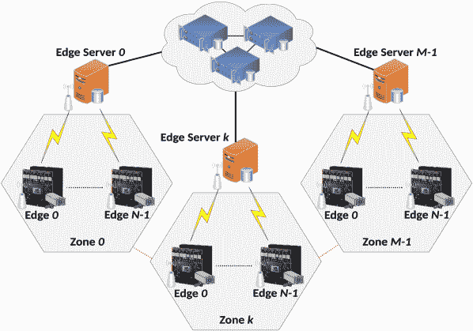
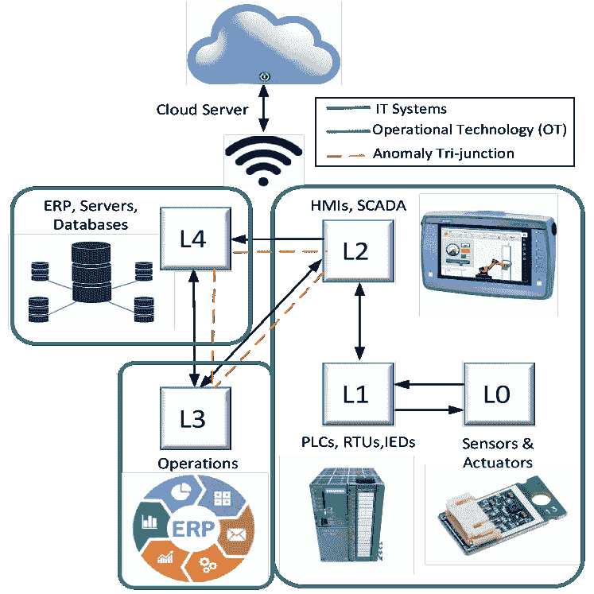
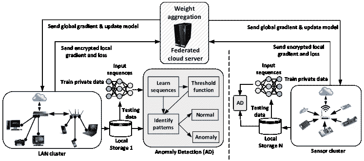
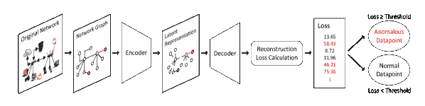
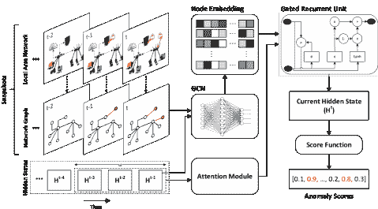
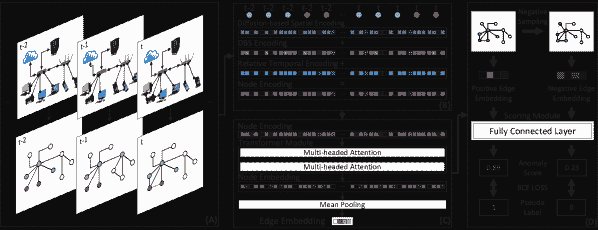
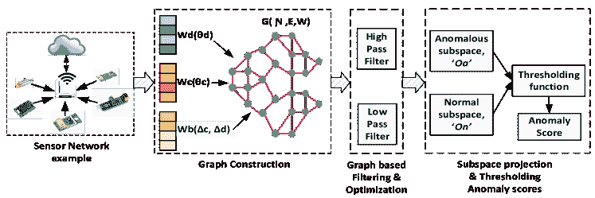
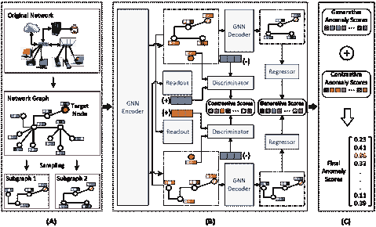

<!--yml

分类：未分类

日期：2024-09-06 19:46:00

-->

# [2206.04149] 基于图的深度学习在分布式系统异常检测中的应用调研

> 来源：[`ar5iv.labs.arxiv.org/html/2206.04149`](https://ar5iv.labs.arxiv.org/html/2206.04149)

# 基于图的深度学习在分布式系统异常检测中的应用调研

Armin Danesh Pazho*、Ghazal Alinezhad Noghre*、Arnab A Purkayastha、Jagannadh Vempati、Otto Martin 和 Hamed Tabkhi *前两位作者（A. Danesh Pazho 和 G. Alinezhad Noghre）贡献相等。Armin Danesh Pazho、Ghazal Alinezhad Noghre 和 Hamed Tabkhi 在美国北卡罗来纳大学夏洛特分校工作。

电子邮件：adaneshp@uncc.edu, galinezh@uncc.edu 和 htabkhiv@uncc.edu。Arnab A Purkayastha 在美国马萨诸塞州的西新英格兰大学工作。

电子邮件：arnab.purkayastha@wne.edu。Jagannadh Vempati 和 Martin Otto 在美国新泽西州普林斯顿的西门子技术公司工作。

电子邮件：jagannadh.vempati@siemens.com 和 m.otto@siemens.com

###### 摘要

异常检测在复杂的分布式系统中是一项至关重要的任务。对异常检测要求和挑战的深入理解对这些系统的安全性至关重要，尤其是在实际部署中。虽然有许多研究和应用领域涉及这一问题，但很少有工作尝试对这些系统进行深入分析。在本调研中，我们探讨了基于图的算法在识别分布式系统中的异常的潜力。这些系统可以是异构的或同构的，这会导致不同的要求。我们的目标之一是深入分析基于图的方法，以概念性地分析其应对现实世界挑战（如异质性和动态结构）的能力。本研究概述了该领域的前沿（SotA）研究文章，并比较和对比了它们的特点。为了便于更全面的理解，我们呈现了三个具有不同抽象层次的系统作为用例。我们考察了在这些系统中进行异常检测所涉及的具体挑战。随后，我们阐明了图在这些系统中的有效性，并解释了其优势。然后，我们深入探讨了前沿方法，并突出它们的优缺点，指出了可能的改进和未来工作的方向。

###### 关键词：

图表、异常检测、深度学习、动态系统、异构系统、分布式系统。

## 1 引言

异常检测指的是发现数据或系统中不符合预期行为的异常行为或模式[1]。换句话说，系统中已知和正确行为的非良性变化可以被检测为异常。异常检测在同质和异质分布式系统中都至关重要。在异质分布式系统中，从传感器等小的变化到控制设施等大型组件，都在一个大网络中工作，以实现系统的总体目标。所有这些组件分布在一个大的网络中，因此称之为分布式，并且它们在结构和数据生成方面各不相同，因此称之为异质。可以将同质系统视为异质系统的特例，其中所有组件非常相似，甚至是相同的。

许多分布式系统在关键和/或重要领域（例如发电和配电系统）中运行。因此，它们的安全性和正确性至关重要。漏洞可以出现在这些系统的各个方面和不同的抽象层次中；从系统或网络中的个别组件问题到这些组件在完成更高级任务时的连接点异常。表 I 展示了几个分布式网络及其可能的异常源。这些系统中的异常检测必须满足许多要求，使任务更加复杂。异常必须通过处理大量数据来检测，考虑到异常的性质，这使得检测它们成为一项具有挑战性的任务，并且受到现实世界设置限制的影响。

表 I：分布式系统示例及异常源样本

| 网络 | 异常源 |
| --- | --- |
| 发电和配电 | 硬件、软件和网络中的异常 |
| 智能视频监控 | 异常和危险事件，硬件或软件问题 |
| 智慧城市 | 基础设施故障，安全和隐私问题 |
| 智能电网 | 故障，网络攻击，自然扰动 |
| 社交网络 | 非法活动，欺凌，垃圾信息，冒犯性内容 |
| 电信 | 故障，硬件问题，入侵 |
| 公司内部网络 | 硬件和软件问题，不必要的访问，入侵 |
| 工厂生产线 | 制造缺陷，生产线设备问题 |
| 智能交通 | 技术问题，硬件和软件问题，异常轨迹变化 |
| 银行系统 | 洗钱，欺诈交易，入侵 |

近年来，神经网络展现了巨大的潜力，并被广泛探索。它们开辟了新的领域，并增加了对扩展深度学习方法用于异常检测的兴趣[2, 3]。传统方法大多依赖领域专家定义的手工特征，这使得它们在不同领域的泛化能力和灵活性较差。特征选择可能耗时且易出错。相比之下，深度学习方法对每个领域的特定需求具有高度适应性。深度学习模型有助于自动化，因为它们需要最少的努力和监督来识别显著特征，而无需手动特征选择。它们更适合学习复杂信息，结果更具泛化性，不易过拟合，并且是无模型的。深度学习算法在异常检测中的另一个优势是它们能够更高效地处理大量输入数据，相较于传统方法具有更好的扩展性。这一特性使它们在复杂分布式系统中的异常检测中尤为理想。基于深度学习的算法已被证明更有效，通常表现出更好的结果。这是因为它们能够构建更丰富的特征并检测比传统方法更复杂的模式。

现实世界的分布式系统是一个由众多组件交织而成的网络，每个组件都有独特的特性，并随时间变化。图在捕捉这些组件的关系动态以及其个体特征方面证明了其优势。将系统映射为图的节点和边，有助于更好地理解系统。值得注意的是，并非所有类型的图都能捕捉系统的每个方面。虽然传统图表示法适用于同质系统，但异质系统则需要更复杂的属性图。属性图是一种数据结构，其中每个节点和边都与一组属性或特性相关联。在异质系统中，它们允许表示多种实体和关系的变体，每种都有其独特的属性[4]。另一方面，为了应对分布式系统的变化特性，动态图应运而生。在动态图中，节点和边可以出现、消失或随时间变化，使它们非常适合动态系统。因此，在调查基于图的方法时，我们分析它们处理属性图和动态图的能力。

许多研究已经针对常规异常检测问题进行了技术和工具的评估[5, 2, 6, 7, 3]。一些现有的调查重点关注大数据中的异常检测，例如[8, 9]。此外，某些研究调查了在特定领域中使用的异常检测方法，例如虚假新闻检测[10]、社交媒体互动[11]、金融交易[12]等。几篇文章集中讨论了在不同系统中使用图形识别异常的应用。[13]总览了动态网络中图形异常检测算法，但主要提到了传统方法，忽略了最新的深度学习方法，并没有提及在这些系统中进行异常检测所面临的挑战和困难。最近的一项研究[14]试图填补这一空白，重点关注图形中深度学习方法的异常检测。[14]还提到了这个领域的挑战，但在分类挑战、分析现实世界需求和约束方面有所不足。[13, 14]都没有提供不同用例并对其进行算法审查的分析。另一项工作[15]提供了一个公开方法的概述，用于以图形表示数据的异常检测，讨论了这些方法的挑战和用例。然而，该研究并没有专注于深度学习方法用于异常检测，因为这些技术在该研究进行时尚未广泛确立。

本次调研的主要关注点是提供一个全面的概述，以解决异常检测问题的最新图形技术。特别是，我们研究实时复杂分布式系统，并对其进行定性建模，以识别和分析利用图形优势的各种异常检测方法。简而言之，我们对本次调查做出以下突出贡献：

+   •

    对三个概念性用例进行建模，并利用它们来探索异常检测算法的需求、挑战和优势。

+   •

    识别现实世界分布式系统中的逻辑、算法和实现需求和挑战

+   •

    对比分析图形异常检测算法、工具和技术在处理异常和定性建模三个概念性用例方面的不同特征。

+   •

    为分布式系统中基于图形的异常检测提供未来的研究方向。

本论文的其余部分组织如下：第二部分描述了三个代表现实世界分布式系统的用例。第三部分识别了在现实世界分布式系统背景下异常检测的挑战和要求。接下来，第四部分讨论了在分布式系统中使用图的好处。第五部分深入探讨了基于图的方法以及利用图进行异常检测的手段。最后，第六部分讨论并比较了这些方法及其复杂性，图所增加的新挑战和要求，以及该研究领域未来可能的发展方向。

## 2 概念性用例

在本节中，我们介绍了三个概念性用例，这些用例将贯穿全文以帮助更好地理解。虽然这三个概念性用例是异质分布式系统的良好示例，但如果有必要，这些系统可以被划分为同质子组以适应异常检测方法的要求。

我们确保涵盖了不同的抽象层次，以帮助发展对这些概念的更丰富理解。目的是澄清异常可以发生在系统的所有层次，无论是小组件还是整个系统的大子组。

图 1：REVAMP²T [16] 设置。该设置可以扩展或缩减为新的设置。每个边缘服务器仅看到其自身位置的数据，云服务器能够看到所有连接到它的位置。出于隐私考虑，每个位置传输到云服务器的信息量是经过监督的。

### 2.1 智能监控系统

这里我们使用来自[16]的一个例子。用于多摄像头隐私保护行人跟踪的实时边缘视频分析或 REVAMP²T[16]设计用于跨多个摄像头跟踪行人。模型的概述见图 1。每个关注点处安装的边缘节点包含多个用于分析流视频的边缘摄像头。这些摄像头连接到一个边缘服务器，该服务器作为一个数据库，包含关于所见对象的信息。如果必要且允许，视频可以发送到多个监控器，以提取的信息为基础。此外，整个信息可以发送到云服务器，以便进一步处理不太敏感的信息。在整个复杂的分布式异构系统中可能会发生异常。例如，摄像头可能会损坏，或者可能会有黑客试图从边缘服务器窃取提取的信息。

这个分布式系统是完全具有属性和动态的，因此形成了一个动态属性图表示。系统中可以发生诸如删除或更新组件等良性变化，这不应被视为异常。其他事件，例如从摄像头接收噪声视频、边缘服务器与云服务器之间的信息不匹配，以及在网络任何点上对数据的非授权访问，可以被视为异常。

### 2.2 传感器网络

图 2：传感器网络

我们接下来查看一个异构传感器网络的概念性用例，这个用例展示了一个复杂的分布式系统。为了准确描绘此类系统的安全方面，我们借鉴了普渡模型（Purdue Model）用于 ICS（工业控制系统）安全的理念[17]。普渡企业参考架构通过映射典型工业控制系统（ICS）高级组件的相互连接和相互依赖关系而创建，提供了如何防御 IT（信息技术）和 OT（运营技术）系统免受恶意攻击的指导。图 2 展示了这种系统的模型，经过修改以包含异构系统的所有可能组件。在这里，Level 0 (L0) 到 Level 4 (L4) 是跨越两个广泛区域的功能级别，即 IT 和 OT。OT 系统可以进一步细分为两个子类别，以下将对此进行讨论。

+   •

    L0: 构建产品的物理组件。例如：电机、泵、传感器、阀门等。

+   •

    L1: 监控并向 L0 设备发送指令的系统。例如：PLCs（可编程逻辑控制器）、RTUs（远程终端单元）、IEDs（智能电子设备）等。

+   •

    L2: 总体过程控制器。例如：HMIs（人机界面）、SCADA（数据采集与监视控制系统）等，涉及到人类管理和控制过程。

+   •

    L3：生产工作流管理。例如：批量管理、操作管理等

+   •

    L4：ERP 软件、数据库、电子邮件服务器以及其他管理制造操作物流的系统，并提供通信和数据存储

异常三联接障碍（以红色显示）作为不同层级和可能的异常源之间的通信划界。

### 2.3 内部局域网

内部局域网（LAN）也是复杂分布式异质系统的一个良好示例。该系统的图形表示是有属性的、动态的和有向的。它是动态的，因为网络中的所有组件都可能发生变化。例如，客户端可以更换设备，服务器的硬件可以更改（例如，增加内存或升级 CPU），连接介质可以更改，客户端可能被移除，或者每个平台的框架可能会更新。

需要强调的是，系统的良性变化不应被视为异常。我们面对的是一个没有唯一正常状态的动态系统。因此，捕捉异常的任务比处理静态系统时要困难得多。

## 3 个挑战

关于异常检测，特别是在现实世界系统中，需要满足多个要求。在本节中，我们识别了现实世界分布式系统中异常检测的一般要求和挑战。我们从四个方面来审视这些挑战，每个方面都从不同角度考察异常检测：数据、异常性质、图形以及现实世界方面。

表 II 总结了所有要求及其随之而来的挑战。在本节的其余部分，我们将更详细地探讨每一个挑战。

表 II：异常检测的挑战。

| 分类 | 挑战 | 简短描述 | 参考文献    \bigstrut[b] |
| --- | --- | --- | --- |
| 数据与评估 | 大数据 | 大数据的体积、速度、多样性、真实性和价值可能会带来问题。 | [18, 19, 20, 21, 22, 23, 24, 25, 26] \bigstrut |
|  | 高维性 | 每个数据点的特征数量众多，可能导致数据稀疏，使异常检测变得更加艰难。 | [27, 28, 29, 30, 31, 32, 33] \bigstrut |
|  | 异质性 | 系统中数据类型、格式和结构的多样性和变化。 | [34, 35, 36, 37] \bigstrut |
|  | 标记数据 | 用于异常检测的标记数据集数量严重不足。 | [14, 38, 39, 40, 41] \bigstrut |
|  | 不平衡的数据 | 异常发生得很少，在这种不平衡数据上训练会使模型产生偏差。 | [42, 43, 44, 45] \bigstrut |
|  | 不洁净的数据 | 许多提出的模型基于假设存在洁净数据，这并不现实。 | [46, 47, 48, 49, 50, 51] \bigstrut |
|  | 度量标准和基准 | 缺乏适当的度量标准和基准使得对提出模型的评估变得困难且不可能。 | [52, 53, 54, 55, 56]\bigstrut |
| 异常的性质 | 变化的性质 | 新颖和新的异常类型可能会出现，而且异常可能会随着异常检测算法而自我适应。 | [57, 58]\bigstrut |
|  | 不同来源 | 异常可能发生在系统的许多不同层次和部分。 | [59, 60, 61] \bigstrut |
|  | 隐蔽异常 | 异常可能伪装成其他形式，尤其是由智能实体造成的异常。 | [14, 62, 63, 64] \bigstrut |
|  | 噪声鲁棒性 | 在许多情况下，输入数据中的噪声可能会误导模型，并被检测为假阳性。 | [65, 66] \bigstrut |
| 真实世界 | 推断时间 | 在实际应用中，及时检测异常是至关重要的，以便采取适当的行动。 | [67, 68, 69, 70, 71] \bigstrut |
|  | 隐私 | 在许多应用中，用户的数据需要受到保护。 | [72, 73, 74, 75, 76, 77, 78, 79, 80] \bigstrut |
|  | 加密数据 | 在许多环境中，交换的数据是加密的。 | [81, 82, 83, 84, 85] \bigstrut |
|  | 动态系统 | 真实世界中的系统通常会随时间变化，并具有动态特性。 | [86, 87, 14, 88, 89, 90, 91, 92] \bigstrut |
|  | 可解释性 | 在现实世界的设置中，异常的原因很重要。 | [93, 94, 95] \bigstrut |
|  | 领域转移 | 在一个领域上训练的模型，无法泛化到即使是稍微不同的领域。 | [96, 97, 98, 99, 100, 101, 102] \bigstrut[t] |

### 3.1 数据和评估方面

1\. 大数据：谈到使用学习方法进行异常检测时，数据成为一个直接的挑战。在许多应用中，必须处理的数据量巨大，这使得问题进入了大数据的范畴。大数据的含义最好通过大数据的 5 个 V 来描述：Volume（数据量）、Velocity（速度）、Variety（多样性）、Veracity（真实性）和 Value（价值），每一个都表现出一系列的挑战。对于异常检测，尤其是在分布式系统中，生成和处理的数据量巨大（Volume），速度极快（Velocity），包含来自多个来源的多种数据类型和格式（Variety），对数据及其质量存在不确定性（Veracity），这些数据中的所有或大多数都很重要，必须考虑以提取有价值的输出（Value）。

2\. 高维度性：这是另一个源于数据的挑战。在许多应用中，需处理的数据具有大量的特征（维度）。数据集的巨大维度可能会在许多应用中引发无数挑战。然而，在异常检测的背景下，这些挑战被进一步加剧。“维度诅咒”这个词通常指的是维度数量增加时出现的问题。当我们可以看到维度诅咒时，数据集就是高维的。维度的增长将相应增加数据的大小，并导致稀疏性，这最终使得数据点之间的距离相对相同。因此，在高维空间中检测隐藏的异常将变得更加困难。这个问题在科学界仍然是一个有争议的话题。

3\. 异质性：分布式系统，特别是在现实世界的场景中，通常包括各种类型的实体，每个实体都有自己的一组特征和行为。因此，这些组件之间的关系也是基于组件类型的具体关系。来自这些系统的数据是异质的，许多方法无法处理复杂的变异异质数据。因此，异质性是异常检测任务的另一个挑战。异质系统通常具有大型和复杂的数据结构，具有高度的互联性和可变性。

4\. 标记数据：在数据驱动的方法中，数据的质量对模型的结果起着至关重要的作用。在异常检测方面，标记数据集的数量极其有限。这一事实促使人们使用无监督或半监督的方法。得益于新技术和设备的进步，现有的大量数据可以使用。然而，在大多数情况下，这些数据并未包含关于异常行为的信息。另一方面，获得高质量的标签既昂贵又耗时。在许多情况下，异常必须由具备领域专业知识的专家发现和标记，这使得任务变得更加困难和要求更高。此外，我们还应考虑由于不精确标记而添加到数据集中的噪声。未检测到的异常在现实应用的关键情况中可能会带来巨大的成本。因此，在异常检测的背景下使用监督学习是有一定问题的。然而，几种方法试图通过利用合成标记数据集来克服这一挑战，但许多其他方法已经转向使用半监督、无监督和自监督算法。

5\. 不平衡数据：另一个需要提到的点是异常事件是稀有的。监督学习方法需要在训练过程中看到足够的例子来学习和理解异常。然而，异常的数量通常非常少，导致数据集变得不平衡。异常是非常规事件，期望在数据集中有足够的每种异常类型的样本是不现实的。这一挑战要求解决问题的方法适应这种情况。正常数据点的丰富性可能会导致忽视异常数据点的检测，而这些异常数据点在异常检测中是有价值的。这个问题源于许多机器学习算法基于假设数据类别具有相同的分布，而在异常检测的情况下这一假设并不现实。

6\. 不洁数据：许多方法，例如使用自编码器的异常检测（在第五部分讨论）需要仅包含正常数据点的训练数据集。这些方法学习正常状态，并基于正常数据点特征的偏离来判断是否发生了异常。然而，如前所述，异常可能很少且非常微妙。异常数据点很有可能被负责的个人或团队忽视，或者直到之后才被认为是异常。因此，数据集通常包括不希望出现的离群点，使数据集变得不洁。这种不洁数据可能会混淆模型对正常数据点特征和表示的理解，降低模型的准确性。

7\. 指标和基准：在所有挑战之上，最重要的一点似乎是缺乏统一的指标或基准，使得模型能够自我评估并比较结果。已经提出了各种类型的指标，我们在第 6.1 节讨论了一些重要的指标，但几乎没有研究在单一独特领域评估这些指标，以便实现模型间的比较。

### 3.2 异常的本质

1\. 变化的本质：异常具有特定的性质和一系列特征，这些特征导致了特定的一组挑战。第一个也是最重要的挑战是异常的变化本质。异常并不是预定义的静态事件。它们可以以不同的形式和格式出现，并且不是所有的异常在发生之前都能被考虑到。总是会有从未被考虑过的新型异常。它们可以适应异常检测机制，并演变以突破异常检测算法的防御。因此，大多数算法倾向于采用在线学习、无监督学习或半监督学习，其中没有预定义的异常，算法基于当前看到的内容进行学习。换句话说，大多数算法努力消除外部人工偏差，朝着通用解决方案发展。这促使了在线学习的使用，在这种方法中，算法不断学习系统的行为。

2\. 来源多样：分布式系统通常包含多个层级（资源），导致整个系统变得复杂而错综复杂。每个层级的作用，不论其是多数还是少数，都不可忽视。异常可能渗透到每一个组件中，使其跟踪变得非常困难。特别是在大型设施中，组件数量呈指数级增长，所有这些组件都是潜在的异常点。这种来源多样的异常是困扰异常检测算法的挑战性复杂问题之一。

3\. 隐蔽异常：除了这些挑战之外，还有相当多的异常，主要是那些由于智能实体而产生的异常，不喜欢被发现。它们可能会伪装或隐藏。例如，网络攻击尽可能地伪装自己。另一方面，有些异常并不被隐藏，仅仅是系统中某个组件故障的结果。意识到这两种情况并准备应对隐蔽异常，是通用异常检测过程中的另一个挑战。

4\. 噪声鲁棒性：系统可能会经历大量的内部或外部噪声。这些噪声在达到某个阈值之前不是异常。然而，它们仍然是系统中的不规则性。异常检测算法必须能够区分噪声和异常。如果不能，它们可能会产生过多的假阳性警报，导致不必要的关注和成本。这些噪声可以有多种来源。其中一些噪声很难发现，最好在算法内部引入过滤这些噪声的手段，而不是花费精力去寻找噪声的来源。

### 3.3 现实世界的挑战

1\. 推断时间：在使用异常检测时，时间至关重要，尤其是在实际应用中。期望在时间上，异常的检测不会远离异常行为的实际发生。特别是在像医疗应用这样关键的环境中，检测到设备故障的长延迟可能导致灾难性的结果，这是不可接受的。因此，必须采取必要的措施以避免这种延迟。然而，基于深度学习的异常检测技术通常是一项繁重的任务，需要巨大的计算能力。

2\. 隐私：隐私是现实世界环境中必须考虑的另一个重要障碍。异常检测算法涉及数据流通和系统状态的所有方面。它们了解系统的所有信息，如果这些信息泄露到环境中，可能会导致灾难性的不可预期结果。因此，异常检测算法必须保留隐私，并尽可能安全，如果它希望在现实世界环境中部署。

3\. 加密数据：异常检测算法需要了解系统中发生的所有事情，这带来了另一个挑战。许多系统，如金融系统、社交媒体或电力生成和分配网络等设施，并不会以原始数据的形式进行互通。它们会对数据进行编码然后传输。这些加密数据通常与原始数据的关系并不明显，这正是编码数据的目的。因此，算法面临着另一个艰巨的挑战。例如，传感器与服务器之间的无线通信包含一个位于边缘发射器的编码器，用于出于隐私和安全原因对数据进行加密，以及一个位于接收器的解码器，用于解密数据以进行进一步处理。当算法试图在介质（这里是无线连接器）上发现异常时，它无法访问传输阶段之前的原始数据。

4\. 动态系统：此外，静态系统在现实世界环境中极为罕见。现实世界中的分布式系统极其动态。组件会被移除、添加、改变或更新。这些良性的转换不能被视为异常行为。异常检测算法可能会将这些转换视为异常。如果是这样，误报的数量可能会增加到使算法无法正常工作并且不适合现实世界应用的程度。另一方面，异常检测模型应足够灵活，以便了解更新后的特征和网络结构，从而充分整合现有信息。在线学习是应对这一挑战的工具，但这仍然是研究社区中的一个热门话题。

5\. 可解释性：另一个重要的挑战是异常的可解释性。特别是在现实世界应用中，更希望看到实际的异常类型而不仅仅是检测结果。一个原因是，识别异常的来源，了解异常的实际类型（例如，针对传感器 1A 的网络攻击），并通知负责的人员是非常重要的。找出异常的根源对于维护系统的可用性至关重要。

6. 域迁移：最后但同样重要的是，当你能够在不同领域进行概括时，异常检测方法变得非常有用。然而，由于我们处理的是基于学习的方法，这种域迁移带来了巨大的成本。神经网络学习环境并适应它，使得切换到另一个领域变得困难。这一事实使得监督学习的使用受到限制，同时也推动了新技术向在线学习转变。这一挑战在基于图的异常检测和其他方法之间是共享的。

## 4 动机：为什么基于图的方法？

表 III: 综述方法及其能力总结

| 方法 | 模型 | 属性图 | 动态图 | 学习适应性 | 可扩展性    \bigstrut[b] |
| --- | --- | --- | --- | --- | --- |
| 联邦学习 | DIoT[103] | ✘ | ✔ | S | \bigstrut |
| VFL[104] | ✘ | ✔ | U | \bigstrut |
| 自编码器 | [105] | ✘ | ✘ | U | ✔\bigstrut |
| [106] | ✘ | ✘ | U | \bigstrut |
| [107] | ✘ | ✘ | U | \bigstrut |
| 强健深度自编码器 (RDA) [108] | ✘ | ✘ | U | \bigstrut |
| 迭代训练集细化 (ITSR) [109] | ✘ | ✘ | U | \bigstrut |
| [110] | ✔ | ✔ | U | \bigstrut |
| DONE [111] | ✔ | ✘ | U | ✔\bigstrut |
| AdONE [111] | ✔ | ✘ | U | ✔\bigstrut |
| DeepSphere [112] | ✘ | ✔ | U | \bigstrut |
| 图嵌入 | 浅层编码器 | DeepWalk [113] | ✘ | ✘ | U, O | ✔\bigstrut |
| Node2Vec [114] | ✘ | ✘ | SM | ✔\bigstrut |
| LINE [115] | ✘ | ✘ | - | ✔\bigstrut |
| TADW [116] | ✘ | ✘ | - | \bigstrut |
| NetWalk [117] | ✘ | ✔ | U, O | \bigstrut |
| 深度编码器 | 图偏差网络 (GDN) [94] | ✔ | ✘ | U | \bigstrut |
| AddGraph [118] | ✔ | ✔ | SM | \bigstrut |
| 图变换器 | [119] | ✘ | ✔ | S | \bigstrut |
| TADDY[120] | ✘ | ✔ | U | \bigstrut |
|  | GTA [121] | ✘ | ✔ | U | \bigstrut |
| 图信号处理 | [122] | ✔ | ✔ | U | \bigstrut |
| 图对比学习 | GCCAD [123] | ✔ | ✔ | U, SF | \bigstrut |
| CoLA [86] | ✔ | ✔ | SF | ✔\bigstrut |
|  | SL-GAD [124] | ✔ | ✔ | SF | ✔\bigstrut |
| S: 监督学习，SM: 半监督学习，U: 无监督学习，SF: 自监督学习，O: 在线学习 |

使用图进行异常检测是机器学习和深度学习社区非常近期的兴趣话题。在这一部分，我们强调了图在异常检测中的好处。

表示复杂依赖关系的能力：图广泛用于建模和分析具有非欧几里得数据和系统组件之间复杂关系的复杂系统。这一特性对于异常检测问题特别有用，因为异常往往源于变量之间复杂的交互，这些交互难以通过传统模型捕捉。

灵活性：复杂系统由许多不同的组件组成，每个组件都有其独特的特征。基于图的模型非常灵活，可以适应各种结构和数据类型。图非常适合于结构化（符号、图像、网格数据）和非结构化（知识图谱、社交网络数据、分布式系统、引文网络、网络流量），这些都可以通过规则或不规则的图结构轻松表示。

可扩展性：异常检测通常处理高维数据，具有大量特征。由于这一事实，捕捉数据的潜在模式和分布以找出异常值变得困难。图对于捕捉输入数据的潜在结构及其关系以更紧凑且易于解释的格式非常有用。这有助于更高效的数据处理，并有助于可扩展性。

鲜明性：图能够整合数据的关系和整体结构，这在异常检测中尤其有益。基于图的算法通过考虑与数据点相关的上下文来分析每个数据点，从而提高了鲁棒性，并帮助减少假阴性。这是因为异常值往往不符合系统的全局模式。

可解释性和可视化：基于图的模型可以提供有关系统节点之间关系的更多洞察，使它们比许多传统模型更具可解释性。这对于理解异常的根本原因以及识别系统的潜在改进领域和脆弱性特别有用。

## 5 种基于图的异常检测工具和技术

在本节中，我们旨在介绍和比较与图结合的技术，这些技术在解决分布式系统中的异常检测问题方面具有巨大潜力。所有回顾过的工作及其能力的总结见表 III。

许多调查过的方法无法处理系统中可能存在的异质性或动态行为。能够管理属性图的方法更适合异质系统。值得注意的是，某些方法无法处理属性图并不意味着它们不能在异质系统中使用。存在两种可行的策略来利用这些方法。首先，大型系统可以被细分为较小的同质子系统。其次，可以使用数据的简化版本以适应这些方法的局限性。

### 5.1 联邦学习

在分布式系统中的异常检测以及处理大数据的背景下，尽管图形能够捕捉复杂的依赖关系并处理可扩展性和鲁棒性，但**联邦学习**（FL）可以提供改进的隐私保护、模型泛化和更高效的学习。两者的结合似乎非常适合用于分布式系统中的异常检测，并且这是一个值得学者和研究人员深入探讨的领域。

**联邦学习**是一种最近出现的替代集中式系统的技术。它专注于合作，同时保护用于训练机器学习算法的客户端数据的安全性[125, 126, 127, 128, 129]。它还大大减少了通信开销[130]。FL 通过不需要将数据转移到集中位置的方式进行协作和经验学习。这一特性最近使 FL 在医学、物联网、交通、防御和移动应用等各种应用中的适用性大大提高。

图 3：应用于两个分布式集群的联邦学习进行异常检测，即局域网和传感器。这里的 N 是连接到联邦云服务器的集群数量。每个网络都有自己的测试和训练数据集、本地存储和损失函数。服务器接收来自所有网络本地模型的权重，然后根据其可用的图属性对它们进行聚合，并将全局权重返回。

静态和动态时间序列数据的异常检测和预测一直是一个热门话题，尤其是对于基于物联网的数据 [131, 132, 133]。这些方法将多传感器系统视为一个集中传感器的集合，其中异常传感器行为由运行在服务器上的中央模型检测。这些系统容易发生故障，访问时间较长，并且容易受到恶意入侵攻击，导致从客户端到服务器的数据泄露 [134]。[135] 关注由物联网传感器收集的数据，用于智能建筑中的节能应用，如 HVAC，并提出了一种基于物联网传感器生成的时间序列数据的联邦堆叠长短期记忆模型（LSTM），用于分类和回归任务。另一方面，[103] 提出了一个自学习分布式系统，用于安全监控。

尽管这些方法处理了系统的自主性（涉及关联和通信需求），但它们未能体现图基关系学习的好处。联邦图学习是一个相对较新的话题。[136] 介绍了联邦图学习（FGL），作为一篇讨论 FGL 定义和挑战的开创性论文。它进一步将 FGL 分类为四种不同的学习类型。每个子图中的图边和节点相互重叠，因此在提取特征以及增加上下文和关系学习的好处方面发挥了关键作用。这项工作的一个子分类在[104]中被介绍为一种完整的方法，应用于图卷积网络的垂直联邦学习（VFL）算法。该方法与同态加密（HE）一起开发，旨在确保隐私同时保持准确性。

复杂分布式系统的一般结构可以使用联邦学习框架轻松描述（图 3）。这里展示了两个不同的网络集群。在这个框架中，模型在设备级别或客户端进行训练，然后被带到数据源或设备进行训练和预测。更新的值被发送回联邦云服务器进行聚合。一个整合的模型被转回设备，以便跟踪和重新分配到各种设备。在训练阶段，输入在输出中重建，直到重建误差最小化，这计算出阈值。该阈值决定观察到的模式是否异常。

表 III 总结了讨论的两个工作的优点和缺点，DIoT [103] 和 VFL [104]。这两项工作都无法处理由属性图提供的额外信息，这在现实世界的场景中很常见。需要提到的是，对于像 DIoT [103]这样的监督模型，一个重要的要求是有标签的数据，而这些数据很难提供。基于上述不足，尽管 FGL 解决了数据多样性、数据安全性和实时持续学习的问题，但它在现实世界应用中仍不够成熟。

图 4：图形自编码器网络用于在第 2.3 节中介绍的 LAN 集群示例中进行异常检测。两个恶意用户（等同于网络图中的异常节点）已连接到网络。网络图被输入到自编码器中，并计算节点和边的重建损失。在这个简单的情况下，只需将重建损失与一个常量阈值进行比较，就可以检测到异常，但这些过程可以更高级和精确。

### 5.2 自编码器

异常检测通常被认为是一个开放集问题，因为不太可能对所有可能的异常类型有全面的了解。因此，研究人员专注于开发半监督或无监督的强大神经网络模型，如自编码器。自编码器与图的结合已成为一个热门话题，因为它有助于克服异常检测的挑战，特别是在分布式系统的背景下。

自编码器通常由两个主要模块组成：编码器和解码器。编码器部分负责将输入空间映射到瓶颈潜在空间，而解码器则根据潜在表示重建原始输入。为了找到最佳的潜在表示，它们尝试最小化原始输入的重建误差。因此，网络将学会在潜在表示中保留输入特征的最有信息的部分。它们传统上用于在将数据输入到主网络之前进行维度减少，但如今，它们在信息检索、图像处理和异常检测中有广泛的应用。

在异常检测的背景下，自动编码器可以用作计算异常分数的工具。在用不含异常点的数据训练自动编码器后，如果将任何离群数据点输入到网络中，它的表现会较差。由于网络对这种类型的数据不熟悉，该数据点的重构损失将比正常数据点大。因此，重构误差可以作为偏离正常数据点的度量。这种方法已被用于检测高性能计算系统中的异常[105]，并且取得了有希望的结果。卷积自动编码器可以提高参数效率和训练时间，因为它们具有共享参数。像[106, 107]这样的工作利用卷积自动编码器进行异常检测，并取得了显著的改进。DeepSphere [112]提出了一种检测动态网络中异常快照的方法。该工作采用了带有注意机制的 LSTM 自动编码器。在构建的隐藏空间中，DeepSphere [112]学习了一个围绕编码正常表示的球形边界。因此，网络中一个未见过的异常快照的编码表示将落在超球体之外，并被检测为异常。

所有上述方法都是基于假设有干净的数据（即不含异常点的数据）用于训练，但在许多实际情况中，我们没有足够的数据点满足这些约束。因此，异常点的重建误差会较低，发现离群点的准确性也会降低。为了解决这个问题，受到稳健主成分分析[137, 138, 139]启发的稳健深度自编码器（RDA）[108]使用过滤层将输入数据中的异常数据点分离。通过去除这些噪声和异常数据点，网络将能够更好地重建正常的数据点。在 RDA[108]的基础上，他们添加了一个异常检测算法来测试所提方法的有效性。迭代训练集细化（ITSR）[109]调整对抗自编码网络[140]架构，为构建的潜在表示添加了先验分布，并将异常值放置在可能性较低的区域。通过这种方式，模型将对训练数据中的噪声和异常具有鲁棒性。DONE [111]是另一个用于检测属性图中异常节点的网络。DONE 利用两个并行的自编码器；一个用于编码链接结构，另一个用于节点属性。这些自编码器被训练以保持网络中的接近性和同质性。提出的损失函数旨在最小化离群点的贡献，通过最小化损失方程来计算每个节点的异常分数。最终，前 k 个节点被报告为异常点。他们还提出了 AdONE [111]，利用对抗学习来构建抗离群点的网络嵌入。

传统的自编码网络和卷积自编码器受限于固定的输入长度，这使得它们不适合检测动态网络中的异常情况。此外，它们还局限于欧几里得数据，因此无法建模在动态异质网络中可能出现的复杂关系。图神经网络（GNN）可以克服这些问题并推广网络。它们还可以结合多维边和节点属性。卷积图自编码器已在[110]中用于检测异常。该模型同时使用节点特征和边特征。此外，解码器模块有两个独立的分支用于节点重建和边重建。最终的重建损失是边重建损失和节点重建损失的组合，用作检测异常的度量标准。

图 4 展示了在第 2.3 节中提到的局域网集群示例中，使用自编码器网络检测异常的工作流程。在复杂系统中的异常检测情况下，如我们之前介绍的三个概念模型，在用正常数据训练模型后，网络的图将被送入编码器模块以转化为潜在空间。在这种情况下，由于我们处理的是异质网络，编码器和解码器模块应该能够整合边缘和节点信息，并将其汇总以获取尽可能多的可用信息。此外，网络的图随时可能发生变化。因此，采用能够处理动态图的网络架构至关重要，例如图神经网络。解码器将尝试从潜在表示中重建网络的原始图。异常的边缘、节点或子图将具有较高的重建误差。在最基本的方法中，只能使用固定阈值来决定边缘、节点或子图是否应被视为异常。

为了更清晰地审视，表格 III 展示了所回顾工作的不同特征。如前所述，自编码器结构的一个重要特征是它以无监督的方式进行训练，这直接解决了标记数据可用性的问题。此外，由于这些模型会学习系统的正常行为，因此异常的变化特性不会成为问题，任何不同于正常行为的情况都会被视为异常点。

图 5：此图展示了应用于第 2.3 节讨论的局域网集群概念用例的 AddGraph 模型。在第一步中，图卷积网络（GCN）在时间步 t 处获取图快照，并将其与前一时间步的隐藏状态结合以构建节点嵌入。GRU 和注意力模块结合了长期和短期状态以生成当前隐藏状态。在最后一步中，评分函数根据连接到边缘的节点分配异常评分。

### 5.3 图嵌入

我们在许多任务中面临的第一个障碍，比如在大规模网络中的异常检测，是找到一种将网络图中隐藏的数据映射到低维空间的方法。为此，存在许多不同的方法。一般来说，我们可以将这些方法分为两类。第一类编码器是“浅层编码器”，它将图中的每个节点转换为潜在空间中的一个向量。另一方面，还有一些方法称为“深层编码器”，它们使用更复杂的网络，并且能够生成比“浅层编码器”更复杂的嵌入。接下来，我们将详细了解这些方法及其优缺点。在获得潜在表示后，可以在嵌入网络上使用异常检测算法，以检测离群点和异常。

#### 5.3.1 浅层嵌入

浅层嵌入方法试图为图中的每个顶点找到唯一的潜在表示。不同的浅层嵌入方法的主要区别在于相似性函数的定义。相似性函数基本上描述了潜在空间中的关系如何映射到原始输入空间。DeepWalk [113] 是一种随机游走方法，用于节点嵌入，它试图找到最佳的嵌入，以保持相似性。每次随机游走都是一个固定长度的无偏节点序列。作者声称，随机游走可以被视为文本的句子，因为随机游走中节点的出现频率遵循幂律。DeepWalk [113] 试图为每个节点找到特征表示，以最大化从该特定节点开始的随机游走中访问节点的可能性。另一个值得提及的方法是 Node2Vec [114]。该算法使得可以进行更灵活的随机游走，从而获得更丰富的潜在表示。它将广度优先采样和深度优先采样结合在一起，介绍了一种灵活的有偏采样策略，允许网络的局部和全局视图。

类似的方法如 LINE [115] 和 TADW [116] 已被提出。可以认为这些算法是为每个原始图中的节点找到一个简单的查找表来分配潜在表示。因此，当我们想将这些方法应用于大型异构网络时，它们存在限制。第一个限制来自于每个节点必须有其独特的嵌入，并且这些网络中没有共享的参数。因此，当节点数量增加时，参数的数量也会相应增加，我们将需要 V$\times$D 个参数，其中 D 是潜在空间的维度。此外，它们无法对未见过的节点进行泛化，也不能在动态网络中使用。NetWalk [117] 解决了变化网络的问题，并随着网络的演变动态更新表示。该模型尝试满足两个约束： clique 约束，通过最小化每个随机游走中顶点表示之间的成对距离来保持局部性； autoencoder 约束，作为全局约束，最小化使用输出嵌入的输入重构误差。尽管如此，这些图嵌入算法还有更多问题；另一个问题是，在复杂的异构系统中，每个节点可能有其特定的特征，但“浅层编码器”无法利用这些节点特定的特征。

图 6：该图展示了 TADDY 的框架[120]。 (A) 显示了基于边的子结构采样模块，该模块根据目标边选择子图。 (B) 是空间-时间节点编码模块，负责编码节点并捕捉子图中隐藏的全局、局部和时间信息，分别使用基于扩散的空间编码、基于距离的空间编码和相对时间编码。最终的节点编码是通过结合上述所有编码构建的。 (C) 显示了动态图变换器模块。该模块使用修改后的多头注意力网络构建边嵌入。最后，在 (D) 中，你可以看到通过负采样策略生成样本和伪标签训练的判别异常检测器。鉴于 TADDY 只能处理非属性图，我们假设使用了简化版本的数据以适应这一限制。

#### 5.3.2 深度嵌入

我们到目前为止讨论的大多数方法无法建模更复杂的依赖关系，比如复杂的传感器间关系，但“深度编码器”具有更大的能力，能够构建更丰富的潜在表示。图偏差网络（GDN）[94] 引入了一种结构学习方法，其中图的边最初是未知的，需要通过学习来确定。GDN [94] 由四个重要组件组成。第一个组件是传感器嵌入，它捕捉每个节点或传感器的特征。在下一步中，图结构学习会学习传感器对之间的复杂关系，并将它们建模为图的边。在图构建完成后，基于图的注意力预测方法预测传感器在未来时间步的行为。最后，图偏差评分将比较这些预测与每个时间步的实际值，并识别出偏离预期值的异常点。AddGraph [118] 能够聚合更多的信息，例如结构、时间和内容特征，从而构建更强大的嵌入以进行动态图中的异常检测。该模型利用图卷积神经网络（GCN）来捕捉结构和内容特征。通过添加带有注意力模块的门控递归单元（GRU），AddGraph [118] 可以结合每个节点的长期和短期状态。最后，基于包含结构、时间和内容特征的表示，AddGraph [118] 使用单层网络计算边的异常分数。

智能视频监控系统（第 2.1 节），传感器网络（第 2.2 节），以及局域网（第 2.3 节）都包含许多节点。因此，浅层嵌入技术不足以建模这些类型的网络。我们还需要考虑到这三种概念性用例都是动态的（例如，向智能视频监控系统添加新摄像头会改变网络的图）；因此，像 DeepWalk [113] 和 Node2Vec [114] 这样的算法不适用，因为它们无法推广到未见过的节点。另一个重要问题是，节点和边可以具有不同方案的特征，这些特征对异常检测有用。以传感器网络为例；在每个时间步，来自大量互联传感器的海量数据会生成。每个传感器的数据可以与其他传感器有复杂的非线性关系。浅层嵌入技术未能利用这种信息。因此，更复杂的深层嵌入方法，如 GDN [94] 和 AddGraph [118]，在这种情况下可能会有所帮助。根据我们讨论的内容，使用第二部分介绍的一个示例可以更好地理解。在局域网集群示例中，AddGraph 似乎是一个合适的选择。

图 5 展示了应用于局域网集群示例的 AddGraph 的结构。构建节点嵌入使用了之前的隐藏状态和网络图的当前快照。此外，注意力模块和 GRU 结合了长期和短期状态来生成当前隐藏状态。在最后一步中，评分函数负责为当前隐藏状态分配正常性评分。讨论技术的要点见表 III。

图 7：在第 2.2 节中介绍的传感器网络的小部分用于展示用于异常检测的图形信号处理。该过程分为 3 个阶段：首先从 3 个邻接矩阵构建图形，生成一个无向、加权且连通的图 G(N, E, W)。接下来使用过滤和优化方法来获得 GSP 滤波器的截止频率，该频率进一步投影为正常子空间和异常子空间。这些值和一个阈值函数一起用于生成异常评分。

### 5.4 图形变换器

引入的注意力机制概念首次用于自然语言处理[141]。这个机制旨在进行一步预测，而不是对数据进行递归处理。通过这种方式，注意力机制减少了计算路径的长度，从而减少了信息丢失，并集中在最重要的特征上以预测输出。将此技术应用于图形中可以改善许多应用的结果，例如异常检测。图形变换网络能够通过学习和解决上述问题自动生成元路径，使许多应用（如异常检测）能够在复杂的异构系统上工作[142]。在[119]中，模型利用关系图形变换器以监督方式寻找异常节点。在这项工作中，首先提取网络的异构图，然后使用关系图形变换器和语义注意力网络对节点之间的复杂关系进行建模和编码，最后对其进行分类以寻找异常节点。

在许多应用中，由于缺乏标注数据，无法进行监督学习。通过使用无监督设置，基于变换器的动态图异常检测框架（TADDY）[120] 能够检测动态图中的异常边。TADDY [120] 由四个主要模块组成，如图 6 所示。基于边的子结构采样通过图扩散方法 [143, 144] 捕捉每个目标边的时空上下文。对于每条边，该模块构建了一个固定长度的重视邻居节点的集合。然后，TADDY [120] 利用一种新颖的时空节点编码来生成节点嵌入。在获取嵌入后，使用变换器网络作为编码器来捕捉时空特征，然后通过一个池化模块来聚合同一邻居集合中所有节点的嵌入。在最后一步，使用判别异常检测器（由一个全连接层组成）。

用于异常检测的图学习变换器（GTA）[84]，利用了修改过的变换器网络。该模型可以检测由不同传感器生成的多变量时间序列中的异常。这些传感器之间可能存在复杂的未知连接。GTA [84] 首先使用 Gumbel-Softmax 采样 [145] 策略来学习这些依赖关系。一旦建立了这种拓扑结构，一个图卷积块通过聚合邻居的信息和消息传递来更新每个节点的表示，从而丰富这些表示。现在，扩张卷积 [121] 被用于提取时间上下文，但进行了一个新颖的修改。他们使用了一种层次化方案，使得 GTA [84] 能够捕捉不同长度的时间模式。在这些基础上，引入了一种更复杂和高效的变换器版本。GTA [121] 中使用的多分支注意力模块提取了长距离的时间依赖关系和邻近节点的信息。在异常评分模块中，原始输入时间序列被划分为训练序列（用于编码器）和标签序列（用于解码器）。解码器预测目标部分的时间序列行为，通过比较预测输出和实际值，可以检测出异常点。

所有提到的模型的能力可以在表格 III 中查看。不幸的是，使用图变换器的异常检测模型都不兼容属性图，这使得它们在实际应用中不够实用。未来的研究可以朝着解决这个问题的方向发展，以克服异构分布式系统的复杂性。

### 5.5 图信号处理

图信号处理（GSP）是另一种技术，利用傅里叶变换、滤波、频率响应等经典信号处理工具来处理定义在规则和不规则图网络上的数据。[146]展示了当前发展中的 GSP 工具的最新进展。图信号可以被过滤和采样，以应用诸如去噪和压缩等低级处理技术。GSP 与传统机器学习算法之间的一个主要区别在于，ML 通常将图视为复杂网络的离散版本。然而，这一假设在许多与图相关的实际应用中并不成立。另一方面，GSP 从不同的角度看待现有问题。例如，为基于传感器的网络定义图涉及选择边权重作为传感器表示的节点之间距离的递减函数。来自类似节点的观察可以导致平滑的图函数，通过高通滤波或阈值检测异常值或异常值[147]。此外，稀疏的传感器读数集还可以用于构建信号重建方法，从而在传感器网络中节省资源[148, 149]。

图 8：在此图中，我们将 SL-GAD [124]框架应用于第 2.3 节讨论的 LAN 概念用例。(A) 显示了图视图采样模块，该模块选择目标节点并采样两个子图。(B) 是生成和对比判别模块。首先，将目标节点和两个子图输入到 GNN 编码器中，并生成图嵌入。在下一步中，两个不同的目标，判别器和回归器，试图捕捉图结构和属性中的异常。生成回归模块旨在捕捉每个节点属性中的异常，而判别模块负责发现图的结构中的异常。最后，在(C)中，对比得分和生成得分被组合以计算最终异常得分。

在无线传感器网络（WSNs）上使用 GSP 滤波进行异常检测已经成为多个研究的兴趣点。[122] 捕获传感器之间的数据等邻近信息，以捕捉局部异常行为。他们提出了三种图设计，并使用 GSP 滤波来找到截止频率和滤波器的 Lambda。这用于分离正常和异常子空间以进行无监督检测。异常空间的投影最终用于生成异常分数，如图 7 所示。该系统的主要优势在于，除了原始传感器数据外，还可以有效捕捉节点之间的关系特征，如传感器与其环境之间的邻近信息。图基滤波被发现对无监督异常检测中的常规和不规则图结构都特别有用。在表 III 中可以找到审查模型的规格。能够在动态属性图上工作的 [122] 与现实世界的要求相一致。另一方面，利用 GSP 技术可以为异常检测问题提供更深层次的视角，并为检测离群点提供更多有用的关系信息，这在实际应用中至关重要。

### 5.6 图对比学习

在图对比学习技术中，目标是通过对比数据点对来构建表示。损失函数的设计方式是通过优化它，将正样本对（匹配对）拉近，而将负样本对分开。结果是，使用这种方法，模型能够学习到更强大、更具区分性的高级表示。在异常检测的背景下，对比学习可能有帮助，因为它旨在提供数据对之间的相似度度量。GCCAD [123] 的主要思想是通过与平均正常点或全局上下文的距离来检测异常。关键概念是，离群点将具有不同于大多数点的特征；因此，通过将每个节点与全局上下文对比，我们可以定义检测异常的度量。

GCCAD [123] 证明了传统的 GNN 编码器生成的节点嵌入无法正确区分异常节点。然而，GCCAD [123] 能够构建出更强大的嵌入，突显异常节点与全局背景之间的差异。这项工作使用了监督方式的上下文感知损失函数。损失函数在由三个模块组成的 GNN 编码器中进行优化；边更新模块、节点更新模块和图更新模块。边更新模块负责计算作为可疑边（连接正常节点和异常节点的边）的可能性并将其删除，同时更新邻接矩阵。这些模块设计用来保留邻近节点之间的同质性假设。该假设表明，邻近节点具有相同的标签。然而，当正常节点与异常节点之间存在连接时，同质性会被破坏，这种破坏在传统 GNN 网络中未被考虑。在下一步中，节点嵌入通过节点更新模块使用消息传递进行更新。最后，图更新模块更新全局背景。更新后的全局背景是所有节点的加权聚合。作者还介绍了这个网络的自监督版本，名为 GCCAD-pre [123]。

表 IV：所审查算法的时间复杂度。有关符号说明，请参见表 V。

| 方法 | 模型 | 时间复杂度 | 描述 \bigstrut[b] |
| --- | --- | --- | --- |
| 联邦学习 | DIoT [103] | - | - \bigstrut[b] |
| VFL [104] | $\mathcal{O}\left(n{m}^{2}\right)$ | - \bigstrut |
| 自编码器 | [105] | - | - \bigstrut[b] |
| [106] | - | - \bigstrut |
| [107] | - | - \bigstrut |
| RDA [108] | - | - \bigstrut |
| ITSR [109] | - | - \bigstrut |
| [110] | - | - \bigstrut |
| 已完成 [111] | $\mathcal{O}(Nd)$ | - \bigstrut |
| AdOne [111] | $\mathcal{O}(Nd)$ | - \bigstrut |
| DeepSphere [112] | - | - \bigstrut |
| 图嵌入 | 浅层编码器 | 深度游走 [113] | - | - \bigstrut |
| Node2Vec [114] | $\mathcal{O}(\frac{l}{s(l-s)})$ | 每个样本的复杂度 \bigstrut |
| LINE [115] | $\mathcal{O}(m\hat{n}\hat{d})$ | - \bigstrut |
| TADW [116] | - | - \bigstrut |
| NetWalk [117] | $\mathcal{O}(nl\vert\Omega\vert)$ | 游走生成的复杂度 \bigstrut |
| $\mathcal{O}(md)$ | 边编码的复杂度 \bigstrut |
| $\mathcal{O}(cd)$ | 对输入数据点的异常检测复杂度 \bigstrut |
| 深度编码器 | GDN [94] | - | - \bigstrut |
| AddGraph [118] | - | - \bigstrut[t] |
| 图变换器 | [119] | - | - \bigstrut[b] |
| TADDY [120] | $\mathcal{O}\left(\tau kmI+T\tilde{n}^{2}\right)$ | - \bigstrut |
| GTA [121] | $\mathcal{O}(4\tau D^{2}+2\tau^{2}D)$ | 这是最简单的注意力模块。更复杂的模块请参见原始论文。 \bigstrut |
| 图信号处理 | [122] | - | \bigstrut |
| 图对比学习 | GCCAD [123] | $\mathcal{O}(m)$ | - \bigstrut[b] |
| CoLA [86] | $\mathcal{O}(kn\hat{R}(\eta+c))$ | - \bigstrut |
| SL-GAD [124] | $\mathcal{O}(Rnk(\eta+K))$ | - \bigstrut[t] |

CoLA [86] 专注于大规模属性图中的异常检测，适用于现实世界的问题。这个新颖的网络有三个主要组件：配对采样、基于 GNN 的对比学习模型和评分计算模块。实例配对采样旨在生成用于训练阶段的数据对。与 GCCAD [123] 通过全局上下文对比节点不同，CoLA [86] 中的配对定义关注于节点与其邻居之间的关系。因此，配对定义策略为“目标节点与局部子图”。基于 GNN 的对比学习模块包括三个子模块：（1）GNN 模型，（2）读取模块，以及（3）判别器模块。在获得配对后，GNN 模块将为目标节点和局部子图提取嵌入。然后，读取模块使用平均池化函数创建嵌入子图中所有节点的嵌入向量。在判别器模块中，对比正负配对并生成一个分数。最后，评分计算模块测量所有节点的异常分数，并通过选择具有最高分数的节点来检测异常节点。SL-GAD [124] 引入了一种新颖的生成和对比自监督模型。

SL-GAD [124] 由三个主要组件构成，类似于 CoLA [86]：图视图采样、对比自监督学习和图异常评分。在图视图采样中，对于每个目标节点，提取两个局部子图。接下来，在对比自监督学习模块中，GNN 构建样本的潜在表示。除了对比分数外，SL-GAD [124] 还利用图自编码器网络重建目标节点的特征向量，以充分利用目标节点的上下文信息。最后，图异常评分基于生成分数（来自图自编码器）和对比分数（来自对比学习）预测最终分数。

图 8 展示了应用于第 2.3 节中引入的局域网集群示例的 SL-GAD [124] 的工作流程。所采样的子图被输入到 GNN 编码器中，编码后的表示被送入两个不同的分支：判别模块和生成模块。在最后一步，来自这两个分支的异常分数被结合以构造最终的异常分数。

所有提到的模型的特征可以在表 III 中查看。如前所述，图对比学习方法表现出有希望的结果，并且对现实世界场景具有极大的适应性。讨论的工作都能够克服分布式异构系统的动态复杂性质，这些模型的无监督/自监督学习适应性可以缓解第三部分中提到的标注数据不足的问题。

表 V: 表 IV 符号描述。

| 参数 | 描述 \bigstrut[b] |
| --- | --- |
| n | 图中节点的数量 \bigstrut |
| $\tilde{n}$ | 时间戳中的平均节点数量 \bigstrut |
| m | 图中边的数量 \bigstrut |
| k | 子图中的节点数量 \bigstrut |
| T | 时间戳的数量 \bigstrut |
| $\tau$ | 时间窗口的大小 \bigstrut |
| $\hat{n}$ | 负样本的数量 \bigstrut |
| l | 步数的长度 \bigstrut |
| $&#124;\Omega&#124;$ | 步数的数量 \bigstrut |
| s | 样本数量 \bigstrut |
| D | 输入维度的数量 \bigstrut |
| d | 节点表示的潜在维度 \bigstrut |
| $\hat{d}$ | 节点的度数 \bigstrut |
| c | 聚类的数量 \bigstrut |
| R | 评估轮次的数量 \bigstrut |
| I | 迭代次数 \bigstrut |
| $\hat{R}$ | 每个节点的采样轮次数量 \bigstrut[t] |

## 6 比较与讨论

本节首先讨论用于评估的指标，然后从算法的角度尝试比较 5 节中讨论的方法。接着我们讨论利用图所增加的需求和挑战，这些需求和挑战是前述的 3 节中讨论的，最后讨论未来该领域研究可能采取的方向。

### 6.1 指标与比较

任何异常检测算法的性能和可行性，无论是基于图的还是非基于图的，都可以通过精度、召回率、准确率、接收者操作特征（ROC）曲线和 ROC 曲线下面积（AUC）进行评估。虽然精度、召回率和准确率衡量的是真正例、假正例、真负例和假负例，AUC 则总结了 ROC 曲线中包含的信息。较大的 AUC 值表示在区分异常观测和正常观测方面的性能更好。

报告上述指标时的一个主要挑战是缺乏统一的评估标准，这在算法的多样性、应用类型以及数据和设备的异质性中表现得尤为明显。例如，如果我们要比较两个算法的延迟，我们必须确保它们都在特定硬件上进行测试，测试的任务是相同的，并且我们需要排除对该指标有影响的不同变量。

相比之下，*时间复杂度* 是唯一可以为我们提供算法性能洞察的指标。表 IV 展示了所评审算法的时间复杂度。为了评估一个算法相对于其他算法的表现，以及与 3 节中的要点相关的表现，我们可以参考时间复杂度。它可以让我们对方法的速度和效率有一个很好的理解，了解算法的复杂性，并判断它是否适合特定的任务或硬件。

### 6.2 图特定的挑战

图在捕捉关系信息方面极其强大，特别是在分布式系统中。它们有助于解决第三部分中讨论的挑战并满足要求，同时捕捉数据的重要特征，如关系特征和信息。然而，这些好处也有代价。在利用图时，这些挑战应得到解决：

图的类型：每个系统可以通过特定类型的图来表示。每种类型的图都有其特点，适用于一组领域。例如，属性图通过引入节点之间连接的特征以及节点自身的特征来增加复杂性。此外，表示系统的图可能是动态的或静态的，取决于原始系统的性质。所有这些图的子类增加了基于图的学习技术的复杂性。因此，引入的模型应能够处理这些不同类型的网络图，但正如我们在前面章节中讨论的，许多模型只能处理普通静态图，这在许多应用中是不令人满意的。[150, 151, 152, 153, 154, 155]

图异常：通过引入图，我们能够更好地表示系统。图和图神经网络使我们能够建模真实网络中的复杂依赖关系。然而，从另一个角度看，这种图表示的适应也引入了不同的异常发生点。在图中，异常值可能发生在节点、边、子图甚至整个图中。然而，模型通常只能检测到一种上述异常，并且没有统一的框架来同时解决所有这些问题。这意味着方法必须具体确定其检测目标、处理的异常类型以及最佳表现的领域。[91, 156, 157]

### 6.3 未来研究方向

目前最重要的研究方向似乎是找到一种统一的量化异常检测算法结果的方法，从而在各个领域进行比较。所有技术进步的大部分都源于对新发现与现有工作的量化和比较。然而，考虑到这一领域的多样性，相互比较算法几乎是不可能的。首先，必须确定评估模型的最佳指标。此外，还需要一个足够通用的评估机制，适用于不同的异常检测算法。例如，在计算机视觉领域，COCO [158] 提供了一个这样的环境。测试框架也可以是另一个有益的工具。在这个方向上，创建一个模拟器或一个可以作为大型分布式系统玩具样本的系统也可能是有益的。总之，需要对基于图的和非基于图的异常检测算法和技术进行统一评估。按照这一方向，这项调查可以通过进行统一的基准测试来受益于包括实验结果。这一方面特别有前景，因为将实验分析与算法和概念分析结合起来可以获得更全面、更细致的理解。

正如挑战部分讨论的那样，异常检测面临的第二大问题是缺乏合适的数据集。生成或准备一个适当的数据集可以对异常检测领域做出重要贡献。然而，在异常检测的背景下，通常需要专家监督标注和收集数据的过程，这使得生成的数据集容易出现人为错误。所有这些都增加了创建数据集的实际成本。合成数据集是另一种选择，创建合成数据集可以通过一系列研究来探索。

许多异常检测方法旨在发现异常是否发生。它们能够通知负责人员或团队进行进一步调查。然而，它们无法识别异常的具体类型。进一步的研究课题之一是异常的可解释性。未来的趋势是使用现有算法区分异常。例如，在 2.2 中提到的传感器网络中，我们希望模型能够区分网络攻击和电力短缺，并发出正确的警报。如果进一步研究，可以探讨模型如何恢复系统或停止异常的方式。

## 7 结论

在本调查中，我们详细讨论了几种最先进的基于图的方法用于异常检测。我们介绍了三个基于实时复杂分布式系统的独特概念用例。我们的工作在现有的传统机器学习和深度学习范式基础上，进一步介绍了四个不同类别的图神经网络算法。我们还将制定的模型应用于每种方法，并对这些类别进行彻底的审查和总结。最后，我们全面探讨了图特定的大数据挑战，并提供了该领域的一些未来研究方向。

## 致谢

作者感谢西门子技术对本工作的支持。

## 参考文献

+   [1] V. Chandola, A. Banerjee, 和 V. Kumar, “异常检测：综述，”*ACM 计算机调查（CSUR）*，第 41 卷，第 3 期，第 1–58 页，2009 年。

+   [2] G. Pang, C. Shen, L. Cao, 和 A. V. D. Hengel, “深度学习用于异常检测：综述，”*ACM 计算机调查（CSUR）*，第 54 卷，第 2 期，第 1–38 页，2021 年。

+   [3] G. Pang, L. Cao, 和 C. Aggarwal, “深度学习用于异常检测：挑战、方法和机会，”发表于*第 14 届 ACM 国际网页搜索与数据挖掘大会论文集*，系列 WSDM ’21。纽约，NY，美国：计算机协会，2021 年，第 1127–1130 页。 [在线]. 可用: https://doi.org/10.1145/3437963.3441659

+   [4] Y. Wang, Y. Li, J. Fan, C. Ye, 和 M. Chai, “典型属性图查询的调查，”*国际互联网*，第 24 卷，第 297–346 页，2021 年。

+   [5] R. Chalapathy 和 S. Chawla, “深度学习用于异常检测：一项调查，”*arXiv 预印本 arXiv:1901.03407*，2019 年。

+   [6] L. Ruff, J. R. Kauffmann, R. A. Vandermeulen, G. Montavon, W. Samek, M. Kloft, T. G. Dietterich, 和 K.-R. Müller, “深度与浅层异常检测的统一综述，”*IEEE 会议录*，2021 年。

+   [7] G. Fernandes, J. J. Rodrigues, L. F. Carvalho, J. F. Al-Muhtadi, 和 M. L. Proença, “网络异常检测的全面调查，”*电信系统*，第 70 卷，第 3 期，第 447–489 页，2019 年。

+   [8] R. A. A. Habeeb, F. Nasaruddin, A. Gani, I. A. T. Hashem, E. Ahmed, 和 M. Imran, “实时大数据处理用于异常检测：一项调查，”*信息管理国际杂志*，第 45 卷，第 289–307 页，2019 年。

+   [9] S. Thudumu, P. Branch, J. Jin, 和 J. J. Singh, “高维大数据异常检测技术的全面调查，”*大数据杂志*，第 7 卷，第 1 期，第 1–30 页，2020 年。

+   [10] S. Ahmed, K. Hinkelmann, 和 F. Corradini, “结合机器学习和知识工程检测社交网络中的假新闻——一项调查，”*arXiv 预印本 arXiv:2201.08032*，2022 年。

+   [11] R. Yu, H. Qiu, Z. Wen, C. Lin, 和 Y. Liu, “社交媒体异常检测调查，”*SIGKDD Explor. Newsl.*，第 18 卷，第 1 期，第 1–14 页，2016 年 8 月。 [在线]. 可用: https://doi.org/10.1145/2980765.2980767

+   [12] M. Ahmed, A. N. Mahmood, 和 M. R. Islam，“金融领域异常检测技术综述，” *未来一代计算机系统*，第 55 卷，页 278–288，2016 年。

+   [13] S. Ranshous, S. Shen, D. Koutra, S. Harenberg, C. Faloutsos, 和 N. F. Samatova，“动态网络中的异常检测：综述，” *Wiley 跨学科评论：计算统计*，第 7 卷，第 3 期，页 223–247，2015 年。

+   [14] X. Ma, J. Wu, S. Xue, J. Yang, C. Zhou, Q. Z. Sheng, H. Xiong, 和 L. Akoglu，“基于深度学习的图异常检测的综合综述，” *IEEE 知识与数据工程汇刊*，2021 年。

+   [15] L. Akoglu, H. Tong, 和 D. Koutra，“基于图的异常检测与描述：综述，” *数据挖掘与知识发现*，第 29 卷，第 3 期，页 626–688，2015 年。

+   [16] C. Neff, M. Mendieta, S. Mohan, M. Baharani, S. Rogers, 和 H. Tabkhi，“Revamp 2 t：用于多摄像头隐私保护行人跟踪的实时边缘视频分析，” *IEEE 物联网杂志*，第 7 卷，第 4 期，页 2591–2602，2019 年。

+   [17] T. J. Williams，“普渡大学企业参考架构，” *计算机与工业*，第 24 卷，第 2–3 期，页 141–158，1994 年 9 月。[在线]。可用链接： [`doi.org/10.1016/0166-3615(94)90017-5`](https://doi.org/10.1016/0166-3615(94)90017-5)

+   [18] I.-Y. Song 和 Y. Zhu，“大数据与数据科学：我们应该教些什么？” *专家系统*，第 33 卷，第 4 期，页 364–373，2016 年。

+   [19] A. Katal, M. Wazid, 和 R. H. Goudar，“大数据：问题、挑战、工具和最佳实践，” 在 *2013 年第六届当代计算国际会议（IC3）*。   IEEE，2013 年，页 404–409。

+   [20] K. Shin, B. Hooi, J. Kim, 和 C. Faloutsos，“D-cube：在千兆字节规模张量中的密集块检测，” 在 *第十届 ACM 国际网页搜索与数据挖掘会议论文集*，系列 WSDM ’17。   纽约，NY，美国：计算机协会，2017 年，页 681–689。[在线]。可用链接： [`doi.org/10.1145/3018661.3018676`](https://doi.org/10.1145/3018661.3018676)

+   [21] E. M. Knorr 和 R. T. Ng，“在大型数据集中挖掘基于距离的离群点的算法，” 在 *第 24 届国际大型数据库会议论文集*，系列 VLDB ’98。   旧金山，加州，美国：摩根·考夫曼出版社，1998 年，页 392–403。

+   [22] S. Ramaswamy, R. Rastogi, 和 K. Shim，“从大型数据集中挖掘离群点的高效算法，” 在 *第 2000 届 ACM SIGMOD 国际数据管理会议论文集*，系列 SIGMOD ’00。   纽约，NY，美国：计算机协会，2000 年，页 427–438。[在线]。可用链接： [`doi.org/10.1145/342009.335437`](https://doi.org/10.1145/342009.335437)

+   [23] F. Angiulli 和 F. Fassetti，“高效的距离基离群点挖掘，” 在 *第十六届 ACM 信息与知识管理会议论文集*，系列 CIKM ’07。   纽约，NY，美国：计算机协会，2007 年，页 791–800。[在线]。可用链接： [`doi.org/10.1145/1321440.1321550`](https://doi.org/10.1145/1321440.1321550)

+   [24] A. Arning, R. Agrawal, 和 P. Raghavan，“大型数据库中偏差检测的线性方法，”在 *第二届知识发现与数据挖掘国际会议论文集* 中，KDD’96 系列。 AAAI Press，1996 年，第 164–169 页。

+   [25] K. W. Pettis, T. A. Bailey, A. K. Jain, 和 R. C. Dubes，“基于近邻信息的内在维度估计器，” *IEEE 模式分析与机器智能学报*，第 PAMI-1 卷，第 1 期，第 25–37 页，1979 年。

+   [26] N. Tatbul，“流数据整合：挑战与机遇，”在 *2010 年 IEEE 第 26 届数据工程国际会议研讨会（ICDEW 2010）* 中，2010 年，第 155–158 页。

+   [27] R. Bellman，*动态规划*。 切尔姆斯福德：Courier Corporation，2013 年。

+   [28] K. Beyer, J. Goldstein, R. Ramakrishnan, 和 U. Shaft，“‘最近邻’何时有意义？”在 *数据库理论 — ICDT’99* 中，C. Beeri 和 P. Buneman 编。 柏林，海德堡：Springer Berlin Heidelberg，1999 年，第 217–235 页。

+   [29] P. Hall, J. Marron, 和 A. Neeman，“高维低样本量数据的几何表示，” *皇家统计学会 B 系列学报*，第 67 卷，第 427–444 页，2005 年 2 月。

+   [30] J. Ahn, J. S. Marron, K. M. Muller, 和 Y.-Y. Chi，“高维低样本量几何表示在温和条件下保持有效，” *Biometrika*，第 94 卷，第 3 期，第 760–766 页，2007 年。[在线]。可用链接：http://www.jstor.org/stable/20441411

+   [31] M. Radovanović, A. Nanopoulos, 和 M. Ivanović，“无监督距离基础异常检测中的逆最近邻，” *IEEE 知识与数据工程学报*，第 27 卷，第 5 期，第 1369–1382 页，2015 年。

+   [32] S. Sadik 和 L. Gruenwald，“数据流异常检测中的研究问题，” *SIGKDD Explor. Newsl.*，第 15 卷，第 1 期，第 33–40 页，2014 年 3 月。[在线]。可用链接：https://doi.org/10.1145/2594473.2594479

+   [33] F. Keller, E. Muller, 和 K. Bohm，“Hics：基于密度的异常排名的高对比度子空间，”在 *2012 年 IEEE 第 28 届数据工程国际会议* 中，2012 年，第 1037–1048 页。

+   [34] M. Iturbe, I. Garitano, U. Zurutuza, 和 R. Uribeetxeberria，“面向工业网络的大规模异质异常检测系统：当前趋势的调查，” *安全与通信网络*，第 2017 卷，2017 年。

+   [35] L. Erhan, M. Ndubuaku, M. Di Mauro, W. Song, M. Chen, G. Fortino, O. Bagdasar, 和 A. Liotta，“传感器系统中的智能异常检测：多视角综述，” *信息融合*，第 67 卷，第 64–79 页，2021 年。

+   [36] D. Stiawan, M. Y. Idris, R. F. Malik, S. Nurmaini, 和 R. Budiarto，“物联网通信中的异常检测与监控，”在 *2016 年第八届信息技术与电气工程国际会议（ICITEE）* 中。 IEEE，2016 年，第 1–4 页。

+   [37] C. Lee, T. Yang, Z. Chen, Y. Su, Y. Yang, 和 M. R. Lyu，“通过半监督跨模态注意力进行软件系统的异质异常检测，” *arXiv 预印本 arXiv:2302.06914*，2023 年。

+   [38] N. Görnitz, M. Kloft, K. Rieck, 和 U. Brefeld，“朝向监督异常检测”，*人工智能研究期刊*，第 46 卷，第 235–262 页，2013 年。

+   [39] S. Suthaharan, M. Alzahrani, S. Rajasegarar, C. Leckie, 和 M. Palaniswami，“无线传感器网络中的标注数据收集用于异常检测”，收录于*2010 年第六届智能传感器、传感器网络与信息处理国际会议*。IEEE，2010 年，第 269–274 页。

+   [40] M. Luo, K. Wang, Z. Cai, A. Liu, Y. Li, 和 C. F. Cheang，“利用不平衡三角形合成数据进行机器学习异常检测”，*计算与材料连续介质*，第 58 卷，第 1 期，第 15–26 页，2019 年。

+   [41] W. Lin, J. Gao, Q. Wang, 和 X. Li，“从合成数据中学习检测人群场景中的异常事件”，*神经计算*，第 436 卷，第 248–259 页，2021 年。

+   [42] M. Frasca, A. Bertoni, M. Re, 和 G. Valentini，“一种用于从不平衡数据中进行半监督节点标签学习的神经网络算法”，*神经网络*，第 43 卷，第 84–98 页，2013 年。

+   [43] S. N. Kalid, K.-H. Ng, G.-K. Tong, 和 K.-C. Khor，“用于信用卡数据中异常检测的多分类器系统，处理不平衡和重叠类别”，*IEEE Access*，第 8 卷，第 28 210–28 221 页，2020 年。

+   [44] H. H. Pajouh, G. Dastghaibyfard, 和 S. Hashemi，“两层网络异常检测模型：一种机器学习方法”，*智能信息系统期刊*，第 48 卷，第 1 期，第 61–74 页，2017 年。

+   [45] S. El Hajjami, J. Malki, M. Berrada, 和 B. Fourka，“用于异常检测的机器学习。考虑不平衡数据集中的异常分布的性能研究”，收录于*2020 年第五届国际云计算与人工智能技术及应用会议（CloudTech）*。IEEE，2020 年，第 1–8 页。

+   [46] Z. Kang, H. Pan, S. C. Hoi, 和 Z. Xu，“从噪声数据中进行鲁棒图学习”，*IEEE 网络控制学报*，第 50 卷，第 5 期，第 1833–1843 页，2019 年。

+   [47] R. Evans 和 E. Grefenstette，“从噪声数据中学习解释规则”，*人工智能研究期刊*，第 61 卷，第 1–64 页，2018 年。

+   [48] Y. Kim, J. Yim, J. Yun, 和 J. Kim，“Nlnl: 针对噪声标签的负学习”，收录于*IEEE/CVF 国际计算机视觉会议论文集*，2019 年，第 101–110 页。

+   [49] N. Moran, D. Schmidt, Y. Zhong, 和 P. Coady，“Noisier2noise: 从未配对的噪声数据中学习去噪”，收录于*IEEE/CVF 计算机视觉与模式识别会议论文集*，2020 年，第 12 064–12 072 页。

+   [50] J.-X. Zhong, N. Li, W. Kong, S. Liu, T. H. Li, 和 G. Li，“图卷积标签噪声清理器：训练一个即插即用的动作分类器以进行异常检测”，收录于*IEEE/CVF 计算机视觉与模式识别会议论文集*，2019 年，第 1237–1246 页。

+   [51] M. Z. Zaheer, J.-h. Lee, M. Astrid, A. Mahmood, 和 S.-I. Lee，“通过聚类清理标签噪声以进行最小监督异常检测”，*arXiv 预印本 arXiv:2104.14770*，2021 年。

+   [52] S. Ahmad, A. Lavin, S. Purdy, 和 Z. Agha, “流数据的无监督实时异常检测”，*神经计算*，第 262 卷，第 134–147 页，2017 年。

+   [53] Z. K. Maseer, R. Yusof, N. Bahaman, S. A. Mostafa, 和 C. F. M. Foozy, “在 CICIDS2017 数据集上进行基于异常的入侵检测系统的机器学习基准测试”，*IEEE Access*，第 9 卷，第 22,351–22,370 页，2021 年。

+   [54] A. F. Emmott, S. Das, T. Dietterich, A. Fern, 和 W.-K. Wong, “从实际数据系统化构建异常检测基准”，载于*ACM SIGKDD 关于离群点检测与描述的研讨会论文集*，2013 年，第 16–21 页。

+   [55] C. R. Banbury, V. J. Reddi, M. Lam, W. Fu, A. Fazel, J. Holleman, X. Huang, R. Hurtado, D. Kanter, A. Lokhmotov *等*，“TinyML 系统的基准测试：挑战与方向”，*arXiv 预印本 arXiv:2003.04821*，2020 年。

+   [56] G. Alinezhad Noghre, A. Danesh Pazho, J. Sanchez, N. Hewitt, C. Neff, 和 H. Tabkhi, “ADG-POSE：用于实际人类姿态估计的自动数据集生成”，载于*国际模式识别与人工智能大会*。Springer，2022 年，第 258–270 页。

+   [57] G. Yu, Z. Cai, S. Wang, H. Chen, F. Liu, 和 A. Liu, “基于参数自适应的无监督在线异常检测，用于 KPI 突变”，*IEEE 网络与服务管理学报*，第 17 卷，第 3 期，第 1294–1308 页，2020 年。

+   [58] W. Wang, Q. Chen, T. Liu, X. He, 和 L. Tang, “一种分布式在线学习方法，用于检测虚拟化网络切片中的异常”，载于*2021 IEEE 全球通信大会 (GLOBECOM)*，2021 年，第 1–6 页。

+   [59] A. Guezzaz, Y. Asimi, M. Azrour, 和 A. Asimi, “对异构流量和异常检测的机器学习分类器进行数学验证”，*大数据挖掘与分析*，第 4 卷，第 1 期，第 18–24 页，2021 年。

+   [60] S. Li, Y. Cheng, Y. Liu, W. Wang, 和 T. Chen, “联邦学习中的异常客户端行为检测”，2019 年。

+   [61] L. Erhan, M. Ndubuaku, M. Di Mauro, W. Song, M. Chen, G. Fortino, O. Bagdasar, 和 A. Liotta, “传感器系统中的智能异常检测：多角度综述”，*信息融合*，第 67 卷，第 64–79 页，2021 年。[在线]。可用网址: https://www.sciencedirect.com/science/article/pii/S1566253520303717

+   [62] Y. Dou, Z. Liu, L. Sun, Y. Deng, H. Peng, 和 P. S. Yu, “提升基于图神经网络的欺诈检测器，以应对伪装的欺诈者”，载于*第 29 届 ACM 国际信息与知识管理大会论文集*，2020 年，第 315–324 页。

+   [63] S. Bhatia, Y. Wang, B. Hooi, 和 T. Chakraborty, “Graphanogan：从属性图中检测异常快照”，载于*欧洲机器学习与数据库知识发现联合会议*。Springer，2021 年，第 36–51 页。

+   [64] Y. Zheng, M. Jin, Y. Liu, L. Chi, K. T. Phan, 和 Y.-P. P. Chen, “用于图形异常检测的生成对比自监督学习”，*IEEE 知识与数据工程学报*，2021 年。

+   [65] Y. 刘, T. 迪隆, W. 于, W. 拉哈尤, 和 F. 穆斯塔法，“在制造业工业物联网传感器数据中去噪以应对显著异常，” *IEEE Internet of Things Journal*，第 7 卷，第 8 期，第 7084–7096 页，2020 年。

+   [66] Y. 唐, Z. 刘, M. 潘, Q. 张, C. 万, F. 关, F. 吴, 和 D. 陈，“基于差分信号的信息熵检测磁异常信号，” *IEEE Geoscience and Remote Sensing Letters*，第 15 卷，第 4 期，第 512–516 页，2018 年。

+   [67] W. 苏尔塔尼, C. 陈, 和 M. 沙阿，“监控视频中的真实世界异常检测，” 收录于 *IEEE 计算机视觉与模式识别会议论文集*，2018 年，第 6479–6488 页。

+   [68] F. 穆哈雷米, D. 洛戈法图, 和 F. 莱昂，“基于真实世界数据集的水质异常检测的机器学习方法，” *Journal of Information and Telecommunication*，第 3 卷，第 3 期，第 294–307 页，2019 年。

+   [69] A. 卡斯特拉尼, S. 施密特, 和 S. 斯夸尔蒂尼，“通过数字双胞胎系统和弱监督学习进行真实世界异常检测，” *IEEE Transactions on Industrial Informatics*，第 17 卷，第 7 期，第 4733–4742 页，2020 年。

+   [70] A. 乌基尔, S. 班迪亚普迪亚, C. 普里, 和 A. 帕尔，“物联网医疗分析：异常检测的重要性，” 收录于 *2016 年 IEEE 第 30 届国际先进信息网络与应用会议 (AINA)*，2016 年，第 994–997 页。

+   [71] S. A. 哈克, M. 拉赫曼, 和 S. M. 阿齐兹，“无线传感器网络中的传感器异常检测用于医疗保健，” *Sensors*，第 15 卷，第 4 期，第 8764–8786 页，2015 年。[在线]. 可用链接: https://www.mdpi.com/1424-8220/15/4/8764

+   [72] X. 刘, L. 谢, Y. 王, J. 邹, J. 熊, Z. 应, 和 A. V. 瓦西拉科斯，“深度学习中的隐私和安全问题：调查，” *IEEE Access*，第 9 卷，第 4566–4593 页，2020 年。

+   [73] Y. 沈, G. 刘斯, 和 G. B. 贾纳基斯，“具有可扩展性和隐私保护的在线图自适应学习，” *IEEE Transactions on Signal Processing*，第 67 卷，第 9 期，第 2471–2483 页，2019 年。

+   [74] B. 王, J. 贾, 和 N. Z. 龚，“基于图的安全和隐私分析通过集体分类与联合权重学习和传播，” *arXiv 预印本 arXiv:1812.01661*，2018 年。

+   [75] C. 杨, H. 王, K. 张, L. 陈, 和 L. 孙，“具有链接差分隐私的安全深度图生成，” *arXiv 预印本 arXiv:2005.00455*，2020 年。

+   [76] V. 杜杜, A. 布特, 和 V. 谢瓦尔卡，“在图嵌入中量化隐私泄露，” 收录于 *Mobiquitous 2020-第 17 届 EAI 国际移动和无处不在系统会议：计算、网络和服务*，2020 年，第 76–85 页。

+   [77] J. 周, C. 陈, L. 郑, H. 吴, J. 吴, X. 郑, B. 吴, Z. 刘, 和 L. 王，“用于隐私保护节点分类的垂直联邦图神经网络，” *arXiv 预印本 arXiv:2005.11903*，2020 年。

+   [78] S. 沙贾德马内什 和 D. 加蒂卡-佩雷斯，“局部隐私图神经网络，” 收录于 *2021 年 ACM SIGSAC 计算机与通信安全会议论文集*，2021 年，第 2130–2145 页。

+   [79] C. Zhang, S. Zhang, J. James 和 S. Yu，"Fastgnn：一种保护拓扑信息的联邦学习方法用于交通速度预测"，*IEEE 工业信息学学报*，第 17 卷，第 12 期，第 8464–8474 页，2021 年。

+   [80] Q. Li, M. Coutino, G. Leus 和 M. G. Christensen，"隐私保护的分布式图过滤"，在*2020 年第 28 届欧洲信号处理会议（EUSIPCO）*。IEEE，2021 年，第 2155–2159 页。

+   [81] T. Bakhshi 和 B. Ghita，"使用混合深度学习在加密互联网流量中进行异常检测"，*安全与通信网络*，第 2021 卷，2021 年。

+   [82] T.-D. Pham, T.-L. Ho, T. Truong-Huu, T.-D. Cao 和 H.-L. Truong，"Mappgraph：使用深度图卷积神经网络在加密网络流量中进行移动应用分类"，在*年度计算机安全应用会议*，2021 年，第 1025–1038 页。

+   [83] Y. Wu, H.-N. Dai 和 H. Tang，"用于工业物联网的图神经网络异常检测"，*IEEE 物联网学报*，2021 年。

+   [84] Z. Chen, D. Chen, X. Zhang, Z. Yuan 和 X. Cheng，"使用变换器学习图结构进行物联网中多变量时间序列异常检测"，*IEEE 物联网学报*，2021 年。

+   [85] A. Protogerou, S. Papadopoulos, A. Drosou, D. Tzovaras 和 I. Refanidis，"一种用于物联网的分布式异常检测的图神经网络方法"，*演变系统*，第 12 卷，第 1 期，第 19–36 页，2021 年。

+   [86] Y. Liu, Z. Li, S. Pan, C. Gong, C. Zhou 和 G. Karypis，"通过对比自监督学习在属性网络上进行异常检测"，*IEEE 神经网络与学习系统学报*，2021 年。

+   [87] R. Zhou, Q. Zhang, P. Zhang, L. Niu 和 X. Lin，"在动态属性网络中的异常检测"，*神经计算与应用*，第 33 卷，第 6 期，第 2125–2136 页，2021 年。

+   [88] L. Zheng, Z. Li, J. Li, Z. Li 和 J. Gao，"Addgraph：使用基于注意力的时间序列 GCN 在动态图中进行异常检测"。在*IJCAI*，2019 年，第 4419–4425 页。

+   [89] T. Pourhabibi, K.-L. Ong, B. H. Kam 和 Y. L. Boo，"欺诈检测：基于图的异常检测方法的系统文献综述"，*决策支持系统*，第 133 卷，第 113303 页，2020 年。

+   [90] M. Salehi 和 L. Rashidi，"关于演变数据中异常检测的调查：[应用于森林火灾风险预测]"，*ACM SIGKDD 探索通讯*，第 20 卷，第 1 期，第 13–23 页，2018 年。

+   [91] K. Ding, J. Li 和 H. Liu，"在属性网络上的交互式异常检测"，在*第十二届 ACM 国际网络搜索与数据挖掘会议论文集*，2019 年，第 357–365 页。

+   [92] G. Xue, M. Zhong, J. Li, J. Chen, C. Zhai 和 R. Kong，"动态网络嵌入综述"，*神经计算*，第 472 卷，第 212–223 页，2022 年。

+   [93] J. Soldani 和 A. Brogi，"（微）服务型云应用中的异常检测和故障根因分析：综述"，*ACM 计算机调查（CSUR）*，第 55 卷，第 3 期，第 1–39 页，2022 年。

+   [94] A. Deng 和 B. Hooi, “基于图神经网络的多变量时间序列异常检测，” 见于 *AAAI 人工智能会议论文集*，第 35 卷，第 5 期，2021 年，第 4027–4035 页。

+   [95] H. Wang, Z. Wu, H. Jiang, Y. Huang, J. Wang, S. Kopru, 和 T. Xie, “Groot：一种基于事件图的工业环境根本原因分析方法，” 见于 *2021 第 36 届 IEEE/ACM 自动化软件工程国际会议（ASE）*。 IEEE，2021 年，第 419–429 页。

+   [96] K. Ding, K. Shu, X. Shan, J. Li, 和 H. Liu, “跨领域图异常检测，” *IEEE 神经网络与学习系统学报*，2021 年。

+   [97] Y. Ganin 和 V. Lempitsky, “通过反向传播进行无监督领域适应，” 见于 *国际机器学习会议*。 PMLR，2015 年，第 1180–1189 页。

+   [98] J. Hoffman, S. Guadarrama, E. S. Tzeng, R. Hu, J. Donahue, R. Girshick, T. Darrell, 和 K. Saenko, “Lsda：通过适应的大规模检测，” *神经信息处理系统进展*，第 27 卷，2014 年。

+   [99] R. Collobert, J. Weston, L. Bottou, M. Karlen, K. Kavukcuoglu, 和 P. Kuksa, “自然语言处理（几乎）从零开始，” *机器学习研究杂志*，第 12 卷，ARTICLE 期，第 2493–2537 页，2011 年。

+   [100] Q. Li, “文献综述：自然语言处理的领域适应算法，” *纽约市立大学计算机科学系研究生中心*，第 8–10 页，2012 年。

+   [101] A. Søgaard, “自然语言处理中的半监督学习与领域适应，” *人类语言技术综合讲座*，第 6 卷，第 2 期，第 1–103 页，2013 年。

+   [102] Y. Zhang, Y. Wei, Q. Wu, P. Zhao, S. Niu, J. Huang, 和 M. Tan, “用于医学图像诊断的协作无监督领域适应，” *IEEE 图像处理学报*，第 29 卷，第 7834–7844 页，2020 年。

+   [103] T. D. Nguyen, S. Marchal, M. Miettinen, H. Fereidooni, N. Asokan, 和 A.-R. Sadeghi, “Dïot：一种用于物联网的联邦自学习异常检测系统，” 2019 年。

+   [104] X. Ni, X. Xu, L. Lyu, C. Meng, 和 W. Wang, “用于图卷积网络的垂直联邦学习框架，” 2021 年。

+   [105] A. Borghesi, A. Bartolini, M. Lombardi, M. Milano, 和 L. Benini, “在高性能计算系统中使用自编码器进行异常检测，” 见于 *AAAI 人工智能会议论文集*，第 33 卷，第 01 期，2019 年，第 9428–9433 页。

+   [106] Z. Chen, C. K. Yeo, B. S. Lee, 和 C. T. Lau, “基于自编码器的网络异常检测，” 见于 *2018 年无线电信研讨会（WTS）*，2018 年，第 1–5 页。

+   [107] S. Park, M. Kim, 和 S. Lee, “用于 HTTP 的卷积自编码器异常检测，” *IEEE Access*，第 6 卷，第 70 884–70 901 页，2018 年。

+   [108] C. Zhou 和 R. C. Paffenroth, “使用鲁棒深度自编码器的异常检测，” 收录于*第二十三届 ACM SIGKDD 国际知识发现与数据挖掘会议论文集*，系列 KDD ’17。纽约, NY, USA: Association for Computing Machinery, 2017 年，页码 665–674。 [在线]. 可用链接: https://doi.org/10.1145/3097983.3098052

+   [109] L. Beggel, M. Pfeiffer, 和 B. Bischl, “使用对抗自编码器进行图像的鲁棒异常检测，” 收录于*机器学习与数据库中的知识发现*，由 U. Brefeld, E. Fromont, A. Hotho, A. Knobbe, M. Maathuis 和 C. Robardet 编辑。Cham: Springer International Publishing, 2020 年，页码 206–222。

+   [110] O. Atkinson, A. Bhardwaj, C. Englert, V. S. Ngairangbam, 和 M. Spannowsky, “使用卷积图神经网络的异常检测，” *高能物理学杂志*，第 2021 卷，第 8 期，页码 80, 2021 年。 [在线]. 可用链接: https://doi.org/10.1007/JHEP08(2021)080

+   [111] S. Bandyopadhyay, S. V. Vivek, 和 M. Murty, “对属性网络嵌入的抗异常无监督深度架构，” 收录于*第十三届国际网络搜索与数据挖掘会议论文集*，2020 年，页码 25–33。

+   [112] X. Teng, M. Yan, A. M. Ertugrul, 和 Y.-R. Lin, “深入超球面：动态网络中鲁棒且无监督的异常发现，” 收录于*第二十七届国际人工智能联合会议论文集*，2018 年。

+   [113] B. Perozzi, R. Al-Rfou, 和 S. Skiena, “Deepwalk: 社会表征的在线学习，” 收录于*第二十届 ACM SIGKDD 国际知识发现与数据挖掘会议论文集*，系列 KDD ’14。纽约, NY, USA: Association for Computing Machinery, 2014 年，页码 701–710。 [在线]. 可用链接: https://doi.org/10.1145/2623330.2623732

+   [114] A. Grover 和 J. Leskovec, “Node2vec: 网络的可扩展特征学习，” 收录于*第二十二届 ACM SIGKDD 国际知识发现与数据挖掘会议论文集*，系列 KDD ’16。纽约, NY, USA: Association for Computing Machinery, 2016 年，页码 855–864。 [在线]. 可用链接: https://doi.org/10.1145/2939672.2939754

+   [115] J. Tang, M. Qu, M. Wang, M. Zhang, J. Yan, 和 Q. Mei, “Line: 大规模信息网络嵌入，” 收录于*第二十四届国际万维网会议论文集*，系列 WWW ’15。日内瓦, 瑞士: International World Wide Web Conferences Steering Committee, 2015 年，页码 1067–1077。 [在线]. 可用链接: https://doi.org/10.1145/2736277.2741093

+   [116] C. Yang, Z. Liu, D. Zhao, M. Sun, 和 E. Chang, “结合丰富文本信息的网络表示学习，” 收录于*第二十四届国际人工智能联合会议*，2015 年。

+   [117] W. Yu, W. Cheng, C. C. Aggarwal, K. Zhang, H. Chen 和 W. Wang，“Netwalk：用于动态网络异常检测的灵活深度嵌入方法”，见于 *第 24 届 ACM SIGKDD 国际知识发现与数据挖掘会议论文集*，KDD ’18 系列。 纽约，NY，美国：计算机协会，2018 年，pp. 2672–2681。[在线]. 可用链接： https://doi.org/10.1145/3219819.3220024

+   [118] L. Zheng, Z. Li, J. Li, Z. Li 和 J. Gao，“Addgraph：使用基于注意力的时序 GCN 进行动态图的异常检测”，见于 *第二十八届国际人工智能联合会议（IJCAI-19）论文集*。 国际人工智能联合会议组织，2019 年 7 月，pp. 4419–4425。[在线]. 可用链接： https://doi.org/10.24963/ijcai.2019/614

+   [119] S. Feng, Z. Tan, R. Li 和 M. Luo，“异质性感知的 Twitter 机器人检测与关系图变换器”，*arXiv 预印本 arXiv:2109.02927*，2021 年。

+   [120] Y. Liu, S. Pan, Y. G. Wang, F. Xiong, L. Wang, Q. Chen 和 V. C. Lee，“通过变换器在动态图中进行异常检测”，*IEEE 知识与数据工程学报*，pp. 1–1, 2021 年。

+   [121] F. Yu 和 V. Koltun，“通过膨胀卷积进行多尺度上下文聚合”，*arXiv 预印本 arXiv:1511.07122*，2015 年。

+   [122] H. E. Egilmez 和 A. Ortega，“使用基于图的过滤进行无线传感器网络的谱异常检测”，见于 *2014 IEEE 国际声学、语音与信号处理会议（ICASSP）*，2014 年，pp. 1085–1089。

+   [123] B. Chen, J. Zhang, X. Zhang, Y. Dong, J. Song, P. Zhang, K. Xu, E. Kharlamov 和 J. Tang，“Gccad：用于异常检测的图对比编码”，*arXiv 预印本 arXiv:2108.07516*，2021 年。

+   [124] Y. Zheng, M. Jin, Y. Liu, L. Chi, K. T. Phan 和 Y.-P. P. Chen，“用于图异常检测的生成性和对比自监督学习”，*IEEE 知识与数据工程学报*，pp. 1–1, 2021 年。

+   [125] M. Aledhari, R. Razzak, R. M. Parizi 和 F. Saeed，“联邦学习：关于启用技术、协议和应用的综述”，*IEEE Access*，第 8 卷，pp. 140699–140725, 2020 年。

+   [126] K. Bonawitz, H. Eichner, W. Grieskamp, D. Huba, A. Ingerman, V. Ivanov, C. Kiddon, J. Konečný, S. Mazzocchi, H. B. McMahan, T. V. Overveldt, D. Petrou, D. Ramage 和 J. Roselander，“迈向大规模联邦学习：系统设计”，2019 年。

+   [127] Y. Chen, Y. Ning, Z. Chai 和 H. Rangwala，“用于传感器分析的联邦多任务层次注意力模型”，2019 年。

+   [128] J. Konečný, H. B. McMahan, F. X. Yu, P. Richtárik, A. T. Suresh 和 D. Bacon，“联邦学习：提高通信效率的策略”，2017 年。

+   [129] H. Wang, M. Yurochkin, Y. Sun, D. Papailiopoulos 和 Y. Khazaeni，“具有匹配平均的联邦学习”，2020 年。

+   [130] K. Bonawitz, V. Ivanov, B. Kreuter, A. Marcedone, H. B. McMahan, S. Patel, D. Ramage, A. Segal 和 K. Seth，“隐私保护机器学习的实际安全聚合，”在 *2017 年 ACM SIGSAC 计算机与通信安全会议论文集*，系列：CCS '17。纽约，美国：计算机协会，2017 年，第 1175–1191 页。[在线]。可用链接：https://doi.org/10.1145/3133956.3133982

+   [131] R. Chandra 和 S. Cripps，“动态时间序列预测的贝叶斯多任务学习”，在 *2018 年国际联合神经网络会议 (IJCNN)*，2018 年，第 1–8 页。

+   [132] S. Li, Y. Song 和 G. Zhou，“基于声发射和模式识别的水分配管道接头故障泄漏检测，” *测量*，第 115 卷，第 39–44 页，2018 年。[在线]。可用链接：https://www.sciencedirect.com/science/article/pii/S0263224117306498

+   [133] L.-J. Chen, Y.-H. Ho, H.-H. Hsieh, S.-T. Huang, H.-C. Lee 和 S. Mahajan，“Adf：大规模 PM2.5 传感系统的异常检测框架，” *IEEE 互联网事物期刊*，第 5 卷，第 2 期，第 559–570 页，2018 年。

+   [134] D. L. Goodhue 和 D. W. Straub， “系统用户的安全问题：对安全 adequacy 的感知研究，” *信息管理*，第 20 卷，第 1 期，第 13–27 页，1991 年 1 月。[在线]。可用链接：https://doi.org/10.1016/0378-7206(91)90024-V

+   [135] R. A. Sater 和 A. B. Hamza，“一种用于智能建筑异常检测的联邦学习方法，” *ACM 互联网事务*，第 2 卷，第 4 期，2021 年 8 月。[在线]。可用链接：https://doi.org/10.1145/3467981

+   [136] H. Zhang, T. Shen, F. Wu, M. Yin, H. Yang 和 C. Wu，“联邦图学习——一篇立场论文，”2021 年。

+   [137] E. J. Candès, X. Li, Y. Ma 和 J. Wright，“鲁棒主成分分析？” *J. ACM*，第 58 卷，第 3 期，2011 年 6 月。[在线]。可用链接：https://doi.org/10.1145/1970392.1970395

+   [138] D. L. Donoho，“对于大多数线性方程组，最小的 1-范数解也是最稀疏解，” *纯数学与应用数学通讯*，第 59 卷，第 797–829 页，2006 年。

+   [139] R. Paffenroth, P. du Toit, R. Nong, L. Scharf, A. P. Jayasumana 和 V. Bandara，“用于传感器网络中分布式模式检测的时空信号处理，” *IEEE 选择的信号处理主题期刊*，第 7 卷，第 1 期，第 38–49 页，2013 年。

+   [140] A. Makhzani, J. Shlens, N. Jaitly 和 I. Goodfellow，“对抗性自编码器”，在 *国际学习表示会议*，2016 年。[在线]。可用链接：http://arxiv.org/abs/1511.05644

+   [141] A. Vaswani, N. Shazeer, N. Parmar, J. Uszkoreit, L. Jones, A. N. Gomez, Ł. Kaiser 和 I. Polosukhin，“注意力即一切，” *神经信息处理系统进展*，第 30 卷，2017 年。

+   [142] S. Yun, M. Jeong, R. Kim, J. Kang 和 H. J. Kim，“图变换器网络，” *神经信息处理系统进展*，第 32 卷，2019 年。

+   [143] J. Klicpera, S. Weißenberger, 和 S. Günnemann，“扩散改进图学习，” *神经信息处理系统进展*，第 32 卷，2019 年。

+   [144] K. Hassani 和 A. H. Khasahmadi，“图上的对比多视角表示学习，” 载于 *国际机器学习会议*。 PMLR，2020 年，页码 4116–4126。

+   [145] E. Jang, S. Gu, 和 B. Poole，“具有 Gumbel-Softmax 的类别重新参数化，” *arXiv 预印本 arXiv:1611.01144*，2016 年。

+   [146] A. Ortega, P. Frossard, J. Kovačević, J. M. F. Moura, 和 P. Vandergheynst，“图信号处理：概述、挑战与应用，” *IEEE 汇刊*，第 106 卷，第 5 期，页码 808–828，2018 年。

+   [147] A. Sandryhaila 和 J. M. F. Moura，“图上的离散信号处理：频率分析，” *IEEE 信号处理汇刊*，第 62 卷，第 12 期，页码 3042–3054，2014 年。

+   [148] G. Shen 和 A. Ortega，“使用小波提升进行不规则传感器网络网格的联合路由和 2D 变换优化，” 载于 *2008 年国际传感器网络信息处理会议（ipsn 2008）*，2008 年，页码 183–194。

+   [149] X. Zhu 和 M. Rabbat，“用于传感器网络的图谱压缩感知，” 载于 *2012 年 IEEE 国际声学、语音与信号处理会议（ICASSP）*，2012 年，页码 2865–2868。

+   [150] M. Zheng, C. Zhou, J. Wu, S. Pan, J. Shi, 和 L. Guo，“Fraudne：一种用于欺诈检测的联合嵌入方法，” 载于 *2018 年国际神经网络联合会议（IJCNN）*。 IEEE，2018 年，页码 1–8。

+   [151] Y. Dou, K. Shu, C. Xia, P. S. Yu, 和 L. Sun，“用户偏好感知的假新闻检测，” 载于 *第 44 届国际 ACM SIGIR 信息检索研究与发展会议论文集*，2021 年，页码 2051–2055。

+   [152] N. Liu, X. Huang, 和 X. Hu，“通过解析属性网络加速本地异常检测。” 载于 *IJCAI*，2017 年，页码 2337–2343。

+   [153] L. Zhang, J. Yuan, Z. Liu, Y. Pei, 和 L. Wang，“一种用于属性网络异常检测的鲁棒嵌入方法，” 载于 *2019 年国际神经网络联合会议（IJCNN）*。 IEEE，2019 年，页码 1–8。

+   [154] K. Ding, J. Li, R. Bhanushali, 和 H. Liu，“在属性网络上进行深度异常检测，” 载于 *2019 年 SIAM 国际数据挖掘会议论文集*。 SIAM，2019 年，页码 594–602。

+   [155] X. Wang, B. Jin, Y. Du, P. Cui, Y. Tan, 和 Y. Yang，“用于属性网络中异常检测的单类图神经网络，” *神经计算与应用*，第 33 卷，第 18 期，页码 12 073–12 085，2021 年。

+   [156] Z. Peng, M. Luo, J. Li, L. Xue, 和 Q. Zheng，“一种用于属性网络异常检测的深度多视角框架，” *IEEE 知识与数据工程汇刊*，2020 年。

+   [157] Y. Li, X. Huang, J. Li, M. Du, 和 N. Zou，“Specae：用于属性网络异常检测的谱自编码器，” 载于 *第 28 届 ACM 国际信息与知识管理会议论文集*，2019 年，页码 2233–2236。

+   [158] T.-Y. Lin, M. Maire, S. Belongie, J. Hays, P. Perona, D. Ramanan, P. Dollár, 和 C. L. Zitnick, “Microsoft coco: Common objects in context,” in *计算机视觉 – ECCV 2014*, D. Fleet, T. Pajdla, B. Schiele, 和 T. Tuytelaars, Eds.   Cham: Springer International Publishing, 2014, pp. 740–755.

| ![[未标题的图片]](img/7bf3811d8d30431831ff3eba5d133ece.png) | **Armin Danesh Pazho** (S’22) 目前是北卡罗来纳大学夏洛特分校的博士生。他专注于人工智能、计算机视觉和深度学习，他的研究*深入探讨*了开发 AI 用于实际应用的领域，解决这些领域固有的挑战和需求。具体来说，他的研究涵盖了动作识别、异常检测、人员再识别、人类姿态估计和路径预测。 |
| --- | --- |
| ![[未标题的图片]](img/8ea8abfc7526d88d18db8877ec65ab3d.png) | **Ghazal Alinezhad Noghre** (S’22) 目前在北卡罗来纳大学夏洛特分校攻读电气与计算机工程博士学位。她的研究集中于人工智能、机器学习和计算机视觉。她特别关注异常检测、动作识别和路径预测在实际环境中的应用，以及这些领域相关的挑战。 |
| ![[未标题的图片]](img/2abfa25641d68203c2a9dd0fe5136a1c.png) | **Arnab A Purkayastha** 是西新英格兰大学电气与计算机工程系的助理教授。他于 2021 年从北卡罗来纳大学夏洛特分校获得博士学位。他的研究兴趣和活动集中在高性能计算和机器学习领域的最新进展，包括云端和边缘的系统级集成。 |
| ![[未标题的图片]](img/b397813f2f405274da9879be59087048.png) | **Jagannadh Vempati** 是西门子科技公司在新泽西州普林斯顿的研究科学家，专注于设计包含领域知识和攻击检测及响应解决方案语义上下文的网络防御解决方案的研究和开发。他的职责包括开发新方法和技术，通过整合工业领域专业知识和语义/上下文，提高网络防御中安全分析的价值，并指导西门子业务部门将研究成果纳入产品、解决方案和服务中。他的研究*关注*数据驱动的网络安全和设计弹性网络。研究还包括使用人工智能设计、开发和优化异常检测模型。他拥有北德克萨斯大学计算机科学与工程博士学位。 |
| ![[未标注的图片]](img/9ca3e218591b204f64c93f5f4f358098.png) | Martin Otto 自 2005 年以来在西门子科技——西门子的中央研发组织——担任研究员和研究经理。他目前是西门子公司西门子科技在美国新泽西州普林斯顿的“网络安全服务创新”研究小组负责人。他的使命是为西门子业务单位提供技术解决方案和创新，帮助西门子为客户提供最先进的安全服务。特别关注的是帮助西门子的客户，尤其是那些运营能源系统和国家关键基础设施其他部分的客户，检测、应对、缓解及防御网络攻击。他曾在美国、加拿大和德国担任职位，其中包括作为西门子 CERT（计算机紧急响应团队）的全球负责人。他于 2005 年在德国帕德博恩大学获得计算机科学博士学位，研究课题为智能卡的故障攻击侧信道。 |
| ![[未标注的图片]](img/49f8b3cd2e227b7933769a5b6ffc9dde.png) | Hamed Tabkhi (S’07–M’14) 是北卡罗来纳大学夏洛特分校（UNCC）计算机工程学副教授。他于 2014 年在东北大学获得计算机工程博士学位。他的研究和学术活动专注于变革性的计算机系统解决方案，将最近的人工智能（AI）进展应用于解决实际问题。特别是，他致力于基于 AI 的解决方案，以提升我们社区的安全、健康和整体福祉。 |
