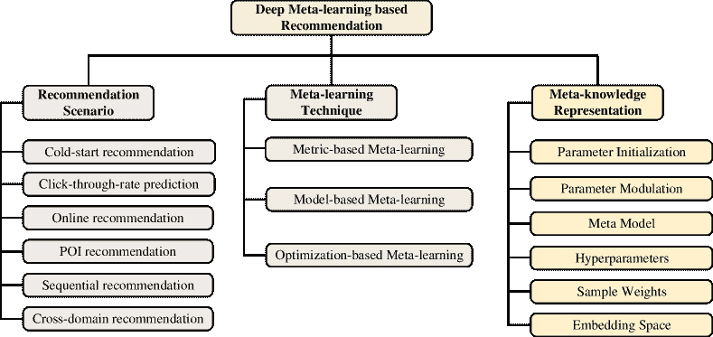
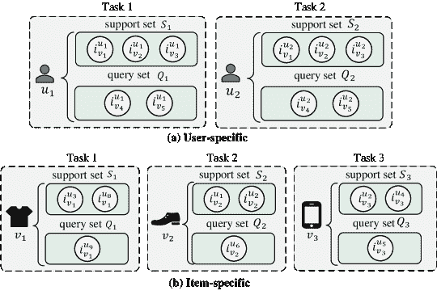
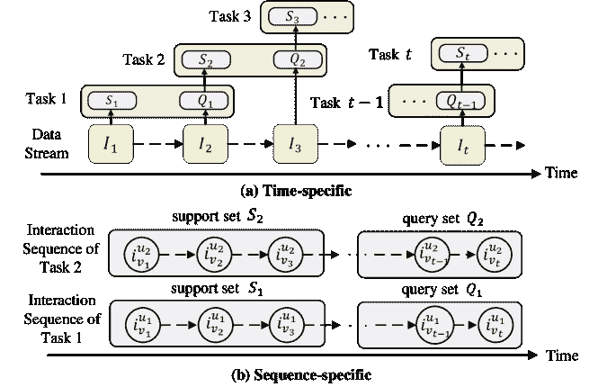
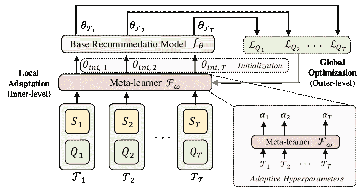
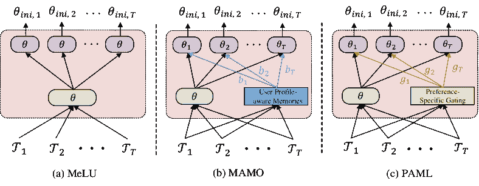
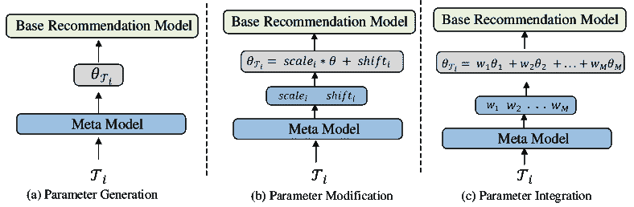
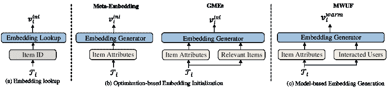

<!--yml

类别：未分类

日期：2024-09-06 19:45:49

-->

# [2206.04415] 深度元学习在推荐系统中的应用：综述

> 来源：[`ar5iv.labs.arxiv.org/html/2206.04415`](https://ar5iv.labs.arxiv.org/html/2206.04415)

# 深度元学习在推荐系统中的应用：综述

王春阳，朱彦敏，刘浩冰，臧天子，余佳迪，唐飞龙 wangchy@sjtu.edu.cn, yzhu@sjtu.edu.cn, liuhaobing@sjtu.edu.cn, zangtianzi@sjtu.edu.cn, jiadiyu@sjtu.edu.cn, tang-fl@cs.sjtu.edu.cn 上海交通大学 上海 中国（2018）

###### 摘要

基于深度神经网络的推荐系统近年来在信息过滤技术中取得了巨大成功。然而，由于从头开始训练模型需要足够的数据，基于深度学习的推荐方法仍面临数据不足和计算效率低下的瓶颈。元学习作为一种新兴的范式，通过学习提升算法的学习效率和泛化能力，在解决数据稀疏问题方面表现出了其优势。近期，越来越多关于深度元学习推荐系统的研究出现，以提高在数据有限的推荐场景下的表现，例如用户冷启动和项目冷启动。因此，本综述提供了对当前深度元学习推荐方法的及时和全面的概述。具体来说，我们提出了一个分类法，根据推荐场景、元学习技术和元知识表示讨论现有方法，这可以为基于元学习的推荐方法提供设计空间。对于每个推荐场景，我们进一步讨论了现有方法如何应用元学习以提高推荐模型的泛化能力的技术细节。最后，我们还指出了当前研究中的一些局限性，并强调了未来研究的一些有前景的方向。

推荐系统；元学习；学习如何学习；综述；冷启动；少样本学习^†^†版权：acmcopyright^†^†期刊年份：2018^†^†doi：10.1145/1122445.1122456^†^†期刊：JACM^†^†期刊卷号：37^†^†期刊号：4^†^†文章编号：111^†^†出版月份：8^†^†ccs：信息系统 推荐系统

## 1\. 引言

最近几年，作为信息过滤系统以减轻信息过载的推荐系统被广泛应用于各种在线应用，包括电子商务、娱乐服务、新闻等。通过在大量候选项中提供个性化建议，推荐系统在提升用户体验和增加在线平台吸引力方面取得了巨大的成功。随着数据驱动的机器学习算法（Su 和 Khoshgoftaar，2009；Billsus 等，1998）的发展，特别是基于深度学习的方法（Zhang 等，2019；He 等，2017；Cheng 等，2016），该领域的学术和工业研究在推荐系统的准确性、多样性、可解释性等方面显著提升了性能。

由于深度学习方法在发现隐藏依赖关系方面具有表达能力，因此在当代推荐模型中得到了广泛应用（Zhang 等，2019；Gao 等，2021）。通过利用具有多样数据结构的大量训练实例（例如，交互对（Zhang 等，2019），序列（Fang 等，2020）和图（Gao 等，2021）），具有深度神经网络架构的推荐模型通常被设计为有效捕捉非线性和复杂的用户/项目关系。然而，传统的基于深度学习的推荐模型通常需要从头开始训练，并依赖于预定义的学习算法。比如，常规的监督学习范式通常使用从所有用户收集的交互数据来训练一个统一的推荐模型，并根据学习到的特征表示对未见过的交互进行推荐。这些基于深度学习的方法通常对数据和计算资源的需求很大。换句话说，基于深度学习的推荐系统的性能在很大程度上依赖于大量训练数据的可用性和足够的计算能力。在实际推荐应用中，数据收集主要来自用户在访问在线平台时的交互行为。存在一些推荐场景，其中可用的用户交互数据稀缺（例如冷启动推荐），而模型训练的计算资源有限（例如在线推荐）。因此，数据不足和计算效率低下的问题成为了基于深度学习的推荐模型的瓶颈。

最近，元学习提供了一种引人注目的学习范式，专注于增强机器学习方法在数据和计算不足情况下的泛化能力（Vanschoren，2018；Hospedales 等，2020）。元学习的核心思想是从多个任务的先前学习过程中获取有关有效任务学习的先验知识（称为*元知识*）。然后，这些元知识可以帮助加快新任务的学习速度，这些新任务应该具有良好的泛化性能。这里，任务通常指的是属于同一类别或具有相同属性的一组实例，涉及对其进行的个体学习过程。与提高深度学习模型的表征学习能力不同，元学习专注于学习更好的学习策略，以替代固定的学习算法，这就是*学习如何学习*的概念。由于其在快速适应未知任务方面的巨大潜力，元学习技术已经在广泛的研究领域中得到了应用，包括图像识别（Cai 等，2018；Zhu 等，2020a）、图像分割（Luo 等，2022）、自然语言处理（Lee 等，2022）、强化学习（Qu 等，2021；Wang 等，2020）等。

元学习的好处与提升推荐模型在实例有限和计算效率低下场景中的需求高度一致。早期的元学习推荐方法主要集中在个性化推荐算法选择（Ren et al., 2019; Cunha et al., 2018），该方法提取元数据集特征，并为不同数据集（或任务）选择合适的推荐算法。虽然应用了提取元知识和生成任务特定模型的理念，这种元学习定义更接近于自动化机器学习的研究（Hutter et al., [[n. d.]](#bib.bib40); Yao et al., 2018）。随后，深度元学习（Huisman et al., 2021）或神经网络元学习（Hospedales et al., 2020）逐渐成为推荐模型中讨论的主流元学习技术（Lee et al., 2019; Pan et al., 2019）。正如（Huisman et al., 2021; Hospedales et al., 2020）中介绍的，*深度元学习*旨在提取元知识，以实现对深度神经网络的快速学习，从而提升当前流行的深度学习范式。自 2017 年以来，深度元学习在推荐系统研究领域获得了关注。先进的元学习技术首先应用于缓解数据不足（即冷启动问题），在训练传统深度推荐模型时。例如，最成功的基于优化的元学习框架 MAML，它以神经网络参数初始化的形式学习元知识，首次在冷启动推荐场景中显示出极大的效果（Lee et al., 2019）。此外，还在元学习框架下研究了点击率预测（Pan et al., 2019）、在线推荐（Zhang et al., 2020）和序列推荐（Zheng et al., 2021）等多种推荐场景，以提高在数据不足和计算低效环境中的学习能力。

在本文中，我们提供了对快速增长的基于深度元学习的推荐系统研究的及时且全面的调查。我们调查发现，虽然已有一些关于元学习或深度元学习的调查，总结了元学习方法及其应用的细节（Vanschoren, 2018; Huisman et al., 2021; Hospedales et al., 2020），但对推荐系统的最新进展仍缺乏关注。此外，还有一些关于其他应用领域元学习方法的调查，如自然语言处理（Lee et al., 2022; Yin, 2020）、多模态（Ma et al., 2022）和图像分割（Luo et al., 2022）。然而，之前没有任何调查专注于推荐系统中的深度元学习。与这些调查相比，我们的调查首次尝试填补这一空白，提供了对元学习与推荐系统结合的最新论文的系统性综述。

在我们的调查中，我们旨在彻底审视基于深度元学习的推荐系统的文献，这将有助于读者和研究人员对这一主题有全面的理解。为了精确定位该领域的工作，我们提供了一个包含推荐场景、元学习技术和元知识表示三种视角的分类法。此外，我们主要根据推荐场景讨论相关方法，并展示不同工作如何利用元学习技术提取具有多种形式的特定元知识，例如参数初始化、参数调节、超参数优化等。我们希望我们的分类法能够为开发新的基于深度元学习的推荐方法提供设计空间。此外，我们还总结了元学习任务构建的常见方法，这是元学习范式的必要设置。

本文的结构安排如下。在第二部分中，我们介绍了元学习技术的共同基础以及元学习方法已被研究应用于缓解数据不足和计算低效的典型推荐场景。在第三部分中，我们展示了由三个独立轴组成的分类法。在第四部分中，我们总结了文献中用于推荐任务构建的不同元学习方法。随后，在第五部分中，我们详细阐述了现有方法在不同推荐场景中应用元学习技术的方法论细节。最后，我们在第六部分中讨论了该领域未来研究的有前景方向，并在第七部分中总结了本综述。

论文综述。我们总结了 50 多篇与深度元学习推荐系统高度相关的高质量论文。我们使用 Google Scholar 和 DBLP 作为主要搜索引擎，检索这些论文，主要关键词包括 meta-learning + recommendation, meta + recommendation, meta + CTR, meta + recommender 等。我们特别关注顶级会议和期刊，包括 KDD, SIGIR, WWW, AAAI, IJCAI, WSDM, CIKM, ICDM, TKDE, TKDD, TOIS，以确保涵盖高水平论文。

## 2\. 基础

在本节中，我们介绍了讨论深度元学习推荐方法所需的基础知识。首先，我们总结了不同类别元学习技术的核心思想和代表性工作。随后，我们介绍了元学习技术已被研究和应用的典型推荐场景。

### 2.1\. 元学习

为了全面理解元学习的概念，我们首先形式化了元学习的范式，并详细对比了传统机器学习范式与元学习范式。然后，我们简要介绍了包括*基于度量*、*基于模型*和*基于优化*的三种主流元学习技术，总结了它们的核心思想，并介绍了几个典型相关工作。为了方便起见，我们在表 1 中列出了一些通用符号及其描述。

表 1\. 本文使用的符号。

| 符号 | 描述 |
| --- | --- |
| $u_{i}$ | 用户 $i$ |
| $v_{j}$ | 项目 $j$ |
| $r_{u_{i},v_{j}}$ | $u_{i}$ 和 $v_{j}$ 之间的交互（显式评分或隐式反馈） |
| $\bm{x}_{k},y_{k}$ | 第 $k$ 个实例（例如交互）的表示和标签 |
| $\mathcal{T}_{i}$ | 第 $i$ 个推荐任务 |
| $\mathcal{S}_{i}$ | 任务 $\mathcal{T}_{i}$ 的支持集 |
| $\mathcal{Q}_{i}$ | 任务 $\mathcal{T}_{i}$ 的查询集 |
| $\mathcal{D}^{train}$ | 元训练数据集 |
| $\mathcal{D}^{test}$ | 元测试数据集 |
| $f_{\theta}$ | 基础推荐模型/函数 |
| $\theta$ | 基础推荐模型的参数 |
| $\theta_{\mathcal{T}_{i}}$ | 针对任务 $\mathcal{T}_{i}$ 的个性化模型的任务特定参数 |
| $\alpha$ | 基于优化的元学习中的局部更新率 |
| $\beta$ | 基于优化的元学习中的全局更新率 |
| $\mathcal{L}(f_{\theta},*)$ | 给定数据集上的基础推荐模型的损失函数 |
| $\mathcal{F}_{\omega}$ | 用$\omega$参数化的元学习器 |
| $\omega$ | 元学习器获得的元知识 |

#### 2.1.1. 形式化元学习

通常理解为*学习如何学习*的概念，元学习主要有助于提高基础学习模型或算法的泛化能力，从而更好或更快地学习新任务。一般来说，元学习范式的核心思想是在多个任务之间学习先验知识，即*元知识*，其中每个任务指的是尝试在其自身实例上表现良好的学习过程。不同任务的学习过程被视为元学习方法观察到的训练实例。通过定义元知识的形式并从多个现有任务中提取元知识，元学习方法使新任务的学习过程变得更有效。

从形式上讲，在元学习范式的训练阶段，我们假设从任务分布 $p(\mathcal{T})$ 中采样的一组训练任务可用作元训练数据集，记作 $\mathcal{D}^{train}=\{\mathcal{T}_{i}\}_{i=1}^{M}$。任务 $\mathcal{T}_{i}$ 的所有实例 $\mathcal{D}_{i}$ 由其自身的训练实例组成，记作支持集 $\mathcal{S}_{i}$，以及评估实例，记作查询集 $\mathcal{Q}_{i}$。以监督学习方案下的任务为例。给定支持集 $\mathcal{S}_{i}=\{(\bm{x}_{k},y_{k})\}_{k=1}^{S}$，其中包含 $S$ 个训练实例，任务 $\mathcal{T}_{i}$ 旨在通过最小化经验损失 $\mathcal{L}(f_{\theta},\mathcal{S}_{i})$ 来学习一个映射函数（或模型）$f_{\theta}:\mathcal{X}\rightarrow\mathcal{Y}$。任务 $\mathcal{T}_{i}$ 的映射函数的任务特定参数 $\theta_{\mathcal{T}_{i}}$ 如下所示：

| (1) |  | $\theta_{\mathcal{T}_{i}}=\mathop{\arg\min}\limits_{\theta}\mathcal{L}(f_{{\theta}},\mathcal{S}_{i})$ |  |
| --- | --- | --- | --- |

其中损失函数 $\mathcal{L}(f_{\theta},*)$ 可以是用于分类任务的交叉熵损失，或用于回归任务的回归损失，如均方误差。注意，每个任务的训练过程通常与常规监督学习相同。为了测量训练模型在未见实例上的泛化性能，从任务 $\mathcal{T}_{i}$ 的相同分布中抽取一组评估实例 $\mathcal{Q}_{i}=\{(\bm{x}_{k},y_{k})\}_{k=1}^{Q}$。通过在不同设置中检查经验损失 $\mathcal{L}(f_{\theta_{\mathcal{T}_{i}}},\mathcal{Q}_{i})$ 或其他评估指标，期望学到的映射函数 $f_{\theta_{\mathcal{T}_{i}}}$ 能表现良好。需要提及的是，其他方案中的学习任务，例如强化学习（Bello et al., 2017）和无监督学习（Metz et al., 2018）也被研究。

在 $\mathcal{D}^{train}$ 中不同的元训练任务的训练过程中，即使映射函数的形式可能相同，如何学习任务特定的模型仍然是不同的，并由关于任务学习的可学习设置指导。例如，使用具有相同结构的神经网络进行逼近时，需要合适的超参数或初始化设置，这些设置对于不同任务可能是不同的。换句话说，每个任务 $\mathcal{T}_{i}$ 的学习还依赖于 *如何学习*，这在元学习范式下被定义为元知识 $\omega$。因此，$\mathcal{T}_{i}$ 的任务特定学习可以形式化为如下：

| (2) |  | $\theta_{\mathcal{T}_{i}}=h_{\omega}(f_{\theta},\mathcal{T}_{i},\mathcal{L})$ |  |
| --- | --- | --- | --- |

其中 $h_{\omega}(*)$ 表示利用元知识确保有效学习任务 $\mathcal{T}_{i}$ 的元学习方法，使用相同的映射函数 $f_{\theta}$ 和损失函数 $\mathcal{L}$。

与其假设元知识 $\omega$ 是为所有任务预定义并固定的，元学习允许学习 $\omega$ 以使每个任务能更好地学习。在大多数情况下，手动搜索整个元知识空间是不切实际的。元学习的目标是学习最优的 $\omega$，以便能够指导所有任务的特定任务学习，从而提高其性能。形式上，给定所有训练任务 $\mathcal{D}^{train}=\{\mathcal{T}_{i}\}_{i=1}^{M}$，最优的元知识 $\omega^{*}$ 可以通过以下方式获得：

| (3) |  | $\omega^{*}=\mathop{\arg\min}\limits_{\bm{\omega}}\sum_{\mathcal{T}_{i}\in\mathcal{D}^{train}}\mathcal{L}(f_{\theta_{\mathcal{T}_{i}}},\mathcal{Q}_{i})=\mathop{\arg\min}\limits_{\bm{\omega}}\sum_{\mathcal{T}_{i}\in\mathcal{D}^{train}}\mathcal{L}(f_{h_{\omega}(f_{\theta},\mathcal{T}_{i},\mathcal{L})},\mathcal{Q}_{i})$ |  |
| --- | --- | --- | --- |

训练元学习方法的目标是观察在每个任务的相应查询集$\mathcal{Q}_{i}$上的更好表现（例如，较低的经验损失）。注意，元知识是跨多个任务学习的，因为它旨在挖掘不同任务学习过程中的跨任务特征，并对任务差异具有很强的泛化能力。

与传统机器学习（例如，常规监督学习范式）相比，元学习范式主要具有以下特性：1）学习目标。元学习的学习目标，即*元优化目标*，是促进对未见任务的学习，而传统机器学习则旨在促进对相同任务未见实例的学习。2）任务划分设置。对于常规监督机器学习，所有实例通常都来自单一任务的数据分布。还有多任务学习（Caruana, 1997）或迁移学习框架（Weiss et al., 2016），这些框架考虑了跨多个任务的知识迁移。然而，这些框架主要考虑一对任务或少量已知任务，并将其他任务的知识作为额外信息进行迁移，例如预训练技术或联合优化策略。相比之下，在元学习范式下，大量任务会根据特定属性（例如，类别、属性或时间）进行明确划分，以便在更高层次上提取任务学习的先验知识，即*学习如何学习*。3）学习框架。元学习的常见框架遵循与元优化目标一致的双层学习结构。内层学习专注于任务特定学习，以生成外层学习的训练实例。外层学习负责跨多个实例学习元知识。对于大多数常规机器学习，通过批量学习只进行一个学习层级，这与元学习范式中的内层学习相同。

#### 2.1.2. 主流的元学习技术框架

正如之前的元学习调查总结的那样（Vanschoren, 2018; Huisman et al., 2021），元学习技术主要分为三类，分别是基于度量的、基于模型的和基于优化的元学习方法。接下来，我们将详细介绍每一类的形式化、技术细节和代表性工作，并讨论它们之间的优缺点。

基于度量的元学习借鉴了度量学习的思想，主要以元学习的特征空间的形式表示元知识 $\omega$，在该空间中比较支持实例和查询实例的相似性。具体而言，基于度量的技术中的任务特定学习是以非参数学习的形式进行的。换句话说，在每个任务的内层学习中，映射函数 $f_{\theta}$ 的参数并不被优化以适应训练实例 $\mathcal{S}_{i}$，而是直接用于生成评估实例 $\mathcal{Q}_{i}$ 的标签。对于映射函数 $f_{\theta}$，基于度量的方法主要依赖于相似性评分函数 $sim(\bm{x}_{i},\bm{x}_{j})$，该函数将两个实例的嵌入（例如，一个训练（支持）实例和一个评估（查询）实例）作为输入，并在元学习的特征空间中计算相似性权重。然后，通过加权组合所有训练（支持）实例的标签来分配评估实例的标签。形式上，任务 $\mathcal{T}_{i}$ 中查询实例 $\bm{x}_{i}$ 的预测标签向量 $\hat{\bm{y}}_{i}$ 可以如下获得：

| (4) |  | $\hat{\bm{y}}_{i}=\sum\limits_{(\bm{x}_{j},\bm{y}_{j})\in\mathcal{S}_{i}}sim(\bm{x}_{i},\bm{x}_{j})\bm{y}_{j}$ |  |
| --- | --- | --- | --- |

注意，我们仅展示了基于度量的元学习的基本形式。在文献中，相似性函数 $sim(\bm{x}_{i},\bm{x}_{j})$ 和标签生成可以通过不同的形式实现，如孪生网络（Koch et al., 2015）、匹配网络（Vinyals et al., 2016）、原型网络（Snell et al., 2017）、关系网络（Sung et al., 2018）和图神经网络（Satorras and Estrach, 2018）。

对于外层学习，基于度量的元学习旨在学习特征空间，以有效地比较新任务中的实例相似性。因此，元知识 $\omega$ 与内层学习中的映射函数的参数 $\theta$ 相符。然后通过最小化多个训练任务的查询集上的经验损失来优化 $\theta$，如方程 3 所示。需要提到的是，$\theta_{\mathcal{T}_{i}}$ 与 $\bm{\theta}$ 相同，因为内层任务特定学习是非参数的。

基于模型的元学习是另一种广泛使用的元学习技术，借助神经网络结构强大的表示能力。基于模型的方法的关键思想是通过观察任务的支持实例来元学习一个模型或模块，以编码任务的内部状态。在内部状态的条件下，基于模型的元学习者可以捕捉任务特定的信息，并指导任务自适应的预测。

在基于模型的元学习中，内层学习主要集中在使用结构化的神经网络模型（如前馈网络、递归神经网络（Ravi 和 Larochelle，2016; Hochreiter 等人，2001）、卷积神经网络（Mishra 等人，2018）或超网络（Qiao 等人，2018; Gidaris 和 Komodakis，2018）对任务的支持实例（或梯度）进行编码。查询实例的预测通常是通过条件化在编码的任务特定状态表示上的调制预测器来获得的。形式上，任务 $\mathcal{T}_{i}$ 中查询实例 $\bm{x}_{i}$ 的预测可以通过以下方式获得：

| (5) |  | $\hat{\bm{y}}_{i}=f_{g_{\omega}(\theta,\mathcal{D}_{i})}(\bm{x}_{i})$ |  |
| --- | --- | --- | --- |

其中，元知识 $\omega$ 在将任务特定状态映射到调制信号以预测或优化策略方面发挥作用。通常，$\omega$ 以外部元模型 $g$ 的形式表示。元模型 $g$ 可以通过神经网络（Wang 等人，2016）或外部记忆（Santoro 等人，2016）进行实例化。在外层学习中，元学习者的优化通常与内层映射函数的训练相结合，因为内层学习的输出依赖于元学习者的输出。

基于优化的元学习严格遵循双层优化结构，并通过不同的梯度下降步骤将内层学习和外层学习分开。我们以一个著名的框架模型无关的元学习（MAML）为例。许多研究扩展了 MAML 框架。具体来说，在内层学习中，基本模型作为预测器，基于支持实例的经验损失进行若干步局部优化，如下所示：

| (6) |  | $\theta_{\mathcal{T}_{i}}=\theta-\gamma\nabla_{\theta}\mathcal{L}(f_{\theta},\mathcal{S}_{i}).$ |  |
| --- | --- | --- | --- |

其中，$\theta$ 是基本模型参数的初始化。我们简单展示了一步梯度下降。通过执行基本模型的局部更新，$\theta_{\mathcal{T}_{i}}$ 被用作任务 $\mathcal{T}_{i}$ 特定学习后的学习模型。在这里，任务特定学习指的是常规梯度下降优化，这也是该类别被称为基于优化的元学习的原因。

元知识 $\omega$ 在 MAML 中以参数初始化的形式表示，即 $\theta$。也有其他类型的元知识表示方法被研究过。在每个任务中，$\theta$ 被赋值为任务特定学习之前的元学习全局初始化。因此，在外层学习中，$\theta$ 通过最小化不同任务之间的评估损失来优化，以确保初始化作为元知识具有泛化能力。形式上，外层优化，即元优化的过程如下：

| (7) |  | $\theta\leftarrow\theta-\alpha\nabla_{\theta}\sum\nolimits_{\mathcal{T}_{i}\in\mathcal{D}^{train}}\mathcal{L}(f_{\theta_{\mathcal{T}_{i}}},\mathcal{Q}_{i})$ |  |
| --- | --- | --- | --- |

在元训练数据集 $\mathcal{D}^{train}$ 中，全球初始化 $\theta$ 会通过二阶梯度在所有任务中更新，因为 $\theta_{\mathcal{T}_{i}}$ 是通过梯度下降获得的，如公式 (6) 所示。

讨论：优缺点 上述讨论的这三种元学习技术框架大致涵盖了大多数现有的元学习方法。我们根据计算效率、任务分布的敏感性和适用性总结了它们的优缺点。首先，基于度量的元学习计算负担较小，因为简单的相似性计算不需要对新任务进行额外的任务特定模型更新。然而，当任务分布复杂时，基于度量的方法通常在元测试阶段表现不稳定，因为没有吸收任务信息来应对任务差异。其次，与需要二阶梯度的基于优化的元学习相比，基于模型的元学习具有相对简单的优化步骤。此外，基于多种神经网络结构开发的基于模型的方法通常具有比其他两种方法更广泛的适用性。然而，这一类别被批评在处理分布外任务时表现较差，即对任务分布敏感。第三，基于优化的元学习的主要优点是它通常对基础模型结构没有特定要求，并且可以兼容多种基础模型。在实践中，当任务分布复杂时，基于优化的元学习显示出更好的泛化能力。然而，这一类别的方法主要由于两个梯度下降级别而遭受重计算的困扰。

### 2.2. 推荐场景

接下来，我们将从元学习的角度介绍已研究的推荐系统的典型场景，包括冷启动推荐、点击率预测、在线推荐、兴趣点推荐和序列推荐。也存在一些零散的研究讨论了其他推荐场景中的元学习（例如跨领域推荐、多行为推荐），但在讨论具体方法时，我们只会在第五部分中简要介绍它们。

冷启动推荐。尽管深度学习在通用推荐方法中的发展取得了成功，但需要解决的一个关键挑战是冷启动问题。通常，数据稀缺问题在冷启动情况下普遍存在，例如新用户访问在线平台或新项目出现时。由于观察到的用户-项目交互通常有限，传统的协同过滤方法（Billsus et al., 1998）或深度学习方法（He et al., 2017; Cheng et al., 2016），由于需要大量训练数据，因此很难表现良好。内容驱动的方法不局限于交互记录，而是基于多样的内容信息描述用户和项目，例如用户和项目属性（Gantner et al., 2010）、文本信息（Fu et al., 2019）、知识图谱（Zhang et al., 2021b）、社交网络（Li et al., 2021）等。通过这样做，用户和项目的表示得到了额外的语义信息，从而在一定程度上减弱了对交互数据的需求。此外，冷启动推荐可以被视为一种少样本学习的应用，其中每个任务中仅观察到少量样本。类似地，对于新用户或交互稀少的项目的推荐任务，自然地被划分为元训练任务，而元学习技术被广泛应用于缓解冷启动推荐任务的数据不足问题（Lee et al., 2019; Dong et al., 2020）。

点击率预测。在在线广告应用中，点击率（CTR）是确定发布广告价值的关键指标（Cheng et al., 2016; Shen et al., 2022; Zhou et al., 2018a）。一个合理的广告竞价机制应该在点击率较高的广告上花费更多成本，以确保更大的收益。因此，广告发布者提供的准确 CTR 预测可以帮助投资者进行后续的资源分配。为了估计用户-广告对的点击概率，最近的 CTR 预测模型通常遵循一个包含嵌入层和预测层的通用框架（Cheng et al., 2016）。具体来说，嵌入层首先为广告/用户 ID 及其他丰富特征学习潜在嵌入向量。然后，预测层用于利用复杂的模型建模特征交互或依赖关系，这些模型通常设计为深度神经网络结构。尽管这些方法在学术界和工业界取得了成功，但由于缺乏嵌入学习，大多数这些方法在新广告上表现不佳（Pan et al., 2019）。在 CTR 预测中，这被称为冷启动问题，具有有限点击记录的新广告的嵌入（特别是身份嵌入）很难像其他现有广告一样被训练。我们调查发现，元学习方法已被研究用于加强冷启动广告的嵌入学习。

在线推荐。在实际的大规模推荐系统中，实时用户互动数据会不断生成和收集。需要及时刷新之前学习的推荐模型，以便捕捉动态的用户偏好和趋势（Guo et al., 2020; He et al., 2016）。在线推荐试图基于新到达的数据以在线方式不断更新当前推荐模型，而不是仅基于历史日志离线训练模型。这个领域探讨了在线学习策略和模型重训练机制以满足需求。由于实际应用中的要求，计算效率是一个需要强调的关键因素。例如，针对历史和新样本进行全面重训练是模型刷新的理想策略，但由于不可接受的时间成本，实际上并不实用（Zhang et al., 2020）。因此，为了提高快速学习的能力，元学习已被引入到在线推荐场景中，并用于迅速捕捉来自实时用户互动数据的动态偏好趋势（Zhang et al., 2020; Peng et al., 2021）。

兴趣点推荐 随着基于位置的社交网络（LBSNs）的出现，用户愿意通过签到记录分享他们访问的兴趣点（POIs）。LBSN 服务应该提供个性化的推荐，推荐用户尚未访问的其他 POIs。与一般的物品（如产品、音乐和电影）推荐相比，POI 推荐更多地依赖于从历史签到数据中发现时空依赖关系。这一现象也非常直观，因为用户的活动在很大程度上受到地理空间和时间限制的影响。通过结合签到数据的地理和时间信息，提出了一系列涉及时空建模的方法用于 POI 推荐（Sun et al., 2020; Zhao et al., 2019）。尽管这些方法取得了成功，但数据稀疏问题在这一推荐场景中依然显著，因为用户必须到达共享 POIs 的位置。换句话说，由于数据生成成本高，用户通常只访问少量 POIs。因此，基于元学习的 POI 推荐方法已经被研究，以应对严重的数据稀疏问题（Sun et al., 2021b; Cui et al., 2021）。

顺序推荐 顺序推荐的核心是捕捉用户交互序列中的不断变化的用户偏好。与传统的协同过滤方法（将交互组织为用户-物品对）不同，顺序推荐方法主要利用用户先前交互的物品序列作为输入，并努力发现用户兴趣演变的顺序模式。具体而言，代表性的顺序建模方法包括马尔可夫链（He 和 McAuley, 2016; Rendle et al., 2010）、递归神经网络（Hidasi et al., 2016; Li et al., 2017）和基于自注意力的网络（Kang 和 McAuley, 2018; Xu et al., 2019），在基于交互序列建模短期和长期兴趣方面取得了良好的效果。然而，顺序推荐系统的性能通常依赖于序列中的足够物品。当历史交互数量相对较少时，模型性能往往显著下降并波动很大。因此，数据稀疏问题也在顺序推荐场景中带来了顽固的障碍。

图 1\. 基于深度元学习的推荐系统分类法。

## 3\. 分类法

在本节中，我们建立了基于深度元学习的推荐系统的分类法，并根据该分类法总结了现有方法的特点。

总的来说，我们将分类法定义为三个独立的轴，包括推荐场景、元学习技术和元知识表示。图 1 展示了分类法。之前的通用元学习方法分类法（Huisman et al., 2021; Vanschoren, 2018）更关注第 2.1 节介绍的三类元学习框架，但对元学习技术的实际应用关注较少。此外，（Hospedales et al., 2020）提出了一种包含三个视角的新分类法，包括元表示、元优化器和元目标。他们提供了一个更全面的分类，可以指导新元学习方法的发展。然而，它关注的是整个元学习领域，不适合反映深度元学习基础的推荐系统的当前研究状态和应用场景。因此，我们专注于推荐系统社区，总结现有工作的特征，按照三个维度：

推荐场景（哪里）：这个轴展示了基于元学习的推荐方法提出和应用的具体场景。如第 2.2 节所述，我们将典型的推荐场景总结为以下几个组：1) 冷启动推荐，2) 点击率预测，3) 在线推荐，4) 兴趣点推荐，5) 序列推荐，以及 6) 其他。为了清晰起见，我们没有逐一显示所有涉及的推荐场景，而是将研究较少的场景归纳为*其他*。

元学习技术（如何）：这个轴展示了如何应用元学习来增强对新推荐任务的泛化能力。按照(Huisman et al., 2021; Vanschoren, 2018)的分类法，我们也将元学习技术分为三类，包括基于指标的元学习、基于模型的元学习和基于优化的元学习。

表 2\. 元学习基础的推荐方法总结。我们从场景和元学习技术的层次角度组织所有这些方法。我们使用以下缩写。优化方法：基于优化的。模型：基于模型的。参数初始化：Parameter Initialization。参数调节：Parameter Modulation。超参数：Hyperparameter。嵌入空间：Embedding Space。

| 场景 | 方法 | 场所 | 年份 | 元学习技术 | 元学习表示 |
| --- | --- | --- | --- | --- | --- |
| 优化方法 | 模型 | 指标 | 参数初始化 | 参数调节 | 超参数 | 元模型 | 嵌入空间 | 样本权重 |
| 冷启动推荐 | LWA (Vartak et al., 2017) | NIPS | 2017 |  | ✓ |  |  | ✓ |  |  |  |  |
| MeLU (Lee et al., 2019) | KDD | 2019 | ✓ |  |  | ✓ |  |  |  |  |  |
| MetaCS (Bharadhwaj, 2019) | IJCNN | 2019 | ✓ |  |  | ✓ |  | ✓ |  |  |  |
| MetaHIN (Lu et al., 2020) | KDD | 2020 | ✓ |  |  | ✓ |  |  | ✓ |  |  |
| MAMO (Dong et al., 2020) | KDD | 2020 | ✓ |  |  | ✓ |  |  | ✓ |  |  |
| MetaCF(Wei et al., 2020) | ICDM | 2020 | ✓ |  |  | ✓ |  | ✓ |  |  |  |
| TaNP (Lin et al., 2021) | WWW | 2021 |  | ✓ |  |  | ✓ |  | ✓ |  |  |
| PALRML (Yu et al., 2021) | AAAI | 2021 | ✓ |  |  | ✓ |  | ✓ |  |  |  |
| MIRec (Zhang et al., 2021a) | WWW | 2021 |  | ✓ |  |  | ✓ |  | ✓ |  |  |
| MPML (Chen et al., 2021a) | ECIR | 2021 | ✓ |  |  | ✓ |  |  |  |  |  |
| PAML(Wang et al., 2021b) | IJCAI | 2021 | ✓ |  |  | ✓ |  |  | ✓ |  |  |
| CMML (Feng et al., 2021) | CIKM | 2021 |  | ✓ |  |  | ✓ |  | ✓ |  |  |
| Heater (Zhu et al., 2020b) | SIGIR | 2021 |  | ✓ |  |  | ✓ |  | ✓ |  |  |
| PreTraining (Hao et al., 2021) | SIGIR | 2021 |  |  | ✓ |  |  |  |  | ✓ |  |
| ProtoCF (Sankar et al., 2021) | Recsys | 2021 |  |  | ✓ |  |  |  |  | ✓ |  |
| MetaEDL (Neupane et al., 2021) | ICDM | 2021 | ✓ |  |  | ✓ |  |  |  |  |  |
|  | DML (Neupane et al., 2022) | AAAI | 2022 | ✓ |  |  | ✓ |  |  |  |  |  |
|  | PNMTA (Pang et al., 2022) | WWW | 2022 | ✓ |  |  | ✓ |  |  | ✓ |  |  |
| Click Through Rate Prediction | Meta-Embed. (Pan et al., 2019) | SIGIR | 2019 | ✓ |  |  | ✓ |  |  | ✓ |  |  |
| TDAML (Cao et al., 2020) | ACMMM | 2020 | ✓ |  |  | ✓ |  |  | ✓ |  | ✓ |
| MWUF (Zhu et al., 2021d) | SIGIR | 2021 |  | ✓ |  |  | ✓ |  | ✓ |  |  |
| DisNet (Li et al., 2020) | Complexity | 2021 | ✓ |  |  | ✓ |  |  | ✓ |  |  |
| GME (Ouyang et al., 2021) | SIGIR | 2021 | ✓ |  |  | ✓ |  |  | ✓ |  |  |
| Meta-SSIN (Sun et al., 2021c) | SIGIR(short) | 2021 | ✓ |  |  | ✓ |  |  |  |  |  |
| Point of Interest Recommendation | PREMERE (Kim et al., 2021) | AAAI | 2021 |  | ✓ |  |  |  |  | ✓ |  | ✓ |
| MetaODE (Tan et al., 2021) | MDM | 2021 | ✓ |  |  | ✓ |  |  |  |  |  |
| MFNP (Sun et al., 2021b) | IJCAI | 2021 | ✓ |  |  | ✓ |  |  |  |  |  |
| CHAML (Chen et al., 2021b) | KDD | 2021 | ✓ |  |  | ✓ |  |  |  |  | ✓ |
| Meta-SKR (Cui et al., 2021) | TOIS | 2022 | ✓ |  |  | ✓ |  |  | ✓ |  |  |

表 3\. 所有基于元学习的推荐方法的汇总。我们从场景和元学习技术的层次角度组织所有这些方法。我们使用以下缩写：Optimi.：基于优化的。Model：基于模型的。Para. Init.：参数初始化。Para. Modu.：参数调节。Hyperpara.：超参数。Embedd. Space.：嵌入空间。

| 场景 | 方法 |  会议 | 年份 | 元学习技术 | 元学习表示 |
| --- | --- | --- | --- | --- | --- |
| 优化 | 模型 | 评测指标 | 参数初始化 | 参数调节 | 超参数 | 元模型 | 嵌入空间 | 样本权重 |
| 在线推荐 | S2Meta (Du et al., 2019) | KDD | 2019 | ✓ |  |  | ✓ |  | ✓ | ✓ |  |  |
| SML (Zhang et al., 2020) | SIGIR | 2020 |  | ✓ |  |  | ✓ |  | ✓ |  |  |
| FLIP (Liu et al., 2020b) | IJCAI | 2020 | ✓ |  |  | ✓ |  |  |  |  |  |
| FORM (Sun et al., 2021a) | SIGIR | 2021 | ✓ |  |  | ✓ |  | ✓ |  |  |  |
| LSTTM (Xie et al., 2021) | WSDM | 2022 | ✓ |  |  | ✓ |  |  |  |  |  |
| ASMG (Peng et al., 2021) | Recsys | 2021 |  | ✓ |  |  | ✓ |  | ✓ |  |  |
| MeLON (Kim et al., 2022) | AAAI | 2022 |  | ✓ |  |  |  | ✓ | ✓ |  |  |
| 顺序推荐 | Mecos (Zheng et al., 2021) | AAAI | 2021 |  |  | ✓ |  |  |  |  | ✓ |  |
| MetaTL (Wang et al., 2021a) | SIGIR（短篇） | 2021 | ✓ |  |  | ✓ |  |  |  |  |  |
| CBML (Song et al., 2021) | CIKM | 2021 | ✓ |  |  | ✓ |  |  | ✓ |  |  |
| metaCSR (Huang et al., 2022) | TOIS | 2022 | ✓ |  |  | ✓ |  |  |  |  |  |
| 跨领域推荐 | TMCDR (Zhu et al., 2021a) | SIGIR（短篇） | 2021 | ✓ |  |  | ✓ |  |  |  |  |  |
| PTUPCDR (Zhu et al., 2021c) | WSDM | 2022 |  | ✓ |  |  | ✓ |  | ✓ |  |  |
| 多行为推荐 | CML (Wei et al., 2022) | WSDM | 2022 |  | ✓ |  |  |  | ✓ | ✓ |  |  |
| MB-GMN (Xia et al., 2021) | SIGIR | 2021 |  | ✓ |  |  | ✓ |  | ✓ |  |  |
| 其他 | MetaKG (Du et al., 2022) | TKDE | 2022 | ✓ |  |  | ✓ |  |  |  |  |  |
| MetaSelector (Luo et al., 2020) | WWW | 2020 | ✓ |  |  | ✓ |  | ✓ |  |  |  |
| Meta-SF (Lasserre et al., 2020) | SDM | 2019 | ✓ |  |  |  |  |  | ✓ |  |  |
| MetaMF (Lin et al., 2020) | SIGIR | 2020 | ✓ |  |  |  | ✓ |  | ✓ |  |  |
| MetaHeac (Zhu et al., 2021b) | KDD | 2021 | ✓ |  |  | ✓ |  |  |  |  |  |
| NICF (Zou et al., 2020) | SIGIR | 2021 |  | ✓ |  |  |  |  | ✓ |  |  |

元知识表示（What）：这一维度展示了元知识的表示形式，以便有助于提升推荐模型的快速学习。经过对现有工作的提炼，我们总结了元知识的常见表示方式，包括参数初始化、参数调节、超参数、样本权重、嵌入空间和元模型。一般来说，不同的元学习技术具有不同的元知识表示特征。例如，参数初始化通常是在基于优化的元学习下实现的，而参数调节更可能属于基于模型的元学习。然而，也有多种类型的元知识表示同时以混合方式进行学习的情况。

通过从上述三个独立维度调查现有工作，我们的分类法有望提供一个清晰的设计空间，用于深度元学习推荐方法。我们根据推荐场景组织论文，并展示这些工作的特征，以及表格 2 和 3 中的分类法，列出了详细的出版信息，并突出了主要的元学习技术和元知识表示的形式。

## 4\. 元学习任务构建用于推荐

在这一部分，我们总结了文献中使用的不同元学习推荐任务构建方法。如第 2.1 节讨论的那样，元学习范式与常规深度学习范式之间的主要区别在于任务分割的设置。我们将首先介绍构建元学习任务的一般形式，然后展示在深度元学习推荐方法中采用的实际方法，这些方法与其他领域有很大不同。

通常，元学习方法通常遵循构建不相交的元训练任务$\mathcal{D}^{train}$和元测试任务$\mathcal{D}^{test}$的设置。每个任务被拆分为一组训练实例（称为支持集$\mathcal{S}_{i}$）和一组不相交的评估实例（称为查询集$\mathcal{Q}_{i}$）。每个任务的目标是从支持集$\mathcal{S}_{i}$中快速学习，以便在查询集$\mathcal{Q}_{i}$中的未见实例上表现更好。在单个任务级别，其学习目标类似于常规深度学习范式，只是元学习中通常强调任务的数据不足。当考虑整个任务分布（或多个任务）时，定义了一个更高层次的学习目标（即，元优化目标），即在未见任务的评估实例上取得更好的表现（即，$\mathcal{D}^{test}$）。因此，上述任务分割的设置与元优化目标一致，促进了对元学习方法在多个新任务中的泛化能力和快速学习能力的评估。

与其他应用领域中的元学习任务构建设置不同，构建元学习推荐任务应满足不同推荐场景的特殊需求。对于图像识别和目标检测等流行的少样本分类任务，常用的设置是$N$-way, $K$-shot 分类（Finn 等，2017）。具体来说，在具有大量类别的池基础上，首先随机抽取$N$个类别，然后抽取每个类别的$K$个实例，从而获得一个任务。$K$通常设置为一个较小的数字，以满足少样本任务的要求。对于自然语言处理中的元学习任务，Lee 等（Lee 等，2022）总结了不同的任务构建设置，包括跨领域、跨语言、跨问题、领域泛化和同质任务增强。例如，跨领域设置中的任务来自不同领域（例如，新闻和法律的文本被视为不同领域），而跨语言设置中的任务则基于不同语言进行划分。总体而言，上述其他领域中的元学习任务设置与任务目标和数据特征密切相关。因此，我们特别讨论了元学习推荐任务的构建，并展示了现有的元学习方法如何利用推荐系统中的交互数据进行任务划分。

根据任务中的交互所具有的共同属性，我们主要将任务构建方式总结为四类，包括*用户特定*任务、*项目特定*任务、*时间特定*任务和*序列特定*任务。值得一提的是，还有一些工作尝试了其他方式，但数量相对较少。我们将这些工作整理在名为$others$的类别中。表 4 展示了适应每个任务构建类别的工作的总结。

表 4\. 元学习基础的推荐方法中的任务构建总结。

| 任务构建 | 方法 |
| --- | --- |
| 用户特定 | LWA (Vartak 等，2017), MeLU (Vartak 等，2017), MetaCS (Bharadhwaj，2019), MetaHIN (Lu 等，2020), MAMO (Dong 等，2020), TaNP (Lin 等，2021) PALRML (Yu 等，2021), MPML (Chen 等，2021a), PAML (Wang 等，2021b), CMML (Feng 等，2021), Heater (Zhu 等，2020b), PNMTA (Pang 等，2022), Meta-SSIN (Sun 等，2021c), MFNP (Sun 等，2021b), FORM (Sun 等，2021a), PTUPCDR (Zhu 等，2021c), MetaKG (Du 等，2022), MetaEDL (Neupane 等，2021) |
| 项目特定 | MIRec (Zhang et al., 2021a)，ProtoCF (Sankar et al., 2021)，Meta-Embed. (Pan et al., 2019)，TDAML (Cao et al., 2020)，MWUF (Zhu et al., 2021d)，DisNet (Li et al., 2020)，GME (Ouyang et al., 2021)，Mecos (Zheng et al., 2021) |
| 时间特定 | DML (Neupane et al., 2022)，SML (Zhang et al., 2020)，LSTTM (Xie et al., 2021)，ASMG (Peng et al., 2021)，MeLON (Kim et al., 2022) |
| 序列特定 | FLIP (Liu et al., 2020b)，Meta-SKR (Cui et al., 2021)，MetaTL (Wang et al., 2021a)，CBML (Song et al., 2021)，MetaCSR (Huang et al., 2022) |
| 其他 | PreTraining (Hao et al., 2021)，PREMERE (Kim et al., 2021)，MetaODE (Tan et al., 2021)，CHAML (Chen et al., 2021b)，S2Meta (Du et al., 2019)，TMCDR (Zhu et al., 2021a) |

用户特定任务。正如表 4 所示，任务构建的最典型方式是基于用户的。由于用户冷启动问题是推荐系统中最长期存在的问题，快速从用户有限的交互中学习偏好是一个关键任务。在用户特定任务 $\mathcal{T}_{i}$ 的设置中，任务的所有实例，包括支持集 $\mathcal{S}_{i}$ 和查询集 $\mathcal{Q}_{i}$，都属于同一个用户。不同用户的偏好自然被视为不同的任务。举一个图 2 (a) 中的示例。对于特定用户 $u_{1}$ 的用户特定任务，所有他的交互被划分为支持集 $\mathcal{S}_{1}=\{(v_{j},i^{u_{1}}_{v_{j}})\}_{j=1}^{3}$ 和查询集 $\mathcal{Q}_{1}=\{(v_{j},r^{u_{1}}_{v_{j}})\}_{j=4}^{5}$，其中 $i^{u_{1}}_{v_{j}}$ 可以是用户 $u_{1}$ 对项目 ${v_{j}}$ 的明确评分或隐含反馈。每个用户特定任务的目标是训练一个模型在支持集上，并在相同用户的查询集中的交互上进行评估。从元优化目标的角度来看，元学习方法被期望从足够数量的用户特定任务 $\mathcal{D}^{train}$ 中提取关于用户偏好学习的元知识。然后，当面对来自新用户的未见过的用户特定任务时，元知识应该作为先验经验来促进偏好学习。

项目特定任务。与用户特定任务对称，项目特定任务是基于涉及相同项目的所有实例构建的。从项目的角度来看，交互实例根据不同的项目进行分组。如图 2 (b) 所示，三个项目特定任务是根据三种不同的项目（包括一件衬衫、一双鞋和一部手机）构建的。类似于用户特定任务，基于元学习的项目特定任务通常旨在解决项目冷启动问题。在这种设置下，任务的支持集和查询集涵盖了多个用户与同一项目之间的所有交互。每个项目特定任务的目标是在观察支持集之后，预测查询集中的评价实例的评分或交互概率。通过提取多个项目特定任务中的元知识，元学习方法可以快速感知对冷启动项目的整体偏好，从而做出准确的预测和推荐。

图 2\. 用户特定任务和项目特定任务的任务构建示意图。

时间特定任务。在这种设置下，推荐系统中的交互数据根据不同的时间段被拆分为不同的任务。具体来说，交互数据被视为连续收集，并以数据流的形式到达。形式上，在时间 $t$，当前收集的数据记作 $I_{i}=\{(u_{i},v_{j},i^{u_{i}}_{v_{j}})\}^{M}$。与用户特定或项目特定设置不同，时间特定任务中的交互不再按用户或项目区分。如图 3 (a) 所示，时间特定任务是按两个连续时间段的数据顺序构建的。例如，对于时间 $2$ 的任务，支持集由数据块 $I_{2}$ 组成，即当前时间段收集的数据。对于查询集，数据块 $I_{2}$ 在下一个时间段 $3$ 被用作评价数据。这种设置的原因是，时间特定任务的目标通常是在在线环境中高效更新模型，以便更新后的模型在下一个周期仍能表现良好。元学习也可以通过逐步提取序列时间特定任务中的元知识来促进模型在线更新的效率。

序列特定任务。如图 3 (b) 所示，序列特定任务也考虑了时间信息的构建。与在系统层面收集数据的时间特定任务不同，序列特定设置将不同用户或不同会话的交互序列视为不同的任务。例如，用户 $u_{1}$ 的整个交互序列表示为 $\{(v_{1},i^{u_{1}}_{v_{1}}),(v_{2},i^{u_{1}}_{v_{3}}),...,(v_{t},i^{u_{1}}_{v_{t}})\}$，这些序列按交互时间戳排序。在构建序列特定任务时，长度为 $t$ 的交互序列通常被分为两部分。前 $K$ 次交互被分配为支持集，而后 $t-K$ 次交互被分配为查询集。用户特定任务和序列特定任务之间有两个主要区别。首先，序列特定任务不受整合交互用户历史的限制。匿名会话也可以是独立的交互序列。其次，序列特定任务中的实例形式通常是整个交互序列的子序列，而用户特定任务则具有交互对。

图 3\. 时间特定任务和序列特定任务构建的说明。

其他。除了上述四种任务类型，还有一些研究探索了其他任务构建方式。情境特定任务（Du et al., 2019）根据推荐系统中的不同情境（例如，标签、主题或项目类别）进行划分。针对 POI 推荐，城市特定任务（Tan et al., 2021; Chen et al., 2021b）根据不同城市组织交互，以便可以跨多个城市特定任务提取元知识，从而惠及数据稀疏的城市。不同于利用单一用户交互作为任务的用户特定任务，还可以将多个用户的交互组合起来作为一个任务（Zhu et al., 2021a; Kim et al., 2021）。具体而言，在跨领域推荐系统中，Zhu et al.（Zhu et al., 2021a）随机抽取两组重叠用户（记作$U_{a}$和$U_{b}$），通过将多个用户的所有交互作为支持集（即$S_{i}=D_{a}$）和查询集（即$Q_{i}=D_{b}$）来构建跨领域元学习任务。每个任务的目标是学习一个从源领域到目标领域的嵌入映射模型，以在目标领域的冷启动用户（用$D_{b}$模拟）上获得更好的性能，同时元学习有助于在多个任务之间学习映射模型。采用类似的任务构建策略，Kim et al.（Kim et al., 2021）也在元学习任务的两个更新阶段分别抽取两组多个用户作为训练数据。除了推荐任务外，Hao et al.（Hao et al., 2021）在其提出的基于元学习的冷启动推荐方法中构建了重建任务作为预训练任务。每个重建任务包括一个目标用户和$K$个相邻用户样本，旨在用其邻居重建目标用户的嵌入。

## 5\. 元学习方法在推荐系统中的应用

本节将更详细地探讨文献中的基于元学习的推荐方法。一般而言，我们介绍了元学习方法如何在不同推荐场景中促进推荐系统的进展。在每个推荐场景中，我们总结了相关工作的特点，并讨论了关于元学习应用方式的方法。

### 5.1\. 冷启动推荐中的元学习

在冷启动推荐场景中，强调的是进行少量交互的用户或涉及少量交互的项目，以提升推荐系统的整体性能。众所周知，少样本学习是元学习最常见的应用。在推荐系统中，作为少样本学习问题的类比，冷启动推荐也受到更多关注，并由基于元学习的方法进行深入研究。在这里，我们总结了现有工作如何将元学习应用于缓解冷启动问题，包括*基于优化的参数初始化*、*基于优化的参数超参数*、*基于模型的参数调节*和*基于度量的嵌入空间学习*。接下来，我们将详细阐述不同类别的方法，并介绍具体方法的细节。

图 4\. 基于优化的参数初始化和自适应超参数的框架示意图。基于包括局部适应和全局优化的两个层次的优化，优化型元学习者在元训练任务中进行更新。参数初始化和自适应超参数可以根据不同的元学习者设计进行学习。

表 5\. 基于优化的元学习方法在冷启动推荐中的推荐模型详细信息。展示了内层更新和外层优化中的关键技术。

| 方法 | 冷启动对象 | 元知识表示 | 双层优化中的关键技术 |
| --- | --- | --- | --- |
| MeLU (Lee 等，2019) | 用户 & 项目 | 参数初始化 | *内层*: FCN *外层:* MAML |
| MetaCS (Bharadhwaj，2019) | 用户 | 参数初始化 & 超参数 | *内层*: FCN *外层:* MAML |
| MetaHIN (Lu 等，2020) | 用户 & 项目 | 参数初始化 & 元模型 | *内层*: FCN *外层:* MAML + HIN |
| MAMO (Dong 等，2020) | 用户 & 项目 | 参数初始化 & 元模型 | *内层*: FCN *外层:* MAML + 记忆 |
| MetaCF (Wei 等，2020) | 用户 | 参数初始化 & 超参数 | *内层*: FISM (Kabbur 等，2013) 或 NGCF (Wang 等，2019) *外层:* MAML |
| PALRML (Yu 等，2021) | 用户 | 参数初始化 & 超参数 | *内层*: FCN *外层:* MAML + 自适应学习率 |
| MPML (Chen 等，2021a) | 用户 & 项目 | 参数初始化 | *内层*: FCN *外层:* MAML + 聚类 |
| PAML (Wang 等，2021b) | 用户 & 项目 | 参数初始化 & 元模型 | *内层*: HIN + 社会 *外层:* MAML + 门控 |
| MetaEDL (Neupane 等，2021) | 用户 | 参数初始化 | *内层*: FCN *外层:* MAML |
| DML (Neupane et al., 2022) | 用户 | 参数初始化 | *内层*: FCN + RNN *外层:* MAML |
| PNMTA (Pang et al., 2022) | 用户 | 参数初始化 & 元模型 | *内层*: FCN *外层:* MAML + 参数调节 |

基于优化的参数初始化。表 5 显示了从三个角度，即冷启动对象、元知识表示以及双层优化框架中使用的关键技术，来总结基于优化的元学习方法。现有方法通常根据两种元知识表示形式分为两类，包括 *参数初始化* 和 *自适应超参数*。我们在图 4 中展示了基于优化的参数初始化和自适应超参数的通用框架。接下来，我们在这一部分讨论参数初始化的具体方法，而在下一部分讨论自适应超参数。

*基于优化的参数初始化*的基本思想是将元知识$\omega$定义为基础推荐模型的初始参数，然后以双层优化的形式更新参数初始化。受到模型无关元学习（Finn 等， 2017）的启发，Lee 等（Lee 等，2019）首次将 MAML 框架引入冷启动推荐，并提出 MeLU，旨在将神经网络基础推荐模型的全局参数初始化作为先验知识进行学习。基础模型$f_{\theta}$使用全连接神经网络（FCNs）实现，作为个性化用户偏好估计模型。在这里，$\theta$包括基础推荐模型中隐藏层和最终输出层的转换参数$\bm{W}$和偏置参数$\bm{b}$，这些参数通过$\theta\leftarrow\omega$以全局学习的参数初始化$\omega$进行初始化。按照双层优化程序，MeLU 构建用户冷启动任务，并根据方程（6）局部更新每个用户$u_{i}$的个性化推荐模型的参数。在局部更新过程后，为任务$\mathcal{T}_{i}$特别学习一个用户特定的推荐模型$f_{\theta_{\mathcal{T}_{i}}}$，并用于在其未见的查询集$\mathcal{Q}_{i}$上进行偏好预测。在全局优化过程中，全局参数初始化$\theta$，应用于多个元训练任务的局部更新过程，同时通过最小化查询集上的总损失来优化，如方程（7）。在元训练阶段的迭代全局更新步骤后，全局参数初始化$\omega$应具有快速适应元测试集$\mathcal{D}^{test}$中新的冷启动推荐任务的能力。在 MeLU 中，用户偏好估计模型的参数在 MAML 框架下进行优化，而用户/项目嵌入则仅进行全局更新。此外，通过将用户和项目划分为现有组和新组，MeLU 被评估为在处理用户和项目冷启动问题上有效。

借鉴在多个冷启动任务中全局学习模型初始化参数的思想，其他一些工作也在原始 MAML 框架的帮助下提出了。基于 MeLU，Chen 等人（Chen 等，2021a）提出了一种多先验元学习方法 MPML，该方法配备了多组初始化参数。对于冷启动任务，分配哪个初始化集取决于在其支持集上局部更新后表现更好的那个。除了简单的基于 FCN 的协同过滤模型外，基于优化的元学习还被用于学习不同形式推荐模型的初始化。例如，MetaEDL（Neupane 等，2021）采用 MAML 框架学习一个增强证据学习的推荐模型的初始化参数，该模型额外为预测交互分配证据。考虑到用户偏好的时间演变，DML（Neupane 等，2022）旨在不断捕捉用户所有历史交互中的时间演变因素，并基于少量当前交互快速学习时间特定因素。具体而言，捕捉时间特定因素的模块在 MAML 框架下进行学习，以便快速适应用户交互通常较少的每个时间段。

扩展 MAML 框架的一个有前景的方向是通过为不同任务量身定制任务特定的初始化来考虑*任务异质性*问题（Dong 等， 2020；Wang 等，2021b；Pang 等，2022）。我们在图 5 中展示了两项代表性工作的初始化策略的核心思想。其中一个代表性工作 MAMO（Dong 等，2020）被提出用于在初始化推荐模型参数时提供个性化的偏差项。具体而言，记忆网络被引入到基于优化的元学习中，作为外部记忆单元来存储任务特定的快速权重记忆。在将 MAML 框架下学习到的全局初始化分配给基础模型之前，MAMO 应用记忆单元生成个性化的偏差项 $b_{u_{i}}$ 并获得任务特定的初始化 $\theta_{u_{i}}\leftarrow\omega-\tau b_{u_{i}}$。$b_{u_{i}}$ 是通过用给定用户 ${u_{i}}$ 的个人资料表示 $p_{u_{i}}$ 查询快速权重记忆 $M_{W}$ 生成的，具体如下：

| (8) |  | $\displaystyle b_{u_{i}}$ | $\displaystyle=$ | $\displaystyle a_{u_{i}}^{T}M_{W}$ |  |
| --- | --- | --- | --- | --- | --- |
| (9) |  | $\displaystyle a_{u_{i}}$ | $\displaystyle=$ | $\displaystyle attention(p_{u_{i}},M_{P})$ |  |

其中 $M_{P}$ 是在训练过程中存储的配置文件记忆，$M_{W}$ 是以快速权重形式存储训练梯度的快速权重记忆。至于模型和记忆的优化，两个记忆矩阵在 ${u_{i}}$ 的训练任务中更新如下：

| (10) |  | $\displaystyle M_{P}$ | $\displaystyle=$ | $\displaystyle\lambda(a_{u_{i}}p_{u_{i}}^{T})+(1-\lambda)M_{P}$ |  |
| --- | --- | --- | --- | --- | --- |
| (11) |  | $\displaystyle M_{W}$ | $\displaystyle=$ | $\displaystyle\delta(a_{u_{i}}\nabla_{\theta}\mathcal{L}(f_{\theta},\mathcal{S}_{i}))+(1-\delta)M_{W}$ |  |

其中 $\lambda$ 和 $\delta$ 是作为记忆更新比率的超参数。注意，我们仅展示了 MAMO 中记忆利用的一部分，更多细节和扩展可见原文（Dong et al., 2020）。因此，通过注入配置文件感知初始化偏差 $b_{u_{i}}$，MAMO 将任务特定的初始化 $\theta_{u_{i}}$ 调整为应对用户配置文件相关的任务异质性问题。

图 5\. 展示了三种代表性方法（包括 MeLU、MAMO 和 PAML）中的不同参数初始化策略。简而言之，MeLU 在所有任务之间共享全局初始化，而 MAMO 和 PAML 则根据用户配置文件和用户偏好分别定制任务特定的初始化。

按照定制任务特定初始化的相同思路，Wang 等人（Wang et al., 2021b）也认为类似的先验知识应由具有相似偏好的用户共享。因此，提出了一种偏好自适应的元学习方法 PAML，通过应用外部元模型将全局共享的先验初始化 $\theta$ 调整为偏好特定的初始化 $\theta_{u_{i}}$。具体而言，元模型作为偏好特定的适配器，通过结合社交网络的社交关系和异质信息网络（HINs）的语义关系来实现。在定制偏好特定初始化 $\theta_{u_{i}}$ 时，设计了一系列偏好特定的门控 $\bm{g_{u_{i}}}$ 来控制共享多少先验知识，具体实现如下：

| (12) |  | $\displaystyle\bm{g}_{u_{i}}$ | $\displaystyle=$ | $\displaystyle\sigma(\bm{W}_{g}\bm{u}_{i}+\bm{b}_{g})$ |  |
| --- | --- | --- | --- | --- | --- |
| (13) |  | $\displaystyle\theta_{u_{i}}$ | $\displaystyle=$ | $\displaystyle\theta\circ\bm{g}_{u_{i}}$ |  |

其中 $\bm{u}_{i}$ 是从用户的交互以及基于社交关系提取的显式朋友表示和从语义关系提取的隐式朋友表示中学习到的用户偏好表示。由于用户关系通过整合社交网络和异构信息网络（HINs）得到全面建模，最终的用户偏好表示 $\bm{u}_{i}$ 应触发对具有相似偏好的用户类似的门控。最终，在获得特定偏好初始化 $\theta_{u_{i}}$ 后，基于优化的元学习（即 MAML 框架）用于优化基础推荐模型和元模型的参数。这里，基础推荐模型包括之前讨论的偏好建模模块和基于 FCN 的评分预测模块。不同于侧重于用户资料信息的 MAMO，PAML 主要基于多种用户关系区分不同任务。

不通过引入外部任务关系来揭示任务间差异，Pang 等（Pang et al., 2022）提出了 PNMTA，以从用户的交互上下文中发现隐式任务分布并执行任务自适应初始化调整。具体而言，设计了一个元模型 $\mathcal{F}_{\omega}$ 来生成基础预测模型的任务特定初始化 $\theta_{u_{i}}$，其参数调制如下：

| (14) |  | $\displaystyle\bm{w}_{i},\bm{b}_{i}$ | $\displaystyle=$ | $\displaystyle\mathcal{F}_{\omega}(\bm{t_{i}})$ |  |
| --- | --- | --- | --- | --- | --- |
| (15) |  | $\displaystyle\theta_{u_{i}}$ | $\displaystyle=$ | $\displaystyle\bm{w}_{i}\odot\theta+\bm{b}_{i}$ |  |

其中 $\bm{t_{i}}$ 是通过聚合所有交互表示学习到的任务向量。在任务表示的条件下，元模型生成任务自适应调制信号，即调制函数的参数。在此，我们展示了特征-wise 线性调制（FiLM），而原文中还讨论了其他类型的调制函数，如通道-wise 调制和软注意力调制。在元训练阶段，元模型 $\omega$ 和基础模型的全局初始化 $\theta$ 的参数在 MAML 框架下进行优化。

除了对元学习框架的扩展，MetaHIN（Lu et al.，2020）从任务构建的角度提出了增强冷启动任务的方法。具体而言，与仅将用户的互动项视为支持集$\mathcal{S}_{i}$不同，MetaHIN 将基于异构信息网络（HIN）的多个元路径$\mathcal{P}=\{p_{1},p_{2},...,p_{n}\}$将多方面的语义上下文$\mathcal{S}_{i}^{\mathcal{P}}$纳入任务中。对于每个元路径$p_{k}$，通过$p_{k}$获得的用户$u_{i}$可达的一组项，记为$\mathcal{S}_{i}^{p_{k}}$。通过这种方式，得到语义增强的支持集$(\mathcal{S}_{i},\mathcal{S}_{i}^{\mathcal{P}})$，语义增强的查询集类似地得到$(\mathcal{Q}_{i},\mathcal{Q}_{i}^{\mathcal{P}})$。在构建上述语义增强任务后，设计了一个共适应的元学习器，以同时进行语义和任务的适应，以增强每个用户的局部适应能力。共适应的适应聚焦于分别适应由不同元路径引起的不同语义空间。总体而言，MAML 中的传统局部适应阶段首先通过构建语义丰富的任务从数据层面上进行了增强，然后通过设计两个层次的局部适应进一步使用共适应元学习器进行了增强。

基于优化的自适应超参数。除了基于推荐模型的参数初始化外，一些研究还利用元学习来学习不同冷启动任务的自适应超参数。例如，MetaCS（Bharadhwaj，2019）采用了与 MeLU 类似的双层优化过程，并在进行全局优化时，额外地对局部学习率$\alpha$进行元更新。局部学习率的更新方程如下：

| (16) |  | $\alpha\leftarrow\alpha-\beta\nabla_{\alpha}\sum\nolimits_{\mathcal{T}_{i}\in\mathcal{D}^{train}}\mathcal{L}(f_{\theta_{\mathcal{T}_{i}}},\mathcal{Q}_{i}),$ |  |
| --- | --- | --- | --- |

其中$\alpha$是用于局部更新的参数化学习率，$\beta$是用于全局更新的固定学习率。他们认为，手动固定的学习率可能会导致模型无法收敛。通过这种方式，不仅基础模型的参数，还包括超参数，如学习率，都经过元学习以提供先验知识。需要提到的是，这里的可学习更新比率仅在全局优化时进行优化，而在每个任务的局部适应过程中不会更新。

作为基本模型的协同过滤方法，MetaCF（Wei et al., 2020）还利用 MAML 框架来元学习可学习参数的初始化，例如 FISM 中的项目嵌入（Kabbur et al., 2013)和 NGCF 中的嵌入变换参数（Wang et al., 2019）。与 MetaCS（Bharadhwaj，2019）类似，MetaCF 还通过学习适当的学习率自动采用灵活的更新策略。在执行任务构建时，MetaCF 采用了另外两种策略，包括动态子图采样和潜在交互提取，从而向推荐任务注入动态性和语义。

同样，余等人（Yu et al., 2021）提出了一种个性化自适应学习率元学习方法 PALRML，该方法为不同用户设置不同的学习率，以找到每个任务的任务自适应参数。他们认为，在推荐系统中假设用户分布是均匀的可能会导致具有相似特征的主要用户过拟合的问题。换句话说，具有不同特征的次要用户可能不会受到关注。因此，PALRML 执行了基于用户自适应学习率的元学习，以改善基本 MAML 框架的性能。具体来说，每个任务$\mathcal{T}_{i}$上的局部调整适应如下：

| （17） | | $\theta_{\mathcal{T}_{i}}=\theta-\alpha(h_{i})\nabla_{\theta}\mathcal{L}(f_{\theta},\mathcal{S}_{i}).$ |  |
| --- | --- | --- | --- |

其中$\alpha(h_{i})$是一个映射函数，根据用户的特征嵌入$h_{i}$为每个用户$u_{i}$分配适当的学习率。设计了三种不同的策略，包括基于自适应学习率、近似基于树的和基于正则化器的，以提供个性化学习率。同时实现了低空间复杂度和良好的预测性能。

表 6. 冷启动推荐中具有基于模型的元学习方法的推荐模型的详细信息。总结了不同方法中设计的元模型的关键角色。

| 方法 | 冷启动对象 | 基础模型 | 元模型的关键角色 |
| --- | --- | --- | --- |
| LWA（Vartak et al., 2017） | 项目 | LR / FCN | 任务相关的参数生成 |
| TaNP（Lin et al., 2021） | 用户 | 编码器和解码器 | 任务相关的参数修改 |
| MIRec（Zhang et al., 2021a） | 项目 | FCN | 从少样本模型到多样本模型的参数生成 |
| CMML（Feng et al., 2021） | 用户 | FCN | 任务相关的参数修改 |
| Heater（Zhu et al., 2020b） | 用户和项目 | FCN | 基于专家混合的参数集成 |

基于模型的参数调节。另一类冷启动推荐的元学习方法采用基于模型的元学习来进行参数调节。核心思想是训练一个元模型$\mathcal{F}_{\omega}$，该模型直接控制或改变基础推荐模型的状态，而无需依赖内部优化。更具体地说，元模型的形式通常是一个可学习的神经网络，它将任务支持集中的交互和其他有用信息（如损失或梯度）作为输入，以学习任务特定的信息。基础模型状态的改变方式取决于不同方法的设计，即元模型的输出形式。例如，一些研究采用参数生成策略，将元模型的输出直接视为基础模型的任务特定参数。同时，也有一些研究采取更间接的方法，如基于门控的全球共享参数修改。我们总结了三类参数调节策略，包括参数生成、参数修改和参数集成，这些在图 6 中进行了说明。表 6 显示了基于模型的参数调节方法的总结。

设计参数调制的元模型的一种策略是直接生成基础模型的任务特定参数。例如，Vartak 等（Vartak 等，2017）提出了两个模型，分别为 LWA 和 NLBA，以解决项目冷启动问题。LWA 和 NLBA 都采用类似的深度神经网络架构作为元模型来实现参数生成策略。这两个模型的区别在于推荐模型的形式和需要调整的参数。具体来说，以 LWA 为例，元学习器 $\mathcal{F}_{\omega}$ 由两个子网络 $\mathcal{G}(.)$ 和 $\mathcal{H}(.)$ 组成。第一个子网络 $\mathcal{G}(.)$ 基于给定用户的互动项学习任务表示。正交互和负交互的嵌入分别聚合为 $R^{p}_{i}=\mathcal{G}(I^{p})$ 和 $R^{n}_{i}=\mathcal{G}(I^{n})$。第二个子网络 $\mathcal{H}(.)$ 直接基于 $R^{p}_{i}$ 和 $R^{n}_{i}$ 调整基础模型，通过学习一个向量 $\bm{w_{i}}=\bm{w}_{p}R^{p}_{i}+\bm{w}_{n}R^{n}_{i}$。这里，$\bm{w_{i}}$ 是逻辑回归（LR）函数的生成线性变换参数，特定于用户 $u_{i}$。然后，逻辑回归函数将作为用户特定的推荐模型来预测新项的互动概率。类似地，NLBA 使用神经网络分类器作为基础模型，并生成所有隐藏层的偏置参数来实现参数生成。

为了改进尾项推荐，即项目冷启动推荐，张等（张等，2021a）提出了 MIREC，该方法专注于将来自用户反馈丰富的头项的知识转移到互动较少的尾项。根据基于模型的元学习中的参数生成策略，设计了一个元映射模块，将少样本模型的参数转移到多样本模型，从而实现模型级别的增强。具体来说，元模型 $\mathcal{F}_{\omega}$ 学习从少样本模型到多样本模型的模型参数映射。在 MIREC 中要学习的元知识可以解释为在观察到更多训练数据时关于模型转换的知识。给定一个基础模型 $g_{\theta}$，通过提供所有用户反馈来学习参数化为 $\theta^{*}$ 的多样本模型 $g_{\theta^{*}}$。然后，为了学习模型转换的元知识，将元模型 $\mathcal{F}_{\omega}$ 融入到少样本模型 $g_{\theta_{k}}$（训练于少于 $k$ 次交互的尾项）的训练过程中，通过最小化以下目标函数来实现：

| (18) |  | $\mathcal{L}(\omega,\theta_{k})=&#124;&#124;\mathcal{F}_{\omega}(\theta_{k})-\theta^{*}&#124;&#124;^{2}+\mathcal{L}_{rec}(g_{\theta_{k}},D_{k})$ |  |
| --- | --- | --- | --- |

其中 $\mathcal{F}_{\omega}(.)$ 以少量样本模型的参数 $\theta_{k}$ 作为输入，并生成大量样本模型参数。第一个 L2 正则化项用于训练 $\mathcal{F}_{\omega}$ 从少量样本模型到大量样本模型的参数映射能力。训练后，通过整合原始大量样本模型 $g_{\theta^{*}}$ 和元映射的少量样本模型 $g_{\mathcal{F}_{\omega}(\theta_{k})}$，得到最终的推荐模型，以在头部和尾部项目上表现良好。

图 6\. 展示了不同参数调制策略的示意图，包括参数生成、参数修改和参数整合。每种类别都提供了一个基本示例。

另一种常见的元模型设计策略是将全局共享参数修改为特定任务的参数。参数修改策略的核心思想不是直接将元模型的输出作为基础模型的参数，而是将全局参数调整为在元模型控制下的任务特定参数。Lin 等人（Lin et al., 2021）提出了 TaNP，它设计了一种任务相关的参数调制机制，以为基础推荐模型定制任务自适应参数。具体而言，TaNP 将每个任务近似为随机过程的实例，并利用编码器和解码器结构作为偏好估计模块，即基础推荐模型。元模型旨在调制解码器模块的参数。具体来说，元模型 $\mathcal{F}_{\omega}$ 首先利用任务身份网络来编码交互，并使用可学习的全局池来自动学习不同任务的相关性。通过这样做，获得任务表示为 $\bm{o}_{i}$ 并用于为参数调制提供任务相关信息。讨论了包括 FiLM（Perez et al., 2018）和扩展的 Gating-FiLM 在内的两个候选调制策略，以缩放和移动解码器隐藏层的参数。以 FiLM 为例，对于用户 $u_{i}$，第 $l$ 层隐藏层的调整可以定义为：

| (19) |  | $\displaystyle scale_{i}^{l}=tanh(\bm{W}_{a}^{l}\bm{o}_{i}), shift_{i}^{l}=tanh(\bm{W}_{b}^{l}\bm{o}_{i}),$ |  |
| --- | --- | --- | --- |
| (20) |  | $\displaystyle\bm{x}^{l+1}_{i}=ReLU(scale_{i}^{l}\odot(\bm{W}_{dec}^{l}\bm{x}^{l}_{i}+\bm{b}_{dec}^{l})+shift_{i}^{l})$ |  |

其中 $\bm{W}_{dec}^{l}$ 和 $\bm{b}_{dec}^{l}$ 是编码器的全局参数。$scale_{i}^{l}$ 和 $shift_{i}^{l}$ 是由元模型生成的模型调制信号。$\bm{x}^{l}_{i}$ 是解码器第 $l$ 层的输入。通过这种方式，TaNP 利用基于模型的元学习实现任务自适应参数调制。

类似的参数修改策略也被用于 CMML (Feng et al., 2021)，该方法利用两个上下文编码器和一个上下文调制网络作为元模型。具体而言，这两个上下文编码器分别专注于从任务级别和实例（或交互）级别提取冷启动任务的任务上下文信息。然后，最终的上下文表示 $c_{u_{i},v_{j}}$ 将作为超网络输入，以生成特定交互 $r_{u_{i},v_{j}}$ 的调制权重。CMML 提供的三种网络调制策略是 *权重调制*、*层调制* 和 *软调制*。具体来说，权重调制仅生成最终线性层的权重和偏置。层调制遵循 FilM，并生成线性调制的权重和偏置，类似于方程（19-20）。软调制通过引入专家混合网络生成动态路由权重，以汇聚多个子网络的输出。三种网络调制策略的详细信息请参见原始论文。

另一项工作 Heater (Zhu et al., 2020b) 利用基于模型的元学习中的参数整合策略进行冷启动推荐。通过结合冷启动用户和项目的辅助信息，Heater 主要将用户/项目辅助表示转换到协同过滤（CF）空间，并估计偏好概率。他们认为需要对不同用户或项目进行个性化转换。因此，他们建议采用 Mixture-of-Experts (Shazeer et al., 2017) 作为元模型，以实现个性化用户转换函数 $f^{U}_{i}$ 和项目转换函数 $f^{I}_{j}$。以用户端为例，Mixture-of-Experts 包含 $M$ 个结构相同的并行专家。每个专家 $f^{m}$ 以用户表示 $\bm{u}_{i}$ 作为输入，并输出用户的转换表示 $f^{m}(\bm{u}_{i})$。参数修改策略通过自适应地组合所有专家的输出 $\{f^{1}(\bm{u}_{i}),...,f^{M}(\bm{u}_{i})\}$，结合可学习的权重。这相当于对多个专家参数的自适应整合。因此，最终的转换函数 $f^{U}_{i}$ 对每个用户都是特定的。

基于度量的嵌入空间学习。基于度量的元学习也用于冷启动推荐，以元学习嵌入空间用于嵌入相似性比较。为了缓解长尾物品推荐中的冷启动问题，Sankar 等（Sankar et al., 2021）提出了 ProtoCF，该方法学习一个共享的度量空间，用于测量候选冷启动物品与用户之间的嵌入相似性。具体而言，受到原型网络（Snell et al., 2017）的启发，ProtoCF 从少量交互中学习区分性的原型，以处理长尾物品。基于支持集$\mathcal{S}_{i}$，首先计算每个物品$v_{i}$的原型表示，作为预训练用户嵌入的均值向量。然后，学习固定数量的组嵌入作为外部记忆，以丰富每个物品的原型表示。最后，遵循度量学习的框架，给定一个查询用户，计算候选物品的原型表示$\{\bm{p}_{1},...,\bm{p}_{N}\}$与用户表示$\bm{u}_{i}$之间的相似性，这些相似性在元学习的度量空间中进行计算。

借鉴嵌入相似性测量的思想，Hao 等（Hao et al., 2021）研究了如何通过少量重建任务预训练 GNNs 以学习冷启动用户和物品的嵌入。与其学习嵌入空间以计算用户和物品之间的嵌入相似性，PreTraining 方法专注于学习重建空间，以比较少量用户/物品的重建嵌入与从大量交互中学习到的真实嵌入。重建任务首先选择具有足够交互的目标用户/物品，并通过为每个目标用户/物品采样少量邻居来模拟冷启动情况。假设通过大量交互训练的嵌入是真实值，重建任务的目标是基于少量邻居重建嵌入。通过测量和最大化重建嵌入与真实值之间的相似性，预训练的 GNNs 被期望学习到有效的冷启动用户和物品的嵌入空间。

### 5.2\. CTR 预测中的元学习

我们从三个角度总结了点击率预测中的元学习方法的细节，即元学习技术、使用的辅助信息和元知识表示，如表 7 所示。接下来，我们将详细阐述包括*基于优化的物品嵌入初始化*和*基于模型的物品嵌入生成*在内的两组方法。

表 7\. 使用元学习方法的推荐模型在点击率预测中的详细信息。

| 方法 | 元学习技术 | 辅助信息 | 元知识表示 |
| --- | --- | --- | --- |
| Meta-Embedding（潘等， 2019） | 基于优化 | 项目属性 | 嵌入初始化与元模型 |
| DisNet（李等， 2020） | 基于优化 | 相关项目 | 嵌入初始化与元模型 |
| GME（欧阳等， 2021） | 基于优化 | 项目属性与相关项目 | 嵌入初始化与元模型 |
| TDAML（曹等， 2020） | 基于优化 | 项目属性 | 嵌入初始化与元模型与样本权重 |
| MWUF（朱等， 2021d） | 基于模型 | 项目属性与互动用户 | 元模型 |
| Meta-SSIN（孙等， 2021c） | 基于优化 | 历史项目 | 参数初始化 |

图 7. 不同嵌入生成器在 CTR 预测的元学习方法中的结构示意图。我们主要从生成新项目的初始嵌入或预热嵌入时考虑了哪些辅助信息进行比较。

基于优化的项目嵌入初始化。此类别的方法主要集中于学习新项目的初始嵌入，以实现更好的冷启动和预热性能。该类别的主要思想是设计一个外部 ID 嵌入生成器作为元学习者，并将其应用于为不同的新项目生成自适应的初始 ID 嵌入。元学习者在基于优化的元学习框架下进行训练。

Pan 等人（Pan et al., 2019）首次提出了利用元学习（meta-learning）来替代随机初始化策略，用于点击率预测问题的初始嵌入生成器的想法。具体来说，如图 7 (b)所示，设计了一种基于项目/广告特征的嵌入生成器，称为 Meta-Embedding，用于接收广告属性作为输入并生成特定项目的初始嵌入$\bm{v}^{ini}_{i}$。然后，将生成的用户 ID 嵌入$\bm{v}^{ini}_{i}$与其他特征嵌入（如用户嵌入、项目属性嵌入和上下文嵌入）结合，并输入到预训练预测模型中，例如 DeepFM (Guo et al., 2017)，PNN (Qu et al., 2016)，Wide&Deep (Cheng et al., 2016)。对于 Meta-Embedding 生成器的元优化，针对每个冷启动项目，抽取了两批标记实例。第一批$\mathcal{D}_{i}^{a}$用于通过直接使用$\bm{v}^{ini}_{i}$进行预测来评估冷启动性能。第二批$\mathcal{D}_{i}^{b}$用于通过使用在第一批数据$\mathcal{D}_{i}^{a}$上局部更新的项目嵌入$\bm{v}^{warm}_{i}$进行预测来评估热身性能。通过这种方式，分别在冷启动阶段和热身阶段得到两个损失值$\mathcal{L}_{cold}(\bm{v}^{ini}_{i},\mathcal{D}_{i}^{a})$和$\mathcal{L}_{warm}(\bm{v}^{warm}_{i},\mathcal{D}_{i}^{b})$。基于统一损失，即$\mathcal{L}_{meta}=\delta\mathcal{L}_{cold}+(1-\delta)\mathcal{L}_{warm}$，通过梯度下降对生成器进行全局优化，完成优化基础的元学习的外部级别更新。

基于项 ID 嵌入生成的思路，若干研究主要通过利用除项属性之外的其他辅助信息，特别是相关用户和相关项的信息，来扩展嵌入生成器的形式。Ouyang 等人（Ouyang et al., 2021）提出了一系列图元嵌入（GMEs）模型，以基于项属性和现有相关项来学习初始项嵌入。如图 7 (b) 所示，GMEs 首先通过共享项属性将现有项与新项连接起来，然后应用图注意力网络提炼邻域信息，以生成冷启动项的嵌入。讨论了从现有项中提炼信息的三种不同策略，包括预定义项嵌入、从项属性生成项嵌入以及直接聚合属性嵌入而不学习 ID 嵌入，这些策略在不同变种的 GMEs 中被探讨。类似于 Meta-Embedding，GMEs 也利用基于优化的元学习框架来训练图神经网络基础的嵌入生成器，每个任务有两个采样批次。类似地，Li 等人（Li et al., 2020）提出了一种深度兴趣转移网络 DisNet，其中包括一个元 ID 嵌入生成器（RM-IdEG）模块作为初始 ID 嵌入生成器。RM-IdEG 主要通过项关系收集一组与目标冷启动项相关的现有项，并学习一个注意力表示作为初始 ID 嵌入。类似于 Meta-Embedding，RM-IdEG 的优化与预训练整个 DisNet 模型分开进行，通过最小化冷启动损失和热身损失来进行优化。

在基于优化的物品嵌入初始化框架下，即元嵌入，优化策略也被研究以提高对任务难度多样性的适应能力。Cao et al. (Cao et al., 2020) 提出了任务分布感知元学习方法（简称 TDAML），以确保在全局更新嵌入生成器时损失权重与任务难度之间的一致性。他们认为不同的任务在元训练阶段应该具有不同的难度，给所有任务分配相同的权重可能会对困难任务关注有限。在元嵌入框架之上，TDAML 提出了在汇总不同任务的元损失时自适应地分配不同的权重。通过将元损失的权重 $\bm{p}_{i}$ 建模为任务难度的描述，增加了额外的约束，期望 $\bm{p}_{i}$ 与任务的元损失，即 $\mathcal{L}_{meta}^{i}$，之间有较强的一致性，以找到替代均匀权重的自适应损失权重。因此，元优化阶段可以更多关注困难任务，从而获得更好的性能提升。

基于模型的物品嵌入生成。除了基于优化的技术外，基于模型的元学习也被应用于生成初始物品嵌入，以提高点击率预测性能。Zhu et al. (Zhu et al., 2021d) 提出了 MWUF，旨在元学习缩放和偏移函数，以生成冷启动物品的 ID 嵌入。如图 7 (c) 所示，与上述基于优化的物品嵌入初始化不同，MWUF 通过应用以下缩放和平移函数，直接将冷物品 ID 嵌入 $\bm{v}^{cold}_{i}$ 转换为温暖的物品 ID 嵌入 $\bm{v}^{warm}_{i}$：

| (21) |  | $\displaystyle\bm{v}^{warm}_{i}=\bm{v}^{cold}_{i}\cdot h^{scale}(\bm{x}_{i})+h^{shift}(\bm{U}_{i}),$ |  |
| --- | --- | --- | --- |

其中，$\bm{x}_{i}$ 表示物品 $v_{i}$ 的特征嵌入，$\bm{U}_{i}$ 表示与其交互的用户的嵌入。这里，元缩放网络 $h^{scale}(*)$ 以 $\bm{x}_{i}$ 作为输入，并生成个性化的缩放参数。元平移网络 $h^{shift}(*)$ 以 $\bm{U}_{i}$ 作为输入，并生成个性化的平移参数。获得温暖的 ID 嵌入 $\bm{v}^{warm}_{i}$ 后，MWUF 直接基于预训练的推荐模型如 Wide&Deep (Cheng et al., 2016)、DIN (Zhou et al., 2018b) 和 AFM (Cheng et al., 2020) 进行预测。这些元模型，即两个元网络，通过最小化温暖损失进行优化，温暖损失是通过对物品 $v_{i}$ 的观测交互使用 $\bm{v}^{warm}_{i}$ 进行预测得到的。

### 5.3\. 在线推荐中的元学习

在实际的大规模推荐系统中，新的交互数据不断被收集。因此，新到的数据应被利用以及时更新推荐模型，从而捕捉不断变化的偏好趋势。元学习方法也在这种在线环境中进行了研究，以增强高效更新推荐模型的能力。表 8 从三个方面总结了在线推荐中的元学习方法。接下来，我们将详细阐述按照不同的建模更新水平划分的三组方法。

表 8\. 在线推荐中使用元学习方法的推荐模型详细信息。

| 方法 | 元学习技术 | 任务划分 | 元知识表示 |
| --- | --- | --- | --- |
| S2Meta (Du et al., 2019) | 基于优化 | 场景特定 | 参数初始化与元学习者与超参数 |
| FLIP (Liu et al., 2020b) | 基于优化 | 序列特定 | 参数初始化 |
| FORM (Sun et al., 2021a) | 基于优化 | 用户特定 | 参数初始化与超参数 |
| SML (Zhang et al., 2020) | 基于模型 | 时间特定 | 元模型 |
| ASMG (Peng et al., 2021) | 基于模型 | 时间特定 | 元模型 |
| LSTTM (Xie et al., 2021) | 基于优化 | 时间特定 | 参数初始化 |
| MeLON (Kim et al., 2022) | 基于模型 | 时间特定 | 元模型与超参数 |

用户级别的偏好更新。这组方法主要根据不同用户划分新的交互，并设计在线学习策略来学习随时间变化的动态用户偏好。Liu 等（Liu 等，2020b）提出了 FLIP，其旨在通过将不同用户会话的用户意图（即动态短期兴趣）和偏好（即稳定长期兴趣）作为元学习任务来解耦用户意图和偏好的学习。FLIP 不是从新到达的用户访问序列中联合学习用户意图和偏好，而是仅根据当前会话的交互单独学习意图嵌入，同时在整个在线学习过程中学习用户的偏好嵌入。具体而言，受到在线设置下基于优化的元学习框架 Online MAML（Finn 等，2019）的启发，FLIP 为所有会话学习初始意图嵌入，期望能够快速适应每个新会话。任务的支持集由会话中的前 $m$ 次交互组成，其余部分被视为查询集。初始意图嵌入的外部级更新是在一批任务之间进行的。因此，通过使用基于优化的元学习技术学习用户意图嵌入，FLIP 提升了用户级别偏好更新的能力，特别是在在线学习过程中捕捉短期偏好演变的能力。

另一项工作 FORM（Sun 等，2021a）也研究了基于用户特定任务划分的元学习在线推荐。为了将基于优化的元学习适应于波动的在线场景，FORM 在以下几个方向上增强了 MAML 框架，以提供更稳定的训练过程。首先，在用户当前交互的本地更新过程中，设计了一种跟随在线元学习领导者（FTOML）算法，以保留从用户所有历史交互中提取的先前知识。这样，在在线训练过程中更新的模型预计不仅对当前数据表现良好，对先前数据也能表现出色，从而稳定用户偏好学习。其次，为确保一致的更新过程，向损失函数中添加了一个正则化项，以限制模型参数为稀疏。第三，考虑到交互丰富的用户波动较小，FORM 设计为给与交互记录较长和梯度方差较小的用户分配更大的学习率。通过这三种应对在线场景波动和噪声性质的设计，FORM 预计能为在线推荐系统提供更稳定的元优化阶段。

场景级模型更新。除了进行用户级别的偏好学习外，Du et al.（Du et al., 2019）考虑了场景特定的推荐任务，并提出了一种序列元学习器 S2Meta，以自动学习新出现场景的个性化模型。例如，可以根据项目类别、项目标签、主题事件等定义场景特定任务。当在新的场景$s_{i}$中收集到少量交互数据时，S2Meta 旨在快速将初始基础模型$f_{\theta}$更新为场景特定的推荐模型$f_{\theta_{i}}$。具体而言，全球学习的元知识被定义为控制内部学习的三个因素，包括初始参数、学习率和早停策略。每个推荐任务的本地更新被视为一个序列学习过程，包括初始化、使用自适应学习率的微调和及时停止。序列学习过程在一个基于优化的元学习框架下设计的元模型的三部分下自动控制。

系统级模型再训练。在线推荐系统通常需要定期用新实例进行模型再训练，以有效捕捉当前趋势。最近，一些研究从元学习的角度正式化了模型再训练任务，并研究了基于元学习的模型再训练在在线推荐中的应用（Zhang et al., 2020; Peng et al., 2021; Xie et al., 2021; Kim et al., 2022）。

Zhang 等人（Zhang et al., 2020）首先从元学习的角度研究了模型重训练机制。在某一时间段$t$，模型重训练任务$\mathcal{T}_{t}$由当前收集的交互$D_{t}$作为支持集构建，并将下一个时间段的交互$D_{t+1}$作为查询集。模型重训练任务$\mathcal{T}_{t}$的目标是将$t-1$时间段获得的推荐模型$f_{\theta_{t-1}}$增量更新为新的模型$f_{\theta_{t}}$，期望在下一个时间段，即$t+1$，达到更好的性能。Zhang 等人应用基于模型的元学习技术，通过元模型直接将参数$\theta_{t-1}$转移到模型参数$\theta_{t}$。具体而言，元模型利用卷积神经网络作为转移组件，输入前期参数$\theta_{t-1}$和在$D_{t}$上局部更新的参数$\hat{\theta_{t}}$。下一个推荐模型$f_{\theta_{t}}$的参数由转移组件的输出生成。为了使学习到的模型在下一个时间段表现良好，通过观察$D_{t+1}$上的损失来更新元模型的参数。由于上述基于元学习的模型重训练框架是以顺序方式操作的，因此该方法被称为顺序元学习（SML）。

根据 SML 的理念，Peng 等人（Peng et al., 2021）提出了一种新的模型重训练方法 ASMG，该方法旨在基于一系列历史模型$\{f_{\theta_{1}},...,f_{\theta_{t-1}}\}$生成当前模型$f_{\theta_{t}}$。与 SML 不同，ASMG 用门控递归单元（GRU）替代了基于 CNN 的转移模块，作为一个元生成器，以捕捉模型演化中的长期序列模式。元生成器顺序输入前期历史模型的截断序列，然后将 GRU 的最终隐藏状态$\bm{h}_{t}$转换以生成当前模型$f_{\theta_{t}}$的参数。与 SML 类似，ASMG 中的元生成器也通过对下一个时间段$t+1$的交互优化以提高性能。

与 SML（侧重于基于当前时间的全部数据更新参数）不同，最新的方法 MeLON (Kim et al., 2022)进一步区分了同一时间数据中不同交互的重要性。具体而言，给定一个交互$r$，MeLON 旨在为当前模型参数$\theta_{t}$的第$m$维$\theta_{t}^{m}$学习一个自适应学习率$\alpha_{r,m}$。一个元模型被设计用来基于交互（例如相关历史交互）和参数（例如损失和梯度）信息生成自适应学习率。通过为每个交互-参数对分配自适应学习率，MeLON 希望能够在在线场景中更灵活地更新推荐模型。

除了上述基于模型的元学习技术，模型重训练也在基于优化的元学习框架下进行研究。Xie et al. (Xie et al., 2021)提出了用于在线推荐的 LSSTM，该方法依赖于图神经网络基于的推荐模型来提取用户的短期和长期偏好。考虑到在线场景中短期偏好的动态特性，LSTTM 根据不同时间段构建模型重训练任务，并应用基于优化的元学习来学习短期图模块的更好初始化。与仅基于当前数据进行元学习不同，整个在线学习阶段中全局长期图模块持续训练。这样，能够及时捕捉到来自最近交互的新趋势或热门话题的短期偏好，同时也维护了模型重训练后的长期偏好，这反映了用户稳定的兴趣。

### 5.4\. 兴趣点推荐中的元学习

如表 9 所示，我们从任务划分、序列信息和元知识表示三个角度总结了基于元学习的方法。接下来，我们将详细讨论两组方法，分别研究基于优化的样本重加权和基于优化的参数初始化。

表 9\. 包含元学习方法的兴趣点推荐模型详情。

| 方法 | 任务划分 | 序列信息 | 元知识表示 |
| --- | --- | --- | --- |
| PREMERE (Kim et al., 2021) | 用户特定 | 无序列感知 | 元模型 & 样本权重 |
| MFNP (Sun et al., 2021b) | 用户特定 | 序列感知 | 参数初始化 |
| CHAML (Chen et al., 2021b) | 城市特定 | 序列感知 | 参数初始化与样本权重 |
| Meta-SKR（Cui 等，2021） | 用户特定 | 顺序感知 | 参数初始化与元模型 |
| MetaODE（Tan 等，2021） | 城市特定 | 顺序感知 | 参数初始化 |

基于优化的样本重标定。由于签到数据的稀疏和噪声特性，将更高的权重分配给有效实例以提高模型训练效果是有益的。考虑到更困难的任务具有提升模型性能的更高价值，Chen 等（Chen 等，2021b）提出了一种元学习框架 CHAML 用于网络 POI 推荐，该框架将困难感知采样融入基于优化的元学习中。这项工作专注于从已有数据充分的城市中提取元知识，以冷启动数据有限的城市。通过将每个城市的 POI 推荐视为一个任务，CHAML 扩展了 MAML 框架，以学习基于注意力的顺序推荐模型的初始权重，从而快速适应冷启动城市。为了提高模型训练的效率，困难感知采样的思想是采样那些准确率较低的困难任务。具体而言，训练任务的批次不是随机采样的，而是根据不同用户和不同城市的难度进行条件采样。在生成每个任务批次时，通过两个采样步骤考虑城市级和用户级的难度。在第一步中，针对一组困难任务 $\mathcal{T}_{hard\_city}$，保留一些预测准确率最低的最困难用户，其余用户则重新采样，以形成一个包含更困难用户的新任务批次 $\mathcal{T}_{hard\_user}$。在第二步中，对 $\mathcal{T}_{hard\_user}$ 进行全局更新，然后通过保留一些准确率较低的更困难城市并重新采样其他城市来构建另一个任务批次 $\mathcal{T}_{hard\_city}$。此外，采用课程学习通过预训练教师来测量城市级难度，从而生成从易到难的训练课程。

Another work PREMERE proposes an adaptive reweighting scheme based on model-based meta-learning in the POI recommendation problem. A meta model $\mathcal{F}_{\omega}$ is designed to generate sample weights which induce the learning phase of the recommendation model to focus more on valuable samples. The generated weight $w_{i}=\mathcal{F}_{\omega}(\bm{x}_{i})$ is utilized as the weight of loss summation during recommendation model training. Specifically, $\bm{x}_{i}$ represents the context of a sample (e.g., user visit entropy, geographical similarity, and temporal similarity) and its loss obtained by the recommendation model. In this way, samples justified as more effective for model training could be adaptively assigned higher weights. Different from CHAML which evaluates the importance of samples during the sampling phase, PREMERE randomly sample instances but focuses on reweighting losses of instances in the sampled batch.

基于优化的参数初始化。最近，也开始利用基于优化的元学习方法来学习下一个 POI 推荐模型中特定模块的参数初始化。Sun 等人（Sun et al., 2021b）提出了 MFNP，该方法利用两个基于 LSTM 的建模模块分别捕捉用户特定偏好和区域特定偏好。通过初始化推荐模型的参数，MFNP 在不同用户的相应支持集上进行局部模型更新，并通过 MAML 框架全局优化初始化。另一项工作（Cui et al., 2021）提出了基于顺序知识图的推荐模型 Meta-SKR，用于下一个 POI 推荐。通过设计顺序知识图模型联合建模顺序、地理、时间和社交信息，将下一个 POI 推荐问题视为基于图嵌入学习的链接预测问题。为了减轻嵌入学习中的签到稀疏性问题，采用了基于优化的元学习框架 LEO（Rusu et al., 2018）来生成基于 GRU 和 GAT 的顺序嵌入网络的权重，该网络从顺序知识图中学习节点嵌入。此外，基于优化的元学习还在 MetaODE（Tan et al., 2021）中被用于学习跨多个具有足够数据的源城市的参数初始化，以获得对数据不足城市更好的泛化能力。

### 5.5\. 顺序推荐中的元学习

顺序推荐主要关注建模用户行为序列，以捕捉用户偏好的动态演化。近期的研究将元学习应用于顺序推荐场景，以缓解冷启动问题（Huang et al., 2022; Song et al., 2021; Wang et al., 2021a; Zheng et al., 2021）。

为了应对新用户数据稀疏性问题，HUANG 等人（Huang 等人，2022）提出了一种冷启动序列推荐模型 metaCSR，以使用 MAML 框架学习序列推荐器的全局初始化。序列推荐器被设计为具有基于 GCN 的表示学习模块，用于学习用户和项目表示，以及基于自注意力的序列建模模块，用于编码用户交互序列。MAML 框架被利用来在不同的序列推荐任务中全局学习序列推荐器的参数。每个任务利用用户行为序列中的前 $K_{1}$ 次交互作为支持集，其余的 $K_{2}$ 次交互作为查询集。对于每次交互，序列推荐器依赖历史交互序列来预测当前项目。

类似地，另一项工作 CBML（Song 等人，2021）也将基于优化的元学习应用于自注意力基础的序列推荐模型。CBML 利用两个自注意力层在项目级别和特征级别上学习序列转换模式。基于上述基础序列推荐模型，设计了一个基于集群的元学习框架，以转移在类似序列/会话任务中共享的元知识。具体而言，CBML 自适应地为每个任务学习一个软集群分配，该任务由一个会话构建，并生成参数门以引导基础序列推荐模型的集群感知初始化。在这里，CBML 简单地调整了预测层的集群感知初始化，并为序列推荐模型的其他模块（包括嵌入层和自注意力层）分配全局初始化。

与其使用自注意力模型学习序列模式，不如 Wang 等人（Wang 等人，2021a）在基于转换的序列推荐架构上提出了一个 MetaTL 框架。为了捕捉来自冷启动用户有限交互的序列中的短期转换动态，MetaTL 采用了基于转换的推荐思想。冷启动用户的序列推荐任务被制定为预测在转换对 $\{i_{t}\rightarrow i_{t+1}\}$ 中的尾部项目 $i_{t+1}$（即查询集），给定先前的转换对 $\{i_{j}\rightarrow i_{j+1}\}_{j=1}^{t-1}$（即支持集）。基于转换的推荐模型基于支持集中的多个对聚合用户 $u_{i}$ 的训练信息，以获得关系表示 $\bm{r}_{u_{i}}$，并计算偏好评分为 $-||\bm{i}_{t}+\bm{r}_{u_{i}}-\bm{i}_{t+1}||^{2}$。MetaTL 还应用了 MAML 框架，以学习所有冷启动用户的转换模型的有效全局初始化。

与将基于优化的元学习应用于学习序列模型的合适初始化不同，基于度量的元学习也在冷启动序列推荐场景中进行了研究。Zheng 等（Zheng 等，2021）提出了 Mecos 来解决序列推荐中的项目冷启动问题。他们首先通过对 N 个冷启动项目分别采样 K 个序列来构建$N$-way $K$-shot 分类任务。然后，Mecos 为不同项目的支持集和查询集学习整体表示，并利用匹配网络计算每个支持和查询对之间的相似度得分，从而根据相似度度量生成$N$个查询集的分类结果。匹配网络在元训练阶段通过构建的分类任务进行优化，并可直接用于预测，而无需在元测试任务上进行本地调整。

### 5.6. 跨领域推荐中的元学习

跨领域推荐（CDR）旨在将知识从信息丰富的源领域转移到目标领域，是缓解冷启动问题的一个有前景的解决方案。一些研究（Zhu 等，2021a，c）将元学习引入跨领域推荐方法，通过提取先验知识来实现跨领域环境下更好的知识转移。

在 CDR 的嵌入与映射方法框架（EMCDR (Man 等，2017）中，该框架显式地基于重叠用户学习表示映射函数，Zhu 等（Zhu 等，2021a）提出了一个转移元框架 TMCDR，以增强基于 EMCDR 的方法的训练过程。具体而言，类似于一般 EMCDR 框架中的嵌入步骤，TMCDR 首先分别为源领域和目标领域学习领域特定的嵌入模型。元学习的思想在元阶段中被利用，该阶段训练一个元网络，将源领域的嵌入转化为目标特征空间。在元阶段，TMCDR 从两个重叠用户组中采样，以构建元训练任务，其中一个组用作支持集，另一个组用作查询集。元网络在基于优化的元学习框架下跨任务进行优化。与原始的 EMCDR 映射函数相比，元网络在将源领域的用户嵌入转化为目标领域的冷启动用户时应具有更好的泛化能力。

与其应用基于优化的框架，另一项工作 PTUPCDR (Zhu et al., 2021c) 提出了通过元网络直接生成用户个性化的桥接函数。沿用基于映射的知识转移的类似思想，PTUPCDR 也专注于将用户偏好从信息丰富的源领域转移到稀疏的目标领域。与为所有用户学习一个通用映射函数不同，这项工作认为偏好转移应该是个性化的。具体来说，对于用户 $u_{i}$，映射函数的个性化参数 $\bm{w}_{u_{i}}$ 是通过元网络生成的，以将源领域中的用户嵌入 $\bm{u}^{s}_{i}$ 转换为目标领域中的初始用户嵌入 $\bm{u}^{t}_{i}$。元网络将从源领域中用户交互中提取的用户个性化特征表示作为输入，并生成 $\bm{w}_{u_{i}}$ 作为映射函数的参数。通过在用户 $u_{i}$ 的嵌入转移中应用个性化映射函数，$\bm{u}^{t}_{i}$ 可以用于目标领域的预测。跨不同跨领域推荐任务的优化过程使得元网络能够学习关于个性化参数生成的元知识。

### 5.7\. 其他推荐场景中的元学习

除了上述推荐场景外，我们还将简要讨论一些其他典型场景，包括多行为推荐、基于知识图谱的推荐和推荐模型选择。其他涉及联邦推荐 (Lin et al., 2020)、尺寸和适配推荐 (Lasserre et al., 2020)、推荐中的受众扩展 (Zhu et al., 2021b) 和互动推荐 (Zou et al., 2020) 的零星工作将不作详细介绍。

#### 5.7.1\. 多行为推荐

多种类型的用户行为（例如点击、加入购物车和购买）被认为能够反映现实场景中的多视角用户偏好。多行为推荐旨在捕捉多种类型的行为模式，并从用户的多样化行为中全面学习用户的偏好。

尽管以往的研究已经努力学习不同类型行为之间的复杂依赖关系，但最近的两项工作 MB-GMN（Xia et al., 2021）和 CML（Wei et al., 2022）认为多行为模式应针对不同用户具有多样性和个性化。因此，这两项研究都采用了元学习范式来研究多行为推荐问题。具体而言，通过应用基于模型的元学习，MB-GMN 设计了两个元网络，直接生成不同用户的个性化参数，用于多行为模式表示学习模块和预测模块。前一个元网络通过以用户特定的行为特征作为输入，生成行为特定上下文投影层的个性化权重。后一个元网络通过将目标用户-项目对编码为当前实例的状态表示，生成最终预测网络的个性化参数。沿用类似的基于模型的参数生成思想，CML 利用一个元权重网络生成用于整合不同行为视图中的对比损失的个性化权重。通过基于用户特定行为特征生成加权函数，元权重网络旨在为不同用户自适应地定制对比学习阶段。

#### 5.7.2\. 基于知识图谱的推荐

为了解决基于知识图谱的推荐中的冷启动问题，Du 等（Du et al., 2022）首先尝试结合基于优化的元学习范式，以同时从交互中的协同信息和知识图谱中的语义信息中推导先验知识。具体而言，使用一个基于图注意力网络的推荐模型 MetaKG，该模型聚合了协同知识图谱中邻近实体的信息以学习用户和项目的表示，作为基础模型。然后，通过基于优化的元学习方案优化基础模型的参数。具体地，基础模型的参数分为知识感知部分和协同感知部分，并采用不同的策略进行优化。涉及实体表示学习的知识感知部分，参数会被全局优化以学习整个知识图谱的共享语义信息。不同的是，涉及偏好聚合的协同感知部分首先在每个任务上进行局部适应，然后在不同任务之间进行全局优化，从而通过学习有效的全局初始化来确保对冷启动用户的快速适应。

#### 5.7.3\. 推荐模型选择

在实际的推荐系统中，单一模型不太可能在每个数据集（Cunha et al., 2016）或每个用户（Luo et al., 2020）上始终达到最佳性能。推荐模型选择是一种现实的解决方案，旨在通过发现数据特征与模型性能之间的关系，适当地选择或组合不同的推荐模型。在之前的工作中（Cunha et al., 2016；Prudêncio 和 Ludermir, 2004；Rossi et al., 2014），元学习被理解为一种方法论，该方法从给定的数据集中提取各种形式的元特征，并引入元模型以基于这些元特征预测最佳推荐模型。这类方法严重依赖于手动提取元特征，因此超出了我们在本调查中讨论的深度元学习的范围。更多相关工作可参见（Ren et al., 2019；Cunha et al., 2018）。

最近，Luo et al.（Luo et al., 2020）在基于优化的元学习框架下研究了推荐模型选择问题。给定一组推荐模型，设计了一个模型选择器 MetaSelector，以通过生成软选择权重自适应地集成所有模型。通过将每个任务视为学习适合用户的模型选择权重，模型选择器在增强的 MAML 框架下对不同模型选择任务进行优化。在局部适应阶段，对于每个任务，模型选择器首先使用用户的支持集进行局部更新，然后生成个性化的模型选择权重，以评估其在查询集上的有效性。在全局优化阶段，模型选择器的初始化在多个任务中更新，以确保快速适应新的模型选择任务。注意，这些推荐模型应使用所有数据进行预训练，并在元训练阶段保持不变。

## 6\. 未来方向

在本节中，我们分析了现有深度元学习基础的推荐方法的局限性，并概述了一些值得未来探索的研究方向。

### 6.1\. 元学习过拟合

跨任务的泛化能力是元学习的关键能力，这主要依赖于元学习者如何通过元训练任务来拟合整个任务分布。类似于传统机器学习中对训练实例的过拟合，元过拟合问题发生在元学习者仅仅记住所有元训练任务而无法适应新的任务（即元测试任务）时（Yin 等，2019）。由于训练任务的数量通常远小于实例的数量，元过拟合问题在元学习中比在常规监督学习中更为严重（Hospedales 等，2020）。在推荐系统领域，现有的元学习方法主要构建一个固定且有限数量的任务，如第四部分所总结的，因此可能会遭遇对元训练任务的元过拟合。对抗元过拟合的一种直接策略是在任务构建过程中进行任务增强。例如，构建典型的少样本分类任务时，$N$ 类别是随机采样的，每个类别的 $K$ 个实例也随机采样。通过这种方式，不仅可用任务的数量大大增加，而且这些任务保持互斥。其他一些任务增强的努力（Zhu 等，2022；Liu 等，2020a；Murty 等，2021），元正则化（Yin 等，2019）和贝叶斯元学习（Yoon 等，2018）也已被研究并证明在解决元过拟合问题上有效。因此，开发具有更好元泛化能力的基于元学习的推荐模型是一个有前途的方向。

### 6.2\. 任务异质性

目前大多数推荐模型中采用的元学习方法主要集中于全球性地学习不同任务间的元知识，而没有考虑任务异质性问题。然而，当任务分布是单模态时，全球学习的元学习者通常表现良好，但在面对来自多模态分布的异质任务时缺乏提供理想先验知识的能力（Vuorio et al., 2019）。鉴于推荐系统中用户兴趣和项目属性的巨大差异，用户特定任务或项目特定任务的分布通常是复杂的。此外，与图像或自然语言处理任务不同，推荐任务的分布随着时间演变显示出强烈的动态性。因此，妥善处理任务异质性对于在不同任务中学习高质量的元知识至关重要。在推荐系统中，最近的一些研究（Dong et al., 2020; Lin et al., 2021; Wang et al., 2021b）已经在用户冷启动场景下探讨了任务异质性问题。它们主要在用户资料信息或交互信息的条件下，对全球共享知识（例如初始化或参数调节）进行用户特定的调整。在此基础上，更加有效区分不同任务在多样任务分布下的研究仍然是必要的。近期研究利用更合理的任务聚类结构，如层次结构（Yao et al., 2019a）和元知识图谱（Yao et al., 2019b），来捕捉任务之间的复杂关系。此外，外部领域知识（例如项目侧的知识图谱或用户侧的社交网络）也可以被纳入，以帮助识别任务关系（Suo et al., 2020）。此外，其他推荐场景中的任务异质性，如在线推荐和兴趣点推荐，也值得进一步探讨。

### 6.3\. 任务增强与辅助信息

最近的基于元学习的推荐模型主要利用交互数据作为信息来源来构建元学习任务。在实际应用中，推荐系统中的数据可能是多样的和多模态的。来自其他来源（例如，知识库、社交网络、用户/项目信息、跨领域信息）和不同模态（例如，视频、图像和文本）的数据可以被整合以提供辅助信息。除了通过将辅助数据输入基础推荐模型来简单地增强用户/项目信息外，另一种可能的策略是通过辅助信息进行任务扩展，以丰富任务的背景。相关的工作（Lu et al., 2020）提出了通过扩展支持集和查询集来将多方面的语义上下文融入任务中，这些扩展基于项目属性信息。从用户方面来看，用户的社交网络也被用来从朋友那里提取偏好信息，这隐式地增强了用户特定的任务（Wang et al., 2021b）。因此，我们认为，开发超越交互数据的新型任务构建不仅注入了辅助信息以缓解数据不足的问题，还提供了从任务构建层面设计新型元学习方法的动机。同时，在拥有丰富辅助信息但在元学习范式下尚未被广泛研究的推荐场景中，例如，基于知识图谱的推荐、基于评论的推荐和跨领域推荐，需要根据辅助信息的特点（如结构信息、文本信息和跨领域信息）设计适当的元学习任务。

### 6.4. 神经网络架构搜索用于推荐模型

神经网络架构搜索（NAS）（Elsken 等，2019）也是一个流行的应用领域，其中元学习技术在计算机视觉和自然语言处理领域得到了很好的研究。最近基于元学习的 NAS 方法主要集中在学习关于为每个任务指定神经网络架构的元知识。例如，一项代表性工作（Liu 等，2018）设计了一种双层优化来解决图像分类的网络架构搜索问题。结果是，任务特定的神经架构可以从一般的元架构中适应到每个任务。虽然元学习被视为深度神经网络网络架构搜索的强大解决方案（Lian 等，2019；Shaw 等，2019；Ding 等，2022；Kim 等，2018；Elsken 等，2020），但神经推荐模型的架构搜索尚未得到充分研究。最相关的工作（Luo 等，2020）更接近于关于推荐模型选择的元学习主题。为了开发基于元学习的 NAS 用于推荐模型，两个关键点是搜索空间和搜索策略。考虑到流行推荐模型的神经结构，搜索空间可能涉及 FNN 结构、RNN 结构、CNN 结构和基于注意力的结构。至于搜索策略，架构的初始条件（Lian 等，2019；Ding 等，2022）和用于学习任务无关表示的元模型（Shaw 等，2019）都通过元学习技术进行了研究。此外，结构连接和模型权重的相互影响也被证明对彼此的优化有益（Ding 等，2022）。因此，设计一个神经网络架构搜索框架，以自动为不同任务或数据集指定推荐模型可能是另一个未来的方向。

## 7\. 结论

深度元学习方法的快速发展推动了近年来推荐系统研究领域的进步。本文在系统调查了大量相关论文后，提供了一个及时的综述。我们将其分解为推荐场景、元学习技术和元知识表示的分类。对于每个推荐场景，介绍了如何应用元学习的技术细节。最后，我们指出了当前研究中的几个局限性，并强调了一些有前景的未来方向，以促进基于元学习的推荐方法的研究。我们希望我们的综述对初级和资深研究人员都能有所帮助。

## 参考文献

+   (1)

+   贝洛等（2017）伊尔万·贝洛、巴雷特·佐普、维贾伊·瓦苏德万和阮阔·V·李。2017。使用强化学习的神经优化器搜索。见于*国际机器学习会议*。PMLR, 459–468。

+   巴拉德瓦杰（2019）霍曼加·巴拉德瓦杰。2019。用户冷启动推荐的元学习。见于*2019 年国际神经网络联合会议（IJCNN）*。IEEE, 1–8。

+   比卢斯等（1998）丹尼尔·比卢斯、迈克尔·J·帕扎尼等。1998。学习协作信息过滤器。见于*ICML*，第 98 卷。46–54。

+   蔡等（2018）蔡奇、潘英伟、姚婷、阎成刚和梅涛。2018。用于一例图像识别的记忆匹配网络。见于*IEEE 计算机视觉与模式识别会议论文集*。4080–4088。

+   曹等（2020）曹天伟、徐倩倩、杨志勇和黄庆明。2020。针对冷启动 CTR 预测的任务分布感知元学习。见于*第 28 届 ACM 国际多媒体会议论文集*。3514–3522。

+   卡鲁阿纳（1997）里奇·卡鲁阿纳。1997。多任务学习。*机器学习* 28, 1 (1997)，41–75。

+   陈等（2021b）余栋陈、辛王、苗凡、纪舟黄、盛文杨和温武朱。2021b。用于下一个 POI 推荐的课程元学习。见于*第 27 届 ACM SIGKDD 知识发现与数据挖掘会议论文集*。2692–2702。

+   陈等（2021a）郑宇陈、董林王和石倩银。2021a。通过多先验元学习改进冷启动推荐。见于*欧洲信息检索会议*。Springer, 249–256。

+   程等（2016）程恒泽、列文特·科克、杰里迈亚·哈姆森、塔尔·沙凯德、图沙尔·钱德拉、赫里希·阿拉德赫、格伦·安德森、格雷格·科拉多、魏柴、穆斯塔法·伊斯比尔等。2016。用于推荐系统的宽度与深度学习。见于*第一届推荐系统深度学习研讨会论文集*。7–10。

+   程等（2020）韦宇程、燕燕沈和林鹏黄。2020。自适应因子分解网络：学习自适应顺序特征交互。见于*AAAI 人工智能会议论文集*，第 34 卷。3609–3616。

+   崔等（2021）崔跃、孙浩、赵艳、尹洪智和郑凯。2021。顺序知识感知下一个 POI 推荐：一种元学习方法。*ACM 信息系统交易（TOIS）* 40, 2 (2021)，1–22。

+   库尼亚等（2016）蒂亚戈·库尼亚、卡洛斯·索亚雷斯和安德烈·CPLF·德·卡瓦略。2016。使用元学习选择协同过滤算法。见于*欧洲联合机器学习与数据库知识发现会议*。Springer, 393–409。

+   库尼亚等（2018）蒂亚戈·库尼亚、卡洛斯·索亚雷斯和安德烈·CPLF·德·卡瓦略。2018。元学习与推荐系统：协同过滤算法选择问题的文献综述与实证研究。*信息科学* 423 (2018)，128–144。

+   Ding et al. (2022) Yadong Ding, Yu Wu, Chengyue Huang, Siliang Tang, Yi Yang, Longhui Wei, Yueting Zhuang, 和 Qi Tian. 2022. 通过联合优化神经架构和权重来学习学习。见于*IEEE/CVF 计算机视觉与模式识别会议论文集*，第 2 卷。

+   Dong et al. (2020) Manqing Dong, Feng Yuan, Lina Yao, Xiwei Xu, 和 Liming Zhu. 2020. Mamo：用于冷启动推荐的记忆增强元优化。见于*第 26 届 ACM SIGKDD 知识发现与数据挖掘国际会议论文集*。688–697。

+   Du et al. (2022) Yuntao Du, Xinjun Zhu, Lu Chen, Ziquan Fang, 和 Yunjun Gao. 2022. MetaKG：知识图谱上的元学习用于冷启动推荐。*IEEE 知识与数据工程汇刊* (2022)。

+   Du et al. (2019) Zhengxiao Du, Xiaowei Wang, Hongxia Yang, Jingren Zhou, 和 Jie Tang. 2019. 针对在线推荐的顺序场景特定元学习器。见于*第 25 届 ACM SIGKDD 知识发现与数据挖掘国际会议论文集*。2895–2904。

+   Elsken et al. (2019) Thomas Elsken, Jan Hendrik Metzen, 和 Frank Hutter. 2019. 神经架构搜索：综述。*机器学习研究杂志* 20, 1 (2019), 1997–2017。

+   Elsken et al. (2020) Thomas Elsken, Benedikt Staffler, Jan Hendrik Metzen, 和 Frank Hutter. 2020. 用于少样本学习的神经架构元学习。见于*IEEE/CVF 计算机视觉与模式识别大会论文集*。12365–12375。

+   Fang et al. (2020) Hui Fang, Danning Zhang, Yiheng Shu, 和 Guibing Guo. 2020. 序列推荐的深度学习：算法、影响因素及评估。*ACM 信息系统交易（TOIS）* 39, 1 (2020), 1–42。

+   Feng et al. (2021) Xidong Feng, Chen Chen, Dong Li, Mengchen Zhao, Jianye Hao, 和 Jun Wang. 2021. CMML：用于冷启动推荐的上下文调制元学习。见于*第 30 届 ACM 国际信息与知识管理会议论文集*。484–493。

+   Finn et al. (2017) Chelsea Finn, Pieter Abbeel, 和 Sergey Levine. 2017. 模型无关的元学习用于深度网络的快速适应。见于*国际机器学习大会*。PMLR，1126–1135。

+   Finn et al. (2019) Chelsea Finn, Aravind Rajeswaran, Sham Kakade, 和 Sergey Levine. 2019. 在线元学习。见于*国际机器学习大会*。PMLR，1920–1930。

+   Fu et al. (2019) Wenjing Fu, Zhaohui Peng, Senzhang Wang, Yang Xu, 和 Jin Li. 2019. 深度融合评论和内容用于跨领域推荐系统中的冷启动用户。见于*第三十三届 AAAI 人工智能大会，AAAI*。AAAI Press，94–101。

+   Gantner et al. (2010) Zeno Gantner, Lucas Drumond, Christoph Freudenthaler, Steffen Rendle, 和 Lars Schmidt-Thieme. 2010. 学习属性到特征映射的冷启动推荐。见于*ICDM 2010，第十届 IEEE 数据挖掘国际会议*。IEEE 计算机学会，176–185。

+   Gao 等（2021）Chen Gao, Yu Zheng, Nian Li, Yinfeng Li, Yingrong Qin, Jinghua Piao, Yuhan Quan, Jianxin Chang, Depeng Jin, Xiangnan He 等. 2021. 图神经网络在推荐系统中的应用：挑战、方法和方向。*arXiv e-prints*（2021），arXiv–2109。

+   Gidaris 和 Komodakis（2018）Spyros Gidaris 和 Nikos Komodakis. 2018. 动态少样本视觉学习，无遗忘。发表于 *IEEE 计算机视觉与模式识别会议论文集*。4367–4375。

+   Guo 等（2020）Dalin Guo, Sofia Ira Ktena, Pranay Kumar Myana, Ferenc Huszar, Wenzhe Shi, Alykhan Tejani, Michael Kneier 和 Sourav Das. 2020. 深度贝叶斯老虎机：在在线个性化推荐中的探索。发表于 *RecSys 2020：第十四届 ACM 推荐系统会议*。ACM，456–461。

+   Guo 等（2017）Huifeng Guo, Ruiming Tang, Yunming Ye, Zhenguo Li 和 Xiuqiang He. 2017. DeepFM: 一种基于因子分解机的神经网络用于 CTR 预测。*arXiv 预印本 arXiv:1703.04247*（2017）。

+   Hao 等（2021）Bowen Hao, Jing Zhang, Hongzhi Yin, Cuiping Li 和 Hong Chen. 2021. 预训练图神经网络用于冷启动用户和项目的表示。发表于 *第 14 届 ACM 国际网络搜索与数据挖掘会议论文集*。265–273。

+   He 和 McAuley（2016）Ruining He 和 Julian J. McAuley. 2016. 将相似性模型与马尔可夫链融合用于稀疏序列推荐。发表于 *IEEE 第 16 届国际数据挖掘会议，ICDM 2016*。IEEE 计算机学会，191–200。

+   He 等（2017）Xiangnan He, Lizi Liao, Hanwang Zhang, Liqiang Nie, Xia Hu 和 Tat-Seng Chua. 2017. 神经协同过滤。发表于 *第 26 届国际万维网会议论文集*。173–182。

+   He 等（2016）Xiangnan He, Hanwang Zhang, Min-Yen Kan 和 Tat-Seng Chua. 2016. 针对隐式反馈的在线推荐的快速矩阵分解。发表于 *第 39 届国际 ACM SIGIR 信息检索研究与开发会议论文集*。ACM，549–558。

+   Hidasi 等（2016）Balázs Hidasi, Alexandros Karatzoglou, Linas Baltrunas 和 Domonkos Tikk. 2016. 基于会话的推荐与递归神经网络。发表于 *第四届国际学习表征会议，ICLR*。

+   Hochreiter 等（2001）Sepp Hochreiter, A Steven Younger 和 Peter R Conwell. 2001. 使用梯度下降学习学习。发表于 *国际人工神经网络会议*。Springer，87–94。

+   Hospedales 等（2020）Timothy Hospedales, Antreas Antoniou, Paul Micaelli 和 Amos Storkey. 2020. 神经网络中的元学习：综述。*arXiv 预印本 arXiv:2004.05439*（2020）。

+   Huang 等（2022）Xiaowen Huang, Jitao Sang, Jian Yu 和 Changsheng Xu. 2022. 学习构建冷启动序列推荐系统。*ACM 信息系统交易*（TOIS）40，第 2 期（2022），1–25。

+   Huisman 等人（2021）Mike Huisman, Jan N Van Rijn, 和 Aske Plaat. 2021. 深度元学习的调查. *人工智能评论* 54, 6 (2021), 4483–4541.

+   Hutter 等人（[n. d.]）Frank Hutter, Lars Kotthoff, 和 Joaquin Vanschoren. [n. d.]. 自动化机器学习方法、系统、挑战. ([n. d.])

+   Kabbur 等人（2013）Santosh Kabbur, Xia Ning, 和 George Karypis. 2013. Fism: 用于 Top-N 推荐系统的分解项相似度模型. 见 *第 19 届 ACM SIGKDD 国际知识发现与数据挖掘大会论文集*. 659–667.

+   Kang 和 McAuley（2018）Wang-Cheng Kang 和 Julian J. McAuley. 2018. 自注意序列推荐. 见 *IEEE 国际数据挖掘会议, ICDM*. IEEE 计算机学会, 197–206.

+   Kim 等人（2018）Jaehong Kim, Sangyeul Lee, Sungwan Kim, Moonsu Cha, Jung Kwon Lee, Youngduck Choi, Yongseok Choi, Dong-Yeon Cho, 和 Jiwon Kim. 2018. Auto-meta: 自动梯度基础元学习者搜索. *arXiv 预印本 arXiv:1806.06927* (2018).

+   Kim 等人（2021）Minseok Kim, Hwanjun Song, Doyoung Kim, Kijung Shin, 和 Jae-Gil Lee. 2021. PREMERE: 通过自我集成的元重标定用于兴趣点推荐. 见 *AAAI 人工智能会议论文集*, 第 35 卷. 4164–4171.

+   Kim 等人（2022）Minseok Kim, Hwanjun Song, Yooju Shin, Dongmin Park, Kijung Shin, 和 Jae-Gil Lee. 2022. 在线更新推荐系统的元学习. (2022).

+   Koch 等人（2015）Gregory Koch, Richard Zemel, Ruslan Salakhutdinov, 等. 2015. 用于单次图像识别的 Siamese 神经网络. 见 *ICML 深度学习研讨会*, 第 2 卷. Lille, 0.

+   Lasserre 等人（2020）Julia Lasserre, Abdul-Saboor Sheikh, Evgenii Koriagin, Urs Bergman, Roland Vollgraf, 和 Reza Shirvany. 2020. 时尚领域的尺寸和合身推荐的元学习. 见 *2020 年 SIAM 国际数据挖掘会议论文集*. SIAM, 55–63.

+   Lee 等人（2019）Hoyeop Lee, Jinbae Im, Seongwon Jang, Hyunsouk Cho, 和 Sehee Chung. 2019. Melu: 冷启动推荐的元学习用户偏好估计器. 见 *第 25 届 ACM SIGKDD 国际知识发现与数据挖掘大会论文集*. 1073–1082.

+   Lee 等人（2022）Hung-yi Lee, Shang-Wen Li, 和 Ngoc Thang Vu. 2022. 自然语言处理的元学习：综述. *arXiv 预印本 arXiv:2205.01500* (2022).

+   Li 等人（2021）Jingjing Li, Ke Lu, Zi Huang, 和 Heng Tao Shen. 2021. 关于冷启动和长尾推荐的社交数据. *IEEE 知识与数据工程汇刊* 33, 1 (2021), 194–208.

+   Li 等人（2017）Jing Li, Pengjie Ren, Zhumin Chen, Zhaochun Ren, Tao Lian, 和 Jun Ma. 2017. 神经注意力会话推荐. 见 *2017 年 ACM 信息与知识管理会议论文集*. ACM, 1419–1428.

+   Li et al. (2020) Zhao Li, Haobo Wang, Donghui Ding, Shichang Hu, Zhen Zhang, Weiwei Liu, Jianliang Gao, Zhiqiang Zhang, 和 Ji Zhang. 2020. 基于元嵌入的深度兴趣转移网络用于新鲜项推荐。*复杂性* 2020 (2020)。

+   Lian et al. (2019) Dongze Lian, Yin Zheng, Yintao Xu, Yanxiong Lu, Leyu Lin, Peilin Zhao, Junzhou Huang, 和 Shenghua Gao. 2019. 通过元学习实现神经架构的快速适应。见于 *国际学习表示会议*。

+   Lin et al. (2021) Xixun Lin, Jia Wu, Chuan Zhou, Shirui Pan, Yanan Cao, 和 Bin Wang. 2021. 用户冷启动推荐的任务自适应神经过程。见于 *Web 会议 2021 论文集*。1306–1316。

+   Lin et al. (2020) Yujie Lin, Pengjie Ren, Zhumin Chen, Zhaochun Ren, Dongxiao Yu, Jun Ma, Maarten de Rijke, 和 Xiuzhen Cheng. 2020. 联邦评分预测的元矩阵分解。见于 *第 43 届国际 ACM SIGIR 信息检索研究与开发会议论文集*。981–990。

+   Liu et al. (2018) Hanxiao Liu, Karen Simonyan, 和 Yiming Yang. 2018. DARTS：可微分架构搜索。见于 *国际学习表示会议*。

+   Liu et al. (2020a) Jialin Liu, Fei Chao, 和 Chih-Min Lin. 2020a. 通过旋转进行任务增强以用于元学习。*arXiv 预印本 arXiv:2003.00804* (2020)。

+   Liu et al. (2020b) Zhaoyang Liu, Haokun Chen, Fei Sun, Xu Xie, Jinyang Gao, Bolin Ding, 和 Yanyan Shen. 2020b. 在线推荐系统中用户表示的意图偏好解耦。见于 *IJCAI*。2575–2582。

+   Lu et al. (2020) Yuanfu Lu, Yuan Fang, 和 Chuan Shi. 2020. 在异构信息网络上进行冷启动推荐的元学习。见于 *第 26 届 ACM SIGKDD 国际知识发现与数据挖掘大会论文集*。1563–1573。

+   Luo et al. (2020) Mi Luo, Fei Chen, Pengxiang Cheng, Zhenhua Dong, Xiuqiang He, Jiashi Feng, 和 Zhenguo Li. 2020. Metaselector：基于用户级适应性模型选择的推荐系统元学习。见于 *The Web Conference 2020 会议论文集*。2507–2513。

+   Luo et al. (2022) Shuai Luo, Yujie Li, Pengxiang Gao, Yichuan Wang, 和 Seiichi Serikawa. 2022. Meta-seg：元学习在图像分割中的综述。*模式识别* (2022)，108586。

+   Ma et al. (2022) Yao Ma, Shilin Zhao, Weixiao Wang, Yaoman Li, 和 Irwin King. 2022. 元学习中的多模态性：全面综述。*知识基础系统* (2022)，108976。

+   Man et al. (2017) Tong Man, Huawei Shen, Xiaolong Jin, 和 Xueqi Cheng. 2017. 跨领域推荐：一种嵌入和映射方法。见于 *IJCAI*，第 17 卷。2464–2470。

+   Metz et al. (2018) Luke Metz, Niru Maheswaranathan, Brian Cheung, 和 Jascha Sohl-Dickstein. 2018. 无监督表示学习的元学习更新规则。见于 *国际学习表示会议*。

+   Mishra et al. (2018) Nikhil Mishra, Mostafa Rohaninejad, Xi Chen, 和 Pieter Abbeel. 2018. 一种简单的神经注意力元学习器。见于*国际学习表征会议*。

+   Murty et al. (2021) Shikhar Murty, Tatsunori B Hashimoto, 和 Christopher D Manning. 2021. Dreca: 一种用于少样本自然语言推理的通用任务增强策略。见于*2021 年北美计算语言学协会人类语言技术会议论文集*。1113–1125。

+   Neupane et al. (2022) Krishna Prasad Neupane, Ervine Zheng, Yu Kong, 和 Qi Yu. 2022. 一种动态元学习模型，用于时间敏感的冷启动推荐。*Genre* 2 (2022)，3–0。

+   Neupane et al. (2021) Krishna Prasad Neupane, Ervine Zheng, 和 Qi Yu. 2021. MetaEDL: 具有不确定性感知的冷启动推荐的元证据学习。见于*2021 IEEE 数据挖掘国际会议（ICDM）*。IEEE，1258–1263。

+   Ouyang et al. (2021) Wentao Ouyang, Xiuwu Zhang, Shukui Ren, Li Li, Kun Zhang, Jinmei Luo, Zhaojie Liu, 和 Yanlong Du. 2021. 在点击率预测中为冷启动广告学习图形元嵌入。见于*SIGIR ’21: 第 44 届国际 ACM SIGIR 信息检索研究与发展会议，虚拟会议，加拿大，2021 年 7 月 11-15 日*，Fernando Diaz, Chirag Shah, Torsten Suel, Pablo Castells, Rosie Jones, 和 Tetsuya Sakai (编)。ACM，1157–1166。 [`doi.org/10.1145/3404835.3462879`](https://doi.org/10.1145/3404835.3462879)

+   Pan et al. (2019) Feiyang Pan, Shuokai Li, Xiang Ao, Pingzhong Tang, 和 Qing He. 2019. 热身冷启动广告：通过学习学习 ID 嵌入来改善 CTR 预测。见于*第 42 届国际 ACM SIGIR 信息检索研究与发展会议论文集*。695–704。

+   Pang et al. (2022) Haoyu Pang, Fausto Giunchiglia, Ximing Li, Renchu Guan, 和 Xiaoyue Feng. 2022. PNMTA: 一种用于用户冷启动推荐的预训练网络调制和任务适配方法。见于*2022 ACM 网络会议论文集*。348–359。

+   Peng et al. (2021) Danni Peng, Sinno Jialin Pan, Jie Zhang, 和 Anxiang Zeng. 2021. 学习一种自适应的元模型生成器，用于增量更新推荐系统。见于*第十五届 ACM 推荐系统会议*。411–421。

+   Perez et al. (2018) Ethan Perez, Florian Strub, Harm De Vries, Vincent Dumoulin, 和 Aaron Courville. 2018. Film: 使用通用条件层进行视觉推理。见于*AAAI 人工智能会议论文集*，第 32 卷。

+   Prudêncio and Ludermir (2004) Ricardo BC Prudêncio 和 Teresa B Ludermir. 2004. 选择时间序列模型的元学习方法。*神经计算* 61 (2004)，121–137。

+   Qiao et al. (2018) Siyuan Qiao, Chenxi Liu, Wei Shen, 和 Alan L Yuille. 2018. 通过从激活中预测参数进行少样本图像识别。见于*IEEE 计算机视觉与模式识别会议论文集*。7229–7238。

+   Qu 等 (2021) Guanjin Qu, Huaming Wu, Ruidong Li 和 Pengfei Jiao. 2021. Dmro: 基于深度元强化学习的任务卸载框架用于边缘云计算。*IEEE 网络与服务管理汇刊* 18, 3 (2021), 3448–3459。

+   Qu 等 (2016) Yanru Qu, Han Cai, Kan Ren, Weinan Zhang, Yong Yu, Ying Wen 和 Jun Wang. 2016. 基于产品的神经网络用于用户响应预测。发表于 *2016 IEEE 第十六届国际数据挖掘会议 (ICDM)*。IEEE, 1149–1154。

+   Ravi 和 Larochelle (2016) Sachin Ravi 和 Hugo Larochelle. 2016. 作为少量样本学习模型的优化。(2016)。

+   Ren 等 (2019) Yi Ren, Cuirong Chi 和 Zhang Jintao. 2019. 基于元学习的个性化推荐算法选择调查。发表于 *国际网络安全智能与分析会议*。Springer, 1383–1388。

+   Rendle 等 (2010) Steffen Rendle, Christoph Freudenthaler 和 Lars Schmidt-Thieme. 2010. 为下一篮子推荐因式分解个性化马尔可夫链。发表于 *第十九届国际万维网会议论文集*。ACM, 811–820。

+   Rossi 等 (2014) André Luis Debiaso Rossi, André Carlos Ponce de Leon Ferreira, Carlos Soares, Bruno Feres De Souza 等. 2014. MetaStream: 一种基于元学习的周期性算法选择方法用于时间变化数据。*神经计算* 127 (2014), 52–64。

+   Rusu 等 (2018) Andrei A Rusu, Dushyant Rao, Jakub Sygnowski, Oriol Vinyals, Razvan Pascanu, Simon Osindero 和 Raia Hadsell. 2018. 带有潜在嵌入优化的元学习。发表于 *国际学习表征会议*。

+   Sankar 等 (2021) Aravind Sankar, Junting Wang, Adit Krishnan 和 Hari Sundaram. 2021. ProtoCF: 原型协同过滤用于少量样本推荐。发表于 *第十五届 ACM 推荐系统会议*。166–175。

+   Santoro 等 (2016) Adam Santoro, Sergey Bartunov, Matthew Botvinick, Daan Wierstra 和 Timothy Lillicrap. 2016. 具有记忆增强神经网络的元学习。发表于 *国际机器学习会议*。PMLR, 1842–1850。

+   Satorras 和 Estrach (2018) Victor Garcia Satorras 和 Joan Bruna Estrach. 2018. 使用图神经网络的少量样本学习。发表于 *国际学习表征会议*。

+   Shaw 等 (2019) Albert Shaw, Wei Wei, Weiyang Liu, Le Song 和 Bo Dai. 2019. 元架构搜索。*神经信息处理系统进展* 32 (2019)。

+   Shazeer 等 (2017) Noam Shazeer, Azalia Mirhoseini, Krzysztof Maziarz, Andy Davis, Quoc Le, Geoffrey Hinton 和 Jeff Dean. 2017. 极大的神经网络：稀疏门控专家混合层。*arXiv 预印本 arXiv:1701.06538* (2017)。

+   Shen 等 (2022) Qijie Shen, Hong Wen, Wanjie Tao, Jing Zhang, Fuyu Lv, Zulong Chen 和 Zhao Li. 2022. 触发推荐中的点击率预测深度兴趣高亮网络。发表于 *WWW ’22: ACM 网络会议 2022*。ACM, 422–430。

+   Snell et al. (2017) 杰克 Snell, 凯文 Swersky, 和 理查德 Zemel. 2017. 针对少样本学习的原型网络. *神经信息处理系统进展* 30 (2017).

+   Song et al. (2021) 嘉瑜 Song, 佳杰 Xu, 瑞 Zhou, 陆 Chen, 健新 Li, 和 成飞 Liu. 2021. CBML: 一种基于聚类的元学习模型用于会话推荐. 载于 *第 30 届 ACM 国际信息与知识管理会议论文集*. 1713–1722.

+   Su and Khoshgoftaar (2009) 萧远 Su 和 塔赫 M Khoshgoftaar. 2009. 协同过滤技术综述. *人工智能进展* 2009 (2009).

+   Sun et al. (2021b) 胡敏 Sun, 佳杰 Xu, 凯 Zheng, 彭鹏 Zhao, 平福 Chao, 和 晓芳 Zhou. 2021b. MFNP: 一种针对少量样本下的下一兴趣点推荐的元优化模型. 载于 *第三十届国际人工智能联合会议论文集 (IJCAI-21)*.

+   Sun et al. (2020) 柯 Sun, 铁云 Qian, 通 Chen, 宜乐 Liang, 阮国越 Hung Nguyen, 和 洪志 Yin. 2020. 下一步去哪里：建模长短期用户偏好用于兴趣点推荐. 载于 *第三十四届 AAAI 人工智能大会*. AAAI Press, 214–221.

+   Sun et al. (2021a) 雪汉 Sun, 天曜 Shi, 小锋 Gao, 雁蓉 Kang, 和 桂海 Chen. 2021a. FORM: 追随在线正则化的元学习者用于冷启动推荐. 载于 *第 44 届国际 ACM SIGIR 信息检索研究与发展会议论文集*. 1177–1186.

+   Sun et al. (2021c) 尹南 Sun, 康 Yin, 赫焕 Liu, 思 Li, 雅婧 Xu, 和 军 Guo. 2021c. 针对用户偏好的元学习特定场景兴趣网络. 载于 *第 44 届国际 ACM SIGIR 信息检索研究与发展会议论文集*. 1970–1974.

+   Sung et al. (2018) 洪 Sung, 永鑫 Yang, 李 Zhang, 陶 Xiang, 菲利普 HS Torr, 和 提摩太 M Hospedales. 2018. 学习比较：用于少样本学习的关系网络. 载于 *IEEE 计算机视觉与模式识别会议论文集*. 1199–1208.

+   Suo et al. (2020) 秋玲 Suo, 景元 Chou, 伟达 Zhong, 和 爱东 Zhang. 2020. Tadanet: 任务自适应网络用于图增强元学习. 载于 *第 26 届 ACM SIGKDD 国际知识发现与数据挖掘会议论文集*. 1789–1799.

+   Tan et al. (2021) 海宁 Tan, 翟尧 Yao, 陶 Huang, 保力 Wang, 全亮 Jing, 和 敬平 Bi. 2021. 元学习增强的神经 ODE 用于城市范围的下一兴趣点推荐. 载于 *2021 年第 22 届 IEEE 国际移动数据管理会议 (MDM)*. IEEE, 89–98.

+   Vanschoren (2018) 乔奎因 Vanschoren. 2018. 元学习：综述. *arXiv 预印本 arXiv:1810.03548* (2018).

+   Vartak et al. (2017) 玛纳西 Vartak, 阿尔文德 Thiagarajan, 康拉多 Miranda, 杰舒亚 Bratman, 和 雨果 Larochelle. 2017. 从元学习的角度看冷启动推荐问题. *神经信息处理系统进展* 30 (2017), 6904–6914.

+   Vinyals et al. (2016) 奥里奥尔·维尼亚尔斯、查尔斯·布伦德尔、蒂莫西·利利克拉普、达恩·维尔斯特拉等。2016。用于一次性学习的匹配网络。*神经信息处理系统进展* 29（2016）。

+   Vuorio et al. (2019) 丽斯托·沃里奥、邵华孙、赫相胡和约瑟夫·J·林。2019。通过任务感知调制的多模态模型无关元学习。*神经信息处理系统进展* 32（2019）。

+   Wang et al. (2021a) 建玲旺、凯泽丁和詹姆斯·卡弗利。2021a。基于元转移学习的冷启动用户序列推荐。见于*第 44 届国际 ACM SIGIR 信息检索研究与发展会议论文集*，1783–1787。

+   Wang et al. (2020) 金旺、贾胡、戈勇敏、阿尔伯特·Y·佐玛亚和内克塔里奥斯·乔治拉斯。2020。基于元强化学习的边缘计算快速自适应任务卸载。*IEEE 并行与分布式系统汇刊* 32，第 1 期（2020），242–253。

+   Wang et al. (2016) 简·X·旺、泽布·库尔特-纳尔逊、德鲁瓦·蒂鲁马拉、休伯特·索耶、乔尔·Z·雷博、雷米·穆诺斯、查尔斯·布伦德尔、达尔尚·库马然和马特·博特维尼克。2016。学习强化学习。*arXiv 预印本 arXiv:1611.05763*（2016）。

+   Wang et al. (2021b) 李旺、彬彬金、振亚黄、宏科赵、德福莲、齐刘和恩宏陈。2021b。基于偏好自适应的冷启动推荐元学习。见于*第三十届国际人工智能联合会议论文集，IJCAI-21*，朱志华（编辑）。国际人工智能联合会议组织，1607–1614。主会场。

+   Wang et al. (2019) 向旺、向南何、萌旺、富力冯和达成蔡。2019。神经图协同过滤。见于*第 42 届国际 ACM SIGIR 信息检索研究与发展会议论文集*，165–174。

+   Wei et al. (2020) 天鑫魏、子维吴、瑞瑞李、子牛胡、富力冯、向南何、艺洲孙和伟王。2020。基于元学习的冷启动协同过滤快速适应。见于*2020 IEEE 国际数据挖掘会议（ICDM）*。IEEE，661–670。

+   Wei et al. (2022) 魏伟、超黄、良浩夏、永徐、佳书赵和大伟尹。2022。具有行为多样性的对比元学习推荐。见于*第十五届 ACM 国际网页搜索与数据挖掘会议论文集*，1120–1128。

+   Weiss et al. (2016) 卡尔·魏斯、塔吉·M·赫什戈夫塔尔和丁丁·旺。2016。迁移学习综述。*大数据杂志* 3，第 1 期（2016），1–40。

+   Xia et al. (2021) 良浩夏、永徐、超黄、鹏戴和李丰博。2021。用于多行为推荐的图元网络。见于*第 44 届国际 ACM SIGIR 信息检索研究与发展会议论文集*，757–766。

+   Xie 等 (2021) Ruobing Xie, Yalong Wang, Rui Wang, Yuanfu Lu, Yuanhang Zou, Feng Xia, 和 Leyu Lin. 2021. 在线推荐中的长短期时间元学习。*arXiv 预印本 arXiv:2105.03686* (2021)。

+   Xu 等 (2019) Chengfeng Xu, Pengpeng Zhao, Yanchi Liu, Victor S. Sheng, Jiajie Xu, Fuzhen Zhuang, Junhua Fang, 和 Xiaofang Zhou. 2019. 会话推荐的图上下文化自注意力网络。发表于 *第二十八届国际联合人工智能会议*，IJCAI。ijcai.org, 3940–3946。

+   Yao 等 (2019a) Huaxiu Yao, Ying Wei, Junzhou Huang, 和 Zhenhui Li. 2019a. 分层结构的元学习。发表于 *国际机器学习会议*。PMLR, 7045–7054。

+   Yao 等 (2019b) Huaxiu Yao, Xian Wu, Zhiqiang Tao, Yaliang Li, Bolin Ding, Ruirui Li, 和 Zhenhui Li. 2019b. 自动化关系元学习。发表于 *国际学习表征会议*。

+   Yao 等 (2018) Quanming Yao, Mengshuo Wang, Yuqiang Chen, Wenyuan Dai, Yu-Feng Li, Wei-Wei Tu, Qiang Yang, 和 Yang Yu. 2018. 将人类从学习应用中移除：关于自动化机器学习的调查。*arXiv 预印本 arXiv:1810.13306* (2018)。

+   Yin 等 (2019) Mingzhang Yin, George Tucker, Mingyuan Zhou, Sergey Levine, 和 Chelsea Finn. 2019. 无需记忆的元学习。发表于 *国际学习表征会议*。

+   Yin (2020) Wenpeng Yin. 2020. 少样本自然语言处理的元学习：一项调查。*arXiv 预印本 arXiv:2007.09604* (2020)。

+   Yoon 等 (2018) Jaesik Yoon, Taesup Kim, Ousmane Dia, Sungwoong Kim, Yoshua Bengio, 和 Sungjin Ahn. 2018. 贝叶斯模型无关元学习。*神经信息处理系统进展* 31 (2018)。

+   Yu 等 (2021) Runsheng Yu, Yu Gong, Xu He, Yu Zhu, Qingwen Liu, Wenwu Ou, 和 Bo An. 2021. 用于冷启动用户偏好预测的个性化自适应元学习。发表于 *AAAI 人工智能会议论文集*，第 35 卷。10772–10780。

+   Zhang 等 (2021b) Qianqian Zhang, Zhuoming Xu, Hanlin Liu, 和 Yan Tang. 2021b. KGAT-SR：知识增强图注意力网络用于会话推荐。发表于 *第 33 届 IEEE 人工智能工具国际会议，ICTAI*。IEEE, 1026–1033。

+   Zhang 等 (2019) Shuai Zhang, Lina Yao, Aixin Sun, 和 Yi Tay. 2019. 基于深度学习的推荐系统：调查与新视角。*ACM 计算机调查 (CSUR)* 52, 1 (2019), 1–38。

+   Zhang 等 (2021a) Yin Zhang, Derek Zhiyuan Cheng, Tiansheng Yao, Xinyang Yi, Lichan Hong, 和 Ed H Chi. 2021a. 两个故事的模型：改进长尾物品推荐的双重迁移学习框架。发表于 *2021 年网络会议论文集*。2220–2231。

+   Zhang et al. (2020) Yang Zhang, Fuli Feng, Chenxu Wang, Xiangnan He, Meng Wang, Yan Li, 和 Yongdong Zhang. 2020. 如何重新训练推荐系统？一种序列元学习方法。发表于 *第 43 届国际 ACM SIGIR 信息检索研究与发展会议*。1479–1488。

+   Zhao et al. (2019) Pengpeng Zhao, Haifeng Zhu, Yanchi Liu, Jiajie Xu, Zhixu Li, Fuzhen Zhuang, Victor S. Sheng, 和 Xiaofang Zhou. 2019. 下一步去哪儿：一种用于下一 POI 推荐的时空门控网络。发表于 *第 33 届 AAAI 人工智能会议*。AAAI Press，5877–5884。

+   Zheng et al. (2021) Yujia Zheng, Siyi Liu, Zekun Li, 和 Shu Wu. 2021. 通过元学习者进行冷启动序列推荐。发表于 *AAAI 人工智能会议论文集*，第 35 卷。4706–4713。

+   Zhou et al. (2018a) Guorui Zhou, Xiaoqiang Zhu, Chengru Song, Ying Fan, Han Zhu, Xiao Ma, Yanghui Yan, Junqi Jin, Han Li, 和 Kun Gai. 2018a. 用于点击率预测的深度兴趣网络。发表于 *第 24 届 ACM SIGKDD 国际知识发现与数据挖掘会议，KDD*。ACM，1059–1068。

+   Zhou et al. (2018b) Guorui Zhou, Xiaoqiang Zhu, Chenru Song, Ying Fan, Han Zhu, Xiao Ma, Yanghui Yan, Junqi Jin, Han Li, 和 Kun Gai. 2018b. 用于点击率预测的深度兴趣网络。发表于 *第 24 届 ACM SIGKDD 国际知识发现与数据挖掘会议*。1059–1068。

+   Zhu et al. (2022) Yunzheng Zhu, Ruchao Fan, 和 Abeer Alwan. 2022. 通过任务增强的更好元初始化用于学前儿童语音识别。发表于 *ICASSP 2022-2022 IEEE 国际声学、语音与信号处理会议（ICASSP）*。IEEE，8582–8586。

+   Zhu et al. (2021a) Yongchun Zhu, Kaikai Ge, Fuzhen Zhuang, Ruobing Xie, Dongbo Xi, Xu Zhang, Leyu Lin, 和 Qing He. 2021a. 面向冷启动用户的跨领域推荐转移-元框架。发表于 *SIGIR ’21：第 44 届国际 ACM SIGIR 信息检索研究与发展会议，虚拟会议，加拿大，2021 年 7 月 11-15 日*，Fernando Diaz, Chirag Shah, Torsten Suel, Pablo Castells, Rosie Jones, 和 Tetsuya Sakai (编者)。ACM，1813–1817。 [`doi.org/10.1145/3404835.3463010`](https://doi.org/10.1145/3404835.3463010)

+   Zhu et al. (2020a) Yaohui Zhu, Chenlong Liu, 和 Shuqiang Jiang. 2020a. 面向少样本细粒度图像识别的多重注意力元学习。发表于 *IJCAI*。1090–1096。

+   Zhu et al. (2021b) Yongchun Zhu, Yudan Liu, Ruobing Xie, Fuzhen Zhuang, Xiaobo Hao, Kaikai Ge, Xu Zhang, Leyu Lin, 和 Juan Cao. 2021b. 通过元混合专家和评论员学习扩展受众，用于推荐和广告。发表于 *KDD ’21：第 27 届 ACM SIGKDD 知识发现与数据挖掘会议，虚拟会议，新加坡，2021 年 8 月 14-18 日*，Feida Zhu, Beng Chin Ooi, 和 Chunyan Miao (编者)。ACM，4005–4013。 [`doi.org/10.1145/3447548.3467093`](https://doi.org/10.1145/3447548.3467093)

+   Zhu et al. (2021c) 宗春 Zhu, 振伟 Tang, 郁丹 Liu, 付震 Zhuang, 若冰 Xie, 旭 Zhang, 乐宇 Lin, 和 青 He. 2021c. 用户偏好的个性化迁移用于跨领域推荐。*CoRR* abs/2110.11154 (2021)。arXiv:2110.11154 [`arxiv.org/abs/2110.11154`](https://arxiv.org/abs/2110.11154)

+   Zhu et al. (2021d) 宗春 Zhu, 若冰 Xie, 付震 Zhuang, 凯凯 Ge, 盈 Sun, 旭 Zhang, 乐宇 Lin, 和 娟 Cao. 2021d. 利用元扩展和位移网络为冷启动推荐预热冷项目嵌入。*arXiv 预印本 arXiv:2105.04790* (2021)。

+   Zhu et al. (2020b) 子伟 Zhu, Shahin Sefati, 帕尔萨 Saadatpanah, 和 詹姆斯 Caverlee. 2020b. 通过随机训练和专家混合转换进行新用户和新项目的推荐。见于 *第 43 届国际 ACM SIGIR 信息检索研究与开发会议论文集*。1121–1130。

+   Zou et al. (2020) 李鑫 Zou, 龙 Xia, 玉龙 Gu, 祥宇 Zhao, 伟东 Liu, 吉米 Xiangji Huang, 和 大伟 Yin. 2020. 神经交互式协同过滤。见于 *第 43 届国际 ACM SIGIR 信息检索研究与开发会议论文集*。749–758。
