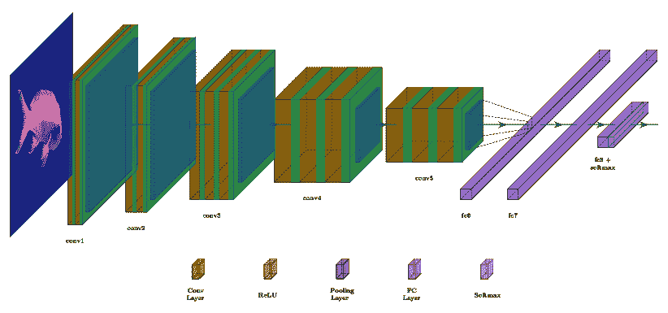
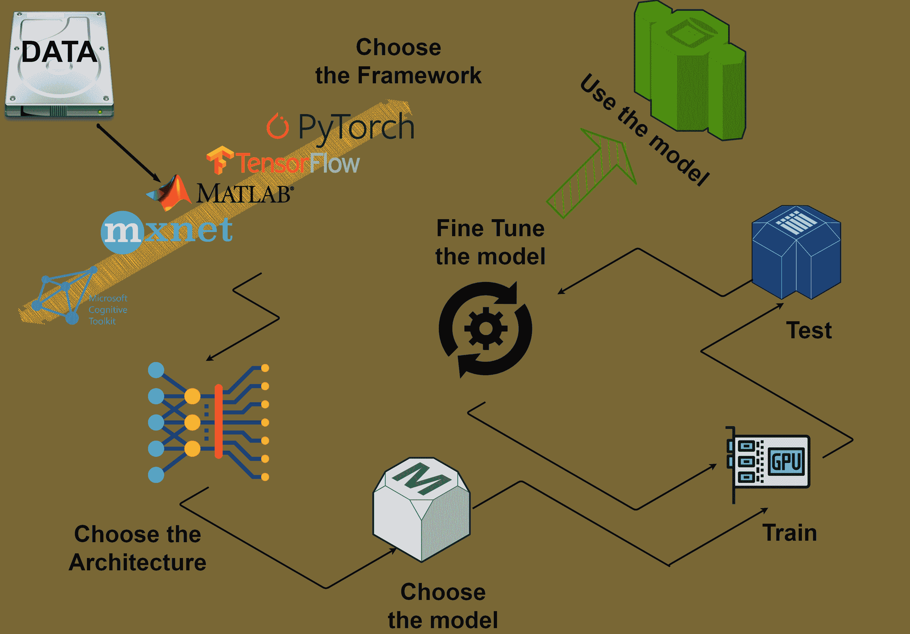
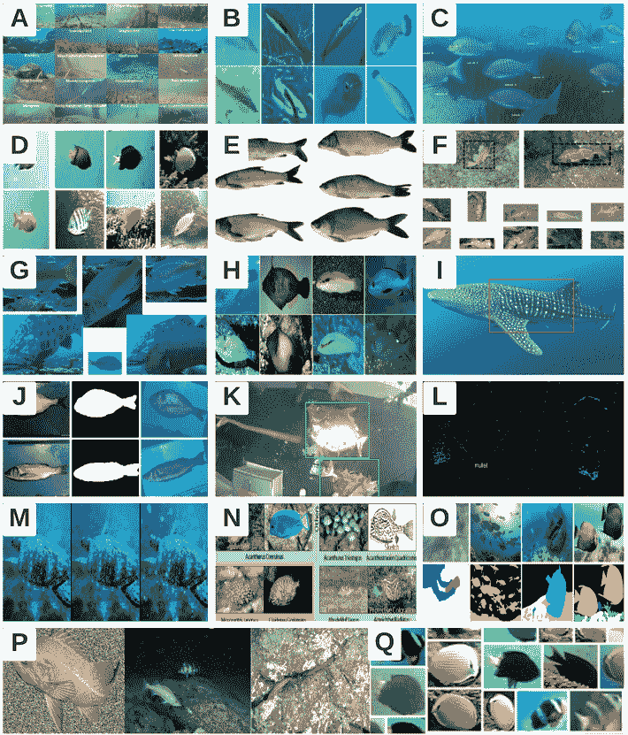
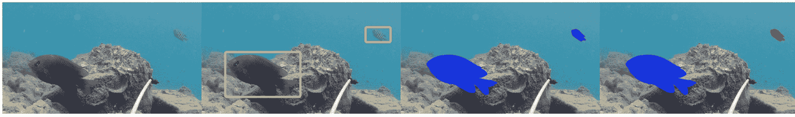
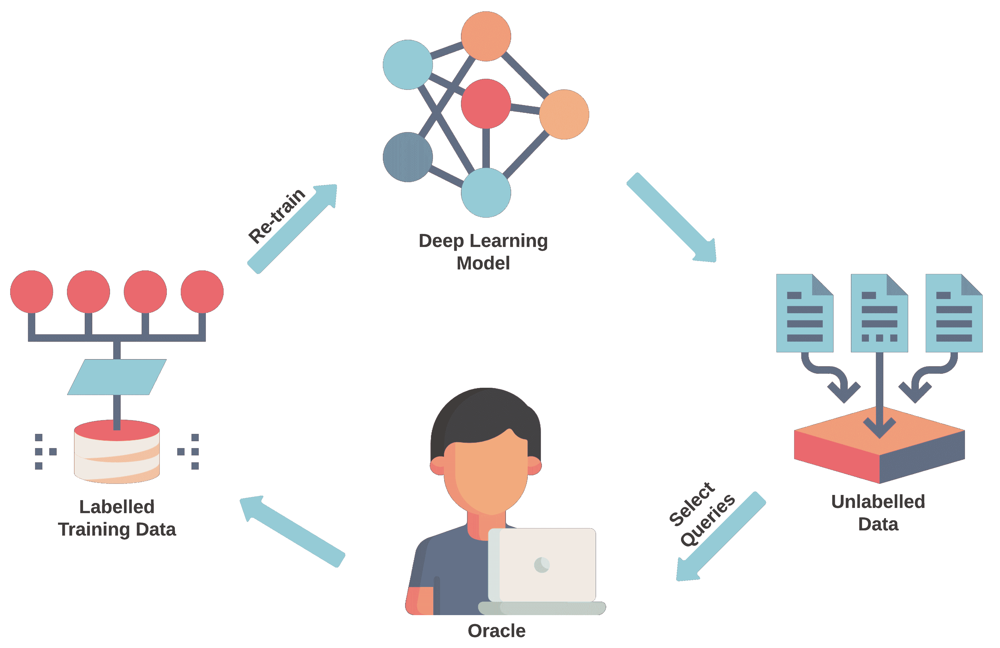
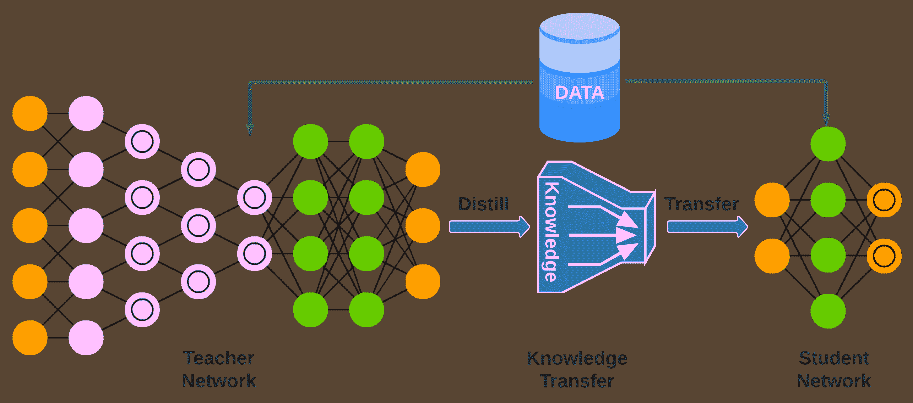

<!--yml

类别：未分类

日期：2024-09-06 19:45:46

-->

# [2206.05394] 深度学习在鱼类栖息地监测中的应用：教程与调查

> 来源：[`ar5iv.labs.arxiv.org/html/2206.05394`](https://ar5iv.labs.arxiv.org/html/2206.05394)

# 深度学习在鱼类栖息地监测中的应用：教程与调查

Alzayat Saleh alzayat.saleh@my.jcu.edu.au    Marcus Sheaves marcus.sheaves@jcu.edu.au    Dean Jerry dean.jerry@jcu.edu.au    Mostafa Rahimi Azghadi mostafa.rahimiazghadi@jcu.edu.au 詹姆斯·库克大学科学与工程学院，詹姆斯·库克大道 1 号，汤斯维尔，4811，昆士兰州，澳大利亚 ARC 热带水产养殖基因解决方案研究中心，詹姆斯·库克大学，詹姆斯·库克大道 1 号，汤斯维尔，4811，昆士兰州，澳大利亚

###### 摘要

海洋生态系统及其鱼类栖息地由于在提供宝贵的食物来源和保护成果方面发挥的重要作用，变得越来越重要。由于其偏远且难以接近的特点，海洋环境和鱼类栖息地通常通过水下摄像机进行监测，以记录视频和图像，帮助理解鱼类生活和生态，以及保护环境。目前，全球各地已部署了许多永久性水下摄像系统。此外，还存在许多使用临时摄像机调查鱼类栖息地的研究。这些摄像机产生了大量的数字数据，而当前的人工处理方法（需要人工观察者）无法高效地分析这些数据。深度学习（DL）是一种前沿的人工智能（AI）技术，在分析视觉数据方面表现出前所未有的性能。尽管它已应用于许多领域，但在水下鱼类栖息地监测中的应用仍未得到充分探索。在本文中，我们提供了一个涵盖深度学习关键概念的教程，帮助读者高层次地理解深度学习的工作原理。教程还解释了如何为具有挑战性的应用（如水下鱼类监测）开发深度学习算法的逐步过程。此外，我们提供了一个关于鱼类栖息地监测的关键深度学习技术的全面调查，包括分类、计数、定位和分割。此外，我们调查了公开可用的水下鱼类数据集，并比较了水下鱼类监测领域的各种深度学习技术。我们还讨论了深度学习在鱼类栖息地处理新兴领域中的一些挑战和机会。本文旨在为希望高层次理解深度学习的海洋科学家提供教程，帮助他们通过遵循我们的逐步教程开发深度学习应用，并了解它如何演变以促进他们的研究工作。同时，它也适合希望调查鱼类栖息地监测最先进的基于深度学习的方法的计算机科学家。

###### 关键词:

海洋科学\sep 计算机视觉\sep 卷积神经网络\sep 图像和视频处理\sep 机器学习\sep 深度学习\sep 深度神经网络。\UseRawInputEncoding\cortext

[cor1]通讯作者。

## 1 引言

只有开发出合适的工具来探索和了解我们最大的生态系统——海洋环境，才能正确理解我们的星球及其生态系统。通过部署水下摄像机的计算机视觉（CV）技术可以帮助我们更好地理解和管理遥远的海洋鱼类栖息地。然而，由于其视觉数据的庞大体量，手动处理在时间和成本上都不可行，这需要通过先进技术如深度学习（DL）进行数据分析的根本转变。

深度学习（DL）处于计算机视觉的前沿。其深度神经网络架构能够从高维数据中学习复杂的映射到可解释的特征表示，因此，深度学习已经成功应用于各种具有挑战性的计算机视觉任务，如语义图像分割（Jing 等，2020；Pathak 等，2015；Laradji 等，2021a；Qi 等，；Chuang 等，2011），视觉对象检测（Wang 等，2018；Villon 等，2016；Kim 等，2016；Pathak 等，2018），以及跟踪（Garcia 等，2016；Duan 和 Deng，2019；Kang 等，2018；Lumauag 和 Nava，2019）。这些应用有潜力从根本上改变我们通过计算机与世界的互动方式。最近，深度学习及其基础的深度神经网络在水下视觉处理中的应用受到了极大关注（Saleh 等，2020a；Laradji 等，2021b；Villon 等，2018；Chuang 等，2016；Nilssen 等，2017；Mandal 等，2018；Naseer 等，2020；Salman 等，2020；Siddiqui 等，2018）。

深度学习的主要优势在于其通过端到端训练学习不同数据类型的特征，例如水下鱼类图像。训练深度神经网络（DNNs）通常被认为是简单的。许多框架喜欢提供几行代码来解决一些计算机视觉任务，给人一种误导性的印象，以为只需插入并使用某些通用的应用程序编程接口（APIs）。在这些 API 中，开发者将负担从我们身上移除了，从而掩盖了完成任务所需的几行代码背后的复杂性。框架开发者实现了“提供几行代码”的目的，但我们这些最终用户被误导认为只需要花费几个小时学习所提供 API 的复杂性。

然而，训练深度学习算法时，情况变得更加复杂。训练 DNN 的任务实际上与其旨在解决的问题一样复杂。例如，在鱼类监测中，你使用的输入图像数量、图像的预处理方法、模型的构建方式、如何对模型进行微调（例如使用 dropout 或正则化）、特征的提取方式、如何将它们组合以生成最终预测、报告模型性能时使用的度量指标、以及选择从哪个层提取特征以供分类器使用，都是训练 DNN 时需要考虑的众多变量之一。你可以在这些因素上进行各种变动，以进一步优化你的模型并达到最佳的准确性。

由于上述复杂性，大多数情况下，深度神经网络（DNN）并非一种能够与所有类型数据集兼容的“现成”技术，即使是那些类似于为其精心定制的数据集。训练一个定制的高性能 DNN 的过程是严谨而具有挑战性的，这一点现在已被广泛接受。然而，通过保持耐心、注意细节以及系统性地工作，这一挑战性过程可以得到一定的缓解。例如，开发用于水下鱼类监测的定制 DNN，应遵循与开发任何其他计算机视觉应用（例如交通中车辆检测）相同的系统步骤。唯一的区别在于馈送给 DNN 的数据类型。

在这篇论文中，我们首先提供了一个教程，涵盖了深度学习的背景，以帮助理解上述常见的深度学习术语。该教程还提供了关于开发监督式深度学习模型的基本系统步骤的全面概述，重点关注水下鱼类栖息地监测。

在论文的第二部分，我们对使用深度学习（DL）进行鱼类监测的最新研究和发展进行了综述。我们将文献汇总成四个主要类别，涵盖了鱼类图像的分类、计数、定位和分割等常见计算机视觉任务。我们探讨了不同的深度学习架构及其性能。我们还调查了公开可用的水下鱼类图像数据集。最后，我们提供了将深度学习应用于海洋鱼类监测领域的挑战的全面概述，并为未来的研究工作绘制了一条路线图。

尽管存在大量相关的综述文章（Goodwin et al., 2022; Li and Du, 2021; Zhao et al., 2021; Yang et al., 2021; Li et al., 2020; Moniruzzaman et al., 2017; Saleh et al., 2022），我们的论文具有不同的视角和动机，补充了之前的综述。与 (Goodwin et al., 2022) 提供的关于生态数据分析的一般领域的综述相比，我们只关注鱼类监测。我们还对鱼类数据集进行了详细分析，并全面回顾了水下鱼类视频和图像处理中的四个关键任务。这种详细的分析和回顾在 (Goodwin et al., 2022) 或其他以往工作中没有提供，使我们的论文对于那些希望深入研究鱼类监测的读者来说尤为有用，并且提供了全面的文献综述。

此外，(Li and Du, 2021) 提供了关于水产养殖环境中鱼类状况、成长和行为监测的研究综述。它简要地涵盖了各种深度学习架构及其在水产养殖中的应用，与本篇通讯主要集中在卷积神经网络（CNN）并对水下鱼类监测文献进行了详细的调查和分析不同。

(Zhao et al., 2021) 中展示的工作涵盖了机器学习的一般领域，而不是我们论文中深度学习的具体领域。该工作涉及了广泛的水产养殖应用，从鱼类生物量和行为分析到水质预测，同时还简要地涵盖了鱼类分类和检测方法的回顾。

(Yang et al., 2021) 中提供了针对数字水产养殖中的鱼类检测和行为分析的计算机视觉模型的综述。感兴趣的读者应在阅读我们的论文之前研究 (Yang et al., 2021)，因为其中提供了关于图像采集的背景技术细节，这些细节对于开发有效的深度学习数据集和模型至关重要，这在我们的论文中也有讨论。

此外，(Li et al., 2020) 和 (Moniruzzaman et al., 2017) 中展示的基于深度学习的研究主要围绕水下鱼类跟踪和水下物体检测这两个具体任务。这些应用与我们的研究不同。然而，由于我们的水下鱼类监测任务与这些应用相关，我们的论文可以补充这些工作。

在 (Saleh et al., 2022) 中，我们提供了 2003-2021 年间鱼类分类方法的历史回顾。这些方法涵盖了传统的 CV 技术和现代的 DL 方法，仅用于水下栖息地的鱼类分类，而非一般的水下鱼类栖息地监测领域。

## 2 深度学习

深度学习是机器学习的一个子领域，由相互关联的算法和概念组成，用于训练深度神经网络（Saleh et al., 2022）。深度学习极受欢迎的主要原因之一是其在不同领域，特别是图像识别中的前所未有的性能。

深度学习利用多层神经网络自动学习输入特征。特征是学习输入的区别属性，例如不同鱼类的颜色或形状。深度学习概念首次提出的基础是传统的多层人工神经网络能够以更快的速度和更好的泛化能力学习复杂的非线性特征及其关系。为了高效地学习深度特征，研究人员发现神经网络的一个修改版本，即 CNN，在图像处理领域表现非常好（Saleh et al., 2022）。在接下来的部分中，我们将首先介绍神经网络的一般基本概念，然后描述 CNN，并解释它们如何学习和处理输入图像。

### 2.1 神经网络

“神经网络”是一个受生物神经系统启发的计算模型，使用简单的非线性计算规则来模拟这些系统。神经网络由称为神经元的简单处理元素组成。通过将神经元组织在分层结构中，互相连接并更改每个连接的权重，一个“神经网络”可以被训练以解决复杂的问题，例如识别图像中是否存在鱼。然后可以存储神经元之间的连接以供以后使用。训练神经网络执行不同任务，例如识别图像中的鱼，或确定水下图像中鱼的位置，称为“学习过程”。在监督学习（稍后解释）过程中，网络的输入会被呈现，并且每个输入都有一个期望的输出。学习过程确定哪些互连（权重）对系统学习任务最重要，并尽可能地将所有输入映射到所有期望的输出。

神经网络的基本思想是通过层叠的神经元来学习输入数据。神经网络中有三种连续的层类型，即输入层、隐藏层和输出层。隐藏层可以学习通过输入层传递给网络的数据中的模式。分类（或在某些情况下回归）就在隐藏层中进行。隐藏层可以自主学习数据中的抽象模式和特征。一般来说，深度神经网络（DNN）的层数会比用于图像分类任务的人工（浅层）网络更多，这也是为什么 DNN 被称为深度网络并且能够实现更高准确率的原因。

#### 2.1.1 神经元

神经元，也称为节点或感知器，是神经网络中的基本计算单元。神经元从其他节点接收输入并产生输出。每个输入都有一个权重 $w$，根据其相对重要性分配。正如图 1 中所示，节点对其输入的加权总和应用激活函数 $f$（如下所述）。

#### 2.1.2 激活函数

神经网络中的激活函数（Vogels et al., 2005）定义了一个节点是否根据输入特征的加权总和被“激活”。Sigmoid 函数是最常用的激活函数之一。其定义为：

|  | $S(x)=\frac{1}{1+e^{-x}}$ |  | (1) |
| --- | --- | --- | --- |

其中 $S(x)$ 是将用作下一节点输入的 sigmoid 函数输出，$x$ 是来自前一层的输入特征的加权总和。Sigmoid 函数是非线性的，其值范围在 0 到 1 之间。Sigmoid 在图像分类中很受欢迎，因为它的 0-1 范围可以表示“激活”每个输出类别的概率。然后选择具有最大“激活”值的输出，从而促进网络对图像的分类能力。

#### 2.1.3 偏置节点

成功神经网络中的另一个重要组成部分是“偏置”节点，如图 1 所示，它向输入权重乘积的总和中添加一个偏置值 $b$，以增加模型的灵活性。特别是，当所有输入特征等于 0 时，网络可以调整数据，减少其他数据空间中拟合值之间的距离。

#### 2.1.4 损失函数

在机器学习中，总是有一个函数需要被减少或增加，以达到输入和输出域之间尽可能接近的映射。这个函数通常称为目标函数。当它需要被最小化时，例如在神经网络的监督学习中，我们可能将其称为成本、损失或误差函数。虽然不同的深度学习（DL）文献可能对这些术语中的某些定义有具体的含义，但我们在本文中不加区分地使用它们。一般来说，损失函数衡量了基于数据的机器学习（ML）模型的性能。损失函数的重要性在于，它以预测值和期望值之间的单个实数形式来度量和呈现学习误差。例如，线性回归的损失函数定义为：

|  | $L=\frac{1}{2m}\sum_{i=1}^{m}(\hat{y}-y)^{2},$ |  | (2) |
| --- | --- | --- | --- |

其中 $m$ 是训练样本的数量，$\hat{y}$ 是模型的预测值，$y$ 是训练数据中输入的真实值。

对于分类任务，例如鱼类种类分类，损失函数 $L$ 通常是交叉熵损失函数。交叉熵损失衡量了分类模型的性能，其概率值范围从 0 到 1。当预测的概率与真实值有差异时，交叉熵损失函数的损失会增加。另一种分类损失是铰链损失（Hinge Loss）。在铰链损失中，正确类别的分数应比所有错误类别的值之和高出一定的安全边际。

<svg   height="212.99" overflow="visible" version="1.1" width="291.73"><g transform="translate(0,212.99) matrix(1 0 0 -1 0 0) translate(145.87,0) translate(0,67.13)"><g stroke-width="0.28453pt" fill="#000000" stroke="#000000" transform="matrix(1.0 0.0 0.0 1.0 -124 116.38)" color="#000000"><foreignobject width="11.78" height="8.45" transform="matrix(1 0 0 -1 0 16.6)" overflow="visible">$x_{1}$</foreignobject></g><g stroke-width="0.28453pt" fill="#000000" stroke="#000000" transform="matrix(1.0 0.0 0.0 1.0 -124 37.64)" color="#000000"><foreignobject width="11.78" height="8.45" transform="matrix(1 0 0 -1 0 16.6)" overflow="visible">$x_{2}$</foreignobject></g><g stroke-width="0.28453pt" fill="#000000" stroke="#000000" transform="matrix(1.0 0.0 0.0 1.0 -124 -41.1)" color="#000000"><foreignobject width="11.78" height="8.45" transform="matrix(1 0 0 -1 0 16.6)" overflow="visible">$x_{3}$</foreignobject></g><g stroke-width="0.85358pt" fill="#0000FF" stroke="#0000FF" transform="matrix(1.0 0.0 0.0 1.0 -44.75 41.1)" color="#0000FF"><foreignobject width="89.5" height="24.21" transform="matrix(1 0 0 -1 0 16.6)" overflow="visible">$f(\sum_{i=1}^{n}{x_{i}w_{i}+b})$</foreignobject></g><g stroke-width="0.28453pt" fill="#000000" stroke="#000000" transform="matrix(1.0 0.0 0.0 1.0 112.56 34.64)" color="#000000"><foreignobject width="11.11" height="9.46" transform="matrix(1 0 0 -1 0 16.6)" overflow="visible">$Y$</foreignobject></g><g stroke="#000000" fill="#000000"><g stroke-width="0.4pt"><g transform="matrix(1.0 0.0 0.0 1.0 -77.94 96.69)" fill="#000000" stroke="#000000"><foreignobject width="14.15" height="8.45" transform="matrix(1 0 0 -1 0 16.6)" overflow="visible">$w_{1}$</foreignobject></g><g transform="matrix(1.0 0.0 0.0 1.0 -77.94 47.48)" fill="#000000" stroke="#000000"><foreignobject width="14.15" height="8.45" transform="matrix(1 0 0 -1 0 16.6)" overflow="visible">$w_{2}$</foreignobject></g><g transform="matrix(1.0 0.0 0.0 1.0 -77.94 6.14)" fill="#000000" stroke="#000000"><foreignobject width="14.15" height="8.45" transform="matrix(1 0 0 -1 0 16.6)" overflow="visible">$w_{3}$</foreignobject></g></g></g></g></svg>

图 1：感知器神经元示意图。输入 $x_{i}$ 与权重 $w_{i}$ 相乘。神经元主体（蓝色）累加所有乘法输入的和，然后根据其激活函数 $f$ 发出输出信号 $Y$。

#### 2.1.5 优化

在监督学习中，学习任务可以归结为一个形式的优化问题

|  | $\theta^{*}=\arg\min_{\theta}g(\theta),$ |  | (3) |
| --- | --- | --- | --- |

其中 $\theta$ 是一个参数向量，在该点，损失函数 $g(\theta)$ 通常代表所有训练样本的平均损失，达到其最小值。$g$ 可以表示为

|  | $g(\theta)=\frac{1}{n}\sum_{i=1}^{n}L\left(f_{\theta}\left(x_{i}\right),y_{i}\right),$ |  | (4) |
| --- | --- | --- | --- |

其中 $(x_{i},y_{i})$ 代表一个（输入，期望输出）训练对。

同样，在深度学习中，使用一种优化方法来训练神经网络，通过最小化定义为

|  | $E(W,b)=\sum_{i=1}^{m}L\left(\hat{y}_{i},{y}_{i}\right)$ |  | (5) |
| --- | --- | --- | --- |

的错误函数$E$，其中$W$和$b$分别是网络的权重和偏置。错误函数$E$的值即为预测值$\hat{y}$和真实值$y$之间的均方损失$L$的总和，适用于 m 个训练样本。$\hat{y}$的值在前向传播步骤中获得，利用了之前提到的网络权重和偏置，这些权重和偏置可以以不同的方式初始化。优化通过更新可训练参数$W$和$b$的值来最小化错误函数$E$的值。

错误函数$E$通常通过使用其梯度斜率来最小化参数。最常用的优化方法是梯度下降（Sun et al., 2019），其中通过计算偏导数矩阵（使用反向传播计算，详见下一小节）来优化梯度。这些偏导数同时提供了$\theta$每个维度的$g$的斜率。因此，梯度用于确定下一步搜索全球最优解的方向。为了增强$\theta$并达到更低的$g$，从$\theta$中减去一个小量，在最佳方向上（因为梯度提供了$g$的上升方向和相反的下降方向），最终达到全局最优解并最小化$g$。

#### 2.1.6 反向传播

反向传播可能是神经网络学习中最重要的部分。它在前向传播或前向传递之后进行，在此过程中，训练数据集的一个子集（称为一个批次）$\left\{\left(x_{i},y_{i}\right)\right\}_{i=1}^{m}$和当前网络参数$\theta$用于计算最终层输出和损失。在前向传递期间，数据输入传递给第一层，根据其激活函数进行处理，并将其值传递给下一层，因此称为“前向传递”。在前向传递和计算最终层损失后，进行反向传播，通过它我们开始逐层计算损失，层导数随后通过局部梯度“链式”相连，以最小化整体损失$g$。

#### 2.1.7 正则化

正则化是神经网络学习中的另一个重要概念。它是一种通过对学习算法进行小幅调整来提高模型在测试或样本外数据上的性能的技术（Bisong and Bisong, 2019）。换句话说，它通过阻止复杂映射函数或模型的形成来避免过拟合训练数据的风险。模型正则化涉及在通用模型损失函数中添加正则化项，该函数考虑了所有训练数据集样本的损失函数值。因此，当使用正则化时，损失函数 $g(\theta)$（在方程 4 中描述）变为

|  | $g(\theta)=\frac{1}{n}\sum_{i=1}^{n}L\left(f_{\theta}\left(x_{i}\right),y_{i}\right)+R\left(f_{\theta}\right),$ |  | (6) |
| --- | --- | --- | --- |

其中，$R\left(f_{\theta}\right)$ 是添加的正则化函数。

最常见的正则化形式是 L1 和 L2（Ng, 2004）。它们之间的区别在于 L2 是权重的平方和，而 L1 是权重的和。

### 2.2 卷积神经网络（CNN）

最强大的 DNN 类型是卷积神经网络。顾名思义，卷积网络通过对输入数据执行卷积（过滤）操作来工作。CNN 通常由几个卷积层组成，这些层通过在表示为矩阵的输入图像上滑动卷积滤波器来提取有用的特征。CNN 在计算机视觉中的第一个成功例子之一是 Krizhevsky *et al.* 在 2012 年提出的 AlexNet。AlexNet 仅使用四个卷积层便取得了巨大成功。自 2012 年以来，已经提出了许多不同类型的 CNN，采用不同的架构和卷积层及其他辅助层的数量。这些架构在不同领域的计算机视觉和图像处理方面引发了革命，从农业（Olsen et al., 2019）到医学（Saleh et al., 2021）。CNN 还广泛应用于水下视觉监测和处理，用于计数、定位、分类和分割感兴趣的物体，如鱼类（Saleh et al., 2020b）。

图 2：用于鱼类图像分类的 CNN 结构示意图。该结构包括五个卷积层，这些层内包含批量归一化操作，后面跟着池化层（conv1-conv5）。在这个模型中，来自卷积层的特征图通过池化层进行池化，然后通过两个全连接层（fc6 和 fc7）进行展平。分类输出是一个全连接层和一个 softmax 激活层（fc8+softmax）的结果。

一个典型的 CNN 架构由卷积层、池化层、非线性激活层和最终输出层组成，如图 2 ‣ 2 Deep Learning ‣ Applications of Deep Learning in Fish Habitat Monitoring: A Tutorial and Survey")所示。通过与 CNN 的其他部分结合的过滤卷积操作，可以自动提取和学习输入数据的有用特征。CNN 的学习通常涉及在训练过程中找到适当的卷积滤波器的数量、大小和结构、池化层和激活函数及其参数，并查看各种输入示例。在以下小节中，我们将深入探讨这些典型 CNN 的基本构建块和层。

+   •

    卷积层：如前所述，卷积层对其输入矩阵数据应用过滤（卷积）操作，以生成另一个矩阵，称为特征图。输入矩阵可以包含输入图像信息或由前一 CNN 层生成的特征图。特征图是 CNN 的核心，其中提取和学习输入的有用特征跨越多个卷积层。

+   •

    批量归一化：这一操作跟随卷积操作，其目标是对当前训练数据集（批次）进行归一化，因此称为批量归一化。这是为了提高学习速度和深度学习模型的收敛性，否则，由于输入变异广泛，网络可能会看到在卷积层中提取的各种特征。批量归一化通过减去输入的均值并将结果除以标准差来完成。

+   •

    激活层：这一层跟随批量归一化层，是之前解释的标准神经元激活函数。它用于增加卷积层输出的非线性，并提高其在学习复杂数据中的能力。与卷积层配合使用的最常见激活函数是修正线性单元（ReLU）和 Sigmoid。激活函数也用于 CNN 的最终非卷积全连接层。一个常见的输出激活函数是 Softmax。

+   •

    池化层：卷积层的输出特征图经过批量归一化和激活函数处理后，通常过于庞大，不适合下一个卷积层处理。为了减少其大小并提高计算效率，可以在池化层中对其进行池化，以生成缩小的特征图，同时保留重要特征。池化是 CNN 中的常见操作，几乎在所有实际的卷积网络中都有使用。最常见的池化层是最大池化和平均池化。

+   •

    Dropout：为了避免对训练数据的过拟合，在池化层后引入了 dropout 操作。它们的任务是在每次训练步骤中随机移除（丢弃）通过先前卷积层提取的特征，以减少网络对单个数据实例的依赖。

+   •

    全连接层：全连接层，也称为密集层，是卷积神经网络（CNN）中的倒数第二层，在输出层之前。该层包含少量的神经元，每个神经元都连接到上一层的每个神经元。因此，网络被称为全连接的。全连接层接收来自上一层的所有输入和权重，并将它们组合成一个单一的向量或矩阵。然后，这个向量通过激活函数，如 sigmoid，来计算 CNN 生成的最终输出层的输出值。

### 2.3 监督学习

一般来说，深度学习的学习方法主要有两种：无监督学习和监督学习。无监督学习通常用于发现输入和输出领域的结构和组成，而不需要明确的监督目标领域。这种方法通过转换与目标领域数据分布无直接关系的数据表示，实现从一个输入领域到另一个领域的泛化。

另一方面，监督学习方法旨在通过展示匹配表示的训练对，明确将数据从输入领域映射到输出领域。这些对由人工（监督者）精心制作，因此得名。监督学习的训练过程可能会遭遇不稳定性，并且不如无监督学习方法有效，因为它以准确的目标分布进行学习，而没有领域特定的知识。

监督式深度学习使用一种微妙的深度神经网络机制，从大量标记了期望输出领域的输入训练数据中提取有用的特征。学习通过前面解释的重复反向传播过程（Rojas 和 Rojas，1996）来进行，以调整深度学习（DL）架构的内部参数，例如卷积层、池化层和全连接层的形状、数量和大小，这些参数用于从前一层的表示确定每一层的表示。一般来说，将 DL 架构及其参数调整到最佳的输入训练数据到期望输出的映射，实际上就是通过反向传播来优化一个函数 $f$，将输入领域 $X$ 映射到匹配的输出领域 $Y$，即 ($f:X\mapsto Y$)。

## 3 开发深度学习模型

图 3：一个示意图，展示了训练深度学习模型所需的步骤和组件。

训练深度学习模型的基本系统步骤的综合概述总结在图 3 中。虽然这些步骤在深度学习训练中是通用的，但我们根据在医学影像到海洋科学应用等各个领域开发深度学习应用的经验，提供了一些有用的提示。然而，我们特别强调了用于水下鱼类栖息地监测的深度学习开发。

### 3.1 训练数据集

可用的训练数据对于开发高效的深度学习模型至关重要。数据集变得越来越重要，甚至比算法更为重要。考虑到监督学习数据集时，最重要的因素可能是其大小。为了实现高准确率，通常需要大规模的训练数据集，这往往是一个巨大的障碍。由于视觉算法是通过图像和标签对进行训练的，采用监督学习的方式，它们只能识别已经提供给它们的内容。因此，根据项目、要识别的对象数量以及所需的性能，训练数据集可能包含数百到数百万张图像。然而，只有几百个样本的较小训练数据集也可能获得良好的结果（Saleh et al., 2020b; Konovalov et al., 2019a, 2018, b）。尽管如此，训练数据集越大，识别准确率越高。

由于数据集稀缺以及获取可靠数据的难度，从小样本中提升准确率的方法将不可避免地成为未来研究的重点。样本数据有限的问题也可以通过迁移学习得到缓解（Mathur et al., 2020; Molchanov et al., 2016; Lee et al., 2018）。此外，数据增强将变得越来越重要。第 5.3 节涵盖了有限数据的一些挑战及解决这些挑战的方法。

准备深度学习训练数据集时需要考虑的第二个因素是平衡性。这对于确保每个要识别的类别包含足够数量的实例，以减少类别不平衡偏差至关重要。这些偏差发生在深度学习因看到某些类别的频率较高而偏向于这些类别时。

此外，训练数据集通常分为两个子集，一个是用于高效训练模型的训练子集，另一个是用于评估已训练模型性能的验证/测试子集。对于训练子集，一部分训练数据集被保留用于训练模型。如果训练子集过大，可能会延长模型训练时间。另一方面，如果训练子集过小，最终模型可能无法很好地推广到未见过的输入。验证/测试子集通常用于避免过拟合，这是机器学习中的常见问题，发生在开发的模型仅仅记住输入而不是正确学习输入时。交叉验证是另一种广泛使用的测试深度学习模型训练性能的方法，通过将训练数据集分割成多个互不重叠的训练和测试数据子集。一种交叉验证方法称为 $k$-折交叉验证，其中训练数据集被分成 $k$ 个大小相等的子集。在这种方法中，使用 $k-1$ 个折进行模型训练，而剩下的一个折用于测试学习性能。这个过程会重复，直到所有折都被用作测试/验证集一次。

除了上述内容，通常在开始代码开发之前，进行全面的数据集检查是至关重要的。这将有助于清理数据集，例如通过查找和删除重复的数据实例。它还帮助识别不平衡和偏差，以及数据分布、趋势或异常值，这将有助于更好的模型设计和对可能错误的深度神经网络（DNN）预测的理解。

幸运的是，在鱼类栖息地监测领域，研究人员目前可以访问各种数据集。表格 1 列出了公开可用的水下鱼类数据集，它们的来源以及获取方式，并附有其特征、标签和大小的总结。需要注意的是，这些数据集在大小和特征数量上有所不同。尽管这些鱼类数据集的数量仍然较少（17 个），但它们涵盖的水生物种类已经相当广泛。如图 4 所示，它们覆盖了大量水生物种类。此外，每个数据集包含不同数量和分辨率的图像。每张图像还配有由人工专家标注的真实值，这使得这些数据集非常有用。例如，研究人员可以使用这些数据集来测试他们的深度学习（DL）模型或作为首步进行预训练，以便更具体的鱼类监测任务。

在准备好训练数据集或利用其他方法解决数据不足的问题后，可以开始使用机器学习开发框架来开发其深度学习模型。

### 3.2 开发框架

深度学习的快速发展导致了大量开发库和包的创建，这些库和包可以用微不足道的努力设置深度神经网络。使用现有机器学习框架的各种好处包括可用性和资源的可用性、架构支持、可定制性以及硬件支持。最常用的框架有 PyTorch、TensorFlow、MATLAB、Microsoft Cognitive Toolkit (CNTK) 和 Apache MXNET。在海洋研究的深度学习背景下，如表 3 到 5 所示，PyTorch 和 TensorFlow 是主流框架，而 MATLAB 和 Caffe 仅在少数工作中使用。总的来说，选择开发框架时应考虑项目需求以及程序员和开发者的偏好。

选择开发框架后，下一步是找到最适合当前任务的网络架构。这有时取决于框架，因为一些新方法可能不会立即被所有框架支持。

表 1：包含鱼类的公共数据集汇总，用于训练和测试深度学习模型。

| 数据集 | 汇总 | 标签 | 数据集大小 | 网站 |
| --- | --- | --- | --- | --- |
| A - Deepfish | 来自澳大利亚东北部和西部沿海栖息地的视频 | 鱼/非鱼 | 40k 分类标签，3.2k 图像有点级注释，310 个分割掩码 | [github.com/alzayats/DeepFish](https://github.com/alzayats/DeepFish) |
| B - 克罗地亚鱼类数据集 | 克罗地亚水域发现的 12 种鱼类 | 物种名称 | 794 分类标签 | [www.inf-cv.uni-jena.de/fine_grained_recognition.html#datasets](http://www.inf-cv.uni-jena.de/fine_grained_recognition.html#datasets) |
| C - 海草栖息地中的鱼类 | 在澳大利亚海草栖息地拍摄的 2 种鱼类的 RUV | 物种 | 9k 分类标签、边界框和分割掩码 | [github.com/globalwetlands/luderick-seagrass](https://github.com/globalwetlands/luderick-seagrass) |
| D - Fish4Knowledge | 鱼类检测和跟踪数据集，17 个视频，每个视频长 10 分钟，帧率为 5 fps。 | 鱼/非鱼 | 3.5k 边界框 | [groups.inf.ed.ac.uk/f4k/index.html](https://groups.inf.ed.ac.uk/f4k/index.html) |
| E - Fish-Pak | 来自巴基斯坦 3 个地点的 6 种不同鱼类的图像数据集 | 物种 | 1k 分类标签 | [data.mendeley.com/datasets/n3ydw29sbz/3](https://data.mendeley.com/datasets/n3ydw29sbz/3) |
| F - 野外标记鱼类 | 岩鱼（Sebastes spp.）及其他底栖生物（非鱼类） | 鱼/非鱼 | 1k 边界框（鱼），3k（非鱼） | [swfscdata.nmfs.noaa.gov/labeled-fishes-in-the-wild/](https://swfscdata.nmfs.noaa.gov/labeled-fishes-in-the-wild/) |
| G - OzFish | 大型数据集，包括 507 种鱼类 | 物种，鱼/非鱼 | 80k 标记裁剪图像，45k 边界框注释（鱼/非鱼） | [github.com/open-AIMS/ozfish](https://github.com/open-AIMS/ozfish) |
| H - QUT 鱼类数据集 | 468 种鱼类在不同的外地和本地栖息地 | 物种名称 | 4k 分类图像 | [www.dropbox.com/s/e2xya1pzr2tm9xr/QUT_fish_data.zip?dl=0](https://www.dropbox.com/s/e2xya1pzr2tm9xr/QUT_fish_data.zip?dl=0) |
| I - 鲸鲨识别 | 543 只个体鲸鲨（Rhincodon typus） | 个体 | 7.8k 边界框 | [`lila.science/datasets/whale-shark-id`](http://lila.science/datasets/whale-shark-id) |
| J - 大规模鱼类数据集 | 从土耳其伊兹密尔超市收集的 9 种不同海鲜 | 物种名称 | 每个类别有 1000 张增强图像及其成对增强的真实图像 | [www.kaggle.com/crowww/a-large-scale-fish-dataset](https://www.kaggle.com/crowww/a-large-scale-fish-dataset) |
| K - NCFM | 8 种不同鱼类的图像数据集 | 物种名称 | ~16000 张分类图像 | [www.kaggle.com/c/the-nature-conservancy-fisheries-monitoring/data](https://www.kaggle.com/c/the-nature-conservancy-fisheries-monitoring/data) |
| L - Mugil liza 声纳数据 | 基于声纳的迁徙鲻鱼（Mugil liza）群体水下视频 | 鱼的数量 | 500 张计数图像 | [zenodo.org/record/4751942#.YKzfUKgzayk](https://zenodo.org/record/4751942#.YKzfUKgzayk) |
| M - MSRB 数据集 | 真实的水下图像，没有海洋雪，并合成了海洋雪 | NA | ~6000 张图像 | [github.com/ychtanaka/marine-snow](https://github.com/ychtanaka/marine-snow) |
| N - WildFish | 1000 种鱼类类别 | 物种名称 | ~54000 张分类图像 | [github.com/PeiqinZhuang/WildFish](https://github.com/PeiqinZhuang/WildFish) |
| O - SUIM | 8 种不同水下物体的图像数据集 | 物体名称 | ~1500 张注释图像语义分割掩码 | [github.com/xahidbuffon/SUIM](https://github.com/xahidbuffon/SUIM) |
| P - DZPeru 鱼类数据集 | 在不同的外地和本地栖息地的多种鱼类 | 物种名称 | ~17000 张注释图像分割掩码 | [github.com/DZPeru/fish-datasets](https://github.com/DZPeru/fish-datasets) |

| Q - LifeCLEF | 10 种不同的鱼类 | 物种名称 | ~1000 个注释视频 | [www.imageclef.org/](https://www.imageclef.org/) | 

图 4：来自公开可用数据集的示例图像，详见表 1。

### 3.3 网络架构

网络架构是深度学习模型的结构，取决于它打算实现的目标以及预期的输入和输出。因此，训练数据集的类型和预期的结果会影响架构的选择及其性能。深度学习网络架构在各种方面可能有所不同，例如层的类型和数量、它们的结构和顺序。在选择网络架构之前，了解你拥有的数据集和你要完成的任务是至关重要的。例如，卷积神经网络（CNNs）能够从其卷积层中的数据中学习高阶特征，如颜色和形状。因此，它们在基于图像的物体识别中最为适用。另一方面，递归神经网络（RNNs）具有处理时间信息或序列数据的能力，例如句子中的词序。这一特性非常适合用于手写或语音识别等任务。

在鱼类栖息地监测的背景下，如果你的任务需要学习输入序列的时间信息，例如鱼类图像序列分析，你选择的深度学习架构可能非常重要。例如，CNNs 架构更适合用于*基于图像*的物体识别，如鱼类分类，而 RNN 架构则更适合用于输入序列具有时间性质的任务，如生成鱼类栖息地描述。

要找到合适的架构，你首先需要定义你的问题。这个问题由两个问题定义：(1) 你将提取哪些特征？(2) 你将如何标记这些特征？你提取的特征由你的数据定义。换句话说，你关心的是你拥有数据的表示。你选择提取的特征数量由你试图解决的任务定义。如上所述，DL 架构可以从基于图像的对象识别中学习特征，如颜色和形状。在尝试构建你的网络之前，你需要首先决定将使用什么数据类型以及如何编码这些信息。在定义了任务后，你应该考虑哪些特征对任务是重要的。你需要定义这些特征以构建你的网络。例如，如果你想提取的特征是鱼的形状和鱼的位置，那么你可以定义一个卷积架构。你选择定义的特征应是数据中所有特征的一个子集。例如，对于一个基于图像的对象识别网络，你会提取像鱼的种类这样的特征。然而，你提取的特征还需要涵盖所有数据。例如，你还需要水的类型或背景的类型的特征。在定义你的网络时，考虑所有这些特征是很重要的。关于不同 DL 架构的完整讨论请参见 (Khan et al., 2020)。

### 3.4 网络模型

选择了一般网络架构后，下一步是选择或有时开发该架构的网络模型。例如，当你决定使用 CNN 时，你可以使用不同种类的 CNN 模型。选择 CNN 的经验法则是选择一个能够为你的数据集带来令人满意的训练损失的模型。在这个阶段不建议创建一个独特而富有创意的模型。通常建议避免这种诱惑，选择一个足够大的模型来过拟合你的数据集，然后适当地正则化以改善验证损失。

例如，如果任务简单，如鱼类分类，可以选择一个现成的知名 CNN 模型，如 ResNet。在后期，他们可以定制模型以适当地捕捉数据集。我们在下一节的表 3 至 5 展示了 ResNet 是鱼类计数（表 3）、鱼类定位（表 4）和鱼类分割（表 5）中最常用的模型。

### 3.5 训练模型

选择最佳模型后，是时候建立一个完整的训练/验证管道了。此阶段推荐以下步骤。

+   •

    从一个简单的模型开始（即较少的卷积层），这种模型不容易出错，并可视化模型性能指标。此时不要使用现成的大型模型，如 ResNet。建议绘制训练损失图，以查看网络在学习过程中是否有所进展，以及损失是否在减少。这也显示了学习的速度。

+   •

    为了更好地理解过程，建议使用固定的随机种子（用于随机初始化网络参数），以确保在两次运行代码时能得到相同的结果。

+   •

    此阶段不要进行任何数据增强，因为这可能会引入错误。你可以在确认网络正常工作后，稍后再进行数据增强。你可以在 5.2 小节中看到数据增强和其他方法的简要介绍。

+   •

    使用 ADAM 算法（Kingma 和 Ba，2014），该算法通过对网络学习率应用自适应优化来帮助学习。

+   •

    学习率是深度学习模型中的一个重要超参数。它通常是训练过程中最关键的值，应该通过反复试验进行配置。根据数据集的大小，可能需要特定的学习率衰减。学习率衰减是一种允许学习率在连续的训练周期中逐渐降低直到收敛的技术。开始时较高的学习率可以防止网络记住噪声数据，而衰减学习率则有助于改进复杂模式的学习。

+   •

    实施早期停止，并通过查看训练损失图来监控学习过程，以防止过拟合。

+   •

    逐步增加模型的复杂性，例如，添加更多层或使用现成的 CNN 模型，并随着时间推移获得性能提升。

### 3.6 测试模型

在训练模型时，应使用训练数据集的测试子集来测试其准确性和性能。测试集也可以独立于训练数据集，以评估模型性能。主要要记住的是，测试集在模型训练或评估中不应被使用。

模型的性能应通过计算适合当前任务的指标来衡量。用于测试鱼类监测模型的常见指标列表见表 2。对于分类任务，分类准确率 (CA)、精度和召回率是合适的指标，而 F1 分数是精度和召回率的结合，可以更好地衡量模型性能，并在鱼类计数和定位任务中使用，如表 3 和 4 所示。交并比 (IoU) 是分割任务的合适指标，而平均精度 (mAP) 适用于图像中的像素级鱼类定位。参考表 3 到 5，海洋鱼类监测文献中也使用了均方误差 (MSE) 和均方根误差 (RMSE) 等其他指标。如有需要，可以考虑使用这些指标。

### 3.7 微调模型

如果需要，可以提高模型的性能和准确性。不过，这种改进的幅度受当前准确性的强烈影响。这个步骤可能会很快变得复杂，因为提高模型准确性可能需要多个步骤，如调整学习率、收集新数据或完全修改模型架构。你应该将这个微调步骤保持在合理的范围内，否则模型可能会过拟合数据。

### 3.8 模型部署

最后，应选择模型部署模式。这取决于应用程序和部署要求。模型可以部署在本地或远程设备上（如网络服务器、Docker 容器、虚拟私人服务器（VPS）等）。这将决定结果是可以远程访问还是仅在本地网络内访问。建议使用跨平台部署方法，以避免如输入/输出数据格式或用于存储数据的文件类型等问题。

最常用的跨平台模型部署方法是 Docker（Potdar 等，2020; Abdul 等，2019），它是一种虚拟化软件，允许在基础 Linux 发行版上设置和运行其他软件环境，而无需设置虚拟机。Docker 帮助使用相同的 Docker 文件构建、配置和运行应用程序。通常，Docker 是推荐的 web 应用程序方法。在这种方法中，你可以在开发机器上使用 Docker 容器或 Docker 主机。Docker 容器可能是 web 应用程序的最简单选项。你也可以通过 Docker 将网络部署到远程机器上。使用容器的好处是可以共享开发环境，并使用多个 Docker 容器运行模型测试。你还可以在本地机器上安装 Docker 工具以管理容器，这样会更方便。

图 5: 四种典型的鱼类监测任务的示意图。从左到右：鱼类分类（即图像中是否有鱼，或者图像中是什么类型（类别）的鱼？）；鱼类检测/定位/计数；鱼类语义分割，鱼类实例分割。

表 2: 用于比较各种调查工作的性能指标。

| 性能指标 | 使用的符号 | 描述 |
| --- | --- | --- |
| 分类准确率 | CA | 正确预测的百分比。对于多类分类，CA 在所有类别之间取平均值。 $CA=(TP+TN)/(TP+TN+FP+FN)$ |
| 精确度 | P | 真正例 (TP) 与 TP 和假正例 (FP) 之和的比例。 $P=TP/(TP+FP)$ |
| 召回率 | R | 真正例 (TP) 与 TP 和假阴性 (FN) 之和的比例。 $R=TP/(TP+FN)$ |
| F1 分数 | F1 | 精确度和召回率的调和均值。 $F1=2~{}\times(P\times R)/(P+R)$ |
| 均方误差 | MSE | 预测值与观测值之间误差的平方的均值 |
| 均方根误差 | RMSE | 所有误差的平方均值的平方根。 |
| 平均相对误差 | MRE | 预测值与观测值之间的平均误差，以百分比表示 |
| L2 错误 | L2 | 预测计数与实际计数之间差异平方和的平方根 |
| 交并比 | IoU | 一种评估预测边界框与实际边界框的相似性的指标，通过将预测框和实际框重叠区域的面积除以它们的并集面积来计算。 |
| 最大数量 | MaxN | MaxN，任何一个帧中目标物种的最大数量。 |
| 平均精度 | mAP | 根据检测难度，使用所有类别和/或总$IoU$阈值的平均 $AP$。 |
| 分类错误 | CE | 分类器错误的频率，也称为“错误分类率”。 $CE=(FP+FN)/(TP+TN+FP+FN)$ |

## 4 深度学习在水下鱼类监测中的应用

深度学习已广泛应用于海洋环境，从深海矿产勘探（Juliani 和 Juliani，2021）到自动船只检测（Chen 等，2019）。然而，我们将本文的范围限定于海洋鱼类图像处理，这通常包括四个任务：分类、计数、定位和分割水下鱼类图像，如图 5 所示。 |

在这里，目标是帮助读者了解这些任务及其相关的深度学习模型和技术之间的相似性和差异。我们提供了每个任务的背景信息，探讨了之前在使用深度学习解决这些任务方面发表的工作，并综合了每个任务的文献。

### 4.1 分类

正如其名称所示，在视觉处理中的分类任务是将图像分类到不同的类别中。可以只有两个类别，即二分类，将图像分类为两组，例如“鱼”和“非鱼”，具体取决于图像中是否存在鱼（例如，表 1 中描述的 Deepfish 数据集）。分类也可以涉及多个“类别”或组。例如，考虑根据物种（例如表 1 中的 FishPak 数据集）将不同的水下鱼类图像分配到不同的组中。

考虑一种手动程序，其中数据集中图像的比较和相对分类是基于相似特征进行的，但不一定需要事先知道你在寻找什么。这是一个困难的任务，因为数据集中可能有成千上万的图像。此外，许多图像分类任务涉及不同对象的图像。显然，需要一个自动系统，如 DNN，以便快速而高效地完成此任务。

分类是使用深度学习（DL）进行水下图像处理任务中最广泛使用和研究的任务。在之前的工作中，我们已经涵盖了 DNN 在水下鱼类分类任务中的具体应用。我们建议读者参考（Saleh et al., 2022）以获取关于分类的全面回顾。

### 4.2 计数

计数任务的目的是预测图像或视频中存在的对象数量。对象计数是许多主要计算机视觉应用工作流的关键部分，如交通监控（Khazukov et al., 2020; Zhang et al., 2017）。在海洋应用和鱼类监控的背景下，计数可以用来映射不同的物种并监测鱼类种群，以便有效保护。借助商业可用的水下摄像机，数据收集可以更全面。然而，在水下栖息地正确计数鱼类是很困难的。为了进行有效的计数，模型必须理解项目在姿势、形状、尺寸和特征上的多样性，这使得计数变得复杂。同时，人工计数非常耗时、昂贵且容易出错。

深度学习提供了一种比目前用于监测和分析鱼类数量的手动数据处理方法更快、更便宜、更准确的替代方案。表 3 列出了几种最近用于鱼类计数的深度学习技术。Saleh 等（Saleh 等，2020a）创建了一个来自 20 个水下栖息地的大规模新数据集。他们使用全卷积网络进行包括鱼类计数在内的多个监测任务，并报告了$0.38\%$的均值绝对误差（MAE）。深度学习有潜力成为比人工更准确的鱼类丰度评估方法，其结果在调查地点之间稳定且可转移。Ditria 等（Ditria 等，2021，2020a，2020b）比较了深度学习算法在水下图片和视频记录中估计鱼类数量的准确性和速度与人工对照的差异，以测试其有效性和可用性。在单图像测试数据集中，深度学习方法比人类海洋专家表现好$7.1\%$，比公民科学家表现好$13.4\%$。在视频数据集方面，深度学习分别比海洋专家和公民科学家好$1.5\%$和$7.8\%$。

表 3：最近深度学习研究工作的鱼类计数任务总结

| 文章 | 深度学习模型 | 框架 | 数据 | 注释/预处理/数据增强 | 类别和标签 | 性能指标 | 指标值 | 与其他方法的比较 |
| --- | --- | --- | --- | --- | --- | --- | --- | --- |
| 评估水下视觉分析算法的现实鱼类栖息地数据集 Saleh 等 (2020a) | ResNet-50 CNN | Pytorch | 作者创建的数据库，包含 39,766 张图像，涵盖来自热带澳大利亚远程沿海海域的 20 种栖息地，并分割成子数据集用于四个计算机视觉任务：分类、计数、定位和分割。 | 每张图像都进行了点级和语义分割标签的注释 | 20 种不同鱼类栖息地的 20 个类别。 | MAE | 0.38 | NA |
| 用于在不受约束的海草栖息地中自动识别和计数鱼类的注释视频片段 Ditria 等 (2021) | ResNet-50 CNN | Pytorch | 数据集包括 4,281 张图像和 9,429 个注释（9,304 条 luderick，125 条 bream），分辨率为标准高分辨率（1920 x 1080 p）。 | 每张图像通过绘制边界框和分割掩码进行注释 | 2 类鱼类 | F1 | 92% | NA |
| 使用目标检测自动化分析鱼类丰度：优化动物生态学与深度学习 Ditria et al. (2020a) | Mask R-CNN ResNet50 | Pytorch | 作者创建了一个包含 6080 张来自昆士兰州东南部 Tweed 河口 20 个栖息地的鱼类图像的数据库 | 每张图像通过分割掩模进行了注释 | 1 类鱼 | F1 | 图像 (95.4%) 视频 (86.8%) | 计算机在确定丰度方面比人类海洋专家高出 7.1%，比公民科学家高出 13.4%（在单图像测试数据集），在视频数据集中分别高出 1.5%和 7.8%。 |
| 自动分析鱼类丰度的深度学习：跨多个栖息地训练的好处 Ditria et al. (2020b) | Mask R-CNN ResNet50 | Pytorch | 作者创建了五个数据集，每个数据集包含 4700 张注释的鲁德里克鱼图像，总共 23500 张图像 | 每张图像通过绘制多边形分割掩模围绕感兴趣区域（ROI）进行了注释 | 1 类鱼 | F1 | 图像 (95.4%) 视频 (86.8%) | NA |
| 使用自监督和不确定性正则化的深度学习来计数水下图像中的鱼类 Tarling et al. (2021) | ResNet50 CNN | Tensorflow | 作者创建了一个包含 500 个标注声纳图像的数据集，这些图像来自视频序列 | 每张图像通过点标注进行了注释 | 根据鱼的数量划分的 3 类鱼 | MAE | 0.30% | DeepFish 数据集 0.38%与作者基准结果和他们的模型 0.30%的比较 |
| 使用深度学习在声纳图像中计数鱼类和海豚 Schneider 和 Zhuang (2020) | CNN | NA | 作者创建了一个包含 143 张标注声纳图像的数据集，这些图像来自亚马逊河 | 每张图像通过计算鱼的数量进行了注释 | 35 类鱼和 4 类海豚 | MSE | 鱼 2.11% 海豚 0.133% | 比较四种网络架构：DenseNet201、InceptionNetV2、Xception 和 MobileNetV2 |
| 在声纳图像中计数鱼类 Liu et al. (2018) | CNN | NA | 作者创建了一个包含 537 个标注声纳图像的数据集，这些图像来自视频序列 | 每张图像通过点标注进行了注释 | 1 类鱼 | RMSE | 16.48% | 与其他最先进方法的比较 |
| 使用深度神经网络评估水下视频中的鱼类数量 Mandal et al. (2018) | Faster R-CNN | Caffe | 作者创建了一个包含 4909 个标注图像的数据集，这些图像来自视频序列 | 每张图像通过绘制边界框进行了注释 | 来自 50 种不同鱼类栖息地的 50 个类别 | mAP | 82.4% | NA |

尽管具有很高的潜力，但深度学习（DL）在水下鱼类计数方面尚未得到彻底研究。鱼类计数研究不全面的一个可能原因是缺乏大规模公开的水下鱼类数据集。此外，为了训练稳健的 DL 模型，正确标注鱼类数据集既耗时又昂贵。虽然水下鱼类计数在文献中有限，但之前的几项工作在这一领域取得了进展。例如，Tarling 等人（Tarling et al., 2021）创建了一个新的鱼类声呐视频数据集，手动标注了点注释，并开发了一种基于密度的 DL 模型来从声呐图像中计数鱼类。他们使用回归方法（Xue et al., 2016）进行计数，达到了$0.30\%$的平均绝对误差（MAE）。其他研究人员（Schneider 和 Zhuang, 2020；Liu et al., 2018）也使用了声呐图像，因为这些图像与自然图像相比，视觉特征有显著不同。然而，在声呐图像中计数鱼类与在水下视频监控中计数鱼类有实质性区别（Mandal et al., 2018）。与自然图像不同，声呐图像由于特定的成像原理，呈现出独特的视觉特征，并且分辨率较低。

使用深度学习（DL），计算机可以被教会识别水下图像中的鱼类，从而消除人工计数鱼类的主观性。然而，其在鱼类种群和计数分析中的应用依赖于模型在一组定义明确的性能指标和参数上的表现，这本身就是一项挑战。在第三部分中，我们讨论了如何训练高性能的 DL 模型、如何改进当前 DL 流程（及其他方法）的使用，以及如何设计未来的 DL 模型以更好地评估鱼类种群，包括其丰度和位置，这是下一小节的主题。

### 4.3 本地化

目标本地化是计算机视觉（CV）中的一项重要任务，其目标是在图像中定位所有指定对象的实例（例如鱼类、水生植物和珊瑚礁）。海洋科学家定期评估其环境中鱼类物种的相对丰度，并跟踪种群变化。各种基于 CV 的鱼类样本方法在水下视频中被提出，作为这种繁琐人工评估的替代方法。然而，目前还没有完美的自动化鱼类本地化方法。这主要是由于水下视频带来的困难，例如光照波动、鱼类运动、背景复杂、形状变形和鱼类物种多样性。

为了解决这些问题，已经进行了几项研究工作，见表 4。Saleh 等人（Saleh et al., 2020a）开发了一种全卷积神经网络，在逼真的鱼类栖息地图像中具有高精度地定位鱼类。Jalal 等人（Jalal et al., 2020）提出了一种基于运动特征提取的混合方法，该方法将光流（Beauchemin and Barron, 1995）和高斯混合模型（Zivkovic and van der Heijden, 2006）与 YOLO 深度学习技术（Chaudhari et al., 2020）相结合，利用时间信息识别和分类水下视频中的鱼类。他们在 LifeCLEF 2015 基准（Joly et al., 2014）和他们自己的数据集上分别达到了 $95.47\%$ 和 $91.2\%$ 的鱼类检测 F 值。高斯混合是一种无监督生成建模方法，可用于学习输入数据特征的一阶和二阶统计估计（Zivkovic and van der Heijden, 2006）。在总体群体中，这用于指示正态分布的子群体。高斯混合的弱点是，当在某些鱼类存在但没有纯背景的视频上进行训练时，鱼类也被建模为背景，从而导致后续视频帧中的误检测（Salman et al., 2019）。为了弥补高斯混合的弱点，可以使用光流来提取仅由水下视频运动引起的特征。由观察者和场景相对运动产生的视觉场景中物体、表面和边缘的表观运动模式被称为光流（Beauchemin and Barron, 1995）。

Knausgård 等人（Knausgård et al., 2021）也实现了 YOLO（Chaudhari et al., 2020）用于鱼类定位。为了克服训练样本少的问题，他们采用了迁移学习（将在下一节中解释）。YOLO 技术在 Fish4Knowledge 数据集（Giordano et al., 2016）上实现了 $86.96\%$ 的平均精度均值（mAP）。基于 YOLO 的物体检测系统还在其他几项研究中被用于稳健地定位和计数鱼类（Jalal et al., 2020; Xu and Matzner, 2018; Knausgård et al., 2021）。为了测试 YOLO 对新数据集的泛化能力，（Xu and Matzner, 2018）使用它在三个非常不同的数据集上进行水下视频中的鱼类定位。模型仅使用了两个数据集的示例进行训练，然后在所有三个数据集的示例上进行测试。然而，结果模型无法识别训练集之外的数据集中的鱼类。

其他卷积神经网络模型也已被调整用于在各种底栖背景和光照条件下鲁棒地检测鱼。例如，（Villon 等， 2016）和（Choi,）使用了 GoogLeNet（Szegedy 等，2015a），而（Labao 和 Naval，2019a）使用了一个由区域卷积神经网络（Ren 等，2015）组成的集成模型，这些网络通过长短期记忆网络（Hochreiter 和 Schmidhuber，1997）连接成级联结构。此外，（Szegedy 等，2015b）的 Inception 和（He 等，2015）的 ResNet-50 在（Zhuang 等，2017）中被用于基于弱标记图像的鱼检测和识别。此外，（Han 等，2020）和（Li 等，2015）使用了 Fast R-CNN（区域卷积神经网络）（Ren 等，2015）来检测和计数鱼。

表 4 证明了最先进的方法（例如 YOLO 和 Fast R-CNN）可以在定位任务中实现高准确率。这些方法通常从各种训练图像（Felzenszwalb 等，2010; Girshick 等，2014）中完全监督地训练目标检测器。缺点是这些模型依赖于实例级别的注释，例如，需要在训练数据集中绘制紧密的边界框围绕鱼。这是耗时且劳动密集的，这使得在海洋研究中使用深度学习变得非常具有挑战性，甚至是不可能的。在第 5.3.4 节中，我们讨论了如何通过使用弱监督的物体定位来解决这一关键问题，其中只需要显示物体类型存在或不存在的二值图像级标签来进行训练。

类似于鱼的分类、计数和定位，鱼的分割，即检测图像中鱼的整个身体，是海洋研究和应用中的一项关键任务。在下一小节中，我们讨论了深度学习如何用于执行鱼的分割以及它在海洋研究中的重要性。

表 4：总结了近期在鱼的定位任务中应用深度学习的研究工作

| 文章 | 深度学习模型 | 框架 | 数据 | 注释/预处理/增强 | 类别和标签 | 性能指标 | 指标值 | 与其他方法的比较 |
| --- | --- | --- | --- | --- | --- | --- | --- | --- |
| 使用先进深度学习模型进行海洋动物检测和识别（Zhuang 等，2017） | ResNet-10 CNN | NA | 数据集由公共数据集 Fish4Knowledge 中的 73 个视频组成 | 每张图像通过绘制边界框进行了注释 | 1 种鱼类 | F1 | 0.07% | NA |
| 使用深度学习和时间信息进行水下环境中的鱼类检测和物种分类（Jalal 等，2020） | Yolo - CNN | TensorFlow | 数据集由两个数据集组成，分别是 LifeCLEF 2015 鱼类数据集中的 93 个视频和一个作者创建的数据库，包含 4418 个视频 | 每张图像通过绘制边界框和物种名称进行了注释 | 15 种不同鱼类的 15 个类别。 | F1 | LCF-15 95.47% UWA 91.2% | 与其他先进方法的比较 |
| 通过基于深度神经网络的混合运动学习系统在水下视频中自动检测鱼类（Salman 等，2019） | ResNet-152 CNN | TensorFlow | 数据集由两个公共数据集中的 110 个视频组成，分别是 Fish4Knowledge 和 LifeCLEF 2015 鱼类数据集 | 每张图像通过绘制边界框进行了注释 | 15 种不同鱼类的 15 个类别。 | F1 | 分别为 87.44%和 80.02% | NA |
| 温带鱼类检测和分类：基于深度学习的方法（Knausgård 等，2021） | YoloV3 - CNN | Pytorch | 总共有 27230 张图像，归类为来自公共数据集 Fish4Knowledge 的 23 种不同物种 | 每张图像通过绘制边界框进行了注释 | 23 种不同鱼类的 23 个类别。 | mAP | 86.96% | NA |
| 使用深度学习进行水下鱼类检测以用于水电应用（Xu 和 Matzner，2018） | YoloV3 - CNN | Keras - TensorFlow | 作者创建的水下视频序列数据库，总共 70000 帧用于训练/测试 | 每张图像通过绘制边界框进行了注释 | 3 种鱼类 | mAP | 54.74% | NA |
| 使用监督机器学习进行水下视频中的珊瑚礁鱼类检测和识别：深度学习与 HOG+SVM 方法的比较（Villon 等，2016） | GoogLeNet CNN | NA | 作者创建的数据库，包含 13000 个来自视频的鱼类缩略图 | 每张图像通过绘制边界框进行了注释 | 11 种不同鱼类的 8 个类别。 | F1 | 98% | 比较 HOG+SVM 与深度学习 |
| 使用深度卷积神经网络进行水下视频中的鱼类识别：SNUMedinfo 在 LifeCLEF 鱼类任务 2015 中的表现（Choi） | GoogLeNet CNN | NA | LifeCLEF 2015 鱼类数据集中的 20 个视频 | 每张图像通过绘制边界框进行了注释 | 15 种不同鱼类的 15 个类别。 | AP | 81% | NA |
| 具有链接的深度网络系统用于野外水下鱼类检测（Labao 和 Naval，2019a） | RNN-LSTM | NA | 作者创建的数据库包含 18 个水下视频序列，共 327 个训练/测试帧 | 每张图像通过绘制边界框和物种名称进行标注 | 1 类鱼 | F1 | 67.76% | 与 R-CNN 基线的比较 |
| 评估水下视觉分析算法的现实鱼类栖息地数据集（Saleh 等，2020a） | ResNet-50 CNN | Pytorch | 作者创建的数据库包含 39,766 张图像，覆盖来自热带澳大利亚远程沿海海洋环境的 20 种栖息地，并拆分为子数据集用于分类、计数、定位和分割。 | 每张图像通过点级别和语义分割标签进行标注 | 20 种不同鱼类栖息地的 20 个类别。 | MAE | 0.38 | NA |
| 基于深度 CNN 方法的水下视觉海洋生物检测与分类（Han 等，2020） | VGG16-RCNN | NA | 数据集来源于水下机器人捡拾竞赛提供的视频，测试集包含 8800 张图像。 | 每张图像通过绘制边界框进行标注 | 3 类鱼 | mAP | 91.2% | NA |

### 4.4 分割

语义分割任务是从一组预定义的物体类别中为图像中的每个像素预测标签（Shelhamer 等，2017）。在海洋研究的背景下，鱼类分割提供了鱼类轮廓的视觉表示，这可能有助于专家的视觉验证或估算鱼类的大小和重量。表 5 列出了若干研究，涉及鱼类分割任务。

Saleh 等（Saleh 等，2020a）开发了一种 FCN 模型，该模型在现实的鱼类栖息地图像中进行鱼类分割，具有高精度。Labao 等（Labao 和 Naval，2019b）提出了一种 DL 模型，该模型能够在水下视频中同时定位鱼类、估计其周围的边界框并进行分割，使用统一的多任务 CNN。与以往依赖运动信息识别鱼体的方案（Qian 等，2016；Wang 和 Kanwar，2021）不同，他们提出的方法通过仅使用视频帧而不依赖运动信息来预测鱼对象的空间坐标和每像素分割。他们建议的方法对摄像机运动或抖动更具鲁棒性，因为它不依赖于运动信息，使其更适合处理由自主水下航行器（AUV）捕捉的水下视频。Region Proposal Networks（RPN）（Ren 等，2017）也被用于水下视频中的鱼类分割（Alshdaifat 等，2020）。RPN 是一个 FCN，它在识别的对象周围生成框，并同时给出它们属于特定类别的置信度评分。

表 5：近期 DL 研究工作总结，涉及鱼类分割任务

| 文章 | DL 模型 | 框架 | 数据 | 注释/预处理/增强 | 类别和标签 | 性能指标 | 指标值 | 与其他方法的比较 |
| --- | --- | --- | --- | --- | --- | --- | --- | --- |
| 用于评估水下视觉分析算法的真实鱼类栖息地数据集（Saleh 等，2020a） | ResNet-50 CNN | Pytorch | 作者创建的数据库包含来自热带澳大利亚偏远沿海海洋环境的 20 个栖息地的 39,766 张图像，并拆分为用于分类、计数、定位和分割的子数据集。 | 每张图像都进行了点级和语义分割标签的标注 | 20 类的 20 种不同鱼类栖息地。 | mIoU | 0.93% | 无 |
| 弱监督水下鱼类分割使用亲和 LCFCN（Laradji 等，2021b） | ResNet-CNN | Pytorch | 公开的 DeepFish 数据集（Saleh 等，2020b） | 每张图像都进行了分割标签的标注 | 20 类的 20 种不同鱼类栖息地 | mIoU | 0.749% | 无 |
| 使用多任务 CNN 和稠密 CRF 进行鱼类目标的同时定位与分割（Labao 和 Naval，2019b） | ResNet-CNN | TensorFlow | 作者创建的数据集包含来自菲律宾中部 10 个不同地点的 1525 张图像 | 每张图像都通过绘制边界框和分割标签进行标注 | 1 类鱼类 | AP | 93.77% | 无 |
| 水下图像的语义分割：数据集和基准（Islam 等，2020） | VGG16 -CNN | Keras - TensorFlow | 作者创建的数据集包含 1525 张 8 类目标的图像 | 每张图像都进行了分割标签的标注 | 8 类的 8 种不同目标类别。 | mIoU | 84.14% | 无 |
| DPANet：用于鱼类分割的双重池化聚合注意力网络（Zhang 等， 2022） | ResNet-50 CNN | Pytorch | 两个公共数据集 DeepFish（Saleh 等， 2020b）和 SUIM（Islam 等， 2020） | 每张图像都标注了分割标签 | 20 类：20 种不同的鱼类栖息地。 | mIoU | 91.08%，85.39% | 与其他最先进方法的比较 |
| 使用深度残差网络进行水下视频中鱼类对象的弱标签语义分割（Labao 和 Naval， 2017） | ResNet-FCN | TensorFlow | 作者创建的数据集包含来自菲律宾 Verde Island Passage 六个不同地点的多个水下视频。 | 每张图像都使用来自基于运动的背景减除（BGS）的弱标签真实数据进行了标注 | 1 类鱼 | AP | 65.91% | NA |
| 用于水下视频中的鱼类分割的改进深度学习框架（Alshdaifat 等， 2020） | ResNet-CNN | TensorFlow | 从 Fish4Knowledge 提取的两个数据集生成 2000 帧 | 每张图像都通过绘制边界框和分割标签进行了标注 | 15 类：15 种不同的鱼类。 | AP | 95.20% | NA |

计算效率在视觉引导的水下机器人自主系统中至关重要。为此，（Islam 等， 2020）开发了 SUIM-Net，一种全卷积编码器-解码器模型，平衡了性能和计算效率之间的权衡。另一方面，为了获得更高的性能，（Zhang 等， 2022）提出了双重池化聚合注意力网络（DPANet），通过计算友好的方式自适应地捕捉长距离依赖关系，以增强特征表示并提高分割性能，同时优化计算资源和时间。

之前讨论的所有模型都使用了完全监督的方法，这需要大量的像素级标注，这非常耗时且昂贵，因为人类专家必须对图像中的每条鱼进行分割和标注。为了克服这一严重问题，使用了弱监督语义分割模型。这些模型不需要进行像素级标注训练（Rajchl 等，2016）。然而，由于监督水平较低，训练弱监督语义分割模型通常是一项更具挑战性的任务。应用从基于运动的自适应高斯混合背景减除法（Labao 和 Naval，2017）获得的弱标注真值，成功获得了 65.91%的平均精度和 83.99%的平均召回率。最近，出现了几种其他的弱监督方法，以克服大量像素级标注的成本。这些新方法包括边界框（Khoreva 等，2017; Dai 等，2015）、涂鸦（Lin 等，2016）、点（Laradji 等，2021b; Bearman 等，2016），甚至图像级标注（Pathak 等，2015; Wang 等，2018; Ahn 和 Kwak，2018; Huang 等，2018; Wei 等，2018）。由于弱监督方法对于深度学习基础的分割任务至关重要，在第 5.3 节中，我们将进一步讨论这些方法。

在前面的子章节中，我们讨论了深度学习（DL）在鱼类栖息地监测中几个关键应用的作用。在接下来的章节中，我们将讨论在开发这些应用的深度学习模型时所面临的诸多挑战。

## 5 水下鱼类监测中的挑战

.

水下鱼类监测对深度学习提出了一系列挑战，这些挑战已成为许多研究工作的重点。在本节中，我们首先介绍了开发水下鱼类监测模型时面临的主要环境挑战。然后，我们展示了应对这些环境挑战的一种方法是使用深度学习。然而，鱼类监测的深度学习训练也有其自身的挑战，这些将在详细讨论中展开。

### 5.1 环境挑战

为了在水下环境中工作，监测模型必须能够识别复杂且非平凡背景中的物体和场景。这既是这些模型开发和训练的挑战，也是对它们进行稳健测试的挑战。水下视觉鱼类监测中的主要环境挑战可以归纳如下：

1.  1.

    环境噪声大，包括非常大的光照变化。从远处看到的物体比近处的物体要暗得多。当背景不均匀时，这些问题会变得更加严重。

1.  2.

    水下场景高度动态，即场景的内容和物体变化非常快。背景可以从完全遮挡变为可见，反之亦然。

1.  3.

    深度和距离感知可能因折射而不正确。这在短距离下更为严重。

1.  4.

    图像受到水体浑浊、光散射、阴影和多重散射的影响。

1.  5.

    由于低分辨率摄像头和水下电力限制，图像数据经常被欠采样。

文献中应对这些挑战的主要方法之一是让监控模型使用手工设计的特征（Rova 等，2007；Hu 等，2012；Fouad 等，2014；Huang 等，2014；Chuang 等，2016；Ogunlana 等，2015；Hossain 等，2016；Wang 等，2017；Islam 等，2019）。手工设计的特征是由人定义的，用于描述鱼类图像。例如，低级特征可以是纹理的直方图或 Gabor 滤波器的响应。作为更复杂和具有代表性的特征，中级特征可以是尺度不变特征变换（SIFT）（Lindeberg，2012），或方向梯度直方图（HOG）（Dalal 和 Triggs，2005）。然而，人为定义的特征不能应用于其他数据集，而且定义这些特征是一个耗时的任务，这限制了实时检测，并需要人工努力。此外，手工设计的特征受到人类经验的限制，可能包含噪声，并且设计起来困难。例如，SIFT 描述符在光照变化和模糊的情况下表现不佳。

因此，鱼类图像被转化为计算机可以理解的特征空间。特征空间通常基于低级图像特征的组合（例如，颜色分布和梯度），以及图像中的其他特征，如边缘、形状和纹理。然而，使用手工设计特征的模型在环境条件变化下表现不佳，特征空间不能被轻易或稳健地创建。此外，创建的特征过于低级，无法轻松用于处理来自不同来源的图像。

在面对这些显著环境挑战时，构建能够进行预测的模型的另一种方法是使用深度神经网络（DNN）。然而，训练有效的 DNN 需要解决一些其他挑战，我们将在以下小节中讨论这些挑战。我们还描述了文献中解决这些问题的一些方法。回顾这些应对常见挑战的方法可以为未来开发基于深度学习的鱼类监测模型的研究人员提供快速参考。

### 5.2 模型泛化

提高深度神经网络（DNN）的泛化能力是深度学习中最困难的任务之一。泛化指的是模型在以前观察过的数据（即训练数据）和从未见过的数据（即测试数据）上的表现差距。这是一个根本性问题，对使用深度神经网络处理图像数据、视频等的任何应用都有影响。当面对更困难的任务，例如水下环境中的鱼类识别时，这一挑战尤为突出。

泛化问题通常发生是因为在训练过程中网络对训练数据进行了过拟合。换句话说，网络的权重被调整以产生最适合重现训练样本的响应。在测试过程中，网络产生的响应是不同训练样本之间的折中。这种不匹配是测试数据表现不佳的常见原因，这通常被称为网络对训练数据的过拟合，即使网络已经训练了很多轮次。这种现象的发生原因是网络在训练过程中“记住”了训练数据。训练数据可能非常庞大，包含成千上万或百万个样本。这使得网络过拟合的问题变得相当重要。在过去几年里，已经进行了大量的研究工作来解决过拟合问题，以改善模型泛化能力。

之前的研究表明，可以使用称为正则化的技术来防止网络过拟合（Kukačka 等， 2017）。还有一些理论技术可以使网络对训练数据更加鲁棒。以下，我们简要概述了这些技术中的一些以及它们如何应用于解决深度网络对训练数据过拟合的问题，以提高深度学习的泛化能力。

+   •

    正则化项：假设具有较少权重矩阵的神经网络可以生成与完整模型具有相同能力的更简单模型。因此，正则化项被添加到模型损失函数中，以去除一些权重矩阵组件。最常见的正则化方法是 L1 和 L2。例如，Tarling 等人（Tarling et al., 2021）展示了引入不确定性正则化提高了他们的多任务网络的性能，该网络使用 ResNet-50（He et al., 2015）作为后台来计算水下图像中的鱼类数量。

+   •

    批量归一化：在第 2.2 节 ‣ 2 Deep Learning ‣ Applications of Deep Learning in Fish Habitat Monitoring: A Tutorial and Survey")中作为 CNN 卷积层的一部分引入，批量归一化最初由 Ioffe 和 Szegedy（Ioffe and Szegedy, 2015）提出，以减少内部协变量偏移的影响。内部协变量偏移是指输入和网络参数在一批示例中的均值和协方差的变化。内部协变量偏移会妨碍深度神经网络的训练。批量归一化几乎在任何深度学习模型训练中都会使用，以改善模型的泛化能力。例如，在鱼类监测领域，Islam 等人（Islam et al., 2020）提出了一个可选的残差跳过块，由三个卷积层组成，每个卷积层后都有批量归一化和 ReLU 非线性，以实现对水下图像的有效语义分割。

+   •

    Dropout（丢弃法）：在第 2.2 节 ‣ 2 Deep Learning ‣ Applications of Deep Learning in Fish Habitat Monitoring: A Tutorial and Survey")中作为 CNN 中的常见操作引入，Dropout 通过减少网络对少量神经元的依赖，鼓励学习数据集的更多有用和鲁棒的特性。当处理复杂的神经网络结构时，通常建议引入额外的随机化，以帮助网络的泛化能力。例如，Iqpal 等人（Iqbal et al., 2021）声称，加入 Dropout 层提高了他们提出的自动鱼类分类模型的整体性能。

### 5.3 数据集限制

准备训练数据集是开发深度学习模型的一个核心且最耗时的瓶颈之一，这需要大量的数据，例如在不同环境条件下的各种水下鱼类图像，这些图像还需由人类标记和分析以进行监督学习。由于这些要求，制作大规模数据集大多是非常具有挑战性的，这使得数据集受限且较小。然而，与使用大规模数据集训练的深度学习模型相比，使用小数据集训练的模型的收敛速度和训练准确性要低得多。通常，通过向训练数据集中添加更多数据来增加训练数据集的大小是加速训练和提高深度学习模型准确性的经典方法，但这很昂贵。因此，近年来，研究人员通过设计下述新方法来应对数据集限制挑战。

#### 5.3.1 数据增强

数据增强是一种增加深度学习训练所需标记样本数量的技术。它通过对原始数据实例引入各种变换，如平移、旋转、缩放甚至噪声，来人工扩大原始训练数据集，从而生成新的实例。这对于标记数据数量或质量不足以训练深度学习模型时尤其相关。同时，数据增强可以用来减少过拟合的概率，并提高模型的泛化能力。与上述改进模型泛化的技术相比，数据增强从问题的根源（即原始数据集）解决过拟合问题。这是在假设增强可以通过人工增加训练数据集的大小来从原始数据集中提取额外信息的理念下进行的。同时，也需要考虑数据增强的“安全性”（即变换后误导网络的可能性）。例如，旋转和水平翻转通常是对鱼类分类任务安全的数据增强技术（Saleh et al., 2020a; Sarigül and Avci, 2017），但对数字分类任务不安全，因为 6 和 9 之间存在相似性。一个数据增强技术是使用基于生成对抗网络（GAN）（Goodfellow et al., 2014）的超分辨率重建方法（Ledig et al., 2017）来用高质量图像扩大数据集。这已被用于提高小规模精细化鱼类分类（Qiu et al., 2018）以及提高模型预测性能（即对新数据的泛化能力）（Konovalov et al., 2019a）用于水下鱼类检测和自动鱼类分类（Chen et al., 2018）。

使用如裁剪、翻转、颜色变化和随机擦除等增强技术的组合可以显著增加数据集的大小。例如，Islam et al.（Islam et al., 2020）使用了旋转、宽度偏移、高度偏移、剪切、缩放和水平翻转，用于水下图像的语义分割，以显著增加他们的数据集大小。在训练深度学习模型时使用的另一种数据增强技术是尺度抖动，这在（Mandal et al., 2018）中用于评估水下视频中的鱼类丰度。高斯滤波用于模糊图像，以及不同程度的旋转用于水下无人机的鱼类识别，这些都是在海洋监测领域使用的其他增强技术（Meng et al., 2018）。

然而，增强并不总是有利的，因为在数据样本非常少的情况下，它可能导致严重的过拟合。因此，确定最佳的增强技术子集以使用有限的数据集训练深度学习模型是至关重要的。

#### 5.3.2 转移学习

转移学习是保存解决一个问题时获得的信息，并将学习到的知识转移到另一个类似的问题上。例如，可以先在一个包含 1000 种不同对象类别的大型对象数据集上训练一个网络，比如 ImageNet，然后将从该训练中学到的网络参数作为新分类任务（例如鱼类分类）的初始学习参数。在大多数情况下，仅转移卷积层中的权重，而不是包括全连接层在内的整个网络。这非常有用，因为许多图像数据集具有低级空间特征和属性，这些特征和属性在大规模数据集中更容易学习。例如，Zurowietz *et al.*（Zurowietz 和 Nattkemper，2020）提出了无监督知识转移，以利用他们有限的训练数据，从而避免在海洋环境监测和探索中进行耗时的标注。

#### 5.3.3 混合特征

深度学习架构在捕捉图像特征中潜在的语义知识方面表现出色。另一方面，精心选择的手工特征可以提供特定的物理描述。此外，已经证明，自然图像的属性由 CNN 特征和手工特征的描述方式有所不同。这意味着特征的区分能力在不同的数据集上可能表现不同。因此，这两种特征类型可以互补，以实现更好的学习。

然而，通过融合手工设计的特征和深度学习（DL）生成的特征来增加特征维度可能会导致计算需求增加。避免这种情况的一种方法是最初仅使用 DL 特征来处理特定数据集，然后再添加混合特征以提高性能。因此，当处理困难的数据集时，例如不常见和稀有的海洋物种，可能需要更复杂的基于混合特征的算法和技术。实际上，一些研究小组已经采用了这些策略来提高海洋物种识别任务的性能。

例如，Mahmood 等（Mahmood et al., 2016）使用从其 CNN 训练数据中提取的纹理和颜色基的手工设计特征来补充通用 CNN 提取的特征，并在对珊瑚进行分类时取得了比仅使用通用 CNN 特征更高的分类准确率。CNN 和手工设计特征的组合也被用于（Cao et al., 2016）中的海洋动物分类，再次显示出其方法比单独应用 CNN 更高的准确性。在另一项研究中，Blanchet 等展示了多特征的聚合优于使用单一特征提取技术的模型，用于自然场景中的自动珊瑚注释（Blanchet et al., 2016）。

#### 5.3.4 弱监督学习

深度学习方法（LeCun et al., 2015）在各种应用中始终取得了最先进的结果，特别是在完全监督学习任务中，如分类和回归（Li et al., 2009; Lin et al., 2014）。完全监督学习方法通过从大量训练样本中学习来创建预测算法，每个样本都有一个标签显示其真实输出（Kotsiantis, 2007）。尽管目前的完全监督方法在某些活动中非常成功（De Vos et al., 2017; Wörz and Rohr, 2006; Mader et al., 2018），但它们需要大量的数据进行标注，有时获取数据集的真实标签既困难又极为耗时。因此，开发能够处理较少标注数据（即弱监督）的学习算法是非常可取的（Zhou, 2018; Oquab et al., 2015）。

弱监督尤其在水下鱼类监测中非常有用，因为有限的数据集规模和标注的时间及成本限制了有效、智能和自动化栖息地监测工具和技术的开发。一些文献中的工作已经使用了弱监督进行水下鱼类栖息地监测。例如，Laradji et al. (Laradji et al., 2020) 提出了一个可以高效训练水下鱼类图像的分割模型，该模型未进行手动分割，仅使用简单的点级监督进行标注。这项工作展示了在海洋监测背景下，弱监督学习可以有效提高模型开发的准确性和速度，同时在数据集规模和标注预算有限的情况下。

图 6：主动学习的示意图

#### 5.3.5 主动学习

主动学习是机器学习和更广泛的人工智能的一个子领域。在主动学习中，所提出的算法被允许“好奇”，即可以选择要学习的数据，这在理论上意味着算法可以在较少的指导下做更多的事情，类似于弱监督。主动学习系统试图通过在未标记示例的背景下提出一个问卷，让神谕（例如人工标注者）进行标记，从而解决标注的限制。通过这种方式，主动学习者的目标是通过使用尽可能少的标记示例来达到高精度，从而最小化获取标记数据的费用；参见图 6。

在许多情况下，标签几乎是免费的，比如用于标记垃圾邮件的“垃圾邮件”标签，或者用户在社交网络平台上为电影评分的五星评级。学习方法利用这些标签和评分来帮助筛选垃圾邮件和推荐你可能喜欢的电影。在这些情况下，某些标签是免费的，但对于更复杂的监督学习任务，例如在水下环境中需要对鱼进行分割的情况，则并非如此。例如，在 (Nilssen et al., 2017) 中，主动学习被用于从固定观测站的水下图像中分类物种。作者提出了一种主动学习方法，根据一组人工专家标注，为单个图块分配分类类别，利用集群结构和相关性评分。与传统的采样策略相比，这种主动学习方法使用了显著更少的手动标签来训练分类器。

图 7：知识蒸馏的示意图

## 深度学习在水下鱼类监测应用中的机会

应该开发新的方法和策略，以推进 DL 模型在各种水下视觉监测应用中的应用，包括鱼类监测，并使其更接近陆地监测的等效模型。在一项专注于鱼类分类任务的研究中（Saleh et al., 2022），我们讨论了一些未来的研究机会，包括（i）利用时空数据将空间和时间域信息添加到当前主要学习鱼类图像的训练算法中，而忽略其空间和/或时间相关性；（ii）开发高效紧凑的 DL 模型，可在水下实时解析鱼类图像；（iii）将来自多个采集平台的图像数据结合起来，以提高多方面学习；以及（iv）自动化水下捕获图像的鱼类测量和监测。以下，我们将扩展（Saleh et al., 2022）中讨论的一些机会，并探索其他潜在的研究领域，以提高视觉鱼类监测任务的性能和可用性。

### 知识蒸馏用于水下嵌入式和边缘处理

用于鱼类监测应用的深度学习（DL）模型通常非常庞大，包含数百万个参数，并且需要大量的计算能力。为了在资源有限的设备和资源受限的环境中（如水下监测站点）部署这些模型，可以使用各种硬件启用的压缩技术，例如量化和二值化深度神经网络（DNN）参数（Lammie et al., 2019），如（Saleh et al., 2022）中所讨论的。另一种受到广泛关注的大规模 DL 模型压缩方法是知识蒸馏。

知识蒸馏是一种训练学生（即小型网络）模仿教师（即网络集成）的方法，如图 7 所示。主要假设是为了实现竞争力甚至更优的性能，学生模型应模仿教师模型。然而，主要问题在于如何将知识从大型教师模型转移到较小的学生模型。为此，Bucilua et al. (Bucilǎ et al., 2006) 提出了模型压缩作为将知识从大型模型转移到小型模型的方式，而不会牺牲准确性。此外，已经开发了几种其他模型压缩方法，社区对知识蒸馏的兴趣日益增加，因为它的潜力 (Amadori, 2019; Wang et al., 2020; Rassadin and Savchenko, 2017; Kushawaha et al., 2021)。

一个重要的研究机会在于将知识蒸馏应用于嵌入式设备和水下视频处理器，以在使用有限资源的情况下实现高准确度的在线和更有效的监控。这一点特别有用，因为从水下传感器和相机传输数据存在限制，并且在水下物联网中通信具有挑战性 (Jahanbakht et al., 2021)。

### 6.2 合并来自多个来源的图像数据

正如(Saleh et al., 2022)中讨论的，为了训练更有效的深度神经网络，多种数据收集平台，如自主水下航行器 (AUVs) 或载人潜艇，可以提供来自相同监控对象的不同视觉数据。这可以提供额外的监控信息，例如鱼类分布模式。尽管将多个数据来源结合用于训练深度学习网络是直接的，但未来的研究应解决一些问题。这些包括对部分数据进行预处理以使其与其余训练数据集兼容、类别权重（即当数据集不平衡时）以及网络的输出数量。此外，多个训练数据源，特别是使用 AUVs 或潜艇时，涉及显著的数据收集和手动标注成本，这并不总是可行的。

因此，一些研究人员专注于从最少的人类标注数据中学习。为了减少人工标注数据的成本，提出了几种方法来训练没有标签的数据 (Shimada et al., 2021) 或仅有伪标签的数据 (Wu and Prasad, 2018)。未来的研究可以通过开发更快、更便宜的水下鱼类图像标注工具来进一步推动这一领域的发展。

### 6.3 从水下图像中自动提取鱼类表型

自动鱼类表型分析，即在其自然栖息地提取鱼的体重、体型和长度，可以提供宝贵的信息，以更好地理解海洋生态系统和鱼类生态学（Goodwin et al., 2022）。尽管许多研究已经关注了水产养殖和鱼类养殖场的鱼类监测（Li and Du, 2021; Zhao et al., 2021），但在自然栖息地进行鱼类测量的监测仍然基本未被探索，可以在未来的研究中进行调查。这些研究应解决诸如能见度低和光线不足、鱼类遮挡和重叠等问题，这些问题也存在于水产养殖监测中。然而，像杂乱的背景环境和水下距离测量等自然栖息地独有的问题也应加以解决。

### 6.4 鱼类行为和运动的视觉监测

尽管一些遥测和卫星跟踪设备可以在有限的环境中使用（Lennox et al., 2017），但由于恶劣的水下信号通信介质（Jahanbakht et al., 2021），在自然栖息地中长时间进行鱼类监测是不可能实现的。例如，为了跟踪鱼类的运动、成群和行为，需要制定新的视觉监测技术。未来研究的一个可能方向是更好地理解鱼类视觉特性（Boudhane and Nsiri, 2016）及其在当前和下一代基于深度学习的跟踪系统（Li et al., 2020）和海洋物体检测（Moniruzzaman et al., 2017）中的应用。例如，在（Zhao et al., 2019）中提出了一种替代的跟踪方法，该方法基于生物水质监测设计了基于图像的鱼类识别和跟踪方法。为了改进鱼类跟踪任务，还可以将一些技术与视觉图像增强算法相结合。例如，当使用图像增强方法时，可以校正水下图像的失真和噪声，从而更容易完成鱼类跟踪任务。在（Saberioon and Cisar, 2016）中，作者研究了通过视觉和水下传感方法进行水下鱼类监测的潜力。

另一个具有挑战性的研究领域是开发新颖的水下鱼类跟踪算法，利用深度学习或其他技术，实现低功耗和实时速度。为此，可以探索在生物医学应用等其他领域使用的各种硬件技术和方法（Azghadi et al., 2020）。当然，任何自动化视觉跟踪系统都应通过实际试验进行验证，这是一个需要大量资源的重要工作，以确保鱼类的准确和实时跟踪。

## 7 总结与结论

本文的目标是为研究人员和从业者提供有关深度学习在鱼类水下视觉监测中的当代应用的总结，并简化深度学习在解决鱼类相关海洋科学实际挑战中的应用。

深度学习 (DL) 技术在海洋研究和鱼类栖息地监测的各个方面已取得前所未有的进展。我们设想一个未来，在这个未来中，DL 加上许多其他监测硬件和水下通信技术的进步（Jahanbakht 等人，2021），将广泛用于海洋栖息地监测，以便 (1) 数据收集和特征提取，以提高自动监测工具的质量；以及 (2) 提供可靠的鱼类栖息地调查和理解其动态的手段。我们期望这样的未来将使海洋生态系统研究人员和从业者能够提高监测工作的效率。为实现这一目标，我们需要集中和协调的数据收集、模型开发和模型部署工作。我们还需要透明且可重复的研究数据和工具，这将帮助我们更快地实现目标。

## 致谢

本研究得到了澳大利亚研究培训项目 (RTP) 奖学金和食品敏捷 HDR 补充奖学金的支持。我们还感谢澳大利亚研究委员会对其工业转型研究计划下提供的资助。

## 参考文献

+   Abdul 等人 (2019) Abdul, M.S., Sam, S.M., Mohamed, N., Kamardin, K., Dziyauddin, R.A., 2019. 物联网中的 Docker 容器使用：一项调查。开放国际信息学期刊 (OIJI) 7, 208–220。网址：[`apps.razak.utm.my/ojs/index.php/oiji/article/view/233`](http://apps.razak.utm.my/ojs/index.php/oiji/article/view/233)。

+   Ahn 和 Kwak (2018) Ahn, J., Kwak, S., 2018. 使用图像级监督进行像素级语义相似度学习，用于弱监督语义分割，见于：IEEE 计算机协会计算机视觉与模式识别会议论文集。doi：10.1109/CVPR.2018.00523。

+   Alshdaifat 等人 (2020) Alshdaifat, N.F.F., Talib, A.Z., Osman, M.A., 2020. 改进的深度学习框架用于水下视频中的鱼类分割。生态信息学 59, 101121。doi：10.1016/j.ecoinf.2020.101121。

+   Amadori (2019) Amadori, A., 2019. 从神经网络中提炼知识以构建更小、更快的模型。

+   Azghadi 等人 (2020) Azghadi, M.R., Lammie, C., Eshraghian, J.K., Payvand, M., Donati, E., Linares-Barranco, B., Indiveri, G., 2020. 面向医疗保健和生物医学应用的深度网络加速器的硬件实现。IEEE 生物医学电路与系统汇刊 14, 1138–1159。doi：10.1109/TBCAS.2020.3036081。

+   比尔曼等（2016）比尔曼，A.L.，拉萨科夫斯基，O.，费拉里，V.，费伊-费伊，L.，比尔曼，A.L.，费拉里，V.，李，F.F.，拉萨科夫斯基，O.，费拉里，V.，费伊-费伊，L.，2016。关键点：使用点监督的语义分割。ECCV abs/1506.0。

+   博肖门和巴伦（1995）博肖门，S.S.，巴伦，J.L.，1995。光流计算。ACM 计算机调查（CSUR）27，433–466。URL: [`dl.acm.org/doi/abs/10.1145/212094.212141`](https://dl.acm.org/doi/abs/10.1145/212094.212141)，doi：10.1145/212094.212141。

+   比松和比松（2019）比松，E.，比松，E.，2019。深度学习的正则化，见：在 Google Cloud Platform 上构建机器学习和深度学习模型。doi：10.1007/978-1-4842-4470-8_34。

+   布朗谢等（2016）布朗谢，J.N.，德里，S.，兰德里，J.A.，奥斯本，K.，2016。使用多重纹理表示的自然场景图像中珊瑚的自动标注。PeerJ doi：10.7287/peerj.preprints.2026。

+   布杜汉和恩西里（2016）布杜汉，M.，恩西里，B.，2016。在水下环境中用于鱼类定位和检测的图像处理方法。视觉通信与图像表示期刊 39，226–238。URL: [`linkinghub.elsevier.com/retrieve/pii/S1047320316300840`](https://linkinghub.elsevier.com/retrieve/pii/S1047320316300840)，doi：10.1016/j.jvcir.2016.05.017。

+   布西拉等（2006）布西拉，C.，卡鲁阿纳，R.，尼库莱斯库-米齐尔，A.，2006。模型压缩，见：ACM SIGKDD 国际知识发现与数据挖掘会议论文集。doi：10.1145/1150402.1150464。

+   曹等（2016）曹哲，普林西普，J.C.，欧阳波，达格利什，F.，沃伦科斯基，A.，2016。使用结合的 CNN 和手工设计图像特征进行海洋动物分类，见：OCEANS 2015 - MTS/IEEE 华盛顿。doi：10.23919/oceans.2015.7404375。

+   乔杜哈里等（2020）乔杜哈里，S.，马尔坎，N.，莫敏，A.，邦德，M.，2020。YOLO 实时物体检测。国际计算机趋势与技术期刊 doi：10.14445/22312803/ijctt-v68i6p112。

+   陈等（2018）陈广，孙鹏，尚亚，2018。使用深度学习的自动鱼类分类系统，见：国际人工智能工具会议（ICTAI）论文集。doi：10.1109/ICTAI.2017.00016。

+   陈等（2019）陈琳，夏一，潘栋，王超，2019。基于深度学习的船舶与桥梁碰撞防止的主动监测，见：IABSE 研讨会，吉马良斯 2019：走向有弹性的建筑环境风险与资产管理 - 报告。doi：10.2749/guimaraes.2019.0487。

+   (16) Choi, S., . 水下视频中的鱼类识别使用深度卷积神经网络：SNUMedinfo 在 LifeCLEF 鱼类任务 2015. 技术报告。其他.

+   Chuang 等人 (2016) Chuang, M.C., Hwang, J.N., Williams, K., 2016. 用于水下鱼类图像的特征学习和对象识别框架。IEEE 图像处理汇刊 25, 1862–1872. doi:10.1109/TIP.2016.2535342.

+   Chuang 等人 (2011) Chuang, M.C., Hwang, J.N., Williams, K., Towler, R., 2011. 通过双重局部阈值法实现自动鱼类分割，用于拖网式水下摄像系统, in: Proceedings - International Conference on Image Processing, ICIP, pp. 3145–3148. doi:10.1109/ICIP.2011.6116334.

+   Dai 等人 (2015) Dai, J., He, K., Sun, J., 2015. Boxsup：利用边界框来监督卷积网络进行语义分割, in: ICCV, pp. 1635–1643.

+   Dalal 和 Triggs (2005) Dalal, N., Triggs, B., 2005. 用于人类检测的方向梯度直方图, in: Proceedings - 2005 IEEE 计算机学会计算机视觉与模式识别会议, CVPR 2005, pp. 886–893. doi:10.1109/CVPR.2005.177.

+   De Vos 等人 (2017) De Vos, B.D., Wolterink, J.M., De Jong, P.A., Leiner, T., Viergever, M.A., Isgum, I., 2017. 基于 ConvNet 的三维医学图像解剖结构定位。IEEE 医学成像汇刊 doi:10.1109/TMI.2017.2673121.

+   Ditria 等人 (2021) Ditria, E.M., Connolly, R.M., Jinks, E.L., Lopez-Marcano, S., 2021. 用于无约束海草栖息地中鱼类自动识别和计数的注释视频资料。海洋科学前沿 8. URL: [`www.frontiersin.org/articles/10.3389/fmars.2021.629485/full`](https://www.frontiersin.org/articles/10.3389/fmars.2021.629485/full), doi:10.3389/fmars.2021.629485.

+   Ditria 等人 (2020a) Ditria, E.M., Lopez-Marcano, S., Sievers, M., Jinks, E.L., Brown, C.J., Connolly, R.M., 2020a. 使用目标检测自动化分析鱼类丰度：利用深度学习优化动物生态学。海洋科学前沿 7. URL: [`www.frontiersin.org/article/10.3389/fmars.2020.00429/full`](https://www.frontiersin.org/article/10.3389/fmars.2020.00429/full), doi:10.3389/fmars.2020.00429.

+   Ditria 等人 (2020b) Ditria, E.M., Sievers, M., Lopez-Marcano, S., Jinks, E.L., Connolly, R.M., 2020b. 用于自动化分析鱼类丰度的深度学习：跨多个栖息地训练的好处。环境监测与评估 doi:10.1007/s10661-020-08653-z.

+   Duan 和 Deng (2019) Duan, Z., Deng, J., 2019. 基于多特征的粒子滤波器的中国绒螯蟹自动视频跟踪，见：2019 IEEE 第三届电子信息技术与计算机工程国际会议，EITCE 2019。doi:10.1109/EITCE47263.2019.9095032.

+   Felzenszwalb 等 (2010) Felzenszwalb, P.F., Girshick, R.B., McAllester, D., Ramanan, D., 2010. 基于区分性训练的部分模型的目标检测。IEEE 模式分析与机器智能汇刊 doi:10.1109/TPAMI.2009.167.

+   Fouad 等 (2014) Fouad, M.M.M., Zawbaa, H.M., El-Bendary, N., Hassanien, A.E., 2014. 使用机器学习技术的自动尼罗罗非鱼分类方法，见：第十三届混合智能系统国际会议，HIS 2013，第 173–178 页。doi:10.1109/HIS.2013.6920477.

+   Garcia 等 (2016) Garcia, J.A., Masip, D., Sbragaglia, V., Aguzzi, J., 2016. 使用红外线和单色蓝光的挪威文蛤 (L.) 的自动识别与跟踪，见：人工智能与应用前沿。doi:10.3233/978-1-61499-696-5-9.

+   Giordano 等 (2016) Giordano, D., Palazzo, S., Spampinato, C., 2016. Fish4Knowledge: 收集和分析大量珊瑚礁鱼类视频数据。智能系统参考库。

+   Girshick 等 (2014) Girshick, R., Donahue, J., Darrell, T., Malik, J., 2014. 精确目标检测和语义分割的丰富特征层次，见：IEEE 计算机学会计算机视觉与模式识别会议论文集。doi:10.1109/CVPR.2014.81.

+   Goodfellow 等 (2014) Goodfellow, I.J., Pouget-Abadie, J., Mirza, M., Xu, B., Warde-Farley, D., Ozair, S., Courville, A.C., Bengio, Y., 2014. 生成对抗网络。ArXiv abs/1406.2.

+   Goodwin 等 (2022) Goodwin, M., Halvorsen, K.T., Jiao, L., Knausgård, K.M., Martin, A.H., Moyano, M., Oomen, R.A., Rasmussen, J.H., Sørdalen, T.K., Thorbjørnsen, S.H., 2022. 深度学习在海洋生态学中的潜力：概述、应用与展望。ICES 海洋科学杂志 79, 319–336。URL: [`arxiv.org/abs/2109.14737v1`](https://arxiv.org/abs/2109.14737v1)，doi:10.1093/icesjms/fsab255.

+   Han 等 (2020) Han, F., Yao, J., Zhu, H., Wang, C., 2020. 基于深度 CNN 方法的水下视觉中的海洋生物检测与分类。工程中的数学问题 doi:10.1155/2020/3937580.

+   He 等 (2015) He, K., Zhang, X., Ren, S., Sun, J., 2015. 深度残差学习用于图像识别。计算机视觉与模式识别 (CVPR)。

+   Hochreiter 和 Szegedy（1997）Hochreiter, S., Schmidhuber, J., 1997. 《长短期记忆》。神经计算 9, 1735–1780。doi:`doi.org/10.1162/neco.1997.9.8.1735`。

+   Hossain 等（2016）Hossain, E., Alam, S.M., Ali, A.A., Amin, M.A., 2016. 《水下视频中的鱼类活动追踪与物种识别》，在：2016 年第五届信息学、电子学与视觉国际会议（ICIEV 2016），第 62–66 页。doi:10.1109/ICIEV.2016.7760189。

+   Hu 等（2012）Hu, Y., Mian, A.S., Owens, R., 2012. 《使用稀疏逼近最近点进行面部识别》。IEEE 模式分析与机器智能汇刊 34, 1992–2004。doi:10.1109/TPAMI.2011.283。

+   Huang 等（2014）Huang, P.X., Boom, B.J., Fisher, R.B., 2014. 《GMM 在鱼类识别的层次分类中的拒绝选项改进》，在：IEEE 计算机视觉应用冬季会议，IEEE。第 371–376 页。网址: [`ieeexplore.ieee.org/document/6836076`](https://ieeexplore.ieee.org/document/6836076)，doi:10.1109/WACV.2014.6836076。

+   Huang 等（2018）Huang, Z., XinggangWang, J., Liu, W., Wang, J., 2018. 《弱监督语义分割网络与深度种子区域生长》，第 7014–7023 页。

+   Ioffe 和 Szegedy（2015）Ioffe, S., Szegedy, C., 2015. 《批量归一化：通过减少内部协变量偏移加速深度网络训练》，在：国际机器学习会议。

+   Iqbal 等（2021）Iqbal, M.A., Wang, Z., Ali, Z.A., Riaz, S., 2021. 《使用深度卷积神经网络的自动鱼类物种分类》。无线个人通信 doi:10.1007/s11277-019-06634-1。

+   Islam 等（2019）Islam, M.A., Howlader, M.R., Habiba, U., Faisal, R.H., Rahman, M.M., 2019. 《使用混合特征和 SVM 分类器对孟加拉国本土鱼类进行分类》，在：2019 年第五届计算机、通信、化学、材料与电子工程国际会议（IC4ME2 2019）。doi:10.1109/IC4ME247184.2019.9036679。

+   Islam 等（2020）Islam, M.J., Edge, C., Xiao, Y., Luo, P., Mehtaz, M., Morse, C., Enan, S.S., Sattar, J., 2020. 《水下图像的语义分割：数据集和基准》。http://arxiv.org/abs/2004.01241 网址: [`arxiv.org/abs/2004.01241`](http://arxiv.org/abs/2004.01241)。

+   Jahanbakht 等（2021）Jahanbakht, M., Xiang, W., Hanzo, L., Azghadi, M.R., 2021. 《水下物联网与大规模海洋数据分析——综合调查》。IEEE 通讯调查与教程 23, 904–956。网址: [`ieeexplore.ieee.org/document/9328873/`](https://ieeexplore.ieee.org/document/9328873/)，doi:10.1109/COMST.2021.3053118。

+   Jalal 等人 (2020) Jalal, A., Salman, A., Mian, A., Shortis, M., Shafait, F., 2020. 在水下环境中使用深度学习和时间信息进行鱼类检测和物种分类。生态信息学 57, 101088。doi:10.1016/j.ecoinf.2020.101088。

+   Jing 等人 (2020) Jing, L., Chen, Y., Tian, Y., 2020. 从图像级标签到粗到精的语义分割。IEEE 图像处理学报 doi:10.1109/TIP.2019.2926748。

+   Joly 等人 (2014) Joly, A., Goëau, H., Glotin, H., Spampinato, C., Bonnet, P., Vellinga, W.P., Planque, R., Rauber, A., Fisher, R., Müller, H., 2014. LifeCLEF 2014: 多媒体生命物种识别挑战，在：Kanoulas, E., Lupu, M., Clough, P., Sanderson, M., Hall, M., Hanbury, A., Toms, E. (编.), 信息访问评估。多语言性、多模态性和交互，Springer International Publishing，Cham。第 229–249 页。

+   Juliani 和 Juliani (2021) Juliani, C., Juliani, E., 2021. 基于网络的表征相似性分析在深海矿产勘探中的地形形态和模式发现的深度学习。矿石地质评论 doi:10.1016/j.oregeorev.2020.103936。

+   Kang 等人 (2018) Kang, D., Ma, Z., Chan, A.B., 2018. 超越计数：用于人群分析任务的密度图比较——计数、检测和跟踪。IEEE 计算机视觉与模式识别学报。

+   Khan 等人 (2020) Khan, A., Sohail, A., Zahoora, U., Qureshi, A.S., 2020. 近年来深度卷积神经网络的架构综述。人工智能评论 53, 5455–5516。doi:10.1007/s10462-020-09825-6。

+   Khazukov 等人 (2020) Khazukov, K., Shepelev, V., Karpeta, T., Shabiev, S., Slobodin, I., Charbadze, I., Alferova, I., 2020. 实时监测交通参数。大数据期刊 7。doi:10.1186/s40537-020-00358-x。

+   Khoreva 等人 (2017) Khoreva, A., Benenson, R., Hosang, J.H., Hein, M., Schiele, B., 2017. 简单即是最好：弱监督实例和语义分割。计算机视觉与模式识别会议，876–885。

+   Kim 等人 (2016) Kim, S., Park, B., Song, B.S., Yang, S., 2016. 基于深度信念网络的指纹活性检测的统计特征学习。模式识别通讯 77, 58–65。网址: [`linkinghub.elsevier.com/retrieve/pii/S0167865516300198`](https://linkinghub.elsevier.com/retrieve/pii/S0167865516300198)，doi:10.1016/j.patrec.2016.03.015。

+   Kingma 和 Ba (2014) Kingma, D.P., Ba, J., 2014. Adam: 一种随机优化方法。arXiv 预印本 arXiv:1412.6980。

+   Knausgård 等人（2021）Knausgård, K.M., Wiklund, A., Sørdalen, T.K., Halvorsen, K.T., Kleiven, A.R., Jiao, L., Goodwin, M., 2021. 温带鱼类检测与分类：一种基于深度学习的方法。应用智能 doi:10.1007/s10489-020-02154-9。

+   Konovalov 等人（2019a）Konovalov, D.A., Saleh, A., Bradley, M., Sankupellay, M., Marini, S., Sheaves, M., 2019a. 使用弱多领域监督进行水下鱼类检测，见：2019 国际神经网络联合会议（IJCNN），IEEE，第 1–8 页。网址: [`ieeexplore.ieee.org/document/8851907/`](https://ieeexplore.ieee.org/document/8851907/)，doi:10.1109/IJCNN.2019.8851907。

+   Konovalov 等人（2018）Konovalov, D.A., Saleh, A., Domingos, J.A., White, R.D., Jerry, D.R., 2018. 从图像中估算收获的亚洲鲈鱼 Lates calcarifer 的质量。世界工程与技术杂志 6, 15。doi:10.4236/wjet.2018.63b003。

+   Konovalov 等人（2019b）Konovalov, D.A., Saleh, A., Efremova, D.B., Domingos, J.A., Jerry, D.R., 2019b. 从图像中自动估算收获鱼的重量，见：数字图像计算：技术与应用（DICTA），第 1–7 页。

+   Kotsiantis（2007）Kotsiantis, S.B., 2007. 监督式机器学习：分类技术综述。doi:10.31449/inf.v31i3.148。

+   Kukačka 等人（2017）Kukačka, J., Golkov, V., Cremers, D., 2017. 深度学习的正则化：一个分类法。arXiv 预印本 arXiv:1710.10686。

+   Kushawaha 等人（2021）Kushawaha, R.K., Kumar, S., Banerjee, B., Velmurugan, R., 2021. 生成尖峰：尖峰神经网络中的知识蒸馏。doi:10.1109/icpr48806.2021.9412147。

+   Labao 和 Naval（2017）Labao, A.B., Naval, P.C., 2017. 使用深度残差网络对水下视频中的鱼类物体进行弱标签语义分割，见：计算机科学讲义（包括人工智能讲义和生物信息学讲义）。doi:10.1007/978-3-319-54430-4_25。

+   Labao 和 Naval（2019a）Labao, A.B., Naval, P.C., 2019a. 用于野外水下鱼类检测的级联深度网络系统与链接集成组件。生态信息学 doi:10.1016/j.ecoinf.2019.05.004。

+   Labao 和 Naval（2019b）Labao, A.B., Naval, P.C., 2019b. 使用多任务 CNN 和稠密 CRF 同时进行鱼类物体的定位与分割，见：计算机科学讲义（包括人工智能讲义和生物信息学讲义）。doi:10.1007/978-3-030-14799-0_52。

+   Lammie 等人 (2019) Lammie, C., Olsen, A., Carrick, T., Rahimi Azghadi, M., 2019. 用于边缘杂草分类的低功耗高速深度 FPGA 推理引擎. IEEE Access doi:10.1109/ACCESS.2019.2911709.

+   Laradji 等人 (2021a) Laradji, I., Rodriguez, P., Manas, O., Lensink, K., Law, M., Kurzman, L., Parker, W., Vazquez, D., Nowrouzezahrai, D., 2021a. 基于一致性弱监督学习的方法用于 CT 图像中的 COVID-19 分割，收录于: WACV.

+   Laradji 等人 (2020) Laradji, I., Saleh, A., Rodriguez, P., Nowrouzezahrai, D., Azghadi, M.R., Vazquez, D., 2020. Affinity LCFCN: 学习通过弱监督分割鱼类. URL: [`arxiv.org/abs/2011.03149`](http://arxiv.org/abs/2011.03149).

+   Laradji 等人 (2021b) Laradji, I.H., Saleh, A., Rodriguez, P., Nowrouzezahrai, D., Azghadi, M.R., Vazquez, D., 2021b. 使用 Affinity LCFCN 的弱监督水下鱼类分割. 《科学报告》11, 17379. URL: [`www.nature.com/articles/s41598-021-96610-2http://www.ncbi.nlm.nih.gov/pubmed/34462458http://www.pubmedcentral.nih.gov/articlerender.fcgi?artid=PMC8405733`](https://www.nature.com/articles/s41598-021-96610-2http://www.ncbi.nlm.nih.gov/pubmed/34462458http://www.pubmedcentral.nih.gov/articlerender.fcgi?artid=PMC8405733), doi:10.1038/s41598-021-96610-2.

+   LeCun 等人 (2015) LeCun, Y., Bengio, Y., Hinton, G., 2015. 深度学习. 《自然》521, 436–444. URL: [`www.nature.com/articles/nature14539`](http://www.nature.com/articles/nature14539), doi:10.1038/nature14539.

+   Ledig 等人 (2017) Ledig, C., Theis, L., Huszár, F., Caballero, J., Cunningham, A., Acosta, A., Aitken, A., Tejani, A., Totz, J., Wang, Z., Shi, W., 2017. 使用生成对抗网络进行照片级真实感单图像超分辨率，收录于: 第 30 届 IEEE 计算机视觉与模式识别会议论文集, CVPR 2017, 页 105–114. doi:10.1109/CVPR.2017.19.

+   Lee 等人 (2018) Lee, K.H., He, X., Zhang, L., Yang, L., 2018. CleanNet: 用于标注噪声的可扩展图像分类器训练的迁移学习，收录于: IEEE 计算机学会计算机视觉与模式识别会议论文集. doi:10.1109/CVPR.2018.00571.

+   Lennox 等人 (2017) Lennox, R.J., Aarestrup, K., Cooke, S.J., Cowley, P.D., Deng, Z.D., Fisk, A.T., Harcourt, R.G., Heupel, M., Hinch, S.G., Holland, K.N., Hussey, N.E., Iverson, S.J., Kessel, S.T., Kocik, J.F., Lucas, M.C., Flemming, J.M., Nguyen, V.M., Stokesbury, M.J., Vagle, S., Vanderzwaag, D.L., Whoriskey, F.G., Young, N., 2017. 展望水生动物跟踪的未来: 技术、科学与应用. doi:10.1093/biosci/bix098.

+   Li 和 Du (2021) Li, D., Du, L., 2021. 深度学习算法在水产养殖机器视觉系统中的近期进展，重点关注鱼类。人工智能评论，1–40，网址：[`link.springer.com/article/10.1007/s10462-021-10102-3https://link.springer.com/10.1007/s10462-021-10102-3`](https://link.springer.com/article/10.1007/s10462-021-10102-3https://link.springer.com/10.1007/s10462-021-10102-3)，doi：10.1007/s10462-021-10102-3。

+   Li 等 (2009) Li, L.J., Li, K., Li, F.F., Deng, J., Dong, W., Socher, R., Fei-Fei, L., 2009. ImageNet: 大规模层次化图像数据库虾项目查看项目混合入侵检测系统查看项目 ImageNet: 大规模层次化图像数据库。2009 IEEE 计算机视觉与模式识别会议。

+   Li 等 (2015) Li, X., Shang, M., Qin, H., Chen, L., 2015. 使用 Fast R-CNN 进行水下图像的快速准确鱼类检测与识别，发表于：OCEANS 2015 - MTS/IEEE 华盛顿，页码 1–5。doi：`doi.org/10.23919/OCEANS.2015.7404464`。

+   Li 等 (2020) Li, Z., Li, W., Li, F., Yuan, M., 2020. 计算机视觉技术在鱼类跟踪中的综述，网址：[`arxiv.org/abs/2110.02551v3`](https://arxiv.org/abs/2110.02551v3)，doi：10.48550/arxiv.2110.02551。

+   Lin 等 (2016) Lin, D., Dai, J., Jia, J., He, K., Sun, J., 2016. Scribblesup: 基于涂鸦的卷积网络进行语义分割，页码 3159–3167。

+   Lin 等 (2014) Lin, T.Y., Maire, M., Belongie, S., Hays, J., Perona, P., Ramanan, D., Dollár, P., Zitnick, C.L., 2014. 微软 COCO：上下文中的常见物体，发表于：计算机科学讲义（包括人工智能讲义和生物信息学讲义）。doi：10.1007/978-3-319-10602-1_48。

+   Lindeberg (2012) Lindeberg, T., 2012. 尺度不变特征变换。Scholarpedia 7, 10491。网址：[`www.scholarpedia.org/article/Scale_Invariant_Feature_Transform`](http://www.scholarpedia.org/article/Scale_Invariant_Feature_Transform)，doi：10.4249/scholarpedia.10491。

+   Liu 等 (2018) Liu, L., Lu, H., Cao, Z., Xiao, Y., 2018. 声纳图像中的鱼类计数，发表于：国际图像处理会议论文集，ICIP。doi：10.1109/ICIP.2018.8451154。

+   Lumauag 和 Nava (2019) Lumauag, R., Nava, M., 2019. 使用图像处理进行鱼类跟踪和计数，发表于：2018 IEEE 第十届国际人形机器人、纳米技术、信息技术、通信与控制、环境与管理会议，HNICEM 2018。doi：10.1109/HNICEM.2018.8666369。

+   Mader 等（2018）Mader, A.O., Lorenz, C., Bergtholdt, M., von Berg, J., Schramm, H., Modersitzki, J., Meyer, C., 2018. 使用自动学习的条件随机场在医学图像中检测和定位空间相关的点标记。Computer Vision and Image Understanding doi:10.1016/j.cviu.2018.09.009。

+   Mahmood 等（2016）Mahmood, A., Bennamoun, M., An, S., Sohel, F., Boussaid, F., Hovey, R., Kendrick, G., Fisher, R.B., 2016. 使用混合特征表示进行珊瑚分类，见：国际图像处理会议论文集，ICIP。doi:10.1109/ICIP.2016.7532411。

+   Mandal 等（2018）Mandal, R., Connolly, R.M., Schlacher, T.A., Stantic, B., 2018. 使用深度神经网络从水下视频中评估鱼类丰度，见：国际神经网络联合会议论文集。doi:10.1109/IJCNN.2018.8489482。

+   Mathur 等（2020）Mathur, M., Vasudev, D., Sahoo, S., Jain, D., Goel, N., 2020. Crosspooled FishNet: 基于迁移学习的鱼类物种分类模型。Multimedia Tools and Applications doi:10.1007/s11042-020-09371-x。

+   Meng 等（2018）Meng, L., Hirayama, T., Oyanagi, S., 2018. 基于深度学习的全景摄像头水下无人机自动鱼类识别。IEEE Access doi:10.1109/ACCESS.2018.2820326。

+   Molchanov 等（2016）Molchanov, P., Tyree, S., Karras, T., Aila, T., Kautz, J., 2016. 剪枝卷积神经网络以实现资源高效的迁移学习。CoRR abs/1611.0. URL: [`arxiv.org/abs/1611.06440`](http://arxiv.org/abs/1611.06440)。

+   Moniruzzaman 等（2017）Moniruzzaman, M., Islam, S.M.S., Bennamoun, M., Lavery, P., 2017. 水下海洋物体检测中的深度学习：综述，见：计算机科学讲义（包括人工智能和生物信息学子系列），Springer Verlag。pp. 150–160. URL: [`link.springer.com/10.1007/978-3-319-70353-4_13`](http://link.springer.com/10.1007/978-3-319-70353-4_13), doi:10.1007/978-3-319-70353-4_13。

+   Naseer 等（2020）Naseer, A., Baro, E.N., Khan, S.D., Gordillo, Y.V., 2020. 使用深度学习自动检测水下图像中的诺氏龙虾洞穴，见：2020 全球无线和光纤技术大会，GCWOT 2020。doi:10.1109/GCWOT49901.2020.9391590。

+   Ng（2004）Ng, A.Y., 2004. 特征选择、L1 与 L2 正则化及旋转不变性，见：第二十一届国际机器学习会议论文集，ICML 2004。doi:10.1145/1015330.1015435。

+   Nilssen 等人 (2017) Nilssen, I., Moller, T., Nattkemper, T.W., 2017. 基于固定观测点的水下图像物种分类的主动学习，载于：2017 年 IEEE 国际计算机视觉会议研讨会论文集，ICCVW 2017，第 2891–2897 页。doi:10.1109/ICCVW.2017.341。

+   Ogunlana 等人 (2015) Ogunlana, S.O., Olabode, O., Oluwadare, S.A.A., 2015. 使用支持向量机进行鱼类分类。《非洲计算与信息通信技术杂志》8, 75–82。

+   Olsen 等人 (2019) Olsen, A., Konovalov, D.A., Philippa, B., Ridd, P., Wood, J.C., Johns, J., Banks, W., Girgenti, B., Kenny, O., Whinney, J., Calvert, B., Azghadi, M.R., White, R.D., 2019. DeepWeeds：一个用于深度学习的多类别杂草物种图像数据集。《科学报告》9, 2058。网址：[`www.nature.com/articles/s41598-018-38343-3http://www.nature.com/articles/s41598-018-38343-3`](https://www.nature.com/articles/s41598-018-38343-3http://www.nature.com/articles/s41598-018-38343-3)，doi:10.1038/s41598-018-38343-3。

+   Oquab 等人 (2015) Oquab, M., Bottou, L., Laptev, I., Sivic, J., 2015. 目标定位是否免费？- 使用卷积神经网络的弱监督学习，载于：IEEE 计算机学会计算机视觉与模式识别会议论文集。doi:10.1109/CVPR.2015.7298668。

+   Pathak 等人 (2018) Pathak, A.R., Pandey, M., Rautaray, S., 2018. 深度学习在目标检测中的应用，载于：《计算机科学学报》。doi:10.1016/j.procs.2018.05.144。

+   Pathak 等人 (2015) Pathak, D., Krähenbühl, P., Darrell, T., Krahenbuhl, P., Darrell, T., 2015. 用于弱监督分割的约束卷积神经网络。2015 年 IEEE 国际计算机视觉会议 (ICCV)，1796–1804。

+   Potdar 等人 (2020) Potdar, A.M., Narayan, D.G., Kengond, S., Mulla, M.M., 2020. Docker 容器与虚拟机的性能评估，载于：《计算机科学学报》，第 1419–1428 页。doi:10.1016/j.procs.2020.04.152。

+   (98) Qi, X., Liu, Z., Shi, J., Zhao, H., Jia, J., . 在图像级监督下的语义分割中的增强反馈，载于：欧洲计算机视觉会议，Springer，第 90–105 页。

+   Qian 等人 (2016) Qian, Z.M., Wang, S.H., Cheng, X.E., Chen, Y.Q., 2016. 基于鱼头检测的多鱼追踪的有效且稳健的方法。《BMC 生物信息学》17, 251。网址：[`bmcbioinformatics.biomedcentral.com/articles/10.1186/s12859-016-1138-y`](http://bmcbioinformatics.biomedcentral.com/articles/10.1186/s12859-016-1138-y)，doi:10.1186/s12859-016-1138-y。

+   Qiu 等人 (2018) Qiu, C., Zhang, S., Wang, C., Yu, Z., Zheng, H., Zheng, B., 2018. 改进小规模细粒度鱼类图像分类的迁移学习和挤压激励网络。IEEE Access 6，78503–78512。doi：10.1109/ACCESS.2018.2885055。

+   Rajchl 等人 (2016) Rajchl, M., Lee, M.C.H., Oktay, O., Kamnitsas, K., Passerat-Palmbach, J., Bai, W., Damodaram, M., Rutherford, M.A., Hajnal, J.V., Kainz, B., 2016. Deepcut：使用卷积神经网络从边界框注释中进行对象分割。IEEE 医学影像学会期刊 36，683。

+   Rassadin 和 Savchenko (2017) Rassadin, A.G., Savchenko, A.V., 2017. 在视觉情感识别中压缩深度卷积神经网络，见于：CEUR 研讨会论文集。doi：10.18287/1613-0073-2017-1901-207-213。

+   Ren 等人 (2015) Ren, S., He, K., Girshick, R., Sun, J., 2015. Faster R-CNN：通过区域提议网络实现实时对象检测，见于：NIPS。

+   Ren 等人 (2017) Ren, S., He, K., Girshick, R., Sun, J., 2017. Faster R-CNN：通过区域提议网络实现实时对象检测。IEEE 计算机学会模式分析与机器智能期刊 39，1137–1149。网址：[`doi.org/10.1109/TPAMI.2016.2577031`](https://doi.org/10.1109/TPAMI.2016.2577031)，doi：10.1109/TPAMI.2016.2577031。

+   Rojas 和 Rojas (1996) Rojas, R., Rojas, R., 1996. 反向传播算法，见于：神经网络。doi：10.1007/978-3-642-61068-4_7。

+   Rova 等人 (2007) Rova, A., Mori, G., Dill, L.M., 2007. 一条鱼，两条鱼，黄油鱼，小号鱼：在水下视频中识别鱼类，见于：IAPR 机器视觉应用会议论文集，MVA 2007，第 404–407 页。

+   Saberioon 和 Cisar (2016) Saberioon, M.M., Cisar, P., 2016. 使用结构光传感器的三维自动多鱼跟踪。计算机与电子农业期刊 doi：10.1016/j.compag.2015.12.014。

+   Saleh 等人 (2020a) Saleh, A., Laradji, I.H., Konovalov, D.A., Bradley, M., Vazquez, D., Sheaves, M., 2020a. 一个现实的鱼类栖息地数据集，用于评估水下视觉分析算法。科学报告 10，14671。网址：[`www.ncbi.nlm.nih.gov/pubmed/32887922http://www.pubmedcentral.nih.gov/articlerender.fcgi?artid=PMC7473859https://www.nature.com/articles/s41598-020-71639-x`](http://www.ncbi.nlm.nih.gov/pubmed/32887922http://www.pubmedcentral.nih.gov/articlerender.fcgi?artid=PMC7473859https://www.nature.com/articles/s41598-020-71639-x)，doi：10.1038/s41598-020-71639-x。

+   Saleh 等 (2020b) Saleh, A., Laradji, I.H., Konovalov, D.A., Bradley, M., Vazquez, D., Sheaves, M., 2020b. 用于评估水下视觉分析算法的现实鱼类栖息地数据集。《科学报告》 10, 14671。网址: [`www.nature.com/articles/s41598-020-71639-x`](https://www.nature.com/articles/s41598-020-71639-x)，doi:10.1038/s41598-020-71639-x。

+   Saleh 等 (2021) Saleh, A., Laradji, I.H., Lammie, C., Vazquez, D., Flavell, C.A., Azghadi, M.R., 2021. 一种用于测量超声图像中腹部肌肉尺寸的深度学习定位方法。《IEEE 生物医学与健康信息学杂志》 25, 3865–3873。网址: [`ieeexplore.ieee.org/document/9444630/`](https://ieeexplore.ieee.org/document/9444630/)，doi:10.1109/JBHI.2021.3085019。

+   Saleh 等 (2022) Saleh, A., Sheaves, M., Rahimi Azghadi, M., 2022. 计算机视觉和深度学习在水下栖息地鱼类分类中的应用：综述。《鱼类与渔业》 网址: [`onlinelibrary.wiley.com/doi/10.1111/faf.12666`](https://onlinelibrary.wiley.com/doi/10.1111/faf.12666)，doi:10.1111/faf.12666。

+   Salman 等 (2019) Salman, A., Siddiqui, S.A., Shafait, F., Mian, A., Shortis, M.R., Khurshid, K., Ulges, A., Schwanecke, U., 2019. 基于深度神经网络的混合运动学习系统在水下视频中的自动鱼类检测。《ICES 海洋科学杂志》。

+   Salman 等 (2020) Salman, A., Siddiqui, S.A., Shafait, F., Mian, A., Shortis, M.R., Khurshid, K., Ulges, A., Schwanecke, U., 2020. 基于深度神经网络的混合运动学习系统在水下视频中的自动鱼类检测。《ICES 海洋科学杂志》 doi:10.1093/icesjms/fsz025。

+   Sarigül 和 Avci (2017) Sarigül, M., Avci, M., 2017. 不同深度结构在鱼类分类中的比较。《国际计算机理论与工程杂志》 doi:10.7763/ijcte.2017.v9.1167。

+   Schneider 和 Zhuang (2020) Schneider, S., Zhuang, A., 2020. 使用深度学习计数声纳图像中的鱼类和海豚。arXiv 预印本 arXiv:2007.12808 网址: [`arxiv.org/abs/2007.12808`](http://arxiv.org/abs/2007.12808)。

+   Shelhamer 等 (2017) Shelhamer, E., Long, J., Darrell, T., 2017. 用于语义分割的全卷积网络。《IEEE 模式分析与机器智能杂志》 39, 640–651。doi:10.1109/TPAMI.2016.2572683。

+   Shimada 等人 (2021) Shimada, T., Bao, H., Sato, I., Sugiyama, M., 2021. 基于成对相似性/不相似性和未标记数据的分类通过经验风险最小化。神经计算 33, 1234–1268。网址: [`direct.mit.edu/neco/article/33/5/1234/97483/Classification-From-Pairwise-Similarities`](https://direct.mit.edu/neco/article/33/5/1234/97483/Classification-From-Pairwise-Similarities), doi:10.1162/neco_a_01373.

+   Siddiqui 等人 (2018) Siddiqui, S.A., Salman, A., Malik, M.I., Shafait, F., Mian, A., Shortis, M.R., Harvey, E.S., 2018. 水下视频中的鱼类种类自动分类：利用预训练的深度神经网络模型来弥补标注数据的不足。ICES 海洋科学期刊 doi:10.1093/icesjms/fsx109.

+   Sun 等人 (2019) Sun, S., Cao, Z., Zhu, H., Zhao, J., 2019. 从机器学习的角度审视优化方法。IEEE 网络学报 , 1–14 doi:10.1109/tcyb.2019.2950779.

+   Szegedy 等人 (2015a) Szegedy, C., Liu, W., Jia, Y., Sermanet, P., Reed, S., Anguelov, D., Erhan, D., Vanhoucke, V., Rabinovich, A., 2015a. 深度卷积网络，见：2015 IEEE 计算机视觉与模式识别会议 (CVPR), pp. 1–9.

+   Szegedy 等人 (2015b) Szegedy, C., Vanhoucke, V., Ioffe, S., Shlens, J., Wojna, Z., 2015b. 重新思考计算机视觉中的 Inception 架构。CoRR abs/1512.0.

+   Tarling 等人 (2021) Tarling, P., Cantor, M., Clapés, A., Escalera, S., 2021. 使用自监督学习和不确定性正则化进行深度学习以计数水下图像中的鱼类。技术报告。其他。网址: [`www.echoview.com.`](http://www.echoview.com.)

+   Villon 等人 (2016) Villon, S., Chaumont, M., Subsol, G., Villéger, S., Claverie, T., Mouillot, D., 2016. 通过监督机器学习在水下视频中检测和识别珊瑚礁鱼类：深度学习与 HOG+SVM 方法的比较，见：计算机科学讲义（包括人工智能讲义和生物信息学讲义）。doi:10.1007/978-3-319-48680-2_15.

+   Villon 等人 (2018) Villon, S., Mouillot, D., Chaumont, M., Darling, E.S., Subsol, G., Claverie, T., Villéger, S., 2018. 一种深度学习方法用于在水下图像中准确且快速地识别珊瑚礁鱼类。生态信息学期刊 doi:10.1016/j.ecoinf.2018.09.007.

+   Vogels 等人 (2005) Vogels, T.P., Rajan, K., Abbott, L.F., 2005. 神经网络动态。doi:10.1146/annurev.neuro.28.061604.135637.

+   Wang 等 (2018) Wang, D., Vinson, R., Holmes, M., Seibel, G., 2018. 基于卷积神经网络的蓝蟹关节检测用于自主蟹肉采摘机器。光学工程，doi:10.1117/1.oe.57.4.043103。

+   Wang 等 (2017) Wang, G., Hwang, J.N., Williams, K., Wallace, F., Rose, C.S., 2017. 使用两级码本学习的收缩编码进行细粒度鱼类识别，载于：第二届计算机视觉分析水下图像研讨会论文集，CVAUI 2016 - 与国际模式识别大会 ICPR 2016 同期举行，页码 31–36。doi:10.1109/CVAUI.2016.18。

+   Wang 等 (2020) Wang, P., Chen, Q., He, X., Cheng, J., 2020. 通过位拆分和拼接实现精确的后训练网络量化，载于：PMLR。PMLR，页码 9847–9856。网址: [`proceedings.mlr.press/v119/wang20c.html`](http://proceedings.mlr.press/v119/wang20c.html)。

+   Wang 和 Kanwar (2021) Wang, S., Kanwar, P., 2021. BFloat16: 高性能云 TPU 的秘密 {$\vert$} Google Cloud 博客。网址: [`cloud.google.com/blog/products/ai-machine-learning/bfloat16-the-secret-to-high-performance-on-cloud-tpus`](https://cloud.google.com/blog/products/ai-machine-learning/bfloat16-the-secret-to-high-performance-on-cloud-tpus)。

+   Wei 等 (2018) Wei, Y., Xiao, H., Shi, H., Jie, Z., Feng, J., Huang, T.S., 2018. 重新审视扩张卷积：一种用于弱监督和半监督语义分割的简单方法，页码 7268–7277。

+   Wörz 和 Rohr (2006) Wörz, S., Rohr, K., 2006. 通过拟合 3D 参数强度模型在 3D 医学图像中定位解剖学点标记。医学图像分析，doi:10.1016/j.media.2005.02.003。

+   Wu 和 Prasad (2018) Wu, H., Prasad, S., 2018. 使用伪标签进行半监督深度学习以进行高光谱图像分类。IEEE 图像处理汇刊 27, 1259–1270。网址: [`ieeexplore.ieee.org/document/8105856/`](http://ieeexplore.ieee.org/document/8105856/)，doi:10.1109/TIP.2017.2772836。

+   Xu 和 Matzner (2018) Xu, W., Matzner, S., 2018. 利用深度学习进行水下鱼类检测以用于水电应用，载于：2018 年国际计算科学与计算智能会议 (CSCI)，IEEE。页码 313–318。网址: [`ieeexplore.ieee.org/document/8947884/`](https://ieeexplore.ieee.org/document/8947884/)，doi:10.1109/CSCI46756.2018.00067。

+   Xue 等 (2016) Xue, Y., Ray, N., Hugh, J., Bigras, G., 2016. 使用卷积神经网络进行回归细胞计数，载于：计算机科学讲义 (包括人工智能讲义和生物信息学讲义子系列)。doi:10.1007/978-3-319-46604-0_20。

+   杨等（2021）杨凌，刘艳，余华，方旭，宋琳，李丹，陈阳，2021 年。智能水产养殖中的计算机视觉模型，重点在于鱼类检测与行为分析：综述。《工程计算方法档案》28，2785–2816。网址：[`link.springer.com/10.1007/s11831-020-09486-2`](https://link.springer.com/10.1007/s11831-020-09486-2)，doi:10.1007/s11831-020-09486-2。

+   张等（2017）张森，吴广，科斯泰拉，莫拉，2017 年。从大规模网络摄像头数据理解交通密度，见：2017 年 IEEE 计算机视觉与模式识别大会（CVPR），页 5898–5907。doi:`doi.org/10.1109/CVPR.2017.454`。

+   张等（2022）张伟，吴晨，包哲，2022 年。DPANet：用于鱼类分割的双重池化聚合注意力网络。《IET 计算机视觉》16，67–82。网址：[`onlinelibrary.wiley.com/doi/10.1049/cvi2.12065`](https://onlinelibrary.wiley.com/doi/10.1049/cvi2.12065)，doi:10.1049/cvi2.12065。

+   赵等（2021）赵晟，张苏，刘晶，王涵，朱静，李丹，赵锐，2021 年。机器学习在智能鱼类养殖中的应用：综述。《水产养殖》540，736724。网址：[`linkinghub.elsevier.com/retrieve/pii/S0044848621003860`](https://linkinghub.elsevier.com/retrieve/pii/S0044848621003860)，doi:10.1016/j.aquaculture.2021.736724。

+   赵等（2019）赵晓，颜硕，高强，2019 年。一种基于生物水质监测的多鱼跟踪算法。《IEEE Access》doi:10.1109/ACCESS.2019.2895072。

+   周（2018）周志辉，2018 年。弱监督学习简要介绍。doi:10.1093/nsr/nwx106。

+   庄等（2017）庄鹏，邢磊，刘艳，郭深，乔云，2017 年。利用先进深度学习模型进行海洋动物检测与识别，见：CEUR 工作坊会议记录。

+   兹夫科维奇与范德海登（2006）兹夫科维奇，扎基，范德海登，弗朗斯，2006 年。针对背景减除任务的每像素高效自适应密度估计。《模式识别快报》27，773–780。doi:`doi.org/10.1016/j.patrec.2005.11.005`。

+   齐罗维茨与纳特克姆珀（2020）齐罗维茨，马克，纳特克姆珀，托马斯·W，2020 年。用于海洋环境监测和探测的无监督知识转移。《IEEE Access》8，143558–143568。doi:10.1109/ACCESS.2020.3014441。
