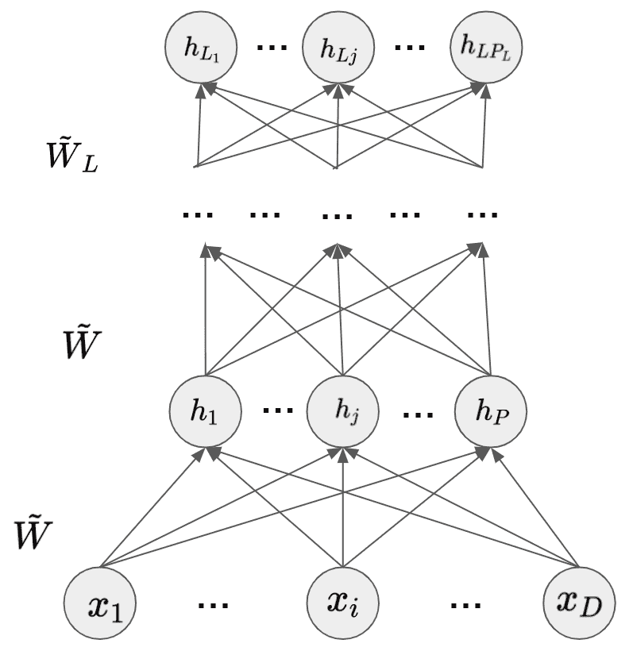
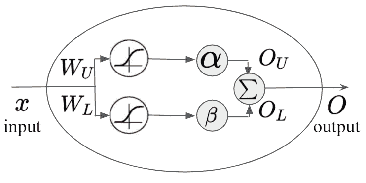

<!--yml

分类: 未分类

日期: 2024-09-06 19:45:41

-->

# [2206.05675] 关于不确定性推理与量化在决策中的应用调研：信念理论与深度学习的结合

> 来源：[`ar5iv.labs.arxiv.org/html/2206.05675`](https://ar5iv.labs.arxiv.org/html/2206.05675)

# 关于不确定性推理与量化在决策中的应用调研：信念理论与深度学习的结合

祁生张*, 朱凌万*, 郑国 zguo, zelin, qishengz19@vt.edu [`orcid.org/0000-0002-6563-5934, https://orcid.org/0000-0001-5293-0363, https://orcid.org/0000-0001-8785-8437`](https://orcid.org/https://orcid.org/0000-0002-6563-5934,%20https://orcid.org/0000-0001-5293-0363,%20https://orcid.org/0000-0001-8785-8437 "ORCID identifier") 计算机科学系，弗吉尼亚理工大学，7054 Haycock Road, Falls Church, VA, USA 22043，徐江赵*, 冯晨 xujiang.zhao, feng.chen@utdallas.edu [`orcid.org/0000-0003-4950-4018, https://orcid.org/0000-0002-4508-5963`](https://orcid.org/https://orcid.org/0000-0003-4950-4018,%20https://orcid.org/0000-0002-4508-5963 "ORCID identifier") 计算机科学系，德克萨斯大学达拉斯分校，800 W Campbell Rd, Richardson, TX, USA 75080，珍-希·赵, 齐张 jicho, qiz21@vt.edu [`orcid.org/0000-0002-5908-4662, https://orcid.org/0000-0002-3607-3258`](https://orcid.org/https://orcid.org/%0A0000-0002-5908-4662,%20https://orcid.org/0000-0002-3607-3258 "ORCID identifier") 计算机科学系，弗吉尼亚理工大学，7054 Haycock Road, Falls Church, VA, USA 22043，兰斯·M·卡普兰 lance.m.kaplan.civ@army.mil [`orcid.org/0000-0002-3627-4471, https://orcid.org/`](https://orcid.org/https://orcid.org/0000-0002-3627-4471,%20https://orcid.org/ "ORCID identifier") 美国陆军研究实验室，2800 Powder Mill Rd, Adelphi, MD, USA 20783，董浩中 djeong@udc.edu [`orcid.org/0000-0001-5271-293X`](https://orcid.org/https://orcid.org/0000-0001-5271-293X "ORCID identifier") 华盛顿特区大学计算机科学与信息技术系，4200 Connecticut Ave NW, Washington, DC, USA 20008，奥登·约桑 audun.josang@mn.uio.no [`orcid.org/0000-0001-6337-2264`](https://orcid.org/https://orcid.org/0000-0001-6337-2264 "ORCID identifier") 奥斯陆大学信息学系，Ole-Johan Dahls hus, Gaustadalléen, Oslo, Norway 23b 0373 (2022)

###### 摘要。

对不确定性的深入理解是有效决策的第一步。深度/机器学习（ML/DL）在解决处理高维数据的复杂问题方面得到了巨大的应用。然而，在 ML/DL 中，对不确定性进行推理和量化以实现有效决策的研究远不如其他人工智能（AI）领域那么广泛。特别是，信念/证据理论自 1960 年代以来在知识表示和推理（KRR）中被研究，用于推理和衡量不确定性，以提升决策有效性。我们发现，只有少数研究利用了信念/证据理论中的成熟不确定性研究，在 ML/DL 中应对不同类型的不确定性问题。在这篇综述论文中，我们讨论了几种流行的信念理论及其处理不确定性原因和类型的核心思想，并量化这些不确定性，同时讨论它们在 ML/DL 中的适用性。此外，我们讨论了三种主要的方法，它们在深度神经网络（DNNs）中利用信念理论，包括证据 DNNs、模糊 DNNs 和粗糙 DNNs，涉及其不确定性原因、类型和量化方法，以及它们在不同问题领域中的适用性。基于我们的深入调查，我们讨论了当前信念理论与 ML/DL 结合的见解、经验教训、局限性，以及未来的研究方向。

信念理论、不确定性推理、不确定性量化、决策制定、机器/深度学习

## 1\. 引言

### 1.1\. 动机

在各种业务流程和我们的私人生活中，我们面临着涉及多个选择和相对不确定性的决策。清晰理解不确定性是做出合理和有效决策的前提。尽管关于不确定性下的推理和决策的主题在包括信念/证据理论、博弈论和机器/深度学习（ML/DL）在内的各种人工智能（AI）领域中已经研究了几十年，但基于其根本原因的不确定性不同表现形式尚未深入研究。互联网和大数据时代带来了大量信息，可以用于决策。在这种情况下，及时、准确的决策挑战不再是信息的缺乏，而是对来自不可靠、不完整、具有误导性和冲突信息的不确定性缺乏理解和管理的风险。

在 AI 领域，一系列信念或证据理论有着长期研究在不确定性下的推理和/或决策的历史。然而，由于不确定性不仅仅由证据不足或不可预测性造成，理解仍然有限。此外，ML/DL 算法已经考虑了不确定性（例如，随机不确定性或认识不确定性）以提供有效决策的解决方案。然而，对于多维度的不确定性还没有一个共同而坚实的理解，因为每个领域在不确定性的理解上各有不同和/或有限，即使它们追求一个共同的有效决策目标。

我们的调查论文旨在深入调查一系列信念模型，并引入一个新的解决方案领域，该领域可以利用信念/证据理论中的不确定性研究来开发 ML/DL 解决方案，以实现有效决策。特别是，我们感兴趣的是量化由不同根本原因引起的不同类型的不确定性。这将有助于为 ML/DL 提供满足可解释 AI，即所谓的 XAI 的解决方案，通过提供不确定性的来源、原因以及最终它如何影响决策的有效性。

最先进的决策研究已经充分认识到考虑不确定性对于有效决策的重要性。然而，关于现有信念模型以研究不确定性及其在 ML/DL 领域决策中的适用性的广泛调查研究仍然很少。

### 1.2\. 我们的调查论文与其他现有调查论文的比较

在本节中，我们讨论了现有的调查论文，这些论文讨论了不确定性研究。然后，我们确定了现有调查论文与我们的调查论文之间的关键区别。

Li 等人 (2012) 讨论了不同不确定性的原因及如何在信念模型中处理这些不确定性，以在各种领域做出有效决策。根据随机不确定性和认知不确定性的性质，他们对概率理论、模糊理论、信息间隙理论和派生不确定性理论中的不确定性处理类型进行了分类，并进行比较。他们专注于如何在数据管理技术中处理不同的不确定性。Kabir 等人 (2018) 调查了使用深度神经网络（DNNs）的预测区间技术。这些预测区间技术量化了不确定性或随机性的水平，并已广泛应用于医学和电力领域。他们讨论了**随机**和**认知**不确定性（见第二部分以了解其定义），以解释使用 DNNs 进行预测中的不确定性。他们还讨论了如何使用贝叶斯方法在训练过程中优化神经网络的权重，并将其应用于不同领域的基于神经网络的预测区间。

Hariri 等人 (2019) 调查了各种 AI 技术，包括机器学习（ML）、自然语言处理（NLP）和计算智能，这些技术可以识别和减少大数据中的不确定性。Abdar 等人 (2021) 回顾了超过 700 篇研究 ML/DL 中不确定性量化的论文。他们主要讨论了贝叶斯方法和集成技术及其在图像处理、计算机视觉、医学应用、NLP 和文本挖掘等相关领域的应用。

我们还讨论了以下几篇论文中针对机器学习/深度学习中的不确定性的调查论文的贡献。Hüllermeier 和 Waegeman (2021) 区分了可变不确定性和认知不确定性。他们解释了这两种不确定性如何在各种机器学习问题或模型中表现，并且如何在评估的不确定性下有助于决策。Ulmer (2021) 调查了基于共轭先验和后验分布及未知离群样本的证据深度学习模型中量化不确定性的方法。该模型通过数据（可变）不确定性、模型（认知）不确定性和分布不确定性从狄利克雷分布中估计不确定性。Gawlikowski 等人 (2021) 提供了对深度神经网络中不确定性的综合调查。他们讨论了两种类型的不确定性：可减少的不确定性和不可减少的不确定性。可减少的不确定性与认知不确定性的概念一致，其中可减少的不确定性可以由现实世界的变异性、模型结构中的错误或训练参数（即，批量大小、优化器）引入。不可减少的不确定性指的是测量中的噪声（即，传感器噪声），与可变不确定性一致。作者根据深度神经网络的性质（即，确定性或随机性）和数量（即，单一或多重）的交叉组合对不确定性估计方法进行了分类。由于 (Hüllermeier 和 Waegeman, 2021; Ulmer, 2021; Gawlikowski 等人, 2021) 对不确定性的讨论范围非常有限，我们没有将其包含在表格 1 中。

与上述现有的调查论文（Li et al., 2012; Kabir et al., 2018; Hariri et al., 2019; Abdar et al., 2021）不同，我们的论文提供了对八种不同信念模型的深入调查，重点强调如何根据不确定性的根本原因和类型来推理和量化不确定性。此外，我们讨论了信念模型在深度学习领域的适用性。这将使研究人员能够利用信念模型中的不确定性推理/量化的扎实方法和深度学习技术，从而实现有效的决策。最后，在表 1 中，我们总结了我们调查论文与现有四篇不确定性研究调查论文之间的关键差异。我们根据现有调查论文中涉及的共同讨论点以及我们调查论文中的关键讨论点选择了关键标准。

表 1. 我们的调查论文与现有不确定性研究调查论文的比较

| 关键标准 | 我们的调查（2022） | Li et al. (2012)（2012） | Kabir et al. (2018)（2018） | Hariri et al. (2019)（2019） | Abdar et al. (2021)（2021） |
| --- | --- | --- | --- | --- | --- |
| 不确定性的本体 | ✔ | ▲ | ▲ | ▲ | ▲ |
| 不确定性的原因 | ✔ | ✔ | ✔ | ▲ | ✔ |
| DST 中的不确定性推理与量化 | ✔ | ✔ | ✘ | ✘ | ✘ |
| TBM 中的不确定性推理与量化 | ✔ | ✘ | ✘ | ✘ | ✘ |
| DSmT 中的不确定性推理与量化 | ✔ | ✘ | ✘ | ✘ | ✘ |
| IDM 中的不确定性推理与量化 | ✔ | ▲ | ✘ | ✘ | ✘ |
| TVL 中的不确定性推理与量化 | ✔ | ▲ | ✘ | ✘ | ✘ |
| 模糊逻辑中的不确定性推理与量化 | ✔ | ✔ | ✘ | ▲ | ✘ |
| 贝叶斯推断中的不确定性推理与量化 | ✔ | ✔ | ✘ | ▲ | ▲ |
| 主观逻辑中的不确定性推理与量化 | ✔ | ✘ | ✘ | ▲ | ✘ |
| 贝叶斯深度学习中的不确定性推理与量化 | ✔ | ✘ | ▲ | ✘ | ✔ |
| 信念模型在深度学习中的适用性 | ✔ | ✘ | ▲ | ✘ | ✘ |
| 对现有不确定性感知方法的见解、经验教训和局限性的讨论 | ✔ | ▲ | ▲ | ▲ | ✔ |
| 未来研究方向的讨论 | ✔ | ✔ | ✔ | ✔ | ✔ |

✔: 完全涵盖; ▲: 部分涵盖; ✘: 完全未涵盖; DST: 丹普斯特-谢弗理论; TBM: 可迁移信念模型, DSmT: 德泽特-斯马兰纳赫理论; TVL: 三值逻辑。

### 1.3\. 研究问题

在这项工作中，我们旨在回答以下研究问题：

RQ1.:

信念理论和深度学习中研究的不确定性的关键原因和类型是什么？

RQ2.:

如何根据在信念模型和深度学习中研究的不确定性的多维度方面定义不确定性本体？

RQ3.：

每个信念模型如何考虑和测量不确定性？

RQ4.：

每个信念模型如何在深度学习中应用，反之亦然，以在不确定性下进行有效决策？

RQ5.：

信念理论和深度学习中的不确定性推理和量化的主要差异是什么？

RQ6.：

如何将信念模型应用于深度学习以解决复杂的决策问题？

上述研究问题将在第六部分中回答。

### 1.4\. 研究范围与关键贡献

尽管在各种领域中已经考虑了不确定性，但我们将论文的范围限制在信念模型及其在深度学习算法中的应用上。需要注意的是，当我们提到‘决策’时，指的是在多个备选方案中进行选择。例如，这可以是分类任务中为了最大化预测准确性而选择的某个类别，或者是为了最大化决策效用而选择的多个行动中的一个，或是为了优化系统性能而选择的策略。

在本文中，我们做出了以下关键贡献：

1.  (1)

    我们是第一个进行广泛调查，识别各种信念模型和深度学习中研究的不确定性的原因和类型，并提供不确定性本体的研究。

1.  (2)

    我们首先调查了各种信念理论如何考虑不确定性并将其量化，以便进行有效的决策。

1.  (3)

    我们还首先讨论了如何有效利用信念理论来提供基于深度学习的决策解决方案。

1.  (4)

    我们识别了每种信念理论推理和量化不确定性的方法的关键共性和差异，以及它在深度学习背景下或与之结合的应用方式。

1.  (5)

    我们提供了对见解和经验教训的整体观点，以及我们广泛调查中的局限性，并建议了有前景的未来研究方向。

### 1.5\. 论文结构

论文的其余部分组织如下：

+   •

    第二部分提供了不确定性的各种分类类型、不同类型不确定性的原因以及基于调查的多维度不确定性概念提出的不确定性本体。

+   •

    第三部分提供了八种信念模型的详细信息，并讨论了信念形成、不确定性的原因和类型、不确定性量化及其在决策应用中的应用。这八种信念模型包括邓普斯特-沙弗理论（DST）、可转移信念模型（TBM）、德泽特-斯马兰尼亚奇理论（DSmT）、不精确的狄利克雷模型（IDM）、克莱尼的三值逻辑（TVL）、模糊逻辑（FL）、贝叶斯推理（BI）和主观逻辑（SL）。

+   •

    第四部分讨论了信念理论如何在深度学习（DL）背景下应用于不确定性下的决策应用，特别是在证据神经网络、模糊深度神经网络和粗糙深度神经网络方面。

+   •

    第五部分提供了第一部分提出的关键研究问题的答案。

+   •

    第六部分通过讨论我们调查中的局限性、见解和所学到的经验来总结我们的论文。此外，我们建议在将信念模型应用于解决基于 DL 的决策问题方面的有前途的未来研究方向。

数学符号的警示：在第三部分和第四部分中，我们讨论了一组信念理论和利用信念模型的深度学习理论，包括主观逻辑、模糊理论和粗糙集理论。对某一理论的讨论需要使用仅在该理论下使用的数学符号，而不是其他理论下的符号。我们保留了原始论文中的数学符号，以便传达文献中讨论每种理论所使用的通用符号。

## 2\. 不确定性的分类类型、原因和本体

在这项工作中，我们处理数据或信息中的不确定性。我们将不确定性类型定义为对数据或信息的感知状态，如模糊性、争议性、非特指性、歧义等（参见第 2.1 节）。我们通过引入不确定性的原因来定义不确定性的成因。我们还讨论了不确定性的本体论，其中本体论作为哲学的一个分支，定义为“研究事物存在的科学”，描述“现实中每个领域的对象、属性、事件、过程和关系的结构”（Smith，2012）。在本节中，我们将从不确定性推理和量化的角度，描述不确定性的类型、成因以及决策结果。

### 2.1\. 不确定性类型的分类

在概率不确定性研究领域（Jøsang，2016；Kiureghian 和 Ditlevsen，2009），两种类型的不确定性本质被广泛使用并且常常讨论：

+   •

    随机不确定性：这指的是对可能结果的长期相对频率的统计不确定性（Jøsang，2016）。例如，如果我们不知道一个骰子是否是加重的——从而是不公平的——那么我们面临的是随机不确定性。这种不确定性可以通过多次掷骰子来减少到真实的方差。然而，每次掷骰子时，我们无法准确预测其结果，只能获得长期概率（Jøsang，2016）。因此，长期概率可以通过越来越多的观测来减少认知不确定性。因此，随机不确定性与随机性本质上是相关的，其中一个变量由频率过程控制（Kiureghian 和 Ditlevsen，2009；Jøsang，2016）。

+   •

    知识不确定性：这种不确定性与由于知识缺乏而无法准确预测事件的情况有关。一个典型的例子是 1963 年肯尼迪总统的暗杀事件（Jøsang，2016），其中的不确定性在于他是否被李·哈维·奥斯瓦尔德杀害以及谁组织了这次事件。知识不确定性的本质源于缺乏知识或信息（或数据）。这种类型的不确定性也称为系统性不确定性或模型不确定性。这意味着特定未来或过去事件的结果可能是已知的，但缺乏足够的证据来支持它。知识不确定性可以通过更多的证据、更先进的技术和/或科学原理来解释证据（例如，法医科学）（Kiureghian 和 Ditlevsen，2009）来减少。这种知识不确定性遵循一种非频率学过程，表示事件的可能性（Jøsang，2016）。

由于上述两种不确定性的性质已被广泛讨论，我们将讨论在不同信念模型和深度学习模型中，不同类型的不确定性如何与这两种不确定性的性质相关。

不确定性推理和量化研究已被多个理论广泛探索，例如概率论、模糊集理论、可能性理论、证据理论和粗糙集理论。这些理论可以被视为互补的，因为每种理论都旨在处理不同类型的不确定性。在这些理论中，Dubois（1980）识别了三种不确定性类型，即模糊性、不一致性和非特指性。后两种术语，不一致性和非特指性，被合并为模糊性。每种类型都有一个简短的常识性描述和几个相关的同义词，如下所示：

+   •

    模糊性：这源于缺乏明确或清晰的区分，并有相关的同义词，如含糊不清、模糊不清、朦胧、不明确、不清晰或不锐利。

+   •

    模糊性：一般来说，当对象无法由于缺乏某些区分而被明确指定，或者由于冲突的证据被检测为单一类别时，就存在模糊性。因此，这两种情况可以进一步分类为以下两个子类：

    +   –

        不一致：这与几个选择之间的分歧有关，并且可以互换地使用包括不和谐、矛盾、不一致或冲突等同义词。

    +   –

        非特指性：指的是两种或更多的选择被留作不特定情况，并用相关的同义词表示，如多样性、一般性、多样性、模棱两可和不精确。

根据我们的理解，模糊性引入了含糊性（即，无法区分彼此），而歧义属于认识论的不确定性。除此之外，最常见的不确定性还源于缺乏证据，这被称为虚无（或无知）（Jøsang, 2016），因为我们由于证据不足而不知道如何做决定，这属于认识论的不确定性，因为更多的证据可以减少虚无。

图 1. 不确定性类型的分类。

在建模和风险评估研究中（Linkov 和 Burmistrov, 2003; Walker 等, 2003），研究了模型选择中与模型制作者相关的不确定性，例如源于对问题的主观解释的不同问题表述、模型实现和参数选择。我们称之为“模型制作者不确定性”，并将其归类为以下三种类型：

+   •

    参数不确定性：这是指模型中输入参数值的不确定性，例如测量误差、采样误差、变异性以及替代数据的使用。因此，它是一种认识论的不确定性，可以通过收集更可靠的证据来更准确地估计模型中使用的参数，从而减少。

+   •

    模型不确定性：这表明对模型结构和模型中定义的组件数学关系的不确定性。例如，在建模现实世界问题时，通过做假设和简化数学方程式，可以引入不确定性。因此，这种不确定性是由缺失或不完整的信息引入的，这使得模型的完全定义变得困难。这种不确定性属于认识论的不确定性，可以通过收集必要的、可靠的信息来准确地定义模型，从而减少。

+   •

    情景不确定性：这表示由构建情景时做出的规范性选择引起的不确定性，包括功能单元的选择、时间范围、地理尺度和其他方法选择。这种不确定性源于不确定的问题表述和理论假设，本质上不是统计性的。由于这种不确定性的性质，我们将其理解为认识论的不确定性。这种不确定性可以通过收集更多证据、使用更先进的技术和/或考虑科学原理来解释证据来减少，例如，为犯罪热点检测找到更好的时间范围或地理尺度选择。

### 2.2\. 不确定性的原因

从决策中的框架研究角度来看，框架是外部世界的启发式表征，主要有三种不确定性的原因，包括不可预测性、不完全知识和多重知识框架（Brugnach et al., 2008）。从工程学的角度，这三种原因可以由缺乏证据、处理大量证据的认知能力有限、证据冲突、模糊性、测量误差和主观信念引入（Zimmermann, 2000）。这三种原因的描述如下：

+   •

    不可预测性：一个系统（或实体/数据）可能表现出在空间/时间上混沌和变化的行为。在统计学中，置信区间被用作不确定性的度量（Zimmermann, 2000）。统计噪声是触发不确定性的常见因素，导致不可预测性。即使系统学习并适应动态的新条件，它也会表现出高度变化的行为。这种变化可能是由于信息、数据或实体的不可靠性，这种不可靠性是由系统/网络动态、非平稳环境条件或敌对攻击造成的。如果是这种情况，可以通过在决策过程中检测并排除不可靠的来源或数据来减少这种不确定性（Zimmermann, 2000）。

+   •

    不完全知识：这指的是我们对一个系统的了解不足以进行有效管理，或者我们对该系统的知识是不完整的（即认知不确定性）（Zimmermann, 2000）。这可能是由于缺乏证据（例如，信息/数据）或缺乏理论理解（例如，知识盲区）或可靠的信息或数据造成的。通过考虑更多的证据或排除不可靠的证据，可以减少这种不确定性。此外，当人类决策者接收到大量信息时，这些信息通常非常复杂，由于其有限的认知能力和处理能力，他们无法正确处理这些信息。为了解决这个问题，人们通常将可用数据转化为较粗糙的‘粒度’信息或关注重要特征，忽略其他不那么重要（或噪声）的信息或数据。通过在可用信息中考虑相关信息，可以减少这种不确定性（Zimmermann, 2000）。

+   •

    多重知识框架：指的是相同的信息（例如，证据或意见）被不同地解释，导致不同且冲突的观点。Dewulf 等（2005）将模糊性定义为对某一现象存在多个有效信念的情况。对系统（或外部世界）的理解方式可以在于如何划定系统的边界，或将什么和谁作为关注焦点。差异还可能来源于对系统信息的解释方式。另一个主要原因是相互冲突的证据，这代表了一种情况，其中某些信息可能是不正确的、无关紧要的，或者观察系统的模型在某个时刻可能不正确。此外，多位观察者可能基于其主观观点提供不同的意见。

我们展示了基于现有分类（见图 1）对不确定性类型分类的观点。

### 2.3. 不确定性的本体论

本体提供了“在所有存在领域中实体的明确和详尽分类”，分类应能完全描述实体的细节（Smith，2012）。信息融合研究社区已经开发了“**不确定性表示与推理框架（URREF）**”（Costa 等，2018），该框架考虑了信息处理系统中的不确定性本体。然而，其范围仅限于信息处理系统，并且仅考虑了不确定性研究领域中研究的子集的不确定性类型。为了更广泛地理解不确定性的概念及其多种原因，我们使用 W3C 网络本体语言（OWL）（Stanford Biomedical Informatics Research Center (BMIR)，2019）开发了不确定性本体，如图 2 所示。由于空间限制，我们在图 2 中没有显示模糊性和不明确性的子属性（参见图 1）。因此，我们在补充文件的附录 F 中详细描述了上述不确定性的关键属性。

图 2. 不确定性的本体。

## 3\. 信念理论中的不确定性下的决策

不同类型的不确定性影响特定情况的评估和分析。潜在的不确定性源于如何看待和建模我们称之为*领域*的世界某个部分。领域是对世界状态的抽象表示，分析师或决策者可以对领域的真实状态持有信念。关于领域的信念可能会被分析师或决策者轻易地偏见，这通常被称为“框架效应”（Tversky 和 Kahneman，1985；Walker 等，2003），这可能导致对世界的主观信念偏离世界的客观真相（例如，过去或未来事件）（Walker 等，2003）。情况的正式建模方式（即领域中的元素）也可能影响决策者感知到的不确定性类型和水平。

信念已经成为决策过程的基础。1930 年代，克利尼（1938）通过定义基于三个值（包括假、未知和真）的代数，提出了三值逻辑（TVL）。自 1960 年代以来，许多其他基于概率定义信念的理论被提出，包括模糊逻辑（Zadeh，1965）、邓普斯特-谢弗理论（Shafer，1976）、可转移信念模型（Smets and Kennes，1994）、主观逻辑（Jøsang，1999、2001）、德泽特-斯马兰达切理论（DSmT）（Dezert and Smarandache，2004）、贝叶斯推理（Fienberg，2006）、不精确的狄利克雷模型（IDM）（Walley，1996）。邓普斯特-谢弗理论（DST）（Shafer，1976）首次定义了“辨识框架”，即考虑的命题集合。DST 基于主观概率对贝叶斯理论进行了推广（Shafer，1976）。可转移信念模型（TBM）（Smets and Kennes，1994）被提出以处理比 DST 更多的知识和情况。Zadeh（1965）引入了模糊集理论，通过成员函数（Zadeh，1983）表示不确定的主观信念，并已应用于各种基于信任的系统（Nagy et al.，2008；Lesani and Bagheri，2006；Chen et al.，2009；Liao et al.，2009；Luo et al.，2008；Manchala，1998；Nefti et al.，2005）。DSmT（Dezert and Smarandache，2004）扩展了 DST，以处理信任管理系统中的冲突证据（Wang and Sun，2007；Deepa and Swamynathan，2014）。

### 3.1\. 克利尼的三值逻辑（TVL）

#### 3.1.1\. 信念形成。

克利尼（1938）于 1938 年首次提出了 TVL。其真值表见表 2 ‣ 3\. Decision Making under Uncertainty in Belief Theory ‣ A Survey on Uncertainty Reasoning and Quantification for Decision Making: Belief Theory Meets Deep Learning")，其中$p_{1}$和$p_{2}$是两个逻辑变量。TVL 的信念分布由逻辑变量的逻辑值决定，即当$p=q$时，$\mathbf{b}(p)_{q}=1$，否则为$0$。$p$是一个逻辑变量，$q$是来自$\{T,U,F\}$的逻辑值，其中$T$为真，$U$为未知，$F$为假。

表 2. TVL 的真值表

$p_{1}\wedge p_{2}$

| <svg version="1.1" height="17.3" width="21.68" overflow="visible"><g transform="translate(0,17.3) scale(1,-1)"><g  transform="translate(0,0)"><g transform="translate(0,8.65) scale(1, -1)"><foreignobject width="10.84" height="8.65" overflow="visible">$p_{1}$</foreignobject></g></g> <g  transform="translate(10.84,8.65)"><g transform="translate(0,8.65) scale(1, -1)"><foreignobject width="10.84" height="8.65" overflow="visible">$p_{2}$</foreignobject></g></g></g></svg> | $T$ | $U$ | $F$ |
| --- | --- | --- | --- |
| $T$ | $T$ | $U$ | $F$ |
| $U$ | $U$ | $U$ | $F$ |
| $F$ | $F$ | $F$ | $F$ |

$p_{1}\vee p_{2}$

| <svg version="1.1" height="17.3" width="21.68" overflow="visible"><g transform="translate(0,17.3) scale(1,-1)"><g  transform="translate(0,0)"><g transform="translate(0,8.65) scale(1, -1)"><foreignobject width="10.84" height="8.65" overflow="visible">$p_{1}$</foreignobject></g></g> <g  transform="translate(10.84,8.65)"><g transform="translate(0,8.65) scale(1, -1)"><foreignobject width="10.84" height="8.65" overflow="visible">$p_{2}$</foreignobject></g></g></g></svg> | $T$ | $U$ | $F$ |
| --- | --- | --- | --- |
| $T$ | $T$ | $T$ | $T$ |
| $U$ | $T$ | $U$ | $U$ |
| $F$ | $T$ | $U$ | $F$ |

克利尼代数和三值逻辑。克利尼的三值逻辑是克利尼代数的一个特例。克利尼代数 $\mathcal{K}=(K,\vee,\wedge,\sim,F,T)$ 的属性是：

+   •

    $\mathcal{K}$ 是一个有界分配格；以及

+   •

    对于任意的 $a,b\in K$，$\sim(a\;\wedge b)=\sim a\;\vee\sim b$，$\sim\sim a=a$，以及 $a\;\wedge\sim a\leq b\;\vee\sim b$。

在这里，我们应用的语义是 $\vee$ 代表逻辑析取，$\wedge$ 代表逻辑合取，而 $\sim$ 代表否定。可以很容易推导出克利尼的三值逻辑，其中 $K=\{T,U,F\}$，是一个克利尼代数，其中 $T=\sim F$，$F=\sim T$，和 $U=\sim U$。

粗糙集和克利尼代数。克利尼代数与粗糙集相关。这两个概念之间的关系如下。给定一个信息系统 $I=(S,\mathbb{A})$，其中 $S$ 是对象集合，$\mathbb{A}$ 是属性集合 $a:x\mapsto a(x)$ 对于任意 $x\in S$，我们可以定义等价关系集 $IND(I)$：$IND(I)=\{IND(A):A\subseteq\mathbb{A}\}$，其中 $IND(A)=\{(x,y)\in S^{2}:\forall a\in A,a(x)=a(y)\}$。给定任意等价关系 $R\in IND(I)$，一个粗糙集 $\mathcal{X}\in(S\times S)/R$ 是一对 $(\underline{R}X,\overline{R}X)$，其中 $\underline{R}X$ 和 $\overline{R}X$ 分别称为 $R$-下近似和 $R$-上近似。更具体地，

| (1) |  | $\displaystyle\underline{R}X=\bigcup\{Y\in S/R:Y\subseteq X\},\;\;\overline{R}X=\bigcup\{Y\in S/R:Y\cap X\neq\emptyset\},$ |  |
| --- | --- | --- | --- |

其中 $S/R$ 是与 $R$ 对应的等价类集合。

给定任意集合 $S$ 且 $|S|\geq 2$，普遍等价关系 $R:=S\times S$ 和信息系统 $I=(S,\mathbb{A})$，我们可以在粗糙集的集合 $\mathcal{RS}$ 上诱导一个三值代数，使用克利尼语义如下：

| (2) |  | $\mathcal{RS}=\{(\underline{R}A,\overline{R}A):A\subseteq S\}=\{(S,S),(\emptyset,S),(\emptyset,\emptyset)\}.$ |  |
| --- | --- | --- | --- |

在这里，如果我们定义$\sim\mathcal{X}:=(\underline{R}X^{c},\overline{R}X^{c})$，则有$(S,S)=\sim(\emptyset,\emptyset)$，$(\emptyset,S)=\sim(\emptyset,S)$，以及$(\emptyset,\emptyset)=\sim(\emptyset,\emptyset)$。这意味着$K\cong\mathcal{RS}$。一般而言，给定所有逻辑函数（命题公式）的集合记为$\mathcal{F}$，所有克利尼代数的集合记为$\mathcal{A}_{\mathcal{K}}$，以及所有可能信息系统上所有粗糙集的集合记为$\mathcal{A}_{\mathcal{RS}}$，以下定理（Kumar 和 Banerjee，2017）是成立的：

| (3) |  | $\forall\alpha,\beta\in\mathcal{F},\alpha\vDash_{\mathcal{A}_{\mathcal{K}}}\beta\Leftrightarrow\alpha\vDash_{\mathcal{A}_{\mathcal{RS}}}\beta.$ |  |
| --- | --- | --- | --- |

上述内容可以这样理解：对于$\mathcal{F}$中的任何逻辑函数$\alpha$和$\beta$，如果$\beta$是$\mathcal{A}_{\mathcal{K}}$中$\alpha$的语义蕴涵，那么$\beta$也是$\mathcal{A}_{\mathcal{RS}}$中$\alpha$的语义蕴涵。我们在图 3 ‣ 3. 不确定性下的决策理论 ‣ 不确定性推理与量化的调查：信念理论与深度学习的结合")中总结了使用克利尼三值逻辑的敏感决策过程。

#### 3.1.2. 不确定性的原因和类型

不确定性被形式化为逻辑值$U$（未知），其与两个经典逻辑值$T$（真）和$F$（假）的关系如表 2 ‣ 3. 不确定性下的决策理论 ‣ 不确定性推理与量化的调查：信念理论与深度学习的结合")所示。这里所述的不确定性指的是由于缺乏信息或知识而导致的不可预测性。例如，在粗糙集中，由于不可预测的噪声，集合通过近似空间来表示。

#### 3.1.3. 不确定性量化

图 3. 使用克利尼的三值逻辑（TVL）进行的不确定性感知决策过程。

TVL 中的不确定性表示决策过程中未知或未指定的状态。这与因缺乏信息/知识或非特异性而导致的虚无不确定性有关。由于不确定性被视为逻辑值，不确定性值可以通过逻辑变量的逻辑运算来量化。在 Kleene 的 TVL 中，$T$、$U$（不确定性）和 $F$ 的三个值通常由 1、0 和 -1 定义。如表 2 ‣ 3\. 信念理论下的不确定性决策 ‣ 关于决策的不确定性推理与量化的调查：信念理论遇见深度学习") 所示，不确定性 $U$ 可以在 $\wedge$ 下忽略，以决定 $T$ 或 $F$，同时它可以用于支持 $T$ 超过 $F$。

#### 3.1.4\. TVL 在机器/深度学习中的应用

Kashkevich 和 Krasnoproshin (1979) 定义了 TVL 的一个函数来解决模式识别任务中的分类问题。他们将接受的准确分类视为 $T$，接受的错误分类视为 $F$，拒绝的分类视为 $U$。Dahl (1979) 利用 TVL 构建了一个用于自然语言咨询的数据库。Codd (1986) 将 TVL 应用于 SQL 领域，其中“Null”值表现得像 TVL 中的不确定值 $U$。最近的研究中很少观察到 TVL 的应用。作为 TVL 的拓扑概化，粗糙集被用于机器学习/深度学习，如第 4.3 ‣ 4\. 信念理论遇见深度学习 ‣ 关于决策的不确定性推理与量化的调查：信念理论遇见深度学习") 节所述。

### 3.2\. 邓普斯特-谢弗理论（DST）

DST 是一种基于各种检测系统信念质量（即证据）的决策融合技术。每个系统可以定义为一组可能的结论，称为命题（Shafer, 1976）。所有命题的集合用 $\Theta$ 表示（即识别框架（FOD））。给定集合 $\Theta$，我们可以生成幂集 $P(\Theta)$（即 FOD 的幂集），其中 $P(\Theta)$ 表示集合 $\Theta$ 的所有可能组合，包括一个空集 $\emptyset$。因此，$2^{|\Theta|}$ 是 $P(\Theta)$ 的大小。例如，如果 $\Theta=\{W,Z,L\}$，那么 $P(\Theta)=\{\emptyset,\{W\},\{Z\},\{L\},\{W,Z\},\{W,L\},\{Z,L\},\{W,Z,L\}\}$。

#### 3.2.1\. 信念形成

信念质量是基于证据观察到的概率。例如，假设我们有一个黑球、一个黑方块和一个红球。焦点元素$black$的质量为$m(black)=\frac{2}{3}$，而焦点元素$red$的质量为$m(red)=\frac{1}{3}$。对于给定的系统，我们将信念质量分配给幂集$P(\Theta)$中的每个元素，并定义质量函数为$m:P(\Theta)\rightarrow[0,1]$。质量函数也称为基本信念分配（bba），而幂集$P(\Theta)$中每个元素的质量之和等于 1，即（Shafer, 1976）：

| (4) |  | $m:\Theta\rightarrow[0,1],\sum_{A\in P(\Theta)}m(A)=1,\;\;\textsf{where}\;\;m(\emptyset)=0.$ |  |
| --- | --- | --- | --- |

给定幂集$P(\Theta)$和每个焦点元素（即子集）$A$的相应信念质量$m$，我们可以计算每个焦点元素$A$的信念区间，并表示为$[{Bel}(A),{pl}(A)]$。信念${Bel}(A)$是下限，而可能性${pl}(A)$表示上限（Smarandache et al., 2012）。${Bel}(A)$和${pl}(A)$的计算方法如下：

| (5) |  | $\displaystyle{Bel}(A)=\sum_{B | B\subseteq A}m(B),\;\;{pl}(A)=\sum_{B | B\cap A\neq\emptyset}m(B),\;\;{Dis}(A)=1-{pl}(A).$ |  |
| --- | --- | --- | --- | --- | --- |

图 4. 典普斯特组合规则。

图 5. 典普斯特-谢弗理论中的信念、可能性和不信任度。

例如，给定$\Theta=\{W,Z,L\}$和信念质量$m(W)$、$m(Z)$、$m(W\text{ or }L)$，我们可以通过${Bel}(W)=m(W)$和${Bel}(W\text{ and }Z)=m(W)\cdot m(Z)$分别获得焦点元素$W$和（$W$与$Z$）的信念，以及$W$的可能性$pl(W)=m(W)+m(W\text{ or }L)$。$W$的信念区间表示为$[m(W),m(W)+m(W\text{ or }L)]$。

焦点元素$A$的不信任度表示为${Dis}(A)$，其值等于${Bel}(\overline{A})$，其中$\overline{A}$表示$A$的补集（即$A$的否定）。${Dis}(A)$通过求和所有与$A$不相交的焦点元素的质量来计算。另一种计算${Dis}(A)$的方法是${Dis}(A)=1-{pl}(A)$，其中${pl}(A)$可以被视为作为潜在信用来增加给定信念的估计不确定性。尽管不确定性通常被视为风险（van Asselt, 2000），DST 将不确定性作为支持特定信念的信用。图 5 ‣ 3\. Decision Making under Uncertainty in Belief Theory ‣ A Survey on Uncertainty Reasoning and Quantification for Decision Making: Belief Theory Meets Deep Learning")描述了 DST 的关键概念。

典普斯特组合规则是一个用于两个独立检测系统$i$和$j$在同一框架上的信念质量组合函数。分配给焦点元素$A$的联合质量由下式给出：

| (6) |  | $m(A)=\kappa\sum_{A_{i}\cap B_{j}=A\neq\emptyset}m_{1}(A_{i})\cdot m_{2}(B_{j}),$ |  |
| --- | --- | --- | --- |

其中$A_{i}$和$B_{j}$是两个不同系统$i$和$j$中包含目标值$A$的集合$\Theta$中的值。$\kappa$是一个重归一化常数，由$\kappa=(1-\sum_{A_{i}\cap B_{j}=\varnothing}m_{1}(A_{i})m_{2}(B_{j}))^{-1}$定义 (Shafer, 1976)。例如，我们有$m_{1}(W)$、$m_{1}(Z)$、$m_{1}(W,Z)$、$m_{2}(W)$、$m_{2}(Z)$和$m_{2}(W\text{ or }Z)$。焦点元素$W$的联合质量由$m(W)=m_{1}(W)\cdot m_{2}(W)+m_{1}(W)\cdot m_{2}(W\text{ or }Z)+m_{1}(W\text{ or }Z)\cdot m_{2}(W)+m_{1}(W\text{ or }Z)\cdot m_{2}(W\text{ or }Z)$计算。

我们在图 4 ‣ 3\. 信念理论中的不确定性决策 ‣ 不确定性推理与量化的综述：信念理论与深度学习的融合")中总结了 Dempter 组合规则的关键概念，基于我们以上的讨论。许多 DST 变体已经被提出。由于空间限制，我们在补充文档的附录 A 中讨论了一些 DST 的变体。

#### 3.2.2\. 不确定性的原因和类型

DST 考虑由于缺乏证据而产生的可行性不确定性。这意味着 DST 中的不确定性与认知不确定性或空白密切相关。因此，DST 可以将不确定的观点量化为对给定命题的主观信念 (Shafer, 1976)。

#### 3.2.3\. 不确定性量化

Smarandache 等人 (2012)根据 DST 的多个维度测量不确定性，包括自动冲突（即信念函数中的冲突与联接规则）、非特异性（即以 2 为底的 Hartley 熵的通用形式）、混淆（即由于缺乏证据的不确定性）、不和谐（即所有信念基本相同）、汇总不确定性测度（AU）（即广义的 Shannon 熵），以及模糊测度（AM）（即非特异性和不一致性）。我们在补充文档的附录 A 中详细介绍了上述每种确定性。Blasch 等人 (2013) 定义了不确定区间（IOU）：

| (7) |  | $IOU(A)=pl(A)-Bel(A)=1-Bel(\overline{A})-Bel(A)=1-Dis(A)-Bel(A).$ |  |
| --- | --- | --- | --- |

Klir 和 Ramer (1990)通过考虑两种不确定性类型，非特异性和不一致性，测量 DST 中的总不确定性，用$U^{T}(A)$表示。$U^{T}(A)$和 AM 都考虑了非特异性和不一致性，但它们的捕捉方式不同。AM 在每个命题的层面（即元素$\theta\in\Theta$）捕捉这些，而$U^{T}(A)$则在集合的层面$A\subset\Theta$中获取它们。因此，$U^{T}(A)$由(Klir 和 Ramer, 1990)给出：

| (8) |  | $U^{T}(A)=\sum_{A\subset\Theta}m(A)\log_{2}\Bigg{(}\frac{&#124;A&#124;}{\sum_{B\subset\Theta}m(B)\frac{&#124;A\cap B&#124;}{&#124;B&#124;}}\Bigg{)}.$ |  |
| --- | --- | --- | --- |

DST 的关键优点在于结合来自多个来源的不确定证据，并基于组合的信念质量选择元素。然而，DST 的组合规则未能平衡不同来源，特别是当来源提供冲突证据时。尽管已经提出了许多替代组合规则，Dubois 和 Prade (1988) 认为没有单一的组合规则可以作为所有遇到情况的通用解决方案。

#### 3.2.4\. DST 在机器/深度学习中的应用

DST 已与深度学习技术结合使用。Soua 等人 (2016) 提出了一个框架，通过深度信念网络（DBN），一种深度神经网络（DNN）的类别，来预测交通流量，以基于数据流和事件数据这两种数据进行相同的预测。然后使用 DST 来融合这两个预测。Tong 等人 (2021) 研究了一种集值分类（SVC），其中一个样本可以被分类为多个类别，而不仅仅是一个类别，以识别在训练数据集中未表示的异常值。作者提出了一种将 DST 与卷积神经网络（CNNs）结合的技术，以提高 SVC 的准确性。Tian 等人 (2020) 提出了一个新的入侵检测系统（IDS），使用 DST 与长短期记忆递归神经网络（LSTM-RNN）结合不同类别的结果。Zhang 等人 (2020b) 提出了使用改进的 DST 的新故障诊断技术，通过融合来自多个传感器的数据进行故障分类。

### 3.3\. 可转移信念模型（TBM）

TBM 作为 DST 的一个变体被开发出来，以解决 DST 组合规则的非合理结果（见第 3.2 ‣ 3\. 不确定性下的决策理论 ‣ 关于不确定性推理与量化的调查：信念理论遇见深度学习")节），当多个来源提供冲突证据时(Smets 和 Kennes, 1994)。TBM 基于开放世界假设，具有两个信念推理层次：可信层次和皮格尼斯层次。可信层次通过信念函数量化和更新信念。皮格尼斯层次使用所谓的皮格尼斯概率函数将信念转换为概率，以便做出决策（Smets 和 Kennes, 1994）。

#### 3.3.1\. 信念形成

TBM 定义的基本信念质量与 DST 相同（Shafer, 1976）（见方程式(4 ‣ 3\. 不确定性下的决策理论 ‣ 关于不确定性推理与量化的调查：信念理论遇见深度学习"))）。当新证据到达时，信念的可信度信念函数由(Smets 和 Kennes, 1994) 提出。

| (9) |  | $m_{B}(A)=\begin{cases}\frac{\sum_{C\subseteq\overline{B}}m(A\cup C)}{1-\sum_{C\subseteq\overline{B}}m(C)}\;\;\text{for}\;\;(A\subseteq B)\wedge(A\neq\emptyset);\\ \;\;\;\;\;\;\;\;0\;\;\;\;\;\;\;\;\;\;\;\text{otherwise.}\end{cases}$ |  |
| --- | --- | --- | --- |

这里 $m_{B}(A)$ 表示在条件证据不支持命题 $B$ 作为真理时支持命题 $A$ 的信念量（Smets 和 Kennes，1994）。$\sum_{C\subseteq\overline{B}}m(C)$ 指支持不支持 $B$ 的集合的信念总和，而 $\sum_{C\subseteq\overline{B}}m(A\cup C)$ 是不支持 $B$ 或支持 $A$ 的信念总和。对于 $m_{B}(A):\mathbb{R}\rightarrow[0,1]$，公式 (9 ‣ 3\. Decision Making under Uncertainty in Belief Theory ‣ A Survey on Uncertainty Reasoning and Quantification for Decision Making: Belief Theory Meets Deep Learning")) 需要满足 $\sum_{C\subseteq\overline{B}}m(A\cup C)<1-\sum_{C\subseteq\overline{B}}m(C)$。

通过 pignistic 概率函数进行决策的概率表示为 $BetP$，其估计公式为：

| (10) |  | $BetP(x)=\sum_{x\in A\subseteq X}\frac{m(A)}{ | A | }=\sum_{x\in A\subseteq X}m(A)\frac{ | x\cap A | }{ | A | },$ |  |
| --- | --- | --- | --- | --- | --- | --- | --- | --- | --- |

图 6. Credal 层次和 pignistic 层次的信念及其在 TBM 中的关系。

其中 $\frac{m(A)}{|A|}$ 表示信念量 $m(A)$ 均匀分布到 $A$ 的原子集合中，而 $|A|$ 表示集合 $A$ 中的原子 $x$ 的数量（即 $x\in A$）。$X$ 是 $\Omega$ 的布尔代数，其中 $\Omega$ 是一个世界（真理）集合。从 pignistic 概率函数计算的概率分布用于决策制定。

#### 3.3.2\. 不确定性的原因与类型

TBM 考虑了由于缺乏证据而造成的认识不确定性。

#### 3.3.3\. 不确定性量化

在 TBM 中，不确定性没有被明确讨论。由于 pignistic 层次的信念用于现实世界中的决策，我们可以理解 pignistic 概率函数给出了一个考虑实际不确定性的信念量，而 credal 层次的信念函数则基于观察到的证据来估计信念。我们展示了基于证据的到达如何在 credal 层次构建信念，以及 credal 层次的信念如何转移到 pignistic 层次的信念以进行决策，如图 6 ‣ 3\. Decision Making under Uncertainty in Belief Theory ‣ A Survey on Uncertainty Reasoning and Quantification for Decision Making: Belief Theory Meets Deep Learning") 所示。

#### 3.3.4\. TBM 在机器学习/深度学习中的应用

TBM 被用作解决各种分类问题的竞争算法 (Zhang 等, 2020a; Guil, 2019; Quost 等, 2005; Honer 和 Hettmann, 2018; Henni 等, 2019)。然而，据我们所知，我们尚未找到任何将 TBM 与 ML/DL 结合使用的先前研究。

### 3.4\. Dezert-Smarandache 理论 (DSmT)

Dezert 和 Smarandache (2004) 引入了 DSmT 理论，用于数据和信息融合问题，作为一个提供处理高度不精确、模糊和不确定证据源的新规则的一般框架，并在这些情况下做出决策。DSmT 相对于 DST 的主要优势如下。首先，DSmT 在超幂集中的融合空间更为一般（在补充文档的附录 B.1 中讨论），而不是幂集。其次，DSmT 适用于自由和混合模型，而不是严格的 DST 模型（见补充文档的附录 B.1）。第三，DSmT 还基于子集或补集组合复杂类别，并引入了更好的融合规则，如比例冲突重新分配规则 5 (PCR5)、通过混合 DSm 规则 (DSmH) 动态融合、新的概率转换、用于带标签的数据的定性运算符（例如自然语言中的语言标签）以及新的信念条件规则 (BCRs)，或用于集值不精确信念的新融合规则。

#### 3.4.1\. 信念形成

一般化基本信念分配 (gbba) 的公式与 DST 中的信念函数在公式 (4 ‣ 3\. 信念理论中的不确定性决策 ‣ 关于决策制定的不确定性推理和量化的调查：信念理论与深度学习的结合")) 和 (5 ‣ 3\. 信念理论中的不确定性决策 ‣ 关于决策制定的不确定性推理和量化的调查：信念理论与深度学习的结合")) 中的信念函数相同，但 DSmT 的领域是超幂集 $D^{\Theta}$，而不是 DST 的幂集 $P(\Theta)$。注意到 $P(\Theta)\overset{\Delta}{=}(\Theta,\cup)$, $D^{\Theta}\overset{\Delta}{=}(\Theta,\cup,\cap)$ 和 $S^{\Theta}\overset{\Delta}{=}(\Theta,\cup,\cap,c(\cdot))$。如果 $\Theta=\{a,b\}$，$P(\Theta)\overset{\Delta}{=}(\emptyset,a,b,a\cup b)$, $D^{\Theta}\overset{\Delta}{=}(\emptyset,a,b,a\cup b,a\cap b)$，以及 $S^{\Theta}=(\emptyset,a,b,a\cup b,a\cap b,c(\emptyset),c(a),c(b),c(a\cup b),c(a\cap b))$，其中 $c(X)$ 指代 $X$ 的补集。我们在补充文档的附录 B.1 中提供了 DSmT 中介绍的其他各种信念质量函数的详细信息。

#### 3.4.2\. 不确定性的原因和类型

DSmT 处理各种不确定性如下 (Smarandache 和 Dezert, 2009)：

+   •

    多个来源的精确、不确定信念：即使每个命题的信念是精确的 $m(X)$，其中每个 $m(X)$ 仅由 $D^{\Theta}$ 中 $[0,1]$ 的一个实数表示，多来源的信念仍然会引入不确定性。当单个来源提供关于部分元素的信念或多个来源提供冲突信念时，会存在不确定性。例如，对于 $\Theta=\{\theta_{1},\theta_{2},\theta_{3}\}$，两个独立来源提供的信念分别为 $m_{1}(\theta_{1})=0.6,m_{1}(\theta_{3})=0.4$ 和 $m_{2}(\theta_{2})=0.8,m_{2}(\theta_{3})=0.2$。

+   •

    多个来源的高度冲突证据：如果 $k$ 个来源对同一事件有冲突证据，就存在不确定性，无法确定信任哪个来源。例如，对于 $\Theta=\{\theta_{1},\theta_{2},\theta_{3}\}$，两个来源分别提供 $m_{1}(\theta_{1})=0.2,m_{1}(\theta_{2})=0.1,m_{1}(\theta_{3})=0.7$ 和 $m_{2}(\theta_{1})=0.5,m_{2}(\theta_{2})=0.4,m_{2}(\theta_{3})=0.1$。决策基于这些冲突的证据。

+   •

    不精确信念：不精确信念由可接受的不精确信念表示。不精确信念可以是定量的或定性的。定量不精确信念 $m^{I}(\cdot)$ 是 $[0,1]$ 的实子单元区间或 $D^{\Theta}$ 上的实子单元集。定性 $m^{I}(\cdot)$ 是有序的标签集 $L=\{L_{0},L_{1},L_{2},\ldots,L_{m},L_{m+1}\}$。由于生成精确的证据源非常困难，不精确信念在融合问题中很常见。例如，有序情感标签的集合是 $L=\{L_{0},L_{1},L_{2}\}=\{negative,neutral,positive\}$，而元素集合是 $\Theta=\{\theta_{1},\theta_{2}\}$。这两个来源可以通过情感标签提供定性信念，分别为 $qm_{1}(\theta_{1})=L_{1},qm_{1}(\theta_{2})=L_{0}$ 和 $qm_{2}(\theta_{1})=L_{2},qm_{2}(\theta_{2})=L_{1}$。

+   •

    主观概率（DSm 概率或 DSmP）转换、融合空间和融合规则：标准（即框架 $\Theta$）、元素集（即 $G^{\Theta}$）、组合规则的选择、概率函数以及 DSmP 的可控参数 $\epsilon$ 都会影响不确定性，从而显著影响决策。

#### 3.4.3\. 不确定性量化

DSmT 不提供其自身的不确定性度量。它借用其他方法，并通过以下不确定性度量帮助决策：

+   •

    在概率论中，命题 $A$ 的不确定性可以定义为 (Smarandache, 2012)：

    | (11) |  | $U(A)=\sum_{\begin{subarray}{c}B\in S^{\Theta}\backslash\{\emptyset\},B\cap A\neq\emptyset,B\cap C(A)\neq\emptyset\end{subarray}}m(B),$ |  |
    | --- | --- | --- | --- |

    其中 $A$、$B$ 和 $C$ 是三个不同的元素（即命题），$\Theta$ 是这些元素的集合，$S^{\Theta}$ 是超幂集。$C(A)$ 是 $A$ 的补集。不确定性和 IOU 也可以像 DST 中的 Eq. (7 ‣ 3\. Decision Making under Uncertainty in Belief Theory ‣ A Survey on Uncertainty Reasoning and Quantification for Decision Making: Belief Theory Meets Deep Learning")) 中那样定义。

+   •

    不确定性的程度可以通过概率变换进行评估。归一化的香农熵是概率论中的不确定性度量，其表达式为：

    | (12) |  | $E_{H}=-\frac{\sum_{i=1}^{n}m(\theta_{i})\log_{2}(m(\theta_{i}))}{H_{max}},$ |  |
    | --- | --- | --- | --- |

    其中 $H_{max}$ 是均匀分布的最大熵。

+   •

    概率信息内容（PIC）评分指的是可以通过 $PIC=1-E_{H}$ 估计的确定性程度。较少的不确定性（或较高的确定性）可以导致正确和可靠的决策。

对于决策制定，DSmT 将概率函数扩展为两种方式，这在 DST 中称为经典的 pignistic 变换（CPT）。首先，CPT 可以推广到广义 pignistic 变换（GPT）。其次，它可以推广到新的概率变换 $DSmP_{\epsilon}$，其中 $m(\cdot)$ 的主观概率度量为 $\epsilon\geq 0$。由于空间限制，我们在补充文档的附录 B 中讨论这两种变换方法。

图 7. 使用 DSmT 的不确定性感知决策过程，其中广义基本信念分配（$gbba$）是 $m(\cdot)$ 的正式名称，BetP 指的是 $gbba$ 领域中的 pignistic 变换。

图 7 ‣ 3\. Decision Making under Uncertainty in Belief Theory ‣ A Survey on Uncertainty Reasoning and Quantification for Decision Making: Belief Theory Meets Deep Learning") 演示了做决策的以下步骤/标准。在图 7 ‣ 3\. Decision Making under Uncertainty in Belief Theory ‣ A Survey on Uncertainty Reasoning and Quantification for Decision Making: Belief Theory Meets Deep Learning") 中，(b) 和 (c) 将来自不同来源的信念质量结合在一起。不确定性没有结合到输入证据中，而是在 (c) 中用于做出最终决策。

1.  (1)

    信念函数和模型在给定问题的适当框架 $\Theta$ 中定义。在补充文档的附录 B 中，封闭有限集合（即框架） $\Theta$ 包含 $n$ 个假设元素。这些步骤决定了给定问题中的元素。

1.  (2)

    信任函数在适当的$G^{\Theta}$集合中定义（例如，幂集、超集或超级集），其中$G^{\Theta}$指任何项目的集合，包括幂集$P^{\Theta}$、超幂集$D^{\Theta}$和超级幂集$S^{\Theta}$。DSmT 适用于任何$G^{\Theta}$，但通常使用$D^{\Theta}$来区别于 DST 中的$P^{\Theta}$。这一步骤意味着选择$P^{\Theta}$、$D^{\Theta}$或$S^{\Theta}$。

1.  (3)

    选择一个有效的规则来结合信任函数（见补充文档的附录 B.1），以解决给定的问题。

1.  (4)

    在做出决策之前，必须使用概率函数（例如，GPT，见附录 B.2 中的公式（21））或带有主观度量的 DSmP，这些函数来源于信任函数。GPT 函数的最大值可以作为两种选择之间的决策标准。

使用 DSmP 进行决策可以改进以前的概率变换，并增强来自总体知识的关键决策的力量。

#### 3.4.4\. DSmT 在机器学习/深度学习中的应用

DSmT 涵盖了机器人技术、生物识别、图像融合、信任管理、情境分析或物体跟踪中的广泛信息融合主题。各种应用，如 DSmH（混合型）、DSmP（概率型）和 DSmT，在机器处理和用户协调之间进行协调（Smarandache 和 Dezert，2009）。DSmT 作为信息融合工具，应用于与 ML/DL 模型结合的二分类和多分类问题（Abbas 等，2015；Ji 等，[[n.d.]](#bib.bib40)）。作为对多分类的支持向量机一对多（SVM OAA）模型的扩展，DSmT 通过 PCR6 规则（见补充文档的附录 B.1）结合来自两个互补 SVM 结果的冲突证据，模型中减少了焦点元素。基于 DSmT 的多分类器（Ji 等，[[n.d.]](#bib.bib40)）将 PCR6 融合规则集成到分层的 ML 模型结构中，包括卷积神经网络（CNN）、长短期记忆（LSTM）和随机森林（RF）。DSmT 应用于通过结合多信号源的故障特征来进行最终决策过程。

### 3.5\. 不精确的 Dirichlet 模型（IDM）

Walley (1996) 提出了 IDM，以便根据多项式数据从无先验信息中推导信念。推断以后验的上限和下限概率表示。一个典型的应用是预测从一个初始内容未知的袋子中取出的下一个弹珠的颜色。客观贝叶斯不符合这一原则，因为预测结果未知，且我们无法形成样本空间。在 IDM 中，推断以后验的上限和下限概率 $\overline{P}(A|n)$ 和 $\underline{P}(A|n)$ 表示，其中 $A$ 表示一个事件，$n$ 是对事件 $A$ 的观察次数。在多项式采样（即 $k\geq 2$）中，样本空间中的任何感兴趣的事件都可以被识别为 $\Omega$ 的一个子集。IDM 生成 Beta/Dirichlet PDFs（概率密度函数）中每个值的上下界。

#### 3.5.1\. 信念形成

图 8. IDM 中上下界的推导。

根据 Walley (1996)，IDM 可以定义为所有 Dirichlet $(s,t)$ 分布的集合，其中 $0<t_{j}<1$ 对于 $j=1,2,\dots,k$ 并且 $\sum_{j=1}^{k}t_{j}=1$，$s$ 是一个指定的正数常量，不依赖于 $\Omega$。Walley 建议 $s\leq 2$，其中 $s$ 决定了随着观察数据的累积，上下概率的收敛速度。这是一个先验集合，表示为 $\mu_{0}$，用于模拟对机会 $\theta$ 的先验无知。给定 $\theta=\{\theta_{1},\theta_{2},\dots,\theta_{k}\}$，表示观察结果的相同概率分布。对应的后验分布集合，表示为 $\mu_{N}$，由所有 Dirichlet $(N+s,\mathbf{t}^{*})$ 分布（即 $\mathbf{t}^{*}=\{t_{1}^{*},t_{2}^{*},\ldots,t_{j}^{*},\ldots,t_{k}^{*}\}$）组成，其中 $t^{*}_{j}=\frac{n_{j}+s\times t_{j}}{N+s}$，$n_{j}$ 是在 $N$ 次试验中类别 $\omega_{j}$ 的观察次数。

例如，设 $A_{j}$ 为下一个试验中结果为 $\omega_{j}$ 的事件。在 Dirichlet $(N+s,\mathbf{t}^{*})$ 下，预测概率 $P(A_{j}|n)$ 等于 $\theta$ 的后验均值。通过对 $t_{j}$（即 $t_{j}\rightarrow 1$ 和 $t_{j}\rightarrow 0$）进行最大化和最小化 $t^{*}_{j}$，$A_{j}$ 的后验上限和下限概率为：

| (13) |  | $\displaystyle\overline{P}(A_{j} | n)=\frac{n_{j}+s}{N+s}\;\;\text{对于 $t_{j}\rightarrow 1$};\;\;\;\;\underline{P}(A_{j} | n)=\frac{n_{j}}{N+s}\;\;\text{对于 $t_{j}\rightarrow 0$.}$ |  |
| --- | --- | --- | --- | --- | --- |

如果$s$是隐藏观察，$N$是揭示的观察数量，这些值可以被解释为$A_{j}$的相对频率的上限和下限。例如，在进行任何观察之前，$n_{j}=N=0$，所以$\overline{P}(A_{j}|n)=\frac{s}{s}=1$和$\underline{P}(A_{j}|n)=\frac{0}{s}=0$。然而，在证据（$s$）不足的情况下，IDM 的区间可能会超出范围。例如，如果一个袋子里有九个红球和一个黑球，我们随机抽取一个球并获得一个黑球。现在我们有证据$r(black)=1$，这给出了$\underline{P}(black)=\frac{1}{2+1}=\frac{1}{3}$。然而，我们知道实际的黑球概率是$p(black)=\frac{1}{10}$。所以当试验次数不足时，$\underline{P}(black)>p(black)$。这个案例表明，在证据不足的情况下，实际概率可能会超出 IDM 的范围 (Jøsang, 2016)。

#### 3.5.2\. 不确定性的原因和类型

在 IDM 中，随着接收到的证据量增加，不确定性会减少。因此，它与知识不确定性的概念一致，后者可以通过增加观察（或证据）的数量来减少。

#### 3.5.3\. 不确定性量化

在 IDM 中，不确定性与不精确性相关，其程度通过后验上限和下限概率之间的差异来捕捉，如下所示：

| (14) |  | $\overline{P}(A_{j}&#124;n)-\underline{P}(A_{j}&#124;n)=\frac{s}{N+s}.$ |  |
| --- | --- | --- | --- |

从上面可以得出，不精确性不依赖于事件$A_{j}$。也就是说，由于不精确性引起的不确定性是基于隐藏观察的数量。

#### 3.5.4\. IDM 在机器/深度学习中的应用

Utkin (2015) 提出了一个名为 IDMBoost（不精确 Dirichlet 模型提升）的算法，这是 AdaBoost 的改进版本，AdaBoost 是著名的机器学习算法之一，特别是通过减少迭代次数来改进过拟合问题。Serafín 等人 (2020) 通过提出一种改进的 Credal 决策树（CDTs）算法解决了不精确分类问题。CDTs 是使用不精确概率的决策树，使用非参数预测推断模型（NPI-M），并展示了其优于 IDM 的表现。Corani 和 de Campos (2010) 提出了一个基于不精确概率的树增强朴素分类器，称为 TANC。TANC 考虑了使用极端 IDM（或 EDM）的先验接近无知。他们证明了他们的 TANC 通过广泛的比较性能分析提供了对全球 IDM 的高效和合理的近似。

### 3.6\. 模糊逻辑

Łukasiewicz 和 Alfred Tarski（Łukasiewicz and Tarski, 1930）首次提出了 Łukasiewicz 逻辑，这是许多值逻辑的最典型案例。我们的讨论集中在 Łukasiewicz 逻辑的实值语义上，作为模糊逻辑的核心。假设 $\alpha$ 和 $\beta$ 是两个具有真值 $v(\alpha)=x$ 和 $v(\beta)=y$ 的命题公式，我们在以下背景中采用这些语义：

| (15) |  | $\displaystyle v(\alpha\vee\beta)=\max\{x,y\},\;\;v(\alpha\wedge\beta)=\min\{x,y\},\;\;v(\sim\alpha)=1-x,$ |  |
| --- | --- | --- | --- |

其中 $\vee$ 代表逻辑析取，$\wedge$ 是逻辑合取，$\sim$ 表示否定。

模糊逻辑（Zadeh, 1975b）是一种定义在类型 $1$ 模糊集上的无限值逻辑（Zadeh, 1965）。模糊逻辑真值集合 $\mathscr{T}$ 是一组语言真值，它是由上下文无关语法 $G$ 生成的语言：

| (16) |  | $\mathscr{T}=L(G).$ |  |
| --- | --- | --- | --- |

对于每一个真值 $\tau\in\mathscr{T}$，$\tau$ 被定义为 Łukasiewicz 逻辑的一个真值集合 $l_{\tau}$ 的模糊子集，定义如下：

| (17) |  | $\tau=\int_{0}^{1}\frac{\mu_{\tau}(v)}{v},$ |  |
| --- | --- | --- | --- |

其中 $\mu_{l_{\tau}}:[0,1]\rightarrow c_{\tau}\in[0,1]$ 和 $\mu_{\tau}:[0,1]\rightarrow[0,c_{\tau}]$ 分别定义为 $l_{\tau}$ 和 $\tau$ 的隶属函数。假设 $\tau$ 具有有限支撑集 $\{v_{1},v_{2},\ldots,v_{n}\}\subset[0,1]$，则可以写为：

| (18) |  | $\displaystyle\tau=\frac{\mu_{1}}{v_{1}}+\frac{\mu_{2}}{v_{2}}+\dots+\frac{\mu_{n}}{v_{n}},$ |  |
| --- | --- | --- | --- |

其中 $\mu_{i}=\mu_{\tau}(v_{i})$ 对于 $i\in[1,n]$，‘$+$’ 代表并运算。

由于真值是 Łukasiewicz 逻辑的真值集合的模糊子集，它们之间的逻辑运算也可以类似地定义为：

| (19) |  | $\displaystyle\mu_{\neg\tau_{0}}=1-\mu_{\tau_{0}},\;\;\mu_{\tau_{0}\vee\tau_{1}}=\max\{\mu_{\tau_{0}},\;\;\mu_{\tau_{1}}\},\mu_{\tau_{0}\wedge\tau_{1}}=\min\{\mu_{\tau_{0}},\mu_{\tau_{1}}\},$ |  |
| --- | --- | --- | --- |

其中 $\tau_{0},\tau_{1}\in\mathscr{T}$。由此，我们可以基于 Kleene-Dienes 含义推导出 $\mu_{\tau_{0}\Rightarrow\tau_{1}}=\mu_{\neg\tau_{0}\vee\tau_{1}}=\max\{1-\mu_{\tau_{0}},\mu_{\tau_{1}}\}$。

通常，类型 $n$ 的模糊集具有基于类型 $n-1$ 的模糊集集合定义的隶属函数，其中 $n\geq 2$。模糊数（Zadeh, 1975a）也可以被形式化为模糊集的实例。换句话说，每个模糊数都附带一个定义模糊集的隶属函数。

模糊逻辑下的决策过程通常包括三个阶段：模糊化、推理和去模糊化。模糊化器将清晰数据转化为模糊集合。推理引擎根据给定的模糊规则进行逻辑推导。去模糊化器将模糊关系转化为清晰关系，并做出最终决策。

#### 3.6.1\. 置信形成

Zadeh (1968) 将 $P(A)$ 定义为模糊事件 $A$ 的概率：

| (20) |  | $P(A)=\int_{\mathbb{R}^{n}}\mu_{A}(x)dP=E(\mu_{A}),$ |  |
| --- | --- | --- | --- |

其中 $A\subseteq\mathbb{R}^{n}$，$\mu_{A}:\mathbb{R}^{n}\rightarrow[0,1]$ 是 $A$ 的隶属函数，$P(A)$ 表示模糊事件 $A$ 的信念。

#### 3.6.2\. 不确定性的原因和类型

模糊逻辑中的不确定性主要来源于语言上的不精确或模糊，从而导致不可预测性、多种知识框架和/或知识不完整。

#### 3.6.3\. 不确定性量化

Zadeh (1968) 定义了两种类型的模糊集：Type-1 模糊集和 Type-2 模糊集。在 Type-1 模糊集中，模糊事件的不确定性引入了不可预测性和多种知识框架。Zadeh 根据事件 $A$ 的熵 $H^{P}(A)$ 来公式化模糊事件 $A$ 的不确定性，公式如下：

| (21) |  | $H^{P}(A)=-\sum_{i=1}^{n}\mu_{A}(x_{i})P(x_{i})\log P(x_{i}),$ |  |
| --- | --- | --- | --- |

其中 $A=\{x_{1},x_{2},\dots,x_{n}\}$，$\mu_{A}$ 是 $A$ 的隶属函数，$P=\{P(x_{1}),P(x_{2}),\dots,P(x_{n})\}$。这里，$P(x_{i})$ 指的是事件 $x_{i}$ 发生的概率。

模糊逻辑研究主要集中于调查 Type-2 模糊集上的不确定性度量，这可以准确有效地衡量具有两个隶属函数的模糊复杂系统的模糊性和不确定性特征 (Zadeh, 1975a)。Wu 和 Mendel (2007) 提出了五种新型不确定性度量，称为质心、基数、模糊性（熵）、方差和偏度，用于衡量区间 Type-2 模糊集中的不确定性。他们进一步评估了这些度量在词语范式中引发的交互不确定性和内部不确定性 (Wu 和 Mendel, 2009)。Zhai 和 Mendel (2011) 将这五种度量扩展到了普通 Type-2 模糊集。

#### 3.6.4\. 模糊逻辑在机器学习/深度学习中的应用

图 9. 在模糊逻辑中考虑不确定性的决策过程。

最近，模糊深度神经网络（FDNNs）被考虑用于结合模糊逻辑和深度神经网络（DNNs）的系统，以处理数据中的不确定性或模糊性（Das et al., 2020）。使用 FDNNs 的方法分为两类：集成模型和集成模型。集成模型将模糊逻辑作为深度学习模型的一部分。特别是，毕达哥拉斯模糊深度玻尔兹曼机（PFDBM）（Zheng et al., 2017）是基于玻尔兹曼机（DBM）（Holyoak, 1987）开发的。PFDBM 使用毕达哥拉斯模糊集（PFS）（Yager, 2013）来替代标准的实值参数。El Hatri 和 Boumhidi（2018）开发了一种深度学习模型，其中基于堆叠自编码器（SAE）设计了网络架构，并使用模糊逻辑系统确定了多个超参数，如学习率和动量。集成模型指的是将深度学习和模糊逻辑系统集成的三种模型：具有模糊输入的模型、具有模糊输出的模型和并行模型。Wang et al.（2016）提出了一种深度学习模型，该模型以模糊特征点作为输入用于损坏的指纹分类。Zhang et al.（2014）提出了一种使用模糊颗粒特征的深度学习模型来预测时间序列数据。Chopade 和 Narvekar（2017）提出了一种模糊逻辑和深度学习的集成模型，用于预测文档摘要的模糊隶属度。Deng et al.（2016）提出了一种深度学习架构，其中深度学习层和模糊隶属函数并行运行。FDNNs 已被应用于各种应用领域，如交通控制（Chen et al., 2018; Hernandez-Potiomkin et al., 2018）、监控和安全（Chen et al., 2015; Zheng et al., 2016）、文本处理（Shirwandkar 和 Kulkarni, 2018; Nguyen et al., 2018）、图像处理（Ahmed et al., 2018）和时间序列预测（Luo et al., 2019）。

### 3.7. 贝叶斯推断（BI）

贝叶斯理论已经发展了超过一百年（Fienberg, 2006）。贝叶斯推断（BI）是利用贝叶斯规则（Hoff, 2009）进行归纳学习的过程。归纳学习是从整个群体的一个子集估计群体特征的过程（Hoff, 2009）。尽管一些文献由于其统计性质将 BI 视为一种机器学习技术（Tipping, 2003），但我们将 BI 视为一种信念模型，因为它处理表示信念的主观概率（Hoff, 2009）。

#### 3.7.1. 信念形成

贝叶斯规则提供了一种更新未知信息信念的理性工具，它连接了概率和信息（Hoff, 2009）。信念是可以有重叠领域的陈述，例如两个信念 $A$ 和 $B$，且 $A\cap B\neq\emptyset$。信念函数返回的值越高，表示给定信念的程度越高。贝叶斯推断通过单个数据集样本 $y$ 估计总体特征 $\theta$。信念的形成包括三个步骤：

1.  (1)

    先验分布 $p(\theta)$ 描述了对 $\theta$ 作为真实总体特征的信念。

1.  (2)

    采样模型 $p(y|\theta)$ 显示了信念，其中 $y$ 代表如果 $\theta$ 为真且 $y$ 需要估计的大样本空间 $\mathcal{Y}$ 的样本。

1.  (3)

    后验分布 $p(\theta|y)$ 根据观察到的数据集 $y$ 从贝叶斯规则更新对 $\theta$ 的信念（Hoff, 2009），对于参数空间 $\Theta$ 中所有可能的参数值集合：

    | (22) |  | $p(\theta&#124;y)=\frac{p(y&#124;\theta)p(\theta)}{\int_{\Theta}p(y&#124;\tilde{\theta})p(\tilde{\theta})d\tilde{\theta}}.$ |  |
    | --- | --- | --- | --- |

贝叶斯推断包括共轭（即先验和后验分布属于同一类）先验分布、后验推断、预测分布和置信区域。根据不同的采样方法，有多种量化变量不确定性的变体。由于空间限制，我们在补充文档的附录 C 中描述了它们。事件的概率可以通过以下步骤获得（Hoff, 2009）：（1）确定适当的参数 $\theta$ 和样本空间；（2）选择采样模型 $p(y|\theta)$ 并收集样本；（3）通过经验观察先验分布 $p(\theta)$ 或选择无信息先验；（4）基于先验和采样方法计算后验分布 $p(\theta|y)$；（5）对一系列参数值进行敏感性分析；（6）最终确定总体均值的总体估计。 $\theta$ 的可靠估计包含最佳猜测及其置信度。我们在图 10 ‣ 3\. 不确定性下的决策理论 ‣ 决策制定中的不确定性推理和量化：信念理论与深度学习相遇") 中展示了贝叶斯推断的不确定性和信念过程图。

图 10. 使用贝叶斯推断的带有不确定性的决策过程，其中 $p(\theta)$ 表示引起不确定性的 $\theta$ 的概率估计。$Bel(\cdot)$ 是公式 (5 ‣ 3. 决策理论中的不确定性 ‣ 不确定性推理和量化调查：信念理论与深度学习的结合")) 中的证据信念。当没有识别模型时，可以使用蒙特卡洛近似。

#### 3.7.2. 不确定性的原因和类型

信念是在随机变量的未知值的基础上形成的。在一个总体中，总体特征的参数 $\theta$ 可能是未知的。这意味着共轭先验信念 $p(\theta)$ 是未知的。在获得数据集 $y$ 之前，总体的子集也是未知的。数据集 $y$ 的样本可以帮助减少对总体特征的不确定性。这种类型的不确定性是由于缺乏证据造成的。

#### 3.7.3. 不确定性量化

在单参数采样模型中，如二项式、泊松和蒙特卡洛近似，估计均值 $\theta$ 的后验推断方差是从当前信念形成中测量的不确定性。这就是说，不确定性通过在二项式模型、泊松模型和蒙特卡洛采样中的方差来衡量：

| (23) |  | $\displaystyle\mathrm{Var}^{Bin}[\theta\mid y]=\frac{\mathrm{E}[\theta\mid y]\mathrm{E}[1-\theta\mid y]}{a+b+n+1},\;\mathrm{Var}^{Poiss}[\theta\mid y]=\frac{a+y}{b+n},\;\mathrm{Var}^{MC}[\theta\mid y]=\sum^{S}_{s=1}\frac{(\theta^{(s)}-\overline{\theta})^{2}}{(S-1)},$ |  |
| --- | --- | --- | --- |

其中 $n$ 是 $y$ 的选择数，$a$ 和 $b$ 是二项式模型中 $\mathrm{Beta}(a,b)$ 分布的参数，$a$ 和 $b$ 是泊松模型中 $\Gamma(a,b)$ 分布的参数，而 $\theta$ 是参数的估计值，$\overline{\theta}$ 是蒙特卡洛采样中 $\theta$ 的均值。

在均值为 $\theta$ 和方差为 $\sigma^{2}$ 的正态模型中，可以通过补充文档中的公式 (30) 将联合分布转化为条件概率。分布 $p(\theta|\sigma^{2},y_{1},\ldots,y_{n})$ 由补充文档中的公式 (29) 定义，其方差为 $\tau_{n}^{2}=1/(\frac{1}{\tau_{0}^{2}}+\frac{n}{\sigma^{2}})$。后验逆方差 $\frac{1}{\tau_{n}^{2}}=\frac{1}{\tau_{0}^{2}}+\frac{n}{\sigma^{2}}$ 表明后验逆方差（也称为精度） $1/\tau_{n}^{2}$ 结合了采样精度 $1/\sigma^{2}$ 和先验精度 $1/\tau_{0}^{2}$。

#### 3.7.4. 贝叶斯推断在机器/深度学习中的应用

Tipping (2003) 介绍了贝叶斯推断 (BI) 在机器学习中的应用。BI 解决了依赖变量 ($Y$) 和独立变量 ($X$) 之间的非确定性关系。给定 $N$ 个数据示例和许多参数 w，给定 $X$ 的 $Y$ 的概率模型通过 $P(Y|X)=f(X;\textbf{w})$ 计算（Tipping，2003）。参数 w 的分布可以从贝叶斯规则中推断出来。近似技术是关键点，如最小二乘法、最大似然法和正则化。常见的先验选择是零均值高斯先验。贝叶斯方式的最大后验估计 (MAP) 用于后验推断。边际化在贝叶斯框架中发挥了重要作用（Tipping，2003）。Sofman 等人 (2006) 使用改进的线性高斯模型进行机器人导航，以估计一般贝叶斯特征和位置特定特征的后验分布。Tripathi 和 Govindaraju (2007) 使用相关向量机预测水文学中的不确定性。G. Tian 和 Feng (2011) 通过应用高斯混合模型 (GMM) 与遗传算法 (GA) 和变分期望最大化算法分析脑图像分割。

在机器学习/深度学习中，贝叶斯神经网络 (BNN) 扩展了参数的数量（Wang 和 Yeung，2020）。BNN 通过对其权重施加先验分布，如高斯先验分布：$\bm{\theta}\sim\mathcal{N}(0,I)$，自然地捕捉预测的不确定性，其中 $\bm{\theta}$ 是模型权重（参数）。具体而言，给定数据集 $D=\{X=\{x_{1},\ldots,x_{N}\},Y=\{y_{1},\ldots,y_{N}\}\}$，BNN 通过后验推断扩展标准网络，而不是通过最大似然估计 (MLE) 优化确定性模型权重，从而学习一个模型权重的后验分布 $p(\bm{\theta}|D)$，使得模型输出 $f(x,\bm{\theta})$ 是随机的。

### 3.8. 主观逻辑 (SL)

作为 DST 的一个变体，Jøsang (2016) 提出了一个信念模型，称为*主观逻辑* (SL)，它通过多个信念质量和不确定性来描述观点的主观性。

#### 3.8.1. 信念形成

由于二项意见是多项意见的特例，其中信念质量的数量为二，为简洁起见，我们仅提供多项意见和超意见的描述。

多项意见：在 SL 中，给定命题 $x$ 的多项意见由 $\omega_{X}=(\bm{b}_{X},u_{X},\bm{a}_{X})$ 表示，其中领域是 $\mathbb{X}$，随机变量 $X\in\mathbb{X}$，$\kappa=|\mathbb{X}|>2$（对于二项意见，$\kappa=|\mathbb{X}|=2$），而 $\omega_{x}$ 的加性要求为 $\sum_{x\in\mathbb{X}}\bm{b}_{X}(x)+u_{X}=1$，其中每个参数指：（1）$\bm{b}_{X}$：在 $\mathbb{X}$ 上的信念质量分布；（2）$u_{X}$：表示证据空白的不确定性质量；（3）$\bm{a}_{X}$：在 $\mathbb{X}$ 上的基准率分布。

多项意见的投影概率分布表示为：

| (24) |  | $\mathbf{P}_{X}(x)=\bm{b}_{X}(x)+\bm{a}_{X}(x)u_{X},\;\;\;\forall x\in\mathbb{X}.$ |  |
| --- | --- | --- | --- |

多项意见的概率分布遵循 Dirichlet 分布 (Jøsang, 2016)。

超意见：超意见表示在特定单点信念 $x$ 下的多重选择，其中信念质量被分配到由一组单点值 $x$ 组成的复合值 $x\in\mathscr{C}(\mathbb{X})$。分配给复合值 $x\in\mathscr{C}(\mathbb{X})$ 的信念质量可以用来估计意见的模糊性。超领域，记作 $\mathscr{R}(\mathbb{X})$，是 $\mathbb{X}$ 的简化幂集，即排除了 $\{\mathbb{X}\}$ 和 $\{\emptyset\}$ 的 $\mathscr{P}(\mathbb{X})$ 集合。超领域可以定义为：

| (25) |  | $\text{超领域}:\mathscr{R}(\mathbb{X})=\mathscr{P}(\mathbb{X})\backslash\{\{\mathbb{X}\},\{\emptyset\}\}.\vspace{-1mm}$ |  |
| --- | --- | --- | --- |

给定 $X$ 作为 $\mathscr{R}(\mathbb{X})$ 中的超变量，$X$ 上的超意见由 $\omega_{X}=(\bm{b}_{X},u_{X},\bm{a}_{X})$ 表示，其中每个意见维度包括：（1）$\bm{b}_{X}$：在 $\mathscr{R}(\mathbb{X})$ 上的信念质量分布；（2）$u_{X}$：表示证据空白的不确定性质量；（3）$\bm{a}_{X}$：在 $\mathbb{X}$ 上的基准率分布，其中 $\sum_{x\in\mathscr{R}(\mathbb{X})}\bm{b}_{X}(x)+u_{X}=1$。

超意见的投影概率分布可以表示为：

| (26) |  | $\small\mathbf{P}_{X}(x)=\sum_{x_{i}\in\mathscr{R}(\mathbb{X})}\bm{a}_{X}(x&#124;x_{i})\bm{b}_{X}(x_{i})+\bm{a}_{X}(x)u_{X},\;\;\bm{a}_{X}(x&#124;x_{i})=\frac{\bm{a}_{X}(x\cap x_{i})}{\bm{a}_{X}(x_{i})},\forall x,x_{i}\in\mathscr{R}(\mathbb{X}),$ |  |
| --- | --- | --- | --- |

其中 $\bm{a}_{X}(x|x_{j})$ 是相对基准率，且 $\bm{a}_{X}(x_{i})\neq 0$。对于二项或多项意见，加性要求是满足的（即 $\sum_{x\in\mathbb{X}}\mathbf{P}_{X}(x)=1$）。然而，对于超意见，加性要求可能不满足，但 $\mathbf{P}_{X}(x)$ 遵循超加性（即 $\sum_{x\in\mathscr{R}(\mathbb{X})}\mathbf{P}_{X}(x)\geq 1$），在超领域 $\mathscr{R}(\mathbb{X})$ 中。

超级意见可以通过 Dirichlet 概率密度函数和超 Dirichlet 分布（Hankin, 2010）来表示。为此，我们可以根据 (Jøsang, 2016) 将超级意见投影到多项式意见中。通过将超级意见投影到多项式意见的近似方法去除了意见表示中的模糊信息。这使得决策者能够在没有模糊面纱的情况下看到特定意见，从而促进了意见的更直接和直观的解释。

#### 3.8.2\. 不确定性的原因和类型

在 SL 中，讨论了三种类型的不确定性，如下所述 (Jøsang et al., 2018)：空虚度、模糊度和不一致度。空虚度不确定性是由于缺乏证据或知识引起的。模糊度不确定性是由于模糊的观察导致未能识别出明显的单一信念。不一致度不确定性是由于冲突的证据引起的，导致结论不明确。空虚度和不一致度可以理解为认知不确定性，可以通过更多证据来减少。而模糊度与模糊性相关，这本质上会引发偶然性不确定性。

#### 3.8.3\. 不确定性量化

所有信念质量的不确定性度量是基于与单个信念质量相关的不确定性质量的总和计算的，如上所述。它们包括总空虚度（同 $u_{X}$）、总模糊度（$b^{\mathrm{TV}}_{X}$）和总不一致度（$\dot{b}_{X}^{\mathrm{Diss}}$）：

| (27) |  | $\displaystyle u_{X}=\!\!\!\!\sum\limits_{x\in\mathscr{R}(\mathbb{X})}\mathbf{u}^{F}_{X}(x),\;\;b^{\mathrm{TV}}_{X}=\!\!\!\!\sum\limits_{x\in\mathscr{R}(\mathbb{X})}\!\!\!\!\bm{b}_{X}(x),\;\;\dot{b}_{X}^{\mathrm{Diss}}=\sum\limits_{x_{i}\in\mathbb{X}}\bm{b}^{\mathrm{Diss}}_{X}(x_{i}),$ |  |
| --- | --- | --- | --- |

其中 $\mathbf{u}^{F}_{X}(x)$ 指的是焦点不确定性（每个信念的空虚度），$\bm{b}_{X}(x)$ 是支持 $x$ 的信念质量，而 $\bm{b}^{\mathrm{Diss}}_{X}(x_{i})$ 表示每个单一信念的不一致度。所有这些信念质量在补充文档的附录 D.2 中有详细描述。

与每个信念相关的不确定性在补充文档的附录 D 中进行了详细阐述。此外，Jøsang (2016) 提出了一个叫做不确定性最大化的技术，用以抵消过去收到的证据量，以考虑额外的新证据，因为如果不确定性非常低，额外的新证据不会显著改变当前的信念状态。我们在补充文档的附录 D 中提供了不确定性最大化的公式。

当使用主观逻辑在不确定性下做出决策时，我们可以利用主观逻辑估计多维不确定性（即模糊性、空白性和不和谐性）的能力来做出有效决策。如图 11 ‣ 3\. Decision Making under Uncertainty in Belief Theory ‣ A Survey on Uncertainty Reasoning and Quantification for Decision Making: Belief Theory Meets Deep Learning")所示，在估计了多个不确定性维度之后，如果需要更多证据以便在低空白性下考虑更多证据，可以使用空白性最大化技术，这表示由于收集了大量证据而具有较高的确定性。请记住，如果主观逻辑基础上的意见的空白性为零或接近零，则该意见不能更新或很少显著更新。还可以通过使用主观逻辑中的各种融合运算符（Jøsang, 2016）来考虑其他意见，这可以生成一个更新了相应信念质量和空白性值的单一意见。生成的单一意见也可以通过根据每个决策（即信念质量）效用的标准来评估哪个决策具有最大效用。这些过程可以解决大多数决策问题，并允许我们在最小不确定性和最大效用下做出决策。然而，如果所有决策具有相同的不确定性感知最大效用，则可以随机选择一个决策，但我们希望避免这种情况。

图 11. 使用主观逻辑的不确定性感知决策过程

#### 3.8.4\. 主观逻辑在机器/深度学习中的应用

最近，主观逻辑（SL）与机器/深度学习一起被考虑。通过利用主观逻辑来考虑空白性和不和谐性不确定性维度，研究了不确定性推理以解决分类任务（Sensoy et al., 2018; Zhao et al., 2019b）。此外，基于主观逻辑的意见形成被用于在对抗攻击的情况下结合深度学习推断主观意见（Alim et al., 2019; Zhao et al., 2018a, b）。进一步地，基于主观逻辑的意见与深度强化学习结合，被用来提出不确定性感知决策（Zhao et al., 2019a）。

## 4\. 信念理论与深度学习相遇

在这一部分，我们回顾了几种结合信念模型和神经网络的混合框架，包括证据（或主观）神经网络、模糊神经网络和粗糙深度神经网络。

### 4.1\. 证据神经网络（ENNs）

证据神经网络（ENNs）(Sensoy 等，2018) 是主观信念模型和神经网络的混合框架。它们类似于经典的分类神经网络。主要区别在于 ENNs 中的 softmax 层被激活函数（例如 ReLU）替代，以确保非负输出（即 $[0,+\infty]$ 范围），作为预测的 Dirichlet 分布的证据向量，或者等效地，多项式意见。

#### 4.1.1\. ENNs 的关键公式

给定输入样本 ${\bf x}$ 的特征向量，令 $f({\bf x}|{\bm{\theta}})$ 表示网络为分类提供的证据向量，其中 ${\bm{\theta}}$ 是网络参数。则相应的 Dirichlet 分布具有参数 ${\bm{\alpha}}=f({\bf x}_{i}|{\bm{\theta}})+1$，其中第 $k$ 个参数 ${\alpha}_{k}$ 表示第 $k$ 类的有效观测次数，总类别数为 $K$。令 $\textbf{p}=(p_{1},\dots,p_{K})^{T}$ 为 $K$ 个预定义类别的概率。Dirichlet PDF（即 $\text{Dir}({\bf p};{\bm{\alpha}})$）以 ${\bf p}$ 作为随机向量定义为：

| (28) |  | $\displaystyle\mathrm{Dir}(\bm{p}&#124;{\bm{\alpha}})=\frac{1}{B({\bm{\alpha}})}\prod\nolimits_{k\in\mathbb{Y}}p_{k}^{(\alpha_{k}-1)},$ |  |
| --- | --- | --- | --- |

其中 $\frac{1}{B({\bm{\alpha}})}=\frac{\Gamma(\sum_{k\in\mathbb{Y}}\alpha_{k})}{\prod_{k\in\mathbb{Y}}(\alpha_{k})}$, $\alpha_{k}\geq 0$，且当 $\alpha_{k}<1$ 时 $p_{k}\neq 0$。类别概率 $\textbf{p}=(p_{1},\ldots,p_{K})^{T}$ 的期望值为：

| (29) |  | $\displaystyle\mathbb{E}[p_{k}]=\frac{\alpha_{k}}{\sum_{j=1}^{K}\alpha_{j}}=\frac{e_{k}+a_{k}W}{\sum_{j=1}^{K}e_{j}+W}.$ |  |
| --- | --- | --- | --- |

在 Dirichlet PDF $\mathrm{Dir}(\bm{p}|{\bm{\alpha}})$ 中观察到的证据可以映射到多项式意见 $(b_{1},\cdots,b_{K},u)$ 如下：

| (30) |  | $\displaystyle b_{k}=\frac{e_{k}}{S},\;\;u=\frac{W}{S},\text{ for }k=1,\cdots,K,$ |  |
| --- | --- | --- | --- |

其中 $S=\sum_{k=1}^{K}\alpha_{k}$ 表示 Dirichlet 强度。为了不失一般性，我们设定 $a_{k}=1/K$ 和非信息先验权重（即 $W=K$），这表示 $a_{k}\cdot W=1$ 对每个 $k\in\{1,\cdots,K\}$。因此，ENN 的输出可以用于衡量关于预测类别变量 $y$ 的主观不确定性，涉及不同类型，如基于多项意见定义的空洞性和不和谐性（参见第 3.8 ‣ 3\. 不确定性下的决策理论 ‣ 关于不确定性推理和量化的调查：信念理论与深度学习的结合") 节）。

ENNs 的贝叶斯框架在（Malinin 和 Gales，2018）中提出，该框架考虑了网络参数 ${\bm{\theta}}$ 的先验分布，记为 $P({\bm{\theta}})$。令 $P({\bm{\theta}}|\mathcal{D})$ 为后验 PDF，其中 $\mathcal{D}$ 指训练集。令 $\text{Cat}(y|{\bf p})$ 为关于预测变量 $y$ 的类别分布的 PDF，其中类别概率 ${\bf p}$ 是参数。然后，我们可以如下展示与不同不确定性相关的项：

| (31) |  | $\displaystyle P(y | {\bf x},\mathcal{D})=\int\int\underbrace{\text{Cat}(y | {\bf p})}_{数据\;\;不确定性}\;\;\underbrace{P({\bf p} | {\bf x},{\bm{\theta}})}_{主观\;\;不确定性}\;\;\underbrace{P({\bm{\theta}} | \mathcal{D})}_{模型\;\;不确定性}d{\bm{p}}d{\bm{\theta}},$ |  |
| --- | --- | --- | --- | --- | --- | --- | --- |

其中 $P({\bf p}|{\bf x},{\bm{\theta}})=\text{Dir}({\bf p}|{\bm{\alpha}})$，且 ${\bm{\alpha}}=f({\bf x},{\bm{\theta}})$。在这个表达式中，数据（aleatoric）、主观（distributional）和模型（epistemic）不确定性通过一个可解释的概率框架中的单独项进行建模。数据不确定性由点估计的类别分布 $\text{Cat}(y|{\bf p})$ 描述。主观（或分布）不确定性由预测类别变量 $P({\bf p}|{\bf x},{\bm{\theta}})$ 的分布描述。模型不确定性由给定数据的参数的后验分布描述。不确定性之间的关系被明确化——模型不确定性影响主观不确定性的估计，而主观不确定性反过来影响数据不确定性的估计。这形成了一个具有三层不确定性的层次模型：类别的后验分布、每数据的 Dirichlet 先验分布以及模型参数的全局后验分布。由于测试和训练分布不匹配引起的不确定性可以通过两种方法来测量。首先，由于 Dirichlet 分布 $P({\bf p}|{\bf x},{\bm{\theta}})$ 等价于基于方程（30 ‣ 4\. Belief Theory Meets Deep Learning ‣ A Survey on Uncertainty Reasoning and Quantification for Decision Making: Belief Theory Meets Deep Learning")）中定义的映射的主观多项式意见，我们可以直接基于 Dirichlet 分布量化主观不确定性类型，例如虚空性和不一致性，其中虚空性捕获了分布不确定性的元素。其次，分布不确定性可以基于类别标签 $y$ 和类别概率 ${\bf p}$ 之间的互信息来测量，如下所示：

| (32) |  | $\displaystyle\underbrace{\mathcal{I}[y,{\bf p}&#124;{\bf x},\mathcal{D})]}_{Epistemic\;\;uncertainty}=\underbrace{\mathcal{H}[\mathbb{E}_{P({\bf p}&#124;{\bf x};\mathcal{D})}[\text{Cat}(y&#124;{\bf p})]]}_{Entropy}-\underbrace{\mathbb{E}_{P({\bf p}&#124;{\bf x};\mathcal{D})}[\mathcal{H}[\text{Cat}(y&#124;{\bf p})]]}_{Aleatoric\;\;uncertainty}$ |  |
| --- | --- | --- | --- |

我们注意到，分布不确定性和虚无在参数${\bm{\theta}}$是确定性的情况下是负相关的。当所有类别分布都是等概率的时，前者最大化（而后者最小化），这种情况发生在 Dirichlet 分布为平坦时。

#### 4.1.2\. 不确定性的原因与类型

由于 ENNs 提供了一种主观信念模型和神经网络的混合框架，我们可以基于主观意见估计证据的不确定性，例如虚无（情景不确定性）和不一致（冲突不确定性）。请记住，虚无是由于证据的缺乏引起的不确定性，这源于知识的不完整。不一致是由于证据冲突，导致多个知识框架。

#### 4.1.3\. 不确定性量化

ENNs 直接估计 Dirichlet 分布参数，这些参数可以转化为主观意见。之后，我们可以基于 SL-based 主观意见估计虚无（$u$）和不一致（$diss$），其中有$K$类，每类$k$有$e_{k}$个证据支持，计算方法为：

| (33) |  | $\displaystyle\small u=\frac{K}{\sum_{k=1}^{K}e_{k}+K},\;diss=\sum_{k=1}^{K}\Bigg{(}\frac{b_{k}\sum_{j\neq k}b_{j}\text{Bal}(b_{j},b_{k})}{\sum_{j\neq k}b_{j}}\Bigg{)},$ |  |
| --- | --- | --- | --- |
| (34) |  | $\displaystyle\small{\text{Bal}(b_{j},b_{k})=\begin{cases}1-\frac{&#124;b_{j}-b_{k}&#124;}{b_{j}+b_{k}}&amp;\text{如果 $b_{i}b_{j}\neq 0$}\\ 0&amp;\text{如果 $\min(b_{i},b_{j})=0$}\end{cases}}$ |  |

其中$b_{k}$和$b_{j}$分别指代支持$k$类和$j$类的信念质量。

#### 4.1.4\. ENNs 的应用

存在一个完整的证据神经网络类别，其解释是证据表示相对于待测样本的各种类别的邻近训练样本数量。这包括来自（Sensoy et al., 2020）的生成版本、基于密度伪计数的后验网络（Charpentier et al., 2020）以及允许一般接口区分知识不确定性和随机不确定性的知识神经网络（Osband et al., 2021）。ENNs 已应用于不同领域的若干应用中，如正当真信念模型（Virani et al., 2020; Bhushan et al., 2020）、图像数据的主动学习（Shi et al., 2020）、图数据中的误分类和分布外检测（Zhao et al., 2020; Hu et al., 2020）、时间序列数据的事件早期检测（Zhao et al., 2022）和自然语言处理任务的自我训练（Xu et al., 2021）。

### 4.2\. 模糊深度神经网络（FDNNs）

模糊深度神经网络（FDNNs）是模糊逻辑系统和深度神经网络（Das et al., 2020）的混合框架。FDNNs 旨在解决深度神经网络对现实世界数据的不确定性和模糊性敏感的缺陷。开发了多种方法来实现 FDNN。一些模型，例如模糊限制玻尔兹曼机（FRBMs）（Chen et al., 2015），考虑了用模糊数来表示网络权重的概念。一些模型使用模糊逻辑单元来替代网络中的感知机（Park et al., 2016）。模糊系统还用于训练深度神经网络的网络参数（El Hatri and Boumhidi, 2018）。在这一部分，我们使用勾股模糊深度玻尔兹曼机（PFDBMs）（Zheng et al., 2016），这是 FRBMs 的最新扩展，以展示模糊逻辑如何作为深度神经网络的一部分进行集成，例如深度玻尔兹曼机。

#### 4.2.1\. PFRBMs 的关键公式

我们将首先介绍基础构建块，包括深度玻尔兹曼机和勾股模糊集，然后介绍 PFRBMs 的架构设计。深度玻尔兹曼机（DBM）是限制玻尔兹曼机（Zhang et al., 2018）的扩展，考虑了多个隐藏层以捕捉前面层活动的更复杂的关联（Salakhutdinov and Larochelle, 2010）。考虑一个$L$隐藏层 DBM，其层集合为$\{\textbf{x},\textbf{h}_{1},\ldots,\textbf{h}_{L}\}$，其中$x$是可见单元的集合$\textbf{x}\in\{0,1\}^{D}$，而$\textbf{h}_{l}$是第$l$个隐藏层，其隐藏单元集合为$\textbf{h}_{l}\in\{0,1\}^{P_{l}}$。DBM 是一种基于能量的概率模型，定义了$x$的联合概率分布为

| (35) |  | $P(\textbf{x};\theta)=\frac{1}{Z(\theta)}\sum_{\textbf{h}_{1}}\cdots\sum_{\textbf{h}_{L}}e^{-E\left(\textbf{x},\textbf{h}_{1},\ldots,\textbf{h}_{L},\theta\right)}$ |  |
| --- | --- | --- | --- |

其中，$\theta=[W_{1},\ldots,W_{L}]$ 是参数向量，而$E(\textbf{x},\textbf{h}_{1},\ldots,\textbf{h}_{L};\theta)$ 是能量函数（Smolensky，1986）定义为

| (36) |  | $E(\textbf{x},\textbf{h}_{1},\ldots,\textbf{h}_{L};\theta)=-\textbf{x}^{T}W_{1}\textbf{h}_{1}-\sum_{l=2}^{L}\textbf{h}_{l-1}^{T}W_{l}\textbf{h}_{l},$ |  |
| --- | --- | --- | --- |

$Z(\theta)$ 是分区函数定义为

| (37) |  | $Z(\theta)=\sum_{\textbf{x}}\sum_{\textbf{h}_{1}}\cdots\sum_{\textbf{h}_{L}}e^{-E\left(\textbf{x},\textbf{h}_{1},\ldots,\textbf{h}_{L},\theta\right)}$ |  |
| --- | --- | --- | --- |

DBM 旨在最大化联合概率$P(\textbf{x};\theta)$，这等同于最小化能量函数$E(\cdot)$。

皮塔哥拉斯模糊集（PFS）在两个方面扩展了基本模糊集。首先，它引入了除标准隶属度之外的非隶属度。其次，它考虑了隶属度平方和在 0 和 1 之间的限制。PFS 由数学对象定义：

| (38) |  | $\mathcal{P}=\left\{\langle x,\mu_{p}(x),v_{p}(x)\rangle\mid x\in S\right\},$ |  |
| --- | --- | --- | --- |

其中，$\mu_{p}(x):S\rightarrow[0,1]$ 是元素$x$对$S$的隶属度（$x\in S$的程度），而$\nu_{p}(x):S\rightarrow[0,1]$ 是非隶属度（$x\notin S$的程度）。此外，我们有$\mu^{2}_{p}(x)+\nu^{2}_{p}(x)\leq 1$，并且犹豫度，既不是隶属度也不是非隶属度，可能被视为不确定度。犹豫度（不确定度）是表达对$x\in S$还是$x\notin S$的知识缺乏的函数。它可以通过以下方式计算：

| (39) |  | $\pi_{p}(x)=\sqrt{1-\mu_{p}^{2}(x)-v_{p}^{2}(x)}.$ |  |
| --- | --- | --- | --- |

此外，为了简化，$\mathcal{P}(\mu_{p}(x),\nu_{p}(x))$ 被称为皮塔哥拉斯模糊数（PFN），记作$\beta=\mathcal{P}(\mu_{\beta},\nu_{\beta})$，其中$\mu_{\beta},\nu_{\beta}\in[0,1]$且$\mu_{\beta}^{2}+\nu_{\beta}^{2}\leq 1$。我们可以使用两个度量来对 PFN 进行排序：

| (40) |  |  | $\displaystyle h(\beta)=\mu_{\beta}^{2}+v_{\beta}^{2},$ | $\displaystyle s(\beta)=\mu_{\beta}^{2}-v_{\beta}^{2},$ |  |
| --- | --- | --- | --- | --- | --- |

其中，$h(\beta)$是$\beta$的准确度函数，$s(\beta)$是$\beta$的评分函数。两个 PFN，$\beta_{1}=P(\mu_{\beta_{1}},\nu_{\beta_{1}})$ 和 $\beta_{2}=P(\mu_{\beta_{2}},\nu_{\beta_{2}})$ 的排序方法是：（1）如果$s\left(\beta_{1}\right)<s\left(\beta_{2}\right)$，则$\beta_{1}<\beta_{2}$；（2）如果$s\left(\beta_{1}\right)=s\left(\beta_{2}\right)$，则（a）如果$h\left(\beta_{1}\right)<h\left(\beta_{2}\right)$，则$\beta_{1}<\beta_{2}$；（b）如果$h\left(\beta_{1}\right)=h\left(\beta_{2}\right)$，则$\beta_{1}=\beta_{2}$。

勾股模糊限制玻尔兹曼机（PFRBM）通过用 PFN 代替标准实值参数来扩展 DBM 模型。PFRBM 能够处理模糊和/或不完整的数据，模糊参数通过模糊概率提供了更好的数据表示。图 12 ‣ 4\. Belief Theory Meets Deep Learning ‣ A Survey on Uncertainty Reasoning and Quantification for Decision Making: Belief Theory Meets Deep Learning") 描述了具有 $L$ 层的 PFRBM 的框架，记作 $h_{1},\ldots,h_{L}$。设 $\widetilde{\theta}=[\widetilde{W_{1}},\ldots,\widetilde{W_{L}}]$ 为模糊参数，$\textbf{x}=(x_{1},\cdots,x_{D})$ 为输入特征向量。PFRBM 的能量函数和概率函数如下所示：

| (41) |  | $\displaystyle\widetilde{E}\left(\textbf{x},\textbf{h}_{1},\ldots,\textbf{h}_{L};\widetilde{\theta}\right)=-\textbf{x}^{T}\widetilde{W_{1}}\textbf{h}_{1}-\sum_{l=2}^{L}\textbf{h}_{l-1}^{T}\widetilde{W_{l}}\textbf{h}_{l},$ |  |
| --- | --- | --- | --- |
| (42) |  | $\displaystyle\widetilde{P}(\textbf{x};\bar{\theta})=\frac{1}{\widetilde{Z}(\widetilde{\theta})}\sum_{\textbf{h}_{1}}\cdots\sum_{\textbf{h}_{L}}e^{-\widetilde{E}\left(\textbf{x},\textbf{h}_{1},\ldots,\textbf{h}_{L},\widetilde{\theta}\right)}.$ |  |

因此，我们将对数似然作为目标函数，

| (43) |  | $\max_{\tilde{\theta}}\widetilde{\mathcal{L}}(\widetilde{\theta},D)=\sum_{\textbf{x}\in D}\log(\widetilde{P}(\textbf{x},\widetilde{\theta})).$ |  |
| --- | --- | --- | --- |

由于模糊优化问题难以处理，PFDBM 使用梯度下降和元启发式技术的组合进行训练。

图 12. 勾股模糊深度置信网络（PFDBN）。

#### 4.2.2. 不确定性的原因和类型

PFDBMs 提供了模糊集和 DNN 的混合框架，其中的不确定性来自模糊集，由于模糊和/或不完整数据，导致不可预测性。模糊性根源于 aleatoric 不确定性。

#### 4.2.3. 不确定性量化

与传统的深度神经网络（DNNs）不同，具有模糊参数的 PFDBMs 通过使用模糊概率来表示不确定性，从而提供了更好的数据表示。模糊参数可以学习新特征，并允许研究某一（或不确定的）特征对输出的影响程度。

#### 4.2.4. FDNNs 的应用

PFDBMs 被提出用于开发航空乘客画像（Zheng et al., 2016）并提供工业事故的早期预警系统（Zheng et al., 2017）。除了 PFDBMs，Park et al. (2016) 开发了用于追踪肺癌肿瘤运动的内分数和跨分数 FDNNs。类似于（El Hatri and Boumhidi, 2018），模糊逻辑被用于训练 FDNNs 中的学习参数以进行交通事故检测。此外，一些模型考虑了模糊逻辑和深度学习的顺序或并行应用。Wang et al. (2016) 提出了一个使用带模糊特征点的深度神经网络用于损坏指纹分类的模型。Zhang et al. (2014) 提出了一个利用模糊粒化和深度信念网络预测时间序列数据的模型。

### 4.3\. 粗糙深度神经网络（RDNNs）

粗糙神经网络（RNNs）通过将粗糙集或粗糙神经元与 DNNs 结合来处理不确定性和高维数据，已经研究了十年（Lingras，1996）。这些方法分为两大类：粗糙神经网络基础的方法和粗糙集基础的方法。由于篇幅限制，我们讨论粗糙神经网络基础的方法，而粗糙集基础的方法的详细信息见补充文档的附录 E.2。

图 13. 具有六个可调参数的粗糙神经元

#### 4.3.1\. RDNNs 的关键表述

粗糙神经网络基础的方法考虑了在 DNNs 中使用粗糙神经元以提高学习的鲁棒性。对于传统神经网络，如果输入特征由一个范围表示，例如气候的温度（例如，日最高和最低温度），神经网络不能很好地学习表示，预测误差会相对较大。基于粗糙神经元的神经网络可以解决这个问题。

图 13 显示了粗糙神经元在粗糙模式识别中的应用。该神经元包括一个具有参数 $\theta_{U}=\{W_{U},b_{U},\alpha\}$ 的上界神经元和一个具有参数 $\theta_{L}=\{W_{L},b_{L},\beta\}$ 的下界神经元。这里 $W_{U}$ 和 $b_{U}$ 分别是上界的权重和偏置，而 $W_{L}$ 和 $b_{L}$ 分别是下界神经元的权重和偏置。输出系数 $0\leq\alpha$ 和 $\beta\leq 1$ 决定了上界输出 $O_{U}$ 和下界输出 $O_{L}$ 对整体神经元输出 $O$ 的贡献。一个粗糙的自编码扩展，称为粗糙自编码器（RAE），在其隐藏层和输出层中使用粗糙神经元。这里 $W^{k}_{U}$、$b^{k}_{U}$ 和 $\alpha^{k}$ 是第 $k$ 层的上界参数，而 $W^{k}_{L}$、$b^{k}_{L}$ 和 $\beta^{k}$ 是第 $k$ 层的下界参数。

给定定义了输入向量 $h_{0}=X$ 的 RAE，第一个隐藏层的上界和下界输出如所示，其中 $W_{U}^{1}$ 和 $W_{L}^{1}$ 是学习到的参数，且 $f^{1}W_{L}^{1}X+b_{L}^{1}$ 可能大于 $f^{1}W_{U}^{1}X+b_{U}^{1}$。$h_{U}^{1}(X)$ 和 $h_{L}^{1}(X)$ 定义为：

| (44) |  |  | $\displaystyle h_{U}^{1}(X)=\max\Big{[}f^{1}\left(W_{U}^{1}X+b_{U}^{1}\right),f^{1}\left(W_{L}^{1}X+b_{L}^{1}\right)\Big{]},$ |  |
| --- | --- | --- | --- | --- |
|  |  | $\displaystyle h_{L}^{1}(X)=\min\Big{[}f^{1}\left(W_{U}^{1}X+b_{U}^{1}\right),f^{1}\left(W_{L}^{1}X+b_{L}^{1}\right)\Big{]},$ |  |

其中 $f^{1}$ 是一个 sigmoid 函数。隐藏层中的潜在表示通过以下方式计算：

| (45) |  | $h^{1}=\alpha^{1}h^{1}_{U}+\beta^{1}h^{1}_{L}.$ |  |
| --- | --- | --- | --- |

对于输出层中的粗糙解码过程，上界和下界输出计算为：

| (46) |  | $\displaystyle h_{U}^{2}$ | $\displaystyle=\max\Big{[}f^{2}\left(W_{U}^{2}h^{1}+b_{U}^{2}\right),f^{2}\left(W_{L}^{2}h^{1}+b_{L}^{2}\right)\Big{]},$ |  |
| --- | --- | --- | --- | --- |
|  | $\displaystyle h_{L}^{2}$ | $\displaystyle=\min\Big{[}f^{2}\left(W_{U}^{2}h^{1}+b_{U}^{2}\right),f^{2}\left(W_{L}^{2}h^{1}+b_{L}^{2}\right)\Big{]},$ |  |

其中 $f^{2}$ 被认为是一个线性函数。因此，我们得到了重构输入，

| (47) |  | $r=\alpha^{2}h^{2}_{U}+\beta^{2}h^{2}_{L}.$ |  |
| --- | --- | --- | --- |

#### 4.3.2\. 不确定性的原因和类型

在粗糙深度神经网络（RDNNs）中，不确定性被考虑为粗糙集合引入的不可预测性和粗糙神经元引入的不完整知识。因此，粗糙集合和神经元可以捕捉模型输入中的模糊性以及模型参数中的不确定性。

#### 4.3.3\. 不确定性量化

RDNN 中的不确定性可以基于第 3.1 ‣ 3\. Decision Making under Uncertainty in Belief Theory ‣ A Survey on Uncertainty Reasoning and Quantification for Decision Making: Belief Theory Meets Deep Learning")节中介绍的粗糙集定理进行估计。粗糙集定理近似于一个$M$-边界区域，该区域包含一个不能仅通过属性集清晰分类的对象集合，并表示模糊性。

#### 4.3.4. RDNNs 的应用

大多数 RDNN 旨在减少不确定性。张和王（2006）在元音识别中应用了模糊-粗糙神经网络。Khodayar 等人（2017）提出了一种粗糙扩展的堆叠去噪自编码器（SDAE），用于超短期和短期风速预测，将粗糙神经网络融入风速的不确定性中。Sinusoidal Rough-Neural Network（SR-NN）（Jahangir 等人，2020）被提议用于通过粗糙神经元处理风速的高间歇性行为来预测风速。

## 5. 关键发现总结

我们通过回答以下关键研究问题来总结调查的关键发现：RQ1. 在信念理论和深度学习中，主要的不可确定性原因和类型是什么？

回答：大多数信念模型，如 DST、TBM、IDM、SL、TVL 和贝叶斯推断，考虑了由于证据不足而引起的不确定性，这在 SL 中称为空缺。它与样本不确定性相关，其中长期概率随着更多证据的获得而增加。信念模型（如 DSmT、SL 或模糊逻辑）中考虑的第二种最常见的不确定性类型是冲突（或不一致），由来自多个来源或观察者的意见分歧或冲突证据引起，产生多个知识框架，并导致决策的不确定性。最后，不可预测性由观察或信念的模糊或不精确引入，在 TVL 中被称为模糊性，在 SL 中称为模糊性，在 DSmT 中称为不精确信念。在 DL 中，主要考虑了两种不确定性类型：知识性不确定性和样本不确定性。知识性不确定性，也称为“模型或系统不确定性”，表示由于训练数据有限而产生的模型（参数）不确定性。样本不确定性表示由于数据的随机性而引入的数据不确定性。

RQ2. 如何基于信念模型和深度学习中研究的多维不确定性方面定义不确定性的本体？

答：我们在图 2 中展示了不确定性的本体。不确定性的来源可以来自机器、网络、环境因素和人类，这些都可以生成各种类型的不确定数据。不确定性有一个推理和量化各种类型不确定性的模型，以进行有效决策。我们将模型限制在信念理论和深度学习中。不确定性有收集证据的程序，包括主观和客观数据或信息。不确定性有多种类型，包括模糊性和不清晰性，这些也在不同分类下进行了研究（参见图 1），例如模糊性、不精确性、不明确性等。不确定性的根本性质在最常用的两种不确定性中：随机不确定性和知识性不确定性。

RQ3. 每种信念模型如何考虑和衡量不确定性？

答：DST 的组合规则通过结合来自多个信息渠道的信念来帮助决策。IDM 提供一个信念范围，而不是一个单一值，这使决策者能够了解不确定性的程度。在 DSmT 中，香农熵和概率信息内容（PIC）分数用于指示由于证据不足而造成的不确定性，其中决策是基于 GPT 和 DSmP 的。贝叶斯推理理论使用方差或协方差来衡量表示不可预测性的 ​​不确定性。在 SL 中，可以使用投影信念来解释基于其先验信念（即基准率）的不确定性（即空洞性）。如果空洞性非常低但不一致性很高，则可以通过抵消最小信念质量的数量来最大化空洞性，同时增加空洞性，以对新证据产生很大影响。TVL 使用未知状态来建模系统不确定性，并定义一组逻辑操作来决定系统状态，以便在系统操作中进行决策。模糊逻辑使用模糊熵来量化不可预测性和模糊事件的多个知识框架。

RQ4. 每种信念模型如何在深度学习中应用，反之亦然，以在不确定性下进行有效决策？

答：TVL 被用于解决模式识别任务中的分类问题 (Kashkevich 和 Krasnoproshin, 1979)，并且在 1970 年代被用于建立自然语言咨询的数据库 (Dahl, 1979)。我们很少发现近期有工作在机器学习/深度学习应用中使用 TVL。DST 主要用于在进行神经网络训练之前融合来自多个传感器的数据，或融合两个同样训练的模型的预测 (Soua et al., 2016; Tong et al., 2021; Tian et al., 2020)。据我们了解，TBM 也用于解决分类问题，但未用于机器学习/深度学习。DSmT 与机器学习/深度学习结合使用，以解决分类问题，集成了 SVM、CNN、LSTM 和 RF (Abbas et al., 2015; Ji et al., [[n.d.]](#bib.bib40))。IDM 用于改进机器学习算法，例如 AdaBoost (Utkin, 2015)、决策树 (Serafín et al., 2020) 或朴素分类器 (Corani 和 de Campos, 2010)。模糊逻辑与 DNNs 结合，称为模糊 DNNs，以处理数据中的模糊性 (Das et al., 2020; Holyoak, 1987; El Hatri 和 Boumhidi, 2018; Wang et al., 2016; Zhang et al., 2014)。贝叶斯推断主要用于推断贝叶斯特征的后验分布 (Sofman et al., 2006; Tripathi 和 Govindaraju, 2007; G. Tian 和 Feng, 2011)。SL 的虚空和不一致不确定性维度在证据神经网络中被考虑用于分类问题的不确定性感知决策 (Sensoy et al., 2018; Zhao et al., 2019b)。虚空用于检测分布外 (OOD) 样本，而不一致用于检测分类错误样本。粗糙集理论与 DNNs 结合，称为 RDNNs，以处理数据中的不精确信息和不确定性（例如，作为输入和/或输出变量的值范围） (Zhang, 2007; Yasdi, 1995; Lingras, 1996; Khodayar et al., 2017)。

RQ5. 不确定性推理和量化在信念理论与深度学习中的关键区别是什么？

答：深度学习（DL）因其强大的处理大量高维数据的能力和提供最大化决策性能的解决方案而受到高度关注。然而，由于深度学习在显式处理不确定性方面存在局限性，它经常面临解释性不足的问题，这也是可解释人工智能（XAI）的一个众所周知的问题，这源于其统计推断的本质。另一方面，信念模型基于有限的参数提供了严格的数学公式，这可以提供轻松推理和量化不同类型不确定性的能力。这种在信念模型中的可量化不确定性的优点可以提供基于数学归纳法解释决策的理由。然而，信念模型在处理大量数据时存在困难，这可以通过深度学习来弥补。因此，我们的工作讨论了信念模型（例如，SL）如何与深度学习结合，以利用两种方法的优点来提高决策能力，实现可解释人工智能（XAI）。

RQ6. 如何在深度学习中应用信念模型来解决复杂的决策问题？

答：在深度学习研究中可能有多种利用信念模型的方法。我们在第四部分中讨论了一个例子，即通过构建证据神经网络（ENNs）将 SL 的意见与 DNN 结合起来。也就是说，ENNs 可以被构建来生成证据，以在 SL 中形成主观意见，而不是使用常见的激活函数，如 softmax，来生成类别概率。基于 ENNs 中估计的证据，我们可以通过利用 SL 中的运算符来计算虚无性和不一致性不确定性。根据量化的不确定性值的程度，例如虚无性、模糊性或不一致性，可以开发多样的算法以实现有效的决策。根据我们之前的工作（Zhao et al., 2019b），我们发现虚无性是一种有前景的检测分布外（OOD）样本的不确定性类型，而不一致性是一种可以有效检测错误分类样本的不确定性类型。

## 6\. 结论

### 6.1\. 见解、经验教训和局限性

+   •

    在我们之前的工作中，已进行了不同类型不确定性的估计（Jøsang et al., 2018），而虚无性和模糊性主要在过去被考虑（Shafer, 1976; Jøsang, 2016; Zadeh, 1965）。然而，其他维度的不确定性的推理和量化在文献中仍未得到解决。此外，不同类型的不确定性如何有助于有效决策的问题在文献中尚未得到解决。

+   •

    当所有信念质量和支持每个信念的先验信念都相同时，决策变得更加具有挑战性，因为这会导致不确定性。尽管基于效用的信念质量已经被研究过（Yang et al., 2009; Jøsang, 2016），但其贡献仅限于基于简单示例的理论讨论。

+   •

    大多数信念/证据理论及其不确定性推理显示出较高的成熟度，因为它们自 1960 年代以来已经被探索。然而，它们大多是理论性的，并且尚未基于真实数据集和/或应用程序进行彻底验证，以实现有效的决策制定和学习。

+   •

    贝叶斯定理和推断方法是高级机器学习和深度学习算法的基础。然而，从单参数模型到具有大量参数的深度学习模型的贝叶斯推断拟合可能会在量化不确定性时引入非平凡的挑战。

+   •

    尽管信念模型已经考虑了各种类型的不确定性，如图 1 所示，这些类型的术语通常非常相似，但它们的区别尚未明确。尽管我们的综述论文可以帮助读者更好地理解各种类型的不确定性，但有人可能会对我们在第二部分对不确定性类型的澄清提出异议。这意味着应该付出更多努力来调查不同类型的不确定性及其对多种决策设置和应用的影响。

+   •

    已经有一些努力结合了信念理论和深度学习，如将模糊逻辑和 DNNs 结合的模糊深度神经网络（FDNNs）（Das et al., 2020）、将粗糙逻辑和 DNNs 结合的粗糙深度神经网络（RDNNs）（Lingras, 1996）以及将 SL 和 DNNs 结合的证据神经网络（ENNs）（Zhao et al., 2020）。然而，尽管信念理论已被探索数十年，其不确定性研究也比其他领域更为成熟，但其在深度学习中推理和量化不确定性的应用仍处于初级阶段。

+   •

    尽管我们可以考虑误分类检测和分布外检测任务来评估预测不确定性的准确性，但预测不确定性的度量尚未得到验证，因为很难确定测量不确定性的真实情况。为了获得更有效的预测不确定性度量，我们需要开发一种方法，通过考虑不确定性的原因（例如，如何生成模糊的数据）来评估数据生成过程。

+   •

    不确定性可以通过智能对抗攻击轻易引入，这些攻击包括高度欺骗性的毒药攻击或规避攻击。检测具有增加各种不确定性意图的对抗攻击应是减少噪声或虚假信息的第一步，以减少在有效决策前数据中不确定性的估计。

### 6.2\. 未来研究方向

+   •

    不确定性量化研究可以进一步探讨使用定性标签的研究。由于信念理论，如 DST、DSmT 或 TBM，可以融合定性信念，它们在自然语言处理（NLP）中的应用前景广阔。可以将其他传统 NLP 方法与 DSmT 在处理定性信念的不确定性及其对应用性能的影响上进行比较。

+   •

    当不同信念模型（具有不同的不确定性估计方式）与深度学习结合时，我们可以调查不同的测量不确定性方式如何影响决策性能。

+   •

    一种信念模型，如 IDM，提供了在没有关于给定命题的先验知识的情况下推导信念的能力。在那些不允许有关于命题的先验知识或信息的设置中，IDM 可以让人们在不确定性下做出决策。

+   •

    为了解决序列决策问题，信念模型可以与深度强化学习结合。特别是，由于 IDM 在决策过程中不需要先验知识，它可以被轻松地用于 RL 代理在没有先验知识的环境中做出决策，并通过试错学习到*最优行动*。

+   •

    尽管信念模型中讨论了许多不同类型的不确定性，我们可以捕捉到三种主要的不确定性类型：由于缺乏证据导致的空缺、不捕捉单一信念的模糊（或不确定性），以及由冲突证据引起的分歧（或不一致）。这可以进一步研究，提出一个统一的数学信念框架，以量化各种不确定性类型和信念质量，从而提高其广泛适用性。

+   •

    大多数不确定性测量方法是为单一预测设计的，例如图像或节点分类。然而，它们可能无法扩展到时间序列应用，因为它们忽视了不确定性量化中的时间依赖性。开发考虑时间序列数据时间依赖性的新型不确定性度量是至关重要的。例如，我们可以考虑在 SL 中使用融合操作符来融合来自不同时间步的主观意见。

+   •

    大多数不确定性估计研究集中在非结构化任务上，例如分类和回归任务。与此同时，对于结构化预测任务，例如语言建模（例如机器翻译和命名实体识别），我们可以进一步研究一个通用的、无监督的、可解释的不确定性框架。

## 致谢

本工作部分由陆军研究办公室资助，资助合同号 W91NF-20-2-0140 和 NSF 资助号 2107449、2107450 和 2107451。本文中包含的观点和结论仅代表作者个人意见，不应被解读为陆军研究实验室或美国政府的官方政策，无论是明示还是暗示。美国政府被授权复制和分发重印件用于政府目的，尽管文中有任何版权声明。

## 参考文献

+   (1)

+   Abbas 等 (2015) N. Abbas, Y. Chibani, A. Martin, 和 F. Smarandache. 2015. DSmT 在多类别分类中的有效使用。*DSmT 在信息融合中的进展与应用* (2015), 359。

+   Abdar 等 (2021) M. Abdar, F. Pourpanah, S. Hussain, D. Rezazadegan, L. Liu, M. Ghavamzadeh, P. Fieguth, X. Cao, A. Khosravi, U. R. Acharya, V. Makarenkov, 和 S. Nahavandi. 2021. 深度学习中的不确定性量化综述：技术、应用和挑战。*信息融合* (2021)。

+   Ahmed 等 (2018) S. A. Ahmed, D. P. Dogra, S. Kar, 和 P. P. Roy. 2018. 使用多个概念聚合的监控场景表示和轨迹异常检测。*应用专家系统* 101 (2018), 43–55。

+   Alim 等 (2019) A. Alim, X. Zhao, J.H. Cho, 和 F. Chen. 2019. 对抗攻击下的不确定性感知意见推断。在 *2019 IEEE 国际大数据会议 (IEEE Big Data 2019)*。6–15。

+   Bhushan 等 (2020) C. Bhushan, Z. Yang, N. Virani, 和 N. Iyer. 2020. 基于变分编码器的可靠分类。在 *2020 IEEE 国际图像处理会议 (ICIP)*。IEEE，1941–1945。

+   Blasch 等 (2013) E. Blasch, J. Dezert, 和 B. Pannetier. 2013. Dempster-Shafer 和信任函数跟踪方法概述。在 *SPIE 会议录*，第 8745 卷。马里兰州，巴尔的摩，美国。

+   Brugnach 等（2008）M. Brugnach, A. Dewulf, C. Pahl-Wostl 和 T. Taillieu. 2008. 朝向不确定性的关系概念：关于知道得太少、知道得过于不同，以及接受不知道。*生态与社会* 13, 2（2008），30。

+   Charpentier 等（2020）B. Charpentier, D. Zügner 和 S. Günnemann. 2020. 后验网络：通过基于密度的伪计数进行无 OOD 样本的不确定性估计。*神经信息处理系统进展* 33（2020），1356–1367。

+   Chen 等（2015）CL Philip Chen, Chun-Yang Zhang, Long Chen 和 Min Gan. 2015. 用于深度学习增强的模糊限制玻尔兹曼机。*IEEE 模糊系统汇刊* 23, 6（2015），2163–2173。

+   Chen 等（2018）W. Chen, J. An, R. Li, L. Fu, G. Xie, Md. Z. A. Bhuiyan 和 K. Li. 2018. 一种新颖的模糊深度学习方法，用于具有不确定空间–时间数据特征的交通流量预测。*未来一代计算机系统* 89（2018），78–88。

+   Chen 等（2009）W. Chen, Y. Wang 和 S. Yang. 2009. 社交网络中的高效影响力最大化。在 *第 15 届 ACM SIGKDD 会议论文集*（法国巴黎）。纽约，NY，USA，199–208。

+   Chopade 和 Narvekar（2017）H. A. Chopade 和 M. Narvekar. 2017. 使用深度神经网络和模糊逻辑系统的混合自动文本摘要。在 *2017 国际创新计算与信息学会议（ICICI）*。52–56。

+   Codd（1986）E. F. Codd. 1986. 关系数据库中的缺失信息（适用和不适用）。*ACM Sigmod Record* 15, 4（1986），53–53。

+   Corani 和 de Campos（2010）G. Corani 和 C. P. de Campos. 2010. 基于极端不精确 Dirichlet 模型的树增强分类器。*近似推理国际期刊* 51, 9（2010 年 11 月），1053–1068。

+   Costa 等（2018）Paulo Costa, Anne-Laure Jousselme, Kathryn Laskey, Erik Blasch, Valentina Dragos, Juergen Ziegler, Pieter de Villiers 和 Gregor Pavlin. 2018. URREF：用于信息融合的不确定性表示与推理评估框架。*信息融合进展杂志* 13, 2（2018），137–157。

+   Dahl（1979）V. Dahl. 1979. 自然语言问答系统中的三值逻辑量化。在 *第 6 届国际人工智能联合会议论文集-第 1 卷*。182–187。

+   Das 等（2020）R. Das, S. Sen 和 U. Maulik. 2020. 关于模糊深度神经网络的综述。*ACM 计算调查（CSUR）* 53, 3（2020），1–25。

+   Deepa 和 Swamynathan（2014）R. Deepa 和 S. Swamynathan. 2014. *计算机网络与分布式系统安全的最新趋势* 《计算机与信息科学通信》。第 420 卷。Springer-Verlag Berlin Heidelberg，第 A 章 移动自组网中基于目录的服务发现信任模型，115–126。

+   Deng 等（2016）Y. Deng, Z. Ren, Y. Kong, F. Bao 和 Q. Dai. 2016. 一种用于数据分类的分层融合模糊深度神经网络。*IEEE 模糊系统汇刊* 25, 4（2016），1006–1012。

+   Dewulf et al. (2005) A. Dewulf, M. Craps, R. Bouwen, T. Taillieu, and C. Pahl-Wostl. 2005. 自然资源的综合管理：应对模糊问题、多方参与和分歧框架。*水科学与技术* 52 (2005 年 2 月), 115–124。

+   Dezert and Smarandache (2004) J. Dezert and F. Smarandache. 2004. *DSmT 在信息融合中的进展与应用*。American Research Press, Rehoboth, NM, USA, 章节：DSmT 的进展。

+   Dubois and Prade (1988) D. Dubois and H. Prade. 1988. 使用信念函数和可能性度量的不确定性表示与组合。*计算智能* 4, 3 (1988), 244–264。

+   Dubois (1980) D. J. Dubois. 1980. *模糊集与系统：理论与应用*。第 144 卷。学术出版社。

+   El Hatri and Boumhidi (2018) C. El Hatri and J. Boumhidi. 2018. 基于模糊深度学习的城市交通事件检测。*认知系统研究* 50 (2018), 206–213。

+   Fienberg (2006) S. E. Fienberg. 2006. 贝叶斯推断何时成为“贝叶斯”的？ *贝叶斯分析* 1, 1 (2006), 1–40。

+   G. Tian and Feng (2011) Y. Zhang G. Tian, Y. Xia and D. Feng. 2011. 基于高斯混合模型的脑 MR 图像分割的混合遗传与变分期望最大化算法。*IEEE 生物医学信息技术期刊* 15, 3 (2011), 373–380。

+   Gawlikowski et al. (2021) Jakob Gawlikowski, Cedrique Rovile Njieutcheu Tassi, Mohsin Ali, Jongseok Lee, Matthias Humt, Jianxiang Feng, Anna Kruspe, Rudolph Triebel, Peter Jung, Ribana Roscher, 等. 2021. 深度神经网络中的不确定性调查。*arXiv 预印本 arXiv:2107.03342* (2021)。

+   Guil (2019) F. Guil. 2019. 基于可转移信念模型的关联分类。*基于知识的系统* 182 (2019), 104800。

+   Hankin (2010) R. K. S. Hankin. 2010. Dirichlet 分布的一般化。*统计软件期刊* 33, 11 (2010 年 2 月)。

+   Hariri et al. (2019) R. H. Hariri, E. M. Fredericks, and K. M. Bowers. 2019. 大数据分析中的不确定性：调查、机会与挑战。*大数据期刊* 6 (2019), 1–16。

+   Henni et al. (2019) A. H. Henni, R. B. Bachouch, O. Bennis, and N. Ramdani. 2019. 使用可转移信念模型的增强多路复用二进制 PIR 定位。*IEEE 传感器期刊* 19, 18 (2019), 8146–8159。

+   Hernandez-Potiomkin et al. (2018) Y. Hernandez-Potiomkin, M. Saifuzzaman, E. Bert, R. Mena-Yedra, T. Djukic, and J. Casas. 2018. 城市和高速公路网络中的无监督事件检测模型。在 *2018 年第 21 届国际智能交通系统会议（ITSC）*。IEEE, 1763–1769。

+   Hoff (2009) P. D Hoff. 2009. *贝叶斯统计方法入门*。第 580 卷。Springer。

+   Holyoak (1987) K. J Holyoak. 1987. 并行分布式处理：认知微观结构的探索。*科学* 236 (1987), 992–997。

+   Honer 和 Hettmann（2018）J. Honer 和 H. Hettmann。2018 年。《基于证据网格地图和可转移信念模型的汽车 LIDAR 运动状态分类》。在*2018 年第 21 届信息融合国际会议*中。IEEE，1056–1063 页。

+   Hu 等（2020）Y. Hu, Y. Ou, X. Zhao, J.-H. Cho 和 F. Chen。2020 年。《多维不确定性感知证据神经网络》。在*第三十五届 AAAI 人工智能会议论文集*（2020 年）。

+   Hüllermeier 和 Waegeman（2021）Eyke Hüllermeier 和 Willem Waegeman。2021 年。《机器学习中的偶然与认知不确定性：概念与方法介绍》。*机器学习* 110 卷，第 3 期（2021 年），457–506 页。

+   Jahangir 等（2020）H. Jahangir, M. A. Golkar, F. Alhameli, A. Mazouz, A. Ahmadian 和 A. Elkamel。2020 年。《基于堆叠去噪自编码器与粗糙人工神经网络的短期风速预测框架》。*可持续能源技术与评估* 38 卷（2020 年），100601 页。

+   Ji 等（[n.d.]）X. Ji, Y. Ren, H. Tang 和 J. Xiang。[未注明日期]。《基于 DSmT 的三层方法使用多分类器检测液压系统故障》。*机械系统与信号处理* 153 卷（[未注明日期]），107513 页。

+   Jøsang（1999）A. Jøsang。1999 年。《用于评估认证链中信任的代数》。在*网络与分布式系统安全会议论文集（NDSS’99）*中。

+   Jøsang（2001）A. Jøsang。2001 年。《不确定概率的逻辑》。*不确定性、模糊性与知识系统国际期刊* 9 卷，第 3 期（2001 年 6 月）。

+   Jøsang（2016）A. Jøsang。2016 年。*主观逻辑：不确定性下的推理形式*。Springer Publishing Company。

+   Jøsang 等（2018）A. Jøsang, J. Cho 和 F. Chen。2018 年。《主观意见的不确定性特征》。在*2018 年第 21 届信息融合国际会议*中。1998–2005 页。

+   Kabir 等（2018）H. D. Kabir, A. Khosravi, M. A. Hosen 和 S. Nahavandi。2018 年。《基于神经网络的不确定性量化：方法论与应用综述》。*IEEE Access* 6 卷（2018 年），36218–36234 页。

+   Kashkevich 和 Krasnoproshin（1979）S. Kashkevich 和 V. V. Krasnoproshin。1979 年。《一种两级自动化模式识别系统》。*苏联计算数学与数学物理* 19 卷，第 6 期（1979 年），227–239 页。

+   Khodayar 等（2017）M. Khodayar, O. Kaynak 和 M. Khodayar。2017 年。《用于短期风速预测的粗糙深度神经网络架构》。*工业信息学汇刊* 13 卷，第 6 期（2017 年），2770–2779 页。

+   Kiureghian 和 Ditlevsen（2009）A. D. Kiureghian 和 O. Ditlevsen。2009 年。《偶然还是认知？重要吗？》。*结构安全* 31 卷，第 2 期（2009 年），105–112 页。风险接受与风险沟通。

+   Kleene（1938）S. Kleene。1938 年。《序数的记号》。*符号逻辑期刊* 3 卷，第 4 期（1938 年），150–155 页。

+   Klir 和 Ramer（1990）G. Klir 和 A. Ramer. 1990. Dempster-Shafer 理论中的不确定性：一个批判性的重新审视。*国际系统学杂志* 18, 2 (1990), 155–166。

+   Kumar 和 Banerjee（2017）A. Kumar 和 M. Banerjee. 2017. Kleene 代数与逻辑：布尔与粗糙集表示、3 值、粗糙集与极限语义。*逻辑研究* 105, 3 (2017), 439–469。

+   Lesani 和 Bagheri（2006）M. Lesani 和 S. Bagheri. 2006. 信任图中的模糊信任推断及其在语义网社交网络中的应用。发表于*世界自动化大会（WAS 2006）*。1–6。

+   Li 等人（2012）Y. Li, J. Chen, 和 L. Feng. 2012. 处理不确定性：理论与实践综述。*知识与数据工程交易* 25, 11 (2012), 2463–2482。

+   Liao 等人（2009）H. Liao, Q. Wang, 和 G. Li. 2009. 基于模糊逻辑的网格信任模型。发表于*国际网络安全、无线通信与可信计算会议（NSWCTC 2009）*。武汉，湖北，中国，608–614。

+   Lingras（1996）P. Lingras. 1996. 粗糙神经网络。发表于*第 6 届国际信息处理与知识系统不确定性管理会议论文集*。1445–1450。

+   Linkov 和 Burmistrov（2003）I. Linkov 和 D. Burmistrov. 2003. 模型不确定性及模型者所做的选择：从国际原子能机构模型比较中学到的经验。*风险分析：国际期刊* 23, 6 (2003), 1297–1308。

+   Łukasiewicz 和 Tarski（1930）J. Łukasiewicz 和 A. Tarski. 1930. 关于命题演算的研究。*华沙科学与文学学会会议纪要，第三类* 23 (1930)。

+   Luo 等人（2019）C. Luo, C. Tan, X. Wang, 和 Y. Zheng. 2019. 用于在线学习和时间序列预测的演变递归区间 2 型直觉模糊神经网络。*应用软计算* 78 (2019), 150–163。

+   Luo 等人（2008）J. Luo, X. Liu, Y. Zhang, D. Ye, 和 Z. Xu. 2008. 基于协同过滤的模糊信任推荐用于移动自组网。发表于*第 33 届 IEEE 本地计算网络会议（LCN 2008）*。305–311。

+   Malinin 和 Gales（2018）A. Malinin 和 M. Gales. 2018. 通过先验网络的预测不确定性估计。发表于*神经信息处理系统进展*。7047–7058。

+   Manchala（1998）D. W. Manchala. 1998. 电子商务交易中的信任度量、模型与协议。发表于*第 18 届 IEEE 国际分布式计算系统会议论文集*。阿姆斯特丹，荷兰，312–321。

+   Nagy 等人（2008）M. Nagy, M. Vargas-Vera, 和 E. Motta. 2008. 语义网中的多智能体信任用于信念组合。发表于*第 4 届国际智能计算通信与处理会议*。261–264。

+   Nefti 等人（2005）S. Nefti, F. Meziane, 和 K. Kasiran. 2005. 用于电子商务的模糊信任模型。发表于*第 7 届 IEEE 国际电子商务技术会议*。401–404。

+   Nguyen 等人（2018）T. Nguyen, S. Kavuri, 和 M. Lee. 2018. 用于文本情感分析的模糊卷积神经网络。*智能与模糊系统期刊* 35, 6（2018），6025–6034。

+   Osband 等人（2021）I. Osband, Z. Wen, M. Asghari, M. Ibrahimi, X. Lu, 和 B. Van Roy. 2021. 认知神经网络。*arXiv 预印本 arXiv:2107.08924*（2021）。

+   Park 等人（2016）Seonyeong Park, Suk Jin Lee, Elisabeth Weiss, 和 Yuichi Motai. 2016. 使用模糊深度学习预测肺肿瘤的体内和体间变化。*IEEE 医学与健康工程翻译期刊* 4（2016），1–12。

+   Quost 等人（2005）B. Quost, T T. Denaeux, 和 M. Masson. 2005. 可转移信念模型中的成对分类器组合。在*2005 年第七届国际信息融合会议*，第 1 卷。8–pp。

+   Salakhutdinov 和 Larochelle（2010）Ruslan Salakhutdinov 和 Hugo Larochelle. 2010. 深度玻尔兹曼机的高效学习。在*第十三届人工智能与统计国际会议论文集*。JMLR 研讨会与会议论文集，693–700。

+   Sensoy 等人（2020）M. Sensoy, L. Kaplan, F. Cerutti, 和 M. Saleki. 2020. 使用生成模型的不确定性感知深度分类器。在*AAAI 人工智能会议论文集*，第 34 卷。5620–5627。

+   Sensoy 等人（2018）M. Sensoy, L. M. Kaplan, 和 M. Kandemir. 2018. 证据深度学习以量化分类不确定性。在*神经信息处理系统进展*。3179–3189。

+   Serafín 等人（2020）M. Serafín, M. Carlos J, C. Javier G, 和 A. Joaquín. 2020. 使用非参数预测推断的模糊分类。在*国际信息处理与不确定性管理会议*。53–66。

+   Shafer（1976）G. Shafer. 1976. *证据的数学理论*。普林斯顿大学出版社，普林斯顿，NJ。

+   Shi 等人（2020）W. Shi, X. Zhao, Feng F. Chen, 和 Q. Yu. 2020. 标签高效深度学习的多方面不确定性估计。*神经信息处理系统进展* 33（2020），17247–17257。

+   Shirwandkar 和 Kulkarni（2018）N. Shirwandkar 和 S. Kulkarni. 2018. 使用深度学习的提取式文本摘要。在*2018 年第四届国际计算通信控制与自动化会议（ICCUBEA）*。1–5。

+   Smarandache（2012）F. Smarandache. 2012. 中性学质量与不确定模型：信息融合的应用。在*2012 年第十五届国际信息融合会议*。IEEE，1051–1057。

+   Smarandache 和 Dezert（2009）F. Smarandache 和 J. Dezert. 2009. *DSmT 在信息融合中的进展与应用-收录作品-第 3 卷*。美国研究出版社。

+   Smarandache 等人（2012）F. Smarandache, D. Han, 和 A. Martin. 2012. 信念函数理论中矛盾度量的比较研究。在*2012 年第十五届国际信息融合会议*。271–277。

+   Smets 和 Kennes（1994）P. Smets 和 R. Kennes. 1994. 可转移信念模型。*人工智能* 66（1994），191–234。

+   Smith（2012）B. Smith. 2012. 本体论。在*世界的家具*。布里尔，47–68。

+   Smolensky（1986）P. Smolensky. 1986. *动态系统中的信息处理：和谐理论的基础*。技术报告。科罗拉多大学博尔德分校计算机科学系。

+   Sofman 等（2006）B. Sofman, E. Lin, A. Bagnell, J. Cole, N. Vandapel 和 A. Stentz. 2006. 通过自监督在线学习改善机器人导航。*野外机器人学杂志* 23, 11-12（2006），1059–1075。

+   Soua 等（2016）R. Soua, A. Koesdwiady 和 F. Karray. 2016. 基于深度学习和 Dempster-Shafer 理论的海量数据生成交通流预测。在*2016 国际神经网络联合会议（IJCNN）*。IEEE，3195–3202。

+   斯坦福生物医学信息研究中心（BMIR）（2019）斯坦福生物医学信息研究中心（BMIR）。2019. *Protégé*。斯坦福大学。 [`www.w3.org/OWL/`](https://www.w3.org/OWL/)

+   Tian 等（2020）Z. Tian, W. Shi, Z. Tan, J. Qiu, Y. Sun, F. Jiang 和 Y. Liu. 2020. 基于深度学习和 Dempster-Shafer 理论的内部威胁检测。*移动网络与应用*（2020），1–10。

+   Tipping（2003）M. Tipping. 2003. 贝叶斯推断：机器学习原理与实践导论。在*机器学习暑期学校*。施普林格，41–62。

+   Tong 等（2021）Z. Tong, P. Xu 和 T. Denoeux. 2021. 基于 Dempster-Shafer 理论和深度学习的证据分类器。*神经计算* 450（2021），275–293。

+   Tripathi 和 Govindaraju（2007）S. Tripathi 和 R. Govindaraju. 2007. 水文应用中相关向量机的核参数选择。*随机环境研究与风险评估* 21, 6（2007），747–764。

+   Tversky 和 Kahneman（1985）A. Tversky 和 D. Kahneman. 1985. 决策的框架和选择心理学。在*环境影响评估、技术评估与风险分析*。107–129。

+   Ulmer（2021）Dennis Ulmer. 2021. 关于单次传递不确定性估计的证据深度学习调查。*arXiv 预印本 arXiv:2110.03051*（2021）。

+   Utkin（2015）L. Utkin. 2015. 不精确 Dirichlet 模型作为新型提升分类算法的基础。*神经计算* 151（2015），1374–1383。

+   van Asselt（2000）M. van Asselt. 2000. *不确定性和风险的视角*。多德雷赫特，407–417。 [`doi.org/10.1007/978-94-017-2583-5_10`](https://doi.org/10.1007/978-94-017-2583-5_10)

+   Virani 等（2020）N. Virani, N. Iyer 和 Z. Yang. 2020. 机器学习中的基于理由的可靠性。在*AAAI 人工智能会议论文集*，第 34 卷。6078–6085。

+   Walker et al. (2003) W. Walker, P. Harremoës, J. Rotmans, J. Van Der, M. Van Asselt, P. Janssen 和 M. Krayer. 2003. 不确定性的定义：基于模型的决策支持中的不确定性管理的概念基础。*综合评估* 4, 1 (2003), 5–17.

+   Walley (1996) P. Walley. 1996. 从多项数据推理：了解一袋弹珠。*皇家统计学会杂志：B 系列（方法论）* 58, 1 (1996), 3–34.

+   Wang and Yeung (2020) Hao Wang 和 Dit-Yan Yeung. 2020. 关于贝叶斯深度学习的综述。*ACM 计算机调查（CSUR）* 53, 5 (2020), 1–37.

+   Wang and Sun (2007) J. Wang 和 H. Sun. 2007. DSmT 中的逆问题及其在信任管理中的应用。在*第一届数据、隐私与电子商务国际研讨会（ISDPE’07）*。中国成都, 424–428.

+   Wang et al. (2016) Y. Wang, Z. Wu 和 J. Zhang. 2016. 通过深度学习与模糊特征点对损坏指纹进行分类。在*2016 年第 9 届国际图像与信号处理、生物医学工程与信息学大会（CISP-BMEI）*。IEEE, 280–285.

+   Wu and Mendel (2007) D. Wu 和 J. Mendel. 2007. 区间类型-2 模糊集的不确定性度量。*信息科学* 177, 23 (2007), 5378–5393.

+   Wu and Mendel (2009) D. Wu 和 J. Mendel. 2009. 针对区间类型-2 模糊集的排序方法、相似性度量和不确定性度量的比较研究。*信息科学—信息学与计算机科学，智能系统，应用：国际期刊* 179, 8 (2009), 1169–1192.

+   Xu et al. (2021) L. Xu, X. Zhang, X. Zhao, X. Chen, F. Chen, 和 J. D. Choi. 2021. 通过自学习与不确定性估计提升跨语言迁移。*2021 年自然语言处理经验方法会议论文集（EMNLP）* (2021).

+   Yager (2013) R. Yager. 2013. 在多准则决策中使用的毕达哥拉斯成员等级。*IEEE 模糊系统汇刊* 22, 4 (2013), 958–965.

+   Yang et al. (2009) S. Yang, S. Ding 和 W. Chu. 2009. 使用基于效用的证据理论进行可信软件评估。*计算机研究与发展* 46 (2009 年 7 月), 1152–1159.

+   Yasdi (1995) R. Yasdi. 1995. 结合粗糙集学习与神经网络学习方法处理不确定和不精确信息。*神经计算* 7, 1 (1995), 61–84.

+   Zadeh (1968) L. Zadeh. 1968. 模糊事件的概率度量。*数学分析与应用杂志* 23, 2 (1968), 421–427.

+   Zadeh (1975a) L. Zadeh. 1975a. 语言变量的概念及其在近似推理中的应用—I。*信息科学* 8, 3 (1975), 199–249.

+   Zadeh (1975b) L. Zadeh. 1975b. 模糊逻辑与近似推理。*Synthese* 30, 3-4 (1975), 407–428.

+   Zadeh (1965) L-A. Zadeh. 1965. 模糊集。*信息与控制* 8, 3 (1965), 338–353.

+   Zadeh（1983）L.A. Zadeh. 1983. 模糊逻辑在专家系统中管理不确定性的作用。*模糊集与系统* 11, 1-3 (1983 年 3 月)，197–198。

+   Zhai 和 Mendel（2011）D. Zhai 和 J.M. Mendel. 2011. 通用类型 2 模糊集的不确定性度量。*信息科学* 181, 3 (2011)，503–518。

+   Zhang（2007）D. Zhang. 2007. 粗糙集与神经网络的综合方法及其在模式识别中的应用。*湖南大学，湖南* (2007)。

+   Zhang 和 Wang（2006）D. Zhang 和 Y. Wang. 2006. 模糊粗糙神经网络及其在元音识别中的应用。*控制与决策* 21, 2 (2006)，221。

+   Zhang 等人（2018）Nan Zhang, Shifei Ding, Jian Zhang, 和 Yu Xue. 2018. 受限玻尔兹曼机综述。*神经计算* 275 (2018)，1186–1199。

+   Zhang 等人（2020a）Q. Zhang, W. Hu, Z. Liu, 和 J. Tan. 2020a. 基于贝叶斯优化和自动化机器学习的 TBM 性能预测。*隧道与地下空间技术* 103 (2020)，103493。

+   Zhang 等人（2014）R. Zhang, F. Shen, 和 J. Zhao. 2014. 基于模糊粒化和深度信念网络的汇率预测模型。发表于 *2014 年国际神经网络联合会议（IJCNN）*。IEEE，366–373。

+   Zhang 等人（2020b）Z. Zhang, W. Jiang, J. Geng, X. Deng, 和 X. Li. 2020b. 基于非负稀疏约束深度神经网络和 Dempster–Shafer 理论的故障诊断。*IEEE Access* 8 (2020)，18182–18195。

+   Zhao 等人（2018a）X. Zhao, F. Chen, 和 J.H. Cho. 2018a. 基于深度学习的不确定意见的可扩展推理。发表于 *2018 年国际数据挖掘会议（ICDM）*。807–816。

+   Zhao 等人（2018b）X. Zhao, F. Chen, 和 J.H. Cho. 2018b. 用于预测网络数据中动态不确定意见的深度学习。发表于 *2018 年国际大数据会议（Big Data）*。1150–1155。

+   Zhao 等人（2020）X. Zhao, F. Chen, S. Hu, 和 J.H. Cho. 2020. 基于不确定性的图数据半监督学习。*神经信息处理系统进展* 33, 12827–12836。

+   Zhao 等人（2019a）X. Zhao, S. Hu, J.H. Cho, 和 F. Chen. 2019a. 基于不确定性的决策制定使用深度强化学习。发表于 *2019 年第 22 届国际信息融合会议（FUSION）*。IEEE，渥太华，加拿大，1–8。

+   Zhao 等人（2019b）X. Zhao, Y. Ou, L.M. Kaplan, F. Chen, 和 J.H. Cho. 2019b. 使用正则化证据神经网络量化分类不确定性。*AAAI 2019 秋季研讨会系列，政府与公共部门中的人工智能* (2019)。

+   Zhao 等人（2022）X. Zhao, X. Zhang, W. Cheng, W. Yu, Y. Chen, H. Chen, 和 F. Chen. 2022. SEED: 通过证据不确定性进行声音事件早期检测。发表于 *2022 IEEE 国际声学、语音与信号处理会议（ICASSP）*。

+   Zheng 等（2017）YJ. Zheng, SY. Chen, Y. Xue, 和 JY. Xue. 2017. 一种用于工业事故预警的毕达哥拉斯型模糊深度去噪自编码器。*IEEE 模糊系统汇刊* 25, 6 (2017), 1561–1575。

+   Zheng 等（2016）YJ. Zheng, WG. Sheng, XM. Sun, 和 SY. Chen. 2016. 基于模糊深度机器学习的航空乘客画像。*IEEE 神经网络与学习系统汇刊* 28, 12 (2016), 2911–2923。

+   Zimmermann（2000）HJ. Zimmermann. 2000. 面向应用的建模不确定性视角。*欧洲运筹学杂志* 122, 2 (2000), 190–198。
