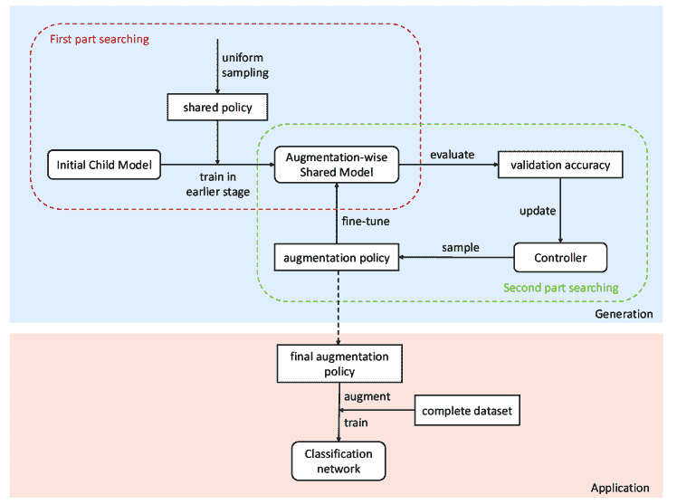
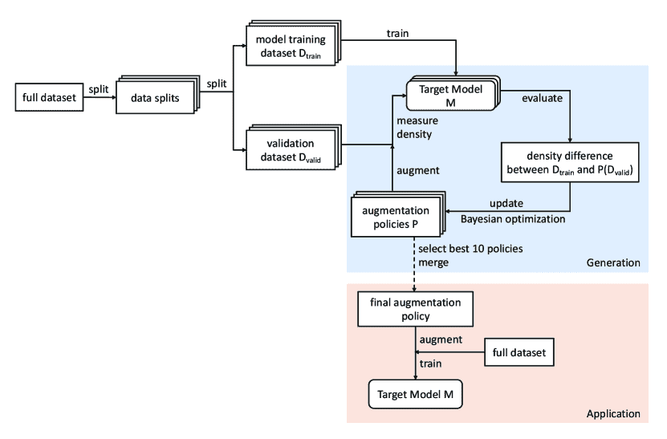
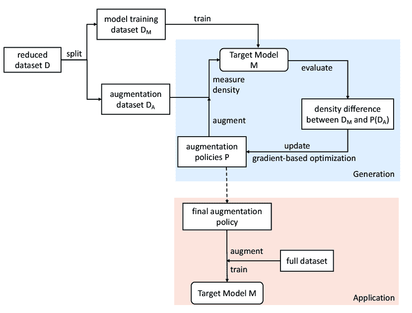
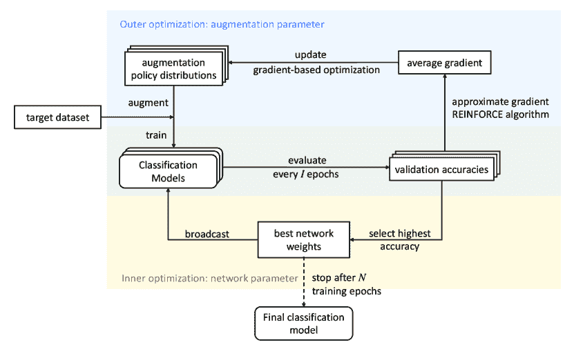

<!--yml

类别：未分类

日期：2024-09-06 19:45:37

-->

# [2206.06544] 深度学习图像分类任务的自动数据增强算法综述

> 来源：[`ar5iv.labs.arxiv.org/html/2206.06544`](https://ar5iv.labs.arxiv.org/html/2206.06544)

\jyear

2022

[1]\fnm 子涵 \sur 杨

[1]\orgdiv 工程与信息技术学院, \orgname 墨尔本大学, \orgaddress\street700 Swanston Street, \city 墨尔本, \postcode3010, \state 维多利亚, \country 澳大利亚

# 深度学习图像分类任务的自动数据增强算法综述

zihany1@student.unimelb.edu.au    \fnm 理查德·O. \sur 辛诺特 rsinnott@unimelb.edu.au    \fnm 詹姆斯 \sur 贝利 baileyj@unimelb.edu.au    \fnm 秋红 \sur 柯 qiuhong.ke@unimelb.edu.au *

###### 摘要

近年来，计算机视觉领域最受欢迎的技术之一是深度学习技术。作为一种数据驱动的技术，深度模型需要大量准确标记的训练数据，而这些数据在许多实际应用中往往无法获得。数据空间解决方案之一是数据增强（DA），它可以通过原始样本人工生成新的图像。图像增强策略因数据集而异，不同的数据类型可能需要不同的增强方法以促进模型训练。然而，DA 策略的设计在很大程度上由具备领域知识的人类专家决定，这被认为是高度主观且容易出错的。为了解决这一问题，一种新兴的方向是使用自动化数据增强（AutoDA）技术从给定的数据集中自动学习图像增强策略。AutoDA 模型的目标是找到能够最大化模型性能提升的最佳 DA 策略。本综述从图像分类的角度讨论了 AutoDA 技术出现的根本原因。我们确定了标准 AutoDA 模型的三个关键组件：搜索空间、搜索算法和评估函数。基于其架构，我们提供了现有图像 AutoDA 方法的系统分类。本论文介绍了 AutoDA 领域的主要工作，讨论了它们的优缺点，并提出了若干潜在的未来改进方向。

###### 关键词：

自动数据增强，深度学习，图像分类，大数据

## 1 引言

在神经网络架构的最新进展的推动下，深度学习在计算机视觉（Computer Vision，CV）领域取得了重大进展 krizhevsky2012imagenet；szegedy2015going；simonyan2014very；he2016deep。特别是，深度学习模型已成功应用于从医学成像 esteva2017dermatologist；shin2016deep 到农业 zheng2019cropdeep；kamilaris2018deep 等多个领域的图像分类任务。然而，为了实现更好的性能，深度学习作为一种数据驱动技术，对数据的数量和质量提出了较高要求。有效训练一个监督模型高度依赖大量标注数据，这对大多数实际应用来说通常是具有挑战性的 shijie2017research。

为了解决数据不足的问题，数据增强（Data Augmentation，DA）被广泛应用。一般来说，数据增强指的是通过人工生成数据样本来增加训练数据的规模 lemley2017smart。在成像领域，这通常通过应用图像变换函数（Transformation Functions，TFs），如平移、旋转或翻转来实现。对于计算机视觉任务，图像增强几乎在所有的监督神经网络架构中得到应用，以增加数据的量和多样性，包括传统的数据驱动模型 cirecsan2010deep；dosovitskiy2015discriminative；graham2014fractional；sajjadi2016regularization，以及少样本/零样本学习 rios2018few。除了监督学习方法，DA 技术也广泛应用于无监督学习领域。例如，对比自监督学习依赖于图像变换，在不同的增强方式下在表示空间中引入数据不变性 bachman2019learning。

在图像增强的背景下，DA 策略指的是一组图像操作，用于变换图像数据。在应用图像 DA 时，选择一个精心设计的增强方案（即 DA 策略）是必要的，以提高 DA 的效果，从而提升相关网络训练的效果 krizhevsky2012imagenet ; paschali2019data 。例如，由随机图像操作增强的数据可能会冗余。但过于激进的 TF 可能会破坏原始语义，并向训练数据集引入潜在偏差 graham2014fractional 。因此，不同的数据集或领域可能需要不同类型的增强。具体来说，当应用标准的监督方法时，分类任务中的有限数据可能需要保持标签的增强，以提供直接的语义监督。然而，对于少样本/零样本学习模型，更加注重提高数据多样性，以生成更丰富的训练集 wang2020generalizing ，这可能促进更激进的增强 TF。

尽管 DA 技术无处不在且重要，但在给定特定数据集时，DA 策略设计中的选择策略仍然很少。与已经被彻底探索的其他机器学习主题不同，寻找有效的 DA 策略以便于特定数据集并提高模型准确性关注较少。相反，DA 策略通常是基于过去的经验或有限的试验直观决定的 dao2019kernel 。关于增强策略的决策仍由人类专家基于先前知识做出。例如，ImageNet 数据上的标准增强策略是在 2012 年提出的 krizhevsky2012imagenet 。这一策略在大多数现代网络中仍被广泛使用，几乎没有修改 cubuk2019autoaugment 。此外，由于给定任务的性质，不同数据集上选择好的增强方法的标准可能大相径庭。基于训练损失或准确率的传统试错方法可能会产生大量冗余数据，浪费计算资源和努力。

受到自动化机器学习（AutoML）进展的激励，自动从训练数据中搜索有效的增强策略的兴趣不断上升 cubuk2019autoaugment ; lim2019fast ; hataya2020faster ; ho2019population 。这种技术通常被称为自动化数据增强（AutoDA）。最近的研究发现，与其手动设计数据增强（DA）方案，不如直接从目标数据集中学习 DA 策略，这有可能显著提升模型性能 lemley2017smart ; tran2017bayesian ; devries2017dataset ; zoph2020learning 。具体而言，能够在分类模型上带来最大性能提升的 DA 策略被认为是给定数据集的最佳增强策略。在各种现代工作中，AutoAugment (AA) 脱颖而出，成为第一个 AutoDA 模型，在多个流行的图像分类数据集上取得了最先进的结果，包括 CIFAR-10/100 krizhevsky2009learning 、ImageNet deng2009imagenet 和 SVHN netzer2011reading 。更重要的是，AA 为后续支持自动化增强的工作提供了重要的理论基础 lim2019fast ; ho2019population ; hataya2020faster ; tian2020improving ; cubuk2020randaugment 。

自动化 DA 策略搜索的进展可能会改变现有的模型训练过程。AutoDA 模型可以自动选择最有效的增强变换组合以形成最终的 DA 策略。一旦找到最佳的增强策略，利用所学策略增强的训练集可以在无需额外输入的情况下显著提升模型性能。此外，AutoDA 方法可以设计为直接应用于感兴趣的数据集。从数据中学习到的最佳 DA 策略被视为目标任务的最佳增强公式，因此它应当保证最佳的模型性能。AutoDA 技术的另一个可取之处是其可迁移性。根据 cubuk2019autoaugment 的发现，学习到的 DA 策略也可以应用于其他类似数据集，并取得令人满意的结果。

尽管在 DA 策略搜索方面取得了相当大的进展，但仍缺乏全面的调查来系统总结各种方法。据我们所知，尚无对现有 AutoDA 方法进行定性比较或提供系统评估其优缺点的研究。为填补这一空白，本文旨在识别自动化数据增强（AutoDA）领域的研究现状，尤其是针对图像分类任务。

本文主要回顾了成像领域的当代 AutoDA 工作。我们提供了系统的分析，识别了标准 AutoDA 技术的三个关键组成部分，即搜索空间、搜索算法和评估函数。基于审查工作中对搜索算法的不同选择，我们提出了所有 AutoDA 方法的两层分类法。我们还评估了 AutoDA 方法在搜索算法效率以及训练分类模型的最终性能方面。通过比较分析，我们识别了这些方法的主要贡献和局限性。最后，我们总结了几个主要挑战，并提出了 AutoDA 领域的潜在未来方向。

我们的主要贡献可以总结如下：

1.  [1.]

1.  1.

    图像数据增强的背景，包括传统方法和自动数据增强（AutoDA）模型（第二部分）；

1.  2.

    标准 AutoDA 模型中的三个关键组成部分的介绍，以及大多数工作中使用的评估指标和基准（第三部分）

1.  3.

    从超参数优化的角度对主流 AutoDA 算法进行的层级分类（第四部分）；

1.  4.

    对分类法中的每种 AutoDA 方法进行了全面审查，详细描述了应用的搜索算法（第 5 和第六部分）；

1.  5.

    关于当前 AutoDA 技术的状态讨论，以及未来存在的挑战和潜在机会（第七部分）。

## 2 背景

本节介绍了计算机视觉领域数据增强的背景信息，重点是图像分类任务。我们首先提供了数据增强技术的发展和应用于计算机视觉任务的一般概述。然后简要描述了大多数 AutoDA 模型涉及的几种传统图像处理操作。最后，我们讨论了 AutoDA 技术的最新进展以及这些技术与自动化机器学习（AutoML）的关系。

### 2.1 图像数据增强的历史概述

早期图像增强技术的应用可以追溯到 LeNet-5 lecun1998gradient，在这里使用了一种数据增强（DA）技术，通过扭曲图像来识别手写和机器打印字符。这项工作是最早使用 DA 进行图像分类任务的预训练卷积神经网络（CNN）之一。通常，DA 可以被视为一种过采样方法。过采样的目标是通过增加数据样本来减轻有限数据或类别不平衡的负面影响。一种简单的过采样方法是随机过采样，它会随机复制少数类中的数据点，直到达到所需的数据量或数据分布。然而，通过这种技术创建的重复图像可能导致模型过度拟合到少数类。当使用深度学习技术时，这个问题变得更加显著。为了给生成的样本增加更多的变化，通过图像变换的数据增强技术应运而生。

图像数据增强最早的著名案例是 AlexNet 模型 krizhevsky2012imagenet。AlexNet 通过使用革命性的 CNN 架构显著改善了在 ImageNet 数据上的分类结果 deng2009imagenet。在他们的工作中，使用了图像增强来人为扩展数据集。多种图像操作被应用于原始训练集，包括随机裁剪、水平翻转和在 RGB 空间中的颜色调整。这些转换函数有助于减轻模型训练中的过拟合问题。根据 krizhevsky2012imagenet 中的实验结果，图像数据增强将最终的错误率减少了约 $1\%$。从那时起，图像增强被视为在训练复杂的 CNNs（从 VGG simonyan2014very 到 ResNet he2016deep 和 Inception szegedy2016rethinking ）之前必要的预处理程序。

图像增强不仅限于基本的图像处理。在 goodfellow2014generative 提出生成对抗网络（GAN）后，相关工作在接下来的十年中蓬勃发展。其中，最具影响力的技术是神经架构搜索（NAS） zoph2016neural。NAS 是一种 AutoML 技术，旨在通过自动化搜索模型架构。NAS 的进步极大推动了图像领域 DA 技术的发展。从 NAS 和 AutoML 中获得的概念和技术在计算机视觉（CV）社区中获得了越来越多的关注。近期进展包括神经增强 perez2017effectiveness，测试 GAN 在图像增强中的有效性；智能增强 lemley2017smart，使用神经网络生成合成图像数据；以及 AA cubuk2019autoaugment，旨在自动化图像变换选择以用于 DA。这项工作为 AutoDA 奠定了基础，也是本综述的重点。

之前提到的大多数增强方法是为图像分类设计的。图像 DA 在分类任务中的终极目标是提高判别模型的预测准确性。然而，相同的技术也适用于其他计算机视觉任务，例如目标检测（OD），在这种情况下，图像增强可以与包括 YOLO redmon2016you 和 R-CNN 系列 girshick2014rich ; girshick2015fast ; ren2015faster 等先进的深度神经网络相结合。语义分割任务 long2015fully 也可以从 DA 中受益，在训练复杂网络如 U-Net ronneberger2015u 之前。在这项研究中，我们特别关注自动化 DA（AutoDA）在图像分类任务中的应用，因为这个领域存在更多已发布的数据集，允许进行公平评估。对于一些 AutoDA 方法，我们还讨论了如果有实验结果可用，将其应用于目标检测任务的可能性。

### 2.2 传统图像增强技术

图像增强旨在提高数据集的数量和质量，以便更好地训练神经网络 shorten2019survey。通常，数据增强通过两种方式实现：一种是传统图像操作，另一种是基于深度学习技术。传统增强通常强调保留图像的原始标签，并将现有图像转化为新的形式 shorten2019survey。这种方法可以通过各种图像处理方法实现，包括但不限于几何变换、色彩空间调整或它们的组合。

另一种基于深度学习的增强技术试图生成合成图像作为训练集。主要技术包括 Mixup 增强 zhang2017mixup、生成对抗网络（GANs）以及特征空间中的变换 devries2017dataset。由于深度学习数据增强的复杂性，最近的自动数据增强方法仅考虑了基本的图像处理操作。因此，我们专注于可以轻松参数化的基本图像变换。本节其余部分简要介绍了通常在自动数据增强模型中考虑的几种基本图像处理功能，包括几何变换、翻转、旋转、裁剪、颜色调整和核过滤器。此外，还介绍了另外两种增强算法，因为它们出现在 AutoAugment 工作中 cubuk2019autoaugment，即 Cutout devries2017improved 和 SamplePairing inoue2018data。

#### 2.2.1 几何变换

开始图像增强的最简单方法是使用几何变换函数，如图像平移或缩放。这些操作易于实现，并且可以与其他变换结合形成更高级的数据增强算法。应用这些操作时，一个重要的方面是它们是否能在变换后保留原始图像标签 bagherinezhad2018label。从图像增强的角度来看，保持标签一致性的能力也可以称为变换函数的安全特性 shorten2019survey。换句话说，可能会破坏注释信息的变换被认为是不安全的。一般而言，几何变换倾向于保留标签，因为它们只是改变了关键特征的位置。然而，取决于变换函数的大小，所选操作的应用可能并不总是安全的。例如，高幅度的 $y$ 轴平移可能会将感兴趣的对象完全移出可见区域，因此无法保留后处理图像的标签。

#### 2.2.2 旋转

以给定角度旋转图像是另一种常见的数据增强技术。这是一种特殊的几何变换类型，也有可能会从可见区域中去除有意义的语义信息。对于具有较大旋转角度的激进操作，通常是不安全的，特别是对于与文本相关的数据，例如 SVHN 数据中的 ”6” 和 ”9” netzer2011reading。然而，根据 shorten2019survey 的研究，在 $1^{\circ}$ 到 $30^{\circ}$ 范围内的轻微旋转对大多数图像分类任务是有帮助的。

#### 2.2.3 翻转

翻转不同于旋转增强，因为它生成的是镜像图像。翻转可以是水平或垂直的，前者在计算机视觉中更为常用 shorten2019survey。这是一种简单但非常有效的图像数据增强技术，尤其适用于 CIFAR-10/100 krizhevsky2009learning 和 ImageNet deng2009imagenet。翻转的安全性主要取决于输入数据的类型。对于普通分类或目标检测任务，翻转增强能保持原始标签。但是，对于涉及数字或文本的数据，如 SVHN 数据 netzer2011reading，翻转可能会不安全。

#### 2.2.4 裁剪

裁剪不仅是基本的数据增强方法，也是当输入数据中的图像样本大小不一时，训练前的重要预处理步骤。在输入模型之前，训练数据需要裁剪为统一的 $x\times y$ 尺寸，以便进行后续的矩阵计算。作为一种增强技术，裁剪与几何平移有类似的效果。这两种增强方法都移除了原始图像的一部分，而图像平移保持输入和输出图像的相同空间分辨率。相比之下，裁剪会减少处理后图像的大小。如前所述，裁剪的安全性可能会因其相关的幅度值而有所不同。激进的操作可能会裁剪掉可区分的特征，影响标签一致性，而合理的幅度值有助于提高训练数据的质量。

#### 2.2.5 色彩调整

在色彩空间中调整数值是另一种常见的实际增强策略。通过单色通道的值抖动，可以快速获得图像的不同色彩表现。这些 RGB 值也可以通过矩阵操作来模拟不同的光照条件。或者，可以应用自定义规则在像素值上实现转换，例如使用 Python 图像库（PIL）中的 Solarize、Equalize、Posterize 函数 umesh2012image。与之前的数据增强变换不同，色彩调整保留了输入图像的原始大小和内容。然而，它可能会丢弃一些色彩信息，从而可能引发安全问题。例如，如果色彩是对象的区分特征，当操控色彩值时，对象的独特颜色可能难以观察，从而混淆模型。色彩变换的幅度再次是决定其安全性的重要因素。

#### 2.2.6 核滤镜

与直接改变颜色空间中的像素值不同，可以通过核滤波器进行操作。这是计算机视觉领域中广泛使用的图像处理技术。滤波器通常是一个自定义数字的矩阵，其尺寸远小于输入图像。根据矩阵中的元素值，核滤波器可以提供各种功能。最常见的核滤波器包括模糊和锐化。要将核滤波器应用于输入图像，我们将其视为一个滑动窗口，滚动它遍历整个图像，以通过矩阵乘法获得最终输出的像素值。高斯核可以对滤波后的图像产生模糊效果，这可以更好地为模型准备低质量、分辨率有限的图像。相反，锐化滤波器强调图像中的细节，这有助于模型获得更多关于关键特征的信息。

#### 2.2.7 Cutout

除了简单的变换，另一个有趣的增强技术是 Cutout devries2017improved。Cutout 的灵感来源于 dropout 正则化的概念，该方法是在输入数据上执行，而不是在神经网络中的嵌入单元上 zhong2020random。该算法专门为物体遮挡问题设计。当物体的某些部分模糊或被其他不相关的物体遮挡时，就会发生遮挡，此时只能对物体进行部分观察。这在现实世界中尤其常见。Cutout 增强通过从原始图像中随机裁剪出一小块来模拟遮挡情况，从而应对这一问题。在这样的变换数据上进行训练，模型被迫从整体上学习，而不是仅仅从图像的某一部分学习，这增强了模型区分物体特征的能力。Cutout 算法的另一个便捷特性是，它可以与其他图像增强方法（如几何变换或颜色变换）一起应用，以生成更多样化的训练数据。

#### 2.2.8 SamplePairing

SamplePairing inoue2018data 是一种复杂的增强算法示例，它结合了几种简单的变换。它通过从训练集中随机选择两个数据样本并将它们混合来创建一张全新的图像。在标准的 SamplePairing 中，这种组合是通过计算两个样本中像素值的平均值来完成的。生成图像的标签遵循第一张图像，并忽略输入对中第二个样本的注释。SamplePairing 增强的一个优点是它可以通过简单的排列从大小为 $N$ 的数据集中创建多达 $N^{2}$ 个新的数据点。SamplePairing 是一种直接的增强方法，可以生成源数据之外的合成数据点。数据数量和多样性的增加显著提升了模型性能，并避免了模型过拟合的问题。这种技术对于训练数据有限的计算机视觉任务特别有帮助。

### 2.3 自动化数据增强 (AutoDA) 的发展

在各种图像增强操作可用的情况下，问题是如何从这些变换中选择一个有效的 DA 策略用于 CV 任务。一个简单的解决方案是应用随机增强，生成大量的变换数据用于训练。然而，如果没有对增强 TF 的类型和幅度进行适当控制，增强的数据点可能只是简单的重复，甚至可能在语义上出现损坏，从而导致性能损失。此外，过度增强的数据可能在模型训练过程中需要过多的计算资源，导致效率问题。因此，需要一个系统化的选择策略来确定 DA 策略。DA 策略是指各种图像失真函数的组合，可以应用于训练数据进行数据增强。

尽管对 DA 转换进行了广泛研究，选择给定的增强策略通常依赖于人工专家。特别是在计算机视觉（CV）任务的背景下，关于使用哪些图像操作的决策主要由机器学习工程师根据过去的经验或领域知识做出。因此，给定 DA 策略的最优强度具有很强的任务特异性。例如，几何和颜色转换通常用于标准分类数据集，包括 CIFAR-10/100 krizhevsky2009learning 和 ImageNet deng2009imagenet 。而调整大小和弹性形变则在数字图像如 MNIST sato2015apac ; simard2003best 和 SVHN netzer2011reading 数据集上更为流行。对于所有类型的 CV 任务，没有统一的增强策略。在大多数情况下，DA 策略需要根据先验知识手动选择。然而，深度学习中的人工努力通常被认为存在偏见和易出错。没有理论证据支持最优的人为决定 DA 策略。手动搜索能够实现最佳模型性能的最优 DA 策略是不现实的。此外，如果没有先进的机器学习技术的帮助，找到有效的 DA 策略必须依赖于多个实验的经验结果，这可能会耗费大量时间。

为了减少潜在的偏差并加快设计过程，人们越来越关注自动化选择数据增强（DA）策略。这种技术被称为自动化数据增强（AutoDA）。AutoDA 的发展受到神经架构搜索（NAS）zoph2016neural 的推动，该技术可以自动搜索最优的深度神经网络架构，而不是依赖人工方法。大多数 AutoDA 技术依赖于不同的搜索算法，以寻找给定数据集的最有效（最优）增强策略。在 AutoDA 的背景下，最优 DA 策略是能够带来最大性能提升和最高准确率的增强方案。

最早的 AutoDA 工作可以追溯到 2017 年的数据增强的变换对抗网络（TANDA）ratner2017learning。这是首次尝试根据提供的数据自动构建和调整 DA 策略。TANDA 中的参数化激发了 AutoAugment（AA）cubuk2019autoaugment 中搜索空间的设计，并为 AutoDA 领域提供了标准问题的表述。AA 使用强化学习（RL）进行增强搜索。在搜索过程中，增强策略通过递归神经网络（RNN）控制器进行采样，然后用于模型训练。AA 不是直接在目标数据上进行搜索，而是从原始训练集中创建一个子集作为代理任务。增强策略的评估也在简化的网络上进行，而不是最终的分类模型。不幸的是，即使在减少设置下，AA 的搜索也需要数千个 GPU 小时才能完成。

随着增强搜索空间的建立，效率问题已成为后续 AutoDA 工作的重点。快速 AutoAugment（Fast AA）lim2019fast 是原始 AA 最受欢迎的改进版本之一。Fast AA 不再使用 RNN，而是应用贝叶斯优化来采样下一个待评估的增强策略，从而大大降低了搜索成本。此外，Fast AA 首次使用密度匹配进行策略评估，这完全消除了重复训练的需要。另一种提高搜索效率的方法是通过并行计算。基于人群的增强（PBA）ho2019population 采用基于人群的训练来优化增强策略，同时使用目标数据的多个子集。PBA 中的搜索目标与以前的方法也略有不同。PBA 旨在找到模型训练中的动态调度，而不是静态策略。Fast AA 和 PBA 都大大减少了 AA 算法的复杂性，同时保持了相当的性能。然而，在这些模型中，尤其是面对大数据集或复杂模型时，仍然存在昂贵的搜索阶段，这不可避免地导致了效率低下。

为了进一步提升 AutoDA 模型的可扩展性，最近探索了如基于梯度的超参数优化等技术。基于梯度的 AutoDA 通常通过各种梯度近似器来估计增广超参数对模型性能的梯度。这个过程确保了超参数可以被区分，从而在模型训练过程中进行优化。对抗性 AutoAugment (AAA) zhang2019adversarial 和在线超参数学习 AutoAugment (OHL-AA) lin2019online 采用 REINFORCE 梯度估计器 williams1992simple 来实现梯度近似。其他梯度估计器在 AutoDA 中也适用。例如，DARTS liu2018darts 被应用于 Faster AutoAugment (Faster) hataya2020faster 和可微分自动数据增广 (DADA) li2020dada。使用与 Fast AA lim2019fast 相同的策略模型，OHL-AA 在模型训练过程中以在线方式优化增广策略。OHL-AA 没有单独的搜索阶段，而是采用了双层优化框架，在这个框架中，算法同时更新分类模型的权重和增广策略的超参数。这种方案显著减少了搜索时间。同样，AAA 中有两个优化目标，其中一个是最小化训练损失，另一个是最小化对抗性损失 zhang2019adversarial。在 AAA 中，这两个目标同时被优化，提供了一种计算上更为经济的解决方案。

尽管基于梯度的方法相较于传统的 AA 更为高效，这些方法仍然依赖于昂贵的策略搜索。双层设置也增加了模型训练阶段的复杂性。近年来，AutoDA 的进展旨在通过排除搜索的需要来进一步提高增强设计的效率。2020 年提出的 RandAugment (RA) cubuk2020randaugment 对经典的搜索空间进行了重新参数化。它用两个全局变量代替了每个变换的单独参数。在 RA 中进行简单的网格搜索以优化两个超参数。RA 的发现不仅表明传统的搜索阶段可能不是必需的，还指出使用代理模型进行的搜索可能是次优的。研究发现，DA 策略的有效性与模型和训练集的大小相关，这挑战了所有基于代理任务的先前方法。另一个不依赖于搜索的 AutoDA 模型是 UniformAugment (UA) lingchen2020uniformaugment。UA 通过不变性理论进一步简化了增强空间。作者假设了一个近似的不变增强空间。任何从该空间中抽样的增强策略都可能导致类似的模型性能，从而完全去除搜索阶段。尽管速度很有前景，但模型性能在这些无搜索方法中仍然是一个瓶颈。与之前的方法相比，这些方法都未能在模型准确性上取得显著进展。要在实践中应用 AutoDA 技术，还需要进一步的研究和实验。

## 3 自动化数据增强技术

本节旨在介绍自动化数据增强（AutoDA）技术的基本概念和术语。一般来说，在大多数工作中，寻找最佳 DA 策略被表述为一个标准的搜索问题 cubuk2019autoaugment ; ho2019population ; lim2019fast ; hataya2020faster ; lin2019online ; li2020dada。一个标准的 AutoDA 模型由三个主要组成部分构成：搜索空间、搜索算法和评估函数。在本节中，我们将讨论这三个组件的功能和相互关系。我们还描述了如何评估提出的 AutoDA 模型，包括基于直接和间接方法的两种不同评估方式。最后，我们介绍了几个常用的数据集和基准，用于比较分析。

### 3.1 关键组成部分

对于图像分类任务，AutoDA 模型的主要目标是使用从给定数据集中自动学习的最佳 DA 策略来实现最佳分类准确性。受到用于数据增强（TANDA）的变换对抗网络中的 DA 策略建模的启发 ratner2017learning，AutoAugment (AA) cubuk2019autoaugment 被认为是首个尝试自动化增强策略搜索的工作。AA 将 AutoDA 任务表述为一个搜索问题，并为搜索空间提供了基本参数化。AA 中的参数化在后来的 AutoDA 工作中被广泛采用，被视为事实上的标准 lim2019fast；ho2019population；wei2020circumventing。具体来说，标准 AutoDA 表述中有三个关键组件：

###### 定义 1（搜索空间）。

被视为 DA 策略的优化领域，其中定义了通过增强超参数的所有候选解决方案。

###### 定义 2（搜索算法）。

用于从搜索空间中检索增强策略，并根据评估函数返回的奖励信号来采样下一个搜索点。

###### 定义 3（评估函数）。

是通过分配奖励值来评估或排名采样的 DA 策略的过程。这通常依赖于分类模型的训练。

#### 3.1.1 搜索空间

搜索空间定义了如何形成用于后续搜索的 DA 策略。特别是对于图像分类任务，增强策略是指多个图像操作的组合，这可以通过增强超参数来描述。通常，一个完整的增强策略由多个子策略组成，每个子策略用于增强一个训练批次。一个子策略由几个基本图像变换函数（TFs）组成。增强策略通常由两个超参数进行参数化：应用概率和操作强度。概率描述了在输入图像上应用某一变换函数的概率，而强度决定了操作的强度。在 DA 策略中的每个 TF 都与一对概率和强度超参数相关联。根据搜索或优化算法的选择，搜索空间的表述可以大相径庭。例如，一些工作完全重新参数化搜索空间以减少搜索复杂度 cubuk2020randaugment；lingchen2020uniformaugment。然而，AA cubuk2019autoaugment 提出的 DA 策略参数化在后续工作中被广泛使用，几乎没有修改。

#### 3.1.2 评估函数

增强策略的评估从两个角度进行，包括有效性和安全性。前者特征强调数据增强对最终分类结果的影响，而安全性特征则关注于转换数据的标签保持情况。通常，增强的效果通过基于训练损失或准确率的分类模型性能来判断。这些程序也可以称为直接评估函数，因为数据增强策略的强度直接反映在这种增强策略能带来多少性能提升上。分类准确率越高，相关的数据增强策略越好。

另一种替代评估方法是间接方法，强调数据增强的安全性特征。检查数据增强策略的安全性通常依赖于密度匹配 lim2019fast。密度匹配的主要目标是将增强数据的分布与原始训练数据匹配。这种间接评估的基本思路是将转换后的图像视为输入数据的缺失数据点，从而提高分类模型的泛化能力。较小的密度差异表示数据分布的相似性更高，这可能导致更好的增强策略。使用密度匹配时，策略评估不需要反向传播模型训练。这些算法可以被视为 AutoDA 任务的间接评估函数。

### 3.2 整体工作流程

图 1：标准 AutoDA 模型的总体工作流程，包括三个关键组件。

这些组件之间的关系如图 1 所示。首先，AutoDA 模型为给定任务指定 DA 策略的参数化，提供有限数量的潜在解决方案供搜索和评估。在定义的搜索空间内，搜索算法会采样 DA 策略，并将候选策略传递给评估部分。在早期的 AutoDA 工作中，数据增强策略是逐一采样的 cubuk2019autoaugment ; naghizadeh2020greedy ，而后来方法倾向于采用多线程处理，采样多个候选策略并以分布式方式进行评估。这大大提高了搜索效率。在搜索算法选择 DA 策略后，会通过评估函数对其进行评分以计算奖励信号。每种增强策略都有一个奖励值，表示其在提高模型性能方面的有效性。最后，奖励信息用于更新搜索算法，指导下一次要评估的 DA 策略的采样。整个搜索递归过程在找到最佳策略后结束。这可以通过检查当前搜索点和前一个点之间的性能增益差异来确定。然而，停止标准可能导致过度搜索而几乎没有改进，特别是在后期阶段，从而浪费资源。在大多数实际实现的 AutoDA 算法中，搜索算法会在满足自定义停止条件时停止，例如在经过一定数量的搜索周期后 niu2019automatically ; lim2019fast ; ho2019population。

### 3.3 AutoDA 的两个阶段

标准 AutoDA 流程可以分为两个主要阶段：

###### 定义 4（生成阶段）。

是在给定特定数据集时生成最佳增强策略的过程。DA 策略通常通过一系列增强超参数来描述。通常，最终的 DA 解决方案是通过搜索或优化算法生成的，该算法从定义的搜索空间中采样各种候选策略，并依赖评估函数来评估搜索策略的有效性。

###### 定义 5（应用阶段）。

是应用生成阶段所学策略的过程。这是通过使用获得的 DA 策略来增强目标数据集，从而人为地增加数据的数量和多样性，然后在变换后的训练集上训练分类模型。

为了找到针对目标数据集的最佳增强策略，典型的 AutoDA 问题主要在策略生成阶段解决。这里的最佳 DA 策略特指能够在后期最大化分类模型准确性或最小化训练损失的超参数设置，即它可以在应用阶段最佳地解决分类任务。我们识别出一些在已发布研究中用于确定策略生成完成的标准：

1.  [1.]

1.  1.

    采样的 DA 策略可以帮助训练分类模型以达到最高的准确性分数；

1.  2.

    采样的 DA 策略可以提供与最优策略相当的性能增益；或者

1.  3.

    已完成一定数量的训练/搜索周期。

从理论上讲，策略生成阶段只有在达到第一个标准时才会结束，即采样策略被评估为给定数据集的最优增强策略。然而，彻底探索整个搜索空间以确定最佳 DA 策略通常是不切实际的。一个潜在的解决方案是为模型准确性或训练损失设置一个特定的阈值，以帮助决定策略是否最优。然而，在实际应用中，分类模型的数据增强的最优强度通常是未知的。因此，设置这样的阈值作为成功标准是有挑战的。

停止生成阶段的另一种策略是放宽最优标准。换句话说，如果采样的策略能够在模型性能上产生与最优 DA 策略相当的改进，那么它被视为最优。这一思想在许多现有的 AutoDA 研究中得到了广泛采用 lim2019fast ; gudovskiy2021autodo ; naghizadeh2020greedy ; naghizadeh2021greedy 。可以通过使用性能差异来实现。例如，如果采样策略与最佳奖励策略之间的性能增益差异小于某个值，那么这个策略可以被视为生成阶段的最终输出 naghizadeh2020greedy ; naghizadeh2021greedy 。一种更为流行的替代方法是使用密度匹配。密度匹配不是直接训练分类模型，而是比较原始数据与增强样本的分布/密度。密度匹配的假设是最优 DA 策略可以通过匹配给定数据的密度与转换后数据的密度，来最佳地推广分类模型 lim2019fast ; gudovskiy2021autodo。

在实践中，最常用的停止准则是手动决定搜索限制。一旦训练在一定数量的周期后完成，策略生成将被迫停止，并输出当前模型性能最好的 DA 策略。周期数量的选择通常取决于可用的计算资源以及任务的复杂性。对停止准则没有普遍的共识。

### 3.4 数据集

本节旨在提供所考虑方法中使用的数据集的简要概述。标注数据集通常用作基准，以便对不同的 AutoDA 算法和架构进行公平比较。此外，数据量的增长和应用场景的复杂性增加了挑战，导致不断发展出新的和改进的技术。

用于自动数据增强搜索任务的最常用数据集有：(i) CIFAR-10/100 krizhevsky2009learning ，(ii) SVHN netzer2011reading ，(iii) ImageNet russakovsky2015imagenet 。CIFAR 代表加拿大高级研究院。CIFAR-10 和 CIFAR-100 同名，因它们都用于 CIFAR 研究，而数字指定数据集中的总类别数。SVHN 代表街景房屋号码（SVHN）。ImageNet 用于 ImageNet 大规模视觉识别挑战（ILSVRC） russakovsky2015imagenet 。每个数据集的特点见表 1，其统计信息总结在表 2 中。

表 1：AutoDA 任务的数据集主要特征

| 数据集 | 类别 | 每类图像数 | 图像大小 | 年份 |
| --- | --- | --- | --- | --- |
| CIFAR-10 | 10 | 6,000 | $32\times 32$ | 2009 |
| CIFAR-100 | 100 | 600 | $32\times 32$ | 2009 |
| SVHN | 10 | 630,420 | $32\times 32$ | 2011 |
| ImageNet | varying¹¹1 完整的 ImageNet 数据集对于增强搜索来说过于庞大。相反，AutoDA 工作中通常使用 ImageNet 的裁剪子集，而这样的子集在每个工作中构建方式有所不同。 | varying¹¹1 完整的 ImageNet 数据集对于增强搜索来说过于庞大。相反，AutoDA 工作中通常使用 ImageNet 的裁剪子集，而这样的子集在每个工作中构建方式有所不同。 | varying¹¹1 完整的 ImageNet 数据集对于增强搜索来说过于庞大。相反，AutoDA 工作中通常使用 ImageNet 的裁剪子集，而这样的子集在每个工作中构建方式有所不同。 | 2009 |
| \botrule |  |  |  |  |

表 2：AutoDA 任务的数据集统计信息

|  | 图像数量 | 每类图像数量 |
| --- | --- | --- |
| 数据集 | 训练 | 测试 | 额外¹¹1 额外集由与训练数据相同类型的标注图像组成，但质量稍低。这些数据通常用作模型的额外训练样本。额外集仅在 SVHN 数据中可用 netzer2011reading 。 | 训练 | 测试 | 额外¹¹1 额外集由与训练数据相同类型的标注图像组成，但质量稍低。这些数据通常用作模型的额外训练样本。额外集仅在 SVHN 数据中可用 netzer2011reading 。 |
| --- | --- | --- | --- | --- | --- | --- |
| CIFAR-10 | 50,000 | 10,000 | - | 5,000 | 1,000 | - |
| CIFAR-100 | 50,000 | 10,000 | - | 500 | 100 | - |
| SVHN | 73,257 | 26,032 | 531,131 | 5,000 - 14,000 | 1,800 - 5,000 | 35,000 - 90,000 |
| \botrule |  |  |  |  |  |  |

CIFAR 和 ImageNet 数据集是在同一年发布的，均提供标准图像分类任务，且在计算机视觉研究中广泛使用。然而，ImageNet 在规模和多样性上远大于 CIFAR 系列。原始 ImageNet 数据集中有超过 $5,000$ 个不同类别，共有 $3.2$ 百万张经过手工标注的图像 deng2009imagenet 。对于 AutoDA 搜索问题，庞大的 ImageNet 数据量可能需要大量的计算资源。在实践中，通常无法对完整的 ImageNet 进行训练。相反，通常更适合使用一个较小的 ImageNet 子集来进行目标任务。此外，不同类别之间的实例分布也可能变化很大，这可能降低 AutoDA 模型的性能。为了解决这些问题，每个使用 ImageNet 数据进行实验的 AutoDA 工作都使用独特的修剪方法来设置一个较小、更干净的子集以进行模型评估。然而，由于数据的多样性和类别分布的不平衡，与其他数据集（用于增强搜索）相比，分类 ImageNet 子集仍被认为是相对困难的任务。在 AutoDA 工作中，减少的 ImageNet 数据集有不同的构建方式，具有不同的大小和类别数量。每个数据集将会在它们被使用的工作中进行描述。

CIFAR 系列包含的类别要少得多，其编号为 krizhevsky2009learning。CIFAR-10 数据集总共包含$60,000$张$32\times 32$彩色图像。CIFAR-10 中各类别的数据分布更加控制和统一。$60,000$张图像均匀分布在$10$个类别中，每个类别提供$6,000$张图像。训练集和测试集的数据划分比例为$5:1$。在 CIFAR-10 数据集中，测试批次包含$10,000$张图像，从整个数据集中随机选择，但每个类别正好包含$1,000$张图像。训练集包含剩余的$50,000$个实例。CIFAR-100 数据集的构成与 CIFAR-10 类似，只是 CIFAR-100 中有$100$个类别，每个类别包含$600$张图像。训练集和测试集的比例也是$5:1$，每个类别提供$500$张训练图像和$100$张测试图像。由于数据分布更为平衡且类别数量有限，CIFAR 数据通常更适合用于基准测试提出的 AutoDA 算法。

SVHN 指的是街景房号数据集。它同样是从实际场景中收集的，广泛用于深度学习相关研究。与 MNIST 数据 lecun1998gradient 类似，SVHN 中的图像也是数字，裁剪自 Google 街景图像中的房号 netzer2011reading。SVHN 的主要任务是识别自然场景图像中的数字。总共有$10$个类别，每个类别表示一个数字，例如，数字 1 的标签为 1。在 SVHN 中，训练集有$73,257$个数字，测试集有$26,032$个数字，还有$531,131$个额外数据项可以用作额外的训练数据。与之前的数据集相比，SVHN 特别强调数字和数字的图像。这可能揭示了 DA 选择策略与数据类型之间的关系。然而，与 CIFAR 不同的是，SVHN 的类别间数据分布存在偏差。数据中 0 和 1 的数字较多，导致训练集和测试集中类别分布不均。如表 2 所示，对于 SVHN，每个类别的图像数量从$5,000$到$14,000$不等。这种不平衡被认为是从不同角度更好地评估 AutoDA 模型的挑战。

## 4 图像 AutoDA 方法的分类

表格 3 显示了 AutoDA 领域主要工作的总结。列“关键技术”描述了每个 AutoDA 模型中采用的最重要技术，用于制定增强搜索问题。这些方法通常借用自其他 ML 相关领域，如 NAS 或超参数优化。策略优化器指示在搜索过程中用于优化或更新增强策略的算法或控制器。这些 AutoDA 方法根据使用学习到的 DA 策略解决分类任务所涉及的阶段，分为两种主要类型，即单阶段或双阶段。此外，从超参数优化的角度，这些方法可以进一步分为三类：基于梯度的、无梯度的和无搜索的。表格 3 提供了一个分类，展示了每种方法使用的基础优化算法。

根据 AutoDA 模型的两个阶段的应用序列，我们将所有现有工作分为两个主要类别：单阶段方法和双阶段方法。双阶段方法分别进行生成和应用。在典型的双阶段方法中，根据第一阶段的任务数据集生成最佳增强策略。之后，将学到的增强策略应用于训练集，以训练判别模型。使用双阶段算法时需要两个独立的阶段。单阶段方法通过使用梯度近似方法将生成和应用结合在一起。通过估计 DA 策略相对于模型性能的梯度，单阶段方法能够同时优化增强策略和分类模型。因此，它们可以通过一次运行获得最终结果和训练好的模型。这些算法通常比传统的双阶段方法具有更好的效率。

\sidewaystablefn

表 3：图像分类任务中主要 AutoDA 研究的总结表

|  |  |  | 基于两个阶段应用序列的分类。单阶段方法中，策略生成和应用同时进行，而双阶段方法中，策略生成和应用是顺序进行的。 | 策略优化 ³³3 分类基于策略优化类型。无梯度方法在不近似策略超参数梯度的情况下优化增强策略。基于梯度的方法估计这些梯度以进行策略优化。无搜索方法重新参数化搜索空间以排除搜索的需要。 |
| --- | --- | --- | --- | --- |
| 方法 | 关键技术 | 策略优化器¹¹策略优化器是 AutoDA 模型在策略生成阶段用于更新增强策略的算法或控制器。 | 两阶段 | 单阶段 | 无梯度 | 有梯度 | 无搜索 |
| TANDA⁴⁴4 数据增强的变换对抗网络 ratner2017learning | 生成 | 长短期记忆 | $\checkmark$ |  | $\checkmark$ |  |  |
| 对抗网络 | 记忆网络 |  |  |  |  |  |
| AA⁵⁵5 自动增强 cubuk2019autoaugment | 强化 | 循环神经 | $\checkmark$ |  | $\checkmark$ |  |  |
| 学习（RL） | 网络控制器 |  |  |  |  |  |
| AWS⁶⁶6 增强方法-明智的权重共享 tian2020improving | 权重共享; | 近端策略 | $\checkmark$ |  | $\checkmark$ |  |  |
| RL | 优化 |  |  |  |  |  |
| \botrule |  |  |  |  |  |  |  |

\sidewaystablefn

表 3:（续）

|  |  |  | 阶段²²脚注标记: 2 | 策略优化³³脚注标记: 3 |
| --- | --- | --- | --- | --- |
| 方法 | 关键技术 | 策略优化器¹¹脚注标记: 1 | 两阶段 | 单阶段 | 无梯度 | 有梯度 | 无搜索 |
| GAA⁷⁷7 贪婪自动增强 naghizadeh2020greedy ; naghizadeh2021greedy | 贪婪广度 | 广度优先 | $\checkmark$ |  | $\checkmark$ |  |  |
| 首次搜索 | 搜索 |  |  |  |  |  |
| PBA⁸⁸8 基于人口的增强 ho2019population | 基于人口 | 截断 | $\checkmark$ |  | $\checkmark$ |  |  |
| 训练 | 选择 |  |  |  |  |  |
| 快速 AA⁹⁹9 快速自动增强 lim2019fast | 密度匹配; | 贝叶斯 | $\checkmark$ |  | $\checkmark$ |  |  |
| RL | 优化 |  |  |  |  |  |
| PAA¹⁰¹⁰10 补丁自动增强 lin2021local | 多智能体 | 优势演员 | $\checkmark$ |  | $\checkmark$ |  |  |
| RL | 评论算法 |  |  |  |  |  |
| AA-KD¹¹¹¹11 带知识蒸馏的自动增强 wei2020circumventing | 知识 | - | $\checkmark$ |  | $\checkmark$ |  |  |
| 蒸馏 |  |  |  |  |  |  |
| \botrule |  |  |  |  |  |  |  |

\sidewaystablefn

表 3:（续）

|  |  |  | 阶段²²脚注标记: 2 | 策略优化³³脚注标记: 3 |
| --- | --- | --- | --- | --- |
| 方法 | 关键技术 | 策略优化器¹¹脚注标记: 1 | 两阶段 | 单阶段 | 无梯度 | 有梯度 | 无搜索 |
| 更快的 AA¹²¹²12 更快的自动增强 hataya2020faster | 梯度估计; | 随机 | $\checkmark$ |  |  | $\checkmark$ |  |
| 密度匹配 | 梯度下降 |  |  |  |  |  |
| RA¹³¹³13 随机增强 cubuk2020randaugment | 搜索空间 | 网格搜索 | $\checkmark$ |  |  |  | $\checkmark$ |
| 重新参数化 |  |  |  |  |  |  |
| UA¹⁴¹⁴14 均匀增强 lingchen2020uniformaugment | 增强 | 均匀 | $\checkmark$ |  |  |  | $\checkmark$ |
| 不变性 | 采样 |  |  |  |  |  |
| OHL-AA¹⁵¹⁵15 在线超参数学习用于自动增强 lin2019online | 梯度估计 | 随机 |  | $\checkmark$ |  | $\checkmark$ |  |
|  | 梯度下降 |  |  |  |  |  |
| Adv AA¹⁶¹⁶16 对抗性 AutoAugmentzhang2019adversarial | 梯度估计； | 循环 |  | $\checkmark$ |  | $\checkmark$ |  |
| 对抗学习 | 神经网络 |  |  |  |  |  |
| \botrule |  |  |  |  |  |  |  |

\sidewaystablefn

表 3:（续）

|  |  |  | 阶段²²脚注标记: 2 | 策略优化³³脚注标记: 3 |
| --- | --- | --- | --- | --- |
| 方法 | 关键技术 | 策略优化器¹¹脚注标记: 1 | 两阶段 | 一阶段 | 无梯度 | 基于梯度 | 无搜索 |
| DADA¹⁷¹⁷17 可微分自动数据增强 li2020dada | 无偏 | 随机 |  | $\checkmark$ |  | $\checkmark$ |  |
| 梯度估计器 | 梯度下降 |  |  |  |  |  |
| AutoDO¹⁸¹⁸18 自动数据集优化 gudovskiy2021autodo | 梯度估计； | 随机 |  |  |  |  |  |
| 损失重标定； | 梯度下降 |  | $\checkmark$ |  | $\checkmark$ |  |
| 软标记 |  |  |  |  |  |  |
| \botrule |  |  |  |  |  |  |  |

### 4.1 两阶段方法

在成像领域将 AutoDA 应用于判别任务时涉及两个步骤。通常，AutoDA 模型首先搜索最佳的数据增强策略，然后将获得的策略应用于目标数据进行模型训练。由于搜索和训练是分开的过程，这种方法在本文中被描述为两阶段方法。典型（两阶段）方法的一般框架如图 2 所示。在第一阶段，给定特定的数据集，搜索算法寻找最佳的图像转换函数组合，也称为 DA 策略。一旦通过评估函数确定了最佳策略或搜索达到给定的时间限制，生成阶段结束。在第二阶段，学习到的策略应用于目标训练集——理想情况下，还包括增加数量和有针对性的多样性的数据。然后将增强后的训练样本输入到分类模型中进行最终训练。

图 2: 两阶段 AutoDA 方法的总体框架。

用于寻找数据增强最佳方案的算法已经在广泛的现有工作中得到了探讨。我们根据问题的公式化将它们分为三类。一些工作将增强搜索视为标准的无梯度优化问题 ratner2017learning ; cubuk2019autoaugment ; ho2019population ; lim2019fast ; tian2020improving ; naghizadeh2020greedy ; wei2020circumventing ，而其他方法则从梯度角度入手，通过各种梯度近似算法来处理 hataya2020faster 。其他选项则通过重新参数化整个 AutoDA 问题的方式来消除搜索需求，即所谓的无搜索方法。

#### 4.1.1 无梯度方法

无梯度方法通过模型超参数优化在没有梯度近似的情况下搜索最佳的增强策略参数。从直观上看，这种优化可以通过为每个超参数选择几个值，完成每个组合在目标任务上的模型训练，然后使用所有超参数值计算模型性能评估指标来实现。第一次尝试自动化这种搜索过程的是用于数据增强的变换对抗网络（TANDA） ratner2017learning ，其核心利用了生成对抗网络（GAN）架构。生成器的目标是提出适当的任意增强操作序列，然后将其发送给判别器进行效果评估。在 hu2019learning 中的问题公式化促使深度学习社区探索其他方法，如 AA cubuk2019autoaugment 。AA 继承了 lemley2017smart 中的增强序列建模，但基于强化学习（RL）应用了不同的策略。通过递归神经网络（RNN）控制器采样几个可能的增强策略，然后通过训练简化的子模型而不是给定的分类模型来进行评估。尽管在模型改进方面表现出色，AA 仍有一个不可忽视的限制，即效率极低。在 ImageNet 数据集上完成一次搜索可能需要高达$15,000$ GPU 小时。即使在最小的 CIFAR-10 数据集上，AA 仍需要数千个 GPU 小时来完成一次运行。

后续的大多数研究工作旨在提高效率和降低计算成本。例如，tian2020improving 利用了一种类似的强化学习方法，但通过共享来自早期阶段的相同增强参数稍微修改了搜索过程。这种自动增强技术可以通过应用先进的进化算法，如基于种群的训练（PBT）jaderberg2017population，得到进一步改进。一些简单的搜索算法也被发现对加速第一阶段有利。例如，naghizadeh2020greedy；naghizadeh2021greedy 用传统的贪婪宽度优先搜索算法替代了原始的 RNN 控制器，从而简化了过程，并降低了整体计算成本。除了搜索算法的选择，评估函数的修改也可以大大减少计算需求。一个在这一方向上具有里程碑意义的工作是快速自动增强（Fast AA）lim2019fast，它利用了可变核密度 terrell1992variable 并提出了一种高效的密度匹配算法作为替代。在 AutoDA 的背景下，数据密度代表数据的总体分布。密度匹配通过比较原始训练集和转换数据的分布来评估 DA 策略，而不是训练分类模型。这些算法消除了重新训练模型的需要，从而显著提高了效率。

另一种方法是关注学习到的增强策略的有效性或精度。上述所有方法都侧重于搜索阶段的资源和时间消耗。在分类准确性提升方面进展不大。为填补这一空白，lin2021local 提出了更精细化的 Patch AutoAugment（PAA）技术，该技术优化了针对图像局部区域的增强转换，而不是整个图像。网络架构搜索（NAS）领域的其他先进方法有助于提高增强精度。其中一个例子是知识蒸馏（KD）hinton2015distilling，如在 wei2020circumventing 中所使用。

#### 4.1.2 基于梯度的方法

与无梯度算法相比，近似超参数梯度的算法称为基于梯度的优化。目前唯一基于梯度的两阶段方法是 Faster AutoAugment（Faster AA）hataya2020faster。与之前的方法相比，包括 AutoAugment cubuk2019autoaugment、Fast AA lim2019fast 和 PBA ho2019population，Faster AA 在图像分类任务中实现了更高效的增强搜索。Faster AA 的作者采用了一种创新的梯度近似方法，即 Relaxed Bernoulli 分布 jang2016categorical，以放宽超参数的非可微分分布，并将其梯度作为输入传递给标准优化算法。因此，连续的两个阶段可以在一次通过中完成。Faster AA 模型联合优化增强策略的超参数（即生成阶段）和分类模型的权重（即应用阶段）。与以前的算法相比，策略搜索空间的简化显著降低了搜索成本，同时保持了性能。需要强调的是，在 Faster AA 搜索过程中训练的模型实际上会在后期被弃用。为了获得最终的分类结果，需要将学习到的策略应用于再次训练目标分类模型。因此，Faster AA 方案中仍涉及两个阶段。

#### 4.1.3 无需搜索

尽管上述方法有其优势，但标准的两阶段 AutoDA 方法的附加复杂性可能需要高昂的计算资源，例如 cubuk2019autoaugment 中的原始实现。后续工作主要旨在加速搜索成本 lim2019fast；ho2019population 和利用梯度近似 hataya2020faster。然而，这些方法仍需要昂贵的搜索阶段，这通常依赖于简化的代理任务来缓解效率问题。这个设置假定基于代理任务学习到的 DA 策略可以转移到更大的目标数据集。然而，这种假设在 cubuk2020randaugment 中受到了挑战。根据 cubuk2020randaugment 的发现，代理任务可能会产生次优的 DA 策略。

为了解决上述问题，一些研究旨在重新制定 AutoDA 中的搜索问题。这些方法被称为无搜索方法，因为它们完全排除了搜索阶段。通过挑战传统 AutoDA 方法的最优性，无搜索方法重新参数化了整个搜索空间，从而减少了超参数的数量，这些超参数可以手动调整。因此，不再需要进行搜索 gudovskiy2021autodo。此外，现在可以直接从完整的目标数据集中进行学习，而不是从减少的代理任务中学习。因此，AutoDA 模型可能会学习到更适合于感兴趣任务的增强策略，而不是通过小的代理任务来学习。

现有的研究如 lingchen2020uniformaugment 和 cubuk2020randaugment 都属于无搜索类别。这两种方法完全重新参数化了整个搜索空间，从而完全不需要进行资源密集型的搜索。RandAugment (RA) 将巨大的搜索空间替换为仅由两个参数控制的小搜索空间。这两个参数是人类可解释的，因此简单的网格搜索效果相当好。受到 RA 的启发，UniformAugment (UA) 通过假设增强空间的近似不变性，进一步减少了搜索空间的复杂性，其中均匀采样是足够的。这两种方法完全避免了搜索阶段，显著提高了 AutoDA 算法的效率，同时保持了其性能。

### 4.2 一阶段方法

两阶段方法和一阶段方法之间最大的区别在于后者的联合优化过程。之前的两阶段方法主要依赖于额外的代理模型来进行策略采样。然后，他们通过对另一个分类网络进行完整训练来评估采样的策略。昂贵的训练和评估过程导致了 AutoDA 技术的效率瓶颈。为了解决这个问题，一阶段方法在一个步骤中完成策略生成和应用，消除了重复模型训练的需要。在标准的一阶段方案中，分类网络的权重和增强策略的超参数同时进行优化。这是通过双层优化方案实现的 colson2007overview。

在内层，他们寻求优化判别网络的权重，而在外层则寻找描述最佳数据增强策略的超参数，在这种策略下，他们可以获得最佳表现的模型作为内层问题的解决方案。由于内层和外层优化的依赖关系，这两个目标的学习是交替进行的。具体来说，一个独立的数据增强网络被调整以描述采样策略的概率分布。这种策略模型的参数被视为超参数，在内层训练经过一定数量的周期后进行更新 lin2019online；zhang2019adversarial 。在这个双层框架中，分布超参数和网络权重被同时优化。训练损失（内层目标）的最小化可以通过经典的随机梯度下降（SGD）轻松实现，而外层目标的原始梯度则相对难以获得，因为模型准确性对于增强超参数是不可微分的。因此，一阶段的 AutoDA 模型需要利用梯度近似来估计这些梯度以进行后续优化。换句话说，AutoDA 中的所有一阶段方法都是基于梯度的。

#### 4.2.1 基于梯度的方法

正如其名称所示，基于梯度的模型从梯度的角度优化增强策略。它必须依赖梯度近似的原因是原始模型的准确性在增强策略分布方面是不可微分的。只有在分布松弛之后，才能获得验证准确性或训练损失相对于超参数的梯度。基于梯度的方法有几个优点。由于准确性是可微分的，基于梯度的方法可以根据估计的梯度直接优化超参数。不需要花费大量时间训练子模型以测试采样策略。这大大减少了策略评估的工作量。去除昂贵的评估程序还使 AutoDA 算法能够扩展到更大的数据集和更深的模型。基于梯度的第一个单阶段 AutoDA 工作是 2019 年的 Online Hyper-parameter Learning AutoAugment (OHL-AA) lin2019online，基于 REINFORCE 梯度估计器 williams1992simple。OHL-AA 中的增强策略模型类似于之前的工作 cubuk2019autoaugment； lim2019fast，而原始搜索问题被重新表述为一个双层优化任务。同年发表的 Adversarial AutoAugment (AAA) zhang2019adversarial 在对抗框架中使用相同的梯度近似器，进一步缓解了效率问题。随着 2020 年 NAS 技术的发展，Differentiable Automatic Data Augmentation (DADA) li2020dada 和 Automated Dataset Optimization (AutoDO) gudovskiy2021autodo 使用了更先进的 DARTS 估计器 liu2018darts。

## 5 两阶段方法

在本节中，我们详细回顾了两阶段策略，重点关注算法的管道。我们从增强参数的基本定义和每种方法中使用的对应搜索空间开始。之后，探索核心算法及其整体工作流程。接下来，根据原始论文提供的实验结果，介绍每种方法的主要贡献。然后，我们提供系统分析，评估不同两阶段分类方法的优缺点。最后，从准确性和效率的角度比较所有可用的两阶段算法，并从实际应用的角度提供模型选择建议。

### 5.1 无梯度优化

#### 5.1.1 用于数据增强的变换对抗网络 (TANDA)

TANDA 被认为是最早支持自动发现优化数据增强策略的工作之一。尽管其他工作也致力于自动化数据增强，但它们大多集中于创建创新的增强算法 lemley2017smart ，或基于一组给定的起始图像生成合成训练数据 tran2017bayesian 。而 TANDA 则只使用基于用户指定的基本图像操作，并输出一系列变换函数作为最终的增强策略。这使得它更适用于具有多样化数据增强需求的许多场景。

增强策略在 ratner2017learning 中被表示为一系列图像处理操作。用户需要为 TANDA 模型指定一系列增强操作，这些操作也称为变换函数（TFs）。为了支持各种类型的 TFs，TANDA 将它们视为忽略应用细节的黑箱函数，只强调这些变换的最终效果。例如，$30^{\circ}$ 的旋转可以通过一个单一的 TF 实现，或者可以将其拆分为三个 $10^{\circ}$ 旋转变换的组合。TANDA 中的策略建模可能不是确定性的或可微分的，但它提供了一种调节 TF 超参数的可行方法。

TANDA 的主要目标是学习一个可以生成由固定数量的 TFs 组成的增强策略的模型。根据 TFs 的类型，数据增强策略可以通过两种不同的方式建模。第一种策略模型，即简单的均值场模型，假设增强策略中的每个 TF 是独立选择的。因此，每个操作的概率是单独优化的。均值场建模大大减少了搜索过程中的可学习超参数数量。然而，这种独立表示可能存在偏差，特别是当 TFs 互相影响时。在实际场景中，某些图像处理操作如果与其他 TFs 一起应用，可能会产生完全不同的效果。当一些 TFs 不是可交换的时，TF 应用的实际顺序也很重要。为了全面表示增强 TFs 之间的互动，TANDA 提供了另一种建模 DA 策略的选项，即长短期记忆（LSTM）网络。TANDA 中的 LSTM 模型输出所有 TFs 的概率分布，这强调了所搜索 TFs 之间的关系。

图 3: TANDA 工作流 ratner2017learning 。上/下部分分别表示策略生成/应用阶段。

TANDA 模型采用了标准的 theGAN 架构，由一个生成器 $G$ 和一个判别模型 $D$ 组成。TANDA 的一般工作流程如图 3 ‣ 5.1 Gradient-free Optimization ‣ 5 Two-stage Approaches ‣ A Survey of Automated Data Augmentation Algorithms for Deep Learning-based Image Classification Tasks") 所示。TANDA 包括两个阶段：策略生成和应用。策略生成阶段可以看作是 GAN 中的经典最小-最大博弈。序列生成模型 $G$ 的目标是采样最可能欺骗判别模型 $D$ 的数据增强（DA）策略，而 $D$ 则试图区分原始数据中的变换图像。这是通过为输入数据分配奖励值来完成的。理想情况下，分布内的数据点将获得较高的值，而通过增强生成的图像将获得较低的奖励。然后利用奖励信息来更新 $G$ 以进行下一次策略采样。搜索完成后，最终生成器将用于增强原始训练集，以更好地训练分类网络。

TANDA 具有多种优势。首先，TANDA 带来的性能提升是令人信服的。从 ratner2017learning 的实验结果来看，TANDA 超过了大多数同时期的启发式 DA 方法。在问题表述方面，LSTM 策略模型在大多数情况下比均值场表示更为有效，这在经验上鼓励了 AutoDA 方案中的序列建模。这两个策略模型的提出被认为是 TANDA 的最重要贡献。增强变换的表示启发了 AutoAugment (AA) cubuk2019autoaugment，该方法也利用 LSTM 模型进行策略预测。此外，序列建模带来的积极影响为后来的基于人群的增强（PBA）ho2019population 提供了实证支持，后者输出应用计划而不是固定策略。使用无标签数据也是一个有利特性，特别是对于数据有限的任务。此外，训练好的 TANDA 模型表现出对 TF 错误规格的某种程度的鲁棒性。在 TANDA 中，对 TF 范围的选择没有限制，也不要求现有变换具有安全属性，因此用户在实际使用中更加方便。更重要的是，TANDA 是开源的，可以适应并应用于任何有限数据集的任务，不仅仅是在成像领域，还包括文本数据。

#### 5.1.2 AutoAugment (AA)

AutoAugment (AA) cubuk2019autoaugment 是最受欢迎的 AutoDA 方法之一。该领域的大多数后续工作 lim2019fast ; ho2019population ; hataya2020faster 采用了与 AA 类似的设置，特别是在搜索空间和策略模型的定义上。然而，AA 算法本身由于其严重的效率问题，并未提供对策略搜索问题的最终解决方案。然而，正如 AA 的作者强调的，AA 的根本贡献在于其自动化的 DA 方法和搜索空间的发展，而不是搜索策略。

AA 将 DA 策略设计的自动化形式化为一个离散搜索问题。在 AA 中，增强策略是由$5$个子策略组成，每个子策略应用于一个训练批次。一个子策略包括两个连续的变换函数，如几何变换、翻转或颜色失真。增强策略中的每个 TF 由两个超参数描述，即应用该变换的概率和应用的幅度。受 TANDA 的启发，这些 TF 的应用顺序被强调。为了简化，概率和幅度的范围是离散的。概率均匀离散为$11$个值，范围从$0$到$1$，而幅度从$1$到$10$的正整数中选择。AA 中实现的$14$种操作均来自标准的 Python 图像库（PIL）。由于其在分类任务中的有效性，两个额外的增强技术，Cutout devries2017improved 和 SamplePairing inoue2018data ，也被考虑在内。总体而言，AA 的搜索空间中有$16$种不同的 TF。因此，通过 AA 寻找一个增强策略有$(16\times 10\times 11)^{10}\approx 2.9\times 10^{32}$种可能性。

图 4：AutoAugment 工作流程 cubuk2019autoaugment。上/下部分分别表示策略生成/应用阶段。

为了自动化构建 DA 策略的过程，AA 必须在巨大的搜索空间中进行搜索。现在，这变成了一个离散搜索问题，使用前述的公式。在高层次上，AA 的工作流程如图 4 ‣ 5.1 无梯度优化 ‣ 5 两阶段方法 ‣ 深度学习图像分类任务的自动数据增强算法调查") 所示。AutoDA 模型中的一个关键组件是搜索算法。在搜索阶段，搜索算法用于生成增强策略，然后对其进行评估以进行更新。AA 选择了一个简单的递归神经网络（RNN）作为其搜索算法/控制器，以采样策略 $P$。评估过程通过模型训练完成，但使用了减少的数据和简化的模型。这样的模型也称为子模型，因为它与最终的分类网络相比具有类似但更简单的架构。在验证集上测试训练后的子模型后，验证准确性被视为奖励 $R$ 以更新搜索控制器。一般来说，奖励信号 $R$ 反映了策略 $P$ 在提高子模型性能方面的有效性。子模型的训练必须多次进行，因为 $R$ 在策略超参数，即概率和幅度上不可微分。

通过广泛的实验，AA 取得了优秀的结果。它可以直接应用于目标数据，并实现了具有竞争力的模型准确性。实验 cubuk2019autoaugment 报告了在 CIFAR-10/100、ImageNet 和 SVHN 等常见数据集上的最先进结果。AA 不仅在 DA 策略设计方面显示了优越性，还提供了将搜索到的策略转移到其他类似数据的选项。例如，基于 CIFAR-10 训练的增强策略在类似数据 CIFAR-100 上也能很好地发挥作用。对于后者，无需进行昂贵的搜索，因为 AA 发现的策略能够在多个模型和数据集上进行泛化。这是一种可行的替代方案，特别是当直接搜索不可承受时。AA 的另一个优点是其简单的结构和过程。搜索阶段实际上是在数据的一个子集上进行的，使用简化的子模型。这些简化提供了对增强策略的直接评估，而无需使用任何复杂的近似算法。更重要的是，AA 标准化了 AutoDA 领域中的增强策略和搜索空间建模。它设计的策略模型已被广泛认可为事实上的解决方案。

然而，AA 存在严重的缺陷。AA 中的算法选择可以大大改进。它应用了强化学习作为搜索算法，但这一选择主要是出于便利。AA 的作者还指出，其他搜索算法，如遗传编程 real2019regularized 或甚至随机搜索 bergstra2012random ; mania2018simple ，可能会进一步提升最终性能。此外，搜索阶段使用的简化数据集和模型可能导致次优结果。根据 cubuk2020randaugment ，增强策略的效果在很大程度上依赖于模型和数据集的大小。因此，AA 中的简化可能会引入偏差。除此之外，最终策略是通过简单地将数据批次中找到的 $5$ 个最佳策略串联而成的。这些策略的应用调度在 AA 中没有考虑。AA 最大的缺点在于其效率。增强策略的评估依赖于昂贵的模型训练。由于 DA 策略由概率超参数引入的随机性，这种训练必须进行一定数量的周期，直到策略开始生效。在大多数情况下，运行 AA 极其耗费资源，这引发了时间和成本问题。这也成为 AutoDA 任务的主要挑战，并推动了多个后续方法以提高效率。

#### 5.1.3 Augmentation-wise Weight Sharing（AWS）

AA 效率低下的主要原因是策略评估期间的重复训练过程。为了提高评估效率，一些方法 ho2019population ; lin2019online ; zhang2019adversarial 在某种程度上牺牲了可靠性。相反，Augmentation-wise Weight Sharing（AWS）基于 NAS 中的权重共享概念设计了一个代理任务，提出了一种更快但仍然准确的评估过程。AWS 找到的增强策略与其他 AutoDA 方法相比，也达到了具有竞争力的准确性。

图 5：Augmentation-wise Weight Sharing 工作流程 tian2020improving。上部/下部部分分别表示策略生成/应用阶段。

受到早停法思想的启发，AWS 的作者们假设 DA 的好处主要体现在训练的后期。这个假设通过在 tian2020improving 中的经验观察得到了支持。受这一观察启发，AWS 提出了一种新的代理任务来测试采样策略。在这个代理任务中，原始的搜索阶段被分为两个部分。AWS 管道如图 5 ‣ 5.1 Gradient-free Optimization ‣ 5 Two-stage Approaches ‣ A Survey of Automated Data Augmentation Algorithms for Deep Learning-based Image Classification Tasks")所示。在早期阶段，子模型使用固定的增强策略进行训练，即共享策略。在此阶段，搜索控制器不会采样策略或进行更新。只有用于策略评估的子模型会训练若干个周期。在训练的第一部分获得的网络权重将在后续评估中共享和重用，因此 AWS 模型不需要为每个采样策略重复完整训练。这里的主要挑战是选择一个具有代表性的共享策略作为初始阶段。根据 tian2020improving 的发现，简单的均匀采样可以适用于大多数任务。

在搜索的第二部分，AWS 通过控制器采样增强策略，并根据相关的准确度奖励更新模型。奖励信息是从共享模型中获得的，而不是未训练的子模型。因此，为了评估采样策略，仅需使用这些策略恢复训练若干个周期。由于 AWS 中的子模型训练基于不同的 DA 策略被分为两个部分，AWS 是一种增强-wise 算法。权重共享的思想来源于 NAS，其中从头开始训练成本极高。这种方案显著加速了整体评估过程。AWS 中的代理任务设计具有灵活性，因此可以与其他搜索算法结合使用。标准的 AWS 遵循类似于原始 AAcubuk2019autoaugment 应用强化学习（RL）技术的设置。

AWS 的主要贡献在于数据增强技术的有效期。在 tian2020improving 中的实证结论是，DA 策略主要在训练后期改善模型。这一现象反映了 AWS 中最大的创新，即其独特的增强代理任务替代了传统的评估过程。通过在搜索的早期阶段共享策略，子模型仅需预训练一次。第一阶段搜索中共享增强策略的选择通过对搜索空间的均匀采样完成。然后，在后续应用阶段，网络权重被重新使用来评估每一个采样的增强策略。无需从头开始进行数千次子模型训练。与原始 AA cubuk2019autoaugment 相比，通过使用权重共享策略，AWS 获得奖励信号的效率更高。AWS 的效率提升使其在更大数据集上具有扩展的潜力。此外，根据 tian2020improving 的说法，AWS 中的评估过程仍然可靠。这是因为在搜索的第二阶段，子模型将通过 DA 策略进行微调，以反映每个策略的强度。

然而，AWS 的缺点不能被忽视。总体而言，AWS 中存在过度简化的问题，这些简化旨在提高搜索效率。例如，采样的策略通过在减少的数据上使用子模型进行评估，训练的早期阶段则由共享的模型权重代替。然而，这些设置可能导致次优的结果。根据在 cubuk2020randaugment 中的发现，最终的 AWS 模型输出的策略可能更多地设计为代理任务，而非目标数据集。

#### 5.1.4 贪婪自动增强（GAA）

为了提高搜索效率，贪婪自动增强（GAA）naghizadeh2020greedy ; naghizadeh2021greedy 采用了一种完全不同的算法。GAA 模型应用贪婪搜索算法来指数级减少采样下一个待搜索策略的复杂性。根据在 naghizadeh2020greedy 中进行的实验，GAA 学习到的 TF 能够进一步增强分类的泛化能力。此外，GAA 中的贪婪思想可以作为 AutoDA 任务中其他搜索方法的可靠补充。

GAA 的策略模型遵循 AA cubuk2019autoaugment 中类似的设置。完整的增强策略由 $k$ 个子策略组成，每个子策略包含两个连续的 TF。每个 TF 由两个基本的超参数描述：概率和幅度。这两个参数的值采用与之前描述的相同的离散化方法。概率参数有 $11$ 个值，范围从 $0$ 到 $1$，间隔均匀，而幅度的离散值为正整数，范围从 $1$ 到 $10$。然而，GAA 采用了更广泛的增强转换范围。GAA 中有 $20$ 个可用的图像变换函数可供选择以形成 DA 策略，比原始 AA 多出 $4$ 个额外操作。假设每个增强策略包含 $L$ 个图像操作，其中 $L$ 是大于 $0$ 的正整数，那么搜索空间可以定义为 $(20\times 11\times 10)^{L}$。在这种设置下，搜索空间的扩展是指数级的，使用较大的 $L$ 值时可能不可行。

为了解决这个问题，GAA 中的搜索空间被重新定义为一个简单的设置。研究指出，在处理小量数据时，使用每个 TF 的单独概率参数可能并不必要，naghizadeh2020greedy ; naghizadeh2021greedy 中认为。相反，应该对原始训练集中的所有图像进行充分的增强，直到模型性能的提升变得明显。因此，GAA 完全舍弃了每个 TF 的概率超参数。此外，它采用常量值 $1$ 来表示所有可用增强函数的应用概率。GAA 不再为每个 TF 优化概率超参数，而是简单地选择能够提供最佳准确度结果的 TF。这与其他 AutoDA 方法在形成增强策略方面有很大不同。通过这种方式，GAA 成功地将搜索空间减少到了 $(20\times 10)^{L}$。

尽管搜索空间已减少，但这种空间的增长仍然是指数级的。GAA 使用基于树的广度优先搜索（BFS）来解决这个问题。在标准的 BFS 流程中，下一个搜索点以贪婪的方式进行采样，这意味着 GAA 将选择能够为子模型带来最大性能提升的 TF。GAA 只需在每个时期评估最佳的图像操作，而不是所有可用的 TF。贪婪的 BFS 将搜索空间的指数增长从 $(20\times 10)^{L}$ 转变为线性增长。GAA 中最终的搜索空间大小为 $20\times 10\times k$，其中 $k$ 是一个 DA 策略中的子策略数量。默认情况下，GAA 中的 $k$ 设置为 $5$ 以便与 AA 进行公平比较。

GAA 的搜索过程如下进行。首先，它会遍历所有可能的 TF 及其幅值，而概率均设置为$1$。然后，每个操作会根据子模型训练得到的准确性值进行评分。如前所述，GAA 中的搜索是贪婪方式进行的。因此，只有得分/准确性最高的 TF 会被存储。它随后会被连接到下一个操作。这一搜索过程会重复$k$次，以找到前$k$个最佳子策略。每一个选定的子策略将与所有先前学习到的 TF 连接，形成 GAA 的最终策略。

GAA 的效率在没有性能下降的情况下得到了显著提升。从实验结果来看，naghizadeh2020greedy；naghizadeh2021greedy，GAA 所需的计算成本比原始的 AA cubuk2019autoaugment 少$360$倍，同时保持了相当的模型准确性。尽管搜索速度的提升很吸引人，但 GAA 也存在一些局限性。GAA 最显著的缺点在于其简化了搜索空间。在 GAA 中，增强策略是通过一个接一个地选择 TF 来形成的，仅仅基于所选操作的性能。这种设置假设每个 TF 是独立的，尽管它们在实际应用中可能会互相影响。如在 ratner2017learning 中讨论的那样，某些图像操作可能会根据其他 TF 的组合产生截然不同的结果。这一结论也得到了 ho2019population 中的实验支持。然而，由于 BFS 的贪婪性质，GAA 在搜索过程中只向前看一步，因此容易陷入局部最优，从而导致次优解。此外，GAA 中的大多数超参数主要是手动选择的，缺乏支持这些决定的实证证据。

#### 5.1.5 基于人群的增强（PBA）

基于人口的增强（PBA） jaderberg2017population 是最被广泛接受的 AutoDA 方法之一。与将 DA 策略建模为独立 TF 的 GAA 不同，PBA 强调它们之间的关系。在 PBA 中，标准的增强策略搜索问题被视为一种特殊的超参数优化，其中着重于这些参数的调度。这里的调度指的是 TF 的应用顺序。增强策略不是固定的设置，而是随着训练的进展而变化。为了适应额外的序列信息，PBA 利用了基于人口的训练（PBT） jaderberg2017population 技术。该算法同时优化超参数和网络权重，以实现**最佳**性能。PBA 的最终输出不是固定的配置，而是训练分类模型时所选择 TF 的应用调度。然而，由于效率考虑，PBA 中的搜索仍然是在简化的子模型上进行，而不是目标网络。PBA 像其他 AutoDA 方法一样丢弃训练过的子模型。然后，将搜索到的 DA 调度适配到目标训练集，以帮助训练更复杂的模型。

为了与 AA 进行直接比较，PBA 尽可能保留了相似的设置。除了 SamplePairing inoue2018data 外，PBA 中也提供相同的$15$种增强 TF。策略超参数的自由度遵循相同的公式，允许$11$个幅度值和$10$个概率值。在 PBA 中，一个子策略仍由两个 TF 组成，这些 TF 应用于其中一个训练批次。PBA 中的策略建模受到与 AA 公平比较的需求驱动，而不是为了实现**最佳**性能。由于策略中增强 TF 的顺序很重要，PBA 即使与 AA 相比也有一个巨大的搜索空间。对于一个单独的增强函数，有$(10\times 11)^{15\times 2}\approx 1.75\times 10^{61}$种可能性，这比 AA cubuk2019autoaugment 中的$(16\times 10\times 11)^{10}\approx 2.9\times 10^{32}$多得多。

尽管搜索空间较大，PBA 表明，搜索调度要比强制执行固定规则效率高得多。这是由于几个因素。在传统的 AutoDA 方法（如 AA）中，评估采样策略极为耗时。这一过程需要通过对一个子模型进行完整训练来完成，因为数据增强技术主要在模型训练的后期生效。为了估计固定策略的有效性，子模型必须训练一定数量的周期，直到模型能够真正从该策略中受益。然而，测试应用调度策略则完全不同。如果两个新采样的策略共享相同的前缀 TFs，评估算法可以重用之前的训练权重来评估这两个策略。这类似于 AWS tian2020improving 中的权重共享思想，但更为可靠。此外，ho2019population 还指出，利用调度信息可以提供更好的准确性结果。不同类型的增强 TFs 可能适用于模型训练中的不同周期。根据训练阶段选择最合适的增强函数是一个自然的想法。

图 6：基于人口的增强工作流程 ho2019population。上部/下部区域分别表示策略生成/应用阶段。

PBA 的基本工作流程如图 6 ‣ 5.1 Gradient-free Optimization ‣ 5 Two-stage Approaches ‣ A Survey of Automated Data Augmentation Algorithms for Deep Learning-based Image Classification Tasks") 所示。首先，初始化并同时训练多个子模型，即人口。每个子模型负责评估一个单一的增强策略。在 $3$ 个训练周期后，PBA 通过在验证数据集上测试所有子模型来运行一个梯度下降（GD）周期。验证准确率估计了用于训练每个子模型的各个策略的性能。在获得所有子模型及其对应 DA 策略的性能排名后，PBA 采用经典的“利用与探索”程序来更新策略，其中低排名的模型复制高排名模型的参数。具体而言，PBA 使用 Truncation Selection jaderberg2017population 进行利用。为了探索，PBA 在采样和利用过程中随机扰动参数值。PBA 不会从头开始重新初始化子模型，这大大降低了计算成本。

PBA 在搜索效率上的改进是显著的。它比 AA 快大约$1,000$倍，同时保持类似的准确性。这主要归功于子模型和策略超参数的联合优化。尽管在搜索后训练模型被丢弃，但重复使用网络权重而无需重复训练所需的计算资源要少得多。PBA 的输出是增强策略的应用计划。这可以表示为一个增强函数$f(t)$，其中训练周期$t$是一个变量。PBA 的最终输出报告了所有操作的中等概率值。这可能是由于更新策略时的随机扰动。所有增强 TF 的幅度值也表现出一定的模式。在训练的早期阶段，幅度值的增长迅速。随着训练的进展，所有幅度值将达到稳定状态。解释这一现象时，PBA 的作者认为应进行有效的评估程序，至少经过一定数量的周期，直到 DA 策略在模型上完全发挥作用 ho2019population。此外，ho2019population 中的实验结果还表明，简单的 TF 可能在初始阶段更合适，而更复杂的 DA 操作可以在后期应用。

#### 5.1.6 Fast AutoAugment（Fast AA）

除了 PBA，另一种广泛接受的自动数据增强方法是 Fast AutoAugment（Fast AA）lim2019fast。该方法受到贝叶斯数据增强 tran2017bayesian 的启发，用于解决 AutoDA 问题。然而，Fast AA 的搜索阶段的目标不再专注于最高的模型准确性。相反，Fast AA 将增强后的图像视为来自原始数据分布的数据点，这可以最好地增强待训练模型的泛化能力。因此，在 Fast AA 中，修改后的优化目标专注于最小化原始数据与由 DA 策略生成的新数据之间的分布距离。这是通过适应密度匹配算法实现的。该算法通过匹配原始数据和生成数据的密度来操作，从而完全消除了重新训练子模型的需要。

与上述方法类似，Fast AA 使用与 AA cubuk2019autoaugment 相同的问题公式，但使用的是连续值。Fast AA 中的两个超参数增强 TF（概率和幅度）具有更多的可能性。然而，与 PBA ho2019population 相比，Fast AA 策略的应用是随机的，没有任何顺序。Fast AA 的最终策略是 $5$ 个子策略的组合。每个子策略是 $2$ 个 TF 的结合，遵循与 AA 相同的实验设置。Fast AA 的作者强调，由于该方法的效率，子策略的数量可以在搜索过程中进一步调整 lim2019fast。

图 7: Fast AutoAugment 工作流程 lim2019fast 。上/下部分分别表示策略生成/应用阶段。

Fast AA 在训练数据对之间进行密度匹配的过程中优化增强策略。图 7 ‣ 5.1 无梯度优化 ‣ 5 双阶段方法 ‣ 深度学习图像分类任务的自动数据增强算法调查") 显示了 Fast AA 的总体工作流程。目标数据被分成两个数据集，即训练数据 $D_{train}$ 和验证数据 $D_{valid}$。在高层次上，搜索算法的目标是找到一个数据增强策略 $P$，使得 $D_{train}$ 和 $P(D_{valid})$ 经过 $P$ 增强后能最佳匹配。不幸的是，直接比较每个采样策略的数据分布是不可行的。Fast AA 通过模型预测来近似数据分布，从而解决了这个问题。具体来说，如果相同的模型在两个数据集上能取得同样有希望的结果，那么可以合理地认为这两个数据集可能具有相似的分布。

具体来说，Fast AA 首先将完整的数据分成若干个折，每个折分配给一个分类模型 $M$ 并进行并行处理。每个数据折包含两个分开的数据集 $D_{train}$ 和 $D_{valid}$。训练数据用于对模型 $M$ 进行预训练，而验证数据将保留用于后续的策略搜索。预训练之后，Fast AA 模型开始通过经典的贝叶斯优化 tran2017bayesian 采样增强策略。这些策略然后根据训练模型 $M$ 在增强数据 $P(D_{valid})$ 上的表现进行评估。具体而言，期望能够生成最大化 $M$ 性能的数据的策略。在 Fast AA 的评估过程中，没有涉及任何训练步骤。因此，它是一种比其他基于训练的评估方法更高效的方法。

实验结果表明 lim2019fast ，这种评估设置带来了更快的速度，并且在各种数据上提供了与 AA 竞争的准确性。快速 AA 不仅在直接策略搜索方面取得了令人满意的结果，而且在将学习到的策略迁移到新数据方面也表现良好。lim2019fast 中提供的证据表明，快速 AA 的可迁移性远远超过了原始 AA。这是因为快速 AA 直接在完整数据集上使用目标分类进行搜索，从而最小化了学习策略的次优性。因此，快速 AA 在面对更复杂的任务时也有可能取得更好的结果。利用快速 AA 模型的高效性，增强策略中包含的子策略总数可以超过原始设置。lim2019fast 中的实验显示，通过快速 AA 搜索到更多子策略可以提高泛化性能。此外，快速 AA 还可以为每个类别搜索增强策略。通过这种方式，快速 AA 也获得了略微改善的性能。

快速 AA 的最大优势在于其效率。在将密度匹配引入评估过程中后，快速 AA 完全不需要训练子模型。因此，快速 AA 实现了比原始 AA cubuk2019autoaugment 快得多的搜索速度。此外，与所有先前的 AutoDA 方法 cubuk2019autoaugment ; ho2019population ; tian2020improving 相比，快速 AA 并不一定通过在代理任务上进行搜索来简化给定任务。这避免了可能的次优性，从而保证了快速 AA 的竞争性能。快速 AA 的另一个好处是其连续的搜索空间，而不是离散值，这在搜索过程中发现了更多候选策略，并有可能增强最终结果。此外，快速 AA 中的操作可以并行进行，使其更易于普通用户实现。

#### 5.1.7 带有知识蒸馏的 AutoAugment (AA-KD)

尽管基于 AA 的算法在许多分类任务中已成为强大的数据增强方法，但它们往往对 TF 的选择非常敏感。不适当的 DA 策略甚至可能会恶化模型性能。在传统的 AutoDA 方法中 cubuk2019autoaugment ; lim2019fast ; ho2019population ，数据多样性与标签安全性之间通常存在权衡。激进的 TF 可以提供更多样化的训练数据，可能更好地泛化模型，但它们可能会破坏注释信息。相比之下，温和的增强操作保留了原始图像标签，而增强数据的多样性可能受到限制，仅能带来有限的性能提升。

这在 AutoAugment 与知识蒸馏（AA-KD）wei2020circumventing 中已经被研究过。在 wei2020circumventing 的示例中显示，一些激进的变换函数（TFs）可能会从训练数据中去除重要的语义，这会导致增强歧义。增强歧义发生在给定图像的原始标签不再是增强数据的最合适注释时。这种现象可能会混淆分类模型，导致性能下降。AA-KD 通过利用知识蒸馏（KD）技术来解决这个问题，该技术在增强后提供标签修正。

KD-AA 的作者指出，激进的变换在模型训练中仍然可以有帮助，但前提是相关标签也要相应调整。使用所有变换图像的原始标签不是最佳选择。因此，每个数据样本应该根据增强操作的不同效果进行不同处理。KD-AA 利用知识蒸馏的理念来获得尽可能多的多样数据，同时提供准确的注释。在 KD-AA 中，教师模型用于生成用于标签修正的补充信息。每个变换图像由原始标签以及教师信号来描述。后者也称为软标签，因为真实标签被关联的教师信号略微软化。这些软标签在策略应用阶段用于学生模型的训练。KD-AA 中的教师-学生框架主要设计用于过滤掉因 DA 而产生的偏差或噪声注释，以进一步增强后续的模型训练。

KD-AA 的主要贡献在于认识到 KD 是增强传统 AutoDA 方法的有效技术。它是对增强搜索算法的补充，而不是一个完整的 AutoDA 模型。KD-AA 的有效性通过在 wei2020circumventing 中使用 AA cubuk2019autoaugment 和 RandAugment cubuk2020randaugment 的实验得到了验证。通过支持 KD 的 AutoDA，模型精度得到了一致的提升。KD-AA 的作者还报告了在 AutoDA tarvainen2017mean ; thornton2013auto ; xie2020adversarial 中结合半监督学习技术的可能性，其中输入数据大多数是未标记的。

#### 5.1.8 Patch AutoAugment (PAA)

通常，AutoDA 方法在图像级别上搜索增强策略。相同的 DA 策略用于转换整个图像。然而，根据图像中不同区域的内容，最佳 TF 可能会有所不同。将图像视为一个整体可能忽略其内部区域的差异，这限制了增强数据的多样性 gontijo2020affinity 。此外，过于激进的增强函数可能会修改或移除语义特征，造成标签保留方面的安全隐患。为了解决上述问题，提出了一种更精细化的方法——Patch AutoAugment (PAA) lin2021local 。PAA 将图像视为若干补丁的组合，并在补丁级别上优化 DA 策略。为了充分表示每个补丁之间的内在关系，PAA 将 AutoDA 任务表述为一个多代理强化学习（MARL）问题，其中每个代理处理一个单独的补丁，并共同更新最终的 DA 策略。

与 AA 类似，PAA 中的问题建模遵循强化学习（RL）模型的基本使用。在标准的 RL 框架中，给定当前状态，代理/控制器会采样一个 DA 策略，并从子模型训练中接收相应的奖励信号。然后，PAA 模型根据奖励更新策略，并移动到下一个状态。PAA 中代理的优化目标是最大化奖励，以寻找最佳表现的 DA 策略。此外，PAA 借鉴了 MARL 的思想 boutilier1996planning ，使用多个代理在单个图像上进行搜索。每个代理处理原始图片中的一个子区域，并共享一个全局奖励，以协同更新下一个增强策略。

在 PAA 中，增强策略模型包括一个全局状态、局部观测和动作。首先，将输入图像分成几个大小相等且不重叠的区域。每个区域由一个策略代理控制，用于策略优化。为了适应其他区域之间的上下文关系，所有代理共享一个全局状态，代表整个图像的语义。全局状态通过标准的 CNN 模型提取整个输入图像的深层特征获得。在 PAA 中，使用了在 ImageNet 数据上预训练的 ResNet-18 网络 he2016deep。除了全局状态外，每个代理还利用局部信息，即观测，来更新其自身的 DA 策略。局部观测也通过相关区域的深层特征来描述。与全局信息不同，这些信息对其他代理不可用。在搜索过程中，每个代理基于全局和局部信息更新其策略。PAA 中策略模型的动作代表标准 TF 技术，由概率和幅度控制。在 PAA 中定义了$15$种操作。类似于 PBA ho2019population，PAA 输出 TF 的应用调度，而不是固定的策略。然而，由于 PAA 中的搜索是在子模型上进行的，并且周期数有限，因此在第二阶段应用于目标网络时，需要对这种调度进行线性缩放。

PAA 的最终优势在于其基于补丁的策略搜索。通过使用 Grad-CAM selvaraju2017grad，图像中每个区域的重要性在 lin2021local 中得到了清晰展示。这进一步表明，每个区域的最佳增强策略可能会根据不同的语义有所不同。因此，在更细粒度的层面进行增强搜索是合理的。不同的区域在训练过程中可能偏好完全不同的 TF。例如，包含重要特征的区域可能更倾向于温和的 TF，这可以更好地保留语义。然而，对于不包含感兴趣对象的较不重要的区域，较大的幅度值的激进操作可能提供更高水平的增强数据多样性。总体而言，细粒度的 PAA 不仅可以为提出的策略提供足够的多样性，还可以进一步提高模型性能。

### 5.2 基于梯度的优化

#### 5.2.1 更快的 AutoAugment（Faster AA）

从超参数优化的角度来看，前面提到的所有两阶段 AutoDA 方法都没有通过梯度直接优化增强策略。这是因为增强操作通常对策略概率和幅度的超参数不可微分 hataya2020faster。因此，获得关于策略超参数的验证准确性的梯度信息通常很棘手 lin2019online。然而，已有一些研究提出将超参数近似为概率分布，并以一种可以基于梯度优化 DA 策略的方式来放宽这些分布 hataya2020faster；lin2019online；gudovskiy2021autodo；li2020dada。Faster AutoAugment (Faster AA) hataya2020faster 是唯一基于梯度优化的两阶段方法。

Faster AA 还使用了与之前研究类似的策略模型 cubuk2019autoaugment；ho2019population；lim2019fast。在 Faster AA 中，一个 DA 策略由若干子策略组成，其中一个子策略包含 $2$ 个连续的增强 TF。每个 TF 由两个超参数描述：概率和幅度。Faster AA 中使用的操作与原始 AA 工作中的 $16$ 种图像 TF 相同，包括 PIL 库中实现的 $14$ 种基本图像转换函数和 $2$ 种额外的增强算法，即 Cutout devries2017improved 和 SamplePairing inoue2018data。由于 DA 策略通常基于其超参数是非微分的，传统的 AutoDA 模型必须对子模型进行完整的训练以评估策略。即使在对策略超参数进行离散化之后，这种形式仍然需要大量的计算资源 cubuk2019autoaugment；tian2020improving；ho2019population。为了解决这一挑战，Faster AA 将原始搜索空间近似为可微设置，并直接优化梯度，从而显著降低了搜索成本。

受到 OHL-AA 中二级优化的启发，lin2019online ，Faster AA 采用了一个可微分的框架来进行 DA 策略搜索，这大大加快了搜索速度。Faster AA 的关键修改是通过直通估计器 bengio2013estimating ; oord2017neural 近似策略梯度，这一思想源于 DARTS williams1992simple 。DARTS 在 NAS 领域的成功使其适用于 AutoDA 任务。在 Faster AA 中，增强超参数的分布被近似为放松伯努利分布 jang2016categorical 。在搜索空间放松后，每个增强策略中的 TF 可以针对概率和幅度超参数 bengio2013estimating ; oord2017neural 进行可微分。这使得在 Faster AA 中更容易计算它们的梯度。使用梯度估计技术，Faster AA 可以直接基于梯度优化 DA 策略。这使得 DA 策略优化具有端到端的可微性，从而相比于之前的黑箱优化方法（如 AA 中的强化学习 cubuk2019autoaugment ）提供了更高的控制力。

图 8: Faster AutoAugment 工作流程 hataya2020faster 。上/下部分分别表示策略生成/应用阶段。

为了进一步降低搜索成本，受到 Fast AA lim2019fast 的启发，Faster AA 在策略评估期间还应用了密度匹配技术。优化的目标是最小化原始数据和增强数据之间的数据分布距离。Faster AA 还采用了对抗框架来帮助策略采样。由于使用了密度匹配，Faster AA 的整体工作流程与 Fast AA 相似，如图 8 ‣ 5.2 Gradient-based Optimization ‣ 5 Two-stage Approaches ‣ A Survey of Automated Data Augmentation Algorithms for Deep Learning-based Image Classification Tasks") 所示。然而，Faster AA 使用了一个减少的数据集 $D$ 作为输入，以进一步提高搜索效率。输入数据 $D$ 首先被分成两部分：用于准备评估模型的训练集 $D_{M}$ 和用于策略搜索的增强集 $D_{A}$。预训练模型 $M$ 被用于估计 Faster AA 第一阶段中采样的 DA 策略 $P$ 的性能。Faster AA 模型以基于梯度的方式检查搜索空间，以识别最佳 DA 策略。搜索完成后，最终策略将应用于增强整个数据集并训练分类模型 $M$。在搜索和训练阶段，Faster AA 训练相同的目标模型 $M$ 以提供更可靠的评估。

Faster AA 是第一个两阶段的 AutoDA 模型，通过梯度近似实现比其他先进算法（如 Fast AA lim2019fast 和 PBA ho2019population）更快的搜索。重要的是，它引入了直通估计器 bengio2013estimating 来近似不可微分的 AutoDA 任务的梯度。通过放宽策略超参数的原始分布，Faster AA 可以直接反向传播增强过程，并基于梯度优化 DA 策略。因此，传统两阶段 AutoDA 模型中使用的黑箱优化被转化为一个更加透明和可控的过程，从而显著提高了搜索速度。此外，Faster AA 遵循了 Fast AA lim2019fast 的密度匹配思想，完全去除了第一阶段中重复训练模型的过程。相反，通过最小化原始数据和增强数据之间的分布距离来进行策略评估。因此，与 AA cubuk2019autoaugment 相比，Faster AA 可以显著减少所需的计算资源。实验结果 hataya2020faster 显示，Faster AA 在搜索效率和最终准确性方面与其他 AutoDA 方法相比具有竞争力的性能。

### 5.3 无需搜索

#### 5.3.1 RandAugment (RA)

RandAugment (RA) cubuk2020randaugment 是 AutoDA 领域中第一个无需搜索的方案。为了降低搜索阶段的成本，RA 中的参数空间显著较小，仅由两个超参数定义。这一简化的空间使 RA 能够直接从完整的数据集中学习 DA 策略，而无需依赖单独的代理任务。事实上，RA 中策略超参数的简化程度非常高，以至于简单的网格搜索就足以输出有效的 DA 策略。因此，RA 中的策略生成阶段与其他方法中的经典搜索方案有很大不同，后者通常涉及选择性采样和昂贵的评估。根据 cubuk2020randaugment 的说法，可以使用更先进的采样方法而非简单的网格搜索，这可能进一步降低计算成本。因此，RA 可以被认为是一个无需搜索的 AutoDA 模型。此外，RA 还能够根据不同规模的分类模型和训练数据优化 DA 策略。实验结果 cubuk2020randaugment 也表明，与其他基于搜索的 AutoDA 方法相比，RA 可以产生具有竞争力的准确性结果。

RA 的主要目标是减少早期两阶段 AutoDA 方法中由单独策略搜索阶段引起的复杂性。为此，RA 通过大幅简化搜索问题，消除了对昂贵策略搜索的需求。在 RA 中，出于效率考虑，传统 AutoDA 方法中的整个搜索阶段被移除。这是因为大多数计算工作负载来自第一阶段，当模型重复采样 DA 策略并进行评估时。进行策略搜索和网络训练同时进行也是一个复杂的双层优化问题。先前基于搜索的方法的另一个缺点在于搜索过程中使用的代理任务。在代理任务中，AutoDA 模型在原始训练数据的一个简化子集上进行搜索，并使用一个更简单的网络评估采样的增广策略。这两种简化措施旨在降低搜索成本。该框架的一个主要前提是，代理任务能够反映目标任务的一些核心特征，从而使最终策略也是全量训练数据的最佳增广方案。虽然通过代理任务找到的 DA 策略能够产生有前景的性能 cubuk2019autoaugment ; ho2019population ; lim2019fast ; zoph2020learning ，但它很可能是一个次优结果 cubuk2020randaugment 。根据 cubuk2020randaugment 的说法，增广策略的最佳强度取决于训练集和网络的大小。因此，在代理任务上搜索 DA 策略只能产生适合解决代理任务的结果，而不是目标任务，这导致次优解决方案。

为了避免次优结果，AutoDA 模型需要在整个训练集上直接搜索 DA 策略。然而，在实践中，这通常计算上不可行，因为传统的 AA cubuk2019autoaugment 搜索空间极其庞大。为了缓解这种效率问题，RA 大大减少了需要优化的超参数数量。在 RA 中，搜索空间的缩减通过两种方式解决，包括对现有公式的简化和新参数的提出。在先前的方法 cubuk2019autoaugment ; lim2019fast ; ho2019population 中，增广策略中的每个 TF 都由两个超参数控制，即概率和幅度。而在 RA 中，所有图像操作以均匀概率进行选择，这完全依赖于搜索空间中可用 TF 的总数。例如，在 RA 中给定 $K$ 个不同的 TF，每个操作的概率是 $\frac{1}{K}$。

为了进一步减少搜索空间，RA 也简化了幅度超参数。幅度超参数的值范围与原始 AA 中的设置相同 cubuk2019autoaugment，共有$11$个离散值，范围从$0$到$10$。在之前的 AutoDA 模型中，每个变换函数的规模也由其相应的幅度指定。然而，在检查每个操作幅度在搜索过程中的变化 ho2019population 后，RA 的作者指出所有幅度值都遵循类似的时间表。因此，RA 假设使用一个共享的幅度超参数$M$对所有 TF 可能是足够的。因此，在 RA 中，所有 DA 策略中的图像操作共享相同的概率和幅度超参数，这大大减少了参数空间。除了重新定义搜索空间，RA 还提出了一个新的自由参数以提升性能增益，即一个增强策略中的 TF 数量$N$。$N$在大多数流行的 AutoDA 方法中 cubuk2019autoaugment ; ho2019population ; lim2019fast 通常是人工决定的，因为计算资源有限。而在 RA 中，由于参数空间极大地减少，$N$的自动搜索变得可行。优化 TF 数量$N$可以消除人为偏差，并进一步提高性能。

在参数空间重新参数化之后，RA 中只需要优化两个超参数：形成完整增强策略的 TF 数量$N$和控制所有 TF 的全局幅度值$M$。这两个超参数都容易被人类解释，因此较大的$N$和$M$值表示更激进的增强策略，而较小的值则代表更保守的方案。在 RA 重新定义了整个搜索问题之后，各种先进的算法可以用于执行标准的超参数优化 snoek2012practical。然而，由于 RA 中的最终搜索空间极小，RA 的作者建议简单的网格搜索就能获得足够的性能提升，这一点得到了实验的支持 cubuk2020randaugment。

RA 对 AutoDA 任务做出了几个值得注意的贡献。通过对标准 AutoDA 问题的重新参数化，RA 采用了一个仅由两个超参数 $N$ 和 $M$ 控制的简化搜索空间。$N$ 表示单个 DA 策略中包含的 TF 数量，而 $M$ 指的是所有图像操作的统一失真参数。在 RA 中，$N$ 和 $M$ 的优化是通过简单的网格搜索实现的。这一特性使 RA 能够轻松扩展到更大的数据集和更深的模型，而不会显著增加搜索成本。此外，RA 在各种数据集上表现出色，与之前的 AutoDA 模型包括 AA cubuk2019autoaugment、Fast AA lim2019fast 和 PBA ho2019population 相匹配甚至超越。这一发现展示了基于代理任务的先前方法的局限性。cubuk2020randaugment 中的实验结果也与这一发现一致，表明最佳 DA 策略取决于训练数据和判别网络的规模。从简化的代理任务中学到的 DA 策略可能会导致性能下降。在移除昂贵的搜索阶段后，RA 通过对目标数据集和分类模型进行直接搜索，避免了学习到的 DA 策略的次优性。最后，cubuk2020randaugment 中的结果揭示了增强策略与数据集和模型规模之间的关系。大多数现有的 AutoDA 方法通过使用减少的数据和较小的模型来优化 DA 策略，以加速搜索 cubuk2019autoaugment；lim2019fast；ho2019population，然而这导致了次优的性能。在实际应用中，搜索完整数据集可能在计算上不可行。因此，cubuk2020randaugment 中的发现刺激了未来的创新，旨在平衡效果和效率。

#### 5.3.2 UniformAugment (UA)

UniformAugment (UA) lingchen2020uniformaugment 是另一种无需搜索的方法，也显著减少了参数空间。与 RA 通过网格搜索调整增广参数不同，UA 完全消除了超参数优化的需要。相反，UA 限制了策略超参数可以采样的值范围，以便所有落在该范围内的 DA 策略可以保留大多数数据的原始标签。这样的范围在 UA 中被定义为一个近似不变的增广空间。从不变空间中进行简单的均匀采样可以生成有效的 DA 策略，并最终带来足够的性能提升。因此，UA 在效率方面大大超越了所有现有的 AutoDA 模型。UA 的有效性也通过广泛的实验 cubuk2020randaugment 得到了证明。使用与 AA cubuk2019autoaugment 和其他方法 lim2019fast ; ho2019population ; cubuk2020randaugment 中实现的相同的$15$个增广 TF，UA 在模型准确性上达到了可比的改进。此外，由于去除了搜索阶段，UA 迄今为止是最具可扩展性的 AutoDA 方法，可以轻松应用于现实世界中的不同任务。

UA 中的关键概念是引入不变增广空间。在 lingchen2020uniformaugment 中，近似不变空间被定义为策略超参数的选定值范围。从这样一个空间中采样的每个 DA 策略在变换后能够保留原始数据的代表性特征。换句话说，大多数增广数据仍然可以保持在原始训练集的分布范围内，标签信息不会改变。从群论的角度 chen2020group 看，给定这样的不变增广空间，在这个空间内进一步优化策略超参数只能带来有限的性能提升，因此在实践中是没有必要的。在这种情况下，简单的随机采样方法也可能导致有效的策略，从而避免昂贵的计算成本。lingchen2020uniformaugment 的实验展示了 UA 的良好性能，支持了不变性假设。然而，UA 的前提是已经知道一个不变增广空间。而在 UA 中，不变范围实际上是通过前期工作的经验证据手动决定的 cubuk2019autoaugment ; lim2019fast ; ho2019population ; cubuk2020randaugment。

类似于 RA cubuk2020randaugment，UA 也探讨了两个超参数$M$和$N$的影响，其中$M$指操作幅度，$N$是给定策略中的 TF 总数。根据实证证据和理论分析 perez2017effectiveness ; deng2009imagenet，一个好的增强策略应该在生成分布内数据时近似不变，同时能够最大化数据多样性 lingchen2020uniformaugment。通常，如果模型在更多样化的数据上进行训练，则分类网络的泛化能力可以得到提高。这一假设强调了幅度$M$值范围的重要性。将$M$限制在狭窄范围内可能会导致数据多样性有限，而从较宽的$M$范围中采样的策略可能会产生过于激进的 TF，从而删除原始标签信息。这两种结果都被认为是次优的，这表明在数据增强策略的多样性和正确性之间存在权衡。

在超参数$N$的实验中可以发现类似的权衡。通常，由于计算资源的限制，大多数先前的 AutoDA 方法中优化$N$是不切实际的。然而，可以在无搜索模型如 RA cubuk2020randaugment 和 UA 中检查各种$N$值。从 lingchen2020uniformaugment 中的结果来看，较小的$N$值通常表示安全性更高的增强策略，对图像数据应用的 TF 较少。转换后的数据往往较少多样化。相反，较大的$N$值可能对训练数据施加更强的 DA 操作，从而有可能破坏原始标签。为了获得最佳的数据增强强度，AutoDA 模型在选择$N$时需要在效果和安全性特征之间取得平衡。在 lingchen2020uniformaugment 中对$N$值进行系统实验后，UA 中的$N$设置为$2$。这足以有效提高模型性能，同时在增强后保持相同的数据分布。此外，$N=2$也符合 AA cubuk2019autoaugment 的最初提议。

UA 的贡献在 AutoDA 领域具有革命性。它不仅提出了一个有效的自动化 DA 方案，而且在效率上大大超越了现有的所有方法。更重要的是，lingchen2020uniformaugment 中的增强不变性假设挑战了 AutoDA 领域的核心前提。大多数之前的 AutoDA 模型是为了在给定数据集上自动搜索最佳增强超参数，以取代有偏且次优的手动设计。然而，lingchen2020uniformaugment 对这种搜索的必要性提出了质疑。UA 的作者提出了一个不变增强空间的定义，以便在该空间内优化 DA 超参数变得不再必要。这个假设在 chen2020group 中得到了群论的理论支持。UA 的可比性能也为数据增强中不变性假设的有效性提供了实证证据。

然而，如何为增强策略决定一个大致不变的空间仍然是一个悬而未决的问题。UA 的有效性主要基于领域知识的应用，该知识来源于之前的工作 cubuk2019autoaugment；lim2019fast；ho2019population；cubuk2020randaugment。然而，在实际场景中，给定的任务和领域可能是未知的。此外，由于缺乏对其选择策略的理论支持，UA 预定义的空间也不能保证是不变的。尽管 UA 在实证研究中取得了积极结果，但通过使用更可靠的策略空间，分类模型的最终性能很可能会进一步提高。根据 cubuk2020randaugment，在给定特定数据集时，开发一个系统的方法来确定不变的策略空间是重要的。一旦确定了这样的范围，就不再需要对 DA 超参数进行昂贵的搜索。从不变空间中采样的任何增强策略应该足够有效，以便在给定任务中产生令人满意的性能提升。

## 6 一阶段方法

在开创性的 AutoDA 工作如 AutoAugment (AA) cubuk2019autoaugment 之后，从两阶段的角度处理 AutoDA 问题是直观的。在第一个策略生成阶段，AutoDA 模型为给定数据集生成最佳 DA 策略。在第二阶段，学习到的策略随后在训练集上应用以进行模型训练。策略超参数和网络权重的优化是严格顺序执行的。然而，两阶段方法中的单独生成阶段导致了额外的计算复杂性，这也是它们效率问题的主要原因。例如，原始的 AA cubuk2019autoaugment 需要数千小时的 GPU 时间才能学习到比基线更有效的增强策略。

为了提高 AutoDA 模型的效率，一个想法是同时进行策略生成和应用，从而省略两个阶段的额外计算。尽管两阶段方法效率低下，但将两个阶段合并并优化 DA 策略与分类模型本质上是不切实际的。这是因为根据模型性能调优策略超参数并不是一个可微分优化问题。换句话说，增强超参数的梯度无法直接计算或优化，从而排除了联合优化的可能性。然而，随着梯度近似技术在超参数优化（HPO）领域的进步，放宽原始分布并估计策略梯度是可行的，从而实现了一阶段的 AutoDA 模型。

本节回顾了现有的一阶段 AutoDA 方法，包括 Online Hyper-parameter Learning AutoAugment (OHL-AA) lin2019online，Adversarial AutoAugment (AAA) zhang2019adversarial，Differentiable Automatic Data Augmentation (DADA) li2020dada 和 Automated Dataset Optimization (AutoDO) gudovskiy2021autodo。这些方法都基于通过使用可微分框架的梯度近似。我们讨论了每种方法中的优化问题的公式。特别地，我们关注梯度近似，这是一个阶段模型中的核心技术。最后，我们讨论了每种方法的主要贡献和局限性。

### 6.1 基于梯度的优化

#### 6.1.1 Online Hyper-parameter Learning AutoAugment (OHL-AA)

在提出在线超参数学习 AutoAugment（OHL-AA）lin2019online 之前，大多数自动化数据增强（DA）优化工作都遵循基本的两阶段程序 cubuk2019autoaugment ; lim2019fast ; ho2019population。尽管表现令人鼓舞，但大多数两阶段方法在搜索时间和成本方面存在严重瓶颈。OHL-AA 的作者认为，效率问题的主要原因是离线搜索，即策略搜索与最终模型训练是独立进行的。相比之下，OHL-AA 模型采用在线方案，其中策略超参数和网络权重在单次传递中联合优化。在 OHL-AA 中，策略超参数被制定为概率分布。此外，DA 策略的梯度通过使用 REINFORCE 估计器 williams1992simple 进行近似，这允许在模型训练期间进行直接优化。OHL-AA 的最终输出不仅包括给定任务的最佳 DA 策略，还包含完全训练好的分类网络。通过结合搜索和训练阶段，OHL-AA 模型减少了由于两个阶段而产生的额外计算成本，同时仍然保持了可比的性能。

在 AA cubuk2019autoaugment 的问问题形式化之后，OHL-AA 也从超参数优化的角度处理 AutoDA 问题，但使用了不同的优化框架。具体而言，OHL-AA 中的 DA 策略是从参数化概率分布中采样的，其参数被视为与网络权重一起优化的 DA 超参数。通过双层框架 colson2007overview 实现联合优化。在这种双层设置中，有两个优化层次。内层目标是分类模型的训练，而外层目标是通过使用 REINFORCE 梯度近似器 williams1992simple 来优化策略超参数。由于这种双层优化，OHL-AA 也被认为是一个在线 AutoDA 模型，其中 DA 策略与分类网络一起更新。通过同时优化 DA 策略和任务模型，OHL-AA 完全抛弃了在小代理任务上的搜索。与先前的两阶段方法 cubuk2019autoaugment ; ho2019population 不同，OHL-AA 中的策略优化不再需要成千上万的评估，例如替代模型的训练。OHL-AA 可以通过经典的梯度下降算法直接优化 DA 策略，这大大提高了搜索效率。

图 9：在线超参数学习 AutoAugment（OHL-AA）工作流程 lin2019online。

受到 franceschi2017forward 启发，OHL-AA 中的策略超参数以前向方式进行更新。具体而言，经过一定数量$I$的内部优化周期后，网络权重会被转发到外部优化中进行更新。在其他 words，内部目标在两个相邻的外部级别更新之间更新了$I$步。OHL-AA 的整体工作流程如图 9 ‣ 6.1 Gradient-based Optimization ‣ 6 One-stage Approaches ‣ A Survey of Automated Data Augmentation Algorithms for Deep Learning-based Image Classification Tasks") 所示。OHL-AA 中的双层优化问题由两个重叠的循环表示。在内部循环中，使用不同的 DA 策略并行训练一组相同的分类模型，每个模型设计用于评估相关增强策略的效果。在$I$个训练周期后，所有模型在验证集上进行评估。在这些模型中，选择验证准确度最高的模型，并将其广播到其他模型以同步网络权重。

外部优化与内部程序同时进行。在外部循环中，在经过相同数量的内部更新后，使用准确度值来优化 DA 策略的概率分布。具体而言，在获得模型的验证准确度后，OHL-AA 首先使用分布超参数（通过 REINFORCE 算法 williams1992simple）计算它们的平均梯度。然后，利用这些梯度来更新策略分布，作为梯度上升的一步。更新后，从更新后的分布中采样新的增强策略，然后用这些策略训练一组同步网络。整个过程会迭代进行，直到网络或策略分布最终收敛。总体而言，OHL-AA 旨在找到可以生成最佳 DA 策略的最优策略分布。这个框架大大减少了搜索成本，因为策略超参数是通过仅仅$I$步模型优化而不是完整训练来更新的。

OHL-AA 的最大贡献是提出了双层框架。它还被认为是第一个在单次操作中优化 DA 策略和网络权重的单阶段 AutoDA 模型。通过去除重复的模型训练和代理任务，显著降低了整体搜索成本。根据 lin2019online 的结果，OHL-AA 在 CIFAR-10 上比原始的 AA cubuk2019autoaugment 快 $60\times$，在 ImageNet 数据上快 $24\times$，同时保持了相当的模型性能。此外，OHL-AA 中 DA 策略的概率分布为估计 AutoDA 问题的策略梯度提供了可行的区分方法，这刺激了后续单阶段方法的创新，如 DADA li2020dada 和 AutoDO gudovskiy2021autodo。

#### 6.1.2 对抗性 AutoAugment (AAA)

对抗性 AutoAugment (AAA) zhang2019adversarial 是另一个同时优化目标网络和增强策略的单阶段 AutoDA 模型。除了 DA 策略的梯度近似外，AAA 创新性地采用了 GAN 的对抗性概念，从而实现了更具计算效率的 AutoDA 方法。AAA 方法的最终目标是最佳地训练目标分类模型，而不是搜索最优的 DA 策略。与 OHL-AA lin2019online 类似，AAA 的训练和搜索以在线方式进行，其中增强策略在辨别模型训练的过程中动态更新。这种过程避免了重新训练分类模型，从而显著降低了计算成本。

AAA 保留了 AA cubuk2019autoaugment 中 AutoDA 问题的标准公式。在 AAA 中，完整数据集的增强策略包含 $5$ 个子策略。每个子策略在训练目标模型之前应用于一个数据批次。一个子策略由两个独立的增强变换函数组成，每个函数由两个超参数控制，即概率和幅度。为了获得更好的性能并便于与原始 AA cubuk2019autoaugment 进行比较，AAA 在训练过程中排除了增强操作的概率因子。根据 zhang2019adversarial，这种超参数需要一定数量的训练轮次才能生效。这对像 AA cubuk2019autoaugment 这样的离线框架有效，因为策略模型是基于对子模型的全面训练结果更新的。然而，在在线 AAA 模型中，DA 策略随着目标网络的训练动态演变。每次更新的训练轮次不足以充分展示图像操作的随机性，这可能会限制奖励信号的最佳强度。

在 AAA 中，网络训练和 DA 策略生成是同时进行的。不同于标准的两阶段方法，增强策略在模型训练过程中是动态更新的，而不是固定的。与其他单阶段 AutoDA 方法一样，AAA 还需要对 DA 超参数进行梯度近似，以支持在不可微分框架中的联合优化 wang2017fast ; peng2018jointly 。具体而言，AAA 中应用了 REINFORCE 算法 williams1992simple 来估计策略梯度。AAA 的整体框架遵循标准的 GAN 结构，包括一个策略模型和一个目标模型。这两个模型的训练被表述为一种对抗性最小-最大游戏。这里的策略模型被视为对手。在训练过程中，目标网络的目标是最小化输入数据上的训练损失，而策略网络的目标是通过生成对抗性 DA 策略来最大化目标模型的训练损失。这些对抗性策略迫使目标模型从更困难的数据样本中学习，从而显著提高其泛化能力。在更新策略网络时，使用的奖励信号来自经过归一化后的目标网络训练损失。这些损失值与不同的增强策略相关联，以分别指示 DA 策略的有效性。

提出 AAA 的主要动机是传统策略搜索的随机性有限。尽管大多数基于 AA 的方法的庞大搜索空间允许多种策略候选 cubuk2019autoaugment ; lim2019fast ，在整个模型训练过程中固定采样的策略通常会导致不可避免的过拟合问题 ho2019population 。为了解决这个问题，AAA 选择使用动态增强策略，该策略基于训练期间目标模型的状态进行更新。动态 DA 策略的概念最早在 PBA 中提出 ho2019population ，其中特别强调了通过共享 TF 前缀来应用 TF 的时间表。而在 AAA 中，策略搜索的随机性得到了进一步增强，因为整个 DA 策略在模型训练过程中不断更新，而不仅仅是一个策略中的部分 TF。策略采样的随机性增加为增强数据提供了更多的多样性，从而更好地训练目标模型。

AAA 的另一个动机是大多数 AutoDA 方法中存在的效率问题。第一个 AutoDA 模型 AAcubuk2019autoaugment 由于训练时间过长而受到广泛批评。后来如 PBAho2019population 等工作通过以时间换空间加速了整个过程。尽管整体搜索时间显著减少，但同时训练大量子模型仍需大量计算资源。然而，AAA 被认为是计算高效且资源友好的。在 AAA 的搜索过程中，目标模型只需要训练一次。通过重用训练中的先前计算，策略网络基于目标模型的中间状态而非最终结果进行更新。在训练结束时，目标网络应该通过对抗策略得到优化。由于计算成本和时间开销的减少，AAA 可以直接在完整数据上使用目标网络进行搜索。直接搜索不仅保证了 AAA 的有效性，还消除了使用代理任务可能导致的潜在次优性。

AAA 中最重要的创新是其对抗框架。实际上，对抗学习并不是第一次在 AutoDA 问题中被利用。最早的 TANDA 方法 ratner2017learning 也使用了标准的 GAN 结构，该结构使用策略模型作为生成器来采样 DA 策略，而另一个判别网络则用于从原始数据中识别增强样本以进行策略评估。相反，AAA 将策略模型作为对抗目标模型训练的对手。在 AAA 中，策略模型生成的对抗性 DA 策略会最大化训练损失。这些策略转化的数据通常更为扭曲，使目标模型更难区分，从而通过对抗学习让目标模型学习到更强健的特征。AAA 的最终目标不仅仅是找到给定数据集上的最佳策略。相反，AAA 更强调目标模型训练的最终结果。通过输入变形的示例，AAA 训练分类网络，使其对各种数据点更加有弹性，从而大大增强了其泛化能力。

此外，AAA 在评估方面也优于之前的 AutoDA 方法。AAA 通过训练损失直接评估目标模型的性能，而在如 TANDA ratner2017learning 或 Fast AA lim2019fast 等方法中，DA 策略的有效性是通过增强数据与原始数据的相似性来估计的。一般认为，如果转换后的图像类似于原始样本，则该策略是有效的。然而，这种近似可能由于学习策略缺乏多样性而导致性能下降。尽管如此，AAA 通过使用训练损失作为直观标准来评估目标模型，能够在很大程度上缓解这个问题。xie2020adversarial 中的实验结果也表明，AAA 训练的分类网络比之前的方法具有更高的准确率。

#### 6.1.3 可微分自动数据增强（DADA）

受可微分 NAS dong2019searching ; liu2018darts ; simonyan2014very 的发展激励，提出了多个单阶段 AutoDA 方法，继承了 OHL-AA lin2019online 。可微分自动数据增强（DADA）是一种有效的方法，它依赖于梯度近似来同时优化模型权重和 DA 策略。DADA 中使用的基本梯度估计器是 Gumbel-Softmax 梯度估计器 jang2016categorical 。此外，DADA 还提出了一种名为 RELAX 的新估计器，旨在解决训练数据的不平衡问题。通过结合两种梯度近似器，DADA 提出了一种有效且高效的 DA 策略学习方法，更能抵抗偏倚或噪声数据。

DADA 中 DA 策略的制定遵循了 AA cubuk2019autoaugment 的标准设置。完整的增强策略由$25$个子策略组成，每个子策略将用于增强一个训练集的数据批次。一个子策略包含两个 TF，这两个 TF 由两个超参数（概率和幅度）描述。类似于 AAA zhang2019adversarial ，DADA 在采样 DA 策略时也使用概率分布来编码增强 TF。子策略是从类别分布中采样的，每个变换的超参数被近似为伯努利分布。经过搜索空间的重新参数化，AutoDA 任务在 DADA 中被公式化为蒙特卡罗优化问题 mohamed2020monte 。在这个双层优化框架内，可以同时进行 DA 策略的搜索和分类训练。然而，类别分布和伯努利分布都不可导。为了直接优化策略超参数，有必要在策略搜索之前对这些不可导分布进行梯度近似。受 DARTS liu2018darts 启发，DADA 采用了 Gumbel-Softmax 梯度估计器 jang2016categorical ，它也被称为具体分布 maddison2016concrete 。这种梯度估计器用于放松增强操作的分布。至于操作超参数，即操作概率和幅度，使用无偏估计器 RELAX grathwohl2017backpropagation 来获得它们相对于模型性能的梯度。

DADA 中的梯度放松包括两个部分：类别分布的再参数化用于子策略选择，以及对图像操作超参数的 Bernoulli 分布的近似。在 DADA 中，数据批次的增广子策略是从类别分布中选择的。每个子策略的偏好使用概率参数定义。在优化了类别分布的参数后，与较高概率相关的子策略将被选中以形成最终的 DA 策略。然而，子策略的参数符合非可微分的分布。受到其在 NAS 领域成功的启发 xie2018snas；dong2019searching，DADA 采用了 Gumbel-Softmax 估计器 jang2016categorical 来近似子策略选择参数的梯度。对于描述增广 TF 的超参数，应用概率和幅度都从 Bernoulli 分布中采样。类似于类别分布，Bernoulli 分布是不可微的。为克服梯度问题，对 Bernoulli 分布应用相同的放松过程以获得 TF 超参数的梯度。此外，为了减轻梯度近似带来的偏差，DADA 采用了 RELAX 估计器 grathwohl2017backpropagation 实现无偏梯度估计，进一步改进了策略搜索。

DADA 的主要贡献在于梯度近似的创新。DADA 不使用标准的 Gumbel-Softmax 近似器，而是应用了无偏的 RELAX 估计器 grathwohl2017backpropagation，该估计器能更准确地估计梯度。通过大量实验 li2020dada，使用 RELAX 梯度估计器的 DADA 模型实现了更高的准确性，特别是相比于使用 Gumbel-Softmax 的模型。DADA 不仅提供了增强的模型性能，还显著加速了搜索过程，相比于其他 AutoDA 方法。由于其提高的效率，DADA 中的 DA 策略搜索是在完整数据集上进行的，而不是在减少的子集上，这也提升了最终结果。在自动化 DA 策略搜索领域，常识是使用更多的数据进行策略搜索将提供更多关于目标任务的信息，从而得到更好的最终策略。另一方面，大量数据会减慢搜索速度并引发时间问题。这导致大多数 AutoDA 模型在性能和效率之间存在权衡。然而，与先前的方法如 AA cubuk2019autoaugment 和 Fast AA lim2019fast 不同，DADA 能够在资源受限的环境中很好地平衡模型准确性和搜索成本。由于其效率，DADA 被认为是一种可行的 AutoDA 方法，适用于实际应用。

#### 6.1.4 自动数据集优化（AutoDO）

最近在 AutoDA 领域的大多数研究专注于降低搜索成本，而**自动数据集优化（AutoDO）** gudovskiy2021autodo 则朝着减轻噪声或不平衡数据负面影响的方向发展。为了实现稳健的策略搜索，AutoDO 在双层优化框架中采用了密度匹配的思想 lim2019fast。具体来说，AutoDO 模型优化每个数据点的一组增强超参数，而不是一批数据，这使得调整变换数据分布时更加灵活。此外，AutoDO 通过概括训练损失和软化原始标签来进一步细化策略估计。通过隐式微分，AutoDO 联合优化来自三个子模型的结果：策略子模型、损失加权子模型和软标签子模型。此外，利用 Fisher 信息 domingos2020every ; gudovskiy2020deep，AutoDO 提供了理论证明，AutoDA 问题的复杂度随着数据集大小线性增长。

AutoDO 的提案主要是受到训练集中存在的数据问题的激励，包括偏倚的分布和噪声标签。当现有方法对所有数据点应用相同的 DA 策略进行增强时，这个问题变得更为突出。例如，实践中不同类别的数据分布通常是不均匀的。然而，通过在整个训练集中共享相同的增强策略，各类别的数据样本被均匀增强以增加多样性。由于增强的强度保持不变，数据点较多的类别在变换后可能会过度增强，而少数类别可能会增强不足。在数据增强之后，由共享策略转换的不平衡或偏倚训练集可能会误导分类模型。因此，共享的 DA 策略对于存在失真的数据来说不够稳健。对于多类分类任务，过拟合问题可能会显著恶化 terhorst2021comprehensive，尤其是当原始数据标签存在噪声时 zhang2021understanding。这一现象在 gudovskiy2021autodo 中被定义为共享策略的困境。为了克服这一限制，AutoDO 为每个训练数据点估计 DA 超参数，而不是整个数据集。此外，AutoDO 算法考虑了损失权重来约束分布偏差，并使用软标签来解决标签噪声。

完整的 AutoDO 模型由三个子模型组成：数据增强、损失重加权和软标签子模型。AutoDO 的整体工作流程如下。首先，数据被采样作为输入到数据增强子模型，其中原始数据点通过一系列逐点的数据增强操作进行转换。每个数据样本都通过一系列特定的变换函数进行单独增强。每张图像的数据增强超参数也在数据增强子模型中定义和更新。具体来说，应用概率是二进制值，而幅度则从连续的高斯分布中采样。数据增强之后，从增强块输出的扭曲数据用于训练分类网络。在训练过程中，损失重加权子模型和软标签子模型同时传播。具体来说，损失子模型用于在某一训练周期内规范化训练损失，抑制偏差分布的负面影响。至于软标签子模型，它基于无噪声的验证数据来软化变换数据的原始标签。AutoDO 中应用了软标签技术，以防止由于激进增强而导致的数据标注潜在噪声 tanaka2018joint；yi2019probabilistic。最后，损失重加权块产生的奖励信号以及来自软标签模型的软标签会被反向传播，以相应地更新数据增强超参数。

在 AutoDO 中，分类网络和增强策略的优化是同时进行的。受到先前工作的启发 hataya2020faster ; li2020dada ; lin2019online ，AutoDO 采用了双层设置，其中内部目标是为目标任务寻找最佳网络权重，而外部目标是通过超参数优化来搜索最佳的 DA 策略。这种联合优化通过梯度微分 lorraine2020optimizing 实现。然而，直接解决双层问题通常在计算上是不可行的，尤其是当 AutoDO 旨在为每个数据点优化增强超参数时。为了适应大规模超参数的搜索，AutoDO 结合了密度匹配技术 lim2019fast 来开发一种隐式微分方法。更具体来说，AutoDO 搜索的主要目标是最小化增强数据与无偏且干净的验证集之间的分布差异。根据 gudovskiy2021autodo 中的分析，并使用 Fisher 信息，修改后的微分框架可以产生与先前方法 hataya2020faster ; li2020dada 的 DARTS 梯度近似器 liu2018darts 相同的结果。此外，使用 Fisher 信息表明 AutoDA 搜索的复杂性与任务数据的大小之间存在线性关系。

AutoDO 的有效性可以从两个方面进行评估：类别不平衡和标签噪声。在输入 AutoDO 模型之前，训练数据通过调整类别分布和相关标签进行扭曲。为了展示 DA 策略的强度，采用 t-SNE 聚类方法 van2008visualizing 来可视化分类模型中测试数据的嵌入特征。数据集群之间的距离表示模型视角下数据类别之间的差异。通常，集群之间的较大间距或清晰边界更为理想。与基于梯度的 Fast AA lim2019fast 相比，AutoDO 模型在 t-SNE 图中产生了数据集群之间更大的间距。这一结果表明，AutoDO 中的点对点增强可能实现了更好的性能。

在 gudovskiy2021autodo 中的广泛实验进一步确认了 AutoDO 对失真数据的鲁棒性。与先前的 AutoDA 方法相比，AutoDO 通过优化逐点超参数而不是单一共享策略，避免了对主要数据的过拟合。因此，AutoDO 学习到的数据增强策略能够更好地区分不同类别的图像，减轻了偏斜类别分布的影响。噪声标签的问题通过使用重新加权的损失和软标签得到解决。从实验结果来看，当训练数据有噪声时，AutoDO 相比其他 AutoDA 模型取得了优越的结果。此外，软标签子模型提供的平滑标签进一步扩大了 t-SNE 图中的数据簇之间的间隔，提高了模型的生成能力。更重要的是，这种改进在表现良好和表现不足的类别中都能体现，从而提高了少数类别的准确性。AutoDO 的最大优势在于其对低质量数据的韧性。总体而言，AutoDO 被认为更适合处理不完美数据的实际任务。

## 7 讨论

根据图 LABEL:Fig:_taxonomy 中的分类，本次调查涵盖了广泛的 AutoDA 方法。然而，数据增强的自动化仍然是一个相对较新的概念，尚未得到充分解决。AutoDA 技术的发展仍处于初期阶段。尽管 AutoDA 模型有潜力成为标准深度学习管道的核心组成部分，但未来仍面临许多困难。在这一部分，我们将讨论现有 AutoDA 方法中的当前挑战，以及我们认为未来工作中重要的一些方向。

### 7.1 搜索空间的定义

由 AAcubuk2019autoaugment 定义的策略搜索空间已被广泛接受为标准设置。大多数后来的 AutoDA 工作都重复使用了相同的公式作为其搜索模型的基础。然而，没有任何修改的情况下，AA 中的参数化会导致巨大的搜索空间。即使在可用 TF 的范围有限的情况下，AA 的搜索过程仍然需要大量的计算资源，因此在实践中不可行，并且在扩展到更大数据集或模型时存在严重问题。

随着 AutoDA 技术的发展，传统 AA 模型中的搜索空间设置正受到无搜索方法的挑战。这些方法通过重新参数化来避免搜索阶段。例如，在 RandAugment (RA) cubuk2020randaugment 中，所有 TF 共享相同的全局概率值，而不是优化应用概率。此外，根据经验数据，幅度被设为所有变换的全局变量。RA 中的最终搜索空间仅由两个超参数控制，即分类模型和训练集的大小。这些都不需要大量计算来优化。

UniformAugment (UA) lingchen2020uniformaugment 也重新定义了搜索空间。UA 提出了不变性假设，而不是优化超参数。 从不变政策空间中抽取任何策略可以保留大多数增强数据的原始标签信息。 UA 的作者认为，如果增强空间大致上是不变的，那么在该空间内优化增强政策是没有必要的。因此，对不变空间的简单均匀抽样就足以有效提升模型性能，完全消除了搜索的必要性。

RA 和 UA 的出现具有革命性。去除搜索阶段引发了对传统 AutoDA 方法中搜索的必要性和最优性的质疑。特别是，不变增强空间的假设有可能完全解决基于搜索的方法当前的效率瓶颈。因此，我们认为未来研究的一个可行课题是发现某些领域中不变增强空间的发现方法。此外，值得尝试探索定义增强策略搜索的其他方法，以实现更简化的搜索空间。

### 7.2 最优增强变换

尽管在描述图像变换函数的超参数搜索上投入了大量精力，但对应用的 TF 选择关注较少。传统上，AutoDA 模型中的可用图像操作来自 PIL Python 库。PIL 中的几乎所有图像变换函数都在后续搜索阶段被考虑。在 AA 中，还使用了两种额外的增强技术：Cutout devries2017improved 和 SamplePairing inoue2018data。

在大多数后续研究中，为了公平比较，通常会做出类似的选择。其中一些从搜索列表中移除了某些图像操作 tian2020improving ; ho2019population，而其他的则将几种新的增强技术添加到他们的模型中 naghizadeh2020greedy ; naghizadeh2021greedy。图像操作的选择主要是基于经验的，理论上的选择策略很少。尽管有关于不同数据集或子区域中每种 TF 的不同影响的讨论，但尚未有人系统地研究 AutoDA 中最优的增强转换函数。我们认为，优化 AutoDA 中可用的图像操作以适应各种数据可能是研究人员可以探索的另一个有趣方向。在搜索增强策略时，未来的用户可能可以在不同的应用场景中选择开启或关闭某种类型的转换，以便使获得的增强策略能够更好地适应特定任务。

### 7.3 无监督评估

现有的 AutoDA 方法广泛使用监督评估来确定用于训练的增强策略。通常，通过应用最佳增强策略来训练最通用的模型。最优的 DA 策略应该在提供数据多样性和数量的同时，仍然保留显著的图像特征。然而，在实际操作中，获得准确标注的数据可能是困难的，尤其是对于敏感任务 shin2011autoencoder。这是现有 AutoDA 方法面临的重大挑战，并催生了自监督 AutoDA 的出现。这一可能性也在 wei2020circumventing 中进行了讨论。目前，只有少数 AutoDA 模型支持半监督学习，例如 SelfAugment reed2021selfaugment。然而，随着 AutoDA 领域的快速发展，未来可能会有所不同。

### 7.4 偏差或噪声数据

在评估 AutoDA 模型的有效性时，大多数现有工作假设训练数据是干净且平衡的。在使用像 CIFAR-10/100 krizhevsky2009learning 和 ImageNet deng2009imagenet 这样的基准数据集时，这种情况毫无疑问是成立的。但在现实世界的场景中，情况可能完全不同。训练数据不仅不足，而且常常存在标签噪声，这是一种极其常见的情况。实验结果 gudovskiy2021autodo 显示，具有不平衡分布和噪声标签的失真训练数据可能对 AutoDA 模型产生负面影响，并最终导致过拟合问题。此外， wei2020circumventing 的研究结果也表明，激进的增强转换可能会引入标签噪声，即使原始标注是正确的。

处理有偏或嘈杂的数据是 AutoDA 模型面临的重大挑战。AA-KD wei2020circumventing 是第一个针对这个问题的 AutoDA 工作。通过利用 KD 的思想，AA-KD 应用了一个独立模型来为模型训练提供额外的指导。在训练过程中，该模型接受来自真实标签和教师信号的监督，以防在激进的数据增强过程中丢失判别信息。AutoDO gudovskiy2021autodo 使用了类似 KD 的思想，通过软化原始标签来更好地训练模型。此外，AutoDO 还包含另一个重新加权的子模型，用于归一化训练损失。这三个子模型的组合使 AutoDO 在处理有偏或嘈杂的数据时比其他 AutoDA 算法更具鲁棒性。

总体而言，这两种方法在处理带标签噪声的失衡数据时优于其他 AutoDA 方法。这进一步证明了 AutoDA 模型可以通过额外处理标签噪声获得好处。未来，我们希望更多的研究能够解决这一话题。这些发展将大大提高 AutoDA 方法在实际任务中的适用性。

### 7.5 应用领域

尽管本文的主要重点是图像分类任务，但我们识别出几个可能从 AutoDA 技术中受益的其他领域。其中之一是目标检测（OD）任务，最近的工作已经部分探讨了这一领域，包括针对 OD 的 AutoAugment zoph2020learning 、DADA li2020dada 、RandAugment cubuk2020randaugment 、SelfAugment reed2021selfaugment 和尺度感知 AutoAugment (SA) chen2021scale 。数据增强对于 OD 任务可能更加重要，尤其是当注释工作更为耗时时。zoph2020learning 中的实验结果表明，即使直接转移从分类数据获得的 DA 策略也对 OD 任务有用。然而，根据他们的发现，这种改进可能是有限的。此外，极长的搜索时间也是适用性方面的一个严重问题。

为了进一步提高整体模型性能，必须对原始 AutoDA 方案进行额外的调整。后续工作如 RA cubuk2020randaugment 更加关注效率的提升，提供了与 AA 相当的准确性和更优的搜索速度。自监督评估在检测训练中也被发现非常有用 reed2021selfaugment 。DADA 展示了另一种可能性，即调整用于检测的预训练骨干网络，而不是直接操作检测模型。li2020dada 的实验结果表明，使用 DADA 对骨干网络进行预训练可以提高模型在后续检测任务中的性能。Scale-aware Augmentation chen2021scale 专门为检测任务设计，通过结合边界框级别的增强实现了更精细的设计，从而显著提高了各种 OD 网络的性能。

尽管上述研究主要集中在计算机视觉任务上，自然语言处理（Natural Language Processing, NLP）也是一个可以从 AutoDA 技术应用中大大受益的领域。传统的数据增强已经在 NLP 研究中得到了广泛应用。在基于文本的任务中自动化增强过程可以成为另一个有前景的研究方向。一些研究已经在将 AutoDA 应用于语言学问题方面迈出了第一步，包括最早的 TANDA ratner2017learning 、Text AutoAugment ren2021text 和如 niu2019automatically ; hu2019learning 的工作。在 NLP 中采用 AutoDA 方法可以通过改善训练数据的数量和质量，带来竞争性的性能提升。

## 8 结论

随着深度学习的不断发展，高效地训练表现优秀的深度模型在很大程度上依赖于可用训练数据的数量和质量。数据增强（Data Augmentation, DA）是解决数据问题的一个重要工具，已广泛应用于各种计算机视觉任务。然而，设计一个有效的 DA 策略仍然高度依赖于人工努力。在没有领域知识的情况下，选择最优的增强策略是困难的。因此，研究人员通过深度学习自动化搜索增强策略，以解决这一问题，这推动了自动数据增强（Automated Data Augmentation, AutoDA）技术的发展。

本调查提供了 AutoDA 技术在计算机视觉领域图像分类任务中的全面概述。本文的重点是 AutoDA 中的各种搜索算法。为了描述和分类增强策略优化的方法，我们介绍了标准 AutoDA 管道的搜索和训练阶段。基于不同的优化方法，所有 AutoDA 方法可以分为两阶段或单阶段方法。AutoDA 中的搜索过程可以进一步分类为无梯度、基于梯度或无搜索方法。相关的定性评估描述了 AutoDA 方法在搜索空间的复杂性、计算成本、可用的增强变换以及分类模型上报告的性能改进等方面的表现。未来，我们期望 AutoDA 领域能有更多的研究，旨在平衡提出模型的准确性和效率，并提供更好的解决方案，以权衡安全性和增强策略的多样性。

## 参考文献

+   \bibcommenthead

+   (1) Krizhevsky, A., Sutskever, I., Hinton, G.E.: 使用深度卷积神经网络进行 Imagenet 分类。神经信息处理系统进展 25, 1097–1105 (2012)

+   (2) Szegedy, C., Liu, W., Jia, Y., Sermanet, P., Reed, S., Anguelov, D., Erhan, D., Vanhoucke, V., Rabinovich, A.: 通过卷积深入研究。发表于：IEEE 计算机视觉与模式识别会议论文集, pp. 1–9 (2015)

+   (3) Simonyan, K., Zisserman, A.: 用于大规模图像识别的非常深的卷积网络。arXiv 预印本 arXiv:1409.1556 (2014)

+   (4) He, K., Zhang, X., Ren, S., Sun, J.: 图像识别的深度残差学习。发表于：IEEE 计算机视觉与模式识别会议论文集, pp. 770–778 (2016)

+   (5) Esteva, A., Kuprel, B., Novoa, R.A., Ko, J., Swetter, S.M., Blau, H.M., Thrun, S.: 通过深度神经网络进行皮肤癌的皮肤科医生级分类。自然 542(7639), 115–118 (2017)

+   (6) Shin, H.-C., Roth, H.R., Gao, M., Lu, L., Xu, Z., Nogues, I., Yao, J., Mollura, D., Summers, R.M.: 计算机辅助检测的深度卷积神经网络：CNN 架构、数据集特征和迁移学习。IEEE 医学影像学事务 35(5), 1285–1298 (2016)

+   (7) Zheng, Y.-Y., Kong, J.-L., Jin, X.-B., Wang, X.-Y., Su, T.-L., Zuo, M.: Cropdeep: 精准农业中基于深度学习的分类与检测的作物视觉数据集。传感器 19(5), 1058 (2019)

+   (8) Kamilaris, A., Prenafeta-Boldú, F.X.: 农业中的深度学习：一项调查。农业计算机与电子学 147, 70–90 (2018)

+   (9) Shijie, J., Ping, W., Peiyi, J., Siping, H.: 基于卷积神经网络的图像分类数据增强研究。发表于：2017 中国自动化大会（CAC），pp. 4165–4170 (2017). IEEE

+   (10) Lemley, J., Bazrafkan, S., Corcoran, P.: 智能增强学习最优数据增强策略。IEEE Access 5, 5858–5869 (2017)

+   (11) Cireşan, D.C., Meier, U., Gambardella, L.M., Schmidhuber, J.: 深度、大型、简单的神经网络用于手写数字识别。神经计算 22(12), 3207–3220 (2010)

+   (12) Dosovitskiy, A., Fischer, P., Springenberg, J.T., Riedmiller, M., Brox, T.: 具有示例卷积神经网络的判别性无监督特征学习。IEEE 模式分析与机器智能学报 38(9), 1734–1747 (2015)

+   (13) Graham, B.: 分数最大池化。arXiv 预印本 arXiv:1412.6071 (2014)

+   (14) Sajjadi, M., Javanmardi, M., Tasdizen, T.: 用随机变换和扰动进行深度半监督学习的正则化。神经信息处理系统进展 29, 1163–1171 (2016)

+   (15) Rios, A., Kavuluru, R.: 结构化标签空间的少样本和零样本多标签学习。自然语言处理经验方法会议论文集，第 2018 卷，第 3132 页 (2018)。NIH Public Access

+   (16) Bachman, P., Hjelm, R.D., Buchwalter, W.: 通过最大化视图间的互信息学习表示。神经信息处理系统进展 32 (2019)

+   (17) Paschali, M., Simson, W., Roy, A.G., Naeem, M.F., Göbl, R., Wachinger, C., Navab, N.: 通过流形探索几何变换进行数据扩增，以提高性能和鲁棒性。arXiv 预印本 arXiv:1901.04420 (2019)

+   (18) Wang, Y., Yao, Q., Kwok, J.T., Ni, L.M.: 从少量示例中泛化：少样本学习的综述。ACM 计算调查（csur） 53(3), 1–34 (2020)

+   (19) Dao, T., Gu, A., Ratner, A., Smith, V., De Sa, C., Ré, C.: 现代数据扩增的核理论。机器学习国际会议论文集，第 1528–1537 页 (2019)。PMLR

+   (20) Cubuk, E.D., Zoph, B., Mane, D., Vasudevan, V., Le, Q.V.: 自动增强：从数据中学习增强策略。IEEE/CVF 计算机视觉与模式识别会议论文集，第 113–123 页 (2019)

+   (21) Lim, S., Kim, I., Kim, T., Kim, C., Kim, S.: 快速自动增强。神经信息处理系统进展 32, 6665–6675 (2019)

+   (22) Hataya, R., Zdenek, J., Yoshizoe, K., Nakayama, H.: 更快的自动增强：使用反向传播学习增强策略。欧洲计算机视觉会议论文集，第 1–16 页 (2020)。Springer

+   (23) Ho, D., Liang, E., Chen, X., Stoica, I., Abbeel, P.: 基于人群的增强：高效学习增强策略计划。机器学习国际会议论文集，第 2731–2741 页 (2019)。PMLR

+   (24) Tran, T., Pham, T., Carneiro, G., Palmer, L., Reid, I.: 一种贝叶斯数据扩增方法用于学习深度模型。arXiv 预印本 arXiv:1710.10564 (2017)

+   (25) DeVries, T., Taylor, G.W.: 特征空间中的数据集扩增。arXiv 预印本 arXiv:1702.05538 (2017)

+   (26) Zoph, B., Cubuk, E.D., Ghiasi, G., Lin, T.-Y., Shlens, J., Le, Q.V.: 学习对象检测的数据增强策略。见：欧洲计算机视觉会议，第 566–583 页（2020）。Springer

+   (27) Krizhevsky, A., Hinton, G., 等: 从小图像中学习多个特征层次（2009）

+   (28) Deng, J., Dong, W., Socher, R., Li, L.-J., Li, K., Fei-Fei, L.: ImageNet：一个大规模层次图像数据库。见：2009 IEEE 计算机视觉与模式识别会议，第 248–255 页（2009）。IEEE

+   (29) Netzer, Y., Wang, T., Coates, A., Bissacco, A., Wu, B., Ng, A.Y.: 用无监督特征学习读取自然图像中的数字（2011）

+   (30) Tian, K., Lin, C., Sun, M., Zhou, L., Yan, J., Ouyang, W.: 通过增强-wise 权重共享改进自动增强。arXiv 预印本 arXiv:2009.14737（2020）

+   (31) Cubuk, E.D., Zoph, B., Shlens, J., Le, Q.V.: RandAugment：具有简化搜索空间的实用自动数据增强。见：IEEE/CVF 计算机视觉与模式识别会议工作坊论文集，第 702–703 页（2020）

+   (32) LeCun, Y., Bottou, L., Bengio, Y., Haffner, P.: 应用于文档识别的基于梯度的学习。IEEE 期刊 86(11)，2278–2324（1998）

+   (33) Szegedy, C., Vanhoucke, V., Ioffe, S., Shlens, J., Wojna, Z.: 重新思考计算机视觉的 Inception 架构。见：IEEE 计算机视觉与模式识别会议论文集，第 2818–2826 页（2016）

+   (34) Goodfellow, I., Pouget-Abadie, J., Mirza, M., Xu, B., Warde-Farley, D., Ozair, S., Courville, A., Bengio, Y.: 生成对抗网络。神经信息处理系统进展 27，第 2672–2680 页（2014）

+   (35) Zoph, B., Le, Q.V.: 使用强化学习进行神经网络架构搜索。arXiv 预印本 arXiv:1611.01578（2016）

+   (36) Perez, L., Wang, J.: 使用深度学习进行图像分类的数据增强效果。arXiv 预印本 arXiv:1712.04621（2017）

+   (37) Redmon, J., Divvala, S., Girshick, R., Farhadi, A.: 你只需看一次：统一的实时目标检测。见：IEEE 计算机视觉与模式识别会议论文集，第 779–788 页（2016）

+   (38) Girshick, R., Donahue, J., Darrell, T., Malik, J.: 用于准确目标检测和语义分割的丰富特征层次结构。见：IEEE 计算机视觉与模式识别会议论文集，第 580–587 页（2014）

+   (39) Girshick, R.: Fast R-CNN。见：IEEE 国际计算机视觉会议论文集，第 1440–1448 页（2015）

+   (40) Ren, S., He, K., Girshick, R., Sun, J.: Faster R-CNN：利用区域提议网络实现实时目标检测。神经信息处理系统进展 28（2015）

+   (41) Long, J., Shelhamer, E., Darrell, T.: 用于语义分割的全卷积网络。见：IEEE 计算机视觉与模式识别会议论文集，第 3431–3440 页（2015）

+   (42) Ronneberger, O., Fischer, P., Brox, T.：U-net：用于生物医学图像分割的卷积网络。在：医学图像计算与计算机辅助干预国际会议，pp. 234–241 (2015). Springer

+   (43) Shorten, C., Khoshgoftaar, T.M.：深度学习中的图像数据增强综述。大数据期刊 6(1)，1–48 (2019)

+   (44) Zhang, H., Cisse, M., Dauphin, Y.N., Lopez-Paz, D.：mixup：超越经验风险最小化。arXiv 预印本 arXiv:1710.09412 (2017)

+   (45) DeVries, T., Taylor, G.W.：通过 cutout 改进卷积神经网络的正则化。arXiv 预印本 arXiv:1708.04552 (2017)

+   (46) Inoue, H.：通过配对样本进行图像分类的数据增强。arXiv 预印本 arXiv:1801.02929 (2018)

+   (47) Bagherinezhad, H., Horton, M., Rastegari, M., Farhadi, A.：标签精炼：通过标签进化改进 imagenet 分类。arXiv 预印本 arXiv:1805.02641 (2018)

+   (48) Umesh, P.：Python 中的图像处理。CSI 通讯 23 (2012)

+   (49) Zhong, Z., Zheng, L., Kang, G., Li, S., Yang, Y.：随机擦除数据增强。在：AAAI，pp. 13001–13008 (2020)

+   (50) Sato, I., Nishimura, H., Yokoi, K.：Apac：使用神经网络的增强模式分类。arXiv 预印本 arXiv:1505.03229 (2015)

+   (51) Simard, P.Y., Steinkraus, D., Platt, J.C., 等：应用于视觉文档分析的卷积神经网络最佳实践。在：Icdar，第 3 卷 (2003)

+   (52) Ratner, A.J., Ehrenberg, H.R., Hussain, Z., Dunnmon, J., Ré, C.：学习组合领域特定转换以进行数据增强。神经信息处理系统进展 30, 3239 (2017)

+   (53) Zhang, X., Wang, Q., Zhang, J., Zhong, Z.：对抗性 autoaugment。arXiv 预印本 arXiv:1912.11188 (2019)

+   (54) Lin, C., Guo, M., Li, C., Yuan, X., Wu, W., Yan, J., Lin, D., Ouyang, W.：用于自动增强策略的在线超参数学习。在：IEEE/CVF 国际计算机视觉会议论文集中，pp. 6579–6588 (2019)

+   (55) Williams, R.J.：用于连接主义强化学习的简单统计梯度跟随算法。机器学习 8(3)，229–256 (1992)

+   (56) Liu, H., Simonyan, K., Yang, Y.：Darts：可微分架构搜索。arXiv 预印本 arXiv:1806.09055 (2018)

+   (57) Li, Y., Hu, G., Wang, Y., Hospedales, T., Robertson, N.M., Yang, Y.：Dada：可微分自动数据增强。arXiv 预印本 arXiv:2003.03780 (2020)

+   (58) LingChen, T.C., Khonsari, A., Lashkari, A., Nazari, M.R., Sambee, J.S., Nascimento, M.A.：Uniformaugment：一种无搜索的概率数据增强方法。arXiv 预印本 arXiv:2003.14348 (2020)

+   (59) Wei, L., Xiao, A., Xie, L., Zhang, X., Chen, X., Tian, Q.：通过知识蒸馏绕过 autoaugment 的异常值。在：计算机视觉–ECCV 2020：第 16 届欧洲会议，英国格拉斯哥，2020 年 8 月 23–28 日，论文集，第 III 部分 16，pp. 608–625 (2020). Springer

+   (60) Naghizadeh, A., Abavisani, M., Metaxas, D.N.：贪婪自动增强。《模式识别通讯》 138，624–630 (2020)

+   (61) Niu, T., Bansal, M.：自动学习对话任务的数据增强策略。arXiv 预印本 arXiv:1909.12868 (2019)

+   (62) Gudovskiy, D., Rigazio, L., Ishizaka, S., Kozuka, K., Tsukizawa, S.：Autodo：通过可扩展的概率隐式微分对带标签噪声的偏差数据进行稳健的自动增强。在：IEEE/CVF 计算机视觉与模式识别会议论文集，第 16601–16610 页 (2021)

+   (63) Naghizadeh, A., Metaxas, D.N., Liu, D.：使用深度神经网络的贪婪自动增强用于 n-shot 学习。《神经网络》 135，68–77 (2021)

+   (64) Russakovsky, O., Deng, J., Su, H., Krause, J., Satheesh, S., Ma, S., Huang, Z., Karpathy, A., Khosla, A., Bernstein, M., 等：Imagenet 大规模视觉识别挑战。《计算机视觉国际期刊》 115(3)，211–252 (2015)

+   (65) Lin, S., Yu, T., Feng, R., Li, X., Jin, X., Chen, Z.：局部补丁自增强与多智能体协作。arXiv 预印本 arXiv:2103.11099 (2021)

+   (66) Hu, Z., Tan, B., Salakhutdinov, R., Mitchell, T., Xing, E.P.：学习数据操作以进行增强和加权。arXiv 预印本 arXiv:1910.12795 (2019)

+   (67) Jaderberg, M., Dalibard, V., Osindero, S., Czarnecki, W.M., Donahue, J., Razavi, A., Vinyals, O., Green, T., Dunning, I., Simonyan, K., 等：基于人群的神经网络训练。arXiv 预印本 arXiv:1711.09846 (2017)

+   (68) Terrell, G.R., Scott, D.W.：变量核密度估计。《统计年鉴》，1236–1265 (1992)

+   (69) Hinton, G., Vinyals, O., Dean, J.：提炼神经网络中的知识。arXiv 预印本 arXiv:1503.02531 (2015)

+   (70) Jang, E., Gu, S., Poole, B.：使用 gumbel-softmax 的类别重参数化。arXiv 预印本 arXiv:1611.01144 (2016)

+   (71) Colson, B., Marcotte, P., Savard, G.：双层优化概述。《运筹学年鉴》 153(1)，235–256 (2007)

+   (72) Real, E., Aggarwal, A., Huang, Y., Le, Q.V.：图像分类器架构搜索的正则化进化。在：AAAI 人工智能大会论文集，第 33 卷，第 4780–4789 页 (2019)

+   (73) Bergstra, J., Bengio, Y.：超参数优化的随机搜索。《机器学习研究杂志》 13(2) (2012)

+   (74) Mania, H., Guy, A., Recht, B.：简单随机搜索提供了一个具有竞争力的强化学习方法。arXiv 预印本 arXiv:1803.07055 (2018)

+   (75) Tarvainen, A., Valpola, H.：平均教师是更好的榜样：加权平均一致性目标提高了半监督深度学习结果。arXiv 预印本 arXiv:1703.01780 (2017)

+   (76) Thornton, C., Hutter, F., Hoos, H.H., Leyton-Brown, K.：Auto-weka：分类算法的组合选择与超参数优化。在：第 19 届 ACM SIGKDD 国际知识发现与数据挖掘会议论文集，第 847–855 页 (2013)

+   (77) Xie, C., Tan, M., Gong, B., Wang, J., Yuille, A.L., Le, Q.V.: 对抗样本提升图像识别。在: IEEE/CVF 计算机视觉与模式识别会议论文集, 页 819–828 (2020)

+   (78) Gontijo-Lopes, R., Smullin, S.J., Cubuk, E.D., Dyer, E.: 亲和力与多样性：量化数据增强的机制。arXiv 预印本 arXiv:2002.08973 (2020)

+   (79) Boutilier, C.: 多智能体决策过程中的规划、学习与协调。在: TARK, 卷 96, 页 195–210 (1996). Citeseer

+   (80) Selvaraju, R.R., Cogswell, M., Das, A., Vedantam, R., Parikh, D., Batra, D.: Grad-cam: 通过基于梯度的定位从深度网络中获得的视觉解释。在: IEEE 国际计算机视觉会议论文集, 页 618–626 (2017)

+   (81) Bengio, Y., Léonard, N., Courville, A.: 估计或传播通过随机神经元的梯度以进行条件计算。arXiv 预印本 arXiv:1308.3432 (2013)

+   (82) Oord, A.v.d., Vinyals, O., Kavukcuoglu, K.: 神经离散表示学习。arXiv 预印本 arXiv:1711.00937 (2017)

+   (83) Snoek, J., Larochelle, H., Adams, R.P.: 机器学习算法的实用贝叶斯优化。神经信息处理系统进展 25 (2012)

+   (84) Chen, S., Dobriban, E., Lee, J.: 用于数据增强的群论框架。神经信息处理系统进展 33, 21321–21333 (2020)

+   (85) Franceschi, L., Donini, M., Frasconi, P., Pontil, M.: 前向和反向梯度优化超参数。在: 国际机器学习会议, 页 1165–1173 (2017). PMLR

+   (86) Wang, X., Shrivastava, A., Gupta, A.: A-fast-rcnn: 通过对抗生成硬样本用于物体检测。在: IEEE 计算机视觉与模式识别会议论文集, 页 2606–2615 (2017)

+   (87) Peng, X., Tang, Z., Yang, F., Feris, R.S., Metaxas, D.: 联合优化数据增强和网络训练：人类姿态估计中的对抗性数据增强。在: IEEE 计算机视觉与模式识别会议论文集, 页 2226–2234 (2018)

+   (88) Dong, X., Yang, Y.: 在四个 GPU 小时内寻找鲁棒的神经架构。在: IEEE/CVF 计算机视觉与模式识别会议论文集, 页 1761–1770 (2019)

+   (89) Mohamed, S., Rosca, M., Figurnov, M., Mnih, A.: 机器学习中的蒙特卡洛梯度估计。J. Mach. Learn. Res. 21(132), 1–62 (2020)

+   (90) Maddison, C.J., Mnih, A., Teh, Y.W.: 具体分布：离散随机变量的连续放松。arXiv 预印本 arXiv:1611.00712 (2016)

+   (91) Grathwohl, W., Choi, D., Wu, Y., Roeder, G., Duvenaud, D.: 穿越空白的反向传播：优化黑箱梯度估计的控制变量。arXiv 预印本 arXiv:1711.00123 (2017)

+   (92) Xie, S., Zheng, H., Liu, C., Lin, L.: Snas: 随机神经网络结构搜索。arXiv 预印本 arXiv:1812.09926 (2018)

+   (93) Domingos, P.: 通过梯度下降学习的每个模型大致上是一个核机器。arXiv 预印本 arXiv:2012.00152（2020 年）

+   (94) Gudovskiy, D., Hodgkinson, A., Yamaguchi, T., Tsukizawa, S.: 通过 Fisher 核自监督进行有偏数据集的深度主动学习。在：IEEE/CVF 计算机视觉与模式识别会议论文集，页码 9041–9049（2020 年）

+   (95) Terhörst, P., Kolf, J.N., Huber, M., Kirchbuchner, F., Damer, N., Morales, A., Fierrez, J., Kuijper, A.: 关于面部识别偏差的全面研究，超越人口统计数据。arXiv 预印本 arXiv:2103.01592（2021 年）

+   (96) Zhang, C., Bengio, S., Hardt, M., Recht, B., Vinyals, O.: 理解深度学习（仍然）需要重新思考泛化。ACM 通讯 64(3)，107–115（2021 年）

+   (97) Tanaka, D., Ikami, D., Yamasaki, T., Aizawa, K.: 带有噪声标签学习的联合优化框架。在：IEEE 计算机视觉与模式识别会议论文集，页码 5552–5560（2018 年）

+   (98) Yi, K., Wu, J.: 用于有噪声标签学习的概率性端到端噪声校正。在：IEEE/CVF 计算机视觉与模式识别会议论文集，页码 7017–7025（2019 年）

+   (99) Lorraine, J., Vicol, P., Duvenaud, D.: 通过隐式微分优化数百万个超参数。在：国际人工智能与统计学会议，页码 1540–1552（2020 年）。PMLR

+   (100) Van der Maaten, L., Hinton, G.: 使用 t-SNE 可视化数据。机器学习研究期刊 9(11)（2008 年）

+   (101) Shin, H.-C., Orton, M., Collins, D.J., Doran, S., Leach, M.O.: 用于大规模未标记医学图像数据集的时间序列分析中的自编码器，以实现无监督组织特征化。在：2011 年第 10 届国际机器学习与应用会议及研讨会，卷 1，页码 259–264（2011 年）。IEEE

+   (102) Reed, C.J., Metzger, S., Srinivas, A., Darrell, T., Keutzer, K.: Selfaugment：用于自监督学习的自动增强策略。在：IEEE/CVF 计算机视觉与模式识别会议论文集，页码 2674–2683（2021 年）

+   (103) Chen, Y., Li, Y., Kong, T., Qi, L., Chu, R., Li, L., Jia, J.: 面向尺度的自动增强用于目标检测。在：IEEE/CVF 计算机视觉与模式识别会议论文集，页码 9563–9572（2021 年）

+   (104) Ren, S., Zhang, J., Li, L., Sun, X., Zhou, J.: 文本自动增强：为文本分类学习组合增强策略。arXiv 预印本 arXiv:2109.00523（2021 年）
