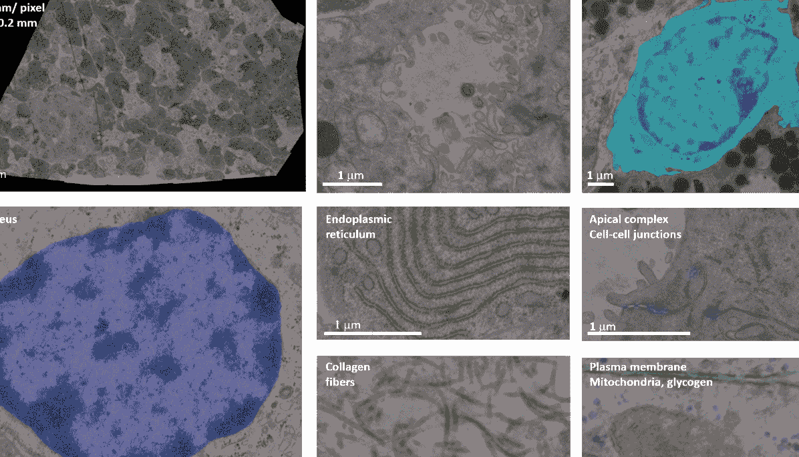
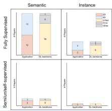
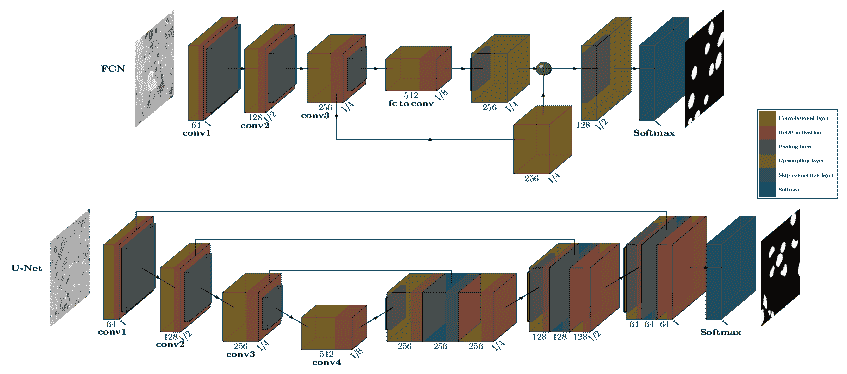
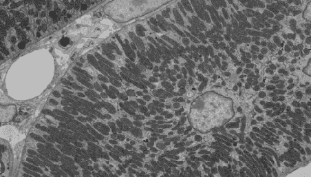
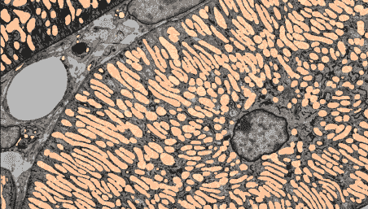
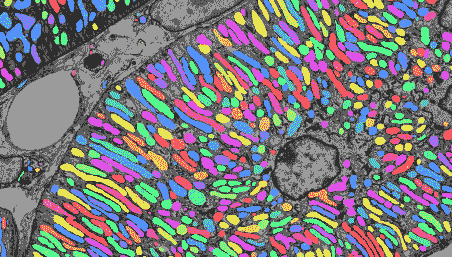
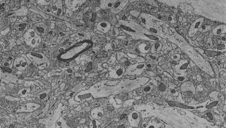
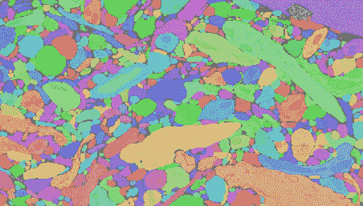
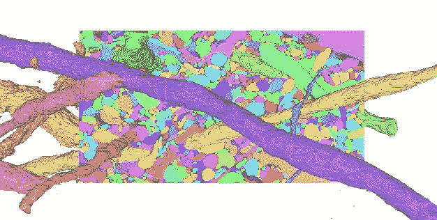
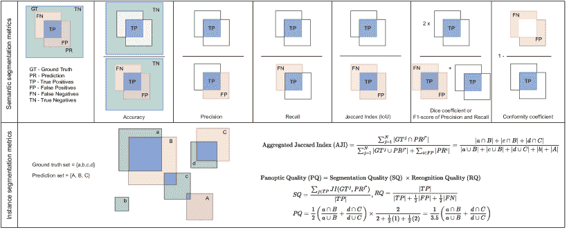

<!--yml

类别：未分类

日期：2024-09-06 19:45:34

-->

# [2206.07171] 大规模细胞电子显微镜中的深度学习分割：文献综述

> 来源：[`ar5iv.labs.arxiv.org/html/2206.07171`](https://ar5iv.labs.arxiv.org/html/2206.07171)

# 大规模细胞电子显微镜中的深度学习分割：文献综述

Anusha Aswath a.aswath@rug.nl Ahmad Alsahaf Ben N. G. Giepmans George Azzopardi 伯努利数学、计算机科学与人工智能研究所，格罗宁根大学，荷兰格罗宁根 生物医学科学与系统系，格罗宁根大学，格罗宁根大学医学中心，荷兰格罗宁根

###### 摘要

生物医学电子显微镜（EM）中的自动化和半自动化技术使得能够以高速获取大数据集。因此，分割方法对于分析和解释这些大体积数据至关重要，这些数据已无法完全手动标记。近年来，深度学习算法在像素级标记（语义分割）和同一类别的单独实例标记（实例分割）方面取得了显著成果。在这篇综述中，我们探讨了这些算法如何适应于分割 EM 图像中的细胞和亚细胞结构。描述了这些图像带来的特殊挑战以及克服一些挑战的网络架构。此外，还提供了对促进深度学习在 EM 中普及的重要数据集的详细概述。最后，给出了对 EM 分割当前趋势和未来前景的展望，特别是在无标签学习领域。

###### 关键词：

电子显微镜，分割，监督，非监督，深度学习，语义，实例

## 1 引言

电子显微镜（EM）广泛应用于生命科学，以纳米尺度研究组织、细胞、亚细胞组分和（宏观）分子复合物。二维（2D）EM 有助于疾病诊断，但通常仍依赖于感兴趣区域的偏倚快照。自动化管道已开创了 2D EM 图像的收集、拼接和开放获取出版[45]，以及扫描透射电子显微镜（STEM）[109]，用于获取高达 1mm²的纳米级分辨率区域。如今，大范围高分辨率成像作为一种常规方法进入领域，并由大多数 EM 制造商提供。我们将其称为纳米解剖学[102, 15, 38]。大规模图像允许全球开放数据共享；有关 50 多项已发表研究和可访问的纳米解剖学数据，请参见 nanotomy.org¹¹1www.nanotomy.org。

图 1：人胰腺切片的大规模电子显微镜（‘nanotomy’）图像。单个大规模电子显微镜图像的概览（左上方）以及从此总图中高倍放大显示的几个细胞、亚细胞和大分子结构的快照。注意这些地图的信息密度：每个数据集中可能存在数百万种亚细胞结构[15]。通过[`www.nanotomy.org`](http://www.nanotomy.org)可以完全访问数字可缩放的全分辨率数据。

一个典型的 nanotomy 数据集的大小为 5-25GB，像素大小为 2.5nm。Nanotomy 允许科学家在不同组织或细胞结构之间进行平移和缩放，如图 1 所示。大规模 2D EM 提供了无偏的数据记录，用于发现如疾病发病机制和亚细胞水平的形态（形状和纹理）变化等事件。此外，nanotomy 还允许对亚细胞标志物进行量化。利用先进的 2D EM 技术，如多束扫描电子显微镜[43, 104]，每秒可采集速度提高至 100 倍，允许在几小时内而不是几天内对组织范围的切片进行成像。有关单束与多束 nanotomy 的并排示例，请参见 de Boer 和 Giepmans[13]。鉴于 2D EM 的自动化和更快的图像采集，数据雪崩（每台显微镜每月 PB 级别）正成为现实。

自动化的大规模三维（3D）或体积电子显微镜（vEM），它创建图像堆叠，也正在蓬勃发展[95, 114, 96]。串联切片透射电子显微镜（ssTEM）和串联块面扫描电子显微镜（SBF-SEM）技术更快的 3D EM 采集也可能导致数据累积达到 PB 级。例如，使用 ssTEM 对成年果蝇的完整大脑体积进行了成像[130]，其覆盖了体积为 1mm³或$10,000$体素的单个神经元细胞，所需数据量为 100 TB。此外，由于 3D EM 数据集的规模，手动标注是不切实际的。Heinrich 等人[59]的一个例子表明，一个人需要两周时间来手动标注一个包含大量不同类型细胞器的全细胞体积的一个部分（1 $\mu m^{3}$），而整个细胞可能需要 60 个人年。全细胞冷冻电子断层扫描（cryo-ET）也提升了 3D EM 的能力，以调查细胞结构和大分子组装体在其自然环境中的结构。这些 2D 和 3D EM 技术的核心数据采集技术列于表 3 中。

EM 数据的规模和获取速度的增加加速了兼容自动分析方法的发展，特别是在语义分割和实例分割领域。语义分割将图像的像素分类为具有语义意义的类别，例如核和背景，而实例分割则专注于分离同一类别中的各个实例；例如区分靠近的线粒体。

过去，传统图像分析方法以及浅层学习算法²²2 在此上下文中，浅层学习指的是利用手工特征的监督机器学习，或传统的无监督技术，如 PCA 和聚类。已被用于 EM 图像的分割，例如使用像素邻域的统计分析 [73]、特征向量分析 [48]、分水岭和层次区域合并 [83, 82]、超像素分析和形状建模 [65]、以及随机森林 [17]。然而，近年来深度学习（DL）在这一领域的主导地位显著提升，类似于光学显微镜和其他医学成像方式中的分割趋势 [84, 79]。与传统图像分析和利用手工特征的机器学习相比，深度学习分割减少或消除了对特定成像样本的领域知识以提取相关特征的需求 [84]。

DL 分割的流行促使了许多常用生物医学图像分析软件工具如 CellProfiler [19]、ImageJ [106]、Weka [3] 和 Ilastik [9] 开发了 DL 插件，这些工具之前仅限于传统的图像处理方法或浅层学习。此外，这也催生了专门的工具，使生物学家能够借助图形用户界面训练和使用 DL 网络 [22, 8]。

我们回顾了 EM 自动图像分割的近期进展，重点关注过去六年在 DL 基础的语义分割和实例分割方面取得的显著进展，同时概述了实现这一进展的主要 DL 架构。

手稿的组织结构如下：第二部分描述了本综述使用的文献检索策略。第三部分介绍了基准数据集，这些数据集对于分割方法的进展至关重要。第四部分提供了 2D 和 3D EM 数据集分割的主要神经网络架构背景。第五部分和第六部分回顾了提出新方法的论文，这些方法使用不同的深度学习（DL）方法进行语义和实例分割。接下来是第七部分，描述了在审阅的论文中使用的评估指标。最后，第八部分提供了对该领域整体进展的展望，并讨论了未来的前景。

表 1：主要的大规模 EM 技术。更多信息请参考 MyScope 网站³³3[`myscope.training/`](https://myscope.training/)以及[95]、[114]和[69]的综述。最后一行展示了这些技术的 2D 图像和 3D 堆栈示例，除了 STEM，STEM 的一个示例见图 1。

2D EM 数据采集技术 透射电子显微镜（TEM）一个宽场电子束照射超薄标本，透射电子在样品的另一侧被检测。电子密集的结构呈现为暗色，其他结构则因其（缺乏）散射而显得较亮。 扫描电子显微镜（SEM）光栅扫描束与材料相互作用，可能导致反向散射或二次电子的形成。其强度揭示样品信息。 扫描透射电子显微镜（STEM）在超薄切片上进行 SEM，并使用探测器检测透射电子。 3D EM 序列切片 TEM（ssTEM）或 SEM（ssSEM）体积 EM 技术，通过使用 TEM 或 SEM 扫描相邻的超薄（典型 60-80nm）切片来检查 3D 超微结构。 序列块面扫描 EM（SBF-SEM）扫描块面，随后用金刚石刀（典型 20-60nm）去除顶部层，新暴露的块面被扫描。这可以重复进行数千次。 聚焦离子束 SEM（FIB-SEM）如上所述进行块面成像，但使用聚焦离子束以比刀片更高的精度（典型 4nm），适用于较小的样品。 冷冻电子断层扫描（Cryo-ET）捕捉来自不同角度的闪冻标本的系列 2D 投影图像，然后使用计算重建方法生成 3D 模型或断层图。 ![[未标注的图像]](img/0d1b62da82b1d0cdf0963430631a098f.png) ![[未标注的图像]](img/ff71e273967b2d34a71327429dbf1bf1.png) ![[未标注的图像]](img/192a75ca804f08033a186b0b2ee1ed8c.png) ![[未标注的图像]](img/ff07f8d4cd43633eb1dbe654e63abec9.png) ![[未标注的图像]](img/044c17796528827cdfb1826cfb15ca5b.png) ![[未标注的图像]](img/1460edc1b723595de59f5485e562d249.png) TEM 2D Cryo-ET 2D SEM 2D ssSEM 体积 - 2D 切片 SBF-SEM 体积 FIB-SEM  [33] [29] [66] [1] [87]

## 2 文献检索策略

我们的调查策略受到以下问题的激励：

+   1.

    哪些数据集可用于 EM 分析，它们面临什么挑战，并且它们在深度学习研究中扮演什么角色？

+   2.

    如何通过完全/半监督/无监督深度学习管道处理 EM 图像（语义和实例）分割？

为了回答这些问题，我们在 Pubmed、Web of Science 和 Google Scholar 上使用了以下搜索查询，仅限于标题（TI），时间范围为 2017-2022：TI=((电子显微镜 OR EM) AND (分割 OR 语义 OR 实例 OR 监督 OR 无监督 OR 自监督 OR 半监督))，并在 Google Scholar 上搜索标题或摘要中包含（深度学习，分割，电子显微镜）的文献。排除了与本研究范围无关的结果，如材料科学中的深度学习和基于传统图像处理的方法（前深度学习时代）。随后使用了前向和后向雪球技术来编制最终的 38 篇论文清单。

图 2 总结了这 38 篇论文的学习技术（是否完全监督）、分割类型（语义或实例）、应用（2D 或 3D）及其基础建模骨干。在审查这些论文之前，我们讨论了关键的电子显微镜数据集，并描述了深度学习架构的演变，这两个关键组件促进了电子显微镜分割分析的进展。

图 2：本调查中回顾的 38 篇论文的分类。论文首先按学习范式（完全监督 vs. 半监督/无监督/自监督）和分割类型（语义 vs. 实例）进行分类。每个象限展示了应用（2D vs. 3D）和深度学习骨干（U-Net vs. FCN vs. 其他）的分布情况，这些论文使用了相应的学习和分割方法。

## 3 关键 EM 数据集的集合

标记和未标记的电子显微镜图像在推动电子显微镜分割的深度学习研究中发挥了重要作用，其中一些与著名的分割竞赛和挑战相关。本节提供了本调查中 38 篇论文所使用的所有数据集的详细信息。表 2 列出了这些数据集的主要属性，下面是对其特征和所解决挑战的深入讨论。讨论按照用于获取数据集的电子显微镜模式进行分类。

### 3.1 串行切片 TEM 和 SEM 数据集

序列切片传输或扫描电子显微镜（ssTEM 或 ssSEM）用于研究神经组织中的突触连接和高分辨率膜。序列切片电子显微镜技术的进步使得可以在复杂哺乳动物组织（如小鼠和人类）中研究具有更高连接性的神经元，甚至在较小动物模型（如果蝇和斑马鱼）的整个大脑组织中进行研究。这种成像方法以高度各向异性的方式可视化生成的体积，即 $x$ 和 $y$ 方向具有高分辨率，而 $z$ 方向的分辨率较低，因为它依赖于序列切割精度。

果蝇幼虫数据集 (#1)⁴⁴4$\#n$ 指的是 ISBI 2012 挑战中表 2 的第 $n$ 项，这是第一个显著的用于自动神经元分割的电子显微镜数据集，包含两个体积，每个体积有 30 个切片。该数据集的主要挑战是开发能够准确分割电子显微镜图像中神经结构的算法。深度神经网络作为像素分类器在 ISBI 2012 挑战中的成功[33] 为序列切片电子显微镜分割中的深度学习铺平了道路。最近，Winding 等人发布了整个果蝇大脑的连通组图谱[120]，这将作为各种后续工作的新资源。

CREMI3D 数据集 (#2) 包含三个大型且多样化的神经组织子体积，并附有用于训练和评估的真实标注，是 MICCAI 2016 会议上的一个竞赛的一部分。该数据集来自一个完整的成体果蝇大脑（FAFB）体积，包含 213 太伏特。它以突触分辨率成像，旨在了解大脑电路（连通组学）的功能，其目标是分割神经元、突触及其前后突触伙伴。CREMI3D 数据集是 FlyEM 项目的一部分，自其成立以来，它已被用来评估各种神经电路重建的图像分析方法，包括卷积神经网络（CNN）和递归神经网络（RNN）等深度学习方法。

SNEMI3D 数据集 (#3) 包含 100 张小鼠皮层神经组织的 ssSEM 图像。它是 Kasthuri 等人[66] 使用自动 ssSEM 技术拍摄的最大小鼠新皮质数据集的一个子集，因此也被称为 Kasthuri 数据集。该数据集是 ISBI 2013 挑战的一部分，挑战内容是分割电子显微镜图像中的神经结构。该数据集的主要挑战是开发能够准确分割电子显微镜图像中神经膜的算法，并重建组织的 3D 模型。由于数据集的巨大规模和神经结构的复杂性（如轴突、树突、突触和胶质细胞），这是一项困难的任务。

Kasthuri++ 和 Lucchi++ (#4, #9) 数据集由 Casser 等人引入 [21]，修正了 Kasthuri 和 Lucchi 的注释。Kasthuri 数据集用于神经细胞的密集重建，已修正了切片间组件的锯齿状，因为这些组件不准确。Lucchi 数据集是一个 FIB-SEM 数据集，用于小鼠新皮层中线粒体的分割。它已修正了与线粒体膜相关的所有注释的一致性，并纠正了真实数据中的任何分类错误。

表 2：使用深度学习进行高分辨率自动（体积）电子显微镜分割的关键数据集。这些（亚）细胞结构的缩写在图例中定义。

[t] # 数据集获取区域 像素/体素大小（$nm$） 像素 标记的（子）细胞结构 公开仓库 1 ISBI 2012/ 果蝇 VNC ssTEM 神经索（果蝇） $4\times 4\times 50$ $512\times 512\times 30$ NM [`imagej.net/events/isbi-2012-segmentation-challenge`](https://imagej.net/events/isbi-2012-segmentation-challenge) 2 MICCAI 2016/ CREMI3D ssTEM 成年果蝇脑 $4\times 4\times 40$ $1250\times 1250\times 125$ NM, S, SP [`cremi.org`](https://cremi.org) 3 ISBI 2013/ SNEMI3D / Kasthuri ssSEM 新皮层（小鼠） $3\times 3\times 30$ $1024\times 1024\times 100$ NM [`snemi3d.grand-challenge.org/`](https://snemi3d.grand-challenge.org/) 4 Kasthuri++ ssSEM 新皮层（小鼠） $3\times 3\times 30$ $1643\times 1613\times 85$ M, NM [`casser.io/connectomics`](https://casser.io/connectomics) 5 Xiao ssSEM 皮层（大鼠） $2\times 2\times 50$ $8624\times 8416\times 20$ M [`95.163.198.142/MiRA/mitochondria31/`](http://95.163.198.142/MiRA/mitochondria31/) 6 MitoEM ssSEM 皮层（人类、大鼠） $8\times 8\times 30$ $4096\times 4096\times 1000$ M [`mitoem.grand-challenge.org/`](https://mitoem.grand-challenge.org/) 7 NucMM ssSEM 全脑（斑马鱼） $4\times 4\times 30$ $1450\times 2000\times 397$ N [`nucmm.grand-challenge.org/`](https://nucmm.grand-challenge.org/) 8 Lucchi / EPFL 海马 FIB-SEM 海马（小鼠） $5\times 5\times 5$ $1024\times 768\times 165$ M [`www.epfl.ch/labs/cvlab/data/data-em/`](https://www.epfl.ch/labs/cvlab/data/data-em/) 9 Lucchi++ FIB-SEM 海马（小鼠） $5\times 5\times 5$ $1024\times 768\times 165$ M [`casser.io/connectomics`](https://casser.io/connectomics) 10 FIB-25 FIB-SEM 视叶（果蝇） $8\times 8\times 8$ $520\times 520\times 520$ N, S [`research.janelia.org/FIB-25/FIB-25.tar.bz2`](http://research.janelia.org/FIB-25/FIB-25.tar.bz2) 11 OpenOrganelle FIB-SEM 间期 HeLa、巨噬细胞、T 细胞 $8\times 8\times 8$ 不同尺寸 CN, CH, EN, ER, ERN, ERES, G, LP, L, MT, NE, NP, Nu, N, PM, R, V [`openorganelle.janelia.org`](https://openorganelle.janelia.org) 12 心脏线粒体 FIB-SEM 心肌（小鼠） $15\times 15\times 15$ $1728\times 2022\times 100$ M [`labalaban.nhlbi.nih.gov/files/SuppDataset.tif`](http://labalaban.nhlbi.nih.gov/files/SuppDataset.tif) 13 UroCell FIB-SEM 尿路上皮细胞（小鼠） $16\times 16\times 15$ 5 个子体积 $256\times 256\times 256$ G, L, M, V [`github.com/MancaZerovnikMekuc/UroCell`](https://github.com/MancaZerovnikMekuc/UroCell) 14 Perez SBF-SEM 大脑（小鼠） $7.8\times 7.8\times 30$ $16000\times 12000\times 1283$ L, M, Nu, N [`www.sci.utah.edu/releases/chm_v2.1.367/`](https://www.sci.utah.edu/releases/chm_v2.1.367/) 15 SegEM SBF-SEM 小鼠皮层 $11\times 11\times 26$ 279 个体积 $100\times 100\times 100$ NM [`segem.rzg.mpg.de/webdav/SegEM_challenge/`](https://segem.rzg.mpg.de/webdav/SegEM_challenge/) 16 Guay SBF-SEM 血小板（人类） $10\times 10\times 50$ $800\times 800\times 50$ Cell, CC, CP, GN, M [`leapmanlab.github.io/dense-cell/`](https://leapmanlab.github.io/dense-cell/) 17 Axon SBF-SEM 白质（小鼠） $50\times 50\times 50$ $1000\times 1000\times 3250$ A, M, My, N [`segem.brain.mpg.de/challenge/`](http://segem.brain.mpg.de/challenge/) 18 CDeep3M-S SBF-SEM 大脑（小鼠） $2.4\times 2.4\times 24$ $16000\times 10000\times 400$ M, NM, Nu, V [`github.com/CRBS/cdeep3m`](https://github.com/CRBS/cdeep3m) 19 EMPIAR-10094 SBF-SEM HeLa 细胞 $10\times 10\times 50$ $8192\times 8192\times 517$ 未标记 [`dx.doi.org/10.6019/EMPIAR-10094`](http://dx.doi.org/10.6019/EMPIAR-10094) 20 CEM500K 上述所有 20 个区域（10 种生物） $2\times 2\times 2$ 到 $20\times 20\times 20$ $224\times 224\times 496544$ 未标记 [`www.ebi.ac.uk/empiar/EMPIAR-10592/`](https://www.ebi.ac.uk/empiar/EMPIAR-10592/) 21 CDeep3M-C 冷冻电子断层扫描 大脑（小鼠） $1.6\times 1.6\times 1.6$ $938\times 938\times 938$ NM, V [`github.com/CRBS/cdeep3m`](https://github.com/CRBS/cdeep3m) 22 Cellular 冷冻电子断层扫描 冷冻电子断层扫描 PC12 细胞 $2.8\times 2.8\times 2.8$ $938\times 938\times 938$ L, M, PM, V [`www.ebi.ac.uk/emdb/EMD-8594`](https://www.ebi.ac.uk/emdb/EMD-8594) A - 轴突，CC - 管道通道，CH - 染色质，CN - 中心体，CP - 细胞质，D - 树突，EN - 内质网，ERES - 内质网出口位点，G - 高尔基体，GC - 胶质细胞，GN - 小颗粒，L - 溶酶体，LD - 脂滴，M - 线粒体，MT - 微管，My - 髓磷脂。N - 细胞核，NE - 核膜，NM - 神经膜，NP - 核孔，Nu - 核仁，PM - 质膜，R - 核糖体，S - 突触，SP - 突触伙伴，V - 小泡。

Xiao (#5) 数据集用于线粒体分割，由 Xiao 等人[122] 使用先进的 ssSEM 技术从大鼠脑中收集。使用自动切割生成了 31 个切片，每个切片的厚度约为 50 nm，用于分割线粒体。通过 2D 手动注释和序列切片图像的图像配准准备了真实数据集，并公开以加速神经科学分析。

Mito-EM (#6) [119] 引入了来自人类（MitoEM-H）和成年大鼠（MitoEM-R）的最大哺乳动物线粒体数据集。它比用于线粒体分割的标准数据集（Lucchi）大约大 3600 倍，后者包含至少 2000 个体素大小的线粒体实例。使用 ssSEM 捕获了复杂的形态，如由细微管连接的线粒体串（MOAS）或在 3D 中缠绕的实例。MitoEM 数据集的创建旨在提供线粒体超微结构的全面视角，并促进对大鼠和人类线粒体形态和功能的比较研究。

NucMM 数据集 (#7) [78] 包含两个完全注释的体积；一个是使用 ssTEM 成像的几乎整个斑马鱼脑，包含约 170,000 个细胞核；另一个是使用微 CT 成像的部分小鼠视觉皮层，约包含 7,000 个细胞核。微 CT 或微计算机断层扫描使用 X 射线生成低分辨率的物体 3D 图像，因此不在本综述范围内。来自 ssTEM 的大规模细胞核实例分割数据集覆盖了斑马鱼脑整个体积的 0.14${mm}^{3}$，分辨率为$4\times 4\times 30$ nm/体素。由于大多数细胞核分割数据集来自光学显微镜，且在$\mu m$尺度下，数据集被下采样到$512\times 512\times 480$ nm/体素。

### 3.2 FIB-SEM 数据集

FIB-SEM 生成的数据集非常适合自动化连通组追踪和以低于$10\times 10\times 10$ nm 的分辨率检查脑组织。该方法可以生成厚度为$4$ nm 的切片，但由于其高$z$分辨率，相比其他技术，体积通常较小。

Lucchi 数据集（#8）是一个从小鼠大脑的海马体成像的各向同性 FIB-SEM 体积数据集，具有沿所有三个轴相同的空间分辨率。该数据集现已成为评估线粒体分割性能的事实标准。Takemura 等人曾努力将 FIB-SEM 扩展到更大的体积，[112] 他们通过重建果蝇大脑眼区七个柱状结构的突触电路，编制了 FIB-25（#10）数据集。FIB-25 包含超过 10,000 个标注的神经元，包括它们的突触连接，是迄今为止最全面的果蝇大脑 EM 数据集之一。该数据集的创建旨在提供果蝇大脑神经电路的详细图谱，并促进神经连通性和信息处理的研究。该数据集是公开的，可以通过 FlyEM 项目网站访问。

改进的 FIB-SEM 技术还实现了大规模 EM 的高通量和可靠的长期成像（$10^{3}$ 到 $3\times 10^{7}\mu m^{3}$），例如 Xu 等人（#11）的 3D 全细胞和组织的 OpenOrganelle 图谱 [125]。这些细胞 3D 重建数据集在 OpenOrganelle 资源库下公开，以便探索局部细胞相互作用及其复杂的排列。

其他 FIB-SEM 数据集包括需要对心肌和尿囊重要组织中的 3D 细胞器进行高分辨率分析的数据集。心脏线粒体（#12）是一个 FIB-SEM 数据集，旨在对心肌细胞中的线粒体进行分割 [68]。需要使用 FIB-SEM 技术来更好地表征线粒体丰富的肌纤维中的扩散通道。根据 Glancy 等人进行的实验，15 nm 分辨率的各向同性体素被成像 [51]。Mekuč 等人通过 FIB-SEM 成像的 UroCell（#13） [90] 主要关注线粒体和内溶酶体，并进一步扩展到高尔基体和梭形囊泡。该数据集独特之处在于它是公开的，可供进一步分析尿囊的上皮细胞，其中细胞器在维持膀胱膜与周围血组织之间的屏障方面发挥着重要作用。

### 3.3 SBF-SEM 数据集

连接组学研究也基于使用 SBF-SEM 成像的热门数据集 [61, 16]。使用 SBF-SEM 的成像产生各向异性切片，但不需要图像配准，并且避免了与串行切片 TEM/SEM 相比丢失切片的问题，因为该技术在块面上成像样本保持完整。这种技术还使得在 $z$ 轴堆叠中成像大体积以研究神经电路和细胞的组织成为可能，涵盖了数百微米到毫米的神经元。

Perez 数据集（#14） [98] 涉及从小鼠脑部的下丘脑上交叉核（SCN）获取 1283 张序列图像，以生成一个约 450,000 $\mu m^{3}$ 的组织图像堆栈。大体积的图像被从 3.8 降采样到 7.8 nm/像素，以提升处理这些四体素大小 SBF-SEM 图像的能力。该数据集用于自动分割脑组织中的线粒体、溶酶体、细胞核和核仁。

SegEM（#15）引入了一个使用 SBF-SEM 从小鼠体感皮层获取的 EM 数据集 [12]。SegEM 数据集中的图像附有对应的分割标签，标注了树突、轴突和突触。标签是通过半自动化的方法生成的，该方法结合了骨架注释和机器学习算法，以准确追踪长神经突。此后，SegEM 被用于基准测试流行模型，如测试算法在跨体积神经突上的效率的洪水填充网络。

Guay 数据集（#16）是一个完整标注的血小板细胞数据集，来自两名人类受试者，旨在进行密集的细胞分割 [52]。它也被用于大体积细胞重建，包括细胞内的线粒体、细胞核、溶酶体和各种颗粒。

Axon 数据集（#17）是来自大鼠的白质组织的 SBF-SEM 图像集合，分辨率为 50 nm/像素 [1]。这组低分辨率的 130000 $\mu m^{3}$ 图像堆栈足以解析出髓鞘、髓鞘轴突、线粒体和细胞核等结构。采用低分辨率 SBF-SEM 堆栈的广视场被认为对于量化指标如髓鞘轴突的弯曲度、线粒体间距离和细胞密度是重要的。

CDeep3M 提出了两个来自 SBF-SEM 和冷冻电子断层扫描（cryo-ET）的新数据集，用于自动分割。第一个数据集，CDeep3M-S（#18），是一个大型的 SBF-SEM 数据集，用于识别来自小鼠小脑和侧脑岛的膜、线粒体和突触。图像分辨率为 $2.4$ nm 像素，使用了最新架构的云实现来分割神经膜、突触囊泡、线粒体和脑组织中的细胞核。第二个数据集，CDeep3M-C（#21），来自 cryo-ET，进一步在小节 3.4 中进行了解释。

EMPIAR-10094 数据集（#19）包含了使用 SBF-SEM 成像的宫颈癌 “HeLa” 细胞的 EM 图像。该数据集的成像分辨率为 $8192\times 8192$ 像素，总共 518 切片，包含分布在嵌入树脂背景中的不同 HeLa 细胞。该数据集已公开提供，无标签，主要用于 delineating 结构，如 plasma membranes 和 nuclear envelopes。

各种无标签的数据集，如 CEM500K，来自于不同无关实验和 EM 模态，解决特定结构的分割问题似乎很有前景。CEM500k（#20）是一个 EM 无标签数据集，包含大约 500,000 张来自不同无关实验和不同 EM 模态的细胞 EM 图像。这些来自不同实验的图像被标准化为大小为 $512\times 512$ 像素的 2D 图像，像素分辨率范围从序列切片 EM 数据集中的 2 nm 到 SBF-SEM 的 ${\sim}20$ nm。该数据集经过进一步过滤，去除了重复和低质量的图像，以增强对图像对比度变化的鲁棒性，并使其适合用于训练建模技术。

### 3.4 冷冻电镜-电子断层扫描数据集

电子断层扫描（ET）用于通过倾斜系列采集技术获取 EM 切片的 3D 结构。冷冻 ET 在低温下成像玻璃化的生物样本。关于冷冻 ET 的分割尝试可以在 Moussavi 等人的研究 [92] 和 Carvalho 等人的综述 [20] 中找到。大分子结构的识别超出了本综述的范围。冷冻 ET 在可视化和解释断层扫描数据集时面临两大挑战。首先，随着倾斜角度的增加，样本厚度增加，导致所谓的“缺失楔”伪影和 $z$ 方向上的分辨率降低。其次，玻璃化生物样本对电子剂量敏感，导致信噪比低，难以从背景噪声中区分出感兴趣的特征。由于样本厚度增加导致 TEM 分辨率能力下降，可以使用聚焦离子束（FIB）铣削来获得高分辨率的断层扫描图像。冷冻 FIB SEM 是一种用于细胞成像的不断发展的技术，近年来被迅速采用。这主要归功于其成像较大样本的能力，这些样本可能对冷冻 ET 过厚，如整个细胞或组织。

CDeep3M-C（#21）是一个用于从小鼠脑中分割囊泡和膜的冷冻电子断层扫描（cryo-ET）数据集[53]。在 1.6 纳米的体素尺寸下，该数据集用于数字重建一个高压冷冻组织的微小部分（约$1.5\times 1.5\times 1.5$$\mu m^{3}$）。最终的体积由 7 个连续的断层图（串行切片）构建，每个断层图是通过将样品在电子束中每$0.5^{\circ}$倾斜一次从$-60^{\circ}到+60^{\circ}$创建的。细胞冷冻电子断层扫描数据集（#22）是在低放大倍率下获得的，用于注释和定性分析线粒体、囊泡、微管和细胞膜等细胞器[29]。PC12 细胞系使用 30 个在$850\times 850\times 81$像素尺寸和 2.8 纳米分辨率下成像的串行切片进行重建。用于该工作的血小板和蓝细菌的断层图来自之前发布的数据集[118, 35]。

## 4 背景：用于电子显微镜语义和实例分割的骨干深度学习网络

深度学习方法的快速进展，特别是卷积神经网络（CNNs），对推动电子显微镜图像的分割以及其他各种医学图像的进步产生了重大影响[79, 108]，包括光学显微镜[124, 84]。电子显微镜分析中的深度学习也在 Treder 等人的综述[115]和 Ede[44]中有所涉及。前者对物理科学和生命科学中不同的电子显微镜应用进行了广泛的概述，后者则提供了聚焦于进行基于深度学习的电子显微镜分析的硬件和软件包的实践者视角。相比之下，本综述提供了对（子）细胞电子显微镜中用于语义和实例分割的完全/半监督/自监督/无监督深度学习方法的深入探讨。本节涵盖了网络架构进展中的主要里程碑及其关键特性，这些特性是将本文评审的 38 篇论文放在背景中进行理解所必需的。

在电子显微镜图像中的语义分割是指以每个像素映射到特定类别的方式识别对象或亚细胞器。这与实例分割不同，后者是指将图像分割成多个段，每个段对应一个唯一的对象或实例。实例分割在研究细胞结构及其相互作用中尤为重要，因为它允许在大规模数据集中识别和量化单个对象。

图 3：原始工作中的编码器-解码器网络 FCN [85] 和 U-Net [105]。在 FCN 中，每个全连接（fc）层和 U-Net 中的卷积层后面都跟有非线性激活函数 ReLU 和最大池化。在 FCN 中，全连接层通过“fc to conv”组件转换为卷积层。最后一层使用 softmax 函数为每个像素分配一个概率类得分。FCN 解码器包括一个上采样组件，该组件与编码器第三个卷积层中的低级特征图线性组合。这些特征图的尺寸是输入图像 $I$ 尺寸的四分之一（表示为 $I/4$）。最后，从 $I/4$ 直接上采样到原始尺寸 $I$，然后进行 softmax 分类。对称的 U-Net 结构在编码器和解码器路径中共享特征图，并带有跳跃连接。

例如，Ciresan 等人设计的 CNN [33] 被用于堆叠 EM 图像中神经膜的语义分割。这些图像通过预测每个局部区域或块的标签来进行分割，该区域或块由滑动窗口方法中的卷积滤波器覆盖，并引入了最大池化层而不是子采样层。正如 Arganda-Carreras 等人 [4] 所指出的，这一方法赢得了 ISBI 2012 神经分割挑战赛⁵⁵5[`imagej.net/events/isbi-2012-segmentation-challenge`](https://imagej.net/events/isbi-2012-segmentation-challenge)。

尽管该方法取得了成功，但仍存在两个主要限制 - 首先，滑动窗口方法由于处理相邻块之间的大重叠部分的冗余而较慢，其次，块的大小（上下文）与定位精度之间存在权衡。由于网络的深度是获得更大感受野（网络接收信息的视野大小）的重要因素，因此更大的块需要更深的网络。然而，由于许多最大池化层的下采样，随着网络深度的增加，定位能力降低，而使用较小的块允许网络仅看到很少的上下文。

EM 图像的语义分割技术随着全卷积网络（FCN）[85]和 U-Net 架构的开发而不断改进[105]，如图 3 所示。将 CNN 扩展为处理任意大小输入的全卷积层而不是全连接层的概念，推动了用于分割的密集预测的发展。引入了跳跃架构以利用特征谱，将深层、粗糙的语义信息与浅层、细致的外观信息进行融合。U-Net 将 FCN 网络扩展为 U 形拓扑，以优化定位与上下文之间的权衡。收缩路径（编码器）使用下采样特征捕获更大上下文，而扩展路径（解码器）则将特征上采样到原始大小，并保持相同数量的层，从而使其成为对称或 U 形网络。编码器-解码器层之间的跳跃连接绕过了一些神经网络层，因此为误差的反向传播提供了替代且较短的路径，这有助于避免梯度消失问题[71]。在 FCNs 中增加了上采样路径的连通性并考虑了多层级上下文，这些都是提高语义分割精度的关键[5, 42]。

DeepLab 是另一类语义分割网络，它们具有在不增加计算复杂度的情况下实现对不同尺度的鲁棒性的能力[25, 26, 27, 28]。DeepLab 架构基于 FCNs，但扩展使用了膨胀（或空洞）卷积，这些卷积最初由[126]提出，并使用了图像级特征。空洞膨胀用于空洞空间金字塔模块（ASPP）中，通过使用不同膨胀率的多个空洞卷积进行多尺度特征提取。作为骨干网络，最新的 DeepLab 架构，即 DeepLab v3+，使用残差神经网络（ResNet）生成图像级特征图。该模块对从 ResNet 骨干网络获得的特征图进行并行卷积，输出多个特征图，然后将这些特征图连接在一起并输入到下一层。这使得网络能够捕捉多个尺度的特征，这对于语义分割等任务至关重要。ResNet 因其克服梯度消失问题和降级问题的能力而受到关注[58]。这一突破归功于引入了残差连接，使网络能够学习残差函数，或期望输出与当前输出之间的差异，而不是整个函数。这有助于网络更有效地学习并避免过拟合。

神经元堆叠的 3D 分割被设定为 ISBI 2013 的一个挑战。分析体积电子显微镜数据集的主要挑战是由于串联切片而导致的错位或缺失部分，以及由于不同方向的分辨率不同而产生的体积各向异性。具体而言，它指的是在$z$轴（深度维度）上的分辨率低于$x-y$平面上的分辨率的情况。

对于 3D 体积的分析，有三种典型方法。第一种方法涉及对每张堆叠图像进行 2D 分割，然后基于聚类技术进行 3D 重建，这些技术可能从基本的水 shed 算法到复杂的图切割算法。第二种方法基于 3D CNNs，它们可以学习包括 3D 空间上下文的体积数据表示。一个例子是Çiçek 等人提出的 3D U-Net [32]，它受到原始 U-Net 的启发，后者使用局部和更大的上下文信息。随后，Milletari 等人 [91] 通过添加残差阶段将其扩展为 V-Net 模型。HighRes3DNet 是另一个基于 FCN 架构的 3D CNN，具有扩张和残差卷积，并且在获得神经线粒体的准确分割方面取得了成功 [77]。就性能而言，HighRes3DNet 和 V-Net 在多个医学图像分割基准测试中都取得了最先进的结果。然而，HighRes3DNet 在涉及高分辨率和多模态医学图像的任务中表现更佳，而 V-Net 在计算资源和内存使用方面则更为高效。3D 网络的一种变体是 Lee 等人 [74] 提出的混合 2D-3D 方法，用于各向异性体积的分割。他们在初始层中仅使用 2D 卷积，这些卷积将具有高 $x-y$ 分辨率（与 $z$ 轴无关）的输入特征图下采样，直到它们大致各向同性，以便能够高效地通过 3D 卷积处理。

图分析是 3D 分割的第三种方法。基于图的方法通常涉及将图划分为基于颜色或强度值、边缘强度或其他图像特征（如形状）的区域或簇。这些方法通常使用图论算法，如图切割或最小生成树，来识别彼此不同的区域。这可能与结构基础分析结合使用，利用某些几何属性来识别对象之间的边界。Lucchi 等人 [86] 使用全局形状描述符来学习 3D 超体素的连通性，用于基于图切割的分割，解决了局部统计数据和干扰膜的问题。Turaga 等人 [116] 提出了如何使用 CNNs 直接预测基于结构化损失函数的 3D 图亲和性，用于神经边界分割。所提出的损失函数根据相邻像素之间属于相同或不同区域的可能性为边分配分数，同时惩罚其分配，以实现违背图像底层结构的错误预测。

实例分割涉及将给定图像/体积的每个像素/体素分类到特定类别，并为每个物体的像素/体素分配唯一身份。使用深度学习的实例分割可以分为基于提议（自上而下）和无提议（自下而上）的方法。基于提议的方法，如 RCNN、FastRCNN 和 FasterRCNN，是两阶段检测网络，使用深度神经网络进行特征提取（编码器）和区域提议进行目标物体的分割，随后进行边界框回归和分类以获得实例分割[81]。Mask-RCNN[56]是基于 FasterRCNN 的一种流行的通用物体实例分割选择，它利用网络的一个分支来预测每个物体实例的二进制掩膜。自上而下的实例分割也可以通过带有注意力机制的递归网络实现，要么通过提取视觉特征并逐项生成实例标签，要么通过引导边界框的形成，随后由分割网络完成[103, 50]。Flood Filling Network（FFN）利用这一概念直接从原始图像像素中获取单独的物体掩膜[63]，并且也被用于 EM 分割，如下文所述。

另一种方法被称为无提议（proposal-free），旨在通过自下而上的方法结合语义和实例分割。这是陈等人[24]采用的策略，其中物体的轮廓/边缘预测与语义掩膜一起被整合到 FCNs 中，形成多任务学习的方法。然后，将轮廓/边缘图和语义掩膜融合以获得实例分割图。其他方法使用边界感知实例信息（例如，物体边界之间的距离或物体之间的重叠量）来将边缘特征与网络的中间层融合[6, 93]。

语义实例分割是另一类技术，采用基于语义的方法来解决实例分割问题。它们不是为每个像素推断属于某个类别的概率，而是推断属于某个类别的实例的概率。事实上，De Brabandere 等人[36]提出了一种判别损失函数，并证明其优于交叉熵和 Dice 损失函数在实例分割中的表现。判别损失函数由三项组成：分割项，用于惩罚错误的类别预测；边界项，用于惩罚错误的边界预测；以及正则化项，用于鼓励预测掩膜的平滑性。

## 5 完全监督的方法

完全监督的方法使用标注的图像（训练数据）来学习可以在未见过的类似分布的图像（测试数据）中分割结构的计算模型。训练集被算法用来确定模型的参数，以最大化模型的泛化能力。表 3 总结了 33 篇（共 38 篇）使用监督学习进行（子）细胞结构的语义和实例分割的论文。

### 5.1 端到端学习 - 语义分割

端到端学习是一种机器学习方法，其中一个模型学习执行一个任务，而不依赖于预定义的中间步骤或特征。相反，模型被训练来将输入数据直接映射到期望的输出，这在一个端到端的过程中完成。由于深度学习的进步，端到端学习在近年来变得越来越受欢迎，这些进步允许创建具有大量层的模型，能够学习数据的复杂表示。这些模型通过反向传播进行训练，反向传播是一种基于预测输出与真实输出之间的损失函数产生的误差来更新模型权重的方法，从而使模型能够随着时间的推移改善其性能。

这一类别中的 16 篇论文集中于两种主要的细胞结构的语义分割，即 NM - 神经膜（8 篇论文）和 M - 线粒体（5 篇论文）。其他结构包括 N - 细胞核，NE - 核膜和 L - 溶酶体。

神经膜分割是指在电子显微镜图像中识别和分离神经膜与其他结构的过程。在电子显微镜体积中分割神经膜有助于将图像划分为表示不同神经细胞和过程的区域。这对于研究神经元的功能以及它们的突触连接以理解大脑中的不同信号传导路径至关重要。3D 神经元的数字重建或追踪依赖于神经膜分割的准确性，因为断裂可能导致合并和分裂错误，从而影响重建的质量。

类似地，线粒体分割是指在电子显微镜图像中识别和分离线粒体这一类真核细胞中的细胞器，与其他结构进行区分。由于线粒体的大小、形状和分布在细胞内存在变异，因此线粒体分割是一项具有挑战性的任务。准确分割 2D 和 3D 中的线粒体对于研究这些细胞器的结构和功能以及探究它们在各种疾病中的作用至关重要。

下面我们根据其基础 2D 或 3D CNN 架构对提出的方法进行分类。

#### 5.1.1 基于 2D CNN 的方法

表 3：本研究中回顾的 33 篇（共 38 篇）基于完全监督学习框架的文献列表，这些文献使用了 2D 和 3D CNN 架构应用于语义分割和实例分割。缩写 Org.代表研究的细胞器。Type（2D 和/或 3D）列表示所使用的方法类型和解决的问题。标记为 2D 和 3D 的研究使用了 2D 主干方法，并结合了一些后处理操作进行 3D 重建。标记为 2D 或 3D 的研究仅使用 2D 或 3D 主干来解决 2D 或 3D 问题。Datasets 列中的数字对应于表 2 中的标识符，性能指标的定义见第七部分。

| 引用 | 组织 | 类型 | 数据集 | 性能 | 主干 | 主要方法组件 |
| --- | --- | --- | --- | --- | --- | --- |
|  |  | 2D | 3D |  | 指标 |  |  |
| 端到端学习 - 语义分割 |  |  |
| [46] | NM |  |  | 1, 3 | RE, WE, PE | 2D U-Net | 残差块、反卷积 |
| [94] | M |  |  | 1 | Acc, P, R, F1, JI | 2D FCN | 块处理、Z 滤波 |
| [29] | MT, M, PM, V |  |  | 22 | 无评估 | 2D FCN | 四层 CNN 架构 |
| [123] | NM |  |  | 1 | $V_{rand}$, $V_{info}$ | 2D FCN | 残差块、多级特征 |
| [21] | M |  |  | 4, 9 | Acc, P, R, JI | 2D U-Net | 参数较少，轻量级模型 |
| [64] | N |  |  | 私有^∗ | JI, Acc | 2D FCN | 残差、空洞、多级融合 |
| [18] | NM |  |  | 1 | $V_{rand}$ | 2D U-Net | 密集块、求和跳跃 |
| [101] | NM |  |  | 1 | $V_{rand}$, $V_{info}$ | 2D U-Net | 残差、求和跳跃、多阶段 |
| [110] | NE |  |  | 19 | P, R, F1 | 2D U-Net | 三轴预测 |
| [30] | M |  |  | 8 | P, R, JI | 3D U-Net | 因式分解卷积 |
| [75] | NM |  |  | 3 | RE | 3D U-Net | 3D 图谱亲和、混合 2D-3D、残差 |
| [122] | M |  |  | 5, 8 | JI, DSC | 3D U-Net | 混合 2D-3D、残差、辅助监督 |
| [49] | NM |  |  | 2, 10, 15 | $V_{info}$, CREMI | 3D U-Net | 3D 图谱亲和预测 |
| [60] | NM |  |  | 2 | CREMI | 3D U-Net | 签名距离回归图、混合 2D-3D |
| [90] | M, L |  |  | 13 | TNR, R, DSC | 3D FCN | HighRes3DZMNet、零均值、残差/空洞 |
| [59] | 多 |  |  | 10 | DSC | 3D U-Net | 多类别分割 |
| [7] | NM |  |  | 2 | ARAND | 3D U-Net | 带符号的 3D 图形亲和力预测 |
| 端到端学习 - 实例分割 |  |  |
| [80] | M |  |  | 8 | 准确率，P，R，JI，DSC | Mask-RCNN | 递归网络，多重边界框 |
| [127] | M |  |  | 4, 8 | JI, DSC, AJI, PQ | 2D U-Net | 分层视图集成模块，多任务 |
| [88] | M |  |  | 4, 8 | JI, DSC, AJI, PQ | 2D U-Net | 残差块，两阶段，形状软标签 |
| [119] | M |  |  | 6, 8 | JI, AP-75 | 3D U-Net | 掩膜，轮廓预测，分水岭 |
| [1] | A, N |  |  | 17 | $V_{info}$, ARAND | 3D U-Net | 基于形状的后处理 |
| [78] | N |  |  | 7 | AP-50, AP-75, AP | 3D U-Net | 混合 2D-3D 模块，残差块 |
| [76] | M |  |  | 6 | JI, DSC, AP | 3D FCN | 混合 2D-3D 模块，多尺度 |
| [89] | M |  |  | 13 | TPR, TNR, JI, DSC | 3D U-Net | HighRes3DzNet，地质主动轮廓 |
| 集成学习 - 语义分割 |  |  |
| [128] | NM |  |  | 3 | RE | 3D U-Net | 混合 3D-2D，残差/卷积/空洞 |
| [54] | NM, M, N, V |  |  | 18, 21 | A, P, R, F-1 | 3D U-Net | 混合 3D-2D，残差/卷积/空洞 |
| [52] | C, M, GN |  |  | 16 | 平均 JI | 3D U-Net | 混合 2D-3D，空间金字塔 |
| [68] | M |  |  | 12, 18 | 准确率，TPR，TNR，F1，JI，$V_{rand}$，$V_{info}$ | 2D U-Net | 不同网络的集成 |
| 转移学习 - 语义分割 |  |  |
| [37] | M |  |  | 1 | 准确率，P，F1 | VGG | 少量样本，超列特征，增强 |
| [11] | M |  |  | Private^∗ | JI | 2D U-Net | 深度领域适应，两流 U-Net |
| 可配置网络 - 语义分割 |  |  |
| [62] | NM |  |  | 2 | 准确率，P，F1 | 2D，3D U-Net | nn U-Net，自配置方法 |
| [47] | M |  |  | 4, 8 | JI | 2D, 3D U-Net | 稳定网络，混合输出，$z$-滤波 |

^∗“Private” 表示所使用的数据集不可公开获取。

深度学习网络在电子显微镜分割中的成功是使用了具有深度上下文网络的 2D 架构。这些网络通常以 FCN 或 U-Net 作为骨干网。更深的上下文网络通常产生了更好的 2D 分割，这主要使得能够摆脱多步骤后处理以获得 2D 分割和 3D 重建。

Fakhry 等人 [46] 提出的残差反卷积网络 (RDN) 基于残差连接的组合，这使得深度网络的高效训练成为可能，以及 2D U-Net 解码器中的反卷积层，这有助于恢复在下采样过程中丢失的空间信息。所提出的方法在 ISBI 2012（果蝇 VNC）和 2013（SNEMI3D）基准数据集上进行了评估，并与几种最先进的分割方法进行了比较。结果表明，RDN 在分割准确性方面优于其他方法，并且只需要一个简单的后处理步骤，如 watershed，来分割/重建神经回路。

Oztel 等人 [94] 提出了使用中值过滤方法来结合 3D 上下文，以从 2D 分割的输出中重建线粒体。使用 FCN 从背景中 delineate 线粒体，然后在图像体积中的 $z$ 方向上进行中值过滤。这种 $z$-过滤允许去除伪影，并在相邻切片中存在遗漏成分时恢复感兴趣区域。

Xiao 等人 [123] 提出的深度上下文残差网络 (DCR) 是 FCN 的一种扩展，结合了残差块和多尺度特征融合。他们使用了基于求和的跳跃连接，将解卷积输出中的高级细节与 ResNet 编码器中的低级信息进行融合。所提出的多切割方法和 3D 上下文特征的后处理方法对于减少不连续性（边界分裂或合并）至关重要，这反过来帮助减少了各种 2D 截面的假阳性和假阴性。DCR 在 ISBI 2012 数据集上的表现超越了几种最先进的分割方法。

对于不同任务的高级网络可能会对经济实用的硬件要求过高，导致用户需修改宏观设计方面的内容。此类修改的例子包括下采样输入图像以及减少网络的大小或深度，以确保与计算机硬件限制的兼容性。Casser 等人 [21] 提出了一个快速的线粒体分割方法，该方法使用了较少的层数和轻量级的双线性上采样，而不是 U-Net 解码器中的转置卷积。此外，他们还引入了一种新颖的数据增强方法，通过随机对原始图像应用空间变换来实时生成训练样本，从而提高了训练效率和对图像质量变化的鲁棒性。作者还结合了基于 $z$-过滤的后处理步骤来重建 3D 线粒体。所提出的方法在多个 EM 数据集上进行了评估，并在分割准确性和速度方面达到了最先进的性能。

数据增强是一种主要用于机器学习和计算机视觉中的技术，用于增加训练集的规模和多样性。这在这里审阅的大多数论文中都有应用。该过程涉及对现有数据进行各种变换或修改，以创建新的但相似的数据实例。在可用数据集的规模有限的情况下特别有用，因为它允许模型从更大且更具多样性的数据集中学习，而无需额外的数据收集工作。它还可以帮助防止过拟合，通过将模型暴露于更广泛的数据变异范围来提高模型的鲁棒性。此外，测试时增强也被证明对平均预测噪声有效，但代价是时间复杂性[75, 128, 122, 127]。

Jiang 等人[64]研究了具有 ASPP 的残差编码器模块，用于多尺度上下文特征集成。解码器模块包括将之前的低级特征与 ASPP 输出的高级特征融合，随后进行双线性上采样以获得分割图。与基线模型 U-Net 和 Deeplab v3+相比，他们在细胞体和细胞核的分割中取得了更好的性能。

Dense-UNet 模型由 Cao 等人提出[18]，作为流行的 U-Net 架构的扩展，结合了 U-Net 跳跃连接中的密集连接块。这些密集连接块有助于改善梯度流动和特征重用，从而提高特征表示和分割精度。除了在 ISBI 2012 挑战赛上表现出色外，该模型对神经膜图像中的噪声和伪影变化表现出高度的鲁棒性，无需进一步的后处理。

FusionNet 是一种完全残差的 U-Net 架构，通过融合多个具有不同感受野的子网络的输出，结合了不同层次的特征表示。它包括一个残差学习框架以及反卷积层，以提高训练收敛性和分割精度。Quan 等人[101]的研究表明，使用四个级联 FusionNet 单元的集成多阶段精炼过程可以有效地消除任何校对需求⁶⁶6 校对指的是对分割（手动或自动）图像数据的人工验证。

Spiers 等人[110] 还提出了一种新颖的数据增强策略，模拟了电子显微镜图像中的现实变化，以提高其 2D CNN 在核膜语义分割中的鲁棒性。基于 2D U-Net 的方法实现了高分割准确度，并可用于提取分割核膜中的有意义的生物信息，如核孔的分布。他们的模型在转置堆栈后对每个轴运行，并将结果合并成最终的分割。

Chen 等人[29] 使用了一个只有四层的 2D CNN 来对膜、线粒体、囊泡和微管进行分割。CNN 层的架构经过优化，通过在前两层中使用$15\times 15$像素的卷积核来捕捉大范围的上下文。这一设计允许使用单个最大池化层将输出下采样到输入分辨率的一半，有助于区分诸如单层（囊泡、微管）或双层膜（质膜、线粒体）的细节。针对这四种结构的每一种 CNN 都用包含感兴趣结构的几节断层扫描图进行训练。后续的子断层扫描分类和平均需要自动分割，以确定感兴趣的分子成分的原位结构。

#### 5.1.2 基于 3D CNN 的方法

类似于 2D 深度架构，3D 卷积神经网络（CNN）由多个滤波层组成，包括卷积层、池化层和激活层，用于从输入数据中学习空间特征。这些滤波器在不同的位置和方向扫描输入体积，以识别对分割有意义的特征。2D 和 3D CNN 的主要区别在于输入数据中包含了额外的深度维度。这使得网络能够捕捉相邻切片之间的空间和深度关系。由于训练 3D CNN 所需的大量数据和计算资源，这些方法通常用于高端计算环境，如专业工作站或云计算平台。还研究了混合 2D-3D 架构，试图在高计算需求和效果之间找到适当的权衡。

在这篇综述中，有三种方法采用了完全监督的完整 3D CNN 架构。第一种是 Cheng 和 Varshney [30] 的工作，他们提出了一种用于体积数据中线粒体分割的 3D CNN。作者们还提出了一种新颖的数据增强技术，该技术在池化层中使用随机采样来生成特征空间中的现实变化。在他们的深入研究中，他们得出结论，3D CNN 在统计学上显著优于 2D 对应物。该改进主要归因于引入的增强技术以及因子卷积，这些技术也带来了高效性，这在 FIB-SEM（各向同性）体积中也被证明是有用的。

[90] 还提出了一种基于 3D CNN 的方法，用于体积 EM 中线粒体和内溶酶体的分割。该方法基于 HighRes3DNet 架构，但其第一层的滤波器被限制为零均值，并称之为 HighRes3DZMNet。零均值层使神经网络对体积输入亮度的变化具有鲁棒性。该网络使用 UroCell 数据集进行训练，以联合分割线粒体和内溶酶体，因为这些生物结构具有相似的形态。该方法还应用于 Lucchi++ 数据集中的线粒体分割，达到了 FIB-SEM 体积的最先进分割结果。

Heinrich 等人 [59] 也依靠 3D CNN 对 FIB-SEM 体积中的 35 种细胞器类别进行分割。多通道 3D U-Net 在来自开放源代码 OpenOrganelle 集合的 28 个体积上进行了训练，涵盖了四种不同的细胞类型。他们研究了一个经过所有 35 种细胞器样本训练的分割模型，与针对语义相关细胞器类别子集（如内质网（ER）及其相关结构，即 ER 出口部位、ER 膜和 ER 腔）的更具体模型进行比较的情况。结果表明，所有类别训练的单一模型优于更具体的模型。这归因于训练集中丰富的多样性，从而导致了具有更好泛化能力的模型。

为了减少某些层中 3D 卷积的计算成本并实现更好的收敛性，采用了混合 2D-3D 方法来对体积数据集进行分割。这些方法的主要应用在于能够对各向异性体积进行分割，以有效处理其 3D 上下文。例如，可以使用包括$3\times 3\times 1$卷积的混合 2D-3D 网络架构处理各向异性和各向同性 EM 体积，而不是$3\times 3\times 3$卷积，以将其修改为 2D 卷积。Xiao 等人[122]首次引入了一个完全残差的混合 2D-3D 网络，并通过深度监督来改进线粒体分割。为了减少参数数量，3D 卷积仅在 3D U-Net 的第一层和最后一层使用。提出了一种深度监督策略，通过在解码器的初始层注入辅助分支，以避免梯度消失问题。网络的复杂性使其能够使用简单的连通组件分析方法进行 3D 重建，适用于各向异性和各向同性体积 EM 数据集。

Lee 等人[75]将 Turaga 等人[116]的混合 2D-3D 模型进行了改编，以预测 3D 体积中神经膜的 3D 亲和力图。所提出的 CNN 模型结合了多切片输入以及在$z$-方向和$x-y$方向上的长距离亲和力辅助监督。他们利用混合 2D-3D U-Net 对各向异性体积进行分割，并使用简单的均值亲和力聚合策略进行后处理，以分割神经区域。提出的亲和力监督模拟了 DeepEM3D 中的边界图（第 5.3 节），在 SNEMI3D 竞赛中表现优异。

Funke 等人使用了一种结构化的损失函数，该函数偏好 3D 体素之间的高亲和力，从而获得拓扑正确的分割[49]。亲和力预测足够准确，可以通过简单的聚合方法有效地分割各向同性和各向异性（CREMI、FIB 和 SegEM）数据，表现优于具有更复杂后处理流程的方法。Bailoni 等人[7]使用签名图来预测 3D 体素之间的吸引力和排斥力，使得通过 3D U-Net 进行图预测成为可能，这种方法与 Funke 等人[49]提出的方法类似。

Heinrich 等人基于边界检测的长程关联概念，[60] 使用邻近上下文通过回归损失而非概率预测体素距离图。这些距离预测经过阈值处理后，生成了精确的二值分割图像，用于突触的分割。这种距离预测图像经过简单阈值处理，允许在高通量速度（每秒 3 兆体素）下进行预测，适用于大小为 50 太体素的完整成年果蝇脑体积。

### 5.2 端到端学习 - 实例分割

端到端学习方法也是实例分割中最受欢迎的方法，这要求对同一类别的结构进行逐一标定。这对于那些彼此相接的结构类别尤为重要，如线粒体。

Wei 等人将基于 CNN 的方法分为两类[119]：自上而下和自下而上。自上而下的方法通常利用区域提议网络，然后在每个区域进行精确标定。相反，自下而上的方法旨在预测二值分割掩模、亲和图或带实例边界的二值掩模，然后经过几个后处理步骤以区分实例。由于 EM 图像中边界框的尺度不确定，自下而上的方法已成为 2D 和 3D 实例分割的首选方法。

神经膜的标定不需要二值标签来区分不同类型的神经元。与将亚细胞结构与其他无关结构或背景区分开并进行标定以获得单个实例不同，这里没有有趣的语义。这种分割类型也被称为图像分割，因为它根据膜将整个图像划分为不同的神经部分。这种分割允许通过后处理重建单个神经结构。图 7 显示了线粒体的语义和实例分割示例，以及图像分割后的神经元 3D 重建插图。

#### 5.2.1 基于 2D CNN 的方法

本文回顾的工作中唯一的自上而下的方法是刘等人提出的[80]。他们引入了一个补充 Mask-RCNN 的流程。特别地，他们提出了一种机制，通过迭代增强视野来精炼 Mask-RCNN 输出中的欠分割线粒体，同时保持之前的分割状态。他们系统地展示了他们的方法在线粒体实例分割中优于依赖 U-Net、FFN 和 Mask-RCNN 的竞争方法。

|  |  |  |
| --- | --- | --- |
| (a) | (b) | (c) |
|  |  |  |
| (d) | (e) | (f) |

图 4: (上排) 线粒体的语义和实例分割示例，(下排) 神经膜分割示例，随后从体积电子显微镜图像中重建神经对象。 (a) 从 OpenOrganelle jrc_mus-kidney 数据集中提取的来自小鼠肾脏的原始电子显微镜 2D 截面 [`open.quiltdata.com/b/janelia-cosem-datasets/tree/jrc_mus-kidney/`](https://open.quiltdata.com/b/janelia-cosem-datasets/tree/jrc_mus-kidney/)。 (b, c) 语义和实例分割的真实标签。实例分割图识别每个独立的线粒体，并使用独特的颜色标记。 (d) 从 SNEMI3D (#3) 数据集中提取的用于神经膜分割和重建的原始电子显微镜 2D 截面。 (e) 神经膜分割的真实标签图，用于完全分割图像。 (f) 从电子显微镜体积的相邻截面中选取的神经结构的 3D 重建。通过多张图像的信息，利用聚类、分水岭或图形方法等各种后处理方法创建 3D 重建。

形状先验对提高实例分割质量的一些技术来说变得非常重要。形状先验是指将关于目标对象预期形状或结构的先验知识融入分割算法中。例如，Yuan 等人[127] 提出了 Hive-Net CNN，该网络旨在克服线粒体形状和大小的高变异性以及图像中其他细胞结构的挑战。该网络由多个视图特定的子网络组成，这些子网络处理图像的不同视图，并且还有一个中心线感知的分层集成模块，该模块结合子网络的输出生成最终的分割结果。中心线感知模块使用了一种新的损失函数，该函数鼓励网络学习线粒体的形态并沿其中心线进行分割。所提出的网络在两个公开数据集上进行了评估，消融研究表明，中心线感知模块和视图特定子网络对于实现高分割精度至关重要。

形状信息还被分层编码器-解码器网络（HED-Net）用于线粒体的实例分割[88]。该策略利用手动标签中可用的形状信息来更有效地训练模型。为了避免仅依赖真实标签图进行模型训练，引入了附加的子类别感知监督。这是通过将每个手动标签图分解为两个基于线粒体椭圆度的互补标签图来实现的。得到的三个标签图用于监督 HED-Net 的训练。原始标签图用于引导网络分割所有形状各异的线粒体，而辅助标签图分别引导网络分割具有圆形和椭圆形的线粒体子类别。对两个公开基准数据集进行的实验表明，所提出的 HED-Net 超越了最先进的方法。

在分割算法中加入形状的先验知识有助于提高特异性，因为这些算法在划定感兴趣结构时变得更加选择性，并将假阳性保持在最低限度。它们还可以改善泛化能力，特别是当训练数据有限时。然而，使用形状先验的方法通常更具结构特异性，因此可能需要为不同的细胞器设计不同的方法。

#### 5.2.2 基于 3D CNN 的方法

Wei 等人提出的最大线粒体实例分割数据集（MitoEM）[119] 通过提出一个 3D U-Net 对数据集进行了基准测试。该方法使用两个独立的解码器进行二进制掩码和轮廓的训练，然后通过标记控制的分水岭算法获得实例分割，简称为 U3D-BC +MW。Wei 等人[119] 引入了两个网络，MitoEM-R 和 MitoEM-H，考虑到来自大鼠和人类样本的序列切片在大小、形状和噪声内容上的差异。由于大鼠样本具有复杂的线粒体形态，MitoEM-R 网络可以在人体数据集上进行泛化。与 FFNs 相比，更简单的 U3D-BC +MW 方法被证明更有效，因为 FFNs 无法捕捉复杂形状或紧密接触的线粒体的细微几何特征。

Abdollahzadeh 等人提出的 DeepACSON 方法[1]，用于 3D 体积中的轴突和细胞核实例分割，得到了依赖于形状特征的后处理方法的支持。为了纠正拓扑错误，使用了圆柱形状分解算法作为后处理步骤，以识别任何错误检测的轴突，并纠正其交叉点处的欠分割。细胞核的圆形度通过基于水平集的几何可变形模型进行修正，该模型用曲线近似对象的初始形状。然后调整曲线以最小化与曲线相关的能量函数，当它完美地拟合对象的边界时。能量函数使得可以包含形状信息，无论是模糊的概念如平滑约束，还是具体的概念如形状约束（严格遵守特定形状）。

Lin 等人[78] 提出了在大规模 EM 数据集上的细胞核实例分割。他们的网络 U3D-BCD 受到了上述 U3D-BC 的启发，但涉及了额外的学习签名欧几里得距离图，以及前景掩码和实例轮廓，以捕捉背景结构进行分割。为了定位对象中心的种子，他们的方法首先通过阈值化预测来识别具有高前景概率和距离值但轮廓概率低的标记。接着，应用标记控制的分水岭变换算法与预测的距离图和种子生成掩码。这种方法相比于也利用标记控制分水岭变换进行解码的 U3D-BC 模型[119] 有两个优势。首先，利用三种表示之间的一致性来定位种子，这比依赖于仅两个预测的 U3D-BC 方法更具鲁棒性。其次，它在分水岭解码过程中使用平滑的签名距离图，这比 U3D-BC 使用的前景概率图更有效地捕捉实例结构。

Li 等人 [76] 使用两个监督深度神经网络，即 ResUNet-H 和 ResU-Net-R，分别处理 MitoEM 数据集上的大鼠和人类样本的 3D 线粒体实例分割。这两个网络生成的输出是语义和实例边界掩码。由于人类样本的难度增加，Res-UNet-H 具有额外的解码器路径，用于单独预测语义掩码和实例边界，而 Res-UNet-R 只有一条路径。一旦获得了语义掩码和实例边界，就会合成一个种子图，并使用连通组件标记法获得线粒体实例。为了提高网络的分割性能，设计了一种简单但有效的各向异性卷积块，并采用了多尺度训练策略。MitoEM 数据集存在稀疏分布的成像噪声，人类样本的主观噪声水平比大鼠样本更强。为了减少噪声对分割的影响，利用了插值网络来恢复被粗略标记的噪声区域。除了线粒体实例分割，所提方法在线粒体语义分割方面也显示出优越的性能。

Mekuč 等人 [89] 在基于 HighRes3DZMNet 的先前方法的基础上，通过活性轮廓的后处理步骤来分离相对的线粒体，从而实现实例分割。他们通过对扩展的 UroCell 数据集的实验表明，这种新方法比 U3D-BC +MW 方法更有效。

### 5.3 集成学习

集成学习方法结合了多个算法或模型的输出，以获得更好的预测性能，特别是在准确性和泛化方面。像素或体素级的平均以及多数或中位数投票是主要的聚合方法之一。

实际上，Zeng 等人 [128] 研究了一种集成技术，用于脑体积中神经膜的分割。他们训练了几种不同变体的 DeepEM3D 网络，这些网络能够处理不同数量的输入切片和具有不同厚度物体边界的输入。DeepEM3D 网络通过在前两层引入具有 3D 卷积的混合网络来扩展 FCN 架构，以便在早期阶段集成各向异性信息，然后是 2D 层。DeepEM3D 采用了 inception 和 residual 模块，多层扩张卷积，并结合了三个模型的结果，这些模型整合了一个、三个和五个连续的序列切片。通过这些模型生成的概率图中，使用集成策略（通过最大叠加）来增强边界对于在 SNEMI3D 挑战中实现接近人类的准确度至关重要。

CDeep3M 是 DeepEM3D 的云实现，用于分割各种各样的各向异性 SBF-SEM 和冷冻电子断层扫描 (cryo-ET) 数据集 [54]。通过训练少量冷冻电子断层扫描的子体积，得到的网络能够在其他断层扫描中高精度地分割囊泡和膜。这种网络实现证明了它在分割大体积电子显微镜数据集（如 SBF-SEM）方面的高效性，使得分析大量影像数据变得更容易。

Guay 等人 [52] 也证实了集成范式的优势，用于分割血小板细胞中的细胞质、线粒体和四种类型的颗粒。他们展示了，通过结合排名前 $k$ 的弱分类器的输出，获得了最佳的分割性能（按交并比衡量），每个分类器都是通过一小部分训练数据学习的。与上述类似，每个模型都是一种混合的 2D-3D 网络，用于分割各向异性 SBF-SEM 体积。他们还强调，除了其有效性之外，他们的集成范式在结果的可重复性方面优于对初始化敏感的单个模型。

多个网络输出还与 EM-stellar 平台提供的二进制电子显微镜分割工作流结合 [68]。与上述两种方法不同，Khadangi 等人 [68] 使用集成范式来聚合不同类型网络的输出，即 CDeep3EM [53]、EM-Net [67]、PReLU-Net [57]、ResNet、SegNet、U-Net 和 VGG-16。通过使用不同评估指标的热图进行交叉评估，揭示了没有单一的深度架构在所有分割指标上都表现一致良好。这就是为什么集成方法相比单一方法具有优势，因为它们利用了每个基础模型的优点，正如在对心脏和脑组织的线粒体分割的两个不同数据集的评估中所示。

### 5.4 迁移学习

迁移学习是一个将从一个数据集获得的知识适应到另一个数据集的框架，通常在应用程序缺乏足够的训练样本时使用。一个预训练模型通常在最后几层中进行微调，使用新数据集的训练样本。这一技术被 Mekuč 等人 [90] 用于从电子显微镜图像的背景中分割线粒体和内溶酶体。由于线粒体和内溶酶体具有相似的纹理且线粒体更为丰富，因此首先学习了一个二分类分割模型来从背景中分割线粒体。随后，迁移学习被用来将已学模型适应于内溶酶体的分割。这是通过冻结网络的所有层，除了最后一层，该层通过包含内溶酶体示例的小型训练集进行微调。这种方法展示了当特定结构的可用性有限时，如何使用迁移学习。

微调预训练网络存在过拟合少量标记训练示例或新数据集的风险。这一挑战开辟了新的研究领域，即少样本学习和领域适应。前者可以是一个元学习方法，即在给定预训练模型的条件下“学习如何学习”，从少量训练示例（称为支持集）中进行学习，以便在通过固定特征提取器传递的新查询上表现良好 [107]。

Few-shot 学习是 Dietlmeier 等人 [37] 研究的重点，他们提出了一种基于少量样本的超柱（hypercolumn）方法用于心脏和外毛细胞的线粒体分割。超柱特征提取的理念是从预训练的卷积神经网络（CNN）的不同层提取特征，并将它们组合成一个单一的高维特征表示，用于每一个像素。使用了在 ImageNet 数据集上预训练的 VGG-16 模型来提取超柱特征，然后通过线性回归器进行主动特征选择。仅使用了 20 个标记补丁（2 $\%$-98$\%$ 训练-测试分割）用于训练基于梯度的提升分类器（XGBoost）。他们展示了通过主动特征选择和利用远少于训练数据的方式，甚至使用单个训练样本（单次学习）也能在果蝇 VNC 数据集上实现高分割准确率。

域适应是另一种形式的迁移学习，其中源数据集和目标数据集共享相同的标签（类别），但数据分布不同。数据分布的变化可能是由于在 EM 成像过程中实验参数的略微不同，或者由于成像的组织类型或身体部位不同。Bermúdez-Chacón 等人 [11] 提出了两流 U-Net 架构，其中权重相关但在两个领域中不同，用于对少量目标标签进行监督训练。与在完全注释数据集上训练的 U-Net 相比，仅需$10\%$标记的目标数据即可实现最先进的性能。

### 5.5 可配置性和可重复性

设计 CNN 的一个关键挑战是确定适合手头问题的正确架构。这激励了研究被称为自配置网络的努力，这些网络可以自动确定某些设计选择。因此，自配置网络是一种能够根据输入数据和相关任务动态调整其结构和参数的人工神经网络。这一概念被 Isensee 等人 [62] 使用，他们提出了 no-new-Net (nnU-Net) 框架，该框架由 2D U-Net、3D U-Net 和两个 3D U-Net 的级联组成。基于交叉验证的自配置用于自动确定一些超参数，如补丁大小、批处理大小和池化操作数量。虽然它在各种医学图像基准数据集的语义分割问题中显示出非常有效，但其在电子显微镜数据集中的泛化能力尚未全面评估。

表 4：本研究中回顾的 38 篇论文中的 5 篇，基于半监督、无监督和自监督学习框架，以及相关的光学和电子显微镜（CLEM），如第 4.2 节所讨论。缩写 Org. 代表研究的细胞器。Type (2D 和/或 3D) 列指示所使用的方法类型和解决的问题。标记为 2D 和 3D 的研究使用 2D 主干方法，并结合一些后处理操作进行 3D 重建。标记为仅 2D 或 3D 的其他研究，则仅使用 2D 或 3D 主干来解决 2D 或 3D 问题。Datasets 列中的数字对应于表 2 中的标识符，性能指标的定义在第七部分中呈现。

| 引用 | 组织 | 类型 | 数据集 | 性能 | 主干 | 主要方法学组件 |
| --- | --- | --- | --- | --- | --- | --- |
|  |  | 2D | 3D |  | 指标 |  |  |
| 半监督学习 - 上标 $S$ 和 $I$ 表示语义和实例分割 |
| [111]^S | NM |  |  | 1 | $V_{rand}$, $V_{info}$ | FCN | 顺序半监督学习 |
| [121]^I | M |  |  | 1,6 | AP-50, AP | 2D U-Net | 正样本无标签，动量编码器 |
| 无监督学习 - 语义分割 |  |  |
| [10] | M, S |  |  | 1, 3, 8 | JI | 2D U-Net | 双流 U-Net，领域适应 |
| [97] | M |  |  | 3, 8 | JI, DSC | 2D U-Net | 对抗损失的领域鉴别器 |
| 自监督学习 - 语义分割 |  |  |
| [34] | M |  |  | 2, 4, 8, 10,13, 18 | JI | 3D U-Net | 自监督学习，微调 |

Franco-Barranco 等人[47] 的实验研究揭示了不同网络在电子显微镜数据中用于线粒体分割的显著重现性问题。此外，他们通过多次执行相同的配置，区分了创新架构和训练选择（如预处理、数据增强、输出重建和后处理策略）的影响。他们的系统分析使得能够识别出在公开数据集上始终如一地提供最先进性能的稳定且轻量级的模型。

## 6 半监督、无监督和自监督方法

半监督和无监督学习是两种机器学习方法，其主要区别在于它们用于训练模型的标记数据量。

无监督学习是一种处理未标记训练数据中模式和关系发现的机器学习类型。在这种情况下，算法通过对数据点进行聚类或分组来学习识别模式和关系。另一方面，半监督学习是监督学习和无监督学习的结合。它使用标记和未标记的数据来训练模型。标记的数据用于训练模型进行特定任务，而未标记的数据用于帮助算法学习数据中的模式和关系[131]。在自监督学习中，模型在从数据本身自动生成标签的数据集上进行训练。目标是学习有用的数据表示，这些表示可以用于下游任务，例如分割。

半监督学习的一个常见策略是通过自训练使用标签传播。这个过程开始于对标记样本进行分类器训练，然后对未标记样本进行分类。基于主动选择策略或学习分类器选择的一些样本随后被添加到训练集中，且该过程会重复多次 [31]。这可以是归纳进行，也可以是转导进行。前者指的是在未见目标上训练模型，以向之前训练的模型添加新信息，使其能够对新的未见数据进行泛化；后者指的是基于一部分标记和未标记数据训练模型，以便能够在有限的已见目标上正确预测。

Takaya 等人提出了一种半监督方法 [111] 用于神经膜的分割。他们将这种方法称为 4S，即序列半监督分割。该方法基于一个事实，即体积中的相邻图像具有很强的相关性。他们方法的目标是使模型仅对接下来的几个切片进行泛化，而不是对整个体积进行泛化。这通过从少量标记切片开始，这些切片用于训练第一个模型来实现。然后，通过迭代的方法，模型用于推断一小组后续图像的分割图，并将得到的分割图作为伪标签来重新训练模型。从标记数据到可用未标记数据的标签传播是通过在表示相同目标的后续部分上预测伪标签来完成的，这些预测可以作为真实标签包含在下一轮模型训练中。这使得训练能够更重视最近的输入，而不是像迁移学习那样，迁移学习的目标是在未标记数据集的所有用例上实现良好的泛化。

另一种半监督方法由 Wolny 等人[121]提出，用于线粒体和神经膜的分割。与上述方法不同，他们的目标是用少量手动标注的图像训练一个可以推广到整个数据集的模型。特别是，他们使用了一个由正标注数据和正负实例的未标注数据组合的训练集。由于对未标注部分的图像没有直接监督，通过在每个像素的不同数据增强版本上训练两个网络引入了嵌入一致性项。这与他们提出的推拉损失函数相结合，以强制不同实例之间的约束。通过在每个实例的嵌入空间中使用锚投影来实现，根据投影空间中周围像素的集合推导出软标签。然后通过将像素嵌入分组来实现实例分割。这种半监督方法在分割性能和手动标注工作量之间取得了良好的平衡。

无监督学习由 Bermúdez-Chacón 等人[10]进行了探讨，他们研究了线粒体分割的无监督领域自适应策略，以展示如何将一个在某脑结构（源：小鼠纹状体）上训练的模型适应到另一个脑结构（目标：小鼠海马）上。仅在源数据集（纹状体）上提供了标注数据来训练模型。然后使用视觉对应关系来确定目标数据集中枢点位置，以描述线粒体或突触的区域。这些位置通过投票机制汇总，构建了一个共识热图，该热图以两种方式指导了模型自适应：a）优化模型参数以确保预测与对应关系集之间的一致性，或 b）将热图中的高分区域作为其他领域自适应管道中的软标签。这些无监督技术在未标注的线粒体和突触体积上产生了高质量的分割，与完全监督下获得的结果一致，无需新的标注工作。

在严重的领域转移情况下，比如从 FIB-SEM 到 ssSEM 数据集（如 Peng 等人[97]所研究的），可以使用对抗性学习进行不同物种组织的领域适应。对抗性学习是一种机器学习范式，通过对抗损失函数训练模型，促使模型学习领域不变特征。Peng 等人[97]将注释标签中的几何线索与源域和目标域图像中潜在的视觉线索结合起来，使用对抗领域适应多任务学习。与手动定义的形状先验不同，他们通过对抗学习从源域中学习几何线索，同时共同学习领域不变和区分性特征。通过这样做，模型学到了对源域和目标域都有用的特征，并且尽管源域中只有标记数据，仍能在目标域上表现良好。该方法在三个基准数据集上经过广泛评估，包括消融实验、参数分析和比较，展示了在分割准确性和视觉质量方面优于最先进的方法。

对比学习是一种自监督范式，其中模型通过对比相似和不相似的样本来学习输入数据的有用表示。基本思路是取一组正对（例如，同一图像的两个不同增强）和一组负对（例如，包含不同类型对象的两张图像），训练模型将更高的相似度分数分配给正对，将较低的相似度分数分配给负对。这会导致模型捕捉到数据的潜在结构，可用于分类、目标检测和语义分割等下游任务。Conrad 和 Narayan[34]使用了对比学习，特别是 moment contrast[55]，从未标记的 CEM500K 数据集中学习有用的特征表示，然后在给定的数据集上进行迁移学习。CEM500k 的异质性以及分割模型的无监督初始化有助于在涉及不同类型细胞器的六个基准数据集上实现最先进的结果。

## 7 分割评估指标

分割方法通过测量地面真实值（GT）与预测（PR）分割图之间的重叠程度来评估。

对于语义分割，所有 GT 连接组件被视为一个对象，类似地，所有 PR 连接组件也被视为一个对象。这将问题简化为二分类。典型的性能度量包括准确率（`Accuracy`）、精确率（`Precision`）和召回率（`Recall`）及其调和平均值（也称为 F1 得分或 Dice 相似系数（`DSC`））、Jaccard 指数（`JI`），也称为交集比（`IoU`），以及一致性系数（Chang 等人，[23]），图 5。

|  | <math   alttext="\begin{split}准确率（`Accuracy`）&amp;=(TP+TN)/(TP+FP+FN+TN)\\ 精确率（`Precision~{}(P)`）&amp;=TP/(TP+FP)\\

召回率（`Recall~{}(R)`）&amp;=TP/(TP+FN)\\

F_{1}（或`DSC`）&amp;=2PR/(P+R)\\

JI（或`IoU`）&amp;=TP/(TP+FP+FN)\\

一致性（`Conformity`）&amp;=1-(FN+FP)/TP\\

\end{split}" display="block"><semantics ><mtable columnspacing="0pt" displaystyle="true" rowspacing="0pt"  ><mtr ><mtd columnalign="right"  ><mrow ><mi mathcolor="#000000" >A</mi><mo lspace="0em" rspace="0em"  >​</mo><mi mathcolor="#000000"  >c</mi><mo lspace="0em" rspace="0em"  >​</mo><mi mathcolor="#000000"  >c</mi><mo lspace="0em" rspace="0em"  >​</mo><mi mathcolor="#000000"  >u</mi><mo lspace="0em" rspace="0em"  >​</mo><mi mathcolor="#000000"  >r</mi><mo lspace="0em" rspace="0em"  >​</mo><mi mathcolor="#000000"  >a</mi><mo lspace="0em" rspace="0em"  >​</mo><mi mathcolor="#000000"  >c</mi><mo lspace="0em" rspace="0em"  >​</mo><mi mathcolor="#000000"  >y</mi></mrow></mtd><mtd columnalign="left"  ><mrow ><mo mathcolor="#000000" >=</mo><mrow ><mrow ><mo mathcolor="#000000" stretchy="false" >(</mo><mrow ><mrow ><mi mathcolor="#000000" >T</mi><mo lspace="0em" rspace="0em" >​</mo><mi mathcolor="#000000" >P</mi></mrow><mo mathcolor="#000000" >+</mo><mrow ><mi mathcolor="#000000" >T</mi><mo lspace="0em" rspace="0em" >​</mo><mi mathcolor="#000000" >N</mi></mrow></mrow><mo mathcolor="#000000" stretchy="false"  >)</mo></mrow><mo mathcolor="#000000"  >/</mo><mrow ><mo mathcolor="#000000" stretchy="false"  >(</mo><mrow ><mrow ><mi mathcolor="#000000"  >T</mi><mo lspace="0em" rspace="0em"  >​</mo><mi mathcolor="#000000"  >P</mi></mrow><mo mathcolor="#000000"  >+</mo><mrow ><mi mathcolor="#000000"  >F</mi><mo lspace="0em" rspace="0em"  >​</mo><mi mathcolor="#000000"  >P</mi></mrow><mo mathcolor="#000000"  >+</mo><mrow ><mi mathcolor="#000000"  >F</mi><mo lspace="0em" rspace="0em"  >​</mo><mi mathcolor="#000000"  >N</mi></mrow><mo mathcolor="#000000"  >+</mo><mrow ><mi mathcolor="#000000"  >T</mi><mo lspace="0em" rspace="0em"  >​</mo><mi mathcolor="#000000"  >N</mi></mrow></mrow><mo mathcolor="#000000" stretchy="false"  >)</mo></mrow></mrow></mrow></mtd></mtr><mtr ><mtd columnalign="right"  ><mrow ><mi mathcolor="#000000" >P</mi><mo lspace="0em" rspace="0em"  >​</mo><mi mathcolor="#000000"  >r</mi><mo lspace="0em" rspace="0em"  >​</mo><mi mathcolor="#000000"  >e</mi><mo lspace="0em" rspace="0em"  >​</mo><mi mathcolor="#000000"  >c</mi><mo lspace="0em" rspace="0em"  >​</mo><mi mathcolor="#000000"  >i</mi><mo lspace="0em" rspace="0em"  >​</mo><mi mathcolor="#000000"  >s</mi><mo lspace="0em" rspace="0em"  >​</mo><mi mathcolor="#000000"  >i</mi><mo lspace="0em" rspace="0em"  >​</mo><mi mathcolor="#000000"  >o</mi><mo lspace="0em" rspace="0em"  >​</mo><mi mathcolor="#000000"  >n</mi><mo lspace="0.330em" rspace="0em"  >​</mo><mrow ><mo mathcolor="#000000" stretchy="false"  >(</mo><mi mathcolor="#000000"  >P</mi><mo mathcolor="#000000" stretchy="false"  >)</mo></mrow></mrow></mtd><mtd columnalign="left"  ><mrow ><mo mathcolor="#000000" >=</mo><mrow ><mrow ><mi mathcolor="#000000" >T</mi><mo lspace="0em" rspace="0em" >​</mo><mi mathcolor="#000000" >P</mi></mrow><mo mathcolor="#000000" >/</mo><mrow ><mo mathcolor="#000000" stretchy="false" >(</mo><mrow ><mrow ><mi mathcolor="#000000" >T</mi><mo lspace="0em" rspace="0em" >​</mo><mi mathcolor="#000000" >P</mi></mrow><mo mathcolor="#000000" >+</mo><mrow ><mi mathcolor="#000000" >F</mi><mo lspace="0em" rspace="0em" >​</mo><mi mathcolor="#000000" >P</mi></mrow></mrow><mo mathcolor="#000000" stretchy="false"  >)</mo></mrow></mrow></mrow></mtd></mtr><mtr ><mtd columnalign="right"  ><mrow ><mi mathcolor="#000000" >R</mi><mo lspace="0em" rspace="0em"  >​</mo><mi mathcolor="#000000"  >e</mi><mo lspace="0em" rspace="0em"  >​</mo><mi mathcolor="#000000"  >c</mi><mo lspace="0em" rspace="0em"  >​</mo><mi mathcolor="#000000"  >a</mi><mo lspace="0em" rspace="0em"  >​</mo><mi mathcolor="#000000"  >l</mi><mo lspace="0em" rspace="0em"  >​</mo><mi mathcolor="#000000"  >l</mi><mo lspace="0.330em" rspace="0em"  >​</mo><mrow ><mo mathcolor="#000000" stretchy="false"  >(</mo><mi mathcolor="#000000"  >R</mi><mo mathcolor="#000000" stretchy="false"  >)</mo></mrow></mrow></mtd><mtd columnalign="left"  ><mrow ><mo mathcolor="#000000" >=</mo><mrow ><mrow ><mi mathcolor="#000000" >T</mi><mo lspace="0em" rspace="0em" >​</mo><mi mathcolor="#000000" >P</mi></mrow><mo mathcolor="#000000" >/</mo><mrow ><mo mathcolor="#000000" stretchy="false" >(</mo><mrow ><mrow ><mi mathcolor="#000000" >T</mi><mo lspace="0em" rspace="0em" >​</mo><mi mathcolor="#000000" >P</mi></mrow><mo mathcolor="#000000" >+</mo><mrow ><mi mathcolor="#000000" >F</mi><mo lspace="0em" rspace="0em" >​</mo><mi mathcolor="#000000" >N</mi></mrow></mrow><mo mathcolor="#000000" stretchy="false"  >)</mo></mrow></mrow></mrow></mtd></mtr><mtr ><mtd columnalign="right"  ><mrow ><msub ><mi mathcolor="#000000" >F</mi><mn mathcolor="#000000" >1</mn></msub><mo lspace="0.330em" rspace="0em"  >​</mo><mrow ><mo mathcolor="#000000" stretchy="false"  >(</mo><mrow ><mi mathcolor="#000000" >o</mi><mo lspace="0em" rspace="0em"  >​</mo><mi mathcolor="#000000"  >r</mi><mo lspace="0.330em" rspace="0em"  >​</

TP、FP、FN 和 TN 分别是像素级别上的真正例、假正例、假负例和真负例的数量。准确度测量是所有正确分类像素与所有像素的比率，精度是所有真正例像素与算法做出的正预测数量的比率，召回率（灵敏度或真正例率）是所有真正例像素与地面真值中所有正像素数量的比率。JI（或 IoU）和 DSC 衡量预测类别标签与真实类别标签之间的相似性，而一致性系数测量的是错误分类像素数量与真正例像素数量的比率，减去 1。负的一致性值表示错误分类的像素数量高于真正例像素，反之亦然。这些指标各有优缺点，指标的选择取决于分类任务的具体要求和分析目标。例如，准确度是一个简单且有效的全局测量指标，但仅在类别分布平衡时适用。

图 5：分割方法的常见性能指标。对于语义分割，地面真值（GT）掩码与预测（PR）的整体重叠度被比较，而不区分前景类别的对象。对于实例分割，每个 GT 组件与唯一一个 PR 组件匹配，即与其交集最大的那个。在上述示例中，GT 组件‘c’与两个 PR 组件‘A’和‘B’重叠，但由于与‘B’的重叠较大，因此仅与‘B’匹配。聚合杰卡德指数（AJI）是匹配的 GT 和 PR 组件对的所有交集之和与这些对的并集之和加上所有未匹配的 GT 和 PR 组件中的像素总和的比率。全景质量（PQ）同时捕捉语义和实例分割性能。前者是匹配的 GT 和 PR 组件之间所有 IoU 的总和除以匹配组件（TPs）的数量，后者是 TPs 的数量除以 TPs 数量加上 FPs 和 FNs 数量的一半的总和。符号 $|.|$ 表示相关集合的基数。

对于像神经结构这样的分割任务，拓扑的保留比基于像素的准确性更为重要。例如，过度分割的预测（例如，将一个神经元的轮廓分割成两个或多个部分）应比预测位移、收缩或扩展的分割受到更多惩罚。像 Rand 指数（RI）、变形误差（WE）和信息变异（VOI）这样的指标考虑了神经膜分割中的拓扑错误。RI 通过计算 PR 和 GT 分割图中相同对象和不同对象的像素对的总和来衡量 PR 和 GT 分割图之间的相似性[117, 2]。RI 的补集（即 1 - RI）被称为 Rand 误差（RE）。调整后的 Rand 误差（ARAND）是 SNEMI 3D 挑战赛中使用的评估指标，定义为 1 - RI 的最大$F$-分数。最大$F$-分数在精确度和召回率达到最佳折衷时获得。RI 提供一个从 0 到 1 的分数，其中值为 1 表示两个对象之间的完美匹配。

ISBI 2012 挑战赛中的其他指标包括**WE**和**像素误差（PE）**。WE 是一种分割指标，用于惩罚拓扑不一致，即获取所需分割所需的拆分和合并数量。另一方面，PE 定义为 GT 和 PR 标注不一致的像素位置的比例。尽管扩展、收缩或平移两个神经元之间的边界不会影响 WE，但会导致较大的 PE。

信息变异（VOI）通过测量将一个分割转换为另一个分割时丢失或获得的信息量来量化 PR 和 GT 对象之间的距离[2]。GT 和 PR 组件之间的 VOI 是两个条件熵的总和：第一个$H(PR|GT)$是过度分割的度量，第二个$H(GT|PR)$是欠分割的度量。这些度量分别称为 VOI 拆分或合并误差。VOI 和 ARAND 还被结合形成 CREMI 评分，首先计算 VOI 拆分和 VOI 合并的总和，然后将结果与 ARAND 通过几何平均结合。

分割质量的评估最准确地反映在 RI 和 VOI 的归一化版本中，它们分别表示为$V_{rand}$和$V_{info}$ [4]。给定一对 GT 和 PR 分割图，$V_{rand}$提供了分裂和合并误差的加权调和均值，其中分裂误差是指在 GT 中属于同一分段的两个选定像素在 PR 中属于同一分段的概率，合并误差则相反。在像素对分类中，分裂和合并分数可以视为分别代表识别像素是否属于同一对象（真正例）或不同对象（真正负例）的精度和召回率。当分裂和合并误差被同等权重时，称为 Rand $F$-score。类似地，$V_{info}$由信息理论分裂和合并分数的互调和均值给出，定义了 GT 提供了多少 PR 中的信息，反之亦然。

对于物体检测的评估，其中不同的连通组件被视为不同的对象，上述测量方法同样适用。主要区别在于真正的正例（true positive）的定义。在物体检测中，如果一个 PR 区域与一个 GT 组件在 IoU（交并比）方面的重叠超过给定的阈值（例如 50%），则该 PR 区域被视为 TP，否则为 FP。未匹配的 GT 组件则被视为 FN。物体检测中的一个常用指标是平均精度（AP），它本质上是通过系统地改变检测阈值来确定的精度-召回曲线下的面积。默认的 AP 测量使用 50%的 IoU 重叠阈值，但根据评估的严格程度，可以使用 AP 的其他变体。术语 AP-$\alpha$表示在给定 IoU 阈值$\alpha$下的平均精度。$\alpha$越高，评估越严格。在具有两个以上类别的问题中，可以使用平均 AP（mAP）来通过取所有涉及类别的 AP 的平均值来汇总所有 AP。

实例分割需要更详细的指标来量化分割掩模的准确性以及检测性能。诸如聚合 Jaccard 指数（AJI）和全景质量（PQ）等指标，分别由[72]和[70]最初提出，也在 EM [88, 127]中被用来更全面地评估实例分割算法。请参见图 5 中的示例。

|  | <math   alttext="\begin{split}AJI&amp;=\frac{\sum_{j=1}^{N}&#124;GT^{j}\cap PR^{j^{*}}&#124;}{\sum_{j=1}^{N}&#124;GT^{j}\cup PR^{j^{*}}&#124;+\sum_{i\in FP}&#124;PR^{i}&#124;}\\ PQ&amp;=\frac{\sum_{j\in TP}JI(GT^{j},PR^{j^{*}})}{&#124;TP&#124;}\times\frac{&#124;TP&#124;}{&#124;TP&#124;+\frac{1}{2}&#124;FP&#124;+\frac{1}{2}&#124;FN&#124;}\\

\end{split}" display="block"><semantics ><mtable columnspacing="0pt" displaystyle="true" rowspacing="0pt"  ><mtr ><mtd columnalign="right"  ><mrow ><mi  >A</mi><mo lspace="0em" rspace="0em"  >​</mo><mi >J</mi><mo lspace="0em" rspace="0em"  >​</mo><mi >I</mi></mrow></mtd><mtd columnalign="left"  ><mrow ><mo >=</mo><mfrac  ><mrow ><msubsup ><mo  >∑</mo><mrow ><mi >j</mi><mo >=</mo><mn >1</mn></mrow><mi >N</mi></msubsup><mrow ><mo lspace="0em" stretchy="false"  >&#124;</mo><mrow ><mrow ><mi >G</mi><mo lspace="0em" rspace="0em"  >​</mo><msup ><mi >T</mi><mi >j</mi></msup></mrow><mo >∩</mo><mrow ><mi >P</mi><mo lspace="0em" rspace="0em"  >​</mo><msup ><mi >R</mi><msup ><mi >j</mi><mo >∗</mo></msup></msup></mrow></mrow><mo stretchy="false"  >&#124;</mo></mrow></mrow><mrow ><mrow ><msubsup ><mo >∑</mo><mrow ><mi >j</mi><mo >=</mo><mn >1</mn></mrow><mi >N</mi></msubsup><mrow ><mo lspace="0em" stretchy="false" >&#124;</mo><mrow ><mrow ><mi >G</mi><mo lspace="0em" rspace="0em" >​</mo><msup ><mi >T</mi><mi >j</mi></msup></mrow><mo >∪</mo><mrow ><mi >P</mi><mo lspace="0em" rspace="0em"  >​</mo><msup ><mi >R</mi><msup ><mi >j</mi><mo >∗</mo></msup></msup></mrow></mrow><mo stretchy="false"  >&#124;</mo></mrow></mrow><mo rspace="0.055em"  >+</mo><mrow ><msub ><mo rspace="0em" >∑</mo><mrow ><mi >i</mi><mo >∈</mo><mrow ><mi >F</mi><mo lspace="0em" rspace="0em" >​</mo><mi >P</mi></mrow></mrow></msub><mrow ><mo stretchy="false"  >&#124;</mo><mrow ><mi >P</mi><mo lspace="0em" rspace="0em"  >​</mo><msup ><mi >R</mi><mi >i</mi></msup></mrow><mo stretchy="false"  >&#124;</mo></mrow></mrow></mrow></mfrac></mrow></mtd></mtr><mtr ><mtd columnalign="right"  ><mrow ><mi  >P</mi><mo lspace="0em" rspace="0em"  >​</mo><mi >Q</mi></mrow></mtd><mtd columnalign="left"  ><mrow ><mo >=</mo><mrow  ><mfrac ><mrow ><msub  ><mo >∑</mo><mrow ><mi >j</mi><mo >∈</mo><mrow ><mi >T</mi><mo lspace="0em" rspace="0em" >​</mo><mi >P</mi></mrow></mrow></msub><mrow ><mi >J</mi><mo lspace="0em" rspace="0em" >​</mo><mi >I</mi><mo lspace="0em" rspace="0em" >​</mo><mrow ><mo stretchy="false" >(</mo><mrow ><mi >G</mi><mo lspace="0em" rspace="0em" >​</mo><msup ><mi >T</mi><mi >j</mi></msup></mrow><mo >,</mo><mrow ><mi >P</mi><mo lspace="0em" rspace="0em"  >​</mo><msup ><mi >R</mi><msup ><mi >j</mi><mo >∗</mo></msup></msup></mrow><mo stretchy="false"  >)</mo></mrow></mrow></mrow><mrow ><mo stretchy="false" >&#124;</mo><mrow ><mi >T</mi><mo lspace="0em" rspace="0em" >​</mo><mi >P</mi></mrow><mo stretchy="false" >&#124;</mo></mrow></mfrac><mo lspace="0.222em" rspace="0.222em"  >×</mo><mfrac ><mrow ><mo stretchy="false" >&#124;</mo><mrow ><mi >T</mi><mo lspace="0em" rspace="0em" >​</mo><mi >P</mi></mrow><mo stretchy="false"  >&#124;</mo></mrow><mrow ><mrow ><mo stretchy="false" >&#124;</mo><mrow ><mi >T</mi><mo lspace="0em" rspace="0em" >​</mo><mi >P</mi></mrow><mo stretchy="false"  >&#124;</mo></mrow><mo >+</mo><mrow ><mfrac ><mn >1</mn><mn >2</mn></mfrac><mo lspace="0em" rspace="0em"  >​</mo><mrow ><mo stretchy="false"  >&#124;</mo><mrow ><mi >F</mi><mo lspace="0em" rspace="0em"  >​</mo><mi >P</mi></mrow><mo stretchy="false"  >&#124;</mo></mrow></mrow><mo >+</mo><mrow ><mfrac ><mn >1</mn><mn >2</mn></mfrac><mo lspace="0em" rspace="0em"  >​</mo><mrow ><mo stretchy="false"  >&#124;</mo><mrow ><mi >F</mi><mo lspace="0em" rspace="0em"  >​</mo><mi >N</mi></mrow><mo stretchy="false"  >&#124;</mo></mrow></mrow></mrow></mfrac></mrow></mrow></mtd></mtr></mtable><annotation-xml encoding="MathML-Content" ><apply ><apply  ><apply ><ci >𝐴</ci><ci  >𝐽</ci><ci >𝐼</ci></apply><apply ><apply ><apply  ><apply ><csymbol cd="ambiguous" >superscript</csymbol><apply ><csymbol cd="ambiguous"  >subscript</csymbol><apply ><ci >𝑗</ci><cn type="integer"  >1</cn></apply></apply><ci >𝑁</ci></apply><apply ><apply ><apply ><ci >𝐺</ci><apply ><csymbol cd="ambiguous"  >superscript</csymbol><ci >𝑇</ci><ci >𝑗</ci></apply></apply><apply ><ci >𝑃</ci><apply ><csymbol cd="ambiguous"  >superscript</csymbol><ci >𝑅</ci><apply ><csymbol cd="ambiguous"  >superscript</csymbol><ci >𝑗</ci></apply></apply></apply></apply></apply></apply><apply ><apply ><apply  ><csymbol cd="ambiguous"  >superscript</csymbol><apply ><csymbol cd="ambiguous"  >subscript</csymbol><apply ><ci >𝑗</ci><cn type="integer"  >1</cn></apply></apply><ci >𝑁</ci></apply><apply ><apply ><apply ><ci >𝐺</ci><apply ><csymbol cd="ambiguous"  >superscript</csymbol><ci >𝑇</ci><ci >𝑗</ci></apply></apply><apply ><ci >𝑃</ci><apply ><csymbol cd="ambiguous"  >superscript</csymbol><ci >𝑅</ci><apply ><csymbol cd="ambiguous"  >superscript</csymbol><ci >𝑗</ci></apply></apply></apply></apply></apply></apply><apply ><apply ><csymbol cd="ambiguous" >subscript</csymbol><apply ><ci >𝑖</ci><apply ><ci >𝐹</ci

其中 $N$ 是 GT 区域的数量，$j^{\ast}$ 是在 $PR$ 中与地面实况分割 $GT^{j}$ 具有最大重叠区域（以 JI 为标准）匹配的连通区域的索引；FP 是在 $PR$ 中没有对应地面实况区域的假阳性分割集合，FN 是在 $GT$ 中未与 $PR$ 中的任何区域匹配的假阴性分割集合，而 TP 是 $GT$ 和 $PR$ 中所有匹配区域的集合，并且在 JI 中至少有 50%的重叠。符号 $|.|$ 表示给定集合的基数。一个 GT 组件只能使用一次来匹配一个 PR 组件。如果有多个 PR 组件与同一 GT 组件重叠，则 GT 组件仅与具有最大 IoU 的 PR 组件匹配。AJI 是一个物体级性能指标，用于测量分割算法准确识别和勾画图像中个体物体的能力。它考虑了分割质量和物体识别的准确性。对于许多 GT 区域彼此相邻或非常接近的情况（例如 2D EM 中的线粒体），存在一个 PR 区域重叠多个 GT 区域的高风险。这种情况会被 AJI 测量过度惩罚。PQ 可以防止过度惩罚，因为 PR 和 GT 区域的匹配仅在它们在 JI 中重叠超过 50%时才有效。

## 8 讨论与开放挑战

卷积神经网络已成为 EM 数据自动特征提取和分割的标准选择。最著名的骨干网络是 FCN 和 U-Net。它们采用更深层次的上下文网络架构对于准确的 2D 预测和进而的 3D 重建至关重要。为了生成密集的预测，早期方法使用了一系列连续的卷积和空间池化。连续的方法通过上采样高级特征图并将其与低级特征图结合，以在解码过程中恢复清晰的物体边界和全局信息。为了扩展初始层中卷积的感受野，许多技术提倡使用扩张卷积或空洞卷积。近期的工作使用空间金字塔池化来收集多尺度的上下文信息，以便在上层获得全局信息。更专业的架构开始受到关注，用以解决某些各向异性问题，通过混合 2D-3D 网络，现在已成为各向异性 EM 数据集的事实标准。3D 网络在图基亲和标记中的扩展证明了其有效性，因为它们可以有效地建模体积堆栈中的结构，避免多个 3D 重建的后处理步骤。

最先进的深度神经网络的出现导致了在小型数据集上的分割性能饱和，例如来自 Ciresan 等人[33]和 Lucchi 等人[87]的数据集。尽管许多研究专注于改进网络架构，但性能差异在很大程度上可以归因于预处理、数据增强和后处理的变化[62, 47]。因此，未来对这些领域的关注很可能会在 EM 分割性能上带来新的突破。许多这些进展，无论是在网络设计还是后处理方面，都集中在完全监督的分割上，这种技术在标注数据的可用性和质量上受到很大限制。尽管近年来大规模标注 EM 数据集的数量急剧增加，但发布的数据集并不总是准确标注的，且通常由使用预训练网络和校对构建的粗略掩模组成。

EM 中标注稀缺的限制是由于所产生图像的复杂性、其大规模以及标注获取的方式。手动标注可以由一个或几个领域专家进行，也可以通过众包方式由大型团队合作完成。专家标注更为准确但耗时。例如，大规模的连接组学项目需要广泛的标注和校对[100]。另一方面，众包方法则需要额外的组织工作、专业软件和参与者的指导[110]。

除了手动标注，EM 图像还可以使用专门的成像模式来标记样本中特定结构。例如，CLEM（相关光电子显微镜）用于标记用荧光探针靶向的（亚）细胞尺度的结构[14, 41, 59]。其他可能有助于标注的 EM 模式包括能量色散 X 射线光谱（EDX）、电子能量损失光谱（EELS）、阴极发光（CL）和纳米尺度的二次离子质谱（NanoSIMS）[99]。这些方法减少了人工标注的偏差，但可能需要更长的样本准备时间、专用设备或额外的图像处理以生成分割结果。

通过依赖半监督和无监督学习技术，稀缺的标注 EM 数据也可以通过算法方式得到解决。这些技术能够对 EM 图像进行分割，几乎不需要或完全不需要标注，并且可以扩展到具有不同结构的大型数据集。针对自然图像的少量样本学习在分割方面显示了有前景的结果[39, 113]，而变压器在分割中的应用对于未来的大规模 EM 数据可能会证明有用[40, 129]。

无标签分割的前景突显了收集无标签但相关的分割数据集的重要性，例如 CEM500K 中无标签异质线粒体图像的策划。这些数据集展示了使用自监督的无标签预训练如何为电子显微镜（EM）分割的突破奠定基础。

面临挑战的复杂数据集如 MitoEM、NucMM，甚至无标签数据集如 CEM500K，导致了深度通用模型的出现，而非专业化网络，但在使用大规模 EM 进行亚细胞图像分割时仍需克服长远的挑战，这一领域尚待探索生物研究和计算机视觉中的挑战。

## 9 致谢

本项目获得了格罗宁根大学数据科学与系统复杂性中心的资助⁸⁸8www.rug.nl/research/fse/themes/dssc/。部分工作由 ZonMW 资助 91111.006；荷兰电子显微镜基础设施（NEMI），荷兰研究委员会（NWO 184.034.014）的 NWO 大规模研究基础设施国家路线图；糖尿病胰腺器官捐赠者网络（nPOD；RRID:SCR${}_{0}14641$），由 JDRF 赞助的协作 T1D 研究项目（nPOD: $5-SRA-2018-557-Q-R$）以及 Leona M. 和 Harry B. Helmsley 慈善信托（资助 $2018PG-T1D053$）。内容和观点仅代表作者，未必反映 nPOD 的官方观点。与 nPOD 合作提供研究资源的器官采购组织（OPO）名单见 [`www.jdrfnpod.org/for-partners/npod-partners/`](http://www.jdrfnpod.org/for-partners/npod-partners/)。还要感谢 Kim Kats 协助准备图 1。

## 参考文献

+   Abdollahzadeh 等人 [2021] Abdollahzadeh, A., Belevich, I., Jokitalo, E., Sierra, A., Tohka, J., 2021. Deepacson 自动分割白质的 3D 电子显微镜。生物学通讯 4, 1–14。

+   Arbelaez 等人 [2010] Arbelaez, P., Maire, M., Fowlkes, C., Malik, J., 2010. 轮廓检测和层次图像分割。IEEE 模式分析与机器智能交易 33, 898–916。

+   Arganda-Carreras 等人 [2017] Arganda-Carreras, I., Kaynig, V., Rueden, C., Eliceiri, K.W., Schindelin, J., Cardona, A., Sebastian Seung, H., 2017. Trainable Weka 分割：一种用于显微镜像素分类的机器学习工具。生物信息学 33, 2424–2426。

+   Arganda-Carreras 等人 [2015] Arganda-Carreras, I., Turaga, S.C., Berger, D.R., Cireşan, D., Giusti, A., Gambardella, L.M., Schmidhuber, J., Laptev, D., Dwivedi, S., Buhmann, J.M., 等人, 2015. 众包创建连接组学图像分割算法。神经解剖学前沿 , 142。

+   Badrinarayanan 等人 [2017] Badrinarayanan, V., Kendall, A., Cipolla, R., 2017. Segnet：一种用于图像分割的深度卷积编码器-解码器架构。IEEE 模式分析与机器智能事务 39, 2481–2495。

+   Bai 和 Urtasun [2017] Bai, M., Urtasun, R., 2017. 实例分割的深度分水岭变换，发表于：IEEE 计算机视觉与模式识别会议论文集, 页码：5221–5229。

+   Bailoni 等人 [2022] Bailoni, A., Pape, C., Hütsch, N., Wolf, S., Beier, T., Kreshuk, A., Hamprecht, F.A., 2022. Gasp，一种用于有符号图的聚类的广义框架及其在实例分割中的应用，发表于：IEEE/CVF 计算机视觉与模式识别会议论文集, 页码：11645–11655。

+   Belevich 和 Jokitalo [2021] Belevich, I., Jokitalo, E., 2021. Deepmib：用于生物图像分割的深度学习网络训练的用户友好且开源的软件。PLoS 计算生物学 17, e1008374。

+   Berg 等人 [2019] Berg, S., Kutra, D., Kroeger, T., Straehle, C.N., Kausler, B.X., Haubold, C., Schiegg, M., Ales, J., Beier, T., Rudy, M., 等人, 2019. Ilastik：用于（生物）图像分析的交互式机器学习。自然方法 16, 1226–1232。

+   Bermúdez-Chacón 等人 [2019] Bermúdez-Chacón, R., Altingövde, O., Becker, C., Salzmann, M., Fua, P., 2019. 用于电子显微镜图像的无监督领域适应的视觉对应。IEEE 医学影像学事务 39, 1256–1267。

+   Bermúdez-Chacón 等人 [2018] Bermúdez-Chacón, R., Márquez-Neila, P., Salzmann, M., Fua, P., 2018. 用于电子显微镜图像分割的领域自适应双流 U-Net，发表于：2018 IEEE 第 15 届国际生物医学成像研讨会 (ISBI 2018)，IEEE. 页码：400–404。

+   Berning 等人 [2015] Berning, M., Boergens, K.M., Helmstaedter, M., 2015. Segem：高分辨率连接组学的高效图像分析。神经元 87, 1193–1206。

+   de Boer 和 Giepmans [2021] de Boer, P., Giepmans, B.N., 2021. 了解朗格汉斯岛的最先进显微镜技术：接下来会有什么？免疫学与细胞生物学 99, 509–520。

+   de Boer 等人 [2015] de Boer, P., Hoogenboom, J., Giepmans, B., 2015. 相关光学与电子显微镜：超结构亮起来了！自然方法 12, 503–513。

+   de Boer 等人 [2020] de Boer, P., Pirozzi, N.M., Wolters, A.H., Kuipers, J., Kusmartseva, I., Atkinson, M.A., Campbell-Thompson, M., Giepmans, B.N., 2020. 大规模电子显微镜数据库用于人类 1 型糖尿病。Nature communications 11, 1–9。

+   Briggman 等人 [2011] Briggman, K.L., Helmstaedter, M., Denk, W., 2011. 视网膜方向选择电路中的连接特异性。Nature 471, 183–188。

+   曹等人 [2019] 曹, L., 陆, Y., 李, C., 杨, W., 2019. 使用随机森林堆栈自动分割透射电子显微镜图像中的病理性肾小管基膜。Computational and mathematical methods in medicine 2019。

+   曹等人 [2020] 曹, Y., 刘, S., 彭, Y., 李, J., 2020. Denseunet: 用于电子显微镜图像分割的密集连接 Unet。IET Image Processing 14, 2682–2689。

+   Carpenter 等人 [2006] Carpenter, A.E., Jones, T.R., Lamprecht, M.R., Clarke, C., Kang, I.H., Friman, O., Guertin, D.A., Chang, J.H., Lindquist, R.A., Moffat, J., 等人, 2006. Cellprofiler: 用于识别和量化细胞表型的图像分析软件。Genome biology 7, 1–11。

+   Carvalho 等人 [2018] Carvalho, L., Sobieranski, A.C., von Wangenheim, A., 2018. 计算机断层扫描成像的 3D 分割算法：系统文献综述。Journal of digital imaging 31, 799–850。

+   Casser 等人 [2018] Casser, V., Kang, K., Pfister, H., Haehn, D., 2018. 用于连接组学的快速线粒体分割。

+   von Chamier 等人 [2021] von Chamier, L., Laine, R.F., Jukkala, J., Spahn, C., Krentzel, D., Nehme, E., Lerche, M., Hernández-Pérez, S., Mattila, P.K., Karinou, E., 等人, 2021. 使用 zerocostdl4mic 实现显微镜深度学习的民主化。Nature communications 12, 1–18。

+   常等人 [2009] 常, H.H., 庄, A.H., Valentino, D.J., 朱, W.C., 2009. 评估神经图像分割算法的性能测量特征。Neuroimage 47, 122–135。

+   陈等人 [2017a] 陈, H., 齐, X., 于, L., 陶, Q., 秦, J., 横, P.A., 2017a. DCAN: 从组织学图像中进行对象实例分割的深度轮廓感知网络。Medical image analysis 36, 135–146。

+   陈等人 [2014] 陈, L.C., Papandreou, G., Kokkinos, I., Murphy, K., Yuille, A.L., 2014. 使用深度卷积网络和全连接 CRFs 的语义图像分割。arXiv 预印本 arXiv:1412.7062。

+   陈等人 [2017b] 陈, L.C., Papandreou, G., Kokkinos, I., Murphy, K., Yuille, A.L., 2017b. Deeplab: 使用深度卷积网络、空洞卷积和全连接 CRFs 的语义图像分割。IEEE transactions on pattern analysis and machine intelligence 40, 834–848。

+   陈等人 [2017c] 陈, L.C., Papandreou, G., Schroff, F., Adam, H., 2017c. 重新思考用于语义图像分割的空洞卷积。arXiv 预印本 arXiv:1706.05587。

+   Chen 等 [2018] Chen, L.C., Zhu, Y., Papandreou, G., Schroff, F., Adam, H., 2018. 使用空洞可分离卷积的编码器-解码器进行语义图像分割，见：欧洲计算机视觉会议（ECCV）论文集，页码 801–818。

+   Chen 等 [2017d] Chen, M., Dai, W., Sun, S.Y., Jonasch, D., He, C.Y., Schmid, M.F., Chiu, W., Ludtke, S.J., 2017d. 用于自动标注细胞冷冻电子断层扫描的卷积神经网络。自然方法 14, 983–985。

+   Cheng 和 Varshney [2017] Cheng, H.C., Varshney, A., 2017. 使用有限训练数据的卷积神经网络进行体积分割，见：2017 IEEE 国际图像处理会议（ICIP），IEEE，页码 590–594。

+   Cheplygina 等 [2019] Cheplygina, V., de Bruijne, M., Pluim, J.P., 2019. 非完全监督：医学图像分析中的半监督、多实例和迁移学习综述。医学图像分析 54, 280–296。

+   Çiçek 等 [2016] Çiçek, Ö., Abdulkadir, A., Lienkamp, S.S., Brox, T., Ronneberger, O., 2016. 3d u-net：从稀疏标注中学习密集体积分割，见：医学图像计算与计算机辅助干预国际会议，Springer，页码 424–432。

+   Ciresan 等 [2012] Ciresan, D., Giusti, A., Gambardella, L., Schmidhuber, J., 2012. 深度神经网络在电子显微镜图像中分割神经膜。神经信息处理系统进展 25, 2843–2851。

+   Conrad 和 Narayan [2021] Conrad, R., Narayan, K., 2021. Cem500k，一个用于深度学习的大规模异质未标记细胞电子显微镜图像数据集。Elife 10, e65894。

+   Dai 等 [2013] Dai, W., Fu, C., Raytcheva, D., Flanagan, J., Khant, H.A., Liu, X., Rochat, R.H., Haase-Pettingell, C., Piret, J., Ludtke, S.J., 等, 2013. 可视化海洋蓝藻内部的病毒组装中间体。自然 502, 707–710。

+   De Brabandere 等 [2017] De Brabandere, B., Neven, D., Gool, L.V., 2017. 使用判别损失函数进行语义实例分割。 [arXiv:1708.02551](http://arxiv.org/abs/1708.02551)。

+   Dietlmeier 等 [2019] Dietlmeier, J., McGuinness, K., Rugonyi, S., Wilson, T., Nuttall, A., O’Connor, N.E., 2019. 基于少量样本的超柱状线粒体分割在聚焦离子束扫描电子显微镜 FIB-SEM 数据中。模式识别快报 128, 521--528。

+   Dittmayer 等 [2021] Dittmayer, C., Goebel, H.H., Heppner, F.L., Stenzel, W., Bachmann, S., 2021. 大规模自动化电子显微镜样品准备，用于组织和细胞超微结构。显微学与微分析 27, 815--827。

+   Dong 和 Xing [2018] Dong, N., Xing, E.P., 2018. 基于原型学习的少样本语义分割，见：BMVC。

+   Dosovitskiy 等 [2021] Dosovitskiy, A., Beyer, L., Kolesnikov, A., Weissenborn, D., Zhai, X., Unterthiner, T., Dehghani, M., Minderer, M., Heigold, G., Gelly, S., Uszkoreit, J., Houlsby, N., 2021. 一张图像价值 16x16 个词：用于大规模图像识别的 Transformers。[arXiv:2010.11929](http://arxiv.org/abs/2010.11929)。

+   Drawitsch 等 [2018] Drawitsch, F., Karimi, A., Boergens, K.M., Helmstaedter, M., 2018. Fluoem，在三维电子显微镜数据中虚拟标记轴突以进行长程连接组学。Elife 7, e38976。

+   Drozdzal 等 [2016] Drozdzal, M., Vorontsov, E., Chartrand, G., Kadoury, S., Pal, C., 2016. 在生物医学图像分割中跳跃连接的重要性，见：深度学习和医学应用的数据标注。Springer, 第 179--187 页。

+   Eberle 等 [2015] Eberle, A., Mikula, S., Schalek, R., Lichtman, J., Tate, M.K., Zeidler, D., 2015. 使用多束扫描电子显微镜进行高分辨率、高通量成像。显微镜学杂志 259, 114--120。

+   Ede [2021] Ede, J.M., 2021. 电子显微镜中的深度学习。机器学习：科学与技术 2, 011004。

+   Faas 等 [2012] Faas, F.G., Avramut, M.C., M. van den Berg, B., Mommaas, A.M., Koster, A.J., Ravelli, R.B., 2012. 虚拟纳米显微术：生成超大高分辨率电子显微镜图谱。细胞生物学杂志 198, 457--469。

+   Fakhry 等 [2017] Fakhry, A., Zeng, T., Ji, S., 2017. 用于脑部电子显微镜图像分割的残差反卷积网络。IEEE 医学成像交易 36, 447--456。

+   Franco-Barranco 等 [2022] Franco-Barranco, D., Muñoz-Barrutia, A., Arganda-Carreras, I., 2022. 用于线粒体分割的稳定深度神经网络架构，基于电子显微镜体积。神经信息学 20, 437--450。

+   Frangakis 和 Hegerl [2002] Frangakis, A.S., Hegerl, R., 2002. 使用特征向量分析对电子显微镜的二维和三维数据进行分割。结构生物学杂志 138, 105--113。

+   Funke 等 [2018] Funke, J., Tschopp, F., Grisaitis, W., Sheridan, A., Singh, C., Saalfeld, S., Turaga, S.C., 2018. 使用基于结构化损失的深度学习进行大规模图像分割以重建连通组。IEEE 模式分析与机器智能交易 41, 1669--1680。

+   Ghosh 等 [2019] Ghosh, S., Das, N., Das, I., Maulik, U., 2019. 理解图像分割的深度学习技术。ACM 计算调查 (CSUR) 52, 1--35。

+   Glancy 等 [2015] Glancy, B., Hartnell, L.M., Malide, D., Yu, Z.X., Combs, C.A., Connelly, P.S., Subramaniam, S., Balaban, R.S., 2015. 用于肌肉中细胞能量分布的线粒体网络。自然 523, 617--620。

+   Guay 等 [2021] Guay, M.D., Emam, Z.A., Anderson, A.B., Aronova, M.A., Pokrovskaya, I.D., Storrie, B., Leapman, R.D., 2021. 利用 2d--3d 神经网络集成进行电子显微镜的密集细胞分割。科学报告 11, 1--11。

+   Haberl 等人 [2018a] Haberl, M.G., Churas, C., Tindall, L., Boassa, D., Phan, S., Bushong, E.A., Madany, M., Akay, R., Deerinck, T.J., Peltier, S.T., 等，2018a. Cdeep3m—即插即用的基于云的深度学习图像分割。Nature methods 15, 677--680。

+   Haberl 等人 [2018b] Haberl, M.G., Churas, C., Tindall, L., Boassa, D., Phan, S., Bushong, E.A., Madany, M., Akay, R., Deerinck, T.J., Peltier, S.T., 等，2018b. Cdeep3m—即插即用的基于云的深度学习图像分割。Nature methods 15, 677--680。

+   He 等人 [2020] He, K., Fan, H., Wu, Y., Xie, S., Girshick, R., 2020. 动量对比用于无监督视觉表示学习，见于：IEEE/CVF 计算机视觉与模式识别会议论文集，页 9729--9738。

+   He 等人 [2017] He, K., Gkioxari, G., Dollár, P., Girshick, R., 2017. Mask R-CNN，见于：IEEE 国际计算机视觉会议论文集，页 2961--2969。

+   He 等人 [2015] He, K., Zhang, X., Ren, S., Sun, J., 2015. 深入研究整流器：在 imagenet 分类中超越人类水平，见于：IEEE 国际计算机视觉会议论文集，页 1026--1034。

+   He 等人 [2016] He, K., Zhang, X., Ren, S., Sun, J., 2016. 深度残差学习用于图像识别，见于：IEEE 计算机视觉与模式识别会议论文集，页 770--778。

+   Heinrich 等人 [2021] Heinrich, L., Bennett, D., Ackerman, D., Park, W., Bogovic, J., Eckstein, N., Petruncio, A., Clements, J., Pang, S., Xu, C.S., 等，2021. 体积电子显微镜中的全细胞细胞器分割。Nature , 1--6。

+   Heinrich 等人 [2018] Heinrich, L., Funke, J., Pape, C., Nunez-Iglesias, J., Saalfeld, S., 2018. 完整果蝇脑的非各向异性体积电子显微镜中的突触裂缝分割，见于：医学图像计算与计算机辅助手术国际会议，Springer。页 317--325。

+   Helmstaedter 等人 [2013] Helmstaedter, M., Briggman, K.L., Turaga, S.C., Jain, V., Seung, H.S., Denk, W., 2013. 小鼠视网膜内层复合体的连通体重建。Nature 500, 168--174。

+   Isensee 等人 [2019] Isensee, F., Petersen, J., Kohl, S.A., Jäger, P.F., Maier-Hein, K.H., 2019. nnu-net：破解成功医学图像分割的魔咒。arXiv 预印本 arXiv:1904.08128 1, 2。

+   Januszewski 等人 [2018] Januszewski, M., Kornfeld, J., Li, P.H., Pope, A., Blakely, T., Lindsey, L., Maitin-Shepard, J., Tyka, M., Denk, W., Jain, V., 2018. 使用洪水填充网络进行高精度自动神经元重建。Nature methods 15, 605--610。

+   Jiang 等人 [2019] Jiang, Y., Xiao, C., Li, L., Chen, X., Shen, L., Han, H., 2019. 一种有效的编码解码网络用于神经细胞体和细胞核分割，见于：2019 年第 41 届 IEEE 医学与生物工程年会（EMBC），IEEE。页 6302--6305。

+   Karabağ等人 [2019] Karabağ, C., Jones, M.L., Peddie, C.J., Weston, A.E., Collinson, L.M., Reyes-Aldasoro, C.C., 2019. 使用串联断面扫描电子显微镜成像对 hela 细胞核膜的分割与建模。《成像杂志》5, 75。

+   Kasthuri 等人 [2015] Kasthuri, N., Hayworth, K.J., Berger, D.R., Schalek, R.L., Conchello, J.A., Knowles-Barley, S., Lee, D., Vázquez-Reina, A., Kaynig, V., Jones, T.R., et al., 2015. 大脑新皮质体积的饱和重建。《细胞》162, 648--661.

+   Khadangi 等人 [2021a] Khadangi, A., Boudier, T., Rajagopal, V., 2021a. Em-net: 用于电子显微镜图像分割的深度学习, in:《2020 年第 25 届国际模式识别大会（ICPR）》, IEEE. pp. 31--38.

+   Khadangi 等人 [2021b] Khadangi, A., Boudier, T., Rajagopal, V., 2021b. Em-stellar: 基于电子显微镜图像分割的深度学习基准。《生物信息学》37, 97--106.

+   Kievits 等人 [2022] Kievits, A.J., Lane, R., Carroll, E.C., Hoogenboom, J.P., 2022. 方法论创新为体积电子显微镜带来新的前景。《显微镜杂志》287, 114--137.

+   Kirillov 等人 [2019] Kirillov, A., He, K., Girshick, R., Rother, C., Dollar, P., 2019. 全景分割, in: 《IEEE/CVF 计算机视觉与模式识别（CVPR）会议论文集》。

+   Krizhevsky 等人 [2012] Krizhevsky, A., Sutskever, I., Hinton, G.E., 2012. 使用深度卷积神经网络进行 imagenet 分类。《神经信息处理系统进展》25, 1097--1105.

+   Kumar 等人 [2017] Kumar, N., Verma, R., Sharma, S., Bhargava, S., Vahadane, A., Sethi, A., 2017. 用于计算病理学的广义核分割的数据集和技术。《医学成像 IEEE 交易》36, 1550--1560.

+   Kylberg 等人 [2012] Kylberg, G., Uppström, M., Hedlund, K.O., Borgefors, G., Sintorn, I.M., 2012. 在透射电子显微镜图像中分割病毒颗粒候选者。《显微镜杂志》245, 140--147.

+   Lee 等人 [2015] Lee, K., Zlateski, A., Ashwin, V., Seung, H.S., 2015. 递归训练 2d-3d 卷积网络进行神经元边界预测. 《第 28 届神经信息处理系统进展》。

+   Lee 等人 [2017] Lee, K., Zung, J., Li, P., Jain, V., Seung, H.S., 2017. 在 snemi3d 突触连通性挑战赛上的超人准确性。[arXiv:1706.00120](http://arxiv.org/abs/1706.00120).

+   Li 等人 [2022] Li, M., Chen, C., Liu, X., Huang, W., Zhang, Y., Xiong, Z., 2022. 用于 3d 线粒体实例分割的先进深度网络，在：《2022 年 IEEE 第 19 届生物医学成像研讨会（ISBI）》, IEEE. pp. 1--5.

+   Li 等人 [2017] Li, W., Wang, G., Fidon, L., Ourselin, S., Cardoso, M.J., Vercauteren, T., 2017. 论 3d 卷积网络的紧凑性、效率和表示：以大脑分区为假设任务, in: 《医学影像信息处理国际会议》, Springer. pp. 348--360.

+   Lin 等人 [2021] Lin, Z., Wei, D., Petkova, M.D., Wu, Y., Ahmed, Z., Zou, S., Wendt, N., Boulanger-Weill, J., Wang, X., Dhanyasi, N., 等，2021. NucMM 数据集：亚立方毫米尺度下的三维神经核实例分割，收录于：医学图像计算与计算机辅助干预国际会议，Springer 出版社。第 164--174 页。

+   Litjens 等人 [2017] Litjens, G., Kooi, T., Bejnordi, B.E., Setio, A.A.A., Ciompi, F., Ghafoorian, M., Van Der Laak, J.A., Van Ginneken, B., Sánchez, C.I., 2017. 医学图像分析中深度学习的综述。医学图像分析 42, 60--88。

+   Liu 等人 [2020a] Liu, J., Li, L., Yang, Y., Hong, B., Chen, X., Xie, Q., Han, H., 2020a. 通过深度学习在电子显微镜体积中自动重建线粒体和内质网。神经科学前沿 14, 599。

+   Liu 等人 [2020b] Liu, L., Ouyang, W., Wang, X., Fieguth, P., Chen, J., Liu, X., Pietikäinen, M., 2020b. 深度学习在通用物体检测中的应用：综述。国际计算机视觉杂志 128, 261--318。

+   Liu 等人 [2014] Liu, T., Jones, C., Seyedhosseini, M., Tasdizen, T., 2014. 用于三维电子显微镜图像分割的模块化层次方法。神经科学方法杂志 226, 88--102。

+   Liu 等人 [2012] Liu, T., Jurrus, E., Seyedhosseini, M., Ellisman, M., Tasdizen, T., 2012. 用于电子显微镜图像分割的分水岭合并树分类，收录于：第 21 届国际模式识别大会（ICPR2012）论文集，IEEE 出版社。第 133--137 页。

+   Liu 等人 [2021] Liu, Z., Jin, L., Chen, J., Fang, Q., Ablameyko, S., Yin, Z., Xu, Y., 2021. 深度学习在显微图像分析中的应用综述。生物医学计算机 134, 104523。

+   Long 等人 [2015] Long, J., Shelhamer, E., Darrell, T., 2015. 用于语义分割的全卷积网络，收录于：IEEE 计算机视觉与模式识别会议论文集，第 3431--3440 页。

+   Lucchi 等人 [2013] Lucchi, A., Li, Y., Fua, P., 2013. 使用近似子梯度下降和工作集进行结构化预测学习，收录于：IEEE 计算机视觉与模式识别会议论文集，第 1987--1994 页。

+   Lucchi 等人 [2011] Lucchi, A., Smith, K., Achanta, R., Knott, G., Fua, P., 2011. 基于超体素的线粒体分割，通过学习的形状特征在电子显微镜图像堆栈中。IEEE 医学成像学报 31, 474--486。

+   Luo 等人 [2021] Luo, Z., Wang, Y., Liu, S., Peng, J., 2021. 带软标签分解的层次编码器-解码器用于电子显微镜图像中的线粒体分割。神经科学前沿 15。

+   Mekuč 等人 [2022] Mekuč, M.Ž., Bohak, C., Boneš, E., Hudoklin, S., Marolt, M., 等，2022. 在体积电子显微镜数据中进行细胞内区室的自动分割和重建。计算机方法与生物医学程序 223, 106959。

+   Mekuč 等 [2020] Mekuč, M.Ž., Bohak, C., Hudoklin, S., Kim, B.H., Kim, M.Y., Marolt, M., 等，2020. 在体积电子显微镜数据中自动分割线粒体和内泡体。生物医学计算机 119, 103693。

+   Milletari 等 [2016] Milletari, F., Navab, N., Ahmadi, S.A., 2016. V-net：用于体积医学图像分割的全卷积神经网络，见：2016 年第四届国际 3D 视觉会议（3DV），IEEE。第 565--571 页。

+   Moussavi 等 [2010] Moussavi, F., Heitz, G., Amat, F., Comolli, L.R., Koller, D., Horowitz, M., 2010. 从整个细胞冷冻电子层析体积中进行 3D 细胞边界分割。结构生物学杂志 170, 134--145。

+   Oda 等 [2018] Oda, H., Roth, H.R., Chiba, K., Sokolić, J., Kitasaka, T., Oda, M., Hinoki, A., Uchida, H., Schnabel, J.A., Mori, K., 2018. Besnet：在组织病理图像中增强边界的细胞分割，见：医学图像计算与计算机辅助干预--MICCAI 2018：第 21 届国际会议，西班牙格拉纳达，2018 年 9 月 16-20 日，论文集，第 II 部分 11, Springer。第 228--236 页。

+   Oztel 等 [2017] Oztel, I., Yolcu, G., Ersoy, I., White, T., Bunyak, F., 2017. 使用深度卷积神经网络在电子显微镜体积数据中分割线粒体，见：2017 IEEE 国际生物信息学与生物医学会议（BIBM），IEEE。第 1195--1200 页。

+   Peddie 和 Collinson [2014] Peddie, C.J., Collinson, L.M., 2014. 探索第三维度：体积电子显微镜的成熟。Micron 61, 9--19。

+   Peddie 等 [2022] Peddie, C.J., Genoud, C., Kreshuk, A., Meechan, K., Micheva, K.D., Narayan, K., Pape, C., Parton, R.G., Schieber, N.L., Schwab, Y., 等，2022. 体积电子显微镜。自然评论方法初探 2, 1--23。

+   Peng 等 [2020] Peng, J., Yi, J., Yuan, Z., 2020. 通过领域自适应多任务学习对 EM 图像进行无监督线粒体分割。IEEE 选择主题信号处理期刊 14, 1199--1209。

+   Perez 等 [2014] Perez, A.J., Seyedhosseini, M., Deerinck, T.J., Bushong, E.A., Panda, S., Tasdizen, T., Ellisman, M.H., 2014. 用于自动分割电子显微镜图像堆栈中细胞器的工作流程。神经解剖学前沿 8, 126。

+   Pirozzi 等 [2018] Pirozzi, N.M., Hoogenboom, J.P., Giepmans, B.N., 2018. Colorem：用于元素引导识别和生命基本结构成分成像的分析电子显微镜。组织化学与细胞生物学 150, 509--520。

+   Plaza 和 Funke [2018] Plaza, S.M., Funke, J., 2018. 分析连接组学的图像分割。神经回路前沿 12, 102。

+   Quan 等 [2021] Quan, T.M., Hildebrand, D.G.C., Jeong, W.K., 2021. Fusionnet：用于连接组学图像分割的深度全残差卷积神经网络。计算机科学前沿，34。

+   Ravelli 等 [2013] Ravelli, R.B., Kalicharan, R.D., Avramut, M.C., Sjollema, K.A., Pronk, J.W., Dijk, F., Koster, A.J., Visser, J.T., Faas, F.G., Giepmans, B.N., 2013. 1 型糖尿病大鼠组织、细胞和细胞器的破坏，呈现于大分子分辨率。科学报告 3, 1--6。

+   Ren 和 Zemel [2017] Ren, M., Zemel, R.S., 2017. 基于递归注意的端到端实例分割，发表于：IEEE 计算机视觉与模式识别会议论文集，页码 6656--6664。

+   Ren 和 Kruit [2016] Ren, Y., Kruit, P., 2016. 在代尔夫特多束扫描电子显微镜中的透射电子成像 1. 真空科学与技术 B 杂志，纳米技术与微电子学：材料、加工、测量与现象 34, 06KF02。

+   Ronneberger 等 [2015] Ronneberger, O., Fischer, P., Brox, T., 2015. U-net: 用于生物医学图像分割的卷积网络，发表于：医学图像计算与计算机辅助干预国际会议，Springer. 页码 234--241。

+   Schindelin 等 [2012] Schindelin, J., Arganda-Carreras, I., Frise, E., Kaynig, V., Longair, M., Pietzsch, T., Preibisch, S., Rueden, C., Saalfeld, S., Schmid, B., 等，2012. Fiji: 一个开源生物图像分析平台。自然方法 9, 676--682。

+   Shaban 等 [2017] Shaban, A., Bansal, S., Liu, Z., Essa, I., Boots, B., 2017. 用于语义分割的一次性学习。 [arXiv:1709.03410](http://arxiv.org/abs/1709.03410)。

+   Shen 等 [2017] Shen, D., Wu, G., Suk, H.I., 2017. 医学图像分析中的深度学习。生物医学工程年度综述 19, 221--248。

+   Sokol 等 [2015] Sokol, E., Kramer, D., Diercks, G.F., Kuipers, J., Jonkman, M.F., Pas, H.H., Giepmans, B.N., 2015. 患者皮肤和黏膜的大规模电子显微镜图谱提供了对水疱性疾病发病机制的见解。皮肤病学研究杂志 135, 1763--1770。

+   Spiers 等 [2021] Spiers, H., Songhurst, H., Nightingale, L., de Folter, J., Community, Z.V., Hutchings, R., Peddie, C.J., Weston, A., Strange, A., Hindmarsh, S., 等，2021. 基于深度学习的电子显微镜数据中核膜的自动分割，经过志愿者分割训练。Traffic。

+   Takaya 等 [2021] Takaya, E., Takeichi, Y., Ozaki, M., Kurihara, S., 2021. 针对序列电子显微镜图像的顺序半监督分割，标注数量少。神经科学方法杂志 351, 109066。

+   Takemura 等 [2015] Takemura, S.y., Xu, C.S., Lu, Z., Rivlin, P.K., Parag, T., Olbris, D.J., Plaza, S., Zhao, T., Katz, W.T., Umayam, L., 等，2015. 果蝇视觉系统中不同柱内的突触回路及其变异。美国国家科学院院刊 112, 13711--13716。

+   Tao 等人 [2020] Tao, X., Hong, X., Chang, X., Dong, S., Wei, X., Gong, Y., 2020. 少样本类别增量学习，载于：IEEE/CVF 计算机视觉与模式识别会议论文集，第 12183--12192 页。

+   Titze 和 Genoud [2016] Titze, B., Genoud, C., 2016. 用于成像生物超微结构的体积扫描电子显微镜。细胞生物学 108, 307--323。

+   Treder 等人 [2022] Treder, K.P., Huang, C., Kim, J.S., Kirkland, A.I., 2022. 深度学习在电子显微镜中的应用。显微学 71, i100--i115。

+   Turaga 等人 [2010] Turaga, S.C., Murray, J.F., Jain, V., Roth, F., Helmstaedter, M., Briggman, K., Denk, W., Seung, H.S., 2010. 卷积网络可以学习生成用于图像分割的亲和图。神经计算 22, 511--538。

+   Unnikrishnan 等人 [2007] Unnikrishnan, R., Pantofaru, C., Hebert, M., 2007. 迈向图像分割算法的客观评估。IEEE 模式分析与机器智能学报 29, 929--944。

+   Wang 等人 [2015] Wang, R., Stone, R.L., Kaelber, J.T., Rochat, R.H., Nick, A.M., Vijayan, K.V., Afshar-Kharghan, V., Schmid, M.F., Dong, J.F., Sood, A.K., 等人, 2015. 电子冷冻断层摄影揭示了卵巢癌患者血小板中的超微结构变化。美国国家科学院院刊 112, 14266--14271。

+   Wei 等人 [2020] Wei, D., Lin, Z., Barranco, D., Wendt, N., Liu, X., Yin, W., Huang, X., Gupta, A., Jang, W., Wang, X., Arganda-Carreras, I., Lichtman, J., Pfister, H., 2020. Mitoem 数据集：基于 EM 图像的大规模 3D 线粒体实例分割，载于：国际医学图像计算与计算机辅助干预会议。

+   Winding 等人 [2023] Winding, M., Pedigo, B.D., Barnes, C.L., Patsolic, H.G., Park, Y., Kazimiers, T., Fushiki, A., Andrade, I.V., Khandelwal, A., Valdes-Aleman, J., Li, F., Randel, N., Barsotti, E., Correia, A., Fetter, R.D., Hartenstein, V., Priebe, C.E., Vogelstein, J.T., Cardona, A., Zlatic, M., 2023. 一种昆虫大脑的连通组图谱。科学 379, eadd9330。

+   Wolny 等人 [2022] Wolny, A., Yu, Q., Pape, C., Kreshuk, A., 2022. 基于像素嵌入的稀疏对象级监督用于实例分割，载于：IEEE/CVF 计算机视觉与模式识别会议论文集，第 4402--4411 页。

+   Xiao 等人 [2018a] Xiao, C., Chen, X., Li, W., Li, L., Wang, L., Xie, Q., Han, H., 2018a. 使用 3D 监督卷积网络进行 EM 数据的自动线粒体分割。神经解剖学前沿 12, 92。

+   Xiao 等人 [2018b] Xiao, C., Liu, J., Chen, X., Han, H., Shu, C., Xie, Q., 2018b. 用于连接组学的电子显微镜图像分割的深度上下文残差网络，载于：2018 IEEE 第 15 届生物医学成像国际研讨会（ISBI 2018），IEEE，第 378--381 页。

+   Xing et al. [2017] Xing, F., Xie, Y., Su, H., Liu, F., Yang, L., 2017. 显微镜图像分析中的深度学习：一项综述。IEEE 神经网络与学习系统汇刊 29, 4550--4568。

+   Xu et al. [2021] Xu, C.S., Pang, S., Shtengel, G., Müller, A., Ritter, A.T., Hoffman, H.K., Takemura, S.y., Lu, Z., Pasolli, H.A., Iyer, N., 等, 2021. 一个开放获取的体积电子显微镜全细胞和组织图谱。自然 599, 147--151。

+   Yu and Koltun [2016] Yu, F., Koltun, V., 2016. 通过膨胀卷积进行多尺度上下文聚合，收录于: Bengio, Y., LeCun, Y. (编), 第四届国际学习表征大会, ICLR 2016, 圣胡安, 波多黎各, 2016 年 5 月 2-4 日, 会议论文集。网址：[`arxiv.org/abs/1511.07122`](http://arxiv.org/abs/1511.07122)。

+   Yuan et al. [2021] Yuan, Z., Ma, X., Yi, J., Luo, Z., Peng, J., 2021. Hive-net: 以中心线为导向的层次视图集成卷积网络用于线粒体在电子显微镜图像中的分割。生物医学计算方法与程序 200, 105925。

+   Zeng et al. [2017] Zeng, T., Wu, B., Ji, S., 2017. DeepEM3D: 在三维各向异性电子显微镜图像分割上接近人类水平的表现。生物信息学 33, 2555--2562。

+   Zheng et al. [2021] Zheng, S., Lu, J., Zhao, H., Zhu, X., Luo, Z., Wang, Y., Fu, Y., Feng, J., Xiang, T., Torr, P.H., 等, 2021. 从序列到序列的视角重新思考语义分割，收录于: IEEE/CVF 计算机视觉与模式识别大会论文集, 页 6881--6890。

+   Zheng et al. [2018] Zheng, Z., Lauritzen, J.S., Perlman, E., Robinson, C.G., Nichols, M., Milkie, D., Torrens, O., Price, J., Fisher, C.B., Sharifi, N., 等, 2018. 一个完整的成年果蝇脑部电子显微镜体积图像。细胞 174, 730--743。

+   Zhu and Goldberg [2009] Zhu, X., Goldberg, A.B., 2009. 半监督学习导论。人工智能与机器学习合成讲座 3, 1--130。
