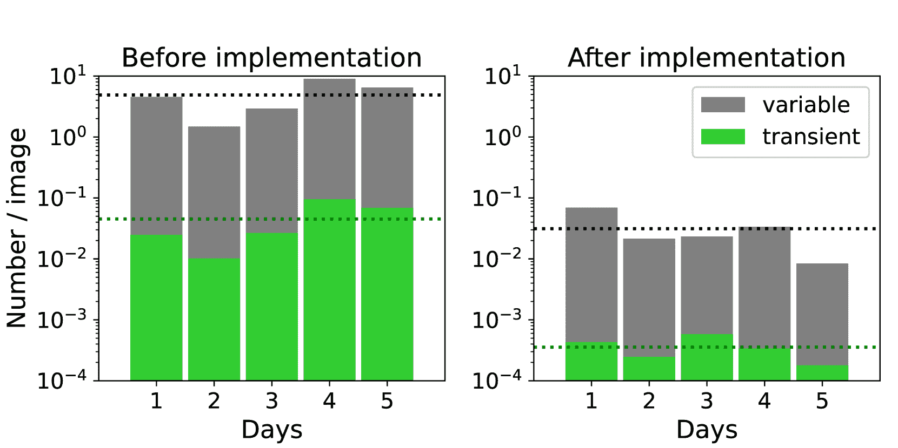

<!--yml

类别：未分类

日期：2024-09-06 19:45:29

-->

# [2206.12478] 深度学习在 Tomo-e Gozen 瞬态调查中的真实/虚假分类

> 来源：[`ar5iv.labs.arxiv.org/html/2206.12478`](https://ar5iv.labs.arxiv.org/html/2206.12478)

\收到

$\langle$接收日期$\rangle$ \接受$\langle$接受日期$\rangle$ \发布$\langle$发布日期$\rangle$

\关键字

超新星：一般 — 方法：统计 — 调查

# 深度学习在 Tomo-e Gozen 瞬态调查中的真实/虚假分类

Ichiro Takahashi¹¹隶属机构：东北大学天文学研究所，日本宫城县仙台市 980-8578 ^*^*隶属机构标记：    Ryo Hamasaki²²隶属机构：甲南大学物理系，科学与工程学院，日本兵库县神户市冈本 8-9-1，658-8501    Naonori Ueda³³隶属机构：NTT 通信科学实验室，日本京都县京田边市光台 2-4，619-0237    Masaomi Tanaka¹¹隶属机构标记： ⁴⁴隶属机构：前沿科学建设部，东北大学先进研究组织，日本宫城县仙台市 980-8577 ⁵⁵隶属机构：宇宙物理与数学研究所（WPI），东京大学，日本千叶县柏市柏之叶 5-1-5，277-8583    Nozomu Tominaga⁶⁶隶属机构：日本国立天文台，日本东京市三鹰市大泽 2-21-1，181-8588 ⁷⁷隶属机构：天文科学系，物理科学学院，高级研究生大学（SOKENDAI），日本东京市三鹰市大泽 2-21-1，181-8588 ²²隶属机构标记： ⁵⁵隶属机构标记：    Shigeyuki Sako⁸⁸隶属机构：东京大学天文学研究所，科学研究生院，日本东京市三鹰市大泽 2-21-1，181-0015 ⁹⁹隶属机构：UTokyo 行星空间科学组织，东京大学，日本东京市本乡文京区 113-0033 ¹⁰¹⁰隶属机构：东京大学空间科学与技术合作研究组织，日本东京市本乡文京区 113-0033    Ryou Ohsawa⁸⁸隶属机构标记：    和 Naoki Yoshida¹¹¹¹隶属机构：东京大学物理系，科学研究生院，日本东京市本乡文京区 7-3-1，113-0033 ⁵⁵隶属机构标记： ¹²¹²隶属机构：智能物理研究所，东京大学，日本东京市本乡文京区 7-3-1，113-0033 ichiro.takahashi@astr.tohoku.ac.jp

###### 摘要

我们提出了一种深度神经网络实/伪分类器，通过处理训练数据中的标签错误，提高了 Tomo-e Gozen 瞬态调查的分类性能。在 Tomo-e Gozen 的广角高频瞬态调查中，传统卷积神经网络分类器的表现不足，因为每晚出现约$10^{6}$个伪检测。为了获得更好的分类器，我们开发了一种新的两阶段训练方法。在这种训练方法中，首先通过正常的监督学习分类检测训练数据中的标签错误，然后对这些标签错误进行去标签处理，并用于半监督学习的训练。对于实际观察数据，这种方法的分类器在真实阳性率（TPR）为 0.9 时，曲线下面积（AUC）达到 0.9998，假阳性率（FPR）为 0.0002。这种训练方法节省了人工重新标记的工作，并且在标签错误比例高的训练数据上表现更好。通过在 Tomo-e Gozen 流程中实现开发的分类器，每晚的瞬态候选对象数量减少到$\sim$40 个，相比之前版本减少了$\sim$1/130，同时保持了真实瞬态的回收率。这使得后续观察目标的选择更加高效。

## 1 引言

时域天文学已成为现代天文学中的一个活跃领域。对超新星等瞬态现象的研究近年来发展迅速。为了高效观察瞬态，瞬态调查变得更广角、更灵敏、频率更高。因此，发现的瞬态数量急剧增加；报告的瞬态数量每年达到数万。在不久的将来，每晚将发现数百个瞬态对象，例如，通过 Vera C. Rubin 天文台（[Ivezić et al. (2019)]）。

为了从大量数据中检测瞬态，大多数瞬态调查实施了图像减法方法。它通过从观察到的新图像中减去过去的参考图像来检测瞬态。通过图像减法，只有亮度发生变化的物体，如瞬态，才可以被提取。减法方法可以有效地检测与星系混合的瞬态。然而，这种方法也有一个缺点，即它倾向于产生大量虚假的检测（以下简称为 Bogus）。因此，开发有效的方法来去除大量 Bogus 变得非常重要。为了选择跟踪观察的目标，有必要从包括 Bogus 在内的检测候选中提取真正的瞬态（以下简称为 Real）。然而，随着观察规模的增加，Bogus 的数量已增加到人工检查不可行的程度。例如，在 Palomar Transient Factory (PTF; [Law et al. (2009)])，每晚检测到约$10^{6}$个潜在候选（[Brink et al. (2013)]）。其中，Bogus 的数量估计是 Real 的 1000 倍以上（[Mahabal et al. (2019)]）。因此，传统的选择方法，如参数切割，已经无法缩小候选范围。

因此，机器学习技术作为一种替代方法引起了关注。在 Real/Bogus 分类的情况下，通过让机器学习检测到的物体数据与其分类结果之间的关系，机器可以对瞬态候选进行分类。如果提前进行训练，分类速度很快，可以实时处理大量数据。各种机器学习方法用于 Real/Bogus 分类已经在许多瞬态调查中提出并实现。在早期，通过将从图像中提取的特征输入到随机森林或神经网络中进行分类（例如，[Bloom et al. (2012)]；[Brink et al. (2013)]；[Wright et al. (2015)]；[Morii et al. (2016)]）。最近，使用卷积神经网络（CNN），直接输入图像数据并由机器自身学习特征，已成为主流（例如，[Gieseke et al. (2017)]；[Turpin et al. (2020)]；[Killestein et al. (2021)]；[Hosenie et al. (2021)]）。例如，在 Zwicky Transient Facility (ZTF; [Bellm et al. (2019)])调查中，应用了基于 CNN 的分类器 braai（[Duev et al. (2019)]）。

Tomo-e Gozen 瞬态调查是一个时域调查项目，利用一个配备 84 个 CMOS 传感器的宽视场 Tomo-e Gozen 相机，每次曝光覆盖 20 平方度的视场（[Sako et al. (2018)]）。瞬态调查的高频率约为每晚 3-4 次，典型灵敏度为 18 等，无滤镜。调查的观察速度为$10^{5}$张图像/天，每晚检测到多达$10^{6}$个瞬态候选。尽管使用了 CNN 分类器将真实的瞬态与这些大多是虚假的候选者区分开来，但分类性能仍不够充分。仍有大量假阳性（每天约$10^{3}$个），即虚假的被分类为真实的。因此，我们需要一种性能更高的新分类器。

为了获得更高的分类性能，可以使用更复杂的模型。通常，复杂模型的训练需要大量的训练数据。在这种情况下，训练通常是通过使用模拟数据而非真实数据进行的。然而，当模拟数据达到数百万个样本时，人工检查其质量变得不可行。因此，训练数据可能会被标签错误污染，例如，真实的被错误标记为虚假。当训练数据中包含标签错误时，会对性能产生负面影响（例如，[Ayyar et al. (2022)])。

本文描述了通过使用复杂的机器学习模型和处理标签错误来改进 Tomo-e Gozen 瞬态调查的真实/虚假分类。本文的结构如下：我们首先在第二部分介绍用于本工作的观测数据集。然后，第三部分描述了新分类器的设计。第四部分展示了这些分类器的性能。在第五部分，我们讨论了提高性能的关键因素，并展示了实际操作中的改进。最后，第六部分给出了结论。

## 2 观测数据

在本节中，我们描述了用于开发机器学习分类器的瞬态调查和数据集。我们使用来自 Tomo-e Gozen 相机的光学图像，该相机安装在 1.05 米 Kiso Schmidt 望远镜上（[Sako et al. (2018)]）。Tomo-e Gozen 相机是一个配备 84 个 CMOS 传感器的马赛克相机。由于快速的 CMOS 读出，调查数据以每秒 2 帧的速度采集。对于瞬态调查，拍摄 12 或 18 张连续图像（6 或 9 秒曝光），不使用滤镜，并将这些图像叠加在一起。叠加图像的典型极限星等为 18 等。

为了进行瞬态检测，执行了堆叠图像与参考图像之间的图像减法。对于图像减法，我们使用了基于 Alard & Lupton (1998) 方法的 hotpants 软件（[Becker (2015)]）。我们使用 Pan-STARRS1 (PS1) $r$-带数据（Waters 等人 (2020); Flewelling 等人 (2020)) 作为参考图像。由于 PS1 数据具有更好的灵敏度和更好的视场，Tomo-e Gozen 图像的灵敏度在图像减法后没有降低，从而实现了高效的瞬态检测。此外，由于 Tomo-e Gozen 相机是新开发的相机，在操作初期没有深度堆叠图像。因此，使用现有的 PS1 数据使得即使在操作的早期阶段也能够进行瞬态调查。

由于观测率高，在 Tomo-e Gozen 瞬态调查中，每晚可拍摄多达$10^{5}$张堆叠图像。瞬态候选者的数量在一夜之间可达到$10^{6}$。与其他瞬态调查一样，检测到的候选者大多被假检测主导。此外，由于数据中各种因素的差异（例如响应函数或像素尺度），不同望远镜/仪器之间的图像减法往往会导致更多的假检测。在本文中，我们展示了通过开发高性能复杂的机器学习分类器（第三部分），可以克服这一难题。

图 1：输入图像的示例（从左到右为新图像、参考图像和减法图像）。

我们在此描述用于开发机器学习分类器的数据集。对于实时/假检测分类，我们使用了一组三张图像：观测的新图像、参考图像和减法图像。对于每张图像，使用了围绕瞬态候选者的裁剪图像（29 $\times$ 29 像素）作为分类器的输入。图 1 展示了裁剪图像的示例。

由于我们需要大规模的数据集来训练复杂的机器，我们使用人工对象作为训练数据集中的真实样本。为此，我们通过测量图像中星星的形状构建了每个图像的点扩散函数（PSF），然后将构建的 PSF 嵌入到具有不同亮度的观测图像中。人工对象被嵌入在两种位置：（1）均匀分布在银河系周围，和（2）在整个图像区域的随机分布。这里，（1）和（2）分别模拟了正常瞬态和无宿主瞬态。我们为每种情况准备了约$6\times 10^{5}$个样本。在银河系周围嵌入人工源时，我们随机选择了在 Pan-STARRS 目录中登记为扩展源的对象。

对于训练数据的虚假样本，我们使用了在 Tomo-e Gozen 的减法图像中检测到的实际虚假对象。图 2 展示了我们数据集中虚假的示例。虚假样本的总数为$2\times 10^{6}$。其中大多数是由于减法失败而导致的错误检测（图 2 中的（a）和（b））。其他情况包括由亮星的衍射光（c）、传感器的热像素（d）和由于数据采集系统故障导致的人工噪声模式（（e）和（f））。需要强调的是，少量真实瞬态可能会被包括在虚假样本中，因为我们假设所有检测到的对象都是虚假的（即标签错误，见章节 4.2）。

图 2：虚假检测示例。

对于验证数据集，我们使用了从 2021 年 1 月至 4 月的实际观测数据提取的样本。真实数据集包括 125 个被报告给瞬态名称服务器（TNS）¹¹1TNS $\langle$https://www.wis-tns.org$\rangle$的对象，这些对象由 Tomo-e Gozen 观测到。由于其中一些被多次检测，总的真实样本数量为 363。作为虚假样本，我们使用了在检测到真实对象的相同图像中的虚假对象。虚假的总数为 255,777。实际的虚假与真实比率远高于这个样本比率（见章节 5.2）。尽管如此，采用这个样本比率是因为如果我们采用实际比率（$\sim$ 1:$10^{6}$），虚假数据集的大小将超过训练数据集的大小。训练和验证数据集中的样本数量总结在表 2 中。

最后，我们在 Tomo-e Gozen 瞬态调查的实际操作中测试了我们的分类器（见章节 5.2）。为此，我们使用了五晚的数据，总计约$5\times 10^{5}$张图像和$5\times 10^{6}$次检测。

\tbl

训练和验证数据集数量。数据集数量 说明 训练 真实 1,224,773 人工虚假 2,031,193 实际验证 真实 363 TNS 虚假 255,777 实际

## 3 方法

为了提高传统分类器的性能，我们将神经网络修改为具有更复杂结构的网络（见 3.1）。此外，为了充分利用具有复杂结构的神经网络，我们提出了一种新的训练方法²²2 我们提出的方法的源代码可以在$\langle$https://github.com/ichiro-takahashi/tomoe-realbogus$\rangle$中找到。专门针对目标函数和数据集处理（见 3.2）。

### 3.1 模型架构

本小节描述了一种简单传统模型的模型结构，该模型作为基线，以及我们提出的更复杂的模型。以后我们将其称为“简单模型”和“复杂模型”。这两个模型通过使用三个输入图像对检测到的对象进行二分类（真实或虚假）。由于真实类别在这里很重要，因此真实类别和虚假类别分别定义为正类和负类。

#### 3.1.1 简单模型

如图 4 所示，简单模型由前半部分的两个卷积层和后半部分的三个全连接层组成。该结构遵循 VGG 模型（Simonyan & Zisserman (2014))，这是使用深度学习进行图像分类任务的基本模型结构。

图 3: 简单模型的架构图。由于卷积层中没有进行填充，特征的空间尺寸在每次通过卷积层时都会减小。该模型在第一个卷积层中采用 kernel_size$=$5，在第二个卷积层中采用 kernel_size$=$3。展平层将输入的(6,6,64)特征压缩为一个大小为 2304 的向量。在 dropout 层中，值为 0 的概率设置为 0.3。该图由 PlotNeuralNet ⁴⁴4PlotNeuralNet $\langle$https://github.com/HarisIqbal88/PlotNeuralNet$\rangle$生成并修改。

⁴⁴脚注文本：PlotNeuralNet $\langle$https://github.com/HarisIqbal88/PlotNeuralNet$\rangle$。

为了保持网络内部值的范围一致，我们对输入图像进行归一化。归一化操作在第$i$个样本的第$c$通道的原始图像$\mathbf{u}_{i,c}\in\mathcal{R}^{H\times W}$上进行（$H$和$W$分别是每张图像的高度和宽度），具体如下：

|  | $\displaystyle\mathbf{x}_{i,c}=\frac{\mathbf{u}_{i,c}-\min\left(\mathbf{u}_{i,c}\right)}{\max\left(\mathbf{u}_{i,c}\right)-\min\left(\mathbf{u}_{i,c}\right)},$ |  | (1) |
| --- | --- | --- | --- |

其中 $\max\left(\right)$ 和 $\min\left(\right)$ 是分别返回图像的最大值和最小值的函数。网络的输出是一个二维向量。通过使用 softmax 函数对输出向量进行归一化，可以将其解释为对象为 Real 的概率。

#### 3.1.2 复杂模型

为了实现比简单模型更高的性能，我们在新的复杂模型中增加了层数。然而，增加层数会使训练变得更加困难。一个著名的解决这个问题的模型是 ResNet (He et al. (2016a); He et al. (2016b))，它有各种扩展版本。在众多 ResNet 扩展中，我们采用了 SE-ResNet，它包括一个通道和空间的 Squeeze & Excitation (csSE) 层 (Roy et al. (2018))。图 4 显示了复杂模型的架构图。

图 4：复杂模型的架构图。在卷积层中，卷积核大小在输入后的第一层为 5，剩余层为 3。此外，通过填充使得输入和输出在空间方向上的大小相同。每个背景为浅蓝色的区域是一个残差块。来自输入侧的第三个残差块在跳跃连接中有一个步幅$=$2 的卷积层以调整特征大小。全局平均池化计算每个通道在空间方向上的平均值，并将大小为 (4, 4, 256) 的特征下采样为 256 维的向量。该图由 PlotNeuralNet 生成并进行了修改。

ResNet 是一种由堆叠的残差块组成的网络结构，每个残差块包括卷积层和输入与输出之间的跳跃连接。跳跃连接消除了梯度消失问题，从而促进了训练性能。由于仅使用卷积层难以学习恒等映射，因此过多的卷积层会导致性能下降。跳跃连接使得在整个残差块中学习恒等映射变得更容易。因此，即使在堆叠的残差块的深层网络中也能实现高性能。由于 csSE 层强调分类特征的有效部分，SE-ResNet 预计相比于原始 ResNet 能提高分类性能。

Residual Block 的一个组件是 Batch Normalization 层（Ioffe & Szegedy (2015））。它具有稳定和加快训练的效果，这有助于深度网络的学习成功。然而，Batch Normalization 存在几个弱点，其中之一是当一个批次中的样本高度相关时，其性能会降低。这在存在许多高度相关的类似图像时是一个问题，例如天文图像。因此，我们使用了 Filter Response Normalization（Singh & Krishnan (2020）），因为这种归一化是按通道和样本进行的，不受样本之间相关性的影响。网络的输入、归一化方法和输出格式与 Simple 模型相同。

### 3.2 训练方法

本小节描述了传统分类器和新分类器的训练方法。我们测试了训练的三个阶段的多种方法：（1）如何处理训练数据，（2）使用哪个目标函数，以及（3）如何处理标签错误。

#### 3.2.1 训练数据处理

在训练数据的处理方面，测试了两种方法：第一种是为每个 CMOS 传感器准备训练数据，并为每个传感器准备一个分类器；另一种是将所有传感器的训练数据合并，并训练一个单一的分类器来分类所有传感器的数据。这些测试是因为不明显哪个选项提供更好的性能，即是否为每个传感器专门设置分类器以照顾传感器的多样性，或者是否为所有传感器使用统一的分类器。

#### 3.2.2 目标函数

对于训练的目标函数，使用了三种类型的函数：交叉熵函数、exp-Cross-hinge 函数（Kurora 等 (2020））和局部分布平滑函数（Miyato 等 (2016））。它们分别用于单个样本的损失函数、整个数据集的损失函数，以及使分类器对输入扰动具有鲁棒性的损失函数。每个在第二部分准备的训练图像 $\mathbf{x}$ 与一个教师标签 $y$ 配对，指示图像是正类还是负类。在这项工作中，我们敢于忽略一些训练数据的标签（我们称这个过程为“unlabel”）。我们在第 3.2.3 节中描述了为什么忽略标签以及如何从数据集中选择它们。目标函数定义如下：

|  | $\displaystyle L\left(\left\{\mathbf{x}_{l},y\right\},\left\{\mathbf{x}_{u}\right\};\boldsymbol{\theta}\right)$ | $\displaystyle=$ | $\displaystyle\lambda_{\mathrm{ce}}L_{\mathrm{ce}}\left(\left\{\mathbf{x}_{l},y\right\};\boldsymbol{\theta}\right)$ |  | (2) |
| --- | --- | --- | --- | --- | --- |
|  |  |  | $\displaystyle+\lambda_{\mathrm{ech}}L_{\mathrm{ech}}\left(\left\{\mathbf{x}_{l},y\right\};\boldsymbol{\theta}\right)$ |  |
|  |  |  | $\displaystyle+\lambda_{\mathrm{lds}}L_{\mathrm{lds}}\left(\left\{\mathbf{x}_{l}\right\}\cup\left\{\mathbf{x}_{u}\right\};\boldsymbol{\theta}\right).$ |  |

这里，$\left\{\mathbf{x}_{l},y\right\}$ 是一组标记图像及其标签的对，$\left\{\mathbf{x}_{u}\right\}$ 是一组未标记图像，$\boldsymbol{\theta}$ 是神经网络的可训练变量集合，$L_{\mathrm{ce}}$、$L_{\mathrm{ech}}$ 和 $L_{\mathrm{lds}}$ 分别是交叉熵损失、指数交叉铰链损失和局部分布光滑（LDS）损失。指数交叉铰链函数与曲线下面积（AUC）最大化相关。局部分布光滑函数是虚拟对抗训练（VAT）的关键组成部分。每项的详细说明在附录中给出。

三个标量超参数 $\lambda_{\mathrm{ce}}$、$\lambda_{\mathrm{ech}}$ 和 $\lambda_{\mathrm{lds}}$ 控制每项的影响。通过将方程 (2) 中一个或两个 $\lambda$ 值设置为 0，我们可以创建几个目标函数的变体。简单模型的目标函数对应于 $\left(\lambda_{\mathrm{ce}},\lambda_{\mathrm{ech}},\lambda_{\mathrm{lds}}\right)^{T}=\left(1,0,0\right)^{T}$ 的情况，即交叉熵函数。在 4.2 节中，我们测试了四种目标函数模式用于训练复杂模型，其中 $\lambda_{\mathrm{ce}}$ 始终非零，$\lambda_{\mathrm{ech}}$ 和 $\lambda_{\mathrm{lds}}$ 可以是零或非零。必须调整超参数 $\left(\lambda_{\mathrm{ce}},\lambda_{\mathrm{ech}},\lambda_{\mathrm{lds}}\right)^{T}$ 的非零元素。这个调整是通过网格搜索完成的，并且在每个网格点上进行多次试验，以避免由于模型初始值和其他因素导致的结果变化。最佳的 $\lambda$ 值组合是那些在这些试验结果中产生最高性能的模型。

在训练中，$\boldsymbol{\theta}$ 使用随机梯度下降法进行更新，以最小化上述定义的目标函数的值。

#### 3.2.3 标签错误处理

我们准备的训练数据并不总是完美的。其中一些有错误的标签或难以标记。更好的做法是纠正这些标签错误，并用干净的训练数据集训练分类器。然而，对于大规模数据集，手动检查和纠正所有这些样本是不切实际的，因为这需要大量的人力。因此，我们将训练分为两个阶段来处理标签错误。在训练的第一阶段，机器找到可能被标记错误的样本。然后，在第二阶段的训练中处理在第一阶段发现的样本。在两个阶段中，都使用复杂模型。

为了找出标签错误，我们首先利用标签错误与训练数据的比例足够小这一事实，使用原始训练数据训练分类器。然后，分类器对训练数据进行分类，并识别标签错误。具体来说，训练数据集被分为五类：一类用于评估，其余四类用于训练分类器。由于有五种不同的选择数据进行评估的方式，因此所有训练数据可以通过五轮训练和评估周期来评估。这种方法与 Northcutt 等人 (2021) 的方法相同。

在对训练数据进行分类后，我们根据分类器的输出确定哪些样本可能存在标签错误。与 Northcutt 等人 (2021) 不同，我们仅将分类边界设置为 0.5 的概率，并将所有分类错误的样本视为可能有标签错误的样本。尽管 0.5 的阈值使得更多样本被认为是潜在标签错误，相较于 Northcutt 等人 (2021) 使用的值，但在我们的案例中，相对于整个数据集，潜在标签错误的数量较少（$\sim 1\%$）（第 4.2 节）。由于潜在标签错误的样本在半监督学习中被用作未标记样本，因此在下面描述的第二阶段训练中的过度估计效果很小。

在训练的第二阶段，我们尝试了两种不同的方法来处理标签错误。第一种方法是简单地从训练数据集中删除可能有标签错误的样本。第二种方法是将可能有标签错误的样本设置为“未标记”，然后进行半监督学习。VAT 在目标函数的计算中不使用标签，这允许进行半监督学习。半监督学习避免了标签错误样本的负面影响，同时有效利用这些样本作为训练数据。

## 4 结果

在本节中，我们总结了前面各节所描述的各种模型和训练方法组合下的真实/虚假分类性能。

### 4.1 训练数据处理的效果

我们比较了 Simple 模型的三种情况的性能：（1）针对每个 CMOS 传感器训练的模型（Simple-each），（2）样本总数与（1）相同但使用所有传感器样本训练的模型（Simple-mix），以及（3）使用所有传感器的整个数据训练的模型（Simple-all）。

首先，我们检查多个传感器的样本多样性对性能的影响。传统分类器采用 Simple-each 方法，并仅使用交叉熵损失作为目标函数进行训练。基于单个传感器数据集的分类可能导致过拟合，其中数据集的独特“习惯”被用于分类数据。通过在多个传感器的数据集上训练，有可能学习到不依赖于独特“习惯”的更重要的特征，从而实现数据增强的效果。

其次，我们研究训练数据规模的影响。在 Simple-all 情况下，实际训练数据的总量比 Simple-each 情况下多 84 倍（传感器数量）。

分类器的性能可以通过接收操作特性（ROC）曲线来评估。⁵⁵ROC 曲线展示了在不同阈值下测量的真正率（TPR）和假正率（FPR）值。分类性能越好，ROC 曲线越接近图的左上角。ROC 曲线的 AUC 值表示整体性能。对于简单每个情况，由于为每个传感器准备和测试了分类器，我们通过结合所有传感器的结果来测量这些情况的性能。图 5 和 6 分别显示了每个简单模型的 AUC 和 FPR。为了查看结果的变化，我们绘制了每种情况中五次训练运行的结果，使用不同的初始种子值。图 6 中的 FPR 在 TPR 为 0.9 时定义。简单每个情况与简单混合情况的比较显示，使用不同传感器的数据混合由于数据增强效果，对于相同大小的训练数据取得了更好的结果。此外，简单全模型取得了更好的结果。这意味着训练数据的更大规模以及来自多个传感器的数据混合都对性能提升有所贡献。

图 5：简单模型的 AUC 比较。每个模型中的五个点表示在不同初始种子值下的性能变化。

图 6：与图 5 相同，但为 FPR 在 TPR=0.9 时的情况。

### 4.2 标签错误处理的影响

我们在此研究标签错误的处理是否能改善复杂模型的性能。作为性能比较的基线，我们使用简单全模型的性能。当多个目标函数被组合时，函数权重的最优值，即$\lambda_{\mathrm{ce}}$、$\lambda_{\mathrm{ech}}$和$\lambda_{\mathrm{lds}}$，是通过对每种情况的参数搜索获得的。每种情况的最优值总结在表 4.2 中。

首先，我们估计训练数据中的标签错误比例。对于训练数据，我们使用来自所有传感器的完整数据，如同在 Simple-all 案例中一样。图 7 的左侧面板显示了当训练数据本身使用训练有交叉熵损失的复杂模型进行分类时的分数分布。这里的分数由方程 (9) 中的分数函数定义，而非概率。我们特别关注分类器错误分类的样本，即真实和虚假分布的尾部样本。对于这些样本，我们通过视觉检查图像。由于尾部样本数量众多，我们进行了样本调查以估计标签错误的比例。通过对每个分数区间随机选择的样本进行视觉计数来评估比例。图 7 的右侧面板显示了各分数区间的分数分布和标签错误比例。实际上，我们发现标签错误的比例在分布的边缘也会增加。根据估计的标签错误比例，训练数据中虚假的标签错误污染率约为 0.6%，真实的约为 1%。

|     |
| --- |

图 7：左侧：训练数据集的分数分布。右侧：分数分布（左轴）和通过人工视觉估计的标签错误比例（右轴）。样本调查在分数分布的边缘进行。

图 8 显示了分数分布边缘的标签错误示例。其中，错误标记为虚假的样本明显显示出似乎是瞬变的对象。另一方面，错误标记为真实的样本包含了人工星体，但具有明显的虚假检测。换句话说，这些样本的标签不正确，机器实际上将其正确分类。

图 8：标签错误样本的示例。

然后，我们调查了处理标签错误的两种不同方法对分类性能的影响。首先，我们检查了简单地移除可能存在标签错误的样本的方法。图 9 和图 10 分别展示了有潜在标签错误（索引 2 和 4）和没有潜在标签错误（索引 3 和 5）情况下的 AUC 和 FPR。在比较中使用了两个分类器：一个仅使用 CE，另一个使用 CE+AUC 作为目标函数。在图 9 和图 10 中，CE、AUC 和 VAT 列表示是否使用了$L_{\mathrm{ce}}$、$L_{\mathrm{ech}}$和$L_{\mathrm{lds}}$。当移除潜在标签错误的样本（索引 3 和 5）时，两个分类器的表现均有所提升。移除潜在标签错误的样本时，FPR 显著降低，而 AUC 由于每个种子值的高变异性显示出没有显著差异。然而，在所有情况下，移除潜在标签错误的分类器表现不如 Simple-all 情况。

接下来，我们检查了半监督学习方法，其中所有可能存在标签错误的样本被标记为未标记。在图 9 和图 10 中，每种情况下目标函数为 CE+AUC+VAT 的模型的 AUC 和 FPR 分别显示为索引 8 和 9。在这次比较中，通过未标记处理潜在标签错误并执行半监督学习的方法（索引 9）显示出比保留潜在标签错误的监督学习（索引 8）更好的结果。此外，半监督学习方法（索引 9）在 TPR=0.9 时的 FPR 低于移除潜在标签错误的方法（索引 3 和 5）和 Simple-all 情况（索引 1）。这意味着即使训练数据包含标签错误，半监督学习方法也能实现良好的性能。

最后，我们比较了在不同目标函数组合下以及处理/不处理标签错误的情况下的分类性能。所有情况下的 AUC 和 FPR 汇总在图 9 和图 10 中。比较所有情况后，结合三种目标函数并使用半监督学习的情况（索引 9）取得了最佳结果。为了比较，图 11 展示了 Simple-each 情况、Simple-all 情况和最佳分类器的预测分布及混淆矩阵。在最佳分类器中，与 Simple-all 情况相比，被误分类为 Real 的 Bogus 数量进一步减少，混淆矩阵中的假阳性是 Simple-each 情况的 1/23。最佳分类器的 ROC 曲线在图 12 中以绿色线条展示，其中 AUC 达到 0.9998。类似地，FPR 与假阴性率（FNR$=1-$TPR）的关系绘制在图 13 中。当 FNR=0.1（TPR=0.9）时，FPR 降至 0.0002。

图 9：所有分类器的 AUC 汇总。每种情况下的五个点表示不同初始种子值下的性能变化。填充点表示每种情况下 AUC 最高的训练。CE、AUC 和 VAT 列指示是否使用了目标函数的每一项。

图 10：与图 9 相同，但为 TPR=0.9 时的 FPR。

\tbl

分类性能总结。 模型类型 数据类型 CE AUC VAT $\lambda_{\mathrm{ce}}$ $\lambda_{\mathrm{ech}}$ $\lambda_{\mathrm{lds}}$ AUC FPR@TPR=0.9 简单 每个 $\checkmark$ 1.0 0.0 0.0 0.9916 $9.868\times 10^{-3}$ 简单 混合 $\checkmark$ 1.0 0.0 0.0 0.9964 $5.028\times 10^{-3}$ 简单 全部 $\checkmark$ 1.0 0.0 0.0 0.9997 $3.323\times 10^{-4}$ 复杂 全部 $\checkmark$ 1.0 0.0 0.0 0.9993 $7.272\times 10^{-4}$ 复杂 去除 $\checkmark$ 1.0 0.0 0.0 0.9993 $8.367\times 10^{-4}$ 复杂 全部 $\checkmark$ $\checkmark$ 0.3 0.7 0.0 0.9992 $1.306\times 10^{-3}$ 复杂 去除 $\checkmark$ $\checkmark$ 0.4 0.6 0.0 0.9996 $5.083\times 10^{-4}$ 复杂 全部 $\checkmark$ $\checkmark$ 0.4 0.0 0.6 0.9997 $1.603\times 10^{-4}$ 复杂 未标记 $\checkmark$ $\checkmark$ 0.6 0.0 0.4 0.9997 $1.838\times 10^{-4}$ 复杂 全部 $\checkmark$ $\checkmark$ $\checkmark$ 0.3 0.3 0.4 0.9997 $2.541\times 10^{-4}$ 复杂 未标记 $\checkmark$ $\checkmark$ $\checkmark$ 0.9 0.05 0.05 0.9998 $1.994\times 10^{-4}$

图 11：上面面板：每个分类器的输出概率（为真实）的分布。红色和蓝色分别表示真实样本和虚假样本的直方图。下面面板：每个分类器的混淆矩阵。所有分类器中的预测标签都是阈值为 0.5 的标签。每一行的比例归一化为 1。括号中的数字表示原始数字。

图 12：Simple-each 分类器和最佳分类器的 ROC 曲线。

图 13：Simple-each 分类器和最佳分类器的 FNR 与 FPR 对比。

## 5 讨论

在这一部分，我们回顾了在我们的真实/虚假分类中的性能提升，并讨论了这一提升的关键因素，以及在 Tomo-e Gozen 瞬态管道中实施最佳分类器后的实际性能。

### 5.1 性能分析

以下是 Tomo-e Gozen 真实/虚假分类性能提升的总结。如表 4.2 所示，当满足以下所有条件时，达到最佳性能：

+   •

    所有传感器的训练数据已被合并。

+   •

    使用了所有三个目标函数。

+   •

    应用了半监督学习。

与 Simple-each 情况相比，AUC 从 0.9916 提高到 0.9998，TPR$=$0.9 时的 FPR 从 0.0099 下降到 0.0002。与 ZTF Real/Bogus 分类器（TPR$=$0.983 时 FPR$=$0.017，Duev 等人（2019））的性能进行比较，我们的最佳分类器在相同的 TPR 下提供了 FPR$=$0.003。尽管由于仪器、管道和 Real/Bogus 比例的不同，无法对 Tomo-e Gozen 和 ZTF 进行准确的比较，但我们实现了与 ZTF 分类器相当的 FPR。

然后我们讨论了提高分类性能的关键因素。首先，结合不同传感器的训练数据显著提升了性能。这一提升是由于通过混合具有不同特征的多个传感器的数据而产生的数据增强效果。此外，增加训练数据的数量也能如预期般提高性能。此外，将 LDS 损失纳入目标函数，与 Simple-all 情况相比，Complex 模型的分类性能有所提升。由于 Complex 模型可以处理复杂的表示，它倾向于对训练数据进行过拟合，从而在验证数据上的性能较低。另一方面，当 LDS 损失被纳入目标函数时，基于 LDS 的正则化避免了过拟合，从而提高了性能。我们还展示了，通过将标签错误样本设置为未标记样本并进行半监督学习，性能得到了进一步提升。

我们在这里调查所提方法在训练数据中存在更多标签错误时是否仍然有效。我们原始训练数据集中的标签错误比例约为 1%。我们通过根据估计的标签错误比例（图 7）反转标签，人工增加标签错误比例。然后，我们使用包含未标记样本的数据的最佳方法——半监督学习，对数据进行分类，并将结果与训练时标签错误未消除的情况进行比较。图 14 和 15 比较了当标签错误比例增加到约 5%和 10%时的 AUC 和 FPR。结果发现，标签错误比例增加时，改进程度更高。当标签错误比例为 1%时，通过处理标签错误，平均 FPR 从 0.0004 降至 0.0002，即改善约为 2 倍。另一方面，当标签错误比例为 10%时，平均 FPR 从 0.0039 降至 0.0003，对应于 13 倍的改善。这意味着我们的方法在标签错误比例较高的数据集上更为有效。

图 14：不同标签错误比例下的 AUC。

图 15：与图 14 相同，但用于 FPR 在 TPR$=$0.9 时。

### 5.2 实际操作中的性能

最后，我们讨论了当我们的最佳分类器在 Tomo-e Gozen 的数据分析管道中实施时的实际性能。在实施之前，我们确定了实际操作中的分类阈值。图 16 显示了每个指标随阈值变化的情况。我们将阈值设置为 0.85，这在保持 TPR 高于 0.9 的同时提供了最佳精度。

图 16：最佳分类器的每个指标随阈值变化的情况。

我们调查了在实施前后 Tomo-e Gozen 瞬态数据库中登记的瞬态候选对象数量的变化。图 17 显示了在五天期间实施前后数据库中的登记数量。作为数据库登记的规则，分类器首次检测到的对象被登记为“变量”。在变量候选对象中，那些在相同坐标上检测到两次的被登记为“瞬态”。新分类器实施后，变量和瞬态登记的平均数量分别减少到了 1/160 和 1/130。

图 17：在实施最佳分类器前（左侧面板）和实施后（右侧面板）Tomo-e 瞬态数据库中登记的对象数量。传统分类器与 Simple-each 分类器的训练方式相同。水平虚线表示五天的平均值。

为了确认新分类器没有遗漏真实对象，我们检查了真实对象的恢复率。通过将登记的瞬态与 TNS 对象进行匹配，我们确认匹配数量与 TNS 对象数量的比例在实施前后相当。此外，登记的瞬态候选对象中 TNS 对象的比例在实施后提高了 86 倍。这表明由于错误分类而错误登记的 Bogus 大大减少。最终瞬态候选对象的数量从每天约 5,000 个减少到 40 个。这一数量级可以由人工进行视觉检查，并且可以在短时间内有效地选择后续观察的目标。

## 6 结论

在本文中，我们提出了一种新的真实/伪分类方案，通过处理 Tomo-e Gozen 瞬态调查的训练数据中的标签错误。在主要针对早期超新星和快速瞬态的宽场高频调查中，传统 CNN 分类器的性能不足以提取后续目标，因为 Bogus 的数量每天达到$10^{3}$级别。因此，我们开发了一种两步训练方法：（1）常规监督学习以检测训练数据中的标签错误；（2）半监督学习，使用包含潜在标签错误的训练数据作为未标记样本。

使用这种方法的最佳分类器在基于实际观测准备的验证数据中，实现了 0.9998 的 AUC 和 0.0002 的 FPR，在 TPR$=$0.9 的情况下。我们的方法不需要人工重新标记可能存在标签错误的样本。我们还表明，当标签错误的比例较高时，我们的方法能够提供更高的性能提升。最后，我们在 Tomo-e Gozen 流水线中实现了开发的分类器。实施后，注册的过渡候选者数量减少了大约 100 倍，降至每天 40 个候选者，同时保持了真实过渡体的恢复率。这使得后续目标选择更加高效。

{ack}

我们感谢 Yasuhiro Imoto 对分类器开发所作出的重要贡献。我们还对匿名审稿人提出的有见地的建议表示感谢。

本工作得到了日本科学技术振兴机构（JST）AIP 加速研究资助（资助号 JP20317829）以及日本学术振兴会（JSPS）KAKENHI 资助（21H04491、18H05223 和 17H06363）的支持。

本工作部分得到了光学和近红外天文学跨大学合作计划的支持。

Pan-STARRS1 调查（PS1）和 PS1 公开科学档案的建立得到了以下机构的支持：天文学研究所、夏威夷大学、Pan-STARRS 项目办公室、马克斯·普朗克学会及其参与机构、马克斯·普朗克天文研究所（海德堡）和马克斯·普朗克外星物理研究所（加尔兴）、约翰·霍普金斯大学、达勒姆大学、爱丁堡大学、贝尔法斯特女王大学、哈佛-史密森天体物理中心、拉斯·昆布雷斯天文台全球望远镜网络公司、台湾中央大学、太空望远镜科学研究所、美国国家航空航天局（NASA）科学任务局行星科学部门资助的 NNX08AR22G 号项目、国家科学基金会 AST-1238877 号资助、马里兰大学、厄尔特大学（ELTE）、洛斯阿拉莫斯国家实验室以及戈登与贝蒂·摩尔基金会。

## 目标函数的详细信息

在此我们描述了第 3.2.2 节中提出的目标函数的详细信息。

##### 交叉熵

: 交叉熵函数是一种在训练分类器中常用的目标函数。它的作用是将神经网络的输出与每个样本的教师标签进行匹配。交叉熵函数如下：

|  | $\displaystyle L_{\mathrm{ce}}\left(\left\{\mathbf{x}_{l},y\right\};\boldsymbol{\theta}\right)$ |  | (3) |
| --- | --- | --- | --- |
|  |  | $\displaystyle=\frac{1}{N_{l}}\sum_{i=1}^{N_{l}}$ | $\displaystyle\left\{-I\left(y_{i}=c^{+}\right)\log p\left(y=c^{+}\mid\mathbf{x}_{i};\boldsymbol{\theta}\right)\right.$ |  |
|  |  |  | $\displaystyle\left.\;-I\left(y_{i}=c^{-}\right)\log p\left(y=c^{-}\mid\mathbf{x}_{i};\boldsymbol{\theta}\right)\right\},$ |  |
|  | $\displaystyle p\left(y=c\mid\mathbf{x};\boldsymbol{\theta}\right)$ |  | (4) |
|  |  | $\displaystyle=$ | $\displaystyle\frac{\exp\left(f\left(y=c\mid\mathbf{x};\boldsymbol{\theta}\right)\right)}{\exp\left(f\left(y=c^{+}\mid\mathbf{x};\boldsymbol{\theta}\right)\right)+\exp\left(f\left(y=c^{-}\mid\mathbf{x};\boldsymbol{\theta}\right)\right)}.$ |  |

这里 $N_{l}$ 是标记样本的数量，$I\left(\right)$ 是指示函数，$c^{+}$ 和 $c^{-}$ 分别是正例和负例的标签，而 $f\left(y=c\mid\mathbf{x};\boldsymbol{\theta}\right)$ 是对应于标签 $c$ 的输出值（$\mathbf{x}$ 是神经网络的输入）。

##### exp-Cross-hinge 损失（AUC 最大化）

如果样本比例高度偏斜，表观性能可以通过始终预测主要类别来提高，而不考虑输入数据。例如，在瞬态调查中，虚假对象始终占据主导地位，真实对象则相对较少。在这种情况下，将所有输入都分类为虚假对象的分类器可以获得高分。然而，显然这样的分类器对于检测真实瞬态并没有用处。处理不平衡数据集的方法包括对多数类进行下采样（例如，Hosenie 等（2019））和给予少数类额外权重（例如，van Roestel 等（2021））。在我们提出的方法中，我们通过将 exp-Cross-hinge 损失（Kurora 等（2020））纳入目标函数来处理不平衡数据，如下所述。

exp-Cross-hinge 损失是用于数据集中正例和负例对的损失函数。当负样本的得分大于正样本的得分时，会发生与差异相对应的损失。相反，当正例的得分大于负例的得分时，hinge 函数会防止损失下降到一定水平。此外，通过指数函数扩大负样本和正样本得分之间的差异，即使差异较小也能进行学习。对于所有正例和负例对，当正样本的得分大于负样本的得分（包括边际）时，这个损失函数被最小化。其定义如下：

|  | $\displaystyle L_{\mathrm{ech}}\left(\left\{\mathbf{x}^{+}\right\},\left\{\mathbf{x}^{-}\right\};\boldsymbol{\theta}\right)$ |  | (5) |
| --- | --- | --- | --- |
|  |  | $\displaystyle=$ | $\displaystyle\frac{1}{N^{+}N^{-}}\sum_{i=1}^{N^{+}}\sum_{j=1}^{N^{-}}\exp\left\{\left[s\left(\mathbf{x}_{j}^{-};\boldsymbol{\theta}\right)-s\left(\mathbf{x}_{i}^{+};\boldsymbol{\theta}\right)+\xi\right]_{+}\right\}.$ |  |

这里，$s\left(\right)$ 是由 $\boldsymbol{\theta}$ 参数化的评分函数，$\mathbf{x}^{+}$ 和 $\mathbf{x}^{-}$ 分别是正样本和负样本，$N^{+}$ 和 $N^{-}$ 分别是正样本和负样本的数量，$\xi$ 是正样本和负样本得分之间的间隔。在方程中，$\left[\bullet\right]_{+}$ 是 hinge 函数，定义为

|  | $\displaystyle\left[z\right]_{+}=\left\{\begin{array}[]{ll}z&(z\geq 0)\\ 0&(z<0)\end{array}\right..$ |  | (8) |
| --- | --- | --- | --- |

我们通过神经网络的输出定义评分函数如下：

|  | $\displaystyle s\left(\mathbf{x};\boldsymbol{\theta}\right)=f\left(y=c^{+}\mid\mathbf{x};\boldsymbol{\theta}\right)-f\left(y=c^{-}\mid\mathbf{x};\boldsymbol{\theta}\right).$ |  | (9) |
| --- | --- | --- | --- |

AUC 是一种衡量二分类器性能的指标，当我们希望最大化真正例率并最小化假正例率时使用。AUC 通常定义为 ROC 曲线下的面积。或者，它可以定义为在数据集中所有正负样本对中，正样本得分大于负样本得分的对的比例。由于 AUC 是一个不连续的函数，直接最大化 AUC 是困难的。另一方面，由于 exp-Cross-hinge 函数是对 AUC 函数的连续函数松弛，我们期望通过最小化 exp-Cross-hinge 函数来获得 AUC 最大化的近似解。

##### 虚拟对抗训练（VAT）

: 我们执行虚拟对抗训练（VAT）（Miyato 等人（2016））。VAT 是一种将局部分布平滑性（LDS）作为正则化项的训练方法。LDS 是模型输出的新平滑性概念。在 VAT 中，向输入图像添加最大化神经网络输出变化的特殊扰动。神经网络被训练以最小化输出的变化，从而实现平滑正则化。因此，预计它对输入扰动的影响具有鲁棒性。目标函数如下：

|  | $\displaystyle L_{\mathrm{lds}}\left(\left\{\mathbf{x}_{l}\right\}\cup\left\{\mathbf{x}_{u}\right\};\boldsymbol{\theta}\right)$ |  | (10) |
| --- | --- | --- | --- |
|  |  | $\displaystyle=$ | $\displaystyle\frac{1}{N_{l}+N_{u}}\sum_{i=1}^{N_{l}+N_{u}}\mathrm{KL}\left[p\left(y\mid\mathbf{x}_{i};\boldsymbol{\theta}\right)\middle&#124;\middle&#124;p\left(y\mid\mathbf{x}_{i}+\mathbf{r}_{i};\boldsymbol{\theta}\right)\right],$ |  |

其中 $N_{l}$ 和 $N_{u}$ 分别是标记样本和未标记样本的数量，$\mathrm{KL}\left[\bullet\middle|\middle|\bullet\right]$ 是 KL 散度，用于衡量两个分布之间的差异，而 $\mathbf{r}_{i}$ 是第 $i$ 个样本的虚拟对抗扰动。这里，$\mathbf{r}_{i}$ 是一个微小的扰动，能够最大化分类器输出的变化，其定义为

|  | $\displaystyle\mathbf{r}_{i}=\mathop{\rm arg~{}max}\limits_{\mathbf{r},\;\mathrm{w.r.t.}\left\|\mathbf{r}\right\|^{2}<\epsilon}\mathrm{KL}\left[p\left(y_{i}\mid\mathbf{x}_{i};\boldsymbol{\theta}\right)\middle\|\middle\|p\left(y_{i}\mid\mathbf{x}_{i}+\mathbf{r};\boldsymbol{\theta}\right)\right],$ |  | (11) |
| --- | --- | --- | --- |

其中 $\epsilon$ 是扰动的大小。由于计算成本高，获得 $\mathbf{r}_{i}$ 的确切值不切实际。相反，我们通过使用 Miyato 等人（2016）的算法 1 中所示的方法有效地获得了近似的虚拟对抗扰动。由于计算 $\mathbf{r}_{i}$ 不需要标签信息，因此即使对于没有标签的样本也可以使用 VAT 目标函数。

## 参考文献

+   Alard & Lupton（1998）Alard, C., & Lupton, R. H. 1998 年，ApJ，第 503 卷，第 325 页

+   Ayyar 等人（2022）Ayyar, V., Knop, Robert, J., Awbrey, A., Anderson, A., & Nugent, P. 2022 年，arXiv:2203.09908

+   Becker（2015）Becker, A. 2015 年，天体物理学源代码库，ascl:1504.004

+   Bellm 等人（2019）Bellm, E. C., 等人。2019 年，PASP，第 131 卷，第 018002 页

+   Bloom 等人（2012）Bloom, J. S., 等人。2012 年，PASP，第 124 卷，第 1175 页

+   Brink 等人（2013）Brink, H., Richards, J. W., Poznanski, D., Bloom, J. S., Rice, J., Negahban, S., & Wainwright, M. 2013 年，MNRAS，第 435 卷，第 1047 页

+   Duev 等人（2019）Duev, D. A., 等人。2019 年，MNRAS，第 489 卷，第 3582 页

+   Flewelling 等人（2020）Flewelling, H. A., 等人。2020 年，ApJS，第 251 卷，第 7 页

+   Gieseke 等人（2017）Gieseke, F., 等人。2017 年，MNRAS，第 472 卷，第 3101 页

+   He 等人（2016a）He, K., Zhang, X., Ren, S., & Sun, J. 2016a 年，在 2016 IEEE 计算机视觉与模式识别会议（CVPR）（洛杉矶，加州，美国：IEEE 计算机学会），第 770 页

+   He 等人（2016b）He, K., Zhang, X., Ren, S., & Sun, J. 2016b 年，在《计算机视觉 – ECCV 2016》，编辑 B. Leibe, J. Matas, N. Sebe, & M. Welling（香农：Springer International Publishing），第 630 页

+   Hosenie 等人（2019）Hosenie, Z., Lyon, R. J., Stappers, B. W., & Mootoovaloo, A. 2019 年，MNRAS，第 488 卷，第 4858 页

+   Hosenie 等人（2021）Hosenie, Z., 等人。2021 年，《实验天文学》，第 51 卷，第 319–344 页

+   Ioffe & Szegedy（2015）Ioffe, S., & Szegedy, C. 2015 年，在第 32 届国际机器学习会议论文集 - 第 37 卷，ICML’15（JMLR.org），第 448 页

+   Ivezić 等人（2019）Ivezić, Ž., 等人。2019 年，ApJ，第 873 卷，第 111 页

+   Killestein 等人（2021）Killestein, T. L., 等人。2021 年，MNRAS，第 503 卷，第 4838 页

+   Kurora 等人（2020）Kurora, S., Hachiya, H., Shimada, U., & Ueda, N. 2020 年，IBISML

+   Law 等人（2009）Law, N. M., 等人。2009 年，PASP，第 121 卷，第 1395 页

+   Mahabal 等人（2019）Mahabal, A., 等人。2019 年，PASP，第 131 卷，第 038002 页

+   Miyato 等 (2016) Miyato, T., ichi Maeda, S., Koyama, M., Nakae, K., & Ishii, S. 2016, arXiv:1507.00677

+   Morii 等 (2016) Morii, M., 等 2016, PASJ, 68, 104

+   Northcutt 等 (2021) Northcutt, C. G., Jiang, L., & Chuang, I. L. 2021, 《人工智能研究期刊》 (JAIR), 70, 1373

+   Roy 等 (2018) Roy, A. G., Navab, N., & Wachinger, C. 2018, 在《医学图像计算与计算机辅助干预 – MICCAI 2018》中, 主编 A. F. Frangi, J. A. Schnabel, C. Davatzikos, C. Alberola-López, & G. Fichtinger (Cham: Springer International Publishing), 421

+   Sako 等 (2018) Sako, S., 等 2018, 在 Proc. SPIE Conf. Ser., Vol. 10702, 《地面与空中天文仪器 VII》中, 主编 C. J. Evans, L. Simard, & H. Takami, 107020J

+   Simonyan & Zisserman (2014) Simonyan, K., & Zisserman, A. 2014, arXiv:1409.1556

+   Singh & Krishnan (2020) Singh, S., & Krishnan, S. 2020, 在 Proc. of the IEEE/CVF Conf. on Computer Vision and Pattern Recognition (CVPR), 11234

+   Turpin 等 (2020) Turpin, D., 等 2020, MNRAS, 497, 2641

+   van Roestel 等 (2021) van Roestel, J., 等 2021, AJ, 161, 267

+   Waters 等 (2020) Waters, C. Z., 等 2020, ApJS, 251, 4

+   Wright 等 (2015) Wright, D. E., 等 2015, MNRAS, 449, 451
