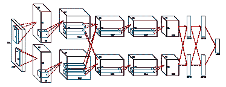
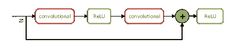
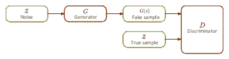

<!--yml

类别：未分类

日期：2024-09-06 19:45:25

-->

# [2207.02148] 深度学习在指静脉识别中的应用：近年来趋势的简要调查 尹一敏和郑晶华为通讯作者。

> 来源：[`ar5iv.labs.arxiv.org/html/2207.02148`](https://ar5iv.labs.arxiv.org/html/2207.02148)

# 深度学习在指静脉识别中的应用：近年来趋势的简要调查

^†^†致谢：尹一敏和郑晶华为通讯作者。

Renye Zhang 计算机科学学院

湖南第一师范大学 中国长沙

renyezhang2016@163.com    尹一敏 数学与统计学院

湖南第一师范大学 中国长沙

yinyimin16@nudt.edu.cn    Wanxia Deng 电子科学学院

国防科技大学 中国长沙

wanxiadeng@163.com    Chen Li 医学与生物信息工程学院

东北大学 中国沈阳

lichen201096@hotmail.com    Jinghua Zhang 智能科学与技术学院

国防科技大学 中国长沙

zhangjingh@foxmail.com

###### 摘要

指静脉图像识别技术在生物识别中发挥了重要作用，并已成功应用于许多领域。由于静脉埋藏在皮肤组织下，指静脉图像识别具有无与伦比的优势，不易受到外部因素的干扰。本文综述了 2017 年至 2021 年间 46 篇关于指静脉图像识别的深度学习论文。这些论文根据深度神经网络的任务进行了总结。此外，我们还介绍了指静脉图像识别的挑战和潜在发展方向。

###### 关键词：

指静脉图像识别，深度学习，深度神经网络

## 引言

生物识别旨在通过物理特征，如指纹、声音和虹膜，识别一个人[1]。随着数字安全验证系统需求的增长，生物识别在许多领域中扮演了至关重要的角色，如在线支付、安全等。与传统的安全识别过程相比，生物识别技术由于其便利性和稳定的安全性更加高效。不幸的是，几种具有代表性的生物识别技术遇到了瓶颈。例如，指纹识别率受到手指表面的显著影响。此外，无意间留在物体上的指纹可能导致安全风险。语音识别通常需要相对安静的环境。虹膜系统的识别率很高，但需要昂贵的传感器。不同于上述技术，*指静脉图像识别*（FVIR）高效且成本低。指静脉埋藏在手指的皮肤下，对每个人都是独特的。它可以通过近红外光[2]而非易受外部因素影响的可见光来识别。

人工智能技术，尤其是*深度学习*（DL）技术，近年来发展迅速。与传统的图像处理方法相比，DL 在计算机视觉的许多任务中表现出压倒性的性能，如生物特征识别[1]、生物医学图像分析[6]和自动驾驶[7]。基于 DL 的方法广泛应用于 FVIR 任务。传统的 FVIR 过程通常包括图像采集、图像数据预处理、特征提取以及分类或其他分析任务。基于 DL 的方法，特别是*卷积神经网络*（CNNs），极大地改变了手动特征提取的过程。传统机器学习方法的性能受特征工程的显著影响，其中特征选择基于人类领域知识。然而，CNNs 可以通过有监督或半监督学习提取抽象但有效的特征。DL 基于的方法极大地简化了识别过程。

为了阐明基于 DL 的 FVIR 的最新趋势和潜在方向，我们进行了这项简要调查。我们总结了 2017 年至 2021 年间的 46 篇相关论文，涵盖了不同的指静脉图像分析任务，包括分类、特征提取、图像增强、图像分割和加密。这些论文来自流行的学术数据集或搜索引擎，主要包括 IEEE、Springer、Elsevier 和 Google Scholar。我们使用“finger vein image analysis” AND（“deep learning” OR “neural network” OR “ANN” OR “CNN” OR “GAN” OR “RNN” OR “LSTM”）作为搜索关键词。本文的结构如下：在第 II 节，我们简要介绍了常用的公开数据集、一些代表性的 DL 技术和现有的综述论文。在第 III 节，根据神经网络的任务总结相关论文。在第 IV 节，讨论了 FVIR 的挑战和潜在方向。最后，在第 V 节，提供了本文的结论和未来工作。

## II 深度学习技术

在本节中，我们首先介绍常用的公共数据集。然后，总结了 FVIR 中最广泛使用的网络。最后，我们还讨论了我们的调查与现有文献之间的差异。

### II-A 数据集

数据集在开发 FVIR 技术中至关重要。数据集中的图像数据容量和质量直接影响深度学习模型的性能。通过对相关文献的调查，使用最广泛的数据集有 FV-USM [58], HKPU [59], MMCBNU-6000 [60], SDUMLA-HMT [61], UTFVP [62]。这些数据集的基本信息见表 I.

表 I: 指纹静脉数据集的基本信息。

| 数据集 | 数据来源 | 图像数量 | 分辨率 |
| --- | --- | --- | --- |
| SDUMLA-HMT | 106 | 3816 | 320 $\times$ 240 |
| HKPU | 156 | 3132 | 513 $\times$ 256 |
| MMCBNU-6000 | 100 | 6000 | 320 $\times$ 240 |
| FV-USM | 123 | 5904 | 640 $\times$ 480 |
| UTFVP | 60 | 1440 | 672 $\times$ 380 |
| THU-FFVDT2 | 610 | 2440 | 720 $\times$ 576 |

### II-B 深度神经网络

AlexNet [8], ResNet [9], 和 GAN [5]是 FVIR 中最广泛使用的网络。它们的基本特征如下：

#### II-B1 AlexNet

AlexNet 是深度学习技术的一个里程碑。在它之前，神经网络技术的发展多年处于低迷状态。它是第一个赢得 ILSVRC 2012 的 CNN。AlexNet 之后，深度学习开始成为许多计算机视觉任务中的主流技术 [64]。AlexNet 的结构包含五个卷积层和三个最大池化层。此外，它有三个全连接层，分别具有 4096、4096 和 1000 个神经元。其结构见图 1。该网络采用 ReLU 作为激活函数，并应用 Dropout 和数据增强来防止过拟合。

图 1: AlexNet 的结构

#### II-B2 ResNet

ResNet 是由若干残差单元串联而成的深度神经网络。如图 2，残差单元由卷积层和快捷连接组成。快捷连接可以有效保证梯度的反向传播。此外，ResNet 除了输出层外不包含任何全连接层。这种设计大大减少了网络参数的数量。由于 ResNet 的优秀结构，它被广泛用作许多计算机视觉任务的主干网络。

图 2：残差单元结构。

#### II-B3 GAN

GAN 通常用于指静脉图像恢复任务。其结构如图 3. 与用于分类的神经网络不同，GAN 由生成器和鉴别器组成。生成器的任务是生成可以欺骗鉴别器的假样本。鉴别器旨在区分真假样本。这种生成对抗过程可以用 (1) 的形式建模。 $V$ 是整个模型的目标函数。 $D$ 是鉴别器， $G$ 是生成器， $E_{x\sim P_{data}}$ 代表真实数据分布， $E_{z\sim P_{z}(z)}$ 代表随机噪声分布 整个公式揭示了 GAN 优化过程。如图 3，生成器网络接收带有噪声的随机输入，而鉴别器网络接收真样本。然后生成器网络的输出被馈送到鉴别器，验证它是否是真实样本。

图 3：GAN 的基本理论

|  | $\displaystyle\mathop{min}\limits_{Gener}\mathop{max}\limits_{Discr}V(Gener,Discr)=E_{x\sim P_{data}}[logDiscr(x)]+$ |  | (1) |
| --- | --- | --- | --- |
|  | $\displaystyle E_{z\sim P_{z}(z)}[log[1-Discr(Gener(z))]]$ |  |

### II-C 现有评论的分析

我们还分析了关于指静脉识别的现有综述。在[10]中，介绍了主要的指静脉识别过程，但没有讨论相关论文的贡献。在[4]中，总结的文献量有限。[11]按照网络类型对论文进行了分类，但没有解释网络的任务。与这些综述不同，我们通过对神经网络任务的详细分析来进行本次调查，这为相关研究提供了新的视角。此外，我们的调查提供了开放访问数据集和主流深度学习技术的介绍。此外，还呈现了前沿工作的综合总结表。

## III 基于深度学习的指静脉识别

本节概述了基于深度学习的指静脉识别（FVIR）。根据神经网络的任务，将相关论文分为五个部分。在每个任务中，介绍了代表性的方法。最后，我们提供了一个总结表。

### III-A 分类

分类是 FVIR 中的主要任务。与传统机器学习方法相比，DL 技术在指静脉图像分类任务中展现了压倒性的性能。[12, 13, 15, 16, 18, 19, 20, 21, 22, 23, 24, 26, 28, 29, 30, 32, 33, 34, 35, 36, 37, 38, 39, 41, 43, 45, 53, 54] 专注于基于 DL 的指静脉分类任务。其中，大多数论文采用类似的基于 CNN 的工作流程来分类指静脉数据。例如，ResNet 直接应用于图像数据以执行分类任务，在 [18] 中有所体现。类似的工作流程也被用于 [20, 32, 37, 53] 中。值得注意的是，[39] 引入了联合注意力模块，以提高特征提取中静脉模式的贡献。除了 CNN，还有一些论文采用了不同的神经网络，例如 [21] 使用 *图神经网络* (GNN) 执行分类。复杂的静脉纹理可以被描述为图结构。因此，GNN 能够在有限的数据中迅速区分不同的指静脉图像。此外，[19] 利用监督离散哈希来提高匹配速度。[23] 使用偏差场校正和空间注意力来优化基于 CNN 的 FVIR 任务。[28] 的模块通过使用胶囊网络比普通 CNN 具有更好的旋转不变性。[30] 提出了基于 GAN 的新方法，该方法学习指静脉图像和模式图的联合分布，从而增强了特征表示能力。[41] 使用硬三元组在线挖掘方法的三元组损失来探索一个人不同手指之间的相似性。

### III-B 特征提取

基于深度学习（DL）的方法的应用极大地改变了指静脉识别（FVIR）中的特征提取过程。卷积神经网络（CNN）可以自动从图像中提取特征。[14、17、25、27、31、40、44] 专注于基于深度学习的特征提取任务。一些研究[14、25、31] 采用类似的工作流程，这通常使用卷积神经网络结构来提取特征，然后采用传统的机器学习算法来分析这些特征。此外，一些研究采用了新颖的方法来提取特征，例如[27] 使用*卷积自编码器*（CAE）从指静脉图像中学习特征编码，[40] 提出了基于胶囊神经网络的指静脉区域兴趣提取方法，该方法可以表示部分与整个图像之间的关系。[17] 设计了一个轻量级的双通道网络，该网络仅有三层卷积层，可以以可接受的计算成本提取图像特征，然后采用支持向量机进行验证任务。[44] 提出了一个深度融合心电图和指静脉图像数据的多模态生物识别认证系统。该方法达到了非常高的识别准确率。

### III-C 图像增强

不同的指静脉图像采集设备和用户习惯常常导致实际场景中的图像数据噪声 [54]，这严重影响了深度学习（DL）模型的性能。为了获得高质量的图像，有时必须对原始指静脉图像进行增强。 [46, 47, 48, 49, 50, 51, 52] 介绍了 DL 技术在指静脉图像增强中的应用。在这些论文中，GAN 的应用范围非常广泛。例如，GAN 用于恢复由于各种因素在图像捕捉过程中产生的遗漏静脉模式 [48]。为了恢复严重损坏的指静脉图像，[49] 提出了基于邻域二值模式纹理损失的修改版 GAN。[50] 提出了修改版 DeblurGAN，通过恢复运动模糊的指静脉图像来提高识别性能，以解决 FVIR 中的运动模糊问题。除了 GAN，还有一些其他模块被应用于 FVIR 的图像恢复中。[46] 提出了基于深度 CNN 的指静脉图像去噪方法，解卷积子网根据特征恢复原始图像，修改后的线性单元提取指静脉纹理细节。[47] 使用 CAE 恢复指静脉图像的静脉网络，从而有效提取特征。[51] 提出了基于脉冲耦合神经网络的新网络架构，以提高指静脉图像质量，并增加 FVIR 的实用性。

### III-D 图像分割

指静脉图像分割是 FVIR 技术中的一个重要阶段。分割的质量直接影响特征提取和识别。[55] 提出了基于 LadderNet 的指静脉分割算法，通过连接网络中的扩展路径和收缩路径的特征通道，可以从静脉图像中获取丰富的语义信息。此外，正常的指静脉分割网络参数过多，使得它们在移动终端中使用具有挑战性。为了解决这个问题，[56] 提出了基于嵌入式终端的轻量级实时分割网络。该网络的性能不亚于更复杂的网络，并满足了嵌入式移动终端的需求。

### III-E 加密

由于生物特征信息对每个人都是不可替代且唯一的，一旦原始生物特征信息被盗取，可能会造成不可逆转的损失。为了更有效地保护用户隐私，FVIR 中使用了加密方法。这项技术通过加密原始图像来隐藏图像中的生物特征信息。即使指静脉图像被盗，犯罪分子也无法从中获得有效的信息。然而，加密的最大挑战是如何在保护生物数据的同时保持识别系统的性能。为了解决这个问题，[57] 提出了一个新颖的 FVIR 算法，该算法使用基于 DL 和随机投影的安全生物特征模板方案。该算法通过随机投影为原始生物信息生成一个安全的模板。[42] 提出了一个深度 CAE 结构来减少特征空间的维度，并引入了 Biohashing 算法，以基于 CAE 提取的特征生成保护模板。

表 II: 调查论文的总结表。简写说明，任务、数据集、参考文献、网络、性能、分类、特征提取、图像增强、图像分割、加密、SDUMLA-HMT、HKPU、MMCBNU-6000、FV-USM、UTFVP、THU-FVFDT2、SCUT、IDIAP、PLUSVein-FV3、私有、VeinECG、ISPR、NJUST-FV、准确率、等误差率、峰值信噪比、结构相似性、展示分类错误率和真实展示分类错误率缩写为 T、D、Ref、Net、Perf、C*、F*、IE*、S*、E*、SD*、HK*、MM*、US*、UT*、TH*、SC*、ID*、PL*、PR*、VE*、IS*、NJ*、ACC、EERE、PSNR、SSIM、APCER 和 BPCER。

| T. | D. | 参考文献 | 网络 | 性能(%) | T. | D. | 参考文献 | 网络 | 性能(%) | T. | D. | 参考文献 | 网络 | 性能(%) |
| --- | --- | --- | --- | --- | --- | --- | --- | --- | --- | --- | --- | --- | --- | --- |
| C* | SD* | [18] | ResNet-101 | EERE 3.3653 | C* | MM* | [39] | JAFVNet | EERE 0.23 | F* | SD* | [40] | 胶囊网络 | ACC 97.5 |
| [28] | 胶囊网络 | ACC 100 | [38] | ResNet |

&#124; EERE 0.090 &#124;

&#124; CIR 99.667 &#124;

| HK* | [14] | 改进型 CNN | ACC 87.08 |
| --- | --- | --- | --- |
| [19] | Light CNN | EERE 0.1497 | [45] | 双分支 CNN | EERE 0.17 | MM* | [17] | 双流网络 | EERE 0.10 |
| [26] | RefineNet | EERE 2.45 | US* | [15] | 改进型 CNN | EERE 1.42 | US* | [27] | CAE |

&#124; ACC 99.49 &#124;

&#124; EERE 0.16 &#124;

|

| [30] | GAN | EERE 0.94 | [20] | DBN | ACC 97.4 | [31] | PCANet | ACC 99.49 |
| --- | --- | --- | --- | --- | --- | --- | --- | --- |
| [21] | GNN | ACC 99.98 | [35] | Sub-CNN | ACC 95.1 | [40] | 胶囊网络 | ACC 99.7 |
| [32] | DenseNet-201 | EERE 0.54 | [37] | 改进型 CNN |

&#124; ACC 97.95 &#124;

&#124; EERE 1.070 &#124;

| TH* | [31] | PCANet | ACC 100 |
| --- | --- | --- | --- |
| [33] | DenseNet-161 | EERE 2.35 | [38] | ResNet | EERE 0.091 | ID* | [25] | VGG-16 | EERE 0.0000 |
| [34] | DenseNet-161 | EERE 1.65 | [39] | JAFVNet | EERE 0.49 | VE* | [44] | 改进的 CNN | EERE 0.12 |
| [23] | ResNet-50 | ACC 99.53 | [24] | NASNet | ACC 98.89 | IS* | [25] | VGG-16 | EERE 0.0311 |
| [38] | ResNet | EERE 2.137 | UT* | [28] | Capsule 网络 | ACC 94 | IE* | SD* | [50] | GAN | EERE 5.270 |
| [39] | JAFVNet | EERE 1.18 | [41] | SqueezeNet | EERE 2.5 | [51] | PCNN | - |
| [41] | SqueezeNet | EERE 2.7 | [26] | U-Net | EERE 0.64 | [52] | GAN | EERE 0.87 |
| [53] | GoogleNet | ACC 92.22 | TH* | [30] | GAN |

&#124; ACC 98.52 &#124;

&#124; EERE 1.12 &#124;

| HK* | [46] | 改进的 CNN | PSNR 29.638 |
| --- | --- | --- | --- |
| [45] | 双分支 CNN | EERE 0.94 | [23] | ResNet-50 | ACC 98.64 | [50] | GAN | EERE 4.536 |
| HK* | [15] | 改进的 CNN | EERE 2.70 | SC* | [12] | FPNet | EERE 0.00 | [51] | PCNN | - |
| [18] | ResNet-101 | EERE 1.0799 | [36] | FVRASNet | EERE 2.02 | MM* | [48] | GAN | EERE 5.66 |
| [28] | Capsule 网络 | ACC 88 | [39] | JAFVNet | EERE 0.86 | US* | [48] | GAN | EERE 2.37 |
| [29] | LSTM | EERE 0.95 | ID* | [12] | FPNet | EERE 0.25 | PR* | [47] | CAE | EERE 0.16 |
| [33] | DenseNet-161 | EERE 0.33 | [36] | FVRASNet | EERE 4.26 | [49] | GAN |

&#124; PSNR 30.42 &#124;

&#124; SSIM 98.85 &#124;

|

| [34] | DenseNet-161 | EERE 0.05 | PL* | [41] | SqueezeNet | EERE 2.4 | NJ* | [51] | PCNN | - |
| --- | --- | --- | --- | --- | --- | --- | --- | --- | --- | --- |
| [38] | ResNet | EERE 0.277 | [43] | Triplrt-SqNet | EERE 3 | S* | SD* | [55] | LadderNet | ACC 92.44 |
| [41] | SqueezeNet | EERE 3.7 | PR* | [16] | AlexNet |

&#124; APCER 0 &#124;

&#124; BPCER 0 &#124;

| [56] | DintyNet | ACC 91.93 |
| --- | --- | --- |
| [54] | 改进的 CNN | ACC 91.19 | [20] | DBN | ACC 97.8 | MM* | [55] | LadderNet | ACC 93.93 |
| MM* | [28] | Capsule 网络 | ACC 100 | [22] | LSTM | ACC 99.13 | [56] | DintyNet | ACC 90.90 |
| [21] | GNN | ACC 99.98 | F* | SD* | [17] | 双通道网络 | EERE 0.47 | E* | UT* | [42] | CAE | EERE 0.7 |
| [37] | 改进的 CNN |

&#124; ACC 99.05 &#124;

&#124; EERE 0.503 &#124;

| [31] | PCANet | ACC 98.19 | PR* | [57] | CAE |
| --- | --- | --- | --- | --- | --- |

&#124; GAR 96.9 &#124;

&#124; FAR 1.5 &#124;

|

## IV 挑战与潜在方向

与传统的生物特征识别技术相比，FVIR 具有无与伦比的优势，但它仍面临一些挑战，特别是在图像捕捉[49], [63], [36]过程中，存在不均匀的光照、指纹组织中的光散射、不适当的环境温度、图像位移、展示攻击、阴影等问题。上述所有挑战对 FVIR 的性能都有不同程度的影响。为了克服这些挑战，[12, 25, 16, 51, 52, 48, 36, 49]尝试从不同方面提出解决方案。然而，这些技术难题尚未完全解决，它们将继续成为 FVIR 未来的关注重点。

此外，FVIR 还有一些潜在的方向。例如，FVIR 通常需要在轻量级便携式移动终端上实现。然而，大多数深度神经网络不适合这种设备。因此，基于 DL 的 FVIR 在实践中面临一些困难。可以利用知识蒸馏[66]来克服这一挑战。知识蒸馏通过从大模型中教导一个小的学生模型，能够大大精简复杂的网络。这项技术可以极大地提高 FVIR 在实际应用中的能力。

此外，FVIR 的一个便利之处在于，即使一个手指发生意外，其他手指仍然可以用于识别。但在识别系统中同时注册十个手指对用户来说是一个麻烦。因此，有必要在未来的 FVIR 研究工作中探索同一人的十个手指的指静脉是否相似。如果同一人的不同手指的指静脉之间存在一些联系，并且可以通过 FVIR 系统进行识别，那么这将使 FVIR 系统的便利性达到一个新水平。虽然[32, 41]关注了这个问题，但它们仍然存在一些局限性。[32] 认为不同手指的静脉之间的联系过于微弱，无法进行识别。[41] 使用了带有困难三元组在线挖掘的三元组损失进行 FVIR。这一策略成功验证了对称手指（同一人左右手相同类型的手指）具有足够的相似性以进行识别。[41] 还证明了其他不对称手指的相似性，但提出的识别系统仍然无法有效识别这些不对称的指静脉。因此，相关工作仍有进一步探索的空间。

## V 结论与未来工作

在这次简要调查中，我们总结了用于**FVIR**的深度学习技术。首先，我们介绍了广泛使用的公共数据集的基本信息以及一些流行的**CNN**结构。之后，我们总结了 2017 年至 2021 年基于深度学习的 46 篇**FVIR**相关研究文献，并根据神经网络的任务将其分类，包括分类、特征提取、图像增强、图像分割和加密。最后，我们讨论了**FVIR**的当前挑战和发展方向。从这次综述中可以发现，**FVIR**中的神经网络任务多样化，相较于其他生物识别系统，**FVIR**具有独特的优势。未来，我们将深入研究更多文献和深度学习技术，以提出更全面的综述。

## 参考文献

+   [1] U. B. Ghosh, R. Sharma, and A. Kesharwani, “基于症状的生物特征模式检测与识别，”见于《医疗保健中的增强智能：务实与综合分析》。Springer，2022 年。

+   [2] M. Madhusudhan, V. Udaya Rani, and C. Hegde, “用于生物识别认证的指静脉识别模型，基于智能深度学习，”国际图像与图形期刊，第 2240004 页，2021 年。

+   [3] S. Pandey, N. Prabhu, and A. S. Kumar, “使用卷积神经网络的指静脉识别调查，”见于 ICAIS 会议论文集。IEEE，2022，第 162-166 页。

+   [4] B. Chawla, S. Tyagi, R. Jain, A. Talegaonkar, and S. Srivastava, “使用深度学习的指静脉识别，”见于 ICAIA 会议论文集。Springer，2021，第 69-78 页。

+   [5] I. Goodfellow, J. Pouget-Abadie, M. Mirza, B. Xu, D. Warde-Farley, S. Ozair, A. Courville, and Y. Bengio, “生成对抗网络，”见于 NIPS 会议论文集，2014 年。

+   [6] J. Zhang, C. Li, S. Kosov, M. Grzegorzek, K. Shirahama, T. Jiang, C. Sun, Z. Li, and H. Li, “Lcu-net: 一种用于环境微生物图像分割的新型低成本 u-net，”模式识别，卷 115，第 107885 页，2021 年。

+   [7] R Qian, X Lai, and X Li, “用于自动驾驶的 3D 物体检测：综述，”模式识别，卷 130，第 108796 页，2022 年。

+   [8] A. Krizhevsky, I. Sutskever, and G. E. Hinton, “使用深度卷积神经网络进行 ImageNet 分类，”见于 NIPS 会议论文集，2012 年。

+   [9] K. He, X. Zhang, S. Ren, and J. Sun, “用于图像识别的深度残差学习，”见于 CVPR 会议论文集。IEEE，2016，第 770-778 页。

+   [10] S. Daas, M. Boughazi, M. Sedhane, and B. Bouledjfane, “指静脉生物识别认证系统综述，”见于 ICASS 会议论文集。IEEE，2018，第 1-6 页。

+   [11] S. Pandey, N. Prabhu, and A. S. Kumar, “使用卷积神经网络的指静脉识别调查，”见于 ICAIS 会议论文集。IEEE，2022，第 162-166 页。

+   [12] X. Qiu, S. Tian, W. Kang, W. Jia, and Q. Wu, “使用卷积神经网络进行指静脉伪造攻击检测，”见于 CCBR 会议论文集。Springer，2017，第 296-305 页。

+   [13] C. Chen, Z. Wu, J. Zhang, P. Li, 和 F. Azmat，“基于深度学习的指静脉识别算法，” 嵌入式系统国际期刊，第 9 卷，第 3 期，第 220-228 页，2017 年。

+   [14] H. Qin 和 M. A. El-Yacoubi，“用于指静脉图像质量评估的深度表示，” IEEE 视频技术电路与系统汇刊，第 28 卷，第 8 期，第 1677-1693 页，2017 年。

+   [15] H. Qin 和 M. A. El-Yacoubi，“基于深度表示的特征提取和恢复，用于指静脉验证，” IEEE 信息取证与安全汇刊，第 12 卷，第 8 期，第 1816–1829 页，2017 年。

+   [16] R. Raghavendra, S. Venkatesh, K. B. Raja, 和 C. Busch，“用于指静脉呈现攻击检测的可转移深度卷积神经网络特征，” 在 IWBF 会议录。IEEE，2017 年，第 1-5 页。

+   [17] Y. Fang, Q. Wu, 和 W. Kang，“基于双流卷积网络学习的新型指静脉验证系统，” 神经计算，第 290 卷，第 100–107 页，2018 年。

+   [18] W. Kim, J. M. Song, 和 K. R. Park，“基于卷积神经网络的多模态生物识别，通过融合指静脉和手指形状，使用近红外（NIR）相机传感器，” 传感器，第 18 卷，第 7 期，第 2296 页，2018 年。

+   [19] C. Xie 和 A. Kumar，“使用卷积神经网络和监督离散哈希的指静脉识别，” 模式识别快报，第 119 卷，第 148–156 页，2019 年。

+   [20] Z.-M. Fang 和 Z.-M. Lu，“基于深度信念网络的指静脉识别，使用弯曲灰度图像的均匀局部二值模式直方图，” 创新计算、信息与控制国际期刊，第 15 卷，第 5 期，第 1701–1715 页，2019 年。

+   [21] J. Li 和 P. Fang，“Fvgnn：一种新型 GNN，用于从有限训练数据中进行指静脉识别，” 在 ITAIC 会议录。IEEE，2019 年，第 144-148 页。

+   [22] R. S. Kuzu, E. Piciucco, E. Maiorana, 和 P. Campisi，“基于深度神经网络的即时指静脉生物识别，” IEEE 信息取证与安全汇刊，第 15 卷，第 2641–2654 页，2020 年。

+   [23] Z. Huang 和 C. Guo，“基于深度 CNN 的鲁棒指静脉识别，具有空间注意力和偏置场校正，” 人工智能工具国际期刊，第 30 卷，第 01 期，第 2140005 页，2021 年。

+   [24] I. S. Wang, H.-T. Chan, 和 C.-H. Hsia，“使用 NASNet 和 cutout 的指静脉识别，” 在 ISPACS 会议录。IEEE，2021 年，第 1–2 页。

+   [25] D. T. Nguyen, H. S. Yoon, T. D. Pham, 和 K. R. Park，“使用 NIR 相机的指静脉识别系统欺骗检测，” 传感器，第 17 卷，第 10 期，第 2261 页，2017 年。

+   [26] E. Jalilian 和 A. Uhl，“使用深度全卷积神经语义分割网络的指静脉识别：训练数据的影响，” 在 WIFS 会议录。IEEE，2018 年，第 1-8 页。

+   [27] B. Hou 和 R. Yan，“基于卷积自编码器的指静脉验证深度特征学习，” 在 MeMeA 会议录。IEEE，2018 年，第 1–5 页。

+   [28] D. Gumusbas, T. Yildirim, M. Kocakulak, 和 N. Acir，"基于指静脉的生物识别的胶囊网络"，见于 SSCI 会议论文集。IEEE，2019 年，第 437-441 页。

+   [29] H. Qin 和 P. Wang，"基于 LSTM 递归神经网络的指静脉验证"，应用科学，第 9 卷，第 8 期，第 1687 页，2019 年。

+   [30] W. Yang, C. Hui, Z. Chen, J.-H. Xue, 和 Q. Liao，"Fv-gan：使用生成对抗网络的指静脉表示"，IEEE 信息取证与安全学报，第 14 卷，第 9 期，第 2512–2524 页，2019 年。

+   [31] N. M. Kamaruddin 和 B. A. Rosdi，"在 PCANet 中生成新滤波器的方法，用于指静脉识别"，IEEE Access，第 7 卷，第 132 966–132 978 页，2019 年。

+   [32] E. Piciucco, R. S. Kuzu, E. Maiorana, 和 P. Campisi，"关于指静脉图案的跨指相似性"，见于 ICIAP 会议论文集。Springer，2019 年，第 12–20 页。

+   [33] J. M. Song, W. Kim, 和 K. R. Park，"基于深度 densenet 的指静脉识别，采用复合图像"，IEEE Access，第 7 卷，第 66 845–66 863 页，2019 年。

+   [34] K. J. Noh, J. Choi, J. S. Hong, 和 K. R. Park，"基于稠密连接卷积网络的指静脉识别，使用形状和纹理图像的得分级融合"，IEEE Access，第 8 卷，第 96 748–96 766 页，2020 年。

+   [35] Y. Zhang 和 Z. Liu，"基于子卷积神经网络的指静脉识别研究"，见于 ICCNEA 会议论文集。IEEE，2020 年，第 211–216 页。

+   [36] W. Yang, W. Luo, W. Kang, Z. Huang, 和 Q. Wu，"Fvras-net：使用统一卷积神经网络的嵌入式指静脉识别与防伪系统"，IEEE 仪器与测量学报，第 69 卷，第 11 期，第 8690–8701 页，2020 年。

+   [37] D. Zhao, H. Ma, Z. Yang, J. Li, 和 W. Tian，"基于轻量级 CNN 结合中心损失和动态正则化的指静脉识别"，红外物理与技术，第 105 卷，第 103221 页，2020 年。

+   [38] H. Ren, L. Sun, J. Guo, C. Han, 和 F. Wu，"基于卷积神经网络的模板保护指静脉识别系统"，知识基础系统，第 227 卷，第 107159 页，2021 年。

+   [39] J. Huang, M. Tu, W. Yang, 和 W. Kang，"用于指静脉认证的联合注意力网络"，IEEE 仪器与测量学报，第 70 卷，第 1–11 页，2021 年。

+   [40] N. Ma, Y. Li, Y. Wang, S. Ma, 和 H. Lu，"基于胶囊神经网络的指静脉识别的 ROI 提取算法研究"，见于 ICFEICT 会议论文集。ACM，2021 年，第 1–5 页。

+   [41] G. Wimmer, B. Prommegger, 和 A. Uhl，"指静脉识别及使用 CNN 三元组损失的指静脉 intra-subject 相似性评估"，见于 ICPR 会议论文集。IEEE，2021 年，第 400–406 页。

+   [42] H. O. Shahreza 和 S. Marcel，"通过生物哈希和深度神经网络保护和增强血管生物识别方法"，IEEE Transactions，第 3 卷，第 3 期，第 394–404 页，2021 年。

+   [43] B. Prommegger, G. Wimmer, 和 A. Uhl，"使用卷积神经网络的旋转容忍指静脉识别"，见于 BIOSIG 会议论文集。IEEE，2021 年，第 1–5 页。

+   [44] B. A. El-Rahiem, F. E. A. El-Samie, 和 M. Amin，“基于心电图（ecg）和指静脉的深度融合多模态生物认证，” Multimedia Systems, pp. 1–13, 2021。

+   [45] L. Zhang, L. Sun, X. Dong, L. Yu, W. Li, 和 X. Ning，“一种具有软生物特征的高效联合贝叶斯模型用于指静脉识别，” 见 CCBR 会议论文集。Springer, 2021, pp. 248–258。

+   [46] C. Zhu, Y. Yang, 和 Y. Jang，“基于深度卷积神经网络的指静脉图像去噪研究，” 见 ICCSE 会议论文集。IEEE, 2019, pp. 374–378。

+   [47] X.-j. Guo, D. Li, H.-g. Zhang, 和 J.-f. Yang，“基于编码器-解码器模型的指静脉网络图像恢复，” Optoelectronics Letters, vol. 15, no. 6, pp. 463–467, 2019。

+   [48] S. Yang, H. Qin, X. Liu, 和 J. Wang，“使用生成对抗网络进行指静脉模式恢复，” IEEE Access, vol. 8, pp. 141 080–141 089, 2020。

+   [49] J. He, L. Shen, Y. Yao, H. Wang, G. Zhao, X. Gu, 和 W. Ding，“使用基于邻域的二进制-gan (nb-gan) 进行指静脉图像去模糊处理，” IEEE Trans. on Emerging Topics in Computational Intelligence. 2021。

+   [50] J. Choi, J. S. Hong, M. Owais, S. G. Kim, 和 K. R. Park，“通过修改后的 deblurgan 恢复运动模糊图像以提高指静脉识别的准确性，” Sensors, vol. 21, no. 14, pp. 4635, 2021。

+   [51] L. Lei, F. Xi, 和 S. Chen，“基于脉冲耦合神经网络的指静脉图像增强，” IEEE Access, vol. 7, pp. 57 226–57 237, 2019。

+   [52] J. Zhang, Z. Lu, M. Li, 和 H. Wu，“基于 gan 的指静脉生物识别图像增强，” IEEE Access, vol. 7, pp. 183 118–183 132, 2019。

+   [53] S. Sharma 和 S. Lohchab，“使用指静脉生物识别技术的个人认证及迁移学习 cnn 模型的实现，” 可在 SSRN 3993601 查阅, 2021。

+   [54] S. M. M. Najeeb, R. R. O. Al-Nima, 和 M. L. Al-Dabag，“用于验证指静脉的强化深度学习。” International Journal of Online & Biomedical Engineering, vol. 17, no. 7, 2021。

+   [55] J. Zeng, F. Wang, C. Qin, J. Gan, Y. Zhai, 和 B. Zhu，“一种新的指静脉分割方法，” 见 ISIRA 会议论文集。Springer, 2019, pp. 589–600。

+   [56] J. Zeng, B. Zhu, Y. Huang, C. Qin, J. Zhu, F. Wang, Y. Zhai, J. Gan, Y. Chen, Y. Wang 等，“基于嵌入式终端技术的轻量级网络实时指静脉分割方法，” IEEE Access, vol. 9, pp. 303–316, 2020。

+   [57] Y. Liu, J. Ling, Z. Liu, J. Shen, 和 C. Gao，“基于深度学习的指静脉安全生物特征模板生成，” Soft Computing, vol. 22, no. 7, pp. 2257–2265, 2018。

+   [58] M. S. M. Asaari, S. A. Suandi, 和 B. A. Rosdi，“基于带宽限制相位相关和宽度质心轮廓距离的指纹生物识别融合，” Expert Systems with Applications, vol. 41, no. 7, pp. 3367–3382, 2014。

+   [59] A. Kumar 和 Y. Zhou，“使用指纹图像进行人类识别，” IEEE Trans. on image processing, vol. 21, no. 4, pp. 2228–2244, 2011。

+   [60] J. Yang, W. Sun, N. Liu, Y. Chen, Y. Wang 和 S. Han，“一种基于堆叠 elm 和 cca 方法的新型多模态生物识别模型，”《对称性》，第 10 卷，第 4 期，第 96 页，2018 年。

+   [61] Y. Yin, L. Liu 和 X. Sun，“Sdumla-hmt：一个多模态生物特征数据库，” 见于 CCBR 会议论文集。Springer，2011 年，第 260–268 页。

+   [62] B. T. Ton 和 R. N. Veldhuis，“使用定制设计的采集设备收集的高质量指纹血管模式数据集，” 见于 ICB 会议论文集。IEEE，2013 年，第 1–5 页。

+   [63] X. Meng, X. Xi, G. Yang 和 Y. Yin，“基于变形信息的指静脉识别，”《中国科学：信息科学》，第 61 卷，第 5 期，第 1–15 页，2018 年。

+   [64] J. Zhang, C. Li, Y. Yin, J. Zhang 和 M. Grzegorzek，“人工神经网络在微生物图像分析中的应用：从传统的多层感知器到流行的卷积神经网络及潜在的视觉变换器的全面综述，”《人工智能评论》，第 1–58 页，2022 年。

+   [65] K. J. Noh, J. Choi, J. S. Hong 和 K. R. Park，“基于密集连接卷积网络的指静脉识别，使用与形状和纹理图像的分数级融合，”《IEEE Access》，第 8 卷，第 96,748–96,766 页，2020 年。

+   [66] J. Gou, B. Yu, S. J. Maybank 和 D. Tao，“知识蒸馏：综述，”《国际计算机视觉杂志》，第 129 卷，第 6 期，第 1789–1819 页，2021 年。
