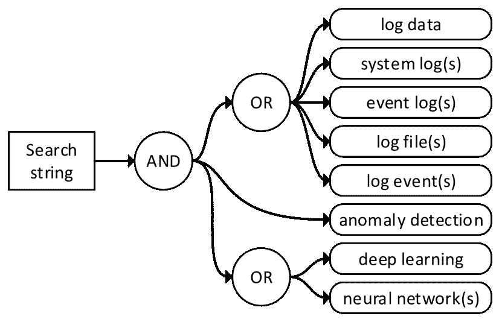
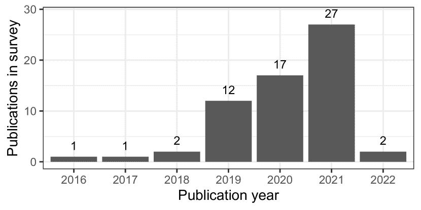
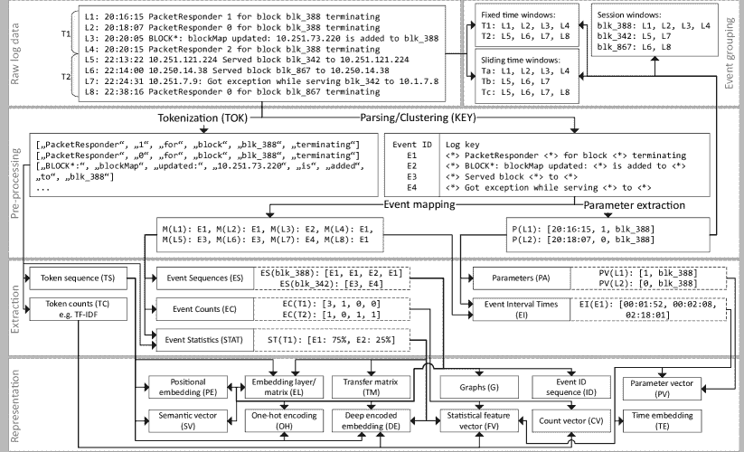
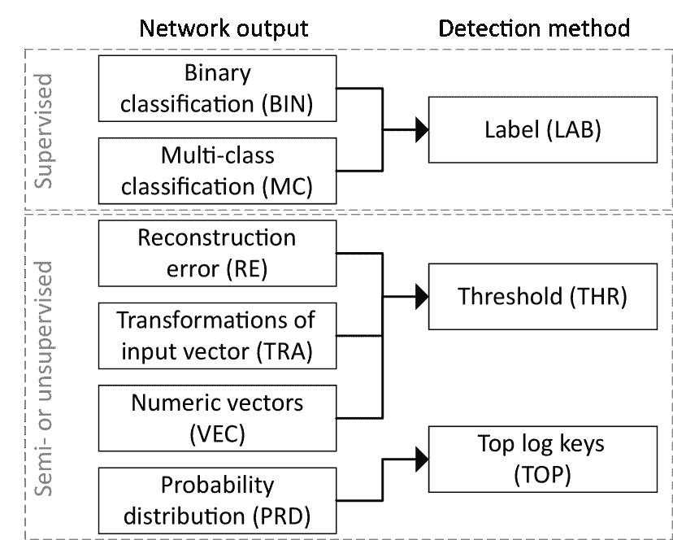
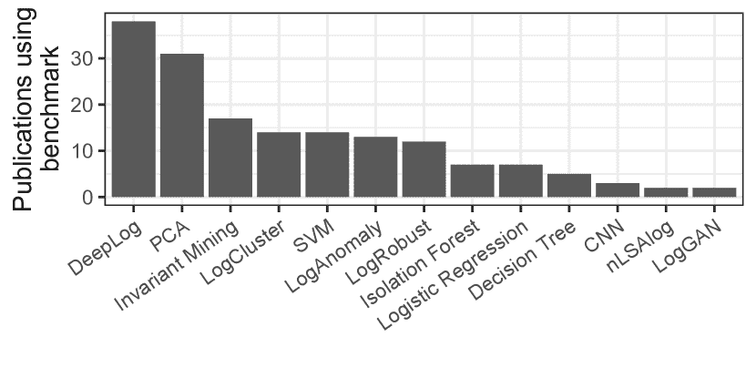

<!--yml

类别：未分类

日期：2024-09-06 19:45:23

-->

# [2207.03820] 深度学习在日志数据异常检测中的应用综述

> 来源：[`ar5iv.labs.arxiv.org/html/2207.03820`](https://ar5iv.labs.arxiv.org/html/2207.03820)

# 深度学习在日志数据异常检测中的应用综述

Max Landauer, Sebastian Onder, Florian Skopik, 和 Markus Wurzenberger 发表在《机器学习应用》第 12 卷（2023 年），采用 CC BY 许可。

https://doi.org/10.1016/j.mlwa.2023.100470

M. Landauer, S. Onder, F. Skopik 和 M. Wurzenberger 隶属于奥地利维也纳 AIT 奥地利科技研究院数字安全与保障中心。

电子邮件：firstname.lastname@ait.ac.at

###### 摘要

自动日志文件分析能够及早发现相关事件，如系统故障。特别是，自学习异常检测技术可以捕捉日志数据中的模式，并随后向系统操作员报告意外的日志事件，无需事先提供或手动建模异常场景。近年来，越来越多利用深度学习神经网络的相关方法被提出。这些方法在检测性能上优于传统机器学习技术，同时解决了不稳定的数据格式问题。然而，深度学习存在许多不同的架构，将原始且非结构化的日志数据编码以供神经网络分析并非易事。因此，我们进行了系统的文献综述，概述了已部署的模型、数据预处理机制、异常检测技术及其评估。该综述未对现有方法进行定量比较，而是旨在帮助读者理解不同模型架构的相关方面，并强调未来工作的开放问题。

###### 关键词：

日志数据，异常检测，神经网络，深度学习

## 引言

日志文件在计算机系统监控中提供了丰富的信息来源。因此，大多数日志事件通常是正常系统操作的结果，例如进程的启动和停止、虚拟机的重启、用户访问资源等。然而，当系统出现故障或其他不希望的状态时，应用程序也会生成日志，例如失败的进程、可用性问题或安全事件。这些意外且可能不安全的系统活动的痕迹对系统操作员非常重要，他们需要及时采取行动以防止或减少系统损害，并避免不利的级联效应。

这种日志文件分析的主要问题在于，在大量不那么有趣的标准系统使用痕迹中识别相关日志事件并非易事。特别是，现代应用程序生成的日志数量庞大，使得人工分析不可行，必须采用自动机制[1]。不幸的是，手动编码的签名和规则仅能在有限的适用范围内工作，且不适用于事先未知的场景[2]。因此，有必要部署异常检测技术，自动学习表示系统正常基线的模型，并随后揭示与这些模型的任何偏差，以作为可能需要人工操作员关注的有害活动。

机器学习为日志文件中的异常检测提供了许多可行的技术，过去提出了许多不同的方法，包括聚类[3]和工作流挖掘[4]、事件参数的统计分析[5]、时间序列分析以识别事件频率的变化[6]，以及更多方法[7、2]。最近，研究人员开始使用深度神经网络进行基于日志的异常检测，试图重现深度学习在图像和语音识别中的成功，这些成功超越了传统机器学习方法[8]。然而，由于系统日志事件通常是非结构化的，并涉及复杂的依赖关系，因此很难准备数据以使神经网络能够处理并提取对检测相关的特征。此外，现有的深度学习架构如递归神经网络或卷积神经网络的广泛多样性，使得为特定用例选择合适的模型以及理解对输入数据格式和属性的要求变得困难。

据我们所知，目前对基于深度学习的日志异常检测的最先进技术了解有限[9、10、11、12]。因此，很难理解哪些特征适合从原始日志数据中提取，这些特征如何转化为适合神经网络处理的格式，以及哪些模型架构适合检测日志中的特定模式。现有的调查仅比较了少数异常检测方法，主要关注日志数据中的序列模式[9、10、11]，提供了对系统日志数据分析的广泛研究，但未能充分涵盖深度学习模型及其挑战[13、14]，或关注网络流量而非系统日志数据[12]。

因此，我们对深度学习在日志数据异常检测中的应用进行了系统的文献综述。我们的主要关注点是调查科学出版物中关于已部署模型架构的内容，以及这些架构处理非结构化输入日志数据的要求和转换、区分正常数据样本与异常数据样本的方法以及所展示的评估。这项研究的结果对研究人员和行业都非常有益，因为更好地理解不同深度学习算法的挑战和特性可以避免在开发异常检测技术时出现陷阱，并且简化了学术和实际应用场景下现有检测系统的选择。此外，详细调查预处理策略对于利用日志中所有可用信息进行异常检测是必不可少的，并且有助于理解数据表示对检测能力的影响，特别是哪些类型的异常可以在什么情况下被检测到。关于科学评估，我们特别关注实验设计的相关方面，包括数据集、指标和可重复性，以指出当前评估策略中的不足并提出改进建议。最后，我们的研究还旨在创建一部参考性工作，并为未来的研究奠定基础。我们指出，本综述并未定量比较所审查方法的检测性能，因为只有少量开源实现可用，并且这些方法的比较已经在其他综述中呈现 [9， 10]。根据上述目标，我们将本综述的研究问题表述如下：

+   RQ1：

    基于日志的深度学习异常检测面临的主要挑战是什么？

+   RQ2：

    通常应用哪些最先进的深度学习算法？

+   RQ3：

    日志数据如何预处理以供深度学习模型使用？

+   RQ4：

    检测到哪些类型的异常，以及它们是如何被识别为异常的？

+   RQ5：

    提出的模型如何进行评估？

+   RQ6：

    这些方法在多大程度上依赖标记数据并支持增量学习？

+   RQ7：

    所呈现结果在源代码和使用数据的可用性方面在多大程度上可重复？

本文的其余部分结构如下。第 II 节首先解释了深度学习、日志数据和异常检测的术语，然后提供了常见挑战的概述。我们在第 III 节中解释了选择相关文献和进行调查的方法。第 IV 节详细呈现了我们的调查结果。我们在第 V 节中讨论这些结果并回答我们的研究问题。最后，第 VI 节总结了本文。

## II 背景

在本节中，我们首先澄清一些与基于深度学习的日志数据异常检测相关的通用概念和术语。然后，我们概述该研究领域特有的科学挑战。

### II-A 初步定义

本文研究依赖于对三个主要概念的理解：深度学习、日志数据和异常检测。然而，不同研究领域和现有文献中对这些领域的具体特征和随之产生的要求可能有所不同。因此，下面我们描述这三个概念的基本属性。

#### II-A1 深度学习

人工神经网络（ANN）是为了模拟生物信息处理系统的连接通信节点而开发的。为此，节点以不同数量按层次排列，特别是一个读取数据的输入层、若干个通过加权边连接相邻层的隐藏层，以及一个输出层。节点在接收到其连接边上的特定信号时会被激活，从而生成后续层的输入。主要思想是，这些网络能够识别输入数据中的非线性结构，并通过训练对处理后的实例进行分类，训练过程中通过相应调整边的权重来最小化分类错误。因此，ANN 支持有监督训练（所有类别都有标签，即数据样本标记为正常或异常）、半监督训练（某些类别有标签）以及无监督学习（没有标签可用）。

一般来说，深度学习算法被理解为具有多个隐藏层的神经网络。过去提出了几种不同的深度神经网络架构，例如用于顺序输入数据的递归神经网络（RNN）。深度学习已经证明在许多应用领域（例如，图像分类、语音识别等）优于传统的机器学习方法（例如，支持向量机或决策树）甚至人类专家[8, 15]。

#### II-A2 日志数据

日志数据是应用程序生成的单行或多行事件的时间顺序，以永久捕捉特定系统状态，特别是在发生故障或其他意外事件时进行手动取证分析。日志事件通常以文本形式存在，范围从结构化向量（例如，逗号分隔值）到半结构化对象（例如，键值对）再到具有异构事件类型的非结构化人类可读消息。尽管没有统一的日志格式，但日志事件通常包含其生成时间戳作为其事件参数之一。其他有时存在于不同类型日志数据中的参数是日志级别（例如，INFO 或 ERROR）或将相关事件序列链接起来的进程标识符[3]。

虽然单个日志事件描述了系统在特定时间点的（部分）状态，但日志事件的组表示了底层程序逻辑的动态工作流。这是因为日志事件是由软件开发人员在代码中故意放置的打印语句生成的，以支持对程序活动的理解和调试。这些语句包括静态部分，即硬编码字符串，以及动态部分，即在程序运行时动态确定的参数。在过去，大量研究致力于自动提取所谓的日志键（也称为日志签名、日志模板或简单的日志事件），这些日志键代表原始打印语句的模板，并使日志解析成为可能[16]。这些解析器允许从日志中提取比非结构化日志消息更适合用于后续分析的值，特别是通过（i）将事件类型标识符分配给日志事件以及（ii）从日志消息中提取参数[17]。

#### II-A3 异常检测

异常是数据集中那些表现出稀有或其他意外特征的实例，从而在数据中脱颖而出[7]。为了检测这些异常，通常通过与每个实例相关的一个或多个连续或分类属性来衡量这些数据实例的一致性，并计算相似性度量。对于独立数据，声明与所有其他数据点高度不相似的单个或小组实例为异常值是足够的，这也被称为点异常。对于实例之间不独立的所有数据，例如各种有序数据，包括日志数据，会出现另外两种类型的异常。首先，背景异常是指仅在其发生的背景下（而不是其他情况下）异常的实例，例如发生的时间。例如，考虑一个每天执行的数据备份程序的开始，突然发生在计划时间之外。其次，集体异常是指由于其组合出现而仅表现为异常的实例组（而不是单独的），例如特定的日志事件序列。

大多数异常检测技术隐含的假设是，分析的数据中异常实例远少于正常实例。这使得检测可以在完全无监督的方式下进行，即不需要标记数据来训练模型。然而，许多科学方法转而采用半监督检测，其中仅有正常实例的训练数据可用，然后在包含正常和异常实例的测试数据集上进行评估。半监督操作的主要优点是异常实例不会被模型学习，并且通常收集正常数据相对简单，而建模和标记异常则不那么直接。因此，监督异常检测的方法适用性较低且相对较少[4]。

### II-B 挑战

基于日志的异常检测已经成为一个活跃的研究领域几十年。因此，大多数已提出的方法依赖于传统的机器学习技术。然而，近年来，利用深度学习揭示与意外系统行为相关的异常日志事件的方法显著增加。接下来，我们总结了在有效和适用检测中需要克服的主要挑战。

+   •

    数据表示。深度学习系统通常处理结构化和数值输入数据。将日志数据输入神经网络并非易事，因为这些数据经常涉及异质事件类型、非结构化消息和分类参数的混合[11, 18]。

+   •

    数据不稳定。随着应用的演变，可能会出现与训练数据中的日志事件类型不同的新事件。此外，观察到的系统行为模式会随着技术环境及其利用情况的变化而变化。因此，深度学习系统需要逐步更新其模型并调整正常系统行为的基线，以实现实时检测 [19, 11, 18, 9, 10]。

+   •

    类别不平衡。异常检测本质上假设正常事件的数量多于异常事件。许多基于神经网络的方法在处理不平衡数据集时表现不佳 [18, 10]。

+   •

    异常伪影多样性。异常的表现方式影响日志事件及其参数，包括顺序模式、频率、相关性、到达间隔等的变化。检测技术通常仅为特定异常类型的属性而设计，因此并不具有通用性。

+   •

    标签可用性。由于异常代表了系统的意外行为，通常没有标记的异常实例可用于训练。这限制了应用于半监督和无监督深度学习系统，这些系统的检测性能通常低于监督方法 [9, 10]。

+   •

    流处理。日志以连续的数据流形式生成。为了实现实时监控而非事后分析，深度学习系统需要设计为单次通过数据处理，以便进行检测和模型更新 [3, 10]。

+   •

    数据量。日志数据生成量很大，一些系统每天产生数百万 [20] 甚至数十亿 [21] 条事件。需要高效的算法以确保在实际应用中的实时处理，特别是在运行在计算资源较少的机器（如边缘设备）时。

+   •

    日志交错。当多个进程同时运行或分布式日志被集中收集时，相关日志事件的序列可能会互相交错。当事件缺乏会话标识符时，检索原始事件序列并非易事 [10]。

+   •

    数据质量。低数据质量可能由于日志收集不当或日志生成过程中的技术问题而导致，对机器学习的有效性产生负面影响。常见问题包括时间戳信息不正确、事件排序错误、缺失事件、重复记录、事件标签错误等 [22, 23]。

+   •

    模型可解释性。基于神经网络的方法通常比传统机器学习方法的可解释性较低。在做出针对系统关键行为或安全事件的有依据的决策时，理解正确和错误分类的原因特别困难，这是一大问题[18, 9]。

## III 调查方法

本节概述了进行系统文献综述所使用的方法。我们首先描述了收集相关文献的策略，然后介绍了用于分析检索到的论文的评估标准。

### III-A 搜索策略

本节描述了收集要纳入调查的相关出版物的过程。首先，通过网络搜索收集初步文献集合。随后，使用包含、排除和质量标准选择相关论文。

#### III-A1 使用搜索字符串进行初步文献收集

为了从前沿技术中获得初步的研究方法，我们构建了一个搜索字符串来查询科学出版物的常见数据库。特别地，我们设计了搜索字符串，以确保仅检索包含本次调查三个主要概念的出版物：日志数据、异常检测和深度学习。由于一些出版物使用不同的术语，并且为了减少遗漏相关出版物的可能性，我们还使用了“系统日志”、“事件日志”、“日志文件”、“日志事件”作为“日志数据”的替代词，以及“神经网络”作为“深度学习”的替代词。我们省略了“日志”这一单独词汇，因为它会产生许多包含对数的结果，但与我们的研究无关。图 1 显示了最终的搜索字符串。

图 1：用于检索相关文献的搜索字符串组成。

然后，我们使用这个搜索字符串从以下数据库中收集出版物：Science Direct¹¹1https://www.sciencedirect.com/，Scopus²²2https://www.scopus.com/，SpringerLink³³3https://link.springer.com/，ACM Digital Library⁴⁴4https://dl.acm.org/，IEEE Xplore⁵⁵5https://ieeexplore.ieee.org/，Google Scholar⁶⁶6https://scholar.google.com/，以及 Web of Science⁷⁷7https://www.webofscience.com/。搜索于 2022 年 1 月进行，返回了总计 2925 篇出版物。在接下来的部分，我们将描述从这一集合中选择相关出版物的方法。

#### III-A2 相关出版物的选择

为了筛选出与本调查不相关的出版物，并将出版物集减少到可管理的规模，我们定义了多个选择标准，并将其应用于我们的初步集合。我们纳入调查的主要标准如下：出版物中提出的模型应用深度学习技术（即多层神经网络）来检测异质和非结构化的日志数据。此外，我们还定义了几个排除标准，用于排除相关性低或格式不合适的出版物。排除标准列表如下。

+   •

    论文中没有明确说明所提出的方法是否适用于日志数据或专为日志数据分析设计。我们的调查不尝试采用其他领域的方法来进行日志数据分析。

+   •

    存在更近期的出版物展示了相同或类似的研究。该标准的目的是确保分析最更新的特定方法版本。

+   •

    该出版物仅应用了现有的方法，没有对原始概念进行新的修改。

+   •

    该出版物使用的语言不是英语。

+   •

    该出版物没有电子版。

+   •

    该出版物是书籍、技术报告、讲义、演示文稿、综述或论文。在这些情况下，我们会在可能的情况下审查相关的会议或期刊出版物。

请注意，我们没有将出版物限制在特定的时间范围内，以避免遗漏任何尽管较旧但仍然与本调查相关的出版物。然而，我们旨在排除那些不符合最低科学标准的一般质量较低的出版物。因此，我们仅选择符合以下质量标准的出版物，除了我们的主要纳入标准外。

+   •

    研究的目的及其发现被明确陈述，例如，论文将设计深度学习系统以进行异常检测作为主要贡献。

+   •

    所应用的深度学习模型及其参数被严格描述，即读者可以清楚地知道选择了哪种深度学习模型及其布局设计，例如包含了多少层。

+   •

    该出版物包含对所提出方法的合理评估，包括对实验设计的令人信服的动机、评估过程和整体设置的全面描述、选择捕获指标的解释，以及对收集结果及其意义的详细讨论。

+   •

    用于评估该方法的数据集被引用或描述。这一标准确保我们的调查不包括那些由于数据集不适合异常检测而可能导致误导性发现的出版物。

+   •

    可视化清晰可读。不易理解的结果展示具有误导性，缺乏科学价值。

我们的选择程序是一个两阶段过程。首先，我们根据每篇论文的标题和摘要使用包含和排除标准减少初步文献集合。在这一阶段后，剩下了 331 篇文献。在第二阶段，我们根据每篇论文的内容使用上述所有标准进行选择。最终我们获得了 62 篇论文，这些论文被纳入了本次调查。下一节概述了我们分析这些文献的方法。

### III-B 审核的特征

为了确保我们在一个共同的方案下分析选定的文献并回答我们的研究问题，我们制定了一份对每篇论文进行评估的特征列表。以下一组问题涉及应用的深度学习（DL）模型和操作模式。

+   DL-1:

    使用了哪些深度学习模型？

+   DL-2:

    使用了哪些训练损失函数？

+   DL-3:

    该方法是否支持在线或增量学习？⁸⁸8 在线或增量处理指的是单次处理程序，其中运行时间随着处理的行数的增加大致呈线性增长。

+   DL-4:

    训练是在无监督、半监督还是有监督的方式下进行的？

然后我们分析了审查方法如何将原始日志数据输入深度学习模型。以下问题因此涉及日志的预处理（PP）和转换为数值向量或矩阵表示。

+   PP-1:

    原始日志如何进行预处理？

+   PP-2:

    从预处理的日志中提取了哪些特征？

+   PP-3:

    提取的特征如何表示为向量？

下一组问题涉及异常检测（AD）。特别是，我们对不同类型的异常感兴趣，以了解它们是否与从原始日志中提取的特征及其作为向量的表示有关。

+   AD-1:

    该方法检测了哪些类型的异常？

+   AD-2:

    深度神经网络的输出如何用于异常检测？⁹⁹9 神经网络的输出层由一个或多个具有特定数值的节点组成。

+   AD-3:

    如何将异常与正常数据样本区分开？

利用公开的数据集进行评估以及在论文中发布源代码不仅是良好的科学标准，也是他人验证结果和进行比较的关键。因此，最后一组问题涉及评估和可重复性（ER），特别是使用的评估指标、数据集和源代码的可用性。

+   ER-1:

    用于评估该方法的日志数据集有哪些？

+   ER-2:

    使用了哪些评估指标？

+   ER-3:

    评估是否考虑了运行时性能测量？

+   ER-4:

    使用了哪些方法作为基准？

+   ER-5:

    使用的数据集是否公开？

+   ER-6:

    该方法的源代码是否公开？

所有上述问题都是对每篇文献进行单独评估的。结果特征矩阵在接下来的表格 II 中呈现，并作为我们分析和讨论的基础。

## IV 调查结果

本节提供了对所有评审文献的评估，涉及到前一节中概述的特征。我们首先提供一些关于文献元数据的总体信息，然后详细讨论每个评审特征。

### IV-A 引文计量

本节提供了每年出版文献数量及其引文计数的概述。

#### IV-A1 每年出版的文献数量

基于深度学习的日志数据异常检测是一个相对较新的研究领域，在近年来逐渐获得了关注。因此，该研究领域的大多数文献仅在过去两到三年内发表。图 2 显示了所有评审文献的出版年份概览。如预期的那样，62 篇文献中有 58 篇在 2019 年或以后发表。由于相关文献的搜索是在 2022 年初进行的，因此仅包括了该年两篇文献。然而，我们预计在 2022 年及以后会有更多的文献出现，符合图中显示的总体趋势。

图 2：每年出版文献数量的分布。

#### IV-A2 引用

引文计数是评估文献相关性和影响力的常见指标。因此，我们在表格 I 中列出了引用次数最高的六篇文献（根据 Google Scholar）。截至 2023 年 1 月，由 Du 等人于 2017 年发表的论文展示了 DeepLog，该论文拥有最高的引用次数，并且可以说是所有评审文献中最具影响力的，因为他们首次提出了一种基于深度学习的方法，能够检测日志数据中的异常事件序列。随后发表的几篇论文都依赖于 DeepLog 的基础工作，因此可以公平地认为这篇论文在 2019 年及以后相关文献数量的增加中起到了一定的作用，这在图 2 中是可以看出的。

请注意，Yang 等人的出版物 [25] 早于 DeepLog [24]，但引用次数显著较少。主要原因是该论文关注于单个日志事件中的令牌分析，而这一主题在后续研究中受到了远低于事件序列分析的关注。此差异以及第 III-B 节中列出的所有其他特征的评估已在表 II 中展示。

表 I: 六大最被引用的出版物

| 引用次数 | 方法 | 年份 | 作者 | 论文标题 |
| --- | --- | --- | --- | --- |
| 963 | DeepLog | 2017 | [24] | DeepLog: 基于深度学习的系统日志异常检测与诊断 |
| 227 | LogRobust | 2019 | [19] | 基于日志的鲁棒异常检测 |
| 209 | LogAnomaly | 2019 | [26] | LogAnomaly: 无监督检测无结构日志中的序列和定量异常 |
| 92 | - | 2018 | [27] | 使用卷积神经网络检测大数据系统日志中的异常 |
| 53 | Logsy | 2020 | [28] | 基于自注意力的无结构日志异常检测 |
| 45 | LogBERT | 2021 | [29] | LogBERT: 基于 BERT 的日志异常检测 |

表 II: 调查结果。DL-1: 多层感知器 (MLP)，卷积神经网络 (CNN)，递归神经网络 (RNN)，自编码器 (AE)，生成对抗网络 (GAN)，变换器 (TF)，注意机制 (AT)，图神经网络 (GNN)，进化粒度神经网络 (EGNN)；DL-2: 交叉熵 (CE)，超球面 (HS)，均方误差 (MSE)，Kullback-Leibler 散度 (KL)，边际似然 (ML)，自定义损失函数 (CF)，对抗训练 (AT)，不可用 (NA)；DL-3: 在线 (ON)，离线 (OFF)；DL-4: 有监督 (SUP)，半监督 (SEMI)，无监督 (UN)；PP-1: 日志关键 (KEY)，令牌 (TOK)，组合 (COM)；PP-2: 令牌序列 (TS)，令牌计数 (TC)，事件序列 (ES)，事件计数 (EC)，参数 (PA)，事件间隔时间 (EI)；PP-3: 事件 ID 序列 (ID)，计数向量 (CV)，统计特征向量 (FV)，语义向量 (SV)，位置嵌入 (PE)，独热编码 (OH)，嵌入层/矩阵 (EL)，深度编码嵌入 (DE)，参数向量 (PV)，时间嵌入 (TE)，图 (G)，转移矩阵 (TM)；AD-1: 异常值 (OUT)，序列 (SEQ)，频率 (FREQ)，统计 (STAT)；AD-2: 二分类 (BIN)，输入向量变换 (TRA)，重构误差 (RE)，多类分类 (MC)，概率分布 (PRD)，数值向量 (VEC)；AD-3: 标签 (LAB)，阈值 (THR)，最高概率 (TOP)。

| 方法 | DL-1 | DL-2 | DL-3 | DL-4 | PP-1 | PP-2 | PP-3 | AD-1 | AD-2 | AD-3 | ER-6 |
| --- | --- | --- | --- | --- | --- | --- | --- | --- | --- | --- | --- |
| Baril 等人 [30] (NoTIL) | RNN | CE | OFF | SEMI | KEY | ES, EC | CV | FREQ | VEC | THR | NO |
| Bursic 等人 [31] | RNN, AE | MSE | OFF | UN | TOK | PA, TS | DE | OUT | RE | THR | NO |
| Catillo 等人 [32] (AutoLog) | AE | MSE | ON | SEMI | COM | STAT, TC | FV | FREQ | RE | THR | YES |
| Cheansunan 等人 [33] | CNN | NA | OFF | SEMI | KEY | ES | EL | SEQ | PRD | TOP | NO |
| Chen 等人 [34] | RNN, CNN | NA | OFF | SEMI | KEY | ES, EC | SV, CV | SEQ, FREQ | VEC, PRD | TOP | NO |
| Chen 等人 [35] (LogTransfer) | RNN, CNN | NA | OFF | SUP | KEY | ES | SV | SEQ | BIN | LAB | YES |
| Decker 等人 [36] | EGNN | CF | OFF | SUP | KEY | EC, STAT | FV | FREQ | MC | THR, LAB | NO |
| Du 等人 [24] (DeepLog) | RNN | CE, MSE | ON | SEMI | KEY | ES, PA, EI | PV, OH | SEQ | VEC, PRD | THR, TOP | RE |
| Du 等人 [37] (LogAttention) | TF, AM | NA | OFF | SUP | KEY | ES | SV | SEQ | BIN | LAB | NO |
| Farzad 等人 [38] | RNN, AE | CE | OFF | SUP | TOK | TS | EL | SEQ | BIN | LAB | NO |
| Farzad 等人 [39] | RNN, AE, CNN, GAN | CE | OFF | SUP | TOK | TS | EL | OUT | BIN | LAB | NO |
| Farzad 等人 [40] | RNN | CE | OFF | SUP | TOK | TS | EL | OUT | BIN | LAB | NO |
| Gu 等人 [41] | RNN, AM | CE | OFF | SEMI | KEY | ES | SV | SEQ | PRD | TOP | NO |
| Guo 等人 [42] (FLOGCNN) | CNN | CE | OFF | SUP | COM | TS | SV | SEQ | BIN | LAB | NO |
| Guo 等人 [29] (LogBERT) | TF, AM | CE, HS | OFF | SEMI | KEY | ES | PE, EL | SEQ | PRD | TOP | YES |
| Guo 等人 [43] (TransLog) | TF, AM | CE | OFF | SUP | KEY | ES | SV | SEQ | BIN | LAB | NO |
| Han 等人 [44] (LogTAD) | RNN, GAN | HS, CF, AT | OFF | UN | KEY | ES | SV | SEQ | TRA | THR | YES |
| Hashemi 等人 [45] (OneLog) | CNN | CE | OFF | SUP | TOK | ES | DE | SEQ | BIN | LAB | YES |
| Hirakawa 等人 [46] | CNN, TF | CF | OFF | UN | TOK | ES | SV | OUT | BIN | THR | NO |
| Huang 等人 [47] (HitAnomaly) | TF, AM | CE | OFF | SUP | KEY | ES, PA | SV, PV | SEQ | BIN | LAB | NO |
| Le 等人 [48] (NeuralLog) | TF | CE | OFF | SUP | TOK | ES | SV, PE | SEQ | BIN | LAB | YES |
| Li 等人 [49] (LogSpy) | CNN, MLP, AM | CE | OFF | SUP | KEY | STAT | DE, EL | STAT | BIN | LAB | NO |
| Li 等人 [50] (SwissLog) | RNN, AM | CE | OFF | SUP | KEY | ES, EI | SV, TE | STAT, SEQ | BIN | LAB | NO |
| Liu 等人 [51] (LogNADS) | RNN | MSE | OFF | SUP | KEY | ES, PA | SV, PV | SEQ | BIN | LAB | NO |
| Lu 等人 [27] | CNN | NA | OFF | SUP | KEY | ES | EL | SEQ | BIN | LAB | NO |
| Lv 等人 [52] (ConAnomaly) | RNN | NA | OFF | SUP | KEY | ES | SV | SEQ | BIN | THR | NO |
| Meng et al. [26] (LogAnomaly) | RNN | NA | OFF | SEMI | KEY | ES, EC | SV, CV | SEQ, FREQ | VEC, PRD | TOP | RE |
| Nedelkoski et al. [28] (Logsy) | TF | HS | OFF | UN | TOK | TS | PE, EL | OUT | TRA | THR | RE |
| Otomo et al. [53] | AE | KL, ML, CF | OFF | SEMI | KEY | ES, EC | CV, OH | FREQ | TRA | THR | NO |
| Ott et al. [54] | RNN | CE, MSE | OFF | SEMI | KEY | ES | SV | SEQ | VEC, PRD | THR, TOP | NO |
| Patil et al. [55] | RNN | CE | OFF | SUP | KEY | ES | OH | SEQ | BIN | LAB | NO |
| Qian et al. [56] (VeLog) | AE | CF | ON | SEMI | KEY | ES, EC | ID, CV | SEQ, FREQ | RE | THR | NO |
| Studiawan et al. [57] | AE | MSE | OFF | SEMI | KEY | EC, STAT, EI, TC | FV | STAT, FREQ | RE | THR | NO |
| Studiawan et al. [58] (pylogsentiment) | RNN | CE | OFF | SUP | TOK | TS | SV | OUT | BIN | LAB | YES |
| Sun et al. [59] (AllContext) | RNN, AM | CE | OFF | SUP | KEY | ES | SV | OUT, SEQ | BIN, MC | LAB | NO |
| Sundqvist et al. [60] (BoostLog) | RNN | NA | ON | SEMI | KEY | ES | ID | SEQ | PRD | THR | NO |
| Syngal et al. [61] | RNN, AE | CE | OFF | SUP | TOK | ES, EC | CV, OH | SEQ, FREQ | RE | THR | NO |
| Wadekar et al. [62] | AE | CE, KL, ML | OFF | UN | KEY | ES | OH | SEQ | BIN | THR | NO |
| Wan et al. [63] (GLAD-PAW) | GNN | CE | OFF | UN | KEY | ES | G | SEQ | PRD | TOP | NO |
| Wang et al. [64] | RNN | NA | OFF | SUP | TOK | TS | SV | OUT | BIN | LAB | NO |
| Wang et al. [1] (CATLog) | AE, MLP, TF | CE, CF | OFF | SUP | KEY | ES, TC | SV, DE, CV | SEQ, FREQ | BIN | LAB | NO |
| Wang et al. [65] (LightLog) | CNN | CE | OFF | SUP | KEY | ES | SV | SEQ | BIN | LAB | YES |
| Wang et al. [66] (OC4Seq) | RNN | HS | OFF | UN | KEY | ES | EL | SEQ | TRA | THR | YES |
| Wibisono et al. [67] | TF, AM | NA | OFF | SEMI | KEY | ES | OH | SEQ | PRD | TOP | NO |
| Wittkopp et al. [68] (A2Log) | TF, AM | CF | OFF | UN | TOK | TS | SV | OUT | BIN, TRA | THR | NO |
| Xi et al. [69] | RNN, AM | CE | OFF | SEMI | KEY | ES | SV | SEQ | PRD | TOP | NO |
| Xia et al. [70] (LogGAN) | RNN, GAN | AT | ON | SEMI | KEY | ES | OH | SEQ | PRD | THR | NO |
| Xiao et al. [71] | RNN, CNN | CE | OFF | SEMI | KEY | ES | EL | SEQ | PRD | TOP | NO |
| Xie et al. [72] (ATT-GRU) | RNN, AM | MSE | OFF | SEMI | KEY | ES, PA, EI | PV, EL | SEQ | VEC, PRD | THR, TOP | NO |
| Yang et al. [25] | RNN | CE | OFF | SEMI | TOK | TS | SV | OUT | VEC | THR | NO |
| Yang et al. [73] (nLSALog) | RNN, AM | CE | OFF | SEMI | KEY | ES | EL | SEQ | PRD | TOP | NO |
| Yang et al. [74] (PLELog) | RNN | NA | OFF | SEMI | KEY | ES | SV | SEQ | BIN | LAB | NO |
| Yen et al. [75] (CausalConvLSTM) | RNN, CNN | CE | ON | SEMI | KEY | ES | OH | SEQ | PRD | TOP | NO |
| Yin et al. [76] (LogC) | RNN | CE | OFF | SEMI | KEY | ES, PA | OH | SEQ | PRD | TOP | NO |
| Yu et al. [77] | RNN | CE | OFF | SEMI | KEY | ES, EC | SV, ID, CV | SEQ, FREQ | PRD | TOP | NO |
| Zhang et al. [19] (LogRobust) | RNN, AM | CE | OFF | SUP | KEY | ES | SV | SEQ | BIN | LAB | RE |
| Zhang et al. [78] (LogAttn) | AE, CNN, AM | CE | OFF | SEMI | TOK | ES, EC | SV, CV | SEQ, FREQ | RE | THR | NO |
| Zhang et al. [79] (LSADNET) | CNN, TF | CE | ON | SEMI | KEY | ES, STAT | SV, TM | STAT, SEQ | PRD | TOP | NO |
| Zhang et al. [80] (SentiLog) | RNN | NA | OFF | SUP | TOK | TS | SV | OUT | BIN | LAB | NO |
| Zhao et al. [81] (Trine) | TF, GAN | NA | OFF | SEMI | TOK | ES | SV, DE, PE | SEQ | BIN | LAB | NO |
| Zhou et al. [82] (LogSayer) | RNN, CNN | NA | ON | SUP | KEY | EC, STAT | FV | STAT | BIN | LAB | NO |
| Zhu et al. [83] (LogNL) | RNN | NA | OFF | SEMI | KEY | ES, PA, EI | SV, PV | SEQ | VEC, PRD | THR | NO |

### IV-B 深度学习技术

本节概述了在回顾的文献中应用的深度学习模型的特性。

#### IV-B1 深度学习模型

有许多不同类型的深度学习模型（DL-1）适用于日志数据中的异常检测[15, 84]。最基本的深度学习神经网络形式是多层感知器（MLP），其中网络中的所有层都是完全连接的。由于其简单性，其分类准确性通常被专门设计用于捕捉序列数据中常见特征的其他深度学习模型所超越。因此，它们在回顾的文献中很少被考虑，仅在与其他深度学习模型结合使用或作为补充注意机制时出现[1, 49]。

卷积神经网络（CNN）通过在隐藏层中插入卷积层和最大池化层，扩展了多层感知器（MLP）的架构。这些层使得神经网络能够捕捉输入数据的更多抽象特征，同时减少输入维度。在对来自图像的二维输入数据进行分类时，这种方法尤其有效，因为特征如线条可以独立于其在图像中的确切位置进行学习。这一功能通过将日志键排列在矩阵中，从而使事件之间的关系，即它们的时间依赖性，被网络捕捉到，也被转移到日志数据中[27]。此外，还有几种依赖于特定类型卷积神经网络的方法，例如时间卷积网络（TCN），专门设计用于处理时间序列数据，并通过扩张的因果卷积捕捉其短期和长期依赖性[65, 78]。

如表格 II 所示，循环神经网络（RNN）是调查文献中最常用的神经网络架构，62 种被评审的方法中有 36 种利用 RNN 进行异常检测。主要原因在于 RNN 的架构利用了反馈机制，这些机制能够随着时间的推移保留其状态，从而直接实现对输入数据中序列事件执行模式的学习，这些模式是日志数据集中异常的关键标识符，这些数据集通常用于评估（参见第 IV-E 节）。几种不同类型的 RNN 已成功应用于这一目的。最广泛使用的架构之一是长短期记忆（LSTM）RNN，这种架构被开发出来以实现长时间的状态存储，并包含具有输入门、输出门和遗忘门的单元。大多数利用 LSTM RNN 的方法使用事件发生序列（或其修改和丰富版本）训练网络，然后在测试数据中揭示出异常的非凡序列模式[24]。一些方法使用双向 LSTM RNN，即基本上是两个独立的 LSTM RNN，它们并行工作并在相反的方向处理序列，即一个 LSTM RNN 从第一个元素到最后一个元素处理输入序列，而另一个 LSTM RNN 则从最后一个条目开始处理序列元素，并预测其时间上前面的元素。实验表明，双向 LSTM RNN 优于 LSTM RNN[19, 54, 50, 38, 80, 61, 77, 59]。另一种流行的 RNN 选择是门控循环单元（GRU），它通过只依赖更新门和重置门来简化单元架构。GRU 的主要优点之一是其计算效率比 LSTM RNN 更高，这对于关注边缘设备的应用场景而言是一个重要方面[72, 66, 39, 38, 60, 74, 57, 41, 25]。

如前所述，深度学习模型主要用于各个研究领域的分类问题，但也有一些模型专门设计用于无监督操作，因此非常适合异常检测。其中之一是自动编码器（AE），它首先通过编码器从输入数据创建一个代码，然后使用解码器尝试从代码中近似输入数据，从而避免了对标记输入数据的需求。其主要思想是通过这个过程，神经网络学习输入的主要特征，但忽略数据中的噪声，类似于主成分分析（PCA）等降维技术。任何输入数据如果在已训练的网络中产生高重建误差，则被视为异常。除了标准的自动编码器模型，还有几种相关类型，如操作于统计分布上的变分自动编码器（VAE）[62, 56, 1]，添加条件信息（如事件类型）的条件变分自动编码器（CVAE）[53]，以及利用卷积神经网络（CNN）学习位置无关特征的卷积自动编码器（CAE）[62]。

生成对抗网络（GAN）是另一种无监督深度学习的方法。它实际上由两个相互竞争的独立组件组成：一个生成器，产生类似于输入数据的新数据；一个判别器，估计某些数据源自输入数据的概率，这被用来改进生成器。现有的方法使用不同的模型构建 GAN，包括 LSTM RNN[70, 44]，与 GRU 结合的 CNN[39]，以及 Transformers[81, 1]。

Transformers (TF) 利用所谓的自注意力机制将数据实例嵌入到一个向量空间，其中相似的实例应比不相似的实例更靠近 [28, 29, 37]。Transformers 的目标是根据它们出现的上下文为特定输入分配权重，例如句子中的单词。因此，Transformers 在自然语言处理 (NLP) 领域特别成功。注意力机制（AT）不仅出现在 Transformers 中，还经常用于通过提高相关输入的权重来改善其他深度神经网络（如 RNN）的分类和检测。这种效果在 RNN 处理长序列时尤其明显 [78]。注意力机制通常以可训练的网络形式实现，例如 MLP [49]。为了避免与 Transformer 模型混淆，我们在表 II 中明确列出这些额外的注意力机制。

Wan 等人 [63] 是唯一使用图神经网络（GNN）的作者。虽然神经网络通常处理有序数据，例如 CNN 依赖于二维输入数据，RNN 需要观测序列，但 GNN 设计用来处理图形输入，即顶点和边的集合。将日志数据转换为图的一种可能性是生成会话图，其中顶点表示事件，边表示其顺序执行。另一种较少应用的深度学习模型是演变粒度神经网络（EGNN），这是一种模糊推理系统，逐渐从在线数据流中构建 [36]。

我们的调查显示，许多被审查的方法仅依赖于一种深度学习模型。然而，一些作者也使用不同模型的组合。例如，Wang 等人 [1] 提出使用 MLP 将 VAE 的输出与经过对抗学习训练的 Transformer 的输出结合起来。

#### IV-B2 训练损失函数

表 III：常见训练损失函数的定义

| 名称 | 描述 | 方程 |
| --- | --- | --- |
| 交叉熵 | 实际标签 $y$ 和预测标签 $\hat{y}$ 之间的损失。 | $H(y,\hat{y})=-\sum_{j=1}^{N}y_{j}log\left(\hat{y}_{j}\right)$ |
| 超球面目标函数 | 嵌入向量 $y$ 和超球面中心 $c$ 之间的距离。 | $L_{HS}=\frac{1}{N}\sum_{j=1}^{N}\left\&#124;y_{j}-c\right\&#124;^{2}$ |
| 均方误差 | 实际标签 $y$ 和预测标签 $\hat{y}$ 之间的损失。 | $L_{MSE}(y,\hat{y})=\frac{1}{N}\sum_{j=1}^{N}\left(y_{j}-\hat{y}_{j}\right)^{2}$ |
| Kullback-Leibler 散度 | 概率分布 $P$ 和 $Q$ 之间的统计散度。 | $KL(P\&#124;Q)=\sum_{x\in\mathcal{X}}P(x)log\left(\frac{P(x)}{Q(x)}\right)$ |
| 对抗训练函数 | 对于生成器$G$和鉴别器$D$，向量$y$和预测$\hat{y}$的损失。 | $\!\begin{aligned} L_{AT}=&\min_{G}\max_{D}(\mathbb{E}\left(log\left(D(G(\hat{y}))\right)\right)+\\ &\mathbb{E}\left(log\left(1-D(G(y))\right)\right))\end{aligned}$ |

损失函数（DL-2）对于深度神经网络的训练至关重要，因为它们量化了神经网络输出与期望结果之间的差异[85]。在审阅的出版物中，最常见的损失函数是交叉熵（CE），特别是用于多类预测的类别交叉熵[24, 61]，或仅区分正常类和异常类的二元交叉熵[65]。其他常见的损失函数包括超球目标函数（HS），其中到超球中心的距离表示异常评分[28, 66, 29, 44]，用于回归的均方误差（MSE）[31, 54, 32, 51, 57, 72, 24]，以及用于测量概率分布损失的 Kullback-Leibler 散度（KL）及其扩展边际似然（ML）[53, 62]。

一些提出的方法使用了自定义损失函数（CF），包括 CE 和 HS 的组合[68]。一些作者还专门为生成对抗网络（GANs）的对抗训练（AT）定义了目标函数[70, 44]。表 III 总结了主要的损失函数。在所有出版物中，有 14 篇没有说明损失函数，因此标记为不可用（NA）。

#### IV-B3 操作模式

在实际场景中应用异常检测时，并非所有日志数据都随时可用；相反，事件以连续流的形式生成，应仅在事件发生时进行分析，以实现（接近）实时检测。因此，生成日志的结构完整性和统计属性随着时间变化，例如整体系统利用率并非静态，因为用户交互和技术环境会发生变化。此外，当生成这些日志的应用程序发生修改时，日志模板会发生变化或出现新的日志事件[19]。

为了以自动化方式跟上这些变化，算法需要采用在线或增量学习（DL-3），即以线性时间复杂度处理输入数据，以便在单次遍历中处理数据集，每个数据实例仅处理一次。虽然在考虑训练模型为静态时，通常总是可以进行在线检测，但开发支持在线学习的算法并动态更新模型以适应新事件或模式，按照基线进行检测，是具有挑战性的[86, 87]。由于持续学习仍然是一个未解决的问题，我们将所有至少在某种程度上支持动态模型更新的方法标记为在线（ON），而所有具有离线训练阶段的方法标记为离线（OFF），见表 II。

综述的方法在动态模型适应方面采取了多种方式。Du 等人[24]建议在检测过程中识别到假阳性时，更新其神经网络的权重，以反映正确的事件概率分布，而无需从头开始重新训练。Meng 等人[26]认为这种手动反馈回路在实践中是不可行的，因此 resort to re-training，将新的事件类型映射到现有的事件类型。Yen 等人[75]在假阳性率超过某个阈值时，自动在新日志数据的批次上重新训练他们的神经网络。然而，计算假阳性率依赖于标记数据，因此无法完全消除人工参与。Decker 等人[36]提出了一种有前景的解决方案，他们采用了一种专门设计来处理不稳定数据流的演变分类器，从而实现了持续学习。

一般来说，在线和离线模型可以在监督（SUP）和非监督（UN）模式下工作（DL-4）。然而，我们注意到，几乎所有综述中提到的监督学习方法都选择了离线训练阶段。这是合理的，因为监督学习所需的标签信息依赖于手动分析或验证，因此只能在有限的数据集上进行法医学生成，而不能在数据流中生成。

我们还观察到许多已审查的方法声称能够实现无监督学习，但实际上是以半监督（SEMI）方式进行的，因为它们通常假设训练只在没有异常的正常数据上进行[34]。主要问题是，训练数据中存在的异常会错误地改变神经网络的权重，从而在后续的检测阶段恶化其检测效果。因此，只有专为无监督学习设计的深度学习模型能够处理训练数据中的异常，例如，Otomo 等人提出的基于 CVAE 模型的方法[53]。需要注意的是，支持无监督学习的神经网络架构也可以用于半监督检测，因此不一定标记为无监督。

### IV-C 日志数据准备

本节概述了将原始和文本日志数据准备为深度学习所需的所有步骤。这包括将事件分组为窗口或会话、分词和日志解析、从日志中提取特征，以及将这些特征转换为适合作为神经网络输入的向量表示。图 3 提供了在审查文献中使用的数据准备方法的概述，并在示例日志行 L1-L8 上进行了说明。在接下来的部分中，我们将详细讨论所有列出的方法。

图 3：将原始日志数据转换为数字向量的不同数据准备阶段。

#### IV-C1 预处理

由于日志数据通常是非结构化的，因此在将其输入深度学习系统之前需要以某种方式进行预处理（PP-1）。我们的调查显示，处理非结构化数据有两种主要方法。最常见的方法是利用解析器，这些解析器通常被称为日志键（KEY），以提取每行的唯一事件标识符以及事件参数值，如第 II-A2 节所述。因此，作者通常会重新使用现有的日志键来处理已知的数据集，或者使用最先进的解析器生成方法（例如 Drain[88]或 Spell[89]）来创建这些键。通常，每行数据正好匹配一个键；因此，在事件映射期间，很容易为每条日志行分配唯一的事件类型标识符。例如，在图 3 中，L1 行被映射到事件类型标识符 E1，因为它与相应的日志键匹配。此外，图中还显示了解析可以提取日志事件中的所有参数，特别是时间戳和数据包响应者及文件块的标识符从 L1 中提取并存储在列表中。

解析的另一种方法是基于令牌（TOK）的策略，它将日志消息拆分成单词列表，例如，通过在空白处拆分。然后，通常会通过将所有字母转换为小写字母并去除特殊字符和停用词来清理数据，然后再获得最终的单词向量。虽然这种方法从单个令牌中提取的语义信息较少，但它们具有更大的灵活性，因为它们依赖于通用的启发式方法，而不是预定义的解析器，因此具有广泛的适用性。一些方法使用解析和基于令牌的预处理策略的组合（COM），特别是通过从解析的事件而不是原始日志行中生成令牌向量[48、32、42]。

#### IV-C2 事件分组

如第 II-A3 节中指出，简单的异常值检测不需要对日志进行分组，因为单个异常事件被视为与其发生的上下文无关的异常。然而，深度学习通常应用于揭示多个日志事件中的异常模式，例如事件序列的变化或时间日志关联。对于这些情况，需要将事件逻辑上组织成组，然后分别或相互关系分析。

我们在图 3 的右上角展示了常见的事件分组策略。按时间窗口进行分组几乎总是可行的，因为日志事件通常会生成带有时间戳的记录[3]。由于时间戳通常出现在日志行的开头，因此相对容易提取，无需解析通常更复杂的日志消息。时间基础分组有两种主要策略[4]。首先，滑动时间窗口是具有特定持续时间的窗口，这些窗口在日志数据中以固定的步长滑动，步长通常较小且为窗口大小的整数倍。每次滑动时间窗口时，所有时间戳在当前窗口的开始和结束时间内的日志都被分配到同一组，其中每个日志行可能出现在多个组中，因为时间窗口会重叠。对于图 3 中的样本日志，我们假设时间窗口为 2 小时，从 20:00:00 开始，步长为 30 分钟。如图所示，L5、L6 和 L7 行都包含在$Tb$和$Tc$中。第二，固定时间窗口是滑动时间窗口的特例，其中步长设置为与窗口大小相同的值。虽然这种策略导致对数据的视图较不细粒度，但优点在于每个日志事件将仅分配到一个时间窗口，这使得后续计算如时间序列分析变得更容易。图 3 中的日志事件被示例性地分组为 2 小时的固定时间窗口，得到$T1$包含前四行和$T2$包含随后的四行。必须注意，基于滑动或固定窗口的分组也可以按行数进行，而不是时间，这样每组行具有相同的大小。虽然这避免了处理时间戳的需要，并确保了组大小是固定的（例如，不可能有空组），但考虑事件频率作为时间序列更为困难，因为结果窗口表示不同的时间跨度。

完全不同的分组策略是会话窗口，它依赖于一个事件参数，该参数作为特定任务或过程的标识符，标识事件的来源。通过这些会话标识符对日志事件进行分组，可以提取出正确描绘基础程序工作流的事件序列，即使在被监控的系统上同时进行多个会话时也不例外。不幸的是，并非所有类型的日志数据都带有这样的会话标识符。在图 3 中显示的示例日志中，文件块标识符（例如，blk_388）作为会话标识符，从而允许我们举例提取出三个事件序列。

#### IV-C3 特征提取

在第 IV-C1 节中描述的基于解析和令牌的预处理策略使得能够从原本无结构的日志中提取结构化特征（PP-2）。其中一些特征是直接从预处理日志中得出的，例如，令牌序列（TS）可以在不进行任何进一步修改的情况下，用于将每行日志分析为词汇的句子。另一方面，令牌计数（TC）需要额外的计算步骤，其中每行的令牌被比较和计数，包括对每个令牌的高级加权技术，如词频-逆文档频率（TF-IDF），它根据在所有观察到的日志行中的令牌出现情况来估计令牌的相关性。

考虑到事件映射步骤的结果，提取事件序列（ES）是简单的，即事件类型标识符的序列，通常由固定、滑动或会话窗口分隔（参见第 IV-C2 节）。例如，图 3 显示了文件块 blk_388 的事件序列为$\left[E1,E1,E2,E1\right]$，对应于与 L1-L4 行匹配的日志键的事件标识符。事件计数（EC）是长度为$d$的向量，其中向量的第$i$个元素表示第$i$个日志键的出现次数，而$d$是可用日志键的总数。图 3 中的示例显示了时间窗口$T1$的事件计数向量为$\left[3,1,0,0\right]$，表示在$T1$中出现了三个对应于第一个日志键（E1）的日志行，特别是 L1、L2 和 L4 行。除了频率之外，还可以从事件发生中计算许多其他统计属性（STAT），例如季节性日志的百分比[82]、日志消息的长度[57]、日志活动率[36]、基于熵的日志行块得分[32]，或事件发生中的突然爆发[82]。

日志事件的参数（PA）作为值的列表提取。由于在解析后每个参数的语义含义是已知的，因此每个向量中的值可以使用适合于相应值类型的方法进行分析，例如，数值或分类。日志事件的一个特殊参数是时间戳，因为它可以将事件发生按时间顺序排列并推断动态依赖关系。因此，事件间隔时间（EI），即属于同一事件类型的日志行的到达间隔时间，是进行异常检测时经常提取的特征。

#### IV-C4 特征表示

前一节描述的提取特征包括数值或分类向量，适合被神经网络处理。例如，事件序列被表示为事件 ID 序列向量（ID），即按时间顺序排列的日志键标识符序列，并输入到 RNN 中以学习事件发生的依赖关系，并揭示异常的序列模式 [60]。事件计数被表示为有序计数向量（CV），也类似地用作 RNN 的输入 [30]。事件统计是另一种输入类型，不需要任何特定处理，除了将其表示为统计特征向量（FV），其中向量中每个元素的位置对应于一个特定特征。

尽管可以直接使用提取的特征，但在回顾的文献中，大多数方法实际上依赖于原始特征向量的组合或其他变换的向量表示（PP-3）。因此，最常见的表示方式是语义向量（SV）。在自然语言处理领域，通常将句子的单词转换为所谓的语义向量，这些向量编码了基于上下文的语义（例如，Word2Vec [90]、BERT [91] 或 GloVe [92]）或语言统计（例如，TF-IDF [93]）。由于每条日志行包含的令牌序列类似于句子中的单词，因此自然语言处理方法也适用于令牌序列。同样，一系列连续的事件可以被视为一个句子，其中每个独特的日志键代表一个单词。语义编码通常通过在特定日志文件上训练深度神经网络方法或依赖于预训练模型来实现。语义向量有时与位置嵌入（PE）结合使用，其中元素（通常是令牌）根据其在序列中的相对位置进行编码。为了将位置信息添加到编码的日志消息中，作者通常使用正弦和余弦函数分别处理偶数和奇数令牌索引 [48、28、81]。

一热编码（OH）是处理分类数据的最常见技术之一，因此通常应用于事件类型（因为解析器中定义了有限数量的日志键）或令牌值。形式上，来自有序列表中 $d$ 个值的值 $i$ 的一热编码是一个长度为 $d$ 的向量，其中第 $i$ 个元素为 $1$，其余元素为 $0$ [24]。虽然大多数作者直接将一热编码数据用作神经网络的输入，但也可以将其与其他特征（例如计数向量）结合使用，以便应用的神经网络能够区分输入并为不同的日志键学习独立的模型 [53]。

嵌入层/矩阵（EL）通常用于解决高维输入数据（如需要解析大量日志键的一次性编码事件类型）的稀疏性问题[66, 73]。这些通常是随机初始化的参数，与分类模型一起训练，以创建日志消息的最佳向量编码[27]。这些向量编码通常被排列在矩阵中，以便通过将矩阵与一次性编码的日志键向量相乘来获得特定日志键的相应向量。与语义向量的主要区别在于，嵌入层/矩阵通常不针对 NLP 目标进行训练，即，它们不旨在学习像 Word2Vec 那样的词语语义；相反，嵌入层/矩阵仅训练以最小化分类网络的损失函数。一些作者还使用基于深度学习的自定义嵌入模型；我们称其输出为深度编码嵌入（DE）。这包括基于字符、事件和序列的嵌入[45]、使用 MLP 和 CNN 的注意机制[49]，以及将标签信息输入 VAE 的令牌计数[1]。

除了上述操作事件类型并主要仅使用令牌以向量格式编码这些事件的方法外，依赖参数向量（PV）的方法直接使用从解析的日志消息中提取的实际值。因此，提取的数值参数可以用于使用 RNN 进行多变量时间序列分析[72, 83, 24]，而分类值可以进行一次性编码并使用词嵌入方法向量化[47]。无论哪种方式，由于不同的日志事件具有不同的参数和不同的语义含义，通常需要单独分析每种事件类型的参数[72, 83, 24]。日志事件的时间戳是一个特殊参数，因为它允许将其他参数放在时间上下文中，这是时间序列分析所必需的。然而，时间戳本身可以用于时间嵌入（TE）并作为神经网络的输入[31]。为此，Li 等人[50]通过应用软一次性编码生成事件发生之间时间差的序列向量。

尽管上述表示在多个出版物中以不同的变体使用，但图形（G）是完全不同的方法，仅由 Wan 等人[63]使用。关键思想是将事件序列转换为会话图，然后应用专门为这些数据结构设计的神经网络。另一种编码日志消息之间依赖关系的较少见的策略是所谓的转移矩阵（TM）。特别地，$d\times d$维矩阵编码了任何$d$个日志键跟随另一个键的概率[79]。

### IV-D 异常检测技术

前面的章节描述了准备输入日志数据以供神经网络处理的方法。然而，在许多情况下，检索数据样本是否异常并非易事，因为没有专门的输出节点来处理事先未知的异常。因此，本节概述了被评审方法应用的异常检测技术。首先，我们列出了不同类型的异常，这些异常通常是方法所关注的。其次，我们调查如何从网络输出中获取检测或分类结果。最后，我们列出了用于根据这些结果措施区分正常样本和异常样本的不同决策标准。

#### IV-D1 异常类型

被评审的方法处理了不同类型的异常，如第 II-A3 节（AD-1）所述。离群点（OUT）是指那些不符合数据集整体结构的单个日志事件。最常见的是，离群点事件是基于其异常参数值[46]、令牌序列[64、68]或发生时间[31]被检测到的。相对较少的方法考虑离群点，因为大多数被评审的方法侧重于集体异常，特别是涉及事件序列的异常。

当执行路径发生变化时，即生成日志的应用程序以不同于以前的方式执行事件时，会检测到顺序（SEQ）异常。这可能导致在其他正常事件序列中出现额外、缺失或顺序不同的事件，以及可能涉及以前未见过的事件类型的全新序列。检测这些异常的常见方法是检查在事件序列中是否期望特定事件类型发生，基于所有发生在之前或之后的事件。

虽然序列异常的检测固有地假设事件按顺序发生，但频率异常（FREQ）仅考虑事件发生的次数。尽管如此，事件频率可以用于推断事件之间的依赖关系，例如，相关于打开和关闭文件的事件数量应该相同，因为每个文件最终都会被关闭，并且需要在关闭之前打开[26]。检测频率异常的主要思想是系统行为的变化会影响通常在时间窗口内计数的事件发生次数。

一些方法还考虑了基于多个日志事件的某些定量表达属性的异常，这些属性超出了事件计数，例如它们的到达间隔时间[50]或季节性发生模式[82]。我们将它们称为统计异常（STAT），因为它们的检测通常假设事件发生遵循特定的稳定分布。以下部分描述了神经网络输出如何用于确定上述类型的异常。

#### IV-D2 网络输出

通常，神经网络的输出由最终层（AD-2）中的单个节点或多个节点组成。因此，从网络中提取的结果是一个标量或数值向量。一个可能性是将这些结果视为异常分数，该分数表示呈现给网络的日志事件在多大程度上代表异常。由于这些分数通常难以单独解释，通常需要将其与某个阈值进行比较。在二分类（BIN）中，这种想法用于估计呈现给神经网络的输入是正常的还是异常的。对于监督学习方法，数值输出可以解释为输入对应于某个类别的概率。另一方面，由半监督或无监督方法生成的异常分数通常是未归一化的，例如，输入与超球形簇中心之间的距离可以变得任意大，因此需要与经验确定的阈值进行比较。类似地，将输入向量转换（TRA）为新向量空间并为正常数据生成簇的方法可以通过距离簇中心的距离来检测异常值。另一种相关的方法是利用自动编码器（Autoencoders）的重构误差（RE），自动编码器首先将输入数据编码到一个较低维空间，然后尝试将其重构为原始形式。在这种情况下，如果输入样本难以重构，即产生大的重构误差，则被认为是异常的，因为它们不对应于网络所训练的正常数据。

虽然上述方法追求将正常输入与异常输入进行二分类，但也有一些概念能够区分多个类别。多类分类（MC）为特定类型的异常分配不同的标签，但需要监督学习以捕捉这些类别在训练阶段的特定模式。为了解决这个问题，也可以考虑将事件类型作为分类目标。最常见的方法是训练模型以预测在一系列观察到的日志事件之后的下一个日志键。当使用 softmax 函数作为输出激活时，这个预测会产生一个概率分布（PRD），其中包含每个日志键的单独概率。将序列中的下一个日志事件预测问题也可以在事件被视为数值向量（VEC），特别是语义或参数向量时，形式化为回归任务。这样，神经网络输出一个表示预期事件向量的向量，而不是相应的事件类型。

#### IV-D3 检测方法

前一节中描述的获取网络输出的不同策略已经大致展示了区分正常行为和异常行为的方法，并最终报告异常（AD-3）。当网络输出直接对应于特定标签（LAB），例如通过二分类实现时，生成所有标记为异常的样本的异常很简单。对于所有输出某种数值或异常分数的方式，使用阈值（THR）进行区分也是直接的。这个阈值还用于调整方法的检测性能，通过经验实验找到 TPR 和 FPR 之间的可接受权衡。另一种方法是将从网络获得的异常分数建模为统计分布。特别地，Du 等人[24]和 Xie 等人[72]使用高斯分布来检测在特定置信区间之外的参数向量作为异常。Otomo 等人[53]提出了一种不同的方法，他们对重建误差进行聚类，并将所有与正常簇距离足够远的样本检测为异常。

图 4：最常见的网络输出类型和检测技术的组合。

当神经网络的输出是已知日志键的多类别概率分布时，通常会将概率最高的前 $n$ 个日志键（TOP）视为分类的候选者。因此，只有当日志事件的实际类型不在候选者集合中时，才会检测到异常。所考虑的候选者数量 $n$ 调节了 TPR 和 FPR 之间的权衡，类似于前述的阈值。图 4 显示了网络输出如何与应用的检测技术相关。BIN 和 MC 依赖于监督学习，因此能够直接为新的输入样本分配标签。所有其他技术则支持半监督或无监督训练。特别是，RE、TRA 和 VEC 产生异常分数，并与阈值进行比较，而 PRD 通常与概率最高的日志键进行比较。注意，这种总体模式有一些例外。例如，杨等人[74]的做法通过使用概率标签支持半监督训练，而张等人[19]和 Syngal 等人[61]的做法虽然依赖于重构误差，但仍是监督学习。

### IV-E 评估与可重复性

本节提供了对所审阅出版物中进行的评估的概述。我们列出了对评估有用的公开数据集，并说明了常用的评估指标和基准。我们还讨论了关于开源实现的可用性对评估的可重复性的影响。

#### IV-E1 数据集

数据集在科学出版物中至关重要，以验证方法并展示相较于最新检测率的改进（ER-1）。我们的文献综述表明，当使用深度学习评估日志数据异常检测方法时，常用的数据集非常有限。表 IV 显示了所有在所审阅出版物中使用的数据集的概况。从表中可以看出，绝大多数评估仅依赖于四个数据集（HDFS、BGL、Thunderbird 和 OpenStack）。接下来，我们简要描述每个数据集。

表 IV：常见公共日志数据集

| 数据集 | 年份 | 用例 | 标签 | 会话 | 异常源 | 用于评估 |
| --- | --- | --- | --- | --- | --- | --- |
| HDFS [20] | 2009 | 高性能计算 | ✓ | ✓ | 故障 | [19, 78, 65, 31, 27, 82, 24, 34, 26, 52, 29, 73, 1, 50, 72, 66, 60, 83, 74, 69, 55, 33, 56, 41, 42, 77, 76, 51, 43, 45, 75, 62, 37, 63, 35, 79, 70, 59, 47, 81, 71, 48] |
| BlueGene/L (BGL) [94] | 2007 | 高性能计算 | ✓ | - | 故障 | [78, 65, 24, 34, 26, 68, 52, 29, 40, 73, 1, 44, 50, 66, 28, 38, 39, 74, 69, 58, 41, 32, 51, 43, 45, 37, 63, 79, 70, 59, 47, 46, 48] |
| Thunderbird [94] | 2007 | 高性能计算 | ✓ | - | 故障 | [78, 68, 29, 40, 44, 28, 38, 39, 64, 42, 76, 43, 59, 48] |
| OpenStack [24] | 2017 | 虚拟机 | ✓ | ✓ | 故障 | [82, 24, 30, 40, 54, 38, 39, 83, 56, 45, 67, 47, 81] |
| Hadoop [95] | 2016 | 高性能计算 | ✓ | ✓ | 故障 | [32, 45, 35, 58] |
| Spirit [94] | 2007 | 高性能计算 | ✓ | - | 故障 | [68, 28, 48] |
| Digital Corpora [96] | 2009 | 操作系统日志 | - | - | 故障 | [58, 57] |
| DFRWS 2009 [97] | 2009 | 操作系统日志 | - | - | 数据泄露 | [58, 57] |
| Honeynet 2011 [98] | 2011 | 操作系统日志 | - | - | 入侵 | [58, 57] |
| Windows [99] | 2020 | 操作系统日志 | - | - | - | [58, 57] |
| Linux 安全日志 [100] | 2020 | 操作系统日志 | - | - | 入侵 | [57] |
| Honeynet 2010 [101] | 2010 | 操作系统日志 | - | - | 入侵 | [58] |
| Android [99] | 2020 | 移动操作系统日志 | - | - | - | [50] |
| HPC RAS [102] | 2011 | 高性能计算 | - | ✓ | 失败 | [28] |
| Spark [99] | 2020 | 高性能计算 | - | - | 失败 | [58] |
| Zookeeper [99] | 2007 | 高性能计算 | - | - | 失败 | [58] |

HDFS 日志数据集来源于 Hadoop 分布式文件系统（HDFS），运行在一个包含 203 个节点的高性能计算集群上，计算许多标准 MapReduce 作业。收集了超过 2400 万条日志，时间跨度为两天。数据集包含针对特定文件块的异质日志事件序列，这些文件块作为会话标识符。一些事件序列对应于异常的执行路径，这些路径主要与性能问题有关，如写入异常，这些异常是手动标记的 [103]。图 3 中显示的示例日志是来自 HDFS 数据集的简化版本。

BGL 数据集包含超过四百万条日志事件，这些事件在劳伦斯利弗莫尔国家实验室运行的 BlueGene/L (BGL) 超级计算机上收集，时间超过 200 天。这些日志事件生成了一个严重性字段，可以将其分为不同的类别；然而，日志还由系统管理员手动标记。日志中的异常对应于硬件和软件问题。Oliner 等人 [94] 研究中还介绍了其他同类日志数据集，包括 Thunderbird 和 Spirit。这些数据集包含系统日志（syslog），并包含与系统问题相关的警报，例如磁盘故障。这两个数据集中的事件都包括可以用作标签的自动生成的警报标签。HPC RAS 数据集 [102] 是来自同一系列超级计算机的另一个日志数据集。可靠性、可用性和可维护性（RAS）日志通常用于了解系统故障的原因。然而，这个日志数据集不包括异常标签。

OpenStack 数据集收集自一个 OpenStack 平台，自动脚本持续且随机地执行与虚拟机处理相关的任务，包括创建、暂停、删除等。与前述数据集大多包含随机发生的故障不同，OpenStack 数据集的作者有意在特定时间点注入异常，包括超时和错误。事件包括实例标识符，可用于识别会话 [24]。

类似于 HDFS 数据，Hadoop 数据集包含来自运行 MapReduce 作业 WordCount 和 PageRank 的计算集群的日志。在初始训练阶段之后，作者会故意在节点上触发故障，特别是通过关闭一台机器、断开网络连接和填满一个服务器的硬盘来触发故障。根据类似于会话标识符的应用标识符，将日志分为不同文件，并由作者用于为异常的程序执行分配标签 [95]。

Loghub [99] 包括用于评估的多个数据集，包括来自高性能计算系统的日志。Spark 数据集包含来自分布式数据处理引擎 Apache Spark 在 32 台机器上运行的日志。这些日志包含正常和异常执行情况，但没有标记。ZooKeeper 是另一个用于分布式计算和配置管理的 Apache 服务。Loghub 还包括来自传统操作系统的日志。Windows 日志数据集是通过监视基于组件的维护 (CBS) 在实验室 Windows 7 机器上收集的，CBS 用于对软件包和更新级别进行操作。类似地，Android 数据集是从实验室环境中的一部手机收集的。这两个数据集没有标记，并且不涉及任何有意注入的异常。来自 Linux 操作系统的日志可以在 Digital Corpora 的磁盘镜像中找到，其中包含诸如无效身份验证之类的故障 [96]。

当涉及到异常行为的检测时，前述所有数据集主要提供作为合法系统使用的一部分生成的故障事件。然而，也有一些数据集包括了由恶意活动生成的事件，从而可以评估基于异常的入侵检测系统。例如，DFRWS 2009 数据集包含涉及数据渗透、未经授权访问以及后门软件使用的 Linux 设备系统日志 [97]。Honeynet 2010 [101] 和 Honeynet 2011 [98] 数据集包括来自被非法访问的受攻击 Linux 机器的常见日志文件。公共安全日志共享站点 [100] 提供了来自不同来源且受不同现实世界入侵影响的 Linux 安全日志，例如暴力破解攻击。不幸的是，这些安全日志文件中没有恶意事件的标签，因此作者需要生成自己的基准来评估他们在这些数据集上的方法 [57]。

#### IV-E2 评估指标

异常检测方法的定量评估（ER-2）通常围绕将正确检测到的异常样本计为真正的正例（$TP$）、错误检测的非异常样本计为假正例（$FP$）、错误未检测到的异常样本计为假负例（$FN$）以及正确未检测到的非异常样本计为真正的负例（$TN$）。在事件被逐个标记且样本表示单个事件的最基本设置中（例如，在 BGL 数据集中），使用二分类方法评估检测事件相对直接[38, 40]。一些审阅的论文还考虑了多类别分类问题，对于标签有不同类型故障的数据集，通过计算所有类别的评估指标的平均值[59]或绘制混淆矩阵[36]。

考虑到日志事件有时会在检测之前通过多种方法进行汇总，因此确定样本是否异常以及是否被正确检测的方式也可能不同。例如，在窗口中汇总日志可能需要将检测到的事件计为真正的正例，只要它们在事件序列中足够接近实际异常[30, 61]。由于大多数审阅的论文依赖于 HDFS 数据集，其中标签仅适用于整个事件会话而不是单个事件，因此计算上述指标的最常见方法依赖于计算错误/正确识别的非/异常会话[34, 37, 47, 49, 66]。

无论正样本和负样本如何计算，几乎所有作者最终都使用知名的指标来评估他们的方法，包括精度（$P=\frac{TP}{TP+FP}$）、召回率或真正例率（$R=TPR=\frac{TP}{TP+FN}$）、假阳性率（$FPR=\frac{FP}{FP+TN}$）和 F1 分数（$F1=\frac{2\cdot P\cdot R}{P+R}$）。不太常见的评估指标有 15 篇文献中使用的准确率（$ACC=\frac{TP+TN}{TP+TN+FP+FN}$），以及为精度-召回曲线 [35] 和接收操作特征（ROC）曲线 [64, 46] 计算的曲线下面积。其他更具体于深度学习应用的指标包括模型参数数量 [42, 65] 和训练模型或运行检测的时间（ER-3） [51, 41, 56, 33, 36, 72]。一些作者还评估了超越标准异常检测评估的特征，例如，训练是否通过组合多个数据集来提高分类的总体性能 [45] 或他们的方法是否对日志模式随时间变化的鲁棒性 [19, 47, 45]。

#### IV-E3 基准方法

大多数文献将前述的评估指标与基准方法进行比较，以展示它们相对于最新技术的改进（ER-4）。图 5 显示了回顾文献中最常用的基准。请注意，我们仅考虑了在至少两篇不同文献中出现的方法进行可视化。

图 5：评估中常用基准方法的概述。

如图所示，DeepLog [24] 是最常用的基准，在 62 篇回顾文献中的 38 篇中出现。DeepLog 依赖于 LSTM RNNs 来预测序列中的即将发生的日志事件，从而将观察到的事件披露为异常，如果它们被期望以低概率发生。DeepLog 在比较中的流行可以解释为 DeepLog 是首个使用深度学习检测日志数据中的序列异常的方法（参见 Sect. IV-A2），并且有开源的重新实现可在线获取。

第二种最常用的基准利用主成分分析（PCA）并依赖于事件计数而非序列。特别地，Xu 等人 [103] 为事件类型标识符创建消息计数向量，并使用 PCA 将其转换到异常作为高距离的离群点的子空间中。Lou 等人 [104] 也生成消息计数向量，但使用 Invariant Mining 来发现表示执行工作流的日志事件之间的线性关系。违反先前识别的不变量的事件序列被声明为异常。

LogCluster [95] 生成日志序列的向量，然后使用相似性度量对它们进行聚类。这种方法主要用于日志过滤，但也可以应用于检测不寻常的日志模式。支持向量机（SVM） [105] 是另一种依赖于事件计数向量的方法。然而，除了 PCA 和不变量挖掘之外，SVM 通常以监督方式进行操作。为了缓解这一问题并使其能够在半监督或无监督情况下应用，作者因此求助于一类 SVM [106] 或支持向量数据描述（SVDD） [107]。

与 DeepLog 类似，但与上述传统机器学习方法相反，LogAnomaly [26] 利用 LSTM RNNs 来分析日志事件序列。为此，他们提出了所谓的 template2Vec 嵌入方法，以从组成事件的标记中提取语义向量。LogRobust [19] 也使用语义向量，但特别设计用于处理作为软件演变一部分出现的未知日志事件。

Isolation Forest [108] 是一种异常检测技术，其中分析的数据被递归地拆分，直到一个数据实例从所有其他点中隔离出来；因此，异常点被识别为它们通常需要更少的拆分才能隔离。Logistic Regression [109] 是一种针对数值输入数据的分类器，在线性分类案例中效果最佳 [57]。另一方面，Decision Tree [110] 是一种监督分类方法，其中实例通过二叉搜索树进行遍历。因此，每个内部节点通过特定的谓词来拆分数据，每个叶节点确定实例的类别。

另一种依赖于深度学习的基准是 CNN。特别是，Lu 等人 [27] 的方法对事件标识符序列进行语义编码，并将其嵌入到用于卷积的矩阵中。最后，nLSAlog [73] 利用 LSTM RNNs，因此类似于 DeepLog。在所有审阅的出版物中，只有八篇没有涉及任何基准方法进行比较。

#### IV-E4 可重复性

科学出版物的作者应致力于使其呈现的结果具有可重复性，原因包括其他人可以验证方法的正确性、扩展算法的附加特性、在其他数据集上进行自己的实验，以及在新的出版物中将该方法用作基准。我们认为，当评估中使用的数据（ER-5）以及原始源代码（ER-6）都可以公开获得时，该方法是可重复的。

如第 IV-E1 节所述，大多数被审阅的文献在少数几个公开的数据集上进行了评估。一些作者还在合成生成的私有数据集[30, 60, 80, 25, 67, 49, 66]、从学术机构收集的数据[53, 74]或从工业实际应用中获得的数据[19, 68, 61, 74, 36, 32, 35]上评估了他们的方法。总体而言，62 篇审阅文献中有 55 篇涉及至少一个来自表格 IV 的公开数据集的评估。

尽管在公共数据集上评估方法相对较为普遍，但不幸的是，只有少数作者会在论文中发布其方法的实现。在我们的审查中，我们仅能从 8 篇文献中找到呈现方法的原始源代码。然而，我们还指出，陈等人提供的 deep-loglizer 工具箱中存在一些科学方法的重新实现[9]。我们在表格 IV 中用（YES）标记了存在原作者实现的方法，用（RE）标记了其他作者的重新实现，用（NO）标记了所有其他方法。我们鼓励作者发布他们的代码，以提高结果的可重复性，并希望未来能看到更多的开源实现。

## V 讨论

前面的章节详细介绍了我们调查的结果。在接下来的部分，我们总结这些结果，讨论基于日志的异常检测研究领域中的开放问题，并提出未来研究的想法，以回答第 I 节中的研究问题。

RQ1：基于日志的深度学习异常检测面临的主要挑战是什么？在进行系统文献回顾时，我们评估了当前最先进的技术在多大程度上解决了第 II-B 节中列举的研究挑战。结果表明，数据不稳定性，即之前未知事件的出现，是所评审方法所解决的主要问题之一。解决此问题的关键思路目前是将日志表示为语义向量，以便通过测量相似性，将新的或变化的事件与已知事件进行比较[48, 19, 52, 54, 50, 61, 74, 69, 44, 78, 32]。有许多技术用于生成数值向量来表示日志事件（参见第 IV-C4 节），从而解决将非结构化和文本输入数据喂给神经网络的问题。不平衡数据集是另一个由一些方法专门解决的挑战。特别地，作者建议使用采样技术以及上下文感知嵌入方法作为可能的解决方案[66, 39, 70, 59, 49]。

一些方法专门设计用于在需要高效且轻量级算法的场景中应用，例如，在边缘设备上部署。这是通过利用低维向量表示以及比递归神经网络更高效的卷积神经网络来实现的[65, 42, 33]。类似地，一些方法支持日志流处理，并通过逐步重新训练模型来实现自适应学习（即，动态改变异常检测的基线），以手动标识和标记的假阳性样本为基础[75]。需要注意的是，目前还没有解决如何在没有标签信息或人工干预的情况下自动确定是否需要重新训练的问题。交错日志的挑战通常通过直接利用从解析的日志数据中获得的会话标识符来解决；然而，也有一些方法完全绕过了序列的需求，例如，通过依赖情感分析[80]。

处理仅有少量标记数据的挑战的一种方法是迁移学习，其中模型在一个系统上训练并在另一个系统上测试 [43, 35]。其主要思想是神经网络学习到的日志事件模式在不同领域之间是相似的，因此可以识别和分类已经见过的异常。Guo 等人 [42] 是唯一考虑联邦学习的作者，在这种学习方法中，学习以分布式的方式在多个系统上进行。Hashemi 等人 [45] 也朝这个方向发展，他们结合了多个数据集来评估这是否影响了模型的性能。我们认为联邦学习可能是未来出版物中的一个有趣话题，因为存在许多实际场景，其中日志数据在分布式机器中被监控，但部署的检测器的协调是在中央进行 [111]。

面对多样异常特征的挑战仅得到部分解决，因为绝大多数方法集中于日志事件的序列和频率，但很少考虑事件参数或到达时间的检测。我们建议还应考虑解决正常系统行为中出现的其他模式的技术，这些模式可能有助于检测特定异常，如参数值相关性的变化、周期性行为、统计分布等。此外，我们观察到所提出的深度学习模型的可解释性相对较低，即理解分类标准并因此检测模型偏差以及解释假阳性和假阴性通常是困难的。这妨碍了对检测到的异常的根本原因分析，并给系统操作员带来了额外的负担。特别是在安全关键系统（例如入侵检测）中，了解部署的异常检测器的功能及其限制至关重要。因此，我们建议将未来基于日志的异常检测研究方向转向可解释的人工智能 [112]。

RQ2：通常应用哪些最先进的深度学习算法？我们的回顾显示，科学文献中使用了多种类型的深度学习算法，并且通常会结合几种方法。因此，RNN 显然是应用最广泛的模型，因为它们是捕捉日志数据中顺序模式的自然选择。CNN 被用作 RNN 的有效替代，因为它们也能捕捉事件依赖关系。另一方面，Autoencoders 和 Transformers 经常被应用，因为它们支持无监督学习。虽然 GANs、MLPs、GNNs 和 EGNNs 仅被少数方法使用，但它们具有有益的特性（参见第 IV-B1 节），使得这些模型值得考虑。类似地，我们相信，其他未在回顾文献中探讨的深度学习架构可能会提供有趣的见解，例如深度信念网络或深度强化学习 [84, 15]。

我们认为，特定技术的应用主要受到待分析日志数据和待检测异常的驱动。所有常用的日志数据集都涉及异常，这些异常表现为顺序发生的事件（参见第 IV-E1 节），这解释了为何倾向于使用 RNN。然而，由于异常也可能表现为点异常或上下文异常（参见第 II-A3 节），我们建议考虑具有不同类型异常的替代日志数据集，并为这些情况开发相应的方法。例如，在我们早期的研究中 [113, 114]，我们发布了日志数据集，其中异常影响事件参数值的组合、组成和分布，除了日志事件的频率和顺序之外。

RQ3：日志数据如何预处理以便被深度学习模型接收？我们的调查显示，从原始日志数据中提取特征的主要方法有三种。首先，通过对日志消息进行标记化，这是一种简单的方法，不需要任何解析器，但缺乏对标记的语义解释。其次，通过解析消息并从日志事件集合中提取信息，如序列、计数或统计数据。第三，通过提取包含时间戳的解析日志事件的参数。还有多种方法可以将这些特征表示为数值向量，以便被深度学习模型接收。

传统的机器学习方法，如 SVM 或 PCA，最适合处理事件计数向量，而大多数利用深度学习神经网络的方法使用语义向量以获得最佳结果 [1]。因此，构成日志消息的令牌被表示为数值向量，并在事件发生的顺序上下文中考虑。大多数方法使用这些顺序特征，而频率、独热编码数据和嵌入层则较少使用或仅作为辅助特征。

RQ4: 检测到的异常类型是什么？它们如何被识别？几乎所有审查的方法都集中在顺序异常上，这些异常表现为事件序列、事件内令牌序列或两者的组合。只有少数方法利用事件计数或将单个日志行作为离群点进行检测，而不考虑其发生的上下文。检测技术通常由神经网络的输出驱动。虽然二元或多类别分类直接用于报告异常，但所有数值输出如异常分数或重建误差都与预定义的阈值进行比较，日志事件的概率分布用于检查实际事件是否在前几个候选项中。确定这些阈值通常是对特定日志文件进行经验性操作。

RQ5: 提出的模型如何评估？我们对第 IV-E1 节常用日志数据集的调查显示，大多数方法仅使用四个数据集：HDFS、BGL、Thunderbird 和 OpenStack。所有这些数据集都来自高性能计算和受随机发生故障影响的虚拟机场景。显然，异常标签的可用性使这些数据集在科学评估中特别有吸引力。正如前面提到的，我们认为更大和更多样化的输入数据集将有助于评估所提出的方法是否能够检测到除异常序列之外的异常现象。特别是，网络攻击的后果而非故障可能会导致适合检测的日志伪影，并成为异常检测的一个合适用例。

我们手动分析了 HDFS 数据集，因为它是最受欢迎的数据集，并发现要实现具有竞争力的检测率远非难事。原因在于许多异常事件序列很容易识别，因为它们涉及在训练数据中从未出现的事件类型或涉及的元素少于最短的正常序列。利用这两种启发式方法，我们能够在测试数据上获得$F1=90.41$%、$ACC=99.48$%、$P=98.37$%、$R=83.65$%、$FPR=0.04$%。此外，将这些启发式方法与简单的 Stide 算法[115]结合使用，后者在数据上移动给定长度的滑动窗口并查找训练数据中未见过的子序列，可以进一步改善评估指标，使其在窗口大小为$2$时达到$F1=95.14$%、$ACC=99.71$%、$P=95.27$%、$R=95.01$%、$FPR=0.14$%。完全忽略序列信息，只利用事件计数向量的相似性，将这些评估指标进一步推高至$F1=98.86$%、$ACC=99.93$%、$P=97.81$%、$R=99.92$%、$FPR=00.07$%。相比之下，DeepLog 的检测得分仅为$F1=95.72$%、$ACC=99.75$%、$P=95.12$%、$R=96.32$%、$FPR=0.15$%[24]。我们以可重复的形式提供了实验代码作为开源实现（Stide 的单独代码库：https://github.com/ait-aecid/stide 和基于相似性的事件计数向量聚类的代码库：https://github.com/ait-aecid/count-vector-clustering）。我们不清楚为何在任何已审查的出版物中都未将此类方法作为基准使用：与深度（以及大多数传统）学习模型相比，它们训练和处理测试数据所需的时间仅为其一小部分，而且比神经网络具有更好的可解释性。对于使用 HDFS 数据集的日志事件预测，已得出类似结论[116]。我们认为，简单算法能够实现与深度学习模型相竞争的检测率，这进一步促使作者考虑额外的数据集，其中存在更多样的异常伪影，并且它们的方法如对数据不稳定性的鲁棒性等优点将变得更加明显。

我们注意到的另一个问题是，评估通常是基于异常序列进行的，即整个序列被视为正常或异常，而不是其元素[24]。然而，长序列的部分可能实际上代表正常的系统行为，而只有少数几个元素应被视为异常。评估检测方法是否能够准确确定序列中哪些部分是异常的会很有趣，这对于系统操作员手动调查报告的异常也会很实用。显然，这需要数据集在单个事件的粒度上进行标记，而不是按会话标记[116]。

最后，我们注意到几乎所有评估都依赖于如 F-score 等度量（参见 IV-E2），而这些度量在数据集高度不平衡时往往无法准确反映分类或检测性能。为了避免对评估结果的误解，建议还计算对类别不平衡更具鲁棒性的度量，例如特异性或真正负率[10]。

RQ6：这些方法在多大程度上依赖标记数据，并支持增量学习？基于日志的异常检测通常应用于旨在揭示意外系统行为（如故障或网络攻击）的用例中。由于这些异常情况事先未知，因此无法存在标签，因此无监督或半监督的方法通常更广泛适用，因此更受欢迎[7]。由于半监督学习可以在包括 RNN 在内的大多数神经网络架构中实现，但仅有特定的深度学习模型支持完全无监督的操作，我们在审查文献中发现了 28 种半监督方法，而在 62 种方法中只有 8 种是无监督的。我们没有预料到有 26 种监督方法需要至少部分标记的异常数据进行训练。此外，在 62 种方法中，有 54 种方法仅支持离线训练。这包括大多数监督模型，以及所有不打算动态和自动更新训练模型的其他方法。只有 8 种被审查的方法通过重新训练或 EGNN 模型架构[36]支持连续的模型调整。

RQ7：在源代码和使用数据的可获得性方面，所呈现的结果的可重复性如何？正如在 IV-E4 中指出的，大多数被审查的方法使用公开可用的数据集来评估其方法，仅有 7 篇文献依赖于私有数据集。因此，所呈现结果的可重复性相对较高，前提是读者愿意根据论文中的描述从头重新实现这些方法。我们只能找到 9 个由原作者发布的公开源代码和 4 个重新实现的版本，整体上显示出较低的可重复性。我们鼓励作者在未来发布可重复的实验，以便在调查中进行大规模的定量比较。

推荐。基于我们对研究问题的上述回答和识别出的问题，我们提出以下研究议程：首先，需要充分且多样的日志数据集以及先进的基准，以确保深度学习在通用异常检测应用中的适用性，并展示其优于简单或传统检测方法的优势。其次，检测结果的低解释性是一个主要关注点，贯穿整个研究领域，需要得到适当解决。解决这两个问题大大提高了所提方法的可理解性和可靠性，并促进了新型深度学习检测算法的发展。考虑到这一研究议程，我们总结了未来研究的建议如下。

+   •

    创建或识别专门涉及序列异常的新日志数据集，并且在评估将日志数据作为序列输入的方法时，受其他类型异常的影响较小。

+   •

    研究提高深度学习方法在异常检测中的解释性的技术，例如，通过从模型中提取具体的检测规则，或确定主要特征以解释特定实例的检测，并用这些信息增强检测结果。

+   •

    考虑日志工件（而非事件序列）用于异常检测，或将其作为深度学习模型的额外输入。

+   •

    提出新颖的异常检测方法或深度学习架构，以解决实际应用中的常见挑战，特别是关于增量和流处理或日志数据、自适应学习，以及高效和低资源训练的问题。

+   •

    考虑在序列中定位异常，而不是将整个序列检测为异常。

+   •

    允许研究人员通过将开发的代码作为开源发布并将使用过的日志数据集上传到数据共享仓库，从而复制和扩展所展示的结果。

## VI 结论

本文介绍了 62 种利用深度学习检测系统日志数据中异常事件或过程的科学方法的综述。综述表明，包括递归神经网络或卷积神经网络等适用于序列输入数据的模型、基于语言的模型如变压器，以及无监督模型如自编码器或生成对抗网络在内的多种模型架构均适用于此目的。类似地，还有不同的特征用于训练和随后的检测，例如事件或标记的序列和计数以及从事件中导出的参数值或统计数据。为了将这些特征处理为神经网络的输入，有必要将其编码为数值向量，例如通过语义向量化或独热编码。然后，通过分类直接检测异常或通过从网络中推导某种异常评分来区分正常与异常的系统行为。综述显示，现有方法尚未充分解决一些开放性挑战，包括超越序列异常的检测技术、训练模型和分类结果的低可解释性、缺乏包含多样攻击特征的代表性评估数据集以及低复现性。

## 致谢

本工作部分由欧洲防务基金 (EDF) 项目 AInception (101103385) 和 PANDORA (SI2.835928) 资助，以及 FFG 项目 DECEPT (873980) 资助。

## 参考文献

+   [1] Q. Wang, X. Zhang, X. Wang, 和 Z. Cao, “基于对比对抗训练和双重特征提取的日志序列异常检测方法，” *熵*，第 24 卷，第 1 期，第 69 页，2021 年。

+   [2] H.-J. Liao, C.-H. R. Lin, Y.-C. Lin, 和 K.-Y. Tung, “入侵检测系统：全面综述，” *网络与计算机应用杂志*，第 36 卷，第 1 期，第 16–24 页，2013 年。

+   [3] M. Landauer, F. Skopik, M. Wurzenberger, 和 A. Rauber, “网络安全应用的系统日志聚类方法：综述，” *计算机与安全*，第 92 卷，第 101739 页，2020 年。

+   [4] S. He, J. Zhu, P. He, 和 M. R. Lyu, “经验报告：用于异常检测的系统日志分析，” 见 *2016 IEEE 第 27 届国际软件可靠性工程研讨会 (ISSRE)*，IEEE，2016 年，第 207–218 页。

+   [5] C. Kruegel 和 G. Vigna, “基于网络的攻击异常检测，” 见 *第十届 ACM 计算机与通信安全大会论文集*，2003 年，第 251–261 页。

+   [6] M. Landauer, M. Wurzenberger, F. Skopik, G. Settanni, 和 P. Filzmoser, “动态日志文件分析：一种无监督的集群演化方法用于异常检测，” *计算机与安全*，第 79 卷，第 94–116 页，2018 年。

+   [7] V. Chandola, A. Banerjee, 和 V. Kumar, “异常检测：综述，” *ACM 计算调查 (CSUR)*，第 41 卷，第 3 期，第 1–58 页，2009 年。

+   [8] Y. LeCun, Y. Bengio, 和 G. Hinton, “深度学习，” *自然*, 第 521 卷，第 7553 期，页码 436–444，2015 年。

+   [9] Z. Chen, J. Liu, W. Gu, Y. Su, 和 M. R. Lyu, “经验报告：基于深度学习的系统日志分析用于异常检测，” *arXiv 预印本 arXiv:2107.05908*，2021 年。

+   [10] V.-H. Le 和 H. Zhang, “基于日志的深度学习异常检测：我们走多远了？” 见 *第 44 届国际软件工程会议论文集*，2022 年，页码 1356–1367。

+   [11] R. B. Yadav, P. S. Kumar, 和 S. V. Dhavale, “基于深度学习的日志异常检测调查，” 见 *2020 年第 8 届国际可靠性、信息通信技术与优化会议（趋势与未来方向）（ICRITO）*。 IEEE, 2020 年，页码 1215–1220。

+   [12] D. Kwon, H. Kim, J. Kim, S. C. Suh, I. Kim, 和 K. J. Kim, “基于深度学习的网络异常检测调查，” *Cluster Computing*, 第 22 卷，第 1 期，页码 949–961，2019 年。

+   [13] D. A. Bhanage, A. V. Pawar, 和 K. Kotecha, “IT 基础设施异常检测与故障处理：针对数据集、日志预处理、机器学习和深度学习方法以及自动化工具的系统文献综述，” *IEEE Access*，2021 年。

+   [14] N. Zhao, H. Wang, Z. Li, X. Peng, G. Wang, Z. Pan, Y. Wu, Z. Feng, X. Wen, W. Zhang *等*, “对在线服务系统实际日志异常检测的实证研究，” 见 *第 29 届 ACM 欧洲软件工程会议和软件工程基础研讨会联合会议论文集*，2021 年，页码 1404–1415。

+   [15] I. H. Sarker, “深度学习：技术、分类、应用及研究方向的全面概述，” *SN 计算机科学*, 第 2 卷，第 6 期，页码 1–20，2021 年。

+   [16] J. Zhu, S. He, J. Liu, P. He, Q. Xie, Z. Zheng, 和 M. R. Lyu, “自动化日志解析的工具和基准测试，” 见 *2019 IEEE/ACM 第 41 届国际软件工程会议：实践中的软件工程（ICSE-SEIP）*。 IEEE, 2019 年，页码 121–130。

+   [17] L. Bao, Q. Li, P. Lu, J. Lu, T. Ruan, 和 K. Zhang, “通过控制台日志分析检测大规模系统中的执行异常，” *系统与软件期刊*, 第 143 卷，页码 172–186，2018 年。

+   [18] R. Chalapathy 和 S. Chawla, “异常检测的深度学习：综述，” *arXiv 预印本 arXiv:1901.03407*，2019 年。

+   [19] X. Zhang, Y. Xu, Q. Lin, B. Qiao, H. Zhang, Y. Dang, C. Xie, X. Yang, Q. Cheng, Z. Li *等*, “在不稳定日志数据上的鲁棒日志异常检测，” 见 *2019 年第 27 届 ACM 欧洲软件工程会议和软件工程基础研讨会联合会议论文集*，2019 年，页码 807–817。

+   [20] W. Xu, L. Huang, A. Fox, D. Patterson, 和 M. I. Jordan, “通过挖掘控制台日志检测大规模系统问题，” 见 *ACM SIGOPS 第 22 届操作系统原理研讨会论文集*，2009 年，页码 117–132。

+   [21] H. Mi, H. Wang, Y. Zhou, M. R.-T. Lyu, 和 H. Cai，“面向细粒度、无监督、可扩展的生产云计算系统性能诊断，”*IEEE Transactions on Parallel and Distributed Systems*，第 24 卷，第 6 期，第 1245–1255 页，2013 年。

+   [22] S. Suriadi, R. Andrews, A. H. ter Hofstede, 和 M. T. Wynn，“过程挖掘的事件日志缺陷模式：朝着系统化清理事件日志的方法迈进，”*Information systems*，第 64 卷，第 132–150 页，2017 年。

+   [23] D. A. Fischer, K. Goel, R. Andrews, C. G. J. van Dun, M. T. Wynn, 和 M. Röglinger，“提升事件日志质量：检测和量化时间戳缺陷，”收录于 *Business Process Management: 18th International Conference, BPM 2020, Seville, Spain, September 13–18, 2020, Proceedings 18*。Springer，2020，第 309–326 页。

+   [24] M. Du, F. Li, G. Zheng, 和 V. Srikumar，“Deeplog: 通过深度学习从系统日志中检测和诊断异常，”收录于 *Proceedings of the 2017 ACM SIGSAC conference on computer and communications security*，2017 年，第 1285–1298 页。

+   [25] T. Yang 和 V. Agrawal，“日志文件异常检测，”*CS224d Fall*，第 2016 卷，2016 年，在线：https://cs224d.stanford.edu/reports/YangAgrawal.pdf。

+   [26] W. Meng, Y. Liu, Y. Zhu, S. Zhang, D. Pei, Y. Liu, Y. Chen, R. Zhang, S. Tao, P. Sun *等*，“Loganomaly: 无监督检测非结构化日志中的顺序和定量异常，”收录于 *IJCAI*，第 19 卷，第 7 期，2019 年，第 4739–4745 页。

+   [27] S. Lu, X. Wei, Y. Li, 和 L. Wang，“使用卷积神经网络检测大数据系统日志中的异常，”收录于 *2018 IEEE 16th Intl Conf on Dependable, Autonomic and Secure Computing, 16th Intl Conf on Pervasive Intelligence and Computing, 4th Intl Conf on Big Data Intelligence and Computing and Cyber Science and Technology Congress (DASC/PiCom/DataCom/CyberSciTech)*。IEEE，2018，第 151–158 页。

+   [28] S. Nedelkoski, J. Bogatinovski, A. Acker, J. Cardoso, 和 O. Kao，“基于自注意力的非结构化日志分类异常检测，”收录于 *2020 IEEE International Conference on Data Mining (ICDM)*。IEEE，2020，第 1196–1201 页。

+   [29] H. Guo, S. Yuan, 和 X. Wu，“Logbert: 基于 BERT 的日志异常检测，”收录于 *2021 International Joint Conference on Neural Networks (IJCNN)*。IEEE，2021，第 1–8 页。

+   [30] X. Baril, O. Coustié, J. Mothe, 和 O. Teste，“应用性能异常检测：利用 LSTM 检测日志中的时间不规则性，”收录于 *Proceedings of the 29th ACM International Conference on Information & Knowledge Management*，2020 年，第 1961–1964 页。

+   [31] S. Bursic, V. Cuculo, 和 A. D’Amelio，“使用无监督深度学习进行日志文件中的异常检测，”收录于 *International Symposium on Formal Methods*。Springer，2019，第 200–207 页。

+   [32] M. Catillo, A. Pecchia, 和 U. Villano，“Autolog: 通过深度自编码检测系统日志中的异常，”*Expert Systems with Applications*，第 191 卷，p. 116263，2022 年。

+   [33] P. Cheansunan 和 P. Phunchongharn，“使用卷积神经网络检测分布式系统中的异常事件，”发表于*2019 IEEE 第 10 届国际意识科学与技术会议（iCAST）*。IEEE，2019 年，第 1–5 页。

+   [34] H. Chen, R. Xiao, 和 S. Jin，“基于系统日志的无监督异常检测，”发表于*第 33 届国际软件工程与知识工程会议（SEKE 2021）*，2021 年，第 92–97 页。

+   [35] R. Chen, S. Zhang, D. Li, Y. Zhang, F. Guo, W. Meng, D. Pei, Y. Zhang, X. Chen, 和 Y. Liu，“Logtransfer：用于软件系统的跨系统日志异常检测的迁移学习，”发表于*2020 IEEE 第 31 届国际软件可靠性工程研讨会（ISSRE）*。IEEE，2020 年，第 37–47 页。

+   [36] L. Decker, D. Leite, F. Viola, 和 D. Bonacorsi，“应用于计算中心预测性维护的演变粒度分类器的比较，”发表于*2020 IEEE 演变与自适应智能系统会议（EAIS）*。IEEE，2020 年，第 1–8 页。

+   [37] Q. Du, L. Zhao, J. Xu, Y. Han, 和 S. Zhang，“基于日志的异常检测与多头缩放点积注意力机制，”发表于*国际数据库与专家系统应用会议*。Springer，2021 年，第 335–347 页。

+   [38] A. Farzad 和 T. A. Gulliver，“使用 auto-b/lstm 和 auto-gru 的日志消息异常检测与分类，”*arXiv 预印本 arXiv:1911.08744*，2019 年。

+   [39] A. Farzad，“基于过采样的日志消息异常检测，”*国际人工智能与应用期刊（IJAIA）*，第 11 卷，第 4 期，2020 年。

+   [40] A. Farzad 和 T. A. Gulliver，“两类剪枝日志消息异常检测，”*SN 计算机科学*，第 2 卷，第 5 期，第 1–18 页，2021 年。

+   [41] S. Gu, Y. Chu, W. Zhang, P. Liu, Q. Yin, 和 Q. Li，“结合双向切片 gru 和 ga-attention 机制的系统日志异常检测研究，”发表于*2021 年第 4 届人工智能与大数据国际会议（ICAIBD）*。IEEE，2021 年，第 577–583 页。

+   [42] Y. Guo, Y. Wu, Y. Zhu, B. Yang, 和 C. Han，“使用分布式日志数据的异常检测：一种轻量级的联邦学习方法，”发表于*2021 年国际联合神经网络会议（IJCNN）*。IEEE，2021 年，第 1–8 页。

+   [43] H. Guo, X. Lin, J. Yang, Y. Zhuang, J. Bai, B. Zhang, T. Zheng, 和 Z. Li，“Translog：一个基于变换器的统一日志异常检测框架，”*arXiv 预印本 arXiv:2201.00016*，2021 年。

+   [44] X. Han 和 S. Yuan，“通过领域适应的无监督跨系统日志异常检测，”发表于*第 30 届 ACM 国际信息与知识管理会议论文集*，2021 年，第 3068–3072 页。

+   [45] S. Hashemi 和 M. Mäntylä，“Onelog：致力于软件日志异常检测的端到端训练，”*arXiv 预印本 arXiv:2104.07324*，2021 年。

+   [46] R. Hirakawa, K. Tominaga, 和 Y. Nakatoh, “通过变换器编码器表示的一类聚类进行软件日志异常检测，” 见 *国际人机交互会议*。Springer，2020 年，页码 655–661。

+   [47] S. Huang, Y. Liu, C. Fung, R. He, Y. Zhao, H. Yang, 和 Z. Luan, “Hitanomaly: 用于系统日志异常检测的层次变换器，” *IEEE 网络与服务管理汇刊*，第 17 卷，第 4 期，页码 2064–2076，2020 年。

+   [48] V.-H. Le 和 H. Zhang, “无需日志解析的基于日志的异常检测，” 见 *2021 第 36 届 IEEE/ACM 自动化软件工程国际会议（ASE）*。IEEE，2021 年，页码 492–504。

+   [49] H. Li 和 Y. Li, “Logspy: 用于分布式系统的系统日志异常检测，” 见 *2020 国际人工智能与计算机工程会议（ICAICE）*。IEEE，2020 年，页码 347–352。

+   [50] X. Li, P. Chen, L. Jing, Z. He, 和 G. Yu, “Swisslog: 针对多样故障的稳健统一深度学习日志异常检测，” 见 *2020 IEEE 第 31 届国际软件可靠性工程研讨会（ISSRE）*。IEEE，2020 年，页码 92–103。

+   [51] X. Liu, W. Liu, X. Di, J. Li, B. Cai, W. Ren, 和 H. Yang, “Lognads: 基于日志语义表示的网络异常检测方案，” *未来一代计算机系统*，第 124 卷，页码 390–405，2021 年。

+   [52] D. Lv, N. Luktarhan, 和 Y. Chen, “Conanomaly: 基于内容的系统日志异常检测，” *传感器*，第 21 卷，第 18 期，页码 6125，2021 年。

+   [53] K. Otomo, S. Kobayashi, K. Fukuda, 和 H. Esaki, “基于潜变量的网络系统日志异常检测，” *IEICE 信息与系统汇刊*，第 102 卷，第 9 期，页码 1644–1652，2019 年。

+   [54] H. Ott, J. Bogatinovski, A. Acker, S. Nedelkoski, 和 O. Kao, “使用预训练语言模型进行稳健且可转移的日志数据异常检测，” 见 *2021 IEEE/ACM 国际云智能研讨会（CloudIntelligence）*。IEEE，2021 年，页码 19–24。

+   [55] A. Patil, A. Wadekar, T. Gupta, R. Vijan, 和 F. Kazi, “用于 HDFS 日志文件异常检测的可解释 LSTM 模型，采用层级相关传播，” 见 *2019 IEEE 孟买分区签名会议（IBSSC）*。IEEE，2019 年，页码 1–6。

+   [56] Y. Qian, S. Ying, 和 B. Wang, “通过变分自编码器进行分布式系统中的异常检测，” 见 *2020 IEEE 国际系统、人机与控制大会（SMC）*。IEEE，2020 年，页码 2822–2829。

+   [57] H. Studiawan 和 F. Sohel, “在法医时间线中的异常检测与深度自编码器，” *信息安全与应用杂志*，第 63 卷，页码 103002，2021 年。

+   [58] H. Studiawan, F. Sohel, 和 C. Payne, “基于深度学习的情感分析在操作系统日志中的异常检测，” *IEEE 可靠与安全计算汇刊*，第 18 卷，第 5 期，页码 2136–2148，2020 年。

+   [59] P. Sun, E. Yuepeng, T. Li, Y. Wu, J. Ge, J. You, 和 B. Wu, “基于上下文感知的异常检测学习方法，处理不平衡日志数据”，在 *2020 IEEE 第 22 届高性能计算与通信国际会议；IEEE 第 18 届智能城市国际会议；IEEE 第 6 届数据科学与系统国际会议（HPCC/SmartCity/DSS）*。IEEE, 2020, pp. 449–456。

+   [60] T. Sundqvist, M. H. Bhuyan, J. Forsman, 和 E. Elmroth, “用于 5G RAN 异常检测的提升集成学习”，在 *IFIP 国际人工智能应用与创新会议*。Springer, 2020, pp. 15–30。

+   [61] S. Syngal, S. Verma, K. Karthik, Y. Katyal, 和 S. Ghosh, “服务器语言处理：一种半监督的服务器故障检测方法”，在 *2021 年第 2 届计算、网络与物联网国际会议*，2021, pp. 1–7。

+   [62] A. Wadekar, T. Gupta, R. Vijan, 和 F. Kazi, “用于日志文件系统无监督异常检测的混合 cae-vae”，在 *2019 年第 10 届计算、通信与网络技术国际会议（ICCCNT）*。IEEE, 2019, pp. 1–7。

+   [63] Y. Wan, Y. Liu, D. Wang, 和 Y. Wen, “Glad-paw: 基于位置感知加权图注意网络的图形日志异常检测”，在 *太平洋-亚洲知识发现与数据挖掘会议*。Springer, 2021, pp. 66–77。

+   [64] M. Wang, L. Xu, 和 L. Guo, “基于自然语言处理和深度学习的系统日志异常检测”，在 *2018 年第 4 届信号处理前沿国际会议（ICFSP）*。IEEE, 2018, pp. 140–144。

+   [65] Z. Wang, J. Tian, H. Fang, L. Chen, 和 J. Qin, “Lightlog: 一种轻量级的边缘日志异常检测时间卷积网络”，*计算机网络*，第 203 卷，p. 108616，2022。

+   [66] Z. Wang, Z. Chen, J. Ni, H. Liu, H. Chen, 和 J. Tang, “用于离散事件序列异常检测的多尺度单类递归神经网络”，在 *第 27 届 ACM SIGKDD 知识发现与数据挖掘会议论文集*，2021, pp. 3726–3734。

+   [67] S. R. Wibisono 和 A. I. Kistijantoro, “使用自适应通用变压器的日志异常检测”，在 *2019 国际先进信息学会议：概念、理论与应用（ICAICTA）*。IEEE, 2019, pp. 1–6。

+   [68] T. Wittkopp, A. Acker, S. Nedelkoski, J. Bogatinovski, D. Scheinert, W. Fan, 和 O. Kao, “A2log: 关注增强的日志异常检测”，*arXiv 预印本 arXiv:2109.09537*，2021。

+   [69] L. Xi, Y. Xin, S. Luo, Y. Shang, 和 Q. Tang, “基于层次权重的大规模日志数据异常检测机制”，在 *2021 国际计算机通信与人工智能会议（CCAI）*。IEEE, 2021, pp. 106–115。

+   [70] B. Xia, Y. Bai, J. Yin, Y. Li, 和 J. Xu, “Loggan: 一种基于日志级生成对抗网络的异常检测方法，使用置换事件建模”，*信息系统前沿*，第 23 卷，第 2 期，pp. 285–298，2021。

+   [71] C. Xiao, J. Huang, 和 W. Wu，“使用混合深度学习模型检测集群系统中的异常”，发表于*国际并行体系结构、算法与编程研讨会*。Springer，2019，第 393–404 页。

+   [72] Y. Xie, L. Ji, 和 X. Cheng，“基于注意力的 GRU 网络用于系统日志的异常检测”，*IEICE 信息与系统交易*，第 103 卷，第 8 期，第 1916–1919 页，2020。

+   [73] R. Yang, D. Qu, Y. Gao, Y. Qian, 和 Y. Tang，“Nlsalog：用于安全管理中日志序列的异常检测框架”，*IEEE Access*，第 7 卷，第 181 152–181 164 页，2019。

+   [74] L. Yang, J. Chen, Z. Wang, W. Wang, J. Jiang, X. Dong, 和 W. Zhang，“通过概率标签估计的半监督基于日志的异常检测”，发表于*2021 IEEE/ACM 第 43 届国际软件工程会议（ICSE）*。IEEE，2021，第 1448–1460 页。

+   [75] S. Yen, M. Moh, 和 T.-S. Moh，“Causalconvlstm：通过序列建模的半监督日志异常检测”，发表于*2019 年第 18 届 IEEE 国际机器学习与应用会议（ICMLA）*。IEEE，2019，第 1334–1341 页。

+   [76] K. Yin, M. Yan, L. Xu, Z. Xu, Z. Li, D. Yang, 和 X. Zhang，“通过组件感知分析改进基于日志的异常检测”，发表于*2020 IEEE 国际软件维护与演化会议（ICSME）*。IEEE，2020，第 667–671 页。

+   [77] D. Yu, X. Hou, C. Li, Q. Lv, Y. Wang, 和 N. Li，“使用基于注意力的双向 LSTM 网络进行非结构化日志异常检测”，发表于*2021 年第 7 届 IEEE 国际网络智能与数字内容会议（IC-NIDC）*。IEEE，2021，第 403–407 页。

+   [78] L. Zhang, W. Li, Z. Zhang, Q. Lu, C. Hou, P. Hu, T. Gui, 和 S. Lu，“Logattn：基于自编码器的注意机制的无监督日志异常检测”，发表于*国际知识科学、工程与管理会议*。Springer，2021，第 222–235 页。

+   [79] C. Zhang, X. Wang, H. Zhang, H. Zhang, 和 P. Han，“基于局部信息提取和全局稀疏变换器模型的日志序列异常检测”，*IEEE 网络与服务管理交易*，第 18 卷，第 4 期，第 4119–4133 页，2021。

+   [80] D. Zhang, D. Dai, R. Han, 和 M. Zheng，“Sentilog：通过基于日志的情感分析在并行文件系统上进行异常检测”，发表于*第 13 届 ACM 存储与文件系统热点话题研讨会论文集*，2021，第 86–93 页。

+   [81] Z. Zhao, W. Niu, X. Zhang, R. Zhang, Z. Yu, 和 C. Huang，“Trine：在一个生成对抗网络中使用三个变换器编码器进行系统日志异常检测”，*应用智能*，第 1–10 页，2021。

+   [82] P. Zhou, Y. Wang, Z. Li, X. Wang, G. Tyson, 和 G. Xie，“Logsayer：基于日志模式驱动的云组件异常诊断与机器学习”，发表于*2020 IEEE/ACM 第 28 届国际服务质量研讨会（IWQoS）*。IEEE，2020，第 1–10 页。

+   [83] B. Zhu, J. Li, R. Gu 和 L. Wang，“基于自然语言处理和 LSTM 的云平台日志异常检测方法”，发表于 *2020 年第 3 届算法、计算与人工智能国际会议*，2020 年，页码 1–7。

+   [84] I. H. Sarker，“深度网络安全：从神经网络和深度学习视角的全面概述”，*SN 计算机科学*，第 2 卷，第 3 期，页码 1–16，2021 年。

+   [85] Z. Zhang 和 M. Sabuncu，“用于训练深度神经网络的广义交叉熵损失”，*神经信息处理系统进展*，第 31 卷，2018 年。

+   [86] Y. Cui, S. Ahmad 和 J. Hawkins，“基于无监督神经网络模型的连续在线序列学习”，*神经计算*，第 28 卷，第 11 期，页码 2474–2504，2016 年。

+   [87] R. Hadsell, D. Rao, A. A. Rusu 和 R. Pascanu，“拥抱变化：深度神经网络中的持续学习”，*认知科学趋势*，第 24 卷，第 12 期，页码 1028–1040，2020 年。

+   [88] P. He, J. Zhu, Z. Zheng 和 M. R. Lyu，“Drain：具有固定深度树的在线日志解析方法”，发表于 *2017 IEEE 国际网络服务会议（ICWS）*。IEEE，2017 年，页码 33–40。

+   [89] M. Du 和 F. Li，“Spell：系统事件日志的流式解析”，发表于 *2016 IEEE 第 16 届国际数据挖掘会议（ICDM）*。IEEE，2016 年，页码 859–864。

+   [90] T. Mikolov, K. Chen, G. Corrado 和 J. Dean，“高效估计向量空间中的词表示”，*arXiv 预印本 arXiv:1301.3781*，2013 年。

+   [91] J. Devlin, M.-W. Chang, K. Lee 和 K. Toutanova，“Bert：用于语言理解的深度双向变换器的预训练”，*arXiv 预印本 arXiv:1810.04805*，2018 年。

+   [92] J. Pennington, R. Socher 和 C. D. Manning，“Glove：词表示的全球向量”，发表于 *2014 年自然语言处理实证方法会议论文集（EMNLP）*，2014 年，页码 1532–1543。

+   [93] C. Manning, P. Raghavan 和 H. Schütze，“信息检索简介”，*自然语言工程*，第 16 卷，第 1 期，页码 100–103，2010 年。

+   [94] A. Oliner 和 J. Stearley，“超级计算机的声音：五个系统日志的研究”，发表于 *第 37 届 IEEE/IFIP 国际可靠性系统与网络会议（DSN’07）*。IEEE，2007 年，页码 575–584。

+   [95] Q. Lin, H. Zhang, J.-G. Lou, Y. Zhang 和 X. Chen，“基于日志聚类的在线服务系统问题识别”，发表于 *第 38 届国际软件工程会议论文集*，2016 年，页码 102–111。

+   [96] S. Garfinkel, P. Farrell, V. Roussev 和 G. Dinolt，“通过标准化法医语料库将科学引入数字法医”，*数字调查*，第 6 卷，页码 S2–S11，2009 年。

+   [97] C. Eoghan 和 G. R. I. Golden，“Dfrws 2009 法医挑战”，http://old.dfrws.org/2009/challenge/index.shtml，访问时间：2022-05-13。

+   [98] G. Arcas, H. Gonzales, 和 J. Cheng，“The honeynet project 2011 challenge 7 – forensic analysis of a compromised server，” https://www.honeynet.org/challenges/forensic-challenge-7-analysis-of-a-compromised-server/，访问日期：2022-05-13。

+   [99] S. He, J. Zhu, P. He, 和 M. R. Lyu，“Loghub：一个大型系统日志数据集集合，致力于自动化日志分析，” *arXiv 预印本 arXiv:2008.06448*，2020 年。

+   [100] A. Chuvakin，“公共安全日志共享网站，” https://log-sharing.dreamhosters.com/，2010 年 11 月，访问日期：2021-10-18。

+   [101] R. Marty, A. Chuvakin, 和 S. Tricaud，“The honeynet project 2010 challenge 5 – log mysteries，” https://www.honeynet.org/challenges/forensic-challenge-7-analysis-of-a-compromised-server/，访问日期：2022-05-13。

+   [102] Z. Zheng, L. Yu, W. Tang, Z. Lan, R. Gupta, N. Desai, S. Coghlan, 和 D. Buettner，“对蓝色基因/P 上的 RAS 日志和作业日志进行共分析，” 收录于 *2011 IEEE 国际并行与分布处理研讨会*。 IEEE，2011 年，页码 840–851。

+   [103] W. Xu, L. Huang, A. Fox, D. Patterson, 和 M. Jordan，“通过挖掘控制台日志进行大规模系统问题检测，” *SOSP’09 会议论文集*，2009 年。

+   [104] J.-G. Lou, Q. Fu, S. Yang, Y. Xu, 和 J. Li，“从控制台日志中挖掘不变性以进行系统问题检测，” 收录于 *2010 年 USENIX 年度技术会议 (USENIX ATC 10)*，2010 年。

+   [105] Y. Liang, Y. Zhang, H. Xiong, 和 R. Sahoo，“IBM BlueGene/L 事件日志中的故障预测，” 收录于 *第七届 IEEE 国际数据挖掘会议 (ICDM 2007)*。 IEEE，2007 年，页码 583–588。

+   [106] B. Schölkopf, J. C. Platt, J. Shawe-Taylor, A. J. Smola, 和 R. C. Williamson，“估计高维分布的支持，” *神经计算*，第 13 卷，第 7 期，页码 1443–1471，2001 年。

+   [107] D. M. Tax 和 R. P. Duin，“Support vector data description，” *机器学习*，第 54 卷，第 1 期，页码 45–66，2004 年。

+   [108] F. T. Liu, K. M. Ting, 和 Z.-H. Zhou，“Isolation forest，” 收录于 *2008 年第八届 IEEE 国际数据挖掘会议*。 IEEE，2008 年，页码 413–422。

+   [109] P. Bodik, M. Goldszmidt, A. Fox, D. B. Woodard, 和 H. Andersen，“数据中心指纹识别：性能危机的自动分类，” 收录于 *第五届欧洲计算机系统会议论文集*，2010 年，页码 111–124。

+   [110] M. Chen, A. X. Zheng, J. Lloyd, M. I. Jordan, 和 E. Brewer，“使用决策树进行故障诊断，” 收录于 *自适应计算国际会议，2004 年会议论文集*。 IEEE，2004 年，页码 36–43。

+   [111] D. Preuveneers, V. Rimmer, I. Tsingenopoulos, J. Spooren, W. Joosen, 和 E. Ilie-Zudor，“联邦学习中的链式异常检测模型：一个入侵检测案例研究，” *应用科学*，第 8 卷，第 12 期，页码 2663，2018 年。

+   [112] A. B. Arrieta, N. Díaz-Rodríguez, J. Del Ser, A. Bennetot, S. Tabik, A. Barbado, S. García, S. Gil-López, D. Molina, R. Benjamins *等*，“可解释人工智能（xai）：概念、分类、机遇与挑战，迈向负责任的人工智能”，*信息融合*，第 58 卷，第 82–115 页，2020 年。

+   [113] M. Landauer, F. Skopik, M. Wurzenberger, W. Hotwagner, 和 A. Rauber，“按需定制：利用模型驱动的模拟测试平台生成自定义日志数据集”，*IEEE 可靠性交易*，第 70 卷，第 1 期，第 402–415 页，2020 年。

+   [114] M. Landauer, F. Skopik, M. Frank, W. Hotwagner, M. Wurzenberger, 和 A. Rauber，“用于入侵检测系统评估的可维护日志数据集”，*arXiv 预印本 arXiv:2203.08580*，2022 年。

+   [115] S. Forrest, S. A. Hofmeyr, A. Somayaji, 和 T. A. Longstaff，“UNIX 进程的自我感知”，见于*1996 年 IEEE 安全与隐私研讨会论文集*。 IEEE，1996 年，第 120–128 页。

+   [116] M. Mäntylä, M. Varela, 和 S. Hashemi，“在稳定性测试日志中定位异常事件——n-grams 与深度学习的比较”，见于*2022 年 IEEE 国际软件测试、验证与验证研讨会（ICSTW）*。 IEEE，2022 年，第 285–292 页。
