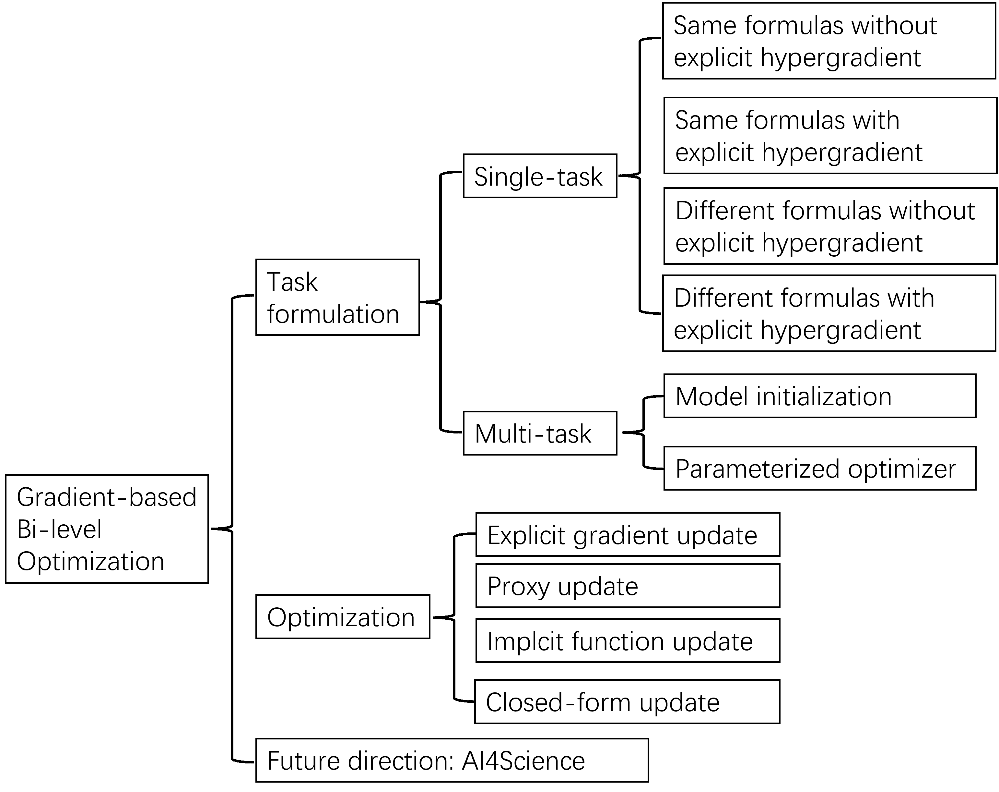
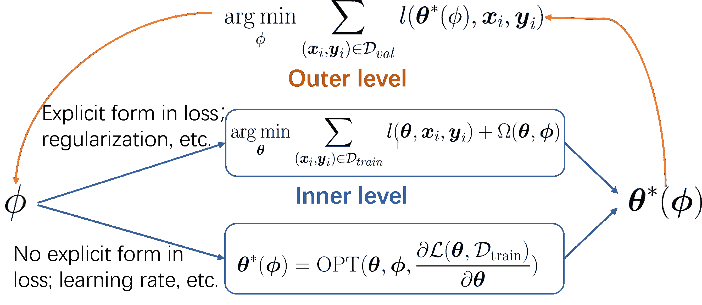
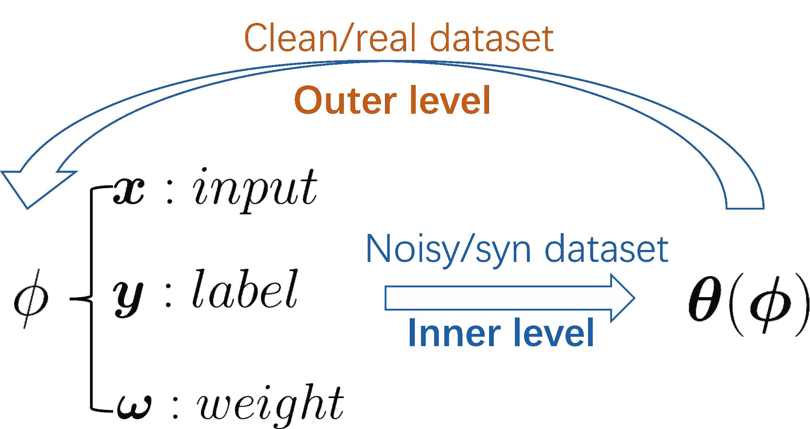
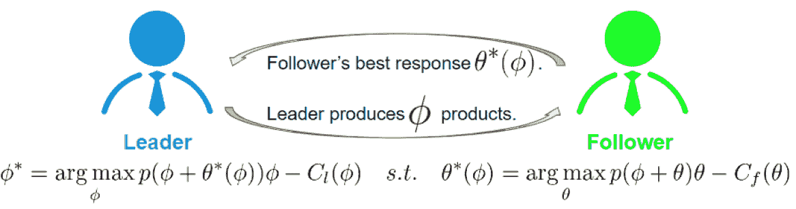
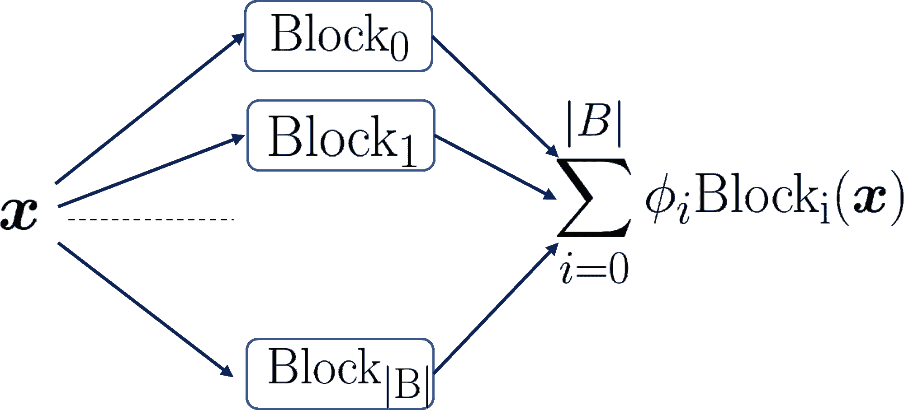
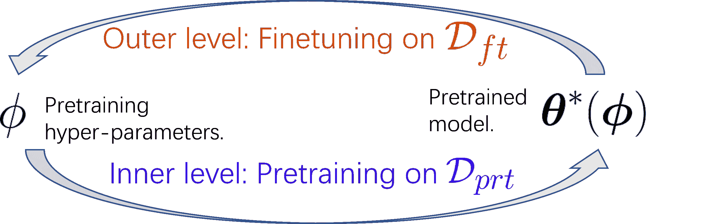
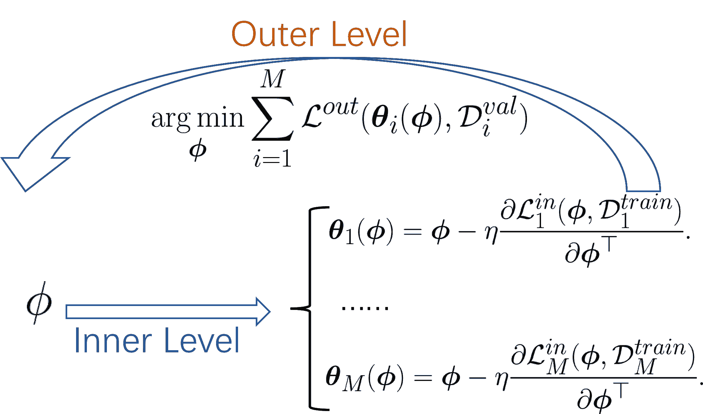
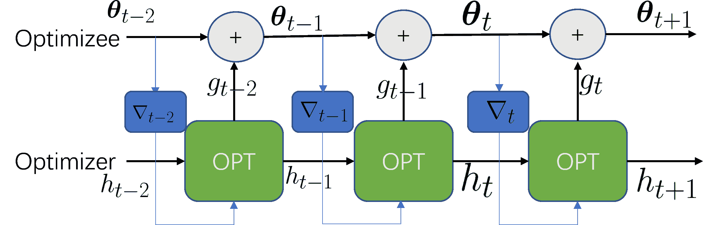

<!--yml

分类：未分类

日期：2024-09-06 19:45:18

-->

# [2207.11719] 基于梯度的双层优化在深度学习中的应用：一项调查

> 来源：[`ar5iv.labs.arxiv.org/html/2207.11719`](https://ar5iv.labs.arxiv.org/html/2207.11719)

# 基于梯度的双层优化在深度学习中的应用：一项调查

Can (Sam) Chen can.chen@mila.quebec

Mila - Quebec AI Institute

麦吉尔大学的 Xi Chen，麦吉尔大学的 Chen Ma，香港城市大学的 Zixuan Liu，华盛顿大学的 Xue Liu，麦吉尔大学

###### 摘要

双层优化，特别是基于梯度的类别，已经在深度学习社区中得到了广泛应用，包括超参数优化和元知识提取。双层优化将一个问题嵌套在另一个问题中，而基于梯度的类别通过计算超梯度来解决外层任务，这比经典方法如进化算法更加高效。在本调查中，我们首先给出基于梯度的双层优化的正式定义。接下来，我们描述了判断研究问题是否适合双层优化的标准，并提供了将这些问题结构化为双层优化框架的实用指南，这对新手尤其有益。更具体地说，有两种公式：单任务公式用于优化超参数如正则化参数和提取数据，以及多任务公式用于提取元知识如模型初始化。通过双层公式，我们讨论了四种双层优化求解器来更新外部变量，包括显式梯度更新、代理更新、隐式函数更新和闭式形式更新。最后，我们通过强调两个前景广阔的未来方向来总结这项调查：（1）通过任务公式视角考察的有效数据优化；（2）从优化角度分析的准确显式代理更新。

## 1 引言

随着深度学习的快速发展，双层优化因其在许多深度学习问题中的嵌套问题结构而受到大量研究关注，包括超参数优化（Rendle, 2012; Chen et al., 2019; Liu et al., 2019）和元知识提取（Finn et al., 2017）。双层优化问题是一种特殊的优化问题，其中一个问题嵌套在另一个问题中，可以追溯到两个领域：一个是来自博弈论的 Stackelberg 博弈（Von Stackelberg, 2010），其中领导者和跟随者在数量上竞争；另一个是来自数学规划的，其中内层问题作为外层问题的约束（Bracken & McGill, 1973）。尤其是，与要求严格数学属性或无法扩展到大数据集的经典方法（Sinha et al., 2017）相比，高效的梯度下降方法为复杂的双层优化问题提供了有前景的解决方案，因此在许多深度学习研究工作中被广泛采用，以优化单任务形式化中的超参数（Bertinetto et al., 2019; Hu et al., 2019; Liu et al., 2019; Rendle, 2012; Chen et al., 2019; Ma et al., 2020; Zhang et al., 2023; Li et al., 2022）或在多任务形式化中提取元知识（Finn et al., 2017; Andrychowicz et al., 2016; Chen et al., 2023b; Zhong et al., 2022; Chi et al., 2021; 2022; Wu et al., 2022; Chen et al., 2022c）。

在本次调查中，我们主要关注具有明确定义的目标函数的深度神经网络的基于梯度的双层优化。该调查旨在指导研究人员处理涉及双层优化的研究问题。我们首先在第二部分中定义了符号并给出了基于梯度的双层优化的正式定义。接着，我们在第三部分中提出了一种新的任务形式化分类法，并在第四部分中提出了计算外部变量超梯度的方法。这种分类法为研究人员提供了如何将任务形式化为双层优化问题以及如何解决这一问题的指导。最后，我们在第五部分中总结了调查并提出了两个有前景的未来方向。

## 2 定义

表 1：本文中使用的关键符号。

| Notations | Descriptions |
| --- | --- |
| $\boldsymbol{x}_{i}$ | 由 i 索引的数据点的输入 |
| $\boldsymbol{y}_{i}$ | 由 i 索引的数据点的标签 |
| $\mathcal{D}$/$\mathcal{D}_{train}$/$\mathcal{D}_{val}$ | 监督/训练/验证数据集 |
| $&#124;\mathcal{D}&#124;$ | 数据集$\mathcal{D}$中的样本数量 |
| $\boldsymbol{\theta}$/$\boldsymbol{\Theta}$ | 内部可学习变量 |
| $\boldsymbol{\phi}$/ $\boldsymbol{\Phi}$ | 外部可学习变量 |
| $\boldsymbol{\theta}^{*}(\boldsymbol{\phi})$ | 给定$\boldsymbol{\phi}$的$\boldsymbol{\theta}$的最佳响应 |
| $l(\boldsymbol{\theta},\boldsymbol{\phi},\boldsymbol{x}_{i},y_{i})$ | 第$i_{th}$个数据点$\boldsymbol{x}_{i},\boldsymbol{y}_{i}$上的损失 |
| $l(\boldsymbol{\theta},\boldsymbol{x}_{i},y_{i})$ | 没有$\boldsymbol{\phi}$的情况下，数据$\boldsymbol{x}_{i},\boldsymbol{y}_{i}$上的损失 |
| $\mathcal{L}(\boldsymbol{\theta},\boldsymbol{\phi},\mathcal{D})$ | 整个数据集$\mathcal{D}$上的损失 |
| $\mathcal{L}(\boldsymbol{\theta},\mathcal{D})$ | 没有$\boldsymbol{\phi}$的情况下，数据集$\mathcal{D}$上的损失 |
| $\mathcal{L}^{in}(\boldsymbol{\theta},\boldsymbol{\phi},\mathcal{D})$ | 数据集$\mathcal{D}$上的内部层损失 |
| $\mathcal{L}^{out}(\boldsymbol{\theta},\boldsymbol{\phi},\mathcal{D})$ | 数据集$\mathcal{D}$上的外部层损失 |
| $\frac{d\mathcal{L}^{out}}{d\boldsymbol{\phi}}$ | 关于$\boldsymbol{\phi}$的超梯度 |
| $\eta$ | 内部层学习率 |
| $\rm{M}$ | 内部层任务的数量 |
| $\Omega(\boldsymbol{\theta},\boldsymbol{\phi})$ | 由$\boldsymbol{\phi}$参数化的正则化参数 |
| $\rm{OPT}$ | 一些如 Adam 的优化器 |
| $\mathcal{D}_{real}$/$\mathcal{D}_{syn}$ | 真实/合成数据集 |
| $p(\cdot)$ | 市场中的产品价格 |
| $C_{l}(\phi)/C_{f}(\theta)$ | 领导者和跟随者的成本 |
| $D$ | 预测的原子间距离 |
| $\mathcal{D}^{prf}$/$\mathcal{D}^{ft}$ | 预训练/微调数据 |
| $E$ | 一些方程约束 |
| $\lambda$/$\gamma$ | 正则化强度参数 |
| $\epsilon$/$\tau$ | 一些小的正数 |
| $P_{\boldsymbol{\alpha}}$ | 由$\boldsymbol{\alpha}$参数化的代理网络 |
| $T$ | 优化中的迭代次数 |

在本节中，我们定义了基于梯度的双层优化，重点关注具有显式目标函数的神经网络。为方便起见，我们在表 1 中列出了符号及其描述。

假设有一个数据集 $\mathcal{D}$ = {($\boldsymbol{x}_{i}$, $y_{i}$)}，在监督学习设置下，其中 $\boldsymbol{x}_{i}$ 和 $y_{i}$ 分别表示第 $i^{th}$ 个输入及其对应的标签。此外，$\mathcal{D}_{train}$ 和 $\mathcal{D}_{val}$ 分别表示训练集和验证集。我们使用 $\boldsymbol{\theta}\in\mathbb{R}^{d}$ （矩阵形式为 $\boldsymbol{\Theta}$）来参数化内部可学习变量，这通常指的是模型参数，并使用 $\boldsymbol{\phi}\in\mathbb{R}^{m}$ （矩阵形式为 $\boldsymbol{\Phi}$）来参数化外部可学习变量，包括超参数和元知识。本文中，超参数不仅限于正则化和学习率，而是指任何单任务公式中的知识，具体会在第三部分中详细说明。设在 $(\boldsymbol{x}_{i},y_{i})$ 上的损失函数为 $l(\boldsymbol{\theta},\boldsymbol{x}_{i},y_{i})$，它指的是根据任务不同的目标格式，如交叉熵损失或均方误差（MSE）损失。注意，在某些情况下我们使用 $l(\boldsymbol{\theta},\boldsymbol{\phi},\boldsymbol{x}_{i},y_{i})$，这是 $l(\boldsymbol{\theta},\boldsymbol{x}_{i},y_{i})$ 在此设置下的一个等效变体。这是因为外部可学习参数 $\boldsymbol{\phi}$ 在计算 $l(\boldsymbol{\theta},\boldsymbol{x}_{i},y_{i})$ 时可能是诸如学习率等超参数，因此没有被显式表示。我们使用 $\mathcal{L}(\boldsymbol{\theta},\boldsymbol{\phi},\mathcal{D})$ 或 $\mathcal{L}(\boldsymbol{\theta},\mathcal{D})$ 来表示数据集 $\mathcal{D}$ 上的损失，并将内部层损失和外部层损失表示为 $\mathcal{L}^{in}(\boldsymbol{\theta},\boldsymbol{\phi},\mathcal{D})$ 和 $\mathcal{L}^{out}(\boldsymbol{\theta},\boldsymbol{\phi},\mathcal{D})$，分别。通常，内部层损失在训练数据集 $\mathcal{D}^{train}$ 上计算，而外部层损失在验证数据集 $\mathcal{D}^{val}$ 上评估。我们用 $\eta$ 表示内层优化所采用的学习率。采用这些符号表示法，我们将双层优化问题的数学表达式如下所示：

|  | $\displaystyle\boldsymbol{\phi}^{*}$ | $\displaystyle=\mathop{\arg\min}_{\boldsymbol{\phi}}\mathcal{L}^{out}(\boldsymbol{\theta}^{*}(\boldsymbol{\phi}),\boldsymbol{\phi}).$ |  | (1) |
| --- | --- | --- | --- | --- |
|  | $\displaystyle\mbox{s.t.}\quad\boldsymbol{\theta}^{*}(\boldsymbol{\phi})$ | $\displaystyle=\mathop{\arg\min}_{\boldsymbol{\theta}}\mathcal{L}^{in}(\boldsymbol{\theta},\boldsymbol{\phi}).$ |  | (2) |

方程中内层问题（2）充当约束，并建立了$\boldsymbol{\phi}$和$\boldsymbol{\theta}$之间的关系。这里我们使用方程中的$\arg\min$形式（2），但请注意，内层任务可以扩展到一些方程约束，我们将在第三部分进一步说明。在神经网络的本质中，可以使用梯度下降来估计$\boldsymbol{\theta}^{*}(\boldsymbol{\phi})$。外层问题作为主要优化问题，通过利用方程中建立的关系（2）来计算超梯度$\frac{d\mathcal{L}^{out}}{d\boldsymbol{\phi}}$，以更新外层变量$\boldsymbol{\phi}$。

|  | $\frac{d\mathcal{L}^{out}}{d\boldsymbol{\phi}}=\frac{\partial\mathcal{L}^{out}}{\partial\boldsymbol{\theta}}\frac{\partial\boldsymbol{\theta}(\boldsymbol{\phi})}{\partial\boldsymbol{\phi}}+\frac{\partial\mathcal{L}^{out}}{\partial\boldsymbol{\phi}}.$ |  | (3) |
| --- | --- | --- | --- |

这称为基于梯度的双层优化。当扩展到多任务场景中以提取${M}$个不同任务的元知识时，上述形式可以重写为：

|  | $\displaystyle\boldsymbol{\phi}^{*}$ | $\displaystyle=\mathop{\arg\min}_{\boldsymbol{\phi}}\sum_{i=1}^{M}\mathcal{L}^{out}(\boldsymbol{\theta}^{*}_{i}(\boldsymbol{\phi}),\boldsymbol{\phi}).$ |  | (4) |
| --- | --- | --- | --- | --- |
|  | $\displaystyle\mbox{s.t.}\quad\boldsymbol{\theta}^{*}_{i}(\boldsymbol{\phi})$ | $\displaystyle=\mathop{\arg\min}_{\boldsymbol{\theta}}\mathcal{L}^{in}_{i}(\boldsymbol{\theta},\boldsymbol{\phi}).$ |  | (5) |

这里$\boldsymbol{\phi}$象征着元知识，表示跨多个任务的知识，例如模型初始化等方面。

## 3 任务形式化

如图 1 所示，将双层优化任务划分为单任务和多任务类型，取决于我们要学习的知识类型（Franceschi et al., 2018）。单任务形式关注于单个任务中的超参数学习，而多任务形式则致力于元知识的获取。这两种形式在第 3.1 节和第 3.2 节中分别阐述。

图 1：基于梯度的双层优化总结。

### 3.1 单任务表述

单任务表述将双层优化应用于单一任务，旨在为该任务学习超参数。请注意，在本文中，超参数的意义不仅限于传统的意义，如正则化，而具有更广泛的意义，指所有单任务知识。

特定的单任务问题如果满足两个标准，可以被认为适合双层优化。首先，它有一个主要的优化问题，指导外部变量的优化。其次，内外部变量之间存在约束，从而可以建立这些变量之间的可微关系。具体来说，我们的第一步是识别内变量，记作$\boldsymbol{\theta}$，和外变量$\boldsymbol{\phi}$。接下来，我们识别主要的优化组件，该组件优化超参数，作为外层问题。最后，通过识别这两个变量之间的约束来构建内层问题，这进一步使我们能够建立它们之间的可微关系。

(1) 一种显著的情况是，当约束和主要优化问题使用不同的数学公式时，这意味着它们优化的是完全不同的问题。在这些情况下，约束通常会自然产生，其识别变得直接。例如，拓扑设计中的能量约束(Christiansen et al., 2001)或蛋白质表示学习中的生物化学约束(Chen et al., 2022b)。相反，当主要优化问题和约束共享相同的数学公式时，该公式需要被分解为两个层次。这种分解通常通过考虑训练集和验证集之间的数据变异来完成。内层，通常由训练损失表示，在这种设置下作为约束(Franceschi et al., 2018)。这构成了我们评估的第一个标准。 (2) 在某些情况下，主要优化问题可能不会直接包含外部变量。在这种情况下，利用在内层建立的连接。这种情况在制定外层任务时带来了挑战，从而引入了第二个标准。第二个标准根据超梯度的计算是否完全依赖于已建立的内层连接，$\frac{d\mathcal{L}^{out}(\boldsymbol{\theta}^{*}(\boldsymbol{\phi}))}{d\boldsymbol{\phi}}$，还是不依赖于$\frac{d\mathcal{L}^{out}(\boldsymbol{\theta}^{*}(\boldsymbol{\phi}),\boldsymbol{\phi})}{d\boldsymbol{\phi}}$来对工作进行分类。

总结来说，我们考虑以下四种情况，并讨论相应的示例以便更好地说明：

+   •

    1). $\mathcal{L}^{in}$ 和 $\mathcal{L}^{out}$ 具有相同的数学公式，超梯度仅来自内层连接 $\boldsymbol{\theta}(\boldsymbol{\phi})$；

+   •

    2). $\mathcal{L}^{in}$ 和 $\mathcal{L}^{out}$ 具有相同的数学公式，超梯度来自内层连接 $\boldsymbol{\theta}(\boldsymbol{\phi})$ 和外层目标的显式组合；

+   •

    3). $\mathcal{L}^{in}$ 和 $\mathcal{L}^{out}$ 具有不同的数学公式，超梯度仅来自内层连接 $\boldsymbol{\theta}(\boldsymbol{\phi})$；

+   •

    4). $\mathcal{L}^{in}$ 和 $\mathcal{L}^{out}$ 具有不同的数学公式，超梯度来自内层连接 $\boldsymbol{\theta}(\boldsymbol{\phi})$ 和外层目标的显式组合；

#### 3.1.1 没有显式外层超梯度的相同公式

表 2：没有显式外层超梯度的相同公式。

| 工作 | 内层变量 $\boldsymbol{\theta}$ | 外层变量 $\boldsymbol{\phi}$ | 内层问题作为约束 | 外层问题作为主要优化 |
| --- | --- | --- | --- | --- |
| (a) | 模型参数 | 正则化 | $\boldsymbol{\theta}^{*}(\boldsymbol{\phi})=\mathop{\arg\min}_{\boldsymbol{\theta}}\sum_{(\boldsymbol{x}_{i},y_{i})\in\mathcal{D}_{train}}l(\boldsymbol{\theta},\boldsymbol{x}_{i},\boldsymbol{y}_{i})+\Omega(\boldsymbol{\theta},\boldsymbol{\phi})$ | $\mathop{\arg\min}_{\boldsymbol{\phi}}\sum_{(\boldsymbol{x}_{i},y_{i})\in\mathcal{D}_{val}}l(\boldsymbol{\theta}^{*}(\boldsymbol{\phi}),\boldsymbol{x}_{i},\boldsymbol{y}_{i})$ |
| (b) | 模型参数 | 学习率 | $\boldsymbol{\theta}^{*}({\boldsymbol{\phi}})=\rm{OPT}(\boldsymbol{\theta},\boldsymbol{\phi},\frac{\partial\mathcal{L}(\boldsymbol{\theta},\mathcal{D}_{train})}{\partial\boldsymbol{\theta}})$ | $\mathop{\arg\min}_{\boldsymbol{\phi}}\sum_{(\boldsymbol{x}_{i},y_{i})\in\mathcal{D}_{val}}l(\boldsymbol{\theta}^{*}(\boldsymbol{\phi}),\boldsymbol{x}_{i},\boldsymbol{y}_{i})$ |
| (c) | 模型参数 | 扰动 | $\boldsymbol{\theta}^{*}(\boldsymbol{\phi})=\mathop{\arg\min}_{\boldsymbol{\theta}}\sum_{(\boldsymbol{x}_{i},y_{i})\in\mathcal{D}_{train}}l(\boldsymbol{\theta},\boldsymbol{x}_{i}+\boldsymbol{\phi}_{i},\boldsymbol{y}_{i}).$ | $\mathop{\arg\min}_{\boldsymbol{\phi}}\sum_{(\boldsymbol{x}_{j},\boldsymbol{y}_{j})\in\mathcal{D}_{val}}-l(\boldsymbol{\theta}^{*}(\boldsymbol{\phi}),\boldsymbol{x}_{j},\boldsymbol{y}_{j})$ |
| (d) | 模型参数 | 蒸馏数据 | $\boldsymbol{\theta}^{*}(\boldsymbol{\phi})=\mathop{\arg\min}_{\boldsymbol{\theta}}\sum_{(\boldsymbol{\phi}_{i},\boldsymbol{y_{i}})\in\mathcal{D}_{syn}}l(\boldsymbol{\theta},\boldsymbol{\phi}_{i},\boldsymbol{y_{i}})$ | $\mathop{\arg\min}_{\boldsymbol{\phi}}\sum_{(\boldsymbol{x_{j}},\boldsymbol{y_{j}})\in\mathcal{D}_{real}}l(\boldsymbol{\theta}^{*}(\boldsymbol{\phi}),\boldsymbol{x_{j}},\boldsymbol{y_{j}})$ |
| (e) | 模型参数 | 数据标签 | $\boldsymbol{\theta}^{*}(\boldsymbol{\phi})=\mathop{\arg\min}_{\boldsymbol{\theta}}\sum_{(\boldsymbol{x}_{i},{\boldsymbol{\phi}_{i}})\in\mathcal{D}_{train}}l(\boldsymbol{\theta},\boldsymbol{x}_{i},{\boldsymbol{\phi}_{i}})$ | $\mathop{\arg\min}_{\boldsymbol{\phi}}\sum_{(\boldsymbol{x}_{j},\boldsymbol{y}_{j})\in\mathcal{D}_{val}}l(\boldsymbol{\theta}^{*}(\boldsymbol{\phi}),\boldsymbol{x}_{j},\boldsymbol{y}_{j})$ |
| (f) | 模型参数 | 样本权重 | $\boldsymbol{\theta}^{*}(\boldsymbol{\phi})=\mathop{\arg\min}_{\boldsymbol{\theta}}\sum_{(\boldsymbol{x_{i}},\boldsymbol{y_{i}})\in\mathcal{D}_{train}}\phi_{i}l(\boldsymbol{\theta},\boldsymbol{x_{i}},\boldsymbol{y_{i}})$ | $\mathop{\arg\min}_{\boldsymbol{\phi}}\sum_{(\boldsymbol{x}_{i},\boldsymbol{y}_{i})\in\mathcal{D}_{val}}l(\boldsymbol{\theta}^{*}(\boldsymbol{\phi}),\boldsymbol{x}_{i},\boldsymbol{y}_{i})$ |

当内层和外层使用相同的数学公式时，任务的目标是从两个不同的视角优化一个单一目标。外部变量通常描述除了模型参数之外的训练过程的一些方面。外部变量在主要优化问题中不会显式体现，从而导致在外部层面缺乏明确的超梯度。在这种情况下，$\frac{d\mathcal{L}^{out}}{d\boldsymbol{\phi}}$的超梯度通过内层连接计算为$\frac{\partial\mathcal{L}^{out}}{\partial\boldsymbol{\theta}}\frac{\partial\boldsymbol{\theta}(\boldsymbol{\phi})^{\top}}{\partial\boldsymbol{\phi}}$。根据$\phi$的具体含义，外部变量可以分为两类：与模型相关的外部变量和与数据相关的外部变量。

与模型相关的。与模型相关的外部变量通常描述模型优化过程，包括（a）正则化参数（Franceschi et al., 2018），（b）学习率（Franceschi et al., 2017）等，这些比与数据相关的外部变量更为常见。

(a) 正则化是避免机器学习模型过拟合的一个重要组成部分。然而，识别有效的正则化项是一个具有挑战性的任务，主要因为每次评估一个正则化项都需要训练整个模型。使用合适的正则化项训练的模型预期在验证集上产生低错误率。这一观察促使 Franceschi 等人（2018）将正则化选择视为一个双层优化问题，以实现直接和高效的优化。如表 2(a)所示，训练集上的内层损失作为约束，建立了模型参数$\theta$与正则化项之间的可微连接。验证集上的外层损失构成了主要的优化问题，旨在通过内层连接优化正则化。在这种情况下，$\Omega(\boldsymbol{\theta},\boldsymbol{\phi})$表示由$\boldsymbol{\phi}$在$\boldsymbol{\theta}$上参数化的正则化项。一个简单的例子是 L2 正则化，其中$\Omega(\boldsymbol{\theta},{\phi})=\phi|\boldsymbol{\theta}|^{2}$。在外层损失中，正则化项被视为零，使其在数学形式上与内层损失相同。处理高维度时，传统方法如随机搜索和贝叶斯优化可能显得不够充分。相比之下，双层优化框架提供了一种高效的方法来直接更新高维超参数，如正则化，正如 Rendle（2012）、Chen 等人（2019）和 Lorraine 等人（2020）所展示的那样。

图 2：模型相关的外部变量。

(b) 与明确存在于损失目标中的正则化参数相反，一些与模型相关的外部变量仅存在于优化过程中。这两类变量的区别见于图 2。其中一个例子是学习率，如 Franceschi 等人所讨论的(2017)。优化学习率的方法，如表 2(b)所示，类似于双层优化背景下的正则化优化过程。关键区别在于可微连接的构建方式。这个连接由$\boldsymbol{\theta}^{*}({\boldsymbol{\phi}})=\rm{OPT}(\boldsymbol{\theta},\boldsymbol{\phi},\frac{\partial\mathcal{L}(\boldsymbol{\theta},\mathcal{D}_{train})}{\partial\boldsymbol{\theta}})$建立。这里，$\rm{OPT}$表示一个旨在最小化训练损失的优化过程，作为约束。一个简单的例子可以用一步随机梯度下降（SGD）表示，写作$\boldsymbol{\theta}^{*}(\boldsymbol{\phi})=\boldsymbol{\theta}-\phi\frac{\partial\mathcal{L}(\boldsymbol{\theta},\mathcal{D}_{train})}{\partial\boldsymbol{\theta}^{\top}}$。在这个方程中，外部变量${\phi}$表示学习率$\eta$。尽管内部层问题是通过优化器的视角表示的，但从根本上讲，它仍然是优化外层损失的相同数学目标。这种学习率-学习过程与元学习优化有一些相似之处，我们将在第 3.2.2 节中进一步讨论。

数据相关。从模型相关的外部变量讨论过渡到数据相关的变量，我们现在将注意力转向数据相关的变量。如图 3 所示，数据点$(\boldsymbol{x}_{i},\boldsymbol{y}_{i})$本身或其相关权重可以被视为外部变量。这些可以通过跨多个研究领域的双层优化进行更新。这包括（c）对抗攻击，（d）数据蒸馏，（e）标签学习，以及（f）样本重新加权等。

(c) 对抗性攻击是识别数据扰动的努力，记作 $\boldsymbol{\phi}$，这些扰动会导致模型在验证集上的表现不佳。这个概念在表 2(c) 中进一步阐明，展示了它如何形成一个双层优化问题（Biggio 等人，2012; Yuan & Wu，2021）。在这个背景下，$\boldsymbol{\phi}_{i}$ 表示添加到样本 $\boldsymbol{x}_{i}$ 上的扰动。内部层作为约束，创建这些扰动 $\boldsymbol{\phi}_{i}$ 和模型参数 $\boldsymbol{\theta}$ 之间的可微连接。通过最小化训练损失来实现这个连接。同时，外部层通过最大化验证损失来更新扰动 $\boldsymbol{\phi}$。通过这种方式，我们可以有效地定位对抗性攻击，这些攻击由 $\boldsymbol{\phi}_{i}$ 表示。外部层损失在零扰动情况下，可以视为与内部层损失具有相同的数学形式。

(d) 数据蒸馏技术（Wang 等，2018; Lei & Tao，2023）旨在将来自大规模训练数据集的知识浓缩到一个显著较小的数据集中，以实现压缩目的。这个目标通过在较小的数据集上训练模型并期望其在较大数据集上表现良好来实现，这种方法符合表 2(d)所示的双层优化问题框架。在这种背景下，$\mathcal{D}_{real}$ 是包含真实数据的数据集，而 $\mathcal{D}_{syn}$ 是由合成数据构成的数据集。内部层通过最小化训练损失来建立 $i^{th}$ 数据点 $\boldsymbol{\phi}_{i}$ 和模型参数 $\boldsymbol{\theta}$ 之间的联系。同时，外部优化层更新合成的 $\boldsymbol{\phi}$ 以确保在真实数据上的有效性能，作为主要的优化组件。有趣的是，Nguyen 等人（2020）利用无限宽神经网络与核之间的对应关系在数据蒸馏中取得了显著成果。此外，数据蒸馏的概念已被有效应用于黑箱优化，如 Chen 等人（2022a）和 Chen 等人（2023a）所展示，取得了令人印象深刻的成果。

(e) 标签学习策略，例如 Algan & Ulusoy（2021）和 Wu 等（2021）提出的策略，将标签 $\boldsymbol{y_{i}}$ 视为由 $\boldsymbol{\phi}$ 参数化的外部变量。与数据蒸馏方法不同，标签学习策略不旨在减少数据集的大小。这种学习方法的主要目标是学习更干净的标签，从而在标签噪声下提升模型性能，并借助干净的数据集进行指导。这一过程可以被概念化为一个双层优化问题，如表 2（e）所述，其中主要优化任务是优化标签以对抗验证损失。

图 3：与数据相关的外部变量。

(f) 一些研究（Ren 等，2018；Hu 等，2019）提出了为每个数据点 $(\boldsymbol{x_{i}},\boldsymbol{y_{i}})$ 分配一个实例权重 $\phi_{i}$ 的想法，以增强模型的训练过程。这些实例权重可以视为外部变量，并在无偏验证集的指导下进行学习。如表 2 所示，实例重加权的方法与标签学习方法有相似之处，并可以纳入双层优化框架中。Hu 等的初步工作（2019）将每个实例权重视为可学习的参数，但这对大数据集带来了可扩展性挑战。为解决这一问题，后续工作（Shu 等，2019）提出了一种替代方案——加权网络。该网络旨在对实例权重进行参数化，其中输入为实例损失，输出为实例权重，从而提高大数据集的可扩展性。这一创新方法已被 Xu 等（2021）进一步采用，他们使用消息传递神经网络对分子结构中的原子距离进行参数化，该机制旨在有效地封装图信息。需要特别注意的是，高维超参数的有效优化与高效的参数化密切相关。实现这一点需要使用精心设计的神经网络/输入，以满足特定问题的要求，从而确保优化过程中的效率和准确性。

#### 3.1.2 带有显式外部层超梯度的相同公式

表 3：带有显式外部层超梯度的相同公式。

| 工作 | 内部变量 $\boldsymbol{\theta}$ | 外部变量 $\boldsymbol{\phi}$ | 作为约束的内部级别问题 | 作为主要优化目标的外部级别问题 |
| --- | --- | --- | --- | --- |
| (g) | 追随者单位 | 领导者单位 | ${\theta}^{*}({\phi})=\mathop{\arg\min}_{{\phi}}p(\phi+\theta)\theta-C_{f}(\theta)$ | $\mathop{\arg\min}_{{\phi}}p(\phi+{\theta}^{*}({\phi}))\phi-C_{l}(\phi)$ |
| (h) | 模型参数 | 网络结构 | $\boldsymbol{\theta}^{*}(\boldsymbol{\phi})=\mathop{\arg\min}_{\boldsymbol{\theta}}\sum_{(\boldsymbol{x}_{i},\boldsymbol{y}_{i})\in\mathcal{D}_{train}}l(\boldsymbol{\theta},\boldsymbol{\phi},\boldsymbol{x}_{i},\boldsymbol{y}_{i})$ | $\mathop{\arg\min}_{\boldsymbol{\phi}}\sum_{(\boldsymbol{x}_{j},\boldsymbol{y}_{j})\in\mathcal{D}_{val}}l(\boldsymbol{\theta}^{*}(\boldsymbol{\phi}),\boldsymbol{\phi},\boldsymbol{x}_{j},\boldsymbol{y}_{j})$ |
| (i) | 模型参数 | 扰动 | $\boldsymbol{\Theta}^{*}(\boldsymbol{\Phi})=\mathop{\arg\min}_{\boldsymbol{\Theta}}\mathcal{L}(\boldsymbol{\Theta},\boldsymbol{\Phi})$ | $\mathop{\arg\min}_{\boldsymbol{\Phi}}\mathcal{L}(\boldsymbol{\Theta}(\boldsymbol{\Phi}),\boldsymbol{\Phi})$ |

在内外优化级别具有相同数学目标的情况下，超梯度可能直接从外部级别中推导出来。然而，这种情况相比之前讨论的场景相对较少。我们推测这可能是因为在大多数情况下，外部变量可以直接与内部变量一起通过交替或联合优化进行更新，而不需要采用更复杂的双层优化方法。

图 4：Stackelberg 博弈作为双层优化。

在 Stackelberg 博弈（Von Stackelberg, 2010）的背景下，有两个竞争实体——一个领导公司和一个跟随公司，如图 4 所示。这些公司在生产数量上进行计算，其中领导者生产 $\phi$ 单位，跟随者生产 $\theta$ 单位。它们输出的总价格可以表示为 $p(\phi+\theta)$。领导者和跟随者的成本函数分别表示为 $C_{l}(\phi)$ 和 $C_{f}(\theta)$。然后可以计算出领导者和跟随者的利润，分别为 $p(\phi+\theta)\phi-C_{l}(\phi)$ 和 $p(\phi+\theta)\theta-C_{f}(\theta)$。在 Stackelberg 博弈场景中，假设领导者了解跟随者的最佳响应。这种情况可以恰当地框架为一个双层优化问题，如表 3(g) 所详细描述。重要的是，领导者不能直接在外层优化 $\phi$，而不考虑内层施加的可微约束。这种相互依赖验证了双层优化框架的必要性。

图 5: DARTS 中神经架构的连续松弛。

在定义的搜索空间内寻找最佳神经网络架构的任务是决定该任务性能的关键因素。由于神经网络架构可以被视为一种超参数，因此将搜索过程建模为一个双层优化问题，以实现有效更新，似乎是合乎逻辑的，正如第 3.1.1 节中讨论的。然而，这个任务并不简单，因为网络架构是不可微分的，不能直接使用梯度方法进行优化。为了解决这个问题，Liu 等人（2019）建议对架构表示进行连续松弛，使用$\boldsymbol{\phi}$参数化，如图 5 所示，并更新$\boldsymbol{\phi}$以确定优越的神经网络架构。这个场景可以被构建为一个双层优化问题，如表 3 所述。在这里，训练集上的内层损失作为约束，建立了模型参数$\theta$与网络架构之间的可微关系。同时，验证集上的外层损失构成了主要的优化问题，旨在优化网络架构。由于神经架构没有真实值，外层变量$\boldsymbol{\phi}$不能像实例加权情况下那样被视为常数（Shu 等人，2019；Chen 等人，2021）。因此，在外层损失的背景下，必须显式更新神经架构。值得注意的是，一阶 DARTS 方法将$\boldsymbol{\theta}^{*}(\boldsymbol{\phi})$视为$\boldsymbol{\theta}^{*}$，与$\boldsymbol{\phi}$无关。在这种情况下，双层优化简化为交替优化。因此，一阶 DARTS 的性能通常低于原始的二阶 DARTS。值得注意的是，将离散变量转换为连续变量在基于梯度的双层优化中具有重要意义，因为它提供了一种有效调整离散参数的方法。这项技术在早期标签学习方法中得到了应用，如（Algan & Ulusoy，2021；Wu 等人，2021）的研究所示。在这些情况下，离散的 one-hot 标签被转化为软标签以进行优化。然而，在这种情况下，与我们目前的背景相比，将其转换为连续形式并不是那么关键，因为存在像实例重加权这样的替代方法来处理标签噪声。

(i) 字典学习方法（Mairal 等，2010）也属于这一类别。这些方法旨在找到稀疏编码 $\boldsymbol{\Theta}\in\mathbb{R}^{d\times p}$ 和字典 $\boldsymbol{\Phi}\in\mathbb{R}^{m\times d}$ 以重建噪声测量 $\boldsymbol{Y}\in\mathbb{R}^{m\times p}$。请注意，$p$ 代表数据集大小，$d$ 代表字典大小，$m$ 代表字典特征的特征大小。损失函数可以写作：

|  | $\arg\min_{\boldsymbol{\Theta},\boldsymbol{\Phi}}\mathcal{L}(\boldsymbol{\Theta},\boldsymbol{\Phi})=\frac{1}{2}\&#124;\boldsymbol{\Phi}\boldsymbol{\Theta}-\boldsymbol{Y}\&#124;^{2}+\gamma\&#124;\boldsymbol{\Theta}\&#124;_{1}.$ |  | (6) |
| --- | --- | --- | --- |

在这种情况下，$\gamma$ 是一个正则化参数。与其采用对 $\boldsymbol{\Theta}$ 和 $\boldsymbol{\Phi}$ 进行缓慢的交替优化（这种方法忽视了它们的明确关系，即给定的字典 $\boldsymbol{\Phi}$ 应该决定稀疏编码 $\boldsymbol{\Theta}$），不如将其有效地表述为一个双层问题，如表 3 (i) 所详细说明的那样。这种方法显著提高了收敛速度。

#### 3.1.3 没有显式超梯度的不同公式

表 4：没有显式超梯度的不同公式。

| 工作 | 内层变量 $\boldsymbol{\theta}$ | 外层变量 $\boldsymbol{\phi}$ | 内层问题作为约束 | 外层问题作为主要优化 |
| --- | --- | --- | --- | --- |
| (j) | 形状 | 原子距离 | $\boldsymbol{\theta}^{*}(\boldsymbol{\phi})=\mathop{\arg\min}_{\boldsymbol{\theta}}\mathcal{L}^{in}(\boldsymbol{\theta},\boldsymbol{D}_{\boldsymbol{\phi}})$ | $\mathop{\arg\min}_{\boldsymbol{\phi}}\mathcal{L}^{out}(\boldsymbol{\theta}(\boldsymbol{\phi}))$ |
| (k) | 模型参数 | 预训练超参数 | $\boldsymbol{\theta}^{*}(\boldsymbol{\phi})=\mathop{\arg\min}_{\boldsymbol{\theta}}\mathcal{L}^{in}(\boldsymbol{\theta},\boldsymbol{\phi},\mathcal{D}_{prt})$ | $\mathop{\arg\min}_{\boldsymbol{\phi}}\mathcal{L}^{out}(\boldsymbol{\theta}^{*}(\boldsymbol{\phi}),\boldsymbol{\phi},\mathcal{D}_{ft})$ |
| (l) | 系统状态 | 拓扑设计 | $\boldsymbol{\theta}^{*}(\boldsymbol{\phi})=\mathop{\arg\min}_{\boldsymbol{\theta}}\mathcal{L}^{in}(\boldsymbol{\theta},\boldsymbol{\phi})$ | $\mathop{\arg\min}_{\boldsymbol{\phi}}\mathcal{L}^{out}(\boldsymbol{\theta}^{*}(\boldsymbol{\phi}))$ |
| (m) | 层输出 | 模型参数 | $\boldsymbol{\theta}=E(\boldsymbol{\theta},\boldsymbol{\phi},\boldsymbol{x})$ | $\mathop{\arg\min}_{\boldsymbol{\phi}}\mathcal{L}^{out}(\boldsymbol{\theta}(\boldsymbol{\phi}),\boldsymbol{x},\boldsymbol{y})$ |
| (n) | 层输出 | 模型参数 | $\dot{\boldsymbol{\theta}(t)}=E(\boldsymbol{\theta}(t),\boldsymbol{\phi},t),\quad\boldsymbol{\theta}(0)=\boldsymbol{\theta}_{0}$ | $\mathop{\arg\min}_{\boldsymbol{\phi}}\mathcal{L}^{out}(\boldsymbol{\theta}(t,\boldsymbol{\phi}),\boldsymbol{x},\boldsymbol{y})$ |

通常，内层和外层目标具有类似的数学结构，验证集用于衡量模型参数的性能。然而，在某些情况下，由于内层和外层目标分别优化完全不同的问题，它们之间可能存在显著差异。

(j) Xu 等人 (2021) 的研究就是一个例子。在这项研究中，分子构象的预测被分为两个层次，每个层次解决一个不同的问题。内层问题旨在利用物理约束构建具有预测原子距离的分子构象，而外层问题则旨在将分子构象与实际构象对齐，作为主要优化组件。如表 4(j)所述，这种设置形成了一个双层优化问题，其中 $\mathcal{L}^{in}$ 和 $\mathcal{L}^{out}$ 分别表示重建损失和对齐损失。这里，$\boldsymbol{D}_{\boldsymbol{\phi}}$ 表示由 $\boldsymbol{\phi}$ 参数化的预测原子距离，而内层变量 $\boldsymbol{\theta}$ 表示预测的分子构象。这个过程的最终结果是一个精细调整的神经网络，能够准确预测原子的距离。

图 6: 预训练和微调作为双层优化。

(k) 预训练是在计算机视觉和自然语言处理等领域中的关键策略，其中正确的预训练超参数选择可以显著提高下游任务的性能。Raghu 等人 (2021) 提出了基于下游任务性能优化预训练超参数的方法。

预训练和微调的过程可以有效地表示为一个双层优化问题，如表 4(k)所示。在这个背景下，$\mathcal{D}_{prt}$ 和 $\mathcal{D}_{ft}$ 分别表示预训练和微调数据集。在内层，预训练集上的损失作为约束，并建立了模型参数与预训练超参数之间的可微连接。这个层级的目标是最小化预训练损失。在外层，重点是通过最小化微调集上的损失来优化预训练超参数。这是主要的优化任务，并利用了在内层建立的可微连接。通过这种方式，可以有效地调整预训练超参数，以提高下游任务的表现。

设计一个能够最小化系统成本的拓扑结构是科学中的一个重要问题（Christiansen 等，2001；Zehnder 等，2021）。在拓扑设计的背景下，一旦提供了拓扑 $\boldsymbol{\phi}$，系统就会达到一个平衡状态，用 $\boldsymbol{\theta}^{*}(\boldsymbol{\phi})$ 表示。这个平衡状态通过最小化能量函数 $\mathcal{L}^{in}(\boldsymbol{\theta},\boldsymbol{\phi})$ 来实现。随后，系统成本可以计算为 $\mathcal{L}^{out}(\boldsymbol{\theta}^{*}(\boldsymbol{\phi}))$。这个过程可以表述为一个双层优化问题，如表 4 (l) 中详细说明。引入能量约束在更好地模拟软体物理方面也被证明是有价值的（Rojas 等，2021）。

这个概念扩展到隐式层，其中包括 (m) 深度平衡模型（DEQ）（Bai 等，2019）和 (n) 神经常微分方程（NeuralODE）（Chen 等，2018）。这两种模型都包含一个方程约束。DEQ 通过使用一个无限深度的层 $E$，提升了神经网络（NN）表示 $\boldsymbol{\theta}$ 在输入 $\boldsymbol{x}$ 下的效果。这可以表示为 $\boldsymbol{\theta}=E(\boldsymbol{\theta},\boldsymbol{\phi},\boldsymbol{x})$，建立了平衡点 $\boldsymbol{\theta}$ 与模型参数 $\boldsymbol{\phi}$ 之间的关系。随后，监督损失用于通过这种关系更新模型参数 $\phi$，从而形成一个双层优化问题，如表 4（m）中所述。NeuralODE 遵循与表 4（n）中显示的类似结构。唯一的不同在于应用于此上下文的方程约束是常微分方程：$\dot{\boldsymbol{\theta}(t)}=E(\boldsymbol{\theta}(t),\boldsymbol{\phi},t)$。

#### 3.1.4 具有明确超梯度的不同公式

表 5：不同的公式在没有明确超梯度的情况下。

| 工作 | 内层变量 $\boldsymbol{\theta}$ | 外层变量 $\boldsymbol{\phi}$ | 内层问题作为约束 | 外层问题作为主要优化 |
| --- | --- | --- | --- | --- |
| (o) | 模型参数 | 替代损失参数 | $\boldsymbol{\theta}^{*}(\boldsymbol{\phi})=\mathop{\arg\min}_{\boldsymbol{\theta}}{\mathcal{L}^{in}}(\boldsymbol{\theta},\boldsymbol{\phi},\mathcal{D}^{train})$ | $\mathop{\arg\min}_{\boldsymbol{\phi}}\mathcal{L}^{out}(\mathcal{L}(\boldsymbol{\theta},\mathcal{D}^{val})),{\mathcal{L}^{in}}(\boldsymbol{\theta}^{*}(\boldsymbol{\phi}),\boldsymbol{\phi},\mathcal{D}^{val}))$ |
| (p) | 序列参数 | 结构参数 | $\boldsymbol{\theta}^{*}(\boldsymbol{\phi})=\mathop{\arg\min}_{\boldsymbol{\theta}}\mathcal{L}^{in}(\boldsymbol{\theta},\boldsymbol{\phi})$ | $\mathop{\arg\min}_{\boldsymbol{\phi}}\mathcal{L}^{out}(\boldsymbol{\theta}^{*}(\boldsymbol{\phi}),\boldsymbol{\phi})$ |

在内层和外层目标彼此不同的情况下，一些场景会出现具体的超梯度。这些情况包括 (o) 学习替代损失函数（Grabocka 等，2019）和 (p) 蛋白质表示学习（Chen 等，2022b），以及其他情况。

在机器学习中，像交叉熵这样的误分类率代理常用于近似实际损失，主要是由于它们的不连续性和不可微性。为了解决这一问题，Grabocka 等人（2019）提出了一种替代神经网络，用于准确近似这些真实损失。这个过程涉及一个双层优化公式，如表 5(o)所述。内部层专注于通过优化模型参数$\boldsymbol{\theta}$来最小化替代损失${\mathcal{L}_{in}}$，而外部层则将替代损失$\boldsymbol{\phi}$调整为接近真实损失${\mathcal{L}}$。这里的主要目标是通过外部层优化过程最小化真实损失$\mathcal{L}$与替代损失$\mathcal{L}^{in}$之间的距离。这种方法有助于有效地和虚拟地最小化任何不可微和不可分解的损失函数，如误分类率。

蛋白质预训练在促进下游任务中扮演了关键角色，将生物化学约束纳入学习过程可以提升其性能。在这种背景下，蛋白质建模神经网络处理两种信息：由$\boldsymbol{\theta}$参数化的序列表示和由$\boldsymbol{\phi}$参数化的结构表示。Chen 等人（2022b）利用每个蛋白质序列与特定蛋白质结构相关联的生物化学约束，并将蛋白质预训练公式化为一个双层优化问题，如表 5(p)所述。可以看到，内部层通过最小化负的互信息损失$\mathcal{L}^{in}$，作为生物化学约束，来建立序列信息和结构信息之间的联系。同时，外部层通过最小化预训练损失$\mathcal{L}^{out}$，作为主要优化组件，来优化结构参数。总体而言，这种预训练方案提升了蛋白质表示学习的性能。

### 3.2 多任务公式

与单任务方法相比，多任务方法旨在提取跨任务的元知识。虽然单任务方法中的超参数选择广泛且多样，如我们在第 3.1 节中所述，但在多任务方法的背景下，元知识的选择趋于更为受限，使得其公式化相对简单。主要有两种类型的元知识在多任务方法中体现：模型初始化和优化器，我们将在以下小节中详细阐述。

#### 3.2.1 模型初始化

第一种元知识是模型初始化，这在数据稀缺的场景中非常有用（Hiller 等，2022；Liu 等，2020；Li 等，2017）。工作（Finn 等，2017）提出了模型无关元学习（MAML），用于训练跨任务系列的模型参数，以生成良好的模型初始化。良好的模型初始化意味着在该初始化上进行几步就能达到较好的解决方案。给定模型初始化 $\boldsymbol{\phi}$，经过一次梯度下降步骤后，任务 $i$ 上微调的模型参数可以表示为：

|  | $\boldsymbol{\theta}_{i}(\boldsymbol{\phi})=\boldsymbol{\phi}-\eta\frac{\partial\mathcal{L}_{i}^{in}(\boldsymbol{\phi},\mathcal{D}^{train}_{i})}{\partial\boldsymbol{\phi}^{\top}}.$ |  | (7) |
| --- | --- | --- | --- |

更新后的模型参数预计在验证集上表现良好。

|  | $\displaystyle\boldsymbol{\phi}^{*}$ | $\displaystyle=\mathop{\arg\min}_{\boldsymbol{\phi}}\sum_{i=1}^{M}\mathcal{L}^{out}(\boldsymbol{\theta}_{i}(\boldsymbol{\phi}),\mathcal{D}^{val}_{i}).$ |  | (8) |
| --- | --- | --- | --- | --- |
|  | $\displaystyle\mbox{s.t.}\quad\boldsymbol{\theta}_{i}(\boldsymbol{\phi})$ | $\displaystyle=\mathop{\arg\min}_{\boldsymbol{\theta}}\mathcal{L}^{in}_{i}(\boldsymbol{\phi},\mathcal{D}^{train}_{i}).$ |  | (9) |

这形成了一个如图 7 所示的双层优化问题。MAML 适用于包括分类、回归等在内的各种学习任务。

单一初始化可能无法推广到所有任务，因此一些研究工作提出为不同任务学习不同的初始化。方法(Vuorio et al., 2019)根据任务模式调节初始化，并通过梯度更新快速适应。方法(Yao et al., 2019)按层次聚类任务，并根据集群调整初始化。根据任务的表述，可能只需要更新部分模型参数，这可以节省大量内存，因为模型的参数可能高达数百万。工作(Lee et al., 2019)固定用户嵌入和项目嵌入，仅在元学习阶段更新交互参数。方法(Rusu et al., 2018)提出将高维参数空间映射到低维潜在空间，在其中执行 MAML。

图 7：MAML 的示意图。

此外，某些分析(Zou et al., 2021)也提出了选择内循环学习率的方法。最后但同样重要的是，领域知识如生物先验(Yao et al., 2021)也可以融入到 MAML 建模中，他们提出了一个区域定位网络，以为每个测定定制初始化。Tack et al. (2022)适配了元学习者的时间集成以生成目标模型。Hiller et al. (2022)开发了一种受预处理启发的增加适应速度的新方法。Guan et al. (2022)分析了现代元学习算法，并对稳定性进行了详细分析。

#### 3.2.2 优化器

另一种跨任务的元知识是优化器。以前的优化器如 Adam 是手动设计的，可能效果次优。工作(Andrychowicz et al., 2016)提出为一组任务学习优化器。如图 8 所示，学习的优化器由$\boldsymbol{\phi}$参数化，其中 LSTM 将状态作为输入并输出更新。这样，对于第$i$个任务，模型参数$\boldsymbol{\theta}$通过以下方式与优化器参数连接：

|  | $\boldsymbol{\theta}_{t+1}^{i}(\boldsymbol{\phi})=\boldsymbol{\theta}_{t}^{i}+g_{t}^{i}(\boldsymbol{\phi}).$ |  | (10) |
| --- | --- | --- | --- |
|  | $[g_{t}^{i}(\boldsymbol{\phi}),h_{t+1}^{i}]=\rm{OPT}(\bigtriangledown_{\boldsymbol{\theta}_{t}^{i}}l_{t},h_{t}^{i},\boldsymbol{\phi}).$ |  | (11) |

这里$\rm{OPT}$表示学习到的 LSTM 优化器，$h$表示隐藏状态。优化器会被更新以改善在$\rm{T}$范围内的验证性能，这可以写成：

|  | $\boldsymbol{\phi}^{*}=\mathop{\arg\min}_{\boldsymbol{\phi}}\sum_{t=1}^{T}\mathcal{L}_{out}(\boldsymbol{\theta}_{t}^{i}(\boldsymbol{\phi}),\mathcal{D}_{val}^{i}).$ |  | (12) |
| --- | --- | --- | --- |

总体而言，这可以被表述为一个双层优化问题，其中内层通过最小化训练损失来建立模型参数$\boldsymbol{\theta}$与优化器参数$\boldsymbol{\phi}$之间的联系，而外层通过最小化验证损失来更新优化器。正式地，跨越一系列$\rm{M}$任务的双层优化的表述可以写为：

|  | $\displaystyle\boldsymbol{\phi}^{*}$ | $\displaystyle=\mathop{\arg\min}_{\boldsymbol{\phi}}\sum_{i=1}^{M}\sum_{t=1}^{\top}\mathcal{L}_{out}(\boldsymbol{\theta}_{t}^{i}(\boldsymbol{\phi}),\mathcal{D}_{val}^{i}).$ |  | (13) |
| --- | --- | --- | --- | --- |
|  | $\displaystyle\mbox{s.t.}\quad\boldsymbol{\theta}_{t+1}^{i}(\boldsymbol{\phi})$ | $\displaystyle=\boldsymbol{\theta}_{t}^{i}+g_{t}^{i}(\boldsymbol{\phi});[g_{t}^{i}(\boldsymbol{\phi}),h_{t+1}^{i}]=\rm{OPT}(\bigtriangledown_{\boldsymbol{\theta}_{t}^{i}}l_{t},h_{t}^{i},\boldsymbol{\phi}).$ |  | (14) |

为了优化数百万个参数，LSTM 被设计为逐坐标优化，这意味着每个参数共享相同的 LSTM。这大大减轻了计算负担。

图 8：LSTM 优化器。

此外，提出了一些预处理和后处理技术，将 LSTM 的输入和输出重新缩放到正常范围内。学习优化的一个关键挑战是对更长时间范围或未见优化对象的泛化，许多研究工作尝试缓解这一挑战。工作(Metz et al., 2019)建议使用 MLP 层代替 LSTM 来参数化优化器，并通过动态梯度重加权平滑损失范围。

方法(Wichrowska et al., 2017)提出了一种由三个 RNN 层组成的层次化 RNN，这些层次可以自下而上进行通信，这种层次化设计实现了更好的泛化。工作(Lv et al., 2017)提出了诸如随机缩放等训练技巧，以提高泛化能力。除此之外，一些工作(Knyazev et al., 2021)(Kang et al., 2021)建议直接预测参数，这可以视为一种特殊学习的优化器，无需任何梯度更新。

最近的研究还尝试将现有优化器融入优化器学习中，这可以利用现有的先验知识和学习能力。关键在于用可学习的参数替换现有优化器中的常量（即标量/向量/矩阵）。HyperAdam（Wang et al., 2019）根据任务学习组合权重和衰减率。该方法（Gregor & LeCun, 2010）首先将 ISTA 写成递归公式，然后将系数参数化为外部变量。该方法（Shu et al., 2020）设计了一个 Meta-LR-Schedule-Net，它将损失值和状态作为输入，输出当前迭代的学习率。该工作（Ravi & Larochelle, 2016）提出将权重系数和学习率进行参数化。

除了模型初始化和参数化优化器，还有一些其他的元知识，比如损失函数学习（Gao et al., 2022）。他们提出学习一个通用的损失函数，以训练一个在分布外任务中表现良好的稳健 DNN 模型。给定一个作为外部变量的参数化损失函数$\boldsymbol{\phi}$，内层通过最小化源领域上的训练损失来获得优化的模型参数$\boldsymbol{\theta}(\boldsymbol{\phi})$。然后，通过最小化目标领域上的验证损失来识别一个好的参数化损失。上述过程构造了一个双层优化问题，其形式为：

|  | $\displaystyle\boldsymbol{\phi}^{*}$ | $\displaystyle=\mathop{\arg\min}_{\boldsymbol{\phi}}\sum_{i=1}^{N}\mathcal{L}^{out}(\boldsymbol{\theta}^{*}(\boldsymbol{\phi}),\mathcal{D}_{val}^{i}).$ |  | (15) |
| --- | --- | --- | --- | --- |
|  | $\displaystyle\mbox{s.t.}\quad\boldsymbol{\theta}^{*}(\boldsymbol{\phi})$ | $\displaystyle=\mathop{\arg\min}_{\boldsymbol{\theta}}\sum_{i=1}^{M}\mathcal{L}^{in}(\boldsymbol{\theta},\boldsymbol{\phi},\mathcal{D}_{train}^{i}).$ |  | (16) |

这里$\mathcal{L}^{out}$是一个用于衡量目标领域性能的损失函数，$N$和$M$分别代表目标领域任务和源领域任务的数量。他们进一步提出通过利用隐函数定理来计算超梯度。

## 4 优化

基于梯度的双层优化需要在外层计算超梯度$\frac{d\mathcal{L}^{out}}{d\boldsymbol{\phi}}$。超梯度$\frac{d\mathcal{L}^{out}}{d\boldsymbol{\phi}}$可以通过链式法则展开为：

|  | $\frac{d\mathcal{L}^{out}}{d\boldsymbol{\phi}}=\frac{\partial\mathcal{L}^{out}}{\partial\boldsymbol{\theta}}\frac{\partial\boldsymbol{\theta}(\boldsymbol{\phi})}{\partial\boldsymbol{\phi}}+\frac{\partial\mathcal{L}^{out}}{\partial\boldsymbol{\phi}}.$ |  | (17) |
| --- | --- | --- | --- |

这里 $\frac{\partial\boldsymbol{\theta}(\boldsymbol{\phi})}{\partial\boldsymbol{\phi}}$ 通常涉及二阶梯度计算，因此资源需求较高。一般有四种方法来计算 $\frac{\partial\boldsymbol{\theta}(\boldsymbol{\phi})}{\partial\boldsymbol{\phi}}$：在第 4.1 节中的显式梯度更新，第 4.2 节中的显式代理更新，第 4.3 节中的隐式函数更新，以及第 4.4 节中的封闭形式方法，其中前三种是对一般函数的近似方法，区别在于如何建立 $\boldsymbol{\theta}$ 和 $\boldsymbol{\phi}$ 之间的联系，最后一种则是对某些函数的准确方法。随后在第 4.5 节将对它们的时间和空间复杂度进行全面分析。

### 4.1 显式梯度更新

显式梯度更新是最直接的方法，它通过某种优化器直接逼近 $\boldsymbol{\theta}$：

|  | $\boldsymbol{\theta}_{t}=\rm{OPT}(\boldsymbol{\theta}_{t-1},\boldsymbol{\phi}),\quad t=1,\cdots,T.$ |  | (18) |
| --- | --- | --- | --- |

这里 $T$ 表示迭代次数，$\boldsymbol{\theta}$ 代表模型参数和其他优化变量，如动量，$\rm{OPT}$ 代表优化算法，如 SGD，$\phi$ 表示训练过程中的外部变量。注意，当 $\rm{OPT}$ 是 SGD 优化器且仅考虑一次梯度下降步骤时，公式 (18) 变为

|  | $\boldsymbol{\theta}(\boldsymbol{\phi})=\boldsymbol{\theta}-\eta\frac{\partial\mathcal{L}^{in}(\boldsymbol{\theta},\boldsymbol{\phi},\mathcal{D}^{train})}{\partial\boldsymbol{\theta}^{\top}}.$ |  | (19) |
| --- | --- | --- | --- |

在这种情况下，我们可以计算超梯度如下：

|  | $\frac{\partial\boldsymbol{\theta}(\boldsymbol{\phi})}{\partial\boldsymbol{\phi}}=-\eta\frac{\partial^{2}\mathcal{L}^{in}(\boldsymbol{\theta},\boldsymbol{\phi},\mathcal{D}^{train})}{\partial\boldsymbol{\theta}^{\top}\partial\boldsymbol{\phi}}.$ |  | (20) |
| --- | --- | --- | --- |

这个过程通常需要二阶梯度计算。在某些情况下，可以采用一阶近似来代替 (Liu et al., 2019; Finn et al., 2017; Nichol et al., 2018) 中的二阶梯度。此外，Liu et al. (2019) 使用有限差分近似技术来高效计算二阶梯度。

|  | $\frac{\partial^{2}\mathcal{L}^{in}(\boldsymbol{\theta},\boldsymbol{\phi},\mathcal{D}^{train})}{\partial\boldsymbol{\theta}^{\top}\partial\boldsymbol{\phi}}\frac{\partial\mathcal{L}^{out}}{\partial\boldsymbol{\theta}}\approx\frac{\frac{\partial\mathcal{L}^{in}(\boldsymbol{\theta}^{+},\boldsymbol{\phi},\mathcal{D}^{train})}{\partial\phi}-\frac{\partial\mathcal{L}^{in}(\boldsymbol{\theta}^{-},\boldsymbol{\phi},\mathcal{D}^{train})}{\partial\boldsymbol{\phi}}}{2\epsilon},$ |  | (21) |
| --- | --- | --- | --- |

其中 $\boldsymbol{\theta}^{\pm}=\boldsymbol{\theta}\pm\epsilon\frac{\partial\mathcal{L}^{out}(\boldsymbol{\theta},\boldsymbol{\phi})}{\partial\boldsymbol{\theta}}$。这避免了计算 Hessian 矩阵的高昂成本。此外，工作（Deleu et al., 2022）建议采用无穷小的梯度步长来解决内层任务，从而导致一个连续时间双层优化求解器：

|  | $\frac{d\boldsymbol{\theta}(t)}{dt}=\frac{\partial\mathcal{L}^{in}(\boldsymbol{\theta},\boldsymbol{\phi},\mathcal{D}^{train})}{\partial\boldsymbol{\theta}^{\top}}.$ |  | (22) |
| --- | --- | --- | --- |

通过这种方式，最终输出是一个常微分方程的解。这种表述的一个重大优点是将固定和离散的梯度步数作为轨迹的长度，这既充当了一个连续变量，也可以学习。该工作还提出使用前向模式微分来计算超梯度，其中内存不会随着轨迹长度的增加而扩展。类似的连续双层求解器在 Yuan & Wu (2021) 中使用。

一般来说，更新不仅限于一步或 SGD 优化器，这使得超梯度计算过程变得复杂。计算超梯度通常有两种模式（Franceschi et al., 2017）：前向模式和反向模式。

前向模式。前向模式方法应用链式法则于复合函数：

|  | $\frac{d\boldsymbol{\theta}_{t}}{d\boldsymbol{\phi}}=\frac{\partial\rm{OPT}(\boldsymbol{\theta}_{t-1},\boldsymbol{\phi})}{\partial\boldsymbol{\theta}_{t-1}}\frac{d\boldsymbol{\theta}_{t-1}}{d\boldsymbol{\phi}}+\frac{\partial\rm{OPT}(\boldsymbol{\theta}_{t-1},\boldsymbol{\phi})}{\partial\boldsymbol{\phi}}.$ |  | (23) |
| --- | --- | --- | --- |

然后矩阵被定义为：

|  | $\boldsymbol{Z}_{t}=\frac{d\boldsymbol{\theta}_{t}}{d\boldsymbol{\phi}},\quad\boldsymbol{A}_{t}=\frac{\partial\rm{OPT}(\boldsymbol{\theta}_{t},\boldsymbol{\phi})}{\partial\boldsymbol{\theta}_{t}},\quad\boldsymbol{B}_{t}=\frac{\partial\rm{OPT}(\boldsymbol{\theta}_{t},\boldsymbol{\phi})}{\partial\boldsymbol{\phi}_{t}}.\quad$ |  | (24) |
| --- | --- | --- | --- |

因此，方程(23)可以写成：

|  | $\boldsymbol{Z}_{t}=\boldsymbol{A}_{t}\boldsymbol{Z}_{t-1}+\boldsymbol{B}_{t-1}.$ |  | (25) |
| --- | --- | --- | --- |

这样，$\boldsymbol{Z}_{T}$ 可以写成：

|  | $\displaystyle\boldsymbol{Z}_{T}$ | $\displaystyle=\boldsymbol{A}_{T}\boldsymbol{Z}_{T-1}+\boldsymbol{B}_{T-1}$ |  | (26) |
| --- | --- | --- | --- | --- |
|  |  | $\displaystyle=\sum_{t=1}^{T}(\prod_{s=t+1}^{T}\boldsymbol{A}_{s})\boldsymbol{B}_{t}.$ |  | (27) |

这将得出最终的超梯度。

反向模式。反向模式方法源自拉格朗日优化。二层问题的拉格朗日可以被表述为：

|  | $\mathcal{L}(\boldsymbol{\theta},\boldsymbol{\phi},\boldsymbol{\gamma})=\mathcal{L}^{out}(\boldsymbol{\theta}_{T})+\sum_{t=1}^{T}\boldsymbol{\gamma}_{t}(\rm{OPT}(\boldsymbol{\theta}_{t-1},\boldsymbol{\phi})-\boldsymbol{\theta}_{t}).$ |  | (28) |
| --- | --- | --- | --- |

偏导数的主要计算可以表示如下：

|  | $\frac{\partial\mathcal{L}(\boldsymbol{\theta},\boldsymbol{\phi},\boldsymbol{\gamma})}{\partial\boldsymbol{\theta}_{t}}=\boldsymbol{\gamma}_{t+1}\boldsymbol{A}_{t+1}-\boldsymbol{\gamma}_{t},\quad t\in\{1,\cdots,T-1\}.$ |  | (29) |
| --- | --- | --- | --- |
|  | $\frac{\partial\mathcal{L}(\boldsymbol{\theta},\boldsymbol{\phi},\boldsymbol{\gamma})}{\partial\boldsymbol{\theta}_{T}}=\frac{\partial\mathcal{L}^{out}}{\partial\boldsymbol{\theta}_{T}}-\boldsymbol{\gamma}_{T}.$ |  | (30) |
|  | $\frac{\partial\mathcal{L}(\boldsymbol{\theta},\boldsymbol{\phi},\boldsymbol{\gamma})}{\partial\boldsymbol{\phi}}=\sum_{t=1}^{T}\boldsymbol{\gamma}_{t}\boldsymbol{B}_{t}.$ |  | (31) |

在将方程(29)和方程(30)中的偏导数设置为零后，我们可以推导出$\boldsymbol{\gamma}_{t}$的值。将此解代入方程(31)，我们得到：

|  | $\frac{\partial\mathcal{L}(\boldsymbol{\theta},\boldsymbol{\phi},\boldsymbol{\gamma})}{\partial\boldsymbol{\phi}}=\frac{\partial\mathcal{L}^{out}}{\partial\boldsymbol{\theta}_{T}}\sum_{t=1}^{T}(\prod_{s=t+1}^{T}\boldsymbol{A}_{s})\boldsymbol{B}_{t}.$ |  | (32) |
| --- | --- | --- | --- |

可以看出，反向模式产生与正向模式相同的解。Shaban 等人的作品（2019）; Luketina 等人的作品（2016）建议忽略长期依赖以提高效率。

### 4.2 显式代理更新

除了使用显式梯度更新来解决内部层任务外，一种更直接的方法（MacKay 等人，2019; Bae＆Grosse，2020; Lorraine＆Duvenaud，2018）是拟合一个代理网络$P_{\alpha}(\cdot)$，该网络以外部变量作为输入并输出内部变量，

|  | $\boldsymbol{\theta}^{*}=P_{\alpha}(\boldsymbol{\phi}).$ |  | (33) |
| --- | --- | --- | --- |

训练代理有两种方式：全局和局部。全局方式旨在通过最小化$\mathcal{L}^{in}(P_{\alpha}(\boldsymbol{\phi}),\boldsymbol{\phi},\mathcal{D}^{train})$对所有$\boldsymbol{\phi}$针对$\boldsymbol{\alpha}$进行学习代理，而局部方式则针对$\boldsymbol{\phi}$的邻域对$\boldsymbol{\alpha}$最小化$\mathcal{L}^{in}(P_{\alpha}(\boldsymbol{\phi}),\boldsymbol{\phi},\mathcal{D}^{train})$。

一种特殊情况（Bohdal 等人，2021）是将代理设计为扰动内部变量的加权平均值。该研究采用进化算法来获取$\boldsymbol{\theta}$的近似解。通过将$\boldsymbol{\theta}$扰动为$\boldsymbol{\theta}_{k}$共$K$次，计算训练损失为$\{l_{k}(\boldsymbol{\phi})\}_{k=1}^{K}$，其中$l_{k}(\boldsymbol{\phi})=\mathcal{L}^{in}(\boldsymbol{\theta}_{k},\boldsymbol{\phi},\mathcal{D}^{train})$。然后每个扰动损失的权重为，

|  | $\omega_{1},\omega_{2},\cdots,\omega_{K}=\rm{softmax}([-l_{1}(\boldsymbol{\phi}),-l_{2}(\boldsymbol{\phi}),\cdots,-l_{K}(\boldsymbol{\phi})]/\tau),$ |  | (34) |
| --- | --- | --- | --- |

其中$\tau>0$为超参数。最后，代理网络的计算结果为

|  | $\boldsymbol{\theta}^{*}=\omega_{1}\boldsymbol{\theta}_{1}+\omega_{2}\boldsymbol{\theta}_{1}+\cdots+\omega_{K}\boldsymbol{\theta}_{K}.$ |  | (35) |
| --- | --- | --- | --- |

与显式梯度更新方法相比，这些代理方法可以采用深度学习模块直接建立内部变量与外部变量之间的关系。因此，这些方法通常需要更少的内存，但由于深度学习模块带来的粗略逼近，精度较低。

### 4.3 隐式函数更新

显式梯度更新方法的超梯度计算依赖于内部层的路径，而隐式函数更新则利用隐式函数定理得到更精确的超梯度，避免了梯度消失或内存限制的问题。首先，内部层的导数设为零：

|  | $\displaystyle\frac{\partial\mathcal{L}(\boldsymbol{\theta},\boldsymbol{\phi})}{\partial\boldsymbol{\theta}^{\top}}=\boldsymbol{0}.$ |  | (36) |
| --- | --- | --- | --- |

然后根据隐式函数定理，我们有：

|  | $\displaystyle\frac{\partial^{2}\mathcal{L}(\boldsymbol{\theta},\boldsymbol{\phi})}{\partial\boldsymbol{\theta}^{\top}\partial\boldsymbol{\theta}}\frac{\partial\boldsymbol{\theta}(\boldsymbol{\phi})}{\partial\boldsymbol{\phi}}+\frac{\partial\mathcal{L}^{2}(\boldsymbol{\theta},\boldsymbol{\phi})}{\partial\boldsymbol{\theta}^{\top}\partial\boldsymbol{\phi}}=\boldsymbol{0}.$ |  | (37) |
| --- | --- | --- | --- |

最后，我们可以计算超梯度为：

|  | $\frac{\partial\boldsymbol{\theta}(\boldsymbol{\phi})}{\partial\boldsymbol{\phi}}=-(\frac{\partial^{2}\mathcal{L}(\boldsymbol{\theta}(\boldsymbol{\phi}),\boldsymbol{\phi})}{\partial\boldsymbol{\theta}^{\top}\partial\boldsymbol{\theta}})^{-1}\frac{\partial\mathcal{L}^{2}(\boldsymbol{\theta},\boldsymbol{\phi})}{\partial\boldsymbol{\theta}^{\top}\partial\boldsymbol{\phi}}.$ |  | (38) |
| --- | --- | --- | --- |

以 iMAML（Rajeswaran et al., 2019）为例。为了保持模型参数$\boldsymbol{\theta}$和元参数$\boldsymbol{\phi}$之间的依赖关系，iMAML 在内层任务上提出了一个约束：

|  | $\boldsymbol{\theta}_{i}(\boldsymbol{\phi})=\mathop{\arg\min}_{\boldsymbol{\theta}}\mathcal{L}^{in}_{i}(\boldsymbol{\theta},\mathcal{D}^{train}_{i})+\frac{\lambda}{2}\&#124;\boldsymbol{\phi}-\boldsymbol{\theta}\&#124;^{2}.$ |  | (39) |
| --- | --- | --- | --- |

正则化强度$\lambda$控制相对于数据集的先验$\boldsymbol{\phi}$的强度。iMAML 的双层优化任务可以表述为：

|  | $\displaystyle\boldsymbol{\phi}^{*}$ | $\displaystyle=\mathop{\arg\min}_{\boldsymbol{\phi}}\sum_{i=1}^{M}\mathcal{L}^{out}(\boldsymbol{\theta}_{i}(\boldsymbol{\phi}),\mathcal{D}^{val}_{i}).$ |  | (40) |
| --- | --- | --- | --- | --- |
|  | $\displaystyle\mbox{s.t.}\quad\boldsymbol{\theta}_{i}(\boldsymbol{\phi})$ | $\displaystyle=\mathop{\arg\min}_{\boldsymbol{\theta}}\mathcal{L}^{in}_{i}(\boldsymbol{\theta},\mathcal{D}^{train}_{i})+\frac{\lambda}{2}\&#124;\boldsymbol{\phi}-\boldsymbol{\theta}\&#124;^{2},i=1,\cdots,M.$ |  | (41) |

超梯度可以计算为：

|  | $\frac{d\boldsymbol{\theta}_{i}{(\boldsymbol{\phi})}}{d\boldsymbol{\phi}}=(\mathbf{I}+\frac{1}{\lambda}\frac{\partial^{2}\mathcal{L}^{in}(\boldsymbol{\theta}_{i},\mathcal{D}^{train})}{\partial\boldsymbol{\theta}_{i}^{\top}\partial\boldsymbol{\theta}_{i}})^{-1},$ |  | (42) |
| --- | --- | --- | --- |

这与内层优化路径无关。在这种情况下，超梯度可以计算为线性系统$\frac{\partial^{2}\mathcal{L}^{in}(\boldsymbol{\theta},\mathcal{D}^{train})}{\partial\boldsymbol{\theta}^{\top}\partial\boldsymbol{\theta}}\boldsymbol{g}=\frac{\partial\mathcal{L}^{out}}{\partial\boldsymbol{\theta}}$的解$\boldsymbol{g}$。更具体地说，$\boldsymbol{g}$可以被视为以下优化问题的近似解：

|  | $\arg\min_{\boldsymbol{\omega}}\boldsymbol{\omega}^{\top}(\boldsymbol{I}+\frac{1}{\lambda}\frac{\partial^{2}\mathcal{L}^{in}(\boldsymbol{\theta})}{\partial\boldsymbol{\theta}^{\top}\partial\boldsymbol{\theta}})\boldsymbol{\omega}-\boldsymbol{\omega}^{\top}\frac{\partial\mathcal{L}^{out}(\boldsymbol{\theta})}{\partial\boldsymbol{\theta}^{\top}}.$ |  | (43) |
| --- | --- | --- | --- |

共轭梯度方法可以应用于解决这个问题，其中仅计算 Hessian-向量乘积，而不显式地形成 Hessian 矩阵。这个高效的算法也在 HOAG (Pedregosa, 2016)中用于计算超梯度。除了计算超梯度的线性系统方法，Lorraine 等人 (2020) 提出了将上述项展开为 Neumann 级数：

|  | $(\frac{\partial^{2}\mathcal{L}^{in}(\boldsymbol{\theta})}{\partial\boldsymbol{\theta}^{\top}\partial\boldsymbol{\theta}})^{-1}=\sum_{i=0}^{\inf}(\boldsymbol{I}-\frac{\partial^{2}\mathcal{L}^{in}(\boldsymbol{\theta})}{\partial\boldsymbol{\theta}^{\top}\partial\boldsymbol{\theta}})^{i}.$ |  | (44) |
| --- | --- | --- | --- |

如果 $\boldsymbol{I}-\frac{\partial^{2}\mathcal{L}(\boldsymbol{\theta}(\boldsymbol{\phi}),\boldsymbol{\phi})}{\partial\boldsymbol{\theta}^{\top}\partial\boldsymbol{\theta}}$ 是收缩的，那么第一个 $i_{th}$ 步骤的结果可以用来近似计算。这可以避免昂贵的 Hessian 逆计算。

### 4.4 闭式更新

虽然上述三种方法为一般损失函数提供了近似解，但我们这里考虑从中推导 $\boldsymbol{\theta}$ 和 $\boldsymbol{\phi}$ 之间的闭式连接。

|  | $\boldsymbol{\theta}(\boldsymbol{\phi})=\mathop{\arg\min}_{\boldsymbol{\theta}}\mathcal{L}^{in}(\boldsymbol{\theta},\boldsymbol{\phi},\mathcal{D}^{train}),$ |  | (45) |
| --- | --- | --- | --- |

这仅适用于一些特殊情况。Bertinetto 等人 (2019) 提出了岭回归作为其内部模型的一部分，以便得到闭式解。假设一个线性预测器 $f$ 由 $\boldsymbol{\theta}$ 参数化，并被视为由 $\boldsymbol{\phi}$ 参数化的 CNN 的最终层。假设输入为 $\boldsymbol{X}\in\mathbb{R}^{n\times p}$ 和输出为 $\boldsymbol{Y}\in\mathbb{R}^{n\times o}$，其中 $n$ 代表数据点的数量，$d,o$ 分别代表输入维度和输出维度。记 CNN 为 $\boldsymbol{\phi}(\boldsymbol{X})$: $\mathbb{R}^{p}\rightarrow\mathbb{R}^{e}$，则预测器的输出为 $\boldsymbol{\phi}(\boldsymbol{X})\boldsymbol{\theta}$，其中 $\boldsymbol{\phi}(\boldsymbol{X})\in\mathbb{R}^{n\times e}$ 和 $\boldsymbol{\theta}\in\mathbb{R}^{e\times o}$。第 $i_{th}$ 层次优化任务可以写作：

|  | $\boldsymbol{\theta}_{i}(\boldsymbol{\phi})=\mathop{\arg\min}_{\boldsymbol{\theta}}\&#124;\boldsymbol{\phi}(\boldsymbol{X}_{i})\boldsymbol{\theta}-\boldsymbol{Y}_{i}\&#124;^{2}+\lambda\&#124;\boldsymbol{\theta}\&#124;^{2}.$ |  | (46) |
| --- | --- | --- | --- |

其中，$\lambda$控制$L^{2}$正则化的强度。封闭形式的解是$\boldsymbol{\theta}_{i}(\boldsymbol{\phi})=\boldsymbol{\phi}(\boldsymbol{X}_{i})^{\top}(\boldsymbol{\phi}(\boldsymbol{X}_{i})\boldsymbol{\phi}(\boldsymbol{X}_{i})^{\top}+\lambda\mathbf{I})^{-1}\boldsymbol{Y}_{i}$。总之，为了在特征提取器中提取元知识$\boldsymbol{\phi}$，我们有如下的双层优化公式：

|  | $\displaystyle\boldsymbol{\phi}^{*}$ | $\displaystyle=\mathop{\arg\min}_{\boldsymbol{\phi}}\sum_{i=1}^{M}\mathcal{L}^{out}(\boldsymbol{\theta}_{i}(\boldsymbol{\phi}),\mathcal{D}^{val}_{i}).$ |  | (47) |
| --- | --- | --- | --- | --- |
|  | $\displaystyle\mbox{s.t.}\quad\boldsymbol{\theta}_{i}(\boldsymbol{\phi})$ | $\displaystyle=\boldsymbol{\phi}(\boldsymbol{X}_{i})^{\top}(\boldsymbol{\phi}(\boldsymbol{X}_{i})\boldsymbol{\phi}(\boldsymbol{X}_{i})^{\top}+\lambda\mathbf{I})^{-1}\boldsymbol{Y}_{i},i=1,\cdots,M.$ |  | (48) |

将牛顿法应用于逻辑回归，得到一系列加权最小二乘（或岭回归）问题。这也是一个封闭形式的解，但需要几个步骤。

另一个特殊情况是假设模型足够宽。近期的工作（Jacot et al., 2018; Lee et al., 2017）建立了 NNGP 核与贝叶斯神经网络之间的对应关系，以及 NTK 核与通过均方误差损失训练的神经网络之间的对应关系。在这种情况下，内层可以有一个封闭形式的解。这些工作（Nguyen et al., 2020; Yuan & Wu, 2021）分别将数据视为数据蒸馏和对抗攻击任务的外部变量，从而产生了更好的蒸馏样本和对抗攻击。这些算法可以通过 NTK 工具（Novak et al., 2019）轻松实现。方法（Dukler et al., 2021）将实例权重视为外部变量，并假设预训练模型具有线性表示，以为内层任务提供封闭形式的解。除了假设内层为岭回归和最小二乘回归外，一些工作（Ghadimi & Wang, 2018; Yang et al., 2021）还假设内层损失函数是强凸的，并提出了有效的算法来更好地解决双层优化问题。

### 4.5 比较分析。

本小节深入探讨了计算超梯度$\frac{d\mathcal{L}^{out}}{d\boldsymbol{\phi}}$的时间和空间复杂性的比较分析（见 Eq.(3）。我们将评估以下四种方法，并在表 6 中提供总结以供参考。

显式梯度更新。将计算公式(18)的时间表示为$c(d,m)$。按照方法 (Franceschi et al., 2017)，公式(18)中的雅可比矩阵与任意向量的乘积可以在时间复杂度为$\mathcal{O}(c(d,m))$内计算。在显式梯度更新的前向模式下（称为显式梯度前向），时间复杂度变为$\mathcal{O}(Tmc(d,m))$。这是因为需要$T$次迭代，每次迭代涉及$m$个雅可比-向量乘积。前向模式的空间复杂度为$\mathcal{O}(d+m)$，因为每次迭代中内部变量$\boldsymbol{\theta}$可以被覆盖。相对而言，反向模式（称为显式梯度反向）的时间复杂度为$\mathcal{O}(Tc(d,m))$，因为每次迭代只涉及一个雅可比-向量乘积。然而，空间复杂度增加到$\mathcal{O}(Td+m)$，因为内部变量不能被覆盖。总之，显式梯度前向和显式梯度反向方法在时间和空间复杂度之间提供了权衡：前者通过增加计算时间来最小化内存使用，而后者则通过增加内存来加速计算。

显式代理更新。实施这种方法需要训练和使用代理网络。空间复杂度为$\mathcal{O}(d+m)$，因为它同时保持内部变量和外部变量。设$t(d,m)$表示训练代理网络所需的时间，$i(d,m)$表示推断时间。时间复杂度为$\mathcal{O}(t(d,m)+i(d,m))$。虽然由于代理网络设计的潜在变异，难以与其他方法进行直接比较，但这种方法通常被认为在时间和空间上都具有高效性。然而，这种方法的解决方案精度可能会有所牺牲。通常，显式代理更新方法可能表现不如其他方法，因为代理网络$\boldsymbol{\theta}^{*}=P_{\alpha}(\boldsymbol{\phi})$可能无法准确地近似内部变量和外部变量之间的关系。

隐式函数更新。隐式函数更新方法利用隐式函数定理来计算超梯度。解决方案通常通过共轭梯度或诺伊曼级数方法进行近似。给定一个$K$步的近似，时间复杂度为$\mathcal{O}((Km+T)c(d,m))$，因为每一步涉及$m$个矩阵-向量乘积，整个过程之后进行$T$步梯度下降。空间复杂度为$\mathcal{O}(d+m)$。

在实际场景中，相比于显式代理更新，隐式函数更新和显式梯度更新方法通常能获得更精确的解决方案。后者虽然精度较低，但由于其效率优势而被广泛使用。正如 Lorraine 等人（2020）所确定的那样，隐式函数更新获得的解可以被视为显式梯度更新在迭代次数$T$趋于无限时的极限。这一见解桥接了这两种方法。此外，Grazzi 等人（2020）证明，在某些条件下，隐式函数更新和显式梯度更新方法都具有线性收敛性，其中隐式函数更新通常收敛速度更快。正如表 6 中详细说明的那样，隐式函数更新的时间复杂度为$\mathcal{O}((Km+T)c(d,m))$。相比之下，显式梯度前向的时间复杂度为$\mathcal{O}(Tmc(d,m))$，当近似步数$K$小于$T$且超参数维度$m$较大时，隐式函数更新方法可以更具时间效率。值得注意的是，Lorraine 等人（2020）展示了隐式函数更新方法在优化数百万个超参数中的应用，证明了隐式函数更新的效率。在考虑时间和内存效率的权衡时，如表 6 所示，隐式函数更新通常比显式梯度更新的反向模式更具内存效率，但在时间效率上略逊一筹。这一分析旨在通过考虑具体任务的需求，平衡时间和空间效率，以指导方法的选择。

相较于隐式函数更新方法，显式梯度更新方法在研究社区中使用更为广泛，特别是在优化超参数如学习样本权重方面（Ren 等，2018；Hu 等，2019；Wang 等，2020；Shu 等，2019）。这种偏好在深度学习社区尤为明显，他们通常倾向于使用显式梯度更新方法。这种倾向有几个原因：（1）显式梯度更新方法的流行是由使用影响函数研究训练点对预测结果影响的开创性工作推动的（Koh & Liang，2017）。该方法随后在后续研究中被广泛采用，特别是在关注学习样本权重的工作中（Ren 等，2018；Hu 等，2019；Wang 等，2020；Shu 等，2019）。 （2）显式梯度更新方法在深度学习环境中的直观性和简单性使其颇具吸引力。在某些场景下，它也可以提供可解释性。例如，在样本重加权过程中，具有与验证集上的梯度相似的梯度的样本会被重新加权为高（Shu 等，2019）。相比之下，隐式函数更新方法虽然强大，但更为复杂，依赖于共轭梯度方法和 Neumann 级数等优化技术进行近似。（3）最后，显式梯度更新方法受益于像 higher（Grefenstette 等，2019）这样的先进深度学习库，这些库专门设计用于计算显式梯度更新。这个工具提供了大量支持，使得显式梯度更新方法更易于实现和高效，从而促进了它的普及。

闭式更新。闭式更新方法专门针对那些可以获得内层问题闭式解的特定问题。与其他方法不同，这种方法产生精确的超梯度。该方法最耗时的方面是逆矩阵计算，时间复杂度为$\mathcal{O}(n^{3})$，其中$n$表示数据集大小。空间复杂度为$\mathcal{O}(n^{2})$。

表 6：时间和空间复杂度比较。

| 方法 | 时间 | 空间 |
| --- | --- | --- |
| 显式梯度前向 | $\mathcal{O}(Tmc(d,m))$ | $\mathcal{O}(d+m)$ |
| 显式梯度反向 | $\mathcal{O}(Tc(d,m))$ | $\mathcal{O}(Td+m)$ |
| 显式代理更新 | $t(d,m)+i(d,m)$ | $\mathcal{O}(d+m)$ |
| 隐式函数更新 | $\mathcal{O}((Km+T)c(d,m))$ | $\mathcal{O}(d+m)$ |
| 闭式更新 | $\mathcal{O}(N^{3})$ | $\mathcal{O}(N^{2})$ |

区分数据优化和其他超参数优化时，我们观察到社区对每个任务适用方法的偏好存在差异。对于像正则化这样的超参数（Franceschi et al., 2018），显式梯度更新方法是常见选择。该方法在计算效率和解的精确度之间提供了最佳平衡，这在需要实时更新的在线模型训练中尤为重要。它的优点在于能够迭代且高效地微调超参数，从而显著提升模型在训练阶段的性能。相反，数据优化，如数据蒸馏（Nguyen et al., 2020），通常采用闭式形式的核方法。该方法可能计算上较为密集，导致效率低下，但它提供了高度精确的解决方案，这在数据优化中是至关重要的。在数据蒸馏等场景中，输出通常用于离线任务，如持续学习。因此，闭式形式方法的计算负担减少，因为优化只进行一次，解决方案可以无限次重用。这种为长久使用而进行的单次计算抵消了计算上的低效，使其成为数据优化任务的可行选择。

## 5 结论与未来方向

双层优化将一个问题嵌入到另一个问题中，基于梯度的方法通过梯度下降法来解决外层任务。我们首先讨论如何从双层优化的角度来表述研究问题。主要有两种表述方式：单任务表述以优化超参数和多任务表述以提取元知识。接下来，我们讨论四种可能的计算超梯度的方法，包括显式梯度更新、代理更新、隐式函数更新和闭式形式更新。这可以作为研究人员应用基于梯度的双层优化的良好指南。

在总结我们的调查时，我们重点关注两个有前景的未来方向：（1）从任务表述的角度看，**有效的数据优化**，对应于第三部分。（2）从优化角度看，**准确的显式代理更新**，对应于第四部分。

### 5.1 未来方向 1：**有效的数据优化**

根据数据的性质，这个领域可以主要分为三个方面：参数优化、设计优化和特征优化。在这里，我们深入探讨双层优化如何作为一种有效工具来优化这些类别的数据，帮助解决科学问题。

调参优化。在科学领域中，一个常见的问题是寻找一个设计——无论是蛋白质、材料、机器人还是 DNA 序列——以优化一个特定的黑箱目标函数，例如蛋白质属性评分（Trabucco 等，2022）。这个过程通常会使用收集到的设计和评分对以及某些调节参数来训练一个代理模型，然后经过训练的代理模型在进化算法（Hansen，2006）或强化学习（Angermueller 等，2019）中指导设计搜索。通过双层优化进行的参数调节已经成为一种有前景的方法，用于实现数据特定的优化，并可以提高代理模型在当前搜索空间点附近的局部准确性。这有可能彻底改变设计搜索过程，使其更加高效和有针对性。这种优化可以通过从收集的设计-评分对中局部采样数据点或使用伪标签器对邻近样本进行标注来实现。如在第 3.1.1 节所述，我们设想通过双层优化利用干净的验证集来微调这些数据特定的参数。这种方法在识别可靠的局部采样数据部分方面提供了有希望的前景，从而提高了代理模型的局部准确性，并为搜索过程提供了更有效的方向。随着我们不断前进，这些技术的细微之处将得到完善和扩展，提供更多设计优化任务的可能性。

设计优化。科学问题处理的一个范式转变可能是直接优化设计，而不是调整参数以提高代理模型的性能。在这种情况下，通过双层优化进行的数据提炼可能是一种关键策略。这种技术将从大型数据集中提取广泛的知识到提炼样本中，这一过程被发现能够保留与提炼样本相关的标签特征（Wang et al., 2018; Lei & Tao, 2023）。从这些发现中汲取灵感，某些研究为初始设计分配了预定义的高分，并从训练集中提炼知识到设计中（Chen et al., 2022a; 2023a）。这一过程产生了具有高得分特征的设计，基本上创造了一个理想的最终候选设计。展望基于梯度的双层优化的未来，这一研究方向提出了两个有趣的方向。首先，采用特定领域如材料科学的基础模型，以及先进的数据提炼技术（Lei & Tao, 2023），可能会显著提高提炼性能。这将使更准确的高得分特征能够被纳入设计中。其次，分析提炼出的高得分样本以提取模式和潜在规则是另一个令人兴奋的前景。凭借这些衍生的知识，可能能够创建高得分的设计，或将这种理解融入我们的建模过程中，为更具洞察力和准确性的预测铺平道路。

特征优化。科学中的另一个关键领域是特征优化，其目标是改进数据特征的学习。这一优化过程与科学约束相互交织，这些约束可以有效地作为双层优化中的内部任务来纳入。这些约束通常包括几何约束和生化约束。几何约束源自系统的物理或空间特征。利用这些约束的一个例子可以在工作（Xu 等人，2021）中看到。在该工作中，分子构象预测过程被分解为两个层级，分子构象与预测原子距离之间的几何约束作为内部任务。通过利用这些约束，训练的神经网络可以生成与实际分子结构更兼容的原子距离特征。生化约束则源于支配系统的化学和生物学原理。这些约束被 Chen 等人（2022b）所利用，其中蛋白质的序列和结构表示之间的内在对应关系被用作生化约束。最大化互信息的任务被制定为内部任务，这使得图神经网络（GNN）能够输出更高准确性的蛋白质结构特征。展望未来，特征优化将在通过利用双层优化框架中的固有科学约束来增强数据特征学习方面发挥越来越重要的作用。

### 5.2 未来方向 2：准确的显式代理更新

在第一个未来方向中确定的潜力之外，另一个重要的探索领域集中在构建更准确的显式代理更新上。这有望高效地计算出更准确的超梯度。一种可行的策略是采用更具解释性的代理网络构造，$\boldsymbol{\theta}^{*}=P_{\alpha}(\boldsymbol{\phi})$。例如，Bohdal 等人 (2021) 通过利用扰动内变量的加权平均来设计代理，这种过程提供了可解释性并提高了准确性。

此外，我们强调了模型基础优化（Trabucco 等人，2022）与显式代理更新之间的联系，在通过梯度方法从外部变量计算内部变量的背景下。具体而言，显式代理更新旨在发现一个将外部变量映射到内部变量的代理网络。这种映射类似于模型基础优化中的训练模型，该模型将输入设计（例如，机器人）映射到其属性（例如，机器人速度）。因此，模型基础优化的最新进展可能有助于提高显式代理更新的性能。在这里，我们讨论了一些方向，但并不详尽：

建模先验。在基于模型的优化中，整合各种建模先验，如平滑性（Yu 等人，2021），对模型性能至关重要。类似地，这些先验可以整合到代理网络的训练中，从而提高从外部变量到内部变量的预测精度。

重要性采样。基于模型的优化利用在优化过程中收集的数据，模型可能在当前优化点的邻域内不准确。在模型优化中使用的一种技术（Fannjiang & Listgarten，2020）涉及使用重要性采样来重新训练模型，基于输入分布。这种方法可以适应于在已收集的外部-内部变量对上训练代理神经网络。

反向映射。在基于模型的优化中，一些研究（Fannjiang & Listgarten，2020；Chan 等人，2021）建议使用反向映射，通过生成建模技术从属性评分预测输入设计。通过保持前向映射（即模型预测过程）和反向映射之间的一致性，模型的准确性得到了显著提升。在显式代理更新中，可以采用类似的策略，通过引入反向映射从内部变量预测外部变量，以确保一致性，从而提高代理的准确性。

高效采样。训练代理神经网络涉及采样外部变量并计算相应的内部变量，这可能计算开销较大。利用如模型优化中所见的获取函数（Trabucco 等人，2022）来决定下一个批次的采样可能是解决这一挑战的有效方案。

## 参考文献

+   Algan & Ulusoy (2021) Görkem Algan 和 Ilkay Ulusoy。噪声标签的元软标签生成。发表于 *国际模式识别大会*，2021 年。

+   Andrychowicz 等人 (2016) Marcin Andrychowicz、Misha Denil、Sergio Gomez、Matthew W Hoffman、David Pfau、Tom Schaul、Brendan Shillingford 和 Nando De Freitas。通过梯度下降学习梯度下降。发表于 *神经信息处理系统进展*，2016 年。

+   Angermueller 等人 (2019) Christof Angermueller、David Dohan、David Belanger、Ramya Deshpande、Kevin Murphy 和 Lucy Colwell。基于模型的强化学习用于生物序列设计。发表于 *国际学习报告会议 (ICLR)*，2019 年。

+   Bae & Grosse (2020) Juhan Bae 和 Roger B Grosse。Delta-stn：使用结构化响应雅可比矩阵的高效双层优化。*神经信息处理系统进展*，2020 年。

+   Bai 等人 (2019) Shaojie Bai、J Zico Kolter 和 Vladlen Koltun。深度平衡模型。*神经信息处理系统进展*，2019 年。

+   Bertinetto 等（2019）卢卡·贝尔蒂内托，若昂·F·亨里克斯，菲利普·托尔，和安德烈亚·维达尔迪。使用可微分的封闭形式求解器进行元学习。发表于 *国际学习表征会议*，2019 年。

+   Biggio 等（2012）巴蒂斯塔·比吉奥，布莱恩·纳尔逊，和帕维尔·拉斯科夫。针对支持向量机的毒化攻击。*arXiv 预印本 arXiv:1206.6389*，2012 年。

+   Bohdal 等（2021）翁德雷·博达尔，杨永欣，和蒂莫西·霍斯佩代尔斯。Evograd：高效的基于梯度的元学习和超参数优化。*神经信息处理系统进展*，2021 年。

+   Bracken & McGill（1973）杰罗姆·布拉肯和詹姆斯·T·麦吉尔。约束中的优化问题的数学程序。*运筹学*，1973 年。

+   Chan 等（2021）艾尔文·陈，阿里·马达尼，本·考斯，和尼基尔·奈克。用于属性增强生成的深度外推。*神经信息处理系统进展*，2021 年。

+   Chen 等（2021）陈，郑书豪，陈曦，董二群，刘雪，刘浩，和窦德敬。通过类别级梯度操控的广义数据加权。*神经信息处理系统进展*，2021 年。

+   Chen 等（2022a）陈灿，张盈雪，傅杰，刘雪，和马克·科茨。用于离线无限宽模型基础优化的双向学习。发表于 *神经信息处理系统进展*，2022a 年。

+   Chen 等（2022b）陈灿，周静波，王凡，刘雪，和窦德敬。结构感知的蛋白质自监督学习。*生物信息学*，2022b 年。

+   Chen 等（2023a）陈灿，张盈雪，刘雪，和马克·科茨。用于离线模型基础生物序列设计的双向学习。发表于 *国际机器学习会议*，2023a 年。

+   Chen 等（2022c）陈丽莎，卢松涛，和陈天逸。理解基于梯度的元学习中的良性过拟合。在 Alice H. Oh，阿勒赫·阿加瓦尔，丹妮尔·贝尔格雷夫，和崔京贤（编辑），*神经信息处理系统进展*，2022c 年。

+   Chen 等（2018）陈瑞奇，尤利亚·鲁巴诺娃，杰西·贝滕科特，和大卫·K·杜维诺。神经常微分方程。*神经信息处理系统进展*，2018 年。

+   Chen 等（2023b）陈文林，奥斯汀·特里普，和何塞·米格尔·埃尔南德斯-洛巴托。用于分子属性预测的元学习自适应深度核高斯过程。发表于 *国际学习表征会议*，2023b 年。

+   Chen 等（2019）陈一鸿，陈贝，何向南，高晨，李勇，娄建光，和王跃。$\lambda$opt：在更细的层次上学习正则化推荐模型。发表于 *知识发现与数据挖掘特别兴趣组*，2019 年。

+   Chi 等（2021）池志翔，王洋，余元浩，和唐进。通过元辅助学习实现动态场景去模糊的测试时快速适应。发表于 *计算机视觉与模式识别会议*，2021 年。

+   Chi 等（2022）池志翔，顾力，刘欢，王洋，余元浩，和唐进。Metafscil：一种用于少量样本类别增量学习的元学习方法。发表于 *计算机视觉与模式识别会议*，2022 年。

+   Christiansen 等 (2001) Snorre Christiansen, Michael Patriksson 和 Laura Wynter. 结构优化中的随机双层规划. *结构与多学科优化*, 2001.

+   Deleu 等 (2022) Tristan Deleu, David Kanaa, Leo Feng, Giancarlo Kerg, Yoshua Bengio, Guillaume Lajoie 和 Pierre-Luc Bacon. 具有正向模式微分的连续时间元学习. 在 *国际学习表征会议*, 2022. URL [`openreview.net/forum?id=57PipS27Km`](https://openreview.net/forum?id=57PipS27Km).

+   Dukler 等 (2021) Yonatan Dukler, Alessandro Achille, Giovanni Paolini, Avinash Ravichandran, Marzia Polito 和 Stefano Soatto. Diva: 学习任务的数据集导数. *arXiv 预印本 arXiv:2111.09785*, 2021.

+   Fannjiang & Listgarten (2020) Clara Fannjiang 和 Jennifer Listgarten. 面向模型的设计的自动聚焦预言机. *神经信息处理系统进展*, 2020.

+   Finn 等 (2017) Chelsea Finn, Pieter Abbeel 和 Sergey Levine. 面向模型的元学习以快速适应深度网络. 在 *国际机器学习会议*, 2017.

+   Franceschi 等 (2017) Luca Franceschi, Michele Donini, Paolo Frasconi 和 Massimiliano Pontil. 正向和反向梯度基础的超参数优化. 在 *国际机器学习会议*, 2017.

+   Franceschi 等 (2018) Luca Franceschi, Paolo Frasconi, Saverio Salzo, Riccardo Grazzi 和 Massimiliano Pontil. 用于超参数优化和元学习的双层规划. 在 *国际机器学习会议*, 2018.

+   Gao 等 (2022) Boyan Gao, Henry Gouk, Yongxin Yang 和 Timothy Hospedales. 通过隐式梯度的领域泛化损失函数学习. 在 *国际机器学习会议*, 2022.

+   Ghadimi & Wang (2018) Saeed Ghadimi 和 Mengdi Wang. 双层规划的近似方法. *arXiv 预印本 arXiv:1802.02246*, 2018.

+   Grabocka 等 (2019) Josif Grabocka, Randolf Scholz 和 Lars Schmidt-Thieme. 学习代理损失. *arXiv 预印本 arXiv:1905.10108*, 2019.

+   Grazzi 等 (2020) Riccardo Grazzi, Luca Franceschi, Massimiliano Pontil 和 Saverio Salzo. 超梯度计算的迭代复杂度. 在 *国际机器学习会议*. PMLR, 2020.

+   Grefenstette 等 (2019) Edward Grefenstette, Brandon Amos, Denis Yarats, Phu Mon Htut, Artem Molchanov, Franziska Meier, Douwe Kiela, Kyunghyun Cho 和 Soumith Chintala. 广义内循环元学习. *arXiv 预印本 arXiv:1910.01727*, 2019.

+   Gregor & LeCun (2010) Karol Gregor 和 Yann LeCun. 学习稀疏编码的快速近似. 在 *第 27 届国际机器学习会议论文集*, 2010.

+   Guan 等人（2022）解超关、永刘 和 志武陆。现代元学习算法的稳定性和泛化的细粒度分析。在 Alice H. Oh、Alekh Agarwal、Danielle Belgrave 和 Kyunghyun Cho（编），*神经信息处理系统进展*，2022 年。

+   Hansen（2006）尼古劳斯·汉森。CMA 进化策略：比较评述。在 Jose A. Lozano、Pedro Larrañaga、Iñaki Inza 和 Endika Bengoetxea（编），*迈向新的进化计算：分布估计算法的进展*，2006 年。

+   Hiller 等人（2022）马库斯·希勒、Mehrtash Harandi 和 汤姆·德拉蒙德。在 Alice H. Oh、Alekh Agarwal、Danielle Belgrave 和 Kyunghyun Cho（编），*神经信息处理系统进展*，2022 年中，关于强制改进条件较好的元学习以实现快速少样本适应。

+   Hu 等人（2019）志婷胡、博文谭、Russ R Salakhutdinov、Tom M Mitchell 和 Eric P Xing。学习数据操作以进行增强和加权。在 *神经信息处理系统进展*，2019 年。

+   Jacot 等人（2018）亚瑟·雅科、弗朗克·加布里埃尔 和 克莱门特·洪勒。神经切线核：神经网络中的收敛性和泛化。在 *神经信息处理系统进展*，2018 年。

+   Kang 等人（2021）纪坤·康、苗刘、Abhinav Gupta、Chris Pal、薛刘 和 杰·傅。学习多目标课程以进行深度强化学习。在 *arXiv 预印本 arXiv:2110.03032*，2021 年。

+   Knyazev 等人（2021）鲍里斯·克尼亚泽夫、米哈尔·德罗兹达尔、格雷厄姆·W·泰勒 和 阿德里安娜·罗梅罗·索里亚诺。未见深度架构的参数预测。在 *神经信息处理系统进展*，2021 年。

+   Koh & Liang（2017）庞伟 Koh 和 Percy Liang。通过影响函数理解黑箱预测。在 *国际机器学习会议*，2017 年。

+   Lee 等人（2019）慧叶李、晋培·林、成元·张、贤烁·曹 和 世熙·郑。Melu：用于冷启动推荐的元学习用户偏好估计器。在 *知识发现与数据挖掘特别兴趣小组*，2019 年。

+   Lee 等人（2017）在浩李、雅萨曼·巴赫里、罗曼·诺瓦克、Samuel S Schoenholz、杰弗里·佩宁顿 和 贾斯查·索尔-迪克斯坦。深度神经网络作为高斯过程。在 *arXiv 预印本 arXiv:1711.00165*，2017 年。

+   Lei & Tao（2023）施业·雷 和 大成·陶。数据集蒸馏的综合调查。在 *arXiv 预印本 arXiv:2301.05603*，2023 年。

+   Li 等人（2022）姜梦李、温文强、燕南张、文艺莫、常文郑、冰苏、和辉雄。Metamask: 重新审视自监督学习中的维度混杂因素。在 Alice H. Oh、Alekh Agarwal、Danielle Belgrave 和 Kyunghyun Cho（编），*神经信息处理系统进展*，2022 年。

+   Li 等人（2017）郑国李、冯伟周、费陈 和 行李。Meta-sgd: 学习快速适应少样本学习。在 *arXiv 预印本 arXiv:1707.09835*，2017 年。

+   Liu 等 (2019) Hanxiao Liu, Karen Simonyan 和 Yiming Yang. DARTS：可微分架构搜索。在*国际表示学习会议*，2019 年。

+   Liu 等 (2020) Lin Liu, Shanxin Yuan, Jianzhuang Liu, Liping Bao, Gregory Slabaugh 和 Qi Tian. 自适应学习从聚焦和失焦图像对中去模糊。*神经信息处理系统进展*，2020 年。

+   Lorraine & Duvenaud (2018) Jonathan Lorraine 和 David Duvenaud. 通过超网络进行随机超参数优化。*arXiv 预印本 arXiv:1802.09419*，2018 年。

+   Lorraine 等 (2020) Jonathan Lorraine, Paul Vicol 和 David Duvenaud. 通过隐式微分优化数百万个超参数。在*国际人工智能与统计会议*，2020 年。

+   Luketina 等 (2016) Jelena Luketina, Mathias Berglund, Klaus Greff 和 Tapani Raiko. 可扩展的基于梯度的连续正则化超参数调整。在*国际机器学习会议*，2016 年。

+   Lv 等 (2017) Kaifeng Lv, Shunhua Jiang 和 Jian Li. 学习梯度下降：更好的泛化能力和更长的视野。在*国际机器学习会议*，2017 年。

+   Ma 等 (2020) Chen Ma, Liheng Ma, Yingxue Zhang, Ruiming Tang, Xue Liu 和 Mark Coates. 带有自适应边际的概率度量学习用于 Top-k 推荐。在*知识发现与数据挖掘特别兴趣组*，2020 年。

+   MacKay 等 (2019) Matthew MacKay, Paul Vicol, Jon Lorraine, David Duvenaud 和 Roger Grosse. 自调网络：使用结构化最佳响应函数的双层优化超参数。*arXiv 预印本 arXiv:1903.03088*，2019 年。

+   Mairal 等 (2010) Julien Mairal, Francis Bach, Jean Ponce 和 Guillermo Sapiro. 矩阵分解和稀疏编码的在线学习。*机器学习研究期刊*，2010 年。

+   Metz 等 (2019) Luke Metz, Niru Maheswaranathan, Jeremy Nixon, Daniel Freeman 和 Jascha Sohl-Dickstein. 理解和纠正学习优化器训练中的病态现象。在*国际机器学习会议*，2019 年。

+   Nguyen 等 (2020) Timothy Nguyen, Zhourong Chen 和 Jaehoon Lee. 从核岭回归中进行数据集元学习。*arXiv 预印本 arXiv:2011.00050*，2020 年。

+   Nichol 等 (2018) Alex Nichol, Joshua Achiam 和 John Schulman. 关于一阶元学习算法。*arXiv 预印本 arXiv:1803.02999*，2018 年。

+   Novak 等 (2019) Roman Novak, Lechao Xiao, Jiri Hron, Jaehoon Lee, Alexander A Alemi, Jascha Sohl-Dickstein 和 Samuel S Schoenholz. 神经切线：在 Python 中快速且简单的无限神经网络。*arXiv 预印本 arXiv:1912.02803*，2019 年。

+   Pedregosa (2016) Fabian Pedregosa. 使用近似梯度进行超参数优化。在*国际机器学习会议*，2016 年。

+   Raghu et al. (2021) Aniruddh Raghu, Jonathan Lorraine, Simon Kornblith, Matthew McDermott, 和 David K Duvenaud. 改进预训练的元学习。*神经信息处理系统进展*，2021 年。

+   Rajeswaran et al. (2019) Aravind Rajeswaran, Chelsea Finn, Sham Kakade, 和 Sergey Levine. 通过隐式梯度进行元学习。*神经信息处理系统进展*，2019 年。

+   Ravi & Larochelle (2016) Sachin Ravi 和 Hugo Larochelle. 作为少样本学习模型的优化。2016 年。

+   Ren et al. (2018) Mengye Ren, Wenyuan Zeng, Bin Yang, 和 Raquel Urtasun. 学习为鲁棒深度学习重新加权示例。发表于 *机器学习国际会议*，2018 年。

+   Rendle (2012) Steffen Rendle. 使用自适应正则化学习推荐系统。发表于 *网页搜索与数据挖掘*，2012 年。

+   Rojas et al. (2021) Junior Rojas, Eftychios Sifakis, 和 Ladislav Kavan. 可微分的隐式软体物理。*arXiv 预印本 arXiv:2102.05791*，2021 年。

+   Rusu et al. (2018) Andrei A Rusu, Dushyant Rao, Jakub Sygnowski, Oriol Vinyals, Razvan Pascanu, Simon Osindero, 和 Raia Hadsell. 通过潜在嵌入优化进行元学习。*arXiv 预印本 arXiv:1807.05960*，2018 年。

+   Shaban et al. (2019) Amirreza Shaban, Ching-An Cheng, Nathan Hatch, 和 Byron Boots. 双层优化的截断反向传播。发表于 *人工智能与统计国际会议*，2019 年。

+   Shu et al. (2019) Jun Shu, Qi Xie, Lixuan Yi, Qian Zhao, Sanping Zhou, Zongben Xu, 和 Deyu Meng. Meta-Weight-Net: 学习用于样本加权的显式映射。发表于 *神经信息处理系统进展*，2019 年。

+   Shu et al. (2020) Jun Shu, Yanwen Zhu, Qian Zhao, Deyu Meng, 和 Zongben Xu. Meta-lr-schedule-net: 学习的学习率调度器，能够缩放和泛化。2020 年。

+   Sinha et al. (2017) Ankur Sinha, Pekka Malo, 和 Kalyanmoy Deb. 关于双层优化的综述：从经典方法到进化方法及其应用。*IEEE 进化计算汇刊*，2017 年。

+   Tack et al. (2022) Jihoon Tack, Jongjin Park, Hankook Lee, Jaeho Lee, 和 Jinwoo Shin. 自我改进动量目标的元学习。发表于 *神经信息处理系统进展*，2022 年。

+   Trabucco et al. (2022) Brandon Trabucco, Xinyang Geng, Aviral Kumar, 和 Sergey Levine. Design-bench: 数据驱动的离线模型优化基准。*arXiv 预印本 arXiv:2202.08450*，2022 年。

+   Von Stackelberg (2010) Heinrich Von Stackelberg. *市场结构与均衡*。Springer 科学与商业媒体，2010 年。

+   Vuorio et al. (2019) Risto Vuorio, Shao-Hua Sun, Hexiang Hu, 和 Joseph J Lim. 通过任务感知调制的多模态模型无关元学习。*神经信息处理系统进展*，2019 年。

+   Wang et al. (2019) Shipeng Wang, Jian Sun, 和 Zongben Xu. Hyperadam: 一种用于网络训练的可学习任务自适应 Adam。发表于 *AAAI 人工智能会议论文集*，2019 年。

+   Wang et al. (2018) Tongzhou Wang, Jun-Yan Zhu, Antonio Torralba, 和 Alexei A Efros. 数据集蒸馏。*arXiv 预印本 arXiv:1811.10959*，2018 年。

+   Wang et al. (2020) Xinyi Wang, Hieu Pham, Paul Michel, Antonios Anastasopoulos, Jaime Carbonell, 和 Graham Neubig. 通过可微奖励优化数据使用。在 *国际机器学习会议*，2020 年。

+   Wichrowska et al. (2017) Olga Wichrowska, Niru Maheswaranathan, Matthew W Hoffman, Sergio Gomez Colmenarejo, Misha Denil, Nando Freitas, 和 Jascha Sohl-Dickstein. 学习的优化器具有规模化和泛化能力。在 *国际机器学习会议*，2017 年。

+   Wu et al. (2021) Yichen Wu, Jun Shu, Qi Xie, Qian Zhao, 和 Deyu Meng. 通过元软标签修正器学习净化噪声标签。在 *AAAI*，2021 年。

+   Wu et al. (2022) Yichen Wu, Long-Kai Huang, 和 Ying Wei. 对抗任务上采样用于元学习。在 Alice H. Oh, Alekh Agarwal, Danielle Belgrave, 和 Kyunghyun Cho (编)，*神经信息处理系统进展*，2022 年。

+   Xu et al. (2021) Minkai Xu, Wujie Wang, Shitong Luo, Chence Shi, Yoshua Bengio, Rafael Gomez-Bombarelli, 和 Jian Tang. 通过双层编程生成分子构象的端到端框架。在 *国际机器学习会议*，2021 年。

+   Yang et al. (2021) Junjie Yang, Kaiyi Ji, 和 Yingbin Liang. 可证明的双层优化算法加速。*神经信息处理系统进展*，2021 年。

+   Yao et al. (2019) Huaxiu Yao, Ying Wei, Junzhou Huang, 和 Zhenhui Li. 分层结构的元学习。在 *国际机器学习会议*，2019 年。

+   Yao et al. (2021) Huaxiu Yao, Ying Wei, Long-Kai Huang, Ding Xue, Junzhou Huang, 和 Zhenhui Jessie Li. 面向低资源药物发现的功能区域化知识迁移。*神经信息处理系统进展*，2021 年。

+   Yu et al. (2021) Sihyun Yu, Sungsoo Ahn, Le Song, 和 Jinwoo Shin. Roma：用于离线模型优化的鲁棒模型适应。*神经信息处理系统进展*，2021 年。

+   Yuan & Wu (2021) Chia-Hung Yuan 和 Shan-Hung Wu. 神经切线泛化攻击。在 *国际机器学习会议*，2021 年。

+   Zehnder et al. (2021) Jonas Zehnder, Yue Li, Stelian Coros, 和 Bernhard Thomaszewski. Ntopo：使用隐式神经表示的无网格拓扑优化。*神经信息处理系统进展*，2021 年。

+   Zhang et al. (2023) An Zhang, Fangfu Liu, Wenchang Ma, Zhibo Cai, Xiang Wang, 和 Tat-Seng Chua. 通过自适应样本重标定促进因果发现。在 *ICLR*，2023 年。

+   Zhong et al. (2022) Tao Zhong, Zhixiang Chi, Li Gu, Yang Wang, Yuanhao Yu, 和 Jin Tang. Meta-dmoe：通过专家混合的元蒸馏适应领域变化。*arXiv 预印本 arXiv:2210.03885*，2022 年。

+   Zou 等人（2021），Yingtian Zou、Fusheng Liu 和 Qianxiao Li。通过适应学习率揭示模型无关的元学习。在 *国际学习表征会议*，2021。
