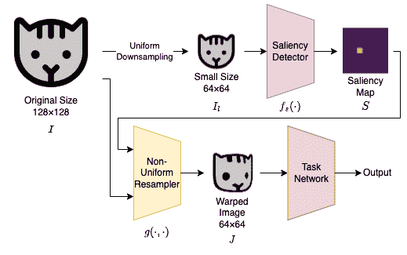
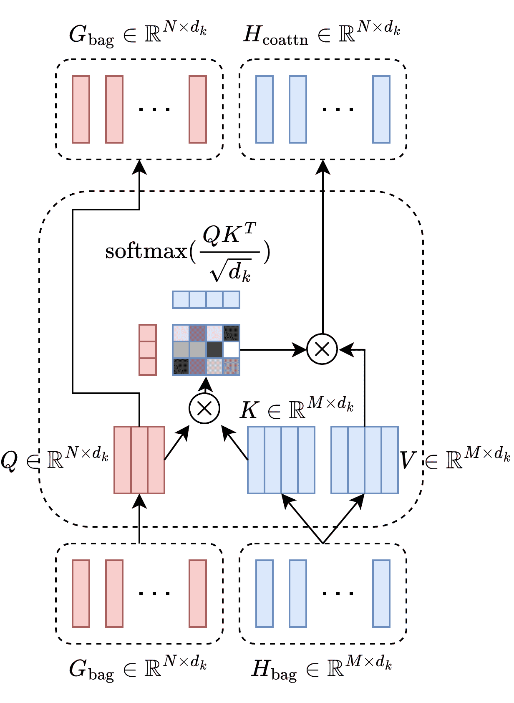
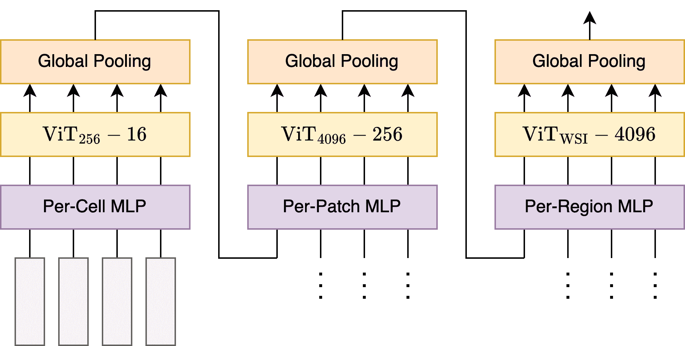

<!--yml

分类：未分类

日期：2024-09-06 19:45:14

-->

# [2207.13050] 高效高分辨率深度学习：综述

> 来源：[`ar5iv.labs.arxiv.org/html/2207.13050`](https://ar5iv.labs.arxiv.org/html/2207.13050)

# 高效高分辨率深度学习：综述

**Arian Bakhtiarnia**、**Qi Zhang** 和 **Alexandros Iosifidis** 现任职于 DIGIT，奥胡斯大学电气与计算机工程系，丹麦中日德兰地区奥胡斯（电子邮件：arianbakh@ece.au.dk；qz@ece.au.dk；ai@ece.au.dk）。该研究得到了欧洲联盟 Horizon 2020 研究与创新计划的资助，资助协议编号为 957337，同时也得到了丹麦独立研究委员会的资助，资助编号为 9131-00119B。

###### 摘要

现代设备如智能手机、卫星和医疗设备中的相机能够捕捉非常高分辨率的图像和视频。这些高分辨率数据通常需要通过深度学习模型进行处理，例如癌症检测、自动道路导航、天气预测、监控、优化农业过程等许多应用。使用高分辨率图像和视频作为深度学习模型的直接输入带来了许多挑战，如参数数量庞大、计算成本高、推理延迟和 GPU 内存消耗。文献中常见的简单方法是将图像调整为较低分辨率，但这通常会显著降低准确性。文献中有几项工作提出了更好的替代方案，以应对高分辨率数据的挑战，并在遵守硬件限制和时间限制的同时提高准确性和速度。本综述描述了这些高效高分辨率深度学习方法，总结了高分辨率深度学习的实际应用，并提供了关于可用高分辨率数据集的全面信息。

###### 索引词：

高分辨率深度学习、高效深度学习、视觉变换器、计算机视觉

## I 引言

许多现代设备，如智能手机、无人机、增强现实头戴设备、车辆和其他物联网（IoT）设备，都配备了能够拍摄高分辨率图像和视频的高质量相机。在图像拼接技术、相机阵列[1, 2]、千像素采集机器人[3]和全片扫描仪[4]的帮助下，拍摄的分辨率可以提高到数十亿像素（通常称为千像素），例如图像 1 所示的图像。可以尝试根据人眼的能力来定义高分辨率。然而，许多深度学习任务依赖于设备捕获的数据，这些设备的行为与人眼非常不同，例如显微镜、卫星图像和红外相机。此外，在许多深度学习任务中，利用超过眼睛能够感知的细节是有益的，例如在第 II 节中讨论的应用。可以捕获并在处理时有用的细节量因任务而异。因此，高分辨率的定义是任务依赖性的。例如，在图像分类和计算机断层扫描（CT）处理过程中，512$\times$512 像素的分辨率被认为是高的[5, 6]。在视觉人群计数中，高清（HD）分辨率或更高分辨率的数据集很常见[7]，而在组织病理学（即研究组织疾病）中的全片图像（WSIs）或由飞机或卫星拍摄的遥感数据中，分辨率很容易达到千像素水平[8, 9]。

此外，随着硬件和方法学的不断进步，深度学习文献中认为的高分辨率标准也在不断变化。例如，在 1990 年代末期，用神经网络处理 32$\times$32 像素的 MNIST 图像是一项成就[10]，而在 2010 年代初期，256$\times$256 像素的 ImageNet 图像被认为是高分辨率[11]。这种趋势也可以从流行深度学习数据集（如人群计数[7]和异常检测[12]数据集的平均图像分辨率的持续增加中看出。因此，高分辨率的定义也具有时期依赖性。基于任务和时期的依赖性，可以清楚地看出，“高分辨率”这一术语是技术性的，而非根本性或普遍性的。因此，我们不再尝试推导这样的定义，而是将重点转向在撰写本文时对深度学习构成技术挑战的分辨率。

|  |  |
| --- | --- |
| (a) | (b) |

图 1：来自 PANDA-Crowd 数据集[13]的一个千亿像素图像示例，该图像使用微型相机阵列拍摄；(a) 原始图像，尺寸为 26,558$\times$14,828 像素，(b) 放大到原始图像中红色矩形指定的位置，尺寸为 2,516$\times$1,347 像素，比原始图像小了 100 倍以上，但仍然大约是用于人群计数的最先进深度学习模型（如 SASNet [14]）处理的图像尺寸的 5 倍（1024$\times$768），以及标准图像分类模型处理的图像尺寸的 50 倍（224$\times$224）。

直接使用高分辨率图像和视频作为深度学习模型的输入，在训练和推理阶段都会带来挑战。除了完全卷积网络（FCNs）之外，深度学习模型的参数数量通常会随着输入尺寸的增大而增加。此外，计算量（通常以浮点运算（FLOPs）来衡量），因此推理/训练时间以及 GPU 内存消耗随着高分辨率输入的增加而增加，如图 2 所示。这个问题在使用自注意力机制的 Vision Transformer (ViT)架构中尤其突出，其中推理速度和参数数量与输入尺寸的平方成正比[6, 15]。当训练或推理需要在资源受限的设备（如智能手机）上进行时，这些问题尤为严重，因为这些设备的计算能力有限，相比于高端计算设备（如工作站或服务器）。

|  |  |  |  |
| --- | --- | --- | --- |
| (a) | (b) | (c) | (d) |

图 2：随着输入图像分辨率的增加，(a) 计算量，(b) 推理时间，和 (c) 在 EfficientNet-B7 [16]中的 GPU 内存使用量也增加；以及 (d) ViT-B16 [6]架构中的参数数量。EfficientNet-B7 的最后一层被移除以形成一个完全卷积的特征提取器。由于这些图中的精度没有考虑，因此不需要使用真实图像，因此随机生成的图像被作为输入提供给模型。所有实验都在 Nvidia A6000 GPU 上进行。

尽管诸如模型并行化的方法可以在训练[17、18]和推理[19]阶段将模型拆分到多个 GPU 上，从而避免内存和延迟问题，但这些方法需要大量的资源，如大量的 GPU 和服务器，这可能会带来高成本，尤其是在处理如千像素图像等极端分辨率时。此外，在许多应用场景中，如自动驾驶汽车和无人机图像处理，硬件的安装有一定限制，且由于网络连接的不可靠性和应用的时间敏感性，将计算任务卸载到外部服务器并不总是可行。因此，深度学习训练和推理最常见的方法是将完整模型加载到每个 GPU 实例上。多 GPU 设置通常用于通过增加总体批量大小来加速训练，测试多个超参数集并行处理，或分配推理负载。因此，在许多情况下，深度学习模型可以处理的最大分辨率是有效的。例如，使用 SASNet[14]进行推理的最大分辨率（这是当前在上海科技数据集[20]上的前沿模型）在具有 11 GB 显存的 Nvidia 2080 Ti GPU 上大约为 1024$\times$768（低于 HD）。

尽管新一代 GPU 变得更快且内存更大，但设备捕获的图像和视频分辨率也在增加。图 3 展示了最近几年各种设备的这一趋势。因此，即使计算硬件技术有所进步，前述问题可能仍会存在。此外，目前的成像技术远未达到图像分辨率的物理极限，估计为拍摄像素[21]。

图 3：智能手机（Apple iPhone 和 Samsung Galaxy S）、无人机（DJI Phantom）、增强现实头戴设备（Microsoft HoloLens）和物联网设备（Raspberry Pi）随时间变化的最大分辨率趋势。详细信息和数据来源见附录 A。

捕获和处理更高分辨率是否能带来改进取决于具体问题。例如，在图像分类中，将对象或动物的图像分辨率提高到吉像素级别不太可能揭示更多有益细节并提高准确度。另一方面，如果目标是计算图像中总人数，如图 1 所示，使用 HD 分辨率而不是吉像素将意味着几个个人可能被表示为一个像素，这会显著增加误差。同样，已证明在组织病理学中使用更高分辨率可以得到更好的结果[22]。

假设由于硬件限制或延迟要求，某个特定问题有一个有效的最大分辨率，那么在深度学习文献中常用的两种简单基线方法用于处理原始捕获的输入[23, 24, 25]。这些基线方法的普及可以归因于其实现的简单性。第一种方法是将原始输入调整（下采样）到所需的分辨率，但如果丢失了任何对当前问题重要的细节，这将导致准确度降低。这种方法称为均匀下采样（UD），因为图像的质量在整个图像中均匀降低。第二种方法是将原始输入切分成较小的补丁，每个补丁具有最大分辨率，独立处理这些补丁，然后汇总结果，例如，对于回归问题，通过将结果求和来汇总，对于分类问题，通过多数投票来汇总。我们称这种方法为切割补丁（CIP）。这种方法有两个问题。首先，许多深度学习模型依赖于全局特征，这些特征会丢失，因为从每个补丁中提取的特征不会与其他补丁共享，导致准确度下降。例如，人群计数方法通常依赖于全局信息，如透视或照明[7]，而在目标检测中，接近边界的物体可能会被分割到多个补丁之间。其次，由于进行多个推理过程，即对每个补丁进行一次推理，推理时间会显著增加。当补丁重叠时，这一问题更为严重。

为了突出这些问题，我们在上海科技 B 部分数据集 [20] 上测试了两种基线方法（UD 和 CIP），该数据集包含 1024$\times$768 像素的图像。我们将原始图像大小缩小了 4 倍和 16 倍，并测量了两个基线方法的平均绝对误差（MAE）。为了测试 UD，我们使用了一个在上海科技 B 部分数据集 [20] 上预训练的 SASNet 模型 [14]，输入大小为 1024$\times$768，并使用 AdamW 优化器 [26] 以$10^{-5}$的学习率和$10^{-4}$的权重衰减进行微调。注意，原始 SASNet 论文使用的是 Adam 优化器 [27] 和$10^{-5}$的学习率。我们训练模型 100 个周期，每个 GPU 实例的批量大小为 12，使用 3$\times$Nvidia A6000 GPU。我们经验上发现，微调并未改善切割成补丁的准确性，因此，我们将原始图像切割成 4 个和 16 个补丁，使用上述预训练的 SASNet 获得每个补丁的计数，然后通过对每个补丁的预测计数求和来汇总结果。

这些实验的结果展示在表格 I 中。可以观察到，与处理原始输入大小相比，均匀下采样显著增加了误差。请注意，尽管切割成补丁的误差增加不如均匀下采样那么剧烈，但这种方法的推断时间也以相同的因子（即 4 和 16）增加，因为我们假设使用了我们硬件的有效最大分辨率，因此补丁不能并行处理，因为整个硬件都需要处理单个补丁。

表 I：上海科技 B 部分数据集基线方法的性能

| 输入大小 | 原始 MAE | UD^∗ MAE | CIP^† MAE |
| --- | --- | --- | --- |
| 1024$\times$768（原始） | 6.31 | - | - |
| 512$\times$384（缩小 4$\times$） | - | 9.01（+43%） | 6.40（+1%） |
| 256$\times$192（缩小 16$\times$） | - | 16.06（+155%） | 6.67（+6%） |
| ^∗均匀下采样 |
| ^†切割成补丁 |

由于这些基线方法远非理想，近年来，文献中提出了几种替代方法，以提高准确性和速度，同时遵守由于内存限制或速度要求导致的最大分辨率限制。本调查的目标是总结和分类这些贡献。据我们所知，关于高分辨率深度学习的其他调查尚不存在。然而，有一些调查涵盖了与此主题相关的方面。一项关于降低 Transformer 架构计算复杂度的方法的调查见于 [15]，该调查讨论了自注意力的二次时间和内存复杂度相关的问题，并分析了包括内存占用和计算成本在内的各种效率方面。虽然降低 Transformer 模型的计算复杂度可以有助于高分辨率输入的高效处理，但在本调查中，我们仅包括那些明确关注高分辨率图像的 Vision Transformer 方法。一些特定应用的调查包括高分辨率数据集和处理这些数据的方法。例如，一项关于深度学习在组织病理学中的应用的调查，提到了处理 WSIs 的 giga 分辨率的挑战，见于 [28]；一项关于在计算机断层扫描（CT）中实现更高空间分辨率的方法的调查见于 [29]，该调查强调了超高分辨率 CT 提高了诊断准确性，并简要讨论了噪声减少和重建的深度学习方法；一项关于人群计数的调查，其中许多现有数据集为高分辨率的调查见于 [7]；一项关于深度学习方法在高分辨率遥感影像中的土地覆盖分类和物体检测的调查见于 [30]；以及一项关于基于深度学习的高分辨率遥感影像变化检测的调查见于 [31]。

重要的是要提到，一些方法虽然处理高分辨率输入，但并没有采取任何措施来应对上述挑战。例如，多列（也称为多尺度）网络[7]在其架构中包含多个列层，每列负责处理特定的尺度，如图 4 所示。然而，由于这些列处理的分辨率与原始输入相同，这些方法实际上需要比仅处理原始尺度更多的内存和计算。 这些方法的主要目标是通过考虑高分辨率图像中的尺度变异来提高准确性，尽管有些多尺度方法在提高准确性和效率方面都有所改进[32、33、34]。因此，这些方法不在本调查的范围内，除非它们明确解决了高分辨率输入的效率问题。ZoomCount [35]、Locality-Aware Crowd Counting [36]、RAZ-Net [37] 和 Learn to Scale [38] 都是人群计数中的多尺度方法的例子，DMMN [39] 和 KGZNet [40] 则是在医学图像处理中。

图 4：多列架构的示意图。如果 DNN 的原始输入是从更大图像中提取的一个补丁，如在[36]中所示，除了放大，还可以缩小。

本调查的主要目的是收集和描述深度学习文献中存在的方法，这些方法可用于解决输入图像和视频的高分辨率带来的技术挑战，涉及内存、计算和时间问题。本文其余部分组织如下：第 II 节列出了使用深度学习处理高分辨率图像和视频的应用。第 III 节将高分辨率深度学习的高效方法分为五个通用类别，并为每个类别提供了几个示例。该节还简要讨论了解决高分辨率输入导致的内存和处理时间问题的替代方法。第 IV 节列出了各种深度学习问题的现有高分辨率数据集，并提供了每个数据集的详细信息。第 V 节讨论了使用不同类别的高效高分辨率方法的优缺点，并提供了不同情况下使用哪些方法的建议。最后，第 VI 节通过总结高分辨率深度学习的现状和趋势以及对未来研究的建议来结束本文。本文调查中进行实验的代码可以在[`gitlab.au.dk/maleci/high-resolution-deep-learning`](https://gitlab.au.dk/maleci/high-resolution-deep-learning)找到。

## II 高分辨率深度学习的应用

在本节中，我们列出了一些使用深度学习处理高分辨率图像的实际应用。这些方法大多数并不专注于效率角度，但其中一些方法解决了高分辨率图像遇到的问题。例如，[41]提到“由于 GPU 内存限制，无法用原始 6000$\times$4000 像素的图像训练模型”，而[42]，使用切割成小块的方法，指出“原始遥感图像有数百万个像素，直接处理困难”。

### II-A 医学和生物医学图像分析

多吉兆像素的全切片病理图像可以通过深度学习处理，以检测乳腺癌 [43]、皮肤癌 [44, 45]、前列腺癌 [45]、肺癌 [45]、宫颈癌 [46] 和消化道癌症 [47]。一些方法甚至能够检测癌症亚型 [45] 或检测癌症是否扩散到淋巴结（转移） [48]。这种图像的语义分割在神经病理学 [49] 中可能很有用，神经病理学是研究神经系统疾病的学科，并且可以在医学图像中识别组织成分，如肿瘤、肌肉和碎屑 [50]。

此外，利用深度学习处理高分辨率计算机断层扫描（CT）图像正变得越来越普遍。[51] 和 [5] 的研究在高分辨率的肺部 CT 扫描中检测 COVID-19，而 [52] 的研究使用深度学习提高了捕获的超高分辨率 CT 图像的质量。此外，[53] 的研究对来自小鼠心脏和大脑的高分辨率电子显微镜图像进行语义分割，这对基础生物医学研究很有帮助。此外，高分辨率深度学习还可以用于 CT 图像重建和图像噪声减少，研究表明，这种方法在临床可行的速度下获得了类似于其他传统方法的结果 [54, 55]。

尽管医学图像分析方法主要关注于提高特定任务的准确性，但在某些应用中，推断速度可能至关重要，例如，在临床实践中速度可能是一个要求 [48]。此外，显微镜下的实时增强现实可以为 AI 辅助的切片筛查提供合适的人机交互 [46]。最后，可能会有这样的情况，即单个输入的处理速度是可以接受的，但输入数据的数量非常庞大，以至于所有输入无法在截止日期内处理。例如，在使用无线胶囊内窥镜检查单个患者时，会拍摄 55,000 张高分辨率图像，无线摄像头被吞下以拍摄消化道的图像，这些图像可以用于检测病变和炎症 [56]。

### II-B 遥感

使用深度学习处理高分辨率航空和卫星影像具有多种应用[57]，例如检测建筑物[58]，这对于城市规划和监控非常有用；检测飞机[59]，可用于国防和军事应用以及机场监控；提取道路网络[42]，在无人驾驶车辆的自动道路导航、城市规划和地理空间数据库的实时更新中都有应用；检测森林中因自然灾害如风暴[60]造成的受损区域；识别杂草植物，这可以用于农业领域的针对性喷洒农药；对卫星数据进行语义分割，这有助于作物监测、自然资源管理和数字地图制作[61]；以及遥感影像描述，这对图像检索和军事情报生成等应用非常有用[62]。此外，通过将低分辨率天气数据作为输入，并使用超分辨率插值高分辨率数据，可以获得显著的准确性提升[63]。这种方法的动机在于高分辨率数据通常会有几天的延迟，而这种方法可以更准确地处理低分辨率但最新的数据。

### II-C 监控

捕获和处理千亿像素图像用于监控变得越来越普遍，这些图像可以通过深度学习进行人员搜索和识别[64, 65]，以及行人检测[66, 67]，这可以用于人类行为分析和智能视频监控，如在疫情期间实施社交距离限制[68, 69]。需要注意的是，捕获千亿像素图像相比于在场景不同位置使用多个相机捕获低分辨率图像有几个优点。首先，多相机设置中的相机通常有一定的视野重叠，以避免盲点。这可能会导致许多应用中的错误，例如人群计数，由于重复，如图 5 所示。减少这种错误不是一件容易的事，因为它需要场景几何信息以及用于识别和去重的重新识别方法。其次，追踪人员、车辆和其他移动物体的轨迹在多个相机下很困难，因为这也需要在多个视图中识别它们。最后，在许多深度学习应用中，如人群计数，结合整个场景的全局信息（如光照和透视）可以提高任务的准确性[7]。需要注意的是，从 drastically 不同的位置和角度拍摄的图像，例如图 5 中的图像，不能拼接在一起形成单一图像。

图 5：多相机设置中视野重叠可能导致任务如人群计数中的重复。

### II-D 其他应用

高分辨率的深度学习在许多其他应用和科学领域中具有重要作用。例如，研究[41]通过从谷物田地中拍摄的高分辨率图像来估算小麦穗的密度，这有助于植物育种者优化产量；而研究[70]介绍了一种用于高分辨率电子显微镜图像分割的深度学习方法，这在材料科学中有应用，例如理解工业催化剂的降解过程。[71] 提出了一种用于实时高分辨率背景替换的方法，这在视频通话和会议中非常有用。

## III 高分辨率输入的深度学习高效处理方法

### III-A 非均匀下采样

非均匀下采样（NUD）的基础思想是，对于任何深度学习任务，输入图像的某些位置比其他位置更重要。例如，在凝视估计中，目标是检测给定包含人脸的图像中的人正在注视的地方，描绘人眼的图像位置比图像的其他部分重要得多。因此，当降低图像的分辨率时，可能会有利于从显著区域采样更多的像素，从非显著位置采样更少的像素，从而得到一个扭曲和变形的图像。这个操作要求在将下采样图像引入任务 DNN 之前确定显著区域。因此，使用一个小型显著性检测网络来获取这个显著性图。图 6 提供了非均匀下采样方法的示意图。请注意，非均匀下采样是一个广泛的过程，包含了以任何非均匀方式下采样输入图像的任何方法。[23] 进一步将非均匀下采样细分为三类：注意力机制、基于显著性的方法和自适应图像采样方法。然而，正如作者指出的，这些类别之间有很大的重叠，很难划定明确的边界。

图 6: 非均匀下采样方法的示意图。显著性检测器检测到猫的右眼作为显著区域，因此，非均匀重采样器从该区域采样更多的像素。

正式来说，显著性图 $S$ 可以通过在均匀下采样图像 $I_{l}$ 上应用显著性检测网络 $f_{s}(\cdot)$ 来获得，即 $S=f_{s}(I_{l})$。输入到显著性检测网络的图像经过下采样，以保持显著性检测过程的开销较低。非均匀下采样图像 $J$ 可以根据 $J=g(I,S)$ 获得，其中 $g(\cdot)$ 是非均匀重采样器，$I$ 是原始图像。实际上，重采样器应计算一个从原始图像到下采样图像的映射 $J(x,y)=I(u_{c}(x,y),v_{c}(x,y))$。函数 $u_{c}(\cdot)$ 和 $v_{c}(\cdot)$ 需要将像素按分配给它们的显著性图中的权重比例映射。假设显著性图已归一化且 $\forall x,y:0\leq u_{c}(x,y)\leq 1$ 和 $\forall x,y:0\leq v_{c}(x,y)\leq 1$，这个问题可以写成

|  | $\int_{0}^{u_{c}(x,y)}\int_{0}^{v_{c}(x,y)}S(x^{\prime},y^{\prime})dx^{\prime}dy^{\prime}=xy.$ |  | (1) |
| --- | --- | --- | --- |

然而，基于公式 1 确定这种变换的方法并不高效[23]。另一种方法是假设每个像素$(x^{\prime},y^{\prime})$以与其显著性$S(x^{\prime},y^{\prime})$成正比的力拉动所有其他像素，这可以被公式化为

|  | $\displaystyle u_{c}(x,y)=\frac{\sum_{x^{\prime},y^{\prime}}S(x^{\prime},y^{\prime})k((x,y),(x^{\prime},y^{\prime}))x^{\prime}}{\sum_{x^{\prime},y^{\prime}}S(x^{\prime},y^{\prime})k((x,y),(x^{\prime},y^{\prime}))},$ |  | (2) |
| --- | --- | --- | --- |
|  | $\displaystyle v_{c}(x,y)=\frac{\sum_{x^{\prime},y^{\prime}}S(x^{\prime},y^{\prime})k((x,y),(x^{\prime},y^{\prime}))y^{\prime}}{\sum_{x^{\prime},y^{\prime}}S(x^{\prime},y^{\prime})k((x,y),(x^{\prime},y^{\prime}))},$ |  | (3) |

其中$k((x,y),(x^{\prime},y^{\prime}))$是距离核，例如高斯核。使用这个公式，显著区域将被更多地采样，因为它们吸引更多的像素。此外，基于这个公式，$u_{c}(\cdot)$和$v_{c}(\cdot)$可以通过简单的卷积计算。因此，这个操作可以轻松地插入到神经网络架构中作为一个层，并具有保持可微性的附加好处，这是使用反向传播算法训练神经网络的要求。最终的结果是，包括显著性检测网络和任务网络的整个模块可以端到端地训练。[23]中的方法使用这种方法来提高注视估计以及细粒度分类的性能，细粒度分类的任务是区分难以区分的对象，例如不同的动物物种。

[72]中的方法将非均匀下采样的思想应用于语义分割。如果输入图像$I=I_{ij}$的大小为$H\times W$，并且必须下采样到大小为$h\times w$，第一步是根据地面真实标签（GT）生成理想的采样张量，基于

|  | $E(\phi)=\sum_{i,j}\&#124;\phi_{ij}-b(u_{ij})\&#124;^{2}+\lambda\sum_{&#124;i-i^{\prime}&#124;+&#124;j-j^{\prime}&#124;=1}\&#124;\phi_{ij}-\phi_{i^{\prime}j^{\prime}}\&#124;^{2},$ |  | (4) |
| --- | --- | --- | --- |

其中$\phi\in[0,1]^{h\times w\times 2}$是待确定的采样张量，$E(\phi)$是需要最小化的（能量）成本函数，$u\in[0,1]^{h\times w\times 2}$是均匀下采样张量，$b(u_{ij})$是 GT 标签中像素$u_{ij}$上最近点的坐标。公式 4 对应一个具有凸约束的最小二乘问题，可以通过一组稀疏线性方程高效解决。公式 4 中的第一个项确保采样位置接近语义边界，第二个项则通过强制相邻像素的变换相似来确保失真不超过预期。公式 4 还受到覆盖约束的影响，以确保采样位置覆盖整个图像。第二项的贡献由参数$\lambda$控制，经验上设置为 1。接下来的步骤是训练一个神经网络，从输入图像生成采样张量。然后根据该神经网络的输出对图像进行下采样，并将其引入任务网络。最后，对分割输出进行上采样，以去除失真并匹配原始分辨率。

同样，[73]中的方法利用非均匀下采样进行语义分割。然而，与前述方法不同的是，该方法中的显著性检测器是基于语义分割的性能而非外部监督信号进行优化的。该方法类似于[23]，但将[23]的简单适应应用于语义分割效果不佳。为了提高性能，添加了边缘损失作为正则化项，该损失通过计算显著性检测器获得的变形图$d$和基于分割标签计算的目标变形图$d_{t}$之间的均方误差（MSE）来获得。为了防止平凡解，目标变形图在物体边界周围具有更密集的采样，并由$d_{t}=f_{\text{edge}}(f_{\text{gauss}}(Y_{lr}))$构造，其中$Y_{lr}$是均匀下采样的分割标签，$f_{\text{edge}}$是通过特定的$3\times 3$卷积核的边缘检测滤波器，$f_{\text{gauss}}$是$\sigma=1$的高斯模糊。

由于自定义网格在公式 2 和 3 中定义的畸变可能很严重，方法 [56] 引入了结构化网格，这些网格可以与自定义网格结合以获得更细腻的空间畸变效果，适用于无线胶囊内镜（WCE）图像分类。这些结构化网格确保输入图像中处于同一行/列的像素在输出图像中也处于同一行/列，并且可以通过以下方式获得

|  | $\displaystyle u(x)=\frac{\sum_{x^{\prime}}S(x^{\prime})k(x,x^{\prime})x^{\prime}}{\sum_{x^{\prime}}S(x^{\prime})k(x,x^{\prime})},$ |  | (5) |
| --- | --- | --- | --- |
|  | $\displaystyle v(y)=\frac{\sum_{y^{\prime}}S(y^{\prime})k(y,y^{\prime})x^{\prime}}{\sum_{y^{\prime}}S(y^{\prime})k(y,y^{\prime})},$ |  | (6) |

其中$S(x)=\max_{y}S(x,y)$和$S(y)=\max_{x}S(x,y)$。然后将$u(x)$和$v(y)$复制并堆叠以形成$u_{s}(x,y)=u(x)$和$v_{s}(x,y)=v(y)$。最后，可以通过以下公式计算合成的变形网格

|  | $\displaystyle u(x,y)=\lambda u_{s}(x,y)+(1-\lambda)u_{c}(x,y),$ |  | (7) |
| --- | --- | --- | --- |
|  | $\displaystyle v(x,y)=\lambda v_{s}(x,y)+(1-\lambda)v_{c}(x,y),$ |  | (8) |

其中参数$\lambda$根据经验设定为 0.5。

类似地，FOVEA [74] 摒弃了自定义网格，仅依赖于结构化网格来进行自动驾驶场景中的目标检测。它还引入了抗裁剪正则化，通过在显著图上使用反射填充来对抗可能导致遗漏目标的裁剪。在 [23] 中，显著性检测器与任务网络端到端训练，但如前所述，目标检测中的显著图获取更为困难。因此，FOVEA 使用中间监督来训练显著性检测网络。

尽管空间变换网络（STNs）[75]中空间变换模块的主要目标是学习对平移、缩放、旋转和形变的不变性以提高性能，但在模块作为网络的第一层的特殊情况下，它可以学习将原始高分辨率输入裁剪为较低分辨率，并提高计算效率，因此它可以被视为一种 NUD 形式。图 7 展示了空间变换模块的架构，其中定位网络确定输入特征$U$的变换$\tau_{\theta}$的参数$\theta$。$\tau_{\theta}(\cdot)$可以是二维仿射变换，也可以是更受限制的变换，例如

|  | $A_{\theta}=\begin{bmatrix}s&amp;0&amp;t_{x}\\ 0&amp;s&amp;t_{y}\end{bmatrix},$ |  | (9) |
| --- | --- | --- | --- |

仅允许裁剪、平移和缩放，或者更一般的变换，如具有 8 个参数的平面投影变换、分段仿射变换、薄板样条变换[76]，或者任何与其参数可微的变换。

图 7: 空间变换模块的架构 [75]。

SALISA [77]使用空间变换模块在高分辨率视频中进行非均匀下采样以进行物体检测。在 SALISA 中，视频帧的输出用于确定下一帧的显著性图。图 8 展示了这种方法，其中第一帧被引入高性能检测器而没有任何下采样。检测到的物体随后用于创建显著性图，然后传递给重采样模块。重采样模块包含一个具有薄板样条变换的空间变换模块，其中定位网络接收显著性图作为输入。重采样模块提供的下采样图像然后被引入轻量级检测器。由于轻量级检测器在变形图像中检测物体，因此检测到的边界框需要被转换回原始网格。因此，在生成显著性图之前应用了逆变换。为了防止级联错误，该方法每隔几帧重置为使用原始高分辨率帧和高性能检测器。

图 8：SALISA 概述[77]。第二帧与第一帧略有不同（在这种情况下，略微顺时针旋转），因此，第一帧获得的检测结果可以用来估计第二帧中物体的显著性。

### III-B 选择性缩放与跳过

选择性缩放和跳过（SZS）方法通过仅缩放输入图像中重要的区域，更有效地进行图像切分。不同的图像块可能有不同的缩放级别，有些图像块可能会被完全跳过。强化自动缩放网络（RAZN）[78]使用强化学习来确定在乳腺癌分割任务中应该在哪里缩放 WSI。RAZN 假设缩放动作最多可以执行$m$次，缩放速率为常数$r$。在每个缩放级别$i$，都有不同的分割网络$f_{\theta_{i}}$和不同的策略网络$g_{\theta_{i}}$。最初，策略网络$g_{\theta_{0}}$接收一个裁剪的图像$x_{0}\in\mathbb{R}^{H\times W\times 3}$作为输入，确定是否进行缩放。如果不需要缩放，则$x_{0}$作为输入传递给分割网络$f_{\theta_{0}}$以产生输出；否则，从相同区域中采样出更高分辨率的图像$\hat{x}_{0}\in\mathbb{R}^{rH\times rW\times 3}$，并将其切分为大小为$H\times W\times 3$的$r^{2}$个图像块。每个图像块然后传递给策略网络$g_{\theta_{1}}$，并且该过程递归重复，直到所有策略网络断开或达到最大缩放级别。RAZN 在提高性能的同时减少了约$\sim$2 倍的推理时间。类似地，[79]和[80]中的方法分别使用强化学习进行高效的目标检测和航空图像分类。

与强化学习不同，[81]中的方法使用层次化图神经网络来分类乳腺 X 光图像是否正常/良性（包含非癌性肿瘤）或恶性（包含癌性肿瘤）。在每个缩放级别$i$，图$G^{i}$由邻接矩阵$A^{i}\in\mathbb{R}^{N_{i}\times N_{i}}$定义，其中每个放大区域与其原始图像之间存在一条边。图的特征矩阵定义为$X_{i}\in\mathbb{R}^{N_{i}\times D\times D}$，最大缩放级别为$R$。节点上的特征是输入图像的放大区域，调整为$D\times D$。使用预训练的 CNN 从$X_{i}$中提取特征向量$H_{i}\in\mathbb{R}^{N_{i}\times H}$。$\text{GAT}_{\text{node}}(\cdot)$是用于分类是否对每个节点进行放大的图注意力网络[82]。因此，层次图中第$i$级的输出是

|  | $P_{i}=\begin{cases}1,&amp;i=1,\\ \text{softmax}(\text{GAT}_{\text{node}}(A_{i},H_{i})),&amp;1<i<R,\end{cases}$ |  | (10) |
| --- | --- | --- | --- |

其中 $P_{i}\in\mathbb{R}^{N_{i}\times 2}$ 代表第 $i$ 层每个节点是否进行缩放的决策。在最终的缩放层 $R$，使用另一个图注意力网络 $\text{GAT}_{\text{graph}}(\cdot)$ 对整个乳腺 X 光照片进行最终分类，基于 $\hat{Y}=\text{softmax}(\text{GAT}_{\text{graph}}(A_{R},H_{R})W)$，其中 $W$ 是一个可训练的权重矩阵。损失函数包含节点损失和图损失，节点的缩放标签从病灶分割标签中获得。这种方法达到了与最先进技术相当的准确性，但尚不清楚它在推理速度上有多大提升。

GigaDet [83] 实现了在千兆像素视频中近实时的物体检测。GigaDet 的核心是 Patch Generation Network (PGN)。PGN 以均匀下采样的图像为输入，输出一个密集回归图，该图计算图像中完全包含在相应区域内的物体数量，称为补丁候选。PGN 在不同的尺度下应用，以获得不同尺度的补丁候选。PGN 选择的补丁候选经过后处理，包括非极大值抑制（NMS），然后根据其计数进行排序。前 $K$ 个补丁候选被选中，由 Decorated Detector (DecDet) 处理以检测物体。VGG [84] 和 YOLO [85] 分别用于 PGN 和 DecDet 网络。给定千兆像素视频，GigaDet 能够在单个 Nvidia 2080 Ti GPU 上运行 5 FPS，比 Faster RCNN [86] 快 $50\times$，且在平均精度方面性能相当。

REMIX [87] 在用户给定的延迟预算内检测高分辨率视频中的行人。输入帧被分割成若干块，其中更显著的块使用计算量大但准确的网络进行处理，而较不显著的块则使用计算量小的网络处理甚至跳过，如图 9 所示。REMIX 使用历史帧来确定物体分布，并通过动态规划算法确定最佳分割，该算法考虑了给定的延迟预算、估计的物体分布以及可用神经网络的准确性和速度。REMIX 实现了高达 $8.1\times$ 的推理加速，准确性与最先进的方法相当。

图 9：REMIX 中的分区 [87]。图像的某些部分被跳过，一些由计算开销较小的 DNN 处理，另一些由计算开销较大的 DNN 处理。

### III-C 轻量级扫描网络

轻量级扫描网络（LSNs）是轻量级的全卷积神经网络（FCNs），能够高效地扫描整个高分辨率输入。为了实现轻量级架构，LSNs 通常被设计和训练用于非常具体的任务。此外，与切割成补丁的方法不同，FCNs 在滑动窗口设置中本质上高效，因为它们共享重叠区域中的计算 [88]。

VGG-720p 和 VGG-1080p [89, 90] 是能够在无人机上实时运行的轻量级扫描网络（LSNs），分别为输入图像尺寸为 1280$\times$720 和 1920$\times$1080 像素的热图提供信息，这些热图指定了输入图像中的每个位置是否存在人、面孔或自行车。这两个模型都以 32$\times$32 或 64$\times$64 像素的补丁作为输入。VGG-720p 和 VGG-1080 的架构分别如表 II 和 III 所示，仅包含 5 个卷积层，且输出通道仅为 2 到 24 个。相比之下，原始 VGG 架构有 11 到 19 层，有些层的输出通道数高达 512 个 [84]。

表 II：VGG-720p 的架构。

| 层 | 核心 | 步幅 | 填充^†（X/Y）^∗ | 最大池化（X/Y） | 通道 |
| --- | --- | --- | --- | --- | --- |
| conv1_1 | 3$\times$3 | 1/1 | 1/1 | - / - | 16 |
| conv1_2 | 3$\times$3 | 1/1 | 1/1 | ✓/ - | 16 |
| conv2_1 | 3$\times$3 | 1/1 | 1/1 | - / - | 24 |
| conv2_2 | 3$\times$3 | 1/4 | 1/1 | ✓/ ✓ | 16 |
| conv_last | 8$\times$8 | 1/1 | 0/0 | - / - | 2 |
| ^†零填充 |
| ^∗X 和 Y 代表水平和垂直轴 |

表 III：VGG-1080p 的架构。

| 层 | 核心 | 步幅 | 填充^†（X/Y）^∗ | 最大池化（X/Y） | 通道 |
| --- | --- | --- | --- | --- | --- |
| conv1_1 | 3$\times$3 | 2/1 | 0/0 | - / - | 8 |
| conv1_2 | 3$\times$3 | 1/2 | 0/0 | ✓/ - | 8 |
| conv2_1 | 3$\times$3 | 1/1 | 0/0 | - / - | 6 |
| conv2_2 | 3$\times$3 | 1/2 | 0/0 | - / - | 6 |
| conv_last | 8$\times$8 | 1/1 | 0/0 | - / - | 2 |
| ^†零填充 |
| ^∗X 和 Y 代表水平和垂直轴 |

同样，[91]中的研究提出了一种具有 6 个卷积层的架构，用于从高分辨率图像生成拥挤热图。[92]中的研究提出了轻量级的 FCN，用于面部检测，具有 7 个卷积层和 76K 参数，用于面部部位检测（如眼睛、鼻子和嘴巴）具有 4 个卷积层和 20K 参数，用于面部和部位的联合检测具有 9 个卷积层和 101K 参数。

你只看两次（YOLT）[9]是一种在大小超过 250 兆像素的 DigitalGlobe 卫星图像中检测不同尺度物体的方法。YOLT 的架构基于 YOLO 架构[85]，但将原始的 30 层减少到了 22 层。此外，YOLT 训练了两个独立的模型：一个处理 200$\times$200 米²区域的图像，用于检测相对较小的物体，如汽车、飞机、船只和建筑物；另一个处理 2500$\times$2500 米²区域的图像，用于检测大型物体，如机场。在 Nvidia Titan X GPU 上，前者的推断速度为 32 平方公里/分钟，后者为 6000 平方公里/分钟。

Fast ScanNet[48]通过将 VGG16 [84]的最后全连接层替换为 1$\times$1 卷积层，将其转换为全卷积网络。Fast ScanNet 应用于大小为 2800$\times$2800 像素的补丁，这一大小由 GPU 内存限制决定，取自 WSI，平均有$\sim$400 个补丁。Fast ScanNet 在配备 8$\times$Nvidia Titan X GPU 的工作站上处理一个 WSI 大约需要一分钟。

ICNet [34]利用了处理低分辨率的效率和处理高分辨率的准确性，通过将输入图像均匀下采样到两个较小的尺度，分别处理每个尺度，并将低分辨率处理结果与高分辨率结果融合。低分辨率使用更多的卷积层处理，高分辨率使用较少的卷积层，这使得整个架构高效，如图 10 所示。此外，一些层共享权重以提高效率。ICNet 能够以每秒 30 帧的速度在 Titan X GPU 上对 2048$\times$1024 的图像进行语义分割。尽管 ICNet 没有获得最先进的准确性，但其速度比类似性能的方法快$\sim 15\times$。

图 10：ICNet 架构。CFF 块执行融合操作，由卷积层和上采样层组成。CFF 块在训练过程中使用下采样标注作为监督信号。

ESPNet [93] 依赖于高效的空间金字塔（ESP）模块，通过将标准卷积的 $n\times n$ 核分解为两个步骤来减少计算量。第一步应用 $1\times1$ 卷积，将维度为 $N$ 的特征图投影到维度为 $\frac{N}{K}$ 的特征图。第二步对新的特征图同时应用 $K$ 个膨胀卷积，卷积核大小为 $n\times n$，膨胀率为 $2^{k-1},k\in\{1,\dots,K\}$，并将结果结合起来。由于膨胀卷积的输出在拼接时会产生棋盘状伪影，因此使用了一个简单的解决方案，即在拼接之前将膨胀卷积的输出层次相加。ESPNet 能够以每秒 54 帧的速度对 2048$\times$1024 的图像进行语义分割，其准确性与最先进的技术相当。

神经架构搜索（NAS）技术可用于设计更好的 LSN。由于 LSN 需要轻量化，且层数和参数较少，因此搜索空间相对较小，使得 NAS 更容易实现。HR-NAS [94] 是一种寻找可以同时包含卷积和轻量化 Transformers，并可能具有并行分支的网络架构的方法。HR-NAS 在高分辨率输入的语义分割、人类姿态估计和 3D 目标检测任务中，在效率和准确性之间取得了最先进的结果。

### III-D 任务导向输入压缩

任务导向输入压缩（TOIC）方法将高分辨率输入压缩为轻量化表示。这些表示随后作为输入提供给任务 DNN，而不是高分辨率图像或视频。轻量化表示的具体性质和压缩过程因方法而异，并且通常高度依赖于基础任务。

这种方法与神经图像压缩方法（如 SlimCAE [95]）之间存在一个重要区别。神经图像压缩的目标是学习适用于当前任务的最优压缩算法，以减少存储或传输数据的大小。因此，用于压缩和解压缩数据的网络可能非常庞大且效率低下。此外，神经图像压缩旨在从压缩表示中重建输入，而 TOIC 并不重建输入数据，而是致力于提取适合第二部分网络的紧凑表示，该网络负责执行任务。

Slide Graph [96] 识别到使用切片法时会丧失视觉上下文，并通过构建和处理乳腺癌 WSIs 中细胞结构的紧凑图表示来解决此问题，以预测人类表皮生长因子受体 2 (HER2) 和孕酮受体 (PR) 的状态，这些是促进癌细胞生长的蛋白质。Slide Graph 有四个阶段：第一阶段使用 HoVer-Net [97]，这是一个用于细胞核分割和分类的 CNN，经过 PanNuke 数据集 [98] 训练，以提取组织细胞的特征。第二阶段使用聚合聚类 [99] 将相邻核分组，以进一步降低计算成本。第三阶段构建一个图，其中每个顶点对应于一个簇，并包含在先前阶段提取的特征。图的边基于 Delauney 三角化构建，其中顶点由其对应簇的几何中心表示，从而得到一个平面图。在最后阶段，HER2 和 PR 状态预测是通过使用图卷积网络 (GCN) [100] 从构建的图中获得的。Slide Graph 比最先进的方法更准确，并将基准的平均推理时间从 1.2 秒减少到 0.4 毫秒。然而，这些测量不包括图构建阶段。因此，Slide Graph 所获得的端到端效率提升尚不清楚。

方法 [101]，如图 11 所示，将 gigapixel 组织病理学 WSIs 压缩到可以用 CNN 在单个 GPU 上处理的大小。这种压缩是通过在大小为 $P\times P\times 3$ 的图像块上训练自编码器（VAE [102] 或双向 GAN [103]）获得的。WSI 图像的大小为 $M\times N\times 3$，然后被切成上述大小的块，使用自编码器的编码器部分从这些块中获得大小为 $1\times 1\times C$ 的压缩嵌入。这些嵌入随后被串联形成大小为 $\lceil\frac{M}{P}\rceil\times\lceil\frac{N}{P}\rceil\times C$ 的压缩图像，可以作为 CNN 的输入。在 $M=N=50,000$ 和 $P=C=128$ 的实验中，输入大小减少了约 43 倍。

图 11：一种基于神经图像压缩的 gigapixel 组织病理图像处理方法。

MCAT [104] 结合了 WSIs 和基因组数据来预测癌症生存结果。MCAT 的核心是基因组引导的共同注意力（GCA）层，它减少了处理 WSIs 的空间复杂性。MCAT 在数据结构中处理输入，这些结构称为袋，这些袋是不同大小且没有个别标签的无序对象集合。MCAT 从多个 WSIs 构建一个袋（$H_{\text{bag}}$），以利用整个组织微环境，并从基因组特征中构建另一个袋（$G_{\text{bag}}$）。$H_{\text{bag}}$ 通过将 WSIs 切割成非重叠的 $256\times 256$ 像素块，并用在 ImageNet 数据集 [106] 上预训练的 ResNet50 CNN [105] 处理每个块，以获得 $d_{k}$ 维特征嵌入。$G_{\text{bag}}$ 通过根据相似性将基因分类为 N 个不同的集合，并应用全连接（FC）层以获得基因组嵌入。然后 GCA 以这两个袋作为输入，执行共同注意力操作。

|  | $\displaystyle\text{CoAttn}_{G\rightarrow H}(G,H)$ | $\displaystyle=$ | $\displaystyle\text{softmax}\left(\frac{QK^{T}}{\sqrt{d_{k}}}\right)V$ |  |
| --- | --- | --- | --- | --- |
|  |  | $\displaystyle=$ | $\displaystyle\text{softmax}\left(\frac{W_{q}GH^{T}W_{k}^{T}}{\sqrt{d_{k}}}\right)W_{v}H,$ |  |

其中 $Q=W_{q}G$ 是查询矩阵，$K=W_{k}H$ 是键矩阵，$V=W_{v}H$ 是值矩阵，$W_{q},W_{k},W_{v}\in\mathbb{R}^{d_{k}\times d_{k}}$ 是可训练权重。该操作的输出，如图 12 所示，维度为 $N\times d_{k}$。因此，MCAT 网络中的后续自注意力层相对于 $N$ 是二次的，而不是 $M$。由于平均 $M=15,231$ 和 $N=6$，这导致了复杂性的显著降低。

图 12：基因组引导的共同注意力（GCA）层。

TOIC 方法的一个子类别是频域 DNNs，它们利用离散余弦变换（DCT）或小波变换等操作将输入 RGB 像素转换为频域表示。这种方法的直觉是 CNN 的前几层通常学习类似于这些变换的滤波器。因此，图像表示在频域中更紧凑，而且处理这些表示所需的层数也更少。

方法 [107] 使用在 JPEG 编码中间获得的 DCT 系数作为输入，传递给修改后的 ResNet50 CNN [105] 进行图像分类任务。JPEG 编码包括三个阶段。第一阶段将输入的 3 通道 24 位 RGB 图像转换为 YCbCr 颜色空间。

\begin{bmatrix}Y\\ Cb\\

Cr\end{bmatrix}=\begin{bmatrix}0.299&0.587&0.114\\

-0.168935&-0.331665&0.50059\\

0.499813&-0.418531&-0.081282\end{bmatrix}\begin{bmatrix}R\\

G\\

\begin{bmatrix}Y\\ Cb\\ Cr\end{bmatrix}=\begin{bmatrix}0.299&0.587&0.114\\ -0.168935&-0.331665&0.50059\\ 0.499813&-0.418531&-0.081282\end{bmatrix}\begin{bmatrix}R\\ G\\ B\end{bmatrix}。

亮度分量（Y）表示亮度，而色度分量（Cb 和 Cr）表示颜色。由于人眼对细微颜色细节的敏感度低于对细微亮度的敏感度，因此色度分量的分辨率会减少一个 2 倍的因子。图 13 显示了一个示例图像及其对应的 Y、Cb 和 Cr 分量。第二阶段是分块 DCT，其中三个分量中的每一个都被划分为$8\times 8$块，这些块经过 2D DCT 处理。频域的幅值是该方法使用的输入表示。Cb 和 Cr 的 DCT 表示被上采样 2 倍，并与 Y 的 DCT 表示拼接，然后作为输入提供给任务 DNN，如图 14 所示。JPEG 编码过程的其余部分包括对这些表示的量化以及霍夫曼编码等无损压缩技术。然而，该方法使用的是量化和无损压缩之前获得的表示。

|  |  |
| --- | --- |
| (a) | (b) |
|  |  |
| (c) | (d) |

图 13: (a) 原始彩色图像，取自上海科技 B 部分数据集[20]; (b) 亮度分量 Y，本质上是彩色图像的灰度版本; (c) 色度分量 Cb; (d) 色度分量 Cr。

图 14: JPEG 编码的初始阶段，由[107]用于获得 RGB 输入的频域表示。

在这些输入表示的帮助下，该方法获得的深度神经网络（DNN）比 ResNet50 更准确且速度快达$1.77\times$。此外，[107]包含了试图学习类似于 DCT 行为的卷积的实验，但他们发现学习到的 DCT 变换与传统的 DCT 变换相比导致了更高的错误率。

[108] 中的方法在使用 ResNet50 和 MobileNetV2 架构进行图像分类和语义分割任务时采用了相同的思路。然而，该方法还通过一个生成每个通道的二进制决策的门控模块来修剪 192 个 DCT 通道。此外，该研究发现某些通道在特定任务中始终被修剪，并基于这些结果开发了一种静态频率通道选择方案。如果有的话，该方案修剪了多达 87.5% 的通道，且精度下降很小。[109] 中的方法对图像分类采用了相同的方法，但使用了几种离散小波变换 (DWT) 的变体而非 DCT。DWT 相较于 DCT 的优势在于它可以在不丢失信息的情况下获得更好的压缩比，但计算开销更大 [110]。实验表明，使用 DWT 代替 DCT 可以带来更高的准确性，但 DWT 对推理时间的影响尚不明确。

最终，类似于图像，DNN 可以直接处理通过视频压缩格式获得的压缩表示。MMNet [111] 通过利用已经嵌入视频压缩格式中的运动信息，对 H.264/MPEG-4 Part 10 压缩视频 [112] 执行高效的目标检测。它仅在视频中的少数参考帧上运行完整的特征提取器 DNN，并利用 LSTM [113] 聚合后续帧的视觉信息。H.264 有两种帧类型：I-帧包含完整图像，而 P-帧，也称为增量帧，使用运动矢量和残差错误存储对前一帧的偏移。在 MMNet 中，从 I-帧后提取的每个 P-帧的运动矢量和残差错误会传递给 LSTM。MMNet 的速度比竞争模型快 $3\times$ 到 $10\times$，且精度损失较小。

### III-E 高分辨率视觉 Transformer

如前所述，Transformers 中的自注意力操作具有很高的复杂度，其复杂度随着输入标记数量的平方增加。该操作的公式为

|  | $Z=\mathit{softmax}\left(\frac{QK^{T}}{\sqrt{d_{k}}}\right)V,$ |  | (13) |
| --- | --- | --- | --- |

其中查询 $Q=XW^{Q}\in\mathbb{R}^{n\times d_{q}}$、键 $K=XW^{K}\in\mathbb{R}^{n\times d_{k}}$ 和值 $V=XW^{V}\in\mathbb{R}^{n\times d_{v}}$ 是从输入 token 序列 $X=(x_{1},\dots,x_{n})\in\mathbb{R}^{n\times d}$ 中获得的，$W^{Q}$、$W^{K}$ 和 $W^{V}$ 是可学习的权重矩阵。由于这种二次复杂度，像 ViT [6] 这样的朴素方法从高分辨率图像创建长序列的输入 token 会导致巨大的复杂度。另一方面，如果 $X$ 包含少量 token，则每个输入 token 代表原始图像的大面积，可能会丢失对某些应用至关重要的详细信息。

Vision Longformer (ViL) [114] 是 Longformer [115] 的一种变体，它在处理输入 token 数量时具有线性复杂度，并且能够处理高分辨率图像。这种线性复杂度是通过添加 $n_{g}$ 个全局 token 实现的，其中包括分类 token cls，这些 token 通过关注所有输入 token 来作为全局记忆。输入 token 只能关注全局 token 以及其在 2D 窗口内的邻居。如果输入 token 的数量为 $n_{l}$，而 2D 窗口大小为 $w$，那么记忆复杂度为 $\mathcal{O}(n_{g}(n_{g}+n_{l})+n_{l}w^{2})$。当 $n_{g}\ll n_{l}$ 时，复杂度显著降低，相比于 ViT 原始的 $n_{l}^{2}$。通过在多尺度架构中使用 ViL，多尺度 Vision Longformer 在图像分类、目标检测和语义分割方面能够获得优于最先进技术的性能，同时在某些情况下需要更少的计算 FLOPs。

高分辨率 Transformer (HRFormer) [116] 通过将输入表示划分为不重叠的补丁，并仅在每个补丁内执行自注意力，从而降低了自注意力的计算复杂度。图 15 显示了 HRFormer 的构建块，其中包含一个深度卷积，用于促进补丁之间的信息交换。通过在多尺度架构中利用这种增强的自注意力，HRFormer 在人体姿态估计和语义分割中表现优异，同时参数和 FLOPs 更少。

图 15: HRFormer 块。多头自注意力 (MHSA) 仅在每个补丁内应用。然后将补丁连接起来，并进行深度卷积 (DW)。

多尺度高分辨率视觉变换器（HRViT）[117]使用交叉形状自注意力[118]和参数共享来降低自注意力的计算成本。交叉形状自注意力，如图 16 所示，将多头注意力中的$K$个自注意力头分为两组：$\{h_{1},\dots,h_{\frac{K}{2}}\}$和$\{h_{\frac{K}{2}+1},\dots,h_{K}\}$。这些组在水平和垂直条带中并行执行自注意力。条带宽度 sw 可以调整，以在效率和性能之间实现权衡。HRViT 的块中键和值张量的线性投影是共享的，以节省计算和参数。除了高效的自注意力，HRViT 还采用卷积 stem 来减少输入的空间维度。与最先进的语义分割模型相比，HRViT 在性能和效率之间实现了最佳的权衡。

图 16：交叉形状自注意力。

与将自注意力限制在 2D 网格中相邻的补丁不同，Glance 和 Gaze Transformer（GG-Transformer）[119]，如图 17 所示，在扩张分区内执行自注意力。由于这些扩张在感受野中创建了空洞，因此添加了一个包含深度卷积的并行分支，以以微不足道的成本弥补局部交互。GG-Transformer 在图像分类、目标检测和语义分割方面表现优越，并在某些情况下减少了参数或 FLOPs。

图 17：GG-Transformer 块。

层次化图像金字塔变换器（HIPT）[120]处理 gigapixel WSI 用于癌症亚型分类和生存预测任务。由于输入的 WSI 大到 150,000$\times$150,000 像素，用正常的 ViT 和小补丁大小（如 16$\times$16）处理它们会导致大量的参数和计算成本，而使用如 4096$\times$4096 像素的大补丁大小直接处理会导致细胞信息的丢失。因此，HIPT 采取了层次化的方法，如图 18 所示，其中初始的 ViT 处理 256$\times$256 像素区域中的 16$\times$16 补丁。第二个 ViT 然后处理从第一个 ViT 聚合的 tokens，并处理 4096$\times$4096 像素的区域。最终的 ViT 处理从第二个 ViT 聚合的 tokens，并处理整个图像。

图 18：层次化图像金字塔变换器（HIPT）。符号$\text{ViT}_{L}-l$表示一个在大小为$L\times L$、补丁大小为$l\times l$的 Vision Transformer。$\text{ViT}_{\text{WSI}}$操作整个 WSI。

## IV 高分辨率数据集

表 IV 列出了在高分辨率深度学习文献中使用的流行数据集，并提供了它们的属性信息，例如主要用于哪些深度学习应用、数据集中的图像/视频数量及其分辨率、可用的注释类型、是否指定了训练/验证/测试集划分、出版年份以及是否公开可用。需要注意的是，一些论文中的研究创建了自定义数据集。例如，[79]从 YFCC100M[121]构建了数据集；[89]从 AFLW[122]、MTFL[123]和 WIDER FACE[124]构建了数据集；[9]从 DigitalGlobe 卫星、Planet 卫星和航空平台构建了数据集。

癌症基因组图谱（TCGA）计划是国家癌症研究所（NCI）和国家人类基因组研究所（NHGRI）¹¹1 的合作项目[`www.cancer.gov/about-nci/organization/ccg/research/structural-genomics/tcga`](https://www.cancer.gov/about-nci/organization/ccg/research/structural-genomics/tcga)。自 2006 年以来，TCGA 已生成超过 2.5PB 的公开数据，这些数据在癌症诊断、治疗和预防方面带来了改进。在高分辨率深度学习方法中，最广泛使用的数据子集是乳腺浸润癌（BRCA），其详细信息见表 IV。然而，TCGA 还提供了许多其他类型的癌症数据，如膀胱尿路上皮癌（BLCA）、胶质母细胞瘤和低级别胶质瘤（GBMLGG）、肺腺癌（LUAD）和子宫内膜癌（UCEC）。这些数据在一些研究中被使用，且具有与 BRCA 类似的特征。

表 IV：流行高分辨率数据集列表

| 名称 | 应用 | 分辨率（像素） | 样本数量 | 标注 | 划分 | 年份 | 可用性 |
| --- | --- | --- | --- | --- | --- | --- | --- |
| Supervisely Persons^‡ | 人物分割 | 800$\times$1116 到 9933$\times$6622 | 5711 张图片 | 像素掩膜 | 无 | 2018 | 公开 |
| PANDA[13] | 人物检测 | $>$25K$\times$14K | 555 帧^§ | 人体边界框 | 无 | 2020 | 按需提供 |
| UCF_CC_50[125] | 人群计数 | 平均 2888$\times$2101 | 50 张图片 | 头部标注^∗ | 无 | 2013 | 公开 |
| 上海科技 A 部分[126] | 人群计数 | 868$\times$589 | 482 张图片 | 头部标注 | 训练和测试 | 2016 | 公开 |
| 上海科技 B 部分[126] | 人群计数 | 1024$\times$768 | 716 张图片 | 头部标注 | 训练和测试 | 2016 | 公开 |
| UCF-QNRF[127] | 人群计数 | 平均 2902$\times$2013 | 1535 张图片 | 头部标注 | 训练和测试 | 2018 | 公开 |
| PANDA Crowd[13] | 人群计数 | 25,151$\times$14,151 到 26,908$\times$15,024 | 45 张图片 | 人体边界框 | 无 | 2020 | 按需提供 |
| JHU-CROWD++[128] | 人群计数 | 平均 1430$\times$910 | 4372 张图片 | 头部标注 | 训练、验证和测试 | 2020 | 公开 |
| NWPU-Crowd[129] | 人群计数 | 平均 3209$\times$2191 | 5109 张图片 | 头部标注 | 训练、验证和测试 | 2020 | 公开 |
| DISCO[130] | 音视频人群计数 | 1920$\times$1080（全高清） | 1935 张图片 | 头部标注 | 训练和测试 | 2020 | 公开 |
| CityScapes[131] | 自动驾驶 | 2048$\times$1024 | 5K 张图片 | 像素掩膜 | 训练、验证和测试 | 2016 | 按需提供 |
| SYNTHIA-RAND[132] | 自动驾驶 | 1280$\times$720（HD） | $\sim$13K 张图片 | 像素掩膜 | 训练和测试 | 2016 | 公开 |
| ApolloScape[133] | 自动驾驶 | 3384$\times$2710 | $\sim$113K 张图像 | 像素掩模 | 训练与测试 | 2020 | 按要求提供 |
| Argoverse-HD[134] | 自动驾驶 | 1920$\times$1200 | 89 个视频 | 边界框 | 训练、验证与测试 | 2020 | 公开 |
| BDD100K[135] | 自动驾驶 | 1280$\times$720（HD） | 100K 个视频 | 边界框 | 训练、验证与测试 | 2020 | 按要求提供 |
| PASCAL-Context[136] | 场景理解 | 500$\times$375 至 500$\times$500 | 10,103 张图像 | 像素掩模 | 训练与测试 | 2014 | 公开 |
| ADE20K[137] | 场景理解 | 683$\times$512 至 2100$\times$2100 | 27,574 张图像 | 像素掩模 | 训练与测试 | 2017 | 按要求提供 |
| COCO-Stuff 10K[138] | 场景理解 | $\sim$640$\times$480 | 10K 张图像 | 像素掩模 | 训练与测试 | 2018 | 公开 |
| DeepGlobe[139] | 地表覆盖分类 | 2448$\times$2448 | 1146 张图像 | 像素掩模 | 训练、验证与测试 | 2018 | 公开 |
| Copernicus[140] | 地表覆盖分类 | 20,160$\times$20,160 | 94 张图像 | 像素掩模 | 无 | 2015-2019 | 公开 |
| fMoW[141] | 空中图像分类 | 高达 16,032$\times$14,840 | 1,047,691 张图像 | 类别 | 训练、验证与测试 | 2018 | 公开 |
| KID[142] | 胶囊内窥镜检查 | 360$\times$360 | $\sim$2500 帧 | 像素掩模 | 无 | 2017 | 公开（无） |
| CAD-CAP[143] | 胶囊内窥镜检查 | 576$\times$576 | 25,124 帧 | 像素掩模 | 训练与测试 | 2020 | 按要求提供 |
| CAMELYON16[124] | 病理学 | 高达 200,000$\times$100,000 | 400 张图像 | 像素掩模 | 训练与测试 | 2016 | 公开 |
| TUPAC16[144] | 病理学 | $\sim$50,000$\times$50,000 | 821 张图像 | 增殖评分^† | 训练与测试 | 2016 | 公开 |
| BACH Part B[145] | 病理学 | (39,980-62,952)$\times$(27,972-44,889) | 40 张图像 | 像素掩模 | 训练与测试 | 2019 | 公开 |
| TCGA-BRCA[146] | 病理学 | 高达 150,000$\times$100,000 | 709 张图像 | 类别 | 无 | 2020 | 公开 |
| PCa-Histo[73] | 病理学 | (1968±216)$\times$(9392±4794) | 266 张图像 | 像素掩模 | 训练、验证与测试 | 2021 | 私有 |
| INbreast[147] | 乳腺癌检测 | 2560$\times$3328 至 3328$\times$4084 | 410 张图像 | 像素掩模 | 训练与测试 | 2012 | 公开 |
| UA-DETRAC[148] | 视频目标检测 | 960$\times$540 | 140K 帧 | 边界框 | 训练与测试 | 2015 | 公开 |
| ImageNet-VID[149] | 视频目标检测 | 176$\times$132 至 1280$\times$720（HD） | 5354 个视频 | 边界框 | 训练、验证与测试 | 2015 | 公开 |
| FAIR1M[150] | 精细化目标检测 | 600$\times$600 至 10,000$\times$10,000 | 40,000 张图像 | 边界框 | 训练与测试 | 2021 | 公开（无） |
| COCO[151] |

&#124; 目标检测 &#124;

&#124; 人体姿态估计 &#124;

| $\sim$640$\times$480 | $>$200K 图像 |
| --- | --- |

&#124; 像素掩码 &#124;

&#124; 关键点 &#124;

| 训练，验证与测试 | 2014 | 公开 |
| --- | --- | --- |
| ^§帧是表示视频序列中的单个图像 |
| ^∗图像中每个人头部的中心位置已指定 |
| ^†肿瘤中分裂细胞的数量测量 |
| ^‡[`github.com/supervisely-ecosystem/persons`](https://github.com/supervisely-ecosystem/persons) |

## V 讨论与开放问题

每种在第 III 节中介绍的方法都有其优缺点，并在某些情况下非常有用。NUD（第 III-A 节）在显著区域相对于整个图像较小时表现良好，因此可以从这些区域中采样许多像素。这一要求在注视估计或目标检测问题中得到了满足。我们的猜测是，它在手势检测和未裁剪的面部表情识别等问题中也会表现良好，尽管这些任务尚未在文献中与 NUD 结合进行探索。然而，当显著区域较大时，例如在视觉人群计数中的密集场景或在目标检测中的完全覆盖物体的场景，通过从显著区域采样获得的质量提升将会微不足道，NUD 的结果将类似于均匀下采样[77]。

类似地，SZS 方法（第 III-B 节）要求显著区域较小，否则它们会在所有地方进行缩放，从而节省的时间和计算量很少。这也意味着 NUD 和 SZS 方法的有效性可能会根据特定输入有所不同。例如，在处理人群计数的图像中，人数越多，或在癌症检测中肿瘤越多，这些方法的效率就会降低，除非有特定的保护措施防止它们进行大量计算，如 GigaDet [83]，该方法最多处理$K$个补丁候选。

此外，当结果分辨率相较于输入分辨率极其小，例如，当 gigapixel 输入需要缩小到 HD 时，NUD 方法效果不佳，因为这会导致图像严重失真，使得任务 DNN 难以良好执行。即使两者之间的分辨率差距不是极大，NUD 在某些情况下也可能导致严重失真，例如，可能完全扭曲并改变胃肠道病变的边缘形状，使任务网络难以检测有用特征。尽管从显著区域采样了更多像素，但这可能会降低准确性。如第 III-A 节所解释，某些方法试图通过使用结构化网格来减轻失真。然而，这可能会限制 NUD 带来的好处。

此外，由于 NUD 在图像的某些部分进行放大，相较于均匀下采样，结果图像中的某些区域将比均匀下采样时小。因此，如果显著性图的质量不高，不重要的区域将被放大，而对于最终任务重要的区域将缩小，从而导致准确性下降。这与显著性检测方法应低开销的要求直接矛盾，创造了需要仔细平衡的另一个权衡。此外，如第 III-A 节所解释，某些 NUD 的变体需要外部监督信号或正则化项来训练显著性检测网络，这可能很难设计。在基于前帧结果检测视频中的显著性如 SALISA [77] 和 REMIX [87] 的 NUD 或 SZS 方法中，当后续帧之间的差异较大时，该方法需要重置为处理整个高分辨率图像。当这种情况频繁发生时，所获得的好处会减少。

如 III-C 部分所述，LSN 需要针对具体问题进行设计、训练和优化，这不是一项容易的任务。此外，由于 LSN 为输入的每个扫描区域生成输出，因此它们适合于输出形式为地图的任务，例如密集分类或密集回归问题。此外，LSN 的扫描特性意味着图像的所有区域被相似地处理，因此它们更适合于没有透视的情况，其中同一类型的物体大小相同，无论其位置如何，例如 WSI 和遥感，相较于监控和人群计数，其中靠近摄像头的人比远离摄像头的人更大。

由于 TOIC 方法提取的表示既压缩又适合具体任务，因此通常需要针对特定问题进行定制，这需要高度的领域知识。第 III-D 部分介绍的 Slide Graph [96]和 MCAT [104]分别基于细胞组织的结构和基因的生物功能领域知识。几乎所有频域 DNN 都试图保留其所基于的 CNN 的架构。然而，由于频域中特征的解释不同，并且它们具有诸如非负性等特性，可能更好地为频域定制架构元素，如 CS-Fnet [152]所做的那样。

大多数高分辨率视觉变换器方法尝试将自注意力的二次成本降低到线性成本，然后通过使用卷积来弥补精度损失。为了保持卷积的开销较低，通常使用深度卷积。此外，大多数高分辨率视觉变换器利用多尺度架构以捕获各种尺度的特征。高分辨率视觉变换器比其他高分辨率深度学习方法更具通用性，通常用于各种任务。

## VI 结论与展望

使用深度学习处理高分辨率图像和视频在科学和技术的各个领域都至关重要。然而，解决计算挑战的方法仍然很少。在现有方法中，为特定问题设计解决方案的趋势非常明显。这在高分辨率数据集不可用的任务中可能会成为一个问题。类似于模型压缩方法，既可以修改现有方法，也可以从头开始设计一个高效的高分辨率方法。

高分辨率深度学习尚处于起步阶段，仍有许多改进空间。例如，最近提出了一些无注意力机制的基于 MLP 的方法作为 Transformer 的轻量替代方案[153]，这些方法试图模拟 Transformer 的全局感受野，而不使用自注意力机制。利用这些架构进行高分辨率输入的高效处理将是一个有趣的研究方向。此外，MCAT 中的多模态共同注意机制[104]可以应用于许多其他多模态任务，特别是涉及音频、视觉和语言模态的任务。此外，可以探索将频域表示作为 ViTs 的输入，这可能比频域 CNN 更高效。例如，ViTs 可以从 DCT-Cb、DCT-Cr 和 DCT-Y 组件中提取单独的图块，从而绕过需要将 DCT-Cb 和 DCT-Cr 上采样以匹配 DCT-Y 的维度。

高效的高分辨率深度学习与其他高效深度学习方法的结合，如模型压缩[154]、动态推断[155]、协作推断[156]和持续推断[157]，是一个尚未探索的研究领域。例如，如果显著性检测网络是任务网络的轻量级版本，NUD 可以与早期退出结合使用，其中显著性检测网络的输出将是一个快速但较不准确的早期结果。这在密集回归问题中，如深度估计和人群计数中，简单易行，其中任务的输出可以被解释为一种显著性形式。

此外，随着边缘计算和云计算的采用，将高分辨率输入传输到服务器进行处理成为一个实际挑战。作为解决方案，可以将高效的高分辨率深度学习方法与边缘计算范式结合。例如，可以传输 NUD 中的下采样图像和 TOIC 中的压缩表示，而不是原始输入。这将是一种分割计算（也称为协作智能）的形式[158, 159]，其中初始计算部分在资源受限的终端设备上进行，然后将紧凑的中间表示传输到服务器，在服务器上进行剩余的计算。使用这一思想处理无人机捕获的高分辨率图像的研究报告见[160]。

## 参考文献

+   [1] E. Thomson, M. Harfouche *等人*, “使用新型多摄像头阵列显微镜进行吉格像素行为和神经活动成像，” *bioRxiv*，2021 年。

+   [2] X. Yuan, L. Fang *等人*, “多尺度吉格像素视频：一种跨分辨率图像匹配和变形方法，” 发表在 *IEEE 国际计算摄影会议*，2017 年，页码 1–9。

+   [3] R. Sargent, C. Bartley *等人*, “时光流转的吉格像素：捕捉、分享和探索时光流转的吉格像素图像，” 发表在 *国际吉格像素科学影像会议*，2010 年。

+   [4] N. Farahani, A. V. Parwani *等人*, “病理学中的全切片成像：优势、局限性和新兴视角，” *病理学与实验室医学国际*，第 7 卷，第 23-33 期，页码 4321，2015 年。

+   [5] J. Chen, L. Wu *等人*, “基于深度学习的模型用于检测 2019 新型冠状病毒肺炎的高分辨率计算机断层扫描，” *科学报告*，第 10 卷，第 1 期，页码 19196，2020 年。

+   [6] A. Dosovitskiy, L. Beyer *等人*, “一张图像胜过 16x16 个词：用于大规模图像识别的变换器，” 发表在 *国际学习表征会议*，2021 年。 [在线]. 可用: [`openreview.net/forum?id=YicbFdNTTy`](https://openreview.net/forum?id=YicbFdNTTy)

+   [7] G. Gao, J. Gao *等人*, “基于 CNN 的密度估计和人群计数：综述，” *arXiv 预印本 arXiv:2003.12783*，2020 年。

+   [8] J. van der Laak, G. Litjens, 和 F. Ciompi, “深度学习在组织病理学中的应用：通向临床的道路，” *自然医学*，第 27 卷，第 5 期，页码 775–784，2021 年。

+   [9] A. Van Etten, “你只看两次：卫星图像中的快速多尺度目标检测，” *arXiv 预印本 arXiv:1805.09512*，2018 年。

+   [10] Y. Lecun, L. Bottou *等人*, “基于梯度的学习应用于文档识别，” *IEEE 汇刊*，第 86 卷，第 11 期，页码 2278–2324，1998 年。

+   [11] A. Krizhevsky, I. Sutskever, 和 G. E. Hinton, “使用深度卷积神经网络进行 Imagenet 分类，” 发表在 *第 25 届国际神经信息处理系统会议 - 卷 1*，系列 NIPS’12。 纽约，USA：Curran Associates Inc.，2012 年，页码 1097–1105。

+   [12] B. Ramachandra, M. J. Jones, 和 R. R. Vatsavai, “单场景视频异常检测的综述，” *IEEE 模式分析与机器智能汇刊*，第 44 卷，第 5 期，页码 2293–2312，2022 年。

+   [13] X. Wang, X. Zhang *等人*, “Panda：一个千兆像素级人本视频数据集，” *IEEE/CVF 计算机视觉与模式识别会议*，2020 年，页码 3268–3278。

+   [14] Q. Song, C. Wang *等人*, “选择还是融合？人群计数的尺度选择，” *AAAI 人工智能会议*，第 35 卷，第 3 期，2021 年，页码 2576–2583。

+   [15] Y. Tay, M. Dehghani *等人*, “高效的变换器：综述，” *arXiv 预印本 arXiv:2009.06732*，2020 年。

+   [16] M. Tan 和 Q. Le, “Efficientnet：重新思考卷积神经网络的模型缩放，” *国际机器学习会议*，2019 年，页码 6105–6114。

+   [17] M. Shoeybi, M. Patwary *等人*, “Megatron-lm：使用模型并行训练多亿参数语言模型，” *arXiv 预印本 arXiv:1909.08053*，2019 年。

+   [18] L. Weng 和 G. Brockman. (2022) 大型神经网络训练技术。[在线]。可用：[`openai.com/blog/techniques-for-training-large-neural-networks/`](https://openai.com/blog/techniques-for-training-large-neural-networks/)

+   [19] J. Du, X. Zhu *等人*, “通过解耦 CNN 结构优化分布式推理中的模型并行，” *IEEE 并行与分布式系统汇刊*，第 32 卷，第 7 期，页码 1665–1676，2020 年。

+   [20] Y. Zhang, D. Zhou *等人*, “通过多列卷积神经网络进行单图像人群计数，” *IEEE 计算机视觉与模式识别会议*，2016 年，页码 589–597。

+   [21] D. J. Brady, D. L. Marks *等人*, “Petapixel 摄影与相机信息容量的极限，” *计算成像 XI*，2013 年，页码 87–93。

+   [22] W. Lu, S. Graham *等人*, “在多千兆像素病理图像中捕捉细胞拓扑，” *IEEE/CVF 计算机视觉与模式识别会议工作坊*，2020 年，页码 260–261。

+   [23] A. Recasens, P. Kellnhofer *等人*, “学习缩放：一种基于显著性的神经网络采样层，” *欧洲计算机视觉会议*，2018 年，页码 51–66。

+   [24] G. Cheng, X. Xie *等人*, “遥感图像场景分类与深度学习的碰撞：挑战、方法、基准和机会，” *IEEE 应用地球观测与遥感期刊*，第 13 卷，页码 3735–3756，2020 年。

+   [25] N. Dimitriou, O. Arandjelović, 和 P. D. Caie, “全图像分析的深度学习：概述，” *医学前沿*，第 6 卷，2019 年。[在线]。可用：[`www.frontiersin.org/articles/10.3389/fmed.2019.00264`](https://www.frontiersin.org/articles/10.3389/fmed.2019.00264)

+   [26] I. Loshchilov 和 F. Hutter, “解耦权重衰减正则化，” *国际学习表示会议*，2019 年。

+   [27] D. P. Kingma 和 J. Ba, “Adam：一种随机优化方法”，发表于 *国际学习表征会议*，2015 年。

+   [28] C. L. Srinidhi, O. Ciga 和 A. L. Martel, “计算组织病理学的深度神经网络模型：综述”，*医学影像分析*，第 67 卷，文章编号 101813，2021 年。

+   [29] J. D. Schuijf, J. A. Lima *等人*, “超高分辨率 CT 成像：临床实践中心血管成像的机遇”，*心血管计算机断层扫描杂志*，第 16 卷，第 5 期，第 388–396 页，2022 年。 [在线]. 可用： [`www.sciencedirect.com/science/article/pii/S1934592522000235`](https://www.sciencedirect.com/science/article/pii/S1934592522000235)

+   [30] X. Zhang, L. Han *等人*, “基于深度学习的方法在高分辨率遥感影像中的土地覆盖分类和物体检测表现如何？” *遥感*，第 12 卷，第 3 期，2020 年。

+   [31] H. Jiang, M. Peng *等人*, “基于深度学习的高分辨率遥感图像变化检测综述”，*遥感*，第 14 卷，第 7 期，2022 年。

+   [32] Z. Cai, Q. Fan *等人*, “一种统一的多尺度深度卷积神经网络用于快速物体检测”，发表于 *计算机视觉 – ECCV 2016*，B. Leibe, J. Matas *等人* 编，   Cham: Springer 国际出版，2016 年，第 354–370 页。

+   [33] J. Wang, K. Sun *等人*, “用于视觉识别的深度高分辨率表示学习”，*IEEE 模式分析与机器智能汇刊*，第 43 卷，第 10 期，第 3349–3364 页，2021 年。

+   [34] H. Zhao, X. Qi *等人*, “Icnet：用于高分辨率图像的实时语义分割”，发表于 *欧洲计算机视觉会议（ECCV）*，2018 年 9 月。

+   [35] U. Sajid, H. Sajid *等人*, “Zoomcount：一种用于静态图像中的人群计数的缩放机制”，*IEEE 视讯技术电路与系统汇刊*，第 30 卷，第 10 期，第 3499–3512 页，2020 年。

+   [36] J. T. Zhou, L. Zhang *等人*, “局部性感知的人群计数”，*IEEE 模式分析与机器智能汇刊*，第 44 卷，第 7 期，第 3602–3613 页，2021 年。

+   [37] C. Liu, X. Weng 和 Y. Mu, “递归关注缩放用于联合人群计数和精确定位”，发表于 *IEEE/CVF 计算机视觉与模式识别会议*，2019 年。

+   [38] C. Xu, K. Qiu *等人*, “学习缩放：生成用于人群计数的多极化标准化密度图”，发表于 *IEEE/CVF 国际计算机视觉会议*，2019 年。

+   [39] D. J. Ho, D. V. Yarlagadda *等人*, “深度多放大网络用于多类别乳腺癌图像分割”，*计算机化医学影像与图形*，第 88 卷，文章编号 101866，2021 年。

+   [40] K. Wang, X. Zhang 和 S. Huang, “KGZNet：用于胸部疾病分类的知识引导深度缩放神经网络”，发表于 *IEEE 生物信息学与生物医学国际会议（BIBM）*，2019 年，第 1396–1401 页。

+   [41] S. Madec, X. Jin *等*，“使用深度学习技术从高分辨率 RGB 图像中估算耳密度，” *农业与森林气象*，第 264 卷，页 225–234，2019 年。

+   [42] Y. Xu, Z. Xie *等*，“使用深度学习从高分辨率遥感图像中提取道路，” *遥感*，第 10 卷，第 9 期，页 1461，2018 年。

+   [43] Y. Liu, K. Gadepalli *等*，“在千兆像素病理图像上检测癌症转移，” *arXiv 预印本 arXiv:1703.02442*，2017。

+   [44] L. Wang, L. Ding *等*，“全幻灯片病理图像中恶性肿瘤的自动识别：使用深度学习在千兆像素病理幻灯片中识别眼睑恶性黑色素瘤，” *英国眼科杂志*，第 104 卷，第 3 期，页 318–323，2020 年。

+   [45] C. Xie, H. Muhammad *等*，“超越分类：通过端到端部分学习的全幻灯片组织病理分析，”在 *深度学习医学成像会议*，2020 年，页 843–856。

+   [46] S. Cheng, S. Liu *等*，“使用深度学习进行宫颈癌筛查的鲁棒全幻灯片图像分析，” *自然通讯*，第 12 卷，第 1 期，页 5639，2021 年。

+   [47] N. Z. Tsaku, S. C. Kosaraju *等*，“基于纹理的深度学习用于有效的组织病理癌症图像分类，”在 *IEEE 国际生物信息学与生物医学会议（BIBM）*，2019 年，页 973–977。

+   [48] H. Lin, H. Chen *等*，“快速扫描：癌症转移检测的多千兆像素全幻灯片图像的快速和密集分析，” *IEEE 医学成像学报*，第 38 卷，第 8 期，页 1948–1958，2019 年。

+   [49] Z. Lai, C. Wang *等*，“具有成本效益标记的千兆像素病理图像分割的联合半监督和主动学习，”在 *IEEE/CVF 国际计算机视觉研讨会*，2021 年 10 月，页 591–600。

+   [50] S. Javed, A. Mahmood *等*，“用于多千兆像素组织学图像语义分割的深度多分辨率细胞社区，”在 *IEEE/CVF 国际计算机视觉研讨会*，2019 年。

+   [51] S. Yang, L. Jiang *等*，“用于检测 2019 冠状病毒病（COVID-19）的深度学习高分辨率计算机断层扫描：一项初步研究，” *翻译医学年鉴*，第 8 卷，第 7 期，页 450–450，2020 年。

+   [52] M. Akagi, Y. Nakamura *等*，“深度学习重建改善腹部超高分辨率 CT 图像质量，” *欧洲放射学*，第 29 卷，第 11 期，页 6163–6171，2019 年。

+   [53] A. Khadangi, T. Boudier 和 V. Rajagopal，“EM-stellar：基准测试电子显微镜图像分割的深度学习，” *生物信息学*，第 37 卷，第 1 期，页 97–106，2021 年。

+   [54] Y. Fukushima, Y. Fushimi *等*，“使用超高分辨率计算机断层扫描评估 moyamoya 病：深度学习重建的应用”，*欧洲放射学杂志*，第 151 卷，页码 110294，2022 年。[在线]。可用：[`www.sciencedirect.com/science/article/pii/S0720048X22001449`](https://www.sciencedirect.com/science/article/pii/S0720048X22001449)

+   [55] C. McLeavy, M. Chunara *等*，“CT 的未来：深度学习重建”，*临床放射学*，第 76 卷，第 6 期，页码 407–415，2021 年。[在线]。可用：[`www.sciencedirect.com/science/article/pii/S0009926021000672`](https://www.sciencedirect.com/science/article/pii/S0009926021000672)

+   [56] X. Xing, Y. Yuan 和 M. Q.-H. Meng，“放大病灶以提高诊断准确性：用于 WCE 图像分类的注意力引导变形网络”，*IEEE 医学影像学报*，第 39 卷，第 12 期，页码 4047–4059，2020 年。

+   [57] J. E. Ball, D. T. Anderson 和 C. S. Chan Sr，“深度学习在遥感中的综合调查：理论、工具和社区面临的挑战”，*应用遥感杂志*，第 11 卷，第 4 期，页码 042609，2017 年。

+   [58] M. Vakalopoulou, K. Karantzalos *等*，“利用深度学习特征在超高分辨率多光谱数据中进行建筑物检测”，发表于*IEEE 国际地球科学与遥感研讨会*，2015 年，页码 1873–1876。

+   [59] U. Alganci, M. Soydas 和 E. Sertel，“从超高分辨率卫星图像中飞机检测的深度学习方法比较研究”，*遥感*，第 12 卷，第 3 期，页码 458，2020 年。

+   [60] Z. M. Hamdi, M. Brandmeier 和 C. Straub，“利用深度学习对高分辨率遥感数据进行森林损伤评估”，*遥感*，第 11 卷，第 17 期，页码 1976，2019 年。

+   [61] L. Ding, D. Lin *等*，“透过窗外看：用于高分辨率遥感图像语义分割的宽背景变换器”，*IEEE 地球科学与遥感学报*，第 60 卷，页码 1–13，2022 年。

+   [62] R. Zhao, Z. Shi 和 Z. Zou，“基于结构化注意力的高分辨率遥感图像描述”，*IEEE 地球科学与遥感学报*，第 60 卷，页码 1–14，2022 年。

+   [63] E. Rocha Rodrigues, I. Oliveira *等*，“Deepdownscale: 一种用于高分辨率天气预报的深度学习策略”，发表于*IEEE 国际电子科学会议*，2018 年，页码 415–422。

+   [64] C. B. R. Ferreira, H. Pedrini *等*，“Wally 在哪里：用于人群中面部识别的千兆像素图像研究”，发表于*视觉计算进展*，2020 年，页码 386–397。

+   [65] A. Specker, L. Moritz *等*，“大规模监控系统中的快速轻量级在线人员搜索”，发表于*IEEE/CVF 计算机视觉应用冬季会议研讨会*，2022 年，页码 570–580。

+   [66] M. Cormier, S. Wolf *等*，“在嵌入式 GPU 上进行现实世界拥挤场景的快速行人检测”，发表于*IEEE 智能技术国际会议*，2021 年，页码 40–44。

+   [67] L. Li, X. Guo *等*, “基于区域 nms 的深度网络用于千兆像素级行人检测与双步裁剪,” *Neurocomputing*, vol. 468, pp. 482–491, 2022.

+   [68] M. Aghaei, M. Bustreo *等*, “用于视觉社交距离的单图像人类邻近估计,” 在 *IEEE Winter Conference on Applications of Computer Vision*, 2021.

+   [69] I. Ahmed, M. Ahmad *等*, “基于深度学习的 COVID-19 社交距离监测框架,” *Sustainable Cities and Society*, vol. 65, p. 102571, 2021.

+   [70] J. P. Horwath, D. N. Zakharov *等*, “理解深度学习模型在高分辨率透射电子显微镜图像分割中的重要特征,” *NPJ Computational Materials*, vol. 6, no. 1, p. 108, 2020.

+   [71] S. Lin, A. Ryabtsev *等*, “实时高分辨率背景抠图,” 在 *Proceedings of the IEEE/CVF Conference on Computer Vision and Pattern Recognition (CVPR)*, June 2021, pp. 8762–8771.

+   [72] D. Marin, Z. He *等*, “高效分割：在语义边界附近学习下采样,” 在 *IEEE/CVF International Conference on Computer Vision*, 2019, pp. 2131–2141.

+   [73] C. Jin, R. Tanno *等*, “学习下采样以进行超高分辨率图像的分割,” *arXiv preprint arXiv:2109.11071*, 2021.

+   [74] C. Thavamani, M. Li *等*, “Fovea: 用于自主导航的视网膜图像放大,” 在 *IEEE/CVF International Conference on Computer Vision*, 2021, pp. 15 539–15 548.

+   [75] M. Jaderberg, K. Simonyan *等*, “空间变换网络,” *Advances in Neural Information Processing Systems*, vol. 28, 2015.

+   [76] J. Duchon, “在 Sobolev 空间中最小化旋转不变半范数的样条函数,” 在 *Constructive Theory of Functions of Several Variables*, 1977, pp. 85–100.

+   [77] B. E. Bejnordi, A. Habibian *等*, “Salisa: 基于显著性的输入采样用于高效视频目标检测,” *arXiv preprint arXiv:2204.02397*, 2022.

+   [78] N. Dong, M. Kampffmeyer *等*, “强化自动缩放网络：迈向精确且快速的全切片乳腺癌分割,” 在 *Deep Learning in Medical Image Analysis and Multimodal Learning for Clinical Decision Support*, 2018, pp. 317–325.

+   [79] M. Gao, R. Yu *等*, “用于大图像快速目标检测的动态放大网络,” 在 *IEEE Conference on Computer Vision and Pattern Recognition*, 2018.

+   [80] B. Uzkent 和 S. Ermon, “通过深度强化学习学习何时何地放大,” 在 *IEEE/CVF Conference on Computer Vision and Pattern Recognition*, 2020.

+   [81] H. Du, J. Feng, 和 M. Feng, “放大重要区域：用于乳腺 X 光检查的分层图模型,” *arXiv preprint arXiv:1912.07517*, 2019.

+   [82] P. Velickovic, G. Cucurull *等*, “图注意力网络,” 在 *International Conference on Learning Representations*, 2018.

+   [83] K. Chen, Z. Wang *等*, “迈向千兆像素级视频中的实时目标检测,” *Neurocomputing*, vol. 477, pp. 14–24, 2022.

+   [84] K. Simonyan 和 A. Zisserman，“用于大规模图像识别的非常深卷积网络，” *arXiv 预印本 arXiv:1409.1556*，2014 年。

+   [85] J. Redmon, S. Divvala *等*，“You only look once: 统一的实时目标检测，”发表于 *IEEE 计算机视觉与模式识别会议*，2016 年，第 779–788 页。

+   [86] S. Ren, K. He *等*，“Faster r-cnn: 面向实时目标检测的区域提议网络，” *神经信息处理系统进展*，第 28 卷，2015 年。

+   [87] S. Jiang, Z. Lin *等*，“在边缘设备上具有可调延迟的灵活高分辨率目标检测，”发表于 *国际移动计算与网络年会*，2021 年，第 559–572 页。

+   [88] P. Sermanet, D. Eigen *等*，“Overfeat: 使用卷积网络进行集成识别、定位和检测，” *arXiv 预印本 arXiv:1312.6229*，2013 年。

+   [89] M. Tzelepi 和 A. Tefas，“实时深度 CNN 模型中的类别特定判别正则化用于二分类问题，” *神经处理信件*，第 51 卷，第 2 期，第 1989–2005 页，2020 年。

+   [90] M. Tzelepi 和 A. Tefas，“通过二次互信息正则化提升轻量级 CNN 的二分类性能，” *模式识别*，第 106 卷，第 107407 页，2020 年。

+   [91] M. Tzelepi 和 A. Tefas，“图嵌入卷积神经网络在人群检测中的应用以提升无人机飞行安全，” *IEEE 新兴计算智能主题期刊*，第 5 卷，第 2 期，第 191–204 页，2021 年。

+   [92] D. Triantafyllidou, P. Nousi, 和 A. Tefas，“利用困难样本挖掘在自然环境中进行快速深度卷积人脸检测，” *大数据研究*，第 11 卷，第 65–76 页，2018 年。

+   [93] S. Mehta, M. Rastegari *等*，“Espnet: 用于语义分割的高效空间金字塔膨胀卷积，”发表于 *欧洲计算机视觉会议（ECCV）*，2018 年 9 月。

+   [94] M. Ding, X. Lian *等*，“Hr-nas: 搜索高效高分辨率神经架构与轻量级变压器，”发表于 *IEEE/CVF 计算机视觉与模式识别会议（CVPR）*，2021 年 6 月，第 2982–2992 页。

+   [95] F. Yang, L. Herranz *等*，“用于实际神经图像压缩的可缩放压缩自编码器，”发表于 *IEEE/CVF 计算机视觉与模式识别大会*，2021 年，第 4998–5007 页。

+   [96] W. Lu, S. Graham *等*，“捕捉多千兆像素病理图像中的细胞拓扑，”发表于 *IEEE/CVF 计算机视觉与模式识别大会研讨会*，2020 年。

+   [97] S. Graham, Q. D. Vu *等*，“Hover-net: 在多组织学图像中同时进行核的分割和分类，” *医学图像分析*，第 58 卷，第 101563 页，2019 年。

+   [98] J. Gamper, N. A. Koohbanani *等*，“Pannuke: 一个用于核实例分割和分类的开放式全癌症组织学数据集，”发表于 *欧洲数字病理学大会*，2019 年，第 11–19 页。

+   [99] D. Müllner，“现代分层聚合聚类算法”，*arXiv 预印本 arXiv:1109.2378*，2011 年。

+   [100] T. N. Kipf 和 M. Welling，“使用图卷积网络的半监督分类”，在*国际学习表示会议*，2017 年。

+   [101] D. Tellez, G. Litjens *等*，“用于大像素组织病理图像分析的神经图像压缩”，*IEEE 模式分析与机器智能汇刊*，第 43 卷，第 2 期，页码 567–578，2021 年。

+   [102] D. P. Kingma 和 M. Welling，“自编码变分贝叶斯”，*arXiv 预印本 arXiv:1312.6114*，2013 年。

+   [103] J. Donahue, P. Krähenbühl, 和 T. Darrell，“对抗特征学习”，*arXiv 预印本 arXiv:1605.09782*，2016 年。

+   [104] R. J. Chen, M. Y. Lu *等*，“用于大像素全图图像生存预测的多模态共同注意力变换器”，发表于*IEEE/CVF 国际计算机视觉会议*，2021 年，页码 4015–4025。

+   [105] K. He, X. Zhang *等*，“用于图像识别的深度残差学习”，发表于*IEEE 计算机视觉与模式识别会议*，2016 年，页码 770–778。

+   [106] J. Deng, W. Dong *等*，“ImageNet：大规模层次图像数据库”，在*IEEE 计算机视觉与模式识别会议*，2009 年，页码 248–255。

+   [107] L. Gueguen, A. Sergeev *等*，“从 JPEG 直接获取更快的神经网络”，*神经信息处理系统进展*，第 31 卷，2018 年。

+   [108] K. Xu, M. Qin *等*，“频域学习”，在*IEEE/CVF 计算机视觉与模式识别会议*，2020 年，页码 1740–1749。

+   [109] L. Wang 和 Y. Sun，“使用小波域输入的卷积神经网络进行图像分类”，*IET 图像处理*，第 16 卷，第 8 期，页码 2037–2048，2022 年。

+   [110] A. Katharotiya, S. Patel, 和 M. Goyani，“图像压缩中 DCT 与 DWT 技术的比较分析”，*信息工程与应用期刊*，第 1 卷，第 2 期，页码 9–17，2011 年。

+   [111] S. Wang, H. Lu, 和 Z. Deng，“压缩视频中的快速目标检测”，发表于*IEEE/CVF 国际计算机视觉会议*，2019 年。

+   [112] I. E. Richardson，*H. 264 和 MPEG-4 视频压缩：下一代多媒体视频编码*。约翰·威利父子公司，2004 年。

+   [113] S. Hochreiter 和 J. Schmidhuber，“长短期记忆”，*神经计算*，第 9 卷，第 8 期，页码 1735–1780，1997 年。

+   [114] P. Zhang, X. Dai *等*，“多尺度视觉长变换器：一种用于高分辨率图像编码的新型视觉变换器”，发表于*IEEE/CVF 国际计算机视觉会议*，2021 年，页码 2998–3008。

+   [115] I. Beltagy, M. E. Peters, 和 A. Cohan，“Longformer：长文档变换器”，*arXiv 预印本 arXiv:2004.05150*，2020 年。

+   [116] Y. YUAN, R. Fu *等*，“Hrformer：高分辨率视觉变换器用于密集预测”，在*神经信息处理系统进展*，第 34 卷，2021 年，页码 7281–7293。

+   [117] J. 顾, H. 权 *等人*, “用于语义分割的多尺度高分辨率视觉变换器”，发表于 *IEEE/CVF 计算机视觉与模式识别会议（CVPR）*，2022 年，页码 12 094–12 103。

+   [118] X. 董, J. 包 *等人*, “Cswin 变换器：一种具有交叉形窗口的通用视觉变换器骨干网”，发表于 *IEEE/CVF 计算机视觉与模式识别会议*，2022 年，页码 12 124–12 134。

+   [119] Q. 于, Y. 夏 *等人*, “一瞥一注视视觉变换器”，发表于 *神经信息处理系统进展*，第 34 卷，2021 年，页码 12 992–13 003。

+   [120] R. J. 陈, C. 陈 *等人*, “通过层次自监督学习将视觉变换器扩展到千兆像素图像”，发表于 *IEEE/CVF 计算机视觉与模式识别会议*，2022 年，页码 16 144–16 155。

+   [121] B. 托梅, D. A. 沙马 *等人*, “Yfcc100m：多媒体研究中的新数据”，*ACM 通讯*，第 59 卷，第 2 期，页码 64–73，2016 年。

+   [122] P. M. R. 马丁·科斯廷格, 保罗·沃尔哈特 和 H. 比肖夫，“野外标注的面部标志：一个大规模的现实世界面部标志定位数据库”，发表于 *IEEE 国际面部图像分析技术基准研讨会*，2011 年。

+   [123] Z. 张, P. 罗 *等人*, “通过深度多任务学习进行面部标志检测”，发表于 *欧洲计算机视觉会议*，2014 年，页码 94–108。

+   [124] S. 杨, P. 罗 *等人*, “Wider face：一个人脸检测基准”，发表于 *IEEE 计算机视觉与模式识别会议*，2016 年。

+   [125] H. 伊德里斯, I. 萨利米 *等人*, “在极其密集的拥挤图像中进行多源多尺度计数”，发表于 *IEEE 计算机视觉与模式识别会议*，2013 年，页码 2547–2554。

+   [126] Y. 张, D. 周 *等人*, “通过多列卷积神经网络进行单图像人群计数”，发表于 *IEEE 计算机视觉与模式识别会议*，2016 年，页码 589–597。

+   [127] H. 伊德里斯, M. 塔耶布 *等人*, “用于计数、密度图估计和密集人群定位的组成损失”，发表于 *欧洲计算机视觉会议*，2018 年，页码 532–546。

+   [128] V. A. 辛达吉, R. 雅萨拉 和 V. M. 帕特尔，“Jhu-crowd++：大规模人群计数数据集和基准方法”，*技术报告*，2020 年。

+   [129] Q. 王, J. 高 *等人*, “Nwpu-crowd：一个大规模的人群计数和定位基准”，*IEEE 模式分析与机器智能学报*，第 43 卷，第 6 期，页码 2141–2149，2020 年。

+   [130] D. 胡, L. 牟 *等人*, “环境声音有帮助：极端条件下的视听人群计数”，*arXiv 预印本 arXiv:2005.07097*，2020 年。

+   [131] M. 科尔茨, M. 奥姆兰 *等人*, “Cityscapes 数据集用于语义城市场景理解”，发表于 *IEEE 计算机视觉与模式识别会议*，2016 年。

+   [132] G. 罗斯, L. 塞拉特 *等人*, “Synthia 数据集：用于城市场景语义分割的大型合成图像集合”，发表于 *IEEE 计算机视觉与模式识别会议*，2016 年。

+   [133] X. Huang, P. Wang *等人*, “Apolloscape 开放数据集及其在自动驾驶中的应用”，*IEEE 模式分析与机器智能汇刊*，第 42 卷，第 10 期，页码 2702–2719，2020 年。

+   [134] M. Li, Y.-X. Wang, 和 D. Ramanan, “迈向流媒体感知”，发表于 *欧洲计算机视觉大会*，2020 年，页码 473–488。

+   [135] F. Yu, H. Chen *等人*, “Bdd100k: 一个多任务学习的多样化驾驶数据集”，发表于 *IEEE/CVF 计算机视觉与模式识别大会*，2020 年。

+   [136] R. Mottaghi, X. Chen *等人*, “背景在野外物体检测和语义分割中的作用”，发表于 *IEEE 计算机视觉与模式识别大会*，2014 年。

+   [137] B. Zhou, H. Zhao *等人*, “通过 ade20k 数据集进行场景解析”，发表于 *IEEE 计算机视觉与模式识别大会*，2017 年，页码 633–641。

+   [138] H. Caesar, J. Uijlings, 和 V. Ferrari, “Coco-stuff: 语境中的物体和物质类别”，发表于 *IEEE 计算机视觉与模式识别大会*，2018 年，页码 1209–1218。

+   [139] I. Demir, K. Koperski *等人*, “Deepglobe 2018: 挑战通过卫星图像解析地球”，发表于 *IEEE 计算机视觉与模式识别研讨会*，2018 年，页码 172–181。

+   [140] M. Buchhorn, B. Smets *等人*, “Copernicus 全球土地服务: 土地覆盖 100m: 集合 3: 纪元 2019: 全球”，*版本 V3.0.1*[数据集]，2020 年。

+   [141] G. Christie, N. Fendley *等人*, “世界功能图谱”，发表于 *IEEE 计算机视觉与模式识别大会*，2018 年。

+   [142] A. Koulaouzidis, D. Iakovidis *等人*, “KID 项目：一个基于互联网的胶囊内窥镜数字视频图谱用于研究目的”，*内窥镜国际开放*，第 5 卷，第 6 期，页码 E477–E483，2017 年。

+   [143] R. Leenhardt, C. Li *等人*, “CAD-CAP: 一个 25,000 图像的数据库，服务于胶囊内窥镜人工智能的开发”，*Endosc Int Open*，第 8 卷，第 3 期，页码 E415–E420，2020 年。

+   [144] M. Veta, Y. J. Heng *等人*, “从全切片图像中预测乳腺肿瘤增殖：Tupac16 挑战”，*医学图像分析*，第 54 卷，页码 111–121，2019 年。

+   [145] G. Aresta, T. Araújo *等人*, “Bach: 乳腺癌组织学图像的重大挑战”，*医学图像分析*，第 56 卷，页码 122–139，2019 年。

+   [146] D. C. Koboldt, R. S. Fulton *等人*, “人类乳腺肿瘤的全面分子图谱”，*自然*，第 490 卷，第 7418 期，页码 61–70，2012 年。

+   [147] I. C. Moreira, I. Amaral *等人*, “INbreast”，*学术放射学*，第 19 卷，第 2 期，页码 236–248，2012 年。

+   [148] L. Wen, D. Du *等人*, “UA-DETRAC: 多目标检测和跟踪的新基准和协议”，*计算机视觉与图像理解*，第 193 卷，页码 102907，2020 年。

+   [149] O. Russakovsky, J. Deng *等人*, “Imagenet 大规模视觉识别挑战”，*国际计算机视觉杂志*，第 115 卷，第 3 期，页码 211–252，2015 年。

+   [150] X. Sun, P. Wang *等人*, “Fair1m：一个用于高分辨率遥感图像中细粒度物体识别的基准数据集，” *ISPRS 摄影测量与遥感期刊*，第 184 卷，第 116–130 页，2022 年。 [在线]. 可用: [`www.sciencedirect.com/science/article/pii/S0924271621003269`](https://www.sciencedirect.com/science/article/pii/S0924271621003269)

+   [151] T.-Y. Lin, M. Maire *等人*, “Microsoft coco: 语境中的常见物体，” 在 *欧洲计算机视觉大会*，2014 年，第 740–755 页。

+   [152] R. Ma 和 Q. Hao, “Cs-fnet：一种用于同时图像压缩和识别的压缩采样频率神经网络，” 在 *IEEE 国际多传感器融合与智能系统会议*，2021 年，第 1–6 页。

+   [153] M.-H. Guo, Z.-N. Liu *等人*, “注意力机制能否使 MLPs 赶上 CNNs？” *计算视觉媒体*，第 7 卷，第 3 期，第 283–288 页，2021 年。

+   [154] Y. Cheng, D. Wang *等人*, “深度神经网络的模型压缩与加速：原理、进展与挑战，” *IEEE 信号处理杂志*，第 35 卷，第 1 期，第 126–136 页，2018 年。

+   [155] Y. Han, G. Huang *等人*, “动态神经网络：综述，” *arXiv 预印本 arXiv:2102.04906*，2021 年。

+   [156] J. Carreira, V. Patraucean *等人*, “大规模并行视频网络，” 在 *欧洲计算机视觉大会*，2018 年。

+   [157] L. Hedegaard 和 A. Iosifidis, “连续推理：一个用于高效在线推理的深度神经网络库，基于 pytorch，” *arXiv 预印本：arXiv:2204.03418*，2022 年。

+   [158] Y. Matsubara, M. Levorato 和 F. Restuccia, “深度学习应用中的拆分计算和早期退出：综述与研究挑战，” *ACM Computing Surveys*，2021 年。

+   [159] A. Bakhtiarnia, N. Milošević *等人*, “用于高效深度边缘智能的动态拆分计算，” *arXiv 预印本 arXiv:2205.11269*，2022 年。

+   [160] N. Boehrer, A. Gabriel *等人*, “使用高分辨率、高帧率相机进行空中监视的板载 ROI 选择，” 在 *移动多媒体/图像处理、安全与应用*，第 11399 卷，2020 年，第 76–95 页。

## 附录 A 数据来源

数据来源和设备相机分辨率的详细信息见表 V。

表 V：设备相机分辨率的详细信息。所有链接均在 2022 年 7 月 26 日访问。

| 设备相机 | 年份 | 分辨率 (MP) | 来源 |
| --- | --- | --- | --- |
| 苹果 iPhone 后置摄像头 | 2007 | 2 | [`en.wikipedia.org/wiki/IPhone_(1st_generation)`](https://en.wikipedia.org/wiki/IPhone_(1st_generation)) |
|  | 2008 | 2 | [`en.wikipedia.org/wiki/IPhone_3G`](https://en.wikipedia.org/wiki/IPhone_3G) |
|  | 2009 | 3 | [`en.wikipedia.org/wiki/IPhone_3GS`](https://en.wikipedia.org/wiki/IPhone_3GS) |
|  | 2010 | 5 | [`en.wikipedia.org/wiki/IPhone_4`](https://en.wikipedia.org/wiki/IPhone_4) |
|  | 2011 | 8 | [`en.wikipedia.org/wiki/IPhone_4S`](https://en.wikipedia.org/wiki/IPhone_4S) |
|  | 2012 | 8 | [`en.wikipedia.org/wiki/IPhone_5`](https://en.wikipedia.org/wiki/IPhone_5) |
|  | 2013 | 8 | [`en.wikipedia.org/wiki/IPhone_5S`](https://en.wikipedia.org/wiki/IPhone_5S) |
|  | 2014 | 8 | [`en.wikipedia.org/wiki/IPhone_6`](https://en.wikipedia.org/wiki/IPhone_6) |
|  | 2015 | 12 | [`en.wikipedia.org/wiki/IPhone_6S`](https://en.wikipedia.org/wiki/IPhone_6S) |
|  | 2016 | 12.2 | [`en.wikipedia.org/wiki/IPhone_SE_(1st_generation)`](https://en.wikipedia.org/wiki/IPhone_SE_(1st_generation)) |
|  | 2017 | 12 | [`en.wikipedia.org/wiki/IPhone_X`](https://en.wikipedia.org/wiki/IPhone_X) |
|  | 2018 | 12 | [`en.wikipedia.org/wiki/IPhone_XS`](https://en.wikipedia.org/wiki/IPhone_XS) |
|  | 2019 | 12 | [`en.wikipedia.org/wiki/IPhone_11_Pro`](https://en.wikipedia.org/wiki/IPhone_11_Pro) |
|  | 2020 | 12 | [`en.wikipedia.org/wiki/IPhone_12_Pro`](https://en.wikipedia.org/wiki/IPhone_12_Pro) |
|  | 2021 | 12 | [`en.wikipedia.org/wiki/IPhone_13_Pro`](https://en.wikipedia.org/wiki/IPhone_13_Pro) |
|  | 2022 | 12 | [`en.wikipedia.org/wiki/IPhone_SE_(3rd_generation)`](https://en.wikipedia.org/wiki/IPhone_SE_(3rd_generation)) |
| Samsung Galaxy S 后置摄像头 | 2010 | 5 | [`en.wikipedia.org/wiki/Samsung_Galaxy_S`](https://en.wikipedia.org/wiki/Samsung_Galaxy_S) |
|  | 2011 | 8 | [`en.wikipedia.org/wiki/Samsung_Galaxy_S_II`](https://en.wikipedia.org/wiki/Samsung_Galaxy_S_II) |
|  | 2012 | 8 | [`en.wikipedia.org/wiki/Samsung_Galaxy_S_III`](https://en.wikipedia.org/wiki/Samsung_Galaxy_S_III) |
|  | 2013 | 13 | [`en.wikipedia.org/wiki/Samsung_Galaxy_S4`](https://en.wikipedia.org/wiki/Samsung_Galaxy_S4) |
|  | 2014 | 16 | [`en.wikipedia.org/wiki/Samsung_Galaxy_S5`](https://en.wikipedia.org/wiki/Samsung_Galaxy_S5) |
|  | 2015 | 16 | [`en.wikipedia.org/wiki/Samsung_Galaxy_S6`](https://en.wikipedia.org/wiki/Samsung_Galaxy_S6) |
|  | 2016 | 12 | [`en.wikipedia.org/wiki/Samsung_Galaxy_S7`](https://en.wikipedia.org/wiki/Samsung_Galaxy_S7) |
|  | 2017 | 12 | [`en.wikipedia.org/wiki/Samsung_Galaxy_S8`](https://en.wikipedia.org/wiki/Samsung_Galaxy_S8) |
|  | 2018 | 12 | [`en.wikipedia.org/wiki/Samsung_Galaxy_S9`](https://en.wikipedia.org/wiki/Samsung_Galaxy_S9) |
|  | 2019 | 16 | [`en.wikipedia.org/wiki/Samsung_Galaxy_S10`](https://en.wikipedia.org/wiki/Samsung_Galaxy_S10) |
|  | 2020 | 108 | [`en.wikipedia.org/wiki/Samsung_Galaxy_S20`](https://en.wikipedia.org/wiki/Samsung_Galaxy_S20) |
|  | 2021 | 108 | [`en.wikipedia.org/wiki/Samsung_Galaxy_S21`](https://en.wikipedia.org/wiki/Samsung_Galaxy_S21) |
|  | 2022 | 108 | [`en.wikipedia.org/wiki/Samsung_Galaxy_S22`](https://en.wikipedia.org/wiki/Samsung_Galaxy_S22) |
| 微软 HoloLens 相机 | 2016 | 2.4 | [`docs.microsoft.com/en-us/hololens/hololens1-hardware`](https://docs.microsoft.com/en-us/hololens/hololens1-hardware) |
|  | 2019 | 8 | [`www.microsoft.com/en-us/hololens/hardware`](https://www.microsoft.com/en-us/hololens/hardware) |
| 树莓派相机 | 2013 | 2.1 | [`en.wikipedia.org/wiki/Raspberry_Pi#Accessories`](https://en.wikipedia.org/wiki/Raspberry_Pi#Accessories) |
|  | 2016 | 8 | [`en.wikipedia.org/wiki/Raspberry_Pi#Accessories`](https://en.wikipedia.org/wiki/Raspberry_Pi#Accessories) |
|  | 2020 | 12.3 | [`en.wikipedia.org/wiki/Raspberry_Pi#Accessories`](https://en.wikipedia.org/wiki/Raspberry_Pi#Accessories) |
| DJI Phantom 相机 | 2012 | 12 | [`en.wikipedia.org/wiki/GoPro#HERO3_(White/Silver/Black)`](https://en.wikipedia.org/wiki/GoPro#HERO3_(White/Silver/Black)) |
|  | 2013 | 14 | [`www.dji.com/dk/phantom-2-vision`](https://www.dji.com/dk/phantom-2-vision) |
|  | 2014 | 14 | [`www.dji.com/dk/phantom-2-vision-plus`](https://www.dji.com/dk/phantom-2-vision-plus) |
|  | 2015 | 12.4 | [`www.dji.com/dk/phantom-3-pro`](https://www.dji.com/dk/phantom-3-pro) |
|  | 2016 | 20 | [`en.wikipedia.org/wiki/Phantom_(UAV)#Current_Phantom_drones`](https://en.wikipedia.org/wiki/Phantom_(UAV)#Current_Phantom_drones) |
|  | 2017 | 20 | [`en.wikipedia.org/wiki/Phantom_(UAV)#Current_Phantom_drones`](https://en.wikipedia.org/wiki/Phantom_(UAV)#Current_Phantom_drones) |
|  | 2018 | 20 | [`en.wikipedia.org/wiki/Phantom_(UAV)#Current_Phantom_drones`](https://en.wikipedia.org/wiki/Phantom_(UAV)#Current_Phantom_drones) |
