<!--yml

分类：未分类

日期：2024-09-06 19:45:08

-->

# [2207.14191] 使用有限注释进行学习：深度半监督学习在医学图像分割中的综述

> 来源：[`ar5iv.labs.arxiv.org/html/2207.14191`](https://ar5iv.labs.arxiv.org/html/2207.14191)

\cormark

[1]

\cormark

[1]

\cormark

[2]

\cormark

[2]

\cortext

[1]对本工作做出同等贡献。 \cortext[2]通讯作者

# 使用有限注释进行学习：深度半监督学习在医学图像分割中的综述

Rushi Jiao    Yichi Zhang    Le Ding    Bingsen Xue    Jicong Zhang    Rong Cai    Cheng Jin 上海交通大学生物医学工程学院，上海，200240，中国 复旦大学数据科学学院，上海，200433，中国 北京航空航天大学工程医学学院，北京，100191，中国 复旦大学人工智能创新与孵化研究所，上海，200433，中国 北京航空航天大学生物科学与医学工程学院，北京，100191，中国 上海人工智能实验室，上海，200232，中国 首都医科大学北京安定医院，北京，100088，中国 北京航空航天大学教育部生物力学与生物力学重点实验室，北京，100191，中国 北京航空航天大学合肥创新研究院，合肥，230012，中国

###### 摘要

医学图像分割是许多图像引导临床方法中的基础和关键步骤。近期基于深度学习的分割方法通常依赖于大量标注数据，这在医学影像领域尤其困难且成本高昂，因为只有专家才能提供可靠且准确的注释。半监督学习作为一种有吸引力的策略应运而生，并被广泛应用于医学图像分割任务，以利用有限的注释训练深度模型。本文提供了对近期提出的医学图像分割半监督学习方法的全面综述，总结了技术创新和实证结果。此外，我们还分析和讨论了现有方法的局限性和若干未解决的问题。我们希望这篇综述能激发研究界探索解决这一挑战的方案，并进一步推动医学图像分割领域的发展。

###### 关键词：

\sep 医学图像分割，\sep 半监督学习，\sep 卷积神经网络，\sep 综述。

## 1 引言

医学图像分割的目标是通过将每个像素标记为某一类别，从原始图像中描绘出感兴趣的解剖结构，如器官和肿瘤，这是许多临床方法如计算机辅助诊断、治疗规划和放射治疗的基本且重要的一步[1, 4]。准确的分割可以提供可靠的体积和形状信息，以便辅助进一步的临床应用，如疾病诊断和定量分析[23, 24, 6]。根据图 1 中第 25 届国际医学图像计算与计算机辅助干预会议（MICCAI 2022）的论文标题词云图，我们可以观察到“分割”是医学图像分析社区中最活跃的研究主题之一，并且频率最高。

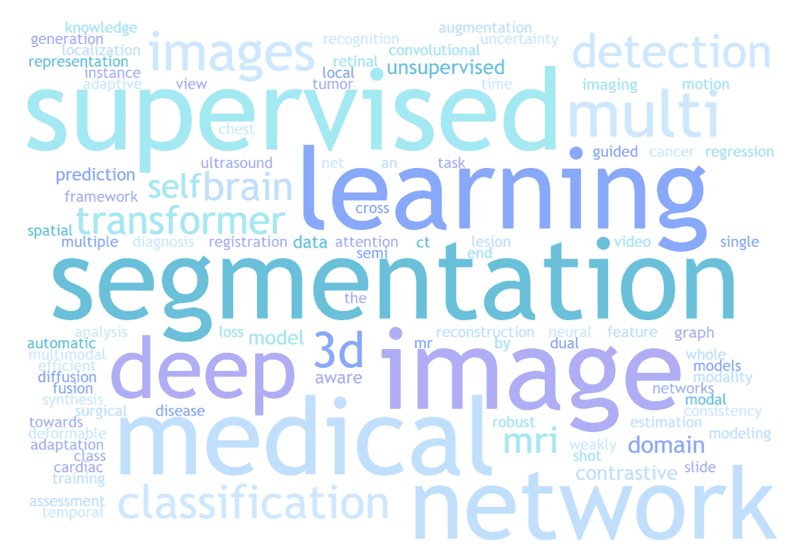

图 1：MICCAI 2022 会议论文标题的词云图。

自 2015 年引入 U-Net [38, 39] 用于医学图像分割以来，已经提出了许多变体的编码器-解码器架构，通过重新设计跳跃连接 [42]、结合残差/密集卷积块 [8, 41]、注意力机制 [52, 211, 43] 等来改进它。此外，nnU-Net (no-new-U-Net) [49] 可以自动配置医学图像分割的预处理、网络架构、训练、推断和后处理策略，基于 U-Net 的编码器-解码器结构。无需人工干预，nnU-Net 超越了大多数现有方法，在多个全监督医学图像分割任务中达到了*最先进的*性能。受到最近在自然语言处理领域中变压器架构成功的启发，许多基于变压器的方法已经被提出并应用于医学图像分割 [11, 13]。尽管这些架构的进展在许多医学图像分割任务中取得了令人鼓舞的结果并达到了*最先进的*性能 [10]，但这些方法仍然需要比以往更多的高质量标注数据用于训练。然而，获取大规模精心标注的数据集以训练分割模型是不切实际的，尤其是在医学成像领域，因为获取高质量标注数据既困难又昂贵，只有专家才能提供可靠和准确的标注 [25]。此外，许多常用的医学图像如计算机断层扫描（CT）和磁共振成像（MRI）扫描是 3D 体积数据，这进一步增加了相对于 2D 图像的人工标注负担，因为专家需要逐层划定体积中的对象 [64]。

为了应对这些挑战并减轻人工标注的负担，已投入大量努力于通过标签生成[12]、数据增强[7]、利用外部相关标注数据集[26]和利用半监督学习的无标注数据，来提高医学图像分割任务的注释效率。在这些方法中，半监督分割是一种更实际的方法，通过鼓励分割模型利用无标注数据，这些数据比有限的标注数据更容易获取，对实际临床应用有很大影响。根据图 2 中的统计数据，近年来半监督医学图像分割获得了医学成像和计算机视觉领域的越来越多关注。然而，在没有专家审核的注释的情况下，如何有效地从这些无标注数据中挖掘有用信息仍然是一个开放而具有挑战性的问题。

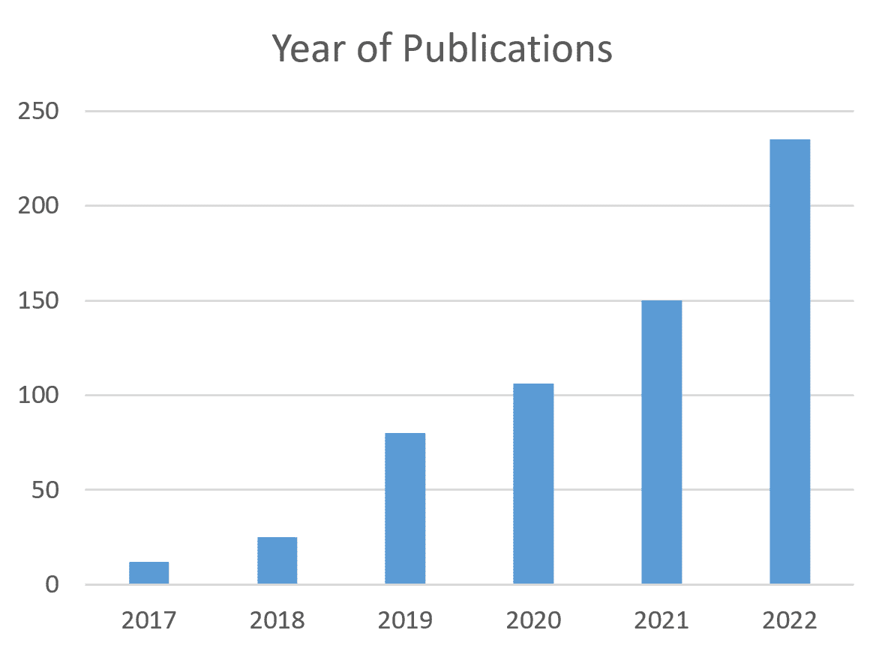

图 2：从 Web of Science 中检索到的关于半监督医学图像分割的论文统计数据。

主要贡献。与相关综述[27, 25]相比，我们主要关注深度半监督医学图像分割。我们提供了对近期解决方案的全面回顾，总结了技术创新和实证结果。此外，我们分析和讨论了现有方法的局限性以及若干未解决的问题。我们希望这篇综述能激发研究界探索该挑战的解决方案，并进一步推动医学图像分割领域的发展。

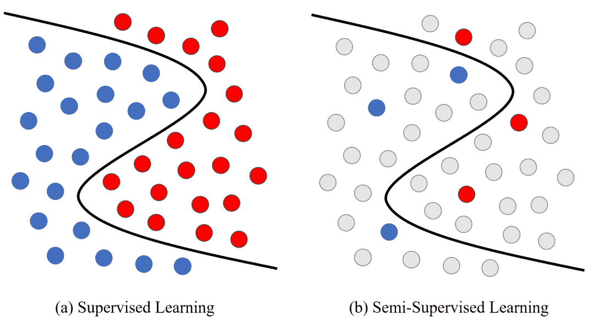

图 3：监督学习与半监督学习的示例对比。

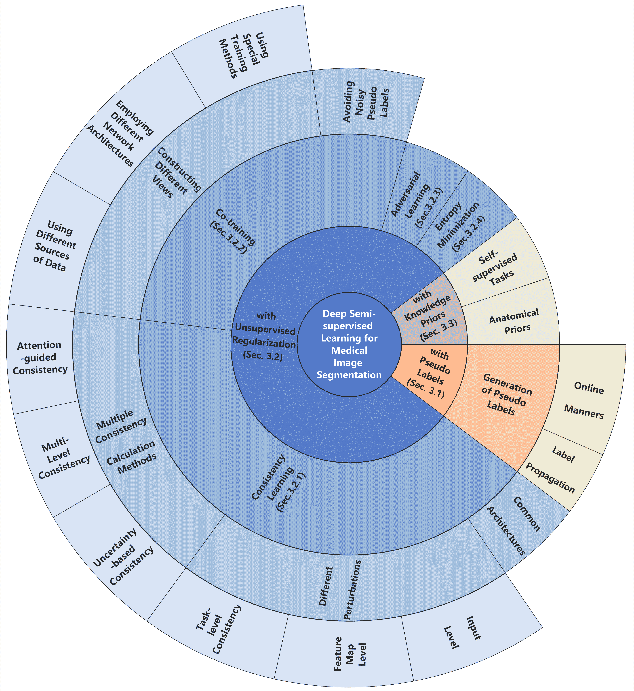

图 4：现有深度半监督学习方法在医学图像分割中的概述。

## 2 前言

### 2.1 半监督学习的基本公式

半监督学习旨在利用大量无标注数据与标注数据相结合，训练性能更高的分割模型。为了简化接下来的描述，我们将半监督学习任务公式化如下。

给定一个用于训练的数据集 $\mathcal{D}$，我们用 $M$ 个标记样本表示标记集为 $\mathcal{D}_{L}=\{x_{i}^{l},y_{i}\}_{i=1}^{M}$，用 $N$ 个未标记样本表示未标记集为 $\mathcal{D}_{U}=\{x_{i}^{u}\}_{i=1}^{N}$，其中 $x_{i}^{l}$ 和 $x_{i}^{u}$ 表示输入图像，$y_{i}$ 表示标记数据的对应真实值。通常，$\mathcal{D}_{L}$ 是整个数据集 $\mathcal{D}$ 的一个相对较小的子集，即 $M\ll N$。对于半监督分割设置，我们的目标是利用 $\mathcal{D}_{L}$ 和 $\mathcal{D}_{U}$ 的结合建立一个数据高效的深度学习模型，并使其性能可与在完全标记数据集上训练的最优模型相媲美。

根据测试数据在训练过程中是否完全可用，半监督学习可以分为两种设置：传导学习和归纳学习。对于传导学习，假设训练过程中的未标记样本正是要预测的数据（即测试集），传导学习的目的是对这些未标记样本进行模型推广。而对于归纳学习，半监督模型将应用于新的未见数据。

### 2.2 半监督学习的假设

对于半监督学习，一个重要的前提是数据分布应满足某些假设。否则，从有限的训练集推广到无限的不可见集将是不可能的。半监督学习的三个基本假设包括[204, 205]：

聚类假设。当两个样本 $x_{1}$ 和 $x_{2}$ 相似或属于同一簇时，它们对应的输出 $y_{1}$ 和 $y_{2}$ 也应相似或属于同一类别，反之亦然。这个假设暗示了单一类别中的样本倾向于形成一个簇。

低密度分离。决策边界应位于特征空间的低密度区域，而非高密度区域。这个假设与聚类假设紧密相关，因为它暗示属于同一类别的样本倾向于集中在同一簇中。因此，可以利用大量的未标记数据来调整决策边界。

多样本假设。如果两个样本 $x_{1}$ 和 $x_{2}$ 位于低维流形中的局部邻域内，它们可能具有相似的类别标签。这个假设反映了决策边界的局部平滑性，并鼓励特征空间中的相邻样本具有相同的预测。

## 3 半监督医学图像分割的相关工作

在本节中，我们主要将这些半监督医学图像分割方法分为以下三种策略：

1) 带伪标签的半监督学习，其中未标记的图像首先由分割模型进行预测和伪标记，然后作为新示例用于进一步训练。

2) 带无监督正则化的半监督学习，其中未标记的图像与标记数据共同用于训练带有无监督正则化的分割模型。本节主要包含一致性学习、共同训练、对抗学习、熵最小化。

3) 带有知识先验的半监督学习，其中未标记的图像被用于赋予模型如目标的形状和位置等知识先验，以提高医疗图像分割的表征能力。

表 1: 带伪标签的半监督医学图像分割方法的总结评论

| 参考文献 | 2D/3D | 模态 | 数据集 | 标签生成方法 |
| --- | --- | --- | --- | --- |
| PLRS, Thompson et al. [82] | 3D | MRI | BraTS 2020 [128] | 通过简单线性迭代聚类 (SLIC) 算法 [83] 计算超像素图以精炼伪标签 [在线] |
| SSA-Net, Wang et al. [109] | 2D | CT | COVID-19-CT-Seg 数据集 [16], COVID-19 CT Segmentation 数据集 ¹¹10 | 添加信任模块以重新评估模型输出中的伪标签 [在线] |
| CoraNet, Shi et al. [87] | 2D/3D | CT, MRI | 胰腺 CT [130], MR 内膜 [167], ACDC [22] | 保守-激进网络以生成更可靠的结果 [在线] |
| ECLR, Zhang et al. [72] | 2D | 显微镜 | 腺体分割挑战数据集 [189], 结直肠腺癌腺体 (CRAG) [168] | 添加错误预测网络以将分割错误划分为类内不一致或类间相似性问题 [在线] |
| SECT, Li et al. [136] | 2D | CT | UESTC-COVID-19 数据集[169], COVID-19-CT-Seg 数据集 [16] | 通过指数移动平均[在线]构建最新的预测 |
| LoL-SSL, Han et al. [69] | 2D | CT | 部分 LiTS 数据集[17] | 基于原型学习 [标签传播] 从标记数据中生成类别表示 |
| NM-SSL, Wang et al. [92] | 2D | X-Ray, 皮肤镜 | ISIC 皮肤 [19], Chexpert [20] | 邻域匹配根据与邻近标记数据的嵌入相似性生成伪标签 [标签传播] |
| RPG, Seibold et al. [86] | 2D | X-Ray | JSRT 数据集[15] | 通过转移语义 [标签传播] 生成伪标签 |

1\. https://medicalsegmentation.com/covid19/

### 3.1 带伪标签的半监督医学图像分割

为了利用未标记的数据，一个直接且直观的方法是为未标记的图像分配伪注释，然后将伪标记的图像与标记的图像一起使用，以更新分割模型。伪标记通常以迭代的方式实现，因此模型可以逐步提高伪注释的质量。算法 1 展示了这一策略的整体工作流程。

首先，使用有限的标记数据训练初始分割模型。然后，将初始分割模型应用于未标记数据，以生成伪分割掩码。之后，将伪标记的数据集与标记的数据集合并，以更新初始模型。训练过程在上述两个步骤之间交替进行，直到达到预定义的迭代次数。

算法 1 半监督学习中伪标签的训练过程。

0:   $\{x^{l},y^{l}\}$ 来自标记数据集 $D_{L}$，$\{x^{u}\}$ 来自未标记数据集 $D_{U}$，初始分割模型 $\mathcal{M}_{0}$，迭代次数 $\mathcal{T}$0:  训练的分割模型 $\mathcal{M}_{\mathcal{T}}$1:  使用 $D_{L}$ 训练初始分割模型 $\mathcal{M}_{0}$2:  对于 $i\leftarrow 1$ 到 $\mathcal{T}$  做 3:     使用模型 $\mathcal{M}_{i-1}$ 生成未标记样本 $\{x^{u}\}$ 的伪标签 $\{\hat{y}^{u}\}$4:     通过将标记数据集 $\{x^{l},y^{l}\}$ 和伪标记数据集 $\{x^{u},\hat{y}^{u}\}$ 组合生成新的训练数据集 $D_{PLi}$5:     $\mathcal{M}_{i}$ $\leftarrow$ 使用 $D_{PLi}$ 微调模型 $\mathcal{M}_{i-1}$6:  结束 7:  返回 更新后的模型 $\mathcal{M}_{\mathcal{T}}$

在半监督学习的这一策略中，这些方法主要在模型初始化、伪标签生成以及如何处理伪标签中的噪声上有所不同。使用有限标记数据的欠训练分割模型的输出是噪声较大的。如果直接将这些噪声输出用作伪标签，可能会使后续训练过程不稳定并影响性能 [145]。为了更好地利用具有潜在噪声的伪标签，已经提出了许多方法。在这一部分，我们将从两个方面解释伪标签的生成：在线生成后去除噪声预测和标签传播。

在线生成伪标签通常通过经过训练的模型在线预测生成，然后经过一些后处理算法进行精炼。一种常见的方法是选择预测概率大于设定阈值的未标记像素。然而，预测可能会有噪声且不可靠，可能提供错误的指导。为所有样本设置相同的阈值是不合理的。在 [213] 中，引入了双阈值伪标签，其中分类分支和分割分支的预测共同决定可靠的伪标签。基于 [109, 145] 的工作，通常情况下，置信度更高的伪标签更有效。因此，许多基于置信度或不确定性的方法被提出以生成更稳定和可靠的伪标签。例如，Yao 等人 [68] 提出了一个基于置信度的交叉伪监督网络，以改善来自未知分布的未标记图像的伪标签质量。具体来说，通过傅里叶变换将源域的输入图像与目标域的幅度扰动生成变换图像。计算原始图像和变换图像预测的像素级 KL 散度作为方差 $V$，然后用来计算像素级置信度。高置信度的伪标签被选择用于损失计算。此过程如下所示：

|  | $\begin{split}V=E[P_{F}\log(\frac{P_{F}}{P_{O}})]\end{split}$ |  | (1) |
| --- | --- | --- | --- |
|  | $\begin{split}confidence=e^{-V}\end{split}$ |  | (2) |

其中，$P_{F}$ 和 $P_{O}$ 代表了变换图像和原始图像的预测。Wang 等人[109] 添加了一个信任模块，以重新评估模型输出的伪标签，并设置了一个阈值以选择高置信度的值。除了添加关注置信度的模块外，Li 等人[136] 提出了自我集成策略，通过指数移动平均建立最新的预测，以避免嘈杂和不稳定的伪标签。对于后处理算法，通常使用形态学方法、机器学习方法[83]和额外的网络[87, 72]进一步细化伪标签。例如，使用简单线性迭代聚类（SLIC）算法[83]计算的超像素图被引入[82]以细化伪标签。该算法适用于不规则形状目标的分割。Shi 等人[87] 提出了保守-激进网络。对象保守设置倾向于将像素预测为背景，而对象激进设置倾向于将像素预测为前景。在未标记数据的预测中，保守与激进设置之间的某些区域作为伪标签。Zhang 等人[72] 通过另一个错误分割网络对未标记数据的分割结果进行修正，然后进行主分割网络。分割错误被划分为类内不一致或类间相似性问题。这种方法适用于不同的分割模型和任务。最近，视觉基础模型如 Segment Anything Model (SAM) [202] 展现了其惊人的能力和泛化能力。[209] 假设可靠的伪标签通常使 SAM [202] 的预测与 SSL 模型一致。因此，SSL 模型的预测被用作 SAM [202] 选择可靠伪标签的提示。然后，使用可靠的数据集对 SSL 模型进行重新训练。这种方法相比于现有的 SSL 算法表现出优越的性能。

标签传播 伪标签可以通过标签传播间接生成，例如原型学习[69]和最近邻匹配[92, 86]。然而，这些间接生成的方法是时间消耗大的，并且需要更高的内存消耗，大多数情况下是在离线模式下进行的。例如，Han 等人[69]基于原型学习从标注数据中生成类表示。通过计算未标注图像的特征向量与每个类表示之间的距离，并经过一系列形态学操作，生成高质量的伪标签。然而，这种基于原型学习的标签传播策略要求高质量和具有代表性的特征提取。对于邻域匹配方法，Wang 等人[92]根据与邻近标注数据的嵌入相似度生成基于权重的伪标签。[86] 通过在特征空间中从标注参考图像池中转移最符合未标注数据的语义生成伪标签，如图 5 所示。与基于网络预测的伪标签生成方法相比，基于标签传播的伪标签生成方法可以避免确认偏差。确认偏差指的是模型倾向于偏向那些确认其现有假设的信息，同时忽视那些与之矛盾的信息，这种偏差可能由不平衡的训练数据引起，通常存在于基于网络预测的伪标签生成方法中。总之，这些标签传播方法可以预先考虑标注数据集中数据点之间的关系。

随着更多高置信度伪标签的增加，伪标注方法鼓励类之间的低密度分离。伪标签的质量是伪标注策略的主要制约因素。当模型在小规模标注数据上过拟合并存在确认偏差时，它无法纠正自身的错误。这样，错误的预测会在训练过程中迅速放大，导致产生自信但错误的伪标签[163]。因此，如何选择将在下一个训练过程中添加的伪标签以及需要重复多少次迭代仍需进一步考虑。

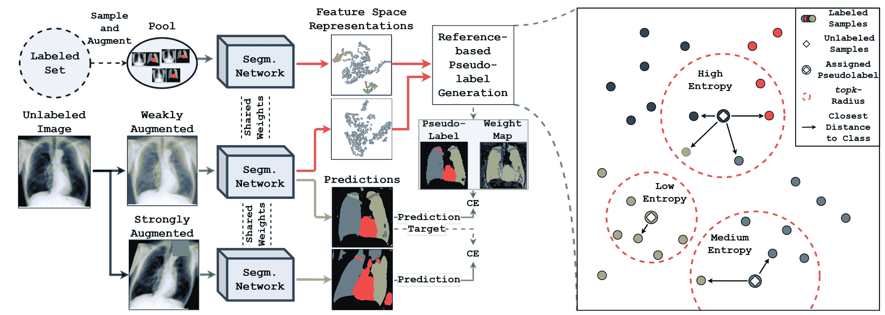

图 5：参考引导的伪标签生成 [86]。该框架提取每个未标记数据的特征，并使用一个样本标注图像的池来生成伪标签。伪标签生成过程在右侧示例中，选择特征空间中与标记参考图像池中距离最近的 top-k 图像，并转移其语义。

### 3.2 半监督医学图像分割与无监督正则化

不同于生成伪标签并以迭代方式更新分割模型，最近在半监督医学图像分割方面的一些进展侧重于将未标记数据融入训练过程中，并应用无监督正则化，如无监督损失函数。算法 2 展示了这一策略的整体工作流程。无监督损失函数和正则化项的不同选择会导致不同的半监督模型。一般来说，无监督正则化可以分为三个子类别：一致性学习、协同训练和熵最小化。

算法 2 无监督正则化的半监督学习训练过程。

0:   $\{x^{l},y^{l}\}$ 来自标记数据集 $D_{L}$，$\{x^{u}\}$ 来自未标记数据集 $D_{U}$，分割模型 $\mathcal{M}$0:  训练好的分割模型 $\mathcal{M}$1:  当未收敛时 2:     计算监督分割损失 $\mathcal{L}_{sup}(\theta;\mathcal{D}_{L})$3:     计算无监督损失 $\mathcal{L}_{unsup}(\theta;\mathcal{D})$4:     通过结合监督损失 $\mathcal{L}_{sup}$ 和无监督损失 $\mathcal{L}_{unsup}$ 更新分割模型 $\mathcal{M}$5:  结束 当 6:  返回 训练好的分割模型 $\mathcal{M}$

#### 3.2.1 一致性学习的无监督正则化

对于无监督正则化，广泛应用一致性学习，通过在不同扰动下强制输入图像预测的一致性，并将决策边界推向低密度区域，基于扰动不应改变模型输出的假设。两个对象之间的一致性可以通过以下方式计算：

|  | $Loss=D[p(x),p^{{}^{\prime}}(T(x)]$ |  | (3) |
| --- | --- | --- | --- |

$D$是相似度测量函数，通常使用 Kullback-Leibler（KL）散度，均方误差（MSE），Jensen-Shannon 散度（JS）等。$T(\cdot)$是对数据加入随机扰动的增强。$p$和$p^{{}^{\prime}}$代表分割模型，它们的参数可以共享，也可以通过某些转换建立联系，例如指数移动平均（EMA），或它们可以彼此独立。虽然一致性学习方法在半监督医学图像分割任务中显示出了有希望的结果，但它有一些需要考虑的限制：

1\. 对噪声的敏感性：一致性学习假设输入图像中的小扰动不应影响模型的输出。然而，在实践中，这一假设可能并不总是成立，因为输入数据可能包含噪声或异常值。这可能导致模型在训练过程中关注这些嘈杂的区域，从而降低其泛化能力。

2\. 超参数调整：一致性学习方法的性能取决于超参数的选择。选择合适的超参数可能具有挑战性，可能需要进行大量实验，这使得难以将这些方法应用到实践中。

3\. 适当的扰动：如果扰动过弱，基于一致性的学习可能不起作用，但强烈的扰动可能使模型混淆，导致性能低下。

常见架构 图 6 中所示的常见架构如下。Sajjadi 等人 [115] 提出了$\Pi$模型，以创建标记和未标记数据的样本的两个随机增强。在训练过程中，该模型期望相同的未标记样本在不同的随机扰动下向前传播两次保持一致。Samuli 等人 [30] 提出了时间集成策略，使用 EMA 预测作为未标记数据的一致性目标。时间集成的基本思想是训练多个模型在不同的时间点，然后结合它们的预测以做出最终预测。然而，在训练过程中维护 EMA 预测是一项沉重的负担。为了解决这个问题，Tarvainen 等人 [29] 提出了使用带有学生模型 EMA 权重的教师模型进行训练，并强制学生模型和教师模型之间扰动输入的预测一致。因此，这种 mean-teacher 架构由于其简单性被广泛采用。Zeng 等人 [95] 改进了教师模型中的 EMA 加权方式。他们通过反馈信号来自标记集上学生的表现，从而使教师模型可以通过梯度下降算法自主和有目的地更新。

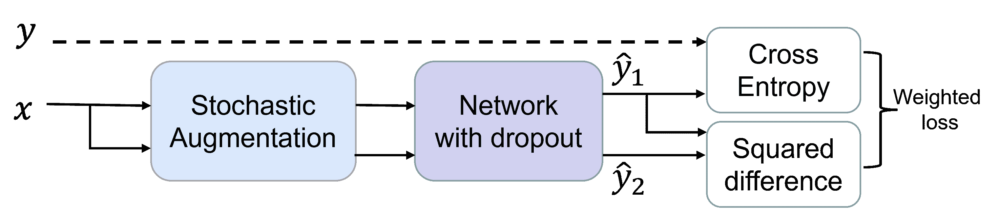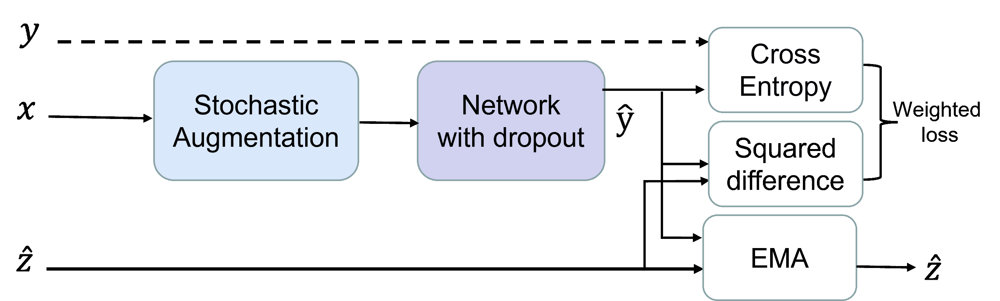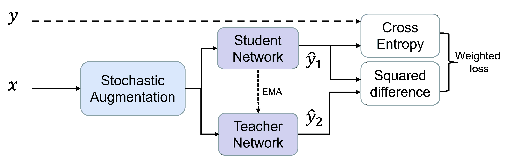

图 6：一致性学习中使用的经典架构。 (a)：$\Pi$模型 [115]，它创建样本的两个随机增强并鼓励一致的预测。 (b)：时间集成策略 [30]，使用 EMA 预测作为未标记数据的一致性目标。 (c)：mean-teacher 架构 [29]，其中教师模型带有学生模型的 EMA 权重。

用于一致性学习的扰动可以分为输入扰动和特征图扰动，这些扰动应对相应任务有意义。扰动对分割性能的影响有一个上限，当添加更多扰动时，分割性能不会进一步提升 [99]。

输入扰动常见的有高斯噪声、高斯模糊、随机旋转、缩放和对比度变化，鼓励分割网络对于未标记数据保持变换一致性[61]。Bortsova 等人[118] 探讨了对弹性形变的等变性，并鼓励对接收不同变换图像的两个相同分支之间的预测进行分割一致性检查。Huang 等人[99] 在输入扰动中加入了剪切和切片对齐问题。另一个常见的扰动是混合增强[146, 112, 76]，它鼓励对两个数据的插值分割结果保持一致。

特征图扰动 除了输入图像上的干扰，还有许多研究集中于特征图级别的干扰。郑等人 [89] 提出向教师模型的参数计算中添加随机噪声。许等人 [91] 通过设计不同的网络架构提出形态特征扰动，如图 7 所示。Atrous 卷积可以放大前景特征，而跳跃连接则会缩小前景特征 [164, 165]。李等人 [96] 向七个额外的解码器中添加了七种特征扰动，并要求这七个预测与主解码器一致。这些特征级别的扰动包括特征噪声、特征丢弃、目标遮罩、上下文遮罩、引导切割、中间 VAT 和随机丢弃，基于 [156] 的工作。其中，目标遮罩、上下文遮罩和引导切割利用解码器的预测来遮罩特征图中的目标或上下文；中间 VAT 指使用虚拟对抗训练作为特征图的扰动函数。一些研究同时在输入和特征图级别应用扰动。例如，许等人 [77] 提出了一种新颖的阴影扰动，包括阴影增强 8(a) 和阴影丢弃 8(b)，以模拟医学图像中的低图像质量和阴影伪影。具体来说，阴影增强是一种通过向输入图像中添加模拟阴影伪影的扰动，而阴影丢弃则根据阴影伪影的先验知识丢弃神经节点，这是一种直接作用于特征图的干扰。然而，如果扰动过于微弱，可能会导致学生模型记住这些简单的变化，并快速拟合训练数据。最终，学生模型未能发现有效特征，这就是懒惰学生现象。但强扰动可能会混淆教师和学生，从而导致性能下降。为了避免学生模型和教师模型之间的差距，舒等人 [112] 添加了一个转导监控器以进一步进行知识蒸馏，从而缩小学生模型和教师模型之间的语义差距。一些工作 [207, 208, 206] 明确将扰动分为强扰动和弱扰动，并利用来自弱扰动输入的预测来监督其强扰动版本的预测。这些工作假设弱扰动输入可以提供可靠的预测，而强扰动输入可以改善学习过程和模型鲁棒性。

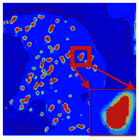

(a) 膨胀卷积 [164] 扩大前景特征

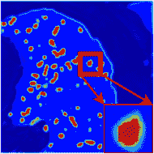

(b) 跳跃连接 [166] 以缩小前景特征

图 7：通过设计不同的网络架构来进行形态特征扰动 [91]。

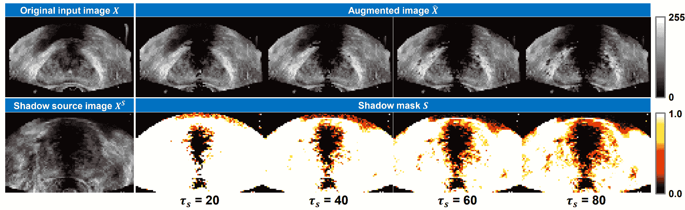

(a) 阴影增强，将从阴影源图像中提取的阴影伪影以不同的阴影阈值 $\tau_{s}$ 施加到原始输入图像上。

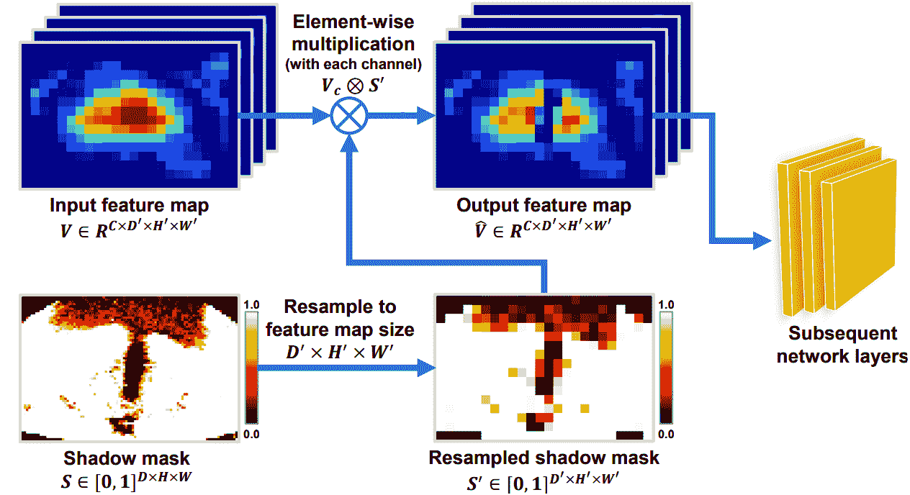

(b) 阴影丢弃，这种方法在特征图中的阴影区域提取特征。

图 8：阴影增强和丢弃 [77]

任务级正则化 除了利用数据级扰动进行一致性学习，一些方法专注于通过添加辅助任务来构建任务级正则化，从而利用几何信息。Li 等人[34]开发了一个多任务网络，通过对抗性正则化建立形状感知约束。Liu 等人[143]提出了一个包含分割、符号距离图预测和器官轮廓预测的形状感知多任务框架。Luo 等人[35]将水平集函数回归任务与分割任务结合起来，形成一个用于半监督学习的双任务一致性。Zhang 等人[36]提出了双任务互学习框架，鼓励双任务网络相互探索有用的知识。基于双任务框架，Zhang 等人[9]利用分割任务和回归任务进行自我集成，并利用估计的不确定性来指导互一致性学习，从而获得进一步的性能提升。Shi 等人[218]提出利用分割任务和回归任务作为学生网络进行竞争性集成，以增强对教师网络的效果。Chen 等人[113]提出了一种双任务一致性联合学习框架，鼓励分割结果与符号距离图预测的变换保持一致。Wang 等人[97]将多任务学习注入到包含分割任务、重建任务和符号距离场预测任务的均值教师架构中，使得模型能够考虑数据级、模型级和任务级的一致性，如图 9 所示。在符号距离场预测中，训练一个神经网络来预测每个像素到最近前景点的符号距离值。距离的符号表示该点是否在感兴趣区域内外，而距离的大小则估计了前景的距离。此外，他们提出了一种不确定性加权集成（UWI）策略，用于估计所有任务的不确定性，并基于这些任务开发了三重不确定性，以指导学生模型从教师那里学习可靠的信息。

一致性计算方法的变体 有多种一致性计算方法可用于避免嘈杂的像素预测，例如基于不确定性的学习[31、141、106、50、106、50、110]，多层次一致性学习[124]，以及注意力引导的一致性学习[81]等。在均值教师架构中，教师模型的预测在某些位置可能是错误的，这可能会使学生模型感到困惑。因此，在训练过程中，利用不确定性或置信度估计来学习更有意义和可靠的目标。Yu 等人[31]通过蒙特卡罗 dropout[90]扩展了均值教师范式。在半监督学习中使用蒙特卡罗 dropout 时，使用标记数据训练模型，同时启用 dropout。然后，使用模型对未标记数据进行预测，依然启用 dropout。随后，通过计算同一未标记样本的多个预测结果来计算不确定性。这种不确定性可以用于指导伪标签化过程，识别可能被错误标记或模糊的像素。Xie 等人[141]添加了一个置信度感知模块，以在标记数据的指导下学习模型置信度。Luo 等人[106、50]通过在一次前向传播中计算金字塔预测的不确定性，并提出了多层次不确定性修正的金字塔一致性正则化。Fang 等人[110]附加了一个误差估计网络，以预测教师预测的损失图。然后将在低损失像素上计算一致性损失。Chen 等人[124]提出了多层次一致性损失，该方法计算额外判别器中多尺度特征之间的相似性，其中输入是通过将未标记输入图像与预测的分割概率图相乘得到的分割区域，而不是分割概率图。Hu 等人[81]提出了注意力引导一致性，鼓励学生模型和教师模型的注意力图保持一致。Zhao 等人[75]引入了跨层一致性约束，该约束在补丁和整个图像之间计算。除了直接鼓励网络分割结果的一致性外，还提出了生成一致性[101]，通过一个生成网络从分割网络的预测中重建医学图像。Xu 等人[84]提出了轮廓一致性，利用傅里叶级数（包含一系列谐波）作为椭圆描述符。通过最小化学生和教师分支之间参数的 L2 距离，模型获得了形状感知能力。然而，这种方法需要为不同不规则性的目标选择不同的最大谐波数。每张图像包含相同类别的对象，因此不同的图像在特征空间中共享相似的语义。Xie 等人[135]引入了内对和外对一致性来增强特征图。首先计算特征空间中一对图像之间的像素级关系，以获得突出显示具有相同语义但在不同图像上的区域的注意力图。然后考虑多个注意力图以过滤低置信度区域，并将其与原始特征图合并，以提高其表示能力。Liu 等人[102]提出了对比一致性，通过分类网络生成的前景和背景类别向量，鼓励分割输出在类别级别上保持一致。Xu 等人[70]提出了循环原型一致性学习（CPCL）框架，该框架包含标记到未标记（L2U）的原型前向过程和未标记到标记（U2L）的反向过程。L2U 前向一致性可以使用标记原型将真实标签监督信号转移到未标记数据，而 U2L 反向一致性可以直接使用未标记原型对标记数据进行分割。

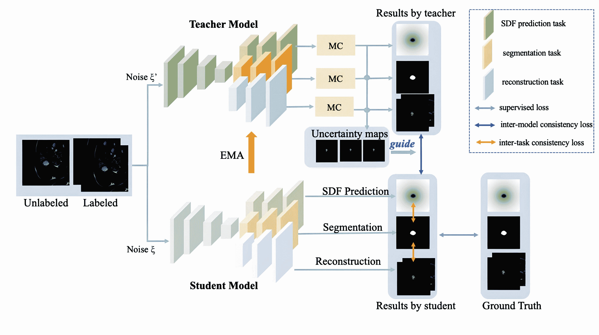

图 9：均值教师架构中的多任务学习，包括分割任务、重建任务和签名距离场预测任务[97]。任务间一致性鼓励三个任务之间的预测一致性，模型间一致性鼓励教师模型与学生模型之间的预测一致性。

表 2：带有一致性学习的半监督医学图像分割方法的总结评审。

| 参考 | 2D/3D | 模态 | 数据集 | 扰动 |
| --- | --- | --- | --- | --- |
| SSN-RCL, Huang et al. [99] | 3D | 显微镜 | Kasthuri15 [171]，CREMI ¹¹10 | 高斯模糊，高斯噪声，切片错位，对比度变化 |
| SCO-SSL, Xu et al.[77] | 3D | US | UCLA [172] | 阴影增强，阴影丢弃 |
| SemiTC, Bortsova et al. [118] | 2D | X-Ray | JSRT 数据集 [15] | 弹性变形 |
| GCS, Chen et al.[101] | 3D | TOF-MRA | MIDAS 数据集 [18] | 随机扰动 |
| DUW-SSL, Wang et al. [32] | 3D | CT, MRI | LA 数据集 [66]，KiTS 数据集 [175] | 随机噪声，丢弃 |
| URPC, Luo et al.[50] | 3D | CT | BraTS 2019[128]，胰腺 CT[130] | 随机裁剪的补丁，多级金字塔预测 |
| Mtans, Chen et al.[124] | 3D | MRI | 经年的多发性硬化病变分割 [173]，ISLES 2015[174]，BraTS 2018[128] | 多尺度特征 |
| CPCL, Xu et al.[70] | 3D | CT, MRI | BraTS 2019 [128]，KiTS 数据集 [175] | 不同输入图像 |
| AHDC, Chen et al.[88] | 3D | CT, MRI | LGE-CMR 数据集来自 [176, 177]，MM-WHS 数据集 [178, 179] | 不同领域输入 |
| UA-MT, Yu et al.[31] | 3D | MRI | LA 数据集 [66] | 随机翻转，随机旋转 |
| SASSNet, Zhang et al.[34] | 3D | MRI | LA 数据集 [66] | 任务级一致性 |
| DTC, Luo et al.[35] | 3D | CT, MRI | LA 数据集 [66]，胰腺 CT [130] | 任务级一致性 |
| T-UncA, Wang et al.[67] | 2D | MRI | ACDC 数据集 [22]，PROMISE [182] | 任务级一致性 |

1\. https://cremi.org/

#### 3.2.2 无监督正则化与协同训练

共训练框架假设每个数据有两个或更多不同的视角，每个视角都有足够的信息进行独立预测[147]。它首先在标记数据上为每个视角学习一个独立的分割模型，然后逐渐将模型在未标记数据上的预测添加到训练集中以继续训练。在共训练中，一个视角对其他视角是冗余的，模型被鼓励在所有视角上具有一致的预测。与自训练方法不同的是，共训练方法将一个视角的伪标签添加到训练集中，并作为监督信号来训练其他视角的模型。而共训练与一致性学习的区别在于，共训练中的所有模型都会通过梯度下降算法进行更新，而一致性学习则鼓励不同扰动的输出保持一致，并且只有一个主要模型通过梯度下降算法进行更新，例如均值教师架构[29]。还需要考虑一些限制：

1\. 视角之间的充分独立性：共训练假设每个视角足够独立，能够单独做出预测。然而，在实际情况中，这一假设可能不总是成立，当视角之间相关或冗余时，性能可能会下降。

2\. 模型冲突的风险：共训练方法鼓励模型在不同视角下的预测一致性。然而，如果模型过于相似，它们可能会过度专注于特定领域，无法捕捉数据中的潜在模式。

3\. 对噪声伪标签的敏感性：共训练将一个视角的伪标签添加到训练集中作为其他视角的监督信号。如果这些伪标签有噪声或不正确，会对其他视角的性能产生负面影响。

不同视图的构建 Co-training 的核心在于如何构建两个（或更多）深度模型来代表足够独立的视图。这些方法主要包括使用不同来源的数据、采用不同的网络架构和使用特殊的训练方法来获得多样化的深度模型。首先，不同来源的数据包括来自不同模态的数据 [94, 103]、医疗中心 [60] 或解剖平面 [148, 133]，这些会导致不同的分布。例如，Zhu 等人 [94] 提出了一个用于无配对多模态学习的 co-training 框架。该框架包含两个分割网络和两个跨模态的图像翻译网络。他们利用来自一种模态的伪标签（来自未标记数据）或标签（来自已标记数据），在图像翻译后训练另一模态的分割网络。一方面，这增加了监督信号。另一方面，它增加了模态级别的一致性。Chen 等人 [103] 利用未配对的多模态图像在解剖和语义信息上保持跨模态一致性。协作和互补的多模态可以促进更好的模态独立表示学习。Liu 等人 [60] 提出了一个用于领域适应的医学图像分割的 co-training 框架。该框架包含两个分割器，分别用于半监督分割任务（标记和未标记目标领域数据作为输入）和无监督领域适应任务（标记源领域数据和未标记目标领域数据作为输入）。[148, 133] 使用 3D 医学图像的冠状面、矢状面和横断面作为输入级别的视图差异，[148] 还使用具有 2D 初始化的非对称 3D 核心作为特征级别的视图差异。然而，当只有一个数据源可用时，训练两个（或更多）相同的网络可能导致神经网络崩溃，因为这些模型的预测被鼓励变得相似。[149, 151] 生成对抗样本作为另一种视图。其次，由于不同的模型通常提取不同的表示，co-training 框架中的不同模型可以关注不同的视图。除了使用 CNN 作为骨干网络外，还有一些基于 transformer 的骨干网络 [114, 119]。如图 10 所示，Luo 等人 [132] 介绍了 CNN 和 transformer 基于骨干网络之间的交叉教学，这隐式地鼓励不同网络之间的一致性和互补性。Liu 等人 [114] 将 CNN 模块和 Swin Transformer 模块结合在一起作为骨干网络。Xiao 等人 [119] 增加了另一个具有 transformer 架构的教师模型。教师模型通过一致性正则化进行相互沟通，并指导学生的学习过程。第三，使用特殊的训练方法也可以训练出多样化的深度模型。例如，Chen 等人 [150] 使用输出模糊来生成不同的标记数据集，以初始化多样化的模型。为了保持后续训练过程中的多样性，这些模块在特定轮次中使用生成的数据集进行微调。

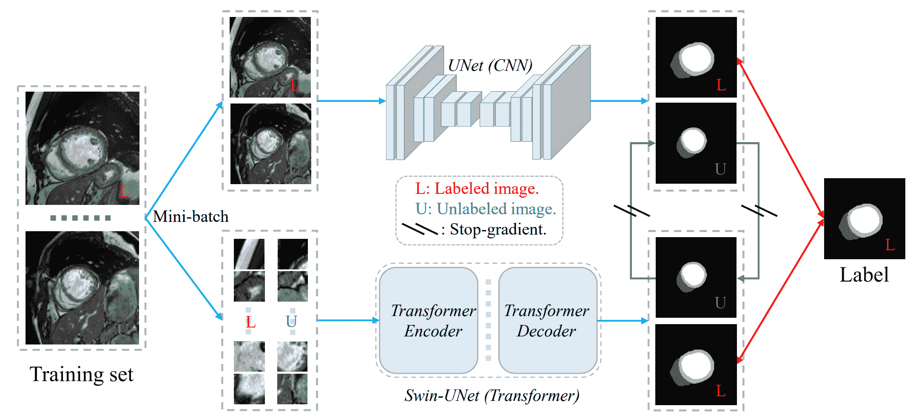

图 10：一种使用 CNN 和 Transformer 基础架构的协同训练框架，鼓励不同网络之间的一致性和互补性[132]。

避免在协同训练中出现嘈杂的伪标签也很重要。尽管鼓励网络之间的一致预测，但它们可能包含噪声，导致训练过程不稳定。为了解决第 3.2.2 节中提到的第三个限制，提出了一种基于不确定性的协同训练框架[148]，通过估计每个视图的置信度并融合其他视图的预测来生成一个视图的伪标签。王等人[100]开发了一种自适应和自一致的协同训练框架。自适应策略可以通过最小化广义的 Jensen-Shannon 散度，鼓励网络将易于分割的区域的知识逐渐转移到难度更大的区域。另一种减轻嘈杂伪标签影响的方法是通过指数混合衰减来调整标签和伪标签在训练过程中的监督信号的贡献[60]。除了上述方法外，3.2.3 节中的对抗学习也总是进行的，以生成逐像素的置信度图或不确定性。半监督模型将从高置信度的预测[210]中学习，从而避免嘈杂的伪标签。

表 3：带有协同训练的半监督医学图像分割方法的总结回顾。

| 参考文献 | 2D/3D | 模态 | 数据集 | 来自多样视角的 |
| --- | --- | --- | --- | --- |
| Spsco-Cot, 王等人[100] | 2D | CT, MRI | ACDC 数据集 [22], 医学分割十项挑战的脾脏子任务 [185], PROMISE [182] | 扰动 |
| DCT-Seg, 彭等人[151] | 2D | CT, MRI | ACDC 数据集[22], SCGM [184], 脾脏数据集 [185] | 扰动 |
| MASS, 陈等人[103] | 3D | CT, MRI | BTCV[187], CHAOS[183] | 不同模态 |
| SSUML, Zhu et al.[94] | 2D | CT, MRI | 心脏亚结构分割 [178], 腹部多脏器分割 [186, 183] | 不同的模态 |
| CT_CNN&Trans, Luo et al.[132] | 2D | MRI | ACDC 数据集 [22] | 不同的分割网络 |
| Mmgl, Zhao et al.[133] | 3D | CT | MM-WHS 数据集 [178, 179] | 不同的变换 |
| UMCT, Xia et al.[148] | 3D | CT | NIH 胰腺 [130], LiTS 数据集 [17] | 不同的变换 |

#### 3.2.3 基于对抗学习的无监督正则化

对抗方法用于鼓励来自未标记图像的预测分布更接近标记图像的分布，应用于半监督学习。这些方法通常包含一个判别器，用于区分来自标记注释或未标记预测的输入 [45, 137, 124, 93]。然而，对抗训练可能在收敛方面具有挑战性。

Zhang et al. [45] 引入对抗学习以鼓励未标记数据的分割结果与标记数据的注释相似。Chen et al. [124] 在分割网络后添加了一个判别器，用于区分来自标记图像或未标记图像的输入签名距离图。Peiris et al. [93, 210] 在分割架构中添加了一个批评网络，该网络可以通过区分预测掩码和真实掩码进行最小-最大博弈。实验表明，这可以锐化预测掩码中的边界。判别器还可以用于生成逐像素置信度图，并选择用于协同训练的可信像素预测。Wu et al. [134] 为预测置信度图和区分标记或未标记数据的分割结果添加了两个判别器。通过添加另一个辅助判别器，可以缓解由于标记图像有限导致的主判别器训练不足的问题。

#### 3.2.4 基于熵最小化的无监督正则化

熵最小化鼓励模型对未标记数据输出低熵预测，避免类别重叠。半监督学习算法 [105, 154, 155] 通常结合熵最小化，基于决策边界应位于低密度区域的假设。例如，在 [154] 中，添加了一个损失项来最小化模型在未标记数据上的预测熵，目标函数变为：

|  | <math alttext="\begin{split}C(\theta,\lambda;\mathcal{L}_{n})&amp;=L(\theta;\mathcal{L}_{n})-\lambda H_{emp}(Y&#124;X,Z;\mathcal{L}_{n})\\ &amp;=\sum_{i=1}^{n}\log(\sum_{k=1}^{K}z_{ik}f_{k}(x_{i}))\\

&amp;+\lambda\sum_{i=1}^{n}\sum_{k=1}^{K}g_{k}(x_{i},z_{i})\log g_{k}(x_{i},z_{i})\end{split}" display="block"><semantics ><mtable columnspacing="0pt" displaystyle="true" rowspacing="0pt"  ><mtr ><mtd  columnalign="right" ><mrow ><mi  >C</mi><mo lspace="0em" rspace="0em"  >​</mo><mrow ><mo stretchy="false" >(</mo><mi >θ</mi><mo  >,</mo><mi >λ</mi><mo >;</mo><msub ><mi >ℒ</mi><mi  >n</mi></msub><mo stretchy="false"  >)</mo></mrow></mrow></mtd><mtd columnalign="left"  ><mrow ><mo >=</mo><mrow ><mrow  ><mi >L</mi><mo lspace="0em" rspace="0em"  >​</mo><mrow ><mo stretchy="false" >(</mo><mi >θ</mi><mo  >;</mo><msub ><mi >ℒ</mi><mi >n</mi></msub><mo stretchy="false" >)</mo></mrow></mrow><mo >−</mo><mrow ><mi  >λ</mi><mo lspace="0em" rspace="0em"  >​</mo><msub ><mi >H</mi><mrow ><mi >e</mi><mo lspace="0em" rspace="0em" >​</mo><mi >m</mi><mo lspace="0em" rspace="0em"  >​</mo><mi >p</mi></mrow></msub><mo lspace="0em" rspace="0em"  >​</mo><mrow ><mo stretchy="false" >(</mo><mrow ><mi  >Y</mi><mo fence="false"  >&#124;</mo><mrow ><mi >X</mi><mo >,</mo><mi >Z</mi><mo >;</mo><msub ><mi >ℒ</mi><mi >n</mi></msub></mrow></mrow><mo stretchy="false" >)</mo></mrow></mrow></mrow></mrow></mtd></mtr><mtr ><mtd columnalign="left"  ><mrow ><mo rspace="0.111em" >=</mo><mrow ><munderover ><mo movablelimits="false" >∑</mo><mrow ><mi  >i</mi><mo >=</mo><mn >1</mn></mrow><mi >n</mi></munderover><mrow ><mi >log</mi><mo >⁡</mo><mrow ><mo stretchy="false" >(</mo><mrow ><munderover ><mo lspace="0em" movablelimits="false" >∑</mo><mrow ><mi  >k</mi><mo >=</mo><mn >1</mn></mrow><mi >K</mi></munderover><mrow ><msub ><mi >z</mi><mrow ><mi >i</mi><mo lspace="0em" rspace="0em"  >​</mo><mi >k</mi></mrow></msub><mo lspace="0em" rspace="0em"  >​</mo><msub ><mi >f</mi><mi >k</mi></msub><mo lspace="0em" rspace="0em"  >​</mo><mrow ><mo stretchy="false"  >(</mo><msub ><mi >x</mi><mi >i</mi></msub><mo stretchy="false"  >)</mo></mrow></mrow></mrow><mo stretchy="false"  >)</mo></mrow></mrow></mrow></mrow></mtd></mtr><mtr ><mtd columnalign="left"  ><mrow ><mo >+</mo><mrow  ><mi >λ</mi><mo lspace="0em" rspace="0em"  >​</mo><mrow ><munderover ><mo movablelimits="false" rspace="0em"  >∑</mo><mrow ><mi >i</mi><mo >=</mo><mn >1</mn></mrow><mi >n</mi></munderover><mrow ><munderover ><mo movablelimits="false" >∑</mo><mrow ><mi  >k</mi><mo >=</mo><mn >1</mn></mrow><mi >K</mi></munderover><mrow ><msub ><mi  >g</mi><mi >k</mi></msub><mo lspace="0em" rspace="0em"  >​</mo><mrow ><mo stretchy="false"  >(</mo><msub ><mi >x</mi><mi >i</mi></msub><mo >,</mo><msub ><mi  >z</mi><mi >i</mi></msub><mo stretchy="false"  >)</mo></mrow><mo lspace="0.167em" rspace="0em"  >​</mo><mrow ><mi >log</mi><mo lspace="0.167em" >⁡</mo><msub ><mi  >g</mi><mi >k</mi></msub></mrow><mo lspace="0em" rspace="0em"  >​</mo><mrow ><mo stretchy="false"  >(</mo><msub ><mi >x</mi><mi >i</mi></msub><mo >,</mo><msub ><mi  >z</mi><mi >i</mi></msub><mo stretchy="false"  >)</mo></mrow></mrow></mrow></mrow></mrow></mrow></mtd></mtr></mtable><annotation-xml encoding="MathML-Content" ><apply ><apply  ><apply ><ci >𝐶</ci><vector  ><ci >𝜃</ci><ci >𝜆</ci><apply  ><csymbol cd="ambiguous"  >subscript</csymbol><ci >ℒ</ci><ci >𝑛</ci></apply></vector></apply><apply ><apply  ><ci >𝐿</ci><list ><ci >𝜃</ci><apply ><csymbol cd="ambiguous" >subscript</csymbol><ci >ℒ</ci><ci >𝑛</ci></apply></list></apply><apply ><ci  >𝜆</ci><apply ><csymbol cd="ambiguous" >subscript</csymbol><ci >𝐻</ci><apply ><ci >𝑒</ci><ci >𝑚</ci><ci >𝑝</ci></apply></apply><apply ><csymbol cd="latexml" >conditional</csymbol><ci >𝑌</ci><list ><ci >𝑋</ci><ci >𝑍</ci><apply ><csymbol cd="ambiguous" >subscript</csymbol><ci >ℒ</ci><ci >𝑛</ci></apply></list></apply></apply></apply></apply><apply ><apply ><apply  ><apply ><csymbol cd="ambiguous" >superscript</csymbol><apply ><csymbol cd="ambiguous" >subscript</csymbol><apply ><ci >𝑖</ci><cn type="integer" >1</cn></apply></apply><ci >𝑛</ci></apply><apply ><apply  ><apply ><csymbol cd="ambiguous" >superscript</csymbol><apply ><csymbol cd="ambiguous" >subscript</csymbol><apply ><ci >𝑘</ci><cn type="integer" >1</cn></apply></apply><ci >𝐾</ci></apply><apply ><apply  ><csymbol cd="ambiguous"  >subscript</csymbol><ci >𝑧</ci><apply ><ci >𝑖</ci><ci >𝑘</ci></apply></csymbol></apply></apply></apply></apply></apply></apply></apply></annotation-xml><annotation encoding="application/x-tex" >\begin{split}C(\theta,\lambda;\mathcal{L}_{n})&=L(\theta;\mathcal{L}_{n})-\lambda H_{emp}(Y&#124;X,Z;\mathcal{L}_{n})\\ &=\sum_{i=1}^{n}\log(\sum_{k=1}^{K}z_{ik}f_{k}(x_{i}))\\ &+\lambda\sum_{i=1}^{n}\sum_{k=1}^{K}g_{k}(x_{i},z_{i})\log g_{k}(x_{i},z_{i})\end{split}</annotation></semantics></math> |  | (4) |

其中 $L(\theta;\mathcal{L}_{n})$ 是条件对数似然，受标记数据影响，$H_{emp}(Y|X,Z;\mathcal{L}_{n})$ 是条件熵，仅受未标记数据影响，旨在最小化类别重叠。$x_{i}$ 和 $z_{i}$ 代表输入和对应的标签。如果 $x_{i}$ 被标记为 $\omega_{k}$，则 $z_{ik}=1$ 且 $z_{il}=0$ 对于 $l\neq k$；如果 $X_{i}$ 是未标记的，则 $z_{il}=1$ 对于 $l=1...k$。$f_{k}(x_{i})$ 和 $g_{k}(x_{i},z_{i})$ 分别表示 $P(\omega_{k}|x_{i})$ 的模型和 $P(\omega_{k}|x_{i},z_{i})$ 的模型。Wu 等人 [105] 在学生分支中添加了熵最小化技术。Berthelot 等人 [146] 提出了 MixMatch，使用锐化函数对未标记数据的目标分布进行熵最小化。通过调整该分类分布的“温度”来进行锐化如下：

|  | $\begin{split}Sharpen(p,T)_{i}=p_{i}^{\frac{1}{T}}/\sum_{j=1}^{L}p_{j}^{\frac{1}{T}}\end{split}$ |  | (5) |
| --- | --- | --- | --- |

其中 $p$ 是输入的分类分布，$T$ 是一个超参数。随着 $T\rightarrow{}$ 0，$Sharpen(p,T)$ 的输出将接近于 Dirac（“one-hot”）分布。降低温度鼓励模型生成低熵的预测。然而，超参数需要仔细设置，不同样本可能有不同的 $T$，因此 [2] 提出了自适应锐化方法，该方法可以根据模型预测的不确定性为每个样本自适应调整 $T$。[159] 引入了一个互斥损失，用于多类别问题，强制预测结果相互排斥，并鼓励决策边界位于不同类别数据流形之间的低密度空间，这在目标检测任务中相比于 [154] 的熵最小化表现更好。

熵最小化的另一个应用是在伪标签中的硬标签使用。由于对概率分布应用 argmax 操作可以产生有效的“one-hot”低熵（即高置信度）分布，因此熵最小化和伪标签都鼓励决策边界穿越低密度区域。因此，在伪标签中使用硬标签的策略与熵最小化密切相关 [160]。然而，一个容易过拟合的高容量模型可能会给出高置信度的预测，这也有低熵 [161]。因此，熵最小化在某些情况下不起作用 [154]。

表 4：带有对抗学习和熵最小化的半监督医学图像分割方法的总结回顾。

| 参考文献 | 2D/3D | 模态 | 数据集 | 亮点 | 类别 |
| --- | --- | --- | --- | --- | --- |
| CAFD, 吴等[134] | 2D | 胶囊内镜 | Kvasir-SEG [196], CVC-Clinic DB [188] | 引入专注与分散表征的协作与对抗学习 | 对抗学习 |
| SSTD-Aug, Chaitanya 等 [117] | 2D | MRI | ACDC 数据集 [22] | 任务驱动的数据增强方法以合成新的训练示例 | 对抗学习 |
| DAN, 张等[45] | 3D | 显微镜 | 腺体分割挑战数据集 [189] | 引入对抗学习，鼓励未标记数据的分割结果与标记数据的注释相似。 | 对抗学习 |
| GAVA, 李等[125] | 2D | MRI | M&Ms 数据集 [123] | 使用 U-net 作为编码器，条件 GAN 作为解码器 | 对抗学习 |
| LeakGAN_ssl, 侯等[144] | 2D | 眼底 | DRIVE[190], STARE[191], CHASE_DB1[192] | 添加泄漏 GAN，通过从生成器泄漏信息来污染判别器，以实现更温和的生成 | 对抗学习 |
| LG-ER-MT, Hang 等[33] | 3D | MRI | LA 数据集 [66] | 将熵最小化原则引入学生网络 | 熵最小化 |
| MC-Net, 吴等[2] | 3D | MRI | LA 数据集 [66] | 根据模型预测的不确定性自适应调整锐化温度 | 熵最小化 |

### 3.3 带有知识先验的半监督医学图像分割

知识先验是学习者在学习新信息之前已经掌握的信息，有时对处理新任务有帮助。与非医学图像相比，医学图像具有许多解剖学先验，如器官的形状和位置，将解剖学先验知识纳入深度学习可以提高医学图像分割的性能 [153]。一些半监督算法利用知识先验来提高对新任务的表征能力。虽然知识先验在半监督医学图像分割中可能有帮助，但也有几个需要考虑的限制：

1\. 过拟合：如果先验知识过于特定于训练数据，可能会导致过拟合，使得模型在训练数据上表现良好，但在新数据上表现不佳。

2\. 非可微分：一些复杂的先验，如区域连通性、凸性和对称性，通常是非可微分的，需要设计复杂的损失函数。在这一部分，我们将知识先验分为自监督任务和解剖学先验。

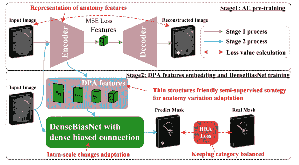

图 11：DPA-DenseBiasNet [152] 用于细化肾动脉分割。重建任务的自编码器在阶段 1 过程中进行训练。从编码器提取的深度先验解剖（DPA）特征包含解剖先验的表示，然后在阶段 2 过程中嵌入以用于下游分割任务。

自监督任务利用大量未标记的数据来训练网络，可以提供有用的表示和视觉先验。一个重要作用是预训练网络，为目标任务提供更好的起点。例如，huang 等人 [99] 添加了一个来自对等体的重建预训练，以避免网络在冷启动阶段随机初始化。Wang 等人 [131] 使用超像素将图像分割成区域，并基于对比学习学习了内部和外部的表示，然后将模型用于初始化半监督框架，这显著提升了性能。自监督任务还可以与目标半监督任务共同训练作为正则化。对比学习是与半监督框架集成的最流行方法。例如，hu 等人 [98] 将自监督图像级和像素级对比学习引入半监督框架。[80] 集成了自适应对比学习。Wu 等人 [105] 添加了补丁级和像素级的密集对比损失，以对齐教师和学生模型的特征。Zhao 等人 [133] 将多尺度多视角的全局-局部对比学习引入共训练框架。然而，在对比学习中，负样本可能来自于锚点的相似特征，这可能在训练过程中使模型混淆。You 等人 [199] 从方差减少的角度整合了对比学习，使用了分层组抽样理论，并在长尾分布中表现良好。除了对比学习，拼图任务 [120]、病灶区域修复 [3] 和重建任务 [152] 也可以轻松地融入半监督框架。[3] 提出了一个具有共享编码器和两个独立解码器的双任务网络，用于病灶区域修复和分割。他们还在学生分支中添加了熵最小化技术。He 等人 [152] 通过重建任务训练了一个自编码器，然后提取的深度先验解剖（DPA）特征被嵌入用于分割，如图 11 所示。

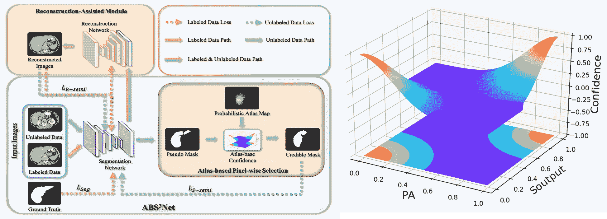

图 12：$ABS^{3}Net$的框架示意图[79]，包括置信度图。左侧是$ABS^{3}Net$，其中引入了基于图谱的像素选择模块，以基于像素级置信度选择可靠的像素结果。右侧显示了基于图谱的置信度图。高置信度（以红色显示）表示概率图谱（PA）和分割概率图$s_{output}$接近于预测掩膜$s_{mask}$。置信度从红色逐渐减少到蓝色。

解剖学先验包括固定的位置、形状、区域大小和解剖关系等。医学分割中的物体（如器官）通常具有固定的位置和形状。为了考虑位置信息和形状先验，图谱图在医学图像分割中被广泛应用[157, 158, 153, 79, 111]。如图 13 所示，图谱图可以生成如下。首先，需将注释的体积注册到参考体积。然后，通过对所有注释体积进行形变后平均手动掩膜，可以生成概率图谱（PA）。例如，郑等人[153]计算了肝脏 PA 并将图谱值接近 0.5 的硬像素样本进行预定义。黄等人[79]利用 PA 为未标记数据提供像素级置信度，以选择可靠的像素结果，如图 12 所示。像素级置信度计算如下：

|  | $\begin{split}Confidence=\exp(-\frac{(PA-s_{mask})^{2}+(s_{output}-s_{mask})^{2}}{2\sigma^{2}})\end{split}$ |  | (6) |
| --- | --- | --- | --- |
|  | $\begin{split}s_{mask}=[s_{output}+0.5]\end{split}$ |  | (7) |

其中 $s_{output}$ 和 $s_{mask}$ 指的是待分割器官的分割概率图和未标记数据的预测掩膜，其值仅为 0 或 1。 $[\cdot]$ 表示整数值函数。如图 12 所示，信心度从红色到蓝色逐渐降低，当 PA 和 $s_{output}$ 接近 $s_{mask}$ 时，即 0 或 1，信心度较高。然而，利用图谱图的分割算法可能不适用于具有大位置变化的目标。此外，分割性能高度依赖于准确的配准。器官分割通常利用固定位置和形状，而多类型病理分割可以利用解剖关系。解剖关系表示不同物体的相对位置。例如，MyoPS-Net [200] 使用包容性损失来表示不同类型病理之间的关系，这约束了伤疤的像素包含在水肿的像素中。 [217] 提出了魔方分割和恢复，鼓励未标记图像从标记图像中学习器官语义的相对位置。这种魔方分割和恢复增强的局限性在于它可能不适用于未对齐的图像。另一个假设是尽管样本的区域几何形状不同，但同一类别的对象在所有样本中共享相同的解剖邻接关系，因此在 [220] 中引入了一种基于邻接图的辅助训练损失，惩罚解剖上不正确的区域关系的输出。对于尺寸先验，PaNN[198] 约束预测的器官大小的平均分布与标记数据集中的先验统计数据相似。

上述提到的算法通常很简单，而一些复杂的先验知识，例如区域连通性、凸性、对称性，通常是不可微分的。因此，需要为这些复杂的约束设计特定的损失函数。在 [215] 中，开发了一种基于强化算法和对抗样本的、可以处理复杂解剖学先验的现成可微分方法。实验结果显示，得到了临床上合理的分割结果。另一项工作在 [219] 中引入了持久同源性，这是一种来自拓扑数据分析的概念，用于指定分割对象的期望拓扑结构，即其 Betti 数，然后驱动未标记数据的预测以包含指定的拓扑特征。Betti 数计算某些维度的特征数量，例如连通组件的数量、环或孔的数量、空洞的数量等。此过程不需要任何真实标签，只需对被分割结构的拓扑有先验知识。持久同源性的方法适用于分割具有固定且规则形状的对象，例如心脏腔室和心肌。

丰富的知识先验使医学图像分割不同于自然图像分割。在标记数据有限的半监督医学图像分割中，通过结合医学知识先验，可以获得更准确且合理的结果。

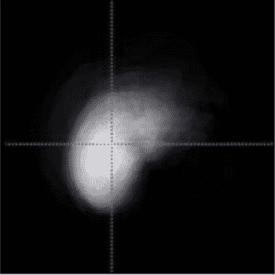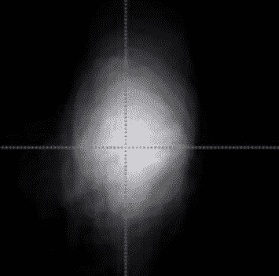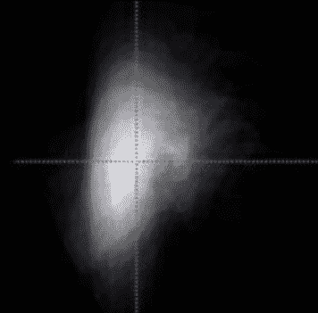

图 13：肝脏器官的 3D 概率图谱 [79]，显示了肝脏像素在某些位置出现的概率。(a)-(c) 分别对应优–劣、左右方向和前–后方向。

表 5：带有知识先验的半监督医学图像分割方法的总结综述。

| 参考文献 | 2D/3D | 模态 | 数据集 | 亮点 | 类别 |
| --- | --- | --- | --- | --- | --- |
| SepaReg, Wang 等 [131] | 3D | CT | PDDCA[193] | 基于内外器官对比学习的预训练模型初始化 | 对比学习 |
| S4 ML, Kiyasseh 等 [122] | 2D | MRI | LA 数据集 [66] | 使用数据形式的多个中心通过元学习和对比学习任务处理未标记数据 | 对比学习 |
| Le-SSCL, Hu 等 [98] | 3D | CT, MRI | Medical Segmentation Decathlon 的海马体子集 [185]，MM-WHS 数据集 [178, 179] | 自监督图像级和监督像素级对比预训练 | 对比学习 |
| SimCVD, You et al. [47] | 3D | CT, MRI | LA 数据集 [66], 胰腺 CT [130] | 基于带符号距离图的体素级对比蒸馏 | 对比学习 |
| CPDC, Wu et al.[105] | 2D | 显微镜 | DSB[194] , MoNuSeg[195] | 跨补丁密集对比学习框架 | 对比学习 |
| Dt-DDCL, Zhang et al.[3] | 2D | 内窥镜 | kvasir-SEG 数据集[196], 皮肤病变数据集 [197] | 用于分割和病变区域修复的双任务网络 | 修复任务 |
| RLS_SSL, Yang et al. [120] | 3D | OCT | 私有数据 | 将自监督拼图任务添加到训练中 | 拼图任务 |
| MTL-ABS3Net, Huang et al. [79] | 3D | CT | LiTS 数据集 [17] | 利用解剖先验为未标记数据提供分割像素级置信度 | 图谱先验 |
| DAP, Zheng et al. [153] | 3D | CT | LiTS 数据集 [17] | 基于深度图谱先验的半监督对抗学习 | 图谱先验 |

### 3.4 其他半监督医学图像分割方法

在医学影像领域，一个常见的障碍是，在实际应用中，获取的数据和注释可能难以满足假设，从而影响半监督学习的性能。除了上述提到的半监督分割方法的方法论发展外，我们还汇总了一些在实际应用中的不同关注点。

由于半监督学习中通常存在大量未标记的数据，标记数据和未标记数据的分布可能会不一致。为更好地利用来自不同分布或医疗中心的大规模数据，一些方法被提出以处理分布不一致问题[78, 88, 122]。Zhang 等人[78]尝试通过最小化它们的特征图之间的 L2 距离来对齐标记数据分布和未标记数据分布。同时，为了保持对标记和未标记数据分割的区分能力，通过比较来自地面真实标签掩模和学生输入的特征图中的非局部语义关系矩阵，获得了进一步的分割监督。另一个工作[88]提出了自适应分层双一致性方法，以利用来自不同中心的数据，这些方法通过对抗性地学习映射网络来对齐分布，并将一致性学习扩展到跨域分割中的内在和外在一致性。使用来自多个中心的数据的另一种思路是通过元学习。在[122]中，为每个医疗中心制定了一个独特的任务，使得在有标记数据的中心进行分割任务，而在无标记数据上进行对比学习任务。

半监督学习中的另一个关注点是如何融合不同的监督信号，以实现标签高效的半监督学习。由于现有的公共成像数据集通常对不同任务有不同的标注，例如 CT 图像中单独标记的肿瘤或部分标记的器官。张等人[126]提出了一种双路径半监督条件 nnU-Net，它可以在部分标记数据集的联合上进行训练，以进行器官风险或肿瘤的分割。另一种情况是整合不同级别的监督信号。[138]提出了半监督框架中的多标签深度监督，利用了图像级、框级和像素级的标注。如果只有图像级或框级标签存在，伪标签将被限制在这些标签包含的类别内或粗略区域内。除此之外，由教师模型生成的噪声伪标签通过最大池化进行平滑，以匹配解码器的不同级别预测，实现多级一致性。

类别不平衡是分割中的一个常见问题。在半监督学习中，类别不平衡和有限的标记数据可能进一步引发确认偏差和不确定性不平衡问题。最近，一些研究者在半监督学习中提出了类别不平衡方法[212, 109, 216]。林等人[212]提出了一种双重不确定性感知采样策略，以对低置信度的像素类别进行采样，用于无监督一致性学习。另一种方向集中在利用按类别像素比例计算的重新加权策略[109, 216]。

此外，大多数之前的半监督框架是判别模型，其中标记数据仅在早期训练阶段使用，并且模型可能会倾向于过拟合标记数据[104]。王等人[104]提出了一种用于半监督分割的贝叶斯深度学习框架。通过这种方式，既使用标记数据又使用未标记数据来估计联合分布，从而缓解了仅使用标记数据进行早期训练可能导致的过拟合问题。

## 4 半监督医学图像分割的实证结果分析

### 4.1 医学图像分割的常见评估指标

对于医学图像分割任务，Dice 相似系数（DSC）是衡量真实值$G$和分割结果$S$区域重叠比例的广泛使用的指标。另一个类似的指标 IoU（或 Jaccard）可作为评估的替代。这两个指标定义如下：

|  | $DSC=\frac{2\vert G\cap S\vert}{\vert G\vert+\vert S\vert},\quad IoU=\frac{\vert G\cap S\vert}{\vert G\cup S\vert}.$ |  | (8) |
| --- | --- | --- | --- |

然而，基于区域的度量如 DSC 不能很好地反映边界误差或小区域的误分割。为了应对这一限制，应用了基于边界的评估度量，如 Hausdorff 距离（HD），以关注如下定义的边界距离误差：

|  | $HD(\partial G,\partial S)=\max(\max\limits_{x\in\partial G}\min\limits_{y\in\partial S}&#124;&#124;x-y&#124;&#124;_{2},\max\limits_{x\in\partial S}\min\limits_{y\in\partial G}&#124;&#124;x-y&#124;&#124;_{2}),$ |  | (9) |
| --- | --- | --- | --- |

其中 $\partial G$ 和 $\partial S$ 分别表示真实值和分割结果的边界。为了消除由小型离群点子集引起的影响，95% Hausdorff 距离（95HD）也被广泛使用，这基于边界点之间距离的第 95 百分位数计算。

表 6：半监督 LA MRI 分割基准的代表性工作和实证结果。

| 方法 | 亮点 | $\mathcal{D}_{L}/\mathcal{D}_{U}$ | Dice | 发表&年份 |
| --- | --- | --- | --- | --- |
| Baseline V-Net [40] | 仅使用标记数据的全监督基线 | 8/0 | 79.99 |  |
|  | 16/0 | 86.03 |  |
| Upper-bound V-Net [40] | 具有所有标注的全监督上界 | 80/0 | 91.14 |  |
| UA-MT, Yu et al. [31] | 具有不确定性指导的教师-学生框架 | 8/72 | 84.25 | MICCAI 2019 |
|  | 16/64 | 88.88 |
| SASS, Li et al. [34] | 结合签名距离图进行形状正则化 | 8/72 | 87.32 | MICCAI 2020 |
|  | 16/64 | 89.54 |
| DUWM, Wang et al. [32] | 利用分割和特征不确定性 | 8/72 | 85.91 | MICCAI 2020 |
|  | 16/64 | 89.65 |
| LG-ER-MT, Hang et al. [33] | 熵最小化以生成高置信度预测，并通过局部结构一致性鼓励体素间相似性 | 8/72 | 85.54 | MICCAI 2020 |
|  | 16/64 | 89.62 |
| DTC, Luo et al. [35] | 鼓励输出分割图与签名距离图之间的一致性 | 16/64 | 89.42 | AAAI 2021 |
| PDC-Net, Hao et al. [46] | 参数解耦以鼓励两个分支网络的一致预测 | 8/72 | 86.55 | ICMV 2021 |
|  | 16/64 | 89.76 |
| HCR-MT, Li et al. [85] | 具有多尺度深度监督和层次一致性正则化的教师-学生框架 | 16/64 | 90.04 | EMBC 2021 |
| DTML, Zhang et al. [36] | 双任务网络的互学习，用于生成分割图和签名距离图 | 16/64 | 90.12 | PRCV 2021 |
| MC-Net, Wu et al. [2] | 来自两个不同解码器的输出之间的一致性学习 | 8/72 | 87.71 | MICCAI 2021 |
|  | 16/64 | 90.34 |
| CASS, Liu et al. [102] | 类别级对比一致性 | 8/72 | 86.51 | CMIG 2022 |
|  | 16/64 | 89.81 |
| SimCVD, 游等人 [47] | 具有符号距离图的体素级表示的对比蒸馏 | 8/72 | 89.03 | TMI 2022 |
|  | 16/64 | 90.85 |
| CMM, 舒等人 [112] | 异步执行 Cross-Mix Teaching 和传导监视以进行主动知识蒸馏 | 8/72 | 85.92 | TMM 2022 |
|  | 16/64 | 90.03 |
| DTCJL, 陈等人 [113] | 带有任务级正则化的半监督双任务一致性联合学习框架 | 16/64 | 90.32 | TCBB 2022 |

### 4.2 半监督医学图像分割的基准数据集

除了半监督医学图像分割方法的有希望的进展外，还发展了几个分割基准，以确保这些方法在相同任务设置和相同公共数据集上的公平比较。

LA 数据集。LA 基准数据集 [66] 来自左心房分割挑战 ²²2http://atriaseg2018.cardiacatlas.org/data/ 包含 100 个用于训练的 3D 钆增强 MR 成像扫描 (GE-MRIs)，其各向同性分辨率为 $0.625\times 0.625\times 0.625mm^{3}$。由于 LA 的测试集不包括公共注释，因此在 [31] 的设置中，100 个训练扫描被拆分为 80 个用于训练和 20 个用于测试。在 80 个训练扫描中，20%（即 16 个扫描）被用作标注数据，其余为未标注数据。V-Net [40] 被用作所有实验的网络骨干，采用联合交叉熵损失和骰子损失进行训练。对于监督比较，V-Net 仅用标注数据（即 16 个扫描）和用所有标注数据（即 80 个扫描）进行训练，作为半监督学习的下界和上界。正如表 6 中所示，作为最流行的半监督医学图像分割基准数据集之一，许多方法在相同数据集下、相同任务设置中进一步提出和评估，遵循 [31] 的任务设计。具体而言，几个研究进一步推广了带有 10%（即 8 个扫描）标注扫描的基准，以进一步评估在标注数据较少的情况下的性能。

胰腺 CT 数据集。NIH 胰腺 CT 分割数据集[130]包含 82 个 3D 腹部对比增强 CT 体积，这些体积采集自 53 名男性和 27 名女性受试者，来自美国国立卫生研究院临床中心³³3https://wiki.cancerimagingarchive.net/display/Public/Pancreas-CT。数据集采集于 Philips 和 Siemens MDCT 扫描仪上，分辨率固定为$512\times 512$，厚度从 1.5 到 2.5 毫米不等，而轴向视图切片数可从 181 到 466\. 在[148]中，数据集被随机拆分为 20 个测试案例和 62 个训练案例。报告了使用 10%标注训练案例（6 个标注和 56 个未标注）和 20%标注训练案例（12 个标注和 50 个未标注）的实验结果。按照[198]中的预处理，体素值被裁剪到[-125,275] Hounsfield 单位（HU）范围内，并进一步重新采样到$1\times 1\times 1mm^{3}$的各向同性分辨率。若干研究进一步推动了基准测试，使用 10%（即 8 个扫描）标注扫描来进一步评估在标注数据较少的情况下的性能。几个半监督方法[106, 127, 47]在胰腺 CT 数据集上进行了评估。

BraTS 数据集。脑肿瘤分割（BraTS）2019 数据集[128]包含 335 名胶质瘤患者的多机构术前 MRI，每位患者具有包括 T1、T1Gd、T2 和 T2-FLAIR 在内的四种 MRI 扫描模式，并附有神经放射科医师检查的标签。对于几种现有的方法[70, 9, 106]，由于 T2-FLAIR 模式能够更好地表现恶性肿瘤[129]，因此用于整个肿瘤分割。所有扫描均被重新采样到$1\times 1\times 1mm^{3}$的相同分辨率，强度归一化为零均值和单位方差。在半监督设置下，数据集被拆分为 250 个扫描用于训练，25 个扫描用于验证，其余 60 个扫描用于测试。在 250 个训练扫描中，执行了两种不同的设置，分别为 10%/25 和 20%/50 扫描作为标注数据，其余扫描作为未标注数据。

ACDC 数据集。ACDC（自动心脏诊断挑战）数据集[22]来自于在第戎大学医院进行的真实临床检查⁴⁴4https://www.creatis.insa-lyon.fr/Challenge/acdc/databases.html。数据集包含来自 100 名患者的多层 2D 动态心脏 MR 成像样本，用于训练。在半监督设置下，数据集被拆分为 70 个扫描用于训练，10 个扫描用于验证，20 个扫描用于测试。与之前的 3D 二值分割基准数据集不同，ACDC 是一个 2D 多类分割任务，包括右心室腔、心肌和左心室腔。

## 5 个现有挑战和未来方向

尽管半监督医学图像分割任务已经取得了相当的性能，但仍有若干未解的问题需要在未来研究中解决。在本节中，我们概述了一些这些挑战和未来的潜在方向。

错位分布和类别不平衡。如第 4.2 节所述，现有的半监督医学图像分割方法在一些基准数据集如 LA 分割中，已取得与上限完全监督结果相当的结果[66]。然而，这些基准测试相对“简单”，实验数据量小，训练集和测试集来自同一领域/医疗中心。一个临床适用的深度学习模型应该能够在来自不同领域的多个中心和扫描仪供应商之间适当地推广[123]。由于半监督学习中通常存在大量未标记数据，标记数据和未标记数据的分布可能会错位。这一限制也在最近的半监督医学分割基准测试中得到了突出，例如[5]和 FLARE 22 挑战赛 ⁵⁵5https://flare22.grand-challenge.org。基于[161]的工作，将来自与标记数据分布不匹配的未标记数据添加进去，可能会比不使用任何未标记数据导致性能下降。因此，解决半监督学习中的错位分布问题至关重要。至于类别不平衡，当训练数据高度不平衡时，训练出的模型会对多数类别表现出偏见，在某些极端情况下可能完全忽略少数类别[142]。此外，对于半监督多类分割，通常存在由类别不平衡和有限标记数据带来的不确定性不平衡问题。最近的研究[74]发现，源自预测熵的随机不确定性可能在多类环境中导致次优结果。

方法学分析。现有的半监督医学图像分割方法主要使用未标注数据生成约束，然后用标注数据的监督损失和未标注数据的无监督损失/约束（或两者）来更新模型。通常，许多方法 [31, 35, 36] 中只有一个权重来平衡监督和无监督损失。换句话说，所有未标注数据在半监督学习中都被同等对待。然而，并非所有未标注数据对于模型的学习过程都是同样合适的。例如，当对未标注数据的估计不准确时，训练这些特定标签估计可能会损害整体性能。为了解决这个问题，重要的是鼓励模型关注更具挑战性的区域/案例，从而从未标注数据中挖掘更多有用的信息，例如为每个未标注样本分配不同的权重 [71]。最近的研究 [73] 还发现，扰动的质量对于获得合理的半监督学习性能是关键，特别是在数据处于低维流形邻域中的高效数据增强或扰动方案的情况下。

与其他高效标注方法的集成。对于现有的半监督学习方法，我们仍然需要少量标注良好的数据来指导未标注数据的学习。然而，获取这些完全标注的训练数据仍然可能很昂贵，尤其是对于医学图像分割任务。为了进一步减少标注成本，一些研究将半监督学习与其他高效标注方法结合起来，例如利用部分标注数据集 [126]，利用图像级、框级和像素级标注 [138] 或者草图监督 [139]，或利用有噪声的标注数据 [140]。半监督医学图像分割也可以与少样本分割集成，通过组合策略提高模型的泛化能力，从而分割未见过的图像中的类似物体。这两种方法都旨在在标注数据有限的情况下提高模型性能。在半监督学习中，模型通过对数据分布的假设从标注和未标注数据中学习，这与少样本学习不同。此外，最近引入的 SAM [202]，可以作为图像分割的伪标签生成器 [203, 209]，可能为未来医学图像分割的半监督学习发展提供一些启示 [201]。

## 6 结论

半监督学习已广泛应用于医学图像分割任务，因为它减轻了获取专家审查注释的沉重负担，并利用了更容易获得的未标记数据。在本调查中，我们提供了现有深度半监督学习方法在医学图像分割任务中的分类，并将这些方法分为三类，即伪标签、无监督正则化和知识先验。除了总结这些方法的技术创新外，我们还分析和讨论了这些方法在若干公共基准数据集上的经验结果。此外，我们分析并讨论了现有方法的局限性和若干未解决的问题。我们希望这篇综述能激励研究界探索解决这一挑战的方案，进一步推动这一重要研究领域的发展。

## 致谢

本论文部分由国家科学基金会资助（资助号 32000687），部分由安徽省大学协同创新计划资助（资助号 GXXT-2019-044）和北京市自然科学基金资助（资助号 Z200024）。我们还感谢 SSL4MIS ⁶⁶6https://github.com/HiLab-git/SSL4MIS 以及若干公共基准测试的文献收集和代码实施工作的努力。

## 参考文献

+   [1] B. Van Ginneken, C. M. Schaefer-Prokop, 和 M. Prokop, “计算机辅助诊断：如何从实验室转向临床，” *放射学*，第 261 卷，第 3 期，页 719–732，2011 年。

+   [2] Y. Wu, M. Xu, Z. Ge, J. Cai, 和 L. Zhang, “具有互一致性训练的半监督左心房分割，” 在 *国际医学图像计算与计算机辅助手术会议*。  Springer，2021 年，页 297–306。

+   [3] R. Zhang, S. Liu, Y. Yu, 和 G. Li, “用于半监督生物医学图像分割的自监督校正学习，” 在 *国际医学图像计算与计算机辅助手术会议*。  Springer，2021 年，页 134–144。

+   [4] G. Litjens, T. Kooi, B. E. Bejnordi, A. A. A. Setio, F. Ciompi, M. Ghafoorian, J. A. Van Der Laak, B. Van Ginneken, 和 C. I. Sánchez, “关于医学图像分析中深度学习的调查，” *医学图像分析*，第 42 卷，页 60–88，2017 年。

+   [5] J. Ma, Y. Zhang, S. Gu, C. Zhu, C. Ge, Y. Zhang, X. An, C. Wang, Q. Wang, X. Liu, S. Cao, Q. Zhang, S. Liu, Y. Wang, Y. Li, J. He, 和 X. Yang, “Abdomenct-1k：腹部器官分割是否已解决问题，” *IEEE 模式分析与机器智能汇刊*，页 1–1，2021 年。

+   [6] A. Lalande, Z. Chen, T. Pommier, T. Decourselle, A. Qayyum, M. Salomon, D. Ginhac, Y. Skandarani, A. Boucher, K. Brahim *等*，“用于自动评估延迟增强 MRI 的深度学习方法。EMIDEC 挑战赛结果，” *医学图像分析*，第 79 卷，页 102428，2022 年。

+   [7] L. Zhang, X. Wang, D. Yang, T. Sanford, S. Harmon, B. Turkbey, B. J. Wood, H. Roth, A. Myronenko, D. Xu *等人*，“通过深度堆叠变换将深度学习推广到未见领域的医学图像分割，”*IEEE 医学成像学报*，第 39 卷，第 7 期，页 2531–2540，2020 年。

+   [8] M. Z. Alom, C. Yakopcic, M. Hasan, T. M. Taha, 和 V. K. Asari，“用于医学图像分割的递归残差 U-Net，”*医学成像期刊*，第 6 卷，第 1 期，页 014006，2019 年。

+   [9] Y. Zhang, R. Jiao, Q. Liao, D. Li, 和 J. Zhang，“用于半监督医学图像分割的不确定性引导互一致学习，”*医学中的人工智能*，第 138 卷，页 102476，2023 年。

+   [10] J. Ma，“2020 年前沿 3D 医学图像分割方法：幸福的家庭都是相似的吗？”*arXiv 预印本 arXiv:2101.00232*，2021 年。

+   [11] J. Chen, Y. Lu, Q. Yu, X. Luo, E. Adeli, Y. Wang, L. Lu, A. L. Yuille, 和 Y. Zhou，“Transunet：变压器使医学图像分割变得强大，”*arXiv 预印本 arXiv:2102.04306*，2021 年。

+   [12] Q. Yao, L. Xiao, P. Liu, 和 S. K. Zhou，“无标签的 COVID-19 肺部 CT 病变分割，”*IEEE 医学成像学报*，第 40 卷，第 10 期，页 2808–2819，2021 年。

+   [13] Y. Xie, J. Zhang, C. Shen, 和 Y. Xia，“Cotr：高效地连接 CNN 和变压器以进行 3D 医学图像分割，”在*国际医学图像计算与计算机辅助干预会议*。Springer，2021 年，页 171–180。

+   [14] M. Antonelli, A. Reinke, S. Bakas, K. Farahani, A. Kopp-Schneider, B. A. Landman, G. Litjens, B. Menze, O. Ronneberger, R. M. Summers *等人*，“医学分割十项全能，”*自然通讯*，第 13 卷，第 1 期，页 1–13，2022 年。

+   [15] J. Shiraishi, S. Katsuragawa, J. Ikezoe, T. Matsumoto, T. Kobayashi, K.-i. Komatsu, M. Matsui, H. Fujita, Y. Kodera, 和 K. Doi，“开发包含有无肺结节的胸部 X 光图像的数字图像数据库：放射科医生对肺结节的检测特征分析，”*美国放射学杂志*，第 174 卷，第 1 期，页 71–74，2000 年。

+   [16] J. Ma, Y. Wang, X. An, C. Ge, Z. Yu, J. Chen, Q. Zhu, G. Dong, J. He, Z. He *等人*，“迈向数据高效学习：COVID-19 CT 肺部及感染分割基准，”*医学物理*，第 48 卷，第 3 期，页 1197–1210，2021 年。

+   [17] P. Bilic, P. Christ, H. B. Li, E. Vorontsov, A. Ben-Cohen, G. Kaissis, A. Szeskin, C. Jacobs, G. E. H. Mamani, G. Chartrand *等人*，“肝肿瘤分割基准（LITS），”*医学图像分析*，第 84 卷，页 102680，2023 年。

+   [18] E. Bullitt, D. Zeng, G. Gerig, S. Aylward, S. Joshi, J. K. Smith, W. Lin, 和 M. G. Ewend，“血管曲折度与脑肿瘤恶性度：盲研究 1，”*学术放射学*，第 12 卷，第 10 期，页 1232–1240，2005 年。

+   [19] N. Codella, V. Rotemberg, P. Tschandl, M. E. Celebi, S. Dusza, D. Gutman, B. Helba, A. Kalloo, K. Liopyris, M. Marchetti *等*，“皮肤病变分析与黑色素瘤检测 2018：由国际皮肤影像合作组织（ISIC）主办的挑战赛，” *arXiv 预印本 arXiv:1902.03368*，2019 年。

+   [20] J. Irvin, P. Rajpurkar, M. Ko, Y. Yu, S. Ciurea-Ilcus, C. Chute, H. Marklund, B. Haghgoo, R. Ball, K. Shpanskaya *等*，“Chexpert：一个大型胸部 X 光影像数据集，包含不确定性标签和专家比较，”发表在*AAAI 人工智能会议论文集*，第 33 卷，第 01 期，2019 年，页码 590–597。

+   [21] G. Wang, S. Zhai, G. Lasio, B. Zhang, B. Yi, S. Chen, T. J. Macvittie, D. Metaxas, J. Zhou, 和 S. Zhang, “采用多尺度引导密集注意力的放射线诱导肺纤维化的半监督分割，” *IEEE 医学成像交易*，第 41 卷，第 3 期，页码 531–542，2021 年。

+   [22] O. Bernard, A. Lalande, C. Zotti, F. Cervenansky, X. Yang, P.-A. Heng, I. Cetin, K. Lekadir, O. Camara, M. A. G. Ballester *等*，“用于自动 MRI 心脏多结构分割和诊断的深度学习技术：问题是否得到解决？” *IEEE 医学成像交易*，第 37 卷，第 11 期，页码 2514–2525，2018 年。

+   [23] N. Heller, F. Isensee, K. H. Maier-Hein, X. Hou, C. Xie, F. Li, Y. Nan, G. Mu, Z. Lin, M. Han *等*，“对比增强 CT 成像中肾脏及肾脏肿瘤分割的最新进展：KITS19 挑战赛结果，” *医学图像分析*，第 67 卷，文章编号 101821，2021 年。

+   [24] V. Oreiller, V. Andrearczyk, M. Jreige, S. Boughdad, H. Elhalawani, J. Castelli, M. Vallières, S. Zhu, J. Xie, Y. Peng *等*，“PET/CT 中的头颈部肿瘤分割：HECKTOR 挑战，” *医学图像分析*，第 77 卷，文章编号 102336，2022 年。

+   [25] N. Tajbakhsh, L. Jeyaseelan, Q. Li, J. N. Chiang, Z. Wu, 和 X. Ding, “拥抱不完美的数据集：医学图像分割的深度学习解决方案综述，” *医学图像分析*，第 63 卷，文章编号 101693，2020 年。

+   [26] Y. Zhang, Q. Liao, L. Yuan, H. Zhu, J. Xing, 和 J. Zhang, “利用非 COVID 病变的共享知识进行注释高效的 COVID-19 CT 肺感染分割，” *IEEE 生物医学与健康信息学期刊*，第 25 卷，第 11 期，页码 4152–4162，2021 年。

+   [27] V. Cheplygina, M. de Bruijne, 和 J. P. Pluim, “不那么监督：医学图像分析中的半监督、多实例和迁移学习综述，”*医学图像分析*，第 54 卷，页码 280–296，2019 年。

+   [28] S. Min, X. Chen, Z.-J. Zha, F. Wu, 和 Y. Zhang, “一种用于带噪标签的半监督生物医学分割的双流互注意力网络，”发表在*AAAI 人工智能会议论文集*，第 33 卷，第 01 期，2019 年，页码 4578–4585。

+   [29] A. Tarvainen 和 H. Valpola，“平均教师更是好的榜样：权重平均一致性目标改善半监督深度学习结果”，*神经信息处理系统进展*，第 30 卷，2017 年。

+   [30] S. Laine 和 T. Aila，“用于半监督学习的时间集成”，*arXiv 预印本 arXiv:1610.02242*，2016 年。

+   [31] L. Yu, S. Wang, X. Li, C.-W. Fu 和 P.-A. Heng，“面向半监督 3D 左心房分割的自不确定性自集成模型”，发表于 *国际医学图像计算与计算机辅助手术会议*。  Springer, 2019, 第 605–613 页。

+   [32] Y. Wang, Y. Zhang, J. Tian, C. Zhong, Z. Shi, Y. Zhang 和 Z. He，“用于半监督学习的双不确定性加权方法”，发表于 *国际医学图像计算与计算机辅助手术会议*。  Springer, 2020, 第 542–551 页。

+   [33] W. Hang, W. Feng, S. Liang, L. Yu, Q. Wang, K.-S. Choi 和 J. Qin，“用于 3D 左心房分割的局部和全局结构感知熵正则化平均教师模型”，发表于 *国际医学图像计算与计算机辅助手术会议*。  Springer, 2020, 第 562–571 页。

+   [34] S. Li, C. Zhang 和 X. He，“面向医学图像的形状感知半监督 3D 语义分割”，发表于 *国际医学图像计算与计算机辅助手术会议*。  Springer, 2020, 第 552–561 页。

+   [35] X. Luo, J. Chen, T. Song 和 G. Wang，“通过双任务一致性进行半监督医学图像分割”，发表于 *AAAI 人工智能会议论文集*，第 35 卷，第 10 期，2021 年，第 8801–8809 页。

+   [36] Y. Zhang 和 J. Zhang，“用于半监督医学图像分割的双任务互学习”，发表于 *中国模式识别与计算机视觉大会 (PRCV)*。  Springer, 2021, 第 548–559 页。

+   [37] J. Long, E. Shelhamer 和 T. Darrell，“用于语义分割的全卷积网络”，发表于 *IEEE 计算机视觉与模式识别会议论文集*，2015 年，第 3431–3440 页。

+   [38] O. Ronneberger, P. Fischer 和 T. Brox，“U-net: 生物医学图像分割的卷积网络”，发表于 *国际医学图像计算与计算机辅助手术会议*。  Springer, 2015, 第 234–241 页。

+   [39] Ö. Çiçek, A. Abdulkadir, S. S. Lienkamp, T. Brox 和 O. Ronneberger，“3D U-net: 从稀疏注释中学习密集体积分割”，发表于 *国际医学图像计算与计算机辅助手术会议*。  Springer, 2016, 第 424–432 页。

+   [40] F. Milletari, N. Navab 和 S.-A. Ahmadi，“V-net: 用于体积医学图像分割的全卷积神经网络”，发表于 *2016 年第四届国际 3D 视觉会议 (3DV)*。  IEEE, 2016, 第 565–571 页。

+   [41] X. Li, H. Chen, X. Qi, Q. Dou, C.-W. Fu, 和 P.-A. Heng，“H-denseunet: 混合密集连接的 unet 用于从 ct 体积中分割肝脏和肿瘤”，*IEEE 医学影像学报*，第 37 卷，第 12 期，第 2663–2674 页，2018 年。

+   [42] Z. Zhou, M. M. R. Siddiquee, N. Tajbakhsh, 和 J. Liang，“Unet++: 重新设计跳跃连接以利用图像分割中的多尺度特征”，*IEEE 医学影像学报*，第 39 卷，第 6 期，第 1856–1867 页，2019 年。

+   [43] Y. Zhang, L. Yuan, Y. Wang, 和 J. Zhang，“Sau-net: 使用切片间注意力的高效 3d 脊柱 MRI 分割”，在*深度学习医学影像学*中。 PMLR, 2020 年，第 903–913 页。

+   [44] W. Bai, O. Oktay, M. Sinclair, H. Suzuki, M. Rajchl, G. Tarroni, B. Glocker, A. King, P. M. Matthews, 和 D. Rueckert，“基于网络的心脏 mr 图像分割的半监督学习”，在*国际医学图像计算与计算机辅助手术会议*中。 Springer, 2017 年，第 253–260 页。

+   [45] Y. Zhang, L. Yang, J. Chen, M. Fredericksen, D. P. Hughes, 和 D. Z. Chen，“利用未标注图像的深度对抗网络用于生物医学图像分割”，在*国际医学图像计算与计算机辅助手术会议*中。 Springer, 2017 年，第 408–416 页。

+   [46] X. Hao, S. Gao, L. Sheng, 和 J. Zhang，“半监督 3d 左心房分割的参数解耦策略”，在*第十四届国际机器视觉会议 (ICMV 2021)*中，第 12084 卷。 SPIE, 2022 年，第 118–124 页。

+   [47] C. You, Y. Zhou, R. Zhao, L. Staib, 和 J. S. Duncan，“Simcvd: 用于半监督医学图像分割的简单对比体素级表示蒸馏”，*IEEE 医学影像学报*，第 1 页，2022 年。

+   [48] J. Ma, Y. Wang, X. An, C. Ge, Z. Yu, J. Chen, Q. Zhu, G. Dong, J. He, Z. He *等*，“迈向数据高效学习：COVID-19 CT 肺部和感染分割基准”，*医学物理*，第 48 卷，第 3 期，第 1197–1210 页，2021 年。

+   [49] F. Isensee, P. F. Jaeger, S. A. Kohl, J. Petersen, 和 K. H. Maier-Hein，“nnu-net: 一种自配置的深度学习生物医学图像分割方法”，*自然方法*，第 18 卷，第 2 期，第 203–211 页，2021 年。

+   [50] X. Luo, W. Liao, J. Chen, T. Song, Y. Chen, S. Zhang, N. Chen, G. Wang, 和 S. Zhang，“通过不确定性校正的金字塔一致性进行有效的半监督鼻咽癌肿瘤体积分割”，在*国际医学图像计算与计算机辅助手术会议*中。 Springer, 2021 年，第 318–329 页。

+   [51] Q. Jin, Z. Meng, C. Sun, H. Cui, 和 R. Su，“Ra-unet: 一种混合深度注意力网络用于提取 CT 扫描中的肝脏和肿瘤”，*生物工程与生物技术前沿*，第 1471 页，2020 年。

+   [52] O. Oktay, J. Schlemper, L. L. Folgoc, M. Lee, M. Heinrich, K. Misawa, K. Mori, S. McDonagh, N. Y. Hammerla, B. Kainz *等*，“Attention u-net: 学习如何查看胰腺”，*arXiv 预印本 arXiv:1804.03999*，2018 年。

+   [53] X. Luo, W. Liao, J. Xiao, J. Chen, T. Song, X. Zhang, K. Li, D. N. Metaxas, G. Wang, 和 S. Zhang，“Word: 一种用于腹部器官 CT 图像分割的大规模数据集、基准和临床应用研究，”*医学图像分析*，第 82 卷，第 102642 页，2022 年。

+   [54] B. Lakshminarayanan, A. Pritzel, 和 C. Blundell，“使用深度集成进行简单且可扩展的预测不确定性估计，”*神经信息处理系统进展*，第 30 卷，2017 年。

+   [55] Y. Gal 和 Z. Ghahramani，“Dropout 作为贝叶斯近似：在深度学习中表示模型不确定性，”在*国际机器学习会议*中。PMLR，2016 年，第 1050–1059 页。

+   [56] Y. Wang, X. Wei, F. Liu, J. Chen, Y. Zhou, W. Shen, E. K. Fishman, 和 A. L. Yuille，“深度距离变换用于 CT 扫描中的管状结构分割，”第 3833–3842 页，2020 年。

+   [57] S. Dangi, C. A. Linte, 和 Z. Yaniv，“一种距离图正则化的 CNN 用于心脏电影 MR 图像分割，”*医学物理*，第 46 卷，第 12 期，第 5637–5651 页，2019 年。

+   [58] J. Ma, Z. Wei, Y. Zhang, Y. Wang, R. Lv, C. Zhu, C. Gaoxiang, J. Liu, C. Peng, L. Wang *等*，“距离变换图如何提升分割 CNN：一项实证研究，”在*医学成像与深度学习*中。PMLR，2020 年，第 479–492 页。

+   [59] F. Navarro, S. Shit, I. Ezhov, J. Paetzold, A. Gafita, J. C. Peeken, S. E. Combs, 和 B. H. Menze，“形状感知的互补任务学习用于多器官分割，”在*国际医学成像中的机器学习研讨会*中。Springer，2019 年，第 620–627 页。

+   [60] X. Liu, F. Xing, N. Shusharina, R. Lim, C.-C. Jay Kuo, G. El Fakhri, 和 J. Woo，“ACT: 半监督领域自适应医学图像分割与非对称共同训练，”在*国际医学图像计算与计算机辅助干预会议*中。Springer，2022 年，第 66–76 页。

+   [61] X. Li, L. Yu, H. Chen, C.-W. Fu, L. Xing, 和 P.-A. Heng，“用于半监督医学图像分割的变换一致自集成模型，”*IEEE 神经网络与学习系统汇刊*，第 32 卷，第 2 期，第 523–534 页，2020 年。

+   [62] Y. Zhang, T. Xiang, T. M. Hospedales, 和 H. Lu，“深度互学习，”在*IEEE 计算机视觉与模式识别会议论文集*中，2018 年，第 4320–4328 页。

+   [63] L. Yu, J.-Z. Cheng, Q. Dou, X. Yang, H. Chen, J. Qin, 和 P.-A. Heng，“使用密集连接的体积卷积网络进行自动 3D 心血管 MR 分割，”在*国际医学图像计算与计算机辅助干预会议*中。Springer，2017 年，第 287–295 页。

+   [64] Y. Zhang, Q. Liao, L. Ding, 和 J. Zhang，“桥接 2D 和 3D 分割网络以实现计算高效的体积医学图像分割：2.5D 解决方案的实证研究，”*计算机化医学成像与图形*，第 102088 页，2022 年。

+   [65] T.-H. Vu, H. Jain, M. Bucher, M. Cord, 和 P. Pérez，“Advent: 对语义分割中的领域适应进行对抗性熵最小化，”发表于 *IEEE/CVF 计算机视觉与模式识别会议论文集*，2019 年，第 2517–2526 页。

+   [66] Z. Xiong, Q. Xia, Z. Hu, N. Huang, C. Bian, Y. Zheng, S. Vesal, N. Ravikumar, A. Maier, X. Yang *等*，“从晚期钆增强心脏磁共振成像中分割左心房的算法全球基准，” *医学图像分析*，第 67 卷，第 101832 页，2021 年。

+   [67] K. Wang, B. Zhan, C. Zu, X. Wu, J. Zhou, L. Zhou, 和 Y. Wang，“通过对比学习的三重不确定性指导均值教师模型进行半监督医学图像分割，” *医学图像分析*，第 79 卷，第 102447 页，2022 年。

+   [68] H. Yao, X. Hu, 和 X. Li，“提升伪标签质量以实现半监督领域泛化医学图像分割，”发表于 *AAAI 人工智能会议论文集*，第 36 卷，第 3 期，2022 年，第 3099–3107 页。

+   [69] K. Han, L. Liu, Y. Song, Y. Liu, C. Qiu, Y. Tang, Q. Teng, 和 Z. Liu，“一种有效的半监督肝脏 CT 图像分割方法，” *IEEE 生物医学与健康信息学杂志*，第 26 卷，第 8 期，第 3999–4007 页，2022 年。

+   [70] Z. Xu, Y. Wang, D. Lu, L. Yu, J. Yan, J. Luo, K. Ma, Y. Zheng, 和 R. K.-y. Tong，“全面真实标签监督：循环原型一致性学习用于半监督医学图像分割，” *IEEE 生物医学与健康信息学杂志*，第 26 卷，第 7 期，第 3174–3184 页，2022 年。

+   [71] Z. Ren, R. Yeh, 和 A. Schwing，“并非所有未标记的数据都是相同的：学习在半监督学习中加权数据，” *神经信息处理系统进展*，第 33 卷，第 21 786–21 797 页，2020 年。

+   [72] Z. Zhang, C. Tian, H. X. Bai, Z. Jiao, 和 X. Tian，“用于半监督结肠腺体分割的辨别性误差预测网络，” *医学图像分析*，第 79 卷，第 102458 页，2022 年。

+   [73] A. Ghosh 和 A. H. Thiery，“关于数据增强和基于一致性的半监督学习，”发表于 *国际学习表征会议*，2020 年。

+   [74] M. Van Waerebeke, G. Lodygensky, 和 J. Dolz，“关于基于熵的不确定性在多类半监督分割中的陷阱，”发表于 *医学成像中机器学习安全利用的国际研讨会*。Springer，2022 年，第 36–46 页。

+   [75] X. Zhao, C. Fang, D.-J. Fan, X. Lin, F. Gao, 和 G. Li，“跨级对比学习和一致性约束用于半监督医学图像分割，”发表于 *2022 IEEE 第 19 届国际生物医学成像研讨会（ISBI）*。IEEE，2022 年，第 1–5 页。

+   [76] H. Basak, R. Bhattacharya, R. Hussain, 和 A. Chatterjee，“一种令人尴尬的简单一致性正则化方法用于半监督医学图像分割，” *arXiv 预印本 arXiv:2202.00677*，2022 年。

+   [77] X. Xu, T. Sanford, B. Turkbey, S. Xu, B. J. Wood, 和 P. Yan，“用于前列腺超声分割的阴影一致半监督学习，” *IEEE 医学影像学报*，第 41 卷，第 6 期，页码 1331–1345，2021 年。

+   [78] N. Zhang, J. Hou, R.-W. Zhao, R. Feng, 和 Y. Zhang，“带有分布校准和非局部语义约束的半监督医学图像分割，” 载于 *2021 IEEE 国际生物信息学与生物医学大会（BIBM）*。 IEEE，2021 年，页码 1171–1178。

+   [79] H. Huang, Q. Chen, L. Lin, M. Cai, Q. Zhang, Y. Iwamoto, X. Han, A. Furukawa, S. Kanasaki, Y.-W. Chen, R. Tong, 和 H. Hu，“MTL-ABS3NET: 基于图谱的半监督器官分割网络，结合多任务学习用于医学图像，” *IEEE 生物医学与健康信息学报*，第 26 卷，第 8 期，页码 3988–3998，2022 年。

+   [80] J. Peng, P. Wang, C. Desrosiers, 和 M. Pedersoli，“用于半监督医学图像分割的自适应对比学习与元标签，” *神经信息处理系统进展*，第 34 卷，页码 16 686–16 699，2021 年。

+   [81] L. Hu, J. Li, X. Peng, J. Xiao, B. Zhan, C. Zu, X. Wu, J. Zhou, 和 Y. Wang，“具有不确定性和注意力引导一致性的半监督 NPC 分割，” *知识基系统*，第 239 卷，页码 108021，2022 年。

+   [82] B. H. Thompson, G. Di Caterina, 和 J. P. Voisey，“使用超像素进行伪标签细化的半监督脑肿瘤分割，” 载于 *2022 IEEE 第 19 届国际生物医学成像研讨会（ISBI）*。 IEEE，2022 年，页码 1–5。

+   [83] R. Achanta, A. Shaji, K. Smith, A. Lucchi, P. Fua, 和 S. Süsstrunk，“与最先进的超像素方法相比的 Slic 超像素，” *IEEE 模式分析与机器智能学报*，第 34 卷，第 11 期，页码 2274–2282，2012 年。

+   [84] A. Xu, S. Wang, S. Ye, J. Fan, X. Shi, 和 X. Xia，“Ca-mt: 一种基于椭圆描述符的轮廓感知半监督心脏分割自集成模型，” 载于 *2022 IEEE 第 19 届国际生物医学成像研讨会（ISBI）*。 IEEE，2022 年，页码 1–5。

+   [85] S. Li, Z. Zhao, K. Xu, Z. Zeng, 和 C. Guan，“用于半监督三维左心房分割的分层一致性正则化均值教师，” 载于 *2021 第 43 届 IEEE 医学与生物工程年会（EMBC）*。 IEEE，2021 年，页码 3395–3398。

+   [86] C. M. Seibold, S. Reiß, J. Kleesiek, 和 R. Stiefelhagen，“用于医学语义分割的参考引导伪标签生成，” 载于 *AAAI 人工智能会议论文集*，第 36 卷，第 2 期，2022 年，页码 2171–2179。

+   [87] Y. Shi, J. Zhang, T. Ling, J. Lu, Y. Zheng, Q. Yu, L. Qi, 和 Y. Gao，“用于半监督医学图像分割的一致性感知不确定性估计，” *IEEE 医学影像学报*，第 41 卷，第 3 期，页码 608–620，2021 年。

+   [88] J. Chen, H. Zhang, R. Mohiaddin, T. Wong, D. Firmin, J. Keegan, 和 G. Yang, “自适应层次双一致性用于跨领域数据上的半监督左心房分割，” *IEEE 医学影像学汇刊*，第 41 卷，第 2 期，页码 420–433，2021 年。

+   [89] K. Zheng, J. Xu, 和 J. Wei, “双噪声均值教师自我集成模型用于半监督肿瘤分割，”发表于 *ICASSP 2022-2022 IEEE 国际声学、语音和信号处理会议（ICASSP）*。IEEE，2022 年，页码 1446–1450。

+   [90] A. Kendall 和 Y. Gal, “我们需要在计算机视觉的贝叶斯深度学习中处理哪些不确定性？” *神经信息处理系统进展*，第 30 卷，2017 年。

+   [91] M.-C. Xu, Y.-K. Zhou, C. Jin, S. B. Blumberg, F. J. Wilson, M. deGroot, D. C. Alexander, N. P. Oxtoby, 和 J. Jacob, “学习形态特征扰动以进行校准的半监督分割，”发表于 *国际医学影像深度学习会议*。PMLR，2022 年，页码 1413–1429。

+   [92] R. Wang, Y. Wu, H. Chen, L. Wang, 和 D. Meng, “邻域匹配用于半监督学习，”发表于 *国际医学图像计算与计算机辅助干预会议*。Springer，2021 年，页码 439–449。

+   [93] H. Peiris, Z. Chen, G. Egan, 和 M. Harandi, “Duo-segnet：用于半监督医学图像分割的对抗性双视图，”发表于 *国际医学图像计算与计算机辅助干预会议*。Springer，2021 年，页码 428–438。

+   [94] L. Zhu, K. Yang, M. Zhang, L. L. Chan, T. K. Ng, 和 B. C. Ooi, “半监督无配对多模态学习用于标签高效的医学图像分割，”发表于 *国际医学图像计算与计算机辅助干预会议*。Springer，2021 年，页码 394–404。

+   [95] X. Zeng, R. Huang, Y. Zhong, D. Sun, C. Han, D. Lin, D. Ni, 和 Y. Wang, “互惠学习用于半监督分割，”发表于 *国际医学图像计算与计算机辅助干预会议*。Springer，2021 年，页码 352–361。

+   [96] Y. Li, L. Luo, H. Lin, H. Chen, 和 P.-A. Heng, “基于不确定性量化的双一致性半监督学习用于从 CT 图像中分割 COVID-19 病变，”发表于 *国际医学图像计算与计算机辅助干预会议*。Springer，2021 年，页码 199–209。

+   [97] K. Wang, B. Zhan, C. Zu, X. Wu, J. Zhou, L. Zhou, 和 Y. Wang, “三重不确定性引导的均值教师模型用于半监督医学图像分割，”发表于 *国际医学图像计算与计算机辅助干预会议*。Springer，2021 年，页码 450–460。

+   [98] X. Hu, D. Zeng, X. Xu, 和 Y. Shi, “半监督对比学习用于标签高效的医学图像分割，”发表于 *国际医学图像计算与计算机辅助干预会议*。Springer，2021 年，页码 481–490。

+   [99] W. Huang, C. Chen, Z. Xiong, Y. Zhang, X. Chen, X. Sun, 和 F. Wu，“通过强化一致性学习进行半监督神经元分割，”*IEEE 医学成像汇刊*，页码 1–1，2022 年。

+   [100] P. Wang, J. Peng, M. Pedersoli, Y. Zhou, C. Zhang, 和 C. Desrosiers，“自适应和自一致的共同训练用于半监督图像分割，”*医学图像分析*，第 73 卷，页码 102146，2021 年。

+   [101] C. Chen, K. Zhou, Z. Wang, 和 R. Xiao，“基于生成一致性的半监督脑血管分割，”*IEEE 医学成像汇刊*，页码 1–1，2022 年。

+   [102] Y. Liu, W. Wang, G. Luo, K. Wang, 和 S. Li，“对比一致性半监督左心房分割模型，”*计算医学成像与图形*，页码 102092，2022 年。

+   [103] X. Chen, H.-Y. Zhou, F. Liu, J. Guo, L. Wang, 和 Y. Yu，“MASS：通过利用未配对 CT 和 MRI 图像的跨模态一致性进行模态协作半监督分割，”*医学图像分析*，页码 102506，2022 年。

+   [104] J. Wang 和 T. Lukasiewicz，“重新思考用于半监督体积医学图像分割的贝叶斯深度学习方法，”载于*IEEE/CVF 计算机视觉与模式识别大会论文集*，2022 年，页码 182–190。

+   [105] H. Wu, Z. Wang, Y. Song, L. Yang, 和 J. Qin，“用于半监督细胞核分割的跨补丁密集对比学习，”载于*IEEE/CVF 计算机视觉与模式识别大会论文集*，2022 年，页码 11 666–11 675。

+   [106] X. Luo, G. Wang, W. Liao, J. Chen, T. Song, Y. Chen, S. Zhang, D. N. Metaxas, 和 S. Zhang，“通过不确定性校正金字塔一致性进行半监督医学图像分割，”*医学图像分析*，页码 102517，2022 年。

+   [107] Y. Lin, H. Yao, Z. Li, G. Zheng, 和 X. Li，“为类别不平衡的几乎监督膝关节分割校准标签分布，”载于*国际医学图像计算与计算机辅助干预会议*，Springer，2022 年，页码 109–118。

+   [108] H. Wu, J. Liu, F. Xiao, Z. Wen, L. Cheng, 和 J. Qin，“通过噪声抗性时空语义校准和融合进行半监督超声心动图视频分割，”*医学图像分析*，第 78 卷，页码 102397，2022 年。

+   [109] X. Wang, Y. Yuan, D. Guo, X. Huang, Y. Cui, M. Xia, Z. Wang, C. Bai, 和 S. Chen，“SSA-Net：用于新冠肺炎感染分割的空间自注意力网络，结合半监督少样本学习，”*医学图像分析*，第 79 卷，页码 102459，2022 年。

+   [110] Z. Fang, J. Bai, X. Guo, X. Wang, F. Gao, H.-Y. Yang, B. Kong, Y. Hou, K. Cao, Q. Song *等*，“基于错误感知统一半监督和主动学习的高效标注新冠肺炎病灶分割，”*IEEE 人工智能汇刊*，2022 年。

+   [111] Z. Li, Z. Li, R. Liu, Z. Luo, 和 X. Fan, “将深度可变形配准与上下文细化相结合用于半监督医学图像分割,” 发表在 *2022 IEEE 第十九届国际生物医学成像研讨会 (ISBI)*。IEEE, 2022, 第 1–5 页。

+   [112] Y. Shu, H. Li, B. Xiao, X. Bi, 和 W. Li, “针对有限监督的医学图像分割的 Cross-mix 监控,” *IEEE 多媒体学报*, 第 1–1 页, 2022。

+   [113] Q.-Q. Chen, Z.-H. Sun, C.-F. Wei, E. Q. Wu, 和 D. Ming, “基于双任务一致性联合学习和任务级正则化的半监督 3D 医学图像分割,” *IEEE/ACM 计算生物学与生物信息学期刊*, 第 1–1 页, 2022。

+   [114] M. Liu, L. Xiao, H. Jiang, 和 Q. He, “Ccat-net: 一种基于 transformer 的新型半监督框架用于 COVID-19 肺部病变分割,” 发表在 *2022 IEEE 第十九届国际生物医学成像研讨会 (ISBI)*。IEEE, 2022, 第 1–5 页。

+   [115] M. Sajjadi, M. Javanmardi, 和 T. Tasdizen, “带有随机变换和扰动的正则化用于深度半监督学习,” *神经信息处理系统进展*, 第 29 卷, 2016。

+   [116] D. Nie, Y. Gao, L. Wang, 和 D. Shen, “Asdnet: 基于注意力的半监督深度网络用于医学图像分割,” 发表在 *医学图像计算与计算机辅助干预国际会议*。Springer, 2018, 第 370–378 页。

+   [117] K. Chaitanya, N. Karani, C. F. Baumgartner, A. Becker, O. Donati, 和 E. Konukoglu, “半监督和任务驱动的数据增强,” 发表在 *医学图像信息处理国际会议*。Springer, 2019, 第 29–41 页。

+   [118] G. Bortsova, F. Dubost, L. Hogeweg, I. Katramados, 和 M. d. Bruijne, “通过在变换下学习一致性进行半监督医学图像分割,” 发表在 *医学图像计算与计算机辅助干预国际会议*。Springer, 2019, 第 810–818 页。

+   [119] Z. Xiao, Y. Su, Z. Deng, 和 W. Zhang, “高效结合 CNN 和 transformer 进行双教师不确定性感知的半监督医学图像分割,” *可在 SSRN 4081789 查阅*。

+   [120] J. Yang, Y. Tao, Q. Xu, Y. Zhang, X. Ma, S. Yuan, 和 Q. Chen, “自监督序列恢复用于半监督视网膜层分割,” *IEEE 生物医学与健康信息学期刊*, 第 26 卷，第 8 期，第 3872–3883 页, 2022。

+   [121] H. He, A. Banerjee, M. Beetz, R. P. Choudhury, 和 V. Grau, “用于半监督冠状动脉血管分割的连接性保留损失函数,” 发表在 *2022 IEEE 第十九届国际生物医学成像研讨会 (ISBI)*, 2022, 第 1–5 页。

+   [122] D. Kiyasseh, A. Swiston, R. Chen, 和 A. Chen, “通过自监督半监督元学习进行左心房 MR 图像分割,” 发表在 *医学图像计算与计算机辅助干预国际会议*。Springer, 2021, 第 13–24 页。

+   [123] V. M. Campello, P. Gkontra, C. Izquierdo, C. Martin-Isla, A. Sojoudi, P. M. Full, K. Maier-Hein, Y. Zhang, Z. He, J. Ma *等*，“多中心、多供应商和多疾病的心脏分割：M&MS 挑战，” *IEEE 医学影像学汇刊*，第 40 卷，第 12 期，页码 3543–3554，2021 年。

+   [124] G. Chen, J. Ru, Y. Zhou, I. Rekik, Z. Pan, X. Liu, Y. Lin, B. Lu, 和 J. Shi, “MTANS：多尺度均值教师结合对抗网络和形状感知嵌入用于半监督脑病灶分割，” *神经影像*，第 244 卷，文章编号 118568，2021 年。

+   [125] S. Li, Y. Zhang, 和 X. Yang, “基于生成对抗网络和变分自编码器的半监督心脏 MRI 分割，”发表在 *2021 IEEE 生物信息学与生物医学国际会议（BIBM）*。 IEEE，2021 年，页码 1402–1405。

+   [126] G. Zhang, Z. Yang, B. Huo, S. Chai, 和 S. Jiang, “使用半监督条件 NNU-Net 从部分标注数据集中自动分割肺癌 CT 图像中的器官和肿瘤，” *生物医学中的计算方法与程序*，第 211 卷，文章编号 106419，2021 年。

+   [127] Y. Wu, Z. Ge, D. Zhang, M. Xu, L. Zhang, Y. Xia, 和 J. Cai, “用于半监督医学图像分割的互一致性学习，” *医学图像分析*，文章编号 102530，2022 年。

+   [128] B. H. Menze, A. Jakab, S. Bauer, J. Kalpathy-Cramer, K. Farahani, J. Kirby, Y. Burren, N. Porz, J. Slotboom, R. Wiest *等*，“多模态脑肿瘤图像分割基准（BRATS），” *IEEE 医学影像学汇刊*，第 34 卷，第 10 期，页码 1993–2024，2014 年。

+   [129] R. A. Zeineldin, M. E. Karar, J. Coburger, C. R. Wirtz, 和 O. Burgert, “Deepseg：一种用于自动脑肿瘤分割的深度神经网络框架，使用磁共振 FLAIR 图像，” *计算机辅助放射学与外科国际期刊*，第 15 卷，第 6 期，页码 909–920，2020 年。

+   [130] K. Clark, B. Vendt, K. Smith, J. Freymann, J. Kirby, P. Koppel, S. Moore, S. Phillips, D. Maffitt, M. Pringle *等*，“癌症影像档案（TCIA）：维护和操作公共信息存储库，” *数字影像学杂志*，第 26 卷，第 6 期，页码 1045–1057，2013 年。

+   [131] J. Wang, X. Li, Y. Han, J. Qin, L. Wang, 和 Z. Qichao, “用于器官风险和总肿瘤体积分割的分离对比学习，注释有限，”发表在 *AAAI 人工智能会议论文集*，第 36 卷，第 3 期，2022 年，页码 2459–2467。

+   [132] X. Luo, M. Hu, T. Song, G. Wang, 和 S. Zhang, “通过 CNN 和 Transformer 之间的交叉教学进行半监督医学图像分割，”发表在 *深度学习医学影像*。 PMLR，2022 年，页码 1–14。

+   [133] Z. Zhao, J. Hu, Z. Zeng, X. Yang, P. Qian, B. Veeravalli, 和 C. Guan, “MMGL：用于半监督心脏图像分割的多尺度多视图全局-局部对比学习，”发表在 *2022 IEEE 图像处理国际会议（ICIP）*。 IEEE，2022 年，页码 401–405。

+   [134] H. Wu, G. Chen, Z. Wen, 和 J. Qin, “面向半监督息肉分割的聚焦和分散表示的协作与对抗学习”，发表于*IEEE/CVF 国际计算机视觉会议*，2021 年，第 3489–3498 页。

+   [135] Y. Xie, J. Zhang, Z. Liao, J. Verjans, C. Shen, 和 Y. Xia, “用于半监督腺体分割的内外配对一致性”，*IEEE 图像处理汇刊*，第 31 卷，第 894–905 页，2021 年。

+   [136] C. Li, L. Dong, Q. Dou, F. Lin, K. Zhang, Z. Feng, W. Si, X. Deng, Z. Deng, 和 P.-A. Heng, “用于半监督 COVID-19 CT 分割的自我集成协同训练框架”，*IEEE 生物医学与健康信息学期刊*，第 25 卷，第 11 期，第 4140–4151 页，2021 年。

+   [137] H. Yang, C. Shan, A. Bouwman, L. R. Dekker, A. F. Kolen, 和 P. H. de With, “通过混合约束的半监督学习进行 3D 超声医学仪器分割”，*IEEE 生物医学与健康信息学期刊*，第 26 卷，第 2 期，第 762–773 页，2021 年。

+   [138] S. Reiß, C. Seibold, A. Freytag, E. Rodner, 和 R. Stiefelhagen, “每一个注释都重要：医学图像分割的多标签深度监督”，发表于*IEEE/CVF 计算机视觉与模式识别会议*，2021 年，第 9532–9542 页。

+   [139] K. Zhang 和 X. Zhuang, “Cyclemix: 一种全方位的医学图像分割策略，基于涂鸦监督”，发表于*IEEE/CVF 计算机视觉与模式识别会议*，2022 年，第 11 656–11 665 页。

+   [140] Z. Xu, D. Lu, Y. Wang, J. Luo, J. Jayender, K. Ma, Y. Zheng, 和 X. Li, “噪声标签是宝贵的：利用均值教师辅助的自信学习进行肝血管分割”，发表于*医学图像计算与计算机辅助干预国际会议*。 Springer，2021 年，第 3–13 页。

+   [141] Z. Xie, E. Tu, H. Zheng, Y. Gu, 和 J. Yang, “基于学习模型信心的半监督皮肤病变分割”，发表于*ICASSP 2021-2021 IEEE 国际声学、语音和信号处理会议（ICASSP）*。 IEEE，2021 年，第 1135–1139 页。

+   [142] J. M. Johnson 和 T. M. Khoshgoftaar, “关于类不平衡的深度学习调查”，*大数据期刊*，第 6 卷，第 1 期，第 1–54 页，2019 年。

+   [143] S. Liu, Y. Li, X. Li, 和 G. Cao, “面向半监督 3D 医学图像分割的形状感知多任务学习”，发表于*2021 IEEE 国际生物信息学与生物医学会议（BIBM）*。 IEEE，2021 年，第 1418–1423 页。

+   [144] J. Hou, X. Ding, 和 J. D. Deng, “利用泄漏扰动进行半监督语义分割的血管图像”，发表于*IEEE/CVF 冬季计算机视觉应用会议*，2022 年，第 2625–2634 页。

+   [145] D.-H. Lee *等*，“伪标签：深度神经网络的简单而高效的半监督学习方法”，发表于*ICML 表示学习挑战研讨会*，第 3 卷，第 2 期，2013 年，第 896 页。

+   [146] D. Berthelot, N. Carlini, I. Goodfellow, N. Papernot, A. Oliver, 和 C. A. Raffel，“Mixmatch：一种整体的半监督学习方法”，*神经信息处理系统进展*，第 32 卷，2019 年。

+   [147] A. Blum 和 T. Mitchell，“结合标记和未标记数据的协同训练”，在*第十一届计算学习理论年会论文集*中，1998 年，第 92–100 页。

+   [148] Y. Xia, F. Liu, D. Yang, J. Cai, L. Yu, Z. Zhu, D. Xu, A. Yuille, 和 H. Roth，“具有不确定性感知多视角协同训练的 3D 半监督学习”，在*IEEE/CVF 冬季计算机视觉应用会议论文集*中，2020 年，第 3646–3655 页。

+   [149] S. Qiao, W. Shen, Z. Zhang, B. Wang, 和 A. Yuille，“用于半监督图像识别的深度协同训练”，在*欧洲计算机视觉会议（ECCV）论文集*中，2018 年，第 135–152 页。

+   [150] W. Dong-DongChen 和 Z.-H. WeiGao，“用于半监督深度学习的 Tri-net”，在*第二十七届国际人工智能联合会议论文集*中，2018 年，第 2014–2020 页。

+   [151] J. Peng, G. Estrada, M. Pedersoli, 和 C. Desrosiers，“用于半监督图像分割的深度协同训练”，*模式识别*，第 107 卷，第 107269 页，2020 年。

+   [152] Y. He, G. Yang, J. Yang, Y. Chen, Y. Kong, J. Wu, L. Tang, X. Zhu, J.-L. Dillenseger, P. Shao *等*，“具有深层先验解剖和硬区域适应的稠密偏置网络：用于精细肾动脉分割的半监督学习”，*医学图像分析*，第 63 卷，第 101722 页，2020 年。

+   [153] H. Zheng, L. Lin, H. Hu, Q. Zhang, Q. Chen, Y. Iwamoto, X. Han, Y.-W. Chen, R. Tong, 和 J. Wu，“使用对抗学习和深度图谱先验的肝脏半监督分割”，在*医学图像计算与计算机辅助干预国际会议*中。Springer，2019 年，第 148–156 页。

+   [154] Y. Grandvalet 和 Y. Bengio，“通过熵最小化进行半监督学习”，*神经信息处理系统进展*，第 17 卷，2004 年。

+   [155] J. Wu, H. Fan, X. Zhang, S. Lin, 和 Z. Li，“通过熵最小化进行半监督语义分割”，在*2021 IEEE 国际多媒体与博览会（ICME）*中。IEEE，2021 年，第 1–6 页。

+   [156] Y. Ouali, C. Hudelot, 和 M. Tami，“通过交叉一致性训练进行半监督语义分割”，在*IEEE/CVF 计算机视觉与模式识别会议论文集*中，2020 年，第 12,674–12,684 页。

+   [157] C. Dong, Y.-w. Chen, A. H. Foruzan, L. Lin, X.-h. Han, T. Tateyama, X. Wu, G. Xu, 和 H. Jiang，“基于计算解剖模型的肝脏和脾脏分割”，*计算机生物学与医学*，第 67 卷，第 146–160 页，2015 年。

+   [158] H. Park, P. H. Bland, 和 C. R. Meyer，“腹部概率图谱的构建及其在分割中的应用”，*IEEE 医学成像交易*，第 22 卷，第 4 期，第 483–492 页，2003 年。

+   [159] M. Sajjadi, M. Javanmardi, 和 T. Tasdizen, “用于半监督深度学习的互斥损失，” 在 *2016 IEEE 国际图像处理会议 (ICIP)*。IEEE, 2016, 页 1908–1912。

+   [160] K. Sohn, D. Berthelot, N. Carlini, Z. Zhang, H. Zhang, C. A. Raffel, E. D. Cubuk, A. Kurakin, 和 C.-L. Li, “Fixmatch：通过一致性和信心简化半监督学习，” *神经信息处理系统进展*, 卷 33, 页 596–608, 2020。

+   [161] A. Oliver, A. Odena, C. A. Raffel, E. D. Cubuk, 和 I. Goodfellow, “深度半监督学习算法的现实评估，” *神经信息处理系统进展*, 卷 31, 2018。

+   [162] T. Miyato, S.-i. Maeda, M. Koyama, 和 S. Ishii, “虚拟对抗训练：一种用于监督和半监督学习的正则化方法，” *IEEE 模式分析与机器智能汇刊*, 卷 41, 期 8, 页 1979–1993, 2018。

+   [163] Y. Ouali, C. Hudelot, 和 M. Tami, “深度半监督学习概述，” *ArXiv*, 卷 abs/2006.05278, 2020。

+   [164] W. Luo, Y. Li, R. Urtasun, 和 R. S. Zemel, “理解深度卷积神经网络中的有效感受野，” 在 *NIPS*，2016, 页 4905–4913。

+   [165] M. Xu, N. P. Oxtoby, D. C. Alexander, 和 J. Jacob, “学会关注错误，” *ArXiv*, 卷 abs/2007.15131, 2020。

+   [166] K. He, X. Zhang, S. Ren, 和 J. Sun, “用于图像识别的深度残差学习，” 在 *IEEE 计算机视觉与模式识别会议论文集*，2016, 页 770–778。

+   [167] A. Andreopoulos 和 J. K. Tsotsos, “用于心脏 MRI 分析的高效且可推广的形状和外观统计模型，” *医学图像分析*, 卷 12, 期 3, 页 335–357, 2008。

+   [168] R. Awan, K. Sirinukunwattana, D. Epstein, S. Jefferyes, U. Qidwai, Z. Aftab, I. Mujeeb, D. Snead, 和 N. Rajpoot, “用于客观评估结直肠腺癌组织图像的腺体形态测量学，” *Scientific reports*, 卷 7, 期 1, 页 1–12, 2017。

+   [169] G. Wang, X. Liu, C. Li, Z. Xu, J. Ruan, H. Zhu, T. Meng, K. Li, N. Huang, 和 S. Zhang, “一个噪声鲁棒框架用于自动分割 COVID-19 肺炎病灶从 CT 图像，” *IEEE 医学影像学汇刊*, 卷 39, 期 8, 页 2653–2663, 2020。

+   [170] M. Jun, G. Cheng, W. Yixin, A. Xingle, G. Jiantao, Y. Ziqi, 和 H. Jian, “Covid-19 CT 肺部和感染分割数据集（版本 verson 1.0）[数据集]。zenodo，” 2020。

+   [171] N. Kasthuri, K. J. Hayworth, D. R. Berger, R. L. Schalek, J. A. Conchello, S. Knowles-Barley, D. Lee, A. Vázquez-Reina, V. Kaynig, T. R. Jones *等*，“新皮层体积的饱和重建，” *Cell*, 卷 162, 期 3, 页 648–661, 2015。

+   [172] G. A. Sonn, S. Natarajan, D. J. Margolis, M. MacAiran, P. Lieu, J. Huang, F. J. Dorey, 和 L. S. Marks, “使用基于办公室的磁共振超声融合设备在前列腺癌检测中的靶向活检，” *泌尿学杂志*，第 189 卷，第 1 期，页码 86–92，2013 年。

+   [173] A. Carass, S. Roy, A. Jog, J. L. Cuzzocreo, E. Magrath, A. Gherman, J. Button, J. Nguyen, F. Prados, C. H. Sudre *等*，“纵向多发性硬化病灶分割：资源与挑战，” *神经影像*，第 148 卷，页码 77–102，2017 年。

+   [174] O. Maier, B. H. Menze, J. von der Gablentz, L. Häni, M. P. Heinrich, M. Liebrand, S. Winzeck, A. Basit, P. Bentley, L. Chen *等*，“ISLES 2015：一个用于从多光谱 MRI 中分割缺血性中风病灶的公共评估基准，” *医学图像分析*，第 35 卷，页码 250–269，2017 年。

+   [175] N. Heller, N. Sathianathen, A. Kalapara, E. Walczak, K. Moore, H. Kaluzniak, J. Rosenberg, P. Blake, Z. Rengel, M. Oestreich *等*，“KITS19 挑战数据：300 例肾脏肿瘤病例，包括临床背景、CT 语义分割和手术结果，” *arXiv 预印本 arXiv:1904.00445*，2019 年。

+   [176] R. Karim, R. J. Housden, M. Balasubramaniam, Z. Chen, D. Perry, A. Uddin, Y. Al-Beyatti, E. Palkhi, P. Acheampong, S. Obom *等*，“评估当前算法在晚期钆增强心血管磁共振成像中左心房瘢痕组织分割的表现：一个开放获取的大挑战，” *心血管磁共振杂志*，第 15 卷，第 1 期，页码 1–17，2013 年。

+   [177] L. Li, V. A. Zimmer, J. A. Schnabel, 和 X. Zhuang, “Atrialgeneral: 用于多中心 LGE MRI 左心房分割的领域泛化，” 在 *国际医学图像计算与计算机辅助干预会议*。Springer, 2021, 页码 557–566。

+   [178] X. Zhuang 和 J. Shen, “用于 MRI 的多尺度补丁和多模态图谱的全心脏分割，” *医学图像分析*，第 31 卷，页码 77–87，2016 年。

+   [179] X. Zhuang, “完全自动化全心脏分割的挑战与方法论：综述，” *医疗工程杂志*，第 4 卷，第 3 期，页码 371–407，2013 年。

+   [180] X. Zhuang, W. Bai, J. Song, S. Zhan, X. Qian, W. Shi, Y. Lian, 和 D. Rueckert, “使用条件熵进行图谱排名和选择的多图谱全心脏分割，” *医学物理学*，第 42 卷，第 7 期，页码 3822–3833，2015 年。

+   [181] X. Zhuang, K. S. Rhode, R. S. Razavi, D. J. Hawkes, 和 S. Ourselin, “基于配准的自动全心脏分割框架，” *IEEE 医学影像学汇刊*，第 29 卷，第 9 期，页码 1612–1625，2010 年。

+   [182] G. Litjens, R. Toth, W. van de Ven, C. Hoeks, S. Kerkstra, B. van Ginneken, G. Vincent, G. Guillard, N. Birbeck, J. Zhang *等*，“MRI 前列腺分割算法评估：PROMISE12 挑战，” *医学图像分析*，第 18 卷，第 2 期，页码 359–373，2014 年。

+   [183] A. E. Kavur, N. S. Gezer, M. Barış, S. Aslan, P.-H. Conze, V. Groza, D. D. Pham, S. Chatterjee, P. Ernst, S. Özkan *等*，“混合（CT-MR）健康腹部器官分割挑战，” *医学图像分析*，第 69 卷，页码 101950，2021 年。

+   [184] F. Prados, J. Ashburner, C. Blaiotta, T. Brosch, J. Carballido-Gamio, M. J. Cardoso, B. N. Conrad, E. Datta, G. Dávid, B. De Leener *等*，“脊髓灰质分割挑战，” *神经影像*，第 152 卷，页码 312–329，2017 年。

+   [185] A. L. Simpson, M. Antonelli, S. Bakas, M. Bilello, K. Farahani, B. Van Ginneken, A. Kopp-Schneider, B. A. Landman, G. Litjens, B. Menze *等*，“一个大型标注医学图像数据集，用于分割算法的开发和评估，” *arXiv 预印本 arXiv:1902.09063*，2019 年。

+   [186] B. Landman, Z. Xu, J. Igelsias, M. Styner, T. Langerak, 和 A. Klein，“超出颅骨的多 atlas 标注，” *网址: https://www.synapse.org*，2015 年。

+   [187] ——，“Miccai 多 atlas 标注超出颅骨–研讨会和挑战，” 在 *Proc. MICCAI 多 Atlas 标注超出颅骨—研讨会挑战*，第 5 卷，2015 年，第 12 页。

+   [188] J. Bernal, F. J. Sánchez, G. Fernández-Esparrach, D. Gil, C. Rodríguez, 和 F. Vilariño，“用于准确突出结肠镜中息肉的 wm-dova 地图：与医生的显著性地图的验证，” *计算机医学影像与图形*，第 43 卷，页码 99–111，2015 年。

+   [189] K. Sirinukunwattana, J. P. Pluim, H. Chen, X. Qi, P.-A. Heng, Y. B. Guo, L. Y. Wang, B. J. Matuszewski, E. Bruni, U. Sanchez *等*，“结肠组织学图像中的腺体分割：GLAS 挑战比赛，” *医学图像分析*，第 35 卷，页码 489–502，2017 年。

+   [190] J. Staal, M. D. Abràmoff, M. Niemeijer, M. A. Viergever, 和 B. Van Ginneken，“基于脊的血管分割在视网膜彩色图像中，” *IEEE 医学影像交易*，第 23 卷，第 4 期，页码 501–509，2004 年。

+   [191] A. Hoover, V. Kouznetsova, 和 M. Goldbaum，“通过逐段阈值探测匹配滤波响应定位视网膜图像中的血管，” *IEEE 医学影像交易*，第 19 卷，第 3 期，页码 203–210，2000 年。

+   [192] M. M. Fraz, P. Remagnino, A. Hoppe, B. Uyyanonvara, A. R. Rudnicka, C. G. Owen, 和 S. A. Barman，“应用于视网膜血管分割的集合分类方法，” *IEEE 生物医学工程交易*，第 59 卷，第 9 期，页码 2538–2548，2012 年。

+   [193] P. F. Raudaschl, P. Zaffino, G. C. Sharp, M. F. Spadea, A. Chen, B. M. Dawant, T. Albrecht, T. Gass, C. Langguth, M. Lüthi *等*，“头部和颈部 CT 切割方法的评估：自动分割挑战 2015，” *医学物理*，第 44 卷，第 5 期，页码 2020–2036，2017 年。

+   [194] J. C. Caicedo, A. Goodman, K. W. Karhohs, B. A. Cimini, J. Ackerman, M. Haghighi, C. Heng, T. Becker, M. Doan, C. McQuin *等*，“跨成像实验的细胞核分割：2018 数据科学杯，” *自然方法*，第 16 卷，第 12 期，页码 1247–1253，2019 年。

+   [195] N. Kumar, R. Verma, D. Anand, Y. Zhou, O. F. Onder, E. Tsougenis, H. Chen, P.-A. Heng, J. Li, Z. Hu *等*，“一个多脏器细胞核分割挑战，” *IEEE 医学成像学报*，第 39 卷，第 5 期，第 1380–1391 页，2019 年。

+   [196] D. Jha, P. H. Smedsrud, M. A. Riegler, P. Halvorsen, T. d. Lange, D. Johansen, 和 H. D. Johansen, “Kvasir-seg: 一个分割的息肉数据集，” 见于 *国际多媒体建模会议*，Springer，2020 年，第 451–462 页。

+   [197] D. Gutman, N. C. Codella, E. Celebi, B. Helba, M. Marchetti, N. Mishra, 和 A. Halpern, “皮肤病变分析以检测黑色素瘤：国际生物医学成像研讨会 (ISBI) 2016 挑战，由国际皮肤成像协作组织 (ISIC) 主办，” *arXiv 预印本 arXiv:1605.01397*，2016 年。

+   [198] Y. Zhou, Z. Li, S. Bai, C. Wang, X. Chen, M. Han, E. Fishman, 和 A. L. Yuille, “用于部分监督多脏器分割的先验感知神经网络，” 见于 *IEEE/CVF 国际计算机视觉会议论文集*，2019 年，第 10,672–10,681 页。

+   [199] C. You, W. Dai, Y. Min, F. Liu, X. Zhang, C. Feng, D. A. Clifton, S. K. Zhou, L. H. Staib, 和 J. S. Duncan, “重新思考半监督医学图像分割：一种方差减少的视角，” *arXiv 预印本 arXiv:2302.01735*，2023 年。

+   [200] J. Qiu, L. Li, S. Wang, K. Zhang, Y. Chen, S. Yang, 和 X. Zhuang, “Myops-net: 使用多序列 CMR 图像的灵活组合进行心肌病理分割，” *医学图像分析*，第 84 卷，第 102694 页，2023 年。

+   [201] Y. Zhang 和 R. Jiao, “如何利用 segment anything model (sam) 提升医学图像分割？” *arXiv 预印本 arXiv:2305.03678*，2023 年。

+   [202] A. Kirillov, E. Mintun, N. Ravi, H. Mao, C. Rolland, L. Gustafson, T. Xiao, S. Whitehead, A. C. Berg, W.-Y. Lo *等*，“Segment anything，” *arXiv 预印本 arXiv:2304.02643*，2023 年。

+   [203] P.-T. Jiang 和 Y. Yang, “Segment anything 是一种良好的伪标签生成器，用于弱监督语义分割，” *arXiv 预印本 arXiv:2305.01275*，2023 年。

+   [204] O. Chapelle, B. Schölkopf, 和 A. Zien, *半监督学习导论*，2006 年，第 1–12 页。

+   [205] X. Yang, Z. Song, I. King, 和 Z. Xu, “深度半监督学习综述，” *IEEE 知识与数据工程学报*，2022 年。

+   [206] L. Yang, L. Qi, L. Feng, W. Zhang, 和 Y. Shi, “重新审视半监督语义分割中的弱到强一致性，” 见于 *IEEE/CVF 计算机视觉与模式识别会议论文集*，2023 年，第 7236–7246 页。

+   [207] K. Sohn, D. Berthelot, N. Carlini, Z. Zhang, H. Zhang, C. A. Raffel, E. D. Cubuk, A. Kurakin, 和 C.-L. Li，“Fixmatch：通过一致性和信心简化半监督学习，” 见 *Advances in Neural Information Processing Systems*，H. Larochelle, M. Ranzato, R. Hadsell, M. Balcan, 和 H. Lin 编，第 33 卷。Curran Associates, Inc., 2020，第 596–608 页。[在线]。可用：[`proceedings.neurips.cc/paper_files/paper/2020/file/06964dce9addb1c5cb5d6e3d9838f733-Paper.pdf`](https://proceedings.neurips.cc/paper_files/paper/2020/file/06964dce9addb1c5cb5d6e3d9838f733-Paper.pdf)

+   [208] J. Kim, Y. Min, D. Kim, G. Lee, J. Seo, K. Ryoo, 和 S. Kim，“Conmatch：带有信心引导一致性正则化的半监督学习，” 见 *Computer Vision–ECCV 2022: 17th European Conference, Tel Aviv, Israel, October 23–27, 2022, Proceedings, Part XXX*。Springer, 2022，第 674–690 页。

+   [209] N. Li, L. Xiong, W. Qiu, Y. Pan, Y. Luo, 和 Y. Zhang，“通过选择可靠伪标签进行半监督医学图像分割的分割任何模型，” *Available at SSRN 4477443*，2023 年。

+   [210] H. Peiris, M. Hayat, Z. Chen, G. Egan, 和 M. Harandi，“不确定性引导的双视图用于半监督体积医学图像分割，” *Nature Machine Intelligence*，2023 年 7 月。

+   [211] J. Schlemper, O. Oktay, M. Schaap, M. Heinrich, B. Kainz, B. Glocker, 和 D. Rueckert，“注意力门控网络：学习利用医学图像中的显著区域，” *Medical image analysis*，第 53 卷，第 197–207 页，2019 年。

+   [212] Y. Lin, H. Yao, Z. Li, G. Zheng, 和 X. Li，“为类别不平衡的几乎监督膝关节分割校准标签分布，” 见 *Medical Image Computing and Computer Assisted Intervention – MICCAI 2022*，L. Wang, Q. Dou, P. T. Fletcher, S. Speidel, 和 S. Li 编，Cham: Springer Nature Switzerland, 2022，第 109–118 页。

+   [213] L.-L. Zeng, K. Gao, D. Hu, Z. Feng, C. Hou, P. Rong, 和 W. Wang，“Ss-tbn：一种用于 COVID-19 筛查和病灶分割的半监督三分支网络，” *IEEE Transactions on Pattern Analysis and Machine Intelligence*，2023 年。

+   [214] A. Lou, K. Tawfik, X. Yao, Z. Liu, 和 J. Noble，“最小-最大相似度：一种用于手术工具分割的对比半监督深度学习网络，” *IEEE Transactions on Medical Imaging*，2023 年。

+   [215] P. Wang, J. Peng, M. Pedersoli, Y. Zhou, C. Zhang, 和 C. Desrosiers，“Cat：用于解剖学上合理的半监督分割的约束对抗训练，” *IEEE Transactions on Medical Imaging*，2023 年。

+   [216] H. Wang 和 X. Li，“Dhc：用于类别不平衡的半监督医学图像分割的双重去偏异质共同训练框架，” 见 *International Conference on Medical Image Computing and Computer-Assisted Intervention*。Springer, 2023，第 582–591 页。

+   [217] D. 陈, Y. 白, W. 沈, Q. 李, L. 余, 和 Y. 王, “Magicnet: 通过 magic-cube 分割和恢复的半监督多脏器分割,” 发表在*2023 IEEE/CVF 计算机视觉与模式识别会议 (CVPR)*, 2023, 页码 23 869–23 878。

+   [218] Y. Shi, Y. Zhang, 和 S. Wang, “竞争性集成教师-学生框架用于半监督左心房 MRI 分割,” *arXiv 预印本 arXiv:2310.13955*, 2023。

+   [219] J. R. Clough, N. Byrne, I. Oksuz, V. A. Zimmer, J. A. Schnabel, 和 A. P. King, “一种用于深度学习图像分割的拓扑损失函数，利用持久同源性,” *IEEE 模式分析与机器智能学报*, 卷 44, 第 12 期, 页码 8766–8778, 2020。

+   [220] P.-A. Ganaye, M. Sdika, B. Triggs, 和 H. Benoit-Cattin, “通过半监督非邻接约束去除分割不一致性,” *医学图像分析*, 卷 58, 页码 101551, 2019。
