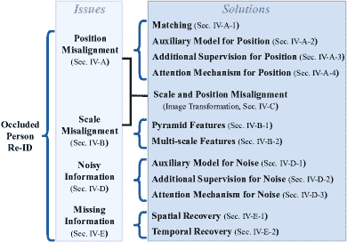
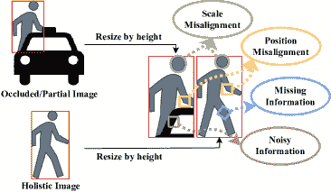
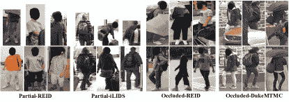
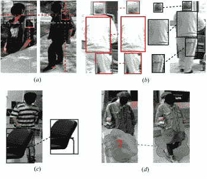
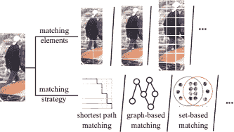
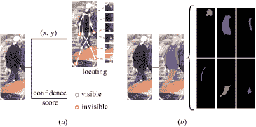
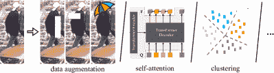
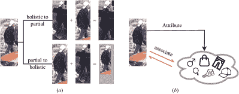

<!--yml

category: 未分类

date: 2024-09-06 19:44:58（日期：2024 年 09 月 06 日 19:44:58）

-->

# [2207.14452] Deep Learning-based Occluded Person Re-identification: A Survey（易曼：基于深度学习的遮挡人物再识别：一项调查研究）

> 来源：[`ar5iv.labs.arxiv.org/html/2207.14452`](https://ar5iv.labs.arxiv.org/html/2207.14452)

# Deep Learning-based Occluded Person Re-identification: A Survey（基于深度学习的遮挡人物再识别：一项调查研究）

云洁彭，赫某人，曹春水，刘旭，

云洁彭，张强何 1 1 通讯作者。云洁彭就职于北航计算机科学与技术学院，中国北京市，邮编 100191（电子邮件：yunjiepeng@buaa.edu.cn）。赫某人和黄勇臻就职于北京师范大学人工智能学院，中国北京市，并且还在北京智慧科技有限公司任职（电子邮件：housaihui@bnu.edu.cn；huangyongzhen@bnu.edu.cn）。曹春水和刘旭就职于北京智慧科技有限公司，中国北京市（电子邮件：chunshui.cao@watrix.ai；xu.liu@watrix.ai）。张强何就职于北航计算机科学与技术学院，中国北京市，以及联想公司，中国北京市（电子邮件：zqhe1963@gmail.com）。

###### Abstract（摘要）

遮挡人物再识别（Re-ID）旨在解决在多个摄像头中检索感兴趣人物时的遮挡问题。随着深度学习技术的推动和智能视频监控需求的增加，现实世界应用中的频繁遮挡使得遮挡人物 Re-ID 引起了研究人员的广泛关注。已经提出了大量的遮挡人物 Re-ID 方法，但关于遮挡的调查报告很少。为了填补这一空白并帮助推动未来的研究，本文对遮挡人物 Re-ID 进行了系统的调查。通过深入分析人物 Re-ID 中的遮挡，发现现有方法只考虑部分由遮挡带来的问题。因此，我们从问题和解决方法的角度对相关的遮挡人物 Re-ID 方法进行了回顾。我们总结了人物 Re-ID 中由遮挡引起的四个问题，即位置不对齐、尺度不对齐、噪声信息和丢失信息。然后，我们对解决不同问题的遮挡相关方法进行了分类和介绍。之后，我们总结并比较了近期遮挡人物 Re-ID 方法在四个常用数据集上的性能：Partial-ReID，Partial-iLIDS，Occluded-ReID 和 Occluded-DukeMTMC。最后，我们对未来有希望的研究方向提供了一些见解。

###### Index Terms:（索引术语）

Occluded Person Re-identification, Partial Person Re-identification, Literature Survey, Deep Learning.

## I Introduction（导言）

人像重识别（Re-ID）在不同摄像头中检索相同身份的人员 [1]。随着监控摄像头的不断增加和对公共安全需求的增加，人像重识别作为智能监控中的基础角色，已成为计算机视觉领域的研究热点。在实际应用中，个人的内部变化（例如，姿态变化 [2, 3, 4] 和服装变化 [5, 6]），以及复杂的环境（例如，光照变化 [7, 8]，视角变化 [9, 10, 11] 和遮挡 [12, 13, 14]），给人像重识别带来了显著挑战。其中，遮挡在实际应用中频繁出现，并且对准确性影响很大，已经引起了研究人员的广泛关注。

被遮挡人像重识别 [15, 16, 14]是为解决实际人像重识别中的遮挡问题而提出的。与假设检索过程中有完整人体存在的一般人像重识别方法不同，被遮挡人像重识别突出了被各种障碍物（例如汽车、树木和人群）遮挡的行人图像的场景，并专注于在给定被遮挡查询时检索相同身份的人员。

图 1：从问题和解决方案的角度来看，被遮挡人像重识别方法的分类。使用上述分类，可以轻松了解被遮挡人像重识别的固有挑战，并对整体技术路线有一个大致了解。

随着深度学习的进步，已经提出了大量的被遮挡人像重识别方法，但针对遮挡问题的综述却很少。为填补这一空白，本文总结了与遮挡相关的人像重识别工作，并提供了对被遮挡人像重识别的系统性综述。通过对人像重识别中的遮挡进行深入分析，发现大多数现有方法仅考虑了遮挡引发的一部分问题。因此，我们从问题和解决方案的角度回顾被遮挡人像重识别，以促进对最新方法的理解，并激发该领域的新思路。

由遮挡引起的行人重识别问题在整个行人重识别过程中进行了详细总结。从技术角度来看，视频监控中的实际行人重识别系统主要包括三个阶段[17]：行人检测、轨迹跟踪和行人检索。虽然通常认为前两个阶段是独立的计算机视觉任务，大多数行人重识别工作集中于行人检索，但遮挡会影响整个过程，并给最终重识别带来巨大挑战。总之，本文考虑了四个重要的遮挡行人重识别问题：位置错位、尺度错位、噪声信息和缺失信息。每个问题在图 2 中进行了说明，我们简要介绍每个问题如下。

1). *位置错位。* 通常，检测到的人体框会根据高度进行调整，以获得相同大小的输入数据进行行人检索。在遮挡情况下，检测到的人的框仅包含人体的一部分，而它经过的对齐处理与非遮挡行人相同。处理的部分图像和完整图像在相同位置的内容可能会不匹配，导致位置错位问题。2). *尺度错位。* 类似于位置错位，尺度错位也来源于上游数据处理过程。遮挡可能影响检测框的高度，从而影响数据处理中的调整比例，导致部分图像和整体图像之间的尺度错位。3). *噪声信息。* 在遮挡行人的检测框中，遮挡不可避免地全部或部分包含在内，带来噪声信息，影响行人重识别。4). *缺失信息。* 在遮挡行人的检测框中，遮挡区域的身份信息丢失，导致缺失信息问题。

本文分析了与遮挡相关的人脸 Re-ID 方法，针对上述四个问题提供了多维度的分类方法，对每个问题的解决方案进行分类（参见图 1）。具体来说，我们主要回顾了在 2022 年 6 月之前的顶级会议和期刊上发表的基于深度学习的遮挡人脸 Re-ID 相关的出版物，同时也介绍了一些来自其他会议和期刊的方法作为补充。我们讨论了遮挡对人脸 Re-ID 带来的问题，并对如何在近期工作中解决这些问题进行了深入分析，并总结了评估结果。特别地，一些人脸 Re-ID 方法与遮挡密切相关，我们也总结了这些方法，以获得对遮挡人脸 Re-ID 更全面的调查。此调查的主要贡献有三方面：

+   •

    为了填补遮挡人脸 Re-ID 调查的空白，我们回顾了近期的遮挡人脸重新识别方法，并从问题和解决方案的角度提供了系统的调查。

+   •

    我们总结并比较了主流遮挡人脸 Re-ID 方法的性能，以供研究人员和工业界根据实际需求使用。

+   •

    我们总结和分析了不同类型的遮挡人脸重新识别（Re-ID）解决方案的优缺点，并提供了该领域有前景的研究方向的见解。

本文的其余部分组织如下：第二部分总结了先前的调查，并详细阐述了本调查与其他调查的比较。第三部分总结了遮挡人脸 Re-ID 的常用数据集和评估指标。第四部分从问题和解决方案的角度对基于深度学习的遮挡人脸 Re-ID 方法进行了深入分析。第五部分比较了各种解决方案的性能，并提供了对有前景的研究方向的见解。第六部分给出了我们的结论。

图 2：遮挡对人脸 Re-ID 造成的位置错位、尺度错位、噪声信息和缺失信息问题。

## II 先前的调查

在以往的文献中，也有一些调查回顾了人员重识别（Re-ID）领域。为了获得更全面的比较，我们总结了自 2012 年以来的人员重识别调查。这些调查的分类列在表格 I 中。总体来说，以往的人员重识别调查可以大致分为传统调查[18, 19]和基于深度学习的调查[17, 20, 21, 22, 23, 24, 25, 26, 27, 1, 28]。

传统调查主要回顾了手动设计特征提取过程并学习更好的相似度测量的人员重识别方法。Mazzon 等人[18]总结了人员重识别的四个主要阶段：多目标检测、特征提取、跨摄像头标定和人员关联。假设第一个阶段（即多目标检测）已被解决，那么针对提取颜色/纹理/形状外观特征、分组时间信息、进行颜色/时空跨摄像头标定以及基于距离/学习/优化的人员关联的方法进行了相应的回顾。Apurva 等人[19]将跨摄像头跟踪视为开放集匹配问题，将身份检索视为闭合集匹配问题。根据是否有额外的摄像头几何/标定信息，方法被分为上下文相关的重识别和非上下文相关的重识别，分别用于开放集和闭合集匹配。

基于深度学习的调查主要总结了从不同角度使用深度学习技术的行人再识别方法。其中一些调查 [17, 24] 也为了完整性回顾了传统方法。总体而言，以前的深度学习调查涉及了损失设计 [20, 25], 技术手段 [25, 28], 数据增强 [20, 21], 图像和视频 [17, 1], 分类和验证 [20, 21, 23], 开放世界和封闭世界 [22, 1], 多模态 [22, 27], 排名优化 [24, 1], 噪声注释 [1], 无监督学习 [26], 和度量学习 [21, 24, 25, 28, 1]。尽管有这么多关于行人再识别的调查，但遮挡问题尚未引起足够的关注，只有少数调查关注到遮挡行人再识别。据我们所知，Ye 等人 [1] 对遮挡行人再识别做了粗略的总结，作为噪声鲁棒再识别的一部分。Ming 等人 [28] 将几个遮挡行人再识别方法纳入了局部特征学习和序列特征学习。考虑到遮挡对行人再识别的实际重要性，对遮挡行人再识别的系统性研究至关重要。因此，我们提供了对遮挡相关的行人再识别工作的深入调查，以促进未来的研究。

表 I: 近年来行人再识别调查概述。

| 调查 | 参考文献 | 分类 |
| --- | --- | --- |
| 传统 | 2012 PRL [18] |

&#124; 特征提取 / 跨相机校准 / &#124;

&#124; 行人关联 &#124;

|

| 2014 IVC [19] |
| --- |

&#124; 上下文方法（相机几何信息； &#124;

&#124; 相机校准。） / 非上下文方法 &#124;

&#124; (被动方法；主动方法) &#124;

|

| 基于深度学习的 | 2016 arXiv [17] |
| --- | --- |

&#124; 基于图像的方法 / 基于视频的方法 &#124;

|

| 2019 TCSVT [22] |
| --- |

&#124; 行人验证 / 应用驱动方法 &#124;

&#124; (原始数据；实际程序；效率) &#124;

|

| 2019 TPAMI [24] |
| --- |

&#124; 特征提取 / 度量学习 / 多镜头 &#124;

&#124; 排名 &#124;

|

| 2020 arXiv [23] |
| --- |

&#124; 识别任务 / 验证任务 &#124;

|

| 2020 IVC [25] |
| --- |

&#124; 特征学习 / 模型架构设计 / &#124;

&#124; 度量学习 / 损失函数 &#124;

|

| 2021 arXiv [26] |
| --- |

&#124; 伪标签估计 / 深度特征 &#124;

&#124; 表示学习 / 相机感知 &#124;

&#124; 不变性学习 / 无监督领域 &#124;

&#124; 适应 &#124;

|

| 2021 IJCAI [29] |
| --- |

&#124; 低分辨率 / 红外 / 草图 / 文本 &#124;

|

| 2021 IJCAI [27] |
| --- |

&#124; 深度特征表示学习 / 深度 &#124;

&#124; 度量学习 / 基于身份的检测 &#124;

|

| 2021 TPAMI [1] |
| --- |

&#124; 封闭世界设置（深度特征表示 &#124;

&#124; 学习；深度度量学习；排序优化) &#124;

&#124; / 开放世界设置（异质数据；原始 &#124;

&#124; 图像或视频；不可用或有限标签； &#124;

&#124; 开集；噪声标注) &#124;

|

| 2022 IVC [28] |
| --- |

&#124; 深度度量学习 / 局部特征学习 &#124;

&#124; / 生成对抗网络 / 序列 &#124;

&#124; 特征学习 / 图卷积网络 &#124;

|

## III 数据集与评估

### III-A 数据集

我们回顾了八个广泛使用的遮挡人重识别数据集，包括 3 个基于图像的部分¹¹1 部分人重识别假设遮挡人图像的可见区域经过手动裁剪以进行识别。重识别数据集，4 个基于图像的遮挡²²2 遮挡人重识别不需要手动裁剪遮挡图像的过程。

除非另有说明，本调查中的遮挡人重识别包括部分人重识别和遮挡人重识别。重识别数据集包括 1 个基于视频的遮挡人重识别数据集。这些数据集的统计信息总结在表 II 中，每个数据集的详细信息如下审查。部分/遮挡人重识别数据集的示例如图 3 所示。

Partial-REID [15] 是一个基于图像的部分重识别数据集，具有多种视角、背景和遮挡类型。它包含了 60 个人的 600 张图像，每人有 5 张全身图像和 5 张部分图像。部分观测是通过手动裁剪遮挡图像中的遮挡区域生成的。

Partial-iLIDS [30] 是一个基于图像的模拟部分重识别数据集，源自 iLIDS [31]。它由机场中的多个非重叠摄像头捕获，包含 119 人的 238 张图像，每人有 1 张全身图像和 1 张手动裁剪的非遮挡部分图像。

p-CUHK03 [32] 是一个基于图像的部分 Re-ID 数据集，构建自 CUHK03 [33]。它包含 1360 个在校园环境中捕获的人物身份。一般来说，1160 个人物身份用作训练集，100 个人物身份用作验证集，100 个人物身份用作测试集。它从原始数据集中为每个身份选择 5 张相同视角的图像，并从中生成 10 张部分身体探测图像。其余 3 张图像用于全身图库图像。

P-ETHZ [16] 是一个基于图像的遮挡行人 Re-ID 数据集，修改自 ETHZ [34]。它包含 3897 张 85 个身份的图像。每个身份分别拥有 1 到 30 张全身图像和遮挡图像。

Occluded-REID [16] 是一个基于图像的遮挡行人 Re-ID 数据集，由移动摄像机捕获，具有不同的视角和严重的遮挡类型。它包含 2000 张 200 人的图像，每人有 5 张全身图像和 5 张遮挡图像。

图 3：部分/遮挡行人 Re-ID 数据集的示例。部分/遮挡行人图像（第一行）和全身行人图像（第二行）。

表 II：遮挡/部分行人 Re-ID 数据集。Occluded-dukemtmc 和 Occluded-dukemtmc-videoreid 分别缩写为 Occ-dukemtmc 和 Occ-dukemtmc-video。

| 数据集 | 训练集（ID/图像） | 测试集（ID/图像） |
| --- | --- | --- |
| 图库 | 查询 |
| Partial-REID | - | 60/300 | 60/300 |
| Partial-iLIDS | - | 119/119 | 119/119 |
| p-CUHK03 | 1160/15080 | 100/300 | 100/1000 |
| P-ETHZ | 43/ - | 42/ - | 42/ - |
| Occluded-REID | - | 200/1000 | 200/1000 |
| P-DukeMTMC-reID | 650/ - | 649/ - | 649/ - |
| Occ-DukeMTMC | 702/15,618 | 1,110/17,661 | 519/2,210 |
| Occ-DukeMTMC-Video | 702/292,343 | 1,110/281,114 | 661/39,526 |

P-DukeMTMC-reID [16] 是一个基于图像的遮挡行人 Re-ID 数据集，修改自 DukeMTMC-reID [35]。它包含 24143 张 1299 个身份的图像，并且包含由公共场所不同类型的遮挡物（如人、车和指示牌）遮挡的目标人物图像。每个身份都有全身图像和遮挡图像。

Occluded-DukeMTMC [36] 是一个基于图像的遮挡行人 Re-ID 数据集，来源于 DukeMTMC-reID [35]。它包含 15,618 张 708 人的图像用于训练，同时包括 2,210 张 519 人的查询图像和 17,661 张 1110 人的图库图像用于测试。训练集中 9%的图像、查询集中 100%的图像以及图库集中 10%的图像是遮挡图像。

Occluded-DukeMTMC-VideoReID [14] 是一个基于视频的遮挡 Re-ID 数据集，重组自 DukeMTMC-VideoReID [37]。它包括各种障碍物，例如汽车、树木、自行车和其他人。数据集包含 1,702 个图像序列用于训练，661 个查询图像序列用于 661 个身份的查询，以及 2,636 个图像序列用于 1110 个身份的测试。测试集中的每个查询序列的超过 1/3 帧包含遮挡。

### III-B 评估指标

遮挡人 Re-ID 评估 Re-ID 系统在遮挡场景下的性能。因此，部分/遮挡人 Re-ID 数据集的设置通常是特别设计的。原则上，测试用的查询图像/视频都是遮挡样本。评估侧重于当仅提供遮挡查询时是否能检索到正确的身份。为了评估 Re-ID 系统，累计匹配特性（CMC）曲线和均值平均精度（mAP）是两种广泛使用的指标。

CMC 曲线计算正确匹配出现在前-$k$ 排名检索结果中的概率，其中 $k\in\left\{1,2,3,...\right\}$。具体来说，查询 $i$ 的前-$k$ 准确率计算为：

|  | <math   alttext="{Acc_{k}^{i}}=\begin{cases}1,&amp;{\text{如果前-$k$ 排名的图库样本}}\\ &amp;{\text{包含查询 $i$ 的样本}};\\

0,&amp;{\text{否则}}.\end{cases}" display="block"><semantics ><mrow ><mrow  ><mi mathsize="90%"  >A</mi><mo lspace="0em" rspace="0em"  >​</mo><mi mathsize="90%" >c</mi><mo lspace="0em" rspace="0em" >​</mo><msubsup ><mi mathsize="90%"  >c</mi><mi mathsize="90%"  >k</mi><mi mathsize="90%"  >i</mi></msubsup></mrow><mo mathsize="90%"  >=</mo><mrow ><mo  >{</mo><mtable columnspacing="5pt" displaystyle="true" rowspacing="0pt"  ><mtr ><mtd columnalign="left"  ><mrow ><mn mathsize="90%"  >1</mn><mo mathsize="90%"  >,</mo></mrow></mtd><mtd columnalign="left"  ><mrow ><mtext mathsize="90%" >如果排名前-</mtext><mi mathsize="90%"  >k</mi><mtext mathsize="90%" >的画廊样本</mtext></mrow></mtd></mtr><mtr  ><mtd columnalign="left"  ><mrow ><mrow ><mtext mathsize="90%" >包含查询样本 </mtext><mi mathsize="90%"  >i</mi></mrow><mo mathsize="90%"  >;</mo></mrow></mtd></mtr><mtr ><mtd columnalign="left"  ><mrow ><mn mathsize="90%"  >0</mn><mo mathsize="90%"  >,</mo></mrow></mtd><mtd columnalign="left"  ><mrow ><mtext mathsize="90%" >否则</mtext><mo lspace="0em" mathsize="90%"  >.</mo></mrow></mtd></mtr></mtable></mrow></mrow><annotation-xml encoding="MathML-Content" ><apply  ><apply ><ci >𝐴</ci><ci  >𝑐</ci><apply ><csymbol cd="ambiguous" >superscript</csymbol><apply ><csymbol cd="ambiguous" >subscript</csymbol><ci >𝑐</ci><ci  >𝑘</ci></apply><ci >𝑖</ci></apply></apply><apply ><csymbol cd="latexml" >cases</csymbol><cn type="integer" >1</cn><ci  ><mrow ><mtext mathsize="90%" >如果排名前-</mtext><mi mathsize="90%"  >k</mi><mtext mathsize="90%"  >的画廊样本</mtext></mrow></ci><ci  ><mtext mathsize="90%"  >否则</mtext></ci><ci ><mrow ><mtext mathsize="90%" >包含查询样本 </mtext><mi mathsize="90%" >i</mi></mrow></ci><cn type="integer"  >0</cn><ci ><mtext mathsize="90%" >否则</mtext></ci></apply></apply></annotation-xml><annotation encoding="application/x-tex" >{Acc_{k}^{i}}=\begin{cases}1,&{\text{如果排名前-$k$ 的画廊样本}}\\ &{\text{包含查询样本 $i$}};\\ 0,&{\text{否则}}.\end{cases}</annotation></semantics></math> |  | (1) |

假设测试集中有 $N$ 个查询，CMC-$k$（即 rank-$k$ 精度）计算所有查询的前-$k$ 精度的概率。

|  | $\text{CMC-}k=\frac{1}{N}\sum_{i=1}^{N}Acc_{k}^{i}$ |  | (2) |
| --- | --- | --- | --- |

由于计算中仅考虑第一个匹配，当每个查询只有一个真实值或我们更关注排名列表顶部位置的真实匹配时，CMC 曲线是可以接受的。

mAP 衡量了考虑所有真实匹配在排名检索结果中顺序的平均检索性能。具体来说，查询 $i$ 的平均精度（AP）计算如下：

|  | $\text{AP}_{i}=\frac{1}{M_{i}}\sum_{j=1}^{M_{i}}\frac{j}{Rank_{j}}$ |  | (3) |
| --- | --- | --- | --- |

其中 $M_{i}$ 表示在图库集中身份为 $i$ 的样本数，$Rank_{j}$ 表示查询 $i$ 在检索图库列表中的第 $j$ 个真实匹配的排名。假设测试集中有 $N$ 个查询，则 mAP 的计算公式为：

|  | $\text{mAP}=\frac{1}{N}\sum_{i=1}^{N}\text{AP}_{i}$ |  | (4) |
| --- | --- | --- | --- |

由于排名检索结果中的所有真实匹配的顺序参与了 mAP 的计算，mAP 测量了平均检索性能，并适用于具有多个真实匹配的图库。

总的来说，mAP 更关注于检索召回能力，而 CMC 曲线则侧重于在不同大小的候选列表中检索真实匹配的能力。因此，CMC 曲线和 mAP 通常会一起用于 Re-ID 系统的评估。

图 4：实际应用中由于遮挡引起的四个问题的示例：(*a*) 位置错位，(*b*) 尺寸错位，(*c*) 噪声信息，以及 (*d*) 信息缺失。

## IV 遮挡人员 Re-ID

遮挡人员再识别（Re-ID）旨在解决在多个摄像头中检索目标人物时的遮挡问题。在人员 Re-ID 的实际应用中，人物可能会被各种障碍物（如汽车、树木、路灯和其他人）遮挡，监控系统往往无法捕捉到完整的人物。一个实际的视频监控人员 Re-ID 系统通常包括三个阶段：行人检测、轨迹跟踪和人物检索。遮挡会影响整个过程，并给最终的 Re-ID 带来巨大的挑战。

通常，在开发遮挡人员 Re-ID 解决方案时，需要考虑四个问题。前两个问题是部分图像和整体图像之间的位置和尺寸错位。这主要是由于上游数据处理造成的：部分人的检测框经过与整体人相同的对齐处理以获得一致的输入尺寸，导致了位置错位问题和尺寸错位问题。最后两个问题是由遮挡引起的噪声信息和信息缺失。在遮挡行人的检测框中，遮挡不可避免地部分或全部包含在内，遮挡区域的身份信息缺失，从而导致噪声信息问题和信息缺失问题。每个问题在图 2 中显示，四个问题的实际示例呈现在图 4 中。

在本节中，我们从上述四个问题的角度分析了与遮挡相关的行人重识别方法。针对每个问题的相应解决方案按照图 1 中所示的分类法进行了总结。需要注意的是，有些方法同时解决多个问题，这些方法将根据不同的角度多次介绍。

### IV-A 位置错位

基于深度学习的解决方案用于解决遮挡引起的行人重识别中的位置错位问题，大致可以总结为四类：匹配 [15, 38, 30, 39, 40, 41, 42, 43, 44], 位置辅助模型 [36, 45, 46, 47, 48, 49, 42, 50, 51, 52, 53, 54, 55], 位置附加监督 [56, 57, 38, 58, 14, 59, 60, 61], 和位置注意机制 [32, 62, 63, 64, 65, 66, 67, 68]。首先，基于匹配的解决方案将行人重识别视为匹配任务，并提出了多种匹配组件以及匹配策略，以解决位置错位问题。其次，基于辅助模型的行人重识别解决方案依赖外部模型提供的位置信息来提升性能。第三，基于附加监督的行人重识别解决方案利用额外的信息来引导位置相关的学习过程，同时在推理阶段保持独立。第四，基于注意机制的行人重识别解决方案通过学习注意机制解决位置错位问题，无需任何额外信息。

#### IV-A1 匹配

基于匹配的方法的主要要点可以总结为匹配组件和匹配策略（见图 5）。为解决位置对齐问题，已经提出了多种匹配组件的定义以及相应的匹配策略。总体而言，基于匹配的方法可以进一步分为滑动窗口匹配[15]、最短路径匹配[38]、基于重建的匹配[15, 30]、去噪匹配[39, 40, 41]、基于图的匹配[42, 43]和基于集合的匹配[44]。

滑动窗口匹配[15]将部分探测图像视为一个整体，并在全身画廊图像上进行穷举滑动，以匹配最相似的局部区域。部分图像与全身图像上最相似匹配的 L1 范数距离用于测量。

最短路径匹配[38]通过计算两组局部特征之间的最短路径来进行匹配，并使用匹配的局部特征来计算相似度，明确实现位置对齐。

基于重建的匹配[15, 30]假设遮挡图像中的身份信息是非遮挡图像中身份信息的一个子集，因此可以从相同身份的整体图像中完全或部分重建部分图像。基于补丁的重建匹配[15]将部分和全身图像分解为规则的网格补丁作为匹配组件。通过优化画廊补丁选择以进行自我重建，将每个探测补丁与一组画廊补丁进行匹配。基于块的重建匹配[30]将特征图上的$c\times c$像素定义为一个独立的块进行匹配。假设部分探测图像的每个块可以从相同身份的全身画廊图像的块的稀疏线性组合中重建。

图 5：基于匹配的方法的示意图：构建局部匹配元素并设计匹配策略，以解决位置对齐、尺度对齐和噪声信息问题。

去噪匹配[39, 40, 41]提出在匹配过程中关注前景可见的人体部位，同时忽略噪声信息。具体而言，GASM[39]通过姿态估计和人体分割的监督来学习显著性热图，以突出前景可见的人体部位。在显著性热图的指导下，前景可见人体部位的空间元素特征的匹配分数被赋予较大权重，而背景或遮挡区域的匹配分数则被赋予较小权重，进行自适应调整。Co-Attention[40]在身体解析掩码的指导下执行部分图像和整体图像之间的匹配。特别地，Co-Attention 匹配中采用了自注意机制[69]，其中部分图像的解析掩码被视为查询，部分和整体图像的解析掩码以及 CNN 特征分别作为键和值。ASAN[41]建议在每次检索匹配过程中，将整体库图像的分割掩码替换为当前目标人物图像的掩码。这样，ASAN 引导的特征提取能够抑制来自无用部分的干扰。

基于图的匹配[42, 43]将遮挡人物的再识别问题表述为图匹配问题。HOReID[42]使用关键点热图将图像的语义局部特征提取为图的节点。图卷积网络（GCN）通过可学习的邻接矩阵设计，用于在节点之间传递信息，以捕捉高阶关系信息。为了测量两个图之间的相似性，两个图的节点特征进一步处理，通过提取的相关信息学习拓扑信息。GCN 提取的高阶关系信息和相互学习的拓扑信息被用于计算两个图的最终相似性。多粒度超图匹配[43]设计了多个具有不同空间和时间粒度的超图，以解决视频基础人物再识别中的对齐和遮挡问题。与传统图不同，超图[70]能够建模涉及多个节点的高阶依赖关系，更适合于建模序列中的多粒度相关性。

基于集合的匹配将遮挡人物重识别视为集合匹配任务，无需明确的空间对齐。具体来说，MoS [44] 使用 CNN 骨干网捕捉沿通道维度的多样视觉模式作为匹配元素。引入 Jaccard 相似系数作为计算人物图像模式集合之间相似度的度量。通过最小化和最大化来近似集合的交集和并集操作，并计算交集与并集的比率来测量两个集合之间的相似度。

#### IV-A2 位置的辅助模型

为了解决因遮挡引起的位置信号错位问题，一些方法直接利用外部模型提供的辅助信息进行位置对齐。根据所使用的辅助模型类型，这些方法可以大致总结为基于姿态的 [36, 45, 46, 47, 48, 49, 42, 50, 51, 52], 基于解析的 [53]，以及基于混合的 [54, 55] 解决方案。

基于姿态的方法[36, 45, 46, 47, 48, 49, 42, 50, 51, 52]利用外部姿态估计模型预测的位置来解决位置错位问题。PGFA [36], PDVM [45], 和 PMFB [46] 生成包含以关键点位置为中心的 2D 高斯的热图，通过与 CNN 特征图的点积来提取对齐的姿态特征。KBFM [47] 利用图像间共享的可见关键点来定位对齐的矩形区域以计算相似性。PVPM [48] 使用关键点热图和由 OpenPose [71] 估计的部件亲和场来生成部件注意力图，以提取对齐的局部特征。类似地，PGMANet [49] 生成关键点位置的热图，并利用它们在 CNN 特征图上计算部件注意力掩模。基于部件注意力掩模聚合的部件特征，PGMANet 进一步计算不同部件特征之间的相关性，以利用二阶信息来丰富特征提取。HOReID [42] 使用关键点热图提取个人图像上的语义局部特征。图像的局部特征被视为图的节点，HOReID 设计了一个具有可学习邻接矩阵的图卷积网络，以利用节点之间的更多区分信息进行再识别。此外，CTL [50] 提议将人体分为三种粒度，并使用关键点热图提取多尺度部件特征作为图节点。交叉尺度图卷积和 3D 图卷积旨在捕捉结构信息和层次空间-时间依赖关系，以解决视频人物再识别中的空间错位问题。ACSAP [51] 提议使用外部姿态信息来指导对齐特征图的对抗生成。PFD [52] 生成局部补丁特征，并将其与处理后的关键点热图逐元素相乘，以获得姿态引导的特征。通过集相似性的度量，PFD 在局部特征和姿态引导特征之间执行匹配，以从补丁特征中解开姿态信息以实现位置对齐。

图 6: (*a*) 基于姿态的方法示意图：解决位置错位的关键点坐标和用于排除噪声信息的置信度分数。(*b*) 基于分割的方法示意图：用于定位位置的部件掩模和排除噪声信息。

基于解析的方法直接利用从外部人工解析模型生成的解析信息来解决位置对齐问题。SPReID [53] 在人工解析数据集 LIP [72] 上训练了一个额外的语义解析模型，以预测与人体的 5 个预定义语义区域相关的概率图。这些概率图随后用于通过对由修改后的 Inception-V3 [73] 生成的特征图进行加权求和操作来提取不同的语义特征。

基于混合的方法 [54, 55] 使用两个或更多外部模型提供辅助信息以解决位置对齐问题。具体而言，SSP-ReID [54] 利用两种线索，即显著性和语义解析，来引导 CNN 主干学习用于重新识别的互补表示。外部现成的深度模型 [72, 74] 用于生成语义解析掩模和显著性掩模。在掩模与 CNN 特征图之间应用逐元素乘积，以获取解析特征和显著性特征进行融合。TSA [55] 使用现成的 HRNet [75] 和 DensePose [76] 提供额外的关键点信息和身体部位信息。基于关键点位置，TSA 将整个人体划分为 5 个区域，并通过软区域池化在 CNN 特征图上获得区域特征。基于身体部位掩模，TSA 从纹理生成器生成的纹理图像中提取相应的区域特征。由关键点引导的区域特征与由部位掩模引导的区域特征进行连接，以学习用于重新识别的鲁棒表示。

#### IV-A3 位置的额外监督

与在训练和测试阶段都依赖额外信息的辅助模型解决方案不同，位置对齐的额外监督基于解决方案仅在学习过程中使用额外信息进行指导，并且在推理阶段是独立的。根据使用的外部信息类型，位置对齐的额外监督基于解决方案可以粗略地总结为基于姿态 [56, 57, 38, 58, 14]、基于分割 [59, 60] 和基于混合 [61] 的方法。

基于姿态的方法 [56, 57, 38, 58, 14] 利用外部姿态信息来引导学习过程，以缓解位置对齐问题。具体来说，AACN [56] 和 DAReID [38] 通过外部姿态信息构建的地面真实数据来学习部件注意力图，从而定位和提取部件特征。DSAG [57] 和 PGFL-KD [58] 使用由姿态信息定位的特征来引导特征学习过程。DSAG 使用 DensePose [76] 提供的外部姿态信息构建一组密集语义对齐的部件图像。将语义对齐的部件图像作为输入，DSAG 作为调节器，通过精心设计的融合和损失来引导原始图像上的特征学习。同样，PGFL-KD 使用外部关键点热图来提取语义对齐的特征。然后，这些对齐的特征用于通过知识蒸馏和基于互动的训练来规范全局特征学习。不同的是，RFCNet [14] 训练一个由外部姿态信息监督的自适应分区单元，将 CNN 特征图分割成不同的区域，并提取区域特征以进行进一步处理。

基于分割的方法 [59, 60] 利用由分割模型提供的额外分割掩码，例如，人类解析模型或场景分割模型，来引导学习过程，以解决位置对齐问题。具体来说，MMGA [59] 学习生成全身、上半身和下半身的注意力图，这些注意力图使用 JPPNet [77] 估计的解析标签。然后，学习到的注意力图用于提取全局和局部特征以进行再识别。HPNet [60] 引入人类解析作为辅助任务，并利用解析掩码提取部件级特征，以解决位置对齐问题。个人 Re-ID 和人类解析以多任务方式进行学习，其中伪解析标签由在 COCO DensePose [76] 数据集上训练的场景分割模型 [78] 预测。

基于混合的方法利用多种类型的外部信息来指导学习过程。具体来说，FGSA [61] 在姿态信息和属性信息的监督下挖掘细粒度的局部特征，以解决位置错位问题。FGSA 设计了一个姿态解析网络（在 MSCOCO [79] 上预训练），提供关键部位的部件置信度图和部件亲和场。这些部件图用于通过紧凑双线性池化在 CNN 特征图上提取部件特征。给定提取的部件特征，FGSA 将属性识别视为多分类任务，并训练一个中间模型进行属性分类以及人物重新识别。通过这种方式，属性分类任务指导姿态解析网络和 CNN 主干学习更具区分性的局部信息以便重新识别。

#### IV-A4 用于位置的注意机制

基于注意机制的方法通过学习注意力来解决位置错位问题，而不需要任何额外信息（见图 7）。根据注意学习过程的主要观点，基于注意机制的位置错位解决方案可以进一步分为基于裁剪的 [32]、基于聚类的 [62]、自监督的 [63, 64] 和基于约束的 [65, 66, 67, 68] 方法。需要注意的是，一些方法虽然也涉及到注意机制，但依赖于辅助模型提供的外部信息或使用额外的信息进行监督。这些方法分别总结在位置的辅助模型或位置的额外监督中。

基于裁剪的方法将图像裁剪为不同的局部区域，并学习注意力以在不同图像中找到相同的局部区域进行相似性计算。具体而言，DPPR [32] 在整体图像上裁剪 13 个预定义的部分区域，并设计一个条件于部分探测图像的注意力模块，以在包含相同身体部位的情况下为这些部分区域分配更大的注意力权重。

图 7：基于注意机制方法的技术路线示例。

基于聚类的方法通过聚类生成伪标签，以监督注意力学习。具体而言，ISP [62] 在 CNN 特征图上设计级联聚类，逐步生成用于部分注意力学习的像素级伪标签。基于前景像素响应高于背景像素的假设，首先将特征图的所有像素根据激活值聚类为前景或背景。其次，根据像素之间的相似性，将前景像素进一步聚类为不同的人体部分。然后，利用聚类而得到的像素级人体部分伪标签来指导部分注意力学习，提取局部部分特征以解决位置不匹配问题。

自监督方法 [63, 64] 构建自我监督以指导注意力学习。给定一个整体图像，VPM [63] 定义 $m\times n$ 的矩形区域，并随机裁剪一个 patch，其中每个像素根据相应的区域标签进行自我监督。VPM 在提取的 CNN 特征图上添加了区域定位器，通过上述构建的自我监督进行像素级分类（注意力），以发现不同的区域。APN [64] 将整体图像随机裁剪为不同的部分类型，作为部分图像的自监督任务，用于基于注意力的部分裁剪类型分类。根据部分探测图像的预测裁剪类型，对整体样本图像进行裁剪以实现位置对齐。

基于约束的方法 [65, 66, 67, 68] 在不同的注意力图之间建立约束，以帮助定位不同的身体部位，以解决位置不匹配问题。[65] 中的多个空间注意力对注意力图应用多样性正则化项，确保每个注意力都专注于给定图像的不同区域。SBPA [66] 通过最小化局部注意力与被屏蔽的全局注意力之间的 L1-范数距离来分离局部注意力图。PAT [67] 维护部分原型向量，以在上下文 CNN 特征上生成部分感知注意力掩码，并设计部分多样性机制来帮助实现多样的部分发现。具体而言，部分多样性机制将所有部分特征之间的余弦相似度最小化，扩大不同部分特征之间的差异。MHSA-Net [68] 提出特征多样性正则化项，鼓励多头自注意机制捕捉多样的局部特征。具体而言，为了获得多样的局部特征，正则化项限制局部特征的 Gram 矩阵接近恒等矩阵。

### IV-B 尺度错位

基于深度学习的方法 [80, 43, 30, 81, 66] 提出构建金字塔特征或多尺度特征以缓解人脸重识别中的尺度错位问题。给定一个 CNN 特征图，金字塔特征从全局到局部提取，而多尺度特征在同一位置保持不同感受野的特征。总体而言，金字塔特征和多尺度特征的核心都是提取不同尺度的特征，以构建对尺度变化具有鲁棒性的表示。

#### IV-B1 金字塔特征

金字塔特征 [80, 43] 是层次化的，并且从特征图的全局到局部提取。[80] 中的金字塔模型水平切分特征图为 $n$ 个基本部分，并为每个 $l\in\{1,2,...,n\}$ 相邻部分建立相应的分支以获取金字塔特征。MGH [43] 将特征图层次化地划分为 $p\in\{1,2,4,8\}$ 个水平条带，并对每个条带进行平均池化以获得多粒度空间特征。

#### IV-B2 多尺度特征

多尺度特征 [30, 81, 66] 聚焦于限制的局部区域，并在同一位置保持不同感受野的特征。具体而言，DSR [30] 对特征图上的 $s\times s$ 像素的正方形区域进行平均池化，以获取多尺度块表示，从而缓解尺度错位的影响，$s=\{1,2,3\}$。FPR [81] 对特征图执行不同核大小的多次最大池化层，以捕捉从小的局部区域到相对较大区域的多样空间特征。SBPA [66] 通过尺度方向的残差连接在每个像素处维持不同尺度的特征，以解决尺度错位问题。

### IV-C 位置与尺度错位

文献中，有一些方法 [82, 83, 40, 51, 84, 64] 通过部分或整体图像的变换同时解决位置和尺度错位问题（见图 8 (*a*)）。这些方法在本小节中进行了专门总结，以便于理解。

部分图像变换 [82, 83, 40, 51] 旨在对部分图像进行变换，以获得与整体图像空间对齐的校正结果以用于重新识别。具体而言，APNet [82] 设计了一种边界框对齐器（BBA），预测 4 个偏移值（上、下、左、右）以将检测到的边界框移动到覆盖估计的整体身体区域。APNet 通过构建自动数据增强进行训练，无需手动注释。PPCL [83] 采用了一个门控变换回归 CNN 模块来预测部分图像与整体图像之间的仿射变换系数，从而生成具有适当尺度和布局的校正部分图像。变换系数的预测通过随机裁剪整体图像来模拟具有已知变换系数的部分图像进行自监督。[40] 中的图像重标定器（IR）预测 2D 仿射变换参数，以将部分图像变换为理想的无畸变图像，以解决空间不对齐问题。具体而言，部分图像和理想的无畸变图像通过随机裁剪整体图像并遮蔽未裁剪区域来获得，用于自监督。不同的是，ACSAP [51] 设计了一个姿态引导生成器，利用部分图像和整体图像的额外姿态信息来引导对齐特征的生成。姿态引导生成器通过训练一个姿态引导判别器进行对抗学习，旨在区分图像特征的真实性。

图 8：(*a*) 图像变换方法示意图：同时处理位置和尺度的不匹配。 (*b*) 基于属性的方法示意图：将属性注释与人员重新识别（Re-ID）关联起来。

整体图像变换 [84, 64] 旨在查找和变换整体图像的对应区域，以获得与查询部分图像空间对齐的图像以进行重新识别。具体而言，STNReID [84] 利用部分图像和整体图像的高级 CNN 特征来预测它们之间的 2D 仿射变换参数，以变换整体图像以匹配部分图像。在 STNReID 中，整体图像被随机裁剪为部分图像，以建立 2D 仿射变换参数预测的自监督训练。APN [64] 预测部分探测图像的裁剪类型，并裁剪整体图库图像的对应区域以进行人员检索。在 APN 中，裁剪类型的预测通过随机裁剪整体图像为不同部分类型的自监督进行训练。

### IV-D 噪声信息

遮挡不可避免地被包含在遮挡行人的检测框中，因此为行人重识别（见图 4 (*c*)）带来了噪声信息。这尤其成问题，因为不同身份的相似障碍物扰乱了基于外观的相似性计算，即检索结果容易包含具有相似障碍物的负面图像[85]。解决噪声信息问题的基于深度学习的方法可以分为噪声辅助模型[36, 45, 46, 51, 47, 48, 86, 52, 87, 55, 40]、额外监督[56, 38, 81, 60, 88, 39]，以及噪声注意机制[16, 63, 89, 82, 90, 91, 13, 92, 93, 94, 95, 96, 97]。

#### IV-D1 噪声辅助模型

基于辅助模型的方法依赖于辅助模型提供的外部信息，以帮助识别和抑制噪声遮挡。根据所使用的辅助模型类型，这些方法可以进一步分为基于姿态的[36, 45, 46, 51, 47, 48, 86, 52, 87]和基于解析的[55, 40]。

基于姿态的方法[36, 45, 46, 51, 47, 48, 86, 52, 87] 利用外部姿态估计模型预测的姿态标志来从遮挡噪声中分离出有用的信息。具体而言，PGFA [36]、PDVM [45] 和 PMFB [46] 预设阈值来基于预测置信度过滤掉被遮挡的不可见姿态标志。可见的姿态标志用于生成热图，以提取非遮挡的姿态特征。这些方法还在 CNN 特征图上构建不同的局部部分特征，并利用姿态估计的置信度来确定相应部分是否被遮挡。这些方法仅使用探测图像和库图像之间共享的可见部分来计算相似性，明确避免了遮挡带来的干扰。类似地，ACSAP [51] 利用姿态估计的置信度来决定水平划分部分的可见性，并在相似性度量中为共享的可见部分分配更大的权重。KBFM [47] 基于探测图像和库图像之间共享的可见关键点构建矩形区域，以提取特征来测量相似性。此外，PMFB 利用从可见标志生成的姿态嵌入作为门控，自适应地重新校准基于可见身体部位的通道级特征响应。给定通过外部姿态信息提取的部件特征，PVPM [48] 利用相同身份图像之间部件对应的特性，挖掘对应分数作为伪标签，用于训练一个可见性预测器，以估计部件是否受到遮挡。考虑到提供的外部姿态信息可能是稀疏或嘈杂的，LKWS [86] 提出将姿态信息离散化，以获得水平分割身体部位的鲁棒可见性标签。利用可见性标签，LKWS 训练一个可见性鉴别器，以帮助抑制不可见水平部分的影响。具体而言，基于预测置信度分数和预设阈值，所有关键点对每个水平部分的可见性进行投票。PFD [52] 将置信度分数高于预设阈值的关键点热图分配 $label=1$，将置信度分数低于预设阈值的关键点热图分配 $label=0$。根据分配的标签，PFD 将视图特征集分为高置信度和低置信度的关键点视图特征集。高置信度的关键点视图特征在推断阶段用于显式匹配可见身体部位，并自动分离遮挡特征。此外，PFD 设计了一个姿态引导的推送损失，鼓励人体部位（即高置信度特征）和非人体部位（即低置信度特征）之间的差异，以帮助专注于人体部位并缓解遮挡的干扰。不同的是，STAL [87] 使用外部姿态标志将视频切割成多个时空单元。为了降低可能的遮挡单元的权重，STAL 设计了一个联合时空注意力模块，通过精心设计的损失函数来评估每个单元的质量分数。

基于解析的方法[55, 40]采用由人工解析模型估计的解析掩模来帮助抑制噪声遮挡。具体来说，TSA[55]利用 DensePose[76]估计的外部解析结果提供可见信号，以指导对可见区域的学习，抑制不可见的遮挡区域。Co-Attention[40]将解析掩模作为自注意力机制中的查询，以在相关区域进行图像匹配，从而减轻遮挡带来的噪声信息。

#### IV-D2 噪声的额外监督

额外监督基方法通过使用额外信息来指导抑制遮挡噪声的学习，同时在推理过程中保持独立。根据所使用的额外信息的类型，额外监督基方法可以进一步总结为基于姿态的[56, 38], 基于分割的[81, 60, 88], 基于属性的[41]，和混合基的[39]方法。

基于姿态的方法[56, 38]利用额外的姿态信息来监督排除噪声遮挡的学习。具体来说，AACN[56]使用外部姿态信息来监督部分注意力的学习。根据每个部分注意力图的强度，AACN 计算部分可见性分数以衡量每个身体部位的遮挡程度。类似地，利用从外部姿态信息构建的真实情况，DAReID[38]学习预测上半身和下半身掩模，以提取未被遮挡的部件特征。此外，DAReID 将具有大面积高激活区域的上半身或下半身特征热图视为可靠。通过增强可靠区域的显著性来抑制遮挡噪声。

基于分割的方法 [81, 60, 88] 利用由分割模型（如人类解析模型或场景分割模型）提供的额外分割掩码，以帮助解决噪声信息问题。具体来说，FPR [81] 使用由 CE2P [98] 获得的人物掩码来监督前景概率图的生成，鼓励特征提取更多集中在干净的人体部位，从而减少遮挡带来的污染，精炼相似度计算。HPNet [60] 使用由 COCO 训练的人体解析模型提供的部件标签，以多任务的方式学习人体解析和人物再识别。在 HPNet 中，预测的部件概率图通过 0.5 的阈值二值化，以提取部件级特征并确定每个部件的可见性，从而减轻遮挡噪声。SORN [88] 训练一个语义分支，使用外部语义分割模型预测的伪标签生成前景-背景掩码，从非遮挡区域提取特征。

基于属性的方法利用人物 Re-ID 数据集的语义级属性注释，帮助抑制由遮挡带来的噪声信息（见图 8 (*b*)）。ASAN [41] 使用属性信息来指导弱监督下的遮挡敏感分割学习，以提取未遮挡的人体特征。

基于混合的方法采用多种外部信息来指导学习过程，以减轻噪声信息问题。具体来说，GASM [39] 训练一个掩码层和一个姿态层，利用语义分割模型 PSPNet [99] 和姿态估计模型 CenterNet [100] 预测的真实标签。GASM 然后将掩码层预测的掩码热图和姿态层估计的关键点热图组合成一个显著性图，以提取显著特征，明确排除由遮挡带来的噪声信息。

#### IV-D3 噪声的注意力机制

基于注意力机制的方法学习生成注意力图，将较小的权重分配给遮挡区域，以解决噪声信息问题，无需任何额外信息。根据注意力学习过程的主要思想，基于注意力机制的噪声解决方案可以进一步分为数据增强 [16, 63, 89, 82, 90, 91, 13, 92, 93], 查询引导 [94, 95], 丢弃基 [96] 和关系基 [97] 方法。

数据增强方法[16, 63, 89, 82, 90, 91, 13, 92, 93] 生成人工遮挡，以训练网络关注干净的身体部位并排除噪声遮挡。具体而言，AFPB [16] 构建了一个遮挡模拟器，其中源图像的背景随机区域作为遮挡，覆盖整体人物的一部分。AFPB 设计了多任务损失，迫使网络同时识别人物并分类样本是否来自遮挡数据分布。VPM [63] 在图像上预定义 $m\times n$ 矩形区域，并随机从整体图像中裁剪部分行人图像，每个部分图像的每个像素都相应分配了区域标签以进行自我监督。在 VPM 中，设计了一个区域定位器来生成概率图，推断每个区域的位置。通过对每个概率图进行求和操作，VPM 获得了区域可见性评分，以抑制遮挡的噪声区域。RE [89] 提出了随机擦除操作，即随机选择图像中的一个矩形区域，并用随机值擦除其像素，以生成具有不同遮挡级别的图像，以训练模型提取未遮挡的判别性身份信息。APNet [82] 训练一个部分识别器，通过数据增强构建的自我监督来识别可见的条形部件。然后选择可见部件特征进行相似性计算，而遮挡或噪声区域上的不可见部件特征则被丢弃。IGOAS [90] 设计了一个增量生成遮挡块，从小到大随机生成均匀的遮挡掩码，并在一批图像上训练模型更强健地应对遮挡，通过逐步学习更难的遮挡。通过合成的遮挡数据及其相应的遮挡掩码，IGOAS 通过将生成的遮挡区域的响应抑制为零，更加关注前景信息。SSGR [91] 采用随机擦除和批次恒定擦除，将图像均分为水平条带，并随机擦除子批次中的相同条带，以模拟遮挡，训练解耦的非本地（DNL [101]) 注意力网络。OAMN [13] 设计了一种新型的遮挡增强方案，裁剪随机选择的训练图像的矩形补丁，并将补丁缩放到目标图像的四个预定义位置，产生多样且精确标记的遮挡。在标记的遮挡数据监督下，OAMN 学习生成空间注意图，这些图精确捕捉身体部位，无论遮挡情况如何。DRL-Net [92] 利用训练集中出现的障碍物合成更多样化和真实的遮挡样本，以引导对比特征学习，以减轻遮挡噪声的干扰。此外，DRL-Net 设计了一个变压器，同时维护与 ID 相关和与 ID 无关的查询，以进行解耦表示学习。不同的是，FED [93] 在增强时不仅考虑非行人障碍物，还考虑非目标行人。为了模拟合理的非行人遮挡，FED 手动裁剪训练图像中的背景和遮挡物体补丁，并将其粘贴到行人图像上，经过精心设计的增强过程。为了合成非目标行人遮挡，FED 维护不同身份特征中心的记忆库。然后利用记忆库搜索当前行人的 $K$ 个最近特征。最后，FED 使用这些记忆特征扩散行人表示，并在特征级别生成非目标行人遮挡进行训练。

查询引导的方法 [94, 95] 旨在生成查询图像与图库图像之间的一致注意力，以解决噪声信息问题。具体来说，CASN [94] 设计了一种基于注意力的孪生学习架构，该架构强制同一身份的图像之间保持注意力一致，以处理视角变化、遮挡和背景杂乱的问题。PISNet [95] 专注于拥挤遮挡的情况，其中检测到的边界框可能涉及多个人并包含干扰信息。在查询图像（单人）的指导下，PISNet 计算查询和图库特征的内积，以制定像素级查询引导的注意力，从而增强图库图像（多人）中目标的特征。

基于丢弃的方法开发了基于丢弃的训练策略，以引导网络学习更鲁棒的表示，从而减轻遮挡带来的噪声信息。具体来说，CBDB-Net [96] 将特征图均匀划分为条带，并从上到下连续丢弃每个条带。通过基于丢弃的不完整特征进行训练，模型被迫学习更鲁棒的人物描述符以用于重新识别。

基于关系的方法挖掘不同区域之间的关系以细化特征，从而减轻遮挡的干扰。具体来说，OCNet [97] 在图像上预定义了全局区域、上部区域（即 $1/2$ 上部水平条带）、下部区域（即 $1/2$ 下部水平条带）和中心区域（即 $1/3$ 中部垂直条带），并通过分组卷积和精心设计的注意力机制提取四个区域特征。在 OCNet 中，提出了由两个全连接共享层组成的关系自适应模块，以捕捉不同区域特征之间的关系。然后使用关系权重细化区域特征，以抑制遮挡或无关的信息。

### IV-E 缺失信息

遮挡区域中缺乏身份信息会导致缺失信息的问题（见图 2 (*d*)）。在遮挡区域中恢复缺失信息主要有两种方式：空间恢复 [102, 14] 和时间恢复 [103, 102, 14]。

#### IV-E1 空间恢复

空间恢复 [102, 14] 利用行人图像的空间结构来推断缺失的信息。具体来说，VRSTC [102] 设计了一个自编码器，该自编码器以被白色像素遮挡的图像作为输入，并生成遮挡白色区域的内容。为了提高遮挡部分生成内容的质量，VRSTC 采用了局部和全局鉴别器来对合成内容的真实性和上下文一致性进行对抗性判断。RFCNet [14] 利用非遮挡区域的长范围空间上下文来预测遮挡区域的特征，在特征级别恢复缺失的信息。具体来说，RFCNet 估计四个关键点，将特征图划分为 6 个区域。在 RFCNet 中，采用了编码器-解码器架构，其中编码器通过聚类建模区域间的相关性，而解码器利用空间相关性来恢复遮挡区域特征。

#### IV-E2 时间恢复

时间恢复 [103, 102, 14] 需要连续的图像序列（即基于视频的人物重识别）并利用时间信息恢复遮挡区域的缺失部分。假设其他帧相同位置的信息可以帮助恢复当前帧中的丢失信息，[103] 中的 Refining Recurrent Unit (RRU) 被设计用来通过隐式参考从历史帧提取的外观和运动信息来去除噪声并恢复缺失的激活区域。VRSTC [102] 提出了一个可微分的时间注意力层，该层利用余弦相似性来确定从相邻帧中关注的位置，以恢复遮挡部分的内容。RFCNet [14] 采用了查询-记忆注意力机制，其中当前区域被视为查询，剩余帧的相应区域作为记忆。通过查询与记忆中每项的点积相似性 [104] 对所有记忆项进行重新加权，以获得长期时间上下文，从而优化查询。

表 III: 部分重识别和部分 iLIDS 的性能比较。S-ST 是 Single-ShoT 的缩写，表示每个身份在推理阶段仅包含一个图库图像。

| 问题 | 技术路线 | 方法 | 发表论文 | 部分-REID | 部分-iLIDS |
| --- | --- | --- | --- | --- | --- |
| Rank-1 | Rank-3 | S-ST | Rank-1 | Rank-3 |
| Position Misalignment | Matching | AMC+SWM [15] | ICCV2015 | 37.3 | 46.0 | ✓ | 21.0 | 32.8 |
| DSR [30] | CVPR2018 | 50.7 | 70.0 | ✓ | 58.8 | 67.2 |
| DAReID [38] | KBS2021 | 68.1 | 79.5 | × | 76.7 | 85.3 |
| APN [64] | ICPR2021 | 71.8 | 85.5 | × | 66.4 | 76.5 |
| Co-Attention [40] | ICIP2021 | 83.0 | 90.3 | × | 73.1 | 83.2 |
| ASAN [41] | TCSVT2021 | 86.8 | 93.5 | × | 81.7 | 88.3 |
| 位置的辅助模型 | PDVM [45] | PRL2020 | 43.3 | - | × | - | - |
| PGFA [36] | ICCV2019 | 68.0 | 80.0 | ✓ | 69.1 | 80.9 |
| KBFM [47] | ICIP2020 | 69.7 | 82.2 | × | 64.1 | 73.9 |
| PMFB [46] | TNNLS2021 | 72.5 | 83.0 | × | 70.6 | 81.3 |
| TSA [55] | ACM MM2020 | 72.7 | 85.2 | ✓ | 73.9 | 84.7 |
| ACSAP [51] | ICIP2021 | 77.0 | 83.7 | × | 76.5 | 87.4 |
| PVPM [48] | CVPR2020 | 78.3 | - | ✓ | - | - |
| HOReID [42] | CVPR2020 | 85.3 | 91.0 | × | 72.6 | 86.4 |
| 位置的额外监督 | DAReID [38] | KBS2021 | 68.1 | 79.5 | × | 76.7 | 85.3 |
| PGFL-KD [58] | MM2021 | 85.1 | 90.8 | × | 74.0 | 86.7 |
| HPNet [60] | ICME2020 | 85.7 | - | ✓ | 68.9 | 80.7 |
| 位置的注意力机制 | VPM [63] | CVPR2019 | 67.7 | 81.9 | ✓ | 65.5 | 74.8 |
| APN [64] | ICPR2021 | 71.8 | 85.5 | × | 66.4 | 76.5 |
| MHSA-Net [68] | TNNLS2022 | 85.7 | 91.3 | × | 74.9 | 87.2 |
| PAT [67] | CVPR2021 | 88.0 | 92.3 | × | 76.5 | 88.2 |
| 图像变换 | STNReID [84] | TMM2020 | 66.7 | 80.3 | × | 54.6 | 71.3 |
| APN [64] | ICPR2021 | 71.8 | 85.5 | × | 66.4 | 76.5 |
| ACSAP [51] | ICIP2021 | 77.0 | 83.7 | × | 76.5 | 87.4 |
| 协同注意力机制 [40] | ICIP2021 | 83.0 | 90.3 | × | 73.1 | 83.2 |
| PPCL [83] | CVPR2021 | 83.7 | 88.7 | × | 71.4 | 85.7 |
| 尺度不对齐 | 多尺度特征 | DSR [30] | CVPR2018 | 50.7 | 70.0 | ✓ | 58.8 | 67.2 |
| FPR [81] | ICCV2019 | 81.0 | - | × | 68.1 | - |
| 图像变换 | STNReID [84] | TMM2020 | 66.7 | 80.3 | × | 54.6 | 71.3 |
| APN [64] | ICPR2021 | 71.8 | 85.5 | × | 66.4 | 76.5 |
| ACSAP [51] | ICIP2021 | 77.0 | 83.7 | × | 76.5 | 87.4 |
| 协同注意力机制 [40] | ICIP2021 | 83.0 | 90.3 | × | 73.1 | 83.2 |
| PPCL [83] | CVPR2021 | 83.7 | 88.7 | × | 71.4 | 85.7 |
| 噪声信息 | 噪声的辅助模型 | PDVM [45] | PRL2020 | 43.3 | - | × | - | - |
| PGFA [36] | ICCV2019 | 68.0 | 80.0 | ✓ | 69.1 | 80.9 |
| KBFM [47] | ICIP2020 | 69.7 | 82.2 | × | 64.1 | 73.9 |
| PMFB [46] | TNNLS2021 | 72.5 | 83.0 | × | 70.6 | 81.3 |
| TSA [55] | ACM MM2020 | 72.7 | 85.2 | ✓ | 73.9 | 84.7 |
| ACSAP [51] | ICIP2021 | 77.0 | 83.7 | × | 76.5 | 87.4 |
| PVPM [48] | CVPR2020 | 78.3 | - | ✓ | - | - |
| 协同注意力机制 [40] | ICIP2021 | 83.0 | 90.3 | × | 73.1 | 83.2 |
| LKWS [86] | ICCV2021 | 85.7 | 93.7 | × | 80.7 | 88.2 |
| 噪声的额外监督 | DAReID [38] | KBS2021 | 68.1 | 79.5 | × | 76.7 | 85.3 |
| FPR [81] | ICCV2019 | 81.0 | - | × | 68.1 | - |
| HPNet [60] | ICME2020 | 85.7 | - | ✓ | 68.9 | 80.7 |
| 噪声的注意力机制 | CBDB-Net [96] | TCSVT2021 | 66.7 | 78.3 | × | 68.4 | 81.5 |
| VPM [63] | CVPR2019 | 67.7 | 81.9 | ✓ | 65.5 | 74.8 |
| FED [93] | CVPR2022 | 83.1 | - | × | - | - |
| OAMN [13] | ICCV2021 | 86.0 | - | × | 77.3 | - |

## V 讨论

在本节中，我们总结和分析了基于前述四个问题的遮挡行人重识别方法的评估结果。根据提出的分类法，我们旨在提出可能提升遮挡行人重识别性能的因素，以促进未来的研究。

### V-A 性能比较

我们在四个广泛使用的基于图像的数据集上评估了遮挡行人重识别方法，即 Partial-REID [15]、Partial-iLIDS [30]、Occluded-DukeMTMC (Occ-DukeMTMC) [36] 和 Occluded-REID (Occ-ReID) [16]。关于这四个数据集的详细信息在第 III-A 节中进行了说明。由于 Partial-REID、Partial-iLIDS 和 Occluded-REID 较小，方法通常在 Market-1501 [105] 的训练集上进行训练，并在这三个数据集上进行测试和评估。两个部分行人重识别数据集和两个遮挡行人重识别数据集的性能比较分别总结在表 III 和表 IV 中。从这两个表中我们得出以下三个观察结果：

1). 针对位置不对齐问题和噪声信息问题，有效的解决方案丰富多样。具体来说，首先，没有主导的技术路线来实现位置对齐：在 Partial-ReID 中，基于注意力机制的方法 PAT [67] 达到了最佳的 rank-1 准确率；在 Partial-iLIDS 中，基于匹配的方法 ASAN [41] 达到了最佳的 rank-1 和 rank-3 准确率；在 Occluded-DukeMTMC 中，基于辅助模型的方法 PFD [52] 实现了最佳的 rank-1 准确率和最佳的 mAP；在 Occluded-ReID 中，基于额外监督的方法 HPNet [60] 获得了最佳的 rank-1 准确率。其次，压制噪声遮挡的最有前景的技术路线难以判断：在 Partial-ReID 中，三种技术路线，即辅助模型、额外机制和噪声注意力机制的 rank-1 准确率相当；在 Partial-iLIDS 和 Occluded-DukeMTMC 中，基于辅助模型的方法 LKWS [86] 和 PFD [52] 分别达到了最佳的 rank-1 准确率；在 Occluded-ReID 中，基于额外监督的方法 HPNet [60] 达到了最佳的 rank-1 准确率。虽然位置不对齐问题和噪声信息问题都没有主导的技术路线，但不同技术路线的优缺点可以总结（见 Sec.V-B）。

2). 在现有方法中，尺度不对齐问题和信息缺失问题引起的关注较少。与解决位置不对齐问题或噪声信息问题的方法相比，旨在解决尺度不对齐问题或信息缺失问题的方法数量明显较少。

3). 有大量方法同时考虑了多个问题。例如，PPCL [83] 解决了位置和尺度不对齐问题；PFD [52] 专注于位置不对齐和噪声信息问题；Co-Attention [40] 考虑了位置不对齐、尺度不对齐和噪声信息问题。然而，尚无方法同时考虑由遮挡引起的所有四个问题。本调查对这些问题及其解决方案的深入分析旨在填补这一空白，并帮助开发更全面的遮挡行人再识别解决方案。

### V-B 未来方向

如表格 III 和表格 IV 所示，过去几年中在解决不同问题的不同技术路线方面取得了一致的进展。根据对问题和解决方案的分析，可以得出以下关于遮挡人 Re-ID 未来研究的见解。

从遮挡造成的四个主要问题的角度来看，位置错位和噪声信息问题已被广泛研究，而尺度错位和缺失信息问题在现有方法中较少考虑。通过对这四个问题进行总结和分析，可以更深入地理解遮挡人 Re-ID，进而贡献更全面的解决方案并激发该领域的新思路。

从有前景的技术路线角度来看，由于不同技术路线的最先进方法的评估结果具有可比性，尚无明确答案。尽管如此，我们还是分析并总结了不同技术路线的优缺点，以帮助推动未来的研究。

1). *匹配.* 设计良好的匹配组件和匹配策略极大地提高了遮挡人 Re-ID 的性能。具有相应匹配策略的局部和可扩展匹配组件可以帮助解决位置错位、尺度错位和噪声信息问题。此外，它可以与其他技术路线轻松集成，例如表格 III 中反复报告的方法 Co-Attention [40] 和 ASAN [41]。

2). *辅助模型和额外监督.* 通常，用于遮挡人 Re-ID 的额外信息主要有三种类型：姿态、分割和属性。姿态估计或分割提供的位置信息及其估计置信度分别用于帮助解决位置错位和噪声信息问题（见图 6）。此外，遮挡人 Re-ID 数据集提供的额外属性信息通常用于制定额外任务，以帮助缓解遮挡带来的问题。这两种技术路线带来了许多好处和便利，但它们依赖于额外的标签或外部模型。

3). *注意力机制。* 注意力机制在现有方法中因其巨大潜力和灵活性而被广泛研究。在最近三年中，方法 [106, 40, 92, 68, 93] 引入了自注意力（Transformer），在公共数据集上取得了显著进展。类似于基于匹配的技术路线，注意力机制也可以与其他技术路线集成，例如表 IV 中的 APN [64]。

4). *图像变换。* 部分（整体）图像被转换，以获得与整体（部分）图像内容一致的图像，同时解决位置和尺度不对齐问题（见图 8 (*a*)）。这种技术路线确实有意义且接近理想过程，但它在推理阶段需要更多的计算成本。此外，当前阶段图像变换尚未取得令人满意的结果，该技术路线的性能略低于其他方法。

表 IV：Occ-dukemtmc 和 Occ-reid 的性能比较。

| 问题 | 技术路线 | 方法 | 出版物 | Occ-DukeMTMC | Occ-ReID |
| --- | --- | --- | --- | --- | --- |
| Rank-1 | mAP | Rank-1 | mAP |
| 位置不对齐 | 匹配 | AMC+SWM [15] | ICCV2015 | - | - | 31.1 | 27.3 |
| GASM [39] | ECCV2020 | - | - | 74.5 | 65.6 |
| DSR [30] | CVPR2018 | 40.8 | 30.4 | 72.8 | 62.8 |
| HOReID [42] | CVPR2020 | 55.1 | 43.8 | 80.3 | 70.2 |
| DAReID [38] | KBS2021 | 63.4 | 53.2 | - | - |
| MoS [44] | AAAI2021 | 66.6 | 55.1 | - | - |
| 用于位置的辅助模型 | PVPM [48] | CVPR2020 | - | - | 70.4 | 61.2 |
| PGFA [36] | ICCV2019 | 51.4 | 37.3 | - | - |
| PDVM [45] | PRL2020 | 53.0 | 38.1 | - | - |
| HOReID [42] | CVPR2020 | 55.1 | 43.8 | 80.3 | 70.2 |
| PMFB [46] | TNNLS2021 | 56.3 | 43.5 | - | - |
| PFD [52] | AAAI2022 | 69.5 | 61.8 | 81.5 | 83.0 |
| 用于位置的额外监督 | HPNet [60] | ICME2020 | - | - | 87.3 | 77.4 |
| PGFL-KD [58] | MM2021 | 63.0 | 54.1 | 80.7 | 70.3 |
| DAReID [38] | KBS2021 | 63.4 | 53.2 | - | - |
| RFCNet [14] | TPAMI2021 | 63.9 | 54.5 | - | - |
| 用于位置的注意力机制 | MHSA-Net [68] | TNNLS2022 | 59.7 | 44.8 | - | - |
| ISP [62] | ECCV2020 | 62.8 | 52.3 | - | - |
| PAT [67] | CVPR2021 | 64.5 | 53.6 | 81.6 | 72.1 |
| SBPA [66] | SPL2021 | 64.5 | 54.0 | - | - |
| 尺度不对齐 | 多尺度特征 | FPR [81] | ICCV2019 | - | - | 78.3 | 68.0 |
| DSR [30] | CVPR2018 | 40.8 | 30.4 | 72.8 | 62.8 |
| 噪声信息 | 辅助噪声模型 | PVPM [48] | CVPR2020 | - | - | 70.4 | 61.2 |
| PGFA [36] | ICCV2019 | 51.4 | 37.3 | - | - |
| PDVM [45] | PRL2020 | 53.0 | 38.1 | - | - |
| PMFB [46] | TNNLS2021 | 56.3 | 43.5 | - | - |
| LKWS [86] | ICCV2021 | 62.2 | 46.3 | 81.0 | 71.0 |
| PFD [52] | AAAI2022 | 69.5 | 61.8 | 81.5 | 83.0 |
| 噪声的附加监督 | GASM [39] | ECCV2020 | - | - | 74.5 | 65.6 |
| FPR [81] | ICCV2019 | - | - | 78.3 | 68.0 |
| HPNet [60] | ICME2020 | - | - | 87.3 | 77.4 |
| DAReID [38] | KBS2021 | 63.4 | 53.2 | - | - |
| 噪声的注意机制 | IGOAS [66] | TIP2021 | 60.1 | 49.4 | 81.1 | - |
| OAMN [13] | ICCV2021 | 62.6 | 46.1 | - | - |
| OCNet [97] | ICASSP2022 | 64.3 | 54.4 | - | - |
| DRL-Net [92] | TMM2021 | 65.8 | 53.9 | - | - |
| SSGR [91] | ICCV2021 | 65.8 | 57.2 | 78.5 | 72.9 |
|  | FED [93] | CVPR2022 | 68.1 | 56.4 | 86.3 | 79.3 |
| 缺失信息 | 空间恢复 | RFCNet [14] | TPAMI2021 | 63.9 | 54.5 | - | - |
| 时间恢复 | RFCNet [14] | TPAMI2021 | 63.9 | 54.5 | - | - |

## VI 结论

本文旨在提供一个关于遮挡人物重识别的系统性综述，以促进未来的研究。我们首先分析和总结了遮挡在人物重识别中带来的四个问题：位置不对齐、尺度不对齐、噪声信息和缺失信息。对 2022 年 6 月之前在顶级会议和期刊上发表的基于深度学习的遮挡人物重识别文献进行了分类和介绍。我们提供了最近遮挡人物重识别方法在四个热门数据集上的性能比较：Partial-ReID、Partial-iLIDS、Occluded-ReID 和 Occluded-DukeMTMC。基于评估结果的分析，我们最后讨论了有前景的未来研究方向。

## 参考文献

+   [1] M. Ye 等. 基于深度学习的人物重识别：综述与展望。IEEE 计算机学会模式分析与机器智能期刊，2021 年。

+   [2] H. Zhao 等. Spindle net: 通过人体区域引导的特征分解与融合进行人物重识别。发表于 CVPR，第 1077–1085 页，2017 年。

+   [3] M. S. Sarfraz 等. 具有扩展交叉邻域重排序的姿态敏感嵌入用于人物重识别。发表于 CVPR，第 420–429 页，2018 年。

+   [4] J. Liu 等. 可转移姿态的人物重识别。发表于 CVPR，第 4099–4108 页，2018 年。

+   [5] X. Qian 等. 长期换衣人物重识别。发表于 ACCV，2020 年。

+   [6] P. Hong 等. 用于换衣行人重识别的细粒度形状-外观互学。 In CVPR, pp. 10513–10522, 2021。

+   [7] Y. Huang 等. 不变照明的行人重识别。 In MM - Proc. ACM Int. Conf. Multimed., pp. 365–373, 2019。

+   [8] G. Zhang 等. 行人重识别的照明统一。IEEE Trans. Circuits Syst. Video Technol., pp. 1–1, 2022。

+   [9] S. Karanam 等. 使用判别训练的视角不变字典进行行人重识别。 In ICCV, pp. 4516–4524, 2015。

+   [10] X. Sun 和 L. Zheng. 从视角的角度解剖行人重识别。 In CVPR, pp. 608–617, 2019。

+   [11] L. Wu 等. 用于行人重识别的交叉熵对抗视角适应。IEEE Trans. Circuits Syst. Video Technol., 30(7):2081–2092, 2020。

+   [12] J. Miao 等. 通过姿态估计识别可见部分以实现遮挡行人重识别。IEEE Trans. Neural Netw. Learn. Syst., 2021。

+   [13] P. Chen 等. 遮挡他们全部：用于遮挡行人重识别的遮挡感知注意网络。 In ICCV, pp. 11833–11842, 2021。

+   [14] R. Hou 等. 用于遮挡行人重识别的特征完成。IEEE Trans. Pattern Anal. Mach. Intell., 2021。

+   [15] W.-S. Zheng 等. 部分行人重识别。 In ICCV, pp. 4678–4686, 2015。

+   [16] J. Zhuo 等. 遮挡行人重识别。 In ICME, pp. 1–6. IEEE, 2018。

+   [17] L. Zheng 等. 行人重识别：过去、现在与未来。arXiv preprint arXiv:1610.02984, 2016。

+   [18] R. Mazzon 等. 人群中的行人重识别。Pattern Recognit. Lett., 33(14):1828–1837, 2012。

+   [19] A. Bedagkar-Gala 和 S. K. Shah. 行人重识别方法和趋势调查。Image Vision Comput., 32(4):270–286, 2014。

+   [20] B. Lavi 等. 行人重识别任务的深度学习技术调查。arXiv preprint arXiv:1807.05284, 2018。

+   [21] D. Wu 等. 基于深度学习的行人重识别方法：全面综述。Neurocomputing, 337:354–371, 2019。

+   [22] Q. Leng 等. 开放世界行人重识别的调查。IEEE Trans. Circuits Syst. Video Technol., 30(4):1092–1108, 2019。

+   [23] B. Lavi 等. 基于深度学习的行人重识别模型调查：我们已经到达了吗？arXiv preprint arXiv:2005.00355, 2020。

+   [24] S. Karanam 等. 行人重识别的系统评估和基准：特征、度量和数据集。IEEE Trans. Pattern Anal. Mach. Intell., 41(3):523–536, 2019。

+   [25] K. Islam. 行人搜索：行人重识别的新范式：对近期工作的调查和展望。Image Vision Comput., 101:103970, 2020。

+   [26] X. Lin 等. 无监督行人重识别：挑战和解决方案的系统调查。arXiv preprint arXiv:2109.06057, 2021。

+   [27] X. Lin 等. 行人搜索挑战与解决方案：调查。 In IJCAI Int. Joint Conf. Artif. Intell., pp. 1–10. RMIT University, 2021。

+   [28] Z. Ming 等. 基于深度学习的人物再识别方法：近期工作的综述与展望。图像视觉计算, 第 104394 页, 2022。

+   [29] Z. Wang 等. 超越内部模态：异质人物再识别的综述。发表于 IJCAI 国际联合人工智能会议, 第 4973–4980 页, 2021。

+   [30] L. He 等. 部分人物再识别的深度空间特征重建：无对齐方法。发表于 CVPR, 第 7073–7082 页, 2018。

+   [31] W.-S. Zheng 等. 基于概率相对距离比较的人物再识别。发表于 CVPR 2011, 第 649–656 页。IEEE, 2011。

+   [32] J. Kim 和 C. D. Yoo. 通过注意力模型进行深度部分人物再识别。发表于 ICIP, 第 3425–3429 页。IEEE, 2017。

+   [33] W. Li 等. Deepreid: 用于人物再识别的深度过滤配对神经网络。发表于 CVPR, 第 152–159 页, 2014。

+   [34] A. Ess 等. 一种用于稳健多人物追踪的移动视觉系统。发表于 CVPR, 第 1–8 页。IEEE, 2008。

+   [35] Z. Zheng 等. 生成对抗网络生成的无标签样本提高了体外的人物再识别基线。发表于 ICCV, 第 3754–3762 页, 2017。

+   [36] J. Miao 等. 基于姿态引导的特征对齐用于遮挡人物再识别。发表于 ICCV, 第 542–551 页, 2019。

+   [37] Y. Wu 等. 逐步开发未知：通过逐步学习的一次性视频基人物再识别。发表于 CVPR, 第 5177–5186 页, 2018。

+   [38] Y. Xu 等. 基于双重注意力的方法用于遮挡人物再识别。知识基础系统, 212:106554, 2021。

+   [39] L. He 和 W. Liu. 针对拥挤场景中人物再识别的引导显著性特征学习。发表于 ECCV, 第 357–373 页。Springer, 2020。

+   [40] C.-S. Lin 和 Y.-C. F. Wang. 自监督体图到外观的共同注意力用于部分人物再识别。发表于 ICIP, 第 2299–2303 页。IEEE, 2021。

+   [41] H. Jin 等. 通过基于属性的偏移注意力进行遮挡敏感的人物再识别。IEEE 电路系统与视频技术学报, 32(4):2170–2185, 2022。

+   [42] G. Wang 等. 高阶信息至关重要：学习关系和拓扑用于遮挡人物再识别。发表于 CVPR, 第 6449–6458 页, 2020。

+   [43] Y. Yan 等. 学习多粒度超图用于基于视频的人物再识别。发表于 CVPR, 第 2899–2908 页, 2020。

+   [44] M. Jia 等. 在集合上匹配：无对齐征服遮挡人物再识别。发表于 AAAI 人工智能会议, 第 1673–1681 页, 2021。

+   [45] S. Zhou 等. 针对人物再识别的深度遮挡感知特征分析。模式识别通讯, 138:617–623, 2020。

+   [46] J. Miao 等. 通过姿态估计识别可见部分用于遮挡人物再识别。IEEE 神经网络与学习系统学报, 2021。

+   [47] C. Han 等. 基于关键点的特征匹配用于部分人物再识别。发表于 ICIP, 第 226–230 页。IEEE, 2020。

+   [48] S. Gao 等. 基于姿态引导的可见部分匹配用于遮挡人物再识别。发表于 CVPR, 第 11744–11752 页, 2020。

+   [49] Y. Zhai 等人. Pgmanet: 带有姿态引导混合注意力网络的遮挡人物重识别. 在 IJCNN, 第 1–8 页. IEEE, 2021 年。

+   [50] J. Liu 等人. 视频中人物重识别的时空相关性和拓扑学习. 在 CVPR, 第 4370–4379 页, 2021 年。

+   [51] Y. He 等人. 为严重失调的人物重识别进行对抗性跨尺度对齐追求. 在 ICIP, 第 2373–2377 页. IEEE, 2021 年。

+   [52] W. Tao 等人. 基于变换器的姿态引导特征解缠结用于遮挡人物重识别. AAAI 人工智能会议, 2022 年。

+   [53] M. M. Kalayeh 等人. 人类语义解析用于人物重识别. 在 CVPR, 第 1062–1071 页, 2018 年。

+   [54] R. Quispe 和 H. Pedrini. 基于显著性和深度神经网络模型的语义解析改进人物重识别. 图像视觉计算, 92:103809, 2019 年。

+   [55] L. Gao 等人. 与可见性感知对齐的纹理用于部分人物重识别. 在 MM - ACM 国际多媒体会议, 第 3771–3779 页, 2020 年。

+   [56] J. Xu 等人. 关注意识的组合网络用于人物重识别. 在 CVPR, 第 2119–2128 页, 2018 年。

+   [57] Z. Zhang 等人. 密集语义对齐的人物重识别. 在 CVPR, 第 667–676 页, 2019 年。

+   [58] K. Zheng 等人. 带有知识蒸馏的姿态引导特征学习用于遮挡人物重识别. 在 MM - ACM 国际多媒体会议, 第 4537–4545 页, 2021 年。

+   [59] H. Cai 等人. 多尺度身体部件掩码引导注意力用于人物重识别. 在 CVPR 研讨会, 第 0–0 页, 2019 年。

+   [60] H. Huang 等人. 基于人类解析对齐的多任务学习用于遮挡人物重识别. 在 ICME, 第 1–6 页. IEEE, 2020 年。

+   [61] Q. Zhou 等人. 具有焦点三元组损失的人物重识别细粒度空间对齐模型. IEEE 图像处理汇刊, 29:7578–7589, 2020 年。

+   [62] K. Zhu 等人. 身份引导的人类语义解析用于人物重识别. 在 ECCV, 第 346–363 页. Springer, 2020 年。

+   [63] Y. Sun 等人. 识别聚焦区域: 学习可见性感知的部件级特征用于部分人物重识别. 在 CVPR, 第 393–402 页, 2019 年。

+   [64] L. Huo 等人. 关注部件感知网络用于部分人物重识别. 在 ICPR, 第 3652–3659 页. IEEE, 2021 年。

+   [65] S. Li 等人. 多样性正则化的时空注意力用于基于视频的人物重识别. 在 CVPR, 第 369–378 页, 2018 年。

+   [66] G. Wang 等人. 带有关系变换器的自引导身体部位对齐用于遮挡人物重识别. IEEE 信号处理通讯, 28:1155–1159, 2021 年。

+   [67] Y. Li 等人. 多样化部件发现: 带有部件感知变换器的遮挡人物重识别. 在 CVPR, 第 2898–2907 页, 2021 年。

+   [68] H. Tan 等人. Mhsa-net: 多头自注意力网络用于遮挡人物重识别. IEEE 神经网络与学习系统汇刊, 2022 年。

+   [69] A. Vaswani 等人. 关注即你所需. 神经信息处理系统进展, 30, 2017 年。

+   [70] J. Jiang 等. 动态超图神经网络. In IJCAI Int. Joint Conf. Artif. Intell., pp. 2635–2641, 2019.

+   [71] Z. Cao 等. 实时多人人体 2D 姿态估计使用部件亲和场. In CVPR, pp. 7291–7299, 2017.

+   [72] K. Gong 等. 观察行人: 自监督结构敏感学习和一个新基准用于人体解析. In CVPR, pp. 932–940, 2017.

+   [73] C. Szegedy 等. 重新思考计算机视觉中的 Inception 架构. In CVPR, pp. 2818–2826, 2016.

+   [74] X. Li 等. Deepsaliency: 多任务深度神经网络模型用于显著性目标检测. IEEE Trans. Image Process., 25(8):3919–3930, 2016.

+   [75] K. Sun 等. 深度高分辨率表示学习用于人体姿态估计. In CVPR, pp. 5693–5703, 2019.

+   [76] R. A. Güler 等. Densepose: 野外密集人体姿态估计. In CVPR, pp. 7297–7306, 2018.

+   [77] X. Liang 等. 观察行人: 联合人体解析与姿态估计网络和一个新基准. IEEE Trans. Pattern Anal. Mach. Intell., 41(4):871–885, 2018.

+   [78] J. Fu 等. 双重注意力网络用于场景分割. In CVPR, pp. 3146–3154, 2019.

+   [79] T.-Y. Lin 等. Microsoft coco: 上下文中的常见物体. In ECCV, pp. 740–755. Springer, 2014.

+   [80] F. Zheng 等. 通过多损失动态训练的金字塔行人重识别. In CVPR, pp. 8514–8522, 2019.

+   [81] L. He 等. 前景感知金字塔重建用于对齐无关的遮挡行人重识别. In ICCV, pp. 8450–8459, 2019.

+   [82] Y. Zhong 等. 针对野外场景的稳健部分匹配. In CVPR, pp. 6827–6835, 2020.

+   [83] T. He 等. 基于部分-部分对应学习的部分行人重识别. In CVPR, pp. 9105–9115, 2021.

+   [84] H. Luo 等. Stnreid: 使用配对空间变换网络的深度卷积网络进行部分行人重识别. IEEE Trans. Multimedia, 22(11):2905–2913, 2020.

+   [85] S. Yu 等. 邻域引导特征重建用于遮挡行人重识别. arXiv preprint arXiv:2105.07345, 2021.

+   [86] J. Yang 等. 学习知道在哪里查看: 一种针对遮挡行人重识别的可见性感知方法. In ICCV, pp. 11885–11894, 2021.

+   [87] G. Chen 等. 基于视频的人体重识别的时空注意力感知学习. IEEE Trans. Image Process., 28(9):4192–4205, 2019.

+   [88] X. Zhang 等. 语义感知的遮挡鲁棒网络用于遮挡行人重识别. IEEE Trans. Circuits Syst. Video Technol., 31(7):2764–2778, 2021.

+   [89] Z. Zhong 等. 随机擦除数据增强. In AAAI Conf. Artif. Intell., volume 34, pp. 13001–13008, 2020.

+   [90] C. Zhao 等. 增量生成遮挡对抗抑制网络用于行人重识别. IEEE Trans. Image Process., 30:4212–4224, 2021.

+   [91] C. Yan 等. 单尺度全局表示的遮挡行人重识别. In ICCV, pp. 11875–11884, 2021.

+   [92] M. Jia 等. 通过变换器隐式学习解耦表示用于遮挡人物再识别. IEEE 多媒体期刊, 2022 年。

+   [93] Z. Wang 等. 用于遮挡人物再识别的特征擦除与扩散网络. 在 CVPR 会议上，页码 4754–4763, 2022 年。

+   [94] M. Zheng 等. 使用一致的注意力孪生网络进行再识别. 在 CVPR 会议上，页码 5735–5744, 2019 年。

+   [95] S. Zhao 等. 不要打扰我：在其他行人干扰下的人物再识别. 在 ECCV 会议上，页码 647–663。Springer, 2020 年。

+   [96] H. Tan 等. 带有弹性损失的不完整描述符挖掘用于人物再识别. IEEE 期刊. 电路系统与视频技术, 2021 年。

+   [97] M. Kim 等. 通过关系自适应特征修正学习进行遮挡人物再识别. 在 ICASSP IEEE 国际声学、语音和信号处理会议论文集中，页码 2719–2723。IEEE, 2022 年。

+   [98] T. Ruan 等. 细节中的恶魔：朝着准确的单人和多人解析迈进. 在 AAAI 人工智能会议上，第 33 卷，页码 4814–4821, 2019 年。

+   [99] H. Zhao 等. 金字塔场景解析网络. 在 CVPR 会议上，页码 2881–2890, 2017 年。

+   [100] X. Zhou 等. 对象作为点. arXiv 预印本 arXiv:1904.07850, 2019 年。

+   [101] M. Yin 等. 解耦非局部神经网络. 在 ECCV 会议上，页码 191–207。Springer, 2020 年。

+   [102] R. Hou 等. Vrstc：无遮挡的视频人物再识别. 在 CVPR 会议上，页码 7183–7192, 2019 年。

+   [103] Y. Liu 等. 基于视频的人物再识别的空间和时间互促进. 在 AAAI 人工智能会议上，第 33 卷，页码 8786–8793, 2019 年。

+   [104] H. Zhang 等. 自注意力生成对抗网络. 在 ICML 会议上，页码 7354–7363。PMLR, 2019 年。

+   [105] L. Zheng 等. 可扩展的人物再识别：一个基准测试. 在 ICCV 会议上，页码 1116–1124, 2015 年。

+   [106] A. Dosovitskiy 等. 一张图片值 16x16 个词：用于大规模图像识别的变换器. arXiv 预印本 arXiv:2010.11929, 2020 年。

| 彭云杰于 2018 年在中国西南大学计算机与信息科学学院及软件学院获得学士学位。目前她是中国北航大学计算机科学与技术学院的博士生。她的研究兴趣包括步态识别、人物再识别、计算机视觉和机器学习。 |
| --- |
| 侯赛辉于 2014 年和 2019 年分别获得中国科技大学的工学学士和博士学位。他目前是北京师范大学人工智能学院的助理教授。他的研究兴趣包括计算机视觉和机器学习。他最近关注于步态识别，旨在根据步态模式识别不同的人。 |
| 曹春水于 2013 年和 2018 年分别获得中国科学技术大学的工学学士和博士学位。在攻读博士学位期间，他加入了中国科学院自动化研究所模式识别国家实验室智能感知与计算研究中心。2018 年至 2020 年，他在清华大学五道口金融学院担任博士后研究员。他目前是 Watrix Technology Limited Co. Ltd.的研究科学家。他的研究兴趣包括模式识别、计算机视觉和机器学习。 |
| 刘旭于 2013 年和 2018 年分别获得中国科学技术大学（USTC）的控制科学与工程专业的学士和博士学位。他目前是 Watrix Technology Limited Co. Ltd.的算法研究员。他的研究兴趣包括步态识别、物体检测、分割和深度学习。 |
| 黄永珍于 2006 年获得华中科技大学工学学士学位，2011 年获得中国科学院自动化研究所博士学位。他目前是北京师范大学人工智能学院的副教授。他已经出版了一本书，并在国际期刊和会议上发表了 80 多篇论文，如 TPAMI、IJCV、TIP、TSMCB、TMM、TCSVT、CVPR、ICCV、ECCV、NIPS、AAAI。他的研究兴趣包括模式识别、计算机视觉和机器学习。 |
| 何志强目前是联想公司高级副总裁和联想资本与孵化器集团主席。该集团负责探索外部创新以及加速联想集团内部创新，利用联想的全球资源、资本力量和创业精神。此前，他曾担任联想的首席技术官，并在联想的研究与技术领域以及系统方面担任过多个领导职位。他是中国科学院计算技术研究所和北京航空航天大学的博士生导师。 |
