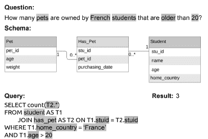
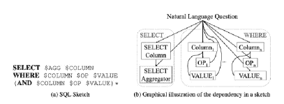
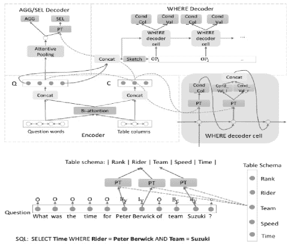
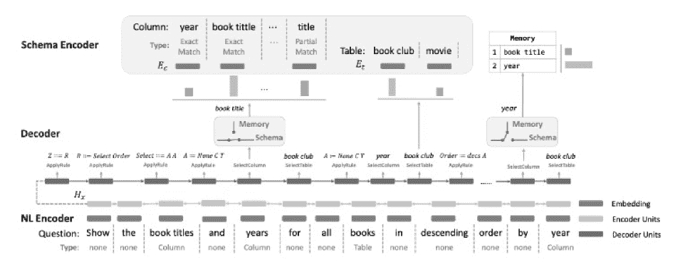
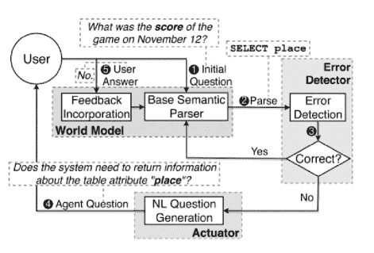
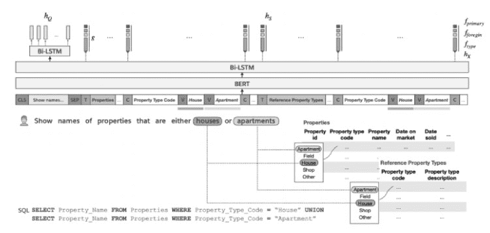

<!--yml

类别：未分类

日期：2024-09-06 19:44:55

-->

# [2208.04415] 深度学习驱动的自然语言文本到 SQL 查询转换：综述

> 来源：[`ar5iv.labs.arxiv.org/html/2208.04415`](https://ar5iv.labs.arxiv.org/html/2208.04415)

# 深度学习驱动的自然语言文本到 SQL 查询转换：综述

Ayush Kumar, Parth Nagarkar, Prabhav Nalhe 和 Sanjeev Vijayakumar

###### 摘要

随着未来向数据驱动决策的努力，访问数据库的无缝连接显得尤为重要。已有大量研究致力于创建高效的文本到 SQL（TEXT2SQL）模型以访问数据库中的数据。使用自然语言是一种极佳的接口，能够有效地连接数据与结果，尤其适合非技术用户。它将打开大门，激发对技术熟练或不熟练于查询语言的用户的极大兴趣。尽管已有许多基于深度学习的算法被提出或研究，但在实际工作场景中使用自然语言解决数据查询问题仍然非常具有挑战性。原因在于不同研究使用了不同的数据集，这些数据集各有其局限性和假设。同时，我们对这些提议的模型及其在特定数据集上的局限性了解不足。本文试图提供最近几年对 24 种神经网络模型的全面概述，包括卷积神经网络、递归神经网络、指针网络、强化学习、生成模型等。我们还概述了用于训练 TEXT2SQL 技术模型的 11 个广泛使用的数据集。我们还讨论了 TEXT2SQL 技术在无缝数据查询中的未来应用可能性。

###### 索引词：

自然语言处理、深度学习、SQL 查询、机器翻译

## I 引言

在当今世界，相当一部分数据被保存在关系数据库中，这些应用范围从金融和电子商务到医学。因此，利用自然语言查询数据库有广泛的用途也就不足为奇。这还打开了自服务仪表盘和动态分析的可能性，那些不熟悉 SQL 语言的个人可以利用它来获取最相关的信息。许多活动与将自然语言转换为 SQL 相关[1, 2, 3, 4]，包括代码创建和模式构建。然而，创建 SQL 比典型的语义解析问题更复杂。简短的自然语言询问可能需要合并多个表或具有多个过滤要求。这需要更多基于上下文的技术。近年来，随着深度学习技术的广泛发展，特别是卷积神经网络和递归神经网络的应用，结果在这方面有了显著改善。

一般来说，TEXT2SQL 算法涉及将自然语言声明或文本转换为 SQL 查询[5, 6, 7, 8, 9]，以访问相应数据库中的所需数据集。用户输入的自然语言文本通过各种 TEXT2SQL 算法进行处理，这些算法使用卷积神经网络、递归神经网络、指针网络、强化学习和生成模型等基线算法。利用这些算法和输入文本查询，通过连接输入中使用的各种条件生成所需的 SQL 查询。这些 SQL 查询随后用于从相应的数据库或多个数据库的组合中访问所需的数据集。最终，它可能会被整合以实现将自然语言翻译为完全功能应用的更广泛目标，与不同形式或可视化[10, 11, 12]或可视化分析工具[13, 14]结合起来。图 1 展示了从自然语言进行数据查询的一个示例[15]。

图 1：一个通用的 NLP TEXT2SQL 架构，它根据自然语言问题和数据库架构生成 SQL 查询[15]。除了理解有效 SQL 查询的需求（非高亮的词），NLP 算法还必须从中选择正确的表、列和值来获取结果。

大量注释数据集的可用性，包括问题和数据库查询，加快并推动了该领域的重大进展，这要归功于能够构建和部署用于该工作的监督学习模型。这一成就通过提高数据集中提供的测试集的准确性以及将问题表述的复杂性提升到更接近现实世界应用的水平来实现。新数据集如 WikiSQL [16] 和 Spider [17] 真实地挑战了对未见过的数据库模式的泛化能力，而 Stack Exchange 数据 [4] 来自真实世界的示例，使其同样具有挑战性。每个查询都映射到一个多数据库模式，训练集和测试集之间的数据库没有重叠。各种原因使得模式的泛化变得具有挑战性。

用于 Text2SQL [4] 任务的注释数据集有很多。其中最常用的数据集是 Spider [17] 和 WikiSQL [16]。Spider 是一个大规模、复杂的跨领域语义解析和文本到 SQL 数据集，由 11 名大学生注释。它包含 10,181 个问题和 5,693 个不同的复杂 SQL 查询，涉及 200 个数据库，涵盖 138 个领域。WikiSQL 语料库包含 87,726 个手工注释的 SQL 查询和自然语言问题配对。这些 SQL 查询进一步分类为训练集（61297 个示例）、开发集（9145 个示例）和测试集（17,284 个示例）。它可以用于与关系数据库相关的自然语言推理问题。为 Text2SQL 任务使用了多种方法，如语义解析、IRNET、RuleSQL 等，这些方法利用复杂的技术来解决 Text2SQL 任务并降低错误率。

本概述论文提供了对最常用的 $11$ 个数据集的全面研究，如表 I 所示，并介绍了在这些数据集上使用的 24 种最新（2018-2022）算法，以应对从自然语言文本中合成 SQL 查询的挑战。我们调查了所有主要的 NLP 会议，如 ACL、EMNLP、IJCNLP、SIGKDD、ICLR、计算语言学以及许多其他会议和期刊。此项工作的主要目标是提供对处理自然语言生成 SQL 问题的最新方法、各种数据集和评估方法的完整描述和分析，并不断进行改进。

## II 术语

LSTM：长短期记忆（LSTM） [18] 网络是一种递归神经网络（RNN） [19]，能够处理需要预测顺序数据的问题的顺序依赖性。它们在复杂问题领域如机器翻译、语音识别等中是必需的。长短期记忆网络非常适合分析、处理和预测基于时间序列格式的数据。这是因为许多时候，两个或多个事件之间可能存在未被揭示的时间延迟，这些延迟可能是重要的。

编码器：编码器 [20, 21] 是由多个递归单元（如 LSTM）堆叠而成，每个单元以输入序列中的单个元素为输入，收集该特定元素的数据并向前生成。它遵循一种将相关文本转换为数字/向量表示的过程，以保存单词和句子之间的条件和连接，使机器能够理解与任何文本相关的模式，并辨别句子的上下文。

解码器：解码器 [20, 21] 是由多个递归单元堆叠而成的，在每个时间步预测一个输出 y。当前递归单元接受来自前一个递归单元的隐藏状态。这通常用于问答问题，其中输出序列是答案词的集合。

BERT：BERT [22] 是一个开源的自然语言处理（NLP）机器学习框架。它旨在通过使用附近的文本来组织上下文，帮助机器理解文本中的模糊语言。使用 Transformer 及其注意力机制 [23] 来学习句子中多个词语之间相对于上下文的关系。

语义解析：语义解析 [24] 用于将像英语这样的自然语言转换为机器可以以逻辑形式理解的形式 [5, 6, 7, 8, 9]。转换后的语言可以包括 SQL 或任何其他概念表示。

基线模型：基线模型是一个非常简单实现或配置的模型，并且在大多数情况下提供令人满意的结果。尝试使用基线模型进行实验速度快且成本最低。研究人员通常使用基线模型，并利用它们来描述自己训练的模型如何更好。基线模型的得分通常作为阈值。

增量解码：增量解码 [25] 是一种方法，其中翻译是在输入集被解析到模型时动态完成的。这种方法避免了等待全部输入被解析，而是随着输入的接收即时生成输出。

精确匹配准确率：它是输出与预期完全相同的 SQL 查询的问题的百分比。

组件匹配 F1：它是累积的 F1 分数。

## III 基准数据集

设计用于将自然语言短语解析为 SQL 查询的数据集由一系列注释的复杂问题和 SQL 查询组成。这些句子是针对特定领域的询问。相比之下，答案来自现有的数据库，从而在问题与其对应的 SQL 查询之间建立了联系，使得在执行 SQL 查询时，结果从现有数据库中获得。最近生成了多个用于 SQL 查询的语义解析数据集，每个数据集都有不同但重要的特征。Kalajdjieski 等人[26]的表 1 包含了研究人员使用的最受欢迎的数据集的详细统计数据。ATIS [27]、GeoQuery [28]、Restaurants [29]、Academic [30]、IMDB [31]、Scholar [32]、Yelp [33]、Stack Exchange Data [26] 和 Advising [34] 是早期专注于单一主题和数据库的数据集的例子。WikiSQL2 [16] 和 Spider [17] 是更为新颖的数据集，不依赖于特定上下文，并且跨领域的规模更大。此外，新数据集包括更多的查询和深入的研究，从而有助于有效的模型评估。为了评估模型的泛化能力，可能会在测试集中使用之前未知的高级查询。Advising 的作者表明，标准的数据划分提高了系统的泛化能力。尽管 WikiSQL 数据集包含了许多问题和 SQL 查询，但这些 SQL 查询较短且仅限于某些表。另一方面，WikiSQL 包含的问题和 SQL 查询数量多于 Spider 数据集，而 Spider 数据集则包含了包括表连接和嵌套查询等各种 SQL 表达式的问题，这使得其复杂性增加。Spider 数据集扩展的 SParC [35] 和 CoSQL [36] 是为了上下文跨领域语义解析和对话文本到 SQL 系统而开发的。因此，这些新鲜的方面为未来该领域的研究提供了新的重要问题。

ATIS (Air Travel Information System) / GeoQuery: ATIS 也被称为航空旅行信息系统，是一个包含音频录音和手工转录的个人使用自动旅行查询系统以获取航班信息的数据集[27]。数据被分类为主要目的类别，其中训练、开发和测试集分别由 4478、500 和 893 条意图标记的参考语句组成。ATIS 最常用于语义解析，是一种将自然语言查询转换为正式意义表示的方法。另一方面，GeoQuery 包含来自美国地理数据库的七个表和 880 个自然语言到 SQL 的配对。与 WikiSQL 不同，ATIS 和 GeoQuery 中的所有查询都在一个领域内。因此，利用它们训练深度学习模型使模型仅在一个领域内工作。这两个基准都包含了各种查询，包括连接和嵌套查询，而 GeoQuery 拥有 ATIS 所没有的分组和排序查询。

IMDb: IMDb 数据集[31]是一个包含 5 万条 IMDb 评论的大型集合。每部电影限制为 30 条评论。数据集中包含了相等数量的好评和差评。数据集开发者考虑了极端分化的评论，其中负面评论的得分为 10 分中的 4 分，正面评论的得分为 10 分中的 7 分。在构建数据集时，神经网络评论未被考虑。数据集在训练和测试之间均匀分配。

Advising: Advising 数据集[34]旨在为 text2SQL 系统建议改进。数据集设计者比较了人类撰写的查询与计算机生成的查询，注意到与实际应用相关的查询特征。数据集包括大学生关于课程的问题，这些问题涉及复杂的查询。数据库包含虚构的学生记录。数据集包括学生档案信息，如建议课程、成绩以及学生所修的入门课程。具有数据库知识的学生开发了查询，并被指示构造他们可能在学术咨询预约中提出的查询。数据集中许多搜索类似于 ATIS、GeoQuery 和 Scholar 数据库中的搜索。

MAS : Microsoft Academic Search 包括一个学术和社交网络的数据库以及一组查询。MAS [37]，类似于 ATIS 和 GeoQuery，操作在单一领域内。它的数据库中有 17 个表格和 196 对自然语言到 SQL 的配对。MAS 包含各种 SQL 查询，包括连接、分组和嵌套查询，但不包含排序查询。每个自然语言查询都有以下限制。首先，自然语言问题以“return me.” 开始。在现实世界中，用户可能使用疑问句或一系列关键字进行询问；然而，MAS 不包括这些情况。其次，每个自然语言查询都遵循适当的语法规范。

Spider : Spider [17] 是一个大规模、复杂的跨领域语义解析和文本到 SQL 数据集，由 11 名耶鲁大学学生注释。Spider 挑战的目的是为跨领域数据库提供自然语言接口。它包含 10,181 个问题和 5,693 个不同的复杂 SQL 查询，这些查询分布在 200 个数据库上，涵盖 138 个领域的众多表格。在 Spider 1.0 中，训练集和测试集包含各种复杂的 SQL 查询和数据库。为了有效地执行，系统不仅必须对新的 SQL 查询进行泛化，还必须对新的数据库结构进行泛化。

WikiSQL : WikiSQL [16] 是最流行和最广泛的基准测试，拥有 24,241 个表格和 80,654 对自然语言到 SQL 的配对。表格取自维基百科的 HTML 表格。然后，对于给定的表格，每个 SQL 查询在约束下自动生成，即查询会生成非空的结果集。每个自然语言查询使用基本模板制作，然后由 Amazon Mechanical Turk 进行释义。WikiSQL 中的所有 SQL 查询都遵循相同的语法模式：SELECT FROM T [WHERE (and)*]，其中 T 是单个表格。这允许一个投影列和连词选项。值得注意的是，这种语法不包含分组、排序、连接或嵌套查询。

WikiSQL 和 Spider 之间的主要区别在于，Spider 中的 SQL 查询比 WikiSQL 中的 SQL 查询更复杂。表 1 是一个来自 Spider 的复杂 SQL 示例，其中查询在理论上看起来简单，但包含多个数据库结构和 SQL 子句的元素。除此之外，Spider 数据库有许多表格，而 WikiSQL 数据库只有一个。大量表格的存在为 Spider 增加了列名和表名消歧的问题，而 WikiSQL 中没有这些问题。

虽然 WikiSQL 和 Spider 是跨领域设置，但大多数 SQL 查询在创建过程中不需要领域专业知识。领域知识对一个问题达成共识，并不会在查询中明确表达。例如，当需要领域知识时，询问‘好餐馆’可能对应于一个 WHERE 条件‘星级’大于$3.5$，因为这个领域评估的地方从 0 到 5 星？一些领域示例用与模式项名称相关的词替换词语，同时保持相同的短语结构。此外，大多数句子使用直接与模式项名称相关的词，而不是同义词，从而使模型通过词匹配发现模式项。

Stack Exchange : Stack Exchange 数据探测器（SEDE） [4] SEDE 是一个在线问答社区，拥有超过 300 万的问题；它最近发布了一个 SQL 查询的基准数据集，包含 29 个表和 211 列。这个数据集来自 Stack Exchange 网站上的实际使用，涉及常见的发言主题，如已发布的帖子、评论、投票、标签、奖项等。这些数据集在语义解析时也很具挑战性，因为它们包含各种现实世界的问题。我们展示了这些对包含各种现实世界挑战，这些挑战在任何其他语义解析数据集中都很少反映。平台上 12,023 个（清洁）问题中的 1,714 个经过人工验证，使其成为训练模型时进行验证和测试的绝佳选择。

| 数据集 | 年 | 表格 | 问题 | 唯一查询 | 领域 |
| --- | --- | --- | --- | --- | --- |
| ATIS [27] | 1994 | 25 | 5280 | 947 | 航空旅行信息系统 |
| GeoQuery [28] | 2001 | 8 | 877 | 246 | 美国地理数据库 |
| 餐馆 [29] | 2000 | 3 | 378 | 23 | 餐馆、食品类型、地点 |
| 学术 [30] | 2014 | 15 | 196 | 185 | Microsoft Academic Search |
| IMDB [31] | 2015 | 16 | 131 | 89 | 互联网电影数据库 |
| Scholar [32] | 2017 | 7 | 817 | 193 | 学术出版物 |
| Yelp [33] | 2017 | 7 | 128 | 110 | Yelp 电影网站 |
| WikiSQL [16] | 2017 | 24241 | 80654 | 77840 | 维基百科 |
| Advising [34] | 2018 | 10 | 4570 | 211 | 学生课程信息 |
| Spider [17] | 2018 | 645 | 10181 | 5693 | 138 个不同领域 |
| SEDE [4] | 2021 | 29 | 12,023 | 11767 | Stack Exchange |

表 I: 基准数据集汇总 [26, 4]

## IV 算法解释

在这一部分，我们将重点解释 24 种最近（2018 - 2022 年）的 Text2SQL 算法，这些算法要么引入了改进，要么适应了现有的 text2SQL 技术，以解决研究人员面临的所有常见挑战。

### IV-A SQLNet [1]

从自然语言合成 SQL 查询一直是一个长期存在的开放问题，最近引起了广泛关注。本文提出了一种独特的解决方案——SQLNet，旨在从根本上解决 SQL 查询合成的问题，绕过序列到序列的结构，因为顺序完全无关紧要。他们特别使用了一种基于草图的技术，其中草图包含一个依赖网络，使得通过仅考虑其依赖的先前预测即可进行单次预测。此外，本文还提出了一种序列到集合的模型和列注意力技术，用于从草图生成查询。通过整合这些独特的策略，作者展示了 SQLNet 相比之前的最先进 SQL 挑战提高了 9% 到 13% 的性能。

为了实现这一点，作者使用了与 SQL 语言强烈对齐的草图。草图的设计足够宽泛，可以表示开发者感兴趣的任何 SQL 查询。草图展示了预测之间的相互依赖。这些方法结合起来创建了一个 SQLNet 神经网络，该网络可用于从自然语言查询和数据库表结构中合成 SQL 查询。还提到了 SQLNet 和训练细节，显示其在不使用强化学习的情况下超越了之前的最先进技术。

图 2: 草图语法和草图中的依赖 [1]

#### IV-A1 基于草图的查询合成

每个槽位由一个框表示，其值需预测，而有向边表示每个槽位及其依赖之间的关系。例如，OP1 的框有两条入边，一条来自 Column1，另一条来自自然语言查询。这些边表明 OP1 的值预测受到 Column1 和自然语言查询值的影响。这个依赖网络作为他们模型的基础，他们可以将其视为一个图形模型，将查询合成问题视为基于图的推断问题。从这个视角看，他们可以发现一个约束的预测与另一个约束的预测完全独立。因此，他们的技术可以完全解决序列到序列模型中的“顺序重要性”问题。

#### IV-A2 使用列注意力的序列到集合预测

序列到集合：从直观的角度来看，WHERE 子句中出现的列名表示数据库中所有列名的一个子集。因此，他们可以预测在这个感兴趣的子集中会出现哪些列名，从而节省时间和精力，这一概念被称为“序列到集合预测”。值得注意的是，在这种情况下，他们计算概率 Pwherecol(col—Q)，其中 col 是列名，Q 是自然语言查询。实现这一目标的一种方法是计算 Pwherecol(col—Q)，其中 uc 和 uq 是两个可训练的列向量，Ecol 和 EQ 分别是列名和自然语言问题的嵌入。当将 col 和 Q 的序列作为 LSTM 的输入时，可以通过计算运行在每个序列上的双向 LSTM 的隐藏状态来计算 Ecol 和 EQ 的嵌入。

对于查询中的每个标记，他们计算该标记的注意力权重 w。具体来说，w 是一个 L 维列向量，可以用数学表示为

列注意力：他们设计了列注意力机制来计算 EQ—col，而不是 EQ。特别地，他们假设 HQ 是一个 d×L 的矩阵，其中 L 是自然语言问题的长度。HQ 的第 i 列表示 LSTM 对应于问题第 i 个标记的隐藏状态的输出。

#### IV-A3 SQLNet 模型和训练细节

预测 WHERE 子句：列插槽：SQLNet 必须确定应该在 WHERE 子句中包含哪些列。另一种策略是设定一个 0 或 1 的阈值，使得所有 Pwherecol(col—Q)为 0 或 1 的列被选中。他们发现大多数查询的 WHERE 子句只包含少量列。如下面所示，他们为此设定了一个 N 的列上限，并将预测列数的问题最初表述为一个（N + 1）分类问题（从 0 到 N）。

预测 SELECT 子句：SELECT 子句包含一个聚合器和一个列指定。SELECT 子句中列名的预测类似于 WHERE 子句中的预测。最重要的区别是，在 Choose 子句中，他们只需要从所有可能的选择中选择一个列。因此，他们计算

训练细节 为了解析声明，使用了斯坦福 CoreNLP 的分词器。为此，他们使用 GloVe 词嵌入 [38] 将每个标记表示为一个独热向量。

### IV-B 插槽填充方法 [39]

与名称一致，槽填充方法通过分而治之的方法来吸收句子的含义 [39]。在自然语言查询中遇到的单词被分类到子领域，也称为槽。参考模型 TypeSQL [2]，在 SELECT 子句中，$AGG 和 $SELECT_COL 被声明为基本和必要的槽，表示聚合和选择的列，从而允许捕获所需的特定列中的数据；而在 WHERE 子句和 AND 子句（如需要）中，$COND_COL、$OP 和 $COND_VAL 帮助根据用户过滤提取的数据。上述 WHERE 和 AND 子句中的三个槽分别表示施加条件的列、一个操作符和条件值。为了将单词适配到这些槽中，使用了包含两个双向 LSTM 的输入编码器 [40]。编码器基于预定义的 INTEGER、FLOAT、DATE、YEAR 和 NAMED ENTITIES（如 PERSON、PLACE、COUNTRY、ORGANIZATION 和 SPORT）对单词进行分类。LSTM 被相应编程以遍历每一列。经过广泛研究，模型被制造出来以有效地与三个模型一起工作。

|  | 开发 | 测试 |
| --- | --- | --- |
| 内容不敏感 |
|  | $Acc_{If}$ | $Acc_{qm}$ | $Acc_{ex}$ | $Acc_{If}$ | $Acc_{qm}$ | $Acc_{ex}$ |
| Dong 和 Lapata（2016 年） | 23.3% | - | 37% | 23.4% | - | 35.9% |
| 增强型指针网络（Zhong 等，2017 年） | 44.1% | - | 53.8% | 42.8% | - | 52.8% |
| Seq2SQL（Zhong 等，2017 年） | 49.5% | - | 60.8% | 48.3% | - | 59.4% |
| SQLNet（Xu 等，2017 年） | - | 63.2% | 69.8% | - | 61.3% | 68.0% |
| TypeSQL 无类型感知（自制） | - | 66.5% | 72.8% | - | 64.9% | 71.7% |
| TypeSQL（自制） | - | 68.0% | 74.5% | - | 66.7% | 73.5% |
| 内容敏感 |
| Wang 等（2017 年 a） | 59.6% | - | 65.2% | 59.5% | - | 65.1% |
| TypeSQL+TC（自制） | - | 79.2% | 85.5% | - | 75.4% | 82.6% |

表 II: 槽填充方法的实验结果 - TypeSQL 源自论文 [2]

模型性能展示利用了三种评估指标，即在 AGGREGATOR、SELECT COLUMN 和 WHERE CLAUSES 上的规范表示匹配准确度，分别由 Acc_If、Acc_qm 和 Acc_ex 表示。根据执行准确度，模型比基线模型高出 5.5%；类似地，基于 SELECT 和 WHERE 子句的准确度分别提高了 1.3% 和 5.9%。在完全访问数据库的情况下，模型在执行准确度上达到了 82.6%，在内容感知系统上为 17.5%。结果已在表 II 中总结。

### IV-C 序列到树模型 [41]

该模型的主要目标是将这种方法的输出以树形结构的形式返回。考虑到返回视觉树的复杂性及其在解析结构时的局限性，返回了树的前序遍历。该模型使用了 Yu 等人的神经语义解析方法[17]作为基线模型。CHISP [41]通过在 LSTM 序列编码器中对输入问题进行编码来解析输入。在解析输入后，模型通过识别单独的实体来理解输入，并根据三类信息进行分类。由于 SQL 查询对于 SELECT、WHERE、EXCEPT 来说至关重要且足够，模型采用了类似的篮子方法。最终，树节点包括上述描述的关键词节点和表的列，如 Name、City 等。

此外，使用堆栈进行增量解码，如第 2.2 节所述。由于日志数据是从先前结果的累积中生成的，模型使用这些数据来决定在下一次迭代中要开发的术语。

对于 SELECT、GROUP BY、WHERE 和 ORDER BY，采用精确匹配准确度和组件匹配 F1 进行评估。

|  | 简单 | 中等 | 难 | 特别难 | 全部 |
| --- | --- | --- | --- | --- | --- |
| ENG | 31.8% | 11.3% | 9.5% | 2.7% | 14.1% |
| HT | C-ML | 27.3% | 9.9% | 7.5% | 2.3% | 12.1% |
| C-S | 23.1% | 7.7% | 6.2% | 1.7% | 9.9% |
| WY-ML | 21.4% | 8.1% | 8.0% | 1.7% | 10.0% |
| WY-S | 20.2% | 6.4% | 6.7% | 2.0% | 8.9% |
| WJ-ML | 19.8% | 8.6% | 5.0% | 1.3% | 9.2% |
| WJ-S | 20.1% | 5.0% | 5.7% | 1.7% | 8.2% |
| MT | C-ML | 18.1% | 4.6% | 5.2% | 0.3% | 7.9% |
| WY-ML | 17.9% | 4.7% | 4.5% | 0.3% | 7.6% |

表 III：序列到树模型的实验结果[41]

精确匹配结果的总结已在表 III 中描绘。如图所示，每个数据集在各自类别下的准确率已经填充。

### IV-D 零样本语义解析[42]

这种特定的文本到 SQL 解析器是从其前身——编码器-解码器语义解析器[42]扩展而来的。在编码器-解码器[20]语义解析器中，训练数据最初通过图神经网络[43]以软选择方式初始化 DB 常量。之后，使用自回归模型来吸收前 K 个查询，并根据全局匹配对列表进行排序。在这种设置中，全局匹配意味着考虑语料库中的词语与数据库的对应关系，而不仅仅是关注目标词。该模型中使用的方法在提高模型效率方面发挥了重要作用，相比于基线论文有所改善。

为了阐明零样本语义解析，采用了相应的数据集和方程。训练集的结构如下 $(x^{k},y^{k},S^{k})$，其中 $x^{k},y^{k},S^{k}$ 分别表示输入问题、其对应的 SQL 查询的翻译，以及相关数据库的模式。在这种情况下，$S^{k}$ 包含三个重要参数：DB 表的集合、每个表的列集合，以及外键-主键列对的集合，其中每对表示从外键表到主键表的关系。输入问题 $x^{i}$ 通过 Bi-LSTM 编码[40]，输出查询 $y^{i}$ 在每一步通过使用 SQL 语法的解码语法进行解码。

|  | $s_{v}=\Sigma_{i}\alpha_{i}s_{link}(v,x_{i})$ |  | (1) |
| --- | --- | --- | --- |
|  | $output=softmax([s_{v}]_{v\in V})$ |  | (2) |
|  | $h_{v}^{(0)}=p_{v}\textperiodcentered r_{v}$ |  | (3) |

要计算 DB 常量，首先计算注意力分数 [44]，其为 $\alpha^{|x|}_{i=1}$。随后，从两个输入之间的编辑距离、它们之间的字符串重叠率以及单词和 DB 常量的学习嵌入 [45] 中计算局部相似度分数 $s_{link}$。进一步地，使用方程 1 计算 $s_{v}$，并使用方程 2 通过 softmax 层对其进行限制以获得期望的输出。经过持续研究，得出结论，文献 [42] 中使用了与每个 DB 常量相关的表示 $h_{v}$。该表示在规定的图卷积网络（GCN） [46] 中以节点到节点的方式使用。考虑到一个 GCN 中存在大量节点，计算了每个节点的相关性概率因子 $p_{v}$，并作为输入网络的门控。上述数学表示在方程 4 中描绘。此外，$p_{v}$ 是基于局部信息而非全球视角推导的。

|  | $g_{v}^{(0)}=FF([r_{v};h_{v};p_{v}])$ |  | (4) |
| --- | --- | --- | --- |
|  | $p_{global}=\sigma(FF(g_{v}^{(L)})$ |  | (5) |
|  | $f_{U_{\hat{y}}}=f^{(L_{v_{global}})}$ |  | (6) |

如前所述，所采用的方法利用了全球门控方法论，以便将问题的上下文与其当前基线进行对比。为了容纳这一点，GCN 中添加了一个新节点$v_{global}$。$p_{global}$被随机初始化，然后根据方程 4 和方程 5 进行演变。方程 4 和 5 中的 FF 表示前馈神经网络和描述列的连接。进一步说，为了对期望的输出列表进行重新排序，日常方法是使用自回归模型来完成这一任务。该方法设置为训练一个单独的判别模型，以考虑词汇的全球叠加。在这里，由感兴趣的节点$U_{\hat{y}}$和全球节点$v_{global}$创建的子图作为输入，按照方程 6 进行处理。

模型的准确率达到 47.4%。实验基础分为两大类领域，即查询使用单表和多表。假设全球门控将准确率提高到 63.2%，与其同期方法相比。

### IV-E 零-shot-语义解析与诱导的动态门控[47]

作为上述零-shot-语义解析的进化版本，该方法继承了一个称为动态门控的额外特性，以在 GCN（图卷积网络）中填充一个新实体。如前所述，典型的零-shot-语义解析器可以分为三个部分：将问题映射到词嵌入的 NL 解码器，构建一个关系感知的实体表示的模式编码器。最后，语法解码器使用自回归 LSTM 模型生成抽象语法树（AST）[48]。当 AST 树即将生成时，出现两个特定的情况：

+   •

    生成一个新规则，该规则负责在每次迭代后引入最左侧的非终结节点

+   •

    根据上一轮迭代中上述点生成一个数据库模式

在研究中解读了两种技术[47]，如下所示：

+   •

    模式链接：汇编 NL 编码器的输出并根据字符串匹配和嵌入匹配选择合适的实体。

+   •

    结构链接：浏览生成的实体并找到与考虑中的实体完全匹配的实体。

上述整个结构已经在运行中。动态门控过程根据情况帮助选择两个概率之间的一个。一个表示选择模式链接的可能性，另一个表示选择结构链接的可能性。直接关系的原因在于所需的数据在期望的实体中，回顾起来也是如此。因此，完全依赖这个参数可以控制模型。

### IV-F 零-shot 文本到 SQL 学习与辅助任务 [49]

本工作通过引入一种全新的测试环境来诊断文本到 SQL 任务中的瓶颈，发现当前模型在仅查看过几次的数据上具有较弱的泛化能力。初步研究的结果鼓励作者开发一种简单但有效的辅助任务，作为支持模型和正则化项，强制生成任务提升模型的泛化能力。在整体数据集上，该模型在绝对准确性上比鲁棒基线粗细模型高出超过 3%，相较于基线模型的表现更为优越。值得注意的是，作者描述的模型在 WikiSQL 的零-shot 子集测试中超越了基线，展示了 5%的绝对准确性提升，证明了其改进的泛化能力。

图 3：零-shot 文本到 SQL 学习与辅助任务 [49]

#### IV-F1 编码器

编码器检索问题的隐藏表示和模式，Hq 和 Hc。为了最终的问题和表模式表示，采用双重注意力机制来增强问题术语 q 与列名 c 之间的交互。公式为：

#### IV-F2 AGG 和 SEL 解码器

AGG 和 SEL 是使用对 H q 的注意力池化层生成的，与注意力池化层结合以提供最终的隐藏表示 q SEL。它们将 qSEL 输入到 CLS 层，该层生成聚合操作 AGG，并评估 qSEL 与每个列名 C j 之间的相似度分数，从而允许 PT 层以以下方式预测 SEL：

#### IV-F3 WHERE 解码器

为此，他们使用了当前最先进模型中的 WHERE 解码器，该解码器首先创建 WHERE 子句的槽草图，然后将 SQL 生成转换为槽填充问题。 WikiSQL 有 35 种 WHERE 子句类别，每种子句都是一个跳过 COND COL 和 COND VAL 的 WHERE 子句的子序列。示例包括“WHERE = AND ¿”，这是一个包含两个标准的 WHERE 子句草图。他们首先基于 H q 预测绘图 q，其中 qWhere = [h¯q1, h¯q —Q—]。

#### IV-F4 辅助映射模型

SQL 查询条件的三个组成部分是 COND COL、COND OP 和 COND VAL。每个状态由三个部分组成。其映射模型旨在弄清楚如何在给定情况下将条件列转换为条件值。Hq 和 Hc 是与生成模型共享的问题和表格模式的两个表示。一个直观的映射方法是立即从问题中的每个词到列名学习一个映射函数。提出了一种两步映射模型来解决这个问题。首先，学习一个过滤条件值的检测器；然后，学习一个从条件值到列名的映射函数。

### IV-G Air-Concierge [50]

AirConcierge 是一个端到端可训练的文本到 SQL 引导框架，用于学习一个与知识库（KBs）交互的神经代理，该代理通过生成的 SQL 查询进行交互。具体来说，神经代理首先在多轮交互中学习询问并确认客户的意图，然后动态确定何时将用户约束转换为可执行的 SQL 查询，以从知识库中获取相关信息。AirConcierge 系统解决了开发有效的任务导向对话系统中的以下挑战，包括 • 系统在对话过程中应何时访问知识库以获取与任务相关的信息？ • 系统如何制定查询以从知识库中检索与任务相关的数据

#### IV-G1 对话编码器

|  | $h_{t}^{e}=GRU(W_{emb}(x_{t}-1),h_{t-1}^{e})$ |  | (7) |
| --- | --- | --- | --- |

对话编码器使用递归神经网络（RNN）进行编码 [51, 52]。在通过 $W_{emb}$ 矩阵进行嵌入后，使用方程 7 来建模输入对话历史 X = {x_1, x_2 , x_3, …x_t}

#### IV-G2 对话状态追踪器

|  | $P(s&#124;h_{T}^{e},x_{1:J}^{col})=\sigma(W_{2}^{s}(W_{1}^{s}h_{T}^{e}+\Sigma U_{2}W_{emb}(x_{1:J}^{col})))$ |  | (8) |
| --- | --- | --- | --- |

在进行多次迭代后，出现了一种情况，即模型需要确定其手头的数据是否足够用于进一步的步骤。具体而言，系统从“问候状态”切换到“问题解决状态”。对话状态跟踪器被用来促进这一任务，其中数据库中的模式作为输入数据。具体来说，它将参数作为输入，并使用双向 LSTM、全连接层和 sigmoid 函数返回 0 到 1 之间的二进制值。

#### IV-G3 SQL 生成器

|  | $P_{col}(x_{j}^{col}&#124;h_{j}^{col},h_{T}^{e})=\sigma(W_{1}^{col}h_{j}^{col}+W_{2}^{col}h_{T}^{e})$ |  | (9) |
| --- | --- | --- | --- |
|  | $P_{op}(x_{j}^{op}&#124;h_{j}^{col},h_{T}^{e})=\sigma(W_{1}^{op}h_{j}^{col}+W_{2}^{op}h_{T}^{e})$ |  | (10) |
|  | $P_{val}(v_{i}^{j}&#124;h_{j}^{col},h_{T}^{e})=Softmax(W_{1}^{val}(W_{2}^{val}h_{T}^{e}+W_{3}^{val}h_{j}^{col}))$ |  | (11) |

一旦模型切换到“问题解决状态”，SQL 生成器将启动，预测所需列中的三个主要子句的值，即列名、操作符和值，以符合 SQL 查询。方程 9、10 和 11 分别用于计算上述值。

#### IV-G4 知识库记忆编码器

|  | $c_{i}^{k}=B(C^{k}(f_{i}))$ |  | (12) |
| --- | --- | --- | --- |
|  | $p_{i}^{k}=Softmax((q^{k})^{T}c_{i}^{k})$ |  | (13) |
|  | $o^{k}=\sum_{i=1}^{F}p_{i}^{k}c_{i}^{k+1}$ |  | (14) |
|  | $q^{k+1}=q^{k}+o^{k}$ |  | (15) |
|  | $g_{i}^{K}=Softmax((q^{K})^{T}c_{i}^{K})$ |  | (16) |

除了对从现有知识库 (KB) 中检索到的数据进行编码外，知识库记忆编码器还过滤掉 KB 中的不相关数据。在 $C=\{C^{1},C^{2},....C^{K+1}\}$ 的帮助下，经过训练的嵌入矩阵将从 KB 中检索的数据转换为记忆向量 $\{m_{1},m_{2}....m_{F}\}$，其中 K 是跳数。同时，为每个记忆向量 $m_i$ 计算一个向量 $qk̂$，称为注意力权重。利用方程 12 和 13，计算每个记忆向量的更高相关性的概率。

此外，通过方程 14 计算的参数 ok̂ 用于更新 qK̂，可以在方程 15 中可视化。最后，向量/指针 G = (g_1, g_2,…g_F) 用于在堆中挑选出最相关的数据点，并过滤掉非必要的数据点。指针 G 的各个实体可以借助方程 16 进行计算。

#### IV-G5 对话解码器

|  | $h_{t}^{d}=GRU(W_{emb}(\hat{y_{t}}-1),h_{t-1}^{d})$ |  | (17) |
| --- | --- | --- | --- |
|  | $P(\hat{y_{t}})=Softmax((q^{K})^{T}c_{i}^{K})$ |  | (18) |

对话解码器用于解密每一步的代理输出。这是通过使用 GRU 模型来实现的，从而实现无缝的输出。方程 17 和 18 负责相同的任务。

### IV-H 机器阅读理解模型 [53]

MRC（机器阅读理解）模型 [53] 基于 BERT 模型的 MRC 模型，允许模型中文本跨度的高效转换。它将任务表述为问答问题。统一的 MRC 模型用于预测不同的槽位，通过对数据集的中间训练，实现了与 WikiSQL 基础状态的艺术水平相当的性能。

|  | $H^{Q},H^{C}=BERT([Q,C])$ |  | (19) |
| --- | --- | --- | --- |
|  | $p_{start}(i)=softmax(H_{i}^{C}v_{start})$ |  | (20) |
|  | $p_{end}(i)=softmax(H_{i}^{C}v_{end})$ |  | (21) |

初始时，解析到模型的问题用 Q 表示，输出/答案被连接生成训练数据。[CLS]、q_1、q_2、..、q_L、[SEP]、c_1、c_2、…、c_M 将是一个适当的数学表示，其中 [CLS] 表示开始，[SEP] 是一个独特的字符，用于区分问题和对应的答案。因此，模型输出矩阵 H。在此试验中，使用两个额外的参数 v_start 和 v_end，通过 softmax 层来计算开始和结束标记位置的概率。上述模型适用于仅预测一组 WHERE、OPERATOR 和 VALUE。为了解决这个问题，采用了另一种方法。

|  | $T=CRF(W^{L}H^{C}),&#124;T&#124;=&#124;C&#124;$ |  | (22) |
| --- | --- | --- | --- |

使用 BIO 标签集的序列标注用于多组预测。在这种情况下，背景中的每个标记 HĈ 被输入到条件随机场中，以产生输出标签 T，如公式 22 所指定。这种方法类似于基于 MRC 的实体关系提取，正在开发中。为了提高研究的效率，采用了实验方法。称为 STILTs 的方法涉及利用预训练模型进行中间任务，然后再部署最终模型。

### IV-I Seq2SQL [54]

这是一个深度神经网络，用于将自然语言中的问题翻译成结构化查询语言形式的相应查询。开发的模型通过结构化查询语言的查询形成显著减少了生成问题的输出空间。它使用混合目标进行训练，结合了交叉熵损失和来自数据库上循环查询执行的强化学习奖励。Seq2SQL 在 WikiSQL 基准数据集上超越了先前最先进的语义解析模型。它的执行准确率达到了 59.4%，相比之前的 35.9% 和 53.3% 执行准确率。

关于模型 Sequence to SQL [55]，该模型被分为三个独立的方面。AGGREGATION 操作符、SELECT 列和 WHERE 子句。

#### IV-I1 聚合

|  | $\alpha_{t}^{inp}=W^{inp}h_{t}^{enc}$ |  | (23) |
| --- | --- | --- | --- |
|  | $\alpha^{inp}=[\alpha_{1}^{inp},\alpha_{2}^{inp},...]$ |  | (24) |
|  | $\beta^{inp}=softmax(\alpha^{inp})$ |  | (25) |
|  | $k^{agg}=\sum_{t}\beta_{t}^{inp}h_{t}^{enc}$ |  | (26) |
|  | $\alpha^{agg}=W^{agg}tanh(V^{agg}k^{agg}+b^{agg})+c^{agg}$ |  | (27) |
|  | $\beta^{agg}=softmax(\alpha^{agg})$ |  | (28) |

最初，标量注意力分数是根据方程 23 计算的，随后如方程 24 所示进行归一化。聚合操作符 COUNT、MIN、MAX 和 NULL 的个别分数可以从方程 25、26 和 27 计算得出。最后，将 softmax 层应用于结果，以获得可能聚合操作的分布。

#### IV-I2 选择

|  | $h_{j,t}^{c}=LSTM(emb(x_{j,t}^{c}),h_{j,t-1}^{c})$ |  | (29) |
| --- | --- | --- | --- |
|  | $e_{j}^{c}=h_{j,T_{j}}^{c}$ |  | (30) |
|  | $\alpha_{j}^{sel}=W^{sel}tanh(V^{sel}k^{sel}+V^{c}e_{j}^{c})$ |  | (31) |

每列名称通过 LSTM 编码，如方程 29 所示，其中 hĉ_j,t 表示第 jt̂ 列的 tt̂h 编码器状态。另一个表示 kŝel 是使用联合权重构造的，进一步用于对列表示进行多层感知器计算分数，如方程 30 和 31 所示。最后，将 softmax 层应用于输出 Bŝel 以归一化分数。

#### IV-I3 WHERE

为了避免查询不匹配，利用强化学习学习策略以优化和最小化产生的错误。如果解析了无效查询，分数为 -2，而如果查询有效但执行结果不正确，则分数为 -1，最后，对于完美结果，即解析的查询和对应的正确输出都正确时，分数将为 +1。与此同时，声明一个损失函数来计算和优化期望奖励。

### IV-J IRNET [56]

IRNet 是一种复杂的跨领域文本到 SQL 转换的神经网络技术。IRNet 解决了两个挑战：1) 自然语言（NL）中表示的意图与 SQL 中的实现细节之间的不匹配，以及 2) 由于自然语言中大量的领域外术语，预测列的难度。然后，使用基于语法的神经网络，IRNet 合成了一个 SemQL 查询，这是他们创建的中间形式，用于弥合 NL 和 SQL 查询之间的差距。关于困难的文本到 SQL 测试 Spider，IRNet 的准确率为 46.7%，比之前的最先进方法高出 19.5%。

#### IV-J1 中间表示

作者提供的解决方案是创建一种名为 SemQL 的领域特定语言，它充当 NL 和 SQL 之间的中间表示，从而消除不匹配。当从 SemQL 查询推断出 SQL 查询时，假设数据库模式的规范是准确和全面的。作为例子，考虑 SQL 查询中 FROM 子句的推断。算法首先确定 SemQL 查询中所有陈述的表之间的最短路径。

#### IV-J2 模式链接

IRNet 中的模式链接旨在检测问题中引用的列和表，并根据列在问题中的位置为这些列分配不同的类型。模式链接是在文本到 SQL 的背景下进行实体链接的一个实例，其中实体指的是数据库中的列、表和单元格值。模式链接首先识别和识别问题中陈述的所有实体，然后通过将这些识别出的 n-gram 与剩余的 1-gram 结合，创建一个非重叠的 n-gram 序列。序列中的每个 n-gram 称为跨度，每个跨度根据它表示的内容分配一个类型。

图 4: IRNET [56]

#### IV-J3 NL 编码器

NL 编码器接受输入 x，并将其编码为由字母 Hx 表示的隐藏状态序列。它被转换为 xi 中每个词的嵌入向量，每个词的类型（在 xi 中）也被转换为嵌入向量。然后，作为跨度嵌入 e I x，NL 编码器取类型和词嵌入的平均值，并将其用作跨度嵌入。最后，NL 编码器对所有跨度嵌入应用双向 LSTM。当前向和反向 LSTM 完成后，隐藏输出状态被连接以形成 Hx。

#### IV-J4 模式编码器

输入数据被发送到模式编码器，生成表示列 Ec 和表 Et 的输出。除了在模式链接过程中不为表提供类型外，表表示的生成是相同的。ci 中的每个单词首先被转换为其嵌入向量，然后类型 I 被翻译为其自身的嵌入向量，如下图所示。接下来，模式编码器使用所有单词嵌入的平均值作为列初始表示(e)的起点。模式编码器采取的第二步是对跨度嵌入进行注意，这会生成一个称为 cic 的上下文向量。最后，模式编码器通过将初始嵌入、上下文向量和类型嵌入相加来计算列表示 eic。列 ci 的表示计算如下。

#### IV-J5 解码器

解码器的主要目标是从其组成部分合成 SemQL 查询。为了描述通过顺序应用操作创建 SemQL 查询的过程，他们使用了一种基于语法的解码器，该解码器利用 LSTM，并基于 SemQL 的树结构。可以用以下方式形式化 SemQL 查询 y 的生成过程。其中 ai 是在时间步 i 执行的操作，a¡i 是在 I 之前执行的操作序列，t 是执行整个操作序列所花费的时间步数。

### IV-K 基于模型的互动语义解析 [57]

本文提出了一种基于模型的智能代理，其中代理将感知视为世界模型。在此模型中，解析器通过添加解释来决定何时以及在哪里需要交互输入。他们展示了两个文本到 SQL 的数据集，即 WikiSQL 和 Spider。尽管使用干预较少，但该模型的准确率更高。

图 5: 基于模型的互动语义解析 [57]

#### IV-K1 代理状态

代理状态 st 被定义为部分 SQL 查询，例如 st=o1, o2, …, ot，其中 it 是时间步 t 的预测 SQL 组件，如 SELECT place。

#### IV-K2 环境

环境由一个具有目的的用户组成，这与用户期望代理根据用户意图提供的语义解析相关。

#### IV-K3 世界模型

MISP 代理的核心组件之一是其世界模型，它压缩了在互动过程中过去的感知，并根据代理对周围环境的知识预测未来。

#### IV-K4 错误检测器

该模块的工作是检测错误，其方式是自省的和贪婪的。错误检测器实验了两种不确定性度量。

#### IV-K5 执行器，自然语言生成器

执行器通过用户界面记录代理的操作。

鉴于 MISP-SQL 代理通过向用户提出二元问题来执行其功能，执行器也被称为自然语言生成器。基于规则的自然语言生成器由种子词汇和生成问题的语法组成。种子词汇指定了一个基本的 SQL 元素。关于 MISP-SQL，需要考虑四种语法类别：AGG（聚合函数）、OP（操作符）、COL（列）和 Q（生成的查询）。

语法描述了生成问题时必须遵循的规则。每一列都有详细的描述（即列名）。与每个 Q 类型条目相关的规则生成自然语言问题。子句提供了以有意义的方式提出有意义问题所需的框架。

#### IV-K6 世界模型

代理会考虑用户输入，并通过一个世界模型调整其状态。MISP-SQL 代理利用基本的语义解析器来过渡状态，通过消除进一步培训的需求来节省用户的时间和金钱。代理向用户提出一个关于是否存在预期 SQL 组件的二元查询。使用 NL 问题生成器，Q 类型的条目用于生成有关聚合器 max 在“SELECT max(age)”子句中的自然语言问题。响应要么确认，要么反驳所做的预测。

### IV-L 跨领域文本到 SQL 语义解析中的文本和表格数据的桥接 [58]

作者介绍了 BRIDGE，这是一种在跨数据库语义解析中桥接自然语言问题与关系数据库之间依赖性的架构，用于表示自然语言问题与关系数据库之间的依赖性。结合模式一致性驱动的搜索空间剪枝的指针生成解码器使 BRIDGE 在两个流行的文本到 SQL 基准测试中实现了最先进的性能：Spider（开发集 71.1% 和测试集 67.5% 使用集成模型）和 WikiSQL（开发集 71.1% 和测试集 67.5% 使用集成模型）（开发集 92.6%，测试集 91.9%）。他们的研究表明 BRIDGE 有效捕捉了预期的跨模态相互依赖性，并可以推广到其他与文本-数据库相关的任务。

图 6：跨领域文本到 SQL 语义解析中的文本和表格数据的桥接 [58]

以下是他们的跨数据库文本到 SQL 任务的正式定义。给定一个自然语言问题 Q 和关系数据库模式 S = hT, Ci，解析器必须构建一个对应于自然语言问题 Q 的 SQL 查询 Y。在模式中，有三种类型的表：T1（第一个）、T2（第二个）和 T3（第三个）。还有三种类型的字段：C（最后一个）、T1（第一个）、T2（第二个）和 T3（第三个）。每个表 ti 和每个字段 cij 都分配了一个文本名称。

#### IV-L1 问题-模式序列化和编码

如图 6 所示，每个表由其表名表示，后跟构成该表的字段。每个表的左侧，名称为唯一标记 [T]，每个字段的右侧，名称为唯一标记 [C]。多个表的表示被连接到问题中，产生方案的序列化。方案的序列化被两个 [SEP] 标记包围，并连接到查询中。最后，通过 BERT 输入格式，问题前加上 [CLS]，形成混合问题-方案序列化格式。

#### IV-L2 桥接

对 Q 和 DB 中每个字段的选择列表进行模糊字符串匹配，以确定哪个字段是正确的。匹配的字段值（锚文本）在各自字段名称后输入到问题-方案表示 X 中，并用特殊字符 [V] 分隔，顺序与对应字段名称一致。如果发现一个字段有多个匹配值，则将所有值按匹配顺序连接。若问题与多个字段中的值进行比较，则视为已回答。他们结合所有匹配，并允许模型学习如何解决歧义。

#### IV-L3 解码器

作者们使用了基于 LSTM 的指针生成器，并结合多头注意力机制。解码器使用问题编码器的结束状态作为起点。当解码器进入新阶段时，它会执行以下操作之一：从词汇表 V 中创建一个新标记，从问题 Q 中复制一个新标记，或从方案 S 中复制一个元素。在每一步 t，给定解码器状态和编码器表示，他们计算多头注意力，如定义。

#### IV-L4 方案一致性引导解码

利用 SQL 语法限制和每个 SQL 子句中出现的 DB 字段必须仅来源于 FROM 子句中指定的表这一事实，他们提出了用于修剪序列解码器搜索空间的简单启发式方法。

### IV-M 使用关系感知自注意力编码数据库模式以供文本到 SQL 解析器使用 [59]

作者的目标是使方法能够推广到训练集以外的领域和数据库模式，同时将自然语言查询转换为 SQL 查询，以回答数据库中的问题。为了使神经编码器-解码器范式有效地处理复杂的问题和数据库模式，将模式作为输入的一部分与查询一起适当地编码是至关重要的。具体来说，他们在编码器内部使用关系感知自注意力，使其能够推理提供的模式中表和列之间的关系，并利用这些知识来理解查询。在新发布的 Spider 数据集上，他们在精确匹配准确率上取得了显著提升，精确匹配准确率为 42.94%，而之前工作的报告为 18.96%。

#### IV-M1 将模式编码为图

作者首先构建了一个有向图 G，该图表示数据库模式，并为图中的每个节点和边贴上标签，以创建一个编码器。这使得编码器能够推理模式组件之间的链接。上述图示例图展示了示例图。

#### IV-M2 输入的初步编码

之后，从图中的每个节点提取初步表示，并为输入查询中的每个词提取初步表示。使用双向 LSTM 对标签中的词进行处理，作为图的节点标签。为了创建节点的嵌入，他们将此 LSTM 的开始和结束时间步骤的输出连接在一起。此外，他们还使用双向 LSTM 处理词汇以回答查询。

#### IV-M3 关系感知自注意力

此时，他们希望将模式图中包含的信息融入这些表示中。他们使用同样是关系感知的自注意力来实现这一目标。

#### IV-M4 解码器

在获得输入的编码后，该方法利用 Yin 和 Neubig [1] 开发的解码器来构造数据的 SQL 查询。它通过生成一系列扩展树中最后创建节点的生成规则，将 SQL 查询构建为深度优先遍历顺序的抽象语法树，如下图所示。由于解码器仅限于选择语法上有效的生成规则，因此它始终生成语法正确的输出。对 Yin 和 Neubig [60] 做了以下调整以节省读者空间。

+   •

    当解码器需要输出一列时，使用了基于缩放点积注意力的指针网络[61]，该网络指向`c_final_i`和`t_final_i`。

+   •

    解码器在每一步通过多头注意力访问编码器的输出，这些输出为`c_final_i`、`t_final_i`和`q_final_i`。Yin 和 Neubig [60]中的原始解码器使用了更简单的注意力形式。

### IV-N SeaD: 语义感知去噪[62]

基于 Transformer 设计，作者研究了本研究中的问题。他们没有构建额外的模块或对模型输出施加约束，而是提供了与原始 S2S 任务同时训练的模式感知去噪目标。这些去噪目标处理逻辑形式的固有特性，从而简化了文本到 SQL 操作所需的模式链接。侵蚀用于 S2S 任务，该任务训练模型从 NL 和侵蚀模式创建损坏的 SQL 序列。这些建议的去噪目标与原始 S2S 任务结合，以训练 SeaD 模型。此外，为了克服执行引导（EG）解码的局限性，作者提出了一种基于投影子句令牌确定束大小的子句敏感 EG 技术。研究结果表明，他们的模型优于早期工作，并为 WikiSQL 提供了新的基准。这反映了模式感知去噪技术的效率，并突出了任务导向去噪目标的重要性。

他们通过自回归生成逐个生成 SQL 序列令牌。Transformer 是一种广泛使用的 S2S 翻译和生成架构。在这一部分，他们首先给出了一个示例公式，将文本到 SQL 转换为标准的 S2S 工作，然后介绍了带有指针生成器的 Transformer 架构。接着，他们讨论了模式感知去噪和子句敏感 EG 解码。

#### IV-N1 示例公式

S2S 创建需要重新格式化结构目标序列和无序模式集。每个模式列名之前加上一个特定令牌，其中“I”表示第 i 列。列类型也包含在名称序列[col name]: [col type]中。模式的代表序列是通过连接模式中的所有列获得的。对于模型输入，模式序列与 NL 序列结合。他们用原始 SQL 查询初始化 SQL 序列并进行修改：1) 用“‘”令牌包围 SQL 实体和值，并删除其他令牌；2) 用匹配的模式令牌替换列实体；3) 在标点符号和单词之间插入空格。

#### IV-N2 带指针的 Transformer

在解码过程中，每个输入序列 Isource 使用 transformer 编码器编码为隐藏状态 Htarget。首先，transformer 解码器基于先前生成的序列和编码输出，在步骤 t 生成隐藏状态 ht。接下来，应用仿射变换以获得得分。

#### IV-N3 模式感知去噪

提出了两个模式感知目标，即侵蚀（erosion）和洗牌（shuffle），它们训练模型从对输入施加噪声中重建原始序列或预测损坏的输出。

#### IV-N4 子句敏感 EG 解码

预测的 SQL 可能由于不正确的模式链接或语法问题在文本到 SQL 推理过程中出现错误。通过一个执行器循环迭代，建议使用 EG 解码来纠正这些问题。这是通过将候选列表中的 SQL 查询顺序地输入到执行器中，并消除那些无法执行或产生空响应的查询来完成的。尽管这种解码技术成功，但显示出候选列表中的主要争议集中在模式链接或语法上。他们直接将 EG 应用于通过束搜索获得的候选项，改进非常有限，因为它们包含的冗余变体主要强调选择或模式命名等。可以通过将大多数预期令牌的束长度更改为 1，并释放与模式链接相关的令牌（例如，WHERE）来解决这个问题。

### IV-O 学习合成数据以进行语义解析 [63]

作者们以文本到 SQL 为例问题，提出了一种生成模型来生成成对的发话- SQL 表示。为了合成数据进行语义解析，作者们首先使用概率上下文无关文法（PCFG）来模拟 SQL 查询的分布。然后，在 SQL 到文本的翻译模型的帮助下，构建了相关的 SQL 查询表达式。在他们的场景中，“目标语言”是一个其底层语法已被很好理解的形式语言。类似于语义解析器的训练，数据合成器的训练也需要一组发话- SQL 对。其由 PCFG 和翻译模型组成的两阶段数据合成策略，比神经语义解析器更具样本效率，这与回译非常相似 [64]。他们从生成模型中采样合成数据来训练语义解析器。

### IV-P 从预训练语言模型中觉醒潜在基础以进行语义解析 [65]

作者们提出了新的擦除-再唤醒方法（ETA）。最近的进展影响了可解释机器学习 [66]，在这种方法中，单个像素在分类决策中的重要性可能会被评估。同样，他们的方法首先通过删除每个词并检查概念预测判断的方差（后文详述），来评估每个词对每个思想的重要性。然后，它利用这些贡献作为伪标签来重新唤醒预训练语言模型（PLMs）的潜在基础。与以往的研究相比，他们的技术需要对概念预测进行监督，这可以通过下游活动（例如，文本到 SQL）轻松提取。四个实证数据集表明，他们的方法可能揭示人类专家可以理解的潜在基础。在训练中，他们的方法不受任何人工标注的基础标签的限制。因此，这个问题非常复杂。显著的是，他们发现基础可以很容易地与下游模型连接，以提高其性能最多达 9.8%。

作者的模型包括 PLM、CP 和基础模块。本节开始介绍 ETA 的训练程序，该程序包括三个步骤：（1）训练一个辅助模块用于思想预测。（2）从问题中移除令牌，以得出概念预测置信度差异作为伪对齐。（3）通过伪对齐来监督 PLMs，以唤醒其潜在基础。然后，介绍了在推理中生成基础对的过程。

### IV-Q SyntaxSQLNet [67]

一个处理文本到 SQL 生成的复杂和跨领域任务的语法树网络。SyntaxSQLNet 能够处理比早期研究更多的复杂 SQL 示例（例如，可以处理对未知数据库的嵌套查询），并且在精确匹配准确率上比之前的最先进模型提高了 7.3%。SyntaxSQLNet 通过利用跨领域增强策略进一步提高了速度 7.5%，总改进幅度达到 14.8%。在特定的复杂文本到 SQL 基准测试中，如 ATIS 和 GeoQuery，Seq2Seq 编码器-解码器设计可能实现了超过 80%的准确匹配率。虽然这些模型似乎解决了这一领域的大部分挑战，但大多数模型学习的是匹配语义解析结果，而非真正理解输入的含义。

SyntaxSQLNet 是一个针对 SQL 的语法树网络，可以用来解决 Spider 问题。研究人员构建了一个基于语法树的解码器，并结合 SQL 生成路径历史，以构造包含多个子句、选择和子查询的复杂 SQL 查询。他们还创建了一个表感知的列编码器，以帮助他们的模型学习如何推广到具有新表和新列的新数据库。

#### IV-Q1 方法

SyntaxSQLNet 将 SQL 解码过程划分为九个模块，每个模块负责预测不同的 SQL 组件，如关键字、操作符和变量。IUEN 模块预测 INTERSECT、UNION、EXCEPT 和 NONE，决定是否需要再次调用自己以构建嵌套查询。WHERE、GROUP BY 和 ORDER BY 关键字由 KW 模块预测，而 SELECT 在每个查询中使用。COL 模块用于预测表列，OP 模块。MAX、MIN、SUM、COUNT、AVG 和 NONE 在 AGG 模块中用于预测聚合器。预测新子查询或终端值的 ROOT 由 Root/Terminal 模块完成。AND/OR 模块预测两个条件之间是否存在 AND 或 OR 操作符。ORDER BY 关键字由 DESC/ASC/LIMIT 模块预测。只有在首先预测 ORDER BY 时才使用它。HAVING 模块预测 GROUP BY 子句的 HAVING 存在。仅在之前预测 GROUP BY 时使用。

#### IV-Q2 SQL 语法

SyntaxSQLNet 根据当前 SQL 令牌和 SQL 历史（到达当前令牌所经过的令牌）选择运行哪个模块，并预测下一个 SQL 令牌以进行构建。在解码过程中，模型检查当前令牌实例的类型以及之前解码的 SQL 令牌是否为 GROUP，用于 HAVING 和 WHERE，或 HAVING 用于 OP。

#### IV-Q3 输入编码器

每个模块的输入包括三种数据类型：查询、数据库结构和当前 SQL 解码历史路径。使用双向 LSTM，即 BiLSTMQ，来编码问题句子。

#### IV-Q4 表感知列表示

尤其是，给定一个数据库，作为每列的初始输入，SyntaxSQLNet 获得表名中的词汇、列名中的词汇以及列的信息类型（字符串、整数、主键/外键）列表。然后，特定列的表感知列表示被计算为在此序列上执行的 BiLSTM 的最终隐藏状态，就像 SQLNet 一样。通过这种方式，编码方案可以在提供的数据库上下文中解释自然语言查询，通过捕捉数据库设计中的全球（表名）和局部（列名和类型）信息来实现。

每个 SQLNet 模块相反地忽略了前面的解码 SQL 历史。因此，如果 SyntaxSQLNet 将其直接应用于递归 SQL 解码阶段，每个模块在每次调用时都会预测相同的结果。通过提供 SQL 历史记录，每个模块可以基于历史记录预测不同的输出。在递归 SQL 生成过程中，SQL 历史记录可以帮助每个模块在处理长而复杂的查询时表现更好，因为它允许模型记录子句之间的关系。在测试解码期间，使用预测的 SQL 历史记录。为了为每个训练样本建立黄金 SQL 路径历史记录，SyntaxSQLNet 首先以先序方式探索黄金查询树中的每个节点。

#### IV-Q5 递归 SQL 生成

SQL 创建过程涉及递归激活多个模块。为了构建它们的解码过程，如图 2 所示，SyntaxSQLNet 使用一个栈。每个解码步骤包括从栈中移除一个 SQL 标记实例，使用基于语法的模块预测下一个标记实例，然后将预测的实例推入栈中。解码持续进行，直到栈被耗尽。在第一个解码阶段，此方法故意创建一个仅包含 ROOT 的栈。接下来的阶段栈将弹出 ROOT。ROOT 使用 IUEN 模块确定是否存在 EXCEPT、INTERSECT 或 UNION。如果是这样，下一步是创建两个子查询。如果模型预测 NONE，它将被放置在栈底部。在下一步中，栈弹出 NONE。在图 2 中，当前弹出的标记是 SELECT，一个关键字（KW）类型的实例。它使用 COL 模块预测将推送到栈中的列名。

#### IV-Q6 与现有模型的比较

尽管各个模块类似于 SQLNet 和 TypeSQL，但语法感知解码器允许这些模块基于 SQL 语法递归生成复杂的 SQL 查询。这一结果表明，语法和历史信息对这一复杂的文本到 SQL 任务是有益的。具体而言，即使没有数据增强技术，SyntaxSQLNet 也比之前的最佳模型 SQLNet 提高了 7.3%。

### IV-R PointerSQL [68]

PointerSQL 解决了神经语义解析的挑战，该技术将自然语言查询转换为可执行的 SQL 查询。作者提出了一种称为执行指导的 SQL 语义新方法。通过对部分创建的程序的执行进行条件判断，它在解码步骤中发现并拒绝错误程序。该方法可以与任何自回归生成模型配合使用，作者通过四种前沿的递归或基于模板的语义解析模型进行了演示。他们还展示了执行指导在不同的文本到 SQL 数据集上，包括 WikiSQL、ATIS 和 GeoQuery，提升了模型的整体表现。结果，他们在 WikiSQL 上达到了 83.8% 的新最先进执行准确率。

开发有效的语义解析器以将自然语言问题翻译为逻辑程序一直是一个长期目标。PointerSQL 侧重于将自然语言查询翻译为可执行 SQL 程序的语义解析任务。它展示了如何对这些模型进行条件判断，以避免生成语法上有效的查询时的整类错误。执行指导的理念是，部分生成的查询已经可以在如 SQL 这样的语言中执行。这些执行结果可以用于指导生成过程。换句话说，执行指导扩展了标准自回归解码器，使其能够在适当的时间步上对不可微分的部分执行结果进行条件判断。它还通过扩展一系列现有模型并在各种文本到 SQL 任务上评估结果模型，展示了执行指导的有效性。

#### IV-R1 执行指导解码：

PointerSQL 的作者将查询生成方法与 SQL 执行组件结合起来，以防止创建导致执行错误的查询，并扩展了一个具有执行指导的模型，因此，必须决定在生成方法的哪些阶段执行部分结果，然后使用结果来修改其余的生成过程。演示了一个典型的自回归递归解码器的执行指导扩展的伪代码。这是一个特定于模型的解码器单元，称为 DECODE，是普通束搜索的扩展。这项技术在束中仅保留与部分程序对应的前 k 个状态，这些状态尽可能没有执行故障或空输出（其中当前时间步 t 的结果对应于一个部分可执行程序）。执行指导可以作为非自回归模型中基于前馈网络的解码后的过滤步骤来使用，例如，通过删除产生执行错误的结果程序。任何自回归解码器也可以类似地用于束解码的末尾。在许多应用领域（包括 SQL 创建）中，执行检查可以应用于部分解码程序，而不仅仅是在束解码后。例如，在发出标记 ’Haugar’ 之后，这有助于从束中删除一个不正确生成的字符串到字符串的不等式比较 ”… WHERE opponent ¿ ’Haugar’… ”。这大大提高了执行指导的有效性，如研究所示。

Wang 等人 [69] 引入了 Pointer-SQL 模型，该模型扩展并专门针对 WikiSQL 数据集的序列到序列架构。作为输入，它接受自然语言问题和一个表格的模式。为了学习联合表示，一个具有 LSTM 单元的双向 RNN 处理查询表格的表头（列名）和问题的连接作为输入。另一个 RNN，解码器，可以查看并复制编码的输入序列。解码器使用三个单独的输出模块来对应三种解码类型，这是该模型的一个重要特性。一个模块生成 SQL 关键字，而另一个用于复制列。将 Coarse2Fine 模型扩展为具有执行指导的解码器，将其在 WikiSQL 测试上的准确率提高了 5.4%，击败了该任务上的最先进水平。

### IV-S 内容增强的基于 BERT 的文本到 SQL 生成 [70]

BERT 是一个基于变换器的模型，具有高度复杂性。它使用掩码语言模型损失和下一个句子损失在大规模语料库上进行预训练。然后，他们可以对 BERT 进行微调，以处理各种任务，包括文本分类、匹配和自然语言推理，从而实现新的最先进的性能。

NL2SQL 模型依赖于以下三点：

1.  1.

    为了标记查询，他们从所有表格列和查询字符串中提取匹配信息，创建一个与查询长度相同的特征向量。

1.  2.

    为了标记列，他们利用所有表格列名和问题字符串的匹配信息，创建一个与表格头部长度相同的特征向量。

1.  3.

    整个基于 BERT 的模型被设计为将上述两个特征向量作为外部输入。

### IV-T GRAPPA [71]

本研究为表格语义解析提供了一种独特的语法增强预训练方法（GRAPPA）。作者从现有的文本到 SQL 数据集中推断出自然映射语言到 SQL 查询的同步上下文无关文法（SCFG），这些数据集涵盖了大多数问题-SQL 模式。作者通过排除对模式组件（表和字段）、值和 SQL 动作的引用，从文本到 SQL 示例生成一个问题-SQL 模板。通过一种独特的文本-模式链接目标，该目标预测 SQL 中表格列的句法功能，作者在这些合成问题-SQL 配对及其相关表格上训练 GRAPPA。为了预训练 GRAPPA，作者使用了 475k 个合成案例和 391.5k 个来自现有表格和语言数据集的示例。他们的方法显著减少了训练时间和 GPU 成本。作者在强监督和轻监督下对四个主要的语义解析基准进行了评估。GRAPPA 在所有基准测试中都获得了新的最先进结果，超越了所有之前发布的结果。

#### IV-T1 方法论

越来越多的研究表明，使用增强数据并不总能在跨域语义解析终端任务中带来显著的性能提升。最明显的解释是模型往往过拟合标准输入分布，产生明显不同于原始数据的语句。此外，作者的研究是首个在预训练中使用合成实例以将归纳组合偏置注入语言模型（LMs）中的研究，并且证明了如果处理好过拟合问题，这种方法确实有效。为了对抗过拟合，作者的预训练数据还包含少量与表格相关的语句。作为正则化元素，作者对这些语句应用了 MLM 损失，挑战模型在预训练期间平衡真实和合成案例。这可靠地提高了所有后续语义解析任务的性能。

### IV-U TRIAGESQL [72]

TRIAGESQL 是一个跨领域文本到 SQL 问题意图分类的基准。作者描述了四类无法回答的问题，并将它们与可回答的问题区分开来，然后生成了一个基准数据集，包含来自 21 个文本到 SQL、问题回答和表到文本现有数据集的 34,000 个数据库和 390,000 个问题。作者审查和注释数据，创建了一个高质量的测试集，每种类型有 500 个实例。基于 Transformer 的模型 RoBERTa [73] 在其五类分类模型的基准测试中获得了 60% 的 F1 分数，这表明了这一工作的难度。

### IV-V ValueNet [15]

Brunner 等人 [15] 提出了两种端到端的文本到 SQL 算法 ValueNet 和 ValueNet light。ValueNet 的思想基于将数据库中的元数据与来自蜘蛛数据集的基础数据进行结合。ValueNet 基于编码-解码器架构，通过从用户问题中提取值来生成 SQL 查询，这有助于生成其他可能的值候选，这些值在以自然语言文本形式提问的问题中没有被使用或提及。

ValueNet light 从给定的可能真实值列表中选择正确的值，然后综合生成一个包括所选值的完整查询。而 ValueNet 则进一步从自然语言的基本问题格式和数据库内容中提取和生成值候选，仅使用命名实体识别 (NER) 和启发式方法。下一步使用这些值候选来生成 SQL 查询，使用编码器-解码器。然而，在 ValueNet 和 ValueNet light 之间，预计会有 $3\%-4\%$ 的性能差距。

### IV-W RYANSQL [74]

RYANSQL（递归生成 SQL 注释网络）是另一种解决跨领域复杂文本到 SQL 问题的方法，通过生成多个嵌套查询并递归预测其组件 SELECT 语句，使用语句位置编码 (SPC) 和基于草图的插槽填充。RYANSQL 在使用 BERT 的精确匹配准确度测试中比之前的最新技术系统提高了 3.2%。RYANSQL 的性能通过两个简单的输入操作得到了提升。一个是某些表仅用于在 FROM 子句中“链接”其他表。在第二个操作中，表名与其列名一起补充，这有助于架构区分来自不同表的相同列名。

### IV-X F-SQL [75]

F-SQL 关注解决表内容利用的问题。它采用门控机制来融合表模式和内容，并获得表模式的不同表示。它使用基于草图的 [1] 技术从自然语言问题中综合 SQL 查询。

由于基于草图的技术需要神经网络模型来预测 SQL 的插槽，F-SQL 在其架构中使用多个子模型来预测草图中的插槽。子模型的选择还取决于数据集和预训练编码器。他们通过将所有插槽一起训练来实现更好的 SQL 查询合成。为了克服列预测的挑战，他们使用了简单的门控机制来融合表模式和表内容，并成功预测了不同的列。

## V 结论

在这项深奥的研究中，除了概述 TEXT 到 SQL 语言模型的各种方法和方法外，我们还专注于术语和定义，并以总结的形式呈现，以便读者深入了解自然语言处理。这进一步根据其应用领域进行分层。经过广泛的研究和学习，发现了多种基准的联合。除此之外，还详细描述了多种模型。对个别模型的立场进行了基于广泛方法划分的分类。这使得特定方法演变的概述更加简化。接着，对上述模型的多个实验、评估和准确性进行了详细总结。在未来的研究中，我们希望详细涵盖所有提到的 TEXT2SQL 方法，并使用我们自己的基准数据集。这也有助于对所有模型在类似基准数据集上的标准基准进行评估，而这在目前尚未实现。这还将有助于评估特定模型在不同数据集上的适用性和局限性。

## 参考文献

+   [1] X. Xu, C. Liu, 和 D. Song，“Sqlnet: 从自然语言生成结构化查询无需强化学习，” 2018 年。

+   [2] T. Yu, Z. Li, Z. Zhang, R. Zhang, 和 D. Radev，“Typesql: 基于知识的类型感知神经文本到 SQL 生成，” 见于*2018 年北美计算语言学协会人类语言技术会议论文集：短论文卷*，2018 年，第 588–594 页。

+   [3] B. Wang, R. Shin, X. Liu, O. Polozov, 和 M. Richardson，“Rat-sql: 关系感知模式编码与链接用于文本到 SQL 解析器，” 见于*第 58 届计算语言学协会年会论文集*，2020 年，第 7567–7578 页。

+   [4] M. Hazoom, V. Malik, 和 B. Bogin，“野外的文本到 SQL：基于 Stack Exchange 数据的自然发生数据集，” 见于*第 1 届编程自然语言处理研讨会（NLP4Prog 2021）*，2021 年，第 77–87 页。

+   [5] D. H. Warren 和 F. C. Pereira，“一种高效且易于适应的自然语言查询解释系统，” *美国计算语言学期刊*，第 8 卷，第 3-4 期，第 110–122 页，1982 年。

+   [6] A.-M. Popescu, O. Etzioni 和 H. Kautz，“关于自然语言接口与数据库的理论探索”，发表于 *第 8 届国际智能用户界面会议论文集*，2003 年，第 149–157 页。

+   [7] Y. Li, H. Yang 和 H. Jagadish，“为 XML 数据库构建通用自然语言接口”，发表于 *国际扩展数据库技术会议*。Springer，2006，第 737–754 页。

+   [8] A. Giordani 和 A. Moschitti，“通过生成解析器将问题翻译为 SQL 查询并进行判别性重新排序”，发表于 *COLING 2012 会议论文集：海报*，2012 年，第 401–410 页。

+   [9] C. Wang, A. Cheung 和 R. Bodik，“从输入输出示例中合成高度表达的 SQL 查询”，发表于 *第 38 届 ACM SIGPLAN 程序设计语言设计与实现会议论文集*，2017 年，第 452–466 页。

+   [10] A. Kumar, M. Burch 和 K. Mueller，“视觉比较空间和时间上的眼动”，发表于 *第 11 届 ACM 眼动研究与应用研讨会论文集*，ETRA ’19 系列。纽约，NY，美国：计算机协会，2019 年。

+   [11] A. Kumar，“多变量体积数据和时空数据的视觉分析方法”，博士学位论文，纽约州立大学石溪分校，2020 年。

+   [12] A. Kumar, R. Netzel, M. Burch, D. Weiskopf 和 K. Mueller，“视觉化多度量眼动数据分组”，*眼动研究期刊*，第 10 卷，第 5 期，第 10–16 910 页，2018 年。

+   [13] A. Kumar, B. Goel, K. R. Premkumar, M. Burch 和 K. Mueller，“Eyefix：一个用于眼动分析的互动视觉分析接口”，发表于 *第 14 届国际视觉信息通信与互动研讨会*，2021 年，第 1–5 页。

+   [14] A. Kumar, D. Mohanty, K. Kurzhals, F. Beck, D. Weiskopf 和 K. Mueller，“眼动数据的视觉同步、清理和注释的眼动系统演示”，发表于 *ACM 眼动研究与应用研讨会*，2020 年，第 1–3 页。

+   [15] U. Brunner 和 K. Stockinger，“Valuenet：一个从数据库信息中学习的自然语言到 SQL 系统”，发表于 *2021 IEEE 第 37 届国际数据工程会议（ICDE）*。IEEE，2021，第 2177–2182 页。

+   [16] V. Zhong, C. Xiong 和 R. Socher，“Seq2sql：使用强化学习从自然语言生成结构化查询”，*CoRR*，第 abs/1709.00103 卷，2017 年。

+   [17] T. Yu, R. Zhang, K. Yang, M. Yasunaga, D. Wang, Z. Li, J. Ma, I. Li, Q. Yao, S. Roman *等*，“Spider：一个大规模人类标注的数据集，用于复杂和跨领域的语义解析及文本到 SQL 任务”，发表于 *2018 年自然语言处理经验方法会议论文集*，2018 年，第 3911–3921 页。

+   [18] S. Hochreiter 和 J. Schmidhuber，“长短期记忆”，*神经计算*，第 9 卷，第 1735–1780 页，1997 年。

+   [19] I. Sutskever, O. Vinyals 和 Q. V. Le，“使用神经网络进行序列到序列学习”，*神经信息处理系统进展*，第 27 卷，2014 年。

+   [20] K. Cho, B. van Merrienboer, C. Gulcehre, D. Bahdanau, F. Bougares, H. Schwenk, 和 Y. Bengio, “使用 rnn 编码器-解码器学习短语表示用于统计机器翻译”，发表于 *2014 年自然语言处理经验方法会议论文集（EMNLP）*，2014, pp. 1724–1734。

+   [21] I. Sutskever, O. Vinyals, 和 Q. V. Le, “使用神经网络的序列到序列学习”，*神经信息处理系统进展*，vol. 27, 2014。

+   [22] J. Devlin, M.-W. Chang, K. Lee, 和 K. Toutanova, “Bert：深度双向变换器的预训练用于语言理解”，发表于 *2019 年北美计算语言学协会年会：人类语言技术会议论文集，第 1 卷（长篇和短篇论文）*，2019, pp. 4171–4186。

+   [23] A. Vaswani, N. Shazeer, N. Parmar, J. Uszkoreit, L. Jones, A. N. Gomez, L. Kaiser, 和 I. Polosukhin, “注意力即你所需”，*神经信息处理系统进展*，vol. 30, 2017。

+   [24] J. Krishnamurthy, P. Dasigi, 和 M. Gardner, “带类型约束的神经语义解析用于半结构化表格”，发表于 *2017 年自然语言处理经验方法会议论文集*，2017, pp. 1516–1526。

+   [25] L. Huang 和 H. Mi, “树到字符串翻译的高效增量解码”，发表于 *2010 年自然语言处理经验方法会议论文集*，2010, pp. 273–283。

+   [26] J. Kalajdjieski, M. Toshevska, 和 F. Stojanovska, “SQL 查询生成的最新进展：一项调查”，发表于 *信息学与信息技术会议*，2020, p. 16。

+   [27] D. A. Dahl, M. Bates, M. K. Brown, W. M. Fisher, K. Hunicke-Smith, D. S. Pallett, C. Pao, A. Rudnicky, 和 E. Shriberg, “扩展 atis 任务的范围：atis-3 语料库”，发表于 *人类语言技术：1994 年 3 月 8-11 日在新泽西州 Plainsboro 举行的研讨会论文集*，1994。

+   [28] L. R. Tang 和 R. J. Mooney, “在归纳逻辑编程中使用多重子句构造器进行语义解析”，发表于 *欧洲机器学习会议*，Springer, 2001, pp. 466–477。

+   [29] L. R. Tang 和 R. Mooney, “自动化构建数据库接口：整合统计和关系学习进行语义解析”，发表于 *2000 年 SIGDAT 自然语言处理与大规模语料库联合会议*，2000, pp. 133–141。

+   [30] F. Li 和 H. V. Jagadish, “为关系数据库构建交互式自然语言接口”，*VLDB 捐赠会论文集*，vol. 8, no. 1, pp. 73–84, 2014。

+   [31] M. P. Wasserman, “imdb 电影连接网络的属性与应用”，博士论文，西北大学，2015。

+   [32] S. Iyer, I. Konstas, A. Cheung, J. Krishnamurthy, 和 L. Zettlemoyer, “从用户反馈中学习神经语义解析器”，收录于*第 55 届计算语言学协会年会（卷 1：长篇论文）*，2017，第 963–973 页。

+   [33] N. Yaghmazadeh, Y. Wang, I. Dillig, 和 T. Dillig, “Sqlizer: 从自然语言合成查询”，*ACM 编程语言会议论文集*，第 1 卷，第 OOPSLA 期，第 1–26 页，2017。

+   [34] C. Finegan-Dollak, J. K. Kummerfeld, L. Zhang, K. Ramanathan, S. Sadasivam, R. Zhang, 和 D. Radev, “改进文本到 SQL 评估方法”，收录于*第 56 届计算语言学协会年会（卷 1：长篇论文）*，2018，第 351–360 页。

+   [35] T. Yu, R. Zhang, M. Yasunaga, Y. C. Tan, X. V. Lin, S. Li, H. Er, I. Li, B. Pang, T. Chen *等*，“Sparc: 上下文中的跨领域语义解析”，收录于*第 57 届计算语言学协会年会*，2019，第 4511–4523 页。

+   [36] T. Yu, R. Zhang, H. Er, S. Li, E. Xue, B. Pang, X. V. Lin, Y. C. Tan, T. Shi, Z. Li *等*，“Cosql: 面向跨领域自然语言接口的对话式文本到 SQL 挑战”，收录于*2019 年自然语言处理经验方法会议与第 9 届国际联合自然语言处理会议（EMNLP-IJCNLP）论文集*，2019，第 1962–1979 页。

+   [37] S. B. Roy, M. De Cock, V. Mandava, S. Savanna, B. Dalessandro, C. Perlich, W. Cukierski, 和 B. Hamner, “微软学术搜索数据集与 KDD Cup 2013”，收录于*2013 年 KDD Cup 2013 研讨会论文集*，2013，第 1–6 页。

+   [38] J. Pennington, R. Socher, 和 C. D. Manning, “Glove: 全球词向量表示”，收录于*2014 年自然语言处理（EMNLP）会议论文集*，2014，第 1532–1543 页。

+   [39] C.-W. Goo, G. Gao, Y.-K. Hsu, C.-L. Huo, T.-C. Chen, K.-W. Hsu, 和 Y.-N. Chen, “用于联合槽填充和意图预测的槽门控建模”，收录于*2018 年北美计算语言学协会会议：人类语言技术（卷 2：短篇论文）*，2018，第 753–757 页。

+   [40] A. Graves, S. Fernandez, 和 J. Schmidhuber, “双向 LSTM 网络用于改进音素分类和识别”，收录于*第 15 届国际人工神经网络会议：正式模型及其应用-第 II 卷*，2005，第 799–804 页。

+   [41] Q. Min, Y. Shi, 和 Y. Zhang, “中文 SQL 语义解析的初步研究”，收录于*2019 年自然语言处理经验方法会议与第 9 届国际联合自然语言处理会议（EMNLP-IJCNLP）论文集*，2019，第 3652–3658 页。

+   [42] B. Bogin，J. Berant 和 M. Gardner，“使用图神经网络表示模式结构以进行文本到 SQL 解析”，在*计算语言学年会第 57 届年会论文集*中，2019 年，第 4560-4565 页。

+   [43] F. Scarselli，M. Gori，A. C. Tsoi，M. Hagenbuchner 和 G. Monfardini，“图神经网络模型”，*IEEE 神经网络交易*，第 20 卷，第 1 期，2008 年，第 61-80 页。

+   [44] X. Sun 和 W. Lu，“理解文本分类的注意力”，在*计算语言学年会第 58 届年会论文集*中，2020 年，第 3418-3428 页。

+   [45] A. Elekes，A. Englhardt，M. Schaler 和 K. Bohm，“NLP 嵌入模型中有意义相似性概念的发展”，*国际数字图书馆杂志*，第 21 卷，第 2 期，2020 年，第 109-128 页。

+   [46] H. Gao，Z. Wang 和 S. Ji，“大规模可学习图卷积网络”，在*第 24 届 ACM SIGKDD 国际会议数据挖掘与知识发现*中，2018 年，第 1416-1424 页。

+   [47] S. Chen，A. San，X. Liu 和 Y. Ji，“从结构链接到文本到 SQL 解析的动态门控：两个链接之间的故事”，在*计算语言学国际会议第 28 届论文集*中，2020 年，第 2900-2912 页。

+   [48] J. Zhang，X. Wang，H. Zhang，H. Sun，K. Wang 和 X. Liu，“基于抽象语法树的新型神经源代码表示”，在*2019 IEEE / ACM 41 届国际软件工程大会（ICSE）*中。 IEEE，2019 年，第 783-794 页。

+   [49] S. Chang，P. Liu，Y. Tang，J. Huang，X. He 和 B. Zhou，“辅助任务下的零样本文本到 SQL 学习”，在*人工智能 AAAI 大会论文集*中，第 34 卷，第 05 期，2020 年，第 7488-7495 页。

+   [50] C.-Y. Chen，P.-H. Wang，S.-C. Chang，D.-C. Juan，W. Wei 和 J.-Y. Pan，“Airconcierge：通过高效的大规模知识检索生成面向任务的对话”，在*计算语言学协会会议发现 EMNLP 2020*中，2020 年，第 884-897 页。

+   [51] K. Cho，B. van Merrienboer，C. Gulcehre，D. Bahdanau，F. Bougares，H. Schwenk 和 Y. Bengio，“使用 RNN 编码器-解码器学习短语表示进行统计机器翻译”，在*2014 年经验方法会议自然语言处理（EMNLP）*中，2014 年，第 1724-1734 页。

+   [52] J. Chung，C. Gulcehre，K. Cho 和 Y. Bengio，“序列建模中门控循环神经网络的经验评估”，*arXiv 预印本 arXiv:1412.3555*，2014 年。

+   [53] Z. Yan，J. Ma，Y. Zhang 和 J. Shen，“通过机器阅读理解生成 SQL”，在*计算语言学国际会议第 28 届论文集*中，2020 年，第 350-356 页。

+   [54] V. Zhong，C. Xiong 和 R. Socher，“Seq2SQL：使用强化学习从自然语言生成结构化查询”，2018 年。[链接](https://openreview.net/forum?id=Syx6bz-Ab)

+   [55] L. Dong 和 M. Lapata，“通过神经注意力将语言转化为逻辑形式，”发表在*第 54 届计算语言学协会年会（第一卷：长篇论文）*，2016 年，页码 33–43。

+   [56] J. Guo, Z. Zhan, Y. Gao, Y. Xiao, J.-G. Lou, T. Liu, 和 D. Zhang，“在跨域数据库中使用中间表示进行复杂的文本到 SQL，”发表在*第 57 届计算语言学协会年会*，2019 年，页码 4524–4535。

+   [57] Z. Yao, Y. Su, H. Sun, 和 W.-t. Yih，“基于模型的交互式语义解析：一个统一框架和一个文本到 SQL 的案例研究，”发表在*2019 年自然语言处理实证方法会议和第 9 届国际联合自然语言处理会议（EMNLP-IJCNLP）*，2019 年，页码 5447–5458。

+   [58] X. V. Lin, R. Socher, 和 C. Xiong，“桥接文本和表格数据进行跨域文本到 SQL 语义解析，”发表在*计算语言学协会发现：EMNLP 2020*，2020 年，页码 4870–4888。

+   [59] R. Shin，“利用关系感知自注意力对文本到 SQL 解析器进行数据库模式编码，”2019 年。

+   [60] P. Yin 和 G. Neubig，“用于通用代码生成的句法神经模型，”发表在*第 55 届计算语言学协会年会（第一卷：长篇论文）*，2017 年，页码 440–450。

+   [61] O. Vinyals, M. Fortunato, 和 N. Jaitly，“指针网络，”*神经信息处理系统进展*，第 28 卷，2015 年。

+   [62] K. Xuan, Y. Wang, Y. Wang, Z. Wen, 和 Y. Dong，“Sead：具有模式感知去噪的端到端文本到 SQL 生成，”*arXiv 预印本 arXiv:2105.07911*，2021 年。

+   [63] B. Wang, W. Yin, X. V. Lin, 和 C. Xiong，“学习合成数据以进行语义解析，”发表在*2021 年北美计算语言学协会会议：人类语言技术*，2021 年，页码 2760–2766。

+   [64] R. Sennrich, B. Haddow, 和 A. Birch，“利用单语数据改进神经机器翻译模型，”发表在*第 54 届计算语言学协会年会（第一卷：长篇论文）*。 柏林，德国：计算语言学协会，2016 年，页码 86–96。 [在线]。可用链接：https://aclanthology.org/P16-1009

+   [65] Q. Liu, D. Yang, J. Zhang, J. Guo, B. Zhou, 和 J.-G. Lou，“从预训练语言模型中唤醒潜在基础以进行语义解析，”发表在*计算语言学协会发现：ACL-IJCNLP 2021*，2021 年，页码 1174–1189。

+   [66] A. Kumar, P. Howlader, R. Garcia, D. Weiskopf, 和 K. Mueller，“眼动数据神经网络可解释性挑战，”发表在*ACM 眼动研究与应用研讨会*，2020 年，页码 1–5。

+   [67] T. Yu, M. Yasunaga, K. Yang, R. Zhang, D. Wang, Z. Li, 和 D. Radev，“Syntaxsqlnet: 复杂及跨领域文本到 SQL 任务的语法树网络，” 见 *2018 年自然语言处理经验方法会议论文集*，2018 年，页 1653–1663。

+   [68] C. Wang, K. Tatwawadi, M. Brockschmidt, P.-S. Huang, Y. Mao, O. Polozov, 和 R. Singh，“基于执行引导解码的鲁棒文本到 SQL 生成，” *arXiv 预印本 arXiv:1807.03100*，2018 年。

+   [69] C. Wang, M. Brockschmidt, 和 R. Singh，“从文本中提取 SQL 查询。”

+   [70] T. Guo 和 H. Gao，“内容增强的基于 BERT 的文本到 SQL 生成，” 2019\. [在线]. 网址: https://arxiv.org/abs/1910.07179

+   [71] T. Yu, C.-S. Wu, X. V. Lin, B. Wang, Y. C. Tan, X. Yang, D. R. Radev, R. Socher, 和 C. Xiong，“Grappa: 语法增强的表语义解析预训练，” 见 *ICLR*，2021 年。

+   [72] Y. Zhang, X. Dong, S. Chang, T. Yu, P. Shi, 和 R. Zhang，“你问了一个好的问题吗？一个跨领域问题意图分类基准用于文本到 SQL，” *arXiv 预印本 arXiv:2010.12634*，2020 年。

+   [73] Y. Liu, M. Ott, N. Goyal, J. Du, M. Joshi, D. Chen, O. Levy, M. Lewis, L. Zettlemoyer, 和 V. Stoyanov，“Roberta: 一种鲁棒优化的 BERT 预训练方法，” 2019 年。

+   [74] D. Choi, M. C. Shin, E. Kim, 和 D. R. Shin，“Ryansql: 递归应用基于草图的槽位填充用于复杂的跨领域文本到 SQL 任务，” *计算语言学*，第 47 卷，第 2 期，页 309–332，2021 年。

+   [75] X. Zhang, F. Yin, G. Ma, B. Ge, 和 W. Xiao，“F-sql: 融合表模式和表内容用于单表文本到 SQL 生成，” *IEEE Access*，第 8 卷，页 136 409–136 420，2020 年。
