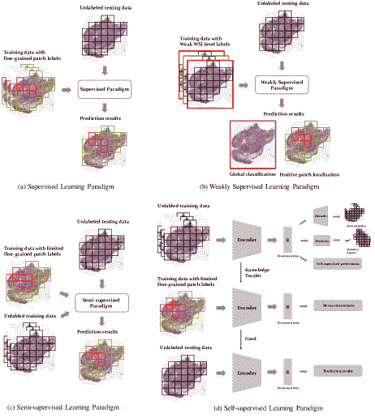
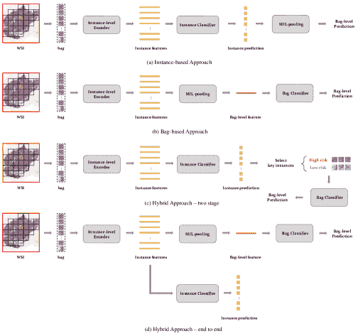

<!--yml

category: 未分类

date: 2024-09-06 19:44:52

-->

# [2208.08789] 面向标签高效的自动诊断和分析：基于深度学习的弱监督、半监督和自监督技术在组织病理图像分析中的综合调查

> 来源：[`ar5iv.labs.arxiv.org/html/2208.08789`](https://ar5iv.labs.arxiv.org/html/2208.08789)

# 面向标签高效的自动诊断和分析：基于深度学习的弱监督、半监督和自监督技术在组织病理图像分析中的综合调查

Linhao Qu, Siyu Liu, Xiaoyu Liu, Manning Wang¹¹1Corresponding Author., Zhijian Song²²footnotemark: 2 数字医学研究中心，基础医学学院，复旦大学，上海医学图像计算与计算机辅助干预重点实验室，上海 200032，中国 {lhqu20, mnwang, zjsong}@fudan.edu.cn.

###### Abstract

组织病理图像包含丰富的表型信息和病理模式，这些是疾病诊断的金标准，对于患者预后和治疗结果的预测至关重要。近年来，临床实践中急需组织病理图像的计算机自动分析技术，卷积神经网络代表的深度学习方法逐渐成为数字病理学领域的主流。然而，在该领域获取大量细粒度标注数据是一项非常昂贵和困难的任务，这阻碍了基于大量标注数据的传统监督算法的进一步发展。更近期的研究开始摆脱传统的监督范式，最具代表性的研究包括基于弱标注的弱监督学习范式、基于有限标注的半监督学习范式和基于病理图像表示学习的自监督学习范式。这些新方法引领了一波针对标注效率的自动病理图像诊断和分析的新潮流。通过对 130 多篇论文的调查，我们从技术和方法学的角度对计算病理学领域中的最新研究进行了全面和系统的回顾。最后，我们呈现了这些技术的关键挑战和未来趋势。

\useunder

Keywords: 组织病理图像，自动分析，深度学习

## 1 引言

组织病理图像包含丰富的表型信息和病理模式，这些是疾病诊断的金标准，并且对患者预后和治疗结果的预测至关重要（Myronenko *et al.* 2021, Wang *et al.* 2019, Srinidhi *et al.* 2021）。对于临床诊断，经验丰富的病理学家通常需要在高倍显微镜下对苏木精-伊红染色（H&E）组织切片进行详尽的检查和解读，包括区分肿瘤区域与大面积正常组织、对肿瘤进行详细分级，以及评估肿瘤的进展和侵袭（例如，侵袭性癌症的存在或增生性变化等）。这是一个非常耗时和劳动密集的任务，例如，经验丰富的组织病理学家通常需要 15 到 30 分钟来检查一个完整的切片（Wang *et al.* 2019）。此外，即使是经验丰富的病理学家也可能无法准确确定病理图像中隐藏的深层特征，例如预测淋巴结转移和原发病灶的预后。因此，临床实践中迫切需要计算机辅助的自动分析技术来处理组织病理图像。

随着过去二十年数字切片扫描仪的出现和发展，活检组织可以转换为完全保留原始组织结构的数字全切片图像（WSIs），为自动病理图像分析奠定了基础。数字病理诊断领域的早期研究主要集中在从病理学家手动选择的感兴趣区域（ROI）中提取手工特征（Jafari *et al.* 2003, Basavanhally *et al.* 2013, Mercan *et al.* 2017, Yu *et al.* 2016, Luo *et al.* 2017, Qaiser *et al.* 2016），并使用机器学习方法（Doyle *et al.* 2007, Rajpoot *et al.* 2004, Qureshi *et al.* 2008, Doyle *et al.* 2006）进行自动分析和诊断。在这方面，Gurcan *et al.* 2009 和 Madabhushi *et al.* 2016 提供了详尽的综述。

最近几年，由于强大的自动特征提取能力，以卷积神经网络（CNN）为代表的深度学习方法逐渐成为数字病理学领域的主流。然而，一个主要挑战是 WSIs 的巨大尺寸，通常在最高分辨率下达到`100000`像素，这阻碍了将整个 WSIs 直接作为深度学习模型输入。因此，在使用 CNN 处理病理图像时，WSIs 通常会被切割成许多小块，以减少计算负担。早期的研究通常采用基于这些小块的强监督方法来训练网络并执行相应的分类（Cruz-Roa *et al.* 2014, Cruz-Roa *et al.* 2017, Wei *et al.* 2019, Ehteshami *et al.* 2018, Nagpal *et al.* 2019, Shaban *et al.* 2019, Halicek *et al.* 2019）和分割任务（Chen *et al.* 2017, Gu *et al.* 2018, Swiderska *et al.* 2019）。在这些工作中，详细的小块级注释是必不可少的，例如，监督分类问题需要病理学家为每个小块提供详细的类别标签，而分割问题需要病理学家为每个小块提供更详细的像素级注释。

尽管监督深度学习方法在数字病理学中取得了前所未有的成功，但它们都有一个共同的缺点：都需要大量高质量的细粒度标注数据（分类问题的块级标注数据或分割问题的像素级标注数据）进行训练。不幸的是，在数字病理学领域，获取大量细粒度注释的数据是一项非常昂贵且具有挑战性的任务，主要因为 1）只有经验丰富的病理学家才能进行注释，而这些病理学家稀缺；2）组织病理图像通常包含复杂多样的对象实例，导致耗时且劳动密集的手动注释工作（Tajbakhsh *et al.* 2020, Yang *et al.* 2017, Srinidhi *et al.* 2021）。可以说，缺乏大量注释数据限制了深度学习技术在计算病理学中的应用。因此，一些新研究最近尝试摆脱传统的强监督范式，其中最具代表性的是基于弱注释的弱监督学习范式、基于有限注释的半监督学习范式和基于病理图像表示学习的自监督范式。

弱监督学习范式不再要求病理学家对整个 WSI 中的所有像素或区域进行标注，只需对整个 WSI 进行类别标签或稀疏区域标注；半监督学习范式不再要求病理学家对大量数据进行细粒度标注，只需少量细粒度标注数据和大量未标注数据；而自监督学习范式则可以通过大量未标注数据创建监督信息进行自监督训练，从而学习数据的准确特征表示。在有限标注数据的训练过程中，使用自监督学习训练的特征来确定初始模型权重，可以显著提高模型性能。因此，弱监督学习、半监督学习和自监督学习正在引领病理图像自动诊断与分析的新研究方向。

然而，相关的综述非常少。Srinidhi *等人* 2021 回顾了截至 2019 年 12 月在计算病理学领域的代表性监督学习、弱监督学习、无监督学习和迁移学习研究。Rony *等人* 2019 回顾了截至 2020 年的代表性弱监督学习研究。尽管如此，近年来深度学习技术发展迅速，新技术不断涌现。因此，关于这些技术在病理图像自动诊断中的应用的综述具有重要的理论价值和临床意义。

在这篇综述中，我们系统地总结了 130 多项近期在计算病理学领域的弱监督学习、半监督学习和自监督学习的技术研究。我们通过搜索 Google Scholar、PubMed 和 arXiv，查找包含（“深度学习”或“弱监督学习”或“半监督学习”或“自监督学习”）以及（“数字病理学”或“组织病理学”或“计算病理学”）等关键词的论文来进行这项广泛的综述。值得注意的是，一方面，我们重点关注那些呈现出高影响力的新技术和理论的论文（如 h 指数、引用次数和期刊的影响因子），因此我们更加关注在顶级会议（包括 CVPR、NeurIPS、MICCAI、ISBI、MIDL、IPMI、AAAI、ICCV、ECCV 等）和顶级期刊（包括 TPAMI、TMI、MIA 等）上发表的关于计算病理学领域的弱监督学习、半监督学习和自监督学习的研究。另一方面，由于这一领域的技术研究发展迅速，提出了更多的新技术，我们主要涵盖了 2019 年至 2021 年间发表的论文。此外，我们还对这些论文涵盖的疾病类型、任务、数据集和性能进行了细致的总结。总的来说，这篇综述包含了 200 多篇相关参考文献。

论文的其余部分组织如下：第二部分阐述了计算病理学背景下的弱监督、半监督和自监督学习范式的一般概述；第三部分包括对弱监督（第 3.1 节）、半监督（第 3.2 节）和自监督（第 3.3 节）学习范式的详细回顾；我们在第四部分讨论了这三种学习范式及其未来趋势，并在第五部分总结了整篇论文。本综述中使用的所有缩写的列表见表 1。

表 1: 本综述中所有缩写的列表。

| 全称 | 缩写 | 全称 | 缩写 |
| --- | --- | --- | --- |
| ROC 曲线下面积 | AUC | 图神经网络 | GNN |
| 辅助分类生成对抗网络 | AC-GAN | 苏木精-伊红染色 | H&E |
| 平均 Hausdorff 距离 | AHD | 放大优先对比相似度 | MPCS |
| 平均 Jaccard 指数 | AJI | 平均精度均值 | MAP |
| Calinski-Harabaz 指数 | CHI | 平均教师 | MT |
| 对比预测编码 | CPC | 微卫星不稳定性 | MSI |
| 卷积自编码器 | CAE | 多实例全卷积网络 | MI-FCN |
| 卷积神经网络 | CNN | 多实例学习 | MIL |
| 深度学习哈希 | DLH | 噪声对比估计 | NCE |
| 变形表示学习 | DRL | 肿瘤细胞百分比 | TC |
| 扩散卷积神经网络 | DCNNs | 循环神经网络 | RNN |
| 双流多实例学习 | DSMIL | 感兴趣区域 | ROI |
| 期望最大化 | EM | 分辨率序列预测 | RSP |
| 指数移动平均 | EMA | 轮廓指数 | SI |
| 焦点感知模块 | FAM | 支持向量机 | SVM |
| Frechet 感知距离 | FID | 时间集成 | TE |
| 生成对抗网络 | GAN | 癌症基因组图谱计划 | TCGA |
| 图卷积神经网络 | GCN | 整张幻灯片图像 | WSI |

## 2 学习范式和问题定义概述

在本节中，我们提供了本文回顾的三种学习范式的总体概述和问题定义，并将它们与传统的强监督范式进行比较。为了使描述更具体和生动，我们展示了一个在 WSI 中准确分类正常组织和癌组织的示例，如图 1 所示。该示例 WSI 的原始数据来自于一项使用深度学习预测乳腺癌淋巴结转移的研究（Bejnordi *et al.* 2017a）。我们还在表 2 中直观地比较和总结了这些范式。

对于数据集<math   alttext="W={\{W_{i}\}}_{i=1}^{N}" display="inline"><semantics ><mrow  ><mi >W</mi><mo >=</mo><msubsup  ><mrow ><mo stretchy="false" >{</mo><msub ><mi  >W</mi><mi >i</mi></msub><mo stretchy="false"  >}</mo></mrow><mrow ><mi >i</mi><mo  >=</mo><mn >1</mn></mrow><mi >N</mi></msubsup></mrow><annotation-xml encoding="MathML-Content" ><apply  ><ci >𝑊</ci><apply ><csymbol cd="ambiguous"  >superscript</csymbol><apply ><csymbol cd="ambiguous" >subscript</csymbol><set ><apply  ><csymbol cd="ambiguous"  >subscript</csymbol><ci >𝑊</ci><ci >𝑖</ci></apply></set><apply ><ci >𝑖</ci><cn type="integer" >1</cn></apply></apply><ci >𝑁</ci></apply></apply></annotation-xml><annotation encoding="application/x-tex" >W={\{W_{i}\}}_{i=1}^{N}</annotation></semantics></math>包含<math   alttext="N" display="inline"><semantics ><mi  >N</mi><annotation-xml encoding="MathML-Content" ><ci  >𝑁</ci></annotation-xml><annotation encoding="application/x-tex" >N</annotation></semantics></math>个 WSI，每个 WSI <math   alttext="W_{i}" display="inline"><semantics ><msub  ><mi >W</mi><mi  >i</mi></msub><annotation-xml encoding="MathML-Content" ><apply  ><csymbol cd="ambiguous"  >subscript</csymbol><ci >𝑊</ci><ci >𝑖</ci></apply></annotation-xml><annotation encoding="application/x-tex" >W_{i}</annotation></semantics></math> 现在被切割成补丁<math   alttext="\{p_{i,j},j=1,2,\ldots n_{i}\}" display="inline"><semantics ><mrow  ><mo stretchy="false"  >{</mo><mrow ><mrow ><mrow  ><msub ><mi >p</mi><mrow ><mi >i</mi><mo  >,</mo><mi >j</mi></mrow></msub><mo >,</mo><mi >j</mi></mrow><mo >=</mo><mn  >1</mn></mrow><mo >,</mo><mrow ><mn  >2</mn><mo >,</mo><mrow ><mi mathvariant="normal" >…</mi><mo lspace="0em" rspace="0em"  >​</mo><msub ><mi >n</mi><mi >i</mi></msub></mrow></mrow></mrow><mo stretchy="false"  >}</mo></mrow><annotation-xml encoding="MathML-Content" ><set  ><apply ><csymbol cd="ambiguous" >formulae-sequence</csymbol><apply ><list ><apply ><csymbol cd="ambiguous" >subscript</csymbol><ci >𝑝</ci><list ><ci  >𝑖</ci><ci >𝑗</ci></list></apply><ci >𝑗</ci></list><cn type="integer" >1</cn></apply><list ><cn type="integer" >2</cn><apply ><ci  >…</ci><apply ><csymbol cd="ambiguous"  >subscript</csymbol><ci >𝑛</ci><ci >𝑖</ci></apply></apply></list></apply></set></annotation-xml><annotation encoding="application/x-tex" >\{p_{i,j},j=1,2,\ldots n_{i}\}</annotation></semantics></math>，其中<math   alttext="n_{i}" display="inline"><semantics ><msub  ><mi >n</mi><mi  >i</mi></msub><annotation-xml encoding="MathML-Content" ><apply  ><csymbol cd="ambiguous"  >subscript</csymbol><ci >𝑛</ci><ci >𝑖</ci></apply></annotation-xml><annotation encoding="application/x-tex" >n_{i}</annotation></semantics></math>是从<math   alttext="W_{i}" display="inline"><semantics ><msub  ><mi >W</mi><mi  >i</mi></msub><annotation-xml encoding="MathML-Content" ><apply  ><csymbol cd="ambiguous"  >subscript</csymbol><ci >𝑊</ci><ci >𝑖</ci></apply></annotation-xml><annotation encoding="application/x-tex" >W_{i}</annotation></semantics></math>中切割出的补丁数量。在监督学习范式中，大量带有细粒度标签的补丁用于训练，因此每个补丁都被赋予一个标签<math alttext="y_{i,j}\in\mathbb{R}^{C}" display="inline"><semantics ><mrow ><msub  ><mi >y</mi><mrow ><mi  >i</mi><mo >,</mo><mi >j</mi></mrow></msub><mo  >∈</mo><msup ><mi >ℝ</mi><mi  >C</mi></msup></mrow><annotation-xml encoding="MathML-Content" ><apply  ><apply ><csymbol cd="ambiguous" >subscript</csymbol><ci  >𝑦</ci><list ><ci >𝑖</ci><ci >𝑗</ci></list></apply><apply ><csymbol cd="ambiguous" >superscript</csymbol><ci >ℝ</ci><ci  >𝐶</ci></apply></apply></annotation-xml><annotation encoding="application/x-tex" >y_{i,j}\in\mathbb{R}^{C}</annotation></semantics></math>，其中<math   alttext="C" display="inline"><semantics ><mi  >C</mi><annotation-xml encoding="MathML-Content" ><ci  >𝐶</ci></annotation-xml><annotation encoding="application/x-tex" >C</annotation></semantics></math>表示可能的类别。例如，在二分类任务中，<math alttext="C=2" display="inline"><semantics ><mrow ><mi  >C</mi><mo >=</mo><mn >2</mn></mrow><annotation-xml encoding="MathML-Content" ><apply  ><ci >𝐶</ci><cn type="integer"  >2</cn></apply></annotation-xml><annotation encoding="application/x-tex" >C=2</annotation></semantics></math>，标签采用标量形式{0, 1}；而在回归任务中，<math alttext="C" display="inline"><semantics ><mi >C</mi><annotation-xml encoding="MathML-Content" ><ci  >𝐶</ci></annotation-xml><annotation encoding="application/x-tex" >C</annotation></semantics></math>则采用实数的连续集合形式<math alttext="ℝ" display="inline"><semantics ><mi >ℝ</mi><annotation-xml encoding="MathML-Content" ><ci >ℝ</ci></annotation-xml><annotation encoding="application/x-tex" >ℝ</annotation></semantics></math>。监督学习范式的目标是训练一个模型<math alttext="f_{\theta}:x\rightarrow y" display="inline"><semantics ><mrow  ><msub ><mi >f</mi><mi  >θ</mi></msub><mo lspace="0.278em" rspace="0.278em"  >:</mo><mrow ><mi >x</mi><mo stretchy="false" >→</mo><mi  >y</mi></mrow></mrow><annotation-xml encoding="MathML-Content" ><apply ><ci  >:</ci><apply ><csymbol cd="ambiguous" >subscript</csymbol><ci >𝑓</ci><ci >𝜃</ci></apply><apply ><ci  >→</ci><ci >𝑥</ci><ci >𝑦</ci></apply></apply></annotation-xml><annotation encoding="application/x-tex" >f_{\theta}:x\rightarrow y</annotation></semantics></math>，以**最佳**地预测未知补丁<math   alttext="y_{i,j}" display="inline"><semantics ><msub  ><mi >y</mi><mrow ><mi  >i</mi><mo >,</mo><mi >j</mi></mrow></msub><annotation-xml encoding="MathML-Content" ><apply  ><csymbol cd="ambiguous"  >subscript</csymbol

在弱监督学习范式中，每个补丁的标签<math alttext="y_{i,j}" display="inline"><semantics ><msub ><mi  >y</mi><mrow ><mi >i</mi><mo  >,</mo><mi >j</mi></mrow></msub><annotation-xml encoding="MathML-Content" ><apply  ><csymbol cd="ambiguous"  >subscript</csymbol><ci >𝑦</ci><list ><ci  >𝑖</ci><ci >𝑗</ci></list></apply></annotation-xml><annotation encoding="application/x-tex" >y_{i,j}</annotation></semantics></math> 通常是未知的，而只有每个 WSI 的标签是已知的，因此传统的强监督学习范式无法使用。在这篇综述中，我们重点介绍了目前在计算病理学中使用的最主要的弱监督范式，即深度多实例学习（MIL）方法。在 MIL 中，每个 WSI 被视为包含多个补丁（也称为实例）的包。如果一个 WSI（包）被标记为疾病阳性，则该 WSI 中至少有一个补丁（实例）是疾病阳性；如果一个 WSI 是疾病阴性，则该 WSI 中的所有补丁都是阴性。WSI（包）与其补丁（实例）之间的关系可以用数学表达如下。

给定一个数据集 <math   alttext="W={\{W_{i}\}}_{i=1}^{N}" display="inline"><semantics ><mrow  ><mi >W</mi><mo >=</mo><msubsup  ><mrow ><mo stretchy="false" >{</mo><msub ><mi  >W</mi><mi >i</mi></msub><mo stretchy="false"  >}</mo></mrow><mrow ><mi >i</mi><mo  >=</mo><mn >1</mn></mrow><mi >N</mi></msubsup></mrow><annotation-xml encoding="MathML-Content" ><apply  ><ci >𝑊</ci><apply ><csymbol cd="ambiguous"  >superscript</csymbol><apply ><csymbol cd="ambiguous" >subscript</csymbol><set ><apply  ><csymbol cd="ambiguous"  >subscript</csymbol><ci >𝑊</ci><ci >𝑖</ci></apply></set><apply ><ci >𝑖</ci><cn type="integer" >1</cn></apply></apply><ci >𝑁</ci></apply></apply></annotation-xml><annotation encoding="application/x-tex" >W={\{W_{i}\}}_{i=1}^{N}</annotation></semantics></math> 包含 <math   alttext="N" display="inline"><semantics ><mi  >N</mi><annotation-xml encoding="MathML-Content" ><ci  >𝑁</ci></annotation-xml><annotation encoding="application/x-tex" >N</annotation></semantics></math> 个 WSIs，每个图像 <math   alttext="W_{i}" display="inline"><semantics ><msub  ><mi >W</mi><mi  >i</mi></msub><annotation-xml encoding="MathML-Content" ><apply  ><csymbol cd="ambiguous"  >subscript</csymbol><ci >𝑊</ci><ci >𝑖</ci></apply></annotation-xml><annotation encoding="application/x-tex" >W_{i}</annotation></semantics></math> 都有一个对应的标签 <math   alttext="Y_{i}\in\left\{0,1\right\},\ i=\{1,2,...N\}" display="inline"><semantics ><mrow ><mrow  ><msub ><mi >Y</mi><mi  >i</mi></msub><mo >∈</mo><mrow ><mo  >{</mo><mn >0</mn><mo >,</mo><mn  >1</mn><mo >}</mo></mrow></mrow><mo rspace="0.667em"  >,</mo><mrow ><mi >i</mi><mo  >=</mo><mrow ><mo stretchy="false" >{</mo><mn >1</mn><mo  >,</mo><mn >2</mn><mo >,</mo><mrow  ><mi mathvariant="normal"  >…</mi><mo lspace="0em" rspace="0em"  >​</mo><mi >N</mi></mrow><mo stretchy="false"  >}</mo></mrow></mrow></mrow><annotation-xml encoding="MathML-Content" ><apply ><csymbol cd="ambiguous"  >formulae-sequence</csymbol><apply ><apply ><csymbol cd="ambiguous" >subscript</csymbol><ci >𝑌</ci><ci  >𝑖</ci></apply><set ><cn type="integer" >0</cn><cn type="integer" >1</cn></set></apply><apply ><ci  >𝑖</ci><set ><cn type="integer" >1</cn><cn type="integer" >2</cn><apply  ><ci >…</ci><ci >𝑁</ci></apply></set></apply></apply></annotation-xml><annotation encoding="application/x-tex" >Y_{i}\in\left\{0,1\right\},\ i=\{1,2,...N\}</annotation></semantics></math>。现在，每个 WSI <math   alttext="W_{i}" display="inline"><semantics ><msub  ><mi >W</mi><mi  >i</mi></msub><annotation-xml encoding="MathML-Content" ><apply  ><csymbol cd="ambiguous"  >subscript</csymbol><ci >𝑊</ci><ci >𝑖</ci></apply></annotation-xml><annotation encoding="application/x-tex" >W_{i}</annotation></semantics></math> 被切割成小块 <math   alttext="\{p_{i,j},j=1,2,\ldots,n_{i}\}" display="inline"><semantics ><mrow  ><mo stretchy="false"  >{</mo><mrow ><mrow ><mrow  ><msub ><mi >p</mi><mrow ><mi >i</mi><mo  >,</mo><mi >j</mi></mrow></msub><mo >,</mo><mi >j</mi></mrow><mo >=</mo><mn  >1</mn></mrow><mo >,</mo><mrow ><mn  >2</mn><mo >,</mo><mi mathvariant="normal"  >…</mi><mo >,</mo><msub ><mi >n</mi><mi >i</mi></msub></mrow></mrow><mo stretchy="false" >}</mo></mrow><annotation-xml encoding="MathML-Content" ><set  ><apply ><csymbol cd="ambiguous" >formulae-sequence</csymbol><apply ><list ><apply ><csymbol cd="ambiguous" >subscript</csymbol><ci >𝑝</ci><list ><ci  >𝑖</ci><ci >𝑗</ci></list></apply><ci >𝑗</ci></list><cn type="integer" >1</cn></apply><list ><cn type="integer" >2</cn><ci >…</ci><apply  ><csymbol cd="ambiguous"  >subscript</csymbol><ci >𝑛</ci><ci >𝑖</ci></apply></list></apply></set></annotation-xml><annotation encoding="application/x-tex" >\{p_{i,j},j=1,2,\ldots,n_{i}\}</annotation></semantics></math>，这些小块之间不重叠，其中 <math   alttext="n_{i}" display="inline"><semantics ><msub  ><mi >n</mi><mi >i</mi></msub><annotation-xml encoding="MathML-Content" ><apply  ><csymbol cd="ambiguous"  >subscript</csymbol><ci >𝑛</ci><ci >𝑖</ci></apply></annotation-xml><annotation encoding="application/x-tex" >n_{i}</annotation></semantics></math> 是小块的数量。所有的小块 <math   alttext="\{p_{i,j},j=1,2,\ldots,n_{i}\}" display="inline"><semantics ><mrow  ><mo stretchy="false"  >{</mo><mrow ><mrow ><mrow  ><msub ><mi >p</mi><mrow ><mi >i</mi><mo  >,</mo><mi >j</mi></mrow></msub><mo >,</mo><mi >j</mi></mrow><mo >=</mo><mn  >1</mn></mrow><mo >,</mo><mrow ><mn  >2</mn><mo >,</mo><mi mathvariant="normal"  >…</mi><mo >,</mo><msub ><mi >n</mi><mi >i</mi></msub></mrow></mrow><mo stretchy="false" >}</mo></mrow><annotation-xml encoding="MathML-Content" ><set  ><apply ><csymbol cd="ambiguous" >formulae-sequence</csymbol><apply ><list ><apply ><csymbol cd="ambiguous" >subscript</csymbol><ci >𝑝</ci><list ><ci  >𝑖</ci><ci >𝑗</ci></list></apply><ci >𝑗</ci></list><cn type="integer" >1</cn></apply><list ><cn type="integer" >2</cn><ci >…</ci><apply  ><csymbol cd="ambiguous"  >subscript</csymbol><ci >𝑛</ci><ci >𝑖</ci></apply></list></apply></set></annotation-xml><annotation encoding="application/x-tex" >\{p_{i,j},j=1,2,\ldots,n_{i}\}</annotation></semantics></math> 在 <math   alttext="W_{i}" display="inline"><semantics ><msub  ><mi >W</mi><mi  >i</mi></msub><annotation-xml encoding="MathML-Content" ><apply  ><csymbol cd="

|  | <math   alttext="Y_{i}=\left\{\begin{array}[]{cc}&amp;0,\text{ if }\sum_{j}y_{i,j}=0\\ &amp;1,\text{ else }\end{array}\right." display="block"><semantics ><mrow  ><msub ><mi  >Y</mi><mi >i</mi></msub><mo >=</mo><mrow  ><mo >{</mo><mtable columnspacing="5pt" displaystyle="true" rowspacing="0pt"  ><mtr ><mtd  ><mrow ><mrow ><mn  >0</mn><mo >,</mo><mrow ><mtext  > if </mtext><mo lspace="0em" rspace="0em"  >​</mo><mrow ><mstyle displaystyle="false"  ><msub ><mo >∑</mo><mi >j</mi></msub></mstyle><msub ><mi >y</mi><mrow ><mi >i</mi><mo >,</mo><mi  >j</mi></mrow></msub></mrow></mrow></mrow><mo >=</mo><mn >0</mn></mrow></mtd></mtr><mtr ><mtd  ><mrow ><mn >1</mn><mo  >,</mo><mtext > else </mtext></mrow></mtd></mtr></mtable></mrow></mrow><annotation-xml encoding="MathML-Content" ><apply  ><apply ><csymbol cd="ambiguous" >subscript</csymbol><ci  >𝑌</ci><ci >𝑖</ci></apply><apply ><csymbol cd="latexml"  >cases</csymbol><matrix ><matrixrow ><cerror  ><csymbol cd="ambiguous"  >missing-subexpression</csymbol></cerror><apply ><list ><cn type="integer" >0</cn><apply  ><ci ><mtext > if </mtext></ci><apply ><apply ><csymbol cd="ambiguous"  >subscript</csymbol><ci >𝑗</ci></apply><apply ><csymbol cd="ambiguous"  >subscript</csymbol><ci >𝑦</ci><list ><ci >𝑖</ci><ci  >𝑗</ci></list></apply></apply></apply></list><cn type="integer"  >0</cn></apply></matrixrow><matrixrow ><cerror  ><csymbol cd="ambiguous"  >missing-subexpression</csymbol></cerror><list ><cn type="integer" >1</cn><ci ><mtext  > else </mtext></ci></list></matrixrow></matrix></apply></apply></annotation-xml><annotation encoding="application/x-tex" >Y_{i}=\left\{\begin{array}[]{cc}&0,\text{ if }\sum_{j}y_{i,j}=0\\ &1,\text{ else }\end{array}\right.</annotation></semantics></math> |  | (1) |
| --- | --- | --- | --- |

这意味着负袋中的所有实例标签都是负的，而正袋中至少存在一个正实例，且实例的标签<math   alttext="y_{i,j}" display="inline"><semantics ><msub  ><mi >y</mi><mrow  ><mi >i</mi><mo >,</mo><mi  >j</mi></mrow></msub><annotation-xml encoding="MathML-Content" ><apply  ><csymbol cd="ambiguous"  >subscript</csymbol><ci >𝑦</ci><list ><ci  >𝑖</ci><ci >𝑗</ci></list></apply></annotation-xml><annotation encoding="application/x-tex" >y_{i,j}</annotation></semantics></math> 是未知的。

图 1：本文回顾的学习范式的一般概述，展示了在 WSI 中分类正常组织（绿色）和癌组织（红色）的示例。请注意，这图中的训练数据和测试数据仅用于描述，并不一定是真实情况。 (a) 监督学习范式。 (b) 弱监督学习范式。 (c) 半监督学习范式。 (d) 自监督学习范式。

如图 1 (b)所示，深度学习基础的 WSI 分析通常有两个主要目标，一个是全局幻灯片分类，即准确分类每个 WSI，另一个是正样本定位，即准确分类每个正样本包中的实例。有关当前最先进的弱监督学习方法的综述见 3.1 节。

在半监督学习范式中，我们仅有少量带标签的样本，以及大量未标记的样本也可以用于训练。因此，半监督学习范式的主要目标是如何利用未标记的数据来提高在有限带标签数据上训练的模型的性能。如图 1 (c)所示，与监督学习范式相比，半监督学习范式在使用带标签数据进行训练的同时，利用大量未标记的数据。在测试阶段，训练好的模型被用于预测测试 WSI 中样本的标签。有关半监督学习方法的详细综述见 3.2 节。

自监督学习是一种混合学习方法，结合了无监督学习和监督学习范式，通过预训练和微调的方式进行。其目的是通过从大量未标记数据中生成监督信息来获得更好的监督训练结果，这可以学到更好的特征表示，并减少后续任务中的人工标注。由于标注数据量少，直接使用这些数据训练模型是不够的。因此，自监督学习范式首先从大量未标记数据中学习主要的特征表示，这称为预训练过程。然后，将在自监督辅助任务中学到的特征表示转移到下游任务中，使用有限的标记数据进行进一步训练，这称为微调过程。通过这种方式，主要的特征表示可以有效地帮助网络在少量标记数据下实现有效的训练结果。

如图 1 (d) 所示，自监督学习范式的预训练过程通常通过自监督辅助任务来完成。在自监督辅助任务中，首先利用未标记数据的某些固有特性生成监督信息，然后通过自监督信息（例如自我重建、随机旋转后角度预测、颜色信息丢弃后颜色化以及补丁位置破坏后恢复）来训练网络。一旦完成这些自监督辅助任务，就可以提取有效的特征表示。自监督学习的微调过程在下游任务中进行。在微调过程中，使用少量标记数据进行监督训练，模型不是从头开始训练，而是利用在辅助任务中学到的特征表示作为网络的初始权重进行进一步训练。最后，使用训练好的网络进行测试。最先进的自监督学习方法的综述见第 3.3 节。

表 2：四种范式的直观总结和比较。

| 方法 | 输入 | 适用任务 | 技术范式 | 优势 | 劣势 |
| --- | --- | --- | --- | --- | --- |
| 监督学习范式 | 大量的小块（从 WSIs 拼接而来）带有细粒度标签 | WSI 级别和小块级别的分类/分割/回归 | - | 广泛应用，有效且简单的训练 | 需要大量的细粒度标注数据 |
| 弱监督学习范式 | 整个 WSI 带有整体标签或稀疏标签 | WSI 级别分类/分割/回归，小块级别粗粒度定位 | 基于实例的方法，基于包的方法，混合方法 | 不需要细粒度标注，有效减少数据标注负担 | 对细粒度任务的表现有限 |
| 半监督学习范式 | 有限数量的小块（从 WSIs 拼接而来）带有细粒度标签 | WSI 级别和小块级别的分类/分割/回归 | 基于伪标注的方法，一致性方法，图形方法，无监督预处理方法，GAN 方法等 | 只需少量细粒度标注，有效减少数据标注负担 | 需要满足各种半监督假设 |
| 自监督学习范式 | 大量的小块（从 WSIs 拼接而来）没有标签 | 小块级别的特征表示，多个相关的下游任务 | 预测方法，生成方法，对比方法，混合方法 | 从大量无监督数据中高效提取图像特征，有效减少数据标注负担 | 当提取的特征不适用于下游任务时，可能会导致信息丢失 |

## 3 个范式

### 3.1 弱监督学习范式

在本节中，我们全面回顾了目前在计算病理学的弱监督学习范式中使用的主要深度多实例学习（MIL）方法。在 MIL 中，每个 WSI 被视为一个包含多个小块（也称为实例）的包。如果 WSI（包）被标记为疾病阳性，那么该 WSI 中的至少一个小块（实例）也是疾病阳性；如果 WSI 是疾病阴性，则该 WSI 中的所有小块都是阴性。

我们将当前用于 WSI 分析的深度 MIL 方法分为基于实例的方法、基于包的方法和混合方法。我们的分类主要依据方法是否包含实例分类器或包分类器，即，基于实例的方法仅包含实例分类器；基于包的方法仅包含包分类器；而混合方法则同时包含实例分类器和包分类器。这样，类别就清晰地覆盖了几乎所有当前用于 WSI 分析的深度 MIL 方法。上述三种方法的图示见图 2。本节的详细文献总结在表 3。

#### 3.1.1 基于实例的方法

实例化方法的主要思想是训练一个优秀的实例分类器，以准确预测每个袋子中实例的潜在标签，然后使用 MIL-pooling 将每个袋子中所有实例的预测结果进行聚合，从而获得袋子的预测结果。详细信息见图 2（a）。由于每个实例的真实标签未知，这些方法通常首先将每个实例的标签与其对应的袋子作为伪标签（即，正袋中的所有实例被赋予正标签，负袋中的所有实例被赋予负标签），然后使用监督方式训练实例分类器，直到其收敛。损失函数通常是实例分类器预测结果与伪标签之间的交叉熵函数。训练后，实例分类器用于对测试袋中的所有实例进行预测，然后将每个实例的预测结果进行聚合以获得袋子的预测结果，这一聚合过程称为 MIL-pooling。常用的 MIL pooling 方法包括均值池化（Wang *et al.* 2018）、最大池化（Feng *et al.* 2017, Wang *et al.* 2018, Wu *et al.* 2015）、投票（Cruz-Roa *et al.* 2014）、对数和指数池化（Ramon *et al.* 2000）、噪声或池化（Maron *et al.* 1997）、噪声与池化（Kraus *et al.* 2016）和动态池化（Yan *et al.* 2018）等。

图 2：多实例学习方法概览。（a）实例化方法。（b）袋子方法。（c）两阶段混合方法。（d）端到端混合方法。

实例化方法在早期研究中更为常见，其主要优点在于能够直接预测每个实例，从而方便进行定位任务。然而，它有两个主要缺点。首先，由于正袋中每个实例的真实标签不一定全部为正标签，因此赋予正袋中实例的伪标签是嘈杂的，这会导致实例分类器训练不准确；其次，MIL-pooling 方法将每个袋子中实例的预测结果进行聚合，是手动设计且不可训练的，使其灵活性和鲁棒性较差。因此，这些方法的性能通常受限。

#### 3.1.2 袋子方法

基于包的方法的主要思路是首先使用共享的实例级特征提取器提取包中每个实例的特征，然后使用 MIL-pooling 聚合实例级特征以获得包级特征，然后以监督方式训练包分类器直至收敛。具体示意图见图 2 (b)。损失函数通常定义为包分类器预测与真实包标签之间的交叉熵损失。

MIL-pooling 在基于包的方法中也存在，但不同于基于实例的方法，MIL-pooling 在这里聚合的不是实例的预测结果，而是实例的特征。均值池化、最大池化及其他聚合方法也可以用作实例特征的聚合方法，但它们的缺点仍然存在，即它们无法自适应地训练和调整，因此通常不够灵活。

基于包的方法的关键在于包分类器的训练。由于包的真实标签是已知的，因此在训练过程中没有噪声，因此这些方法在包分类中往往比基于实例的方法更准确。然而，基于包的方法的一个严重问题是它们无法轻易地执行定位任务。此外，实例特征的聚合函数不够灵活，无法展示不同实例对包分类的贡献。

##### 基于注意力的方法

伊尔斯*等人* 2018 缓解了这些困境。他们首次提出使用可训练的注意力机制来聚合实例特征，并通过后续的包级方法开启了基于注意力的聚合方法的研究浪潮。他们采用端到端方式训练了实例级特征提取器和包级分类器，并使用注意力机制聚合特征并衡量每个实例的重要性。图*等人* 2019 提出了用于实例聚合的新型端到端图神经网络（GNN）。这项工作是首个基于 GNN 的 MIL 工作。桥本*等人* 2020 提出了通过结合 MIL、领域对抗和多尺度学习框架的癌症亚型分类的新型端到端方法。姚、朱*等人* 2017, 2020 提出了用于癌症生存分析的深度注意力引导 MIL 框架。他们首先使用来自 ImageNet 的预训练模型（邓*等人* 2009）提取每个包中实例的特征，然后使用 K-means 算法对每个包中的实例进行聚类，以获得表型模式，最后应用注意力机制聚合这些模式的特征并进行预测。

##### 基于自监督预训练的方法

由于 WSIs 的极大尺寸和大量切割出的实例，直接对所有实例进行端到端训练很容易受到计算资源的限制。因此，一些研究首先使用先进的自监督预训练方法来刻画每个实例，然后进行后续训练。卢*等人* 2019 首次提出通过自监督对比预测编码（CPC）获得实例级特征表示，然后使用基于注意力的 MIL 方法进行实例聚合，以执行包级分类。这是首个使用自监督对比学习的 MIL 研究。赵*等人* 2020 使用预训练的 VAE-GAN（拉尔森*等人* 2016）来提取实例级特征，然后使用 GNN 聚合实例特征并进行包级分类。李*等人* 2021 提出了 DSMIL，他们使用对比预训练（陈*等人* 2020）来获取实例特征，然后提出了基于掩蔽非局部操作的双流聚合器，以进行实例级分类和包级分类。

##### 基于 Transformer 的方法

在基于 MIL 的 WSI 分析中，除了考虑不同实例对包分类的贡献外，还应充分探索不同实例之间的关系，因为 WSI 中的不同实例并不是彼此孤立的，而是有强关联的。为了解决这个问题，Shao *et al.* 2021 和 Li *et al.* 2021 等使用了基于 Transformer 的架构来聚合实例，并取得了令人鼓舞的结果。前者设计了一种基于 Transformer 的相关 MIL 框架来探索不同实例之间的形态和空间信息，并提供了相关证明。后者提出了一种基于可变形变换器和卷积层的 MIL 框架。

#### 3.1.3 混合方法

混合方法结合了上述两种方法的优点。它同时训练实例级分类器和包级分类器，使用前者预测实例级结果，而后者用于包级结果。总体而言，混合方法有两种类型，一种是两阶段方法，另一种是端到端方法。

##### 两阶段混合方法

两阶段混合方法通常通过将每个袋中的每个实例分配其对应的袋标签作为伪标签来训练实例分类器，然后训练袋分类器，根据实例分类器的预测完成袋分类。一些研究也尝试基于实例分类器的预测选择每个袋中的关键实例，然后基于这些关键实例训练袋分类器。具体图示见图 2 (c)。Hou *等* 2016 提出了一个新的基于期望最大化（EM）的模型。他们基于空间关系选择了具有区分性的实例来训练实例分类器，并将实例预测的直方图输入多类逻辑回归模型和 SVM 模型（Chang *等* 2011）进行袋预测。Campanella *等* 2019 首先在当前迭代中选择了实例分类器预测概率最大的关键实例，并将相应袋标签的伪标签分配给它们。然后，他们将这些关键实例的特征输入递归神经网络（RNN），以执行袋的聚合和预测。Wang *等* 2019 基于正实例概率的预测选择了关键实例，并将其特征输入全局特征描述符，使用随机森林算法对袋进行分类。Chen *等* 2021 提出了一个关注焦点模块（FAM），并使用 WSI 的缩略图自动估计与诊断相关的关键区域。然后，基于这些关键区域提取不同尺度的实例特征，并使用 GNN 进行聚合以执行袋分类。

##### 端到端混合方法

端到端混合方法通常同时训练实例级分类器和包级分类器。一个常见的方法是通过将每个实例分配到包分类器上作为伪标签来同时训练这两个分类器。一些研究还训练实例分类器首先在一个时期内选择关键实例，然后在汇总实例特征后训练包分类器。具体图示见图 2 (d)。Shi *et al.* 2020 提出了基于损失的注意力 MIL。他们在 AB-MIL (Ilse *et al.* 2018) 的基础上增加了一个按实例注意力分数加权的实例级损失函数作为正则化项，以提高实例的召回率，并使用一致性约束来平滑训练过程，提高泛化能力。Chikontwe *et al.* 2020 在端到端框架中结合了 top-k 实例选择、实例级表示学习和包级表示。Sharma *et al.* 2021 也在端到端框架中结合了实例选择、实例级表示学习和包级表示。与 (Chikontwe *et al.* 2020) 不同，他们提出使用基于聚类的采样方法来选择关键实例。Lu *et al.* 2021 还提出了一个基于聚类和注意力机制的 MIL 框架。他们在当前包中选择注意力分数最大和最小的实例进行聚类，以增强特征空间的学习。Myronenko *et al.* 2021 提出了一个结合了 Transformer 和 CNN 架构的 MIL 框架，以计算实例之间的相互关系并汇总实例特征以完成包分类。他们增加了实例损失以辅助优化过程。

#### 3.1.4 代表性临床研究

大量杰出的研究致力于使用弱监督方法解决重大临床问题。例如，Coudray *et al.* 2018 等人开发了用于精确预测癌症亚型和基因突变的深度学习模型，推动了整个弱监督计算病理学领域的发展。Naik *et al.* 2020 等人提出了一种基于注意力的深度 MIL 框架，以从 H&E 切片中直接预测雌激素受体状态。另一个典型的临床工作来自 Tomita *et al.* 2019，他们提出了一种基于网格的注意力网络，以对来自 379 名患者的高分辨率内窥镜食管和胃食管交界处黏膜活检图像进行 4 类分类。Skrede *et al.* 2020 开发了一种多尺度深度 MIL 基模型来分析传统的 HE 染色切片，并开发了一种可以有效预测结直肠癌手术后患者预后的模型。另一个胃肠道肿瘤研究（Kather *et al.* 2019）基于深度 MIL 模型直接在 HE 染色切片上预测微卫星不稳定性（MSI）。目前，弱监督深度学习模型已经广泛应用于包括乳腺癌、结直肠癌、肺癌、肝癌、宫颈癌、甲状腺癌和膀胱癌在内的多种癌症类型（Coudray *et al.* 2018, Chaudhary *et al.* 2018, Wessels *et al.* 2021, Campanella *et al.* 2019, Anand *et al.* 2021, Yang *et al.* 2022, Li *et al.* 2021, Saillard *et al.* 2020, Velmahos *et al.* 2021, Woerl *et al.* 2020)。

表 3：弱监督学习部分文献列表。

|      参考文献 |      方法 |      疾病类型 |      染色 |      任务 |      数据集 |      数据集规模 |      数据集链接 |      性能 |
| --- | --- | --- | --- | --- | --- | --- | --- | --- |
|      Yan 等人 (2018) |      基于实例 |      乳腺癌 |      H&E |       良性和恶性分类 |      UCSB 乳腺数据集 |      58 个病例 |      Kandemir 等人 (2014) |      准确率：0.927 |
|       糖尿病（来自眼底图像） |      Messidor 数据集 |      1200 个病例 |      Decencière 等人 (2014) |      准确率：0.740 |
|      Kraus 等人 (2016) |      基于实例 |      乳腺癌 |       三通道荧光标记用于 DNA、肌动蛋白纤维和 b-微管 |       12 个不同类别的分类 |       Broad Bioimage Benchmark Collection (BBBC021v1) 数据集 |      340 个病例 |      Ljosa 等人 (2012) |       准确率：完整图像 0.958，处理图像 0.971 |
|      Cruz-Roa 等人 (2014) |      基于实例的 |      乳腺癌 |      H&E |       侵袭性导管癌组织区域的自动检测 |       临床组织病理数据集 收集自多个医院 |      162 个案例 |      内部 |      准确率: 0.842 |
|      Ilse 等人 (2018) |      基于包的 |      乳腺癌 |      H&E |       癌变区域的自动检测 |      乳腺癌数据集 |      58 个案例 |      Gelasca 等人 (2008) |      准确率: 0.755 |
|      结肠癌 |      结肠癌数据集 |      100 个案例 |      Sirinukunwattana 等人 (2016) |      准确率: 0.904 |
|      涂等人 (2019) |      基于包的 |       糖尿病（来自眼底图像） |      H&E |       从弱标记的视网膜图像中诊断糖尿病 |      Messidor 数据集 |      1200 个案例 |      Decencière 等人 (2014) |      准确率: 0.742 |
|      Hashimoto 等人 (2020) |      基于包的 |      恶性淋巴瘤 |      H&E |       恶性淋巴瘤亚型分类 |       临床组织病理数据集 收集自多个医院 |      196 个案例 |      内部 |      准确率: 0.871 |
|      姚等人 (2020) |      基于包的 |      肺癌 |      H&E |      癌症生存预测 |       国家肺部筛查试验 (NLST) 数据集 |      387 个案例 |      团队等人 (2011) |      AUC: 0.652 |
|      结直肠癌 |       分子和细胞肿瘤学 (MCO) 数据集 |      1146 个案例 |      Ward 和 Hawkins (2015) |      AUC: 0.7143 |
|      卢等人 (2019) |      基于包的 |      乳腺癌 |      H&E |      正常或良性分类 |      BACH 数据集 |      400 个案例 |      Aresta 等人 (2019) |      准确率: 0.95 |
|      赵等人 (2020) |      基于包的 |      结肠腺癌 |      H&E |      淋巴结转移预测 |       癌症基因组图谱 (TCGA) 数据集 |      425 个案例 |      Kandoth 等人 (2013) |      准确率: 0.6761 |
|      李、李和 Eliceiri (2021) |      基于包的 |      乳腺癌 |      H&E |      淋巴结转移检测 |      Camelyon16 数据集 |      400 个案例 |      Bejnordi 等人 (2017b) |      准确率: 0.8992 |
|      肺癌 |       肺癌亚型的诊断 |       癌症基因组图谱 (TCGA) 肺癌数据集 |      1054 个案例 |      https://portal.gdc.cancer.gov/ |      准确率: 0.9571 |
|      邵等人 (2021) |      基于包的 |      乳腺癌 |      H&E |      淋巴结转移检测 |      Camelyon16 数据集 |      400 个案例 |      Bejnordi 等人 (2017b) |      准确率: 0.8837 |
|      肺癌 |      癌症亚型诊断 |      TCGA-NSCLC 数据集 |      993 例 |      https://portal.gdc.cancer.gov/ |      准确率: 0.8835 |
|      肾癌 |      癌症亚型诊断 |      TCGA-RCC 数据集 |      884 例 |      https://portal.gdc.cancer.gov/ |      准确率: 0.9466 |
|      Li, Yang, Zhao 和 Yao (2021) |      基于袋的 |      乳腺癌 |      H&E |      淋巴结转移检测 |      BREAST-LNM 数据集 |      3,957 例 |      内部 |      AUC: 0.7288 |
|      肺癌 |      肺癌亚型诊断 |      CPTAC-LUAD 数据集 |      1065 例 |      Clark 等人 (2013) |      AUC: 0.9906 |
|      Hou 等人 (2016) |      混合 |      胶质瘤 |      H&E |      胶质瘤分类 |       癌症基因组图谱 (TCGA) 数据集 |      209 例 |      https://portal.gdc.cancer.gov/ |      准确率: 0.771 |
|      肺癌 |       非小细胞肺癌亚型诊断 |      316 例 |      准确率: 0.798 |
|      Campanella 等人 (2019) |      混合 |      前列腺癌 |      H&E |      良性与恶性分类 |      前列腺核心活检数据集 |      24,859 例 |      内部 |      AUC: 0.986 |
|      皮肤癌 |      良性与恶性分类 |      皮肤数据集 |      9,962 例 |      内部 |      AUC: 0.986 |
|      乳腺癌 |      淋巴结转移检测 |      乳腺数据集 |      9894 例 |       MSK 乳腺癌:      http://thomasfuchslab.org/data/. |      AUC: 0.965 |
|      Wang 等人 (2019) |      混合 |      肺癌 |      H&E |      肺癌亚型诊断 |      肺癌数据集 |      939 例 |      内部 |      准确率: 0.973 |
|      Chen 等人 (2021) |      混合 |      乳腺癌 |      IHC |       HER2 评分 (阴性 (0/1+)，可疑 (2+) 和阳性 (3+)) |      HER2 评分数据集 |      1,105 例 |      内部 |      准确率: 0.8970 |
|      Chikontwe 等人 (2020) |      混合 |      结肠癌 |      H&E |       预测正常和恶性组织 |      CRC WSI 数据集 I |      173 例 |      内部 |      准确率: 0.9231 |
|      CRC WSI 数据集 II |      193 例 |      准确率: 0.9872 |
|      Sharma 等人 (2021) |      混合 |       胃肠道      乳糜泻 |      H&E |       预测乳糜泻患者或健康人 |      胃肠道数据集 |      413 例 |      内部 |      准确率: 0.862 |
|      乳腺癌 |      淋巴结转移检测 |      Camelyon16 数据集 |      400 例 |      Bejnordi 等人 (2017b) |      AUC: 0.9112 |
|      Lu 等 (2021) |      混合 |      肾细胞癌 |      H&E |       亚型分类及淋巴结转移的检测 |      RCC 数据集 |      884 个病例 |      https://portal.gdc.cancer.gov |      AUC: 0.991 |
|      非小细胞肺癌 |      NSCLC 数据集 |      993 个病例 |      https://cancerimagingarchive.net/datascope/cptac |      AUC: 0.956 |
|      乳腺癌 |      CAMELYON16 和 CAMELYON17 数据集 |      899 个病例 |      https://camelyon17.grand-challenge.org/Data |      AUC: 0.936 |
|      Myronenko 等 (2021) |      混合 |      前列腺癌 |      H&E |       癌组织分类      为 Gleason 模式 |       前列腺癌等级评估      (PANDA) 挑战数据集 |      11,000 个病例 |      https://panda.grandchallenge.org/home/ |      准确度: 0.805 |
|      Naik 等 (2020) |      临床研究 |      乳腺癌 |      H&E |       激素受体状态的确定 |       澳大利亚乳腺癌组织库      (ABCTB) 数据集 |      2535 个病例 |      https://abctb.org.au/abctbNew2/ACCESSPOLICY.pdf |      AUC: 0.92 |
|       癌症基因组图谱 (TCGA) 数据集 |      1014 个病例 |      https://portal.gdc.cancer.gov |      AUC: 0.861 |
|      Tomita 等 (2019) |      临床研究 |      食管癌 |      H&E |       癌性和癌前食管组织的检测 |      食管癌数据集 |      180 个病例 |      内部数据 |      准确度: 0.83 |
|      Skrede 等 (2020) |      临床研究 |      结直肠癌 |      H&E |      结直肠癌预后预测 |      结直肠癌数据集 |      2473 个病例 |      内部数据 |       不良预后与      良好预后的比例: 3.84 |
|      Kather *et al.* (2019) |      临床研究 |      胃肠癌 |      H&E |      微卫星不稳定性的预测 |      TCGA-STAD 数据集 |      315 个病例 |      https://portal.gdc.cancer.gov/. |      AUC: 0.81 |
|      TCGA-CRC-DX 数据集 |      360 个病例 |      AUC: 0.84 |
|      TCGA-CRC-KR 数据集 |      378 个病例 |      AUC: 0.77 |
|      Coudray 等 (2018) |      临床研究 |      肺癌 |      H&E |      亚型分类 |       癌症基因组图谱 (TCGA) 数据集 |      1634 个病例 |      https://portal.gdc.cancer.gov/ |      AUC: 0.97 |
|       从非小细胞肺癌中预测突变 |       六种常见突变基因的 AUC 从 0.733 到 0.856 |
|      Bejnordi 等 (2017a) |      临床研究 |      乳腺癌 |      H&E |      淋巴结转移的检测 |      CAMELYON16 数据集 |      400 个病例 |      https://camelyon16.grand-challenge.org/ |      AUC: 0.994 |
|      Wessels 等人（2021） |      临床研究 |      前列腺癌 |      H&E |      预测淋巴结转移 |      前列腺癌数据集 |      218 例 |      内部数据 |      AUC: 0.68 |
|      Anand 等人（2021） |      临床研究 |      甲状腺癌 |      H&E |      预测 BRAF 突变 |       ISBI 2017 甲状腺组织微阵列（TH-TMA17）数据集 |      85 例 | Wang *等人*（2018） |      AUC: 0.96 |
|      TCGA-THCA 数据集 |      444 例 |      https://portal.gdc.cancer.gov/ |      AUC: 0.98 |
|      杨等人（2022） |      临床研究 |      乳腺癌 |      H&E |       预测 HER2 阳性乳腺癌复发和转移风险 |      HER2 阳性乳腺癌数据集 |      127 例 |      https://github.com/bensteven2/HE_breast_recurrence |      AUC: 0.76 |
|      癌症基因组图谱（TCGA）数据集 |      123 例 |      AUC: 0.72 |
| 李*等人*（2021） |      临床研究 |      乳腺癌 |      H&E |       预测新辅助化疗的病理完全反应生物标志物 |      乳腺癌数据集 |      540 例 |      内部数据 |      AUC: 0.847 |
|      Saillard 等人（2020） |      临床研究 |      肝细胞癌 |      H&E |       预测肝细胞癌切除后的生存率 |      发现集 |      194 例 |      内部数据 |      C-指数：0.78 |
|      癌症基因组图谱（TCGA）数据集 |      328 例 |      https://portal.gdc.cancer.gov/ |      C-指数：0.70 |
|      Velmahos 等人（2021） |      临床研究 |      膀胱癌 |      H&E |      识别 FGFR 激活突变 |       癌症基因组图谱（TCGA）数据集 |      418 例 |      https://portal.gdc.cancer.gov/ |      AUC = 0.76 |
|      Woerl 等人（2020） |      临床研究 |      膀胱癌 |      H&E |      预测分子亚型 |       癌症基因组图谱（TCGA）尿路上皮膀胱癌数据集 |      407 例 |      https://portal.gdc.cancer.gov/ |      AUC = 0.89 |
|      CCC-EMN 队列 |      16 例 |      内部数据 |      AUC = 0.85 |

### 3.2 半监督学习范式

半监督学习是机器学习的一个分支，它结合了监督学习和无监督学习任务，并通过利用任务间的信息来提高模型性能（Zhu *et al.* 2005, Van *et al.* 2020）。在半监督学习中，通常只有少量标记数据可用，除此之外，还可以利用大量未标记的数据进行网络训练。因此，半监督学习的主要目标是如何利用这些未标记的数据来提高用有限标记数据训练的模型的性能。半监督学习范式的场景在病理图像分析领域非常普遍，无论是在诊断任务还是分割任务中。由于精细标注的成本高且耗时，病理学家通常只能提供少量精确的标注来进行模型的监督训练，而大量未标注的数据无法被利用。仅用这些有限的标记数据训练深度模型容易导致过拟合，从而显著损害模型的性能和泛化能力。在半监督学习范式中，大量未标记图像可以用于辅助训练，从而进一步提高模型的性能、泛化能力和鲁棒性。

在过去的二十年中，许多半监督学习算法被提出并广泛应用于自然图像处理和病理图像分析领域。半监督学习领域的代表性方法分为五类，即基于伪标记的方法（第 3.2.1 节），基于一致性的方法（第 3.2.2 节），基于图的方法（第 3.2.3 节），无监督预处理方法（第 3.2.4 节），以及其他方法（第 3.2.5 节）。我们将分别介绍这些方法。对于每一类，我们首先描述其基本原理，然后详细阐述其在病理图像分析领域的代表性研究。有关自然图像领域半监督学习的假设、概念和代表性方法的系统综述，我们推荐 Van *et al.* 2020 的综述。表 4 总结了本节文献的详细列表。

#### 3.2.1 基于伪标记的方法

##### 基本原理

基于伪标签的方法是一种经典且知名的半监督方法（Zhu *等人* 2005），主要包括两个交替的过程：训练和伪标签。以分类问题为例，在训练过程中，一个或多个分类器首先在标记数据上以监督方式进行训练。这些标记数据可能来源于初始准确标记的数据，或来自于之前迭代中产生的伪标签数据。在伪标签过程中，首先使用在前一过程训练的分类器对所有未标记的数据进行预测，然后选择预测最为自信的数据部分进行伪标签。最后，这些伪标签数据被添加到标记数据中进行下一轮迭代。这个过程会重复，直到没有高置信度的数据或所有数据都被标记。

基于伪标签的方法最初应用于自然图像处理领域，通常包括自训练方法（Lee *等人* 2013）和协同训练方法（Blum *等人* 1998，Zhou *等人* 2005）。

##### 病理图像分析研究

在病理图像分析中，Singh *等人* 2011 提出了一种半监督学习距离度量的方法，该方法从标记数据中学习，并执行标签传播以识别细胞核的亚型，该方法在本地自适应，并能够充分考虑数据的异质性。Bulten *等人* 2020 开发了一种基于半监督学习的前列腺活检 Gleason 评分的深度学习系统。他们首先在一个包含纯 Gleason 评分的小训练数据集上训练网络，然后将训练好的网络应用于其他内部训练数据集以设定参考标准。之后，使用病理学家的报告来修正和重新标记标签。Tolkach *等人* 2020 采用基于伪标签的半监督策略来训练 CNN 网络，以完成 Gleason 模式分类。Jasiwal *等人* 2019 提出了一种基于伪标签和熵正则化的半监督方法用于乳腺癌病理图像分类。Shaw *等人* 2020 通过提出一种半监督教师-学生蒸馏方法来扩展 Yalniz *等人* 2019 的研究，用于结直肠癌病理图像的分类。Marini *等人* 2021 提出了一种基于深度伪标签的半监督学习方法，用于包含仅少量本地注释的强异质性病理数据。他们的方法包括一个大容量教师模型和一个小容量学生模型，其中教师模型使用伪标签自动标记，以训练学生模型。Cheng *等人* 2020 提出了一个基于教师-学生模型的半监督学习框架，结合相似性学习，用于分割包含少量注释和噪声注释的乳腺癌病变。

#### 3.2.2 基于一致性的方法

##### 基本原理

一致性基半监督学习方法主要基于平滑假设。在平滑假设中，预测模型应该对输入的局部扰动具有鲁棒性。这意味着当我们对数据点施加少量噪声时，网络对扰动数据点和干净原始数据点的预测应该是相似的。在深度神经网络的实现中，一致性基方法可以通过直接将无监督一致性损失函数添加到原有的监督损失函数中，轻松扩展到半监督学习设置。在自然图像处理领域，典型的方法包括 <math alttext="\pi" display="inline"><semantics ><mi >π</mi><annotation-xml encoding="MathML-Content" ><ci >𝜋</ci></annotation-xml><annotation encoding="application/x-tex" >\pi</annotation></semantics></math>-model (Laine *et al.* 2016)，Temporal Ensembling model (Laine *et al.* 2016)，Mean Teachers (Tarvainen *et al.* 2017) 和 UDA (Xie *et al.* 2020)。

##### 病理图像分析研究

在病理图像分析中，Zhou *et al.* 2020 提出了一个基于模板引导的扰动敏感样本挖掘的新型 Mean-teacher (MT) 框架。该框架由一个教师网络和一个学生网络组成。教师网络是一个从 K 次随机增强数据中集成的预测网络，用于指导学生网络在特征和语义层面上对小扰动保持不变。Su *et al.* 2019 提出了一个新颖的全局和局部一致性损失，并基于 Mean-Teacher 框架执行了核分类任务。

#### 3.2.3 基于图的方法

##### 基本原理

图基半监督学习方法通常构建图以保持邻近节点的关系，并利用图的变换同时利用标记数据的信息以及探索未标记数据的潜在结构。图基半监督学习方法的关键步骤是构建一个更好的图来表示原始数据结构。它们通常在所有数据点（包括标记和未标记的数据点）上定义图，并使用权重来编码数据点对之间的相似性。通过这种方式，标记的信息可以通过图传播到未标记的数据点。对于标记的数据点，预测的标签应该与真实标签匹配；由相似性图定义的相似数据点应该有相同的预测。图基半监督方法是一个相对复杂且发展较长的领域，我们推荐（Van *et al.* 2020，Chong *et al.* 2020）以获得更全面的理解。

##### 病理图像分析研究

在病理图像分析中，徐*等人* 2016 提出了一个结合卷积神经网络（CNN）和半监督正则化项的新框架。他们首先为每个未标记样本生成了一个假设标签，然后提出了一种基于图的平滑项进行正则化。苏*等人* 2015 提出了一种用于交互式细胞分割的主动学习和基于图的半监督学习方法。受到时间集成模型（Laine*等人* 2016）的启发，石*等人* 2020 提出了基于图的时间集成模型 GTE。该方法为每个训练样本创建特征和标签预测的集成目标，并鼓励模型在不同扰动下形成一致的预测，从而利用未标记数据的语义信息，提高模型对噪声标签的鲁棒性。

#### 3.2.4 无监督预处理方法

##### 基本原理

与之前的方法不同，无监督预处理方法通常专注于从大量未标记数据中进行无监督特征提取、聚类（先聚类后标记）或后续监督学习过程的参数初始化（预训练）。最流行的方法包括自编码器及其变体（Vincent*等人* 2008, 2011）。聚类是另一种方法，能够充分学习整体数据分布，因此许多半监督学习算法（Goldberg*等人* 2009, Demiriz*等人* 1999, Dara*等人* 2002）通过聚类引导后续的分类过程。预训练的思想是首先使用未标记数据通过无监督方法预训练一个模型，然后将该模型的参数作为后续监督训练模型的初始参数，即后续的监督训练是在这些初始参数的基础上进行微调。在此基础上，大量未标记数据可以充分引导具有有限标记数据的后续分类模型，从而提高半监督学习的性能（Erhan*等人* 2010）。

##### 病理图像分析中的研究

在病理图像分析中，Peikari *等人* 2018 提出了一个先聚类后标记的半监督学习方法，用于识别数据空间中的高密度区域，并利用这些区域帮助支持向量机找到决策边界。Lu *等人* 2019 提出了一个基于特征提取和预训练的半监督方法，用于 WSI 级别的乳腺癌分类任务，这是首个依赖对比预测编码进行自监督特征学习的弱监督病理图像分类工作。Koohbanani *等人* 2021 提出了一个自监督学习与半监督学习相结合的病理图像联合框架。他们提出了三种特定于病理学的自监督任务：放大预测、放大拼图预测和苏木精通道预测，以学习病理图像中的高级语义信息和领域不变信息。Srinidhi *等人* 2022 也提出了一个结合自监督学习与半监督学习的框架。他们首先提出了解析序列预测（RSP）自监督辅助任务，通过未标记数据预训练模型，然后在标记数据上对模型进行微调。之后，他们使用上述两步得到的训练模型作为模型的初始权重，进行基于师生一致性框架的进一步半监督训练。

#### 3.2.5 其他方法

在半监督学习中，还有许多其他方法，如基于生成对抗网络（GAN）的方法（Goodfellow *等人* 2014, 2016, Salimans *等人* 2016, Odena *等人* 2016, Dai *等人* 2017）、流形方法（Belkin *等人* 2005, 2006, Weston *等人* 2012, Rifai *等人* 2011, 2011）和基于关联学习的方法（Haeusser *等人* 2017）。

在病理图像分析中，Kapil *等* 2018 首次使用了辅助分类生成对抗网络 (AC-GAN) 来处理病理图像半监督分类任务，并取得了良好结果。Cong *等* 2021 提出了使用基于 GAN 的半监督学习方法来解决病理图像的染色标准化问题。Sparks *等* 2016 提出了基于流行病学习的半监督方法来完成基于内容的组织病理图像检索任务。Li *等* 2018 开发了一种基于期望最大化 (EM) 的半监督方法，用于前列腺切除术病理图像的语义分割任务。Su *等* 2021 提出了基于关联学习的新型半监督方法，用于病理图像分类任务，灵感来源于 Haeusser *等* 2017。一些研究 (Foucart *等* 2019) 也尝试分析了基于深度学习的半监督、噪声学习和弱标签学习在病理图像分析中的弱点和有效性。

表 4: 半监督学习部分文献列表。

| 参考文献 | 方法 | 疾病类型 | 染色 | 任务 | 数据集 | 数据集规模 | 数据集链接 | 性能 |
| --- | --- | --- | --- | --- | --- | --- | --- | --- |
| Singh 等 (2011) | 基于伪标签 | 乳腺癌 | 3D 荧光显微镜 | 识别核表型 | 核图像数据集 | 984 张图像 | 内部 | 平均准确率: 0.8 |
| Bulten 等 (2020) | 基于伪标签 | 前列腺癌 | H&E | 格里森评分 | 内部数据集 | 1243 名患者的 5759 个活检样本 | 内部 | AUC = 0.99 |
| Tolkach 等 (2020) | 基于伪标签 | 前列腺癌 | H&E | 前列腺癌组织的检测 | 癌症基因组图谱计划 (TCGA) 数据集 | 167 万个补丁 | http://portal.gdc.cancer.gov | 准确率 = 0.967 |
| 前列腺腺癌的格里森评分 | https://zenodo.org/deposit/3825933 | 准确率 = 0.98 |
| Jaiswal 等 (2019) | 基于伪标签 | 乳腺癌 | H&E | 淋巴结转移的检测 | PatchCamelyon 数据集 | 327680 个补丁 | https://camelyon16.grand-challenge.org/Data/ | AUC = 0.9816 |
| Shaw 等 (2020) | 基于伪标签 | 结直肠癌 | H&E | 9 类病理模式的分类 | 公开数据集 | 100000 个补丁 | https://zenodo.org/record/1214456#.YvyiX3ZByw4 | 平均准确率 = 0.943 |
| Marini et al. (2021) | 基于伪标签的方法 | 前列腺癌 | H&E | Gleason 分级 | Tissue MicroArray 数据集 Zurich 数据集 | 886 个案例 | 内部 | <math alttext="\kappa" display="inline"><semantics ><mi mathsize="80%" >κ</mi><annotation-xml encoding="MathML-Content" ><ci  >𝜅</ci></annotation-xml><annotation encoding="application/x-tex" >\kappa</annotation></semantics></math>分数：0.7645 |
| TCGA-PRAD 数据集 | 449 个案例 | http://portal.gdc.cancer.gov | <math alttext="\kappa" display="inline"><semantics ><mi mathsize="80%"  >κ</mi><annotation-xml encoding="MathML-Content" ><ci >𝜅</ci></annotation-xml><annotation encoding="application/x-tex" >\kappa</annotation></semantics></math>分数：0.4529 |
| Cheng et al. (2020) | 基于伪标签的方法 | 乳腺癌 | H&E | 自动化癌区分割 | CAMELYON16 数据集 | 400 个案例 | https://camelyon16.grand-challenge.org/Data/ | Dice：93.76 |
| 前列腺癌 | TVGH TURP 数据集 | 71 个案例 | 内部 | Dice：77.24 |
| Zhou et al. (2020) | 基于一致性的方法 | - | 液体巴氏测试标本 | 宫颈细胞实例分割 | 液体巴氏测试标本数据集 | 4439 个细胞质 | 内部 | AJI：73.45，MAP：46.01 |
| Su et al. (2019) | 基于一致性的方法 | - | H&E | 细胞核分类 | MoNuseg 数据集 | 22462 个细胞核 | Sirinukunwattana et al. (2016) | F1 分数：75.02（5% 标签） |
| Ki-67 核数据集 | 17516 个核 | 内部 | F1 分数：79.32（5% 标签） |
| Srinidhi et al. (2022) | 基于一致性的方法 | 乳腺癌、结直肠癌 | H&E | 肿瘤转移检测 | BreastPathQ 数据集 | 2579 个补丁 | Martel et al. (2019) | TC：0.876（10% 标签） |
| 组织类型分类 | Camelyon16 数据集 | 399 个 WSIs | https://camelyon16.grand-challenge.org/Data/ | AUC：0.855（10% 标签） |
| 肿瘤细胞性定量 | Kather 多类数据集 | 100K 个补丁 | Kather *et al.* (2019) | 准确率：0.982（10% 标签） |
| Xu et al. (2016) | 基于图的方法 | - | 显微镜图像 | 神经元分割 | 神经形态图像数据集 | 2000 个神经元区域带注释 | 内部 | F1 分数：0.96（40% 标签） |
| Su et al. (2015) | 基于图的方法 | - | 显微镜图像 | 细胞分割 | 相位对比显微镜图像数据集 | 多个序列，总计 1404 帧 | http://www.celltracking.ri.cmu.edu/downloads.html | TC：0.9813 |
| Shi, Su, Xing 和 Yang (2020) | 基于图的方法 | 肺癌 | H&E | 亚型预测 | 癌症基因组图谱（TCGA） | 2904 个补丁 | http://portal.gdc.cancer.gov | 准确率：0.905（20% 标签） |
| 乳腺癌 | 1763 个补丁 | 准确率：0.895（20% 标签） |
| Peikari 等 (2018) | 无监督预处理基础的 | 乳腺癌 | H&E | 识别不同乳腺组织区域 | 病理筛查图像数据集 | 4402 个补丁 | 内部数据 | AUC: 0.86 |
| 核图形分类数据集 | 30,000 个图形 | AUC: 0.95 |
| Lu 等 (2019) | 无监督预处理基础的 | 乳腺癌 | H&E | 良性与恶性分类 | BACH 数据集 | 400 个病例 | BACH: 乳腺癌组织图像大挑战 | 准确率: 0.95 |
| Koohbanani 等 (2021) | 无监督预处理基础的 | 乳腺癌 | H&E | 肿瘤区域检测 | Camelyon16 数据集 | 399 张幻灯片 | https://camelyon16.grand-challenge.org/Data/ | AUC: 0.817 (1% 标记) |
| 口腔鳞状细胞癌 | 颈部淋巴结转移预测 | LNM-OSCC 数据集 | 217 张幻灯片 | 内部数据 | AUC: 0.806 (1% 标记) |
| 结直肠癌 | 组织类型分类 | Kather 多类别数据集 | 100K 个补丁 | Kather *等* (2019) | AUC: 0.903 (1% 标记) |
| Srinidhi 等 (2022) | 无监督预处理基础的 | 乳腺癌, 结直肠癌 | H&E | 肿瘤转移检测 | BreastPathQ 数据集 | 2579 个补丁 | Martel 等 (2019) | TC: 0.876 (10% 标签) |
| 组织类型分类 | Camelyon16 数据集 | 399 张 WSIs | https://camelyon16.grand-challenge.org/Data/ | AUC: 0.855 (10% 标签) |
| 肿瘤细胞性定量 | Kather 多类别数据集 | 100K 个补丁 | Kather *等* (2019) | ACC: 0.982 (10% 标签) |
| Kapil 等 (2018) | 基于 GAN 的 | 肺癌 | Ventana PD-L1 (SP263) 检测 | 自动肿瘤比例评分 | NSCLC 针刺活检数据集 | 270 张幻灯片 | 内部数据 | 肿瘤阳性细胞像素与肿瘤细胞像素总数的比率: 0.94 |
| Cong 等 (2021) | 基于 GAN 的 | 脑癌 | H&E | 染色标准化 | TCGA1 神经胶质瘤队列 | 22,229 张图像 | Liu 等 (2020) | F1 分数: 0.937 |
| 乳腺癌 | BreakHis 数据库 | 7,909 张图像 | Spanhol 等 (2015) | F1 分数: 0.980 |
| Sparks 和 Madabhushi (2016) | 流形学习基础的 | 前列腺癌 | H&E | 图像检索 | 前列腺组织病理数据集 | 58 位患者 | 内部数据 | SI: 0.14 |
| Li 等 (2018) | 基于期望最大化的 | 前列腺癌 | H&E | 语义分割 | 前列腺数据集 | 135 个完全注释和 1800 个弱注释图块 | Gertych 等 (2015) | AJI: 0.495 |
| Su 等 (2021) | 关联学习基础的 | 乳腺癌 | H&E | 癌性和非癌性幻灯片分类 | Bioimaging 2015 挑战数据集 | 285 张图像 | Araújo 等 (2017) | F1 分数: 0.75 |
| BACH 数据集 | 400 张图像 | Aresta 等 (2019) | F1 分数: 0.77 |

### 3.3 自监督学习范式

与前两种范式不同，自监督学习范式并不直接对病理图像进行分类或分割，而是采用“两阶段‘预训练和微调’”的方法。由于标记的病理图像数量较少，无法仅用这些数据直接训练模型。因此，自监督学习范式旨在首先从大量未标记数据中学习有效的特征表示，这被称为预训练过程。之后，利用在自监督辅助任务中学习到的特征表示，将其迁移用于使用有限标记数据训练下游任务，这被称为微调过程。通过这种方式，即使仅用少量标记数据进行训练，良好的特征表示也能有效帮助模型获得良好的结果。

预训练过程，即良好特征表示的学习过程，是自监督学习的关键。通常，自监督学习通过执行自监督辅助任务来学习良好的特征表示。在自监督辅助任务中，首先利用未标记数据的某些固有属性生成监督信号，然后通过这些自监督信号来训练网络。不同的研究通常集中于设计不同的自监督辅助任务，以有效地进行特征表示学习。根据辅助任务的性质，现有的自监督学习范式主要可以分为预测性自监督学习、生成性自监督学习和对比性自监督学习。预测性自监督学习通过将辅助任务构建为带有未标记数据的分类问题来学习良好的特征表示；生成性自监督学习通过重建输入图像来学习良好的特征表示；对比性自监督学习通过学习区分相似样本（正样本）和不相似样本（负样本）来学习良好的特征表示。有关自然图像领域和医学图像领域自监督方法的系统性综述，我们推荐刘*等* 2021 和 Shurrab*等* 2021 的综述。

在本节中，我们详细回顾了用于病理图像分析的自监督学习研究。目前，一些研究专注于提出创新的自监督框架用于病理图像（我们称之为新颖自监督框架研究），而另一些则尝试将现有自监督学习方法应用于病理图像分析（我们称之为自监督框架应用研究）。我们在第 3.3.1 节介绍了新颖自监督框架的研究，其中我们重点讨论了预测性自监督学习、生成性自监督学习、对比性自监督学习和混合自监督学习及其在病理图像分析中的最先进方法。我们在第 3.3.2 节介绍了自监督框架应用研究。表 5 总结了本节的详细文献列表。

#### 3.3.1 新颖自监督框架的研究

##### 预测性自监督学习方法

###### 基本原理

预测性自监督学习通过将辅助任务构建为无标签数据的分类问题来学习良好的特征表示，分类的类别标签是从无标签数据本身构建的。目前，广泛应用于自然图像处理的预测性自监督辅助任务包括相对位置预测（Doersch *et al.* 2015）、拼图解决（Noroozi *et al.* 2016）和旋转角度预测（Gidaris *et al.* 2018）等。

###### 病理图像分析研究

在病理图像处理领域，Sahasrabudhe *等* 2020 提出了预测细胞核分割的补充任务。他们的主要思路是，对于不同放大倍数的 WSI（例如，5$\times$、10$\times$、20$\times$），他们首先从中获取不同放大倍数的图块，然后通过检查图块中细胞核的大小和纹理来预测这些图块的放大倍数类别。Srinidhi *等* 2022 提出了分辨率序列预测（RSP）补充任务。他们首先使用不同放大倍数的图块构建不同的分辨率序列组合，然后训练网络预测分辨率序列的顺序。Koohbanani *等* 2021 提出了放大倍数预测和解决放大倍数难题的补充任务。他们首先训练网络准确预测放大倍数类别，然后训练网络预测不同放大倍数图块的顺序。

##### 生成自监督学习方法

###### 基本原理

生成自监督学习通过重建输入图像来学习良好的特征表示。他们认为图像本身是一种有用的自监督信息，网络可以在图像重建过程中学习生成图像的潜在特征表示。在自然图像处理中，自编码器（Goodfellow *等* 2016）是生成自监督特征表示学习的早期代表工作。随后，去噪自编码器（Vincent *等* 2008）通过引入噪声增强了模型的特征表示能力。随后，研究人员提出了一系列重建自监督辅助任务，包括修补（Pathak *等* 2016）、着色（Zhang *等* 2016）、补丁打乱和恢复（Chen *等* 2019，Zhou *等* 2021），以进一步提升网络的特征表示能力，并取得了良好的结果。另一方面，一系列基于 GAN 的模型（如 DCGAN 2015，BiGAN 2016）也被用于执行自监督表示学习。在最新的自然图像自监督研究中，一系列（如 BEiT 2021，MAE 2021，PeCo 2021 等）基于遮罩图像块和使用 Transformer 进行重建的自监督研究达到了最高的性能，预计将引发新一波基于重建的自监督表示学习研究。

###### 病理图像分析中的研究

在病理图像分析中，穆罕默德 *等* 2019 提出了一个基于深度卷积自编码器的新型聚类模型，用于学习病理图像的特征表示。马哈帕特拉 *等* 2020 将语义信息融入到基于 GAN 的生成模型中，用于自监督特征表示学习，并将其应用于病理图像的染色体标准化任务。基罗斯 *等* 2019，2021 设计了用于病理图像的 GAN，提取组织的关键特征表示。博伊德 *等* 2021 提出了一个新的生成辅助任务，通过扩展图像补丁的视角来进行表示学习。侯 *等* 2019 提出了一个稀疏卷积自编码器（CAE），用于在组织病理图像中同时进行核检测和特征提取。库班尼 *等* 2021 提出了血红素通道预测辅助任务，他们使用血红素和伊红（H&E）染色图像逐像素预测血红素通道。

##### 对比自监督学习方法

###### 基本原理

对比自监督方法是最受欢迎的自监督范式之一，它通过鼓励模型学习区分相似样本（正样本）和不相似样本（负样本）来学习良好的特征表示。

对比预测编码（CPC）（Van *et al.* 2018）是一种早期应用于自然图像处理的对比自监督方法，其目标是最大化来自同一图像的补丁（正样本）之间的互信息，并最小化来自不同图像的补丁（负样本）之间的互信息。典型的后续研究致力于构造负样本。MoCo（He *et al.* 2020）是基于动量的对比自监督框架，主要基于动态字典查找和队列的思想。SimCLR（Chen *et al.* 2020）是一个简单的对比学习框架，旨在最大化同一图像的两个增强视图（正样本）之间的余弦相似度，并最小化小批量中不同图像之间的相似度（负样本）。

这些方法严重依赖大量负样本，因为仅有正样本容易导致模型退化，即将所有样本的特征映射到相同的向量。然而，最近的研究表明负样本并非必需。Caron *et al.* 2020 将聚类引入对比学习，从而消除了对负样本的需求。Chen *et al.* 2021 探索了应用于孪生网络的停止梯度操作，无需大量负样本。Grill *et al.* 2020，Caron *et al.* 2021 提出了基于教师-学生知识蒸馏框架的自监督学习模型，在没有任何负样本的情况下实现了最先进的性能。

###### 病理图像分析研究

在病理图像分析中，Xie *等人* 2020 使用不同放大倍数的图块作为正样本，而用不同放大倍数的图块作为负样本，并构建了尺度级三元组损失，以进行对比学习以进行核分割。Chhipa *等人* 2022 提出了放大优先对比相似度（MPCS）来构建对比损失。Xu *等人* 2020 提出了一个自监督变形表示学习（DRL）框架，从未标记的病理图像中学习语义特征。他们使用互信息训练网络，以区分原始的组织病理图像和局部结构变形的图像，同时使用噪声对比估计（NCE）保持一致的全局上下文信息。Wang *等人* 2021 提出了基于 BYOL 框架 2020 的 Transpath。他们首先收集了当前最大的病理图像数据集用于自监督预训练，其中包括约 270 万张来自 32529 个 WSIs 的图像。然后他们提出了一个结合 CNN 和 Transformer 的混合框架，以提取局部结构特征和全局上下文特征，并提出了 TAE 模块以进一步增强特征提取能力。

##### 混合自监督学习方法

许多研究还提出了用于病理图像的混合自监督方法。Abbet *等人* 2020 提出了用于病理图像的生成对比自监督表示学习方法的组合。他们首先将颜色化作为生成辅助任务。然后，他们使用空间上相邻的图块作为正样本，而远离的图块作为负样本，构建对比损失。Yang *等人* 2021 还提出了一种结合生成和对比方法的自监督表示方法用于病理图像。他们首先提出了一种基于生成的自监督任务，称为交叉染色预测，其中定义了两个编码器和解码器分别预测 E 通道和 H 通道，然后他们使用在前一个任务中训练的编码器进行进一步的对比训练。

#### 3.3.2 自监督框架的应用研究

除了旨在提出创新的自监督框架以处理病理图像的研究，更多的研究尝试将现有的自监督学习方法应用于各种病理图像分析任务。Chen *等人* 2020 提出了一个用于生存预后预测的端到端多模态融合框架，该框架结合了组织病理图像和基因组数据，其中使用了对比预测编码（CPC）预训练的自监督特征来初始化网络模型。Ciga *等人* 2022 通过大量实验表明，使用自监督预训练方法可以产生更好的特征，从而提升多个下游任务的性能。他们发现，对比自监督预训练方法的成功在很大程度上依赖于未标记训练集的多样性，而不是图像的数量。另一方面，视觉上显著不同的正样本和负样本有助于对比自监督学习，而只有微小差异但总体上相似的正负样本（例如正常的补丁与仅包含少量肿瘤区域的补丁）则不利于对比学习。然而，这在自然图像中并不常见，因此针对病理图像特征设计有针对性的自监督任务尤为重要。Tellez *等人* 2019 使用变分自编码器 2013、对比学习 2016 和 BiGAN 2016 对 gigapixel 病理图像进行压缩，并分别在一个合成数据集和两个公共组织病理数据集上评估了性能，取得了令人满意的结果。Stacke *等人* 2021 研究了如何将 SimCLR 2020 扩展到病理图像上，以学习有用的特征表示。他们系统地比较了 ImageNet 数据和组织病理数据之间的差异，以及这些差异如何影响自监督学习的目标，并指出了为不同自监督目标设计对结果的影响。Chen *等人* 2022 对 ImageNet 预训练特征、SimCLR 预训练特征和 DINO 2021 预训练特征在病理图像的弱监督分类和完全监督分类任务中的表现进行了全面比较。他们发现基于 DINO 的知识蒸馏框架能够更好地学习病理图像中的有效和可解释的特征。

Saillard *et al.* 2021 和 Dehaene *et al.* 2020 使用了 MoCo V2 2020 自监督学习方法来训练病理图像，实验结果显示，在相同条件下，使用自监督预训练特征的结果始终优于使用在 ImageNet 上预训练的特征。Lu *et al.* 2019, Zhao *et al.* 2020, 和 Li *et al.* 2021 分别使用了对比预测编码（CPC） 2018, VAE-GAN 2016, 和 SimCLR 2020 自监督预训练特征进行弱监督 WSI 分类，并取得了当前的最新性能。Koohbanani *et al.* 2021 开发了一个通过自监督学习和多任务学习方法促进的半监督学习框架，即以少量标注数据作为主要任务，自监督任务作为辅助任务进行训练。在他们的研究中，他们还比较了各种常用的病理无关自监督辅助任务（包括旋转、翻转、自编码器、真/假预测、领域预测等）以促进半监督学习。Srinidhi *et al.* 2022 也尝试使用自监督预训练特征来增强半监督学习。他们首先提出了分辨率序列预测（RSP）自监督辅助任务，通过未标记的数据预训练模型，然后在标记数据上对模型进行微调。之后，他们使用上述两个步骤得到的训练模型作为模型的初始权重，进行基于教师-学生一致性框架的进一步半监督训练。

此外，自监督学习还被用于各种其他病理任务，如病理图像检索（Shi *et al.* 2018, Yang *et al.* 2020），主动学习（Zheng *et al.* 2019），以及分子特征预测（Ding *et al.* 2020, Fu *et al.* 2020, Kather *et al.* 2020）等。

表 5：自监督学习部分文献列表。

| 参考文献 | 方法 | 疾病类型 | 染色 | 数据集 | 数据集规模 | 数据集链接 | 自监督方法 | 下游任务 | 下游性能 |
| --- | --- | --- | --- | --- | --- | --- | --- | --- | --- |
| Sahasrabudhe 等 (2020) | 预测 | - | H&E | MoNuSeg 数据库 | 1,125,737 个图块 | Kumar 等 (2017) | 识别图块的放大级别 | 细胞核分割 | AJI: 0.5354, AHD: 7.7502, Dice: 0.7477 |
| Srinidhi 等 (2022) | 预测 | 乳腺癌、结直肠癌 | H&E | BreastPathQ 数据集 | 2579 个补丁 | Martel 等 (2019) | 预测分辨率序列 | 肿瘤转移检测 | TC: 0.876 (10% 标签) |
|  |  |  |  | Camelyon16 数据集 | 399 张全切片图像 | [`camelyon16.grand-challenge.org/Data/`](https://camelyon16.grand-challenge.org/Data/) |  | 组织类型分类 | AUC: 0.855 (10% 标签) |
|  |  |  |  | Kather 多类别数据集 | 100K 贴片 | Kather *et al.* (2019) |  | 肿瘤细胞量化 | 准确率: 0.982 (10% 标签) |
| Koohbanani et al. (2021) | 预测模型 | 乳腺癌 | H&E | Camelyon16 数据集 | 399 张幻灯片 | [`camelyon16.grand-challenge.org/Data/`](https://camelyon16.grand-challenge.org/Data/) | 放大预测和解决放大难题 | 肿瘤区域检测 | AUC: 0.817 (1% 标记) |
|  |  | 口腔鳞状细胞癌 |  | LNM-OSCC 数据集 | 217 张幻灯片 | 内部数据 |  | 预测颈部淋巴结中的转移 | AUC: 0.806 (1% 标记) |
|  |  | 结直肠癌 |  | Kather 多类别数据集 | 100K 贴片 | Kather *et al.* (2019) |  | 组织类型分类 | AUC: 0.903 (1% 标记) |
| Muhammad et al. (2019) | 生成模型 | 胆管癌 | H&E | 肝内胆管癌 (ICC) 数据集 | 246 名患者 | 内部数据 | 深度聚类卷积自编码器 | 胆管癌的亚型划分 | CHI: 3863（5 个簇）和 4314（簇权重 = 0.2） |
| Mahapatra et al. (2020) | 生成模型 | 乳腺癌 | H&E | CAMELYON16 数据集 | 100,000 贴片 | [`camelyon16.grand-challenge.org/Data/`](https://camelyon16.grand-challenge.org/Data/) | 使用预训练网络进行语义引导 | 染色标准化 | 平均 AUC: 0.9320 |
|  |  | 乳腺癌 |  | CAMELYON17 数据集 | 100,000 贴片 | [`camelyon16.grand-challenge.org/Data/`](https://camelyon16.grand-challenge.org/Data/)，内部数据 |  |  |  |
| Quiros et al. (2019) | 生成模型 | 结直肠癌 | H&E | 国家肿瘤疾病中心 (NCT) 数据集 | 86 张幻灯片 | [`zenodo.org/record/1214456#.Yvzd-nZBxhE`](https://zenodo.org/record/1214456#.Yvzd-nZBxhE) | 使用生成对抗网络 (GANs) 捕捉关键组织特征和结构信息 | 癌症、淋巴细胞或基质细胞的计数 | FID: 16.65 |
|  |  | 乳腺癌 |  | 荷兰癌症研究所 (NKI) 数据集 和 温哥华综合医院 (VGH) 数据集 | 576 个组织微阵列 (TMAs) | Beck et al. (2011) |  |  | FID: 32.05 |
| Quiros et al. (2021) | 生成模型 | 乳腺癌 | H&E | 荷兰癌症研究所 (NKI, 荷兰) 和 温哥华综合医院 (VGH, 加拿大) 队列 | 总计 576 名患者 | Beck et al. (2011) | 提出对抗学习模型以提取癌症组织的特征表示 | 使用多实例学习 (MIL) 分类组织类型和预测全切片图像 (WSIs) 中的肿瘤存在 | AUC: 0.97 和 准确率: 0.85; AUC: 0.98 和 准确率: 0.94 |
|  |  | 结肠癌 |  | 国家肿瘤中心 (NCT, 德国) 数据集 | 100K 组织块 | [`zenodo.org/record/1214456#.Yvzd-nZBxhE`](https://zenodo.org/record/1214456#.Yvzd-nZBxhE) |  |  |  |
|  |  | 肺癌 |  | TCGA LUAD, LUSC 数据集 | 1184 名患者 | [`portal.gdc.cancer.gov`](http://portal.gdc.cancer.gov) |  |  |  |
| Boyd 等人 (2021) | 生成型 | 乳腺癌 | H&E | CAMELYON17 数据集 | 500 张切片 | [`camelyon16.grand-challenge.org/Data/`](https://camelyon16.grand-challenge.org/Data/) | 视场扩展 | 将切片二分类为转移性和非转移性类别 | 准确率: 0.8569 |
|  |  | 结直肠癌 |  | CRC 基准数据集 | 100K 图像块 | [`doi.org/10.5281/zenodo.1214456`](https://doi.org/10.5281/zenodo.1214456) |  | 切片分类为 9 种组织类型 | 准确率: 0.8511 |
| Koohbanani 等人 (2021) | 生成型 | 乳腺癌 | H&E | Camelyon16 数据集 | 399 张切片 | [`camelyon16.grand-challenge.org/Data/`](https://camelyon16.grand-challenge.org/Data/) | 苏木精通道预测辅助任务 | 肿瘤区域检测 | AUC: 0.817 (1% 标记) |
|  |  | 口腔鳞状细胞癌 |  | LNM-OSCC 数据集 | 217 张切片 | 内部收集 |  | 颈部淋巴结转移预测 | AUC: 0.806 (1% 标记) |
|  |  | 结直肠癌 |  | Kather 多类别数据集 | 100K 补丁 | Kather *等人* (2019) |  | 组织类型分类 | AUC: 0.903 (1% 标记) |
| Hou 等人 (2019) | 生成型 | - | H&E | 自收集淋巴细胞分类数据集 | 1785 张图像 | 内部收集 | 稀疏卷积自编码器（CAE） | 核检测 | 核分类：淋巴细胞分类 AUC 0.7856 |
|  |  |  |  | 核形状和属性分类数据集 | 2000 张图像 | Murthy 等人 (2017) |  |  | 核属性与形状 AUC 0.8788 |
|  |  |  |  | CRCHistoPhenotypes 核检测数据集 | 100 张图像 | Sirinukunwattana 等人 (2016) |  |  | 核检测：F-measure: 0.8345 |
|  |  |  |  | MICCAI 2015 核分割挑战数据集 | 763 张图像 | [`wiki.cancerimagingarchive.net/pages/viewpage.action?pageId=20644646`](https://wiki.cancerimagingarchive.net/pages/viewpage.action?pageId=20644646) |  |  | 淋巴细胞分类：AUC 0.7856 |
|  |  |  |  | TCGA 肺癌数据集 | 50 万张图像 | [`cancergenome.nih.gov/`](https://cancergenome.nih.gov/) |  |  | 核分割：DICE: 0.8362 |
| Xie、Chen、Li 和 Zheng (2020) | 对比型 | - | H&E | MoNuSeg 数据集 | 44 张图像 | Naylor 等人 (2018) | 尺度三重学习与计数排序 | 核分割 | AJI: 0.7063 |
| Chhipa 等人 (2022) | 对比型 | 乳腺癌 | H&E | BreakHis 数据集 | 7909 张图像 | Spanhol 等人 (2015) | 放大优先对比相似性 | 分类组织病理图像 | 平均准确率: 0.9233 |
| Xu 等人 (2020) | 对比 | 乳腺癌 | H&E | MICCAI 2015 腺体分割挑战赛 (GLaS) 数据集 | 165 张图像 | Sirinukunwattana 等人 (2017) | 变形表示学习 | 腺体分割 | F1-score 0.900, 准确率 0.8548 (10% 标注) |
|  |  | 结肠癌 |  | Patch Camelyon (PCam) 图像分类数据集 | 327,680 个补丁 | Veeling 等人 (2018) |  | 半监督分类 |  |
| Wang 等人 (2021) | 对比 | 肝癌、肾癌、结直肠癌、前列腺癌、胰腺癌和胆管癌 | H&E | 包括 MHIST、NCT-CRC-HE、PatchCamelyon 数据集在内的多个组织病理图像数据集 | 270 万张图像 | [`github.com/Xiyue-Wang/TransPath`](https://github.com/Xiyue-Wang/TransPath) | 对比学习，如 BYOL（自监督学习的新方法） | 组织病理图像分类任务 | F1-score: 0.8993、0.9582、0.8983（在 MHIST、NCT-CRC-HE、PatchCamelyon 数据集上） |
| Abbet 等人 (2020) | 生成 + 对比 | 结直肠癌 | H&E | 临床病理数据集 | 660 个 WSI | 内部 | 着色、图像重建和对比学习 | 生存分析 | C-Index: 0.6943 |
| Yang 等人 (2021) | 生成 + 对比 | 结直肠癌 | H&E | NCTCRC-HE-100K 数据集 | 100K 张图像 | [`zenodo.org/record/1214456#.Yvzd-nZBxhE`](https://zenodo.org/record/1214456#.Yvzd-nZBxhE) | 跨染色预测、对比训练 | 九类组织病理图像分类 | 仅用 1,000 个标注数据的八类分类准确率: 0.915 |
| Chen, Lu 和 Mahmood (2020) | 应用 | 神经胶质瘤和细胞癌 | H&E | 癌症基因组图谱 (TCGA) 数据集 | 1505 张图像 | [`portal.gdc.cancer.gov`](http://portal.gdc.cancer.gov) | 对比预测编码 (CPC) | 生存预后预测 | C-Index: 0.826 |
| Ciga 等人 (2022) | 应用 | 多种类型 | H&E | 来自不同机构的总共 57 个数据集 | 大量图像 | [`github.com/ozanciga/self-supervised-histopathology`](https://github.com/ozanciga/self-supervised-histopathology) | 对比学习 | 分类、回归和分割 | 多项结果 |
| Tellez 等人 (2019) | 应用 | 乳腺癌 | H&E | Camelyon16 数据集 | 400 个 WSI | [`camelyon16.grand-challenge.org/Data/`](https://camelyon16.grand-challenge.org/Data/) | 变分自编码器、对比学习和 BiGAN | 预测转移的存在 | AUC: 0.725 |
|  |  |  |  | TUPAC16 数据集 | 492 个 WSI | Veta 等人 (2019) |  | 预测肿瘤增殖速度 | Spearman 相关系数: 0.522 |
| Stacke 等人 (2021) | 应用 | 多种类型 | H&E | Camelyon16 数据集 | 400 张幻灯片 | [`github.com/k-stacke/ssl-pathology`](https://github.com/k-stacke/ssl-pathology) | 对比学习 | 二元肿瘤分类 | 多重结果 |
|  |  |  |  | AIDA-LNSK 数据集 | 96 张幻灯片 |  |  |  |  |
|  |  |  |  | Multidata（来自 60 个公开数据集的样本） | 大量图像 |  |  |  |  |
| Chen 和 Krishnan (2022) | 应用 | 结直肠癌 | H&E | CRC-100K 数据集 | 10 万张图像 | Kather 等人 (2016) | 对比学习 | 弱监督癌症亚型分类 | AUC: 0.886 |
|  |  | 乳腺癌 |  | BreastPathQ 数据集 | 2766 个补丁 | Petrick 等人 (2021) |  | 补丁级组织表型分析 | AUC: 0.987 |
| Saillard 等人 (2021) | 应用 | 结直肠癌 | H&E | TCGA-CRC 数据集 | 555 名患者 | [`portal.gdc.cancer.gov`](http://portal.gdc.cancer.gov) | 对比学习 | 微卫星不稳定性 | AUC: 0.92 |
|  |  | 胃癌 |  | TCGA-胃癌数据集 | 375 名患者 |  |  |  | AUC: 0.83 |
| Dehaene 等人 (2020) | 应用 | 结直肠癌 | H&E | Camelyon16 数据集 | 400 张幻灯片 | [`camelyon16.grand-challenge.org/Data/`](https://camelyon16.grand-challenge.org/Data/) | 对比学习 | 预测乳腺癌淋巴结转移 | AUC: 0.987 |
|  |  | 乳腺癌 |  | TCGA-COAD 数据集 | 461 张幻灯片 | Guinney 等人 (2015) |  | 结直肠癌亚型分类 | AUC: 0.882 (CMS1) 和 AUC: 0.829 (CMS3) |
| Lu 等人 (2019) | 应用 | 乳腺癌 | H&E | BACH 数据集 | 400 例 | Aresta 等人 (2019) | 对比预测编码 (CPC) | 临床相关组织病理学类别的分类和定位 | 准确率: 0.95 |
| Zhao 等人 (2020) | 应用 | 结肠腺癌 | H&E | 癌症基因组图谱（TCGA）数据集 | 425 名患者 | [`portal.gdc.cancer.gov`](http://portal.gdc.cancer.gov) | 变分自编码器和生成对抗网络 (VAE-GAN) | 预测淋巴结转移 | 准确率: 0.6761 |
| Li, Li 和 Eliceiri (2021) | 应用 | 乳腺癌 | H&E | Camelyon16 数据集 | 400 例 | [`camelyon16.grand-challenge.org/Data/`](https://camelyon16.grand-challenge.org/Data/) | 对比学习 | 乳腺癌淋巴结转移检测 | 准确率: 0.8992 |
|  |  | 肺癌 |  | TCGA 肺癌数据集 | 1054 例 | [`www.cancer.gov/about-nci/organization/ccg/research/structural-genomics/tcga`](https://www.cancer.gov/about-nci/organization/ccg/research/structural-genomics/tcga) |  | 肺癌亚型诊断 | 准确率: 0.9571 |
| Koohbanani 等人 (2021) | 应用 | 乳腺癌 | H&E | Camelyon16 数据集 | 399 玻片 | [`camelyon16.grand-challenge.org/Data/`](https://camelyon16.grand-challenge.org/Data/) | 放大倍率预测, JigMag 预测和苏木精通道预测 | 肿瘤区域检测 | AUC: 0.817 (1% 标注) |
|  |  | 口腔鳞状细胞癌 |  | LNM-OSCC 数据集 | 217 玻片 | 内部数据 |  | 颈部淋巴结转移预测 | AUC: 0.806 (1% 标注) |
|  |  | 结直肠癌 |  | Kather 多类别数据集 | 100K 片段 | Kather *等人* (2019) |  | 组织类型分类 | AUC: 0.903 (1% 标注) |
| Srinidhi 等人 (2022) | 应用 | 乳腺癌, 结直肠癌 | H&E | BreastPathQ 数据集 | 2579 片段 | Martel 等人 (2019) | 分辨率序列预测 | 肿瘤转移检测 | TC: 0.876 (10% 标注) |
|  |  |  |  | Camelyon16 数据集 | 399 WSIs | [`camelyon16.grand-challenge.org/Data/`](https://camelyon16.grand-challenge.org/Data/) |  | 组织类型分类 | AUC: 0.855 (10% 标注) |
|  |  |  |  | Kather 多类别数据集 | 100K 片段 | Kather *等人* (2019) |  | 肿瘤细胞密度定量 | ACC: 0.982 (10% 标注) |
| Zheng 等人 (2019) | 应用 | 结肠癌 | H&E | MICCAI 2015 腺体分割挑战（GlaS）数据集 | 165 张图像 | Sirinukunwattana 等人 (2017) | 变分自编码器（VAE） | 生物医学图像分割中的主动学习 | F1 分数: 0.909, 0.9252 (30% 标注) |
|  |  |  |  | 真菌数据集 | 84 张图像 | Zhang 等人 (2017) |  |  |  |

## 4 讨论与未来趋势

### 4.1 对于弱监督学习范式

使用弱监督学习范式进行 WSI 分析的两个主要目标是全球幻灯片分类，其目的是准确预测每个 WSI 的标签，以及正样本补丁定位，其目的是准确预测正样本包中每个正样本补丁的标签。在这两个任务中，前者可以用于临床病理幻灯片的快速自动诊断，例如早期临床筛查，而后者可以用于精确定位肿瘤细胞，以及通过深度学习网络进行可解释的临床诊断分析。基于从整个幻灯片中获得的诊断结果，病理学家通常对肿瘤细胞的精确位置、细胞形态及其他微观结构进行进一步分析和确认更加感兴趣。另一方面，病理学家也期望从深度神经网络的诊断中获得新知识，例如发现新的病理模式和结构等。目前一些算法可以很好地执行全球幻灯片分类任务，但正样本补丁定位任务对于大多数算法来说仍然是另一个挑战。主要原因是大多数基于袋的深度 MIL 算法的损失函数仅在袋级别定义，尽管可以使用注意力等机制（Ilse *et al.* 2018）来测量每个实例对袋级别分类的贡献，但网络没有足够的动力来准确分类所有实例（Shi *et al.* 2020，Qu *et al.* 2022）。另一方面，基于实例的方法和混合方法虽然定义了实例级分类器，但通常面临伪标签或关键实例选择的高错误风险。因此，在获得更好的幻灯片级诊断的同时，进一步提高分类实例的能力是弱监督学习范式面临的新挑战。

此外，随着自然图像处理领域中弱监督分割方法的出现（Ru *et al.* 2022，Xu *et al.* 2022，Pan *et al.* 2022，Lee *et al.* 2021，Chen *et al.* 2022），WSI 分析的新挑战方向是基于弱或稀疏标签对整个 WSI 进行像素级语义分割。上一节描述的正样本补丁定位仍然基于补丁分类，而基于弱标签进一步获得像素级分割结果是一个更具挑战性的任务。一些当前研究（Xu *et al.* 2019，Qu *et al.* 2020，Belharbi *et al.* 2021，Lerousseau *et al.* 2020）在这个新方向上做出了尝试，但仍面临诸如分割结果缺乏细节和精度等许多问题。总体而言，对于弱监督学习范式，如何利用弱标签获得尽可能详细的分割结果是另一个有前途的研究方向。

另一个迫切需要的是公开的具有细粒度注释的 WSI 数据集。众所周知，公开的病理图像数据集稀缺是制约该领域发展的重要因素。近年来，我们感谢 TCGA 等大型公开病理数据集的支持（2019），但仍然缺乏具有细粒度注释的公开病理数据集以进行更深入的研究。据我们了解，具有详细注释的大型公开 WSI 数据集仅有 CAMELYON（Bejnordi *et al.* 2017a）。我们应鼓励个人或组织提供更多具有详细补丁级别注释的公开 WSI 数据集，以促进该研究领域的发展。

### 4.2 对于半监督学习范式

对于半监督学习范式，一个新的研究方向是与主动学习的结合，其目的是利用最有效的标记数据获得最高的性能。主动学习旨在通过与专家的迭代互动，找到未标记数据集中最有价值的样本进行标注，这进一步发挥了半监督学习的效果。已经有很多研究利用主动学习进行病理图像分析（Zheng *et al.* 2019，Yang *et al.* 2017）或将半监督学习与主动学习结合（Su *et al.* 2015，Parag *et al.* 2014）。

另一个挑战是噪声数据和领域变化对半监督学习算法性能的影响。在计算病理领域，噪声标注非常普遍，因为病理图像的实例特征非常复杂且多变，其尺寸庞大，医生在标注过程中容易出现遗漏和错误标注。在进行多中心验证时，不同中心之间的切片染色变化也非常常见，因为不同中心没有统一的病理图像染色标准。噪声标签和领域变化都是影响现实世界场景中半监督学习性能的重要因素。近期的研究（Koohbanani *等* 2021，Cheng *等* 2020，Shi *等* 2020，Foucart *等* 2019，Marini *等* 2021）已经对这两个问题进行了研究，未来对此领域的更多研究值得期待。

### 4.3 自监督学习范式

对于自监督学习范式，尽管当前在自然图像领域的相关研究发展迅速，但这些方法直接应用于病理图像将受到强烈领域差异的阻碍（Ciga *等* 2022，Koohbanani *等* 2021）。因此，如何为病理图像设计更有效的自监督辅助任务是一个有前景的方向。

另一方面，自监督学习正在推动病理图像分析中弱监督学习和半监督学习的发展。众所周知，网络很难在非常有限的标注下学习有效的特征表示。相比之下，自监督学习非常适合从大量未标记的数据中学习有效的特征表示。因此，将自监督预训练提取的特征与弱监督或半监督下游任务结合起来，将是未来的一种热门方式。一方面，自监督预训练获得的高效特征表示将大大提高弱监督学习和半监督学习的效率，另一方面，弱监督学习或半监督学习将充分释放自监督学习在计算病理领域的新潜力。

### 4.4 限制

本综述也存在若干局限性。首先，由于篇幅限制，本综述未包括更多的临床研究。我们更多关注顶级技术会议和期刊，而未纳入更多在临床期刊上发表的优秀论文。有关临床研究的更系统综述，请参见(Cifci *et al.* 2022)和(Kleppe *et al.* 2021)。此外，由于人工智能应用于计算病理学的技术研究众多，难以一一总结，且由于篇幅限制，我们尽力包含了尽可能多的最新文章，部分文章未被纳入。

## 5 结论

在本综述中，我们从理论和方法论的角度系统总结了最近在计算病理学领域的弱监督学习、半监督学习和自监督学习的研究。在此基础上，我们还提出了一些针对当前领域困难和不足的解决方案，并阐述了其未来趋势。通过对超过 130 篇论文的调查，我们发现计算病理学领域正以高速迈入一个新时代，即自动诊断和分析，需求的标注更少，应用范围更广，预测准确度更高。

## 致谢

本工作得到了中国国家自然科学基金（资助编号 82072021）的支持。

## 参考文献

+   (1)

+   Abbet 等（2020）Abbet, C., Zlobec, I., Bozorgtabar, B. 和 Thiran, J.-P.（2020）。分而治之：用于结直肠癌生存分析的自监督学习，《国际医学图像计算与计算机辅助干预会议》，Springer，第 480–489 页。

+   Anand 等（2021）Anand, D., Yashashwi, K., Kumar, N., Rane, S., Gann, P. H. 和 Sethi, A.（2021）。在未标注的 H&E 染色切片上进行弱监督学习，以高准确度预测甲状腺癌中的 BRAF 突变，《The Journal of Pathology》255(3): 232–242。

+   Araújo 等（2017）Araújo, T., Aresta, G., Castro, E., Rouco, J., Aguiar, P., Eloy, C., Polónia, A. 和 Campilho, A.（2017）。使用卷积神经网络对乳腺癌组织学图像进行分类，《PloS One》12(6): e0177544。

+   Aresta 等（2019）Aresta, G., Araújo, T., Kwok, S., Chennamsetty, S. S., Safwan, M., Alex, V., Marami, B., Prastawa, M., Chan, M., Donovan, M. 等（2019）。Bach：乳腺癌组织学图像大挑战，《医学图像分析》56: 122–139。

+   Bao 等（2021）Bao, H., Dong, L. 和 Wei, F.（2021）。Beit：图像变换器的 Bert 预训练，arXiv 预印本 arXiv:2106.08254。

+   Basavanhally 等（2013）Basavanhally, A., Ganesan, S., Feldman, M., Shih, N., Mies, C., Tomaszewski, J. 和 Madabhushi, A.（2013）。用于区分 ER+乳腺癌肿瘤等级的多视角框架，从整个组织病理切片中区分肿瘤等级，《IEEE 生物医学工程学报》60(8): 2089–2099。

+   Beck et al. (2011) Beck, A. H., Sangoi, A. R., Leung, S., Marinelli, R. J., Nielsen, T. O., Van De Vijver, M. J., West, R. B., Van De Rijn, M. 和 Koller, D. (2011). 乳腺癌形态的系统分析揭示与生存相关的基质特征，《科学转化医学》 3(108): 108ra113–108ra113。

+   Bejnordi et al. (2017a) Bejnordi, B. E., Veta, M., Van Diest, P. J., Van Ginneken, B., Karssemeijer, N., Litjens, G., Van Der Laak, J. A., Hermsen, M., Manson, Q. F., Balkenhol, M. 等 (2017a). 对乳腺癌女性淋巴结转移检测的深度学习算法的诊断评估，《Jama》 318(22): 2199–2210。

+   Bejnordi et al. (2017b) Bejnordi, B. E., Veta, M., Van Diest, P. J., Van Ginneken, B., Karssemeijer, N., Litjens, G., Van Der Laak, J. A., Hermsen, M., Manson, Q. F., Balkenhol, M. 等 (2017b). 对乳腺癌女性淋巴结转移检测的深度学习算法的诊断评估，《JAMA》 318(22): 2199–2210。

+   Belharbi et al. (2021) Belharbi, S., Rony, J., Dolz, J., Ayed, I. B., McCaffrey, L. 和 Granger, E. (2021). 通过最大-最小不确定性进行深度可解释分类和弱监督分割《医学影像 IEEE 交易》。

+   Belkin et al. (2005) Belkin, M., Niyogi, P. 和 Sindhwani, V. (2005). 关于流形正则化，《人工智能与统计国际研讨会》，PMLR，第 17–24 页。

+   Belkin et al. (2006) Belkin, M., Niyogi, P. 和 Sindhwani, V. (2006). 流形正则化：从标记和未标记样本中学习的几何框架，《机器学习研究杂志》 7(11)。

+   Blum 和 Mitchell (1998) Blum, A. 和 Mitchell, T. (1998). 结合标记和未标记数据的共同训练，《第十一届计算学习理论年会论文集》，第 92–100 页。

+   Boyd et al. (2021) Boyd, J., Liashuha, M., Deutsch, E., Paragios, N., Christodoulidis, S. 和 Vakalopoulou, M. (2021). 使用视觉领域扩展的自监督表示学习在数字病理学中的应用，《IEEE/CVF 国际计算机视觉会议论文集》，第 639–647 页。

+   Bulten et al. (2020) Bulten, W., Pinckaers, H., van Boven, H., Vink, R., de Bel, T., van Ginneken, B., van der Laak, J., Hulsbergen-van de Kaa, C. 和 Litjens, G. (2020). 用于前列腺癌 Gleason 评分的自动深度学习系统：一项诊断研究，《柳叶刀肿瘤学》 21(2): 233–241。

+   Campanella et al. (2019) Campanella, G., Hanna, M. G., Geneslaw, L., Miraflor, A., Werneck Krauss Silva, V., Busam, K. J., Brogi, E., Reuter, V. E., Klimstra, D. S. 和 Fuchs, T. J. (2019). 使用弱监督深度学习的临床级计算病理学，《自然医学》 25(8): 1301–1309。

+   卡隆等（2020）卡隆，米斯拉，马伊拉尔，戈亚尔，博扬诺夫斯基和朱利安（2020）。通过对比集群分配进行的视觉特征无监督学习，神经信息处理系统进展 33：9912–9924。

+   卡隆等（2021）卡隆，图弗龙，米斯拉，杰古，马伊拉尔，博扬诺夫斯基和朱利安（2021）。自监督视觉变换器中的新兴特性，IEEE/CVF 国际计算机视觉会议论文集，第 9650–9660 页。

+   张和林（2011）张志成和林志坚（2011）。Libsvm：支持向量机库，ACM 智能系统与技术交易（TIST）2（3）：1–27。

+   查乌达里等（2018）查乌达里，普瓦里昂，卢丽和加尔米尔（2018）。基于深度学习的多组学整合稳健预测肝癌生存，临床癌症研究 24（6）：1248–1259。

+   陈等（2017）陈浩，齐鑫，余亮，窦庆，秦健和横鹏安（2017）。Dcan：用于组织学图像对象实例分割的深度轮廓感知网络，医学图像分析 36：135–146。

+   陈等（2019）陈立，彭利，森本，三泽佳和藤原美（2019）。用于医学图像分析的自监督学习，通过图像上下文恢复，医学图像分析 58：101539。

+   陈和克里希南（2022）陈瑞杰和克里希南拉维（2022）。自监督视觉变换器在组织病理学中的视觉概念学习，arXiv 预印本 arXiv:2203.00585。

+   陈，卢和马哈茂德（2020）陈瑞杰，卢宁和马哈茂德（2020）。病理组学融合：用于癌症诊断和预后的组织病理学和基因组特征融合的集成框架，IEEE 医学成像事务。

+   陈，科恩布利斯，诺鲁兹和辛顿（2020）陈天，科恩布利斯，诺鲁兹和辛顿（2020）。视觉表征对比学习的简单框架，国际机器学习会议，PMLR，第 1597–1607 页。

+   陈，范，吉尔希克和何（2020）陈轩，范浩，吉尔希克瑞和何凯（2020）。基于动量对比学习的改进基线，arXiv 预印本 arXiv:2003.04297。

+   陈和何（2021）陈轩和何凯（2021）。探索简单的孪生表示学习，IEEE/CVF 计算机视觉与模式识别会议论文集，第 15750–15758 页。

+   陈等（2022）陈子，王腾，吴翔，华晓晟，张宏和孙强（2022）。用于弱监督语义分割的类别重激活图，arXiv 预印本 arXiv:2203.00962。

+   陈等（2021）陈子，张杰，车舒，黄俊，韩晓和袁阳（2021）。像病理学家一样诊断：用于滑片级免疫组织化学评分的弱监督病理学家树网络，第 35 届 AAAI 人工智能会议（AAAI-21），AAAI 出版社，第 47–54 页。

+   Cheng 等人 (2020) Cheng, H.-T., Yeh, C.-F., Kuo, P.-C., Wei, A., Liu, K.-C., Ko, M.-C., Chao, K.-H., Peng, Y.-C. 和 Liu, T.-L. (2020)。用于部分标签组织病理图像分割的自相似学生，欧洲计算机视觉会议，Springer，第 117–132 页。

+   Chhipa 等人 (2022) Chhipa, P. C., Upadhyay, R., Pihlgren, G. G., Saini, R., Uchida, S. 和 Liwicki, M. (2022)。放大先验：用于学习乳腺癌组织病理图像表示的自监督方法，arXiv 预印本 arXiv:2203.07707。

+   Chikontwe 等人 (2020) Chikontwe, P., Kim, M., Nam, S. J., Go, H. 和 Park, S. H. (2020)。基于中心嵌入的多实例学习用于组织病理学分类，医学图像计算与计算机辅助手术国际会议，Springer，第 519–528 页。

+   Chong 等人 (2020) Chong, Y., Ding, Y., Yan, Q. 和 Pan, S. (2020)。基于图的半监督学习：综述，神经计算 408: 216–230。

+   Cifci 等人 (2022) Cifci, D., Foersch, S. 和 Kather, J. N. (2022)。人工智能识别常规组织病理学中的遗传变异，《病理学杂志》。

+   Ciga 等人 (2022) Ciga, O., Xu, T. 和 Martel, A. L. (2022)。用于数字组织病理学的自监督对比学习，机器学习应用 7: 100198。

+   Clark 等人 (2013) Clark, K., Vendt, B., Smith, K., Freymann, J., Kirby, J., Koppel, P., Moore, S., Phillips, S., Maffitt, D., Pringle, M. 等 (2013)。癌症影像档案（tcia）：维护和运营公共信息库，数字成像杂志 26(6): 1045–1057。

+   Cong 等人 (2021) Cong, C., Liu, S., Ieva, A. D., Pagnucco, M., Berkovsky, S. 和 Song, Y. (2021)。用于组织病理图像染色标准化的半监督对抗学习，医学图像计算与计算机辅助手术国际会议，Springer，第 581–591 页。

+   Coudray 等人 (2018) Coudray, N., Ocampo, P. S., Sakellaropoulos, T., Narula, N., Snuderl, M., Fenyö, D., Moreira, A. L., Razavian, N. 和 Tsirigos, A. (2018)。使用深度学习从非小细胞肺癌组织病理图像中进行分类和突变预测，Nature Medicine 24(10): 1559–1567。

+   Cruz-Roa 等人 (2014) Cruz-Roa, A., Basavanhally, A., González, F., Gilmore, H., Feldman, M., Ganesan, S., Shih, N., Tomaszewski, J. 和 Madabhushi, A. (2014)。使用卷积神经网络自动检测全片图像中的侵袭性导管癌，医学成像 2014：数字病理学，第 9041 卷，SPIE，第 904103 页。

+   Cruz-Roa 等人 (2017) Cruz-Roa, A., Gilmore, H., Basavanhally, A., Feldman, M., Ganesan, S., Shih, N. N., Tomaszewski, J., González, F. A. 和 Madabhushi, A. (2017)。全片图像中侵袭性乳腺癌的准确和可重复检测：一种用于量化肿瘤范围的深度学习方法，Scientific Reports 7(1): 1–14。

+   Dai 等（2017）Dai, Z., Yang, Z., Yang, F., Cohen, W. W. 和 Salakhutdinov, R. R.（2017）。需要一个糟糕的 GAN 的良好半监督学习，《神经信息处理系统进展》30。

+   Dara 等（2002）Dara, R., Kremer, S. C. 和 Stacey, D. A.（2002）。使用 SOMs 对未标记数据进行聚类改善标记真实数据的分类，2002 年国际神经网络联合会议论文集。IJCNN’02（Cat. No. 02CH37290），第 3 卷，IEEE，第 2237–2242 页。

+   Decencière 等（2014）Decencière, E., Zhang, X., Cazuguel, G., Lay, B., Cochener, B., Trone, C., Gain, P., Ordonez, R., Massin, P., Erginay, A. 等（2014）。对公开分发的图像数据库的反馈：Messidor 数据库，图像分析与立体视觉 33(3)：231–234。

+   Dehaene 等（2020）Dehaene, O., Camara, A., Moindrot, O., de Lavergne, A. 和 Courtiol, P.（2020）。自监督缩小了组织学中弱监督和强监督之间的差距，arXiv 预印本 arXiv:2012.03583。

+   Demiriz 等（1999）Demiriz, A., Bennett, K. P. 和 Embrechts, M. J.（1999）。使用遗传算法的半监督聚类，人工神经网络工程（ANNIE-99）第 809–814 页。

+   Deng 等（2009）Deng, J., Dong, W., Socher, R., Li, L.-J., Li, K. 和 Fei-Fei, L.（2009）。ImageNet：大规模层次化图像数据库，2009 年 IEEE 计算机视觉与模式识别会议，IEEE，第 248–255 页。

+   Ding 等（2020）Ding, K., Liu, Q., Lee, E., Zhou, M., Lu, A. 和 Zhang, S.（2020）。用于结肠癌组织病理图像的遗传突变预测的特征增强图网络，医学图像计算与计算机辅助干预国际会议，Springer，第 294–304 页。

+   Doersch 等（2015）Doersch, C., Gupta, A. 和 Efros, A. A.（2015）。通过上下文预测进行无监督视觉表示学习，IEEE 国际计算机视觉会议论文集，第 1422–1430 页。

+   Donahue 等（2016）Donahue, J., Krähenbühl, P. 和 Darrell, T.（2016）。对抗性特征学习，arXiv 预印本 arXiv:1605.09782。

+   Dong 等（2021）Dong, X., Bao, J., Zhang, T., Chen, D., Zhang, W., Yuan, L., Chen, D., Wen, F. 和 Yu, N.（2021）。PECO：用于 BERT 预训练视觉变换器的感知编码本，arXiv 预印本 arXiv:2111.12710。

+   Doyle 等（2007）Doyle, S., Hwang, M., Shah, K., Madabhushi, A., Feldman, M. 和 Tomaszeweski, J.（2007）。利用建筑学和纹理图像特征对前列腺癌进行自动评分，2007 年第 4 届 IEEE 国际生物医学成像研讨会：从纳米到宏观，IEEE，第 1284–1287 页。

+   Doyle 等（2006）Doyle, S., Rodriguez, C., Madabhushi, A., Tomaszeweski, J. 和 Feldman, M.（2006）。使用多尺度分层分类方法从数字化组织学中检测前列腺腺癌，2006 年 IEEE 医学与生物工程学会国际会议，IEEE，第 4759–4762 页。

+   Ehteshami Bejnordi 等 (2018) Ehteshami Bejnordi, B., Mullooly, M., Pfeiffer, R. M., Fan, S., Vacek, P. M., Weaver, D. L., Herschorn, S., Brinton, L. A., van Ginneken, B., Karssemeijer, N. 等 (2018). 使用深度卷积神经网络识别和分类诊断乳腺活检中的肿瘤相关基质，现代病理学 31(10): 1502–1512。

+   Erhan 等 (2010) Erhan, D., Courville, A., Bengio, Y. 和 Vincent, P. (2010). 为什么无监督预训练有助于深度学习？，第十三届国际人工智能与统计会议论文集，JMLR 研讨会和会议论文集，第 201–208 页。

+   Feng 和 Zhou (2017) Feng, J. 和 Zhou, Z.-H. (2017). 深度 MIML 网络，第 31 届 AAAI 人工智能会议论文集，第 31 卷。

+   Foucart 等 (2019) Foucart, A., Debeir, O. 和 Decaestecker, C. (2019). Snow: 用于数字病理学的半监督、噪声和/或弱数据的深度学习，2019 年第 16 届 IEEE 生物医学成像国际研讨会 (ISBI 2019)，IEEE，第 1869–1872 页。

+   Fu 等 (2020) Fu, Y., Jung, A. W., Torne, R. V., Gonzalez, S., Vöhringer, H., Shmatko, A., Yates, L. R., Jimenez-Linan, M., Moore, L. 和 Gerstung, M. (2020). 泛癌计算组织病理学揭示了突变、肿瘤组成和预后，自然癌症 1(8): 800–810。

+   Gelasca 等 (2008) Gelasca, E. D., Byun, J., Obara, B. 和 Manjunath, B. (2008). 生物图像分割的评估和基准，2008 年第 15 届 IEEE 国际图像处理会议，IEEE，第 1816–1819 页。

+   Gertych 等 (2015) Gertych, A., Ing, N., Ma, Z., Fuchs, T. J., Salman, S., Mohanty, S., Bhele, S., Velásquez-Vacca, A., Amin, M. B. 和 Knudsen, B. S. (2015). 分析根治性前列腺切除术组织的组织学图像的机器学习方法，计算机化医学成像与图形 46: 197–208。

+   Gidaris 等 (2018) Gidaris, S., Singh, P. 和 Komodakis, N. (2018). 通过预测图像旋转进行无监督表示学习，arXiv 预印本 arXiv:1803.07728。

+   Goldberg 等 (2009) Goldberg, A., Zhu, X., Singh, A., Xu, Z. 和 Nowak, R. (2009). 多流形半监督学习，人工智能与统计，PMLR，第 169–176 页。

+   Goodfellow (2016) Goodfellow, I. (2016). Nips 2016 教程：生成对抗网络，arXiv 预印本 arXiv:1701.00160。

+   Goodfellow 等 (2016) Goodfellow, I., Bengio, Y., Courville, A. 和 Bengio, Y. (2016). 深度学习，第 1 卷。

+   Goodfellow 等 (2014) Goodfellow, I., Pouget-Abadie, J., Mirza, M., Xu, B., Warde-Farley, D., Ozair, S., Courville, A. 和 Bengio, Y. (2014). 生成对抗网络，神经信息处理系统进展 27。

+   Grill 等人（2020）Grill, J.-B., Strub, F., Altché, F., Tallec, C., Richemond, P., Buchatskaya, E., Doersch, C., Avila Pires, B., Guo, Z., Gheshlaghi Azar, M.等（2020）。自举自己的潜在空间——一种新的自监督学习方法，*神经信息处理系统进展* 33: 21271–21284。

+   Gu 等人（2018）Gu, F., Burlutskiy, N., Andersson, M. 和 Wilén, L. K.（2018）。用于全幻灯片图像的多分辨率网络进行语义分割，*计算病理学与眼科医学图像分析*，Springer，第 11–18 页。

+   Guinney 等人（2015）Guinney, J., Dienstmann, R., Wang, X., De Reynies, A., Schlicker, A., Soneson, C., Marisa, L., Roepman, P., Nyamundanda, G., Angelino, P. 等（2015）。结直肠癌的共识分子亚型，*自然医学* 21(11): 1350–1356。

+   Gurcan 等人（2009）Gurcan, M. N., Boucheron, L. E., Can, A., Madabhushi, A., Rajpoot, N. M. 和 Yener, B.（2009）。组织病理图像分析：综述，*IEEE 生物医学工程评论* 2: 147–171。

+   Haeusser 等人（2017）Haeusser, P., Mordvintsev, A. 和 Cremers, D.（2017）。通过关联学习——一种通用的半监督神经网络训练方法，*IEEE 计算机视觉与模式识别会议论文集*，第 89–98 页。

+   Halicek 等人（2019）Halicek, M., Shahedi, M., Little, J. V., Chen, A. Y., Myers, L. L., Sumer, B. D. 和 Fei, B.（2019）。使用卷积神经网络进行数字化全幻灯片组织学中的头颈癌检测，*科学报告* 9(1): 1–11。

+   Hashimoto 等人（2020）Hashimoto, N., Fukushima, D., Koga, R., Takagi, Y., Ko, K., Kohno, K., Nakaguro, M., Nakamura, S., Hontani, H. 和 Takeuchi, I.（2020）。用于癌症亚型分类的多尺度领域对抗多实例 CNN，*IEEE/CVF 计算机视觉与模式识别会议论文集*，第 3852–3861 页。

+   He 等人（2021）He, K., Chen, X., Xie, S., Li, Y., Dollár, P. 和 Girshick, R.（2021）。掩码自编码器是可扩展的视觉学习者，*arXiv 预印本* arXiv:2111.06377。

+   He 等人（2020）He, K., Fan, H., Wu, Y., Xie, S. 和 Girshick, R.（2020）。动量对比用于无监督视觉表征学习，*IEEE/CVF 计算机视觉与模式识别会议论文集*，第 9729–9738 页。

+   Hou 等人（2019）Hou, L., Nguyen, V., Kanevsky, A. B., Samaras, D., Kurc, T. M., Zhao, T., Gupta, R. R., Gao, Y., Chen, W., Foran, D.等（2019）。用于无监督细胞核检测和表征的稀疏自编码器，*模式识别* 86: 188–200。

+   Hou 等人（2016）Hou, L., Samaras, D., Kurc, T. M., Gao, Y., Davis, J. E. 和 Saltz, J. H.（2016）。基于块的卷积神经网络用于全幻灯片组织图像分类，*IEEE 计算机视觉与模式识别会议论文集*，第 2424–2433 页。

+   Ilse 等（2018） Ilse, M., Tomczak, J. 和 Welling, M.（2018）。基于注意力的深度多实例学习，《机器学习国际会议》，PMLR，第 2127–2136 页。

+   Jafari-Khouzani 和 Soltanian-Zadeh（2003） Jafari-Khouzani, K. 和 Soltanian-Zadeh, H.（2003）。前列腺病理图像的多小波分级，《IEEE 生物医学工程学报》 50(6): 697–704。

+   Jaiswal 等（2019） Jaiswal, A. K., Panshin, I., Shulkin, D., Aneja, N. 和 Abramov, S.（2019）。用于癌症检测的半监督学习淋巴结转移，《arXiv 预印本 arXiv:1906.09587》。

+   Kandemir 等（2014） Kandemir, M., Zhang, C. 和 Hamprecht, F. A.（2014）。通过细胞图提升多实例组织病理学癌症诊断，《医学图像计算与计算机辅助干预国际会议》，Springer，第 228–235 页。

+   Kandoth 等（2013） Kandoth, C., McLellan, M. D., Vandin, F., Ye, K., Niu, B., Lu, C., Xie, M., Zhang, Q., McMichael, J. F., Wyczalkowski, M. A. 等（2013）。12 种主要癌症类型的突变景观及其意义，《自然》 502(7471): 333–339。

+   Kapil 等（2018） Kapil, A., Meier, A., Zuraw, A., Steele, K. E., Rebelatto, M. C., Schmidt, G. 和 Brieu, N.（2018）。用于 nsclc 组织针刺活检的深度半监督生成学习自动肿瘤比例评分，《科学报告》 8(1): 1–10。

+   Kather 等（2020） Kather, J. N., Heij, L. R., Grabsch, H. I., Loeffler, C., Echle, A., Muti, H. S., Krause, J., Niehues, J. M., Sommer, K. A., Bankhead, P. 等（2020）。基于图像的全癌种临床可操作基因变异检测，《自然癌症》 1(8): 789–799。

+   Kather, Krisam, Charoentong, Luedde, Herpel, Weis, Gaiser, Marx, Valous, Ferber 等（2019） Kather, J. N., Krisam, J., Charoentong, P., Luedde, T., Herpel, E., Weis, C.-A., Gaiser, T., Marx, A., Valous, N. A., Ferber, D. 等（2019）。通过深度学习预测结直肠癌组织学切片的生存期：一项回顾性多中心研究，《PLoS 医学》 16(1): e1002730。

+   Kather, Pearson, Halama, Jäger, Krause, Loosen, Marx, Boor, Tacke, Neumann 等（2019） Kather, J. N., Pearson, A. T., Halama, N., Jäger, D., Krause, J., Loosen, S. H., Marx, A., Boor, P., Tacke, F., Neumann, U. P. 等（2019）。深度学习可以直接从胃肠癌的组织学中预测微卫星不稳定性，《自然医学》 25(7): 1054–1056。

+   Kather 等（2016） Kather, J. N., Weis, C.-A., Bianconi, F., Melchers, S. M., Schad, L. R., Gaiser, T., Marx, A. 和 Zöllner, F. G.（2016）。结直肠癌组织学中的多类纹理分析，《科学报告》 6(1): 1–11。

+   Kingma 和 Welling（2013） Kingma, D. P. 和 Welling, M.（2013）。自编码变分贝叶斯，arXiv 预印本 arXiv:1312.6114。

+   Kleppe 等（2021） Kleppe, A., Skrede, O.-J., De Raedt, S., Liestøl, K., Kerr, D. J. 和 Danielsen, H. E.（2021）。癌症诊断中的深度学习研究设计，《自然评论癌症》 21(3): 199–211。

+   Koohbanani et al. (2021) Koohbanani, N. A., Unnikrishnan, B., Khurram, S. A., Krishnaswamy, P. 和 Rajpoot, N. (2021). Self-path：有限注释的病理图像分类的自监督，《IEEE 医学成像汇刊》 40(10): 2845–2856。

+   Kraus et al. (2016) Kraus, O. Z., Ba, J. L. 和 Frey, B. J. (2016). 使用深度多实例学习进行显微镜图像的分类和分割，《生物信息学》 32(12): i52–i59。

+   Kumar et al. (2017) Kumar, N., Verma, R., Sharma, S., Bhargava, S., Vahadane, A. 和 Sethi, A. (2017). 一种用于计算病理学的广义核分割的数据集和技术，《IEEE 医学成像汇刊》 36(7): 1550–1560。

+   Laine 和 Aila (2016) Laine, S. 和 Aila, T. (2016). 半监督学习的时间集合，《arXiv 预印本 arXiv:1610.02242》。

+   Larsen et al. (2016) Larsen, A. B. L., Sønderby, S. K., Larochelle, H. 和 Winther, O. (2016). 使用学习相似性度量的像素超编码，《机器学习国际会议》，PMLR，页码：1558–1566。

+   Lee et al. (2013) Lee, D.-H. et al. (2013). 伪标签：深度神经网络的简单高效半监督学习方法，《表示学习挑战研讨会》，ICML，卷 3，页码：896。

+   Lee et al. (2021) Lee, J., Kim, E. 和 Yoon, S. (2021). 针对弱监督和半监督语义分割的反对抗操控归因，《IEEE/CVF 计算机视觉与模式识别会议论文集》，页码：4071–4080。

+   Lerousseau et al. (2020) Lerousseau, M., Vakalopoulou, M., Classe, M., Adam, J., Battistella, E., Carré, A., Estienne, T., Henry, T., Deutsch, E. 和 Paragios, N. (2020). 弱监督多实例学习的组织病理学肿瘤分割，《医学图像计算与计算机辅助干预国际会议》，Springer，页码：470–479。

+   Li, Li 和 Eliceiri (2021) Li, B., Li, Y. 和 Eliceiri, K. W. (2021). 用于全幻灯片图像分类的双流多实例学习网络与自监督对比学习，《IEEE/CVF 计算机视觉与模式识别会议论文集》，页码：14318–14328。

+   Li, Yang, Wei, He, Chen, Zheng 和 Bu (2021) Li, F., Yang, Y., Wei, Y., He, P., Chen, J., Zheng, Z. 和 Bu, H. (2021). 基于深度学习的乳腺癌新辅助化疗病理完全应答的预测生物标志物，《转化医学杂志》 19(1): 1–13。

+   Li, Yang, Zhao 和 Yao (2021) Li, H., Yang, F., Zhao 和 Yao, J. (2021). Dt-mil：用于组织病理图像的可变形变换器多实例学习，《医学图像计算与计算机辅助干预国际会议》，Springer，页码：206–216。

+   李等（2018）李，J.，斯皮尔，W.，霍，K. C.，萨尔马，K. V.，格尔蒂奇，A.，克努森，B. S. 和 阿诺德，C. W.（2018）。一种基于 EM 的半监督深度学习方法用于从根治性前列腺切除术的组织病理图像中进行语义分割，计算机化医学成像与图形 69：125–133。

+   刘等（2020）刘，S.，沙，Z.，萨夫，A.，鲁索，C.，贝尔科夫斯基，S.，钱，Y.，科埃拉，E. 和 迪·耶瓦，A.（2020）。利用深度学习预测胶质瘤组织病理图像中的异柠檬酸脱氢酶（idh）状态，科学报告 10(1)：1–11。

+   刘等（2021）刘，X.，张，F.，侯，Z.，缅，L.，王，Z.，张，J. 和 唐，J.（2021）。自监督学习：生成还是对比，IEEE 知识与数据工程学报。

+   利乔萨等（2012）利乔萨，V.，索科尔尼基，K. L. 和 卡彭特，A. E.（2012）。用于验证的标注高通量显微镜图像集，自然方法 9(7)：637–637。

+   陆等（2019）陆，M. Y.，陈，R. J.，王，J.，迪龙，D. 和 马赫穆德，F.（2019）。使用深度多实例学习和对比预测编码的半监督组织学分类，arXiv 预印本 arXiv:1910.10825。

+   陆等（2021）陆，M. Y.，威廉姆森，D. F.，陈，T. Y.，陈，R. J.，巴比耶里，M. 和 马赫穆德，F.（2021）。基于全切片图像的数据高效和弱监督计算病理，自然生物医学工程 5(6)：555–570。

+   罗等（2017）罗，X.，臧，X.，杨，L.，黄，J.，梁，F.，罗德里格斯-卡纳莱斯，J.，维斯图巴，I. I.，加兹达，A.，谢，Y. 和 肖，G.（2017）。综合计算病理图像分析预测肺癌预后，胸外科肿瘤学杂志 12(3)：501–509。

+   马达布希和 李（2016）马达布希，A. 和 李，G.（2016）。数字病理学中的图像分析和机器学习：挑战与机遇，医学图像分析 33：170–175。

+   马哈帕特拉等（2020）马哈帕特拉，D.，博佐格塔巴尔，B.，提兰，J.-P. 和 邵，L.（2020）。使用自监督语义指导的结构保持染色规范化组织病理图像，医学图像计算与计算机辅助干预国际会议，Springer，第 309–319 页。

+   马里尼等（2021）马里尼，N.，奥塔洛拉，S.，穆勒，H. 和 阿佐里，M.（2021）。具有异质数据和少量局部注释的深度卷积神经网络的半监督训练：前列腺组织病理图像分类实验，医学图像分析 73：102165。

+   马龙和 洛萨诺-佩雷斯（1997）马龙，O. 和 洛萨诺-佩雷斯，T.（1997）。多实例学习框架，神经信息处理系统进展 10。

+   马特尔等（2019）马特尔，A.，诺费赫-莫泽斯，S.，萨拉马，S.，阿克巴尔，S. 和 佩卡里，M.（2019）。使用数字病理学[数据集]评估新辅助化疗后的残余乳腺癌细胞性，癌症影像档案馆。

+   Melekhov et al. (2016) Melekhov, I., Kannala, J. 和 Rahtu, E. (2016). 用于图像匹配的孪生网络特征，2016 第 23 届国际模式识别大会 (ICPR)，IEEE，第 378–383 页。

+   Mercan et al. (2017) Mercan, C., Aksoy, S., Mercan, E., Shapiro, L. G., Weaver, D. L. 和 Elmore, J. G. (2017). 用于全切片乳腺组织病理图像的多实例多标签学习，《IEEE 医学成像交易》 37(1): 316–325。

+   Muhammad et al. (2019) Muhammad, H., Sigel, C. S., Campanella, G., Boerner, T., Pak, L. M., Büttner, S., IJzermans, J. N., Koerkamp, B. G., Doukas, M., Jarnagin, W. R. 等 (2019). 使用深度聚类卷积自编码器对胆管癌进行无监督亚型分类，《医学图像计算与计算机辅助手术国际会议》，Springer，第 604–612 页。

+   Murthy et al. (2017) Murthy, V., Hou, L., Samaras, D., Kurc, T. M. 和 Saltz, J. H. (2017). 通过注入特征的中心聚焦多任务 CNN 对胶质瘤核图像进行分类，2017 IEEE 冬季计算机视觉应用会议 (WACV)，IEEE，第 834–841 页。

+   Myronenko et al. (2021) Myronenko, A., Xu, Z., Yang, D., Roth, H. R. 和 Xu, D. (2021). 计算深度学习基础的多实例学习中对整体切片成像的依赖性，《医学图像计算与计算机辅助手术国际会议》，Springer，第 329–338 页。

+   Nagpal et al. (2019) Nagpal, K., Foote, D., Liu, Y., Chen, P.-H. C., Wulczyn, E., Tan, F., Olson, N., Smith, J. L., Mohtashamian, A., Wren, J. H. 等 (2019). 提高前列腺癌 Gleason 评分的深度学习算法的开发与验证，《NPJ 数字医学》 2(1): 1–10。

+   Naik et al. (2020) Naik, N., Madani, A., Esteva, A., Keskar, N. S., Press, M. F., Ruderman, D., Agus, D. B. 和 Socher, R. (2020). 基于深度学习的乳腺癌激素受体状态确定，基于基础级别 H&E 染色，《自然通讯》 11(1): 1–8。

+   Naylor et al. (2018) Naylor, P., Laé, M., Reyal, F. 和 Walter, T. (2018). 通过深度回归距离图对组织病理图像中的细胞核进行分割，《IEEE 医学成像交易》 38(2): 448–459。

+   Noroozi and Favaro (2016) Noroozi, M. 和 Favaro, P. (2016). 通过解决拼图来无监督学习视觉表示，《欧洲计算机视觉会议》，Springer，第 69–84 页。

+   Odena (2016) Odena, A. (2016). 使用生成对抗网络的半监督学习，arXiv 预印本 arXiv:1606.01583。

+   Pan et al. (2022) Pan, J., Bi, Q., Yang, Y., Zhu, P. 和 Bian, C. (2022). 用于医学图像分割的标签高效混合监督学习，arXiv 预印本 arXiv:2203.05956。

+   Parag et al. (2014) Parag, T., Plaza, S. 和 Scheffer, L. (2014). 用于 EM 分割的超像素分类器的小样本学习，《医学图像计算与计算机辅助手术国际会议》，Springer，第 389–397 页。

+   Pathak 等（2016）Pathak, D., Krahenbuhl, P., Donahue, J., Darrell, T. 和 Efros, A. A.（2016）。上下文编码器：通过修复进行特征学习，IEEE 计算机视觉与模式识别会议论文集，第 2536–2544 页。

+   Peikari 等（2018）Peikari, M., Salama, S., Nofech-Mozes, S. 和 Martel, A. L.（2018）。一种先聚类后标注的半监督学习方法用于病理图像分类，Scientific Reports 8(1): 1–13。

+   Petrick 等（2021）Petrick, N. A., Akbar, S., Cha, K. H., Nofech-Mozes, S., Sahiner, B., Gavrielides, M. A., Kalpathy-Cramer, J., Drukker, K., Martel, A. L. 等（2021）。Spie-aapm-nci breastpathq 挑战赛：用于定量评估乳腺癌组织学图像中肿瘤细胞性的一项图像分析挑战，Journal of Medical Imaging 8(3): 034501。

+   Qaiser 等（2016）Qaiser, T., Sirinukunwattana, K., Nakane, K., Tsang, Y.-W., Epstein, D. 和 Rajpoot, N.（2016）。用于快速肿瘤分割的持久同调，Procedia Computer Science 90: 119–124。

+   Qu 等（2020）Qu, H., Wu, P., Huang, Q., Yi, J., Yan, Z., Li, K., Riedlinger, G. M., De, S., Zhang, S. 和 Metaxas, D. N.（2020）。使用部分点注释的弱监督深核分割，IEEE Transactions on Medical Imaging 39(11): 3655–3666。

+   Qu 等（2022）Qu, L., Luo, X., Liu, S., Wang, M. 和 Song, Z.（2022）。Dgmil: 分布引导的多实例学习用于全幻灯片图像分类，arXiv 预印本 arXiv:2206.08861。

+   Quiros 等（2021）Quiros, A. C., Coudray, N., Yeaton, A., Sunhem, W., Murray-Smith, R., Tsirigos, A. 和 Yuan, K.（2021）。癌症组织表示的对抗性学习，arXiv 预印本 arXiv:2108.02223。

+   Quiros 等（2019）Quiros, A. C., Murray-Smith, R. 和 Yuan, K.（2019）。Pathologygan: 学习癌症组织的深度表示，arXiv 预印本 arXiv:1907.02644。

+   Qureshi 等（2008）Qureshi, H., Sertel, O., Rajpoot, N., Wilson, R. 和 Gurcan, M.（2008）。用于脑膜瘤亚型分类的自适应判别小波包变换和局部二值模式，国际医学图像计算与计算机辅助干预会议，Springer，第 196–204 页。

+   Radford 等（2015）Radford, A., Metz, L. 和 Chintala, S.（2015）。使用深度卷积生成对抗网络的无监督表示学习，arXiv 预印本 arXiv:1511.06434。

+   Rajpoot 和 Rajpoot（2004）Rajpoot, K. 和 Rajpoot, N.（2004）。用于高光谱结肠组织细胞分类的支持向量机优化，国际医学图像计算与计算机辅助干预会议，Springer，第 829–837 页。

+   Ramon 和 De Raedt（2000）Ramon, J. 和 De Raedt, L.（2000）。多实例神经网络，ICML-2000 属性值与关系学习研讨会论文集，第 53–60 页。

+   Rethlefsen 等（2021）Rethlefsen, M. L., Kirtley, S., Waffenschmidt, S., Ayala, A. P., Moher, D., Page, M. J. 和 Koffel, J. B.（2021）。Prisma-s：对 PRISMA 声明的扩展，用于系统评价中的文献检索报告，《系统评价》10(1): 1–19。

+   Rifai, Dauphin, Vincent, Bengio 和 Muller（2011）Rifai, S., Dauphin, Y. N., Vincent, P., Bengio, Y. 和 Muller, X.（2011）。流形切线分类器，《神经信息处理系统进展》24。

+   Rifai, Vincent, Muller, Glorot 和 Bengio（2011）Rifai, S., Vincent, P., Muller, X., Glorot, X. 和 Bengio, Y.（2011）。压缩自编码器：特征提取中的显式不变性，《机器学习国际会议》。

+   Rony 等（2019）Rony, J., Belharbi, S., Dolz, J., Ayed, I. B., McCaffrey, L. 和 Granger, E.（2019）。用于组织学图像分类和定位的深度弱监督学习方法：综述，arXiv 预印本 arXiv:1909.03354。

+   Ru 等（2022）Ru, L., Zhan, Y., Yu, B. 和 Du, B.（2022）。从注意力中学习亲和力：基于变换器的端到端弱监督语义分割，arXiv 预印本 arXiv:2203.02664。

+   Sahasrabudhe 等（2020）Sahasrabudhe, M., Christodoulidis, S., Salgado, R., Michiels, S., Loi, S., André, F., Paragios, N. 和 Vakalopoulou, M.（2020）。使用注意力机制进行组织病理图像的自监督细胞核分割，《医学图像计算与计算机辅助干预国际会议》，Springer，第 393–402 页。

+   Saillard 等（2021）Saillard, C., Dehaene, O., Marchand, T., Moindrot, O., Kamoun, A., Schmauch, B. 和 Jegou, S.（2021）。自监督学习提高了多癌症组织切片中的 DMMR/MSI 检测，arXiv 预印本 arXiv:2109.05819。

+   Saillard 等（2020）Saillard, C., Schmauch, B., Laifa, O., Moarii, M., Toldo, S., Zaslavskiy, M., Pronier, E., Laurent, A., Amaddeo, G., Regnault, H. 等（2020）。利用深度学习在组织学切片上预测肝细胞癌切除后的生存率，《肝病学》72(6): 2000–2013。

+   Salimans 等（2016）Salimans, T., Goodfellow, I., Zaremba, W., Cheung, V., Radford, A. 和 Chen, X.（2016）。改进的 GAN 训练技术，《神经信息处理系统进展》29。

+   Shaban 等（2019）Shaban, M., Khurram, S. A., Fraz, M. M., Alsubaie, N., Masood, I., Mushtaq, S., Hassan, M., Loya, A. 和 Rajpoot, N. M.（2019）。一种新型数字评分用于预测口腔鳞状细胞癌中的肿瘤浸润淋巴细胞丰度，从而预测无病生存，《科学报告》9(1): 1–13。

+   Shao 等（2021）Shao, Z., Bian, H., Chen, Y., Wang, Y., Zhang, J., Ji, X. 等（2021）。Transmil：基于变换器的相关多实例学习用于全切片图像分类，《神经信息处理系统进展》34。

+   Sharma 等（2021）Sharma, Y., Shrivastava, A., Ehsan, L., Moskaluk, C. A., Syed, S. 和 Brown, D.（2021）。Cluster-to-conquer：一种用于全幻灯片图像分类的端到端多实例学习框架，医学影像深度学习，PMLR，第 682–698 页。

+   Shaw 等（2020）Shaw, S., Pajak, M., Lisowska, A., Tsaftaris, S. A. 和 O’Neil, A. Q.（2020）。高效的半监督组织学图像分类的师生链，arXiv 预印本 arXiv:2003.08797。

+   Shi 等（2018）Shi, X., Sapkota, M., Xing, F., Liu, F., Cui, L. 和 Yang, L.（2018）。基于对的深度排序哈希用于组织病理图像分类和检索，模式识别 81: 14–22。

+   Shi, Su, Xing 和 Yang（2020）Shi, X., Su, H., Xing, G. 和 Yang, L.（2020）。基于图的时间集成半监督卷积神经网络与噪声标签用于组织病理图像分析，医学图像分析 60: 101624。

+   Shi, Xing, Xie, Zhang, Cui 和 Yang（2020）Shi, X., Xing, F., Xie, Y., Zhang, Z., Cui, L. 和 Yang, L.（2020）。基于损失的注意力用于深度多实例学习，AAAI 人工智能会议论文集，卷 34，第 5742–5749 页。

+   Shurrab 和 Duwairi（2021）Shurrab, S. 和 Duwairi, R.（2021）。自监督学习方法及其在医学影像分析中的应用：综述，arXiv 预印本 arXiv:2109.08685。

+   Singh 等（2011）Singh, S., Janoos, F., Pécot, T., Caserta, E., Leone, G., Rittscher, J. 和 Machiraju, R.（2011）。使用半监督度量学习识别核表型，医学影像信息处理国际会议（Biennial International Conference on Information Processing in Medical Imaging），Springer，第 398–410 页。

+   Sirinukunwattana 等（2017）Sirinukunwattana, K., Pluim, J. P., Chen, H., Qi, X., Heng, P.-A., Guo, Y. B., Wang, L. Y., Matuszewski, B. J., Bruni, E., Sanchez, U. 等（2017）。结肠组织学图像中的腺体分割：GLAS 挑战赛，医学图像分析 35: 489–502。

+   Sirinukunwattana 等（2016）Sirinukunwattana, K., Raza, S. E. A., Tsang, Y.-W., Snead, D. R., Cree, I. A. 和 Rajpoot, N. M.（2016）。用于常规结肠癌组织学图像中细胞核检测和分类的局部敏感深度学习，IEEE 医学影像学杂志 35(5): 1196–1206。

+   Skrede 等（2020）Skrede, O.-J., De Raedt, S., Kleppe, A., Hveem, T. S., Liestøl, K., Maddison, J., Askautrud, H. A., Pradhan, M., Nesheim, J. A., Albregtsen, F. 等（2020）。用于预测结直肠癌结果的深度学习：发现和验证研究，《柳叶刀》 395(10221): 350–360。

+   Spanhol 等（2015）Spanhol, F. A., Oliveira, L. S., Petitjean, C. 和 Heutte, L.（2015）。乳腺癌组织病理图像分类的数据集，IEEE 生物医学工程学报 63(7): 1455–1462。

+   Sparks 和 Madabhushi（2016）Sparks, R. 和 Madabhushi, A.（2016）。利用半监督流形学习（ose-ssl）的样本外外推：基于内容的组织病理图像检索，《科学报告》6(1): 1–15。

+   Srinidhi 等人（2021）Srinidhi, C. L., Ciga, O. 和 Martel, A. L.（2021）。计算组织病理学的深度神经网络模型：综述，《医学图像分析》67: 101813。

+   Srinidhi 等人（2022）Srinidhi, C. L., Kim, S. W., Chen, F.-D. 和 Martel, A. L.（2022）。自监督驱动的一致性训练用于注释高效的组织病理图像分析，《医学图像分析》75: 102256。

+   Stacke 等人（2021）Stacke, K., Unger, J., Lundström, C. 和 Eilertsen, G.（2021）。使用对比自监督学习进行组织病理应用的表示学习，arXiv 预印本 arXiv:2112.05760。

+   Su 等人（2019）Su, H., Shi, X., Cai, J. 和 Yang, L.（2019）。局部和全局一致性正则化的均值教师用于半监督核分类，国际医学图像计算与计算机辅助干预会议，Springer，第 559–567 页。

+   Su 等人（2015）Su, H., Yin, Z., Huh, S., Kanade, T. 和 Zhu, J.（2015）。基于主动和半监督学习的交互式细胞分割，《IEEE 医学成像汇刊》35(3): 762–777。

+   Su 等人（2021）Su, L., Liu, Y., Wang, M. 和 Li, A.（2021）。Semi-hic：一种新颖的半监督深度学习方法用于组织病理图像分类，《生物医学计算机》137: 104788。

+   Swiderska-Chadaj 等人（2019）Swiderska-Chadaj, Z., Pinckaers, H., van Rijthoven, M., Balkenhol, M., Melnikova, M., Geessink, O., Manson, Q., Sherman, M., Polonia, A., Parry, J. 等人（2019）。在免疫组织化学中使用深度学习检测淋巴细胞，《医学图像分析》58: 101547。

+   Tajbakhsh 等人（2020）Tajbakhsh, N., Jeyaseelan, L., Li, Q., Chiang, J. N., Wu, Z. 和 Ding, X.（2020）。拥抱不完美的数据集：深度学习解决方案在医学图像分割中的应用综述，《医学图像分析》63: 101693。

+   Tarvainen 和 Valpola（2017）Tarvainen, A. 和 Valpola, H.（2017）。均值教师是更好的榜样：权重平均的一致性目标改善半监督深度学习结果，《神经信息处理系统进展》30。

+   TCGA（2019）TCGA（2019）。癌症基因组图谱，[`www.cancer.gov/tcga`](https://www.cancer.gov/tcga)。

+   Team 等人（2011）Team, N. L. S. T. R. 等人（2011）。国家肺筛查试验：概述和研究设计，《放射学》258(1): 243。

+   Tellez 等人（2019）Tellez, D., Litjens, G., van der Laak, J. 和 Ciompi, F.（2019）。用于千兆像素组织病理图像分析的神经图像压缩，《IEEE 图案分析与机器智能汇刊》43(2): 567–578。

+   Tolkach 等人 (2020) Tolkach, Y., Dohmgörgen, T., Toma, M. 和 Kristiansen, G. (2020). 使用深度学习进行高准确度前列腺癌病理分析，Nature Machine Intelligence 2(7): 411–418。

+   Tomita 等人 (2019) Tomita, N., Abdollahi, B., Wei, J., Ren, B., Suriawinata, A. 和 Hassanpour, S. (2019). 基于注意力的深度神经网络用于检测癌变和前癌变的食道组织在组织病理切片上的表现，JAMA Network Open 2(11): e1914645–e1914645。

+   Tu 等人 (2019) Tu, M., Huang, J., He, X. 和 Zhou, B. (2019). 基于图神经网络的多实例学习，arXiv 预印本 arXiv:1906.04881。

+   Van den Oord 等人 (2018) Van den Oord, A., Li, Y. 和 Vinyals, O. (2018). 使用对比预测编码进行表征学习，arXiv e-prints，第 arXiv–1807 页。

+   Van Engelen 和 Hoos (2020) Van Engelen, J. E. 和 Hoos, H. H. (2020). 半监督学习的调查，Machine Learning 109(2): 373–440。

+   Veeling 等人 (2018) Veeling, B. S., Linmans, J., Winkens, J., Cohen, T. 和 Welling, M. (2018). 针对数字病理的旋转等变卷积神经网络，国际医学图像计算与计算机辅助干预会议，Springer，第 210–218 页。

+   Velmahos 等人 (2021) Velmahos, C. S., Badgeley, M. 和 Lo, Y.-C. (2021). 使用深度学习从组织学图像中识别具有 fgfr 激活突变的膀胱癌，Cancer Medicine 10(14): 4805–4813。

+   Veta 等人 (2019) Veta, M., Heng, Y. J., Stathonikos, N., Bejnordi, B. E., Beca, F., Wollmann, T., Rohr, K., Shah, M. A., Wang, D., Rousson, M. 等 (2019). 从全切片图像预测乳腺肿瘤增殖：tupac16 挑战，Medical Image Analysis 54: 111–121。

+   Vincent 等人 (2008) Vincent, P., Larochelle, H., Bengio, Y. 和 Manzagol, P.-A. (2008). 使用去噪自编码器提取和组合鲁棒特征，第 25 届国际机器学习会议论文集，第 1096–1103 页。

+   Wang, Lee, Calista, Zhou, Zhu, Suzuki, Komura, Ishikawa 和 Cheng (2018) Wang, C.-W., Lee, Y.-C., Calista, E., Zhou, F., Zhu, H., Suzuki, R., Komura, D., Ishikawa, S. 和 Cheng, S.-P. (2018). 使用组织微阵列比较甲状腺癌诊断中的精准医学方法的基准，Bioinformatics 34(10): 1767–1773。

+   Wang 等人 (2019) Wang, X., Chen, H., Gan, C., Lin, H., Dou, Q., Tsougenis, E., Huang, Q., Cai, M. 和 Heng, P.-A. (2019). 弱监督深度学习用于全切片肺癌图像分析，IEEE Transactions on Cybernetics 50(9): 3950–3962。

+   Wang, Yan, Tang, Bai 和 Liu (2018) Wang, X., Yan, Y., Tang, P., Bai, X. 和 Liu, W. (2018). 重新审视多实例神经网络，Pattern Recognition 74: 15–24。

+   王等（2021）王旭、杨睿、张杰、王美、张捷、黄杰、杨威和韩旭（2021）。Transpath：基于变换器的自监督学习用于组织病理图像分类，《国际医学图像计算与计算机辅助手术会议》，Springer，第 186–195 页。

+   沃德和霍金斯（2015）沃德·R. L.和霍金斯·N. J.（2015）。分子和细胞肿瘤学（mco）研究肿瘤收集，澳大利亚新南威尔士大学。

+   魏等（2019）魏静文、塔夫·L. J.、林尼克·Y. A.、瓦伊克斯·L. J.、富田直和哈桑普尔（2019）。使用深度神经网络对切除的肺腺癌切片进行病理学模式的病理学家级分类，《科学报告》9(1): 1–8。

+   韦塞尔斯等（2021）韦塞尔斯、施密特、克雷霍夫-亨宁、朱茨、沃斯·T. S.、瓦尔比利希、纽伯格、马龙·R. C.、斯蒂格、盖瑟等（2021）。一种深度学习方法，用于直接从前列腺癌原发肿瘤组织学预测淋巴结转移，《BJU 国际》128(3): 352–360。

+   韦斯顿等（2012）韦斯顿、拉特尔、莫巴希和科洛贝尔（2012）。通过半监督嵌入进行深度学习，《神经网络：技术诀窍》，Springer，第 639–655 页。

+   沃尔等（2020）沃尔·A.-C.、艾克斯坦、盖格尔、瓦格纳·D. C.、达赫、斯滕泽尔、费尔南德斯、哈特曼、万德、罗斯等（2020）。深度学习预测肌侵袭性膀胱癌的分子亚型，从传统组织病理切片中，《欧洲泌尿学》78(2): 256–264。

+   吴等（2015）吴峻、余阳、黄楚和余凯（2015）。用于图像分类和自动标注的深度多实例学习，《IEEE 计算机视觉与模式识别会议论文集》，第 3460–3469 页。

+   谢、戴、霍维、隆和乐（2020）谢强、戴志伟、霍维、隆涛和乐强（2020）。用于一致性训练的无监督数据增强，《神经信息处理系统进展》33: 6256–6268。

+   谢、陈、李和郑（2020）谢鑫、陈佳、李凯和郑颖（2020）。基于实例的自监督学习用于细胞核分割，《国际医学图像计算与计算机辅助手术会议》，Springer，第 341–350 页。

+   徐等（2019）徐光、宋志、孙泽、库成、杨志、刘超、王晟、马杰和徐伟（2019）。Camel：用于组织病理图像分割的弱监督学习框架，《IEEE/CVF 计算机视觉国际会议论文集》，第 10682–10691 页。

+   徐等（2020）徐佳、侯俊、张艺、冯睿、阮晨、张婷和范伟（2020）。具有变形表示学习的数据高效组织病理图像分析，2020 IEEE 国际生物信息学与生物医学会议（BIBM），IEEE，第 857–864 页。

+   Xu 等人（2016） Xu, K., Su, H., Zhu, J., Guan, J.-S. 和 Zhang, B.（2016）。基于 CNN 的神经元分割与半监督正则化，《IEEE 计算机视觉与模式识别会议论文集》，第 20–28 页。

+   Xu 等人（2022） Xu, L., Ouyang, W., Bennamoun, M., Boussaid, F. 和 Xu, D.（2022）。用于弱监督语义分割的多类标记转换器，arXiv 预印本 arXiv:2203.02891。

+   Yalniz 等人（2019） Yalniz, I. Z., Jégou, H., Chen, K., Paluri, M. 和 Mahajan, D.（2019）。用于图像分类的十亿规模半监督学习，arXiv 预印本 arXiv:1905.00546。

+   Yan 等人（2018） Yan, Y., Wang, X., Guo, X., Fang, J., Liu, W. 和 Huang, J.（2018）。具有动态池化的深度多实例学习，《亚洲机器学习会议》，PMLR，第 662–677 页。

+   Yang 等人（2022） Yang, J., Ju, J., Guo, L., Ji, B., Shi, S., Yang, Z., Gao, S., Yuan, X., Tian, G., Liang, Y. 等人（2022）。通过多模态深度学习从组织病理图像和临床信息中预测 HER2 阳性乳腺癌复发和转移风险，《计算与结构生物技术期刊》 20: 333–342。

+   Yang 等人（2017） Yang, L., Zhang, Y., Chen, J., Zhang, S. 和 Chen, D. Z.（2017）。建议性注释：一种用于生物医学图像分割的深度主动学习框架，《医学图像计算与计算机辅助干预国际会议》，Springer，第 399–407 页。

+   Yang 等人（2021） Yang, P., Hong, Z., Yin, X., Zhu, C. 和 Jiang, R.（2021）。用于组织病理图像的自监督视觉表示学习，《医学图像计算与计算机辅助干预国际会议》，Springer，第 47–57 页。

+   Yang 等人（2020） Yang, P., Zhai, Y., Li, L., Lv, H., Wang, J., Zhu, C. 和 Jiang, R.（2020）。一种用于组织病理图像检索的深度度量学习方法，《方法》 179: 14–25。

+   Yao 等人（2020） Yao, J., Zhu, X., Jonnagaddala, J., Hawkins, N. 和 Huang, J.（2020）。基于全切片图像的癌症生存预测，使用注意力引导的深度多实例学习网络，《医学图像分析》 65: 101789。

+   Yu 等人（2016） Yu, K.-H., Zhang, C., Berry, G. J., Altman, R. B., Ré, C., Rubin, D. L. 和 Snyder, M.（2016）。通过完全自动化的显微病理图像特征预测非小细胞肺癌预后，《自然通讯》 7(1): 1–10。

+   Zhang 等人（2016） Zhang, R., Isola, P. 和 Efros, A. A.（2016）。色彩丰富的图像上色，《欧洲计算机视觉会议》，Springer，第 649–666 页。

+   Zhang 等人（2017） Zhang, Y., Yang, L., Chen, J., Fredericksen, M., Hughes, D. P. 和 Chen, D. Z.（2017）。利用未标注图像的深度对抗网络用于生物医学图像分割，《医学图像计算与计算机辅助干预国际会议》，Springer，第 408–416 页。

+   Zhao 等 (2020) Zhao, Y., Yang, F., Fang, Y., Liu, H., Zhou, N., Zhang, J., Sun, J., Yang, S., Menze, B., Fan, X. 等 (2020). 基于多实例学习与深度图卷积的组织病理图像预测淋巴结转移，IEEE/CVF 计算机视觉与模式识别会议论文集，第 4837–4846 页。

+   Zheng 等 (2019) Zheng, H., Yang, L., Chen, J., Han, J., Zhang, Y., Liang, P., Zhao, Z., Wang, C. 和 Chen, D. Z. (2019). 通过代表性注释进行生物医学图像分割，AAAI 人工智能会议论文集，第 33 卷，第 5901–5908 页。

+   Zhou 等 (2020) Zhou, Y., Chen, H., Lin, H. 和 Heng, P.-A. (2020). 用于重叠宫颈细胞实例分割的深度半监督知识蒸馏，医学图像计算与计算机辅助干预国际会议，Springer，第 521–531 页。

+   Zhou 和 Li (2005) Zhou, Z.-H. 和 Li, M. (2005). 三重训练：利用三个分类器的无标签数据，IEEE 知识与数据工程学报 17(11): 1529–1541。

+   Zhou 等 (2021) Zhou, Z., Sodha, V., Pang, J., Gotway, M. B. 和 Liang, J. (2021). 模型起源，医学图像分析 67: 101840。

+   Zhu (2005) Zhu, X. J. (2005). 半监督学习文献综述，计算机科学技术报告。

+   Zhu 等 (2017) Zhu, X., Yao, J., Zhu, F. 和 Huang, J. (2017). Wsisa：从全切片组织病理图像中进行生存预测，IEEE 计算机视觉与模式识别会议论文集，第 7234–7242 页。

◄  [感觉]

幸运？ [转换]

报告 [报告]

[提出问题](https://github.com/dginev/ar5iv/issues/new?template=improve-article--arxiv-id-.md&title=Improve+article+2208.08789) [查看原文]

在 arXiv 上](https://arxiv.org/abs/2208.08789)► "切换 ar5iv 颜色方案") [版权](https://arxiv.org/help/license) [隐私政策](https://arxiv.org/help/policies/privacy_policy) 由 LaTeXML  生成于 2024 年 3 月 13 日 星期三 16:26:27
