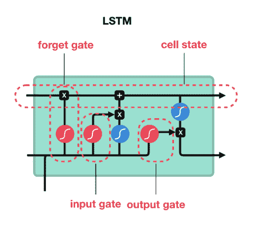
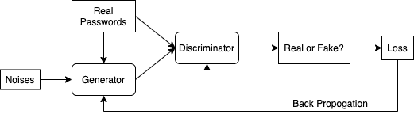
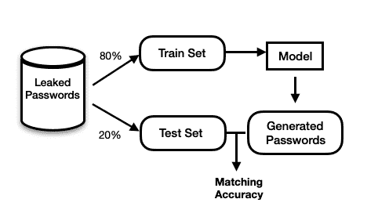

<!--yml

类别：未分类

日期：2024-09-06 19:44:49

-->

# [2208.10413] 关于密码猜测中的深度学习，综述

> 来源：[`ar5iv.labs.arxiv.org/html/2208.10413`](https://ar5iv.labs.arxiv.org/html/2208.10413)

# 关于密码猜测中的深度学习，综述

方宜余 fangyi.yu@ontariotechu.net 安大略理工大学 2000 Simcoe St N Oshawa Ontario Canada L1G 0C5

###### 摘要。

密码的安全性依赖于对攻击者使用策略的透彻理解。不幸的是，现实世界中的对手使用实际的猜测战术，如字典攻击，这些战术在密码安全研究中很难模拟。字典攻击必须经过仔细配置和修改，以代表实际威胁。然而，这种方法需要领域特定的知识和专业技能，这些是难以复制的。本文比较了几种基于深度学习的密码猜测方法，这些方法不需要领域知识或对用户密码结构和组合的假设。涉及的模型类别有 递归神经网络 (RNN)、生成对抗网络 (GANs)、自编码器和注意力机制。此外，我们提出了一种有前景的研究实验设计，利用 改进的 Wasserstein GANs (IWGAN) 的变体进行非定向离线攻击下的密码猜测。利用这些先进策略，我们可以提高密码安全性，创建更准确、更高效的 密码强度测量器 (PSMs)。

身份验证、深度学习、生成对抗学习

## 1\. 引言

密码在身份验证系统中主导了数十年，尽管它们相比于认知认证和硬件令牌等竞争技术存在安全缺陷。不可替代的主要原因是其无与伦比的部署性和可用性(bonneau2012quest, )。然而，用户选择的密码的安全性仍然是一个重大问题。根据研究 adams1999users, ，影响密码破解易性的易受攻击行为有三种：1\. 用户通常在密码中使用基本术语，并进行简单的字符串转换以符合网站的密码创建政策(narayanan2005fast, )。2\. 密码重复使用普遍存在，因为典型用户有超过 20 个账户，为每个账户建立唯一密码并记住它们过于耗时(stobert2014password, )。根据 S.Pearman 等人的研究，40%的用户重复使用他们的密码(pearman2017let, )。3\. 用户倾向于使用容易记住的密码，这些密码包括个人信息，如出生日期和宠物的名字。所有这些行为都使用户创建的密码容易受到攻击。此外，最近全球多个平台上大规模密码泄露（见表 2）引起了研究人员的警觉。

### 1.1\. 离线攻击与在线攻击

密码猜测攻击分为两类：离线攻击和在线攻击。离线攻击发生在攻击者获得某些用户密码的加密哈希值后，通过猜测和测试许多密码来尝试恢复它们。主要目标是确定破解真实用户密码的难度，或用户创建密码的强度，通过生成密码猜测列表并检查真实用户密码出现的可能性。只有在以下条件满足时，离线攻击才被认为是有效的：攻击者获取了系统访问权限并提取了密码文件，同时未被察觉。此外，文件的盐值和哈希必须适当地完成。否则，离线攻击要么无效（攻击者可能直接获得凭据而无需猜测，或在线方法更有效），要么不可能(florencio2014administrator, )。

当攻击者通过网页界面或应用程序对用户进行密码尝试时，就会发生在线攻击。这种情况对攻击者更为受限，因为大多数身份验证系统在几次失败尝试后会自动冻结账户。因此，攻击者必须在规定的尝试次数内成功猜测用户的密码，这是在线密码猜测的主要难点。根据 Florencio 等人的研究（florencio2014administrator,），$10^{6}$ 是安全密码必须经受的在线猜测次数的合理上限，而离线猜测的次数则难以量化，因为攻击者可能使用无限数量的计算机，每台计算机计算哈希的速度比目标站点的后端服务器快数千倍。

### 1.2\. 定向攻击与非定向攻击

定向猜测攻击发生在攻击者利用对用户的了解（具体是他们的个人身份信息 (PII)，如姓名、出生日期、纪念日、家庭地址等）试图破解用户密码时。当 PII 由于不断的数据泄露而变得更加容易获得时，这是一项相当严重的担忧。相反，非定向攻击不假设用户的身份。需要注意的是，大多数个人账户并不值得集中注意。只有与关键工作、财务或需要高度安全性的文件相关的重要或关键账户才可能被考虑（florencio2014administrator,）。

本文主要集中于利用深度学习在离线和非定向场景下提高密码的可猜测性。

### 1.3\. 贡献

以下是本文的主要贡献：

+   •

    提供了用于非定向离线密码猜测的深度学习技术的深入比较。

+   •

    确定了这一主题的开放挑战和未来研究的可能方向。

+   •

    提出了使用 GANs 进行密码猜测的可行研究方法和实验设计。

本文其余部分分为以下几个部分：第二部分讨论了三种密码猜测方法：基于规则、基于概率和基于深度学习的模型。第三节讨论了方法论、数据集和实验设计，第四部分讨论了未解决的问题和未来的工作。最后部分包含了缩略语和参考文献。

## 2\. 背景与相关工作

三种主要的密码猜测方式是基于规则的、基于概率的和基于深度学习的。

### 2.1\. 基于规则的模型

大量被盗的密码简化了密码模式的收集过程。之后，可以使用这些密码模式作为指导生成其他候选密码。Hashcat¹¹1https://hashcat.net/wiki/ 和 John the Ripper ²²2https://www.openwall.com/john/ 是两个流行的开源密码猜测程序，使用基于规则的密码猜测方法。它们提供了多种破解密码的方法，包括字典攻击、暴力破解攻击和基于规则的攻击。在所有这些方法中，基于规则的方法是最快的，而 HashCat 在速度、哈希函数兼容性、更新和社区支持方面是市场领先者（hranicky2019distributed,）。然而，基于规则的系统仅根据预先存在的规则生成密码，而开发规则需要领域专业知识。一旦规则被定义，违反这些限制的密码将不会被识别。

### 2.2. 概率基础模型

除了基于规则的密码猜测模型，传统的密码猜测模型大多是基于概率的，其中两个显著的方法是马尔可夫模型和概率上下文无关文法（PCFG）。马尔可夫模型基于这样一个假设，即所有关键的密码特征可以用 n-gram 来指定。其核心原理是根据前一个字符预测下一个字符（narayanan2005fast,）。PCFG 检查已泄露密码中的语法结构（特殊字符、数字和字母数字序列的组合），生成分布概率，然后利用这些分布概率生成密码候选（weir2009password,）。

### 2.3. 深度学习基础模型

与基于规则或概率的密码猜测工具不同，基于深度学习的方法不对密码结构做出任何假设。深度神经网络生成的密码样本不受特定密码空间子集的限制。神经网络能够自主编码超出人工生成规则和马尔可夫密码生成方法能力的广泛密码信息。

#### 2.3.1. 递归神经网络

RNN 是输入按序列处理并使用内部记忆恢复的神经网络。它们通常用于解决语言翻译、自然语言处理、语音识别和图像识别等序列任务。由于普通 RNN 架构由于梯度消失问题（pascanu2013difficulty）无法处理长期依赖，因此设计了长短期记忆网络（LSTM）来解决这个问题。LSTM 利用图中 1 所示的门控机制来在内存中保持信息较长时间（hochreiter1997long）。

图 1\. LSTM 中的门控机制。

据我们所知，Melicher 等人（melicher2016fast）是首次利用 RNN 来提取和预测密码特征的。他们将其模型命名为 Fast, Lean, Accurate (FLA)，尽可能保持轻量化，以便将其集成到本地浏览器中进行主动密码验证。提议的神经网络包括三层 LSTM 层和两层高度连接的层。使用了各种针对密码的神经网络训练策略。研究证明，采用迁移学习（yosinski2014transferable）显著提高了猜测的有效性，然而，将自然语言词典添加到训练集和辅导中的效果却很小。因此，他们发现，当增加猜测次数以及目标更复杂或更长的密码策略时，神经网络在猜测密码方面表现更优。然而，由于 FLA 的密码生成过程具有马尔可夫性质，因此任何未包含在 n-gram 范围内的密码特征可能会被省略编码（hitaj2019passgan）。

Zhang 等人（zhang2018password）提出了结构分区与双向长短期记忆网络（SPRNN），这是一种基于结构分区和双向长短期记忆（BiLSTM）的混合密码攻击技术。PCFG 用于结构分区，旨在对密码训练集进行结构化，以学习用户的密码构造习惯，并生成按可能性排序的基本结构和字符串词典。BiLSTM 随后使用由 PCFG 生成的字符串词典进行训练。他们将 SPRNN 的表现与基于概率的方法（Markov 模型和 PCFG）在跨站点（模型在不同数据集上训练和测试）和单站点（模型在同一数据集的子集上训练和测试）场景中进行了比较。SPRNN 在所有情况下都优于其他两种模型，但在跨站点场景中表现不如单站点场景。

基于 Zhang 等人的工作（zhang2018password），同年，Liu 等人（liu2018genpass）还开发了一种名为 GENPass 的混合模型，该模型可以推广到跨站点攻击。该模型通过将密码编码为一系列单元来预处理密码，然后根据 PCFG 为这些单元打上标签（例如，’password123’可以被分为两个单元：’D8’和’L3’）。之后，LSTM 被用来生成密码。此外，他们建立了一个卷积神经网络（CNN）分类器，以确定密码最有可能来源于哪个词表。结果表明，GENPass 在单站点测试中可以达到与单独 LSTM 模型相同的安全程度，同时生成的密码排名显著较低。在跨站点测试中，与单独 LSTM 相比，GENPass 提高了 16%到 30%的匹配率。

#### 2.3.2\. 自编码器

自编码器是一种由两个子模块组成的模型架构：编码器和解码器。编码器负责在每个时间步骤学习源文本的表示，并生成整个源句子的潜在表示，解码器使用这一表示作为输入来构建原始短语的有意义输出。自编码器通常用于处理序列数据和各种自然语言处理任务，如机器翻译、文本摘要和问答。RNN 和 CNN 常被用作编码器和解码器组件。

Pasquini 等人 (pasquini2021improving,) 将这一策略应用于包含泄露密码的数据集，使用 GANs 和 Wasserstein 自编码器 (WAEs) 来开发对观察到的密码分布的合适表示，而不是直接预测密码。他们的方法论称为 动态密码猜测 (DPG)，可以猜测密码集中特有的密码。他们是第一批将完全无监督的表示学习应用于密码猜测领域的研究者。

#### 2.3.3\. 基于注意力的模型

当我们用英语中的“Attention”（注意力）一词时，我们指的是集中注意力并更专注于某事。深度学习中的注意力机制基于这一原则，它在处理文本输入时优先考虑某些标记（词、字母和短语）。这直观上有助于模型更好地理解文本结构（例如，语法、语义意义、词结构等），从而改善文本分类、生成和可解释性。在语言模型中，注意力机制通常与 RNN 和 CNN 结合使用。然而，即使是 LSTM，这些模型也无法处理较长的依赖关系，因为当源句子太长时，将整个源句子转换为固定长度的上下文向量是具有挑战性的。因此，基于注意力的 Transformer (vaswani2017attention,) 被发明了，它们完全依赖注意力机制，没有卷积或递归层。 双向编码器表示 (BERT) (devlin2018bert,)、ELMO (peters2018deep,) 和 GPT (radford2018improving,) 是基于 Transformer 的注意力应用的著名实例。

表 1\. 用于密码猜测的深度学习模型比较。

| 分类 | 方法 | 使用的模型 | 年份 |
| --- | --- | --- | --- |
| 自编码器 | DPG (pasquini2021improving,) | WAE, GANs | 2021 |
| GANs | REDPACK (nam2020generating,) | IWGAN, RaGAN, HashCat, PCFG | 2020 |
| GANs | PassGAN (hitaj2019passgan,) | IWGAN | 2019 |
| 注意力 | 语言模型 (li2019password,) | BERT, LSTM | 2019 |
| RNN | GENPass (liu2018genpass,) | PCFG, LSTM, CNN | 2018 |
| RNN | SPRNN (zhang2018password,) | PCFG, BiLSTM | 2018 |
| RNN | FLA (melicher2016fast,) | LSTM | 2016 |

Li 等人(li2019password, ) 提出了一个精心设计的深度神经网络架构，包括五个 LSTM 层和一个输出层，然后使用 BERT 对创建的模型进行了辅导和改进。他们证明了通过 BERT 的辅导过程可以显著提高模型性能。

先前发布的基于深度学习的密码猜测工具的比较见于表 1。

表 2\. 用于训练和评估深度学习模型的数据集。大小是数据集中密码的数量。

| 名称 | 大小 | 简要描述 |
| --- | --- | --- |
| Yahoo | $4.4\times 10^{5}$ | 一个网络服务提供商。 |
| phpBB | $3\times 10^{5}$ | 一个软件网站。 |
| RockYou | $1.4\times 10^{7}$ | 一个游戏平台。 |
| Myspace | $5.5\times 10^{4}$ | 一个社交网络平台。 |
| SkullSecurityComp | $6.7\times 10^{6}$ | 密码列表的汇编。 |
| LinkedIn | $1.3\times 10^{6}$ | 一个社交在线平台。 |

## 3\. 方法论

### 3.1\. 问题陈述

学术界普遍认为基于熵的密码强度估计和边际猜测分析(pliam2000incomparability, ) 是不够的。与其这样，不如量化为使用最有效的对抗攻击(dell2015monte, ) 找到密码冲突所需的尝试次数。因此，密码猜测攻击可以用于密码安全分析，并发展成可以集成到智能用户界面中的 密码安全模型（PSMs），以鼓励用户设置更强的密码。我将集中研究利用 生成对抗网络（GANs） 完成密码猜测任务。

### 3.2\. 生成对抗网络（GANs）

与之前描述的通常应用于自然语言处理任务的基于深度学习的算法不同，生成对抗网络（GANs） (goodfellow2014generative,) 已被用于构建各种领域的图片、文本和语音的模拟。在背后，生成对抗网络（GANs） 包含两个子模块：一个判别器（D）和一个生成器（G），这两个模块都是由深度学习神经网络构建的。G 接收噪声或随机特征作为输入；学习输入特征的概率；并生成遵循输入数据分布的假数据。与此同时，D 尽力通过估计给定一组输入（或特征）的样本为假的（或真实的）条件概率来区分实际样本和由 G 人工创建的样本。模型架构图如图 2 所示。这种猫捉老鼠的游戏迫使 D 从训练数据中提取必要的信息；这些信息帮助 G 精确地复制原始数据分布。在训练阶段，D 和 G 相互竞争，每次迭代都会逐步提高它们的性能。通常，必须使用适当的梯度下降和正则化技术来加速整个过程。更正式地说，生成对抗网络（GANs） 解决的优化问题可以总结如下：

|  | $\displaystyle\min_{\theta_{G}}\max_{\theta_{D}}\sum_{i=1}^{n}logf(x_{i};\theta_{D})+\sum_{i=1}^{n}log(1-f(g(z_{j};\theta_{G});\theta_{D}))$ |  |
| --- | --- | --- |

其中 $f(x;\theta_{D})$ 和 $g(z_{j};\theta_{G})$ 分别代表判别器 D 和生成器 G。

图 2\. 模型架构图。

优化展示了 D 和 G 之间的极小极大博弈。在 2014 年首次发布的 GANs 工作之后，进行了若干改进，Hitaj 等人(hitaj2019passgan,)利用了 IWGAN (gulrajani2017improved,)将 GANs 应用于密码猜测，这在文献中是首次。他们使用一组泄露密码（实际样本）训练判别器。每次迭代使生成器的输出更接近真实密码的分布，从而增加了与真实用户密码匹配的可能性。因此，在生成了足够的密码（$10^{9}$）后，PassGAN 超越了当前的基于规则的密码猜测工具和最先进的机器学习密码猜测技术（FLA）。当将 PassGAN 与 HashCat 结合使用时，它们匹配了 51% - 73%的密码，而使用 HashCat 单独为 17.67%，使用 PassGAN 单独为 21%。PassGAN 的一个缺点是，由于生成器中的最终 softmax 激活函数，训练本身不稳定，这可能使网络容易出现梯度消失问题，从而降低猜测准确性。

在 2019 年发布 PassGAN 之后，其他研究人员看到了使用 GANs 进行密码猜测的可能性，并在 PassGAN 的基础上进行了更多改进。2020 年，Nam 等人(nam2020generating,)开发了 REDPACK，这是一种结合了不同密码生成模型的 GANs 变体，以提高破解性能。他们在之前的研究中提出了 rPassGAN，通过改变 PassGAN 的基本神经网络架构来增强 PassGAN。更具体地说，他们在 PassGAN 中使用了 RNN 而不是 PassGAN 原始论文中的 ResNet。然而，在 rPassGAN 的训练过程中，模型有时会变得不稳定，REDPACK 引入了 RaSGGAN-GP 成本函数来稳定训练过程。Nam 等人还向 REDPACK 中引入了选择阶段，在该阶段，密码候选项是使用几个密码生成器（Hashcat、acpcfg 和 rPassGAN）生成的。然后，判别器确定每个生成器生成的密码候选项的真实性，并将概率最大的候选项发送给密码破解工具如 HashCat。我们认为 PassGAN 是基于 GANs 的密码猜测工具的一个良好代表，PassGAN 的改进将成为我研究的重点。

### 3.3. 数据集

表格 2 总结了常用于密码猜测的公开数据集。以往对这些数据集的一个缺点是大多数研究没有考虑密码政策的关键性。实际上，大多数网站施加密码政策限制以鼓励用户生成强密码。例如，创建一个至少包含一个特殊符号并且包括八个字符的密码（包括小写和大写字母）（bonneau2010password）。在我的研究中，我将在预处理数据集时考虑密码政策，以更准确地模拟现实世界中的密码创建情况。

我可以用于训练和评估的数据集：[Weakpass](https://weakpass.com/wordlist/1920)（仅包含适合密码政策的密码，长度超过 8，共有 2133708093 个密码）和来自[GitHub](https://github.com/danielmiessler/SecLists/tree/master/Passwords/Leaked-Databases)的较小数据集。

### 3.4. 实验设计

Tensorflow 或 Pytorch 作为实验的主要框架。再现 PassGAN 的工作(hitaj2019passgan, )是我研究的第一步。然而，PassGAN 存在一些限制，解决这些限制并改进 PassGAN 将是我工作的重点。基础的 GANs 在整个训练过程中保持不稳定，因为判别器的陡峭梯度空间，这导致生成器训练阶段出现模式崩溃(thanh2019improving, )。因此，生成器容易在掌握创建更真实密码的艺术之前欺骗判别器。尽管 PassGAN 中使用的 IWGAN 利用了 Wasserstein Loss 函数，相较于基础的 GANs 中使用的 Binary Cross Entropy Loss，Wasserstein Loss 在一定程度上有助于解决模式崩溃和梯度消失问题。然而，为了使用 Wasserstein-loss 训练 GANs，判别器必须是 1-Lipschitz 连续的，这意味着在每一点上梯度的范数应该至多为 1。虽然 IWGAN 使用了梯度惩罚以保证 1-Lipschitz 连续性，但 Wu 等(GNGAN_2021_ICCV, )证明了“层级 Lipschitz 约束网络的 Lipschitz 常数被其任何 k 层子网络上界。”因此，我将探索其他技术，旨在实现 Lipschitz 约束，同时应用 Wasserstein 损失或通过进一步正则化和标准化来稳定训练过程(GNGAN_2021_ICCV, ; gulrajani2017improved, ; jabbar2021survey, ; thanh2019improving, ; wei2018improving, ; wu2018wasserstein, ; terjek2019adversarial, ; jiang2018computation, )。通过比较测试集与合成集的匹配结果，我们可以确定我们建立的模型是否能超越 PassGAN。

表 3\. Rockyou 数据集中唯一密码分布

| 长度 | 频率 |
| --- | --- |
| $<8$ | 15.55% |
| 8-10 | 38.16% |
| 10-12 | 29.32% |
| 12-16 | 14.18% |
| $>=16$ | 2.80% |
| 总计 | $1.43*10^{7}$ |

表 2 中列出的数据集将用于训练和测试我整理的模型。将产生小型、中型和大型密码候选文件来评估模型的猜测能力。大型文件的大小可能达到 6.5 GB，并包含超过$8\times 10^{9}$个唯一密码。训练深度学习模型并生成如此巨大的数据集需要大量的计算资源。需要 Tesla P100 GPU 或更高版本以减少训练和生成时间。需要至少 16 GB 的 RAM，以防在读取创建的文件以计算猜测准确性时因内存不足而导致进程被终止。

图 3\. 数据流图。

请注意，这项工作是基于训练集和测试集具有相同分布的假设，因此通过对训练集进行样本模拟，生成的样本可以在很大程度上接近测试集。这两个数据集是通过将泄露的密码按 4:1 的比例划分而成，并且两个数据集中不存在重复项。通过在拆分之前进行洗牌，我们假设这两个数据集具有相同的分布。数据流图如图 3 所示。

## 4\. 实验结果

我使用了 Rockyou 数据集来训练 IWGAN 模型，数据集经过预处理，以确保所有密码都是唯一的，测试集和训练集中不存在重复密码。基于密码长度的分布如表 3 所示。我的实验与 Hitaj 等人(hitaj2019passgan,)的工作有两个小的区别。首先，在预处理数据集时，我将所有密码长度限制在 8 到 12 之间，这更符合现代密码创建政策。而 Hitaj 等人将所有密码限制在 10 以下。然而，在现实世界中，少于八个字符的密码被视为弱密码，即使是基于规则或概率的密码猜测工具也可以很容易地猜出这些密码。在我的工作中，我想展示基于深度学习的密码猜测工具与其他类型工具的能力，因此考虑了密码政策限制。其次，我将生成器最后一层的激活函数从 Softmax 修改为 Tanh，这使得模型收敛更快。

训练集和测试集分别包含$8.44*10^{6}$和$2.11*10^{6}$个样本。模型设置为按原始 PassGAN 的工作进行 200000 次迭代训练。但在 120000 次迭代后，鉴别器和生成器的损失趋于平稳，使用 Tesla P100 GPU 训练 75000 次迭代需要 12 小时。通过使用 120000 次检查点生成假密码，将生成的密码与测试数据集进行比较，生成$9.3*10^{7}$个唯一密码时的匹配准确率为 3.99%；生成$10^{8}$个密码时的准确率为。与 Hitaj 等人的工作相比，

## 5\. 讨论

基于深度学习的密码猜测是一个相对较新的领域，相关的第一篇论文发布于 2016 年(melicher2016fast,)，使用了 LSTM，而第一个 GANs 相关模型发布于 2019 年(hitaj2019passgan,)。随着机器学习和深度学习方法的不断进步，将这些进步和突破带入密码猜测领域是一个令人兴奋的研究课题。尽管如此，仍存在一些问题。在本节中，我将介绍密码猜测中的开放问题及未来研究的可能性。

### 5.1\. 开放问题

+   •

    训练资源的不足。大多数密码猜测工具都是使用表 2 中显示的泄露数据集进行训练和测试的。虽然比较每个模型的性能比较直接，但无法保证模型的泛化能力。

+   •

    即使使用三种模型（基于规则的、基于概率的和基于深度学习的）组合，成功猜测密码的概率仍然较低。在单站密码猜测问题上，最佳猜测准确率为 51.8%，在$10^{10}$次猜测后(pasquini2021improving,)。对于跨站点猜测，最佳表现是在$10^{12}$次猜测后为 23%(liu2018genpass,)。在密码猜测问题上，成功率还有很大的提升空间。

+   •

    五年前披露的密码分布或模式可能与今天使用的密码不同，但大多数建议的模型在相同的数据集上进行训练和测试，这在现实中是不切实际的。然而，如果训练集和测试集具有不同的分布，模型可能会经历概念漂移。即使刘等(liu2018genpass,)的混合模型在生成$10^{12}$个密码后也能成功猜测 23%的密码。模型在不同于测试集的数据集上有效泛化的能力至关重要，因为评估跨站点更具现实性且需要进一步研究。

+   •

    大多数文献中的研究未区分不同的密码策略。然而，大多数网站要求密码包含数字字符、特殊符号和特殊字符的混合。先前的研究(tan2020practical, )表明，不同的密码规则，如最小长度和最小类别要求，可能对可用性和安全性产生显著影响。因此，测试密码猜测工具在各种密码策略下的表现是可取的。

### 5.2\. 未来工作

+   •

    尽管提供的深度学习算法适用于密码猜测攻击，但建议的模型有些过于简单。随着自然语言处理和计算机视觉领域的进展，BERT、GANs 的变体、自注意力机制(choromanski2020rethinking, )以及自编码器都取得了显著的进步，这些新发明的技术和架构可以用来提高密码猜测的性能。

+   •

    GANs 还可以用于有针对性的攻击。一旦攻击者获得用户的 PII，他们可能会根据用户 PII 相关的特定术语来调整 GANs (mirza2014conditional, )，使生成器更关注包含这些关键词的搜索空间区域。

+   •

    深度学习模型的估计可以用来开发可靠的 PSMs，帮助用户创建抵抗猜测攻击的密码。挑战在于：开发一个能够存储和查询压缩神经网络的应用程序，并创建一个交互式 PSMs 用户界面，提示用户建立更安全的密码；将深度学习结果转换为可解释的密码强度等级。一种解决方案是将不同尝试生成的 GANs 样本存储在字典中，并搜索用户创建的密码属于哪个字典。例如，如果创建的密码首次出现在包含 10000 个生成密码的字典中，则强度评为 4；如果首次出现在包含$10^{9}$个生成密码的字典中，则强度评为 9。数字越高，密码越安全，因为需要指数级更多的计算才能正确猜测密码。

+   •

    为了克服训练和测试资源的不足，研究人员可以使用定制或特定站点的数据来训练和测试模型。例如，用户研究中生成的密码用于评估不同的密码可用性和安全性实验，可以用于我们的目的。

+   •

    在审查新颖的密码猜测方法时，需要考虑密码策略。此外，当特定策略的训练数据不足时，迁移学习可能会提高模型的性能。例如，我们可以使用通用密码训练一个预训练模型，冻结网络的底层并仅使用符合特定标准的密码重新训练模型。Melicher 等人(melicher2016fast, )采用迁移学习来训练满足特定密码限制的模型。然而，选择并非穷尽。

## 6\. 结论

在本文中，我从高层次上比较了常见的基于规则和基于概率的密码猜测工具与基于深度学习的方法，并介绍了在密码猜测领域使用的深度学习技术，包括 RNN、自编码器、GANs 和注意力机制。提出了一个涉及使用基于 GANs 的模型进行密码猜测攻击的研究思路，以及所需的实验方法和资源。

深度学习在近年来取得了巨大的进步，并将在不久的将来继续如此。深度学习的应用场景在我们的日常生活中随处可见。密码猜测是一个新颖而激动人心的领域，毫无疑问将从深度学习的增长中受益。我希望通过研究人员的关注，这项工作中提出的问题能够找到有希望的解决方案。

## 7\. 附录

请参见图 4，查看关于密码猜测攻击的思维导图。

<svg   height="689.7" overflow="visible" version="1.1" width="644.71"><g transform="translate(0,689.7) matrix(1 0 0 -1 0 0) translate(320.62,0) translate(0,302.79)" fill="#000000" stroke="#000000" stroke-width="1.2pt"><g transform="matrix(1.0 0.0 0.0 1.0 -68.9 4.38)" fill="#000000" stroke="#000000"><foreignobject width="137.8" height="28.14" transform="matrix(1 0 0 -1 0 16.6)" overflow="visible">密码猜测攻击 <g fill="#FFCCCC" stroke="#FFCCCC"><path d="M -44.29 -153.43 C -44.29 -128.97 -64.12 -109.14 -88.58 -109.14 C -113.04 -109.14 -132.87 -128.97 -132.87 -153.43 C -132.87 -177.89 -113.04 -197.72 -88.58 -197.72 C -64.12 -197.72 -44.29 -177.89 -44.29 -153.43 Z M -88.58 -153.43"></path></g><g transform="matrix(1.0 0.0 0.0 1.0 -127.95 -157.65)" fill="#000000" stroke="#000000"><foreignobject width="78.74" height="10.93" transform="matrix(1 0 0 -1 0 16.6)" overflow="visible">类型</foreignobject></g> <g fill="#FFCCCC"><path d="M -39.37 -68.19 M -13.67 -77.54 C -31.9 -74.33 -48.42 -64.79 -60.32 -50.61 C -47.67 -65.69 -52.57 -83.3 -62.41 -100.35 L -55.7 -104.22 C -45.86 -87.18 -33.06 -74.13 -13.67 -77.54 Z M -52.01 -97.83 L -55.7 -104.22 L -62.41 -100.35 L -58.72 -93.95 Z M -62.41 -100.35 M -54.65 -124.96 C -61.35 -116.98 -70.64 -111.62 -80.89 -109.81 C -69.99 -111.73 -64.26 -103.54 -58.72 -93.95 L -52.01 -97.83 C -57.54 -107.42 -61.77 -116.48 -54.65 -124.96 Z" style="stroke:none"></path></g><g fill="#FFE6E6" stroke="#FFE6E6"><path d="M -168.22 -184 C -168.22 -164.97 -183.64 -149.55 -202.67 -149.55 C -221.69 -149.55 -237.12 -164.97 -237.12 -184 C -237.12 -203.03 -221.69 -218.45 -202.67 -218.45 C -183.64 -218.45 -168.22 -203.03 -168.22 -184 Z M -202.67 -184"></path></g><g transform="matrix(1.0 0.0 0.0 1.0 -232.19 -181.54)" fill="#000000" stroke="#000000"><foreignobject width="59.06" height="24.29" transform="matrix(1 0 0 -1 0 16.6)" overflow="visible">在线和离线</foreignobject></g> <g fill="#FFE6E6"><path d="M -131.36 -164.89 M -124.86 -178.83 C -130.84 -170.3 -133.61 -159.94 -132.71 -149.57 C -133.67 -160.6 -142.84 -164.85 -153.54 -167.71 L -151.98 -173.54 C -141.28 -170.67 -131.22 -169.76 -124.86 -178.83 Z M -151.97 -173.54 L -151.98 -173.54 L -153.54 -167.71 L -153.53 -167.71 Z M -153.54 -167.71 M -168.35 -187 C -167.64 -178.93 -169.8 -170.87 -174.45 -164.24 C -169.51 -171.29 -161.85 -169.94 -153.53 -167.71 L -151.97 -173.54 C -160.29 -175.77 -167.6 -178.42 -168.35 -187 Z" style="stroke:none"></path></g><g fill="#FFE6E6" stroke="#FFE6E6"><path d="M -109.78 -255.72 C -109.78 -234.81 -126.73 -217.85 -147.64 -217.85 C -168.55 -217.85 -185.5 -234.81 -185.5 -255.72 C -185.5 -276.63 -168.55 -293.58 -147.64 -293.58 C -126.73 -293.58 -109.78 -276.63 -109.78 -255.72 Z M -147.64 -255.72"></path></g><g transform="matrix(1.0 0.0 0.0 1.0 -177.17 -244.95)" fill="#000000" stroke="#000000"><foreignobject width="59.06" height="40.9" transform="matrix(1 0 0 -1 0 16.6)" overflow="visible">有针对性和非针对性</foreignobject></g> <g fill="#FFE6E6"><path d="M -110.73 -191.79 M -96.27 -197.05 C -106.53 -195.24 -115.82 -189.88 -122.51 -181.9 C -115.39 -190.38 -119.13 -199.72 -124.67 -209.31 L -118.93 -212.62 C -113.4 -203.03 -107.18 -195.13 -96.27 -197.05 Z M -116.37 -208.19 L -118.93 -212.62 L -124.67 -209.31 L -122.11 -204.87 Z M -124.67 -209.31 M -118.63 -231.38 C -124.35 -224.56 -132.3 -219.97 -141.06 -218.43 C -131.74 -220.07 -126.84 -213.07 -122.11 -204.87 L -116.37 -208.19 C -121.1 -216.39 -124.72 -224.13 -118.63 -231.38 Z" style="stroke:none"></path></g><g fill="#FFE6E6" stroke="#FFE6E6"><path d="M -23.56 -267.51 C -23.56 -248.49 -38.99 -233.07 -58.01 -233.07 C -77.04 -233.07 -92.46 -248.49 -92.46 -267.51 C -92.46 -286.54 -77.04 -301.96 -58.01 -301.96 C -38.99 -301.96 -23.56 -286.54 -23.56 -267.51 Z M -58.01 -267.51"></path></g><g transform="matrix(1.0 0.0 0.0 1.0 -87.54 -264.13)" fill="#000000" stroke="#000000"><foreignobject width="59.06" height="26.15" transform="matrix(1 0 0 -1 0 16.6)" overflow="visible">静态和动态</foreignobject></g> <g fill="#FFE6E6"><path d="M -77.12 -196.21 M -63.18 -189.71 C -71.71 -195.68 -82.07 -198.46 -92.44 -197.55 C -81.41 -198.52 -77.16 -207.69 -74.3 -218.38 L -68.48 -216.82 C -71.34 -206.13 -72.25 -196.06 -63.18 -189.71 Z M -68.48 -216.82 L -68.48 -216.82 L -74.3 -218.38 L -74.3 -218.38 Z M -74.3 -218.38 M -55.01 -233.2 C -63.08 -232.49 -71.14 -234.65 -77.77 -239.29 C

图 4\. 密码猜测攻击思维导图

## 术语表

## 缩略词

BERT

双向编码器表示从变换器

BiLSTM

双向长短期记忆

CNN

卷积神经网络

DPG

动态密码猜测

FLA

快速、精简、准确

GANs

生成对抗网络

IWGAN

Wasserstein GAN 的改进训练

LSTM

长短期记忆网络

PCFG

概率上下文无关文法

PII

个人可识别信息

PSMs

密码强度测量器

RNN

循环神经网络

SPRNN

结构分区和 Bilstm 循环神经网络

## 参考文献

+   (1) Adams, A., 和 Sasse, M. A. 用户并不是敌人。《ACM 通讯》42, 12 (1999), 40–46。

+   (2) Bonneau, J., Herley, C., Van Oorschot, P. C., 和 Stajano, F. 替代密码的探索：一种比较评估网页认证方案的框架。见 2012 IEEE 安全与隐私研讨会 (2012), IEEE, 第 553–567 页。

+   (3) Bonneau, J., 和 Preibusch, S. 密码丛林：网络上人类身份验证中的技术和市场失效。见 WEIS (2010), Citeseer。

+   (4) Choromanski, K. M., Likhosherstov, V., Dohan, D., Song, X., Gane, A., Sarlos, T., Hawkins, P., Davis, J. Q., Mohiuddin, A., Kaiser, L., 等. 用表演者重新思考注意力。见学习表征国际会议 (2020)。

+   (5) Dell’Amico, M., 和 Filippone, M. 蒙特卡罗强度评估：快速而可靠的密码检查。见第 22 届 ACM SIGSAC 计算机与通信安全会议论文集 (2015), 第 158–169 页。

+   (6) Devlin, J., Chang, M.-W., Lee, K., 和 Toutanova, K. BERT：深度双向变换器的预训练用于语言理解。arXiv 预印本 arXiv:1810.04805 (2018)。

+   (7) Florêncio, D., Herley, C., 和 Van Oorschot, P. C. 管理员的互联网密码研究指南。见第 28 届 USENIX 大型安装系统管理会议论文集 (2014), 第 35–52 页。

+   (8) Goodfellow, I., Pouget-Abadie, J., Mirza, M., Xu, B., Warde-Farley, D., Ozair, S., Courville, A., 和 Bengio, Y. 生成对抗网络。神经信息处理系统进展 27 (2014)。

+   (9) Gulrajani, I., Ahmed, F., Arjovsky, M., Dumoulin, V., 和 Courville, A. Wasserstein GAN 的改进训练。arXiv 预印本 arXiv:1704.00028 (2017)。

+   (10) Hitaj, B., Gasti, P., Ateniese, G., 和 Perez-Cruz, F. Passgan：一种深度学习密码猜测方法。见应用密码学和网络安全国际会议 (2019), Springer, 第 217–237 页。

+   (11) Hochreiter, S., 和 Schmidhuber, J. 长短期记忆。神经计算 9, 8 (1997), 1735–1780。

+   (12) Hranickỳ, R., Zobal, L., Ryšavỳ, O., 和 Kolář, D. 使用 boinc 和 hashcat 进行分布式密码破解。《数字调查》30 (2019), 161–172。

+   (13) Jabbar, A., Li, X., 和 Omar, B. 生成对抗网络的综述：变体、应用和训练。《ACM 计算调查》（CSUR）54, 8 (2021), 1–49。

+   (14) Jiang, H., Chen, Z., Chen, M., Liu, F., Wang, D., 和 Zhao, T. 在谱控下生成对抗网络的计算与泛化。在国际学习表征会议（2018）。

+   (15) Li, H., Chen, M., Yan, S., Jia, C., 和 Li, Z. 通过神经语言建模进行密码猜测。在网络安全机器学习国际会议（2019），Springer，第 78–93 页。

+   (16) Liu, Y., Xia, Z., Yi, P., Yao, Y., Xie, T., Wang, W., 和 Zhu, T. Genpass：一种通用的深度学习模型，用于基于 PCFG 规则和对抗生成的密码猜测。在 2018 年 IEEE 国际通信会议（ICC）（2018），IEEE，第 1–6 页。

+   (17) Melicher, W., Ur, B., Segreti, S. M., Komanduri, S., Bauer, L., Christin, N., 和 Cranor, L. F. 快速、精简且准确：使用神经网络建模密码猜测性。在第 25 届 USENIX 安全研讨会会议录（2016），第 175–191 页。

+   (18) Mirza, M., 和 Osindero, S. 条件生成对抗网络。arXiv 预印本 arXiv:1411.1784（2014）。

+   (19) Nam, S., Jeon, S., 和 Moon, J. 使用相对生成对抗网络从多个词典生成优化的猜测候选，以改进密码破解。《应用科学》10, 20 (2020), 7306。

+   (20) Narayanan, A., 和 Shmatikov, V. 使用时间-空间权衡的快速字典攻击。在第 12 届 ACM 计算机与通信安全大会会议录（2005），第 364–372 页。

+   (21) Pascanu, R., Mikolov, T., 和 Bengio, Y. 循环神经网络训练的难度。在国际机器学习大会（2013），PMLR，第 1310–1318 页。

+   (22) Pasquini, D., Gangwal, A., Ateniese, G., Bernaschi, M., 和 Conti, M. 通过表示学习改进密码猜测。在 2021 年 IEEE 安全与隐私研讨会（SP）（2021），IEEE，第 1382–1399 页。

+   (23) Pearman, S., Thomas, J., Naeini, P. E., Habib, H., Bauer, L., Christin, N., Cranor, L. F., Egelman, S., 和 Forget, A. 更近一步观察：在自然环境中观察密码。在第 2017 年 ACM SIGSAC 计算机与通信安全会议录（2017），第 295–310 页。

+   (24) Peters, M. E., Neumann, M., Iyyer, M., Gardner, M., Clark, C., Lee, K., 和 Zettlemoyer, L. 深度上下文化词表示。在 NAACL-HLT 会议录（2018），第 2227–2237 页。

+   (25) Pliam, J. O. 关于熵和边际猜测在暴力攻击中的不可比性。在印度国际密码学会议（2000），Springer，第 67–79 页。

+   (26) Radford, A., Narasimhan, K., Salimans, T., 和 Sutskever, I. 通过生成预训练提高语言理解能力。

+   (27) Stobert, E., 和 Biddle, R. 密码生命周期：用户管理密码的行为。在第 10 届可用隐私与安全研讨会（$\{$SOUPS$\}$ 2014）（2014），第 243–255 页。

+   (28) Tan, J., Bauer, L., Christin, N., 和 Cranor, L. F. 强而易用的密码的实用建议：结合最小强度、最小长度和黑名单要求。载于 2020 年 ACM SIGSAC 计算机与通信安全会议论文集（2020 年），第 1407–1426 页。

+   (29) Terjék, D. 对抗 Lipschitz 正则化。载于国际学习表征会议（2019 年）。

+   (30) Thanh-Tung, H., Venkatesh, S., 和 Tran, T. 改进生成对抗网络的泛化能力和稳定性。载于 ICLR 2019：第 7 届国际学习表征会议论文集（2019 年），ICLR。

+   (31) Vaswani, A., Shazeer, N., Parmar, N., Uszkoreit, J., Jones, L., Gomez, A. N., Kaiser, Ł., 和 Polosukhin, I. 注意力机制即你所需的一切。载于神经信息处理系统进展（2017 年），第 5998–6008 页。

+   (32) Wei, X., Gong, B., Liu, Z., Lu, W., 和 Wang, L. 改进 Wasserstein 生成对抗网络的训练：一致性项及其对偶效应。载于国际学习表征会议（ICLR）（2018 年）。

+   (33) Weir, M., Aggarwal, S., De Medeiros, B., 和 Glodek, B. 使用概率上下文无关文法进行密码破解。载于 2009 年 IEEE 第 30 届安全与隐私研讨会（2009 年），IEEE，第 391–405 页。

+   (34) Wu, J., Huang, Z., Thoma, J., Acharya, D., 和 Van Gool, L. 用于生成对抗网络的 Wasserstein 散度。载于欧洲计算机视觉会议（ECCV）论文集（2018 年），第 653–668 页。

+   (35) Wu, Y.-L., Shuai, H.-H., Tam, Z. R., 和 Chiu, H.-Y. 生成对抗网络的梯度归一化。载于 IEEE 国际计算机视觉会议论文集（ICCV）（2021 年 10 月）。

+   (36) Yosinski, J., Clune, J., Bengio, Y., 和 Lipson, H. 深度神经网络中的特征可转移性如何？神经信息处理系统进展 27（2014 年），第 3320–3328 页。

+   (37) Zhang, M., Zhang, Q., Hu, X., 和 Liu, W. 基于结构划分和双向 LSTM 递归神经网络的密码破解方法。载于第 8 届国际通信与网络安全会议论文集（2018 年），第 79–83 页。
