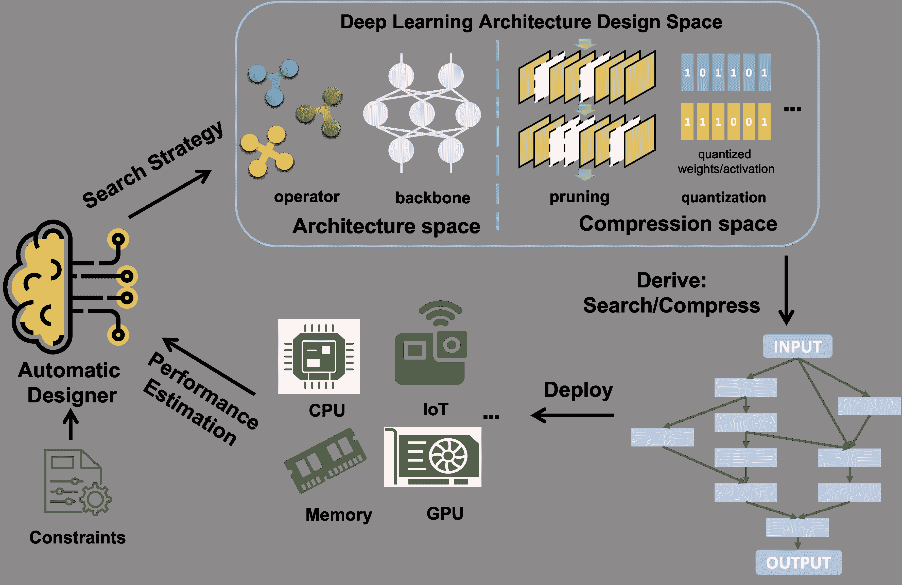
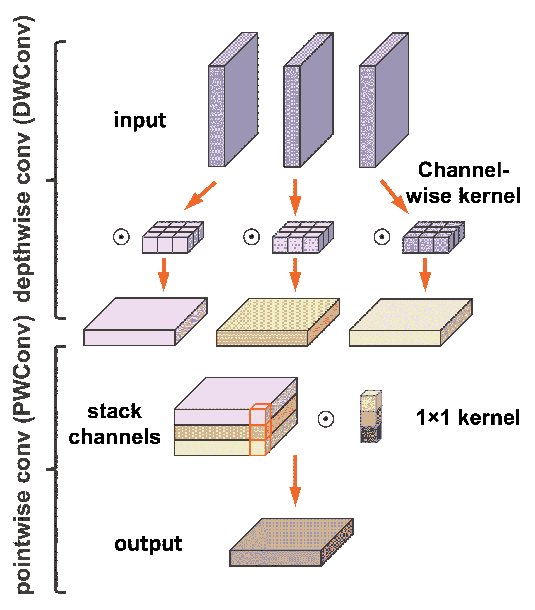
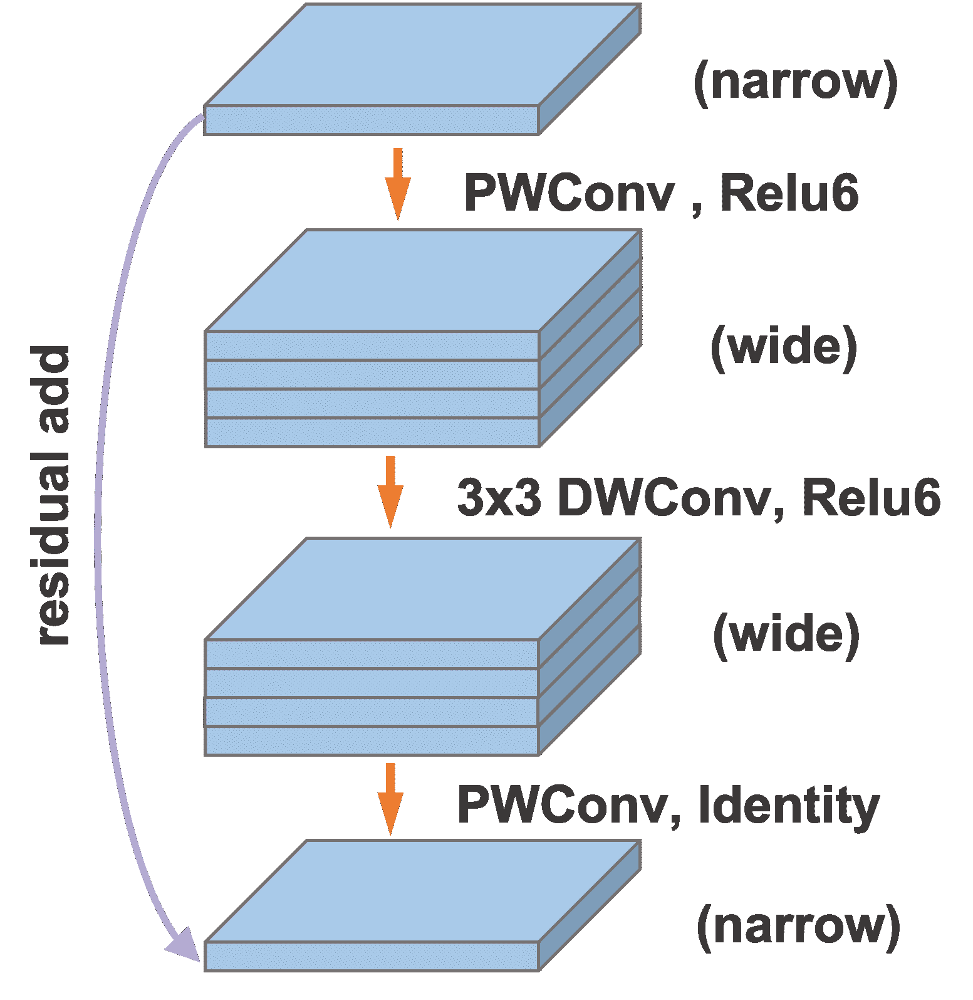
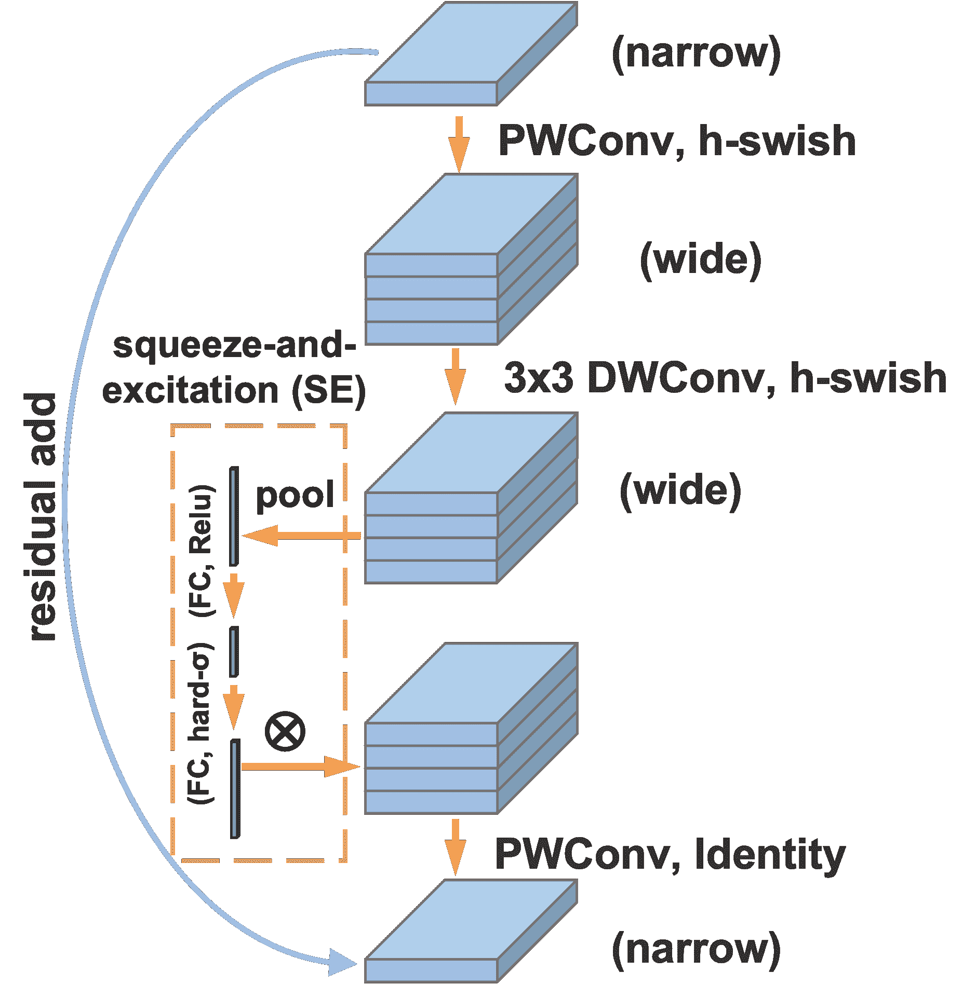
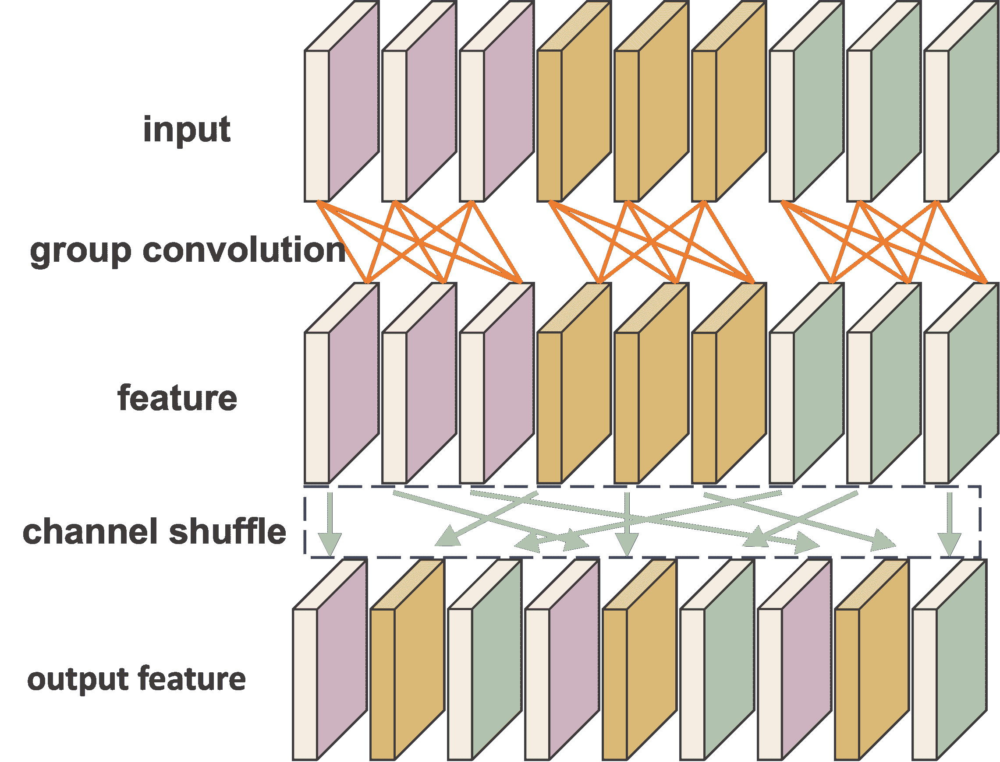
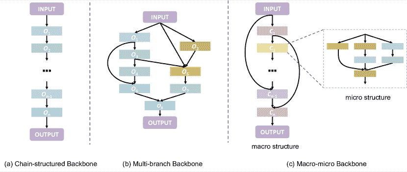
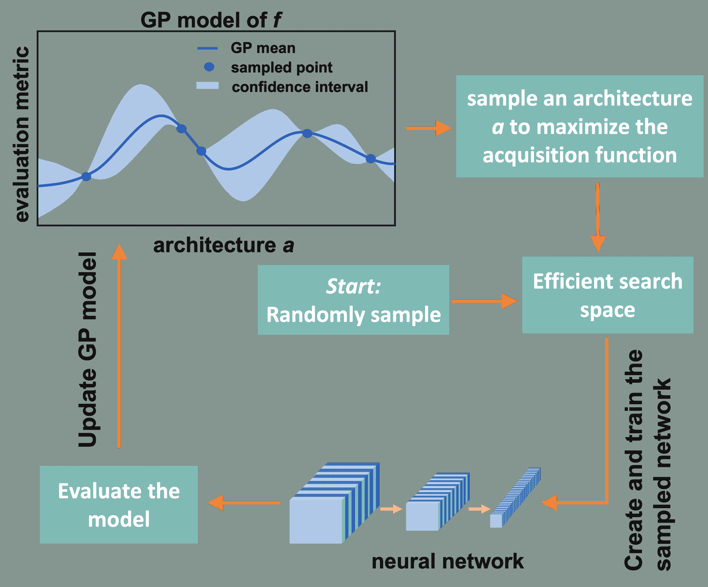
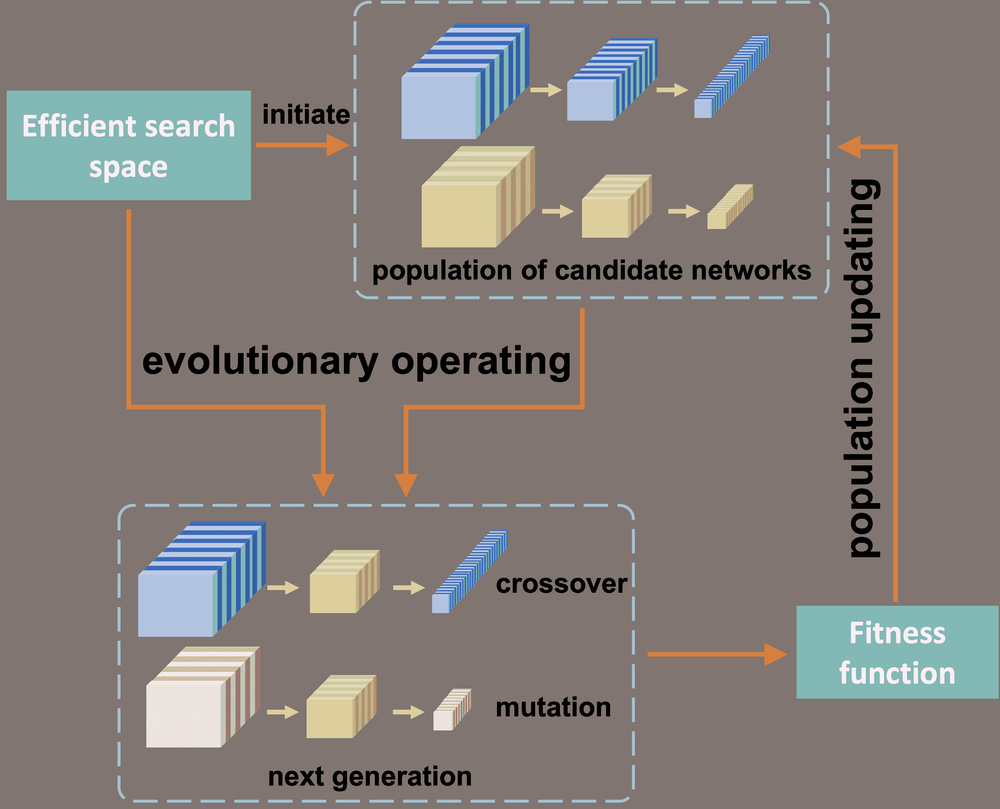
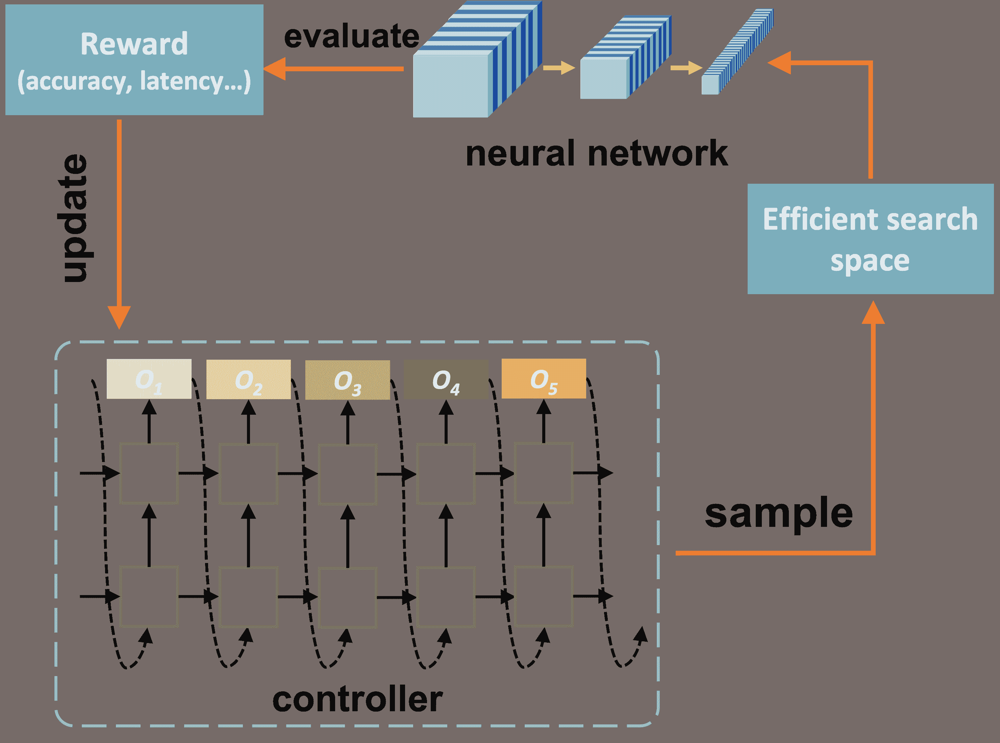
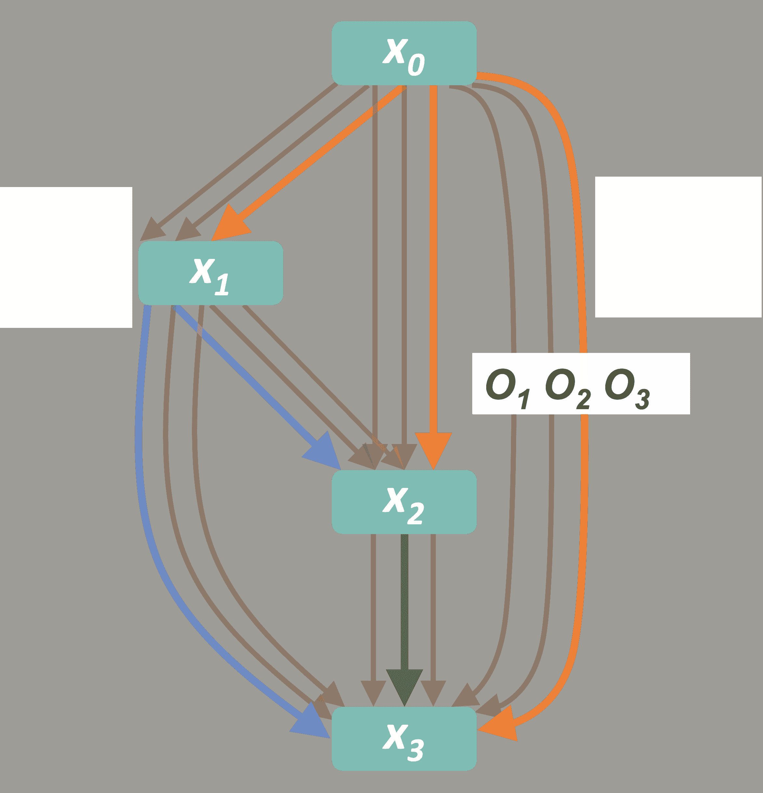

<!--yml

分类：未分类

日期：2024-09-06 19:44:47

-->

# [2208.10498] 快速、轻量且高效的深度学习模型设计自动化：综述

> 来源：[`ar5iv.labs.arxiv.org/html/2208.10498`](https://ar5iv.labs.arxiv.org/html/2208.10498)

# 快速、轻量且高效的深度学习模型设计自动化：综述

达林·张、开轩·陈、燕·赵、宾·杨、丽娜·姚和克里斯蒂安·S·詹森 达林·张、开轩·陈、燕·赵、宾·杨和克里斯蒂安·S·詹森均在丹麦奥尔堡大学计算机科学系，地址：Aalborg Øst 9220, Denmark（电子邮件：dalinz@cs.aau.dk、kchen@cs.aau.dk、yanz@cs.aau.dk、byang@cs.aau.dk 和 csj@cs.aau.dk）。丽娜·姚在新南威尔士大学计算机科学与工程学院，地址：UNSW Sydney 2052, Australia（电子邮件：lina.yao@unsw.edu.au）。稿件收到于 2022 年 3 月 10 日

###### 摘要

深度学习技术在广泛任务中展示了显著的效果，深度学习有潜力推动众多应用的发展，包括边缘计算，其中深度模型被部署在边缘设备上以实现即时的数据处理和响应。一个主要挑战是，虽然深度模型的应用通常会带来相当大的内存和计算成本，但边缘设备通常仅提供非常有限的存储和计算能力，这些能力在不同设备之间可能差异很大。这些特点使得构建能够充分发挥边缘设备潜力的深度学习解决方案，同时符合其限制条件变得困难。应对这一挑战的一个有前景的方法是自动化设计轻量级、仅需少量存储且计算开销低的有效深度学习模型。这项综述全面覆盖了针对边缘计算的深度学习模型设计自动化技术的研究。它提供了常用的关键指标的概述和比较，这些指标用于量化模型在有效性、轻量性和计算成本方面的能力。然后，综述覆盖了深度模型设计自动化技术的三类最新技术：自动神经架构搜索、自动模型压缩和联合自动设计与压缩。最后，综述涵盖了开放性问题和未来研究方向。

###### 关键词：

深度学习，神经架构搜索，轻量级模型，模型压缩

## 引言

### I-A 背景

深度学习在许多任务上实现了最先进的性能，并在推荐系统 [1]、自然语言理解 [2] 和生物医学工程 [3] 等多个领域影响了人们的生活。深度学习通过引入能够自动特征提取的多层神经网络架构，解放了研究人员从手动设计有目的的特征表示中，从而使他们可以在更高的抽象层次上工作，专注于架构工程而不是特征工程和模型构建。深度模型的神经架构往往越来越复杂，因此需要大量的硬件资源进行部署。这在拥有强大服务器时可能不是问题，但在以下重要场景中则可能存在问题：1) 在移动硬件上进行计算，例如智能手机和平板电脑；2) 在优化低部署成本和低功耗的工业硬件上进行计算。此外，尽管可能有云计算可用，但从边缘设备向云端传输数据通常从根本上是不吸引人的。一方面，这种传输可能会引发隐私、所有权和相关的监管问题，包括音频、视频数据和公用事业消费数据 [4]；另一方面，由于“最后一公里”连接的低带宽，数据传输会产生大量延迟。最后但同样重要的是，复杂模型的部署成本昂贵，这包括专用硬件的费用和能源消耗，并且由于生产所需电力的碳足迹，对环境也不利 [5, 6]。

幸运的是，研究表明深度学习模型通常有大量冗余的参数和计算，这些冗余对模型的性能有贡献 [7, 8]，因此在不影响模型准确性的前提下，有很大的空间来减少这些冗余。因此，设计具有简化计算复杂度的深度学习模型是非常可取的，并且完全可能，从而实现更轻量、更高效的深度模型¹¹1 高效的深度学习模型是指那些具有低内存使用、低推理成本或低延迟的深度学习模型。

### I-B 高效深度学习模型的设计

关于构建高效深度学习模型的研究可以分为两类：高效网络架构设计和模型压缩。在高效网络架构设计中，目标是创建紧凑的神经模块，并根据精心设计的拓扑结构将这些模块连接起来。其目的是实现具有可接受精度但结构小（低内存需求）且计算复杂度低（高速）的高效深度学习模型。MobileNet [9] 提出了使用深度可分离卷积模块作为基本构建块的高效网络结构，并且在各种计算机视觉任务中表现出了优越的尺寸、速度和准确性特征。第二版，即 MobileNetV2，引入了一种新的基本构建块，即带有残差/反向残差的瓶颈深度可分离卷积 [10]。因此，MobileNetV2 通常需要少 30% 的参数，所需的操作次数减少了一半，并且在 Google Pixel 手机上运行速度快约 30-40%，同时比前代具有更高的准确性。在 ShuffleNetV1 [11] 中，类似瓶颈的结构与逐点分组卷积和“通道洗牌”操作是实现高效神经结构的基本构建块。与 MobileNet 的情况类似，ShuffleNet 也有第二代，称为 ShuffleNetV2 [12]。这里引入了新的“通道拆分”操作，以进一步提高速度和准确性。此外，还提供了四条高效网络架构设计的实际指南。

与直接从基本构建块池中设计高效架构不同，模型压缩旨在修改给定的神经模型，以减少其内存和计算成本。剪枝是一种强大的技术，试图从模型中移除不重要的组件 [13, 14]。它具有灵活性，可以移除层、神经元、连接或通道。虽然剪枝通过移除冗余部分来缩小模型，但量化旨在减少表示模型参数所需的位数 [15]。大多数处理器使用 32 位或更多位来存储深度模型的参数。然而，研究估计人脑以离散格式存储信息，使用 4-7 位 [16, 17, 18]。确实，许多研究已致力于使用更少的位数来存储模型参数，以减少内存和计算成本 [19, 20]。其他技术如知识蒸馏 [21] 和张量分解 [22] 也在压缩深度模型方面非常流行和有效。

图 1：高效深度学习模型的设计自动化。自动设计器将硬件约束纳入其搜索策略，以探索预定义的深度学习架构设计空间，这可能是一个架构空间或压缩空间；通过探索的设计选择，从头开始或压缩的深度学习模型被派生并部署到目标设备上；模型的性能，包括准确性和硬件消耗，最终被估计并反馈给自动设计器。

### I-C 高效深度学习模型的设计自动化

尽管在构建高效深度学习模型方面取得了显著进展，但最初的提案仍是启发式规则驱动和手工调优的，存在不可避免的局限性。首先，构建一个高效的深度学习模型仍然需要先进的先验知识和经验，这使得初学者甚至没有领域知识的深度学习专家难以开发出符合特定要求的专业模型。其次，由于不可能在各种移动平台和任务上应用相同的统一模型，启用能够应对这种多样性的专业化是至关重要的，但这仍然极其耗时且不便。第三，手工设计的规则在充分利用硬件潜力方面能力有限，同时满足大小和延迟要求。不同的深度学习模型可以满足相同的硬件约束，手动穷尽所有可能性是不切实际的。

如上所述的观察促使了大量针对高效深度学习模型的设计自动化技术的研究。图 1 展示了一个通用的自动化设计过程。设计自动化算法（即自动设计器）应用搜索策略来寻找网络架构和在预定义的深度学习架构设计空间中的压缩；接着，通过执行识别的操作派生出特定的深度学习模型，并在目标设备（如 CPU、GPU 或 IoT 设备）上部署；最后，模型性能指标如准确性、延迟和内存使用情况被估计并提供给自动设计器。在下一次迭代中，自动设计器考虑反馈和专门的约束，并采取新的设计行动以在设计空间中寻找更好的模型。这个过程会重复进行，直到获得满意的模型。

神经架构搜索（NAS）旨在自动化设计神经网络，以实现最佳可能的准确性。接下来，旨在自动化设计高效神经网络的更具针对性的研究在通用 NAS 的基础上进行，涉及搜索空间的设计以及将优化目标从单一准确性修改为同时考虑准确性和效率。Cai 等人 [23] 通过可微分损失将模型延迟纳入其二值化设计自动化框架（即 ProxylessNAS）的优化目标中。由于直接针对优化推理延迟，ProxylessNAS 能够以比 MobileNetV2 快 1.83 倍的速度实现高效神经架构，同时保持相同水平的 top-1 准确性。值得注意的是，ProxylessNAS 的搜索空间基于 MobleNetV2 提出的不同卷积尺寸的反向残差块。这意味着设计自动化不仅能够减少人工劳动，还能实现超越手工设计架构的架构。

除了直接设计高效神经网络的研究，其他研究还关注深度神经网络的自动化压缩 [24, 25, 26]。例如，Xiao 等人 [24] 设计了一种基于可学习剪枝指示器的自动剪枝方法，而不是为特定架构和数据集单独设计剪枝规则。这种方法在不同的广泛使用的神经模型（如 AlexNet、ResNet 和 MobileNet）上实现了卓越的压缩性能。考虑到高效深度学习模型设计自动化的进展和前景，呼吁进行全面而系统的调查，并有望加速未来的研究。

### I-D 主要贡献

据我们所知，这是首个针对快速、轻量级和高效深度学习模型的最先进设计自动化方法的综述。该综述的主要贡献总结如下：

+   •

    我们提供了一份针对快速、轻量级和高效深度学习模型的设计自动化技术的全面综述。在此过程中，涵盖、分析和比较了 150 多篇论文。

+   •

    我们从设计方法的角度提出了一种新的深度设计自动化方法的分类法，即通过搜索（第 III 节）、压缩（第 IV 节）或联合搜索和压缩（第 V 节）进行设计；以及设计什么，即搜索空间、搜索策略和性能估计策略；以及压缩什么，例如张量、知识和表示。详细的分类为读者提供了获取文献概览和确定感兴趣方向的便利。

+   •

    我们总结并比较了用于获得模型和设计方法的评估指标。通过比较，我们强调了每个指标的作用，并阐明了相关的优缺点。

+   •

    我们讨论了开放问题并确定了自动化设计和压缩的未来方向。

该调查的其余部分组织如下：第 II 节总结了深度学习模型效率（即速度和轻量化）和有效性的评估指标。第 III 节涵盖了搜索高效深度模型的研究。第 IV 节则涵盖了自动压缩的研究，第 V 节考虑了联合自动搜索和压缩的研究。第 VI 节介绍了研究方向，第 VII 节总结了调查。

## II 评估指标

不同的评估指标或目标可能会导致不同甚至相反的结论。因此，在深入研究高效模型的细节之前，介绍和区分相关评估指标是不可或缺的。在本节中，我们将介绍用于衡量获得的高效模型的效率和有效性的评估指标。这些指标对于评估设计自动化方法的有效性也至关重要。此外，我们还介绍了评估设计自动化方法成本的指标。我们在表格 I 中简要总结了常用评估指标的特点，包括优点和局限性。

表 I: 用于测量所获得的高效模型和设计自动化方法的效率和有效性的评估指标

|  | 指标 | 特征 |
| --- | --- | --- |
| 优势 | 局限性 |
| 设备无关效率评估指标 | FLOPs | • 每个获取 • 延迟的粗略近似 | • 定义不一致 • 忽略计算并行度 • 忽略内存访问成本 • 忽略实现库 |
| 参数数量 | • 容易获得 • 测量存储需求时精确 | • 遗漏计算缓存的内存测量 • 无法反映峰值内存使用 |
| 设备感知效率评估指标 | 延迟 | • 我们关心的真实标准 • 通过在实际硬件上实现或预测模型获得 • 依赖于不同的硬件平台和实现库 |
| 峰值内存使用 | • 我们关心的真实标准 • 通过在实际硬件上实现或预测模型获得 • 反映真正重要的峰值使用 |
| 效果评估指标 | 准确度/mAP/mIOU 等 | • 多样且依赖于目标任务 • 与评估普通深度学习模型的指标相同 |
| 设计自动化成本指标 | GPU 小时 | • 用于评估设计自动化方法的速度 • 依赖于使用的 GPU 数量 |
| GPU 内存 | • 用于评估设计自动化的内存需求 • 随候选集大小线性增长 |

### II-A 设备无关评估指标

设备无关的指标可以直接从模型架构计算，而无需在硬件上进行实际实现。这些指标本质上无法反映我们关心的模型真实性能 [12, 27, 28]。

#### II-A1 浮点运算（FLOPs）

FLOPs 通常定义为模型中浮点乘加操作的数量，用于近似延迟/速度或计算复杂度[11，12，29]。还有其他常用的类似指标，如乘加操作数量（MAdds）和乘累加操作数量（MACs）[30，27，31]。然而，对于定义仍然存在一个争议：乘法加法应被视为一个还是两个操作。一些研究人员认为，在许多最近的深度学习模型中，卷积是无偏的，因此将乘法和加法视为独立的 FLOPs 是有意义的[32]。此外，一些非乘法或非加法操作在某些实现中也需要 FLOPs，例如激活层[33，27]。是否应将这些操作计算到总 FLOPs 中也是一个争论点。

除了定义的不一致之外，还有三个主要问题导致 FLOPs 与实际延迟之间的差异。首先，仅计算 FLOPs 忽略了一些显著影响延迟的决定性因素。其中一个因素是并行性。在相同的 FLOPs 下，高度并行的模型可能比低并行度的模型快得多[34，35]。另一个重要因素是内存访问成本。由于设备上的 RAM 通常有限，数据不能一次性完全加载，因此需要从外部内存读取数据。随着计算单元的日益强大，这种影响越来越大，从而成为延迟的瓶颈。这一内在因素不应被简单忽略。第三，深度学习模型的实现库也显著影响其延迟。例如，NVIDIA 的 cuDNN 库提供了不同的卷积操作实现[36]，虽然网络架构相同，但这些实现明显需要不同数量的 FLOPs。一些研究还发现，由于库的抽象，FLOPs 较少的情况有时反而更慢[12，13]。

#### II-A2 参数数量

通常要求将神经网络的所有参数适配到片上内存中，以便快速执行模型[37]。因此，参数数量主要限制了深度学习模型的内存需求。尽管像智能手机这样的移动设备拥有丰富的内存，但仍有一些移动设备的内存特别稀缺，如通常只有 10 到 100KB 内存的微控制器[38]。这些内存稀缺的设备因其低价格在许多领域有需求。因此，设计一个能够适配“微小”内存的小型模型是理想的，参数数量是评估这种需求的常见设备无关度量标准。然而，参数数量仅占内存使用的一部分；输入数据、计算缓存（即运行时产生的中间张量）和网络结构信息占据了相对较大的内存部分[39, 40]。在一些极端场景中，仅计算缓存和活动参数（即用于当前计算的参数）占用内存。一些研究人员提议优化内存中的计算缓存以减少内存消耗，但它们的性能在很大程度上依赖于网络结构[41]。因此，参数更多的模型不一定比参数较少的模型更耗费内存。另一方面，模型参数占存储/外部内存（例如，FLASH 内存）使用的主要部分。

### II-B 设备感知效率评估指标

与设备无关的指标不同，设备感知指标能够反映我们真正关心的计算成本。它们可以在真实的目标硬件平台上收集或进行近似评估。

#### II-B1 延迟

延迟用于评估深度模型推理的运行速度。通常以每次推理的运行时间（例如，毫秒）[42] 或每单位时间的推理次数（例如，批次/s 或图像/s）[12] 来衡量。实际中，精确的延迟是通过在大批量或多个批量上计算的平均值[42]。一些研究通过在实际设备上（包括 GPU、TPU 和 CPU）实现来收集这些信息[25, 12, 43, 42]。需要注意的是，当在非目标移动设备（例如，智能手机 CPU）而不是移动设备上（例如，GPU）评估深度模型的延迟时，其可靠性尚不可知。除了直接测量延迟外，一些研究人员还尝试进行近似[23, 44]。查找表是一种延迟近似方法，通过列举一系列模型可以具有的所有可能层以及每层的延迟[44]。这种方法依赖于硬件和模型系列特定，维护一个大且动态的数据库需要大量时间。此外，这种对个体延迟的简单求和没有考虑内存访问成本和并行性，因此精度较低。延迟预测模型是另一种延迟近似方法，它将网络延迟建模为网络结构和/或硬件参数的函数[23, 45, 44]。这种方法可以使延迟变得可微分，从而直接参与梯度优化的目标函数[23]。

#### II-B2 内存使用

与我们关心的样本/批次的总推理时间不同，推理过程中的峰值内存使用是我们主要关注的问题[37, 46]。只要峰值内存使用低于内存容量，模型就可以在设备上运行。没有必要将内存使用保持在尽可能低的水平。考虑到极端的最大内存节省场景。峰值内存使用由中间张量（即所谓的激活指标）主导，因此一个小模型（即，较少的模型参数）并不保证低峰值内存使用。例如，在类似的 ImageNet 准确率（70%）下，即使 MobileNetV2 [10] 相比 ResNet-18 [47] 将模型大小减少了 4.6$\times$，峰值内存需求却增加了 1.8$\times$ [46]。因此，强烈建议在针对内存资源非常有限的设备时评估峰值内存使用。

除了考虑片上内存的峰值内存使用外，存储/外部内存使用也是一个重要的评估指标。它主要限制了模型的大小，而模型参数占据了最大比例。因此，参数的位精度对外部内存使用有着重要影响。

### II-C 效果评估指标

评估高效模型效果的指标种类繁多，主要依赖于目标任务。视觉任务，如图像识别、物体检测和语义分割，是常用的基准任务[12, 10, 48]。不同任务有不同的评估指标：图像识别的 top-1 或 top-5 准确率[48]，物体检测的 mAP[48]，以及语义分割的 mIOU[10]。除了视觉任务，音频任务，如关键词检测，也被用作评估任务[46]。然而，在这种情况下，准确率也作为评估指标。

### II-D 设计自动化成本指标

作为解放人力成本的代价，设计自动化通常需要过高的计算成本，从而限制了其广泛应用。

#### II-D1 GPU 小时

GPU 小时/天是评估设计自动化方法，特别是基于 NAS 的方法的时间成本的指标[49, 50]。GPU 天可以定义为：

|  | $\text{GPU days}=N\times t,$ |  | (1) |
| --- | --- | --- | --- |

其中$N$表示 GPU 的数量，$t$表示用于搜索的天数[51]。GPU 小时具有类似的定义。在早期阶段，搜索需要几天甚至几十天，而目前研究人员已将时间缩短至数小时的量级[52, 49]。

#### II-D2 GPU 内存

尽管可微分神经架构搜索显著降低了 GPU 小时的成本，但它仍然面临高 GPU 内存成本的问题。GPU 内存的消耗依赖于候选集的大小。具体而言，所需内存随着候选集中选择数量的增加而线性增长[54]。这个问题限制了搜索空间的大小，妨碍了发现新颖而强大的模型的能力。一些研究已经针对这一问题取得了显著进展[23]。因此，涉及 GPU 内存以进行彻底评估是重要的。

## III 寻找高效深度学习模型

受到对移动应用日益增长的需求的推动，高效深度学习模型获得了极大的关注。大量研究提出了手动设计的高效神经架构或模块，并取得了令人印象深刻的进展[29, 12, 10, 55, 56]。尽管取得了显著成功，但对于人工工程师来说，要在准确性和硬件限制之间权衡设计空间是具有挑战性的。硬件感知的神经架构搜索在推动这一领域的发展中发挥了重要作用，因为它自动化了设计过程，以找到最佳解决方案。与常规 NAS[57]类似，硬件感知 NAS 也有三个组成部分，即搜索空间、搜索策略和性能评估策略，但具有额外的自由度或约束（图 1 左下角）。在本节中，我们回顾了这三个方面的近期成果，并在表 II 中总结了主要结果。

### III-A 高效搜索空间

搜索空间是 NAS 的基础，决定了 NAS 在原则上可以发现哪些架构及其性能上限[57]。一个明确定义的搜索空间不仅可以加速搜索过程，还能提高搜索模型的性能[49, 58]。由于一些手动探索的高效神经架构已经取得了显著的进展，基于这些手工制作的高效结构的启发来构建搜索空间，并利用 NAS 技术在此搜索空间上自动发现新颖高效模型，是一个直观且实用的想法。定义搜索空间通常有两个组成部分：（i）每层执行的操作符，和（ii）决定这些层的拓扑连接的骨干网络。

(a) DSConv

(b) MBConv

(c) MBConv+SE

(d) GConv+通道洗牌

图 2：高效操作符的示意图。 (a) DSConv: 深度可分离卷积；(b) MBConv: 移动反向瓶颈卷积；(c) MBConv+SE: 带有压缩和激励模块的 MBConv；(d) GConv+通道洗牌: 带有通道洗牌的组卷积。

#### III-A1 操作符

卷积层或全连接层等操作符是深度学习模型的基本构建组件。构建深度学习模型的一种简单方法是直接堆叠几个操作符，如 VGG Net [59]。其他工作则连接几个神经网络层来构建一个模块（例如残差块），通过重复和任意连接这些模块来构建模型 [60, 47, 57]。在本文中，我们使用“操作符”一词来表示一个模块，它通常作为一个整体使用，被视为端到端模型的基本组件。

作为早期开发并广泛展示的神经网络结构，卷积层及其变体是许多深度学习模型中的主要操作符，特别是在计算机视觉领域。标准卷积可以表示为：

|  | $\text{Conv}(\textbf{W},\bm{X})_{(i,j)}=\sum_{m,n,k}^{M,N,K}{\textbf{w}}_{(m,\;n,\;k)}\cdot\bm{x}_{(i+m,\;j+n,\;k)},$ |  | (2) |
| --- | --- | --- | --- |

其中 W 是卷积核权重，$\bm{X}$ 是卷积层的输入特征图，$(i,j)$ 是输出特征图的坐标，$(m,n,k)$ 是卷积核的坐标。NSGA-Net [61] 利用标准卷积作为操作符，并致力于以块状方式自动确定其连接。由于它仅寻求优化操作符的连接，效率有限。Scheidegger 等人 [62] 和 Lu 等人 [63] 也考虑了标准卷积，但它们不是优化连接，而是允许搜索卷积超参数，如滤波器大小、步幅和滤波器数量。

除了标准卷积，大量手工设计的变体已被证明既高效又有效。因此，利用这些架构构建高效的搜索空间是直观的。深度可分离卷积（DSConv）可以显著减少参数数量和计算量，并作为 MobileNet [9] 中的主要模块，是一种广泛使用的高效操作符。如图 2a 所示，DSConv 块由两个组件组成：深度卷积和点卷积。深度卷积（DWConv）对每个输入特征图（输入深度）应用单个滤波器进行空间滤波：

|  | $\text{DWConv}(\textbf{W},\bm{X})_{(i,j)}=\sum_{m,n}^{M,N}{\textbf{w}}_{(m,\;n)}\cdot\bm{x}_{(i+m,\;j+n)}.$ |  | (3) |
| --- | --- | --- | --- |

点卷积（PWConv），一种简单的 $1\times 1$ 卷积，用于创建深度卷积输出的线性组合以进行特征融合：

|  | $\text{PWConv}(\textbf{W},\bm{X})_{(i,j)}=\sum_{k}^{K}{\textbf{w}}_{k}\cdot\bm{x}_{(i,\;j)}.$ |  | (4) |
| --- | --- | --- | --- |

因此，通过结合 DWConv 和 PWConv，DSConv 被表示为：

|  |  | $\displaystyle\text{DSConv}(\textbf{W}_{p},\textbf{W}_{d},\bm{X})_{(i,j)}=$ |  | (5) |
| --- | --- | --- | --- | --- |
|  |  | $\displaystyle\;\;\;\;\;\;\;\;\;\;\text{PWConv}(\textbf{W}_{p},\text{DWConv}(\textbf{W}_{d},\bm{X})_{(i,j)})_{(i,j)}.$ |  |

LEMONADE [64] 采用了 DSConvs 和标准卷积作为其搜索空间的基本操作符，并支持增加滤波器数量和剪枝滤波器以搜索高效的神经网络架构。RENA [65] 也包含 DSConvs，但允许自动决定不仅其超参数，还决定它们是否在每一层中使用。除了标准 DSConv 外，ProxylessNAS [23] 还在其搜索空间中包括了一种变体，即膨胀深度可分离卷积。搜索引擎可以在标准版本和变体之间进行选择。

在 MobileNetV2 中，提出了一种更先进的移动卷积块——移动反向瓶颈卷积（MBConv）[10]，并迅速成为高效搜索空间的热门操作符。图 2b 展示了 MBConv 的结构。它由三个卷积和一个残差连接组成。首先，应用一个 PWConv 将输入特征图扩展到更高维空间，以便非线性激活（ReLU6）可以更好地提取信息。然后，使用 $3\times 3$ 核和 ReLU6 激活执行深度卷积，以实现对高维特征图的空间滤波。此外，空间滤波后的特征图通过另一个逐点卷积投影回低维空间。由于低维投影会导致信息丢失，逐点卷积后使用线性激活。最后，根据深度卷积层的步幅是否为 1，添加一个可选的残差连接，将原始输入和低维投影的输出结合起来。注意，最后两个卷积（深度卷积和逐点卷积）本质上是具有维度减少的 DSConv。许多研究工作使用 MBConv 构建高效搜索空间，但使用了不同的骨干网络或搜索策略 [66, 67, 68]。Xiong 等人 [69] 认为 DSConv 在 FLOPs 或参数数量上成本低，但这些指标不一定与推理效率相关，因此他们提出了一种融合 MBConv 层，将第一个逐点卷积和随后的深度卷积融合成一个标准卷积。他们在 EdgeTPU 和 DSP 上实现了比纯 MBConv 搜索空间更高的 mAP 和更低的延迟。Li 等人 [70] 对融合 MBConv 和 MBConv 进行了深入比较，总结出融合 MBConv 的操作强度更高，但 FLOPs 比 MBConv 更高，这取决于滤波器和激活的形状和大小。因此，他们将融合 MBConv 和 MBConv 都加入到搜索空间中，以让搜索策略自动确定。

更常见的方式是，MnasNet [48] 在 DWConv 后升级了 MBConv，引入了 squeeze 和 excitation (SE) 模块[71]，以便对特征图进行关注（如图 2c 所示）。具体来说，S (squeeze) 过程首先使用全局平均池化将每个特征图转换为标量描述符，因此输入特征图被转换为一个向量 $\bm{z}\in\mathbb{R}^{n}$，其第 $k$ 个元素计算公式为：

|  | $z_{k}=\text{GlobalArgPool}(\bm{x}_{k})=\frac{1}{H\times W}\sum_{i=1}^{H}\sum_{j=1}^{W}\bm{x}_{(i,j,k)},$ |  | (6) |
| --- | --- | --- | --- |

其中 $\bm{x}_{(i,j)}$ 是第 $k$ 个输入特征图中 $(i,j)$ 位置的元素，特征图的大小为 $H\times W$。E (excitation) 过程使用两个全连接层的门控机制将 S 过程的输出 $\bm{z}$ 转换为激活向量 $\bm{s}$：

|  | $\bm{s}=\sigma(\textbf{W}_{2}\cdot\text{ReLU}(\textbf{W}_{1}\cdot\bm{z})),$ |  | (7) |
| --- | --- | --- | --- |

其中 $\sigma(\cdot)$ 是 sigmoid 激活函数。SE 模块的最终输出是 $\bm{\tilde{X}}$，其第 $k$ 个特征图表示为：

|  | $\bm{\tilde{x}}_{k}=\text{SE}(\bm{x}_{k})=s_{k}\cdot\bm{x}_{k}.$ |  | (8) |
| --- | --- | --- | --- |

MobileNetV3 [72]，作为 MobileNet 系列的最新版本，也采用了 MBConv 加 SE 操作符，并通过使用 hard-swish (HS) [73] 非线性函数代替 ReLU，并将 SE 中的 sigmoid 函数替换为 hard sigmoid [74] 进一步增强了性能。作者还指出，在更深的层中，HS 更具优势。这一选择基于 sigmoid 函数在移动设备上部署成本高的事实。因此，许多其他工作也在其高效搜索空间中采纳了 MBConv 加 SE 操作符 [75, 76, 77, 78, 79]。然而，由于硬件 [31] 不支持或性能不佳 [80]，SE 并不总是与 MBConv 配对。一些其他工作保持了多样的卷积操作符（即标准卷积、DSConv、MBConv 和 MBConv+SE）在搜索空间中，并让搜索策略自动选择 [81, 48]。卷积操作符家族的常用可搜索参数包括内核大小、输出通道数量、扩展比（MBConv，MBConv+SE）和 SE 比率（MBConv+SE）。虽然不同的工作没有完全相同的搜索范围，但基本相似。例如，Stamoulis 等 [66] 考虑了 $\{3,5\}$ 的内核大小和 $\{3,6\}$ 的扩展比；Fang 等 [67] 考虑了 $\{3,5,7\}$ 的内核大小和 $\{3,6\}$ 的扩展比；Cai 等 [77] 考虑了 $\{3,5,7\}$ 的内核大小和 $\{3,4,6\}$ 的扩展比。

除了 MobileNet 家族的上述卷积操作符，组卷积（GConv）及其变体 [82, 83, 11] 也被认为是构建高效搜索空间的重要操作符 [84, 85, 86, 87, 88]。图 2d 说明了 GConv 的结构，其中我们考虑了卷积层的特征图维度。特征图和滤波器分别被分成 $G$ （图 2d 中 $G=3$） 组：$\bm{X}=\{\bm{X}_{1},\bm{X}_{2},...,\bm{X}_{G}\}$ 和 $\textbf{W}=\{\textbf{W}_{1}\,\textbf{W}_{2}\,...,\textbf{W}_{G}\}$。在 GConv 中，卷积仅在每个组内执行，因此输出 $\bm{\tilde{X}}$ 表示为：

|  | $\bm{\tilde{X}}=\{\textbf{W}_{1}\otimes\bm{X}_{1},\textbf{W}_{2}\otimes\bm{X}_{2},...,\textbf{W}_{G}\otimes\bm{X}_{G}\},$ |  | (9) |
| --- | --- | --- | --- |

其中 $\otimes$ 是两个集合之间的卷积操作。这样，GConv 不仅可以减少参数和计算，还能提供一种简单的并行建模方式。因此，AlexNet [83] 可以在每个仅有 3GB RAM 的多个 GPU 上进行训练。注意，depthwise 卷积是 GConv 的一个特殊情况，其组数与通道数相同。GConv 通常后接一个通道混洗操作，以实现组间通信 [11]。徐等人 [84] 将 GConv 包含在他们的搜索空间中，其中组数从 1（标准卷积）到 N（输入通道数）都是可搜索的。FBNet [86] 和 RCAS [87] 在其搜索空间中包含了一种新的卷积操作符，通过用 $1\times 1$ GConv 替换 MBConv 中的第一和最后一个点卷积。这一设计扩展了 MBConv，同时也允许搜索策略自动确定是否需要这种扩展。然而，它们允许的最大组数较小（FBNet 为 2，RCAS 为 4）。DPP-Net [85] 和 MONAS [88] 也在其搜索空间中包含了 GConv 的一种变体，学习型组卷积（LGConv），这是 CondenseNet [89] 的关键操作符。LGConv 通过剪除低幅度权重的不重要滤波器，进一步减少了 GConv 上的计算复杂度 [82]。

一些其他研究在其高效搜索空间中使用了定制的操作符或非卷积操作符。FasterSeg [90] 提出了一个放大卷积，其中输入依次通过双线性下采样、标准卷积和双线性上采样处理。作者展示了相较于标准卷积，放大卷积在 GTX 1080i GPU 上的延迟减少了 40%。不同于以往专注于 2D 处理的工作，Tang 等人 [91] 以 3D 场景为目标。他们提出了稀疏点-体素卷积，并允许搜索通道数和网络深度。然而，由于 3D CNN 的计算量随着卷积核尺寸增加比 2D CNN 显著增加，作者将卷积核大小保持为常数 3。HR-NAS [92] 除了卷积外，还涉及了 Transformer [93, 94]，这是由于其在计算机视觉 [95, 96] 中的近期成功。作者设计了一个轻量级 Transformer，当面对高分辨率图像时需要更少的计算。卷积通道和 Transformer 查询在搜索过程中逐步减少。为了促进 TPUs 和 GPUs 上卷积操作符的高度并行性，Li 等人 [70] 将空间到深度/批次添加到搜索空间中，以增加深度和批次维度。结果表明，即使没有最低的 FLOPs，他们搜索的 EfficientNet-X 模型在 TPUs 和 GPUs 上的速度也最快。主要原因是 EfficientNet-X 模型在 FLOPs（较低有利于速度）和操作强度（较高有利于速度）之间达到了平衡。

除了参数化操作符，非参数化操作符也是高效搜索空间的关键组成部分。池化通常与卷积结合使用，在手工制作的 CNN 模型家族中是这样，在基于卷积的搜索空间中也是如此[87, 80]。它可以帮助减少冗余信息（有利于准确性）和计算（有利于速度），而无需额外的参数。跳跃是另一种广泛采用的操作符，它会影响所得到模型的拓扑。它可以有两个概念：1）跳过操作符直接将输入传递到输出，没有任何实际计算，即整个层被跳过，从而减少模型深度[66, 86, 67]; 2）残差跳跃提供一个与另一个计算操作符并行的身份残差连接[64, 80]。残差连接可以通过拼接或加法实现[64]。激活函数是另一种可搜索的非参数化操作符，它影响准确性和速度[87, 70]。随着深度的增加，激活函数的计算成本减少，因为特征图的分辨率降低[72]。在一些研究中，非线性与卷积操作符整体相关，操作符及其激活函数会自动确定[79]。

#### III-A2 骨干

在定义模型可以拥有的操作符之后，确定有多少个操作符以及这些操作符如何连接，即模型的骨干，至关重要。然而，操作符和骨干并不是完全独立的，例如跳跃操作符，它会移除层或添加连接，可能会改变模型的骨干。根据连接拓扑，骨干大致可以分为两类：链式结构和多分支结构。

图 3：不同骨干的示意图。每个块在 (a) 和 (b) 中代表一个操作符 $O_{i}$，在 (c) 中代表一个单元 $C_{i}$，不同的颜色表示不同的操作符/单元类型。箭头表示信息流动方向。在宏观-微观骨干中，宏观结构描述多个单元的拓扑结构，每个单元都有一个操作符的微观结构。

链式结构骨干网络。链式结构骨干网络[57]是最早和最简单的神经网络拓扑结构。它直接按顺序堆叠多个操作符。如图 3 (a)所示，第$i$个操作符($O_{i}$)以第$i$-1 个操作符($O_{i-1}$)的输出作为输入，其输出作为第$i$+1 个操作符($O_{i+1}$)的输入。因此，不同操作符的拓扑连接是确定的，无法搜索。然而，可以搜索操作符的数量，例如，通过跳过操作符。这个简单的骨干网络是许多手工制作的 CNN 模型的一个优良实践[83, 11, 9, 10]。

直观的实现方式是逐层堆叠操作符[87, 77]。受现有成功设计原则的启发[10, 11]，链式结构的骨干网络通常以基于单元的方式实现，也就是基于块或阶段的方式[68, 81, 79, 91, 86, 67]，其中一个骨干网络由多个链式结构单元组成，每个单元包含多个链式结构操作符。同一单元中的操作符可以在超参数上相同或不同，但类型相同。在单元序列中，通常的原则是输入分辨率逐渐减少，宽度逐渐增加。为了实现减少的分辨率，单元中的第一个或最后一个操作符通常具有手动设置的步幅和宽度。这种基于单元的实现方式不仅有效，而且减少了搜索空间。Wu 等人[86]设计了一个由四个可搜索单元组成的链式结构骨干网络。存在 8 个候选卷积操作符，具有不同的扩展率、核大小和组数，以及一个用于搜索的跳过操作符。不同的单元通过其输入分辨率和宽度来分隔，这些参数是由手动设置的。Yan 等人[81]也遵循相同的做法来构建他们的骨干网络，但在可搜索参数方面具有更大的灵活性。在这些研究中，通常需要预定义一些骨干网络的参数，如单元的数量。

与通过经验设置骨干结构相比，一些工作直接采用现有模型的骨干作为起点，然后在此基础上进行搜索[76, 69, 88, 23, 66, 69]。这一设计原则通过重用先前的知识，减轻了专家在搜索空间设计上的负担，这在 NAS 中是重要的[97]。MONAS[88]依赖于 AlexNet[83]的简化版本的骨干来搜索卷积滤波器的尺寸和数量。Scheidegger 等人[62]研究了 MobileNetV2[10]的骨干，并允许搜索每个单元中的操作符数量，但单元中的所有操作符具有相同的设置，除了用于修改输出分辨率的步幅。复杂度的降低主要是通过减少通道宽度和降低拓扑复制的数量来实现的。除了遵循手工设计的模型的骨干网络外，还有一种趋势是使用现有高效模型的骨干。MOGA[76]采用 MobileNetV3-large[72]作为其骨干，并保持相同数量和类型的操作符。它仅搜索操作符的参数，如内核尺寸、MBConv 的扩展比例以及是否启用 SE。Cai 等人[77]也采用了 MobileNetV3，但他们额外提供了搜索每个单元中操作符数量的灵活性。

多分支骨干网络。虽然链式结构的骨干网络简单，但它限制了信息流的顺序和单路径。当前的手工设计架构表明，多分支架构允许多路径信息流和残差跳跃连接，比链式结构架构表现得更为出色[98, 47]。如图 3 (b)所示，在多分支骨干网络中，操作符$O_{i}$可以接受来自某些先前操作符（即$O_{1}$, $O_{2}$ … $O_{i-1}$）的输出作为输入，但不一定接受全部。这种设置提供了更多的网络拓扑自由度。注意，带有残差跳跃连接的链式结构骨干网络，其中操作符$O_{i}$必须接收其直接前驱操作符$O_{i-1}$的输出，是多分支骨干网络的一个特例。

多分支骨干网络可以通过在搜索空间中使用插入操作来实现[65]。然而，整体搜索多分支骨干网络是耗时的，并且很难找到**最优**结构。类似于链结构骨干网络，基于单元的原理在设计多分支骨干网络时也被广泛采用[80, 61, 68]，其中单元内的拓扑结构具有多分支结构。这就产生了宏观-微观骨干网络（图 3 (c)）[48, 61, 92, 84]。在宏观结构中，残差跳跃是可选的，以提供多路径信息流的灵活性；在微观结构中，操作符以多分支方式连接，最后的操作符（无论是参数化还是非参数化）将单元的输出汇总。例如，MnasNet [48] 预定义了一个由 7 个顺序堆叠的单元组成的骨干网络，每个单元包含具有可搜索数量、类型和参数的顺序堆叠操作符。它进一步允许单元内操作符之间可搜索的残差跳跃连接。这种多分支骨干网络通过增加残差跳跃来增强链结构骨干网络，从而提供了更多的多路径信息流的灵活性，但边际上扩展了研究空间。相比之下，NSGA-Net [61] 和 HR-NAS [92] 允许在单元内有更一般的多分支连接。NSGA-Net 支持可搜索的拓扑结构，而 HR-NAS 设置固定的多分支连接并搜索被丢弃的卷积通道和变换器查询。

不同于搜索定制化结构，沿用已有的成功经验也是设计多分支骨干网络的一种受欢迎的选择[70, 31, 80, 72]。李等人[70]采用了 EfficientNet 的多分支骨干网络，并只进行操作符搜索。MnasFPN [80]基于 NAS-FPN(Lite)骨干网络构建其搜索空间，并在单元中同时搜索多分支结构和操作符以合并不同分辨率。然而，为了减少搜索负担，它不允许一般的连接模式，并应用有限的合并连接。MobileNetV3 [9]以 MnasNet [48]作为基础，并在其上进行逐层搜索。Scheidegger 等人[62]调查了几个现有模型的骨干网络（DenseNet121 [60], MobileNetV2 [10], GoogLeNet [99], PNASNet [100], 和 ResNeXt [82]），并证明他们的方法在硬件约束和不同骨干网络下能够提供更好的准确性。考虑到同时搜索宏观和微观结构会加重搜索过程，大多数研究利用现有模型的多分支宏观骨干网络，仅搜索微观结构[23, 85, 88]。ProxylessNAS [23]接受了残差 PyramidNet [101]的骨干网络，该网络在每两个操作符之间有一个残差跳跃连接，并用其自己的树结构单元[102]替换了原始操作符。DPP-Net [85]选择了 CondenseNet [89]的骨干网络，该网络在具有残差跳跃和链式连接的相同单元上重复多个相同的单元，并仅搜索单元中的操作符。MONAS [88]也重用了 CondenseNet 的骨干网络，但它使用了相同的单元结构，并搜索阶段数和增长率。

尽管宏微骨干在上述三种类别中提供了最高的灵活性和复杂性，但没有证据表明它是最佳选择。然而，我们注意到无论是哪个骨干类别，基于单元的实现都是最常见的做法。这是由于以下考虑：i) 一个有效的网络通常具有逐渐缩小的分辨率，随着深度增加，单元可以在相同分辨率上有多个操作符来加强特征提取；ii) 以往手动设计网络的经验表明，基于单元的结构对深度学习是有效的；iii) 基于单元的骨干通过限制搜索空间（例如，整个网络可以堆叠相同的单元，单元可以有相同的操作符）提供了高效的搜索；iv) 基于单元的骨干通过单元间和单元内的连接简化了网络拓扑，而不是所有操作符之间的随机边。一些近期的工作揭示了这些搜索空间设计偏差可能会阻碍搜索性能[103]。尽管如此，搜索空间的选择主要调节了搜索过程的难度。当前的 NAS 算法不完美，因此搜索空间中的更多自由度并不总是能导致更好的结果模型，反而会过度负担搜索算法。随着 NAS 算法的不断改进，减少设计偏差和构建更通用的搜索空间是至关重要的。

### III-B 搜索策略

搜索策略描述了如何探索搜索空间以找到最佳高效网络。实际上，搜索过程是根据一些评估指标（例如，准确性和延迟）找到顶级候选网络。然而，由于需要完全训练一个网络以获得其指标，因此计算上是不可行的。因此，搜索策略的目标是高效地找到排名靠前的网络，而不是对所有候选网络进行详尽检查。在本节中，我们首先总结描述搜索过程的搜索算法，然后总结如何将硬件约束纳入搜索过程。

(a) 贝叶斯优化

(b) 进化搜索

(c) 强化学习

(d) 可微分搜索

图 4：不同搜索算法的示意图。(a) 贝叶斯优化；(b) 进化搜索；(c) 强化学习；(d) 可微分搜索。

#### III-B1 搜索算法

最直观且最简单的搜索算法是网格搜索，它穷尽地探索搜索空间并评估每一个可能的架构。这种方法在小空间中表现良好[68]，但对于大空间则效率极低，因为评估数量呈指数增加。此类方法的另一个问题是它仅支持有界的离散空间，并且需要仔细选择网格间隔。另一方面，随机搜索[104]则是从搜索空间中随机采样神经架构。它不仅可以用于离散空间，还可以用于具有预定义分布的连续空间。当搜索维度（例如，内核大小、扩展比例和网络深度）对最终性能有不同影响时，这种算法优于网格搜索。随机搜索及其简单变体通常在候选模型性能容易获得时使用[84, 75]。高级搜索算法，如强化学习和进化搜索，通常表现出比随机搜索更好的性能[49, 105, 106]。以下，我们总结了用于高效深度学习模型设计自动化的高级搜索算法，包括贝叶斯优化、进化搜索、强化学习和可微方法。

贝叶斯优化（BayesOpt）是一种用于自动超参数调优和架构搜索的重要方法。给定一个包含大量神经网络架构的搜索空间$\mathbb{S}$，以及一个从神经架构到评估指标（如准确率）的黑箱目标函数$f(\cdot)$，BayesOpt 的目标是找到一个架构$a\in\mathbb{S}$，使得$f(\textbf{a})$最大化：$\textbf{a}^{\ast}=\operatorname*{argmax}_{\textbf{a}\in\mathbb{S}}f(\textbf{a})$。然而，获得$f(\textbf{a})$是昂贵的，因为这需要从头开始完全训练架构 a。因此，使用了一个统计模型，通常是高斯过程（GP），作为替代模型。评估的神经架构（即$f(\cdot)$的点）越多，替代模型的不确定性就越小。BayesOpt 的另一个重要组件是决策哪些架构在每次迭代中被采样和评估的获取函数，通常是期望改进（EI）：

|  |  | $\displaystyle\text{EI}(\textbf{a})=\mathbb{E}_{max}(f(\textbf{a})-f(\textbf{a}^{+}),\;0),$ |  | (10) |
| --- | --- | --- | --- | --- |
|  |  | $\displaystyle\hskip 85.35826pt\textbf{a}^{+}=\operatorname*{argmax}_{\textbf{a}_{i}\in\textbf{a}_{1:t}}f(\textbf{a}_{i}),$ |  |

其中 a 是一个采样架构，$f(\textbf{a}^{+})$ 是迄今为止最佳架构 $\textbf{a}^{+}$ 的评估指标，即直到 $t$ 次探索。BayesOpt 的一般过程如图 4a 所示，其中多个架构首先从高效搜索空间中随机采样；然后对采样架构进行训练和评估以更新 GP 模型；基于更新的 GP 模型计算获取函数，以决定接下来应采样哪些神经架构；该过程迭代进行，直到满足某些条件。所有采样架构中表现最好的架构通常作为最终模型输出。

当额外考虑硬件约束时，多目标贝叶斯优化（MOBO）通常被使用 [107, 108, 109, 110]，其中 GP 被独立地为每个目标进行拟合，帕累托前沿被识别为多个目标的最优折衷解集。不同的 MOBO 方法主要在于如何在获取过程中实现帕累托前沿。例如，Parsa 等人 [109] 使用高斯分布来估计帕累托前沿函数；Eriksson 等人 [110] 使用噪声容忍和扩展版的 EI 的多目标设置下的期望超体积改进（NEHVI）获取函数来采样中间帕累托前沿。尽管 BayesOpt 在超参数优化中表现出了良好的前景，但它在处理高维搜索空间和多个目标时计算开销较大，效果不佳 [111, 112]。

进化搜索（ES）是一种长期发展的神经架构搜索（NAS）方法，它基于生物进化的概念。它通过根据适应度函数迭代地改进一组候选解，来寻找最佳解决方案。如图 4b（基本 ES 过程的示意图）所示，首先通过在高效搜索空间中随机抽样来初始化一组候选网络；然后，对当前种群应用进化操作，例如交叉（两个父母的组合）和变异（用来自搜索空间的新操作员任意变异），以生成下一代；最后，所有后代需要根据适应度函数进行测试，以选择最强的候选网络并更新种群；这个过程不断重复，直到满足停止准则。最后一代中的最佳网络就是最终得到的模型。进化搜索的主要优点在于其直接控制后代生成过程和种群更新过程的灵活性 [105]。

硬件约束通常以两种方式在 ES 的适应函数中考虑：硬约束和软约束，在下一节 III-B2 中我们将具体介绍。因此，大多数研究直接使用现有的带有定制适应函数的进化算法来融合硬件约束[78, 91, 81, 113, 77, 114, 105, 115]。例如，FBNetV3[78]使用自适应遗传算法[116]实现交配和突变的自适应概率，并根据其提出的准确度预测器和硬件约束定制适应函数；OFA[77]采用正则化进化搜索[117]，在搜索过程中引入了年龄属性，以偏爱更年轻的代；DONNA[113]，FairNAS[118]和 MOGA[76]采用了著名的多目标进化算法 NSGA-\@slowromancapii@[119]，而不是以前的研究中在硬约束下找到解决方案。与直接使用现成的 ES 算法不同，一些研究人员开发了针对硬件高效应用的 ES 算法[64, 61, 62]。LEMONADE[64]就是这样一个代表作，考虑到不同的目标有不同的评估成本，该算法以不同的方式处理各种目标。特别是，效率目标（如 FLOPs）便宜评估，而准确度目标则需要完全训练模型，成本更高。作者建议先选择满足便宜目标 Pareto 前沿的架构，然后仅训练和评估这些网络。由于传统的 ES 只能对满足硬件约束的有限数量的网络进行抽样，Scheidegger 等人[62]使用 ES 算法搜索能更好地覆盖特定约束下的子搜索空间的抽样规律。因此可以获得更好的 Pareto 前沿。NSAG-Net[61]在传统的进化操作后设计了额外的开发步骤，以学习并利用已评估种群的历史。由于每次迭代的评估种群在健身得分上排名相对较高，所以最优模型很可能与评估种群具有相似之处，因此从评估种群中提取共同模式可以加速收敛。尽管上述研究从算法角度成功地使搜索过程变得更轻松，但由于需要在每次交互中训练新一代的每个网络，仍然成本很高。

自从 Zoph 和 Le 在 2017 年的工作[52]以来，强化学习（RL）在 NAS 社区取得了显著成功，并引起了广泛关注。RL 用于 NAS 的总体框架如图 4c 所示：控制器，通常是 RNN 网络，是核心组件，它生成动作以从高效搜索空间中采样操作符或超参数；然后将使用采样选项构建神经网络，并进行训练和评估以获得奖励，该奖励将用于通过策略梯度方法[120]更新控制器。这个过程将重复进行，直到满足停止标准。

硬件信息通常会考虑到 RL 奖励函数中。因此，一些研究直接使用现有的基于 RL 的 NAS 方法[52]，但通过定制的奖励函数进行优化[88, 65]。此外，大多数最新工作主要遵循两个具有代表性的研究中的高级 RL 搜索算法，即 MnasNet[48]和 TuNAS[106]。具体而言，[80, 72]遵循 MnasNet，而[69, 31]遵循 TuNAS。类似于[52]，MnasNet[48]也使用 RNN 作为控制器，同时利用先进的策略梯度方法 Proximal Policy Optimization (PPO) [121]来最大化期望奖励，以减轻普通策略梯度方法的高梯度方差。TuNAS 基于 ENAS[122]和 ProxylessNAS[23]。它通过预热和通道掩蔽技术来提高搜索的鲁棒性和可扩展性。与在每个训练步骤中构建一个候选网络不同，TuNAS 将所有候选网络纳入一个超网。超网的每条路径代表一个候选网络。此外，TuNAS 不是一个顺序决策过程，也不依赖于 RNN 控制器；相反，它使用跨越架构选择的可学习概率分布作为 RL 控制器。在每一步，从分布中采样一个候选网络，然后训练与采样网络相关的超网部分；使用采样网络计算奖励，以更新概率分布，即 RL 控制器。

可微分搜索是最近开发的搜索范式，通过梯度下降找到最优网络[54]。如图 4d 所示，网络作为一个有向无环图，由有序的 $N$ 个节点组成（图 4d 中 $N=4$）：$X_{0},X_{1},X_{2},X_{3}$）。每个节点 $X_{i}$ 是一个潜在表示，每个有向边表示一个应用于 $X_{i}$ 的候选运算符 $O_{i}$。例如，在图 4d 中，节点 $X_{0}$ 和 $X_{3}$ 之间有三个候选运算符（即 $O_{1}$、$O_{2}$ 和 $O_{3}$）。通过这种方式，搜索过程被表述为一个最优路径寻址问题。来自节点前驱的候选运算符的所有输出与权重 $\alpha_{i}$ 相加以实现节点表示：$X_{j}=\sum_{i=1}^{m}\alpha_{i}O_{i}(X_{i})$，其中 $\alpha_{i}\geq 0,\sum_{i=1}^{m}\alpha_{i}=1$。在图 4d 中，颜色较深的边表示权重较大。权重 $\alpha_{i}$ 可以用建筑参数 $\beta_{i}$ 的 softmax 函数表示：$\alpha_{i}=\frac{exp(\beta_{i})}{\sum_{i=1}^{m}exp(\beta_{i})}$。网络权重（$w$）和建筑参数（$\beta_{i}$）分别使用训练数据和验证数据交替训练。这引发了一个双层优化问题 [54]。

|  | $\min_{\alpha}\min_{w_{\alpha}}\mathbfcal{L}(\alpha,w_{\alpha}).$ |  | (11) |
| --- | --- | --- | --- |

因此，与 ES 和 RL 不同，可微分搜索将模型训练和搜索统一为一个联合过程。由于整个网络在每一层都包含多个并行运算符，它被称为超网络，而其每层只有一个运算符的子网络是候选网络。选择具有最高相关权重的候选运算符来构建最终模型。超网络的训练也是搜索过程。

硬件信息可以被考虑到损失函数中，并在训练架构参数时进行优化。提出了各种可微分的搜索算法以实现更好的搜索效率和性能 [79, 86, 23, 66, 92, 67]。FBNetV1 [86] 用 Gumbel softmax 函数 [123] 替代了 softmax 函数，以更好地表示子网采样过程，从而减少了超网和子网之间的性能差距。HR-NAS [92] 在搜索过程中逐步丢弃低路径权重的路径，以提高搜索效率。DenseNAS [67] 将搜索过程分为两个阶段：第一阶段仅优化模型权重足够的轮次，第二阶段交替优化模型权重和架构参数。这一策略缓解了快速收敛操作的偏差。考虑到传统可微分搜索因需要将整个超网加载到内存中而导致的搜索空间较小，许多研究提出了新型可微分搜索算法以减少内存占用 [23, 66, 79, 67]。ProxylessNAS [23] 提出了将所有路径的训练任务分解为训练两个采样概率最高的路径，并在每次迭代中暂时丢弃其他路径的方案。这两个选择路径的架构参数在训练过程中进行更新，训练后重新缩放，以保持未采样路径的路径权重不变。这样，内存需求降低到训练两个子网的水平。与以往使用多路径超网并因此存在内存问题的论文不同，Single-Path NAS [66] 和 FBNetV2 [79] 开发了掩码机制，训练具有最大超参数（例如 $7\times 7$ 核）的超网，并使用掩码/指示函数决定是否仅使用最大超参数的一小部分（例如 $5\times 5$ 或 $3\times 3$ 核）。

其他类型的搜索算法也有报道[87, 85]。Xiong 等人[87]提出了一种改进的成本效益贪心算法，用于子模块化 NAS 过程，其中从空网络开始，每个块逐步填充，以获得关于准确性和成本的最高边际收益比。DPP-Net [85]遵循了[100]中的渐进式搜索算法，逐层寻找最佳操作符。与为每个新的资源预算搜索新模型不同，另一种方法是先建立一个基线模型，然后通过缩放它来获得不同预算的模型系列[68, 70]。具体来说，他们采用传统的基于 RL 的硬件感知搜索算法[48]来搜索一个小型基线模型，并使用简单的网格搜索来确定最佳的缩放系数（即，$\alpha$，$\beta$，$\gamma$）用于网络深度、宽度和输入大小。通过将基线模型按$\alpha^{N}$，$\beta^{N}$和$\gamma^{N}$的比例缩放，并使用$2^{N}$倍的资源，可以获得不同预算的专业化模型系列。

#### III-B2 硬件约束纳入策略

尽管一些研究仅使用有效的搜索空间而不考虑硬件约束[49]，但通常有两种策略用于考虑硬件预算以找到最佳紧凑模型。第一种是考虑特定的硬件平台，将其资源视为硬约束，以建立在固定约束下最准确的专业模型。相反，第二种策略是直接搜索网络，而不考虑特定的硬件约束。这种策略被称为软约束纳入，视模型效率为附加的优化目标，并试图找到帕累托前沿。在本节中，我们从上述两个角度总结了设计自动化技术。

硬约束整合可以很容易地被进化搜索采用[81, 91, 77, 78, 62]，因为后代生成和选择步骤可以直接控制。整合过程非常简单：当生成一组候选网络（例如，通过进化操作）时，测试它们的硬件成本，不符合约束的网络会被直接丢弃。这个策略对于其他生成候选网络的搜索算法也很容易实现，例如随机搜索[84, 75]，网格搜索[68]和贪婪搜索[87]。基于强化学习的搜索算法也可以采用硬约束整合策略，但方式有所不同[65, 48, 88]。一般的思路是，当约束满足时，奖励函数中仅包含准确度；否则，奖励函数中同时考虑准确度和硬件目标。MnasNet[48]中提出了一个典型的奖励公式$\mathbfcal{R}(\cdot)$：

|  | $\mathbfcal{R}(a)=\begin{cases}ACC(a),&\text{if}\;\;C(a)\leq C_{0}\\ ACC(a)\times(C(a)/C_{0})^{\beta},&\text{if}\;\;C(a)>C_{0}\end{cases}$ |  | (12) |
| --- | --- | --- | --- |

其中$ACC(a)$和$C(a)$分别表示模型$a$的准确度和硬件成本（例如[48]中的延迟），$C_{0}$表示目标成本约束。$\beta<0$是唯一可调的超参数，用于控制收敛速度。在[106]中，作者通过实验证明，如果$\beta$过大，RL 控制器会倾向于选择成本远低于目标成本约束的架构，这将导致准确度方面的次优模型。

软约束整合并不针对任何特定约束，而是通过将额外的优化目标添加到准确度目标中实现。由于这些目标是竞争的，因此在多目标空间中不存在唯一的最优解。因此，特别是通过多目标贝叶斯优化和多目标进化算法来寻找帕累托前沿，并根据不同的应用需求确定特定模型[61, 109, 113, 76, 107, 64, 108, 115, 118]。例如，ChamNet[115]设计了一个多目标适应度函数：

|  | $\mathbfcal{F}(a)=ACC(a)-[\alpha H(C(a)-C_{0})]^{\beta},$ |  | (13) |
| --- | --- | --- | --- |

其中 $C(a)$ 和 $C_{0}$ 分别表示模型 $a$ 的硬件成本和目标约束，$H$ 是海维赛德阶跃函数，$\alpha$ 和 $\beta$ 是正的常数。搜索目标是最大化适应度函数：$a^{*}=\operatorname*{argmax}_{a}(\mathbfcal{F}(a))$。该适应度函数指导搜索过程以寻找接近硬件目标的模型，但没有硬性保证。一些工作也在硬约束下追求软约束目标，采用两阶段方法，首先筛选出不满足硬约束的模型，然后进行多目标优化 [85, 62]。而不是寻找一组解决方案，一些研究尝试在效率和效果之间找到最佳折衷。为此，通常使用两种方案，主要用于基于 RL 和可微分算法：乘法和线性组合。对于乘法方案，效果目标（例如准确性）和效率目标（例如延迟）被相乘以构建损失函数 [86] 或奖励函数 [72, 48, 80, 70]：

|  | $\text{损失函数: }\mathbfcal{L}(a)=\mathbfcal{L}_{CE}(w&#124;a)\times\text{log}(C(a))^{\beta},$ |  | (14) |
| --- | --- | --- | --- |
|  | $\text{奖励函数: }\mathbfcal{R}(a)=ACC(a)\times(C(a)/C_{0})^{\beta}.$ |  | (15) |

$\mathbfcal{L}_{CE}(w|a)$ 是模型 $a$ 在参数 $w$ 下的交叉熵损失。指数系数（对于损失函数 $\beta>0$；对于奖励函数 $\beta<0$）调节效果与效率之间的权衡。注意，虽然奖励函数中存在一个目标约束项 $C_{0}$，但这仍然是一个软约束，因为它只是将成本推到低于目标的水平，但没有任何保证。或者，也可以继续进行搜索过程，直到满足硬件约束 [72]。对于线性组合方案，这两个竞争目标被线性组合以构建损失函数 [66, 67, 79, 92, 23] 或奖励函数 [69, 106, 31]：

|  | $\text{损失函数: }\mathbfcal{L}(a)=\mathbfcal{L}_{CE}(w&#124;a)+\beta\>\text{log}(C(a)),$ |  | (16) |
| --- | --- | --- | --- |
|  | $\text{奖励函数: }\mathbfcal{R}(a)=ACC(a)+\beta&#124;C(a)/C_{0}-1&#124;.$ |  | (17) |

类似于乘法方案，$\beta$系数在效果和效率之间进行平衡。在损失函数中与硬件相关的项使用了 log($\cdot$)函数来缩放成本，在一些研究中被省略了[79, 23, 92]。TuNAS [106] 实证表明，搜索结果对$\beta$的精确值具有鲁棒性。它表明，相同的$\beta$值在不同的搜索空间和硬件约束下效果都很好。这种$\beta$值的不变性减轻了在新场景（例如新设备）下对$\beta$的繁琐调优。

对于非可微分的搜索算法，硬件约束可以顺利地融入其中；相比之下，可微分的搜索算法需要成本项是可微分的，而这在本质上是不可能的。因此，预计会有特定的成本估计策略来解决这一矛盾，我们将在第 III-C2 节介绍。

### III-C 性能估计策略

搜索过程由搜索策略管理，我们在 III-B 节中讨论过这些策略，并且由候选模型的性能指导，我们将在本节中讨论。在硬件高效模型的背景下，性能有两个方面：与任务相关的性能（例如，准确率）和与硬件相关的性能（例如，延迟）。获得模型性能的最自然方式是对模型进行完全训练，然后在验证数据上评估其任务相关性能，并在目标硬件上部署以评估其与硬件相关的性能（例如，延迟的直接指标）[107, 61]。然而，这需要大量的计算和时间来从头开始完全训练每个候选模型并将其部署到目标硬件上。因此，努力减少性能估计过程。我们将这些努力分类并讨论为两种途径：一种是加速训练过程（见 III-C1 节），另一种是直接预测性能而无需训练（见 III-C2 节）。由于硬件成本不需要训练，硬件相关性能的估计研究也在 III-C2 节中进行回顾。

#### III-C1 训练策略

硬件感知的神经架构搜索（NAS）在候选模型的训练策略上与传统的 NAS 没有区别，因此本节总结的训练策略也可以应用于传统的 NAS，反之亦然。最简单的训练策略是从头开始训练每个候选模型，并使用样本-评估-更新循环[52]来实现有效的搜索代理。该策略不仅被基于强化学习的搜索[48、80、72、65、49]广泛采用，还被贝叶斯优化[107、108、109]、进化搜索[61、64、62]和其他算法[70、68]所使用。为了缓解直接训练方法的缺点，一些研究[80、48、87]跟随 Zoph 等[49]的做法，首先在代理任务上进行训练和搜索，例如使用较小的数据集或较少的训练周期，然后转移到大规模的目标任务。代理任务是目标任务的简化版本。Xiong 等人[87]还提出了懒惰评估，以进一步减少评估次数。然而，这一方法特定于其搜索策略。使用代理任务的一个不可避免的缺点是，在代理任务上优化的模型并不一定在目标任务上表现良好。

另一种加速训练过程的方法是参数共享[124]。搜索空间被表示为一个超级有向无环图（DAG），称为超网，其节点是计算操作符，边缘展示了信息流动。每个候选模型是超网的一个子图/子网，如果它们共享共同的操作符，候选模型可以共享它们的参数。当超网训练得很好（例如，训练了足够的轮次）时，候选模型可以直接从超网继承参数，无需单独训练。一个更广泛使用的超网是让每个节点表示一个潜在表示（例如，CONV 操作符的特征图），每个有向边表示某种操作（例如，CONV 操作符）。每对节点之间有多个边（即不同的操作符），搜索过程是确定每对节点之间应该保留哪些边。保留的共同边在不同的候选模型之间共享参数。不同的研究在训练超网时有所不同。一些工作[88, 106, 114]首先对整个超网进行预训练，然后仅训练超网的一部分（例如，子网），这部分是由搜索算法选择的。具体来说，TuNAS[106]在搜索的前 25%禁用 RL 控制器，仅训练超网的参数。它随机选择 CNN 滤波器和候选操作符进行训练，选择的概率$p$在前 25%的搜索过程中线性地从 1 降低到 0。在参数共享期间，TuNAS 进一步共享“子模块”参数。例如，不同 DWSConv 内核大小的 MBConv 操作符处于不同的路径/边缘，但无论选择哪个 DWConv 内核，它们都可以共享 MBConv 中的 PWConv 权重。此外，TuNAS 还应用了通道掩码进行参数共享；它创建了一个具有最大可能通道数的卷积，同时通过选择前$N$个通道并将其余通道置为零来模拟较小的通道数。这些技术得到了许多研究人员的认可和遵循[31, 69]。

可微分神经架构搜索（Differentiable NAS）自然采用了参数共享的训练策略。它共同训练超网（supernet）的参数以及每条路径/边的权重 [86]。此外，一些研究人员 [67, 92] 提出了在训练过程中逐步丢弃重要性较低的路径/边，以进一步加速训练过程。这种逐步收缩策略显著加快了训练过程。可微分参数共享策略的一个缺陷是超网消耗大量 GPU 内存，这会随着候选模型数量的增加而线性增长。为弥补这一缺陷，提出了单路径训练策略，将内存消耗降低到与训练单一候选模型相同的水平。传统的参数共享策略在不同路径上使用不同的操作符，即使这些操作符类型相同但超参数（例如不同的卷积核大小）不同。鉴于这一观察，Single-Path NAS [66] 设计了一个超核 $\textbf{w}_{k}$ 用于选择 MBConv 内部的 DWConv 是 $3\times 3$ 还是 $5\times 5$ 卷积核：

|  | $\textbf{w}_{k}=\textbf{w}_{3\times 3}+\mathbbm{1}(&#124;&#124;\textbf{w}_{5\times 5\setminus 3\times 3}&#124;&#124;^{2}>t_{k})\cdot\textbf{w}_{5\times 5\setminus 3\times 3}.$ |  | (18) |
| --- | --- | --- | --- |

它将 $3\times 3$ 卷积核视为 $5\times 5$ 卷积核的内部核心，同时将外壳部分的权重置为零。$5\times 5$ 卷积核可以视为内部核心 $\textbf{w}_{3\times 3}$ 和外壳 $\textbf{w}_{5\times 5\setminus 3\times 3}$ 的总和：$\textbf{w}_{5\times 5}=\textbf{w}_{3\times 3}+\textbf{w}_{5\times 5\setminus 3\times 3}$。卷积核大小的选择可以通过方程中的指示函数 $\mathbbm{1}(\cdot)\in\{0,1\}$ 来完成 (18)，该函数放松为 sigmoid 函数 $\sigma(\cdot)$ 以计算梯度。$t_{k}$ 是学习到的阈值。同样，MBConv 的扩展比率 $e\in\{3,6\}$ 的 NAS 决策可以表示为：

|  | $\small\textbf{w}_{k,e}=\mathbbm{1}(&#124;&#124;\textbf{w}_{k,3}&#124;&#124;^{2}>t_{e=3})\cdot(\textbf{w}_{k,3}+\mathbbm{1}(&#124;&#124;\textbf{w}_{k,6\setminus 3}&#124;&#124;^{2}>t_{e=6})\cdot\textbf{w}_{k,6\setminus 3}),$ |  | (19) |
| --- | --- | --- | --- |

其中 $\textbf{w}_{k,3}$ 是扩展比 $e=3$ 的通道，可以视为扩展比 $e=6$ 的 MBConv 通道的前半部分，同时将通道 $\textbf{w}_{k,6\setminus 3}$ 的后半部分置为零。方程中（19）的第一个指示函数用于决定是否跳过 MBConv 层。然后，这个 NAS 问题可以表述为一个通用的单层优化问题：

|  | $\min_{\textbf{w}}\mathbfcal{L}(\textbf{w}&#124;t_{k},t_{e}),$ |  | (20) |
| --- | --- | --- | --- |

相对于方程中（11）的双层优化，这种优化是以可微分的方式解决的。单路径 NAS 的内存消耗与最大候选模型相同。然而，这种单路径策略仅验证了搜索相同类型操作符的不同超参数，特别是基于卷积的操作符。另一方面，ProxylessNAS [23] 仍然依赖于多路径结构，但在每次训练迭代中仅激活两个路径，这些路径是以最高可学习概率进行采样的，其余路径被屏蔽。FBNetV2 [79] 结合了单路径和多路径策略。它还通过向量掩码将较少数量的通道视为较大体积通道的一部分，每个掩码的第一个条目为 1，其余条目为 0；不同的向量掩码是通过 Gumbel softmax 权重选择的；这样，只需要训练最大的过滤器集合。对于分辨率搜索，作者建议从最大的特征图中子采样较小的特征图，进行卷积，然后通过插入零扩展到最大尺寸。这种设计解决了单路径训练中的分辨率不匹配问题。尽管 FBNetV2 仍是多路径结构，但它通过单路径策略减少了网络路径，从而加快了训练并降低了内存成本。

与基于梯度的方法的联合优化不同，进化搜索或基于 RL 的搜索将训练和搜索过程解耦为两个连续的步骤。因此，在训练中不需要使用指示函数或可学习权重。单路径训练策略变得更简单。例如，SPOS [105] 提出了从超网络中均匀采样单个路径并对其进行充分训练。因此，所有候选模型都被均匀且同时地训练。这一策略缓解了共享权重的共同适应问题 [125]。训练后，可以直接从超网络中采样子网络进行搜索评估。许多论文 [81, 91, 118, 76] 随后采用了这种简单而有效的策略，并设计了新技术以改善候选模型的公平采样和训练 [91, 118, 76]。一个全面的研究是 FairNAS [118, 76]，它确保每个候选操作符的参数在任何训练迭代中更新的次数相同。具体而言，类似于 SPOS，它在每一层随机采样候选操作符以形成一个子网络，但不同的是，选择的操作符在下一次采样步骤中不会被放回。采样过程持续进行，直到所有操作符都被采样。采样模型通过反向传播单独训练，但它们的梯度会累积更新超网络的参数。这一策略可以缓解排序问题 [118]，而在 SPOS 中，候选模型以固有的训练顺序进行训练。尽管 SPOS 和 FairNAS 加快了训练过程并减少了内存成本，但通常需要在部署前重新训练搜索到的模型，因为从超网络继承的参数并不针对特定模型进行专业化。一些研究 [75, 84, 77] 尝试形成一种单一训练策略，旨在搜索后不需要任何后续训练。BigNAS [75, 84] 采用了一系列训练技术（例如，三明治规则、原位蒸馏和批量规范校准） [126, 75] 来实现高质量的超网络，以便继承的参数可以很好地适用于任何子网络。OFA [77] 是一种更有前途的策略，它防止了子网络之间的干扰，因此派生模型可以直接部署。它从最大尺寸（即最大卷积核尺寸、深度和宽度）逐渐训练到最小尺寸（即最小卷积核尺寸、深度和宽度）。在训练较小的子网络时，作者保持最后的层或通道不变，并从共享参数中微调早期的层。至于弹性卷积核尺寸，作者训练卷积核变换矩阵，将较大卷积核的中心转换为较小卷积核。OFA 策略确保每个候选模型都有专门训练或微调的部分，从而减轻它们之间的干扰。

#### III-C2 性能预测器

另一种加速训练过程的策略是使用精度预测器估算候选模型的精度[77, 78, 85, 115, 113]。尽管它需要大量的[模型，精度]对，因此需要计算和时间来构建精度预测器，但这是一项一次性成本，因为预测器可以在多个硬件约束下重复使用。此外，精度预测器也可以很容易地针对新数据集进行微调。精度预测器的输入是候选模型的表示，这通常是候选操作符和超参数的一热编码[77, 85]或超参数的连续值（例如，通道数量）[78, 115]。另一项研究是 DONNA[113]，它使用从块状知识蒸馏中得出的块质量指标作为精度预测器的输入。对于预测器架构，一些研究使用神经网络（例如，MLP [78, 77]或 RNN [85]），而其他研究使用传统学习模型（例如，线性回归器[113]或高斯过程回归器[115]）。ChamNet [115]还采用了贝叶斯优化来进行模型采样，以实现更好的采样效率和可靠的预测。

除了精度预测器，硬件成本预测器也广泛研究，以减少目标设备与模型训练机之间的巨大通信开销。此外，硬件成本预测器在各个平台上表现出高保真度（$r^{2}\geq 0.99$）[69]。因此，成本预测器很受欢迎且必要。一种广泛研究的方法是延迟查找表（LUT）[106, 80, 86, 67, 66, 114, 76, 115, 77]，它记录了搜索空间中每个操作符的运行时间。基本假设是每个操作符的运行时间与其他操作符无关[86, 23]，因此整个模型$a$的延迟可以估算为每个单独操作符$O_{i}$的延迟之和：

|  | $LAT(a)=\sum_{i}LAT(O_{i}).$ |  | (21) |
| --- | --- | --- | --- |

研究人员对目标硬件进行分析，并记录每个候选操作符的运行时间，以估算候选模型的延迟。一些研究还考虑了操作符的连接性以及顺序层中的通信开销[67, 114, 80]。另一种可能的方法是构建一个回归模型，根据候选模型的关键特征来估算硬件成本[107, 23, 115, 69, 31]。性能回归模型可以是线性回归模型[69, 31]，高斯过程回归模型[115]，或神经网络[107, 23]。不同于直接测量硬件成本并训练一个黑箱性能回归模型，两篇论文通过理论分析检查特定设备，并推导运行时间[108]或功耗[109]。然而，这种方法需要对特定设备有了解，并且对不同设备的适应性不强。

硬件成本预测器对可微搜索算法至关重要。由于每个候选操作符由可微超级网络中的二进制指示器选择，其延迟可以是每个候选操作符延迟的加权和（即，使用二进制指示器 {0,1}）[86]：

|  | $LAT(a)=\sum_{l}\sum_{i}\mathbb{I}_{l,i}\cdot LAT(O_{l,i}),\;\mathbb{I}_{l,i}\in\{0,1\},$ |  | (22) |
| --- | --- | --- | --- |

其中 $O_{l,i}$ 和 $\mathbb{I}_{l,i}$ 分别是第 $l$ 层的第 $i$ 个操作符及其相关的二进制指示器。$LAT(O_{l,i})$ 可以通过 LUT [86, 66, 67] 或性能回归模型 [23] 来获得。然而，带有指示器 $\mathbb{I}_{l,i}$ 的损失函数 (14) 和 (16) 并不可直接微分。为避免这个问题，指示器被放松为通过 Gumbel Softmax 函数 [123] 计算的连续变量，该函数具有可学习的参数：

|  | $\mathbb{I}_{l,i}=\frac{exp[(\theta_{l,i}+g_{l,i})/\tau]}{\sum_{i}exp[(\theta_{l,i}+g_{l,i})/\tau]},$ |  | (23) |
| --- | --- | --- | --- |

其中 $\tau\in(0,1)$ 是控制搜索效率和效果的温度参数。较大的 $\tau$ 使指示器分布更加平滑；较小的 $\tau$ 接近离散类别采样。尽管 $\tau$ 的值如何，损失函数 (14) 和 (16) 以及延迟计算 (22) 和放松指示器 (23) 都是可微分的。对于单路径训练，延迟计算 (22) 可以简化为 [23]：

|  | $LAT(a)=\sum_{l}\mathbb{I}_{l}\cdot LAT(O_{l}),$ |  | (24) |
| --- | --- | --- | --- |

其中 $O_{l}$ 是层 $l$ 上选择的操作符，$\mathbb{I}_{l}$ 是操作符 $O_{l}$ 的路径概率。

准备硬件成本预测器的成本很低，因为它不需要训练模型。只需对测试模型进行一次前向传递即可记录其成本。

表 II：高效深度学习模型搜索总结。“硬件”列指示了所评估模型的硬件。延迟按每个输入报告；否则在相关表格单元格中指定（例如，FPS）。$\sim$ 表示论文中没有报告确切数据，因此从报告的数据中估算。‘-’ 表示记录不可用。

| 搜索策略 | 参考文献 | 数据集 | 硬件 | 准确率 | 延迟 | FLOPs | 参数数量 |
| --- | --- | --- | --- | --- | --- | --- | --- |
| BayesOpt+Soft | [108] | MNIST | Xilinx Zynq-7000 SoC ZC70 | 准确率：99.49 | 64.74ms | - | - |
|  | Xilinx Virtex-7 FPGA VC707 | 准确率：99.46 | 105.54ms |
|  | CIFAR10 | Xilinx Zynq-7000 SoC ZC70 | 准确率：88.25 | 136.15ms |
|  | Xilinx Virtex-7 FPGA VC707 | 准确率：88.52 | 160.75ms |
| ES+Soft | [61] | CIFAR10 | - | 错误率：3.85/2.75/2.50 | - | 1290M/535M/4147M | 3.3M/3.3M/26.8M |
|  | [64] | CIFAR10 | - | 错误率：4.57/3.69/3.05/2.58 | - | - | 0.5M/1.1M/4.7M/13.1M |
|  | [113] | ImageNet | NVIDIA V100/Samsung S20 | Top1 精度: $\sim$79/78.5 | $\sim$20ms/16.25ms | - | - |
|  | [76] | ImageNet | SNPE (Mi MIX3)/ | Top1/Top5 精度: 75.9/92.8 | 11.8ms/11.1ms/101ms | 304M | 5.1M |
|  | MACE (Mi MIX3)/ | Top1/Top5 精度: 75.5/92.6 | 10.3ms/10.0ms/81ms | 248M | 5.5M |
|  | Google Pixel 1 | Top1/Top5 精度: 75.3/92.5 | 9.6ms/8.8ms/71ms | 221M | 5.4M |
|  | [115] | ImageNet | Snapdragon 835 | Top1 精度: 75.4/73.8/71.6/69.1/64.2 | 29.8ms/19.9ms/15.0ms/10.0ms/6.1ms | 553M/323M/212M/120M/54M | - |
|  | [114] | ImageNet | NVIDIA GV100/ | Top1/Top5 错误率: 23.6/6.9 | 12.0ms/31.6ms/76.9ms | - | - |
|  | Intel Xeon Gold 6136/ | Top1/Top5 错误率: 23.5/6.8 | 13.4ms/26.4ms/69.1ms |
|  | NVIDIA Jetson Xavier | Top1/Top5 错误率: 23.8/6.9 | 12.9ms/31.8ms/52.7ms |
|  | [62] | CIFAR10 | Raspberry Pi 3(B+) | 精度: $\sim$81/$\sim$91/$\sim$94 | 10ms/100ms/1000ms | - | - |
|  | [118] | ImageNet | - | Top1 精度: 75.3/77.5 | - | 388M/392M | 4.6M/5.9M |
| RL+软 | [48] | ImageNet | Google Pixel 1 | Top1/Top5 精度: 75.2/92.5 | 78ms | 312M | 3.9M |
|  | Top1/Top5 精度: 75.6/92.7 | 84ms | 340M | 4.8M |
|  | Top1/Top5 精度: 76.7/93.3 | 103ms | 403M | 5.2M |
|  | [72] | CIFAR10 | - | 错误率: 2.82 | - | - | 2.5M |
|  | CIFAR100 | 错误率: 18.13 |
|  | ImageNet | Top1/Top5 错误率: 27.5/9.1 | 497M | 4.4M |
|  | PTB | 困惑度: 57.5 | - | 23M |
|  | WT2 | 困惑度: 69.4 | 33M |
|  | [80] | COCO | Google Pixel 1 | mAP: 24.9/25.5 | 187ms/196ms | 900M/940M | 2.5M/2.6M |
|  | [106] | ImageNet | - | Top1 精度: 75.4 | 57.1ms | - | - |
|  | COCO | mAP: 22.5 | 106ms |
|  | [31] | ImageNet | Google Pixel 4(CPU/GPU/ | Top1 精度: 74.9 | 25.2ms/4.47ms/3.38ms/2.22ms | 349M | 4.39M |
|  | DSP/EdgeTPU) | Top1 精度: 75.8 | 31.0ms/5.40ms/3.81ms/2.40ms | 433M | 4.91M |
|  | [69] | COCO | Google Pixel 1 CPU | mAP: 23.7/22.7/23.4 | 122ms/107ms/113ms | 510M/390M/450M | 3.85M/2.57M/4.21M |
|  | Google Pixel 4 EdgeTPU | mAP: 25.5/25.4/24.7 | 6.9ms/6.8ms/7.4ms | 1530M/1760M/970M | 4.20M/4.79M/4.17M |
|  | Google Pixel 4 DSP | mAP: 28.5/28.5/26.9 | 12.3ms/11.9ms/12.2ms | 2820M/3220M/1430M | 7.16M/9.15M/4.85M |
|  | [23] | CIFAR10 | - | 错误率: 2.30/2.08 | - | - | 5.8M/5.7M |
|  | ImageNet | Google Pixel 1 | Top1/Top5 精度: 74.6/92.2 | 78ms | - |
|  | Tesla V100 | Top1/Top5 精度: 75.1/92.5 | 5.1ms |
| 可微分+软 | [86] | ImageNet | Samsung Galexy S8 | Top1 精度: 73.0/74.1/74.9 | 19.8ms/23.1ms/28.1ms | 249M/295M/375M | 4.3M/4.5M/5.5M |
|  | [79] | ImageNet | - | Top1 精度: 68.3/73.2/76.0/77.2 | - | 56M/126M/238M/325M | - |
|  | [66] | ImageNet | Google Pixel 1 | Top1/Top5 精度: 74.96/92.21 | 79.48ms | - | - |
|  | [67] | ImageNet | TITAN-XP | Top1 精度: 76.1/73.1/74.6/75.3 | 28.9ms/13.6ms/15.4ms/17.9ms（每批次） | 479M/251M/314M/361M | - |
|  | [23] | ImageNet | Google Pixel 1 | Top1/Top5 准确率: 74.2/91.7 | 79ms | - | - |
|  | [92] | ImageNet | - | Top1 准确率: 76.6/77.3 | - | 267M/325M | 5.5M/6.4M |
|  | COCO 关键点 | AP/$\text{AP}^{\text{M}}$/$\text{AP}^{\text{L}}$/AR: 75.5/72.6/81.7/79.4 | 3720M | 6.6M |
|  | AP/$\text{AP}^{\text{M}}$/$\text{AP}^{\text{L}}$/AR: 65.7/62.5/72.1/71.4 | 350M | 1.1M |
|  | Cityscapes | mIoU: 74.26/75.90 | 1910M/4660M | 2.20M/3.85M |
|  | ADE20K | mIoU: 33.22/34.92 | 1420M/2190M | 2.49M/3.86M |
|  | KITTI | AP 中等/简单/困难: 78.49/87.62/75.53 | 15650M | 4.74M |
|  | AP 中等/简单/困难: 69.74/83.09/74.89 | 3220M | 2.13M |

表 II: 高效深度学习模型搜索总结（续）。

| 搜索策略 | 参考文献 | 数据集 | 硬件 | 准确率 | 延迟 | FLOPs | 参数数量 |
| --- | --- | --- | --- | --- | --- | --- | --- |
| Other+Soft | [85] | CIFAR10 |  | error: 4.62 | 9ms/82ms/149ms | 63.5M | 0.52M |
|  | Titan X/ | error: 4.36 | 13ms/62ms/912ms | 1364M | 11.39M |
|  | Maxwell 256/ | error: 4.78 | 6ms/75ms/210ms | 137M | 1.00M |
|  | ARM Cortex53 | error: 4.93 | 7ms/44ms/381ms | 270M | 2.04M |
|  |  | error: 4.84 | 8ms/65ms/145ms | 59.27M | 0.45M |
|  | ImageNet | Maxwell 256/ | Top1/Top5 error: 24.16/7.13 | 218ms/5421ms | 9276M | 77.16M |
|  | ARM Cortex53 | Top1/Top5 error: 25.98/8.21 | 69ms/676ms | 523M | 4.8M |
| ES+Hard | [81] | VOT-19 | A10 Fusion PowerVR GPU/ | EAO/准确率/鲁棒性: 0.333/0.590/0.376 |  | 530M | 1.97M |
|  | GOT-10K | Kirin 985 Mali-G77 GPU/ | AO/SR0.5: 0.611/0.710 | 52.6FPS/27.4FPS/ |
|  | TrackingNet | Snapdragon 845 GPU/ | P/$\text{P}_{\text{norm}}$/AUC: 69.5/77.9/72.5 | 38.4FPS/43.5FPS |
|  | Snapdragon 845 DSP |  |
|  | [91] | SemanticKITTI | NVIDIA GTX1080Ti | mIoU: 60.3/63.7/66.4 | 89ms/110ms/259ms | 8900M/15000M/73800M | 1.1M/2.6M/12.5M |
|  | [77] | ImageNet | Google Pixel 1 | Top1 准确率: 76.9/80.0 | 58ms/- | 230M/595M | - |
|  | [78] | ImageNet | - | Top1/Top5 准确率: 79.1/94.5 | - | 357M | - |
|  | Top1/Top5 准确率: 80.5/95.1 |  | 557M |
|  | Top1/Top5 准确率: 81.3/95.5 |  | 762M |
|  | Top1/Top5 准确率: 82.8/96.3 |  | 2100M |
|  | COCO | mAP: 30.5/33 |  | 2900M/5300M | 5.3M/10.6M |
| RL+Hard | [88] | CIFAR10 | - | 准确率: $\sim$0.925/$\sim$0.85 | - | $\sim$20M/$\sim$2M | - |
|  | [65] | CIFAR10 | - | error: 3.48/3.87/2.95/3.98/3.22 | - | - | 7.7M/3.4M/29M/2.2M/4.0M |
|  | Google 语音 | 准确率: 95.81/94.04/94.82/93.16/ |  | 3390M/1400M/6530M/890M/ | 0.143M/0.047M/0.067M/0.425M/ |
|  | commands | 95.02/95.64/95.18/93.65/93.07 |  | 3300M/13590M/210120M/12570M/1000M | 0.171M/0.733M/2.626M/0.074M/0.035M |
| Other+Hard | [84] | PoseTrack2018 | - | AP: 83.2/78.2 | - | 1440M/370M | 7.3M/2.5M |
|  | COCO2017 | AP: 73.9 |  | 5640M | 16.3M |
|  | [75] | ImageNet | - | Top1 准确率: 76.5/78.9/79.5/80.9 | - | 242M/418M/586M/1040M | 4.5M/5.5M/6.4M/9.5M |
|  | [68] | ImageNet | - | Top1/Top5 准确率: 76.3/93.2 | - | 390M | 5.3M |
|  | Top1/Top5 准确率: 78.8/94.4 |  | 700M | 7.8M |
|  | Top1/Top5 准确率: 79.8/94.9 |  | 1000M | 9.2M |
|  | Top1/Top5 准确率: 81.1/95.5 |  | 1800M | 12M |
|  | Top1/Top5 准确率: 82.6/96.3 |  | 4200M | 19M |
|  | Top1/Top5 准确率: 83.3/96.7 |  | 9900M | 30M |
|  | Top1/Top5 准确率: 84.0/96.9 |  | 19000M | 43M |
|  | Top1/Top5 准确率: 84.4/97.1 |  | 37000M | 66M |
|  | [70] | ImageNet | TPUv3/GPUv100 | Top1 准确率: 77.3 | 8.71ms/22.5ms | 910M | 7.6M |
|  | Top1 准确率: 79.4 | 13.6ms/34.4ms | 1580M | 10.4M |
|  | Top1 准确率: 80.0 | 15.7ms/45.5ms | 1890M | 11.5M |
|  | Top1 准确率: 81.4 | 31.9ms/66.6ms | 4300M | 16M |
|  | Top1 准确率: 83.0 | 64.9ms/149.2ms | 10400M | 34M |
|  | Top1 准确率: 83.7 | 125.9ms/290.2ms | 22200M | 60M |
|  | Top1 准确率: 84.4 | 258.1ms/467.2ms | 52000M | 137M |
|  | Top1 准确率: 84.7 | 396.1ms/847.7ms | 93000M | 199M |
|  | [87] | CIFAR100 | - | Top1/Top5 准确率: 76.1/94.0 | - | 87.3M | 1.92M |
|  | ImageNet | Top1/Top5 准确率: 72.2/91.0 |  | 294M | 3.4M |
|  | Top1/Top5 准确率: 74.7/92.0 |  | 471M | 4.7M |

## IV 深度学习模型的自动压缩

由于深度学习模型在广泛的问题上表现出显著的性能，将这些成熟的模型进行压缩以节省内存和加速计算，从而提高硬件效率，是一个自然的想法 [127]。这一想法得到了强烈支持，因为手工设计的深度学习模型通常存在过度参数化的情况 [128, 7, 8]。深度学习压缩的目标是对经过良好训练的模型进行修改，以实现高效执行而不显著影响准确性。尽管相关工作存在很大差异，但可以大致总结为四类 [128, 127]：张量分解、知识蒸馏、剪枝和量化。在过去几年中，上述压缩技术取得了巨大成功，但它们严重依赖领域知识、手工设计和大量的调优工作。最近，对所有四类压缩方法自动化过程的需求和趋势日益增长。本节旨在全面回顾关于神经架构自动压缩的最新研究，涉及四类压缩方法。

### IV-A 自动化张量分解

由于神经网络中的计算基于张量操作，因此压缩张量以挤压和加速神经网络是直观的。张量分解的基本操作是张量与矩阵的 mode-$i$ 乘积。对于一个 $d$ 阶张量 ${\mathbfcal{X}}\in\mathbb{R}^{n_{1}\times n_{2}\times...\times n_{d}}$ 和一个矩阵 $\textit{{B}}\in\mathbb{R}^{m\times n_{i}}(i\in\{1,2,...,d\})$，张量 $\mathbfcal{X}$ 和 B 之间的 mode-$i$ 乘积是 $\mathbfcal{R}=\mathbfcal{X}\times_{i}\textit{{B}}$，其中 $\mathbfcal{R}\in\mathbb{R}^{n_{1}\times...\times n_{i-1}\times m\times n_{i+1}...\times n_{d}}$ 也是一个 $d$ 阶张量。根据这个定义，一个 $d$ 阶张量 $\mathbfcal{A}\in\mathbb{R}^{n_{1}\times n_{2}\times...\times n_{d}}$ 可以被分解成一个核心 $d$ 阶张量 $\mathbfcal{G}\in\mathbb{R}^{r_{1}\times r_{2}\times...\times r_{d}}$ 和 $d$ 个因子矩阵 $\textbf{{U}}^{(i)}\in\mathbb{R}^{n_{i}\times r_{i}}(i\in{1,2,...,d})$：

|  | $\mathbfcal{A}\approx\mathbfcal{G}\times_{1}\textbf{{U}}^{(1)}\times_{2}\textbf{{U}}^{(2)}\times_{3}...\times_{d}\textbf{{U}}^{(d)}.$ |  | (25) |
| --- | --- | --- | --- |

这种分解称为 Tucker 分解 [129]，元组 $(r_{1},r_{2},...,r_{d})$ 被称为 Tucker 秩。通过选择合适的低秩（即 $r_{i}<n_{i}$），原始张量可以由轻量级的分解部分表示。参数压缩比为：

|  | $P=\frac{\prod_{i=1}^{d}n_{i}}{\sum_{i=1}^{d}r_{i}n_{i}+\prod_{i=1}^{d}r_{i}}.$ |  | (26) |
| --- | --- | --- | --- |

由于神经网络的参数以张量的形式存在（例如，卷积层中的滤波器是一个 4 维张量），张量分解可以自然地应用于以更高效的方式建模参数。卷积层的加速比为：

|  | $\displaystyle\scalebox{1.0}{$S=\frac{n_{1}n_{2}n_{3}n_{4}H^{\prime}W^{\prime}}{n_{1}r_{1}H^{\prime}W+n_{2}r_{2}HW^{\prime}+n_{3}r_{3}HW+n_{4}r_{4}H^{\prime}W^{\prime}+r_{1}r_{2}r_{3}r_{4}H^{\prime}W^{\prime}}$},$ |  |
| --- | --- | --- |

其中 $H\times W$ 是输入特征图大小，$H^{\prime}\times W^{\prime}$ 是输出特征图大小，而 $n_{1}\times n_{2}\times n_{3}\times n_{4}$ 是核大小。Tucker 分解是一种广泛应用的张量化神经网络层的方法 [130, 131]。另一种常用的张量化方法是典型多重分解（CP） [132]，它是 Tucker 分解的特例 [133, 134]。分解后，通常需要对张量化网络进行微调以恢复准确性。

在张量化神经网络时，分解秩是最重要的超参数，需要仔细选择，因为它控制了压缩与精度的权衡。一个典型的选择方法是交叉验证，但这种方法对于选择不同范围的秩相当繁琐，因此常见的做法是将不同层的秩设置为相同。这种简化方法较为粗糙且次优。因此，自动化秩选择过程对于确定最佳分解秩至关重要。Kim 等人 [130] 提出使用变分贝叶斯矩阵分解 (VBMF) [135] 的全局解析解来自动选择 Tucker 分解的秩。公开的工具可以轻松实现 VBMF。它们执行包括全连接层和卷积层在内的完整模型压缩，并显示出压缩后的精度下降可以通过微调得到很好的恢复。然而，Gusak 等人 [136] 声称他们发现通过使用全局解析 VBMF 秩进行微调很难恢复初始精度。因此，他们使用经验性 VBMF (EVBMF) 的全局解析解来自动选择秩。与直接使用 EVBMF 获得的秩不同，作者设计了一种较弱的分解秩，该秩大于极端秩（即，通过 EVBMF 获得的秩），因此在分解后具有一定的冗余。这种设计的原因是，该工作提出了一种迭代压缩和微调策略，逐渐压缩原始模型并恢复初始精度。与 [130, 136] 中在经过良好训练的网络上进行张量分解然后微调不同，Hawkins 等人 [137, 138] 在模型训练过程中进行自动秩确定和张量分解。他们提出了一种可以在训练过程中优化的先验分布掩码，用于控制分解核心张量的秩。如果结果后验掩码的某个元素小于阈值，则将其视为零，秩将被自动选择。作者使用贝叶斯推断方法来训练这个低秩张量化模型，并证明其在各种分解方案中的有效性。MARS [139] 设置了一个分解伯努利先验，并通过放宽的 MAP (最大后验估计) 优化模型，以实现控制秩的二进制掩码，从而避免了 [137, 138] 中手动设置的阈值。它在压缩方面略逊一筹，但比 [138] 的精度更高。受到强化学习在决策中取得成功的启发，Javaheripi 等人 [140, 141] 提出了一个状态-行动-奖励系统，以自动选择每层的最佳秩。奖励中考虑了硬件成本和精度，选择具有最高奖励秩的层进行分解。贝叶斯优化也可以用于实现最佳秩 [142]。

表 III 总结了自动张量分解研究的主要结果。请注意，延迟是使用表中列出的硬件实现的，这与训练所用的硬件不同。

表 III: 自动张量分解研究总结。 “硬件”列指示了所获得模型的评估平台。 “准确率”列中的模型名称（例如，AlexNet）表示张量分解之前的原始模型。一些研究仅报告相对性能变化，这在表中用 $n\times$ 表示，表示原始模型是其压缩版本的 $n$ 倍。延迟按输入报告。‘-’ 表示记录不可用。

| 方法 | 参考文献 | 数据集 | 硬件 | 准确率 | FLOPs | 延迟 | 参数数量 |
| --- | --- | --- | --- | --- | --- | --- | --- |
| 自动张量分解 | [130] | ImageNet | Nvidia Titan X | AlexNet/VGG-S/GoogleNet/VGG-16 (Top5 acc): | 272M/549M/760M/3139M | 0.30ms/0.92ms/1.48ms/4.58ms | 11M/14M/4.7M/127M |
| Samsung Galaxy S6 | 78.33/84.05/88.66/89.40 | 43ms/97ms/192ms/576ms |
| [136] | VOC2007 | - | Faster R-CNN (mAP): 69.2/68.3/77.0/75.0 | 10.49$\times$/13.95$\times$/1.57$\times$/1.49$\times$ | - | - |
| COCO2014 | Faster R-CNN FPN (mAP/mAP.50): 35.4/56.2 | 1.8$\times$ |
| Faster R-CNN FPN (mAP/mAP.50): 36.2/57.1 | 1.7$\times$ |
| ARD-LU[137] | MNIST | - | MLP (Acc): 98.06/98.30/96.28/98.24 | - | - | 7k/101k/4k/6k |
| IMDB | DLRM (Acc): 87.61/87.79/85.33/88.93 | 6k/62k/23k/16k |
| Criteo Ad Kaggle | BiLSTM (Acc): 78.61/78.64/78.67/78.72 | 564k/437k/154k/200k |
| ARD-HU[137] | MNIST | - | MLP (Acc): 97.98/98.30/97.04/98.23 | - | - | 7k/91k/4k/5k |
| IMDB | DLRM (Acc): 87.54/88.01/85.82/88.78 | 6k/58k/19k/14k |
| Criteo Ad Kaggle | BiLSTM (Acc): 78.57/78.62/78.63/78.73 | 571k/402k/160k/164k |
| [138] | CIFAR-10 | - | ResNet-110 (Acc): 90.4 | - | - | 7.4$\times$ |
| [139] | MNIST | - | LeNet-5 (Acc): 99.0 | 1.19$\times$ | - | 10$\times$ |
| CIFAR-10 | ResNet-110 (Acc): 90.7/91.1 | - | 7$\times$/5.5$\times$ |
| [140, 141] | ImageNet | ARM-A57 | AlexNet (Top5 acc): 81.01/80.37/79.98 | 543M/349M/277M | 4.39s/2.21s/1.61s | - |
| VGG-16 (Top5 acc): 90.05/89.61/88.89 | 4950M/3170M/2360M | 72.15s/42.55s/30.48s |
| [142] | ImageNet | - | ResNet18(Top1/Top5 acc): 68.16/88.15 | - | - | 3.15M |
| ResNet50(Top1/Top5 acc): 74.83/92.28 | 4.49M |

### IV-B 自动知识蒸馏

知识蒸馏（KD）由 Ba 和 Caruana [144] 从知识转移（KT）[143] 扩展而来，旨在将一个繁重的网络（教师）压缩成一个更小、更简单的网络（学生）。这通过使学生模型模仿教师模型所学的功能来实现竞争力的准确性。随后，Hinton 等人 [21] 正式推广为学生-教师范式，其中知识通过最小化教师和学生之间的 logits（最终 softmax 之前的特征）差异从教师转移到学生。在许多情况下，教师的表现几乎是完美的，对正确类别的分类概率非常高，而对其他类别的概率则很平坦。因此，教师不能提供比真实标签更多的信息。Hinton 等人 [21] 引入了 softmax 温度的概念来转移知识，这可以更好地传递教师认为与正确类别相似的类别的信息。形式上，给定教师模型的 logits，类别 $i$ 的分类概率 $p_{i}$ 为：

|  | $p_{i}=\frac{exp(\frac{z_{i}}{\tau})}{\sum_{j}exp(\frac{z_{i}}{\tau})},$ |  | (27) |
| --- | --- | --- | --- |

其中 $\tau$ 是温度参数。它控制教师标签的柔软程度。软标签与真实标签一起用于监督紧凑的学生模型。

香草知识蒸馏主要集中于将知识转移到一个预先设计的固定小型架构的学生模型中。然而，不同的教师和任务偏好不同的学生架构，而手工设计的架构往往不够优化。考虑到这些限制，自动化学生模型架构设计的趋势越来越明显[145, 146, 147, 148, 149, 150, 151]。真实标签与蒸馏标签相结合，以指导自动设计过程。AKDNet [145] 提出了通过基于 RL 的 NAS 搜索最优学生架构以蒸馏给定教师模型。它采用了[48]的高效搜索空间，并设计了一个带有教师网络的 KD 引导奖励。KDAS-ReID [147]、AdaRec [150] 和 NAS-KD [151] 利用差分 NAS [54] 确定最优的学生结构。此外，贝叶斯优化 [149, 148] 和进化搜索 [146] 也是学生架构搜索中的热门策略。

尽管教师的最终输出中的软标签已被证明对知识迁移有效，但一些研究认为模拟教师的中间层也是有帮助的。AdaRec [150] 和 NAS-KD [151] 试图最小化学生与教师在中间特征上的差异。类似地，Li 等人 [152] 和 MFAGAN [153] 通过中间特征蒸馏和一次性 NAS [77] 压缩生成对抗网络 (GANs) 中的学生生成器。PPCD-GAN [154] 也压缩生成器，但使用教师指导的可学习掩码来自动减少通道数量。

与寻找如何减少不同，Kang 等人 [155] 和 Mitsuno 等人 [156] 提出了寻找如何增加的方案。他们在起始点设置了一个极小的学生骨干，并在搜索过程中向骨干添加增强操作 [155] 或额外的层通道 [156]。使用一个大型预训练教师 [156] 或一个集成教师 [155] 来指导搜索过程。这些工作的动机是通过设定起始点来减轻搜索负担，并通过最优化地减少教师与学生之间的容量差距来最大化蒸馏知识。

另一个方向是 NAS-BERT [157]，其中应用了块级 KD [158] 来训练一个由多个候选紧凑子网组成的超网络。然后，将候选网络的元信息（例如参数、延迟）汇总在一个查找表中。根据特定的硬件约束，评估所有满足约束的候选网络，并选择性能最佳的作为最终压缩模型。这种策略的好处在于不需要为新的硬件约束进行重新训练和研究。

学生架构不仅可以被搜索，相关的超参数（例如方程 (27) [148] 中的温度 $\tau$）也可以包括在搜索过程中。AutoKD [148] 使用 BayesOpt 同时探索最佳学生结构和 KD 超参数，包括温度 $\tau$ 和损失权重 $\alpha$，在 KD 过程中。

我们在表格 IV 中概述了自动化知识蒸馏论文的主要结果。

表 IV：自动化知识蒸馏研究总结。“硬件”列指明了模型评估的硬件平台。“准确率”列中的模型名称（例如 Inception-ResNet-V2）表示教师模型；如果未指定教师，则在训练过程中搜索教师。延迟是按输入报告的；否则在相关表格单元格中指定（例如，s/batch）。‘-’ 表示记录不可用。

| 方法 | 参考文献 | 数据集 | 硬件 | 准确率 | FLOPs | 延迟 | 参数数量 | 内存 |
| --- | --- | --- | --- | --- | --- | --- | --- | --- |
| 自动化知识蒸馏 | [145] | ImageNet | Pixel 1 phone | Inception-ResNet-v2 (Top5 acc): 87.5/89.1/93.1 | - | 15ms/25ms/75ms | - | - |
| Inception-ResNet-v2 (Top1 acc): 66.5/69.6/75.5 |
| [146] | SST-2 | - | BERT (Acc): 84.1 | - | - | 24M | - |
| Ag News | BERT (Acc): 90.3 | 16.9M |
| [147] | Market-1501 | - | ResNet50 (mAP/Rank): 94.7/95.6 | - | - | 14.3M | - |
| [148] | CIFAR100 | - | Inception-Resnet-V2 (Acc): 81.2 | - | - | 4M | - |
| MIT67 | DARTS (Acc): 76.0 | 6M |
| ImageNet | Inception-Resnet-V2 (Acc): 78.0 | 6M |
| [149] | GLUE | TPUv4i | IB-$\text{BERT}_{\text{LARGE}}$ (AvgAcc): 80.38/81.69 | - | 0.45ms/0.58ms | 20.6M/28.5M | - |
| SQuAD | IB-$\text{BERT}_{\text{LARGE}}$ (F1): 88.4/88.1 | 0.59ms/0.49ms | 22.8M/20.6M |
| [150] | RetailRocket | - | NextItNet (MRR@5/HR@5/NDCG@5): 0.7345/0.7964/0.7500 | - | - | - | - |
| 30Music | NextItNet (MRR@5/HR@5/NDCG@5): 0.6343/0.7151/0.6544 |
| ML-2K | NextItNet (MRR@5/HR@5/NDCG@5): 0.4489/0.6519/0.4995 |
| [151] | GLUE | - | $\text{BERT}_{\text{base}}$ (SST-2/MRPC/QQP/MNLI-m/MNLI-mm/QNLI/RTE): | - | - |  | - |
| 92.2/86.3/70.4/81.0/80.2/88.6/65.9 | 42.4M |
| 86.9/79.3/67.5/76.1/75.5/83.9/58.9 | 33.2M |
| [152] | Cityscapes | - | Pix2Pix (mIoU): 41.71 | 5450M | - | 0.89M | - |
| GauGAN (mIoU): 61.17 | 31200M | 20.2M |
| COCO-Stuff |  | GauGAN (mIoU/FID): 35.34/25.06 | 35400M | 26M |
| [153] | Set5 | NVIDIA V100 | MFANet (PSNR/LPIPS): 30.16/0.0571 | 8410M | 21.9ms | 0.55M | 0.52G |
| Set14 | MFANet (PSNR/LPIPS): 26.69/0.113 |
| B100 | MFANet (PSNR/LPIPS): 25.33/0.1332 |
| Urban100 | MFANet (PSNR/LPIPS): 24.23/0.1132 |
| [154] | ImageNet | AMD Ryzen 9 3900X | BigGAN (IS/FID/LPIPS): 83.13/12.76/0.62 | 1600M | 2.05s/batch | 13.6M | - |
| NVIDIA GTX3090 | 1.19s/batch |
| [157] | GLUE | - | $\text{BERT}_{\text{base}}$ (MNLI/QQP/QNLI/CoLA/SST-2/STS-B/RTE/MRPC) | - | - | 60M | - |
| 84.1/88.8/91.2/50.5/92.6/86.9/72.7/86.4 |
| SQuADv1.1 | $\text{BERT}_{\text{base}}$(EM/F1): 81.2/88.3 |
| SQuADv2.0 | $\text{BERT}_{\text{base}}$(EM/F1): 73.9/77.1 |

### IV-C 自动化剪枝

神经网络剪枝，即稀疏化，试图通过从基础网络中移除不重要的权重或神经元来减少内存存储和计算成本。根据粒度，剪枝大致可以分为结构化剪枝和非结构化剪枝。非结构化剪枝通过移除个别连接或神经元来强制权重或层变得稀疏。而结构化剪枝则针对丢弃整个通道或层。虽然非结构化剪枝理论上可以实现更好的准确性-压缩权衡，但与现有的深度学习平台和硬件的兼容性较差。因此，结构化剪枝吸引了更多的研究关注。

典型的剪枝过程是首先从现有的过参数化网络中识别并剪除不重要的权重或层，然后对剪枝后的网络进行微调以恢复准确性。第一步是关键，主要依赖于专家知识和手工制定的启发式规则，如手动设置参数重要性标准[159]和剪枝率[160]。然而，启发式设置通常基于试验和错误，并且是次优的，因此研究人员积极寻求自动化解决方案以减轻剪枝过程中对人工干预的依赖。这些努力大致可以分为三个方向。

1) 减少需要调优的超参数数量（即，每层剪枝率）[161, 162, 163]。曾等人[161]通过使用损失函数的泰勒展开来计算模型参数的重要性，并剪除不重要的参数。他们引入了一个辅助超参数，控制每次剪枝迭代中的模型收缩比例，并展示了该超参数对最终性能的不敏感性。通过这种方式，他们避免了仔细调整整体剪枝率。李等人[162]使用正则化方法，即交替方向乘子法（ADMM），作为核心剪枝算法，但用基于软约束的形式替代其硬约束，并用原始-近似解法解决优化问题。他们的方法自然不需要预定义每层剪枝率，从而减少了超参数的数量。郑等人[163]引入了信息理论中的归一化希尔伯特-施密特独立准则（nHSIC）来衡量每层的重要性，并将压缩问题及约束推导为线性规划问题，这个问题是凸的且容易解决。通过这种方式，只需两个超参数，并且在不同值下表现稳健。

搜索最优的剪枝率或幅度阈值 [26, 164, 165, 166, 167, 168, 169, 170, 171, 172, 173]。需要注意的是，权重的幅度阈值可以自然地从剪枝率中推导出来。AMC [26] 和 Auto-Prune [165] 利用深度强化学习（DRL）自动确定每层的剪枝率，并经验性地剪去幅度最小的权重。刘等 [164] 认为 DRL 与剪枝问题存在固有的不兼容性，建议使用启发式搜索技术——模拟退火（SA）来搜索每层的剪枝率，然后使用 ADMM 动态地对网络权重进行结构剪枝。他们假设，权重更多的层可以具有更高的压缩率。作者们还将 ADMM 应用于在第一阶段结构剪枝后搜索第二阶段非结构化剪枝的幅度阈值。Tung 等 [167] 提出采用贝叶斯优化框架来搜索包括幅度阈值在内的剪枝超参数。一些研究 [168, 169] 在此基础上使其具有约束意识 [168] 并适用于剪枝更深的网络 [169]。除了剪枝全精度神经网络，Guerra 和 Drummond [171] 旨在通过定制的基于规则的剪枝策略，并利用贝叶斯优化进行层级剪枝比例的优化，自动剪枝量化神经网络。

3) 学习权重/通道重要性 [174, 24, 175, 176, 177]。与依赖于启发式权重/通道重要性测量（如权重大小）不同，这一方向通过优化最终目标来学习重要性测量。Liu 等人 [175] 提出了一种收缩方案，该方案将批归一化（BN）层中的缩放因子作为通道选择指标来识别不重要的通道（或神经元）。然后，他们对训练后的缩放因子应用阈值进行通道剪枝。AutoPrune [24] 和 DAIS [174] 是依赖于辅助可学习通道选择指标进行剪枝的后续工作。AutoPrune 认为，解耦通道选择指标和网络参数有助于稳定权重学习，使剪枝对超参数不敏感。DHP [176] 引入了一个额外的超网络，它可以生成主网络（即待剪枝的网络）的权重。超网络的输入是潜在向量，这些向量附加在主网络的每一层上。通过将那些小于阈值的潜在向量元素设置为零，其他元素设置为一，从而获得二值通道掩码。与学习通道重要性不同，ASBP [177] 旨在自动决定每个位权重的二值重要性。这种位级剪枝具有最精细的粒度，但由于硬件支持不佳，实际实现资源消耗的减少是不可行的。为解决这一问题，作者针对特定类型的硬件 RRAM，该硬件将多个低精度单元组装在一起形成交叉开关，以表示高精度数据值。他们在交叉开关大小的粒度上进行剪枝，即所有交叉开关中的单元共享相同的剪枝策略。使用深度确定性策略梯度（DDPG）算法来搜索最优的位剪枝策略集合。

#### IV-C1 知识蒸馏与剪枝的统一

由于剪枝和知识蒸馏都需要预训练模型（即剪枝中的基础模型；KD 中的教师）来指导压缩过程，研究人员自然会探索将这两种技术统一的方法。一种途径是两步统一方案 [178，179]。TAS [178] 是一个早期且具有代表性的工作。它首先借助基础模型中的可学习概率来搜索剪枝网络的缩小宽度和深度。然后从头开始训练搜索得到的架构，作为简单 KD 方法中的学生，基础模型作为教师。另一种途径是将剪枝和 KD 统一到一步 [180，181]。Gu 和 Tresp [181] 将可学习的通道门引入基础模型，并用蒸馏感知的损失函数训练网络权重和通道门。因此，该方案同时自动地对基础模型进行剪枝并蒸馏其知识。Yao 等人进一步搜索教师和学生，以追求最佳的蒸馏配对。

表 V：自动剪枝研究总结。“硬件”列表示实现的模型所评估的平台。“准确率”列中的模型名称（例如 LeNet-300-100）表示剪枝前的原始模型；如果未指定原始模型，则在训练过程中进行搜索。延迟是每个输入的报告；否则在相关表格单元中指定（例如，FPS（每秒帧数））。$n\%$ 表示压缩后的模型是其原始模型的 $n$ 百分比；$\downarrow n\%$ 表示压缩后的模型比其原始模型减少了 $n$ 百分比。$n\times$ 表示原始模型是其压缩模型的 $n$ 倍。“-”表示记录不可用。

| 方法 | 参考文献 | 数据集 | 硬件 | 准确率 | FLOPs | 延迟 | 参数数量 | 内存 |
| --- | --- | --- | --- | --- | --- | --- | --- | --- |
| 自动剪枝 | [161] | MNIST | - | LeNet-300-100/LeNet-5（Top1 错误率）：$\uparrow$0.08/$\uparrow$0.04 | - | - | 77$\times$/200$\times$ | - |
| CIFAR-10 |  | CifarNet（Top1 错误率）：$\uparrow$ 0.17 | 15.6$\times$ |
| ImageNet |  | VGG16（Top1/Top5 错误率）：$\uparrow$2.3/$\uparrow$1.2 | 5.4$\times$ | - |
|  |  | ResNet50（Top1/Top5 错误率）：$\uparrow$2.0/$\uparrow$1.1 | 2.3$\times$ |
| [162] | CIFAR-10 | Qualcomm Kryo 485 Octacore | VGG16/ResNet-18/MobileNetV2（准确率）：93.5/94.2/94.6 | - | 2.52ms/3.39ms/2.98ms | - | - |
|  | Qualcomm Adreno 640 | 2.32ms/3.28ms/2.97ms |
| CIFAR-100 | Qualcomm Kryo 485 Octacore | VGG16/ResNet-18/MobileNetV2（准确率）：72.2/75.3/78.7 | 2.98ms/3.91ms/3.63ms |
|  | Qualcomm Adreno 640 | 3.07ms/3.70ms/3.50ms |
| [163] | CIFAR-10 | - | VGG/ResNet-20/ResNet56（Top1 准确率）：94.00/92.01/94.05 | 98.8M/20.8M/59.5M | - | - | - |
| ImageNet | Google Pixel 2 | MobleNetV1/MobileNetV2（Top1 准确率）：68.06/69.13 | 149M/149M | 10ms/13ms |
|  |  | MobleNetV1/MobileNetV2（Top1 acc）：70.92/71.54 | 283M/219M | 15ms/17ms |
| [26] | CIFAR-10 | - | Plain-20/ResNet56（acc）：90.2/91.9 | 50%/50% | - | - | - |
| ImageNet |  | VGG16/MobileNetV1/MobileNetV2（acc）：$\downarrow$1.4/$\downarrow$1.7/$\downarrow$1.0 | 20%/40%/50% |
|  | Google Pixel 1 | MobileNetV1（Top1/Top5 acc）：70.2/89.2 | 272M | 16.0FPS | 13.2MB |
|  |  | MobileNetV1（Top1/Top5 acc）：70.5/89.3 | 285M | 14.6FPS | 14.3MB |
| [164] | CIFAR-10 | Qualcomm Adreno 640 | VGG16/ReNet-18（Acc）：93.21/93.81 | 8.8 $\times$/12.2 $\times$ | 2.7ms/1.45ms | - | - |
| ImageNet | - | VGG16/ReNet-18（Top5 acc）：$\downarrow$0.6/$\downarrow$0.1 | - | - | 6.4$\times$/3.3$\times$ |
| [165] | CIFAR-10 | ReRAM 模拟器 | AlexNet/VGG16/Plain20（Acc5）：99.10/98.62/98.29 | - | - | - | 14.3 $\times$/11.9$\times$/10.3$\times$ |
| MNIST |  | AlexNet/VGG16/Plain20（Acc1）：98.49/98.63/98.00 | 21.4$\times$/19.3$\times$/6.2$\times$ |
| [166] | CIFAR-10 | - | ResNet20/ResNet32/ResNet56（Top1 acc）：92.06/92.60/93.66 | $\downarrow$48.35%/$\downarrow$45.05%/$\downarrow$52.00% | - | - | - |
| CIFAR-100 |  | ResNet20/ResNet32/ResNet56（Top1 acc）：66.93/68.98/70.50 | $\downarrow$46.35%/$\downarrow$55.17%/$\downarrow$55.29% |
| ImageNet |  | ResNet18/ResNet34/ResNet50/MobileNetV2（Top1 acc）： | $\downarrow$46.70%/$\downarrow$48.72%/ |
|  |  | 69.65/73.56/76.84/71.60 | $\downarrow$50.60%/$\downarrow$51.20% |
| [167] | UCMerced Land Use | - | AlexNet（Acc）：94.1 | - | - | 1.17M | - |
| Describable Textures |  | AlexNet（Acc）：52.8 | 2.41M |
| [168] | ImageNet | Intel Core(TM) i7-4790 | CaffeNet（Top1 acc）：53.70 | - | 69.7ms/batch | - | - |
| Describable Textures | Intel Core(TM) i7-7700 | CaffeNet（Top1 acc）：59.00 | 58.2ms/batch |
| [169] | ImageNet | - | MobileNetV1（Top1/Top5 acc）：49.34/74.52 | 50% | - | - | - |
|  |  | MobileNetV2（Top1/Top5 acc）：52.86/78.57 | 60% |
| [170] | UCSD | NVIDIA MX250 | YOLOv3（mAP）：69.6 | 4458M | 16ms | 4.685M | - |
| 移动机器人检测 |  | YOLOv3（mAP）：92.1 | 327M | 3ms | 0.299M |
| Sim2real Detection (sim) |  | YOLOv3（mAP）：98.0 | 1581M | 8ms | 2.545M |
| Sim2real Detection (realr) |  | YOLOv3（mAP）：76.1 |
| [171] | CIFAR-10 | - | VGG11/ResNet-14（Top1 acc）：86.30/89.84 | - | 1.4$\times$/1.2$\times$ | - | 0.94MB/0.73MB |
| ImageNet |  | ResNet-18（Top1 acc）：59.30 | 1.4$\times$ | 4.36MB |
| [172] | ImageNet | Google Pixel 1 | MobileNetV1（Top1 acc）：46.3/69.1 | - | 6.01ms/74.9ms | - | - |
|  |  | MobileNetV2（Top1/Top5 acc）：70.9/70.0 | 61.6ms/53.5ms |
| [173] | ImageNet | Google Pixel 1 | MobileNetV3（Top1 acc）：77.0/78.5 | 225M/314M | 51ms/- | - | - |

TABLE V: 自动剪枝研究总结（续）。

| 方法 | 参考文献 | 数据集 | 硬件 | 准确率 | FLOPs | 延迟 | 参数数量 | 内存 |
| --- | --- | --- | --- | --- | --- | --- | --- | --- |
| 自动修剪 | [174] | ImageNet | Galaxy S9 | ResNet18/ResNet34/ResNet50(Top1 准确率): 67.56/72.77/74.45 | 1030M/2130M/1830M | 190ms/310ms/310ms | - | - |
|  |  | ResNet18/ResNet34/ResNet50(Top5 准确率): 87.90/90.99/92.21 |
| CIFAR-100 | - | ResNet32/ResNet56/ResNet110(准确率): 72.20/72.57/74.69 | 39.4M/58.4M/114M | - |
| CIFAR-10 |  | ResNet20/ResNet32/ResNet56/ResNet110/MobileNetV1(准确率): | 19.1M/31.9M/36.4M/ |
|  |  | 91.87/93.49/93.53/95.02/91.87 | 101M/115M |
| [175] | CIFAR-10 | - | VGGNet/DenseNet40/ResNet164(错误率): 6.20/5.65/5.27 | 391M/240M/275M | - | 2.30M/0.35M/1.10M | - |
| CIFAR-100 |  | VGGNet/DenseNet40/ResNet164(错误率): 26.52/25.72/23.91 | 501M/281M/247M | 5.00M/0.46M/1.21M |
| SVHN |  | VGGNet/DenseNet40/ResNet164(错误率): 2.06/1.81/1.81 | 398M/267M/225M | 3.04M/0.44M/1.12M |
| [24] | ImageNet | - | MobileNetV2(Top1 准确率): 66.83/73.32/74.0 | 102M/209M/305M | - | - | - |
| [176] | CIFAR-10 | - | ResNet20/ResNet56/ResNet110/ | 51.80%/39.07%/21.63%/ | - | 56.13%/41.10%/22.40%/ | - |
|  |  | ResNet164/DenseNet-12-40(Top1 错误率): | 21.78%/29.52% | 20.46%/26.01% |
|  |  | 8.46/7.06/6.61/6.30/6.51 |  |  |
| Tiny-ImageNet |  | MobileNetV1/MobileNetV2(Top1 错误率): 51.63/52.43 | 51.91%/11.92% | 36.95%/6.50% |
| [178] | CIFAR-10 | - | ResNet20/ResNet32/ResNet56/ResNet110/ResNet164(准确率): | 22.4M/35.0M/59.5M/ | - | - | - |
|  |  | 92.88/93.16/93.69/94.33/94.00 | 119M/178M |
| CIFAR-100 |  | ResNet20/ResNet32/ResNet56/ResNet110/ResNet164(准确率): | 22.4M/42.5M/61.2M/ |
|  |  | 68.90/72.41/72.25/73.16/77.76 | 120M/171M |
| ImageNet |  | ResNet18/ResNet50(Top1 准确率): 69.15/76.20 | 1210M/2310M |
|  |  | ResNet18/ResNet50(Top5 准确率): 89.19/93.07 |
| [179] | CIFAR-10 | - | ResNet164(测试错误率): 4.58/5.01 | 190M/133M | - | - | - |
| CIFAR-100 |  | ResNet164(测试错误率): 21.63/22.38 | 178M/123M |
| [180] | MS COCO | NVIDIA V100 | (AP/AP.5/AP.7/$\text{AP}_{\text{S}}$/$\text{AP}_{\text{M}}$/$\text{AP}_{\text{L}}$): | - | 25.4 FPS | - | - |
|  |  | 42.3/62.6/46.2/26.2/45.1/50.6 |
|  |  | 43.9/63.8/47.9/27.0/46.8/52.8 | 23.3 FPS |
|  |  | 50.7/69.6/55.4/31.3/53.8/64.0 | 10.1 FPS |

### IV-D 自动量化

与上述三种压缩技术不同，量化旨在降低网络权重和中间激活张量的表示精度。神经网络通常使用 32 位浮点精度进行训练；如果我们在 32 位浮点中进行网络推理，那么 MAC 操作、数据传输和数据保存都必须在 32 位浮点中完成。因此，使用较低的位精度可以大幅减少硬件开销，包括通信带宽、计算和内存使用[182]。例如，从 32 位转换到 8 位时，内存成本和计算量分别会减少 4 倍和 16 倍。此外，定点计算比浮点计算更高效[182]。最常见的量化方案，均匀量化，将范围为$(x_{min},x_{max})$的浮点张量$\boldsymbol{x}=\{x_{1},...,x_{N}\}$转换为范围为$[n,p]=[0,2^{b}-1]$的整数编码$\boldsymbol{x}_{q}$，通过以下定义[183]：

|  | $\boldsymbol{x}_{q}=\lfloor\text{clamp}(\frac{\boldsymbol{x}}{\Delta}+z;n,p)\rceil,$ |  | (28) |
| --- | --- | --- | --- |
|  | $\Delta=\frac{x_{max}-x_{min}}{p-n},\>z=\text{clamp}(-\lfloor\frac{x_{min}}{\Delta}\rceil+z;n,p),$ |  | (29) |
|  | $\boldsymbol{\hat{x}}=(\boldsymbol{x}_{q}-z)\Delta,$ |  | (30) |

其中，$\Delta$是指定量化器步长的缩放因子；$z$是表示真实值零而没有任何精度损失的零点；$b$是量化位宽；$\lfloor\cdot\rceil$是四舍五入操作。$clamp(\cdot)$函数用于将所有值截断到$n$和$p$之间。通过这个过程，产生了两种误差：由 clamp 函数引起的裁剪误差和由四舍五入操作$\lfloor\cdot\rceil$引起的舍入误差。然后，量化张量$\boldsymbol{\hat{x}}$用于高效但低精度的计算。由于模型准确度与$b$之间没有理论上的关联，只有在所有权重和激活张量具有相同精度的情况下，简单的试错法才是可行的。然而，不同的层在硬件和任务上具有不同的冗余和行为。因此，自动确定每层权重和激活的位宽是极具吸引力的，这种混合精度特性最近得到了硬件制造商的支持[184, 185]。

一种方法是将逐层位宽分配建模为强化学习问题，其中动作是确定位宽值[25, 186]。HAQ [25, 186]就是一个代表性工作。它利用 DDPG 代理探索连续动作空间[0, 1]，从中选择的动作（即实数）可以被四舍五入成每层的权重和激活的离散位宽值。使用连续动作空间是基于这样一种考虑：离散动作空间无法表示位宽的相对顺序。然后，对量化模型进行再训练一个周期以恢复准确性。由于作者通过限制搜索空间来引入硬件约束，他们只在奖励函数中考虑最小化量化后的准确性下降。另一种方法是开发一个可微分框架，按搜索网络架构的方式来搜索量化位宽[187, 188, 189, 190, 191, 192]。给定一个需要量化的网络，首先通过在网络的每对相邻层中插入多个并行量化操作来构建一个超网络。每个插入的操作构成从第$i$层到第($i+1$)层的边，并且与一个可学习的参数相关联。同一层上的多个并行边/操作具有不同的量化位宽，并通过汇总所有边及其从可学习参数得出的权重来总结。然后，网络参数和量化权重一起训练，以准确性和模型大小的组合作为目标。Wu 等[192]和 Xu 等[189]只是简单地尝试减小模型大小，而 Yu 等[188]和 Wei 等[191]在训练目标中考虑了硬件约束。SSPS [190]进一步借鉴了[23]的思想，使用一热掩码代替连续权重来选择位宽。这样，训练过程中只有一条路径是活跃的，因此搜索成本大大降低。位宽搜索空间通常低于八，因为先前的研究表明，简单的 8 位后训练量化能够实现轻微的准确性下降[193]。我们在 TABLE VI 中总结了自动化量化的主要研究。

表 VI: 自动量化研究总结。“硬件”列指示了模型评估所使用的硬件。 “准确度”列中的模型名称（例如，MobileNetV1）指的是量化前的原始模型。延迟是针对每个输入报告的。 $n\times$ 表示原始模型是其量化对应物的 $n$ 倍。‘-’ 表示记录不可用。

| 方法 | 参考文献 | 数据集 | 硬件 | 准确度 | 位宽 | 延迟 | 模型大小 |
| --- | --- | --- | --- | --- | --- | --- | --- |
| 自动量化 | [25, 186] | ImageNet |  | MobileNetV1 (Top1 acc): 67.40/70.58/71.20 | - | 45.51ms/57.70ms/70.35ms | - |
|  | BISMO on | MobileNetV1 (Top5 acc): 87.90/89.77/90.19 |
|  | Xilinx Zynq-7020 | MobileNetV2 (Top1 acc): 66.99/70.90/71.89 | 52.12ms/66.92ms/82.34ms |
|  |  | MobileNetV2 (Top5 acc): 87.33/89.91/80.36 |
|  |  | MobileNetV1 (Top1 acc): 65.33/69.97/71.20 | 57.40ms/77.49ms/99.66ms |
|  | BISMO on | MobileNetV1 (Top5 acc): 86.60/89.37/90.08 |
|  | Xilinx VU9P | MobileNetV2 (Top1 acc): 67.01/69.45/71.85 | 73.97ms/99.07ms/127.03ms |
|  |  | MobileNetV2 (Top5 acc): 87.46/88.94/90.24 |
|  | BitFusion | MobileNetV1 (Top1 acc): 67.45/70.40/70.90 | 7.86ms/11.09ms/19.98ms |
|  | MobileNetV1 (Top5 acc): 87.85/89.69/89.95 |
|  | - | MobileNetV1 (Top1 acc): 57.14/67.66/71.74 | - | 1.09MB/1.58MB/2.07MB |
|  | MobileNetV1 (Top5 acc): 81.87/88.21/90.36 |
|  | MobileNetV2 (Top1 acc): 66.75/70.90/71.47 | 0.95MB/1.38MB/1.79MB |
|  | MobileNetV2 (Top5 acc): 87.32/89.76/90.23 |
|  | ResNet50 (Top1 acc): 70.63/75.30/76.14 | 6.30MB/9.22MB/12.14MB |
|  | ResNet50 (Top5 acc): 89.93/92.45/92.89 |
| [187] | MNIST | - | LeNet5 (验证错误): 1.14/1.69/2.32 | - | - | - |
| ImageNet | AlexNet (验证错误): 47.46/47.69/48.54 |
| [188] | CIFAR-10 | - | ResNet20 (Top1 acc): 92.30/92.12/92.04 | 平均: 3.5/3.3/2.9 | - | 10.19$\times$/10.74$\times$/12.08$\times$ |
| ImageNet | ResNet50 (Top1 acc): 76.67/75.71 | 平均: 3.8/2.9 | - |
|  | ResNet50 (Top5 acc): 93.55/92.83 |
| [189] | Penn Treebank Corpus | - | Transformer (困惑度): 56.82/58.23 | 平均: 2.0/2.2 | - | 6.5MB/4.8MB |
| 对话电话语音 | Transformer (困惑度): 42.39/42.75 | 平均: 1.9/2.5 | 8.0MB/9.1MB |
| [190] | CIFAR-10 | - | ResNet20 (Top1 acc): 92.54 | 平均: 3.04 | - | - |
| ImageNet | ResNet18/ResNet34/ResNet50/MobileNetV2 (Top1 acc): | 平均: |
|  | 70.70/74.30/76.22/69.10 | 3.95/4.01/3.98/4.02 |
| COCO | Faster R-CNN (AP/AP.5/AP.75/$\text{AP}_{\text{S}}$/$\text{AP}_{\text{M}}$/$\text{AP}_{\text{L}}$) | 平均: 4.00 |
|  | 37.4/58.1/40.6/22.1/40.4/47.9 |
|  | RetinaNet (AP/AP.5/AP.75/$\text{AP}_{\text{S}}$/$\text{AP}_{\text{M}}$/$\text{AP}_{\text{L}}$) | 平均: 4.00 |
|  | 36.4/55.8/38.6/20.8/39.9/47.6 |
| [191] | NWPU-RESISC45 | - | ResNet34 (准确度): 92.66/92.75/92.73 | - | - | 13.17MB/16.50MB/18.86MB |
|  | SqueezeNet (准确度): 88.45/88.59/88.61 | 0.45MB/0.55MB/0.69MB |
| [192] | CIFAR-10 | - | ResNet20/ResNet56/ResNet110 (acc): 92.00/94.12/94.39 | - | - | 16.6$\times$/18.93$\times$/20.3$\times$ |
| ImageNet | ResNet18/ResNet34 (acc): 69.58/73.37 | 21.1$\times$/19.0$\times$ |

## V 共同自动化设计策略

神经架构设计和压缩是实现高效深度学习模型的不同途径，这两种策略的结合是实现更高效率的直观方法，而不仅仅依赖于单一技术。在这方面，最自然的方法是顺序流程：首先设计然后压缩。在设计自动化的背景下，这一流程通常被称为搜索-压缩方案。目前关于结合张量分解和 NAS 的研究较少。因此，我们将在本节中重点讨论其他三种压缩技术。表 VII 总结了主要的共同自动化设计工作参考文献。

### V-A 共同搜索与知识蒸馏

对于知识蒸馏，直观的共同自动化设计策略是首先搜索一个强大的教师模型，然后通过自动化知识蒸馏实现一个压缩的学生模型。一种改进策略是 FasterSeg [90]，它交替搜索学生和教师，以确保最佳的教师-学生匹配对和有效的知识蒸馏。Guan 等人 [194] 的研究并不是搜索整个教师模型，而是针对特征蒸馏，搜索最佳的教师特征聚合进行蒸馏。对于教师模型中的每个层组，作者尝试搜索该组中每个层特征的聚合权重；然后，将这些特征加权求和以指导相应学生层的知识蒸馏。这项工作模拟了多教师蒸馏方案，但提出了单教师、多特征蒸馏和自动化教师知识聚合。

### V-B 共同搜索与剪枝

与搜索-压缩方案不同，剪枝可以作为完整性纳入神经架构搜索。上述自动化剪枝方法（在 IV-C 部分）基于训练网络的权重决定剪枝策略。然而，最近的研究[195]表明，网络剪枝的本质是剪枝后的结构，而不是从基础网络继承的权重，这意味着剪枝策略可以在模型训练之前确定。鉴于这一关键结论，研究方向转向寻找最优剪枝结构，例如每层的通道数量，而不是从基础网络中确定重要的通道。这个目标基本上与 NAS 相同，因此出现了大量工作使用 NAS 来实现剪枝，其中剪枝策略和网络结构在训练之前的搜索过程中一起被采样[196, 197, 198, 199, 200, 201]。然而，与纯 NAS 不同，基于 NAS 的剪枝 1)需要现有的最先进模型作为剪枝基础，2)仅搜索网络超参数（例如通道数量、层数）而不是操作符的类型，并且 3)受限于比基础网络更小的超参数搜索。MetaPruning [196]是这一方向的早期工作，尝试为每层找到最优的通道数量。它首先构建一个 PruningNet 来生成剪枝网络的权重，因此在搜索过程中无需微调；然后利用进化算法搜索具有不同通道数量的层的最佳组合。搜索过程非常高效，搜索后无需额外的微调。然而，尤其当基础网络中有许多通道时，搜索空间非常大。因此，一些后续工作尝试通过仅搜索通道数量比例[198]或使用聚类算法将每层的通道聚类为剪枝网络的初始通道数量来缩小搜索空间[199]。另一方面，其他工作[200, 201]则试图开发性能评估器以加速搜索过程。总体而言，大多数基于 NAS 的剪枝过程类似于搜索最优剪枝率，但在每次迭代中不进行低幅度通道的剪枝，而是用搜索到的结构从头开始训练或使用额外的性能评估器快速推导性能。

与通过在训练前采样剪枝策略和模型架构来统一 NAS 和剪枝不同，SpArSe [202] 基于训练好的模型选择剪枝策略，但联合优化剪枝超参数和模型架构。具体来说，它首先对模型架构（例如，运算符和连接）和剪枝算法的超参数（即稀疏变分 Dropout (SpVD) 和贝叶斯压缩 (BC)）进行配置采样；然后训练模型并进行剪枝。评估后，使用多目标贝叶斯优化优化采样配置。通过这种方式，可以同时优化结构化和非结构化剪枝策略以及模型架构。

### V-C 联合搜索与量化

#### V-C1 分开优化搜索和量化

一些研究者考虑将两个组件分别优化，特别关注自动化架构设计过程。例如，Cai 等人使用 ProxylessNAS [23] 框架首先搜索高效的架构，然后进行量化感知微调以进一步压缩模型 [203]；Liu 等人 [204] 在搜索空间中包含了量化友好的激活函数 ReLU6，以便于后续的量化；Peter 等人 [205] 比较了后训练量化（PTQ）和量化感知训练（QAT）的性能，并指出当位宽小于 4 时，PTQ 性能会急剧下降，而 QAT 即使在 1 位精度下也只有微小的下降。这是由于量化与网络结构的不兼容，后者主要针对全精度进行优化。

鉴于此，注意力转向了量化感知 NAS，其中搜索空间基于量化操作符[206, 207, 208, 209, 210]。这些研究大多针对二进制神经网络（BNNs），因为它们在计算和内存上具有极大的节省[206, 207, 208, 209, 211]。Shen 等人 [209] 应用进化搜索来优化二值化 VGG 和 ResNet 的层级通道扩展比。Phan 等人 [207] 发现二值化 DWConv 的表示能力有限，因此也尝试通过进化算法搜索 MobileNet 每层的组数。BATS [206] 和 BNAS [208] 在可微分量化感知 NAS 方面同时出现。它们都设计了一个面向 BNNs 的搜索空间，舍弃了因量化失败的可分离卷积；BNAS 保留卷积和扩张卷积，BATS 保留组卷积和扩张组卷积。有趣的是，BATS 只在训练过程中将激活量化，而保持权重的全精度，并在训练后将权重二值化，准确度下降很小（$\sim$1%）。Xu 等人 [211] 则在 KD 指导下对 BNN 目标检测器进行逐层搜索，而不是整体优化架构。

以上工作仅自动优化神经架构，同时使用固定量化策略。因此，最终模型很可能不是最优的：例如，经过搜索的 BNN 不一定比混合精度模型更小或更准确。

#### V-C2 联合优化搜索和量化

联合优化神经网络架构和量化策略可以找到两者的最佳组合。最直观的联合方法是构造一个包含结构和位宽选择的新搜索空间，搜索过程与传统的硬件感知 NAS 相同[212, 213]。例如，JASQ [212] 使用经典的进化搜索算法来探索操作符和单元量化位宽；而 Gong 等人 [213] 则采用可微分神经架构搜索来探索 MBConv 超参数和位宽的混合精度超网。尽管这种策略简单有效，但效率低下：搜索空间扩大了很多倍，JASQ 需要三天 GPU 时间来搜索适合的模型以满足给定的资源预算。

为了解决这个问题，一些研究将超网训练和搜索过程分离，使得搜索过程不需要训练[105, 214, 215]。进一步采用了权重共享训练范式以降低训练成本。SPOS [105] 设计了一种单路径权重共享策略，独立训练超网与搜索过程。在每次超网训练的迭代中，仅激活并训练超网的一个单路径。单路径激活通过在超网的每个块级别均匀采样一个候选块来实现。相同块的权重在不同的超网训练迭代（即不同路径）之间共享。在搜索过程中，对预训练超网的随机采样路径执行进化算法，以寻找架构和块级位宽的最佳组合。由于超网已得到良好的预训练，每种架构仅在进化搜索期间执行推理。该 SPOS 策略提高了超网训练和搜索的效率。APQ [214] 采用了“一次性全部”[77] 超网训练策略，该策略需要较少的时间来重新训练搜索到的模型，但在超网中支持不同位宽的效率较低。因此，作者设计了一个量化感知准确性预测器，以便他们可以在全精度下训练一次性超网，并通过准确性预测器推导量化网络的准确性。然而，由于量化感知训练过程漫长，收集大量[量化网络，准确性]对以准备量化感知准确性预测器是困难且耗时的。为了解决这个问题，作者首先使用来自超网的大量[全精度网络，准确性]对来训练一个全精度准确性预测器，然后用少量[量化网络，准确性]对进行微调，以获得其量化感知版本。接下来，他们使用准确性预测器进行简单的进化搜索，以在给定资源预算下获得一个新模型。Shen 等人[215]则提出了一次性量化感知（OQA）训练策略，通过位继承方案创建一组具有顺序位宽的量化超网：$k-1$ 位超网使用其 $k$ 位对应体的两倍量化步长。作者通过实验表明，仅用一个时代微调具有位继承的低位网络，其性能优于从头开始进行 QAT 的对应网络。最终架构通过简单的粗到精的架构选择程序得到，无需任何重新训练。然而，OQA 也仅支持固定精度量化策略。

最近的工作，QFA [183]，成功实现了联合混合精度量化和架构搜索，而无需重新训练。作者提出了一种新的量化策略——批量量化，以稳定比例因子的估计，从而使混合精度超网络能够稳定训练。他们用新提出的两阶段训练策略替代了[215]中的渐进收缩训练策略，减少了超过一半的训练周期。

表 VII：联合自动设计策略总结。“硬件”列指示了模型评估的设备。“准确率”列中的模型名称（例如，MobileNetV1）表示用于搜索的基础模型；如果未指定原始模型，则在训练过程中进行搜索。延迟按输入报告；否则在相关表格单元中指定（例如，FPS）。$\downarrow n\%$ 表示压缩模型比原始模型减少了$n$百分比。$\sim$ 表示论文中未报告确切数据，因此从报告的数字中估算。“-” 表示记录不可用。

| 方法 | 参考文献 | 数据集 | 硬件 | 准确率 | FLOPs | 延迟 | 参数数量 | 内存 |
| --- | --- | --- | --- | --- | --- | --- | --- | --- |
| 联合搜索与 KD | [194] | CIFAR100 | - | (Acc)：79.74/78.18/75.85 | - | - | 2.77M/1.47M/0.7M | - |
| CINIC-10 |  | (Acc)：85.41/79.45/79.38 | 1.27M/0.36M/0.36M |
| [90] | Cityscapes |  | (mIoU)：71.5 | - | 163.9 FPS | - | - |
| CamVid | Nvidia Geforce GTX1080Ti | (mIoU)：71.1 | 398.1 FPS |
| BDD |  | (mIoU)：55.1 | 318.0 FPS |
| 联合搜索与剪枝 | [196] | ImageNet | - | MobileNetV1（Top1 acc）：70.9/66.1/57.2 | 324M/149M/41M | - | - | - |
|  |  | MobileNetV2（Top1 acc）：72.7/68.2/67.3/ | 291M/140M/124M/ |
|  |  | 65.0/63.8/58.3 | 105M/84M/43M |
|  |  | ResNet50（Top1 error/Top5 error）：76.2/75.4/73.4 | 3000M/2000M/1000M |
|  | NVIDIA Titan Xp | MobileNetV1（Top1 acc）：71.0/67.4/59.6 | - | 0.48ms/0.30ms/0.17ms |
|  |  | MobileNetV2（Top1 acc）：73.2/71.7/64.5 | 0.67ms/0.47ms/0.29ms |
| [197] | CIFAR-10 |  | VGG16/ResNet18（acc）：91.62/94.37 | $\downarrow$85.04%/$\downarrow$41.15% | $\downarrow$59.56%/$\downarrow$21.3% | $\downarrow$94.46%/$\downarrow$61.71% | - |
| CIFAR-100 | NVIDIA GeForce RTX 2080 Ti | VGG16/ResNet34（acc）：69.42/74.59 | $\downarrow$69.03%/$\downarrow$56.91% | $\downarrow$49.4%/$\downarrow$27.91% | $\downarrow$81.14%/$\downarrow$69.94% |
| Tiny-ImageNet |  | ResNet18/ResNet34（acc）：56.87/58.64 | $\downarrow$50.16%/$\downarrow$61.89% | $\downarrow$22.15%/$\downarrow$27.12% | $\downarrow$24.67%/$\downarrow$31.58% |
| [198] | CIFAR-10 | - | VGGNet16/GoogLeNet/ResNet56/ResNet110（Top1 acc）： | 82.81M/513.19M/ | - | 1.67M/2.46M/0.39M/0.56M | - |
|  |  | 93.08/94.84/93.23/93.58 | 58.54M/89.87M |
| ImageNet |  | ResNet18/ResNet34/ResNet50/ResNet101/ResNet152（Top1 acc）： | 968.13M/2170.77M/1890.60M/ | 9.50M/10.12M/11.75M/ |
|  |  | 67.80/70.98/73.86/75.82/77.12 | 3164.91M/4309.52M | 17.72M/24.07M |
| [199] | CIFAR-10 | - | ResNet56/ResNet110(准确率): 93.39/93.65 | $\downarrow$54.43%/$\downarrow$78.32% | - | $\downarrow$58.82%/$\downarrow$80.92% | - |
| CIFAR-100 |  | ResNet56(准确率): 71.15 | $\downarrow$52.21 | - |
| ImageNet |  | ResNet34(Top1/Top5 准确率): $\downarrow$1.32/$\downarrow$0.87 | $\downarrow$55.73% | $\downarrow$58.07% |
|  |  | ResNet50(Top1/Top5 准确率): $\downarrow$0.89/$\downarrow$0.53 | $\downarrow$63.34% | $\downarrow$64.36% |
| PASCAL VOC |  | SSD(mAP): 74.92/74.80/73.73 | $\downarrow$35.85%/$\downarrow$49.51%/$\downarrow$66.44% | $\downarrow$35.41%/$\downarrow$50.55%/$\downarrow$61.13% |
| [200] | CIFAR-10 | - | VGG16/GoogLeNet(准确率): 93.78/93.18 | 81.19M/680M | - | 1.64M/2.76M | - |
| Carvana | NVIDIA Tesla P40 | Unet(Dice 分数): 0.9944/0.9896/0.9926 | 81110M/162230M/237260M | 190ms/210ms/220ms | 4.3M/5.88M/12.74M |
| [201] | CIFAR-10 | - | VGG16/ResNet56/ResNet110(准确率): 93.57/93.31/93.56 | $\downarrow$70%/$\downarrow$50%/$\downarrow$65% | - | - | - |
| ImageNet |  | ResNet50/MobileNetV2(Top1 准确率): 75.46/71.1 | $\downarrow$51.7%/$\downarrow$30.2% |
| [202] | MNIST |  | (准确率): 96.97/95.76 | - | 285.82ms/27.06ms | - | 1.32KB/0.71KB |
| CIFAR10-binary | STM32F413 MCUs | (准确率): 73.4/70.48 | 2529.84ms/298.57ms | 2.4KB/2.12KB |
| CUReT-binary |  | (准确率): 73.22 | 103.67ms | 2.06KB |
| Chars4K-binary |  | (准确率): 74.87 | 77.89ms | 1.87KB |
| 参考 | 数据集 | 硬件 | 准确率 | 位宽 | 延迟 | FLOPs | 模型大小 |
| 联合搜索与量化 | [203] | ImageNet | Google Pixel 2 | ProxylessNAS(Top1 准确率): 69.2 | 8 | 35ms | - | - |
| [204] | ImageNet | ARM Cortex-A72 | Top-1 准确率: 75.1 | 8 | $\sim$100ms | - | - |
|  | Coral USB TPU | Top-1 准确率: 76.3 | 8 | $\sim$5ms |
|  | Nvidia 2080Ti | Top1 准确率: 76.3 | 32 | 22ms |
| [205] | Google Speech | - | 准确率: 96 | 7 | - | 19.6M | - |
| [206] | ImageNet | - | Top1/Top5 准确率: 66.1/87.0 | 1 | - | 121M | - |
| [207] | ImageNet | - | Top1/Top5 准确率: 60.90/82.60 | 1 | - | 154M | - |

表 VII: 联合自动化设计策略的总结（续）。

| 方法 | 参考 | 数据集 | 硬件 | 准确率 | 位宽 | 延迟 | FLOPs | 模型大小 |
| --- | --- | --- | --- | --- | --- | --- | --- | --- |
| 联合搜索与量化 | [208] | ImageNet | - | Top1/Top5 准确率: 63.51/83.91 | 1 | - | 90M | - |
| CIFAR10 | Top1 准确率: 94.43 | 656M |
| [209] | ImageNet | - | ResNet18(Top1/Top5 准确率): 69.65/89.08 | 1 | - | 660M | - |
| CIFAR10 | VGG-small(Top1 准确率): 93.06 | 59.3M |
| [210] | ImageNet | AMD Ryzen Threadripper 3960X | Top1 准确率: 77.8/77.0 | 32/8 | 297ms/100ms | 717M | - |
| Top1 准确率: 69.8/67.7 | 151ms/53ms | 141M |
| [211] | PASCAL VOC | - | ResNet18/ResNet34/ResNet50(mAP): 73.2/75.8/76.9 | 1 | - | 18.49G/21.49G/21.95G | 16.61MB/24.68MB/29.61MB |
| [212] | ImageNet | - | 错误率: 27.22/34.10 | - | - | - | 4.9MB/2.5MB |
| CIFAR10 | 错误率: 2.90/2.97 | 2.5MB/0.9MB |
| [213] | ImageNet |  | Top1/Top5 错误率: 31.62/11.56 | 混合 | 21.19ms | - | 1.44MB |
| NVIDIA Tesla P100 GPU | Top1/Top5 错误率: 28.23/9.94 | 24.71ms | 2.06MB |
| CIFAR100 |  | 错误率: 22.16/21.27 | 2.53ms/2.98ms | 0.6MB/0.8MB |
| [105] | ImageNet | - | ResNet18(Top1 准确率): 66.4/69.4/7 | 混合 | - | BitOps: 6.21G/13.49G/24.31G | - |
| ResNet34(Top1 准确率): 71.5/73.9/74.6 | BitOps: 13.11G/28.78G/51.92G |
| [214] | ImageNet | BitFusion | Top1 准确率: 75.1/74.1 | 混合 | 12.17ms/8.40ms | BitOps: 16.5G/23.6G | - |
| [215] | ImageNet | - | Top1 准确率: 61.7/71.3/74.1 | 2/3/4 | - | BitOPs: 1.21G/3.07G/9.28G | - |
| [183] | ImageNet | - | Top1 准确率: $\sim$71.5 | 混合 | - | $\sim$200M | - |
| [46] | ImageNet | STM32F746 | Top1 准确率: 49.9/40.5 | 8 | 5FPS/10FPS |  |  |
| STM32F412 | Top1 准确率: 62.0 | 4 | - | - | - |
| STM32F746 | Top1 准确率: 63.5 |
| STM32F765 | Top1 准确率: 65.9 |
| STM32H743 | Top1 准确率: 70.7 |
| Pascal VOC | STM32H743 | mAP: 51.4 | 8 | 168M | 峰值 SRAM: 466KB |

## VI 未来方向

高效深度学习模型的设计自动化是一个令人兴奋但仍处于初期研究阶段的领域。现有的工作几乎涵盖了它的每一个研究方面，并为其未来的发展奠定了坚实的基础。在这一部分，我们讨论了几个值得深入研究的未来方向。

### VI-A 计算机视觉之外

当前大多数工作在计算机视觉（CV）任务上验证其性能，例如图像分类和目标检测。这可以归因于两个原因：1) CV 领域是深度学习研究中最发达的领域，拥有丰富的资源和标准化的实验协议；因此，准备对比基准只需要付出少量努力；2) CV 模型主要基于 CNN 家族，很多手工工程致力于设计高效的 CNN 模型，因此建立高效的搜索空间或基础模型相对容易。然而，CV 并不是唯一需要高效深度学习模型的领域；例如物联网（IoT）的应用虽然资源受限，但在高效深度学习设计自动化方面的研究却很少。由于这些领域的特征与 CV 不同，因此需要特定的研究来超越 CV。尽管已经有一些工作出现，如[146, 149, 189] 关于自动压缩语言模型，这些工作非常有限，不同应用和更深层次的研究还有待探索。

### VI-B 加速搜索

尽管搜索模型的驱动目标是提高效率，但搜索过程通常是时间和计算密集型的，因为需要评估大量候选模型才能选择最佳模型。这是一个问题，因为搜索过程通常是任务和/或硬件特定的，因此当出现新任务或新硬件时，需要重新进行搜索。加速搜索过程不仅可以促进任务/硬件适配，还可以节省搜索过程中消耗的能源。**权重共享范式**[124, 54] 可以缓解这一问题，但对于硬件感知设置来说，这仍然太慢。使用代理是加速搜索过程的另一种策略，它通过不完全训练不同模型来近似其性能[117]。最近，**零成本代理**在 NAS 中引起了极大的兴趣，并在一些 NAS 基准测试中表现出色[216]。这一策略旨在对网络架构进行排名，而无需任何训练甚至不需要查看数据[217, 216]。尽管在加速传统 NAS 方面已经做出了显著努力，但如何有效和高效地将这些方法应用于硬件感知 NAS 和自动化压缩仍然是一个未解之谜。例如，哪些代理可以用于自动量化？或者我们是否可以对不同的量化位宽使用相同的代理？

加速搜索的另一个方向是减少搜索空间。例如，EfficientMet [68] 固定了基线模型，只搜索宽度/深度/分辨率的常量比例。仅通过小范围的网格搜索即可产生非凡的性能。有效且减少的搜索空间基于广泛的调查和人类知识，因此在这一方向上需要付出相当大的努力。

### VI-C 硬件模拟

从目标设备获得的反馈（例如，延迟和内存使用）对于自动探索高效的深度学习模型是必要的。然而，在目标设备上运行大量模型劳动强度大且耗时，特别是当设备是通用计算系统（例如，MCU）而非特定的神经网络加速器（例如，TPU）时。此外，目标设备与运行设计程序的设备之间的频繁通信还需要更多时间。因此，拥有一个准确的硬件模拟器来模拟 DNN 硬件实现的行为是理想的。这个模拟器可以通过在强大的服务器上运行所有模型并获得所有反馈来加速自动设计过程。此外，使用硬件模拟器，初学者无需在硬件设置和编译中具备跨学科知识即可收集硬件成本数据；设计过程变得更容易入手。尽管一些研究报道了硬件模拟器，如[218, 219]，但其提供的精确度和硬件信息仍远未令人满意。拥有一个通用的软件平台，提供在多样化和可配置设备上部署 DNN 的模拟，也是很有吸引力的。

### VI-D 基准测试

尽管已有大量研究报道取得了最先进的性能，大多数这些工作并不基于相同的协议，从而导致了比较偏差。首先，一些文献使用直接评估指标，而其他文献使用间接指标。间接指标上的优越性并不一定意味着在实际设备上的效率更高。其次，相同硬件上的不同实现细节或不同硬件上的比较结果可能有所不同。最后，数据集/任务设置也会显著影响性能。例如，即使使用相同的数据集，不同的输入分辨率也会导致不同的硬件消耗。因此，对这些评估设置进行基准测试以解决不公平的比较，并使该领域更具可重复性是迫切的。此外，统一的基准数据集也可以促进设计自动化算法的比较。Li 等人[220]最近开发了一个全面的硬件感知 NAS 基准数据集，涵盖三类硬件（例如，商业边缘设备、FPGA 和 ASIC）。然而，这个基准数据集主要旨在促进搜索策略的发展，因此相对较小且仅基于两个空间。目前，该领域缺乏公认的基准设置和全面的数据集。

除了上述不太被注意和发展不足的方向，其他方向如开发新型高效操作符和高效设计算法已被广泛研究，但仍有很大的改进空间。

## VII 结论

本调查提供了对快速、轻量级和高效深度学习模型的设计自动化技术的详细回顾。我们将当前研究分析和总结为三类: 1) 通过搜索，2) 通过压缩，3) 通过联合。此外，我们总结了针对高效深度学习模型的评估指标。最后，我们讨论了现有问题和未来方向，以便于新手和有经验的研究人员。

## 参考文献

+   [1] S. Zhang, L. Yao, A. Sun 和 Y. Tay, “基于深度学习的推荐系统: 调查与新视角,” *ACM Computing Surveys*, 第 52 卷，第 1 期, 页码 5:1–5:38, 2019。

+   [2] J. Devlin, M.-W. Chang, K. Lee 和 K. Toutanova, “BERT: 深度双向变换器的预训练用于语言理解,” 收录于 *NAACL-HLT*, 2019, 页码 4171–4186。

+   [3] D. Zhang, K. Chen, D. Jian, L. Yao, S. Wang 和 P. Li, “利用空间嵌入学习脑电波的注意力时间线索以进行运动意图检测,” 收录于 *ICDM*, 2019, 页码 1450–1455。

+   [4] D. Chen 和 H. Zhao, “云计算中的数据安全与隐私保护问题,” 收录于 *ICCSEE*, 2012, 页码 647–651。

+   [5] E. Strubell, A. Ganesh 和 A. McCallum, “深度学习在 NLP 中的能源和政策考虑,” 收录于 *ACL*, 2019, 页码 3645–3650。

+   [6] R. Schwartz, J. Dodge, N. A. Smith 和 O. Etzioni, “绿色 AI,” *Communications of the ACM*, 第 63 卷，第 12 期, 页码 54–63, 2020。

+   [7] M. Denil, B. Shakibi, L. Dinh, M. Ranzato 和 N. de Freitas, “预测深度学习中的参数,” 收录于 *NIPS*, 2013, 页码 2148–2156。

+   [8] Y. LeCun, J. S. Denker 和 S. A. Solla, “最佳脑损伤,” 收录于 *NIPS*, 1989, 页码 598–605。

+   [9] A. G. Howard, M. Zhu, B. Chen, D. Kalenichenko, W. Wang, T. Weyand, M. Andreetto 和 H. Adam, “Mobilenets: 高效的卷积神经网络用于移动视觉应用,” *arXiv 预印本 arXiv:1704.04861*, 页码 1–9, 2017。

+   [10] M. Sandler, A. G. Howard, M. Zhu, A. Zhmoginov 和 L. Chen, “Mobilenetv2: 反向残差和线性瓶颈,” 收录于 *CVPR*, 2018, 页码 4510–4520。

+   [11] X. Zhang, X. Zhou, M. Lin 和 J. Sun, “Shufflenet: 一种极其高效的移动设备卷积神经网络,” 收录于 *CVPR*, 2018, 页码 6848–6856。

+   [12] N. Ma, X. Zhang, H.-T. Zheng 和 J. Sun, “Shufflenet v2: 高效 CNN 架构设计的实用指南,” 收录于 *ECCV*, 2018, 页码 122–138。

+   [13] Y. He, X. Zhang 和 J. Sun, “加速极深神经网络的通道剪枝,” 收录于 *ICCV*, 2017, 页码 1398–1406。

+   [14] J. Luo, J. Wu 和 W. Lin, “Thinet: 一种用于深度神经网络压缩的滤波器级剪枝方法,” 收录于 *ICCV*, 2017, 页码 5068–5076。

+   [15] M. Courbariaux, Y. Bengio 和 J.-P. David, “使用低精度乘法训练深度神经网络,” 收录于 *ICLR Workshop*, 2015, 页码 1–10。

+   [16] W. S. McCulloch 和 W. Pitts, “神经活动中固有思想的逻辑演算,” *The Bulletin of Mathematical Biophysics*, 第 5 卷，第 4 期, 页码 115–133, 1943。

+   [17] T. M. Bartol, C. Bromer, J. Kinney, M. A. Chirillo, J. N. Bourne, K. M. Harris, 和 T. J. Sejnowski，“海马体脊柱头的尺寸非常精确”，*bioRxiv*，页码 016329，2015 年。

+   [18] D. J. Linden，*思想库：四十位神经科学家探讨人类体验的生物学根源*。耶鲁大学出版社，2018 年。

+   [19] D. Lin, S. Talathi, 和 S. Annapureddy，“深度卷积网络的定点量化”，发表于 *ICML*，2016 年，页码 2849–2858。

+   [20] S. Gupta, A. Agrawal, K. Gopalakrishnan, 和 P. Narayanan，“有限数值精度下的深度学习”，发表于 *ICML*，2015 年，页码 1737–1746。

+   [21] G. Hinton, O. Vinyals, 和 J. Dean，“提炼神经网络中的知识”，发表于 *NIPS Workshop*，2014 年，页码 1–9。

+   [22] J. Ye, L. Wang, G. Li, D. Chen, S. Zhe, X. Chu, 和 Z. Xu，“利用块项张量分解学习紧凑的递归神经网络”，发表于 *CVPR*，2018 年，页码 9378–9387。

+   [23] H. Cai, L. Zhu, 和 S. Han，“Proxylessnas：在目标任务和硬件上的直接神经架构搜索”，发表于 *ICLR*，2019 年，页码 1–11。

+   [24] X. Xiao, Z. Wang, 和 S. Rajasekaran，“Autoprune：通过正则化辅助参数自动剪枝网络”，发表于 *NeurIPS*，2019 年，页码 13 681–13 691。

+   [25] K. Wang, Z. Liu, Y. Lin, J. Lin, 和 S. Han，“HAQ：基于硬件的自动量化与混合精度”，发表于 *CVPR*，2019 年，页码 8612–8620。

+   [26] Y. He, J. Lin, Z. Liu, H. Wang, L. Li, 和 S. Han，“AMC：用于移动设备的模型压缩和加速的自动机器学习”，发表于 *ECCV*，2018 年，页码 815–832。

+   [27] D. Langerman, A. Johnson, K. Buettner, 和 A. D. George，“超越浮点操作：基于关键数据路径长度的 CNN 性能预测”，发表于 *HPEC*，2020 年，页码 1–9。

+   [28] S. Yao, Y. Zhao, H. Shao, S. Liu, D. Liu, L. Su, 和 T. Abdelzaher，“Fastdeepiot：理解和优化移动和嵌入式设备上的神经网络执行时间”，发表于 *SenSys*，2018 年，页码 278–291。

+   [29] L. Yang, H. Jiang, R. Cai, Y. Wang, S. Song, G. Huang, 和 Q. Tian，“Condensenet v2：用于深度网络的稀疏特征再激活”，发表于 *CVPR*，2021 年，页码 3569–3578。

+   [30] V. Camus, C. Enz, 和 M. Verhelst，“用于神经网络处理的精度可扩展乘加单元调查”，发表于 *AICAS*，2019 年，页码 57–61。

+   [31] G. Chu, O. Arikan, G. Bender, W. Wang, A. Brighton, P.-J. Kindermans, H. Liu, B. Akin, S. Gupta, 和 A. Howard，“通过架构搜索发现多硬件移动模型”，发表于 *CVPR Workshops*，2021 年，页码 3022–3031。

+   [32] S. Bianco, R. Cadene, L. Celona, 和 P. Napoletano，“代表性深度神经网络架构的基准分析”，*IEEE Access*，第 6 卷，页码 64 270–64 277，2018 年。

+   [33] C. Zhengbo, T. Lei, 和 C. Zuoning，“激活函数硬件实现方法的研究与设计”，发表于 *Journal of Physics: Conference Series*，第 1684 卷，第 1 期，2020 年，页码 012111。

+   [34] N. Dryden, N. Maruyama, T. Benson, T. Moon, M. Snir 和 B. Van Essen, “通过利用更细粒度的并行性改善 CNN 训练的强扩展性，” 在 *IPDPS*，2019 年，第 210–220 页。

+   [35] W. Niu, M. Sun, Z. Li, J. Chen, J. Guan, X. Shen, Y. Wang, S. Liu, X. Lin 和 B. Ren, “RT3D: 实现移动设备上 3D 卷积神经网络的实时执行，” 在 *AAAI*，2021 年，第 9179–9187 页。

+   [36] S. Chetlur, C. Woolley, P. Vandermersch, J. Cohen, J. Tran, B. Catanzaro 和 E. Shelhamer, “cudnn: 深度学习的高效原语，” *arXiv 预印本 arXiv:1410.0759*，第 1–9 页，2014 年。

+   [37] E. Liberis 和 N. D. Lane, “微控制器上的神经网络: 通过操作符重排序节省推理内存，” *arXiv 预印本 arXiv:1910.05110*，第 1–8 页，2019 年。

+   [38] N. Suda 和 D. Loh, “在 ARM Cortex-M 微控制器上的机器学习，” *Arm Ltd.: 剑桥，英国*，2019 年。

+   [39] K. Siu, D. M. Stuart, M. Mahmoud 和 A. Moshovos, “卷积神经网络硬件加速器的内存需求，” 在 *IISWC*，2018 年，第 111–121 页。

+   [40] J. Xu, K. Ota 和 M. Dong, “边缘节能: 针对多层异构网络的内存缓存，” *IEEE 通信杂志*，第 56 卷，第 5 期，第 102–107 页，2018 年。

+   [41] H. Unlu, “针对微控制器的高效神经网络部署，” *arXiv 预印本 arXiv:2007.01348*，第 1–6 页，2020 年。

+   [42] Y. Ioannou, D. Robertson, R. Cipolla 和 A. Criminisi, “深层根基: 通过层次化滤波器组提高 CNN 效率，” 在 *CVPR*，2017 年，第 1231–1240 页。

+   [43] L. Yang, B. Lu 和 S. Ren, “关于移动推断中深度神经网络延迟变异性的笔记，” *arXiv 预印本 arXiv:2003.00138*，第 1–5 页，2020 年。

+   [44] M. Syed 和 A. A. Srinivasan, “一次性神经网络架构搜索的广义延迟性能估计，” *arXiv 预印本 arXiv:2101.00732*，第 1–12 页，2021 年。

+   [45] Q. Wang 和 X. Chu, “GPGPU 性能估计与核心和内存频率缩放，” *IEEE 并行与分布式系统汇刊*，第 31 卷，第 12 期，第 2865–2881 页，2020 年。

+   [46] J. Lin, W. Chen, Y. Lin, J. Cohn, C. Gan 和 S. Han, “MCUNet: 在物联网设备上的小型深度学习，” 在 *NeurIPS*，2020 年，第 11711–11722 页。

+   [47] K. He, X. Zhang, S. Ren 和 J. Sun, “用于图像识别的深度残差学习，” 在 *CVPR*，2016 年，第 770–778 页。

+   [48] M. Tan, B. Chen, R. Pang, V. Vasudevan, M. Sandler, A. Howard 和 Q. V. Le, “MnasNet: 面向移动平台的神经架构搜索，” 在 *CVPR*，2019 年，第 2820–2828 页。

+   [49] B. Zoph, V. Vasudevan, J. Shlens 和 Q. V. Le, “学习可转移的架构以进行可扩展图像识别，” 在 *CVPR*，2018 年，第 8697–8710 页。

+   [50] X. He, K. Zhao 和 X. Chu, “AutoML: 最前沿的综述，” *知识基础系统*，第 212 卷，第 106622 页，2021 年。

+   [51] Y. Liu, Y. Sun, B. Xue, M. Zhang, G. G. Yen 和 K. C. Tan, “关于进化神经架构搜索的综述，” *IEEE 神经网络与学习系统汇刊*，2021 年。

+   [52] B. Zoph 和 Q. V. Le, “基于强化学习的神经网络架构搜索，” 见 *ICLR*，2017 年，第 1–11 页。

+   [53] X. Dong 和 Y. Yang, “在四个 GPU 小时内搜索鲁棒的神经网络架构，” 见 *CVPR*，2019 年，第 1761–1770 页。

+   [54] H. Liu, K. Simonyan, 和 Y. Yang, “Darts：可微分架构搜索，” 见 *ICLR*，2019 年，第 1–11 页。

+   [55] C. Xu, B. Wu, Z. Wang, W. Zhan, P. Vajda, K. Keutzer, 和 M. Tomizuka, “Squeezesegv3：用于高效点云分割的空间自适应卷积，” 见 *ECCV*，2020 年，第 1–19 页。

+   [56] Y. Qiu, Y. Liu, S. Li, 和 J. Xu, “Miniseg：用于高效 COVID-19 分割的极简网络，” 见 *AAAI*，2021 年，第 4846–4854 页。

+   [57] T. Elsken, J. H. Metzen, 和 F. Hutter, “神经网络架构搜索：综述，” *机器学习研究期刊*，第 20 卷，第 55:1–55:21 页，2019 年。

+   [58] H. Liu, K. Simonyan, O. Vinyals, C. Fernando, 和 K. Kavukcuoglu, “高效架构搜索的分层表示，” 见 *ICLR*，2018 年，第 1–11 页。

+   [59] K. Simonyan 和 A. Zisserman, “用于大规模图像识别的非常深的卷积网络，” 见 *ICLR*，2015 年，第 1–10 页。

+   [60] G. Huang, Z. Liu, L. van der Maaten, 和 K. Q. Weinberger, “密集连接卷积网络，” 见 *CVPR*，2017 年，第 2261–2269 页。

+   [61] Z. Lu, I. Whalen, V. Boddeti, Y. D. Dhebar, K. Deb, E. D. Goodman, 和 W. Banzhaf, “Nsga-net：使用多目标遗传算法的神经网络架构搜索，” 见 *GECCO*，2019 年，第 419–427 页。

+   [62] F. Scheidegger, L. Benini, C. Bekas, 和 A. C. I. Malossi, “针对物联网设备的受限深度神经网络架构搜索，考虑硬件校准，” 见 *NeurIPS*，2019 年，第 6054–6064 页。

+   [63] Q. Lu, W. Jiang, X. Xu, Y. Shi, 和 J. Hu, “面向资源受限硬件平台的神经网络架构搜索，” *arXiv 预印本 arXiv:1911.00105*，第 1–8 页，2019 年。

+   [64] T. Elsken, J. H. Metzen, 和 F. Hutter, “通过拉马克进化的高效多目标神经网络架构搜索，” 见 *ICLR*，2019 年，第 1–11 页。

+   [65] Y. Zhou, S. Ebrahimi, S. Ö. Arık, H. Yu, H. Liu, 和 G. Diamos, “资源高效的神经网络架构，” *arXiv 预印本 arXiv:1806.07912*，第 1–14 页，2018 年。

+   [66] D. Stamoulis, R. Ding, D. Wang, D. Lymberopoulos, B. Priyantha, J. Liu, 和 D. Marculescu, “单路径 NAS：在不到 4 小时内设计硬件高效的卷积网络，” 见 *ECML-PKDD*，2019 年，第 481–497 页。

+   [67] J. Fang, Y. Sun, Q. Zhang, Y. Li, W. Liu, 和 X. Wang, “用于更灵活神经网络架构搜索的密集连接搜索空间，” 见 *CVPR*，2020 年，第 10,625–10,634 页。

+   [68] M. Tan 和 Q. V. Le, “Efficientnet：重新思考卷积神经网络的模型缩放，” 见 *ICML*，2019 年，第 6105–6114 页。

+   [69] Y. Xiong, H. Liu, S. Gupta, B. Akin, G. Bender, Y. Wang, P. Kindermans, M. Tan, V. Singh, 和 B. Chen, “Mobiledets：为移动加速器搜索目标检测架构，” 见 *CVPR*，2021 年，第 3825–3834 页。

+   [70] S. Li, M. Tan, R. Pang, A. Li, L. Cheng, Q. V. Le, 和 N. P. Jouppi，“在数据中心加速器上搜索快速模型系列，”在 *CVPR*，2021，第 8085–8095 页。

+   [71] J. Hu, L. Shen, 和 G. Sun，“挤压和激励网络，”在 *CVPR*，2018，第 7132–7141 页。

+   [72] A. Howard, R. Pang, H. Adam, Q. V. Le, M. Sandler, B. Chen, W. Wang, L. Chen, M. Tan, G. Chu, V. Vasudevan, 和 Y. Zhu，“搜索 mobilenetv3，”在 *ICCV*，2019，第 1314–1324 页。

+   [73] R. Avenash 和 P. Viswanath，“使用修改的 CNN 和 hard-swish 激活函数对卫星图像进行语义分割，”在 *VISIGRAPP*，2019，第 413–420 页。

+   [74] M. Courbariaux, Y. Bengio, 和 J. David，“Binaryconnect：在传播期间使用二进制权重训练深度神经网络，”在 *NIPS*，2015，第 3123–3131 页。

+   [75] J. Yu, P. Jin, H. Liu, G. Bender, P. Kindermans, M. Tan, T. S. Huang, X. Song, R. Pang, 和 Q. Le，“Bignas：通过大规模单阶段模型扩展神经架构搜索，”在 *ECCV*，2020，第 702–717 页。

+   [76] X. Chu, B. Zhang, 和 R. Xu，“Moga：超越 mobilenetv3 的搜索，”在 *ICASSP*，2020，第 4042–4046 页。

+   [77] H. Cai, C. Gan, T. Wang, Z. Zhang, 和 S. Han，“Once-for-all：训练一个网络并将其专门化以实现高效部署，”在 *ICLR*，2020。

+   [78] X. Dai, A. Wan, P. Zhang, B. Wu, Z. He, Z. Wei, K. Chen, Y. Tian, M. Yu, P. Vajda, 和 J. E. Gonzalez，“Fbnetv3：通过预测器预训练的联合架构-配方搜索，”在 *CVPR*，2021，第 16 276–16 285 页。

+   [79] A. Wan, X. Dai, P. Zhang, Z. He, Y. Tian, S. Xie, B. Wu, M. Yu, T. Xu, K. Chen, P. Vajda, 和 J. E. Gonzalez，“Fbnetv2：用于空间和通道维度的可微神经架构搜索，”在 *CVPR*，2020，第 12 962–12 971 页。

+   [80] B. Chen, G. Ghiasi, H. Liu, T. Lin, D. Kalenichenko, H. Adam, 和 Q. V. Le，“Mnasfpn：学习延迟感知的金字塔架构以进行移动设备上的目标检测，”在 *CVPR*，2020，第 13 604–13 613 页。

+   [81] B. Yan, H. Peng, K. Wu, D. Wang, J. Fu, 和 H. Lu，“Lighttrack：通过一次性架构搜索找到轻量级神经网络进行目标跟踪，”在 *CVPR*，2021，第 15 180–15 189 页。

+   [82] S. Xie, R. B. Girshick, P. Dollár, Z. Tu, 和 K. He，“深度神经网络的聚合残差变换，”在 *CVPR*，2017，第 5987–5995 页。

+   [83] A. Krizhevsky, I. Sutskever, 和 G. E. Hinton，“使用深度卷积神经网络的 ImageNet 分类，”在 *NIPS*，2012，第 1106–1114 页。

+   [84] L. Xu, Y. Guan, S. Jin, W. Liu, C. Qian, P. Luo, W. Ouyang, 和 X. Wang，“Vipnas：通过神经架构搜索实现高效视频姿态估计，”在 *CVPR*，2021，第 16 072–16 081 页。

+   [85] J. Dong, A. Cheng, D. Juan, W. Wei, 和 M. Sun，“Dpp-net：设备感知渐进搜索帕累托最优神经架构，”在 *ECCV*，2018，第 540–555 页。

+   [86] B. Wu, X. Dai, P. Zhang, Y. Wang, F. Sun, Y. Wu, Y. Tian, P. Vajda, Y. Jia, 和 K. Keutzer，“Fbnet：通过可微神经架构搜索进行硬件感知的高效卷积网络设计”，发表于 *CVPR*，2019 年，第 10,734–10,742 页。

+   [87] Y. Xiong, R. Mehta, 和 V. Singh，“资源受限的神经网络架构搜索：子模块化假设是否有帮助？”发表于 *ICCV*，2019 年，第 1901–1910 页。

+   [88] C.-H. Hsu, S.-H. Chang, J.-H. Liang, H.-P. Chou, C.-H. Liu, S.-C. Chang, J.-Y. Pan, Y.-T. Chen, W. Wei, 和 D.-C. Juan，“Monas：多目标神经架构搜索”，*arXiv 预印本 arXiv:1806.10332*，第 1–8 页，2018 年。

+   [89] G. Huang, S. Liu, L. van der Maaten, 和 K. Q. Weinberger，“Condensenet：使用学习的组卷积的高效 DenseNet”，发表于 *CVPR*，2018 年，第 2752–2761 页。

+   [90] W. Chen, X. Gong, X. Liu, Q. Zhang, Y. Li, 和 Z. Wang，“Fasterseg：寻找更快的实时语义分割”，发表于 *ICLR*，2020 年，第 1–11 页。

+   [91] H. Tang, Z. Liu, S. Zhao, Y. Lin, J. Lin, H. Wang, 和 S. Han，“使用稀疏点体素卷积搜索高效的 3D 架构”，发表于 *ECCV*，2020 年，第 685–702 页。

+   [92] M. Ding, X. Lian, L. Yang, P. Wang, X. Jin, Z. Lu, 和 P. Luo，“HR-NAS：使用轻量级变换器搜索高效高分辨率神经架构”，发表于 *CVPR*，2021 年，第 2982–2992 页。

+   [93] A. Vaswani, N. Shazeer, N. Parmar, J. Uszkoreit, L. Jones, A. N. Gomez, L. Kaiser, 和 I. Polosukhin，“注意力即你所需”，发表于 *NIPS*，2017 年，第 5998–6008 页。

+   [94] D. R. So, Q. V. Le, 和 C. Liang，“进化的变换器”，发表于 *ICML*，2019 年，第 5877–5886 页。

+   [95] N. Carion, F. Massa, G. Synnaeve, N. Usunier, A. Kirillov, 和 S. Zagoruyko，“端到端的物体检测与变换器”，发表于 *ECCV*，2020 年，第 213–229 页。

+   [96] A. Dosovitskiy, L. Beyer, A. Kolesnikov, D. Weissenborn, X. Zhai, T. Unterthiner, M. Dehghani, M. Minderer, G. Heigold, S. Gelly, J. Uszkoreit, 和 N. Houlsby，“一张图像值 16x16 个词：用于大规模图像识别的变换器”，发表于 *ICLR*，2021 年，第 1–11 页。

+   [97] Y. Chen, R. Gao, F. Liu, 和 D. Zhao，“Modulenet：知识继承的神经架构搜索”，*IEEE Transactions on Cybernetics*，第 1–11 页，2021 年。

+   [98] C. Szegedy, W. Liu, Y. Jia, P. Sermanet, S. E. Reed, D. Anguelov, D. Erhan, V. Vanhoucke, 和 A. Rabinovich，“通过卷积更深入”，发表于 *CVPR*，2015 年，第 1–9 页。

+   [99] C. Szegedy, V. Vanhoucke, S. Ioffe, J. Shlens, 和 Z. Wojna，“重新思考计算机视觉的 Inception 架构”，发表于 *CVPR*，2016 年，第 2818–2826 页。

+   [100] C. Liu, B. Zoph, M. Neumann, J. Shlens, W. Hua, L. Li, L. Fei-Fei, A. L. Yuille, J. Huang, 和 K. Murphy，“渐进式神经架构搜索”，发表于 *ECCV*，2018 年，第 19–35 页。

+   [101] D. Han, J. Kim, 和 J. Kim，“深度金字塔残差网络”，发表于 *CVPR*，2017 年，第 6307–6315 页。

+   [102] H. Cai, J. Yang, W. Zhang, S. Han, 和 Y. Yu，“用于高效架构搜索的路径级网络变换”，发表于 *ICML*，2018 年，第 677–686 页。

+   [103] S. Xie, A. Kirillov, R. B. Girshick, 和 K. He，“探索随机连接的神经网络进行图像识别，” *ICCV*，2019，第 1284–1293 页。

+   [104] J. Bergstra 和 Y. Bengio，“超参数优化的随机搜索，” *Journal of Machine Learning Research*，第 13 卷，第 281–305 页，2012 年。

+   [105] Z. Guo, X. Zhang, H. Mu, W. Heng, Z. Liu, Y. Wei, 和 J. Sun，“单路径一次性神经架构搜索与均匀采样，” *ECCV*，2020，第 544–560 页。

+   [106] G. Bender, H. Liu, B. Chen, G. Chu, S. Cheng, P. Kindermans, 和 Q. V. Le，“权重共享能否超越随机架构搜索？使用 TUNAS 的研究，” *CVPR*，2020，第 14 311–14 320 页。

+   [107] M. Odema, N. Rashid, B. U. Demirel, 和 M. A. A. Faruque，“Lens：在边缘-云层次结构中启用层分布的神经架构搜索，” *DAC*，2021，第 403–408 页。

+   [108] Z. Yang, S. Zhang, R. Li, C. Li, M. Wang, D. Wang, 和 M. Zhang，“面向边缘计算的高效资源感知卷积神经架构搜索，结合帕累托-贝叶斯优化，” *Sensors*，第 21 卷，第 2 期，第 444 页，2021 年。

+   [109] M. Parsa, J. P. Mitchell, C. D. Schuman, R. M. Patton, T. E. Potok, 和 K. Roy，“用于精确、快速和高效神经网络加速器设计的贝叶斯多目标超参数优化，” *Frontiers in Neuroscience*，第 667 页，2020 年。

+   [110] D. Eriksson, I. Pierce, J. Chuang, S. Daulton, P. Xia, A. Shrivastava, A. Babu, S. Zhao, A. A. Aly, G. Venkatesh *等*，“基于延迟的神经架构搜索与多目标贝叶斯优化，” *ICML Workshop on Automated Machine Learning (AutoML)*，2021，第 1–9 页。

+   [111] D. Gaudrie，“高维贝叶斯多目标优化，” 博士学位论文，里昂，2019 年。

+   [112] S. Daulton, D. Eriksson, M. Balandat, 和 E. Bakshy，“高维搜索空间上的多目标贝叶斯优化，” *arXiv preprint arXiv:2109.10964*，第 1–11 页，2021 年。

+   [113] B. Moons, P. Noorzad, A. Skliar, G. Mariani, D. Mehta, C. Lott, 和 T. Blankevoort，“优化神经网络的蒸馏：在多样空间中的快速搜索，” *ICCV*，2021，第 12 209–12 218 页。

+   [114] X. Luo, D. Liu, S. Huai, 和 W. Liu，“Hsconas：通过神经架构搜索设计高效的硬件-软件协同深度神经网络，” *DATE*，2021，第 418–421 页。

+   [115] X. Dai, P. Zhang, B. Wu, H. Yin, F. Sun, Y. Wang, M. Dukhan, Y. Hu, Y. Wu, Y. Jia, P. Vajda, M. Uyttendaele, 和 N. K. Jha，“Chamnet：通过平台感知模型适应实现高效的网络设计，” *CVPR*，2019，第 11 398–11 407 页。

+   [116] M. Srinivas 和 L. M. Patnaik，“遗传算法中的交叉和变异的自适应概率，” *IEEE Transactions on Systems, Man, and Cybernetics*，第 24 卷，第 4 期，第 656–667 页，1994 年。

+   [117] E. Real, A. Aggarwal, Y. Huang, 和 Q. V. Le，“图像分类器架构搜索的正则化进化，” *AAAI*，2019，第 4780–4789 页。

+   [118] X. Chu, B. Zhang 和 R. Xu，“Fairnas：重新思考权重共享神经架构搜索的评估公平性”，发表于 *ICCV*，2021 年，第 12 219–12 228 页。

+   [119] K. Deb, S. Agrawal, A. Pratap 和 T. Meyarivan，“一种快速且精英的多目标遗传算法：NSGA-II”，*IEEE 进化计算汇刊*，第 6 卷，第 2 期，第 182–197 页，2002 年。

+   [120] R. J. Williams，“用于连接主义强化学习的简单统计梯度跟踪算法”，*机器学习*，第 8 卷，第 229–256 页，1992 年。

+   [121] J. Schulman, F. Wolski, P. Dhariwal, A. Radford 和 O. Klimov，“近端策略优化算法”，*arXiv 预印本 arXiv:1707.06347*，第 1–9 页，2017 年。

+   [122] H. Pham, M. Guan, B. Zoph, Q. Le 和 J. Dean，“通过参数共享的高效神经架构搜索”，发表于 *ICML*，2018 年，第 4095–4104 页。

+   [123] E. Jang, S. Gu 和 B. Poole，“使用 gumbel-softmax 的分类重参数化”，发表于 *ICLR*，2017 年，第 1–11 页。

+   [124] H. Pham, M. Y. Guan, B. Zoph, Q. V. Le 和 J. Dean，“通过参数共享的高效神经架构搜索”，发表于 *ICML*，2018 年，第 4092–4101 页。

+   [125] G. Bender, P. Kindermans, B. Zoph, V. Vasudevan 和 Q. V. Le，“理解和简化一键架构搜索”，发表于 *ICML*，2018 年，第 550–559 页。

+   [126] J. Yu 和 T. S. Huang，“普适可缩网络与改进的训练技术”，发表于 *ICCV*，2019 年，第 1803–1811 页。

+   [127] L. Deng, G. Li, S. Han, L. Shi 和 Y. Xie，“神经网络的模型压缩与硬件加速：综合调查”，*IEEE 汇刊*，第 108 卷，第 4 期，第 485–532 页，2020 年。

+   [128] T. Choudhary, V. Mishra, A. Goswami 和 J. Sarangapani，“关于模型压缩和加速的综合调查”，*人工智能评论*，第 53 卷，第 7 期，第 5113–5155 页，2020 年。

+   [129] L. R. Tucker，“三模因子分析的一些数学笔记”，*Psychometrika*，第 31 卷，第 3 期，第 279–311 页，1966 年。

+   [130] Y. Kim, E. Park, S. Yoo, T. Choi, L. Yang 和 D. Shin，“用于快速和低功耗移动应用的深度卷积神经网络压缩”，发表于 *ICLR*，2016 年，第 1–11 页。

+   [131] J. Kossaifi, A. Khanna, Z. Lipton, T. Furlanello 和 A. Anandkumar，“用于节约深度网络的张量收缩层”，发表于 *CVPR Workshops*，2017 年，第 1940–1946 页。

+   [132] J. D. Carroll 和 J.-J. Chang，“通过“eckart-young”分解的 n 维推广分析多维标度中的个体差异”，*Psychometrika*，第 35 卷，第 3 期，第 283–319 页，1970 年。

+   [133] M. Astrid 和 S. Lee，“用于卷积神经网络压缩的张量幂法 Cp 分解”，发表于 *BigComp*，2017 年，第 115–118 页。

+   [134] V. Lebedev, Y. Ganin, M. Rakhuba, I. V. Oseledets 和 V. S. Lempitsky，“通过精细调整的 cp 分解加速卷积神经网络”，发表于 *ICLR*，2015 年，第 1–11 页。

+   [135] S. Nakajima, M. Sugiyama, S. D. Babacan 和 R. Tomioka, “全观测变分贝叶斯矩阵分解的全局解析解”，*机器学习研究杂志*, vol. 14, no. 1, 1–37 页, 2013 年。

+   [136] J. Gusak, M. Kholyavchenko, E. Ponomarev, L. Markeeva, P. Blagoveschensky, A. Cichocki 和 I. V. Oseledets, “神经网络的自动多阶段压缩” 在 *ICCVW*, 2019 年，2501–2508 页。

+   [137] C. Hawkins, X. Liu 和 Z. Zhang, “通过端到端训练实现紧凑的神经网络：一种具有自动秩确定方法的贝叶斯张量方法”，*SIAM Journal on Mathematics of Data Science*, vol. 4, no. 1, 46–71 页, 2022 年。

+   [138] C. Hawkins 和 Z. Zhang, “带有自动秩选择的贝叶斯张量化神经网络”，*神经计算*, vol. 453, 172–180 页, 2021 年。

+   [139] M. Kodryan, D. Kropotov 和 D. Vetrov, “MARS: 张量分解中的蒙蔽式自动秩选取”，*arXiv 预印本 arXiv:2006.10859*, 1–12 页, 2020 年。

+   [140] M. Javaheripi, M. Samragh 和 F. Koushanfar, “自动排名：用于有效神经网络定制的自动排名选择”，*IEEE Journal on Emerging and Selected Topics in Circuits and Systems*, vol. 11, no. 4, 611–619 页, 2021 年。

+   [141] M. Samragh, M. Javaheripi 和 F. Koushanfar, “Autodistill: 自动选择有效神经网络自动秩”的搜索技术，在 *ISCA*, 2019 年，611–619 页。

+   [142] X. Ma, A. R. Triki, M. Berman, C. Sagonas, J. Calì 和 M. B. Blaschko, “神经网络压缩的贝叶斯优化框架” 在 *ICCV*, 2019 年，10 273–10 282 页。

+   [143] C. Bucila, R. Caruana 和 A. Niculescu-Mizil, “模型压缩” 在 *KDD*, 2006 年，535–541 页。

+   [144] J. Ba 和 R. Caruana, “深度网络真的需要深吗？” 在 *NIPS*, 2014, 2654–2662 页。

+   [145] Y. Liu, X. Jia, M. Tan, R. Vemulapalli, Y. Zhu, B. Green 和 X. Wang, “搜索直至精炼：珍珠遍地，眼中无珠” 在 *CVPR*, 2020 年，7536–7545 页。

+   [146] X. Guo, J. Yang, H. Zhou, X. Ye 和 J. Li, “Rosearch: 在蒸馏预训练语言模型时，寻找强大的学生架构”，*arXiv 预印本 arXiv:2106.03613*, 1–10 页, 2021 年。

+   [147] Z. Lei, K. Yang, K. Jiang 和 S. Chen, “KDAS-REID: 通过动态温度使用蒸馏知识搜索人员重新识别的架构”* 算法*, vol. 14, no. 5, 137 页, 2021 年。

+   [148] R. H. Eyono, F. M. Carlucci, P. M. Esperança, B. Ru 和 P. Torr, “AUTOKD: 自动将知识蒸馏到学生架构家族中”，*arXiv 预印本 arXiv:2111.03555*, 1–12 页, 2021 年。

+   [149] X. Zhang, Z. Zhou, D. Chen 和 Y. E. Wang, “AUTODISTILL：探索和蒸馏硬件高效语言模型的端对端框架”，*arXiv 预印本 arXiv:2201.08539*, 1–14 页，2022 年。

+   [150] L. Chen, F. Yuan, J. 杨, M. 杨 和 C. 李, “用于顺序推荐的场景自适应知识蒸馏”* 通过可微分架构搜索的 arXiv 预印稿 arXiv:2107.07173*, 1–11 页, 2021 年。

+   [151] Z. Zhang, W. Zhu, J. Yan, P. Gao, 和 G. Xie，“用于知识蒸馏的自动学生网络搜索”，见于 *ICPR*，2020 年，页码 2446–2453。

+   [152] M. Li, J. Lin, Y. Ding, Z. Liu, J. Zhu, 和 S. Han，“Gan 压缩：用于交互式条件 GAN 的高效架构”，见于 *CVPR*，2020 年，页码 5283–5293。

+   [153] W. Cheng, M. Zhao, Z. Ye, 和 S. Gu，“Mfagan：一种内存高效的设备超分辨率 GAN 压缩框架”，*arXiv 预印本 arXiv:2107.12679*，页码 1–10，2021 年。

+   [154] D. M. Vo, A. Sugimoto, 和 H. Nakayama，“PPCD-GAN：用于大规模条件 GAN 压缩的渐进式修剪和类别感知蒸馏”，见于 *WACV*，2022 年，页码 1422–1430。

+   [155] M. Kang, J. Mun, 和 B. Han，“通过神经架构搜索实现神谕知识蒸馏”，见于 *AAAI*，2020 年，页码 4404–4411。

+   [156] K. Mitsuno, Y. Nomura, 和 T. Kurita，“使用知识蒸馏的深度神经网络通道植入”，见于 *ICPR*，2020 年，页码 7573–7579。

+   [157] J. Xu, X. Tan, R. Luo, K. Song, J. Li, T. Qin, 和 T. Liu，“NAS-BERT：任务无关和自适应大小的 BERT 压缩与神经架构搜索”，见于 *KDD*，2021 年，页码 1933–1943。

+   [158] C. Li, J. Peng, L. Yuan, G. Wang, X. Liang, L. Lin, 和 X. Chang，“基于知识蒸馏的块级监督神经架构搜索”，见于 *CVPR*，2020 年，页码 1986–1995。

+   [159] S. Park, J. Lee, S. Mo, 和 J. Shin，“Lookahead：一种基于幅度的修剪的远见替代方案”，见于 *ICLR*，2020 年，页码 1–10。

+   [160] T. Zhang, S. Ye, Y. Zhang, Y. Wang, 和 M. Fardad，“使用交替方向乘子法的 DNN 系统权重修剪框架”，见于 *ECCV*，2018 年，页码 191–207。

+   [161] W. Zeng, Y. Xiong, 和 R. Urtasun，“网络自动修剪：开始打盹和小憩”，*arXiv 预印本 arXiv:2101.06608*，页码 1–14，2021 年。

+   [162] Z. Li, Y. Gong, X. Ma, S. Liu, M. Sun, Z. Zhan, Z. Kong, G. Yuan, 和 Y. Wang，“Ss-auto：一种超高效的单次自动结构化权重修剪 DNN 框架”，*arXiv 预印本 arXiv:2001.08839*，页码 1–8，2020 年。

+   [163] X. Zheng, Y. Ma, T. Xi, G. Zhang, E. Ding, Y. Li, J. Chen, Y. Tian, 和 R. Ji，“一种基于信息理论的自动网络修剪策略”，*arXiv 预印本 arXiv:2108.08532*，页码 1–10，2021 年。

+   [164] N. Liu, X. Ma, Z. Xu, Y. Wang, J. Tang, 和 J. Ye，“Autocompress：用于超高压缩率的自动 DNN 结构修剪框架”，见于 *AAAI*，2020 年，页码 4876–4883。

+   [165] S. Yang, W. Chen, X. Zhang, S. He, Y. Yin, 和 X. Sun，“Auto-prune：基于 RERAM 的加速器的自动化 DNN 修剪和映射”，见于 *ICS*，2021 年，页码 304–315。

+   [166] B. Li, Y. Fan, Z. Pan, Y. Bian, 和 G. Zhang，“自动通道修剪与超参数搜索及动态掩码”，见于 *MM*，2021 年，页码 2121–2129。

+   [167] F. Tung, S. Muralidharan, 和 G. Mori，“Fine-pruning：通过贝叶斯优化联合微调和压缩卷积网络”，见于 *BMVC*，2017 年，页码 115.1–115.12。

+   [168] C. Chen, F. Tung, N. Vedula 和 G. Mori，“约束感知的深度神经网络压缩，”发表于 *ECCV*，2018 年，第 409–424 页。

+   [169] J. Mu, H. Fan 和 W. Zhang，“高维贝叶斯优化用于具有聚类和回滚的 CNN 自动修剪，”发表于 *ECCV*，2022 年，第 1–17 页。

+   [170] J. Li, H. Li, Y. Chen, Z. Ding, N. Li, M. Ma, Z. Duan 和 D. Zhao，“ABCP: 通过联合搜索进行自动块级和通道级网络修剪，” *arXiv 预印本 arXiv:2110.03858*，第 1–12 页，2021 年。

+   [171] L. Guerra 和 T. Drummond，“量化神经网络的自动修剪，”发表于 *DICTA*，2021 年，第 1–8 页。

+   [172] T. Yang, A. G. Howard, B. Chen, X. Zhang, A. Go, M. Sandler, V. Sze 和 H. Adam，“Netadapt: 面向移动应用的平台感知神经网络适配，”发表于 *ECCV*，2018 年，第 289–304 页。

+   [173] T. Yang, Y. Liao 和 V. Sze，“Netadaptv2: 通过快速超网络训练和架构优化进行高效神经架构搜索，”发表于 *CVPR*，2021 年，第 2402–2411 页。

+   [174] Y. Guan, N. Liu, P. Zhao, Z. Che, K. Bian, Y. Wang 和 J. Tang，“Dais: 通过可微分退火指示器搜索进行自动通道修剪，” *IEEE 神经网络与学习系统汇刊*，第 1–12 页，2020 年。

+   [175] Z. Liu, J. Li, Z. Shen, G. Huang, S. Yan 和 C. Zhang，“通过网络瘦身学习高效卷积网络，”发表于 *ICCV*，2017 年，第 2755–2763 页。

+   [176] Y. Li, S. Gu, K. Zhang, L. V. Gool 和 R. Timofte，“DHP: 通过超网络进行可微分元修剪，”发表于 *ECCV*，2020 年，第 608–624 页。

+   [177] S. Qu, B. Li, Y. Wang 和 L. Zhang，“ASBP: 基于 RRAM 的 NN 加速器的自动结构化比特修剪，”发表于 *DAC*，2021 年，第 745–750 页。

+   [178] X. Dong 和 Y. Yang，“通过可变结构搜索进行网络修剪，”发表于 *NeurIPS*，2019 年，第 759–770 页。

+   [179] F. Xue 和 J. Xin，“通过合作架构搜索和蒸馏进行网络压缩，”发表于 *AI4I*，2021 年，第 42–43 页。

+   [180] L. Yao, R. Pi, H. Xu, W. Zhang, Z. Li 和 T. Zhang，“Joint-detnas: 使用 NAS、修剪和动态蒸馏升级你的检测器，”发表于 *CVPR*，2021 年，第 10,175–10,184 页。

+   [181] J. Gu 和 V. Tresp，“寻找更优秀的学生以学习蒸馏知识，”发表于 *ECAI*，2020 年，第 1159–1165 页。

+   [182] M. Horowitz，“1.1 计算的能源问题（以及我们可以做些什么），”发表于 *ISSCC*，2014 年，第 10–14 页。

+   [183] H. Bai, M. Cao, P. Huang 和 J. Shan，“Batchquant: 具有鲁棒量化器的全量化架构搜索，”发表于 *NeurIPS*，2021 年，第 1074–1085 页。

+   [184] EENews，“苹果描述了 7nm 的 A12 仿生芯片，”2018 年。

+   [185] Nvidia，“Nvidia 张量核心，”2018 年。

+   [186] K. Wang, Z. Liu, Y. Lin, J. Lin 和 S. Han，“面向硬件的自动机器学习用于混合精度量化，” *国际计算机视觉杂志*，第 128 卷，第 8 期，第 2035–2048 页，2020 年。

+   [187] G. Lacey, G. W. Taylor 和 S. Areibi，“深度神经网络中的随机层级精度，”发表于 *UAI*，2018 年，第 663–672 页。

+   [188] H. Yu, Q. Han, J. Li, J. Shi, G. Cheng, 和 B. Fan，“搜索你想要的：混合精度量化的障碍面惩罚 NAS，”在 *ECCV*，2020 年，第 1–16 页。

+   [189] J. Xu, S. Hu, J. Yu, X. Liu, 和 H. Meng，“用于语音识别的变换器语言模型的混合精度量化，”在 *ICASSP*，2021 年，第 7383–7387 页。

+   [190] Q. Sun, L. Jiao, Y. Ren, X. Li, F. Shang, 和 F. Liu，“有效且快速：一种新颖的序列单路径搜索用于混合精度量化，” *IEEE Transactions on Cybernetics*，第 1–13 页，2022 年。

+   [191] X. Wei, H. Chen, W. Liu, 和 Y. Xie，“基于 CNN 的遥感场景分类的混合精度量化，” *IEEE Geoscience and Remote Sensing Letters*，第 18 卷，第 10 期，第 1721–1725 页，2021 年。

+   [192] B. Wu, Y. Wang, P. Zhang, Y. Tian, P. Vajda, 和 K. Keutzer，“通过可微分神经网络架构搜索进行卷积网络的混合精度量化，” *arXiv 预印本 arXiv:1812.00090*，第 1–11 页，2018 年。

+   [193] M. Nagel, M. Fournarakis, R. A. Amjad, Y. Bondarenko, M. van Baalen, 和 T. Blankevoort，“关于神经网络量化的白皮书，” *arXiv 预印本 arXiv:2106.08295*，第 1–27 页，2021 年。

+   [194] Y. Guan, P. Zhao, B. Wang, Y. Zhang, C. Yao, K. Bian, 和 J. Tang，“用于知识蒸馏的可微分特征聚合搜索，”在 *ECCV*，2020 年，第 469–484 页。

+   [195] Z. Liu, M. Sun, T. Zhou, G. Huang, 和 T. Darrell，“重新思考网络剪枝的价值，”在 *ICLR*，2019 年，第 1–16 页。

+   [196] Z. Liu, H. Mu, X. Zhang, Z. Guo, X. Yang, K. Cheng, 和 J. Sun，“Metapruning：用于自动神经网络通道剪枝的元学习，”在 *ICCV*，2019 年，第 3295–3304 页。

+   [197] J. Liu, J. Sun, Z. Xu, 和 G. Sun，“基于 GPU 运行时分析的延迟感知自动 CNN 通道剪枝，” *BenchCouncil Transactions on Benchmarks, Standards and Evaluations*，第 1 卷，第 1 期，第 100009 页，2021 年。

+   [198] M. Lin, R. Ji, Y. Zhang, B. Zhang, Y. Wu, 和 Y. Tian，“通过自动结构搜索进行通道剪枝，”在 *IJCAI*，2020 年，第 673–679 页。

+   [199] J. Chang, Y. Lu, P. Xue, Y. Xu, 和 Z. Wei，“Acp：通过聚类和群体智能优化进行 CNN 的自动通道剪枝，” *arXiv 预印本 arXiv:2101.06407*，第 1–10 页，2021 年。

+   [200] Y. Liu, Y. Wang, H. Qi, 和 X. Ju，“Superpruner：通过超级网络自动化神经网络剪枝，” *Scientific Programming*，第 2021 卷，第 1–11 页，2021 年。

+   [201] L. Lin, Y. Yang, 和 Z. Guo，“Aacp：通过精确和自动化通道剪枝进行模型压缩，” *arXiv 预印本 arXiv:2102.00390*，第 1–10 页，2021 年。

+   [202] I. Fedorov, R. P. Adams, M. Mattina, 和 P. N. Whatmough，“Sparse：用于资源受限微控制器的稀疏架构搜索，”在 *NeurIPS*，2019 年，第 4978–4990 页。

+   [203] H. Cai, T. Wang, Z. Wu, K. Wang, J. Lin, 和 S. Han，“基于无代理神经架构搜索和量化感知微调的设备端图像分类，”在 *ICCVW*，2019 年，第 2509–2513 页。

+   [204] C. Liu, Y. Han, Y. Sung, Y. Lee, H. Chiang, 和 K. Wu, “FOX-NAS: 快速、设备端和可解释的神经架构搜索，” 见 *ICCVW*，2021 年，第 789–797 页。

+   [205] D. Peter, W. Roth, 和 F. Pernkopf, “使用神经架构搜索和量化的资源高效 DNNs 进行关键词检测，” 见 *ICPR*，2020 年，第 9273–9279 页。

+   [206] A. Bulat, B. Martínez, 和 G. Tzimiropoulos, “BATS: 二进制架构搜索，” 见 *ECCV*，2020 年，第 309–325 页。

+   [207] H. Phan, Z. Liu, D. Huynh, M. Savvides, K. Cheng, 和 Z. Shen, “通过基于进化的搜索对 mobilenet 进行二值化，” 见 *CVPR*，2020 年，第 13,417–13,426 页。

+   [208] D. Kim, K. P. Singh, 和 J. Choi, “二进制网络的学习架构，” 见 *ECCV*，2020 年，第 575–591 页。

+   [209] M. Shen, K. Han, C. Xu, 和 Y. Wang, “寻找准确的二进制神经架构，” 见 *ICCVW*，2019 年，第 2041–2044 页。

+   [210] T. Kim, Y. Yoo, 和 J. Yang, “Frostnet: 面向量化感知的网络架构搜索，” *arXiv 预印本 arXiv:2006.09679*，第 1–18 页，2020 年。

+   [211] S. Xu, J. Zhao, J. Lu, B. Zhang, S. Han, 和 D. S. Doermann, “逐层搜索 1 位检测器，” 见 *CVPR*，2021 年，第 5682–5691 页。

+   [212] Y. Chen, G. Meng, Q. Zhang, X. Zhang, L. Song, S. Xiang, 和 C. Pan, “联合神经架构搜索与量化，” *arXiv 预印本 arXiv:1811.09426*，第 1–10 页，2018 年。

+   [213] C. Gong, Z. Jiang, D. Wang, Y. Lin, Q. Liu, 和 D. Z. Pan, “混合精度神经架构搜索用于节能深度学习，” 见 *ICCAD*，2019 年，第 1–7 页。

+   [214] T. Wang, K. Wang, H. Cai, J. Lin, Z. Liu, H. Wang, Y. Lin, 和 S. Han, “APQ: 网络架构、剪枝和量化策略的联合搜索，” 见 *CVPR*，2020 年，第 2075–2084 页。

+   [215] M. Shen, F. Liang, R. Gong, Y. Li, C. Li, C. Lin, F. Yu, J. Yan, 和 W. Ouyang, “量化感知训练一次：高性能极低位架构搜索，” 见 *ICCV*，2021 年，第 5320–5329 页。

+   [216] M. S. Abdelfattah, A. Mehrotra, L. Dudziak, 和 N. D. Lane, “轻量级 NAS 的零成本代理，” 见 *ICLR*，2021 年，第 1–11 页。

+   [217] M. Lin, P. Wang, Z. Sun, H. Chen, X. Sun, Q. Qian, H. Li, 和 R. Jin, “Zen-nas: 一种零样本 NAS 用于高性能图像识别，” 见 *ICCV*，2021 年，第 337–346 页。

+   [218] A. Gholami, K. Kwon, B. Wu, Z. Tai, X. Yue, P. H. Jin, S. Zhao, 和 K. Keutzer, “Squeezenext: 硬件感知神经网络设计，” 见 *CVPR Workshops*，2018 年，第 1638–1647 页。

+   [219] M. Sun, P. Zhao, Y. Wang, N. Chang, 和 X. Lin, “HSIM-DNN: 硬件模拟器用于计算、存储和功耗高效的深度神经网络，” 见 *GLSVLSI*，2019 年，第 81–86 页。

+   [220] C. Li, Z. Yu, Y. Fu, Y. Zhang, Y. Zhao, H. You, Q. Yu, Y. Wang, C. Hao, 和 Y. Lin, “Hw-nas-bench: 硬件感知的神经架构搜索基准，” 见 *ICLR*，2019 年，第 1–14 页。
