<!--yml

类别：未分类

日期：2024-09-06 19:44:33

-->

# [2208.11296] 半监督和无监督深度视觉学习：综述

> 来源：[`ar5iv.labs.arxiv.org/html/2208.11296`](https://ar5iv.labs.arxiv.org/html/2208.11296)

# 半监督和无监督

深度视觉学习：综述

Yanbei Chen, Massimiliano Mancini, Xiatian Zhu, 和 Zeynep Akata 本文在 Y.Chen 任职于图宾根大学期间完成。

电子邮件：yanbeic@gmail.com M. Mancini 现就职于图宾根大学。

电子邮件：massimiliano.mancini@uni-tuebingen.de X. Zhu 现就职于萨里大学。电子邮件：xiatian.zhu@surrey.ac.uk Z. Akata 现就职于图宾根大学、MPI 计算机科学所和 MPI 智能系统所。电子邮件：zeynep.akata@uni-tuebingen.de

###### 摘要

先进的深度学习模型通常需要大量昂贵的标注训练数据进行训练。然而，要求全面的手动标注可能会降低模型在有限标签情况下的泛化能力。半监督学习和无监督学习提供了从大量未标注视觉数据中学习的有希望的范式。最近在这些范式中的进展表明，利用未标注数据可以显著提高模型的泛化能力，并提供更好的模型初始化。在这篇综述中，我们从统一的角度回顾了半监督学习（SSL）和无监督学习（UL）在视觉识别中的最新先进深度学习算法。为了提供对这些领域前沿的全面理解，我们提出了一个统一的分类法。我们对现有的代表性 SSL 和 UL 进行全面而深入的分析，以突出它们在不同学习场景和计算机视觉任务中的设计原理。最后，我们讨论了 SSL 和 UL 中的新兴趋势和开放挑战，以指明未来关键研究方向。

###### 关键词：

半监督、无监督、自监督、视觉表示学习、综述

## 1 引言

在过去的十年里，深度学习算法和架构 [1, 2] 一直在推动各种计算机视觉任务的最前沿，包括对象识别 [3], 检索 [4], 检测 [5], 和分割 [6]。为了达到人类水平的性能，深度学习模型通常需要在大量标注训练数据上进行监督训练。然而，手动收集大规模标注训练集不仅成本高且耗时，而且由于隐私、安全和伦理限制，可能还会受到法律禁止。此外，监督深度学习模型往往会记忆标注数据并引入标注者的偏差，这会削弱它们在面对新的数据分布时的泛化能力。

更便宜的成像技术和更便捷的网络数据访问，使得获取大量未标记的视觉数据不再具有挑战性。因此，从未标记的数据中学习成为了在实际场景中扩展模型的自然和有前景的方法，在这些场景中，收集覆盖所有类型视觉变化（如光照、视角、分辨率、遮挡和背景杂乱）的标记训练集是不切实际的。这些场景包括不同的场景、相机位置、时间和天气条件。半监督学习 [7, 8] 和无监督学习 [9, 10, 11, 12] 被认为是利用未标记数据的两个最具代表性的范式。这些范式基于不同的假设，通常独立发展，但共享相同的目标，即使用未标记的数据学习更强大的表征和模型。

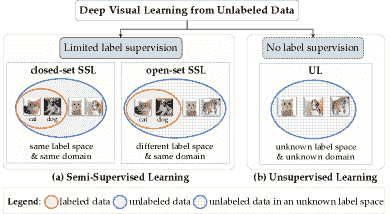

图 1：半监督和无监督学习范式的概述——这两者都旨在从未标记的数据中学习。

图 1 总结了本综述中涉及的两种范式，这两种范式都利用未标记的数据进行视觉表征学习。根据是否对小部分或没有训练数据提供标签注释，我们将这些范式分类为半监督学习和无监督学习，具体定义如下。

+   (a)

    半监督学习（SSL）旨在从稀疏标记的数据和大量辅助未标记数据中共同学习，这些未标记数据通常来自与标记数据相同的基础数据分布。在标准的闭集 SSL [13, 8]中，标记数据和未标记数据属于同一领域中的相同类别。在开放集 SSL [14, 15]中，它们可能不在相同的标签空间中，即未标记数据可能包含未知和/或标记错误的类别。

+   (b)

    无监督学习（UL）旨在仅从未标记的数据中学习，而不利用任何与任务相关的标签监督。一旦训练完成，模型可以使用标记数据进行微调，以在下游任务中实现更好的模型泛化[16]。

根据上述定义，设标记数据集和未标记数据集分别为 $\mathcal{D}_{l}$ 和 $\mathcal{D}_{u}$。SSL 和 UL 的总体统一学习目标为：

|  | $\underset{{\theta}}{\text{最小化}}\ \lambda_{l}\sum_{(\textbf{x},y)\in\mathcal{D}_{L}}\mathcal{L}_{\text{sup}}(\textbf{x},y,\theta)+\lambda_{u}\sum_{\textbf{x}\in\mathcal{D}_{U}}\mathcal{L}_{\text{unsup}}(\textbf{x},\theta),$ |  | (1) |
| --- | --- | --- | --- |

其中$\theta$指的是深度神经网络（DNN）的模型参数；x 是输入图像，$y$是相应的标签；$\mathcal{L}_{\text{sup}}$和$\mathcal{L}_{\text{unsup}}$分别是监督和无监督的损失项；$\lambda_{l}$和$\lambda_{u}$是平衡超参数。在 SSL 中，这两个损失项是联合优化的。在 UL 中，仅使用无监督损失项进行无监督模型预训练（即，$\lambda_{l}=0$）。虽然 SSL 和 UL 共享使用无监督目标进行学习的相同原理，但它们在学习设置上有所不同，导致了不同的独特挑战。具体来说，SSL 假设有有限的标记数据，其核心挑战是用大量的未标记数据扩展标记集。UL 假设主要学习任务没有标记数据，其关键挑战是从未标记数据中学习任务通用的表示。

我们专注于提供有关利用未标记数据提高模型泛化能力的进展的及时而全面的综述，涵盖了**自监督学习**和**无监督学习**中的代表性前沿方法及其应用领域，以及自监督学习中的新兴趋势。重要的是，我们提出了一个统一的高级深度学习方法分类法，为研究人员提供系统的概述，帮助理解当前的最前沿技术并识别未来研究的开放挑战。

与之前的综述相比。我们的综述与其他关于半监督学习[13, 8, 17]、自监督学习[18, 19]或两者的综述[20]相关。虽然这些综述大多专注于单一的学习设置[13, 8, 17, 18]、非深度学习方法[13, 8]，或缺乏对方法的全面分类和应用讨论[20]，但我们的工作则涵盖了代表性的 SSL 和 UL 算法的更广泛的综述，涉及未标记的视觉数据。重要的是，我们用新的分类法对最前沿的 SSL 和 UL 算法进行分类，并在不同方法之间建立联系。除了每种学习范式的内在挑战之外，我们还从问题和算法的角度提炼它们之间的内在联系，讨论不同现有技术的独特见解及其实际应用。

调查组织和贡献。我们的贡献有三方面。首先，据我们所知，这是第一份深度学习调查，全面回顾了三种流行的机器学习范式，利用未标记数据进行视觉识别，包括半监督学习（SSL，§2 ‣ Semi-Supervised and Unsupervised Deep Visual Learning: A Survey")）、无监督学习（UL，§3 ‣ Semi-Supervised and Unsupervised Deep Visual Learning: A Survey")）以及对 SSL 和 UL 的进一步讨论（§4）。其次，我们提供了一个统一的、深刻的分类法和现有方法的分析，以揭示它们的基础算法联系。最后，我们在 §5 中展望了新兴趋势和未来的研究方向，以揭示那些尚未充分探讨的潜在关键领域。

## 2 半监督学习（SSL）

半监督学习（SSL）[13、8] 旨在利用大量未标记数据和稀疏标记数据。SSL 被应用于多个领域，如图像检索 [21]、医学数据分析 [22]、网页分类 [23]、文档检索 [24]、遗传学和基因组学 [25]。近年来，SSL 被用于学习通用视觉表示，以促进许多计算机视觉任务，如图像分类 [26、27]、图像检索 [28]、目标检测 [29、30]、语义分割 [31、32、33] 和姿势估计 [34、35、36]。虽然我们的综述主要涵盖了图像分类的通用半监督学习者 [37、26、27、38]，但其背后的思想也可推广到解决其他视觉识别任务。

我们在 §2.1 ‣ Semi-Supervised and Unsupervised Deep Visual Learning: A Survey") 中定义了 SSL 问题设置并讨论了其假设。我们在 §2.2 ‣ Semi-Supervised and Unsupervised Deep Visual Learning: A Survey") 中提供了现有半监督深度学习方法的分类和分析。

### 2.1 SSL 的问题设置

问题定义。在 SSL 中，我们通常访问到有限量的标记样本 $\mathcal{D}_{l}=\{\textbf{x}_{i,l},y_{i}\}_{i=1}^{N_{l}}$ 和大量的未标记样本 $\mathcal{D}_{u}=\{\textbf{x}_{i,u}\}_{i=1}^{N_{u}}$。每个标记样本 $\textbf{x}_{i,l}$ 属于 $K$ 个类别标签中的一个 $\mathcal{Y}=\{y_{k}\}_{k=1}^{K}$。对于训练，深度神经网络（DNN） $\theta$ 的 SSL 损失函数 $\mathcal{L}$ 通常可以表示为 Eq. (1)，即 $\mathcal{L}=\lambda_{l}\mathcal{L}_{\text{sup}}+\lambda_{u}\mathcal{L}_{\text{unsup}}$。在许多 SSL 方法中，Eq. (1) 中的超参数 $\lambda_{u}$ 通常是一个逐步加重的函数（即 $\lambda=w(t)$ 和 $t$ 是训练迭代），它在训练过程中逐渐增加无监督损失项的重要性 [37, 39, 40, 41, 14]。在测试时，模型被部署以识别 $K$ 个已知类别。有关 SSL 的说明，请参见图 2 ‣ Semi-Supervised and Unsupervised Deep Visual Learning: A Survey")。

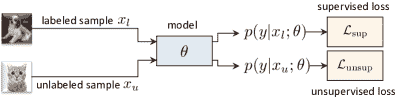

图 2：半监督学习（SSL）旨在从一小部分标记数据和大量未标记数据中共同学习。

评估协议。为了测试 SSL 模型是否有效利用了未标记数据，通常采用两个评估标准。首先，模型需要超越其仅从标记数据中学习的监督基线。其次，当训练集中未标记样本的比例增加时，期望相对于监督基线的改进幅度也会相应增加。总体而言，这些改进幅度表示了 SSL 方法的有效性和鲁棒性。

假设。SSL 的主要假设包括平滑性假设 [42] 和流形假设 [42, 8] —— 后者也被称为集群假设 [43], 结构假设 [44] 和低密度分离假设 [45]。具体而言，平滑性假设认为相邻的数据点可能具有相同的类别标签。流形假设认为处于相同结构（即相同的集群或流形）中的数据点应具有相同的类别标签。换句话说，前者的假设是对相邻数据点局部施加的，而后者是基于由集群或图构成的底层数据结构的全球性假设。

表 I: 半监督深度学习方法的分类，包括 §2.2.1 ‣ 半监督和无监督深度视觉学习：一项调查") – §2.2.5 ‣ 半监督和无监督深度视觉学习：一项调查") 中介绍了五个代表性家族。

| 模型家族 | 模型理由 | 代表性策略和方法 |
| --- | --- | --- |
| 一致性正则化 | 随机增强 | $\Pi$-model [46, 37], 集成变换 [47] |
| 对抗扰动 | 虚拟对抗训练（VAT） [48, 49] |
| MixUp | MixMatch [26], ICT [50] |
| 自动增强 | ReMixMatch [27], UDA [51], FixMatch [38] |
| 随机扰动 | 伪集成 [52], 阶梯网络 [53], 虚拟对抗性 dropout [54], WCP [55] |
| 集成方法 | 时间集成 [37], Mean Teacher [39], SWA [41], UASD [14] |
| 自我训练 | 熵最小化 | 伪标签 [56], MixMatch [26], ReMixMatch [27], Memory [57] |
| 协同训练 | 深度协同训练 [58], 三重训练 [59] |
| 蒸馏 | 模型蒸馏（噪声学生训练 [60], UASD [14]），数据蒸馏 [35] |
| 基于图的正则化 | 基于图的特征正则化器 | EmbedNN [44], Teacher Graph [61], 图卷积网络 [62] |
| 基于图的预测正则化器 | 标签传播 [63] |
| 深度生成模型 | 变分自编码器 | 类条件 VAE [64], ADGM [65] |
| 生成对抗网络 | CatGAN [66], FM-GAN [67], ALI [68], BadGAN [69], Localized GAN [70] |
| 自监督学习 | 自监督 | S4L [71], SimCLR [12], SimCLRv2 [72] |

### 2.2 SSL 算法的分类

现有的 SSL 方法通常假设未标记的数据是封闭集和任务特定的，即所有未标记的训练样本都属于预定义的类别集合。大多数现有工作的共同理念是基于某种潜在的数据结构（例如，流形结构 [42, 44]，图结构 [73]）为每个未标记样本分配一个类别标签。我们将最具代表性的半监督深度学习方法分为五类：一致性正则化、自训练、基于图的正则化、深度生成模型和自监督学习（表 I ‣ Semi-Supervised and Unsupervised Deep Visual Learning: A Survey")），并在 §2.2.1 ‣ Semi-Supervised and Unsupervised Deep Visual Learning: A Survey")，§2.2.2 ‣ Semi-Supervised and Unsupervised Deep Visual Learning: A Survey")，§2.2.3 ‣ Semi-Supervised and Unsupervised Deep Visual Learning: A Survey")，§2.2.4 ‣ Semi-Supervised and Unsupervised Deep Visual Learning: A Survey")和 §2.2.5 ‣ Semi-Supervised and Unsupervised Deep Visual Learning: A Survey") 中提供它们的一般模型公式。

#### 2.2.1 一致性正则化

一致性正则化包括一些成功且广泛使用的方法 [46, 37, 39, 49, 50, 26, 27, 74, 51]。其基本原理是强制模型输出在输入空间和（或）模型空间的变化下保持一致。这些变化通常通过添加噪声、扰动或形成相同输入或模型的变体来实现。形式上，输入变化情况下的目标是：

|  | $\underset{\theta}{\text{min}}\ \ \sum_{x\in\mathcal{D}}d(p(y&#124;x;\theta),\hat{p}(y&#124;\hat{x};\theta)),$ |  | (2) |
| --- | --- | --- | --- |

在模型变化情况下的目标是：

|  | $\underset{\theta}{\text{min}}\ \ \sum_{x\in\mathcal{D}}d(p(y&#124;x;\theta),\hat{p}(y&#124;x;\hat{\theta})).$ |  | (3) |
| --- | --- | --- | --- |

在公式 (2 ‣ 半监督和无监督深度视觉学习：综述"))中，$\hat{x}=q_{x}(x;\epsilon)$ 是原始输入 $x$ 的一个变体，该变体通过数据变换操作 $q_{x}(\cdot,\epsilon)$ 获得，其中 $\epsilon$ 是通过数据增强和随机扰动添加的噪声。类似地，在公式 (3 ‣ 半监督和无监督深度视觉学习：综述"))中，$\hat{\theta}=f_{\theta}(\theta;\eta)$ 是模型 $\theta$ 的一个变体，通过变换函数 $f_{\theta}(\cdot;\eta)$ 获得，其中 $\eta$ 是通过对模型权重和模型集成策略的随机扰动添加的随机性。在这两个公式中，一致性通过两个网络输出 $p(y|\cdot,\cdot)$ 和 $\hat{p}(y|\cdot,\cdot)$ 之间的差异 $d(\cdot,\cdot)$ 来衡量，通常通过诸如 Kullback-Leibler (KL) 散度 [49]、交叉熵 [51] 和均方误差 (MSE) [37] 等散度或距离度量来量化。有关一致性正则化的示意图，请参见图 3 ‣ 半监督和无监督深度视觉学习：综述")。

##### 2.2.1.1   输入变化下的一致性正则化

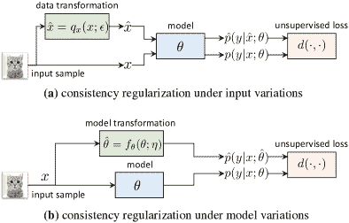

图 3：一致性正则化 (§2.2.1 ‣ 半监督和无监督深度视觉学习：综述")) (a) 输入变化与 (b) 模型变化，其中变化可以通过对输入数据或模型权重的变换引起。

各种策略旨在生成相同输入的不同版本（如公式中的$\hat{x}$ (2 ‣ Semi-Supervised and Unsupervised Deep Visual Learning: A Survey"))) 强调在输入变化下的一致性（分布平滑性），如图 3 ‣ Semi-Supervised and Unsupervised Deep Visual Learning: A Survey") (a)所示。技术范围从简单的随机增强[46, 37]，到更先进的变换，如对抗性扰动[49]，MixUp [75, 26]，以及更强的自动化增强，如 AutoAugment [76]，RandAugment [77]，CTAugment [27] 和 Cutout [78]。下面我们将回顾这四种模型流派。

随机增强是一种标准的数据变换策略，广泛采用[46, 37, 39]，通过添加高斯噪声以及对图像数据应用简单的特定领域抖动，如翻转和裁剪。例如，$\Pi$-model [46, 37] 在相同输入上应用随机数据增强，并最小化两个网络输出之间的一致性正则化项（MSE）。集成变换 [47] 引入了更多样化的数据增强，包括空间变换（即投影、仿射、相似、欧几里得变换）以修改空间纵横比，以及非空间变换以改变颜色、对比度、亮度和清晰度。通过这种方式，模型学习对各种变换不变的表示。

对抗性扰动通过添加对抗性噪声来增强输入数据，旨在改变模型预测，例如，减少预测信心或更改预测的正确标签[79, 80]。对抗性噪声被引入 SSL 以增强数据，并从具有对抗性变换的未标记数据中学习[48, 49, 81, 74]。虚拟对抗训练（VAT）[48, 49] 是第一个代表性的 SSL 方法，它对输入数据进行对抗性扰动。在 VAT 中，对每个输入添加一个小的对抗性扰动，并施加一致性正则化项（即 KL 散度），以鼓励模型对虚拟对抗方向的分布鲁棒性。值得注意的是，发现具有对抗性扰动未标记数据的半监督学习不仅提高了模型的泛化能力，而且增强了对抗攻击的鲁棒性[81, 82]。

MixUp 是一种简单且与数据无关的增强策略，通过对两个输入及其对应标签进行线性插值来实现[75]。它还被引入作为一种有效的正则化方法，用于半监督学习（SSL）[50, 26]。插值一致性训练（ICT）[50]对两个未标记样本及其网络输出进行插值。MixMatch [26] 进一步考虑将标记样本和未标记样本混合作为输入，将真实标签（标记数据的标签）和预测标签（未标记数据的标签）作为输出目标。这两种方法都施加一致性正则化，以指导学习插值输入和插值输出之间的映射，从而从未标记数据中学习。

自动化增强从数据中学习增强策略，以生成强样本，减少了手动设计特定领域数据增强的需要[76, 83, 84, 85]。它通过强制要求弱增强或清洁样本及其由自动化增强[27, 51] 派生的强增强版本的预测标签保持一致来引入到 SSL 中。受到 AutoAugment [76] 进展的启发，ReMixMatch [27] 引入了 CTAugment 以学习自动化增强策略。无监督数据增强（UDA）[51] 采用 RandAugment [77] 通过基于 Python 图像库的标准变换集进行均匀采样，以生成更多样化且强增强的样本。随后，FixMatch [38] 统一了包括 Cutout [78], CTAugment [27], 和 RandAugment [77] 在内的多种增强策略，并生成了更强的增强样本作为输入。

##### 2.2.1.2   模型变化下的一致性正则化

为了在模型变化下强加预测一致性（即，模型参数空间中的变化），如 Eq. (3 ‣ Semi-Supervised and Unsupervised Deep Visual Learning: A Survey")），提出了随机扰动[52, 53, 54]和集成方法[39, 86, 37]。通过非同质模型，它们对相同输入产生不同输出——一个新的模型变体在 Eq. (3 ‣ Semi-Supervised and Unsupervised Deep Visual Learning: A Survey")) 中表示为 $\hat{\theta}$。下面我们将回顾这两种方法，如图 3 ‣ Semi-Supervised and Unsupervised Deep Visual Learning: A Survey") (b) 所示。

随机扰动通过添加高斯噪声、丢弃法或对抗噪声对模型权重进行轻微修改，这些修改与类别无关[52, 53, 54]。例如，Ladder Network 向网络中注入层级高斯噪声，并最小化原始网络与噪声污染网络输出之间的去噪 L2 损失[53]。Pseudo-Ensemble 在模型参数上应用丢弃法，以获得一组模型（伪集成），同时最小化伪集成与模型之间的不一致（KL 散度）[52]。类似地，Virtual Adversarial Dropout 引入对抗丢弃法，选择性地停用网络神经元，并最小化原始模型与扰动模型之间的差异[54]。Worst-Case Perturbations (WCP)引入了添加扰动和丢弃连接到模型参数，其中丢弃连接将某些模型权重设置为零，从而进一步改变网络结构[55]。值得注意的是，这些扰动机制增强了模型对网络参数或结构中噪声的鲁棒性。

集成学习学习了一组覆盖版本空间不同区域的模型[87, 88, 89]。如提升[90]和随机森林[89]等开创性机器学习模型所示，一组不同的模型通常能提供比单个模型更可靠的预测。此外，集成学习提供了丰富的推理不确定性，以减轻深度神经网络中的过度自信问题[91]。对于 SSL，集成模型通常通过计算预测空间或权重空间中的指数移动平均（EMA）或等均值来获得[39, 37, 41, 14]。时序集成[37]和均值教师[39]是两个代表性方法，它们首次提出通过在权重空间[39]或预测空间[37]中保持 EMA 来集成训练过程中产生的所有网络。随机权重平均（SWA）[41]在权重空间中应用模型参数的等均值，以提供一个更稳定的目标来推导一致性成本。后来，带不确定性感知的自蒸馏（UASD）[14]计算训练期间所有前序模型预测的等均值，以推导软目标作为正则化器。

备注：一致性正则化可以视为一个辅助任务，其中模型从未标记数据中学习，以最小化其对输入空间或权重空间变化的预测方差。预测方差通常被量化为两个预测概率分布或网络输出之间的差异。通过最小化一致性正则化损失，模型被鼓励学习对每个样本添加的变化不变的更强表示，而无需使用任何额外的标签注释。

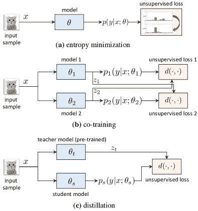

图 4：在自训练中，（a）模型预测被强制保持低熵，（b）两个模型互相学习，（c）学生模型从教师模型中学习。

#### 2.2.2 自训练

自我训练方法通过对高置信度预测样本进行标签填充，从无标签数据中学习 [92, 23, 24]。这种方法最初是为传统机器学习模型提出的，如逻辑回归 [92]、二分图 [23] 和朴素贝叶斯分类器 [24]。在深度神经网络中，它被重新审视，用于从大量无标签数据和有限标签数据中学习。我们回顾了自我训练中的三条代表性研究方向，包括熵最小化、协同训练和蒸馏，如下所述。有关自我训练的示意图，请参见图 4 ‣ 半监督和无监督深度视觉学习：综述")。

熵最小化根据低密度分离假设来正则化模型训练 [92, 45]，以确保类别决策边界位于低密度区域。这也符合聚类假设和流形假设 [42, 44]，后者假设同一类别的数据点可能共享相同的聚类或流形。正式地，熵最小化目标可以被表述为：

|  | $\underset{\theta}{\text{min}}\ \ \sum_{x\in\mathcal{D}}\Big{(}-\sum{{}_{j=1}^{K}}p(y_{j}&#124;x;\theta)\log\ p(y_{j}&#124;x;\theta)\Big{)},$ |  | (4) |
| --- | --- | --- | --- |

其中 $K$ 代表类别数量。$p(y_{j}|x;\theta)$ 是将样本 $x$ 分配到类别 $y_{j}$ 的概率。这衡量了类别重叠。由于较低的熵表示对模型预测的较高置信度，最小化 Eq. (4 ‣ 半监督和无监督深度视觉学习：综述")) 强制每个无标签样本被分配到预测概率最高的类别。尽管熵最小化最初是为逻辑回归提出的，用于对高置信度分类的样本进行标签填充 [92]，但它后来被扩展到在 SSL 设置中训练深度神经网络，通过最小化在预测空间 [56, 93, 49, 26, 27, 38] 或特征空间 [57] 中得到的类别分配的熵。

熵最小化可以在预测空间中强加，例如，伪标签 [56] 直接将每个样本分配给预测概率最大化的类别标签，这隐含地最小化了模型预测的熵。当伪标签是独热编码向量时，它们可能由于错误的标签分配而容易导致错误传播。为了减轻这种风险，MixMatch [26] 使用了不同输入增强的预测集成，并通过一个温度超参数对独热伪标签进行平滑处理。类似地，FixMatch [38] 仅在模型预测的置信度分数高于某个阈值时才分配独热标签。

熵最小化也可以在特征空间中强加，因为基于特征空间中与类级原型（例如，聚类中心）的接近度来推导类别分配是可行的 [94, 57]。在 [57] 中，一个记忆模块学习每个类的中心，该中心是基于与所有聚类中心的接近度推导的。通过最小化熵，将每个未标记样本分配给最近的聚类中心。

协同训练在来自不同来源的同一样本的多个视图上学习两个或更多分类器 [23, 7, 24, 58, 59]。从概念上讲，协同训练框架 [23, 24] 在两个不同但互补的数据视图上训练两个独立的分类器模型，并以交叉模型的方式推断预测标签。它后来被扩展到深度视觉学习 [58, 59, 95]，例如，Deep Co-training (DCT) [58] 训练一个具有两个或更多分类层的网络，并将不同的视图（例如，原始视图和对抗视图 [96]）传递给各个分类器进行协同训练，同时施加无监督损失以最小化来自不同视图的预测相似性。协同训练的基本思想可以从双视图 [58] 扩展到三视图 [59] 或多视图 [58] – 例如，在 Tri-training [59] 中，三个分类器一起训练，当两个分类器对预测达成一致且置信度分数高于阈值时，将标签分配给未标记的数据。形式上，深度协同训练目标可以写作：

|  | $\underset{\theta}{\text{min}}\ \ \sum_{x\in\mathcal{D}}d(p_{1}(y\mid x;\theta_{1}),z_{2})+d(p_{2}(y\mid x;\theta_{2}),z_{1}),$ |  | (5) |
| --- | --- | --- | --- |

其中 $p_{1},p_{2}$ 是在不同数据视图上训练的两个独立分类器 $\theta_{1},\theta_{2}$ 的预测。$d(\cdot,\cdot)$ 引入了相似性度量来从彼此填补的目标 $z_{1},z_{2}$ 中学习，例如，独热目标上的交叉熵 [59]，或输出目标之间的 Jensen-Shannon 散度 [58]。

蒸馏最初是为了将教师模型所学的知识转移到学生模型中，其中教师模型（例如，一个网络集合或更大的网络）产生的软目标可以作为有效的正则化器或模型压缩策略来训练学生模型 [97, 98, 99]。最近的半监督学习（SSL）研究使用蒸馏来填补未标记数据上的学习目标，以训练学生网络 [35, 60, 100, 14]。形式上，引入了一个无监督的蒸馏目标到学生模型 $\theta_{s}$ 中，以从未标记的数据中学习，如下所示：

|  | $\underset{\theta}{\text{min}}\ \ \sum_{x\in\mathcal{D}}d(p_{s}(y&#124;x;\theta_{s}),z_{t}),$ |  | (6) |
| --- | --- | --- | --- |

学生预测 $p_{s}$ 被要求与教师模型 $\theta_{t}$ 在未标记数据或所有数据上生成的目标 $z_{t}$ 对齐。与共同训练（Eq. (5 ‣ Semi-Supervised and Unsupervised Deep Visual Learning: A Survey"))）相比，SSL 中的蒸馏（Eq. (6 ‣ Semi-Supervised and Unsupervised Deep Visual Learning: A Survey"))) 并不同时优化多个网络，而是分阶段训练多个网络。在蒸馏中，现有的工作可以进一步分为模型蒸馏和数据蒸馏，它们通过教师模型的输出或相同输入数据的多次前向传播来生成未标记数据的学习目标，具体如下。

在模型蒸馏中，来自教师的标签被分配给学生 [60, 100, 14]。教师模型可以通过例如预训练模型或模型集成来构建。在噪声学生训练（Noisy Student Training） [60]中，迭代自训练过程通过首先训练一个教师模型来为学生模型的未标记数据填补标签，然后在下一次迭代中将学生模型重新用作教师模型，从而迭代教师-学生训练。在不确定性感知自蒸馏（Uncertainty-Aware Self-Distillation, USAD）[14]中，教师模型通过平均所有之前的网络预测来填补未标记数据上的标签，从而更新学生网络自身。在模型蒸馏中，来自教师模型的软目标和独热标签都可以作为未标记数据上的学习目标 [60, 14]。

在数据蒸馏中，教师模型通过对相同输入进行不同数据转换的输出进行集成，从而预测无标签数据上的学习目标[35]。具体而言，集成的教师预测（即软目标）是通过对相同输入在多个数据转换下的输出进行平均得到的；然后，学生模型利用这些软目标进行训练。数据蒸馏对输入数据进行多次转换，而不是训练多个网络来推断无标签数据上的集成预测。这类似于具有随机数据增强的一致性正则化；然而，在数据蒸馏中涉及两个训练阶段——第一阶段是预训练教师模型；第二阶段是训练学生网络，通过蒸馏模仿教师模型。

备注。类似于一致性正则化，自我训练可以被视为一种与监督学习任务同时学习的无监督辅助任务。一般来说，它也会强制实施预测对实例级变化或教师预测的稳定性。然而，自我训练在设计上有所不同。尽管一致性正则化通常训练一个模型，自我训练可能需要训练多个模型，例如，共训练需要至少两个模型并行训练，而蒸馏则需要依次训练教师模型和学生模型。

#### 2.2.3 基于图的正则化

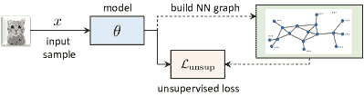

图 5：在基于图的正则化（§2.2.3 ‣ 半监督和无监督深度视觉学习：综述")）中，伪标签在最近邻图上基于邻域一致性进行传播，并在特征或预测空间上施加无监督正则化项。

基于图的正则化是一类最初为非深度半监督学习算法提出的传递学习方法[73, 101, 42, 102, 103]，例如传递支持向量机[42, 102]和高斯随机场模型[101]。该家族中的大多数算法构建一个加权图以利用数据样本之间的关系。具体而言，有标签样本和无标签样本都被表示为节点，而边的权重编码不同样本之间的相似性。基于平滑性假设[42]，即邻近的数据点应共享相同的类别标签，如图 5 ‣ 半监督和无监督深度视觉学习：综述")所示，可以在图上传播标签。

在模型优化中使用基于图的正则化项，通过施加各种形式的平滑约束来最小化附近数据点之间的成对相似度。基于图的正则化随后被重新制定用于带有深度神经网络的半监督学习，例如 EmbedNN [44]、图卷积网络 [62, 104]、教师图 [61] 和标签传播 [63]。尽管这些工作在模型优化中共享相同的平滑假设，但基于图的正则化可以在特征空间或预测空间中以不同方式施加，具体如下。

基于图的特征正则化通常通过构建一个可学习的最近邻（NN）图来完成，这个图增强了原始 DNN，以编码特征空间中数据点之间的亲和性，如 EmbedCNN [44] 和教师图 [61] 所示。图中的每个节点由从中间网络层提取的视觉特征或最后一层的输出编码；同时计算亲和矩阵 $W_{ij}$ 以编码所有节点之间的成对相似度。为了利用未标记数据，可以形成基于图的正则化项作为度量学习损失，例如用于孪生网络的基于边际的对比损失 [105, 106]，通过强制局部平滑来约束特征学习。

|  | $\underset{\theta}{\text{min}}\sum_{x_{i},x_{j}\in\mathcal{D}}\left\{\begin{aligned} &amp;\&#124;h(x_{i})-h(x_{j})\&#124;^{2},&amp;\text{如果}\ W_{ij}{=}1\\ &amp;\text{max}(0,m-&#124;&#124;h(x_{i})-h(x_{j})&#124;&#124;)^{2},&amp;\text{如果}\ W_{ij}{=}0\end{aligned}\right.$ |  | (7) |
| --- | --- | --- | --- |

确保最近邻的特征 $h(x_{i}),h(x_{j})$（即 $W_{ij}{=}1$）彼此接近，而不相似的对（即 $W_{ij}{=}0$）则相距一定距离边际 $m$。

除了用图增强 DNN 之外，更灵活的方式是使用图卷积，即图卷积网络（GCN） [62]，它为每个节点推导新的特征表示，受限于图结构 [104, 107]。具体来说，GCN 以数据和亲和矩阵作为输入，并学习在标记数据上通过监督交叉熵损失来估计未标记数据的类别标签。

基于图的预测正则化在预测空间中操作[63, 108]，如标签传播[63]中所示。受上述建立可学习的神经网络图相同原理的驱动，在标签传播中，使用编码数据点相似性的神经网络图，通过交叉熵损失将标签从标记数据传播到未标记数据。虽然类似于伪标签方法[56]，传播的标签是通过编码全局流形结构的外部神经网络图得出的。此外，图上的标签传播和深度神经网络的更新交替进行，以传播更可靠的标签。

备注。基于图的正则化与 SSL 中的一致性正则化和自我训练有几个相似之处。首先，它引入了一种无监督的辅助任务，通过传播学习目标（例如伪标签）在未标记数据上训练深度神经网络。其次，其学习目标可以被公式化为交叉熵损失或度量学习损失。值得注意的是，尽管一致性正则化和自我训练是每个实例估计学习目标的归纳方法，但基于图的正则化方法是基于数据集上构建的图传播学习目标的传导方法。然而，除了具体细节外，这三种技术都共享寻找无监督目标的相同基本思想。

#### 2.2.4 深度生成模型

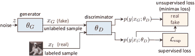

图 6：在基于 GAN 的深度生成模型 (§2.2.4 ‣ 半监督和无监督深度视觉学习：综述"))中，判别器将标记样本分配到 $K$ 个类别，将生成的未标记数据分配到一个辅助类别 ($K+1$)。在测试时，判别器作为分类器。

深度生成模型是一类无监督学习模型，它们学习在没有标签的情况下逼近数据分布[109, 110]。通过将生成式无监督学习概念集成到监督模型中，可以制定出半监督学习框架，以统一监督学习和无监督学习的优点。深度生成模型的两个主要流派是变分自编码器（VAEs）和生成对抗网络（GANs），如下所述。有关 GAN 框架用于 SSL 的说明，请参见图 6 ‣ 半监督和无监督深度视觉学习：综述")。

变分自编码器（VAEs）是基于变分推断的概率模型，用于无监督学习复杂数据分布[109, 111]。一个标准的 VAE 模型包含一个将输入样本编码为潜变量的网络和一个将潜变量解码以重建输入的网络；并且通过最大化变分下界来实现。在半监督学习[64, 65, 112]中，无监督的 VAE 模型通常与监督分类器结合。例如，为了预测在 SSL 中需要的任务特定类别信息，类别条件 VAE[64]和 ADGM[65]将类别标签作为潜特征空间中的一个额外潜变量，以明确区分类别信息（内容）和随机信息（风格），并在标记数据上施加明确的分类损失以及原始 VAE 损失。

生成对抗网络（GANs）[110]通过对抗性极小极大游戏学习捕捉数据分布。具体而言，一个生成器被训练生成尽可能真实的图像，而一个判别器被训练区分真实样本和生成样本。当被重新表述为半监督表示学习器时，GANs 可以利用无监督生成建模和监督判别学习的好处[66, 67, 68, 113, 114, 69, 115, 116, 117, 118]。

一般的思路是将标准 GAN 框架扩展到对标记真实样本（即，判别性）进行监督学习，同时对生成样本进行无监督学习。形式上，这增强了原始判别器的额外监督学习能力。例如，类别 GAN（CatGAN）[66]引入了一个$K$-类判别器，并在真实标记样本上最小化监督交叉熵损失，同时通过最大化预测的熵来对生成样本施加均匀分布约束。类似地，特征匹配 GAN（FM-GAN）[67]、ALI[68]、BadGAN[69]和局部 GAN[70]为 SSL 制定了一个$(K{+}1)$-类判别器，其中一个真实标记样本$x_{l}$被视为$K$个类别之一，而生成样本$x_{G}$被视为$(K+1)_{\text{th}}$类。$(K{+}1)$-类判别器的监督和无监督学习目标公式为：

|  | $\displaystyle\underset{\theta}{\text{max}}\ \sum_{x\in\mathcal{D}}\text{log}\ p(y\mid x_{l},y{<}K{+}1),$ |  | (8) |
| --- | --- | --- | --- |
|  | $\displaystyle\underset{\theta}{\text{max}}\ \sum_{x\in\mathcal{D}}\text{log}\ (1{-}p(y{=}K{+}1\mid x_{l}))-\text{log}\ p(y{=}K{+}1\mid x_{G}),$ |  | (9) |

其中 Eq. (8 ‣ 半监督和无监督深度视觉学习：综述")) 是有标签样本 $x_{l}$ 的监督分类损失；Eq. (9 ‣ 半监督和无监督深度视觉学习：综述")) 是一种无监督 GAN 损失，用于区分真实的有标签样本 $x_{l}$ 和从图像生成器生成的伪造样本 $x_{G}$。为了约束生成样本，Localized GAN [70] 在生成器上引入了正则化项，以确保生成的样本位于流形上原始样本的邻域内，从而允许在半监督的方式下基于生成样本训练局部一致的分类器。

备注。与之前讨论的判别式 SSL 技术不同，DGMs 可以自然地从无标签数据中学习，而无需估计其标签。换句话说，DGMs 是原生的无监督表示学习者。为了在 DGMs 中实现 SSL，模型重新制定的关键在于将标签监督整合到训练中，例如，在 VAEs 中添加类别标签潜在变量或在 GANs 中添加额外的类别判别器。此外，还需要在 GAN 框架中处理更困难的模型优化问题。

#### 2.2.5 自监督学习

自监督学习是一类基于无监督替代（预训练）任务设计的无监督表示学习方法 [119, 120, 11, 121, 122, 123]。自监督与 §2.2.2 ‣ 半监督和无监督深度视觉学习：综述") 中的自训练算法不同，因为自监督学习目标是任务无关的，并且可以在没有任何标签监督的情况下进行训练。前者最初是为了从仅有的无标签数据中学习任务无关的无监督学习目标，但它也被用于 SSL [71, 72, 12]。在 SSL 中，所有训练数据上的任务无关自监督信号通常与有标签数据上的监督学习目标结合。例如，S4L [71] 利用自监督信号如预测旋转角度 [123] 和强制对示例变换的不变性 [119] 来进行基于自监督的 SSL 训练模型，同时进行监督学习。SimCLR [12] 和 SimCLRv2 [72] 是后续工作，引入了用于任务无关的无监督预训练的自监督对比学习，随后通过有标签监督进行监督或半监督的微调作为下游任务。

备注。自监督学习（SSL）的一个独特优势是训练过程中不需要任务特定的标签监督。虽然上述的半监督学习者通常会共同解决一个有监督任务和一个辅助无监督任务，但自监督半监督学习者可以以完全与任务无关的方式进行训练。这表明自监督对 SSL 具有极大的灵活性。因此，自监督训练可以作为无监督预训练引入，或作为一个辅助无监督任务与有监督学习一起解决。尽管自监督对于 SSL 相对较新，但它在无监督学习中的应用已经被广泛探讨，更多细节见 §3.2.1 和 §3.2.2。

表 II：无监督深度学习方法的分类，包括 §3.2.1 – §3.2.3 中的三种代表性方法。

| 模型类别 | 模型原理 | 代表性策略和方法 |
| --- | --- | --- |
| 预文本任务 | 像素级 | 重建 [124, 125]、修补 [126]、MAE [127]、去噪 [128]、着色 [129, 130, 131] |
| 实例级 | 预测图像旋转 [123]、缩放和切片 [122]、补丁排序 [11]、补丁重排序 [121] |
| 判别模型 | 实例区分 | 无负样本 | 大批量 (SimLR [12])、记忆库 (InstDis [132])、队列 (MoCo [16]) |
| 输入变换 | 数据增强 (PIRL [133]), 多视图增强 (CMC [134]) |
| 无负样本 | 简单的孪生网络 (SimSiam [135]), 自助学习 (BYOL [136]), 直接预测 (DirectPred [137]) |
| 深度聚类 | 离线聚类 | DeepCluster [138]、JULE [139]、SeLa [140] |
| 在线聚类 | IIC [141]、PICA [142]、关联聚类 (AssociativeCluster [143])、SwAV [144] |
| 深度生成模型 | 判别器级 | DCGAN [145]、自监督 GAN [146]、变换 GAN [147] |
| 生成器级别 | BiGAN [148]，BigBiGAN [149] |

## 3 无监督学习（UL）

无监督学习（UL）旨在在不利用任何标签监督的情况下学习表示。学到的表示不仅期望捕捉到潜在的语义信息，还应能转移到应对未见的下游任务，如视觉识别、检测和分割 [16]、视觉检索 [150] 和跟踪 [151]。

UL 在计算机视觉中因多种原因而具有吸引力。首先，由于标签注释成本高昂，在许多应用场景中可能没有大规模标注数据集，例如医学成像 [152]。其次，由于任务和应用场景中经常存在数据/标签分布漂移（或差距），在大型标注数据集上进行的预训练无法总是保证未见情况的良好模型初始化 [153]。第三，UL 可以提供强大的预训练模型，这些模型可能与监督预训练相当，甚至超越其表现 [16, 12, 154]。

备注。UL 和 SSL 共享从未标记数据中学习的相同目标，并利用类似的建模原理来制定无监督的替代监督信号，而无需任何标签注释。然而，与 SSL 假定任务特定信息（即类别标签）可用不同，UL 考虑从纯粹任务无关的未标记数据中进行模型学习。鉴于不同场景（如互联网）中未标记数据的丰富性，UL 提供了一种有吸引力的策略来提供良好的预训练模型，从而促进各种下游任务。

专注于在图像分类数据集上训练的无监督视觉学习者，我们在 §3.1 中定义 UL 问题设置，并在 §3.2 中提供现有代表性无监督深度学习方法的分类和分析。

### 3.1 UL 的问题设置

问题定义。在 UL 中，我们可以访问一个未标记的数据集 $\mathcal{D}_{u}=\{\textbf{x}_{i}\}_{i=1}^{N_{u}}$。由于标签信息未知，用于训练 DNN $\theta$ 的 UL 损失函数 $\mathcal{L}$ 通常可以表示为公式 Eq. (1)，即 $\mathcal{L}=\lambda_{l}\mathcal{L}_{\text{sup}}+\lambda_{u}\mathcal{L}_{\text{unsup}}$，其中 $\lambda_{l}=0$。在区分模型中，无监督目标 $\mathcal{L}_{\text{unsup}}$ 需要某些伪目标/代理目标以学习具有语义意义和可泛化的表示。在生成模型中，$\mathcal{L}_{\text{unsup}}$ 被施加以显式建模数据分布。请参见图 7 以了解 UL 的说明。

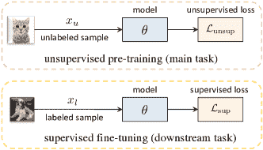

图 7：无监督学习通过使用纯未标记数据来训练一个可泛化的模型。该模型之后可以用标记数据进行微调，并在下游任务上进行测试。

评估协议。UL 方法的性能通常通过两种协议来评估，分别被称为 (1) 线性分类协议和 (2) 下游任务上的微调。在 (1) 中，预训练的深度神经网络（DNN）被冻结以提取图像数据集的特征，同时训练一个线性分类器（例如，一个全连接层或一个 kNN 分类器）来分类提取的特征。在 (2) 中，预训练的 DNN 用于初始化任何下游任务的模型，然后进行带有任务特定目标的微调，例如对从无监督预训练骨干网络（例如，FasterR-CNN [155]）初始化的目标检测器在目标检测数据集（例如，PASCAL VOC [156]）上进行微调，或在分割数据集（例如，COCO [158]）上用预训练骨干网络对分割模型（例如，Mask R-CNN [157]）进行微调。

### 3.2 UL 算法的分类

现有的无监督深度学习模型主要可以分为三类：预文本任务、判别模型和生成模型（表 II ‣ Semi-Supervised and Unsupervised Deep Visual Learning: A Survey")）。预文本任务和判别模型也被称为自监督学习，它们通过代理协议/任务驱动模型学习，并构建伪标签监督来制定无监督的代理损失。生成模型本质上是无监督的，并明确建模数据分布，以在没有标签监督的情况下学习表示。我们在§3.2.1 ‣ Semi-Supervised and Unsupervised Deep Visual Learning: A Survey")，§3.2.2 ‣ Semi-Supervised and Unsupervised Deep Visual Learning: A Survey")和§3.2.3 ‣ Semi-Supervised and Unsupervised Deep Visual Learning: A Survey")回顾这些模型。

#### 3.2.1 预文本任务

预文本任务指的是手工设计的代理任务，用于预测输入数据的某些任务无关属性，这些任务不需要任何标签监督进行训练。通过制定带有免费标签的自监督学习目标，可以以完全无监督的方式学习有意义的视觉表示。接下来，我们将回顾两类预文本任务，这些任务在像素级（如图 8 ‣ Semi-Supervised and Unsupervised Deep Visual Learning: A Survey")所示）或实例级（如图 9 ‣ Semi-Supervised and Unsupervised Deep Visual Learning: A Survey")所示）引入了自监督信号。

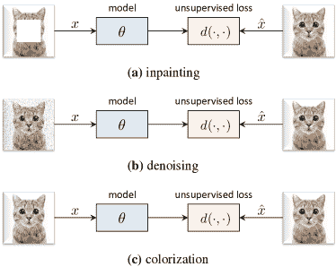

图 8: 在像素级预文本任务中（§3.2.1 ‣ Semi-Supervised and Unsupervised Deep Visual Learning: A Survey")），目标是从受损的输入$x$中重建原始图像$\hat{x}$。

像素级预训练任务通常被设计为密集预测任务，旨在预测输出图像的预期像素值作为自我监督信号[124, 128, 125, 126, 129, 130, 131, 127]。自编码器[124, 125]是最具代表性和原始的无监督模型之一，通过重建输入图像来学习表示。除了标准重建之外，像素级预训练任务引入了更先进的图像生成任务，以虚拟生成损坏输入图像的像素颜色值，表现为三种标准的低级图像处理任务：（1）图像修复[126, 127]通过修复输入图像中遮挡的缺失区域进行学习，这也被称为遮罩自编码器（MAE）[127]; （2）去噪[128]学习去除部分破坏的输入噪声；（3）上色[129, 130, 131]旨在预测灰度图像的颜色值。这些自监督模型通过图像生成任务目标（例如，均方误差）进行训练，以强制预测预期的像素值：

|  | $\underset{{\theta}}{\text{min}}\ \sum_{x\in\mathcal{D}}&#124;&#124;G_{\theta}(x)-\hat{x}&#124;&#124;^{2},$ |  | (10) |
| --- | --- | --- | --- |

其中 $G_{\theta}(\cdot)$ 是一个图像生成网络（通常实现为编码器-解码器网络架构），训练以预测每个像素的预期输出图像 $\hat{x}$。训练完成后，网络 $G_{\theta}(\cdot)$ 的一部分（例如，编码器）可以用于初始化模型权重或提取中间特征，以解决下游任务。

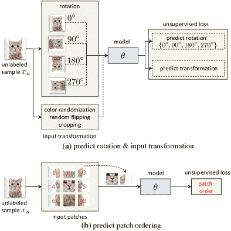

图 9：在实例级预训练任务（§3.2.1 ‣ Semi-Supervised and Unsupervised Deep Visual Learning: A Survey")）中，目标是预测输入的变换。

实例级预文本任务通过设计一个可以在每个实例上解决的替代代理任务，引入稀疏的语义标签，而无需任何标签注释 [11, 121, 122, 159, 123, 160, 161, 162]。通常，这些预文本任务涉及应用不同的图像变换来生成多样的输入变体，其中施加了人工监督信号，以预测每个图像实例上应用的变换。在这类研究中，代表性的工作主要考虑了两类针对输入图像的实例级变换。第一类是分类全局变换，例如旋转 [123]、缩放和瓦片 [122]，其学习目标是识别应用于图像的几何变换。第二类是预测局部变换，例如补丁排序 [11] 和补丁重新排序 [121, 159, 161]，将每个图像切割成多个局部补丁。补丁排序的目标是识别给定切割补丁的顺序，而补丁重新排序，也称为拼图，随机排列切割补丁，目标是预测排列的配置。总之，实例级预文本任务的目标可以写成：

|  | $\underset{{\theta}}{\text{min}}\ \sum_{{x}\in\mathcal{D}}\mathcal{L}_{\text{unsup}}(\Phi_{z}({x}),z,\theta),$ |  | (11) |
| --- | --- | --- | --- |

其中 $\mathcal{L}_{\text{unsup}}(\cdot)$ 可以是各种损失函数（例如，交叉熵损失 [123]），用于学习从变换后的输入图像 $\Phi_{z}({x})$ 到离散类别或应用的变换 $z$ 的配置的映射。一旦训练完成，这些表示与变换 $\Phi_{z}(\cdot)$ 是协变的，从而能感知空间上下文信息，例如图像如何旋转或局部区域如何置换。

备注。尽管像素级或实例级的自监督学习目标通常与下游任务目标（例如，图像分类、检测和分割）没有明确的关联，但它们允许通过预测图像中的空间上下文或结构相关性（例如，修补缺失区域和预测应用的旋转）从未标记数据中学习。由于这些自监督信号可以隐式揭示语义内容（例如，人类可解释的概念 [163]) 或图像中的空间上下文，它们通常能为初始化未见过的下游任务提供有意义的预训练模型，甚至可以作为灵活而有效的正则化器来促进其他机器学习设置，例如半监督学习 [71] 和领域泛化 [164]。

#### 3.2.2 判别模型

判别模型在此指的是无监督判别模型的一类，这些模型通过强制对实例级、邻居级或组级的各种任务无关的视觉变化保持不变，从未标记的数据中学习视觉表示。这些视觉变化可以是内部实例变化，例如同一实例的不同视角[165, 134, 166, 167, 168]，也可以是邻居实例之间的外部实例变化[169, 170]，或者是跨组实例的变化[138, 171, 144]。

接下来，我们回顾两类具有代表性的无监督判别模型，这些模型在无监督视觉特征学习中提供了最先进的技术，包括实例判别（见图 10 ‣ 半监督和无监督深度视觉学习：一项调查")）和深度聚类（见图 11 ‣ 半监督和无监督深度视觉学习：一项调查")）。前者通过将每个实例视为一个类别来施加自监督，而后者则通过将一组相似的实例视为一个类别来引入监督。

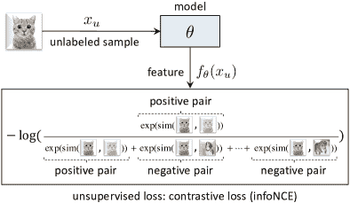

图 10：使用对比学习的无监督判别模型（§3.2.2 ‣ 半监督和无监督深度视觉学习：一项调查")）旨在将正样本对聚集在一起，同时将负样本对推开。

实例判别模型通过强制对不同视角、数据增强或同一图像实例的不同部分保持不变，来学习判别表示[119, 120, 172, 165, 132, 167, 166, 173, 133, 16, 12, 134, 168, 174, 72] – 也被称为样本学习[119, 120]。

实例区分中最常见的方案是对比学习，它最初被提出用于通过将相似的输入映射到潜在空间中的邻近点来学习不变表示[106, 105]。最先进的自监督学习对比学习模型通常通过优化基于噪声对比估计（NCE）原则的对比损失来获得不变性属性[175]，该原则最大化不同视角之间的互信息。多视角信息瓶颈模型[176]将原始信息瓶颈原则扩展到无监督学习，并训练一个编码器以保留预测标签所需的所有相关信息，同时最小化表示中的冗余信息。形式上，对比学习器如 SimLR[12]和 MoCo[16]通常通过实例级对比损失（即 infoNCE 损失）[106, 177]进行优化：

|  | $\underset{{\theta}}{\text{min}}\ \sum_{{x_{i}}\in\mathcal{D}}-\text{log}\ \frac{\text{exp}(f_{\theta}(x_{i})\cdot f_{\theta}({x}^{+}_{i})/\tau)}{\sum_{j=1}^{M}\text{exp}(f_{\theta}(x_{i})\cdot f_{\theta}({x}_{j})/\tau)},$ |  | (12) |
| --- | --- | --- | --- |

其中$\tau$是温度，$f_{\theta}$是特征编码器，即深度神经网络；$f_{\theta}(x_{i})$、$f_{\theta}({x}^{+}_{i})$是同一图像的两个不同增强或视图的特征嵌入；$\{x_{j}\}_{j=1}^{M}$包含$(M{-}1)$个负样本和$1$个正样本（即$x_{i}^{+}$）。公式(12 ‣ Semi-Supervised and Unsupervised Deep Visual Learning: A Survey"))通过强制正对（即同一实例的嵌入）更接近，同时将负对（即不同实例的嵌入）推开来优化网络。最小化 InfoNCE 损失等同于最大化$f_{\theta}(x_{i})$和$f_{\theta}({x}^{+}_{i})$之间的互信息下界[165]。

为了在 Eq. (12 ‣ Semi-Supervised and Unsupervised Deep Visual Learning: A Survey")) 中推导出一个可处理且有意义的对比分布，通常需要每个训练批次大量的负对。为此，现有的最先进方法通常具有不同的负采样策略，以收集更多的负对。例如，SimCLR [12] 采用了一个较大的批量大小 4096。在 InstDis [132]、MoCo [16]、PIRL [133] 和 CMC [134] 中，使用了一个内存库，通过保持特征表示的移动平均来维护所有实例原型。最后，运行队列入队最新批次的样本特征，并出队旧的迷你批次样本特征，以存储前一迷你批次的一部分样本特征 [16, 174, 133]。

受到深度度量学习的启发，各种训练策略进一步提升了对比学习。例如，硬负采样策略 [178] 挖掘与样本相似但可能属于不同类别的负对。通过对抗训练 [179, 180] 训练负对和（或）正对，学习一组“对抗负样本”，它们与给定样本混淆，或“合作正样本”，与给定样本相似。这些策略旨在找到更好的负对和正对，从而改善对比学习。

除了负采样，应用各种图像转换以生成同一实例的多个多样化变体（即视图）来构建正对是至关重要的。最典型的方法是应用常见的数据增强技术，例如随机裁剪和颜色抖动 [132, 166, 173, 16, 133, 12]，或预文本转换 [133]，如补丁重新排序 [121] 和旋转 [123]。另一种方法是通过使用不同的图像通道，如亮度和色度 [134]，或通过提取同一图像的局部和全局补丁 [165]，来人工构建单一图像的多个视图。总之，尽管在负采样和图像转换中有不同的策略用于构建对比学习的负对和正对，这些策略的共同目标是学习对不同输入转换不变的视觉表示 [172, 133]。

虽然对比学习方法依赖于获取足够数量的负样本对以推导对比损失（Eq. (12 ‣ 半监督和无监督深度视觉学习：综述"))），另一种非对比方案例如实例区分以无负样本的方式操作[136, 135, 137, 181]，例如 bootstrap (BYOL) [136] 和简单的 siamese 网络 (SimSiam) [135]。特别是在 BYOL 和 SimSiam 中，同一图像的两个视图（通过数据增强获得）被传递到网络中，并且通过最小化两个视图的表示之间的均方误差来强制不变性。重要的是，采用了停止梯度方案以防止表示崩溃，即避免将所有样本映射到相同的表示。另一种相关的方法是 Barlow Twins [181]，该方法计算一批训练样本的失真版本之间的交叉相关矩阵，并强制该矩阵成为单位矩阵，从而学习对不同失真不变的自监督表示。尽管这些非对比方法采用了其他损失公式，但它们与对比学习共享类似的精神，因为通过强制对同一实例的不同视图进行不变性来学习有意义的表示。

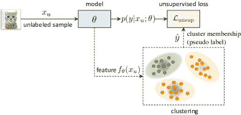

图 11：在使用深度聚类的无监督区分模型 (§3.2.2 ‣ 半监督和无监督深度视觉学习：综述"))中，无标签样本通过在线或离线聚类分配到一组簇中，而簇成员被用作训练的伪标签。

深度聚类模型通过将相似实例从同一聚类中分组来学习区分性表示[182, 139, 183, 138, 184, 171, 140, 142, 185, 186, 144, 187, 170]。在训练过程中，整个数据集通常通过根据成对相似性将每个实例关联到特定聚类中心来划分为多个组。尽管聚类算法是长期存在的机器学习技术[188, 189, 190]，它们已被重新设计为可以与深度神经网络（DNNs）无缝集成，以学习没有标签监督的区分性表示。从概念上讲，聚类成员资格可以被视为一些伪标签来监督模型训练，如方程(13)中所述。

|  | $\underset{{\theta}}{\text{min}}\ \sum_{x\in\mathcal{D}}\mathcal{L}_{\text{unsup}}(x,\hat{y},\theta),$ |  | (13) |
| --- | --- | --- | --- |

其中 $\hat{y}$ 是样本 $x$ 的聚类成员资格，$\mathcal{L}_{\text{unsup}}(\cdot,\cdot,\theta)$ 是约束从 $x$ 到 $y$ 映射的损失函数，如分类损失。深度聚类算法可以进一步分为两类，具体取决于聚类成员资格的分配是以离线还是在线方式获得的，详细内容如下。

在离线聚类中，无监督训练在聚类分配步骤和网络训练步骤之间交替进行[182, 139, 191, 192, 193, 140, 171, 170]。前者步骤估计所有训练样本的聚类成员资格，后者则使用分配的聚类成员资格作为伪标签来训练网络。代表性的离线聚类模型包括 DeepCluster[138]、JULE[139] 和 SeLa[140]，它们主要在聚类算法上有所不同。具体而言，DeepCluster[138, 171] 使用 k-means 聚类[189] 对视觉特征进行分组。JULE[139] 使用凝聚性聚类[194]，通过合并相似的聚类来迭代地推导新的聚类成员资格。SeLa[140] 将聚类视为一个通过 Sinkhorn-Knopp 算法[195] 解决的最优传输问题，以获得聚类成员资格作为伪标签。

在在线聚类中，聚类分配步骤和网络训练步骤在端到端训练框架中耦合，如 IIC [141], AssociativeCluster [143], PICA [142], 和 SwAV [144]所示。与离线聚类相比，在线聚类能更好地扩展到大规模数据集，因为它不需要对整个数据集进行迭代聚类。这通常通过两种方式实现：（1）训练一个参数化聚类成员资格的分类器（例如，IIC 和 PICA）；（2）学习一组聚类质心/原型（例如，AssociativeCluster 和 SwAV）。例如，IIC [141]通过最大化原始实例和从数据增强中获得的随机扰动实例的预测之间的互信息来学习聚类成员资格。SwAV [144]在特征空间中学习一组原型（即，聚类质心），并将每个样本分配给最近的原型。

备注。近期关于判别性无监督模型的进展包括对比学习和深度聚类，这些方法已设立了新的技术水平。一方面，对比学习通过在实例级别施加变换不变性来区分单个实例。有趣的是，这与一些实例级别的预训练任务相对立，这些任务则通过预测施加的变换来进行学习。对比学习还与 SSL 中的一致性正则化密切相关，都是通过强制变换的不变性来实现，尽管常使用不同的损失函数。然而，如[135]所示，一种成对损失目标——通常用于 SSL 中的一致性正则化——也可以作为对比损失（见公式(12 ‣ Semi-Supervised and Unsupervised Deep Visual Learning: A Survey"))）同样有效。这表明它们背后的基本思想是相同的——在实例级别施加变换不变性。另一方面，深度聚类通过区分实例组来发现潜在的语义边界，并施加组级别的不变性。一致性正则化的思想也被多个深度聚类方法[142, 141]采纳，表明其在 SSL 之外的更广泛有效性。最后，判别性无监督学习还可以在实例级别和组级别进行，以学习更强大的表示[186, 196]。

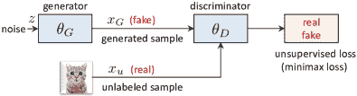

图 12：在 GANs (§3.2.3)中，生成器和判别器通过一个极小极大博弈（Eq. (14))以无监督方式进行训练，同时它们的中间特征产生区分性的视觉表示。

#### 3.2.3 深度生成模型

深度生成模型（DGMs），如 §2.2.4 中所介绍，是固有的无监督学习者，它们显式建模数据分布 [197, 109, 110, 198]。DGMs 适用于半监督和无监督学习。一个典型的生成对抗网络（GAN） [66, 199, 149, 146, 147] 包含一个判别器 $D$ 用于区分真实样本和伪造样本，以及一个生成器 $G$，可以作为图像编码器捕获潜在空间中的语义，通过一个极小极大博弈进行训练：

|  | $\displaystyle\underset{G}{\text{min}}\ \underset{D}{\text{max}}\ \mathds{E}_{x\sim p_{\text{data}}(x)}[\text{log}D(x)]{+}\mathds{E}_{z\sim p_{z}(z)}[\text{log}(1{-}D(G(z)))],$ |  | (14) |
| --- | --- | --- | --- |

其中 $z$ 是从输入噪声分布 $p_{z}(z)$ 中采样的。GANs 可以在判别器和生成器层面学习表示。有关基于 GAN 的深度生成模型的插图，请参见图 12。

为了在判别器层面学习表示，深度卷积生成对抗网络（DCGAN） [145] 采用预训练的卷积判别器来提取特征，以应对下游图像分类任务。后来，Self-supervised GAN [146] 和 Transformation GAN [147] 进一步赋予判别器一个自监督前任务，以预测应用的图像变换，从而使表示能够捕获潜在的视觉结构。

为了在生成器级别学习表示，双向生成对抗网络（BiGAN）[199] 引入了一个与生成器耦合的图像编码器，该编码器通过联合判别器损失进行训练，以将数据分布和潜在特征分布联系在一起。这使得图像编码器能够捕捉其潜在表示中的语义变化，并为一对最近邻（1NN）分类提供区分性视觉表示。为了进一步改进 BiGAN，BigBiGAN [149] 采用了比 BigGAN [148] 更强大的判别器和生成器架构，并增加了一个额外的单项判别器损失，以独立约束数据或潜在分布，从而在生成器级别实现更具表现力的无监督表示学习。

备注。尽管大多数最先进的 UL 方法是自监督模型，它们解决预文本任务或执行无监督判别学习（如 §3.2.1 和 §3.2.2 中所述），深度生成模型仍然是一类重要的无监督学习者，因为它们以概率方式学习表现力强的数据表示，不需要手动设计有意义的判别学习目标，同时提供生成丰富数据的独特能力。

## 4 关于 SSL 和 UL 的讨论

在本节中，我们通过进一步讨论它们共同的学习假设 (§4.1)，以及它们在不同计算机视觉任务中的应用 (§4.2) 来连接 SSL 和 UL。

### 4.1 SSL 和 UL 共享的学习假设

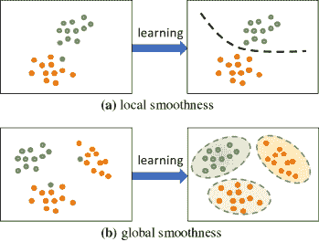

图 13：SSL 和 UL 共享 (a) 局部和 (b) 全局平滑假设。无标签样本（灰点）根据从局部或全局平滑假设得出的决策边界被分配到类别标签。

如 §2.1 ‣ 半监督和无监督深度视觉学习：综述") 中讨论的那样，SSL 中的无监督学习目标通常基于平滑性假设 [42]。广义上讲，各种判别性 SSL 和 UL 算法的学习假设可以分为两种类型的平滑性假设，即局部平滑性和全局平滑性——如图 13 所示。接下来，我们将进一步阐述这些假设，并讨论基于这些假设构建的不同 SSL 和 UL 算法。

#### 4.1.1 局部平滑性

局部平滑性假设有两种类型。首先，假设样本 $x_{i}$ 与其变换后的变体 $\hat{x}_{i}$ 共享相同的类别标签（方程 (15)）。其次，假设样本 $x_{i}$ 与其在潜在表示空间中的邻近样本 $x_{j}$ 属于同一类别（方程 (16)）。无监督损失项通过以下公式对无标签样本 $x_{i}$ 强制执行局部平滑性：

|  | $\underset{{\theta}}{\text{min}}\ \sum_{{x_{i}}\in\mathcal{D}}\mathcal{L}_{\text{unsup}}(f({x_{i}}),f(\hat{x}_{i}))$ |  | (15) |
| --- | --- | --- | --- |
|  | $\underset{{\theta}}{\text{min}}\ \sum_{{x_{i}}\in\mathcal{D}}\mathcal{L}_{\text{unsup}}(f({x_{i}}),f(x_{j}))$ |  | (16) |

其中 $f(\cdot)$ 是待训练的模型，并给出模型输出（例如特征或预测）。$\mathcal{L}_{\text{unsup}}(\cdot)$ 可以是量化两个模型输出之间的差异或不一致性的任何相似度度量，例如均方误差或对比损失。

同一样本的不同视角之间的局部平滑性（Eq. (15））可以通过 SSL 中的一致性正则化技术实现（§2.2.1, 图 3）。这些技术强制对输入空间和（或）模型空间施加不同变体的同一样本的预测平滑性，因为同一样本的不同变换版本应位于其自身的局部邻域内。类似地，UL 中的实例判别算法也隐式地强制不同视角或变换下的同一样本具有局部一致的表示，正如对比学习所示，它鼓励每个样本上的局部不变性（§10, 图 10）。

通过 SSL 中的基于图的正则化技术可以施加邻近样本之间的局部平滑性（Eq. (16））。这些技术通常使用图中邻居的标签将类别标签传播到未标记样本上，因为邻近样本很可能属于同一类别（§2.2.3, 图 5）。类似地，UL 中也探讨了邻域一致性[169, 170]，它通过基于特征相似性的最近邻挖掘形成语义训练标签，考虑到最近邻很可能属于相同的语义类别。

#### 4.1.2 全球平滑性

全局平滑假设表明，样本 $x_{i}$ 可以根据模型捕捉到的基础全局结构被分配到某个特定的类别（或目标）$z_{i}$。

|  | $\underset{{\theta}}{\text{最小化}}\ \sum_{{x_{i}}\in\mathcal{D}}\mathcal{L}_{\text{无监督}}(f({x_{i}}),z_{i})$ |  | (17) |
| --- | --- | --- | --- |

其中 $z_{i}$ 是学习目标（例如，聚类成员资格或最自信的预测类别），该目标来源于训练过程中发现的全局类别决策边界（见图 13），而这些决策边界应位于低密度区域。类似于 Eq. (15) 和 Eq. (16)，$\mathcal{L}_{\text{无监督}}(\cdot)$ 是一种相似性度量，用于量化模型输出与训练目标之间的不一致性，例如交叉熵损失。全局平滑假设在各种 SSL 和 UL 技术中也被广泛采用，以便通过伪学习目标从未标记样本中学习，具体细节如下。

SSL 中的自我训练技术（§2.2.2 ‣ 半监督和无监督深度视觉学习：综述"), 图 4 ‣ 半监督和无监督深度视觉学习：综述")）通常基于全局平滑性来制定，因为对未标记数据的学习目标是基于模型发现的类别决策边界推导的。例如，在熵最小化（Eq. (4 ‣ 半监督和无监督深度视觉学习：综述")), 图 4 ‣ 半监督和无监督深度视觉学习：综述") (a)) 中，伪标签是获得的最高置信度类别。在共同训练和蒸馏（Eq. (5 ‣ 半监督和无监督深度视觉学习：综述")), Eq. (6 ‣ 半监督和无监督深度视觉学习：综述")), 图 4 ‣ 半监督和无监督深度视觉学习：综述") (b)(c)) 中，学习目标来自于并行共同训练或预训练的模型。同样，UL 中的深度聚类算法（§11 ‣ 半监督和无监督深度视觉学习：综述"), 图 11 ‣ 半监督和无监督深度视觉学习：综述")）也是基于全局平滑性提出的，因为未标记样本的簇隶属关系是通过在线或离线聚类算法获得的，该算法揭示了特征空间中的潜在类别决策边界。

#### 4.1.3 SSL 和 UL 之间的联系

表 III：基于其学习假设的 SSL 和 UL 方法的常见分类。

| 假设 | 目标 | 对应的 SSL 和 UL 方法 |
| --- | --- | --- |
| 局部平滑性 | 方程 (15) | 一致性正则化在 SSL (§2.2.1 ‣ 半监督与无监督深度视觉学习：综述")) |
| 实例区分在 UL (§10 ‣ 半监督与无监督深度视觉学习：综述")) |
| 方程 (16) | 基于图的正则化在 SSL (§2.2.3 ‣ 半监督与无监督深度视觉学习：综述")) |
| 邻域一致性在 UL (§3.2.2 ‣ 半监督与无监督深度视觉学习：综述")) |
| 全局平滑性 | 方程 (17) | 自我训练在 SSL (§2.2.2 ‣ 半监督与无监督深度视觉学习：综述")) |
| 深度聚类在 UL (§11 ‣ 半监督与无监督深度视觉学习：综述")) |

SSL 和 UL 中常见的学习理论。如在 §4.1.1 和 §4.1.2 中分析的那样，大多数 SSL 和 UL 算法是基于相同的局部平滑性或全局平滑性假设来制定的——如表 III 中总结的。这些 SSL 和 UL 算法的一个共同点是设计视觉学习目标，以强制对施加于输入数据的不同变换保持不变或等变，如 SSL 中的**一致性正则化**（§2.2.1 ‣ Semi-Supervised and Unsupervised Deep Visual Learning: A Survey")）和 UL 中的**实例判别**（§10 ‣ Semi-Supervised and Unsupervised Deep Visual Learning: A Survey")）。典型的变换策略可以从简单的数据增强 [46, 37, 39]，到更复杂的变换，如对抗性扰动 [48, 49, 81, 74]，旋转 [123] 和补丁重新排序 [121]，自编码变换 [200, 201] 和自动增强 [27, 51, 38]。一方面，这些 SSL 和 UL 方法大多依赖于通过为增强和扰动的数据样本分配相同的潜在标签来学习对数据增强和扰动不变的表示。另一方面，其他 SSL 和 UL 方法考虑学习对不同变换（如旋转和补丁重新排序）等价的表示，通过学习预测变换类型。

许多最先进的 SSL 和 UL 方法可以与相同的基本学习假设很好地关联，因为它们引入了类似的目标来从未标记样本中学习。实质上，这些 SSL 和 UL 方法的学习理论可以大致分类为：(1) 强制对同一样本的不同变换版本之间保持一致性 (Eq. (15))，(2) 强制样本与其邻近样本之间的平滑性 (Eq. (16))，和 (3) 基于全局决策边界为未标记样本导出学习目标 (Eq. (17)）。

问题设置之间的相似性和差异性。在问题设置中，SSL 和 UL 在某种意义上是相似的，因为在评估其泛化模型性能之前，通常涉及标记和未标记数据的训练协议。特别是，SSL 范式采用单阶段训练，并在训练过程中使用标记和未标记数据（图 2 ‣ 半监督和无监督深度视觉学习：综述")）；而大多数现有的 UL 协议则考虑两阶段训练（图 7 ‣ 半监督和无监督深度视觉学习：综述")）—一个阶段用于未标记数据的预训练，另一个阶段用于标记数据在下游任务上的微调。

简而言之，关于训练协议，UL 在几个方面与 SSL 有所不同：（1）标记数据和未标记数据不会同时给出；（2）未标记数据集和标记数据集可能具有不同的分布。这些特性使得 UL 成为一种更通用的学习范式，可以利用不同的未标记数据集。然而，不同形式的未标记数据上的无监督预训练如何有助于模型在特定下游任务上的泛化仍然是一个开放的研究问题。例如，尚不清楚在自然彩色图像上进行无监督预训练的模型如何能够泛化到具有不同数据分布的下游任务，如医学成像中的灰度图像。在这方面，SSL 提供了一个更可靠的学习范式来利用未标记的数据，因为标签集为模型和（或）模型设计者提供了先验知识，以选择与标记数据分布相似的有用未标记样本集。

### 4.2 在视觉识别中的应用 SSL 和 UL

在§2 ‣ 半监督和无监督深度视觉学习：综述")和§3 ‣ 半监督和无监督深度视觉学习：综述")中，我们主要介绍了用于标准图像分类的 SSL 和 UL 方法。然而，它们的基本学习原理可以推广到其他具有挑战性的计算机视觉任务，例如，语义分割[32, 202]，目标检测[203, 30]，无监督领域适应[204, 205]，姿态估计[34, 206]，3D 场景理解[207]，视频识别[150, 208]等。接下来，我们回顾了三种核心视觉识别任务，这些任务广泛受益于 SSL 和 UL 方法，以利用未标记的数据：语义分割（§4.2.1），目标检测（§4.2.2），以及无监督领域适应（§4.2.3）。

#### 4.2.1 语义分割

语义分割旨在为输入图像中的每个像素分配一个语义类别标签。这是一个核心计算机视觉任务，对各种现实世界应用具有潜在的好处，如医学图像分析 [209, 210, 211, 212] 和自动驾驶 [213, 214, 215]。监督语义分割需要繁琐且昂贵的像素级标签标注，例如，在 Cityscapes 中手动标注一张自然图像需要 1.5 小时 [213]。

为了降低语义分割中的标注成本，一些研究仅考虑少量的训练数据进行像素级语义标签标注，而其余的训练数据则为未标注数据——这被称为半监督语义分割。这些工作通常继承了与图像分类的**自监督学习（SSL）**或**无监督学习（UL）**类似的学习原理，并采用如一致性正则化 [216, 217, 218, 219]、自我训练 [220, 221, 222, 210, 202, 223, 224]、生成对抗网络（GAN）框架 [225, 226, 227] 在**自监督学习（SSL）**中的技术，或对比学习 [228, 229, 230, 231] 在**无监督学习（UL）**中的技术，以从未标注的图像中学习。然而，语义分割中的无监督损失项通常需要以每个像素为单位进行施加，以与语义分割中的像素级学习目标对齐。接下来，我们将讨论三种最具代表性的前沿方法，这些方法受到最近在**自监督学习（SSL）**和**无监督学习（UL）**方面进展的驱动，用于半监督语义分割。

一致性正则化（§2.2.1 ‣ Semi-Supervised and Unsupervised Deep Visual Learning: A Survey")）可以通过在像素级别上制定一致性损失（Eq. (2 ‣ Semi-Supervised and Unsupervised Deep Visual Learning: A Survey")），Eq. (3 ‣ Semi-Supervised and Unsupervised Deep Visual Learning: A Survey")））来推广到像素级任务。与 SSL 中的标准一致性正则化类似，最近在半监督语义分割中的研究[216，217，218，219]依赖于在扰动前后强制图像之间的像素一致性，其中扰动可以引入到输入空间[216]或特征空间[217]。例如，第一个语义分割中的一致性正则化方法[216]应用了 CutOut[78]和 CutMix[232]数据增强技术，以部分破坏来扰动输入图像，并施加像素级损失项，以确保扰动图像中的未损坏区域在像素级预测上与原始图像中的相同区域一致。一个交叉一致性训练[217]则通过在网络激活中注入噪声来施加特征扰动，并强制清洁和扰动输出之间的像素一致性。

自训练算法（§2.2.2 ‣ Semi-Supervised and Unsupervised Deep Visual Learning: A Survey")）已被调整并显示在半监督语义分割中有效[220，221，222，210，202，223，224]，其中使用预训练教师模型[223]或共训练模型[202]传播未标记图像上的伪分割图。举例来说，一种自训练方法[223]通过两个步骤传播伪分割标签——（1）使用预训练的教师模型在未标记数据上分配像素级伪标签；（2）用重新标记的数据集重新训练学生模型——直到没有更多的性能提升。另一种自训练方法[202]采用共训练方案，通过训练两个模型相互学习每个像素的分割预测。

对比学习在无监督学习（UL）中得到广泛应用，并被调整用于从未标记数据中学习语义分割[228, 229, 230, 231]。为了在每个像素上制定对比损失（参见 Eq. (12 ‣ Semi-Supervised and Unsupervised Deep Visual Learning: A Survey"))），需要选择有意义的正负对，并考虑像素的空间位置。为此，提出了一种定向上下文感知对比损失[228]，该方法从一张图像中裁剪出两个补丁，将相同位置的特征作为正对，其余特征作为负对。另一个像素对比损失[230]则通过在随机颜色增强前后对齐特征，将相同位置的特征作为正对，同时从不同图像中采样固定数量的负对来引入。

#### 4.2.2 对象检测

对象检测的目标是预测图像中感兴趣对象的一组边界框及相应的类别标签。对象检测器需要将分类和定位统一到一个模型中，通过联合训练一个分类器来预测类别标签，并训练一个回归头来生成边界框[5, 233]。这是一个重要的计算机视觉任务，对人脸搜索[234]、车辆检测[235]、标志检测[236]、文本检测[237]等各种应用产生广泛影响。监督的对象检测需要昂贵的注释工作——为单个对象标注边界框最多需要 42 秒[238]。

为了利用没有边界框或类别标签信息的未标记数据，一组关于对象检测的工作利用未标记数据，通过在少量标记数据和一组完全未标记图像上进行训练，从而提升模型的泛化能力——这被称为半监督对象检测。这些工作主要重新制定了两类 SSL 技术，包括一致性正则化[203, 239, 240, 30, 241, 242]和自我训练[35, 243, 244, 245, 246]，这两种技术均引入了边界框和类别标签的学习目标，以从完全未标记的数据中学习，具体细节如下。

一致性正则化（§2.2.1）被引入半监督目标检测中，用于传播基于分类和回归的双重一致性约束在未标记图像上的软标签和边界框分配 [203, 239, 240, 30, 241, 242]。一类工作应用数据增强方法，如随机翻转 [203]和 MixUp [75]，生成未标记图像的增强视图，并鼓励不同视图中的预测边界框及其类别标签保持一致。与标准的一致性正则化相比，这些方法特别需要重新估计增强图像中的边界框位置，如翻转边界框 [203]，或计算 MixUp [75]中两个混合图像的重叠边界框。另一类工作遵循教师-学生训练框架，并施加教师-学生一致性 [240, 30, 241, 242]，类似于 Mean Teacher [39]。教师模型由学生模型通过指数平均平均（EMA） [240, 30, 242]，或通过对即时模型输出应用非最大抑制（NMS，一种用于优化检测边界框的过滤技术） [241]获得伪边界框和标签注释进行训练。

自训练算法（§2.2.2）也被引入用于对目标检测的标注未标记图像 [35, 243, 244, 245, 246]。一种简单的自训练范式是使用预训练教师模型对未标记图像进行边界框和类别标签标注，并使用这些数据进行再训练 [243]。然而，这种伪标注可能相当嘈杂。为了提高伪标签的质量，最近的工作提出了交互式自训练，以逐步优化伪标签，使用 NMS [244]，或量化模型不确定性以选择或生成更可靠的伪标签 [245, 246]，以从未标记数据中学习。

#### 4.2.3 无监督领域适应

无监督领域适应（UDA）是自监督学习（SSL）的一种特殊情况，其中标注（源）数据和未标注（目标）数据分布不同，即不同领域。UDA 对于视觉识别至关重要[247]，因为视觉数据的统计特性对各种因素（例如，照明、视角、分辨率、遮挡、时间以及天气条件）非常敏感。虽然大多数 UDA 方法关注于解决标注数据和未标注数据之间的领域差距，但 SSL 和 UL 算法也可以适应于从 UDA 中的未标注数据中学习，如下所述。

一致性正则化（§2.2.1 ‣ Semi-Supervised and Unsupervised Deep Visual Learning: A Survey")）已被证明在 UDA 中有效。在鼓励在扰动下输出一致性的精神下，各种 UDA 方法应用输入变换或模型集成来模拟输入或模型空间的变化[248, 249, 39, 250]。为了生成输入变换，双重 MixUp 正则化将类别级 MixUp 和领域级 MixUp 结合起来，以一致性约束对模型进行正则化，从而从未标注数据中学习以增强领域不变性[248]。为了生成模型变换，自我集成[249]利用 Mean Teacher[39] 在目标领域中填补未标注训练目标。

自训练（§2.2.2 ‣ Semi-Supervised and Unsupervised Deep Visual Learning: A Survey")）也对 UDA 有用。类似于 SSL，自训练用于 UDA 包括三种技术流来在未标记的目标样本上填充伪标签，包括熵最小化、伪标签和协同训练。为了确保有效性，自训练方法通常与领域分布对齐结合使用，以减少领域偏移。例如，熵最小化（公式 (4 ‣ Semi-Supervised and Unsupervised Deep Visual Learning: A Survey")）被采用用于 UDA [251, 252, 253]，结合分布对齐技术，如领域特定的批量归一化层[251]、特征的二阶统计量对齐[252]，或对抗训练和梯度同步[253]。协同训练（公式 (5 ‣ Semi-Supervised and Unsupervised Deep Visual Learning: A Survey")））也被引入用于 UDA，它从多个协同训练的分类器中填充训练目标，以从未标记数据中学习并匹配跨领域分布[254]。

深度生成模型（DGMs），作为一种用于半监督学习（SSL）和无监督学习（UL）的模型类别（§2.2.4 ‣ Semi-Supervised and Unsupervised Deep Visual Learning: A Survey")，§3.2.3 ‣ Semi-Supervised and Unsupervised Deep Visual Learning: A Survey")），在 UDA 中被广泛采用。与在特征层面减少领域偏移的其他 UDA 方法相比，DGMs 提供了一种替代且补充的解决方案，通过跨领域图像到图像的转换来缓解像素级的领域差异。这些框架大多数基于 GANs，如 PixelDA [255]、generate to adapt [256]，以及具有循环一致性的 GANs，如 CyCADA[257]、SBADA-GAN [258]、I2I Adapt [259]和 CrDoCo [260]。这些模型通常学习真实到真实[261, 257, 260, 258]或合成到真实[262, 255, 256]的映射，以将图像风格从标记的源域转换到未标记的目标域，从而提供带有伪标签的合成训练数据。

在 SSL 和 UL 中，流行的自监督学习 (§2.2.5, §3.2.1)，也被引入到 UDA 中，以在未标记数据上构建辅助自监督学习目标。自监督模型通常通过自监督结合标记源数据上的监督目标来解决 UDA 问题[164, 204, 263, 264]。这一方向的开创性工作是 JiGen [164]，它通过联合分类对象和解决拼图任务[121]来实现更好的新领域泛化。最近的工作[204, 263, 264] 探索了其他自监督预训练任务，如预测旋转[204, 263, 264]、翻转[204]和补丁排序[204]。除了预训练任务，最近的 UDA 方法还探索了基于聚类或对比学习的判别性自监督信号。例如，DANCE [205] 通过将目标样本分配给源领域中的“已知”类别原型或目标领域中的邻近原型来执行邻域聚类。梯度正则化对比学习[265]利用对比损失将未标记的目标样本推向最相似的标记源样本。同样，[266] 通过对比损失将目标领域特征与源领域中的类别原型对齐，最小化可能属于同一类别的跨领域样本之间的距离。

## 5 新兴趋势与开放挑战

在这一部分，我们讨论了从未标记数据中出现的 SSL 和 UL 的趋势，涵盖了三个方向，即开放集学习 (§5.1)、增量学习 (§5.2) 和多模态学习 (§5.3)。我们详细介绍了最近的发展和面临的挑战。

### 5.1 从未标记数据中进行开放集学习

在§2 ‣ Semi-Supervised and Unsupervised Deep Visual Learning: A Survey")中，我们回顾了处理相对简单的封闭集 SSL 学习的工作，这些工作假设未标记的数据与标记数据共享相同的标签空间。然而，这种封闭集假设可能极大地阻碍了 SSL 在利用包含未见类别的真实世界未经整理的未标记数据（即 OOD 样本，也称为离群点）中的有效性[40]。当将大多数现有的 SSL 方法应用于含有噪声的未标记数据的开放集学习时，它们的模型性能可能会显著下降，因为 OOD 样本可能会引发灾难性的错误传播。

一系列研究提出了应对更复杂的开放集 SSL 场景[14, 15, 267, 268, 269, 270, 271, 272]，其中未标记的数据集中包含与任务无关的 OOD 数据。在这种设置（所谓的开放世界 SSL）下，未标记的样本并非全部有益。为了防止未标记的 OOD 样本可能导致的性能风险，最近的 SSL 进展提出了各种样本特定的选择策略，以降低它们的重要性或使用[14, 15, 267, 268]。开创性工作包括 UASD[14]和 DS³L[15]提出施加动态加权函数，将无监督正则化损失项下调，权重与未标记样本属于未见类别的可能性成正比。后续工作采用课程学习[267]和迭代自我训练[268]，通过训练一个 OOD 分类器来检测和丢弃潜在的有害样本。最近，OpenMatch[270]提出训练一组一对全体分类器来检测内点和外点，并对仅有未标记的内点进行一致性约束的模型进行正则化。

开放挑战。开放集的半监督学习呼吁将 OOD 检测[273]或新颖类别发现[274]与半监督学习整合到统一模型中，以推动对噪声未标记数据的选择性利用。此外，最近的工作提出了一个通用的半监督学习基准[271]，进一步扩展了开放集设置中的分布不匹配问题，包括子集或交集类别不匹配和特征分布不匹配。这些更为现实的设置带来了多个新的挑战，包括用于 OOD 检测的 DNN 的置信度校准[273, 273, 275, 276, 277]，由实际世界长尾分布的未标记数据引起的类别分布不平衡[278, 279]，以及未标记数据中未见类别的发现[280, 281, 274]。尽管开放集半监督学习在 OOD 检测方面取得了进展，但其他挑战仍需解决，以便利用现实世界的未标记数据。

### 5.2 从未标记数据中进行增量学习

现有关于半监督学习和未标记学习的工作通常假设所有未标记的训练数据一次性可用，但在实际中，由于隐私问题或计算限制，这种情况并不总是成立。在许多现实场景中，我们需要进行增量学习（IL），以便在没有访问过去训练数据的情况下，利用新数据逐步更新模型。在这里，我们回顾了从未标记数据进行增量学习的研究方向[282, 283]，并讨论了其开放挑战。

从未标记数据中的增量学习（IL）已在半监督方式中进行研究[282]。IL（也称为持续学习和终身学习[284]）旨在扩展现有模型的知识，而无需访问之前的训练数据。大多数现有的 IL 方法使用正则化目标来防止遗忘旧知识，即减少灾难性遗忘[285, 286, 287, 288]。为此，IL 中通常使用未标记数据来通过估计模型参数对旧任务的重要性权重[289]，或制定知识蒸馏目标[282, 290]来巩固从旧数据中学到的知识。最近，多个研究探讨了来自非平稳流的未标记数据的 IL[283, 291]，其中类别标签空间可能会随着时间变化[292]。在这种情况下，目标是从连续的未标记数据流中学习显著的表示。为了扩展新类别和未标记数据的表示，采用了几种策略来动态更新潜在空间中的表示，如通过在线聚类创建新的簇中心[292]和更新高斯混合模型[283]。一些最新的工作将自监督技术应用于未标记的测试数据[293, 294, 295]，这对于克服数据分布可能发生的变化[296]是有用的。

开放挑战。从未标记数据中的增量学习需要解决多个挑战，包括灾难性遗忘[282, 297]、建模新概念[283, 292]到预测数据流的演变[296]。由于无法一次性访问所有未标记的训练数据，因此解决这些挑战并非易事，因为直接应用许多现有的 SSL 和 UL 方法可能无法保证良好的泛化性能。例如，伪标签在分类未见过的未标记数据时可能会遭遇确认偏差问题[298]。因此，从可能是非独立同分布的未标记数据流中进行增量学习仍然是一个开放挑战。

### 5.3 来自未标记数据的多模态学习

越来越多的研究将视觉和非视觉模态（例如文本、音频）结合起来，形成判别性自我监督信号，从而实现对多模态未标记数据的学习。为了将视觉和语言用于无监督学习，基于变压器块构建了多种视觉和语言 BERT 模型（例如 ViLBERT [299]、LXMERT [300]、VL-BERT [301]、Uniter [302]和 Unicoder-VL [303]），以无监督的方式共同建模图像和自然语言。具体来说，可以通过解决自然语言处理中的 Cloze 任务（预测输入句子中的遮蔽词 [305]），或者通过优化语言-视觉对齐目标 [300, 306]，以无监督的方式学习视觉、语言或其联合表示。另一类研究利用语言监督（例如来自网络数据 [307] 或叙述材料 [308, 309, 310, 311, 312, 313]）来指导无监督表示学习，通过在共享潜在空间中对齐图像和语言，如 CLIP [312] 和 ALIGN [313] 所示。

同样，为了将音频和视觉模态结合进行无监督学习，现有工作利用视频中的自然音频-视觉对应关系来制定各种自我监督信号，这些信号预测跨模态对应关系 [314, 315]，对齐时间上对应的表示 [316, 317, 318, 309]，或在共享的音频-视觉潜在空间中对其表示进行聚类 [319, 208]。一些工作进一步探索了音频、视觉和语言的结合，通过在共享多模态潜在空间 [310, 320] 或在层次潜在空间中对齐不同模态，用于音频-视觉和视觉-语言的无监督表示学习 [308]。

开放挑战。多模态学习未标记数据的成功通常依赖于不同模态在语义上相关的假设。例如，在对音频和视频数据进行无监督表示学习时 [208]，或将文本知识迁移到未标记的图像数据中 [321]，这两种数据模态被假定共享相似的语义。然而，这一假设在现实世界数据中可能并不成立，导致模型性能下降 [322, 309]。因此，从跨模态存在语义差距的多模态未标记数据中学习仍然是一个开放的挑战。

## 6 结论

在有限或无手动监督的情况下学习视觉表示对于可扩展的计算机视觉应用至关重要。半监督学习（SSL）和无监督学习（UL）模型为从未标记的视觉数据中学习提供了可行且有前景的解决方案。在这项全面的调查中，我们介绍了统一的问题定义和分类法，总结和关联了各种近期先进和流行的 SSL 和 UL 深度学习方法，以构建优越的视觉分类模型。我们相信，我们对现有算法的简明分类和对新兴趋势的广泛讨论有助于更好地理解无标记数据视觉表示学习的现状，并激发对有限标签情境中主要未解决挑战的新学习解决方案。

## 致谢

本研究部分由 ERC (853489-DEXIM) 和 DFG (2064/1–项目编号 390727645) 资助。

## 参考文献

+   [1] Y. LeCun, Y. Bengio, 和 G. Hinton，“深度学习，” *Nature*，2015 年。

+   [2] I. Goodfellow, Y. Bengio, 和 A. Courville，“深度学习，” *MIT press*，2016 年。

+   [3] A. Krizhevsky, I. Sutskever, 和 G. E. Hinton，“使用深度卷积神经网络的 Imagenet 分类，”在 *NeurIPS*，2012 年。

+   [4] F. Schroff, D. Kalenichenko, 和 J. Philbin，“FaceNet：面部识别和聚类的统一嵌入，”在 *CVPR*，2015 年。

+   [5] S. Ren, K. He, R. Girshick, 和 J. Sun，“Faster R-CNN：通过区域提议网络实现实时目标检测，”在 *NeurIPS*，2015 年。

+   [6] L.-C. Chen, G. Papandreou, I. Kokkinos, K. Murphy, 和 A. L. Yuille，“DeepLab：利用深度卷积网络、空洞卷积和全连接 CRFs 进行语义图像分割，” *IEEE TPAMI*，2017 年。

+   [7] Z.-H. Zhou 和 M. Li，“带有协同训练的半监督回归，”在 *IJCAI*，2005 年。

+   [8] O. Chapelle, B. Scholkopf, 和 A. Zien，“半监督学习，” *IEEE TNNLS*，2009 年。

+   [9] K. Q. Weinberger 和 L. K. Saul，“通过半正定编程进行图像流形的无监督学习，” *IJCV*，2006 年。

+   [10] Y. Bengio, A. Courville, 和 P. Vincent，“表示学习：回顾与新视角，” *IEEE TPAMI*，2013 年。

+   [11] C. Doersch, A. Gupta, 和 A. A. Efros，“通过上下文预测进行无监督视觉表示学习，”在 *ICCV*，2015 年。

+   [12] T. Chen, S. Kornblith, M. Norouzi, 和 G. Hinton，“视觉表示对比学习的简单框架，”在 *ICML*，2020 年。

+   [13] X. J. Zhu，“半监督学习文献综述，”威斯康星大学麦迪逊分校计算机科学系，技术报告，2005 年。

+   [14] Y. Chen, X. Zhu, W. Li, 和 S. Gong，“类分布不匹配下的半监督学习，”在 *AAAI*，2020 年。

+   [15] L.-Z. Guo, Z.-Y. Zhang, Y. Jiang, Y.-F. Li, 和 Z.-H. Zhou，“针对未见类别未标记数据的安全深度半监督学习，”在 *ICML*，2020 年。

+   [16] K. He, H. Fan, Y. Wu, S. Xie 和 R. Girshick，“用于无监督视觉表征学习的动量对比，”在 *CVPR*，2020 年。

+   [17] J. E. Van Engelen 和 H. H. Hoos，“关于半监督学习的综述，” *ML*，2020 年。

+   [18] L. Jing 和 Y. Tian，“使用深度神经网络的自监督视觉特征学习：综述，” *IEEE TPAMI*，2020 年。

+   [19] L. Schmarje, M. Santarossa, S.-M. Schröder 和 R. Koch，“关于图像分类的半监督、自监督和无监督学习的调查，” *arXiv:2002.08721*，2020 年。

+   [20] G.-J. Qi 和 J. Luo，“大数据时代的小数据挑战：无监督和半监督方法的近期进展综述，” *IEEE TPAMI*，2020 年。

+   [21] R. Fergus, Y. Weiss 和 A. Torralba，“在巨大图像集合中的半监督学习，”在 *NeurIPS*，2009 年。

+   [22] N. Papernot, M. Abadi, Ú. Erlingsson, I. Goodfellow 和 K. Talwar，“从私人训练数据中进行深度学习的半监督知识迁移，”在 *ICLR*，2017 年。

+   [23] A. Blum 和 T. Mitchell，“结合标记和未标记数据的协同训练，”在 *COLT*，1998 年。

+   [24] K. Nigam 和 R. Ghani，“分析协同训练的有效性和适用性，”在 *CIKM*，2000 年。

+   [25] M. W. Libbrecht 和 W. S. Noble，“遗传学和基因组学中的机器学习应用，” *自然评论·遗传学*，2015 年。

+   [26] D. Berthelot, N. Carlini, I. Goodfellow, N. Papernot, A. Oliver 和 C. Raffel，“Mixmatch: 半监督学习的整体方法，”在 *NeurIPS*，2019 年。

+   [27] D. Berthelot, N. Carlini, E. D. Cubuk, A. Kurakin, K. Sohn, H. Zhang 和 C. Raffel，“Remixmatch: 具有分布对齐和增强锚定的半监督学习，”在 *ICLR*，2020 年。

+   [28] Y. K. Jang 和 N. I. Cho，“用于半监督图像检索的广义产品量化网络，”在 *CVPR*，2020 年。

+   [29] J. Gao, J. Wang, S. Dai, L.-J. Li 和 R. Nevatia，“Note-rcnn: 针对半监督目标检测的噪声容忍集成 rcnn，”在 *ICCV*，2019 年。

+   [30] Y. Tang, W. Chen, Y. Luo 和 Y. Zhang，“谦逊的老师教导更好的学生用于半监督目标检测，”在 *CVPR*，2021 年。

+   [31] T. Kalluri, G. Varma, M. Chandraker 和 C. Jawahar，“通用半监督语义分割，”在 *ICCV*，2019 年。

+   [32] Y. Ouali, C. Hudelot 和 M. Tami，“使用交叉一致性训练的半监督语义分割，”在 *CVPR*，2020 年。

+   [33] M. S. Ibrahim, A. Vahdat, M. Ranjbar 和 W. G. Macready，“使用自我纠正网络的半监督语义图像分割，”在 *CVPR*，2020 年。

+   [34] Y. Chen, Z. Tu, L. Ge, D. Zhang, R. Chen 和 J. Yuan，“So-handnet: 用于 3D 手部姿态估计的自组织网络与半监督学习，”在 *ICCV*，2019 年。

+   [35] I. Radosavovic, P. Dollář, R. Girshick, G. Gkioxari 和 K. He，“数据蒸馏：迈向全监督学习，”在 *CVPR*，2018 年。

+   [36] R. Mitra, N. B. Gundavarapu, A. Sharma 和 A. Jain，“多视角一致的半监督学习用于 3D 人体姿态估计，”在 *CVPR*，2020 年。

+   [37] S. Laine 和 T. Aila，“用于半监督学习的时间集成”，发表于 *ICLR*，2017 年。

+   [38] K. Sohn, D. Berthelot, C.-L. Li, Z. Zhang, N. Carlini, E. D. Cubuk, A. Kurakin, H. Zhang, 和 C. Raffel，“Fixmatch：通过一致性和置信度简化半监督学习”，发表于 *NeurIPS*，2020 年。

+   [39] A. Tarvainen 和 H. Valpola，“均值教师是更好的榜样：权重平均一致性目标改善半监督深度学习结果”，发表于 *NeurIPS*，2017 年。

+   [40] A. Oliver, A. Odena, C. A. Raffel, E. D. Cubuk, 和 I. Goodfellow，“深度半监督学习算法的现实评估”，发表于 *NeurIPS*，2018 年。

+   [41] B. Athiwaratkun, M. Finzi, P. Izmailov, 和 A. G. Wilson，“关于未标记数据有很多一致的解释：为什么你应该取平均”，发表于 *ICLR*，2019 年。

+   [42] D. Zhou, O. Bousquet, T. N. Lal, J. Weston, 和 B. Schölkopf，“具有局部和全局一致性的学习”，发表于 *NeurIPS*，2004 年。

+   [43] O. Chapelle, J. Weston, 和 B. Schölkopf，“用于半监督学习的聚类核”，发表于 *NeurIPS*，2002 年。

+   [44] J. Weston, F. Ratle, H. Mobahi, 和 R. Collobert，“通过半监督嵌入进行深度学习”，发表于 *ICML*，2008 年。

+   [45] O. Chapelle, A. Zien, C. Z. Ghahramani *等*，“通过低密度分离进行半监督分类”，发表于 *AISTATSW*，2005 年。

+   [46] M. Sajjadi, M. Javanmardi, 和 T. Tasdizen，“通过随机变换和扰动进行深度半监督学习的正则化”，发表于 *NeurIPS*，2016 年。

+   [47] X. Wang, D. Kihara, J. Luo, 和 G.-J. Qi，“Enaet：一个用于半监督和监督学习的自训练框架与集成变换”，发表于 *IEEE TIP*，2020 年。

+   [48] T. Miyato, S.-i. Maeda, M. Koyama, K. Nakae, 和 S. Ishii，“通过虚拟对抗训练进行分布平滑”，发表于 *ICLR*，2016 年。

+   [49] T. Miyato, S.-i. Maeda, M. Koyama, 和 S. Ishii，“虚拟对抗训练：一种用于监督和半监督学习的正则化方法”，发表于 *IEEE TPAMI*，2018 年。

+   [50] V. Verma, A. Lamb, J. Kannala, Y. Bengio, 和 D. Lopez-Paz，“用于半监督学习的插值一致性训练”，发表于 *IJCAI*，2019 年。

+   [51] Q. Xie, Z. Dai, E. Hovy, T. Luong, 和 Q. Le，“用于一致性训练的无监督数据增强”，发表于 *NeurIPS*，2020 年。

+   [52] P. Bachman, O. Alsharif, 和 D. Precup，“伪集成学习”，发表于 *NeurIPS*，2014 年。

+   [53] A. Rasmus, M. Berglund, M. Honkala, H. Valpola, 和 T. Raiko，“通过阶梯网络进行半监督学习”，发表于 *NeurIPS*，2015 年。

+   [54] S. Park, J.-K. Park, S.-J. Shin, 和 I.-C. Moon，“用于监督和半监督学习的对抗性 dropout”，发表于 *AAAI*，2018 年。

+   [55] L. Zhang 和 G.-J. Qi，“Wcp：用于半监督深度学习的最坏情况扰动”，发表于 *CVPR*，2020 年。

+   [56] D.-H. Lee，“伪标签：一种简单高效的深度神经网络半监督学习方法”，发表于 *ICMLW*，2013 年。

+   [57] Y. Chen, X. Zhu, 和 S. Gong，“具有记忆的半监督深度学习”，发表于 *ECCV*，2018 年。

+   [58] S. Qiao, W. Shen, Z. Zhang, B. Wang, 和 A. Yuille, “用于半监督图像识别的深度共训练，” 发表在*ECCV*，2018 年。

+   [59] W. Dong-DongChen 和 Z.-H. WeiGao, “Tri-net 用于半监督深度学习，” 发表在*IJCAI*，2018 年。

+   [60] Q. Xie, M.-T. Luong, E. Hovy, 和 Q. V. Le, “噪声学生自训练改善了 Imagenet 分类，” 发表在*CVPR*，2020 年。

+   [61] Y. Luo, J. Zhu, M. Li, Y. Ren, 和 B. Zhang, “教师图上的平滑邻居用于半监督学习，” 发表在*CVPR*，2018 年。

+   [62] T. N. Kipf 和 M. Welling, “图卷积网络的半监督分类，” 发表在*ICLR*，2017 年。

+   [63] A. Iscen, G. Tolias, Y. Avrithis, 和 O. Chum, “深度半监督学习的标签传播，” 发表在*CVPR*，2019 年。

+   [64] D. P. Kingma, S. Mohamed, D. J. Rezende, 和 M. Welling, “深度生成模型的半监督学习，” 发表在*NeurIPS*，2014 年。

+   [65] L. Maaløe, C. K. Sønderby, S. K. Sønderby, 和 O. Winther, “辅助深度生成模型，” 发表在*ICML*，2016 年。

+   [66] J. T. Springenberg, “使用分类生成对抗网络的无监督和半监督学习，” 发表在*ICLR*，2016 年。

+   [67] T. Salimans, I. Goodfellow, W. Zaremba, V. Cheung, A. Radford, 和 X. Chen, “改进的生成对抗网络训练技术，” 发表在*NeurIPS*，2016 年。

+   [68] V. Dumoulin, I. Belghazi, B. Poole, A. Lamb, M. Arjovsky, O. Mastropietro, 和 A. Courville, “对抗性学习推断，” 发表在*ICLR*，2017 年。

+   [69] Z. Dai, Z. Yang, F. Yang, W. W. Cohen, 和 R. R. Salakhutdinov, “需要一个差的生成对抗网络的良好半监督学习，” 发表在*NeurIPS*，2017 年。

+   [70] G.-J. Qi, L. Zhang, H. Hu, M. Edraki, J. Wang, 和 X.-S. Hua, “全局与局部生成对抗网络，” 发表在*CVPR*，2018 年。

+   [71] X. Zhai, A. Oliver, A. Kolesnikov, 和 L. Beyer, “S4l: 自监督半监督学习，” 发表在*ICCV*，2019 年。

+   [72] T. Chen, S. Kornblith, K. Swersky, M. Norouzi, 和 G. E. Hinton, “大型自监督模型是强大的半监督学习者，” 发表在*NeurIPS*，2020 年。

+   [73] X. Zhu 和 Z. Ghahramani, “从有标签和无标签数据中学习与标签传播，” *技术报告，卡内基梅隆大学*，2002 年。

+   [74] T. Suzuki 和 I. Sato, “用于半监督学习的对抗性变换。” 发表在*AAAI*，2020 年。

+   [75] H. Zhang, M. Cisse, Y. N. Dauphin, 和 D. Lopez-Paz, “mixup: 超越经验风险最小化，” 发表在*ICLR*，2018 年。

+   [76] E. D. Cubuk, B. Zoph, D. Mane, V. Vasudevan, 和 Q. V. Le, “Autoaugment: 从数据中学习增强策略，” *arXiv:1805.09501*，2018 年。

+   [77] E. D. Cubuk, B. Zoph, J. Shlens, 和 Q. V. Le, “Randaugment: 实用的自动数据增强与缩小的搜索空间，” 发表在*CVPRW*，2020 年。

+   [78] T. DeVries 和 G. W. Taylor, “使用 cutout 改进卷积神经网络的正则化，” *arXiv:1708.04552*，2017 年。

+   [79] C. Szegedy, W. Zaremba, I. Sutskever, J. Bruna, D. Erhan, I. Goodfellow, 和 R. Fergus, “神经网络的引人入胜的特性，” 发表在*ICLR*，2014 年。

+   [80] A. Kurakin, I. Goodfellow 和 S. Bengio, “物理世界中的对抗样本，” 见 *ICLR*，2017 年。

+   [81] A. Najafi, S.-i. Maeda, M. Koyama 和 T. Miyato, “在从不完整数据学习中对抗扰动的鲁棒性，” 见 *NeurIPS*，2019 年。

+   [82] Y. Carmon, A. Raghunathan, L. Schmidt, J. C. Duchi 和 P. S. Liang, “未标记数据提高对抗鲁棒性，” 见 *NeurIPS*，2019 年。

+   [83] S. Lim, I. Kim, T. Kim, C. Kim 和 S. Kim, “快速自动增强，” 见 *NeurIPS*，2019 年。

+   [84] D. Ho, E. Liang, X. Chen, I. Stoica 和 P. Abbeel, “基于人群的增强：高效的增强策略调度学习，” 见 *ICML*，2019 年。

+   [85] X. Zhang, Q. Wang, J. Zhang 和 Z. Zhong, “对抗性自动增强，” 见 *ICLR*，2019 年。

+   [86] P. Izmailov, D. Podoprikhin, T. Garipov, D. Vetrov 和 A. G. Wilson, “权重平均导致更宽的最优解和更好的泛化，” 见 *UAI*，2018 年。

+   [87] T. M. Mitchell, “泛化作为搜索，” *AI*，1982 年。

+   [88] R. E. Schapire, “弱学习能力的强度，” *ML*，1990 年。

+   [89] L. Breiman, “随机森林，” *ML*，2001 年。

+   [90] Y. Freund, R. Schapire 和 N. Abe, “提升算法简短介绍，” *Journal-Japanese Society For Artificial Intelligence*，1999 年。

+   [91] B. Lakshminarayanan, A. Pritzel 和 C. Blundell, “使用深度集成进行简单且可扩展的预测不确定性估计，” 见 *NeurIPS*，2017 年。

+   [92] Y. Grandvalet 和 Y. Bengio, “通过熵最小化进行半监督学习，” 见 *NeurIPS*，2005 年。

+   [93] M. Sajjadi, M. Javanmardi 和 T. Tasdizen, “半监督深度学习的互斥损失，” 见 *ICIP*，2016 年。

+   [94] J. Snell, K. Swersky 和 R. Zemel, “用于少样本学习的原型网络，” 见 *NeurIPS*，2017 年。

+   [95] Z. Ke, D. Wang, Q. Yan, J. Ren 和 R. W. Lau, “双学生：突破半监督学习中教师的限制，” 见 *CVPR*，2019 年。

+   [96] I. J. Goodfellow, J. Shlens 和 C. Szegedy, “解释和利用对抗样本，” 见 *ICLR*，2015 年。

+   [97] G. Hinton, O. Vinyals 和 J. Dean, “提炼神经网络中的知识，” *arXiv:1503.02531*，2015 年。

+   [98] C. Buciluǎ, R. Caruana 和 A. Niculescu-Mizil, “模型压缩，” 见 *ACM SIGKDD*，2006 年。

+   [99] J. Ba 和 R. Caruana, “深度网络真的需要深度吗？” *NeurIPS*，2014 年。

+   [100] I. Z. Yalniz, H. Jégou, K. Chen, M. Paluri 和 D. Mahajan, “亿规模的半监督学习用于图像分类，” *arXiv:1905.00546*，2019 年。

+   [101] X. Zhu, Z. Ghahramani 和 J. D. Lafferty, “使用高斯场和谐波函数的半监督学习，” 见 *ICML*，2003 年。

+   [102] M. Belkin, P. Niyogi 和 V. Sindhwani, “流形正则化：从标记和未标记样本中学习的几何框架，” *JMLR*，2006 年。

+   [103] B. Wang, Z. Tu 和 J. K. Tsotsos, “用于半监督多类多标签分类的动态标签传播，” 见 *CVPR*，2013 年。

+   [104] B. Jiang, Z. Zhang, D. Lin, J. Tang, 和 B. Luo，“通过图学习卷积网络进行半监督学习”，在 *CVPR*，2019 年。

+   [105] J. Bromley, J. W. Bentz, L. Bottou, I. Guyon, Y. LeCun, C. Moore, E. Säckinger, 和 R. Shah，“使用“孪生”时延神经网络进行签名验证”，*IJPRAI*，1993 年。

+   [106] R. Hadsell, S. Chopra, 和 Y. LeCun，“通过学习不变映射来进行降维”，在 *CVPR*，2006 年。

+   [107] W. Lin, Z. Gao, 和 B. Li，“Shoestring：基于图的半监督分类，数据标注严重不足”，在 *CVPR*，2020 年。

+   [108] S. Li, B. Liu, D. Chen, Q. Chu, L. Yuan, 和 N. Yu，“密度感知图用于深度半监督视觉识别”，在 *CVPR*，2020 年。

+   [109] D. P. Kingma 和 M. Welling，“自编码变分贝叶斯”，*arXiv:1312.6114*，2013 年。

+   [110] I. Goodfellow, J. Pouget-Abadie, M. Mirza, B. Xu, D. Warde-Farley, S. Ozair, A. Courville, 和 Y. Bengio，“生成对抗网络”，在 *NeurIPS*，2014 年。

+   [111] C. Doersch，“变分自编码器教程”，*arXiv:1606.05908*，2016 年。

+   [112] M. Ehsan Abbasnejad, A. Dick, 和 A. van den Hengel，“用于半监督学习的无限变分自编码器”，在 *CVPR*，2017 年。

+   [113] A. Kumar, P. Sattigeri, 和 T. Fletcher，“使用 GAN 的半监督学习：具有改进推断的流形不变性”，在 *NeurIPS*，2017 年。

+   [114] C. Li, T. Xu, J. Zhu, 和 B. Zhang，“三重生成对抗网络”，在 *NeurIPS*，2017 年。

+   [115] S. Reed, Z. Akata, X. Yan, L. Logeswaran, B. Schiele, 和 H. Lee，“生成对抗文本到图像合成。” 在 *ICML*，2016 年。

+   [116] S. Reed, Z. Akata, S. Mohan, S. Tenka, B. Schiele, 和 H. Lee，“学习绘制的内容和位置。” 在 *NIPS*，2016 年。

+   [117] Y. Xian, T. Lorenz, B. Schiele, 和 Z. Akata，“用于零样本学习的特征生成网络”，在 *CVPR*，2018 年。

+   [118] Y. Xian, S. Sharma, B. Schiele, 和 Z. Akata，“F-vaegan-d2：用于任意样本学习的特征生成框架”，在 *CVPR*，2019 年。

+   [119] A. Dosovitskiy, J. T. Springenberg, M. Riedmiller, 和 T. Brox，“具有卷积神经网络的判别式无监督特征学习”，在 *NeurIPS*，2014 年。

+   [120] A. Dosovitskiy, P. Fischer, J. T. Springenberg, M. Riedmiller, 和 T. Brox，“具有示例卷积神经网络的判别式无监督特征学习”，*IEEE TPAMI*，2015 年。

+   [121] M. Noroozi 和 P. Favaro，“通过解决拼图来进行视觉表征的无监督学习”，在 *ECCV*，2016 年。

+   [122] M. Noroozi, H. Pirsiavash, 和 P. Favaro，“通过学习计数进行表征学习”，在 *ICCV*，2017 年。

+   [123] S. Gidaris, P. Singh, 和 N. Komodakis，“通过预测图像旋转进行无监督表征学习”，在 *ICLR*，2018 年。

+   [124] G. E. Hinton 和 R. R. Salakhutdinov，“利用神经网络减少数据的维度”，*Science*，2006 年。

+   [125] J. Masci, U. Meier, D. Cireşan, 和 J. Schmidhuber，“用于层次特征提取的堆叠卷积自编码器”，在 *ICANN*，2011 年。

+   [126] D. Pathak, P. Krahenbuhl, J. Donahue, T. Darrell 和 A. A. Efros，“上下文编码器：通过修补学习特征，”发表于 *CVPR*，2016 年。

+   [127] K. He, X. Chen, S. Xie, Y. Li, P. Dollár 和 R. Girshick，“掩码自编码器是可扩展的视觉学习者，”发表于 *CVPR*，2022 年。

+   [128] P. Vincent, H. Larochelle, Y. Bengio 和 P.-A. Manzagol，“通过去噪自编码器提取和组合鲁棒特征，”发表于 *ICML*，2008 年。

+   [129] R. Zhang, P. Isola 和 A. A. Efros，“彩色图像着色，”发表于 *ECCV*，2016 年。

+   [130] ——，“分脑自编码器：通过跨通道预测进行无监督学习，”发表于 *CVPR*，2017 年。

+   [131] G. Larsson, M. Maire 和 G. Shakhnarovich，“将着色作为视觉理解的代理任务，”发表于 *CVPR*，2017 年。

+   [132] Z. Wu, Y. Xiong, S. X. Yu 和 D. Lin，“通过非参数实例区分进行无监督特征学习，”发表于 *CVPR*，2018 年。

+   [133] I. Misra 和 L. v. d. Maaten，“预训练不变表示的自监督学习，”发表于 *CVPR*，2020 年。

+   [134] Y. Tian, D. Krishnan 和 P. Isola，“对比多视角编码，”发表于 *ECCV*，2020 年。

+   [135] X. Chen 和 K. He，“探索简单的孪生表示学习，”发表于 *CVPR*，2021 年。

+   [136] J.-B. Grill, F. Strub, F. Altché, C. Tallec, P. H. Richemond, E. Buchatskaya, C. Doersch, B. A. Pires, Z. D. Guo, M. G. Azar *等*，“Bootstrap 你的潜在表示：一种新的自监督学习方法，”发表于 *NeurIPS*，2020 年。

+   [137] Y. Tian, X. Chen 和 S. Ganguli，“理解无对比对的自监督学习动态，”发表于 *ICML*，2021 年。

+   [138] M. Caron, P. Bojanowski, A. Joulin 和 M. Douze，“深度聚类用于无监督学习视觉特征，”发表于 *ECCV*，2018 年。

+   [139] J. Yang, D. Parikh 和 D. Batra，“深度表示和图像簇的联合无监督学习，”发表于 *CVPR*，2016 年。

+   [140] Y. Asano, C. Rupprecht 和 A. Vedaldi，“通过同时聚类和表示学习进行自标签，”发表于 *ICLR*，2020 年。

+   [141] X. Ji, J. F. Henriques 和 A. Vedaldi，“用于无监督图像分类和分割的变分信息聚类，”发表于 *CVPR*，2019 年。

+   [142] J. Huang, S. Gong 和 X. Zhu，“通过分区置信度最大化进行深度语义聚类，”发表于 *CVPR*，2020 年。

+   [143] P. Haeusser, J. Plapp, V. Golkov, E. Aljalbout 和 D. Cremers，“关联深度聚类：训练无标签的分类网络，”发表于 *GCPR*，2018 年。

+   [144] M. Caron, I. Misra, J. Mairal, P. Goyal, P. Bojanowski 和 A. Joulin，“通过对比聚类分配进行视觉特征的无监督学习，”发表于 *NeurIPS*，2020 年。

+   [145] A. Radford, L. Metz 和 S. Chintala，“通过深度卷积生成对抗网络进行无监督表示学习，” *arXiv:1511.06434*，2015 年。

+   [146] T. Chen, X. Zhai, M. Ritter, M. Lucic 和 N. Houlsby，“通过辅助旋转损失进行自监督 GAN，”发表于 *CVPR*，2019 年。

+   [147] J. Wang, W. Zhou, G.-J. Qi, Z. Fu, Q. Tian, 和 H. Li, “用于无监督图像合成和表示学习的变换生成对抗网络”，发表于 *CVPR*，2020。

+   [148] A. Brock, J. Donahue, 和 K. Simonyan, “大规模 GAN 训练用于高保真自然图像合成”，发表于 *ICLR*，2019。

+   [149] J. Donahue 和 K. Simonyan, “大规模对抗表示学习”，发表于 *NeurIPS*，2019。

+   [150] X. Wang 和 A. Gupta, “使用视频的无监督视觉表示学习”，发表于 *ICCV*，2015。

+   [151] C. Vondrick, A. Shrivastava, A. Fathi, S. Guadarrama, 和 K. Murphy, “通过为视频上色来实现跟踪”，发表于 *ECCV*，2018。

+   [152] I. Aganj, M. G. Harisinghani, R. Weissleder, 和 B. Fischl, “基于局部质心的无监督医学图像分割”，*Nature*，2018。

+   [153] K. He, R. Girshick, 和 P. Dollár, “重新思考 ImageNet 预训练”，发表于 *CVPR*，2019。

+   [154] C. Feichtenhofer, H. Fan, B. Xiong, R. Girshick, 和 K. He, “大规模无监督时空表示学习研究”，发表于 *CVPR*，2021。

+   [155] S. Ren, K. He, R. Girshick, 和 J. Sun, “Faster R-CNN：通过区域提议网络实现实时目标检测”，*IEEE TPAMI*，2016。

+   [156] M. Everingham, L. Van Gool, C. K. Williams, J. Winn, 和 A. Zisserman, “Pascal 视觉目标类别（voc）挑战”，*IJCV*，2010。

+   [157] K. He, G. Gkioxari, P. Dollár, 和 R. Girshick, “Mask R-CNN”，发表于 *CVPR*，2017。

+   [158] T.-Y. Lin, M. Maire, S. Belongie, J. Hays, P. Perona, D. Ramanan, P. Dollár, 和 C. L. Zitnick, “微软 COCO：上下文中的常见物体”，发表于 *ECCV*，2014。

+   [159] R. Santa Cruz, B. Fernando, A. Cherian, 和 S. Gould, “视觉排列学习”，*IEEE TPAMI*，2018。

+   [160] T. Nathan Mundhenk, D. Ho, 和 B. Y. Chen, “基于上下文的自监督学习改进”，发表于 *CVPR*，2018。

+   [161] C. Wei, L. Xie, X. Ren, Y. Xia, C. Su, J. Liu, Q. Tian, 和 A. L. Yuille, “使用弱空间约束的迭代重组：解决用于无监督表示学习的任意拼图”，发表于 *CVPR*，2019。

+   [162] P. Goyal, D. Mahajan, A. Gupta, 和 I. Misra, “扩展和基准测试自监督视觉表示学习”，发表于 *ICCV*，2019。

+   [163] G. Goh, N. Cammarata, C. Voss, S. Carter, M. Petrov, L. Schubert, A. Radford, 和 C. Olah, “人工神经网络中的多模态神经元”，*Distill*，2021。

+   [164] F. M. Carlucci, A. D’Innocente, S. Bucci, B. Caputo, 和 T. Tommasi, “通过解决拼图进行领域泛化”，发表于 *CVPR*，2019。

+   [165] R. D. Hjelm, A. Fedorov, S. Lavoie-Marchildon, K. Grewal, P. Bachman, A. Trischler, 和 Y. Bengio, “通过互信息估计和最大化学习深度表示”，发表于 *ICLR*，2019。

+   [166] P. Bachman, R. D. Hjelm, 和 W. Buchwalter, “通过最大化视图间的互信息来学习表示”，发表于 *NeurIPS*，2019。

+   [167] M. Tschannen, J. Djolonga, P. K. Rubenstein, S. Gelly 和 M. Lucic，“关于表示学习的互信息最大化，”发表于*ICLR*，2019 年。

+   [168] Y. Tian, C. Sun, B. Poole, D. Krishnan, C. Schmid 和 P. Isola，“什么样的视图适合对比学习，”发表于*NeurIPS*，2020 年。

+   [169] J. Huang, Q. Dong, S. Gong 和 X. Zhu，“通过邻域发现进行无监督深度学习，”发表于*ICML*，2019 年。

+   [170] W. Van Gansbeke, S. Vandenhende, S. Georgoulis, M. Proesmans 和 L. Van Gool，“学习在没有标签的情况下分类图像，”发表于*ECCV*，2020 年。

+   [171] M. Caron, P. Bojanowski, J. Mairal 和 A. Joulin，“在未整理数据上进行图像特征的无监督预训练，”发表于*ICCV*，2019 年。

+   [172] D. Novotny, S. Albanie, D. Larlus 和 A. Vedaldi，“通过概率自省进行几何稳定特征的自监督学习，”发表于*CVPR*，2018 年。

+   [173] M. Ye, X. Zhang, P. C. Yuen 和 S.-F. Chang，“通过不变和扩展实例特征进行无监督嵌入学习，”发表于*CVPR*，2019 年。

+   [174] X. Chen, H. Fan, R. Girshick 和 K. He，“通过动量对比学习改进基线，”*arXiv:2003.04297*，2020 年。

+   [175] M. Gutmann 和 A. Hyvärinen，“噪声对比估计：一种新的无标准化统计模型估计原则，”发表于*AISTATS*，2010 年。

+   [176] M. Federici, A. Dutta, P. Forré, N. Kushman 和 Z. Akata，“通过多视图信息瓶颈学习鲁棒表示，”发表于*ICLR*，2020 年。

+   [177] A. v. d. Oord, Y. Li 和 O. Vinyals，“使用对比预测编码进行表示学习，”*arXiv:1807.03748*，2018 年。

+   [178] J. Robinson, C.-Y. Chuang, S. Sra 和 S. Jegelka，“使用困难负样本的对比学习，”发表于*ICLR*，2021 年。

+   [179] Q. Hu, X. Wang, W. Hu 和 G.-J. Qi，“Adco: 通过自训练负对抗者的对抗对比实现高效的无监督表示学习，”发表于*CVPR*，2021 年。

+   [180] X. Wang, Y. Huang, D. Zeng 和 G.-J. Qi，“Caco: 通过合作-对抗对比学习直接学习正负样本，”*arXiv:2203.14370*，2022 年。

+   [181] J. Zbontar, L. Jing, I. Misra, Y. LeCun 和 S. Deny，“Barlow twins: 通过冗余减少的自监督学习，”发表于*ICML*，2021 年。

+   [182] J. Xie, R. Girshick 和 A. Farhadi，“用于聚类分析的无监督深度嵌入，”发表于*ICML*，2016 年。

+   [183] W. Hu, T. Miyato, S. Tokui, E. Matsumoto 和 M. Sugiyama，“通过信息最大化自增强训练学习离散表示，”发表于*ICML*，2017 年。

+   [184] C. Zhuang, A. L. Zhai 和 D. Yamins，“用于无监督学习视觉嵌入的局部聚合，”发表于*CVPR*，2019 年。

+   [185] X. Yan, I. Misra, A. Gupta, D. Ghadiyaram 和 D. Mahajan，“Clusterfit: 改进视觉表示的泛化能力，”发表于*CVPR*，2020 年。

+   [186] X. Wang, Z. Liu 和 S. X. Yu，“通过实例和组之间的跨层区分进行无监督特征学习，”发表于*CVPR*，2021 年。

+   [187] S. Gidaris, A. Bursuc, N. Komodakis, P. Pérez 和 M. Cord，“通过预测视觉词袋学习表示，”发表于 *CVPR*，2020 年。

+   [188] A. K. Jain, M. N. Murty 和 P. J. Flynn，“数据聚类：综述，” *CSUR*，1999 年。

+   [189] A. Coates 和 A. Y. Ng，“使用 k-means 学习特征表示，”发表于 *Neural networks: Tricks of the trade*，2012 年。

+   [190] U. Von Luxburg，“谱聚类教程，” *Statistics and computing*，2007 年。

+   [191] J. Chang, L. Wang, G. Meng, S. Xiang 和 C. Pan，“深度自适应图像聚类，”发表于 *CVPR*，2017 年。

+   [192] X. Guo, L. Gao, X. Liu 和 J. Yin，“改进的深度嵌入聚类与局部结构保持，”发表于 *IJCAI*，2017 年。

+   [193] B. Yang, X. Fu, N. D. Sidiropoulos 和 M. Hong，“迈向 k-means 友好的空间：深度学习与聚类的同时进行，”发表于 *ICML*，2017 年。

+   [194] K. C. Gowda 和 G. Krishna，“使用互邻近概念的聚合聚类，” *PR*，1978 年。

+   [195] M. Cuturi，“Sinkhorn 距离：光速计算最优传输，”发表于 *NeurIPS*，2013 年。

+   [196] Y. Li, P. Hu, Z. Liu, D. Peng, J. T. Zhou 和 X. Peng，“对比聚类，”发表于 *AAAI*，2020 年。

+   [197] G. E. Hinton, S. Osindero 和 Y.-W. Teh，“一种快速学习深度信念网络的算法，” *Neural computation*，2006 年。

+   [198] A. Gabbay 和 Y. Hoshen，“揭示类间解缠结的奥秘，”发表于 *ICLR*，2020 年。

+   [199] J. Donahue, P. Krähenbühl 和 T. Darrell，“对抗特征学习，”发表于 *ICLR*，2017 年。

+   [200] G.-J. Qi, L. Zhang, C. W. Chen 和 Q. Tian，“Avt：通过自动编码变换学习变换等变表示，”发表于 *ICCV*，2019 年。

+   [201] L. Zhang, G.-J. Qi, L. Wang 和 J. Luo，“Aet 与 aed：通过自动编码变换而非数据的无监督表示学习，”发表于 *CVPR*，2019 年。

+   [202] X. Chen, Y. Yuan, G. Zeng 和 J. Wang，“通过交叉伪监督进行半监督语义分割，”发表于 *CVPR*，2021 年。

+   [203] J. Jeong, S. Lee, J. Kim 和 N. Kwak，“基于一致性的半监督学习用于目标检测，”发表于 *NeurIPS*，2019 年。

+   [204] Y. Sun, E. Tzeng, T. Darrell 和 A. A. Efros，“通过自监督进行无监督领域自适应，” *arXiv:1909.11825*，2019 年。

+   [205] K. Saito, D. Kim, S. Sclaroff 和 K. Saenko，“通过自监督进行通用领域自适应，”发表于 *NeurIPS*，2020 年。

+   [206] L. Yang, S. Chen 和 A. Yao，“Semihand：具有一致性的半监督手部姿势估计，”发表于 *ICCV*，2021 年。

+   [207] T. Kim, J. Choi, S. Choi, D. Jung 和 C. Kim，“仅需少量点进行多视角立体：一种新的半监督学习方法，”发表于 *ICCV*，2021 年。

+   [208] H. Alwassel, D. Mahajan, B. Korbar, L. Torresani, B. Ghanem 和 D. Tran，“通过跨模态音视频聚类进行自监督学习，”发表于 *NeurIPS*，2020 年。

+   [209] O. Ronneberger, P. Fischer 和 T. Brox，“U-net：用于生物医学图像分割的卷积网络，”发表于 *MICCAI*，2015 年。

+   [210] X. Huo, L. Xie, J. He, Z. Yang, W. Zhou, H. Li, 和 Q. Tian， “Atso: 用于半监督图像分割的异步教师-学生优化”，发表于 *CVPR*，2021 年。

+   [211] H. Wu, G. Chen, Z. Wen, 和 J. Qin， “针对半监督息肉分割的聚焦与分散表示的协作与对抗学习”，发表于 *ICCV*，2021 年。

+   [212] H. Huang, L. Lin, Y. Zhang, Y. Xu, J. Zheng, X. Mao, X. Qian, Z. Peng, J. Zhou, Y.-W. Chen *等*， “Graph-bas3net: 边界感知半监督分割网络与双向图卷积”，发表于 *ICCV*，2021 年。

+   [213] M. Cordts, M. Omran, S. Ramos, T. Rehfeld, M. Enzweiler, R. Benenson, U. Franke, S. Roth, 和 B. Schiele， “用于语义城市场景理解的 Cityscapes 数据集”，发表于 *CVPR*，2016 年。

+   [214] M. Yang, K. Yu, C. Zhang, Z. Li, 和 K. Yang， “Denseaspp 用于街道场景的语义分割”，发表于 *CVPR*，2018 年。

+   [215] J. Behley, M. Garbade, A. Milioto, J. Quenzel, S. Behnke, C. Stachniss, 和 J. Gall， “Semantickitti: 用于激光雷达序列的语义场景理解数据集”，发表于 *ICCV*，2019 年。

+   [216] G. French, T. Aila, S. Laine, M. Mackiewicz, 和 G. Finlayson， “半监督语义分割需要强大、高维的扰动”，发表于 *BMVC*，2020 年。

+   [217] Y. Ouali, C. Hudelot, 和 M. Tami， “基于交叉一致性训练的半监督语义分割”，发表于 *CVPR*，2020 年。

+   [218] Z. Ke, D. Qiu, K. Li, Q. Yan, 和 R. W. Lau， “用于像素级半监督学习的引导协作训练”，发表于 *ECCV*，2020 年。

+   [219] H. Hu, F. Wei, H. Hu, Q. Ye, J. Cui, 和 L. Wang， “通过自适应均衡学习的半监督语义分割”，发表于 *NeurIPS*，2021 年。

+   [220] R. Mendel, L. A. De Souza, D. Rauber, J. P. Papa, 和 C. Palm， “基于错误纠正监督的半监督分割”，发表于 *ECCV*，2020 年。

+   [221] Y. Zou, Z. Zhang, H. Zhang, C.-L. Li, X. Bian, J.-B. Huang, 和 T. Pfister， “Pseudoseg: 设计用于语义分割的伪标签”，发表于 *ICLR*，2021 年。

+   [222] M. S. Ibrahim, A. Vahdat, M. Ranjbar, 和 W. G. Macready， “基于自我纠正网络的半监督语义图像分割”，发表于 *CVPR*，2020 年。

+   [223] R. He, J. Yang, 和 X. Qi， “重新分配偏置伪标签用于半监督语义分割：基线调查”，发表于 *ICCV*，2021 年。

+   [224] J. Yuan, Y. Liu, C. Shen, Z. Wang, 和 H. Li， “一种基于强数据增强的半监督语义分割简单基线”，发表于 *ICCV*，2021 年。

+   [225] N. Souly, C. Spampinato, 和 M. Shah， “使用生成对抗网络的半监督语义分割”，发表于 *ICCV*，2017 年。

+   [226] W.-C. Hung, Y.-H. Tsai, Y.-T. Liou, Y.-Y. Lin, 和 M.-H. Yang， “半监督语义分割的对抗学习”，发表于 *BMVC*，2018 年。

+   [227] S. Mittal, M. Tatarchenko, 和 T. Brox， “具有高低层次一致性的半监督语义分割”，发表于 *IEEE TPAMI*，2021 年。

+   [228] X. Lai, Z. Tian, L. Jiang, S. Liu, H. Zhao, L. Wang, 和 J. Jia，“具有方向上下文感知一致性的半监督语义分割”，发表于*CVPR*，2021 年。

+   [229] I. Alonso, A. Sabater, D. Ferstl, L. Montesano, 和 A. C. Murillo，“基于类的记忆库进行像素级对比学习的半监督语义分割”，发表于*ICCV*，2021 年。

+   [230] Y. Zhong, B. Yuan, H. Wu, Z. Yuan, J. Peng, 和 Y.-X. Wang，“像素对比一致的半监督语义分割”，发表于*ICCV*，2021 年。

+   [231] Y. Zhou, H. Xu, W. Zhang, B. Gao, 和 P.-A. Heng，“C3-semiseg：通过交叉集学习和动态类平衡的对比半监督分割”，发表于*ICCV*，2021 年。

+   [232] S. Yun, D. Han, S. J. Oh, S. Chun, J. Choe, 和 Y. Yoo，“Cutmix：一种用于训练强分类器的局部可定位特征的正则化策略”，发表于*ICCV*，2019 年。

+   [233] N. Carion, F. Massa, G. Synnaeve, N. Usunier, A. Kirillov, 和 S. Zagoruyko，“使用变换器的端到端目标检测”，发表于*ECCV*，2020 年。

+   [234] T. Xiao, S. Li, B. Wang, L. Lin, 和 X. Wang，“用于人员搜索的联合检测和识别特征学习”，发表于*CVPR*，2017 年。

+   [235] K. Qian, S. Zhu, X. Zhang, 和 L. E. Li，“在雾霾天气下利用互补的激光雷达和雷达信号进行鲁棒的多模态车辆检测”，发表于*CVPR*，2021 年。

+   [236] H. Su, S. Gong, 和 X. Zhu，“用于开放标志检测的多视角跨类领域适应”，*CVIU*，2021 年。

+   [237] W. Feng, F. Yin, X.-Y. Zhang, 和 C.-L. Liu，“语义感知视频文本检测”，发表于*CVPR*，2021 年。

+   [238] O. Russakovsky, L.-J. Li, 和 L. Fei-Fei，“兼顾两全：人机协作进行目标注释”，发表于*CVPR*，2015 年。

+   [239] J. Jeong, V. Verma, M. Hyun, J. Kannala, 和 N. Kwak，“基于插值的半监督学习用于目标检测”，发表于*CVPR*，2021 年。

+   [240] Y.-C. Liu, C.-Y. Ma, Z. He, C.-W. Kuo, K. Chen, P. Zhang, B. Wu, Z. Kira, 和 P. Vajda，“用于半监督目标检测的无偏教师”，发表于*ICLR*，2021 年。

+   [241] Q. Zhou, C. Yu, Z. Wang, Q. Qian, 和 H. Li，“即时教学：一个端到端的半监督目标检测框架”，发表于*CVPR*，2021 年。

+   [242] M. Xu, Z. Zhang, H. Hu, J. Wang, L. Wang, F. Wei, X. Bai, 和 Z. Liu，“具有软教师的端到端半监督目标检测”，发表于*ICCV*，2021 年。

+   [243] K. Sohn, Z. Zhang, C.-L. Li, H. Zhang, C.-Y. Lee, 和 T. Pfister，“一个简单的半监督学习框架用于目标检测”，*arXiv:2005.04757*，2020 年。

+   [244] Q. Yang, X. Wei, B. Wang, X.-S. Hua, 和 L. Zhang，“使用均值教师进行交互式自训练的半监督目标检测”，发表于*CVPR*，2021 年。

+   [245] Z. Wang, Y. Li, Y. Guo, L. Fang, 和 S. Wang，“数据不确定性引导的多阶段学习用于半监督目标检测”，发表于*CVPR*，2021 年。

+   [246] Z. Wang, Y. Li, Y. Guo, 和 S. Wang，“应对噪声：通过区域不确定性量化进行半监督学习”，发表于*NeurIPS*，2021 年。

+   [247] K. Saenko, B. Kulis, M. Fritz 和 T. Darrell，“将视觉类别模型适应到新领域，” 见于 *ECCV*，2010 年。

+   [248] Y. Wu, D. Inkpen 和 A. El-Roby，“用于对抗性领域适应的双重 mixup 正则化学习，” 见于 *ECCV*，2020 年。

+   [249] G. French, M. Mackiewicz 和 M. Fisher，“用于视觉领域适应的自集成，” 见于 *ICLR*，2018 年。

+   [250] Z. Deng, Y. Luo 和 J. Zhu，“具有教师的聚类对齐用于无监督领域适应，” 见于 *ICCV*，2019 年。

+   [251] F. M. Carlucci, L. Porzi, B. Caputo, E. Ricci 和 S. R. Bulo，“Autodial：自动领域对齐层，” 见于 *ICCV*，2017 年。

+   [252] P. Morerio, J. Cavazza 和 V. Murino，“用于无监督深度领域适应的最小熵相关对齐，” 见于 *ICLR*，2018 年。

+   [253] L. Hu, M. Kan, S. Shan 和 X. Chen，“具有分层梯度同步的无监督领域适应，” 见于 *CVPR*，2020 年。

+   [254] K. Saito, Y. Ushiku 和 T. Harada，“用于无监督领域适应的非对称三重训练，” 见于 *ICML*，2017 年。

+   [255] K. Bousmalis, N. Silberman, D. Dohan, D. Erhan 和 D. Krishnan，“使用生成对抗网络的无监督像素级领域适应，” 见于 *CVPR*，2017 年。

+   [256] S. Sankaranarayanan, Y. Balaji, A. Jain, S. Nam Lim 和 R. Chellappa，“从合成数据中学习：解决语义分割的领域偏移，” 见于 *CVPR*，2018 年。

+   [257] J. Hoffman, E. Tzeng, T. Park, J.-Y. Zhu, P. Isola, K. Saenko, A. Efros 和 T. Darrell，“CyCADA：循环一致的对抗性领域适应，” 见于 *ICML*，2018 年。

+   [258] P. Russo, F. M. Carlucci, T. Tommasi 和 B. Caputo，“从源到目标再到源：对称双向自适应 GAN，” 见于 *CVPR*，2018 年。

+   [259] Z. Murez, S. Kolouri, D. Kriegman, R. Ramamoorthi 和 K. Kim，“用于领域适应的图像到图像翻译，” 见于 *CVPR*，2018 年。

+   [260] Y.-C. Chen, Y.-Y. Lin, M.-H. Yang 和 J.-B. Huang，“Crdoco：具有跨域一致性的像素级领域迁移，” 见于 *CVPR*，2019 年。

+   [261] D. Yoo, N. Kim, S. Park, A. S. Paek 和 I. S. Kweon，“像素级领域迁移，” 见于 *ECCV*，2016 年。

+   [262] A. Shrivastava, T. Pfister, O. Tuzel, J. Susskind, W. Wang 和 R. Webb，“通过对抗训练从模拟和无监督图像中学习。” 见于 *CVPR*，2017 年。

+   [263] J. Xu, L. Xiao 和 A. M. López，“计算机视觉任务的自监督领域适应，” *IEEE Access*，2019 年。

+   [264] S. Bucci, A. D’Innocente, Y. Liao, F. M. Carlucci, B. Caputo 和 T. Tommasi，“跨领域的自监督学习，” *IEEE TPAMI*，2020 年。

+   [265] P. Su, S. Tang, P. Gao, D. Qiu, N. Zhao 和 X. Wang，“用于持续领域适应的梯度正则化对比学习，” 见于 *AAAI*，2021 年。

+   [266] R. Wang, Z. Wu, Z. Weng, J. Chen, G.-J. Qi 和 Y.-G. Jiang，“用于无监督领域适应的跨域对比学习，” *IEEE Transactions on Multimedia*，2022 年。

+   [267] Q. Yu, D. Ikami, G. Irie 和 K. Aizawa，“用于开放集半监督学习的多任务课程框架，” 见于 *ECCV*，2020 年。

+   [268] M. Augustin 和 M. Hein，“开放世界环境中的分布外自训练”， *arXiv:2012.12372*，2020 年。

+   [269] J. Huang、C. Fang、W. Chen、Z. Chai、X. Wei、P. Wei、L. Lin 和 G. Li，“垃圾变宝：通过跨模态匹配采集开放集半监督学习的 OOD 数据”，发表于 *ICCV*，2021 年。

+   [270] K. Saito、D. Kim 和 K. Saenko，“Openmatch：针对半监督学习中离群值的开放集一致性正则化”，发表于 *NeurIPS*，2021 年。

+   [271] Z. Huang、C. Xue、B. Han、J. Yang 和 C. Gong，“通用半监督学习”，发表于 *第三十五届神经信息处理系统大会*，2021 年。

+   [272] K. Cao、M. Brbic 和 J. Leskovec，“开放世界半监督学习”，发表于 *ICLR*，2022 年。

+   [273] D. Hendrycks 和 K. Gimpel，“在神经网络中检测误分类和分布外示例的基准”，发表于 *ICLR*，2017 年。

+   [274] Z. Zhong、L. Zhu、Z. Luo、S. Li、Y. Yang 和 N. Sebe，“Openmix：在开放世界中复兴已知知识以发现新视觉类别”，发表于 *CVPR*，2021 年。

+   [275] D. Hendrycks、M. Mazeika 和 T. Dietterich，“通过异常值暴露进行深度异常检测”，发表于 *ICLR*，2019 年。

+   [276] K. Lee、K. Lee、H. Lee 和 J. Shin，“一个简单的统一框架用于检测分布外样本和对抗攻击”，发表于 *NeurIPS*，2018 年。

+   [277] M. Hein、M. Andriushchenko 和 J. Bitterwolf，“为什么 relu 网络在远离训练数据时产生高置信度预测以及如何缓解这个问题”，发表于 *CVPR*，2019 年。

+   [278] J. Kim、Y. Hur、S. Park、E. Yang、S. J. Hwang 和 J. Shin，“用于不平衡半监督学习的伪标签分布对齐提炼”，发表于 *NeurIPS*，2020 年。

+   [279] H. Lee、S. Shin 和 H. Kim，“Abc: 辅助平衡分类器用于类别不平衡的半监督学习”，发表于 *NeurIPS*，2021 年。

+   [280] K. Han、A. Vedaldi 和 A. Zisserman，“通过深度迁移聚类学习发现新视觉类别”，发表于 *ICCV*，2019 年。

+   [281] K. Han、S.-A. Rebuffi、S. Ehrhardt、A. Vedaldi 和 A. Zisserman，“通过排名统计自动发现和学习新视觉类别”，发表于 *ICLR*，2020 年。

+   [282] K. Lee、K. Lee、J. Shin 和 H. Lee，“在自然环境中克服灾难性遗忘”，发表于 *ICCV*，2019 年。

+   [283] D. Rao、F. Visin、A. A. Rusu、R. Pascanu、Y. W. Teh 和 R. Hadsell，“持续无监督表示学习”，发表于 *NeurIPS*，2019 年。

+   [284] M. Delange、R. Aljundi、M. Masana、S. Parisot、X. Jia、A. Leonardis、G. Slabaugh 和 T. Tuytelaars，“持续学习调查：在分类任务中抗击遗忘”， *IEEE TPAMI*，2021 年。

+   [285] M. McCloskey 和 N. J. Cohen，“连接主义网络中的灾难性干扰：序列学习问题”，发表于 *心理学学习与动机*，1989 年。

+   [286] S.-A. Rebuffi、A. Kolesnikov、G. Sperl 和 C. H. Lampert，“icarl：增量分类器和表示学习”，发表于 *CVPR*，2017 年。

+   [287] J. Kirkpatrick, R. Pascanu, N. Rabinowitz, J. Veness, G. Desjardins, A. A. Rusu, K. Milan, J. Quan, T. Ramalho, A. Grabska-Barwinska *等*，“克服神经网络中的灾难性遗忘，” *PNAS*, 2017。

+   [288] A. Chaudhry, P. K. Dokania, T. Ajanthan, 和 P. H. Torr，“增量学习中的黎曼行走：理解遗忘和固执，” 在 *ECCV*, 2018。

+   [289] R. Aljundi, F. Babiloni, M. Elhoseiny, M. Rohrbach, 和 T. Tuytelaars，“记忆感知突触：学习遗忘（不）”，在 *ECCV*, 2018。

+   [290] J. Zhang, J. Zhang, S. Ghosh, D. Li, S. Tasci, L. Heck, H. Zhang, 和 C.-C. J. Kuo，“通过深度模型整合进行类别增量学习，” 在 *WACV*, 2020。

+   [291] Y. Li, Y. Wang, Q. Liu, C. Bi, X. Jiang, 和 S. Sun，“在流数据上的增量半监督学习，” *PR*, 2019。

+   [292] J. Smith, S. Baer, Z. Kira, 和 C. Dovrolis，“无监督连续学习与自学的关联记忆层次，” 在 *ICLRW*, 2019。

+   [293] Y. Sun, X. Wang, Z. Liu, J. Miller, A. Efros, 和 M. Hardt，“在分布转移下的自监督测试时训练以实现泛化，” 在 *ICML*, 2020。

+   [294] T. Varsavsky, M. Orbes-Arteaga, C. H. Sudre, M. S. Graham, P. Nachev, 和 M. J. Cardoso，“测试时无监督领域适应，” 在 *MICCAI*, 2020。

+   [295] D. Wang, E. Shelhamer, S. Liu, B. Olshausen, 和 T. Darrell，“Tent: 完全的测试时适应通过熵最小化，” 在 *ICLR*, 2021。

+   [296] J. Hoffman, T. Darrell, 和 K. Saenko，“基于连续流形的适应用于演变视觉领域，” 在 *CVPR*, 2014。

+   [297] A. Bobu, E. Tzeng, J. Hoffman, 和 T. Darrell，“适应于持续变化的领域，” 在 *ICLRW*, 2018。

+   [298] E. Arazo, D. Ortego, P. Albert, N. E. O’Connor, 和 K. McGuinness，“伪标签和深度半监督学习中的确认偏差，” 在 *IJCNN*, 2020。

+   [299] J. Lu, D. Batra, D. Parikh, 和 S. Lee，“Vilbert: 预训练任务无关的视觉语言表示，用于视觉和语言任务，” 在 *NeurIPS*, 2019。

+   [300] H. Tan 和 M. Bansal，“Lxmert: 从变换器学习跨模态编码器表示，” 在 *ACL*, 2019。

+   [301] W. Su, X. Zhu, Y. Cao, B. Li, L. Lu, F. Wei, 和 J. Dai，“Vl-bert: 通用视觉语言表示的预训练，” 在 *ICLR*, 2019。

+   [302] Y.-C. Chen, L. Li, L. Yu, A. El Kholy, F. Ahmed, Z. Gan, Y. Cheng, 和 J. Liu，“Uniter: 通用图像-文本表示学习，” 在 *ECCV*, 2020。

+   [303] G. Li, N. Duan, Y. Fang, M. Gong, D. Jiang, 和 M. Zhou，“Unicoder-vl: 通过跨模态预训练的视觉与语言通用编码器。” 在 *AAAI*, 2020。

+   [304] A. Vaswani, N. Shazeer, N. Parmar, J. Uszkoreit, L. Jones, A. N. Gomez, Ł. Kaiser, 和 I. Polosukhin，“注意力即你所需，” 在 *NeurIPS*, 2017。

+   [305] J. Devlin, M.-W. Chang, K. Lee, 和 K. Toutanova，“Bert: 深度双向变换器的语言理解预训练，” 在 *ACL*, 2019。

+   [306] C. Sun, A. Myers, C. Vondrick, K. Murphy, 和 C. Schmid，“Videobert：一种视频和语言表示学习的联合模型”，发表于 *ICCV*，2019 年。

+   [307] J. C. Stroud, D. A. Ross, C. Sun, J. Deng, R. Sukthankar, 和 C. Schmid，“从文本网络监督中学习视频表示”，*arXiv:2007.14937*，2020 年。

+   [308] J.-B. Alayrac, A. Recasens, R. Schneider, R. Arandjelović, J. Ramapuram, J. De Fauw, L. Smaira, S. Dieleman, 和 A. Zisserman，“自监督的多模态通用网络”，发表于 *NeurIPS*，2020 年。

+   [309] A. Miech, J.-B. Alayrac, L. Smaira, I. Laptev, J. Sivic, 和 A. Zisserman，“从未经整理的教学视频中端到端学习视觉表示”，发表于 *CVPR*，2020 年。

+   [310] A. Rouditchenko, A. Boggust, D. Harwath, D. Joshi, S. Thomas, K. Audhkhasi, R. Feris, B. Kingsbury, M. Picheny, A. Torralba *等*，“Avlnet：从教学视频中学习视听语言表示”，*arXiv:2006.09199*，2020 年。

+   [311] A. Miech, D. Zhukov, J.-B. Alayrac, M. Tapaswi, I. Laptev, 和 J. Sivic，“如何通过观看一亿段讲解视频学习文本-视频嵌入”，发表于 *ICCV*，2019 年。

+   [312] A. Radford, J. W. Kim, C. Hallacy, A. Ramesh, G. Goh, S. Agarwal, G. Sastry, A. Askell, P. Mishkin, J. Clark *等*，“从自然语言监督中学习可转移的视觉模型”，发表于 *ICML*，2021 年。

+   [313] C. Jia, Y. Yang, Y. Xia, Y.-T. Chen, Z. Parekh, H. Pham, Q. V. Le, Y. Sung, Z. Li, 和 T. Duerig，“利用噪声文本监督扩展视觉和视觉语言表示学习”，发表于 *ICML*，2021 年。

+   [314] R. Arandjelovic 和 A. Zisserman，“看、听和学习”，发表于 *CVPR*，2017 年。

+   [315] A. Owens 和 A. A. Efros，“使用自监督的多感官特征进行视听场景分析”，发表于 *ECCV*，2018 年。

+   [316] B. Korbar, D. Tran, 和 L. Torresani，“从自监督同步中协同学习音频和视频模型”，发表于 *NeurIPS*，2018 年。

+   [317] P. Morgado, N. Vasconcelos, 和 I. Misra，“具有跨模态一致性的视听实例辨别”，发表于 *CVPR*，2021 年。

+   [318] M. Patrick, Y. M. Asano, R. Fong, J. F. Henriques, G. Zweig, 和 A. Vedaldi，“通过广义数据变换进行多模态自监督”，*arXiv:2003.04298*，2020 年。

+   [319] A. Owens, J. Wu, J. H. McDermott, W. T. Freeman, 和 A. Torralba，“环境声音为视觉学习提供监督”，发表于 *ECCV*，2016 年。

+   [320] P. Hu, H. Zhu, X. Peng, 和 J. Lin，“使用平衡谱分解的半监督多模态学习”，发表于 *AAAI*，2020 年。

+   [321] S. Li, B. Xie, J. Wu, Y. Zhao, C. H. Liu, 和 Z. Ding，“用于异构领域适应的语义对齐网络”，发表于 *ACM MM*，2020 年。

+   [322] Y. Chen, Y. Xian, A. S. Koepke, Y. Shan, 和 Z. Akata，“通过组合对比学习提炼视听知识”，发表于 *CVPR*，2021 年。
