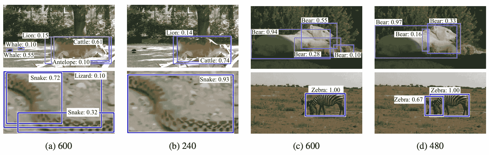
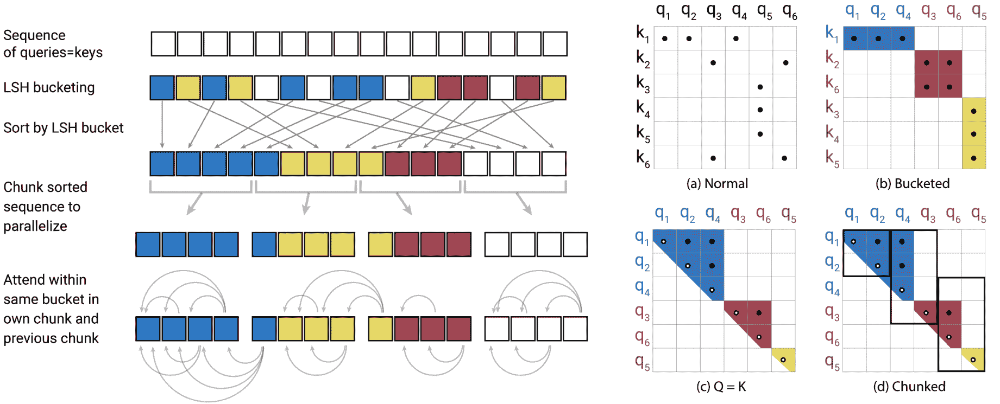
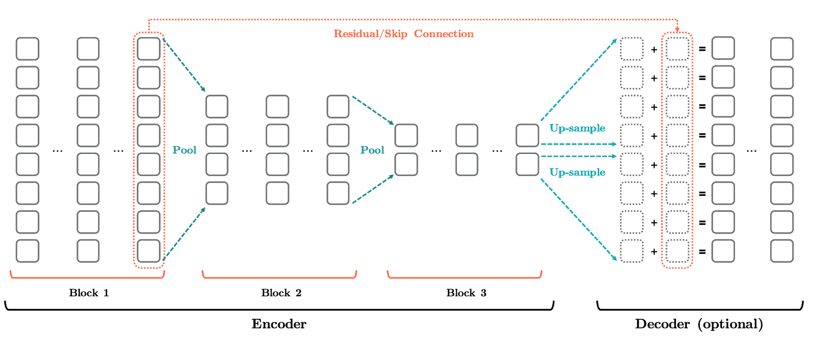

<!--yml

category: 未分类

date: 2024-09-06 19:44:29

-->

# [2208.13363] 调查：利用数据冗余优化深度学习

> 来源：[`ar5iv.labs.arxiv.org/html/2208.13363`](https://ar5iv.labs.arxiv.org/html/2208.13363)

# 调查：利用数据冗余优化深度学习

Jou-An Chen jchen73@ncsu.edu 北卡罗来纳州立大学计算机科学系，美国，Wei Niu wniu@email.wm.edu，Bin Ren bren@cs.wm.edu 威廉与玛丽学院计算机科学系，美国，Yanzhi Wang yanz.wang@northeastern.edu 诺斯伊斯特大学电气与计算机工程系，美国 和 Xipeng Shen xshen5@ncsu.edu 北卡罗来纳州立大学计算机科学系，美国（2020）

###### Abstract.

数据冗余在深度神经网络（DNN）的输入和中间结果中无处不在。它为提高 DNN 的性能和效率提供了许多重要机会，并在大量研究中得到了探讨。这些研究散布在多个领域和数年间，它们关注的目标范围从图像到视频和文本，而用于检测和利用数据冗余的技术也在许多方面有所不同。尚未对这些努力进行系统的审查和总结，这使得研究人员难以全面了解以往的工作、最新进展、差异和共通原则以及尚待探索的领域和方向。本文试图填补这一空白。它调查了数百篇相关的最新论文，引入了一个新的分类体系，将各种技术纳入一个分类框架，提供了对利用数据冗余改进多种 DNN 的数据处理的主要方法的全面描述，并指出了一系列未来研究的机会。

数据冗余、表示冗余、深度神经网络、卷积神经网络、Transformer^†^†版权：acmcopyright^†^†期刊年份：2020^†^†doi：XXX^†^†书名：调查：利用数据冗余优化 DNN^†^†价格：15.00^†^†isbn：978-1-4503-XXXX-X/18/06^†^†ccs：计算方法 机器学习^†^†ccs：计算方法 知识表示与推理

## 1\. 引言

深度学习，主要依赖于深度神经网络（DNN），已经多次证明了其在革命性发展人工智能及其在各个领域应用中的成功和巨大潜力。从高层次来看，DNN 有两个支柱：算法和数据。DNN 模型体现了算法，而数据则由 DNN 输入和中间结果（或称为激活图）表示。算法和数据对于 DNN 的质量至关重要，它们决定了 DNN 的准确性、速度、大小、能效、鲁棒性等。

对于深度神经网络（DNN），模型和数据中都存在冗余。正如许多研究所示，减少一些 DNN 层或参数或精度通常不会影响模型的准确性。这一观察促使了大量关于 DNN 压缩的研究，这些研究试图找到有效的方法来减少 DNN 模型的大小，从而实现更紧凑的模型或/和更快的速度。许多努力依赖于模型剪枝和量化，而一些则在频域（Wang et al., 2016）中压缩模型或优化 Transformer 模型中的注意力（Clark et al., 2019; Michel et al., 2019; Voita et al., 2019）。我们将这些努力称为模型冗余利用。几篇最近的综述论文（Cheng et al., 2018; Blalock et al., 2020; Ganesh et al., 2021; Choudhary et al., 2020; Hubara et al., 2017; Guo, 2018）对该主题提供了全面的概述。

数据冗余利用对 DNN 同样至关重要，近年来也引起了越来越多的关注。许多研究发现图像、激活图或相邻视频帧中存在类似的片段。其他研究确认，句子中的某些词对句子没有重要意义。这些观察促使了许多近期的努力，致力于创建检测和利用各种数据维度冗余的方法。数以百计的论文已经发表，分布在许多场所，历时数年。但与模型冗余不同的是，目前尚无系统的检验和总结，使得研究人员难以全面了解先前的工作、掌握最新进展、理解诸多已发表研究之间的差异和共同原则，或发现尚待探索的领域和方向。

据我们所知，本文提供了首个针对有意了解 DNN 数据冗余研究的人的一站式资源。它提供了对各种技术及其相互联系的全面视角，洞察了当前最先进技术的局限性，以及未来探索的潜在方向和机会。本文介绍了首个已知的 DNN 数据冗余利用分类法，将各种主题的技术整合到一个分类框架中。它全面描述了用于检测和利用数据冗余以改进多种 DNN（从 CNN 到 RNN、Transformer 等）的主要技术。它展示了图像、视频和文本中的众多数据冗余机会，以及现有研究如何通过各种技术在不同粒度和范围内加以利用。它讨论了技术之间的共性、差异、局限性以及值得未来探索的有前途的研究方向。

我们将本文的其余部分组织如下。第二部分提供了数据冗余的正式定义，并定义了本调查的范围。第三部分呈现了 DNN 数据冗余研究的分类法。第 4、第 5 和第六部分分别描述了先前工作在图像、视频和文本数据中检测和利用数据冗余的实用技术。第七部分讨论了现有探索的局限性，并指出了几个未来方向。第八部分总结了本调查。

## 2\. 术语与讨论范围

我们在本节开始时对一些对本文其余部分至关重要的术语进行澄清，然后定义本调查的范围，并解释与我们关注的几个相关概念的关系。

### 2.1\. 术语

激活图。在传统术语中，激活图（或称特征图）是应用于 DNN 输入的滤波器的激活，也包括前一层的输出。对于具有 RGB 通道的图像或视频中的单帧图像，它是一个三维张量，维度为 $Height\times Width\times Channel$；对于视频片段，它是一个四维张量，维度为 $Height\times Width\times Channel\times Depth$，其中 Depth 是帧的数量。为了便于解释，在本文中，我们将激活图的术语扩展到包括 DNN 的输入（输入层神经元的值）。

隐藏状态。对于文本表示，在输入到模型的第一层之前，文本通过词嵌入（在自然语言处理（NLP）中，词嵌入是对一组语言建模和特征学习技术的统称，其中词汇表中的词或短语被映射到实数向量中（Embedding, 2020））转换为词向量表示。与权重相乘后，层的输出激活被称为隐藏状态（也称为编码器状态）。它表示为一个二维张量，维度为序列长度 $\times$ 词嵌入的维度。

冗余。根据牛津词典（2020）的定义，冗余是指不再需要或不再有价值的状态。因此，它是一个相对于特定目的的概念。在 DNN 的上下文中，有用通常是指对 DNN 输出质量的贡献，这通常通过某种准确度指标来衡量。因此，DNN 中的数据冗余被定义为对 DNN 输出质量不再有用的数据。DNN 中数据冗余的利用是指在保持 DNN 输出满足需求的同时，尝试避免数据冗余的技术。

### 2.2. 范围

DNN 中的数据冗余表现为不同形式。无论具体结构如何，DNN 中的数据冗余必须属于以下三类之一：（1）重复信息：数据的某部分传达了与其他部分相同（或类似）的信息。（2）无关信息：数据的某部分传达的信息与 DNN 的目标输出无关。（3）过于详细的信息：信息以不必要的详细方式传达（例如，图像分辨率）。因此，任何试图让 DNN 避免在这三种信息上花费时间和计算的技术，都可以视为数据冗余利用技术。然而，这一定义会模糊 DNN 算法、模型和数据中心优化之间的界限。一些模型优化（例如，通道剪枝（He 等，2017；Wang 等，2018；Zhou 等，2019；Zhuang 等，2018；Hou 和 Kung，2020a；Li 等，2020；Hou 和 Kung，2020b；Liu 等，2018b）从根本上受到数据冗余的驱动（例如，跨通道冗余）。已有一些调查，特别是关于模型优化的，但本次调查集中在超越模型优化的数据冗余利用上。这些技术帮助 DNN 避免在计算中遇到数据冗余，从而高效地执行 DNN 推理或训练，或消除噪声以提高 DNN 准确性。

关于在 DNN 加速器的硬件设计中考虑数据冗余的研究已经存在，例如用于 2D CNNs 数据重用的缓存缓冲区设计（Kim 等，2020b；Mocerino 等，2019；Jiao 等，2018；Ma 等，2020；Salamat 等，2018；Hegde 等，2018b；Wang 等，2019a）和 3D CNNs（Wang 等，2020，2019b；Fan 等，2017a；Wang 等，2017；Shen 等，2018；Hegde 等，2018a；Chen 等，2019c），或将激活剪枝集成到硬件架构设计中（Samal 等，2020；Piyasena 等，2019）。这些技术减少了计算量，带来了速度和能效上的好处。在本次调查中，我们主要关注*基于软件的技术*来利用数据冗余。

### 2.3\. 与相关概念的关系

几个概念与数据冗余利用密切相关。接下来，我们描述这些概念之间的关系，以进一步澄清我们的范围。

模型冗余 DNN 中冗余性的另一个方面是模型冗余，指的是 DNN 的参数和架构中的冗余性。模型压缩（Cheng 等，2018; Blalock 等，2020; Ganesh 等，2021; Choudhary 等，2020; Hubara 等，2017; Guo，2018; Kim 等，2020a; Acharya 等，2019; Chen 等，2016)，包括知识蒸馏（Hinton 等，2014; Urban 等，2017)、参数修剪和权重量化，是利用模型冗余的流行方法。本文的重点是 DNN 的*数据冗余*，它指的是每个 DNN 层的输入数据中的冗余性（通常以多维张量的形式）。

数据预处理和增强 在将数据馈送到 DNN 模型之前，它们通常会经过预处理过程。对于训练来说，这个过程有时是数据增强的一部分（Shorten 和 Khoshgoftaar，2019; Cubuk 等，2019)，它增加了数据的方差以增加模型的泛化能力。在计算机视觉中，示例操作包括旋转、反转、均衡化、颜色变化、亮度调整等。通过变换创建的样本自然包含一些与原始数据的冗余性。例如，对于图像反转，两幅图像包含相同的像素值集，尽管个别图像块的位置在图像中可能会有所不同。当技术利用输入数据的冗余性时，这种冗余性被隐含地考虑在内。本次调查利用了数据的冗余性，并将数据增强排除在外。

特征提取和数据嵌入。特征提取是机器学习中的一个术语，指的是从一组数据中选择或派生出一些被认为与特定机器学习任务最相关的特征的技术。因此，从理论上讲，特征提取可以被视为一种利用数据冗余的方法，因为它将原始数据减少到通常更小的一组特征。类似地，将原始数据映射到比原始数据空间更小的向量空间的数据嵌入也可以被视为一种减少数据冗余的方法。对这些主题的研究通常被视为一个名为特征提取和表示的独立研究领域。它们通常不是专门设计用于利用数据冗余，尽管它们有时可能显示出这样的效果。我们将不讨论这些研究，把主要焦点放在本文以外。

数据集选择。在 DNN 的学习阶段，*训练数据选择*（Fan 等， 2017b；Feng 等， 2019；Zheng 等， 2017）是一个尝试选择适合学习者完成学习任务的训练数据的过程。在一定程度上，它也可能去除数据集中一些冗余的数据项（例如，过度采样的人群中的一些数据项）。在这次调查中，我们不专注于这一方向，而是关注模型执行过程中（训练数据集选择之后或推理过程中）如何解决数据冗余问题。

## 3\. 分类

许多研究从不同角度检测或利用 DNN 中的数据冗余。将所有研究纳入一个分类框架的分类是全面了解它们差异、权衡和共同原则的重要手段。该分类还提供了 DNN 数据冗余消除各个维度的全面视角，可能会指导新冗余消除技术的设计。

图 1 展示了我们在调查了数百篇关于深度神经网络（DNN）数据冗余利用的论文后建立的分类。就我们所知，这是关于这个主题的首个分类。它展示了在 DNN 数据冗余利用中最重要的六个维度。数据冗余利用通常是每个维度中一个或多个项目的组合。我们接下来将解释每一个维度。

图 1\. DNN 中数据冗余利用的分类。

### 3.1\. 粒度

这个维度指的是检查数据冗余的数据单位，我们将在以下讨论中称之为数据单元。以下列出了五种粒度，按大小递增排列。

+   •

    位：在这种粒度下，每个位是检查的单位。数据量化和对值的精度放宽到较短表示是常见的利用位级冗余的策略。此外，位表示还可以直接用于基于模式的分桶。例如，在 RNSNet（Salamat 等， 2018）中，输入值被转换为其 n 位二进制格式，并用残差数系统（RNS）表示。神经网络中的乘法被简化为仅加法和内存查找，从而实现了内存友好的操作。

+   •

    神经元：在这种粒度下，单位是单个神经元的值。图像是一个通道的像素值或 DNN 中一个神经元所承载的值。

+   •

    瓦片/补丁：由一组神经元承载的值，对应于激活图的一部分。例如，它可以是图像中的一个边界框或感兴趣区域（RoI）或通道；在文本的情况下，它可以是一个或多个子词嵌入。

+   •

    激活图：整个激活图中的值。

+   •

    批次或序列：DNN 在一层中携带的一组激活图，无论是一次性还是按顺序。集合中的激活图可以彼此相关，也可以彼此无关。例如，在 DNN 中，段落中的连续句子输入可以是相关的，而在随机打乱的训练图像集合中，图像激活图通常是无关的。

通常，粒度越大，冗余越少，但与此同时，消除冗余的收益与发现冗余的开销之间的比率更大¹¹1 比特级别是特殊的，受限于一个值中的比特数，通常最多为 32。：避免处理整批图像比避免处理单个神经元节省的时间更多，但找到两个完全相同的批次的机会通常比找到两个完全相同的神经元的机会要小。另一方面，不同粒度的冗余的移除并不是互斥的；一种优化可以利用多个粒度的冗余。

### 3.2\. 考虑范围

这个维度是关于比较不同数据单元以识别相似单元及其冗余的范围。这个维度与前述的范围、粒度相关，但有所不同：对于给定的数据单元，例如激活图的一个块，相似单元的比较仍然可以变化（例如，在一个激活图内、批次中的激活图之间，或批次之间）。具体而言，先前研究中考虑的范围可以归入一个或多个以下类型。

+   •

    单一值：单一值表示中的冗余——对应的粒度是比特。

+   •

    单通道激活图：在图像的情况下，它指的是单个通道激活图中的冗余；在文本的情况下，它涉及单个隐藏状态中的冗余。相应的粒度可以是神经元或块/瓷砖。

+   •

    激活图的多通道：仅适用于视觉数据（图像和视频）。神经元之间、块/瓷砖之间或单通道激活图之间的多个通道的冗余。

+   •

    激活图的时间序列：在视频的情况下，它指的是单个视频片段表示（4D 张量）中神经元、块/瓷砖、单通道激活图或激活图之间的冗余。在序列文本输入的情况下，它指的是同一句子标签（标记类型 ID）的隐藏状态之间的冗余，神经元之间、子词嵌入之间或单序列隐藏状态之间。

+   •

    在一个批次内：DNN 的输入通常是每次以批次的形式提供的。数据冗余考虑的范围可以是批次内的输入之间。

+   •

    跨批次：范围也可以跨越输入批次的边界。

+   •

    跨层：所有早期范围通常假设比较的是神经网络同一层的激活图。一些研究甚至扩展到神经网络不同层的激活图（Park 和 Kim，2019；Dalvi 等，2020）。

通常，大范围包含较小范围：在较小范围内发现的冗余必须在较大范围内也能发现。但另一方面，检查较大范围的值也意味着更多的开销和复杂性。

### 3.3\. 数据冗余的类型

数据冗余利用技术也可以根据它们利用的数据冗余类型进行分类。如前面章节所述，数据冗余主要有三种类型。我们在此列出它们，以完整讨论分类学。

+   •

    重复信息：数据单元之间的相似性或重复。当相同的操作应用于相同或相似的数据单元时（例如，对相同值进行乘法运算，对相似图像块进行卷积），结果可能难以区分；这些计算是冗余的。

+   •

    无关信息：不必要的数据单元；如果将其移除，不会影响 DNN 的计算结果。

+   •

    过于详细的信息：高精度表示并不总是必要的。例如，在某些应用场景中，高分辨率图像可以用其低分辨率近似替代，而不会导致 DNN 精度下降。较低精度的激活图有时会为 DNN 给出相同的结果。一个例子是帧数超过需求的视频。具有更高维度表示的子词向量（例如，$1\times 512$ 对比 $1\times 256$ 单词表示）或更高精度值表示也是一个例子。

数据冗余的类型定义了冗余的表现形式。这些不同类型的冗余是互补的；它们需要不同的方法来检测，但同时可以一起利用。之前的工作主要关注三种冗余类型中的一种；尚未研究如何在一个框架中有效结合多种冗余的去除。潜在的挑战之一是如何最小化开销。

### 3.4\. 检测数据冗余的方法

这些技术也可以根据它们检测冗余的方式进行分类：

+   •

    基于值相似度的分组：包括所有基于相似度的数据分组方法（例如，各种数据聚类方法）。

+   •

    基于学习的方法：这些方法在一些数据样本上学习数据冗余（通常从训练或验证数据集中抽样），并在模型运行时应用这些知识。例如，基于学习的激活图量化。

+   •

    投影：这些技术将数据表示投影到另一个领域空间（例如，频域），并推断该空间中的冗余。

+   •

    隐式检测：这些技术基于对领域的某些先验知识，假设在特定范围内存在冗余。例如，利用相邻视频帧之间的相似性技术就是一个例子。

+   •

    其他启发式方法：利用其他领域特定启发式方法的方法，例如相对注意力或在特定像素位置出现的零的平均数量。

不同的方法适用于不同的领域和场景。列表中的前两项是通用的，第三项适用于在某些空间上进行投影的领域，第四项和第五项适用于在领域内已有一定冗余先验知识的领域。

### 3.5. 利用冗余的方法

不同的技术采取不同的方法来利用数据冗余。然而，它们原则上可分为以下三类。

+   •

    重用：这种方法将某些数据项上的计算结果用于其他数据项。它适用于类似的数据冗余。例如，Deep Reuse (Ning 和 Shen, 2019) 采用局部敏感哈希 (LSH) (Gionis 等人, 1999)，一种快速的无监督聚类方案，将数据聚类为相似组，然后将计算结果应用于同一簇中的所有数据项。

+   •

    跳过：这种方法跳过某些数据项上的计算。它适用于由于无关数据项引起的数据冗余。例如，在 Perforated CNN (Figurnov 等人, 2016) 中，作者通过在 CNN 特征图中遮蔽某些像素来处理空间冗余。它还包括选择数据表示子集的技术。一些工作采用即兴采样，而另一些则以更复杂的方式进行选择。例如，在 PoWER-BERT (Goyal 等人, 2020) 中，定义了一个保留配置，以观察随着层数加深，向量之间的余弦相似度逐渐增加。基于该设置，他们采用了词向量选择策略。保留配置进一步设计为可学习的超参数。

+   •

    值近似：这种方法使用近似生成数据表示。它对应于由于过于详细的信息而引起的数据冗余。数据项上的量化和二值化属于此类别。之前的综述 (Hubara 等人, 2017; Simons 和 Lee, 2019; Qin 等人, 2020) 已经对这两个研究主题进行了全面覆盖，因此我们在以下讨论中不再强调。

这三种利用冗余的方法是互补的。尽管列表中的第三种方法名称中包含“近似”，但所有三种方法都可能导致准确性损失：重用可能在相似但不完全相同的数据上重用结果，跳过则可能跳过一些相似但不完全相同的数据的计算。这些利用冗余的方法可以一起使用。一些先前的研究已经做到了这一点。例如，其中一项研究（Dalvi 等， 2020）同时利用了层选择器（“跳过”）和相关聚类（“重用”）的实践。

### 3.6\. 数据类型

我们还可以根据处理的数据类型对数据冗余研究进行分类。虽然数据种类繁多，但大多数现有的数据冗余研究集中在以下三种数据类型上：

+   •

    图像。这种数据类型包括各种图像，包括那些从更高维度的传感器（例如通过激光雷达收集的图像）生成的图像。

+   •

    视频。这种数据类型比图像具有额外的时间维度，为数据冗余利用提供了特殊的机会。

+   •

    文本。这种数据类型包括来自各种来源的文本，通常用自然语言书写。

DNN 还被应用于其他类型的数据，例如图形、基因、计算机程序等。我们将在第七部分中简要讨论这些数据类型。

### 3.7\. 分类法的使用

据我们所知，这是关于数据冗余利用的首个分类法。它是基于我们对数百篇关于数据冗余利用论文的调查创建的。这个分类法可以用来在大背景中定位工作，识别尚待探索的某种数据可能存在的机会，指导未来 DNN 的效率设计，以及协助未来可能创建的自动化框架，这些框架可能应用冗余利用于新的深度学习任务。

我们使用分类法对表 1 中列出的一组代表性论文进行分类。我们将在接下来的几个部分中详细讨论它们。具体来说，我们根据分类法的多个层级组织以下讨论。在最高层次上，我们根据数据类型将研究分为三个部分，其中第四部分讨论图像，第五部分讨论视频，第六部分讨论文本。我们根据能够捕捉各领域研究中最显著差异的维度来组织各种研究。

表 1\. 一些关于数据冗余利用的代表性论文。

| 数据类型 | 论文 | 冗余类型 | 粒度 | 范围 | 检测 | 利用 |
| --- | --- | --- | --- | --- | --- | --- |
| 图像 | (Ning 和 Shen，2019) | 重复 | 区块/切片 | 多通道、批内、批间 | 相似性 | 重用 |
| (Georgiadis，2019) | 不相关、重复 | 位、神经元 | 单值、跨层 | 学习、相似性 | 值近似、重用 |
| (Park 和 Kim，2019) | 重复 | 激活图 | 跨层 | 相似性 | 重用 |
| (de Moura 等，2019) | 重复 | 激活图 | 多通道 | 相似性 | 重用 |
| (Chen 等，2019b) | 重复 | 激活图 | 单通道 | 学习 | 值近似、重用 |
| (Figurnov 等，2016) | 不相关 | 神经元 | 多通道 | 隐式检测、学习 | 跳过 |
| (Akhlaghi 等，2018；Hu 等，2016；Shomron 等，2020) | 不相关 | 神经元 | 多通道 | 启发式 | 跳过 |
| (Chen 等，2019d；Suzuki 等，2020) | 不相关 | 神经元 | 多通道 | 学习 | 跳过 |
| (Gao 等，2019) | 过于详细 | 激活图 | 多通道 | 学习 | 跳过 |
| (Ibrokhimov 等，2020) | 不相关 | 神经元 | 多通道 | 启发式 | 跳过（子集选择） |
| (Lee 和 Nirjon，2020) | 不相关 | 神经元 | 跨层 | 启发式 | 跳过（子集选择） |
| (Huang 和 Wang，2018) | 不相关 | 神经元 | 多通道、跨层 | 学习 | 跳过（子集选择） |
| (Chitsaz 等，2020；Chen 等，2020a，2019a) | 过于详细 | 激活图 | 多通道 | 投影 | 值近似 |
| (Chen et al., 2020b) | 过于详细 | 激活图 | 多通道 | 隐式检测 | 跳过（临时采样） |
| (Gao et al., 2018; Li et al., 2019b) | 不相关 | 区块/瓦片 | 多通道 | 学习 | 跳过（子集选择） |
| 视频 | (Kang et al., 2017a) | 不相关 | 激活图 | 时间序列 | 相似性 | 跳过 |
| (Cavigelli et al., 2017; Cavigelli and Benini, 2019) | 不相关 | 神经元 | 时间序列 | 相似性 | 跳过 |
| (Chin et al., 2019) | 过于详细 | 区块/瓦片 | 多通道 | 学习 | 值近似 |
| (Zhang et al., 2017) | 不相关 | 区块/瓦片 | 多通道 | 隐式检测 | 跳过（子集选择） |
| (Mao et al., 2019) | 重复 | 区块/瓦片 | 时间序列 | 隐式检测 | 跳过（子集选择） |
| (Yeung et al., 2016; Alwassel et al., 2018; Wu et al., 2019b, a; Korbar et al., 2019) | 过于详细 | 激活图 | 时间序列 | 学习 | 跳过（子集选择） |
| (Su and Grauman, 2016) | 过于详细 | 批次或序列 | 时间序列 | 学习 | 跳过（子集选择） |
| (Zhu et al., 2017b, a, 2018) | 重复 | 激活图 | 时间序列 | 隐式检测 | 重用（时间传播） |
| (Kang et al., 2017b, 2018) | 重复 | 激活图 | 时间序列 | 隐式检测 | 重用（时间传播） |
| (Chen et al., 2018) | 重复 | 激活图 | 时间序列 | 隐式检测 | 重用（时间传播） |
| (Zhu and Liu, 2018) | 重复 | 激活图 | 时间序列 | 隐式检测 | 重用（时间传播） |
| 文本 | (Liu et al., 2018a; Dai et al., 2020) | 过于详细 | 区块/瓦片 | 激活图 | 隐式检测 | 跳过（临时采样） |
| (Goyal et al., 2020) | 不相关 | 区块/瓦片 | 激活图 | 学习 | 跳过（子集选择） |
| (Kitaev et al., 2020) | 重复 | 区块/瓦片 | 激活图 | 相似性 | 重用 |
| (Dalvi et al., 2020) | 重复，不相关 | 批次或序列 | 时间序列，跨层 | 相似性 | 重用，跳过（子集选择） |

在第四部分中，我们根据处理的冗余类型将图像数据冗余的研究进行了划分，因为三种子类别（重复信息、无关信息和过度详细信息）的研究数量相对均衡，并且对技术之间的差异提供了全面的覆盖。在讨论过程中，我们在必要时指出了每组工作在其他维度（例如，数据表示、冗余利用技术）上的差异。尽管许多图像冗余利用技术可能适用于视频中的每一帧，第五部分关注于专为视频设计的方法。这些工作扩展了第四部分的内容，通过探索如何在图像块单元和时间维度上利用冗余。第六部分讨论了如何处理文本中的数据冗余。大部分工作基于 Transformer 模型。在第五部分和第六部分中，我们用来对各种探索进行分组的主要维度是数据冗余的利用方式。

## 4\. 利用图像数据中的冗余

图像数据通常以三维像素值（高度、宽度和通道）呈现。数据值内在的局部性提供了高级优化的机会。本节根据主要目标的冗余类型对相关研究进行了高层次的分组：重复信息、无关信息和过度详细信息。每种类型的讨论随后将技术分为检测和处理数据冗余的方式。表 LABEL:tab:image 按应用（任务）和报告的性能呈现这些工作，供快速参考。第二列（“论文”）显示了相关论文的参考文献；第三列（“代码”）显示了实现源代码的链接；第四列（“关键思想”）简要总结了每项工作的关键思想。第五列（“性能”）总结了数据冗余优化技术的性能提升。

### 4.1\. 重复信息

由于图像数据值的常见一致性，图像数据通常在空间维度上显示出一定程度的数据局部性。最常见的优化方法利用像素之间的值相似性。最初的动机是最小化 CNN 在资源受限平台上的中间激活图的存储空间，并减少 CPU 与 GPU 之间、处理单元与内存之间的数据移动。这些优化还减少了计算次数并提高了计算速度。

表（或缓存）查找 (Park and Kim, 2019; de Moura et al., 2019; Mocerino et al., 2019; Razlighi et al., 2017; Ma et al., 2020; Hegde et al., 2018b)和聚类 (Kim et al., 2020b; Ning and Shen, 2019)是发现和利用图像中重复信息的最典型方法。

检测数据点之间的相似性时，各种技术在相似性检测所用的像素单元级别上有所不同，有的在位级别 (Jiao et al., 2018; Ma et al., 2020; Salamat et al., 2018)，有的在像素级别 (Razlighi et al., 2017)，有的在补丁（或瓦片，子向量）级别 (Kim et al., 2020b; Ning and Shen, 2019; Hegde et al., 2018b)，甚至是整个特征图的整体 (Park and Kim, 2019; de Moura et al., 2019; Mocerino et al., 2019; Jiao et al., 2018)。一些技术使用预定义的距离度量和阈值进行聚类，以识别单元之间的相似性，而另一些则使用哈希函数，如局部敏感哈希 (Ning and Shen, 2019)或布隆过滤器 (Jiao et al., 2018)。RNSnet (Salamat et al., 2018)利用一种独特的位处理技术，将二进制表示映射到剩余数系统（RNS）。每个二进制表示被除以一组模数，通过相应的模数和余数表示的值，该技术高效地识别相似的值。这种方法可以视为一种哈希函数。

在收集了相似的数据点后，每个数据桶（或簇）通常由一个或几个桶中的数据点来表示。这样的代表性点的确定依赖于 DNN 执行的任务（例如，图像分类、对象检测）。对于相对简单的图像分类任务，如果桶的数量足够展示预测类别之间的整体差异而不影响训练或推理的准确性，那么代表性点可以仅仅是该桶中数据值的平均值。在极端情况下，当数据集包含大量相同的数据样本时，代表性点有时会设置为从桶中随机取出的数据点。代表性点在 CNN 推理或训练中代替了桶中的其他问题，以避免类似的计算。

在这个类别中的代表性工作是 Ning 等人的深度重用工作（Ning 和 Shen，2019；Ning 等，2019）。如图 2 所示，该方法在运行时将输入图像或激活图分割为子向量。根据它们的相似性，通过高效的在线 LSH 基于聚类（Gionis 等，1999）将其聚类到几个桶中，每个簇由其质心表示。除了处理 2D 范围内的重复信息外，深度重用还解决了数据批次中的冗余问题。基于聚类结果，深度重用将卷积操作减少为由簇质心形成的小矩阵与滤波器矩阵之间的乘法。结果用于通过数据重复重建完整的激活图。即使考虑到在线聚类的开销，该工作表明，计算结果的重用总体上实现了 $1.77-2\times$ 的加速（在层级上最高可达 $4.3\times$），且准确性损失微乎其微，无需模型重新训练。该方法在自适应应用于 CNN 训练时能获得更多的加速（Ning 等，2019）。

图 2\. 深度重用中的子向量聚类示意图。在卷积层中，2D 图像的激活图被展开为 $x$，并与对应滤波器的权重 $W$ 相乘。通过子向量聚类，$x$ 首先被划分为子向量，并标记上相应的簇 ID。在矩阵乘法中，只使用每个簇的代表性点。随后，输出激活图通过每个簇的代表性结果重新构建。图源自参考文献（Ning 和 Shen，2019）。

这一类别方法面临的基本权衡是准确性和计算重用量。这取决于基于相似性的聚类的激进程度。例如，在 Deep Reuse 工作中，激进程度由两个超参数决定：激活图中子向量的长度（粒度），以及 LSH 哈希向量的数量。由于超参数的适当值依赖于数据和模型，之前的工作（宁和申， 2019）采用一些离线调整过程来选择这些值，以确保准确性不受影响。值得未来探索的一个方向是将聚类方法适应数据和模型。例如，在 Deep Reuse 中，哈希向量是随机生成的。如果它们可以从给定 CNN 的数据中学习到，可能会在不造成准确性损失的情况下实现更激进的聚类。

### 4.2. 无关信息

#### 4.2.1. 特征修剪

图像数据或中间激活图也可能包含不必要的信息。例如，大多数训练良好的 CNN 在激活图中的某些像素被移除时仍能保持其预测准确性。随后，跳过的数据部分减少了计算量，从而在推断或训练期间提供了加速。我们介绍了一些关于这一系列优化如何在不同尺度下识别这些无关值并去除它们，同时保持整体准确性的细节。

胡等人（Hu et al.， 2016）在卷积神经网络（CNN）的激活中识别出许多零。他们基于平均零百分比（APoZ）来量化需要修剪的神经元。APoZ 是在每一层基础上计算的，用于测量每个固定位置在验证数据样本中出现零值的概率。出于相同的动机，阿赫拉基等人（Akhlaghi et al.， 2018）和皮亚森娜等人（Piyasena et al.， 2019）提出检测在 ReLU 激活之后可能出现的零像素。这是通过使用低成本的近似方案提前识别负激活来实现的，因为负值在经过 ReLU 层后会变成零。特别是，阿赫拉基等人（Akhlaghi et al.， 2018）构建了 SnaPEA，采用一种运行时技术在经过负权重之前推测卷积输出的符号。推测的激进程度通过在参数和预定义的相关 MAC 操作数上进行阈值控制来调整，以保持准确性。这些参数在搜索空间内进行离线调整。皮亚森娜等人（Piyasena et al.， 2019）通过一种轻量级近似方案增强了 CNN 的实现，该方案包括 ApproxConv 和 ReLupred 阶段。这两个操作顺序执行，以处理近似卷积计算中的符号预测。

更直接的去除无关信息的方法是基于领域知识假设冗余的存在，并在不同尺度上修剪数据或激活图。Figurnov 等（Figurnov 等，2016）在像素和补丁级别上修剪数据。提出的机制继承了代码优化中循环穿孔技术的思想，以跳过图像中的某些空间位置来进行 CNN 分类推断。选择修剪的像素是在预定义的有限点数内随机的。他们利用了四种输入无关的穿孔掩码：均匀掩码、网格掩码、池化结构掩码和影响掩码，如图 3 所示。这些掩码用于将随机选择的点限制为相应的模式。之后，穿孔 CNN 使用插值来重建输出特征图。CNN 权重也会被重新训练以适应这一优化。

图 3\. 在 PerforatedCNNs 中输入无关的穿孔掩码。根据论文，质量布局适用于 AlexNet Conv2 层。(a) 均匀穿孔掩码是从集合$\Omega$中随机选择的$N$个点，不放回。(b) 网格穿孔掩码是一组点$I={a(1),...,a(Kx)}\times{b(1),...,b(Ky)}$，其中 a(i)，b(i)使用伪随机整数序列生成方案（Graham，2014）。(c) 池化结构掩码利用池化操作符重叠的结构。用$A(x,y)$表示卷积层输出在池化操作符中的使用次数。池化结构掩码通过选择$A(x,y)$值最高的前 N 个位置来获得。(d) 影响掩码估计每个位置穿孔对 CNN 损失函数的影响，然后移除最不重要的位置。当计算激活图时，跳过黑色像素的坐标。图及描述改编自参考文献（Figurnov 等，2016）。

除了在单个激活图的范围内应用剪枝技术外，还可以通过例如移除一组外部二维特征图来处理跨通道维度的无关信息。具体来说，Gao 等人（Gao et al., 2019）通过制定通道显著性预测器来应用特征增强和抑制。该预测器作为指示器，指导在运行时跳过某些特征图的执行。Chakraborty 等人（Chakraborty et al., 2019）表明，在一个简单的手写数字识别任务中，直接在全连接之前随机丢弃冗余特征图对预测准确性影响不大。在同一方向上，Singh 等人（Singh et al., 2019）对在一维卷积神经网络（1D CNN）、SoundNet（Aytar et al., 2016）中剪枝冗余激活图进行了全面分析。剪枝特征图的选择基于以下测量：基于 ANOVA 的方法（Penny and Henson, 2006）、基于熵（DE）的方法（Pérez-Cruz, 2009）、基于余弦相似度（CS）的方法以及基于 KL 散度的贪婪算法。Gaikwad 等人（Gaikwad and El-Sharkawy, 2019）使用 L2 范数来决定在 SqueezeNet（Iandola et al., 2016）中剪枝特征图的重要性。尽管该技术不适用于图像数据，但在无关性消除的背景下，选择标准仍值得关注。此外，可以同时处理多种冗余粒度。例如，Yu 等人（Yu et al., 2020）在激活图上结合了空间和通道级的神经元剪枝。剪枝标准基于注意力机制。注意力机制通过有针对性的 dropout 进行训练，增强了推理时间的鲁棒性，同时在剪枝后不会造成准确性损失。

此外，优化可以根据无关性是否依赖于输入数据集来进行分类，即输入依赖型或输入独立型。输入依赖型无关信息去除可以通过基于统计（Hu et al., 2016；Singh et al., 2019；Gao et al., 2019）或基于学习的启发式方法（Akhlaghi et al., 2018；Yu et al., 2020），或通过值估计（Piyasena et al., 2019）来实现。相反，输入独立型方法（Figurnov et al., 2016；Chakraborty et al., 2019）通过隐式假设这些无关值以结构性或非结构性的方式随机出现，来去除这些无关值。

#### 4.2.2. 神经元或特征子集选择

特征图剪枝中使用的另一种粒度是选择神经元（或激活）。这可以看作是一个值粒度的特征选择过程。未选择的神经元可以被解释为被剪枝的神经元。基于神经元选择的特定标准，确定一部分激活。Lee 等（Lee 和 Nirjon，2020）对 DNNs 的神经元根据其对推断准确度的贡献进行排名。Huang 等（Huang 和 Wang，2018）在神经元上增加了稀疏性正则化，强制部分神经元变为零，并指导选择更有信息量的神经元，而无需进一步调整。此外，Ibrokhimov 等（Ibrokhimov 等，2020）提出了一种基于神经元平均激活量的大小选择神经元的技术，仅保留有效的最少激活神经元。他们报告了总操作数的减少和相应的速度提升。

#### 4.2.3. 动态感兴趣区域

在目标检测中，动态缩放（Gao 等，2018；Li 等，2019b）特定感兴趣区域可以帮助减少对无关背景信息的计算。Gao 等（Gao 等，2018）提出了这种技术。他们使用了缩放准确度增益回归网络（R-net）和缩放 Q 函数网络（Q-net）。R-net 学习粗检测与细检测之间的相关性，并预测缩放到特定区域的准确度增益。Q-net 通过强化学习进行学习。它通过分析 R-net 的新输出及其历史，顺序选择最佳的缩放位置并相应地调整它们。在推断阶段，向 R-net 输入下采样图像并预测准确度增益。该增益作为 Q-net 选择要集中关注区域的指标。工作流程如图 4 所示。该机制将计算中的总像素减少了超过$50\%$，并在 Caltech 行人检测数据集上减少了平均检测时间的$25\%$。在 YFCC100M 数据集上，它还将像素减少了$70\%$，检测时间减少了超过$50\%$。

图 4\. R-net 和 Q-net 的工作流程。给定一个降采样图像作为输入，R-net 生成一个初始准确度增益（AG）图，指示不同区域的潜在放大准确度增益（初始状态）。Q-net 会在 AG 图上迭代应用以选择区域。一旦选择了一个区域，AG 图会更新以反映动作的历史。Q-net 使用两个并行的流程，每个流程输出一个动作-奖励图，对应于选择具有特定大小的放大区域。该图的值表示该动作在低成本下增加准确度的可能性。所有图中的动作奖励都会被考虑，以在每次迭代中选择最优的放大区域。符号 $128\times 15\times 20:(7,10)$ 表示 128 个大小为 $15\times 20$ 的卷积核，在高度/宽度方向的步幅为 7/10。输出图中的每个网格单元都有一个唯一的颜色，并且在图像上绘制一个相同颜色的边界框，以标记相应的放大区域的大小和位置。图和描述改编自参考文献（Gao 等，2018）。

### 4.3\. 过于详细的信息

图像数据冗余利用的另一个方向是消除过于详细的信息，通过适应不同的图像分辨率，特别是降低分辨率。Chen 等（Chen 等，2019a）提出了 Octave 卷积（OctConv）（图 5），以利用空间冗余，并将激活图分解为高频和低频（分辨率）组，以节省内存和计算成本。每一层的操作使信息在计算过程中能够在两个组之间交换。它被实现为一个便携的即插即用卷积单元，并可以与压缩模型或优化方法一起应用，这些方法减少了通道冗余。配备 OctConv 的 ResNet-152 可以在 ImageNet 上实现 $82.9\%$ 的 top-1 分类准确度，并且计算量为 $22.2$ GFLOPs。

图 5\. 高低空间频率因子分解中的 Octave Conv 示意图。 (a) 动机。视觉的空间频率模型（Campbell 和 Robson，1968；De Valois 和 De Valois，1980）显示，原始图像可以分解为低空间频率和高空间频率部分。 (b) 卷积层的输出图也可以根据其空间频率进行因子分解和分组。 (c) 提出的多频率特征表示将平滑变化的低频图存储在低分辨率张量中，以减少空间冗余。 (d) 提出的 Octave 卷积直接在这一表示上操作。它更新每个组的信息，并进一步实现组间信息交换。图形和描述改编自参考文献（Chen 等，2019a）。

Chen 等（Chen 等，2020b）提出的 ViP 也针对特征图中的空间冗余。它利用虚拟池化，如图 6 所示，这样使用更大的步幅来获得更小的特征图，同时节省卷积计算。为了恢复输出特征图的维度，采用线性插值。ViP 在 VGG16 的 ImageNet 分类中实现了 $2.1\times$ 的加速，且准确率下降不到 $1.5\%$，在 Faster-RCNN 的 PASCAL VOC 目标检测中实现了 $1.8\times$ 的加速，并且 mAP 降低了 $0.025$。ViP 还将移动 GPU 和 CPU 的能耗分别减少了 $55\%$ 和 $70\%$。

图 6\. 虚拟池化示意图（LinkViz，2020）。通过使用更大的步幅，它在卷积层中节省计算，并且为了恢复输出尺寸，使用线性插值，这种方法计算速度快。图形和描述改编自参考文献（Chen 等，2020b）。

## 5\. 在视频的 DNN 中利用数据冗余

现有的视频分析 DNN 框架建立在成熟的 CNN 上，如 VGG （Simonyan 和 Zisserman，2015）或 ResNet （He 等，2016），以及基于图像的目标检测算法，如 Faster-RCNN （Ren 等，2015）。它们将视频视作一系列连续的图像。直观来看，这一系列工作的数据冗余，特别是时间轴上的重复，为性能提升提供了大量空间。利用视频数据中数据冗余的 DNN 框架可以根据它们如何利用冗余进行分类。这些技术分为我们分类法中列出的三类（跳过、重用和近似）；本节对它们进行更详细的分组，以捕捉技术之间更复杂的差异。表 LABEL:tab:video 展示了按应用对视频数据冗余利用的相关工作。

### 5.1\. 剪枝

避免在视频帧间重新计算相似值的一种方法是跳过某些帧（或 2D CNN 中的批处理维度）。Kang 等人提出了 NoScope （Kang 等，2017a）来优化视频查询的处理。如图 7 所示，他们插入了一个差异检测器和一个短路评估的专用模型，使得在几乎相同的相邻帧中实现计算减少。

图 7\. NoScope 框架示意图。NoScope 是一个通过推理优化的模型搜索来加速神经网络分析的视频系统。给定一个输入视频、目标对象和参考神经网络，NoScope 自动搜索并训练一个模型级联，包括差异检测器和专用网络，这些模型能够以高精度重现参考网络的二值化输出，但速度快达三倍数量级。图示及描述改编自参考文献（Kang 等，2017a）。

连续帧之间的冗余也可以在像素级别上解决。Cavigelli 等人提出了 CBinfer （Cavigelli 等人，2017；Cavigelli 和 Benini，2019），一种基于变化的 CNN 评估方法，旨在利用静态相机记录的视频数据中的空间-时间稀疏性。正如图 8 所示，他们修改了每个卷积层，以在矩阵乘法之前包含额外的变化检测机制和变化索引提取。输出将同时更新来自前一帧的未变化输出像素和本次计算的变化输出像素。CBinfer 在一个真实基准上相对于 cuDNN 基线实现了 $8.6\times$ 的平均加速，准确度损失极小，低于 $0.1\%$，且无需网络重新训练。最终的能效比每帧评估高 $10\times$，在 Nvidia Tegra X1 平台上达到了 $328$ $GOp/s/W$ 的相当水平。

### 5.2\. 近似表示

区域重新缩放是一种近似表示方法。Chin 等人提出了 AdaScale （Chin 等人，2019），利用自适应图像缩放带来的潜在好处。他们采用图像下采样来提高视频目标检测的准确性和速度。为实现这一目标，AdaScale 采用对象检测器生成用于图像的最佳缩放标签，该方法基于学习的方法生成的最佳缩放标签。生成的最佳缩放标签随后用于训练缩放回归器，动态地对图像进行重新缩放。效果的可视化如图 9 所示。当图像被下采样时，它们可以减少由过于细节化的信息引入的假阳性，从而消除冗余。图像缩放通过将对象从过大的尺寸缩小到更小的尺寸，增加了真正阳性的数量，使检测器更加自信。对于 ImageNet VID 和 mini YouTube-BB 数据集，AdaScale 分别展示了 $1.3\%$ 和 $2.7\%$ 的 mAP 提升，并实现了 $1.6\times$ 和 $1.8\times$ 的加速。该框架还可以与视频加速工作互补（Zhu 等人，2017b），在 ImageNet VID 数据集上实现了 $25\%$ 的加速增益和轻微的 mAP 提升。

图 8\. 基于变化的卷积算法处理流程。自定义处理内核用蓝色显示，使用可用库的处理步骤用绿色显示，各层之间共享的变量用黄色显示，每层需要存储的变量用橙色显示。存储中间结果的张量的大小和数据类型在每个变量名称下方指示。图和描述改编自参考文献 (Cavigelli et al., 2017)。

图 9\. AdaScale 检测结果可视化。下采样图像具有更好检测结果的示例。蓝色框是检测结果，数字是置信度。检测器在单一尺度（最短边的像素）为 600 上进行训练。列（a）和（c）在 600 尺度下测试。列（b）在 240 尺度下测试，列（d）在 480 尺度下测试。图和描述改编自参考文献 (Chin et al., 2019)。

### 5.3\. 子集选择

子集选择是为了获得潜在的代表性视频帧或相应特征图的子组。这些技术采用各种维度的优先级，从空间到时间、批次和流处理。

#### 5.3.1\. 空间维度的选择

##### 感兴趣区域

Zhang et al. (Zhang et al., 2017) 提出了“杀死两只鸟”的方法来聚合感兴趣区域（通常是图像中的运动物体），以构建用于视频物体检测的紧凑区域组成，如图 10 所示。在检测步骤中，空间维度数据补丁的部分被去除以节省不必要的计算。感兴趣区域的集合通过其编号和位置偏移量映射回去以重建最终结果。

图 10\. 感兴趣区域的组成。(a) 输入图像。(b) 检测到的区域。(c) 区域组成（左）和子帧（右）。(d) 子帧上的检测结果。(e) 反向映射并获得原始图像上的最终结果。图和描述改编自参考文献 (Zhang et al., 2017)。

##### 区域精炼

Mao 等人（Mao et al., 2019）提出了 CaTDeT（级联跟踪检测器），该方法在视频目标检测中应用了跟踪器，以帮助细化中间特征图。算法的示意图见图 11。跟踪器根据历史检测提供感兴趣区域的信息。它通过 $5.1\times$ 至 $8.7\times$ 的减少操作量，并且有轻微的延迟。

图 11. CaTDeT 算法流程示意图。比较标准 Faster R-CNN 模型和精细化网络的推理时间工作流。（a）标准 Faster R-CNN 检测器：RPN 从特征提取器处获取特征图。（b）用于精细化网络的 Faster R-CNN 检测器：提案网络和跟踪器的提案指示特征提取器仅计算感兴趣区域的特征。感兴趣区域是整个帧的所有提案的掩模。图形和描述改编自参考文献（Mao et al., 2019）。

#### 5.3.2. 时间维度中的选择

Korbar 等人提出了 SCSampler（Korbar et al., 2019），这是一个轻量级的剪辑采样模型，可以仅对最显著的剪辑进行识别。该论文针对的是视频未裁剪且较长的场景。他们的目标是减少每个剪辑在剪辑分类器上执行时的高推理成本。他们应用了视觉和音频采样器，并将它们的显著性结合起来进行预测。视觉采样器提出了一种基于学习的剪辑级显著性模型，为每个剪辑提供 [0,1] 范围内的显著性评分。具体而言，该模型采用从原始剪辑中快速计算得到的输入剪辑特征，这些特征维度较低（低于分类器的维度），以非常高效地分析每个剪辑。显著性评分排名前 K 的剪辑由分类器提取特征并聚合在一起，形成用于预测的表示。采样器学习阶段对视频进行标注，如果该剪辑中包含动作，则显著性评分标记为 $1$；否则，标记为 $0$。该方法使已经达到最先进水平的动作分类器的准确率提高了 $7\%$，并将其计算成本降低了超过 15 倍。

另一方面，视频在时间维度上的子集选择有时可以帮助提高任务的准确性。这项工作通常涉及在深度神经网络（DNN）中添加一些复杂的机制。因此，它们通常会使 DNN 变慢而不是加快速度。但它们的目标是提高输出的准确性，而不是速度。一类工作使用递归神经网络，如长短期记忆网络（LSTM），来捕捉序列数据中的长期依赖关系。它们利用这些网络生成紧凑的视频表示，以及卷积神经网络（CNN）激活图（Yeung et al., 2016; Alwassel et al., 2018; Wu et al., 2019b）。这些网络模仿人类观看视频的行为，这种行为通常包括一次快速浏览，随后是几个细化步骤。此外，一些工作（Wu et al., 2019a）结合了门控递归单元（GRUs）和强化学习中的策略网络，以便在每个时间步调整视频采样位置。

#### 5.3.3\. 流媒体场景中的选择

在流媒体场景中的选择更具挑战性。对于每次选择，机制需要根据历史记录对未来帧做出决策。Su et al.（Su and Grauman, 2016）提出了一种主动机制，优先考虑“何时计算哪个特征”，以便进行及时的动作预测。核心思想是学习一种策略，该策略动态安排在给定测试视频的选定帧上计算特征的顺序。选择过程可以在批处理或流媒体维度上调用。他们使用马尔可夫决策过程（MDP）来学习特征优先级策略。MDP 依次选择那些在与累积历史结果结合时能提高准确性的最有前途的对象包或 CNN 特征的帧。图 12 展示了机制中探索的动作空间。在两个具有挑战性的数据集（Activities of Daily Living（Pirsiavash and Ramanan, 2012）和 UCF-101（Soomro et al., 2012））上，他们的方法在给定的计算预算下提供了比以前技术显著更好的准确性。

图 12\. 行为空间。顶部：在批处理模式中，整个视频被划分为子体积，动作由体积和要检测的对象类别定义。中部：在流模式中，视频在每一步通过缓冲区划分为段，动作是缓冲区中要检测的对象类别加上一个“跳过”动作。底部：我们的方法学习一个特定于视频的策略，以动态选择一系列有价值的特征进行提取。图形和描述改编自参考文献 (Su and Grauman, 2016)。

### 5.4\. 时间传播

视频中的相邻帧通常显示出一些固有的连续性。在这种优化类型中，相邻视频帧的中间计算结果，如特征图、边界框或分类概率和置信度，会沿时间维度传播，以减少对相似内容的重新计算需求。通常会选择一些关键帧，并从这些关键帧向其他帧传播结果。优化的不同之处在于传播和更新中使用的表示。帧特征的表示包括光流、运动历史图像 (MHI) 和卷积 LSTM。为了澄清，在卷积 LSTM 中，帧以普通的 CNN 特征图表示，但相应的信息通过 LSTM 网络进行更新。

#### 5.4.1\. 使用光流

Zhu 等人 (Zhu et al., 2017b) 提出了一个深度特征流网络 (DFF)。在 DFF 中，相邻帧通过流场传播特征图以进行部分更新。更新是通过类似 SIFT Flow (Liu et al., 2008) 或 FlowNet (Dosovitskiy et al., 2015) 的流估计算法获得的。图 13 显示了信息在相邻帧中的传播方式。与通过卷积层重新计算每一帧相比，DFF 速度快 $10\times$，且仅有几百分比的准确率损失。随后，团队提出了流引导特征聚合 (FGFA) (Zhu et al., 2017a)，该方法将连续帧中的丰富外观信息关联和组合，以改善特征表示和准确性。之后，作者将这些解决方案统一到一个通用框架中 (Zhu et al., 2018)，并在视频目标检测中以每秒 $15.22$ 帧的速度达到了 $77.8\%$ 的 mAP 分数。

Kang 等人 (Kang et al., 2018) 利用运动引导传播对相邻帧进行微小的时间信息细化。时间信息的辅助减少了在逐帧处理时潜在的假阴性预测。

图 13\. 深度特征流中的时间传播示意图。 (a) 使用逐帧网络评估的视频识别 (b) 提出的深度特征流。图示及描述改编自参考文献 (Zhu et al., 2017b)。

#### 5.4.2\. 使用运动历史图像

与之前在固定时间间隔传播关键帧信息的方法不同，Chen et al. (Chen et al., 2018) 提出了选择自适应关键帧的尺度-时间晶格。尺度-时间晶格是一个有向无环图，如图 14 所示。在图中，节点表示在特定空间分辨率和时间点的边界框检测结果；边表示执行时间传播或空间细化的操作。在执行过程中，给定一个视频输入，框架首先对根据物体运动和尺度稀疏自适应选择的关键帧应用昂贵的目标检测器。接下来，在晶格内，这些边界框被传播到中间帧，并通过较便宜的网络在尺度之间（从粗到细）进行细化。一个传播细化单元（PRU）将两帧连续帧的检测结果作为输入，传播到其他帧，并重新缩放。作者采用了运动历史图像（MHI） (Bobick and Davis, 2001)，因为运动表示计算相对便宜于光流。总体而言，所提出的方法在 ImageNet VID 数据集上以 20 FPS 得到 79.6 mAP，以 62 FPS 得到 79.0 mAP。

图 14\. 尺度-时间晶格，其中每个节点表示特定尺度和时间点的检测结果，每条边表示从一个节点到另一个节点的操作。特别地，水平边（蓝色）表示从一个时间步骤到下一个时间步骤的时间传播，而垂直边（绿色）表示从低分辨率到高分辨率的空间细化。给定一个视频，基于图像的检测仅在稀疏选择的关键帧上进行，结果沿预定义路径传播到底部行。底部的最终结果覆盖了所有时间点。图示及描述改编自参考文献 (Chen et al., 2018)。

#### 5.4.3\. 使用卷积 LSTM

Liu 等人（Zhu 和 Liu，2018）认为，时间线索可以通过 LSTM 网络高效传播。LSTM 作为一种增强结构，帮助细化视频中每一帧生成特征的时间上下文。在图 15 所示的架构中，CNN 特征提取器生成每帧的假设特征图，然后输入到 LSTM 中，与来自前几帧的时间上下文融合。该帧的输出是一个时间感知的细化特征图。实验将卷积 LSTM 与单次检测器（SSD）（Liu 等人，2016）集成在一起，并在移动 CPU 上以每秒 15 帧的速度提供了快速推理速度。

图 15\. 我们联合 LSTM-SSD 模型的示例插图。网络中插入了多个卷积 LSTM 层。每一层在特定的尺度上传播并细化特征图。图和描述改编自参考文献（Zhu 和 Liu，2018）。

Kang 等人（Kang 等人，2017b）在视频物体识别中利用 LSTM，而不是边界框提议细化。时间信息在每个提议管道上进行传播，以提高准确性。如图 16 所示，编码器-解码器 LSTM 结构放置在管道提议网络之后。它为每个提议生成每个类别标签的输出概率作为预测结果。

图 16\. 提议的物体检测系统包括两个主要部分。第一个部分是一个管道提议网络，用于高效生成管道提议。管道提议网络在空间锚点内提取多帧特征，预测相对于空间锚点的物体运动模式，并生成管道提议。灰色框表示视频片段，不同的颜色表示其他空间锚点的提议过程。第二部分是一个编码器-解码器 CNN-LSTM 网络，用于提取管道特征并将每个提议框分类为不同的类别。管道特征首先通过前向传递输入到编码器 LSTM，以捕获整个序列的外观特征。然后，将状态复制到解码器 LSTM 进行后向传递，与管道特征一起。编码器-解码器 LSTM 在输出每帧的类别概率之前处理整个剪辑。图和描述参考文献改编自（Kang 等人，2017b）。

### 5.5\. 基于数据冗余的 3D CNN 优化

到目前为止，我们讨论了如何通过利用冗余来提升 2D CNN 的性能，特别是在时间维度上，连续帧涉及大量相同的信息。大多数优化是为了视频对象检测的性能，这相当依赖计算，因为 DNN 具有额外的区域提议阶段。然而，一些 DNN 通过 3D CNN（Ji 等人，2013；Tran 等人，2015）或双流模型（Simonyan 和 Zisserman，2014；Karpathy 等人，2014）使视频分析能力得以实现。与 2D CNN 处理视频数据的方式不同，3D CNN 可以在视频上进行端到端的训练和推理。它通过使用步长卷积滤波器来增强沿时间维度捕捉语义的能力。

视频数据中的冗余去除在 3D CNN 软件优化方面探索较少。一些研究（Carreira 和 Zisserman，2017；Kopuklu 等人，2019）提出通过逐步扩展操作符维度，从 2D CNN 基础开始，分析基础网络结构的潜在冗余。例如，Feichtenhofer 等人（Feichtenhofer，2020）通过考虑在多个维度中参数或数据的必要性，探索 2D 到 3D 的扩展。这些维度包括固定时长下的帧率、时间持续性、空间分辨率、每个残差阶段的层数、通道数量和残差块中的内通道宽度。这些举措为视频 DNN 中的数据冗余提供了另一种视角。未来的研究提供了推进基于冗余去除的深度模型算法的前景线索。

尽管如此，现有研究（Wang 等人，2020，2019b；Fan 等人，2017a；Wang 等人，2017；Shen 等人，2018；Hegde 等人，2018a；Chen 等人，2019c）已经开发了 3D CNN 的性能优化，这些优化扩展了在硬件优化方面对 2D CNN 的丰硕努力。令人鼓舞的结果在于，计算仅在相邻视频帧之间的增量（值差异）上进行，从而有效缓解了在资源受限设备上的内存消耗和推理时间瓶颈。

## 6\. 在 Transformer 优化中利用数据冗余以提升文本性能

基于文本的冗余优化可以应用于递归神经网络（RNNs），这是在 Transformer 模型发明之前广泛使用的深度学习文本模型。Guan 等人（Guan et al., 2021）建议利用上下文无关文法（CFG）和层次压缩算法来压缩序列预测任务中的重复上下文。这种优化将 RNN 推理速度提高了多达千倍，并扩大了预测范围，而不会丧失任务准确性。类似的优化见解也可以在许多最近的 Transformer 模型中找到。除了减少模型执行时间或提高任务特定准确性外，Transformer 模型中的许多基于数据冗余的优化最初是出于扩展模型容量的需要。每次，模型只能处理有限长度的序列（标记表示的数量）作为标记级文本输入，受限于硬件能力。当需要一次性处理段落或扩展序列的表示时，这个问题尤为重要。因此，研究人员系统地识别了原始数据或中间数据表示中的冗余，以正确地扩展模型。

与利用输入数据或卷积层之间的中间特征图数据冗余的 CNN 优化不同，Transformers 上的优化可以发生在不同阶段的中间数据表示上。输入到 transformer 模型的文本序列经历几个编码阶段，每个阶段都捕捉额外的意义。这些阶段关注于初始句子或子词输入、子词嵌入、由位置编码产生的隐藏状态、多头注意力，或编码器层整体（多头注意力和前馈层一起）。每个阶段中可能存在数据冗余。现有研究利用了各种见解的冗余性。

在第一阶段，子词分割算法旨在消除文本数据中的冗余。例如 Byte-Pair Encoding (BPE) (Sennrich 等人，2016)。在第二阶段，冗余可能存在于输入嵌入中。在 Transformer 模型广泛使用之前，已经引入了对词嵌入的向量表示进行压缩的技术 (Kim 等人，2020a；Acharya 等人，2019；Chen 等人，2016)。在剩余阶段，存在利用模型的中间表示，即“隐藏状态”（transformer 层的单一样本输出；单位与 CNN 中的激活图相同）的优化。利用 Transformer 中数据冗余的优化方法根据它们如何利用冗余进行分类：重用的聚类、跳过以及其他临时采样技术。表 2 列出了按其应用分类的调查工作，以便更好地参考。

表 2\. 文本数据冗余的工作总结

| 应用 | 论文 | 代码 | 关键思想 | 性能 |
| --- | --- | --- | --- | --- |
| 文本摘要 | (Liu 等人，2018a) | (Liu，2018) | T-DMCA 是一种修改后的多头自注意力结构，用于减少自注意力层中的内存占用 | 在 GPU (Nvidia P100) 上能够处理长度为 12,000 的序列 |
| 文本分类 | (Dai 等人，2020) | (Dai，2020) | Funnel-Transformer 通过一个编码器增强 transformer 模型，逐步汇总表示，以减少隐藏状态的序列长度，随着层级的深入 | 在 GPU/TPU 上加速 $1.3\times$-$1.5\times$ |
|  | (Goyal 等人，2020) | (Goyal，2020) | PoWER-BERT 应用提取层和基于学习的保留配置，只保留 transformer 模型中的关键嵌入向量 | 在 GPU (Nvidia K80) 上，BERT-base 模型加速$4.5\times$（使用 ALBERT 时加速$6.8\times$） |
|  | (Dalvi 等人，2020) | (Dalvi，2020) | 利用 LayerSelector (LS) 和相关聚类特征选择 (CCFS) 选择 transformer 模型的核心层和特征 | 在 BERT 和 XLNET 上评估。减少向前传递参数最多 $47\%$。在 GPU (Nvidia Titan X) 上将特征集减少到 $4\%$（序列标注），$<1\%$（序列分类） |
| 问答系统 | (Kitaev 等人，2020) | (Kitaev，2020) | 提出局部敏感哈希注意力和可逆 Transformer 以解决数据冗余问题 | 当每批次的序列长度从 32 扩展到 32768 时，注意力速度可以保持在每步 0.1-0.5 秒（基线为每步 0.2-5 秒），在 GPU/TPU 上 |

### 6.1\. 通过聚类实现重用

Kitaev 和 Kaiser 等人提出了 Reformer (Kitaev et al., 2020)，其在改进 Transformer 模型方面有两个主要贡献：局部敏感哈希注意力和可逆 Transformer。特别是，局部敏感哈希注意力通过特定函数设计解决了数据冗余问题。该函数在 Transformer 模型的缩放点积注意力中使用了近似。缩放点积注意力定义为 $\frac{QK^{T}}{\sqrt{d_{k}}}V$，其中 $Q$、$K$ 和 $V$ 分别是查询、键和值矩阵。作者发现，softmax 函数中的计算被接近的键-查询对主导。这表明计算可以仅关注少量接近的键-查询对。如图 17 所示，局部敏感哈希 (LSH) (Gionis et al., 1999) 首先将键和查询分成哈希桶。每个桶中的查询和键被排序以形成块，从而避免注意力矩阵中的稀疏性。随后，缩放点积注意力被替换为仅允许在同一哈希桶（或注意力矩阵中的块）中的对进行乘法。此外，局部敏感哈希注意力引入了多轮 LSH 注意力，允许多轮哈希以减轻相似项在哈希后可能落入不同桶的问题。在 Transformer 模型的解码器中，实施了掩蔽机制，通过先前应用于排序键和查询向量的相同置换来重新排序位置索引。

图 17\. Reformer 中的局部敏感哈希注意力。LSH 注意力展示了哈希分桶、排序和分块步骤及其结果因果注意力。 (a-d) 这些注意力的矩阵。图像改编自参考文献 (Kitaev et al., 2020)。

### 6.2\. 跳过

Transformer 模型中的注意力层输出表示被认为包含了大量冗余信息 (Michel et al., 2019; Voita et al., 2019)。这些问题通过注意力头剪枝的方式得到了处理 (Michel et al., 2019; Voita et al., 2019)。近期的研究探讨了在 Transformer 模型中剪枝神经元（激活值）的标准。具体而言，Gupta et al. (Gupta et al., 2020) 建议当神经元的重要性较低或相同的激活值与相同的权重相乘时，可以剪枝该神经元。神经元重要性函数 (Sanh et al., 2019) 是基于熵、输出权重范数或输入权重范数来定义的。

一系列词向量的隐藏状态可能包含重复的信息。Goyal 等（Goyal 等，2020）指出，随着层次逐渐深入（通过更多阶段进行编码），隐藏状态中词向量的成对余弦相似度会增加。他们提出了 PoWER-BERT 来利用冗余以减少 BERT 模型在文本分类和回归任务中的推断时间。如图 18 所示，PoWER-BERT 使用 Extract Layer 来管理每个变换器模型编码器层中的 Self-Attention Layer 之后和 Feed Forward Network (FFN) 之前的保留配置。保留配置可以手动设置或使用训练中的参数进行设置。该模型使用提出的损失函数进行训练，以获得基于学习的设计。这种方法避免了保留配置中的指数搜索空间。此外，他们采用了两种保留词表示的策略：静态策略和动态策略。静态策略在数据集中的所有输入序列中保持词向量在相同的位置。动态策略基于注意力评分和软提取层来保留词向量。在实验中，他们在基准 BERT 模型上获得了 $4.5\times$ 的推断时间加速，准确率损失不到 $1\%$。所提技术也与 ALBERT（Lan 等，2020）等压缩方案兼容。这两种压缩方法的结合实现了 $6.8\times$ 的推断时间缩短，准确率损失不到 $1\%$。

图 18\. PoWER-BERT 的示意图。前两个编码器中的词向量选择。这里，$N=6$，$l_{1}=4$ 和 $l_{2}=2$。第一个编码器淘汰了两个具有最小重要性分数的词向量 $w2$ 和 $w4$；第二个编码器进一步淘汰了词向量 $w1$ 和 $w5$。图及描述改编自参考文献（Goyal 等，2020）。

Dalvi 等（Dalvi 等，2020）提出了一种高效的迁移学习方法，该方法利用 LayerSelector (LS) 和 Correlation Clustering Feature Selection (CCFS) 来选择在变换器模型执行过程中所需的核心层和特征。选择过程主要包括三个步骤：（1）LayerSelector (LS) 使用层分类器选择保持最佳性能的最低层。（2）Correlation Clustering 根据前一层的隐藏状态输出过滤掉冗余神经元。（3）Feature Selection (FS) 选择达到给定任务最佳性能所需的最小神经元集。

对于第一步，作者通过在每一层$l_{i}$上训练线性探测分类器（Shi et al., 2016; Belinkov et al., 2017）来分析任务特定的层级冗余。他们使用层级分类器选择保持神谕性能的最低层（保持$99\%$性能）。在 LS 中，使用集中到所选择层的所有层。

在接下来的两个步骤中，CCFS 通过聚类和子集选择的组合来利用数据冗余。

+   •

    相关聚类（CC） (Bansal et al., 2004)：对于每个长度为 N 的序列向量表示，计算每两个特征之间的积矩相关性。这生成一个$N$乘$N$矩阵$corr(x,y)$，表示$fx$和$fy$之间的相关性。相关值范围从$-1$到$1$，提供了一个相对尺度来比较任何两个神经元。这两个特征之间的距离度量$cdist(x,y)$定义为$1-|corr(x,y)|$。超参数$ct$定义了被认为是一个簇的两个特征之间的最大距离。

+   •

    特征选择（FS）：它识别出一组最小的神经元，这些神经元与神谕性能匹配。语言相关性分析 (Dalvi et al., 2019) 对神经元进行排名，以配合下游任务。

总体而言，研究发现 BERT 和 XLNet 中多达$85\%$和$95\%$的神经元是冗余的（Yang et al., 2019）。在实验中，所提出的方法在 BERT 和 XLNet 上分别加速了序列标注任务$2.8\times$和$6.2\times$。而对于序列分类任务，平均加速分别为$1.1\times$和$2.8\times$。

### 6.3\. 其他采样

人类隐式使用先前的语言知识来合并段落中的相邻标记或单词。这反过来形成更广泛的语义短语或单元，以便以一般形式理解句子或段落。受到启发，Dai et al. (Dai et al., 2020) 提出了 Funnel-Transformer。如图 19 所示，Funnel-Transformer 配备了一个额外的编码器，用于逐渐汇聚表示，以减少隐藏状态的序列长度，随着层数的增加，隐藏状态的序列长度逐渐减小。子模块在 Transformer 模型的自注意力层和前馈网络（FFN）中具有额外的残差连接和层归一化操作。解码器用于在需要标记级别输出时重建完整的序列表示，如预训练。

图 19\. 漏斗变换器中池化的示意图。左侧的编码器由多个连续的 Transformer 层块组成。在每个块中，隐藏状态的序列长度始终保持不变。但在从较低级别块到较高级别块时，通过在序列维度上执行特定类型的池化操作，隐藏序列的大小会减少。右侧部分展示了上采样以重建原始长度的排列。图示及描述改编自参考文献（Dai et al., 2020）。

为了实现对多文档的维基百科风格的摘要生成，Liu 等人（Liu et al., 2018a）引入了一种长文本序列的压缩方案。带记忆压缩注意力的变换器解码器（T-DMCA）是一种修改过的多头自注意力结构，通过限制自注意力层中查询和键的点积来减少内存占用。该机制包括如图 20 所示的记忆压缩注意力和局部注意力。记忆压缩注意力通过使用有跨度的卷积（用于采样）来减少键和值的数量。局部注意力将令牌序列分割成相似长度的块（他们使用 256 个令牌），以便每个块的注意力内存成本保持不变，不受序列长度影响。在将子序列馈送到相应的多头注意力以捕捉局部信息后，该方法将结果合并以获得最终的输出序列。对于局部和记忆压缩注意力，都施加了掩码以防止查询关注未来的键和值。最后，该设计使模型能够处理比默认模型长 3$\times$的序列。

图 20\. 带记忆压缩注意力的变换器解码器（T-DMCA）。每个注意力层接受一个令牌序列作为输入，并生成一个相似长度的序列作为输出。左：原始自注意力，用于变换器解码器。中：记忆压缩注意力，减少了键/值的数量。右：局部注意力，将序列分割成单独的较小子序列。子序列随后合并以获得最终的输出序列。图示及参考文献改编自参考文献（Liu et al., 2018a）。

## 7\. 未来研究方向

许多之前的研究清楚地显示了在深度学习中利用数据冗余的显著好处。在总结各种方面的众多探索时，我们认识到现有创新的广泛覆盖面，但同时也观察到一些尚未解决的问题和未来值得追寻的几个研究方向。

(i) 数据冗余利用与准确性之间关系的原则性理解。数据冗余利用可能会改变深度神经网络（DNN）的输出，因为被移除的数据通常不一定是冗余的。在大多数情况下，它面临降低准确性的风险，但在某些情况下，如前述的(Chin et al., 2019; Korbar et al., 2019; Su and Grauman, 2016)，它也可能通过去噪效果提高准确性。对于数据冗余消除如何影响模型准确性，缺乏原则性的理解。DNN 模型的准确性可能会受到与数据相关的现有方差的影响。数据集本身可能已经对 DNN 模型存在偏差(Torralba and Efros, 2011)。数据预处理，如数据增强(Shorten and Khoshgoftaar, 2019; Cubuk et al., 2019)，使讨论变得更加复杂。以往的工作要么依赖经验调优以达到令人满意的点，要么使用一些启发式方法来评估某些数据的显著性。一个悬而未决的问题是如何实现对影响的原则性理解，并将知识转化为原则性的数据冗余利用技术。一些严谨的研究可能会有所帮助。

(ii) 提高可解释性。与第一个方向相关，可能值得探索的第二个方向是可解释性，这既涉及神经元表示的可解释性，也涉及深度神经网络（DNN）的一般可解释性。利用数据冗余中的证据已在提高卷积神经网络（CNN）特征表示的可解释性方面取得了一些初步成功，并对 CNN 模型的剪枝过程有所贡献。例如，Li 等人（Li et al., 2019a）提出了一种核稀疏性和熵指标（KSE），用于量化激活图中每个像素的重要性，以提供特征对抗性指导，用于权重压缩。数据冗余的识别也有助于解释文本处理中文本中每个词的重要性。例如，Dalvi 等人（Dalvi et al., 2019）提出了语言相关性分析和跨模型相关性分析，以识别 Transformer 模型中神经元的相对重要性。他们的方法提供了一个词语显著性的消融视角，以指导未来的表示发展。这些研究表明，探索数据冗余以提高深度学习的可解释性具有一定的前景。由于可解释性对将深度学习与领域理解联系起来至关重要，因此进一步的努力是值得的。

(iii) 其他数据类型和模型。之前关于数据冗余的大部分工作都集中在图像和视频数据上。这些数据类型还有进一步探索的空间。一个例子是点云学习（Guo et al., 2020），数据冗余尚未被探索。但与图像和视频相比，文本数据中的冗余研究要少得多，因为 Transformer 是比用于图像和视频的更成熟模型更晚开发的。特别是需要更多的探索来更好地理解文本中的数据冗余。此外，除了这三种数据类型，还有其他类型的数据在 DNN 中也扮演着重要角色。这些数据包括图形、科学模拟结果、基因、计算机程序等。因此，这些数据的特殊属性促使了一些新型 DNN 模型的发展，例如图卷积网络（GCN）（Wu et al., 2020）。数据属性、DNN 模型和学习任务的差异表明，在这些领域理解和利用数据冗余的研究可能会取得成果。

(iv) 优化与系统解决方案之间的关系。一个尚未受到太多关注的问题是各种数据冗余消除优化之间的关系，以及它们与模型优化的关系。例如，如第四部分和表 1 所示，在图像中，有许多从不同角度利用数据冗余的方法。这些优化是否可以一起使用？这样做是否值得？除了可能影响模型精度外，会有其他冲突吗？如何以最佳方式将它们结合使用？更雄心勃勃的是，是否可以建立框架，自动对给定数据集和学习任务应用一种或多种数据冗余利用技术？与模型优化的互动如何？这些问题的答案可能会显著推动对数据冗余利用的当前理解，并挖掘其潜力。

(v) 与 DNN 加速器设计的协同。另一个值得探索的方向是许多数据冗余利用技术与 DNN 硬件设计之间的协同效应。在现代应用特定集成电路（ASIC）设计中，数据流分析（Kwon 等，2019；Ben-Nun 等，2019；Ivanov 等，2021）已被认为是一个关键考虑因素。一些边缘设备上的研究尝试通过利用数据冗余（例如，通过数据压缩）来解决内存容量问题（Mocerino 等，2019；Salamat 等，2018；Hegde 等，2018b；Wang 等，2020，2019b；Fan 等，2017a；Wang 等，2017；Shen 等，2018；Hegde 等，2018a）。但一般来说，尚未系统理解许多数据冗余利用技术与 DNN 硬件加速器设计的关系。一方面，当 DNN 在硬件加速器上运行时，这些技术是否仍然有利可图？另一方面，硬件加速器设计是否能通过采纳这些技术中的一些理念获得效率上的好处？这些问题的答案可能会带来两者努力之间的新协同效应。

## 8\. 结论

机器学习基于两个支柱：模型和数据。作为深度学习的核心部分，数据扮演着重要角色。数据的最佳利用决定了机器学习的质量、速度、效率和可解释性。这项调查总结了研究界在检测和利用数据冗余方面的努力，介绍了第一个已知的分类法来归类现有技术，并指出了一系列尚待探索的方向。随着机器学习领域以空前的速度不断发展，我们希望这项调查能为研究人员提供一个一站式资源，快速了解最先进的技术和开放性问题，从而帮助行业从业者和研究社区选择现有解决方案来解决手头的问题或创建新解决方案以进一步推动这一关键领域。

## 参考文献

+   (1)

+   Acharya 等 (2019) Anish Acharya, Rahul Goel, Angeliki Metallinou, 和 Inderjit Dhillon. 2019. 使用低秩矩阵分解的文本分类在线嵌入压缩。见 *AAAI 人工智能会议论文集*，第 33 卷。无，无，6196–6203。

+   Akhlaghi 等 (2018) Vahideh Akhlaghi, Amir Yazdanbakhsh, Kambiz Samadi, Rajesh K Gupta, 和 Hadi Esmaeilzadeh. 2018. Snapea：预测性早期激活以减少深度卷积神经网络中的计算。见 *第 45 届 ACM/IEEE 计算机架构国际研讨会（ISCA）*。无，无，662–673。

+   Alwassel (2017) Humam Alwassel. 2017. GitHub. 行动搜索：在视频中定位目标及其在时间动作定位中的应用。 [`github.com/HumamAlwassel/action-search`](https://github.com/HumamAlwassel/action-search) (2021)。

+   Alwassel 等 (2018) Humam Alwassel, Fabian Caba Heilbron, 和 Bernard Ghanem. 2018. 行动搜索：在视频中定位动作及其在时间动作定位中的应用。见 *欧洲计算机视觉会议（ECCV）*。无，无，251–266。

+   Aytar 等 (2016) Yusuf Aytar, Carl Vondrick, 和 Antonio Torralba. 2016. Soundnet：从未标记视频中学习声音表示。见 *神经信息处理系统进展*。无，无，892–900。

+   Bansal 等 (2004) Nikhil Bansal, Avrim Blum, 和 Shuchi Chawla. 2004. 相关聚类。*机器学习* 56, 1-3 (2004), 89–113。

+   Belinkov 等 (2017) Yonatan Belinkov, Nadir Durrani, Fahim Dalvi, Hassan Sajjad, 和 James Glass. 2017. 神经机器翻译模型对形态学的学习情况如何？见 *第 55 届计算语言学协会年会论文集（第 1 卷：长论文）*。计算语言学协会，加拿大温哥华，861–872。

+   Ben-Nun 等 (2019) Tal Ben-Nun, Johannes de Fine Licht, Alexandros N Ziogas, Timo Schneider 和 Torsten Hoefler. 2019. Stateful Dataflow Multigraphs: A data-centric model for performance portability on heterogeneous architectures. 在 *国际高性能计算、网络、存储和分析会议* 上。无, 无, 1–14。

+   Blalock 等 (2020) Davis Blalock, Jose Javier Gonzalez Ortiz, Jonathan Frankle 和 John Guttag. 2020. What is the state of neural network pruning? *机器学习与系统进展* 2, 无 (2020), 129–146。

+   Bobick 和 Davis (2001) Aaron F. Bobick 和 James W. Davis. 2001. The recognition of human movement using temporal templates. *IEEE 模式分析与机器智能汇刊* 23, 3 (2001), 257–267。

+   Campbell 和 Robson (1968) Fergus W Campbell 和 John G Robson. 1968. Application of Fourier analysis to the visibility of gratings. *生理学杂志* 197, 3 (1968), 551。

+   Carreira 和 Zisserman (2017) Joao Carreira 和 Andrew Zisserman. 2017. Quo vadis, action recognition? a new model and the kinetics dataset. 在 *IEEE/CVF 计算机视觉与模式识别会议 (CVPR)* 上。无, 无, 6299–6308。

+   Cavigelli (2017) Lukas Cavigelli. 2017. Papers with Code. CBinfer: Change-Based Inference for Convolutional Neural Networks on Video Data. [`paperswithcode.com/paper/cbinfer-change-based-inference-for`](https://paperswithcode.com/paper/cbinfer-change-based-inference-for) (2021)。

+   Cavigelli (2018) Lukas Cavigelli. 2018. Papers with Code. CBinfer: Exploiting Frame-to-Frame Locality for Faster Convolutional Network Inference on Video Streams. [`paperswithcode.com/paper/cbinfer-exploiting-frame-to-frame-locality`](https://paperswithcode.com/paper/cbinfer-exploiting-frame-to-frame-locality) (2021)。

+   Cavigelli 和 Benini (2019) Lukas Cavigelli 和 Luca Benini. 2019. CBinfer: Exploiting frame-to-frame locality for faster convolutional network inference on video streams. *IEEE 视频技术电路与系统汇刊* 30, 5 (2019), 1451–1465。

+   Cavigelli 等 (2017) Lukas Cavigelli, Philippe Degen 和 Luca Benini. 2017. CBinfer: Change-Based Inference for Convolutional Neural Networks on Video Data. 在 *第 11 届国际分布式智能摄像头会议* (斯坦福, CA, USA) *(ICDSC 2017)* 中。计算机协会, 纽约, NY, USA, 1–8。

+   Chakraborty 等 (2019) Sinjan Chakraborty, Sayantan Paul, Ram Sarkar 和 Mita Nasipuri. 2019. Feature map reduction in CNN for handwritten digit recognition. 在 *机器学习与数据分析的最新进展* 中。Springer, 无, 143–148。

+   Chen 等 (2019b) Hesen Chen, Ming Lin, Xiuyu Sun, Qian Qi, Hao Li 和 Rong Jin. 2019b. Muffnet: Multi-layer feature federation for mobile deep learning. 在 *IEEE/CVF 国际计算机视觉研讨会* 上。无, 无, 0–0。

+   陈等（2019c）惠翔·陈、明聪·宋、洁晨·赵、雨婷·戴和涛·李。2019c。利用时间局部性加速基于 3D 的视频识别。见于 *第 46 届 ACM/IEEE 年度国际计算机架构研讨会（ISCA）论文集*。无，无，79–90。

+   陈等（2020a）寒亭·陈、云鹤·王、韩·舒、叶辉·唐、春静·徐、博信·石、超·徐、齐·田和昌·徐。2020a。频域紧凑的 3D 卷积神经网络。见于 *IEEE/CVF 计算机视觉与模式识别会议（CVPR）论文集*。无，无，1641–1650。

+   陈等（2018）凯·陈、佳琪·王、硕·杨、兴成·张、元俊·熊、陈·张忠和大华·林。2018。通过尺度时间格优化视频目标检测。见于 *IEEE/CVF 计算机视觉与模式识别会议（CVPR）论文集*。无，无，7814–7823。

+   陈等（2019d）魏杰·陈、袁张、迪·谢和石良·蒲。2019d。用于神经元剪枝的层分解-重组框架，旨在实现准确的轻量级网络。见于 *AAAI 人工智能会议论文集*，第 33 卷。无，无，3355–3362。

+   陈（2019）云鹏·陈。2019。Papers with Code。丢弃一个八度：通过八度卷积减少卷积神经网络中的空间冗余。[`paperswithcode.com/paper/drop-an-octave-reducing-spatial-redundancy-in`](https://paperswithcode.com/paper/drop-an-octave-reducing-spatial-redundancy-in)（2021）。

+   陈等（2019a）云鹏·陈、浩琪·范、冰·徐、志成·阎、雅尼斯·卡兰迪迪斯、马库斯·罗尔巴赫、帅成·严和佳士·冯。2019a。丢弃一个八度：通过八度卷积减少卷积神经网络中的空间冗余。见于 *IEEE/CVF 国际计算机视觉大会（ICCV）论文集*。无，无，3435–3444。

+   陈等（2016）云川·陈、丽丽·牟、颜·徐、戈·李和智·金。2016。通过稀疏词表示压缩神经语言模型。见于 *第 54 届计算语言学协会年会（第 1 卷：长篇论文）论文集*。计算语言学协会，德国柏林，226–235。

+   陈（2020）卓·陈。2020。Papers with Code。ViP：虚拟池化以加速 CNN 基于的图像分类和目标检测。[`paperswithcode.com/paper/vip-virtual-pooling-for-accelerating-cnn`](https://paperswithcode.com/paper/vip-virtual-pooling-for-accelerating-cnn)（2021）。

+   陈等（2020b）卓·陈、纪元·张、瑞洲·丁和戴安娜·马库雷斯库。2020b。ViP：虚拟池化以加速基于 CNN 的图像分类和目标检测。见于 *IEEE 冬季计算机视觉应用会议*。无，无，1180–1189。

+   成等（2018）余·成、多·王、潘·周和陶·张。2018。深度神经网络的模型压缩与加速：原理、进展与挑战。*IEEE 信号处理杂志* 35，1（2018），126–136。

+   Chin 等（2019）Ting-Wu Chin、Ruizhou Ding 和 Diana Marculescu。2019。AdaScale：基于自适应缩放的实时视频对象检测。发表于 *机器学习与系统 2019 年会议录*。无，无，431–441。

+   Chitsaz 等（2020）Kamran Chitsaz、Mohsen Hajabdollahi、Nader Karimi、Shadrokh Samavi 和 Shahram Shirani。2020。使用基于 FFT 的分裂卷积加速卷积神经网络。*arXiv 预印本 arXiv:2003.12621* 无，无（2020），0–0。

+   Choudhary 等（2020）Tejalal Choudhary、Vipul Mishra、Anurag Goswami 和 Jagannathan Sarangapani。2020。关于模型压缩和加速的全面调查。*人工智能评论* 无，无（2020），1–43。

+   Clark 等（2019）Kevin Clark、Urvashi Khandelwal、Omer Levy 和 Christopher D. Manning。2019。BERT 关注什么？BERT 注意力的分析。发表于 *BlackBoxNLP@ACL*。无，无，0–0。

+   Cubuk 等（2019）Ekin D Cubuk、Barret Zoph、Dandelion Mane、Vijay Vasudevan 和 Quoc V Le。2019。Autoaugment：从数据中学习数据增强策略。发表于 *IEEE/CVF 计算机视觉与模式识别会议（CVPR）会议录*。无，无，113–123。

+   Dai（2020）Zihang Dai。2020。GitHub。Funnel-Transformer。 [`github.com/laiguokun/Funnel-Transformer`](https://github.com/laiguokun/Funnel-Transformer)（2021）。

+   Dai 等（2020）Zihang Dai、Guokun Lai、Yiming Yang 和 Quoc Le。2020。Funnel-Transformer：过滤序列冗余以实现高效语言处理。发表于 *神经信息处理系统进展*。无，无，0–0。

+   Dalvi（2020）Fahim Dalvi。2020。Papers with Code。分析预训练变换器模型中的冗余。 [`paperswithcode.com/paper/exploiting-redundancy-in-pre-trained-language`](https://paperswithcode.com/paper/exploiting-redundancy-in-pre-trained-language)（2021）。

+   Dalvi 等（2019）Fahim Dalvi、Nadir Durrani、Hassan Sajjad、Yonatan Belinkov、Anthony Bau 和 James Glass。2019。沙漠中的一粒沙是什么？分析深度 NLP 模型中的单个神经元。发表于 *AAAI 人工智能大会会议录*，第 33 卷。无，无，6309–6317。

+   Dalvi 等（2020）Fahim Dalvi、Hassan Sajjad、Nadir Durrani 和 Yonatan Belinkov。2020。分析预训练变换器模型中的冗余。发表于 *2020 年自然语言处理实证方法会议（EMNLP）会议录*。无，无，4908–4926。

+   de Moura 等（2019）Rafael Fão de Moura、Paulo C Santos、João Paulo C de Lima、Marco AZ Alves、Antonio CS Beck 和 Luigi Carro。2019。通过高效备忘录跳过 CNN 卷积。发表于 *嵌入式计算系统国际会议*。Springer，无，无，65–76。

+   De Valois 和 De Valois（1980）Russell L De Valois 和 Karen K De Valois。1980。空间视觉。*心理学年评* 31，1（1980），309–341。

+   Dosovitskiy et al. (2015) Alexey Dosovitskiy, Philipp Fischer, Eddy Ilg, Philip Hausser, Caner Hazirbas, Vladimir Golkov, Patrick Van Der Smagt, Daniel Cremers 和 Thomas Brox。 2015。 Flownet: Learning optical flow with convolutional networks。 在*Proceedings of the IEEE/CVF International Conference on Computer Vision (ICCV)*。 None, None, 2758–2766。

+   Du Tran et al. (2017) Heng Wang Du Tran, Lorenzo Torresani, Jamie Ray, Yann LeCun 和 Manohar Paluri。 2017。 A closer look at spatiotemporal convolutions for action recognition。 2018 IEEE。 在*Proceedings of the IEEE/CVF Conference on Computer Vision and Pattern Recognition (CVPR)*。 None, None, 6450–6459。

+   Embedding (2020) Word Embedding。 2020。 Retrieved from:. [`en.wikipedia.org/wiki/Word_embedding`](https://en.wikipedia.org/wiki/Word_embedding)

+   Fan et al. (2017a) Hongxiang Fan, Xinyu Niu, Qiang Liu 和 Wayne Luk。 2017a. F-c3d: Fpga-based 3-dimensional convolutional neural network。 在*2017 27th International Conference on Field Programmable Logic and Applications (FPL)*。 IEEE, None, None, 1–4。

+   Fan et al. (2017b) Yang Fan, Fei Tian, Tao Qin, Jiang Bian 和 Tie-Yan Liu。 2017b。 Neural data filter for boot-strapping stochastic gradient descent.. 在*Proceedings of the 5th International Conference on Learning Representations (ICLR)*。 None, None, 0–0。

+   Feichtenhofer (2020) Christoph Feichtenhofer。 2020。 X3D: Expanding Architectures for Efficient Video Recognition。 在*Proceedings of the IEEE/CVF Conference on Computer Vision and Pattern Recognition (CVPR)*。 None, None, 0–0。

+   Feng et al. (2019) Shuo Feng, Huiyu Zhou 和 Hongbiao Dong。 2019。 Using deep neural network with small dataset to predict material defects。 *Materials & Design* 162 (2019), 300–310。

+   Figurnov (2016) Michael Figurnov。 2016。 GitHub。 perforated-cnn-matconvnet。 [`github.com/mfigurnov/perforated-cnn-matconvnet`](https://github.com/mfigurnov/perforated-cnn-matconvnet) (2021)。

+   Figurnov et al. (2016) Mikhail Figurnov, Aizhan Ibraimova, Dmitry P Vetrov 和 Pushmeet Kohli。 2016。 Perforatedcnns: Acceleration through elimination of redundant convolutions。 在*Advances in Neural Information Processing Systems*。 None, None, 947–955。

+   Gaikwad 和 El-Sharkawy (2019) Akash Sunil Gaikwad 和 Mohamed El-Sharkawy。 2019。 Pruning the Convolution Neural Network (SqueezeNet) based on L 2 Normalization of Activation Maps。 在*2019 IEEE 9th Annual Computing and Communication Workshop and Conference (CCWC)*。 IEEE, None, None, 0392–0396。

+   Ganesh et al. (2021) Prakhar Ganesh, Yao Chen, Xin Lou, Mohammad Ali Khan, Yin Yang, Hassan Sajjad, Preslav Nakov, Deming Chen 和 Marianne Winslett。 2021。 Compressing large-scale transformer-based models: A case study on bert。 *Transactions of the Association for Computational Linguistics* 9, None (2021), 1061–1080。

+   Gao 等人 (2018) Mingfei Gao, Ruichi Yu, Ang Li, Vlad I Morariu, 和 Larry S Davis. 2018. 用于大图像快速目标检测的动态缩放网络。载于 *IEEE/CVF 计算机视觉与模式识别会议（CVPR）论文集*。无， 无，6926–6935。

+   Gao (2019) Xitong Gao. 2019. Papers with Code. 动态通道剪枝：特征提升与抑制。 [`paperswithcode.com/paper/dynamic-channel-pruning-feature-boosting-and`](https://paperswithcode.com/paper/dynamic-channel-pruning-feature-boosting-and) (2021)。

+   Gao 等人 (2019) Xitong Gao, Yiren Zhao, Lukasz Dudziak, Robert D. Mullins, 和 Cheng-Zhong Xu. 2019. 动态通道剪枝：特征提升与抑制。载于 *第七届国际学习表征会议（ICLR）论文集*。无， 无，0–0。

+   Georgiadis (2019) Georgios Georgiadis. 2019. 通过激活图压缩加速卷积神经网络。载于 *IEEE/CVF 计算机视觉与模式识别会议（CVPR）论文集*。无， 无，7085–7095。

+   Gionis 等人 (1999) Aristides Gionis, Piotr Indyk, 和 Rajeev Motwani. 1999. 通过哈希进行高维相似性搜索。载于 *第 25 届国际大型数据库会议* *(VLDB ’99)*。Morgan Kaufmann Publishers Inc., 旧金山，加利福尼亚州，美国，518–529。

+   Goyal (2020) Saurabh Goyal. 2020. Papers with Code. PoWER-BERT：通过渐进词向量消除加速 BERT 推理。 [`paperswithcode.com/paper/power-bert-accelerating-bert-inference-for`](https://paperswithcode.com/paper/power-bert-accelerating-bert-inference-for) (2021)。

+   Goyal 等人 (2020) Saurabh Goyal, Anamitra Roy Choudhury, Saurabh Raje, Venkatesan Chakaravarthy, Yogish Sabharwal, 和 Ashish Verma. 2020. PoWER-BERT：通过渐进词向量消除加速 BERT 推理。载于 *国际机器学习会议论文集*，第 119 卷。无， 无，3690–3699。

+   Graham (2014) Benjamin Graham. 2014. 分数最大池化。 *CoRR* abs/1412.6071 (2014)，0–0。

+   Guan 等人 (2021) Hui Guan, Umang Chaudhary, Yuanchao Xu, Lin Ning, Lijun Zhang, 和 Xipeng Shen. 2021. 循环神经网络遇上上下文无关文法：一箭双雕。载于 *2021 年 IEEE 国际数据挖掘会议（ICDM）*。无， 无，1078–1083。

+   Guo (2018) Yunhui Guo. 2018. 量化神经网络的方法和理论综述。 *CoRR* abs/1808.04752 (2018)，0–0。

+   Guo 等人 (2020) Yulan Guo, Hanyun Wang, Qingyong Hu, Hao Liu, Li Liu, 和 Mohammed Bennamoun. 2020. 深度学习用于三维点云：综述。 *IEEE 模式分析与机器智能汇刊* 无，无 (2020)，0–0。

+   Gupta 等人 (2020) Manish Gupta, Vasudeva Varma, Sonam Damani, 和 Kedhar Nath Narahari. 2020. NLP 的深度学习模型压缩。载于 *第 29 届 ACM 国际信息与知识管理会议论文集*。无， 无，3507–3508。

+   Han 等人（2016）Wei Han, Pooya Khorrami, Tom Le Paine, Prajit Ramachandran, Mohammad Babaeizadeh, Honghui Shi, Jianan Li, Shuicheng Yan, 和 Thomas S. Huang. 2016. 用于视频目标检测的 Seq-NMS。*CoRR* abs/1602.08465，无（2016），0–0。

+   He 等人（2016）Kaiming He, Xiangyu Zhang, Shaoqing Ren, 和 Jian Sun. 2016. 深度残差学习用于图像识别。在 *IEEE/CVF 计算机视觉与模式识别会议（CVPR）* 上发表。无，无，770–778。

+   He 等人（2017）Yihui He, Xiangyu Zhang, 和 Jian Sun. 2017. 用于加速非常深的神经网络的通道修剪。在 *IEEE/CVF 国际计算机视觉大会（ICCV）* 上发表。无，无，1389–1397。

+   Hegde 等人（2018a）Kartik Hegde, Rohit Agrawal, Yulun Yao, 和 Christopher W Fletcher. 2018a. Morph: 3D CNN 基础的视频理解的灵活加速。在 *第 51 届 IEEE/ACM 微架构国际研讨会（MICRO）* 上发表。无，无，933–946。

+   Hegde 等人（2018b）Kartik Hegde, Jiyong Yu, Rohit Agrawal, Mengjia Yan, Michael Pellauer, 和 Christopher Fletcher. 2018b. Ucnn: 通过权重重复利用计算重用于深度神经网络。在 *第 45 届 ACM/IEEE 计算机架构年度国际研讨会（ISCA）* 上发表。无，无，674–687。

+   Hinton 等人（2014）Geoffrey Hinton, Oriol Vinyals, 和 Jeff Dean. 2014. 在神经网络中提取知识。在 *神经信息处理系统进展 深度学习研讨会* 上发表。无，无，0–0。

+   Hou 和 Kung（2020a）Zejiang Hou 和 Sun-Yuan Kung. 2020a. 从特征图判别角度进行深度神经网络的修剪。*CoRR* abs/2005.13796，无（2020），0–0。

+   Hou 和 Kung（2020b）Zejiang Hou 和 Sun-Yuan Kung. 2020b. 通过通道区分深度神经网络修剪实现高效图像超分辨率。在 *ICASSP 2020-2020 IEEE 国际声学、语音与信号处理会议（ICASSP）* 上发表。IEEE，无，无，3647–3651。

+   Hu（2016）Hengyuan Hu. 2016. 论文与代码。网络修剪：一种数据驱动的神经元修剪方法以实现高效深度架构。 [`paperswithcode.com/paper/network-trimming-a-data-driven-neuron-pruning`](https://paperswithcode.com/paper/network-trimming-a-data-driven-neuron-pruning) （2021）。

+   Hu 等人（2016）Hengyuan Hu, Rui Peng, Yu-Wing Tai, 和 Chi-Keung Tang. 2016. 网络修剪：一种数据驱动的神经元修剪方法以实现高效深度架构。*CoRR* abs/1607.03250，无（2016），0–0。

+   Huang（2018）Zehao Huang. 2018. 论文与代码。数据驱动的稀疏结构选择用于深度神经网络。 [`paperswithcode.com/paper/data-driven-sparse-structure-selection-for`](https://paperswithcode.com/paper/data-driven-sparse-structure-selection-for) （2021）。

+   Huang and Wang (2018) Zehao Huang and Naiyan Wang. 2018. 基于数据驱动的深度神经网络稀疏结构选择。在 *欧洲计算机视觉会议（ECCV）论文集*。无, 无, 304–320.

+   Hubara et al. (2017) Itay Hubara, Matthieu Courbariaux, Daniel Soudry, Ran El-Yaniv, and Yoshua Bengio. 2017. 量化神经网络：使用低精度权重和激活的神经网络训练。*机器学习研究杂志* 18, 1 (2017), 6869–6898.

+   Iandola et al. (2016) Forrest N. Iandola, Matthew W. Moskewicz, Khalid Ashraf, Song Han, William J. Dally, and Kurt Keutzer. 2016. SqueezeNet：具有 50 倍更少参数和 <1MB 模型大小的 AlexNet 级别准确性。*CoRR* abs/1602.07360, 无 (2016), 0–0.

+   Ibrokhimov et al. (2020) Bunyodbek Ibrokhimov, Cheonghwan Hur, and Sanggil Kang. 2020. 针对稀疏学习的有效节点选择技术。*应用智能* 无, 无 (2020), 0–0.

+   Ivanov et al. (2021) Andrei Ivanov, Nikoli Dryden, Tal Ben-Nun, Shigang Li, and Torsten Hoefler. 2021. 数据移动就是你所需要的：优化变换器的案例研究。在 *机器学习与系统会议论文集*，第 3 卷。无, 无, 711–732.

+   Ji et al. (2013) S. Ji, W. Xu, M. Yang, and K. Yu. 2013. 用于人类动作识别的 3D 卷积神经网络。*IEEE 模式分析与机器智能汇刊* 35, 1 (2013), 221–231.

+   Jiang et al. (2017) Yu-Gang Jiang, Zuxuan Wu, Jun Wang, Xiangyang Xue, and Shih-Fu Chang. 2017. 在视频分类中利用特征和类别关系，通过正则化的深度神经网络。*IEEE 模式分析与机器智能汇刊* 40, 2 (2017), 352–364.

+   Jiao et al. (2018) Xun Jiao, Vahideh Akhlaghi, Yu Jiang, and Rajesh K Gupta. 2018. 使用近似计算重用的节能神经网络。在 *2018 欧洲设计、自动化与测试会议及展览（DATE）*。IEEE, 无, 无, 1223–1228.

+   Kang (2017a) Daniel Kang. 2017a. GitHub. NoScope. [`github.com/stanford-futuredata/noscope`](https://github.com/stanford-futuredata/noscope) (2021).

+   Kang et al. (2017a) Daniel Kang, John Emmons, Firas Abuzaid, Peter Bailis, and Matei Zaharia. 2017a. NoScope: 大规模优化神经网络视频查询。*Proc. VLDB Endow.* 10, 11 (2017 年 8 月), 1586–1597.

+   Kang (2017b) Kai Kang. 2017b. GitHub. TPN: Tubelet Proposal Network. [`github.com/myfavouritekk/TPN`](https://github.com/myfavouritekk/TPN) (2021).

+   Kang et al. (2017b) Kai Kang, Hongsheng Li, Tong Xiao, Wanli Ouyang, Junjie Yan, Xihui Liu, and Xiaogang Wang. 2017b. 使用 Tubelet Proposal 网络的视频目标检测。*IEEE/CVF 计算机视觉与模式识别会议（CVPR）论文集* 无, 无 (2017 年 7 月), 0–0.

+   Kang et al. (2018) Kai Kang, Hongsheng Li, Junjie Yan, Xingyu Zeng, Bin Yang, Tong Xiao, Cong Zhang, Zhe Wang, Ruohui Wang, Xiaogang Wang, 等. 2018. T-CNN: 利用卷积神经网络进行视频中物体检测的 Tubelets. *IEEE 视频技术电路与系统学报* 28, 10 (2018 年 10 月), 2896–2907。

+   Karpathy et al. (2014) Andrej Karpathy, George Toderici, Sanketh Shetty, Thomas Leung, Rahul Sukthankar, 和 Li Fei-Fei. 2014. 大规模视频分类与卷积神经网络. 见 *IEEE/CVF 计算机视觉与模式识别会议 (CVPR) 论文集*。无，无，0–0。

+   Kim et al. (2020b) Sangyeob Kim, Juhyoung Lee, Sanghoon Kang, Jinsu Lee, 和 Hoi-Jun Yoo. 2020b. 一种具有类似特征跳过机制的高效 CNN 加速器用于移动设备中的面部识别. *IEEE 电路与系统学报 I: 定期论文* 67, 4 (2020), 1181–1193。

+   Kim et al. (2020a) Yeachan Kim, Kang-Min Kim, 和 SangKeun Lee. 2020a. 词嵌入的自适应压缩. 见 *第 58 届计算语言学协会年会论文集*。无，无，3950–3959。

+   Kitaev (2020) Nikita Kitaev. 2020. Papers with Code. Reformer: 高效的 Transformer. [`paperswithcode.com/paper/reformer-the-efficient-transformer-1`](https://paperswithcode.com/paper/reformer-the-efficient-transformer-1) (2021)。

+   Kitaev et al. (2020) Nikita Kitaev, Lukasz Kaiser, 和 Anselm Levskaya. 2020. Reformer: 高效的 Transformer. 见 *第八届国际学习表征会议 (ICLR) 论文集*。无，无，0–0。

+   Kopuklu et al. (2019) Okan Kopuklu, Neslihan Kose, Ahmet Gunduz, 和 Gerhard Rigoll. 2019. 资源高效的 3D 卷积神经网络. 见 *IEEE/CVF 国际计算机视觉会议 (ICCV) 工作坊论文集*。无，无，0–0。

+   Korbar et al. (2019) Bruno Korbar, Du Tran, 和 Lorenzo Torresani. 2019. Scsampler: 从视频中采样显著片段以提高动作识别效率. 见 *IEEE/CVF 国际计算机视觉会议 (ICCV) 论文集*。无，无，6232–6242。

+   Kwon et al. (2019) Hyoukjun Kwon, Prasanth Chatarasi, Michael Pellauer, Angshuman Parashar, Vivek Sarkar, 和 Tushar Krishna. 2019. 理解 DNN 数据流的重用、性能和硬件成本: 一种数据中心方法. 见 *第 52 届 IEEE/ACM 微架构国际研讨会 (MICRO)*（美国俄亥俄州哥伦布市）*(MICRO ’52)*. 计算机协会, 纽约, NY, USA, 754–768。

+   Lan et al. (2020) Zhenzhong Lan, Mingda Chen, Sebastian Goodman, Kevin Gimpel, Piyush Sharma, 和 Radu Soricut. 2020. ALBERT: 一种轻量级的 BERT 用于自监督语言表示学习. 见 *第八届国际学习表征会议 (ICLR) 论文集*。无，无，0–0。

+   Lee (2020) Seulki Lee. 2020. GitHub. [RTAS 2020] SubFlow: 一种面向实时 DNN 推断和训练的动态诱导子图策略。 [`github.com/learning1234embed/SubFlow`](https://github.com/learning1234embed/SubFlow) (2021)。

+   Lee and Nirjon (2020) Seulki Lee 和 Shahriar Nirjon. 2020. SubFlow: 一种面向实时 DNN 推断和训练的动态诱导子图策略。在 *2020 IEEE 实时与嵌入技术及应用研讨会（RTAS）* 中。IEEE，None，None，15–29。

+   Li (2019) Hongyang Li. 2019. GitHub. 用于区域提议和目标检测的缩放网络。 [`github.com/hli2020/zoom_network`](https://github.com/hli2020/zoom_network) (2021)。

+   Li et al. (2019b) Hongyang Li, Yu Liu, Wanli Ouyang, 和 Xiaogang Wang. 2019b. 带有地图注意力决策的缩放网络用于区域提议和目标检测。*计算机视觉国际杂志* 127, 3 (2019)，225–238。

+   Li et al. (2020) Hang Li, Chen Ma, Wei Xu, 和 Xue Liu. 2020. 特征统计引导的高效滤波器剪枝。在 *第二十九届国际人工智能联合会议论文集，IJCAI-20* 中。国际人工智能联合会议组织，None，2619–2625。 [`doi.org/10.24963/ijcai.2020/363`](https://doi.org/10.24963/ijcai.2020/363) 主轨道。

+   Li et al. (2019a) Yuchao Li, Shaohui Lin, Baochang Zhang, Jianzhuang Liu, David Doermann, Yongjian Wu, Feiyue Huang, 和 Rongrong Ji. 2019a. 利用核稀疏性和熵进行可解释的 CNN 压缩。在 *IEEE/CVF 计算机视觉与模式识别会议（CVPR）论文集* 中。None，None，2800–2809。

+   Lin et al. (2014) Min Lin, Qiang Chen, 和 Shuicheng Yan. 2014. 网络中的网络。在 *第二届国际学习表示会议（ICLR）论文集* 中。None，None，0–0。

+   LinkViz (2020) LinkViz. 2020. 获取自： [`hackernoon.com/visualizing-parts-of-convolutional-neural-networks-using-keras-and-cats5cc01b214e59`](https://hackernoon.com/visualizing-parts-of-convolutional-neural-networks-using-keras-and-cats5cc01b214e59)

+   Liu et al. (2008) Ce Liu, Jenny Yuen, Antonio Torralba, Josef Sivic, 和 William T Freeman. 2008. Sift 流：不同场景之间的密集对应关系。在 *欧洲计算机视觉会议（ECCV）论文集* 中。None，None，28–42。

+   Liu (2017) Mason Liu. 2017. Papers with Code. 带有时间感知特征图的移动视频目标检测。 [`paperswithcode.com/paper/mobile-video-object-detection-with-temporally`](https://paperswithcode.com/paper/mobile-video-object-detection-with-temporally) (2021)。

+   Liu (2018) Peter J. Liu. 2018. Papers with Code. 通过总结长序列生成维基百科。0–0 页。 [`paperswithcode.com/paper/generating-wikipedia-by-summarizing-long`](https://paperswithcode.com/paper/generating-wikipedia-by-summarizing-long) (2021)。

+   Liu 等（2018a）Peter J Liu、Mohammad Saleh、Etienne Pot、Ben Goodrich、Ryan Sepassi、Lukasz Kaiser 和 Noam Shazeer。2018a。通过总结长序列生成维基百科。发表于 *第六届国际学习表征会议论文集（ICLR）*。无，无，0–0。

+   Liu 等（2016）Wei Liu、Dragomir Anguelov、Dumitru Erhan、Christian Szegedy、Scott Reed、Cheng-Yang Fu 和 Alexander C Berg。2016。SSD：单次多框检测器。发表于 *欧洲计算机视觉会议论文集（ECCV）*。Springer，无，无，21–37。

+   Liu 等（2018b）Zhenhua Liu、Jizheng Xu、Xiulian Peng 和 Ruiqin Xiong。2018b。用于卷积神经网络的频域动态剪枝。发表于 *神经信息处理系统进展*。无，无，1043–1053。

+   Ma 等（2020）Dongning Ma、Xunzhao Yin、Michael Niemier、X Sharon Hu 和 Xun Jiao。2020。AxR-NN：用于节能卷积神经网络的近似计算重用。发表于 *2020 年大湖区 VLSI 研讨会论文集*。无，无，363–368。

+   Mao 等（2019）Huizi Mao、Taeyoung Kong 和 Bill Dally。2019。CaTDet：用于高效视频物体检测的级联跟踪检测器。发表于 *2019 年机器学习与系统会议，MLSys 2019，斯坦福，加州，美国，2019 年 3 月 31 日 - 4 月 2 日*。mlsys.org，无，0–0。

+   Michel 等（2019）Paul Michel、Omer Levy 和 Graham Neubig。2019。十六个头真的比一个更好吗？。发表于 *神经信息处理系统进展*。无，无，14014–14024。

+   Mocerino 等（2019）Luca Mocerino、Valerio Tenace 和 Andrea Calimera。2019。通过递归数据重用实现节能卷积神经网络。发表于 *2019 年欧洲设计、自动化与测试会议与展览（DATE）*。IEEE，无，无，848–853。

+   Ning 等（2019）L. Ning、H. Guan 和 X. Shen。2019。自适应深度重用：实时加速 CNN 训练。发表于 *2019 年 IEEE 第 35 届国际数据工程会议（ICDE）*。无，无，1538–1549。

+   Ning 和 Shen（2019）Lin Ning 和 Xipeng Shen。2019。深度重用：通过粗粒度计算重用实时优化 CNN 推理。发表于 *ACM 国际超级计算大会论文集*。无，无，438–448。

+   Oxford Dictionary（2020）《Oxford Dictionary》中“冗余”的定义。2020 年。取自：[`www.lexico.com/en/definition/redundancy`](https://www.lexico.com/en/definition/redundancy)

+   Ouyang 等（2015）Wanli Ouyang、Xiaogang Wang、Xingyu Zeng、Shi Qiu、Ping Luo、Yonglong Tian、Hongsheng Li、Shuo Yang、Zhe Wang、Chen-Change Loy 和 Xiaoou Tang。2015。DeepID-Net：用于物体检测的可变形深度卷积神经网络。发表于 *IEEE/CVF 计算机视觉与模式识别会议论文集（CVPR）*。无，无，2403–2412。

+   Park 和 Kim（2019）Keunyoung Park 和 Doo-Hyun Kim。2019。利用卷积神经网络中的特征图相似性加速图像分类。*应用科学* 9, 1（2019），108。

+   Penny 和 Henson（2006）W Penny 和 R Henson。2006。方差分析。*统计参数映射：功能脑图像分析* 无，无（2006），166–177。

+   Pérez-Cruz（2009）Fernando Pérez-Cruz。2009。连续随机变量的信息理论度量估计。见于 *神经信息处理系统进展*。无，无，1257–1264。

+   Pirsiavash 和 Ramanan（2012）Hamed Pirsiavash 和 Deva Ramanan。2012。检测第一人称视角中的日常活动。见于 *IEEE/CVF 计算机视觉与模式识别会议（CVPR）论文集*。IEEE，无，无，2847–2854。

+   Piyasena 等人（2019）Duvindu Piyasena、Rukshan Wickramasinghe、Debdeep Paul、Siew-Kei Lam 和 Meiqing Wu。2019。通过利用计算冗余减少流式 CNN 硬件加速器中的动态功耗。见于 *2019 年第 29 届现场可编程逻辑与应用国际会议（FPL）*。IEEE，无，无，354–359。

+   Qin 等人（2020）Haotong Qin、Ruihao Gong、Xianglong Liu、Xiao Bai、Jingkuan Song 和 Nicu Sebe。2020。二值神经网络：综述。*模式识别* 无，无（2020），107281。

+   Razlighi 等人（2017）Mohammad Samragh Razlighi、Mohsen Imani、Farinaz Koushanfar 和 Tajana Rosing。2017。Looknn：无乘法神经网络。见于 *2017 年设计、自动化与测试欧洲会议与展览（DATE）*。IEEE，无，无，1775–1780。

+   Ren 等人（2015）Shaoqing Ren、Kaiming He、Ross Girshick 和 Jian Sun。2015。Faster R-CNN：基于区域提议网络的实时目标检测。见于 *神经信息处理系统进展*，第 28 卷。Curran Associates, Inc.，无，0–0。

+   Sainath 和 Parada（2015）Tara N Sainath 和 Carolina Parada。2015。用于小型关键词检测的卷积神经网络。见于 *国际语音通信协会第十六届年会*。无，无，0–0。

+   Salamat 等人（2018）Sahand Salamat、Mohsen Imani、Sarangh Gupta 和 Tajana Rosing。2018。Rnsnet：使用剩余数系统的内存神经网络加速。见于 *2018 年 IEEE 计算重启国际会议（ICRC）*。IEEE，无，无，1–12。

+   Samal 等人（2020）Kruttidipta Samal、Marilyn Wolf 和 Saibal Mukhopadhyay。2020。基于注意力的激活剪枝以减少实时 AI 中的数据移动：以自主车辆中的局部运动规划为案例研究。*IEEE 电路与系统新兴和精选主题期刊* 无，无（2020），0–0。

+   Sanh 等人（2019）Victor Sanh、Lysandre Debut、Julien Chaumond 和 Thomas Wolf。2019。DistilBERT，BERT 的精简版：更小、更快、更便宜、更轻便。见于 *第五届节能机器学习与认知计算研讨会 NeurIPS 2019*。无，无，0–0。

+   Sennrich 等人（2016）Rico Sennrich、Barry Haddow 和 Alexandra Birch。2016 年。使用子词单元的稀有词汇的神经机器翻译。在 *Proceedings of the 54th Annual Meeting of the Association for Computational Linguistics (Volume 1: Long Papers)*。计算语言学协会，德国柏林，1715–1725。

+   Shen 等人（2018）Junzhong Shen、You Huang、Zelong Wang、Yuran Qiao、Mei Wen 和 Chunyuan Zhang。2018 年。朝着统一的基于模板的架构推进，加速 FPGA 上的 2D 和 3D CNNs。在 *Proceedings of the 2018 ACM/SIGDA International Symposium on Field-Programmable Gate Arrays*。无，无，97–106。

+   Shi 等人（2016）Xing Shi、Inkit Padhi 和 Kevin Knight。2016 年。基于字符串的神经机器翻译是否学习了源语言语法？ 在 *Proceedings of the 2016 Conference on Empirical Methods in Natural Language Processing*。无，无，1526–1534。

+   Shomron（2019）Gil Shomron。2019 年。GitHub。谢天谢地：用轻量级卷积神经网络预测零值激活。[`github.com/gilshm/zap`](https://github.com/gilshm/zap)（2021）。

+   Shomron 等人（2020）Gil Shomron、Ron Banner、Moran Shkolnik 和 Uri Weiser。2020 年。谢天谢地：用轻量级卷积神经网络预测零值激活。在 *Proceedings of the European Conference on Computer Vision (ECCV)*。Springer，无，无，234–250。

+   Shorten 和 Khoshgoftaar（2019）Connor Shorten 和 Taghi M Khoshgoftaar。2019 年。关于深度学习的图像数据增强的调查。*Journal of Big Data* 6，1（2019），1–48。

+   Simons 和 Lee（2019）Taylor Simons 和 Dah-Jye Lee。2019 年。二值神经网络的综述。*Electronics* 8，6（2019），661。

+   Simonyan 和 Zisserman（2014）Karen Simonyan 和 Andrew Zisserman。2014 年。用于视频动作识别的双流卷积网络。在 *Advances in Neural Information Processing Systems*。Curran Associates, Inc.，无，568–576。

+   Simonyan 和 Zisserman（2015）Karen Simonyan 和 Andrew Zisserman。2015 年。用于大规模图像识别的非常深的卷积网络。在 *Proceedings of the 3rd International Conference on Learning Representations (ICLR)*。无，无，0–0。

+   Singh 等人（2019）Arshdeep Singh、Padmanabhan Rajan 和 Arnav Bhavsar。2019 年。深度隐藏分析：修剪特征图的统计框架。在 *ICASSP 2019-2019 IEEE International Conference on Acoustics, Speech and Signal Processing (ICASSP)*。IEEE，无，无，820–824。

+   Soomro 等人（2012）Khurram Soomro、Amir Roshan Zamir 和 Mubarak Shah。2012 年。UCF101：一个包含 101 个人类动作类别的视频数据集。*CoRR* abs/1212.0402，无（2012），0–0。

+   Su 和 Grauman（2016）Yu-Chuan Su 和 Kristen Grauman。2016 年。留下一些未解决的问题：流视频中的动态特征优先级调整。 在 *European Conference on Computer Vision*。Springer，无，无，783–800。

+   Suzuki 等人（2020）铃木泰司、安部博史、村田智哉、堀内慎悟、伊藤幸太郎、和智和子、平井奏、雪岛正敏和西村智明。2020。谱剪枝：通过谱分析压缩深度神经网络及其泛化误差。载于*IJCAI*。无，无，0–0。

+   Torralba 和 Efros（2011）Antonio Torralba 和 Alexei A Efros。2011。对数据集偏差的无偏见看法。载于*CVPR 2011*。IEEE，无，无，1521–1528。

+   Tran 等人（2015）杜·Tran、Lubomir Bourdev、Rob Fergus、Lorenzo Torresani 和 Manohar Paluri。2015。使用 3D 卷积网络学习时空特征。载于*IEEE/CVF 国际计算机视觉会议（ICCV）论文集*。无，无，4489–4497。

+   Urban 等人（2017）Gregor Urban、Krzysztof J Geras、Samira Ebrahimi Kahou、Ozlem Aslan、Shengjie Wang、Rich Caruana、Abdelrahman Mohamed、Matthai Philipose 和 Matt Richardson。2017。深度卷积网络真的需要深度和卷积吗？载于*第五届国际学习表征会议（ICLR）论文集*。无，无，0–0。

+   Voita 等人（2019）Elena Voita、David Talbot、Fedor Moiseev、Rico Sennrich 和 Ivan Titov。2019。分析多头自注意力：专用头承担主要任务，其余可以被剪枝。载于*第 57 届计算语言学协会年会论文集*。计算语言学协会，意大利佛罗伦萨，5797–5808。

+   Wang 等人（2018）董王、周磊、张雪妮、白晓和周军。2018。探索特征图子空间中的线性关系用于 ConvNets 压缩。*CoRR* abs/1803.05729，无（2018），0–0。

+   Wang 等人（2017）王海、邵梦君、刘艳和赵伟。2017。基于最优 FPGA 加速器的增强效率 3D 卷积。*IEEE Access* 5，无（2017），6909–6916。

+   Wang 等人（2019a）王颖、梁胜文、李华为和李晓伟。2019a。一种非稀疏推断加速器，提取并重用 CNN 中的计算冗余。载于*2019 年第 56 届年设计自动化会议论文集*。无，无，1–6。

+   Wang 等人（2019b）王永晨、王颖、李华为、施聪和李晓伟。2019b。Systolic Cube: 一种用于低功耗视频分析的空间 3D CNN 加速器架构。载于*2019 年第 56 届年设计自动化会议论文集*。无，无，1–6。

+   Wang 等人（2020）王颖、王永晨、施聪、程龙、李华为和李晓伟。2020。用于低功耗活动识别的边缘 3D CNN 加速器。*IEEE 计算机辅助设计与系统集成杂志* 无，无（2020），0–0。

+   Wang 等人（2016）王云鹤、徐昌、游珊、陶达成和徐超。2016。Cnnpack: 在频域中打包卷积神经网络。载于*神经信息处理系统进展*。无，无，253–261。

+   吴等（2019a）吴文浩、贺东亮、谭晓、陈世锋、温时磊。2019a。基于多智能体强化学习的帧采样，用于有效的未修剪视频识别。在*IEEE/CVF 国际计算机视觉会议（ICCV）论文集*。无，无，6222–6231。

+   吴等（2020）吴宗汉、潘世睿、陈凤文、龙国栋、张成奇、S·余·菲利普。2020。图神经网络的全面调查。*IEEE 神经网络与学习系统汇刊* 无，无（2020），0–0。

+   吴等（2019b）吴祖轩、熊才铭、马志尧、理查德·索彻、拉里·S·戴维斯。2019b。Adaframe：用于快速视频识别的自适应帧选择。在*IEEE/CVF 计算机视觉与模式识别会议（CVPR）论文集*。无，无，1278–1287。

+   杨等（2016）杨斌、阎俊杰、雷真、李斯坦。2016。基于图像的工艺品制作。在*IEEE/CVF 计算机视觉与模式识别会议（CVPR）论文集*。无，无，6043–6051。

+   杨等（2019）杨志林、戴自航、杨奕鸣、哈梅·卡本内尔、拉斯·萨拉赫丁诺夫、黎奎克。2019。Xlnet：用于语言理解的广义自回归预训练。在*神经信息处理系统进展*。无，无，5753–5763。

+   杨（2015）谢丽娜·杨。2015。GitHub。端到端的视频帧闪烁动作检测学习。[`github.com/syyeung/frameglimpses`](https://github.com/syyeung/frameglimpses)（2021）。

+   杨等（2016）谢丽娜·杨、奥尔加·鲁萨科夫斯基、格雷格·莫里、李飞飞。2016。从视频帧闪烁中进行端到端的动作检测学习。在*IEEE/CVF 计算机视觉与模式识别会议（CVPR）论文集*。无，无，2678–2687。

+   于等（2020）于复迅、刘晨晨、王迪、王燕之、陈翔。2020. AntiDote：基于注意力的神经网络运行时效率动态优化。在*2020 欧洲设计、自动化与测试会议及展览（DATE）*。IEEE，无，无，951–956。

+   张等（2017）张石浩、林伟尧、陆平、李伟华、邓硕。2017。一石二鸟：通过自适应感兴趣区域组合提升目标检测的准确性和速度。在*2017 IEEE 国际多媒体与展览研讨会（ICMEW）*。IEEE，无，无，447–452。

+   郑等（2017）郑建、杨伟、李晓华。2017。通过基于部分互信息的特征选择和基于相关匹配的主动学习减少深度神经网络中的训练数据。在*2017 IEEE 国际声学、语音与信号处理会议（ICASSP）*。IEEE，无，无，2362–2366。

+   周等（2019）周岳夫、张雅、王彦峰、田奇。2019。通过递归贝叶斯剪枝加速 CNN。在*IEEE/CVF 国际计算机视觉会议（ICCV）论文集*。无，无，3306–3315。

+   Zhu 和 Liu (2018) Menglong Zhu 和 Mason Liu. 2018. 基于时间感知特征图的移动视频物体检测。发表于*IEEE/CVF 计算机视觉与模式识别会议 (CVPR)*。无，无，5686–5695。

+   Zhu (2017) Xizhou Zhu. 2017. Papers with Code. 面向移动设备的高性能视频物体检测。 [`paperswithcode.com/paper/towards-high-performance-video-object`](https://paperswithcode.com/paper/towards-high-performance-video-object) (2021)。

+   Zhu 等 (2018) Xizhou Zhu, Jifeng Dai, Lu Yuan, 和 Yichen Wei. 2018. 迈向高性能视频物体检测。发表于*IEEE/CVF 计算机视觉与模式识别会议 (CVPR)*。无，无，7210–7218。

+   Zhu 等 (2017a) Xizhou Zhu, Yujie Wang, Jifeng Dai, Lu Yuan, 和 Yichen Wei. 2017a. 基于流引导的特征聚合用于视频物体检测。发表于*IEEE/CVF 国际计算机视觉会议 (ICCV)*。无，无，408–417。

+   Zhu 等 (2017b) Xizhou Zhu, Yuwen Xiong, Jifeng Dai, Lu Yuan, 和 Yichen Wei. 2017b. 用于视频识别的深度特征流。发表于*IEEE/CVF 计算机视觉与模式识别会议 (CVPR)*。无，无，2349–2358。

+   Zhuang 等 (2018) Zhuangwei Zhuang, Mingkui Tan, Bohan Zhuang, Jing Liu, Yong Guo, Qingyao Wu, Junzhou Huang, 和 Jinhui Zhu. 2018. 面向深度神经网络的判别感知通道剪枝。发表于*神经信息处理系统进展*。无，无，875–886。
