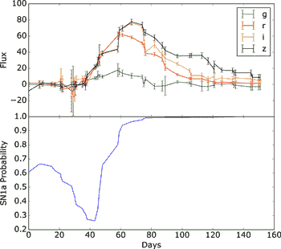
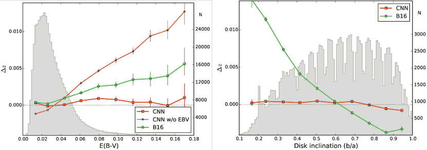

<!--yml

category: 未分类

日期：2024-09-06 19:44:22

-->

# [2210.01813] Dawes 评审 10：深度学习对星系调查分析的影响

> 来源：[`ar5iv.labs.arxiv.org/html/2210.01813`](https://ar5iv.labs.arxiv.org/html/2210.01813)

\jid

PASA \jyear2024

# Dawes 评审 10：深度学习对星系调查分析的影响

M. Huertas-Company^(1,2,3) 和 F. Lanusse² ¹加那利天文台，Vía Láctea 街，38025，拉拉古纳，西班牙 ²拉古纳大学，Astrofísico Fco. Sanchez 大道，拉拉古纳，特内里费岛，西班牙 ³巴黎天文台，LERMA，CNRS，PSL，巴黎-城市大学，法国 ⁴AIM，CEA，CNRS，巴黎-萨克雷大学，巴黎-城市大学，索邦巴黎城市，F-91191 吉夫-sur-Yvette，法国

###### 摘要

近年来，现代星系调查所传递的数据量和复杂性不断增加。新的设施将很快提供数亿个星系的成像和光谱。从这些大型且多模态的数据集中提取连贯的科学信息仍然是一个开放的问题，数据驱动的方法如深度学习迅速成为解决一些长期存在挑战的潜在强大解决方案。这种热情在使用神经网络的出版物数量上表现得尤为明显，从 2015 年的少数几篇论文到 2021 年在星系调查领域平均每周一篇论文。距第一次在天文学领域提到深度学习的工作发布已有半个十年，且在新大数据集如 Euclid 和 LSST 即将可用之际，我们认为现在是时候回顾这种新技术在该领域的实际影响及其解决新数据集规模和复杂性所带来的关键挑战的潜力。因此，本综述的目的有两个方面。我们首先旨在总结到目前为止深度学习在星系调查中的主要应用，并汇总在一个共同的文档中。接着，我们提取主要成就和经验教训，并突出关键的未解问题和局限性，我们认为这些问题将在未来几年需要特别关注。总体而言，前沿的深度学习方法正在被天文社区迅速采纳，反映了这些方法的民主化。综述显示，到目前为止，大多数使用深度学习的工作都倾向于计算机视觉任务（例如分类、分割）。这也是深度学习迄今为止带来最重要突破的应用领域。然而，我们也报告了应用正变得更加多样化，深度学习正在用于估计星系属性、识别异常值或约束宇宙学模型。尽管如此，大多数这些工作仍处于探索阶段，这可能部分解释了在引用方面的有限影响。在向未来调查的大规模部署深度学习的下一阶段迈进之前，某些共同的挑战很可能需要解决；例如，不确定性量化、可解释性、数据标注和从模拟训练中的领域转移问题，这些在天文学中是一种常见实践。

###### doi:

10.1017/pas.2024.xxx

###### 关键词：

关键词 1 – 关键词 2 – 关键词 3 – 关键词 4 – 关键词 5

## 1 引言

天文学的许多领域正在迅速变化。前所未有的大量观测数据已经存在或即将变得可用。现代光谱光度学调查，如空间与时间遗产调查（LSST；Ivezić et al., 2019）或 Euclid（Laureijs et al., 2011），将为数亿个星系提供高质量的光谱和图像。低红移和高红移的综合场光谱调查正在达到统计学上的相关规模（例如 MaNGA - Bundy et al., 2015），使得能够解决超出综合属性的星系内部结构。此外，像詹姆斯·韦伯太空望远镜（JWST）这样的新设施正在开启一个全新的红移和恒星质量范围，无论是成像还是光谱学，我们将能够见证宇宙中首批星系的出现。X 射线和射电设施（例如 SKA、Athena）将以更高的分辨率探测星系中的冷气体和热气体。在理论方面，计算能力已经发展到可以生成现实的宇宙学背景下的星系模拟（例如 TNG - Pillepich et al., 2018），这些模拟能够正确再现大量可观察的属性。在这种复杂性不断增长和数据量迅速增加的背景下，如何从这些数据集中结合和准确提取科学相关信息已成为社区面临的新挑战。

尽管机器学习在天文学中的应用至少已有三十年历史（见 第二部分），但近年来深度学习方法的前所未有的增加与其出版物的指数级增长（图 1）见证了这一现象。这种*复兴*得益于自十年前卷积神经网络（CNNs）普及以来，机器学习领域的重大突破。第一篇提及深度学习在天文学中应用的工作出现在 2015 年，当时 CNNs 被用于星系形态分类。从那时起，使用深度学习的天体物理学研究数量呈指数级增长，成为该领域其他主题中增长最快的（图 1）。深度学习的普及在某种程度上代表了我们在数据分析方式上的范式转变。通过使用基于梯度的优化技术直接从数据中提取有意义的特征，我们从基于特定算法和特征的方法转向完全数据驱动的方法。这对天文学和科学领域可能具有深远的影响。

图 1：arXiv:astro-ph 上不同关键词在摘要中的数量随时间变化的相对变化。在过去的约$\sim 6$年中，提及神经网络的工作数量经历了前所未有的增长，增长速度明显快于天体物理学领域的其他主题。来源：ArXivSorter

在这股深度学习应用于天体物理学的新潮流的五年之后，我们认为现在是回顾这一新技术在我们领域中影响的适当时机。鉴于现有出版物数量庞大，我们将只评审集中于星系调查分析的工作，并且将限于所谓的深度学习热潮后的近期工作。然而，我们相信，大多数经验教训可以推广到天体物理学的其他领域。

本综述的目标不是提供关于深度学习技术如何工作的技术细节，而是描述其在宇宙学和星系形成中的应用，作为一个独特的参考文献。在过去几年中，深度学习被用于各种任务，如分类、目标检测，也用于推导星系的物理属性，如光度红移、识别异常对象或加速模拟和限制宇宙学等。综述因此按主要应用领域进行结构化。我们提供了每个科学案例技术解决方案的快速描述和一些关键词，但强调本工作不是关注技术细节。读者被鼓励阅读提及每种方法的出版物 - 我们提供这些出版物的努力基础 - 以获得深度学习方法的完整和正式描述。为了完整性和便于访问，我们在附录 A 中提供了综述中提到的不同方法及其相关参考文献。还在附录 A 中提供了本工作提到的当前和未来星系调查列表。

基于这一思想，我们将深度学习的应用分为四个主要类别：

+   •

    深度学习用于一般计算机视觉任务。这些应用被认为是最接近标准自然图像计算机视觉应用的，深度学习在这些应用中通常表现优于其他传统方法。它通常包括分类和分割任务。

+   •

    深度学习用于推导星系的物理属性（包括后验和点估计）。这些应用中，深度学习被用来估算星系属性，如光度红移或恒星群体属性。神经网络通常用来替代现有算法，提供更快、更高效的解决方案，因此更适合大数据量。此外，我们还回顾了深度学习用于推导星系属性的应用，这些属性是通过已知观测量无法直接获得的，即从模拟中发现可观测量和星系物理属性之间的新关系。

+   •

    深度学习用于辅助发现。这里使用神经网络进行数据探索和复杂数据集的低维可视化。我们还包括了自动识别潜在有趣的新对象的努力，即异常值或离群值。

+   •

    宇宙学中的深度学习。包括重子物理的宇宙学模拟计算代价高昂。深度学习可以通过填充暗物质晕来作为银河系-晕连接的快速模拟器。此外，第二个主要应用是宇宙学推断。宇宙学模型传统上使用总结统计量（例如 2 点统计量）进行约束。深度学习已被用来绕过这些总结统计量，利用所有可用数据约束模型。

这当然是对深度学习在宇宙学和银河系形成中的应用的主观划分。不同类别之间必然存在重叠。该综述的组织方式是，对于每个应用类别，我们回顾了最新的技术和关键文献，强调了局限性所在以及未来最有前景的研究方向（第三部分至第六部分）。在最后几节（第七部分），我们评估了深度学习对银河系调查的影响，并提炼出一些全球性的经验教训。我们尽力提供对不同工作的公平而全面的描述。然而，正如之前所述，该领域在过去几年爆炸性增长，跟踪所有新出版物变得越来越困难。这也是这篇综述的部分动机之一。它还意味着我们可能会错过一些相关的工作。对此我们提前表示歉意。

## 2 简要的历史概述 - 或者说我们在这篇综述中未涉及的内容

在我们开始讨论最相关的结果和应用之前，我们想要澄清的是，这篇综述主要关注于深度学习的最新应用，特别是在卷积神经网络（CNNs）首次应用于天文学之后。如引言部分所述，我们将*深度学习*定义为过去大约十年间围绕神经网络的所有最新发展，自从卷积神经网络在图像分类中的首次实际应用以来。深度学习通常指的是基于梯度的优化技术，用于各种复杂度的模块化架构；因此，它是更广泛的机器学习学科的一个子领域。机器学习在天文学中的应用有着悠久的历史，早于近年来深度学习的热潮。包括早期人工神经网络（ANNs）、决策树（DTs）、随机森林（RFs）或如支持向量机（SVMs）等核算法在内的各种机器学习算法，自上世纪下半叶以来，已被应用于不同的天体物理学领域。例如，ANNs、决策树和自组织映射（SOMs）已广泛应用于星星和星系的分类（例如 Odewahn 等，1992；Weir 等，1995；Miller & Coe，1996；Bazell & Peng，1998；Andreon 等，2000；Qin 等，2003；Ball 等，2006）；ANN 是常用的 SExtractor 软件中用于天文图像分割的主要方式（Bertin & Arnouts 1996）。星系形态分类问题也进行了大量的机器学习相关研究，特别是由 O. Lahav 及其合作者使用 ANNs 和 DTs 主导（例如 Storrie-Lombardi 等，1992；Lahav 等，1995，1996；Odewahn 等，1996；Naim 等，1997；Madgwick，2003；Cohen 等，2003）。Ball 等（2004）可能是首个使用 ANNs 对 SDSS 中的星系进行分类的工作。在本世纪的第一个十年中，SVMs 变得更为流行，并被用于提供星系形态的目录（例如 Huertas-Company 等，2008，2011）。决策树也被应用于其他分类任务，如 AGN/星系分离（例如 White 等，2000；Gao 等，2008）。除了分类，机器学习，尤其是 ANNs，已被广泛应用于估计光度红移的问题（例如 D’Abrusco 等，2007；Li 等，2007；Banerji 等，2008）。不过，这篇综述不会描述这些工作。我们建议读者参考 Ball & Brunner（2010）和 Baron（2019）的文章，以获得关于深度学习前机器学习技术在天文学中的完整和广泛的综述。这显然并不意味着其他机器学习方法对天体物理学的兴趣较少。例如，最近 RFs 在异常检测（参见 Baron & Poznanski，2017 的工作）和评估星系中星形成抑制的主要原因（例如 Bluck 等，2022）等方面有着非常相关的应用。然而，我们选择不在这篇综述中详细描述这些工作。我们将主要关注深度学习在过去半个十年中如何改变了这一领域的格局。

深度学习有什么不同，为什么需要专门的评审？在许多方面，深度学习代表了我们处理数据分析的方式的变化。由于我们现在可以访问大型数据集，并且计算资源足够强大——特别是得益于图形处理单元——我们可以从依赖手工工程特征的算法中心化方法，转向完全数据驱动的无监督特征学习方法。这意味着，我们不再为每个任务开发先进的领域特定算法，而是依赖于通用优化算法，在端到端的训练过程中提取最有意义的特征。这是天体物理学及科学领域的一种新方法。这种范式的改变实际上使计算机视觉领域取得了巨大进展，尤其是在图像分类方面，但在过去十年中也对许多其他任务，如翻译、语音识别或图像分割产生了影响。因此，本次评审的目的是评估这种新方法在银河系形成和宇宙学领域的数据处理中的影响。

## 3 深度学习在天文学计算机视觉任务中的应用

我们从回顾接近标准计算机视觉问题的应用开始，这些应用中深度学习方法已被证明非常有效。我们重点关注分类和源检测。

### 3.1 分类

源分类是大多数深度调查中的一个基本的初步处理步骤，深度学习在过去几年中对此产生了显著影响。深度学习的迅速普及可以自然地解释，因为它可以说是最直接的开箱即用应用。事实上，深度学习开始吸引计算机视觉社区的注意，是因为卷积神经网络首次赢得了 ImageNet 图像分类竞赛（Krizhevsky et al., 2012）。

科学家在面对复杂问题时，首先要做的任务之一是识别形态上相似的对象。在外银河天文学中，对象分类有不同的类型。对于成像，我们在本节其余部分回顾的最常见应用是银河系形态分类、星系与星星的分离以及强引力透镜检测。我们理解这不是所有图像分类应用的详尽列表，但所使用的技术和方法具有代表性。从光谱学的角度来看，也有一些工作试图对银河系光谱进行分类。然而，这仍然不如图像分类常见。最后，过渡体的分类是近年来广泛探索的领域，特别是考虑到鲁宾天文台的 LSST 调查。

#### 3.1.1 光学/NIR 银河系形态

银河形态分类是一个深度学习迅速成为最先进技术的科学案例的典范。这项任务最早由 E. 哈勃完成，他在著名的哈勃序列中对银河系进行了分类。这一分类方案已有 100 多年历史，确立了今天宇宙中的银河系基本上有两种类型。一方面是盘状星系，如我们自己的银河系；另一方面是椭圆星系。我们现在知道，除了形态，广泛的类别还具有不同的物理特性。理解形态多样性的起源仍然是银河系形成领域中的一个未解之谜。

因此，银河形态分类仍在几乎所有的银河系成像调查中进行。传统的估计银河形态的方法是通过视觉检查。然而，随着大规模银河系成像调查如斯隆数字天空调查（SDSS）的出现，这种方法在过去十年中变得耗时过长。克服这一限制的办法主要有两个方面。公民科学方法，如更受欢迎的 Galaxy Zoo 项目 (Lintott et al., 2008)，被开发出来以分类大量的银河系。自动化通过机器学习的方法早在 1990 年代（例如，Spiekermann, 1992）就已提出，并在 2000 年代（例如，Huertas-Company et al., 2008）继续进行。Huertas-Company et al. (2011) 首次向社区提供了基于机器学习的 SDSS 银河系分类。然而，这些早期基于人工设计特征的方法所达到的准确度仍然有限——特别是在处理条纹或螺旋臂等详细形态特征时——阻碍了它们在社区中的普及。主要的限制是这些方法通常使用的特征与详细的形态结构之间的相关性较弱，并且非常依赖噪声和空间分辨率。

在这种背景下，首批使用卷积神经网络的天文学工作集中于星系形态（Dieleman 等人，2015；Huertas-Company 等人，2015）。首个工作使用了银河动物园 2 样本中的标记图像，并训练了一个监督卷积神经网络来估计 SDSS 星系的形态特征，从整体形态到更详细的特征，如螺旋臂数量。Dieleman 等人（2015）的工作赢得了 Kaggle 平台上的公开挑战¹¹1[`www.kaggle.com/`](https://www.kaggle.com/)。在大多数任务中，该工作实现了前所未有的$>90\%$分类准确率（图 2）。

图 2：示例显示了一致性水平（红色圆圈）和模型信心（蓝色方块）与分类准确率的关系。每个面板展示了银河动物园分类树中的不同问题（平滑度、边缘、条纹）。作者引用了前所未有的$>90\%$准确率。这是首个在天体物理学中使用卷积神经网络（CNN）的工作。图示改编自 Dieleman 等人（2015）。

图 3：简单*Vanilla*型卷积神经网络的示意图，这是在外星系成像中用于二分类、多分类和回归的最常见方法。输入通常是图像，经过一系列卷积层处理。得到的嵌入用于多层感知机的输入，后者输出一个浮点数或浮点数组。如果问题是分类问题，则标准损失函数为交叉熵（$H$）；如果是回归问题，则通常使用二次损失（$L_{2}$）。

这是相较于以往方法的重大改进，并标志着深度学习技术在天体物理学中的渗透开始。

不久之后，Huertas-Company 等人（2015）将类似的架构应用于用哈勃空间望远镜（HST）观测的高红移星系，再次展示了与其他方法（包括基于特征的机器学习）相比的类似改进。使用卷积神经网络（CNNs）来分类星系图像在某种程度上代表了我们处理分类问题的一种范式转变，这类似于自然图像处理的变化。与其手动尝试识别与分类相关的特定特征，不如让特征在分类过程中同时学习。当然，这意味着丧失了一些可解释性，因为网络学习到的特征不再直接与物理属性相关。可解释性是深度学习在自然科学应用中的一个主要问题，我们将在 7.3 节中讨论这一问题。

##### 卷积神经网络（CNNs）作为最先进的方法

过去几年，利用深度学习根据星系的形态进行分类的研究数量激增，并且卷积神经网络（CNNs）已被用于分类各种光学/近红外调查中的星系形态（我们在 subsubsection 3.1.2 中讨论了电波领域）。这表明深度学习迅速成为在大数据集中估计星系形态的最先进方法。图 3 展示了用于形态分类的最常见方法。图像被输入到一系列卷积层中，这些层提取一些总结统计量。提取的统计量随后被输入到多层感知器中，将其映射到一个类别。所用的损失函数通常是交叉熵损失。我们注意到，在 Dieleman 等人（2015）的原始方法中，引入了一系列孪生网络以增加旋转不变性。这种方法尚未在其他工作中使用。Domínguez Sánchez 等人（2018）通过仔细清理训练集，重新审视了 Dieleman 等人（2015）的概念验证工作，并发布了 SDSS 中第一个深度学习星系形态目录。Ghosh 等人（2020）探索了基于其膨胀与总体比率的 CANDELS 调查中遥远星系的分类。Goddard & Shamir（2020）对 Pan-STARRS 应用了类似的策略。Vega-Ferrero 等人（2021）和 Cheng 等人（2021b）使用 CNNs 对暗能量调查中的星系进行分类。Bom 等人（2021）对 S-PLUS 调查采用了类似的策略，而 Walmsley 等人（2022）对 DECALS 调查中的星系进行了分类。除了观测之外，CNNs 还被扩展用于分类来自宇宙学模拟的图像，以评估星系形态的真实性（Huertas-Company 等人，2019；Varma 等人，2022）。在这些应用中，CNN 在标记的观测数据上进行训练，然后应用于模拟图像。除了全球形态外，Tadaki 等人（2020）还使用类似的监督 CNN 设置，根据解析出的特性（即螺旋臂类型）对螺旋星系进行分类。

#### 3.1.2 电波星系形态

除了光学和近红外领域之外，射电天文学界也在积极开发和测试深度学习技术，以对射电星系进行分类。这些努力受到即将到来的新射电设施如 SKA²²2[`www.skatelescope.org/the-ska-project/`](https://www.skatelescope.org/the-ska-project/)的激励，这些设施将通过检测数十万新射电星系来改变现状。类似于光学领域，标签的大型数据集的可用性使得社区能够广泛测试深度学习在分类中的应用。射电星系动物园项目（Banfield 等，2015）确实使用公民科学来确定射电辐射的宿主星系和射电形态，共涉及$\sim 170,000$个星系。因此，这构成了一个应用神经网络的优秀数据库。这突显了社区为加速深度学习技术采用所做的准备工作的重要性。

探索用于射电星系分类的 CNNs 的首个工作是 Aniyan & Thorat（2017）。他们使用了一个简单的序列 CNN（图 3），并得出结论，在将星系分类为三种主要类别 - Fanaroff-Riley I (FRI)、Fanaroff-Riley II (FRII)和弯尾星系中，可以实现高达$\sim 95\%$的准确率。一些后续工作也报告了类似的准确性。例如，Alhassan 等（2018）在使用 CNNs 对 FIRST 射电调查中观察到的紧凑型和扩展型射电源进行分类时，也报告了类似的准确性（有关类似结论，请参见 Maslej-Krešňáková等，2021）。Lukic 等（2018）探讨了不同的网络配置，并得出结论，通常一个三层网络足以达到超过$90\%$的准确率。Wu 等（2019）探讨了基于区域的更快卷积神经网络，用于从射电星系动物园项目中检测和分类射电源。

#### 3.1.3 强引力透镜

基于深度学习的监督分类已经广泛扩展到其他星系外分类任务。例如，深度学习的出现显著推动了强引力透镜的检测（例如，Jacobs 等，2017；Petrillo 等，2017；Lanusse 等，2018；Davies 等，2019；Schaefer 等，2018；Metcalf 等，2019；Petrillo 等，2019；Jacobs 等，2019；Li 等，2020b；Huang 等，2020）。引力透镜会对背景光源的光产生特征性扭曲，这是由于前景大质量星系或星系团在同一视线中的存在。对强引力透镜的分析提供了关于前景系统总物质分布的信息。因此，强引力透镜提供了一个独特的暗物质分布探测手段。第一步是识别大样本的星系图像中的透镜。

类似于对星系形态的描述，识别透镜的常用方法是通过卷积神经网络（CNN），如同对星系形态所做的那样（图 3）。然而，由于强透镜检测问题严重不平衡，存在一些特定的问题。强透镜的数量密度确实比普通星系小几个数量级。这带来了两个主要问题。首先，无法建立足够大的观测透镜训练样本。其次，为了具有科学价值，分类器需要达到极高的纯度值，因为即使是少量的负样本污染也会导致透镜样本被假阳性所主导。社区提出了两种解决这些问题的方案，这些方案出现在大多数工作中。为了应对训练样本不足的问题，CNN 通常在模拟数据上进行训练。强透镜的物理学已经足够成熟，因此透镜可以以一定程度的现实性进行模拟（见图 4）。这种做法在天体物理应用中相当常见，我们将在接下来的章节中描述，特别是在第七部分。不过，这种做法并非没有偏差。Lanusse 等人（2018）的工作突出了使用现实复杂模拟进行训练以限制潜在偏差的重要性。

图 4：用于训练 CNN 的两种不同模拟强透镜样本的示例。这些模拟用于在 CFHTLS 调查中检测强透镜。图源自 Jacobs 等人（2017）

假阳性问题通常更难解决。常见的解决方案是对强透镜候选者进行人工视觉检查以去除假阳性。在这种情况下，深度学习有助于将所需的视觉检查量减少几个数量级，但并不能完全消除它们。

尽管存在这些问题，深度学习已经迅速成为在大规模调查中寻找强透镜的最先进技术。它已经成功地应用于多个成像调查，采用了与刚才描述的非常类似的策略。第一次使用 CNNs 识别透镜的工作集中在 CFHTLS 调查中 Jacobs et al. (2017)。Petrillo et al. (2017) 和 Petrillo et al. (2019) 对 KIDS 星系应用了类似的策略，而 Jacobs et al. (2019) 将这种方法扩展到 DES 中。Huang et al. (2020) 关注于 DECALS 数据集。还有一些其他工作主要集中在模拟上，以准备未来的调查。Lanusse et al. (2018) 展示了 CNNs 在 LSST 图像中检测透镜的表现，而 Davies et al. (2019) 重点关注 Euclid。

总体而言，各项研究的结论是一致的。深度学习方法被证明能够改进更传统的技术，因此很可能会在未来的调查中得到应用。对此的支持是，Metcalf et al., 2019 的工作展示了在 Euclid 调查框架下强透镜检测挑战的结果，其中五种最佳算法均基于 CNNs。

#### 3.1.4 未解决的问题

总的来说，深度学习技术迅速取代了传统的天文图像分类方法，预计将成为未来电磁波谱中对星系进行分类的主流方法。主要的优势是速度和准确性。特别是卷积神经网络在这些分类任务中比其他基于特征的自动化方法更准确，这一点在其他领域也有所体现。分类也是一种风险较小的应用，因为在大多数情况下，它与计算机视觉领域中深度学习的应用非常接近。但仍然存在一些未解决的问题。

##### 超越传统的卷积神经网络（CNNs）

尽管标准的基本卷积神经网络（CNNs）通常能够提供准确的结果，但一些研究已经探索了在计算机视觉中常用的更复杂的配置，例如 ResNets（例如 Zhu 等人，2019；Kalvankar 等人，2020）。总体而言，这些结果很有前景，但并未显著优于基于简单 CNNs 的方法。一些研究系统地比较了在相同数据集上使用的不同神经网络架构（例如 Fielding 等人，2021；Cavanagh 等人，2021）。总体结论是，即使在准确性和效率上存在一些差异，所有架构的表现都差不多。一个可能的解释是，天文图像通常呈现的多样性低于自然图像，因此相对简单的 CNNs 足以提取相关信息。Katebi 等人（2019）和 Lukic 等人（2019）的研究是少数探索使用胶囊网络（Capsule Networks）（Sabour 等人，2017）的天文学研究之一。胶囊网络被提出作为 CNNs 的替代方案，能够整合关于图像中特征的空间信息。简而言之，它使用一种逆向渲染的方式来编码图像中某个对象的存在。因此，它不仅编码有关对象是否存在的信息——这是 CNNs 所做的——还编码有关对象位置和朝向的信息。由于这种方法只在少数情况下被使用，我们不提供详细的架构表示。Lukic 等人（2019）的研究结论是，在射电星系分类的情况下，胶囊网络的表现不如更标准的 CNNs，只达到了约 $75\%$ 的准确率（Figure 5）。一个可能的解释是，胶囊网络最初是为了识别看起来不真实的场景而设计的。例如，CNN 会基于眼睛或鼻子等特征来识别面孔。然而，它们并未考虑这些特征在图像中的位置。胶囊网络会这样做，但这对于天文成像来说并不是一个常见的问题。这可能是胶囊网络在天文学中尚未得到广泛应用的原因之一。Becker 等人（2021）对 CNNs 在射电星系分类中的性能进行了系统测试，使用了多个性能指标，如推理时间、模型复杂度、计算复杂度和每类均值准确率。他们报告了三种表现最好的主要架构，但这些都是顺序 CNNs 的变体。在一项近期研究中，Tang 等人（2021）探讨了使用多分支 CNNs 同时从多个调查输入（NVSS 和 FIRST）中学习。有趣的是，他们确认，包含多领域信息可以减少约 $40\%$ 的误分类数量。

图 5：对比胶囊网络和 CNN 在分类射电星系形态上的应用。ROC 曲线展示了不同的性能。胶囊网络在这种情况下并未提供显著的提升。图源自 Lukic 等人（2019）

##### 标注数据

深度学习分类的一个常见瓶颈是可用于训练监督算法的标注样本的可用性。在天文学中，这尤其敏感，因为数据属性（例如噪声、分辨率）在不同数据集之间变化，因此理论上标注过程应对每个新数据集重复进行。一些研究通过不同的方法解决了这一问题。Walmsley 等人（2020）的工作探索了主动学习作为减少训练所需样本数量的一种方式。主动学习允许选择对模型最具信息性的样本，这些样本被展示给人工分类器。Walmsley 等人（2020）的工作也是首次探索贝叶斯深度学习作为一种估计不确定性并识别最具信息性样本的方法（图 6）。Domínguez Sánchez 等人（2019）和 Ghosh 等人（2020）探索了迁移学习，即在类似标注数据集上训练的神经网络权重的精炼，以减少对大量训练样本的需求（图 7）。他们表明，通过这种方法可以将标注样本的数量减少几个数量级。Samudre 等人（2022）也研究了所需训练集的大小问题。作者探讨了是否可以使用少量$2000$张标注图像获得可靠的形态分类。他们测试了迁移学习，也测试了基于双胞胎网络的少样本学习技术。结论是，即使使用小数据集，也可以使用 CNN 通过调整的训练策略获得可靠的分类。Walmsley 等人（2021）的最新研究探讨了迁移学习的另一种版本。他们展示了 CNN 为特定任务学习的特征如何被回收用于估计其他形态属性。Vega-Ferrero 等人（2021）则使用了从 SDSS 观测样本构建的模拟训练集来分类来自暗能量调查的更远星系。

图 6：从不同分类器的投票中估计的形态后验分布示例。最左侧的列显示了一个星系的图像。中间列显示了单个网络（黑色）预测的后验，而右侧列显示了在 30 个蒙特卡洛丢弃近似网络上的后验平均。红色垂直线表示真实值，通常与后验分布有良好的重叠。图源自 Walmsley 等（2020）

图 7：适用于星系形态分类的迁移学习示例，探讨如何将训练于 SDSS 的 CNN 应用于 DES 调查。每个面板展示了不同的形态特征（平滑/盘状，从上到下的条纹）。不同的线条显示了使用不同训练模型和测试集的 ROC 曲线。研究得出结论，当使用小部分 DES 星系来调整训练于 SDSS 的 CNN 的权重时，分类的准确性变得最优（红色实线与蓝色虚线相比）。图源自 Domínguez Sánchez 等（2019）

尽管仍存在一些问题，其中一些是大多数深度学习应用中的常见问题 - 见第七部分以获得更详细的讨论 - 但可以安全地认为，社区已经接受了深度学习将被用于对未来如 LSST 和 Euclid 等调查中的星系进行分类的观点。

#### 3.1.5 瞬态天文学

瞬态天文学领域即将因鲁宾天文台的 LSST 调查等综合性天空调查的到来而发生戏剧性的变化，这些调查将以前所未有的频率观察广阔的天空区域，以发现变化和瞬态天文源。每晚的探测数量预计将轻松超过几千个。社区已经看到机器学习技术，特别是深度学习，作为分类检测到的对象并筛选出最具潜力的（未知）有趣候选者的有希望的方法（参见 Ishida 的报告，2019）。我们将在第五部分中探讨发现新类型瞬态的内容。我们这里专注于变量源的监督分类。

宇宙学的一个关键科学话题是超新星光变曲线的检测和特征描述。超新星有不同类型，并不是所有类型都适用于相同的目的。例如，SNIa 用于宇宙学。快速识别对象的类型可以节省——除了其他方面——望远镜的时间。虽然理想情况下这是通过光谱学完成的，但对所有被检测到的源进行光谱跟踪是不可行的。因此，社区早在 2010 年就开始准备应对这一数据激增，创建了模拟数据集，如超新星光度分类挑战（SPCC）或光度 LSST 天文时间序列分类挑战（PLAsTiCC）³³3[`plasticc.org/`](https://plasticc.org/)。由于这些早期的努力，出现了相应的文献，使用*深度学习前*的机器学习方法（如 SVMs、RFs 和 ANNs）来解决超新星光变曲线分类的问题（如 Lochner 等，2016；Villar 等，2019；Hosseinzadeh 等，2020；Vargas dos Santos 等，2020）。

使用深度学习进行超新星光变曲线分类的首个工作是由 Charnock 和 Moss（2017）完成的。他们为此使用了递归神经网络（RNNs），这是一种旨在处理可变长度序列的神经网络架构（参见图 8 进行简单说明）。它们被称为递归的，因为它们保持序列中前一个信息的记忆，并利用这些记忆进行预测。它们通常用于语言建模。作者报告说，在模拟样本中对三种超新星类型（I 型、II 型和 III 型）的光变曲线分类的平均准确率超过$90\%$（参见图 9）。尽管训练集仅有一百个数据点，RNNs 与模板拟合和提升决策树的组合相比，仍取得了最先进的结果（Lochner 等， 2016）。除了不需要特征工程外，RNNs 的一个优点是能够分类不完整的光变曲线。Moss（2018）还在相同的模拟数据集上探索了 RNNs。他们提出了一些改进，如更强的数据增强过程，以缓解小样本的影响并达到$>95\%$的准确率。Möller 和 de Boissière（2020）也得出了类似的结论，他们也探索了 RNNs。他们报告说，在现实模拟中也达到了类似的准确率，并确认不完整光变曲线的准确率超过$85\%$。参见 Burhanudin 等人（2021）以获得类似的结论。后者工作建议使用焦点损失函数来处理不平衡问题。

图 8：递归神经网络（RNN）的示意图，该网络已被用于多个研究中的光变曲线分类。光度序列被输入到递归模块中，并通过交叉熵损失进行训练。RNN 模块保持对前一个时间步骤的记忆（$h_{t}$），使其适合处理时间序列。

图 9：用于超新星光度光变曲线分类的 RNNs。该图展示了五个光度波段中的光变曲线示例（顶部面板）以及分类概率随时间步骤的变化（底部面板）。大约 50 天后，超新星类型被高信心地分类。图示例自 Charnock 和 Moss（2017）改编

在过去几年里，以序列形式处理数据在机器学习领域取得了显著突破。特别是，所谓的注意力方法通过识别序列中包含最相关信息的区域，已被证明在序列到序列任务（如翻译）以及时间序列分类（Vaswani et al., 2017）中非常强大。这类基于注意力的架构通常被称为变压器（参见 图 10）。变压器在天文学中的应用仍然相当有限。然而，一些研究已经探索了它们在超新星光变曲线分类和其他类型瞬态中的表现。Allam & McEwen (2021) 使用了原始变压器架构的变体来分类来自 PLAsTiCC 模拟数据集的光度光变曲线。作者展示了他们达到了最先进的准确性。他们声称变压器能够处理非常不平衡的类别，而无需数据增强，取得了迄今为止最低的对数损失（图 11）。然而，正如作者所强调的，由于在不同条件下进行评估，与其他方法的比较并不简单。这突显了在不同分类工作的比较中存在的一个普遍问题。天文学通常缺乏标准化的数据集，以便对算法进行一致的测试（参见 第七部分 进行一般讨论）。Pimentel et al. (2022) 是第二项探索注意力机制应用的研究。他们在对模拟数据进行初步训练和微调后，将方法应用于实际数据。他们也得出结论，注意力网络优于基于 RF 和 RNN 的传统方法，特别是在光变曲线的晚期分类和早期分类上。

图 10: 典型的变压器架构示例，用于光变曲线的分类。首先使用高斯过程对时间采样进行均匀化，得到的序列被输入到 CNN 中进行特征提取。注意力模块用于提取最终特征，这些特征用于分类。

图 11：应用于超新星光度曲线分类的 Transformer。图中显示了 PLAsTiCC 模拟数据集上的混淆矩阵。从矩阵的对角线可以看出，大多数类别的识别准确率超过了 $90\%$。图像改编自 Allam & McEwen (2021)

除了纯粹的光度数据，变星源的分类也可以在图像上进行。这通常通过从不同时间点的图像中减去来实现。几项研究探索了直接在图像序列中使用深度学习的方法。Carrasco-Davis 等人 (2019) 例如使用递归卷积神经网络（RCNNs）来识别真实的瞬态与伪影。Gomez2020 扩展了 RCNNs 在瞬态的多类分类中的应用。他们还利用 RCNNs 提取时间和空间相关性的信息。

总结来说，深度学习方法自然地融入了其他机器学习方法以分类光度曲线。特别是 RNNs 和最近的 Transformer 提供了具有竞争力的结果。然而，对于这项特定任务，深度学习似乎并没有像在图像分类中的那样显著改进先前的技术。Hložek 等人 (2020) 的工作总结了在 Kaggle 平台上组织的 PLAsTiCC 挑战的结果。可以清晰地看到，无论是*经典*方法还是深度学习方法都提供了竞争力的结果。

#### 3.1.6 其他分类

在过去几年中，对其他分类任务的类似监督方法也进行了测试，得出了类似的结论并面临了类似的挑战。Kim & Brunner (2017) 使用卷积神经网络（CNN）将恒星与星系分开。星系-恒星分离是深度调查分析中的经典任务。与其他分类任务一样，CNN 的优势在于它们利用像素级信息而不依赖于总结统计。然而，总体结论是，CNN 对于这个分类问题相比于更多基于机器学习特征的方法提供了边际增益。Ono 等人 (2021) 使用 CNN 区分真实的 Ly$\alpha$ 发射体（LAE）与污染物，使用了六个窄带滤光片的成像数据。Ackermann 等人 (2018) 首次测试了在 Galaxy Zoo 上训练的星系合并分类，并报告了相较于最新方法显著的改进（星系合并的情况在 子节 4.2 中有详细讨论）。Walmsley 等人 (2019) 和 Tanoglidis 等人 (2021b) 探索了在深度成像调查中使用 CNN 进行低表面亮度（LSB）结构的分类。低表面亮度宇宙的系统探索将通过未来的调查如 LSST 或 Euclid 得以实现。因此，自动识别和分类 LSB 结构是一个新挑战。作者在暗能量调查数据上测试了一个 CNN 模型，并报告了在区分伪影与真实 LSB 结构方面约 $\sim 95\%$ 的准确率。只有少数工作探讨了这个科学问题，可能是由于缺乏适当标记的数据集。

### 3.2 分割、去混叠和像素级分类

目标检测和去混叠是近年来深度学习技术广泛测试的另一个问题。检测源以建立具有某些测量属性的目录是深度调查成像处理中的第一步标准步骤。在图像处理中，这通常属于图像分割领域，正是识别图像中不同对象的位置和边界的任务。分割类型可以是语义的，如果对象属于不同的类别，或者是实例的，如果我们旨在检测相同类型的对象。

图 12：Unet 类型架构的示意图。这通常用于解决图像到图像的问题（例如，分割、2D 中的银河特性）。第一个 CNN（编码器）将信息编码到潜在空间($z$)中，然后将其传递给另一个 CNN（解码器），后者生成图像。Unet 的一个特点是编码和解码部分之间存在跳跃连接，这已被证明能提供更高的准确性。

自 CCD 的普及以来，天体物理学中的目标检测通常通过名为 SExtractor 的软件进行，该软件实现了一种先进的多阈值技术来检测和分离对象。尽管在过去几年中广泛使用，但随着更深入的调查的出现，源之间的混淆变得非常常见，其局限性变得更加明显。估计$\sim 80\%$的星系将受到某种重叠或*混叠*的影响。鉴于混叠可能严重影响科学结论，拥有可靠的检测和去混叠方法非常重要（有关去混叠的综述，请参见 Melchior 等，2021）。

近年来，计算机视觉领域在通过应用深度学习网络进行图像分割方面取得了显著进展。因此，类似于分类的情况，针对通用计算机视觉应用开发的深度学习分割技术已经可用。因此，预期现成的实现能够提供合理的结果。然而，天体物理数据具有一些其他类型图像所没有的关键特性。动态范围非常大，通常从对象中心到边缘跨越几个数量级。对象没有清晰的边缘。这与自然成像应用有根本的不同，使得使用神经网络进行分割任务更加具有挑战性。

对象检测的一个非常流行的方法是使用编码器-解码器网络。Unets (Ronneberger 等人，2015) 采用了编码器和解码器分支之间的跳跃连接，已成为最先进的分割网络之一（见 图 12）。最初设计用于医学成像，它们在过去几年中已被广泛应用于天体物理学中的检测。Boucaud 等人 (2020) 首次应用 Unet 检测图像邮票中的物体，并测量重叠源的光度。在这项概念验证工作中，显示出与标准 SExtractor 方法相比，双星系的光度测量得到了改进（图 13）。

图 13：使用 Unet 和 SExtractor 测量的光度比较。所有面板显示了输入光度和恢复光度之间的比较。顶部行显示了邮票中的中心星系，而底部行显示的是伴星。最左侧的两个面板展示了两种不同的深度学习架构。最右侧的面板显示了基准 SExtractor 的结果。深度学习改善了光度的离散度和偏差。图表改编自 Boucaud 等人 (2020)

然而，这项测试是在一个理想化的环境中进行的，该环境中邮票仅包含中心有一个星系的两幅图像。Paillassa 等人 (2020) 探索了类似类型的架构，在更现实的环境中，识别和分类 CCD 图像中的伪影。在这种情况下，分类和分割是在像素级别上同时进行的。所提出的方法成功地识别了图像中的多种伪影（图 14）。

图 14：Unet 用于对 CCD 图像中的不同类型伪影进行分割。最左侧的图像展示了包含不同伪影的区域。中间面板显示了真实情况，最右侧的面板展示了 Unet 获得的预测结果。图表改编自 Paillassa 等人 (2020)

Hausen & Robertson (2020) 探索了一种类似的方法，这次结合了物体检测和在像素级别的星系形态分类。通过使用滑动窗口，Unet 成功地将 CANDELS 调查中的每个像素分类为五种形态类别（图 15）。Huertas-Company 等人 (2020) 使用类似的架构，通过检测 CANDELS 调查中高红移星系中的巨大星形成团来研究星系的解析属性。Burke 等人 (2019)、Farias 等人 (2020) 以及 Tanoglidis 等人 (2021a) 探索了一种基于区域的 CNN 架构（如 Mask R-CNN）的替代方法，以执行类似的任务，即检测、去混叠和分类。

总体而言，这些应用都展示了非常有前景的结果，明显在速度和准确性上都优于传统方法，特别是与像素级分类结合使用时。在大多数情况下，只需应用现成的架构，就能提供准确的结果，只要输入数据经过适当的重新缩放，以限制动态范围的影响。然而，迄今为止，除了 Hausen & Robertson 的工作（2020）之外，大多数工作主要集中在测试和展示这些基于深度学习的方法的性能。将这些方法应用于实际数据以产生科学可利用的数据产品仍然非常有限。这些方法与分类任务存在类似的限制，即训练集和不确定性量化（参见第七部分）。找到合适的训练集更加具有挑战性，因为需要标记和识别对象的边界。在天文学中，物体边界的定义严重依赖于噪声水平。迄今为止，采用的解决方案要么是基于模拟训练，要么是依赖于先前的检测。它们似乎都不完全令人满意。模拟通常过于简单，对数据的推广可能会引发意外行为。使用其他软件包的输出往往会传播现有的偏差。可能的解决方案包括使用生成模型生成更现实的训练集（例如，Feder et al., 2020; Lanusse et al., 2021; Bretonnière et al., 2022）。我们将在第 3.4 小节中更详细地讨论这一点。最近的工作还开始探索在产生的分割图中实施不确定性（Bretonnière et al., 2021），这似乎是限制从模拟到观测领域转变时可能出现的灾难性失败影响的有希望的方法。然而，所有这些工作仍然处于概念验证阶段。

图 15：使用 Unet 对 CANDELS 调查中某一区域进行像素级分类的示例。最左侧的图像显示了原始场景。六个较小的图像展示了不同通道和不同形态类型，最右侧的图像是所有通道的组合以及像素级形态分类。图像改编自 Hausen & Robertson（2020）。

除了这些基于分割的方法外，其他团队已经尝试进一步通过重建重叠星系的表面亮度轮廓来推进研究。这意味着从分类问题转变为回归问题，因为网络的输出是给定像素的通量。这项任务通常需要使用生成模型以数据驱动的方式学习星系形状的多样性，然后能够生成可能的解决方案。**Reiman**和**Göhre**（2019）首次探索了使用生成对抗网络（GANs）来实现这一目的（见图 16）。在这种情况下，网络的输入是两个重叠星系的印记，输出是分别包含两个星系的两幅图像。使用对抗损失以确保生成的两个星系是现实的且与观测到的星系不可区分（见图 17）。为了实现类似的目标，**Arcelin**等（2021）使用变分自编码器（VAEs）来重建混合星系的光分布，应用于 LSST 调查的模拟数据。最近，**Hausen**和**Robertson**（2022）尝试了一种介于完全重建和检测之间的中间解决方案。他们提出了一种基于部分归因实例分割的新方法，用于估计混合系统中每个星系的通量比例。这一方法具有趣味性，因为它为天体物理问题提供了专门设计的解决方案，这在深度学习应用中仍然很少见。

尽管结果看起来非常有前景（例如，图 17），但尝试这一任务的工作仍处于探索阶段。Reiman 和 Göhre (2019) 通过简单地将两张 SDSS 图像相加来进行模拟；Arcelin 等人 (2021) 使用了分析模拟。与所有其他去混叠努力一样，这种方法的问题在于找到一个与观察结果足够接近但又不至于过于简化的合适训练集。Arcelin 等人 (2021) 表明，从在模拟上训练的网络中进行迁移学习是一个有前景的方法。更重要的是，当生成图像而不是掩模时，统计准确性与个体准确性的问题变得更加严重。生成模型在统计意义上产生现实的图像，即来自与观察相同的概率密度函数。然而，在个体层面上，生成的图像上可能会出现伪影，这些伪影通常很难追踪，从而可能引入显著的偏差。这种个体与统计准确性的问题是机器学习的固有问题，需要在使用 ML 预测进行科学分析时加以考虑。

图 16: 标准生成对抗网络（GAN）的示意图。它已被用作去混叠的生成模型，识别离群值以及加速宇宙学模拟等。第一个 CNN（生成器）将随机变量映射为图像，然后将其与真实图像一起输入第二个 CNN（判别器），以区分这两种数据集。生成器和判别器网络交替训练。

图 17: 使用 GANs 进行星系去混叠的示例。中央图像显示了三个重叠的星系。在大图像的两侧，显示了这对星系的原始图像（左）和重建图像（右）。图像改编自 Reiman 和 Göhre (2019)。

为了限制黑箱效应，Lanusse 等人 (2019) 提出了一个有趣的方法。作者使用了一个混合模型，该模型结合了具有已知项的物理动机模型和用于星系形态的生成模型学习的数据驱动先验。在这种方法中，生成模型的输出仅用作逆问题的先验，因此意外伪影的影响减少。将物理动机模型与数据驱动模型结合起来，似乎是一个具有吸引力的解决方案，未来可能会变得重要。

### 3.3 提高数据质量

深度学习也被探索用于提高数据质量，即去噪和去卷积。天文图像通常因点扩散函数（PSF）的影响而噪声和模糊，对于地面数据，这包括了望远镜的脉冲响应和大气的影响。因此，去噪和去卷积的过程旨在恢复退化前的信息。这通常是一个具有挑战性的逆问题，需要显著的正则化。数据驱动的方法已经成为比传统去卷积技术更为常见的替代解决方案。**Schawinski**等人 (2017) 首次探索了使用**生成对抗网络** (Figure 16) 来去卷积来自 SDSS 的图像。他们展示了**GANs** 即使在退化后也能恢复特征。然而，由于星系之前已经被退化，这仍然是一个简单的实验。**Gan**等人 (2021) 基于类似的思想，使用**GANs** 在地面和空间观测之间进行转换。**Jia**等人 (2021) 提出了基于两种不同**GANs** 的改进解决方案，减少了大量配对图像（有退化和无退化）的需求。**Lauritsen**等人 (2021) 通过使用变分自编码器代替**GANs** 将这一思想扩展到了亚毫米波段。**Encoder-Decoder** 网络也可以用于去噪，一些工作已经探索了在天文学中的应用。**Vojtekova**等人 (2021) 展示了**Unets** 可以有效地将曝光时间增加一倍。

一般而言，所有的尝试在解决长期存在的去卷积问题上都展示了令人印象深刻的结果。然而，这些尝试仍处于概念验证阶段，尚未应用于科学分析。类似于去混叠，主要的限制在于鲁棒性。生成模型，如**GANs**，能够生成非常逼真的图像，但也可能引入统计上有意义但不一定在每张图像上都表现出的伪影。这些伪影可能在科学分析中引入无法控制的偏差。

### 3.4 模拟天文图像

在许多应用中，模拟调查数据的能力非常宝贵，例如用于测试和校准测量管道。面临的困难之一是即将到来的调查（如 LSST 或 Euclid）的模拟中，能够提供复杂的星系光谱的深度和高分辨率成像数据集相对较小（基本上仅限于 HST 调查，如 COSMOS）。这也是开发深度生成模型以模拟星系形态的动机之一，这些模型可以在现有数据上进行训练，然后生成更多真实的光谱样本。

在这一方向的最早工作之一中，Ravanbakhsh 等人 (2017) 证明了相对简单的生成对抗网络（GANs）（见图 16）和变分自编码器（VAE）（见图 18）在 HST COSMOS 邮票上成功捕捉到了大多数相关的群体参数，例如大小、亮度和椭圆度。在随后的研究中，Lanusse 等人 (2021) 将该模型扩展到明确考虑点扩散函数（PSF），并提出了一种混合的归一化流（见图 19）和 VAE 架构，使得能够实现多样化和高质量的样本，同时也可以根据星系属性条件生成光谱轮廓。归一化流是一类生成模型，与 GANs 或 VAEs 不同，它们允许精确评估似然函数 $p(y)$，因此其权重可以通过最大化训练数据集的对数似然直接学习。其思想是构建一个双射映射 $f$，使得 $y=f(z)$，其中 z 是一个具有简单基础密度 $p(z)$ 的变量，通常是正态分布。由于 $f$ 是可逆的，因此可以使用变量变换定理来评估密度 $y$，即简单地反转 $f$ 并跟踪变换的雅可比矩阵（见图 19）。Bretonnière 等人 (2022) 使用该生成模型在一个 0.4 deg² 的区域内创建了复杂星系形态的欧几里得 VIS 仪器的模拟，并利用这些模拟评估了欧几里得调查（包括深度和广域）能够解析星系内部形态结构的亮度极限。

图 18：变分自编码器（VAE）的示意图。这种生成模型在天文学中被广泛用于多个模拟任务。第一个卷积神经网络（CNN）将输入映射到一个分布中，然后对其进行采样，以提供第二个卷积神经网络的输入，该网络则重建输入图像。添加了一个正则化项，以确保潜在分布接近于先验分布。

图 19：归一化流的示意图。这个密度估计模型用于将简单的分布（通常是正态分布）通过一个由神经网络参数化的可逆函数 $f$ 转换为更复杂的密度，该函数通过最大化对数似然来优化。该变换也可以针对一组额外的参数（图中的 $s$）进行条件化。

标准的 GAN 和 VAE 在模拟此类星系时的一个限制是，很快就变得难以在大尺寸图像上生成高质量样本。为了解决这些技术难题，Fussell 和 Moews (2019) 开发了一种 StackGAN 方法，其中第一个 GAN 被训练来生成低分辨率图像（例如 64x64），然后由第二个 GAN 进行上采样（例如到 128x128）。Smith 和 Geach (2019) 提出了使用一种 GAN 变体，称为 Spatial-GAN（SGAN），通过纯卷积架构生成的不再仅仅是邮票大小的图像，而是任意大小的整个场景。作者们展示了生成一个 87040x87040 像素的图像，以模拟 HST eXtreme Deep Field（XDF）的能力。最近，Smith 等人 (2022) 探索了应用去噪评分匹配方法（Song & Ermon，2019），并能够生成高质量的 256x256 大尺寸邮票图像。

计算机视觉中的深度学习概述 • 深度学习已经迅速成为大规模调查中物体分类的解决方案。银河系形态、强引力透镜以及光变曲线是主要应用领域。基于深度学习的目录，特别是用于银河系形态的目录，已经存在并被用于科学分析。 • 最常见的分类方法是有监督的卷积神经网络，具有不同程度的复杂性。 • 总体而言，卷积神经网络（CNNs）比以前的方法具有更高的准确性，并且速度更快。 • 缺乏标记训练集是一个常见的瓶颈。已经提出了涉及迁移学习和/或使用模拟训练集的解决方案。这意味着一些额外的挑战，我们在第七部分中进行了讨论。 • 在非常不平衡的样本（例如强引力透镜）的情况下，假阳性也是一个常见的问题。迄今为止，除了视觉检查，没有找到令人满意的解决方案。 • 在天文学中，一致比较不同分类方法性能的标准化数据集并不常见，这限制了比较不同方法的可能性（参见第七部分）。 • 深度学习也已被用于图像中的对象检测和分割。 • 最受欢迎的分割方法是卷积编码器-解码器网络，如 Unets，尽管也采用了更复杂的架构。 • 总体而言，结果是有前景的，并且往往优于深度学习之前的检测方法。 • 大多数工作仍处于概念验证阶段。迄今为止，在主要深度成像调查中还没有基于深度学习的目录。此类方法的鲁棒性仍然是一个关注点，尤其是在去混叠方面。物理信息模型可能是未来需要探索的解决方案。

## 4 深度学习用于推断银河系的物理属性

### 4.1 神经网络作为快速模拟器

我们现在转向讨论过去几年中使用深度学习估计银河系物理属性的努力。与我们在前一节中描述的计算机视觉任务相比，这些应用通常更具领域特异性，因为它们从回归的角度针对银河系的物理量。社区遵循的一般方法是测试神经网络以模拟——替代——那些经过多年开发的、通常较慢或不够快以应对未来大数据调查的更具体的工具。

#### 4.1.1 光度红移

所有现代宇宙学调查都需要对红移进行或多或少的精确估计。当光谱学不可用时（这在大多数深度调查中是常见的情况），光度红移估计是测量大量星系距离的标准方法，这一方法结合了宽带和窄带光度测量。因此，光度红移估计是光度点集与实际测量红移数值之间的非线性映射。解决此问题的标准方法是通过拟合来自恒星群体模型的光谱能量分布（例如 Benítez, 2000；Bolzonella 等人，2000）。然而，尽管这是一个理论上定义明确的问题，它仍然是深度学习监督回归在天体物理学中的最受欢迎的应用之一。最早的光度红移神经网络估计尝试出现在深度学习兴起之前的 2000 年代初（Collister & Lahav, 2004；Vanzella 等人，2004）。这些方法已经依赖于从数据中学习光度学和红移之间的映射，通过一个在均方误差（MSE）损失下训练的多层感知机。与现代架构唯一的区别在于模型的深度和激活函数的选择。也许最成功的早期光度红移神经方法，ANNz（Collister & Lahav, 2004），随着时间的推移不断发展，ANNz2（Sadeh 等人，2016）通过一组随机估计器技术量化了认知不确定性，这些技术让人联想到现代深度集成方法。

近年来，随着深度学习的普及，这些方法经历了两个重要的演变：1\. 通过红移分布的概率建模来估计后验概率；2\. 基于卷积神经网络（CNNs）的像素级模型，从而超越了光度信息，并能够利用形态学信息。

##### 光度红移的概率建模

超越回归任务，（Bonnett，2015）提议使用神经网络（仍然是多层感知机 - MLP），对于给定的光度数据，输出一个离散化的概率密度函数（PDF）形式的分布。然后，模型会用标准的交叉熵损失函数进行训练，以预测给定星系应落入的红移区间，这在数学上实际上对应于在给定光度数据下估计红移的后验分布，前提是由训练集的选择给出。这个方法随后被用于训练其他更复杂的神经网络以进行光度红移估计（Pasquet-Itam & Pasquet，2018；Pasquet et al.，2019），但可能会受到表示 PDF 所需的离散化的影响。实际上，网络并没有内建的观念，即相邻索引的类别实际上对应于相邻的区间。

另一种建模神经网络输出分布的方法是使用混合密度网络（MDN Bishop，1994）。MDN 使用 MLP 来预测概率密度混合的参数，从而为给定输入提供一个解析的连续 PDF 模型（见图 20）。例如，这种方法在 D’Isanto & Polsterer（2018）中提出，其中神经网络输出的是一个混合的$n$个一维高斯分布的均值、方差和权重。总体而言，普遍共识是，当仅使用光度数据作为输入时，神经网络提供的结果并没有比其他基于模板的方法更为准确（例如，见 Schmidt et al.，2020）。一个重要的挑战是，训练集通常存在偏差，我们将在第 7.3 节中讨论。

图 20：混合密度网络（MDN）的表示。它是标准 CNN/ANN 的一种推广，其中输出被替换为一个由一些参数（图中的$\mu$，$\sigma$）参数化的概率分布。MDN 提供对随机（偶然）不确定性的估计。损失函数是广义对数似然函数。

##### 卷积光度红移估计器

神经网络基础的光度红移的第二次重大进展当然是引入了 CNN 来构建一个像素级模型，该模型原则上能够利用多波段星系图像的全部信息来细化红移估计。在这种方法的首次应用中，Hoyle (2016) 使用了当时最先进的模型 AlexNet (Krizhevsky 等，2012) 来构建一个 5 层深的 CNN 模型，该模型以给定星系的 $r$、$g$、$i$、$z$ 图像组合为输入，并训练将该星系分类到一个离散的红移区间。值得注意的是，在对 $60,000$ 张 SDSS 图像进行的这项初步研究中，与传统的基于光度特征的 AdaBoost 机器学习模型相比，红移预测精度并没有显著提升。直到几年后，CNN 基于方法才得到了更广泛的发展，最早由 D’Isanto & Polsterer (2018) 提出，他们将一个简单的 3 层深的卷积架构与混合密度输出相结合，但与基于特征的方法相比，在 SDSS 样本上的准确性提升仍然较小。

卷积方法的好处开始在 Pasquet 等人（2019）的研究中变得清晰，该研究使用了一个更深的卷积网络，包括一个输入卷积层和 5 个 inception 块，在红移分类损失下进行训练。这些 inception 块（Szegedy 等人，2014）基本上用多个具有不同卷积核大小的并行卷积层替代了一个卷积层，块末尾的输出被连接回一个单一的张量。该研究再次基于来自 SDSS 主星系样本的 $ugriz$ 图像，特别展示了 CNN 如何自动利用像素级数据提取超越颜色的信息，从而改善红移估计。特别是，图 21 的底部行展示了标准基于颜色的 k-NN 光度红移估计与提出的 CNN 方法在星系椭率（星系倾斜的代理）函数下的光度红移偏差的比较。可以看出，基于颜色的方法显示出由于视角不同而引起的强烈倾斜依赖偏差。CNN 显示出相对很少的偏差，表明模型能够通过直接从邮票图像中提取信息，自动估计并考虑倾斜。这一例子说明了深度学习方法的主要优势，它减少了对手工特征的需求，留给模型从数据本身中识别相关信息。

图 21：深度 CNN 和基于颜色的 k-NN (B16) 方法（Pasquet 等人，2019）在光度红移性能上的比较。顶部行展示了 CNN（左）和 k-NN 方法（右）的预测红移与光谱红移的对比。CNN 的分布明显更紧，整体偏差、散布和异常值率较小。底部行展示了两种方法的光度红移偏差 $\Delta z$，作为星系的消光（左面板）和盘面倾斜（右面板）的函数。由于可以访问整个图像信息，CNN 能够自动考虑高倾斜星系引起的红化，而仅使用颜色信息的 k-NN 方法对这一效应盲目，展现出明显的倾斜偏差。

Pasquet 等人 (2019) 强调了使用 CNN 方法时的重要考虑因素。尽管通量测量可以标准化以考虑不同的噪声和 PSF，但仅基于原始邮票图像的 CNN 在没有额外信息的情况下对这些观察条件因素是盲目的。作者报告了 CNN 在不同观察条件下的明显偏差，并提到未来工作中可以将这些信息提供给模型，以使模型能够补偿这些因素。

在一些后续工作中（Menou, 2019; Henghes 等, 2021; Zhou 等, 2021），提出将这种纯卷积方法扩展到光度红移估计的混合模型，结合了一个处理光度特征（例如颜色）的 MLP 分支和一个访问星系完整图像的 CNN 分支。在这些研究中发现，通过 MLP 分支直接向模型提供高度信息性的特征可以提高整体准确性。虽然所有相关信息原则上已经包含在图像本身中，但这种方法减少了卷积分支需要执行的自动特征提取量。在所有情况下，当光度特征和图像共同提供给模型时，能够获得最佳结果。

##### 提高训练集大小的扩展性

这些深度学习方法的一个特定方面可能限制其适用性，即需要大量的训练样本，因此在这种情况下，需要大量（广泛的）光谱样本以正确训练这些监督方法。作为这一问题的可能缓解技术，Hayat 等人 (2021) 证明了对比学习提供的自监督编码保留了显著的红移信息。我们建议感兴趣的读者查看 第五部分 以获取有关对比学习的更多细节。在这里，作者提出了一种两步法，首先在完全自监督的情况下（无需任何光谱红移）训练一个一维的星系邮票编码。在第二步中，以监督方式训练一个浅层 MLP，以在一个小型训练集上预测红移。作者发现了两个令人惊讶的结果：1\. 这种微调的自监督方法总是优于传统的监督训练，2\. 自监督估计的红移在数据稀少的情况下表现非常好。例如，他们发现，使用 20% 的标记数据的自监督方法达到了与使用整个数据集标签的完全监督训练相似的准确性。

为了限制所需数据量，Dey et al. (2021) 提出了用深度胶囊网络替代传统的卷积架构。与 CNNs 相比，胶囊网络对旋转和视角变化具有鲁棒性，因此为随机定向的物体如星系提供了更自然的表示（见 3 节）。因此，希望如果模型已经提供了问题的内在不变性，则不需要那么多训练数据。在他们提出的架构中，胶囊网络生成输入图像的低维编码，然后用于执行两个任务：用 CNN 重建输入图像，并用 MLP 估计星系的红移。此外，他们的模型还在胶囊输出级别分类星系的形态类型（椭圆形或螺旋形）。作者发现，这种方法在训练集规模方面比 (Pasquet et al., 2019) 更具规模化优势，特别是在非常小的训练集规模下，但其效益不如 Hayat et al. (2021) 的自监督方法显著。

另一种减少对大型光谱数据集依赖的补充方法是使用迁移学习，即在模拟数据上构建模型，并在调查数据上进行微调。例如，这种方法在 (Eriksen et al., 2020) 中进行了探索，使用了一个在 FSPS 模拟数据和 PAU 调查数据组合上训练的 MDN。研究发现，在模拟数据上的预训练可以将光度红移散布减少多达 50% 对于微弱的星系。

最后，Campagne (2020) 研究了这些深度神经网络的鲁棒性和稳定性，指出像 Pasquet et al. (2019) 提出的 inception 模型对对抗攻击非常敏感。尽管这些攻击在天文数据上不太可能发生（但请参见Ćiprijanović et al., 2021a），这一结果再次强调了这些黑箱方法不如更传统的方法如模板拟合那样具有可解释性（可解释性在 7.3 节 中讨论）。

#### 4.1.2 星系结构参数

除了分类，银河系的形态学还可以通过一些参数来量化，这些参数定义了银河系表面亮度分布的分析描述。所谓的 Sersic 模型由三个量定义：有效半径（`$r_{e}$`）、Sersic 指数（`$n$`）和轴比（`$b/a$`）。通过将这些参数与归一化因子结合以考虑不同银河系的亮度，可以描述大多数银河系的表面亮度分布。测量这些参数的标准方法是将 PSF 卷积的分析模型拟合到银河系的二维表面亮度分布中。这个任务可以被表述为像素值与描述银河系形状的实数之间的映射。因此，这非常适合监督回归问题，只要有可靠的训练集。由于输入数据是银河系图像，卷积神经网络（CNN）是最常用的方法。**Tuccillo**等人（2018）首次使用 CNN 来估计银河系的结构参数。在这项工作中，作者使用了一个简单的训练集，由带噪声的分析型曲线组成，并且展示了 CNN 的性能与标准方法相当或更好，关键优势是快了大约$\sim 50$倍。如前所述，计算效率是这些旨在模拟现有软件的工作的主要动机之一。**Tuccillo**等人（2018）还尝试将训练好的 CNN 应用于使用 HST 观察到的银河系。然而，由于训练集过于简单，结果并不令人满意。特别是，作者没有在训练集中包含前景和背景银河系，这与观察存在重要差异。作者提出了一个迁移学习步骤，使用了通过标准方法进行的测量。尽管结果很快有所改善，但最终结果必然传播现有软件的系统误差，这些误差无法通过构造来改善。在这方面，主要的收益是速度。**Ghosh**等人（2020）在此基础上展示了通过迁移学习步骤，CNN 可以为低红移和高红移银河系提供可靠的结构参数。作者估计了 SDSS 和 CANDELS 调查中的$\sim 120.000$个银河系的结构参数。

最近，李等人（2021）尝试将类似的方法应用于地面观测。训练仍然在模拟数据上进行，但背景更加现实。此外，PSF 被作为 CNN 的输入，使网络能够学习视场中 PSF 变化的效果。作者展示了，通过包括这些改进，CNN 能够很好地推广到无需迁移学习的观测中，并且实现了与标准方法相当的结果，具有$\sim 3$倍更快的优势（参见图 22）。其他研究尝试将星系分解为凸起和盘面。这是一个等效问题，但参数数量增加了一倍。Grover 等人（2021）展示了 CNN 可以在不到一分钟的时间内估计$20.000$个星系的凸起与盘面的比率——即凸起和盘面组件之间的亮度比。主要动机再次是计算时间的节省。Tohill 等人（2021）探索了使用 CNN 估计星系的其他形态参数，这些参数量化了光的分布（即集中度-不对称性-光滑度 - CAS - 系统；Conselice，2003）。结论非常相似；神经网络与标准算法相比能够准确地重现测量结果，但速度更快。有趣的是，他们还展示了使用 CNN 可以使测量在低信噪比情况下更具鲁棒性，这也是 CAS 系统的主要问题之一。

总体而言，这些方法看起来非常有前景，能够处理大量光度数据，例如 Euclid 和 Rubin 天文台将要提供的数据集。其局限性与其他问题类似。网络需要在模拟数据上进行训练。由于需要确保训练集覆盖所有观察到的参数空间，将其推广到实际观察总是很复杂。由于这是一个普遍的挑战，我们在第七部分中讨论了这个问题。这对于基于空间的观测尤其具有挑战性，因为增强的空间分辨率增加了用于训练的模拟数据集与实际观测之间的差异。一个可能的解决方案是引入某种不确定性估计，这可以帮助识别失败。最近，Ghosh 等人 (2022) 通过结合 MDNs 和 MonteCarlo Dropout 展示了可以提供良好校准的不确定性来确定星系结构参数。Aragon-Calvo 和 Carvajal (2020) 探索了一种自监督方法，以避免使用完全基于模拟的监督训练。然而，该方法迄今尚未应用于大规模的星系样本。此外，由于推理时间非常短，这类方法的瓶颈在于训练。在当前的方法中，每个不同的应用程序需要构建特定的训练集，这不是一个最佳解决方案。

图 22：卷积神经网络用于测量星系结构。左侧列显示了真实半径与估计半径之间的差异。右侧列显示了 Sersic 指数的相同信息。顶部行显示了作为星等函数的结果，而底部行则显示了作为半径函数的结果。图像改编自李等人 (2021)。

#### 4.1.3 星体群体，恒星形成历史

深度学习的一个类似应用是推导大量星系样本的恒星群体属性。这也是一种回归类型的应用，其中寻求的是星系光度与恒星质量、金属丰度或恒星年龄等属性之间的映射。与之前的应用一样，存在一种基于拟合光谱能量分布（SEDs）的标准方法。然而，这通常较慢，并不适合未来调查将提供的大量数据。因此，深度学习被用作加速器。迄今为止，大多数已发布的工作遵循类似的方法。训练一个有监督的神经网络，以进行光度值和恒星群体属性之间的回归。例如，Surana 等人 (2020) 使用了完全连接的人工神经网络，应用于 GAMA 调查的数据，以推导星系的恒星质量、星形成率和尘埃属性。训练在恒星群体模型上进行，结果与标准方法进行比较。结论也与同一类别的其他应用非常相似。深度学习的表现与标准方法相似，但速度快了几倍。同样，Simet 等人 (2019) 使用神经网络从 CANDELS 调查中估计高红移星系的恒星群体属性。在这种情况下，训练是在半解析模型上进行的。结论是，星系的物理属性可以用神经网络以与模板拟合方法相当的准确度和精度进行测量。值得注意的是，神经网络并不是解决这个问题的唯一方法，尽管在这次回顾中我们主要关注深度学习技术。由于这本质上是两个实数集合之间的映射，因此可以采用其他机器学习技术 - Gilda 等人，2021；Davidzon 等人，2019 分别使用了提升树和自组织映射（SOMs）来完成类似任务。

在最近的研究中，Buck & Wolf (2021)进一步推动了这一想法，尝试预测分解恒星种群的属性，而不是综合量（图 23）。在这种情况下，进行的是星系的宽带光度图像与 2D 恒星质量、金属丰度及其他恒星种群属性图之间的映射。这等同于像素级的回归。这种工作的架构是编码器-解码器 Unet 类型的网络，类似于用于分割的网络（参见第三部分和图 12），但使用均方误差损失函数以进行回归模式。

buck21 

图 23：CNN 用于估计星系的分解恒星种群。输入是不同波段的图像（左侧 2 列），输出是不同的恒星种群图（右侧 3 列）。在恒星种群图中，顶部行是实际情况，中间行是预测结果，底部行显示了残差。图源自 Buck & Wolf (2021)。

除了观测时的恒星种群属性外，还可以利用星系的光度来推断星形成历史（SFHs），即星形成率作为宇宙时间的函数。存在几种既定的方法，使用参数化或非参数化的方法。然而，这个问题被认为是显著退化的，早期的星形成活动通常约束较差。因此，最终估计严重依赖于已建立的先验。Lovell 等人（2019）首次尝试在监督回归设置中使用 CNN 估计 EAGLE 宇宙学模拟中星系的 SFHs（图 24）。在水动力学模拟中训练的一个优点是，先验是通过使用来自模拟的相当现实的分布以数据驱动的方式学习的。此项工作作者展示了合理的 SFH 重建以及对领域变化的良好鲁棒性。Qiu & Kang（2021）则使用 CNN 执行相反的任务，即从模拟中获得的星系 SFH 估计星系的 SED。在这种情况下，深度学习充当辐射传输代码的模拟器。

与其他此类应用一样，结果强烈依赖于模拟训练集以及模拟正确覆盖观察到的参数空间的隐含假设。这里特别关键，因为数值模拟中的模拟通常基于现有的恒星种群模型，这些模型不可避免地简化了现实。另一个重要的限制是，到目前为止，已发布的相关研究都未能充分考虑不确定性，即使传统方法中的不确定性估计问题远未解决。不确定性估计和领域转移是许多应用面临的常见挑战，这些挑战在第七部分中进行了讨论。

图 24：CNN 应用于重建星系的星形成历史。输入是光度图像，输出是不同时间区间的星形成率。不同面板展示了一些预测示例（红线），以及来自宇宙学模拟的真实值（蓝线）。图源自 Lovell 等人（2019）。

#### 4.1.4 强引力透镜建模

近年来，深度学习技术在科学领域的一个重要应用是对强引力透镜的建模——即由于介入结构的引力弯曲光线而形成多个远处天体图像。在 subsection 3.1 中，我们讨论了在大数据集上寻找这些透镜的努力。这里的目标是对透镜进行特征描述。这通常意味着量化强引力透镜引起的图像失真，并估计这些结构（‘引力透镜’）的相应物质分布。与本类别中的先前应用类似，存在一种基于观察最大似然建模的方法来执行此分析。然而，该过程耗时，且需要复杂的专用软件。因此，深度学习作为加速推断的有吸引力的方法。探索这一点的首个工作是由 Hezaveh 等人完成的（2017）。作者测试了 CNNs 来从图像中估计透镜参数——爱因斯坦半径、复杂的椭圆度和透镜中心的坐标。他们展示了 CNNs 可以以与标准方法相似的精度恢复参数，但速度快十亿倍（Figure 25）。深度学习推断方法的一个明显缺陷是缺乏可靠的不确定性。Perreault Levasseur 等人（2017）是探索贝叶斯神经网络以估计强透镜建模不确定性的首批工作之一，以及在天体物理学中的应用。他们使用蒙特卡洛丢弃技术来近似贝叶斯神经网络（Gal & Ghahramani, 2015; Charnock et al., 2020），并展示了在这种特定情况下，它能提供准确且精确的不确定性估计，速度明显快于蒙特卡洛马尔科夫链。

图 25：使用 CNNs 估计强透镜参数。每个面板显示一个不同的参数（真实值与 CNN 估计值）。图来自 Hezaveh 等人（2017）

这两项开创性的工作为大量探索深度学习在镜头建模中的应用的出版物奠定了路线。最典型的方法是在图像上使用 CNN，并结合近似的贝叶斯组件来估计不确定性。例如，Madireddy 等人 (2019) 提出了一个完整的基于深度学习的流程，包括镜头的检测和分类，随后是建模阶段。Bom 等人 (2019) 将残差神经网络应用于暗能量探测调查的模拟图像，以预测爱因斯坦半径、镜头速度色散和镜头红移，误差范围在 $\sim 10-15\%$ 内。参见 Schuldt 等人 (2021) 对模拟哈勃空间望远镜和 Hyper Suprime-Cam 调查图像的类似结论。Pearson 等人 (2019a) 将 CNN 应用于模拟 LSST 和 Euclid 图像。他们发现，包括颜色信息使得准确性比单波段估计提高了 $\sim 20\%$。在后续论文中，Pearson 等人 (2021) 对 CNN 基于估计和传统参数建模在越来越现实的数据集上的系统比较，从平滑的参数模型到来自哈勃超深场的实际观测。主要结论是，CNN 不仅在速度上超越了传统方法，而且在准确性上也提高了 $\sim 20\%$。然而，研究还得出结论，结合这两种方法可以进一步减少误差。此外，使用 CNN 先验将参数建模的计算时间缩短了 $\sim 2$ 倍。Chianese 等人 (2020) 更进一步，提出了一种完全可微的镜头建模框架。该流程结合了基于 VAE 的数据驱动模型和镜头的物理模型，使得可以将系统的前向建模与观测进行比较。主要的新颖之处在于，由于可微编程框架，可以计算源和镜头参数的似然函数的导数，从而实现快速推断 (Figure 26)。沿着类似的思路，Morningstar 等人 (2019) 将物理模型与递归神经网络相结合，迭代重建镜头模型，然后将其输入 CNN 以估计镜头参数。Morningstar 等人 (2018) 将相同的方法应用于分析干涉数据。镜头建模可以与直接推断宇宙学参数相结合，例如哈勃常数 (Park 等人，2021)。我们将在 6.2 节 中更详细地讨论这些应用。Maresca 等人 (2021) 提议使用 CNN，不用于重建，而是从参数拟合中识别不物理的模型。

图 26：使用完全可微的方法进行透镜建模。面板显示了不同信噪比（SNR）下模型不同参数的后验分布，以及真实值（黑色圆圈）。图源自**Chianese** 等人（2020）

#### 4.1.5 其他属性

深度学习也被应用于测量其他银河系属性，除了前面小节中描述的主要类别之外。**Stark** 等人（2018）使用生成模型来测量活动星系核（AGN）宿主的光度。在这种情况下，神经网络用于将类星体的光与宿主银河系的辐射分离。在这方面，它类似于在第三部分讨论的去混叠问题。与同类工作的趋势一致，作者证明他们的方法比标准模型拟合方法快 40 倍以上。**Yao-Yu Lin** 等人（2021）也通过直接推断质量而无需经过光度测量来解决了 AGN 量化问题。在这种情况下，输入是类星体的光时间序列。这项工作显示，神经网络达到了与使用 SDSS 光谱的传统方法相似的准确度，而后者获取起来更为耗时。在时间域社区内，**Stahl** 等人（2020）开发了一种深度学习框架来测量从光谱中得到的 Ia 型超新星的相位和光曲线形状。**Cabayol-Garcia** 等人（2020）和**Cabayol** 等人（2021）探讨了卷积神经网络（CNN）在窄带 PAU 调查中系统测量光度的应用。他们发现，在这种情况下，深度学习方法将光度测量的准确性提高了约 $\sim 40\%$。

### 4.2 银河系物理属性的模拟

在前一节中，我们讨论了深度学习作为加速器替代现有方法的应用。因此，这些工作的主要动机是提高处理大量数据的效率。由于神经网络是通用逼近器，它们也可以用来揭示观测量与物理量之间的新关联。在这种情况下，深度学习并不是替代现有方法，而是作为探索工具用于揭示数据中的新模式，这些模式可以提供有关潜在物理过程和/或通过模拟得到的银河系物理属性的信息。

#### 4.2.1 银河系形成的物理过程

深度学习提供了一种新的方式来建立图像特征与驱动星系形成的物理过程之间的关联。一般的程序是使用模拟来明确识别物理过程。例如，在模拟中识别星系合并是直观的，但在观测中找到则具有挑战性。因此，可以生成模拟观测数据来训练 CNN 以识别物理过程。其优点在于网络可以自由地识别出能够表征物理过程的最佳特征。这种处理方式部分上是新的。它受到深度学习技术的出现以及大规模数值模拟的推动。

##### 星系合并

近年来，许多研究小组关注的一个核心应用例子是星系合并的特征描述。星系合并可以说是驱动星系在宇宙时间尺度上组装恒星质量的关键因素。识别和描述大量合并样本的特征，以评估它们对不同组装过程的影响，长期以来一直是星系形成领域的一个关键未解问题。合并率的精确测量——每单位时间和单位体积的合并次数——也是对宇宙学模型的间接探测。由于星系合并往往因引力相互作用而扰乱星系的表面亮度分布，因此利用星系亮度分布的扰动测量作为合并活动的指示器是一个古老的想法。2000 年代初期，一种流行的方法是测量对光分布不对称性敏感的光的某些矩（例如 Conselice，2003）。问题在于这些扰动与实际合并活动之间的联系较为松散。给定特征（如潮汐结构）的可观察时间尺度取决于合并类型、宇宙时期和其他特性，这使得很难在图像特征和合并状态之间建立直接联系。

在这种背景下，数值模拟提供了一种将图像上的测量与合并阶段连接起来的有吸引力的方法，因为合并的动态过程可以在模拟中完全追踪。早期的努力确实尝试通过对星系对的数值模拟（如 Lotz 等人，2008）建立一些一阶校准。Lotz 等人（2008）的工作将光的时刻 - 浓度、吉尼系数、非对称性，也称为 CAS 参数 - 的变化与合并阶段相关联。然而，这些工作是手动进行的，且模拟集有限。Snyder 等人（2019）通过探索应用于数值模拟光时刻的随机森林改进了这些早期工作。最近，Whitney 等人（2021）使用 TNG 模拟中的星系来校准所谓的 CAS 参数的可观测时间尺度。

深度学习提供了一种新的方式来解决检测和特征化星系并合问题，通过绕过总结统计数据和人工设计特征来实现。Pearson 等人 (2019b) 首次将卷积神经网络 (CNN) 应用于星系并合的识别，使用了 EAGLE 模拟中的并合训练集，该模拟模仿了 SDSS 观测属性。与以往工作最大的不同在于，没有提取手动特征；而是将不同并合的图像作为输入。在这项初步工作中，他们发现 CNN 的性能并不是非常高，这被解释为所用图像没有呈现显著的扰动。这种低性能的一个可能原因是，并合是在一个非均匀的时间范围内选择的。Bottrell 等人 (2019) 详细分析了训练集的重要性。作者探讨了 CNN 的性能如何随着训练集现实性的不同而变化。主要结论是，训练用的图像重现待分析样本的观测属性（即点扩散函数（PSF）、噪声、背景源）比使用完整的辐射传输来改进从恒星粒子到光的转换更为重要。Ferreira 等人 (2020) 在这一思想基础上进行跟进，首次使用深度学习计算了高达 $z\sim 3$ 的并合率。他们训练了一个监督学习的 CNN 来识别 TN300 模拟中标记的并合，并在大约 $1Gyr$ 的固定时间窗口内选择了数据。他们展示了 CNN 可以基于多波长成像以 $\sim 90\%$ 的准确率区分并合和非并合。当应用于 CANDELS 调查的数据时，他们的结果调和了通过对对数计数和光度测量获得的并合率（见 图 27）。这些结果确认了两种方法之间的差异主要是由于校准问题。使用模拟中的深度学习可以根据模拟元数据正确校准观测时间尺度，从而获得更可靠的并合率测量。Bickley 等人 (2021) 采用了类似的方法，他们训练了一个 CNN 专注于 TNG 模拟中识别的后并合。他们确认，深度学习技术优于基于矩的后并合识别，并将他们的模型应用于 CFIS 调查。然而，作者指出了非常不平衡的分类问题的一个共同问题。由于后并合星系的数量相对于星系的整体数量非常少，即使是少量的假阳性，也会严重影响后并合样本的纯度（见 3.1.3 节）。

图 27：在模拟上训练的监督深度学习用于推断银河合并率。面板展示了与其他独立技术相比，使用深度学习推断的合并分数（左）和合并率（右）。图像改编自 Ferreira 等人 (2020)

由于神经网络非常灵活，它们可以轻松地结合不同类型输入的信息，而其他技术则更为困难。Bottrell 等人 (2021) 最近探索了光度和运动学提供的综合信息来检测合并体。这两个图谱被输入到深度学习网络中，该网络以无监督的方式结合这些信息。有趣的是，作者得出结论，运动学并没有提供显著的额外信息。

其他研究尝试超越分类，利用神经网络对合并体的属性进行回归。Koppula 等人 (2021) 使用残差深度神经网络来估计合并序列中第一次通过的时间。利用 Horizon-AGN 模拟中的信息，作者生成了大量不同阶段的主要合并体图像。他们展示了基于单张快照，CNN 能够以约 $\sim 40$ Myrs 的误差恢复合并序列中印章的位置。这很有趣，因为深度神经网络被用来基于单张快照提供银河形成阶段的时间约束。Cai 等人 (2020) 采取了类似的方法。他们训练了自编码器和变分自编码器的组合来推断银河合并体的属性。他们也得出结论，利用单张图像可以推断合并体的动力学状态，绕过了动力学建模。最近，Eisert 等人 (2022) 使用可逆神经网络通过 TNG 模拟中的多种可观察量推断银河的几个质量组装指标（即积累的恒星质量，距上次主要合并的时间）。

##### 其他物理过程

Huertas-Company 等人（2018）首次将这一思想应用于识别被称为*压缩*或*蓝色小块*阶段的物理过程。一些观测工作表明，扩散的星系形成银河系变成紧凑的星系，称为“蓝色小块”（BN），这些星系随后在气体突然流入其中心后会熄灭（“红色小块”）。VELA 放大模拟（Ceverino 等人，2015）也显示出快速的气体流入导致中心星暴，并识别出几个机制导致这种压缩现象，包括主要的富气体合并或盘面不稳定，通常由次要因素触发。作者测试了深度学习是否可以检测到纯粹基于模拟元数据识别的银河系演化的蓝色小块阶段。模拟银河系的模拟 HST 图像根据其演化阶段（在 BN 阶段之前、期间或之后）进行了标记，即标记完全基于物理学。结果表明，银河系可以成功分类为演化阶段，而无需识别特定特征，即仅使用像素空间（见图 28）。

图 28：CNN 应用于重建以分类不同演化阶段的银河系，这些阶段由宇宙学模拟定义。每一列显示了模拟定义的不同演化阶段。顶部一排是模拟中的高分辨率图像。中间一排展示了加入观测现实性的相同银河系。底部一排展示了 CNN 识别出的实际观测到的银河系，标记为三种不同阶段中的一种。图源自 Huertas-Company 等人（2018）。

Diaz 等人 (2019) 将类似的思路应用于透镜状星系形成机制的分类。他们识别了导致 S0 星系形成的不同演化轨迹——孤立的、在群体晕中的潮汐相互作用，以及螺旋-螺旋合并——并训练了一个 CNN 来基于恒星密度和二维运动学图进行识别。他们发现 CNN 能够区分不同的形成情景，并得出深度学习在根据演化阶段分类星系方面的潜力的结论。Schawinski 等人 (2018) 使用生成对抗网络尝试限制导致星系中恒星形成被抑制的物理过程。Ginzburg 等人 (2021) 使用在缩放宇宙模拟上训练的 CNN 来推断高红移星系中形成星团的寿命。他们没有依赖光度与恒星群体年龄之间的转换，而是基于模拟信息定义了两种类型的星团——短期和长期存在——并在二分类模式下训练了一个监督神经网络来区分这两种类型。这是另一个示例，说明神经网络作为通用逼近器被用来发现观测量与物理属性之间的不明显联系。

##### 未解决的问题

在社区中，利用深度学习对模拟数据进行训练以限制星系形成阶段变得越来越受欢迎，而合并的例子清楚地说明了这一点。然而，所有这些方法都有一个明显的限制，即观察和模拟之间的所谓领域差距。由于这是一个反复出现的问题，更多信息可以参考第七部分。由于模拟无法完全再现观察结果，因此将训练好的网络应用于观察数据会引入一些偏差。此外，由于观察数据通常完全没有标签，特别是在试图推断物理属性时，评估领域差距的影响是不可能的，结果必须盲目接受。正如前面几节提到的那样，在神经网络中包含不确定性量化是减轻这种影响的一个选项。然而，由于领域变化引起的误差通常难以通过不确定性量化方法捕捉到。其他选项包括在训练过程中执行领域适应，以确保神经网络学习的特征不是特定于模拟领域。由于这是许多应用领域存在的问题，因此有不同的方法来解决（例如，见 Wang & Deng，2018）。在外星系天文学中，对这些方法的探索仍然有限。Ćiprijanović等人（2021b）最近探索了在训练过程中进行领域适应对星系合并识别的影响。他们测试了不同的领域适应技术，如最大均值差异和领域对抗神经网络，并得出结论，包含这些技术使目标领域分类准确率提高了$\sim 20\%$。这是对未来基于模拟训练的神经网络应用的一个有希望的结果。未来的工作可能会更频繁地纳入这些方法。

#### 4.2.2 暗物质

本着寻找新相关性的精神，近年来深度学习在基于可观察量估计暗物质质量和星系及星系团的属性方面得到了越来越广泛的应用。

##### 星系团的动态质量

最早的应用集中在星系团上，因为它们是最大的引力束缚对象。这是因为存在替代方法来测量星团的动力学质量。然而，标准方法基于基于维里定理的简单标度关系。最简单的方法是使用视线速度（LOS）的离散度与星团质量之间的幂律关系。这确实是 Zwicky（1933）对暗物质的最早探测之一。其他经典方法包括使用气体的 X 射线亮度与星团质量之间的标度关系或 Sunyaev-Zeldovich 效应。然而，这些标度定律都基于关于星团物理状态的强假设，其中最重要的是系统处于维里平衡状态。这会导致对估计的星团质量存在一些固有偏差。

深度学习和机器学习在一般情况下，经过对暗物质性质已知的模拟进行校准，提供了一种有趣的方法来寻找额外的相关性，这可能有助于减少动力学质量估计中的散布。早期的努力发生在深度学习出现之前，特别是在 Ntampaka 等人的研究中（2015, 2016）。作者探索了支持分布机器类算法，以使用 LOS 速度和星团成员的径向位置来预测星团质量。他们报告了提高了一个因素（见 Armitage 等人（2019）的类似结论）。

Ntampaka 等人（2019）将卷积神经网络（CNNs）应用于星团质量估计，这是首次使用深度学习进行此目的的工作。训练使用的是模拟的 Chandra 观测的 2D X 射线图像。确实存在 X 射线亮度与星团质量之间的已知相关性。他们报告的散布比标准亮度基方法小约$\sim 10\%$，即使没有使用任何光谱信息。基于归因方法的可解释性技术表明，CNNs 往往忽略星团中心，因为这些位置可能导致更有偏的估计。这是 CNNs 用于发现数据中新相关性的另一个例子，也是少数几个基本归因技术提供有意义信息的例子之一。类似地，Yan 等人（2020）使用了一组特征图（恒星质量、软 X 射线通量、全光谱 X 射线通量和康普顿 y 参数）的组合，并取得了类似的结果。这项工作展示了深度学习相对于传统方法的另一个优势，即以透明的方式结合多个观测量的可能性。

同样，Ho 等人（2019）探索了 CNN 来估计星团质量。训练基于星团中星系的 LOS 速度和径向位置。他们探索了 1D 和 2D CNN。还报告了相对于幂律估计的约$\sim 2$倍的改进。有趣的是，CNN 还改进了在先前工作中探索的更经典 ML 方法的结果。

卷积神经网络也在第三个可观测量上进行了探索，该量通常用于推断星团质量，即 Sunyaev-Zeldovich 效应。de Andres 等人（2021）在 Planck 卫星的模拟图像上使用了 CNN。使用深度学习的优势在于不需要对星团气体分布的对称性或星团的物理状态做出假设。

尽管这些早期工作很有前景，但仍处于探索阶段，并且存在与其他类似方法相同的限制。即，结果受限于从模拟中推断的先验，并且通常缺乏不确定性估计，只有少数例外。Kodi Ramanah 等人（2020）；Kodi Ramanah 等人（2021）在解决这些问题上迈出了重要一步。在这些工作中，作者首次探索了基于流的神经网络（见 图 19），训练星团星系的相位空间以推断星团质量（图 29）。他们方法的关键在于网络提供了星团质量的完整概率分布，而不是单一的点估计，因此可以用来考虑不确定性。这是朝着将基于深度学习的方法应用于大型调查中的星团质量估计的重要一步。作者声称与基于尺度关系的估计相比，有 4 倍的改进。随后，他们将模型应用于具有良好标定的动态质量的观测星团样本，并显示神经网络提供了无偏测量和良好标定的不确定性。Ho 等人（2021）还研究了使用贝叶斯 CNN 来包括不确定性测量。他们展示了 BNN 在星团质量中恢复了良好标定的 68%和 90%置信区间，测量值误差在 1%以内。

图 29：该图展示了使用归一化流预测的暗物质质量作为真实质量的函数，并附有不确定性。图像改编自 Kodi Ramanah 等人（2021）。

图 30：估计后验分布的神经流的示意图。这种方法开始在基于模拟的推断方法中变得常见，用于估计簇质量或宇宙学参数。首先使用一个标准 $L_{2}$ 损失的神经网络来获取数据的一些总结统计量，然后将这些统计量用作神经流的条件，神经流将一个简单分布映射为后验的近似值。

##### 银河的晕圈

深度学习也可以扩展到估算比星团质量更小的星系的暗物质晕质量。在低质量晕中，星系数量也较少，因此使用视线速度更具挑战性。它们也没有任何 X 射线辐射。最标准的做法是使用丰度匹配技术。丰度匹配的主要假设是——虽然有一些变动——星系的恒星质量与暗物质晕之间存在单调关系。通过使用来自 N 体模拟的暗物质晕质量函数，可以将晕质量分配给星系。在这种背景下，深度学习可以用来寻找星系属性与暗物质之间的额外相关性，超越简单的丰度匹配假设。Calderon 和 Berlind (2019) 探索了包括神经网络在内的几种机器学习算法，用于估算 SDSS 中星系的暗物质晕质量。他们使用机器学习探索了从合成目录中获取的几种星系属性提供了多少关于晕的信息。他们得出结论，包含更多物理属性可以带来比丰度匹配更好的准确性。作者承认，这种方法的一个问题是晕质量对星系属性的次要依赖可能非常依赖模型。因此，这可能引入在更简单的方法中不存在的系统性偏差。Shao 等人 (2021) 调查了如何使用训练于星系物理属性（即黑洞质量、气体质量、恒星质量等）的神经网络估算亚晕质量。他们使用了 CAMELS 模拟套件，这是一个用不同代码和宇宙学进行的数值模拟系列，特别为机器学习设计。我们将在 subsection 6.2 中更详细地描述这些模拟。他们发现，从不同宇宙学、天体物理模型、子网格物理、体积和分辨率的模拟中，亚晕质量可以准确预测（$\sim 0.2$ dex）。作者认为，神经网络可能发现了一个普遍关系，这实际上是涉及半径、速度色散和最大圆周速度的广义形式的动力学定理。这是深度神经网络用于发现隐藏相关性的一个好例子，甚至可以转化为解析表达式。我们将在 section 5 中进一步讨论。在最近的一项工作中，Villanueva-Domingo 等人 (2021a) 探索了使用图神经网络（GNNs）来估算星系的晕质量。GNNs 是一种特殊类型的神经网络，建立在图上，因此允许考虑邻近晕之间的关系。作者将宇宙学模拟中的晕作为图的节点，并在图的边缘中编码了它们之间的引力交互。节点包括晕的位置、相对速度、恒星质量和半质量半径。他们显示该模型能够以$\sim 0.2$ dex 的误差估算晕质量（Figure 31）。该模型还建立了不确定性考虑，并显示出在不同模拟数据集之间合理的泛化能力。

图 31：上面面板展示了在同一底层宇宙学模拟数据集上进行训练和测试时获得的准确性。右下方面板展示了使用两个不同的模拟进行训练和测试时的结果。图像改编自 Villanueva-Domingo 等（2021a）。

在后续的工作中（Villanueva-Domingo 等，2021b），作者将训练好的 GNN 应用于测量银河系和仙女座星系的晕质量。他们展示了推断出的约束条件与其他传统方法的估计结果良好一致。

#### 4.2.3 深度学习生成的观测结果

一些最近的工作尝试进一步推动神经网络在域之间建立不明显的非线性映射的能力，以绕过望远镜观测。光谱观测在观测时间上比成像观测更昂贵。然而，光谱在天体物理过程的可用信息方面显著更丰富。因此，一些工作探索了深度神经网络是否可以从图像中推断光谱，而无需观测时间。Wu & Peek（2020）展示了深度神经网络能够有效地学习星系成像与光谱之间的映射。他们展示了 SDSS 光谱可以从五波段图像中以非常高的准确性推断出来。作者认为这种方法可以作为未来调查（如 LSST）的探索工具。Holwerda 等（2021）通过将相同的网络应用于估计 AGN 的光谱，并将其与文献中现有的光谱进行比较，跟进了这项工作。尽管神经网络预测的光谱与观测到的光谱整体上较为一致，但在发射线强度上存在一些差异。这表明 ML 方法可能是识别特定类型对象（如 AGN）和/或作为初步探索的有趣方法。然而，使用推断出的光谱分析物理特性较为困难。这在某种程度上是预期中的，因为光谱包含的信息比成像更多，如前所述。Hansen 等（2020）进行了一项类似的实验，从单波段成像中推断星系的运动学信息（速度色散和旋转图）。

对于推断星系物理属性的深度学习总结 • 在过去几年中，深度学习作为工具用于在大规模调查中推断星系的物理属性。最常见的应用包括：光度红移估计、星系结构和恒星种群以及强引力透镜建模。 • 使用深度学习进行这些任务的主要动机是计算速度。深度学习在这里被用作现有方法的快速模拟器。总体而言，这些测试的最常见结论是，深度学习方法在性能上达到了最先进的水平，并且速度快了几个数量级。 • 通常采用的方法是基于模拟数据集的监督回归（C）神经网络（CNN），其地面真实值是已知的。 • 这些应用的一个主要挑战是鲁棒性。由于模型主要是在模拟数据上训练的，训练集的代表性是一个主要问题。神经网络的外推通常存在问题。因此，确保训练样本能够很好地覆盖推断数据集是一个关键挑战。 • 不确定性量化对于这类应用也特别重要。贝叶斯神经网络和密度估计器是最常用的解决方案之一。 • 除了推导物理属性之外，深度学习还被探索作为一种工具，用于识别可观测和星系其他物理属性之间的新关联，这些关联通常是现有方法无法获得的。这类应用的例子包括推断星系演化阶段如相互作用，或估计星系的暗物质含量。 • 主要动机是神经网络是通用近似器。因此，深度学习被用于揭示使用基于模拟的推断中的隐藏关联。按定义，训练是在（宇宙学）模拟中进行的，其中所有的物理属性和星系的演化阶段都是可以获得的。 • 这些方法的一个关键挑战是对训练集代表性和领域变化的鲁棒性。这些问题的影响在这里特别明显，因为宇宙学模拟被认为是对观测宇宙的近似。此外，一般来说，没有可以对比的预深度学习方法，这与前一种应用类型不同。 • 由于深度学习通常*盲目*地受到模拟的指导，因此可解释性成为一个关键限制。当可能时，基于显著性图或符号回归的解决方案已经被探索。然而，这些方法仍然具有有限的信息能力。未来有显著的改进空间。

## 深度学习用于发现

在本节中，我们关注社区为利用深度学习作为发现工具所做的努力。应用通常包括降维以可视化复杂的数据集并识别对象组，异常检测以自动发现大型数据集中可能有趣的对象，以及一些早期的努力以自动学习物理学的基本定律。

### 5.1 大数据集的可视化

除了数据量的增加，天体物理学中的数据集也变得越来越复杂且维度越来越高。可以利用机器学习将数据集可视化到低维空间中，以寻找数据中的趋势和关联，这些在其他情况下难以提取。它还可以用于识别共享某些属性的对象类别，这有助于科学分析。这些应用通常采用无监督学习方法，与之前讨论的方法不同。在无监督学习中，数据是未标记的，因此我们寻求数据的表示，而不是数据点与标签之间的映射。我们再次强调，当前的综述关注的是深度学习应用，因此我们不会详细描述使用其他机器学习方法进行数据可视化的工作。然而，确实存在大量不涉及神经网络的技术，并已应用于天文学。例如，Baron & Ménard（2021）使用图表示法在成像和光谱数据中寻找结构。Hocking 等人（2018）和 Martin 等人（2020）的工作也探讨了与图表示法相结合的聚类，以将看起来相似的星系图像进行分组。自组织映射也被用于表示射电领域的星系图像（例如，Galvin 等人，2020）和光谱分类（例如，Rahmani 等人，2018）。其他非神经网络基础的降维技术，如主成分分析（PCA）、t-SNE（van der Maaten & Hinton，2008）或 UMAP（McInnes 等人，2018），也在多个工作中用于数据探索。

深度学习提供了几种降维和可视化的方法。最标准和广泛使用的方法是自编码器，这是一种特定类型的编码器-解码器架构（参见第三部分和图 12），其中输入和输出是相同的。因此，这些网络只是学习如何重现输入数据。然而，由于这些架构——无论是确定性的还是概率性的——通常在编码器和解码器之间的交汇处存在瓶颈，它们自然地在低维空间中表示数据。探索这一瓶颈层中的分布有助于发现数据中的结构。Ma 等人（2019）使用了卷积自编码器（CAE）来探索一组射电活跃星系核（AGNs）。通过将不同形态的射电 AGNs 图像输入 CAE，他们展示了网络如何自然地在瓶颈中将相似的对象聚类。在该特定工作中，低维表示也用于下游监督分类，将学习到的特征空间作为监督网络的输入。这也是降维方法的一种常见应用。当只有一个减少的标记样本可用时，减少的维度空间可以用于训练具有较小训练集的监督网络。Cheng 等人（2020）采用了类似的方法。他们使用 CAE 将星系图像表示为低维空间，目标是寻找强引力透镜。由于标记的透镜系统样本通常较少（参见第 3.1.3 小节了解更多细节），无监督表示提供了一种无需标签的透镜发现替代方法。作者在神经网络学习的潜在空间中执行了聚类步骤，以自动找到具有相似属性的对象群体。他们发现 CAE 方法成功地将训练集中的约 60%透镜图像分离开来。在 Cheng 等人（2021a）的研究中，他们将相同的方法扩展到对星系形态的无监督探索。使用修改版的变分自编码器，他们从 SDSS 调查中获得了附近星系的无监督表示。随后，他们在潜在空间中进行层次聚类，得出结论认为神经网络表示与经典的哈勃序列具有一些相似属性，但提供了更有意义的表示，特别是对于模棱两可的中间形态类型。有关 VAEs 在星系形态表示中的应用，参见 Spindler 等人（2021）的工作。Zhou 等人（2021）的工作也提出了类似的方法。作者将 CAE 基础的表示与多聚类模型相结合，以研究来自 CANDELS 调查的高红移星系的形态。Portillo 等人（2020）也使用了相同类型的方法，涉及变分自编码器来表示附近星系的光谱。作者将 SDSS 光谱投影到一个 6 维的潜在空间，并显示不同类型——即星形成型、安静型——在没有标签的情况下自然分离（图 32）。有趣的是，VAEs 的非线性组件似乎能提供比简单 PCA 分解更好的分离，如果潜在空间的维度保持在低于$\sim 10$的范围。结论是，利用神经网络的降维是探索高维数据的敏感方法。然而，请注意，他们并没有使用卷积层。

图 32：用于降维和数据可视化的变分自编码器。图中展示了不同类型的光谱（用不同颜色标记）如何填充潜在空间的不同投影。图源自 Portillo 等人 (2020)

在最近的研究中，Teimoorinia 等人 (2021) 采用了类似的方法，但增加了复杂层次，以探索来自 Manga 调查的积分场单元（IFU）数据。在他们的方法中，称为 DESOM，作者提出将卷积自编码器和 SOM 结合起来以表示光谱。光谱被输入到 CAE 中，并投影到较低维度的潜在空间中。在相同的训练循环中，这些表示用于训练一个 SOM，该 SOM 进一步对相似对象进行聚类。这样，银河系的所有光谱可以传递到机制中，为每个对象获得一个*指纹*，该指纹对应于最终投影到 SOM 平面。作者建议进一步通过将获得的*指纹*再次传递到 DESOM 中，以基于所有属于同一银河系的光谱的 2D 分布获得银河系的单一位置。

其他研究也应用了基于深度学习的降维技术来评估数据质量。例如，Mesarcik 等人 (2020) 使用自编码器探索射电数据并识别观察中的可能技术故障。这展示了深度学习降维技术快速探索复杂数据集的另一种有趣用途。

近年来越来越受欢迎的另一种用于降维的深度学习方法是一般称为通过对比学习进行的自监督学习。与自动编码器方法不同，在对比学习中，表示的计算更多地以数据为导向，而不是依赖于架构。基本思路是对输入数据施加一些扰动，使得网络学习忽略这些扰动，并将来自相同父输入数据的数据点聚集在一起。这是通过所谓的对比损失项来实现的。我们强调，本综述的目标不是技术细节，而是回顾这些方法在天文学中的应用。有关更多细节，请参阅 Chen 等人（2020）及其中的参考文献（有关本综述中提到的不同深度学习方法，请参见附录 A）。图 33 显示了对比学习设置的非常示意性的表示。输出本质上类似于通过自动编码器获得的输出——即在减少的潜在空间中的数据表示——但基本思路却有显著不同。对比方法的一个主要优势是，对输入数据施加的扰动可以针对科学案例进行调整，使得表示对已知的非期望效应保持独立。在天文学中，这可以有效减轻例如仪器或选择偏差的影响。对比学习在天体物理学中的应用相对较新。探索自监督学习的第一篇工作是 Hayat 等人（2021）。作者使用现有网络计算多波段 SDSS 图像的表示。在应用于图像的扰动中，他们包括了标准旋转和裁剪，但也有一些适应天文学的扰动，如消光。他们展示了对比学习模型成功地将具有相似形态特征的星系进行聚类，因此构成了在天体物理学中数据探索的有希望的方法（图 34）。

图 33：自监督对比学习架构的示意图。将同一图像的多次随机增强（正对）输入两个不同的 CNN，这些 CNN 将其映射到潜在表示空间。在训练期间，也将完全不同的图像对（负对）输入这两个 CNN。对比损失被优化以增加（减少）正对（负对）表示的点积。对比学习开始被用于降维以及作为多种下游任务（如星系分类或光度红移估计）的通用特征提取过程。

图 34：应用于多波段 SDSS 图像的自监督学习。左侧面板显示了使用对比学习获得的表示的 UMAP。右侧面板显示了相同的 UMAP，按照不同的星系属性进行颜色编码。相似的图像被聚类在一起。图源自 Hayat 等人 (2021)

Sarmiento 等人 (2021) 也应用了对比学习来可视化 Manga 调查中附近星系的数据。他们没有使用图像，而是使用了后处理的恒星群体属性（如金属丰度、年龄）和恒星运动学图的地图。他们还展示了自监督学习设置能够将这一高维数据集的信息浓缩成包含星系物理属性信息的有意义表示的子集。有趣的是，在这种情况下，其他更简单的降维技术，如 PCA 或甚至自编码器，由于数据中存在大量的仪器效应而失败。作者们展示了更标准的技术往往基于仪器的属性（如光纤尺寸）而不是物理属性来组织星系。由于对比学习设置允许根据特定问题调整数据增强，因此可以对其进行训练，使得表示独立于仪器偏差 (Figure 35)。推断出的表示可以用于执行聚类步骤并识别不同类别的对象。Sarmiento 等人 (2021) 表明，从数据驱动的角度来看，著名的星系类型自然地出现，而不需要任何人工监督。

图 35：使用 PCA 和对比学习表示的漫画图示，并投影到 UMAP 中。最左边的两列显示了用非物理参数（例如 IFU 中的光纤数量）着色的平面。最右边的列显示了用物理属性着色的相同地图。自监督表示根据物理参数将星系进行聚类，而 PCA 主要关注光纤数量。图示改编自 Sarmiento 等人（2021）。

除了可视化，自监督表示的一个常见应用是将其作为其他下游任务的输入。例如，这些表示可以用于后续的监督分类。对象已经被聚类在一起的事实有助于加速收敛，这使得在标记数据量较少时尤其具有吸引力（见第三部分）。Hayat 等人（2021）确实展示了，通过使用潜在空间进行星系的形态分类，他们能够达到与完全监督的 CNN 类似的准确性，但使用的标记数据少于$>10$倍。在 Stein 等人（2021a）的后续工作中，他们还探索了自监督表示如何用于寻找强引力透镜，并得出了类似的结论。与 Cheng 等人（2020）的工作类似，这些表示被用于用少量的透镜样本训练简单的线性分类器，并找到新的强引力透镜候选者。

### 5.2 离群点检测

异常或离群点检测是物理科学发现的一个基本方面。天体物理学中的许多新结果是通过探索观测数据集的偶然发现所触发的。随着新的大数据调查的到来，仅靠人工方法找到潜在有趣的对象变得越来越困难。在过去的一年中，多个研究小组探索了无监督深度学习作为协助天文学家寻找潜在有趣对象的一种方式。

异常或离群点通常被定义为在某些度量标准下，其属性偏离样本中对象的平均属性的数据点。因此，前一节描述的可视化技术（这些技术倾向于将具有相似属性的数据点聚集在一起）也可以用于识别偏离的对象。

从概率的角度来看，离群值也可以定义为在数据集的概率密度分布下，其观察概率小于给定的`ε`的对象。在这种背景下，现代生成模型（例如 VAE、GAN）可以以越来越高的精度逼近数据集`X`的概率密度函数`p(X)`。因此，它们可以用于寻找观察概率较小的对象（参见 Chalapathy & Chawla（2019）关于应用于异常检测的深度学习技术的通用综述）。

#### 5.2.1 瞬态天文学

瞬态天文学领域在这一背景下特别活跃。正如之前总结的，该领域即将经历数据革命。即将到来的 LSST 调查将每隔约`2-3`晚观测一次南半球的全部天空，制作出前所未有的实时夜空电影。社区期望利用该数据集发现大量新型的变星对象（Li 等，2022）。因此，过去几年中有许多研究探讨了深度学习和机器学习的一般方法，以识别异常的光变曲线，为 LSST 做好准备。我们再次强调，深度学习并不是识别异常的唯一机器学习方法。Malanchev 等人（2021）对几种异常检测算法进行了比较——隔离森林、同类支持向量机、高斯混合模型和局部异常因子——以识别 Zwicky 瞬态设施（ZTF）中的离群值。另见 Martínez-Galarza 等人（2021）的研究，该研究使用了决策树和流形学习。Pruzhinskaya 等人（2019）也使用了隔离森林，针对从光变曲线中通过高斯过程插值得出的特征集。接下来，我们将重点关注依赖深度学习的努力。

Villar 等人 (2021b) 使用了一种在 Villar 等人 (2020) 中描述的变分递归自编码器（VRAE）网络来识别模拟 PLAsTiCC 数据集中的异常光曲线。所提方法基于三个主要步骤，涉及三种不同的 ML 算法。首先，使用高斯过程（GPs）对光曲线进行插值。然后，将结果插值输入变分自编码器。通过将时间步添加到表示时间序列的元素中来编码时间方面。时间序列的低维表示最终通过孤立森林算法来分配异常分数。与定义明确的监督问题不同，评估和比较异常检测算法总是困难的，因为从定义上讲，目标是不明确的。在这项特定工作中，作者引用了$\sim 95\%$ 识别光曲线的纯度，排除了已知类型的对象生成的光曲线。然而，按照定义，这项工作是不完整的，因为对未知未知的敏感性无法评估。不过，这项工作确实展示了结合多种 ML 方法的有趣方式。特别是，引入 GP 进行预处理使模型对时间序列的采样频率不敏感，这对天文应用非常有趣。Sánchez-Sáez 等人 (2021) 也使用了变分递归自编码器来识别变化的活动星系核。该方法类似，但应用于 ZTF 调查中的实际观测数据。VRAE 使用光曲线进行训练，以在低维空间中获得表示，然后使用孤立森林来关联异常分数。Boone (2021) 也使用 VAE 学习如何重建光曲线，然后利用潜在空间为潜在异常曲线分配异常分数。所用的架构与前两项工作略有不同。即，他们添加了一层引入有关光曲线的物理信息，以便该设置也可用于分类。然而，总体思路在本质上是类似的。

Muthukrishna 等人 (2021) 探索了不同的方法。他们训练了一个自回归生成模型来生成三种已知类型的光曲线（SNIa、SNII、SNIb）。然后，他们尝试使用训练好的模型来重建其他光曲线，并将输入光曲线与重建光曲线之间的 $\chi^{2}$ 差异作为异常评分。其基本思想是，如果神经网络已正确学习了 $p(X)$ —— 数据分布的概率密度函数 —— 常见的光曲线将被很好地重建，而稀有事件将具有更大的重建误差。有趣的是，他们发现自回归模型在识别异常值方面并不如例如贝叶斯重建光曲线的效率高。他们提出的解释是，神经网络过于高效，因此能够生成即使是未包含在原始数据集中的光曲线，且准确性还不错 (Figure 36)。这种自回归模型的行为在机器学习社区中也有报告（Ren 等人，2019）。这些模型确实能够轻松重建比用于训练的数据结构更少的数据，从而导致较小的分布外概率。已经提出了一些解决方案，这些将在以下小节中讨论。

图 36：使用深度自回归模型（底部面板）和贝叶斯重建算法（顶部面板）获得的不同类型光曲线的异常评分。与神经网络相比，未用于训练的未知光曲线在使用贝叶斯方法时具有更大的异常评分。图源自 Muthukrishna 等人 (2021)

尽管这些研究非常新近，且社区仍处于探索阶段，但它们确认了异常检测通常是一个非常复杂的任务。深度学习提供了有趣的选择，特别是由于其能够准确建模数据概率分布的潜力。然而，目前仍没有令人满意的解决方案，所有方法都需要一定程度的人工干预以识别最有趣的对象。这实际上是一个结构性问题，因为有趣的定义取决于科学案例。根据这些结论，M. Lochner 及其合作者创建了专门的工具来应用不同的异常检测方法，并使人类能够检查潜在有趣的候选者（见 Lochner & Bassett, 2021）。这种方法提出的一个有趣的特征是，添加了另一层机器学习，以使有趣对象的定义适应每个用户。

#### 5.2.2 成像和光谱异常

异常也可以在静态数据中找到，即星系的光谱或图像。这在未来的大规模成像和光谱调查中尤为重要，因为对所有数据点进行人工检查是极其耗时的。因此，社区也探索了几种在大规模成像调查中识别异常值的方法。其基本思想类似于时间序列中描述的内容，即识别那些与样本的一般特性存在偏差的对象。这里同样存在大量可以使用的机器学习算法；其中许多并不基于深度学习。例如，Shamir 的近期研究（2021）使用了一组手动设计的特征来寻找 HST 图像中的异常候选者。诸如自组织映射（Self Organizing Maps）等降维技术也被探索作为识别异常光谱的方法（Fustes et al.，2013）。Baron & Poznanski（2017）使用无监督随机森林通过使用单独的通量作为输入来隔离 SDSS 中的最稀有光谱。与前面几节一样，我们将在这里重点关注深度学习应用。

Storey-Fisher 等人 (2021) 使用从 Hyper Suprime Cam (HSC) 调查中观测到的邮票图像训练了一个生成对抗网络。他们选择了在明显星等限制以上的星系，并训练了一个 Wassertstein 生成对抗网络 (WGAN) 以生成逼真的星系图像。其基本思想是模型将学会准确重现常见星系，但在面对训练集中出现频率较低的物体时会失败。训练完成后，WGANs 不提供明确的潜在空间用于采样。为了将异常评分关联到所有星系，作者们执行了迭代搜索，以识别 WGAN 可以生成的最接近的物体。然后，他们计算了一个异常评分，基于实际图像与重建图像之间的二次差异以及 WGAN 的批评网络最后一层特征的额外 L2 差异的组合。他们表明，该框架能够识别潜在的有趣物体。然而，其中一部分仅是图像伪影。作者建议在残差图像（WGAN 重建与原始图像之间的差异）上添加另一层降维 CAE。他们展示了在这一额外步骤后，不同类型的异常会聚集在一起，并建议进行视觉检查以识别最有趣的异常 (图 37)。有趣的是，该研究还将使用基于 CAE 的较简单方法获得的异常与 WGAN 获得的异常进行了比较。由于重建质量的提高，WGAN 能够发现更微妙的异常。然而，Tanaka 等人 (2021) 在同一数据集上表明，卷积自编码器也能够识别有趣的异常。他们量化了异常检测算法在已知极端发射线星系和类星体集上的表现。他们报告称，$\sim 60\%$ 属于这些代表性较少类别的物体被识别出来。

图 37：使用 WGAN 和 CAE 相结合应用于 HSC 调查识别的异常物体示例。顶部面板显示了通过 CAE 获得的 WGAN 重建图像残差的潜在空间。下方的图像展示了参数空间中不同区域的示例。图源：Storey-Fisher 等人 (2021)

Margalef-Bentabol 等人 (2020) 使用了与 Storey-Fisher 等人 (2021) 所述相同的 WGAN 方法，但在略有不同的背景下。在这项工作中，异常检测设置被用来评估由宇宙学模拟生成的银河系的真实性。在这种背景下，WGAN 使用模拟中的虚拟图像进行训练。然后，将训练后的模型与 HST 的真实观测数据进行对比。作者比较了两个数据集的异常分数，并得出结论，神经网络在重建一些观测到的银河系时存在困难，这意味着这些银河系在模拟银河系中不存在。Zanisi 等人 (2021) 还探索了异常检测方法是否可以利用深度学习将宇宙学模拟中的银河图像与观测结果进行比较。他们使用了基于自回归模型 pixelCNN 的不同方法。类似于 GAN，pixelCNN 是一种生成模型，可以用来学习数据的概率密度函数并生成新样本。然而，它提供了基于自回归方式构建的显式似然函数表达式；即，给定像素的值是基于前一个像素的值来确定的。他们将该方法应用于 SDSS 和 TNG 银河系的比较。类似于 Muthukrishna 等人 (2021) 对时间序列的报告，他们发现模型可以很容易地学习生成简单对象，因此非常平滑的银河系轮廓或甚至纯噪声图像在回归模型下具有高观测似然性。为了纠正这一效果，作者改用 Ren 等人 (2019) 提出的似然比，这使得度量对银河系的精细结构变得敏感。他们展示了似然比度量如何测量从第一次 Illustris 模型到更新后的 TNG 模型中宇宙学模拟的现实性改进 (Figure 38)。

通过对比学习所学习的表示空间来识别异常值是一种额外的方法，就像使用 Autoencoder 的潜在空间一样。Stein 等人 (2021b) 在 DESI 调查的图像上探索了这一方法，并展示了自监督表示在识别异常值和执行相似性搜索方面的效率。另见 Walmsley 等人 (2021) 的工作，该工作使用了 Lochner & Bassett (2021) 开发的工具来进行表示空间的相似性搜索和异常检测。

图 38: 用两个 pixelCNN 网络获取的观察（SDSS）和不同标记模型的可能性比的分布。模拟的直方图越接近 SDSS 的直方图，模拟就越逼真。无监督模型能够捕捉到随时间变化的模拟改进。图源自 Zanisi 等人 (2021)

### 5.3 物理定律的发现

可以说，科学的最终目标之一是找到能够解释广泛观察结果的普遍物理定律。正如前面几节中提到的，深度神经网络提供了优秀的预测能力，但与模型驱动的方法相比，其可解释性较低。符号回归是指一组旨在从数据中揭示解析方程的技术的统称。它们可以被看作是多项式回归在所有可能的数学公式空间中的推广，这些公式能够最好地预测输出变量。有关更多细节，请参见 Schmidt & Lipson (2009)。因此，使深度学习能够进行发现的一种方法是将符号回归技术应用于训练好的深度神经网络模型。这通常是非常具有挑战性的，因为神经网络模型通常由大量参数来参数化。在这方面，有一项来自 Cranmer 等人 (2020)的天体物理学研究。作者以监督的方式训练了一个 GNN，以预测某些数据集的属性，鼓励神经网络的稀疏表示。然后，他们对训练好的模型应用了符号回归 (图 39)。作者展示了他们能够通过预测粒子的运动来恢复一些已知的牛顿定律。更有趣的是，他们发现了一个新的解析公式，该公式可以根据附近宇宙结构的质量分布来预测暗物质的浓度。这个公式是通过对一个只包含暗物质的模拟进行符号回归学习得到的。在后续的研究中，Lemos 等人 (2022) 采用了类似的方法来研究轨道力学。

图 39: 漫画说明了从应用于不同数据集的深度学习模型中提取物理方程的方法。图源自 Cranmer 等人 (2020)

深度学习用于发现的总结 • 深度学习已被探索作为一种发现工具。主要动机是未来的大数据调查过于庞大和复杂，无法通过人工高效探索。因此，深度学习主要用于可视化和异常 - 离群点 - 检测。瞬态天文学社区在这一领域特别活跃，以备战 LSST。 • 与以前的应用程序不同，这些应用依赖于无监督深度学习。已经测试了各种不同的方法：自编码器、生成模型 - GANs、VAEs、自回归流。基于对比学习的自监督方法也开始用于这一任务。 • 对于可视化，通常的方法是使用深度学习获得数据的低维表示，这样可以更容易地进行探索。 • 异常检测意味着学习数据的概率描述，并识别低概率对象，即那些很难被训练模型复现的对象。 • 一个共同的结果是深度学习技术可以正确识别一些异常，但由于定义上的问题，性能量化是具有挑战性的。一些研究发现复杂的深度学习网络可能不是检测离群点的最有效方法，因为它们足够灵活，可以正确复现比训练数据更*简单*的数据。 • 此外，从伪影中过滤出有趣的异常仍然是一个未解决的问题。当前的解决方案是提供异常候选项以供进一步检查。 • 从深度学习模型中发现物理定律的问题最近通过对训练模型应用符号回归方法进行了探索。鉴于当前深度学习模型的参数数量庞大且解释性有限，这一阶段很难进行概括。

## 6 深度学习在宇宙学中的应用

除了银河系形成，现代深度调查的一个关键目标是限制宇宙学。深度学习在至少两个方面发挥着越来越大且有前景的作用：加速模拟 - 这是进行有效宇宙学推断所必需的 - 以及直接推断宇宙学参数。本节专注于这些应用。我们首先回顾旨在生成模拟的方法，然后转向宇宙学参数的推断。

### 6.1 加速模拟

数值模拟在我们理解星系巡天中发挥了重要作用，从揭示星系形成和演化的物理学到建模宇宙的大尺度结构及其与星系的关系。解释数据需要快速高效的模拟。然而，计算类型是一个主要瓶颈。理想情况下，我们希望有高分辨率和大体积的模拟，涵盖 N 体和流体力学。然而，这通常非常耗时，因此快速模拟器是可取的。近年来，深度学习作为一种有前途的解决方案出现。在这一小节中，我们回顾了它如何开始影响宇宙学模拟领域。

#### 6.1.1 学习 N 体模拟

我们首先回顾不同的策略，这些策略部分或完全学习 N 体模拟的物理学，并在一定程度上补充物理模型，以提供相比于完整模拟的显著加速。我们将这些方法分为两类，取决于它们是作用于和建模物质密度场，还是拉格朗日粒子位移。

##### 拉格朗日位移模型

N 体模拟通常使用追踪粒子来建模物质分布，并在时间演变中计算这些粒子在引力作用下的位置和速度。在这种拉格朗日方法中，模拟的完整输出可以看作是每个粒子从其初始位置在规则格点上经历的位移，以及其最终速度。这些方法都旨在建模这个位移场，因此它们不作用于 3D 密度场，而是作用于在规则网格上的初始粒子位置采样的位移。

建模残差位移以进行快速模拟：在 Dai 等人（2018）的研究中，作者提出了一种以物理为基础的后处理技术，称为潜力梯度下降（**PGD**），该技术能够恢复快速粒子网格（`PM`）模拟的小尺度，并模拟高分辨率 `N-body` 模拟的输出，甚至模仿来自流体力学模拟的**重子反馈**。这些快速 `PM` 模拟（例如 FastPM（Feng 等人，2016）或 COLA（Tassev 等人，2013）的优势在于它们可以在非常大的共动体积上以低成本运行，但由于其缺乏力分辨率和粗糙的时间步长，限制了其分辨率，通常导致小尺度上的功率不足和不准确的晕轮轮廓。Dai 等人（2018）提出的方法是学习粒子的额外位移，将其移动到更深的局部引力势中，这样可以使晕轮轮廓更加清晰。为了计算这个位移，作者们并没有使用卷积神经网络，而是使用了在傅里叶空间中基于物理的参数化，定义为整体幅度和一个带通滤波器应用于引力势，总共只有 3 个参数，这些参数尊重问题的平移和旋转不变性。该模型参数的训练通过最小化参考模拟和从相同初始条件运行的快速模拟之间的功率谱或密度场的均方误差（**MSE**）来完成。通过这种简单但强大的方案，作者们可以在仅用 10 步 FastPM 模拟的情况下，以 5% 的精度模拟 Illustris-3 模拟。

在将深度学习应用于 N 体模拟的早期工作之一中，He 等人（2018）提出了一个基于 3D 卷积 U-Net 的模型（参见 3.2 节），该模型学会了根据输入的解析 Zel’dovich 近似（ZA）位移（对应于 FastPM 算法的单步）来预测完整的非线性粒子位移。3D CNN 以一个 3 通道 3D 场作为输入，该场提供在初始粒子位置采样的 ZA 位移场，并输出最终的位移向量，仍然是一个 3 通道 3D 场。该模型通过对 FastPM 模拟提供的参考位移场进行均方误差损失训练。该工作的一个重要发现是 3D CNN 能够准确地建模这一位移场。图 40 展示了该方法（右列）与其他快速近似的位移场相比的近似误差。结果发现，该方法的准确性显著高于解析解。

图 40：He 等人（2018）的 N 体模拟中学习的位移场示意图。第一列是参考模拟（FastPM），第二列显示了简单线性位移（ZA），第三列显示了二阶拉格朗日扰动理论位移（2LPT），最后一列显示了 3D U-Net（D³M）的输出。顶部行显示最终粒子位置，底部行显示最终位移场。颜色标度显示了每种方法与参考 FastPM 模拟之间的位置或位移向量误差。

Giusarma 等人（2019）使用类似的模型展示了可以学习$\Lambda$CDM N 体模拟与带有大质量中微子的模拟之间的残余位移。他们使用了 D³M 的修改版来学习在$z=0$时两组模拟之间的残余位移，并在$k<0.7h$Mpc^(-1)下获得了优秀的结果。

从低分辨率模拟中上采样位移场：认识到上采样位移场等同于增加模拟中的粒子数量，Li 等人 (2020a) 提出了基于条件 GAN 的超分辨率技术，该技术直接受到 StyleGAN2 (Karras 等人，2019) 架构的启发。生成器以低分辨率位移场作为输入，输出上采样后的高分辨率位移场。这种方法在上采样因子达到 $\times 8$ 时表现出令人印象深刻的结果，直接计算速度提高了 $\times 1000$，适用于目标是生成具有 $512^{3}$ 粒子的 100$h^{-1}$Mpc 模拟的场景。该模型的视觉示例见于 Figure 41，其中最右侧面板是模型的输出。

Figure 41: Li 等人 (2020a) 的 N-body 模拟超分辨率的示意图，从左到右依次为低分辨率 (LR) 输入、高分辨率 (HR) 目标和模型的超分辨率输出。底部行是对标记为 A 区域的放大视图。

作为这种方法的进一步扩展，Ni 等人 (2021) 训练了一个类似的拉格朗日条件 GAN，不仅建模位移，还建模速度，提供了真实 N-body 模拟所生成的完整相空间信息。他们进一步测试了该模型，以展示在上采样因子为 $\times 8$ 的 100 $h^{-1}$ Mpc 框中，k $\geq$ 10 $h^{-1}$ Mpc 的物质功率谱恢复准确度达到 5% 以内，并验证了光晕和子光晕丰度的恢复。

##### 密度场模型

Ramanah 等人（2020）提出的第一个模拟超分辨率方法依赖于 3D 卷积 WGAN，其中生成器以低分辨率模拟结果的密度场和高分辨率初始条件为输入，任务是输出高分辨率的最终密度场。3D 卷积鉴别器将完整模拟的高分辨率密度场与生成器输出进行比较。通过这种方法，作者能够将最终密度场的分辨率提高 2 倍，同时忠实地再现了包括功率谱、密度对比度概率密度函数和双谱在内的多个场特性。这个上采样比率为 1 $h^{-1}$Mpc 和 $512^{3}$ 粒子模拟提供了约 $\times 11$ 的计算加速。最近，Schaurecker 等人（2021）提出了一个类似的模型，直接在密度场层面进行操作，但只使用低分辨率的最终密度场作为输入（不需要 Ramanah 等人（2020）的高分辨率初始条件）。

#### 6.1.2 利用深度生成模型进行 N-body 模拟

前一节中的所有模型都具有试图建模残差而不是完全取代物理模拟的特性。本节中，我们将探讨那些采用从头学习整个模拟的深度生成模型的方法。

一些研究开始将新兴的深度生成模型，特别是 GANs，应用于宇宙学场的模拟。在这种应用的首次尝试中，Mustafa 等人（2019）将传统的 DCGAN 应用于弱透镜收敛图的建模，并展示了该模型能够准确再现这些场的一些统计数据，包括它们的功率谱和 Minkowski 函数。随后，Rodriguez 等人（2018）展示了类似的应用，使用 DCGAN 模型化 N-body 模拟的切片，结果表明这些模型能够捕捉到宇宙网的大多数相关统计数据。

这些用于宇宙学场的生成建模的早期作品很快就面临了为非常大甚至是 3D 场构建高质量模型的困难。Perraudin 等人（2019a）更深入地探讨了简单 DCGAN 对生成大型 3D N 体体积的限制，并强调了在这种情况下实现高质量结果的两个关键策略：1. 按补丁生成场，2. 使用基于拉普拉斯金字塔的多分辨率方法。为了生成大小为$256^{3}$的 N 体网格，他们建议的模型使用 3 个独立的 GAN，在 3 种逐渐增高的数据分辨率上进行训练（$32^{3}$、$64^{3}$、$256^{3}$）。训练在最粗分辨率上的第一个模型是常规 DCGAN，而其他模型则受到较低分辨率输入的约束。此外，GAN 被条件化为模拟中的邻近补丁，这使得在推断时以按顺序方式逐个补丁生成大体积，避免了需要在 GPU 内存中存储整个体积。图 42 说明了所提出的策略，据文献表明，能够满意地恢复功率谱和峰值计数，而非多尺度方法则失败得相当显著。

图 42: 在 Perraudin 等人（2019a）提出的可扩展 GAN 用于 N 体建模的顺序生成和上采样策略，扩展到$256^{3}$。左图显示了大体积的顺序生成过程。右图说明了所提出的架构，其中生成器受到邻近补丁和低分辨率补丁的约束，在采样时会由另一个训练粗体积的独立 GAN 生成。采用创用共享许可协议(CC BY) 4.0 进行分发（[`creativecommons.org/licenses/by/4.0/`](http://creativecommons.org/licenses/by/4.0/)）。

其他工作已研究了 GAN 用于 N 体模拟的其他潜在改进方法。特别是 Feder 等人（2020）提出，使用重尾分布来对 DCGAN 的潜在空间进行建模，而不是高斯分布。在该研究中，使用学生 t 分布显示出可以提高模型捕获暗物质分布中峰值的采样方差的能力，从而全面改善了所有尺度上的功率谱恢复。

这些物质分布的生成模型在将其设置为一些外部参数（例如宇宙学参数或红移）条件下时，开始变得有用。Feder 等人（2020）提出的 GAN 模型，例如，通过简单地将条件变量与 GAN 的潜在向量连接，将其条件化于红移，从而使作者能够在中间红移生成体积，这对创建光锥非常有用。Perraudin 等人（2020）提出了条件 GAN，用于生成基于$(\sigma_{8},\Omega_{m})$的二维弱透镜质量图，方法是通过一个函数重新映射 GAN 的潜在向量，该函数根据条件变量重新缩放该向量的范数。最近，Wing Hei Yiu 等人（2021）将这一工作扩展到球面上，使用 DeepSphere（Perraudin 等人，2019b）图卷积架构，以$(\sigma_{8},\Omega_{m})$为函数模拟 KiDS-1000 调查的足迹。

尽管条件 GAN 可能作为模拟器有用，但由于 GAN 不具备可处理的似然函数，它们不能直接用于宇宙学推断。Dai & Seljak（2022）提出的一种生成暗物质分布模型的方法显著不同，它依赖于标准化流（Normalizing Flow）方法，而不是 GAN，以明确建模条件分布$p(x|\theta)$，其中$x$是暗物质分布，$\theta$是宇宙学参数。一旦训练完成，这样的模型可以直接作为 Markov 链蒙特卡罗中的高维数据的似然函数。在本文中，作者引入了一种平移和旋转等变的标准化流（TRENF）模型。该模型基于学习滤波器构建了一个 n 维标准化流，并在傅里叶空间中进行卷积，从而通过构造实现平移和旋转等变。作者演示了这种方法能够准确捕捉暗物质密度场的高维似然，并且它不仅可以用于生成这些场，还可以用于推断宇宙学参数。

#### 6.1.3 寻找暗物质晕

在将 N 体暗物质模拟转换为可观测的星系分布的过程中，一个通常至关重要的步骤是识别暗物质晕，然后可以用各种技术（例如 HOD 或 SHAM）将其填充星系。在本节中，我们回顾了从暗物质密度场到暗物质晕的各种方法。

学习这种连接的首个方法之一是由 Modi 等人（2018）提出的，该方法假设了一个浅层神经网络，用于在局部 3D 暗物质密度与“晕掩膜”和“晕质量”场之间建立映射。二进制晕掩膜场本质上用于建模给定体素是否包含晕，而晕质量场则在每个体素中预测一个可能的总晕质量。根据这个模型，可以通过将神经网络的两个输出相乘来恢复晕场。实际的神经网络基于一个简单的 MLP，输入为暗物质密度场的 3x3x3 体素区域、在给定尺度上平滑的场以及在两个不同尺度上平滑场的差异。作者发现，预测的晕质量场与真实场在$k=0.7h$Mpc^(-1)以下表现出超过 95%的相关性。也许最有趣的是，该模型有效地提供了暗物质与晕之间的可微映射，即一个可微的晕查找器，作者展示了这种映射可以用于重建方案，通过神经网络和可微的 N 体模拟的梯度下降来推断来自晕场的初始条件，如图 43 所示。

图 43：展示 Modi 等人（2018）中暗物质密度与暗物质晕场之间的可微神经映射应用。顶行展示了初始条件的暗物质场、最终暗物质场（在 z=0 时）以及通过 FoF 晕查找器获得的暗物质晕场。底行展示了通过梯度下降对这些初始条件进行重建的结果，使用神经网络提供最终密度场与晕场之间的映射。

Charnock 等人 (2019) 提出了不同的方法来解决相同的问题，构建了一个基于混合密度网络的概率模型，用于每个体素中暗物质密度下的晕质量分布。该论文的总体目标是使模型在遵循问题的重要物理属性的同时尽可能简约，即晕偏差应当是全局旋转和位移不变的。为了实现这一目标，作者们提出了一个他们称之为神经物理引擎（NPE）的模型，该模型应用了一组参数化的卷积核，以设计上展现所需的对称性。这相较于类似的 3D CNN 减少了参数数量。他们将这一 NPE 应用于暗物质密度场，并利用其输出对一个简单的高斯 MDN 进行条件化，以表示局部晕质量分布。他们展示了一个仅有 17 个参数的简约模型能够准确捕捉晕质量分布及其对局部环境的依赖，并进一步展示了该模型作为贝叶斯重建初始条件的一部分在给定晕分布的模拟中的应用。

更深入地研究了一些论文关注于识别暗物质晕，这些论文并非从欧拉空间进行识别，而是直接在模拟输入密度场的拉格朗日补丁级别进行识别，使用深度 CNN 模型。Berger 和 Stein (2018) 引入了第一个使用这种方法识别暗物质晕的深度 CNN 模型，该模型依赖于 Berger 和 Stein (2018) 中所示的 V-net 模型。他们使用了尺寸为 128³，体素分辨率为 1 $Mpc$ 的模拟初始密度场作为训练集，以及一个二进制的 $128^{3}$ 分割图，指示了由 Peak Patch 半解析代码 Stein 等人 (2019) 识别为原始晕的拉格朗日补丁的位置。网络然后使用二进制分类损失进行训练，以预测给定体素中是否存在晕。为了建立一个实际的晕目录，作者们使用了一个分层的拉格朗日晕发现程序，该程序最终返回一个晕的列表。这整个过程发现能够得到一个与真实模拟相差 10% 以内的晕质量函数和功率谱。作为这一方法的变体，Bernardini 等人 (2019) 提出了用回归问题替代二进制分割，其中目标值对应于到晕中心的归一化距离，结果达到类似的性能但模型更小。

在相关工作中，Lucie-Smith 等人 (2020) 和 Etezad-Razavi 等人 (2021) 提出了使用 3D CNN 从以晕中心为初始条件的位置预测 $z=0$ 时的崩塌晕的质量。他们使用这些模型调查初始条件的各种属性对晕形成的相对重要性。例如，Lucie-Smith 等人 (2020) 报告称，去除初始条件中的各向异性并不会显著影响模型预测的质量，这暗示初始剪切可能不是晕形成过程中的重要因素。Etezad-Razavi 等人 (2021) 报告称，速度信息在准确预测质量时在较低的 $A_{s}$ 值下变得更为重要。

#### 6.1.4 在 N-body 模拟上涂抹重子

为了弥合全水动力学模拟与更便宜的仅暗物质（DMO）模拟之间的差距，许多工作研究了在 DMO 模拟上“涂抹”重子的可能性。

第一类论文提出了以概率的方式建模暗物质密度与重子场之间的映射，以考虑固有的不确定性。在第一次尝试这种建模的工作中，Tröster 等人 (2019) 研究了使用条件变分自编码器（VAEs）和条件生成对抗网络（GANs）从二维暗物质密度切片中学习概率映射到二维热 Sunyaev-Zeldovich (tSZ) 图，这些图捕捉了电子压力。他们发现与实际模拟结果的高度一致，在不同红移下，这表明这种方法非常有前景，但也报告了 GANs 的权衡，即结果更准确但训练更困难且稳定性较差。

最近，Bernardini 等人 (2021) 探索了使用条件 WGANs 学习类似的映射，以预测二维图上的气体和 H[I] 密度。为了生成高分辨率和大尺寸的图，作者采用了多分辨率策略，其中 U-Net 生成器在 3 种不同的分辨率下输出图像，评判器将这些图像与目标场的相似下采样版本进行比较。这种策略使他们能够成功地在 $512^{2}$ 大小的图像上训练模型，但训练后该纯卷积模型可以应用于更大的领域。作者报告称 H[I] 功率谱的准确度在 10 kpc 规模内达到 10% 的准确率，同时能够映射边长为 100 $h^{-1}$Mpc 的模拟盒子。

将这些条件生成方法扩展到 3D 领域，Horowitz 等人 (2021) 提出了一个具有定制 U-Net 结构的条件 VAE。与标准条件 VAE 不同，该模型具有条件分支（暗物质编码器）和生成分支（流体动力学解码器）之间的跳跃连接，从而创建了 U-Net 结构。然而，由于变分瓶颈块包含能够捕捉映射的随机本质的随机潜变量，该模型仍然保持概率性。生成的模型继承了 VAE 的稳定性和鲁棒性，并且利用这种 U-Net 结构实现了高分辨率映射。模型仍然严格卷积，以使其对输入字段的大小不敏感，因此可以应用于比训练时更大的体积。该模型还可以基于红移进行条件化，作者展示了使用这种方法生成光锥的可能性。

第二类论文提出了类似但确定性的映射，使用训练有素的 3D U-Net 回归特定的重子场。Thiele 等人 (2020) 提出了一个 3D U-Net 来学习 3D 暗物质场与电子密度、动量和压力之间的类似映射，尽管不再是概率性的。该工作报告了学习这种 3D 映射的两个重要挑战：一个是有趣体素的稀疏性（在 3D 中，大多数体素位于空区域），另一个是要建模的场的高动态范围。他们通过将损失函数偏向高密度区域和应用范围压缩方案来解决这些挑战。总体而言，他们报告了与参考模拟相比，结果与半解析模型的一致性更好。在类似的工作中，Wadekar 等人 (2020) 训练了一个 U-Net 来输出 H[I]密度图，并且再次报告了比标准 HOD 方法更好的质量结果，而 Harrington 等人 (2021) 使用 U-Net 预测流体动力学场（密度、温度、速度），随后用于用物理处方建模 Ly$\alpha$通量。Zhang 等人 (2019) 提出了一个两步方法，将暗物质场映射到 3D 星系分布，其中深度 3D CNN 预测可能非空体素的掩膜，第二个 CNN 回归这些区域中的星系数量。他们发现，他们的 CNN 模型能够预测星系分布，并在 k=$10h$Mpc^(-1)尺度上恢复预期的功率谱，误差在$10\%$以内。

最终，Dai & Seljak（2020）提出了一种独特的方法，该方法扩展了 Dai et al.（2018）的 PGD 方法——在前一节中提到——用于参数化暗物质模拟和各种可在流体力学模拟中获得的场之间的映射，结合了粒子位移和体素级非线性。这种方法被称为拉格朗日深度学习，重用了相同的基于傅里叶的参数化，以从暗物质模拟（例如 FastPM）中位移粒子，从而使用非常少的参数（约 10 个），并提供平移和旋转等变性，然后将它们绘制在 3D 网格上并应用非线性变换。这些少量的参数可以通过在一对暗物质模拟和流体力学模拟上进行梯度下降来拟合。这一方案成功地展示了能够重现 IllustrisTNG 中的一系列地图，包括恒星质量分布以及电子动量和压力。

### 6.2 深度学习在宇宙学推断中的应用

在本节中，我们将特别回顾模拟器和无似然推断技术如何使得不仅能够推断宇宙学参数，还能推断宇宙学场。

#### 6.2.1 场级宇宙学约束

##### 弱引力透镜

早期意识到，只要获得模拟数据作为训练集，神经网络就可以用来从高维数据中提取宇宙学信息，例如弱引力透镜图。第一个例子，由 Schmelzle et al.（2017）提出，展示了基于 CNN 的分类模型能够区分不同的离散宇宙学模型，尤其是在$\sigma_{8}-\Omega_{m}$退化的情况下，这些退化是传统的 2pt 相关函数无法解决的。Peel et al.（2019）；Merten et al.（2019）的类似结果表明，CNN 分类器能够区分$\Lambda CDM$、修改引力和大质量中微子模型与弱透镜图的区别，其判别能力优于传统的高阶统计量，如峰值统计。这些结果引发了对 CNN 在弱透镜调查中提取宇宙学信息的潜在应用的极大兴趣，进而产生了许多后续出版物，其*最终*目标是提供宇宙学参数的适当贝叶斯后验。

超越离散模型之间的分类任务，第二类论文（Gupta et al., 2018；Fluri et al., 2018；Ribli et al., 2019b）构建了 CNN 回归模型，其中网络的任务是直接预测$(\sigma_{8},\Omega_{m})$，可以使用最大绝对误差（MAE）损失（Gupta et al., 2018；Ribli et al., 2019b），或高斯参数化的负对数似然损失（Fluri et al., 2018）。需要注意的是，正如所有这些论文所报道的那样，训练回归的网络输出并不是宇宙学参数的无偏估计量，而应被解释为低维的汇总统计量，这些统计量可以在第二步推断中使用，与网络训练无关。为了获取宇宙学参数，这些论文假设网络输出的高斯似然，并在一组模拟中表征该似然的均值和协方差，类似于传统上对峰值计数统计或其他高阶统计量进行的分析。通过这种方法，所有这些论文报告了在实际噪声数据上提取比 2 点函数分析更多的信息的能力，其中 Ribli et al. (2019b)报告了在 Euclid 或 LSST 环境下$(\sigma_{8},\Omega_{m})$的轮廓缩小约$\sim 2$倍。

在这些有希望的结果基础上，下一阶段的论文将这些方法应用于实际调查数据。Fluri 等人（2019）采用了与 Fluri 等人（2018）类似的策略，训练了一个 ResNet 模型，使用了一系列模仿 KiDS-450 调查的断层透镜模拟，并涵盖了 $(\sigma_{8},\Omega_{m},A_{IA})$ 值的范围，其中 $A_{IA}$ 是内在星系对齐信号的幅度。这项研究发现的约束与 KiDS-450 的基准 2pt 函数分析大致一致，但与内部功率谱分析相比，得到了 30% 更紧的后验分布。在这一工作的最新扩展中，Fluri 等人（2022）对 KiDS-1000 弱透镜图进行了 $w$CDM 分析，并包括了大量的改进。特别是，他们使用了球面 CNN 架构 DeepSphere（Perraudin 等人，2019b），以处理球面场，并将其模拟套件扩展到包括一个宇宙学质子方案，并将暗能量状态方程参数 $w_{0}$ 设为自由变化，同时调整其他 5 个宇宙学参数。他们再次发现与 KiDS-1000 $w$CDM 的广泛一致性，以及与功率谱分析的内部一致性结果，但对 S8 约束的改善仅为微弱的 $11\%$。CNN 分析约束能力有限的最可能原因来自于分析中使用的低分辨率图（HEALPix nside=1024），但考虑到宇宙学质子系统学的非高斯信息内容也是一个开放问题，下面将讨论。

Jeffrey 等人 (2021) 使用与以往研究略有不同的方法对 DES 科学验证 (SV) 数据进行了分析。他们没有为回归训练 CNN，而是引入了一种信息损失，这种方法显式地训练网络将输入的透镜图压缩成低维（渐近上）充分统计量，之后可以通过无似然推断方法进行进一步推断。具体而言，他们使用了变分互信息下界来训练模型，该模型依赖于使用正规流（NF）来近似从卷积压缩网络的低维输出中得到的宇宙学参数的后验分布，并联合训练两个模型以最小化 NF 的负对数似然。在这种信息损失下训练完成后，模型可以应用于数据，并通过使用 pyDELFI 包（Alsing 等人，2019）的神经似然估计获得了后验的稳健估计。与以前的论文相比，这种方法具有渐近最优性保证，并且不依赖于任何高斯假设来推断总结统计量的似然。在这篇论文中，作者发现与功率谱分析相比，这种方法得到了更一致但更紧的约束，但由于 SV 数据集的规模较小，约束仍然非常大。

然而，仍有一个问题不明确，即在考虑系统误差如重子效应时，深度学习可以从功率谱或更简单的高阶统计量中提取多少额外信息。Lu 等人 (2022) 使用一种简单的重子修正模型（BCM Aricò 等人，2020）对仅暗物质的模拟进行了研究，并在类似 HSC 的真实设置下训练了一个深度 CNN，从模拟的透镜图中推断宇宙学和重子参数。作者发现，使用 CNN 替代功率谱（$100<\ell<12000$）可以在固定天体物理参数的情况下将对 $(\Omega_{m},\sigma_{8})$ 的约束能力（以 1-sigma 面积表示）提高几个数量级。然而，当对天体物理参数进行边际化时，改进效果显著下降。这表明，即使在对重子进行边际化后，仍然存在一定量的非高斯信息，但这些约束对特定重子模型假设的敏感程度仍不确定。

随着这些方法的成功，几篇论文尝试反思在弱透镜图上训练的 CNN，以识别或认知数据的哪些特征被用来提取宇宙学信息。Ribli 等人 (2019a) 提议在模型的第一个卷积层使用一个大的 7x7 卷积核，并在训练后认识到这一层学习了接近拉普拉斯算子的卷积核，并得出结论，认为这一算子使网络对汇聚图中的峰值陡峭度敏感。基于这一见解，作者手工制作了一种新的总结统计量，基于 Sobel 滤波的透镜图直方图，这些直方图对峰值的陡峭度敏感。发现这种简单的统计量在无噪声数据上优于深度 CNN，而在存在噪声的情况下性能下降，但仍优于传统的峰值计数。

使用不同的方法论，Matilla 等人 (2020) 进行了一项类似的研究，使用显著性方法识别与宇宙学推断任务相关的透镜图的特征。他们发现，在所有情况下，输入图中最相关的像素都是极值像素。在无噪声图中，负汇聚区域占据了大部分归因，而在实际有噪声的图中，高值汇聚区域（正峰值）则占据了大部分归因。

##### 大尺度结构

尽管研究不如其他方面活跃，但也可以通过深度学习从星系分布中提取宇宙学信息。这首先由 Ravanbakhsh 等人 (2017) 展示，他们使用了 3D CNN 从一系列 N 体模拟中的 3D 暗物质密度回归宇宙学参数 $(\sigma_{8},\Omega_{m})$。尽管这不直接适用于实际调查，但该研究表明，卷积方法能够从 3D 大尺度结构中提取宇宙学信息。Mathuriya 等人 (2018) 解决了相同的问题，但考虑到在大规模高性能计算 (HPC) 系统上训练 3D CNN 的计算方面，他们在 128³ 大小的立方体上展示了类似的结果，并展示了在 NERSC Cori 机器上分布式训练的 2048 以及多达 8192 个 CPU 节点。

更进一步，Ntampaka et al. (2019)提出了一个 3D CNN 模型，这次作用于银河系的 3D 分布，考虑了光谱调查。该工作依赖于一组 40 个暗物质模拟，这些模拟中包含了一系列不同的 HOD 模型（15 种不同的模型），以便在银河系-晕连接上的不确定性上进行边际化。在给定的共动体积中，银河系被绘制在 550 x 550 x 220 $h^{-1}$Mpc 大小的 3D 板上，以估计银河系密度场。然后，一个 3D CNN 被赋予输出$(\sigma_{8},\Omega_{m})$的任务，并通过最大绝对误差进行训练。作者还提出了该模型的变体，其中一个 MLP 分支直接输入体积的功率谱，并且与 CNN 分支结合或不结合，以提供宇宙学参数估计。该论文的主要结论是 CNN 能够提取比单独使用功率谱更多的信息，并且以这种方式训练的模型在未见过的 HOD 模型上表现良好。

##### 对于重子效应的鲁棒性

由于基于深度学习的宇宙学推断方案仍然不透明，一个重要的问题是如何使这种分析对建模不确定性和系统误差具有鲁棒性。就像在现代的 2 点函数分析中一样，其中一个最突出的问提是如何考虑重子物理学中的不确定性。

回答这个问题是“机器学习模拟下的宇宙学与天体物理学”（CAMELS）计划的动机之一（Villaescusa-Navarro et al., 2021b），这是大约 4,000 个模拟的集合，体积为$25(h^{-1}$Mpc$)^{3}$，其中包括$2,000$个仅含暗物质的模拟，$1,000$个遵循 IllustrisTNG 模型的流体力学模拟，以及$1,000$个使用 SIMBA 模型的流体力学模拟（Davé et al., 2019）。这两个不同流体力学模拟集不仅改变了宇宙学参数$(\Omega_{m},\sigma_{8})$，还改变了天体物理参数，即$(A_{SN1},A_{SN2})$，这些参数调节超新星反馈，和$(A_{AGN1},A_{AGN2})$，这些参数化了 AGN 反馈。因此，这组模拟不仅允许研究宇宙学参数与特定天体物理系统误差之间的依赖关系，还可以用来检查对特定重子反馈模型（IllustrisTNG 或 SIMBA）的假设的鲁棒性。在这个数据集上，作者展示了总物质分布不仅包含深度神经网络可访问的重要宇宙学信息，还有重子场如$H_{I}$密度（Villaescusa-Navarro et al., 2021a），甚至单个银河系也呈现出一些宇宙学参数的印记（Villaescusa-Navarro et al., 2022）。然而，问题是：在重子模型的不确定性下，这些信息能否被检索出来？

在 Villaescusa-Navarro 等人（2020）的研究中，作者在一个可以分析的简化模型上展示了，只要训练数据允许相关参数根据给定的先验自由变化，神经网络可以被训练以最优地边际化重子效应。尽管结果很有前景，但这并不一定意味着这种隐式边际化对重子模型的变化是稳健的。为了准确探讨这个问题，Villaescusa-Navarro 等人（2020）在 CAMELS 数据集的 2D 投影密度场上训练了一个 CNN，以回归$(\Omega_{m},\sigma_{8})$。他们展示了在 IllustrisTNG 上训练的模型在 SIMBA 上几乎没有偏差，反之亦然，这意味着在学习一个边际化重子效应的总结统计量的过程中，神经网络丢弃了受重子影响的信号部分，因此对这些效应建模的细节不再极度敏感。这个结果当然仍然有限，但对于数据分析非常鼓舞人心。

#### 6.2.2 强引力透镜中的暗物质子结构

在前面的部分中，我们已经描述了深度学习如何显著影响强引力透镜的检测和表征。强透镜系统也可以用来约束暗物质在扩展弧上的子结构，这包含了有关暗物质在小尺度上的性质和分布的大量信息，从而也可以推断暗物质粒子的基本性质。因此，这些信息可以用来区分各种暗物质模型，例如暖暗物质或冷暗物质。

然而，探测这一效应具有挑战性，因为现实模拟中人口级别参数的似然函数是难以处理的。Alexander 等人（2020）采用了一种简单的方法，即将推断问题转换为 CNN 分类模式下的分类，以区分各种类型的暗物质模型。他们展示了对于没有子结构、球形亚晕和理想化模拟中的涡旋的图像，能够达到超过$90\%$的 AUC 分数。Varma 等人（2020）也使用了 CNN 进行七个不同类别的多分类，这些类别对应于不同的亚晕质量函数的下质量截断。他们报告能够在一个数量级内正确识别下质量截断，准确率超过$\sim 90\%$。

其他研究尝试进一步估计描述暗物质子结构的参数，使用基于模拟的推断与深度学习回归模式。这方面的首个研究由 Brehmer 等人（2019）进行。作者用一组参数来表征子结构，并在对模拟数据的概念验证应用中展示了神经网络能够被训练以准确估计与暗物质子结构参数相关的似然比（图 44）。他们得出结论，$\sim 100$ 个强透镜可能足以将子结构的丰度表征到$\sim 10\%$。Coogan 等人（2020）还使用无似然方法来推断模拟系统中子晕的质量和位置的后验分布。Vernardos 等人（2020）采用了类似的方法，结合基于高斯随机场的模拟器和真实星系的透镜源图像，展示了他们也能约束子结构参数。

图 44：透镜系统的示意图以及通过模拟推断和深度学习估计的对应似然比图。黑色十字标记显示真实值。图源于 Brehmer 等人（2019）

#### 6.2.3 重新构建宇宙学场

宇宙学中的应用不仅限于宇宙学参数估计，越来越多的研究探索了使用深度学习从观测数据中推断潜在宇宙学场的应用。

##### 弱透镜质量映射

在弱引力透镜中，一个活跃的研究问题是重建导致测量透镜效应的物质分布，这一任务被称为质量映射。这个问题由于观测数据的噪声特性（固有星系的椭圆度远大于弱引力剪切）和需要反演一个将剪切映射到投影质量（也称为收敛）的线性算子，在存在调查掩模时变得特别困难。因此，这是一个病态反问题的实例，即没有唯一解，因为不同的质量图可能会导致与数据同样兼容的剪切信号。对于这些问题，深度学习方法的希望在于它们可以隐式或显式地从训练数据中学习信号的先验，并利用这一先验以最佳方式解决反问题。

第一类方法由 Shirasaki 等人探索（2019；Shirasaki 等人（2021）），使用了从 pix2pix 模型（Isola 等人，2016）改编的条件对抗网络进行图像到图像的转换。在这种方法中，第一个具有 U-Net 结构的网络负责接收由剪切场粗略直接反演获得的噪声收敛作为输入，并输出真实收敛图的估计值。为了训练这个去噪器，引入了第二个网络作为判别器，该网络接收噪声和去噪收敛图作为输入，这些收敛图可以来自去噪器或训练集，并输出去噪图像为真的概率值，介于 0 和 1 之间。然后，模型通过标准对抗损失和恢复的去噪质量图与模拟中的真实情况之间的 l1 损失的组合来训练。需要注意的是，这个对抗模型不是生成模型，去噪器不接受随机变量作为输入，因此是确定性的。相反，对抗损失可以理解为一种学习的相似性度量，用于比较恢复的图与真实图。训练这样的模型通常需要一组经过光线追踪的透镜模拟，这些模拟被污染以包括与数据中存在的噪声特性和掩模相同的噪声属性。Shirasaki 等人（2021）生成了包括光度红移不确定性、形状测量不确定性、真实的星系椭圆率噪声和天空分布，以及实际 HSC 调查掩模的模拟 HSC 观测。作者发现，在去噪图上识别的峰值中，大约 60% 有显著的簇对应，而真实图上的正匹配约为 85%，这突显了恢复的图仍然与实际结构良好相关，作者进一步展示了恢复图的 1 点统计显示出比噪声图更强的宇宙学依赖性，暗示了在约束宇宙学参数方面的有趣应用。虽然这种方法提供了经验上良好的结果，但这种 pix2pix 训练的一个缺点是恢复的图没有明确的贝叶斯解释。正如我们将在下文中看到的，随后开发的技术放弃了这种有效的对抗训练，但获得了模型输出的适当贝叶斯解释。

在 Jeffrey 等人（2020）的研究中，作者介绍了一种方法，称为 DeepMass，使用了类似的 Unet 架构，但在真实的收敛图和 Unet 输出之间使用简单的均方误差损失进行训练。正如作者所强调的那样，在均方误差下训练的回归模型隐式地学习预测给定输入的目标的后验分布的均值。在这种情况下，作者生成了一系列与 DES 科学验证设置匹配的光线追踪透镜模拟，这些模拟的无噪声收敛图提供了隐式的先验，而模拟的剪切观测（包括现实噪声和掩膜）则提供了隐式的似然。通过训练模型在均方误差损失下根据模拟的剪切数据重建真实的收敛图，模型将学习输出均值后验收敛图，依据由训练集提供的隐式先验和隐式似然。在这个 DES SV 设置中，作者展示了与标准维纳滤波方法相比，这种方法在模拟上导致了 11%的均方误差改进。

尽管 Jeffrey 等人（2020）提供了对网络输出的贝叶斯理解，但它没有提供任何关于恢复图的不确定性，这使得这些结果的解释和科学利用变得困难。为了解决这些限制，Remy 等人（2022）介绍了一种方法，允许从质量映射问题的完整后验分布中进行采样。他们建议使用类似的 U-Net 架构，不是直接估计收敛图，而是通过去噪分数匹配技术（Song & Ermon，2019）从模拟中学习一个生成先验。通过这种方法，可以证明，在简单均方误差损失下训练为高斯去噪器的神经网络将实际学习数据分布的得分，即数据对数似然的梯度。一旦在模拟上训练，这个 U-Net 将显式地访问先验。作者展示了将学习到的先验与显式数据似然结合到 Hamiltonian 蒙特卡洛采样程序中，从而从问题的完整后验分布中进行采样是可能的。图 45 展示了使用这种方法在 HST/ACS COSMOS 场模拟中的后验样本，与真实情况（左上）进行比较。最有趣的是，图中显示了后验样本的均值确实收敛到与 DeepMass 估计相同的解决方案。

图 45：在模拟 COSMOS 调查环境中，使用 Remy 等人（2022）的后验采样方法和 Jeffrey 等人（2020）的 DeepMass 直接后验均值估计方法进行的弱引力透镜质量图重建的示意图。如图所示，单个后验样本（底部行）在视觉上类似于真实的收敛图（例如，左上角的真实情况），但在数据没有强烈约束的结构上表现出变异性（例如，白色轮廓标记的调查区域之外）。顶部行说明 DeepMass 估计确实恢复了贝叶斯后验均值。

##### 初始条件重建

对于银河系调查分析，一个特别有趣的问题是从观察到的大尺度结构中重建初始密度场。例如，这可以用于改进重子声学振荡（BAO）测量（例如，Schmittfull 等，2017），或者作为贝叶斯前向建模推断方案的一部分（Seljak 等，2017）。

在应用深度学习解决此问题的第一个示例中，毛等人（2020）提出了一种基于 N 体模拟训练的 3D CNN 模型，以在给定$z=0$时的最终密度场的情况下，恢复$z=10$时的初始密度场，采用了密度加权均方误差损失。他们发现，他们的卷积模型在$k\leq 0.2h$Mpc^(-1)的尺度上优于标准线性重建，但在更大尺度上表现不佳。有趣的是，他们发现所学的反演在一定程度上可以外推到其他宇宙学参数；在 WMAP7 宇宙学上训练的模型能够重建 WMAP5 模拟中的初始条件，这导致了略微偏倚的 BAO 信号，但仍与训练数据的 WMAP7 信号显著不同。

图 46：Modi 等人（2021a）提出的 CosmicRIM 初始条件重建技术，基于 3D LSTM 递归神经网络，并在每次迭代中明确包含数据似然的梯度。图中展示了给定的真实初始条件场（左上角）及相关的最终场（左下角），以及重建的初始条件（右上角）和重建的最终场（右下角）。

超越直接反演方法，Modi 等人（2021a）提出了一种基于递归推断机（RIM，Putzky & Welling，2017）的迭代重建方案。这种方法可以被视为一种学习型迭代重建算法。在每次迭代中，递归神经网络根据先前迭代的知识和显式数据似然项的梯度提出当前重建的更新。在没有这个神经网络的情况下，该算法将成为一种标准的梯度下降方案，导致对初始条件的最大似然估计。通过训练神经网络在每次迭代中最小化当前解与真实初始条件之间的均方误差，网络将学习一个隐式先验，以及一种快速推断方案，以最小化所需的更新次数。因此，结果将是向均值后验解的快速收敛。最有趣的是，为了计算这种显式似然，需要一个可微的前向模型，即在这种情况下为 N-body 模拟。作者使用了基于 TensorFlow 的 FlowPM 快速 N-body 代码（Modi 等人，2021b）来处理这个似然，该似然仅成为神经网络中的一层（Figure 46）。作者建议将重建初始化为标准线性重建，并展示在仅 10 次迭代中，这种方法比基于 400 次迭代的 LBFGS 最小化器的迭代重建方案提供了更好的解决方案。

深度学习在宇宙学中的总结 1. 模拟 • 在模拟中使用深度学习的主要动机是绕过生成大体积和高分辨率模拟所需的一些昂贵计算步骤，这些模拟用于建模现代调查。应用主要集中在：模拟 N 体模拟、提高现有模拟的分辨率（超分辨率），以及学习 3D 暗物质分布与暗物质晕或一系列流体动力学场之间的映射。 • 尽管取得了许多令人印象深刻的结果，但这些方法尚未用于科学应用。主要难点在于深度模型只能在其训练范围内使用（由特定训练分辨率、特定的宇宙学参数集或特定的流体动力学运行定义），因此尚不清楚当考虑到训练集的成本时，是否会带来实际的计算收益。 • 另一类模型，迄今为止受到的关注有限，旨在最小化参数集，基于已知的对称性和物理洞察，极大地减少所需的训练模拟数量，甚至开启了从数据本身推断这些参数的可能性。 2. 宇宙学推断 • 深度学习正在开启比较观测与理论的新方法：1\. 它允许从高维数据中自动提取宇宙学信息，而无需分析总结统计量；2\. 神经密度估计通过利用数值模拟实现贝叶斯推断。 • 虽然理论上深度学习方法在统计上是合理的，但它假设模拟器提供了观测的准确物理模型。任何未考虑的系统性可能导致偏差，由于深度神经网络的黑箱特性，这些偏差难以测试/检测。 • 一些论文开始在数据上应用这些方法。在弱透镜中，当系统性被包含在分析中并被边际化时，相对于更标准的功率谱分析，当前一代调查的收益仍然有限。 • 一些应用提出了对宇宙学场（例如暗物质图、重建初始条件）进行高维推断。然而，这些工作尚未尝试对场和宇宙学参数进行联合推断。

## 7 最后的思考：评估深度学习在星系调查中的现状和未来

本节专门提取一些关于深度学习在银河系调查分析中所产生影响的指标。我们还试图突出这些方法面临的一些关键挑战，这些挑战在某些情况下可能会阻碍或延迟深度学习在科学分析中的广泛应用。虽然前几节已经提到了一些这些挑战，但本节试图提取最常遇到的挑战。

### 7.1 关于深度学习技术在天文学中的渗透

我们首先质疑在天文学中最常用的深度学习技术是什么，以及机器学习社区的快速进展在我们的领域中的效率。在前面的章节中，我们描述了深度学习在不同应用中的多种技术。我们在表 1 中总结了我们在本综述中定义的四个科学应用类别中使用的广泛神经网络架构类型。我们将神经网络模型分为七大类。CNNs 涵盖了所有卷积神经网络的变体，从基本的到更复杂的残差网络。第二类通常包含图像到图像的网络，如编码器-解码器、自编码器，还包括特定的分割网络，如 Mask R-CNNs 或 YOLO。第三类模型是生成模型，包括变分自编码器、生成对抗网络以及自回归模型。接下来，我们包括了贝叶斯神经网络，这些网络允许进行不确定性量化（混合密度网络和流模型也包括在这一类别中），递归神经网络和主要适用于序列的变换器。最后一类是图神经网络。表格首先显示了天文学中的应用覆盖了广泛的深度学习技术。虽然标准 CNNs 是最常用的——可能是因为它是最成熟的方法，而且成像是最常见的数据类型——但其他更新的模型也经常应用于天文数据。一方面，这反映了天文数据的多样性——包括图像、光谱、时间序列、模拟和观测。另一方面，这表明新机器学习技术的渗透效率较高。最先进的方法迅速应用于天文学。这可能是因为即使是高级机器学习方法也变得越来越容易被非专家使用。使用当前的高级实现，几乎可以直接测试一种新的技术在天体物理问题上的应用。缺点是，一般而言，这些方法常常是*盲目*地直接应用，缺乏领域特定的调整。因此，深度学习在天文学应用中仍然缺乏的一项特性是将以前的物理知识融入数据驱动模型中。这可以通过调整损失函数或修改神经网络架构以纳入已知的对称性来实现（参见 Villar 等人的工作，2021a; Bowles 等人，2021）。显然，这需要对机器学习方面有更深入的了解，而这显然需要更多时间。

另一个有趣的特征来自于表 1，即在天文学中，模拟训练是最常见的方法。几乎所有监督学习的方法在某个阶段都依赖于模拟数据。这反映了标记数据的样本量仍然较小和/或观测测量存在噪声。然而，依赖模拟来训练模型为所有应用增加了一个重要的不确定因素。机器学习方法确实对领域转移问题非常敏感。根据表 1，几乎所有近期的应用在某种程度上都受到了这些问题的影响。我们将在 7.3 节中进一步讨论这一点。

| <svg version="1.1" height="21.91" width="140.68" overflow="visible"><g transform="translate(0,21.91) scale(1,-1)"><g  transform="translate(0,0)"><g transform="translate(0,12.3) scale(1, -1)"><foreignobject width="70.34" height="12.3" overflow="visible">应用</foreignobject></g></g> <g  transform="translate(103.01,12.3)"><g transform="translate(0,9.61) scale(1, -1)"><foreignobject width="37.67" height="9.61" overflow="visible">模型</foreignobject></g></g></g></svg> |  |  | CNNs | Enc. | Gene. | BNN | RNN | Trans. | GNN |
| --- | --- | --- | --- | --- | --- | --- | --- | --- | --- |
| 1\. 计算机视觉 | 分类 | 形态学 |  |  |  |  |  |  |  |
|  |  | 强透镜 | * | * |  |  |  |  |  |
|  |  | 瞬态现象 |  |  |  |  | *^) | *^) |  |
|  | 分割 |  |  | * | * |  |  |  |  |
| 2\. 星系属性 |  | Photoz |  |  |  |  |  |  |  |
|  |  | 结构 | *^) |  |  |  |  |  |  |
|  |  | 星际群体 | * |  |  |  |  |  |  |
|  |  | 镜像效应 | * |  |  | * |  |  |  |
|  |  | 物理过程 | * |  |  |  |  |  |  |
|  |  | 暗物质 | * |  |  | * |  |  | * |
| 3\. 发现 |  | 可视化 |  |  |  |  |  |  |  |
|  |  | 异常值 |  |  |  |  |  |  |  |
|  |  | 法则 |  |  |  |  |  |  | * |
| 4\. 宇宙学 |  | 模拟 | * | * | * | * |  |  |  |
|  |  | 宇宙学推断 | * |  | * | * |  |  |  |

表 1：星系形成和宇宙学领域中使用的不同深度学习技术概述，按应用类型划分（详见正文）。CNNs：包括现代架构如 ResNets 的标准分类和回归卷积神经网络。Enc：编码器-解码器网络及其变体。Gene：生成模型。BNNs：贝叶斯神经网络；我们还包括混合密度网络。RNNs：递归神经网络。Trans：变换器。GNNs：图神经网络。蓝色（红色）背景表示监督学习（无监督学习）。星号符号突出显示需要模拟来训练神经网络的应用。星号后的括号表示使用模拟并非总是必要的。

### 7.2 深度学习的影响测量

我们现在转向使用深度学习来衡量天文学文献中工作的影响。我们在引言中已经看到，使用神经网络的论文数量在过去的五年中呈指数增长。在这一小节中，我们尝试通过一些标准指标来衡量这些工作的影响。图 47 展示了 2015-2021 年间论文数量、引用次数和每篇论文的平均引用次数的演变。出版物被分为本评审中定义的四个不同类别，即计算机视觉、星系特性、发现和宇宙学。我们在图中只包含了为本工作所探索的作品。因此，很可能图示并不完整，所呈现的数字更接近下限。然而，这应当能提供一个良好的总体趋势概览，并且比纯粹的自动搜索更具控制性。我们还强调，类别划分是本评审作者的选择。因此，不同类型应用之间存在一些明显的重叠。

尽管图表显示出了一些有趣的行为。首先，我们确认了在星系调查中使用深度学习的论文数量的全局增长趋势。自 2015 年以来，有明显的指数增长。到 2021 年，在星系调查领域中至少有 70 篇使用深度学习的论文，而 2015 年只有不到 5 篇。这是$\sim 15$增长，每周平均意味着超过一篇论文。如果我们按应用类型划分，我们可以看到，计算机视觉类型的应用（即分类、分割）集中了最多的出版物。所有其他剩下的类别都分享了类似的比例。然而，分类和分割应用的相对重要性明显减少。在 2015-2017 年，这些论文的比例约为$70-80\%$，而 2021 年发表的论文只有$\sim 20\%$。趋势似乎暗示着深度学习在天文学中的应用从主要是计算机视觉任务 - 主要是分类和分割 - 转向了各种不同的应用。数据处理的年度工作数量确实在 2019 年后趋于稳定，而像数据探索（*发现*）这样的其他应用迅速增加。

在引用方面表现出了类似的行为。2016 年，大约$80\%$的引用是用于深度学习在计算机视觉任务中的论文。这一比例在逐渐减少，但即使在 2021 年，该比例仍接近$\sim 50\%$，尽管论文数量仅为 20\%。这可能反映了发表时间和论文开始被引用的时间之间的延迟。

(a)

(b)

(c)

(d)

图 47：深度学习应用于星系调查的影响。每个符号代表一个不同的应用类别（详见文字说明）。左上和右上图分别显示了论文数量和引用数量随时间变化的情况。左下和右下图显示了每个应用类别的论文和引用数量的比例。

我们尝试在图 48 中去除这种影响。我们将每年的论文数量绘制为每篇论文和每年的引用次数的函数，并对自首次引用以来的时间进行平均。这样，对于专注于计算机视觉的论文，时间窗口设定为 6 年，而其他论文则考虑 4 年。我们还在图中显示了标记为*星系演化*的出版物的位置，根据 NASA ADS 搜索引擎。使用这种标准化方法，我们观察到了一些有趣的趋势。用于星系调查的深度学习工作大约占所有专注于星系工作的$>5$%。虽然这个比例并不大，但考虑到深度学习的相对新兴，这仍然是值得注意的。它们的每篇出版物平均收到的引用次数少了$\sim 1.5$倍。这表明，与平均水平相比，深度学习论文的影响仍然适中。我们可以推测一些可能的原因。一种可能性是，大多数使用深度学习的工作都是为未来的大数据调查（如 Euclid、LSST）做准备，这些调查尚未到来。因此，这些工作更多的是对可行性的展示。可以认为，现有的调查（如 DES 或 SDSS）已经是数据驱动科学的良好目标。这确实是事实，正如我们在这次评审中所看到的，很多工作都针对这些调查。然而，当前调查的规模和维度仍允许使用相对优化的代码，并留有一定的手动检查空间。这也得到了当深度学习论文按主题划分时观察到的趋势的支持。专注于模拟（即宇宙学模拟的仿真）的工作具有最高的引用率，这些工作本质上不需要新的观测数据。专注于无监督发现的出版物，虽然在数量上显示出强劲增长，但由于强烈依赖于新数据的可用性，呈现出最低的影响（图 47）。也有可能技术仍然太年轻，只是时间问题，影响会增加。大多数工作仍处于概念验证阶段，尚未达到部署阶段。这也可能意味着，最终有一些挑战/限制尚未被深入探索，阻止了这些新方法被社区全面采纳。我们将在下一节中更仔细地探讨这些挑战。

图 48：按每年论文数量的函数归一化的引用次数（从该类别的第一次出版开始）。每个符号表示在本工作中定义的不同类别（具体内容见文本）。 "所有星系演化"组包括对所有星系形成领域的出版物进行的自动搜索（无论是否使用深度学习）。

### 7.3 挑战

我们在表 2 中列出了我们认为深度学习工作面临的一些主要挑战，并且这些挑战需要在未来几年由社区解决。部分挑战不仅限于天文学界，还可以从机器学习领域的解决方案中获益。然而，在某些情况下，天文学的要求更为严格。该表还提供了一些可能的解决方案以及一些 - 非详尽的 - 参考文献，这些文献探讨了这些解决方案。

#### 7.3.1 小规模（和有偏）标记数据集

天文学中应用深度学习的一个主要挑战是缺乏足够大的标记数据集来训练监督深度学习模型。这个问题在描述工作时已经多次被提及。我们在第三部分中看到，深度学习最初应用于星系形态分类。这主要是由于之前的公民科学项目中存在大量标记图像。射电领域也观察到了类似的行为。然而，大多数数据是未标记的，这阻碍了监督深度学习方法的应用。虽然这个问题在许多学科中都很常见，但在天文学中尤为关键，因为图像的属性取决于所使用的仪器。因此，一个观测数据集中的标记图像样本不能直接导出到另一个调查中，这阻碍了深度学习的使用。然而，我们注意到，并非总是需要大数据集。一些研究（例如 Ackermann 等，2018; Walmsley 等，2019）已经证明，小规模训练样本也能获得可靠结果。这可能是由于天文图像相对于自然图像的复杂性相对有限。

然而，减少标签数量通常是大多数监督应用中所期望的。存在几种解决方案，如表 2 所列出的一样。显而易见的一个方法是手动标注更多数据。然而，这非常耗时，不能用于每一个新的调查。主动学习方法允许仅标注对深度学习模型更有信息量的示例，从而减少所需时间。主动学习在银河形态学的框架中被特别研究（例如，Walmsley 等人，2020）。另一个相当直接的解决方案是迁移学习。这通常是通过在与目标数据集相似的数据集上训练模型来完成的，然后用来自目标样本的小样本标注示例来细化神经网络权重。迁移学习也已被探索用于银河形态学（例如，Domínguez Sánchez 等人，2019）。其他研究使用模拟来克服标签不足的问题。如前节所述，使用模拟在天文学中是一种相当常见的方法。这可能是因为天体物体的复杂性——特别是图像——使得通过相对简单的方法获得相当逼真的模拟成为可能。例如，强透镜的分类就是这种情况，它完全依赖于模拟训练集。尽管这是一种非常高效的方法，但也可能会带来与领域变化相关的一些潜在问题。这是一个我们在表 2 中归入挑战 4 的普遍挑战。最后，机器学习社区最近开始探索所谓的自监督方法以减少标注样本的数量。其基本思想是首先以无监督的方式计算数据的有意义表示，然后利用获得的表示来训练监督网络。由于自监督步骤过滤掉了非信息特征，因此减少了训练所需的示例数量。Hayat 等人（2021）和 Sarmiento 等人（2021）最近分别探索了自监督学习在银河形态学、光度红移和银河动力学中的应用。对比自监督学习也可以潜在地用于减少模拟和观测之间的差距以及自编码器表示。

除了标注数据集的大小之外，另一个主要挑战是这些数据集的代表性。在天文学中，一个常见的问题是可用标签的样本并不总是与推断数据集重叠。这通常发生是因为为子群体的对象获取标签更容易。将训练好的神经网络结果外推到未完全用于训练的数据集通常是一个问题。这个问题在光度红移估计中变得非常明显（见第四部分"), 其中 ML 方法往往在训练中表示不充分的样本上表现不佳。社区唯一采取的解决方案是获取更多的训练数据。

#### 7.3.2 不确定性

不确定性量化是将深度学习应用于物理科学中的主要挑战。这与自然图像上的标准计算机视觉应用有很大不同，后者通常不需要经过良好校准的不确定性。因此，直接将标准深度学习方法应用于天文学时，并没有量化不确定性，而这在科学应用中通常是不可接受的。一些任务，例如分类，有时可以在没有精确不确定性的情况下接受，并依赖于统计测量（即 ROC、精确度-召回曲线）。然而，如果深度学习用于准确测量星系属性或约束模型，就需要纳入误差测量。我们看到社区中的趋势正在发生变化。早期的努力并没有包括不确定性估计；然而，越来越多的工作开始引入至少一些误差量化。社区已经探索了几种解决方案，但这个问题远未解决。一个有前景的方法是贝叶斯神经网络（BNNs），它们旨在从贝叶斯的角度测量后验分布。近年来提出了几种方法，实施也变得更加直接，这有利于非专家的使用。例如，BNNs 是强透镜建模的常见方法（例如，Perreault Levasseur 等，2017）。然而，需要记住的是，BNNs 计算的是对真实后验分布的近似值，有时可能不够准确（见 Charnock 等人的综述 (2020 )）。密度估计网络，如回归流或混合密度网络，是另一种从复杂后验分布中采样的方法。尽管天文学中的一些工作对不确定性的量化给予了细致的关注，但这些工作仍然在天文学的深度学习文献中占少数。我们认为这是未来在深度调查分析中部署深度学习的主要挑战。

#### 7.3.3 可解释性

与不确定性量化问题相关的是可解释性。通过转向数据驱动的数据分析方法，我们不可避免地失去了对神经网络模型提取和使用的信息类型的控制。这种效应有时被称为黑箱效应。深度学习模型通常是不可透明的黑箱，执行复杂的非线性映射，难以揭示。虽然这可能是大多数应用中的问题，但对于科学应用尤为令人担忧，因此构成了深度学习在天文学界接受的重大挑战。例如，不正确地理解所用信息可能会产生一些偏差，正如 Dhar & Shamir（2022）所示，深度学习基础的分类对星系在天空中的位置敏感。深度神经网络的可解释性领域甚至比不确定性估计领域发展得更少，通常使用的技术提供的信息有限。一种常见的方法是识别输入数据中对网络决策贡献最大的区域。这些方法通常有助于识别偏差 - 例如，神经网络模型关注背景噪声 - 但仍远未提供对所测量内容的任何物理解释。一些研究探讨了提高可解释性的方法（Huertas-Company et al., 2018; Bhambra et al., 2022），但提取的信息量通常仅限于识别对决策贡献最大的输入图像中的像素。虽然这对于识别特定的偏差确实有价值，但在物理意义上并没有提供真正的可解释性。当输入是参数而不是原始像素值时，解释结果会更容易。在这种情况下，存在进行符号回归以深入挖掘神经网络学习到的关系的可能性（例如，Cranmer et al., 2020; Villaescusa-Navarro et al., 2022）。为了简化可解释性，一条有趣的研究方向是将先验物理约束纳入神经网络模型。例如，保持已知物理问题对称性的架构是一种有趣的方法，可以控制网络提取的内容（例如，Scaife & Porter, 2021; Villar et al., 2021a; Bowles et al., 2021）。

#### 7.3.4 域转移

深度学习在天文学应用中面临的另一个关键挑战与训练和推理步骤之间的领域变化有关。正如在表 1 中所强调的，大多数深度学习在天文学中的应用依赖于模拟数据来训练模型。这通常是因为标记样本的可用性有限（见 7.3.1 节 labeled datasets ‣ 7.3 Challenges ‣ 7 Final thoughts: assessing the present and future of deep learning for galaxy surveys ‣ The Dawes Review 10: The impact of deep learning for the analysis of galaxy surveys")），因为我们旨在获取仅在模拟中可用的信息，例如星系合并、暗物质或关于宇宙模型的信息，或者因为似然性不可处理，但我们知道如何模拟数据（见 Cranmer 等人，2019 年的评论）。例如，Bottrell 等人（2019 年）的研究非常仔细地考察了使用更真实或不那么真实的模拟进行训练的影响。社区已经探索了几种解决方案，以减轻训练模拟的影响并应用于数据。一种简单的方法是使用迁移学习。这只有在观察中存在可以用来微调从模拟中训练的神经网络模型的权重的测量时才可能（例如，Tuccillo 等人，2018 年）。然而，这并不总是可能，尤其是在我们尝试推断模型参数时，并且还存在将先前应用于观察的任何现有方法的偏差传播的问题。领域适应技术是另一种替代方法，它试图使模型学习到的特征对领域之间的差异无关。与迁移学习相对，这在训练过程中完成，以便不学习领域特定的特征。Ćiprijanović等人（2021 年）最近量化了这种技术在识别星系合并中的收益。然而，这仍然是一个未来待解决的问题。

#### 7.3.5 基准测试和部署

目前文献中讨论较少的一个最终挑战是如何可靠地比较不同的方法。正如我们在这篇综述中详细描述的，近年来涌现了大量应用于各种科学主题的深度学习方法。在许多情况下，结果展示在特定数据集和特定配置下，这使得与现有方法的比较变得困难。机器学习社区已经使用了很多年所谓的标准化数据集。这些是公开共享的常见数据集，任何新方法通常都会在这些数据集上进行测试。这种基准测试方法是社区进步的重要渠道。天文学界还没有采用这种方法，因此，除了少数显著例外（例如 PLAsTiCC、Galaxy Zoo 分类），我们缺乏一种一致的方法来比较不同的方法。我们认为，这是一个需要社区共同努力的重要方面，以促进进步。拥有标准化的数据集用于测试模型不仅有助于比较方法，还可以识别陷阱和偏差，从而有助于使神经网络模型更稳健。这是将这些方法全面应用于科学流程的重要一步。

| 挑战 1 小规模（且有偏）标记数据集 |  |
| --- | --- |
| 解决方案 1.A 迁移学习 | Domínguez Sánchez 等 (2019) Samudre 等 (2022) Lukic 等 (2019) |
| 解决方案 1.B 模拟数据集 | Jacobs 等 (2017) Vega-Ferrero 等 (2021) |
| 解决方案 1.C 自监督学习 | Hayat 等 (2021) |
| 解决方案 1.D 主动学习及类似方法 | Walmsley 等 (2020) |
| 挑战 2 不确定性 |  |
| 解决方案 2.A 贝叶斯近似 | Walmsley 等 (2020) Perreault Levasseur 等 (2017) |
| 解决方案 2.B 密度估计器 | Kodi Ramanah 等 (2020) |
| 挑战 3 可解释性 |
| 解决方案 3.A 重要性图和类似方法 | Huertas-Company 等 (2018); Bowles 等 (2021); Bhambra 等 (2022) |
| 解决方案 3.B 符号回归 | Cranmer 等 (2020) |
| 解决方案 3.C 物理信息 | Scaife & Porter (2021); Villar 等 (2021a); Charnock 等 (2019) |
| 挑战 4 领域偏移 |
| 解决方案 4.A 迁移学习 | Tuccillo 等 (2018); Domínguez Sánchez 等 (2019); Ghosh 等 (2020) |
| 解决方案 4.A 领域适应 | Ćiprijanović 等 (2021b) |
| 挑战 5 基准测试 |
| 解决方案 5.A 标准化数据集 | PLAsTiCC, SKA 数据挑战, Galaxy Zoo |

表 2：深度学习在天文学应用中可能面临的主要挑战，这些挑战将在未来几年需要解决。我们还提供了已经探索的解决方案元素以及相关的参考文献。

## 8 总结

本文回顾了现代深度学习技术在深空星系调查分析中的应用。尽管机器学习在天文学中已经使用了几十年，但最近的深度学习革命引发了前所未有的大量新研究，探索这些新技术在天文学中的应用。本综述的目的是评估深度学习在天文学中的应用情况以及其主要成就和挑战。然而，我们不会描述深度学习技术的技术细节。

我们将深度学习应用分为四个广泛的类别，这些类别由应用类型定义：1- 计算机视觉，2- 星系特性，3- 发现和 4- 宇宙学。这些综述的前几部分（第三部分 到 第六部分）描述了每个类别中最相关的工作。每种应用类型的主要观点总结在对应节的末尾。第一个类别（第三部分）包括一般计算机视觉应用，如分类和物体检测。第二个类别（第四部分）与测量星系特性相关，深度学习充当快速模拟器和通用逼近器。第三个类别（第五部分）展示了所有与新类型对象的可视化和识别相关的努力。第四组（第六部分）包含了使用深度学习进行宇宙学研究的出版物。具体来说，我们包括两个主要应用：更高效的模拟和宇宙学推断。

最后一节 (section 7) 专注于提取关于深度学习技术在天文学中应用的一些经验教训，评估它们迄今为止产生的影响，以及我们认为在不久的将来需要解决的关键挑战。我们在下面列出了从这次分析中得到的关键要点：

+   •

    使用深度学习的首个天文学研究来自 2015 年。从那时起，使用深度学习进行星系调查的研究数量呈指数增长。2015 年到 2021 年之间的增长因素约为$\sim 15$。

+   •

    最常用的深度学习方法是具有不同复杂度的序列卷积神经网络。然而，已经测试了多种技术用于天文学，包括最近的发展如 Transformers 或自监督方法。这反映了这些技术的*民主化*，这些技术变得越来越易于使用。然而，这些方法往往应用有限的物理驱动修改。将先前的物理知识与数据驱动模型相结合仍然是一个开放问题，即使这是一个迅速变化的领域。

+   •

    大多数研究（$>50\%$）集中在我们称之为计算机视觉应用的领域——这基本上包括分类和分割。这也是深度学习带来最重要突破的领域。这些应用更容易直接从机器学习社区引进。然而，我们测量到应用的多样化，涵盖了各种主题，如加速宇宙学模拟、星系属性推断或宇宙学约束。

+   •

    使用深度学习的研究占所有星系形成研究的$\sim 5\%$，这是显著的。然而，它们平均每篇论文每年获得$\sim 3$次引用。这大约是星系相关出版物的$\sim 1.5$倍少的引用，尽管计算机视觉应用在这方面也表现更好。这表明深度学习迄今为止的影响是适中的，可能因为大多数研究仍处于探索阶段。

+   •

    我们已确定了一组 5 个主要挑战，这些挑战在深度学习应用中经常出现，我们认为这些挑战需要在不久的将来解决。1- 小型标记数据集；2 - 不确定性估计；3- 可解释性；4 - 领域转移和 5 - 基准测试。

## 附录 A 缩略语

我们在本附录中总结了用于指定深度学习方法、星系调查以及模拟数据集的缩略语。对于每种方法，我们还提供了一个可以获得更多详细信息的参考。

机器学习：

+   •

    ANN: 人工神经网络

+   •

    ARF: 自回归流 - Papamakarios 等人 (2017)

+   •

    BNN: 贝叶斯神经网络 - Charnock 等人 (2020); Goan & Fookes (2020)

+   •

    CAE: 卷积自编码器

+   •

    CNN: 卷积神经网络

+   •

    DT: 决策树

+   •

    (W)GAN: (Wasserstein) 生成对抗网络 - Goodfellow 等人 (2014); Arjovsky 等人 (2017)

+   •

    GNN: 图神经网络

+   •

    Mask R-CNN: Mask 区域卷积神经网络 - He 等人 (2017)

+   •

    MLP: 多层感知器

+   •

    MDN: 混合密度网络 - Bishop (1994)

+   •

    RF: 随机森林

+   •

    RNN: 递归神经网络

+   •

    SOM: 自组织映射

+   •

    SVM: 支持向量机

+   •

    VAE: 变分自编码器 - Pu 等人 (2016)

+   •

    YOLO: 一次检测全图 - Redmon 等人 (2015)

应用深度神经网络的深度星系调查：

+   •

    [CANDELS](http://arcoiris.ucolick.org/candels/): 宇宙组装近红外深层外星系遗产调查；Koekemoer 等人 (2011)

+   •

    DECALS: 黑暗能量相机遗产调查；Dey 等人 (2019)

+   •

    [DES](https://www.darkenergysurvey.org/): 黑暗能量探测项目；黑暗能量探测合作组等人 (2016)

+   •

    Euclid: Laureijs 等人 (2011)

+   •

    [HSC](https://hsc.mtk.nao.ac.jp/ssp/): Hyper Suprime Cam Aihara 等人 (2018)

+   •

    MANGA: 在 APO 映射邻近星系；Bundy 等人 (2015)

+   •

    [Pan-STARRS](https://panstarrs.stsci.edu/): 全景调查望远镜和快速响应系统；Chambers 等人 (2016)

+   •

    [PAU](https://pausurvey.org/): 加速宇宙物理；

+   •

    SDSS: Sloan 数字天空调查

+   •

    [LSST](https://www.lsst.org/): 遗产空间和时间调查；Ivezić 等人 (2019)

+   •

    [S-PLUS](https://www.splus.iag.usp.br/): 南方光度本地宇宙调查；Mendes de Oliveira 等人 (2019)

+   •

    [GAMA](http://www.gama-survey.org/): 星系与质量组装；Driver 等人 (2011)

+   •

    [ZTF](https://www.ztf.caltech.edu/): Zwicky 瞬态设施；Bellm (2014)

用于训练深度神经网络的模拟数据集：

+   •

    CAMELS: Villaescusa-Navarro 等人 (2021b)

+   •

    PLAsTiCC: 光度 LSST 天文时间序列分类挑战

+   •

    IllustrisTNG: Pillepich 等人 (2018)

+   •

    EAGLE: Schaye 等人 (2015)

+   •

    SIMBA: Davé 等人 (2019)

+   •

    VELA: Ceverino 等人 (2015)

+   •

    Horizon-AGN: Dubois 等人 (2014)

## 参考文献

+   Ackermann 等人 (2018) Ackermann S., Schawinski K., Zhang C., Weigel A. K., Turp M. D., 2018, [MNRAS](http://dx.doi.org/10.1093/mnras/sty1398), 479, 415

+   Aihara 等人 (2018) Aihara H., 等人, 2018, [日本天文学会出版物](http://dx.doi.org/10.1093/pasj/psx066), 70, S4

+   Alexander et al. (2020) Alexander S., Gleyzer S., McDonough E., Toomey M. W., Usai E., 2020, [《天体物理学杂志》](http://dx.doi.org/10.3847/1538-4357/ab7925), 893, 15

+   Alhassan et al. (2018) Alhassan W., Taylor A. R., Vaccari M., 2018, [《皇家天文学会月刊》](http://dx.doi.org/10.1093/mnras/sty2038), 480, 2085

+   Allam & McEwen (2021) Allam Jr. T., McEwen J. D., 2021, 技术报告，《关注天文瞬变：利用时间序列变换器进行光度分类》，[`ui.adsabs.harvard.edu/abs/2021arXiv210506178A`](https://ui.adsabs.harvard.edu/abs/2021arXiv210506178A)。 [`ui.adsabs.harvard.edu/abs/2021arXiv210506178A`](https://ui.adsabs.harvard.edu/abs/2021arXiv210506178A)

+   Alsing et al. (2019) Alsing J., Charnock T., Feeney S., Wandelt B., 2019, [《皇家天文学会月刊》](http://dx.doi.org/10.1093/mnras/stz1960), 488, 4440

+   Andreon et al. (2000) Andreon S., Gargiulo G., Longo G., Tagliaferri R., Capuano N., 2000, [《皇家天文学会月刊》](http://dx.doi.org/10.1046/j.1365-8711.2000.03700.x), 319, 700

+   Aniyan & Thorat (2017) Aniyan A. K., Thorat K., 2017, [《天体物理学杂志补刊系列》](http://dx.doi.org/10.3847/1538-4365/aa7333), 230, 20

+   Aragon-Calvo & Carvajal (2020) Aragon-Calvo M. A., Carvajal J. C., 2020, [《皇家天文学会月刊》](http://dx.doi.org/10.1093/mnras/staa2228), 498, 3713

+   Arcelin et al. (2021) Arcelin B., Doux C., Aubourg E., Roucelle C., 合作组织 L. D. E. S., 2021, [《皇家天文学会月刊》](http://dx.doi.org/10.1093/mnras/staa3062), 500, 531

+   Arjovsky et al. (2017) Arjovsky M., Chintala S., Bottou L., 2017, 技术报告，《Wasserstein GAN》，[`ui.adsabs.harvard.edu/abs/2017arXiv170107875A`](https://ui.adsabs.harvard.edu/abs/2017arXiv170107875A)。 [`ui.adsabs.harvard.edu/abs/2017arXiv170107875A`](https://ui.adsabs.harvard.edu/abs/2017arXiv170107875A)

+   Armitage et al. (2019) Armitage T. J., Kay S. T., Barnes D. J., 2019, [《皇家天文学会月刊》](http://dx.doi.org/10.1093/mnras/stz039), 484, 1526

+   Ball & Brunner (2010) Ball N. M., Brunner R. J., 2010, [《现代物理学 D 期刊》](http://dx.doi.org/10.1142/S0218271810017160), 19, 1049

+   Ball et al. (2004) Ball N. M., Loveday J., Fukugita M., Nakamura O., Okamura S., Brinkmann J., Brunner R. J., 2004, [《皇家天文学会月刊》](http://dx.doi.org/10.1111/j.1365-2966.2004.07429.x), 348, 1038

+   Ball et al. (2006) Ball N. M., Brunner R. J., Myers A. D., Tcheng D., 2006, [《天体物理学杂志》](http://dx.doi.org/10.1086/507440), 650, 497

+   Banerji et al. (2008) Banerji M., Abdalla F. B., Lahav O., Lin H., 2008, [《皇家天文学会月刊》](http://dx.doi.org/10.1111/j.1365-2966.2008.13095.x), 386, 1219

+   Banfield et al. (2015) Banfield J. K., et al., 2015, [《皇家天文学会月刊》](http://dx.doi.org/10.1093/mnras/stv1688), 453, 2326

+   Baron (2019) Baron D., 2019, 技术报告，天文学中的机器学习：实用概述，[`ui.adsabs.harvard.edu/abs/2019arXiv190407248B`](https://ui.adsabs.harvard.edu/abs/2019arXiv190407248B)。 [`ui.adsabs.harvard.edu/abs/2019arXiv190407248B`](https://ui.adsabs.harvard.edu/abs/2019arXiv190407248B)

+   Baron & Ménard (2021) Baron D., Ménard B., 2021, [天体物理学杂志](http://dx.doi.org/10.3847/1538-4357/abfc4d), 916, 91

+   Baron & Poznanski (2017) Baron D., Poznanski D., 2017, [皇家天文学会月刊](http://dx.doi.org/10.1093/mnras/stw3021), 465, 4530

+   Bazell & Peng (1998) Bazell D., Peng Y., 1998, [天体物理学杂志补刊系列](http://dx.doi.org/10.1086/313098), 116, 47

+   Becker et al. (2021) Becker B., Vaccari M., Prescott M., Grobler T., 2021, [皇家天文学会月刊](http://dx.doi.org/10.1093/mnras/stab325), 503, 1828

+   Bellm (2014) Bellm E., 2014, Zwicky 瞬变设施。eprint: arXiv:1410.8185, [`ui.adsabs.harvard.edu/abs/2014htu..conf...27B`](https://ui.adsabs.harvard.edu/abs/2014htu..conf...27B)

+   Benítez (2000) Benítez N., 2000, [天体物理学杂志](http://dx.doi.org/10.1086/308947), 536, 571

+   Berger & Stein (2018) Berger P., Stein G., 2018, [皇家天文学会月刊，第 482 卷，第 3 期，第 2861-2871 页，2019](http://dx.doi.org/10.1093/mnras/sty2949)

+   Bernardini et al. (2019) Bernardini M., Mayer L., Reed D., Feldmann R., 2019, ] 10.1093/mnras/staa1911

+   Bernardini et al. (2021) Bernardini M., Feldmann R., Anglés-Alcázar D., Boylan-Kolchin M., Bullock J., Mayer L., Stadel J., 2021, ] 10.1093/mnras/stab3088

+   Bertin & Arnouts (1996) Bertin E., Arnouts S., 1996, [A&AS](http://dx.doi.org/10.1051/aas:1996164), 117, 393

+   Bhambra et al. (2022) Bhambra P., Joachimi B., Lahav O., 2022, [MNRAS](http://dx.doi.org/10.1093/mnras/stac368), 511, 5032

+   Bickley et al. (2021) Bickley R. W., et al., 2021, [皇家天文学会月刊](http://dx.doi.org/10.1093/mnras/stab806), 504, 372

+   Bishop (1994) Bishop C. M., 1994, 混合密度网络

+   Bluck et al. (2022) Bluck A. F. L., Maiolino R., Brownson S., Conselice C. J., Ellison S. L., Piotrowska J. M., Thorp M. D., 2022, 技术报告，银河系、盘状星系和盘面自宇宙正午以来的熄灭：一种机器学习方法用于识别天文数据中的因果关系，[`ui.adsabs.harvard.edu/abs/2022arXiv220107814B`](https://ui.adsabs.harvard.edu/abs/2022arXiv220107814B)。 [`ui.adsabs.harvard.edu/abs/2022arXiv220107814B`](https://ui.adsabs.harvard.edu/abs/2022arXiv220107814B)

+   Bolzonella et al. (2000) Bolzonella M., Miralles J. M., Pelló R., 2000, A&A, 363, 476

+   Bom 等 (2019) Bom C., Poh J., Nord B., Blanco-Valentin M., Dias L., 2019，技术报告，《宽视场调查中的深度学习：地面宇宙实验中的强透镜的快速分析》，%****␣dl_review.bbl␣Line␣200␣****https://ui.adsabs.harvard.edu/abs/2019arXiv191106341B。 [`ui.adsabs.harvard.edu/abs/2019arXiv191106341B`](https://ui.adsabs.harvard.edu/abs/2019arXiv191106341B)

+   Bom 等 (2021) Bom C. R., 等，2021，[皇家天文学会月刊](http://dx.doi.org/10.1093/mnras/stab1981)，507，1937

+   Bonnett (2015) Bonnett C., 2015，[皇家天文学会月刊](http://dx.doi.org/10.1093/mnras/stv230)，449，1043

+   Boone (2021) Boone K., 2021，[天文杂志](http://dx.doi.org/10.3847/1538-3881/ac2a2d)，162，275

+   Bottrell 等 (2019) Bottrell C., 等，2019，[皇家天文学会月刊](http://dx.doi.org/10.1093/mnras/stz2934)，490，5390

+   Bottrell 等 (2021) Bottrell C., Hani M. H., Teimoorinia H., Patton D. R., Ellison S. L., 2021，[皇家天文学会月刊](http://dx.doi.org/10.1093/mnras/stab3717)

+   Boucaud 等 (2020) Boucaud A., 等，2020，[皇家天文学会月刊](http://dx.doi.org/10.1093/mnras/stz3056)，491，2481

+   Bowles 等 (2021) Bowles M., Bromley M., Allen M., Scaife A., 2021，arXiv 电子预印本，第 arXiv:2111.04742 页

+   Brehmer 等 (2019) Brehmer J., Mishra-Sharma S., Hermans J., Louppe G., Cranmer K., 2019，[天体物理学杂志](http://dx.doi.org/10.3847/1538-4357/ab4c41)，886，49

+   Bretonnière 等 (2021) Bretonnière H., Boucaud A., Huertas-Company M., 2021，arXiv 电子预印本，第 arXiv:2111.15455 页

+   Bretonnière 等 (2022) Bretonnière H., 等，2022，[A&A](http://dx.doi.org/10.1051/0004-6361/202141393)，657，A90

+   Buck & Wolf (2021) Buck T., Wolf S., 2021，技术报告，《利用卷积神经网络预测分辨出的星系属性》，[`ui.adsabs.harvard.edu/abs/2021arXiv211101154B`](https://ui.adsabs.harvard.edu/abs/2021arXiv211101154B)。 [`ui.adsabs.harvard.edu/abs/2021arXiv211101154B`](https://ui.adsabs.harvard.edu/abs/2021arXiv211101154B)

+   Bundy 等 (2015) Bundy K., 等，2015，[天体物理学杂志](http://dx.doi.org/10.1088/0004-637X/798/1/7)，798，7

+   Burhanudin 等 (2021) Burhanudin U. F., 等，2021，[皇家天文学会月刊](http://dx.doi.org/10.1093/mnras/stab1545)，505，4345

+   Burke 等 (2019) Burke C. J., Aleo P. D., Chen Y.-C., Liu X., Peterson J. R., Sembroski G. H., Lin J. Y.-Y., 2019，[MNRAS](http://dx.doi.org/10.1093/mnras/stz2845)，490，3952

+   Cabayol-Garcia 等 (2020) Cabayol-Garcia L., 等，2020，[皇家天文学会月刊](http://dx.doi.org/10.1093/mnras/stz3274)，491，5392

+   Cabayol et al. (2021) Cabayol L., et al., 2021, [《皇家天文学会月报》](http://dx.doi.org/10.1093/mnras/stab1909), 506, 4048

+   Cai et al. (2020) Cai M. X., Bédorf J., Saletore V. A., Codreanu V., Podareanu D., Chaibi A., Qian P. X., 2020, 技术报告, DeepGalaxy: 使用深度神经网络从图像中推断星系合并的特性, [`ui.adsabs.harvard.edu/abs/2020arXiv201011630C`](https://ui.adsabs.harvard.edu/abs/2020arXiv201011630C). [`ui.adsabs.harvard.edu/abs/2020arXiv201011630C`](https://ui.adsabs.harvard.edu/abs/2020arXiv201011630C)

+   Calderon & Berlind (2019) Calderon V. F., Berlind A. A., 2019, [《皇家天文学会月报》](http://dx.doi.org/10.1093/mnras/stz2775), 490, 2367

+   Campagne (2020) Campagne J.-E., 2020, 技术报告, 对用于光度红移预测的卷积神经网络的对抗训练, [`ui.adsabs.harvard.edu/abs/2020arXiv200210154C`](https://ui.adsabs.harvard.edu/abs/2020arXiv200210154C). [`ui.adsabs.harvard.edu/abs/2020arXiv200210154C`](https://ui.adsabs.harvard.edu/abs/2020arXiv200210154C)

+   Carrasco-Davis et al. (2019) Carrasco-Davis R., et al., 2019, [《天体物理学出版物》](http://dx.doi.org/10.1088/1538-3873/aaef12), 131, 108006

+   Cavanagh et al. (2021) Cavanagh M. K., Bekki K., Groves B. A., 2021, [《皇家天文学会月报》](http://dx.doi.org/10.1093/mnras/stab1552), 506, 659

+   Ceverino et al. (2015) Ceverino D., Dekel A., Tweed D., Primack J., 2015, [《皇家天文学会月报》](http://dx.doi.org/10.1093/mnras/stu2694), 447, 3291

+   Chalapathy & Chawla (2019) Chalapathy R., Chawla S., 2019, 技术报告, 深度学习用于异常检测的综述, [`ui.adsabs.harvard.edu/abs/2019arXiv190103407C`](https://ui.adsabs.harvard.edu/abs/2019arXiv190103407C). [`ui.adsabs.harvard.edu/abs/2019arXiv190103407C`](https://ui.adsabs.harvard.edu/abs/2019arXiv190103407C)

+   Chambers et al. (2016) Chambers K. C., et al., 2016, 技术报告, Pan-STARRS1 调查, [`ui.adsabs.harvard.edu/abs/2016arXiv161205560C`](https://ui.adsabs.harvard.edu/abs/2016arXiv161205560C). [`ui.adsabs.harvard.edu/abs/2016arXiv161205560C`](https://ui.adsabs.harvard.edu/abs/2016arXiv161205560C)

+   Charnock & Moss (2017) Charnock T., Moss A., 2017, [《天体物理学杂志》](http://dx.doi.org/10.3847/2041-8213/aa603d), 837, L28

+   Charnock et al. (2019) Charnock T., Lavaux G., Wandelt B. D., Boruah S. S., Jasche J., Hudson M. J., 2019, ] 10.1093/mnras/staa682

+   Charnock et al. (2020) Charnock T., Perreault-Levasseur L., Lanusse F., 2020, 技术报告, 贝叶斯神经网络, [`ui.adsabs.harvard.edu/abs/2020arXiv200601490C`](https://ui.adsabs.harvard.edu/abs/2020arXiv200601490C). [`ui.adsabs.harvard.edu/abs/2020arXiv200601490C`](https://ui.adsabs.harvard.edu/abs/2020arXiv200601490C)

+   Chen et al. (2020) Chen T., Kornblith S., Norouzi M., Hinton G., 2020, 技术报告，《用于对比学习视觉表示的简单框架》，[`ui.adsabs.harvard.edu/abs/2020arXiv200205709C`](https://ui.adsabs.harvard.edu/abs/2020arXiv200205709C). [`ui.adsabs.harvard.edu/abs/2020arXiv200205709C`](https://ui.adsabs.harvard.edu/abs/2020arXiv200205709C)

+   Cheng et al. (2021b) Cheng T.-Y., et al., 2021b, [皇家天文学会月刊](http://dx.doi.org/10.1093/mnras/stab2142), 507, 4425

+   Chianese et al. (2020) Chianese M., Coogan A., Hofma P., Otten S., Weniger C., 2020, [皇家天文学会月刊](http://dx.doi.org/10.1093/mnras/staa1477), 496, 381

+   Cohen et al. (2003) Cohen S. H., Windhorst R. A., Odewahn S. C., Chiarenza C. A., Driver S. P., 2003, [天文学杂志](http://dx.doi.org/10.1086/368367), 125, 1762

+   Collister & Lahav (2004) Collister A. A., Lahav O., 2004, [太平洋天文学会出版物](http://dx.doi.org/10.1086/383254), 116, 345

+   Conselice (2003) Conselice C. J., 2003, [天体物理学杂志补充系列](http://dx.doi.org/10.1086/375001), 147, 1

+   Coogan et al. (2020) Coogan A., Karchev K., Weniger C., 2020, 技术报告，《在强透镜星系中针对性地无似然推断暗物质子结构》，[`ui.adsabs.harvard.edu/abs/2020arXiv201007032C`](https://ui.adsabs.harvard.edu/abs/2020arXiv201007032C). [`ui.adsabs.harvard.edu/abs/2020arXiv201007032C`](https://ui.adsabs.harvard.edu/abs/2020arXiv201007032C)

+   Cranmer et al. (2019) Cranmer K., Brehmer J., Louppe G., 2019, 技术报告，《基于模拟的推断前沿》，[`ui.adsabs.harvard.edu/abs/2019arXiv191101429C`](https://ui.adsabs.harvard.edu/abs/2019arXiv191101429C). [`ui.adsabs.harvard.edu/abs/2019arXiv191101429C`](https://ui.adsabs.harvard.edu/abs/2019arXiv191101429C)

+   Cranmer et al. (2020) Cranmer M., Sanchez-Gonzalez A., Battaglia P., Xu R., Cranmer K., Spergel D., Ho S., 2020, 技术报告，《从深度学习中发现符号模型及其归纳偏置》，[`ui.adsabs.harvard.edu/abs/2020arXiv200611287C`](https://ui.adsabs.harvard.edu/abs/2020arXiv200611287C). [`ui.adsabs.harvard.edu/abs/2020arXiv200611287C`](https://ui.adsabs.harvard.edu/abs/2020arXiv200611287C)

+   D’Abrusco et al. (2007) D’Abrusco R., Staiano A., Longo G., Brescia M., Paolillo M., De Filippis E., Tagliaferri R., 2007, [天体物理学杂志](http://dx.doi.org/10.1086/518020), 663, 752

+   D’Isanto & Polsterer (2018) D’Isanto A., Polsterer K. L., 2018, [A&A](http://dx.doi.org/10.1051/0004-6361/201731326), 609, A111

+   Dai & Seljak (2020) Dai B., Seljak U., 2020, ] 10.1073/pnas.2020324118

+   Dai & Seljak（2022）Dai B.，Seljak U.，2022，技术报告，适用于最佳宇宙学分析的平移和旋转不变正则化流（TRENF），[`ui.adsabs.harvard.edu/abs/2022arXiv220205282D`](https://ui.adsabs.harvard.edu/abs/2022arXiv220205282D)。 [`ui.adsabs.harvard.edu/abs/2022arXiv220205282D`](https://ui.adsabs.harvard.edu/abs/2022arXiv220205282D)

+   Dai 等（2018）Dai B.，Feng Y.，Seljak U.，2018，[宇宙学与粒子物理学期刊](http://dx.doi.org/10.1088/1475-7516/2018/11/009)，2018，009

+   黑暗能量调查合作组等（2016）黑暗能量调查合作组等，2016，[皇家天文学会月刊](http://dx.doi.org/10.1093/mnras/stw641)，460，1270

+   Davé 等（2019）Davé R.，Anglés-Alcázar D.，Narayanan D.，Li Q.，Rafieferantsoa M. H.，Appleby S.，2019，[MNRAS](http://dx.doi.org/10.1093/mnras/stz937)，486，2827

+   Davidzon 等（2019）Davidzon I. 等，2019，[皇家天文学会月刊](http://dx.doi.org/10.1093/mnras/stz2486)，489，4817

+   Davies 等（2019）Davies A.，Serjeant S.，Bromley J. M.，2019，[MNRAS](http://dx.doi.org/10.1093/mnras/stz1288)，487，5263

+   Dey 等（2019）Dey A. 等，2019，[天文期刊](http://dx.doi.org/10.3847/1538-3881/ab089d)，157，168

+   Dey 等（2021）Dey B.，Andrews B. H.，Newman J. A.，Mao Y.-Y.，Rau M. M.，Zhou R.，2021，技术报告，利用可解释的深度胶囊网络从 SDSS 图像中提取光度红移，[`ui.adsabs.harvard.edu/abs/2021arXiv211203939D`](https://ui.adsabs.harvard.edu/abs/2021arXiv211203939D)。 [`ui.adsabs.harvard.edu/abs/2021arXiv211203939D`](https://ui.adsabs.harvard.edu/abs/2021arXiv211203939D)

+   Dhar & Shamir（2022）Dhar S.，Shamir L.，2022，技术报告，使用深度神经网络对大型天文图像目录进行标注时的系统性偏差，[`ui.adsabs.harvard.edu/abs/2022arXiv220103131D`](https://ui.adsabs.harvard.edu/abs/2022arXiv220103131D)。 [`ui.adsabs.harvard.edu/abs/2022arXiv220103131D`](https://ui.adsabs.harvard.edu/abs/2022arXiv220103131D)

+   Diaz 等（2019）Diaz J. D.，Bekki K.，Forbes D. A.，Couch W. J.，Drinkwater M. J.，Deeley S.，2019，[皇家天文学会月刊](http://dx.doi.org/10.1093/mnras/stz1057)，486，4845

+   Dieleman 等（2015）Dieleman S.，Willett K. W.，Dambre J.，2015，[MNRAS](http://dx.doi.org/10.1093/mnras/stv632)，450，1441

+   Domínguez Sánchez 等（2018）Domínguez Sánchez H.，Huertas-Company M.，Bernardi M.，Tuccillo D.，Fischer J. L.，2018，[MNRAS](http://dx.doi.org/10.1093/mnras/sty338)，476，3661

+   Domínguez Sánchez 等（2019）Domínguez Sánchez H. 等，2019，[MNRAS](http://dx.doi.org/10.1093/mnras/sty3497)，484，93

+   Driver 等（2011）Driver S. P. 等，2011，[皇家天文学会月刊](http://dx.doi.org/10.1111/j.1365-2966.2010.18188.x)，413，971

+   Dubois 等（2014）Dubois Y. 等，2014，[皇家天文学会月刊](http://dx.doi.org/10.1093/mnras/stu1227)，444，1453

+   Eisert 等（2022）Eisert L.，Pillepich A.，Nelson D.，Klessen R. S.，Huertas-Company M.，Rodriguez-Gomez V.，2022，技术报告，ERGO-ML I: 从可逆神经网络推断 IllustrisTNG 星系的组装历史，[`ui.adsabs.harvard.edu/abs/2022arXiv220206967E`](https://ui.adsabs.harvard.edu/abs/2022arXiv220206967E)。 [`ui.adsabs.harvard.edu/abs/2022arXiv220206967E`](https://ui.adsabs.harvard.edu/abs/2022arXiv220206967E)

+   Eriksen 等（2020）Eriksen M. 等，2020，[皇家天文学会月刊](http://dx.doi.org/10.1093/mnras/staa2265)，497，4565

+   Etezad-Razavi 等（2021）Etezad-Razavi S.，Abbasgholinejad E.，Sotoudeh M.-H.，Hassani F.，Raeisi S.，Baghram S.，2021

+   Farias 等（2020）Farias H.，Ortiz D.，Damke G.，Jaque Arancibia M.，Solar M.，2020，[天文学与计算](http://dx.doi.org/10.1016/j.ascom.2020.100420)，33，100420

+   Feder 等（2020）Feder R. M.，Berger P.，Stein G.，2020，[物理评论 D 102, 103504 (2020)](http://dx.doi.org/10.1103/PhysRevD.102.103504)

+   Feng 等（2016）Feng Y.，Chu M.-Y.，Seljak U.，McDonald P.，2016，[皇家天文学会月刊](http://dx.doi.org/10.1093/mnras/stw2123)，463，2273

+   Ferreira 等（2020）Ferreira L.，Conselice C. J.，Duncan K.，Cheng T.-Y.，Griffiths A.，Whitney A.，2020，[天体物理学杂志](http://dx.doi.org/10.3847/1538-4357/ab8f9b)，895，115

+   Fielding 等（2021）Fielding E.，Nyirenda C. N.，Vaccari M.，2021，技术报告，光学星系形态分类的深度学习架构比较，[`ui.adsabs.harvard.edu/abs/2021arXiv211104353F`](https://ui.adsabs.harvard.edu/abs/2021arXiv211104353F)。 [`ui.adsabs.harvard.edu/abs/2021arXiv211104353F`](https://ui.adsabs.harvard.edu/abs/2021arXiv211104353F)

+   Fluri 等（2018）Fluri J.，Kacprzak T.，Lucchi A.，Refregier A.，Amara A.，Hofmann T.，2018，[物理评论 D](http://dx.doi.org/10.1103/PhysRevD.98.123518)，98，123518

+   Fluri 等（2019）Fluri J.，Kacprzak T.，Lucchi A.，Refregier A.，Amara A.，Hofmann T.，Schneider A.，2019，[物理评论 D](http://dx.doi.org/10.1103/PhysRevD.100.063514)，100，063514

+   Fluri 等（2022）Fluri J.，Kacprzak T.，Lucchi A.，Schneider A.，Refregier A.，Hofmann T.，2022，技术报告，基于深度学习的 KiDS-1000 弱引力透镜图的全面 $w$CDM 分析，[`ui.adsabs.harvard.edu/abs/2022arXiv220107771F`](https://ui.adsabs.harvard.edu/abs/2022arXiv220107771F)。 [`ui.adsabs.harvard.edu/abs/2022arXiv220107771F`](https://ui.adsabs.harvard.edu/abs/2022arXiv220107771F)

+   Fussell & Moews（2019）Fussell L.，Moews B.，2019，[皇家天文学会月刊](http://dx.doi.org/10.1093/mnras/stz602)，485，3203

+   Fustes 等（2013）Fustes D.、Manteiga M.、Dafonte C.、Arcay B.、Ulla A.、Smith K.、Borrachero R.、Sordo R.，2013，[《天文学与天体物理学》](http://dx.doi.org/10.1051/0004-6361/201321445)，559，A7

+   Gal & Ghahramani（2015）Gal Y.、Ghahramani Z.，2015，技术报告，Dropout 作为贝叶斯近似：表示深度学习中的模型不确定性，[`ui.adsabs.harvard.edu/abs/2015arXiv150602142G`](https://ui.adsabs.harvard.edu/abs/2015arXiv150602142G)。 [`ui.adsabs.harvard.edu/abs/2015arXiv150602142G`](https://ui.adsabs.harvard.edu/abs/2015arXiv150602142G)

+   Galvin 等（2020）Galvin T. J. 等，2020，[《皇家天文学会月刊》](http://dx.doi.org/10.1093/mnras/staa1890)，497，2730

+   Gan 等（2021）Gan F. K.、Bekki K.、Hashemizadeh A.，2021，技术报告，SeeingGAN：利用深度学习进行银河图像去模糊，以提高星系的形态分类，[`ui.adsabs.harvard.edu/abs/2021arXiv210309711G`](https://ui.adsabs.harvard.edu/abs/2021arXiv210309711G)。 [`ui.adsabs.harvard.edu/abs/2021arXiv210309711G`](https://ui.adsabs.harvard.edu/abs/2021arXiv210309711G)

+   Gao 等（2008）Gao D.、Zhang Y.-X.、Zhao Y.-H.，2008，[《皇家天文学会月刊》](http://dx.doi.org/10.1111/j.1365-2966.2008.13070.x)，386，1417

+   Ghosh 等（2020）Ghosh A.、Urry C. M.、Wang Z.、Schawinski K.、Turp D.、Powell M. C.，2020，[《天体物理学杂志》](http://dx.doi.org/10.3847/1538-4357/ab8a47)，895，112

+   Ghosh 等（2022）Ghosh A. 等，2022，arXiv 电子预印本，第 arXiv:2207.05107 页

+   Gilda 等（2021）Gilda S.、de Mathelin A.、Bellstedt S.、Richard G.，2021，技术报告，无监督领域适应以限制星形成历史，[`ui.adsabs.harvard.edu/abs/2021arXiv211214072G`](https://ui.adsabs.harvard.edu/abs/2021arXiv211214072G)。 [`ui.adsabs.harvard.edu/abs/2021arXiv211214072G`](https://ui.adsabs.harvard.edu/abs/2021arXiv211214072G)

+   Ginzburg 等（2021）Ginzburg O.、Huertas-Company M.、Dekel A.、Mandelker N.、Snyder G.、Ceverino D.、Primack J.，2021，[《皇家天文学会月刊》](http://dx.doi.org/10.1093/mnras/staa3778)，501，730

+   Giusarma 等（2019）Giusarma E.、Hurtado M. R.、Villaescusa-Navarro F.、He S.、Ho S.、Hahn C.，2019

+   Goan & Fookes（2020）Goan E.、Fookes C.，2020，技术报告，贝叶斯神经网络：介绍与综述，[`ui.adsabs.harvard.edu/abs/2020arXiv200612024G`](https://ui.adsabs.harvard.edu/abs/2020arXiv200612024G)。 [`ui.adsabs.harvard.edu/abs/2020arXiv200612024G`](https://ui.adsabs.harvard.edu/abs/2020arXiv200612024G)

+   Goddard & Shamir（2020）Goddard H.、Shamir L.，2020，[《天体物理学杂志补编》](http://dx.doi.org/10.3847/1538-4365/abc0ed)，251，28

+   Goodfellow 等（2014）Goodfellow I. J.、Pouget-Abadie J.、Mirza M.、Xu B.、Warde-Farley D.、Ozair S.、Courville A.、Bengio Y.，2014 年，技术报告，《生成对抗网络》，[`ui.adsabs.harvard.edu/abs/2014arXiv1406.2661G`](https://ui.adsabs.harvard.edu/abs/2014arXiv1406.2661G)。

+   Grover 等（2021）Grover H.、Bait O.、Wadadekar Y.、Mishra P. K.，2021 年，[《皇家天文学会月刊》](http://dx.doi.org/10.1093/mnras/stab1935)，506，3313

+   Gupta 等（2018）Gupta A.、Zorrilla Matilla J. M.、Hsu D.、Haiman Z.，2018 年，[《物理评论 D》](http://dx.doi.org/10.1103/PhysRevD.97.103515)，97，103515

+   Hansen 等（2020）Hansen S.、Conselice C. J.、Fraser-McKelvie A.、Ferreira L.，2020 年，[《美国天文学会研究笔记》](http://dx.doi.org/10.3847/2515-5172/abc1db)，4，185

+   Harrington 等（2021）Harrington P.、Mustafa M.、Dornfest M.、Horowitz B.、Lukic Z.，2021 年

+   Hausen & Robertson（2020）Hausen R.、Robertson B. E.，2020 年，[《天体物理学杂志》](http://dx.doi.org/10.3847/1538-4365/ab8868)，248，20

+   Hausen & Robertson（2022）Hausen R.、Robertson B.，2022 年，技术报告，《用于天文源检测和去混叠的部分归因实例分割》，[`ui.adsabs.harvard.edu/abs/2022arXiv220104714H`](https://ui.adsabs.harvard.edu/abs/2022arXiv220104714H)。

+   Hayat 等（2021）Hayat M. A.、Stein G.、Harrington P.、Lukic Z.、Mustafa M.，2021 年，[《天体物理学杂志》](http://dx.doi.org/10.3847/2041-8213/abf2c7)，911，L33

+   He 等（2017）He K.、Gkioxari G.、Dollár P.、Girshick R.，2017 年，技术报告，《Mask R-CNN》，[`ui.adsabs.harvard.edu/abs/2017arXiv170306870H`](https://ui.adsabs.harvard.edu/abs/2017arXiv170306870H)。

+   He 等（2018）He S.、Li Y.、Feng Y.、Ho S.、Ravanbakhsh S.、Chen W.、Poczos B.，2018 年，[PNAS 2019 年 7 月 9 日第 116 卷（28）页 13825-13832](http://dx.doi.org/10.1073/pnas.1821458116)

+   Henghes 等（2021）Henghes B.、Pettitt C.、Thiyagalingam J.、Hey T.、Lahav O.，2021 年，技术报告，《从图像中获取光度红移估计的深度学习方法研究》，[`ui.adsabs.harvard.edu/abs/2021arXiv210902503H`](https://ui.adsabs.harvard.edu/abs/2021arXiv210902503H)。

+   Hezaveh 等（2017）Hezaveh Y. D.、Perreault Levasseur L.、Marshall P. J.，2017 年，[《自然》](http://dx.doi.org/10.1038/nature23463)，548，555

+   Hildebrandt 等（2017）Hildebrandt H. 等，2017 年，[《皇家天文学会月刊》](http://dx.doi.org/10.1093/mnras/stw2805)，465，1454

+   Hložek 等（2020）Hložek R., 等，2020, 技术报告, 光度学 LSST 天文时间序列分类挑战（PLAsTiCC）的结果, [`ui.adsabs.harvard.edu/abs/2020arXiv201212392H`](https://ui.adsabs.harvard.edu/abs/2020arXiv201212392H). [`ui.adsabs.harvard.edu/abs/2020arXiv201212392H`](https://ui.adsabs.harvard.edu/abs/2020arXiv201212392H)

+   Ho 等（2019）Ho M., Rau M. M., Ntampaka M., Farahi A., Trac H., Poczos B., 2019, [天体物理学杂志](http://dx.doi.org/10.3847/1538-4357/ab4f82), 887, 25

+   Ho 等（2021）Ho M., Farahi A., Rau M. M., Trac H., 2021, [天体物理学杂志](http://dx.doi.org/10.3847/1538-4357/abd101), 908, 204

+   Hocking 等（2018）Hocking A., Geach J. E., Sun Y., Davey N., 2018, [皇家天文学会月刊](http://dx.doi.org/10.1093/mnras/stx2351), 473, 1108

+   Holwerda 等（2021）Holwerda B. W., 等，2021, [天体物理学杂志](http://dx.doi.org/10.3847/1538-4357/abffcc), 914, 142

+   Horowitz 等（2021）Horowitz B., Dornfest M., Lukic Z., Harrington P., 2021

+   Hosseinzadeh 等（2020）Hosseinzadeh G., 等，2020, [天体物理学杂志](http://dx.doi.org/10.3847/1538-4357/abc42b), 905, 93

+   Hoyle（2016）Hoyle B., 2016, arXiv:1504.07255 [astro-ph, physics:physics]

+   Huang 等（2020）Huang X., 等，2020, [天体物理学杂志](http://dx.doi.org/10.3847/1538-4357/ab7ffb), 894, 78

+   Huertas-Company 等（2008）Huertas-Company M., Rouan D., Tasca L., Soucail G., Le Fèvre O., 2008, [A&A](http://dx.doi.org/10.1051/0004-6361:20078625), 478, 971

+   Huertas-Company 等（2011）Huertas-Company M., Aguerri J. A. L., Bernardi M., Mei S., Sánchez Almeida J., 2011, [A&A](http://dx.doi.org/10.1051/0004-6361/201015735), 525, A157

+   Huertas-Company 等（2015）Huertas-Company M., 等，2015, [天文与天体物理学期刊](http://dx.doi.org/10.1088/0067-0049/221/1/8), 221, 8

+   Huertas-Company 等（2018）Huertas-Company M., 等，2018, [天体物理学杂志](http://dx.doi.org/10.3847/1538-4357/aabfed), 858, 114

+   Huertas-Company 等（2019）Huertas-Company M., 等，2019, [皇家天文学会月刊](http://dx.doi.org/10.1093/mnras/stz2191), 489, 1859

+   Huertas-Company 等（2020）Huertas-Company M., 等，2020, [皇家天文学会月刊](http://dx.doi.org/10.1093/mnras/staa2777), 499, 814

+   Ishida（2019）Ishida E. E. O., 2019, [自然天文学](http://dx.doi.org/10.1038/s41550-019-0860-6), 3, 680

+   Isola 等（2016）Isola P., Zhu J.-Y., Zhou T., Efros A. A., 2016, 技术报告, 条件对抗网络的图像到图像翻译, [`ui.adsabs.harvard.edu/abs/2016arXiv161107004I`](https://ui.adsabs.harvard.edu/abs/2016arXiv161107004I). [`ui.adsabs.harvard.edu/abs/2016arXiv161107004I`](https://ui.adsabs.harvard.edu/abs/2016arXiv161107004I)

+   Ivezić 等（2019）Ivezić Z., 等，2019, [天体物理学杂志](http://dx.doi.org/10.3847/1538-4357/ab042c), 873, 111

+   Jacobs 等 (2017) Jacobs C.、Glazebrook K.、Collett T.、More A.、McCarthy C.，2017 年，[《MNRAS》](http://dx.doi.org/10.1093/mnras/stx1492)，471，167

+   Jacobs 等 (2019) Jacobs C. 等，2019 年，[《MNRAS》](http://dx.doi.org/10.1093/mnras/stz272)，484，5330

+   Jeffrey 等 (2020) Jeffrey N.、Lanusse F.、Lahav O.、Starck J.-L.，2020 年，[《皇家天文学会月报》](http://dx.doi.org/10.1093/mnras/staa127)，492，5023

+   Jeffrey 等 (2021) Jeffrey N.、Alsing J.、Lanusse F.，2021 年，[《皇家天文学会月报》](http://dx.doi.org/10.1093/mnras/staa3594)，501，954

+   Jia 等 (2021) Jia P.、Ning R.、Sun R.、Yang X.、Cai D.，2021 年，[《皇家天文学会月报》](http://dx.doi.org/10.1093/mnras/staa3535)，501，291

+   Kalvankar 等 (2020) Kalvankar S.、Pandit H.、Parwate P.，2020 年，《技术报告》，使用 EfficientNet 架构进行星系形态分类，[`ui.adsabs.harvard.edu/abs/2020arXiv200813611K`](https://ui.adsabs.harvard.edu/abs/2020arXiv200813611K)。 [`ui.adsabs.harvard.edu/abs/2020arXiv200813611K`](https://ui.adsabs.harvard.edu/abs/2020arXiv200813611K)

+   Karras 等 (2019) Karras T.、Laine S.、Aittala M.、Hellsten J.、Lehtinen J.、Aila T.，2019 年，《技术报告》，分析和改进 StyleGAN 的图像质量，[`ui.adsabs.harvard.edu/abs/2019arXiv191204958K`](https://ui.adsabs.harvard.edu/abs/2019arXiv191204958K)。 [`ui.adsabs.harvard.edu/abs/2019arXiv191204958K`](https://ui.adsabs.harvard.edu/abs/2019arXiv191204958K)

+   Katebi 等 (2019) Katebi R.、Zhou Y.、Chornock R.、Bunescu R.，2019 年，[《皇家天文学会月报》](http://dx.doi.org/10.1093/mnras/stz915)，486，1539

+   Kim & Brunner (2017) Kim E. J.、Brunner R. J.，2017 年，[《皇家天文学会月报》](http://dx.doi.org/10.1093/mnras/stw2672)，464，4463

+   Kodi Ramanah 等 (2020) Kodi Ramanah D.、Wojtak R.、Ansari Z.、Gall C.、Hjorth J.，2020 年，[《皇家天文学会月报》](http://dx.doi.org/10.1093/mnras/staa2886)，499，1985

+   Kodi Ramanah 等 (2021) Kodi Ramanah D.、Wojtak R.、Arendse N.，2021 年，[《皇家天文学会月报》](http://dx.doi.org/10.1093/mnras/staa3922)，501，4080

+   Koekemoer 等 (2011) Koekemoer A. M. 等，2011 年，[《天体物理学杂志补编》](http://dx.doi.org/10.1088/0067-0049/197/2/36)，197，36

+   Koppula 等 (2021) Koppula S. 等，2021 年，《技术报告》，用于表征主要星系合并的深度学习方法，[`ui.adsabs.harvard.edu/abs/2021arXiv210205182K`](https://ui.adsabs.harvard.edu/abs/2021arXiv210205182K)。 [`ui.adsabs.harvard.edu/abs/2021arXiv210205182K`](https://ui.adsabs.harvard.edu/abs/2021arXiv210205182K)

+   Krizhevsky 等人 (2012) Krizhevsky A., Sutskever I., Hinton G. E., 2012, 在《神经信息处理系统进展》中的论文. Curran Associates, Inc., [`papers.nips.cc/paper/2012/hash/c399862d3b9d6b76c8436e924a68c45b-Abstract.html`](https://papers.nips.cc/paper/2012/hash/c399862d3b9d6b76c8436e924a68c45b-Abstract.html)

+   Lahav 等人 (1995) Lahav O., 等人, 1995, [科学](http://dx.doi.org/10.1126/science.267.5199.859), 267, 859

+   Lahav 等人 (1996) Lahav O., Naim A., Sodré Jr. L., Storrie-Lombardi M. C., 1996, [皇家天文学会月刊](http://dx.doi.org/10.1093/mnras/283.1.207), 283, 207

+   Lanusse 等人 (2018) Lanusse F., Ma Q., Li N., Collett T. E., Li C.-L., Ravanbakhsh S., Mandelbaum R., Póczos B., 2018, [皇家天文学会月刊](http://dx.doi.org/10.1093/mnras/stx1665), 473, 3895

+   Lanusse 等人 (2019) Lanusse F., Melchior P., Moolekamp F., 2019, arXiv 电子预印本, p. arXiv:1912.03980

+   Lanusse 等人 (2021) Lanusse F., Mandelbaum R., Ravanbakhsh S., Li C.-L., Freeman P., Póczos B., 2021, [皇家天文学会月刊](http://dx.doi.org/10.1093/mnras/stab1214), 504, 5543

+   Laureijs 等人 (2011) Laureijs R., 等人, 2011, 技术报告, Euclid 定义研究报告, [`ui.adsabs.harvard.edu/abs/2011arXiv1110.3193L`](https://ui.adsabs.harvard.edu/abs/2011arXiv1110.3193L). [`ui.adsabs.harvard.edu/abs/2011arXiv1110.3193L`](https://ui.adsabs.harvard.edu/abs/2011arXiv1110.3193L)

+   Lauritsen 等人 (2021) Lauritsen L., Dickinson H., Bromley J., Serjeant S., Lim C.-F., Gao Z.-K., Wang W.-H., 2021, [皇家天文学会月刊](http://dx.doi.org/10.1093/mnras/stab2195), 507, 1546

+   Lemos 等人 (2022) Lemos P., Jeffrey N., Cranmer M., Ho S., Battaglia P., 2022, 技术报告, 利用机器学习重新发现轨道力学, [`ui.adsabs.harvard.edu/abs/2022arXiv220202306L`](https://ui.adsabs.harvard.edu/abs/2022arXiv220202306L). [`ui.adsabs.harvard.edu/abs/2022arXiv220202306L`](https://ui.adsabs.harvard.edu/abs/2022arXiv220202306L)

+   Li 等人 (2007) Li L.-L., Zhang Y.-X., Zhao Y.-H., Yang D.-W., 2007, [中国天文学与天体物理学杂志](http://dx.doi.org/10.1088/1009-9271/7/3/16), 7, 448

+   Li 等人 (2020a) Li Y., Ni Y., Croft R. A. C., Matteo T. D., Bird S., Feng Y., 2020a, [PNAS 2021 年 5 月 11 日 118 (19) e2022038118](http://dx.doi.org/10.1073/pnas.2022038118)

+   Li 等人 (2020b) Li R., 等人, 2020b, [天体物理学杂志](http://dx.doi.org/10.3847/1538-4357/ab9dfa), 899, 30

+   Li 等人 (2021) Li R., Napolitano N. R., Roy N., Tortora C., La Barbera F., Sonnenfeld A., Qiu C., Liu S., 2021, 技术报告, 星系光谱卷积神经网络 (GaLNets). I. 亿级星系样本的快速准确结构参数, [`ui.adsabs.harvard.edu/abs/2021arXiv211105434L`](https://ui.adsabs.harvard.edu/abs/2021arXiv211105434L). [`ui.adsabs.harvard.edu/abs/2021arXiv211105434L`](https://ui.adsabs.harvard.edu/abs/2021arXiv211105434L)

+   Li 等人 (2022) Li X., Ragosta F., Clarkson W. I., Bianco F. B., 2022, [The Astrophysical Journal Supplement Series](http://dx.doi.org/10.3847/1538-4365/ac3bca), 258, 2

+   Lintott 等人 (2008) Lintott C. J., 等人, 2008, [Monthly Notices of the Royal Astronomical Society](http://dx.doi.org/10.1111/j.1365-2966.2008.13689.x), 389, 1179

+   Lochner & Bassett (2021) Lochner M., Bassett B. A., 2021, [Astronomy and Computing](http://dx.doi.org/10.1016/j.ascom.2021.100481), 36, 100481

+   Lochner 等人 (2016) Lochner M., McEwen J. D., Peiris H. V., Lahav O., Winter M. K., 2016, [The Astrophysical Journal Supplement Series](http://dx.doi.org/10.3847/0067-0049/225/2/31), 225, 31

+   Lotz 等人 (2008) Lotz J. M., Jonsson P., Cox T. J., Primack J. R., 2008, [Monthly Notices of the Royal Astronomical Society](http://dx.doi.org/10.1111/j.1365-2966.2008.14004.x), 391, 1137

+   Lovell 等人 (2019) Lovell C. C., Acquaviva V., Thomas P. A., Iyer K. G., Gawiser E., Wilkins S. M., 2019, [Monthly Notices of the Royal Astronomical Society](http://dx.doi.org/10.1093/mnras/stz2851), 490, 5503

+   Lu 等人 (2022) Lu T., Haiman Z., Matilla J. M. Z., 2022, arXiv:2109.11060 [astro-ph]

+   Lucie-Smith 等人 (2020) Lucie-Smith L., Peiris H. V., Pontzen A., Nord B., Thiyagalingam J., 2020

+   Lukic 等人 (2018) Lukic V., Brüggen M., Banfield J. K., Wong O. I., Rudnick L., Norris R. P., Simmons B., 2018, [Monthly Notices of the Royal Astronomical Society](http://dx.doi.org/10.1093/mnras/sty163), 476, 246

+   Lukic 等人 (2019) Lukic V., Brüggen M., Mingo B., Croston J. H., Kasieczka G., Best P. N., 2019, [Monthly Notices of the Royal Astronomical Society](http://dx.doi.org/10.1093/mnras/stz1289), 487, 1729

+   Ma 等人 (2019) Ma Z., 等人, 2019, [The Astrophysical Journal Supplement Series](http://dx.doi.org/10.3847/1538-4365/aaf9a2), 240, 34

+   Madgwick (2003) Madgwick D. S., 2003, [Monthly Notices of the Royal Astronomical Society](http://dx.doi.org/10.1046/j.1365-8711.2003.06033.x), 338, 197

+   Madireddy 等人 (2019) Madireddy S., Li N., Ramachandra N., Butler J., Balaprakash P., Habib S., Heitmann K., 2019, 技术报告, 一个模块化深度学习管道用于银河尺度强引力透镜检测与建模, [`ui.adsabs.harvard.edu/abs/2019arXiv191103867M`](https://ui.adsabs.harvard.edu/abs/2019arXiv191103867M). [`ui.adsabs.harvard.edu/abs/2019arXiv191103867M`](https://ui.adsabs.harvard.edu/abs/2019arXiv191103867M)

+   Malanchev 等人 (2021) Malanchev K. L., 等人, 2021, [Monthly Notices of the Royal Astronomical Society](http://dx.doi.org/10.1093/mnras/stab316), 502, 5147

+   Mao 等人 (2020) Mao T.-X., Wang J., Li B., Cai Y.-C., Falck B., Neyrinck M., Szalay A., 2020, [MNRAS, 501, 1499-1510 (2021)](http://dx.doi.org/10.1093/mnras/staa3741)

+   Maresca 等人 (2021) Maresca J., Dye S., Li N., 2021, [Monthly Notices of the Royal Astronomical Society](http://dx.doi.org/10.1093/mnras/stab387), 503, 2229

+   Margalef-Bentabol 等人（2020）Margalef-Bentabol B.，Huertas-Company M.，Charnock T.，Margalef-Bentabol C.，Bernardi M.，Dubois Y.，Storey-Fisher K.，Zanisi L.，2020，[《皇家天文学会月刊》](http://dx.doi.org/10.1093/mnras/staa1647)，496，2346

+   Martin 等人（2020）Martin G.，Kaviraj S.，Hocking A.，Read S. C.，Geach J. E.，2020，[《皇家天文学会月刊》](http://dx.doi.org/10.1093/mnras/stz3006)，491，1408

+   Martínez-Galarza 等人（2021）Martínez-Galarza J. R.，Bianco F. B.，Crake D.，Tirumala K.，Mahabal A. A.，Graham M. J.，Giles D.，2021，[《皇家天文学会月刊》](http://dx.doi.org/10.1093/mnras/stab2588)，508，5734

+   Maslej-Krešňáková 等人（2021）Maslej-Krešňáková V.，El Bouchefry K.，Butka P.，2021，[《皇家天文学会月刊》](http://dx.doi.org/10.1093/mnras/stab1400)，505，1464

+   Mathuriya 等人（2018）Mathuriya A.，等人，2018，技术报告，《CosmoFlow：利用深度学习大规模学习宇宙》，[`ui.adsabs.harvard.edu/abs/2018arXiv180804728M`](https://ui.adsabs.harvard.edu/abs/2018arXiv180804728M)。 [`ui.adsabs.harvard.edu/abs/2018arXiv180804728M`](https://ui.adsabs.harvard.edu/abs/2018arXiv180804728M)

+   Matilla 等人（2020）Matilla J. M. Z.，Sharma M.，Hsu D.，Haiman Z.，2020，[《物理评论 D》](http://dx.doi.org/10.1103/PhysRevD.102.123506)，102，123506

+   McInnes 等人（2018）McInnes L.，Healy J.，Melville J.，2018，arXiv 预印本，第 arXiv:1802.03426 页

+   Melchior 等人（2021）Melchior P.，Joseph R.，Sanchez J.，MacCrann N.，Gruen D.，2021，[《自然评论物理学》](http://dx.doi.org/10.1038/s42254-021-00353-y)，3，712

+   Mendes de Oliveira 等人（2019）Mendes de Oliveira C.，等人，2019，[《皇家天文学会月刊》](http://dx.doi.org/10.1093/mnras/stz1985)，489，241

+   Menou（2019）Menou K.，2019，[《皇家天文学会月刊》](http://dx.doi.org/10.1093/mnras/stz2477)，489，4802

+   Merten 等人（2019）Merten J.，Giocoli C.，Baldi M.，Meneghetti M.，Peel A.，Lalande F.，Starck J.-L.，Pettorino V.，2019，[《皇家天文学会月刊》](http://dx.doi.org/10.1093/mnras/stz972)，487，104

+   Mesarcik 等人（2020）Mesarcik M.，Boonstra A.-J.，Meijer C.，Jansen W.，Ranguelova E.，van Nieuwpoort R. V.，2020，[《皇家天文学会月刊》](http://dx.doi.org/10.1093/mnras/staa1412)，496，1517

+   Metcalf 等人（2019）Metcalf R. B.，等人，2019，[《天文学与天体物理学》](http://dx.doi.org/10.1051/0004-6361/201832797)，625，A119

+   Miller & Coe（1996）Miller A. S.，Coe M. J.，1996，[《皇家天文学会月刊》](http://dx.doi.org/10.1093/mnras/279.1.293)，279，293

+   Modi 等人（2018）Modi C.，Feng Y.，Seljak U.，2018，] 10.1088/1475-7516/2018/10/028

+   Modi 等人（2021a）Modi C.，Lanusse F.，Seljak U.，Spergel D. N.，Perreault-Levasseur L.，2021a

+   Modi 等人（2021b）Modi C.、Lanusse F.、Seljak U.，2021b，[Astronomy and Computing](http://dx.doi.org/10.1016/j.ascom.2021.100505)，37，100505

+   Morningstar 等人（2018）Morningstar W. R.、Hezaveh Y. D.、Perreault Levasseur L.、Blandford R. D.、Marshall P. J.、Putzky P.、Wechsler R. H.，2018，技术报告，使用递归和卷积神经网络分析强引力透镜的干涉观察，[`ui.adsabs.harvard.edu/abs/2018arXiv180800011M`](https://ui.adsabs.harvard.edu/abs/2018arXiv180800011M)。

+   Morningstar 等人（2019）Morningstar W. R.等，2019，[The Astrophysical Journal](http://dx.doi.org/10.3847/1538-4357/ab35d7)，883，14

+   Moss（2018）Moss A.，2018，技术报告，使用深度学习改进超新星的光度分类，[`ui.adsabs.harvard.edu/abs/2018arXiv181006441M`](https://ui.adsabs.harvard.edu/abs/2018arXiv181006441M)。

+   Mustafa 等人（2019）Mustafa M.、Bard D.、Bhimji W.、Lukic Z.、Al-Rfou R.、Kratochvil J. M.，2019，[Computational Astrophysics and Cosmology](http://dx.doi.org/10.1186/s40668-019-0029-9)，6，1

+   Muthukrishna 等人（2021）Muthukrishna D.、Mandel K. S.、Lochner M.、Webb S.、Narayan G.，2021，技术报告，实时检测天文数据的多变量时间序列异常，[`ui.adsabs.harvard.edu/abs/2021arXiv211208415M`](https://ui.adsabs.harvard.edu/abs/2021arXiv211208415M)。

+   Möller & de Boissière（2020）Möller A.、de Boissière T.，2020，[Monthly Notices of the Royal Astronomical Society](http://dx.doi.org/10.1093/mnras/stz3312)，491，4277

+   Naim 等人（1997）Naim A.、Ratnatunga K. U.、Griffiths R. E.，1997，arXiv e-prints，pp astro–ph/9704012

+   Ni 等人（2021）Ni Y.、Li Y.、Lachance P.、Croft R. A. C.、Matteo T. D.、Bird S.、Feng Y.，2021，[10.1093/mnras/stab2113](https://doi.org/10.1093/mnras/stab2113)

+   Ntampaka 等人（2015）Ntampaka M.、Trac H.、Sutherland D. J.、Battaglia N.、Póczos B.、Schneider J.，2015，[The Astrophysical Journal](http://dx.doi.org/10.1088/0004-637X/803/2/50)，803，50

+   Ntampaka 等人（2016）Ntampaka M.、Trac H.、Sutherland D. J.、Fromenteau S.、Póczos B.、Schneider J.，2016，[The Astrophysical Journal](http://dx.doi.org/10.3847/0004-637X/831/2/135)，831，135

+   Ntampaka 等人（2019）Ntampaka M.等，2019，[The Astrophysical Journal](http://dx.doi.org/10.3847/1538-4357/ab14eb)，876，82

+   Odewahn 等人（1992）Odewahn S. C.、Stockwell E. B.、Pennington R. L.、Humphreys R. M.、Zumach W. A.，1992，[The Astronomical Journal](http://dx.doi.org/10.1086/116063)，103，318

+   Odewahn 等人（1996）Odewahn S. C.、Windhorst R. A.、Driver S. P.、Keel W. C.，1996，[The Astrophysical Journal](http://dx.doi.org/10.1086/310345)，472，L13

+   Ono 等人（2021）Ono Y., 等人，2021 年，[The Astrophysical Journal](http://dx.doi.org/10.3847/1538-4357/abea15)，911，78

+   Paillassa 等人（2020）Paillassa M., Bertin E., Bouy H., 2020 年，[A&A](http://dx.doi.org/10.1051/0004-6361/201936345)，634，A48

+   Papamakarios 等人（2017）Papamakarios G., Pavlakou T., Murray I., 2017 年，技术报告，《用于密度估计的掩蔽自回归流》，[`ui.adsabs.harvard.edu/abs/2017arXiv170507057P`](https://ui.adsabs.harvard.edu/abs/2017arXiv170507057P)。 [`ui.adsabs.harvard.edu/abs/2017arXiv170507057P`](https://ui.adsabs.harvard.edu/abs/2017arXiv170507057P)

+   Park 等人（2021）Park J. W., Wagner-Carena S., Birrer S., Marshall P. J., Lin J. Y.-Y., Roodman A., LSST Dark Energy Science Collaboration 2021 年，[The Astrophysical Journal](http://dx.doi.org/10.3847/1538-4357/abdfc4)，910，39

+   Pasquet-Itam 与 Pasquet（2018）Pasquet-Itam J., Pasquet J., 2018 年，[Astronomy & Astrophysics](http://dx.doi.org/10.1051/0004-6361/201731106)，611，A97

+   Pasquet 等人（2019）Pasquet J., Bertin E., Treyer M., Arnouts S., Fouchez D., 2019 年，[A&A](http://dx.doi.org/10.1051/0004-6361/201833617)，621，A26

+   Pearson 等人（2019a）Pearson J., Li N., Dye S., 2019a 年，[Monthly Notices of the Royal Astronomical Society](http://dx.doi.org/10.1093/mnras/stz1750)，488，991

+   Pearson 等人（2019b）Pearson W. J., Wang L., Trayford J. W., Petrillo C. E., van der Tak F. F. S., 2019b 年，[A&A](http://dx.doi.org/10.1051/0004-6361/201935355)，626，A49

+   Pearson 等人（2021）Pearson J., Maresca J., Li N., Dye S., 2021 年，[Monthly Notices of the Royal Astronomical Society](http://dx.doi.org/10.1093/mnras/stab1547)，505，4362

+   Peel 等人（2019）Peel A., Lalande F., Starck J.-L., Pettorino V., Merten J., Giocoli C., Meneghetti M., Baldi M., 2019 年，[Physical Review D](http://dx.doi.org/10.1103/PhysRevD.100.023508)，100，023508

+   Perraudin 等人（2019a）Perraudin N., Srivastava A., Lucchi A., Kacprzak T., Hofmann T., Réfrégier A., 2019a 年

+   Perraudin 等人（2019b）Perraudin N., Defferrard M., Kacprzak T., Sgier R., 2019b 年，[Astronomy and Computing](http://dx.doi.org/10.1016/j.ascom.2019.03.004)，27，130

+   Perraudin 等人（2020）Perraudin N., Marcon S., Lucchi A., Kacprzak T., 2020 年

+   Perreault Levasseur 等人（2017）Perreault Levasseur L., Hezaveh Y. D., Wechsler R. H., 2017 年，[The Astrophysical Journal](http://dx.doi.org/10.3847/2041-8213/aa9704)，850，L7

+   Petrillo 等人（2017）Petrillo C. E., 等人，2017 年，[MNRAS](http://dx.doi.org/10.1093/mnras/stx2052)，472，1129

+   Petrillo 等人（2019）Petrillo C. E., 等人，2019 年，[MNRAS](http://dx.doi.org/10.1093/mnras/stz189)，484，3879

+   Pillepich 等人（2018）Pillepich A., 等人，2018 年，[Monthly Notices of the Royal Astronomical Society](http://dx.doi.org/10.1093/mnras/stx2656)，473，4077

+   Pimentel et al. (2022) Pimentel., Estevez P. A., Forster F., 2022, 技术报告，《基于深度注意力的超新星多波段光曲线分类》，[`ui.adsabs.harvard.edu/abs/2022arXiv220108482P`](https://ui.adsabs.harvard.edu/abs/2022arXiv220108482P)。 [`ui.adsabs.harvard.edu/abs/2022arXiv220108482P`](https://ui.adsabs.harvard.edu/abs/2022arXiv220108482P)

+   Portillo et al. (2020) Portillo S. K. N., Parejko J. K., Vergara J. R., Connolly A. J., 2020, [《天文学期刊》](http://dx.doi.org/10.3847/1538-3881/ab9644), 160, 45

+   Pruzhinskaya et al. (2019) Pruzhinskaya M. V., Malanchev K. L., Kornilov M. V., Ishida E. E. O., Mondon F., Volnova A. A., Korolev V. S., 2019, [《皇家天文学会月报》](http://dx.doi.org/10.1093/mnras/stz2362), 489, 3591

+   Pu et al. (2016) Pu Y., Gan Z., Henao R., Yuan X., Li C., Stevens A., Carin L., 2016, 技术报告，《用于深度学习图像、标签和描述的变分自编码器》，[`ui.adsabs.harvard.edu/abs/2016arXiv160908976P`](https://ui.adsabs.harvard.edu/abs/2016arXiv160908976P)。 [`ui.adsabs.harvard.edu/abs/2016arXiv160908976P`](https://ui.adsabs.harvard.edu/abs/2016arXiv160908976P)

+   Putzky & Welling (2017) Putzky P., Welling M., 2017, 技术报告，《解决逆问题的递归推理机器》，[`ui.adsabs.harvard.edu/abs/2017arXiv170604008P`](https://ui.adsabs.harvard.edu/abs/2017arXiv170604008P)。 [`ui.adsabs.harvard.edu/abs/2017arXiv170604008P`](https://ui.adsabs.harvard.edu/abs/2017arXiv170604008P)

+   Qin et al. (2003) Qin D.-M., Guo P., Hu Z.-Y., Zhao Y.-H., 2003, [《中国天文学与天体物理学期刊》](http://dx.doi.org/10.1088/1009-9271/3/3/277), 3, 277

+   Qiu & Kang (2021) Qiu Y., Kang X., 2021, 技术报告，《Starduster：基于辐射传输模拟和深度学习的多波长 SED 模型》，[`ui.adsabs.harvard.edu/abs/2021arXiv211214434Q`](https://ui.adsabs.harvard.edu/abs/2021arXiv211214434Q)。 [`ui.adsabs.harvard.edu/abs/2021arXiv211214434Q`](https://ui.adsabs.harvard.edu/abs/2021arXiv211214434Q)

+   Rahmani et al. (2018) Rahmani S., Teimoorinia H., Barmby P., 2018, [《皇家天文学会月报》](http://dx.doi.org/10.1093/mnras/sty1291), 478, 4416

+   Ramanah et al. (2020) Ramanah D. K., Charnock T., Villaescusa-Navarro F., Wandelt B. D., 2020, ] 10.1093/mnras/staa1428

+   Ravanbakhsh et al. (2017) Ravanbakhsh S., Oliva J., Fromenteau S., Price L. C., Ho S., Schneider J., Poczos B., 2017

+   Redmon et al. (2015) Redmon J., Divvala S., Girshick R., Farhadi A., 2015, 技术报告，《你只看一次：统一的实时物体检测》，[`ui.adsabs.harvard.edu/abs/2015arXiv150602640R`](https://ui.adsabs.harvard.edu/abs/2015arXiv150602640R)。 [`ui.adsabs.harvard.edu/abs/2015arXiv150602640R`](https://ui.adsabs.harvard.edu/abs/2015arXiv150602640R)

+   Reiman & Göhre (2019) Reiman D. M., Göhre B. E., 2019, [MNRAS](http://dx.doi.org/10.1093/mnras/stz575), 485, 2617

+   Remy 等人（2022）Remy B.、Lanusse F.、Jeffrey N.、Liu J.、Starck J.-L.、Osato K.、Schrabback T.，2022 年，技术报告，《基于神经网络的概率质量映射》，%****␣dl_review.bbl␣Line␣1375␣****https://ui.adsabs.harvard.edu/abs/2022arXiv220105561R

+   Ren 等人（2019）Ren J.、Liu P. J.、Fertig E.、Snoek J.、Poplin R.、DePristo M. A.、Dillon J. V.、Lakshminarayanan B.，2019 年，技术报告，《分布外检测的似然比》，[`ui.adsabs.harvard.edu/abs/2019arXiv190602845R`](https://ui.adsabs.harvard.edu/abs/2019arXiv190602845R)

+   Ribli 等人（2019a）Ribli D.、Pataki B. A.、Csabai I.，2019a 年，[《自然天文学》](http://dx.doi.org/10.1038/s41550-018-0596-8)，3，93

+   Ribli 等人（2019b）Ribli D.、Pataki B. A.、Matilla J. M. Z.、Hsu D.、Haiman Z.、Csabai I.，2019b 年，[《皇家天文学会月刊》](http://dx.doi.org/10.1093/mnras/stz2610)，490，1843

+   Rodriguez 等人（2018）Rodriguez A. C.、Kacprzak T.、Lucchi A.、Amara A.、Sgier R.、Fluri J.、Hofmann T.、Réfrégier A.，2018 年，[Rodriguez, A.C., Kacprzak, T., Lucchi, A. 等人。《计算天体物理学与宇宙学》(2018) 5: 4](http://dx.doi.org/10.1186/s40668-018-0026-4)

+   Ronneberger 等人（2015）Ronneberger O.、Fischer P.、Brox T.，2015 年，技术报告，《U-Net：用于生物医学图像分割的卷积网络》，[`ui.adsabs.harvard.edu/abs/2015arXiv150504597R`](https://ui.adsabs.harvard.edu/abs/2015arXiv150504597R)

+   Sabour 等人（2017）Sabour S.、Frosst N.、E Hinton G.，2017 年，技术报告，《胶囊之间的动态路由》，[`ui.adsabs.harvard.edu/abs/2017arXiv171009829S`](https://ui.adsabs.harvard.edu/abs/2017arXiv171009829S)

+   Sadeh 等人（2016）Sadeh I.、Abdalla F. B.、Lahav O.，2016 年，[《太平洋天文学会出版物》](http://dx.doi.org/10.1088/1538-3873/128/968/104502)，128，104502

+   Samudre 等人（2022）Samudre A.、George L. T.、Bansal M.、Wadadekar Y.，2022 年，[《皇家天文学会月刊》](http://dx.doi.org/10.1093/mnras/stab3144)，509，2269

+   Sarmiento 等人（2021）Sarmiento R.、Huertas-Company M.、Knapen J. H.、Sánchez S. F.、Domínguez Sánchez H.、Drory N.、Falcón-Barroso J.，2021 年，[《天体物理学杂志》](http://dx.doi.org/10.3847/1538-4357/ac1dac)，921，177

+   Scaife & Porter（2021）Scaife A. M. M.、Porter F.，2021 年，[《皇家天文学会月刊》](http://dx.doi.org/10.1093/mnras/stab530)，503，2369

+   Schaefer 等（2018）Schaefer C., Geiger M., Kuntzer T., Kneib J. P., 2018, [A&A](http://dx.doi.org/10.1051/0004-6361/201731201), 611, A2

+   Schaurecker 等（2021）Schaurecker D., Li Y., Tinker J., Ho S., Refregier A., 2021

+   Schawinski 等（2017）Schawinski K., Zhang C., Zhang H., Fowler L., Santhanam G. K., 2017, [皇家天文学会月刊](http://dx.doi.org/10.1093/mnrasl/slx008), 467, L110

+   Schawinski 等（2018）Schawinski K., Turp M. D., Zhang C., 2018, [A&A](http://dx.doi.org/10.1051/0004-6361/201833800), 616, L16

+   Schaye 等（2015）Schaye J., 等，2015, [皇家天文学会月刊](http://dx.doi.org/10.1093/mnras/stu2058), 446, 521

+   Schmelzle 等（2017）Schmelzle J., Lucchi A., Kacprzak T., Amara A., Sgier R., Réfrégier A., Hofmann T., 2017, 技术报告，利用深度学习进行宇宙学模型判别，[`ui.adsabs.harvard.edu/abs/2017arXiv170705167S`](https://ui.adsabs.harvard.edu/abs/2017arXiv170705167S)

+   Schmidt & Lipson（2009）Schmidt M., Lipson H., 2009, [科学](http://dx.doi.org/10.1126/science.1165893), 324, 81

+   Schmidt 等（2020）Schmidt S. J., 等，2020, [MNRAS](http://dx.doi.org/10.1093/mnras/staa2799), 499, 1587

+   Schmittfull 等（2017）Schmittfull M., Baldauf T., Zaldarriaga M., 2017, [物理评论 D](http://dx.doi.org/10.1103/PhysRevD.96.023505), 96, 023505

+   Schuldt 等（2021）Schuldt S., Suyu S. H., Meinhardt T., Leal-Taixé L., Cañameras R., Taubenberger S., Halkola A., 2021, [A&A](http://dx.doi.org/10.1051/0004-6361/202039574), 646, A126

+   Seljak 等（2017）Seljak U., Aslanyan G., Feng Y., Modi C., 2017, [JCAP](http://dx.doi.org/10.1088/1475-7516/2017/12/009), 2017, 009

+   Shamir（2021）Shamir L., 2021, [皇家天文学会月刊](http://dx.doi.org/10.1093/mnras/staa4036), 501, 5229

+   Shao 等（2021）Shao H., 等，2021, 技术报告，利用人工智能寻找子晕性质的普遍关系，[`ui.adsabs.harvard.edu/abs/2021arXiv210904484S`](https://ui.adsabs.harvard.edu/abs/2021arXiv210904484S)

+   Shirasaki 等（2019）Shirasaki M., Yoshida N., Ikeda S., 2019, [物理评论 D](http://dx.doi.org/10.1103/PhysRevD.100.043527), 100, 043527

+   Shirasaki 等（2021）Shirasaki M., Moriwaki K., Oogi T., Yoshida N., Ikeda S., Nishimichi T., 2021, [皇家天文学会月刊](http://dx.doi.org/10.1093/mnras/stab982), 504, 1825

+   Simet et al. (2019) Simet M., Chartab N., Lu Y., Mobasher B., 2019, 技术报告，使用机器学习比较观测到的星系属性与半解析模型预测，[`ui.adsabs.harvard.edu/abs/2019arXiv190508996S`](https://ui.adsabs.harvard.edu/abs/2019arXiv190508996S). [`ui.adsabs.harvard.edu/abs/2019arXiv190508996S`](https://ui.adsabs.harvard.edu/abs/2019arXiv190508996S)

+   Smith & Geach (2019) Smith M. J., Geach J. E., 2019, [《皇家天文学会月刊》](http://dx.doi.org/10.1093/mnras/stz2886), 490, 4985

+   Smith et al. (2022) Smith M. J., Geach J. E., Jackson R. A., Arora N., Stone C., Courteau S., 2022, [《皇家天文学会月刊》](http://dx.doi.org/10.1093/mnras/stac130), 511, 1808

+   Snyder et al. (2019) Snyder G. F., Rodriguez-Gomez V., Lotz J. M., Torrey P., Quirk A. C. N., Hernquist L., Vogelsberger M., Freeman P. E., 2019, [MNRAS](http://dx.doi.org/10.1093/mnras/stz1059), 486, 3702

+   Song & Ermon (2019) Song Y., Ermon S., 2019, 技术报告，通过估计数据分布的梯度进行生成建模，[`ui.adsabs.harvard.edu/abs/2019arXiv190705600S`](https://ui.adsabs.harvard.edu/abs/2019arXiv190705600S). [`ui.adsabs.harvard.edu/abs/2019arXiv190705600S`](https://ui.adsabs.harvard.edu/abs/2019arXiv190705600S)

+   Spiekermann (1992) Spiekermann G., 1992, [《天文学杂志》](http://dx.doi.org/10.1086/116215), 103, 2102

+   Spindler et al. (2021) Spindler A., Geach J. E., Smith M. J., 2021, [《皇家天文学会月刊》](http://dx.doi.org/10.1093/mnras/staa3670), 502, 985

+   Stahl et al. (2020) Stahl B. E., Martínez-Palomera J., Zheng W., de Jaeger T., Filippenko A. V., Bloom J. S., 2020, [《皇家天文学会月刊》](http://dx.doi.org/10.1093/mnras/staa1706), 496, 3553

+   Stark et al. (2018) Stark D., et al., 2018, [《皇家天文学会月刊》](http://dx.doi.org/10.1093/mnras/sty764), 477, 2513

+   Stein et al. (2019) Stein G., Alvarez M. A., Bond J. R., 2019, [《皇家天文学会月刊》](http://dx.doi.org/10.1093/mnras/sty3226), 483, 2236

+   Stein et al. (2021a) Stein G., Blaum J., Harrington P., Medan T., Lukic Z., 2021a, 技术报告，利用自监督学习寻找强引力透镜，[`ui.adsabs.harvard.edu/abs/2021arXiv211000023S`](https://ui.adsabs.harvard.edu/abs/2021arXiv211000023S). [`ui.adsabs.harvard.edu/abs/2021arXiv211000023S`](https://ui.adsabs.harvard.edu/abs/2021arXiv211000023S)

+   Stein 等人（2021b）Stein G.，Harrington P.，Blaum J.，Medan T.，Lukic Z.，2021b，技术报告，大型科学数据集的自监督相似性搜索，[`ui.adsabs.harvard.edu/abs/2021arXiv211013151S`](https://ui.adsabs.harvard.edu/abs/2021arXiv211013151S)。[`ui.adsabs.harvard.edu/abs/2021arXiv211013151S`](https://ui.adsabs.harvard.edu/abs/2021arXiv211013151S)

+   Storey-Fisher 等人（2021）Storey-Fisher K.，Huertas-Company M.，Ramachandra N.，Lanusse F.，Leauthaud A.，Luo Y.，Huang S.，Prochaska J. X.，2021，[Royal Astronomical Society 的月刊](http://dx.doi.org/10.1093/mnras/stab2589)，508，2946

+   Storrie-Lombardi 等人（1992）Storrie-Lombardi M. C.，Lahav O.，Sodre Jr. L.，Storrie-Lombardi L. J.，1992，[Royal Astronomical Society 的月刊](http://dx.doi.org/10.1093/mnras/259.1.8P)，259，8P

+   Surana 等人（2020）Surana S.，Wadadekar Y.，Bait O.，Bhosale H.，2020，[Royal Astronomical Society 的月刊](http://dx.doi.org/10.1093/mnras/staa537)，493，4808

+   Szegedy 等人（2014）Szegedy C.，et al.，2014，技术报告，用卷积深层网络进行更深入的研究，[`ui.adsabs.harvard.edu/abs/2014arXiv1409.4842S`](https://ui.adsabs.harvard.edu/abs/2014arXiv1409.4842S)。[`ui.adsabs.harvard.edu/abs/2014arXiv1409.4842S`](https://ui.adsabs.harvard.edu/abs/2014arXiv1409.4842S)

+   Sánchez-Sáez 等人（2021）Sánchez-Sáez P.，et al.，2021，[The Astronomical Journal](http://dx.doi.org/10.3847/1538-3881/ac1426)，162，206

+   Tadaki 等人（2020）Tadaki K.-i.，Iye M.，Fukumoto H.，Hayashi M.，Rusu C. E.，Shimakawa R.，Tosaki T.，2020，[Royal Astronomical Society 的月刊](http://dx.doi.org/10.1093/mnras/staa1880)，496，4276

+   Tanaka 等人（2021）Tanaka T. S.，Shimakawa R.，Shimasaku K.，Toba Y.，Kashikawa N.，Tanaka M.，Inoue A. K.，2021，[Publications of the Astronomical Society of Japan](http://dx.doi.org/10.1093/pasj/psab105)

+   Tang 等人（2021）Tang H.，Scaife A. M. M.，Wong O. I.，Shabala S. S.，2021，[Royal Astronomical Society 的月刊](http://dx.doi.org/10.1093/mnras/stab3553)

+   Tanoglidis 等人（2021a）Tanoglidis D.，et al.，2021a，arXiv e-prints，p. arXiv:2109.08246

+   Tanoglidis 等人（2021b）Tanoglidis D.，Ćiprijanović A.，Drlica-Wagner A.，2021b，[天文与计算](http://dx.doi.org/10.1016/j.ascom.2021.100469)，35，100469

+   Tassev 等人（2013）Tassev S.，Zaldarriaga M.，Eisenstein D. J.，2013，[宇宙学和宇宙粒子物理学杂志](http://dx.doi.org/10.1088/1475-7516/2013/06/036)，2013，036

+   Teimoorinia 等人（2021）Teimoorinia H.，Archinuk F.，Woo J.，Shishehchi S.，Bluck A. F. L.，2021，技术报告，利用深度无监督机器学习对星系光谱的多样性进行映射，[`ui.adsabs.harvard.edu/abs/2021arXiv211203425T`](https://ui.adsabs.harvard.edu/abs/2021arXiv211203425T)。[`ui.adsabs.harvard.edu/abs/2021arXiv211203425T`](https://ui.adsabs.harvard.edu/abs/2021arXiv211203425T)

+   Thiele 等人 (2020) Thiele L., Villaescusa-Navarro F., Spergel D. N., Nelson D., Pillepich A., 2020，10.3847/1538-4357/abb80f

+   Tohill 等人 (2021) Tohill C., Ferreira L., Conselice C. J., Bamford S. P., Ferrari F., 2021, [天体物理学杂志](http://dx.doi.org/10.3847/1538-4357/ac033c)，916，4

+   Tröster 等人 (2019) Tröster T., Ferguson C., Harnois-Déraps J., McCarthy I. G., 2019, [皇家天文学会月刊：通讯，第 487 卷，第 1 期，（2019 年），第 L24-L29 页](http://dx.doi.org/10.1093/mnrasl/slz075)

+   Tuccillo 等人 (2018) Tuccillo D., Huertas-Company M., Decencière E., Velasco-Forero S., Domínguez Sánchez H., Dimauro P., 2018, [皇家天文学会月刊](http://dx.doi.org/10.1093/mnras/stx3186)，475，894

+   Vanzella 等人 (2004) Vanzella E., 等人，2004，[A&A](http://dx.doi.org/10.1051/0004-6361:20040176)，423，761

+   Vargas dos Santos 等人 (2020) Vargas dos Santos M., Quartin M., Reis R. R. R., 2020, [皇家天文学会月刊](http://dx.doi.org/10.1093/mnras/staa1968)，497，2974

+   Varma 等人 (2020) Varma S., Fairbairn M., Figueroa J., 2020, 技术报告，暗物质亚晕、强引力透镜与机器学习，[`ui.adsabs.harvard.edu/abs/2020arXiv200505353V`](https://ui.adsabs.harvard.edu/abs/2020arXiv200505353V)。 [`ui.adsabs.harvard.edu/abs/2020arXiv200505353V`](https://ui.adsabs.harvard.edu/abs/2020arXiv200505353V)

+   Varma 等人 (2022) Varma S., 等人，2022，[皇家天文学会月刊](http://dx.doi.org/10.1093/mnras/stab3149)，509，2654

+   Vaswani 等人 (2017) Vaswani A., Shazeer N., Parmar N., Uszkoreit J., Jones L., Gomez A. N., Kaiser L., Polosukhin I., 2017, 技术报告，**注意力机制是你所需的一切**，[`ui.adsabs.harvard.edu/abs/2017arXiv170603762V`](https://ui.adsabs.harvard.edu/abs/2017arXiv170603762V)。 [`ui.adsabs.harvard.edu/abs/2017arXiv170603762V`](https://ui.adsabs.harvard.edu/abs/2017arXiv170603762V)

+   Vega-Ferrero 等人 (2021) Vega-Ferrero J., 等人，2021，[皇家天文学会月刊](http://dx.doi.org/10.1093/mnras/stab594)，506，1927

+   Vernardos 等人 (2020) Vernardos G., Tsagkatakis G., Pantazis Y., 2020，[皇家天文学会月刊](http://dx.doi.org/10.1093/mnras/staa3201)，499，5641

+   Villaescusa-Navarro 等人 (2020) Villaescusa-Navarro F., Wandelt B. D., Anglés-Alcázar D., Genel S., Zorrilla Mantilla J. M., Ho S., Spergel D. N., 2020, 技术报告，神经网络作为边际化处理的最佳估计器，[`ui.adsabs.harvard.edu/abs/2020arXiv201105992V`](https://ui.adsabs.harvard.edu/abs/2020arXiv201105992V)。 [`ui.adsabs.harvard.edu/abs/2020arXiv201105992V`](https://ui.adsabs.harvard.edu/abs/2020arXiv201105992V)

+   Villaescusa-Navarro 等人 (2021a) Villaescusa-Navarro F., 等人，2021a

+   Villaescusa-Navarro 等（2021b）Villaescusa-Navarro F.等，2021b，[《天体物理学杂志》](http://dx.doi.org/10.3847/1538-4357/abf7ba)，915，71

+   Villaescusa-Navarro 等（2022）Villaescusa-Navarro F.等，2022

+   Villanueva-Domingo 等（2021a）Villanueva-Domingo P.等，2021a，技术报告，通过图神经网络推断晕质量，[`ui.adsabs.harvard.edu/abs/2021arXiv211108683V`](https://ui.adsabs.harvard.edu/abs/2021arXiv211108683V)。 [`ui.adsabs.harvard.edu/abs/2021arXiv211108683V`](https://ui.adsabs.harvard.edu/abs/2021arXiv211108683V)

+   Villanueva-Domingo 等（2021b）Villanueva-Domingo P.等，2021b，技术报告，利用人工智能称量银河系和仙女座，[`ui.adsabs.harvard.edu/abs/2021arXiv211114874V`](https://ui.adsabs.harvard.edu/abs/2021arXiv211114874V)。 [`ui.adsabs.harvard.edu/abs/2021arXiv211114874V`](https://ui.adsabs.harvard.edu/abs/2021arXiv211114874V)

+   Villar 等（2019）Villar V. A.等，2019，[《天体物理学杂志》](http://dx.doi.org/10.3847/1538-4357/ab418c)，884，83

+   Villar 等（2020）Villar V. A.等，2020，[《天体物理学杂志》](http://dx.doi.org/10.3847/1538-4357/abc6fd)，905，94

+   Villar 等（2021a）Villar S.，Hogg D. W.，Storey-Fisher K.，Yao W.，Blum-Smith B.，2021a，技术报告，标量是普遍的：等变机器学习，结构类似于经典物理，[`ui.adsabs.harvard.edu/abs/2021arXiv210606610V`](https://ui.adsabs.harvard.edu/abs/2021arXiv210606610V)。 [`ui.adsabs.harvard.edu/abs/2021arXiv210606610V`](https://ui.adsabs.harvard.edu/abs/2021arXiv210606610V)

+   Villar 等（2021b）Villar V. A.，Cranmer M.，Berger E.，Contardo G.，Ho S.，Hosseinzadeh G.，Lin J. Y.-Y.，2021b，[《天体物理学杂志补编》](http://dx.doi.org/10.3847/1538-4365/ac0893)，255，24

+   Vojtekova 等（2021）Vojtekova A.，Lieu M.，Valtchanov I.，Altieri B.，Old L.，Chen Q.，Hroch F.，2021，[《皇家天文学会月刊》](http://dx.doi.org/10.1093/mnras/staa3567)，503，3204

+   Wadekar 等（2020）Wadekar D.，Villaescusa-Navarro F.，Ho S.，Perreault-Levasseur L.，2020，[ApJ 916 42 (2021)](http://dx.doi.org/10.3847/1538-4357/ac033a)

+   Walmsley 等（2019）Walmsley M.，Ferguson A. M. N.，Mann R. G.，Lintott C. J.，2019，[MNRAS](http://dx.doi.org/10.1093/mnras/sty3232)，483，2968

+   Walmsley 等（2020）Walmsley M.等，2020，[MNRAS](http://dx.doi.org/10.1093/mnras/stz2816)，491，1554

+   Walmsley 等（2021）Walmsley M.等，2021，arXiv 预印本，p. arXiv:2110.12735

+   Walmsley 等（2022）Walmsley M.等，2022，[MNRAS](http://dx.doi.org/10.1093/mnras/stab2093)，509，3966

+   Wang & Deng (2018) Wang M., Deng W., 2018, 技术报告，《深度视觉领域适应：综述》，[`ui.adsabs.harvard.edu/abs/2018arXiv180203601W`](https://ui.adsabs.harvard.edu/abs/2018arXiv180203601W)。 [`ui.adsabs.harvard.edu/abs/2018arXiv180203601W`](https://ui.adsabs.harvard.edu/abs/2018arXiv180203601W)

+   Weir 等 (1995) Weir N., Fayyad U. M., Djorgovski S., 1995, [The Astronomical Journal](http://dx.doi.org/10.1086/117459), 109, 2401

+   White 等 (2000) White R. L., 等, 2000, [The Astrophysical Journal Supplement Series](http://dx.doi.org/10.1086/313300), 126, 133

+   Whitney 等 (2021) Whitney A., Ferreira L., Conselice C. J., Duncan K., 2021, [The Astrophysical Journal](http://dx.doi.org/10.3847/1538-4357/ac1422), 919, 139

+   Wing Hei Yiu 等 (2021) Wing Hei Yiu T., Fluri J., Kacprzak T., 2021, 技术报告，《基于条件生成对抗网络的 KiDS-1000 调查的全息球面质量图模拟器》，[`ui.adsabs.harvard.edu/abs/2021arXiv211212741W`](https://ui.adsabs.harvard.edu/abs/2021arXiv211212741W)。 [`ui.adsabs.harvard.edu/abs/2021arXiv211212741W`](https://ui.adsabs.harvard.edu/abs/2021arXiv211212741W)

+   Wu & Peek (2020) Wu J. F., Peek J. E. G., 2020, 技术报告，《从图像预测星系光谱的混合卷积神经网络》，[`ui.adsabs.harvard.edu/abs/2020arXiv200912318W`](https://ui.adsabs.harvard.edu/abs/2020arXiv200912318W)。 [`ui.adsabs.harvard.edu/abs/2020arXiv200912318W`](https://ui.adsabs.harvard.edu/abs/2020arXiv200912318W)

+   Wu 等 (2019) Wu C., 等, 2019, [MNRAS](http://dx.doi.org/10.1093/mnras/sty2646), 482, 1211

+   Yan 等 (2020) Yan Z., Mead A. J., Van Waerbeke L., Hinshaw G., McCarthy I. G., 2020, [Monthly Notices of the Royal Astronomical Society](http://dx.doi.org/10.1093/mnras/staa3030), 499, 3445

+   Yao-Yu Lin 等 (2021) Yao-Yu Lin J., Pandya S., Pratap D., Liu X., Carrasco Kind M., Kindratenko V., 2021, 技术报告，《AGNet: 使用深度学习测量黑洞》，[`ui.adsabs.harvard.edu/abs/2021arXiv210807749Y`](https://ui.adsabs.harvard.edu/abs/2021arXiv210807749Y)。 [`ui.adsabs.harvard.edu/abs/2021arXiv210807749Y`](https://ui.adsabs.harvard.edu/abs/2021arXiv210807749Y)

+   Zanisi 等 (2021) Zanisi L., 等, 2021, [MNRAS](http://dx.doi.org/10.1093/mnras/staa3864), 501, 4359

+   Zhang 等 (2019) Zhang X., Wang Y., Zhang W., Sun Y., He S., Contardo G., Villaescusa-Navarro F., Ho S., 2019

+   Zhou 等 (2021) Zhou C. C., Gu Y. Z., Fang G. W., Lin Z. S., 2021, 技术报告，《星系的自动形态分类：卷积自编码器和基于袋装的多聚类模型》，%****␣dl_review.bbl␣Line␣1875␣****https://ui.adsabs.harvard.edu/abs/2021arXiv211213957Z。 [`ui.adsabs.harvard.edu/abs/2021arXiv211213957Z`](https://ui.adsabs.harvard.edu/abs/2021arXiv211213957Z)

+   Zhu 等人（2019）Zhu X.-P.，Dai J.-M.，Bian C.-J.，Chen Y.，Chen S.，Hu C.，2019，[《天体物理学与空间科学》](http://dx.doi.org/10.1007/s10509-019-3540-1)，364，55

+   Zwicky（1933）Zwicky F.，1933，《Helvetica Physica Acta》，6，110

+   de Andres 等人（2021）de Andres D.，等人，2021，技术报告，利用深度学习进行普朗克星系团的质量估计，[`ui.adsabs.harvard.edu/abs/2021arXiv211101933D`](https://ui.adsabs.harvard.edu/abs/2021arXiv211101933D)。 [`ui.adsabs.harvard.edu/abs/2021arXiv211101933D`](https://ui.adsabs.harvard.edu/abs/2021arXiv211101933D)

+   van der Maaten & Hinton（2008）van der Maaten L.，Hinton G.，2008，《机器学习研究杂志》，9，2579

+   Ćiprijanović 等人（2021a）Ćiprijanović A.，等人，2021a，技术报告，DeepAdversaries：检验深度学习模型在星系形态分类中的鲁棒性，[`ui.adsabs.harvard.edu/abs/2021arXiv211214299C`](https://ui.adsabs.harvard.edu/abs/2021arXiv211214299C)。 [`ui.adsabs.harvard.edu/abs/2021arXiv211214299C`](https://ui.adsabs.harvard.edu/abs/2021arXiv211214299C)

+   Ćiprijanović 等人（2021b）Ćiprijanović A.，等人，2021b，[《皇家天文学会月刊》](http://dx.doi.org/10.1093/mnras/stab1677)，506，677

+   Aricò 等人（2020）Aricò G.，Angulo R. E.，Hernández-Monteagudo C.，Contreras S.，Zennaro M.，Pellejero-Ibañez M.，Rosas-Guevara Y.，2020，[《皇家天文学会月刊》](http://dx.doi.org/10.1093/mnras/staa1478)，495，4800

+   Cheng 等人（2020）Cheng T.-Y.，Li N.，Conselice C. J.，Aragón-Salamanca A.，Dye S.，Metcalf R. B.，2020，[《皇家天文学会月刊》](http://dx.doi.org/10.1093/mnras/staa1015)，494，3750

+   Cheng 等人（2021a）Cheng T.-Y.，Huertas-Company M.，Conselice C. J.，Aragón-Salamanca A.，Robertson B. E.，Ramachandra N.，2021a，[《皇家天文学会月刊》](http://dx.doi.org/10.1093/mnras/stab734)，503，4446
