<!--yml

类别: 未分类

日期: 2024-09-06 19:44:11

-->

# [2210.04399] 深度学习在标志检测中的应用：一项综述

> 来源：[`ar5iv.labs.arxiv.org/html/2210.04399`](https://ar5iv.labs.arxiv.org/html/2210.04399)

\UseRawInputEncoding

# 深度学习在标志检测中的应用：一项综述

Sujuan Hou, 会员, IEEE, Jiacheng Li, Weiqing Min, 高级会员, IEEE, Qiang Hou,

Yanna Zhao, 会员, IEEE, Yuanjie Zheng, 会员, IEEE, 和 Shuqiang Jiang, 高级会员, IEEE 本工作得到了中国国家自然科学基金（No.62072289, 61972378, U193620）、CAAI-Huawei MindSpore 开放基金的支持。S. Hou, J. Li, Q. Hou, Y. Zhao 和 Y. Zheng 为山东师范大学信息科学与工程学院，山东，250358，中国。电子邮件: sujuanhou@sdnu.edu.cn, 2021317140@stu.sdnu.edu.cn, 2019309052@stu.sdnu.edu.cn, yannazhao@sdnu.edu.cn 和 zhengyuanjie@gmail.com。W. Min 和 S. Jiang 主要在中国科学院计算技术研究所智能信息处理重点实验室，北京，100190，中国，同时也是中国科学院大学，北京，100049，中国的成员。电子邮件: minweiqing@ict.ac.cn 和 sqjiang@ict.ac.cn。

###### 摘要

随着标志的逐渐增多，标志检测逐渐成为许多领域和任务中的研究热点。近年来，这一领域的进展主要由基于深度学习的解决方案主导，许多数据集、学习策略、网络架构等都得到了应用。本文回顾了深度学习技术在标志检测中的应用进展。首先，我们讨论了设计用于促进标志检测算法性能评估的公共数据集的全面情况，这些数据集往往更加多样化、更具挑战性、更能反映现实生活。接下来，我们对现有的标志检测策略及每种学习策略的优缺点进行了深入分析。随后，我们总结了标志检测在各个领域的应用，从智能交通和品牌监控到版权和商标合规。最后，我们分析了潜在的挑战，并提出了标志检测发展的未来方向，以完成这项调查。

###### 索引词:

标志检测, 计算机视觉, 深度学习, 数据集

## I 引言

标志通常由文本、形状、图像或其组合组成。标志检测对不同领域的广泛应用具有好处，例如智能交通[1, 2]、社交媒体监控[3]和侵权检测[4, 5]。与此同时，一些竞赛也已出现，如 Robust Logo Detection Grand Challenge[5, 6, 7, 8]和 Few-shot Logo Detection[9]。

标志检测的主要任务是确定图像/视频中特定标志的位置并进行识别。虽然这可能被视为一个特定的物体任务，但在实际图像中进行标志检测可能非常具有挑战性，因为许多品牌可能具有高度多样化的背景、不同的尺度、光照变化、大小、分辨率，甚至是非刚性变形（如图 1 所示）。

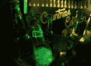

(a) 微弱光线

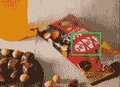

(b) 图像旋转

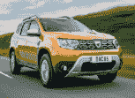

(c) 小规模标志

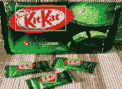

(d) 多尺度标志

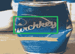

(e) 非刚性变形

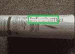

(f) 眩光反射

图 1：不利条件下的图像示例。

许多先前的标志检测工作采用手工设计的特征（如 SIFT [10]) 来表示标志，并使用统计分类器进行分类。这些方法在处理大量标志时，常常面临复杂的图像预处理流程和较差的鲁棒性。近年来，自从 ImageNet 大规模视觉识别挑战赛（ILSVRC） [11] 以来，深度学习取得了令人瞩目的成功。基于深度学习的解决方案凭借其表现力强的特征表示能力，提供了更好的鲁棒性、准确性和速度，因此吸引了越来越多的关注。从 1993 年到 2022 年，有超过 100 篇关于标志检测的论文，图 2 展示了标志检测的一个简明里程碑。我们可以看到，自 2015 年以来，提出了许多基于深度学习的标志检测策略。本次调查主要集中在专门为标志检测开发的基于深度学习的解决方案上。

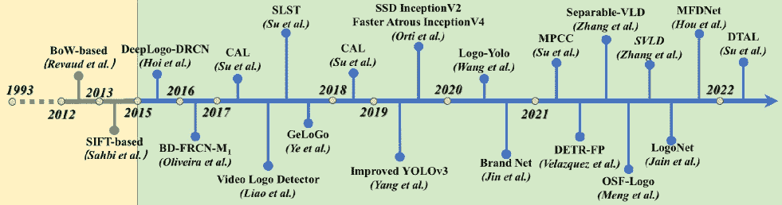

图 2：标志检测的一个简明里程碑。

尽管深度学习已经主导了标志研究社区，但缺乏关于基于深度学习的解决方案的全面和深入的综述。在本次调查中，我们主要关注最近在标志检测方面的深度学习进展。我们对现有研究进行了深入分析和讨论，涵盖数据集、使用的流程、任务类型、检测策略、损失函数、它们的贡献和局限性。我们还尝试分析标志检测中的潜在研究挑战和未来研究方向。我们希望我们的工作能提供一种新的视角，以促进对基于深度学习的标志检测的理解，推动对开放挑战的研究，并加快标志研究领域的发展。

本文的其余部分组织如下。第二节，我们调查公共标志检测数据集。第三节，我们回顾和整理当前关于标志检测的工作。第四节，我们介绍标志检测在实际场景中的应用。第五节，我们讨论其挑战和未来研究方向。最后，第六节总结了全文。

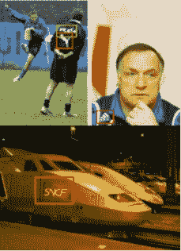

(a) BelgaLogos

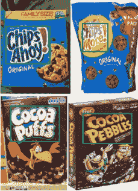

(b) FoodLogoDet-1500

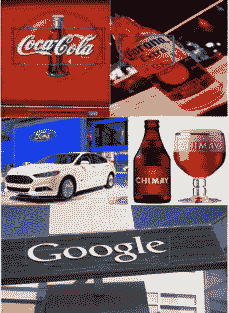

(c) QMUL-OpenLogo

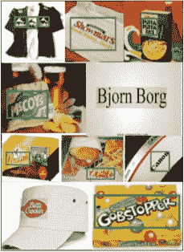

(d) LogoDet-3K

图 3: 从不同数据集中采样的标志图像。

## II 标志数据集

深度学习近年来在物体检测方面取得了巨大成功，其中数据集发挥了关键作用。数据集不仅是比较和测量算法性能的常用基础，也是支持先进物体检测算法的必要因素。本节概述了用于检测的标志数据集。此外，我们还简要总结了现有的标志分类数据集。

近年来，为解决大规模现实数据集准确标注的问题，创建了许多用于检测的标志数据集。使用这些数据集能够进行定性和定量比较，并允许不同算法的基准测试。我们对现有的常用标志检测数据集进行了统计，并根据其规模将其分为小规模、中规模和大规模三类。表 I 提供了可用标志数据集的统计信息，图 3 给出了这些数据集的一些示例。

小规模数据集包括 BelgaLogos [12]、FlickrLogos-32 [13] 等。作为第一个用于标志检测的基准数据集，BelgaLogos [12] 包含 10,000 张自然场景图像，涵盖 37 种不同标志，并标注了 2,695 个标志实例的边界框。FlickrLogos-32 [13] 是最受欢迎的小规模标志检测数据集之一，包括 32 个不同类别，每个类别有 70 张图像。该数据集中的图像主要来自真实世界，其中许多图像包含遮挡、外观变化和光照变化，使得检测这些图像非常具有挑战性。

中等规模的数据集包括 Logo-Net [14]、QMUL-OpenLogo [15]、FoodLogoDet-1500 [16] 等。Logo-Net [14] 是为检测标志和识别品牌而建立的，包含两个子数据集，即 Logo-18 和 Logo-160。QMUL-OpenLogo [15] 是一个开放的标志检测基准，通过聚合七个现有数据集并建立开放的标志检测评估协议构建而成。QMUL-OpenLogo 数据集具有高度不平衡的分布和显著的尺度变化，这对验证检测算法的性能至关重要。FoodLogoDet-1500 [16] 是第一个高质量的食品标志公开数据集，具有不同食品标志类别间的不均匀分布，这对小样本食品标志检测算法构成挑战。该数据集由 1,500 个食品标志类别和 99,768 张图像组成。

还有一些大规模的数据集，如 LogoDet-3K [17] 和 PL8K [18]。LogoDet-3K [17] 根据日常生活的需求和常见企业的主要定位，将所有标志分为九个超类，即服装、食品、交通、电子产品、日用必需品、休闲、医学、体育和其他。该数据集包含 3,000 个标志类别、158,652 张图像和 194,261 个标志对象。不同超类中的标志类别数量差异很大。例如，“食品”、“服装”和“日用必需品”包含的图像和对象比其他超类更多。LogoDet-3K 在不同标志类别中的不平衡分布对有效检测少样本标志构成了挑战。PL8K [18] 是一个半自动构建的大型标志检测数据集。该数据集包含 7,888 个标志品牌和 3,017,146 张图像，每个类别至少有 20 张图像。

表 I：现有标志检测数据集的统计信息。

| #规模 | #数据集 | #标志 | #品牌 | #图像 | #对象 | #公开 | #年份 |
| --- | --- | --- | --- | --- | --- | --- | --- |
| 小规模 | BelgaLogos [12] | 37 | 37 | 10,000 | 2,695 | 是 | 2009 |
| FlickrLogos-27 [19] | 27 | 27 | 1,080 | 4,671 | 是 | 2011 |
| FlickrLogos-32 [13] | 32 | 32 | 2,240 | 5,644 | 是 | 2011 |
| MICC-Logos [10] | 13 |  | 720 | - | 否 | 2013 |
| Logo-18 [14] | 18 | 10 | 8,460 | 16,043 | 否 | 2015 |
| Logos-32plus [20] | 32 | 32 | 7,830 | 12,302 | 否 | 2017 |
| Top-Logo-10 [21] | 10 | 10 | 700 | - | 否 | 2017 |
| Video SportsLogo [22] | 20 | 20 | 2,000 | - | 否 | 2017 |
| VLD 1.0 [23] | 66 | 66 | 25,189 | - | 否 | 2019 |
| SportLogo [24] | 31 | 31 | 2,836 | - | 是 | 2020 |
| VLD-45 [25] | 45 | 45 | 45,000 | - | 否 | 2020 |
| 中等 | Logo-160 [14] | 160 | 100 | 73,414 | 130,608 | 否 | 2015 |
| Logos-in-the-Wild [26] | 871 | 871 | 11,054 | 32,850 | 是 | 2017 |
| QMUL-OpenLogo [15] | 352 | 352 | 27,083 | - | 是 | 2018 |
| PL2K [27] | 2,000 | 2,000 | 295,814 | - | 否 | 2019 |
| FoodLogoDet-1500 [16] | 1,500 | - | 99,768 | 145,400 | 是 | 2021 |
| Large | Open Brands [28] | 1,216 | 559 | 1,437,812 | 3,113,828 | 否 | 2020 |
| LogoDet-3K [17] | 3,000 | 2,864 | 158,652 | 194,261 | 是 | 2020 |
| PL8K [18] | 7,888 | 7,888 | 3,017,146 | - | 否 | 2022 |

此外，还有一些为标志分类构建的数据集，如 WebLogo-2M [29] 和 Logo 2K+ [30]。WebLogo-2M [29] 是通过自动化的网页数据获取和处理获得的。该数据集排除了小宽度和/或高度的图像以及重复图像。与其他数据集相比，WebLogo-2M 具有三种独特属性，适用于大规模数据探索以学习可扩展的标志模型：（1）弱标注。（2）噪声（误报）。 （3）类别不平衡。Logo-2K+ [30] 是一个大规模的高质量标志数据集。它涵盖了来自现实世界的各种标志类别，不同类型的标志图像具有不同的标志外观、规模和背景，因为它们来自不同的网站。该数据集具有包括食品、服装、机构、配件、交通、电子产品、必需品、化妆品、休闲和医疗在内的类别的高空间覆盖率。不同类别之间的图像数量不均衡。例如，“食品”有 769 个标志类别，而“医疗”只有 48 个。

与常见的目标检测方法一样，mAP [31] 是测量标志检测器的最常用评估指标。

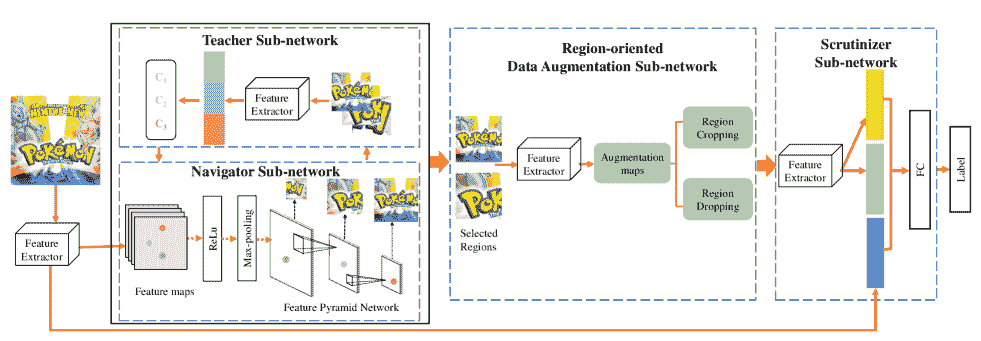

图 4：DRNA-Net 的架构 [30]。

## III 标志检测

在标志检测中，标志分类也是一个重要部分。因此，在介绍标志检测之前，我们简要总结了标志分类。

### III-A 标志分类

作为计算机视觉中最关键的任务之一，标志分类旨在识别与输入图像对应的标志名称。根据不同的特征提取策略，现有的分类方法分为两类：*传统机器学习方法* 和 *深度学习方法*。以下将简要描述一些具有代表性的方法。

#### III-A1 传统机器学习方法

传统的标志分类方法通过手动特征提取，例如 SIFT 和 HOG，然后通过分类器进行分类。支持向量机（SVM）[32] 是一种以监督学习方式进行二分类的数据分类器。在传统的标志分类中，SVM 也表现出色[33, 34, 35, 36]。Carvalho *等* [35] 提出了一个自学习和自动检测方法，该方法在没有任何先验数据的情况下进行检测。该方案自动识别标志定位的候选区域，使用从定位中提取的 HOG 特征来训练目标检测器和一些子检测器，并使用 SVM 来识别标志图像。

K-最近邻（KNN）是一种常用于分类的监督学习算法[37, 38]。Gopinathan *等* [38] 在 2018 年提出了一个车辆标志识别系统。他们使用欧几里得距离对初始训练数据集进行处理，通过应用每个通道的均值和标准差总结像素强度分布，并使用 K-means 算法对颜色直方图特征进行聚类，以分组不同的标志。然后，HOG 和 KNN 算法提取标志特征并对标志进行分类。

#### III-A2 基于深度学习的方法

近年来，随着深度学习的不断发展，基于深度学习的解决方案也成功应用于标志分类[39, 40, 41, 42, 43, 44, 45, 46]。Karimi *等* [43] 使用了 DCNN 标志识别算法，该算法进行了预训练模型的特征提取，然后使用 SVM 进行标志分类。他们还使用迁移学习来改进现有的预训练模型以进行标志识别。最后，将微调后的深度模型应用于并行结构，以获得更高效的深度模型用于标志识别。

徽标分类的最新趋势是设计具有有限资源的高效网络[30, 47, 48, 18]。Wang *等人* [30] 提出了一个名为 Discriminative Region Navigation and Augmentation Network (DRNA-Net)的网络，该网络能够发现更多信息丰富的区域并扩展这些区域用于徽标分类。DRNA-Net 主要分为四个部分：导航子网络、教师子网络、区域导向数据增强子网络和审查子网络。具体而言，导航子网络首先计算图像中由预定义锚点生成的所有区域的信息量。为了使导航子网络选择最具信息量的徽标相关区域，教师子网络随后评估每个区域属于真实类别的置信度。区域导向数据增强子网络可以增强所选区域以定位更多相关徽标区域。最后，增强区域和整张图像的特征通过审查子网络进行融合，以获得统一的徽标预测特征表示。DRNA-Net 的架构如图 4 所示。为了区分视觉上相似的徽标，Li *等人* [18] 提出了一个名为 SeeTek 的多任务学习架构，该架构基于深度学习和场景文本识别。该模型将深度度量学习和文本识别结合成一个模型，从而显著提高了性能。SeeTek 的架构如图 5 所示。

### III-B 徽标检测

徽标检测可以看作是通用对象检测的一个特例。徽标检测的目的是在图像或视频中检测预定义徽标类别的徽标实例[14]。在本节中，我们将详细介绍徽标检测领域的最新前沿工作。

在深度学习发展之前，早期的徽标检测方法是基于手工设计的视觉特征（如 SIFT 和 HOG）和传统分类模型（如 SVM）[49, 50, 51, 52]。例如，Sahbi *等人* [10] 在 2013 年提出了一种徽标匹配系统，该系统使用 SIFT 进行徽标检测和识别。设计的系统不仅可以识别和匹配图像中的多个参考徽标，还适合检测相似徽标。然而，这些传统的徽标检测方法存在一定的局限性：（1）基于滑动窗口的区域选择搜索算法缺乏针对性，尤其是时间复杂度高。（2）手工设计的特征对徽标多样性的变化缺乏鲁棒性。

在最近的研究中，深度学习已成为标志检测的主流。根据不同的学习策略，我们将这些模型分为基于区域的卷积神经网络模型、基于 YOLO 的模型、基于单次检测器的模型、基于特征金字塔网络的模型以及其他模型。

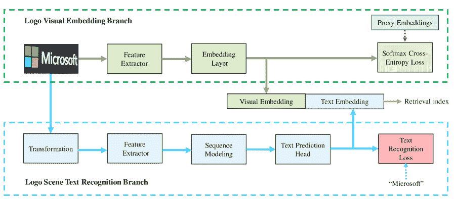

图 5: SeeTek 的架构 [18]。

#### III-B1 区域基卷积神经网络模型（RCNNs）

区域基卷积神经网络（R-CNN [53]）是一种典型的基于区域提案的方法。与传统检测算法相比，R-CNN 取得了显著的性能提升。然而，R-CNN 仍然存在一些缺点。例如，R-CNN 使用 Selective Search (SS) [54] 算法生成许多重叠的框进行冗余计算，导致检测速度慢并占用大量存储空间。后来的 Fast R-CNN [55] 通过创建一个端到端的可训练系统解决了这个问题。然而，Fast R-CNN 仍使用 SS 算法生成区域提案，限制了其速度。为了解决这个问题，Ren *et al*. 提出了 Faster R-CNN [56]，采用区域提案网络（RPN）来生成区域提案。尽管 Faster R-CNN 在速度和效率上具有优势，但仍然存在计算冗余和小物体检测效率低的问题。

最近，基于 RCNN 的标志检测也取得了相当大的成功[26, 57, 58, 59]。由于同一品牌可能包含多个产品，同一品牌的不同产品图像可能呈现不同的视觉内容，传统的图像识别方法无法直接解决品牌识别问题。Hoi *et al*. [14] 提出了一个 DeepLogo-DRCN 方案，通过探索几种深度区域卷积网络（DRCN）技术用于物体检测，以进行标志检测和品牌识别。他们采用 Selective Search [54] 生成兴趣区域（RoIs），并将 RoIs 输入到全卷积网络（FCN）中。然后通过全连接层（FCs）获得特征向量，以训练最终的分类器和边界框回归器。整体架构以端到端的方式进行训练。这是基于深度学习的标志检测的首个研究，为标志检测研究提供了新的视角。

我们知道，训练一个大规模的标志检测模型需要大量的数据，而标志数据集通常会面临数据稀缺的问题。数据增强和迁移学习是解决数据稀缺问题的常见方法。Oliveira *et al*. [60] 提出了一个基于 Fast R-CNN [55] 的自动图形标志检测系统，该系统对不受限制的成像条件具有鲁棒性。他们使用迁移学习和数据增强来训练卷积神经网络模型，并允许对包含对象的潜在区域进行多次检测。实验结果表明，这种策略优于传统方法 [13]。然而，采用的 SS 算法仍然会产生冗余计算，降低了检测速度。此外，Li *et al*. [61] 通过使用迁移学习、数据增强和聚类构建了 Faster R-CNN 用于标志检测，以保证适当的超参数和更精确的锚点用于 RPN。实验结果表明，这一改进可以显著提高检测精度。

#### III-B2 基于 YOLO 的模型 (YOLOs)

YOLO 是单阶段检测器，常用于标志检测。YOLO 直接检测图像并输出检测对象的类别和位置信息。早期的 YOLO [62] 检测速度较快，但牺牲了精度，尤其是对于小物体。后来的改进，如 YOLOv2 [63]、YOLOv3 [64]、YOLOv4 [65]、YOLOF [66]、YOLOR [67]、YOLOX [68]、YOLOv6 [69]、YOLOv7 [70] 改善了 YOLO 的整体性能，平衡了精度和速度。

YOLOs 被广泛应用于车辆标志检测。鉴于实时性和高效性是车辆标志检测中的关键问题。受到深度学习在特征提取方面的优越性的启发，Yin *et al*. [71] 提出了基于 YOLOv2 [63] 的高效车辆标志检测系统。与基于手动提取特征的传统方法相比，该系统具有自学习特征和直接图像输入的优势，并能实现车辆标志的定位和识别双重功能。在复杂背景下，车辆标志通常只占图像的一小部分。因此，在现实场景中准确识别车辆标志具有挑战性。为了解决这个问题，Yang *et al*. [72] 提出了基于 YOLOv3 [64] 的数据驱动增强训练方法。他们结合了特征提取网络和多尺度决策方案，以提高车辆标志的检测准确性。然而，在复杂场景中的车辆标志检测结果并不令人满意。基于[72]，Zhang *et al*. [73] 分析了静态图像中车辆识别的特征，发现特征提取网络和检测训练策略对车辆识别的准确性有显著影响。他们提出了一种具有可分离卷积的轻量级网络结构，以替代传统方法，在基于 YOLO 的框架下提高检测准确性和速度。实验表明，该方法提高了车辆标志检测的实时性，并在保持速度的同时提高了小尺度物体的检测准确性。

在各个领域，不同标志的出现频率通常差异很大。因此，不同标志类别的数量通常不平衡，使得模型难以正确检测样本较少的标志类别。Wang *et al*. [17] 提出了基于 YOLOv3 [64] 的鲁棒基线方法 Logo-Yolo。他们首先采用 K-means 聚类算法来选择候选锚框的数量和长宽比维度。然后使用 Focal loss 解决数据集中的样本不平衡问题。最后，他们引入了 CIoU loss 来改善边界框回归结果。与 YOLOv3 [64] 相比，该方法在预测小物体和复杂背景中的物体时性能显著提升。然而，在一些特定情况下，该方法也表现出较差的性能，例如检测类似或被遮挡的标志。

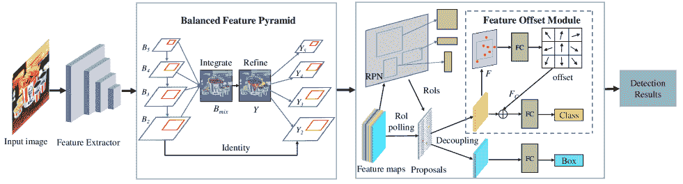

图 6：MFDNet 的架构[16]。

#### III-B3 基于单次检测器的模型（SSDs）

单阶段多框检测器（SSD）[74]是另一种使用单一深度神经网络的单阶段检测器。SSD 利用多尺度特征图来检测不同尺度的物体，底层预测小物体，而顶层预测大物体。在确保检测速度的同时，SSD 的检测精度优于同类先进的 Faster R-CNN 模型。因此，SSD 也广泛应用于车辆标志检测[58]。以前的工作通常在相同尺度下检测车辆标志，而未考虑车辆标志的多尺度变化。然而，相机捕获的车辆标志具有各种尺寸。设计一个具有多尺度车辆标志检测能力的算法至关重要。为此，Zhang *等人* [25] 提出了基于 SSD 的多尺度车辆标志检测（SVLD）[74]，通过修改预训练策略、添加特征提取层以及控制正负样本比例来辅助车辆识别。根据车辆的特点，设计了一个预设框架和参数设置，以有效减少冗余计算并加速模型的快速收敛。与 SSD 相比，SVLD 的检测精度有所提高，但由于添加了特征提取层，时间复杂度略有增加。此外，尽管 SSD 与其他单阶段方法相比具有竞争力的准确性，但在检测小物体方面仍然存在不足。

#### III-B4 基于特征金字塔网络的模型（FPNs）

Lin *等人* 于 2017 年提出了特征金字塔网络（FPN）[75]，该方法主要通过改变网络的连接方式来解决目标检测中的多尺度问题。FPN 显著提高了小物体检测的性能，而无需增加计算量。近年来，许多研究采用 FPN 来解决标志检测中的问题，如多尺度和小物体[76, 28, 77, 16]，这些 FPN 取得了令人兴奋的成果。

针对标志的多尺度和其他几何变化问题，孟*等人* [76] 提出了基于 FPN 获得足够特征的标志 (OSF-Logo)。具体来说，他们在 FPN 的特定层中引入了调节型可变形卷积 (RDC) 模块，该模块允许卷积核在不同位置的采样点位置根据内容自适应变化，从而适应标志的几何变化。同时，他们在 FPN 中采用了上采样操作符生成一个自适应内核，充分聚合丰富的语义信息。因此，OSF-Logo 可以快速感知广泛的内容，并有效检测多尺度标志。类似地，金*等人* [28] 设计了一个叫做“Brand Net”的网络。Brand Net 使用 FPN 提取多尺度特征。在此基础上，它在 FPN 中引入了一个锚点细化网络，以去除负锚点，从而大大减少了锚框的数量。因此，它可以有效检测不同尺度的标志，并显著提高小型标志的检测性能。检测变换器 (DETR) [78] 存在检测小物体的问题，因此不能直接用于多尺度标志检测。为了解决这个问题，Velazquez*等人* [77] 将特征金字塔 (FP) 融入了 DETR 架构。他们首先将特征金字塔的倒数第二层拆分为四个与金字塔中最小特征图大小相同的补丁。然后将这些补丁输入 DETR 流水线进行预测。该方法有效地检测小物体。然而，该方法的反向传播计算增加了内存消耗。最近，侯*等人* [16] 提出了一个用于标志检测的多尺度特征解耦网络 (MFDNet)，以解决区分多种标志类别的问题。MMFDNet 包含两个组件：平衡特征金字塔 (BFP) 和特征偏移模块 (FOM)。前者旨在使用相同的深度特征图融合多尺度特征，以集成平衡的语义特征。同时，后者包括一个自动学习的锚区域提议网络，用于像素级偏移以搜索标志的最佳特征。MFDNet 的架构如图 6 所示。

表 II: 代表性的深度学习基础的标志检测方法总结。

| 方法类型 | 方法 | 流水线 | 任务 | 策略 | 损失函数 | 年份 |
| --- | --- | --- | --- | --- | --- | --- |
| RCNNs | DeepLogo-DRCN [14] |

&#124; RCNN &#124;

&#124; Fast RCNN &#124;

&#124; SPPnet &#124;

| 常规标志检测 | - | - | 2015 |
| --- | --- | --- | --- |
| BD-FRCN [60] | Fast RCNN | 常规标志检测 | 转移学习 | - | 2016 |
| 改进的 Faster RCNN [57] | Faster RCNN | 小型标志检测 | 预设锚框 | - | 2017 |

|

&#124; 深度区域基础 &#124;

&#124; 卷积网络 [61] &#124;

| Faster RCNN | 常规 logo 检测 |
| --- | --- |

&#124; 迁移学习 &#124;

&#124; K 均值聚类 &#124;

&#124; 数据增强 &#124;

| - |
| --- |
| 视频 logo 检测器 [22] | Fast RCNN | 视频 logo 检测 |

&#124; 同质性增强 &#124;

&#124; 互补增强 &#124;

| - |
| --- |
| Faster RCNN+ResNet-50 [5] | Faster RCNN |

&#124; 长尾 logo 检测 &#124;

&#124; 小型 logo 检测 &#124;

|

&#124; 数据增强 &#124;

&#124; 类别平衡 &#124;

|

&#124; EQLv2 &#124;

&#124; 千斤顶损失 &#124;

| 2021 |
| --- |
| Cascade detectoRS [6] | Cascade RCNN |

&#124; 长尾 logo 检测 &#124;

&#124; 小型 logo 检测 &#124;

|

&#124; 数据增强 &#124;

&#124; 多尺度训练 &#124;

| EQLv2 |
| --- |

|

&#124; Cascade RCNN+ &#124;

&#124; Res2Net101 [7] &#124;

| Cascade RCNN | 长尾 logo 检测 |
| --- | --- |

&#124; 数据增强 &#124;

&#124; 梯度平衡 &#124;

&#124; 数据采样 &#124;

| EQLv2 |
| --- |
| Green Hand [8] | DetectoRS |

&#124; 长尾 logo 检测 &#124;

&#124; 小型 logo 检测 &#124;

|

&#124; 数据增强 &#124;

&#124; 重采样 &#124;

&#124; 加权框 &#124;

| EQLv2 |
| --- |
| YOLOs | 改进的 YOLOv3 [72] | YOLOv3 | 小型 logo 检测 | 难例重新训练 | - | 2019 |
| 场景识别 CNN [24] | YOLOv3 | 常规 logo 检测 | - | - | 2020 |
| 改进的 YOLOv2 [71] | YOLOv2 | 常规 logo 检测 |

&#124; 可分离卷积 &#124;

&#124; 多尺度特征融合 &#124;

|

&#124; 信心误差损失 &#124;

&#124; 坐标误差损失 &#124;

&#124; 预测框损失 &#124;

|

| 改进的 YOLOv2 [79] | YOLOv2 | 多尺度 logo 检测 |
| --- | --- | --- |

&#124; 预设锚框 &#124;

&#124; K 均值聚类 &#124;

| - |
| --- |
| Logo-Yolo [17] | YOLOv3 | 常规 logo 检测 |

&#124; 改进的损失 &#124;

&#124; K 均值聚类 &#124;

|

&#124; 焦点损失 &#124;

&#124; CIoU 损失 &#124;

|

| 缩放 YOLOv4 [80] | YOLOv4 | 常规 logo 检测 | - | - | 2021 |
| --- | --- | --- | --- | --- | --- |
| 可分离-VLD [73] | YOLO | 小型 logo 检测 | 可分离卷积 | - |
| SSDs | SVLD [25] | SSD | 多尺度 logo 检测 | 预设锚框 | - | 2019 |
| SSD InceptionV2 [58] | SSD | 常规 logo 检测 | 预设锚框 | - |
| FPNs | 品牌网络 [28] | - | 小型 logo 检测 |

&#124; 软掩模注意力 &#124;

&#124; 权重迁移 &#124;

&#124; 锚框细化 &#124;

|

&#124; 类别感知平滑 L1 &#124;

&#124; 类别无关平滑 L1 &#124;

&#124; 交叉熵损失 &#124;

| 2020 |
| --- |
|  | OSF-Logo [76] | - | 多尺度 logo 检测 |

&#124; 变形卷积 &#124;

&#124; 上采样操作符 &#124;

| - | 2021 |
| --- | --- |
|  | MFDNet [16] | - | 多尺度 logo 检测 |

&#124; 多尺度特征融合 &#124;

&#124; 变形学习 &#124;

| 交叉熵损失 |
| --- |
|  | DETR-FP [77] | DETR | 小标志检测 | 模型融合 |

&#124; 匈牙利损失 &#124;

&#124; 广义 IoU 损失 &#124;

|

| 其他 | SLST [29] | Faster RCNN | 弱监督标志检测 |
| --- | --- | --- | --- |

&#124; 增量学习 &#124;

&#124; 自训练 &#124;

| - | 2017 |
| --- | --- |
| SCL [21] | Faster RCNN | 少量样本标志检测 | 合成上下文标志 | - |
| CAL [15] |

&#124; Faster RCNN &#124;

&#124; YOLOv2 &#124;

| 弱监督标志检测 | 上下文对抗学习 |
| --- | --- |

&#124; Softmax 交叉熵损失 &#124;

&#124; 条件对抗损失 &#124;

| 2018 |
| --- |

|

&#124; 弱监督 &#124;

&#124; CNN 的学习 [81] &#124;

| DCNN | 弱监督标志检测 |
| --- | --- |

&#124; 生成显著性图 &#124;

&#124; GrabCut 分割 &#124;

| Softmax 损失 | 2021 |
| --- | --- |

|

&#124; 航空公司标志 &#124;

&#124; 检测系统 [82] &#124;

| AttentionMask | 复杂场景标志检测 | 数据增强 | 交叉熵损失 |
| --- | --- | --- | --- |
| LogoNet [83] | - | 复杂场景标志检测 | 空间注意力 | - |
| 深度注意力网络 [84] | - | 常规标志检测 |

&#124; 领域适应 &#124;

&#124; 非局部块 &#124;

| - |
| --- |
| MPCC [85] | Faster RCNN | 少量样本标志检测 |

&#124; 领域适应 &#124;

&#124; 数据增强 &#124;

| Softmax 交叉熵损失 |
| --- |
| DTAL [86] | DCNN |

&#124; 视频标志检测 &#124;

&#124; 少量样本标志检测 &#124;

|

&#124; 主动学习 &#124;

&#124; 迁移学习 &#124;

| 元类别损失 | 2022 |
| --- | --- |

#### III-B5 其他模型

本节介绍了一些用于标志检测的其他模型。

为了解决标志数据有限的问题，苏*等人* [15] 提出了一个关注于标志上下文优化的数据增强策略：上下文对抗学习（CAL）。CAL 以包含标志对象的图像作为输入，生成上下文一致的合成图像，这些图像可以作为额外的训练数据。然而，这些合成图像的分布与实际测试图像不同。为了解决这一问题，同一作者提出了基于基础方法 CAL [15] 的多视角跨类别（MPCC）领域适应方法 [85]。MPCC 从两个角度进行特征分布对齐：一是对齐 1-shot 图标监督类别的合成标志图像和完全监督类别的真实标志图像之间的特征分布；另一是对齐标志图像和非标志图像之间的特征分布。这缓解了 1-shot 图标监督标志类别的模型训练和测试之间的领域偏移问题，减少了模型对完全标注标志类别的过拟合。最终，将 MPCC 与 Faster R-CNN 结合取得了良好的结果。

训练徽标检测器通常需要大量标记数据，而标记徽标数据是耗时的。因此，弱监督学习是解决这一问题的重要策略。Kumar *等*[81]提出了一种通过弱监督学习 CNN 生成深度显著性图的方法，该图通过训练好的深度 CNN 的单次反向传播生成。作者还使用了交互式 Grabcut 算法来计算图像的显著分割区域。然而，该方法对于检测同一图像中的多个品牌徽标建模不够充分。

徽标检测器通常在样本数量较少的类别中表现较差。为此，Yohannes *等*[84]设计了一个框架，其中包括领域自适应，以减少源数据集和目标数据集之间的损失函数，并表示目标数据集采用的重要源特征。作者添加了非局部块和注意力机制，以实现较好的徽标检测性能。同样，Su *等*[86]开发了一种名为 DTAL 的深度迁移主动学习算法，用于选择最有价值的样本，以便标记最少的样本从而在训练检测模型中实现最大性能提升。

当图像受到照明、旋转、遮挡等不利因素影响时，探测器的性能会显著下降。近年来，注意力机制在解决这一问题的徽标检测中受到了越来越多的关注[82, 83]。例如，Wilms *等*[82]以航空公司徽标为例，提出了一种在不利条件下的徽标检测系统。作者采用了对象提议生成系统 AttentionMask[87]。由于航空系统徽标相对较大，AttentionMask 系统去除了小物体的尺度，以提高执行效率并减少假阳性。他们还使用了数据增强解决方案，以模拟恶劣天气的影响，从而多样化训练数据处理效果。实验结果表明，所提出的策略在复杂的真实环境中检测徽标时可以实现良好的性能。然而，在现实条件下获得的数据不如数据增强生成的数据理想，因此模型在真实条件下检测图像的性能会下降。考虑到在复杂场景中定位徽标由于徽标类型和外观的多样性而具有挑战性，Jain *等*[83]提出了一种名为 LogoNet 的徽标检测框架，其中包括一个空间注意力模块。LogoNet 可以捕捉丰富的空间信息，更精确地关注图像中的徽标对象。LogoNet 在相当的计算时间内实现了显著的性能提升。

为了更全面地分析当前最先进的深度学习方法，表 II 中按时间顺序展示了代表性模型，并且这些模型在三个流行基准数据集上的实验结果分别列在表 III、表 IV 和表 V 中。

## IV 应用

标志检测广泛应用于各种场景，如知识产权保护、自动驾驶和产品品牌化。在本节中，我们详细描述了标志检测的代表性应用。

### IV-A 品牌监测

最明显的标志检测应用场景是品牌监测，包括品牌保护、品牌推荐和品牌识别。标志在商业营销中扮演着重要角色，作为独特的品牌身份。然而，现实生活中品牌类型繁多，不同产品之间可能存在细微的标志差异。类别间的相似性和类别内的差异会大大增加检测的难度。此外，图像可能具有高度多样的背景、光照、投影变换和分辨率。因此，高效检测图像中的品牌是一项具有挑战性的任务。目前，品牌身份的研究已有很多工作[60, 58, 28, 3]。对于品牌标志，图像通常包含一些文本描述。文本信息是品牌身份的重要信息来源。胡*等*[3]提出了一种用于标志检测的多模态融合框架。该框架结合了基于图像的标志识别与自然语言模型中的上下文特征，以进行标志检测。额外的上下文信息可以缓解检测的限制。该模型在标志检测中的表现得到了改善，但在定位方面仍存在不足。

表 III：FlickrLogos-32 基准上标志检测器的性能比较。

方法 mAP(%) 年份 FRCN  [46] 74.4 2015 BD-FRCN-M [60] 73.5 2016 视频标志检测器 [22] 78.6 2017 Faster RCNN+VGG16_D2_M3 [61] 90.3 2017 Faster RCNN+CAL [15] 74.9 2018 深度显著图 [81] 75.8 2020 Logo-Yolo [17] 76.1 2020 LogoNet [83] 82.2 2021 OSF-Logo [76] 87.0 2021 RetinaNet [59] 40.0 2021 RCNN [59] 65.0 2021 Faster RCNN [59] 74.0 2021 Scaled YOLOv4 [80] 80.4 2021 MFDNet [16] 86.2 2021

表 IV：QMUL-OpenLogo 基准上标志检测器的性能比较。

方法      mAP(%)      年份      YOLOv2+CAL [15]      49.2      2018      Faster RCNN+CAL [15]      51.0      2018      Logo-Yolo [17]      53.2      2020      Faster RCNN+CAL+MPCC [85]      49.4      2021      OSF-Logo [76]      53.3      2021      Scaled YOLOv4 [80]      61.9      2021      MFDNet [16]      51.3      2021

表 V: Open Brands 基准测试中标志检测器的性能比较。

方法      mAP(%)      年份      品牌网络（SMA） [28]      60.4      2020      Faster RCNN+RFS+MST [5]      64.6      2021      Cascade RCNN+Soft NMS [6]      65.1      2021      Green Hand [8]      65.5      2021      Cascade RCNN+DCN v2 [7]      70.2      2021

### IV-B 智能交通

在智能交通领域，车辆标志检测显著增长，因为它可以有效地协助车辆管理。此外，由于车辆违章和交通事故的数量不断增加，实现智能交通系统变得至关重要。然而，在现实世界中，车辆标志的检测受到遮挡、光照和图像分辨率低的严重干扰。因此，一个高效的车辆标志检测系统是必不可少的。近年来，相继提出了车辆标志检测的方法 [39, 34, 88, 37, 38, 23, 72, 79]。Lu *et al*. [48] 设计了一个特征提取模块 VLF-Net 和类别一致性掩码学习模块用于车辆标志检测。Yu *et al*. [1] 提出了一个级联深度卷积神经网络，用于检测不依赖于车牌存在的车辆。该网络是一个包含两个组件的两阶段框架：区域提议网络和卷积胶囊网络。前者负责生成可能包含车辆标志的区域提议，而后者负责将提议分类为背景和车辆标志。Surwase *et al*. [2] 提出了一个多尺度多流深度网络用于车辆标志检测。该网络通过多尺度流处理输入图像以提取稳健的特征，然后进行标志识别。该网络遵循知识共享策略，其中学习到的特征在网络的每个流上共享。

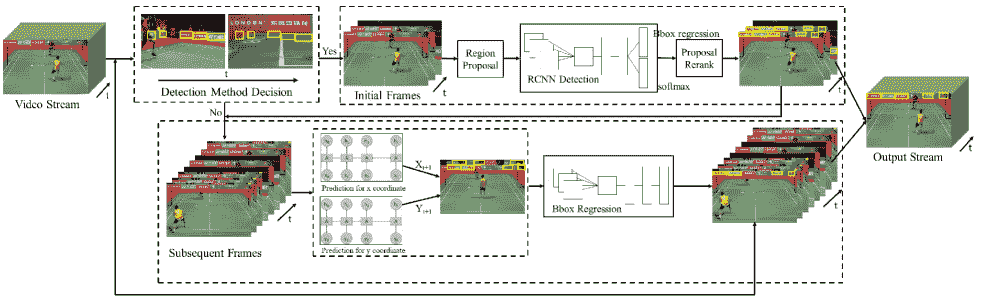

图 7: 视频标志检测的架构 [22]。

### IV-C 版权和商标合规

随着全球电子商务平台的发展，各大品牌的标志已成为电子商务市场中的一个重要元素。一些攻击者利用非法手段侵犯原创作者的权益，因此保护知识产权也成为了一个焦点。标志检测在防止日益增多的假冒交易尝试中发挥着至关重要的作用[33, 89, 90, 5, 6, 7, 8]。标志的侵权检测已在图像和视频中进行了研究。Chen *et al* [5]通过使用数据增强等技术，建立了一个高度优化和鲁棒的检测器，用于检测电子商务图像中的标志（515 个类别）。Patalappa *et al* [4]通过数据增强技术扩展了数据集。他们应用 SSD 算法来检测广播标志，并证明了 SSD 在内容盗版视频分析监测任务中的有效性。识别网络视频来源的一个高效方法是检测一些特定的标志。为了识别非法视频的来源，Ye *et al* [91]提出了一种标志检测系统“GeLoGo”来检测 Web 规模视频中的标志。该系统由四个主要模块组成：关键帧模块、提议模块、空间验证模块和时间验证模块。关键帧模块首先提取若干帧进行短片段检测，这可以显著减少数据量。其次，提议模块通过一组预训练的身份检测器提取候选框。然后，空间验证模块通过 ResNet 网络检测标志。最后，时间验证模块通过检测识别位置来检测检测结果。

### IV-D 文档分类

标志通常出现在商业文档中，可以作为对文档的所有权声明。由于智能文档图像分析和检索的需求不断增加，自动标志检测也在不断增长[92, 93, 94]。Alaei *et al* [95]提出了一个完整的文档图像标志检测系统。他们提出了一种基于模板的识别策略，以解决检测过程中可能出现的欠分割或过分割问题。为了加速识别阶段模板的匹配，他们提出了一种利用标志补丁和模板标志模型的几何特性来减少模板标志模型数量的搜索空间缩减策略。Zhu *et al* [96]提出了一种用于文档图像标志检测和提取的多尺度方法。作者使用跨多个图像尺度的增强策略来准确分类和定位标志。

### IV-E 其他应用

标志检测可以为那些希望有效改善市场策略的广告商提供各种好处。如图 7 所示，Liao *et al* [22] 提出了一个视频标志检测框架，该框架使用了互增强的方法，通过从其他同时出现的标志获得的信息来改进标志检测。基于 Fast R-CNN 模型，提出了一种统一增强重排序方法，通过分析视频中的标志特征来提高帧内区域建议的准确性。此外，他们提出了一种帧传播增强方法，以帮助检测相邻帧。最后，该方法在 FlickrLogos-32 数据集和视频数据集上展示了其有效性。最近，食品标志检测 [16] 变得越来越受欢迎，因为它有许多有价值的应用，例如食品品牌管理和展示营养信息。标志检测还用于其他领域，如视频语义注释 [97, 40, 80]，以及噪声识别 [45, 36, 98, 99]。由于拍摄的电视标志易受光照、遮挡、噪声等因素的影响，电视标志可能仅占据每张图像的一小部分。为此，Pan *et al* [100] 提出了一个高效的 CNN 来解决这个问题。他们使用最大稳定极值区域（MSER）算法提取候选帧。由于该算法往往产生大量没有电视标志的候选帧，他们设计了某些几何约束来去除非标志对象。最后，将图像输入到 CNN 网络中进行分类，并取得了良好的结果。

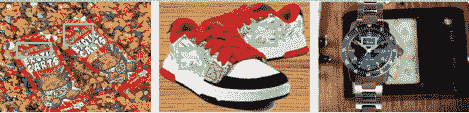

(a) 小尺寸。

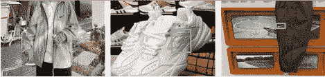

(b) 高度多样化的背景。

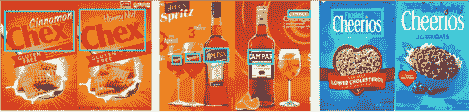

(c) 子品牌化。

图 8：标志的独特属性。

## V 挑战与未来方向

### V-A 挑战

标志检测在过去几年受到更多关注，因为其广泛的应用。然而，稳健且准确的标志检测在实际场景中仍然具有挑战性，因为标志图像具有独特的属性，这可能对当前的进展形成重大障碍。我们尝试总结如下：（1）*小尺寸：*与普通物体不同，标志通常体积较小，使得它们在复杂背景中难以区分。尽管在小物体检测中，上下文信息至关重要，因为小物体携带的信息有限[101]，但在标志检测中并不总是有利，尤其是当背景过于复杂且与目标标志无关时，如图 8(a)所示。我们知道，在基于深度学习的检测架构中，由于池化和子采样过程，产生了具有不同空间分辨率的特征图。早期层的特征图代表了小的感受野，但缺乏对标志检测至关重要的高级语义信息。相比之下，高级特征图有助于识别大型标志，但可能无法检测到较小的标志。（2）*高度多样的背景：*标志通常与其他可见实体相关联，如特定的服务或产品。因此，标志可能出现在各种情况中，叠加在如几何渲染、人员的衬衫、运动员的球衣、商店的招牌、广告牌或运动场上的海报等物体上。如图 8(b)所示，一个品牌如“耐克”可能涉及多种类型的产品，如夹克、鞋子或裤子，导致相同的标志附着在各种不同的物体上，这对设计一个稳健的标志检测器带来了挑战，特别是考虑到整个图像的统计数据时。（3）*子品牌：*当公司推出新产品时，子品牌通常会被考虑。子品牌检测有助于品牌监测，但面临与细粒度分类相同的问题，如子品牌与母品牌之间的微妙差异以及子品牌之间的差异。在实际的标志检测中，一些子品牌被视为不同于母品牌或其他子品牌的标志，因为它们有与母品牌不同的客户期望和个性。因此，母品牌及其子品牌通常具有显著相似的上下文信息（背景、包装等，如图 8(c)所示）。在考虑图像级特征图时，这种情况下可能从不同的标志图像中提取出几个显著相似的特征图，这在使用基于深度学习的检测器时对准确识别不同的子品牌标志提出了挑战。

许多解决标志检测任务的方法是基于目标检测方法开发的，并且取得了令人鼓舞的结果，但仍有很大的改进空间。例如，[72] 提出了基于 YOLOv3 的车辆标志检测系统。尽管小型标志检测的性能在一定程度上得到了改善，但仍未能准确检测具有复杂字母模式的小型标志。[57] 通过利用更高分辨率的特征图，为小型标志设计了一种改进的基于锚点的方案。然而，由于采用了两阶段检测策略，该方案在受限场景下计算开销过大，在实时应用中也过于缓慢。值得一提的是，基于 YOLOv4 的标志检测器在 QMUL-OpenLogo [80] 上的最佳检测性能仅达到 61.9% 的 mAP。因此，简单地借用通用目标检测的现有检测器对于标志检测来说被认为是不够的。设计一个适合标志的新的检测范式是至关重要的。

### V-B 未来方向

标志检测的未来研究方向如下：

轻量级标志检测：轻量级网络旨在进一步降低模型复杂性，同时保持模型的准确性。随着手机和计算机等移动终端的快速发展，人们越来越关注轻量级检测器。轻量级标志检测可以帮助消费者快速识别和准确搜索所需的产品，从而显著提高在线购物的效率。尽管最近已经付出了显著的努力，但机器与人眼之间的速度差距仍然巨大。检测准确性也不够，尤其是对于小型标志。因此，提高轻量级标志检测器的准确性是未来发展的趋势之一。

弱监督标志检测：完全监督的标志检测器必须在完全标注的大规模标志数据集上进行训练。然而，现有数据集的标注主要是手工完成的，这给现有模型的泛化性和鲁棒性带来了挑战，因为数据质量存在问题。随着标志数据量的快速增长，数据标注成本越来越高。开发仅使用图像级标注或部分边界框标注来训练标志检测器的弱监督标志检测技术可以显著降低成本并提高检测灵活性。因此，开发无需完全标注训练数据的弱监督标志检测方法是未来研究的重要课题。

视频徽标检测：徽标推广存在于大多数视频广告中。准确而合理的广告目标是商业目标，因此有效识别目标徽标至关重要。目前的徽标检测器通常用于检测单个图像中的徽标，这可能导致连续图像之间缺乏关联。此外，视频徽标检测中存在运动模糊和目标遮挡等问题，这可能严重影响检测器的性能。已经有方法尝试检测视频中的徽标。目前，已有方法[86, 22]尝试检测视频徽标，但尚未取得令人满意的结果。因此，利用时间和空间关联性来提高徽标检测是一个重要的研究方向。

微小徽标检测：微小徽标信息不足，使得提取具有辨别性的特征更加困难。同时，微小徽标的样本相对较少，因此容易受到环境因素的干扰。许多现实世界中的微小徽标可能具有高度多样的背景，这可能导致相同的徽标在不同的实际场景中看起来非常不同。观察现有微小徽标检测方法的结果，我们可以发现这些方法的性能在实际场景中**不尽如人意**[77, 72, 73]。

长尾徽标检测：随着社会的快速发展，一些企业目前处于领先地位，它们的企业徽标自然会频繁出现在公众面前。相比之下，大多数小企业的徽标因为出现频率较低而不被重视。徽标的长尾分布在现实中一直存在。一些徽标类别包含大量样本，而其他类别包含少量样本，这使得徽标检测器难以检测到样本较少的徽标类别。在以前的徽标检测方法中，几乎没有关注徽标图像中的长尾分布。因此，利用不平衡数据训练高效准确的检测器是未来的任务之一。

增量徽标检测：作为公司的标志或象征，随着公司数量的增加，徽标也会不断增加。因此，徽标检测器必须学习新徽标。然而，通过丢弃之前学到的知识来重新训练徽标检测器是耗时且资源密集的。增量学习使系统能够在保留大部分之前学到的知识的同时，从新样本中持续学习新知识，避免灾难性遗忘。这可以在一定程度上减少模型的复杂性，从而降低模型的训练成本。然而，目前没有增量学习方法能够在所有条件下展示良好的性能。因此，增量学习在徽标检测中的应用是未来的研究方向之一。

事实上，现有研究通常假设的是封闭环境场景。例如，标志数据集的数据分布是固定的，所有训练数据都有已知的类别和事先标注的细粒度边界框。尽管 Su *等人* [15] 提出了一个假设来模拟开放部署，但他们主要通过提出一种上下文对抗学习方法来生成上下文一致的合成训练数据，集中于标志数据有限的问题。如何使训练模型根据新出现的标志类别或数据分布变化进行更新，甚至我们难以预测变化，是开放环境中的一个重要要求。

## VI 结论

在这项工作中，我们提供了对过去和当前帮助标志检测的各种方法的全面调查。我们主要通过总结经典解决方案来回顾基于深度学习的标志检测的最新进展。此外，我们全面回顾了常用的数据集，总结了标志检测的相关应用，并预测了未来的研究方向。尽管标志检测的成果近期已取得有效进展，但仍有很大的发展空间。我们希望本文能更好地让读者了解标志检测的当前发展，并激励更多人参与标志检测。

## 参考文献

+   [1] Y. 余, H. 关, D. 李, 和 C. 余，“一种用于从车辆前视和后视图像中识别车标的级联深度卷积网络，”*IEEE 智能交通系统汇刊*，第 22 卷，第 2 期，第 758–771 页，2021 年。

+   [2] S. Surwase 和 M. Pawar，“一种用于车标识别的多尺度多流深度网络，”*进化智能*，第 1–8 页，2021 年。

+   [3] C. 胡, Q. 李, Z. 张, K. 常, 和 R. 张，“一种用于从产品图像和上下文中进行品牌识别的多模态融合框架，”在*IEEE 国际多媒体与展览研讨会*中，2020 年，第 1–4 页。

+   [4] K. K. J. Patalappa 和 S. M. Chandramouli，“在内容盗版背景下的标志改造的稳健识别，”*全球过渡会议论文集*，第 2 卷，第 2 期，第 421–428 页，2021 年。

+   [5] H. 陈, X. 李, Z. 王, 和 X. 胡，“通过数据增强实现电商图像中的稳健标志检测，”在*第 29 届 ACM 国际多媒体会议论文集*中，2021 年，第 4789–4793 页。

+   [6] X. 贾, H. 闫, Y. 吴, X. 魏, X. 曹, 和 Y. 张，“一种有效且稳健的标志检测器，”*arXiv 预印本 arXiv:2108.00422*，2021 年。

+   [7] F. 冷，“一种用于稳健标志检测的梯度平衡方法，”在*第 29 届 ACM 国际多媒体会议论文集*中，2021 年，第 4765–4769 页。

+   [8] W. 徐, Y. 刘, 和 D. 林，“一种简单有效的稳健标志检测基线，”在*第 29 届 ACM 国际多媒体会议论文集*中，2021 年，第 4784–4788 页。

+   [9] K. Tong, K. W. Cheung, 和 X. Yu, “ICME 2022 少样本 logo 检测前 9 解决方案，” *arXiv 预印本 arXiv:2206.11462*，2022 年。

+   [10] H. Sahbi, L. Ballan, G. Serra, 和 A. Bimbo, “上下文依赖的 logo 匹配与识别，” *IEEE 图像处理学报*，第 22 卷，第 3 期，第 1018–1031 页，2013 年。

+   [11] A. Krizhevsky, I. Sutskever, 和 G. E. Hinton, “使用深度卷积神经网络进行 Imagenet 分类，” *ACM 通讯*，第 60 卷，第 6 期，第 84–90 页，2012 年。

+   [12] A. Joly 和 O. Buisson, “基于反例视觉查询扩展的 logo 检索，” 见于 *第 17 届 ACM 国际多媒体会议论文集*，2009 年，第 581–584 页。

+   [13] S. Romberg, L. G. Pueyo, R. Lienhart, 和 V. Z. Roelof, “现实世界图像中的可扩展 logo 识别，” 见于 *第 1 届 ACM 国际多媒体检索会议论文集*，2011 年，第 1–8 页。

+   [14] S. C. H. Hoi, X. Wu, H. Liu, Y. Wu, H. Wang, H. Xue, 和 Q. Wu, “Logo-Net：使用深度区域卷积网络的大规模深度 logo 检测和品牌识别，” *arXiv 预印本 arXiv:1511.02462*，2015 年。

+   [15] H. Su, X. Zhu, 和 S. Gong, “开放 logo 检测挑战，” 见于 *英国机器视觉会议*，2018 年，第 111–119 页。

+   [16] Q. Hou, W. Min, J. Wang, S. Hou, Y. Zheng, 和 S. Jiang, “FoodLogoDet-1500：通过多尺度特征解耦网络进行的大规模食品 logo 检测数据集，” 见于 *第 29 届 ACM 国际多媒体会议论文集*，2021 年，第 4670–4679 页。

+   [17] J. Wang, W. Min, S. Hou, S. Ma, Y. Zheng, 和 S. Jiang, “LogoDet-3K：一个大规模的 logo 检测图像数据集，” *ACM 多媒体计算、通讯与应用期刊*，第 18 卷，第 1 期，第 1–19 页，2022 年。

+   [18] C. Li, I. Fehérvári, X. Zhao, I. Macêdo, 和 S. Appalaraju, “SeeTek：具有文本感知度量学习的超大规模开放集 logo 识别，” 见于 *IEEE/CVF 计算机视觉冬季会议*，2022 年，第 587–596 页。

+   [19] Y. Kalantidis, L. G. Pueyo, M. Trevisiol, V. Z. Roelof, 和 Y. Avrithis, “可扩展的三角化 logo 识别，” 见于 *第 1 届 ACM 国际多媒体检索会议论文集*，2011 年，第 1–7 页。

+   [20] S. Bianco, M. Buzzelli, D. Mazzini, 和 R. Schettini, “用于 logo 识别的深度学习，” *神经计算*，第 245 卷，第 23–30 页，2017 年。

+   [21] H. Su, X. Zhu, 和 S. Gong, “通过上下文合成数据扩展的深度学习 logo 检测，” 见于 *IEEE 计算机视觉冬季会议*，2017 年，第 530–539 页。

+   [22] Y. Liao, X. Lu, C. Zhang, Y. Wang, 和 Z. Tang, “多 logo 检测的互助增强在体育视频中，” 见于 *IEEE 计算机视觉国际会议*，2017 年，第 4856–4865 页。

+   [23] J. Liu, F. Shen, M. Wei, Y. Zhang, H. Zeng, J. Zhu, 和 C. Cai, “大规模车辆 logo 识别基准，” 见于 *第 4 届图像、视觉与计算国际会议*，2019 年，第 479–483 页。

+   [24] A. Kuznetsov 和 A. V. Savchenko，“用于检测任务的新体育团队标志数据集”，发表于*计算机视觉与图形国际会议*，2020 年，第 87–97 页。

+   [25] J. Zhang, L. Chen, C. Bo 和 S. Yang，“多尺度车辆标志检测器”，*移动网络与应用*，第 26 卷，第 1 期，第 67–76 页，2021 年。

+   [26] A. Tüzkö, C. Herrmann, D. Manger 和 J. Beyerer，“开放集标志检测与检索”，发表于*计算机视觉理论与应用国际会议*，2018 年，第 284–292 页。

+   [27] I. Fehérvári 和 S. Appalaraju，“使用代理的可扩展标志识别”，发表于*IEEE 计算机视觉应用冬季会议*，2019 年，第 715–725 页。

+   [28] X. Jin, W. Su, R. Zhang, Y. He 和 H. Xue，“开放品牌数据集：统一的品牌检测与识别”，发表于*IEEE 国际声学、语音与信号处理会议*，2020 年，第 4387–4391 页。

+   [29] H. Su, S. Gong 和 X. Zhu，“Weblogo-2M：通过深度学习从网络中可扩展的标志检测”，发表于*IEEE 国际计算机视觉研讨会论文集*，2017 年，第 270–279 页。

+   [30] J. Wang, W. Min, S. Hou, S. Ma, Y. Zheng, H. Wang 和 S. Jiang，“Logo-2K+：用于可扩展标志分类的大规模标志数据集”，发表于*AAAI 人工智能会议论文集*，2020 年，第 6194–6201 页。

+   [31] M. Everingham, L. V. Gool, C. K. I. Williams, J. M. Winn 和 A. Zisserman，“Pascal 视觉目标类别（VOC）挑战”，*国际计算机视觉杂志*，第 88 卷，第 2 期，第 303–338 页，2009 年。

+   [32] C. Cortes 和 V. N. Vapnik，“支持向量网络”，*机器学习*，第 20 卷，第 273–297 页，1995 年。

+   [33] B. Lei, V. L. Thing, Y. Chen 和 W. Y. Lim，“基于边缘的菊花描述符的标志分类”，发表于*IEEE 国际多媒体研讨会*，2012 年，第 222–228 页。

+   [34] B. Zhang 和 H. Pan，“通过改进的局部均值分类器进行可靠的车辆标志分类”，发表于*第六届图像与信号处理国际大会*，2013 年，第 176–180 页。

+   [35] P. Carvalho, A. Pereira 和 P. Viana，“无先验数据的自动电视标志识别用于广告检测”，*应用科学*，第 11 卷，第 16 期，第 74–94 页，2021 年。

+   [36] M. A. M. Sathiaseelan, O. P. Paradis, R. Rai, S. V. Pandurangi, M. Y. Vutukuru, S. Taheri 和 N. Asadizanjani，“用于 PCB 保证和伪造检测的标志分类与数据增强技术”，发表于*第 47 届国际测试与失效分析研讨会会议论文集*，2021 年，第 12–19 页。

+   [37] Z. Xiang, Y. Zou, X. Zhou 和 X. Huang，“基于局部协作表示与主成分的鲁棒车辆标志识别”，发表于*第六届信息科学与技术国际会议*，2016 年，第 487–491 页。

+   [38] S. Gopinathan 和 G. Lalitha，“使用增强学习的车辆标志识别：VLR 识别”，发表于*第二届 I-SMAC 国际会议*，2018 年，第 707–712 页。

+   [39] C. Pan, Z. Yan, X. Xu, M. Sun, J. Shao, 和 D. Wu，“基于深度学习架构的车辆标志识别，用于智能交通系统的视频监控，”发表于*IET 国际智能与可持续城市会议*，2013 年，第 123–126 页。

+   [40] F. Zhang, L. Cao, 和 D. M. Zhang，“用于卷积神经网络的电视标志数据集和注释，”发表于*第 10 届国际图像与信号处理、生物医学工程与信息学大会*，2017 年，第 1–6 页。

+   [41] S. Hou, J. Lin, S. Zhou, M. Qin, W. Jia, 和 Y. Zheng，“从标志-405 分类中获取深层次层次表示，”*复杂性*，第 29 卷，第 6 期，第 1–12 页，2017 年。

+   [42] A. J. Gallego, A. Pertusa, 和 M. Bernabeu，“使用卷积神经网络的多标签标志分类，”发表于*模式识别与图像分析*，2019 年，第 485–497 页。

+   [43] M. Karimi 和 A. Behrad，“通过在并行结构中结合深度卷积模型进行标志识别，”发表于*第 4 届国际模式识别与图像分析会议*，2019 年，第 216–221 页。

+   [44] M. Bernabeu, A. J. Gallego, 和 A. Pertusa，“基于神经特征加权融合的多标签标志识别与检索，”*arXiv 预印本 arXiv:2205.05419*，2022。

+   [45] Hendrick, C. M. Wang, Aripriharta, C. G. Jhe, P. C. Tsu, 和 G. J. Jong，“使用 NVIDIA DIGITS 的清真标志分类，”发表于*国际应用信息技术与创新会议*，2018 年，第 162–165 页。

+   [46] F. N. Iandola, A. Shen, P. Gao, 和 K. Keutzer，“Deeplogo：用深度神经网络的锤子击打标志识别，”*arXiv 预印本 arXiv:1510.02131*，2015。

+   [47] W. Yousaf, A. Umar, S. H. Shirazi, Z. Khan, 和 M. Zaka，“Patch-CNN：用于标志检测和品牌识别的深度学习，”*智能与模糊系统期刊*，第 40 卷，第 2 期，第 1–14 页，2021 年。

+   [48] W. Lu, H. Zhao, Q. He, H. Huang, 和 X. Jin，“类别一致的深度网络学习用于准确的车辆标志识别，”*神经计算*，第 463 卷，第 623–636 页，2021 年。

+   [49] R. Boia, C. Florea, 和 L. Florea，“用于标志检测的类原型中的椭圆 ASIFT 聚合，”发表于*英国机器视觉会议论文集*，2015 年，第 115.1–115.12 页。

+   [50] C. Wan, Z. Zhao, X. Guo, 和 A. Cai，“基于树形的形状描述符用于可扩展的标志检测，”发表于*视觉通信与图像处理*，2013 年，第 1–6 页。

+   [51] C. Constantinopoulos, E. Meinhardt, Y. Liu, 和 V. Caselles，“一个鲁棒的标志检测管道，”发表于*IEEE 国际多媒体与博览会会议*，2011 年，第 1–6 页。

+   [52] J. Revaud, M. Douze, 和 C. Schmid，“基于相关性的标志检索突发性，”发表于*第 20 届 ACM 国际多媒体会议论文集*，2012 年，第 965–968 页。

+   [53] R. B. Girshick, J. Donahue, T. Darrell, 和 J. Malik，“用于准确目标检测和语义分割的丰富特征层次结构，”发表于*IEEE 计算机视觉与模式识别会议*，2014 年，第 580–587 页。

+   [54] J. R. R. Uijlings, K. E. A. van de Sande, T. Gevers 和 A. W. M. Smeulders，“用于对象识别的选择性搜索，” *国际计算机视觉期刊*，第 104 卷，第 154–171 页，2013 年。

+   [55] R. B. Girshick，“Fast R-CNN，” 见 *IEEE 国际计算机视觉会议*，2015 年，第 1,440–1,448 页。

+   [56] S. Ren, K. He, R. B. Girshick 和 J. Sun，“Faster R-CNN: 通过区域提议网络实现实时目标检测，” *IEEE 模式分析与机器智能汇刊*，第 39 卷，第 6 期，第 1,137–1,149 页，2015 年。

+   [57] C. Eggert, D. Zecha, S. Brehm 和 R. Lienhart，“改进小物体提议以进行公司标志检测，” 见 *2017 年 ACM 国际多媒体检索会议论文集*，2017 年，第 167–174 页。

+   [58] O. Orti, R. Tous, M. Gomez, J. Poveda, L. Cruz 和 O. Wüst，“品牌相关社交媒体图像中的实时标志检测，” 见 *计算智能的进展*，2019 年，第 125–136 页。

+   [59] S. Sahel, M. Alsahafi, M. Alghamdi 和 T. Alsubait，“利用深度学习和预训练 CNN 模型进行标志检测，” *工程、技术与应用科学研究*，第 11 卷，第 1 期，第 6724–6729 页，2021 年。

+   [60] G. Oliveira, X. Frazão, A. Pimentel 和 B. Ribeiro，“通过快速区域卷积网络进行自动图形标志检测，” 见 *国际神经网络联合会议*，2016 年，第 985–991 页。

+   [61] Y. Li, Q. Shi, J. Deng 和 F. Su，“基于深度区域卷积网络的图形标志检测，” 见 *IEEE 视觉通信与图像处理*，2017 年，第 1–4 页。

+   [62] J. Redmon, S. K. Divvala, R. B. Girshick 和 A. Farhadi，“你只看一次: 统一的实时目标检测，” 见 *IEEE 计算机视觉与模式识别会议*，2016 年，第 779–788 页。

+   [63] J. Redmon 和 A. Farhadi，“YOLO9000: 更好、更快、更强，” 见 *IEEE 计算机视觉与模式识别会议*，2017 年，第 6,517–6,525 页。

+   [64] J. Redmon 和 A. Farhadi， “YOLOv3: 一个渐进的改进，” *arXiv 预印本 arXiv:1804.02767*，2018 年。

+   [65] A. Bochkovskiy, C. Y. Wang 和 H. Liao，“YOLOv4: 目标检测的最佳速度和准确性，” *arXiv 预印本 arXiv:2004.10934*，2020 年。

+   [66] Q. Chen, Y. Wang, T. Yang, X. Zhang, J. Cheng 和 J. Sun，“你只看一个层次特征，” 见 *IEEE/CVF 计算机视觉与模式识别会议*，2021 年，第 13,034–13,043 页。

+   [67] C. Y. Wang, I. H. Yeh 和 H. Liao，“你只学习一种表示：统一的多任务网络，” *arXiv 预印本 arXiv:2105.04206*，2021 年。

+   [68] Z. Ge, S. Liu, F. Wang, Z. Li 和 J. Sun，“YOLOX: 超越 YOLO 系列的 2021 年版本，” *arXiv 预印本 arXiv:2107.08430*，2021 年。

+   [69] C. Li, L. Li, H. Jiang, K. Weng, Y. Geng, L. Li, Z. Ke, Q. Li, M. Cheng, W. Nie, Y. Li, B. Zhang, Y. Liang, L. Zhou, X. Xu, X. Chu, X. Wei 和 X. Wei，“Yolov6: 一个面向工业应用的单阶段目标检测框架，” *arXiv 预印本 arXiv:2209.02976*，2022 年。

+   [70] C. Y. Wang, A. Bochkovskiy, 和 H. Liao, “Yolov7: 可训练的免费包集为实时目标检测器树立了新标杆，” *arXiv 预印本 arXiv:2207.02696*，2022 年。

+   [71] K. Yin, S. Hou, Y. Li, C. Li, 和 G. Yin, “基于改进 YOLOv2 的实时车辆标志检测方法，” 在 *国际无线算法、系统与应用会议*，2020 年，第 666–677 页。

+   [72] S. Yang, J. Zhang, C. Bo, M. Wang, 和 L. Chen, “复杂场景中的快速车辆标志检测，” *光学与激光技术*，第 110 卷，第 196–201 页，2019 年。

+   [73] J. Zhang, S. Yang, C. Bo, 和 Z. Zhang, “基于深度卷积网络的车辆标志检测，” *计算机与电气工程*，第 90 卷，107004 页，2021 年。

+   [74] W. Liu, D. Anguelov, D. Erhan, C. Szegedy, S. E. Reed, C. Y. Fu, 和 A. C. Berg, “SSD: 单次多框检测器，” 在 *欧洲计算机视觉会议*，2016 年，第 21–37 页。

+   [75] T. Y. Lin, P. Dollár, R. B. Girshick, K. He, B. Hariharan, 和 S. J. Belongie, “用于目标检测的特征金字塔网络，” 在 *IEEE 计算机视觉与模式识别会议*，2017 年，第 936–944 页。

+   [76] Y. Meng, S. Hou, J. Wang, W. Jia, Y. Zheng, 和 A. Karim, “一种用于多尺度标志检测的自适应表示算法，” *显示*，第 70 卷，102090 页，2021 年。

+   [77] D. A. Velazquez, J. M. Gonfaus, P. Rodríguez, F. X. Roca, S. Ozawa, 和 J. Gonzàlez, “无先验的标志检测，” *IEEE Access*，第 9 卷，第 106 998–107 011 页，2021 年。

+   [78] N. Carion, F. Massa, G. Synnaeve, N. Usunier, A. Kirillov, 和 S. Zagoruyko, “端到端的目标检测与变换器，” 在 *欧洲计算机视觉会议*，2020 年，第 213–229 页。

+   [79] S. Yang, C. Bo, J. Zhang, 和 M. Wang, “基于改进 YOLOv2 的车辆标志检测，” 在 *第二届 EAI 国际机器人传感器网络会议*，2020 年，第 75–86 页。

+   [80] K. Paleček 和 J. Chaloupka, “音视频广播转录系统中的标志检测与识别，” 在 *第 44 届国际电信与信号处理会议*，2021 年，第 357–360 页。

+   [81] G. Kumar, P. Keserwani, P. P. Roy, 和 D. P. Dogra, “使用弱监督显著性图进行标志检测，” *多媒体工具与应用*，第 80 卷，第 4341–4365 页，2021 年。

+   [82] C. Wilms, R. Heid, M. A. Sadeghi, A. Ribbrock, 和 S. Frintrop, “这是什么航空公司？在实际天气条件下的航空公司标志检测，” 在 *第 25 届国际模式识别大会*，2021 年，第 4996–5003 页。

+   [83] R. K. Jain, T. Watasue, T. Nakagawa, S. Takahiro, Y. Iwamoto, R. Xiang, 和 Y. W. Chen, “LogoNet: 层级聚合注意力中心网络用于标志检测，” 在 *IEEE 国际消费电子会议*，2021 年，第 1–6 页。

+   [84] E. Yohannes, C. Y. Lin, T. K. Shih, C. Y. Hong, A. Enkhbat, 和 F. Utaminingrum, “用于 Google 街景的自动标志检测与识别的领域适应深度注意力网络，” *IEEE Access*，第 9 卷，第 102 623–102 635 页，2021 年。

+   [85] H. Su, S. Gong 和 X. Zhu，“面向开放标志检测的多视角跨类别领域适应”，*计算机视觉与图像理解*，第 204 卷，第 103156 页，2021 年。

+   [86] H. Su 和 G. Qiu，“体育视频中基于少量样本的主动学习标志检测”，*SSRN 电子期刊*，2022 年。

+   [87] C. Wilms 和 S. Frintrop，“AttentionMask：关注小物体的高效注意力对象提议生成”，在 *亚洲计算机视觉大会*，2018 年，第 678–694 页。

+   [88] S. Sotheeswaran 和 A. Ramanan，“一种无分类器的基于代码本的车辆标志图像分类”，在 *第 9 届国际工业与信息系统会议*，2014 年，第 1–6 页。

+   [89] Y. Zhang, M. Zhu, D. Wang 和 S. Feng，“基于分类的标志检测与识别”，在 *Web 时代信息管理*，2014 年，第 805–816 页。

+   [90] D. Guru 和 N. V. Kumar，“标志的符号表示与分类”，在 *国际计算机视觉与图像处理会议论文集*，2017 年，第 555–569 页。

+   [91] Q. Ye, Z. Luo, X. Xiao 和 S. Ge，“GeLogo：从网页规模视频中检测电视标志”，在 *IEEE 第三届国际多媒体大数据会议*，2017 年，第 250–251 页。

+   [92] V. P. Le, M. Visani, D. C. Tran 和 J. M. Ogier，“通过基于单应性的后处理滤波器改进文档分类的标志检测与匹配”，在 *第 12 届国际文档分析与识别大会*，2013 年，第 270–274 页。

+   [93] T. A. Pham, M. Delalandre 和 S. Barrat，“一种基于轮廓的标志检测方法”，在 *国际文档分析与识别大会*，2011 年，第 718–722 页。

+   [94] Z. Li, S. A. Matthias 和 M. Neschen，“文档图像中的快速标志检测与识别”，在 *第 20 届国际模式识别大会*，2010 年，第 2716–2719 页。

+   [95] A. Alaei 和 M. Delalandre，“一个完整的文档图像标志检测/识别系统”，在 *第 11 届 IAPR 国际文档分析系统研讨会*，2014 年，第 324–328 页。

+   [96] G. Zhu 和 D. S. Doermann，“自动文档标志检测”，在 *第 9 届国际文档分析与识别大会*，2007 年，第 864–868 页。

+   [97] N. Özay 和 B. Sankur，“广播视频中的自动电视标志检测与分类”，在 *第 17 届欧洲信号处理会议*，2009 年，第 839–843 页。

+   [98] Y. Chen 和 V. L. L. Thing，“一种噪声容忍的增强分类方法用于标志检测与品牌分类”，在 *FGIT-SecTech*，2011 年，第 31–42 页。

+   [99] P. Pimkote 和 T. Kangkachit，“使用卷积神经网络分类酒类品牌标志”，在 *数字艺术、媒体与技术国际会议*，2018 年，第 135–138 页。

+   [100] D. Pan, P. Shi, Z. Qiu, Y. Sha, X. Zhongdi 和 J. Zhoushao，“基于卷积神经网络的电视标志分类”，在 *IEEE 国际信息与自动化大会*，2016 年，第 1793–1796 页。

+   [101] S. K. Divvala, D. Hoiem, J. Hays, A. A. Efros, 和 M. Hebert，"对象检测中的背景的实证研究"，发表于 *IEEE 计算机视觉与模式识别会议*，2009 年，第 1271–1278 页。
