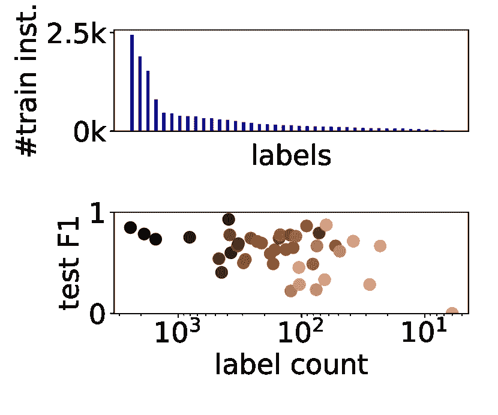

<!--yml

类别：未分类

日期：2024-09-06 19:44:07

-->

# [2210.04675] 解决基于深度学习的自然语言处理中的类别不平衡问题的方法调查

> 来源：[`ar5iv.labs.arxiv.org/html/2210.04675`](https://ar5iv.labs.arxiv.org/html/2210.04675)

# 解决类别不平衡的方法调查

在基于深度学习的自然语言处理

Sophie Henning^(1,2)    William Beluch¹    Alexander Fraser²    Annemarie Friedrich¹

¹ 博世人工智能中心，德国伦宁根

² 信息与语言处理中心，德国慕尼黑大学

sophieelisabeth.henning|william.beluch@de.bosch.com

fraser@cis.lmu.de

annemarie.friedrich@de.bosch.com

###### 摘要

许多自然语言处理（NLP）任务本质上是不平衡的，因为在现实世界中，一些目标类别的出现频率远高于其他类别。在这种情况下，当前的 NLP 模型往往在较少出现的类别上表现较差。解决 NLP 中的类别不平衡问题是一个活跃的研究课题，但为特定任务和不平衡场景找到有效的方法仍然困难重重。

在这项调查中，我们首次概述了基于深度学习的 NLP 中的类别不平衡问题，我们首先讨论了各种受控和现实世界的类别不平衡类型。我们的调查接着涵盖了专门为类别不平衡的 NLP 任务提出的或来源于计算机视觉社区并在这些任务上进行评估的方法。我们按方法是否基于采样、数据增强、损失函数选择、阶段性学习或模型设计来组织这些方法。最后，我们讨论了开放问题以及如何推进研究。

## 1 介绍

(a) 单标签关系     分类在 TACRED 上

(Zhou and Chen, 2021)

(b) 层次多标签

专利分类      (Pujari et al., 2021)

(c) 隐含话语关系分类（PDTB）

(Shi and Demberg, 2019)

(d) 使用 RoBERTa 进行 UD 依赖解析在 EWT 上

(Grünewald et al., 2021)

图 1：类别不平衡对性能的负面影响，尤其是在各种 NLP 任务中的少数类别。上部图表显示标签计数分布，下部显示测试/开发 F1 分数与训练实例计数的关系（较浅的颜色表示测试/开发实例较少）。所有模型均基于变换器。

类别不平衡是自然语言处理（NLP）中的一个主要问题，因为在 NLP 任务中，目标类别分布几乎总是偏斜的。如图 1 所示，这通常导致少数类的表现不佳。哪些类别重要高度依赖于具体任务，甚至可能取决于预期的下游使用。在不平衡数据环境中提高模型性能的方法开发已经是一个活跃的研究领域几十年了（例如，Bruzzone 和 Serpico，1997；Japkowicz 等人，2000；Estabrooks 和 Japkowicz，2001；Park 和 Zhang，2002；Tan，2005），最近在成熟的神经方法背景下获得了更多关注（例如，Buda 等人，2018；Kang 等人，2020；Li 等人，2020；Yang 等人，2020；Jiang 等人，2021；Spangher 等人，2021）。当类别在特征空间中重叠时，问题会更加严重（Lin 等人，2019；Tian 等人，2020）。例如，在专利分类中，技术类别的频率差异很大，而且不同类别中提到的概念可能非常相似。

(a) 步骤不平衡，$\mu=0.4$，$\rho=10$

(b) 线性不平衡，$\rho=10$

(c) 长尾分布

图 2：每个标签的实例数量遵循不同的分布：类别不平衡类型的示例。

在各种自然语言处理（NLP）任务中，像 BERT（Vaswani 等人，2017；Devlin 等人，2019）这样的变换器模型表现优于它们的神经前身和传统模型（Liu 等人，2019；Xie 等人，2020；Mathew 等人，2021）。使用自监督预训练模型（例如，Li 和 Scarton，2020；Niklaus 等人，2021）时，少数类的表现通常也较高，这与计算机视觉中的发现相一致（Liu 等人，2022）。然而，BERT 的出现并没有解决 NLP 中的类别不平衡问题，如图 1 所示。Tänzer 等人（2022）发现，在合成不平衡的命名实体数据集上，主要类别的样本数达到数千时，至少需要 25 个实例才能预测一个类别，并且需要 100 个示例才能学会以一定准确率进行预测。

尽管类别不平衡在 NLP 中的相关性，但相关的调查仅存在于计算机视觉领域（Johnson 和 Khoshgoftaar，2019b；Zhang 等，2021b）。纳入解决类别不平衡的方法可以带来高达 20%的性能提升。然而，NLP 研究往往忽视了这在实际应用中的重要性，特别是当少数类可能特别重要时。

我们的贡献是绘制一个适用于深度学习（DL）基础自然语言处理（NLP）的方法全景图。我们从问题定义开始（见第二部分"），然后根据方法是否基于采样、数据增强、损失函数选择、分阶段学习或模型设计进行组织（见第三部分"）。我们广泛的调查发现，重新采样、数据增强以及更改损失函数可以在类别不平衡的情况下相对简单地提高性能，因此是 NLP 从业者的直接选择。¹¹1 我们在附录中提供了识别潜在适用类别不平衡方法的实用建议（见图 3 节"）。尽管分阶段学习或模型修改是有前景的研究方向，但它们往往在实现和/或计算上更为昂贵。此外，我们讨论了非标准分类设置的特定挑战，例如不平衡的多标签分类和“ catch-all” 类别，并提供了与相关计算机视觉工作的有用联系。最后，我们概述了未来研究的有前景方向（见第四部分"）。

本调查的范围。我们关注的是针对神经方法进行评估或开发的方法。来自“传统”NLP 的工作（例如，Tomanek 和 Hahn，2009；Li 等人，2011；Li 和 Nenkova，2014；Kunchukuttan 和 Bhattacharyya，2015）以及自然语言生成（例如，Nishino 等人，2020）和自动语音识别（例如，Winata 等人，2020；Deng 等人，2022）的方法未在本调查中涉及。其他类型的不平衡，例如在持续学习中子任务的数据集大小不同（Ahrens 等人，2021）或不平衡回归（Yang 等人，2021），也超出了本调查的范围。在第 3.5 节中，我们简要提及了相关的少样本学习领域（Wang 等人，2020c）。

相关调查。我们在第 3.2 节中回顾了针对不平衡的特定数据增强方法。Feng 等人 (2021) 对 NLP 中的数据增强进行了更广泛的概述，Hedderich 等人 (2021) 提供了低资源 NLP 的概述，而 Ramponi 和 Plank (2020) 讨论了神经领域适应。

## 2 问题定义

类别不平衡指的是一种分类设置，其中一个或多个类别（少数类别）的出现频率明显低于其他类别（多数类别）。更具体的定义，例如关于将哪个类别视为少数类别的相对份额，取决于任务、数据集和标签集的大小。许多研究集中于在保持或至少监控多数类别性能的同时，平等地改善所有少数类别（例如，Huang 等人，2021；Yang 等人，2020；Spangher 等人，2021）。我们接下来讨论典型的不平衡类型（第 2.1 节），然后比较受控和实际场景（第 2.2 节）。

### 2.1 不平衡类型

为了系统地研究不平衡的影响，Buda 等人 (2018) 定义了两种典型的标签分布类型，我们将在下文中解释。

步骤失衡的特点是少数类的比例$\mu$和多数类与少数类之间的大小比$\rho$。较大的$\rho$值表示数据集的不平衡程度更高。在原型步骤失衡中，如果存在多个少数类，它们的大小相同；如果存在几个多数类，它们也具有相同的大小。图 2(a)展示了一个步骤失衡的分布，其中$40\%$的类别为少数类，失衡比为$\rho=10$。NLP 数据集中，大的通用类通常出现在序列标注（参见第 2.2 节）或检索模型中的相关性判断中，往往类似于步骤失衡分布。$\rho$比率在 NLP 中也有所报道，例如 Li 等人（2020），尽管也提出了更多特定任务的不平衡度量，例如用于单标签文本分类（Tian 等人，2020）。在线性失衡中，类别大小随着失衡比$\rho$线性增长（见图 2(b)），例如在自然语言推理的 SICK 数据集中（Marelli 等人，2014）。

长尾标签分布（图 2(c)）在概念上类似于线性失衡。它们包含少数类别（头部类别）的大量数据点，但其余类别（尾部类别）只有非常少的数据点。这些分布在计算机视觉任务中很常见，如实例分割（例如，Gupta 等人，2019a），但在多标签文本分类中也常见，例如目标是分配临床编码（Mullenbach 等人，2018）、专利类别（Pujari 等人，2021）或新闻和研究主题（Huang 等人，2021）。

### 2.2 受控与现实世界中的类别不平衡

大多数现实世界中的 NLP 任务标签分布并不完全匹配 Buda 等人（2018）提出的典型分布。然而，了解这些设置有助于从业者通过比较分布图来选择适合他们数据集或问题的方法。使用合成不平衡数据集，研究人员可以控制更多实验因素并一次性研究多种情况。然而，在自然不平衡数据上进行评估提供了方法在实际世界中的有效性证据。一些近期研究结合了这两种评估类型（例如，Tian 等，2021；Subramanian 等，2021；Jang 等，2021）。

许多 NLP 任务需要处理一个包含所有与任务无关的实例的大型、通常是异质的类别，而剩余（少数）类别的大小大致相同。例如，IOB 序列标注中的“Outside”标签，或提及产品但与注释类别无关的推文（Adel 等，2017）。这些真实世界的设置通常大致遵循一个步骤不平衡分布，并且还面临着处理大类的额外困难。

### 2.3 评估

由于准确性和微平均值主要反映了大类的表现，选择一个好的评估设置和指标并非易事。这也高度依赖于任务：在许多 NLP 任务中，识别一个或所有少数类别的能力至少与大类的表现同样重要。例如，Twitter 上非仇恨言论的频率远高于仇恨言论（Waseem 和 Hovy，2016），但识别仇恨内容是仇恨言论检测的关键动机。哪些类别重要甚至可能取决于下游考虑，即同一个命名实体标注器可能在一个对大类重要的应用中使用，而在另一个对少数类别更重要的应用中使用。有几个评估指标被设计用来处理类别不平衡的设置，但没有事实上的标准。例如，平衡准确性（Brodersen 等，2010）对应于每个类别召回率的平均值。记录所有类别的表现并报告宏平均值通常很有用，因为它们将所有类别视为平等。

## 3 解决 NLP 中类别不平衡的方法

在本节中，我们调查了那些明确提出以解决 NLP 中类别不平衡问题的方法，或那些在 NLP 问题中经过实证证明适用的方法。我们在附录 A 中提供了适用于一系列 NLP 任务的方法概述。

### 3.1 重新采样

为了在训练中增加少数实例的重要性，可以通过各种采样策略来改变标签分布。采样可以在训练过程中执行一次或重复执行（Pouyanfar 等， 2018）。在随机过采样（ROS）中，少数实例被随机选择并重复，而在随机欠采样（RUS）中，随机选择的多数实例被从数据集中删除。ROS 可能导致过拟合并增加训练时间。然而，RUS 则丢弃了潜在有价值的数据，但在语言建模目标中已被证明效果良好（Mikolov 等， 2013）。

在深度学习（DL）中，随机过采样（ROS）在合成步骤和线性不平衡（Buda 等， 2018）以及在二分类和多分类的英语和韩语文本分类（Juuti 等， 2020；Akhbardeh 等， 2021；Jang 等， 2021）中都优于随机欠采样（RUS）。更灵活的变体，例如，仅对一部分类别进行重采样（Tepper 等， 2020）或在（不平衡的）数据分布和几乎完全平衡的分布之间进行插值（Arivazhagan 等， 2019），也能进一步提高结果。基于类别的采样（CAS，Shen 等， 2016），也称为类别平衡采样，首先选择一个类别，然后从这个类别中选择一个实例。基于性能的重采样，在训练过程中遵循 Pouyanfar 等（ 2018）的思想，在多分类文本分类中表现良好（Akhbardeh 等， 2021）。

多标签分类中的问题。在多标签分类中，多数类和少数类之间的标签依赖性使得采样方法复杂化，因为对一个少数类标签的实例进行过采样可能同时会放大多数类的数量（Charte 等， 2015；Huang 等， 2021）。CAS 也会受到这个问题的影响，并且还会引入类内不平衡，因为一个类的实例根据共同分配的标签被以不同的概率选择（Wu 等， 2020）。在这种设置中，如何有效采样仍然是一个未解的问题。现有的方法在采样过程中监控类别分布（Charte 等， 2015）或分配基于实例的采样概率（Gupta 等， 2019b；Wu 等， 2020）。

### 3.2 数据增强

在语料库构建过程中增加少数类数据量，例如，通过编写额外示例或使用主动学习选择需要标记的示例，可以在一定程度上缓解类别不平衡问题（Cho 等人，2020；Ein-Dor 等人，2020）。然而，这在自然不平衡的设置中尤其繁琐，因为这可能需要寻找“稻草中的针”，或者可能导致偏向少数类的示例，例如，由于通过关键词查询收集的示例。因此，合成生成额外的少数类实例是一个有前景的方向。在本节中，我们回顾了那些明确提出用于缓解类别不平衡的、并且与深度学习结合评估过的数据增强方法。

文本增强生成了少数类的新自然语言实例，从简单的字符串操作（如同义词替换）到基于 Transformer 的生成。Easy Data Augmentation (EDA，Wei 和 Zou，2019)，该方法使用基于词典的同义词替换、随机插入、随机交换和随机删除，已在类别不平衡的设置中显示出良好的效果（Jiang 等人，2021；Jang 等人，2021；Juuti 等人，2020）。Juuti 等人（2020）使用 EDA 和基于嵌入的同义词替换为英语二分类文本分类生成新的少数类实例，并通过将随机的多数类句子添加到少数类文档中来实现。他们还使用少数类实例提示预训练语言模型 GPT-2（Radford 等人，2019）生成新的少数类样本。Tepper 等人（2020）评估了在英语多类文本分类数据集上使用 GPT-2 生成的效果，并结合了灵活的平衡策略（见第 3.1 节）。

同样，Gaspers 等人（2020）将基于机器翻译的文本增强与数据集平衡结合起来，构建了一个多任务模型。主要任务和辅助任务都是德语意图分类。只有后者的训练数据经过平衡和用合成少数类实例进行丰富。在长尾多标签设置中，Zhang 等人（2022）学习了一种基于注意力的文本增强方法，该方法通过与尾部类别相关的文本片段来增强实例，从而带来了小幅改进。一般而言，将诸如 EDA 或反向翻译的方法转移到多标签设置中是困难的（Zhang 等人，2022，2020；Tang 等人，2020）。

隐空间增强生成的新实例向量与特定自然语言字符串没有直接关联，利用了真实示例的表示。利用基于表示的增强方法来应对类别不平衡并不局限于深度学习。SMOTE（Chawla et al., 2002），通过与其 K 最近邻的随机选择样本进行插值，广泛应用于传统机器学习（Fernández et al., 2018），但在深度学习的自然语言处理（Ek and Ghanimifard, 2019; Tran and Litman, 2021; Wei et al., 2022）中效果不一。受 CutMix（Yun et al., 2019）的启发，CutMix 在图像中剪切并粘贴单个像素区域，TextCut（Jiang et al., 2021）随机替换一个实例的 BERT 表示的部分。实验表明，TextCut 在二分类和多分类文本分类中优于未增强的 BERT 和 EDA。

好的示例外推（GE3, Wei, 2021）和重印（Wei et al., 2022）也在原始表示空间中操作。为了合成新的少数类实例，GE3 将表示多数类实例与相应多数类质心之间差异的向量加到少数类的均值上。对合成步骤不平衡的英文多类别文本分类数据集的评估显示，相较于过采样和隐空间增强基准，GE3 有所改进。GE3 假设某一类的数据点分布可以外推到其他类别，如果少数类分布不同，这一假设可能会影响性能。为了解决这个问题，重印在减去多数特征时，对每一类执行主成分分析（PCA），在样本生成过程中利用相关维度的信息。这种方法通常优于 GE3，但需要额外的超参数（子空间维度）。

MISO（Tian et al., 2021）通过转换靠近多数类实例的少数类实例的表示来生成新实例。他们学习从少数实例向量到“解耦”表示的映射，利用互信息估计器（Belghazi et al., 2018）将这些表示推离多数类，更接近少数类。一个对抗训练的生成器随后利用这些解耦的表示生成少数实例。Tian et al. 将 MISO 应用于自然和合成不平衡的英文和中文二分类及多分类文本分类任务中，针对单一少数类。

ECRT（Chen 等，2021）学习将编码器表示（特征空间）映射到一个新的空间（源空间），其组件在给定类别的条件下相互独立，假设从源到特征空间的因果机制是不变的。独立性使得他们能够通过在源空间中置换或采样组件生成新的有意义的少数类示例，从而在具有多个标签的大型多标签文本分类数据集上取得中等改进。

在迁移学习领域存在进一步相关的研究（Ruder 等，2019），例如，从额外的数据集提供对少数类的补充信息。例如，Spangher 等（2021）通过手动选择辅助数据集来改善不平衡的基于句子的语篇分类，取得了小幅提升。然而，补充数据集需要为每个应用检索，并且任务损失系数需要调节。适应方法以预测有用的迁移来源（Lange 等，2021）可能有助于缓解这些问题。

### 3.3 损失函数

标准交叉熵损失（CE）由带有金标准标签的实例的预测组成，这就是为什么结果分类器对少数类的适应较差的原因。在这一部分，我们总结了为不平衡场景设计的损失函数。它们要么通过类别成员资格或预测难度重新加权实例，要么显式建模类别边际以改变决策边界。在本节中，我们使用表 1 中显示的变量和术语。

#### 单标签场景的损失。

加权交叉熵（WCE）使用类特定权重 $\alpha_{j}$，这些权重作为超参数进行调节，或设置为逆类频率（例如，Adel 等，2017；Tayyar Madabushi 等，2019；Li 和 Xiao，2020）。虽然 WCE 对同一类别的所有实例采取相同处理方式，但焦点损失（FL，Lin 等，2017）则通过 $\left(1-p_{j}\right)^{\beta}$ 系数对模型已经自信的实例进行下调权重。FL 当然也可以与类别权重一起使用。与 CE 模拟准确率不同，Dice 损失（Dice，Milletari 等，2016）试图捕捉类别 F1 分数，预测概率 $p_{j}$ 代理精度，真实值指示符 $y_{j}$ 代理召回率。自适应 Dice 损失（ADL，Li 等，2020）结合了通过 $1-p_{j}$ 进行的基于置信度的下调权重和 Dice 损失。在序列标注、问答和英中数据集上的匹配中，Dice 表现优于 FL 和 ADL。

与其重新加权实例，不如使用标签分布感知边际损失 (LDAM, Cao 等，2019)，这本质上是一种具有标签依赖边际 $\Delta_{j}$ 的平滑铰链损失，旨在增加少数类实例与决策边界之间的距离，以便更好地对这些类别进行泛化。Cao 等 的评估主要集中在计算机视觉上，但他们还报告了在 IMDB 评论数据集（Maas 等，2011）的合成不平衡版本上 LDAM 的结果，相比于原始 CE 或 CE 与重采样或重加权，少数类的错误率显著降低。Subramanian 等 (2021) 提出了考虑与社会显著群体（如性别偏差）相关的偏差的 LDAM 变体，并在二分类文本分类中进行了评估。

| 单标签 | CE | $-\sum_{j=1}^{C}y_{j}\log p_{j}$                 WCE $-\sum_{j=1}^{C}\alpha_{j}y_{j}\log p_{j}$ |
| --- | --- | --- |
| FL | $-\sum_{j=1}^{C}y_{j}(1-p_{j})^{\beta}\log p_{j}$ |
| Dice | $\sum_{j=1}^{C}1-\displaystyle\frac{2p_{j}y_{j}+\gamma}{p_{j}^{2}+y_{j}^{2}+\gamma}$          ADL $\sum_{j=1}^{C}1-\displaystyle\frac{2(1-p_{j})p_{j}y_{j}+\gamma}{(1-p_{j})p_{j}+y_{j}+\gamma}$ |
|  | LDAM | $-\sum_{j=1}^{C}y_{j}\log\displaystyle\frac{\exp(z_{j}-\Delta_{j})}{\exp(z_{j}-\Delta_{j})+\sum_{l\neq j}\exp(z_{l})}$ 其中 $\Delta_{j}=K/n_{j}^{1/4}$ |
|  | RL | $\mathds{1}(gt\neq A)\log(1+\exp(\rho(m^{+}-z_{gt})))+\log(1+\exp(\rho(m^{-}-z_{c^{-}})))$ |
| 多标签 | BCE | $-\sum_{j=1}^{C}[y_{j}\log p_{j}+(1-y_{j})\log(1-p_{j})]$ |
| WBCE | $-\sum_{j=1}^{C}\alpha_{j}[y_{j}\log p_{j}+(1-y_{j})\log(1-p_{j})]$ |
| FL | $-\sum_{j=1}^{C}[y_{j}(1-p_{j})^{\beta}\log p_{j}+(1-y_{j})p_{j}^{\beta}\log(1-p_{j})]$ |
|  | DB | $-\sum_{j=1}^{C}[y_{j}\hat{\alpha}_{j}(1-q_{j})^{\beta}\log q_{j}+(1-y_{j})\hat{\alpha}_{j}\frac{1}{\lambda}q_{j}^{\beta}\log(1-q_{j})]$ |
|  |  | 其中 $q_{j}=y_{j}\sigma(z_{j}-v_{j})+(1-y_{j})\sigma(\lambda(z_{j}-v_{j}))$ |
| $C$ | 类别数 |
| $y$ | 目标向量 |
| $p$ | 模型预测向量 |
| $\alpha$ | 类别权重 |
| $\beta$ | 可调焦点参数 |
| $z$ | 模型 logits 向量 |
| $\gamma$ | 平滑常数 |
| $n_{j}$ | 类别 $j$ 的大小 |
| $K$ | 标签无关常数 |
| $gt$ | 真实类别的索引 |
| $m^{+}$ | 到正确类别的边际 |
| $m^{-}$ | … 到最具竞争力的错误类别 |
| $A$ | 特殊的包容类别 |
| $c^{-}$ | 最大的非 $gt$ logits 的索引 |
| $\lambda$ | 缩放因子 |
| $\hat{\alpha}_{j}$ | 实例特定的类别权重 |
| $v_{j}$ | 类别特定的偏差 |

表 1: 针对单实例制定的损失函数概述。有关参考文献/实现，请参见附录 A。

在具有大型人工和潜在异质的通用类别的设置中（见第 2.2 节），空间中的许多区域包含通用类别的表示。在这种情况下，原始 LDAM 可能是一个合适的损失函数，因为它鼓励少数类有更大的间隔。在这种情况下，排名损失（RL）也可以有效地激励模型仅关注“真实”类别。在一个不平衡的英语多类别数据集上，具有大型通用类别，Adel 等人（2017）发现由 dos Santos 等人（2015）引入的排名损失相较于 CE 和 WCE 有改进。对于少数类，这个损失函数最大化正确标签$z_{gt}$的分数，同时最小化最高得分的错误标签$z_{c^{-}}$的分数。对于通用类别$A$，仅最小化$z_{c^{-}}$；$z_{gt}$被忽略。同样，Hu 等人（2022）将类权重仅应用于非通用类别。

#### 多标签场景中的损失函数。

在多标签分类中，每个标签分配可以视为一个二分类决策，因此通常使用二分类交叉熵（BCE）。在类别不平衡的情况下，会出现两个问题。首先，尽管在 BCE 中使用了类特定的权重（例如，Yang 等人，2020），但这些权重对少数类的影响比单标签情况要不明确。对于每个实例，所有类别都对 BCE 有贡献，未分配给该实例的标签（称为负类）通过$(1-y_{j})\log(1-p_{j})$包含在内。因此，如果加权二分类交叉熵（WBCE）对某个类别使用较高的权重，它也会增加少数类负实例的重要性，这可能进一步促使模型不预测这个少数类。

为了在 BCE 中更有效地利用类权重，一个选项是仅将它们应用于正实例的损失，如在多标签图像分类中所提议的（Kumar 等人，2018）。相关工作包括在层次多标签文本分类中均匀地增加所有类别的正实例权重（例如，Rathnayaka 等人，2019）。Yilmaz 等人（2021）提出了一种多标签情感分类的方法，通过调整 FL 进行训练时间平衡，使得给定的小批量中所有实例的损失在每个类别上具有完全相同的值。

如果分类器已经正确预测了一个实例的负类，通过降低相应标签的 logits，损失可以进一步减少。在 CE 中，由于 softmax 使用所有类别的 logits，一旦正确类别的 logit 远大于其他类别的 logit，这种效果的影响变得较小。然而，在 BCE 中（Wu et al., 2020），由于 logits 被独立处理，这个问题更加严重。由于少数标签大多作为负类出现，这种 logit 压制导致决策边界偏差，使得少数类被预测的可能性降低。为了解决这个问题，Wu et al. (2020) 基于 FL 的多标签版本，提出了分布平衡损失（DB）用于目标检测，通过以不同方式转换正类和负类的 logits，添加负类的负容忍正则化（见表 1）。这种正则化一旦相应的 logit 低于阈值，会在负类的损失函数中施加一个急剧的下降。此外，DB 引入了实例特定的类别权重$\hat{\alpha}$，以考虑多标签场景中由类别感知采样造成的不平衡（见第 3.1 节）。这些权重反映了类别的频率以及实例的正标签的数量和频率。Huang et al. (2021) 已经展示了即使在对两个长尾多标签英语文本分类数据集使用均匀采样时，DB 相较于 BCE 也有显著改进。

尽管 Cao 等人（2019）仅提出并理论上证明了 LDAM 在单标签分类中的有效性，但它也已成功应用于多标签文本分类（Biswas 等，2021）。Ferreira 和 Vlachos（2019）展示了应用跨标签依赖损失（Yeh 等，2017；Zhang 和 Zhou，2006）对多标签立场分类有帮助。同样，Lin 等人（2019）在其损失函数中引入了标签混淆感知成本因子。Suresh 和 Ong（2021）的自适应损失将标签间关系集成到对比损失（Khosla 等，2020）中，该对比损失比较了正样本的得分与其他正样本和负样本的距离，以推动其表示更接近正确类别，远离错误类别。最终的损失函数学习如何相对于其他负标签增加混淆负标签的权重。将标签混淆感知损失函数与类别加权技术相结合是一个有前途的研究方向。

#### 重采样与损失函数。

专门为类别不平衡设置设计的重采样和损失函数基于相同的理念，即增加少数实例的重要性。重采样在概念上更简单，对训练时间有直接影响，例如，过采样可能会导致时间显著增加。相比之下，上述解释的损失函数更具灵活性，例如，通过建模边际的期望属性，但通常也更难以解释。

### 3.4 阶段性学习

寻找在学习代表底层数据分布的特征和减少分类器对多数类的偏倚之间良好权衡的一种方法是将训练分为多个阶段。两阶段训练在不平衡或数据稀缺的计算机视觉任务中很常见（例如，Wang 等，2020b，a；Zhang 等，2021a）。第一阶段通常进行标准训练，以训练或微调特征提取网络。后续阶段可能会冻结特征提取器，并使用特殊方法重新训练分类器层以解决类别不平衡问题，例如，使用更平衡的数据分布或特定的损失函数。例如，Cao 等人（2019）发现他们的 LDAM 损失在两阶段训练时最为有效。在自然语言处理领域，深度学习模型通常基于预训练的神经文本编码器或词嵌入。在开始微调阶段之前的进一步领域特定的预训练也可能有效（Gururangan 等，2020）。

归属于阶段学习的几个自然语言处理（NLP）方法直接受到计算机视觉研究的启发。在长尾图像分类的背景下，Kang 等人（2020）发现类平衡采样（参见第 3.1 节）在进行单阶段训练时有帮助，但在他们的两阶段分类器重训练（cRT）方法中，第一阶段使用原始分布比类平衡采样更有效。cRT 仅在冻结表示权重后的第二阶段中使用后者。Yu 等人（2020）对长尾关系分类进行类似的解耦分析，本质上确认了 Kang 等人（2020）在这个 NLP 任务中的重新采样策略结果。此外，他们发现这种分析下的损失重新加权行为类似于重新采样，即在表示学习期间应用时会导致性能变差，但在重新训练分类器时会提升性能。Hu 等人（2022）成功地利用了 Kang 等人的想法进行事件检测，其中触发器检测和触发器分类都受到类不平衡的困扰。

Jang 等人（2021）将不平衡分类建模为一个具有 $k$ 个阶段的持续学习任务，其中数据逐渐变得更加平衡（序列目标，ST）。第一阶段包含最不平衡的子集，然后不平衡的程度减少，最后阶段呈现最平衡的子集。训练目标既鼓励当前阶段的良好表现，也保持在前面阶段中学习到的信息。他们的实验包括二元和三元的英语和韩语文本分类。主动学习（AL）定义上包含多个阶段，已被证明可以提升 BERT 模型对少数类的性能（Ein-Dor 等人，2020）。有关主动学习和深度学习的讨论，请参见 Schröder 和 Niekler（2020）。

### 3.5 模型设计

迄今为止描述的方法在很大程度上与模型架构无关。本节描述了旨在改善不平衡设置中性能的模型修改。

观察到在标准联合训练中，较小类别的权重向量的范数较小，相比于基于阶段学习的 cRT（见第 3.4 节），Kang 等人（2020）在单阶段训练中直接对分类器权重进行归一化，使用超参数$\tau$来控制归一化的“温度”（$\tau$-norm）。$\tau$-norm 在长尾图像分类中取得了类似或更好的性能，并在关系抽取中优于 cRT，但 cRT 在命名实体识别和事件检测中表现更好（Nan 等人，2021）。

SetConv（Gao 等人，2020）和 ProtoBERT（Tänzer 等人，2022）通过支持集为每个类别学习代表，并根据输入（查询）与这些代表的相似性进行分类。SetConv 应用卷积核以捕捉类内和类间相关性来提取类代表。ProtoBERT 在学习的基于 BERT 的特征空间中使用类质心，将任何实例到通用类的距离视为另一个可学习的参数。在每次训练步骤中，SetConv 在查询集中仅使用每个类别的一个实例，但保留了支持集中原始的类别不平衡，而 ProtoBERT 使用固定比例。在各自的实验研究中，如果模型看到的少于 100 个样本，ProtoBERT 在 NER 中的表现优于在 BERT 上使用标准分类层，而 SetConv 在高不平衡度的二元文本分类和多类文本分类中表现更佳。

HSCNN 模型（Yang 等人，2020）仅在尾类分类中使用类别代表，而头类则使用标准文本 CNN（Kim，2014）。HSCNN 学习标签特定的相似性函数，从原始 CNN 的两个副本的倒数第二层提取实例表示，如果与类别代表（计算为 5 个随机支持实例的均值）的相似性超过 0.5，则分配为尾类。在尾类上，HSCNN 相较于原始 CNN 表现始终更佳。

此外，存在一些特定任务的解决方案。Prange 等人（2021）建议从预测的树结构中构造 CCG 超级标记，而不是将问题视为标准分类任务。为了在类不平衡的数据集中识别否定陈述中的隐性正面解释，van Son 等人（2018）认为利用信息结构可能是一种改善推理的方法。结构性因果模型（SCMs）已被应用于不平衡的 NLP 任务中，编码任务特定的因果图（例如，Nan 等人，2021）。类似地，Wu 等人（2021）因果地建模了长尾语料库中的偏差如何影响主题建模（Blei 等人，2003），并利用这一点改善变分自编码器的训练。

与类不平衡密切相关的研究领域是少样本学习（FSL，Wang 等人，2020c），其目标是仅基于极少的训练样本学习类别。FSL 中的模型思想可以用于长尾设置，例如，通过利用关于类别标签的关系信息，如知识图谱嵌入或其他形式的标签层次关系嵌入（Han 等人，2018；Zhang 等人，2019），或计算特定标签的表示（Mullenbach 等人，2018）。

## 4 见解与未来方向

我们提供了当前应对 DL-based NLP 中类不平衡的全面、简明且结构化的概述。

什么方法效果最佳？由于尚无建立的类不平衡设置的基准，评估结果在各论文之间难以比较。一般而言，重新采样或改变损失函数可能会带来小到中等的提升。对于数据增强方法，报告的性能提升往往大于重新采样或新损失函数。阶段性训练或模型修改的效果差异很大，从有害到非常大的性能提升不等。

因此，在类别不平衡的设置中，重新采样、数据增强和更改损失函数是直接的选择。基于分阶段学习或模型设计的方法有时可能优于这些方法，但通常伴随更高的实现或计算成本。有关一些类别不平衡方法的实际决策辅助和潜在应用设置，请参见附录 B 中的图 3 和附录 A 中的表 3。

我们应该如何报告结果？许多自然语言处理研究仅报告**汇总统计数据**（Harbecke 等，2022），这使得很难判断按类别改进的影响，而这在实践中通常很重要。因此，我们认为自然语言处理研究人员应该始终报告每类的统计数据，例如，如图 1 所示。开源包含确切数字的电子表格将使社区能够从多个角度更灵活地比较系统，即根据特定应用场景中重要的类别，并在类不平衡研究中重复使用这些数据。审稿人也应该重视分析相关少数类别性能的工作，而不仅仅是关注整体准确度的提高。

计算机视觉和自然语言处理领域在类不平衡问题上取得进展的一个主要障碍是实验结果往往难以比较（Johnson 和 Khoshgoftaar，2019a，2020）。一个重要的第一步是不要将基线限制为同类型的方法，例如，新的数据增强方法不仅应与其他数据增强方法进行比较，还应与用于类不平衡的损失函数进行比较。建立一套共享和系统化的多样化类别不平衡自然语言处理任务的基准将对研究人员和从业者都非常有利。

我们如何前进？大多数关于类不平衡的 NLP 工作集中于单标签文本分类。寻找多标签设置的良好解决方案仍然是一个未解的研究挑战。类不平衡在 NLP 任务中也带来了问题，如序列标注或解析，我们相信结构化预测模型与解决类不平衡方法的结合是未来研究的一个有前景的领域。此外，我们还需要研究类不平衡方法如何影响预测校准，以提供可靠的置信度估计。

一般来说，新模型架构的灵感可以从为少样本学习（Wang et al., 2020c）开发的方法中获得。最近，提示（Radford et al., 2019）作为自然语言处理中的一种新范式出现，在实际少样本环境中表现强劲（Schick and Schütze, 2022）。改进分布变化下最坏情况性能的方法（例如，Sagawa et al., 2020）也可能用于提升少数类的表现。

## 致谢

我们感谢匿名评审员提供的宝贵意见，以及 Heike Adel、Stefan Grünewald、Subhash Pujari 和 Timo Schrader 为我们的预览图提供的数据。我们感谢他们以及 Talita Anthonio、Mohamed Gad-Elrab、Lukas Lange、Stefan Ott、Robert Schmier、Hendrik Schuff、Daria Stepanova、Jannik Strötgen、Thang Vu 和 Dan Zhang 对写作过程中的有益讨论和反馈。我们还感谢 Jason Wei 和 Jiaqi Zeng 解答了有关他们工作的疑问。

## 局限性

本文是一项综述，旨在构建、组织和描述解决类不平衡问题的工作和概念，包括长尾学习。虽然我们涉及了数据增强和少样本学习，但未对这些领域进行全面评审。有关本综述范围的详细信息也已在第一部分中描述。

调查过程包括在 Google Scholar 和 ACL Anthology 中搜索关键词类不平衡和长尾，并仔细检查引用相关论文的文献。

最后，本文仅为文献综述，并未提供在该研究领域非常需要的全面实证研究，但对于开展这样的研究将有所帮助。

## 参考文献

+   Adel et al. (2017) Heike Adel, Francine Chen, 和 Yan-Ying Chen. 2017. [在不平衡的 Twitter 数据上进行购买阶段识别的卷积递归神经网络排名](https://aclanthology.org/E17-2094)。在 *第十五届欧洲计算语言学协会会议：卷 2，简短论文*，第 592–598 页，西班牙瓦伦西亚。计算语言学协会。

+   Ahrens 等（2021）Kyra Ahrens, Fares Abawi, 和 Stefan Wermter. 2021. Drill: 不平衡终身学习的动态表示。 在 *人工神经网络与机器学习 - ICANN 2021* 中，页码 409–420，Cham。Springer 国际出版社。

+   Akhbardeh 等（2021）Farhad Akhbardeh, Cecilia Ovesdotter Alm, Marcos Zampieri, 和 Travis Desell. 2021. [处理技术日志数据集中的极端类别不平衡](https://doi.org/10.18653/v1/2021.acl-long.312)。在 *第 59 届计算语言学协会年会和第 11 届国际自然语言处理联合会议（第 1 卷：长篇论文）论文集* 中，页码 4034–4045，在线。计算语言学协会。

+   Arivazhagan 等（2019）Naveen Arivazhagan, Ankur Bapna, Orhan Firat, Dmitry Lepikhin, Melvin Johnson, Maxim Krikun, Mia Xu Chen, Yuan Cao, George F. Foster, Colin Cherry, Wolfgang Macherey, Zhifeng Chen, 和 Yonghui Wu. 2019. [大规模多语言神经机器翻译中的发现与挑战](http://arxiv.org/abs/1907.05019)。*CoRR*，abs/1907.05019。

+   Belghazi 等（2018）Mohamed Ishmael Belghazi, Aristide Baratin, Sai Rajeshwar, Sherjil Ozair, Yoshua Bengio, Aaron Courville, 和 Devon Hjelm. 2018. [互信息神经估计](https://proceedings.mlr.press/v80/belghazi18a.html)。在 *第 35 届国际机器学习会议论文集* 中，*机器学习研究论文集* 第 80 卷，页码 531–540\. PMLR。

+   Biswas 等（2021）Biplob Biswas, Thai-Hoang Pham, 和 Ping Zhang. 2021. [Transicd: 基于 Transformer 的代码级注意力模型用于可解释的 ICD 编码](https://doi.org/10.1007/978-3-030-77211-6_56)。在 *人工智能医学 - 第 19 届人工智能医学国际会议，AIME 2021，虚拟会议，2021 年 6 月 15-18 日，论文集* 中，*计算机科学讲义笔记* 第 12721 卷，页码 469–478\. Springer。

+   Blei 等（2003）David M. Blei, Andrew Y. Ng, 和 Michael I. Jordan. 2003. [潜在狄利克雷分配](http://jmlr.org/papers/v3/blei03a.html)。*机器学习研究杂志*，3:993–1022。

+   Brodersen 等（2010）Kay Henning Brodersen, Cheng Soon Ong, Klaas Enno Stephan, 和 Joachim M. Buhmann. 2010. [平衡准确率及其后验分布](https://doi.org/10.1109/ICPR.2010.764)。在 *2010 年第 20 届国际模式识别大会* 中，页码 3121–3124。

+   Bruzzone 和 Serpico（1997）L. Bruzzone 和 S.B. Serpico. 1997. [通过神经网络对不平衡遥感数据进行分类](https://doi.org/https://doi.org/10.1016/S0167-8655(97)00109-8)。*模式识别通讯*，18(11):1323–1328。

+   Buda 等（2018）Mateusz Buda, Atsuto Maki, 和 Maciej A. Mazurowski. 2018. [卷积神经网络中的类别不平衡问题的系统研究](https://doi.org/https://doi.org/10.1016/j.neunet.2018.07.011)。*神经网络*，106:249–259。

+   Cao et al. (2019) Kaidi Cao、Colin Wei、Adrien Gaidon、Nikos Arechiga 和 Tengyu Ma。2019 年。 [通过标签分布感知的边际损失学习不平衡数据集](https://proceedings.neurips.cc/paper/2019/file/621461af90cadfdaf0e8d4cc25129f91-Paper.pdf)。在 *神经信息处理系统进展*，第 32 卷。Curran Associates, Inc.

+   Charte et al. (2015) Francisco Charte、Antonio J. Rivera、María J. del Jesus 和 Francisco Herrera。2015 年。 [处理多标签分类中的不平衡：度量和随机重采样算法](https://doi.org/https://doi.org/10.1016/j.neucom.2014.08.091)。*神经计算*，163:3–16。混合人工智能系统的最新进展及其在实际问题中的应用 智能系统中的进展 挖掘人文学科数据。

+   Chawla et al. (2002) Nitesh V Chawla、Kevin W Bowyer、Lawrence O Hall 和 W Philip Kegelmeyer。2002 年。Smote：合成少数类过采样技术。*人工智能研究期刊*，16:321–357。

+   Chen et al. (2021) Junya Chen、Zidi Xiu、Benjamin Goldstein、Ricardo Henao、Lawrence Carin 和 Chenyang Tao。2021 年。通过基于能量的对比表征转移来超充不平衡数据学习。*神经信息处理系统进展*，34。

+   Cho et al. (2020) Won Ik Cho、Youngki Moon、Sangwhan Moon、Seok Min Kim 和 Nam Soo Kim。2020 年。 [机器适应程序：理解非标准指令的意图参数](https://doi.org/10.18653/v1/2020.findings-emnlp.31)。在 *计算语言学协会发现：EMNLP 2020*，第 329–339 页，在线。计算语言学协会。

+   Deng et al. (2022) Keqi Deng、Gaofeng Cheng、Runyan Yang 和 Yonghong Yan。2022 年。 [通过解耦表征和分类的学习来缓解 ASR 长尾问题](https://doi.org/10.1109/TASLP.2021.3138707)。*IEEE/ACM 音频、语音和语言处理汇刊*，30:340–354。

+   Devlin et al. (2019) Jacob Devlin、Ming-Wei Chang、Kenton Lee 和 Kristina Toutanova。2019 年。 [BERT：用于语言理解的深度双向变换器的预训练](https://doi.org/10.18653/v1/N19-1423)。在 *2019 年北美计算语言学协会会议：人类语言技术，第 1 卷（长篇和短篇论文）*，第 4171–4186 页，明尼阿波利斯，明尼苏达州。计算语言学协会。

+   dos Santos et al. (2015) Cícero dos Santos、Bing Xiang 和 Bowen Zhou。2015 年。 [通过卷积神经网络对关系进行排名分类](https://doi.org/10.3115/v1/P15-1061)。在 *第 53 届计算语言学协会年会暨第七届国际自然语言处理联合会议（卷 1：长篇论文）*，第 626–634 页，北京，中国。计算语言学协会。

+   Ein-Dor 等 (2020) Liat Ein-Dor、Alon Halfon、Ariel Gera、Eyal Shnarch、Lena Dankin、Leshem Choshen、Marina Danilevsky、Ranit Aharonov、Yoav Katz 和 Noam Slonim。2020. [BERT 的主动学习：一项实证研究](https://doi.org/10.18653/v1/2020.emnlp-main.638)。发表于 *2020 年自然语言处理经验方法会议（EMNLP）论文集*，第 7949–7962 页，在线。计算语言学协会。

+   Ek 和 Ghanimifard (2019) Adam Ek 和 Mehdi Ghanimifard。2019. [合成宣传嵌入用于训练线性投影](https://doi.org/10.18653/v1/D19-5023)。发表于 *第二届互联网自由自然语言处理研讨会：审查、虚假信息与宣传*，第 155–161 页，中国香港。计算语言学协会。

+   Estabrooks 和 Japkowicz (2001) Andrew Estabrooks 和 Nathalie Japkowicz. 2001. [一种用于文本分类的专家混合框架](https://aclanthology.org/W01-0709)。发表于 *ACL 2001 计算自然语言学习研讨会（ConLL）论文集*。

+   Feng 等 (2021) Steven Y. Feng、Varun Gangal、Jason Wei、Sarath Chandar、Soroush Vosoughi、Teruko Mitamura 和 Eduard Hovy。2021. [NLP 数据增强方法综述](https://doi.org/10.18653/v1/2021.findings-acl.84)。发表于 *计算语言学协会：ACL-IJCNLP 2021 发现*，第 968–988 页，在线。计算语言学协会。

+   Fernández 等 (2018) Alberto Fernández、Salvador Garcia、Francisco Herrera 和 Nitesh V Chawla。2018. SMOTE 在不平衡数据学习中的进展与挑战，纪念 15 周年。*人工智能研究期刊*，61:863–905。

+   Ferreira 和 Vlachos (2019) William Ferreira 和 Andreas Vlachos。2019. [在多标签态度检测中融入标签依赖](https://doi.org/10.18653/v1/D19-1665)。发表于 *2019 年自然语言处理经验方法会议暨第九届国际联合自然语言处理会议（EMNLP-IJCNLP）论文集*，第 6350–6354 页，中国香港。计算语言学协会。

+   Gao 等 (2020) Yang Gao、Yi-Fan Li、Yu Lin、Charu Aggarwal 和 Latifur Khan。2020. [SetConv：一种从不平衡数据中学习的新方法](https://doi.org/10.18653/v1/2020.emnlp-main.98)。发表于 *2020 年自然语言处理经验方法会议（EMNLP）论文集*，第 1284–1294 页，在线。计算语言学协会。

+   Gaspers 等 (2020) Judith Gaspers、Quynh Do 和 Fabian Triefenbach。2020. [数据平衡用于提升语音语言理解中低频类别的性能](https://doi.org/10.21437/Interspeech.2020-1676)。发表于 *Interspeech 2020 论文集*，第 1560–1564 页。

+   Grünewald 等 (2021) Stefan Grünewald, Annemarie Friedrich, 和 Jonas Kuhn. 2021. [应用奥卡姆剃刀于基于变换器的依存句法分析：哪些有效，哪些无效，以及哪些是真正必要的](https://doi.org/10.18653/v1/2021.iwpt-1.13)。见于 *第 17 届国际句法分析技术会议及 IWPT 2021 增强通用依存关系解析共享任务*，第 131–144 页，在线。计算语言学协会。

+   Gupta 等 (2019a) Agrim Gupta, Piotr Dollar, 和 Ross Girshick. 2019a. Lvis: 一个用于大词汇量实例分割的数据集。见于 *IEEE/CVF 计算机视觉与模式识别会议 (CVPR) 论文集*。

+   Gupta 等 (2019b) Agrim Gupta, Piotr Dollár, 和 Ross B. Girshick. 2019b. [LVIS：一个用于大词汇量实例分割的数据集](http://arxiv.org/abs/1908.03195)。*CoRR*，abs/1908.03195。

+   Gururangan 等 (2020) Suchin Gururangan, Ana Marasović, Swabha Swayamdipta, Kyle Lo, Iz Beltagy, Doug Downey, 和 Noah A. Smith. 2020. [不要停止预训练：将语言模型适配于领域和任务](https://doi.org/10.18653/v1/2020.acl-main.740)。见于 *第 58 届计算语言学协会年会论文集*，第 8342–8360 页，在线。计算语言学协会。

+   Han 等 (2018) Xu Han, Pengfei Yu, Zhiyuan Liu, Maosong Sun, 和 Peng Li. 2018. [层次关系抽取的粗到细关注机制](https://doi.org/10.18653/v1/D18-1247)。见于 *2018 年自然语言处理经验方法会议论文集*，第 2236–2245 页，比利时布鲁塞尔。计算语言学协会。

+   Harbecke 等 (2022) David Harbecke, Yuxuan Chen, Leonhard Hennig, 和 Christoph Alt. 2022. [为什么只有微平均 F1？关系分类的度量加权](https://doi.org/10.18653/v1/2022.nlppower-1.4)。见于 *NLP Power! 第一次高效基准测试研讨会*，第 32–41 页，爱尔兰都柏林。计算语言学协会。

+   Hedderich 等 (2021) Michael A. Hedderich, Lukas Lange, Heike Adel, Jannik Strötgen, 和 Dietrich Klakow. 2021. [关于低资源场景下自然语言处理的近期方法综述](https://doi.org/10.18653/v1/2021.naacl-main.201)。见于 *2021 年北美计算语言学协会：人类语言技术会议论文集*，第 2545–2568 页，在线。计算语言学协会。

+   Hu 等 (2022) Bo Hu, Yun Liu, Naiyue Chen, Lifu Wang, Ning Liu, 和 Xing Cao. 2022. [Segcn-dcr：一种通过解耦分类重平衡的语法增强事件检测框架](https://doi.org/https://doi.org/10.1016/j.neucom.2022.01.069)。*Neurocomputing*，481:55–66。

+   Huang 等人（2021）Yi Huang、Buse Giledereli、Abdullatif Köksal、Arzucan Özgür 和 Elif Ozkirimli. 2021. [针对长尾类别分布的多标签文本分类平衡方法](https://doi.org/10.18653/v1/2021.emnlp-main.643)。在 *2021 年自然语言处理实证方法会议论文集*，页码 8153–8161，在线和多米尼加共和国蓬塔卡纳。计算语言学协会。

+   Jang 等人（2021）Joel Jang、Yoonjeon Kim、Kyoungho Choi 和 Sungho Suh. 2021. [顺序目标：一种用于文本分类数据不平衡的持续学习方法](https://doi.org/https://doi.org/10.1016/j.eswa.2021.115067)。*应用专家系统*，179:115067。

+   Japkowicz 等人（2000）Nathalie Japkowicz 等人. 2000. 从不平衡数据集中学习：各种策略的比较。在 *AAAI 关于从不平衡数据集中学习的研讨会*，第 68 卷，页码 10–15。AAAI Press Menlo Park, CA。

+   Jiang 等人（2021）Wanrong Jiang、Ya Chen、Hao Fu 和 Guiquan Liu. 2021. Textcut：一种用于文本不平衡分类的多区域替换数据增强方法。在 *神经信息处理*，页码 427–439，Cham。Springer International Publishing。

+   Johnson 和 Khoshgoftaar（2019a）Justin M. Johnson 和 Taghi M. Khoshgoftaar. 2019a. 深度学习与类别不平衡的大数据阈值化。*2019 年第 18 届 IEEE 国际机器学习与应用会议（ICMLA）*，页码 755–762。

+   Johnson 和 Khoshgoftaar（2019b）Justin M. Johnson 和 Taghi M. Khoshgoftaar. 2019b. [关于类别不平衡的深度学习综述](https://doi.org/10.1186/s40537-019-0192-5)。*大数据期刊*，6(1)。

+   Johnson 和 Khoshgoftaar（2020）Justin M. Johnson 和 Taghi M. Khoshgoftaar. 2020. [深度学习和高度不平衡大数据的数据采样效果](https://doi.org/10.1007/s10796-020-10022-7)。*信息系统前沿*，22(5):1113–1131。

+   Juuti 等人（2020）Mika Juuti、Tommi Gröndahl、Adrian Flanagan 和 N. Asokan. 2020. [小投入大回报：尽管数据稀缺仍能改善有毒语言分类](https://doi.org/10.18653/v1/2020.findings-emnlp.269)。在 *计算语言学协会会议成果：EMNLP 2020*，页码 2991–3009，在线。计算语言学协会。

+   Kang 等人（2020）Bingyi Kang、Saining Xie、Marcus Rohrbach、Zhicheng Yan、Albert Gordo、Jiashi Feng 和 Yannis Kalantidis. 2020. [长尾识别中的表示和分类器解耦](https://openreview.net/forum?id=r1gRTCVFvB)。在 *第 8 届国际学习表征会议，ICLR 2020，亚的斯亚贝巴，埃塞俄比亚，2020 年 4 月 26-30 日*。OpenReview.net。

+   Khosla 等人（2020）Prannay Khosla、Piotr Teterwak、Chen Wang、Aaron Sarna、Yonglong Tian、Phillip Isola、Aaron Maschinot、Ce Liu 和 Dilip Krishnan. 2020. 监督对比学习。*神经信息处理系统进展*，33:18661–18673。

+   Kim (2014) Yoon Kim。2014 年。[用于句子分类的卷积神经网络](https://doi.org/10.3115/v1/D14-1181)。在*2014 年自然语言处理经验方法会议论文集 (EMNLP)*，页码 1746–1751，卡塔尔多哈。计算语言学协会。

+   Kumar 等人 (2018) Pulkit Kumar, Monika Grewal 和 Muktabh Mayank Srivastava。2018 年。*胸部 X 射线中的多标签分类的增强级联卷积网络*。在*国际图像分析与识别会议*上，页码 546–552。Springer。

+   Kunchukuttan 和 Bhattacharyya (2015) Anoop Kunchukuttan 和 Pushpak Bhattacharyya。2015 年。[通过评估指标优化解决语法错误检测中的类别不平衡问题](https://aclanthology.org/W15-5902)。在*第 12 届国际自然语言处理会议论文集*，页码 2–10，印度 Trivandrum。印度自然语言处理协会。

+   Lange 等人 (2021) Lukas Lange, Jannik Strötgen, Heike Adel 和 Dietrich Klakow。2021 年。[分享还是不分享：预测模型迁移学习的源集合](https://doi.org/10.18653/v1/2021.emnlp-main.689)。在*2021 年自然语言处理经验方法会议论文集*，页码 8744–8753，在线及多米尼加共和国蓬塔卡纳。计算语言学协会。

+   Li 和 Xiao (2020) Jinfen Li 和 Lu Xiao。2020 年。[syrapropa 在 SemEval-2020 任务 11：基于 BERT 的模型设计用于宣传技术和范围检测](https://doi.org/10.18653/v1/2020.semeval-1.237)。在*第十四届语义评估研讨会论文集*，页码 1808–1816，西班牙巴塞罗那（在线）。国际计算语言学委员会。

+   Li 和 Nenkova (2014) Junyi Jessy Li 和 Ani Nenkova。2014 年。[解决类别不平衡以改进隐含话语关系的识别](https://doi.org/10.3115/v1/W14-4320)。在*第 15 届话语与对话特别兴趣小组年会会议论文集 (SIGDIAL)*，页码 142–150，美国宾夕法尼亚州费城。计算语言学协会。

+   Li 等人 (2011) Shoushan Li, Guodong Zhou, Zhongqing Wang, Sophia Yat Mei Lee 和 Rangyang Wang。2011 年。[不平衡情感分类](https://doi.org/10.1145/2063576.2063994)。在*第 20 届 ACM 国际信息与知识管理会议论文集*，CIKM ’11，页码 2469–2472，美国纽约。计算机协会。

+   Li 等人 (2020) Xiaoya Li, Xiaofei Sun, Yuxian Meng, Junjun Liang, Fei Wu 和 Jiwei Li。2020 年。[用于数据不平衡 NLP 任务的 Dice 损失](https://doi.org/10.18653/v1/2020.acl-main.45)。在*第 58 届计算语言学协会年会论文集*，页码 465–476，在线。计算语言学协会。

+   李和斯卡顿（2020）岳李和卡罗利娜·斯卡顿。2020 年。[重新审视谣言立场分类：处理不平衡数据](https://aclanthology.org/2020.rdsm-1.4)。发表于*第三届社交媒体谣言与欺骗国际研讨会（RDSM）*，第 38–44 页，西班牙巴塞罗那（线上）。计算语言学协会。

+   林等（2019）林宏宇、姚杰·卢、韩显培和孙乐。2019 年。[面向标签混淆的代价敏感正则化事件检测](https://doi.org/10.18653/v1/P19-1521)。发表于*第 57 届计算语言学协会年会*，第 5278–5283 页，意大利佛罗伦萨。计算语言学协会。

+   林等（2017）林宗义、普里亚·戈亚尔、罗斯·吉尔什克、何恺明和皮奥特·美元。2017 年。密集目标检测的焦点损失。发表于*IEEE 国际计算机视觉会议（ICCV）*。

+   刘等（2022）洪刘、杰夫·Z·郝晨、阿德里安·盖登和滕宇·马。2022 年。[自监督学习对数据集不平衡的鲁棒性更强](https://openreview.net/forum?id=4AZz9osqrar)。发表于*国际学习表征会议*。

+   刘等（2019）刘银汉、迈尔·奥特、纳曼·戈亚尔、景飞·杜、曼达尔·乔希、陈丹琪、奥梅尔·莱维、迈克·刘易斯、卢克·泽特尔莫耶和维塞林·斯托亚诺夫。2019 年。[Roberta：一种稳健优化的 BERT 预训练方法](http://arxiv.org/abs/1907.11692)。*CoRR*，abs/1907.11692。

+   马斯等（2011）安德鲁·L·马斯、雷蒙德·E·戴利、彼得·T·范、丹·黄、安德鲁·Y·吴和克里斯托弗·波茨。2011 年。[用于情感分析的词向量学习](https://aclanthology.org/P11-1015)。发表于*第 49 届计算语言学协会年会：人类语言技术论文集*，第 142–150 页，美国俄勒冈州波特兰。计算语言学协会。

+   马雷利等（2014）马尔科·马雷利、斯特凡诺·梅尼尼、马尔科·巴罗尼、路易莎·本蒂沃利、拉法埃拉·贝尔纳尔迪和罗伯托·赞帕雷利。2014 年。[SICK：用于评估组合分布语义模型的工具](http://www.lrec-conf.org/proceedings/lrec2014/pdf/363_Paper.pdf)。发表于*第九届语言资源与评估国际会议（LREC’14）*，第 216–223 页，冰岛雷克雅未克。欧洲语言资源协会（ELRA）。

+   马修等（2021）宾尼·马修、普尼亚乔伊·萨哈、塞义德·穆赫耶·伊马姆、克里斯·比曼、帕万·戈亚尔和阿尼梅什·穆克吉。2021 年。Hatexplain：用于可解释仇恨言论检测的基准数据集。发表于*AAAI 人工智能会议论文集*，第 35 卷，第 14867–14875 页。

+   米科洛夫等（2013）托马斯·米科洛夫、伊利亚·苏茨克弗、凯·陈、格雷戈·S·科拉多和杰夫·迪恩。2013 年。[词汇和短语的分布式表示及其组合性](https://proceedings.neurips.cc/paper/2013/file/9aa42b31882ec039965f3c4923ce901b-Paper.pdf)。发表于*神经信息处理系统进展*，第 26 卷。卡伦协会。

+   Milletari et al. (2016) Fausto Milletari、Nassir Navab 和 Seyed-Ahmad Ahmadi. 2016. [V-net：用于体积医学图像分割的全卷积神经网络](https://doi.org/10.1109/3DV.2016.79)。在 *2016 第四届三维视觉国际会议 (3DV)*，第 565–571 页。

+   Mullenbach et al. (2018) James Mullenbach、Sarah Wiegreffe、Jon Duke、Jimeng Sun 和 Jacob Eisenstein. 2018. [从临床文本中解释性预测医学编码](https://doi.org/10.18653/v1/N18-1100)。在 *2018 年计算语言学协会北美章节会议：人类语言技术，第 1 卷（长篇论文）*，第 1101–1111 页，美国路易斯安那州新奥尔良。计算语言学协会。

+   Nan et al. (2021) Guoshun Nan、Jiaqi Zeng、Rui Qiao、Zhijiang Guo 和 Wei Lu. 2021. [揭示长尾信息提取的主要因果关系](https://doi.org/10.18653/v1/2021.emnlp-main.763)。在 *2021 年自然语言处理经验方法会议论文集*，第 9683–9695 页，在线和多米尼加共和国蓬塔卡纳。计算语言学协会。

+   Niklaus et al. (2021) Joel Niklaus、Ilias Chalkidis 和 Matthias Stürmer. 2021. [瑞士判决预测：多语言法律判决预测基准](https://doi.org/10.18653/v1/2021.nllp-1.3)。在 *2021 年自然法律语言处理研讨会论文集*，第 19–35 页，多米尼加共和国蓬塔卡纳。计算语言学协会。

+   Nishino et al. (2020) Toru Nishino、Ryota Ozaki、Yohei Momoki、Tomoki Taniguchi、Ryuji Kano、Norihisa Nakano、Yuki Tagawa、Motoki Taniguchi、Tomoko Ohkuma 和 Keigo Nakamura. 2020. [使用不平衡数据集的强化学习进行数据到文本的医学报告生成](https://doi.org/10.18653/v1/2020.findings-emnlp.202)。在 *计算语言学协会：EMNLP 2020 发现*，第 2223–2236 页，在线。计算语言学协会。

+   Park and Zhang (2002) Seong-Bae Park 和 Byoung-Tak Zhang. 2002. [用于学习文本切块的增强最大熵模型](https://bi.snu.ac.kr/Publications/Conferences/International/ICML2002_Park.pdf)。在 *第十九届国际机器学习大会论文集*，第 482–489 页。

+   Pouyanfar et al. (2018) Samira Pouyanfar、Yudong Tao、Anup Mohan、Haiman Tian、Ahmed S. Kaseb、Kent Gauen、Ryan Dailey、Sarah Aghajanzadeh、Yung-Hsiang Lu、Shu-Ching Chen 和 Mei-Ling Shyu. 2018. [卷积神经网络中的动态采样用于不平衡数据分类](https://doi.org/10.1109/MIPR.2018.00027)。在 *2018 IEEE 多媒体信息处理与检索会议 (MIPR)*，第 112–117 页。

+   Prange et al. (2021) Jakob Prange、Nathan Schneider 和 Vivek Srikumar. 2021. [使用树状解码复杂类别的超标记](https://doi.org/10.1162/tacl_a_00364)。*计算语言学协会会刊*，9:243–260。

+   Pujari 等（2021）Subhash Chandra Pujari、Annemarie Friedrich 和 Jannik Strötgen. 2021. 一种多任务的神经网络多标签层次专利分类方法，使用变压器。在 *欧洲信息检索会议*，第 513–528 页。Springer。

+   Radford 等（2019）Alec Radford、Jeff Wu、Rewon Child、David Luan、Dario Amodei 和 Ilya Sutskever. 2019. [语言模型是无监督的多任务学习者](https://cdn.openai.com/better-language-models/language_models_are_unsupervised_multitask_learners.pdf)。技术报告，OpenAI。

+   Ramponi 和 Plank（2020）Alan Ramponi 和 Barbara Plank. 2020. [神经无监督领域适应在 NLP 中的调查](https://doi.org/10.18653/v1/2020.coling-main.603)。在 *第 28 届国际计算语言学会议论文集*，第 6838–6855 页，西班牙巴塞罗那（在线）。国际计算语言学委员会。

+   Rathnayaka 等（2019）Prabod Rathnayaka、Supun Abeysinghe、Chamod Samarajeewa、Isura Manchanayake、Malaka J. Walpola、Rashmika Nawaratne、Tharindu R. Bandaragoda 和 Damminda Alahakoon. 2019. [用于微博客中的多标签情感检测的门控递归神经网络方法](http://arxiv.org/abs/1907.07653)。*CoRR*，abs/1907.07653。

+   Ruder 等（2019）Sebastian Ruder、Matthew E. Peters、Swabha Swayamdipta 和 Thomas Wolf. 2019. [自然语言处理中的迁移学习](https://doi.org/10.18653/v1/N19-5004)。在 *2019 年北美计算语言学协会会议：教程*，第 15–18 页，明尼阿波利斯，明尼苏达州。计算语言学协会。

+   Sagawa 等（2020）Shiori Sagawa、Pang Wei Koh、Tatsunori B. Hashimoto 和 Percy Liang. 2020. [分布式鲁棒神经网络](https://openreview.net/forum?id=ryxGuJrFvS)。在 *国际学习表征会议*。

+   Schick 和 Schütze（2022）Timo Schick 和 Hinrich Schütze. 2022. [真正的少样本学习与提示—现实世界的视角](https://doi.org/10.1162/tacl_a_00485)。*计算语言学协会交易*，10:716–731。

+   Schröder 和 Niekler（2020）Christopher Schröder 和 Andreas Niekler. 2020. [使用深度神经网络进行文本分类的主动学习调查](http://arxiv.org/abs/2008.07267)。*CoRR*，abs/2008.07267。

+   Shen 等（2016）Li Shen、Zhouchen Lin 和 Qingming Huang. 2016. 用于深度卷积神经网络有效学习的继电反向传播。在 *计算机视觉 – ECCV 2016*，第 467–482 页，Cham。Springer International Publishing。

+   Shi 和 Demberg（2019）Wei Shi 和 Vera Demberg. 2019. [下一句预测有助于隐性语篇关系分类，跨领域应用](https://doi.org/10.18653/v1/D19-1586)。在 *2019 年自然语言处理经验方法会议暨第 9 届国际联合自然语言处理会议（EMNLP-IJCNLP）*，第 5790–5796 页，香港，中国。计算语言学协会。

+   Spangher 等（2021）Alexander Spangher, Jonathan May, Sz-Rung Shiang, 和 Lingjia Deng. 2021. [多任务半监督学习用于类别不平衡的语篇分类](https://doi.org/10.18653/v1/2021.emnlp-main.40)。在 *2021 年自然语言处理经验方法会议*，第 498–517 页，在线和多米尼加共和国蓬塔卡纳。计算语言学协会。

+   Subramanian 等（2021）Shivashankar Subramanian, Afshin Rahimi, Timothy Baldwin, Trevor Cohn, 和 Lea Frermann. 2021. [公平意识的类别不平衡学习](https://doi.org/10.18653/v1/2021.emnlp-main.155)。在 *2021 年自然语言处理经验方法会议*，第 2045–2051 页，在线和多米尼加共和国蓬塔卡纳。计算语言学协会。

+   Suresh 和 Ong（2021）Varsha Suresh 和 Desmond Ong. 2021. [并非所有负样本都是平等的：标签感知对比损失用于细粒度文本分类](https://doi.org/10.18653/v1/2021.emnlp-main.359)。在 *2021 年自然语言处理经验方法会议*，第 4381–4394 页，在线和多米尼加共和国蓬塔卡纳。计算语言学协会。

+   Tan（2005）Songbo Tan. 2005. [邻居加权的 k 最近邻用于不平衡文本语料库](https://doi.org/https://doi.org/10.1016/j.eswa.2004.12.023)。*专家系统与应用*，28(4):667–671。

+   Tang 等（2020）Tiancheng Tang, Xinhuai Tang, 和 Tianyi Yuan. 2020. [在不平衡代码切换文本中微调 BERT 用于多标签情感分析](https://doi.org/10.1109/ACCESS.2020.3030468)。*IEEE Access*，8:193248–193256。

+   Tänzer 等（2022）Michael Tänzer, Sebastian Ruder, 和 Marek Rei. 2022. [预训练语言模型中的记忆与泛化](https://doi.org/10.18653/v1/2022.acl-long.521)。在 *第 60 届计算语言学协会年会（第 1 卷：长篇论文）*，第 7564–7578 页，都柏林，爱尔兰。计算语言学协会。

+   Tayyar Madabushi 等（2019）Harish Tayyar Madabushi, Elena Kochkina, 和 Michael Castelle. 2019. [成本敏感的 BERT 用于不平衡数据上的可泛化句子分类](https://doi.org/10.18653/v1/D19-5018)。在 *第二届互联网自由自然语言处理研讨会：审查、虚假信息与宣传*，第 125–134 页，香港，中国。计算语言学协会。

+   Tepper 等（2020）Naama Tepper, Esther Goldbraich, Naama Zwerdling, George Kour, Ateret Anaby Tavor 和 Boaz Carmeli。2020 年。[通过生成平衡多类文本分类的改进](https://doi.org/10.18653/v1/2020.findings-emnlp.130)。在 *计算语言学协会：EMNLP 2020 的发现*，第 1440–1452 页，在线。计算语言学协会。

+   Tian 等（2020）Jiachen Tian, Shizhan Chen, Xiaowang Zhang 和 Zhiyong Feng。2020 年。基于图的文本不平衡分类测量方法。在 *ECAI 2020*，第 2188–2195 页。IOS Press。

+   Tian 等（2021）Jiachen Tian, Shizhan Chen, Xiaowang Zhang, Zhiyong Feng, Deyi Xiong, Shaojuan Wu 和 Chunliu Dou。2021 年。[通过互信息约束的语义过采样重新嵌入困难样本用于不平衡文本分类](https://doi.org/10.18653/v1/2021.emnlp-main.252)。在 *2021 年自然语言处理实证方法会议论文集*，第 3148–3161 页，在线和多米尼加共和国蓬塔卡纳。计算语言学协会。

+   Tomanek 和 Hahn（2009）Katrin Tomanek 和 Udo Hahn。2009 年。[在主动学习中减少类不平衡以进行命名实体注释](https://doi.org/10.1145/1597735.1597754)。在 *第五届国际知识捕获会议论文集*，K-CAP ’09，第 105–112 页，美国纽约。计算机协会。

+   Tran 和 Litman（2021）Nhat Tran 和 Diane Litman。2021 年。[多任务学习在说服性在线讨论中的应用](https://doi.org/10.18653/v1/2021.argmining-1.15)。在 *第 8 届论证挖掘研讨会论文集*，第 148–153 页，多米尼加共和国蓬塔卡纳。计算语言学协会。

+   van Son 等（2018）Chantal van Son, Roser Morante, Lora Aroyo 和 Piek Vossen。2018 年。[评分和分类隐含正面解释：类不平衡的挑战](https://aclanthology.org/C18-1191)。在 *第 27 届国际计算语言学会议论文集*，第 2253–2264 页，美国新墨西哥州圣菲。计算语言学协会。

+   Vaswani 等（2017）Ashish Vaswani, Noam Shazeer, Niki Parmar, Jakob Uszkoreit, Llion Jones, Aidan N Gomez, Ł ukasz Kaiser 和 Illia Polosukhin。2017 年。[注意力机制是你所需要的一切](https://proceedings.neurips.cc/paper/2017/file/3f5ee243547dee91fbd053c1c4a845aa-Paper.pdf)。在 *神经信息处理系统进展*，第 30 卷。Curran Associates, Inc.

+   Wang 等（2020a）Tao Wang, Yu Li, Bingyi Kang, Junnan Li, Junhao Liew, Sheng Tang, Steven Hoi 和 Jiashi Feng。2020a 年。分类中的难题：一个简单的长尾实例分割框架。在 *计算机视觉 – ECCV 2020*，第 728–744 页，德国香农。Springer 国际出版公司。

+   Wang et al. (2020b) Xin Wang, Thomas Huang, Joseph Gonzalez, Trevor Darrell, 和 Fisher Yu. 2020b. [令人沮丧的简单少样本目标检测](https://proceedings.mlr.press/v119/wang20j.html)。在*第 37 届国际机器学习大会论文集*，第 119 卷，*机器学习研究论文集*，第 9919–9928 页。PMLR。

+   Wang et al. (2020c) Yaqing Wang, Quanming Yao, James T Kwok, 和 Lionel M Ni. 2020c. 从少量示例中推广：少样本学习的综述。*ACM 计算调查 (csur)*，53(3):1–34。

+   Waseem and Hovy (2016) Zeerak Waseem 和 Dirk Hovy. 2016. [仇恨符号还是仇恨的人？用于 Twitter 仇恨言论检测的预测特征](https://doi.org/10.18653/v1/N16-2013)。在*NAACL 学生研究研讨会论文集*，第 88–93 页，加利福尼亚州圣地亚哥。计算语言学协会。

+   Wei (2021) Jason Wei. 2021. [足够好的示例外推](https://doi.org/10.18653/v1/2021.emnlp-main.479)。在*2021 年自然语言处理实证方法会议论文集*，第 5923–5929 页，在线和多米尼加共和国蓬塔卡纳。计算语言学协会。

+   Wei and Zou (2019) Jason Wei 和 Kai Zou. 2019. [EDA：用于提升文本分类任务性能的简易数据增强技术](https://doi.org/10.18653/v1/D19-1670)。在*2019 年自然语言处理实证方法会议和第 9 届国际联合自然语言处理会议（EMNLP-IJCNLP）论文集*，第 6382–6388 页，中国香港。计算语言学协会。

+   Wei et al. (2022) Jiale Wei, Qiyuan Chen, Pai Peng, Benjamin Guedj, 和 Le Li. 2022. [重印：基于主成分的随机化外推用于数据增强](https://doi.org/10.48550/arXiv.2204.12024)。*CoRR*，abs/2204.12024。

+   Winata et al. (2020) Genta Indra Winata, Guangsen Wang, Caiming Xiong, 和 Steven C. H. Hoi. 2020. [适应与调整：克服多语言语音识别中的长尾问题](http://arxiv.org/abs/2012.01687)。*CoRR*，abs/2012.01687。

+   Wu et al. (2020) Tong Wu, Qingqiu Huang, Ziwei Liu, Yu Wang, 和 Dahua Lin. 2020. 长尾数据集中的多标签分类的分布平衡损失。在*计算机视觉 – ECCV 2020*，第 162–178 页，Cham。施普林格国际出版公司。

+   Wu et al. (2021) Xiaobao Wu, Chunping Li, 和 Yishu Miao. 2021. [通过因果干预发现长尾语料中的主题](https://doi.org/10.18653/v1/2021.findings-acl.15)。在*计算语言学协会发现：ACL-IJCNLP 2021*，第 175–185 页，在线。计算语言学协会。

+   Xie et al. (2020) Qizhe Xie, Zihang Dai, Eduard Hovy, Thang Luong, 和 Quoc Le. 2020. 用于一致性训练的无监督数据增强。*神经信息处理系统进展*，33:6256–6268。

+   Yang 等（2020）Wenshuo Yang, Jiyi Li, Fumiyo Fukumoto 和 Yanming Ye. 2020. [HSCNN: 一种用于极度不平衡多标签文本分类的混合 Siamese 卷积神经网络](https://doi.org/10.18653/v1/2020.emnlp-main.545)。收录于*2020 年自然语言处理经验方法会议（EMNLP）论文集*，页码 6716–6722，在线。计算语言学协会。

+   Yang 等（2021）Yuzhe Yang, Kaiwen Zha, Ying-Cong Chen, Hao Wang 和 Dina Katabi. 2021. [深入探讨深度不平衡回归](http://proceedings.mlr.press/v139/yang21m.html)。收录于*第 38 届国际机器学习会议，ICML 2021, 2021 年 7 月 18-24 日，虚拟会议*，*机器学习研究论文集*第 139 卷，页码 11842–11851。PMLR。

+   Yeh 等（2017）Chih-Kuan Yeh, Wei-Chieh Wu, Wei-Jen Ko 和 Yu-Chiang Frank Wang. 2017. 学习用于多标签分类的深层潜在空间。收录于*第 31 届人工智能 AAAI 会议*。

+   Yilmaz 等（2021）Selim F. Yilmaz, E. Batuhan Kaynak, Aykut Koç, Hamdi Dibeklioğlu 和 Suleyman Serdar Kozat. 2021. [在 100 种语言上进行多标签情感分析，具有动态加权以应对标签不平衡](https://doi.org/10.1109/TNNLS.2021.3094304)。*IEEE 神经网络与学习系统汇刊*，页码 1–13。

+   Yu 等（2020）Haiyang Yu, Ningyu Zhang, Shumin Deng, Zonggang Yuan, Yantao Jia 和 Huajun Chen. 2020. [魔鬼在于分类器：通过解耦分析研究长尾关系分类](http://arxiv.org/abs/2009.07022)。*CoRR*，abs/2009.07022。

+   Yun 等（2019）Sangdoo Yun, Dongyoon Han, Seong Joon Oh, Sanghyuk Chun, Junsuk Choe 和 Youngjoon Yoo. 2019. Cutmix: 用于训练具有可局部化特征的强分类器的正则化策略。收录于*IEEE/CVF 国际计算机视觉会议（ICCV）论文集*。

+   Zhang 等（2020）Danqing Zhang, Tao Li, Haiyang Zhang 和 Bing Yin. 2020. [关于极端多标签分类的数据增强](http://arxiv.org/abs/2009.10778)。*CoRR*，abs/2009.10778。

+   Zhang 等（2022）Jiaxin Zhang, Jie Liu, Shaowei Chen, Shaoxin Lin, Bingquan Wang 和 Shanpeng Wang. 2022. Adam: 一种用于极端多标签文本分类的注意力数据增强方法。收录于*知识发现与数据挖掘进展*，页码 131–142，Cham。Springer 国际出版公司。

+   Zhang 和 Zhou（2006）Min-Ling Zhang 和 Zhi-Hua Zhou. 2006. [用于功能基因组学和文本分类的多标签神经网络](https://doi.org/10.1109/TKDE.2006.162)。*IEEE 知识与数据工程汇刊*，18(10):1338–1351。

+   Zhang 等（2019）Ningyu Zhang，Shumin Deng，Zhanlin Sun，Guanying Wang，Xi Chen，Wei Zhang 和 Huajun Chen。2019 年。[通过知识图谱嵌入和图卷积网络进行长尾关系提取](https://doi.org/10.18653/v1/N19-1306)。在 *2019 年北美计算语言学协会：人类语言技术会议论文集，第一卷（长短篇论文）*，第 3016–3025 页，明尼阿波利斯，明尼苏达州。计算语言学协会。

+   Zhang 等（2021a）Songyang Zhang，Zeming Li，Shipeng Yan，Xuming He 和 Jian Sun。2021a。分布对齐：一个用于长尾视觉识别的统一框架。在 *IEEE/CVF 计算机视觉与模式识别会议（CVPR）*，第 2361–2370 页。

+   Zhang 等（2021b）Yifan Zhang，Bingyi Kang，Bryan Hooi，Shuicheng Yan 和 Jiashi Feng。2021b。[深度长尾学习：综述](http://arxiv.org/abs/2110.04596)。*CoRR*，abs/2110.04596。

+   Zhou 和 Chen（2021）Wenxuan Zhou 和 Muhao Chen。2021 年。[改进的句子级关系提取基线](http://arxiv.org/abs/2102.01373)。*CoRR*，abs/2102.01373。

## 附录

## 附录 A 方法概述

我们在这里提供了本文调查的一些方法的详细信息。表 3 显示了这些方法是否被应用以及它们是否适用于二分类、多分类和多标签分类。此外，它还包含作者是否开源其实现的信息。有关开源代码的链接，请参见表 2。

## 附录 B 实用建议

在图 3 中，我们提供了关于在何种情况下类别不平衡方法可能有益的实用建议。由于缺乏建立的基准，我们只能提供粗略的指导。

| 方法 | 链接 |
| --- | --- |
| 数据增强 |  |
| EDA（Wei 和 Zou，2019） | [GitHub](https://github.com/jasonwei20/eda_nlp) |
| GE3（Wei，2021） | [ACL Anthology](https://aclanthology.org/attachments/2021.emnlp-main.479.Software.zip) |
| ECRT（Chen 等，2021） | [GitHub](https://github.com/ZidiXiu/ECRT) |
| 损失函数 |  |
| FL（Lin 等，2017） | [GitHub](https://github.com/facebookresearch/fvcore/blob/main/fvcore/nn/focal_loss.py) |
| ADL（Li 等，2020） | [GitHub](https://github.com/ShannonAI/dice_loss_for_NLP) |
| LDAM（Cao 等，2019） | [GitHub](https://github.com/kaidic/LDAM-DRW) |
| DB (Wu 等, 2020) | [GitHub](https://github.com/wutong16/DistributionBalancedLoss) |
| 分阶段学习 |  |
| cRT (Kang 等, 2020) | [GitHub](https://github.com/facebookresearch/classifier-balancing) |
| ST (Jang 等, 2021) | [GitHub](https://github.com/joeljang/Sequential-Targeting) |
| 模型设计 |  |
| $\tau$-norm (Kang 等, 2020) | [GitHub](https://github.com/facebookresearch/classifier-balancing) |
| ProtoBERT (Tänzer 等, 2022) | [GitHub](https://github.com/Michael-Tanzer/BERT-mem-lowres) |

表 2: 类别不平衡方法的开源实现示例。

| 方法 | 二分类 | 多分类 | 多标签分类 | 代码 |
| --- | --- | --- | --- | --- |
| 重新采样 |
| ROS/RUS (Sec. 3.1) | ✓ | ✓ | ? | N/A |
| CAS (Shen 等, 2016) | ✓ | ✓ | ? | × |
| 数据增强 |
| EDA (Wei 和 Zou, 2019) | Juuti 等 (2020) | Jiang 等 (2021) | Zhang 等 (2022, 2020) | ✓ |
|  | Jiang 等 (2021) |  |  |  |
| TextCut (Jiang 等, 2021) | Jiang 等 (2021) | Jiang 等 (2021) | ✓ | × |
| GE3 (Wei, 2021) | ✓ | Wei (2021) | ? | ✓ |
|  |  | Wei 等 (2022) |  |  |
| MISO (Tian 等, 2021) | Tian 等 (2021) | Tian 等 (2021)* | ? | × |
| ECRT (Chen 等, 2021) | ✓ | ✓ | Chen 等 (2021) | ✓ |
| 损失函数 |
| WCE (Sec. 3.3) | Tayyar Madabushi 等 | Adel 等 (2017) | N/A | N/A |
|  | (2019) | Li 和 Xiao (2020) |  |  |
| FL (Lin 等, 2017) | ✓ | Li 等 (2020) | ✓ | ✓ |
|  |  | Nan 等 (2021) |  |  |
| ADL (Li 等, 2020) | ✓ | Li 等 (2020) | ✓ | ✓ |
|  |  | Spangher 等 (2021) |  |  |
| LDAM (Cao 等, 2019) | Cao 等 (2019) | ✓ | Biswas 等 (2021) | ✓ |
|  | Subramanian 等 (2021) |  |  |  |
| WBCE (Sec. 3.3) | ✓ | × | Yang 等 (2020) | N/A |
| RL (dos Santos 等, 2015) | ✓ | Adel 等 (2017) | × | × |
| DB (Wu et al., 2020) | × | × | Huang et al. (2021) | ✓ |
| 分阶段学习 |
| cRT (Kang et al., 2020) | ✓ | Nan et al. (2021) | ✓ | ✓ |
|  |  | Hu et al. (2022) |  |  |
| ST (Jang et al., 2021) | Jang et al. (2021) | Jang et al. (2021) | ✓ | ✓ |
| 模型设计 |
| $\tau$-范数 (Kang et al., 2020) | ✓ | Nan et al. (2021) | ✓ | ✓ |
| SetConv (Gao et al., 2020) | Gao et al. (2020) | Gao et al. (2020) | ✓ | × |
| ProtoBERT (Tänzer et al., 2022) | ✓ | Tänzer et al. (2022) | ✓ | ✓ |
| HSCNN (Yang et al., 2020) | ✓ | ✓ | Yang et al. (2020) | × |

表 3：类别不平衡方法和 NLP 应用设置示例。✓：方法适用（但没有特定参考文献报告实验结果）/代码：作者开源了他们的实现，？：应用不直接/开放研究问题。*：作者在实验中只选择一个类别作为少数类别。有关开源代码的链接，请参见表 2。对于二分类和多分类任务的方法，通常适用于基于分类的关系抽取方法；将类别不平衡技术应用于序列标注方法通常类似于多标签分类的情况。例如，如果对特定类别进行采样，则整个序列样本可能包含其他类别的附加注释。

`<svg   height="457.42" overflow="visible" version="1.1" width="542.26"><g transform="translate(0,457.42) matrix(1 0 0 -1 0 0) translate(227.19,0) translate(0,403.37)" fill="#000000" stroke="#000000"><g stroke-width="0.4pt"><g transform="matrix(1.0 0.0 0.0 1.0 -31.13 4.77)" fill="#000000" stroke="#000000"><foreignobject width="62.27" height="28.9" transform="matrix(1 0 0 -1 0 16.6)" overflow="visible">分类类型？ <g fill="#CCCCFF"><path d="M 211.25 0 L 157.48 53.77 L 103.71 0 L 157.48 -53.77 Z"></path></g><g transform="matrix(1.0 0.0 0.0 1.0 126.35 13.07)" fill="#000000" stroke="#000000"><foreignobject width="62.27" height="45.51" transform="matrix(1 0 0 -1 0 16.6)" overflow="visible">所有类别是否同样重要？</foreignobject></g> <g fill="#E6E6FF"><path d="M 309.26 27.67 L 241.92 27.67 C 238.86 27.67 236.39 25.2 236.39 22.14 L 236.39 -22.14 C 236.39 -25.2 238.86 -27.67 241.92 -27.67 L 309.26 -27.67 C 312.32 -27.67 314.79 -25.2 314.79 -22.14 L 314.79 22.14 C 314.79 25.2 312.32 27.67 309.26 27.67 Z M 236.39 -27.67"></path></g><g transform="matrix(1.0 0.0 0.0 1.0 241 9.9)" fill="#000000" stroke="#000000"><foreignobject width="69.19" height="39.17" transform="matrix(1 0 0 -1 0 16.6)" overflow="visible">分布平衡损失</foreignobject></g> <g fill="#E6E6FF"><path d="M 274.67 -33.14 L 207.33 -33.14 C 204.27 -33.14 201.79 -35.62 201.79 -38.67 L 201.79 -128.36 C 201.79 -131.42 204.27 -133.89 207.33 -133.89 L 274.67 -133.89 C 277.72 -133.89 280.2 -131.42 280.2 -128.36 L 280.2 -38.67 C 280.2 -35.62 277.72 -33.14 274.67 -33.14 Z M 201.79 -133.89"></path></g><g transform="matrix(1.0 0.0 0.0 1.0 206.4 -47.44)" fill="#000000" stroke="#000000"><foreignobject width="69.19" height="91.53" transform="matrix(1 0 0 -1 0 16.6)" overflow="visible">加权（二分类）CE 损失只对感兴趣的类别进行加权</foreignobject></g> <g fill="#CCCCFF"><path d="M 52.43 -118.11 L 0 -65.68 L -52.43 -118.11 L 0 -170.54 Z"></path></g><g transform="matrix(1.0 0.0 0.0 1.0 -31.13 -106.39)" fill="#000000" stroke="#000000"><foreignobject width="62.27" height="42.82" transform="matrix(1 0 0 -1 0 16.6)" overflow="visible">计算资源有限？</foreignobject></g> <g fill="#CCCCFF"><path d="M 123.37 -187.71 L 69.6 -133.93 L 15.82 -187.71 L 69.6 -241.48 Z"></path></g><g transform="matrix(1.0 0.0 0.0 1.0 38.46 -174.64)" fill="#000000" stroke="#000000"><foreignobject width="62.27" height="45.51" transform="matrix(1 0 0 -1 0 16.6)" overflow="visible">所有类别是否同样重要？</foreignobject></g> <g fill="#CCCCFF"><path d="M 113.72 -305.82 L 69.6 -261.69 L 25.47 -305.82 L 69.6 -349.94 Z"></path></g><g transform="matrix(1.0 0.0 0.0 1.0 38.46 -302.4)" fill="#000000" stroke="#000000"><foreignobject width="62.27" height="26.21" transform="matrix(1 0 0 -1 0 16.6)" overflow="visible">通用类别？</foreignobject></g> <g fill="#E6E6FF"><path d="M 172.86 -347.74 L 105.52 -347.74 C 102.47 -347.74 99.99 -350.22 99.99 -353.28 L 99.99 -397.55 C 99.99 -400.61 102.47 -403.09 105.52 -403.09 L 172.86 -403.09 C 175.92 -403.09 178.4 -400.61 178.4 -397.55 L 178.4 -353.28 C 178.4 -350.22 175.92 -347.74 172.86 -347.74 Z M 99.99 -403.09"></path></g><g transform="matrix(1.0 0.0 0.0 1.0 104.6 -378.95)" fill="#000000" stroke="#000000"><foreignobject width="69.19" height="12.3" transform="matrix(1 0 0 -1 0 16.6)" overflow="visible">排序损失</foreignobject></g> <g fill="#E6E6FF"><path d="M 201.69 -278.14 L 134.35 -278.14 C 131.3 -278.14 128.82 -280.62 128.82 -283.68 L 128.82 -327.96 C 128.82 -331.01 131.3 -333.49 134.35 -333.49 L 201.69 -333.49 C 204.75 -333.49 207.23 -331.01 207.23 -327.96 L 207.23 -283.68 C 207.23 -280.62 204.75 -278.14 201.69 -278.14 Z M 128.82 -333.49"></path></g><g transform="matrix(1.0 0.0 0.0 1.0 133.43 -302.4)" fill="#000000" stroke="#000000"><foreignobject width="69.19" height="26.21" transform="matrix(1 0 0 -1 0 16.6)" overflow="visible">加权 CE 损失</foreignobject></g> <g fill="#CCCCFF"><path d="M -8.87 -187.71 L -69.6 -126.98 L -130.33 -187.71 L -69.6 -248.44 Z"></path></g><g transform="matrix(1.0 0.0 0.0 1.0 -100.73 -167.68)" fill="#000000" stroke="#000000"><foreignobject width="62.27" height="59.42" transform="matrix(1 0 0 -1 0 16.6)" overflow="visible">实现能力有限？</foreignobject></g> <g fill="#E6E6FF"><path d="M -154.04 -160.03 L -221.38 -160.03 C -224.43 -160.03 -226.91 -162.51 -226.91 -165.57 L -226.91 -209.85 C -226.91 -212.9 -224.43 -215.38 -221.38 -215.38 L -154.04 -215.38 C -150.98 -215.38 -148.5 -212.9 -148.5 -209.85 L -148.5 -165.57 C -148.5 -162.51 -150.98 -160.03 -154.04

图 3：实用建议，在哪些情况下尝试哪些方法。
