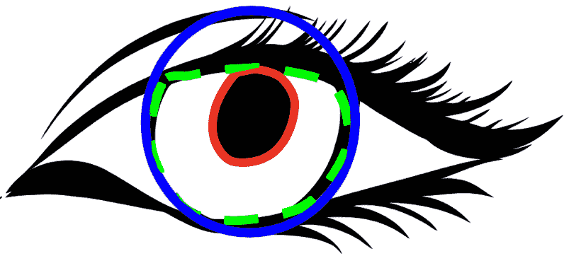
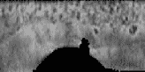
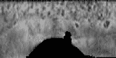
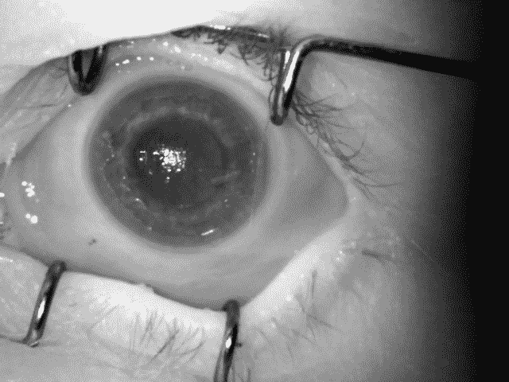
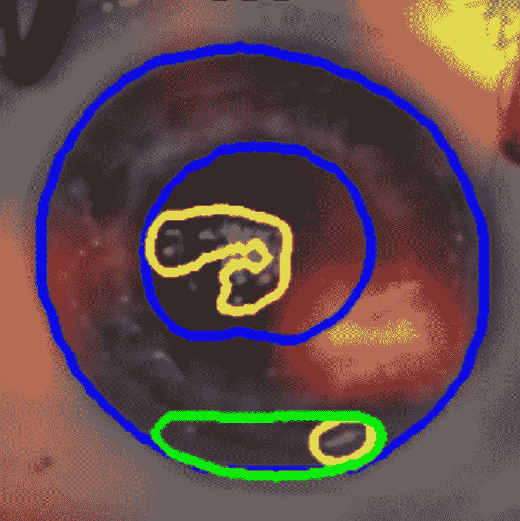

<!--yml

类别: 未分类

日期: 2024-09-06 19:44:04

-->

# [2210.05866] 深度学习在虹膜识别中的应用：综述

> 来源：[`ar5iv.labs.arxiv.org/html/2210.05866`](https://ar5iv.labs.arxiv.org/html/2210.05866)

# 深度学习在虹膜识别中的应用：综述

Kien Nguyen，昆士兰科技大学，澳大利亚 nguyentk@qut.edu.au，Hugo Proença，贝拉内里奥大学，IT: 通讯学院，葡萄牙 hugomcp@di.ubi.pt，以及 Fernando Alonso-Fernandez，哈尔姆斯塔大学，瑞典 feralo@hh.se

###### 摘要。

摘要

在这项综述中，我们提供了对过去 10 年中超过 200 篇论文、技术报告和 GitHub 仓库的全面回顾，这些文献涉及了深度学习技术在虹膜识别中的最新进展，涵盖了算法设计、开源工具、开放挑战和新兴研究等广泛主题。首先，我们对深度学习技术在虹膜生物特征识别中的两个主要子任务——分割和识别——进行了全面分析。其次，我们关注了深度学习技术在虹膜识别系统对抗伪造攻击和人机配对中的鲁棒性。第三，我们深入探讨了深度学习技术在法医学应用中的作用，特别是在尸检后的虹膜识别中。第四，我们回顾了虹膜识别中深度学习技术的开源资源和工具。最后，我们突出了技术挑战、新兴研究趋势以及对虹膜识别中深度学习未来的展望。

虹膜识别、深度学习、神经网络^†^†ccs: 安全与隐私 生物特征识别

## 1. 引言

人眼虹膜是一个调节到达视网膜光线量的器官，通过改变瞳孔的大小来实现。虹膜的纹理在出生前就已完全发育，其细节不依赖于基因型，终生相对稳定（除疾病和正常老化相关的生物变化外），甚至可以在受试者去世后不久用于法医识别（Muron 和 Pospisil，2000；Daugman，2016；Trokielewicz 等，2019）。

就其信息理论相关属性而言，虹膜纹理具有极高的随机性，并且随着时间的推移稳定（持久），每平方毫米的熵值极高，这也解释了其比其他生物识别方式（例如面部或指纹）更高的区分能力。虹膜的采集性是另一个值得关注的特性，并且在过去几年中一直是讨论的主题：虽然可以使用商业现成（COTS）硬件进行采集，无论是手持的还是固定的，但数据甚至可以从距离被试者数十米远的地方进行收集（Nguyen et al., 2017a）。尽管商业可见光（RGB）摄像机能够成像虹膜，但近红外（NIR）传感器在大多数应用中占主导地位，因为对于黑色眼睛中丰富的黑色素，虹膜纹理在 NIR 光谱中的可见性更好，这种光谱的光吸收较短波长光少。此外，NIR 波长几乎无法被人眼感知，这增加了用户的舒适度，并避免了在可见光下出现的瞳孔收缩/扩张现象。

约翰·道格曼的开创性工作带来了基于 Gabor 滤波的方法，这种方法成为虹膜识别的主导方法（Daugman, 1993, 2007, 2021）。尽管后续的虹膜图像编码和匹配解决方案出现了，但由于其在极端时间性能下能够有效地在大规模数据库中搜索且假匹配概率极低，IrisCodes 方法仍然占主导地位。通过考虑二进制字，使用 XOR 并行位逻辑以闪电般的速度匹配签名对，从而实现每个处理核心每秒数百万次比较。此外，大多数在效果上超越原始技术的方法并不适用于*一次性学习*范式，假设每类有多次观察以获得适当的决策边界，并且 - 最重要的是 - 具有时间复杂度的编码/匹配步骤使其在大型环境中无法使用（特别是*全对全*设置）。

简而言之，Daugman 的算法通过用一系列 Gabor 核对虹膜图像进行滤波，将虹膜图像编码为 2,048 位的二进制序列。通过笛卡尔到极坐标系的转换来校正不同的瞳孔大小，最终得到一个标准大小的图像表示，确保虹膜编码的结构在不同的虹膜和瞳孔大小下保持一致。这使得可以使用汉明距离（HD）来测量两个虹膜编码之间的相似性（Daugman，2021）。其在接受的假阳性率下的低假匹配率是全球范围内虹膜识别系统成功的关键因素，例如印度的国家个人识别和边境安全项目 Aadhaar（注册了超过 12 亿对虹膜）（Unique Identification Authority of India，2021），美国的家园先进识别技术（HART）（多达 5 亿个身份）（Planet Biometrics，2017），或 NEXUS 系统，旨在加快低风险和预先批准的旅行者在加拿大和美国之间的边境通行。

基于深度学习的方法，特别是使用各种卷积神经网络架构，在过去十年中推动了许多计算机视觉应用的显著进步。在生物特征技术方面，虹膜识别也在识别流程的各个阶段——从预处理（如偏轴视线校正）、分割、编码到匹配——越来越多地采用了纯数据驱动的方法，这并不令人意外。然而，深度学习对虹膜识别流程各个阶段的影响是不均匀的。本调查论文的主要目标之一是评估深度学习在哪些方面有助于实现高性能和更安全的系统，以及哪些过程没有从更复杂的建模中受益。

本文的其余部分结构如下。第 2 和 3 节回顾了深度学习在识别管道的两个主要阶段中的应用：分割和识别（编码和比较）。第 4 和 5 节分析了基于深度学习的方法在两个应用中的前沿：展示攻击检测（PAD）和法医识别。第六部分探讨了人机如何配对以提升基于深度学习的虹膜识别。第七部分关注虹膜和眼周分析中控制较少的环境下的方法。第八部分回顾了在深度学习基于虹膜识别领域的公共资源和工具。第九部分关注深度学习在虹膜识别中的未来，讨论了虹膜分析不同方面的新兴研究方向。第十部分对论文进行了总结。

## 2\. 基于深度学习的虹膜分割

虹膜分割被视为一个极具挑战性的问题。如图 1 所示，虹膜分割实质上涉及三个任务：检测和参数化虹膜的内（瞳孔）和外（巩膜）生物边界，以及在虹膜环内局部区分噪声干扰/无噪声区域，这些区域随后应在特征编码和匹配过程中使用。

几十年来，这个问题一直激发了无数的研究工作。从开创性的整合-微分算子（Daugman，1993）到后来基于主动轮廓和神经网络的手工技术（例如，(He et al.，2009)，(Proença，2010)，(Shah 和 Ross，2009)和(Vatsa et al.，2008)），在解决这个问题上已经经过了很长的道路。尽管这些技术的效果明显改进，但在数据严重退化的情况下，它们都面临着特殊困难。图像经常出现运动模糊、焦点不准、部分遮挡和偏角。此外，在可见光数据的情况下，还会出现来自主体周围环境的严重反射，甚至增加了分割任务的难度。

近年来，在很多其他计算机视觉任务中，基于深度学习的框架被认为相比最新技术提供了一致的进展，对虹膜分割问题有很多模型被提出。在表格 1 中，给出了最近相关的基于深度学习的方法的整体观点，按时间顺序（然后按字母顺序）列出了这些方法。每个模型旨在处理的数据类型在“*数据*”列中给出，以及进行相应实验的数据集，并列出了每个提案的主要特征的摘要（“*特征*”列）。考虑到模型在完全异构的方式下经验验证，并使用非常不同的指标，我们决定不包括每个模型/解决方案的综合性能摘要。

<svg height="168.43" overflow="visible" version="1.1" width="442.05"><g transform="translate(0,168.43) matrix(1 0 0 -1 0 0) translate(128.51,0) translate(0,79.29)" fill="#000000" stroke="#000000" stroke-width="0.4pt"><g transform="matrix(1.0 0.0 0.0 1.0 -69 -31.5)" fill="#000000" stroke="#000000"><foreignobject width="138" height="63" transform="matrix(1 0 0 -1 0 16.6)" overflow="visible"></foreignobject></g><g transform="matrix(1.0 0.0 0.0 1.0 -74.04 -41.79)" fill="#000000" stroke="#000000"><foreignobject width="148.09" height="8.61" transform="matrix(1 0 0 -1 0 16.6)" overflow="visible">教士边界参数化</foreignobject></g><g transform="matrix(1.0 0.0 0.0 1.0 86.16 -42.49)" fill="#FFFFFF" stroke="#FFFFFF" color="#FFFFFF"><foreignobject width="4.84" height="6.24" transform="matrix(1 0 0 -1 0 16.6)" overflow="visible">2</foreignobject></g><g transform="matrix(1.0 0.0 0.0 1.0 -100.16 -56.51)" fill="#000000" stroke="#000000"><foreignobject width="122.39" height="6.73" transform="matrix(1 0 0 -1 0 16.6)" overflow="visible">无噪声纹理检测</foreignobject></g><g transform="matrix(1.0 0.0 0.0 1.0 33.01 -56.27)" fill="#000000" stroke="#000000" color="#000000"><foreignobject width="4.84" height="6.24" transform="matrix(1 0 0 -1 0 16.6)" overflow="visible">3</foreignobject></g><g transform="matrix(1.0 0.0 0.0 1.0 -99.58 46.79)" fill="#000000" stroke="#000000"><foreignobject width="159.79" height="8.61" transform="matrix(1 0 0 -1 0 16.6)" overflow="visible">瞳孔边界参数化</foreignobject></g><g transform="matrix(1.0 0.0 0.0 1.0 72.38 46.09)" fill="#000000" stroke="#000000" color="#000000"><foreignobject width="4.84" height="6.24" transform="matrix(1 0 0 -1 0 16.6)" overflow="visible">1</foreignobject></g><g transform="matrix(1.0 0.0 0.0 1.0 157.54 -29.5)" fill="#000000" stroke="#000000"><foreignobject width="118" height="59" transform="matrix(1 0 0 -1 0 16.6)" overflow="visible"></foreignobject></g><g transform="matrix(1.0 0.0 0.0 1.0 27.84 69.38)" fill="#000000" stroke="#000000"><foreignobject width="181.69" height="12.3" transform="matrix(1 0 0 -1 0 16.6)" overflow="visible">虹膜分割主要任务</foreignobject></g><g transform="matrix(1.0 0.0 0.0 1.0 161.66 -42.73)" fill="#000000" stroke="#000000"><foreignobject width="110.55" height="6.73" transform="matrix(1 0 0 -1 0 16.6)" overflow="visible">无量纲无噪声</foreignobject></g><g transform="matrix(1.0 0.0 0.0 1.0 184.81 -53.55)" fill="#000000" stroke="#000000"><foreignobject width="63.71" height="8.5" transform="matrix(1 0 0 -1 0 16.6)" overflow="visible">表示</foreignobject></g><g transform="matrix(1.0 0.0 0.0 1.0 113.72 12.63)" fill="#FFFFFF" stroke="#FFFFFF" color="#FFFFFF"><foreignobject width="4.84" height="6.24" transform="matrix(1 0 0 -1 0 16.6)" overflow="visible">2</foreignobject></g><g transform="matrix(1.0 0.0 0.0 1.0 94.04 12.63)" fill="#000000" stroke="#000000" color="#000000"><foreignobject width="4.84" height="6.24" transform="matrix(1 0 0 -1 0 16.6)" overflow="visible">1</foreignobject></g><g transform="matrix(1.0 0.0 0.0 1.0 102.53 13.33)" fill="#000000" stroke="#000000" color="#000000"><foreignobject width="7.53" height="6.46" transform="matrix(1 0 0 -1 0 16.6)" overflow="visible">+</foreignobject></g><g transform="matrix(1.0 0.0 0.0 1.0 122.22 13.33)" fill="#000000" stroke="#000000" color="#000000"><foreignobject width="7.53" height="6.46" transform="matrix(1 0 0 -1 0 16.6)" overflow="visible">+</foreignobject></g><g transform="matrix(1.0 0.0 0.0 1.0 133.41 12.63)" fill="#000000" stroke="#000000" color="#000000"><foreignobject width="4.84" height="6.24" transform="matrix(1 0 0 -1 0 16.6)" overflow="visible">3</foreignobject></g></g></svg>

图 1. 通常与*虹膜分割*相关的三个主要任务：1) 瞳孔（内）边界的参数化；2) 巩膜（外）边界的参数化；以及 3) 区分虹膜环内的非遮挡（无噪声）区域和遮挡（有噪声）区域。这些信息进一步用于获取虹膜纹理的无量纲极坐标表示，特征提取方法通常在此处操作。

Schlett *等*（Schlett et al., 2018）提供了一种多光谱分析方法，通过在实际分割阶段之前对数据进行预处理，提取 RGB 颜色通道的多光谱成分，从而提高可见光波段的虹膜分割精度。尽管这种方法提出了一种基于 DL 的框架，但输入的不同版本可以轻松地用于喂给 DL 模型，并增强对非理想数据的鲁棒性。Chen *等*（Chen et al., 2019a）使用了包括密集块的 CNN，称为密集全卷积网络（DFCN），其中编码器部分由密集块组成，而解码器部分通过转置卷积获取分割掩膜。Hofbauer *等*（Hofbauer et al., 2019）基于来自 CNN 的分割图，参数化虹膜边界，使用具有四个 RefineNet 单元的级联结构，每个单元直接连接到一个残差网络。Huynh *等*（Huynh et al., 2019）通过 DL 模型区分三种不同的眼部区域，并用启发式滤波器去除错误区域。所提出的架构基于编码器-解码器模型，使用深度卷积来降低计算成本。大致在同一时间，Li *等*（Li et al., 2021）描述了用于语义分割和虹膜掩膜合成的*交错残差 U-Net*模型。在这项工作中，使用无监督技术（K 均值聚类）创建眼部区域的中间图像表示，从中找到被认为属于虹膜边界的显著点。Kerrigan *等*（Kerrigan et al., 2019）评估了四种不同卷积架构在语义分割中的表现。这些模型中的两个基于扩张卷积，如 Yu 和 Koltun （Y. and K., 2016）提出的。Wu 和 Zhao（Wu and Zhao, 2019）描述了 Dense U-Net 模型，该模型将密集层与 U-Net 网络结合。其想法是利用 Dense U-Net 参数集的减少，同时保持 U-Net 的语义分割能力。所提出的模型将密集连接集成到 U-Net 的收缩和扩展路径中。与传统 CNN 相比，该模型被称为减少学习冗余并增强信息流，同时控制模型的参数数量。Wei *等*（Zhang et al., 2019）建议执行*扩张卷积*，这被认为可以获得更一致的全局特征。在这种设置下，卷积核不连续，在每个非零位置之间人为插入零值，从而增加感受野而不增加模型的参数数量。

表 1. 相关 DL 基于虹膜分割方法的综合比较（NIR: *近红外*; VW: *可见波长*）。方法按时间顺序（然后按字母顺序）列出。

| 方法 | 年份 | 数据 | 数据集 | 特性 |
| --- | --- | --- | --- | --- |
| NIR | VW |
| 施莱特 *等* (Schlett et al., 2018) | 2018 | ✗ | ✓ | MobBIO | 预处理（结合输入 RGB 通道的不同可能性） |
| 特罗基列维奇和查伊卡 (Trokielewicz and Czajka, 2018) | 2018 | ✓ | ✓ | Warsaw-Post-Mortem v1.0 | 微调 CNN (SegNet) |
| 陈 *等* (Chen et al., 2019a) | 2019 | ✓ | ✓ | CASIA-Irisv4-Interval, IITD, UBIRIS.v2 | Dense CNN |
| 霍夫鲍尔 *等* (Hofbauer et al., 2019) | 2019 | ✓ | ✗ | IITD, CASIA-Irisv4-Interval, ND-Iris-0405 | 四个 RefineNet 的级联架构，每个连接到一个 Residual net |
| 黄 *等* (Huynh et al., 2019) | 2019 | ✓ | ✗ | OpenEDS | MobileNetV2 + 启发式过滤后处理 |
| 李 *等* (Anisetti et al., 2019) | 2019 | ✓ | ✗ | CASIA-Iris-Thousand | Faster-R-CNN (ROI 检测) |
| 凯里根 *等* (Kerrigan et al., 2019) | 2019 | ✓ | ✓ | CASIA-Irisv4-Interval, BioSec, ND-Iris-0405, UBIRIS.v2, Warsaw-Post-Mortem v2.0, ND-TWINS-2009-2010 | Resent + Segnet（带膨胀卷积） |
| 吴和赵 (Wu and Zhao, 2019) | 2019 | ✓ | ✓ | CASIA-Irisv4-Interval, UBIRIS.v2 | Dense-U-Net (密集层 + U-Net) |
| 魏 *等* (Zhang et al., 2019) | 2019 | ✓ | ✓ | CASIA-Iris4-Interval, ND-IRIS-0405, UBIRIS.v2 | 带膨胀卷积的 U-Net |
| 方和查伊卡 (Fang and Czajka, 2020) | 2020 | ✓ | ✓ | ND-Iris-0405, CASIA, BATH, BioSec, UBIRIS, Warsaw-Post-Mortem v1.0 & v2.0 | 微调 CC-Net (Mishra et al., 2019) |
| 加涅娃和米亚斯尼科夫 (Ganeeva and Myasnikov, 2020) | 2020 | ✓ | ✗ | MMU | U-Net, LinkNet 和 FC-DenseNet（性能比较） |
| 贾利安 *等* (Jalilian et al., 2020) | 2020 | ✓ | ✗ |  | RefineNet + 形态学后处理 |
| 萨达尔 *等* (Sardar et al., 2020) | 2020 | ✓ | ✓ | CASIA-Irisv4-Interval, IITD, UBIRIS.v2 | Squeeze-Expand 模块 + 主动学习（交互式分割） |
| 特罗基列维奇 *等* (Trokielewicz et al., 2020) | 2020 | ✓ | ✓ | ND-Iris-0405, CASIA, BATH, BioSec, UBIRIS, Warsaw-Post-Mortem v1.0 & v2.0 | 微调 SegNet (Badrinarayanan et al., 2017) |
| 王等 (Wang et al., 2020b) | 2020 | ✓ | ✓ | CASIA-Iris-M1-S1/S2/S3, MICHE-I | Hourglass 网络 |
| 王 *等* (Wang et al., 2020a) | 2020 | ✓ | ✓ | CASIA-v4-Distance, UBIRIS.v2, MICHE-I | U-Net + 多任务注意力网 + 后处理（概率掩模先验 & 阈值处理） |
| 李 *等* (Li et al., 2021) | 2021 | ✓ | ✗ | CASIA-Iris-Thousand | IRU-Net 网络 |
| 王*等*人（Wang et al.，2021） | 2021 | ✗ | ✓ | 在线视频流和互联网视频 | 使用 U-Net 和 Squeezenet 进行虹膜分割和眼睛闭合检测 |
| Kuehlkamp *等*人（Kuehlkamp et al.，2022） | 2022 | ✓ | ✓ | ND-Iris-0405, CASIA, BATH, BioSec, UBIRIS, Warsaw-Post-Mortem v2.0 | Mask-RCNN 架构的精细调整 |

最近，Ganeva 和 Myasnikov（Ganeeva and Myasnikov，2020）比较了三种卷积神经网络架构（U-Net、LinkNet 和 FC-DenseNet）的有效性，确定了每种架构的最佳参数化。Jalilian *等*人（Jalilian et al.，2020）提出了一种补偿因角度畸变引起的纹理变形的方案，将角度畸变图像重新投影回正视图。使用的架构是 RefineNet（Lin et al.，2016）的一个变体，提供了高分辨率预测，同时保留了边界信息（用于参数化目的）。

用于虹膜分割的互动学习理念由 Sardar *等*人（Sardar et al.，2020）提出，描述了一种包含 Squeeze Expand 模块的 U-Net 互动变体。Trokielewicz *等*人（Trokielewicz et al.，2020）使用基于深度学习的虹膜分割模型来提取尸检虹膜图像中的高度不规则虹膜纹理区域。他们使用了一个经过预训练的 SegNet 模型，并用尸体虹膜图像数据库进行了微调。王*等*人（Wang et al.，2020b）（在（Wang et al.，2019b）中进一步扩展）描述了一种专门为手持设备获取的退化图像设计的轻量级深度卷积神经网络。该方法联合获取虹膜的分割掩码和参数化的瞳孔/角膜边界。

观察到边缘信息在退化数据中极其敏感，Li *等*人（Anisetti et al.，2019）提出了一种结合边缘信息和深度学习框架的混合方法。使用了类似 Faster R-CNN 的紧凑架构来大致检测眼睛并定义初始兴趣区域，然后通过高斯混合模型进一步定位瞳孔。王*等*人（Wang et al.，2021）训练了一个深度卷积神经网络（DCNN），自动提取输入图像中每只眼睛的虹膜和瞳孔像素。这项工作结合了 U-Net 和 SqueezeNet 的优势，获得了适用于实时移动应用的紧凑 CNN。最后，王*等*人（Wang et al.，2020a）通过将这些信息建模到一个统一的多任务网络中，联合参数化虹膜掩码和内/外虹膜边界。

最后要提到的是*无分割*技术。假设虹膜边界的准确分割是整个识别链中最困难的阶段之一，并且是识别错误的主要来源，一些近期的研究提出在未分割或粗略分割的数据中进行生物特征识别（Proença 和 Neves，2017）（Proença 和 Neves，2019）。在这里，思想是利用深度学习框架的显著区分能力来感知图像对之间的一致模式，即使在*无分割*表示中也是如此。

## 3\. 基于深度学习的虹膜识别

### 3.1\. 深度学习模型作为特征提取器

<svg   height="158.59" overflow="visible" version="1.1" width="442.05"><g transform="translate(0,158.59) matrix(1 0 0 -1 0 0) translate(128.51,0) translate(0,79.29)" fill="#000000" stroke="#000000" stroke-width="0.4pt"><g transform="matrix(1.0 0.0 0.0 1.0 -3.16 55.6)" fill="#000000" stroke="#000000"><foreignobject width="203.56" height="12.3" transform="matrix(1 0 0 -1 0 16.6)" overflow="visible">基于深度学习的特征表示</foreignobject></g><g transform="matrix(1.0 0.0 0.0 1.0 -78.84 -34.5)" fill="#000000" stroke="#000000"><foreignobject width="138" height="69" transform="matrix(1 0 0 -1 0 16.6)" overflow="visible"></foreignobject></g><g transform="matrix(1.0 0.0 0.0 1.0 -64.72 -42.73)" fill="#000000" stroke="#000000"><foreignobject width="110.55" height="6.73" transform="matrix(1 0 0 -1 0 16.6)" overflow="visible">无量纲噪声自由</foreignobject></g> <g transform="matrix(1.0 0.0 0.0 1.0 -41.56 -53.55)" fill="#000000" stroke="#000000"><foreignobject width="63.71" height="8.5" transform="matrix(1 0 0 -1 0 16.6)" overflow="visible">表示</foreignobject></g><g transform="matrix(1.0 0.0 0.0 1.0 245.39 -48.58)" fill="#000000" stroke="#000000"><foreignobject width="48.59" height="6.62" transform="matrix(1 0 0 -1 0 16.6)" overflow="visible">特征集</foreignobject></g><g transform="matrix(1.0 0.0 0.0 1.0 258.8 -22.21)" fill="#000000" stroke="#000000"><foreignobject width="17.84" height="44.42" transform="matrix(1 0 0 -1 0 16.6)" overflow="visible"><mathalttext="\left.\begin{bmatrix}f_{1}\\

f_{2}\\

\vdots\\

f_{t}\\

\end{bmatrix}\right." display="inline"><semantics ><mrow ><mo >[</mo><mtable rowspacing="0pt" ><mtr ><mtd ><msub ><mi mathsize="90%" >f</mi><mn mathsize="90%" >1</mn></msub></mtd></mtr><mtr ><mtd ><msub ><mi mathsize="90%" >f</mi><mn mathsize="90%" >2</mn></msub></mtd></mtr><mtr ><mtd ><mi mathsize="90%" mathvariant="normal" >⋮</mi></mtd></mtr><mtr ><mtd ><msub ><mi mathsize="90%" >f</mi><mi mathsize="90%" >t</mi></msub></mtd></mtr></mtable><mo >]</mo></mrow><annotation-xml encoding="MathML-Content" ><apply ><csymbol cd="latexml" >matrix</csymbol><matrix ><matrixrow ><apply><csymbol cd="ambiguous" >subscript</csymbol><ci>𝑓</ci><cn type="integer" >1</cn></apply></matrixrow><matrixrow ><apply><csymbol cd="ambiguous" >subscript</csymbol><ci>𝑓</ci><cn type="integer" >2</cn></apply></matrixrow><matrixrow ><ci>⋮</ci></matrixrow><matrixrow ><apply><csymbol cd="ambiguous" >subscript</csymbol><ci>𝑓</ci><ci>𝑡</ci></apply></matrixrow></matrix></apply></annotation-xml><annotation encoding="application/x-tex" >\left.\begin{bmatrix}f_{1}\\ f_{2}\\ \vdots\\ f_{t}\\ \end{bmatrix}\right.</annotation></semantics></math></foreignobject></g></g></svg>

图 2. 基于深度学习的虹膜特征提取的主要任务：给定虹膜数据的无量纲表示，获得其紧凑且具有代表性的表示——特征集——这在分类阶段进一步使用。

如图 2 所示，这里的思路是分析虹膜数据的无量纲表示，并生成一个位于超空间（嵌入）中的特征向量，在此空间中进行识别。

在这种情况下，Boyd *等人* (Boyd et al., 2019) 探索了流行的 ResNet50 架构的五组不同权重，以测试特定于虹膜的特征提取器是否比为一般任务训练的模型表现更好。Minaee *等人* (Minaee et al., 2016) 研究了从 VGG-Net 中提取的深度特征在虹膜识别中的应用，作者观察到这些特征可以很好地迁移到生物识别任务中。Luo *等人* (Luo et al., 2021) 描述了一个具有空间注意力和通道注意力机制的深度学习模型，这些机制被直接插入到特征提取模块中。此外，一个共注意力机制自适应地融合特征，以获得具有代表性的虹膜-周边特征。Hafner *等人* (Hafner et al., 2021) 采用了经典的 Daugman 流程，使用卷积神经网络作为特征提取器。DenseNet-201 架构在开放世界和封闭世界环境中都表现出色，达到了最先进的结果。Menotti *等人* (Menotti et al., 2015) 评估了基于深度学习的特征表示如何在欺骗检测中使用，观察到基于 CNN 的欺骗检测系统对已知攻击具有鲁棒性，并且能够以较少的努力适应未来的基于图像的攻击。

Yang *等人* (Yang et al., 2021) 通过编码器-解码器结构生成了多层级的空间对应特征表示。此外，使用了空间注意力特征融合模块，以更有效地集成结果特征。Chen *等人* (Chen et al., 2020) 解决了大规模识别问题，并描述了一种优化的中心损失函数（紧凑中心），以减轻交叉熵函数的不足判别能力。Nguyen *等人* (Nguyen et al., 2017b) 探索了最先进的预训练 CNN 在虹膜识别中的性能，得出结论认为现成的 CNN 通用特征在表示虹膜图像方面也非常出色，有效提取了判别性视觉特征并取得了良好的结果。Zhao *等人* (Zhao et al., 2019) 提出了基于胶囊网络架构的方法，其中描述了一种基于两个胶囊层之间动态路由的修改路由算法，并使用三个预训练模型（VGG16、InceptionV3 和 ResNet50）提取主要虹膜特征。接下来，一个卷积胶囊取代了全连接胶囊，以减少参数数量。Wang 和 Kumar (Wang and Kumar, 2019) 引入了虹膜识别的*残差特征*概念。他们描述了一种带有离线三元组选择和扩张卷积核的残差网络学习程序。

其他研究已经探讨了在多生物特征设置中提取适当特征表示的方法：Damer *et* al.（Damer et al., 2019）提议在单一 DNN 中联合提取多生物特征表示。与以往从每个生物特征模态中创建独立表示的方法不同，他们从多模态（面部和虹膜）、多实例（左侧和右侧虹膜）以及多样本（两个面部样本）中创建这些表示，这可以视为数据层面的融合策略。最后，考虑到在手持设备上执行可靠识别的困难，Odinokikh *et* al.（Odinokikh et al., 2019）结合了手工特征提取器和先进深度学习技术的优点。该模型利用浅层和深层特征表示，结合描述环境的特征，以减少这种环境中预期的主体内变异。

### 3.2\. 基于深度学习的虹膜匹配策略

现有的匹配策略可以分为三类：（1）使用传统分类器，如 SVM、RF 和稀疏表示；（2）基于 softmax 的损失；（3）基于对的损失。表 2 提供了最相关的近期基于深度学习的方法的凝练视角，技术按时间顺序（然后按字母顺序）排列。

#### 3.2.1\. 传统分类器

各种研究人员已使用在 ImageNet 数据集上设计和预训练的深度学习网络来提取虹膜特征表示，随后使用传统分类器，如 SVM、RF、稀疏表示等（Nguyen et al., 2017b；Boyd et al., 2019；Boyd et al., 2020b）。这些方法的关键好处是“即插即用”的简单性，其中从大规模计算机视觉挑战中继承来的经过验证和预训练的深度学习网络广泛可用并准备使用（Nguyen et al., 2017b）。另一个好处是，无需大规模的虹膜图像数据集来训练这些网络，因为它们已经在如 ImageNet 这样的超大规模数据集上进行过训练。考虑到这些网络通常包含数百层和数百万个参数，并需要数百万张图像进行训练，使用预训练网络极为有利。

#### 3.2.2\. 虹膜分类网络

虹膜分类网络将深度学习架构与一系列基于 softmax 的损失函数结合，以将虹膜图像分类到已知身份列表中。将 softmax 损失与主干网络结合使得通过常用的优化策略如反向传播和最陡梯度下降，能够以端到端的方式训练主干网络。与传统的分类器方法相比，这类基于 DL 的主干网络可以直接从虹膜数据中学习，使其更好地表示虹膜。关键好处是，它类似于通用图像分类任务，因此通用图像分类任务中的所有设计和算法都可以简单地应用于虹膜图像数据。这些虹膜分类网络的典型示例有（Gangwar 和 Joshi，2016；Boyd 等，2019）。然而，这些基于 softmax 的网络要求测试图像中的虹膜在训练集中已知的身份类中，这意味着每当添加新类别（*即* 新身份）时，网络必须重新训练。Gangwar *等人* 提出了两个主干网络（*即* DeepIrisNet-A 和 DeepIrisNet-B），随后使用 softmax 损失进行虹膜识别任务（Gangwar 和 Joshi，2016）。后来，他们提出了另一个主干网络，但仍然跟随 softmax 损失将一个标准化的虹膜图像分类到预定义的身份列表中（Gangwar 等，2019）。

主干网络架构：由于其相似性，虹膜识别任务中借用了广泛的通用图像分类主干网络架构。

+   •

    AlexNet：与其他方法相比，AlexNet 是最原始的且被证明在虹膜识别中准确性最低（Boyd 等，2020a；Nguyen 等，2017b）。

+   •

    VGG：Boyd *等人*（Boyd 等，2020a）、Nguyen *等人*（Nguyen 等，2017b）和 Minaee *等人*（Minaee 等，2016）都实验了 VGG16。

+   •

    ResNet：ResNet 及其变体是最受欢迎的主干网络架构。Nguyen *等人* 实验了 ResNet152（Nguyen 等，2017b）。Boyd *等人* 在他们的尸检虹膜分类任务中实验了三个变体 ResNet18、ResNet50 和 ResNet152（Boyd 等，2020a）。

+   •

    Inception：Zhao *等人* 基于 InceptionV3 架构使用了胶囊网络（Zhao 等，2019）。

+   •

    EfficientNet：Hsiao *等人*（Hsiao 和 Fan，2021）使用 EfficientNet 提取虹膜特征。

#### 3.2.3\. 虹膜相似度网络

虹膜相似性网络将深度学习架构与一系列基于成对的损失函数结合起来，以学习表示两张虹膜图像的相似或不相似的度量，而无需知道其身份。成对损失旨在将相同虹膜的图像拉近，而将不同虹膜的图像推远于相似性距离空间。不同于仅在预定义身份列表上进行识别模式操作的虹膜分类网络，虹膜相似性网络在开放身份集合中操作，包括验证和识别模式（赵和库马，2017b）。这些虹膜相似性网络的典型例子有（刘等人，2016b；赵和库马，2017b；王和库马，2019；阮等人，2020；贾利安等人，2022）。这些网络有三个主要优点：（i）验证和识别：虹膜相似性网络在验证和识别模式下均可操作；（ii）开放身份集合：虹膜相似性网络在开放身份集合中操作；（iii）明确反映：虹膜相似性网络直接且明确地反映我们想要实现的目标，*即，*相同主体的虹膜之间距离较小，而不同主体的虹膜之间距离较大。

成对损失：年丰*等人*（刘等人，2016b）提出了一种成对网络，该网络接收两张输入图像并直接输出相似性分数。他们设计了一个成对层，该层接收两张输入图像并通过骨干网络编码其特征。骨干网络通过迭代训练以最小化真实配对（相同身份的配对）之间的不相似距离，并最大化冒充配对（不同身份的配对）之间的不相似距离。

三元组损失：由于配对网络使用不同的真实对和假冒对进行训练，因此可能无法很好地收敛，这在面部识别中已经得到证明（Schroff 等，2015）。与在每次训练迭代中使用一对两张图像来更新训练的配对损失不同，三元组损失使用三张图像的三元组：一个锚图像，一个具有相同身份的正样本图像和一个具有不同身份的负样本图像（Schroff 等，2015）。骨干网络被训练以同时最小化正样本图像与锚图像之间的相似度距离，并最大化负样本图像与锚图像之间的距离。专门针对虹膜图像，赵*等*（赵和库马，2017b；王和库马，2019；赵和库马，2019）提出了扩展三元组损失（EPL），以结合位移操作处理标准化虹膜图像中的旋转。Nguyen *等* 也使用了 ETL 进行虹膜识别网络（Nguyen 等，2020，2022）。Kuehlkamp *等*（Kuehlkamp 等，2022）提出通过强制距离为正（通过使用 sigmoid 输出层）并向误差添加对数惩罚来改进通用三元组损失函数。这一修改允许网络在样本之间的差异为负时仍能学习并更快收敛。Yan *等*（Yan 等，2021）将通用三元组损失扩展到批量三元组损失，其中三元组损失是在 $S$ 个主体和每个主体的 $K$ 张图像上计算的。进行批量三元组损失通常期望具有平滑的损失函数。Yang *等*（Yang 等，2021）通过批量硬（Yuan 等，2020）改进了训练的三元组选择方法。

骨干网络架构：与分类虹膜网络不同，相似度虹膜网络通常设计有其自身的网络架构，并且通常比分类网络要“浅”得多。

+   •

    FCN：所有相似性虹膜网络都使用完全卷积网络（FCNs）而不是 CNNs。与 CNNs 相比，FCNs（Long et al., 2015）没有完全连接层，使输出图能够保留原始空间信息。这对虹膜识别非常重要，因为输出图能够保留与原始输入图像的空间对应关系（Zhao and Kumar, 2017b; Nguyen et al., 2020），从而实现像素到像素的匹配。Zhao *et al.*（Zhao and Kumar, 2017b）提出了一种具有 3 个卷积层的 FCN 架构，后面跟有激活和池化层。卷积层的输出被上采样到原始输入图像的大小。上采样的特征被堆叠并通过另一个卷积层进行卷积，以生成与输入图像大小相同的二维特征。后来，他们用膨胀卷积扩展了骨干网络（Wang and Kumar, 2019）。Yan *et al.*（Yan et al., 2021）采用了 ResNet 架构并用三元组损失进行了微调。Kuehlkamp *et al.* 仅使用了 ResNet 架构的一部分。

+   •

    NAS：Nguyen *et al.*（Nguyen et al., 2020）提议直接从数据中学习网络架构，而不是手动设计或使用通用的图像分类架构。他们提出了一种差分神经架构搜索（NAS）方法，该方法将架构设计过程建模为双层约束优化方法。这种方法不仅能够搜索出实现最佳性能的最优网络，还可以对资源如模型大小或计算操作数量施加约束。

+   •

    复数值：观察到虹膜纹理与通用物体图像之间存在内在差异，其中虹膜纹理是随机的，没有一致的形状、边缘或语义结构，Nguyen *et al.*（Nguyen et al., 2022）认为网络架构必须更好地结合领域特定知识，以充分发挥虹膜识别的潜力。他们还观察到，许多著名的手工特征，如 IrisCode（Daugman, 2007），首先将虹膜纹理图像转换为复数值表示，然后进一步编码该复数值表示以获得最终表示。他们提议使用完全复数值的网络，而不是流行的实数值网络。复数值的骨干网络更好地保留了相位，对多尺度、多分辨率和多方向具有更好的不变性，与经典的 Gabor 小波（Tygert et al., 2016）有很好的对应关系，因此比实数值网络更适合虹膜识别。

表 2. 最相关的基于深度学习的虹膜识别方法的综合比较（NIR: *近红外*；VW: *可见光波长*）。方法按时间顺序（然后按字母顺序）列出。

| 类别 | 方法 | 年份 | 数据 | 数据集 | 特征 |
| --- | --- | --- | --- | --- | --- |
| NIR | VW |
| 传统分类器 | Menotti et al. (Menotti et al., 2015) | 2015 | ✓ | ✓ | Biosec, LivDet-2013-Warsaw, MobBIOfake | 浅层 CNN + SVM 进行欺骗检测 |
| Minaee et al. (Minaee et al., 2016) | 2016 | ✓ | ✗ | CASIA-Iris-Thousand, IITD | VGG + SVM |
| Nguyen et al.(Nguyen et al., 2017b) | 2017 | ✓ | ✗ | ND-CrossSensor-2013, CASIA-Iris-Thousand | AlexNet, VGG, Google Inception, ResNet, DenseNet + SVM |
| Boyd et al.(Boyd et al., 2019) | 2019 | ✓ | ✓ | CASIA-Irisv4-Interval, IITD, UBIRIS.v2 | ResNet50 + SVM |
| Boyd et al.(Boyd et al., 2020b) | 2020 | ✓ | ✓ | DCMEO1, Warsaw | AlexNet, ResNet, VGG, DenseNet + 余弦, 欧氏, MSE |
| Hafner et al.(Hafner et al., 2021) | 2021 | ✓ | ✗ | CASIA-Iris-Thousand | ResNet101 + DenseNet-201 + 余弦相似度 |
| 分类网络 | Gangwar et al.(Gangwar 和 Joshi, 2016) | 2016 | ✓ | ✗ | ND-IRIS-0405, ND-CrossSensor-2013 | DeepIrisNet |
| Gangwar et al.(Gangwar et al., 2019) | 2019 | ✓ | ✓ | ND-IRIS-0405, UBIRIS.v2, MICHE-I, CASIA-Irisv4-Interval | DeepIrisNetV2 |
| Odinokikh et al.(Odinokikh et al., 2019) | 2019 | ✓ | ✗ | CASIA-Iris-M1-S2, CASIA-Iris-M1-S3, Iris-Mobile | 特征融合 + Softmax |
| Zhao et al.(Zhao et al., 2019) | 2019 | ✓ | ✗ | JluIrisV3.1, JluIrisV4, CASIA-Irisv4-Lamp | 胶囊网络 + Softmax |
| Chen et al. (Chen et al., 2020) | 2020 | ✓ | ✗ | ND-IRIS-0405, CASIA-Iris-Thousand, IITD 跨传感器 | T-Center 损失 |
| Luo et al.(Luo et al., 2021) | 2021 | ✓ | ✗ | ND-IRIS-0405, CASIA-Iris-Thousand | 注意力 + Softmax 损失 + 中心损失 |
| 相似度网络 | Nianfeng et al.(Liu et al., 2016b) | 2016 | ✓ | ✗ | Q-FIRE, CASIA-Cross-Sensor | DeepIris |
| Zhao et al.(Zhao 和 Kumar, 2017b) | 2017 | ✓ | ✓ | CASIA-Irisv4-Interval, IITD, UBIRIS.v2 | UniNet (FeatNet+MaskNet) + 扩展三元组损失 |
| Damer et al.(Damer et al., 2019) | 2019 | ✓ | ✗ | Biosecure, CASIA-Iris-Thousand/Lamp/Interval | Inception + 三元组损失 |
| Wang et al.(Wang 和 Kumar, 2019) | 2019 | ✓ | ✓ | CASIA-Irisv4-Interval, IITD, UBIRIS.v2 | FeatNet + 膨胀卷积 + 扩展三元组损失 |
| Zhao et al.(Zhao 和 Kumar, 2019) | 2019 | ✓ | ✗ | ND-Iris-0405, Casia-Irisv4-Distance, IITD | FeatNet + Mask RCNN + 扩展三元组损失 |
| Nguyen et al.(Nguyen et al., 2020) | 2020 | ✓ | ✓ | CASIA-v4-Distance, UBIRIS.v2, ND-CrossSensor-2013 | 约束设计骨干 + 扩展三元组损失 |
| Yan et al.（Yan et al.，2021） | 2021 | ✓ | ✗ | CASIA-Iris-Thousand | 空间特征重建 + 三元组损失 |
| Yang et al.（Yang et al.，2021） | 2021 | ✓ | ✗ | CASIA-Irisv4-Thousand, CASIA-Irisv4-Distance, IITD | 双空间注意网络 + 批量硬 |
| Nguyen et al.（Nguyen et al.，2022） | 2022 | ✓ | ✓ | ND-CrossSensor-2013, CASIA-Iris-Thousand, UBIRIS.v2 | 复数值骨干网 + 扩展三元组损失 |
| Kuehlkamp et al.（Kuehlkamp et al.，2022） | 2022 | ✓ | ✓ | DCMEO1, DCMEO2, Warsaw-Post-Mortem v2.0 | ResNet + 三元组损失 |

### 3.3\. 端到端联合虹膜分割+识别网络

几乎所有现有的方法都进行分割和归一化，以将输入图像转换为归一化的矩形二维表示，因为这简化了表示学习。由于分割和识别可能需要单独的网络，这会导致计算和训练上的冗余，进一步减缓基于深度学习的虹膜识别方法的速度。一些研究人员探讨了执行端到端网络的方法。一种方法是执行无需分割的识别。另一种方法是通过多任务学习使用统一的网络联合学习分割和识别。

无需分割：这些方法直接将裁剪后的虹膜图像输入深度学习网络以提取特征。例如，Kuehlkamp *et al.*（Kuehlkamp et al.，2022）使用了 Mask R-CNN 进行语义分割，并将裁剪后的虹膜区域直接输入 ResNet50 以提取特征。类似地，Chen *et al.*（Chen et al.，2019b）也将裁剪后的虹膜图像直接输入 DenseNet。与直接输入裁剪后的虹膜图像不同，Proenca *et al.* 首先将裁剪区域（由 SSD 检测）转换为极坐标表示，然后将极坐标表示输入 VGG19 以提取特征（Proença and Neves，2019）。

多任务：可以通过一个统一的网络联合学习分割和识别。这为多任务学习铺平了道路。然而，分割和识别可能需要不同数量的层，因此需要研究以不同的中间层执行每个任务。据我所知，目前尚未存在探索此方向的方法。

## 4\. 基于深度学习的虹膜呈现攻击检测

与生物特征识别的普及同步，这些系统的安全性在面对攻击时变得至关重要。最常见的攻击是**呈现攻击（PA）**，指的是向传感器展示伪造样本。攻击的目标可以是冒充他人身份（也称为**冒充者攻击呈现**），或是隐藏自己的身份（也称为**隐蔽者攻击呈现**）。通过冒充者攻击，一个人还可能进行欺诈性注册，从而持续操控系统。前面提到的缩写和斜体术语对应于 ISO/IEC 生物特征识别技术（技术 — 生物特征呈现攻击检测 — 第一部分：框架，2016）的 ISO/IEC 第 37 分委员会（SC37）系列标准中推荐的词汇，我们将在本节剩余部分遵循这些术语。用于进行冒充者攻击的**呈现攻击工具（PAI）**通常来源于具有合法系统访问权限的个体的虹膜真实图像。虹膜会被打印在纸张上（打印攻击）或在屏幕上显示（重播攻击），然后呈现给传感器。已故个体的虹膜也可以作为 PAI 使用，因为纹理在几个小时内保持完好（Trokielewicz 等，2018）。理论上，也可以将真实的虹膜纹理打印到隐形眼镜上，尽管这尚未成功展示（Boyd 等，2020a）。另一方面，**隐蔽者攻击**通常通过纹理隐形眼镜进行，这些隐形眼镜遮蔽或改变眼睛的某些属性（如颜色），以防止系统识别用户。合成虹膜图像（Yadav 等，2019a）也可用于类似目的。隐蔽者还可以以系统未预期的方式呈现其合法虹膜，例如尽量闭合眼睑、侧视（非轴线注视）、旋转头部等。

PAs 的两个挑战是它们发生在系统的物理限制之外，并且不需要对其内部工作原理或任何技术知识有特定了解。因此，如果没有得到适当处理，它们可能会影响公众对即使是最可靠的生物识别方式的看法。如果在没有任何监督的情况下进行身份验证，这一点尤为重要。应对此类攻击的展示攻击检测（PAD）方法可以在（Galbally 和 Gomez-Barrero，2016）：$i$) 硬件（或传感器）级别，使用额外的光源或传感器来检测活体眼睛的固有特性或对外部刺激（如瞳孔收缩或反射）的反应，或 $ii$) 软件级别，仅使用在进行身份验证时所用的标准传感器捕捉的图像中留下的（如果有的话）PA 的痕迹。基于软件的技术原则上成本更低且侵入性更小，因为它们不需要额外的硬件，本节将以这些技术为重点。

关于 PAD 的两个综合调查分别是（Czajka 和 Bowyer，2018）（2018）和（Boyd 等，2020a）（2020）。尽管 DL 技术在 2018 年的调查中处于残余状态，但其后迅速流行。我们基于最新的调查，概述了自发布以来 DL-PAD 的最重要进展（表 3）。后续第八部分对所用数据集进行了描述性总结。PAD 的目标是将图像分类为真实的或攻击的展示，因此通常被建模为一个两类分类任务。典型的策略模仿了前一节在应用 DL 于虹膜识别时的趋势：要么使用 CNN 主干提取特征，然后将其输入到传统分类器中，要么训练网络端到端地进行分类。一些混合方法还结合了传统手工设计的特征和深度学习特征。同样，网络可以例如在 ImageNet 数据集上进行初始化，以利用这样的通用大数据集，因为现有的虹膜 PAD 数据较为稀缺。另一个在 PAD 文献中广泛采用的策略是使用对抗网络，其中 GAN（Goodfellow 等，2014）被训练生成合成虹膜图像，判别器必须使用这些图像来检测攻击样本。

### 4.1\. 用于特征提取的 CNN

由于 CNN 的每一层表示不同的抽象层次，Fang 等（Fang 等，2020a）融合了两个模型（VGG16，MobileNetv3-small）的最后四层卷积层的特征。这些特征通过 PCA 投影到较低维度的空间中，并通过 SVM 进行分类（特征融合）或将每一层的分类分数组合（分数融合）。在包含打印件和纹理隐形眼镜的两个数据库上，该方法表现出优于单独使用不同层或网络倒数第二层特征向量的效果。

### 4.2\. 端到端分类网络

Arora 和 Bathia（Arora 和 Bhatia，2020）训练了一个具有 10 层卷积层的 CNN 来检测隐形眼镜和打印件。网络并非使用整个图像，而是对虹膜图像的各个部分进行训练。该系统显示出优于当时大多数基于手工特征的最先进方法的性能。

针对嵌入式低功耗设备，Peng 等（Peng 等，2020）采用了基于三个密集块的 Lite Anti-attack Iris Location Network（LAILNet），这些密集块具有深度可分离卷积以减少参数数量。该算法在包含打印件、合成虹膜、隐形眼镜和人造塑料眼的三个数据库上表现出非常好的性能。

同样关注移动设备，Fang 等（Fang 等，2021b；Fang 等，2020b）使用了 MobileNetv3-small。贡献在于将标准化虹膜图像划分为重叠的微条纹，并单独输入，通过多数投票得出决策。声称的优点是分类器被迫关注虹膜/巩膜边界（由其精确的微条纹给出），输入维度更低，样本量更高（减少过拟合），并且减轻了不精确分割的影响。使用包含隐形眼镜和打印件的三个数据库，本文进行了广泛的实验，包括跨数据库、跨传感器和跨攻击设置。

Sharma 和 Ross（Sharma 和 Ross，2020）提出了基于 DenseNet121 的 D-NetPAD，之所以选择 DenseNet121 是因为其密集连接带来了最大的信息流，或者相较于 ResNet 或 VGG 等对手，参数更少。PAI 包括打印件、人造眼、化妆用隐形眼镜、Kindle 重放和打印件上的透明圆顶，实验证明该方法在跨-PAI、跨传感器和跨数据库场景下的有效性。

陈和罗斯（Chen and Ross, 2021）提出了一种可解释的注意力引导检测器（AG-PAD）。为此，将 DenseNet121 的特征图输入到两个模块中，这些模块分别捕捉通道间和空间间的特征依赖关系。然后通过元素逐一求和将输出融合，以捕捉来自通道和空间维度的互补注意力特征。使用包含彩色隐形眼镜、人工眼（Van Dyke/假眼）、印刷物和纹理隐形眼镜的三个数据集，注意力模块显示出比基线网络更高的准确性。通过热图可视化，还显示注意力模块使网络关注于环形虹膜纹理区域，这直观上对 PAD 起着至关重要的作用。

空间注意力也被方等（Fang et al., 2021c）探索了。为了找到对做出准确决策贡献最大的局部区域并捕捉像素/补丁级的线索，他们提出了一种基于注意力的像素级二进制监督（A-PBS）方法。为了捕捉不同层次的抽象，他们通过在 DenseNet 主干网的三个层级的特征图中添加空间注意力模块来进行多尺度融合。使用六个包含纹理镜片和印刷物的数据集，他们在包括未知攻击、传感器和数据库的场景下超越了之前的最先进技术。

鉴于收集虹膜 PAD 数据的困难，大多数数据库最多只包含几百个样本。为了解决这个问题，方等（Fang et al., 2021d）研究了通过修改位置、尺度或光照的数据增强技术。通过使用三种架构（ResNet50、VGG16、MobileNetv3-small）和三个包含印刷物和纹理隐形眼镜的数据库，他们发现数据增强显著提升了 PAD 性能，但每种技术在特定数据集或 CNN 上具有积极作用。他们还探讨了数据增强技术的选择，发现对于最佳组合没有共识，这归因于捕捉环境、样本群体、不同数据集的规模或真实样本与攻击样本之间的不平衡。

Gupta 等人（Gupta 等人, 2021）提出了 MVANet，具有 5 个卷积层和 3 个全连接层分支。他们解决了在纹理接触镜检测中面临的未见数据库、传感器和成像环境的挑战。MVANet 的每一层大小不同，从而捕获不同的特征。他们使用了三个数据库，每个数据库在不同的设置（室内/室外、一天中的不同时间、不同的天气、固定/移动传感器等）中捕获，MVANet 在一个数据库上训练，并在其他两个数据库上进行测试。作为基准，他们对在 ImageNet 上初始化的三种流行 CNN（VGG16、ResNet18、DenseNet）进行了微调。结果显示，所提出的网络在测试数据库上的性能一致且更均匀地优于基准方法。

Sharma 和 Ross（Sharma 和 Ross, 2021）研究了光学相干断层扫描（OCT）的可行性。OCT 提供了眼睛的横截面视图，而传统的 NIR 或 VW 成像提供的是 2D 纹理数据。考虑的 PAI 包括人工眼（Van Dyke 眼）和化妆镜片，在三种不同的 CNN（VGG19、ResNet50、DenseNet121）上进行评估。通过已知 PAs 的内部攻击和未知 PAs 的交叉攻击场景，OCT 被确定为一种可行的解决方案，尽管硬件成本仍然是一个限制因素。确实，OCT 在内部攻击场景中优于 NIR 和 VW，而 NIR 对未见 PAs 的泛化能力更强。化妆镜片似乎比人工眼更难被任何一种模式检测到。通过热图也可以看到，每种成像模式和每种 PAI 的固定区域不同，这可能是互补性的来源。

Zhang 等人（Zhang 等人, 2021）提出了一种加权区域网络（WRN）来检测化妆镜片，其中包括一个局部注意力权重网络（用于评估不同区域的区分信息）和一个全球分类区域网络（用于表征全局特征）。这种策略考虑了整个图像和通过分配不同权重的区域的注意效果。提到的网络被应用于 VGG16 主干。报告的结果显示，与三种不同数据库上的最先进技术相比，性能有所提高。

Agarwal 等人（Agarwal et al., 2022b, a）的研究评估了隐形眼镜的检测。在（Agarwal et al., 2022b）中，他们对两个不同输入（原始图像及其 CLAHE 版本）训练了一个五层卷积的孪生 CNN，然后通过 softmax 层的加权分数融合这两个输入。添加处理过的原始图像旨在增强 CNN 的特征提取能力。在（Agarwal et al., 2022a）中采用了类似的策略，但他们使用了一个孪生的收缩-扩展 CNN，并且处理后的图像是通过梯度方向直方图（HOG）获得的边缘增强图像。另一种不同之处在于使用了接近最后一层 CNN 特征向量的特征级融合，测试了不同的策略（向量加法、乘法、拼接和距离）。这些论文使用了多个数据库，包含了未见过的对象、环境（室内与室外）和数据库（传感器）的广泛协议，展示了这些解决方案在跨领域变化中的优势。这些方法还在流行的 CNN 模型（VGG16、ResNet18、DenseNet）以及流行的 LBP 和 HOG 手工特征中表现出优越性。

Gautam 等人（Gautam et al., 2022）提出了一种深度监督类别编码（DSCE）方法，该方法包括一个利用类别信息的自编码器，在训练过程中同时最小化重建和分类错误。他们使用了三个数据集，包括纹理镜片、打印件和合成图像，显示出在多种手工制作和深度学习特征中的优越性。

Tapia 等人（Tapia et al., 2022）使用了基于修改版 MobiletNetv2 的两阶段串联架构。第一个网络仅被训练用来区分两个类别（真实与攻击）。如果它投票为真实，则图像会被送到第二个网络，该网络被训练用来将图像分类为三类或四类（真实或其他类型的伪影：隐形眼镜、打印件或尸体）。他们将四个数据库结合起来，得到一个包含不同伪影的超集，并将类别权重也融入到损失函数中，以补偿不平衡。论文应用了对比度增强（CLAHE），以及激进的数据增强（旋转、模糊、对比度变化、高斯噪声、边缘增强、图像区域丢弃等）。他们测试了两种图像尺寸，224$\times$224 和 448$\times$448，观察到更高分辨率图像的额外细节能产生更有效的特征。论文还进行了留一法伪影测试，以进行开放集评估，显示出检测未知攻击的鲁棒性。

### 4.3\. 混合方法

Choudhary 等人（Choudhary et al., 2022b, a）应用了基于 Friedman 测试的选择方法来识别一组手工制作和深度学习特征中的最佳特征。每种特征方法都输入到 SVM 分类器中，个别 SVM 的分数通过加权和进行融合。没有进行特征选择的 Choudhary 等人（Choudhary et al., 2022a）的初步版本出现在 Choudhary 等人（Choudhary et al., 2021）。Choudhary 等人（Choudhary et al., 2022b）的数据库包括各种 PA（打印件、合成虹膜、人工眼球等），尽管特征选择和分类方法是在每个数据库上单独训练和评估的。作者观察到，当组合的特征数量达到一定程度后，出现了饱和现象，并且在得分级融合上优于其他方法，如多数投票、特征级融合和排名级融合。另一方面，Choudhary 等人（Choudhary et al., 2022a）集中在纹理接触镜攻击上，进行了广泛的评估，包括单传感器、跨传感器和组合传感器实验。除了通用的实时与攻击场景外，还报告了不同类型的真实（正常虹膜、软镜）和假（纹理）类别的二分类和三分类。自然地，与单传感器相比，跨传感器的错误更大，组合传感器的错误也略微增大。后者归因于当来自不同传感器的图像被组合时产生的较大类内变异。无论如何，经过所提出的特征选择和得分级融合方法后，在使用的三个数据集上观察到了性能的提升。

### 4.4\. 对抗网络

一些方法已经使用了生成方法，要么是使用训练好的判别器进行虹膜 PAD，要么是生成合成样本并增强不足表示的类别。在这方面，Yadav 和 Ross（Yadav and Ross, 2021）提出了 CIT-GAN（循环图像翻译生成对抗网络），用于多领域风格迁移，生成多种 PAI（化妆隐形眼镜、打印眼、人工眼和 Kindle 显示攻击）的合成样本。为此，图像翻译由一个学习每个给定领域风格特征的 Styling Network 驱动。它还在生成器中使用了卷积自编码器进行图像到图像的风格翻译，该编码器将领域标签和图像作为输入。这与同一作者之前的工作（Yadav et al., 2020, 2019a）不同，后者采用了由噪声向量驱动的传统生成器/判别器方法。评估了使用手工制作（BSIF，DESIST）和深度特征（VGG16，D-NetPAD，AlexNet）的不同 PAD 方法，结果表明通过添加合成生成的数据可以改进这些方法。合成图像的质量也优于竞争的生成方法（Star-GAN v2），通过 FID 分数分布进行衡量。

### 4.5\. Iris PAD 中的开放研究问题

一个开放的研究问题是设计具有跨传感器和跨数据库能力的鲁棒虹膜防伪方法，以便它们能适应未见过的成像条件。攻击者不断开发新的攻击方法以绕过防伪系统，因此，未见过的伪造攻击（即跨伪造攻击能力）（Sharma 和 Selwal，2021）是一个更为重要的问题。尽管在检测已知攻击类型（即封闭集识别）方面取得了很好的结果，但由于传感器、采集环境或受试者的变化，跨数据库评估（在一个数据库中训练，在其他数据库中测试）仍然是一个困难的挑战。此外，对于在训练时未知的攻击进行泛化（开放集识别）对最先进的方法而言是更大的挑战（Fang 等，2021b）。问题的一部分在于现有数据库的规模有限，这对数据需求量大的深度学习方法来说是一个问题。一些解决方案，如上述方法所研究的，通过几何或光照修改进行数据增强（Fang 等，2021d），或通过生成方法创建额外的合成数据（Yadav 和 Ross，2021）。人机协作的深度学习训练是另一个有前景的方向。实际上，人类和机器在视觉任务中的合作并不新鲜，这一策略也正在深度学习中找到自己的路径（Boyd 等，2021，2022）。例如，Boyd 等（Boyd 等，2022）分析了人类对图像显著区域的判断的效用，以提高深度学习模型的泛化能力。通过询问人类认为对图像决策重要的区域，研究提出将训练数据转化为包含这些意见的方式，从而在留一攻击类型的情境中展示了准确性和泛化的提升。在类似的工作中，Boyd 等（Boyd 等，2021）将注释的显著性图纳入损失函数，以惩罚与人类判断的较大差异。

最近，关于深度学习方法存在的偏见问题引发了关注，这种偏见导致基于用户人口统计特征的歧视性表现差异，面部生物特征识别是讨论最多的领域，许多公司和机构已禁止其使用（Jain 等，2021）。显然，这个问题在虹膜防伪（PAD）中也存在，正如 Fang 等（Fang 等，2021e）所讨论的那样。利用基于手工特征和深度学习方法的三种基线以及一个隐形眼镜数据库，作者显示了男性和女性样本之间的性能差异。处理这一现象时，研究对眼睛颜色或种族的偏见也是值得考虑的方向。

本节中一些被视为 PAIs 的元素，例如化妆镜片，用户可能会正常佩戴，而非为了欺骗生物识别系统，就像通过化妆、数字美化或增强现实进行面部修饰一样（Hedman 等，2021）。这引发了一个问题：是否可以使用这些图像进行身份验证，同时减少对识别性能的影响。建议的替代方案是检测和匹配仍然可见的活体虹膜组织部分（Parzianello 和 Czajka，2022），或结合周围区域的眼部信息（Alonso-Fernandez 和 Bigun，2016）。不幸的是，在虹膜生物识别中，带有纹理隐形眼镜的识别仍然是一个难题。

另一个尚未充分研究的任务是可见光谱中的虹膜 PAD。大多数研究和数据集（第八部分）使用近红外照明和特定的虹膜近拍传感器。然而，在某些环境下，如移动或远距离拍摄，这种传感并不保证（Nigam 等，2015）。

表 3. 调查后最相关的基于 DL 的虹膜呈现攻击检测方法的综合比较（Czajka 和 Bowyer，2018；Boyd 等，2020a）（NIR: *近红外*；VW: *可见光波长*）。方法按时间顺序（然后按字母顺序）列出。

| 类别 | 方法 | 年份 | 数据 | 数据集 | 特征 |
| --- | --- | --- | --- | --- | --- |
| NIR | VW |
| 特征提取 | Fang et al. (Fang et al., 2020a) | 2020 | ✓ | ✗ | LivDet-2017 (IIITD-WVU, ND-CLD) | VGG16, MobileNetv3-small（多层特征）+ PCA + SVM |
| 端到端训练 | Arora and Bathia (Arora and Bhatia, 2020) | 2020 | ✓ | ✗ | LivDet-2017 (IIITD-WVU) | 带有补丁输入的 CNN |
|  | Peng et al. (Peng et al., 2020) | 2020 | ✓ | ✗ | IPITRT, CASIA-Iris-v4, CASIA-Iris-Fake | LAILNet 轻量级 CNN |
|  | Sharma and Ross (Sharma and Ross, 2020) | 2020 | ✓ | ✗ | 专有, LivDet-2017 (IIITD-WVU, ND-CLD, Warsaw, Clarkson) | 在 ImageNet 上预训练的 DenseNet121 |
|  | Chen and Ross (Chen and Ross, 2021) | 2021 | ✓ | ✗ | JHU-APL, LivDet-2017 (Warsaw, ND-CLD) | 在 ImageNet 上预训练的 DenseNet121 + AG-PAD 通道和空间注意力 |
|  | Fang et al. (Fang et al., 2021b) | 2021 | ✓ | ✗ | LivDet-2017 (IIITD-WVU, ND-CLD), ND-CLD-15 | MobileNetv3-small 带微条纹 |
|  | Fang et al. (Fang et al., 2021c) | 2021 | ✓ | ✗ | LivDet-2017 (IIITD-WVU, ND-CLD, Clarkson), ND-CLD-13, ND-CLD-15, IIITD-CLI | DenseNet + A-PBS 空间注意力 |
|  | Fang et al. (Fang et al., 2021d) | 2021 | ✓ | ✗ | LivDet-2017 (IIITD-WVU, ND-CLD, Clarkson) | ResNet50, VGG16, MobileNetv3-small |
|  | Gupta et al. (Gupta et al., 2021) | 2021 | ✓ | ✗ | MUIPA, UnMIPA, IIITD-CLI | 多分支分类的 CNN |
|  | Sharma and Ross (Sharma and Ross, 2021) | 2021 | ✓ | ✓ | OCT, NIR 和 VW 图像 | VGG19，ResNet50，DenseNet121 |
|  | Zhang et al. (Zhang et al., 2021) | 2021 | ✓ | ✗ | ND-CLD-13, CASIA-Iris-Fake, IF-VE | VGG16 + WRN 局部注意力和全局分类 |
|  | Agarwal et al. (Agarwal et al., 2022a) | 2022 | ✓ | ✗ | MUIPA, UnMIPA, IIITD-CLI, LivDet-2017 (IIITD-WVU), ND-PSID | Siamese contraction-expansion CNN, 特征融合 |
|  | Agarwal et al. (Agarwal et al., 2022b) | 2022 | ✓ | ✗ | MUIPA, UnMIPA, IIITD-CLI, LivDet-2017 (IIITD-WVU), ND-PSID, NDIris3D | Siamese CNN，得分融合 |
|  | Gautam et al. (Gautam et al., 2022) | 2022 | ✓ | ✗ | SYN, IIITD-CLI, IIITD-IS | 自编码器与重建和分类损失 |
|  | Tapia et al. (Tapia et al., 2022) | 2022 | ✓ | ✓ | LivDet-2020, Iris-CL1, Warsaw-Post-Mortem v3.0 | MobileNetv2，数据增强，类别权重 |
| 混合方法 | Choudhary et al. (Choudhary et al., 2022b) | 2022 | ✓ | ✗ | IIITD-CLI, ND-CLD-13, CASIA, LivDet-2017 (IIITD-WVU, ND-CLD, Clarkson) | MBISF（领域特定滤波器），SIFT，Haralick，DenseNet，VGG8 + SVM 分类 |
|  | Choudhary et al. (Choudhary et al., 2022a) | 2022 | ✓ | ✗ | IIITD-CLI, ND-CLD-13, LivDet-2017 (Clarkson) | MBSIF（通用滤波器），MBSIF（领域特定滤波器），SIFT，LBPV，DAISY，DenseNet121 + SVM 分类 |
| 对抗网络 | Yadav and Ross (Yadav and Ross, 2021) | 2021 | ✓ | ✗ | Casia-Iris-Fake, Berc-iris-fake, ND-CLD-15, LivDet-2017, MSU-IrisPA-01 | BSIF, DESIST, VGG16, D-NetPAD, AlexNet |

## 5\. 基于深度学习的法医虹膜识别

虹膜识别已成为除面部、指纹和掌纹外，考虑用于大规模法医应用的下一种生物识别模式（FBI 犯罪司法信息服务 (CJIS) 部门，2021），并且与近年来关于使用虹膜识别已故对象的发现相吻合。这包括将死亡几小时后获取的虹膜图案与具有较长死亡后间隔（PMI）的图案进行匹配，PMI 范围从几天（Sauerwein et al., 2017; Bolme et al., 2016; Trokielewicz et al., 2016b, a）到死亡几周后（Trokielewicz et al., 2019; Boyd et al., 2020b），以及将死亡前获取的图案与尸检后收集的图案进行匹配（Sansola, 2015）。

(a)

(b)

(c)

图 3. 死后虹膜识别与可视化：（a）优质的死后虹膜图像；（b）从上到下：基于深度学习的虹膜环带、镜面高光和分解引起的皱纹的检测；（c）将分割结果呈现给人工检查员，并叠加一个热图，展示匹配算法判断为显著的区域。来源：（Kuehlkamp 等，2022）

由于眼组织的分解变化，死后虹膜图像与活体虹膜图像有显著差异，并且很少符合 ISO/IEC 29794-6 质量要求，如图 3(a) 所示。挑战与适当检测眼角膜干燥后产生的不规则且较大的镜面高光以及眼球脱水后虹膜肌肉皱纹的区域有关。这是深度学习（DL）方法可能胜过手工方法的地方，因为后者通常对虹膜的解剖结构做出强假设，而这种结构在眼睛经历随机分解过程时无法预测。Trokielewicz 等提出了我们所知的第一个专门为尸体虹膜设计的虹膜识别方法（Trokielewicz 等，2020，2020）。该方法包括基于 SegNet 的分割器和基于 Siamese 网络的特征提取器，两者都是专门在死后虹膜样本上训练的。该方法的一个有趣元素是分割包含两个模型：一个是用“细致”地面真实标记训练的，标记所有与眼部分解相关的细节；另一个是“粗略”模型，旨在检测虹膜环带和眼睑，类似于经典的虹膜识别方法。这使得基于“粗略”标记的标准“橡皮布”虹膜图像标准化成为可能，同时从编码中排除了由“细致”标记标记的分解驱动的伪影。Kuehlkamp 等（Kuehlkamp 等，2022）除了检测死后变形，如图 3(c) 所示，他们还提出了分类过程的人工可解释可视化。该可视化基于类激活映射机制（Zhou 等，2016），突出显示分类器在其判断中使用的显著特征。这种虹膜识别算法的新颖性可能有助于人工检查员定位需要仔细检查的虹膜区域，或验证算法的决策。

## 6\. 人机配对以改善基于深度学习的虹膜识别

虹膜识别通常与自动化、完全基于机器且快速的生物识别手段相关联。由于虹膜识别的普及性日益增加，尤其是由于大型政府应用（例如印度独特身份认证局，2021）或 FBI 的下一代身份识别系统（NGI）逐步取代集成自动指纹识别系统（IAFIS）（FBI 刑事司法信息服务（CJIS）部门，2021），这一点在最近十年发生了变化。虹膜的独特识别能力激发了将该技术应用于通常仅限于指纹和面部识别的识别问题：法医鉴定、失踪人员搜寻或尸检鉴定的兴趣。然而，为了具备法律效力，关于样本是否来源于同一只眼睛的判断必须由经过培训的人工专家确认。在这里，基于深度学习的虹膜图像处理可能发挥有用的作用。

Trokielewicz *等* 比较了人类和机器在尸检虹膜识别中的虹膜图像。他们调查了人类和机器在比较一对图像时主要关注的虹膜图像区域。机器基于的注意力图由 Grad-CAM 生成，以突出对深度学习模型预测贡献最大的区域。人类基于的注意力图通过跟踪人类在查看显示虹膜图像对的屏幕时的视线并记录人类花费最多时间的区域来学习。有趣的是，尽管人类和机器往往集中在有限数量的虹膜区域上，但这些区域在人类和机器之间的外观和密度却有所不同。由于深度学习模型提出的显著区域和人眼注视识别的区域通常不重叠，计算机添加的视觉提示可能会对法医检查员的专业知识构成有价值的补充，因为它可以突出人类专家在处理过程中可能遗漏的重要区分区域。人机配对很重要，因为人类受试者即使花费相当多的时间观察许多虹膜区域，也可能提供不正确的决定（NIST，2021）。此外，有研究表明，人类和机器在不同条件下的表现不同（Stark 等，2010；Chen 等，2016；Moreira 等，2019）。例如，Moreira *等* 还表明，机器在健康的容易识别的虹膜图像对中可以超越人类；然而，在疾病影响的虹膜图像对中，人类表现优于机器（Moreira 等，2019）。人机配对将改善基于深度学习的虹膜识别。

## 7\. 在较少受控环境中的识别：虹膜/周边眼部分析

基于 Park *等*（Park et al., 2011）的开创性工作，已经付出了努力来发展人脸识别方法，这些方法除了虹膜外，还考虑了眼睛附近的信息以推断身份。这是一个相对较新的主题，称为*眼周识别*。其原理是眼周区域代表了面部与虹膜之间的权衡。眼周生物识别在产生低质量数据的环境中（例如视觉监控）被认为特别有用。最近，就像虹膜识别一样，提出了几种基于深度学习的解决方案。

Hernandez-Diaz *等*（Hernandez-Diaz et al., 2018）测试了现成的 CNN 架构在眼周识别任务中的适用性，观察到尽管这些网络被优化用于分类通用对象，它们的特征仍然可以有效地转移到眼周领域。

在视觉监控的背景下，Kim *等*（Kim et al., 2018）根据图像质量的感知，基于松散/紧凑的感兴趣区域来推断被试的身份。Hwang 和 Lee（Hwang and Lee, 2020）防止了中级特征的丢失，并动态选择最重要的特征用于分类。Luo *等*（Luo et al., 2021）在 CNN 的特征编码模块中使用了自注意力通道和空间机制，以获得虹膜和眼周区域的最具区分性的特征。

Jung *等*（Jung et al., 2020）的工作基于标签平滑正则化（LSR）概念。其主要目标是减少类内变异性，他们描述了一种所谓的广义 LSR（GLSR），通过学习一个前任务网络预测，声称可以改善所获得的眼周特征的持久性。Zanlorensi *等*（Zanlorensi et al., 2020）有类似的目的，描述了一种基于生成网络的预处理步骤，能够补偿视觉监控环境中的典型数据变化。Nie *等*（Nie et al., 2014）将卷积限制玻尔兹曼机应用于眼周识别问题。从一组用于约束的真实对开始，学习了马氏距离度量。

获取辅助信息（例如，软生物特征）被认为是补偿图像质量不足的一个有趣方向。Zhao 和 Kumar（Zhao and Kumar，2018）在 DL 架构中加入了注意力模型，以强调眼周数据中最重要的区域。同样的作者（Zhao and Kumar，2017a）描述了一个语义辅助的 CNN 框架，用于推断综合的眼周特征。整个模型由不同的网络组成，这些网络在 ID 和语义（例如，性别、种族）数据上进行训练，并在得分和预测层面进行融合。类似地，Talreja *et* al.（Talreja et al., 2022）描述了一个多分支 CNN 框架，该框架同时预测软生物特征和 ID 标签，最终将这些标签融合成最终的响应。

关于跨光谱设置，Hernandez-Diaz *et* al.（Hernandez-Diaz et al., 2020）使用条件 GAN（CGANs）在不同领域之间转换眼周图像，然后将这些图像输入到域内的现成框架中。Sharma *et* el.（Sharma et al., 2014）描述了一种浅层神经架构，其中每个模型学习每个光谱中的数据特征。然后，在随后的阶段，所有模型一起微调，以学习跨光谱变异性和对应特征。

最后，一些研究试图真实地融合虹膜和眼周数据的得分/响应。Wang 和 Kumar（Wang and Kumar，2021）利用眼周特征来自适应匹配在不太受限条件下获取的虹膜数据。他们的框架使用多层感知机网络来结合这些区分性信息。Zhang *et* al.（Zhang et al., 2018）描述了一种利用虹膜和眼周区域的互补信息的 DL 模型，该模型应用*maxout*单元为每种模式获得紧凑的表示，然后通过加权连接融合这些模式的区分性特征。相反，Proença 和 Neves（Proença and Neves，2018）认为，当眼球内部的组件（虹膜和巩膜）被简单地丢弃时，眼周识别性能会得到优化。

表 4. 用于表格 1 和 2 中基于 DL 的虹膜分割和识别方法所用数据集的总结（NIR: *近红外*；VW: *可见光波长*）。

| 名称 | 数据 | 大小 | # ID | # 样本 | # 会话 | 特征 |
| --- | --- | --- | --- | --- | --- | --- |
| BATH (Monro et al., 2007) | NIR | 1280$\times$960 | 1600 | 16000 | 1 | 高质量图像 |
| BioSec (Fierrez et al., 2007) | NIR | 640$\times$480 | 400 | 3200 | 2 | 办公环境 |
| Biosecure (Ortega et al., 2010) | NIR | 640$\times$480 | 1334 | 2668 | 2 | 办公环境 |
| CASIA-Cross-Sensor (Xiao et al., 2013) | NIR | 不适用 | 700 | 21000 | 1 | 多传感器，多距离（12-30cm, 3-5m） |
| CASIA-Iris-Distance (Dong et al., 2009) | NIR | 2352$\times$1728 | 284 | 2567 | 1 | 远距离采集 |
| CASIA-Iris-Interval (Ma et al., 2003) | NIR | 320$\times$280 | 395 | 2639 | 2 | 高质量图像 |
| CASIA-Iris-Lamp (Wei et al., 2007) | NIR | 640$\times$480 | 819 | 16212 | 1 | 非线性变形 |
| CASIA-Iris-M1-S1 (Zhang et al., 2015) | NIR | 1920$\times$1080 | 140 | 1400 | 1 | 移动设备 |
| CASIA-Iris-M1-S2 (Zhang et al., 2016b) | NIR | 1968$\times$1024 | 400 | 6000 | 1 | 移动设备，多距离（20,25,30cm） |
| CASIA-Iris-M1-S3 (Zhang et al., 2018) | NIR | 1920$\times$1920 | 720 | 3600 | 1 | 移动设备 |
| CASIA-Iris-Thousand (Zhang et al., 2010) | NIR | 640$\times$480 | 2000 | 20000 | 1 | 高质量图像 |
| DCME01 (Boyd et al., 2020b) | NIR, VW | 不适用 | 254 | 621 | 1-9 | - |
| DCME02 (Kuehlkamp et al., 2022) | NIR | 不适用 | 259 | 5770 | 1-53 | - |
| IITD (Kumar and Passi, 2010) | NIR | 320$\times$240 | 224 | 1120 | 1 | 质量变化 |
| Iris-Mobile (Odinokikh et al., 2019) | NIR | 不适用 | 750 | 22966 | 不适用 | 移动设备，室内及室外 |
| JluIrisV3.1 (Zhao et al., 2019) | NIR | 640$\times$480 | 120 | 1780 | 不适用 | - |
| JluIrisV4 (Zhao et al., 2019) | NIR | 640$\times$480 | 172 | 114904 | 不适用 | - |
| LivDet-2013-Warsaw (Czajka, 2013) | NIR | 640$\times$480 | 284 | 1667 | 1 | 高质量图像 |
| MICHE-I (De Marsico et al., 2015) | VW | 变化 | 184 | 3732 | 2 | 三个移动设备 |
| MMU | NIR | 320$\times$240 | 92 | 460 | 1 | 高质量图像 |
| MobBIOfake (Sequeira et al., 2014) | VW | 300$\times$200 | 200 | 1600 | 1 | 手持设备 |
| ND-CrossSensor-2013 (Xiao et al., 2013) | NIR | 640$\times$480 | 1352 | 146550 | 27 | 多传感器 |
| ND-Iris-0405 (Phillips et al., 2010) | NIR | 640$\times$480 | 712 | 64980 | 1 | 质量变化 |
| ND-TWINS-2009-2010 | VW | 不适用 | 435 | 24050 | 不适用 | 正面、三分之一和侧面人脸图像。室内及室外 |
| OpenEDS (Garbin et al., 2019) | NIR | 640$\times$400 | 304 | 356649 | 1 | 头戴式 VR 眼镜 |
| Q-FIRE (Johnson et al., 2010) | NIR | 变化 | 390 | 586560 | 2 | 虹膜/面部视频，各种距离和质量 |
| UBIRIS.v1 (Proença and Alexandre, 2005) | VW | 800$\times$600 | 241 | 1877 | 2 | 多种噪声因素 |
| UBIRIS.v2 (Proenca et al., 2010) | VW | 400$\times$300 | 522 | 11102 | 2 | 远程采集，移动中 |
| Warsaw (Boyd et al., 2020b) | NIR, VW | 不适用 | 157 | 4866 | 1-13 | - |
| Warsaw-Post-Mortem v1.0 (Trokielewicz et al., 2016a) | NIR, VW | 变化 | 34 | 1330 | 2-3 | 死者，死后 5-7 小时至 17 天 |
| Warsaw-Post-Mortem v2.0 (Trokielewicz et al., 2019) | NIR, VW | 变化 | 73 | 2987 | 1-13 | 死者 |

## 8\. 开源深度学习基础的虹膜识别工具

我们总结了上一节中用于基于深度学习的虹膜分割、识别和演示攻击检测的方法所使用的数据集的主要属性。我们还描述了这些任务的开放源代码软件及其他相关工具。

### 8.1\. 数据来源

表 4 给出了表 1 和 2 中所使用的数据集的技术细节。表 5 对表 3 中的虹膜 PAD 方法做了相同的处理。我们展示了主要属性（光谱、图像尺寸、身份、图像、会话）和相关特征。仅展示了上一节中报告的方法的数据集。由于我们关注的是最新进展，我们认为这种方法提供了每个任务最相关的数据集。当然，经过数十年的虹膜研究，现有数据集的列表要长得多（Omelina et al., 2021）。

首先观察到的是近红外（NIR）光谱对可见光（VW）光谱的主导地位，这不应令人惊讶，因为 NIR 被认为最适合虹膜分析。然而，研究中许多分割和识别研究（表 1， 2）使用 VW 图像，这是由于 MICHE 和 UBIRIS 等挑战性数据库的成功。相反，虹膜 PAD 研究中的 VW 模态是残余的（表 3），这一趋势在 DL 前的研究中也有观察到（Czajka 和 Bowyer，2018；Boyd 等，2020a）。

关于虹膜 PAD 数据库中使用的展示攻击工具（PAIs）的类型，可以将其分类为：

+   •

    PP: 实际虹膜图像的纸质打印输出，即来自活体人

+   •

    PPD: 实际虹膜图像的纸质打印输出，上面有一个透明的 3D 塑料眼罩

+   •

    CLL: 由活体人佩戴的纹理隐形眼镜

+   •

    CLP: 纹理隐形眼镜的打印输出（可以是 CLL 图像的打印输出，也可以是实际虹膜图像上放置了纹理隐形眼镜的打印输出）

+   •

    RA: 回放攻击，即在显示器上展示的实际虹膜图像

+   •

    AE: 人工眼球（两种不同类型的塑料眼睛：Van Dyke 眼睛，具有更高的虹膜质量细节，以及 Scary 眼睛，虹膜区域有简单图案的假眼）

+   •

    AEC: 人工眼球，上面有纹理隐形眼镜

+   •

    SY: 合成虹膜，即通过生成方法创建的图像

+   •

    PM: 尸体虹膜，即从尸体眼睛中获取的图像

这些 PAIs 主要包括将提到的仪器放置在虹膜传感器前，然后传感器捕捉到该物体的图像。例外的是“SY”，它直接生成合成数字图像，虽然这种图像可以作为基础，例如用于 PP、PPD、RA 或 AE 攻击。在表 5 中，可以看出 CLL（纹理镜片实时）和 PP（纸质打印件）在现有数据库中占主导地位，因此在相关研究中也占据重要地位（表 3）。CLP（打印件上的纹理镜片）也出现在许多研究中，这得益于 LivDet-2017-IIITD-WVU 数据集的广泛使用，该数据集包含这样的 PAI。包含 AE（人造眼睛）和 SY（合成虹膜）的 CASIA-Iris-Fake 也出现在一些研究中。然而，数字时代可能出现的其他攻击，如 RA（重放攻击），在数据集和最新研究中仍然存在。

表 5. 表总结了表 3 中所使用的数据集（NIR: *近红外*；VW: *可见光波长*）。PAIs 的类型（第二列）包括 PP: 纸质打印件，PPD: 带塑料圆顶的纸质打印件，CLL: 纹理隐形眼镜（实时），CLP: 纹理隐形眼镜（打印件），RA: 重放攻击（显示），AE: 人造眼球，AEC: 带纹理隐形眼镜的人造眼球，SY: 合成虹膜，PM: 死后虹膜。TTP（倒数第二列）表示是否存在训练/测试分割。特征（最后一列）包括 MS: 多传感器，ME: 多环境（如室内/室外、光照变化、移动环境等），UPAI: 测试集中的未见 PAIs。

| 名称 | PAIs | 数据 | 大小 | # IDs | # 样本 | TTP | 特征 |
| --- | --- | --- | --- | --- | --- | --- | --- |
| live | fake | live | fake | total |
| CASIA-Iris-Fake (Sun et al., 2014) | PP, CLL, AE, SY | NIR | 640$\times$480 | 1000 | 815 | 6000 | 4120 | 10240 |  |  |
| IF-VE (Zhang et al., 2021) | CLL | NIR | n/a | 200 | 200 | 25000 | 25000 | 50000 | ✓ | MS, ME |
| IPITRT (Peng et al., 2020) | PP | NIR | var. | 58 | n/a | 1800 | 551 | 2351 |  | ME |
| IIITD-CLI (Kohli et al., 2013) | CLL | NIR | 640$\times$480 | 202 | n/a | n/a | n/a | 6570 | ✓ | MS |
| IIITD-IS³ (Gupta et al., 2014) | PP, CLP | NIR | 640$\times$480 | 202 | n/a | 0 | 4848 | 4848 |  | MS |
| LivDet-2017 (Yambay et al., 2017) |  |  |
| -Clarkson | PP, CLL | NIR | 640$\times$480 | 50 | n/a | 3954 | 4141 | 8095 | ✓ | UPAI（附加图案镜片） |
| -IIITD-WVU¹ | PP, CLL, CLP | NIR | 640$\times$480 | n/a | n/a | 2952 | 4507 | 7459 | ✓ | MS, ME, UPAI (附加图案镜头) |
| -ND-CLD² | CLL | NIR | 640$\times$480 | n/a | n/a | 2400 | 2400 | 4800 | ✓ | UPAI (附加图案镜头) |
| -Warsaw | PP | NIR | 640$\times$480 | 457 | 446 | 5168 | 6845 | 12013 | ✓ | MS |
| LivDet-2020 (Das 等, 2020) | PP, PPD, CLL, CLP, RA, AE, AEC, PM | NIR | 640$\times$480 | n/a | n/a | 5331 | 7101 | 12432 |  | MS |
| Iris-CL1 (Tapia 等, 2022) | PP | NIR | var. | n/a | n/a | n/a | 1800 | n/a |  | MS |
| JHU-APL (Chen 和 Ross, 2021) | CLL, AE | NIR | n/a | n/a | n/a | 7191 | 7214 | 14405 |  | ME |
| MSU-IrisPA-01 (Yadav 等, 2019a) | PP, CLL, RA, AE | NIR | 640$\times$480 | n/a | n/a | 1343 | 2523 |  |  |  |
| MUIPA (Yadav 等, 2018) | PP, CLL | NIR | 640$\times$480 | 70 | 70 | n/a | n/a | 10296 |  | ME |
| ND-CLD-13 (Doyle 等, 2013) | CLL | NIR | 640$\times$480 | 330 | n/a | 3400 | 1700 | 5100 | ✓ | MS |
| ND-CLD-15² (Doyle 和 Bowyer, 2015) | CLL | NIR | 640$\times$480 | n/a | n/a | 4800 | 2500 | 7300 | ✓ | MS |
| NDIris3D (Fang 等, 2021a) | CLL | NIR | 640$\times$480 | 176 | 176 | 3458 | 3392 | 6850 |  | MS |
| ND-PSID⁴ (Czajka 等, 2019) | CLL | NIR | 640$\times$480 | 238 | 238 | 3132 | 2664 | 5796 |  |  |
| UnMIPA (Yadav 等, 2019b) | CLL | NIR | 640$\times$480 | 162 | 162 | 9319 | 9387 | 18706 |  | MS, ME |
| Warsaw-Post-Mortem v3.0 (Trokielewicz 等, 2020) | PM | NIR, VW | var. | 0 | 79 | 0 | 1879 | 1879 |  | MS |
| ¹ 包含 IIITD-CLI 和 IIITD-IS |  |  |
| ² Iris-LivDet-2017-ND-CLD 是 ND-CLD-15 的一个子集 |  |  |
| ³ IIITD-IS 图像是使用虹膜扫描仪和扫描仪扫描的 IIITD-CLI 打印件 |  |  |
| ⁴ ND-PSID 是 ND-CLD-15 的一个子集 |  |  |

### 8.2\. 软件工具

多年来，基于深度学习的虹膜生物识别工具一直稀缺，尤其是在 PAD 方面 (Fang 等, 2021a)。接下来，我们提供了同行评审的参考文献简要描述，附带源代码链接（文献中包含链接，或在作者网站或专门网站如 www.paperswithcode.com 上可以轻松找到）。我们按顺序描述了分割、识别和 PAD 工具。每种类型的参考文献按照时间顺序呈现。

#### 8.2.1\. 分割

Lozej 等 (Lozej 等, 2018) 发布了基于 U-Net 架构 (Ronneberger 等, 2015) 的端到端深度学习模型。该模型使用来自 CASIA 数据库的 200 张标注虹膜图像进行训练和评估。作者还探讨了模型深度和批量归一化层的影响。

Kerrigan 等人（Kerrigan et al., 2019）发布了 Iris-recognition-OTS-DNN 的代码和模型，这是一组基于现成 CNN 的四种架构，用于虹膜分割（两个带膨胀卷积的 VGG-16，一个带膨胀核的 ResNet，以及一个 SegNet 编码器/解码器）。训练数据库包括 CASIA-Irisv4-Interval、ND-Iris-0405、Warsaw-Post-Mortem v2.0 和 ND-TWINS-2009-2010，而测试数据来自 ND-Iris-0405（不同的受试者）、BioSec 和 UBIRIS.v2。结果显示，评估的深度学习解决方案优于传统的分割技术，例如霍夫变换或积分-微分算子。还发现每个测试数据集都有表现最佳的方法，UBIRIS 的表现最差。这不足为奇，因为它包含了用数码相机远距离拍摄的高变异性 VW 图像，而其他两个数据集则来自受控环境下的近距离 NIR 虹膜传感器。

Wang 等人（Wang et al., 2020a）发布了他们高效分割方法 IrisParseNet 的代码和模型。首先应用了多任务注意力网络，同时预测虹膜掩码、瞳孔掩码和虹膜外边界。然后，根据预测的掩码和外边界计算虹膜边界的参数化。这一解决方案是完整的，即掩码（包括光反射和遮挡）以及参数化的内外虹膜边界都是共同实现的。

最近，同一组的作者提出了 IrisSegBenchmark（Wang and Sun, 2020），这是一个开放的虹膜分割评估基准，其中他们实现了六种不同的 CNN 架构，包括全卷积网络（FCN）（Long et al., 2015）、Deeplab V1、V2、V3（Chen et al., 2017）、ParseNet（Liu et al., 2016a）、PSPNet（Zhao et al., 2017）、SegNet（Badrinarayanan et al., 2017）和 U-Net（Ronneberger et al., 2015）。这些方法在 CASIA-Irisv4-Distance、MICHE-I 和 UBIRIS.v2 上进行了评估。如（Kerrigan et al., 2019）所示，结果表明最佳方法取决于数据库，分别为：CASIA（NIR 数据）的 ParseNet、MICHE（来自移动设备的 VW 图像）的 DeeplabV3，以及 UBIRIS（来自数码相机的 VW 图像）的 U-Net。然而，在这种情况下，这三个测试数据库的表现大致相同，因为它们都包含困难的远距离数据。CASIA 表现出稍好的准确性，表明 NIR 数据可能更容易分割。传统的非深度学习方法也进行了评估，结论是基于深度学习的分割方法具有更高的准确性。

Banerjee 等人（Banerjee et al., 2022）发布了他们的 V-Net 架构代码，该架构旨在克服 U-Net 的一些缺陷，例如在处理虹膜分割时的不稳定性或过拟合倾向。还在 YCrCb 和 HSV 空间中添加了一个预处理阶段，以检测显著区域并帮助识别虹膜边界。该方法在困难的 UBIRIS.v2 VW 数据集上进行了评估。

#### 8.2.2. 识别

Ahmad 和 Fuller（Ahmad and Fuller, 2019）发布了 DL 方法 ThirdEye 的代码，该方法基于经过三元组损失训练的 ResNet-50。作者直接使用了未归一化为矩形 2D 表示的分割图像，认为在无约束图像中这样的步骤可能适得其反。该模型在 ND-0405、IITD 和 UBIRIS.v2 数据集上进行了评估。

Boyd 等人（Boyd et al., 2019）的识别模型也已发布，基于具有不同权重初始化技术的 ResNet-50，包括：从头开始（随机），现成的 ImageNet（通用视觉权重），现成的 VGGFace2（人脸识别权重），微调的 ImageNet 权重和微调的 VGGFace2 权重。ImageNet 和 VGGFace2 都是包含数百万张图像的大型数据集，人脸图像包含虹膜区域。因此，使用这些数据集作为初始化可能对虹膜识别有益，而可用的训练数据只有几十万张图像。这种策略也在眼部软生物识别中得到了应用（Alonso-Fernandez et al., 2021）。观察到的最佳策略确实是对现成的权重集进行微调以适应虹膜识别领域，无论是通用还是人脸识别权重。

#### 8.2.3. 分割和识别包

Tann 等人（Tann et al., 2019）提供了一个完整的包含分割和特征编码的包。分割器基于全卷积网络（FCN），但编码基于手工制作的 Gabor 滤波器（Daugman, 2007）。在 CASIA-Irisv4-Interval 和 IITD 上进行了评估。

在尸检眼睛和死后样本的法医调查中，Czajka（Czajka, 2021）还发布了一个结合分割和特征编码的完整包。模型基于作者及其合作者的前期工作，包括 SegNet（Trokielewicz et al., 2020）和 CCNet（Mishra et al., 2019）DL 分割器，但特征编码器基于手工制作的 BSIF 滤波器。

Kuehlkamp 等人（Kuehlkamp 等人，2022）发布了另一个完整的分割和识别包。该分割器基于经过微调的 Mask-RCNN 架构，裁剪后的虹膜区域直接输入到经过预训练的 ResNet50 中，该模型在非常大的 VGGFace2 数据集上进行了面部识别的预训练，并利用三元组损失进行了虹膜识别的微调。该论文针对尸检虹膜分析，因此方法使用了活体和尸体图像的混合进行训练和评估。

Parzianello 和 Czajka（Parzianello 和 Czajka，2022）还发布了他们的纹理隐形眼镜识别虹膜方法的模型和标注数据。基础是这些镜片可能正常用于美容目的，而无意欺骗生物识别系统。因此，他们提出检测和匹配仍然可见的活体虹膜组织部分，以便即使在佩戴纹理隐形眼镜时也能进行识别。为此，他们应用了 Mask R-CNN 作为分割骨干网络，训练以检测虹膜中看起来真实的部分，使用来自 NDIris3D 数据集的手动分割样本。然后，通过模糊或用随机噪声替换训练图像中的非虹膜信息，以引导随后的识别网络（基于 ResNet-18）关注应用于匹配的显著、未被遮挡的区域。

#### 8.2.4\. 虹膜 PAD

在虹膜 PAD 领域，Gragnaniello 等人（Gragnaniello 等人，2016）提出了一种结合领域特定知识的 CNN。基于 PAD 主要依赖于残余伪影的高频假设，向损失函数中添加了正则化项，这使得第一层表现得像一个高通滤波器。该方法可以应用于多种模式下的 PAD，包括虹膜和面部，方法可在第一作者的网站上获取。

Sharma 和 Ross（Sharma 和 Ross，2020）的方法（D-NetPAD）的代码和模型也可用。该方法基于 DenseNet121，并针对各种 PAIs（打印件、人工眼、化妆用隐形眼镜、Kindle 回放和透明圆顶打印物）进行了训练，还提供了重新训练该方法的脚本。

### 8.3\. 其他工具：虹膜图像质量评估

在支持标准 ISO/IEC 29794-6（技术 — 生物特征样本质量 — 第六部分：虹膜图像数据，2015）的过程中，已经定义了一些可能影响虹膜生物特征准确性的图像属性。它们包括：灰度分布（动态范围）、虹膜大小（边界由圆形建模时虹膜半径上的像素数）、瞳孔扩张（瞳孔与虹膜半径的比率）、可用虹膜区域（未被睫毛、眼睑或反射遮挡的虹膜百分比）、瞳孔和巩膜边界的对比度、瞳孔和巩膜边界的形状（不规则性）、边缘（虹膜边界与最接近图像边缘的距离）、清晰度（无失焦模糊）、运动模糊、信噪比、注视（眼睛光轴与相机光轴的偏离）以及采集设备的交错。

低质量的虹膜图像，可能出现在非受控或不合作的环境中，已知会降低虹膜定位、分割和识别的性能。因此，准确的质量评估可以成为支持整体流程的宝贵工具，无论是通过丢弃低质量图像，还是调用专门的处理（Alonso-Fernandez 等人，2012）。一种可能性是量化上述属性，并对每个属性设定阈值。更复杂的替代方案是根据某些规则将它们结合起来，产生一个总体质量评分。然而，很难提供涵盖所有类型质量失真的指标（Tabassi 等人，2011），而且确实需要对虹膜进行分割。

广义上，生物特征样本的质量良好意味着其适合于识别，因此质量应与识别性能相关（Grother 和 Tabassi，2007）。因此，质量评估可以被视为一个回归问题。Wang 等人（Wang 等人，2020c）认为非理想的眼睛图像将在特征空间中围绕理想图像的嵌入进行旋转。他们将质量定义为与这种“理想”图像的嵌入的距离，该理想图像被视为在高度控制的环境下收集的登记样本。他们使用模型直接从给定数据集中学习图像与特征空间距离（DFS）之间的映射。质量通过基于注意力的池化计算，该池化结合了基于 U-Net 的粗略分割生成的热图和基于 MobileNetv2 在 CASIA-Iris-V4 和 NDIRIS-0405 上预训练的提取网络的特征图。

## 9\. 新兴研究方向

在本节中，我们讨论了最相关的开放挑战，并对可能成为未来生物特征学文献中*热门话题*的新兴研究方向提出假设。

### 9.1\. 面向资源的虹膜识别网络设计

在应用方面，虹膜识别可以在各种硬件上进行，从高端计算机到低端嵌入式设备，或从大型计算机集群到个人设备如手机。在资源有限的硬件上执行识别可能对基于深度学习的虹膜网络提出新的挑战，这些网络通常包含数百层和数百万个参数。因此，设计这些深度学习网络时必须考虑它们将运行的硬件平台。

轻量级模型：轻量级 CNN 采用先进技术，在资源和准确性之间高效权衡，最小化其模型大小和计算量，即浮点运算数（FLOPs），同时保持高准确性。专门的轻量级 CNN 架构包括 MobileNets（Howard et al., 2019）和 U-Net（Ronneberger et al., 2015）。有一些轻量级的深度学习模型用于分割和特征提取。Fang *et al.* (Fang and Czajka, 2020) 将轻量级的 CC-Net（Mishra et al., 2019）应用于虹膜分割。CC-Net 具有 U-Net 结构（Ronneberger et al., 2015），能够使用仅 0.1%的可训练参数保持高达 95%的准确率。Boutros *et al.* (Boutros et al., 2020) 对 MobileNet-V3 进行了基准测试，与更深的网络进行对比，显示 MobileNet 基础模型能够在减少 85%的参数和 80%的推理时间的情况下实现类似的 EER。

模型压缩：研究发现，大多数大型深度学习模型往往过度参数化，导致网络中存在大量冗余参数和操作。考虑到虹膜纹理图像与通用对象图像不同，这一问题变得更加严重。这促使了一个热门趋势，旨在从模型中去除这些冗余，包括剪枝、量化和低秩分解（Liang et al., 2021）。在我们的虹膜识别文献中，有一些轻量级的深度学习模型用于分割和特征提取。Tann *et al.* (Tann et al., 2019) 将全 FCN 基础虹膜分割模型的权重和激活的 64 位浮点数量化为 8 位动态定点（DFP）格式，这提供了 8$\times$的内存节省，并由于降低了精度操作的复杂性而加快了速度。

神经架构搜索：神经架构搜索（NAS）通过迭代采样一组子网络，评估子模型的性能指标作为奖励，并学习生成高性能的架构候选，从而自动化神经网络的架构设计过程（Elsken et al., 2019）。在我们的虹膜识别文献中，Nguyen *et al.*（Nguyen et al., 2020）展示了可以将计算和内存整合到 NAS 公式中，以实现对资源受限的深度虹膜网络的设计。

### 9.2\. 人类可解释的方法与 XAI

由于拥有数百层和数百万个参数，深度学习网络通常是“黑箱”的，人们很难理解为什么深度网络会做出某种预测。这就需要采取方法使深度学习方法对人类更加可解释和易于理解。有趣的是，即使在手工设计时代，对人类可解释方法的需求也已经提出。例如，Shen *et al.* 发表了一系列工作（Chen et al., 2016; Shen and Flynn, 2013）探讨了使用虹膜隐秘特征进行虹膜匹配。虹膜隐秘特征在人眼中与指纹细节类似，清晰可见。另一个例子是宏特征（Sunder and Ross, 2010），它们使用 SIFT 检测关键点，并基于这些关键点进行虹膜匹配（Quinn, G. 和 Matey, J. 和 Grother, P. 和 Watters, E., 2022）。另一个显著的工作是 Proença *et al.*（Proença and Neves, 2017）提出了一个变形场来表示两个虹膜图像之间的对应关系。

从深度学习的角度来看，研究人员还尝试了匹配的可视化。Kuehlkamp *et al.*（Kuehlkamp et al., 2022）认为现有的虹膜识别方法提供的可视化手段有限且非标准，难以让人工检查员解释模型输出。他们应用了类激活图（Class Activation Maps，CAM）（Zhou et al., 2016）来可视化每个虹膜区域对整体匹配得分的贡献程度。类似地，Nguyen *et al.*（Nguyen et al., 2022）也将最终匹配得分分解到像素级，以可视化每个像素对整体匹配得分的贡献程度。

### 9.3\. 基于深度学习的合成虹膜生成

数据合成提供了一种替代耗时且资源密集的数据库收集的方法。用户可以创建任意数量的图像，并使用新的纹理，这些纹理甚至不匹配任何现有的身份，这也有助于避免隐私问题。另一方面，伪造的虹膜如果与真实的难以区分，可以用于身份隐匿攻击（如果图像不匹配任何身份）或冒充攻击（如果图像与现有身份相似）（Czajka 和 Bowyer，2018）。实际上，合成虹膜出现在用于虹膜 PAD 的数据库中，如 CASIA-Iris-Fake（表 5）。

无论目的是什么，或是否能够检测图像是否合成，生成对抗网络（GANs）（Goodfellow 等人，2014）在许多领域展示了令人印象深刻的照片级真实生成能力。GANs 通过对抗过程学习建模图像分布，其中一个鉴别器评估由生成器合成的图像的真实性。最终，生成器学习了训练数据的分布，能够合成具有相同特征的新图像。

对于虹膜生成，一些方法由 Yadav 等人（Yadav 和 Ross，2021；Yadav 等人，2020，2019a）在虹膜 PAD 背景下被提及（第 4.4 节）。RaSGAN（Yadav 等人，2020，2019a）遵循传统的方法，通过从概率分布中随机抽取所谓的潜在向量来驱动生成/辨别训练。随着训练的进行，生成器学习将潜在向量的特征与图像中自然变化的语义属性相关联。然而，这并不限制潜在空间中的特征与图像域中的变化因素之间的关系，使得解码潜在向量所表示的内容变得困难。因此，图像特征（眼睛颜色、眼睑形状、睫毛、性别、年龄等）是随机生成的。Kohli 等人（Kohli 等人，2017）提出了用于虹膜 PAD 的 iDCGAN，它也遵循潜在向量采样的概念。为了应对这一问题，研究人员尝试引入约束或机制，引导生成过程朝向所需的特征。例如，CIT-GAN（Yadav 和 Ross，2021）采用了一种样式网络，该网络学习每个给定领域的样式特征，同时以领域标签作为输入，推动网络将所需的样式嵌入生成的数据中。

在类似的方向上，Kaur 和 Manduchi（Kaur 和 Manduchi，2021，2020）提出了使用编码器-解码器 ResNet 合成具有所需风格（肤色、纹理、虹膜颜色、身份）的眼部图像。该方法旨在操控视线，因此生成器接收一个带有所需视线的分割掩码，并生成一个风格图像，该图像的视线会被修改。为了实现跨光谱识别，Hernandez-Diaz 等（Hernandez-Diaz et al., 2020）使用 CGAN 将眼部图像在 VW 和 NIR 光谱之间转换，同时保持身份，从而使比较在相同光谱中进行。这允许使用现有的特征方法，这些方法通常针对单一光谱进行优化。

尽管在基于深度学习的合成图像生成方面取得了巨大进展，但一个未解决的问题是，在创建不存在的身份数据时可能会泄露训练集中的身份信息，从而导致隐私问题。这一点在面部生成中刚刚被揭示（Tinsley et al., 2021）。另一方面，当目标是精确生成具有不同属性的现有身份的图像时，保持身份的困难也是一个问题。这是面部生成方法正在解决的问题[参考文献待审]，但在虹膜合成研究中尚未得到解决。

### 9.4\. 基于深度学习的虹膜超分辨率

现有虹膜识别系统的主要限制之一是图像采集距离较短，这通常要求被摄者距离虹膜摄像头的距离少于 60 厘米。这是由于需要高分辨率的虹膜区域，例如，根据欧洲标准和 NIST 标准，虹膜直径需要 120 像素，尽管眼睛的物理尺寸很小，即$15\times 15$毫米。成像系统分辨率的不足对生物识别系统的识别和性能产生了严重的不利影响，尤其是在较少限制的条件和远程监控应用中（Nguyen et al., 2018）。

超分辨率作为计算机视觉领域的核心创新之一，一直是一个吸引人但充满挑战的解决方案，用于解决一般成像系统和生物特征识别系统中的低分辨率问题。基于深度学习的超分辨率方法已在虹膜识别中得到广泛应用。Ribeiro *et al.*（Ribeiro et al., 2017; Ribeiro et al., 2019）实验了两种深度学习单图像超分辨率方法：堆叠自编码器（SAE）和卷积神经网络（CNN）。这两种方法都学习一个编码器将高分辨率虹膜图像映射到低分辨率领域，并且一个解码器学习从低分辨率图像中重建原始高分辨率图像。Zhang *et al.*（Zhang et al., 2016a）学习了一个单一的 CNN 来学习低分辨率图像与高分辨率图像之间的非线性映射函数，用于移动虹膜识别。Wang *et al.*（Wang et al., 2019a）将单一的 CNN 扩展为两个 CNN：一个生成器 CNN 和一个判别器 CNN，类似于 GAN 架构。生成器的功能类似于单一的 LR - HR 映射 CNN。添加判别器 CNN 使他们能够控制生成器生成的高分辨率图像不仅在视觉上分辨率更高，还能保持虹膜的身份。Mostofa *et al.*（Mostofa et al., 2021）结合了基于 GAN 的照片级真实超分辨率方法（Ledig et al., 2017），以提高来自 NIR 领域的低分辨率虹膜图像的分辨率，然后将高分辨率输出与来自 RGB 领域的高分辨率图像进行交叉匹配。虽然这些方法展示了性能提升，但在处理如远距离和移动中的虹膜这类噪声数据时，可能需要在超分辨率过程中包含输入虹膜图像的质量（Nguyen et al., 2011）。此外，Nguyen *et al.* 认为传统超分辨率的动机与生物特征识别所需的超分辨率存在根本性差异，因此建议在特征层面执行超分辨率，明确针对识别所用的表示（Nguyen et al., 2012）。

### 9.5\. 基于深度学习的虹膜识别中的隐私问题

隐私问题正成为计算机视觉和机器学习领域的一个关键问题。特别是，深度学习模型所获得的准确性依赖于大量视觉数据的可用性，这强调了对隐私保护识别解决方案的需求。

简而言之，隐私保护的深度学习目标是适当地训练模型，同时保护训练数据集的隐私。尽管这种解决方案的效用显而易见，但对于支持模型创建的训练数据存在一定的担忧，因为从大量个人那里收集图像带来了显著的隐私风险。特别是，应考虑到数据收集对象既不能删除也不能控制他们的数据实际将学到什么。

与大多数现有的生物特征识别技术一样，基于深度学习的虹膜识别也面临隐私挑战，考虑到此类系统的*数据驱动*特性，这些挑战尤为令人担忧。应特别注意避免功能蔓延，确保系统在数据集的基础上生成后不会被用于与最初告知个人时的目的不同的用途。隐秘收集是另一个主要问题，这对于虹膜特征尤为重要，因为虹膜可以从远距离以及隐秘的方式进行成像。

在公平识别系统的开发上已特别关注，这意味着这种系统应该在不同人群子组中达到类似的效果，涉及*性别*、*年龄*、*种族*或*民族*等不同特征。对于数据驱动的系统来说，这可能是一个相关的挑战，因为支持学习系统的大多数现有数据集在上述受试者特征方面具有明显的偏差。

最后，从更广泛的机器学习角度来看，对学习模型的潜在攻击一直是研究社区关注的问题，也是近期各种工作的重点，旨在提供针对以下内容的防御机制：i) 模型反演攻击，旨在从模型参数重建训练数据（例如，（Khosravy et al., 2022）和（He et al., 2022））；ii) 成员推断，试图推断一个人是否曾是训练集的一部分（例如，（Hu et al., 2022）和（Song et al., 2019））；iii) 训练数据提取攻击，旨在通过查询模型恢复单个训练样本（例如，（Khalid et al., 2019）和（Ding et al., 2022））。

### 9.6\. 基于深度学习的虹膜分割

作为识别过程中的早期阶段之一，分割被认为是最具挑战性的任务之一，因为它处于应对数据采集环境动态变化的前线。这在数据采集协议不受约束的情况下尤为真实，此时结果数据具有高度变化的特征，每个环境的特定条件强烈决定了最可能的数据协变量。

在分割的背景下，主要挑战仍然是开发对*跨域*设置稳健的方法，即能够在广泛的图像特征范围内分割虹膜区域，例如：1）光照，2）尺度，3）视线，4）遮挡，5）旋转和 6）姿势，这些对应于在非常不同的环境中进行采集。在过去几十年中，许多研究小组一直致力于提高虹膜分割的鲁棒性，这是识别过程最终效果的主要因素。在这段时间里，提出的分割方法大致可以分为三类：1）基于边界的方法（使用积分微分算子或霍夫变换）；2）基于手工特征的方法（特别适用于非合作性识别，例如（Tan et al., 2010）和（Tan and Kumar, 2012））；以及 3）基于深度学习的解决方案。

对于后者的这类方法，新兴趋势与基于深度学习的分割框架的*总体*挑战密切相关，即获得可解释的模型，使我们能够理解这些系统到底在学习什么，或者保证预定准确率的最小神经网络架构。此外，弱监督或甚至无监督框架的发展是另一个*重大挑战*，因为这些系统可能会更好地适应先前未见的数据采集条件。最后，分割的计算成本（无论是空间还是时间）也是一个关注点，特别是在将这类框架部署到移动环境和物联网环境（Saleh, 2018）中的影响。

### 9.7. 基于深度学习的可见光波段虹膜识别

在过去十年中（例如，（Liu et al., 2019）和（Proença, 2013）），可见光波段的虹膜识别仍然作为一种有趣的可能性，主要用于从远距离进行生物识别（在通常与视觉监控环境相关的条件下）以及在手持的*商业*设备中，如智能手机。

在这一领域，新兴趋势涉及开发分析可见光数据中多光谱信息的替代方法（通常是 RGB），即通过开发优化用于融合的深度学习架构，无论是在数据、特征、得分还是决策层次（Bigdeli et al., 2021）。

在视觉监控环境中，主要挑战在于开发优化的数据采集设置，利用遥感技术的进步，这些技术应该能够提高获取虹膜的质量（例如，分辨率和清晰度）。在这方面，基于 PTZ 设备或类似设备的主动数据采集技术的研究也可能成为一个有趣的新兴可能性（Han，2021）。

## 10\. 结论

受到 DL（深度学习）解决方案在许多日常问题中取得的巨大成功的激励，机器学习正进入其黄金时代，吸引了研究、商业和政府界的越来越多的关注。简而言之，深度学习使用多个层次来表示数据的抽象，从而构建计算模型，这些模型通常以略显惊讶的方式超越了之前一代的手工制作自动机。然而，由于极度依赖数据，基于 DL 的解决方案的有效性通常受到需要大量一致注释数据的限制。

与计算机视觉主题的一般情况一样，近年来已经提出了大量基于 DL 的技术来进行生物识别，特别是虹膜识别。目前，现有的方法涵盖了典型处理链的所有阶段，从预处理、分割、特征提取到匹配和识别步骤。

因此，本文提供了对基于 DL 的虹膜识别技术的历史和最先进方法的首次全面回顾，随后对处理链每个阶段的关键性突破性进展进行了深入分析。我们总结并批判性地比较了与虹膜获取、分割、质量评估、特征编码、匹配和识别问题相关的最重要的方法，同时还呈现了每个阶段的最相关的开放问题。

最后，我们回顾了在这一领域的 DL（深度学习）方法所面临的典型问题，如无监督学习、黑箱模型和在线学习，并展示了这些挑战如何为未来开辟丰富的研究路径和解决方案。

###### 致谢

我们感谢美国圣母大学的 Adam Czajka 在本调查论文第 1、5 和 6 节的早期版本中的贡献。Hugo Proença 的工作得到了 FCT/MEC 通过国家资金的资助，并通过 FEDER - PT2020 合作协议在项目 UIDB/50008/2020、POCI-01-0247-FEDER-033395 下共同资助。作者 Alonso-Fernandez 感谢瑞典创新署 VINNOVA（MIDAS 和 DIFFUSE 项目）以及瑞典研究委员会（项目 2021-05110）对其研究的资助。

## 参考文献

+   (1)

+   Agarwal 等（2022a）A. Agarwal, A. Noore, M. Vatsa, 和 R. Singh. 2022a. 通过收缩-扩张 CNN 增强虹膜呈现攻击检测。*模式识别快报* 159（2022），61–69。

+   Agarwal 等（2022b）A. Agarwal, A. Noore, M. Vatsa, 和 R. Singh. 2022b. 广义隐形眼镜虹膜呈现攻击检测。*IEEE 生物识别、行为与身份科学汇刊*（2022），1–1。

+   Ahmad 和 Fuller（2019）S. Ahmad 和 B. Fuller. 2019. ThirdEye：基于三元组的虹膜识别，无需归一化。收录于*IEEE 国际生物识别理论应用与系统会议 (BTAS)*。1–9。

+   Alonso-Fernandez 和 Bigun（2016）F. Alonso-Fernandez 和 J. Bigun. 2016. 关于眼周生物特征研究的调查。*模式识别快报* 82（2016），92–105。

+   Alonso-Fernandez 等（2012）F. Alonso-Fernandez, J. Fierrez, 和 J. Ortega-Garcia. 2012. 生物特征系统中的质量测量。*IEEE 安全与隐私* 10, 6（2012），52–62。

+   Alonso-Fernandez 等（2021）F. Alonso-Fernandez, K. Hernandez-Diaz, S. Ramis, F. J. Perales, 和 J. Bigun. 2021. 面罩和软生物特征：利用人脸识别 CNN 进行移动眼部图像的年龄和性别预测。*IET 生物识别* 10, 5（2021）。

+   Anisetti 等（2019）M. Anisetti, Y.-H. Li, P.-J. Huang, 和 Y. Juan. 2019. 一种高效且稳健的深度学习虹膜分割算法。*移动信息系统*（2019），4568929。

+   Arora 和 Bhatia（2020）S. Arora 和 M.P.S. Bhatia. 2020. 基于深度学习的虹膜识别呈现攻击检测。*Int J Syst Assur Eng Manag* 11（2020），232–238。

+   Badrinarayanan 等（2017）V. Badrinarayanan, A. Kendall, 和 R. Cipolla. 2017. SegNet：一种用于图像分割的深度卷积编码-解码架构。*IEEE 模式分析与机器智能汇刊* 39, 12（2017），2481–2495。

+   Banerjee 等（2022）A. Banerjee, C. Ghosh, 和 S. N. Mandal. 2022. 对 V-Net 架构在非约束场景中进行虹膜分割的分析。*SN 计算机科学* 3（2022）。

+   Bigdeli 等（2021）B. Bigdeli, P. Pahlavani, 和 H. A. Amirkolaee. 2021. 作为数据融合系统的集成深度学习方法，用于遥感多传感器分类。*应用软计算* 110（2021），107563。

+   Bolme 等（2016）D. S. Bolme, R. A. Tokola, C. B. Boehnen, T. B. Saul, K. A. Sauerwein, 和 D. W. Steadman. 2016. 环境因素对人体分解过程中生物特征匹配的影响。收录于*IEEE 国际生物识别理论应用与系统会议 (BTAS)*。IEEE，美国，1–8。

+   Boutros 等（2020）F. Boutros, N. Damer, K. Raja, R. Ramachandra, F. Kirchbuchner, 和 A. Kuijper. 2020. 在头戴式显示器中对虹膜识别进行基准测试，应用于 AR/VR。收录于*IEEE 国际生物识别联合会议 (IJCB)*。美国。

+   Boyd 等（2022）A. Boyd, K. Bowyer, 和 A. Czajka. 2022. 人工辅助显著性图改善深度学习的泛化能力。收录于*IEEE 冬季计算机视觉应用会议 (WACV)*。

+   Boyd 等 (2019) A. Boyd, A. Czajka, 和 K. Bowyer. 2019. 基于深度学习的虹膜识别特征提取：使用现有模型、微调还是从头训练？在 *IEEE 生物特征学国际会议：理论应用与系统 (BTAS)*. 1–9.

+   Boyd 等 (2020a) A. Boyd, Z. Fang, A. Czajka, 和 K. Bowyer. 2020a. 虹膜呈现攻击检测：我们现在处于何种阶段？*模式识别快报* 138 (2020), 483–489.

+   Boyd 等 (2021) A. Boyd, P. Tinsley, K. Bowyer, 和 A. Czajka. 2021. CYBORG：将人类显著性融入损失函数中改善深度学习。arXiv:2112.00686 [cs.CV]

+   Boyd 等 (2020b) A. Boyd, S. Yadav, T. Swearingen, A. Kuehlkamp, M. Trokielewicz, E. Benjamin, P. Maciejewicz, D. Chute, A. Ross, P. Flynn, K. Bowyer, 和 A. Czajka. 2020b. 死后虹膜识别—技术现状调查与评估。*IEEE Access* 8 (2020), 136570–136593.

+   Chen 和 Ross (2021) C. Chen 和 A. Ross. 2021. 一种可解释的注意力引导虹膜呈现攻击检测器。在 *IEEE 计算机视觉应用研讨会 (WACV)*. 97–106.

+   Chen 等 (2016) J. Chen, F. Shen, D. Z. Chen, 和 P. Flynn. 2016. 基于人类可解释特征的虹膜识别。*IEEE 信息取证与安全汇刊* 11, 7 (2016), 1476–1485.

+   Chen 等 (2017) L. Chen, G. Papandreou, I. Kokkinos, K. Murphy, 和 A. Yuille. 2017. DeepLab：基于深度卷积网络、扩张卷积和全连接条件随机场的语义图像分割。*IEEE 模式分析与机器智能汇刊* 4 (2017).

+   Chen 等 (2019a) Y. Chen, W. Wang, Z. Zeng, 和 Y. Wang. 2019a. 一种自适应 CNN 技术用于鲁棒虹膜分割。*IEEE Access* 7 (2019), 64517–64532.

+   Chen 等 (2020) Y. Chen, C. Wu, 和 Y. Wang. 2020. T-Center：一种面向大规模虹膜识别的新型特征提取方法。*IEEE Access* 8 (2020), 32365–32375.

+   Chen 等 (2019b) Y. Chen, Z. Zeng, 和 F. Hu. 2019b. 使用密集深度卷积神经网络的端到端鲁棒识别方法。见 *生物识别*. Springer, Cham, 364–375.

+   Choudhary 等 (2021) M. Choudhary, V. Tiwari, 和 Venkanna U. 2021. 确保移动设备的安全虹膜认证。在 *IEEE 国际消费电子会议 (ICCE)*. 1–5.

+   Choudhary 等 (2022a) M. Choudhary, V. Tiwari, 和 U. Venkanna. 2022a. 使用领域特定多种 BSIF 和 DenseNet 特征的虹膜活体检测。*IEEE 控制论汇刊* 52, 4 (2022), 2370–2381.

+   Choudhary 等 (2022b) M. Choudhary, Tiwari V., 和 Venkanna U. 2022b. 识别基于融合的虹膜活体检测的判别特征向量。*J Ambient Intell Human Comput* (2022).

+   Czajka (2013) A. Czajka. 2013. 虹膜打印数据库及其应用：虹膜识别活体检测方法的发展。见 *自动化与机器人方法与模型国际会议 (MMAR)*. 28–33.

+   Czajka（2021）A. Czajka. 2021. 针对死后和病态眼睛设计的虹膜识别。（2021 年）。[`github.com/aczajka/iris-recognition---pm-diseased-human-driven-bsif`](https://github.com/aczajka/iris-recognition---pm-diseased-human-driven-bsif)

+   Czajka 和 Bowyer（2018）A. Czajka 和 K. Bowyer. 2018. 虹膜识别的伪造攻击检测：现状评估。*ACM 计算机调查* 51, 4, 文章 86 (2018 年 7 月), 35 页。

+   Czajka 等（2019）A. Czajka, Z. Fang, 和 K. Bowyer. 2019. 基于光度立体特征的虹膜伪造攻击检测。见于 *IEEE 冬季计算机视觉应用会议 (WACV)*。877–885。

+   Damer 等（2019）N. Damer, K. Dimitrov, A. Braun, 和 A. Kuijper. 2019. 通过深度融合学习联合多生物特征表示。见于 *IEEE 国际生物识别理论应用与系统会议 (BTAS)*。1–8。

+   Das 等（2020）P. Das, J. Mcfiratht, Z. Fang, A. Boyd, G. Jang, A. Mohammadi, S. Purnapatra, D. Yambay, S. Marcel, M. Trokielewicz, P. Maciejewicz, K. Bowyer, A. Czajka, S. Schuckers, J. Tapia, S. Gonzalez, M. Fang, N. Damer, F. Boutros, A. Kuijper, R. Sharma, C. Chen, 和 A. Ross. 2020. 虹膜活体检测竞赛（LivDet-Iris）- 2020 年版。见于 *IEEE 国际联合生物识别会议 (IJCB)*。1–9。

+   Daugman（1993）J. Daugman. 1993. 通过统计独立性测试实现对人的高度可信视觉识别。*IEEE 事务. 模式分析与机器智能* 15, 11 (1993), 1148–1161。

+   Daugman（2007）J. Daugman. 2007. 虹膜识别的新方法。*IEEE 系统、人类与控制论汇刊* 37 (2007), 1167–1175。

+   Daugman（2016）J. Daugman. 2016. 信息理论与 IrisCode。*IEEE 信息取证与安全汇刊* 11 (2016), 400–409。

+   Daugman（2021）J. Daugman. 2021. 国家和全球尺度上的碰撞避免：理解和使用大规模生物特征熵。*TechRxiv* (2021)。

+   De Marsico 等（2015）M. De Marsico, M. Nappi, D. Riccio, 和 H. Wechsler. 2015. 移动虹膜挑战评估（MICHE）-I，生物特征虹膜数据集和协议。*模式识别信函* 57 (2015), 17–23. 移动虹膜挑战评估第一部分（MICHE I）。

+   Ding 等（2022）X. Ding, H. Fang, Z. Zhang, K.-K. R. Choo, 和 H. Jin. 2022. 通过对抗训练进行隐私保护特征提取。*IEEE 知识与数据工程汇刊* 34, 4 (2022), 1967–1979。

+   Dong 等（2009）W. Dong, Z. Sun, 和 T. Tan. 2009. 远距离虹膜识别系统的设计。见于 *中国模式识别会议*。1–5。

+   Doyle 和 Bowyer（2015）J. S. Doyle 和 K. Bowyer. 2015. 使用 BSIF 在虹膜识别中鲁棒检测纹理接触镜。*IEEE Access* 3 (2015), 1672–1683。

+   Doyle 等（2013）J. S. Doyle, K. Bowyer, 和 P. Flynn. 2013. 基于传感器和镜片模式的纹理接触镜检测准确性的变化。见于 *IEEE 国际生物识别理论应用与系统会议 (BTAS)*。1–7。

+   Elsken et al. (2019) T. Elsken, J. H. Metzen, and F. Hutter. 2019. 神经架构搜索: 一项调查。*J. Mach. Learn. Res.* 20, 55 (2019)。

+   Fang et al. (2020a) M. Fang, N. Damer, Fadi Boutros, F. Kirchbuchner, and A. Kuijper. 2020a. 深度学习多层融合用于准确的虹膜演示攻击检测。在*IEEE 国际信息融合会议(FUSION)*上。1–8。

+   Fang et al. (2021b) M. Fang, N. Damer, F. Boutros, F. Kirchbuchner, and A. Kuijper. 2021b. 通过微条纹分析进行跨数据库和跨攻击虹膜攻击检测。*图像与视觉计算* 105 (2021), 104057.

+   Fang et al. (2021c) M. Fang, N. Damer, F. Boutros, F. Kirchbuchner, and A. Kuijper. 2021c. 基于注意力和深度像素二元监督网络的虹膜演示攻击检测。在*IEEE 国际联合会议生物特征学(IJCB)*上。1–8。

+   Fang et al. (2021d) M. Fang, N. Damer, F. Boutros, F. Kirchbuchner, and A. Kuijper. 2021d. 数据扩增技术在虹膜 PAD 中的重叠效应和融合协议。*机器视觉与应用* 33 (2021)。

+   Fang et al. (2020b) M. Fang, N. Damer, F. Kirchbuchner, and A. Kuijper. 2020b. 用于虹膜演示攻击检测的微条纹分析。在*IEEE 国际联合会议生物特征学(IJCB)*上。1–10。

+   Fang et al. (2021e) M. Fang, N. Damer, F. Kirchbuchner, and A. Kuijper. 2021e. 虹膜识别系统中的人口统计偏见演示攻击检测。在*第 28 届欧洲信号处理会议(EUSIPCO)*上。835–839。

+   Fang and Czajka (2020) Z. Fang and A. Czajka. 2020. 使用演示攻击检测的开源虹膜识别硬件和软件。在*IEEE 国际联合会议生物特征学(IJCB)*上。1–8。

+   Fang et al. (2021a) Z. Fang, A. Czajka, and K. Bowyer. 2021a. 融合 2D 和 3D 信息的鲁棒虹膜演示攻击检测。*IEEE 信息取证与安全事务* 16 (2021), 510–520。

+   FBI 刑事司法信息服务(CJIS)部门(2021) FBI 刑事司法信息服务(CJIS)部门。2021 年。*下一代识别(NGI)*。取自 2021 年[`www.fbi.gov/services/cjis/fingerprints-and-other-biometrics/ngi`](https://www.fbi.gov/services/cjis/fingerprints-and-other-biometrics/ngi)

+   Fierrez et al. (2007) J. Fierrez, J. Ortega-Garcia, D. Torre Toledano, and J. Gonzalez-Rodriguez. 2007. 生物安全基线语料库: 一种多模态生物识别数据库。*Pattern Recognition* 40, 4 (2007), 1389–1392。

+   Galbally and Gomez-Barrero (2016) J. Galbally and M. Gomez-Barrero. 2016. 虹膜反欺骗的综述。在*第四届国际生物特征学和法医学大会(IWBF)*上。1–6。

+   Ganeeva and Myasnikov (2020) Y. Ganeeva and E. Myasnikov. 2020. 使用卷积神经网络对虹膜图像进行分割。在*工业工程和现代技术国际多会议(FarEastCon)*上。1–4。

+   Gangwar 和 Joshi (2016) A. Gangwar 和 A. Joshi. 2016. DeepIrisNet: 深度虹膜表示及其在虹膜识别和跨传感器虹膜识别中的应用。发表于 *IEEE 国际图像处理大会*。2301–2305。

+   Gangwar 等 (2019) A. Gangwar, A. Joshi, P. Joshi, 和 R. Raghavendra. 2019. DeepIrisNet2: 从零开始学习深度虹膜编码，用于分割稳健的可见光和近红外虹膜识别。*CoRR* abs/1902.05390 (2019)。

+   Garbin 等 (2019) S. J. Garbin, Y. Shen, I. Schuetz, R. Cavin, G. Hughes, 和 S. S. Talathi. 2019. OpenEDS: 开放眼睛数据集。*CoRR* abs/1905.03702 (2019)。arXiv:1905.03702

+   Gautam 等 (2022) G. Gautam, A. Raj, 和 S. Mukhopadhyay. 2022. 深度监督类编码用于虹膜展示攻击检测。*数字信号处理* 121 (2022), 103329。

+   Goodfellow 等 (2014) I. Goodfellow, J. Pouget-Abadie, M. Mirza, B. Xu, D. Warde-Farley, S. Ozair, A. Courville, 和 Y. Bengio. 2014. 生成对抗网络。发表于 *国际神经信息处理系统大会 (NIPS)* (加拿大)。美国, 9。

+   Gragnaniello 等 (2016) D. Gragnaniello, C. Sansone, G. Poggi, 和 L. Verdoliva. 2016. 基于领域感知卷积神经网络的生物识别伪造检测。发表于 *国际信号图像技术与基于互联网的系统大会 (SITIS)*。

+   Grother 和 Tabassi (2007) P. Grother 和 E. Tabassi. 2007. 生物识别质量测量的性能。*IEEE 模式分析与机器智能汇刊* 29 (2007), 531–543。

+   Gupta 等 (2021) M. Gupta, S. Singh, A. Agarwal, M. Vatsa, 和 R. Singh. 2021. 跨数据库环境下的广义虹膜展示攻击检测算法。发表于 *国际模式识别大会 (ICPR)*. 5318–5325。

+   Gupta 等 (2014) P. Gupta, S. Behera, M. Vatsa, 和 R. Singh. 2014. 关于使用打印攻击的虹膜伪造。发表于 *国际模式识别大会 (ICPR)*. 1681–1686。

+   Hafner 等 (2021) A. Hafner, P. Peer, Ž. Emeršič, 和 M. Vitek. 2021. 深度虹膜特征提取。发表于 *国际人工智能信息与通信大会 (ICAIIC)*. 258–262。

+   Han (2021) Y. Han. 2021. 主动红外虹膜识别设备的设计。发表于 *IEEE 亚太图像处理、电子学与计算机会议 (IPEC)*. 435–437。

+   He 等 (2022) Y. He, G. Meng, K. Chen, X. Hu, 和 J. He. 2022. 面向深度学习系统的安全威胁：综述。*IEEE 软件工程汇刊* 48, 5 (2022), 1743–1770。

+   He 等 (2009) Z. He, T. Tan, Z. Sun, 和 X. Qiu. 2009. 实现准确且快速的虹膜分割以用于虹膜生物识别。*IEEE 模式分析与机器智能汇刊* 31, 9 (2009), 1670–1684。

+   Hedman 等 (2021) P. Hedman, V. Skepetzis, K. Hernandez-Diaz, J. Bigün, 和 F. Alonso-Fernandez. 2021. 自拍美容滤镜对面部检测和识别的影响。*CoRR* abs/2110.08934 (2021)。arXiv:2110.08934

+   Hernandez-Diaz et al. (2018) K. Hernandez-Diaz, F. Alonso-Fernandez, 和 J. Bigun. 2018. 使用 CNN 特征的眼周识别。 在 *生物特征识别特别兴趣小组国际会议 (BIOSIG)* 上。1–5。

+   Hernandez-Diaz et al. (2020) K. Hernandez-Diaz, F. Alonso-Fernandez, 和 J. Bigun. 2020. 基于条件对抗网络的跨光谱眼周识别。在 *IEEE 国际生物特征识别联合会议 (IJCB)* 上。1–9。

+   Hofbauer et al. (2019) H. Hofbauer, E. Jalilian, 和 A. Uhl. 2019. 利用优越的 CNN 基础虹膜分割提高识别准确率。*模式识别快报* 120 (2019), 17–23。

+   Howard et al. (2019) A. Howard, M. Sandler, G. Chu, L.-C. Chen, B. Chen, M. Tan, W. Wang, Y. Zhu, R. Pang, V. Vasudevan, Q. V. Le, 和 H. Adam. 2019. 搜索 MobileNetV3。在 *IEEE 国际计算机视觉会议 (ICCV)* 上。

+   Hsiao 和 Fan (2021) C.-S. Hsiao 和 C.-P. Fan. 2021. 基于 EfficientNet 的虹膜生物识别方法及 U-Net 定位瞳孔。在 *第三届国际计算机通信与互联网会议 (ICCCI)* 上。1–5。

+   Hu et al. (2022) L. Hu, J. Li, G. Lin, S. Peng, Z. Zhang, Y. Zhang, 和 C. Dong. 2022. 使用 GAN 防御高效性会员推断攻击。*IEEE 可靠性与安全计算汇刊* (2022), 1–1。

+   Huynh et al. (2019) V. T. Huynh, S.-H. Kim, G.-S. Lee, 和 H.-J. Yang. 2019. 使用轻量级模型的眼部语义分割。在 *IEEE/CVF 国际计算机视觉会议研讨会 (ICCVW)* 上。3694–3697。

+   Hwang 和 Lee (2020) H. Hwang 和 E. C. Lee. 2020. 基于近红外图像的眼周生物特征方法，使用卷积神经网络。*IEEE Access* 8 (2020), 158612–158621。

+   Jain et al. (2021) A. Jain, D. Deb, 和 J. Engelsma. 2021. 生物特征识别：信任，但要验证。*IEEE 生物特征、行为与身份科学汇刊* (2021), 1–1。

+   Jalilian et al. (2020) E. Jalilian, M. Karakaya, 和 A. Uhl. 2020. 基于 CNN 的虹膜分割的端到端偏角虹膜识别。在 *生物特征识别特别兴趣小组国际会议 (BIOSIG)* 上。1–7。

+   Jalilian et al. (2022) E. Jalilian, G. Wimmer, A. Uhl, 和 M. Karakaya. 2022. 基于深度学习的偏角虹膜识别。在 *IEEE 国际声学、语音与信号处理会议 (ICASSP)* 上。4048–4052。

+   Johnson et al. (2010) P. A. Johnson, P. Lopez-Meyer, N. Sazonova, F. Hua, 和 S. Schuckers. 2010. 面部和虹膜研究集合中的质量 (Q-FIRE)。在 *IEEE 生物特征识别理论应用与系统国际会议 (BTAS)* 上。1–6。

+   Jung et al. (2020) Y. G. Jung, C. Y. Low, J. Park, 和 A. B. J. Teoh. 2020. 在自然环境中的眼周识别与广义标签平滑正则化。*IEEE 信号处理快报* 27 (2020), 1455–1459。

+   Kaur 和 Manduchi (2020) H. Kaur 和 R. Manduchi. 2020. EyeGAN: 保持注视的、掩模介导的眼部图像合成。在 *IEEE 冬季计算机视觉应用会议 (WACV)* 上。299–308。

+   Kaur 和 Manduchi (2021) H. Kaur 和 R. Manduchi. 2021. 基于主题引导的眼部图像合成及其在注视方向调整中的应用。见于 *IEEE Winter Conference on Applications of Computer Vision (WACV)*. 11–20.

+   Kerrigan et al. (2019) D. Kerrigan, M. Trokielewicz, A. Czajka, 和 K. Bowyer. 2019. 使用图像分割的虹膜识别与重新训练的现成深度神经网络。见于 *IEEE Int. Conf. on Biometrics (ICB)*. 1–7.

+   Khalid et al. (2019) F. Khalid, M. A. Hanif, S. Rehman, R. Ahmed, 和 M. Shafique. 2019. TrISec: 训练数据不可知的不可感知安全攻击对深度神经网络的影响。见于 *IEEE 25th International Symposium on On-Line Testing and Robust System Design (IOLTS)*. 188–193.

+   Khosravy et al. (2022) M. Khosravy, K. Nakamura, Y. Hirose, N. Nitta, 和 N. Babaguchi. 2022. 通过整合深度生成模型的模型反演攻击：从面部识别系统生成隐私敏感的面部图像。*IEEE Transactions on Information Forensics and Security* 17 (2022), 357–372.

+   Kim et al. (2018) M. C. Kim, J. H. Koo, S. W. Cho, N. R. Baek, 和 K. R. Park. 2018. 基于卷积神经网络的监控环境中的眼部区域识别。*IEEE Access* 6 (2018), 57291–57310.

+   Kohli et al. (2013) N. Kohli, D. Yadav, M. Vatsa, 和 R. Singh. 2013. 重新审视使用彩色化妆隐形眼镜的虹膜识别。见于 *IEEE Int. Conf. on Biometrics (ICB)*. 1–7.

+   Kohli et al. (2017) N. Kohli, D. Yadav, M. Vatsa, R. Singh, 和 A. Noore. 2017. 使用 iDCGAN 的合成虹膜展示攻击。见于 *IEEE Int. Joint Conf. on Biometrics (IJCB)*. 674–680.

+   Kuehlkamp et al. (2022) A. Kuehlkamp, A. Boyd, A. Czajka, K. Bowyer, P. Flynn, D. Chute, 和 E. Benjamin. 2022. 可解释的深度学习基础的法医虹膜分割与识别。见于 *2nd WACV Workshop on Explainable and Interpretable Artificial Intelligence for Biometrics (XAI4B)*. IEEE, USA, 1–8.

+   Kumar 和 Passi (2010) A. Kumar 和 A. Passi. 2010. 虹膜匹配器的比较与组合以实现可靠的个人身份认证。*Pattern Recognition* 43, 3 (2010), 1016–1026.

+   Ledig et al. (2017) C. Ledig, L. Theis, F. Huszár, J. Caballero, A. Cunningham, A. Acosta, A. Aitken, A. Tejani, J. Totz, Z. Wang, 和 W. Shi. 2017. 使用生成对抗网络的照片级真实单图像超分辨率。见于 *IEEE Int. Conf. on Computer Vision and Pattern Recognition (CVPR)*. 105–114.

+   Li et al. (2021) Y.-H. Li, W. R. Putri, M. S. Aslam, 和 C.-C. Chang. 2021. 使用交错残差 U-Net 的非合作环境中的稳健虹膜分割算法。*Sensors* 21, 4 (2021).

+   Liang et al. (2021) T. Liang, J. Glossner, L. Wang, S. Shi, 和 X. Zhang. 2021. 深度神经网络加速的剪枝与量化：综述。*Neurocomputing* 461 (2021), 370–403.

+   Lin et al. (2016) G. Lin, A. Milan, C. Shen, 和 I. Reid. 2016. RefineNet: 高分辨率语义分割的多路径精细化网络。arXiv:1611.06612 [cs.CV]

+   Liu 等（2016b）N. Liu, M. Zhang, H. Li, Z. Sun 和 T. Tan. 2016b. DeepIris：学习用于异构虹膜验证的成对滤波器组。*模式识别快报* 82 (2016), 154–161。

+   Liu 等（2016a）W. Liu, A. Rabinovich 和 A. Berg. 2016a. ParseNet：拓宽视野以更好地观察。发表于 *国际学习表征会议（ICLR）*。

+   Liu 等（2019）X. Liu, Y. Bai, Y. Luo, Z. Yang 和 Y. Liu. 2019. 基于多层类似卷积和协同表示的可见光谱虹膜识别。*模式识别快报* 117 (2019), 66–73。

+   Long 等（2015）J. Long, E. Shelhamer 和 T. Darrell. 2015. 用于语义分割的全卷积网络。发表于 *IEEE 计算机视觉与模式识别国际会议（CVPR）*。3431–3440。

+   Lozej 等（2018）J. Lozej, B. Meden, V. Struc 和 P. Peer. 2018. 使用 U-Net 的端到端虹膜分割。发表于 *IEEE 国际生物启发智能工作会议（IWOBI）*。1–6。

+   Luo 等（2021）Z. Luo, J. Li 和 Y. Zhu. 2021. 基于多重注意力机制的深度特征融合网络用于联合虹膜-周边生物识别。*IEEE 信号处理快报* 28 (2021), 1060–1064。

+   Ma 等（2003）L. Ma, T. Tan, Y. Wang 和 D. Zhang. 2003. 基于虹膜纹理分析的个人身份识别。*IEEE 计算机学会模式分析与机器智能期刊* 25, 12 (2003), 1519–1533。

+   Menotti 等（2015）D. Menotti, G. Chiachia, A. Pinto, W. R. Schwartz, H. Pedrini, A. X. Falcão 和 A. Rocha. 2015. 用于虹膜、面部和指纹伪造检测的深度表示。*IEEE 信息取证与安全期刊* 10, 4 (2015)。

+   Minaee 等（2016）S. Minaee, A. Abdolrashidiy 和 Y. Wang. 2016. 深度卷积特征在虹膜识别中的实验研究。*IEEE 医学和生物学信号处理研讨会（SPMB）*，1–6。

+   Mishra 等（2019）S. Mishra, P. Liang, A. Czajka, Danny Z. Chen 和 X. Hu. 2019. CC-NET：图像复杂度引导的网络压缩用于生物医学图像分割。发表于 *IEEE 第 16 届国际生物医学成像研讨会（ISBI 2019）*。57–60。

+   Monro 等（2007）D. Monro, S. Rakshit 和 D. Zhang. 2007. 基于 DCT 的虹膜识别。*IEEE 计算机学会模式分析与机器智能期刊* 29, 4 (2007), 586–595。

+   Moreira 等（2019）D. Moreira, M. Trokielewicz, A. Czajka, K. Bowyer 和 P. Flynn. 2019. 人类虹膜识别的表现：虹膜状态和注释驱动的验证影响。发表于 *IEEE 冬季计算机视觉应用会议（WACV）*。941–949。

+   Mostofa 等（2021）M. Mostofa, S. Mohamadi, J. Dawson 和 N. Nasrabadi. 2021. 基于深度 GAN 的跨光谱跨分辨率虹膜识别。*IEEE 生物识别、行为和身份科学期刊* 3, 4 (2021), 443–463。

+   Muron 和 Pospisil（2000）A. Muron 和 J. Pospisil. 2000. 人类虹膜结构及其应用。发表于 *Acta Univ Plalcki 物理学期刊*。第 39 卷。Acta Universitatis，87–95。

+   Nguyen et al. (2017a) K. Nguyen, C. Fookes, R. Jillela, S. Sridharan, 和 A. Ross. 2017a. 长距离虹膜识别：综述。*模式识别* 72 (2017), 123–143。

+   Nguyen et al. (2017b) K. Nguyen, C. Fookes, A. Ross, 和 S. Sridharan. 2017b. 使用现成的 CNN 特征进行虹膜识别：深度学习视角。*IEEE Access* 6 (2017), 18848–18855。邀请论文。

+   Nguyen et al. (2020) K. Nguyen, C. Fookes, 和 S. Sridharan. 2020. 深度虹膜网络的约束设计。*IEEE 图像处理汇刊* 29 (2020), 7166–7175。

+   Nguyen et al. (2011) K. Nguyen, C. Fookes, S. Sridharan, 和 S. Denman. 2011. 基于质量驱动的超分辨率技术在远距离和动态虹膜识别中的应用。*IEEE 信息取证与安全汇刊* 6, 4 (2011)。

+   Nguyen et al. (2022) K. Nguyen, C. Fookes, S. Sridharan, 和 A. Ross. 2022. 复数值虹膜识别网络。*IEEE 模式分析与机器智能汇刊* (2022)。

+   Nguyen et al. (2018) K. Nguyen, C. Fookes, S. Sridharan, M. Tistarelli, 和 M. Nixon. 2018. 生物特征识别的超分辨率：全面综述。*模式识别* 78 (2018), 23–42。

+   Nguyen et al. (2012) K. Nguyen, S. Sridharan, S. Denman, 和 C. Fookes. 2012. 基于 Gabor 的人脸和虹膜识别的特征域超分辨率框架。发表于 *IEEE 计算机视觉与模式识别国际会议 (CVPR)*. 2642–2649。

+   Nie et al. (2014) L. Nie, A. Kumar, 和 S. Zhan. 2014. 使用无监督卷积 RBM 特征学习的眼部识别。发表于 *模式识别国际会议 (ICPR)*. 399–404。

+   Nigam et al. (2015) I. Nigam, M. Vatsa, 和 R. Singh. 2015. 眼部生物特征识别：模态和融合方法的综述。*信息融合* 26 (2015), 1–35。

+   NIST (2021) NIST. 2021. IEG: 虹膜检查员培训讨论: [`www.nist.gov/itl/iad/image-group/ieg-iris-examiner-training-discussion`](https://www.nist.gov/itl/iad/image-group/ieg-iris-examiner-training-discussion)。

+   Odinokikh et al. (2019) G. Odinokikh, M. Korobkin, I. Solomatin, I. Efimov, 和 A. Fartukov. 2019. 移动生物识别应用中的虹膜特征提取与匹配方法。发表于 *IEEE 生物识别国际会议 (ICB)*. 1–6。

+   Omelina et al. (2021) L. Omelina, J. Goga, J. Pavlovicova, M. Oravec, 和 B. Jansen. 2021. 虹膜数据集综述。*图像与视觉计算* 108 (2021), 104109。

+   Ortega et al. (2010) J. Ortega, J. Fierrez, F. Alonso, J. Galbally, M. R. Freire, J. Gonzalez, C. Garcia, J. Alba, E. Gonzalez-Agulla, E. Otero, S. Garcia-Salicetti, L. Allano, B. Ly-Van, B. Dorizzi, J. Kittler, T. Bourlai, N. Poh, F. Deravi, Ming N. R. Ng, M. Fairhurst, J. Hennebert, A. Humm, M. Tistarelli, L. Brodo, J. Richiardi, A. Drygajlo, H. Ganster, F. M. Sukno, S. Pavani, A. Frangi, L. Akarun, 和 A. Savran. 2010. 多场景多环境 BioSecure 多模态数据库 (BMDB)。*IEEE 模式分析与机器智能汇刊* 32, 6 (2010), 1097–1111。

+   Park 等 (2011) U. Park, R. Jillela, A. Ross 和 A. Jain. 2011. 可见光谱中的周期眼生物特征识别。*IEEE 信息取证与安全学报* 6, 1 (2011), 96–106。

+   Parzianello 和 Czajka (2022) L. Parzianello 和 A. Czajka. 2022. 关注度引导的纹理隐形眼镜感知虹膜识别。在 *IEEE 计算机视觉应用研讨会 (WACV)*。330–337。

+   Peng 等 (2020) H. Peng, B. Li, D. He 和 J. Wang. 2020. 基于轻量级网络的端到端抗攻击虹膜定位。在 *IEEE 电气工程与计算机应用进展国际会议 (AEECA)*。821–827。

+   Phillips 等 (2010) P. J. Phillips, W. T. Scruggs, A. J. O’Toole, P. Flynn, K. Bowyer, C. L. Schott 和 M. Sharpe. 2010. FRVT 2006 和 ICE 2006 大规模实验结果。*IEEE 计算机视觉与模式识别学报* 32, 5 (2010), 831–846。

+   Planet Biometrics (2017) Planet Biometrics. 2017. Homeland Advanced Recognition Technology (HART). [`www.planetbiometrics.com/article-details/i/5598/desc/dhs-launches-rfp-for-hart/`](http://www.planetbiometrics.com/article-details/i/5598/desc/dhs-launches-rfp-for-hart/)

+   Proença (2013) H. Proença. 2013. *可见波长中的虹膜识别*。Springer, UK, 151–169。

+   Proença 和 Alexandre (2005) H. Proença 和 L. Alexandre. 2005. UBIRIS: 一个嘈杂的虹膜图像数据库。在 *图像分析与处理 – ICIAP 2005*。Springer, Germany, 970–977。

+   Proenca 等 (2010) H. Proenca, S. Filipe, R. Santos, J. Oliveira 和 L. Alexandre. 2010. UBIRIS.v2: 一个在运动中和远距离捕捉的可见波长虹膜图像数据库。*IEEE 计算机视觉与模式识别学报* 32, 8 (2010), 1529–1535。

+   Proença 和 Neves (2017) H. Proença 和 J. C. Neves. 2017. IRINA: 在不准确分割数据中的虹膜识别。在 *IEEE 国际计算机视觉与模式识别会议 (CVPR)*。6747–6756。

+   Proença (2010) H. Proença. 2010. 虹膜识别：关于在可见波长中获取的退化图像的分割。*IEEE 计算机视觉与模式识别学报* 32, 8 (2010), 1502–1516。

+   Proença 和 Neves (2018) H. Proença 和 J. Neves. 2018. Deep-PRWIS: 利用深度学习框架进行的周期眼识别，无需虹膜和巩膜。*IEEE 信息取证与安全学报* 13, 4 (2018), 888–896。

+   Proença 和 Neves (2019) H. Proença 和 J. C. Neves. 2019. 无需分割和非整体深度学习框架用于虹膜识别。在 *IEEE 国际计算机视觉与模式识别研讨会 (CVPRW)*。2296–2305。

+   Quinn, G., Matey, J., Grother, P. 和 Watters, E. (2022) Quinn, G., Matey, J., Grother, P. 和 Watters, E. 2022. 人眼虹膜视觉特征的统计数据。

+   Ribeiro 等 (2019) E. Ribeiro, A. Uhl 和 F. Alonso-Fernandez. 2019. 使用 CNN 的虹膜超分辨率：照片现实主义对虹膜识别是否重要？*IET 生物特征识别* 8 (2019), 69–78。

+   Ribeiro 等 (2017) E. Ribeiro, A. Uhl, F. Alonso-Fernandez 和 R. A. Farrugia. 2017. 探索深度学习图像超分辨率用于虹膜识别。见 *第 25 届欧洲信号处理会议 (EUSIPCO)*。2176–2180。

+   Ronneberger 等 (2015) O. Ronneberger, P. Fischer 和 T. Brox. 2015. U-Net: 用于生物医学图像分割的卷积网络。见 *医学图像计算与计算机辅助干预 (MICCAI)* *(LNCS, 第 9351 卷)*。Springer, 234–241。

+   Saleh (2018) I. Saleh. 2018. *物联网 (IoT): 概念、问题、挑战和展望*。1–26。

+   Sansola (2015) A. Sansola. 2015. *尸检虹膜识别及其在人类识别中的应用*。硕士论文。波士顿大学，美国。

+   Sardar 等 (2020) M. Sardar, S. Banerjee 和 S. Mitra. 2020. 使用交互式深度学习进行虹膜分割。*IEEE Access* 8 (2020), 219322–219330。

+   Sauerwein 等 (2017) K. Sauerwein, T. B. Saul, D. W. Steadman 和 C. B. Boehnen. 2017. 分解对生物识别技术正识别有效性的影响。*法医学杂志* 62, 6 (2017), 1599–1602。

+   Schlett 等 (2018) T. Schlett, C. Rathgeb 和 C. Busch. 2018. 可见波长中的多光谱虹膜分割。见 *IEEE 国际生物识别会议 (ICB)*。190–194。

+   Schroff 等 (2015) F. Schroff, D. Kalenichenko 和 J. Philbin. 2015. FaceNet: 面部识别和聚类的统一嵌入。见 *IEEE 计算机视觉与模式识别会议 (CVPR)*。815–823。

+   Sequeira 等 (2014) A. Sequeira, H. Oliveira, J. Monteiro, J. Monteiro 和 J. Cardoso. 2014. MobILive 2014 - 移动虹膜活性检测竞赛。见 *IEEE 国际联合生物识别会议 (IJCB)*。1–6。

+   Shah 和 Ross (2009) S. Shah 和 A. Ross. 2009. 使用测地线活动轮廓进行虹膜分割。*IEEE 信息取证与安全学报* 4, 4 (2009), 824–836。

+   Sharma 等 (2014) A. Sharma, S. Verma, M. Vatsa 和 R. Singh. 2014. 跨光谱眼周识别研究。见 *国际 IEEE 图像处理会议*。5007–5011。

+   Sharma 和 Selwal (2021) D. Sharma 和 A. Selwal. 2021. 关于数据驱动的方法在虹膜识别系统中检测呈现攻击。见 *计算机领域的最新创新*。Springer, 新加坡, 463–473。

+   Sharma 和 Ross (2020) R. Sharma 和 A. Ross. 2020. D-NetPAD: 一种可解释和可解释的虹膜呈现攻击检测器。见 *IEEE 国际联合生物识别会议 (IJCB)*. 1–10。

+   Sharma 和 Ross (2021) R. Sharma 和 A. Ross. 2021. 光学相干断层扫描在虹膜呈现攻击检测中的可行性。见 *国际模式识别会议 (ICPR)*。6165–6172。

+   Shen 和 Flynn (2013) F. Shen 和 P. Flynn. 2013. 使用隐窝作为虹膜特征点。见 *生物识别与监控技术用于人类与活动识别 X*, 第 8712 卷。87120B。

+   Song et al. (2019) L. Song, R. Shokri, and P. Mittal. 2019. 对抗性鲁棒深度学习模型的成员推断攻击。发表于*IEEE 安全与隐私研讨会（SPW）*，50–56。

+   Stark et al. (2010) L. Stark, K. Bowyer, and S. Siena. 2010. 人类对虹膜纹理模式的感知分类。发表于*IEEE 国际生物特征识别：理论应用与系统会议（BTAS）*，1–7。

+   Sun et al. (2014) Z. Sun, H. Zhang, T. Tan, and J. Wang. 2014. 基于层次视觉词汇的虹膜图像分类。*IEEE 模式分析与机器智能汇刊* 36, 6 (2014)，1120–1133。

+   Sunder and Ross (2010) M. S. Sunder and A. Ross. 2010. 基于宏特征的虹膜图像检索。发表于*国际模式识别大会（ICPR）*，1318–1321。

+   Tabassi et al. (2011) E. Tabassi, P. Grother, and W. Salamon. 2011. IREX II - IQCE - 虹膜质量校准与评估。虹膜图像质量评估算法的性能。*NISTIR 7296 - http://iris.nist.gov/irex/* (2011)。

+   Talreja et al. (2022) V. Talreja, N. M. Nasrabadi, and M. C. Valenti. 2022. 基于属性的深度眼周识别：利用软生物特征提升眼周识别。发表于*IEEE 冬季计算机视觉应用会议（WACV）*。

+   Tan and Kumar (2012) C.-W. Tan and A. Kumar. 2012. 基于远程获取的人脸图像的自动虹膜分割统一框架。*IEEE 图像处理汇刊* 21, 9 (2012)，4068–4079。

+   Tan et al. (2010) T. Tan, Zh. He, and Z. Sun. 2010. 高效且鲁棒的噪声虹膜图像分割用于非合作虹膜识别。*图像与视觉计算* 28, 2 (2010)，223–230。

+   Tann et al. (2019) H. Tann, H. Zhao, and S. Reda. 2019. 使用全卷积网络的资源高效嵌入式虹膜识别系统。*ACM 计算系统新兴技术期刊* 16, 1 (2019)，1–23。

+   Tapia et al. (2022) J. Tapia, S. Gonzalez, and C. Busch. 2022. 使用专用深度学习网络级联的虹膜活体检测。*IEEE 信息取证与安全汇刊* 17 (2022)，42–52。

+   technology — Biometric presentation attack detection — Part 1: Framework (2016) ISO/IEC 30107-1. 信息技术 — 生物特征呈现攻击检测 — 第一部分：框架。2016 年。

+   technology — Biometric sample quality — Part 6: Iris image data (2015) ISO/IEC 29794-6. 信息技术 — 生物特征样本质量 — 第六部分：虹膜图像数据。2015 年。

+   Tinsley et al. (2021) P. Tinsley, A. Czajka, and P. Flynn. 2021. 这个面孔不存在……但它可能是你的！生成模型中的身份泄漏。发表于*IEEE 冬季计算机视觉应用会议（WACV）*，1319–1327。

+   Trokielewicz and Czajka (2018) M. Trokielewicz and A. Czajka. 2018. 基于数据驱动的尸检虹膜图像分割。发表于*国际生物特征识别与取证研讨会（IWBF）*，IEEE，意大利，1–7。

+   Trokielewicz 等（2016a）M. Trokielewicz，A. Czajka 和 P. Maciejewicz。2016a。死后受试者的人类虹膜识别：研究和数据库。在*IEEE 生物特征识别国际会议（BTAS）*。IEEE，美国，1-6。

+   Trokielewicz 等（2016b）M. Trokielewicz，A. Czajka 和 P. Maciejewicz。2016b。死后人类虹膜识别。在*IEEE 生物特征识别国际会议（ICB）*。IEEE，瑞典，1-6。

+   Trokielewicz 等（2018）M. Trokielewicz，A. Czajka 和 P. Maciejewicz。2018。尸体虹膜的演示攻击检测。在*IEEE 生物特征识别国际会议（BTAS）*。1-10。

+   Trokielewicz 等（2019）M. Trokielewicz，A. Czajka 和 P. Maciejewicz。2019。死后虹膜识别。*IEEE 信息取证与安全杂志* 14，6（2019 年 6 月），1501-1514。

+   Trokielewicz 等（2020）M. Trokielewicz，A. Czajka 和 P. Maciejewicz。2020。抵抗生物眼睛腐烂过程的死后虹膜识别。在*IEEE 冬季计算机视觉应用会议（WACV）*。IEEE，美国，1-8。

+   Trokielewicz 等（2020）M. Trokielewicz，A. Czajka 和 P. Maciejewicz。2020。基于深度学习的图像分割的死后虹膜识别。*图像与视觉计算* 94（2020），103866。

+   Tygert 等（2016）M. Tygert，J. Bruna，S. Chintala，Y. LeCun，S. Piantino 和 A. Szlam。2016。复值卷积网络的数学动机。*神经计算* 28（2016），815-825。

+   印度唯一身份认证机构（2021）印度唯一身份认证机构。2021。Aadhaar：http://uidai.gov.in。

+   Vatsa 等（2008）M. Vatsa，R. 辛格和 A. 诺尔。2008。利用分割、质量增强、匹配分数融合和索引来提高虹膜识别性能。*IEEE 系统、人和网络（网络）杂志* 38，4（2008），1021-1035。

+   王等（2020a）C. 王，J. 穆罕默德，Y. 王，Z. 吴和 Z. 孙。2020a。利用深度多任务注意力网络实现完整准确的非合作虹膜识别。*IEEE 信息取证与安全杂志* 15 （2020 年），2944-2959。

+   王和孙（2020）C. 王和 Z. 孙。2020。虹膜分割基准。*计算机研究与发展杂志* 57，2（2020），395-412。

+   王等（2020b）C. 王，Y. 王，B. 许，Y. 何，Z. 董和 Z. 孙。2020b。移动虹膜生物识别轻量级多标签分割网络。在*IEEE 声学、语音和信号处理国际会议（ICASSP）*。1006-1010。

+   王等（2019b）C. 王，Y. 朱，Y. 刘，R. 何和 Z. 孙。2019b。利用深度多任务学习框架进行联合虹膜分割和定位。arXiv:1901.11195 [cs.CV]

+   王和库马尔（2019）K. 王和 A. 库马尔。2019。利用扩张残差特征实现更准确的虹膜识别。*IEEE 信息取证与安全杂志* 14，12（2019 年），3233-3245。

+   王和库马尔（2021）K. Wang 和 A. Kumar。2021。**周期性辅助的多特征协作用于动态虹膜识别**。*IEEE 信息取证与安全学报* 16（2021），866–879。

+   王等（2020c）L. Wang、K. Zhang、M. Ren、Y. Wang 和 Z. Sun。2020c。**在特征空间中的识别导向虹膜图像质量评估**。在 *IEEE 国际生物识别联合会议 (IJCB)*。1–9。

+   王等（2019a）X. Wang、H. Zhang、J. Liu、L. Xiao、Z. He、L. Liu 和 P. Duan。2019a。**基于 GAN 的对抗三元组虹膜图像超分辨率**。在 *中国生物识别技术会议 (LNCS)*。瑞士，346–353。

+   王等（2021）Z. Wang、J. Chai 和 S. Xia。2021。**基于 DCNN 的虹膜和瞳孔分割实现实时准确的 3D 眼动捕捉**。*IEEE 可视化与计算机图形学学报* 27，1（2021），190–203。

+   魏等（2007）Z. Wei、T. Tan 和 Z. Sun。2007。**基于高斯模型的非线性虹膜变形修正**。在 *生物识别技术进展*。Springer，德国，780–789。

+   吴和赵（2019）X. Wu 和 L. Zhao。2019。**基于密集 U-Net 的虹膜分割算法研究**。*IEEE Access* 7（2019），123959–123968。

+   肖等（2013）L. Xiao、Z. Sun、R. He 和 T. Tan。2013。**跨传感器虹膜识别的耦合特征选择**。在 *IEEE 生物识别理论应用与系统会议 (BTAS)*。1–6。

+   尼和卡（2016）Fisher Y. 和 Vladlen K. 2016。**通过膨胀卷积进行多尺度上下文聚合**。arXiv:1511.07122 [cs.CV]

+   雅达夫等（2019b）D. Yadav、N. Kohli、M. Vatsa、R. Singh 和 A. Noore。2019b。**使用 DensePAD 检测无控制环境中的纹理隐形眼镜**。在 *IEEE 计算机视觉与模式识别研讨会 (CVPRW)*。

+   雅达夫等（2018）D. Yadav、N. Kohli、S. Yadav、M. Vatsa、R. Singh 和 A. Noore。2018。**在无约束环境中通过纹理隐形眼镜进行虹膜呈现攻击**。在 *IEEE 冬季计算机视觉应用会议 (WACV)*。503–511。

+   雅达夫等（2019a）S. Yadav、C. Chen 和 A. Ross。2019a。**使用 RaSGAN 合成虹膜图像及其在呈现攻击检测中的应用**。在 *IEEE 计算机视觉与模式识别研讨会 (CVPRW)*。2422–2430。

+   雅达夫等（2020）S. Yadav、C. Chen 和 A. Ross。2020。**相对判别器：一种用于通用虹膜呈现攻击检测的单类分类器**。在 *IEEE 冬季计算机视觉应用会议 (WACV)*。2624–2633。

+   雅达夫和罗斯（2021）S. Yadav 和 A. Ross。2021。**CIT-GAN：具有虹膜呈现攻击检测应用的循环图像翻译生成对抗网络**。在 *IEEE 冬季计算机视觉应用会议 (WACV)*。2411–2420。

+   Yambay 等人（2017）D. Yambay, B. Becker, N. Kohli, D. Yadav, A. Czajka, K. Bowyer, S. Schuckers, R. Singh, M. Vatsa, A. Noore, D. Gragnaniello, C. Sansone, L. Verdoliva, L. He, Y. Ru, H. Li, N. Liu, Z. Sun, 和 T. Tan. 2017. LivDet iris 2017 — 虹膜活体检测竞赛 2017。在 *IEEE 国际生物识别联合会议 (IJCB)*。733–741。

+   Yan 等人（2021）Z. Yan, L. He, Y. Wang, Z. Sun, 和 T. Tan. 2021. 基于空间特征重构的灵活虹膜匹配。*IEEE 生物识别、行为和身份科学汇刊* (2021), 1–1。

+   Yang 等人（2021）K. Yang, Z. Xu, 和 J. Fei. 2021. DualSANet：用于虹膜识别的双重空间注意力网络。在 *IEEE 冬季计算机视觉应用会议 (WACV)*。888–896。

+   Yuan 等人（2020）Y. Yuan, W. Chen, Y. Yang, 和 Z. Wang. 2020. 再次捍卫三元组损失：通过快速近似三元组损失和标签蒸馏学习鲁棒的行人重识别。在 *IEEE 计算机视觉与模式识别会议研讨会 (CVPRW)*。1454–1463。

+   Zanlorensi 等人（2020）L. A. Zanlorensi, H. Proença, 和 D. Menotti. 2020. 无约束的眼周识别：使用生成对抗深度学习框架进行属性归一化。在 *国际 IEEE 图像处理会议*。1361–1365。

+   Zhang 等人（2021）H. Zhang, Y. Bai, H. Zhang, J. Liu, X. Li, 和 Z. He. 2021. 局部注意力和全局表示的协同细粒度分类。在 *国际模式识别会议 (ICPR)*。10658–10665。

+   Zhang 等人（2010）H. Zhang, Z. Sun, 和 T. Tan. 2010. 基于加权 LBP 的隐形眼镜检测。在 *国际模式识别会议 (ICPR)*。4279–4282。

+   Zhang 等人（2016a）Q. Zhang, H. Li, Z. He, 和 Z. Sun. 2016a. 移动虹膜识别的图像超分辨率。在 *生物识别识别*。Springer, Cham, 399–406。

+   Zhang 等人（2016b）Q. Zhang, H. Li, Z. Sun, Z. He, 和 T. Tan. 2016b. 探索移动设备上虹膜识别的互补特征。在 *IEEE 国际生物识别会议 (ICB)*。1–8。

+   Zhang 等人（2018）Q. Zhang, H. Li, Z. Sun, 和 T. Tan. 2018. 移动设备上的虹膜和眼周生物识别的深度特征融合。*IEEE 信息取证与安全汇刊* 13, 11 (2018), 2897–2912。

+   Zhang 等人（2015）Q. Zhang, H. Li, M. Zhang, Z. He, Z. Sun, 和 T. Tan. 2015. 基于近红外图像的移动设备面部和虹膜生物识别融合。在 *生物识别识别*。Springer, Cham, 569–578。

+   Zhang 等人（2019）W. Zhang, X. Lu, Y. Gu, Y. Liu, X. Meng, 和 J. Li. 2019. 基于改进 U-Net 的鲁棒虹膜分割方案。*IEEE Access* 7 (2019), 85082–85089。

+   Zhao 等人（2017）H. Zhao, J. Shi, X. Qi, X. Wang, 和 J. Jia. 2017. 金字塔场景解析网络。在 *IEEE 计算机视觉与模式识别会议 (CVPR)*。6230–6239。

+   Zhao 等 (2019) T. Zhao, Y. Liu, G. Huo 和 X. Zhu. 2019. 基于胶囊网络架构的深度学习虹膜识别方法。*IEEE Access* 7 (2019), 49691–49701。

+   Zhao 和 Kumar (2017a) Z. Zhao 和 A. Kumar. 2017a. 使用语义辅助 CNN 在较少约束环境下进行准确的周眼识别。*IEEE 信息取证与安全学报* 12, 5 (2017), 1017–1030。

+   Zhao 和 Kumar (2017b) Z. Zhao 和 A. Kumar. 2017b. 通过深度学习空间对应特征来实现更准确的虹膜识别。在 *IEEE 计算机视觉国际会议 (ICCV)*。3829–3838。

+   Zhao 和 Kumar (2018) Z. Zhao 和 A. Kumar. 2018. 通过深度神经网络中对关键区域的明确关注来改进周眼识别。*IEEE 信息取证与安全学报* 13, 12 (2018), 2937–2952。

+   Zhao 和 Kumar (2019) Z. Zhao 和 A. Kumar. 2019. 基于深度学习的统一框架，用于检测、分割和识别虹膜，采用空间对应特征。*模式识别* 93 (2019), 546 – 557。

+   Zhou 等 (2016) B. Zhou, A. Khosla, A. Lapedriza, A. Oliva 和 A. Torralba. 2016. 学习深度特征以实现判别性定位。在 *IEEE 计算机视觉与模式识别国际会议 (CVPR)*。2921–2929。
