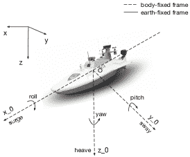

<!--yml

类别：未分类

日期：2024-09-06 19:44:00

-->

# [2210.08487] 海洋环境下自主水面车辆的深度学习综述

> 来源：[`ar5iv.labs.arxiv.org/html/2210.08487`](https://ar5iv.labs.arxiv.org/html/2210.08487)

# 《海洋环境下自主水面车辆的深度学习综述》

乔媛媛，尹佳欣，王伟，法比奥·杜阿尔特，杨杰，卡洛·拉蒂（通讯作者：乔媛媛和王伟）。乔媛媛在北京邮电大学人工智能学院智能感知与计算研究中心工作，北京 100876，中国，并且还在麻省理工学院可感知城市实验室工作，美国麻省剑桥 02139（电子邮件：yyqiao@bupt.edu.cn）。尹佳欣和杨杰在北京邮电大学人工智能学院智能感知与计算研究中心工作，北京 100876，中国（电子邮件：yinjx@bupt.edu.cn；janeyang@bupt.edu.cn）。王伟、法比奥·杜阿尔特和卡洛·拉蒂在麻省理工学院可感知城市实验室工作，美国麻省剑桥 02139（电子邮件：wweiwang@mit.edu；fduarte@mit.edu；ratti@mit.edu）。

###### 摘要

在接下来的几年里，将有一种高水平的自主技术广泛应用，这将减少劳动成本，提高安全性，节省能源，实现恶劣环境下的艰难无人任务，并消除人为错误。与其他自主车辆的软件开发相比，海事软件开发，尤其是在老化但仍然可用的舰队中，被描述为处于非常早期和新兴的阶段。这给研究人员和工程师开发海事自主系统带来了巨大的挑战和机会。传感器和通信技术的最新进展已经引入了自主水面车辆（ASVs）在海岸线监控、海洋观测、多车协作和搜索救援任务等应用中的使用。先进的人工智能技术，尤其是能够进行自学习表示的非线性映射的深度学习（DL）方法，使得完全自主的概念更接近现实。本文综述了在与 ASV 相关的领域中实施 DL 方法的现有工作。首先，在回顾 ASV 开发和技术的调查后，描述了这项工作的范围，关注了 DL 与海事操作之间的研究空白。然后，介绍了基于 DL 的导航、引导、控制（NGC）系统和协同操作。最后，综述通过突出当前的挑战和未来的研究方向来完成。

###### 关键词：

自主水面车辆，深度学习，NGC 系统，智能自主系统，神经网络。

## I 引言

在接下来的几十年里，水运、空运和陆运将被自动驾驶车辆深刻改变。尽管许多技术挑战尚未解决，但自动化系统无疑将成为未来交通系统的核心组件[1]。自上个世纪以来，无人机（UAVs）和自主水下航行器（AUVs）已被广泛应用于各种实际场景。得益于领先科技公司的努力，自动驾驶汽车已经进行了数百万英里的测试，为全面商业化做好准备。经过数十年的表面车辆引导和控制理论进步，自主水面车辆（ASVs）已广泛参与军事、研究和商业应用，包括监视、数据收集，以及海洋、地表和空间通信中心[2]。

自主水面车辆（ASV）可以减少人类操作员的影响、限制和成本。在从码头发射后，ASV 可以由人类远程操作。借助计算机、全球定位系统（GPS）、差分全球定位系统（DGPS）和卫星通信，ASV 能够自主导航并执行任务[3]。在自主模式下，ASV 可以在没有外部监督的情况下执行指定任务，并在任务结束后返回码头。20 世纪初，缺乏有效且可靠的障碍物检测传感器减缓了可靠障碍物规避方法的出现[4]。目前，更复杂的空中和卫星传感器的出现使得对海洋对流系统中的温度、湿度和风场的研究成为可能。先进的传感器，如光探测与测距（LiDAR），以强大的计算能力和全球覆盖的高精度定位系统为特征，已经重新塑造了所有自动驾驶车辆的导航系统[5]。新型数据传输技术、高容量局域网（LAN）、广域网（WAN）以及低成本的卫星数据通信预计将进一步推动国际合作，促进 ASV 的发展[6]。

最近，ASV 的能力得到了大规模数据和机器学习及人工智能技术的极大提升[7, 8]。深度学习方法，如深度神经网络（DNNs）和深度强化学习（DRL），已被用来解决长期存在的传统方法无法解决的 ASV 问题[9]。例如，

+   •

    非线性系统识别：作为一种通用近似器，深度神经网络（DNN）可以估计 ASV 模型的未知参数 [10, 11]、未知动态 [12, 13] 和环境干扰。此外，通过使用一个动态映射输入变量（状态变量）与输出变量（流体动力学力和力矩数据）之间关系的学习函数，可以在没有 ASV 动态或数学模型的先验知识的情况下构建控制器 [14]。

+   •

    无模型控制：在复杂的海洋环境中，几乎不可能精确建模非线性系统的动态 [15]。深度学习（DL）方法可以用于设计仅依赖 ASV 输入输出信号且无需了解模型的最优数据驱动和无模型控制 [16]。此外，深度强化学习（DRL）可以通过学习代理与环境之间的互动来表征和控制极其复杂的系统 [17, 18, 19]。

+   •

    海面物体检测：基于 DL 方法，通过传感器收集大量相关数据，这使得能够准确估计车辆状态。包括其他 ASV 和港口 [20] 在内的环境信息，可以通过将 DL 方法应用于不同类型的数据源 [21] 来检测和分析。

+   •

    未来行为预测：通过基于 DL 方法探索长期历史自动识别系统（AIS）数据，未来的海洋运输系统状态可以用于高级管理和规划 [22]，以实现更安全、高效和节能的海洋系统 [23]。

+   •

    类人决策：在遇到其他水面车辆时，为了在遵守法规的同时做出决策，基于 DL 的方法能够通过复杂任务经验（如避碰 [24] 和对接 [25])学习可能的人类行为。DL 方法可以自动学习高级特征，以便在具有许多约束的复杂环境中做出适当反应 [26]。

本文综合总结并比较了 DL 方法在 ASV 中的应用，以及 DL 技术如何渗透整个领域。相关主题包括但不限于 NGC 系统和合作操作，以及先进传感器、通信系统和大数据技术的集成和应用。文章最后讨论了挑战，并提出了基于 DL 方法可能值得研究的未来研究方向。总的来说，本工作的目标如下。

1.  1.

    提供当前的研究调查，展示 DL 技术如何改善 ASV 系统并成功解决新兴挑战。特别地，重点介绍了基于 DL 的 NGC 系统的进展。

1.  2.

    此外，我们从智能海洋操作的角度讨论了深度学习技术的当前研究和未来方向。

作者希望这项工作能指导那些希望了解深度学习在海洋操作中的应用或利用深度学习解决相关问题的研究人员、工程师和管理者。首先，在 II 节中，回顾了现有的 ASV 相关调查，并定义了这项工作的范围。在 III 节中，提供了基本 ASV 结构的概述，包括硬件、船上设备和 NGC 系统。对导航系统（V 节）、引导系统（VI 节）和控制系统（VII 节）的深度学习应用进行了详细审查和比较，重点关注逐步发展的深度学习模型在 NGC 系统上的实施。然后，在 VIII 节中回顾了合作海洋操作。第 IX 节讨论了研究空白、当前挑战和未来的研究方向。最后，在 X 节给出了这项工作的结论。

## II ASV 相关调查与调查范围

从 2006 年到 2017 年，只有 16 项调查报告发布，这些报告主要涵盖了 ASV 原型[4，27，3，28，29，30，31，32，33，34，2，35]和 NGC 系统[28，36，30，37，2]。2017 年初，许多大型船公司，如 Rolls-Royce、Kongsberg 和 Yara，为自主船舶的发展做出了贡献。Rolls-Royce 发布了一份报告，并为其自主航运愿景付出了努力[38]。随后，Kongsberg 和 Yara 合作建造了世界上第一艘完全电动、自主、零排放的船舶——Yara Birkeland。2017 年底，国际海事组织（IMO）制定了 2018 至 2023 年为期 6 年的战略计划，并讨论了自主海洋表面船舶的问题，该问题在 2018 年被定义为 MASS。

在 2018 年至 2022 年间，发布了 25 项与 ASV 密切相关的调查。其中一些研究介绍了 ASV 和 NGC 系统的进一步发展[39，40，41，42，43，44，45，7，8，46]，以及它们的实际应用[47，48，49，50]。此外，为了实现 ASV 的下一阶段自主目标，研究人员将注意力集中在多个 ASV 与其他车辆之间的协作[51，52，53]和通信[54]上。其他研究人员探讨了当前向自主航运的趋势[55，56，57，42，58]。在设想 ASV 或 MASS 在表面自主航行时，需要仔细解决诸如控制和支持中心[59]、民事责任和保险[60]、技术[61]和商业需求[56]等问题。

深度学习（DL）在过去十年中极大地改变了许多研究领域，并引发了研究热潮。深度神经网络（DNNs）能够从原始的高维度多模态传感器数据中形成紧凑的状态表示，这些数据通常出现在机器人系统中。对于导航子系统，具有分层特征提取能力的卷积神经网络（CNNs）已被证明在目标检测和障碍物识别方面非常高效[50]。随着海洋数据量的增加，DL 被认为是比其他机器学习方法更强大的框架，能够自动且相对快速地解释大量数据。DNN 在 ASV 控制中也被证明是高效的，特别是在自主停靠方面[57]。在智能自主系统的机器人控制领域，深度强化学习（DRL）[17]最近被应用于 AUV、无人机（UAV）[62]、自动驾驶汽车[18]和 ASVs[14]。

然而，根据现有的调查，关于深度学习（DL）在自主水面车辆（ASVs）中的实施缺乏讨论。因此，这项工作回顾了 ASVs 的过去和未来的技术发展与挑战，特别是 DL 方法在提高智能和自主水平方面的作用。除了对 ASV 原型和 ASV 控制系统架构的详细比较外，作者还尝试回答以下问题：“哪些 DL 方法已成功应用于 ASVs？其理论和实践上的优缺点是什么？”；“如何使用 DL 方法解决当前的海洋操作问题？未来研究的哪些方向有前景？”据作者了解，ASVs 的 DL 技术尚未得到全面研究。更好地理解新兴 DL 技术在 ASVs 中的当前和潜在作用，将为未来的自主海洋操作提供动力。

## III ASV 系统

### III-A ASV 类别

每种类型的 ASV 可以根据其大小、功能或独特特性用于特定应用，如图 1 所示。例如，海军 ASVs 需要远程控制并以高速运行。此外，需要承载重负荷并限制能量消耗。海洋学 ASV 研究需要自主导航、节能以及低速稳定测量[34]。商业监视 ASVs 通常配备先进的视觉监控传感器、高性能控制器和与岸上管理中心高效通信的系统。

图 1：ASV 分类

### III-B ASV 架构

图 2：ASV 的 6 自由度

船舶的运动可以描述为地球固定坐标系或船体固定坐标系，如图 2 所示。典型水面车辆的刚体运动具有 6 个 DOFs，包括：

(1) 三种位移运动（起伏、偏航或漂移和冲击），分别沿 x_0、y_0 和 z_0 方向移动。

(2) 三种角运动（偏航、俯仰和滚转），分别是围绕 x_0、y_0 和 z_0 轴的旋转。

在 ASV 的多种制造选项中，船体支撑着系统的主要四个组件，包括发动机、通信、传感器和 NGC 系统 [35]。

#### III-B1 船体

作为 ASV 的主要物理组件，船体是防水的船只或小艇，可以分为单体船（如皮划艇和单体船）和多体船（如双体船和三体船）。

#### III-B2 发动机系统

控制器设计应考虑 ASV 的多少个自由度（DOFs）可以被执行器驱动。大多数现有的 ASV 使用欠驱动控制，这意味着只有部分 DOFs 可以被控制。如果所有 DOFs 都能通过多个执行器进行控制，则 ASV 被激活。对于更复杂的任务，如对接，使用能够利用额外 DOFs 的过驱动控制会更有效。

#### III-B3 通信系统

稳定可靠的通信对于以下各方的信息交换至关重要：（1）需要控制的计算机、传感器和其他硬件；（2）多个车辆，如 ASV、AUV 和 UAV；（3）车辆与岸上控制中心；（4）车辆与远程卫星。

#### III-B4 传感器系统

传感器充当 ASV 与环境之间的接口，为车辆提供相对于自身状态和环境的信息。除了性能监测传感器，ASV 船载传感器提供位置、状态和环境信息，如表 III 所示。不同类型传感器的部署取决于任务要求。

#### III-B5 NGC 系统

在试图自动化 ASV 操作过程时，软件结构中三个系统是不可或缺的。导航、引导和控制，如图 4 所示。作为安装在船载计算机上的软件，NGC 系统处理收集的数据以进行态势感知，规划可能的路径，并驱动水面车辆到达目的地。NGC 系统是自主操作的核心。

图 4：ASV 系统的结构

$\bullet$ 导航（第 V 节）：导航通常指研究监测车辆运动的过程。作为安全操作的最基本要求，基于传感器数据对表面车辆状态及其周围环境的全面评估对于海洋车辆至关重要。导航系统包括两个阶段，即环境感知和状态估计。

环境感知指的是测量周围环境的过程，如波浪、风、物体和表面上的障碍物 [63]。

状态估计指的是根据一系列测量和系统的先验模型重建系统的潜在状态的问题。

$\bullet$ 指导（第 VI 节）：基于导航系统提供的状态信息，指导的目标是规划和生成从出发地到目的地的可能路径，并具备避障和遵守规则的能力。

路径规划可以进一步分为全局方法和局部方法 [2]。全局路径规划旨在提前找到从起点到目的地的最优或近似最优无碰撞路径。局部路径规划则要求 ASV 对先前未知的障碍物和环境变化作出反应。

路径生成指的是为 ASV 生成最优路径的过程。

$\bullet$ 控制（第 VII 节）：控制系统为 ASV 驱动设备生成适当的控制力和力矩 [2]。

动作控制场景指 ASV 操作的具体场景，包括点稳定、目标跟踪、路径跟随、轨迹跟踪、机动和靠泊。每个动作控制场景的定义可以在第 VII 节中找到。

## IV 深度学习模型和技术

许多出版物集中于深度学习的进展 [21, 64]，以及深度学习在机器人 [65]、自动驾驶汽车 [66]、无人机 [62]和无人水下航行器中的应用。因此，为了避免不必要的重复，我们简要介绍了按不同学习方法分类的深度学习模型及其应用，即监督学习、无监督学习和强化学习方法。

### IV-A 监督深度学习方法

监督式深度学习方法使用标注良好的数据进行训练，以学习将输入映射到输出的函数。它们已广泛应用于解决 ASV 导航、引导和控制问题。

#### IV-A1 多层感知器（MLP）

MLP（也称为前馈神经网络，即 FFNN）是最基本的神经网络（NN）模型之一，可以近似非线性函数，并在输出层和输入层之间添加一个或多个全连接的隐藏层。具有多个隐藏层的 MLP 称为 DNN。模型训练通常通过反向传播算法在所有层上进行。MLP 通常用于估计 ASV 控制器的模型不确定性。MLP 的修改版本列举如下。

径向基函数（RBF）：RBF 网络可以有效加快收敛速度并避免局部最优，因为它在隐藏层中使用高斯函数 $\varphi(\cdot)$ 作为激活函数，这是一种局部近似网络。RBF 只有一个隐藏层，输出层通常只有一个神经元，并且不使用激活函数。

小波神经网络（WNN）：结合了小波变换和 NN 的特点，WNN 具有时间-频率局部化、自学习能力、更快的收敛速度和较低的误报率等优点。使用 MLP 或 RBF 的结构，WNN 使用小波函数 $f(.)$ 作为激活函数。

模糊神经网络（FNN）：模糊逻辑捕捉了与人类推理相关的不确定性，基于“真值度”方法，这比传统的“真或假”方法更易于人类理解。模糊逻辑和 NN 的结合，即使用 NN 学习模糊逻辑系统的参数，创建了 FNN，这可以在复杂系统中建模不确定性和非线性。

#### IV-A2 卷积神经网络（CNN）

CNN 的基本结构包含一个输入层、若干卷积层、若干池化层、一个全连接层和一个输出层。在传统的 DNN 中，不同层的神经元是全连接的。相比之下，CNN 的卷积层和池化层的神经元并未完全连接到它们的前一层。因此，稀疏交互和参数共享是 CNN 学习过程中的两个最重要的特征。基于 CNN 的基本思想，设计了高级架构来解决计算机视觉领域中的三个基本问题，即图像分类、目标检测和图像分割。以下简要介绍了一些流行的架构，这些架构用于通过图像、视频或在海洋环境中收集的数据感知周围环境。

基于 CNN 的分类：图像分类旨在预测给定图像的标签。基于传统的 CNN，提出了几种结构更复杂的改进架构，包括**LeNet-5**、**AlexNet**、**VGG**、**GoogLeNet**、**Inception Net**、**ResNet**等。作为**ILSVRC**的顶尖竞争者，这些 CNN 架构在分类准确性上取得了很高的成绩，有些甚至在**ImageNet**数据库上超过了人类水平。这些网络在许多应用中作为特征提取的基础模型被广泛使用，或作为骨干网络应用于物体检测和分割任务。

基于 CNN 的物体检测：自动驾驶车辆必须在使用传感器感知周围环境时识别和定位物体。一般来说，有两种类型的物体检测框架：

(1) 二阶段算法首先提取可能包含物体的候选区域，然后确定这些提议的区域是否包含物体。第一阶段使用选择性搜索或区域提议网络（RPN）等方法生成感兴趣区域（ROIs）。然后，另一个网络，如**ResNet**，被用来对这些提议的区域进行分类。流行的二阶段物体检测方法包括**R-CNN**、**Fast R-CNN**、**Faster R-CNN** 和 **Mask R-CNN**。

(2) 一阶段算法直接对图像中的物体进行分类，并预测物体边界框。这更具体地说，就是输入图像，类概率和边界框坐标会同时学习。典型的框架包括**You Only Look Once (YOLO)**、**Single Shot Detector (SSD)** 和 **RetinaNet**。

基于 CNN 的分割：在某些任务中，捕获的图像中的每个像素都应标注语义标签，以指示该像素属于哪个物体。图像分割指的是对图像中每个像素进行分类。

全卷积网络（FCN）是第一个可以解决分割问题的基于 CNN 的网络。FCN 用卷积层替换了 CNN 的全连接层，并将高级特征图上采样成与原始图像大小相同的热图。热图显示了图像每个像素的分类结果。金字塔注意网络（PAN）通过提出特征金字塔注意（FPA）和全局注意上采样（GAU）模块进一步改进了 FCN，以通过考虑全局上下文信息来学习更好的特征表示。另一种常用的分割方法是 U-Net，其结构像字母 U。U-Net 的架构包含两条路径。第一条路径是收缩路径，由传统的卷积层和最大池化层堆叠而成，用于捕捉图像中的上下文。第二条路径是对称扩展路径，用于通过转置卷积实现精确定位。与 FCN 相比，U-Net 在更多级别上融合了两条路径的特征。在特征融合策略方面，FCN 使用加法融合，而 U-Net 使用通道维度拼接。

#### IV-A3 循环神经网络（RNN）

RNN 可以通过将从开始到当前末尾的所有信息传递通过隐藏层来利用历史信息预测未来行为。RNN 在建模时间依赖和序列数据任务时表现非常出色，但通常由于梯度消失和梯度爆炸问题，在训练过程中无法收敛。作为 RNN 的改进版本，长短期记忆（LSTM）具有特别设计的记忆网络，包括一个单元、一个输入门、一个输出门和一个遗忘门，以解决限制传统 RNN 使用的梯度消失问题。与 LSTM 类似，门控循环单元（GRU）具有两个门，而 LSTM 单元有三个门，这意味着 GRU 的训练参数比 LSTM 少。

### IV-B 无监督深度学习方法

无监督深度学习方法可以从未标记的数据中学习模式。

#### IV-B1 自动编码器（AE）

AE 是一种无监督学习算法，旨在通过学习数据中的结构并忽略信号噪声来减少数据的维度。它具有一个输入层，一个重建输入数据以进行压缩表示的隐藏层，以及一个重建输入的输出层。网络应最小化输入和输出向量之间的差异。因此，AE 被应用于减少 ASV 导航模块中原始输入的噪声和维度。

#### IV-B2 生成对抗网络（GAN）

GAN 是一种用于数据生成的对抗学习框架，它具有生成模型 G，该模型生成与训练数据相似的样本，以及一个判别模型 D，该模型估计样本是否来自训练数据或 G。G 的训练过程是最小化真实数据分布与生成数据分布之间的 Jensen–Shannon（JS）散度。D 的训练过程是尽可能区分真实数据和生成数据。此外，提出了深度卷积 GAN（DCGAN），提供了基于实验的最佳超参数集和训练技巧，以提高 GAN 训练过程的稳定性。为了进一步提高 GAN 的结构稳定性并消除模型崩溃和梯度消失等问题，Arjovsky 等人 [67] 提出了 Wasserstein GAN（WGAN），该模型使用 Wasserstein 距离而不是 JS 散度来衡量真实数据分布和生成数据分布之间的差异。GAN 已被广泛用于通过生成假图像来扩展数据集，这对于训练数据集不足的 ASV 导航模块非常有用。

### IV-C 强化学习方法

监督学习和无监督学习通常使用事先提供的标记或未标记的数据集进行训练。强化学习（RL）是另一种机器学习技术，它使代理能够通过最大化标量奖励或强化信号来学习从情境到行动的映射。代理观察环境的状态 $s_{t}$ 并在时间 $t$ 在环境中采取行动 $a_{t}$。然后，环境进入新状态 $s_{t+1}$ 并向代理发出即时奖励 $r_{t+1}$。最后，代理尝试学习选择那些最大化累积奖励 $Q(s_{t},a_{t})$ 的动作，也称为 $Q$-值。

#### IV-C1 深度强化学习（DRL）

对于复杂环境，当状态和动作的数量急剧增加时，基于深度学习（DL）的方法可以自动从高维的大规模状态和动作空间中提取特征，这引入了深度 Q 网络（DQN）。RL 和 DL 的结合使得代理能够直接从原始传感器或图像信号中构建和学习知识，而无需任何预定义的特征 [26]。然而，DQN 仅适用于离散且低维的动作空间。它不能直接应用于连续领域，因为它依赖于寻找最大化动作值函数的动作，而在连续值的情况下，这需要在每一步进行迭代优化过程。为了解决这个问题，Lillicrap 等人 [68] 提出了深度确定性策略梯度（DDPG），这是一种无模型、脱离策略的演员-评论家算法，利用深度函数逼近器在高维和连续动作空间中学习策略。

## V 深度学习驱动的导航系统

### V-A 定义及关键问题

ASV 导航系统根据收集的数据提供环境和自我状态信息，以便指导和控制系统[32、2]。ASV 通常配备了许多传感器，这些传感器累计收集大量数据，以监测 ASV 的性能和局部环境，包括岸边以及静态或移动障碍物[69]。此外，在先进通信系统的支持下，ASV 还可以接收关于全球环境的信息，这些环境涵盖了大面积区域，如一个拥有数百艘船的整个港口。这类信息包括来自其他船舶的 AIS 数据[70]、合成孔径雷达（SAR）图像[20]以及由自主空中飞行器（AAV）[71]或其他平台[72]上的相机拍摄的图像和视频。ASV 导航的关键问题如下所述。

#### V-A1 环境感知

船载和远程传感器可以向 ASV 提供周围环境信息，以应对典型海洋环境中由波浪、洋流、风和天气引入的外部因素，并实时适应包括大量静态或移动障碍物的复杂环境[63]。然而，使用来自各种设备的高维数据来反映复杂环境是一个非常大的挑战。

#### V-A2 状态估计

ASV（自主水面舰艇）状态通常包括其位置、方向、速度和加速度。然而，通过全球导航卫星系统（GNSS）和惯性测量单元（IMU）等传感器测量的船舶位置、欧拉角以及线性和角速度通常会包含噪声和误差，这可能导致失败。近年来，先进的船载传感器，如相机[69、73、74]、雷达、激光雷达（LiDAR）[75]和遥感 SAR 图像[76]提高了估计的准确性。然而，诸如风、波浪和天气引入的噪声以及公海上恶劣的通信环境等独特情况，使得准确的状态估计非常具有挑战性。

#### V-A3 数据处理问题

异质传感器收集的大量数据流在时间和空间分辨率、数据格式以及几何对齐方面各不相同。因此，某些过程，如压缩、降维和融合，可能有助于提高数据质量。

### V-B 深度学习模型导航

#### V-B1 环境感知

关于深度学习方法在海洋环境感知中的应用的现有相关工作可以根据导航数据源类型进行分类，即由船载或岸基设备收集的数据（光学和红外图像、雷达图像和点云），或由卫星捕获的图像（光学遥感图像和 SAR 图像）。在这里，我们分别介绍基于深度学习的光学和雷达图像环境感知方法。

光学图像的处理：它们通过船载、岸基传感器或卫星传感器捕获，通常会遇到以下挑战：

+   •

    图像质量在很大程度上依赖于一天中的时间和云层的缺失。

+   •

    大量数据具有高分辨率，因此在实时应用中更难以利用。

+   •

    在港口中分离船只困难，因为有复杂的背景，如建筑物、码头以及通常紧密靠在一起的重叠船只。

+   •

    准确定位船只也很困难，因为目标船只具有极长且细的形状以及任意的旋转，如图 5 所示。

(a) 水平的边界框

(b) 旋转的边界框

图 5：光学遥感下的船只检测 [77]

上述挑战已经被研究用于检测具有复杂背景的船只 [78, 72, 79, 80, 81, 82, 83, 77, 84, 85]，检测多尺度船只 [72, 79, 80, 77, 84, 86, 87, 88]，以及检测小数据集的船只 [89, 90, 91]。

对于背景复杂的船舶检测，提取合适的特征表示以更好地区分船舶与周围的湍流非常重要。研究人员尝试了将高层次和低层次特征结合起来用于船舶检测。一种典型的解决方案是提取多尺度特征表示。基于 Mask R-CNN，聂等人[83]添加了一个自下而上的路径，将低层次特征传播到顶层。另一种解决方案是使用图像金字塔提取特征，图像金字塔的特征图从低层到高层形成类似金字塔的形状。杨等人[77, 84]应用了密集的 FPN，其中不同层次的特征图通过连接方式密集连接和融合。黄等人[85]设计了跳跃连接路径网络，从每个 CNN 层提取特征并融合所有提取的特征。此外，使用数据增强策略[81]扩展训练数据集，以及在特征提取之前对海洋和陆地区域进行分割[72, 80]也是有效的策略。

对于多尺度船舶检测，基于水平区域检测的流行目标检测方法在船舶检测的边界框上存在较大的冗余区域（见图 5 (a)），相比于基于旋转边界框的区域检测，后者可以根据船舶的方向进行旋转（见图 5 (b)）。李等人[86]构建了两个回归分支，独立预测中心点的位置$x,y$、宽度$w$和高度$h$，以及边界框的方向$\theta$，这些预测是基于不同的 CNN 特征。对于任意方向的船舶，余等人[87]提出了一种锚点辅助策略，该策略准确预测旋转边界框，并且不需要手动设计锚点。张等人[88]提出了一种无锚点的旋转船舶检测方法，通过将船舶检测任务转化为二分类语义分割任务，直接检测属于船舶的像素，并预测每个像素与四个边界之间的距离。

对于小数据集的船舶检测，为了增加训练样本，研究人员在一个良好的开放数据集[89]上预训练了一个基于深度学习的目标检测框架，或者使用 GAN[91]生成虚假的船舶图像。

雷达图像的处理：它们通过船载、陆基传感器或卫星传感器捕获，通常面临以下问题：

(a) 带有大边界框的小型和密集聚集的船只

(b) 对陆地的虚假检测

图 6: SAR 图像中的船只检测 [92]

+   •

    尽管 SAR 能够在任何天气条件下全天工作，但 SAR 图像的分辨率通常低于光学遥感图像，像素也更少。因此，某些用于光学图像的模型不能直接应用于 SAR 图像。

+   •

    在 SAR 图像中占据仅几个像素的小型和密集聚集的多尺度船只非常难以检测（参见图 6 (a)）。

+   •

    SAR 图像中的船只存在于各种尺度上，具有任意方向，并且在港口中密集排列甚至重叠。

+   •

    陆地上的类似散布物体导致高误报率（参见图 6 (b)）。

+   •

    大规模开放的 SAR 图像数据集稀缺，且大量标注样本需要大量人工劳动。

上述挑战已经被研究以检测多尺度船只 [93, 94, 95, 92, 96, 97, 98, 99, 100] 和使用小数据集检测船只 [101, 102, 103, 104, 104, 105, 106]。

对于多尺度船舶检测，类似于光学图像，从原始 SAR 图像中提取更多特征来检测船舶也是有用的。为了获得更多的语义信息，Cheng 等人 [107] 融合了从雷达和光学图像中提取的特征，以识别水面上的小物体。VGG-13 和 YOLOv4 的骨干网络分别用于从光学和雷达图像中提取特征。有时，在 SAR 图像中很难区分干扰的反向散射点和实际船舶。因此，探索局部特征与其全局依赖关系之间的关系，并重新检查不同特征图中的信息，可以提高多尺度船舶检测的性能。Zhao 等人 [95] 提出了一个两阶段检测方法，采用并结合接收场块和卷积块注意力模块，以增强局部特征与其全局依赖关系的关系，并提升重要信息，同时抑制干扰。此外，作为一种雷达图像，SAR 图像包含频率信息，并可以提供频域特征 [92, 96]。

缺乏大量的真实地面数据进行训练是检测和分类船舶及其他对象在 SAR 图像中的主要问题之一 [101]，这阻碍了目标检测器的发展。除了获取更多数据集外，还进行了有效的努力，包括将模拟 SAR 图像添加到训练数据集中、训练更深的网络以提取更高层次的数据展示特征 [102]，以及在大型开放数据集上预训练目标检测模型 [103, 104]，这些措施旨在减少小数据集上的误报率，提高检测准确性和整体性能。此外，利用 WGAN 生成虚假数据集也可以提高 SAR 图像中船舶检测的性能 [106]。

#### V-B2 状态估计

基于 DNN 的方法可以在存在非线性动态和高维传感器数据以及不同采样频率的情况下估计 ASVs 的运动。典型任务包括船舶行为识别 [108, 109]、位置识别 [110] 和运动预测 [110, 111]。

船只行为识别：可以直接从海洋监视视频中估计高保真度的船只运动信息（位移、移动速度、航行角度等）。Chen 等人 [108] 基于视频数据的船只行为识别分为四个步骤：基于 YOLO 的船只特征提取、生成边界框、基于几何理论的位置识别和行为分析。Chen 等人 [109] 提出了 CNN 船只运动模式分类算法，通过将 AIS 船只轨迹转换为具有不同运动的图像来对船只运动进行分类。

船只位置识别：DNN 基于星传感器估算的历史位置数据进行训练，以预测和补偿当星传感器不可用时 INS 导航误差 [112]。

船只运动预测：Zhang 等人 [110] 利用 LSTM 捕捉船只运动在各个频率尺度上的固有规律。随后采用了注意力机制来进一步提高预测的准确性。

#### V-B3 数据处理

在海洋环境中使用大量导航数据非常困难，因为这些数据受到有限船载设备、通信不良和意外情况引入的噪声影响。因此，已采用基于 DNN 的方法在应用传统多传感器方法以减少数据维度或提高数据质量之前提取数据表示 [113]。

为了减少数据维度，提出了一种自动编码器系统架构，以减少传输过程中的性能维度和导航数据 [114]。为了提高数据质量，Cheng 等人 [115] 在数据融合模块中应用了 CNN，以从不同类型的原始输入中提取联合信息，包括船只的运动状态、障碍物的存在状态以及先前的控制行为。CNN 模型的输出是一个包含船只操作状态的状态向量 StateID。

## VI 深度学习驱动的导航系统

### VI-A 定义和关键问题

全球路径规划和局部路径规划是 ASV 导航的两个主要问题 [2]。传统上，路径规划问题需要转化为可解的问题，例如搜索问题，这可以通过确定性方法解决，只要存在解，该方法就能提供完整且一致的搜索结果。或者，这个问题可以通过启发式方法来解决，这种方法能在确定性方法无效的情况下获得接近最优结果的近似解。这些解决方案列在表 I。

#### VI-A1 全球路径规划

全局路径规划应基于静态障碍物地图信息或历史数据生成从起点到终点的适当路径。随着 AIS 数据量的增加，如何利用这些海量数据为 ASV 生成全球路径已成为一个挑战 [116, 22]。

#### VI-A2 局部路径规划

预定义轨迹应能够根据任务、复杂且动态的环境实时调整，这需要局部路径规划。目前，在复杂的港口或水道等拥挤的海域，不同的水面车辆经常相互遇到。为了高效地避免碰撞，“本船”（OS）和“目标船”（TSs）应遵守如 COLREGS [117]等广泛接受的规定。更具体地说，如果两个 ASV 在水道中相遇，从第一人称视角来看，OS 和 TSs 有四种相遇情况，即迎面、保持航向、避让和超越。在生成局部路径之前，如何实时做出适当的决策（即选择相遇情况）对研究人员来说是一个很大的挑战，尤其是在更复杂的情况下，例如 OS 同时遇到多个 TSs。

#### VI-A3 约束条件

在现实场景中，根据 ASV 分配的具体任务，应考虑某些约束条件[44]，例如：

表 I：路径规划算法类别 [118]

| 一般方法 | 特殊方法 |
| --- | --- |
| 确定性搜索算法 |  |
| 基于路线图的搜索 | 可视图 |
| - 地图构建方法 | Voronoi 图 |
|  | 概率道路图 |
| 基于路线图的搜索 | A* 搜索 |
| - 搜索方法 | D* 搜索 |
|  | D* 搜索 |
| 潜在场 | 传统潜在场 |
|  | 调和潜在场 |
|  | 快速行进的潜在场 |
| 优化方法 | 混合整数规划 |
|  | 最优控制 |
| 启发式搜索算法 |  |
| 进化算法 | 遗传算法（GA） |
|  | 粒子群优化 |
|  | 无性繁殖优化 |
|  | 蚁群算法（ACA） |
| 神经网络 | 多层感知机（MLP） |
|  | 模糊神经网络（FNN） |
|  | 长短期记忆（LSTM） |
|  | 深度强化学习（DRL） |

+   •

    地理约束包括地质图上的海岸线、岩石和小岛。对于大面积的全球规划，例如从一个港口到另一个港口，仅考虑地理约束是足够的。

+   •

    形状约束指 ASV 的特定尺寸（长度、宽度和高度），在中尺度区域规划路径时必须考虑，ASV 不能被视为一个点。例如，如果 ASV 进入一个通道，ASV 和通道的宽度将对路径规划过程产生很大影响。

+   •

    运动学约束表示船舶和加速度速度的具体范围，如果 ASV 进入内港时应予以考虑。

+   •

    ASV 动态约束包括船舶的惯性力和力矩，例如纵摇、横摇、偏航等，这在小规模区域的精确路径规划中不能被忽略，例如 ASV 停靠，这需要知道如何精确操控以停靠，并必须考虑运动学和形状约束。

### VI-B 深度学习模型指导

#### VI-B1 全球路径规划

传统的确定性和启发式搜索算法可以在起点和目的地之间生成无碰撞路径。然而，在现有研究中，有一些复杂任务是确定性方法无法完成但可以通过 DNN 解决的。这些任务包括规划最节能的路径[119]、基于历史轨迹预测未来路径[70, 116, 22, 120]以及为多个任务规划最佳路径[121]，这些任务将在下面描述。

规划最节能的路径：很难用数学公式建模环境与节能相关参数之间的关系。张等人[119]提出了一种基于数据的船速优化模型和冰区航线规划模型，以计算极地地区船舶的最高能源效率路径。在历史数据的基础上，使用基于 DNN 的方法确定冰浓度、船速和能源效率指标之间的关系，然后计算出最佳路径和速度。

预测未来路径：可以通过训练过的 DNN 预测船舶的未来位置，训练数据包括转弯点数据如经纬度、速度、航向、长度、宽度和吃水[22]。Gao 等人[120]通过预测支撑点和目标点进行了多步预测，其中目标点由历史数据生成，支撑点由训练的 LSTM 模型生成。

为多个任务规划最佳路径：为了以最小成本访问多个水文监测站，刘等人[121]将任务数学地总结为旅行商问题，其目标是访问所有水文监测站并返回起点。在全球路径规划阶段，应用了基于自组织映射的 DNN 来学习水文监测站的位置与最佳执行顺序之间的关系。

#### VI-B2 本地路径规划

由于以下缺点，传统方法未考虑海洋或天气条件，也未考虑非线性船舶动态[39]：

+   •

    船舶碰撞避免数学模型的计算复杂性过高，无法在具有多个对象的高度动态环境中在假定的短时间内计算。

+   •

    预定义的架构只能采用一些涉及风险评估和船舶动态约束的简化假设的特定情况，这不能适应需要遵守 COLREGs 的复杂遇险情况。

+   •

    控制律通常形成复杂的公式，考虑所有可能的情况，这些公式无法通过变化进一步适应。

因此，大多数先前的研究仅针对一个实例的一个障碍，这在日益繁忙的海洋环境中并不实际。在本节中，我们回顾了基于 DRL 的 [122、117、123、124] 和基于 DNN 的 [122、117、125] 局部路径规划方法。

基于 DRL 的局部路径规划：DRL 模型通过与不确定环境的持续互动实时学习如何反应。理想情况下，奖励函数应奖励代理到达目的地并避免与其他物体碰撞，同时遵守 COLREGs [117]。然而，为了避免碰撞，ASV 必须偏离其路径，有时甚至朝着与目的地相反的方向移动，这将导致惩罚。在 [122] 中，如果检测到的与其他船只的距离超过阈值，将分配负奖励；否则，将持续提供正奖励。在 [117、124] 中，在安全航行环境下使用了路径跟随奖励函数。如果 TS 进入 OS 周围的安全区域，则会激活碰撞避免奖励函数。

基于 DNN 的局部路径规划：在实际环境中，OS 会遇到许多 TS，因此与 TS 相关的状态数量不断变化。然而，DNN 只有固定维度的输入。因此，为了处理多船遇险情况，在 [122] 中，使用了最后五条检测到的距离记录作为输入。在 [117] 中，通过将 TS 分类到 COLREGs 定义的四个区域，将 DNN 的输入维度设置为四。Gao 等人 [125] 结合了 LSTM 和序列条件 GAN，从 AIS 数据中学习了 12 种船舶遇险模式，并做出拟人化决策以避免船舶碰撞。

## VII 深度学习驱动的控制系统

### VII-A 定义与关键问题

表面车辆的运动控制器从导航系统获取输入参考，计算输入参考与实际输出值之间的差异，并向激活器如推进器和舵机发出指令。图 7 展示了现有研究通常关注的问题，以设计合适的 ASV 控制器。具体细节如下。

图 7：ASV 控制器设计中的问题

#### VII-A1 ASV 建模

ASV 建模需要描述表面车辆的运动，这分为运动学和动力学两部分。运动学仅考虑运动的几何方面，而动力学则是分析导致运动的力。绝大多数研究将表面车辆限制在三个自由度，因为在许多水域环境中，横滚和俯仰运动可以忽略不计。如图 2 所示，附着在船只上的移动坐标系称为机体固定参考系，$\sum x_{b}y_{b}O_{b}z_{b}$。机体固定坐标系的原点选择与船只的重心重合。此外，机体固定参考系下的 ASV 运动学模型相对于惯性参考系的描述如下：

|  | $\displaystyle\dot{\bm{\eta}}=R(\eta)\bm{v},$ |  | (1) |
| --- | --- | --- | --- |

其中 $\bm{\eta}=[x~{}y~{}\psi]^{T}\in\mathbb{R}^{3}$ 表示船只在惯性坐标系下的位置和航向角，$\bm{v}=[u~{}v~{}r]^{T}\in\mathbb{R}^{3}$ 表示在机体固定坐标系下的前进速度、侧向速度和角速度，而 $R(\eta)=[\cos{\psi}~{}-\sin{\psi}~{}0;\sin{\psi}~{}\cos{\psi}~{}0;0~{}0~{}1]^{T}$ 是将状态向量从机体固定坐标系转换到惯性坐标系的变换矩阵。

根据 Fossen [126] 提出的记号，表面船只的非线性动力学由以下微分方程描述。

|  | $\displaystyle\bm{M}\dot{\bm{v}}+\bm{C}(\bm{v})\bm{v}+\bm{D}(\bm{v})\bm{v}=\bm{\tau}+\bm{\tau}_{\text{env}},$ |  | (2) |
| --- | --- | --- | --- |

其中 $\bm{M}\in\mathbb{R}^{3\times 3}$ 是正定对称的质量和惯性矩阵，$\bm{C}(\bm{v})\in\mathbb{R}^{3\times 3}$ 是表示科氏力和向心力项的反对称船体矩阵，$\bm{D}(\bm{v})\in\mathbb{R}^{3\times 3}$ 是正半定的阻尼矩阵，$\bm{\tau}=[\tau_{u}~{}\tau_{v}~{}\tau_{r}]^{T}\in\mathbb{R}^{3}$ 是由螺旋桨在机体固定坐标系下产生的作用力和力矩，而 $\bm{\tau}_{\text{env}}\in\mathbb{R}^{3}$ 是来自风、洋流和波浪的环境干扰。

根据船只的推进器配置，驱动力和力矩向量 $\bm{\tau}$ 可以表示为

|  | $\displaystyle\bm{\tau}=\bm{B}\bm{u},$ |  | (3) |
| --- | --- | --- | --- |

其中 $\bm{B}\in\mathbb{R}^{3\times{n_{u}}}$ 是描述推进器配置的控制矩阵，$\bm{u}\in\mathbb{R}^{{n_{u}}}$ 是表示推进器产生的力的控制向量，其中 $n_{u}$ 是控制向量的维度。

此外，通过结合 (1)， (2) 和 (3)，船只的完整动态模型重新表述如下：

|  | $\displaystyle\dot{\mathbf{q}}(t)=f(\mathbf{q}(t),\mathbf{u}(t)),$ |  | (4) |
| --- | --- | --- | --- |

其中 $\mathbf{q}=[x~{}y~{}\psi~{}u~{}v~{}r]^{T}\in\mathbb{R}^{6\times 1}$ 是船只状态向量，$f(\cdot,\cdot,\cdot):\mathbb{R}^{n_{q}}\times\mathbb{R}^{n_{u}}\longrightarrow\mathbb{R}^{n_{q}}$ 表示连续可微的状态更新函数。系统模型描述了全状态 $\mathbf{q}$ 如何对施加的控制输入 $\mathbf{u}\in\mathbb{R}^{{n_{u}}}$ 进行响应。

#### VII-A2 控制器设计

控制器可以基于经典、最优、适应性、智能、鲁棒和滑模控制方法，或这些技术的组合来构建，如表 II 中所列。

表 II: 主要控制技术 [37]

| 控制技术 | 示例 |
| --- | --- |
| 经典控制方法 | 比例-积分-微分（PID） |
| 递归控制 | 回溯法 |
| 自适应控制 | NN 自适应控制 |
| 层级控制系统 |  |
| 智能控制 | 神经网络（NN） |
|  | 贝叶斯概率 |
|  | 遗传算法 |
|  | 模糊逻辑 |
|  | 机器学习 |
|  | 进化计算 |
| 最优控制 | 线性-二次-高斯控制（LQG） |
|  | 模型预测控制（MPC） |
| 鲁棒控制 | H-无穷大环形整形 |
|  | 滑模控制（SMC） |
|  | 动态表面控制（DSC） |
| 随机控制 |  |
| 能量整形控制 |  |
| 自组织临界性控制 |  |

#### VII-A3 驱动能力

完全驱动的车辆可以同时独立控制其所有自由度；否则，车辆就是欠驱动的。作为 ASV 中最常见的配置，欠驱动使得控制器的设计比驱动 ASV 更加困难，因为只有纵向和偏航轴由推进器和舵直接驱动。对于驱动 ASV，没有用于直接控制横向运动的驱动器。

#### VII-A4 运动控制场景

许多运动控制器设计用于解决不同场景中的一个或多个特定问题，以完成其指定任务。一般而言，取决于可用的运动信息和约束条件，它们可以被分类为点稳定、目标跟踪、轨迹跟踪、路径跟随、机动和停靠。示意图见图 8，我们将在下面描述每种运动控制场景。

图 8：运动控制场景，(a)-(d) 参见[127]

$\bullet$ 点稳定：目标是在没有时间限制的情况下，将 ASV 在固定目标操作中定位和定向，处理变化的海洋扰动[128]。对于欠驱动的 ASV，如果所有三个坐标都要稳定，只能使用不连续或平滑的时间变化控制[36]。对于传统船舶，定位系统主要有两种：用于锚泊船舶的助推器辅助位置系泊系统（PM）和用于自由漂浮船舶的动态定位系统（DP）[128]。PM 能量消耗较少，因为通常每个平台有许多锚线。DP 系统仅使用驱动器来准确维持 ASV 在固定位置或预定轨迹上的位置和航向。DP 因其能轻松改变位置并适应各种海洋环境而越来越受到关注。

$\bullet$ 目标跟踪：目标是跟踪静态或动态目标的运动，而不需要知道目标未来的运动信息[129]。必须同时考虑相关的时空约束。

$\bullet$ 轨迹跟踪：指的是在时间限制下以期望的前进速度跟随指定路径的能力。因此，可以将与目标相关的时空约束分开考虑[130]。

$\bullet$ 路径跟随（也称为轨迹保持、路径保持或航向保持）：目标是以恒定的前进速度跟随预定义的路径，这仅涉及空间约束[130]。

$\bullet$ 操作：作为路径跟随的一个子集[127]，操作的目标是沿预定义路径引导 ASV，而控制速度可以被视为一个单独的任务[131]。操作问题可以分为几何任务和动态任务。几何任务类似于路径跟随，而动态任务则是在路径上分配时间、速度或加速度。相比之下，跟踪问题将这两项任务合并为一个单一任务。

$\bullet$ 停靠：船舶应能够在低速下在靠近停靠点的地方停下[132]。作为自动化船舶控制中最困难的问题之一，由于不可预测的环境干扰的影响，几乎不可能在停靠过程中考虑所有可能的情况。在更极端的情况下，船舶机动性急剧降低，船舶运动和噪声的信号几乎相同，使得调整舵角变得困难。

#### VII-A5 实际问题

模型不确定性和约束通常被认为是问题。为了处理具有不确定性和约束的非线性系统，广泛使用无模型方法，如 DNNs 和模糊逻辑控制器。

模型不确定性：它们通常由未知动态[133、134、135]、欠驱动 ASV[136]、高速机动情况[137]、传感器误差[134]或环境干扰[138]引起，这可能会在 ASV 控制系统中引入未知参数、项或函数。

约束：各种约束在大多数物理系统中普遍存在，例如输入/输出控制信号、速度、性能和通信约束[139]。控制系统必须解决这些限制和约束，否则控制性能将下降，导致控制失败甚至潜在碰撞。

$\bullet$ 输入控制信号约束：在实际控制系统中，反馈控制系统不可避免地受到执行器饱和/输入饱和的影响，这意味着由于执行器的物理限制，控制力矩受到约束。如果控制器生成的控制信号超出某个范围，闭环系统的跟踪性能无法得到保证。

$\bullet$ 输出控制信号约束：ASV 的输出不得超出预定义路径的某个约束距离，即输出误差的范围是有限的[136]。这种约束对于系统性能和 ASV 的安全至关重要，特别是在狭窄的水道中。

$\bullet$ 速度约束：在某些实际场景中，欠驱动的船舶在开放海域中以有限的前进和角速度移动。因此，在一些研究中考虑了速度约束[140]。

$\bullet$ 性能约束：为了实现稳态跟踪性能，在许多实际应用中，规定的瞬态性能（例如，预定的收敛速率）非常重要 [141]。例如，角度和 LOS 范围误差应始终保持在预定义的区域内。

$\bullet$ 通信约束：在实际海洋环境中，通信资源有限。因此，许多研究人员研究了事件触发控制方法，即仅在发生特定事件或满足给定条件时更新执行器状态 [142, 143, 144]。

### VII-B 基于深度学习模型的控制

DNN 和 DRL 是无模型估计器，它们将条件映射到动作，并广泛用于开发鲁棒自适应控制器，以估计模型不确定性或生成控制信号。所有基于深度学习模型或与深度学习模型相关的控制器在表 III 中进行了比较，并被分类为 6 种典型运动控制场景。以下段落描述了深度学习模型的不同关键工作。

表 III：基于深度学习或相关控制器的比较

| 应用深度学习 | 深度学习应用 | 主要控制技术 | 提出的模型 | DIS. | CON. | ACT. | REF. |
| --- | --- | --- | --- | --- | --- | --- | --- |
| 点稳定化 |
| MLP | E. | Backstepping | 鲁棒自适应位置系泊控制 | ✓ | In. | - | [145] |
| RBF | E. | Backstepping | 鲁棒自适应非线性控制器 | ✓ | - | - | [146] |
| RBF | E. | Backstepping | 鲁棒自适应输出反馈控制方案 | ✓ | - | - | [147] |
| RBF | E. | Backstepping | 鲁棒神经事件触发控制 | ✓ | Com. | Act. | [142] |
| 目标跟踪 |
| MLP | E. | ESO | 目标跟踪控制器 | ✓ | In. | Un. | [148] |
| 轨迹跟踪 |
| MLP | E. | Backstepping | 稳定跟踪控制器 | ✓ | - | Act. | [10] |
| RBF | E. | Backstepping | 鲁棒自适应跟踪控制器 | ✓ | In. | - | [149] |
| WNN | G. | WNN | 神经网络及辅助补偿控制器 | ✓ | - | - | [150] |
| MLP | E. | NN&PD | 自适应输出反馈控制器 | ✓ | - | - | [137] |
| RBF | E. | Backstepping | 自适应神经网络控制器 | ✓ | Out. | Act. | [139] |
| 单层 | E. | Backstepping | 神经网络控制器 | ✓ | - | - | [151] |
| RBF | E. | Backstepping | 自适应输出反馈神经网络跟踪控制器 | ✓ | - | Act. | [152] |
| 单层 | E. | Backstepping | 基于神经网络的跟踪控制器 | ✓ | In.Vel. | Un. | [140] |
| FNN | E. | SMC | 自适应鲁棒模糊神经控制器 | ✓ | - | - | [153] |
| MLP | E. | NN | 饱和神经自适应鲁棒控制器 | ✓ | - | Un. | [154] |
| RBF | E. | HGO | 自适应 NN 控制器 |  | Out. | Act. | [155] |
| RBF | E. | NN | 自适应输出反馈控制器 | ✓ | - | Un. | [156] |
| RBF | E. | Backstepping | 轨迹跟踪控制器 | ✓ | - | Act. | [11] |
| RBF | E. | Backstepping | 基于误差符号的自适应 NN 控制器 | ✓ | Per. | Act. | [141] |
| RBF | E. | DSC & backstepping | 自适应神经控制器 | ✓ | Per. | Un. | [136] |
| RBF | E. | SMC & backstepping | 自适应滑模控制器 | ✓ | In. | Un. | [133] |
| RBF | E. | SMC & DSC | 自适应动态表面控制器 | ✓ | In. | Act. | [134] |
| RBF | E. | Backstepping & HGO | 神经自适应轨迹跟踪控制器 | ✓ | - | Un. | [135] |
| DRL | G. | DRL | 模式参考 RL 控制器 | ✓ | - | - | [138] |
| RBF | E. | DSC | 鲁棒自适应控制器 | ✓ | In.Out. | - | [157] |
| RBF | E. | DSC | 自适应 NN 控制器 | ✓ | In. | Un. | [158] |
| DRL | G. | DRL | 基于 Actor-critic NNs 的控制器 | ✓ | Out. | Un. | [159] |
| RBF | E. | Backstepping | 鲁棒自适应控制器 | ✓ | - | Un. | [160] |
| RBF | E. | Backstepping | 自适应神经输出反馈控制器 | ✓ | - | - | [161] |
| RBF | E. | SMC | 基于 BF 的自适应 NN SMC | ✓ | - | - | [162] |
| DRL | G. | DRL | 数据驱动性能预设 RL 控制器 | ✓ | Per. | - | [16] |
| RBF | E. | SMC | 固定时间 SMC | ✓ | Vel. | Un. | [163] |
| MLP | E. | MPC | PWM 驱动的模型预测控制器 | ✓ | - | - | [164] |
| MLP%DRL | E.&G. | DRL | 基于 RL 的最优跟踪控制器 | ✓ | Vel. | - | [15] |
| 路径跟踪 |
| RBF | G. | RBF | 船舶操纵控制系统 |  | - | - | [165] |
| RBF | E. | DSC | 自适应 NN 路径跟踪控制器 | ✓ | - | Un. | [166] |
| RBF | E. | Backstepping | 鲁棒自适应 RBFNN 控制器 | ✓ | In. | - | [167] |
| RBF | E. | DSC | 自适应 NN-DSC 控制器 | ✓ | In. | Un. | [168] |
| RBF | E. | RBF | 鲁棒神经路径跟踪控制器 | ✓ | Com. | Un. | [169] |
| DRL | G. | DRL | 基于 DRL 的路径跟踪控制器 | ✓ | - | - | [14] |
| RBF | E. | Backstepping | 自适应 NN 事件触发控制器 | - | - | Un. | [144] |
| DRL | G. | DRL | 基于 RL 的控制器 |  | - | Un. | [170] |
| DRL | G. | DRL | 平滑收敛 DRL 方法 | ✓ | - | Un. | [19] |
| RBF | E. | DSC | 复合神经学习容错控制器 | ✓ | Com. | Un. | [143] |
| 投影 NN | G. | MPC | 准无限视野 MPC 控制器 | ✓ | Vel. | Un. | [171] |
| RBF | E. | DSC&反步法 | 自适应 NN 控制 | ✓ | Out. | Un. | [172] |
| 批评 NN | E. | 反步法 | 动态路径跟随控制器 | ✓ | Vel. | Un. | [173] |
| 机动 |
| RNN | G. | RNN | RNN 机动仿真模型 |  | - | - | [12] |
| MLP | E. | PID/PD | 基于 NN 的 PID 控制器自调整 |  | - | - |

&#124; [174] &#124;

&#124; [175] &#124;

|

| RBF | G. | RBF | 航向保持和滚转阻尼控制器 | ✓ | - | - | [176] |
| --- | --- | --- | --- | --- | --- | --- | --- |
| LSTM | E. | LSTM | 基于 DL 的动态模型识别方法 |  | In. | - | [177] |
| DRL | G. | DRL | 简洁的 DRL 障碍物避免控制 | ✓ | Vel. | Un. | [115] |
| 靠泊 |
| MLP | G. | MLP | 多变量神经控制器 | ✓ | - | - | [132] |
| MLP | G. | MLP&PD | NN 和 PD 控制器 | ✓ | In. | - | [178] |
| MLP | G. | MLP | NN 控制器 |  | - | - | [179] |
| RBF | E. | DSC | 自动靠泊控制方案 | ✓ | In. | Un. | [180] |
| MLP | G. | MLP | 基于 NN 的自动船舶靠泊 | ✓ | Vel. | - | [25] |

注：1. (-) 未提及；(✓) 已考虑。2. (DL 应用) DL 的应用，包括模型不确定性估计 [E.]、控制信号生成 [G.]；(DIS.) 扰动；(CON.) 约束，包括对输入控制信号 [In.]、输出控制信号 [Out.]、速度 [Vel.]、性能 [Per.]、通信 [Com.] 的约束；(ACT.) 已驱动 [Act.] 或欠驱动 [Un.]；(REF.) 参考文献。

#### VII-B1 模型不确定性估计

由未知动态、欠驱动 ASV、高速机动情况、传感器误差或环境扰动引入的未知参数、术语或函数可以通过 DNN 进行估计。

$\bullet$ 点稳定性：DNN 已被应用于估计 PM 系统[145]和 DP 系统[146, 147, 142]的模型不确定性。DP 船只经常遇到多个致动器故障。张等人[142]设计了一种考虑致动器故障和有限通信资源的 DP 控制方法。这些子系统的不确定性通过 RBF 进行了近似，计算复杂度通过 DSC 降低，这大大减少了增益相关的自适应参数。

$\bullet$ 目标跟踪：在不知道目标速度信息的情况下，刘等人[148]使用扩展状态观测器（ESO）和 DNN 分别估计目标和跟随者的动态。此外，控制转矩通过集成神经网络估计模型和饱和函数来限制。

$\bullet$ 轨迹跟踪：DL 模型能够学习完全驱动 ASV 的未知动态[10, 149, 139, 151, 153, 155, 141, 133, 134, 157, 161, 138, 164, 162, 137, 15]，估计欠驱动 ASV 的未知动态[140, 154, 156, 136, 135, 158, 159, 160, 163]，并近似未知扰动[10, 149, 139, 153, 11, 159, 162]。

DNN 通常被用来估计控制律中的项，这些项由未知参数形成，如惯性矩阵$M$、科里奥利和离心力矩阵$C(v)$、阻尼矩阵$D(v)$，以及未知的重力和浮力矩阵$g(\eta)$[10, 149, 139, 151, 152, 153, 155, 133, 134, 157]。DNN 还可以估计不可测量的速度[161]。

$\bullet$ 路径跟踪：为了解决任意不确定性，DNN 用于近似未知动态[166, 167, 168, 169, 143, 169, 144, 172, 173]和扰动[167, 168]。在大多数现有的研究中，研究人员集中于控制欠驱动 ASV，因为它们具有强非线性、模型参数不确定性、控制输入饱和的约束，并且容易受到外部干扰[166, 144, 168, 169, 144, 143, 172, 173]。

在基于深度神经网络（DNN）的反向步进设计中，Li 等人[144]将快速功率到达法与 RBFNN 结合在控制器设计中，以加快跟踪误差的收敛速度，并实现控制器的有限时间稳定性。 DSC 技术可以减少反向步进引入的计算负担。在基于 DNN 的 DSC 设计中，DNN 估计了提出的控制器的未知系统函数，以开发不确定的非线性多输入多输出（MIMO）时延系统[166, 168]。

$\bullet$ 操作：在船舶的六自由度中，滚动运动受到了最多的关注，因为大的滚动运动可能导致船舶倾覆。因此，DNN 被应用于估计未知动力学，以减少滚动运动 [174, 175]。

$\bullet$ 停靠：在靠近港口时，船舶的控制非常困难，并且容易受到干扰和风的影响，速度非常低，使得使用微分方程进行预测或表示变得困难，因为信号与噪声比太低，任何控制器都难以将其与船舶的实际运动分开 [132]。自动泊车控制器是一个复杂的 MIMO 系统，能够同时评估许多因素，例如船舶的当前速度、泊位角度和到码头的距离。DNN 可以用于重建不确定的模态动力学和未知的干扰 [180]，或者在有足够的输入和输出数据用于训练的情况下学习任何非线性 MIMO 系统并应对任何未知情况 [132, 178, 179, 25]。

#### VII-B2 控制信号生成

数据驱动模型，如 DNN 和 DRL，可以在没有先验模型的情况下生成控制信号 [127]。

$\bullet$ 轨迹跟踪：王等人 [16] 提出了一个带有 DNN 基础的演员-评论家结构的 RL 控制算法，以建立一个基于数据驱动的方法的最优控制方案，该方案仅需要 ASV 的输入-输出数据对。在这里，评论家和演员 DNN 同时学习最优策略和成本函数。

$\bullet$ 路径跟随：无需依赖动态建模的先验知识，DNN [165] 和 DRL [14, 19, 170] 可以直接生成控制信号。DRL 可以通过代理与环境的互动学习找到最佳策略，而无需提前了解任何信息。基于双 DQN 结构，赵等人 [19] 通过设计计算效率高的探索和奖励函数来减少控制律的复杂性。

$\bullet$ 操作：为了适应各种复杂的导航要求，程等人 [115] 使用了带有 DQN 架构的 DRL 方法来控制欠驱动的 ASV。目标和约束条件，包括目的地、避障、目标接近、速度调整和姿态修正，都被考虑在避障奖励函数中，该函数的输入由基于 CNN 的数据融合模块提供，DRL 网络的输出为推进推力和偏航力矩。

$\bullet$ 停泊：Im 等人 [179] 提出了一个人工神经网络控制器，该控制器能够在原港和其他港口的停泊过程中自动控制船只。其他港口头向坐标系统中输入的初始条件应与原港训练数据的条件类似。然后，深度神经网络控制器可以在不进行保留的情况下适应不同的港口，基于两个关键输入，即船只到泊位的相对方位角和距离。

## 第八章 深度学习在合作操作中的应用

为了在海洋合作场景中执行复杂的大规模任务，多 ASV（自主水面舰艇）的协同控制提供了更高的效率、性能、可扩展性和鲁棒性，并出现了新能力 [127]。此外，作为未来交通系统不可或缺的一部分，自主系统由内部和外部的物联网（IoT）、大数据平台和通信基础设施支持。如图 9 所示，利用先进的通信技术，以及多种水下和空中车辆，智能化的海洋合作操作已经出现。船舶智能的相当大一部分将由基于深度学习的框架组成，尤其是那些通过基于图像的信息和导航动作而非系统参数进行训练的网络 [9]。本节讨论了基于深度学习方法应用的合作操作中的若干问题。表 IV 比较了基于深度学习或与深度学习相关的协调控制方法。

(a) 典型场景 [129]

(b) 关键技术 [5]

图 9：自主系统的通信与网络

### VIII-A 协作控制

合作控制旨在通过设计路径跟随、轨迹跟随和目标跟随控制器，强制一组 ASV 达到并保持期望的编队几何形状，同时确保代理完成预定义的任务。领导者-跟随者编队控制和无领导者编队控制是两种常见的合作控制方法。它们的区别在于该组是否跟随一个物理领导者 ASV，还是通过局部交互达到共同值 [181]。在这项调查中，现有结果还可以根据各种类型的参考信号分为轨迹引导、路径引导和操控引导的协调控制，这些控制进一步根据可用的通信带宽和传感能力分为三种架构，即中心化、去中心化和分布式控制。除了复杂的引导和控制方法外，多 ASV 合作控制系统的挑战还包括模型不确定性、环境干扰、通信限制和避碰（在保持预定义编队模式的同时避免静态和动态障碍物） [127]。

表 IV：基于 DL 或相关的合作控制方法的比较

| 应用 DL | 控制器 | 提议的模型 | ARC. | DIS. | CON. | ACT. | REF. |
| --- | --- | --- | --- | --- | --- | --- | --- |
| 领导者-跟随者编队控制 - 路径引导的协调控制 |
| MLP / E. | 回推 | 基于 NN 的鲁棒自适应编队控制器 | 中心化 | ✓ | - | 未知 | [182] |
| MLP / E. | DSC | 自适应动态表面控制 | 中心化 | ✓ | - | 未知 | [183] |
| 领导者-跟随者编队控制 - 轨迹引导的协调控制 |
| RBF / E. | 自适应鲁棒控制 | 领导者-跟随者编队跟踪控制器 | 中心化 | ✓ | 内部 | 未知 | [184] |
| MLP / E. | 自适应鲁棒控制 | 输出反馈编队控制 | 中心化 | ✓ | 内部 | 行动 | [13] |
| RBF / E. | DSC | 鲁棒自适应编队控制 | 中心化 | ✓ | - | 未知 | [185] |
| RBF / E. | DSC & 回推 | 自适应车队编队控制 | 去中心化 | ✓ | 部分控制架构 | 行动 | [186] |
| RBF / E. | DSC & 回推 | 去中心化自适应编队控制 | 去中心化 | ✓ | 部分控制架构 | 行动 | [187] |
| MLP / E. | DSC & 回推 | 输出反馈编队跟踪控制 | 去中心化 | - | 组合控制架构 | 行动 | [188] |
| RBF / E. | 回推 | 自适应有限时间事件触发控制 | 中心化 | ✓ | 外部性能 | 行动 | [189] |
| RBF / E. | 故障容错控制 | 神经网络有限时间编队控制 | 中心化 | ✓ | - | 未知 | [190] |
| 无领导者编队控制 - 路径引导的协调控制 |
| MLP / E. | DSC | 合作路径跟随控制器 | 分布式 | ✓ | 内部 | - | [191] |
| MLP / E. | DSC | 基于 NN 的自适应动态表面控制 | Dece. | ✓ | Com. | - | [192] |
| MLP / E. | Backstepping | 自适应有界神经网络控制器 | Dist. | ✓ | In. | Un. | [193] |
| MLP / E. | 无模型控制 | 集成分布式指导与学习控制 | Dist. | ✓ | - | Un. | [194] |
| DRL / G. | DRL | USV 编队与路径跟踪控制 | Dist. | - | - | Un. | [195] |
| 无领队编队控制 - 轨迹指导协调控制 |
| MLP / E. | Backstepping | 分布式自适应控制器 | Dist. | ✓ | - | - | [181] |
| RBF / E. | DSC | 分布式鲁棒自适应协作控制 | Dist. | ✓ | In. | - | [196] |
| MLP / E. | Backstepping | 分布式合作编队控制 | Dist. | ✓ | Per. | Act. | [197] |
| WNN / E. | Backstepping | 分布式协调跟踪控制 | Dist. | ✓ | CA | Un. | [198] |
| MLP / E. | DSC & Backstepping | 自适应神经网络编队控制 | Dece. | - | CA | Un. | [199] |
| MLP / E. | 分布式协调控制 | 事件触发分布式协调控制 | Dist. | ✓ | In. | Act. | [200] |
| MLP / E. | 事件触发控制 | 事件触发自适应神经网络故障容错控制 | Cent. | ✓ | In. | Un. | [201] |
| RBF / E. | SMC | 有限时间分布式编队控制 | Dist. | ✓ | In. | Act. | [202] |
| 无领队编队控制 - 机动指导协调控制 |
| RNN / E. | DSC | 包容性机动控制器 | Dist. | ✓ | - | Act. | [203] |
| RNN / E. | TD | 协作路径机动控制器 | Dist. | ✓ | - | Un. | [204] |
| RNN / O. | 模糊动力学控制 | 分布式机动控制器 | Dist. | ✓ | Vel. | - | [205] |
| RBF / E. | TD | 事件触发模块化-ISS NN 控制器 | Dist. | ✓ | - | Act. | [206] |
| RNN / O. | 分布式控制 | 安全关键的包容性机动控制 | Dist. | ✓ | In.CA | Un. | [207] |

注释：1\. (-) 未提及；(✓) 已考虑。2\. (DL 应用) 应用的 DL 模型及 DL 模型的应用，包括模型不确定性估计 [E.]、控制信号生成 [G.]、优化 [O.]；（ARC.）协调控制中的架构，包括集中控制 [Cent.]、分散控制 [Dece.] 和分布式控制 [Dist.]；（DIS.）干扰；（CON.）约束，包括输入控制信号约束 [In.]、输出控制信号约束 [Out.]、速度 [Vel.]、性能 [Per.]、通信 [Com.]、碰撞避免 [CA]；（ACT.）有驱动 [Act.] 或欠驱动 [Un.]；（REF.）参考文献。

#### VIII-A1 领跟式编队控制

路径引导的协调控制[182, 183]和轨迹引导的协调控制[184, 13, 186, 187, 185, 188, 189, 190]是基于深度学习的领航-跟随编队控制的两个基本任务。深度学习模型通常用于估计模型的不确定性，即补偿未知的扰动[184, 13, 185, 189]、未知的动态[184, 183, 186, 187, 188, 189, 190]，或未知的速度[182, 183]。

路径引导协调控制：现有研究试图解决路径引导协调控制任务中的未知动态、未建模的扰动、速度估计和系统稳定性问题。Peng 等人[182, 183]提出了一种基于深度神经网络的编队控制方法，该方法仅使用本地传感器测量的视线范围和角度，并能补偿不确定的领航者和局部动态。

轨迹引导协调控制：这项研究主要关注未建模的动态[184, 13, 186, 187, 188, 189, 190]、未知的扰动[184, 13, 186, 187, 189]、执行器饱和[184, 13]、系统稳定性[184, 13, 186, 188, 190]、速度估计[13, 190]、碰撞避免[186, 187, 188]、连通性维护[186, 188]、性能约束[186, 187]、计算工作量减少[185]、通信减少[188, 189]和输出约束[189]等问题。

考虑到碰撞约束，Dai 等人[186]将 ASV 位置输出限制在给定范围内，并应用规定的性能控制来保证编队误差始终保持在预定义区域内。基于 DSC 技术、回溯步骤和 Lyapunov 综合，适应性编队控制将深度神经网络和扰动观察器整合，以分别估计未知的动态和扰动。

为了减少通信成本，Dong 等人[188]考虑了具有去中心化自适应输出反馈编队跟踪控制器的一对一通信拓扑，其中深度神经网络用于近似不确定的动态。

#### VIII-A2 无领航者编队控制

无领导编队指的是一种所有代理通过局部交互达到共同值的情况，且代理之间没有实际的领导者[181]。因此，可以避免单点故障问题，即当领导者无法工作时，整个车队无法维持编队。DL 基础的无领导编队控制在这一部分有三个基本任务，即路径引导[192, 193, 191, 194, 195]，轨迹引导[181, 196, 197, 198, 199, 201, 202, 200]，以及机动引导协调控制[203, 204, 205, 206, 207]。DL 模型通常应用于估计模型的不确定性，即补偿未知扰动[191, 192, 203, 204, 198, 202]，未知动态[181, 191, 192, 203, 204, 196, 197, 198, 206, 199, 201, 194, 200]，未知输入系数[200]，解决二次优化问题[205, 207]或生成控制信号[195]。

路径引导协调控制：根据车辆对已知或未知信息的不同假设，现有研究已经努力解决未知动态[191, 192, 193]，未建模的扰动[191, 200, 192, 193]，未知动力学模型[194]，输入饱和[191, 193]，速度估计[192, 194]，通信减少[191, 192]，网络攻击[193]，系统稳定性[191, 192, 193]，以及控制信号生成[195]。

在部分了解参考速度的情况下，王等人 [191] 设计了一种协作路径跟随控制，使用基于 DNN 的 DSC 技术来估计未知动力学和干扰，采用辅助设计来处理输入饱和，并应用分布式速度估计器来减少通信量。网络攻击在现实通信网络中广泛存在。为了在时变的状态依赖网络攻击下实现期望编队，顾等人 [193] 开发了一种基于同步方案和自适应控制方法的路径更新法则。DNN 被用来近似模型的不确定性和环境干扰。

DRL 模型能够通过设计考虑每个 ASV 相对于给定编队的速度和误差距离的奖励函数来解决跟随 ASV 编队路径的问题 [195]。ASVs 能够在提出的基于 DRL 的方法下自动且灵活地调整其编队。

轨迹引导协调控制：现有关于轨迹引导协调控制的研究通常尝试解决未建模动力学 [196, 198, 197, 199, 201, 202, 200]、未知干扰 [196, 198, 197, 201, 202, 200]、执行器饱和 [196, 201, 202]、系统稳定性 [181, 196, 198, 197, 199, 201, 202, 200]、速度估计 [199]、碰撞避免 [198, 199]、连通性维护 [199]、未知输入系数 [200]、计算努力减少 [196, 197, 201, 202]、自组织聚合 [198] 和通信减少 [200] 等问题。

此外，为了减少计算复杂度，研究人员尝试通过最小学习参数算法 [196, 202]、自结构神经网络 [197] 或虚拟参数学习算法 [201] 来减少 DNN 的学习参数数量。为了节省系统资源，[200] 提出了基于周期通信的事件触发机制。通过触发间隔中的最后一个事件触发速度预测期望路径，并通过基于并发学习的神经预测器估计模型不确定性和未知输入系数。

操控引导的协调控制：现有研究尝试解决操控引导协调控制场景中的以下问题：未建模的动态 [203, 204, 205, 207, 206]，环境扰动 [203, 204, 205, 207, 206]，系统稳定性 [203, 204, 205, 206, 207]，碰撞避免 [207]，输入饱和 [207]，以及通信减少 [206]。

ASV 仅有有限资源，因此，设计一个资源受限的系统是非常实际的。张等人 [206] 设计了一个事件触发的 DNN 控制器，减少了跟随者和领导者的通信负担。在分布式定向通信下，每个跟随者的执行器在预定事件触发时进行更新。他们利用 DNN 识别不确定的非线性，并引入了三阶线性跟踪微分器来估计虚拟控制律的导数信息。

考虑到碰撞约束，顾等人 [207] 通过输入到状态安全控制障碍函数解决了车辆与障碍物之间的碰撞避免问题，该函数将状态中的安全约束映射到控制输入中的约束。此外，为了计算力和力矩，使用基于 RNN 的神经动力学优化方法解决了二次优化问题。

#### VIII-A3 数据驱动的物联网系统

现代工业系统中的各种物联网生成了丰富的海洋数据，这些数据应被适当分析以提高现有系统的效率和可靠性。佩雷拉等人 [9] 设计了一个通用框架，用于 ASV 的自主航行，以实现所需的海洋自主水平。每个船载 ASV 应用可能配备有船载决策过程，并在 DL 类型框架下由船载和岸上物联网进行监控。

#### VIII-A4 海洋交通监测与预测

预测复杂海洋环境中的未来交通有助于设计船舶航线，减少交通拥堵，提高交通管理效率，特别是对内陆水道而言。地面车辆在物理形式上具有不同的尺寸、形状和边界，并且可以在二维空间表面上行驶，这使得海洋交通监控和预测更加困难[23]。给定的海洋区域可以划分为网格，然后可以预测每个网格的流入和流出。为了预测所有网格的流入和流出，周等人[208]通过提取海洋交通模式的空间特征并利用 CNN 学习提取模式的时间相关性，研究了船舶流量的时空依赖性。

### VIII-B 通信与网络

合作操作中的生态系统元素包括 ASV、无人机（UAV）和自主水下航行器（AUV）。先进设备能够以图像、视频、音频和文本等不同形式收集大量数据，这对海洋服务带来了很大的负担。杨等人[209]提出了一种基于软件定义网络（SDN）的框架，应用深度强化学习（DRL）通过建立获取信息与最优数据传输调度策略之间的映射关系，以自学习的方式解决过拟合和维度灾难问题。

### VIII-C 节能操作

减少船舶的速度是提高能源效率的最有效方法。然而，船舶的最佳实时速度与多个因素相关，包括未来的环境条件。在[210]中，通过连续时间采样获取了来自 AIS、GPS、燃料、转速、温度和环境传感器的数据。然后，基于 LSTM，这些数据被用于实时计算船舶的燃料消耗率。此外，还提出了一种优化算法，称为缩减空间搜索算法，以最小化燃料消耗和航程总成本。

## IX 当前挑战与未来展望

本节介绍了 NGC 系统、合作操作、应用场景和深度学习（DL）限制的当前挑战和潜在未来方向。

### IX-A ASV 原型及其应用

我们全面比较了 51 个 ASV 原型的 NGC 系统、通信方法、机械设计和应用，这些内容可以在作者的网站上找到¹¹1 商业与研究 ASV 项目的比较，https://yuanyuanqiao.github.io/publications/journal/qiao2022survey_appendix.pdf。通过审查典型的 ASV 原型并比较其关键特性，我们可以看到 ASV 的发展动力。

### IX-B NGC 系统

#### IX-B1 导航

基于深度学习（DL）的方法近年来显著提高了最先进的感知水平[21]。然而，由于严酷的海洋环境，感知仍然非常具有挑战性。

环境感知：为了更安全的海上航行，无人水面艇（ASVs）必须实时了解周围环境。目前尚未提供大量标注数据的海洋导航开放数据集。因此，大多数基于深度学习的海洋环境感知研究集中在拥有开放和标注数据集的遥感图像上。图像预处理、分割和目标识别方法是遥感过程的主要课题。深度学习方法可以从原始数据集中提取并融合低级和高级特征，通过自学习找出数据之间的复杂关系。基于过去三年对合成孔径雷达（SAR）图像上目标检测的日益关注，深度学习方法已经被深入探讨以解决遥感图像的固有问题，例如检测密集且重叠的目标、小而密集的船只以及复杂的背景[76]。然而，相较于自然场景图像，要在海洋环境中检测具有复杂背景和多种形状的目标，从复杂的遥感图像中学习鲁棒且具有区分性的表示仍然是非常具有挑战性的[211]。

此外，对于从车载传感器收集的数据，如光学、红外、雷达图像和点云数据，现有的图像分类、目标检测和分割方法可以很好地适应海洋离岸环境，这相比于复杂的道路条件对自动驾驶汽车来说是一个更简单的场景。在海洋环境中，由非静态表面平台（浮标、帆船等）产生的振动干扰可以很容易地去除。深度学习（DL）技术在准确和鲁棒检测方面已经被证明优于其他传统方法[75]，并且随着更多标注数据的加入，性能可以得到提高[74]。预计基于深度学习的方法将被适应于海洋环境中复杂的计算机视觉问题，例如用于合作操作和停泊的基于视觉的多传感器融合。

状态估计：估计重点 ASV 和其他 ASV 的状态需要数据融合技术，这对于路径跟踪、轨迹追踪和多车辆协作非常重要。现有研究主要集中在使用时间序列数据（如从 AIS 收集的轨迹和运动数据）来估计 ASV 的状态。很少有研究者尝试融合海洋视频和 AIS 数据，以更好地理解现场交通状况感知信息[108]。由于特征提取和数据表示的强大能力，基于深度学习（DL）的方法在数据融合任务上已经实现了高准确度，特别是在处理复杂和不准确的数据及图像时。如何使用 DL 方法提取和融合海洋多传感器数据的特征是一个很大的挑战，尤其是当收集的数据是不连续和不完整时，这可以通过应用 CNN、LSTM、AE、注意力机制和其他 DL 模型来解决。另一个可能的研究方向是检测融合前的分布外（OOD）传感器数据，以获得更好的结果。此外，理解语义环境（在机器人领域受到越来越多关注）可以提高计算效率。DL 在图像理解和语义分割方面取得了巨大进展，预计它们将被应用于海洋导航，以减少对复杂多源数据的依赖[44]。

ASV 导航的环境感知和状态估计的未来发展仍然可以从其他自动驾驶车辆的现有成果中获益。基于迁移学习[212]，可以利用其他自动驾驶车辆的知识来引导 ASV，以进一步提高海洋自主性的完整性。在这篇文章[9]中，DL 类型的数学框架被认为是模仿船舶导航中舵手行为的最佳工具。然而，如何做出相应的决策以支持每个 ASV 的不同导航情况仍然是一个未解的问题。

#### IX-B2 指导

如果已经检测和考虑到了诸如地理特征、静态障碍物、ASV 的动力学和运动学以及能量消耗等所有限制条件，传统的路径规划方法可以列举出 ASV 在两点之间的适当轨迹。对于在不断变化的环境中存在不确定和不完整信息的复杂任务，启发式方法如 DNN 可以实现最优解。对于全局路径规划，基于 DL 的方法能够从大量的历史数据中学习模式[23]。此外，DRL 可以通过与未知环境的交互学习反应，为本地路径规划找到最有效的路径。DRL 网络能够评估可能的行为并在碰撞规避场景中做出下一步动作。此外，基于 DL 的方法通过分析复杂和模糊的情况来解决 ASV 遇到其他船只的碰撞规避问题，可以从历史数据中学习行为模式[115]。下面讨论了引导系统中 DL 应用的挑战。

COLREGs 合规性：在多船相遇情况下，对 COLREG 合规的碰撞规避的风险评估和解决方案，如果未知干扰和不确定的船舶运动不可忽视，无法通过常规方法解决[24]。目前大多数实验都集中在只考虑 COLREGs 第 6、8、13-19 条规则的 OS 和一个 TS 的简单相遇情况。基于 DL 的方法已经在碰撞规避方面取得了一些有希望的进展，特别是对于需要遵守 COLREGs 的情况[117, 122, 58], 因为它们能够从复杂环境中提取高级特征，并学习情况和可能行为之间的关系。然而，以下问题非常具有挑战性。

+   •

    奖励函数的设计。DRL 网络的架构需要仔细设计，通常是基于经验和实践，而不是数学推理，结果是在实际系统中的应用不够灵活。

+   •

    没有碰撞规避的通用规则。在不同环境条件下，高度复杂的动态与需要针对每次相遇的船只类型和大小不同。

因此，除了提出一个符合 COLREGs 的类人决策模型，设计适应现代海上环境的海上交通规则在近年来已经成为一个更可实现的目标。然后，DL 模型可以用于预测海上交通和航行 ASV 的轨迹，这对于海上交通管理非常重要。

决策：实时决策指的是在实际的海洋条件下，根据 ASV 周围环境的知识做出适当决策的能力。在碰撞避免[24]中，挑战包括船舶运动模型的不确定性、符合规则的导航系统以及未知的环境干扰[42]，根据多个传感器收集的大量数据评估所有可能性并找到最佳行为非常困难。一方面，非线性方法通常计算成本高，要求对未知状态有先验知识，并且依赖于人类知识[213]。另一方面，DL 方法已经使自主车辆的决策过程中的许多过程变得更高效。未来，基于 DL 的机器人集成方法有望减少感知、决策和执行中的不确定性[65]。

多 ASV 的协作路径规划：多 ASV 可以执行比单一 ASV 更复杂的任务，这需要分析突发行为、学习通信、学习合作和代理建模。传统的协作方法通常局限于离散动作，并且需要手工设计特征，这可能不适用于实际应用。另一方面，DRL 方法可以生成多 ASV 的路径，以保持编队形状的稳定，或者在必要时改变形状。

#### IX-B3 控制

与汽车或其他陆地交通方式不同，ASV 面临的最大问题之一是水动力水体相互作用。尽管这种相互作用使得运动和控制问题变得复杂，但引入了基于 DL 的控制器作为潜在解决方案。通常，在 ASV 建模过程中，需要 DNN 来估计未知的参数、项或函数。此外，其他近似方法，如模糊系统，也能获得类似于 DNN 的结果。然而，精确的数学估计器可能无法适应复杂的海洋环境[19]。对于基于 DRL 的模型，智能体与未知或潜在部分不可观测的环境互动，然后通过迭代接近最大化智能体期望长期奖励的行为策略。尽管在自主系统领域已获得广泛关注[18]，但基于 DRL 的控制器仍无法支持现实世界的 ASV。上述大部分工作在模拟环境中测试基于 DRL 的控制，这提供了大规模的训练数据集。然而，如果训练数据集和测试数据集的数据分布不完全相同，机器学习模型通常表现不佳；因此，ASV 在模拟环境中的训练通常无法在现实世界中完成任务。一种可能的解决方案是使用迁移学习，将在一个或多个“源领域”中训练的算法应用于不同（但相关）的“目标领域”[212]。通过迁移学习可以利用从其他车辆或任务中学到的知识，这需要更少的当前任务训练数据。因此，在可用的高质量数据集上预训练智能体，然后在收集的数据集上进行微调，可以提高模型的性能。然而，由于缺乏开放数据集，相关研究领域仍处于早期阶段。

尽管基于 RL 的控制器已成功应用于海上试验的 ASV，但基于 DRL 的控制器仍处于初期阶段，仅能用于估计表示物理系统的模型参数。更复杂的问题，例如这些约束，尚未被考虑。为了构建一个完整的现实世界 ASV 系统，通过将 DL 与经典控制器（如 MPC 或 PID）结合，可以实现更好的性能[66]。所有建模系统的硬约束都由 DL 估计，而经典的基于模型的控制技术提供了稳定且确定性的模式[24]。

### IX-C 协作操作

一支 ASVs 舰队能够完成比单一 ASV 更困难的任务。然而，多 ASV 的协作控制器和通信方案的设计非常具有挑战性，因为 ASVs 必须保持所需的位置和方向，同时保持预定义的几何形状 [127]。由于基于深度学习的模型已经被应用于设计无碰撞的协作控制器和多智能体的通信协议 [213]，未来预计将改进这些方法以适应海洋环境。协作操作的挑战和深度学习应用的潜力如下所述。

#### IX-C1 行为预测

从 AIS 收集的大量信息为发现舰队历史行为、海洋交通安全管理 [23]、轨迹重建、异常检测和船舶类型识别提供了机会。除了大量的多源数据流外，固有的噪声模式、不规则的时间采样以及天气和水流的影响也增加了分析 AIS 数据的难度。深度学习方法已被应用于道路交通预测，因为它们能够捕捉交通的空间和时间相关性，同时考虑各种影响 [214]。因此，如何充分利用日益增加的 AIS 数据对海洋协作操作具有重要意义，这需要深度学习等先进方法的协助。

#### IX-C2 通信与网络

GPS 提供了高性能的导航辅助，而商业上可用的卫星通信接收器允许在全球大部分地区几乎即时通信。ASVs 和 UAVs 的网络进一步扩展了表面通信范围 [5]。此外，智能互联的海洋物体网络获得了一个新概念术语，即船舶互联网（IoS）[215]，如图 10 所示。远程操作的主要技术挑战是船舶与控制设施之间的连接。可能的解决方案是建立高带宽和低延迟的无线网络，并减少大规模传感器数据。基于深度学习的方法已经被用于设计无线网络、压缩数据以及确定数据传输的最佳策略 [209]。这些方法预计将在未来的海洋网络管理和控制中得到应用。

图 10：一个互联网船舶场景的示例 [215]

### IX-D 特定应用场景

#### IX-D1 智能港口

ASV 在密集交通的港口如何停靠和机动，已经逐渐成为现代海洋安全和管理的迫切问题。现有工作已经应用了最新技术于智能港口[216]。港口中的计算机视觉任务有很多，例如集装箱识别、图像和物体识别、态势感知、监控和监督[215]。基于深度学习（DL）的方法可以帮助开发一个具有先进传感系统的完全自动化港口。未来与 ASV 监控和管理、MASS 停靠和离港以及装卸相关的工作值得期待。

#### IX-D2 城市中的 ASV

ASV 还可能在许多沿海和河畔城市的交通未来中扮演重要角色，如阿姆斯特丹和威尼斯，这些地方的道路和桥梁基础设施总是极度繁忙。Roboat 项目[217]将开发一个人员和货物的物流平台，将动态基础设施叠加到世界上最著名的水上城市之一。当 ASV 在狭窄和拥挤的城市环境中移动时，对自主系统（如控制和障碍物避免）的要求远高于开放水域的地面车辆。因此，基于 DL 的框架，特别是深度强化学习（DRL），可能是解决这些具有挑战性的城市环境中 ASV 控制和障碍物避免问题的可行选项。

#### IX-D3 MASS

相关研究仍处于概念阶段，主要集中在讨论 MASS 的操作和安全性，包括导航风险[218]、碰撞避免[219]和自主系统中的人机交互[220]。大多数部署在小型 ASV 上的导航算法不能直接应用于 MASS。大型船只需要比小型 ASV 更多的传感器，以覆盖非常大的 MASS 船体。此外，MASS 在中等或高速时的减速，需要更多时间和阻力，而推进器的能力微不足道。这使得 MASS 的控制器和碰撞避免方法的设计完全不同于其他车辆。上述问题可以通过基于 DL 的数学框架和决策支持层[9]来克服。更具体地说，海洋行业需要采用基于实时数据驱动决策支持的信息技术/信息系统（IT/IS）通信和计算基础设施。此外，大量由船上和岸上的物联网（IoT）收集和交换的船舶性能和导航数据应与现代 IT 系统和 DL 算法集成。然而，测试船只和测试场地的有限性已经减缓了科学研究领域中 MASS 实际应用的研究。

### IX-E 深度学习的局限性

DL 被认为是最有前途的特征学习方法之一[211]。其局限性如下，可能的解决方案可在论文[64]中找到。

+   •

    少或没有外部监督地学习：监督学习需要大量标记数据。深度强化学习需要进行太多的实验和手工制定奖励。

+   •

    应对来自与训练样本不同分布的测试样本：独立同分布（I.I.D）假设对几乎所有机器学习算法至关重要。因此，DL 模型无法快速适应数据分布变化，并且只有非常少的样本。

+   •

    以人类方式解决问题：使用有意识的步骤序列来解决问题对深度学习（DL）算法来说非常困难。

有几种方法可以缓解 DL 在海洋环境中的问题。对于第一个和第二个问题，除了呼吁使用高质量的开放数据集或对在 ImageNet 预训练过的网络进行微调[105]，迁移学习和生成对抗网络（GAN）已被应用于在训练期间重复使用高级特征和生成高质量样本。然而，这个过程仍然非常具有挑战性，因为由于不同类型数据之间的领域不匹配，偏见将不可避免地被引入。近年来，作为自监督学习算法，对比学习引起了越来越多的关注。这种算法可以通过学习表示使相似的样本保持靠近彼此来学习数据集的通用特征，而不需要标签。在对比学习框架下预训练海洋导航模块将是很有趣的，这可以支持各种下游任务。

此外，基于深度强化学习（DRL），可以直接学习控制规律以补偿不确定性和干扰[138]。DRL 的奖励函数对学习到的期望行为具有很大影响。然而，奖励函数通常是手工设计的，单一的奖励函数不能适应动态环境中的复杂系统。现有研究设计了考虑以下路径[170, 19]、避障[170, 115]、速度[19, 115]、环境干扰[19]、距离[115]等的外部奖励。对于智能体来说，更好的解决方案是通过自身学习一些内在奖励函数。例如，智能体可以通过将领域知识与奖励塑造结合起来进行模仿学习，或者观察其行为以进行逆强化学习。

## X 结论

可以预见，在未来几十年内，海洋场景将实现完全自主。然而，依赖于基础技术进步的常见接口尚未达成一致。本文旨在通过提供对这两个领域重叠的文献的系统综述来弥补深度学习应用和自主水面车辆之间的研究差距。通过比较现有的自主水面车辆相关调查，强调了这项工作的意义。然后，介绍了最先进的深度学习模型，以及它们在 NGC 系统和按场景分类的海洋协作操作中的实施。考虑到上述相关研究，我们讨论了当前的挑战和未来可能的研究主题，特别是在智能海洋自主操作的方向上。

## XI 致谢

作者们要感谢 AMS 阿姆斯特丹高级都市解决方案研究所以及 MIT 可感知城市实验室联盟的成员们。此项工作得到了中国国家自然科学基金（编号 62272057）的资助。

## 参考文献

+   [1] A. Ab Rahman, U. Z. A. Hamid, 和 T. A. Chin, “具有颠覆性影响的新兴技术：综述，” *Perintis 电子期刊*，第 7 卷，第 2 期，第 111–128 页，2017 年。

+   [2] Z. Liu, Y. Zhang, X. Yu, 和 C. Yuan, “无人水面车辆：发展和挑战的概述，” *控制年度评论*，第 41 卷，第 71–93 页，2016 年。

+   [3] J. E. Manley, “无人水面车辆，15 年的发展，” 在 *IEEE OCEANS 2008*，2008 年 9 月，第 1–4 页。

+   [4] M. Caccia, “自主水面船只：原型和基本研究问题，” 在 *2006 IEEE 第 14 届地中海控制与自动化会议*，2006 年 6 月，第 1–6 页。

+   [5] A. Zolich, D. Palma, K. Kansanen, K. Fjørtoft, J. Sousa, K. H. Johansson, Y. Jiang, H. Dong, 和 T. A. Johansen, “关于自主海洋系统的通信和网络的调查，” *智能与机器人系统期刊*，第 95 卷，第 3-4 期，第 789–813 页，2019 年。

+   [6] A. Stateczny, K. Gierlowski, 和 M. Hoeft, “无线局域网技术作为无人水面车辆的通信解决方案，” *传感器*，第 22 卷，第 2 期，第 655 页，2022 年。

+   [7] S. Thombre, Z. Zhao, H. Ramm-Schmidt, J. M. V. García, T. Malkamäki, S. Nikolskiy, T. Hammarberg, H. Nuortie, M. Z. H. Bhuiyan, S. Särkkä *等*，“用于自主船舶的情境感知的传感器和人工智能技术：综述，” *IEEE 智能交通系统汇刊*，2021 年。

+   [8] H. R. Karimi 和 Y. Lu, “海洋车辆的指导和控制方法：综述，” *控制工程实践*，第 111 卷，第 104785 页，2021 年。

+   [9] L. P. Perera, “深度学习在自主船舶导航及可能的碰撞规则失败中的应用，” *离岸力学与北极工程期刊*，第 142 卷，第 3 期，2020 年。

+   [10] K. P. Tee 和 S. S. Ge，“使用一种前馈逼近器类的完全驱动的海洋表面船只控制” *IEEE 控制系统技术汇刊*，第 14 卷，第 4 期，第 750–756 页，2006 年。

+   [11] Z. Zheng, C. Jin, M. Zhu, 和 K. Sun，“具有不对称饱和执行器的海洋表面船轨迹跟踪控制” *机器人学与自主系统*，第 97 卷，第 83–91 页，2017 年。

+   [12] L. Moreira 和 C. G. Soares，“使用递归神经网络的机动性动态模型” *海洋工程*，第 30 卷，第 13 期，第 1669–1697 页，2003 年。

+   [13] K. Shojaei，“基于观察者的自主表面船只神经自适应编队控制，扭矩有限” *机器人学与自主系统*，第 78 卷，第 83–96 页，2016 年。

+   [14] J. Woo, C. Yu, 和 N. Kim，“基于深度强化学习的无人表面船路径跟随控制器” *海洋工程*，第 183 卷，第 155–166 页，2019 年。

+   [15] N. Wang, Y. Gao, H. Zhao, 和 C. K. Ahn，“基于强化学习的未知无人表面船的最优跟踪控制” *IEEE 神经网络与学习系统汇刊*，第 32 卷，第 7 期，第 3034–3045 页，2021 年。

+   [16] N. Wang, Y. Gao, 和 X. Zhang，“基于数据驱动的性能规范强化学习控制无人表面船” *IEEE 神经网络与学习系统汇刊*，2021 年。

+   [17] K. Arulkumaran, M. P. Deisenroth, M. Brundage, 和 A. A. Bharath，“深度强化学习：简要综述” *IEEE 信号处理杂志*，第 34 卷，第 6 期，第 26–38 页，2017 年。

+   [18] B. R. Kiran, I. Sobh, V. Talpaert, P. Mannion, A. A. Al Sallab, S. Yogamani, 和 P. Pérez，“深度强化学习在自主驾驶中的应用：综述” *IEEE 智能交通系统汇刊*，2021 年。

+   [19] Y. Zhao, X. Qi, Y. Ma, Z. Li, R. Malekian, 和 M. A. Sotelo，“使用平滑收敛深度强化学习的欠驱动无人表面船路径跟随优化” *IEEE 智能交通系统汇刊*，第 22 卷，第 10 期，第 6208–6220 页，2021 年。

+   [20] K. Jin, Y. Chen, B. Xu, J. Yin, X. Wang, 和 J. Yang，“基于 POLSAR 图像的小型船舶检测的贴片到像素卷积神经网络” *IEEE 地球科学与遥感汇刊*，第 58 卷，第 6623–6638 页，2020 年。

+   [21] Y. LeCun, Y. Bengio, 和 G. Hinton，“深度学习” *自然*，第 521 卷，第 7553 期，第 436–444 页，2015 年。

+   [22] Y. Wen, Z. Sui, C. Zhou, C. Xiao, Q. Chen, D. Han, 和 Y. Zhang，“两港之间的自动船舶航线设计：一种数据驱动的方法” *应用海洋研究*，第 96 卷，第 102049 页，2020 年。

+   [23] Z. Xiao, X. Fu, L. Zhang, 和 R. S. M. Goh，“海事交通服务网络中的交通模式挖掘与预测技术：综合调查” *IEEE 智能交通系统汇刊*，第 21 卷，第 5 期，第 1796–1825 页，2020 年。

+   [24] J. Woo 和 N. Kim，“基于深度强化学习的无人水面船碰撞避让”，*海洋工程*，第 199 卷，第 107001 页，2020 年。

+   [25] Y. Shuai, G. Li, X. Cheng, R. Skulstad, J. Xu, H. Liu, 和 H. Zhang，“一种基于神经网络的自动船舶对接高效方法”，*海洋工程*，第 191 卷，第 106514 页，2019 年。

+   [26] V. Mnih, K. Kavukcuoglu, D. Silver, A. A. Rusu, J. Veness, M. G. Bellemare, A. Graves, M. Riedmiller, A. K. Fidjeland, G. Ostrovski *等*，“通过深度强化学习实现人类水平的控制”，*自然*，第 518 卷，第 7540 期，第 529–533 页，2015 年。

+   [27] V. Bertram，“无人水面船的调查”，*斯基布斯特克尼克协会，哥本哈根，丹麦*，第 1 卷，第 1–14 页，2008 年。

+   [28] P. F. Rynne 和 K. D. von Ellenrieder，“无人自主航行：当前状态及未来在持续海洋观测中的作用”，*海洋技术学会杂志*，第 43 卷，第 1 期，第 21–30 页，2009 年。

+   [29] R.-j. Yan, S. Pang, H.-b. Sun 和 Y.-j. Pang，“无人水面船的发展及任务”，*海洋科学与应用杂志*，第 9 卷，第 4 期，第 451–457 页，2010 年。

+   [30] S. Campbell, W. Naeem 和 G. W. Irwin，“通过智能碰撞避让机动提高无人水面船自主性的综述”，*控制年度评论*，第 36 卷，第 2 期，第 267–283 页，2012 年。

+   [31] R. Stelzer 和 K. Jafarmadar，“机器人航行的历史与近期发展”，在*机器人航行*。施普林格，2011 年，第 3–23 页。

+   [32] H. Zheng, R. R. Negenborn 和 G. Lodewijks，“提高海洋水面车辆智能的方案综述”，在*第 16 届国际 IEEE 智能交通系统会议（ITSC 2013）*，2013 年，第 1217–1223 页。

+   [33] E. Othman，“无人水面船（USVs）当前设计的综述”，*先进科学研究期刊*，第 16 卷，第 12–17 页，2015 年。

+   [34] J. E. Manley，“无人海洋车辆：20 年的商业与技术演变”，在*OCEANS 2016 MTS/IEEE 蒙特雷*，2016 年 9 月，第 1–6 页。

+   [35] M. Schiaretti, L. Chen 和 R. R. Negenborn，“自主水面船的调查：第二部分—60 种原型的分类及未来应用”，在*国际计算物流会议*。施普林格，2017 年，第 234–252 页。

+   [36] H. Ashrafiuon, K. R. Muske 和 L. C. McNinch，“对自主欠驱动海洋车辆非线性跟踪和设定点控制方法的综述”，在*2010 年美国控制会议论文集*，2010 年 6 月，第 5203–5211 页。

+   [37] M. Azzeri, F. Adnan 和 M. Zain，“无人水面船航向保持控制系统的综述”，*技术期刊*，第 74 卷，第 5 期，第 11–20 页，2015 年。

+   [38] O. Levander，“公海上的自主船舶”，*IEEE 光谱*，第 54 卷，第 2 期，第 26–31 页，2017 年。

+   [39] R. 波尔瓦拉，S. 香玛，J. 万，A. 曼宁，和 R. 萨顿，“无人水面车辆自主导航的障碍物规避方法，”*航海学杂志*，第 71 卷，第 1 期，页 241–256，2018 年。

+   [40] X. 王，X. 宋，和 L. 杜，“中国无人水面车辆的回顾与应用，”在 *2019 年第五届国际交通信息与安全会议（ICTIS）*，2019 年 7 月，页 1476–1481。

+   [41] M. F. 希尔瓦，A. 弗里布，B. 马尔赫罗，P. 古德斯，P. 费雷拉，和 M. 沃勒，“刚性翼帆船：技术现状调查，”*海洋工程*，第 187 卷，页 106150，2019 年。

+   [42] Y. 黄，L. 陈，P. 陈，R. R. 内根博恩，和 P. 范·赫尔德，“船舶碰撞规避方法：现状，”*安全科学*，第 121 卷，页 451–473，2020 年。

+   [43] W. 景，C. 刘，T. 李，A. M. 拉赫曼，L. 闲，X. 王，Y. 王，Z. 郭，G. 布伦达，和 K. W. 天戴，“海洋自主帆船和船只的路径规划与导航：一项调查，”*中国海洋大学学报*，第 19 卷，页 609–621，2020 年。

+   [44] C. 周，S. 顾，Y. 温，Z. 杜，C. 肖，L. 黄，和 M. 朱，“无人水面车辆路径规划的回顾：基于多模态约束，”*海洋工程*，第 200 卷，页 107043，2020 年。

+   [45] A. 瓦加莱，R. 乌谢赫，R. T. 拜，O. L. 奥森，和 T. I. 福森，“自主水面车辆的路径规划与碰撞规避 I：综述，”*海洋科学与技术学报*，页 1–15，2021 年。

+   [46] N. 顾，D. 王，Z. 彭，J. 王，和 Q.-L. 韩，“自主海洋车辆路径跟随的视距引导进展：概述，”*IEEE 系统、人与控制学报：系统*，2022 年。

+   [47] E. 泽雷克，M. 比布利，N. 米什科维奇，P. 里达奥，和 A. 帕斯科，“海洋机器人中的挑战和未来趋势，”*控制年鉴*，第 46 卷，页 350–368，2018 年。

+   [48] H. I. 穆德，A. 肖贾伊，和 I. 弗洛德，“无人水面、 underwater，和地面车辆在建筑中的当前及未来应用，”在 *建筑研究大会论文集*，2018 年 4 月，页 106–115。

+   [49] U. K. 费尔夫斯，A. S. 阿尼塞托，D. V. 哈里斯，D. 吉莱斯皮，S. 菲尔丁，G. 赫门尼斯，P. 约翰斯顿，R. R. 辛克莱，A. 西弗特森，S. A. 索尔博 *等*，“无人驾驶车辆在海洋生物检测和监测中的回顾，”*海洋污染公报*，第 140 卷，页 17–29，2019 年。

+   [50] V. A. 乔治，R. 格拉纳达，R. G. 麦达纳，D. A. 朱拉克，G. 赫克，A. P. 内格雷罗斯，D. H. 多斯·桑托斯，L. M. 冈萨尔维斯，和 A. M. 阿莫里，“关于灾难机器人无人水面车辆的调查：主要挑战和方向，”*传感器*，第 19 卷，第 3 期，页 702，2019 年。

+   [51] Y. 刘和 R. 巴克纳，“多无人车辆编队控制和运动规划的调查，”*机器人学*，第 36 卷，第 7 期，页 1019–1047，2018 年。

+   [52] F. 汤普森和 D. 吉亨，“自主海洋车辆队伍任务规划的回顾，”*现场机器人学杂志*，第 36 卷，第 2 期，页 333–354，2019 年。

+   [53] L. Chen, R. Negenborn, Y. Huang 和 H. Hopman，“水运运输合作控制的调查”，*IEEE 智能交通系统杂志*，第 13 卷，第 2 期，第 71–90 页，2020 年。

+   [54] J. Ge, T. Li 和 T. Geng，“无人表面车辆的无线通信：概述”，见于*国际智能机器人与应用会议*。Springer，2018 年，第 113–119 页。

+   [55] L. E. van Cappelle, L. Chen 和 R. R. Negenborn，“关于短期技术发展和自主航运的准备水平的调查”，见于*国际计算物流会议*。Springer，2018 年，第 106–123 页。

+   [56] Z. H. Munim，“自主船舶：综述、创新应用及未来的海事商业模型”，*供应链论坛：国际期刊*，第 20 卷，第 4 期，第 266–279 页，2019 年。

+   [57] L. Wang, Q. Wu, J. Liu, S. Li 和 R. R. Negenborn，“海事自主表面船舶运动控制的最前沿研究”，*海洋科学与工程期刊*，第 7 卷，第 12 期，第 438 页，2019 年。

+   [58] X. Zhang, C. Wang, L. Jiang, L. An 和 R. Yang，“海事自主表面船舶的碰撞避免导航系统：最前沿综述”，*海洋工程*，第 235 卷，第 109380 页，2021 年。

+   [59] MUNIN，“海事自主系统项目研究结果及技术潜力”，2016 年。

+   [60] CORE，“海事自主表面船舶：聚焦于民事责任和保险”，2018 年。

+   [61] B. Martin, D. C. Tarraf, T. C. Whitmore, J. DeWeese, C. Kenney, J. Schmid 和 P. DeLuca，“推进自主系统：对当前及未来无人海事车辆技术的分析”，RAND 公司 Santa Monica，技术报告，2019 年。

+   [62] A. Carrio, C. Sampedro, A. Rodriguez-Ramos 和 P. Campoy，“无人机的深度学习方法及应用综述”，*传感器期刊*，第 2017 卷，2017 年。

+   [63] L. Elkins, D. Sellers 和 W. R. Monach，“自主海事导航（amn）项目：现场测试、自主与合作行为、数据融合、传感器和车辆”，*领域机器人学期刊*，第 27 卷，第 6 期，第 790–818 页，2010 年。

+   [64] Y. Bengio, Y. Lecun 和 G. Hinton，“AI 的深度学习”，*ACM 通讯*，第 64 卷，第 7 期，第 58–65 页，2021 年。

+   [65] N. Sünderhauf, O. Brock, W. Scheirer, R. Hadsell, D. Fox, J. Leitner, B. Upcroft, P. Abbeel, W. Burgard, M. Milford *等*，“深度学习在机器人领域的局限性与潜力”，*国际机器人研究期刊*，第 37 卷，第 4-5 期，第 405–420 页，2018 年。

+   [66] S. Grigorescu, B. Trasnea, T. Cocias 和 G. Macesanu，“自主驾驶的深度学习技术综述”，*领域机器人学期刊*，第 37 卷，第 3 期，第 362–386 页，2020 年。

+   [67] M. Arjovsky, S. Chintala 和 L. Bottou，“Wasserstein gan”，*arXiv: 机器学习*，2017 年。

+   [68] T. P. Lillicrap, J. J. Hunt, A. Pritzel, N. Heess, T. Erez, Y. Tassa, D. Silver, 和 D. Wierstra，“使用深度强化学习进行连续控制”，发表于 *第 4 届国际学习表征会议*，2015 年 5 月。

+   [69] Y. Chen, X. Chen, J. Zhu, F. Lin, 和 B. M. Chen，“基于深度学习的自主无人表面船舶物体检测的开发”，发表于 *IECON 2018-第 44 届 IEEE 工业电子学会年会*，2018 年 10 月，第 5636–5641 页。

+   [70] E. Tu, G. Zhang, L. Rachmawati, E. Rajabally, 和 G.-B. Huang，“利用 AIS 数据进行智能海事导航：从数据到方法的全面综述”，*IEEE 智能交通系统汇刊*，第 19 卷，第 5 期，第 1559–1582 页，2017 年。

+   [71] A.-J. Gallego, A. Pertusa, 和 P. Gil，“基于卷积神经网络的光学航拍图像自动船舶分类”，*遥感*，第 10 卷，第 4 期，第 511 页，2018 年。

+   [72] Z. Shao, L. Wang, Z. Wang, W. Du, 和 W. Wu，“关注显著性特征的卷积神经网络用于监控视频中的船舶检测”，*IEEE 视频技术电路与系统汇刊*，第 30 卷，第 3 期，第 781–794 页，2019 年。

+   [73] W. Zhan, C. Xiao, Y. Wen, C. Zhou, H. Yuan, S. Xiu, Y. Zhang, X. Zou, X. Liu, 和 Q. Li，“无人表面船舶在未知环境中的自主视觉感知导航”，*传感器*，第 19 卷，第 10 期，第 2216 页，2019 年。

+   [74] J. Han, Y. Cho, J. Kim, J. Kim, N.-s. Son, 和 S. Y. Kim，“Aragon USV 的自主碰撞检测与规避：开发与实地测试”，*领域机器人期刊*，2020 年。

+   [75] X. Yao, Y. Shan, J. Li, D. Ma, 和 K. Huang，“基于激光雷达的无人表面船舶可导航区域检测”，发表于 *2019 IEEE/RSJ 国际智能机器人与系统会议 (IROS)*，2019 年 11 月，第 3754–3759 页。

+   [76] J. E. Ball, D. T. Anderson, 和 C. S. Chan，“深度学习在遥感中的全面综述：理论、工具及对社区的挑战”，*应用遥感期刊*，第 11 卷，第 4 期，第 042609 页，2017 年。

+   [77] X. Yang, H. Sun, K. Fu, J. Yang, X. Sun, M. Yan, 和 Z. Guo，“基于多尺度旋转密集特征金字塔网络的谷歌地球遥感图像复杂场景中的自动船舶检测”，*遥感*，第 10 卷，第 1 期，第 132 页，2018 年。

+   [78] X. Nie, M. Yang, 和 R. W. Liu，“基于深度神经网络的不同天气条件下稳健的船舶检测”，发表于 *2019 IEEE 智能交通系统会议 (ITSC)*。 IEEE，2019 年，第 47–52 页。

+   [79] Y. Shan, X. Zhou, S. Liu, Y. Zhang, 和 K. Huang，“Siamfpn：一种准确且实时的海事船舶跟踪深度学习方法”，*IEEE 视频技术电路与系统汇刊*，2020 年。

+   [80] Y. Wu, W. Ma, M. Gong, Z. Bai, W. Zhao, Q. Guo, X. Chen, 和 Q. Miao，“用于光学遥感图像中船舶检测的粗到细网络”，*遥感*，第 12 卷，第 2 期，第 246 页，2020 年。

+   [81] R. W. 刘, W. 袁, X. 陈, 和 Y. 陆, “一种增强的 cnn 学习方法，用于促进海事监控系统中的船只检测，” *海洋工程*, 卷 235, 页 109435, 2021。

+   [82] H. 林, Z. 石, 和 Z. 邹, “用于近岸船只检测的任务分区完全卷积网络，在光学遥感图像中，” *IEEE 地球科学与遥感学快报*, 卷 14, 号 10, 页 1665–1669, 2017。

+   [83] X. 聂, M. 段, H. 丁, B. 胡, 和 E. K. 黄, “用于从遥感图像中进行船只检测和分割的注意力掩膜 R-CNN，” *IEEE Access*, 卷 8, 页 9325–9334, 2020。

+   [84] X. 杨, H. 孙, X. 孙, M. 闫, Z. 郭, 和 K. 傅, “通过多任务旋转区域卷积神经网络进行任意方向船只的位置检测和方向预测，” *IEEE Access*, 卷 6, 页 50 839–50 849, 2018。

+   [85] G. 黄, Z. 万, X. 刘, J. 惠, Z. 王, 和 Z. 张, “基于压缩激励跳跃连接路径网络的船只检测，用于光学遥感图像，” *神经计算*, 卷 332, 页 215–223, 2019。

+   [86] L. 李, Z. 周, B. 王, L. 苗, 和 H. 宗, “一种基于 CNN 的新方法，通过旋转边界框在高分辨率光学遥感图像中进行精确船只检测，” *IEEE 地球科学与遥感学报*, 页 01–14, 2020。

+   [87] Y. 于, X. 杨, J. 李, 和 X. 高, “一种级联旋转锚点辅助的船只检测器，用于遥感图像中的船只检测，” *IEEE 地球科学与遥感学报*, 2020。

+   [88] X. 张, G. 王, P. 朱, T. 张, C. 李, 和 L. 焦, “Grs-det: 基于高斯掩膜的无锚旋转船检测器在遥感图像中的应用，” *IEEE 地球科学与遥感学报*, 卷 59, 号 4, 页 3518–3531, 2020。

+   [89] M. 勒克莱尔, R. 塔玛拉萨, M. C. 弗洛雷亚, A.-C. 布里塞, T. 基鲁巴拉詹, 和 N. 杜克洛斯-汉迪, “利用深度学习技术进行船只分类以跟踪海事目标，” 在 *2018 IEEE 第 21 届国际信息融合会议 (FUSION)*, 2018 年 7 月, 页 737–744。

+   [90] S. 穆斯鲍尔, D. 科尼希, J. 雅克尔, 和 M. 图施, “基于深度学习的海事环境物体检测基准，” 在 *IEEE 计算机视觉与模式识别会议研讨会论文集*, 2019 年, 页 0–0。

+   [91] Z. 陈, D. 陈, Y. 张, X. 程, M. 张, 和 C. 吴, “面向自主船的小型船检测的深度学习，” *安全科学*, 卷 130, 页 104812, 2020。

+   [92] J. 赵, Z. 张, W. 于, 和 T.-K. Truong, “一种级联耦合卷积神经网络引导的视觉注意方法，用于从 SAR 图像中检测船只，” *IEEE Access*, 卷 6, 页 50 693–50 708, 2018。

+   [93] Z. 崔, Q. 李, Z. 曹, 和 N. 刘, “用于 SAR 图像中多尺度船只检测的密集注意力金字塔网络，” *IEEE 地球科学与遥感学报*, 卷 57, 号 11, 页 8983–8997, 2019。

+   [94] M. Kang, K. Ji, X. Leng, 和 Z. Lin，“基于上下文区域的卷积神经网络与多层融合用于 SAR 船只检测，”*遥感*，第 9 卷，第 8 期，页码 860，2017 年。

+   [95] Y. Zhao, L. Zhao, B. Xiong, 和 G. Kuang，“用于 SAR 图像船只检测的注意力感受金字塔网络，”*IEEE 应用地球观测与遥感学报*，第 13 卷，页码 2738–2756，2020 年。

+   [96] D. Li, Q. Liang, H. Liu, Q. Liu, H. Liu, 和 G. Liao，“一种新型的多维域深度学习网络用于 SAR 船只检测，”*IEEE 地球科学与遥感学报*，2021 年。

+   [97] J. Fu, X. Sun, Z. Wang, 和 K. Fu，“一种基于特征平衡和精细化网络的无锚点多尺度船只检测方法，”*IEEE 地球科学与遥感学报*，第 59 卷，第 2 期，页码 1331–1344，2020 年。

+   [98] K. Oksuz, B. C. Cam, S. Kalkan, 和 E. Akbas，“目标检测中的不平衡问题：综述，”*IEEE 模式分析与机器智能学报*，2020 年。

+   [99] J. M. Johnson 和 T. M. Khoshgoftaar，“关于深度学习与类别不平衡的调查，”*大数据学报*，第 6 卷，第 1 期，页码 1–54，2019 年。

+   [100] T. Zhang, X. Zhang, C. Liu, J. Shi, S. Wei, I. Ahmad, X. Zhan, Y. Zhou, D. Pan, J. Li *等*，“用于合成孔径雷达遥感图像的船只检测的平衡学习，”*ISPRS 摄影测量与遥感学报*，第 182 卷，页码 190–207，2021 年。

+   [101] C. M. Ward, J. Harguess, 和 C. Hilton，“使用合成数据和领域适配的从上空图像中船只分类，”在*2018 MTS/IEEE 查尔斯顿海洋会议*，2018 年 10 月，页码 1–5。

+   [102] C. P. Schwegmann, W. Kleynhans, B. P. Salmon, L. W. Mdakane, 和 R. G. Meyer，“用于合成孔径雷达图像中船只区分的深度学习方法，”在*2016 IEEE 国际地球科学与遥感学研讨会（IGARSS）*，2016 年 7 月，页码 104–107。

+   [103] J. Li, C. Qu, 和 J. Shao，“基于改进 Faster R-CNN 的 SAR 图像船只检测，”在*2017 SAR 大数据时代：模型、方法与应用（BIGSARDATA）*，2017 年 11 月，页码 1–6。

+   [104] Z. Lin, K. Ji, X. Leng, 和 G. Kuang，“用于 SAR 图像中船只检测的 Squeeze 和 Excitation Rank Faster R-CNN，”*IEEE 地球科学与遥感学快报*，第 16 卷，第 5 期，页码 751–755，2018 年。

+   [105] Z. Deng, H. Sun, S. Zhou, 和 J. Zhao，“从头开始学习深度船只检测器，”*IEEE 地球科学与遥感学报*，第 57 卷，第 6 期，页码 4021–4039，2019 年。

+   [106] L. Li, C. Wang, H. Zhang, 和 B. Zhang，“基于改进残差条件生成对抗网络的 SAR 图像船只对象生成与分类，”*IEEE 地球科学与遥感学快报*，2020 年。

+   [107] Y. Cheng, H. Xu, 和 Y. Liu，“通过相机与毫米波雷达融合进行水面小物体的鲁棒检测，”在*IEEE/CVF 国际计算机视觉会议论文集*，2021 年，页码 15,263–15,272。

+   [108] X. Chen, L. Qi, Y. Yang, Q. Luo, O. Postolache, J. Tang, 和 H. Wu, “基于视频的自动化船舶识别和行为分析的检测基础设施增强，” *先进交通杂志*，第 2020 卷，2020 年。

+   [109] X. Chen, Y. Liu, K. Achuthan, 和 X. Zhang, “基于自动识别系统 (AIS) 数据的船舶运动分类，使用卷积神经网络，” *海洋工程*，第 218 卷，第 108182 页，2020 年。

+   [110] T. Zhang, X.-Q. Zheng, 和 M.-X. Liu, “基于多尺度注意力的 LSTM 船舶运动预测，” *海洋工程*，第 230 卷，第 109066 页，2021 年。

+   [111] R. Skulstad, G. Li, T. I. Fossen, B. Vik, 和 H. Zhang, “船舶靠泊运动预测的混合方法——将神经网络模型集成到船舶动态模型中，” *IEEE 仪器与测量学报*，第 70 卷，第 1–11 页，2020 年。

+   [112] Q. Wang, Y. Li, M. Diao, W. Gao, 和 Z. Qi, “基于粒子群优化反向传播神经网络的 INS/CNS 集成导航系统性能提升，” *海洋工程*，第 108 卷，第 33–45 页，2015 年。

+   [113] W. Naeem, R. Sutton, 和 T. Xu, “一种综合多传感器数据融合算法及无人表面船舶的自动驾驶实施，” *海洋工程*，第 39 卷，第 43–52 页，2012 年。

+   [114] L. P. Perera 和 B. Mo, “基于机器智能的数据处理框架，用于船舶能源效率，” *IEEE 车辆技术学报*，第 66 卷，第 10 期，第 8659–8666 页，2017 年。

+   [115] Y. Cheng 和 W. Zhang, “针对欠驱动无人海洋船只的简洁深度强化学习障碍物规避，” *神经计算*，第 272 卷，第 63–73 页，2018 年。

+   [116] P. Borkowski, “使用导航数据融合的船舶运动轨迹预测算法，” *传感器*，第 17 卷，第 6 期，第 1432 页，2017 年。

+   [117] L. Zhao 和 M.-I. Roh, “基于深度强化学习的符合《国际海上避碰规则》的多船碰撞避免，” *海洋工程*，第 191 卷，第 106436 页，2019 年。

+   [118] C. Tam, R. Bucknall, 和 A. Greig, “近距离遇险船舶的碰撞规避与路径规划方法综述，” *导航学报*，第 62 卷，第 3 期，第 455–476 页，2009 年。

+   [119] C. Zhang, D. Zhang, M. Zhang, 和 W. Mao, “基于数据驱动的船舶能源效率分析与优化模型，用于冰封北极水域的航线规划，” *海洋工程*，第 186 卷，第 106071 页，2019 年。

+   [120] D.-w. Gao, Y.-s. Zhu, J.-f. Zhang, Y.-k. He, K. Yan, 和 B.-r. Yan, “一种基于 AIS 数据的船舶轨迹预测的新型 MP-LSTM 方法，” *海洋工程*，第 228 卷，第 108956 页，2021 年。

+   [121] Y. Liu 和 R. Bucknall, “支持海洋作业的无人表面车辆的高效多任务分配与路径规划，” *神经计算*，第 275 卷，第 1550–1566 页，2018 年。

+   [122] H. Shen, H. Hashimoto, A. Matsuda, Y. Taniguchi, D. Terada, 和 C. Guo, “基于深度 Q 学习的多船自动碰撞规避，” *应用海洋研究*，第 86 卷，第 268–288 页，2019 年。

+   [123] S. Xie, X. Chu, M. Zheng 和 C. Liu，“基于强化学习和逆控制的多船碰撞避免复合学习方法”，*Neurocomputing*，第 411 卷，页 375–392，2020 年。

+   [124] D.-H. Chun, M.-I. Roh, H.-W. Lee, J. Ha 和 D. Yu，“基于深度强化学习的自主船只碰撞避免”，*海洋工程*，第 234 卷，页 109216，2021 年。

+   [125] M. Gao 和 G.-Y. Shi，“基于结构学习的船只碰撞避免类人决策，基于 ais 与 seq-cgan”，*海洋工程*，第 217 卷，页 107922，2020 年。

+   [126] T. I. Fossen *等*，*海洋车辆的引导与控制*。Wiley New York，1994 年，第 199 卷，第 4 期。

+   [127] Z. Peng, J. Wang, D. Wang 和 Q.-L. Han，“多自主水面艇协调控制的最新进展概述”，*IEEE 工业信息学汇刊*，2020 年。

+   [128] A. J. Sørensen，“动态定位控制系统综述”，*控制年评*，第 35 卷，第 1 期，页 123–136，2011 年。

+   [129] M. Breivik 和 V. E. Hovstein，“无人驾驶水面艇的编队控制：理论与实践”，发表于 *IFAC 世界大会*，2008 年 7 月。

+   [130] M. Breivik, V. E. Hovstein 和 T. I. Fossen，“无人驾驶水面艇的直线目标跟踪”，*MIC 期刊*，第 29 卷，第 4 期，页 131–149，2008 年。

+   [131] R. Skjetne, T. I. Fossen 和 P. V. Kokotović，“模型船在海洋控制实验室中的自适应操控与实验”，*Automatica*，第 41 卷，第 2 期，页 289–298，2005 年。

+   [132] Y. Zhang, G. E. Hearn 和 P. Sen，“用于自动船只靠泊的多变量神经控制器”，*IEEE 控制系统杂志*，第 17 卷，第 4 期，页 31–45，1997 年。

+   [133] B. Qiu, G. Wang, Y. Fan, D. Mu 和 X. Sun，“具有建模不确定性和输入饱和的无人驾驶水面车辆自适应滑模轨迹跟踪控制”，*应用科学*，第 9 卷，第 6 期，页 1240，2019 年。

+   [134] Z. Shen, Y. Bi, Y. Wang 和 C. Guo，“基于 Mlp 神经网络的递归滑模动态表面控制用于完全驱动水面船只的轨迹跟踪，考虑未知动态和输入饱和”，*Neurocomputing*，第 377 卷，页 103–112，2020 年。

+   [135] C. Zhang, C. Wang, J. Wang 和 C. Li，“具有高增益观测器的欠驱动自主水面车辆的神经自适应轨迹跟踪控制”，*应用海洋研究*，第 97 卷，页 102051，2020 年。

+   [136] S.-L. Dai, S. He, M. Wang 和 C. Yuan，“带有性能保证的欠驱动水面艇的自适应神经控制”，*IEEE 神经网络与学习系统汇刊*，第 30 卷，第 12 期，页 3686–3698，2018 年。

+   [137] L.-J. Zhang, H.-M. Jia 和 X. Qi，“高速下表面船只的 Nnffc 自适应输出反馈轨迹跟踪控制”，*海洋工程*，第 38 卷，第 13 期，页 1430–1438，2011 年。

+   [138] Q. Zhang, W. Pan, 和 V. Reppa，“基于模型参考的强化学习用于自主表面车辆的无碰撞跟踪控制，” *IEEE Transactions on Intelligent Transportation Systems*，2021 年。

+   [139] Z. Zhao, W. He, 和 S. S. Ge，“具有多个输出约束的全驱动海洋表面船只的自适应神经网络控制，” *IEEE Transactions on Control Systems Technology*，第 22 卷，第 4 期，第 1536–1543 页，2013 年。

+   [140] C.-Z. Pan, X.-Z. Lai, S. X. Yang, 和 M. Wu，“一种生物启发的控制方法用于跟踪具有未知动态的欠驱动表面船只，” *Expert Systems with Applications*，第 42 卷，第 4 期，第 2153–2161 页，2015 年。

+   [141] S. He, S.-L. Dai, 和 F. Luo，“具有不确定动态和外部干扰的 MSV 的渐近轨迹跟踪控制及其瞬态行为保证，” *IEEE Transactions on Industrial Electronics*，第 66 卷，第 5 期，第 3712–3720 页，2018 年。

+   [142] G. Zhang, M. Yao, J. Xu, 和 W. Zhang，“具有执行器故障的动态定位船只的鲁棒神经事件触发控制，” *Ocean Engineering*，第 207 卷，第 107292 页，2020 年。

+   [143] G. Zhang, S. Chu, X. Jin, 和 W. Zhang，“用于欠驱动车辆的复合神经学习容错控制，具有事件触发输入，” *IEEE Transactions on Cybernetics*，第 01–12 页，2020 年。

+   [144] M. Li, T. Li, X. Gao, Q. Shan, C. P. Chen, 和 Y. Xiao，“具有有限时间收敛的路径跟踪的自适应 NN 事件触发控制，” *Neurocomputing*，第 379 卷，第 203–213 页，2020 年。

+   [145] M. Chen, S. S. Ge, B. V. E. How, 和 Y. S. Choo，“用于海洋船只的鲁棒自适应位置系泊控制，” *IEEE Transactions on Control Systems Technology*，第 21 卷，第 2 期，第 395–409 页，2012 年。

+   [146] J. Du, Y. Yang, D. Wang, 和 C. Guo，“一种用于海洋动态定位系统的鲁棒自适应神经网络控制器，” *Neurocomputing*，第 110 卷，第 128–136 页，2013 年。

+   [147] J. Du, X. Hu, H. Liu, 和 C. P. Chen，“基于高增益观察器的海洋动态定位系统的自适应鲁棒输出反馈控制，” *IEEE Transactions on Neural Networks and Learning Systems*，第 26 卷，第 11 期，第 2775–2786 页，2015 年。

+   [148] L. Liu, D. Wang, Z. Peng, C. P. Chen, 和 T. Li，“在不确定目标动态存在下，用于欠驱动自主表面车辆的有界神经网络控制，” *IEEE Transactions on Neural Networks and Learning Systems*，第 30 卷，第 4 期，第 1241–1249 页，2018 年。

+   [149] M. Chen, S. S. Ge, 和 Y. S. Choo，“具有输入饱和的海洋表面船只的神经网络跟踪控制，” 见于 *2009 IEEE International Conference on Automation and Logistics*，2009 年 8 月，第 85–89 页。

+   [150] C.-H. Chen，“利用小波神经网络和 PID 类型学习算法的智能交通控制系统设计，” *Expert Systems with Applications*，第 38 卷，第 6 期，第 6926–6939 页，2011 年。

+   [151] C.-Z. Pan, X.-Z. Lai, S. X. Yang, 和 M. Wu，“一种高效的神经网络方法用于具有未知动态的自主地面车辆的跟踪控制，” *Expert Systems with Applications*，第 40 卷，第 5 期，页码 1629–1635，2013 年。

+   [152] S.-L. Dai, M. Wang, C. Wang, 和 L. Li，“不确定海洋表面船舶动态的自适应神经网络输出反馈控制的学习，” *International Journal of Adaptive Control and Signal Processing*，第 28 卷，第 3-5 期，页码 341–365，2014 年。

+   [153] N. Wang 和 M. J. Er，“自构建自适应鲁棒模糊神经跟踪控制用于有不确定性和未知扰动的地面车辆，” *IEEE Transactions on Control Systems Technology*，第 23 卷，第 3 期，页码 991–1002，2014 年。

+   [154] K. Shojaei，“具有输入饱和的欠驱动海洋表面车辆的神经自适应鲁棒控制，” *Applied Ocean Research*，第 53 卷，页码 267–278，2015 年。

+   [155] W. He, Z. Yin, 和 C. Sun，“使用非对称障碍李雅普诺夫函数对有约束的海洋船舶进行自适应神经网络控制，” *IEEE Transactions on Cybernetics*，第 47 卷，第 7 期，页码 1641–1651，2016 年。

+   [156] B. S. Park, J.-W. Kwon, 和 H. Kim，“基于神经网络的输出反馈控制用于欠驱动表面船舶的参考跟踪，” *Automatica*，第 77 卷，页码 353–359，2017 年。

+   [157] G. Zhu, J. Du, 和 Y. Kao，“在输入和输出约束下对表面船舶的鲁棒自适应神经轨迹跟踪控制，” *Journal of the Franklin Institute*，第 257 卷，第 13 期，页码 8591–8610，2020 年。

+   [158] R. Rout, R. Cui, 和 Z. Han，“具有自适应神经网络控制的欠驱动海洋车辆的修改视线引导法与状态和输入约束，” *IEEE Transactions on Control Systems Technology*，第 28 卷，第 5 期，页码 1902–1914，2020 年。

+   [159] Z. Zheng, L. Ruan, M. Zhu, 和 X. Guo，“对具有输出误差约束和不确定性的欠驱动表面船舶的强化学习控制，” *Neurocomputing*，第 399 卷，页码 479–490，2020 年。

+   [160] C. Zhang, C. Wang, Y. Wei, 和 J. Wang，“对具有不确定动态和不可用速度的欠驱动自主表面船舶的鲁棒轨迹跟踪控制，” *Ocean Engineering*，第 218 卷，页码 108099，2020 年。

+   [161] G. Zhu, Y. Ma, Z. Li, R. Malekian, 和 M. Sotelo，“具有预定义性能的 MSV 自适应神经输出反馈控制，” *IEEE Transactions on Vehicular Technology*，第 70 卷，第 4 期，页码 2994–3006，2021 年。

+   [162] Y. Yan, X. Zhao, S. Yu, 和 C. Wang，“基于障碍函数的自主表面车辆的自适应神经网络滑模控制，” *Ocean Engineering*，第 238 卷，页码 109684，2021 年。

+   [163] B. Zhou, B. Huang, Y. Su, Y. Zheng, 和 S. Zheng，“对欠驱动表面船舶的固定时间神经网络轨迹跟踪控制，” *Ocean Engineering*，第 236 卷，页码 109416，2021 年。

+   [164] Z. Peng, C. Meng, L. Liu, D. Wang 和 T. Li, “基于参数识别和神经预测的未知螺旋桨动力学 pwm 驱动模型预测速度控制”，*神经计算*，第 432 卷，页 1–9，2021 年。

+   [165] M. A. Unar 和 D. J. Murray-Smith, “使用神经网络的自动船舶驾驶”，*国际自适应控制与信号处理期刊*，第 13 卷，第 4 期，页 203–218，1999 年。

+   [166] G. Zhang 和 X. Zhang, “使用 dsc 和 mlp 的简洁鲁棒自适应路径跟随控制方法”，*IEEE 海洋工程期刊*，第 39 卷，第 4 期，页 685–694，2013 年。

+   [167] Z. Zheng 和 L. Sun, “具有不确定性和输入饱和的海洋表面船舶路径跟随控制”，*神经计算*，第 177 卷，页 158–167，2016 年。

+   [168] C. Liu, C. P. Chen, Z. Zou 和 T. Li, “针对输入饱和的欠驱动表面船舶路径跟随的自适应 nn-dsc 控制设计”，*神经计算*，第 267 卷，页 466–474，2017 年。

+   [169] G. Zhang, Y. Deng 和 W. Zhang, “基于 dvs 障碍物规避导向的鲁棒神经路径跟随控制”，*海洋工程*，第 143 卷，页 198–208，2017 年。

+   [170] E. Meyer, H. Robinson, A. Rasheed 和 O. San, “使用深度强化学习驯服自主表面车辆进行路径跟随和碰撞规避”，*IEEE Access*，第 8 卷，页 41 466–41 481，2020 年。

+   [171] C. Liu, D. Wang, Y. Zhang 和 X. Meng, “基于神经动态优化的海洋船舶路径跟随与横摇稳定的模型预测控制”，*海洋工程*，第 217 卷，页 107524，2020 年。

+   [172] R. Rout, R. Cui 和 W. Yan, “基于侧滑补偿的自适应神经控制导向的海洋表面船舶”，*IEEE 控制论汇刊*，2020 年。

+   [173] W. Zhou, J. Fu, H. Yan, X. Du, Y. Wang 和 H. Zhou, “具有状态约束的无人表面车辆事件触发近似最优路径跟随控制”，*IEEE 神经网络与学习系统汇刊*，2021 年。

+   [174] M.-C. Fang, Y.-Z. Zhuo 和 Z.-Y. Lee, “自调整神经网络 pid 控制器在随机波浪中船舶横摇减少的应用”，*海洋工程*，第 37 卷，第 7 期，页 529–538，2010 年。

+   [175] M.-C. Fang, Y.-H. Lin 和 B.-J. Wang, “将 pd 控制器应用于波浪中船舶的横摇减少和航迹保持”，*海洋工程*，第 54 卷，页 13–25，2012 年。

+   [176] Y. Wang, S. Chai, F. Khan 和 H. D. Nguyen, “基于无迹卡尔曼滤波器训练的神经网络船舶在波浪中的舵横摇稳定系统”，*应用海洋研究*，第 68 卷，页 26–38，2017 年。

+   [177] J. Woo, J. Park, C. Yu 和 N. Kim, “使用深度学习网络对无人表面车辆进行动态模型识别”，*应用海洋研究*，第 78 卷，页 123–133，2018 年。

+   [178] Y. A. Ahmed 和 K. Hasegawa, “使用一致教学数据通过非线性规划方法训练的人工神经网络进行自动船舶泊车，” *工程应用人工智能*，第 26 卷，第 10 期，第 2287–2304 页，2013 年。

+   [179] N.-K. Im 和 V.-S. Nguyen, “使用头部坐标系统的自动船舶泊车的人工神经网络控制器，” *国际海军建筑与海洋工程杂志*，第 10 卷，第 3 期，第 235–249 页，2018 年。

+   [180] Z. Qiang, Z. Guibing, H. Xin 和 Y. Renming, “海洋船舶的自适应神经网络自动泊车控制，” *海洋工程*，第 177 卷，第 40–48 页，2019 年。

+   [181] Z. Peng, D. Wang, T. Li 和 Z. Wu, “具有未知动态的多个海洋表面车辆的无领导和领导-跟随协作控制，” *非线性动力学*，第 74 卷，第 1-2 期，第 95–106 页，2013 年。

+   [182] Z. Peng, D. Wang 和 X. Hu, “具有不确定动态的欠驱动自主表面车辆的鲁棒自适应队形控制，” *IET 控制理论与应用*，第 5 卷，第 12 期，第 1378–1387 页，2011 年。

+   [183] Z. Peng, D. Wang, Z. Chen, X. Hu 和 W. Lan, “具有不确定动态的自主表面车辆队形的自适应动态表面控制，” *IEEE 控制系统技术汇刊*，第 21 卷，第 2 期，第 513–520 页，2012 年。

+   [184] K. Shojaei, “具有有限扭矩的欠驱动自主海洋表面车辆的领导-跟随队形控制，” *海洋工程*，第 105 卷，第 196–205 页，2015 年。

+   [185] Y. Lu, G. Zhang, Z. Sun 和 W. Zhang, “基于 MLP 和 DOB 的欠驱动自主表面船只的鲁棒自适应队形控制，” *非线性动力学*，第 94 卷，第 1 期，第 503–519 页，2018 年。

+   [186] S.-L. Dai, S. He, H. Lin 和 C. Wang, “具有规定性能保证的无人水面船队形控制，” *IEEE 工业电子汇刊*，第 65 卷，第 5 期，第 4237–4246 页，2018 年。

+   [187] S. He, M. Wang, S.-L. Dai 和 F. Luo, “具有规定性能和碰撞避免的无人水面船队形控制，” *IEEE 工业信息学汇刊*，第 15 卷，第 1 期，第 572–581 页，2018 年。

+   [188] C. Dong, Q. Ye 和 S.-L. Dai, “基于神经网络的自适应输出反馈队形跟踪控制，以避免碰撞和保持连通性，” *神经计算*，第 401 卷，第 101–112 页，2020 年。

+   [189] M. Fu 和 L. Wang, “具有规定性能和输出约束的海洋表面车辆的自适应有限时间事件触发控制，” *海洋工程*，第 238 卷，第 109712 页，2021 年。

+   [190] C. Huang, X. Zhang 和 G. Zhang, “具有执行器故障的多个欠驱动船只的自适应神经有限时间队形控制，” *海洋工程*，第 222 卷，第 108556 页，2021 年。

+   [191] H. Wang, D. Wang 和 Z. Peng, “具有输入饱和的海洋表面车辆协作路径跟踪的自适应动态表面控制，” *非线性动力学*，第 77 卷，第 1-2 期，第 107–117 页，2014 年。

+   [192] ——，“基于神经网络的自适应动态表面控制用于海洋表面车辆的协同路径跟踪，通过状态和输出反馈，” *神经计算*，第 133 卷，第 170–178 页，2014 年。

+   [193] N. Gu, D. Wang, Z. Peng, 和 L. Liu，“基于边界神经网络的自适应协调路径跟踪控制，适用于网络欠驱动自主表面车辆，考虑时变状态依赖的网络攻击，” *ISA 交易*，第 104 卷，第 212–221 页，2020 年。

+   [194] L. Liu, D. Wang, Z. Peng, 和 Q.-L. Han，“基于数据驱动神经预测器的多个欠驱动自主表面车辆的分布式路径跟踪控制，采用积分并行学习，” *IEEE 神经网络与学习系统汇刊*，2021 年。

+   [195] Y. Zhao, Y. Ma, 和 S. Hu，“通过深度强化学习与随机制动进行的无人表面车辆编队和路径跟踪控制，” *IEEE 神经网络与学习系统汇刊*，2021 年。

+   [196] Y. Lu, G. Zhang, Z. Sun, 和 W. Zhang，“具有不确定动态和外部干扰的自主表面船舶的自适应协作编队控制，” *海洋工程*，第 167 卷，第 36–44 页，2018 年。

+   [197] H. Liu, G. Chen, 和 X. Tian，“基于障碍李雅普诺夫函数和自结构神经网络的多表面船舶协作编队控制，” *海洋工程*，第 216 卷，第 108163 页，2020 年。

+   [198] X. Liang, X. Qu, Y. Hou, Y. Li, 和 R. Zhang，“在复杂海洋环境下多无人表面车辆的分布式协调跟踪控制，” *海洋工程*，第 205 卷，第 107328 页，2020 年。

+   [199] S. He, C. Dong, 和 S.-L. Dai，“针对具有碰撞和连通性约束的欠驱动无人表面车辆的自适应神经网络编队控制，” *海洋工程*，第 226 卷，第 108834 页，2021 年。

+   [200] Y. Zhang, D. Wang, Y. Yin, 和 Z. Peng，“基于事件触发的网络自主表面车辆分布式协调控制，采用完全未知动力学的并行学习神经预测器，” *海洋工程*，第 234 卷，第 108966 页，2021 年。

+   [201] G. Zhu, Y. Ma, Z. Li, R. Malekian, 和 M. Sotelo，“基于事件触发的欠驱动移动表面车辆的自适应神经故障容错控制，考虑输入饱和，” *IEEE 智能交通系统汇刊*，2021 年。

+   [202] B. Huang, S. Song, C. Zhu, J. Li, 和 B. Zhou，“针对具有输入饱和的多无人表面车辆的有限时间分布式编队控制，” *海洋工程*，第 233 卷，第 109158 页，2021 年。

+   [203] Z. Peng, J. Wang, 和 D. Wang，“通过空间-时间解耦的海洋表面车辆的包容性机动，” *IEEE/ASME 机电一体化汇刊*，第 22 卷，第 2 期，第 1026–1036 页，2016 年。

+   [204] L. Liu, D. Wang, Z. Peng, 和 T. Li，“用于多个欠驱动自主表面车辆的基于 LOS 的协作路径机动的模块化自适应控制，” *IEEE 系统、人与控制学会汇刊：系统*，第 47 卷，第 7 期，第 1613–1624 页，2017 年。

+   [205] Z. Peng, J. Wang, 和 D. Wang, “基于神经动态优化和模糊逼近的自主水面车辆分布式操控，” *IEEE 控制系统技术汇刊*，第 26 卷，第 3 期，页码 1083–1090，2017 年。

+   [206] Y. Zhang, D. Wang, Z. Peng, T. Li, 和 L. Liu, “非线性严格反馈多智能体系统的事件触发式 ISS-模块化神经网络控制，” *神经计算*，第 377 卷，页码 314–324，2020 年。

+   [207] N. Gu, D. Wang, Z. Peng, 和 J. Wang, “基于带有控制障碍函数的神经动态优化的安全关键型约束操控对低驱动自主水面车辆，” *IEEE 神经网络与学习系统汇刊*，2021 年。

+   [208] X. Zhou, Z. Liu, F. Wang, Y. Xie, 和 X. Zhang, “使用深度学习预测海洋船只流量，” *传感器*，第 20 卷，第 6 期，文章编号 1761，2020 年。

+   [209] T. Yang, J. Li, H. Feng, N. Cheng, 和 W. Guan, “一种基于深度强化学习的软件定义海洋通信网络中的新型传输调度，” *IEEE 认知通信与网络汇刊*，第 5 卷，第 4 期，页码 1155–1166，2019 年。

+   [210] Z. Yuan, J. Liu, Q. Zhang, Y. Liu, Y. Yuan, 和 Z. Li, “考虑实时状态和环境因素的内陆船舶燃料消耗预测与优化，” *海洋工程*，第 221 卷，文章编号 108530，2021 年。

+   [211] L. Zhang, L. Zhang, 和 B. Du, “遥感数据的深度学习：前沿技术的技术教程，” *IEEE 地球科学与遥感杂志*，第 4 卷，第 2 期，页码 22–40，2016 年。

+   [212] F. Zhuang, Z. Qi, K. Duan, D. Xi, Y. Zhu, H. Zhu, H. Xiong, 和 Q. He, “迁移学习的综合调查，” *IEEE 汇刊*，第 109 卷，第 1 期，页码 43–76，2020 年。

+   [213] M. Everett, Y. F. Chen, 和 J. P. How, “使用深度强化学习进行动态决策代理之间的运动规划，” 见 *2018 IEEE/RSJ 国际智能机器人与系统会议 (IROS)*。 IEEE，2018 年，页码 3052–3059。

+   [214] A. Koesdwiady, R. Soua, 和 F. Karray, “通过天气信息改善连接汽车的交通流量预测：一种深度学习方法，” *IEEE 车辆技术汇刊*，第 65 卷，第 12 期，页码 9508–9517，2016 年。

+   [215] S. Aslam, M. P. Michaelides, 和 H. Herodotou, “船舶互联网：架构、新兴应用及挑战的调查，” *IEEE 物联网杂志*，2020 年。

+   [216] Y. Yang, M. Zhong, H. Yao, F. Yu, X. Fu, 和 O. Postolache, “物联网在智能港口中的应用：技术与挑战，” *IEEE 仪器与测量杂志*，第 21 卷，第 1 期，页码 34–43，2018 年。

+   [217] W. Wang, T. Shan, P. Leoni, D. Fernández-Gutiérrez, D. Meyers, C. Ratti, 和 D. Rus, “Roboat ii：一种新型城市环境自主水面船只，” 见 *2020 IEEE/RSJ 国际智能机器人与系统会议 (IROS)*。 IEEE，2020 年，页码 1740–1747。

+   [218] C. Fan, K. Wróbel, J. Montewka, M. Gil, C. Wan, 和 D. Zhang, “识别影响海上自主船舶导航风险的因素框架，” *海洋工程*, vol. 202, p. 107188, 2020.

+   [219] M. A. Ramos, I. B. Utne, 和 A. Mosleh, “海上自主船舶的碰撞避免：操作员任务与人为失误事件，” *安全科学*, vol. 116, pp. 33–44, 2019.

+   [220] M. A. Ramos, C. A. Thieme, I. B. Utne, 和 A. Mosleh, “海上自主船舶操作与安全的人机并发任务分析，” *可靠性工程与系统安全*, vol. 195, p. 106697, 2020.

| ![[未标注图像]](img/62115cce17ee9ede56bb64bc3e21c462.png) | 乔媛媛（M’17）于 2009 年在中国西安的西安电子科技大学获得工学学士学位，并于 2014 年在中国北京的北京邮电大学获得博士学位。2019 年 9 月至 2020 年 10 月，她在美国麻省理工学院感知城市实验室担任访问学者。她目前是北京邮电大学人工智能学院的副教授。她的研究重点是基于深度学习的大数据分析。 |
| --- | --- |
| ![[未标注图像]](img/f73c87ac190d0e356c68a523f572ad63.png) | 尹佳欣于 2020 年在中国北京的北京邮电大学信息与通信工程学院获得学士学位。自 2020 年 9 月起，他在北京邮电大学人工智能学院攻读博士学位，导师为**杨杰教授**。他的研究主题包括半监督异常检测、分布外检测和自监督学习。 |
| ![[未标注图像]](img/5da759e3a2c4bfd6d5c51982d8c98a65.png) | 王伟（M’13）于 2010 年在中国成都的电子科技大学获得自动化学士学位，并于 2016 年在中国北京的北京大学获得力学与基础力学博士学位。他于 2016 年 9 月至 2019 年 9 月担任计算机科学与人工智能实验室（CSAIL）和感知城市实验室的联合博士后研究员，2019 年 9 月至 2021 年 9 月担任高级博士后研究员。他目前是这两个实验室的联合研究科学家。他目前的研究兴趣包括海洋机器人、动力学与控制、自主导航、多机器人系统以及仿生机器人。 |
| ![[未标注的图片]](img/493c43e8f24d72331c88f4e7a06cbe6c.png) | **法比奥·杜阿尔特**获得了巴西圣保罗大学的通信与技术博士学位。他具有城市规划背景，现为麻省理工学院感知城市实验室的讲师、房地产中心研究计划负责人和首席研究科学家，管理包括 Underworlds、Roboat、City Scanner 等项目，以及数据可视化团队。杜阿尔特曾在 PUCPR（巴西库里提巴）担任教授，并曾在横滨大学和特温特大学担任访问教授。他还为世界银行提供城市规划和交通流动方面的咨询服务。他最近的著作包括《城市游戏：虚构、技术与空间》（MIT 出版社，2021 年）和《解开城市：城市现象及其社会技术争议》（劳特利奇出版社，2018 年）。 |
| ![[未标注的图片]](img/b913390c0cf15c7dbb4e61c99acb80a3.png) | **杨洁**于 1993 年、1999 年和 2007 年分别获得了中国北京邮电大学的学士、硕士和博士学位。她目前是北京邮电大学人工智能学院的教授，同时担任智能感知与计算教学研究中心的主任。她的研究重点是基于深度学习的大数据分析。 |
| ![[未标注的图片]](img/5ef3621a2169cdf1bd82007d773c0efe.png) | **卡洛·拉蒂**毕业于都灵理工大学和巴黎高等桥梁道路学校，获得了剑桥大学的硕士和博士学位。他目前是麻省理工学院感知城市实验室的创始人和主任，受过建筑师和工程师的训练。他在意大利执业，并在麻省理工学院授课。他已共同作者了 200 多篇出版物，并持有多项专利。他的工作在全球多个场馆展出，如威尼斯双年展、巴塞罗那设计博物馆、伦敦科学博物馆、旧金山 GAFTA 和纽约现代艺术博物馆。他在 2008 年世博会上的数字水亭被《时代》杂志评选为“年度最佳发明”之一。他曾入选《Esquire》杂志的“最佳和最聪明”榜单、《Blueprint》杂志的“25 位将改变设计世界的人”以及《福布斯》杂志的“你需要知道的名字”（2011 年）。他在 2011 年 TED 大会上做过演讲，并担任世界经济论坛全球议程委员会城市管理成员。 |
