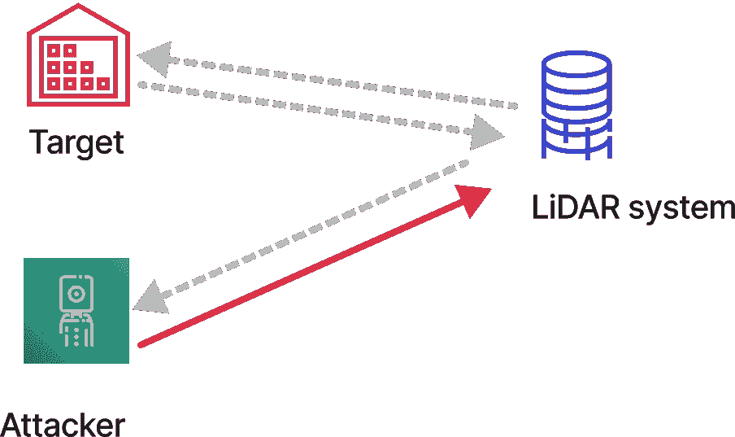

<!--yml

分类：未分类

日期：2024-09-06 19:43:44

-->

# [2210.11237] 基于深度学习的自动驾驶中的新兴威胁：综合调查

> 来源：[`ar5iv.labs.arxiv.org/html/2210.11237`](https://ar5iv.labs.arxiv.org/html/2210.11237)

\WarningFilter

Fancyhdr 过小。

\tnotetext

[1]本文件是中国国家自然科学基金资助的研究项目成果：新高考综合素质评价的安全数据管理机制研究：区块链赋能的安全增强（编号：72204077）。

\tnotetext

[2]本文件是湖北省自然科学基金项目资助的研究成果：基于区块链的新高考综合素质评价数据安全管理机制研究。（编号：2021CFB470）

[style=chinese]

url]https://scholar.google.com/citations?user=1XoXUTYAAAAJ&hl=en

[style=chinese]

[style=chinese]

[style=chinese]

[style=chinese] \cormark[1]

\cortext

[cor1]通讯作者 \cortext[cor2]前两位作者等同贡献。

# 基于深度学习的自动驾驶中的新兴威胁：综合调查

曹晖 cao-hui@whu.edu.cn    邹文龙    王银坤    宋婷    刘孟君 lmj_whu@163.com 武汉大学教育学院，友谊路 368 号，武汉，430062，湖北，中国 中国科学院信息工程研究所，北京，100093，中国 湖北大学外语学院，友谊路 368 号，武汉，430062，湖北，中国

###### 摘要

自 2004 年 DARPA“大挑战”以来，自动驾驶技术经历了近二十年的快速发展。特别是近年来，随着新传感器和深度学习技术在自动驾驶领域的应用，这一技术的发展不断突破。因此，许多汽车制造商和高科技巨头致力于自动驾驶的研究和系统开发。然而，作为自动驾驶基础的深度学习技术面临许多新的安全风险。学术界提出了针对对抗样本和 AI 后门的深度学习对策，并将其引入自动驾驶领域进行验证。深度学习的安全性关系到自动驾驶系统的安全，进而关系到个人安全，这是一项值得关注和研究的问题。本文总结了自动驾驶领域深度学习安全技术的概念、发展及最新研究。首先，我们简要介绍了自动驾驶系统中的深度学习框架和流程，这主要包括该领域常用的深度学习技术和算法。此外，我们依次关注基于深度学习的自动驾驶系统在每个功能层的潜在安全威胁。我们回顾了深度学习攻击技术的发展，调查了最先进的算法，并揭示了潜在风险。最后，我们对自动驾驶领域的深度学习安全进行了展望，并提出了构建安全可信的自动驾驶系统的建议。

###### 关键词：

可信赖的人工智能

深度学习

人工智能

自动驾驶

网络安全

对抗样本

## 1 引言

关于自动驾驶陆地车辆（ALVs）的研究早在 1980 年代就已开始，得到美国国防部（DoD）的资助。在 21 世纪，DARPA 组织了“大挑战”比赛，推动了新一代自动驾驶的诞生。人工智能（AI）技术的发展推动了自动驾驶技术的迅速进步，公众对其期望也日益增加。目前，许多传统汽车制造商，如通用汽车、丰田、沃尔沃、宝马和奥迪，都在研究自动驾驶系统。另一方面，科技巨头如谷歌 Waymo、特斯拉、百度和华为也积极投入自动驾驶技术的研究。随着人工智能技术的发展，自动驾驶取得了迅速的进展，预计将进入实际应用阶段。

然而，安全性是自主驾驶系统应用中的一个主要问题，因为依赖深度学习的自主驾驶系统伴随着新的安全风险。一方面，从 AI 安全和隐私保护的技术威胁角度来看，已经提出了一些新对策，包括对抗样本 [[1, 2]、数据中毒和 AI 后门 [3]、模型提取 [4]、模型反演 [5] 和成员隐私推断 [6]。另一方面，从 AI 的社会信任角度来看，关于公平性、AI 滥用、环境、合规和伦理的问题也受到关注和研究。目前，有一些文献 [7, 8, 9, 10, 11, 12, 13] 总结了 AI 安全威胁在一般环境中的情况。与此不同的是，本文关注于自主驾驶系统的环境，揭示了 AI 技术带来的新安全风险，为自主驾驶提出了新的安全挑战。与深度学习的其他应用不同，自主驾驶系统是一个更复杂的 AI 架构，由数十个功能模块和具有不同特性的环境模块组成，对 AI 安全攻击和缓解技术提出了不同的要求，包括：

+   •

    物理世界要求。自主驾驶系统的 AI 威胁应能够在真实的物理世界中生效，而不仅仅是在数字世界和计算机模拟系统中。针对物理世界中对抗样本攻击的技术是本文的重点。

+   •

    鲁棒性要求。自主驾驶中的环境是不确定的，并且通常变化很大。一方面，在不同天气、光线和其他自然条件下采集的图像可能会有所不同；另一方面，由于车辆的高速运动，远距离和大角度范围的变化也使得图像采集高度可变。因此，AI 威胁需要能够在各种条件下持续稳定地生效，这对攻击的鲁棒性提出了很高的要求，例如对抗样本和 AI 后门。本文关注于鲁棒性增强方法。

+   •

    融合环境要求。自主驾驶系统通常采用多模态融合传感技术，结合来自多个 RGB 摄像头、激光雷达、雷达等不同类型的信息，以感知融合图像。自主驾驶环境要求对抗样本对策和其他相关威胁技术能够在融合环境中保持稳定生效。多模态融合环境中的人工智能威胁也是本文的重点。

由于上述问题和要求，自动驾驶领域的 AI 安全技术不断发展，取得了一些研究成果和突破。本文介绍了与独特技术相关的最新研究进展，并揭示了自动驾驶系统中的 AI 安全风险。本文面对的是自动驾驶系统的挑战，而非一般环境。第一部分简要介绍了自动驾驶中 AI 的基础设施和关键技术；第二部分概述了传感器层中的 AI 风险；第三部分全面回顾了感知层中的 AI 风险，介绍了重要算法的思想和细节；第四部分提供了决策层中潜在的深度学习风险和攻击技术；第五部分关注基于联邦学习的未来 V2X 的新威胁；第六部分给出了总结和展望。

### 1.1 自动驾驶的基本概念

从本质上讲，自动驾驶是通过人工智能技术或其他自动化决策方法来做出驾驶决策。根据美国汽车工程师学会（SAE）标准 J3016[14]，自动驾驶可以分为以下几类。

+   •

    L0 – 无驾驶自动化：驾驶完全由人工完成，但在行程中提供警告和系统辅助。

+   •

    L1 – 驾驶辅助：基于对驾驶环境的感知，仅涉及单一的自动化方面，即系统操作方向盘或加速和减速，辅助驾驶员进行 ADAS 操作，而其他驾驶操作由人工驾驶员完成。

+   •

    L2 – 部分驾驶自动化：基于对驾驶环境的感知，系统操作方向盘和加速或减速。然而，它要求人工驾驶员保持持续警觉，并在几乎没有预警的情况下准备全面接管控制。

+   •

    L3 – 有条件驾驶自动化：基于对驾驶环境的感知，自动驾驶系统可以在人工驾驶员监督下执行所有驾驶操作。

+   •

    L4 – 高级驾驶自动化：在某些环境条件下，自动驾驶系统可以在无人监督的情况下执行所有驾驶操作。

+   •

    L5 – 完全驾驶自动化：在所有环境条件下，自动驾驶系统可以在无人监督的情况下执行所有驾驶操作。

对于自动驾驶系统，有不同的视角和概念，以及不同的发展和演变路线。一种是专注于车辆组件的智能化和网络化，主要研究传感器、车载通信、车联网（V2X）等，主要由传统汽车制造商参与。另一种是专注于自动驾驶决策，主要研究人工智能和自动驾驶，主要参与者包括：加州大学伯克利分校、谷歌 WayMo、百度、Apollo、Intel Carla、NVIDIA 以及其他人工智能公司。然而，无论是从车辆向 AI 发展还是反向发展，自动驾驶决策都是自动驾驶的核心任务，基于 AI 驾驶决策的安全性是自动驾驶系统安全的必要前提。自动驾驶级别越高，对深度学习等 AI 技术的依赖越大，从而对深度学习本身的安全性和鲁棒性的要求也更高。

### 1.2 自动驾驶系统架构

从自动驾驶架构和基于机器学习技术的角度来看，自动驾驶系统可以分为端到端（E2E）和模块化架构。

(a) 模块化自动驾驶框架

(b) 端到端自动驾驶框架

图 1：自动驾驶框架

+   •

    模块化自动驾驶系统将单独的自动驾驶功能集分成多个部分，每部分由一个或一组人工智能模型完成，通常包括：定位与投影、目标识别、轨迹预测、道路规划与驾驶决策、车辆控制和其他功能。这些功能模块包含感知层、感知层、决策层和车辆网络层。

+   •

    端到端自动驾驶系统通常由大量复杂的判断功能组成，这些功能由一个或一组人工智能模型执行，模型根据环境和云端输入做出最终驾驶决策。

### 1.3 感知层

感知层包括各种传感器，用于收集关于环境的信息，以支持自动驾驶系统。常见的自动驾驶车辆传感器包括 RGB 摄像头、激光雷达（LiDAR）、雷达（RaDAR）、GPS 和超声波传感器。以下是不同传感器的特征：

+   •

    RGB 摄像头的优点是：1）成本较低，2）识别技术相对成熟；它们的局限性在于距离依赖于估算。

+   •

    激光雷达的优点是其精确；其局限性是容易受到天气干扰。

+   •

    雷达的优点是相对免疫于天气干扰；其局限性是成像能力不足。

已有一些现有的研究详细比较了自动驾驶车辆的传感器，这不是本文的重点。相关的感知层调查论文有[15, 16, 17]。

大多数公司选择了多模态融合的自动驾驶技术解决方案，而一些公司则选择了主要依赖 RGB 摄像头的解决方案。然而，需要强调的是，无论选择何种传感器配置方案，各种先进的传感器只是实现原始信息收集的功能，并不能替代人工智能在自动驾驶系统中的感知和决策中的关键作用，也无法避免人工智能带来的新安全风险。

### 1.4 感知层

感知层通过传感器层收集的车辆状态和道路信息来感知和识别物体，例如对象识别、分割、深度估计和定位。常用的技术包括 2D 物体识别、3D 物体识别、多模态融合、轨迹预测等。

图 2：自动驾驶中的传感器

+   •

    2D 目标识别基于平面图像来识别图像中是否存在特定目标并进行定位。从技术上讲，2D 目标识别可以分为两类：两阶段目标识别算法和单阶段目标识别算法。两阶段算法首先找到一系列区域提议，然后通过卷积神经网络（CNN）对提议中的对象进行分类。常用的两阶段算法包括 FasterRCNN[18]和 MaskRCNN[19]，其特点是准确度较高但消耗较大。单阶段算法不会生成单独的区域提议，而是直接返回目标的预测类别和位置。常用的单阶段算法包括：SSD[20]和 Yolo v3[21]。2017 年，Lin 等人[22]提出了一种新的损失函数——“Focal Loss”，该技术可以显著提高密集目标识别的准确性，最初应用于人脸识别领域。现在，它已应用于许多目标识别领域，其中，2021 年，Yosuke Shinya 等人[23]提出了 UniverseNet，这是一种应用 Focal Loss 的目标检测算法，可以在密集目标和小目标场景中取得更好的结果。关于当前主流 2D 目标识别技术的详细比较可以在参考文献[15, 16, 17]中找到。

+   •

    多模态融合。单一类型的传感器无法捕捉支持自动驾驶所需的所有环境信息，而自动驾驶系统需要来自多种类型和大量传感器的信息来做出综合决策，这就引出了多模态融合。根据发生的时间[24]，融合可以分为三种模式：预融合、后融合和深度融合。预融合将所有类型传感器收集的数据结合起来，然后做出综合决策。后融合对不同传感器收集的数据进行决策，然后聚合子决策。深度融合由数据、特征和决策集成的融合组成，可以进一步细分为五种类型：数据输入数据输出、数据输入特征输出、特征输入特征输出、特征输入决策输出和决策输入决策输出[25, 26]。有关各种融合方法的深入分析和比较可以在文献[26, 27, 28, 26]中找到。

    

    (a) 预融合

    

    (b) 融合后

    

    (c) 深度融合

    图 3：自动驾驶的融合

+   •

    3D 目标检测与分割。由于 2D 图像缺乏自动驾驶所需的深度信息，例如路径规划和碰撞避免，因此 3D 目标检测发挥了关键作用。根据检测到的信息，3D 目标检测有 3 个基础：2D 图像、3D 点云地图和多模态融合图像。其中，基于 2D 图像的 3D 目标检测通常使用 3D 目标匹配和深度估计来估计 2D 图像中目标的 3D 边界框，算法如 Mono3D[29]、3DVP[30]、Deepmanta[31] 和 SVGA-Net[32]。基于 3D 点云地图的 3D 目标识别是识别图像中具有 3D 信息的目标并标记目标轮廓。常用的算法包括：VeloFCN[33]、BirdNet[34]、3DFCN[35]、PointNet++[36] 和 VoxelNet[37]。基于多模态融合图像的 3D 目标检测是使用不同的融合模式来识别 3D 目标。常用的算法包括：MV3D[38]、AVOD[39] 和 F-PointNet[40]。各种 3D 目标检测算法的比较和深入研究可以参考文献[41, 42]。

感知层中其他深度学习研究方向包括行人检测、车道检测、交通标志识别、行人属性识别、快速车辆检测、行人密度估计、车牌识别等。详细内容可见排行榜[43]。

### 1.5 决策层

驱动决策是自动驾驶的核心，通常使用机器学习方法，主要有两种技术路线：模仿学习和强化学习。

+   •

    模仿学习。模仿学习指的是通过观察和模仿人类专家的行为来获取执行特定任务能力的学习行为[44]。模仿学习在自动驾驶领域取得了成功[45]。模仿学习通常会收集大量的环境状态 $S_{i}$（由各种传感器收集的环境数据，包括 3D 点云地图、RGB 图像等）作为特征，并同时记录人类专家所执行的动作。$A_{i}$ 被用作标签，形成训练数据集 $D:{(s1,a1),(s2,a2),(s3,a3),...}$。使用特定的模仿学习算法来训练人工智能模型，并用于做出未来的驾驶决策。著名的模仿学习方法包括基于条件模仿学习的 E2E 自动驾驶算法 [46]，以及 ChauffeurNet[47]。

+   •

    深度强化学习。深度强化学习模拟了自然界中生物的自学习模型。具体而言，代理监测自身行为及其导致的环境变化，为不同变化设定奖励值，然后基于此不断优化模型和自身行为。2013 年，Mnih 等人[48]将深度学习与强化学习结合，提出了深度 Q 学习（DQN）方法。DQN 基于奖励表中的一组 Q 值。系统的驾驶状态 $S_{i}$ 和驾驶操作 $a_{i}$ 以获得相应的奖励值 $r_{i}$，从而自动生成训练数据 $D:{((s1,a1),r1),((s2,a2),r2),((s3,a3),r3),...}$。然后，通过特定算法训练强化学习模型，同时用当前操作数据补充强化学习，以不断优化模型。如今，深度强化学习已迅速发展并得到广泛应用，随后出现了深度递归 Q 网络（DRQNs）[49]、注意力机制深度递归 Q 网络[50]、异步/同步主导演员-评论家（A3C/A2C）[51]，以及用于无监督和无辅助任务的强化学习[52]，这些技术广泛应用于电子竞技、健康与医学、推荐系统等领域。有一些关于深度强化学习的调查[53, 54]。

    各种深度强化学习框架和算法在自动驾驶领域得到了广泛应用。例如，Feng 等人[55]、Alizadeh 等人[56]、Mirchevska 等人[57]和 Quek 等人[58]将深度强化学习技术应用于驾驶决策；Holen 等人[59]利用深度强化学习进行自动驾驶道路识别；Feng 等人[60]则将深度强化学习技术用于交通信号灯优化控制。一些研究人员还提出了一种结合模仿学习和强化学习的自动驾驶解决方案[61, 62]。

### 1.6 车辆网络

随着通信和人工智能技术的发展，车辆网络在自动驾驶中扮演着越来越重要的角色，尤其是车辆网络建设，它支持分布式 AI 模型，并为自动驾驶提供了一种新型 AI 技术，同时也带来了新的安全风险。

+   •

    车对一切（V2X）。V2X 是一个多层次的网络系统，旨在增强行人、车辆和交通基础设施之间的协作。它通常由车对车（V2V）网络、车对基础设施（V2I）网络、车对行人（V2P）网络和车对路边单元（V2R）网络组成[63]。车联网中使用的通信技术可以大致分为两类，专用短程通信（DSRC）和长期演进（LTE）蜂窝通信，简称为蜂窝-V2X 或 C-V2X[64]。

+   •

    联邦学习。车联网为分布式人工智能提供了网络基础。联邦学习是一个分布式的 AI 框架，它用模型交互替代了敏感数据的交互，从而实现了更高效和更好的隐私保护的知识共享与转移。基于 V2X，联邦学习可以为自动驾驶系统提供分布式和交互式 AI 服务[65, 66, 67]。本文重点讨论了联邦学习在车联网中带来的新型安全风险，并回顾了相关的安全技术发展。

### 1.7 总结

我们在表 1 中总结了自动驾驶中使用的主要 AI 应用

表 1: 自动驾驶中的主要深度学习任务

| 层 | 任务 | 主要典型深度学习算法 |
| --- | --- | --- |
| 传感器 | 3D 点云配准 | 3DFeat-Net[68], FCGF[69], D3Feat-pred[70] |
|  | 预融合 | Multi-Frame Fusion[71], MTF4VT[72], TransFuser[73], DeepFusion[74] |
| 感知 | 2D 物体检测 | Fast-RCNN[75], Faster R-CNN[75], Mask R-CNN[19], D-RFCN[76], Yolov4[77], YOLOv7[78], FD-SwinV2[79] |
|  | 3D 物体检测 | PointRCNN[80], PV-RCNN[81], Se-SSD[82], GLENet-VR[83] |
|  | 车道检测 | SCNN[84], LaneATT[85], CLRNet[86] |
|  | 交通标志识别 | CNN with 3 Spatial Transformer[87], Mask R-CNN with adaptations and augmentations[19], TSR-SA[88] |
|  | 快速车辆检测 | YOLOv3-tiny[89], LittleYolo-SPP[90] |
|  | 行人检测 | SA-FastRCNN[91], RPN+BF[92], Pedestron[93] |
|  | 语义分割 | FCN[94], PSPNet[95], DRAN[96], Swin transformer[97], ViT-Adapter[98] |
|  | 物体跟踪 | M2-Track[99], BAT[100] |
|  | 多目标跟踪 | QDTrack[98], RetinaTrack[Lu2020retinatrack] |
| 决策 | 轨迹预测 | NSP-SFM[101], Y-Net[102], Trajectron++[103], Social GAN[104], SoPhie[105] |
|  | 运动预测 | VI LaneIter[106], Wayformer[107] |
|  | 深度强化学习 | 深度 Q 学习[108]), 深度递归 Q 学习[49], 深度注意力递归 Q 网络[50], 双重 Q 学习[109], A3C/A2C[51] |
|  | 模仿学习 | 生成对抗模仿学习[110], 条件模仿学习[46, 111], 自我模仿学习[112], Chauffeurnet[47] |
| V2X | 联邦学习 | FedAvg[113] |

## 2 传感器中的新兴威胁

传感器是自动驾驶系统的基础部分，为自动驾驶决策提供原始环境信息。传感器的安全性直接影响自动驾驶系统的安全。我们将针对传感器的攻击分为两类，其中旨在破坏传感器可用性的攻击被归类为**干扰攻击**，旨在破坏传感器收集信息完整性的攻击被归类为**伪造攻击**。

### 2.1 干扰攻击

**干扰攻击**是指攻击者采取某些行动以降低传感器收集数据的质量，甚至使传感器无法使用。2015 年，Petit 等人[114]尝试通过人工设置强光干扰来对自动驾驶传感器进行干扰攻击，可能“使相机失明”。2016 年，Yan 等人[115]对超声波传感器进行了盲目攻击实验。同样，各种车载传感器，如 RGB 相机、激光雷达、雷达、陀螺仪传感器和 GPS 传感器，都可能受到干扰攻击[116, 117, 118, 119]。

### 2.2 伪造攻击

**伪造攻击**是指攻击者注入虚假信号，以影响自动驾驶系统的正常行为。2015 年，Petit 等人[114]尝试发送特定伪造激光信号，导致激光雷达系统被误导。之后，Park 等人[120]对车载红外传感器进行了类似实验。Yan 等人[115]研究了陀螺仪传感器和雷达。Nassi 等人[121]对 RGB 相机、激光雷达和雷达进行了综合实验。Psiaki 等人[122], Meng 等人[123]则在多种环境下对 GPS 进行了伪造实验。

目前，大多数针对车辆传感器的攻击趋向于物理攻击，而非深度学习攻击。本文仅提供一般概述，更多细节请参见相关调查[17, 15]。

## 3 感知层中的新兴威胁

基于传感器层捕获的各种类型的传感器信息，感知层执行识别和感知。这些任务，如目标识别、分割和深度估计，通常难以通过基于某些规则的简单计算完成。人工智能也面临新的安全威胁。例如，攻击者可能使用对抗样本或 AI 后门攻击，这可能误导模型产生攻击者控制的错误预测，进而导致危险的驾驶决策。攻击者还可能使用模型提取技术来获取 AI 模型的参数或超参数，导致模型泄漏和知识产权损失。随后，攻击者可能会使用模型反演或成员隐私攻击，导致敏感训练数据泄漏和隐私风险。

与一些现有的调查不同，这些调查介绍了网络空间中的一般对抗样本或 AI 后门，本文专注于物理世界中的高级研究。物理世界中的攻击面临更高的要求，特别是在攻击一致性、高成功率和对环境不确定性的鲁棒性方面。

### 3.1 静态目标检测中的物理世界对抗样本

2014 年，研究人员发现，添加少量对人类不可察觉的特定干扰，仍然可能导致机器学习被攻击者误导。这可能在机器学习应用于关键领域时造成严重的安全甚至安全问题。这种攻击被称为对抗样本攻击，可以形式化为

|  | $argmin_{x^{\prime}}\left\|x^{\prime}-x\right\|_{p} \text{s.t.} f(x^{\prime})=\hat{y}$ |  | (1) |
| --- | --- | --- | --- |

其中 $f$ 表示一个机器学习模型，$x$ 表示一个测试样本，$x^{\prime}$ 表示基于添加少量干扰生成的对抗样本，$c$ 为模型对正常样本的预测结果，$c^{\prime}$ 为模型对对抗样本的预测结果。

在首次工作之后，对抗样本技术已被广泛研究并快速发展。Goodfellow 等人提出的 FGSM 算法[2] FGSM 通过计算输入和目标分类之间损失函数的梯度，并在该梯度的符号向量系数上创建小的扰动，具体如下：

|  | $x_{Adv}=x+\alpha \text{sign}(\nabla_{x}J(x,y))$ |  | (2) |
| --- | --- | --- | --- |

其中 $x_{adv}$ 表示 $x$ 的对应对抗样本，$\alpha$ 是一个特定常数，$sign()$ 是符号函数，$y_{true}$ 是 $x$ 的真实标签，$J()$ 表示用于训练模型的损失函数，$\triangledown_{x}$ 表示 $x$ 的梯度。该算法可以在正常预测为熊猫的图像中添加一定量的对抗噪声，使得机器学习模型可以以较高的置信度将其预测为长臂猿。该算法可以实现无目标攻击和有目标攻击。接下来会提出更多关注的对抗样本算法。2016 年，Papernot 等人[124] 提出了使用替代模型方法的黑箱攻击。2017 年，Moosavi-Dezfooli 等人[125] 提出了通用对抗样本攻击，其中一种特定的对抗干扰能够影响机器学习中多个甚至所有样本的分类。同年，Carlini 等人[126] 提出了基于优化的 C&W 算法以改进对抗样本攻击。2018 年，Zhao 等人[127] 发现不需要填充人工干扰，而是发现自然界中不同的分布可以导致机器学习模型的误分类，这被称为自然对抗样本。

在真实物理世界中，自动驾驶的环境更加复杂，因此攻击者在物理世界中生成对抗样本面临更多挑战[128]。物理世界中对抗样本的要求如下。

+   •

    物理可生成。在物理世界中，仅通过网络空间添加扰动是不够的。这些扰动必须能够通过打印、3D 打印或喷涂等方式物理生成。

+   •

    局部可生成。对抗样本的局部特性。在数字世界的对抗样本中，攻击者可以在图像范围内的任何像素添加扰动；然而，在物理世界攻击中，通常只有目标的局部区域是可用的，且在许多情况下，图像的背景区域很难用来生成物理世界的对抗样本。

+   •

    鲁棒性。在物理世界中，特别是在自动驾驶领域，通常要求对抗样本能够在多个角度变化中持续对机器学习模型产生误导性效果。同时，对抗样本需要在一定距离和角度范围、多个自然环境以及多个分辨率传感器设备下对主流目标识别算法持续有效。这对对抗样本的持久性和普遍性提出了更高的要求，极大地增加了对抗样本生成的复杂性。

因此，为实现物理世界的对抗样本攻击，通常需要更多的对抗样本鲁棒性增强措施；具体采取的措施根据不同的场景和攻击目标而有所不同。根据设定对策的场景和对象，本文将自动驾驶系统中的识别目标分为三类：包括各种机动车辆的车辆、步行者和骑行者等行人，以及道路设施、交通标志、标线、路边广告牌等静态目标。

因此，目前在自动驾驶领域，物理世界普遍存在 3 种对抗样本技术的目标：静态目标识别、行人识别和车辆识别。

+   •

    针对静态目标的物理世界对抗样本。这类攻击目标包括各种静态目标识别系统，如交通标志、交通信号和交通标线，其特点是对抗样本可以在大范围的角度和距离上持续稳定地干扰机器学习模型的判断。2017 年，陆等人[129] 成功地在物理世界中生成了流行的目标识别算法 FasterRCNN 的对抗样本。为了实现更好的距离和角度范围适应，2018 年，Eykholt 等人[130] 提出了鲁棒物理扰动（RP2）算法。在同一年，陈等人[131] 采用了期望变换（EoT）方法[132] 来改进交通标志对抗样本的生成，从而提高了对抗样本对距离、角度、光线等环境的适应性。2019 年，赵等人[133] 提出了特征干扰增强（FIR）算法和真实约束生成（ERG）算法，以增强对抗样本的鲁棒性。同时，他们提出了嵌套对抗样本（nested-AE）算法，以提高对抗样本对长短距离的适应性。最后，该复合方案能够在 $\pm 60^{\circ}$ 的角度范围和 $[1m,25m]$ 的距离范围内成功攻击流行的目标识别算法，如 YOLO v3 和 Faster-RCNN。基于上述方法，可以实施隐藏攻击和显现攻击。隐藏攻击是在普通交通标志上粘贴对抗样本，使目标识别系统无法识别该交通标志。显现攻击是在其他物体上粘贴对抗样本，导致目标识别系统将物体识别为特征交通标志或发生错误识别。2020 年，孔等人[134] 提出了基于对抗样本生成网络的物理世界对抗样本攻击方法 PhysGAN，生成的广告标志对抗样本具有更好的鲁棒性和隐蔽性。

+   •

    物理世界中的行人识别对抗样本。在自动驾驶系统中，目标识别系统未能检测到行人可能会导致严重后果。2020 年，吴[135] 提出了“隐形斗篷”算法，当行人穿着喷涂的对抗样本服装时，Yolo v2 和 Yolo v3 目标检测模型通常无法检测到他们。在同一年，王等人[136] 进行了类似的研究。

+   •

    车辆识别的物理世界对抗样本。这些样本通常以特定的图案贴在或涂在车身上，使得车辆检测系统无法识别该车辆或错误地将车辆识别为其他物体。这种物理世界对抗样本试图在高速移动、各种光照和其他外部条件下保持攻击效果，尤其是在 360 度视角和车辆识别系统的检测范围内，这对对抗样本的鲁棒性提出了更高要求。同时，在不同角度下，相机可能只能获取车身对抗样本的部分图像，从而对对抗样本提出了局部要求，即对抗样本的部分也能实现攻击。2019 年，张等人[137]提出了一种基于转移模型的黑盒对抗样本车身涂装方法，使得样例车辆无法被自动驾驶车辆检测系统识别。2020 年，吴等人[135]提出了离散搜索算法来高效生成对抗贴片，并提出了放大-重复（ER）算法，将对抗贴片扩展到整个车身，使用从各个角度收集的车身图像。这两者都具有相当好的对抗效果。

以下重点介绍了上述物理世界对抗样本增强的关键算法。

算法 1\. 变换期望（EoT）[132]

EoT 算法的核心思想是对每次对抗样本生成过程中的迭代添加一定的随机扰动，以便最终生成的对抗样本具有更好的鲁棒性，具体变换包括：投影、旋转和缩放。在公式中，操作$M_{t}(x_{b},x_{o})$定义为通过某种变换$t$将目标图像$x_{o}$投影到背景图像$x_{b}$上，然后对 EoT 进行如下优化。

|  | $\begin{split}\hat{p}=&amp;\arg\min_{x^{\prime}\in\mathbb{R}^{h\times w\times 3}}\mathbb{E}_{x\sim X,t\sim T}[L(F(M_{t}(x,tanh(x^{\prime}))]\\ &amp;+c\cdot\left\&#124;tanh(x^{\prime})-x\right\&#124;\end{split}$ |  | (3) |
| --- | --- | --- | --- |

其中$X$表示背景图像的训练集，$F$表示目标网络。

算法 2\. 对抗性贴片 [138]

基于 EoT 变换，攻击者可以生成一个对抗贴片$\hat{p}$，该图像包含被对抗样本攻击的对抗贴片。对抗贴片可以是任何形状，通过 EoT 方法（如随机投影、旋转和缩放）进行变换，然后通过优化方法（如梯度下降）生成。对抗贴片生成任务$A(p,x,l,t)$可以正式描述为：对于任意特定的$x\in\mathbb{R}^{w\times\ h\times c}$，通过 EoT 变换$t$在位置$l$生成对抗贴片$p$，然后对抗贴片$p$通过以下优化算法持续优化：

|  | $\hat{p}=\arg\max_{x\in\mathbb{R}^{h\times w\times c}}\mathbb{E}_{x\sim X,t\sim T,l\sim L}[\log Pr(\hat{y}&#124;A(p,x,l,t))]$ |  | (4) |
| --- | --- | --- | --- |

其中$X$表示背景图像的训练集，$T$表示贴片使用的 EoT 变换的分布，$L$表示对抗贴片的位置分布。

Algorithm3\. Feature-inference Reinforcement[133]

对抗样本生成算法通常需要一个目标函数，也称为损失函数，旨在最小化深度学习模型的预测值和期望值之间的差异。神经网络提取图像中物体的特征，并基于这些提取的特征进行分类预测。研究人员发现，通过在神经网络的隐藏层中进一步引入扰动生成对抗样本，可以使对抗样本更具鲁棒性。因此，FIR 算法的核心思想是最小化对抗样本与正常样本在特征图像层之间的差异，而不是利用对抗样本误导神经网络的预测结果。

首先，攻击者获取神经网络的每个隐藏层生成的特征图像$Q_{n}$和$Q^{\prime}_{n}$，对应于类别$y$和$y^{\prime}$。接下来，从特征图像$Q_{n}$和$Q^{\prime}_{n}$生成特征向量$v$和$v^{\prime}$。最后，攻击者使用组合损失函数进行优化，直到收敛，然后返回对抗样本。这样的向量损失可以定义为$Loss_{f}=\sum\left|v-v^{\prime}\right|$。FIR 算法可以形式化描述如下。

输入：正常样本 $x$，目标检测模型 $f$ 输出：对抗样本 $x^{\prime}$12 当 *直到收敛* 时 进行 3      4      对每个 *$i$ 层隐藏层在 $f$ 中* 进行 5             $q_{i}\leftarrow f(x)$ // 获取正常样本 $x$ 的特征图 $q_{i}$ 和预测 $y$ ;6            7            $q^{\prime}_{i}\leftarrow f(x^{\prime})$ // 获取对抗样本 $x^{\prime}$ 的特征图 $q^{\prime}_{i}$ 和预测 $y^{\prime}$ ;8            9       结束对每个 10      $v\leftarrow Q:\left\{{q_{1},q_{2},...,q_{n}}\right\}$ // 从特征图生成正常特征向量 11      $v^{\prime}\leftarrow Q^{\prime}:\left\{{q^{\prime}_{1},q^{\prime}_{2},...,q^{\prime}_{n}}\right\}$ // 从特征图生成对抗特征向量 12      优化 $x^{\prime}$ 以最小化损失函数：

|  | $\alpha C_{N}^{box}+\beta p_{N}(y^{N}&#124;S)+c(loss_{f})^{-1}$ |  |
| --- | --- | --- |

13 结束

算法 1 3\. 特征推断强化

其中 $C_{N}^{box}$ 表示目标检测系统对目标区域的置信度水平；$y^{N}$ 表示神经网络判断样本 $x$ 为类别 $N$ 的置信度水平；$S$ 表示置信度水平的分布空间；$loss_{f}$ 表示向量损失；$\alpha$、$\beta$ 和 $c$ 是分别表示权重的三个常数。

算法 4\. 嵌套对抗样本 (Nested-AE)[133]

大多数目标检测器被设计为使用多尺度，每个尺度在不同距离上效果最佳。这意味着在不同距离上，不同尺度发挥不同的作用。为了使生成的对抗样本在较大的距离范围和多个角度上实现对抗效果，Nested-AE 算法考虑了多个尺度以应对不同的距离和角度，从而生成许多对抗补丁。然后，Nested-AE 将这些对抗补丁合成一个对抗样本。因此，嵌套对抗样本更适应于自动驾驶中的车辆运动环境，可以实现对目标检测系统的持续对抗效果。嵌套对抗样本可以正式描述为

|  | $X^{adv}_{i+1}=Clip\begin{Bmatrix}X_{i}+\varepsilon sign(J(X_{i})),&amp;S_{P}\leq S_{thres}\\ X_{i}+\varepsilon M_{center}sign(J(X_{i})),&amp;S_{P}>S_{thres}\end{Bmatrix}$ |  | (5) |
| --- | --- | --- | --- |

其中 $X_{i}$ 表示原始样本，$X^{adv}_{i+1}$ 表示具有对抗扰动的样本，$J()$ 表示输入 $X_{i}$ 的梯度，$Clip()$ 指将输入规范化到 $[0,255]$ 区间。

如果对抗样本的大小 $S_{p}$ 小于或等于阈值 $S_{thres}$，则被视为长距离对抗攻击，此时整个图像将受到扰动；否则，它被视为近距离攻击，仅中心区域会受到扰动。这将不同距离的对抗攻击分解为两个子任务，分别进行扰动和优化。

目标检测系统通常将每个视频帧分成由 $m\times n$ 个框组成的网格。根据每个框的预测，攻击者可以找到每个尺度的决定性框，然后在这个框中添加对抗扰动。由于预测的输出通常是张量，因此只需要对抗样本所在位置的张量。因此，可以通过样本的大小和中心区域的位置来计算索引，从而获得表示样本区域的张量，记作 $N_{p}$。然后需要在每个视频帧中计算 $N_{p}$。嵌套对抗样本算法可以使用以下损失函数进行优化。

|  | $N_{p}=f(p_{size},P_{position}),1-C^{box}_{N_{p}}+\beta\sum\left&#124;p_{N_{p}},j-y_{j}\right&#124;^{2}$ |  | (6) |
| --- | --- | --- | --- |

### 3.2 行人检测中的物理世界对抗样本

行人检测通常对对抗样本的通用性、便携性、鲁棒性和可行性提出较高要求。为了解决这个问题，提出了一些算法。作为一个典型的例子，隐形斗篷算法[135] 可以在物理世界中生成对抗样本，从而使穿着特定对抗样本图案衣物的行人无法被正确识别。如果在行人检测中使用类似的方法，将对自动驾驶系统产生严重后果。

算法 5. 隐形斗篷[135]

隐形斗篷算法的策略是使用大量包含人员的图像进行训练以对抗补丁；在每次迭代中，随机选择一批图像并将其发送到目标检测系统，以获得人员的边界框。关键思想是将一个随机变换的补丁放置在每个检测到的人员身上，以最小化检测到的特征图像中人员存在的得分。

补丁 $P\in\mathbb{R}^{w\times h\times 3}$ 通过变换函数 $R_{\theta}$ 投射到目标图像 $I$ 上，该函数对光照、对比度变化、畸变进行数据增强，$\theta$ 为参数，此外，还会将补丁缩放以适应图像 $I$ 的大小。

此外，提出了两种有效的物理世界攻击高级方法作为辅助。其一是所谓的总变差 (TV) 损失。向补丁添加一个 TV 惩罚函数，使对抗样本更平滑，从而提高物理世界对抗样本的鲁棒性。

最终的损失函数为：

|  | $L_{obj}(P)=loss+\gamma\cdot TV(P)$ |  | (7) |
| --- | --- | --- | --- |

另一个是集成训练。在黑箱情况下，攻击者无法获得被攻击目标检测模型的梯度，因此一个可能的解决方案是收集多个相似的白箱模型进行集成训练。损失函数为

|  | $L_{ens}(P)=\mathbb{\theta,I}\sum_{i,j}\left\{S_{i}^{(j)}(R_{\theta}(I,P))+1,0\right\}$ |  | (8) |
| --- | --- | --- | --- |

其中 $S_{(j)}$ 表示目标 $j$ 的目标检测模型。其形式描述如下。

输入：正常样本 $x$，目标目标检测模型 $f$输出：对抗样本 $x^{\prime}$12$I=P(x)$ // 生成投影 3 ;45$R_{\theta}\leftarrow\theta$ // 定义转移函数 $R_{\theta}$6 ;78*直到收敛* 进行中 9      10      优化 $x^{\prime}$ 以最小化损失函数：

|  | $L_{obj}(P)=R_{\theta}(I,P)$ |  |
| --- | --- | --- |

11 结束时 1213 或附加 1：TV 损失

|  | $L_{obj}(P)=R_{\theta}(I,P)+\gamma\cdot TV(P)$ |  |
| --- | --- | --- |

14 或附加 2：集成训练

|  | $L_{obj}(P)=\mathbb{E}_{\theta,I}\sum_{i}\max\left\{{S_{i}(R_{\theta}(I,P))+1,0}\right\}^{2}$ |  |
| --- | --- | --- |

算法 2 5\. 隐形斗篷

### 3.3 物理世界对抗样本用于车辆检测

对于车辆检测的对抗样本，其目标是通过对抗喷涂避开或误导其他车辆检测器。与其他场景不同，挑战在于喷涂需要适用于所有角度的检测器。离散搜索是一种典型且有效的算法。

算法 6\. 离散搜索[139]

离散搜索算法本质上是一种基于遗传算法的黑箱对抗样本生成算法，通过变异和选择不断优化对抗样本。离散搜索算法中的变异方法定义了两种变异策略。一种是随机变异，即在半径为$\epsilon$的圆内随机选择一个点作为方向，并前进一步作为新的变异点。如果当前变异优化未能优于原始样本，则选择继续进行随机变异。另一种是定向变异，在当前方向的特定角度范围内选择候选的最佳变异点，并随机前进一步。如果当前变异优于原始样本，则选择继续进行定向变异。

12 输入：正常样本 $x$，目标目标检测模型 $f$ 输出：对抗样本 $x^{\prime}$12 当 *直到收敛* 时 3       对于 *$i\in\left\{0,...,N_{a}-1\right\}$* 进行 4            5            $C_{i}^{j_{w}}$，$C_{i}^{j_{w}}=Clip(C_{i}+Random(H,W,3)\cdot\epsilon_{1}\cdot\delta)$ //生成候选点 6            在 $C_{i}^{j_{w}}$ 中选择 $\hat{C}_{i}$7            如果 *$\hat{C}_{i}$ 比 $C_{i}$ 更好* 则 8                   $C_{i}=\hat{C}_{i}$9            否则 10                   $C_{i}$ 保持不变 11             结束如果 12            13       结束对每个 14      15 结束当

算法 3 6\. 离散搜索

### 3.4 LiDAR 和 RaDAR 上的对抗样本

对抗样本与深度学习本身的特性有关，无论是基于 RGB 图像还是基于 LiDAR 或 RaDAR 的目标识别系统，都容易受到对抗样本攻击。在 2019 年，Cao 等人[140] 提出了一个针对 LiDAR 目标识别的对抗样本攻击方法。攻击者向 LiDAR 系统发射少量扰动激光，这导致 LiDAR 系统成像出现小的扰动，从而使基于 LiDAR 的 3D 目标识别出现错误。随后，提出了一种针对 LiDAR 目标识别的对抗物体攻击方法 LiDAR-Adv，其中攻击者可以构造具有某种特殊形状的物体，导致 LiDAR 目标识别系统错误预测特殊物体。这种攻击是有针对性的，即真实物体被识别为攻击者指定的物体，因此攻击者更容易利用。正如图所示，一些特殊形状的物体可能会被 3D 目标识别系统误识别为“行人”，而其他物体则未被正确识别，带来了安全隐患。上述方法在百度的自动驾驶系统 Apollo 上成功测试。在 2020 年，经过研究和改进，SUN 等人[141] 实现了上述方法的黑箱攻击，并在英特尔的自动驾驶模拟系统 Carla 上成功测试。在实际的自动驾驶环境中，动态目标的检测通常采用 RGB 图像、LiDAR 和 RaDAR 的多模态融合进行目标识别，这在一定程度上提高了系统的鲁棒性。

图 4：LiDAR 上的对抗样本[140]

对于多模态环境中的对抗样本要求更高，主要体现在以下方面：

+   •

    对抗性扰动需要能够在 RGB 图像和 LiDAR 系统环境中物理生成。传统的 RGB 对抗性样本通常会改变图像中某些像素的 RGB 值，但这种方法无法作用于从 LiDAR 生成的 3D 点云图。另一方面，在 LiDAR 上发射特定的对抗性激光可以干扰 LiDAR 系统，但也很难有效影响 RGB 目标识别系统。

+   •

    对抗性样本需要能够在 RGB 系统和 LiDAR 系统中物理且持续地工作。在实际车辆环境中，RGB 系统和 LiDAR 系统需要在远距离和不同角度下成功并持续地进行攻击。

+   •

    对抗性样本需要能够适应 RGB 系统和 LiDAR 系统之间的不同数据预处理。RGB 图像采集系统和 LiDAR 数据采集系统都有一定的数据预处理，这会影响对抗性样本。对抗性样本生成算法需要对不同的预处理具有强鲁棒性。

同时，经过一些特定算法的优化后，融合目标识别系统仍然受到对抗性样本的威胁。2021 年，Cao 等人[142]提出了以 LiDAR 和 RGB 图像融合环境为例的 MSF-ADV 方法，并成功实现了物理世界中的对抗性样本。

算法 7\. MSF-ADV 算法[142]

为了应对上述挑战，MSF-ADV 首先生成不同形状的 3D 对象，以便它们能够同时影响基于 LiDAR 的 3D 点云成像和 RGB 图像中像素的 RGB 颜色值。其次，MSF-ADV 使用优化算法生成具有最佳对抗效果的 3D 形状。最后，MSF-ADV 使用 3D 打印机进行物理生成。优化算法的损失函数可以描述为

|  | $min_{S^{a}}\mathbb{E}_{t\sim T}[\mathcal{L}_{a}(t(S_{a});\mathcal{R}^{l},\mathcal{R}^{c},\mathcal{P},\mathcal{M})+\lambda\cdot\mathcal{L}_{r}(S^{a},S)]$ |  | (9) |
| --- | --- | --- | --- |

其中，$S$ 表示原始样本，$S_{a}$ 表示对抗性样本，$\mathcal{M}$s 表示融合算法，$\mathcal{R}^{c}$ 是用于表示 RGB 图像预测的导数投影函数。$\mathcal{R}^{l}$ 是用于表示 LiDAR 预测的导数投影函数。$\mathcal{P}$ 是目标识别系统的最终输出。

通过这种优化，找到了 RGB 颜色和 LiDAR 形状之间的权衡。

### 3.5 对象跟踪与轨迹预测中的对抗性样本

通常，自动驾驶系统依赖于物体跟踪和轨迹预测，以确定和预测目标状态，并支持驾驶决策。物体轨迹跟踪可以分为单目标跟踪（SOT）和多目标跟踪（MOT）。随着物体跟踪在关键网络系统中的应用，对其的对抗样本攻击也在上升。其中，对 SOT 的对抗样本攻击的主要目的是实现目标逃避。2020 年，Chen 等人[143]提出了一次性对抗攻击，这种攻击只对视频中的初始帧添加了微弱的扰动，导致被跟踪物体在随后的帧中可能无法跟踪轨迹。同年，Yan 等人[144]提出了冷却收缩攻击，通过添加特定的对抗噪声来扰动物体搜索区域，从而使跟踪器无法识别物体，并中断轨迹跟踪。次年，Jia 等人[145]提出了 IoU 攻击，其思想是在物体跟踪中减少正常物体边界与对抗物体边界之间的分数差异，从而使得使用 SOT 系统的轨迹偏移。

自动驾驶系统更常使用 MOT 系统。对 MOT 的对抗样本攻击可能同时实现逃避和物体混淆。2020 年，Jia 等人[146]在自动驾驶物体跟踪系统上生成了一个对抗样本，该样本在特定方向上细微偏离了正常目标识别边界框，导致跟踪器给攻击的轨迹分配错误的速度，导致目标跟踪系统无法正确关联目标，从而实现了逃脱攻击。2021 年，Lin 等人[147]提出了一种新的对抗样本方案，该方案主要使用“PushPull Loss”算法和“Center Leaping”算法。当物体彼此交叉时，该方案会使物体跟踪系统混淆。

算法 8\. Push-Pull Loss [147]

一个视频$V$由一系列帧组成，可以标记为$V=\left\{{I_{1},I_{2},...,I_{N}}\right\}$，目标$i$和$j$的轨迹分别是$T_{i}=\left\{{O_{s_{i}}^{i}},...,O_{t}^{i},...,O_{E_{i}^{i}}\right\}$和$T_{j}=\left\{{O_{s_{j}}^{j}},...,O_{t}^{j},...,O_{E_{j}^{j}}\right\}$。

攻击者的目标生成了一系列对抗帧$\hat{V}$，如$\hat{V}=\left\{{I_{1},...,I_{t-1},\hat{I}_{t},...,\hat{I}_{t+n-1},I_{t+n},...,I_{N}}\right\}$，使得从时间$t$开始，目标$i$和$j$的轨迹发生对抗性误导。然后有公式$\hat{T}_{i}=\left\{{O_{s_{i}}^{i},...,O_{t-1}^{i},O_{t}^{i},...,O_{t+n-1}^{j},O_{t+n}^{j},...,O_{e_{j}}^{j}}\right\}$，其中$O_{t}^{i}$表示在时间$t$时被识别为$i$的目标。

使用推拉损失函数进行优化并实现：

|  | $\begin{split}L_{pullpush}(a_{t-1}^{i},a_{t-1}^{j},feat_{t}^{i},feat_{t}^{j})\\ =\sum_{k\in\left\{i,j\right\}}d_{feat}(a_{t-1}^{k},feat_{t}^{\widetilde{k}})-d_{feat}(a_{t-1}^{k},feat_{t}^{k})\end{split}$ |  | (10) |
| --- | --- | --- | --- |

其中 $d_{feat}()$ 表示余弦距离，$a_{t-1}^{i}$ 和 $a_{t-1}^{j}$ 代表对象 $i$ 和 $j$ 的轨迹特征，而 $feat_{t}^{i}$ 和 $feat_{t}^{j}$ 表示对象 $i$ 和对象 $j$ 的特征。经过持续优化，它使对抗特征 $feat_{t}^{j}$ 而不是 $feat_{t}^{j}$ 被归类为轨迹 $k$。

图 5: 推拉损失函数 [147]

算法 9\. 中心跳跃 [147]

通过上述推拉损失函数优化，它能够使目标跟踪在面对攻击时误导系统，即使当两个对象之间的差异很大时也仍然难以成功。中心跳跃算法的思想是首先误导目标识别链，使得目标识别系统识别的目标候选框向需要误导的目标偏移，从而在两个被跟踪对象之间的距离和尺寸差异较大时实现更好的攻击成功率。损失函数为

|  | <math   alttext="\begin{split}L&amp;=min\sum_{k\in\left\{i,j\right\}}d_{box}(K(m_{t-1}^{\widetilde{k}},box_{t}^{k}))\\ &amp;=min\sum_{k\in\left\{i,j\right\}}d(cent(K(m_{t-1}^{\widetilde{k}},box_{t}^{k}))\\

&amp;+min\sum_{k\in\left\{i,j\right\}}d(size(K(m_{t-1}^{\widetilde{k}},box_{t}^{k}))\\

&amp;+min\sum_{k\in\left\{i,j\right\}}d(off(K(m_{t-1}^{\widetilde{k}},box_{t}^{k})))\end{split}" display="block"><semantics ><mtable columnspacing="0pt" displaystyle="true" rowspacing="0pt" ><mtr ><mtd columnalign="right" ><mi >L</mi></mtd><mtd columnalign="left" ><mrow ><mo >=</mo><mrow ><mi >m</mi><mo lspace="0em" rspace="0em" >​</mo><mi >i</mi><mo lspace="0em" rspace="0em" >​</mo><mi >n</mi><mo lspace="0em" rspace="0em" >​</mo><mrow ><munder ><mo movablelimits="false" >∑</mo><mrow ><mi >k</mi><mo >∈</mo><mrow ><mo >{</mo><mi >i</mi><mo >,</mo><mi >j</mi><mo >}</mo></mrow></mrow></munder><mrow ><msub ><mi >d</mi><mrow ><mi >b</mi><mo lspace="0em" rspace="0em" >​</mo><mi >o</mi><mo lspace="0em" rspace="0em" >​</mo><mi >x</mi></mrow></msub><mo lspace="0em" rspace="0em" >​</mo><mrow ><mo stretchy="false" >(</mo><mrow ><mi >K</mi><mo lspace="0em" rspace="0em" >​</mo><mrow ><mo stretchy="false" >(</mo><msubsup ><mi >m</mi><mrow ><mi >t</mi><mo >−</mo><mn >1</mn></mrow><mover accent="true" ><mi >k</mi><mo >~</mo></mover></msubsup><mo >,</mo><mrow ><mi >b</mi><mo lspace="0em" rspace="0em" >​</mo><mi >o</mi><mo lspace="0em" rspace="0em" >​</mo><msubsup ><mi >x</mi><mi >t</mi><mi >k</mi></msubsup></mrow><mo stretchy="false" >)</mo></mrow></mrow><mo stretchy="false" >)</mo></mrow></mrow></mrow></mrow></mrow></mtd></mtr><mtr ><mtd  columnalign="left" ><mrow ><mo >=</mo><mi >m</mi><mi >i</mi><mi >n</mi><munder ><mo movablelimits="false" >∑</mo><mrow ><mi >k</mi><mo >∈</mo><mrow ><mo >{</mo><mi >i</mi><mo >,</mo><mi >j</mi><mo >}</mo></mrow></mrow></munder><mi >d</mi><mrow ><mo stretchy="false" >(</mo><mi >c</mi><mi >e</mi><mi >n</mi><mi >t</mi><mrow ><mo stretchy="false" >(</mo><mi >K</mi><mrow ><mo stretchy="false" >(</mo><msubsup ><mi >m</mi><mrow ><mi >t</mi><mo >−</mo><mn >1</mn></mrow><mover accent="true" ><mi >k</mi><mo >~</mo></mover></msubsup><mo >,</mo><mi >b</mi><mi >o</mi><msubsup ><mi >x</mi><mi >t</mi><mi >k</mi></msubsup><mo stretchy="false" >)</mo></mrow><mo stretchy="false" >)</mo></mrow></mrow></mrow></mtd></mtr><mtr ><mtd  columnalign="left" ><mrow ><mo >+</mo><mi >m</mi><mi >i</mi><mi >n</mi><munder ><mo movablelimits="false" >∑</mo><mrow ><mi >k</mi><mo >∈</mo><mrow ><mo >{</mo><mi >i</mi><mo >,</mo><mi >j</mi><mo >}</mo></mrow></mrow></munder><mi >d</mi><mrow ><mo stretchy="false" >(</mo><mi >s</mi><mi >i</mi><mi >z</mi><mi >e</mi><mrow ><mo stretchy="false" >(</mo><mi >K</mi><mrow ><mo stretchy="false" >(</mo><msubsup ><mi >m</mi><mrow ><mi >t</mi><mo >−</mo><mn >1</mn></mrow><mover accent="true" ><mi >k</mi><mo >~</mo></mover></msubsup><mo >,</mo><mi >b</mi><mi >o</mi><msubsup ><mi >x</mi><mi >t</mi><mi >k</mi></msubsup><mo stretchy="false" >)</mo></mrow><mo stretchy="false" >)</mo></mrow></mrow></mrow></mtd></mtr><mtr ><mtd  columnalign="left" ><mrow ><mo >+</mo><mrow ><mi >m</mi><mo lspace="0em" rspace="0em" >​</mo><mi >i</mi><mo lspace="0em" rspace="0em" >​</mo><mi >n</mi><mo lspace="0em" rspace="0em" >​</mo><mrow ><munder ><mo movablelimits="false" >∑</mo><mrow ><mi >k</mi><mo >∈</mo><mrow ><mo >{</mo><mi >i</mi><mo >,</mo><mi >j</mi><mo >}</mo></mrow></mrow></munder><mrow ><mi >d</mi><mo lspace="0em" rspace="0em" >​</mo><mrow ><mo stretchy="false" >(</mo><mrow ><mi >o</mi><mo lspace="0em" rspace="0em" >​</mo><mi >f</mi><mo lspace="0em" rspace="0em" >​</mo><mi >f</mi><mo lspace="0em" rspace="0em" >​</mo><mrow ><mo stretchy="false" >(</mo><mrow ><mi >K</mi><mo lspace="0em" rspace="0em" >​</mo><mrow ><mo stretchy="false" >(</mo><msubsup ><mi >m</mi><mrow ><mi >t</mi><mo >−</mo><mn >1</mn></mrow><mover accent="true" ><mi >k</mi><mo >~</mo></mover></msubsup><mo >,</mo><mrow ><mi >b</mi><mo lspace="0em" rspace="0em" >​</mo><mi >o</mi><mo lspace="0em" rspace="0em" >​</mo><msubsup ><mi >x</mi><mi >t</mi><mi >k</mi></msubsup></mrow><mo stretchy="false" >)</mo></mrow></mrow><mo stretchy="false" >)</mo></mrow></mrow><mo stretchy="false" >)</mo></mrow></mrow></mrow></mrow></mrow></mtd></mtr></mtable><annotation encoding="application/x-tex" >\begin{split}L&=min\sum_{k\in\left\{i,j\right\}}d_{box}(K(m_{t-1}^{\widetilde{k}},box_{t}^{k}))\\ &=min\sum_{k\in\left\{i,j\right\}}d(cent(K(m_{t-1}^{\widetilde{k}},box_{t}^{k}))\\ &+min\sum_{k\in\left\{i,j\right\}}d(size(K(m_{t-1}^{\widetilde{k}},box_{t}^{k}))\\ &+min\sum_{k\in\left\{i,j\right\}}d(off(K(m_{t-1}^{\widetilde{k}},box_{t}^{k})))\end{split}</annotation></semantics></math> |  | (11) |

其中$m_{t}^{k}$和$box_{t}^{k}$分别表示时间$t$时目标$k$的轨迹状态和候选帧；cent()，size()和 off()分别表示候选框的中心点位置，大小和偏移；d()表示距离$L_{1}$。

中心跃迁算法可以表示为。

|  | $\begin{split}L_{cl}=\sum_{k\in\left\{i,j\right\}}(&amp;\sum_{(x,y)\in B_{c->\widetilde{k}}}(1-M_{x,y}^{\gamma}log(M_{x,y})+\\ &amp;\sum_{(x,y)\in B_{c->k}}(M_{x,y}^{\gamma}log(1-M_{P}{x,y})))\end{split}$ |  | (12) |
| --- | --- | --- | --- |

$M(x,y)$表示$(x,y)$的热值，$c_{k}$表示物体的中心，$c\rightarrow\widetilde{k}$表示从$c_{k}$到$cent(K(m^{\widetilde{k}}_{t-1}))$的方向。在优化过程中，中心点将沿着这个方向移动到相邻的网格。在物体识别和跟踪系统中，原始目标中心的热值会下降，而接近物体的方向的热值会上升，从而实现候选帧向物体靠近的目标。

同样，它能够将大小损失函数和偏移损失函数整合成为一种新的复合损失函数。

|  | <math   alttext="\begin{split}L_{reg}&amp;=L_{size}+L_{off}\\ &amp;=\sum_{k\in\left\{i,j\right\}}L_{1}^{smooth}(size(K(m_{t-1}^{\widetilde{k}}),size(box_{t}^{k}))\\

&amp;+\sum_{k\in\left\{i,j\right\}}L_{1}^{smooth}(size(K(m_{t-1}^{\widetilde{k}}),size(box_{t}^{k}))\end{split}" display="block"><semantics ><mtable columnspacing="0pt" displaystyle="true" rowspacing="0pt" ><mtr ><mtd columnalign="right" ><msub ><mi >L</mi><mrow ><mi >r</mi><mo lspace="0em" rspace="0em" >​</mo><mi >e</mi><mo lspace="0em" rspace="0em" >​</mo><mi >g</mi></mrow></msub></mtd><mtd columnalign="left" ><mrow ><mo >=</mo><mrow ><msub ><mi >L</mi><mrow ><mi >s</mi><mo lspace="0em" rspace="0em" >​</mo><mi >i</mi><mo lspace="0em" rspace="0em" >​</mo><mi >z</mi><mo lspace="0em" rspace="0em" >​</mo><mi >e</mi></mrow></msub><mo >+</mo><msub ><mi >L</mi><mrow ><mi >o</mi><mo lspace="0em" rspace="0em" >​</mo><mi >f</mi><mo lspace="0em" rspace="0em" >​</mo><mi >f</mi></mrow></msub></mrow></mrow></mtd></mtr><mtr ><mtd  columnalign="left" ><mrow ><mo rspace="0.111em" >=<mo><munder ><mo movablelimits="false" >∑</mo><mrow ><mi >k</mi><mo >∈</mo><mrow ><mo >{</mo><mi >i</mi><mo >,</mo><mi >j</mi><mo >}</mo></mrow></mrow></munder><msubsup ><mi >L</mi><mn >1</mn><mrow ><mi >s</mi><mo lspace="0em" rspace="0em" >​</mo><mi >m</mi><mo lspace="0em" rspace="0em" >​</mo><mi >o</mi><mo lspace="0em" rspace="0em" >​</mo><mi >o</mi><mo lspace="0em" rspace="0em" >​</mo><mi >t</mi><mo lspace="0em" rspace="0em" >​</mo><mi >h</mi></mrow></msubsup><mrow ><mo stretchy="false" >(</mo><mi >size</mi><mrow ><mo stretchy="false" >(</mo><mi >K</mi><mrow ><mo stretchy="false" >(</mo><msubsup ><mi >m</mi><mrow ><mi >t</mi><mo >−</mo><mn >1</mn></mrow><mover accent="true" ><mi >k</mi><mo >~</mo></mover></msubsup><mo stretchy="false" >)</mo></mrow><mo >,</mo><mi >size</mi><mrow ><mo stretchy="false" >(</mo><mi >b</mi><mi >o</mi><msubsup ><mi >x</mi><mi >t</mi><mi >k</mi></msubsup><mo stretchy="false" >)</mo></mrow><mo stretchy="false" >)</mo></mrow></mrow></mrow></mtd></mtr><mtr ><mtd columnalign="left" ><mrow ><mo rspace="0.055em" >+</mo><munder ><mo movablelimits="false" >∑</mo><mrow ><mi >k</mi><mo >∈</mo><mrow ><mo >{</mo><mi >i</mi><mo >,</mo><mi >j</mi><mo >}</mo></mrow></mrow></munder><msubsup ><mi >L</mi><mn >1</mn><mrow ><mi >s</mi><mo lspace="0em" rspace="0em" >​</mo><mi >m</mi><mo lspace="0em" rspace="0em" >​</mo><mi >o</mi><mo lspace="0em" rspace="0em" >​</mo><mi >o</mi><mo lspace="0em" rspace="0em" >​</mo><mi >t</mi><mo lspace="0em" rspace="0em" >​</mo><mi >h</mi></mrow></msubsup><mrow ><mo stretchy="false" >(</mo><mi >off</mi><mrow ><mo stretchy="false" >(</mo><mi >K</mi><mrow ><mo stretchy="false" >(</mo><msubsup ><mi >m</mi><mrow ><mi >t</mi><mo >−</mo><mn >1</mn></mrow><mover accent="true" ><mi >k</mi><mo >~</mo></mover></msubsup><mo stretchy="false" >)</mo></mrow><mo >,</mo><mi >off</mi><mrow ><mo stretchy="false" >(</mo><mi >b</mi><mi >o</mi><msubsup ><mi >x</mi><mi >t</mi><mi >k</mi></msubsup><mo stretchy="false" >)</mo></mrow><mo stretchy="false" >)</mo></mrow></mrow></mrow></mtd></mtr></mtable><annotation encoding="application/x-tex" >\begin{split}L_{reg}&=L_{size}+L_{off}\\ &=\sum_{k\in\left\{i,j\right\}}L_{1}^{smooth}(size(K(m_{t-1}^{\widetilde{k}}),size(box_{t}^{k}))\\ &+\sum_{k\in\left\{i,j\right\}}L_{1}^{smooth}(off(K(m_{t-1}^{\widetilde{k}}),off(box_{t}^{k}))\end{split}</annotation></semantics></math> |  | (13)

其中 $L_{1}^{smooth}$ 是基于 $L_{1}$ 的平滑损失函数：

|  | $L_{1}^{smooth}(a,b)=\left\{\begin{matrix}0.5\cdot(a-b)^{2}&amp; \text{如果} \; | a-b | < 1\\ | a-b | - 0.5 & \text{否则}\end{matrix}\right.$ |  | (14) |
| --- | --- | --- | --- | --- | --- | --- | --- |

图 6：中心跃迁原理[147]

### 3.6 AI 后门与毒化攻击在自动驾驶系统中的应用

人工智能模型通常是从一定量的训练数据中生成的。一些学者发现，如果训练数据不可信，可能会导致生成带有“后门”的模型，这些模型在后续使用中可能被攻击者操控，从而引发严重的安全风险。目前，“AI 后门”、“AI 模型毒化”和“AI 木马”的概念有一些相似之处，但在不同的文献中表述方式不同。一种攻击被称为仅训练攻击，或称为毒化攻击，通常定义为攻击者污染部分训练数据或修改训练数据的标签。相对而言，另一种攻击称为后门攻击或 AI 木马[13]，攻击者必须同时参与训练和测试。毒化攻击和 AI 后门攻击都可能对自动驾驶系统造成严重的安全威胁，本文将这两种攻击称为“AI 后门攻击”，即对目标模型进行特定的恶意修改，导致模型对特定预测样本做出有害的判断。后门攻击与对抗样本攻击之间存在相似性和差异性。对抗样本通常不会改变模型本身，也不会损害 AI 模型的完整性，但主要干扰测试样本，影响机器学习模型的可用性和正确性。另一方面，AI 后门采取的形式包括对 AI 模型的修改、对训练数据的毒化、对后门模型的聚合等，导致 AI 模型发生微小变化，从而影响 AI 模型的完整性。AI 后门攻击往往更加隐蔽、普遍性更强且破坏性更大。目前，实现 AI 后门的主要方法有两种，一种是数据毒化攻击，另一种是模型毒化攻击。数据毒化攻击是指攻击者将少量毒化数据添加到训练数据集中，使得生成的 AI 模型具有后门，当预测样本中包含“触发器”时，AI 模型可能会做出特定的判断。模型毒化攻击是指攻击者直接修改模型或通过模型集成、联邦学习和迁移学习等方式间接将目标模型与有害模型融合，导致模型对特定预测样本做出有导向性的错误判断。

有人认为，AI 后门攻击已经存在于传统机器学习中。2008 年，Nelson 等人[148, 149] 提出了对贝叶斯网络的后门攻击。2012 年，Biggio 等人[150] 提出了对支持向量机的后门攻击。2016 年，Alfeld 等人[151] 提出了对自回归预测模型的后门攻击。2017 年，Gu 等人[3] 首次提出了对深度学习的后门攻击，从而使 AI 后门成为一个有前途的研究主题。BadNet 算法将少量带有预设计模式的训练数据添加到训练数据中，并将这些训练样本标记为特定目标，然后训练出的模型可能根据攻击者的要求预测带有“触发器”的示例。同年，Muñoz-González 等人[152] 提出了基于梯度的 AI 数据中毒算法。然而，对于自动驾驶系统，上述基本 AI 后门算法有两个限制。

+   •

    攻击者控制训练数据的权利。由于这要求攻击者能够污染一定量的训练数据，这就需要攻击者对训练数据有一定控制权；至少攻击者需要对目标模型的结构、参数等有一定的背景知识，这对攻击者提出了一定要求。

+   •

    攻击的隐蔽性。它依赖于通过添加“模式”或更改数据标签来污染部分训练数据。尽管模式可能相对隐蔽，但将模式强行加入正常示例中可能会导致一定程度的不自然，这可能被人类或通过某些异常检测方法自动检测到。如果攻击者过度修改训练数据的标签，也可能使人类感到不协调。

针对这些限制，研究人员进行了多项后续改进。一方面，攻击者通过增强示例中模式的隐蔽性或最小化对标签完整性的影响来改进毒害攻击的隐蔽性。其中一个研究方向是**“干净标签”**，其目标是在实现数据毒害的同时保持被污染示例的标签语义正确。2018 年，Shafahi 等人[153]提出了**Poison Frogs**算法，这是第一个实现深度学习**干净标签攻击**的方法。同年，Truner 等人[154]提出了基于对抗网络和对抗示例的两种数据生成方法，以实现标签一致的**“干净示例”**攻击。另一个研究方向是**“隐藏触发器”**，也称为**“隐形触发器”**，其目标是优化触发模式，使其尽可能不被人类和机器检测到。2018 年，Suciu 等人[155]，以及 2019 年，Saha 等人[156]提出了**“隐藏触发器”**，能够生成人类无法通过感官直接感知的触发模式。2020 年，Wallace 等人[157]在自然语言处理领域设计了一种**“隐藏触发器”**毒害攻击。同年，Li 等人[158]利用信息隐藏和正则化方法改进了**bad net**算法，以提高触发模式的隐蔽性。

另一方面，攻击者尽可能减少被污染训练数据的比例，甚至实现无需污染数据的黑箱攻击，从而减少实施攻击所需的背景知识，降低实施攻击的门槛。2017 年，Liu 等人[159]实施了一种黑箱方法，通过利用攻击的迁移性质生成后门，但这种后门主要存在于 AI 模型的全连接层末端，一旦模型进行微调就容易失效；同年，Chen 等人[38]提出了一种基于机器学习的方法生成 AI 后门，消除了攻击者对目标系统结构及其他信息的理解需求，减少了背景知识要求；2019 年，Yao 等人[160]提出了**“潜在触发器”**，这些触发器首先在**“教师模型”**中生成，然后通过迁移学习迁移到**“学生模型”**中。后门不仅存在于学生模型的最后一个全连接层中，还存在于其所有层中，从而增加了通过分析检测**“后门”**的难度。同年，Zhu 等人[161]研究了干净标签攻击的迁移性质，并利用知识迁移实现了黑箱干净标签攻击。

在自动驾驶领域，2018 年，Liu 等人[162] 实现了在各种环境下的 AI 后门攻击，包括模拟自动驾驶平台。2019 年，Rehman 等人[163] 在现实世界中的交通标志上实施了 AI 后门攻击；Barni 等人[164] 对交通标志进行了干净标签中毒攻击；南京大学的 Ding 等人[165] 设计了一个“自然触发器”以在特殊天气（如雨天）下触发 AI 模型后门，使红灯错误地被识别为绿灯，数字以特定方式被错误识别；芝加哥大学的 Yao 等人[160] 使用他们提出的“潜在触发器”方法生成了适用于各种模型的后门交通标志，在实物交通标志上生成了人眼无法察觉的触发器。2021 年，Tian 等人[166] 实现了对 3D 点云地图的干净标签攻击。2022 年，Udeshi 等人[167] 提出了一个反后门攻击的方法，可用于交通标志识别场景，通过过滤捕获图像中的触发器和校正预测示例来避免 AI 后门攻击。

算法 9\. 特征碰撞

特征碰撞是更常见的 AI 后门生成方法，攻击者首先从测试集中选择一个目标实例。为了实现中毒，攻击者选择一个基类实例并对其进行微妙的更改，从而生成一个被污染的实例，随后将其注入训练数据中；然后，在训练阶段，模型使用由干净数据集和被污染实例组成的污染数据集进行训练；在推理阶段，这导致目标实例在测试时被误分类模型错误地认为属于基类。其形式描述如下。

$f(x)$ 表示神经网络对输入示例 $x$ 的预测。示例 $x$ 在特征空间中与目标发生碰撞，然后计算其接近基实例 $b$。目标函数是

|  | $p=arg\min\left\&#124;f(x)-f(t)\right\&#124;^{2}_{2}+\beta\left\&#124;x-b\right\&#124;^{2}_{2}$ |  | (15) |
| --- | --- | --- | --- |

$p$ 是中毒实例，将被误导为攻击目标。

### 3.7 总结

对抗样本和人工智能后门的风险来源于深度学习本身的特性。无论自动驾驶系统使用 RGB 摄像头、LiDAR、RaDAR 还是其他传感器作为信息采集的来源，它通常依赖深度学习进行感知和驾驶决策。随之而来的是人工智能相关的新安全风险。同时，自动驾驶系统是一个庞大的系统，在感知层 alone，包含许多依赖深度学习技术的环节，如目标识别、图像分割、深度估计和目标跟踪，这构成了一个复杂的决策过程，每个环节也受到不同类型的 AI 安全威胁。因此，有必要确保每个环节的安全，以构建一套安全的自动驾驶系统。

生成的对抗样本在物理世界中难以持续欺骗神经网络分类器。在本章中，我们重点介绍了物理世界对抗样本增强的方法，并在表 2 中进行了总结。

表 2：物理世界对抗样本增强方法

| 方法 | 贡献 | 自动驾驶中的场景 |
| --- | --- | --- |
| EoT[132] | EoT 在选择的变换分布上生成对抗样本。EoT 是第一个能够产生鲁棒对抗样本的算法，它将单个对抗样本扩展到整个变换分布上。 | 物体检测 |
| 对抗补丁[138] | 该攻击生成一个与图像无关的补丁，可以放置在分类器视场内的任何位置，并使分类器输出一个目标类别。 | 物体检测 |
| FIR[168] | FIR 生成的对抗样本影响隐藏层和最终层。因此，对抗样本的错误分类更多地依赖于神经网络中的前层，这使得在实际场景中更加稳健。 | 交通标志检测 |
| 嵌套对抗样本[168] | 嵌套对抗样本包含两个或更多的对抗样本，针对不同的距离或角度。这显著提高了对抗攻击在各种位置的鲁棒性。 | 交通标志检测 |
| 随机变换补丁[135] | 这些变换包括亮度、对比度、旋转、平移和剪切变换，有助于使补丁对真实世界中的光照和视角变化具有鲁棒性。 | 行人检测 |
| TV 损失[169, 170, 135] | TV 损失确保补丁的平滑度，使得补丁中的所有像素都得到优化。 | 物体检测 |
| 集成训练[135] | 集成训练使得一个未用于训练的检测器集合变得无效。 | 物体检测 |
| UPC [171] | UPC 优化约束使生成的图案对人类观察者看起来自然。 | 目标检测 |
| NPS [169] | NPS 处理数字 RGB 值与实际打印机再现这些值的能力之间的差异。 | 目标检测 |
| 离散搜索[139] | 离散搜索通过使用基于突变的搜索方法迭代地改进伪装，从而提升黑箱攻击的效果。 | 物理世界黑箱攻击 |
| MSF-Adv[142] | MSF-Adv 在激光雷达、雷达和融合中生成对抗样本。 | 车辆检测 |
| 空间变换层 (STL) 投影[170] | 许多种投影模拟了在物理世界中放置矩形对抗补丁后的形态变化。 | 目标检测 |
| 贴纸投影[170] | 将获得的对抗样本通过在投影参数上进行小的扰动以增强攻击的鲁棒性。 | 目标检测 |

作为基础，一些主要的对抗样本算法列在附录 A 中。

## 4 决策层的新兴威胁

决策层的主要功能是根据感知和传感做出正确的驾驶决策。在常见的自动驾驶架构中，必须预测动态物体（如车辆或行人）的轨迹。如果预测过程被攻击者恶意干扰，车辆可能会面临安全威胁。

### 4.1 预测导向攻击技术的新兴威胁

一般来说，自动驾驶系统需要预测各种道路代理（如汽车、公共汽车、行人、人力车和动物等）的短期或长期空间坐标。预测通常基于递归神经网络（RNN）技术，其算法包括 LSTM 和序列到序列。研究人员已经提出了针对递归神经网络算法的攻击方法。2016 年，Papernot 等人[124]提出了一种面向 RNN 的对抗样本攻击，许多后续研究人员继续改进攻击方法并增强攻击效果[172, 173, 174, 175, 176]。

### 4.2 模仿学习中的新兴威胁

模仿学习和强化学习是驾驶决策的两种主要方法。模仿学习是一种数据驱动的方法，通过模仿专家驾驶策略来做出决策[177]，一些端到端自主驾驶系统使用模仿学习框架[178]。而强化学习则使用深度强化学习算法来优化模型并做出最佳决策。无论自主驾驶系统采用模仿学习还是强化学习架构，攻击者都可能干扰 AI 模型，从而影响正常的驾驶决策，给自主驾驶系统带来风险。

模仿学习可以被描述为一个过程[44]，而人类专家经验可以被描述为一个元组，例如 $(s,a,r,{s}^{\prime})$，其中 s 是驾驶状态，$a$ 是人类专家的行为，$r$ 是由行为 $a$ 产生的奖励，$s^{\prime}$ 是结果新状态。模仿学习通过机器学习生成策略 $\pi$，基于捕获的人类专家行为集合 $D=(x_{i},y_{i})$。

|  | $u(t)=\pi(x(t),t,\alpha)$ |  |
| --- | --- | --- |

$u$ 是机器给出的预测行为，$x$ 是环境状态 $s$ 的特征向量，$t$ 是时间，$\alpha$ 是一组策略的参数集合。

模仿学习仍然是深度学习的一个分支，基于深度神经网络（DNN），同样也受到对抗样本、AI 后门和其他形式攻击的威胁。在 2020 年自主驾驶领域，Boloor 等人[179]提出了一种基于贝叶斯优化的对抗样本生成算法，该算法可以攻击端到端（E2E）自主驾驶轨迹预测系统，并在英特尔的 Carla 仿真平台上成功实验。这种方法将使用算法生成的特殊对抗模式喷洒在道路上，干扰自主驾驶系统对自身车辆的预测，从而诱使自主驾驶系统做出错误的驾驶决策。同年，杨等人[180]提出了两种针对车辆轨迹预测的对抗攻击算法，改进了上述方法，减少了对抗样本生成所需的优化轮次，提高了效率。

算法 10\. 贝叶斯优化（BO）算法

BO 算法的目标是生成适用于端到端自主驾驶系统的对抗样本，并通过优化 $\delta$ 寻找最佳对抗扰动，损失函数为

|  | $\delta^{*}=\arg\max_{\delta}f(\delta)$ |  | (16) |
| --- | --- | --- | --- |

其中，$\delta^{*}\in\mathcal{R}^{d}$，假设自主驾驶模型$f$的预测符合高斯过程，可以写作$GP(f,\mu(\delta),k(\delta,\delta^{\prime}))$，并设数学期望为 0，则$\mu(\delta)=0$，方差为 Mattern 协方差函数$K$。

|  | $k(\delta,{\delta}^{\prime})=(1+\frac{\sqrt{5}r}{l}+\frac{5r^{2}}{3l^{2}})exp(-\frac{\sqrt{5}r}{l})$ |  | (17) |
| --- | --- | --- | --- |

其中$r$表示欧几里得距离，$l$是因子系数。这样，我们可以认为$\mathcal{l}$是对抗扰动。

图 7：BO 算法 [179]

### 4.3 强化学习中的新兴威胁

强化学习（深度强化学习）在自主决策、电子战和竞争等领域得到了广泛应用。结合深度搜索树等多种其他技术，深度强化学习使 AlphaGo 能够探索人类认知的一些盲点。采用强化学习技术进行自主驾驶决策是学术界和工业界的主要技术路线之一。近年来，强化学习安全引起了广泛关注和研究。

强化学习可以被描述为马尔可夫决策过程（MDP）[54, 44]。有限状态决策过程由元组$(S,A,T,R)$组成，其中$S$是有限状态的集合，$A$是系统可能的行为，$T$是状态转移概率，由概率集合$P_{s,a}$组成。它表示当采取行为$a$时，达到状态$s$的概率，并且奖励函数$R$可以返回奖励值$Y$，该值可以通过奖励策略$R(s_{k},a_{k},s_{k+1})$获得，其中奖励值$Y$表示在状态$s_{k}$下采取行为$a_{k}$时，状态变为$s_{k+1}$。强化学习是从一个随机策略开始，根据该策略的执行获得奖励，然后通过最大化奖励不断优化策略的过程。

图 8：强化学习中的对抗攻击 [181]

强化学习是一个自我优化的过程，其中模型不断进化和改进，但该过程也面临 AI 安全风险的威胁[181, 182]。在强化学习领域，对抗样本和 AI 后门的概念难以区分，这些都统称为“对抗攻击”。根据攻击路径，Kiourti 等[183]将对强化学习的攻击分类为环境对抗攻击、奖励对抗攻击和对抗策略攻击。

+   •

    环境对抗攻击

    基于环境的对抗攻击是指对强化学习中感知到的环境添加扰动，从而影响系统对状态 $s$ 的感知，进而错误地将攻击者指定的策略 ${s}^{\prime}$ 匹配到最终操控强化学习系统在给定状态下的决策。2017 年，Huang 等人[184] 通过将对抗扰动添加到基于白盒 FGSM 算法的强化学习外部环境图像帧中，实现了对抗环境攻击；同年，Lin 等人[185] 提出了针对特定状态下最佳行为的优化环境对抗攻击方法；Behzadan 等人[186] 验证了对抗攻击在强化学习模型中的转移，进而提出了一种基于转移的黑盒攻击。2019 年，Xiao 等人[187] 提出了基于帧一致性信息的模型梯度估计方法，从而实现了强化学习中的首个对抗黑盒攻击。2020 年，Kiourti 等人[183] 提出了 TrojDRL，描述了一种奖励对抗攻击，即通过对环境状态添加细微特定的扰动来实现 $\hat{s}=s+\delta$，最终使得强化学习模型给出的行为被误解，即 $\hat{A}(s,m,\delta)\neq A(s,m,\delta)$。在自动驾驶领域，Behzadan 等人[188] 在 2019 年验证了在自动驾驶环境中，使用奖励对抗攻击，攻击者可以直接导致碰撞或恶意操控自动驾驶车辆的轨迹。

+   •

    奖励对抗攻击

    如果攻击者能够恶意篡改一些奖励，这可能导致强化学习系统的策略被攻击者操控，从而对系统构成严重威胁。Kiourti 等人[183] 验证了一种奖励对抗攻击，其中攻击者会在其目标状态 $s$ 被达到时将相应的奖励设置为 1，否则将奖励设置为 -1，以创建一个强大的攻击场景。在 2022 年，Islam 等人[189] 提出了适用于无人机环境的奖励对抗攻击。

+   •

    对抗策略攻击

    与奖励对抗攻击方法不同，对抗策略攻击不需要篡改受害者的奖励或策略；相反，在对抗环境中，攻击者通过分析受害者的策略或行为，快速找到击败受害者的策略，发现其漏洞并加以利用。Tretschk 等人[190] 提出了对抗变换器网络（ATN）的对抗策略。2020 年，Gleave 等人[191] 提出了对抗策略，其中攻击者基于受害者的行为生成有针对性的对抗策略，产生看似随机且不协调的行为以击败或干扰受害者。这种策略在高维环境中更为成功，并已在真实电子竞技环境中得到验证。2021 年，Wang 等人[192] 将奖励对抗攻击与对抗策略攻击综合，提出了 BackDooRK，显著提高了攻击者击败受害者的成功率。

算法 11\. 对抗策略

对于强化学习环境中的多个（以两个为例）参与者，假设受害者的策略$\pi_{v}$已经确定，并且这里受害者的策略决定其行为$a_{v}\sim\pi_{v}(\cdot\mid s)$。攻击者则不断根据受害者的策略和行为优化自己的策略$\pi_{\alpha}$。在这种马尔可夫决策过程中$M_{a}=(S,A_{\alpha},T_{\alpha},{R}^{\prime}_{\alpha})$中，考虑状态转移概率$T_{\alpha}$和奖励$R_{\alpha}$，受害者策略$\pi_{v}$的整合为

|  | $T_{\alpha}(s,a_{\alpha})=T(s,a_{\alpha,a_{v}})$ |  |
| --- | --- | --- |

和

|  | ${R}^{\prime}_{\alpha}(s,a_{\alpha,{s}^{\prime}})=R_{\alpha}(s,a_{\alpha,a_{v},{s}^{\prime}})$ |  |
| --- | --- | --- |

攻击者通过优化以下损失函数来找到针对受害者的对抗策略：

|  | $\arg\max\sum_{t=0}^{\infty}\gamma^{t}R_{\alpha}(s_{t},a_{\alpha}^{t},s^{t+1})$ |  | (18) |
| --- | --- | --- | --- |

它受制于$s^{t+1}\sim T_{\alpha}(s^{t},a_{\alpha}^{t})$ 和 $a_{\alpha}\sim\pi(\cdot\mid s^{t})$

### 4.4 总结

本章介绍了一些可能对自动驾驶 AI 决策层构成安全风险的技术，并简要描述了技术原理。传感器层的主要功能是识别传感器收集的原始信息，而决策层的主要功能是根据感知到的环境状态做出驾驶决策。每一层都有其自身的自动驾驶功能，任何一层的威胁都可能影响自动驾驶系统的整体安全。

## 5 基于联邦学习的车载物联网中的新兴威胁

随着智能车辆的快速发展，车辆不再是孤立的单点，而越来越成为泛车联网中的终端参与者。在世界许多国家和地区，车载物联网已经在快速建设中，其基于传统网络安全技术的安全性也得到了广泛研究[15]。然而，随着算力网络和隐私计算等新兴技术的发展，深度学习技术、边缘计算和联邦学习等新一代技术将进一步融入车载物联网环境，催生新的商业形式。然而，新技术和新商业形式也带来了新的安全风险，本章重点讨论了这些新风险。

众所周知，目前的人工智能技术是一种数据驱动的方法[193, 194, 195]。在人工智能应用中，需要事先收集大量信息作为训练数据。传统的数据收集和信息交互方法面临许多限制：首先，传统的数据收集和传输通常效率低下。其次，传统的数据收集常常导致用户隐私的侵害。因此，联邦学习（FL）[196, 197, 198]是一种新的分布式学习框架，不需要中心参与者进行数据收集，提供了一种相对更高效和私密的交互方式。在联邦学习中，每个参与者使用本地数据集进行训练，通过机器学习算法获得本地梯度或权重，然后上传本地梯度而不是本地敏感数据，从而实现知识交互而不是数据交互。联邦学习已广泛应用于互联网、移动终端等领域。同时，联邦学习也已引入车载物联网领域[199, 67, 200, 66]，并成为未来的趋势。

联邦学习环境带来了更多新的攻击方法[201, 202, 203]。随着更多参与者加入联邦学习，并且每个参与者对云端的可信度难以保证，车载物联网中的恶意参与者可能会以各种方式攻击联邦学习系统，同时参与者的隐私也可能面临风险。

### 5.1 联邦学习中的拜占庭攻击

联邦学习中的拜占庭攻击指的是工作者被恶意的拜占庭工作者攻击，以构造有害的梯度，这些梯度在聚合后会使全局模型难以聚合，从而使系统无法使用或生成一个带有恶意后门的全局模型。不同于传统的数据污染攻击，上述攻击也被称为模型污染攻击。在 2017 年，Blanchard 等人[204] 首次提出了在机器学习环境中的拜占庭攻击。其原理是在第 $t$ 轮中，联邦学习中的一个非拜占庭工作者 $p$ 将本地计算的其梯度 $\bigtriangledown Q(x_{t})$ 的无偏估计 $V_{p}^{t}$ 发送到聚合工作者，后者根据某些聚合规则 $F$ 聚合接收到的梯度估计，然后在第 $t+1$ 轮中，全局模型的权重为

|  | $x_{t+1}=x_{t}-\gamma_{t}\cdot F(V_{1}^{t},...,V_{n}^{t})$ |  |
| --- | --- | --- |

其中 $\gamma_{t}$ 是学习率。与此同时，恶意拜占庭工作者巧妙地构造破坏性的本地梯度估计：

|  | $V_{n}=\frac{1}{\lambda_{n}}\cdot U-\sum^{n-1}_{i=1}\frac{\lambda_{i}}{\lambda_{n}}V_{i}$ |  |
| --- | --- | --- |

其中 $\gamma_{t}$ 是在聚合时工作者 $n$ 的梯度估计权重。这会导致全局梯度在最终聚合后成为任何由拜占庭工作者提供的有害梯度 $U$。

图 9：拜占庭攻击示意图 [204]。黑色虚线表示非拜占庭工作者的梯度估计，蓝色实线表示正常聚合后的全局梯度，红色虚线表示拜占庭工作者提交的梯度估计。

上述描述了一种拜占庭工作者仅在某一轮聚合 $t$ 中进行污染的情况，这称为“单次攻击”。一般来说，其限制如下。

+   •

    攻击能力有限。攻击仅是单一工作者或单次聚合，对其攻击能力的影响有限。

+   •

    隐蔽性差。单一工作者攻击或对聚合器的单次攻击通常会使受污染工作者的状态与正常工作者显著不同，这容易被检测出来。

+   •

    易于衰退。经过多次聚合后，单次聚合轮次中污染单一工作者的效果往往会减弱，甚至不再有效。

Blanchard 等人[204] 还提出了拜占庭容忍度的概念，用于衡量联邦学习模型对拜占庭攻击的鲁棒性。为了提高拜占庭鲁棒性，一些学者提出了可用于联邦学习的新型聚合算法[205, 206]。

为了克服这些限制，攻击者可以采用重复攻击或串通攻击。重复攻击指攻击者可以在多轮聚合中进行投毒；串通攻击是指多个拜占庭工作者联合进行投毒。实验表明，重复攻击和串通攻击可以增强拜占庭攻击的能力，并且显著提高攻击的隐蔽性和抗回退能力[207]。谢等人[208] 提出了在联邦学习环境中可以执行的分布式后门攻击。

算法 12\. 分布式后门攻击（DBA）[208]

分布式后门攻击为多个恶意工作者在联邦学习中联合发起攻击提供了一种高效的方法。DBA 算法利用了联邦学习中的本地数据不透明性，多个恶意工作者每轮增加更微小的恶意扰动以提高隐蔽性。每个工作者的恶意权限以以下方式进行最优生成。

|  | $\begin{split}w^{*}_{i}=&amp;\arg\max_{w_{i}}(\sum_{j\in s_{poi}^{i}}P[G^{t+1}(R(X_{i}^{j},\phi^{*}_{i}))=\tau;\gamma;I]\\ &amp;+\sum_{j\in S^{i}_{cln}}P[G^{t+1}(x_{j}^{i})=y_{j}^{i}]),\forall i\in[M]\end{split}$ |  | (19) |
| --- | --- | --- | --- |

其中 $\phi^{*}_{i}=\left\{\phi,O(i)\right\}$ 表示攻击者 $m_{i}$ 的本地投毒策略，$\forall$ 是全局触发器。

图 10: 拜占庭攻击示意图 [201]。黑色虚线表示非拜占庭工作者的梯度估计，蓝色实线表示正常聚合后的全局梯度，红色虚线表示由拜占庭工作者提交的梯度估计。 [201]

### 5.2 联邦学习中的隐私推断

自动驾驶车辆的内部和外部图像可能包含诸如面孔和车牌号码等敏感信息。因此，本地用户数据可能反映用户的位置和轨迹、车内行为和驾驶习惯，这些也常常被视为敏感信息，因此直接捕获用户数据可能导致用户隐私泄露。联邦学习的一个目标是避免敏感用户数据的直接泄露，从而实现用户隐私保护。联邦学习中用户隐私的影响已受到广泛关注和研究[209, 113, 210, 211, 201, 212, 213, 214]。然而，它显示出本地梯度与用户数据高度相关，当获取本地梯度时，数据仍然可能被推断。模型反演和成员隐私推断等技术可能有助于推断本地用户数据。

+   •

    模型反演 方法通过逐一替换初始随机图像中的像素，然后利用某些模型对构建的图像进行分类，并根据分类结果迭代优化构建的图像，从而得到与目标图像高度相似的构建图像。为了加快聚合速度，模型反演算法大多利用目标图像的分布作为先验知识参与优化过程。2015 年，Fredrikson 等人[5]首次提出了模型反演攻击；2016 年，Wu 等人[215]提出了黑箱模型反演攻击算法；2017 年，Hitaj 等人[216]提出了基于对抗生成网络技术的模型反演算法，该算法取得了更好的重建结果，也被称为“对抗生成网络重建攻击”（GAN 重建攻击）。Mai 等人[217]将模型反演扩展到人脸识别领域，以从人脸识别特征中恢复人脸图像数据，提出了人脸恢复攻击；Razzhigaev 等人[218, 219]不断优化黑箱人脸恢复攻击。

+   •

    成员隐私推断 成员隐私推断是指攻击者利用过拟合现象的特殊反馈，尝试推测目标数据是否在训练集中。通常，攻击者首先构建一个与目标模型类似的影子模型；然后使用影子模型生成训练数据；进一步，用这些数据训练攻击模型；最后，攻击者使用攻击模型构建完整的攻击过程。2017 年，Shokri 等人[6]在康奈尔大学首次提出了成员隐私推断攻击。提出后，成员隐私推断方法持续受到研究并进一步优化和改进[214, 213, 220]。2018 年，Yeom 等人[221]深入分析了过拟合与成员隐私泄露风险之间的关系。2019 年，Salem 等人[222]引入了一种数据迁移攻击方法，该方法减少了攻击者对背景知识的依赖，使“影子模型”变得不那么必要。Sablayrolles 等人[223]利用贝叶斯优化策略改进了成员隐私推断攻击。Zhang 等人[224]将成员隐私推断攻击扩展到推荐系统领域。Hui 等人[225]提出了 BlINDMI 算法，该算法首先生成一定数量的非成员数据，然后迭代生成非成员数据与成员数据的比较，以提高成员隐私推断的准确性。

    在联邦学习中，工作者的数据分布大致相似。这提供了更多的背景知识，也为恶意工作者和云端进行成员隐私推断攻击创造了更好的条件。2019 年，Nasr 等人[226]验证了联邦学习中的成员隐私推断攻击风险。2020 年，Chen 等人[227]进一步提高了使用对抗生成网络进行数据增强的联邦学习中的成员隐私推断攻击成功率。2021 年，Hu 等人[228]提出了用于联邦学习的源推断攻击，利用贝叶斯方法推断联邦学习工作者的训练数据，同年，Gupta 等人[229]将传统的成员隐私推断攻击从分类任务扩展到回归任务，并验证了他们的方法同样适用于联邦学习环境中的回归任务。

算法 13\. 一般模型反演[5]

模型反演用于恢复可能包含敏感数据的训练数据集。一般模型反演算法首先计算每个可能的目标特征向量$v$对于特征$x_{1}$的概率，然后评估其正确性。由于深度学习模型的类别分布往往遵循高斯分布，因此采用高斯函数作为惩罚函数可以加速收敛。算法描述如下。

输入：目标模型$f$ 输出：训练数据示例$x^{\prime}$ 12 初始化$x_{0}$；3 对于*特征$x_{i}\in$特征向量$X$* 进行操作 4 5 对于*可能的值$v\in x_{i}$* 进行操作 6 7 $x^{\prime}={v,x_{2},x_{3},...,x_{n}}$ 8 $r_{v}\leftarrow err(y,f(x^{\prime}))\cdot\Pi_{i}p_{i}(x_{i})$ 9 结束 对于 10 11 结束 对于

算法 4 13\. 模型反演

算法 14\. 成员隐私推断[6]

实施成员隐私推断攻击需要几个过程，首先是生成用于训练影子模型的数据。如果攻击者拥有一些背景知识并拥有一些同质分布数据，则可以直接用于影子模型训练。如果攻击者没有适当的背景知识，则可以通过查询目标模型选择高置信度的数据作为综合训练数据。每个分类类别$c$将最初记录为$x$，并按以下步骤迭代：依次选择由目标模型分类为$c$的记录数据，并确保其最大置信度水平$y_{c}$大于$f$上的某个阈值，进入综合数据集。一旦记录$x$被选择进入综合数据集，则基于$x$随机改变最多$k$个特征以生成新的记录$X^{*}$。这个过程会重复，直到生成一定数量的训练数据。第二个过程是生成影子模型。基于生成的训练数据集$D^{train}_{shadow_{i}}$，经过训练后将生成影子模型$shadow_{i}$。第三步是训练攻击模型。查询影子模型$shadow_{i}$的训练数据集中记录$(x,y)\in D_{shadow}^{train}$的预测向量，然后生成记录$(y,\hat{y},in)$。并计算影子模型测试数据集$\forall(x,y)\in D_{shadow_{i}}^{test}$中的预测向量$\hat{y}=f_{shadow}^{i}(x)$，然后得到向量$\hat{y}=f_{shadow}^{i}(x)$。接下来，将每个类别$c$的两个对应的向量集聚合到攻击模型的训练数据$D_{attack}^{train}$中。在此基础上，训练一个分类器来判断数据是否包含在训练数据中。

### 5.3 总结

随着联邦学习、边缘计算等技术的融合和发展，智能车联网逐渐成长并成为未来的趋势[230]。然而，与联邦学习和其他技术相关的安全性和用户隐私风险也令人担忧。在车联网中，每个终端的数据分布相似，这为攻击者提供了一定的背景知识。一旦某个终端被攻击者控制，整个物联网网络可能会遭受拜占庭攻击，用户隐私分析的风险大大增加。在享受车联网和人工智能带来的便利时，我们不应忽视相关风险，而应进行相关研究和安全保护。

## 6 结论

自动驾驶是一个基于人工智能技术的复杂系统。许多人工智能应用，如目标检测、分割、语音识别和驾驶决策，在自动驾驶中发挥着重要作用。安全性是自动驾驶系统中的一个关键问题。AI 安全至关重要，并直接影响到自动驾驶系统的安全性，进而关乎个人安全，这远远超出了传统网络安全和基础软件安全的范畴。新兴技术，如 AI，带来了新的风险。

本文简要介绍了自动驾驶系统中的 AI 技术路线和 AI 功能模块，并分析了自动驾驶的起源、发展及当前适用的 AI 安全技术。类似于一般 AI，自动驾驶也面临对抗样本攻击的威胁，包括 AI 后门攻击、模型反演和成员隐私。尽管有一些防御方法可以应对这些威胁，但确保复杂的自动驾驶系统安全不仅需要对某些威胁的单点防御技术，还需要构建一个完整的可信 AI 系统[231, 232]，如以下所示：

+   •

    可信赖的 AI 评估系统。自动驾驶系统中 AI 的安全性需要一个完整的评估和验证系统，这包括数据准备、模型训练、模型部署、系统应用以及 AI 模型生命周期的其他部分。特别地，有一些值得注意的问题，包括：AI 对抗鲁棒性评估、跨领域数据鲁棒性评估、模型安全验证、训练数据安全验证和数据对抗样本检测。

+   •

    可信赖的 AI 架构。进一步来说，我们需要从仅仅减少一些特定威胁提升到构建可信赖的 AI 架构。除了对抗检测，还需要构建一个具有人工代理和监督、鲁棒性和安全性、隐私和数据治理、透明度、多样性、不歧视和公平性、社会和环境福祉，以及问责制的 AI 架构。

总结来说，本文呼吁关注并集中精力于如人工智能等带来新安全风险的技术。必须通过建立一个可信赖的人工智能技术系统来构建一个更安全的自动驾驶系统。

## 7 附录 A. 摘要表

在此，我们呈现了一个包含本文中基础对抗样本算法摘要的表格。

表 3：基础对抗样本算法

| 方法 | 方法 | 主要算法 |
| --- | --- | --- |
| 白盒 | 基于梯度符号 | FGSM[2], BIM[Kurakin2018adversarial], MIM[233], PGD[234] |
|  | 基于优化 | CW[126], |
|  | 其他 | … |
| 黑箱 | 基于迁移 | DIM[235], TI[236] |
|  | 近似梯度 | BPDA[237], EoT[132] |
|  | 基于得分 | ZOO[238], NES[239], SPSA[240], $N$Attack[241] |
|  | 决策基 | 边界攻击[242], 演化攻击[243] |

## 参考文献

+   [1] Christian Szegedy, Wojciech Zaremba, Ilya Sutskever, Joan Bruna, Dumitru Erhan, Ian Goodfellow, 和 Rob Fergus. 神经网络的有趣特性。arXiv 预印本 arXiv:1312.6199，2013 年。

+   [2] Ian J Goodfellow, Jonathon Shlens, 和 Christian Szegedy. 解释和利用对抗样本。arXiv 预印本 arXiv:1412.6572，2014 年。

+   [3] Tianyu Gu, Brendan Dolan-Gavitt, 和 Siddharth Garg. Badnets：识别机器学习模型供应链中的漏洞。arXiv 预印本 arXiv:1708.06733，2017 年。

+   [4] Florian Tramèr, Fan Zhang, Ari Juels, Michael K Reiter, 和 Thomas Ristenpart. 通过预测$\{$APIs$\}$窃取机器学习模型。见第 25 届 USENIX 安全研讨会（USENIX Security 16）论文集，页 601–618，2016 年。

+   [5] Matt Fredrikson, Somesh Jha, 和 Thomas Ristenpart. 利用置信信息的模型反演攻击及基本对策。见第 22 届 ACM SIGSAC 计算机与通信安全会议论文集，页 1322–1333，2015 年。

+   [6] Reza Shokri, Marco Stronati, Congzheng Song, 和 Vitaly Shmatikov. 针对机器学习模型的成员推断攻击。见 2017 年 IEEE 安全与隐私研讨会（SP）论文集，页 3–18，IEEE，2017 年。

+   [7] Yingzhe He, Guozhu Meng, Kai Chen, Xingbo Hu, 和 Jinwen He. 深度学习系统的安全威胁：一项调查。IEEE 软件工程学报，2020 年。

+   [8] Shouling Ji, Tianyu Du, Jinfeng Li, Chao Shen, 和 Bo Li. 机器学习模型的安全与隐私：一项调查。软件学报，32(1)，2021 年。

+   [9] Han Xu, Yaxin Li, Wei Jin, 和 Jiliang Tang. 对抗攻击与防御：前沿、进展与实践。见第 26 届 ACM SIGKDD 国际知识发现与数据挖掘大会论文集，页 3541–3542，2020 年。

+   [10] Jiao Li, Yang Liu, Tao Chen, Zhen Xiao, Zhenjiang Li, 和 Jianping Wang. 针对网络物理系统的对抗攻击与防御：一项调查。IEEE 物联网学报，7(6):5103–5115，2020 年。

+   [11] Jiliang Zhang 和 Chen Li. 对抗样本：机遇与挑战。IEEE 神经网络与学习系统学报，31(7):2578–2593，2019 年。

+   [12] Xiaoyong Yuan, Pan He, Qile Zhu, 和 Xiaolin Li. 对抗样本：深度学习的攻击与防御。IEEE 神经网络与学习系统学报，30(9):2805–2824，2019 年。

+   [13] 米卡·戈德布鲁姆、迪米特里斯·齐普拉斯、徐春林、陈心云、阿维·施瓦茨柴尔德、道恩·宋、亚历克斯·马德里、博·李和汤姆·戈德斯坦。机器学习的数据安全：数据中毒、后门攻击和防御。arXiv 电子印刷本，第 arXiv–2012 页，2020 年。

+   [14] SAE 公路自动驾驶车辆标准委员会等。与公路机动车辆自动驾驶系统相关的术语的分类法和定义。SAE 标准 J，3016:1–16，2014 年。

+   [15] 任奎、王倩、王聪、秦湛和林晓东。自动驾驶的安全性：威胁、防御与未来方向。IEEE 会议论文集，108(2):357–372，2019 年。

+   [16] 余黄和岳晨。基于深度学习的前沿自动驾驶技术综述。收录于 2020 IEEE 第 20 届软件质量、可靠性和安全性会议（QRS-C），第 221–228 页。IEEE，2020 年。

+   [17] 邓耀、张铁华、娄关南、郑曦、金炯和韩青龙。基于深度学习的自动驾驶系统：攻击与防御的综述。IEEE 工业信息学杂志，17(12):7897–7912，2021 年。

+   [18] 任少卿、何凯明、罗斯·吉尔什克和简孙。Faster r-cnn: 面向实时物体检测的区域提议网络。神经信息处理系统进展，28，2015 年。

+   [19] 何凯明、乔治亚·格基奥萨里、皮奥特·多拉尔和罗斯·吉尔什克。Mask r-cnn。收录于《IEEE 国际计算机视觉会议论文集》，第 2961–2969 页，2017 年。

+   [20] 魏刘、德拉戈米尔·安格洛夫、杜米特鲁·厄尔汉、克里斯蒂安·谢格迪、斯科特·里德、程阳福和亚历山大·C·伯格。Ssd: 单次检测多框检测器。收录于《欧洲计算机视觉会议》，第 21–37 页。Springer，2016 年。

+   [21] 约瑟夫·雷德蒙和阿里·法尔哈迪。Yolov3: 增量改进。arXiv 预印本 arXiv:1804.02767，2018 年。

+   [22] 林宗毅、普里亚·戈亚尔、罗斯·吉尔什克、何凯明和皮奥特·多拉尔。用于密集物体检测的焦点损失。收录于《IEEE 国际计算机视觉会议论文集》，第 2980–2988 页，2017 年。

+   [23] 深谷佳之。Usb: 通用尺度物体检测基准。arXiv 预印本 arXiv:2103.14027，2021 年。

+   [24] 丁峰、克里斯蒂安·哈斯-舒茨、拉尔斯·罗森鲍姆、海因茨·赫特林、克劳迪乌斯·格莱瑟、法比安·蒂姆、维尔纳·维斯贝克和克劳斯·迪特迈耶。深度多模态物体检测与语义分割用于自动驾驶：数据集、方法和挑战。IEEE 智能交通系统学报，22(3):1341–1360，2020 年。

+   [25] 贝卢尔·V·达萨拉西。传感器融合潜力的开发——创新架构和说明性应用。IEEE 会议论文集，85(1):24–38，1997 年。

+   [26] 贾米尔·法亚德、穆罕默德·A·贾拉达特、多米尼克·格鲁耶和霍马勇·纳贾兰。深度学习传感器融合用于自动驾驶车辆感知与定位：综述。传感器，20(15):4220，2020 年。

+   [27] 王英杰、毛秋雨、朱汉奇、张宇、季建民和张彦永。自动驾驶中的多模态 3D 物体检测：综述。arXiv 预印本 arXiv:2106.12735，2021 年。

+   [28] 戴宗英、古斯塔沃·维拉斯科-埃尔南德斯、约翰·巴里、约瑟夫·沃尔什等。自动驾驶中的传感器及传感器融合技术：综述。《传感器》，21(6)：2140，2021 年。

+   [29] 陈小志、考斯塔夫·昆杜、张子瑜、马慧敏、桑贾·费德勒和拉奎尔·乌尔塔孙。单目 3D 物体检测用于自动驾驶。见于《IEEE 计算机视觉与模式识别会议论文集》，第 2147–2156 页，2016 年。

+   [30] 谷翔、黄君、林元青和西尔维奥·萨瓦雷斯。数据驱动的 3D 体素模式用于物体类别识别。见于《IEEE 计算机视觉与模式识别会议论文集》，第 1903–1911 页，2015 年。

+   [31] 弗洛里安·沙博、穆罕默德·查乌赫、贾奥纳里·拉巴里索阿、塞琳·特雷利埃和蒂耶里·沙托。Deep Manta：一种从单目图像中进行联合 2D 和 3D 车辆分析的粗到细多任务网络。见于《IEEE 计算机视觉与模式识别会议论文集》，第 2040–2049 页，2017 年。

+   [32] 贺青东、郑宁旺、曾浩、曾毅、刘帅诚和曾冰。Svga-net：用于点云中 3D 物体检测的稀疏体素图注意力网络。arXiv 预印本 arXiv:2006.04043，2020 年。

+   [33] 李波、张天磊和夏天。从 3D 激光雷达中使用全卷积网络进行车辆检测。arXiv 预印本 arXiv:1608.07916，2016 年。

+   [34] 豪尔赫·贝尔特朗、卡洛斯·吉恩德尔、弗朗西斯科·米格尔·莫雷诺、丹尼尔·克鲁萨多、费尔南多·加西亚和阿图罗·德·拉·埃斯卡莱拉。Birdnet：基于激光雷达信息的 3D 物体检测框架。见于 2018 年第 21 届国际智能交通系统会议（ITSC），第 3517–3523 页。IEEE，2018 年。

+   [35] 李波。用于点云中的车辆检测的 3D 全卷积网络。见于 2017 IEEE/RSJ 国际智能机器人与系统会议（IROS），第 1513–1518 页。IEEE，2017 年。

+   [36] 查尔斯·瑞中台·齐、李毅、苏浩和利奥尼达斯·J·吉比斯。Pointnet++：在度量空间中对点集进行深度层次特征学习。《神经信息处理系统进展》，30，2017 年。

+   [37] 周银和翁切尔·图泽尔。Voxelnet：基于点云的 3D 物体检测的端到端学习。见于《IEEE 计算机视觉与模式识别会议论文集》，第 4490–4499 页，2018 年。

+   [38] 陈小志、马慧敏、万博、李波和夏天。用于自动驾驶的多视角 3D 物体检测网络。见于《IEEE 计算机视觉与模式识别会议论文集》，第 1907–1915 页，2017 年。

+   [39] 杰森·库、梅丽莎·莫齐菲安、李钟旭、阿里·哈拉克和史蒂文·L·瓦斯兰德。从视图聚合中生成联合 3D 提案和物体检测。见于 2018 IEEE/RSJ 国际智能机器人与系统会议（IROS），第 1–8 页。IEEE，2018 年。

+   [40] Charles R Qi, Wei Liu, Chenxia Wu, Hao Su, 和 Leonidas J Guibas. 基于 RGB-D 数据的 3D 物体检测的 Frustum Pointnets。在 IEEE 计算机视觉与模式识别会议论文集，页码 918–927，2018 年。

+   [41] Duarte Fernandes, António Silva, Rafael Névoa, Claudia Simoes, Dibet Gonzalez, Miguel Guevara, Paulo Novais, Joao Monteiro, 和 Pedro Melo-Pinto. 基于点云的 3D 物体检测和分类方法用于自动驾驶应用：综述与分类。 《信息融合》，68:161–191，2021 年。

+   [42] Rui Qian, Xin Lai, 和 Xirong Li. 用于自动驾驶的 3D 物体检测：综述。《模式识别》，第 108796 页，2022 年。

+   [43] 浏览最先进技术。 [`paperswithcode.com/area/computer-vision/autonomous-vehicles/`](https://paperswithcode.com/area/computer-vision/autonomous-vehicles/)。访问日期：2022 年 5 月 18 日。

+   [44] Ahmed Hussein, Mohamed Medhat Gaber, Eyad Elyan, 和 Chrisina Jayne. 模仿学习：学习方法综述。《ACM 计算调查》（CSUR），50(2):1–35，2017 年。

+   [45] Yunpeng Pan, Ching-An Cheng, Kamil Saigol, Keuntaek Lee, Xinyan Yan, Evangelos A Theodorou, 和 Byron Boots. 为敏捷自动驾驶进行模仿学习。《国际机器人研究杂志》，39(2-3):286–302，2020 年。

+   [46] Felipe Codevilla, Matthias Müller, Antonio López, Vladlen Koltun, 和 Alexey Dosovitskiy. 通过条件模仿学习实现端到端驾驶。在 2018 年 IEEE 国际机器人与自动化会议（ICRA）上，页码 4693–4700。IEEE，2018 年。

+   [47] Mayank Bansal, Alex Krizhevsky, 和 Abhijit Ogale. Chauffeurnet：通过模仿最佳驾驶和合成最差驾驶来学习驾驶。arXiv 预印本 arXiv:1812.03079，2018 年。

+   [48] Volodymyr Mnih, Koray Kavukcuoglu, David Silver, Andrei A Rusu, Joel Veness, Marc G Bellemare, Alex Graves, Martin Riedmiller, Andreas K Fidjeland, Georg Ostrovski, 等。通过深度强化学习实现人类水平控制。《自然》，518(7540):529–533，2015 年。

+   [49] Matthew Hausknecht 和 Peter Stone. 深度递归 Q 学习用于部分可观测 MDP。在 2015 年 AAAI 秋季研讨会系列，2015 年。

+   [50] Ivan Sorokin, Alexey Seleznev, Mikhail Pavlov, Aleksandr Fedorov, 和 Anastasiia Ignateva. 深度注意力递归 Q 网络。arXiv 预印本 arXiv:1512.01693，2015 年。

+   [51] Volodymyr Mnih, Adria Puigdomenech Badia, Mehdi Mirza, Alex Graves, Timothy Lillicrap, Tim Harley, David Silver, 和 Koray Kavukcuoglu. 深度强化学习的异步方法。在国际机器学习会议上，页码 1928–1937。PMLR，2016 年。

+   [52] Max Jaderberg, Volodymyr Mnih, Wojciech Marian Czarnecki, Tom Schaul, Joel Z Leibo, David Silver, 和 Koray Kavukcuoglu. 通过无监督辅助任务进行强化学习。arXiv 预印本 arXiv:1611.05397，2016 年。

+   [53] Richard S Sutton 和 Andrew G Barto. 强化学习：导论。MIT 出版社，2018 年。

+   [54] Kai Arulkumaran, Marc Peter Deisenroth, Miles Brundage, 和 Anil Anthony Bharath. 深度强化学习：简要概述。IEEE 信号处理杂志，34(6)：26–38，2017 年。

+   [55] Xidong Feng, Jianming Hu, Yusen Huo, 和 Yi Zhang. 使用不同深度强化学习方法进行自主车道变换决策。在 CICTP 2019，第 5563–5575 页。2019 年。

+   [56] Ali Alizadeh, Majid Moghadam, Yunus Bicer, Nazim Kemal Ure, Ugur Yavas, 和 Can Kurtulus. 在动态和不确定的高速公路环境中使用深度强化学习进行自动车道变换决策。2019 IEEE 智能交通系统会议（ITSC），第 1399–1404 页。IEEE，2019 年。

+   [57] Branka Mirchevska, Christian Pek, Moritz Werling, Matthias Althoff, 和 Joschka Boedecker. 使用强化学习进行安全且合理的自主车道变换的高层决策。在 2018 年第 21 届智能交通系统国际会议（ITSC）上，第 2156–2162 页。IEEE，2018 年。

+   [58] Yang Thee Quek, Li Ling Koh, Ngiap Tiam Koh, Wai Ann Tso, 和 Wai Lok Woo. 用于模拟自主车辆控制的深度 Q 网络实现。IET 智能交通系统，15(7)：875–885，2021 年。

+   [59] Martin Holen, Rupsa Saha, Morten Goodwin, Christian W Omlin, 和 Knut Eivind Sandsmark. 基于强化学习的自主车辆道路检测。在 2020 年第三届国际信息科学与系统会议论文集中，第 67–71 页，2020 年。

+   [60] Yanming Feng 和 Yongrong Wu. 基于强化学习算法的环境自适应城市交通信号控制。在《物理学期刊：会议系列》，第 1650 卷，第 032097 页。IOP 出版，2020 年。

+   [61] B Ravi Kiran, Ibrahim Sobh, Victor Talpaert, Patrick Mannion, Ahmad A Al Sallab, Senthil Yogamani, 和 Patrick Pérez. 自主驾驶的深度强化学习：综述。IEEE 智能交通系统汇刊，2021 年。

+   [62] Szilárd Aradi. 自主车辆运动规划的深度强化学习概述。IEEE 智能交通系统汇刊，2020 年。

+   [63] Maurice Pope. Etsi. 通用移动通信系统（umts）；lte；v2x 服务的架构增强（3gpp ts 23.285 版本 14.2\. 0 发布 14），2016 年。

+   [64] Apostolos Papathanassiou 和 Alexey Khoryaev. 作为全球连接运输服务优越支持者的蜂窝 V2X。IEEE 5G 技术焦点，1(2)：1–2，2017 年。

+   [65] Xiaobo Ma, Jiahao Peng, Lei Xue, 和 Xiaohong Guan. 5G 时代网络化车辆系统的集成安全（中文）。科学通报，2019 年。

+   [66] Zhaoyang Du, Celimuge Wu, Tsutomu Yoshinaga, Kok-Lim Alvin Yau, Yusheng Ji, 和 Jie Li. 面向车联网的联邦学习：近期进展与开放问题。IEEE 计算机学会开放期刊，1：45–61，2020 年。

+   [67] Jason Posner, Lewis Tseng, Moayad Aloqaily, 和 Yaser Jararweh. 车载网络中的联邦学习：机遇与解决方案。IEEE 网络，35(2):152–159，2021 年。

+   [68] Zi Jian Yew 和 Gim Hee Lee. 3dfeat-net: 用于点云配准的弱监督局部 3d 特征。发表在《欧洲计算机视觉会议论文集（ECCV）》第 607–623 页，2018 年。

+   [69] Christopher Choy, Jaesik Park, 和 Vladlen Koltun. 完全卷积几何特征。发表在《IEEE/CVF 国际计算机视觉会议论文集》，第 8958–8966 页，2019 年。

+   [70] Lei Li, Siyu Zhu, Hongbo Fu, Ping Tan, 和 Chiew-Lan Tai. 端到端学习局部多视角描述符用于 3d 点云。发表在《IEEE/CVF 计算机视觉与模式识别会议论文集》，第 1919–1928 页，2020 年。

+   [71] Zhile Ren, Orazio Gallo, Deqing Sun, Ming-Hsuan Yang, Erik B Sudderth, 和 Jan Kautz. 一种多帧光流估计的融合方法。发表在 2019 IEEE 冬季计算机视觉应用会议（WACV），第 2077–2086 页。IEEE，2019 年。

+   [72] Yikai Wang, Xinghao Chen, Lele Cao, Wenbing Huang, Fuchun Sun, 和 Yunhe Wang. 视觉变压器的多模态标记融合。发表在《IEEE/CVF 计算机视觉与模式识别会议论文集》，第 12186–12195 页，2022 年。

+   [73] Kashyap Chitta, Aditya Prakash, Bernhard Jaeger, Zehao Yu, Katrin Renz, 和 Andreas Geiger. Transfuser: 基于变压器的传感器融合模仿用于自主驾驶。arXiv 预印本 arXiv:2205.15997，2022 年。

+   [74] Yingwei Li, Adams Wei Yu, Tianjian Meng, Ben Caine, Jiquan Ngiam, Daiyi Peng, Junyang Shen, Yifeng Lu, Denny Zhou, Quoc V Le 等. Deepfusion: 激光雷达-相机深度融合用于多模态 3d 物体检测。发表在《IEEE/CVF 计算机视觉与模式识别会议论文集》，第 17182–17191 页，2022 年。

+   [75] Ross Girshick. Fast r-cnn. 发表在《IEEE 国际计算机视觉会议论文集》，第 1440–1448 页，2015 年。

+   [76] Diganta Misra. Mish: 一种自我正则化的非单调神经激活函数。arXiv 预印本 arXiv:1908.08681，4(2):10–48550，2019 年。

+   [77] Siyuan Qiao, Liang-Chieh Chen, 和 Alan Yuille. 检测器: 通过递归特征金字塔和可切换的空洞卷积检测物体。发表在《IEEE/CVF 计算机视觉与模式识别会议论文集》，第 10213–10224 页，2021 年。

+   [78] Chien-Yao Wang, Alexey Bochkovskiy, 和 Hong-Yuan Mark Liao. Yolov7: 可训练的免费物品包设置了实时物体检测的新最先进水平。arXiv 预印本 arXiv:2207.02696，2022 年。

+   [79] Yixuan Wei, Han Hu, Zhenda Xie, Zheng Zhang, Yue Cao, Jianmin Bao, Dong Chen, 和 Baining Guo. 对比学习在通过特征蒸馏进行微调时与掩码图像建模相媲美。arXiv 预印本 arXiv:2205.14141，2022 年。

+   [80] Shaoshuai Shi, Xiaogang Wang 和 Hongsheng Li. Pointrcnn: 从点云中生成和检测 3D 目标提案. 在 IEEE/CVF 计算机视觉与模式识别会议论文集, 页码 770–779, 2019.

+   [81] Shaoshuai Shi, Chaoxu Guo, Li Jiang, Zhe Wang, Jianping Shi, Xiaogang Wang 和 Hongsheng Li. Pv-rcnn: 用于 3D 目标检测的点-体素特征集抽象. 在 IEEE/CVF 计算机视觉与模式识别会议论文集, 页码 10529–10538, 2020.

+   [82] Wu Zheng, Weiliang Tang, Li Jiang 和 Chi-Wing Fu. Se-ssd: 从点云中自我集成的单阶段目标检测器. 在 IEEE/CVF 计算机视觉与模式识别会议论文集, 页码 14494–14503, 2021.

+   [83] Yifan Zhang, Qijian Zhang, Zhiyu Zhu, Junhui Hou 和 Yixuan Yuan. Glenet: 通过生成标签不确定性估计提升 3D 目标检测器. arXiv 预印本 arXiv:2207.02466, 2022.

+   [84] Angshuman Parashar, Minsoo Rhu, Anurag Mukkara, Antonio Puglielli, Rangharajan Venkatesan, Brucek Khailany, Joel Emer, Stephen W Keckler 和 William J Dally. Scnn: 一种压缩稀疏卷积神经网络的加速器. ACM SIGARCH 计算机架构新闻, 45(2):27–40, 2017.

+   [85] Lucas Tabelini, Rodrigo Berriel, Thiago M Paixao, Claudine Badue, Alberto F De Souza 和 Thiago Oliveira-Santos. 盯住车道: 实时注意力引导的车道检测. 在 IEEE/CVF 计算机视觉与模式识别会议论文集, 页码 294–302, 2021.

+   [86] Tu Zheng, Yifei Huang, Yang Liu, Wenjian Tang, Zheng Yang, Deng Cai 和 Xiaofei He. Clrnet: 用于车道检测的跨层细化网络. 在 IEEE/CVF 计算机视觉与模式识别会议论文集, 页码 898–907, 2022.

+   [87] Álvaro Arcos-García, Juan A Alvarez-Garcia 和 Luis M Soria-Morillo. 用于交通标志识别系统的深度神经网络: 空间变换器和随机优化方法的分析. 神经网络, 99:158–165, 2018.

+   [88] Junzhou Chen, Kunkun Jia, Wenquan Chen, Zhihan Lv 和 Ronghui Zhang. 一种实时高精度的小型交通标志识别方法. 神经计算与应用, 34(3):2233–2245, 2022.

+   [89] Esther Rani 等人. Littleyolo-spp: 一种精致的实时车辆检测算法. Optik, 225:165818, 2021.

+   [90] Pranav Adarsh, Pratibha Rathi 和 Manoj Kumar. Yolo v3-tiny: 使用改进的单阶段模型进行目标检测和识别. 在 2020 第六届国际先进计算与通信系统会议 (ICACCS), 页码 687–694. IEEE, 2020.

+   [91] Jianan Li, Xiaodan Liang, ShengMei Shen, Tingfa Xu, Jiashi Feng 和 Shuicheng Yan. 规模感知快速 R-CNN 用于行人检测. IEEE 多媒体事务, 20(4):985–996, 2017.

+   [92] Liliang Zhang, Liang Lin, Xiaodan Liang 和 Kaiming He. Faster R-CNN 在行人检测中表现如何? 在欧洲计算机视觉会议论文集, 页码 443–457. Springer, 2016.

+   [93] Irtiza Hasan, Shengcai Liao, Jinpeng Li, Saad Ullah Akram 和 Ling Shao. 可泛化的行人检测：房间里的大象。载于《IEEE/CVF 计算机视觉与模式识别会议论文集》，第 11328–11337 页，2021 年。

+   [94] Jonathan Long, Evan Shelhamer 和 Trevor Darrell. 用于语义分割的全卷积网络。载于《IEEE 计算机视觉与模式识别会议论文集》，第 3431–3440 页，2015 年。

+   [95] Hengshuang Zhao, Jianping Shi, Xiaojuan Qi, Xiaogang Wang 和 Jiaya Jia. 金字塔场景解析网络。载于《IEEE 计算机视觉与模式识别会议论文集》，第 2881–2890 页，2017 年。

+   [96] Jun Fu, Jing Liu, Jie Jiang, Yong Li, Yongjun Bao 和 Hanqing Lu. 具有双重关系感知注意力网络的场景分割。《IEEE 神经网络与学习系统汇刊》，32(6):2547–2560，2020 年。

+   [97] Ze Liu, Yutong Lin, Yue Cao, Han Hu, Yixuan Wei, Zheng Zhang, Stephen Lin 和 Baining Guo. Swin 变换器：使用移动窗口的分层视觉变换器。载于《IEEE/CVF 国际计算机视觉会议论文集》，第 10012–10022 页，2021 年。

+   [98] Zhe Chen, Yuchen Duan, Wenhai Wang, Junjun He, Tong Lu, Jifeng Dai 和 Yu Qiao. 用于密集预测的视觉变换器适配器。arXiv 预印本 arXiv:2205.08534，2022 年。

+   [99] Chaoda Zheng, Xu Yan, Haiming Zhang, Baoyuan Wang, Shenghui Cheng, Shuguang Cui 和 Zhen Li. 超越 3D Siamese 跟踪：一种以运动为中心的 3D 单目标跟踪点云范式。载于《IEEE/CVF 计算机视觉与模式识别会议论文集》，第 8111–8120 页，2022 年。

+   [100] Chaoda Zheng, Xu Yan, Jiantao Gao, Weibing Zhao, Wei Zhang, Zhen Li 和 Shuguang Cui. 针对点云单目标跟踪的盒子感知特征增强。载于《IEEE/CVF 国际计算机视觉会议论文集》，第 13199–13208 页，2021 年。

+   [101] Jiangbei Yue, Dinesh Manocha 和 He Wang. 通过神经社会物理进行人类轨迹预测。arXiv 预印本 arXiv:2207.10435，2022 年。

+   [102] Karttikeya Mangalam, Yang An, Harshayu Girase 和 Jitendra Malik. 从目标、航点和路径到长期人类轨迹预测。载于《IEEE/CVF 国际计算机视觉会议论文集》，第 15233–15242 页，2021 年。

+   [103] Tim Salzmann, Boris Ivanovic, Punarjay Chakravarty 和 Marco Pavone. Trajectron++：使用异质数据进行动态可行的轨迹预测。载于《欧洲计算机视觉会议论文集》，第 683–700 页。Springer，2020 年。

+   [104] Agrim Gupta, Justin Johnson, Li Fei-Fei, Silvio Savarese 和 Alexandre Alahi. Social gan：使用生成对抗网络生成社会可接受的轨迹。载于《IEEE 计算机视觉与模式识别会议论文集》，第 2255–2264 页，2018 年。

+   [105] Amir Sadeghian、Vineet Kosaraju、Ali Sadeghian、Noriaki Hirose、Hamid Rezatofighi 和 Silvio Savarese。Sophie：一种用于预测符合社会和物理约束的路径的注意力 GAN。发表于《IEEE/CVF 计算机视觉与模式识别会议论文集》，页面 1349–1358，2019 年。

+   [106] Shaoshuai Shi、Li Jiang、Dengxin Dai 和 Bernt Schiele。具有全局意图定位和局部运动细化的运动变换器。arXiv 预印本 arXiv:2209.13508，2022 年。

+   [107] Nigamaa Nayakanti、Rami Al-Rfou、Aurick Zhou、Kratarth Goel、Khaled S Refaat 和 Benjamin Sapp。Wayformer：通过简单高效的注意力网络进行运动预测。arXiv 预印本 arXiv:2207.05844，2022 年。

+   [108] Volodymyr Mnih、Koray Kavukcuoglu、David Silver、Alex Graves、Ioannis Antonoglou、Daan Wierstra 和 Martin Riedmiller。使用深度强化学习玩 Atari 游戏。arXiv 预印本 arXiv:1312.5602，2013 年。

+   [109] Hado Hasselt。双重 Q 学习。《神经信息处理系统进展》，23，2010 年。

+   [110] Jonathan Ho 和 Stefano Ermon。生成对抗模仿学习。《神经信息处理系统进展》，29，2016 年。

+   [111] Jeffrey Hawke、Richard Shen、Corina Gurau、Siddharth Sharma、Daniele Reda、Nikolay Nikolov、Przemysław Mazur、Sean Micklethwaite、Nicolas Griffiths、Amar Shah 等。使用条件模仿学习进行城市驾驶。发表于 2020 IEEE 国际机器人与自动化会议（ICRA），页面 251–257，IEEE，2020 年。

+   [112] Junhyuk Oh、Yijie Guo、Satinder Singh 和 Honglak Lee。自我模仿学习。发表于国际机器学习会议，页面 3878–3887，PMLR，2018 年。

+   [113] Tian Li、Anit Kumar Sahu、Ameet Talwalkar 和 Virginia Smith。联邦学习：挑战、方法及未来方向。《IEEE 信号处理杂志》，37(3)：50–60，2020 年。

+   [114] Jonathan Petit、Bas Stottelaar、Michael Feiri 和 Frank Kargl。对自动驾驶车辆传感器的远程攻击：相机和激光雷达的实验。黑帽欧洲，11(2015)：995，2015 年。

+   [115] Chen Yan、Wenyuan Xu 和 Jianhao Liu。你能相信自动驾驶车辆吗：针对自动驾驶车辆传感器的非接触攻击。Def Con，24(8)：109，2016 年。

+   [116] Guoming Zhang、Chen Yan、Xiaoyu Ji、Tianchen Zhang、Taimin Zhang 和 Wenyuan Xu。Dolphinattack：不可听见的语音命令。发表于 2017 年 ACM SIGSAC 计算机与通信安全会议，页面 103–117，2017 年。

+   [117] Bing Shun Lim、Sye Loong Keoh 和 Vrizlynn LL Thing。自动驾驶车辆超声波传感器的脆弱性和影响评估。发表于 2018 IEEE 第四届物联网世界论坛（WF-IoT），页面 231–236，IEEE，2018 年。

+   [118] Yunmok Son、Hocheol Shin、Dongkwan Kim、Youngseok Park、Juhwan Noh、Kibum Choi、Jungwoo Choi 和 Yongdae Kim。通过故意的声音噪声在陀螺传感器上摇摆无人机。发表于第 24 届 USENIX 安全研讨会（USENIX Security 15），页面 881–896，2015 年。

+   [119] Gorkem Kar、Hossen Mustafa、Yan Wang、Yingying Chen、Wenyuan Xu、Marco Gruteser 和 Tam Vu. 检测道路上车辆发出的 GPS 干扰。收录于 2014 年 ACM SIGSAC 计算机与通信安全会议论文集，页码 621–632，2014 年。

+   [120] Youngseok Park、Yunmok Son、Hocheol Shin、Dohyun Kim 和 Yongdae Kim. 这不是你的剂量：医疗输液泵的传感器伪造攻击。收录于第 10 届 USENIX 进攻技术研讨会（WOOT 16），2016 年。

+   [121] Dudi Nassi、Raz Ben-Netanel、Yuval Elovici 和 Ben Nassi. Mobilbye：通过摄像头伪造攻击高级驾驶辅助系统（ADAS）。arXiv 预印本 arXiv:1906.09765，2019 年。

+   [122] Mark L Psiaki 和 Todd E Humphreys. 保护 GPS 免受伪造者的攻击对未来导航至关重要。IEEE Spectrum，第 10 期，2016 年。

+   [123] Qian Meng、Li-Ta Hsu、Bing Xu、Xiapu Luo 和 Ahmed El-Mowafy. 使用开源矢量跟踪接收机的 GPS 伪造生成器。传感器，19(18)：3993，2019 年。

+   [124] Nicolas Papernot、Patrick McDaniel、Ian Goodfellow、Somesh Jha、Z Berkay Celik 和 Ananthram Swami. 针对机器学习的实用黑箱攻击。收录于 2017 年 ACM 亚洲计算机与通信安全会议论文集，页码 506–519，2017 年。

+   [125] Seyed-Mohsen Moosavi-Dezfooli、Alhussein Fawzi、Omar Fawzi 和 Pascal Frossard. 通用对抗扰动。收录于 IEEE 计算机视觉与模式识别会议论文集，页码 1765–1773，2017 年。

+   [126] Nicholas Carlini 和 David Wagner. 评估神经网络鲁棒性的进展。收录于 2017 年 IEEE 安全与隐私研讨会（SP），页码 39–57。IEEE，2017 年。

+   [127] Zhengli Zhao、Dheeru Dua 和 Sameer Singh. 生成自然对抗示例。收录于国际学习表征会议，2018 年。

+   [128] Alexey Kurakin、Ian Goodfellow、Samy Bengio 等. 物理世界中的对抗示例，2016 年。

+   [129] Jiajun Lu、Hussein Sibai 和 Evan Fabry. 误导检测器的对抗示例。arXiv 预印本 arXiv:1712.02494，2017 年。

+   [130] Kevin Eykholt、Ivan Evtimov、Earlence Fernandes、Bo Li、Amir Rahmati、Chaowei Xiao、Atul Prakash、Tadayoshi Kohno 和 Dawn Song. 对深度学习视觉分类的鲁棒物理世界攻击。收录于 IEEE 计算机视觉与模式识别会议论文集，页码 1625–1634，2018 年。

+   [131] Shang-Tse Chen、Cory Cornelius、Jason Martin 和 Duen Horng Polo Chau. Shapeshifter：对 Faster R-CNN 目标检测器的鲁棒物理对抗攻击。收录于欧盟联合机器学习与知识发现数据库会议，页码 52–68。施普林格，2018 年。

+   [132] Anish Athalye、Logan Engstrom、Andrew Ilyas 和 Kevin Kwok. 合成鲁棒对抗示例。收录于国际机器学习会议，页码 284–293。PMLR，2018 年。

+   [133] Zhong-Qiu Zhao、Peng Zheng、Shou-tao Xu 和 Xindong Wu. 深度学习的目标检测：综述。IEEE 神经网络与学习系统汇刊，30(11)：3212–3232，2019 年。

+   [134] Zelun Kong, Junfeng Guo, Ang Li, 和 Cong Liu。Physgan：为自动驾驶生成物理世界抗干扰的对抗样本。在《IEEE/CVF 计算机视觉与模式识别会议论文集》，第 14254–14263 页，2020 年。

+   [135] Zuxuan Wu, Ser-Nam Lim, Larry S Davis, 和 Tom Goldstein。制造隐身斗篷：对物体检测器的现实世界对抗攻击。在《欧洲计算机视觉会议》，第 1–17 页。施普林格，2020 年。

+   [136] Yi Wang, Jingyang Zhou, Tianlong Chen, Sijia Liu, Shiyu Chang, Chandrajit Bajaj, 和 Zhangyang Wang。3D 对抗性标志能遮蔽人类吗？arXiv 预印本 arXiv:2006.14655，2020 年。

+   [137] Yang Zhang, PD Hassan Foroosh, 和 Boqing Gong。Camou：为物体检测的物理对抗攻击学习车辆伪装。ICLR，2019 年。

+   [138] Tom B Brown, Dandelion Mané, Aurko Roy, Martín Abadi, 和 Justin Gilmer。对抗性补丁。arXiv 预印本 arXiv:1712.09665，2017 年。

+   [139] Tong Wu, Xuefei Ning, Wenshuo Li, Ranran Huang, Huazhong Yang, 和 Yu Wang。在 CARLA 模拟器中对车辆检测器的物理对抗攻击。arXiv 预印本 arXiv:2007.16118，2020 年。

+   [140] Yulong Cao, Chaowei Xiao, Benjamin Cyr, Yimeng Zhou, Won Park, Sara Rampazzi, Qi Alfred Chen, Kevin Fu, 和 Z Morley Mao。对基于激光雷达的自动驾驶感知的对抗传感器攻击。在 2019 年 ACM SIGSAC 计算机与通信安全会议论文集中，第 2267–2281 页，2019 年。

+   [141] Qi Sun, Xufeng Yao, Arjun Ashok Rao, Bei Yu, 和 Shiyan Hu。在自动驾驶中对抗对抗攻击。IEEE《集成电路与系统计算机辅助设计汇刊》，2022 年。

+   [142] Yulong Cao, Ningfei Wang, Chaowei Xiao, Dawei Yang, Jin Fang, Ruigang Yang, Qi Alfred Chen, Mingyan Liu, 和 Bo Li。对摄像头和激光雷达均隐形：物理世界攻击下基于多传感器融合的自动驾驶感知的安全性。在 2021 年 IEEE 安全与隐私研讨会（SP），第 176–194 页。IEEE，2021 年。

+   [143] Xuesong Chen, Xiyu Yan, Feng Zheng, Yong Jiang, Shu-Tao Xia, Yong Zhao, 和 Rongrong Ji。单次对抗攻击视觉跟踪与双重注意力。在《IEEE/CVF 计算机视觉与模式识别会议论文集》，第 10176–10185 页，2020 年。

+   [144] Bin Yan, Dong Wang, Huchuan Lu, 和 Xiaoyun Yang。冷却收缩攻击：用难以察觉的噪声使跟踪器失效。在《IEEE/CVF 计算机视觉与模式识别会议论文集》，第 990–999 页，2020 年。

+   [145] Shuai Jia, Yibing Song, Chao Ma, 和 Xiaokang Yang。IoU 攻击：面向时间一致的黑箱对抗攻击的视觉目标跟踪。在《IEEE/CVF 计算机视觉与模式识别会议论文集》，第 6709–6718 页，2021 年。

+   [146] Yunhan Jia Jia, Yantao Lu, Junjie Shen, Qi Alfred Chen, Hao Chen, Zhenyu Zhong, 和 Tao Wei Wei. 单独欺骗检测是不够的：对多个目标跟踪的对抗攻击。国际学习表征会议（ICLR’20），2020 年。

+   [147] Delv Lin, Qi Chen, Chengyu Zhou, 和 Kun He. Trasw: 对多目标跟踪的轨迹切换对抗攻击。arXiv 预印本 arXiv:2111.08954, 2021 年。

+   [148] Blaine Nelson, Marco Barreno, Fuching Jack Chi, Anthony D Joseph, Benjamin IP Rubinstein, Udam Saini, Charles Sutton, J Doug Tygar, 和 Kai Xia. 利用机器学习破坏你的垃圾邮件过滤器。LEET, 8(1-9):16–17, 2008 年。

+   [149] Marco Barreno, Blaine Nelson, Anthony D Joseph, 和 J Doug Tygar. 机器学习的安全性。机器学习, 81(2):121–148, 2010 年。

+   [150] Battista Biggio, Blaine Nelson, 和 Pavel Laskov. 针对支持向量机的中毒攻击。arXiv 预印本 arXiv:1206.6389, 2012 年。

+   [151] Scott Alfeld, Xiaojin Zhu, 和 Paul Barford. 针对自回归模型的数据中毒攻击。发表于《AAAI 人工智能会议论文集》，第 30 卷，2016 年。

+   [152] Luis Muñoz-González, Battista Biggio, Ambra Demontis, Andrea Paudice, Vasin Wongrassamee, Emil C Lupu, 和 Fabio Roli. 通过反向梯度优化来中毒深度学习算法。发表于第 10 届 ACM 人工智能与安全研讨会，第 27–38 页，2017 年。

+   [153] Ali Shafahi, W Ronny Huang, Mahyar Najibi, Octavian Suciu, Christoph Studer, Tudor Dumitras, 和 Tom Goldstein. **毒蛙**！对神经网络的有针对性干净标签中毒攻击。神经信息处理系统进展，31，2018 年。

+   [154] Alexander Turner, Dimitris Tsipras, 和 Aleksander Madry. 干净标签后门攻击。2018 年。

+   [155] Octavian Suciu, Radu Marginean, Yigitcan Kaya, Hal Daume III, 和 Tudor Dumitras. 机器学习何时会**失败**？逃避和中毒攻击的广义可转移性。发表于第 27 届 USENIX 安全研讨会（USENIX Security 18），第 1299–1316 页，2018 年。

+   [156] Aniruddha Saha, Akshayvarun Subramanya, 和 Hamed Pirsiavash. 隐藏触发后门攻击。发表于《AAAI 人工智能会议论文集》，第 34 卷，第 11957–11965 页，2020 年。

+   [157] Eric Wallace, Shi Feng, Nikhil Kandpal, Matt Gardner, 和 Sameer Singh. 攻击和分析自然语言处理的通用对抗触发器。arXiv 预印本 arXiv:1908.07125, 2019 年。

+   [158] Shaofeng Li, Minhui Xue, Benjamin Zi Hao Zhao, Haojin Zhu, 和 Xinpeng Zhang. 通过隐写术和正则化对深度神经网络进行**隐形后门攻击**。IEEE《可靠和安全计算学报》，18(5):2088–2105, 2020 年。

+   [159] Yanpei Liu, Xinyun Chen, Chang Liu, 和 Dawn Song. 深入探讨可转移对抗样本和黑盒攻击。arXiv 预印本 arXiv:1611.02770, 2016 年。

+   [160] Yuanshun Yao、Huiying Li、Haitao Zheng 和 Ben Y Zhao. 对深度神经网络的潜在后门攻击。见于 2019 年 ACM SIGSAC 计算机与通信安全会议论文集，第 2041–2055 页，2019 年。

+   [161] Chen Zhu、W Ronny Huang、Hengduo Li、Gavin Taylor、Christoph Studer 和 Tom Goldstein. 对深度神经网络的可转移清洁标签中毒攻击。见于国际机器学习大会，第 7614–7623 页。PMLR，2019 年。

+   [162] Yingqi Liu、Shiqing Ma、Yousra Aafer、Wen-Chuan Lee、Juan Zhai、Weihang Wang 和 Xiangyu Zhang. 对神经网络的特洛伊木马攻击。2017 年。

+   [163] Huma Rehman、Andreas Ekelhart 和 Rudolf Mayer. 神经网络中的后门攻击——在多个交通标志数据集上的系统评估。见于国际跨领域机器学习与知识提取大会，第 285–300 页。Springer，2019 年。

+   [164] Mauro Barni、Kassem Kallas 和 Benedetta Tondi. 一种通过训练集污染而非标签中毒的 CNN 新后门攻击。见于 2019 年 IEEE 国际图像处理大会 (ICIP)，第 101–105 页。IEEE，2019 年。

+   [165] Shaohua Ding、Yulong Tian、Fengyuan Xu、Qun Li 和 Sheng Zhong. 对深度生成模型的特洛伊木马攻击在自动驾驶中的应用。见于安全与隐私通信系统国际会议，第 299–318 页。Springer，2019 年。

+   [166] Guiyu Tian、Wenhao Jiang、Wei Liu 和 Yadong Mu. 通过中毒 MorphNet 对点云进行清洁标签后门攻击。arXiv 预印本 arXiv:2105.04839，2021 年。

+   [167] Sakshi Udeshi、Shanshan Peng、Gerald Woo、Lionell Loh、Louth Rawshan 和 Sudipta Chattopadhyay. 针对机器学习中后门攻击的模型无关防御。IEEE 可靠性学报，2022 年。

+   [168] Yue Zhao、Hong Zhu、Ruigang Liang、Qintao Shen、Shengzhi Zhang 和 Kai Chen. 眼见未必为实：朝着更强对抗性攻击现实世界物体检测器的方向前进。见于 2019 年 ACM SIGSAC 计算机与通信安全会议论文集，第 1989–2004 页，2019 年。

+   [169] Mahmood Sharif、Sruti Bhagavatula、Lujo Bauer 和 Michael K Reiter. 罪恶的装饰：对最先进面部识别技术的真实而隐蔽的攻击。见于 2016 年 ACM SIGSAC 计算机与通信安全会议论文集，第 1528–1540 页，2016 年。

+   [170] Stepan Komkov 和 Aleksandr Petiushko. Advhat: 对 ArcFace 面部识别系统的现实世界对抗性攻击。见于 2020 年第 25 届国际模式识别大会 (ICPR)，第 819–826 页。IEEE，2021 年。

+   [171] Lifeng Huang、Chengying Gao、Yuyin Zhou、Cihang Xie、Alan L Yuille、Changqing Zou 和 Ning Liu. 对物体检测器的通用物理伪装攻击。见于 IEEE/CVF 计算机视觉与模式识别大会论文集，第 720–729 页，2020 年。

+   [172] Weiwei Hu 和 Ying Tan. 针对基于 RNN 的恶意软件检测算法的黑盒攻击。见于第三十二届 AAAI 人工智能会议研讨会，2018 年。

+   [173] Kuei-Huan Chang, Po-Hao Huang, Honggang Yu, Yier Jin 和 Ting-Chi Wang. 使用递归神经网络生成音频对抗样本。发表于 2020 年第 25 届亚洲和南太平洋设计自动化会议（ASP-DAC），第 488–493 页。IEEE，2020 年。

+   [174] Minhao Cheng, Jinfeng Yi, Pin-Yu Chen, Huan Zhang 和 Cho-Jui Hsieh. Seq2sick：评估序列到序列模型在对抗样本中的鲁棒性。发表于 AAAI 人工智能会议论文集，卷 34，第 3601–3608 页，2020 年。

+   [175] Nicholas Carlini 和 David Wagner. 音频对抗样本：针对语音识别的定向攻击。发表于 2018 年 IEEE 安全与隐私研讨会（SPW），第 1–7 页。IEEE，2018 年。

+   [176] Felix Kreuk, Yossi Adi, Moustapha Cisse 和 Joseph Keshet. 通过对抗样本欺骗端到端的说话人验证。发表于 2018 年 IEEE 国际声学、语音和信号处理会议（ICASSP），第 1962–1966 页。IEEE，2018 年。

+   [177] Xiaolin Song, Xin Sheng, Haotian Cao, Mingjun Li, Binlin Yi 和 Zhi Huang. 基于模仿学习和强化学习的智能车辆换道行为决策（中文）。《汽车工程》，43(1):59–67，2021 年。

+   [178] Yunpeng Pan, Ching-An Cheng, Kamil Saigol, Keuntaek Lee, Xinyan Yan, Evangelos Theodorou 和 Byron Boots. 使用端到端深度模仿学习的灵活自主驾驶。arXiv 预印本 arXiv:1709.07174，2017 年。

+   [179] Adith Boloor, Karthik Garimella, Xin He, Christopher Gill, Yevgeniy Vorobeychik 和 Xuan Zhang. 攻击端到端自主驾驶模型中的基于视觉的感知。系统架构杂志，110:101766，2020 年。

+   [180] Jinghan Yang, Adith Boloor, Ayan Chakrabarti, Xuan Zhang 和 Yevgeniy Vorobeychik. 通过快速且可微分的图像合成寻找自主驾驶的物理对抗样本。arXiv 预印本 arXiv:2010.08844，2020 年。

+   [181] Inaam Ilahi, Muhammad Usama, Junaid Qadir, Muhammad Umar Janjua, Ala Al-Fuqaha, Dinh Thai Huang 和 Dusit Niyato. 对深度强化学习中的对抗攻击的挑战和对策。IEEE 人工智能学报，2021 年。

+   [182] Jinyin Chen, Yan Zhang, Wang Xueke, Cai Hongbin, Jue Wang 和 Shouling Ji. 深度强化学习的攻击、防御及相关安全分析综述（中文）。《自动化学报》，48(1):21–39，2022 年。

+   [183] Panagiota Kiourti, Kacper Wardega, Susmit Jha 和 Wenchao Li. Trojdrl：对深度强化学习中后门攻击的评估。发表于 2020 年第 57 届 ACM/IEEE 设计自动化会议（DAC），第 1–6 页。IEEE，2020 年。

+   [184] Sandy Huang, Nicolas Papernot, Ian Goodfellow, Yan Duan 和 Pieter Abbeel. 对神经网络策略的对抗攻击。arXiv 预印本 arXiv:1702.02284，2017 年。

+   [185] Yen-Chen Lin, Zhang-Wei Hong, Yuan-Hong Liao, Meng-Li Shih, Ming-Yu Liu 和 Min Sun. 深度强化学习代理的对抗攻击策略。arXiv 预印本 arXiv:1703.06748，2017 年。

+   [186] Vahid Behzadan 和 Arslan Munir。深度强化学习对策略诱导攻击的脆弱性。在国际机器学习与模式识别数据挖掘会议，第 262–275 页。Springer，2017 年。

+   [187] Chaowei Xiao、Xinlei Pan、Warren He、Jian Peng、Mingjie Sun、Jinfeng Yi、Mingyan Liu、Bo Li 和 Dawn Song。深度强化学习中的攻击特征。arXiv 预印本 arXiv:1907.09470，2019 年。

+   [188] Vahid Behzadan 和 Arslan Munir。用于基准测试自主车辆碰撞避免机制的对抗性强化学习框架。IEEE 智能交通系统杂志，13(2)：236–241，2019 年。

+   [189] Shafkat Islam、Shahriar Badsha、Ibrahim Khalil、Mohammed Atiquzzaman 和 Charalambos Konstantinou。用于多无人机系统的无触发后门攻击与防御机制。IEEE 物联网杂志，2022 年。

+   [190] Edgar Tretschk、Seong Joon Oh 和 Mario Fritz。针对长期对抗性目标的序列攻击。arXiv 预印本 arXiv:1805.12487，2018 年。

+   [191] Adam Gleave、Michael Dennis、Cody Wild、Neel Kant、Sergey Levine 和 Stuart Russell。对抗性策略：攻击深度强化学习。arXiv 预印本 arXiv:1905.10615，2019 年。

+   [192] Lun Wang、Zaynah Javed、Xian Wu、Wenbo Guo、Xinyu Xing 和 Dawn Song。Backdoorl：针对竞争性强化学习的后门攻击。arXiv 预印本 arXiv:2105.00579，2021 年。

+   [193] Yann LeCun、Yoshua Bengio 和 Geoffrey Hinton。深度学习。自然，521(7553)：436–444，2015 年。

+   [194] Yoshua Bengio、Yann Lecun 和 Geoffrey Hinton。人工智能的深度学习。ACM 通讯，64(7)：58–65，2021 年。

+   [195] Bo Zhang、Jun Zhu 和 Hang Su。迈向第三代人工智能（中文）。科学通报信息，50(9)：1281–1302，2020 年。

+   [196] Jakub Konečnỳ、H Brendan McMahan、Daniel Ramage 和 Peter Richtárik。联邦优化：用于设备智能的分布式机器学习。arXiv 预印本 arXiv:1610.02527，2016 年。

+   [197] Jakub Konečnỳ、H Brendan McMahan、Felix X Yu、Peter Richtárik、Ananda Theertha Suresh 和 Dave Bacon。联邦学习：提高通信效率的策略。arXiv 预印本 arXiv:1610.05492，2016 年。

+   [198] H Brendan McMahan、Eider Moore、Daniel Ramage 和 Blaise Agüera y Arcas。使用模型平均的深度网络联邦学习（2016 年）。arXiv 预印本 arXiv:1602.05629，2016 年。

+   [199] Ahmet M Elbir、Burak Soner 和 Sinem Coleri。车载网络中的联邦学习。arXiv 预印本 arXiv:2006.01412，2020 年。

+   [200] 张宏义、Jan Bosch 和 Helena Holmström Olsson。实时端到端联邦学习：一个汽车案例研究。在 2021 年 IEEE 第 45 届年度计算机、软件和应用会议（COMPSAC），第 459–468 页。IEEE，2021 年。

+   [201] Lingjuan Lyu、Han Yu 和 Qiang Yang。联邦学习的威胁：综述。arXiv 预印本 arXiv:2003.02133，2020 年。

+   [202] Viraaji Mothukuri, Reza M Parizi, Seyedamin Pouriyeh, Yan Huang, Ali Dehghantanha 和 Gautam Srivastava. 关于联邦学习的安全性与隐私的调查。未来计算机系统，115:619–640，2021。

+   [203] Xuefei Yin, Yanming Zhu 和 Jiankun Hu. 隐私保护联邦学习的综合调查：分类、评述与未来方向。ACM 计算调查 (CSUR)，54(6):1–36，2021。

+   [204] Peva Blanchard, El Mahdi El Mhamdi, Rachid Guerraoui 和 Julien Stainer. 与对手的机器学习：拜占庭容忍的梯度下降。神经信息处理系统进展，30，2017。

+   [205] Rachid Guerraoui, Sébastien Rouault 等。拜占庭中的分布式学习的隐蔽漏洞。在国际机器学习大会，页面 3521–3530。PMLR，2018。

+   [206] Dong Yin, Yudong Chen, Ramchandran Kannan 和 Peter Bartlett. 拜占庭鲁棒的分布式学习：迈向最优统计率。在国际机器学习大会，页面 5650–5659。PMLR，2018。

+   [207] Eugene Bagdasaryan, Andreas Veit, Yiqing Hua, Deborah Estrin 和 Vitaly Shmatikov. 如何在联邦学习中植入后门。在人工智能与统计国际会议，页面 2938–2948。PMLR，2020。

+   [208] Chulin Xie, Keli Huang, Pin-Yu Chen 和 Bo Li. DBA：针对联邦学习的分布式后门攻击。在国际学习表示大会，2019。

+   [209] Peter Kairouz, H Brendan McMahan, Brendan Avent, Aurélien Bellet, Mehdi Bennis, Arjun Nitin Bhagoji, Kallista Bonawitz, Zachary Charles, Graham Cormode, Rachel Cummings 等。联邦学习的进展与未解决的问题。机器学习基础与趋势®，14(1–2):1–210，2021。

+   [210] Jonas Geiping, Hartmut Bauermeister, Hannah Dröge 和 Michael Moeller. 反转梯度——在联邦学习中破坏隐私有多简单？神经信息处理系统进展，33:16937–16947，2020。

+   [211] Mohammad Al-Rubaie 和 J Morris Chang. 隐私保护机器学习：威胁与解决方案。IEEE 安全与隐私，17(2):49–58，2019。

+   [212] Qinbin Li, Zeyi Wen, Zhaomin Wu, Sixu Hu, Naibo Wang, Yuan Li, Xu Liu 和 Bingsheng He. 关于联邦学习系统的调查：数据隐私和保护的愿景、炒作与现实。IEEE 知识与数据工程汇刊，2021。

+   [213] Chunyi Zhou, Dawei Chen, Shan Wang, Anmin Fu 和 Yansong Gao. 分布式深度学习隐私和安全攻击的研究与挑战（中文）。计算机研究与发展杂志，58(5):927，2021。

+   [214] Junxu Liu 和 Xiaofeng Meng. 隐私保护机器学习调查（中文）。计算机研究与发展杂志，57(2):346，2020。

+   [215] Xi Wu, Matthew Fredrikson, Somesh Jha 和 Jeffrey F Naughton. 形式化模型反演攻击的方法论。在 2016 IEEE 第 29 届计算机安全基础研讨会 (CSF)，页面 355–370。IEEE，2016。

+   [216] Briland Hitaj, Giuseppe Ateniese, 和 Fernando Perez-Cruz。深度模型下的 GAN：来自协作深度学习的信息泄露。发表于 2017 年 ACM SIGSAC 计算机与通信安全会议论文集，第 603–618 页，2017 年。

+   [217] Guangcan Mai, Kai Cao, Pong C Yuen, 和 Anil K Jain。基于深度人脸模板的面部图像重建。IEEE 模式分析与机器智能学报，41(5)：1188–1202，2018 年。

+   [218] Anton Razzhigaev, Klim Kireev, Edgar Kaziakhmedov, Nurislam Tursynbek, 和 Aleksandr Petiushko。基于身份特征的黑盒面部恢复。发表于欧洲计算机视觉会议论文集，第 462–475 页。Springer，2020 年。

+   [219] Anton Razzhigaev, Klim Kireev, Igor Udovichenko, 和 Aleksandr Petiushko。比黑盒更黑暗：从相似性查询中重建面部。arXiv 预印本 arXiv:2106.14290，2021 年。

+   [220] Hongsheng Hu, Zoran Salcic, Lichao Sun, Gillian Dobbie, Philip S Yu, 和 Xuyun Zhang。机器学习中的成员推断攻击：综述。ACM 计算机调查（CSUR），2021 年。

+   [221] Samuel Yeom, Irene Giacomelli, Matt Fredrikson, 和 Somesh Jha。机器学习中的隐私风险：分析与过拟合的关联。发表于 2018 年 IEEE 第 31 届计算机安全基础研讨会（CSF），第 268–282 页。IEEE，2018 年。

+   [222] Ahmed Salem, Yang Zhang, Mathias Humbert, Mario Fritz, 和 Michael Backes。ML-leaks：模型和数据独立的成员推断攻击与防御。发表于 2019 年网络与分布式系统安全研讨会。互联网协会，2019 年。

+   [223] Alexandre Sablayrolles, Matthijs Douze, Cordelia Schmid, Yann Ollivier, 和 Hervé Jégou。白盒与黑盒：成员推断的贝叶斯最优策略。发表于国际机器学习会议论文集，第 5558–5567 页。PMLR，2019 年。

+   [224] Minxing Zhang, Zhaochun Ren, Zihan Wang, Pengjie Ren, Zhunmin Chen, Pengfei Hu, 和 Yang Zhang。针对推荐系统的成员推断攻击。发表于 2021 年 ACM SIGSAC 计算机与通信安全会议论文集，第 864–879 页，2021 年。

+   [225] Bo Hui, Yuchen Yang, Haolin Yuan, Philippe Burlina, Neil Zhenqiang Gong, 和 Yinzhi Cao。通过差分比较进行实用的盲成员推断攻击。发表于 ISOC 网络与分布式系统安全研讨会（NDSS），2021 年。

+   [226] Milad Nasr, Reza Shokri, 和 Amir Houmansadr。深度学习的全面隐私分析：对集中式和联邦学习的被动和主动白盒推断攻击。发表于 2019 年 IEEE 安全与隐私研讨会（SP），第 739–753 页。IEEE，2019 年。

+   [227] Jiale Chen, Jiale Zhang, Yanchao Zhao, Hao Han, Kun Zhu, 和 Bing Chen。超越模型级成员隐私泄露：联邦学习中的对抗性方法。发表于 2020 年第 29 届国际计算机通信与网络会议（ICCCN），第 1–9 页。IEEE，2020 年。

+   [228] 洪生胡、佐兰·萨尔齐奇、李超·孙、吉莲·多比和徐云张。联邦学习中的源推断攻击。载于 2021 年 IEEE 数据挖掘国际会议（ICDM），第 1102–1107 页。IEEE, 2021 年。

+   [229] 乌芒·古普塔、迪米特里斯·斯特里佩利斯、普拉迪普·K·拉姆、保罗·汤普森、何塞·路易斯·安比特和格雷格·弗尔斯蒂格。对神经影像深度回归模型的成员推断攻击。载于《深度学习医学影像》，第 228–251 页。PMLR, 2021 年。

+   [230] 安·阮、杜翁·多、敏·陈、宾·X·阮、前·杜翁、图·潘、厄尔曼·吉普特拉和光·D·陈。深度联邦学习用于自动驾驶。arXiv 预印本 arXiv:2110.05754，2021 年。

+   [231] 达文德·考尔、苏莱曼·乌斯卢、凯莉·J·里蒂歇尔和阿尔詹·杜雷西。值得信赖的人工智能：综述。《ACM 计算机调查（CSUR）》, 55(2):1–38, 2022 年。

+   [232] 卢西亚诺·弗洛里迪。建立构建值得信赖的人工智能的规则。《自然机器智能》，1(6):261–262, 2019 年。

+   [233] 尹鹏董、方舟廖、天宇庞、杭苏、俊朱、肖林胡和建国李。通过动量提升对抗攻击。载于《IEEE 计算机视觉与模式识别会议论文集》，第 9185–9193 页，2018 年。

+   [234] 亚历山大·马德里、亚历山大·马凯洛夫、路德维希·施密特、迪米特里斯·齐普拉斯和阿德里安·弗拉杜。朝着对抗攻击抗性的深度学习模型迈进。arXiv 预印本 arXiv:1706.06083，2017 年。

+   [235] 谷城谢、志帅张、宇音周、宋白、建宇王、周仁和艾伦·L·尤伊尔。通过输入多样性提高对抗样本的迁移性。载于《IEEE/CVF 计算机视觉与模式识别会议论文集》，第 2730–2739 页，2019 年。

+   [236] 尹鹏董、天宇庞、杭苏和俊朱。通过平移不变攻击规避对可转移对抗样本的防御。载于《IEEE/CVF 计算机视觉与模式识别会议论文集》，第 4312–4321 页，2019 年。

+   [237] 阿尼什·阿塔利、尼古拉斯·卡尔尼和大卫·瓦格纳。模糊梯度带来虚假的安全感：规避对抗样本的防御。载于国际机器学习会议论文集，第 274–283 页。PMLR, 2018 年。

+   [238] 钟玉陈、环张、雅什·夏尔马、金锋·易和卓睿·谢。动物园：基于零阶优化的黑盒攻击，无需训练替代模型的深度神经网络。载于第 10 届 ACM 人工智能与安全研讨会论文集，第 15–26 页，2017 年。

+   [239] 安德鲁·伊利亚斯、洛根·恩格斯特罗姆、阿尼什·阿塔利和杰西·林。具有有限查询和信息的黑盒对抗攻击。载于国际机器学习会议论文集，第 2137–2146 页。PMLR, 2018 年。

+   [240] 乔纳森·乌萨托、布伦丹·奥多诺霍、普什米特·科利和亚伦·奥尔德。对抗风险及评估弱攻击的危险。载于国际机器学习会议论文集，第 5025–5034 页。PMLR, 2018 年。

+   [241] 李延东、李立军、王力强、张同、龚博青。《Nattack：学习对抗样本的分布以改进黑箱攻击深度神经网络》。在国际机器学习大会，页 3866–3876。PMLR，2019 年。

+   [242] Wieland Brendel、Jonas Rauber 和 Matthias Bethge。《基于决策的对抗攻击：针对黑箱机器学习模型的可靠攻击》。arXiv 预印本 arXiv:1712.04248，2017 年。

+   [243] 董寅鹏、苏航、吴宝源、李志峰、刘伟、张同和朱俊。《高效的基于决策的黑箱对抗攻击在人脸识别中的应用》。在 IEEE/CVF 计算机视觉与模式识别大会论文集，页 7714–7722，2019 年。
