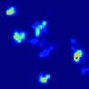
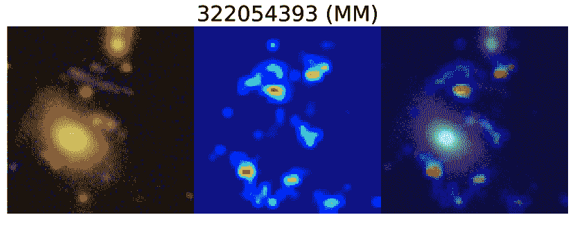

<!--yml

类别：未分类

日期：2024-09-06 19:43:39

-->

# [2211.00047] 优化机器学习方法以在深度透镜调查中发现强引力透镜

> 来源：[`ar5iv.labs.arxiv.org/html/2211.00047`](https://ar5iv.labs.arxiv.org/html/2211.00047)

# 优化机器学习方法以在深度透镜调查中发现强引力透镜

Keerthi Vasan G.C.,¹ Stephen Sheng,² Tucker Jones,¹ Chi Po Choi,³ 和 James Sharpnack^(2,3)

¹加州大学戴维斯分校物理与天文学系，美国加州戴维斯 1 Shields Avenue，邮政编码 95616

²亚马逊 AWS AI

³加州大学戴维斯分校统计系，美国加州戴维斯 1 Shields Avenue，邮政编码 95616 电子邮件：kvch@ucdavis.edu 在加入亚马逊之前完成的工作（最后更新；原始形式）

###### 摘要

机器学习模型可以通过减少所需的人力检查量，显著提高在成像调查中寻找强引力透镜的效果。在这项工作中，我们测试了使用 ResNetV2 神经网络架构训练的监督、半监督和无监督学习算法在深度透镜调查（DLS）中高效寻找强引力透镜的能力。我们使用来自调查的星系图像，结合模拟的透镜源，作为我们训练数据集中的标记数据。我们发现，使用半监督学习并结合数据增强（在训练期间对图像应用的转换，如旋转）和生成对抗网络（GAN）生成的图像的模型，表现最佳。与监督算法相比，它们在所有召回值上提供了 5–10 倍更好的精确度。将表现最好的模型应用于完整的 20 平方度 DLS 调查中，我们在模型的前 17 张图像预测中发现了 3 个 A 级透镜候选者。当视觉检查模型预测的 1%（约 2500 张图像）时，这一数字增加到 9 个 A 级和 13 个 B 级候选者。这是当前浅层广域调查（如暗能量调查）的透镜候选者的$\gtrsim 10\times$天区密度，表明即将进行的更深全天调查中潜藏着大量的透镜。这些结果表明，专门寻找强透镜系统的管道可以非常高效，最小化人力工作。我们还报告了对我们模型识别的两个 A 级候选者的光谱确认，进一步验证了我们的方法。

###### 关键词：

引力透镜：强 – 方法：统计^†^†出版年：2022^†^†页码范围：优化机器学习方法以在深度透镜调查中发现强引力透镜–15

## 1 引言

在稀有的对准配置下，大质量星系的引力势可以使位于其后方的遥远星系的光线绕过它，形成多个路径。这导致在大质量星系周围形成几个不同的遥远星系图像，这种现象被称为强引力透镜效应（例如，Treu，2010）。这些多个图像的放大倍数可以达到$>$10 倍，使它们显得更加明亮和空间扩展。这样的放大使这些系统成为研究星系在宇宙时间中形成和演化的理想对象（例如，Wuyts 等，2014；Pettini 等，2002；Swinbank 等，2009；Koopmans 等，2006；Leethochawalit 等，2016），同时对透镜质量分布的分析能够提供有关暗物质性质的见解（例如，Chiba，2002；Bradač等，2002；Miranda & Macciò，2007；Gilman 等，2019；Shajib 等，2022）。

目前处理强透镜系统的主要挑战是它们在天空中的稀缺性。因此，能够从广域天空调查中高效识别透镜星系的方法非常有益。自动化方法将特别有价值，用于即将由维拉·鲁宾天文台、欧几里得和罗曼进行的广域天空调查的透镜搜索（例如，LSST 科学协作组等，2009；Laureijs 等，2011；Spergel 等，2015），这些调查的灵敏度、角分辨率和天空覆盖范围的提升将使得能够检测到比目前已知的更多的透镜样本。

早期寻找强引力透镜系统的方法包括各种算法，这些算法搜索多重透镜图像或弧形，围绕大质量星系进行手动搜索，以及公民科学项目（例如，Moustakas 等，2007；Paraficz 等，2016；Seidel & Bartelmann，2007；Gavazzi 等，2014；Alard，2006；Fassnacht 等，2004；More 等，2016；Belokurov 等，2009；Diehl 等，2009；Garvin 等，2022）。虽然这些方法成功了，但它们耗时且难以纳入自动化框架。卷积神经网络（CNN；LeCun 等，1989；Krizhevsky 等，2012），在过去十年中已成功发展为计算机视觉领域的标准工具，是解决图像识别问题的有前途的方法。根据问题的不同，有各种神经网络架构可以优化以实现预期目标。CNN 和机器学习技术通常已在过去几年中成功用于发现广域成像调查中的引力透镜候选者（例如，Jacobs 等，2017；Jacobs 等，2019；Sonnenfeld 等，2018；Pourrahmani 等，2018；Huang 等，2020；Li 等，2020；Cañameras 等，2020）。

大多数机器学习搜索透镜主要依赖于监督学习方法（即，使用包含标记的透镜和非透镜星系的数据集来训练模型）。然而，尽管非透镜星系很多，但当前调查中已知的透镜非常少，无法用作正样本标签。相反，机器学习模型是在模拟透镜上训练的，这些透镜可以大量生成（例如，Jacobs 等，2017）。然而，这带来了一个新问题，即训练数据分布（即模拟透镜）与测试数据分布（即真实透镜）不同——这个问题被称为分布转移（Quinonero-Candela 等，2008）。为了克服分布转移，机器学习研究人员重新利用了半监督学习方法，这些方法利用未标记数据和数据增强来使训练模型适应测试数据（Berthelot 等，2021）。

半监督学习方法的一个优势在于它可以从调查中大量未标记的图像中学习，这使得模型能够更好地对未见过的图像进行泛化。这对于提高性能尤其有用，因为在天空调查中检测到的数百万张银河图像并未包含在训练数据中。通过在训练期间对图像应用增强（例如，平移和旋转），模型性能进一步得到提升。除了传统的变换外，还可以通过利用无监督学习算法（例如，Goodfellow 等，2014；Kingma & Welling，2014；Erhan 等，2010）获得丰富的数据增强来源。考虑到可用的方法范围，我们现在寻求解决哪种机器学习方法（监督和半监督）以及增强组合最适合寻找强引力透镜的问题。

我们寻求有效的模型，通过减少必须视觉检查的图像数量来最小化人力劳动，以恢复给定的透镜样本。在这项工作中，我们将 CNN 模型应用于深度透镜调查（DLS；Wittman 等，2002），该调查具有相对良好的图像质量，并且在机器学习搜索方面仍然相对未被探索，因此作为这项研究的良好测试平台。此外，由于 DLS 调查中已知透镜的数量较少，我们将这些透镜仅保留用于我们的测试数据集。训练和验证数据集将只包含模拟透镜。在我们之前的方法论文（Sheng 等，2022，以下简称 S22）中，我们讨论了在这项工作中使用的 CNN 模型和透镜检测技术。在这里，我们详细描述了我们的训练数据，并专注于评估不同模型在 DLS 数据集上的表现。

本文组织结构如下。在第二部分中，我们概述了深场透镜调查及用于本工作的源选择。在第三部分中，我们总结了我们的机器学习架构和学习方法。第四部分描述了从 DLS 图像中生成训练、验证和测试数据的方法。第五部分讨论了我们用来评估不同 CNN 模型性能的指标。我们在第六部分中讨论了实验结果，包括来自 DLS 的新透镜候选样本及两个系统的光谱确认。最后，我们在第七部分总结了主要结论。本文中我们使用 AB 星等系统和一个$\Lambda$CDM 宇宙学模型，$\Omega_{M}=0.3$，$\Omega_{\Lambda}=0.7$，以及$\mathrm{H}_{0}=70$ km s^(-1) Mpc^(-1)。

## 2 深场透镜调查数据

在这里，我们简要概述了来自深度透镜调查（DLS）的成像数据，这些数据用于测试和优化强透镜检测方法。DLS 由五个独立的$2^{\circ}\times 2^{\circ}$区域组成，覆盖 20 平方度的相对深层成像，这些区域在天空中相距较远（Wittman 等人，2002）。每个区域都使用 4 米 Mayall 望远镜（位于 Kitt Peak 国家天文台）或 Blanco 望远镜（位于 Cerro Tololo 美洲天文台）在 BVRz 光度滤镜下进行成像，具体取决于赤纬。该调查持续了约 120 个夜晚。调查旨在进行弱引力透镜测量，对图像质量和极限星等有严格要求，因此数据自然适合识别强透镜系统。典型的$5\sigma$点源检测极限在$B$、$V$和$R$滤镜中分别为 25.8、26.3 和 26.9 AB 星等（Schmidt & Thorman，2013）。$R$波段的极限仅比 Rubin 天文台 10 年调查的预期深度浅约 0.6 个星等（Ivezić等人，2019）。R 波段的观测条件设计上最佳（FWHM$\lesssim$0$\aas@@fstack{\prime\prime}$9），而在 B、V 和 z 波段通常为$\gtrsim$0$\aas@@fstack{\prime\prime}$9（Wittman 等人，2002）。$z$波段的图像最浅，通常受更差的观测条件影响。在本文中，我们仅使用$BVR$数据。

### 2.1 来源选择和感兴趣区域

DLS 目录包括在 20 平方度范围内检测到的约 500 万只星系。然而，只有那些具有中等红移和相对较高质量的星系才会成为可检测的强引力透镜（即，具有爱因斯坦半径$\Theta_{E}\gtrsim 1$角秒）。我们应用了$17.5<R<22$的星等切割（类似于 Jacobs 等人 2017 使用的），以去除那些不太可能产生可检测透镜效应的天体。此外，我们使用 SExtractor（Bertin & Arnouts，1996）标记来排除饱和的低红移星系，并使用排除掩模来去除位于亮星周围或视场边缘的星系。这导致 281,425 个天体（以下简称为 SurveyCatalog）。我们发现，SExtractor 标记和排除掩模去除了约 5%的星系，使我们的 SurveyCatalog 有效的观测天空面积减少到约 19 平方度。我们从该目录中抽取了 2277 个（约 0.8%）随机采样的天体图像，用于实验和调整 HumVI 缩放参数（详见第 4.1 节）。本文中的所有模型训练分析涉及剩余的 279,149 个天体（以下简称为 TrainCatalog）。

在我们的分析中，我们提取了每个目标的图像剪切区域，大小为 25$\aas@@fstack{\prime\prime}$7 $\times$ 25$\aas@@fstack{\prime\prime}$7（100 $\times$ 100 像素），并以每个物体为中心。这一尺寸足以适应银河系和星系群尺度的透镜（$\Theta_{E}\lesssim 12$”）；我们不关注已经被很好 catalog 的最大质量的星系团透镜（Ascaso 等，2014），这些透镜已经很容易识别。我们从 SurveyCatalog 中所有目标的源 $BVR$ FITS 文件中创建彩色合成图像（图 4；详细讨论见第 4.1 节）。这些彩色合成图像的文件大小比原始数据小，使我们能够保持其余分析的计算效率。这些图像仍能捕捉到检测到的低表面亮度特征，同时不会使本研究关注的最亮物体饱和。

此外，它们更适合于本研究中使用的机器学习架构和方法（详见第三部分").

## 3 深度学习架构和使用的学习方法

当前任务是建立一个有效分类 281,425 张调查中的彩色合成图像的机器学习（ML）算法，将其分为透镜和非透镜星系。此外，通过按图像被预测为透镜的概率从高到低排序，我们可以将图像按顺序供人工检查。这需要选择一个架构（即一个以图像为输入、以预测概率为输出的函数）和学习方法（即让我们的函数从数据中学习的方法）。我们机器学习训练管道的关键组件是监督卷积神经网络（CNN）、通过半监督学习进行的领域适应，以及通过生成对抗网络（GAN）增加训练样本。有关我们机器学习方法的更详细说明，请参见 S22。

### 3.1 卷积神经网络架构

图 1：本研究中使用的 ResNetV2 深度学习架构的示意图。网络的输入是从 BVR fits 文件生成的 RGB 彩色合成图像（第 4.1 节），输出是一个介于 0 和 1 之间的值，表示输入图像为透镜的概率。一般网络由三个堆叠组成，每个堆叠包含 $3n$ 个残差单元。在本工作中，我们使用堆叠大小为 $n=1$，总共三个残差单元。每个残差单元包括两组批量归一化（BN）、修正线性单元激活函数（ReLU）和卷积单元，其中卷积单元表示具有 $3\times 3$ 核心大小和适当步幅大小的卷积层。网络以全局平均池化和 softmax 层结束。

CNNs 曾被用于分类和识别透镜候选（例如，Jacobs 等，2017）。它们是一种特定形式的神经网络，通过可训练的卷积核学习平移不变的表示。这尤其适合于天文图像，因为模式在整个天空中重复出现。深度 CNNs 是那些将图像的非线性表示（称为层）堆叠在一起的模型。深度 CNNs 通过随机梯度下降的变体进行训练，其中在数据的小子集上评估目标函数，这些小子集称为 mini-batches，参数通过减去目标梯度的一部分来更新。

这些层的构建和组合方式有许多选择，例如卷积核大小的选择、每个卷积层的输出通道数、非线性激活函数的选择，以及其他能提升性能的层的引入，如批量归一化（Ioffe & Szegedy, 2015）。所有这些细节共同构成了模型架构。

我们使用了为 CIFAR10 数据集（Krizhevsky, 2009a）设计的 ResNet 版本 2 架构（ResNetV2; He et al., 2016a, b），如图 1 所示。它是用于图像分类问题的广泛使用的行业标准网络之一（例如，Litjens et al., 2017; Gu et al., 2018; Madireddy et al., 2019）。在这项工作中使用的 ResNetV2 包含三个堆叠（见图 1；绿色块），每个堆叠由$n$个残差单元块组成，其中$n$是一个可选参数，用于控制神经网络的深度。更深的神经网络具有更强的学习能力，但需要更多的计算能力和训练样本。每个残差单元块由三个核大小为$3\times 3$的卷积层和一个跳跃连接组成。为了匹配堆叠之间的特征图维度（宽度，高度）和通道数量，在每个堆叠的输入和起始块处包括了一些额外的卷积层。因此，网络中总共有$9n+4$个卷积层。对于本工作中使用的所有模型，我们采用$n=1$。通过步幅卷积，每个堆叠的特征图维度减少了$1/2$倍。每个堆叠的输入和输出通道数分别为：（$16\rightarrow 64$），（$64\rightarrow 128$），（$128\rightarrow 256$）。

网络以全局平均池化、一个全连接层和 softmax 结束。全局平均池化将输出限制为旋转不变的。Softmax 将输出转换为 0 和 1 之间的值，可以解释为概率。在本工作中，值 1 被指定为透镜候选（以下简称为 Lenses），值 0 则为非透镜候选（以下简称为 NonLenses）。

### 3.2 半监督学习的领域适应

在监督学习中，我们的算法通过图像 $X$ 和相应的标签 $y$（$1$ 代表镜头，$0$ 代表非镜头）的迷你批次进行训练。算法然后尝试学习神经网络参数，统称为 $\Theta$。神经网络经过 softmax 激活后的输出产生一个预测 $p_{\Theta}(X)$，这是我们预测的 $X$ 为镜头的概率。我们的监督学习目标函数是交叉熵损失函数，表示为 $\ell_{S}$，这是我们预测质量的度量，$p_{\Theta}(X)$ 与真实标签 $y$ 相比。仅使用监督学习在面对分布转移时表现不佳，因此我们转向半监督学习（SSL）方法，这些方法利用无标签的测试数据来适应这个领域。

| RGB-shuffle | 随机扰动图像中通道的顺序 |
| --- | --- |
| JPEG-quality | 50-100% |
| Rot90 | 随机将图像旋转 90 度的倍数 |
| Translations | 随机将图像在上下左右方向上平移最多 20 像素 |
| Horizontal flips | 随机在 x 轴上翻转图像 |
| Color augmentation | 随机扰动图像的亮度（-0.1-0.1）、饱和度（0.9-1.3）、色调（0.96-1.00）和伽玛（1.23-1.25） |

表 1: 在半监督训练流程中使用的数据增强方法。

有许多半监督学习方法可以用于深度学习。我们探索的方法包括 FixMatch¹¹1FixMatch 不是原始镜头搜索研究的一部分，因为当时该技术尚未发布。我们在这里将其包含在结果中，以确保全面。（Sohn 等，2020）、MixMatch（Berthelot 等，2019）、虚拟对抗训练（Miyato 等，2019）、平均教师（Tarvainen & Valpola，2017）、$\Pi$-模型（Laine & Aila，2017）和伪标签（Lee，2013）。

大多数 SSL 算法遵循相同的模板。我们最小化一个包含监督部分（即 $\ell_{S}$ 损失）的目标函数，其中提供了标签，以及一个无监督部分（即 $\ell_{U}$ 损失）。两者在迷你批次中一起优化，现在包括标记数据和无标签数据，但对随机梯度下降算法没有显著修改。区别于典型 SSL 的主要特征是我们的训练非镜头和测试集来自相同的数据池，而模拟镜头在测试数据中不存在。这与 Jacobs 等人（2017）不同，他们也生成模拟非镜头，但未尝试领域适应。

在伪标签算法 (Lee, 2013) 中，我们通过将模型预测的类别作为标签来为未标记的数据分配伪标签。然后，我们可以使用与监督任务中相同的损失函数 (即，$\ell_{S}=\ell_{U}$)。其动机是通过迫使模型对未标记样本有信心，从而隐含地强制执行熵最小化。SSL 的一种替代方法是一致性正则化，其中鼓励同一测试图像的两个独立增强样本产生类似的预测。$\Pi$-模型算法 (Laine & Aila, 2017) 直接使用一致性正则化。其思想是对相同样本数据点 $X$ 进行两个随机增强，并计算增强副本模型输出的平方差异。我们使用 $\text{aug},\widetilde{\text{aug}}$ 来表示两个独立的增强，这些增强可以通过选择不同的随机种子来产生。无监督损失为

|  | $\ell_{U}(X)=\left\|p_{\Theta}(\text{aug}(X))-p_{\Theta}(\widetilde{\text{aug}}(X))\right\|^{2}.$ |  | (1) |
| --- | --- | --- | --- |

随机增强函数的选择由建模者决定，并且通常是领域特定的。

Mean Teacher 算法 (Tarvainen & Valpola, 2017) 也使用一致性正则化，但将方程 1 中的一个增强替换为使用模型参数的指数移动平均（教师模型）得到的输出 $\Theta$。FixMatch (Sohn et al., 2020) 和 MixMatch (Berthelot et al., 2019) 同时采用一致性正则化和熵最小化。MixMatch 最初被提出作为一种启发式方法，FixMatch 则被后来作为 MixMatch 和其他相关 SSL 方法的更具原则性的简化方法推导出来。虚拟对抗训练 (VAT; Miyato et al., 2019) 使用对抗性最坏情况的增强。这种对抗性增强推动图像向最大增加损失的方向移动。VAT 的一个缺点是，对抗性增强无法编码随机增强可以提供的领域特定先验信息 (见表 1)。

### 3.3 数据增强与 GANs

数据增强在半监督学习（SSL）算法中起着至关重要的正则化作用。包括本文提到的算法如 pi-model（Laine & Aila，2017）、MixMatch（Berthelot 等，2019）和 fixMatch（Sohn 等，2020）在内的几种 SSL 算法都利用了数据增强技术。我们在研究中使用的数据增强技术列于表 1 中，并特别适合 DLS 图像。

RGB-shuffle 随机化通道的顺序，Color augmentation 则扰动图像中的颜色。这些操作用于修正模拟管线中引入的通道和颜色信息的系统偏差。JPEG-quality augmentation 处理噪声和图像质量的不同水平，并适用于任何颜色合成图像，无论图像保存的格式如何（例如，我们在此使用 png 格式而非 jpeg）。Rot90、Translations 和 Horizontal flips 在预测中引入平移和旋转不变性。这些增强的示例如图 2 所示。我们注意到，尽管一些增强（例如 RGB-shuffle）会导致不真实的图像，但我们在第 6.1.1 节中描述的实证测试表明，这些增强会提高模型性能。一般而言，采用半监督算法（SSL）的领域适应问题已经证明从数据增强中受益良多（例如，Sohn 等，2020），这表明这一效果并非特定于我们的镜头搜索。

我们用来增强数据的第二种工具是生成模拟镜头的新图像。在深度学习中，生成模型的最先进方法是使用生成对抗网络（GANs; Goodfellow 等，2014; Arjovsky 等，2017）。GANs 生成的样本与原始图像不同，但在分布上相似。这些生成模型与一个对抗性判别器一起训练，判别器试图区分假图像和真实图像。

我们在模拟透镜上训练了一个 WGAN-GP（Wasserstein GAN + 梯度惩罚；Gulrajani 等，2017），并将生成的图像（见图 3 和 4）添加到我们的训练集中，作为另一种数据增强形式。其动机是 GAN 可以提供更多异域数据增强的丰富来源。

图 3 简要总结了迄今为止讨论的步骤。本文中使用的训练、测试和验证数据以及模型检查点已在我们的 GitHub 仓库中提供[`github.com/sxsheng/SHLDN`](https://github.com/sxsheng/SHLDN)。

图 2：训练过程中使用的增强示例。从左到右，原始 RGB 彩色复合图像经过表 1 中描述的一系列增强：RGB-洗牌、JPEG 质量、Rot90、平移、翻转、颜色调整。最终图像作为输入传递给模型。

图 3：本研究中用于测试不同学习方法性能的流程图，详细信息见第 3.2 和 3.3 节（具体信息请参见正文）。GAN 生成的透镜仅包括在无监督学习方法（例如，GAN+MixMatch）的训练数据中。

## 4 训练和验证数据

在引力透镜搜索中面临的挑战之一是当对可能在调查中发现的强透镜类型了解有限时，生成训练和测试数据集。在此之前，Kubo 和 Dell’Antonio (2008) 使用了半自动化的方法在 DLS 区域（F2）搜索透镜候选者，并发现了两个透镜候选者。然而，为了训练机器学习模型以识别透镜，我们需要数量达到几千的透镜和非透镜图像样本。对于非透镜星系来说这不是问题，因为它们非常丰富。但对于透镜来说，这就很有挑战性，因为已知样本与训练需求相比极为稀少。我们注意到，尽管 DLS 区域与用于强引力透镜搜索的其他调查（例如 SDSS）重叠，但在 DLS 区域内没有发布来自这些其他调查的透镜候选者。这可能是由于其他调查的深度较浅（参见第 6.4 节）。因此，我们必须生成一个人工透镜训练集。本节描述了生成训练和测试数据集的过程。

### 4.1 生成 NonLenses 数据集

在 SurveyCatalog 中，每个对象的彩色 png 图像是通过使用 HumVI（Marshall 等，2015）从$BVR$拟合文件构建的。HumVI 基于 Lupton 等（2004）描述的颜色合成算法，并提供了多个可调参数来控制输出图像（例如，对比度）。我们随机从 SurveyCatalog 中抽取对象，直观检查改变 HumVI 参数$s$和$p$对对比度和颜色平衡的效果。尽管这些值的选择存在退化现象，我们选择了能够合理代表数据中明亮和暗淡特征的值（即，涵盖可检测的表面亮度范围）。表 2 列出了我们选择的 HumVI 参数，图 4（顶部面板）显示了使用这些值生成的 4 张随机选择的彩色合成调查图像。选择的 HumVI 参数保持不变，并应用于调查中的所有图像。探索选择不同 HumVI 参数对模型性能的影响超出了本工作的范围，但我们注意到，训练过程中应用的颜色增强（表 1; 第 6.1.1 节）使我们的模型对颜色的小扰动具有不变性。

图 4：*顶部行：* 四张随机选择的彩色合成调查图像，由运行 HumVI 生成。这些图像是用于训练网络的 NonLenses 示例。每张图像在天空上覆盖 25$\aas@@fstack{\prime\prime}$7 $\times$ 25$\aas@@fstack{\prime\prime}$7。表 2 列出了用于生成这些图像的 HumVI 参数。*中间行：* 与顶部行相同的调查图像集合，但叠加了使用 glafic 生成的模拟透镜配置。第 4.2 节详细讨论了相关步骤。这些图像是训练过程中使用的 Lenses 示例。*底部行：* GAN 生成的模拟透镜。这些透镜作为 Lenses 添加到训练数据中，用于我们的无监督模型（例如，GAN+MixMatch；第 3.3 节）。

|  | 参数 | 值 |
| --- | --- | --- |
|  | glafic |  |
| 位置 | $x_{\text{def}},y_{\text{def}},x_{\text{src}},y_{\text{src}}$ | U(-0.5,0.5) |
| (角秒) |  |  |
| PA | $\theta_{\text{def}},\theta_{\text{src}}$ | U(0,180) |
| (度) |  |  |
| 椭圆率 | $e_{\text{def}},e_{\text{src}}$ | U(0.3,0.7) |
| 色散 | $\sigma_{\text{def}}$ | U(250,450) |
| (km s^(-1)) |  |  |
|  | $r_{\text{core, def}}$ | U(0,0.5) |
| 亮度 |  | U(200,600) |
| (counts/$\text{pix}^{2}$) |  |  |
| 红移 | $z_{\text{def}}$ | U(0.3,0.7) |
| 红移 | $z_{\text{src}}$ | U($z_{\text{def}}$ + 0.5, $z_{\text{def}}$ + 2.5) |
|  | HUMVI |  |
|  | -s | 0.2,0.7,1.3 |
|  | -p | 2.5, 0.01 |
|  | -m | 0.1 |

表 2：用于生成模拟弧线和 png 彩色合成图像的 glafic 和 HumVI 参数的值。$U(x_{min},x_{max})$表示该值是从一个均匀分布中抽样的，其中$x_{min}$和$x_{max}$分别为最小值和最大值。

### 4.2 生成模拟 Lenses 数据集

如上所述，已知的透镜星系稀缺性要求我们生成模拟的透镜样本来训练机器学习模型。我们的方法是将模拟的透镜星系添加到调查图像中，这在以前的工作中已成功使用（例如，Jacobs 等，2017；Jacobs 等，2019）。在这项工作中，我们采用了一种无关的模拟透镜弧的程序，这种程序不依赖于透镜星系的光度测量。我们考虑所有满足第 2.1 节（无论其颜色如何）的星系来模拟透镜弧。我们注意到，约$\sim 50\%$的星系在我们的 SurveyCatalog 中具有来自 Schmidt & Thorman（2013）的 BPZ 最佳拟合光度模板，这表明它们是中等红移的大型早期类型星系，确实很可能作为强透镜存在。我们在第 6.2.3 节中讨论了透镜候选星系的实际颜色分布。

给定训练数据集中任意一个对象，我们假设中央星系（“引光体”）的红移为 $z_{\text{def}}\in[0.3,0.7]$，并且其质量密度由单向异形椭球（SIE）特征描述（Kormann 等， 1994）。质量分布依赖于星系的位置（$x_{\text{def}},y_{\text{def}}$）、椭圆率（$e_{\text{def}}$）、位置角（$\theta_{\text{def}}$）、速度色散（$\sigma_{\text{def}}$）和 $r_{\text{core,def}}$ 的选择。这些参数的值从表 2 中列出的范围内均匀分布中采样。这些值确保了引光体的质量分布足以产生可检测的透镜效应（即，$\Theta_{E}\gtrsim 1$ 弧秒）。假设背景星系（“源”）位于红移 $z_{\text{src}}$ 处，其形态由 Sérsic 分布描述，其参数包括位置（$x_{src},y_{src}$）、中心亮度（以 counts/$\text{pix}^{2}$ 为单位）、椭圆率（$e_{\text{src}}$）、位置角（$\theta_{\text{src}}$）和 Sérsic 指数为 1。$z_{\text{src}}$ 的值从 $z_{\text{def}}+0.5$ 和 $z_{\text{def}}+2.5$ 之间的均匀分布中随机选择。这些引光体和源星系红移的值是先前强透镜调查中光谱测量的典型值（例如，Sonnenfeld 等，2013；Bolton 等，2008；Tran 等，2022）。

背景银河的光通过 glafic (Oguri, 2010) 被追踪，以在图像平面中生成模拟的透镜弧。模拟的透镜弧与调查的点扩散函数（PSF）进行卷积，BVR 滤镜的缩放因子为（1,1.5,3），然后添加到银河的$BVR$ fits 图像中。我们将调查的 PSF 在所有三个滤镜中建模为一个 2D 高斯核，FWHM 约为 1 角秒，对应于近似的平均观测条件。除了平滑处理，我们还添加了泊松噪声，以生成更逼真的模拟弧图像。fits 图像通过 HumVI 转换为彩色 png 图像（如第 4.1 节所述）。对于本文，我们专注于生成中等亮度的蓝色透镜弧，产生这些配置的参数范围列在表 2 中。图 4 展示了使用这种方法生成的弧的常见配置。然而，我们注意到训练过程中应用的 RGB-shuffle 增强会产生不同颜色的弧（例如，图 2）。我们发现，这种方法（即模拟弧不依赖于中央折射星系的光度特性）可能作为一种额外的增强形式。该方法防止了我们深度学习模型的过拟合，同时允许快速原型设计和测试。

### 4.3 生成训练数据集：TrainingV1 和 TrainingV2

使用透镜和非透镜数据集，我们构建了两个训练集：TrainingV1 和 TrainingV2。两个训练集之间的主要区别在于用作透镜和非透镜的标记图像数量。以前使用 CNN 的工作（例如，Jacobs 等，2019）倾向于使用大型训练数据集（即，$\gtrsim$150,000 个星系）。因此，对于 TrainingV1，我们使用 266,301 张非透镜图像和 257,874 个对应的模拟作为透镜（如第 4.2 节所述）。由于半监督训练需要标记和未标记的数据，因此 TrainingV1 不能用于测试半监督学习方法。

对于 TrainingV2，我们选择每个类别的图像数量与标准计算机视觉数据集（如加拿大高级研究院-10（CIFAR-10; Krizhevsky, 2009b）和街景房屋号码（SVHN; Netzer 等，2011）数据集）类似。我们使用了 7,074 个人工标记的对象作为非透镜和 6,929 个对应的模拟作为透镜。人工标记是在 DLS 的 Field-1（F1）中随机选择的图像上进行的。我们注意到，仅从 F1 标记数据的选择不会影响本文其余部分所呈现的结果（见附录 A）。259,248 个不属于 TrainingV2 的非透镜图像作为我们的半监督学习方法（例如，MixMatch; 第 3.2 节）中的未标记数据使用。

与直觉相反，我们发现来自模拟透镜和随机选择的非透镜的过多训练数据会损害我们算法的性能。我们建议读者查阅第 6.1.2 节和 S22，以进一步讨论样本大小效应，这也可能导致训练集之间性能的差异。我们注意到，TrainingV2 标记的数据集大小与我们发现最佳性能的大小相当。

我们对 TrainingV1 和 TrainingV2 进行了 90-10 的分割，其中 90%的数据用于训练 ResNetV2 模型，10%用于验证。我们选择每个训练组合的最大训练周期数（遍历训练数据集的次数）为 100，因为这足以观察到验证指标的平稳期。对于第三部分中描述的每个训练组合，我们进行了四次独立试验，并选择了具有最佳验证指标的检查点进行调查数据测试。

## 5 评估模型性能的指标

我们描述了几个模型，每个模型都经过调整以优化验证准确性，验证准确性是通过在包含模拟透镜和调查非透镜的验证数据集上测量的（第 4.3 节）。为了评估模型在从调查中找到真实透镜的能力，我们需要一个包含调查透镜的测试数据集，以及用于评估它们的指标。

### 5.1 生成测试数据集

在我们的案例中，策划测试数据是一项具有挑战性的任务。如前所述，在此工作之前，整个调查中仅知晓两个强透镜，这不足以进行有意义的评估。因此，我们使用了一个由 5 个 ResNet 模型组成的集合，这些模型在模拟透镜上训练，但使用极坐标变换图像作为输入。该模型的唯一任务是寻找真实的透镜候选对象，并将其添加到我们的测试数据集中。我们强调，这个模型与本文中迄今讨论的其他模型是独立的，并且不会以任何方式影响它们的性能。其实现细节在 S22 中讨论。量化集合模型的性能或极坐标变换在训练期间的效果超出了本文的范围，但这是一个有趣的未来研究方向。

我们从这个模型中发现了 52 个可能的透镜候选者，其中 27 个在视觉检查后被认为是良好的候选者。因此，我们创建了两个测试数据集：TestV1 和 TestV2。TestV1 包含使用我们集合模型方法找到的所有 52 个透镜候选者，而 TestV2 包含 27 个最佳视觉候选者。TestV1 和 TestV2 的 NonLenses 是通过随机选择我们 8734 个人工标注的非透镜中的 874 个形成的（第四部分）。

### 5.2 精确度和召回率

在机器学习中，一个广泛使用的标准指标是精度-召回曲线（PR 曲线），其中精度和召回定义如下：

|  | $\text{Precision}=\frac{\text{TP}}{\text{TP}+\text{FP}},\quad\text{Recall}=\frac{\text{TP}}{\text{TP}+\text{FN}}.$ |  | (2) |
| --- | --- | --- | --- |

在这里，TP、FP 和 FN 分别表示真正例、假正例和假负例的图像数量。这些值是通过将标记的测试数据集（在本例中为 TestV1 和 TestV2）传递给训练好的模型（例如，GAN+Mixmatch）并设置不同的预测阈值来计算的。

由于这项工作的主要目标是找到能够在最大化找到透镜图像的数量（即，减少 FP 和 FN 值）的同时，最小化调查员遇到的非透镜图像的数量的模型，我们寻求那些在高召回率下具有高精度的模型。我们将在下一节中展示我们 PR 曲线分析的结果。

## 6 结果与讨论

### 6.1 结合 GAN 和增强的半监督算法表现优越

我们考虑了第三部分中描述的 17 种学习方法变体：4 种监督学习，6 种半监督学习，和 7 种结合 GAN 的半监督学习。SupervisedV1 和 SupervisedV2 是我们的基准模型。它们分别使用了没有数据增强的监督学习方法在 TrainingV1（$\sim$250,000 Lenses 和 NonLenses）和 TrainingV2（$\sim$7000 Lenses 和 NonLenses）上进行训练。另一方面，SupervisedV1+DA 和 SupervisedV2+DA 使用了带数据增强（DA）的监督学习方法进行训练。其余模型在 TrainingV2 上使用带 DA 或 DA + GANs 的半监督学习方法进行训练。在本小节中，我们总结了这些不同模型的表现。我们主要使用 PR 曲线（第 5.2 节）在我们的 TestV1 和 TestV2 数据集上评估，以衡量哪些模型表现最佳。我们注意到我们的研究方法论文 S22 包含了这些结果的额外讨论。

我们在图 5 中绘制了我们最佳基线模型（SupervisedV1、SupervisedV2）以及一部分半监督和 GAN+半监督模型的 PR 曲线（有关更多模型结果，请参见 S22 的表格 3 和 4）。表格 3 列出了在 100%召回率下获得的模型精度值。我们发现，当模型在没有任何增强的情况下训练时，表现通常较差。我们的基线模型在没有数据增强的情况下训练，在每个召回水平上表现最差。例如，在 100%召回率下，基线模型 SupervisedV1 和 SupervisedV2 在我们的 TestV2 数据集上的精度约为$\sim 3\%$，而 GAN+$\Pi$-model 的精度约为$\sim 22\%$。我们监督模型的较差精度值可能反映了在有限的先验条件下，模拟透镜特征的挑战。幸运的是，我们发现数据增强方法能够解决这一问题。应用完整的数据增强集（表格 1）后，我们几乎在所有召回水平上发现了约 5-10$\times$的精度提升。

半监督算法优于监督算法的改进表明，实际上可以从大部分未标记的 NonLenses 中提取有价值的特征，从而在真实透镜的分类中提供好处。将 GAN 图像添加到我们的训练管道中在所有召回水平上产生了显著的影响，尤其是在更高的召回水平上，难以分类的图像更多。这表明，GAN 生成的图像包含细微的变化，这些变化虽然肉眼不易察觉，但确实在训练中产生了强大的正则化效果。

#### 6.1.1 数据增强的消融研究

我们通过使用 TrainingV2 进行消融研究，调查了我们使用的每种数据增强的影响。该研究的结果汇总在表 7。我们发现，从训练集中移除 GAN 图像会导致模型在所有召回水平上的性能明显下降，这与我们之前的结论一致。还发现，颜色增强和 JPEG 质量在模型性能中起着非常重要的作用。显然，将这三种增强包含在我们的训练流程中，使我们的模型尽管依赖于模拟透镜进行训练，依然能够很好地泛化。一个有趣的结果是，90 度旋转的倍数实际上对模型性能产生了负面影响。与其他增强（例如，GANs）相比，性能差异相对较小，但在所有召回率下都存在。造成这种情况的一个可能原因是我们的小型验证集和测试集。由于验证集很小，模型选择可能会偏向于图像的某些方向。同样，小型测试集可能会有模型不能泛化到的优选方向，从而导致性能下降。

|  |  |
| --- | --- |

图 5：在使用 TestV1（*左侧*）和 TestV2（*右侧*）获得的一些模型的精度-召回曲线（PR 曲线）。TestV1 包含了使用我们的集成模型方法找到的 52 个透镜候选者，而 TestV2 包含了 27 个最佳视觉候选者（第 5.1 节）。SupervisedV1 和 SupervisedV2 是我们的基线模型。它们分别使用监督学习方法在 TrainingV1（$\sim$250,000 透镜和非透镜）和 TrainingV2（$\sim$7000 透镜和非透镜）上进行训练，没有数据增强。其余模型在带增强的 TrainingV2 上进行训练。MixMatch 和 $\Pi$-Model 是半监督学习方法，而 GAN+MixMatch 和 GAN+$\Pi$-Model 使用 GAN 生成的图像与半监督学习结合使用（详细信息请参见图 3 和第三部分）。GAN+SupervisedV2 使用带有 GAN 生成图像的监督学习。使用半监督学习和 GAN 的模型在所有召回值下明显优于我们的基线监督学习模型，其中 GAN+$\Pi$-Model 在 100% 召回率下具有最高的精度（参见表 3；我们注意到表 3 报告了我们四次运行的平均值，而此图显示了精度最佳的运行结果）。

| 模型 | 使用的训练数据 | TestV1 精度 (%) | TestV2 精度 (%) |
| --- | --- | --- | --- |
| SupervisedV1 | 不带增强的 TrainingV1 | 5.62$\pm$0.01 | 3.01$\pm$0.02 |
| SupervisedV2 | 不带增强的 TrainingV2 | 5.65$\pm$0.02 | 3.06$\pm$0.04 |
| MixMatch | 带增强的 TrainingV2 | 12.28$\pm$5.09 | 6.84$\pm$3.00 |
| $\Pi$-Model | 带增强的 TrainingV2 | 13.41$\pm$2.33 | 8.68$\pm$1.49 |
| GAN + 有监督 | 经过增强的 TrainingV2 | 8.25$\pm$2.85 | 6.05$\pm$2.69 |
| GAN + MixMatch | 经过增强的 TrainingV2 | 14.13$\pm$6.53 | 7.97$\pm$3.93 |
| GAN + $\Pi$-模型 | 经过增强的 TrainingV2 | 15.2$\pm$6.21 | 22.27$\pm$7.71 |

表 3：在 $100\%$ 召回率下对测试的模型子集获得的平均精度值。我们注意到，表格中提供了所有模型在不同召回率下的性能数据，详见 S22。这里的平均值是从对测试集的四次独立运行的性能中计算得出的。不确定性为均值的 $1\sigma$ 标准偏差。

图 6：在 DLS 中发现的 Grade-A 透镜以及 GAN+MixMatch(MM) 和 GAN+$\Pi$-模型(PI) 模型分配的等级（第 6.2 节）。所有 Grade-A 透镜都有明显的弧形形态，并位于一个中等大质量的星系或星系组附近，使它们成为令人信服的透镜候选者。在这些候选者中，212072337 和 432021600 已通过光谱学确认是实际的强透镜系统（第 6.2.2 节）。

图 7：与 GAN+MixMatch(MM) 和 GAN+PiModel(PI) 模型分配的等级（第 6.2 节）一同发现的 Grade-B 透镜。此类别中的目标要么有一个围绕大质量星系的暂定模糊弧形特征，要么在明显的星系组或星系团附近具有大致线性的扩展形态。很难判断这些特征是否对应于透镜弧，或是否由于多个源的混合造成，因此被不确定地归为 Grade-B。

#### 6.1.2 更大的非透镜训练样本可能会降低分类器的性能

要理解为什么我们较大的训练集（TrainingV1）导致了更差的泛化能力，我们还进行了一项测试，在该测试中，我们固定了模拟镜头的数量，并在数据集中变化了非镜头的数量（见 S22，表 5）。当我们逐渐将训练数据中的非镜头数量从 0 增加到 256,000 时，我们发现精度逐渐增加，在约 8000-16000 个非镜头时达到峰值，然后开始显著下降，到几乎所有召回水平下的精度约为$\sim$6%。对此现象的一个可能解释是，随着我们在训练中增加非镜头的数量，我们也增加了与真实镜头在调查数据中相似的非镜头假阳性（可能比我们使用的模拟数据更相似）。因此，非镜头的决策边界与真实镜头占据的区域重叠更多，导致更高的误分类水平。因此，在基于模拟构建训练数据时必须谨慎。任意增加训练数据的大小显然会导致比使用较小的精心策划的训练集更差的性能。

总结来说，我们发现使用半监督学习方法、TrainingV2 和 GAN 生成的图像，以及我们提出的所有数据增强方法训练的模型，在所有召回值下都有高精度值。特别是，在测试的模型中，表现最好的前两名模型是 GAN+MixMatch 和 GAN+$\Pi$-model。在接下来的子章节中，我们将这些模型应用于 DLS 调查图像的完整数据集（即，第二节 2.1）。

### 6.2 镜头候选目录

在确定了我们训练的模型在 PR 曲线上的最佳表现之后，我们现在转向关键问题：在 DLS 中识别出多少镜头，以及需要多少人工检查工作来找到它们。

| 排名 | 唯一数量 | 数量 | 数量 | 总镜头数 | 数量 | 数量 | 数量 |
| --- | --- | --- | --- | --- | --- | --- | --- |
| 阈值 | 调查的镜头 | A 级镜头 | A 级镜头 | A 级 | A 级镜头 | A 级镜头 | A 级镜头 |
|  | (G+MM,G+PI) | (G+MM) | (G+PI) | (两种模型) | (SupervisedV2) | (SupervisedV2+DA) | (SupervisedV2+DA+GAN) |
| 12 | 9, 9 | 1 | 1 | 1 | 0 | 0 | 0 |
| 25 | 19, 16 | 1 | 3 | 3 | 0 | 0 | 0 |
| 100 | 67, 56 | 2 | 3 | 3 | 0 | 1 | 2 |
| 800 | 513, 430 | 4 | 3 | 4 | 1 | 2 | 3 |
| 2800 | 1735, 1459 | 6 | 5 | 8 | - | - | - |
| 4000 | 2459, 2076 | 7 | 5 | 9 | - | - | - |

表 4：比较不同模型测试发现的 A 级镜头数量。这些模型的预测结果被排名，其中最可能的预测镜头排名为 1。排名阈值设置了调查员需要目视检查的镜头数量。左侧的两列显示了选择的排名阈值及其对应的唯一镜头数量（去除重复项，如第 6.2 节中所述）。我们表现最好的模型 GAN+MixMatch (G+MM) 和 GAN+PiModel (G+PI) 在前 $\sim$500 个唯一图像（前 800 名）中各找到 4 个和 3 个镜头候选者，而在前 $\sim 2300$ 张图像中各找到 7 个镜头候选者。将两个模型的结果结合，我们发现了 9 个 A 级候选者（如图 6 所示）。右侧的三列显示了从 SupervisedV2、SupervisedV2+数据增强(DA) 和 SupervisedV2+DA+GAN 发现的镜头数量。尽管它们发现的镜头候选者数量少于我们表现最好的模型（$\lesssim 50\%$），我们可以看到，DA 和 GAN 能够将排名阈值为 800 时发现的镜头数量从 1 提升到 3。

| 排名 | 唯一数量 | 数量 | 数量 | 总镜头 | 总镜头 |
| --- | --- | --- | --- | --- | --- |
| 阈值 | 检查的镜头 | B 级镜头 | B 级镜头 | B 级镜头 | A+B 级镜头 |
|  | (G+MM,G+PI) | (G+MM) | (G+PI) | (两个模型) | (两个模型) |
| 12 | 9, 9 | 0 | 0 | 0 | 1 |
| 25 | 19, 16 | 0 | 0 | 0 | 3 |
| 100 | 67, 56 | 0 | 2 | 2 | 5 |
| 800 | 513, 430 | 2 | 5 | 5 | 9 |
| 2800 | 1735, 1459 | 6 | 11 | 12 | 20 |
| 4000 | 2459, 2076 | 9 | 11 | 13 | 22 |

表 5：与表 5 类似，但针对 B 级镜头。

对于 GAN + MixMatch 和 GAN + $\Pi$-model，我们在 50%的召回率下（即，从我们的测试集中找到 50%的透镜）分别获得了$\sim$97%和$\sim$86%的精度。另一方面，如果我们需要达到$100\%$的召回率（即，从我们的测试集中找到所有透镜），精度则分别下降到$\sim 8\%$和$\sim 22\%$（见表 3）。根据 Pourrahmani 等人（2018）在 COSMOS 领域中利用哈勃空间望远镜拍摄的高质量图像搜索引力透镜的结果，我们预计每平方度最多有$\sim$7 个 A 级透镜。这为 DLS 的 20 度²区域提供了一个上限，即$\lesssim$140 个透镜候选者，其中可检测到的透镜数量会更少，因为许多 COSMOS 透镜的爱因斯坦半径在地面 DLS 数据中太小而无法分辨，而且 COSMOS 数据更为敏感。根据 Pourrahmani 等人（2018）报告的样本的爱因斯坦半径分布（中位数$\simeq$1$\aas@@fstack{\prime\prime}$2），我们估计 DLS 中有一半的 COSMOS 透镜未被分辨出来，因此我们预计 DLS 调查区域中会有$\sim$70 个可检测到的透镜。在 100%召回率、8%精度和 TP$\approx$70 的情况下，研究人员需要查看的假阳性（FP）图像数量约为$\sim 850$，以找到 70 个透镜。如果 DLS 中可检测到的透镜数量远低于此值，如大型地面观测项目（例如暗能量调查（DES））报告的样本所示，那么需要搜索的图像和假阳性总数相应地会更少。我们还注意到，这些估计是基于从测试集中获得的精度值也适用于调查数据的假设。如果这一精度值下降，假阳性数量将会增加。因此，考虑到这些不确定性，对于本工作，我们视觉检查了来自 GAN+Mixmatch 和 GAN+$\Pi$-model 的前 12、25、100、800、2800 和 4000 个预测，并调查了发现的透镜数量。整个论文中，我们仅关注使用相对排名（即，前$n$个预测）来评估模型性能，因为绝对预测阈值（如 Jacobs 等人 2019 中使用的值）的分布在不同模型之间可能会有显著差异（见附录 12）。不同模型获得的绝对预测值可以进行标定，例如通过将获得的模型权重缩放到 softmax 层，但这超出了我们研究的范围。我们注意到，我们在本研究中使用的相对排名在这种缩放转换下将不会受到影响。

在查看前 $n$ 个预测时，一个重大警告是，由于天空中星系的密度和我们的图像选择方法，前面的预测不一定是唯一的。例如，从 GAN+$\Pi$-Model 获得的前 25 个预测包含 17 个独特源和 8 个重复源，后者集中在不同的附近物体上（见附录中的图 13）。对于前 2800 个预测，独特候选者的数量平均为 $\sim 1600$（即 $\sim 40\%$ 是重复的）。由于这是图像数量中的一个重要部分，并且会增加标记时的人工工作量，我们根据它们的天空坐标去除这些重复项。鉴于我们的图像大小，我们在前 $n$ 个预测中，对于每个物体，在半径 26 角秒内去除重复项。

剩余的图像随后被替换为更大的视野，以确保给定区域的天空仅需视觉检查一次。我们指出，去除重复项严格来说是后处理步骤。我们中的两人（KVGC 和 TJ）对透镜候选对象进行了视觉检查，并将其分类为不同的置信度等级：A 级、B 级、C 级和非透镜。A 级表示基于清晰的弧形形态和/或与中等质量的星系群重合的基础上，有很高的可能性是强透镜系统。B 级透镜通常具有围绕巨大星系的模糊弧形特征和/或在星系群或星系团附近具有近似线性的扩展弧形形态。这些特征是否来自透镜还是由于多重源的混合效果尚不确定。C 级透镜（本文未讨论）是置信度最低的候选者，通常显示出可能来源于螺旋臂、潮汐特征或合并开始时的不对称散射光的混合弧形特征。

图 6 和 7 展示了从调查中通过视觉检查$\sim$ 2500 个独特候选者（按排名前 4000 名）找到的 9 个 A 级和 13 个 B 级透镜的颜色复合图像。它们的天球坐标列在附录中的表 8 中。几个 A 级透镜似乎是复合透镜或属于中等质量的星系团或群。这很有趣，因为我们的训练数据仅包含星系-星系透镜。这很可能是由于将 GAN 生成的图像添加到我们的训练数据中，因为 GAN 生成的图像（图 3）包括不规则形状的弧形。

DLS212072337 ($z=1.81$)

DLS432021848 ($z=1.94$; 暂定)

图 8: *（*上图）：红移为$z=1.81$的 A 级透镜 DLS212072337 的 NIRES 光谱，显著的[O iii]发射线用蓝色标出。*（*下图）：DLS432021848 的 NIRES 光谱显示在$1.93\mu m$处检测到的单一发射线，我们暂时将其识别为$z=1.94$的 H$\alpha$。在两个面板中，缩放后的天球光谱以橙色显示（偏移-100），灰色阴影表示受强天线影响的区域。

图 9: GAN+$\Pi$-模型在颜色-颜色空间中找到的前 4000 个透镜的分布。左面板显示$B-R$与$B-V$，右面板显示$B-R$与$R-z$。上面的图像展示了在左面板紫色线分隔的两个区域中找到的星系示例。低红移星系候选者聚集在趋势线以上的区域，而所有 A 级透镜候选者都在其下方。右面板还显示透镜候选者在$R-z$颜色中通常更红（$\gtrsim 0.5$）。基于每个面板中的紫色线的颜色选择将提高我们透镜候选样本的精度，同时保留几乎所有最可能的透镜。

#### 6.2.1 人工检查工作

我们现在来探讨寻找 22 个 A 级和 B 级透镜候选体所需的人力。为了量化这些努力，我们考虑了在不同等级下发现的透镜数量，详见表 5。排名阈值决定了必须进行视觉检查的独特图像数量。查看来自 GAN+MixMatch 和 GAN+$\Pi$-model 的前 800 个预测（分别对应 513 和 430 个独特的透镜候选体），我们发现 4 个和 3 个 A 级透镜，以及 2 个和 5 个 B 级透镜。这比从较浅的地面 DES 调查中发现的密度高出几倍（$\gtrsim$3$\times$），且比 HST 在 COSMOS 中发现的密度小，符合预期。当考虑前 4000 个候选体（$\sim$2500 个独特图像）时，发现的透镜候选体数量增加到 9 个 A 级和 13 个 B 级候选体。这对应于每平方度搜索$\sim$1 个透镜，比之前较浅的地面调查的透镜密度高出$\gtrsim$10$\times$（如我们在第 6.4 节中讨论的）。

相比之下，我们的监督模型（例如 SupervisedV1，SupervisedV2）发现的前透镜候选体数量少于$\lesssim 50\%$。它们的精确度值也较低（表 3），在前$17$个检查的候选体中没有发现有吸引力的透镜（而 G+PI 在这个阈值范围内发现了 3 个）。这再次突显了数据增强和 GAN 图像的价值。SupervisedV2+DA+GAN 模型在相同阈值范围内发现的透镜数量是 SupervisedV2 的 3 倍。这些结果展示了本研究中探讨的模型在发现强透镜方面的效率。

#### 6.2.2 两个 A 级透镜的光谱确认

虽然图像形态可以提供有力的强引力透镜证据，但光谱红移是明确确定系统引力透镜特性的标准。我们已在 Keck 天文台获得了光谱数据，以确认本文中呈现的两个 A 等级系统的透镜特性：DLS212072337 和 DLS432021848（图 8）。对弧形图像的观测是在 Keck II 望远镜上使用 NIRES（Wilson 等，2004）进行的。观测和数据处理的详细信息已在 Tran 等（2022）中描述，以及 DLS212072337 的光谱红移（报告为 AGEL091935+303156）。我们通过检测 H$\alpha$ $\lambda$6564 和[O III] $\lambda\lambda$4960,5008 发射线，确定了 DLS212072337 的红移为$z_{\text{arc}}=1.81$。基于光学 SDSS/BOSS 光谱中的恒星吸收特征，该引力透镜星系的红移为$z_{\text{def}}=0.43$。

我们使用相同的方法在 2022 年 1 月 12 日用 NIRES 观测了 DLS432021848。我们获得了 6 个每个 300 秒的曝光。我们检测到一个发射线在$~{}\lambda=1.93\mu\text{m}$，我们初步将其识别为 H$\alpha$（$z_{\text{arc}}=1.94$）或[O III] $\lambda$5008（$z_{\text{arc}}=2.85$）。然而，我们无法用其他强线确认红移，因为这些线落在两个潜在红移的气候传输差的区域。我们通过后续 HST 成像的形态学进一步支持 DLS432021848 的引力透镜特性（在第 6.4 节讨论），该成像显示出明显的峰度和多重透镜图像的证据。因此，尽管光谱信息有限，我们基于高分辨率成像合理地认为这是一个强引力透镜系统。结合 DLS212072337，这些结果进一步增强了对本文所提出的透镜候选样本的信心，并证明了我们方法的成功。

我们注意到，通过档案数据已知有两个额外的 A 等级候选引力透镜（DLS212148326，DLS421095124）的红移。DLS212148326 的红移为$z_{\text{def}}=0.424$，来源于 SDSS/BOSS 光谱，而 DLS421095124 是一个通过光谱确认的巨大星系团，红移为$z_{\text{def}}=0.680$（Wittman 等，2003；Wittman 等，2006，报告为 DLSCL J1055.2-0503）。这些红移非常有前景，因为其距离和近似质量与这些图像的强引力透镜解释所暗示的弯曲角度一致。

#### 6.2.3 透镜候选者在颜色-颜色空间中的分布

本文到目前为止描述的分析和模型性能基于使用有意简单的$R$带幅度切割和 SExtractor 标志的源选择（第 2.1 节）。我们在上述部分中展示了这些切割足以在 DLS 中搜索透镜候选者。然而，更复杂的选择可以提高镜头搜索的效率。在这里，我们简要考虑如何通过颜色选择提供更高纯度的样本。

在图 9 中，我们展示了第 6.2 节中的 A 等级和 B 等级镜头在各种颜色-颜色空间中的分布，以及来自 GAN-$\Pi$-model 的排名前 4000 张图像作为示例。这些颜色通常对应于中心（候选偏折体）银河系。最佳镜头候选者的分布并不均匀，我们展示了两个颜色-颜色选择，其中顶级候选者被聚集：$(B-V)<0.56(B-R)-0.02$（左侧面板中的紫色线），以及$R-z\gtrsim 0.4$（右侧面板）。这种简单的颜色切割可以保留所有 A 等级镜头，同时去除大多数假阳性，从而减少所需的人为检查工作。物理上，这些颜色指示了红移$z\gtrsim 0.25$（即在$V$或$R$带）处的 4000 Å 断裂，而低红移的银河系不太可能作为强镜头。

在色彩空间中镜头候选者的分布表明，通过将颜色标准作为预处理或后处理步骤，我们的模型精度可以进一步提高，几乎不会丢失最佳候选者。使用光度红移和质量估计是一种类似且可能更有前景的方法（Schmidt & Thorman, 2013），尽管这超出了本文的范围。另一种解决此问题的最先进的自动化方法是使用基于自相似性的 approaches（例如，Stein et al., 2021），其中 CNN 根据镜头的相似性进一步分类镜头概率。

|  | 模拟镜头 |  |
| --- | --- | --- |
|  |  |  |
|  | DLS 中发现的镜头 |  |
|  |  |  |
|  |  |  |
|  | 假阳性 |  |
|  |  |  |
|  |  |  |
|  | 非透镜 |  |
|  |  |  |

图 10：示例模拟透镜、两个 A 级透镜、两个假阳性透镜和一个非透镜的 Grad-CAM++ 热力图。左列显示了从 HumVI 获得并传递给模型的彩色合成图像。右列显示了 Grad-CAM++ 热力图。红色和绿色阴影分别表示模型的高重要性和中等重要性区域，而蓝色表示低重要性。中间列显示了叠加在输入图像上的热力图，便于可视化。对于模拟透镜，我们可以清楚地看到整个透镜弧区域被考虑在内。对于 DLS 中找到的 A 级透镜候选者，我们也发现透镜弧特征被模型认为重要，尽管透镜的形态和颜色各异。这表明模型确实成功地泛化到了调查数据。值得注意的是，导致透镜效应的巨大偏折体（即发光的红色星系）在模拟或候选透镜系统中没有被突出显示。领域中的其他物体在 A 级透镜的热力图中也被突出显示，这在假阳性和非透镜示例中也很明显。在假阳性的情况下，突出显示的物体分布类似于“爱因斯坦十字”透镜配置。所有 A 级透镜的热力图见附录中的图 15。

### 6.3 模型识别的透镜特征

我们现在检查透镜候选图像的哪些特征对模型预测最为相关。深度神经网络（例如本文中使用的 ResNetV2）通常被认为是“黑箱”，所有输入信息被压缩为用户解释的简单预测。由于只有一个输出，无法辨别模型实际识别和考虑的是引力透镜的哪些区分特征。幸运的是，在过去几年中，已经提出了各种方法来缓解这个问题，如遮挡方法、Guided Backprop（Springenberg 等，2015）、CAM（Zhou 等，2016）、Grad-CAM（Selvaraju 等，2017）、Grad-CAM++（Chattopadhay 等，2018）和 DeepSHAP（Fernando 等，2019）。

基于梯度的解释方法（例如 Grad-CAM++）有效地计算网络中间特征图上的梯度，以确定特征的重要性。这些梯度图可以叠加在原始输入图像上，以评估哪些图像区域对分类器的预测输出贡献最大。这些方法也并非没有缺点（例如 Adebayo 等，2018），但可以提供有价值的见解。在这里，我们使用 Grad-CAM++分析我们的一些训练模型。

图 10 展示了为一些示例获得的 Grad-CAM++热图。我们考虑了来自训练数据的模拟透镜、调查中的真实 A 等级透镜、假阳性图像（即被分类为透镜但没有显示透镜视觉证据的图像）以及非透镜。在模拟透镜的情况下，模型显然是基于透镜弧线特征做出预测。对于 A 等级透镜，模型确实能够识别透镜弧线，但图像中还有额外的不相关区域也会影响模型的决策。有趣的是，中央的大质量透镜星系在这些情况下没有被突出显示。在假阳性的情况下，模型令人鼓舞地没有被扩展的中央星系误导，而是热图突出了围绕中央星系的多个相似颜色的来源。例如，在螺旋星系假阳性图像中，模型明显关注到三个附近的红色物体。这些附近物体的位置和颜色确实与可能的多图像透镜配置类似。因此，模型似乎成功地学会了识别强透镜的天体物理特征。

#### 6.3.1 查找红色弧线

如在第 4.2 节中讨论的，我们用于训练的透镜数据集仅包含具有蓝色光学颜色的透镜弧。然而，令人鼓舞的是，这些模型也识别了红色弧，例如系统 DLS212148326（图 6）。网络可能通过颜色增强学习识别红色弧（图 2）。尽管已知存在红色透镜弧，但仅包含蓝色弧的训练数据集可能并不理想，因为它无法稳健地搜索和量化这些弧。可能需要通过增加更多的增强或微调现有的增强来搜索各种颜色的弧。或者，可以在模拟训练集中使用更广泛的弧色范围，或从红色弧的训练集中构建一个单独的分类器。鉴于我们采用的训练集，我们认为这项工作中发现的红色透镜弧的数量是一个下限（相对于蓝色弧）。此外，可能还有许多较暗的蓝色或红色弧，而我们的训练集没有代表，尽管探测较暗的对象自然更具挑战性。

### 6.4 对未来大面积天区调查的影响：灵敏度和角分辨率

下一代广域天空调查预计将揭示$\gtrsim 10^{5}$个强引力透镜系统（例如，Oguri & Marshall，2010；Collett，2015）。在这里，我们考虑基于第 6.2 节的 DLS 样本，透镜检测在调查深度和角分辨率方面的增益。我们在表 6 中将检测到的透镜候选者的天空密度与其他两个基于 CNN 的搜索示例进行比较。在我们的 DLS 搜索中，我们发现每平方度$\sim$0.5 个 A 级透镜（或每平方度$\sim$1 个 A 级+B 级透镜）。这比在较浅的调查中发现的要大得多，例如 SDSS 和 DES，这些调查揭示了每平方度$\sim$0.1 个透镜（在远离银河平面的区域）。虽然这些调查具有可比的视场限制分辨率，但更清晰的图像质量使得发现更多的透镜成为可能。例如，Pourrahmani 等人（2018）使用 CNN 方法对 COSMOS HST 成像的搜索，在 2 平方度的区域内发现了 13 个 A 级候选者和 70 个 A 级+B 级候选者（即每平方度$\sim$35 个）。因此，我们看到，从较浅的地面调查（例如，SDSS）到 DLS 时，可检测的强引力透镜系统的天空密度增加了$\sim$10 倍，当通过空间 HST 成像在适中深度下提高角分辨率一个数量级时，又增加了$\gtrsim$10 倍。这些结果通常支持对将来计划的大型透镜样本的预测，这些样本将在即将到来的调查中变得可检测，例如与 Rubin（LSST 科学合作组等，2009）、Roman（Spergel 等，2015）和 Euclid（Laureijs 等，2011）天文台相关的调查。

为了直观地展示在不同深度和角分辨率下透镜的检测，图 11 比较了 DECaLS、DLS 和 HST 图像³³3 HST 图像作为 HST-GO-16773 项目的组成部分拍摄，主要针对在 DES 和 DECaLS 图像中识别的透镜候选体（Tran et al., 2022）。简而言之，图 11 中的 HST 图像使用了 F140W 滤镜的 WFC3-IR 拍摄，曝光时间约为 $ \sim $30 分钟（$<1$ 轨道），并使用标准程序进行处理。HST 项目的详细信息将在即将发表的论文中描述。对于本文中发现的 Grade-A 透镜候选体 DLS432021848，DLS 图像中清晰可见一个蓝色弧形，并且在高分辨率的 HST 图像中显示出典型的透镜形态。然而，在较浅的 DECaLS 图像中弧形仅能勉强看到。实际上，本文中发现的大部分（如果不是全部）Grade-A 透镜候选体在较浅的成像调查中难以检测（例如 DECaLS；例如，它们未被 Huang et al. 2020 的目录包含）。

图 11：不同观测中透镜系统 DLS432021848 的图像质量比较，DLS 图像中显示了明显的蓝色弧形（图像下方中心；所有面板显示相同的视场）。*左*: 在 DECaLS 图像中弧形明显但未被很好检测，该图像的灵敏度适中。这张图像可能会被标记为低置信度类别，实际上在之前的透镜搜索中未被识别（例如，Huang et al., 2020）。*中间*: 目标的 DLS 图像显示出红色偏转星系下方的明显蓝色弧形特征，这是引力透镜系统的特征。与 DECaLS 图像相比，DLS 的灵敏度提高（表 6）使得弧形检测更清晰。*右*: 使用 HST 观察的同一目标的近红外图像，其衍射极限的角分辨率大约比 DLS 或 DECaLS 图像锐利 6 倍。HST 图像在高信噪比下揭示了透镜弧形的形态。这展示了地面望远镜在良好深度（例如 DLS）和衍射极限空间望远镜在适中曝光时间下（例如 HST）的能力。

| 调查 | 发现的透镜 | $5\sigma$点 | FWHM | 参考文献 |
| --- | --- | --- | --- | --- |
|  | 每平方度 | 来源检测 |  |  |
|  |  | (r/R/F814W 波段 |  |  |
|  |  | 亮度) |  |  |
| DES/DECaLS | $\sim 0.1$ | 23.6 (r) | 0$\aas@@fstack{\prime\prime}$98 | J19 |
| DLS | 1 | 26.7 (R) | 0$\aas@@fstack{\prime\prime}$9 | 本研究 |
| COSMOS | $\sim 35$ | 27.2 (F814W) | 0$\aas@@fstack{\prime\prime}$07 | P18,K07 |

表 6：在不同调查中每平方度天空中使用机器学习方法发现的透镜数量，以及$5\sigma$点源检测深度和中值角分辨率（以 FWHM：半最大宽度给出）。我们注意到用于发现透镜的 CNN 和分级方法在每项调查中有所不同，因此透镜的密度应视为近似比较。参考文献如下。J19：Jacobs 等人（2019），P18：Pourrahmani 等人（2018），K07：Koekemoer 等人（2007）。

考虑到即将进行的调查中许多透镜系统的可检测性，显然机器学习方法（例如我们在这里探索的那些）对于高效选择大样本至关重要。我们还展示了光谱跟踪这些中等暗弧系统的可行性（第 6.2.2 节），这对确认和后续分析至关重要。

## 7 结论

在本文中，我们评估了不同 CNN 学习方法和数据增强在有效寻找深度透镜调查中的引力透镜候选者方面的表现。我们在实验中使用了深度学习架构 ResNet，并使用了一个由模拟透镜和调查图像非透镜组成的训练数据集。我们展示了通过使用这些最先进的半监督学习方法，我们可以大大减少从调查中寻找透镜候选者所需的人工努力。我们总结了我们的关键结果如下。

1.  1.

    在本工作测试的 17 种学习方法变体中，我们发现我们表现最佳的模型（即在人工检查中具有高精度和最小化假阳性的模型）是 GAN+MixMatch 和 GAN+$\Pi-$model。它们在 50%召回率下的精度分别为 $\sim 86\%$ 和 $\sim 97\%$，在 100%召回率下的精度分别为 $\sim 22\%$ 和 $\sim 8\%$。相比之下，我们的监督模型在 100%召回率下的精度为 $\sim 3\%$。最佳模型性能的提高主要归因于三个因素。（1）它们在训练过程中利用了数据增强（第 1 表），这有助于它们更好地进行泛化。（2）用于训练这些模型的数据集包含了模拟透镜以及 GAN 生成的图像（第三部分），这作为一种额外的数据增强形式。（3）这两个顶级模型都采用了半监督学习方法（MixMatch，$\Pi$-model），这使得我们的方法能够适应分布变化（第 3.2 节）。这些结果表明，数据增强、GANs 和半监督学习是构建高效透镜分类器的有效方法。

1.  2.

    我们研究了我们表现最佳的模型在预测时使用的 Grad-CAM++ 特征图（第 6.3 节），发现这些特征图确实主要受透镜弧区域的影响，并且通常不会被图像中的其他星系/伪影（如衍射尖峰）误导。这补充了我们上面展示的结果，表明通过我们的方法，模型成功地学习了进行分类所需的关于弧的显著信息。这对未来的透镜搜索非常鼓舞人心，因为这项工作中使用的模拟透镜是在不依赖于透镜星系的光度数据的情况下生成的（第四部分），这使得生成训练数据集的任务更简单。

1.  3.

    将 GAN+MixMatch 和 GAN+$\Pi$-model 应用于整个 DLS 调查，并对排名前$\sim 2500$的透镜候选者进行视觉检查，我们发现了 9 个 A 级和 13 个 B 级透镜候选者（共 22 个）。在这 9 个 A 级候选者中，有 3 个被发现位于前 17 名的图像中。在 DLS 中发现的透镜数量对应于每平方度的透镜天空密度约高出$\sim 10\times$，与较浅的 DES/DECaLS 调查成像相比，这支持了预测，即在即将到来的天空调查中将能够探测到大量的透镜系统（$\gtrsim 10^{5}$）。我们进一步通过光谱学和高分辨率成像确认了 2 个 A 级候选者的透镜特性，证明了我们的方法是成功的。

我们总体上探索了旨在尽可能多地找到透镜的方法，同时尽量减少人工检查工作。尽管可能还有其他可检测的透镜未被我们识别，但我们的模型能够识别训练集中未包含的透镜，这令人鼓舞。特别是，我们的训练集集中在蓝色透镜弧上，而我们的模型也找到了红色弧候选者，如 DLS212072337（第 6.3.1 节），尽管排名低于蓝色透镜。额外的增强方法和/或训练数据集可能会进一步改善对不同透镜系统特性的识别。提高我们透镜搜索效率的另一个直接方法是包括简单的颜色-颜色空间切割，如第 6.2.3 节中所示。这些切割可以通过排除那些根据其颜色和亮度（与其质量和距离在物理上相关）不太可能作为强透镜的源，来帮助提高模型的精度。由于我们的样本对颜色信息无偏，因此我们的结果非常适合评估最佳透镜候选者的颜色空间分布。

我们的模型目前仅限于 DLS。然而，我们的方法可以适用于其他数据集，我们注意到 DLS 领域与广域调查（如 DECaLS 和 SDSS）存在重叠。探索如何将这些模型转化到不同的调查中将极具价值。最后，通过光谱学（第 6.2.2 节）或弧形态学（第 6.4 节）确认新候选者的透镜性质对于包括探测星系演化和宇宙学在内的各种研究是至关重要的。我们已经展示了确认我们样本中适度微弱弧的可行性。完成对即将发现的数千个透镜（如 Rubin/LSST、Roman 和 Euclid）的确认，将有助于我们理解星系的形成与演化及宇宙的内容。

## 致谢

我们感谢 Imran Hasan、Sam Schmidt、David Wittman、Tony Tyson 和 Anupreeta More 进行的有益讨论，这些讨论极大地改进了这项工作。我们非常感激 Brian Lemaux 和 Debora Pelliccia 对部分调查数据进行的人工标记。我们感谢评审人提出的许多有益意见，这些意见提升了稿件的内容和清晰度。TJ 和 KVGC 感谢 NASA 通过 HST-GO-16773 号资助、Gordon and Betty Moore Foundation 通过 GBMF8549 号资助、国家科学基金会通过 AST-2108515 号资助，以及 Dean’s Faculty Fellowship 的财务支持。部分数据是在 W. M. Keck 天文台获得的，该天文台由加州理工学院、加州大学和国家航空航天局合作运营。天文台的建立得到了 W. M. Keck 基金会的慷慨财务支持。作者希望认识并感谢 Maunakea 顶峰在夏威夷原住民社区中始终扮演的重要文化角色和尊崇。我们非常幸运能够在这座山上进行观测。部分结果基于 NASA/ESA 哈勃太空望远镜的观测数据，这些数据来自空间望远镜科学研究所的 Mikulski 太空望远镜档案馆，该机构由大学天文学研究协会运营，受 NASA 合同 NAS 5-26555 监管。HST-GO-16773 号计划的支持由 STScI 通过 NASA 合同 NAS5-26555 提供。

## 数据可用性

本文的数据可以在我们的 GitHub 仓库中找到（[`github.com/sxsheng/SHLDN`](https://github.com/sxsheng/SHLDN)）。

## 参考文献

+   Adebayo 等（2018）Adebayo J., Gilmer J., Muelly M., Goodfellow I., Hardt M., Kim B., 2018 年，《第 32 届国际神经信息处理系统会议论文集》。NIPS’18。Curran Associates Inc.，纽约红钩，USA，第 9525–9536 页

+   Alard（2006）Alard C., 2006 年，arXiv e-prints，[pp astro–ph/0606757](https://ui.adsabs.harvard.edu/abs/2006astro.ph..6757A)

+   Arjovsky 等（2017）Arjovsky M., Chintala S., Bottou L., 2017 年，在 Precup D., Teh Y. W.（编辑），《机器学习研究论文集》第 70 卷，第 34 届国际机器学习会议论文集。PMLR，澳大利亚悉尼国际会议中心，第 214–223 页，[`proceedings.mlr.press/v70/arjovsky17a.html`](http://proceedings.mlr.press/v70/arjovsky17a.html)

+   Ascaso 等（2014）Ascaso B., Wittman D., Dawson W., 2014 年，[MNRAS](http://dx.doi.org/10.1093/mnras/stu074)，[439, 1980](https://ui.adsabs.harvard.edu/abs/2014MNRAS.439.1980A)

+   Belokurov et al. (2009) Belokurov V., Evans N. W., Hewett P. C., Moiseev A., McMahon R. G., Sanchez S. F., King L. J., 2009, [MNRAS](http://dx.doi.org/10.1111/j.1365-2966.2008.14075.x), [392, 104](https://ui.adsabs.harvard.edu/abs/2009MNRAS.392..104B)

+   Berthelot et al. (2019) Berthelot D., Carlini N., Goodfellow I., Papernot N., Oliver A., Raffel C. A., 2019, 在 Wallach H., Larochelle H., Beygelzimer A., d'Alché-Buc F., Fox E., Garnett R., 主编的《神经信息处理系统进展 32》中，Curran Associates, Inc., pp 5049–5059

+   Berthelot et al. (2021) Berthelot D., Roelofs R., Sohn K., Carlini N., Kurakin A., 2021, arXiv 预印本 arXiv:2106.04732

+   Bertin & Arnouts (1996) Bertin E., Arnouts S., 1996, [A&AS](http://dx.doi.org/10.1051/aas:1996164), [117, 393](https://ui.adsabs.harvard.edu/abs/1996A&AS..117..393B)

+   Bolton et al. (2008) Bolton A. S., Burles S., Koopmans L. V. E., Treu T., Gavazzi R., Moustakas L. A., Wayth R., Schlegel D. J., 2008, [ApJ](http://dx.doi.org/10.1086/589327), [682, 964](https://ui.adsabs.harvard.edu/abs/2008ApJ...682..964B)

+   Bradač et al. (2002) Bradač M., Schneider P., Steinmetz M., Lombardi M., King L. J., Porcas R., 2002, [A&A](http://dx.doi.org/10.1051/0004-6361:20020559), [388, 373](https://ui.adsabs.harvard.edu/abs/2002A&A...388..373B)

+   Cañameras et al. (2020) Cañameras R., 等，2020, [A&A](http://dx.doi.org/10.1051/0004-6361/202038219), [644, A163](https://ui.adsabs.harvard.edu/abs/2020A&A...644A.163C)

+   Chattopadhay et al. (2018) Chattopadhay A., Sarkar A., Howlader P., Balasubramanian V. N., 2018, 在 2018 IEEE Winter Conference on Applications of Computer Vision (WACV) 中，pp 839–847, [doi:10.1109/WACV.2018.00097](http://dx.doi.org/10.1109/WACV.2018.00097)

+   Chiba (2002) Chiba M., 2002, [ApJ](http://dx.doi.org/10.1086/324493), [565, 17](https://ui.adsabs.harvard.edu/abs/2002ApJ...565...17C)

+   Collett (2015) Collett T. E., 2015, [ApJ](http://dx.doi.org/10.1088/0004-637X/811/1/20), [811, 20](https://ui.adsabs.harvard.edu/abs/2015ApJ...811...20C)

+   Diehl et al. (2009) Diehl H. T., 等，2009, [ApJ](http://dx.doi.org/10.1088/0004-637X/707/1/686), [707, 686](https://ui.adsabs.harvard.edu/abs/2009ApJ...707..686D)

+   Erhan et al. (2010) Erhan D., Courville A., Bengio Y., Vincent P., 2010, 在 Teh Y. W., Titterington M., 主编的《机器学习研究会议论文集 第 9 卷》中，第十三届人工智能与统计国际会议的论文。PMLR, Chia Laguna Resort, Sardinia, Italy, pp 201–208, [`proceedings.mlr.press/v9/erhan10a.html`](http://proceedings.mlr.press/v9/erhan10a.html)

+   Fassnacht et al. (2004) Fassnacht C. D., Moustakas L. A., Casertano S., Ferguson H. C., Lucas R. A., Park Y., 2004, [ApJ](http://dx.doi.org/10.1086/379004), [600, L155](https://ui.adsabs.harvard.edu/abs/2004ApJ...600L.155F)

+   Fernando et al. (2019) Fernando Z. T., Singh J., Anand A., 2019, 在第 42 届国际 ACM SIGIR 信息检索研究与发展会议论文集. ACM, [doi:10.1145/3331184.3331312](http://dx.doi.org/10.1145/3331184.3331312), [`doi.org/10.1145%2F3331184.3331312`](https://doi.org/10.1145%2F3331184.3331312)

+   Garvin et al. (2022) Garvin E. O., Kruk S., Cornen C., Bhatawdekar R., Cañameras R., Merín B., 2022, arXiv 预印本, [p. arXiv:2207.06997](https://ui.adsabs.harvard.edu/abs/2022arXiv220706997G)

+   Gavazzi et al. (2014) Gavazzi R., Marshall P. J., Treu T., Sonnenfeld A., 2014, [ApJ](http://dx.doi.org/10.1088/0004-637X/785/2/144), [785, 144](https://ui.adsabs.harvard.edu/abs/2014ApJ...785..144G)

+   Gilman et al. (2019) Gilman D., Birrer S., Treu T., Nierenberg A., Benson A., 2019, [MNRAS](http://dx.doi.org/10.1093/mnras/stz1593), [487, 5721](https://ui.adsabs.harvard.edu/abs/2019MNRAS.487.5721G)

+   Goodfellow et al. (2014) Goodfellow I. J., Pouget-Abadie J., Mirza M., Xu B., Warde-Farley D., Ozair S., Courville A., Bengio Y., 2014, 在第 27 届神经信息处理系统国际会议论文集 - 第二卷. NIPS’14. MIT Press, Cambridge, MA, USA, p. 2672–2680

+   Gu et al. (2018) Gu J., 等, 2018, [模式识别](http://dx.doi.org/https://doi.org/10.1016/j.patcog.2017.10.013), 77, 354

+   Gulrajani et al. (2017) Gulrajani I., Ahmed F., Arjovsky M., Dumoulin V., Courville A. C., 2017, 在 Guyon I., Luxburg U. V., Bengio S., Wallach H., Fergus R., Vishwanathan S., Garnett R., 编,   第 30 卷, 神经信息处理系统进展. Curran Associates, Inc., [`proceedings.neurips.cc/paper/2017/file/892c3b1c6dccd52936e27cbd0ff683d6-Paper.pdf`](https://proceedings.neurips.cc/paper/2017/file/892c3b1c6dccd52936e27cbd0ff683d6-Paper.pdf)

+   He et al. (2016a) He K., Zhang X., Ren S., Sun J., 2016a, 在欧洲计算机视觉会议论文集. pp 630–645

+   He et al. (2016b) He K., Zhang X., Ren S., Sun J., 2016b, 在 IEEE 计算机视觉与模式识别会议论文集. pp 770–778

+   Huang et al. (2020) Huang X., 等, 2020, [天体物理学杂志](http://dx.doi.org/10.3847/1538-4357/ab7ffb), 894, 78

+   Ioffe & Szegedy (2015) Ioffe S., Szegedy C., 2015, 在国际机器学习会议论文集. pp 448–456

+   Ivezić et al. (2019) Ivezić Ž., 等, 2019, [ApJ](http://dx.doi.org/10.3847/1538-4357/ab042c), [873, 111](https://ui.adsabs.harvard.edu/abs/2019ApJ...873..111I)

+   Jacobs et al. (2017) Jacobs C., Glazebrook K., Collett T., More A., McCarthy C., 2017, [MNRAS](http://dx.doi.org/10.1093/mnras/stx1492), [471, 167](https://ui.adsabs.harvard.edu/abs/2017MNRAS.471..167J)

+   Jacobs et al. (2019) Jacobs C., 等, 2019, [ApJS](http://dx.doi.org/10.3847/1538-4365/ab26b6), [243, 17](https://ui.adsabs.harvard.edu/abs/2019ApJS..243...17J)

+   Kingma & Welling (2014) Kingma D. P., Welling M., 2014, 自编码变分贝叶斯 ([arXiv:1312.6114](http://arxiv.org/abs/1312.6114))

+   Koekemoer 等（2007）Koekemoer A. M., 等，2007, [ApJS](http://dx.doi.org/10.1086/520086), [172, 196](https://ui.adsabs.harvard.edu/abs/2007ApJS..172..196K)

+   Koopmans 等（2006）Koopmans L. V. E., Treu T., Bolton A. S., Burles S., Moustakas L. A., 2006, [ApJ](http://dx.doi.org/10.1086/505696), [649, 599](https://ui.adsabs.harvard.edu/abs/2006ApJ...649..599K)

+   Kormann 等（1994）Kormann R., Schneider P., Bartelmann M., 1994, A&A, [284, 285](https://ui.adsabs.harvard.edu/abs/1994A&A...284..285K)

+   Krizhevsky（2009a）Krizhevsky A., 2009a, 技术报告，《从微小图像中学习多个特征层》

+   Krizhevsky（2009b）Krizhevsky A., 2009b.

+   Krizhevsky 等（2012）Krizhevsky A., Sutskever I., Hinton G. E., 2012, 在 Pereira F., Burges C. J. C., Bottou L., Weinberger K. Q., 编著，Vol. 25, 《神经信息处理系统进展》。Curran Associates, Inc., [`proceedings.neurips.cc/paper/2012/file/c399862d3b9d6b76c8436e924a68c45b-Paper.pdf`](https://proceedings.neurips.cc/paper/2012/file/c399862d3b9d6b76c8436e924a68c45b-Paper.pdf)

+   Kubo & Dell’Antonio（2008）Kubo J. M., Dell’Antonio I. P., 2008, [MNRAS](http://dx.doi.org/10.1111/j.1365-2966.2008.12880.x), [385, 918](https://ui.adsabs.harvard.edu/abs/2008MNRAS.385..918K)

+   LSST 科学合作组 等（2009）LSST 科学合作组 等，2009, arXiv 电子预印本, [p. arXiv:0912.0201](https://ui.adsabs.harvard.edu/abs/2009arXiv0912.0201L)

+   Laine & Aila（2017）Laine S., Aila T., 2017, ArXiv, abs/1610.02242

+   Laureijs 等（2011）Laureijs R., 等，2011, arXiv 电子预印本, [p. arXiv:1110.3193](https://ui.adsabs.harvard.edu/abs/2011arXiv1110.3193L)

+   LeCun 等（1989）LeCun Y., Boser B., Denker J. S., Henderson D., Howard R. E., Hubbard W., Jackel L. D., 1989, [Neural Computation](http://dx.doi.org/10.1162/neco.1989.1.4.541), 1, 541

+   Lee（2013）Lee D.-H., 2013, ICML 2013 工作坊：表示学习中的挑战（WREPL）

+   Leethochawalit 等（2016）Leethochawalit N., Jones T. A., Ellis R. S., Stark D. P., Richard J., Zitrin A., Auger M., 2016, [ApJ](http://dx.doi.org/10.3847/0004-637X/820/2/84), [820, 84](https://ui.adsabs.harvard.edu/abs/2016ApJ...820...84L)

+   Li 等（2020）Li R., 等，2020, [ApJ](http://dx.doi.org/10.3847/1538-4357/ab9dfa), [899, 30](https://ui.adsabs.harvard.edu/abs/2020ApJ...899...30L)

+   Litjens 等（2017）Litjens G., 等，2017, [Medical Image Analysis](http://dx.doi.org/https://doi.org/10.1016/j.media.2017.07.005), 42, 60

+   Lupton 等（2004）Lupton R., Blanton M. R., Fekete G., Hogg D. W., O’Mullane W., Szalay A., Wherry N., 2004, [PASP](http://dx.doi.org/10.1086/382245), [116, 133](https://ui.adsabs.harvard.edu/abs/2004PASP..116..133L)

+   Madireddy 等（2019）Madireddy S., Li N., Ramachandra N., Butler J., Balaprakash P., Habib S., Heitmann K., 2019, arXiv 电子预印本, [p. arXiv:1911.03867](https://ui.adsabs.harvard.edu/abs/2019arXiv191103867M)

+   Marshall 等人（2015）Marshall P., Sandford C., More A., Buddelmeijerr H., 2015, HumVI: Human Viewable Image creation (ascl:1511.014)

+   Miranda & Macciò（2007）Miranda M., Macciò A. V., 2007, [MNRAS](http://dx.doi.org/10.1111/j.1365-2966.2007.12440.x), [382, 1225](https://ui.adsabs.harvard.edu/abs/2007MNRAS.382.1225M)

+   Miyato 等人（2019）Miyato T., Maeda S., Koyama M., Ishii S., 2019, IEEE Transactions on Pattern Analysis and Machine Intelligence, 41, 1979

+   More 等人（2016）More A., 等人, 2016, [MNRAS](http://dx.doi.org/10.1093/mnras/stv1966), [455, 1191](https://ui.adsabs.harvard.edu/abs/2016MNRAS.455.1191M)

+   Moustakas 等人（2007）Moustakas L. A., 等人, 2007, [ApJ](http://dx.doi.org/10.1086/517930), [660, L31](https://ui.adsabs.harvard.edu/abs/2007ApJ...660L..31M)

+   Netzer 等人（2011）Netzer Y., Wang T., Coates A., Bissacco A., Wu B., Ng A. Y., 2011, 见于 NIPS 深度学习与无监督特征学习研讨会 2011\. [`ufldl.stanford.edu/housenumbers/nips2011_housenumbers.pdf`](http://ufldl.stanford.edu/housenumbers/nips2011_housenumbers.pdf)

+   Oguri（2010）Oguri M., 2010, [PASJ](http://dx.doi.org/10.1093/pasj/62.4.1017), [62, 1017](https://ui.adsabs.harvard.edu/abs/2010PASJ...62.1017O)

+   Oguri & Marshall（2010）Oguri M., Marshall P. J., 2010, [MNRAS](http://dx.doi.org/10.1111/j.1365-2966.2010.16639.x), [405, 2579](https://ui.adsabs.harvard.edu/abs/2010MNRAS.405.2579O)

+   Paraficz 等人（2016）Paraficz D., 等人, 2016, [A&A](http://dx.doi.org/10.1051/0004-6361/201527971), [592, A75](https://ui.adsabs.harvard.edu/abs/2016A&A...592A..75P)

+   Pettini 等人（2002）Pettini M., Rix S. A., Steidel C. C., Adelberger K. L., Hunt M. P., Shapley A. E., 2002, [ApJ](http://dx.doi.org/10.1086/339355), [569, 742](https://ui.adsabs.harvard.edu/abs/2002ApJ...569..742P)

+   Pourrahmani 等人（2018）Pourrahmani M., Nayyeri H., Cooray A., 2018, [ApJ](http://dx.doi.org/10.3847/1538-4357/aaae6a), [856, 68](https://ui.adsabs.harvard.edu/abs/2018ApJ...856...68P)

+   Quinonero-Candela 等人（2008）Quinonero-Candela J., Sugiyama M., Schwaighofer A., Lawrence N. D., 2008, 机器学习中的数据集偏移。MIT 出版社

+   Schmidt & Thorman（2013）Schmidt S. J., Thorman P., 2013, [MNRAS](http://dx.doi.org/10.1093/mnras/stt373), [431, 2766](https://ui.adsabs.harvard.edu/abs/2013MNRAS.431.2766S)

+   Seidel & Bartelmann（2007）Seidel G., Bartelmann M., 2007, [A&A](http://dx.doi.org/10.1051/0004-6361:20066097), [472, 341](https://ui.adsabs.harvard.edu/abs/2007A&A...472..341S)

+   Selvaraju 等人（2017）Selvaraju R. R., Cogswell M., Das A., Vedantam R., Parikh D., Batra D., 2017, 见于《IEEE 计算机视觉国际会议论文集》（ICCV）。

+   Shajib 等人（2022）Shajib A. J., 等人, 2022, arXiv 预印本, [p. arXiv:2210.10790](https://ui.adsabs.harvard.edu/abs/2022arXiv221010790S)

+   Sheng 等人（2022）Sheng S., C K. V. G., Choi C. P., Sharpnack J., Jones T., 2022, [arXiv e-prints](http://dx.doi.org/10.48550/arXiv.2210.11681), [p. arXiv:2210.11681](https://ui.adsabs.harvard.edu/abs/2022arXiv221011681S)

+   Sohn 等人（2020）Sohn K., 等人，2020 年，在 Larochelle H., Ranzato M., Hadsell R., Balcan M., Lin H., 编，卷 33，《神经信息处理系统进展》。Curran Associates, Inc., 页 596–608, [`proceedings.neurips.cc/paper/2020/file/06964dce9addb1c5cb5d6e3d9838f733-Paper.pdf`](https://proceedings.neurips.cc/paper/2020/file/06964dce9addb1c5cb5d6e3d9838f733-Paper.pdf)

+   Sonnenfeld 等人（2013）Sonnenfeld A., Treu T., Gavazzi R., Suyu S. H., Marshall P. J., Auger M. W., Nipoti C., 2013 年，[ApJ](http://dx.doi.org/10.1088/0004-637X/777/2/98), [777, 98](https://ui.adsabs.harvard.edu/abs/2013ApJ...777...98S)

+   Sonnenfeld 等人（2018）Sonnenfeld A., 等人，2018 年，[PASJ](http://dx.doi.org/10.1093/pasj/psx062), [70, S29](https://ui.adsabs.harvard.edu/abs/2018PASJ...70S..29S)

+   Spergel 等人（2015）Spergel D., 等人，2015 年，arXiv e-prints, [p. arXiv:1503.03757](https://ui.adsabs.harvard.edu/abs/2015arXiv150303757S)

+   Springenberg 等人（2015）Springenberg J. T., Dosovitskiy A., Brox T., Riedmiller M. A., 2015 年，CoRR, abs/1412.6806

+   Stein 等人（2021）Stein G., Harrington P., Blaum J., Medan T., Lukic Z., 2021 年，arXiv e-prints, [p. arXiv:2110.13151](https://ui.adsabs.harvard.edu/abs/2021arXiv211013151S)

+   Swinbank 等人（2009）Swinbank A. M., 等人，2009 年，[MNRAS](http://dx.doi.org/10.1111/j.1365-2966.2009.15617.x), [400, 1121](https://ui.adsabs.harvard.edu/abs/2009MNRAS.400.1121S)

+   Tarvainen & Valpola（2017）Tarvainen A., Valpola H., 2017 年，在 Guyon I., Luxburg U. V., Bengio S., Wallach H., Fergus R., Vishwanathan S., Garnett R., 编，《神经信息处理系统进展》第 30 卷。Curran Associates, Inc., 页 1195–1204

+   Tran 等人（2022）Tran K.-V. H., 等人，2022 年，arXiv e-prints, [p. arXiv:2205.05307](https://ui.adsabs.harvard.edu/abs/2022arXiv220505307T)

+   Treu（2010）Treu T., 2010 年，[ARA&A](http://dx.doi.org/10.1146/annurev-astro-081309-130924), [48, 87](https://ui.adsabs.harvard.edu/abs/2010ARA&A..48...87T)

+   Wilson 等人（2004）Wilson J. C., 等人，2004 年，在 Moorwood A. F. M., Iye M., 编，《光学工程学会（SPIE）会议系列》第 5492 卷，地面观测天文学仪器。页 1295–1305, [doi:10.1117/12.550925](http://dx.doi.org/10.1117/12.550925)

+   Wittman 等人（2002）Wittman D. M., 等人，2002 年，在 Tyson J. A., Wolff S., 编，《光学工程学会（SPIE）会议系列》第 4836 卷，调查及其他望远镜技术与发现。页 73–82 ([arXiv:astro-ph/0210118](http://arxiv.org/abs/astro-ph/0210118)), [doi:10.1117/12.457348](http://dx.doi.org/10.1117/12.457348)

+   Wittman 等人（2003）Wittman D., Margoniner V. E., Tyson J. A., Cohen J. G., Becker A. C., Dell’Antonio I. P., 2003, [ApJ](http://dx.doi.org/10.1086/378344), [597, 218](https://ui.adsabs.harvard.edu/abs/2003ApJ...597..218W)

+   Wittman 等人（2006）Wittman D., Dell’Antonio I. P., Hughes J. P., Margoniner V. E., Tyson J. A., Cohen J. G., Norman D., 2006, [ApJ](http://dx.doi.org/10.1086/502621), [643, 128](https://ui.adsabs.harvard.edu/abs/2006ApJ...643..128W)

+   Wuyts 等人（2014）Wuyts E., Rigby J. R., Gladders M. D., Sharon K., 2014, [ApJ](http://dx.doi.org/10.1088/0004-637X/781/2/61), [781, 61](https://ui.adsabs.harvard.edu/abs/2014ApJ...781...61W)

+   Zhou 等人（2016）Zhou B., Khosla A., A. L., Oliva A., Torralba A., 2016, CVPR

## 附录 A 模型性能和最终透镜样本

在本附录中，我们提供了模型性能的一些额外细节以及在此工作中识别出的顶级透镜候选者。

图 12 显示了模型分数在不同 DLS 区域（F1 到 F5）中的分布，展示了每个区域中类似的表现。这是预期中的情况，因为 DLS 调查中的图像质量相似。重要的是，它显示了我们仅使用 F1 的标记训练数据并没有显著影响模型在其他区域的表现。

表 7 列出了我们在第 6.1.1 节中讨论的消融研究结果。我们展示了从 50-100% 的召回率下的精确度。性能差异在所有召回率下通常相似。颜色增强、JPEG 质量和 GAN 图像似乎最显著地改善了模型性能（即，当去除这些增强时，模型表现显著下降）。

我们在图 13 和图 14 中展示了来自 GAN+$\Pi$-模型和 GAN+MixMatch 模型的前 25 个预测透镜候选者。这些包括我们根据人工检查的几个顶级透镜候选者（见图 6 和图 7），但许多没有显示出明显的强透镜迹象。正如主文中讨论的那样，有几个略有不同天空位置的重复图像。在图 15 中，我们包括了所有 A 级候选者获得的 GradCAM++热图（类似于图 10 中展示的示例子集）。这些热图是使用我们最佳性能模型生成的：GAN+MixMatch 或 GAN+$\Pi$-模型（讨论见第 6.3 节）。最后，我们在表 8 中列出了所有 A 级和 B 级透镜的天空坐标。

|  |  |  |
| --- | --- | --- |
|  |  |  |

图 12：GAN+MixMatch 和 GAN+$\Pi$-模型在五个独立 DLS 领域 F1 到 F5 中获得的分数直方图。如在第四部分中讨论的，训练我们的模型所用的训练集（TrainingV2）包含了从 F1 领域随机采样的人工标注的 NonLenses。但是，正如我们清楚看到的，分数的分布（以及模型的性能结果）与选择的领域无关。

| 增强移除 | TestV1 精度（%） | TestV2 精度（%） | TestV1 基准差异（%） | TestV2 基准差异（%） |
| --- | --- | --- | --- | --- |
|  |  | 50% 召回率的性能 |  |  |
| 无 | $84.95\pm 8.70$ | $80.19\pm 17.08$ | - | - |
| GAN | $65.46\pm 15.00$ | $55.77\pm 17.43$ | -19.49 | -24.42 |
| RGB 洗牌 | $44.8\pm 24.32$ | $35.45\pm 21.75$ | -40.15 | -44.74 |
| JPEG 质量 | $65.30\pm 13.84$ | $56.84\pm 14.06$ | -19.65 | -23.35 |
| Rot90 | $91.81\pm 4.41$ | $89.96\pm 6.33$ | +6.86 | +9.77 |
| 平移 | $89.47\pm 10.34$ | $84.59\pm 13.04$ | +4.52 | +4.4 |
| 水平翻转 | $84.63\pm 10.85$ | $75.74\pm 13.96$ | -0.32 | -4.45 |
| 颜色增强 | $71.88\pm 17.35$ | $68.23\pm 15.2$ | -13.07 | -11.96 |
|  |  | 60% 召回率的性能 |  |  |
| 无 | $79.88\pm 6.30$ | $78.03\pm 12.45$ | - | - |
| GAN | $55.54\pm 13.13$ | $44.09\pm 12.94$ | -24.34 | -33.94 |
| RGB 洗牌 | $34.25\pm 24.49$ | $26.14\pm 15.9$ | -45.63 | -51.89 |
| JPEG 质量 | $52.75\pm 24.68$ | $51.69\pm 17.91$ | -27.13 | -26.34 |
| Rot90 | $84.94\pm 7.04$ | $78.99\pm 5.23$ | +5.06 | +0.96 |
| 平移 | $74.95\pm 16.11$ | $72.26\pm 24.65$ | -4.93 | -5.77 |
| 水平翻转 | $71.15\pm 11.46$ | $60.64\pm 12.27$ | -8.73 | -17.39 |
| 颜色增强 | $63.24\pm 15.67$ | $50.91\pm 15.53$ | -16.64 | -27.12 |
|  |  | 70% 召回率的性能 |  |  |
| 无 | $69.42\pm 4.60$ | $68.05\pm 12.96$ | - | - |
| GAN | $46.45\pm 14.49$ | $37.24\pm 12.85$ | -22.97 | -30.81 |
| RGB 洗牌 | $26.68\pm 17.28$ | $18.75\pm 11.78$ | -42.74 | -49.3 |
| JPEG 质量 | $40.38\pm 18.64$ | $40.52\pm 21.74$ | -29.04 | -27.53 |
| Rot90 | $79.97\pm 12.15$ | $73.69\pm 7.11$ | +10.55 | +5.64 |
| 平移 | $67.69\pm 12.67$ | $59.31\pm 22.34$ | -1.73 | -8.74 |
| 水平翻转 | $67.36\pm 11.95$ | $55.94\pm 14.71$ | -2.06 | -12.11 |
| 颜色增强 | $52.79\pm 14.92$ | $45.93\pm 13.97$ | -16.63 | -22.12 |
|  |  | 80% 召回率的性能 |  |  |
| 无 | $54.35\pm 4.57$ | $40.98\pm 17.12$ | - | - |
| GAN | $33.02\pm 10.26$ | $24.37\pm 10.50$ | -21.33 | -16.61 |
| RGB 洗牌 | $15.34\pm 7.59$ | $11.75\pm 4.90$ | -39.01 | -29.23 |
| JPEG 质量 | $21.33\pm 8.29$ | $15.25\pm 3.41$ | -33.02 | -25.73 |
| Rot90 | $62.63\pm 12.43$ | $52.2\pm 13.65$ | +8.28 | +11.22 |
| 平移 | $52.17\pm 12.92$ | $35.09\pm 16.64$ | -2.18 | -5.89 |
| 水平翻转 | $60.54\pm 9.78$ | $36.46\pm 9.03$ | +6.19 | -4.52 |
| 颜色增强 | $39.47\pm 13.24$ | $33.84\pm 10.92$ | -14.88 | -7.14 |
|  |  | 90%召回率的性能 |  |  |
| 无 | $34.12\pm 7.47$ | $16.33\pm 8.661$ | - | - |
| GAN | $22.60\pm 4.78$ | $10.99\pm 4.25$ | -11.52 | -5.34 |
| RGB shuffle | $10.37\pm 4.68$ | $5.88\pm 2.61$ | -23.75 | -10.45 |
| JPEG 质量 | $15.15\pm 6.37$ | $6.18\pm 2.41$ | -18.97 | -10.15 |
| Rot90 | $40.72\pm 12.74$ | $21.79\pm 3.08$ | +6.6 | +5.46 |
| 平移 | $32.88\pm 3.35$ | $16.14\pm 6.72$ | -1.24 | -0.19 |
| 水平翻转 | $30.81\pm 20.44$ | $14.72\pm 6.59$ | -3.31 | -1.61 |
| 颜色增强 | $23.86\pm 8.13$ | $14.25\pm 8.45$ | -10.26 | -2.08 |
|  |  | 100%召回率的性能 |  |  |
| 无 | $8.25\pm 2.85$ | $6.05\pm 2.69$ | - | - |
| GAN | $8.13\pm 2.49$ | $5.79\pm 3.93$ | -0.12 | -0.26 |
| RGB shuffle | $6.43\pm 0.97$ | $3.84\pm 1.02$ | -1.82 | -2.21 |
| JPEG 质量 | $5.88\pm 0.21$ | $4.14\pm 2.09$ | -2.37 | -1.91 |
| Rot90 | $14.76\pm 8.42$ | $13.00\pm 5.16$ | +6.51 | +6.95 |
| 平移 | $10.83\pm 2.46$ | $7.37\pm 3.66$ | +2.58 | +1.32 |
| 水平翻转 | $15.74\pm 3.06$ | $8.86\pm 1.84$ | +7.49 | +2.81 |
| 颜色增强 | $11.42\pm 7.25$ | $6.84\pm 4.12$ | +3.17 | +0.79 |

表 7：GAN+Supervised 模型在 50–100%召回率（每 10%一步）的消融性能，使用 TrainingV2。每个召回率的第一行显示了从模型在测试集（TestV1、TestV2）上获得的基准精度值，当未移除任何增强时。在随后的行中，我们报告了在没有指定增强时训练模型获得的精度。例如，50%召回率的基准模型在 TestV2 上的精度为 80.19%，在训练时移除 GAN 图像后降至 55.77%。获得的精度值差异在最后两列中列出。增强模型性能（即，包含时提高精度、移除时降低精度）的用红色显示，而降低模型性能的用蓝色显示。总体来说，当不包含颜色增强、JPEG 质量和 GAN 时，模型表现较差，表明这些增强对最佳性能至关重要。这里引用的误差为 1$\sigma$。

图 13：GAN+$\Pi$-model 的前 25 个预测的 DLS 图像。几张显示了明显的强引力透镜现象，而其他图像似乎是假阳性。我们注意到许多图像是重复的（位于重叠的天空区域），我们在视觉检查前将其删除。

图 14：相当于图 13，显示了来自 GAN+MixMatch 的前 25 个预测。

| 对象 ID | RA | DEC | 领域 | 排名 (GAN+MixMatch) | 排名 (GAN+$\Pi$-model) |
| --- | --- | --- | --- | --- | --- |
|  |  |  | A 等级候选者 |  |  |
| 421095124 | 163.792076 | -5.070373 | F4 | 2 | 12 |
| 513097468 | 209.340092 | -10.244328 | F5 | 38 | 13 |
| 212072337 | 139.896040 | 30.532355 | F2 | 181 | 21 |
| 322054393 | 79.839914 | -48.949647 | F3 | 733 | 8326 |
| 432021600 | 162.750073 | -5.941902 | F4 | 1262 | 12424 |
| 431010921 | 163.364259 | -5.789092 | F4 | 1279 | 19826 |
| 512037933 | 209.677055 | -10.687652 | F5 | 7461 | 2068 |
| 421117552 | 163.897903 | -5.054885 | F4 | 4799 | 2768 |
| 212148326 | 139.512033 | 30.953524 | F2 | 3579 | 23223 |
|  |  |  | B 等级候选者 |  |  |
| 313032462 | 78.742878 | -48.149829 | F3 | 365 | 59 |
| 331108599 | 81.300608 | -49.432676 | F3 | 1974 | 98 |
| 132023380 | 13.551513 | 11.794606 | F1 | 3400 | 462 |
| 533097114 | 209.328083 | -11.993324 | F5 | 518 | 676 |
| 433116975 | 162.551767 | -5.697394 | F4 | 13673 | 720 |
| 233074254 | 139.046712 | 29.298535 | F2 | 870 | 2320 |
| 413115231 | 162.585545 | -4.498548 | F4 | 8839 | 884 |
| 211134050 | 140.304878 | 30.471131 | F2 | 12662 | 979 |
| 122079323 | 13.182525 | 12.323637 | F1 | 8567 | 1145 |
| 312158847 | 80.455801 | -48.489660 | F3 | 3896 | 1209 |
| 322092794 | 80.115321 | -49.246309 | F3 | 1234 | 24945 |
| 421019105 | 163.411890 | -4.870280 | F4 | 1996 | 2702 |
| 221061603 | 140.662872 | 29.846367 | F2 | 3990 | 8584 |

表 8：从这项工作中发现的 Grade-A 和 Grade-B 透镜候选者，包括其对象 ID、RA 和 DEC 坐标、DLS 场（F1 至 F5），以及 GAN+MixMatch 和 GAN+$\Pi$-模型的相应排名。排名是通过将所有调查图像（总共 281,425 个对象；第二部分）传入模型并根据其预测分数进行排序获得的。高置信度的透镜候选者具有较低的排名和高预测分数。例如，Grade-A 透镜候选者 DLS212072337，其透镜性质已通过光谱确认（第 6.2.2 节），其在 GAN+$\Pi$-模型中的排名为 21，预测分数为$\simeq 1$。这里引用的排名表示调查人员必须查看的图像数量的上限，因为这些排名未考虑我们在视觉检查之前去除的重复天空区域（如第 6.2 节讨论的），从而减少了调查的独特透镜候选者数量。

图 15：所有 Grade-A 透镜的 GradCAM++热图，相当于图 10。每个图像都标有其对象 ID，以及与热图对应的模型（MM = GAN+MixMatch，PI = GAN+$\Pi$-model）。
