<!--yml

类别：未分类

日期：2024-09-06 19:43:27

-->

# [2211.02239] 基于深度学习的微引力透镜调查中的小行星检测

> 来源：[`ar5iv.labs.arxiv.org/html/2211.02239`](https://ar5iv.labs.arxiv.org/html/2211.02239)

# 基于深度学习的微引力透镜调查中的小行星检测

Preeti Cowan Ian A. Bond Napoleon H. Reyes

###### 摘要

小行星是大多数天文调查中不可磨灭的一部分，尽管只有少数调查专门用于其检测。多年来，高频次的微引力透镜调查积累了数 TB 的数据，主要扫描银河系核球和麦哲伦云中的微引力透镜事件，因此提供了丰富的科学数据挖掘机会。特别是，通过对选定图像的视觉检查，观察到了许多小行星。本文提出了基于深度学习的创新解决方案，用于恢复和发现 MOA 项目中收集的微引力透镜数据中的小行星。通过将特定夜晚的所有观测数据结合在一起，小行星轨迹可以清晰可见，这些轨迹揭示了数据集的结构。在这些复合图像中识别出已知的小行星，并用来创建监督学习所需的标注数据集。开发了几个定制的 CNN 模型来识别包含小行星轨迹的图像。然后使用模型集成来减少预测的方差，并改善泛化误差，达到了 97.67%的召回率。此外，YOLOv4 对象检测器经过训练以定位小行星轨迹，达到了 90.97%的平均精度（mAP）。这些训练后的网络将应用于 16 年的 MOA 存档数据，以寻找在这些年中被调查观察到的已知和未知的小行星。所开发的方法可以适应其他调查用于小行星的恢复和发现。

###### 关键词：

微引力透镜调查，小行星检测，深度学习，卷积神经网络，YOLOv4，MOA^†^†期刊：天文学与计算\affiliation

[inst1]组织=数学与计算科学学院，梅西大学，地址=Private Bag 102-904 North Shore Mail Centre，城市=奥克兰，邮政编码=0745，国家=新西兰

## 1 引言

小行星是我们太阳系中数百万个小天体中的一部分，它们是太阳系形成时的遗留物。虽然大众普遍将小行星与大规模灭绝事件联系在一起，但绝大多数小行星对我们构成不了威胁。位于火星和木星之间的小行星带是我们太阳系中小行星最密集的区域，这里也是本研究中大多数小行星的所在地。观察和跟踪这些小天体可以帮助我们更好地理解它们复杂的轨道动态。它们的组成和结构为了解 46 亿年前地球行星形成时的条件提供了线索。

小行星是我们夜空景观的一部分，并且出现在大多数天文调查的影像数据中。然而，由于大多数调查有其特定的目的，它们的数据很少用于小行星的研究。像 MOA（Sumi et al. (2003))、OGLE（Udalski et al. (1993)) 和 KMTNet（Kim et al. (2016)) 这样的微引力透镜调查特别适合确定小行星的自转周期和轨道轨迹，因为它们每晚都会多次观测一个特定的空间区域（Gould and Yee (2013))。这意味着小行星可能会在望远镜的视野中停留几个夜晚，使我们有机会既观察它们的轨迹，又分析从中收集的光线。Cordwell et al. (2022) 展示了从 MOA 微引力透镜数据中提取小行星光变曲线的有效性。

自动检测软件自 90 年代初期以来一直是专门用于发现小行星的调查的一部分（Rabinowitz (1991))。随着计算能力的提高，其他检测运动天文源的技术，如平移和堆叠，也变得流行。近年来，领域的领导者是 Pan-STARRS 移动物体处理系统或 MOPS（Denneau et al. (2013))。最初用 Pan-STARRS 望远镜的模拟但真实的小行星数据进行训练，它处理那些与已知源无关的瞬态候选体，并使用复杂的基于树的空间关联算法（Kubica et al. (2007)) 进一步解析并形成这些点源之间的关联。MOPS 不处理影像数据，而是处理天体坐标，这减少了计算成本。HeliolinC（Holman et al. (2018)) 通过结合使用日心坐标系和聚类属于同一物体的源的方式进一步提高了 MOPS 的效率。

尽管这些和其他确定性方法已成功用于小行星检测，但深度学习在该领域的应用仍处于早期阶段，可能是由于缺乏标记数据。深度学习的优势在于能够直接从原始数据中学习表征，这使它成为在档案天文数据中发现小行星的潜在有价值的工具。应用深度学习技术的工作指出了其好处，特别是在大大减少天文学家需要检查的数据量方面，正如我们接下来看到的那样。

Zoghbi 等人 (2017) 成功地将卷积和递归架构应用于减少天文学家在 CAMS 数据中寻找长期周期彗星碎片时需要审查的数据量¹¹1http://cams.seti.org/。Lieu 等人 (2018) 将神经网络应用于 ESA 的欧几里得空间望远镜²²2https://sci.esa.int/web/euclid/ 数据模拟中小型太阳系物体（SSO）的检测任务。他们成功使用了迁移学习，并重新训练了 TensorFlow 的 Keras Applications 库中的三个架构³³3https://keras.io/api/applications/，以区分小行星的邮票剪切图像与常被误认为是小行星的物体，如宇宙射线、星星和银河系。Duev 等人 (2019) 介绍了 DeepStreaks，以帮助 ZTF⁴⁴4https://www.ztf.caltech.edu/ 在寻找近地小行星的过程中，该小行星在观测中呈现为条纹。他们的模型显著减少了需要审核的候选检测数量，同时没有牺牲检测灵敏度。Rabeendran 和 Denneau (2021) 将深度学习应用于 ATLAS⁵⁵5https://atlas.fallingstar.com/home.php 流程，以寻找近地物体。这在捕捉近 90% 的假阳性检测中取得了成功，从而大大加快了后续观测的速度。Duev 等人 (2021) 介绍了 Tails，该方法包括训练一个物体检测器，以基于其独特的形态学发现彗星，并且现在已成为 ZTF 检测流程的一部分。最后，Kruk 等人 (2022) 使用深度学习在哈勃太空望远镜（HST）⁶⁶6https://hubblesite.org/ 的档案数据中寻找小行星轨迹。他们使用复合 HST 图像来使小行星轨迹变长，从而更容易检测。他们的研究还展示了公民科学在标记数据方面的优点，以及利用基于深度学习的工具包挖掘档案数据中的小行星。

我们已经看到，在调查数据中发现小行星的重要方面是隔离出指示候选对象的源。在引力微透镜数据的情况下，这一任务更加具有挑战性，因为观察到的星场极其密集，甚至参考减去的图像中也包含了大量伪影。因此，我们提出了一种技术，旨在提取可能代表小行星轨道弧一部分的源簇，而不是先提取源然后建立它们之间的联系。

我们展示了创建适用于监督学习的标记数据集的方法，其后是基于卷积神经网络的架构，用于在微引力透镜调查中寻找小行星轨迹。我们的分类模型有助于减少需要审查的数据量，而目标检测模型则定位分类器候选检测中的潜在轨迹。目标检测器预测的边界框随后可以用来提取潜在源，这些源可以传递给轨道链接软件，如 HeliolinC，以确定它们是否为有效的太阳系-bound 物体。

## 2 MOA: 微引力透镜天文学观察

本研究利用了 MOA（微引力透镜天文学观察）项目的档案数据，该项目是一个日本/新西兰合作项目，专门研究引力微透镜事件。自 2004 年起，他们在约翰山天文台运营 1.8 米 MOA-II 光学研究望远镜。该望远镜配备了一个名为 MOA-cam3（Sako et al. (2008)) 的广角马赛克 CCD 相机，由 10 个 CCD 芯片组成。每个 CCD 芯片的尺寸为 3 厘米 x 6 厘米，具有 2048 x 4096 像素，分辨率为每像素 0.01 角分/0.6 角秒。每次曝光持续 60 秒，所有图像都在定制的广角 MOA-R 带（630-1000 纳米）下拍摄。中位 FWHM 视距为 1.7 角秒。光度精度通常为 0.01 等或更好（对于 I 亮于 16），以及 0.02 等（对于 I18）。该望远镜的总视场为 1.7 x 1.4 平方度。图 1 展示了称为 GB1 的调查场。CCD 芯片按顺时针方向编号 1 至 10，从左上角开始。

MOA-II 调查了银河系膨胀体（GB）和大麦哲伦云（LMC），这两个区域的天空中星星密集。它以高采样率运行，一些区域的调查频率高达每`10 min`，这使得它特别适合观察短时事件。MOA 图像处理管道生成差异图像（Tomaney 和 Crotts (1996)；Alard 和 Lupton (1998)；Alard (2000)；Bramich (2008)；Bond 等 (2001)），其中将新观察图像从相同区域的参考图像中减去。生成的差异图像突出了自参考图像拍摄以来的变化。这些变化可能是瞬态天文现象（如微引力透镜事件或小行星）或噪声。噪声可能是由于过亮的饱和星、减法不完善、卫星轨迹、仪器误差、大气尘埃、差分折射或接近明亮天文物体（如月球）。由于 MOA-II 调查的区域非常密集，特别是微弱的小行星在原始观察图像中几乎无法识别。因此，MOA 差异图像成为本研究数据集的基础。

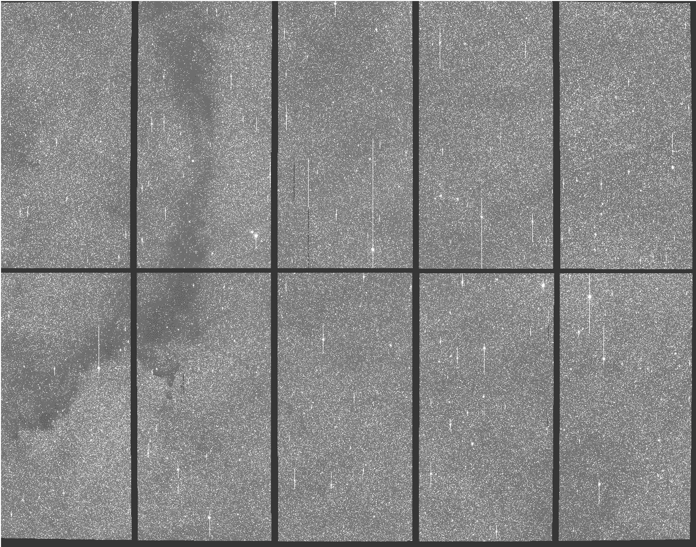

图 1：MOA-II 调查的银河系膨胀体字段 GB1 的单次观察。北方为从右到左，东方为从下到上。

## 3 构建数据集

银河系膨胀体在南半球的可见时间为 2 月到 10 月。长夜和膨胀体在冬季中期的高度使得这个时间段最适合观察。在清晰的夜晚和良好的观测条件下，MOA-II 的多个区域被频繁调查，有时每`10 min`调查一次。这为观察我们太阳系的小行星提供了理想条件。图 2 演示了这一点，对一个明亮的主带小行星（78153）2002 NX24 进行了六次观察，限界星等（V）为 17.5，拍摄间隔为 10-12 分钟，日期为 2006 年 6 月 23 日。这个小行星的光曲线可以在图 3 中看到。天空平面速度约为每分钟 0.5 弧秒，这代表了 MOA-II 捕捉到的小行星。

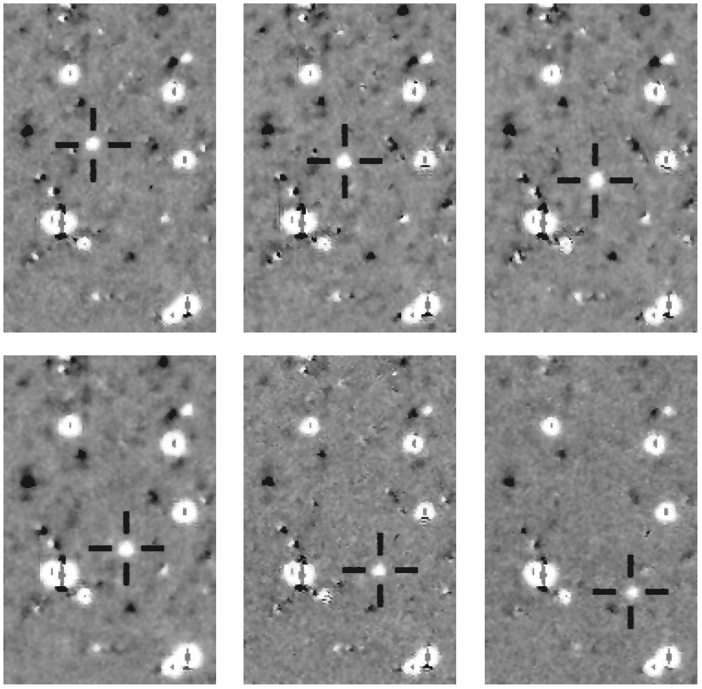

图 2：2006 年 6 月 23 日，对小行星（78153）2002 NX24 的六次连续观察，跨度为 70 x 108 弧秒。

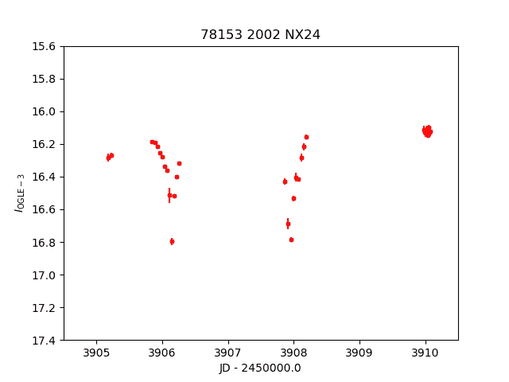

图 3：从 MOA-II 数据中提取的小行星（78153）2002 NX24 的光曲线。

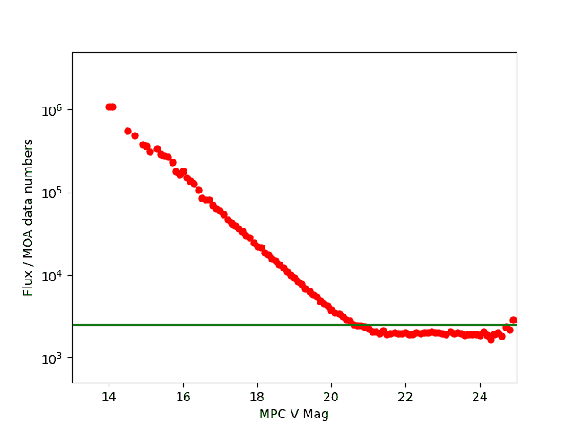

图 4：GB5-R5 中恢复的小行星的 MOA 测得通量与 MPC V 星等的关系。MPC 值报告到小数点后一位，结果以 0.1 星等为单位进行分箱。红点表示通量的中位数值。当 V 星等接近 21 时，曲线开始趋于平坦，此时实际测量的是背景。绿色线表示 MOA 微引力工作中常用的限制通量。

这项研究使用的主要数据包括 2006 年至 2019 年在 CCD 阵列中的一个芯片（芯片 5）对 GB5 场的所有观测数据，共计 49,901 幅差分图像（GB5-R5）。该场被非常频繁地调查，大多数观测的时间间隔在 5 到 20 分钟之间。通过屏幕抓取程序查询了小行星中心（MPC）[7](https://www.minorplanetcenter.net/cgi-bin/checkmp.cgi)，获取了所有已知的预计穿过 GB5-R5 区域的小行星。为了确定我们调查的限制星等，我们将 GB5-R5 中恢复的小行星位置测得的通量与 MPC 提供的 V 星等进行了比较。结果见图 4，数据按 MPC V 星等进行分箱，箱宽为 0.1 星等，并计算了每个箱的中位数通量值。对于微引力测量，MOA 采用了 2500 作为限制数据数量的工作值。这对应于 MPC V 星等 20.5，我们在这里将其作为我们的限制星等。

由于小行星在每次连续曝光中相对于背景恒星有显著移动，通过叠加夜间观测可以清晰地看到小行星的轨迹片段。我们将轨迹片段定义为小行星在望远镜视野中移动时轨道弧的一部分。我们从由最亮的像素组成的堆叠开始。虽然轨迹片段可见，但亮背景和过亮的恒星也同样明显（图 5(a)）。为了更好地突出轨迹片段，通过从中位像素堆叠中减去最亮像素堆叠，进一步简化了堆叠图像。这给我们提供了一幅没有亮背景和饱和恒星的图像（图 5(c)），只留下噪声和移动物体。在生成减法堆叠时，只考虑了有 3 次或更多观测的夜晚。GB5-R5 数据集产生了 2252 幅减法堆叠图像，开始了对小行星轨迹片段的搜索。

来自 MPC 的历书数据以及特定于 MOA-II 的天文测量校准被用来推断从减去的堆叠图像中小行星轨迹片段的最小和最大（x，y）位置。这被用来裁剪预期包含轨迹片段的堆叠图像的子区域。超出 CCD 芯片边界的小行星被忽略。此外，通过对轨迹片段的目视检查，确定只有 20.5 等或更亮的小行星在 MOA-II 曝光中可见。这也与我们在图 4 中看到的情况一致，其中 V 21 周围的中位数通量趋于平坦，类似于测量背景。19.5 到 20.5 等之间的对象通常处于可见性边缘，需要优良的观测条件和高信噪比才能在观测中显现。对图像的仔细检查结果是，在 1178 个不同的小行星中，获得了 2073 个轨迹片段，覆盖 1078 个不同的夜晚。图 6（374 x 387 角秒）展示了 2008 年 5 月 15 日夜晚观测到的一些轨迹片段，其中一些轨迹片段非常微弱。

轨迹片段有多种大小，但我们需要统一尺寸的图像来训练神经网络。由于计算成本以及轨迹片段可能在图像中被其他伪影掩盖，观察的原始大小被认为太大，不能直接使用。因此，决定将每张图像拆分为 128 x 128 的瓦片，每张图像产生 512 个瓦片。每个 128x128 的瓦片覆盖 76 x 76 角秒。对于 GB5-R5，这使我们从 1078 个夜间堆叠图像中获得了总计 551,936 张图像，其中包含可见的小行星轨迹片段。

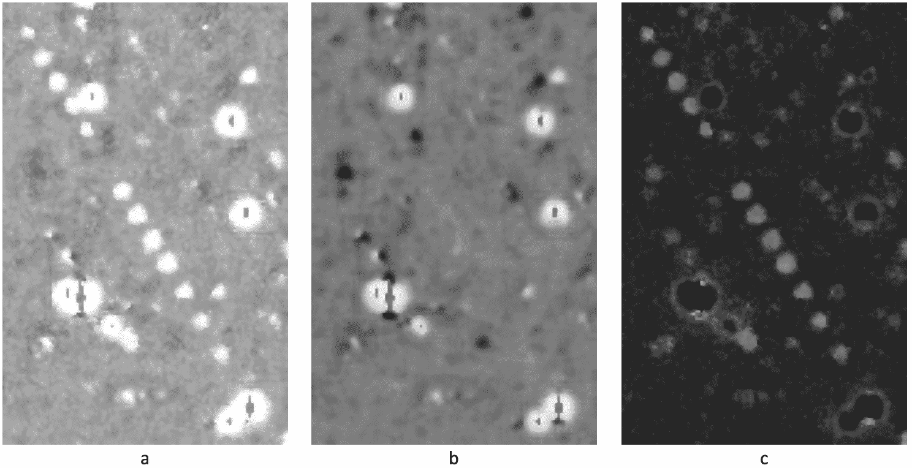

图 5：将一个夜晚的所有观测数据（2006 年 6 月 23 日）叠加在一个芯片上的一个场中，我们获得了小行星（78153）2002 NX24 的清晰轨迹片段。在(a)中，观测数据按最亮像素叠加；在(b)中，按中位数像素叠加；在(c)中，我们看到将(b)从(a)中减去的结果。

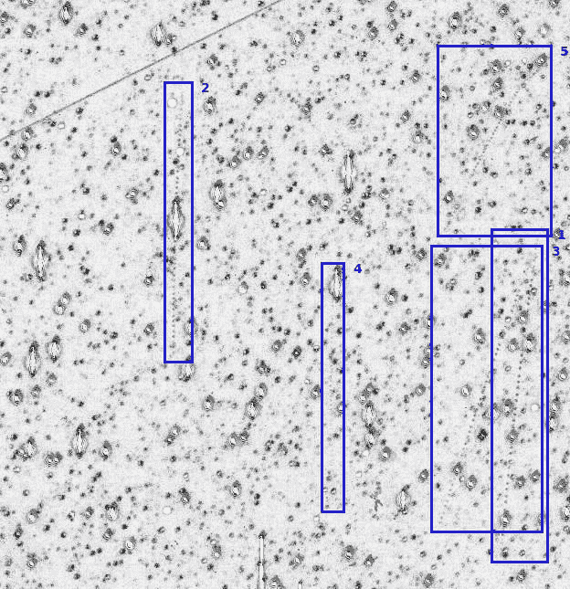

图 6：2008 年 5 月 15 日晚的 51 次观察叠加图清晰地显示了 5 条小行星轨迹，这些轨迹在叠加图像的子区域内可见。按出现顺序编号，它们是：1 - (103842) 2000 DQ33 (19.5)；2 - (148657) 2001 SX124 (19.6)；3 - (152083) 2004 RH30 (19.9)；4 - (582743) 2016 AT221 (20.4)；5 - (338789) 2005 SZ154 (20.4)。左上角的线条/条纹来自卫星。此图像已被反转和加亮以提高可见性（原图见图 15）。

科恩-萨瑟兰线裁剪算法（W. M. Newman 和 R. F. Sproull (1973))接着用于在这些图像中定位小行星轨迹。该算法涉及将矩形空间（在此为图像）划分为九个区域 - 八个“外部”区域和一个“内部”区域，如图 7 所示 - 并确定哪些线段（轨迹）完全或部分在感兴趣区域（图像）内。每个九个区域都有相关的外码（4 位数字），这些外码是通过在将线段/轨迹的起始和结束点与图像坐标进行比较后进行按位操作计算得出的。例如，外码 0001 表示端点在左中心，外码 1000 表示端点在上中心。这两个代码的按位或操作返回 1001，这是一个非零值，而按位与操作返回 0000，即零，这反过来表明轨迹部分在图像内。因此，任何线段有三种可能的解决方案：

+   1.

    如果线段的两个端点都在感兴趣区域内，按位或计算返回 0（简易接受）。

+   2.

    如果线段的两个端点都在感兴趣区域外，它们将共享至少一个外部区域，按位与计算返回非零值（简易拒绝）。

+   3.

    如果两个端点在不同区域，至少有一个端点会在图像瓷砖外部。在这种情况下，轨迹外部点和图像瓷砖边界的交点成为轨迹的新端点，算法重复直到按位操作返回简易接受或拒绝。

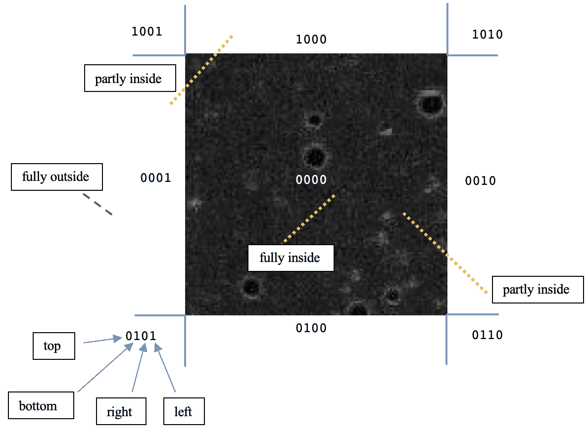

图 7：科恩-萨瑟兰线裁剪算法用于拒绝感兴趣区域外的轨迹并确定部分在内部的轨迹的交点。

该算法的应用给我们提供了 8341 个可能含有可见轨迹的小块和 543,595 个没有已知小行星的小块。为了确保能够清晰地看到轨迹，每个小块都被细致地扫描过。任何含有少于 3 个轨迹点的小块都会被拒绝，此外，还有不包含可见轨迹部分的小块也会被排除。经过这一过程，最终得到 4153 个 128 x 128 的小块，这些小块中含有来自 GB5-R5 的可见轨迹。部分示例见于图 8(a)。

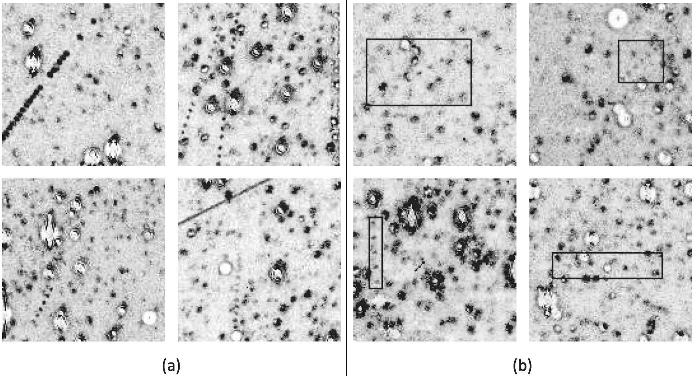

图 8: 从减法堆叠图像中观察到的 128x128 子区域中的小行星轨迹。在(b)中，轨迹用边界框标出。顶部行的行星，从左到右依次是：(38102) 1999 JM18 (18.4)；(152083) 2004 RH30 (19.9)；(103842) 2000 DQ33 (19.5)；(283261) 2011 FR142 (20.0)；和(375674) 2009 HD5 (19.8)。底部行的行星，从左到右依次是：(48617) 1995 HR2 (19.5)；(148657) 2001 SX124 (19.6)；(97948) 2000 QF124 (19.6)；和(74978) 1999 TY234 (18.7)。请注意，这些图像已经被反转并增强了亮度以提高可见性（原图见于图 16）。

对于分类任务，所有由于噪声而轨迹点过于模糊的图像或少于三个清晰可见的与轨迹相关的点源的图像都被移除。随后，剩下了 4072 张包含轨迹的图像，这些图像被划分为训练集/验证集/测试集，分别包含 3322/415/335 张图像。训练集和验证集的图像进一步通过旋转 180 度、水平和垂直翻转、调整亮度、加深、模糊以及增加和减少对比度进行了数据增强。训练集、验证集和测试集之间没有重叠。还构建了一个由所有十个芯片在 GB3、GB4、GB5、GB9、GB10 和 GB14 领域的单夜观测组成的额外测试集（GB-All），该测试集包含 300 张轨迹图像和 2000 张无轨迹图像。GB-All 测试集的目的是评估网络在从未见过的数据上的表现；如前所述，轨迹来自最大间隔为 20 分钟的观测，并且每张图像中至少包含 3 个源。分类网络也被训练来识别没有轨迹的图像。我们从 512 个子区域中随机选择了 40 张没有已知轨迹的图像，共计 20480 张图像。这些图像也进行了视觉检查，任何可能包含轨迹的图像都被移除。这个过程最终得到 19682 张图像，这些图像被划分为训练集/验证集/测试集，分别为 15595/2039/2048 张图像。对于无轨迹的训练和验证数据，生成了相同的增强集，但由于此集已经显著更大，因此只使用了 35%的无轨迹增强数据。需要注意的是，这种分布并不反映轨迹图像与无轨迹图像的真实比例；实际上，在一个良好的夜晚，我们可能期望每 100 张无轨迹图像中有 10 张轨迹图像。这里大约 1:5 的比例旨在更好地使网络专注于学习轨迹模式，同时提供适当数量的对比无轨迹图像。

由于小行星轨迹片段在图像中是一个定义明确的斑点模式，我们进一步考虑训练基于深度学习的物体检测器，以在图像中定位它们。这将有助于定位那些微弱和/或被噪声遮挡的轨迹片段，并区分图像中的兴趣区域。我们利用了 YOLOv4（Bochkovskiy et al. (2020))，它要求将感兴趣的对象 - 在我们的例子中是轨迹片段 - 包含在边界框中，且对象的质心坐标根据图像的尺寸保存。通过应用 Cohen-Sutherland 线裁剪算法，我们得到了 128 x 128 图像中的轨迹片段的可能交点/结束点。这些交点用于推测轨迹片段的边界框，从而在图像中突出显示它们。进一步的视觉检查和手动调整已被执行，以确保边界框准确地包围了轨迹片段，没有包含任何多余的背景（图 8(b)）。所有 4153 张轨迹片段图像都被使用，其中训练/测试的分割比例为 3737 和 416。

## 4 深度学习框架

神经网络和深度学习的吸引力在于它们能够在经过代表性数据集训练后，实时对复杂数据进行预测。在过去十年中，深度学习已经显著成熟，并且在分类和物体检测任务中证明了其高效性。在这里，我们讨论了训练几种基于卷积神经网络（CNN）的架构，以在减法叠加图像中找到小行星轨迹片段。

提议的模型由五个分类器的集成组成，生成 128x128 复合图像块包含轨迹片段的概率。被认为包含轨迹片段的图块随后传递给 YOLOv4，YOLOv4 经过训练以通过在图像中的轨迹片段周围添加边界框来定位轨迹片段。

### 4.1 分类

卷积神经网络或 CNN 是一种网络架构，旨在利用输入图像的 2D 结构。通过一系列使用滤波器的卷积层，这些滤波器通过局部连接和共享权重来实现，它可以直接从数据中提取有意义的特征，从而消除了手动特征提取的需要。

传统上，层中的滤波器数量随着网络的深度增加。普遍的观点是，网络层数越多，从图像中提取更复杂特征的能力越强，从而能从复杂数据中学习。然而，限制因素在于输入的大小、我们感兴趣的特征的局部化程度以及可用的训练数据量。在达到一定层数后，网络可能会因专注于图像中的不规则性而开始过拟合。因此，虽然增加卷积层的数量可以提高网络的性能，但并不是说更深的网络总是最佳选择。部分挑战在于找到网络的理想深度，以便最优化地预测输出。Simonyan 等人介绍了 VGGNet（Simonyan 和 Zisserman (2015))，并研究了在大规模图像识别设置（ILSVRC 挑战）中，增加卷积层深度对模型分类和定位准确性的影响。VGGNet 的架构简洁明了；它使用一系列连续的卷积层来减少参数数量，从而加快收敛速度并减少过拟合问题。GoogLeNet（Szegedy 等人 (2015))，通常称为 Inception，引入了修改网络宽度的思想，并采用多种尺寸的滤波器来更好地捕捉图像中的多尺度数据。与 VGGNet 架构相比，它能够进一步减少参数数量和计算成本。残差网络（He 等人 (2016))，或称 ResNets，旨在解决网络深度增加时的梯度消失问题，通过引入一种称为跳跃连接的替代路径来解决。该架构的核心元素是残差块，由两个带有 3x3 滤波器的卷积层组成。输入被添加到第二个卷积的输出，从而创建了一个捷径连接。

在我们的工作中，试验了多种 CNN 分类架构，以确定最佳的滤波器和层的组合来满足我们的目的。在对 VGG-16 和 VGG-19（Simonyan 和 Zisserman (2015))、Inception（Szegedy 等人 (2015))和 ResNet50（He 等人 (2016))等成熟架构进行了大量实验之后，构建了多种自定义模型，以确定是否能获得更好的性能。表 1 描述了这五种自定义架构的结构，其中三种类似于 VGG（MOA-12、MOA-14、MOA-15），两种由混合 Inception-ResNet 模块组成（Hybrid A、Hybrid B）。所有自定义架构的参数数量显著少于它们的成熟对手。我们的研究发现，过度参数化的深度网络架构会导致训练数据的过拟合，因此我们减少了网络中的层数和滤波器数量，以减少涉及的神经元和权重数量。

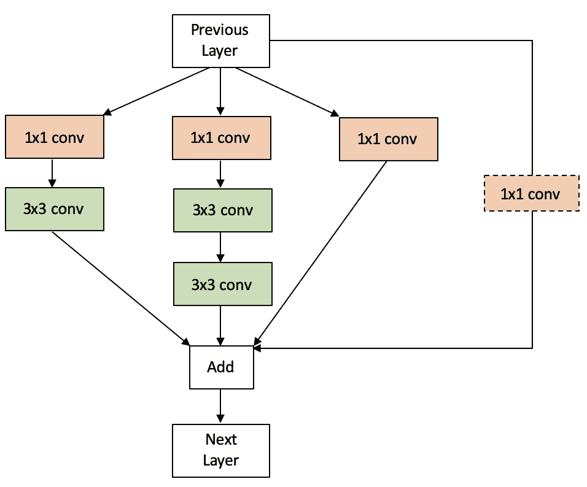

图 9：混合模块结合了 ResNet 块和 Inception 模块的显著特征

![[无说明的图像]](img/9bfb7dce8bab29442f6d9cc64a6c6711.png)

表 1：自定义分类架构 MOA-12、MOA-14、MOA-15、Hybrid A 和 Hybrid B 的配置。每一层都使用了 ReLU 激活函数，并且在每个全连接层后使用了 dropout。

混合模块（图 9）由四个分支组成，每个分支都由卷积层组成，这些卷积层使用 ReLU 激活函数（Glorot 等人 (2011); Nair 和 Hinton (2010))，并通过“add”函数进行组合。最终分支将输入传递到“add”函数中，仅在前一层的滤波器数量与当前层的滤波器数量不相等时才使用卷积。混合模块中的许多 1x1 卷积看似多余，但即使去掉一个也会对网络性能产生负面影响。这可能是由于引入的有益复杂性所导致的。

所有分类架构都在运行 Ubuntu 18.04 的 Linux 机器上进行训练，配备了 NVIDIA Quadro M4000 GPU（8 GB，2.5 TFLOPS）。代码在 Python 3.6 的 Jupyter Notebook 环境中编写。使用了 TensorFlow GPU 2.4.1（CUDA 11.0）以及 Keras 深度学习 API 来创建测试的自定义 CNN 模型。Keras Applications 实现用于已建立的模型。训练每个网络模型时使用了 32 的批量大小。训练设置为运行 50 个周期，如果在设置的周期数后验证损失未能最小化，则进行早期停止的回调。使用了 Adam（Kingma 和 Welling (2014))优化器，最小化的损失函数是二元交叉熵。所有网络的学习率初始化为 0.0001，除 Hybrid A 外，Hybrid A 的学习率起始为 0.001。在每种情况下，学习率在 15 个周期后减少，并在此之后按计划的间隔进行调整。回调包括保存最佳的验证和训练准确性权重。建立的网络在使用 ImageNet 权重预加载后表现更好，然后再用 MOA-II 数据进行微调。MOA-12、14 和 15 平均需要 3 小时进行训练，而 Hybrid 模型则需要 6 小时。

### 4.2 目标检测

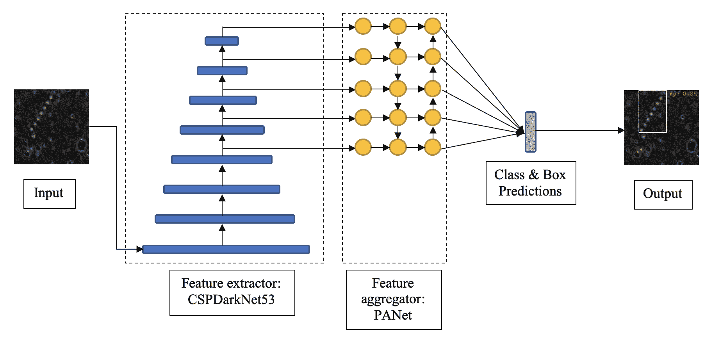

图 10：YOLOv4 架构：一个特征提取器，由 53 层的 DenseNet 组成，具有跨阶段部分连接和空间金字塔池化，以及一个特征聚合器，有效地结合了来自高分辨率和低分辨率层的特征图。

近年来，卷积神经网络（CNNs）已经超越了图像分类，应用于图像中的目标检测和定位。在这里，我们利用 YOLOv4 目标检测架构来定位我们的瓦片图像中的小行星轨迹。

原始 YOLO（You Only Look Once）目标检测架构（Redmon 等 (2016)) 的目的是使目标检测既快速又易于实现。作为一个单次检测架构，它能够利用单个 CNN 网络生成的特征图进行类别和边界框预测。YOLO 核心中的特征提取 CNN 的简单性与其复杂的损失函数形成鲜明对比，该损失函数计算分类损失、定位损失以及量化网络对预测信心的损失。网络的后续版本引入了默认的锚框，即在训练过程中调整和细化的预定义边界框，以涵盖图像中的感兴趣对象（Redmon 和 Farhadi (2017))，并使用更复杂的特征提取器进行多尺度预测（Redmon 和 Farhadi (2018))。

这项研究采用了 YOLOv4（Bochkovskiy 等人（2020）），这是该架构的最新演变，进行了重大改造，包含了多种新技术，使模型成为最先进的，同时仍然易于训练。特别是，YOLOv4 确保低级特征通过特征提取器和特征聚合器进行传播。图 10 展示了 YOLOv4 的架构。该架构的卷积骨干特征提取器由 53 层 DenseNet（Huang 等人（2016））组成，并具有 CSPNet（Wang 等人（2020））的跨阶段部分（CSP）连接。DenseNet 通过在网络中以前馈的方式添加所有层之间的连接，扩展了 ResNet 的跳跃连接概念。所有前面层的特征图被连接起来，并形成任何给定层的输入，确保低级特征在网络中得以传播。CSP 连接涉及将输入特征图分成两部分，一部分经过密集块，另一部分直接传递到下一个过渡步骤。此外，网络在最后的卷积层之后包含空间金字塔池化（SPP）（He 等人（2014））。这会将最重要的特征分离出来，并增加接收字段。最终的特征图被划分为 $m\ \times\ m$ 个箱子，然后对每个箱子应用最大池化。得到的特征图被连接起来，表示特征提取器的输出。

CNN 自然获得金字塔状结构，随着每一层的图像从高分辨率到低分辨率。随着我们在 CNN 中变得更深，我们失去了输入的细粒度细节，这通常使得检测小对象更加困难。然而，随着分辨率降低，滤波器学习图像的更复杂的抽象，使特征图更富有语义。因此，结合来自较高分辨率层的特征图与更富有语义的特征图以便于在多个尺度上检测对象是可取的。这项任务交给特征聚合器，而 YOLOv4 使用了 PANet 建议的方法（Liu et al. (2018））。特征图从自上而下的路径和自下而上的路径连接在一起，确保了富有语义的定位信息传播到网络的最后部分，在那里进行了类别概率和边界框预测。每个预测的边界框由五个元素组成：中心-x、中心-y、宽度、高度和置信度。($center-x,center-y$)坐标是相对于预测框的尺寸；宽度和高度是相对于整个图像的。置信度分数表示单元格包含对象的可能性以及模型对其预测的置信度。

YOLOv4 还更新了损失函数，包括完全交并集（CIoU）损失（Zheng et al. (2020）），以训练网络有效确定将权重移至何处以更好地匹配标记的边界框。最后，该模型还包括一系列新的添加：新激活函数 MISH（Misra (2020）提供更平滑的梯度；更新到空间注意力模块（Woo et al. (2018））和多输入加权残差连接（Tan et al. (2020）以更好地适应架构；以及新的数据增强技术，Mosaic 和自对抗训练。

YOLO 系列模型由 Darknet（Redmon (2013）支持，这是一个用 C 和 CUDA 编写的自定义框架，专门设计用于快速对象检测。 YOLOv4 的 Darknet 实现是通过托管的 GPU 运行时环境在 Google Colaboratory 通过 MOA-II 数据集进行训练的。该模型首先使用默认的 anchor boxes 进行训练，然后使用 k-means 聚类来发现更适合在天文数据中找到 tracklets 的 anchor boxes。经过测试了多个变体后，最佳的 anchor boxes 组合是通过手工构建各个聚类来发现的。学习率为 0.001，批量大小为 32，划分为 8，最大批量为 6000，步数设置为 4800,5400。

## 5 结果

为了评估分类网络，我们依赖于从混淆矩阵得出的指标。混淆矩阵将分类器的预测结果分为四种结果：真正例（TP）、真负例（TN）、假正例（FP）和假负例（FN）。其中，“正”案例是指图像被分类为包含轨迹片段的情况，“负”案例是指没有检测到轨迹片段的情况。在这种情况下，理想的情形是尽量减少假负例，同时假正例的数量也应可控。在这里，网络根据其召回率、F2 得分（精度和召回率的加权调和平均数）以及 PR AUC（精度-召回曲线下面积）进行评估。

![[无标题图片]](img/459c90a7913bf09bc63575d30f43a4c6.png)

表 2: 在概率阈值 0.5 下，GB5-R5 测试集的评估指标

每个分类器在 GB5-R5 测试集的评估指标见表 2，在 GB-All (28-06-2013) 测试集的评估指标见表 3。所有指标均在 0.5 的置信度阈值下取得，值超过 0.5 表示图像中存在小行星轨迹片段。通过回顾 PR AUC、F2 得分和召回率的组合，我们可以看到自定义网络在对从未见过的数据进行预测时表现良好。与其从中选择一个单独的网络，不如将所有五个自定义分类器配置为一个集合。每个网络对输入图像进行预测，并试验了两种选择最佳预测的方法：对所有五个分类器的预测值取平均（avg）或选择最高的预测值（max）。

![[无标题图片]](img/89908d5ea782e26eec32b96e1da28468.png)

表 3: 在概率阈值 0.5 下，GB-ALL 测试集的评估指标

我们看到，虽然最大集合结果导致了更多的假正例，但它使召回率提高了四个百分点（表 4），GB5-R5 和 GB-All 测试集的召回率分别达到了 94.33%和 97.67%。平均集合的优势在于假正例远少于最大集合，并且通过明智地选择预测阈值，可以进一步减少假负例。集合的 ROC 曲线（图 11）进一步说明了这一权衡。

![[无标题图片]](img/d16c08743c126d60fa09a195305c17f9.png)

表 4: 在将五个自定义网络配置为集合后，概率阈值 0.5 下的评估指标

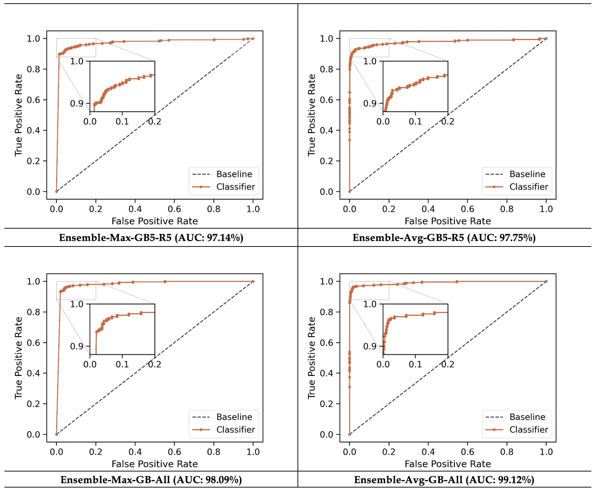

图 11：CNN 集成的 ROC 曲线

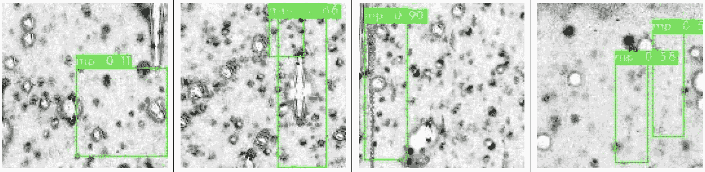

图 12：YOLOv4 的轨迹定位，从左到右分别为：（538147）2016 BT90 (18.7)；（67001）1999 XN117 (19.2)；（80667）2000 BA15 (18.8)；（206629）2003 WT154 (19.0)；以及（281890）2010 OA74 (20.1)。注意这些图像已被反转和加亮以提高可见性（原始图像见图 17）。

目标检测模型的性能通常通过平均精度均值（mAP）来量化。平均精度（AP）衡量了精度和召回率之间的权衡，通过对精度-召回曲线下的面积进行积分来计算，其中精度值降低。mAP 是模型可以检测的所有目标类别的 AP 的均值，这与数据集的 AP 相同。目标检测模型旨在使预测的边界框与真实边界框之间有较高的重叠（交并比或 IoU），预测结果分组如下：

+   1.

    真阳性：IoU $>$ 0.5

+   2.

    假阳性：IoU $<$ 0.5（或重复）

+   3.

    假阴性：未检测到的框或 IoU $>$ 0.5 但物体分类错误

平均精度的计算方法是：计算为：

|  | $AP=\Sigma(r_{(n+1)}-r_{n})\tilde{p}(r_{(n+1)})$ |  |
| --- | --- | --- |
|  | $\tilde{p}(r_{(n+1)})=\max_{\tilde{r}\geq r_{(n+1)}}(p(\tilde{r})),$ |  |

其中 $r$ 是召回值，$n$ 代表精度降低的地点，$\tilde{p}(r_{(n+1)})$ 是 $r$ 值变化时的最大精度。

YOLOv4 在 GB5-R5 数据上使用默认锚框取得了 90.96% 的 mAP，使用自定义锚框取得了 90.95% 的 mAP。两个网络在 GB-All 数据中都无法检测轨迹，这表明 YOLOv4 需要使用来自其他领域和芯片的标记数据进行训练，才能在这些数据中进行检测。YOLOv4 在 GB5-R5 数据集上的一些检测结果可以在图 12 中看到。

提出的模型应用于发现 GB5-R5 中 543,595 张图像切片中的轨迹，这些图像中没有已知的小行星轨迹。集成模型每小时可以分析 10,000 张图像，花费了三天时间分析所有图像，并提出了 50,227 个候选检测。然后，使用 YOLOv4 的两个版本对这些候选检测中的轨迹进行定位，每个版本花费了 1.5 天进行边界框预测。我们仍在分析这些候选检测以确定是否存在新的物体。

## 6 讨论

我们的分类器集成模型，使用了来自一个调查领域的一个芯片上的相对少量标记数据进行训练，能够对来自未见过的调查领域和芯片的一组图像进行分类，这突显了其良好的泛化能力。定制的 CNN 架构成功的原因可能归结为两个方面。首先，这些网络可能在识别表示轨迹的模糊斑块的模式时达到了最佳深度。其次，输入图像的较小尺寸可能导致了较大模型的过拟合。此外，与其添加更多层，混合架构更倾向于通过多个 1x1 卷积增加复杂性。这可能导致网络学习到的表示最终提高了集成模型的性能。

集成模型报告的假阴性（见图 14）包括轨迹类似于卫星拖尾的情况，或者点源稍微分散且被噪声遮掩的情况。在一些情况下，轨迹的部分位于其他图像上，这些图像被集成模型正确识别为候选探测结果。至于假阳性，它们大多是噪声和其他虚假伪影被误认为轨迹的情况，如图 13 所示。这些情况也导致了物体检测器的假检测。我们认为，随着更多标记数据的可用，微调网络模型将有助于减少此类误分类。

YOLOv4 物体检测器证明能够完成 GB5-R5 数据集中轨迹定位的任务，但无法对未见过的数据进行泛化。来自 GB5-R5 数据集的结果令人鼓舞，因此表明进一步使用其他调查领域和芯片的数据进行训练将是有益的。

虽然这两种类型的网络目前受到其训练时使用的高频观察数据的限制，但我们相信，随着网络使用来自其他领域的数据进行再训练，它们将能够识别缓慢移动的物体轨迹或观察间隔较长的轨迹。此外，其他调查可以将我们的网络及其预训练权重作为发现其数据中小行星的起点。在这种情况下，我们建议其他调查使用自己的数据对架构进行再训练/微调，以获得最佳结果。

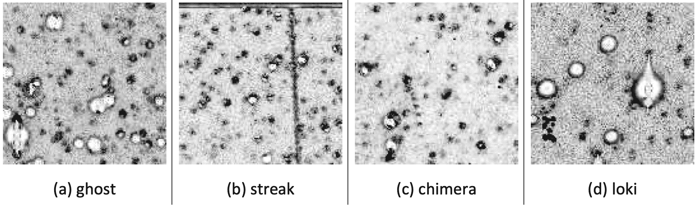

图 13：分类网络报告的假阳性分为四大类：（a）幽灵（ghosts，指噪声过去的幽灵），是最常见的假阳性，是由于生成合成图像时的附加噪声；（b）条纹是卫星或其他近地物体或宇宙射线；（c）奇美拉（chimera）是可能由过饱和星星引起的光学伪影；（d）洛基（loki）物体是从一次观测到下一次观测之间运动不规则的伪影。请注意，这些图像已经被翻转并加亮以提高可见性。

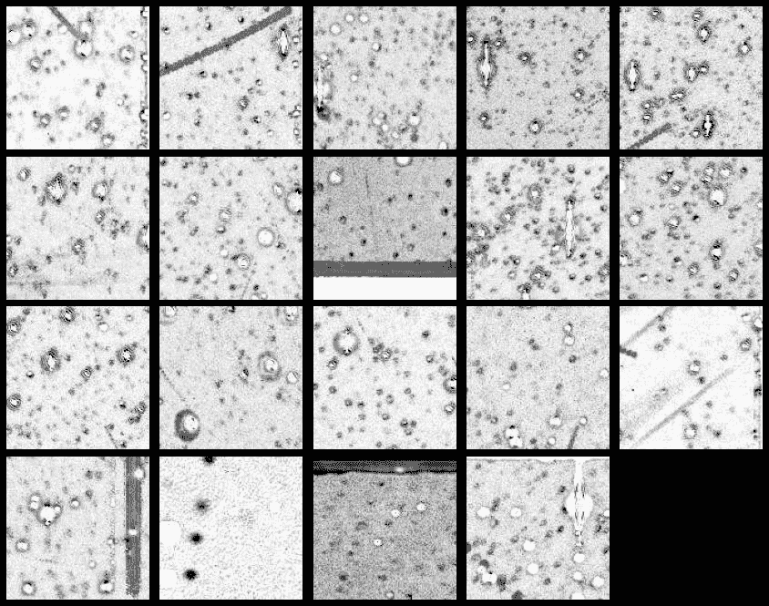

图 14：分类网络报告的假阴性大多是微弱的物体或像条纹一样的物体。这些轨迹可能在训练集中表现得不好。请注意，这些图像已经被翻转并加亮以提高可见性。

## 7 结论

我们已经证明，可以训练基于 CNN 的分类器和 YOLOv4 目标检测器来在 MOA 差分图像中找到小行星轨迹。分类器集群在发现未知数据中的轨迹方面表现出韧性，将对扩展小行星搜索到 MOA-II 归档数据的其余部分具有重要价值。随着更多标记数据的可用，网络将进行微调或重新训练，我们将研究自动化 YOLOv4 所需的边界框。我们还将研究使用诸如 HelioLinC 的轨道链接软件，以确定 YOLOv4 所定位源簇的有效性。

尽管分类器表现良好，但仍有进一步改进和发展的潜力。研究有效的去噪技术对堆叠图像或差分图像进行去噪将立即提升分类和目标检测网络的性能。分类网络可能从两个输入中受益——也许是减法堆叠图像以及中位数堆叠图像。这将为模型提供额外的信息，以帮助区分有轨迹和无轨迹的图像。首先使用分类数据训练 YOLO 骨干特征提取器也可能会带来更好的结果。此外，由于大量显著信息包含在第一层中，基于 DenseNet 的小型 CNN 也有可能被成功训练为分类器。

总体而言，我们提出了一种有效的工具包，用于在地面望远镜的归档数据中寻找小行星轨迹。我们神经网络模型的代码以及训练好的权重可以在 https://github.com/pcowan-astro/MOA-Asteroids 获取。我们的方法和网络架构可以用于在其他归档调查数据中发现和恢复小行星，并加强当前和未来调查的分析管道。

## 8 致谢

我们感谢 MOA 合作组织提供 MOA-II 档案差分图像。IAB 感谢新西兰皇家学会 - Marsden 资助的 MAU1901 项目支持。本研究使用了国际天文学联合会小行星中心提供的数据和/或服务。

## 附录 A 原始图像

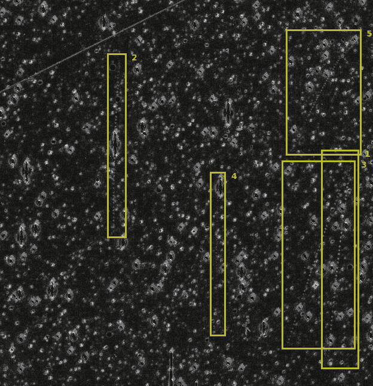

图 15: 从 2008 年 5 月 15 日夜晚的所有 51 次观测中堆叠的图像显示了在堆叠图像的子区域中清晰可见的 5 条小行星轨迹。按出现顺序编号，它们是：1 - (103842) 2000 DQ33 (19.5); 2 - (148657) 2001 SX124 (19.6); 3 - (152083) 2004 RH30 (19.9); 4 - (582743) 2016 AT221 (20.4); 5 - (338789) 2005 SZ154 (20.4)。左上方的线/条纹来自卫星。

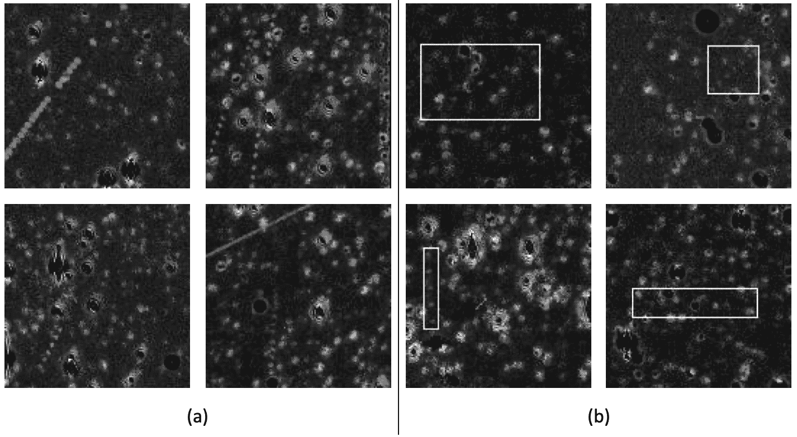

图 16: 从减法叠加图像中看到的 128x128 子区域的小行星轨迹。在（b）中，这些轨迹用边界框进行标定。上排小行星，从左到右： (38102) 1999 JM18 (18.4); (152083) 2004 RH30 (19.9); (103842) 2000 DQ33 (19.5); (283261) 2011 FR142 (20.0); 和 (375674) 2009 HD5 (19.8)。下排小行星，从左到右： (48617) 1995 HR2 (19.5); (148657) 2001 SX124 (19.6); (97948) 2000 QF124 (19.6); 和 (74978) 1999 TY234 (18.7)。

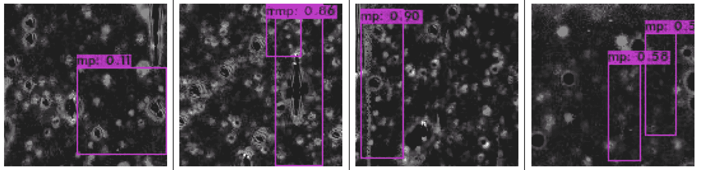

图 17: YOLOv4 的轨迹定位，从左到右： (538147)2016 BT90 (18.7); (67001) 1999 XN117 (19.2); (80667) 2000 BA15 (18.8); (206629) 2003 WT154 (19.0); 和 (281890) 2010 OA74 (20.1)。

## 参考文献

+   Alard（2000）Alard, C., 2000. 使用空间变异核的图像减法。《天文学与天体物理学补刊》144, 363–370.

+   Alard 和 Lupton（1998）Alard, C., Lupton, R.H., 1998. 最佳图像减法方法。《天体物理学杂志》503, 325–331.

+   Bochkovskiy 等（2020）Bochkovskiy, A., Wang, C.Y., Liao, H.Y.M., 2020. YOLOv4: 目标检测的最佳速度和精度。ArXiv abs/2004.10934.

+   Bond 等（2001）Bond, I., Abe, F., Dodd, R., Hearnshaw, J., Honda, M., Jugaku, J., Kilmartin, P., Marles, A., Masuda, K., Matsubara, Y., Muraki, Y., Nakamura, T., Nankivell, G., Noda, S., Noguchi, C., Ohnishi, K., Rattenbury, N., Reid, M., Saito, T., Sato, H., Sekiguchi, M., Skuljan, J., Sullivan, D., Sumi, T., Takeuti, M., Watase, Y., Wilkinson, S., Yamada, R., Yanagisawa, T., Yock, P., 2001. 实时差分成像分析 MOA 银河核区观测数据（2000 年）。《皇家天文学会月刊》327, 868–880.

+   Bramich（2008）Bramich, D., 2008. 一种新的差分图像分析算法。《皇家天文学会月刊》386, L77–L81.

+   Cordwell et al. (2022) Cordwell, A.J., Rattenbury, N.J., Bannister, M.T., Cowan, P., Collaboration:, T.M., Abe, F., Barry, R., Bennett, D.P., Bhattacharya, A., Bond, I.A., Fujii, H., Fukui, A., Itow, Y., Silva, S.I., Hirao, Y., Kirikawa, R., Kondo, I., Koshimoto, N., Matsubara, Y., Matsumoto, S., Muraki, Y., Miyazaki, S., Okamura, A., Ranc, C., Satoh, Y., Sumi, T., Suzuki, D., Tristram, P.J., Toda, T., Yama, H., Yonehara, A., 2022. MOA-II 调查中的小行星光变曲线：一项初步研究。《皇家天文学会月刊》514, 3098–3112. doi:[10.1093/mnras/stac674](http://dx.doi.org/10.1093/mnras/stac674).

+   Denneau et al. (2013) Denneau, L., Jedicke, R., Grav, T., Granvik, M., Kubica, J., Milani, A., Vereš, P., Wainscoat, R., Chang, D., Pierfederici, F., Kaiser, N., Chambers, K.C., Heasley, J.N., Magnier, E.A., Price, P.A., Myers, J., Kleyna, J., Hsieh, H., Farnocchia, D., Waters, C., Sweeney, W.H., Green, D., Bolin, B., Burgett, W.S., Morgan, J.S., Tonry, J.L., Hodapp, K.W., Chastel, S., Chesley, S., Fitzsimmons, A., Holman, M., Spahr, T., Tholen, D., Williams, G.V., Abe, S., Armstrong, J.D., Bressi, T.H., Holmes, R., Lister, T., McMillan, R.S., Micheli, M., Ryan, E.V., Ryan, W.H., Scotti, J.V., 2013. Pan-STARRS 移动物体处理系统。《太平洋天文学会出版物》125, 357–395.

+   Duev et al. (2021) Duev, D.A., Bolin, B.T., Graham, M.J., Kelley, M.S.P., Mahabal, A., Bellm, E.C., Coughlin, M.W., Dekany, R., Helou, G., Kulkarni, S.R., Masci, F.J., Prince, T.A., Riddle, R., Soumagnac, M.T., van der Walt, S.J., 2021. Tails: 使用 Zwicky 瞬态设施和深度学习追踪彗星。《天文学杂志》161, 218.

+   Duev et al. (2019) Duev, D.A., Mahabal, A., Ye, Q., Tirumala, K., Belicki, J., Dekany, R., Frederick, S., Graham, M.J., Laher, R.R., Masci, F.J., Prince, T.A., Riddle, R., Rosnet, P., Soumagnac, M.T., 2019. DeepStreaks: 在 Zwicky 瞬态设施数据中使用深度学习识别快速移动物体。《皇家天文学会月刊》，4158–4165.

+   Glorot et al. (2011) Glorot, X., Bordes, A., Bengio, Y., 2011. 深度稀疏修正神经网络。AISTATS.

+   Gould and Yee (2013) Gould, A., Yee, J.C., 2013. 微透镜调查是探测小行星的强大工具。《天体物理学杂志》767.

+   He et al. (2014) He, K., Zhang, X., Ren, S., Sun, J., 2014. 深度卷积网络中的空间金字塔池化。计算机科学讲义（包括人工智能讲义和生物信息学讲义子系列）8691 LNCS, 346–361.

+   He et al. (2016) He, K., Zhang, X., Ren, S., Sun, J., 2016. 用于图像识别的深度残差学习。IEEE 计算机视觉与模式识别会议, 770–778.

+   Holman et al. (2018) Holman, M., Payne, M., Blankley, P., Janssen, R., Kuindersma, S., 2018. Heliolinc: 解决小行星链接问题的新方法。天文杂志 156, 135. doi:[10.3847/1538-3881/aad69a](http://dx.doi.org/10.3847/1538-3881/aad69a)。

+   Huang et al. (2016) Huang, G., Liu, Z., van der Maaten, L., Weinberger, K.Q., 2016. 密集连接卷积网络。第 30 届 IEEE 计算机视觉与模式识别会议论文集，CVPR 2017 2017 年 1 月，2261–2269。

+   Kim et al. (2016) Kim, S.L., Lee, C.U., Park, B.G., Kim, D.J., Cha, S.M., Lee, Y., Han, C., Chun, M.Y., Yuk, I., 2016. KMTNET: 一种在三个南方观测站安装的 1.6 米广场光学望远镜网络。韩国天文学会杂志 49, 37–44. doi:[10.5303/JKAS.2016.49.1.037](http://dx.doi.org/10.5303/JKAS.2016.49.1.037)。

+   Kingma and Welling (2014) Kingma, D.P., Welling, M., 2014. 自编码变分贝叶斯，见：第二届国际学习表征会议，ICLR 2014 - 会议论文集，国际学习表征会议，ICLR。

+   Kruk et al. (2022) Kruk, S., García Martín, P., Popescu, M., Merín, B., Mahlke, M., Carry, B., Thomson, R., Karadağ, S., Durán, J., Racero, E., Giordano, F., Baines, D., de Marchi, G., Laureijs, R., 2022. 哈勃小行星猎人。天文学与天体物理学 661, A85。

+   Kubica et al. (2007) Kubica, J., Denneau Jr, L., Moore, A., Jedicke, Robert, Connolly, A., 2007. 大规模小行星发现的高效算法。天文数据分析软件与系统第十六届 ASP 会议系列 376, 395–404。

+   Lieu et al. (2018) Lieu, M., Conversi, L., Altieri, B., Carry, B., 2018. 使用卷积神经网络检测太阳系天体。皇家天文学会月刊 485, 5831–5842。

+   Liu et al. (2018) Liu, S., Qi, L., Qin, H., Shi, J., Jia, J., 2018. 实例分割的路径聚合网络。IEEE 计算机学会计算机视觉与模式识别会议论文集，8759–8768。

+   Misra (2020) Misra, D., 2020. Mish: 自我正则化非单调激活函数。ArXiv abs/1908.08681。

+   Nair and Hinton (2010) Nair, V., Hinton, G.E., 2010. 修正线性单元改善限制玻尔兹曼机。ICML。

+   Rabeendran and Denneau (2021) Rabeendran, A.C., Denneau, L., 2021. ATLAS 小行星调查的双阶段深度学习检测分类器。太平洋天文学会出版物 133。

+   Rabinowitz (1991) Rabinowitz, D.L., 1991. 实时检测接近地球的小行星。天文杂志 101, 1518。

+   Redmon (2013) Redmon, J., 2013. Darknet: 开源神经网络的 C 语言实现。网址：[`pjreddie.com/darknet/`](https://pjreddie.com/darknet/)。

+   Redmon et al. (2016) Redmon, J., Divvala, S., Girshick, R., Farhadi, A., 2016. 你只看一次：统一的实时物体检测，见：IEEE 计算机视觉与模式识别会议（CVPR），第 779–788 页。

+   Redmon 和 Farhadi (2017) Redmon, J., Farhadi, A., 2017. YOLO9000: 更好、更快、更强，见：IEEE 计算机视觉与模式识别会议 (CVPR)，pp. 6517–6525。

+   Redmon 和 Farhadi (2018) Redmon, J., Farhadi, A., 2018. YOLOv3: 增量改进。ArXiv abs/1804.02767。

+   Sako 等人 (2008) Sako, T., Sekiguchi, T., Sasaki, M., Okajima, K., Abe, F., Bond, I.A., Hearnshaw, J.B., Itow, Y., Kamiya, K., Kilmartin, P.M., Masuda, K., Matsubara, Y., Muraki, Y., Rattenbury, N.J., Sullivan, D.J., Sumi, T., Tristram, P., Yanagisawa, T., Yock, P.C., 2008. MOA-cam3: 用于新西兰引力微透镜调查的广域马赛克 CCD 相机。实验天文学 22, 51–66。

+   Simonyan 和 Zisserman (2015) Simonyan, K., Zisserman, A., 2015. 用于大规模图像识别的非常深度卷积网络，见：第三届国际学习表征会议，ICLR 2015 - 会议论文集。

+   Sumi 等人 (2003) Sumi, T., Abe, F., Bond, I., Dodd, R., Hearnshaw, J., Honda, M., Honma, M., Kan-ya, Y., Kilmartin, P., Masuda, K., Matsubara, Y., Muraki, Y., Nakamura, T., Nishi, R., Noda, S., Ohnishi, K., Petterson, O., Rattenbury, N., Reid, M., Saito, T., Saito, Y., Sato, H., Sekiguchi, M., Skuljan, J., Sullivan, D., Takeuti, M., Tristram, P., Wilkinson, S., Yanagisawa, T., Yock, P., 2003. 通过天体物理学小组在 2000 年的差分图像分析观测，测量银河系核心方向的微透镜光学深度。《天体物理学杂志》 591, 204–227。

+   Szegedy 等人 (2015) Szegedy, C., Vanhoucke, V., Ioffe, S., Shlens, J., Wojna, Z., 2015. 重新思考计算机视觉中的 Inception 架构。IEEE 计算机学会计算机视觉与模式识别会议论文集 2016-Decem, 2818–2826。

+   Tan 等人 (2020) Tan, M., Pang, R., Le, Q.V., 2020. EfficientDet: 可扩展且高效的目标检测，见：IEEE 计算机学会计算机视觉与模式识别会议论文集，pp. 10778–10787。

+   Tomaney 和 Crotts (1996) Tomaney, A.B., Crotts, A.P., 1996. 通过差分图像光度学扩展微透镜调查的范围。《天文学杂志》 112, 2872。

+   Udalski 等人 (1993) Udalski, A., Szymanski, M., Kaluzny, J., Kubiak, M., Krzeminski, W., Mateo, M., Preston, G.W., Paczynski, B., 1993. 光学引力透镜实验。发现银河系核心方向的第一个候选微透镜事件。天文学学报 43, 289–294。

+   W. M. Newman 和 R. F. Sproull (1973) W. M. Newman 和 R. F. Sproull, 1973. Cohen-Sutherland 算法，见：互动计算机图形学原理。国际版。McGraw–Hill 教育，pp. 124, 252。

+   Wang 等人 (2020) Wang, C.Y., Mark Liao, H.Y., Wu, Y.H., Chen, P.Y., Hsieh, J.W., Yeh, I.H., 2020. CSPNet: 一种可以增强 CNN 学习能力的新型骨干网络，见：IEEE 计算机学会计算机视觉与模式识别研讨会，pp. 1571–1580。

+   Woo 等人（2018）Woo, S., Park, J., Lee, J.Y., Kweon, I.S., 2018. CBAM: 卷积块注意力模块。计算机科学讲义（包括子系列人工智能讲义和生物信息学讲义）11211 LNCS, 3–19。

+   Zheng 等人（2020）Zheng, Z., Wang, P., Ren, D., Liu, W., Ye, R., Hu, Q., Zuo, W., 2020. 提升模型学习与推理中的几何因素以进行对象检测和实例分割。IEEE 网络学报。

+   Zoghbi 等人（2017）Zoghbi, S., Cicco, M.D., Ordonez, A.J., Stapper, A.P., Collison, J., Gural, P.S., Ganju, S., Galache, J.l., Jenniskens, P., 2017. 使用深度学习工具搜索长周期彗星，见：物理科学深度学习研讨会。
