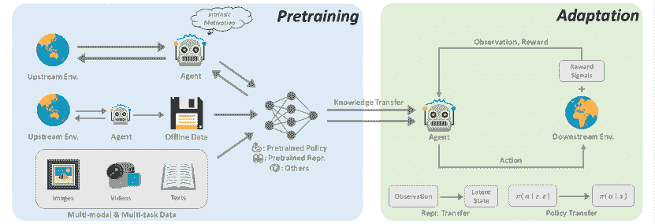
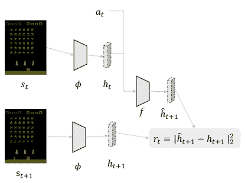
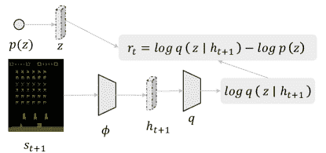

<!--yml

分类：未分类

日期：2024-09-06 19:43:21

-->

# [2211.03959] 深度强化学习中的预训练：综述

> 来源：[`ar5iv.labs.arxiv.org/html/2211.03959`](https://ar5iv.labs.arxiv.org/html/2211.03959)

# 深度强化学习中的预训练：综述

\name 智辉 谢 \emailfffffarmer@sjtu.edu.cn

\addr 上海交通大学 \AND\name 自川 林 \emailzichuanlin@tencent.com

\addr 腾讯 \AND\name 俊友 李 \emailjunyouli@tencent.com

\addr 腾讯 \AND\name 帅 李 \emailshuaili8@sjtu.edu.cn

\addr 上海交通大学 \AND\name 德恒 叶 \emaildericye@tencent.com

\addr 腾讯

###### 摘要

过去几年中，强化学习（RL）与深度学习的结合取得了快速进展。从游戏到机器人领域的各种突破激发了对设计复杂 RL 算法和系统的兴趣。然而，当前 RL 的主流工作流程是从头学习，这可能导致计算效率低下。这阻碍了 RL 算法的持续部署，也可能排除了没有大规模计算资源的研究人员。在许多其他机器学习领域，预训练范式已被证明在获取可迁移知识方面有效，这些知识可以用于各种下游任务。最近，我们看到对深度 RL 预训练的兴趣激增，并取得了令人鼓舞的结果。然而，大部分研究都是基于不同的实验设置。由于 RL 的特性，这一领域的预训练面临独特的挑战，因此需要新的设计原则。在本综述中，我们旨在系统地回顾深度强化学习中预训练的现有工作，提供这些方法的分类，讨论各子领域，并关注未解问题和未来方向。

## 1 引言

强化学习（RL）为序列决策提供了一种通用的数学形式(?). 通过将 RL 算法与深度神经网络结合，利用数据驱动的方式优化用户指定的奖励函数，在不同领域取得了超越人类的表现(?，?，?，?，?，?，?，?). 因此，最近我们见证了这一研究方向的日益关注。

然而，虽然 RL 在解决明确任务方面已被证明有效，但样本效率（?）和泛化（?）的问题仍然阻碍其在现实世界问题中的应用。在 RL 研究中，标准的范式是让智能体从自己或他人收集的经验中学习，通常是在单一任务上，并且在随机初始化的情况下优化神经网络。相比之下，人类的世界先验知识对决策过程有很大贡献。如果任务与以前见过的任务相关，人类倾向于重用已学到的知识，快速适应新任务，而不需要从头开始进行详尽的交互学习。因此，与人类相比，RL 智能体通常遭受数据低效（?）和容易过拟合（?）的问题。

然而，机器学习其他领域的最新进展积极倡导利用从大规模预训练中获得的先验知识。通过在广泛的数据上进行大规模训练，大型通用模型，也称为基础模型（?），可以快速适应各种下游任务。这种预训练-微调的范式已在计算机视觉（?，?，?）和自然语言处理（?，?）等领域证明了其有效性。然而，预训练尚未对 RL 领域产生显著影响。尽管有前景，设计大规模 RL 预训练的原则面临许多挑战：1) 领域和任务的多样性；2) 数据源有限；3) 快速适应以解决下游任务的困难。这些因素源于 RL 的本质，不可避免地需要考虑。

图 1：展示了 RL 预训练管道的示例。

本综述旨在呈现对深度 RL 中预训练当前研究的全景视图。在 RL 中有原则的预训练具有多种潜在好处。首先，RL 训练所带来的巨大的计算成本仍然是工业应用的障碍。例如，复制 AlphaStar（?）的结果大约需要数百万美元（?）。预训练可以缓解这个问题，无论是通过预训练的世界模型（?）还是预训练的表征（?），都能实现快速适应以零样本或少样本的方式解决任务。此外，RL 以任务和领域特定而闻名。已经显示出，使用大量任务无关的数据进行预训练可以增强这些类型的泛化（?）。最后，我们相信，通过适当的架构进行预训练可以解锁规模法则的力量（?），正如在游戏中最近的成功（?，?）所示。通过扩大通用模型的计算规模，我们能够进一步取得超越人类的结果，如“痛苦的教训”（?）所教导的那样。

深度强化学习中的预训练近年来经历了几个突破。使用专家演示的简单预训练，利用监督学习来预测专家采取的行动，已经在著名的 AlphaGo 中展示过（?）。为了追求大规模的低监督预训练，近年来无监督强化学习领域迅速发展（?, ?），这使得智能体可以在没有奖励信号的情况下通过与环境交互进行学习。根据最近在离线强化学习方面的进展（?），研究人员进一步考虑如何利用未标记的和次优的离线数据进行预训练（?, ?），我们称之为离线预训练。任务无关的数据的离线范式进一步铺平了通用预训练的道路，其中来自不同任务和模态的多样化数据集以及具有良好扩展性的通用模型被结合起来，以构建通用模型（?, ?）。

预训练在强化学习中有着巨大的潜力，这项调查可以作为对这一方向感兴趣的人的起点。在本文中，我们力求系统地回顾现有的深度强化学习预训练工作。根据我们的最佳知识，这是对深度强化学习中的预训练进行系统研究的开创性努力之一。

根据强化学习中预训练的发展趋势，我们将论文组织如下。在经过强化学习和预训练的初步介绍（第二部分）后，我们从在线预训练开始，其中一个智能体通过与环境交互来学习，而没有奖励信号（第三部分）。然后，我们考虑离线预训练，即通过任何策略一次性收集未标记的训练数据的场景（第四部分）。在第五部分，我们讨论了在各种正交任务中开发通用智能体的最新进展。我们进一步讨论了如何适应下游的强化学习任务（第六部分）。最后，我们总结了这项调查，并展望了一些前景（第七部分）。

## 2 初步介绍

|  符号 | 描述 |
| --- | --- |
| $\mathcal{M}$ | 马尔可夫决策过程 |
| $\mathcal{S}$ | 状态空间 |
| $\mathcal{A}$ | 行动空间 |
| $\mathcal{T}$ | 转移函数 |
| $\rho_{0}$ | 初始状态分布 |
| $r$ | 奖励函数 |
| $\gamma$ | 折扣因子 |
| $\mathcal{D}$ | 离线数据集 |
| $\tau$ | 轨迹 |
| $Q$ | Q 函数 |
| $J$ | 预期总折扣奖励函数 |
| $\theta$ | 神经网络参数 |
| $\phi$ | 特征编码器 |
| $z$ | 技能潜在向量 |
| $\mathcal{Z}$ | 技能潜在空间 |
| $H$ | 熵 |
| $I$ | 互信息 |
|   |  |

表 1：调查中使用的符号。

### 2.1 强化学习

强化学习考虑了在不确定性下与环境交互以最大化收集的奖励的策略问题。数学上，这个问题可以通过一个马尔可夫决策过程（MDP）来公式化，该过程由元组（$\mathcal{S}$, $\mathcal{A}$, $\mathcal{T}$, $\rho_{0}$, $r$, $\gamma$）定义，其中包括状态空间$\mathcal{S}$、动作空间$\mathcal{A}$、状态转移分布$\mathcal{T}:\mathcal{S}\times\mathcal{A}\times\mathcal{S}\rightarrow[0,1]$、初始状态分布$\rho_{0}:\mathcal{S}\rightarrow[0,1]$、奖励函数$r:\mathcal{S}\times\mathcal{A}\rightarrow\mathbb{R}$和折扣因子$\gamma\in(0,1)$。目标是找到一个由$\theta$参数化的策略${\pi_{\theta}\left(a|s\right)}$，使其最大化

|  | $J(\pi_{\theta})=\mathbb{E}_{\pi_{\theta},\mathcal{T},\rho_{0}}\left[\sum_{t=0}^{\infty}\gamma^{t}r\left(s_{t},a_{t}\right)\right],$ |  |
| --- | --- | --- |

被称为折扣回报。论文中使用的符号总结见表 1。

### 2.2 预训练

预训练的目标是从大规模训练数据中获得可迁移的知识，以促进下游任务。在强化学习的背景下，可迁移的知识通常包括有助于智能体感知世界的良好表示（即，更好的状态空间）和从中智能体可以根据任务描述迅速构建复杂行为的可重用技能（即，更好的动作空间）。训练数据可能是有效强化学习预训练的一个瓶颈。与我们在计算机视觉和自然语言处理等领域看到的情况不同，在这些领域可以收集大量的未标记数据且监督成本很低，强化学习通常需要高度特定任务的奖励设计，这阻碍了大规模应用的预训练扩展。

因此，本次调查的重点是无监督预训练，其中在预训练期间没有特定任务的奖励，但仍允许从在线交互、未标记的日志数据或来自其他模态的与任务无关的数据中学习。我们省略了监督预训练，因为有了特定任务的奖励，这种情况大致退化为现有的强化学习设置（？）。图 1 展示了预训练和适应过程的概述。

目标是以各种形式获取有用的先验知识，如良好的视觉表示、探索策略 ${\pi_{\theta}\left(a|s\right)}$、潜在条件策略 ${\pi\left(a|s,z\right)}$，或简单的日志数据集。根据在预训练期间可用的数据，需要不同的考虑以获取有用的知识（第 3-5 节）并相应地将其调整为下游任务（第六部分）。

|  类型 | 算法 | 内在奖励 | 视觉 |
| --- | --- | --- | --- |
| 好奇心驱动探索 | ICM (?) | $r_{t}\propto\left\|f\left(\phi\left(s_{t}\right),a_{t}\right)-\phi\left(s_{t+1}\right)\right\|^{2}$ | ✓ |
| RND (?) | $r_{t}\propto\left\|f\left(\phi\left(s_{t}\right),a_{t}\right)-\phi\left(s_{t+1}\right)\right\|^{2}$ | ✓ |
| Disagreement (?) | $r_{t}\propto\operatorname{Var}\left(f\left(\phi\left(s_{t}\right),a_{t}\right)\right)$ | ✓ |
| Plan2Explore (?) | $r_{t}\propto\operatorname{Var}\left(f\left(\phi\left(s_{t}\right),a_{t}\right)\right)$ | ✓ |
| 技能发现 | VIC (?) | $r\propto\log q\left(z\mid\phi(s_{H})\right)-\log p(z)$ | ✓ |
| VALOR (?) | $r\propto\log q\left(z\mid s_{1:H}\right)-\log p(z)$ | ✗ |
| DIAYN (?) | $r_{t}\propto\log q\left(z\mid s_{t}\right)-\log p(z)$ | ✗ |
| VISR (?) | $r_{t}\propto\log q\left(z\mid\phi(s_{t})\right)-\log p(z)$ | ✓ |
| DADS (?) | $r_{t}\propto\log q\left(s_{t+1}\mid s_{t},z\right)-\log q\left(s_{t+1}\mid s_{t}\right)$ | ✗ |
| EDL (?) | $r_{t}\propto\log q\left(s_{t}\mid z\right)$ | ✗ |
| APS (?) | $r_{t}\propto\log q\left(s_{t}\mid z\right)+\sum_{i\in\mathcal{I}_{\text{random}}}\log\left\| \phi(s_{t})-h_{i}\right\|$ | ✓ |
| HIDIO (?) | $r_{t}\propto\log q(z\mid a_{t-k+1:t},s_{t-k:t})$ | ✗ |
| UPSIDE (?) | $r_{t}\propto\log q(z\mid s_{t})-\log p(z)$ | ✗ |
| LSD (?) | $r_{t}\propto\left(\phi\left(s_{t+1}\right)-\phi\left(s_{t}\right)\right)^{\top}z$ | ✗ |
| 数据覆盖最大化 | CBB (?) | $r_{t}\propto\hat{N}(s_{t})^{-\frac{1}{2}}$ | ✗ |
| MaxEnt (?) | $r_{t}\propto\nabla R\left(\hat{d}_{\pi_{t}}\right)$ | ✗ |
| SMM (?) | $r_{t}\propto\log\hat{p}(s_{t})-\log p_{\pi}(s_{t})$ | ✗ |
| APT (?) | $r_{t}\propto\sum_{i\in\mathcal{I}_{\text{random}}}\log\left\| \phi(s_{t})-h_{i}\right\|$ | ✓ |
| Proto-RL (?) | $r_{t}\propto\sum_{i\in\mathcal{I}_{\text{prototype}}}\log\left\| \phi(s_{t})-h_{i}\right\|$ | ✓ |
| RE3 (?) | $r_{t}\propto\log\left(\left\| \phi(s_{t})-\operatorname{KNN}\left(\phi(s_{t})\right)\right\|+1\right)$ | ✓ |
|   |  |  |  |

表 2：具有代表性的在线预训练方法的分类。

## 3 在线预训练

以往在强化学习中的大部分成功都是在密集且设计良好的奖励函数的基础上取得的。尽管这种方法在提供特定任务的卓越表现方面具有首要地位，但传统的强化学习范式在扩展到大规模预训练时面临两个关键挑战。首先，强化学习代理容易过拟合（?）。因此，用复杂任务奖励训练的预训练代理很难推广到未见过的任务规格。此外，设计奖励函数仍然是一个实际挑战，通常成本高且需要专家知识。

在没有这些奖励信号的情况下进行在线预训练可能是学习通用技能并消除监督需求的一个好解决方案。在线预训练旨在通过在没有人工监督的情况下与环境互动来获得先验知识。在预训练阶段，代理可以长时间与环境互动而不接触外在奖励。当环境可访问时，与之互动有助于技能学习，这些技能在任务分配给代理时会派上用场。这个解决方案，也称为无监督强化学习，近年来得到了积极研究（?, ?）。

为了鼓励代理在没有任何监督的情况下建立自己的知识，我们需要原则性机制来提供内在驱动力。心理学家发现，婴儿可以通过与环境互动发现需要学习的任务以及这些任务的解决方案（?）。随着经验的积累，他们能够处理更困难的任务。这激发了大量研究，探讨如何通过内在奖励构建自学型代理（?, ?, ?）。与任务特定的外在奖励相比，内在奖励指的是鼓励代理收集多样化经验或发展有用技能的一般学习信号。研究表明，使用内在奖励和标准强化学习算法对代理进行预训练，可以在下游任务给定后实现快速适应（?）。

根据如何设计内在奖励，我们将现有的无监督强化学习方法分为三类¹¹1 此分类法最初由?（?）提出：好奇心驱动探索、技能发现和最大数据覆盖。表 2 展示了代表性在线预训练算法的分类及其使用的内在奖励。

### 3.1 好奇心驱动的探索

图 2：使用好奇心驱动探索方法计算内在奖励的过程。

在动机心理学中，好奇心代表了减少对世界的不确定性的动机（?）。受到这一心理学理论的启发，类似的思想被用来构建以好奇心驱动的在线预训练方法。好奇心驱动的方法试图探索有趣的状态，这些状态可能带来关于环境的知识。直观地说，如果智能体在准确预测环境方面存在不足，它通过交互获取知识，然后减少这部分的不确定性。好奇心驱动的智能体的定义特征是如何计算对这些有趣状态的好奇心程度，这直接作为学习的内在奖励。一个具体的例子是 ICM（?），它应用与预测误差成比例的内在奖励，如图 2 所示：

|  | $r_{t}\propto\left\&#124;f\left(\phi\left(s_{t}\right),a_{t}\right)-\phi\left(s_{t+1}\right)\right\&#124;_{2}^{2},$ |  |
| --- | --- | --- |

其中 $f$ 和 $\phi$ 分别表示学习到的前向动态模型和特征编码器。

为了衡量好奇心，广泛的研究方法（?, ?）利用这种学习到的动态模型在辅助特征空间中预测未来状态。主要有两种估计：预测误差和预测不确定性。尽管这些基于动态的方法在常见场景中表现良好，但它们通常受到依赖于动作的噪声 TV（?）的影响，这将在第 3.1.1 节中讨论。这一缺陷促使后续工作设计无动态的好奇心估计（?）和更复杂的不确定性估计方法（?, ?）。

另一个重要的设计选择涉及特征编码器 $\phi$，特别是对于高维观察数据。一个合适的特征编码器可以使预测任务更易处理，并过滤掉无关方面，使代理仅关注有用的信息。早期研究（？，？）利用自编码嵌入来恢复原始高维输入，但引导的特征空间通常过于关注无关细节，因此容易受到噪声影响。为了解决这个问题，？（？）利用逆动态模型进行特征编码，以确保代理不受环境中干扰因素的影响。所提出的 ICM 在玩视频游戏时展示了令人印象深刻的零样本性能。？（？）通过简单地将特征模型替换为固定的随机初始化神经网络进一步减轻了设计负担，随后的大规模实证研究（？）证明了这一方法的有效性。尽管随机特征编码器在训练中足以取得良好表现，但学习的特征（例如，基于逆动态）具有更好的泛化能力（？）。受到最近表征学习进展的启发，？（？）通过将好奇心和表征学习损失直接联系起来，构建了一个泛化表征学习算法与强化学习策略之间的最小最大博弈。

#### 3.1.1 挑战与未来方向

这种方法存在几个缺陷。其中一个最重要的问题是如何区分认识不确定性和随机不确定性。认识不确定性指的是由于知识不足而产生的不确定性。而随机不确定性则是指由于固有的随机效应导致结果的变异。在强化学习中的一个具体现象是嘈杂的电视问题（？），即代理由于在高度随机的环境中被好奇心困住。为了减轻这个问题，一些工作尝试使用与不确定性减少成正比的内在奖励（？，？）。然而，高维度下可处理的认识不确定性估计仍然具有挑战性（？），因为它对不完美数据的敏感性。

上述方法的另一个问题是它们仅在代理达到认识不确定性后收到回顾性信号，这可能导致探索效率低下。基于这种直觉，？（？）设计了一种基于模型的方法，能够前瞻性地寻找环境中的不确定性。

### 3.2 技能发现

图 3：使用技能发现方法计算内在奖励的过程。

除了从模型驱动的角度处理无监督强化学习的好奇心驱动方法外，还可以考虑无模型学习原始技能²²2 在本工作中，我们将技能、选项和行为先验互换使用。来组合以解决下游任务。这种方法通常被称为技能发现方法。其主要直觉是，学习到的技能应该控制代理访问哪些状态，这可以看作是一种赋能的概念。

一般来说，技能发现的目标可以形式化为最大化技能潜变量$z$和状态$s$之间的互信息（MI）：

|  | $I(s;z)=H(z)-H(z\mid s)=H(s)-H(s\mid z),$ |  | (1) |
| --- | --- | --- | --- |

在这里，我们将技能或选项定义为以$z$为条件的策略。技能发现代理需要确定两个组件：1）技能分布$p(z)$；2）技能策略${\pi\left(a|s,z\right)}$。在每个回合之前，从分布$p(z)$中采样技能潜变量$z$，然后使用技能${\pi\left(a|s,z\right)}$与环境互动。学习最大化 MI 的技能是一个具有挑战性的优化问题，已经应用了多种共享相同精神的方法。

在现有的基于 MI 的技能发现方法中，大多数 (?, ?, ?) 应用方程式 1 的前一种形式，并使用以下变分下界 (?):

|  | $\displaystyle I(s;z)$ | $\displaystyle=\mathbb{E}_{s,z\sim p(s,z)}[\log p(z\mid s)]-\mathbb{E}_{z\sim p(z)}[\log p(z)]$ |  |
| --- | --- | --- | --- |
|  |  | $\displaystyle\geq\mathbb{E}_{s,z\sim p(s,z)}\left[\log q(z\mid s)\right]-\mathbb{E}_{z\sim p(z)}[\log p(z)].$ |  |

在这种情况下，参数模型$q(z\mid s)$与其他变量一起训练，以估计条件分布$p(z\mid s)$。通过从学习到的分布中采样$z$ (?)或直接从固定均匀分布中采样 (?)来实现最大化$H(z)$。如图 3 所示，内在奖励由$r_{t}=\log q\left(z\mid s_{t}\right)-\log p(z)$给出，可以应用标准的 RL 算法来学习技能。

另一类研究 (?, ?, ?, ?) 考虑了后一种形式，并类似地推导出一个下界：

|  | $\displaystyle I(s;z)$ | $\displaystyle=\mathbb{E}_{s,z\sim p(s,z)}[\log p(s\mid z)]-\mathbb{E}_{s\sim p(s)}[\log p(s)]$ |  |
| --- | --- | --- | --- |
|  |  | $\displaystyle\geq\mathbb{E}_{s,z\sim p(s,z)}\left[\log q(s\mid z)\right]-\mathbb{E}_{s\sim p(s)}[\log p(s)].$ |  |

在这种公式化的表达中，最大化状态熵 $H(s)$ 以鼓励探索，同时最小化条件熵则会导致有针对性的行为。困难在于对 $s$ 的密度估计，尤其是对于高维状态空间。一种常见的做法是通过最大熵估计来最大化 $H(s)$（?, ?, ?），这将在第 3.3 节中详细阐述。

尽管不同的工作使用略有不同的方法来优化方程 1，但在使用技能发现进行在线预训练时，决定其他设计因素可能更为重要。例如，虽然大多数研究考虑了情节设置，但也有一些努力将基于 MI 的技能发现扩展到非情节设置（?, ?）。考虑到一个具有不断增加技能数目的课程也是有前景的（?）。还有几个其他因素值得提及，例如技能潜在变量 $z$ 是离散的（?）还是连续的（?），奖励信号是密集的（?）还是稀疏的（?），以及它是否适用于基于图像的观察（?）。

技能发现也可以重新解释为目标条件的策略学习，其中 $z$ 作为自生成的抽象目标，从分布中采样，而不是由任务提供。还可以考虑以自监督的方式生成具体目标（?, ?），并类似地从 MI 最大化中推导出一个目标条件的奖励函数。DISCERN (?) 设计了一种非参数方法用于目标采样，保持一个随着代理收集新经验而漂移的过去观察的缓冲区。Skew-Fit (?) 则通过迭代方式增加生成模型的熵来学习最大熵目标分布。? (?) 从目标条件强化学习的角度提供了更正式的联系。我们建议感兴趣的读者参考 ? (?) 以获取更多讨论。

#### 3.2.1 挑战与未来方向

基于 MI 的技能发现方法的一个主要问题是，目标不一定会导致强大的状态覆盖，因为即使在最小的状态变化下也可以最大化 $I(s;z)$（?, ?）。这种覆盖不足会大大限制它们在复杂环境下的下游任务中的适用性（?）。为了解决这个问题，一些现有的工作明确使用 $x$-$y$ 坐标作为特征来强制执行由技能引起的状态覆盖（?, ?）。也有探索将学习过程分为两个阶段，首先通过最大熵估计最大化 $H(s)$，然后进行行为学习（?, ?）。

此外，经验上显示，技能发现方法的表现不如其他类型的在线预训练方法，这可能是由于技能空间的限制 (?)。这引起了对所学技能进行剖析的关注。为了发挥其全部潜力，发现的技能必须在通用性（即，适用于各种下游任务的能力）和特异性（即，对特定行为产生有用性的质量）之间取得平衡 (?)。还希望避免学习琐碎的技能 (?, ?)。

### 3.3 数据覆盖最大化

我们之前讨论了如何从无监督交互中获得知识或技能，这些知识或技能通过代理的自身能力进行衡量。尽管与代理的能力间接相关，但在线预训练引起的数据多样性在决定代理获得先验知识的效果方面扮演了重要角色。在监督学习领域，近期的研究显示，多样的数据可以增强对分布外数据的泛化能力 (?) 和鲁棒性 (?)。另一个支持证据是大多数知名数据集都是大型且多样的 (?, ?)。基于上述考虑，使用数据覆盖最大化（通常通过状态访问来衡量）作为目标来刺激无监督学习是期望的。

#### 3.3.1 基于计数的探索

数据覆盖最大化的第一类是基于计数的探索。基于计数的探索方法直接使用访问计数来引导代理到未充分探索的状态 (?, ?)。对于表格型 MDP，带有探索奖励的模型基区间估计 (?) 证明将状态-动作 $N(s,a)$ 计数转换为探索奖励：

|  | $r_{t}\propto N(s_{t},a_{t})^{-1/2}.$ |  | (2) |
| --- | --- | --- | --- |

基于方程式 2，一系列研究探讨了如何将计数奖励有效地推广到高维状态空间 (?, ?, ?)。为了在高维空间中近似这些计数，? (?) 引入了从密度模型派生的伪计数。具体地，伪计数定义为：

|  | $\hat{N}(s)=\frac{\rho_{t}(s)\left(1-\rho_{t}^{\prime}(s)\right)}{\rho_{t}^{\prime}(s)-\rho_{t}(s)},$ |  |
| --- | --- | --- |

其中，$\rho$ 是状态空间$\mathcal{S}$上的密度模型，$\rho_{t}(s)$是在对一系列状态$s_{1},\ldots,s_{t}$进行训练后的$s$的密度，$\rho_{t}^{\prime}(s)$是如果$\rho$额外对$s$进行一次训练时的$s$的密度。基于类似的想法，已经显示更好的密度模型（？）或用于计算状态统计的哈希函数（？，？）可以进一步提高性能。此外，前文第 3.1 节讨论的自监督逆动态模型也可以用来将基于计数的奖励偏向于代理可以控制的部分（？）。

#### 3.3.2 熵最大化

为了鼓励新颖状态的访问，另一种目标是直接最大化由策略${\pi_{\theta}\left(a|s\right)}$诱导的状态访问分布$d_{\pi}$的熵：

|  | $\pi^{*}\in\underset{\pi\in\Pi}{\arg\max}H\left(d_{\pi}\right),$ |  |
| --- | --- | --- |

其中，$H(\cdot)$ 可以是香农熵（？，？，？）、雷尼熵（？）或几何感知熵（？）。状态分布$d_{\pi}$ 可以是折扣分布（？）、边际分布（？）或稳态分布（？）。

尽管目标具有说服力，但该目标依赖于最大化状态熵，这 notoriously 难以估计和优化。？（？）在表格设置中贡献了一个经过证明的高效算法，使用条件梯度方法（？）避免直接优化。？（？）提出了一种类似的方法，可以从状态分布与给定目标分布（例如均匀分布）之间的状态边际匹配的角度来理解。这两者（？（？）和？（？））建议以迭代方式学习最大化诱导状态熵的策略混合。尽管令人印象深刻，这些参数化方法在高维空间中扩展面临困难。为了解决这个问题，？（？）改为优化非参数粒子型状态分布熵估计（？），但将其应用限制在状态相关任务上。

对于视觉观察的无监督在线预训练，熵最大化变得更加棘手，因为探索现在与表征学习密不可分。这导致了一个“鸡与蛋”问题（？，？），其中学习有用的表征需要多样的数据，而有效的探索只能通过良好的表征实现。基于粒子型熵估计器，一些方法成功地在图像任务中应用了熵最大化，这些方法通过逆动态预测（？）、对比学习（？，？）或信息瓶颈（？）学习自监督表征。

#### 3.3.3 挑战与未来方向

尽管基于计数的方法在探索中显示出有效性，但先前的工作 (?) 已表明，它们通常存在分离问题，即智能体失去对有趣领域的追踪，以及脱轨问题，即探索机制阻止其返回到先前访问的状态。基于计数的方法也往往目光短浅，使得智能体陷入局部最小值 (?)。

在应用状态熵最大化方法进行预训练时，值得指出的是，许多方法的目标是最大化过程中的所有状态的熵，因此最终策略不一定是探索性的 (?). 理论上也已证明，马尔可夫策略类对于最大状态熵目标是不足的，而非马尔可夫策略对于确保良好的探索是必不可少的。

另一个研究方向则考虑将收集未标记记录作为离线 RL (?, ?) 的前提，这是一种有趣的方向，用于理解和利用任务无关的智能体。

## 4 离线预训练

| 类型 | 算法 | 目标 | 视觉 | 专家数据 |
| --- | --- | --- | --- | --- |
| 技能提取 | SPiRL (?) | 变分自编码器 | ✓ | ✗ |
| OPAL (?) | 变分自编码器 | ✗ | ✓ |
| 鹦鹉 (?) | 归一化流 | ✓ | ✓ |
| SkiLD (?) | 变分自编码器 | ✗ | ✗ |
| TRIAL (?) | 基于能量的模型 | ✗ | ✓ |
| FIST (?) | 变分自编码器 | ✗ | ✓ |
| 表示学习 | 世界模型 (?) | 重建 | ✓ | ✗ |
| ST-DIM (?) | 前向像素预测 | ✓ | ✗ |
| ATC (?) | 前向动力学建模 | ✓ | ✓ |
| SGI (?) | 前向动力学建模 | ✓ | ✗ |
| 马尔可夫 (?) | 逆向动力学建模 | ✓ | ✗ |
|   |  |  |  |  |

表 3：代表性离线预训练方法的分类。

尽管在线预训练在无需人工监督的学习方面表现出吸引力，但它在大规模应用中仍然有限。最终，难以协调在线交互与在大规模、多样化数据集上进行训练的需求 (?). 为了解决这个问题，希望将数据收集与预训练解耦，并直接利用从其他智能体或人类那里收集的历史数据。

一个可行的解决方案是离线强化学习（`?`，`?`），这在最近引起了关注。离线强化学习旨在仅从离线数据中获得最大化奖励的策略。离线强化学习的一个基本挑战是分布偏移，即训练数据与测试数据之间的分布差异。现有的离线强化学习方法集中于如何在使用函数逼近时解决这一挑战。例如，策略约束方法（`?`，`?`）明确要求学习的策略避免在数据集中采取未见过的动作。价值正则化方法（`?`）通过将价值函数拟合到某些形式的下界来缓解价值函数的高估问题。然而，尚未充分探讨离线训练的策略是否能够在离线数据集中未见过的新背景中进行泛化（`?`）。

另一个场景是离线到在线的强化学习（`?`，`?`，`?`，`?`），其中离线强化学习用于预训练，随后进行在线微调。研究表明，在这种情况下，离线强化学习可以加速在线强化学习（`?`）。然而，离线强化学习和离线到在线强化学习都需要离线经验用奖励进行标注，而对于大规模真实世界数据集，这一点较难提供（`?`）。

利用离线数据的一个有力的替代方向是绕过策略学习，而是学习对下游任务有益的先验知识，这些知识在收敛速度或最终性能方面有所帮助。更有趣的是，如果我们的模型能够利用没有人工监督的数据，它可能会从大规模的网络数据中受益用于决策。我们将这种设置称为离线预训练，其中代理可以从离线数据中提取重要信息（例如良好的表征和行为先验）。在表 3 中，我们对现有的离线预训练方法进行了分类，并总结了每种方法的关键特性。

### 4.1 技能提取

从离线数据中学习有用的行为有着悠久的历史（`?`，`?`）。当离线数据来自专家演示时，通过模仿学习（`?`，`?`，`?`）进行策略预训练是直接的，这在机器人操作（`?`，`?`）和自动驾驶（`?`）等真实世界应用中经常使用。然而，模仿学习方法通常假设训练数据包含完整的解决方案。因此，当演示数据来自多个来源时，它们通常无法获得良好的策略。

另一种解决方案是从离线数据中学习有用的行为先验 (？，？，？)，类似于我们在第 3.2 节中讨论的内容。与在线对应方法相比，离线技能提取假设一组固定的轨迹。这些方法学习条件于潜变量 $z$ 的行为策略的范围，为学习能够迅速适应下游任务的高层次策略提供了更紧凑的动作空间。具体来说，少样本模仿 (？) 和强化学习 (？，？，？) 的时间技能提取 (？) 考虑如何将离线轨迹提炼为原始策略 ${\pi\left(a|s,z\right)}$，其中 $z\in\mathcal{Z}$ 表示通过无监督学习获得的技能潜变量。通过利用随机潜变量模型，我们旨在为一系列状态-动作对 $\left\{s_{t},a_{t},\ldots,s_{t+H-1},a_{t+H-1}\right\}$ 学习一个技能潜变量 $z_{i}\in\mathcal{Z}$，其中 $H$ 是固定视野或可变视野 (？，？)。例如，? (？) 提出了以下自编码目标来学习原始技能：

|  |  | $\displaystyle\min_{\theta,\phi,\omega}J(\theta,\phi,\omega)=\mathbb{E}_{\tau\sim\mathcal{D},z\sim q_{\phi}(z\mid\tau)}\left[-\sum_{t=0}^{H-1}\log\pi_{\theta}\left(a_{t}\mid s_{t},z\right)\right]$ |  |
| --- | --- | --- | --- |
|  |  | $\displaystyle\text{ 满足 }\mathbb{E}_{\tau\sim\mathcal{D}}\left[\mathrm{D}_{\mathrm{KL}}\left(q_{\phi}(z\mid\tau)\&#124;\rho_{\omega}\left(z\mid s_{0}\right)\right)\right]\leq\epsilon_{\mathrm{KL}},$ |  |

其中 $q_{\phi}(z\mid\tau)$ 将轨迹 $\tau$ 编码为技能潜变量 $z$，技能策略 ${\pi\left(a|s,z\right)}$ 作为解码器将技能潜变量 $z$ 转换为动作序列。为了将技能转移到下游任务中，可以学习一个层次化策略，该策略通过在下游任务上训练的 $\pi(z\mid s)$ 生成高层次行为（?），这将在第 6.2 节中详细阐述。

各种潜变量模型已用于预训练行为先验。例如，变分自编码器 (？) 被广泛认为 (？，？，？)。后续工作 (？，？) 还探索了归一化流 (？) 和基于能量的模型 (？) 来学习动作先验。

预训练行为先验的场景也与少样本模仿学习 (？，？) 类似。然而，对于少样本模仿学习，通常假设专家数据来自单一行为策略。此外，由于误差累积 (？)，少样本模仿学习通常限制于短视野问题 (？)。在这方面，从多样化和次优数据中学习行为先验似乎是一个有前途的方向。

#### 4.1.1 挑战与未来方向

尽管它有可能提取有用的原始技能，但在高度次优的离线数据上进行预训练仍然具有挑战性，其中包含随机动作（?）。此外，使用学习到的技能的强化学习通常不能有效地推广到下游任务，需要数百万次在线交互才能收敛（?）。一种可能的解决方案是结合后继特征（?, ?）以实现快速任务推断。然而，在这种情况下，直接使用预训练策略进行利用可能导致次优解（?）。

### 4.2 表示学习

| 类型 | 充分性 | 紧凑性 |
| --- | --- | --- |
| 重建 | $\bigstar\bigstar\bigstar$ | $\bigstar$ |
| 前向像素预测 | $\bigstar\bigstar\bigstar$ | $\bigstar$ |
| 前向动力学建模 | $\bigstar\bigstar$ | $\bigstar\bigstar$ |
| 逆向动力学建模 | $\bigstar$ | $\bigstar\bigstar\bigstar$ |
|   |  |  |

表 4：不同表示学习方法的比较。

虽然预训练行为先验侧重于减少动作空间的复杂性，但还有另一类工作旨在从离线数据中预训练良好的状态表示，以促进迁移。如果智能体能够有效地减少学习到的状态表示与真实内生状态之间的表示差距，它可以更好地关注对控制至关重要的因素。表 4 比较了不同类型的表示学习目标在充分性（即，表示是否包含足够的状态信息）和紧凑性（即，表示是否丢弃了不相关的信息）方面的表现。

为强化学习学习良好的状态表示是一个成熟的研究领域，拥有一系列工具（?, ?, ?）。传统上，这个问题被形式化为根据某些属性将状态分组（?）。现有的表示学习方法通常提出一些期望表示所具有的预测特性，涉及不同时间步的状态、动作和奖励。其中一个最具代表性的概念是双模拟（?, ?），其最初要求两个等价状态具有相同的奖励，并且在下一个双模拟状态上具有等效的分布。这个目标被证明是非常严格的，并在后续工作（?, ?）中通过定义的伪度量空间来测量行为相似性进一步放宽。尽管在使用深度神经网络进行有效表示学习方面取得了最近的进展（?, ?, ?），双模拟方法在奖励稀疏或甚至缺失的情况下未能提供良好的抽象。在这种情况下，仅仅依靠前向模型可能导致表示崩溃（?）。

为了缓解表示崩溃，可以将目标设置为像素观察。这包括基于重建的方法 (?, ?) 和基于像素预测的方法 (?, ?)。基于重建的方法通常在图像观察上训练自编码器，以学习低维表示，随后学习一个策略。基于像素预测的方法则迫使表示包含足够的信息关于未来像素观察。尽管这些学习到的表示保留了足够的观察信息，但缺乏紧凑性，并且无法保证捕捉到控制任务的有用信息。

除了预测未来，建模系统的逆动力学 (?, ?) 也是有益的。逆动力学建模学习一种在一对连续状态之间的行动可预测的表示。研究表明，学习到的表示可以过滤掉观察中的所有不可控方面 (?)。然而，它也可能错误地忽略可控信息，导致对状态空间的过度抽象 (?, ?)。

随着自监督学习在计算机视觉（CV）和自然语言处理（NLP）中的兴起，一个自然的方向是将这些任务无关的技术应用于强化学习（RL）。例如，大量的研究探讨了对比学习 (?) 作为一种有效的框架来学习良好的表示 (?, ?, ?, ?)。对比学习通常使用 InfoNCE 损失 (?) 来最大化两个变量之间的互信息：

|  | $\mathcal{L}_{\text{InfoNCE }}=\mathbb{E}\left[\log\frac{\exp\left(f\left(x_{i},y_{i}\right)\right)}{\frac{1}{K}\sum_{j=1}^{K}\exp\left(f\left(x_{i},y_{j}\right)\right)}\right],$ |  |
| --- | --- | --- |

其中 $f$ 是一个双线性函数 $f\left(x_{i},y_{i}\right)=\phi(x_{i})^{\top}W\phi(y_{i})$，具有学习参数 $W\in\mathbb{R}^{n\times n}$，$K$ 是负样本的数量。这些方法通常结合时间信息，旨在区分顺序状态和非顺序状态 (?, ?)。后续工作 (?, ?) 进一步考虑了自举潜在表示 (?)，以摆脱负样本。

除了上述表示学习目标，一些其他工作考虑了施加 Lipschitz 平滑 (?, ?), 运动学不可分离性 (?), 或 Markov 性质 (?)。还表明，结合目标也可以带来更好的性能 (?)。

#### 4.2.1 挑战与未来方向

尽管无监督表示已显示出对下游任务带来了显著的改进，但奖励信号的缺失通常导致预训练编码器在视觉复杂环境中关注与任务无关的特征，而不是与任务相关的特征（？）。为了解决这个问题，可以结合额外的归纳偏差（？）或更便宜获得的标注数据。我们将在第五部分讨论后者的解决方案。

无监督表示学习的另一个挑战是如何在没有下游任务的情况下衡量其效果。这种评估是有益的，因为它可以提供一个预测性能的代理度量，并促进对预训练表示的语义含义的更深入理解。为此，期望利用探测技术分析这些表示，并确定它们编码了哪些属性。尽管以前的工作在这方面做出了努力（？），但仍不清楚哪些属性对预训练表示最为不可或缺。

## 5 朝着通用智能体的强化学习

到目前为止，我们讨论了通常限制于单一模态和单一环境的在线和离线场景。最近，人们对构建一个能够处理不同环境中不同模态任务的单一通用模型（？，？，？）产生了浓厚的兴趣。为了使智能体能够从各种开放任务中学习和适应，期望利用不同形式的丰富先验知识，如视觉感知和语言理解。从直观上讲，目标是桥接强化学习与其他机器学习领域的世界，将以往的成功结合起来，构建一个能够处理多样任务的大型决策模型。在这一部分，我们将探讨处理来自不同模态的数据和任务的各种考虑因素，以获取有用的先验知识。

### 5.1 视觉预训练

感知是实际应用中不可避免的前提。随着基于图像的决策任务的增加，接触到广泛图像分布的预训练视觉编码器可以为强化学习智能体提供强健而稳健的表示，作为学习最优策略的基础。

计算机视觉领域在从大规模图像数据集 (?) 和视频语料库 (?) 中预训练视觉编码器方面取得了巨大进展。鉴于这些数据易于获取，多个研究探索了在大规模图像数据集上使用预训练视觉编码器作为提升 RL 代理的泛化能力和样本效率的手段。? (?) 使标准深度 RL 算法配备了在 ImageNet 上预训练的 ResNet 编码器，观察到预训练的表示在 Adroit (?) 中表现出色，但在 DeepMind 控制套件 (?) 中由于较大的领域差距而表现不佳。? (?) 进一步调查了包括数据集、增强和层在内的各种设计选择，并报告了所有四个控制任务上的积极结果。? (?) 进行了一项大规模研究，探讨了预训练的 VAE 基础嵌入的不同属性如何影响分布外泛化，结论是其中一些（例如 GS 指标 (?)）可以作为预测泛化性能的良好代理指标。

相较于从静态图像数据集中提取视觉信息，另一个引人注目的方向是从未标记的视频中捕捉时间关系。? (?) 设计了一种自监督的方法，用于在多视角视频数据上学习时间变化和多视角不变性。? (?) 实证发现，在不利用时间信息的情况下，从 YouTube 或自视角视频中收集的自然图像能在操作任务上产生比 ImageNet 图像更好的自监督表示。? (?) 引入了一种两阶段学习框架，首先通过对视频的生成预训练学习有用的表示，然后利用预训练模型学习基于动作的世界模型。? (?) 成功地从互联网规模的视频中提取行为先验，使用逆动力学模型揭示潜在动作，并通过行为克隆发现预训练模型在玩 Minecraft 时表现出令人印象深刻的零-shot 能力和微调结果。? (?) 还利用逆动力学模型从无动作视频中预测动作标签，并提出了一种新的对比学习框架以预训练基于动作的策略。

### 5.2 自然语言预训练

人类不仅能够通过眼睛感知视觉世界，还能够理解高级自然语言指令，并将文本中的丰富知识应用于完成任务。在这一方面，如何连接语言和动作有着悠久的历史 (?, ?)。尤其由于大型语言模型 (LLMs) (?, ?) 的快速发展，这些模型展现了编码语义知识的巨大能力，利用先进的 LLMs 作为通用计算引擎以促进决策制定似乎是一个有前景的方向 (?)。

#### 5.2.1 基于语言的策略学习

为了提取和利用预训练 LLMs 的知识，一种可行的解决方案是根据 LLMs 处理的文本描述来调整策略。这种基于语言的策略学习对于可以提供高级语言指令的机器人任务极为有用。例如，？（？）利用预训练 LLMs 通过提示工程将高级指令拆分为子任务，用于在现实世界的机器人任务中接地价值函数。？（？）进一步通过额外的感知模型生成的接地闭环反馈来作为 LLMs 预测的纠正来源。？（？）则考虑了在 3D 环境中有效的探索，展示了来自视觉语言模型（？）的预训练表示形成了一个语义上有意义的状态空间，用于好奇心驱动的内在奖励。？（？）还将奖励规范与视觉语言监督相结合，引入了一个利用文本描述和像素观察来产生奖励信号的框架。

#### 5.2.2 策略初始化

最近的进展弥合了强化学习与序列建模之间的差距（？，？，？，？），为将序列模型借用于 RL 任务开辟了机会。尽管存在明显的区别，但预训练的 LLMs 可以通过权重初始化提供可重用的知识。？（？）研究了预训练的 LLMs 是否能为基于 Transformer 的离线 RL 模型提供良好的权重初始化，并得出了非常积极的结果。？（？）还展示了预训练的 LLMs 可以用来初始化策略，并促进行为克隆以及针对具身任务的在线强化学习。他们还建议使用序列输入表示，并对预训练权重进行微调，以实现更好的泛化。

### 5.3 多任务和多模态预训练

随着在处理不同模态和任务的强大序列模型的最新进展（？，？，？），使用大型通用模型（？）的潮流已经席卷了监督学习领域。关键成分是 Transformer（？），一种基于自注意力机制（？）的高度有效的神经架构，擅长捕捉序列数据中的长程依赖关系。由于其强大的通用性，能够将不同领域的各种任务公式化为序列建模，因此 Transformer 被认为是开发基础模型（？）的统一架构。

最近，基于 Transformer 的架构也被扩展到了离线 RL（？，？）以及在线 RL（？）领域，其中智能体通过最大化似然的监督方式进行自回归训练。这为在监督学习领域复制 Transformer 取得的成功开辟了可能性。具体来说，预计通过结合大规模数据、开放式目标和基于 Transformer 的架构，我们已经准备好构建能够在不同环境中处理各种下游任务的通用决策智能体。

这个方向的开创性工作是 Gato（？），这是一个在控制环境、视觉数据集和语言数据集上以监督方式训练的通用智能体。为了处理多任务和多模态数据，Gato 在推理时使用演示作为提示序列（？）。？（？）扩展了 Decision Transformer（？）以训练一个名为 Multi-Game DT 的通用智能体，能够同时玩 41 款 Atari 游戏。Gato 和 Multi-Game DT 都展示了令人印象深刻的扩展规律特性。？（？）利用来自 YouTube 视频、Wikipedia 页面和 Reddit 帖子的多模态大规模数据来训练一个能够在 Minecraft 中解决各种任务的智能体。为了提供密集的奖励信号，引入了基于 CLIP（？）的预训练视觉语言模型作为人类评估的代理。

### 5.4 挑战与未来方向

尽管取得了一些有前景的结果，但通用模型如何从多模态和多任务数据中受益仍不清楚。更具体地说，这些模型可能会因为引发的优化挑战而遭受模态和任务之间有害的梯度干扰（？）。为了缓解这个问题，期望结合更多优化景观（？）和梯度（？）分析工具，以揭示精确的原则。

另一个引人注目的方向是将不同的预训练模型（例如 GPT-3（？）和 CLIP（？））组合在一起。通过利用来自不同模型的专家知识，这种框架可以解决复杂的多模态任务（？）。

## 6 任务适应

尽管在无监督经验上的预训练可以产生丰富的可迁移知识，但将这些知识适应于奖励信号暴露的下游任务仍然具有挑战性。在本节中，我们简要讨论了下游任务适应的各种考虑因素。我们将范围限制在在线适应，而离线 RL 或模仿学习的适应也是可行的（？）。

在在线任务适应中，给定一个预训练模型，该模型可以由各种组件组成，如策略和表示，并且有一个可以进行交互的目标 MDP。鉴于预训练可能产生不同形式的知识，这给设计有原则的适应技术带来了困难。然而，已经投入了相当大的努力来研究这一方面。

### 6.1 表示迁移

在监督学习领域，最近的进展 (?, ?, ?) 证明了良好的表征可以在大规模无标注数据集上进行预训练，这从其令人印象深刻的下游表现中得到了体现。最常见的做法是冻结预训练特征编码器的权重，并在此基础上训练一个随机初始化的任务特定网络进行适应。这一范式的成功本质上基于相关任务通常可以使用类似的表征来解决。

对于强化学习（RL），已经证明直接重用预训练的任务无关表征可以显著提高下游任务的样本效率。例如，? (?) 在 Atari 100K 基准测试中进行实验，发现基于探索性离线数据预训练的冻结表征已经构成了数据高效 RL 的基础。这一成功也延伸到了上游和下游任务之间存在领域差异的情况 (?, ?)。然而，由于 RL 的复杂性，领域差异下的负迁移问题可能会被放大 (?)。

在适应具有与上游任务相同环境动态的任务时，后继特征 (?) 可以成为辅助任务适应的强大工具。后继特征的框架基于以下奖励函数的分解：

|  | $r\left(s,a,s^{\prime}\right)=\phi\left(s,a,s^{\prime}\right)^{\top}w,$ |  | (3) |
| --- | --- | --- | --- |

其中 $\phi\left(s,a,s^{\prime}\right)\in\mathbb{R}^{d}$ 代表转移 $\left(s,a,s^{\prime}\right)$ 的特征，$w\in\mathbb{R}^{d}$ 编码了奖励指定的权重。这导致了将环境的动态与奖励解耦的价值函数的表征：

|  | $Q^{\pi}(s,a)=\mathbb{E}_{s_{t}=s,a_{t}=a}\left[\sum_{i=t}^{\infty}\gamma^{i-t}\phi\left(s_{i+1},a_{i+1},s_{i+1}^{\prime}\right)\right]^{\top}w=\psi^{\pi}(s,a)^{\top}w,$ |  |
| --- | --- | --- |

其中我们将 $\psi^{\pi}(s,a)$ 称为 $\pi$ 下 $(s,a)$ 的后继特征。从直观上看，$\psi^{\pi}$ 总结了 $\pi$ 诱导的动态，并已在在线预训练的框架内 (?, ?) 结合技能发现方法来隐式学习可控的后继特征 $\psi^{\pi}(s,a)$。给定学习到的 $\psi^{\pi}(s,a)$，任务适应的问题减少为从方程 3 推导出的线性回归问题。

### 6.2 策略迁移

任务适应的一个有力替代方法是迁移学习到的行为。如前面章节讨论的，现有工作探索了如何预训练原始技能，这些技能可以重用于面对新任务，或者单一探索性策略，这在任务适应开始时促进探索。预训练行为的差异导致了不同的适应策略。

为了在下游任务中实现高奖励，使用技能条件策略 ${\pi\left(a|s,z\right)}，一种直接的策略是简单地选择具有最佳结果的技能 $z$，并通过微调进一步增强它。然而，单一最佳技能不能充分发挥其潜力。为了更好地结合多样技能解决任务，可以从层次强化学习的角度来看待这些技能 (?, ?)。在层次强化学习中，决策任务通常被分解为两级层次结构，其中一个元控制器 ${\pi(z\mid s)}$ 根据当前状态决定使用哪个低级策略来解决任务。这种层次结构对低级策略的学习方式是不可知的。因此，在发现的技能上训练一个元控制器是足够的，这在少样本适应 (?) 和零样本适应 (?) 中已被证明是有效的。

探索性策略作为另一种形式的先验知识，以不同的方式促进下游任务。由于探索的重要性，探索性策略可以为代理提供良好的初始化，以收集多样化的经验并达到高奖励状态。例如，? (?) 验证了通过好奇心驱动方法训练的探索性策略的转移效果，特别是在需要结构化探索的领域。

虽然对预训练策略进行微调始终是可行的，但在下游任务中学习时应考虑防止灾难性遗忘。灾难性遗忘指的是神经网络在获得新信息时忽视之前获得的知识。为了缓解这个问题，可以应用类似知识蒸馏的正则化与强化学习目标 (?) 一起使用：

|  | $\mathcal{L}_{\text{KD}}=H\left(\hat{\pi}(a\mid s)\&#124;\pi_{\theta}(a\mid s)\right),$ |  |
| --- | --- | --- |

其中 $H$ 是交叉熵，$\hat{\pi}$ 是教师策略。我们请读者参考 ? (?) 以获取更多关于强化学习中灾难性遗忘的讨论。

### 6.3 挑战与未来方向

##### 参数效率。

尽管现有的强化学习预训练模型与监督学习领域的模型相比，参数要少得多，但随着模型参数数量的不断增加，参数效率的问题仍然很重要。更具体地说，希望设计一种参数高效的迁移学习，只更新少量参数，同时保持大部分预训练参数不变。这在自然语言处理 (?) 中得到了积极研究，解决方案包括添加小型神经模块作为适配器 (?) 和在前面添加可学习的前缀标记作为软提示 (?). 基于这些技术，已经有多个努力尝试通过提示实现参数高效迁移 (?, ?)，我们相信这种方法还有很大的改进空间。

##### 领域适应。

在本节中，我们主要考虑任务适应，其中未见过的任务在相同环境中给出。一个更具挑战性但实用的场景是领域适应。在领域适应中，上游任务和下游任务之间存在环境变化。尽管这些环境变化在现实应用中很常见，但在不同领域之间进行迁移仍然是一个挑战性的问题 (?, ?)。然而，我们相信这一方向将通过将监督学习的相关技术引入强化学习而迅速发展。

##### 持续发展的模型。

对于实际应用，我们可以更进一步，考虑持续构建大型预训练模型以支持新增特性（例如，修改后的动作空间、更强大的架构等）。虽然在大规模 RL 模型 (?) 的开发过程中已经开始考虑这一点，但将更新结合到 RL 模型中需要一种更为原则化的方法。我们推荐读者参考在监督学习 (?) 和强化学习 (?, ?) 领域中的相关最新研究。

## 7 结论与未来展望

在本节中，我们总结了本调查并强调了几个我们认为将成为未来工作重要主题的未来方向。

本文通过讨论获得决策制定的一般先验知识的最新趋势，引入了深度 RL 中的预训练。与监督学习中的对应方法相比，预训练面临着许多独特的挑战。在这项调查中，我们提出了几个有前景的研究方向来应对这些挑战，我们相信这一领域将在未来几年迅速发展。

仍然存在几个重要的未解问题，需要进一步解决。

##### 基准和评估指标。

评估作为比较各种方法和推动进一步改进的手段。在自然语言处理领域，GLUE (?) 是一个广泛使用的基准，用于评估模型在各种自然语言理解任务中的表现。最近，关于改进强化学习的评估方面，包括评估指标 (?) 和基准数据集 (?) 的研究激增。根据我们所知，URLB (?) 是唯一一个用于深度强化学习预训练的基准，它提供了一个基于 DeepMind 控制套件 (?) 的统一评估协议。然而，离线预训练和通用预训练的原则性评估框架仍然缺失。我们期望现有的离线 RL 基准如 D4RL (?) 和 RL Unplugged (?) 能够作为开发预训练基准的基础，但更具挑战性的任务应能更好地展示预训练的价值。

##### 架构。

如前几节所讨论的那样，利用大型变换器来进行强化学习（RL）任务的趋势正在上升。我们预计其他最近的模型架构进展能带来更多改进。例如，? (?) 通过混合专家学习大型稀疏模型，这些模型可以同时处理图像和文本，并且具有模态无关的路由。这有望在大规模上解决复杂任务。此外，人们也可以重新思考现有的架构，这些架构有潜力支持大规模预训练（例如，Progress Neural Networks (?)）。

##### 多智能体 RL。

多智能体 RL (?) 是 RL 的一个重要子领域。将现有的预训练技术扩展到多智能体场景并非易事。多智能体 RL 通常需要社会期望行为 (?) 和表示 (?)。据我们所知，? (?) 是唯一一个通过监督进行多智能体 RL 预训练的尝试。如何实现多智能体 RL 的无监督预训练仍然不清楚，我们认为这是一个有前景的研究方向。

##### 理论结果。

对于 RL，理论与实践之间的显著差距一直是一个长期存在的问题，而将大规模预训练引入 RL 可能会进一步加剧这一问题。幸运的是，近期的理论研究在表示转移 (?) 和技能条件策略转移 (?) 方面做出了努力。对理论结果的日益关注可能会对开发更先进的预训练方法产生深远的影响。

## 参考文献

+   Abu-El-Haija 等人。Abu-El-Haija, S., Kothari, N., Lee, J., Natsev, P., Toderici, G., Varadarajan, B., 和 Vijayanarasimhan, S. (2016). Youtube-8m: 大规模视频分类基准。CoRR, abs/1609.08675. [`arxiv.org/abs/1609.08675`](http://arxiv.org/abs/1609.08675)。

+   Achiam 等人。Achiam, J., Edwards, H., Amodei, D., 和 Abbeel, P. (2018). 变分选项发现算法。CoRR, abs/1807.10299. [`arxiv.org/abs/1807.10299`](http://arxiv.org/abs/1807.10299)。

+   Agakov Agakov, D. B. F. (2004). im 算法：信息最大化的变分方法。神经信息处理系统进展, 16(320), 201。

+   Agarwal 等人。Agarwal, A., Song, Y., Sun, W., Wang, K., Wang, M., 和 Zhang, X. (2022). 强化学习中表示转移的可证明益处。CoRR, abs/2205.14571. DOI: 10.48550/arXiv.2205.14571。

+   Agarwal 等人。Agarwal, R., Machado, M. C., Castro, P. S., 和 Bellemare, M. G. (2021). 对比行为相似性嵌入在强化学习中的泛化。第 9 届国际学习表征会议，ICLR 2021，虚拟会议，奥地利，2021 年 5 月 3-7 日。OpenReview.net. [`openreview.net/forum?id=qda7-sVg84`](https://openreview.net/forum?id=qda7-sVg84)。

+   Agarwal 等人。Agarwal, R., Schwarzer, M., Castro, P. S., Courville, A., 和 Bellemare, M. G. (2022). 复生强化学习：重用先前计算以加速进展。DOI: 10.48550/ARXIV.2206.01626。

+   Agarwal 等人。Agarwal, R., Schwarzer, M., Castro, P. S., Courville, A. C., 和 Bellemare, M. (2021). 深度强化学习在统计悬崖边缘。在 Ranzato, M., Beygelzimer, A., Dauphin, Y., Liang, P., 和 Vaughan, J. W. (编)，《神经信息处理系统进展》，第 34 卷，pp. 29304–29320。Curran Associates, Inc. [`proceedings.neurips.cc/paper/2021/file/f514cec81cb148559cf475e7426eed5e-Paper.pdf`](https://proceedings.neurips.cc/paper/2021/file/f514cec81cb148559cf475e7426eed5e-Paper.pdf)。

+   Ahn 等人。Ahn, M., Brohan, A., Brown, N., Chebotar, Y., Cortes, O., David, B., Finn, C., Gopalakrishnan, K., Hausman, K., Herzog, A., 等。 (2022). 做我能做的，不做我说的：将语言与机器人能力对接。ArXiv 预印本，abs/2204.01691。 [`arxiv.org/abs/2204.01691`](https://arxiv.org/abs/2204.01691)。

+   Ajay 等人。Ajay, A., Kumar, A., Agrawal, P., Levine, S., 和 Nachum, O. (2021). OPAL: 离线原始发现以加速离线强化学习。在第 9 届国际学习表征会议，ICLR 2021，虚拟活动，奥地利，2021 年 5 月 3-7 日。OpenReview.net。 [`openreview.net/forum?id=V69LGwJ0lIN`](https://openreview.net/forum?id=V69LGwJ0lIN)。

+   Akkaya 等人。Akkaya, I., Andrychowicz, M., Chociej, M., Litwin, M., McGrew, B., Petron, A., Paino, A., Plappert, M., Powell, G., Ribas, R., 等。 (2019). 用机器人手解决魔方。ArXiv 预印本，abs/1910.07113。 [`arxiv.org/abs/1910.07113`](https://arxiv.org/abs/1910.07113)。

+   Allen 等人。Allen, C., Parikh, N., Gottesman, O., 和 Konidaris, G. (2021). 学习用于深度强化学习的马尔可夫状态抽象。《神经信息处理系统进展》，第 34 卷，8229–8241。

+   Anand 等人。Anand, A., Racah, E., Ozair, S., Bengio, Y., Côté, M., 和 Hjelm, R. D. (2019). Atari 中的无监督状态表示学习。在 Wallach, H. M., Larochelle, H., Beygelzimer, A., d’Alché-Buc, F., Fox, E. B., 和 Garnett, R. (编)，《神经信息处理系统进展 32：神经信息处理系统年度会议 2019》，NeurIPS 2019，2019 年 12 月 8-14 日，加拿大温哥华，pp. 8766–8779。 [`proceedings.neurips.cc/paper/2019/hash/6fb52e71b837628ac16539c1ff911667-Abstract.html`](https://proceedings.neurips.cc/paper/2019/hash/6fb52e71b837628ac16539c1ff911667-Abstract.html)。

+   Argall 等人。Argall, B. D., Chernova, S., Veloso, M., 和 Browning, B. (2009). 机器人从示范学习的综述。《机器人与自主系统》，57(5)，469–483。DOI: [`doi.org/10.1016/j.robot.2008.10.024`](https://doi.org/10.1016/j.robot.2008.10.024)。

+   Badia 等人。Badia, A. P., Sprechmann, P., Vitvitskyi, A., Guo, D., Piot, B., Kapturowski, S., Tieleman, O., Arjovsky, M., Pritzel, A., Bolt, A., 和 Blundell, C. (2020)。永不放弃：学习定向探索策略。在第 8 届国际学习表征会议，ICLR 2020，2020 年 4 月 26-30 日，埃塞俄比亚亚的斯亚贝巴。OpenReview.net。[`openreview.net/forum?id=Sye57xStvB`](https://openreview.net/forum?id=Sye57xStvB)。

+   Bahdanau 等人。Bahdanau, D., Cho, K., 和 Bengio, Y. (2015)。通过共同学习对齐和翻译实现神经机器翻译。见于 Bengio, Y., 和 LeCun, Y. (编)，第 3 届国际学习表征会议，ICLR 2015，2015 年 5 月 7-9 日，美国加州圣地亚哥，会议记录。[`arxiv.org/abs/1409.0473`](http://arxiv.org/abs/1409.0473)。

+   Baker 等人。Baker, B., Akkaya, I., Zhokhov, P., Huizinga, J., Tang, J., Ecoffet, A., Houghton, B., Sampedro, R., 和 Clune, J. (2022)。视频预训练（vpt）：通过观看未标记的在线视频学习行动。ArXiv 预印本，abs/2206.11795。[`arxiv.org/abs/2206.11795`](https://arxiv.org/abs/2206.11795)。

+   Barreto 等人。Barreto, A., Dabney, W., Munos, R., Hunt, J. J., Schaul, T., Silver, D., 和 van Hasselt, H. (2017)。在强化学习中的转移成功特征。在 Guyon, I., von Luxburg, U., Bengio, S., Wallach, H. M., Fergus, R., Vishwanathan, S. V. N., 和 Garnett, R. (编)，神经信息处理系统进展 30：2017 年神经信息处理系统年会，2017 年 12 月 4-9 日，美国加州长滩，pp. 4055–4065。[`proceedings.neurips.cc/paper/2017/hash/350db081a661525235354dd3e19b8c05-Abstract.html`](https://proceedings.neurips.cc/paper/2017/hash/350db081a661525235354dd3e19b8c05-Abstract.html)

+   Barto 和 Mahadevan。Barto, A. G., 和 Mahadevan, S. (2003)。分层强化学习的最新进展。离散事件动态系统，13(1-2)，41–77。DOI: 10.1023/A:1022140919877。

+   Baumli 等人。Baumli, K., Warde-Farley, D., Hansen, S., 和 Mnih, V. (2021)。相对变分内在控制。AAAI 人工智能会议论文集，35(8)，6732–6740。DOI: 10.1609/aaai.v35i8.16832。

+   Bellemare 等人。Bellemare, M. G., Srinivasan, S., Ostrovski, G., Schaul, T., Saxton, D., 和 Munos, R. (2016)。统一计数基探索和内在动机。在 Lee, D. D., Sugiyama, M., von Luxburg, U., Guyon, I., 和 Garnett, R. (编)，神经信息处理系统进展 29：2016 年神经信息处理系统年会，2016 年 12 月 5-10 日，西班牙巴塞罗那，pp. 1471–1479。[`proceedings.neurips.cc/paper/2016/hash/afda332245e2af431fb7b672a68b659d-Abstract.html`](https://proceedings.neurips.cc/paper/2016/hash/afda332245e2af431fb7b672a68b659d-Abstract.html)。

+   Berner 等人，Berner, C., Brockman, G., Chan, B., Cheung, V., Debiak, P., Dennison, C., Farhi, D., Fischer, Q., Hashme, S., Hesse, C., Józefowicz, R., Gray, S., Olsson, C., Pachocki, J., Petrov, M., de Oliveira Pinto, H. P., Raiman, J., Salimans, T., Schlatter, J., Schneider, J., Sidor, S., Sutskever, I., Tang, J., Wolski, F., 和 Zhang, S. (2019). 使用大规模深度强化学习的 Dota 2。CoRR, abs/1912.06680. [`arxiv.org/abs/1912.06680`](http://arxiv.org/abs/1912.06680).

+   Bommasani 等人，Bommasani, R., Hudson, D. A., Adeli, E., Altman, R., Arora, S., von Arx, S., Bernstein, M. S., Bohg, J., Bosselut, A., Brunskill, E., 等人 (2021). 关于基础模型的机会和风险。ArXiv 预印本, abs/2108.07258. [`arxiv.org/abs/2108.07258`](https://arxiv.org/abs/2108.07258).

+   Brown 等人，Brown, T. B., Mann, B., Ryder, N., Subbiah, M., Kaplan, J., Dhariwal, P., Neelakantan, A., Shyam, P., Sastry, G., Askell, A., Agarwal, S., Herbert-Voss, A., Krueger, G., Henighan, T., Child, R., Ramesh, A., Ziegler, D. M., Wu, J., Winter, C., Hesse, C., Chen, M., Sigler, E., Litwin, M., Gray, S., Chess, B., Clark, J., Berner, C., McCandlish, S., Radford, A., Sutskever, I., 和 Amodei, D. (2020). 语言模型是少样本学习者。收录于 Larochelle, H., Ranzato, M., Hadsell, R., Balcan, M., 和 Lin, H. (编)，《神经信息处理系统进展 33：2020 年神经信息处理系统年会》，NeurIPS 2020，2020 年 12 月 6-12 日，虚拟会议。 [`proceedings.neurips.cc/paper/2020/hash/1457c0d6bfcb4967418bfb8ac142f64a-Abstract.html`](https://proceedings.neurips.cc/paper/2020/hash/1457c0d6bfcb4967418bfb8ac142f64a-Abstract.html).

+   Burda 等人，Burda, Y., Edwards, H., Pathak, D., Storkey, A. J., Darrell, T., 和 Efros, A. A. (2019a). 大规模好奇心驱动学习研究。第 7 届国际学习表征会议，ICLR 2019，美国新奥尔良，2019 年 5 月 6-9 日。OpenReview.net. [`openreview.net/forum?id=rJNwDjAqYX`](https://openreview.net/forum?id=rJNwDjAqYX).

+   Burda 等人，Burda, Y., Edwards, H., Storkey, A. J., 和 Klimov, O. (2019b). 通过随机网络蒸馏进行探索。第 7 届国际学习表征会议，ICLR 2019，美国新奥尔良，2019 年 5 月 6-9 日。OpenReview.net. [`openreview.net/forum?id=H1lJJnR5Ym`](https://openreview.net/forum?id=H1lJJnR5Ym).

+   Campos 等人，Campos, V., Sprechmann, P., Hansen, S. S., Barreto, A., Kapturowski, S., Vitvitskyi, A., Badia, A. P., 和 Blundell, C. (2021). 超越微调：强化学习中的行为转移。ICML 2021 无监督强化学习研讨会。 [`openreview.net/forum?id=4NUhTHom2HZ`](https://openreview.net/forum?id=4NUhTHom2HZ).

+   Campos 等人，Campos, V., Trott, A., Xiong, C., Socher, R., Giró-i-Nieto, X., 和 Torres, J. (2020). 探索、发现与学习：无监督发现状态覆盖技能。发表于第 37 届国际机器学习大会，ICML 2020，2020 年 7 月 13-18 日，虚拟会议，机器学习研究会会议录第 119 卷，第 1317–1327 页。PMLR. [`proceedings.mlr.press/v119/campos20a.html`](http://proceedings.mlr.press/v119/campos20a.html)。

+   Castro 和 Precup，Castro, P. S., 和 Precup, D. (2010). 使用双重模拟在 MDP 中进行策略转移。发表于 Fox, M., 和 Poole, D. (编)，第二十四届 AAAI 人工智能大会会议录，AAAI 2010，2010 年 7 月 11-15 日，美国乔治亚州亚特兰大。AAAI 出版社。 [`www.aaai.org/ocs/index.php/AAAI/AAAI10/paper/view/1907`](http://www.aaai.org/ocs/index.php/AAAI/AAAI10/paper/view/1907)。

+   Chebotar 等人，Chebotar, Y., Hausman, K., Lu, Y., Xiao, T., Kalashnikov, D., Varley, J., Irpan, A., Eysenbach, B., Julian, R., Finn, C., 和 Levine, S. (2021). 可操作模型：无监督离线强化学习机器人技能。发表于 Meila, M., 和 Zhang, T. (编)，第 38 届国际机器学习大会，ICML 2021，2021 年 7 月 18-24 日，虚拟会议，机器学习研究会会议录第 139 卷，第 1518–1528 页。PMLR. [`proceedings.mlr.press/v139/chebotar21a.html`](http://proceedings.mlr.press/v139/chebotar21a.html)。

+   Chen 等人，Chen, L., Lu, K., Rajeswaran, A., Lee, K., Grover, A., Laskin, M., Abbeel, P., Srinivas, A., 和 Mordatch, I. (2021a). 决策变换器：通过序列建模进行强化学习。神经信息处理系统进展，34，15084–15097。

+   Chen 等人，Chen, S., Zhu, M., Ye, D., Zhang, W., Fu, Q., 和 Yang, W. (2021b). 选择哪些英雄？使用神经网络和树搜索进行 MOBA 游戏中的选 draft 学习。IEEE 游戏学报，13(4)，410–421。

+   Chen 等人，Chen, T., Kornblith, S., Norouzi, M., 和 Hinton, G. E. (2020). 一种用于对比学习视觉表征的简单框架。发表于第 37 届国际机器学习大会，ICML 2020，2020 年 7 月 13-18 日，虚拟会议，机器学习研究会会议录第 119 卷，第 1597–1607 页。PMLR. [`proceedings.mlr.press/v119/chen20j.html`](http://proceedings.mlr.press/v119/chen20j.html)。

+   Choi 等人，Choi, J., Sharma, A., Lee, H., Levine, S., 和 Gu, S. S. (2021). 变分赋能作为目标条件强化学习的表征学习。发表于 Meila, M., 和 Zhang, T. (编)，第 38 届国际机器学习大会，ICML 2021，2021 年 7 月 18-24 日，虚拟会议，机器学习研究会会议录第 139 卷，第 1953–1963 页。PMLR. [`proceedings.mlr.press/v139/choi21b.html`](http://proceedings.mlr.press/v139/choi21b.html)。

+   Chowdhery 等人. Chowdhery, A., Narang, S., Devlin, J., Bosma, M., Mishra, G., Roberts, A., Barham, P., Chung, H. W., Sutton, C., Gehrmann, S., 等人. (2022). Palm: 通过路径扩展语言建模. ArXiv 预印本, abs/2204.02311. [`arxiv.org/abs/2204.02311`](https://arxiv.org/abs/2204.02311).

+   Christiano 等人. Christiano, P. F., Shah, Z., Mordatch, I., Schneider, J., Blackwell, T., Tobin, J., Abbeel, P., 和 Zaremba, W. (2016). 通过学习深度逆动态模型从仿真转移到现实世界. CoRR, abs/1610.03518. [`arxiv.org/abs/1610.03518`](http://arxiv.org/abs/1610.03518).

+   Cobbe 等人. Cobbe, K., Hesse, C., Hilton, J., 和 Schulman, J. (2020). 利用程序生成来基准测试强化学习. 在 III, H. D., 和 Singh, A. (编), 第 37 届国际机器学习大会论文集，第 119 卷，机器学习研究论文集，页 2048–2056. PMLR. [`proceedings.mlr.press/v119/cobbe20a.html`](https://proceedings.mlr.press/v119/cobbe20a.html).

+   Codevilla 等人. Codevilla, F., Santana, E., Lopez, A. M., 和 Gaidon, A. (2019). 探索行为克隆在自动驾驶中的局限性. 在 IEEE/CVF 国际计算机视觉会议 (ICCV) 论文集.

+   Colas 等人. Colas, C., Karch, T., Sigaud, O., 和 Oudeyer, P.-Y. (2022). 具有内在动机的目标条件强化学习的自驱动代理：简短综述. J. Artif. Int. Res., 74. DOI: 10.1613/jair.1.13554.

+   Dance 等人. Dance, C. R., Perez, J., 和 Cachet, T. (2021). 针对少样本模仿的演示条件强化学习. 在 Meila, M., 和 Zhang, T. (编), 第 38 届国际机器学习大会论文集，第 139 卷，机器学习研究论文集，页 2376–2387. PMLR. [`proceedings.mlr.press/v139/dance21a.html`](https://proceedings.mlr.press/v139/dance21a.html).

+   Deng 等人. Deng, J., Dong, W., Socher, R., Li, L., Li, K., 和 Li, F. (2009). Imagenet: 大规模层次化图像数据库. 在 2009 年 IEEE 计算机学会计算机视觉与模式识别会议 (CVPR 2009), 2009 年 6 月 20-25 日, 迈阿密, 佛罗里达州, 美国, 页 248–255. IEEE 计算机学会. DOI: 10.1109/CVPR.2009.5206848.

+   Devlin 等人. Devlin, J., Chang, M.-W., Lee, K., 和 Toutanova, K. (2019). BERT: 深度双向变换器的预训练以进行语言理解. 在 2019 年北美计算语言学协会：人类语言技术会议论文集，第 1 卷（长篇与短篇论文），页 4171–4186, 明尼阿波利斯, 明尼苏达州. 计算语言学协会. DOI: 10.18653/v1/N19-1423.

+   Dinh 等人。Dinh, L., Sohl-Dickstein, J., 和 Bengio, S. (2017)。使用真实 NVP 进行密度估计。在第五届国际学习表征会议, ICLR 2017, 法国图卢兹, 2017 年 4 月 24-26 日, 会议论文集。OpenReview.net。 [`openreview.net/forum?id=HkpbnH9lx`](https://openreview.net/forum?id=HkpbnH9lx)。

+   Dittadi 等人。Dittadi, A., Träuble, F., Locatello, F., Wuthrich, M., Agrawal, V., Winther, O., Bauer, S., 和 Schölkopf, B. (2021)。在现实环境中解缠表示的迁移。在第九届国际学习表征会议, ICLR 2021, 虚拟活动, 奥地利, 2021 年 5 月 3-7 日。OpenReview.net。 [`openreview.net/forum?id=8VXvj1QNRl1`](https://openreview.net/forum?id=8VXvj1QNRl1)。

+   Du 等人。Du, Y., Gan, C., 和 Isola, P. (2021)。面向具身智能的好奇表示学习。在 IEEE/CVF 国际计算机视觉会议论文集, pp. 10408–10417。

+   Ecoffet 等人。Ecoffet, A., Huizinga, J., Lehman, J., Stanley, K. O., 和 Clune, J. (2021)。先返回，再探索。自然, 590(7847), 580–586。

+   Efroni 等人。Efroni, Y., Misra, D., Krishnamurthy, A., Agarwal, A., 和 Langford, J. (2021)。通过多步逆动力学的可证明 RL 与外源性干扰物。CoRR, abs/2110.08847。 [`arxiv.org/abs/2110.08847`](https://arxiv.org/abs/2110.08847)。

+   Eysenbach 等人。Eysenbach, B., Chaudhari, S., Asawa, S., Levine, S., 和 Salakhutdinov, R. (2021)。脱离动态的强化学习：通过领域分类器进行迁移训练。在第九届国际学习表征会议, ICLR 2021, 虚拟活动, 奥地利, 2021 年 5 月 3-7 日。OpenReview.net。 [`openreview.net/forum?id=eqBwg3AcIAK`](https://openreview.net/forum?id=eqBwg3AcIAK)。

+   Eysenbach 等人。Eysenbach, B., Gupta, A., Ibarz, J., 和 Levine, S. (2019)。多样性即你所需：在没有奖励函数的情况下学习技能。在第七届国际学习表征会议, ICLR 2019, 美国路易斯安那州新奥尔良, 2019 年 5 月 6-9 日。OpenReview.net。 [`openreview.net/forum?id=SJx63jRqFm`](https://openreview.net/forum?id=SJx63jRqFm)。

+   Eysenbach 等人。Eysenbach, B., Salakhutdinov, R., 和 Levine, S. (2022)。无监督强化学习的信息几何。在第十届国际学习表征会议, ICLR 2022, 虚拟活动, 2022 年 4 月 25-29 日。OpenReview.net。 [`openreview.net/forum?id=3wU2UX0voE`](https://openreview.net/forum?id=3wU2UX0voE)。

+   Fan 等人。Fan, L., Wang, G., Jiang, Y., Mandlekar, A., Yang, Y., Zhu, H., Tang, A., Huang, D.-A., Zhu, Y., 和 Anandkumar, A. (2022)。Minedojo：构建具有互联网规模知识的开放式具身代理。ArXiv 预印本, abs/2206.08853。 [`arxiv.org/abs/2206.08853`](https://arxiv.org/abs/2206.08853)。

+   Ferns 等人。Ferns, N., Panangaden, P., 和 Precup, D. (2004)。有限马尔可夫决策过程的度量。在 UAI, Vol. 4, pp. 162–169。

+   Florence 等人 Florence, P., Lynch, C., Zeng, A., Ramirez, O. A., Wahid, A., Downs, L., Wong, A., Lee, J., Mordatch, I., 和 Tompson, J. (2022). 隐式行为克隆。见机器人学习会议论文集，第 158-168 页。PMLR。

+   Frank 和 Wolfe Frank, M., 和 Wolfe, P. (1956). 一种二次规划算法。海军研究物流季刊, 3(1-2), 95–110. DOI: [`doi.org/10.1002/nav.3800030109`](https://doi.org/10.1002/nav.3800030109)。

+   Fu 等人 Fu, J., Kumar, A., Nachum, O., Tucker, G., 和 Levine, S. (2020). D4RL: 深度数据驱动强化学习的数据集。CoRR, abs/2004.07219. [`arxiv.org/abs/2004.07219`](https://arxiv.org/abs/2004.07219)。

+   Furuta 等人 Furuta, H., Matsuo, Y., 和 Gu, S. S. (2022). 用于离线事后信息匹配的广义决策变换器。见国际学习表征会议。 [`openreview.net/forum?id=CAjxVodl_v`](https://openreview.net/forum?id=CAjxVodl_v)。

+   Gehring 等人 Gehring, J., Synnaeve, G., Krause, A., 和 Usunier, N. (2021). 高效探索的层次技能。神经信息处理系统进展, 34, 11553–11564。

+   Gelada 等人 Gelada, C., Kumar, S., Buckman, J., Nachum, O., 和 Bellemare, M. G. (2019). Deepmdp: 学习连续潜在空间模型以进行表示学习。见 Chaudhuri, K., 和 Salakhutdinov, R. (编), 第 36 届国际机器学习会议论文集，ICML 2019, 2019 年 6 月 9-15 日，美国加州长滩，第 97 卷机器学习研究论文集，第 2170-2179 页。PMLR. [`proceedings.mlr.press/v97/gelada19a.html`](http://proceedings.mlr.press/v97/gelada19a.html)。

+   Givan 等人 Givan, R., Dean, T., 和 Greig, M. (2003). 马尔可夫决策过程中的等价性概念和模型最小化。人工智能, 147(1-2), 163–223。

+   Goodfellow 和 Vinyals Goodfellow, I. J., 和 Vinyals, O. (2015). 定性地描述神经网络优化问题。见 Bengio, Y., 和 LeCun, Y. (编), 第三届学习表征国际会议，ICLR 2015, 2015 年 5 月 7-9 日，美国加州圣地亚哥，会议论文集。 [`arxiv.org/abs/1412.6544`](http://arxiv.org/abs/1412.6544)。

+   Gregor 等人 Gregor, K., Rezende, D. J., 和 Wierstra, D. (2016). 变分内在控制。ArXiv 预印本, abs/1611.07507. [`arxiv.org/abs/1611.07507`](https://arxiv.org/abs/1611.07507)。

+   Grill 等 Grill, J., Strub, F., Altché, F., Tallec, C., Richemond, P. H., Buchatskaya, E., Doersch, C., Pires, B. Á., Guo, Z., Azar, M. G., Piot, B., Kavukcuoglu, K., Munos, R., 和 Valko, M. (2020). 启动你自己的潜在 - 一种新的自监督学习方法. 在 Larochelle, H., Ranzato, M., Hadsell, R., Balcan, M., 和 Lin, H. (编), 神经信息处理系统 33：2020 年神经信息处理系统年会, NeurIPS 2020, 2020 年 12 月 6-12 日, 虚拟会议. [`proceedings.neurips.cc/paper/2020/hash/f3ada80d5c4ee70142b17b8192b2958e-Abstract.html`](https://proceedings.neurips.cc/paper/2020/hash/f3ada80d5c4ee70142b17b8192b2958e-Abstract.html).

+   Gulcehre 等 Gulcehre, C., Wang, Z., Novikov, A., Paine, T., Gómez, S., Zolna, K., Agarwal, R., Merel, J. S., Mankowitz, D. J., Paduraru, C., Dulac-Arnold, G., Li, J., Norouzi, M., Hoffman, M., Heess, N., 和 de Freitas, N. (2020). Rl unplugged: 离线强化学习的基准套件. 在 Larochelle, H., Ranzato, M., Hadsell, R., Balcan, M., 和 Lin, H. (编), 神经信息处理系统进展, 第 33 卷, 第 7248–7259 页. Curran Associates, Inc. [`proceedings.neurips.cc/paper/2020/file/51200d29d1fc15f5a71c1dab4bb54f7c-Paper.pdf`](https://proceedings.neurips.cc/paper/2020/file/51200d29d1fc15f5a71c1dab4bb54f7c-Paper.pdf).

+   Guo 等 Guo, Z. D., Azar, M. G., Saade, A., Thakoor, S., Piot, B., Pires, B. A., Valko, M., Mesnard, T., Lattimore, T., 和 Munos, R. (2021). 几何熵探索. ArXiv 预印本, abs/2101.02055. [`arxiv.org/abs/2101.02055`](https://arxiv.org/abs/2101.02055).

+   Gupta 等 Gupta, A., Kumar, V., Lynch, C., Levine, S., 和 Hausman, K. (2020). 继承策略学习：通过模仿和强化学习解决长期任务. 在 Kaelbling, L. P., Kragic, D., 和 Sugiura, K. (编), 机器人学习会议论文集, 机器学习研究论文集第 100 卷, 第 1025–1037 页. PMLR. [`proceedings.mlr.press/v100/gupta20a.html`](https://proceedings.mlr.press/v100/gupta20a.html).

+   Gutmann 和 Hyvärinen Gutmann, M., 和 Hyvärinen, A. (2010). 噪声对比估计：一种新的未归一化统计模型的估计原理。在 Teh, Y. W., 和 Titterington, M. (编), 第十三届人工智能与统计国际会议论文集, 机器学习研究论文集第 9 卷, 第 297–304 页, Chia Laguna Resort, 撒丁岛, 意大利. PMLR. [`proceedings.mlr.press/v9/gutmann10a.html`](https://proceedings.mlr.press/v9/gutmann10a.html).

+   Ha 和 Schmidhuber Ha, D., 和 Schmidhuber, J. (2018). 世界模型. CoRR, abs/1803.10122. [`arxiv.org/abs/1803.10122`](http://arxiv.org/abs/1803.10122).

+   Haber 等人，Haber, N., Mrowca, D., Wang, S., Li, F., 和 Yamins, D. L. (2018). **学习与内在驱动、自我意识代理进行互动**。在 Bengio, S., Wallach, H. M., Larochelle, H., Grauman, K., Cesa-Bianchi, N., 和 Garnett, R. (编辑)，神经信息处理系统进展 31：2018 年神经信息处理系统年会，NeurIPS 2018，2018 年 12 月 3-8 日，加拿大蒙特利尔，pp. 8398–8409。[`proceedings.neurips.cc/paper/2018/hash/71e63ef5b7249cfc60852f0e0f5bf4c8-Abstract.html`](https://proceedings.neurips.cc/paper/2018/hash/71e63ef5b7249cfc60852f0e0f5bf4c8-Abstract.html).

+   Hakhamaneshi 等人，Hakhamaneshi, K., Zhao, R., Zhan, A., Abbeel, P., 和 Laskin, M. (2022). **层级少样本模仿学习与技能转移模型**。在国际学习表征会议上。[`openreview.net/forum?id=xKZ4K0lTj_`](https://openreview.net/forum?id=xKZ4K0lTj_).

+   Hansen 等人，Hansen, S., Dabney, W., Barreto, A., Warde-Farley, D., de Wiele, T. V., 和 Mnih, V. (2020). **基于变分内在后继特征的快速任务推断**。在第 8 届国际学习表征会议，ICLR 2020，埃塞俄比亚亚的斯亚贝巴，2020 年 4 月 26-30 日。OpenReview.net。[`openreview.net/forum?id=BJeAHkrYDS`](https://openreview.net/forum?id=BJeAHkrYDS).

+   Hazan 等人，Hazan, E., Kakade, S. M., Singh, K., 和 Soest, A. V. (2019). **可证明高效的最大熵探索**。在 Chaudhuri, K., 和 Salakhutdinov, R. (编辑)，第 36 届国际机器学习会议论文集，ICML 2019，2019 年 6 月 9-15 日，加利福尼亚州长滩，美国，Vol. 97，机器学习研究论文集，pp. 2681–2691。PMLR。[`proceedings.mlr.press/v97/hazan19a.html`](http://proceedings.mlr.press/v97/hazan19a.html).

+   He 等人，He, J., Zhou, C., Ma, X., Berg-Kirkpatrick, T., 和 Neubig, G. (2022). **迈向参数高效迁移学习的统一视角**。在第十届国际学习表征会议，ICLR 2022，虚拟活动，2022 年 4 月 25-29 日。OpenReview.net。[`openreview.net/forum?id=0RDcd5Axok`](https://openreview.net/forum?id=0RDcd5Axok).

+   He 等人，He, K., Fan, H., Wu, Y., Xie, S., 和 Girshick, R. B. (2020). **动量对比用于无监督视觉表征学习**。在 2020 IEEE/CVF 计算机视觉与模式识别会议，CVPR 2020，华盛顿州西雅图，美国，2020 年 6 月 13-19 日，pp. 9726–9735。IEEE。DOI: 10.1109/CVPR42600.2020.00975.

+   Hendrycks 等人，Hendrycks, D., Liu, X., Wallace, E., Dziedzic, A., Krishnan, R., 和 Song, D. (2020a). **预训练变换器提高了对分布外样本的鲁棒性**。在第 58 届计算语言学协会年会上，pp. 2744–2751，在线。计算语言学协会。DOI: 10.18653/v1/2020.acl-main.244.

+   Hendrycks 等人 Hendrycks, D., Mu, N., Cubuk, E. D., Zoph, B., Gilmer, J., 和 Lakshminarayanan, B. (2020b). Augmix: 一种简单的数据处理方法，以提高鲁棒性和不确定性。第八届国际学习表征会议，ICLR 2020，埃塞俄比亚亚的斯亚贝巴，2020 年 4 月 26-30 日。OpenReview.net. [`openreview.net/forum?id=S1gmrxHFvB`](https://openreview.net/forum?id=S1gmrxHFvB)。

+   Houlsby 等人 Houlsby, N., Giurgiu, A., Jastrzebski, S., Morrone, B., De Laroussilhe, Q., Gesmundo, A., Attariyan, M., 和 Gelly, S. (2019). NLP 的参数高效迁移学习。在 Chaudhuri, K., 和 Salakhutdinov, R. (编辑), 第 36 届国际机器学习会议论文集, 第 97 卷，机器学习研究论文集，页 2790–2799. PMLR. [`proceedings.mlr.press/v97/houlsby19a.html`](https://proceedings.mlr.press/v97/houlsby19a.html)。

+   Houthooft 等人 Houthooft, R., Chen, X., Duan, Y., Schulman, J., Turck, F. D., 和 Abbeel, P. (2016). VIME: 变分信息最大化探索。在 Lee, D. D., Sugiyama, M., von Luxburg, U., Guyon, I., 和 Garnett, R. (编辑), 神经信息处理系统进展 29: 2016 年神经信息处理系统年会，2016 年 12 月 5-10 日，西班牙巴萨罗那，页 1109–1117. [`proceedings.neurips.cc/paper/2016/hash/abd815286ba1007abfbb8415b83ae2cf-Abstract.html`](https://proceedings.neurips.cc/paper/2016/hash/abd815286ba1007abfbb8415b83ae2cf-Abstract.html)。

+   Huang 等人 Huang, B., Feng, F., Lu, C., Magliacane, S., 和 Zhang, K. (2022a). Adarl: 在迁移强化学习中，什么，哪里，以及如何进行适应。第十届国际学习表征会议，ICLR 2022，虚拟会议，2022 年 4 月 25-29 日。OpenReview.net. [`openreview.net/forum?id=8H5bpVwvt5`](https://openreview.net/forum?id=8H5bpVwvt5)。

+   Huang 等人 Huang, W., Xia, F., Xiao, T., Chan, H., Liang, J., Florence, P., Zeng, A., Tompson, J., Mordatch, I., Chebotar, Y., 等人. (2022b). 内在独白：通过语言模型进行的具象推理。ArXiv 预印本, abs/2207.05608. [`arxiv.org/abs/2207.05608`](https://arxiv.org/abs/2207.05608)。

+   Hüllermeier 和 Waegeman Hüllermeier, E., 和 Waegeman, W. (2021). 机器学习中的偶然性和认识性不确定性：概念和方法介绍。机器学习, 110(3), 457–506。

+   Jaegle 等人 Jaegle, A., Borgeaud, S., Alayrac, J.-B., Doersch, C., Ionescu, C., Ding, D., Koppula, S., Zoran, D., Brock, A., Shelhamer, E., Henaff, O. J., Botvinick, M., Zisserman, A., Vinyals, O., 和 Carreira, J. (2022). Perceiver IO: 一种通用的结构化输入和输出架构。国际学习表征会议。 [`openreview.net/forum?id=fILj7WpI-g`](https://openreview.net/forum?id=fILj7WpI-g)。

+   Janner 等人 Janner, M., Li, Q., 和 Levine, S. (2021). 离线强化学习作为一个大序列建模问题。《神经信息处理系统进展》，34，1273–1286.

+   Janny 等人 Janny, S., Baradel, F., Neverova, N., Nadri, M., Mori, G., 和 Wolf, C. (2022). 过滤协同：在像素空间中对反事实物理的无监督学习。在第十届国际学习表示会议，ICLR 2022，虚拟活动，2022 年 4 月 25-29 日。OpenReview.net. [`openreview.net/forum?id=1L0C5ROtFp`](https://openreview.net/forum?id=1L0C5ROtFp).

+   Jin 等人 Jin, C., Liu, Q., 和 Miryoosefi, S. (2021). Bellman 逃避维度：强化学习问题的新丰富类别及样本高效算法。在 Ranzato, M., Beygelzimer, A., Dauphin, Y., Liang, P., 和 Vaughan, J. W. (Eds.)，《神经信息处理系统进展》，第 34 卷，第 13406–13418 页。Curran Associates, Inc. [`proceedings.neurips.cc/paper/2021/file/6f5e4e86a87220e5d361ad82f1ebc335-Paper.pdf`](https://proceedings.neurips.cc/paper/2021/file/6f5e4e86a87220e5d361ad82f1ebc335-Paper.pdf).

+   Kaiser 等人 Kaiser, L., Babaeizadeh, M., Milos, P., Osinski, B., Campbell, R. H., Czechowski, K., Erhan, D., Finn, C., Kozakowski, P., Levine, S., Mohiuddin, A., Sepassi, R., Tucker, G., 和 Michalewski, H. (2020). 基于模型的强化学习用于 Atari。在第八届国际学习表示会议，ICLR 2020，埃塞俄比亚亚的斯亚贝巴，2020 年 4 月 26-30 日。OpenReview.net. [`openreview.net/forum?id=S1xCPJHtDB`](https://openreview.net/forum?id=S1xCPJHtDB).

+   Kamienny 等人 Kamienny, P.-A., Tarbouriech, J., Lazaric, A., 和 Denoyer, L. (2022). 直接然后扩散：用于状态覆盖和目标达成的增量无监督技能发现。在国际学习表示会议。 [`openreview.net/forum?id=25kzAhUB1lz`](https://openreview.net/forum?id=25kzAhUB1lz).

+   Kaplan 等人 Kaplan, J., McCandlish, S., Henighan, T., Brown, T. B., Chess, B., Child, R., Gray, S., Radford, A., Wu, J., 和 Amodei, D. (2020). 神经语言模型的扩展定律。CoRR, abs/2001.08361. [`arxiv.org/abs/2001.08361`](https://arxiv.org/abs/2001.08361).

+   Kapturowski 等人 Kapturowski, S., Campos, V., Jiang, R., Rakićević, N., van Hasselt, H., Blundell, C., 和 Badia, A. P. (2022). 人类级 Atari 200 倍更快。DOI: 10.48550/ARXIV.2209.07550.

+   Khetarpal 等人 Khetarpal, K., Riemer, M., Rish, I., 和 Precup, D. (2020). 朝着持续强化学习的方向：综述与展望。CoRR, abs/2012.13490. [`arxiv.org/abs/2012.13490`](https://arxiv.org/abs/2012.13490).

+   Kingma 和 Welling Kingma, D. P., 和 Welling, M. (2014). 自编码变分贝叶斯。在 Bengio, Y., 和 LeCun, Y. (Eds.)，第二届国际学习表示会议，ICLR 2014，加拿大阿尔伯塔省班夫，2014 年 4 月 14-16 日，会议论文集。 [`arxiv.org/abs/1312.6114`](http://arxiv.org/abs/1312.6114).

+   Kipf 等人. Kipf, T., Li, Y., Dai, H., Zambaldi, V. F., Sanchez-Gonzalez, A., Grefenstette, E., Kohli, P., 和 Battaglia, P. W. (2019). Compile: 组合模仿学习与执行. 在 Chaudhuri, K., 和 Salakhutdinov, R. (编辑), 第 36 届国际机器学习大会论文集，ICML 2019，2019 年 6 月 9-15 日，加州洛杉矶，USA, 第 97 卷，机器学习研究论文集，第 3418–3428 页. PMLR. [`proceedings.mlr.press/v97/kipf19a.html`](http://proceedings.mlr.press/v97/kipf19a.html).

+   Kirk 等人. Kirk, R., Zhang, A., Grefenstette, E., 和 Rocktäschel, T. (2021). 深度强化学习中的泛化调研. CoRR, abs/2111.09794. [`arxiv.org/abs/2111.09794`](https://arxiv.org/abs/2111.09794).

+   Kollar 等人. Kollar, T., Tellex, S., Roy, D., 和 Roy, N. (2010). 朝着理解自然语言指令的方向前进. 在 2010 第五届 ACM/IEEE 人机交互国际会议 (HRI), 第 259–266 页. DOI: 10.1109/HRI.2010.5453186.

+   Kontoyiannis 等人. Kontoyiannis, I., Algoet, P., Suhov, Y., 和 Wyner, A. (1998). 针对平稳过程和随机场的非参数熵估计，及其在英语文本中的应用. IEEE 信息理论汇刊, 44(3), 1319–1327. DOI: 10.1109/18.669425.

+   Kostrikov 等人. Kostrikov, I., Nair, A., 和 Levine, S. (2022). 使用隐式 Q 学习的离线强化学习. 在第十届国际学习表征会议，ICLR 2022，虚拟会议，2022 年 4 月 25-29 日. OpenReview.net. [`openreview.net/forum?id=68n2s9ZJWF8`](https://openreview.net/forum?id=68n2s9ZJWF8).

+   Kulkarni 等人. Kulkarni, T. D., Narasimhan, K., Saeedi, A., 和 Tenenbaum, J. (2016). 分层深度强化学习: 结合时间抽象和内在动机. 在 Lee, D., Sugiyama, M., Luxburg, U., Guyon, I., 和 Garnett, R. (编辑), 神经信息处理系统进展，第 29 卷. Curran Associates, Inc. [`proceedings.neurips.cc/paper/2016/file/f442d33fa06832082290ad8544a8da27-Paper.pdf`](https://proceedings.neurips.cc/paper/2016/file/f442d33fa06832082290ad8544a8da27-Paper.pdf).

+   Kumar 等人. Kumar, A., Fu, J., Soh, M., Tucker, G., 和 Levine, S. (2019). 通过引导误差减少来稳定离策略 Q 学习. 在 Wallach, H., Larochelle, H., Beygelzimer, A., d'Alché-Buc, F., Fox, E., 和 Garnett, R. (编辑), 神经信息处理系统进展，第 32 卷. Curran Associates, Inc. [`proceedings.neurips.cc/paper/2019/file/c2073ffa77b5357a498057413bb09d3a-Paper.pdf`](https://proceedings.neurips.cc/paper/2019/file/c2073ffa77b5357a498057413bb09d3a-Paper.pdf).

+   Kumar 等人 Kumar, A., Zhou, A., Tucker, G., 和 Levine, S. (2020). 离线强化学习的保守 Q 学习。在 Larochelle, H., Ranzato, M., Hadsell, R., Balcan, M., 和 Lin, H. (编辑), 神经信息处理系统进展，第 33 卷，第 1179–1191 页。Curran Associates, Inc. [`proceedings.neurips.cc/paper/2020/file/0d2b2061826a5df3221116a5085a6052-Paper.pdf`](https://proceedings.neurips.cc/paper/2020/file/0d2b2061826a5df3221116a5085a6052-Paper.pdf)。

+   Lambert 等人 Lambert, N., Wulfmeier, M., Whitney, W., Byravan, A., Bloesch, M., Dasagi, V., Hertweck, T., 和 Riedmiller, M. (2022). 离线强化学习的探索挑战。ArXiv 预印本，abs/2201.11861. [`arxiv.org/abs/2201.11861`](https://arxiv.org/abs/2201.11861)。

+   Lange 等人 Lange, S., Gabel, T., 和 Riedmiller, M. (2012). 批量强化学习。在强化学习中，第 45–73 页。Springer。

+   Lange 和 Riedmiller Lange, S., 和 Riedmiller, M. A. (2010). 强化学习中的深度自编码神经网络。在国际联合神经网络会议，IJCNN 2010，西班牙巴塞罗那，2010 年 7 月 18-23 日，第 1–8 页。IEEE. DOI: 10.1109/IJCNN.2010.5596468。

+   Larsen 和 Skou Larsen, K. G., 和 Skou, A. (1991). 通过概率测试的双模拟。信息与计算，94(1)，1–28。

+   Laskin 等人 Laskin, M., Liu, H., Peng, X. B., Yarats, D., Rajeswaran, A., 和 Abbeel, P. (2022). CIC: 对比内在控制用于无监督技能发现。CoRR，abs/2202.00161. [`arxiv.org/abs/2202.00161`](https://arxiv.org/abs/2202.00161)。

+   Laskin 等人 Laskin, M., Srinivas, A., 和 Abbeel, P. (2020). CURL: 对比无监督表示用于强化学习。在第 37 届国际机器学习会议论文集，ICML 2020，2020 年 7 月 13-18 日，虚拟会议，机器学习研究论文集第 119 卷，第 5639–5650 页。PMLR. [`proceedings.mlr.press/v119/laskin20a.html`](http://proceedings.mlr.press/v119/laskin20a.html)。

+   Laskin 等人 Laskin, M., Yarats, D., Liu, H., Lee, K., Zhan, A., Lu, K., Cang, C., Pinto, L., 和 Abbeel, P. (2021). Urlb: 无监督强化学习基准。ArXiv 预印本，abs/2110.15191. [`arxiv.org/abs/2110.15191`](https://arxiv.org/abs/2110.15191)。

+   LeCun 等人 LeCun, Y., Chopra, S., Hadsell, R., Ranzato, M., 和 Huang, F. (2006). 能量基础学习教程。预测结构数据，1(0)。

+   Lee 等人 Lee, K.-H., Nachum, O., Yang, M., Lee, L., Freeman, D., Xu, W., Guadarrama, S., Fischer, I., Jang, E., Michalewski, H., 等人. (2022). 多游戏决策变换器。ArXiv 预印本，abs/2205.15241. [`arxiv.org/abs/2205.15241`](https://arxiv.org/abs/2205.15241)。

+   Lee et al. Lee, L., Eysenbach, B., Parisotto, E., Xing, E., Levine, S., 和 Salakhutdinov, R. (2019). 通过状态边际匹配实现高效探索。ArXiv 预印本，abs/1906.05274。[`arxiv.org/abs/1906.05274`](https://arxiv.org/abs/1906.05274)。

+   Lee et al. Lee, S., Seo, Y., Lee, K., Abbeel, P., 和 Shin, J. (2022). 通过平衡重放和悲观 Q-集成实现离线到在线强化学习。见机器人学习会议，页码 1702–1712。PMLR。

+   Lester et al. Lester, B., Al-Rfou, R., 和 Constant, N. (2021). 参数高效的提示调优的规模力量。见 2021 年自然语言处理实证方法会议论文集，页码 3045–3059，在线及多米尼加共和国蓬塔卡纳。计算语言学协会。DOI: 10.18653/v1/2021.emnlp-main.243。

+   Levine Levine, S. (2021). 通过行动理解世界。见第 5 届机器人学习年会，蓝天提交跟踪。[`openreview.net/forum?id=L55-yn1iwrm`](https://openreview.net/forum?id=L55-yn1iwrm)。

+   Levine et al. Levine, S., Kumar, A., Tucker, G., 和 Fu, J. (2020). 离线强化学习：教程、综述以及对开放问题的看法。ArXiv 预印本，abs/2005.01643。[`arxiv.org/abs/2005.01643`](https://arxiv.org/abs/2005.01643)。

+   Li et al. Li, C., Wang, T., Wu, C., Zhao, Q., Yang, J., 和 Zhang, C. (2021). 庆祝共享多智能体强化学习中的多样性。见 Ranzato, M., Beygelzimer, A., Dauphin, Y., Liang, P., 和 Vaughan, J. W. (编辑)，《神经信息处理系统进展》，第 34 卷，页码 3991–4002。Curran Associates, Inc. [`proceedings.neurips.cc/paper/2021/file/20aee3a5f4643755a79ee5f6a73050ac-Paper.pdf`](https://proceedings.neurips.cc/paper/2021/file/20aee3a5f4643755a79ee5f6a73050ac-Paper.pdf)。

+   Li et al. Li, L., Walsh, T. J., 和 Littman, M. L. (2006). 迈向 mdps 状态抽象的统一理论。见 AI&M。

+   Li et al. Li, S., Du, Y., Tenenbaum, J. B., Torralba, A., 和 Mordatch, I. (2022a). 通过迭代共识组合预训练模型集成。CoRR，abs/2210.11522。DOI: 10.48550/arXiv.2210.11522。

+   Li et al. Li, S., Puig, X., Du, Y., Wang, C., Akyurek, E., Torralba, A., Andreas, J., 和 Mordatch, I. (2022b). 用于交互式决策的预训练语言模型。ArXiv 预印本，abs/2202.01771。[`arxiv.org/abs/2202.01771`](https://arxiv.org/abs/2202.01771)。

+   Liu 和 Abbeel Liu, H., 和 Abbeel, P. (2021a). APS: 具有继任者特征的主动预训练。见 Meila, M., 和 Zhang, T. (编辑)，《第 38 届国际机器学习会议论文集》，ICML 2021，2021 年 7 月 18-24 日，虚拟活动，第 139 卷机器学习研究论文集，页码 6736–6747。PMLR。[`proceedings.mlr.press/v139/liu21b.html`](http://proceedings.mlr.press/v139/liu21b.html)。

+   Liu 和 Abbeel（Liu, H., 和 Abbeel, P.）（2021b）。来自虚无的行为：无监督主动预训练。神经信息处理系统进展，第 34 卷，18459–18473。

+   Lu 等人（Lu, J., Batra, D., Parikh, D., 和 Lee, S.）（2019）。Vilbert：预训练任务无关的视觉语言表征用于视觉和语言任务。发表于 Wallach, H., Larochelle, H., Beygelzimer, A., d'Alché-Buc, F., Fox, E., 和 Garnett, R.（编），神经信息处理系统进展，第 32 卷。Curran Associates, Inc。[`proceedings.neurips.cc/paper/2019/file/c74d97b01eae257e44aa9d5bade97baf-Paper.pdf`](https://proceedings.neurips.cc/paper/2019/file/c74d97b01eae257e44aa9d5bade97baf-Paper.pdf)。

+   Lu 等人（Lu, K., Grover, A., Abbeel, P., 和 Mordatch, I.）（2021a）。预训练变换器作为通用计算引擎。ArXiv 预印本，abs/2103.05247。[`arxiv.org/abs/2103.05247`](https://arxiv.org/abs/2103.05247)。

+   Lu 等人（Lu, K., Grover, A., Abbeel, P., 和 Mordatch, I.）（2021b）。无重置终身学习与技能空间规划。发表于国际学习表征会议。[`openreview.net/forum?id=HIGSa_3kOx3`](https://openreview.net/forum?id=HIGSa_3kOx3)。

+   Lu 等人（Lu, Y., Hausman, K., Chebotar, Y., Yan, M., Jang, E., Herzog, A., Xiao, T., Irpan, A., Khansari, M., Kalashnikov, D., 和 Levine, S.）（2022）。AW-OPT：大规模模仿和强化学习的机器人技能学习。发表于 Faust, A., Hsu, D., 和 Neumann, G.（编），第 5 届机器人学习会议论文集，机器学习研究第 164 卷，pp. 1078–1088。PMLR。[`proceedings.mlr.press/v164/lu22a.html`](https://proceedings.mlr.press/v164/lu22a.html)。

+   Lynch 等人（Lynch, C., Khansari, M., Xiao, T., Kumar, V., Tompson, J., Levine, S., 和 Sermanet, P.）（2020）。从游戏中学习潜在计划。发表于机器人学习会议，pp. 1113–1132。PMLR。

+   Mahmoudieh 等人（Mahmoudieh, P., Pathak, D., 和 Darrell, T.）（2022）。通过基础自然语言进行零样本奖励规范。发表于 Chaudhuri, K., Jegelka, S., Song, L., Szepesvari, C., Niu, G., 和 Sabato, S.（编），第 39 届国际机器学习会议论文集，机器学习研究第 162 卷，pp. 14743–14752。PMLR。[`proceedings.mlr.press/v162/mahmoudieh22a.html`](https://proceedings.mlr.press/v162/mahmoudieh22a.html)。

+   Mavor-Parker 等人（Mavor-Parker, A., Young, K., Barry, C., 和 Griffin, L.）（2022）。如何在避免噪声电视的同时保持好奇心，利用随机不确定性估计。发表于国际机器学习会议，pp. 15220–15240。PMLR。

+   Mazoure 等人。Mazoure, B., des Combes, R. T., Doan, T., Bachman, P., 和 Hjelm, R. D. (2020)。深度强化和信息最大化学习。在 Larochelle, H., Ranzato, M., Hadsell, R., Balcan, M., 和 Lin, H. (Eds.)，神经信息处理系统进展 33：2020 年神经信息处理系统年度会议，NeurIPS 2020，2020 年 12 月 6-12 日，虚拟会议。 [`proceedings.neurips.cc/paper/2020/hash/26588e932c7ccfa1df309280702fe1b5-Abstract.html`](https://proceedings.neurips.cc/paper/2020/hash/26588e932c7ccfa1df309280702fe1b5-Abstract.html)。

+   Meng 等人。Meng, L., Wen, M., Yang, Y., Le, C., Li, X., Zhang, W., Wen, Y., Zhang, H., Wang, J., 和 Xu, B. (2021)。离线预训练的多智能体决策变换器：一个大序列模型解决所有 SMAC 任务。CoRR, abs/2112.02845。 [`arxiv.org/abs/2112.02845`](https://arxiv.org/abs/2112.02845)。

+   Misra 等人。Misra, D., Henaff, M., Krishnamurthy, A., 和 Langford, J. (2020)。运动状态抽象与可证明高效的丰富观测强化学习。在第 37 届国际机器学习会议论文集，ICML 2020，2020 年 7 月 13-18 日，虚拟会议，机器学习研究论文集第 119 卷，第 6961-6971 页。PMLR。 [`proceedings.mlr.press/v119/misra20a.html`](http://proceedings.mlr.press/v119/misra20a.html)。

+   Mustafa 等人。Mustafa, B., Riquelme, C., Puigcerver, J., Jenatton, R., 和 Houlsby, N. (2022)。使用 LimOE 的多模态对比学习：语言-图像专家混合。CoRR, abs/2206.02770。DOI: 10.48550/arXiv.2206.02770。

+   Mutti 等人。Mutti, M., Pratissoli, L., 和 Restelli, M. (2020)。一种用于任务无关探索的策略梯度方法。在 ICML 2020 第四届终身机器学习研讨会。 [`openreview.net/forum?id=d9j_RNHtQEo`](https://openreview.net/forum?id=d9j_RNHtQEo)。

+   Nachum 等人。Nachum, O., Gu, S., Lee, H., 和 Levine, S. (2019)。用于层次强化学习的近似最优表示学习。在第七届国际学习表征会议，ICLR 2019，美国路易斯安那州新奥尔良，2019 年 5 月 6-9 日。OpenReview.net。 [`openreview.net/forum?id=H1emus0qF7`](https://openreview.net/forum?id=H1emus0qF7)。

+   Nair 等人。Nair, A., Dalal, M., Gupta, A., 和 Levine, S. (2020)。通过离线数据集加速在线强化学习。ArXiv 预印本，abs/2006.09359。 [`arxiv.org/abs/2006.09359`](https://arxiv.org/abs/2006.09359)。

+   Ndousse 等人。Ndousse, K. K., Eck, D., Levine, S., 和 Jaques, N. (2021)。通过多智能体强化学习的社会学习涌现。在 Meila, M., 和 Zhang, T. (Eds.)，第 38 届国际机器学习会议论文集，机器学习研究论文集第 139 卷，第 7991-8004 页。PMLR。 [`proceedings.mlr.press/v139/ndousse21a.html`](https://proceedings.mlr.press/v139/ndousse21a.html)。

+   Ostrovski 等人 Ostrovski, G., Bellemare, M. G., van den Oord, A., 和 Munos, R. (2017)。基于计数的神经密度模型探索。在 Precup, D., 和 Teh, Y. W. (编辑)，《第 34 届国际机器学习大会论文集，ICML 2017》，2017 年 8 月 6 日至 11 日，澳大利亚悉尼，机器学习研究论文集第 70 卷，第 2721–2730 页。PMLR. [`proceedings.mlr.press/v70/ostrovski17a.html`](http://proceedings.mlr.press/v70/ostrovski17a.html)。

+   Oudeyer 等人 Oudeyer, P.-Y., Kaplan, F., 和 Hafner, V. V. (2007)。用于自主心理发展的内在动机系统。《IEEE 进化计算汇刊》，11(2)，265–286。

+   Parisi 等人 Parisi, S., Rajeswaran, A., Purushwalkam, S., 和 Gupta, A. (2022)。预训练视觉模型在控制中的意外有效性。在 Chaudhuri, K., Jegelka, S., Song, L., Szepesvari, C., Niu, G., 和 Sabato, S. (编辑)，《第 39 届国际机器学习大会论文集》，机器学习研究论文集第 162 卷，第 17359–17371 页。PMLR. [`proceedings.mlr.press/v162/parisi22a.html`](https://proceedings.mlr.press/v162/parisi22a.html)。

+   Park 等人 Park, S., Choi, J., Kim, J., Lee, H., 和 Kim, G. (2022)。Lipschitz 约束的无监督技能发现。在《国际学习表征会议》。 [`openreview.net/forum?id=BGvt0ghNgA`](https://openreview.net/forum?id=BGvt0ghNgA)

+   Pathak 等人 Pathak, D., Agrawal, P., Efros, A. A., 和 Darrell, T. (2017)。通过自监督预测驱动的好奇心探索。在 Precup, D., 和 Teh, Y. W. (编辑)，《第 34 届国际机器学习大会论文集，ICML 2017》，2017 年 8 月 6 日至 11 日，澳大利亚悉尼，机器学习研究论文集第 70 卷，第 2778–2787 页。PMLR. [`proceedings.mlr.press/v70/pathak17a.html`](http://proceedings.mlr.press/v70/pathak17a.html)。

+   Pathak 等人 Pathak, D., Gandhi, D., 和 Gupta, A. (2019)。通过异议进行自监督探索。在 Chaudhuri, K., 和 Salakhutdinov, R. (编辑)，《第 36 届国际机器学习大会论文集，ICML 2019》，2019 年 6 月 9 日至 15 日，加利福尼亚州洛杉矶，美国，机器学习研究论文集第 97 卷，第 5062–5071 页。PMLR. [`proceedings.mlr.press/v97/pathak19a.html`](http://proceedings.mlr.press/v97/pathak19a.html)。

+   Pertsch 等人 Pertsch, K., Lee, Y., 和 Lim, J. (2021a)。通过学习的技能先验加速强化学习。在 Kober, J., Ramos, F., 和 Tomlin, C. (编辑)，《2020 年机器人学习会议论文集》，机器学习研究论文集第 155 卷，第 188–204 页。PMLR. [`proceedings.mlr.press/v155/pertsch21a.html`](https://proceedings.mlr.press/v155/pertsch21a.html)。

+   Pertsch 等人，Pertsch, K., Lee, Y., Wu, Y., 和 Lim, J. J. (2021b)。基于示范的强化学习与学习技能。在第五届机器人学习年会。 [`openreview.net/forum?id=JSC4KMlENqF`](https://openreview.net/forum?id=JSC4KMlENqF)。

+   Pomerleau，Pomerleau, D. A. (1988)。Alvinn：一个神经网络中的自主地面车辆。神经信息处理系统进展，第 1 卷。

+   Pong 等人，Pong, V., Dalal, M., Lin, S., Nair, A., Bahl, S., 和 Levine, S. (2020)。Skew-fit：状态覆盖的自监督强化学习。在第 37 届国际机器学习大会论文集，ICML 2020，2020 年 7 月 13-18 日，虚拟会议，机器学习研究第 119 卷，页码 7783–7792。PMLR。 [`proceedings.mlr.press/v119/pong20a.html`](http://proceedings.mlr.press/v119/pong20a.html)。

+   Poole 等人，Poole, B., Ozair, S., Van Den Oord, A., Alemi, A., 和 Tucker, G. (2019)。关于互信息的变分界限。在 Chaudhuri, K., 和 Salakhutdinov, R. (编辑)，第 36 届国际机器学习大会论文集，机器学习研究第 97 卷，页码 5171–5180。PMLR。 [`proceedings.mlr.press/v97/poole19a.html`](https://proceedings.mlr.press/v97/poole19a.html)。

+   Radford 等人，Radford, A., Kim, J. W., Hallacy, C., Ramesh, A., Goh, G., Agarwal, S., Sastry, G., Askell, A., Mishkin, P., Clark, J., Krueger, G., 和 Sutskever, I. (2021)。从自然语言监督中学习可迁移的视觉模型。在 Meila, M., 和 Zhang, T. (编辑)，第 38 届国际机器学习大会论文集，ICML 2021，2021 年 7 月 18-24 日，虚拟会议，机器学习研究第 139 卷，页码 8748–8763。PMLR。 [`proceedings.mlr.press/v139/radford21a.html`](http://proceedings.mlr.press/v139/radford21a.html)。

+   Raffel，Raffel, C. (2021)。呼吁像构建开源软件一样构建模型。 [`colinraffel.com/blog/a-call-to-build-models-like-we-build-open-source-software.html`](https://colinraffel.com/blog/a-call-to-build-models-like-we-build-open-source-software.html)。

+   Rajeswaran 等人，Rajeswaran, A., Kumar, V., Gupta, A., Vezzani, G., Schulman, J., Todorov, E., 和 Levine, S. (2018)。通过深度强化学习和示范学习复杂的灵巧操控。在 Kress-Gazit, H., Srinivasa, S. S., Howard, T., 和 Atanasov, N. (编辑)，机器人技术：科学与系统 XIV，卡内基梅隆大学，美国宾夕法尼亚州匹兹堡，2018 年 6 月 26-30 日。DOI: 10.15607/RSS.2018.XIV.049。

+   Rakelly 等人，Rakelly, K., Gupta, A., Florensa, C., 和 Levine, S. (2021)。哪些互信息表示学习目标对于控制是足够的？神经信息处理系统进展，第 34 卷，页码 26345–26357。

+   Rashid 等人 Rashid, T., Peng, B., Boehmer, W., 和 Whiteson, S. (2020). 即使在悲观初始化的情况下也进行乐观探索. 在第八届国际学习表示大会, ICLR 2020, 亚的斯亚贝巴, 埃塞俄比亚, 2020 年 4 月 26-30 日. OpenReview.net. [`openreview.net/forum?id=r1xGP6VYwH`](https://openreview.net/forum?id=r1xGP6VYwH).

+   Reed 等人 Reed, S., Zolna, K., Parisotto, E., Colmenarejo, S. G., Novikov, A., Barth-Maron, G., Gimenez, M., Sulsky, Y., Kay, J., Springenberg, J. T., 等人 (2022). 一种通用代理. ArXiv 预印本, abs/2205.06175. [`arxiv.org/abs/2205.06175`](https://arxiv.org/abs/2205.06175).

+   Reid 等人 Reid, M., Yamada, Y., 和 Gu, S. S. (2022). 维基百科能帮助离线强化学习吗？. ArXiv 预印本, abs/2201.12122. [`arxiv.org/abs/2201.12122`](https://arxiv.org/abs/2201.12122).

+   Ross 等人 Ross, S., Gordon, G., 和 Bagnell, D. (2011). 将模仿学习和结构化预测减少为无悔在线学习. 在 Gordon, G., Dunson, D., 和 Dudík, M. (编辑), 第十四届国际人工智能与统计会议论文集, 第 15 卷, 机器学习研究论文集, pp. 627–635, 佛罗里达州劳德代尔堡, 美国. PMLR. [`proceedings.mlr.press/v15/ross11a.html`](https://proceedings.mlr.press/v15/ross11a.html).

+   Rusu 等人 Rusu, A. A., Rabinowitz, N. C., Desjardins, G., Soyer, H., Kirkpatrick, J., Kavukcuoglu, K., Pascanu, R., 和 Hadsell, R. (2016). 渐进神经网络. CoRR, abs/1606.04671. [`arxiv.org/abs/1606.04671`](http://arxiv.org/abs/1606.04671).

+   Schmidhuber Schmidhuber, J. (1991). 好奇的模型构建控制系统. 在国际神经网络联合会议论文集中, pp. 1458–1463.

+   Schmitt 等人 Schmitt, S., Hudson, J. J., Zídek, A., Osindero, S., Doersch, C., Czarnecki, W. M., Leibo, J. Z., Küttler, H., Zisserman, A., Simonyan, K., 和 Eslami, S. M. A. (2018). 启动深度强化学习. CoRR, abs/1803.03835. [`arxiv.org/abs/1803.03835`](http://arxiv.org/abs/1803.03835).

+   Schwarzer 等人 Schwarzer, M., Anand, A., Goel, R., Hjelm, R. D., Courville, A. C., 和 Bachman, P. (2021a). 使用自预测表示的高效数据强化学习. 在第九届国际学习表示大会，ICLR 2021，虚拟会议，奥地利，2021 年 5 月 3-7 日. OpenReview.net. [`openreview.net/forum?id=uCQfPZwRaUu`](https://openreview.net/forum?id=uCQfPZwRaUu).

+   Schwarzer 等人 Schwarzer, M., Rajkumar, N., Noukhovitch, M., Anand, A., Charlin, L., Hjelm, R. D., Bachman, P., 和 Courville, A. C. (2021b). 数据高效强化学习的预训练表示. 神经信息处理系统进展, 34, 12686–12699.

+   Sekar 等人 Sekar, R., Rybkin, O., Daniilidis, K., Abbeel, P., Hafner, D., 和 Pathak, D. (2020). 通过自监督世界模型进行探索规划。在第 37 届国际机器学习会议论文集，ICML 2020，2020 年 7 月 13-18 日，虚拟会议，第 119 卷，机器学习研究论文集，页码 8583–8592\. PMLR. [`proceedings.mlr.press/v119/sekar20a.html`](http://proceedings.mlr.press/v119/sekar20a.html)。

+   Seo 等人 Seo, Y., Chen, L., Shin, J., Lee, H., Abbeel, P., 和 Lee, K. (2021). 使用随机编码器进行状态熵最大化以提高探索效率。在 Meila, M., 和 Zhang, T. (编), 第 38 届国际机器学习会议论文集，ICML 2021，2021 年 7 月 18-24 日，虚拟会议，第 139 卷，机器学习研究论文集，页码 9443–9454\. PMLR. [`proceedings.mlr.press/v139/seo21a.html`](http://proceedings.mlr.press/v139/seo21a.html)。

+   Seo 等人 Seo, Y., Lee, K., James, S., 和 Abbeel, P. (2022). 使用无动作预训练的视频强化学习。ArXiv 预印本，abs/2203.13880。 [`arxiv.org/abs/2203.13880`](https://arxiv.org/abs/2203.13880)。

+   Sermanet 等人 Sermanet, P., Lynch, C., Chebotar, Y., Hsu, J., Jang, E., Schaal, S., Levine, S., 和 Brain, G. (2018). 时间对比网络：从视频中自监督学习。在 2018 年 IEEE 国际机器人与自动化会议（ICRA），页码 1134–1141\. IEEE。

+   Shah 和 Kumar Shah, R. M., 和 Kumar, V. (2021). RRL: 使用 resnet 作为强化学习的表示。在 Meila, M., 和 Zhang, T. (编), 第 38 届国际机器学习会议论文集，ICML 2021，2021 年 7 月 18-24 日，虚拟会议，第 139 卷，机器学习研究论文集，页码 9465–9476\. PMLR. [`proceedings.mlr.press/v139/shah21a.html`](http://proceedings.mlr.press/v139/shah21a.html)。

+   Shankar 和 Gupta Shankar, T., 和 Gupta, A. (2020). 使用时间变分推断学习机器人技能。在 III, H. D., 和 Singh, A. (编), 第 37 届国际机器学习会议论文集，第 119 卷，机器学习研究论文集，页码 8624–8633\. PMLR. [`proceedings.mlr.press/v119/shankar20b.html`](https://proceedings.mlr.press/v119/shankar20b.html)。

+   Shankar 等人 Shankar, T., Tulsiani, S., Pinto, L., 和 Gupta, A. (2020). 通过重组演示发现运动程序。在第 8 届学习表示国际会议，ICLR 2020，2020 年 4 月 26-30 日，亚的斯亚贝巴，埃塞俄比亚。OpenReview.net. [`openreview.net/forum?id=rkgHY0NYwr`](https://openreview.net/forum?id=rkgHY0NYwr)。

+   Sharma 等人 Sharma, A., Gu, S., Levine, S., Kumar, V., 和 Hausman, K. (2020). 动态感知的无监督技能发现。在第 8 届学习表示国际会议，ICLR 2020，2020 年 4 月 26-30 日，亚的斯亚贝巴，埃塞俄比亚。OpenReview.net. [`openreview.net/forum?id=HJgLZR4KvH`](https://openreview.net/forum?id=HJgLZR4KvH)

+   Siegel 等 Siegel, N., Springenberg, J. T., Berkenkamp, F., Abdolmaleki, A., Neunert, M., Lampe, T., Hafner, R., Heess, N., 和 Riedmiller, M. (2020). 继续做有效的事：离线强化学习中的行为建模先验。在国际学习表征会议。 [`openreview.net/forum?id=rke7geHtwH`](https://openreview.net/forum?id=rke7geHtwH)。

+   Silver 等 Silver, D., Huang, A., Maddison, C. J., Guez, A., Sifre, L., Van Den Driessche, G., Schrittwieser, J., Antonoglou, I., Panneershelvam, V., Lanctot, M., 等 (2016). 利用深度神经网络和树搜索掌握围棋游戏。自然, 529(7587), 484–489。

+   Silvia Silvia, P. J. (2012). 好奇心和动机。在《牛津人类动机手册》中。牛津大学出版社。DOI: 10.1093/oxfordhb/9780195399820.013.0010。

+   Singh 等 Singh, A., Liu, H., Zhou, G., Yu, A., Rhinehart, N., 和 Levine, S. (2021). Parrot: 基于数据的行为先验用于强化学习。在第九届国际学习表征会议, ICLR 2021, 虚拟会议, 奥地利, 2021 年 5 月 3-7 日。OpenReview.net。 [`openreview.net/forum?id=Ysuv-WOFeKR`](https://openreview.net/forum?id=Ysuv-WOFeKR)。

+   Singh 等 Singh, S. P., Barto, A. G., 和 Chentanez, N. (2004). 内在动机的强化学习。在《神经信息处理系统进展 17》 [Neural Information Processing Systems, NIPS 2004, 2004 年 12 月 13-18 日, 加拿大不列颠哥伦比亚省温哥华], 页码 1281–1288。 [`proceedings.neurips.cc/paper/2004/hash/4be5a36cbaca8ab9d2066debfe4e65c1-Abstract.html`](https://proceedings.neurips.cc/paper/2004/hash/4be5a36cbaca8ab9d2066debfe4e65c1-Abstract.html)。

+   Smith 和 Gasser Smith, L., 和 Gasser, M. (2005). 体现认知的发展：从婴儿身上得到的六个教训。人工生命, 11(1-2), 13–29。

+   Srinivas 和 Abbeel Srinivas, A., 和 Abbeel, P. (2021). 强化学习的无监督学习。 [`icml.cc/media/icml-2021/Slides/10843_QHaHBNU.pdf`](https://icml.cc/media/icml-2021/Slides/10843_QHaHBNU.pdf)。

+   Stadie 等 Stadie, B. C., Levine, S., 和 Abbeel, P. (2015). 使用深度预测模型激励强化学习中的探索。ArXiv 预印本, abs/1507.00814。 [`arxiv.org/abs/1507.00814`](https://arxiv.org/abs/1507.00814)。

+   Stooke 等 Stooke, A., Lee, K., Abbeel, P., 和 Laskin, M. (2021). 将表示学习与强化学习解耦。在 Meila, M., 和 Zhang, T. (编), 《第 38 届国际机器学习大会论文集》，ICML 2021, 2021 年 7 月 18-24 日, 虚拟会议, 机器学习研究论文集第 139 卷, 页码 9870–9879。PMLR。 [`proceedings.mlr.press/v139/stooke21a.html`](http://proceedings.mlr.press/v139/stooke21a.html)。

+   Strehl 和 Littman Strehl, A. L., 和 Littman, M. L. (2008). 基于模型的间隔估计在马尔可夫决策过程中的分析。计算机与系统科学杂志, 74(8), 1309–1331。

+   Sutton Sutton, R. (2019). 苦涩的教训。Incomplete Ideas (blog), 13, 12.

+   Sutton and Barto Sutton, R. S., and Barto, A. G. (2018). 强化学习：导论。MIT press.

+   Tam et al. Tam, A. C., Rabinowitz, N. C., Lampinen, A. K., Roy, N. A., Chan, S. C., Strouse, D., Wang, J. X., Banino, A., and Hill, F. (2022). 从语言抽象和预训练表征中的语义探索。ArXiv 预印本，abs/2204.05080. [`arxiv.org/abs/2204.05080`](https://arxiv.org/abs/2204.05080).

+   Tang et al. Tang, H., Houthooft, R., Foote, D., Stooke, A., Chen, X., Duan, Y., Schulman, J., Turck, F. D., and Abbeel, P. (2017). #exploration：深度强化学习中的计数基础探索研究。In Guyon, I., von Luxburg, U., Bengio, S., Wallach, H. M., Fergus, R., Vishwanathan, S. V. N., and Garnett, R. (Eds.), Advances in Neural Information Processing Systems 30: Annual Conference on Neural Information Processing Systems 2017, December 4-9, 2017, Long Beach, CA, USA, pp. 2753–2762. [`proceedings.neurips.cc/paper/2017/hash/3a20f62a0af1aa152670bab3c602feed-Abstract.html`](https://proceedings.neurips.cc/paper/2017/hash/3a20f62a0af1aa152670bab3c602feed-Abstract.html).

+   Tao et al. Tao, R. Y., Francois-Lavet, V., and Pineau, J. (2020). 表征空间中的新颖性搜索用于样本高效探索。In Larochelle, H., Ranzato, M., Hadsell, R., Balcan, M., and Lin, H. (Eds.), Advances in Neural Information Processing Systems 33: Annual Conference on Neural Information Processing Systems 2020, NeurIPS 2020, December 6-12, 2020, virtual. [`proceedings.neurips.cc/paper/2020/hash/5ca41a86596a5ed567d15af0be224952-Abstract.html`](https://proceedings.neurips.cc/paper/2020/hash/5ca41a86596a5ed567d15af0be224952-Abstract.html).

+   Tarbouriech and Lazaric Tarbouriech, J., and Lazaric, A. (2019). 马尔可夫决策过程中的主动探索。In Chaudhuri, K., and Sugiyama, M. (Eds.), 第 22 届国际人工智能与统计会议，AISTATS 2019，2019 年 4 月 16-18 日，冲绳县那霸市，日本，Proceedings of Machine Learning Research，第 89 卷，pp. 974–982\. PMLR. [`proceedings.mlr.press/v89/tarbouriech19a.html`](http://proceedings.mlr.press/v89/tarbouriech19a.html).

+   Tassa et al. Tassa, Y., Doron, Y., Muldal, A., Erez, T., Li, Y., de Las Casas, D., Budden, D., Abdolmaleki, A., Merel, J., Lefrancq, A., Lillicrap, T. P., and Riedmiller, M. A. (2018). Deepmind 控制套件。CoRR, abs/1801.00690. [`arxiv.org/abs/1801.00690`](http://arxiv.org/abs/1801.00690).

+   Tellex et al. Tellex, S., Kollar, T., Dickerson, S., Walter, M., Banerjee, A., Teller, S., and Roy, N. (2011). 理解自然语言命令以进行机器人导航和移动操作。AAAI 人工智能会议论文集，25(1)，1507–1514. DOI: 10.1609/aaai.v25i1.7979.

+   Träuble 等人 Träuble, F., Dittadi, A., Wuthrich, M., Widmaier, F., Gehler, P. V., Winther, O., Locatello, F., Bachem, O., Schölkopf, B., 和 Bauer, S. (2022). 预训练表示在 RL 代理的 OOD 泛化中的作用。国际学习表示会议。 [`openreview.net/forum?id=8eb12UQYxrG`](https://openreview.net/forum?id=8eb12UQYxrG).

+   van den Oord 等人 van den Oord, A., Li, Y., 和 Vinyals, O. (2018). 对比预测编码的表示学习。CoRR, abs/1807.03748. [`arxiv.org/abs/1807.03748`](http://arxiv.org/abs/1807.03748).

+   Vaswani 等人 Vaswani, A., Shazeer, N., Parmar, N., Uszkoreit, J., Jones, L., Gomez, A. N., Kaiser, L. u., 和 Polosukhin, I. (2017). 注意力机制才是你所需要的一切。在 Guyon, I., Luxburg, U. V., Bengio, S., Wallach, H., Fergus, R., Vishwanathan, S., 和 Garnett, R. (编辑), 《神经信息处理系统进展》，第 30 卷。Curran Associates, Inc. [`proceedings.neurips.cc/paper/2017/file/3f5ee243547dee91fbd053c1c4a845aa-Paper.pdf`](https://proceedings.neurips.cc/paper/2017/file/3f5ee243547dee91fbd053c1c4a845aa-Paper.pdf).

+   Vinyals 等人 Vinyals, O., Babuschkin, I., Czarnecki, W. M., Mathieu, M., Dudzik, A., Chung, J., Choi, D. H., Powell, R., Ewalds, T., Georgiev, P., 等人 (2019). 使用多智能体强化学习在《星际争霸 II》中达到大师级别。Nature, 575(7782), 350–354.

+   Wang 等人 Wang, A., Singh, A., Michael, J., Hill, F., Levy, O., 和 Bowman, S. R. (2019). GLUE: 用于自然语言理解的多任务基准和分析平台。在第七届国际学习表示会议，ICLR 2019, 新奥尔良, LA, USA, 2019 年 5 月 6-9 日。OpenReview.net. [`openreview.net/forum?id=rJ4km2R5t7`](https://openreview.net/forum?id=rJ4km2R5t7).

+   Wang 等人 Wang, W., Bao, H., Dong, L., Bjorck, J., Peng, Z., Liu, Q., Aggarwal, K., Mohammed, O. K., Singhal, S., Som, S., 和 Wei, F. (2022). 将图像视为外语：BEIT 预训练用于所有视觉和视觉-语言任务。CoRR, abs/2208.10442. DOI: 10.48550/arXiv.2208.10442.

+   Warde-Farley 等人 Warde-Farley, D., de Wiele, T. V., Kulkarni, T. D., Ionescu, C., Hansen, S., 和 Mnih, V. (2019). 通过非参数判别奖励进行无监督控制。在第七届国际学习表示会议，ICLR 2019, 新奥尔良, LA, USA, 2019 年 5 月 6-9 日。OpenReview.net. [`openreview.net/forum?id=r1eVMnA9K7`](https://openreview.net/forum?id=r1eVMnA9K7).

+   Watter 等人。Watter, M., Springenberg, J., Boedecker, J., 和 Riedmiller, M. (2015). 嵌入控制：用于从原始图像控制的局部线性潜在动态模型。在 Cortes, C., Lawrence, N., Lee, D., Sugiyama, M., 和 Garnett, R. (编), 《神经信息处理系统进展》，第 28 卷。Curran Associates, Inc. [`proceedings.neurips.cc/paper/2015/file/a1afc58c6ca9540d057299ec3016d726-Paper.pdf`](https://proceedings.neurips.cc/paper/2015/file/a1afc58c6ca9540d057299ec3016d726-Paper.pdf)。

+   Wei 等人。Wei, J., Bosma, M., Zhao, V. Y., Guu, K., Yu, A. W., Lester, B., Du, N., Dai, A. M., 和 Le, Q. V. (2022). 微调语言模型是零-shot 学习者。在第十届国际学习表征会议，ICLR 2022，虚拟会议，2022 年 4 月 25-29 日。OpenReview.net。 [`openreview.net/forum?id=gEZrGCozdqR`](https://openreview.net/forum?id=gEZrGCozdqR)。

+   Xiao 等人。Xiao, T., Radosavovic, I., Darrell, T., 和 Malik, J. (2022). 用于运动控制的掩蔽视觉预训练。ArXiv 预印本，abs/2203.06173。 [`arxiv.org/abs/2203.06173`](https://arxiv.org/abs/2203.06173)。

+   Xu 等人。Xu, K., Verma, S., Finn, C., 和 Levine, S. (2020). 控制原语的持续学习：通过重置游戏发现技能。在 Larochelle, H., Ranzato, M., Hadsell, R., Balcan, M., 和 Lin, H. (编), 《神经信息处理系统进展》，第 33 卷，第 4999-5010 页。Curran Associates, Inc. [`proceedings.neurips.cc/paper/2020/file/3472ab80b6dff70c54758fd6dfc800c2-Paper.pdf`](https://proceedings.neurips.cc/paper/2020/file/3472ab80b6dff70c54758fd6dfc800c2-Paper.pdf)。

+   Xu 等人。Xu, M., Shen, Y., Zhang, S., Lu, Y., Zhao, D., Tenenbaum, B. J., 和 Gan, C. (2022). 提示决策变换器以实现少样本策略泛化。在第三十九届国际机器学习会议。

+   Yamada 等人。Yamada, J., Pertsch, K., Gunjal, A., 和 Lim, J. J. (2022). 任务诱导的表示学习。第十届国际学习表征会议，ICLR 2022，虚拟会议，2022 年 4 月 25-29 日。OpenReview.net。 [`openreview.net/forum?id=OzyXtIZAzFv`](https://openreview.net/forum?id=OzyXtIZAzFv)。

+   Yang 等人。Yang, M., Levine, S., 和 Nachum, O. (2022). TRAIL：基于次优数据的近似最优模仿学习。在国际学习表征会议。 [`openreview.net/forum?id=6q_2b6u0BnJ`](https://openreview.net/forum?id=6q_2b6u0BnJ)。

+   Yang 和 Nachum。Yang, M., 和 Nachum, O. (2021). 表示重要性：用于顺序决策的离线预训练。在 Meila, M., 和 Zhang, T. (编), 《第 38 届国际机器学习会议论文集》，ICML 2021，2021 年 7 月 18-24 日，虚拟会议，第 139 卷，第 11784-11794 页。PMLR。 [`proceedings.mlr.press/v139/yang21h.html`](http://proceedings.mlr.press/v139/yang21h.html)。

+   Yarats 等人（Yarats, D., Brandfonbrener, D., Liu, H., Laskin, M., Abbeel, P., Lazaric, A., 和 Pinto, L.）(2022)。不要改变算法，改变数据：离线强化学习的探索性数据。在 ICLR 2022 物理世界通用政策学习研讨会。 [`openreview.net/forum?id=Su-zh4a41Z5`](https://openreview.net/forum?id=Su-zh4a41Z5)

+   Yarats 等人（Yarats, D., Fergus, R., Lazaric, A., 和 Pinto, L.）(2021)。具有原型表示的强化学习。在 Meila, M., 和 Zhang, T.（编），第 38 届国际机器学习大会（ICML 2021）论文集，2021 年 7 月 18-24 日，虚拟会议，机器学习研究论文集第 139 卷，页码 11920–11931。PMLR。 [`proceedings.mlr.press/v139/yarats21a.html`](http://proceedings.mlr.press/v139/yarats21a.html)。

+   Ye 等人（Ye, D., Chen, G., Zhang, W., Chen, S., Yuan, B., Liu, B., Chen, J., Liu, Z., Qiu, F., Yu, H., Yin, Y., Shi, B., Wang, L., Shi, T., Fu, Q., Yang, W., Huang, L., 和 Liu, W.）(2020)。朝着使用深度强化学习完整游戏 MOBA 前进。在 Larochelle, H., Ranzato, M., Hadsell, R., Balcan, M., 和 Lin, H.（编），神经信息处理系统进展 33：2020 年神经信息处理系统年会（NeurIPS 2020），2020 年 12 月 6-12 日，虚拟会议。 [`proceedings.neurips.cc/paper/2020/hash/06d5ae105ea1bea4d800bc96491876e9-Abstract.html`](https://proceedings.neurips.cc/paper/2020/hash/06d5ae105ea1bea4d800bc96491876e9-Abstract.html)。

+   Ye 等人（Ye, D., Chen, G., Zhao, P., Qiu, F., Yuan, B., Zhang, W., Chen, S., Sun, M., Li, X., Li, S., Liang, J., Lian, Z., Shi, B., Wang, L., Shi, T., Fu, Q., Yang, W., 和 Huang, L.）(2022)。监督学习在 MOBA 游戏中实现人类水平表现：以《王者荣耀》为例。IEEE 神经网络与学习系统汇刊，33(3)，908–918。DOI: 10.1109/TNNLS.2020.3029475。

+   Ye 等人（Ye, D., Liu, Z., Sun, M., Shi, B., Zhao, P., Wu, H., Yu, H., Yang, S., Wu, X., Guo, Q., Chen, Q., Yin, Y., Zhang, H., Shi, T., Wang, L., Fu, Q., Yang, W., 和 Huang, L.）(2020)。在 MOBA 游戏中通过深度强化学习掌握复杂控制。在第三十四届 AAAI 人工智能大会（AAAI 2020），第三十二届创新应用人工智能大会（IAAI 2020），第十届 AAAI 教育进展研讨会（EAAI 2020），纽约，美国，2020 年 2 月 7 日至 12 日，页码 6672–6679。AAAI Press。 [`ojs.aaai.org/index.php/AAAI/article/view/6144`](https://ojs.aaai.org/index.php/AAAI/article/view/6144)。

+   于等人 Yu, T., Kumar, S., Gupta, A., Levine, S., Hausman, K., 和 Finn, C. (2020). 多任务学习的梯度手术. 见于 Larochelle, H., Ranzato, M., Hadsell, R., Balcan, M., 和 Lin, H. (编辑), 神经信息处理系统进展 33: 神经信息处理系统年会 2020, NeurIPS 2020, 2020 年 12 月 6-12 日, 虚拟会议. [`proceedings.neurips.cc/paper/2020/hash/3fe78a8acf5fda99de95303940a2420c-Abstract.html`](https://proceedings.neurips.cc/paper/2020/hash/3fe78a8acf5fda99de95303940a2420c-Abstract.html).

+   章等人 Zhan, A., Zhao, P., Pinto, L., Abbeel, P., 和 Laskin, M. (2020). 高效机器人操作的框架. ArXiv 预印本, abs/2012.07975. [`arxiv.org/abs/2012.07975`](https://arxiv.org/abs/2012.07975).

+   张等人 Zhang, A., Ballas, N., 和 Pineau, J. (2018). 连续强化学习中的过拟合与泛化剖析. CoRR, abs/1806.07937. [`arxiv.org/abs/1806.07937`](http://arxiv.org/abs/1806.07937).

+   张等人 Zhang, A., McAllister, R. T., Calandra, R., Gal, Y., 和 Levine, S. (2021a). 学习不需要重建的强化学习不变表示. 见于第 9 届国际学习表征会议, ICLR 2021, 虚拟会议, 奥地利, 2021 年 5 月 3-7 日. OpenReview.net. [`openreview.net/forum?id=-2FCwDKRREu`](https://openreview.net/forum?id=-2FCwDKRREu).

+   张等人 Zhang, C., Cai, Y., Huang, L., 和 Li, J. (2021b). 通过最大化 Rényi 熵来探索无奖励强化学习框架. 见于 AAAI 人工智能会议论文集, 页码 10859–10867.

+   张等人 Zhang, J., Yu, H., 和 Xu, W. (2021c). 通过发现内在选项进行分层强化学习. 见于第 9 届国际学习表征会议, ICLR 2021, 虚拟会议, 奥地利, 2021 年 5 月 3-7 日. OpenReview.net. [`openreview.net/forum?id=r-gPPHEjpmw`](https://openreview.net/forum?id=r-gPPHEjpmw).

+   张等人 Zhang, K., Yang, Z., 和 Basar, T. (2019). 多智能体强化学习: 理论和算法的选择性概述. CoRR, abs/1911.10635. [`arxiv.org/abs/1911.10635`](http://arxiv.org/abs/1911.10635).

+   张等人 Zhang, Q., Peng, Z., 和 Zhou, B. (2022). 通过观看 YouTube 视频学习驾驶: 基于动作条件的对比策略预训练. DOI: 10.48550/ARXIV.2204.02393.

+   张等人 Zhang, T., McCarthy, Z., Jow, O., Lee, D., Chen, X., Goldberg, K., 和 Abbeel, P. (2018). 从虚拟现实遥操作中进行复杂操作任务的深度模仿学习. 见于 2018 IEEE 国际机器人与自动化会议 (ICRA), 页码 5628–5635. DOI: 10.1109/ICRA.2018.8461249.

+   张等人 Zhang, W., GX-Chen, A., Sobal, V., LeCun, Y., 和 Carion, N. (2022a). 轻量级探测无监督表示用于强化学习. CoRR, abs/2208.12345. DOI: 10.48550/arXiv.2208.12345.

+   Zhang 等（2022b）。Zhang, X., Song, Y., Uehara, M., Wang, M., Agarwal, A., 和 Sun, W.。《块 MDPs 中的高效强化学习：一种无模型的表示学习方法》。收录于 Chaudhuri, K., Jegelka, S., Song, L., Szepesvari, C., Niu, G., 和 Sabato, S.（编），《第 39 届国际机器学习会议论文集》，第 162 卷，机器学习研究论文集，页 26517–26547。PMLR。 [`proceedings.mlr.press/v162/zhang22aa.html`](https://proceedings.mlr.press/v162/zhang22aa.html)。

+   Zheng 等（2022）。Zheng, Q., Zhang, A., 和 Grover, A.。《在线决策变换器》。收录于 Chaudhuri, K., Jegelka, S., Song, L., Szepesvari, C., Niu, G., 和 Sabato, S.（编），《第 39 届国际机器学习会议论文集》，第 162 卷，机器学习研究论文集，页 27042–27059。PMLR。 [`proceedings.mlr.press/v162/zheng22c.html`](https://proceedings.mlr.press/v162/zheng22c.html)。

+   Zhu 等（2018）。Zhu, Y., Wang, Z., Merel, J., Rusu, A., Erez, T., Cabi, S., Tunyasuvunakool, S., Kramár, J., Hadsell, R., de Freitas, N., 和 Heess, N.。《多样化视觉运动技能的强化与模仿学习》。收录于《机器人：科学与系统会议论文集》，匹兹堡，宾夕法尼亚州。DOI: 10.15607/RSS.2018.XIV.009。
