<!--yml

category: 未分类

date: 2024-09-06 19:43:18

-->

# [2211.05244] 深度学习用于时间序列异常检测：一项综述

> 来源：[`ar5iv.labs.arxiv.org/html/2211.05244`](https://ar5iv.labs.arxiv.org/html/2211.05244)

# 深度学习用于时间序列异常检测：一项综述

Zahra Zamanzadeh Darban zahra.zamanzadeh@monash.edu [0000-0003-2073-8072](https://orcid.org/0000-0003-2073-8072 "ORCID identifier") Monash UniversityMelbourneVictoriaAustralia ,  Geoffrey I. Webb geoff.webb@monash.edu Monash UniversityMelbourneVictoriaAustralia ,  Shirui Pan s.pan@griffith.edu.au Griffith UniversityGold CoastQueenslanAustralia ,  Charu C. Aggarwal charu@us.ibm.com IBM T. J. Watson Research CenterYorktown HeightsNYUSA  and  Mahsa Salehi mahsa.salehi@monash.edu Monash UniversityMelbourneVictoriaAustralia(2022)

###### 摘要。

时间序列异常检测对许多研究领域和应用都很重要，包括制造业和医疗保健。异常的存在可能表示新奇或意外事件，如生产故障、系统缺陷、心悸，因此特别引人关注。时间序列数据的大规模和复杂模式促使研究人员开发了专门的深度学习模型来检测异常模式。这项综述提供了对时间序列异常检测中深度学习最先进技术的结构化和全面的概述。它基于异常检测策略和深度学习模型提供了一个分类法。除了描述每个类别中的基本异常检测技术，还讨论了它们的优点和局限性。此外，本研究包括了近年来在各种应用领域中的深度异常检测示例。最后，它总结了研究中的开放问题和在将深度异常检测模型应用于时间序列数据时面临的挑战。

异常检测，离群点检测，时间序列，深度学习，多变量时间序列，单变量时间序列^†^†版权：acmcopyright^†^†期刊年份：2022^†^†doi: XXXXXXX.XXXXXXX^†^†ccs: 计算方法学 异常检测^†^†ccs: 一般和参考 调查与概述

## 1\. 引言

异常检测，也称为离群点或新奇检测，自 60 年代以来一直是多个应用领域的活跃研究领域（Grubbs, 1969）。随着计算过程的演变，大数据的收集及其在人工智能（AI）中的应用得到了更好的支持，促进了时间序列分析，包括异常检测。随着数据可用性的增加和算法效率/计算能力的提升，时间序列分析在通过预测、分类和异常检测解决业务应用中的问题方面越来越被使用（Esling and Agon, 2012），（Carreño et al., 2020）。对时间序列异常检测的需求在城市管理、入侵检测、医疗风险和自然灾害等广泛领域中日益增长，从而提高了其重要性。

随着深度学习在过去几年中的显著进展，它变得越来越能够学习复杂时间序列的表现性表示，例如具有空间（内部度量）和时间特征的多维数据。在深度异常检测中，神经网络被用来学习特征表示或异常分数，以检测异常。许多深度异常检测模型已经被开发，它们在不同的实际应用中提供了比传统时间序列异常检测任务显著更高的性能。

尽管异常检测领域已在多个文献综述中进行探讨（Chandola et al., 2009），（Pang et al., 2021），（Chalapathy and Chawla, 2019），（Blázquez-García et al., 2021），（Braei and Wagner, 2020），并且存在一些评估综述论文（Schmidl et al., 2022），（Kim et al., 2022），但仅有一篇关于时间序列数据深度异常检测方法的综述（Choi et al., 2021）。然而，该综述并未涵盖近年来出现的各种时间序列异常检测方法，如 DAEMON（Chen et al., 2021b），TranAD（Tuli et al., 2022），DCT-GAN（Li et al., 2021a），以及 Interfusion（Li et al., 2021b）。因此，需要一篇综述文章，以帮助研究人员识别时间序列异常检测中的重要未来研究方向及适用于各种应用场景的方法。具体而言，本文作出了以下贡献：

+   •

    提出了时间序列深度异常检测模型的新分类。通常，深度时间序列异常检测模型分为三类，分别对应于基于预测、基于重建和混合方法。每一类别进一步分为子类别，这些子类别根据模型中使用的深度神经网络架构进行定义。模型具有多种不同的结构特征，这些特征有助于其检测能力。

+   •

    本研究提供了当前前沿技术的全面回顾，可以清晰地描绘出该领域的方向和趋势。

+   •

    收集了目前在该领域使用的主要基准和数据集，进行了描述并提供了超链接。

+   •

    提供了可能存在于时间序列中不同异常的基本原理讨论。

本文的其余部分组织如下：在第二部分中，我们从时间序列的初步定义开始。然后概述了时间序列数据中异常的分类。第三部分讨论了如何将深度异常检测模型应用于时间序列数据。接着，基于主要方法（基于预测、基于重建、混合）和深度神经网络的主要架构，介绍了不同的深度模型及其能力。第四部分概述了公开的和常用的用于异常检测模型的数据集。此外，第五部分探讨了时间序列深度异常检测模型在不同领域的应用。最后，第六部分提供了这一领域的若干挑战，这些挑战可以作为未来的机会。

## 2\. 背景

时间序列是一个按时间顺序索引的数据点序列。最常见的时间序列形式是随时间记录的观察序列（Hamilton, 2020）。时间序列通常分为*单变量*（一维）和*多变量*（多维）。这两种类型在以下小节中定义。之后，概述了时间序列的可分解组件。接着，我们提供了基于时间序列组件和特征的异常类型分类。

### 2.1\. 单变量时间序列

正如其名称所示，单变量时间序列（UTS）是基于随时间变化的单一变量的数据序列，如图 1 所示。记录每天每小时的湿度水平就是一个例子。具有$t$时间戳的$X$可以表示为以下方式的数据点有序序列：

| (1) |  | $X=(x_{1},\ x_{2},\ldots,\ x_{t})$ |  |
| --- | --- | --- | --- |

其中$x_{i}$表示时间戳$i\in T$的数据，$T=\{1,2,...,t\}$。

### 2.2\. 多变量时间序列

此外，多变量时间序列（MTS）表示多个随时间变化的变量，每个变量都受到过去值（称为“时间”依赖性）和其他变量（维度）的相关性的影响。文献中提到的不同变量之间的相关性被称为空间或互度依赖，它们可以互换使用。在同一个例子中，除了湿度水平外，气压和温度也会每小时记录一次。

图 2 中展示了一个具有两个维度的多变量时间序列（MTS）的示例。考虑一个表示为向量$X_{t}$，具有$d$维的多变量时间序列，如下所示：

| (2) |  | $X_{t}=(x^{1}_{t},\ x^{2}_{t},\ldots,\ x^{d}_{t})$ |  |
| --- | --- | --- | --- |

其中$X_{t}$的第$j$行是$x^{j}_{t}$，它表示第$j$维在时间戳$t$的数据，$j=\{1,2,...,d\}$，其中$d$是维度的数量。

### 2.3\. 时间序列分解

可以将时间序列$X$分解为四个组件，每个组件表示其运动的特定方面（Dodge, 2008）。这些组件如下：

+   •

    世俗趋势：数据趋势发生在长期的上升或下降运动中。实际上，世俗趋势代表数据随时间的总体模式，并且不一定是线性的。特定地区的人口变化就是一个非线性增长或衰退的例子，具体取决于各种动态因素。

+   •

    季节性变化：根据月份、星期几或时段，时间序列可能会显示季节性模式。季节性总是以固定的频率出现。例如，对燃气/电力消耗的研究显示，消耗曲线在全年中并不会遵循相似的模式。根据季节和地点，模式会有所不同。

+   •

    循环波动：周期定义为数据中没有固定频率的上升或下降，也被称为时间序列的形状。由于自然事件，如每日温度变化，时间序列中可能会出现周期性波动。

+   •

    不规则变化：指的是随机、不规则的事件。这是去除所有其他组成部分后的残余。灾难如地震或洪水可以导致不规则变化。

时间序列在数学上通过分别估计其四个组成部分来描述，每个组成部分可能会偏离正常行为。

### 2.4\. 时间序列中的异常

根据 (Hawkins, 1980)，异常一词指的是偏离数据的一般分布的情况，例如单个观察值（点）或一系列观察值（子序列）大幅偏离一般分布。数据集中极少部分存在异常，这意味着数据集通常是正态分布的。真实世界的数据可能嵌入了大量噪声，而这些噪声可能与研究人员无关 (Aggarwal, 2017)。最有意义的偏差通常是那些与常态显著不同的。在存在噪声的情况下，数据的主要特征是相同的。在时间序列等数据中，趋势分析和异常检测密切相关，但并不等同 (Aggarwal, 2017)。由于概念漂移，时间序列数据集中可能会出现变化，当值和趋势随着时间的推移逐渐或突然改变时 (Masud et al., 2010), (Aggarwal, 2007)。

#### 2.4.1\. 异常类型

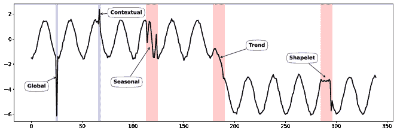

图 1. 从 NeurIPS-TS 数据集 (Lai et al., 2021) 绘制的不同时间异常的概述。全局和上下文异常发生在一个点（蓝色标记），而其他类型，包括季节性、趋势和形状异常，可能发生在一个子序列中（红色标记）。

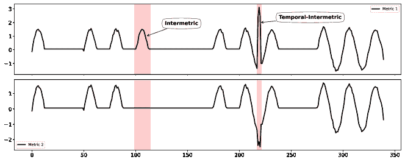

图 2. 多变量时间序列中的度量和时间-度量异常。在此图中，度量 1 是电力消耗，度量 2 是 CPU 使用率。

UTS 和 MTS 中的异常可以被分类为时间型、指标型或时间-指标型异常（Li et al., 2021b）。在时间序列中，时间型异常可以与其邻域（局部）或整个时间序列（全局）进行比较，并且它们根据行为表现出不同的形式（Lai et al., 2021）。在单变量时间序列中常见几种类型的时间型异常，所有这些都显示在图 1 中。时间型异常也可能发生在 MTS 中，并影响多个维度或所有维度。当一个不寻常的行为模式随着时间的推移出现时，可能会出现后续异常；然而，每次观察本身可能不会被认为是异常值。由于点异常，某个时刻会发生意外事件，并且被假定为短序列。不同类型的时间型异常如下：

+   •

    全局异常：它们是时间序列中的尖峰，即与时间序列的其余部分相比，具有极端值的点。例如，客户在一个典型日子里进行的异常大额支付就是一个全局异常。考虑到阈值，它可以用公式 Eq. (3) 描述。

    | (3) |  | $&#124;x_{t}-\hat{x}_{t}&#124;>threshold$ |  |
    | --- | --- | --- | --- |

    其中 $\hat{x}$ 是模型的输出。如果输出值与实际点值之间的差异大于阈值，则会被识别为异常。图 1 左侧显示了一个全局异常的示例，其中 $-6$ 相较于时间序列有很大的偏差。

+   •

    上下文异常：偏离给定上下文的偏差被定义为与相邻时间点的偏差，这里定义为位于某个接近范围内的点。这些类型的异常是顺序数据中的小故障，它们是相邻值的偏差值。一个点在某个上下文中可能是正常的，而在另一个上下文中则可能是异常的。例如，类似于拳击日的大规模互动被认为是正常的，但在其他日子则不然。公式与全局异常相同，但寻找异常的阈值不同。阈值是通过考虑邻域上下文来确定的：

    | (4) |  | $threshold\ \approx\lambda\ *\ var(X_{t-w}:_{t+w})$ |  |
    | --- | --- | --- | --- |

    其中 $X_{t-w}:_{t+w}$ 表示数据点 $x_{t}$ 的上下文，窗口大小为 $w$，$var$ 是数据点上下文的方差，$\lambda$ 是控制阈值的系数。图 1 中的第二个蓝色高亮部分是局部上下文中发生的上下文异常。

+   •

    季节性：尽管时间序列的形状和趋势相似，但其季节性与整体季节性相比是异常的。一个例子是餐馆在一周内的顾客数量。这种序列有明显的每周季节性，因此有必要查找这种季节性的偏差，并单独处理异常时期。

    | (5) |  | $diss_{s}(S,\ \hat{S})>threshold$ |  |
    | --- | --- | --- | --- |

    其中 $diss_{s}$ 是测量两个子序列之间不相似性的函数，$\hat{S}$ 表示期望子序列的季节性。如图 1 中的第一个红色高亮部分所示，季节性异常改变了特定段数据的上升和下降频率。

+   •

    趋势：导致数据的长期均值发生永久性偏移，并在时间序列的趋势中产生过渡的事件。虽然这种异常保持了其周期性和季节性，但会显著改变其斜率。趋势偶尔会改变方向，即可能从上升变为下降，反之亦然。例如，当一首新歌发布时，它会暂时变得流行，然后像图 1 中的那一段一样消失在排行榜上，其中趋势发生了变化，被认为是趋势异常。趋势可能在未来重新启动。

    | (6) |  | $diss_{t}(T,\ \hat{T})>threshold$ |  |
    | --- | --- | --- | --- |

    其中 $\hat{T}$ 是正常趋势。

+   •

    Shapelt：存在一个子序列，其形状或周期与序列的正常形状组件不同。这些波动的原因通常是经济条件的变化，如生产力或商品和服务的总需求与供应。在短期内，这些变化导致了扩张和衰退期。

    | (7) |  | $diss_{c}(C,\ \hat{C})>threshold$ |  |
    | --- | --- | --- | --- |

    其中 $\hat{C}$ 指定了期望子序列的周期或形状。例如，1 中最后的高亮部分显示了由于一些波动而导致的段形状的变化。

在这种背景下，两条时间序列的最佳对齐用于动态时间规整（DTW）（Müller，2007）以确定它们之间的差异，因此，DTW 已被应用于异常检测（Benkabou et al.，2018），（Song et al.，2022）。此外，多维时间序列（MTS）由多个维度（即度量）组成，每个维度描述了复杂实体的不同方面。实体内度量之间的空间依赖性（相关性）也称为度量间依赖性，可以是线性的或非线性的。如果这些相关性被打破，MTS 将表现出广泛的异常行为。一个示例显示在图 2 的左侧，功耗（度量 1）和 CPU 使用率（度量 2）之间的相关性是正的，但在开始后约 100 秒就中断了。这种异常在本研究中被称为度量间异常。

| (8) |  | $diss_{corr}(corr(X^{j},X^{k}),\ corr(X^{j}_{t:t+w},X^{k}_{t:t+w}))>threshold$ |  |
| --- | --- | --- | --- |

其中 $X^{j}$ 和 $X^{k}$ 是 MTS 的两个相关度量，而 $corr$ 测量两个度量之间的相关性。当这种相关性在窗口 $t:t+w$ 中恶化时，表示系数偏离正常系数超过了 $threshold$。

度量间-时间异常更容易从时间或度量的角度检测，因为它们违反了度量间依赖性和时间依赖性，如图 2 的右侧所示。

## 3\. 深度异常检测方法

在具有复杂结构的数据中，深度神经网络是建模依赖关系的强大方法。一些学者已经研究了其在异常检测中的应用，使用了各种深度学习架构，如图 3 所示。

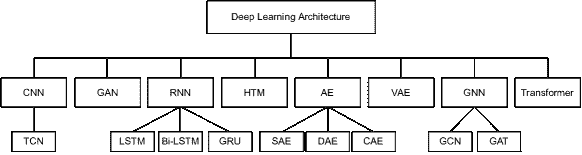

图 3. 用于时间序列异常检测的深度学习架构

### 3.1\. 时间序列异常检测

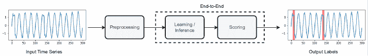

图 4. 时间序列深度异常检测模型的一般组件

图 4 展示了时间序列中深度异常检测模型的概览。在我们的研究中，时间序列异常检测中的深度模型根据其主要方法和架构进行分类。时间序列异常检测文献中有两种主要的方法（图 4 所示）：基于预测的方法和基于重构的方法。基于预测的方法可以训练模型来预测下一个时间戳，而基于重构的方法可以用于捕捉时间序列数据的嵌入。时间序列异常检测中的深度学习架构分类见图 3。

时间序列异常检测模型总结在表 1 和表 2 中，这些表格根据处理的输入维度分类，分别为单变量和多变量时间序列。这些表格概述了模型的以下方面：1) 时间/空间，2) 学习方案，3) 输入，4) 可解释性，5) 点/子序列异常，6) 随机性和 7) 增量。

#### 3.1.1\. 时间/空间

对于单变量时间序列作为输入，模型可以捕捉时间信息（即模式）；而对于多变量时间序列作为输入，模型可以通过时间和空间依赖关系学习正常性。此外，如果模型输入的是一个捕捉了空间依赖关系的多变量时间序列，模型还可以检测到指标间的异常（如图 2 所示）。

#### 3.1.2\. 学习方案

实际应用中，训练数据往往只有很少量的标记异常。因此，大多数模型尝试学习正常数据的表示或特征。根据异常定义，通过寻找与正常数据的偏差来检测异常。最近的深度模型中有四种异常检测学习方案：无监督、监督、半监督和自监督。这些方法基于标记数据点的可用性（或缺乏）。监督方法使用一种明确的方法来学习异常数据和正常数据之间的边界，该方法基于训练集中的所有标签。它可以确定一个适当的阈值，如果分配给这些时间戳的异常分数（第 3.1）超过该阈值，则将所有时间戳分类为异常。这种方法的问题在于它不适用于实际应用，因为异常通常是未知的或标记不准确。相比之下，无监督异常检测方法不使用标签，也不区分训练数据集和测试数据集。这些技术最为灵活，因为它们完全依赖于数据的内在特征。它们在流式应用中非常有用，因为它们不需要标签进行训练和测试。尽管有这些优点，但研究人员在使用无监督方法评估异常检测模型时可能会遇到困难。由于历史数据固有的无标签特性和异常的不可预测性，异常检测问题通常被视为无监督学习问题。在数据集仅包含正常点且没有异常的情况下，可以使用半监督方法。之后，训练一个模型以适应时间序列分布，并将任何偏离此分布的点检测为异常。自监督方法通过充分利用未标记数据本身来训练模型，以预测输入的任何未观察部分（或属性）。这个过程包括两个步骤：首先基于伪标签确定模型的参数，然后通过监督或无监督学习（例如，通过设计预文本任务）来实现实际任务。

#### 3.1.3\. 输入

一个模型可以将单个点（即时间步）或窗口（即包含历史信息的时间步序列）作为输入。窗口可以按照顺序使用，也称为滑动窗口，或者根据应用程序的需要进行打乱而不考虑顺序。为了克服比较子序列而不是点的挑战，许多模型使用子序列（窗口）的表示，而不是原始数据，并使用包含先前时间步历史的滑动窗口，这依赖于时间序列数据中子序列的顺序。滑动窗口提取在预处理阶段执行，其他操作如填补缺失值、数据下采样或上采样以及数据标准化已完成后进行。

#### 3.1.4\. 可解释性

在解释中，给出观察值为何异常的解释。可解释性在将异常检测用作诊断工具时至关重要，因为它有助于故障排除和分析异常。多变量时间序列难以解释，随机深度学习进一步复杂化了这一过程。排除实体异常的典型程序涉及寻找与之前观察行为差异最大的指标。因此，通过分析具有最高异常分数的几个指标，可以解释检测到的实体异常。在缺乏用于评估异常可解释性的标准化指标的情况下，研究中使用了不同的指标。因此，根据推荐系统（Yang et al., 2012）中的 HitRate@K 概念，定义了一个名为 HitRate@P%的修订指标（Su et al., 2019）。在这方面，改编自 HitRate@K 的解释分数（IPS）被概述用于评估段级别的异常解释准确性（Li et al., 2021b）。

#### 3.1.5\. 点/子序列异常

模型可以检测点异常或子序列异常。点异常是指与数据集其他部分相比不寻常的点。子序列异常发生在连续观察具有异常的协作行为时，尽管每个观察本身不一定是离群点。不同类型的异常在第 2.4 节中描述，并在图 1 和图 2 中说明。

#### 3.1.6\. 随机性

如表 1 和 2 所示，我们还研究了异常检测模型的随机性。确定性模型可以准确预测未来事件，而不依赖于随机性。预测确定性事件很简单，因为你手头有所有必要的数据。在这种情况下，模型将为给定的一组输入产生完全相同的结果。随机模型可以处理输入中的不确定性。通过使用随机成分作为输入，你可以考虑一定程度的不可预测性或随机性。

#### 3.1.7\. 增量

增量学习是一种机器学习范式，其中模型的知识会在出现一个或多个新观察时扩展。它指定了一种动态学习策略，可以在训练数据逐渐可用时使用。增量学习的目标是将模型适应新数据，同时保留其过去的知识。

表 1. 时间序列中的单变量深度异常检测模型

| A¹ | MA¹ | 模型 | 监督/无监督² | 输入 | P/S³ |
| --- | --- | --- | --- | --- | --- |
| 预测 | RNN (3.2.1 ‣ 3.2\. 基于预测的模型 ‣ 3\. 深度异常检测方法 ‣ 时间序列异常检测的深度学习：综述")) | LSTM-AD (Malhotra et al., 2015) | 无监督 | P | 点 |
| LSTM RNN (Bontemps et al., 2016) | 半监督 | P | 子序列 |
| 基于 LSTM (Ergen and Kozat, 2019) | 无监督 | W | - |
| TCQSA (Liu et al., 2020) | 监督 | P | - |
| HTM (3.2.4 ‣ 3.2\. 基于预测的模型 ‣ 3\. 深度异常检测方法 ‣ 时间序列异常检测的深度学习：综述")) | Numenta HTM (Ahmad et al., 2017) | 无监督 | - | - |
| 多层 HTM (Wu et al., 2018) | 无监督 | - | - |
| CNN (3.2.2 ‣ 3.2\. 基于预测的模型 ‣ 3\. 深度异常检测方法 ‣ 时间序列异常检测的深度学习：综述")) | SR-CNN (Ren et al., 2019) | 无监督 | W | 点 + 子序列 |
| 重构 | VAE (3.3.2 ‣ 3.3\. 基于重构的模型 ‣ 3\. 深度异常检测方法 ‣ 时间序列异常检测的深度学习：综述")) | Donut (Xu et al., 2018) | 无监督 | W | 子序列 |
| Buzz (Chen et al., 2019) | 无监督 | W | 子序列 |
| Bagel (Li et al., 2018) | 无监督 | W | 子序列 |
| AE (3.3.1 ‣ 3.3\. 基于重建的模型 ‣ 3\. 深度异常检测方法 ‣ 时间序列异常检测的深度学习：综述")) | EncDec-AD (Malhotra 等, 2016) | 半 | W | 点 |

¹ A: 方法, ² Su/Un: 有监督/无监督 — 值: [Su: 有监督, Un: 无监督, 半: 半监督, 自: 自监督], ³ P/S: 点/子序列

表 2. 时间序列中的多变量深度异常检测模型

| A¹ | MA² | 模型 | T/S³ | Su/Un⁴ | 输入 | Int⁵ | P/S⁶ | Stc⁷ | Inc⁸ |
| --- | --- | --- | --- | --- | --- | --- | --- | --- | --- |
| 预测 | RNN (3.2.1 ‣ 3.2\. 基于预测的模型 ‣ 3\. 深度异常检测方法 ‣ 时间序列异常检测的深度学习：综述")) | LSTM-NDT (Hundman 等, 2018) | T | Un | W | ✓ | 子序列 |  |  |
| DeepLSTM (Chauhan 和 Vig, 2015) | T | 半 | P |  | 点 |  |  |
| LSTM-PRED (Goh 等, 2017) | T | Un | W | ✓ | - |  |  |
| LGMAD (Ding 等, 2019) | T | 半 | P |  | 点 |  |  |
| THOC (Shen 等, 2020) | T | 自监督 | W |  | 子序列 |  |  |
| AD-LTI (Wu 等, 2020) | T | Un | P |  | 点 (帧) |  |  |
| CNN (3.2.2 ‣ 3.2\. 基于预测的模型 ‣ 3\. 深度异常检测方法 ‣ 时间序列异常检测的深度学习：综述")) | DeepAnt (Munir 等, 2018) | T | Un | W |  | 点 + 子序列 |  |  |
| TCN-ms (He 和 Zhao, 2019) | T | 半 | W |  | 子序列 |  |  |
| GNN (3.2.3 ‣ 3.2\. 基于预测的模型 ‣ 3\. 深度异常检测方法 ‣ 时间序列异常检测的深度学习：综述")) | GDN (Deng 和 Hooi, 2021) | S | Un | W | ✓ | - |  |  |
| GTA* (Chen 等, 2021a) | ST | 半 | - |  | - |  |  |
| GANF (Dai 和 Chen, 2022) | ST | Un | W |  |  |  |  |
| HTM (3.2.4 ‣ 3.2\. 基于预测的模型 ‣ 3\. 深度异常检测方法 ‣ 时间序列异常检测的深度学习：综述")) | RADM (Ding 等, 2018) | T | Un | W |  | - |  |  |
| Transformer (3.2.5) | SAND (Song 等, 2018) | T | 半 | W |  | - |  |  |
|  | GTA* (Chen 等, 2021a) | ST | 半 | - |  | - |  |  |
| 重建 | AE (3.3.1 ‣ 3.3\. 基于重建的模型 ‣ 3\. 深度异常检测方法 ‣ 时间序列异常检测的深度学习：综述")) | AE/DAE (Sakurada 和 Yairi, 2014) | T | 半 | P |  | 点 |  |  |
| DAGMM (Zong et al., 2018) | S | Un | P |  | 点 | ✓ |  |
| MSCRED (Zhang et al., 2019c) | ST | Un | W | ✓ | 子序列 |  |  |
| USAD (Audibert et al., 2020) | T | Un | W |  | 点 |  |  |
| APAE (Goodge et al., 2020) | T | Un | W |  | - |  |  |
| RANSynCoders (Abdulaal et al., 2021) | ST | Un | P | ✓ | 点 |  | ✓ |
| CAE-Ensemble (Campos et al., 2021) | T | Un | W |  | 子序列 |  |  |
|  | AMSL (Zhang et al., 2022) | T | 自我 | W |  | - |  |  |
| VAE (3.3.2 ‣ 3.3\. Reconstruction-based models ‣ 3\. Deep Anomaly Detection Methods ‣ Deep Learning for Time Series Anomaly Detection: A Survey")) | LSTM-VAE (Park et al., 2018) | T | 半监督 | P |  | - |  |  |
| OmniAnomaly (Su et al., 2019) | T | Un | W | ✓ | 点 + 子序列 | ✓ |  |
| STORN (Sölch et al., 2016) | ST | Un | P |  | 点 |  |  |
| GGM-VAE (Guo et al., 2018) | T | Un | W |  | 子序列 |  |  |
| SISVAE (Li et al., 2020) | T | Un | W |  | 点 |  |  |
| VAE-GAN (Niu et al., 2020) | T | 半监督 | W |  | 点 |  |  |
| VELC (Zhang et al., 2019b) | T | Un | - |  | - |  |  |
| TopoMAD (He et al., 2020) | ST | Un | W |  | 子序列 | ✓ |  |
| PAD (Chen et al., 2021c) | T | Un | W |  | 子序列 |  |  |
| InterFusion (Li et al., 2021b) | ST | Un | W | ✓ | 子序列 |  |  |
| MT-RVAE* (Wang et al., 2022) | ST | Un | W |  | - |  |  |
| RDSMM (Li et al., 2022) | T | Un | W |  | 点 + 子序列 | ✓ |  |
| GAN (3.3.3 ‣ 3.3\. Reconstruction-based models ‣ 3\. Deep Anomaly Detection Methods ‣ Deep Learning for Time Series Anomaly Detection: A Survey")) | MAD-GAN (Li et al., 2019) | ST | Un | W |  | 子序列 |  |  |
| BeatGAN (Zhou et al., 2019) | T | Un | W |  | 子序列 |  |  |
| DAEMON (Chen et al., 2021b) | T | Un | W | ✓ | 子序列 |  |  |
| FGANomaly (Du et al., 2021) | T | Un | W |  | 点 + 子序列 |  |  |
| DCT-GAN* (Li et al., 2021a) | T | Un | W |  | - |  |  |
| Transformer (3.3.4) | Anomaly Transformer (Xu et al., 2021) | T | Un | W |  | 子序列 |  |  |
| TranAD (Tuli et al., 2022) | T | Un | W | ✓ | 子序列 |  |  |
| DCT-GAN* (Li et al., 2021a) | T | Un | W |  | - |  |  |
| MT-RVAE* (Wang et al., 2022) | ST | Un | W |  | - |  |  |
| 混合 | AE (3.4.1 ‣ 3.4\. 混合模型 ‣ 3\. 深度异常检测方法 ‣ 时间序列异常检测的深度学习：综述")) | CAE-M (Zhang et al., 2021) | ST | Un | W |  | 子序列 |  |  |
| NSIBF* (Feng and Tian, 2021) | T | 无监督 | W |  | 子序列 |  |  |
| RNN (3.4.2 ‣ 3.4\. 混合模型 ‣ 3\. 深度异常检测方法 ‣ 时间序列异常检测的深度学习：综述")) | NSIBF* (Feng and Tian, 2021) | T | 无监督 | W |  | 子序列 |  |  |
| TAnoGAN (Bashar and Nayak, 2020) | T | 无监督 | W |  | 子序列 |  |  |
| GNN (3.4.3 ‣ 3.4\. 混合模型 ‣ 3\. 深度异常检测方法 ‣ 时间序列异常检测的深度学习：综述")) | MTAD-GAT (Zhao et al., 2020) | ST | 自监督 | W | ✓ | 子序列 |  |  |
|  | FuSAGNet (Han and Woo, 2022) | ST | 半监督 | W |  | 子序列 |  |  |

¹ A: 方法, ² MA: 主要架构, ³ T/S: 时间/空间 — 值: [S: 空间, T: 时间, ST: 时空], ⁴ Su/Un: 有监督/无监督 — 值: [Su: 有监督, Un: 无监督, Semi: 半监督, Self: 自监督], ⁵ Int: 可解释性, ⁶ P/S: 点/子序列, ⁷ Stc: 随机, ⁸ Inc: 增量, ^∗ 具有多个主要架构的模型。

此外，深度模型以逐步或端到端的方式处理输入（见图 4）。在第一类（逐步）中，有一个学习模块，接着是异常评分模块。在第二类中，可以将这两个模块结合起来，利用神经网络作为端到端过程来学习异常评分。这些模型的输出可以是异常评分或输入的二元标签。与那些目标是改进表示的算法相反，例如 DevNet（Pang et al., 2019），通过利用少量标记异常来检测异常，从而引入了偏差网络，实现端到端学习以优化异常评分。端到端模型的输出是异常子序列/点，如点的标签，而逐步模型的输出是子序列/点的异常评分。请注意，在逐步模型中，这些模型的输出是一个需要后处理的评分，以确定相关输入是否为异常。然后使用不同的方法来根据训练或验证集确定阈值，如非参数动态阈值 (NDT) (Hundman et al., 2018) 和阈值超越 (POT) (Siffer et al., 2017)。

异常分数主要基于定义的损失函数。在大多数基于重建的方法中，使用重建概率，而在基于预测的方法中，使用预测误差来定义异常分数。异常分数指示每个数据点中异常的程度。可以通过根据异常分数（$A_{S}$）对数据实例进行排名，并根据 $threshold$ 值计算决策分数来检测数据异常。

| (9) |  | $&#124;A_{S}&#124;>threshold$ |  |
| --- | --- | --- | --- |

这些论文中用于评估的指标是机器学习中现有的指标，例如 AUC ROC（接收操作特征曲线下面积）、精确度、召回率或 F1 分数。近年来，提出了一种称为点调整（PA）或基于片段的评估的评估技术（Xu et al., 2018），用于评估大多数当前的时间序列异常检测模型，以衡量 F1 分数。该评估技术认为，如果该片段中的单个点被识别为异常，则整个片段都被认为是异常的。Schlegel et al. (2019) 证明现有方法的 F1 分数在 PA 下被大大高估，而在没有 PA 的情况下几乎没有改善。他们提出了一种 PA%K 协议，用于对时间序列异常检测进行严格评估，可以与当前的评估指标一起使用，该协议仅在每单位长度的片段中至少有 K 个正确检测的异常时才使用 PA。使用精确度/召回率对的扩展，Affiliation 指标评估时间序列异常检测任务，以改进经典指标（Huet et al., 2022）。它可以应用于点异常和后续异常。主要区别在于它是非参数的，并且它是局部的，这意味着每个真实事件都被单独分析。因此，局部性使最终得分易于解释和显示为单独的片段。

### 3.2\. 基于预测的模型

基于预测的方法使用已学习的模型根据一个点或最近的窗口预测一个点或子序列。为了确定传入值的异常程度，将预测值与实际值进行比较。它们与实际值的偏差被视为异常值。大多数预测方法使用滑动窗口一次预测一个点。为了识别异常行为，它们使用预测器来建模正常行为。这在实际的异常检测场景中尤其有用，其中正常行为很丰富，但异常行为很少见。

值得一提的是，一些早期的工作（如 Ma 和 Perkins，2003）使用预测误差作为新颖性量化，而不是异常分数。在以下小节中，将解释不同的基于预测的架构。

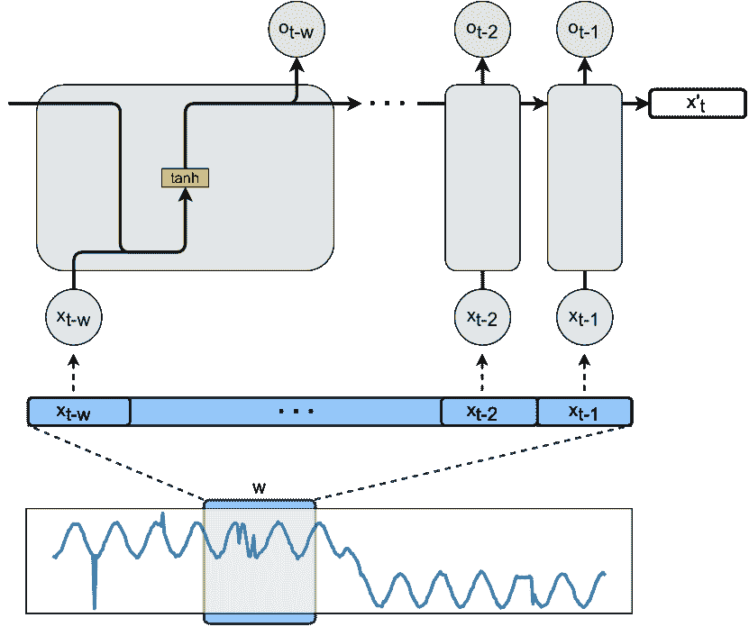

(a) RNN

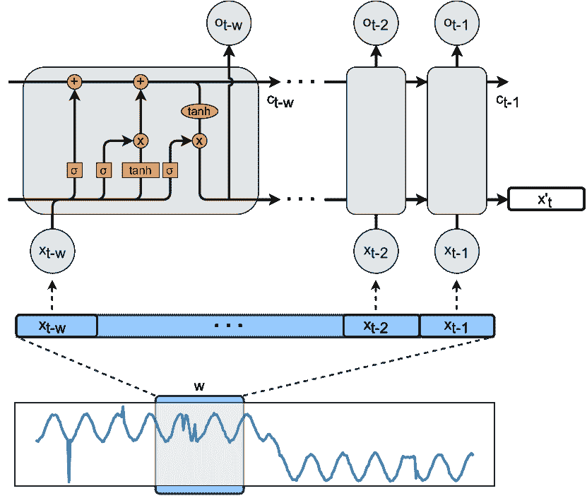

(b) LSTM

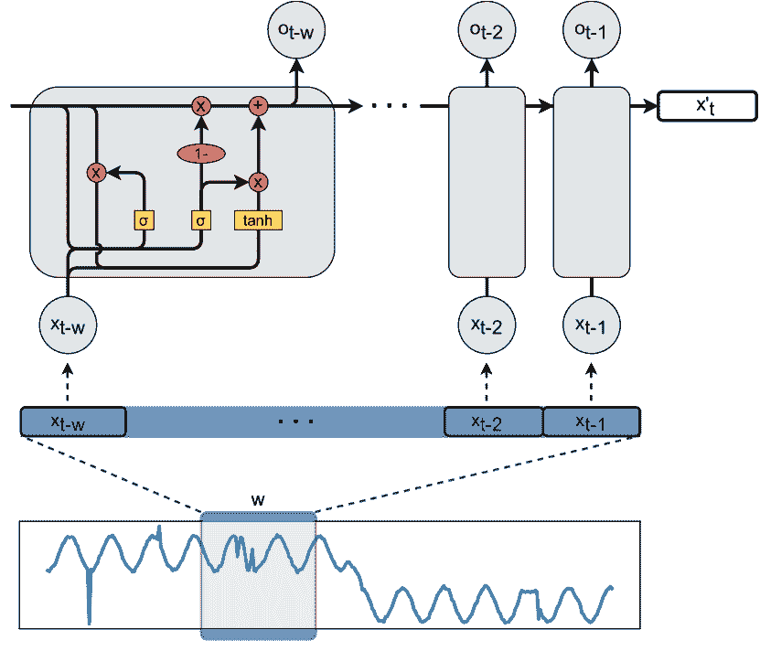

(c) GRU

图 5. （a）递归神经网络（RNN）、（b）长短期记忆单元（LSTM）和（c）门控递归单元（GRU）的概览。这些模型可以通过捕捉时间序列中 $x_{t}$ 之前 $w$ 个样本的时间信息来预测 $x_{t}^{\prime}$。使用误差 $|x_{t}-x_{t}^{\prime}|$，可以计算异常分数。

#### 3.2.1\. 递归神经网络（RNN）

由于 RNN 拥有内部记忆，它们可以处理可变长度的输入序列，并展现时间动态（Tealab, 2018），（Abiodun 等，2018）。简单 RNN 架构的示例如图 5(a)所示。递归单元接受输入窗口 $X_{t-w:t-1}$ 的点，并预测下一个时间戳作为输出 $x^{\prime}_{t}$。输入序列逐步喂入网络。通过使用输入 $x_{t-1}$ 到递归单元 $o_{t-2}$，以及如 $tanh$ 的激活函数，输出向量 $x^{\prime}_{t}$ 使用以下方程计算：

| (10) |  | $\begin{split}x^{\prime}_{t}=\sigma(W_{x^{\prime}}.o_{t-1}+b_{x^{\prime}})\ ,\\ o_{t-1}=\tanh(W_{o}.x_{t-1}+U_{o}.o_{t-2}+b_{h})\end{split}$ |  |
| --- | --- | --- | --- |

其中 $W_{x^{\prime}}$、$W_{o}$、$U_{o}$ 和 $b$ 是网络的参数。递归发生在网络使用之前的输出作为输入，以记住它从之前步骤中学到的内容。这就是网络学习长期和短期依赖关系的地方。

长短期记忆（LSTM）承诺为 RNN 提供持续数千步的记忆（Hochreiter 和 Schmidhuber，1997）。由于 LSTM 单元的 RNN 架构（如图 5 所示），深度神经网络可以实现更优的预测，因为它们融入了长期依赖关系。LSTM 单元主要有四个组件，如图 5(b)所示：细胞、输入门、输出门和遗忘门。在不同时间段内，细胞记住值，而其他门控制信息的流动。内部 LSTM 中的时间戳处理可以通过以下方程解释。首先，遗忘门 $f_{t-1}$ 计算为 sigmoid 函数的输出，具有两个输入 $x_{t-1}$ 和 $o_{t-2}$：

| (11) |  | $f_{t-1}=\sigma(W_{f}.x_{t-1}+U_{f}.o_{t-2})$ |  |
| --- | --- | --- | --- |

输入门 $i_{t-1}$ 和输出门 $s_{t-1}$ 可以表示为：

| (12) |  | $i_{t-1}=\sigma(W_{i}.x_{t-1}+U_{i}.o_{t-2})$ |  |
| --- | --- | --- | --- |
| (13) |  | $s_{t-1}=\sigma(W_{s}.x_{t-1}+U_{s}.o_{t-2})$ |  |

接下来，除了隐藏状态 $o_{t}$，LSTM 还有一个名为 $c_{t-1}$ 的记忆单元。为了从数据中学习并更新 $c_{t-1}$，需要计算包含新候选值的 $\tilde{c_{t-1}}$ 作为 $\tanh$ 函数的输出。之后，将 $\tilde{c_{t}}$ 加到 $c_{t-1}$ 上，以更新记忆单元状态。

| (14) |  | $\begin{split}\tilde{c_{t-1}}=\tanh(W_{c}.x_{t-1}+U_{c}.o_{t-2})\ ,\\ c_{t-1}=i_{t-1}.\tilde{c_{t-1}}+f_{t-1}.c_{t-2}\end{split}$ |  |
| --- | --- | --- | --- |

具体来说，由于 $f_{t-1}$ 是一个 sigmoid 输出，它的值在 $(0,1)$ 之间。当 $f_{t-1}$ 接近零时，$c_{t-2}$ 会被完全抹去，而当它接近一时，$c_{t-2}$ 会被完全保留。因此，$f_{t-1}$ 被称为忘记门。最后，隐藏状态 $o_{t-1}$ 或输出是通过以下公式获得的：

| (15) |  | $o_{t-1}=\tanh(c_{t-1}).s_{t-1}$ |  |
| --- | --- | --- | --- |

其中 $W$s 和 $U$s 是 LSTM 单元的参数。最后，$x^{\prime}_{t}$ 是使用公式 10 计算的。

对 LSTM 的经验表明，在网络中堆叠具有 sigmoid 激活单元的递归隐藏层可以捕捉时间序列的结构，并且相较于其他深度学习架构，它能够处理不同时间尺度的时间序列（Hermans 和 Schrauwen，2013）。LSTM-AD（Malhotra 等，2015）具备长期记忆能力，并且首次将层次递归处理层结合在一起，以检测无标签训练的单变量时间序列中的异常。堆叠递归隐藏层还促进了对高阶时间模式的学习，而不需要先验的持续时间知识。该网络预测若干未来时间步骤，以确保捕捉序列的时间结构。因此，序列中的每一点都有来自过去不同点的多个预测值，从而产生多个误差值。为了评估异常行为的可能性，预测误差被建模为多变量高斯分布。LSTM-AD 通过建模长期和短期时间关系，取得了有前景的结果。LSTM-AD 的结果表明，当无法知道正常行为是否涉及长期依赖时，基于 LSTM 的预测模型比基于 RNN 的模型更为有效。与 LSTM-AD 使用的堆叠 LSTM 相比，Bontemps 等人（2016）使用简单的 LSTM RNN 提出了基于 LSTM RNN 对单变量时间序列预测能力的集体异常检测模型（Hochreiter 和 Schmidhuber，1997）。在第一步中，LSTM RNN 先用正常时间序列进行训练，然后进行预测。当前事件的预测依赖于其当前状态及历史。通过引入循环数组，模型将配置为检测集体异常，这些异常包含子序列的误差。集体异常将通过循环数组中高于阈值的预测误差来识别。

受到 LSTM 模型在 UTS 异常检测中取得的有希望结果的启发，许多方法尝试基于 LSTM 架构检测 MTS 中的异常。在 DeepLSTM（Chauhan 和 Vig，2015）训练中，使用堆叠 LSTM 递归网络对正常时间序列进行训练。之后，使用最大似然估计，将预测误差向量拟合到多变量高斯分布中。然后，将模型应用于预测异常和正常验证数据的混合，并记录相关误差的概率密度函数（PDF）值。这种方法的优点是不需要预处理，并且直接对原始时间序列进行处理。LSTM-PRED（Goh 等，2017）基于三个具有 100 个隐藏单元的 LSTM 堆叠，并使用 100 秒的数据输入序列作为预测模型以学习时间依赖关系。采用累计和（CUMSUM）方法检测异常，而不是为每个传感器计算阈值。CUSUM 计算序列预测的累计和以检测轻微的偏差，从而减少误报。在计算预测值与实际数据之间的正负差异后，从验证数据集中确定上控制限（UCL）和下控制限（LCL），作为边界控制来决定是否发生了异常。此外，该模型还可以定位表现出异常行为的传感器。

在上述三个模型中，LSTM 都被堆叠在一起；然而，LSTM-NDT（Hundman 等人，2018）结合了各种技术。LSTM 和 RNN 通过从 MTS 中提取历史信息，实现了高预测性能。文章中提出了一种非参数、动态和无监督的阈值寻找技术，可以用于评估残差。通过应用这种方法，可以自动为演变数据设置阈值，以解决多样性、不稳定性和噪声问题。（Ding 等人，2019）提出了一种名为 LSTM-BP 的方法，该方法基于 LSTM 并改善了 LSTM 的内部结构，用于检测时间序列异常。本文提出了一种名为 LGMAD 的实时异常检测算法，该算法结合了 LSTM 和高斯混合模型（GMM）用于复杂系统。第一步是使用 LSTM 检测单变量时间序列数据中的异常，然后采用高斯混合模型以提供潜在异常的多维联合检测。此外，为了提高模型性能，引入了健康因子 $\alpha$ 概念来描述系统的健康状态。该模型仅适用于低维应用。对于高维异常检测，所提方法可以通过降维技术（如主成分分析（PCA））来检测异常（Huang 等人，2006），（Papadimitriou 等人，2005）。

Ergen 和 Kozat (2019) 提出了基于 LSTM 的异常检测算法，适用于无监督、半监督和完全监督的框架。为了检测异常，该方法使用由 One Class-SVM (OC-SVM) 和 Support Vector Data Description (SVDD) 算法实现的评分函数。在这个框架中，LSTM 和 OC-SVM（或 SVDD）的架构参数与定义良好的目标函数共同训练，利用两种联合优化方法。基于梯度的联合优化方法使用修订后的 OC-SVM 和 SVDD 公式，展示了它们如何收敛到原始公式。由于基于 LSTM 的结构，该方法能够处理可变长度的数据序列。此外，该模型在不进行预处理的情况下能够有效检测时间序列数据中的异常。而且，由于该方法是通用的，本模型中的 LSTM 架构可以被 GRU（门控循环神经网络）架构所替代（Chung 等人，2014）。

GRU 由 Cho 等人提出（2014），与 LSTM 类似，但采用了更简单的结构，从而减少了计算时间（见图 5(c)）。LSTM 和 GRU 都使用门控架构来控制信息流。然而，GRU 具有门控单元，这些单元在内部膨胀信息流而没有独立的记忆单元，这与 LSTM 不同（Dey 和 Salem，2017）。GRU 没有输出门，而有一个更新门和一个重置门。图 5(c)展示了 GRU 单元，它通过其重置门将新输入与先前的记忆进行整合。更新门定义了保留多少上一个记忆（Gulli 和 Pal，2017）。问题在于 LSTM 和 GRU 在学习多季节时间序列中的复杂季节模式方面有限。随着隐藏层的堆叠和反向传播距离（通过时间）的增加，准确性可能会提高。然而，训练可能会很昂贵。在这方面，建议使用 AD-LTI（Wu 等人，2020）。它是一种预测模型，整合了使用名为 Prophet 的时间序列分解方法的 GRU 网络（Taylor 和 Letham，2018），以便在没有标签的季节性时间序列数据上进行鲁棒学习。通过在运行预测模型之前进行时间序列分解，输入数据的季节性特征被明确地输入到 GRU 网络中。在推断过程中，除了季节性特征（如每周和每日项），时间序列也被提供给模型。此外，由于预测基于可能包含异常点的先前数据，因此可能不可靠。为了估计异常的可能性，提出了一种新的度量标准叫做局部趋势不一致性（LTI）。通过将基于最近时间点的框架所做的预测与其正常的概率进行加权，LTI 克服了历史中可能存在异常框架的问题。

传统的单类分类器针对固定维度的输入数据进行开发，无法适当地捕捉时间序列数据的潜在时间依赖性（Ruff et al., 2018）。最近的模型使用递归网络来解决这一问题。THOC（Shen et al., 2020）代表了一种自监督的时间层次单类网络，由一个多层膨胀 RNN 和一个层次 SVDD（Tax and Duin, 2004）组成。通过膨胀 RNN（Chang et al., 2017）和跳跃连接捕获多尺度时间特征。应用层次聚类机制来合并膨胀 RNN 中间层的输出，而不是仅使用顶层的最低分辨率特征。在每个分辨率下，几个超球体表现出正常行为，这比深层 SVDD 更好地捕捉了现实世界时间序列的复杂性。这使得模型能够端到端训练，异常通过一个分数来检测，该分数衡量当前值与正常行为的超球体表示之间的差异。尽管 RNN 取得了成功，但它们在处理长序列时可能效率较低，因为它们受限于窗口的大小。

#### 3.2.2. 卷积神经网络（CNN）

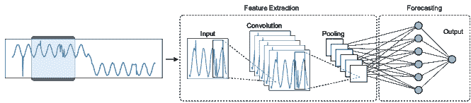

图 6. 卷积神经网络（CNN）的结构，用于基于输入数据窗口预测输入时间序列的下一个值。由于时间序列本质上是时间依赖的，它只能利用之前观察到的输入来预测某一时间步$t$的输出$x^{\prime}_{t}$。

卷积神经网络（CNN）是多层感知器的修改版，以不同的方式进行正则化。数据中的层次模式使得它们能够利用较小且简单的模式构建越来越复杂的模式。CNN 由多个层组成，包括卷积层、池化层和完全连接层，如图 6 所示。卷积层由一组可学习的卷积核组成，这些卷积核扩展到整个输入。通过计算卷积核条目与输入的点积，对输入数据集进行卷积，以生成二维激活图。池化操作对卷积输出进行统计总结。基于 CNN 的 DeepAnt（Munir et al., 2018）模型在训练阶段不需要大量数据，因此效率较高。该模型甚至可以检测时间序列时间模式中的微小偏差，并且能够以无监督方式处理低水平的数据污染（少于 5%）。异常检测模型既可以应用于单变量时间序列，也可以应用于多变量时间序列，能够识别异常点、上下文异常和不一致异常等。

在结构数据分析中，卷积网络已经被证明在提取高层特征方面非常有价值。由于传统 CNN 无法处理像时间序列这样的顺序数据特性，它们通常不用于这种类型的数据，因此，通过开发时间卷积网络 (TCN) (Bai 等人，2018)，利用扩张卷积使其能够适应顺序数据。大多数基于 CNN 的模型使用 TCN 进行时间序列异常检测。实际上，TCN 包含两个原则：它生成与输入长度相同的输出，并且不会将未来的信息用于过去。对于第一个点，TCN 采用 1D 全卷积网络，其隐藏层的大小与输入层相同。第二点也可以通过扩张卷积来实现，其中时间 $t$ 的输出仅与时间 $t$ 及之前的点进行卷积。扩张卷积的输出基于以下方程：

| (16) |  | $x^{\prime}(t)=(x\ast_{l}f)(t)=\ \sum_{i=0}^{\ k-1}f(i).x_{t-l.i}\ $ |  |
| --- | --- | --- | --- |

其中 $f$ 是一个大小为 $k$ 的滤波器，$\ast$ 表示带有扩张因子的卷积 $l$，$x_{t-l.i}$ 提供了过去的信息。

(He 和 Zhao，2019) 使用 TCN，该模型在正常序列上进行训练，能够预测时间趋势。点的异常分数是使用拟合到预测误差的多变量高斯分布计算的。采用跳跃连接来实现对不同尺度模式的多尺度特征混合预测。

Ren 等人 (2019) 将谱残差 (SR) 模型与 CNN (SR-CNN) 结合，以实现卓越的准确性，因为 SR 模型源自视觉显著性检测 (Hou 和 Zhang，2007)。超过 200 支 Microsoft 团队已经使用了这一单变量时间序列异常检测服务，包括 Microsoft Bing、Office 和 Azure。该模型非常快速，每分钟能够检测来自 400 万时间序列的异常。TCN-AE (Thill 等人，2020a) 使用卷积架构结合自动编码器框架。与标准自动编码器不同，它用更强大的 CNN 架构替代了稠密层架构，且在输入尺寸方面也更具灵活性。TCN 自动编码器使用两个时间卷积神经网络 (TCNs) (Bai 等人，2018) 进行编码和解码。此外，编码器中的下采样层和解码器中的上采样层也被使用。

在许多实际应用中，常常生成准周期性时间序列 (QTS)。例如，一些生理信号如心电图 (ECG) 是 QTS。文献 (Liu et al., 2020) 提出了一个自动 QTS 异常检测框架 (AQADF)。它包括一个基于聚类的两级 QTS 分割算法 (TCQSA) 和一个基于注意力的混合 LSTM-CNN 模型 (HALCM)。具体来说，TCQSA 旨在准确并自动地将 QTS 划分为连续的准周期。TCQSA 包括一个两级聚类过程。首先，TCQSA 使用层次聚类技术，自动聚类 QTS 的候选点，无需人工干预，使其具有通用性。这个第二级聚类方法去除 QTS 中由离群值造成的簇，使 TCQSA 对噪声具有抵抗力。HALCM 应用堆叠双向 LSTM (SB-LSTM) 与 CNN (TD-CNN) 的混合，以分别提取 QTS 的整体变化趋势和局部特征。因此，可以更准确地表征 QTS 的波动模式。此外，HALCM 通过三种注意力机制进一步增强。具体来说，TAG 被嵌入到 LSTM 中，以微调从 QTS 的不同部分提取的变化。特征注意力机制 (FAM) 和位置注意力机制 (LAM) 被嵌入到 CNN 中，以增强从 QTS 提取的关键特征的效果。因此，HALCM 可以获得更准确的 QTS 波动模式特征表示。

#### 3.2.3\. 图神经网络 (GNN)

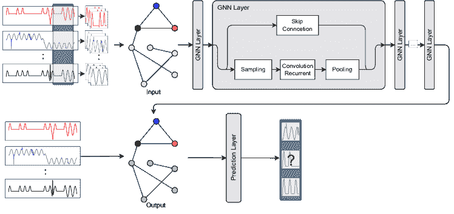

图 7. 图神经网络 (GNN) 的基本结构，用于多变量时间序列异常检测，可以学习指标之间的关系（相关性），并预测时间序列的预期行为。

在过去几年中，研究人员提出从 MTS 中提取空间信息并形成图结构。然后，将时间序列异常检测问题转换为检测给定图结构的时间序列的异常，GNN 被用于建模这些图。GNN 的结构如图 7 ‣ 3.2\. 基于预测的模型 ‣ 3\. 深度异常检测方法 ‣ 时间序列异常检测的深度学习：综述") 所示。在 GNN 中，成对的消息传递是关键方法，使得图节点通过相互交换信息迭代更新其表示。在 MTS 异常检测的模型中，每个维度（指标）表示为图中的一个节点，我们将节点集合表示为 $V={1,\ldots,d}$。$E$ 代表图中的边，指示从 MTS 学到的相关性。对于节点 $u/inV$，消息传递层在迭代 $k+1$ 中输出如下内容：

| (17) |  | $\begin{split}{h}_{u}^{k+1}=UPDATE^{k}(h_{u}^{k},\ m_{N(u)}^{k})\ ,\\ m_{N(u)}^{k}=AGGREGATE^{k}({h}_{i}^{k},\ \forall i\in N(u))\end{split}$ |  |
| --- | --- | --- | --- |

其中 $h_{u}^{k}$ 是对应于每个节点的嵌入，而 $N(u)$ 是节点 $u$ 的邻域集合。

GNNs（图神经网络）学习空间结构的能力增强了对包含相关性的多变量时间序列数据的建模。通常，GNNs 假设每个节点的状态受到其邻居状态的影响（Scarselli 等，**2008**）。已经提出了各种 GNN 架构，实施了不同类型的消息传递。图卷积网络（GCN）（Kipf 和 Welling，**2016**）通过聚合其一步邻居来建模节点的特征表示。图注意网络（GATs）（Veličković 等，**2017**）基于这种方法，但不是对每个邻居使用简单的权重函数，而是使用注意力函数为每个邻居计算不同的权重。

如前所述，将特征之间的关系纳入模型将极为有益。Deng 和 Hooi (2021) 介绍了 GDN，这是一种基于图神经网络注意力机制的模型，通过嵌入向量将单个传感器特性捕捉为节点，并将传感器间的关联（空间信息）作为图中的边，从而学习基于对邻近传感器的注意力函数来预测传感器行为。它能够基于子图、注意力权重以及预测和实际行为的比较来检测和解释偏差，而无需监督。一个称为 GANF（图增强正则化流）的异常检测框架（Dai 和 Chen, 2022）通过图结构学习来增强正则化流。正则化流是一种用于无监督学习数据基础分布的深度生成模型，旨在解决标签稀缺性的问题。由于正则化流提供了对任何实例密度的估计，因此它可以应用于异常往往落在低密度区域的假设。GANF 被表示为贝叶斯网络，用于建模时间序列的条件依赖关系。通过跨时间和空间信息对多个时间序列密度进行因式分解，它通过基于图的依赖编码器学习因式分解后的条件密度。为了确保相应的图是无环的，作者在图邻接矩阵上施加了可微分约束（Yu 等, 2019）。图邻接矩阵和流参数都可以通过联合训练算法进行优化。之后，基于图的依赖解码器用于总结计算序列密度所需的条件信息。通过识别低密度实例来检测异常。由于图结构在分布漂移指示方面的有用性，该模型提供了关于分布如何随时间漂移以及图如何演变的见解。

在总结 GNN 模型之前，我们想强调从时间序列中提取图结构并使用 GNN 进行建模，使得异常检测模型能够学习空间信息随时间变化，这是一项有前景的未来研究方向。

#### 3.2.4\. 层次时间记忆（HTM）

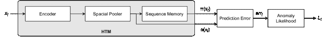

(a) 使用 HTM 的异常检测组件

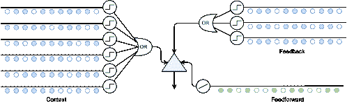

(b) HTM 细胞结构

图 8. (a) 基于层次时间记忆（HTM）的异常检测系统的组件。根据 HTM 系统的输出，它计算预测误差和异常可能性度量。(b) HTM 单元的内部结构。在 HTM 单元中，树突被建模为具有突触的重叠探测器。上下文树突从层中的其他神经元接收侧向输入。如果上下文树突上的侧向活动足够，单元将进入预测状态。

使用层次时间处理进行异常检测的一个显著实例是层次时间记忆（HTM）系统，它试图模拟新皮层中的神经元细胞、区域和层次的层次结构（George，2008）。如图 8(a) 所示，HTM 算法组件的典型示例。输入 $x_{t}$ 被送入编码器，然后经过稀疏空间池化过程（Cui et al., 2017）。因此，$a(x_{t})$ 表示当前输入为稀疏二进制向量。序列记忆形成系统的核心，模型 $a(x_{t})$ 中的时间模式，并以稀疏向量 $\pi(x_{t})$ 的形式返回预测。因此，预测误差可以定义如下：

| (18) |  | $err_{t}=1-\dfrac{\pi(x_{t-1}).a(x_{t})}{\lvert a(x_{t}) \rvert}$ |  |
| --- | --- | --- | --- |

其中 $|a(x_{t})|$ 是 $a(x_{t})$ 中 1 的总数。

基于模型的预测历史和误差分布，异常可能性是一个概率度量指标，用于指示当前状态是否异常，如图 8(a) ‣ 3.2\. 基于预测的模型 ‣ 3\. 深度异常检测方法 ‣ 基于深度学习的时间序列异常检测：综述")所示。在 HTM 序列记忆中，一列 HTM 神经元被排列在一层中（图 8(b) ‣ 3.2\. 基于预测的模型 ‣ 3\. 深度异常检测方法 ‣ 基于深度学习的时间序列异常检测：综述")）。一个层次的层级内可能存在多个区域。在更高的层级中，涉及的区域较少，而在较低层级学习的模式被组合以回忆更复杂的模式。HTM 区域的所有目的相同。感官数据在学习阶段进入较低层级的区域，而较低层级的区域以生成模式输出特定概念的结果模式。在顶层，最一般和持久的概念被存储在一个区域。在推理模式下，一个区域将来自其子区域的信息解读为概率。HTM 不仅对噪声具有鲁棒性，还有很高的容量，能够同时学习多种模式。HTM 区域中的空间模式通过识别和记忆频繁的输入位集合来学习。在接下来的阶段，它识别出时间上可能会连续发生的空间模式序列。

Numenta HTM（Ahmad 等人，2017）利用 HTM 检测单变量时间序列在可预测和噪声域中的时间异常。因此，该系统高效，能够处理极其嘈杂的数据，持续适应数据统计的变化，并且在不产生假阳性的情况下检测到小的异常。Multi-HTM（Wu 等人，2018）是一个随时间学习上下文的学习模型，因此它对噪声具有容忍性。数据模式被持续学习，预测实时进行，因此可以用于自适应模型。它可以解决广泛的异常检测问题，而不仅仅是某些类型。特别地，它被用于单变量问题，并有效地应用于多变量时间序列。RADM（Ding 等人，2018）的目的是提供一个实时无监督异常检测的多变量时间序列框架，该框架将 HTM 与朴素贝叶斯网络（BN）结合起来。最初，HTM 算法用于检测 UTS 中的异常，并在检测和响应时间方面取得了优秀的结果。第二步是将 HTM 算法与 BN 结合，以尽可能有效地检测 MTS 异常，而不会减少维度数量。因此，一些在 UTS 中遗漏的异常可以被检测到，检测准确性得到了提高。BN 被用于精炼新的观察，因为它们在指定后验概率时易于使用且具有适应性。此外，本文定义了一个健康因子 $\alpha$（系统运行状况的度量），以描述系统的健康状况并提高检测效率。

#### 3.2.5. Transformers

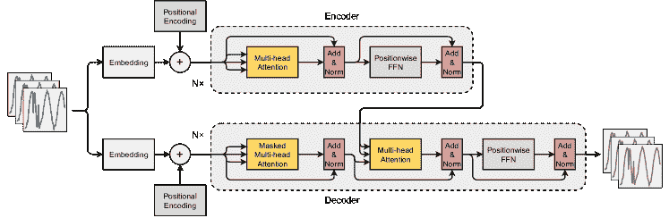

图 9. 用于异常检测的 Transformer 网络结构。Transformer 通过使用编码器-解码器结构模拟神经序列模型。编码器和解码器中都有多个相同的块。每个编码器块由一个多头自注意力模块和一个位置编码前馈网络组成。在解码过程中，交叉注意力模型插入在多头自注意力模块和位置编码前馈网络之间。与递归神经网络不同，Transformer 不包含任何递归或卷积。它不是直接建模序列信息，而是采用添加到输入嵌入中的位置编码。

Transformers（Vaswani 等，2017）是深度学习模型，根据不同部分的重要性对输入数据进行加权。与 RNNs 不同，transformers 同时处理整个数据。由于其完全基于注意力机制的架构，如图 9 所示，它能够捕捉长期依赖关系，同时具有计算效率。近期研究利用它们来检测时间序列异常，因为它们处理文本数据的序列数据用于翻译。

原始的 transformer 架构基于编码器-解码器。transformer 功能的一个重要部分是其多头自注意力机制，如下方方程所述：

| (19) |  | $Q,K,V=softmax({\frac{QK^{\mathrm{T}}}{\sqrt{d_{k}}}})V$ |  |
| --- | --- | --- | --- |

其中$Q$、$K$和$V$定义为矩阵，$d_{k}$用于注意力图的归一化。

在长序列中检测到语义相关性，并从不相关的元素中筛选出重要元素。由于变换器没有递归或卷积，需要指定序列中标记的相对或绝对位置，这称为位置编码。GTA（Chen 等，2021a）极大地受益于变换器的序列建模能力，并采用双向图结构学习多个物联网传感器之间的关系。提出了一种新的影响传播（IP）图卷积，作为传感器之间依赖关系图结构的自动半监督学习策略。作为训练过程的一部分，为了发现隐藏关系，每个节点的邻域场被约束，以进一步提高推断效率。接着，这些节点被输入到图卷积层中进行信息传播建模。下一步，将多尺度扩张卷积和图卷积融合，以提供层次化的时间上下文编码。他们使用基于变换器的架构来建模和预测序列，由于其并行性和捕捉上下文信息的能力。作者还提出了一种减少多头注意力的二次复杂度的替代方法，即使用多分支注意力。在另一项最近的工作中，他们使用仅由注意力机制组成的堆叠编码器-解码器结构的变换器。SAnD（简单注意和诊断）（Song 等，2018）使用注意力模型来建模临床时间序列，消除了递归的需要。该架构利用了自注意力模块，并且邻域内的依赖关系通过多个头部捕捉和设计。此外，使用了位置编码技术和密集插值嵌入技术来表示时间顺序。这也扩展到通过创建多任务变体来处理多重诊断。

### 3.3\. 基于重建的模型

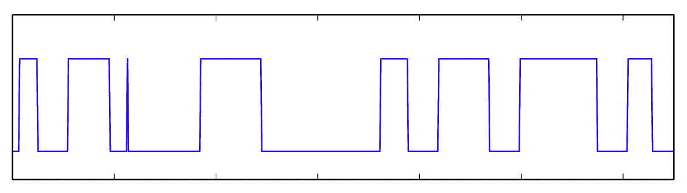

(a) 可预测的

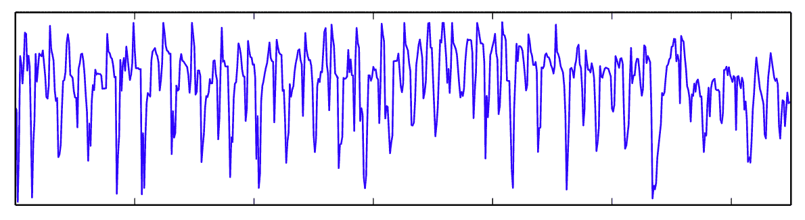

(b) 不可预测的

图 10. 一个时间序列在任何给定时刻可能是未知的，或者像 (b) 一样快速变化，图示传感器读取用于手动控制（Malhotra 等，2016）。这样的时间序列无法提前预测，使得基于预测的异常检测无效。

大多数复杂的时间序列异常检测方法基于对时间序列进行建模以预测未来值和预测误差。即便如此，目前没有一种稳健的基于预测的模型能够为快速且持续变化的时间序列生成准确的模型（见图 10）（Golestani 和 Gras，2014），因为时间序列在任何给定时刻可能未知或可能像图 10-b 那样快速变化。这种时间序列无法提前预测，因此基于预测的异常检测效果不佳。基于预测的模型在时间点数量增加时会显著增加预测误差，如(Malhotra 等，2015)所示。因此，现有模型通常进行非常短期的预测，以便获得可接受的准确度，因为它们无法检测子序列异常。例如，大多数金融时间序列预测只能预测下一步，这在可能发生金融危机时并不有利。为了克服基于预测的模型的这一不足，基于重建的模型可能更有效。

正常行为的模型是通过在潜在空间（低维度）中对正常训练数据的子序列进行编码来构建的。模型输入是滑动窗口（见第三部分），它提供了重建过程的时间上下文。由于模型仅在正常数据上进行训练（半监督），因此在测试阶段无法重建异常子序列。因此，通过重建测试数据中的点/滑动窗口并将其与实际值进行比较来检测异常，这被称为重建误差。在一些模型中，当重建概率低于指定阈值时会触发异常检测，因为异常点/子序列的重建概率较低。

#### 3.3.1\. 自编码器（AE）

自编码器（AE），也称为自关联神经网络（Kramer，1991），已在多变量时间序列（MTS）异常检测中作为一种具有非线性降维能力的神经网络形式进行了广泛研究（Sakurada 和 Yairi，2014），（Zong 等，2018）。最近的深度学习发展强调了使用 AE 进行低维表示（编码）的学习（Hinton 和 Salakhutdinov，2006），（Bhatia 等，2021）。自编码器由两个组件组成（见图 11(a)）：一个将输入转换为编码的编码器和一个从编码中重建输入的解码器。如果自编码器能够准确重建并最小化重建误差，那将是理想的。这种方法可以总结如下：

| (20) |  | $Z_{t-w:t}=Enc(X_{t-w:t},\phi),\hat{X}_{t-w:t}=Dec(Z_{t-w:t},\theta)$ |  |
| --- | --- | --- | --- |

其中 $X_{t-w}$ 是如图 11(a) 所示的滑动窗口，$x_{t}\in R^{d}$。$E$ 是具有 $\phi$ 参数的编码器网络，因此 $Z$ 是 AE 中的瓶颈表示，称为潜在空间。之后，这个编码窗口被输入到具有 $\theta$ 参数的解码器网络 $D$ 中，并给出 $\hat{X}_{t-w}$ 作为 $X$ 的重建。在训练阶段，编码器和解码器参数根据以下内容更新：

| (21) |  | $(\phi^{*},\theta^{*})=arg\ \underset{\phi,\theta}{m}in\ Err(X_{t-w:t},\ Dec(Enc(X_{t-w:t},\ \phi),\ \theta))$ |  |
| --- | --- | --- | --- |

为了捕获更多信息并更好地表示主导信息，提供了各种技术，如稀疏自编码器（SAE）（Ng 等，2011），去噪自编码器（DAE）（Vincent 等，2008），和卷积自编码器（CAE）（Noh 等，2015）。在 AE 基础模型中，窗口的异常分数可以根据重建误差通过以下基本函数定义：

| (22) |  | $AS_{w}=&#124;&#124;X_{t-w:t}\ -Dec(Enc(X_{t-w:t},\ \phi),\ \theta)&#124;&#124;^{2}$ |  |
| --- | --- | --- | --- |

在我们的研究中，这个类别有几篇论文。Sakurada 和 Yairi (2014) 展示了在多时间序列（MTS）中应用自动编码器进行降维作为异常检测的预处理，以及使用自动编码器进行异常检测的机制。该方法通过将每个时间索引处的数据样本视为独立样本，从而忽略了时间序列。尽管自动编码器在没有时间信息的情况下已经表现良好，但通过提供当前和过去的样本可以进一步提升性能。为了澄清自动编码器的特性，他们比较了线性主成分分析（PCA）、去噪自动编码器（DAEs）和核主成分分析（PCA）。结果表明，作者发现自动编码器能够检测线性 PCA 无法检测的异常组件，而且通过包含去噪自动编码器可以增强自动编码器。此外，自动编码器避免了核 PCA 所需的复杂计算，同时不影响质量和检测效果。DAGMM（深度自动编码高斯混合模型）（Zong 等，2018）在端到端框架中使用高斯混合先验来估计 MTS 输入样本的概率。该模型由两个主要组件组成：压缩网络和估计网络。压缩网络通过随机深度自动编码器对输入样本进行降维，基于降维空间和重构误差特征生成低维表示。估计网络通过高斯混合建模在低维表示中计算样本能量（定义见下）。样本能量用于确定重构误差；高样本能量意味着异常程度高。尽管如此，只考虑了空间依赖性，而未包括时间信息。通过端到端训练，估计网络引入了一个正则化项，帮助压缩网络避免局部最优解并产生低重构误差。

EncDec-AD (Malhotra 等人，2016) 模型能够从不可预测的一元时间序列中检测异常，这与许多现有的异常检测模型不同。在这种方法中，通过仅考虑第一个主成分将多变量时间序列简化为一元时间序列。有人声称它可以从长度高达 500 的时间序列中检测异常，这表明 LSTM 编码器-解码器学习了正常行为的鲁棒模型。尽管如此，当需要解码长数据序列时，它仍然面临误差累积的问题。(Kieu 等人，2019) 提出了两种基于稀疏连接递归神经网络的自编码器集成框架。在一个框架中，多个自编码器被独立训练，而另一个框架则通过共享特征空间来实现多个自编码器的同时训练。两个框架都使用多个自编码器的重建误差的中位数来衡量时间序列中异常值的可能性。Audibert 等人 (2020) 提出了用于多变量时间序列的无监督异常检测（USAD），使用对抗训练的自编码器来放大重建误差。无论是训练还是测试的输入都是具有时间顺序的观察序列，以保留这些信息。此外，对抗训练及其架构使系统能够区分异常，同时促进快速学习。Goodge 等人 (2020) 通过检查各种对抗攻击的结果来确定自编码器在异常检测中是否容易受到对抗攻击。提出了近似投影自编码器（APAE），以提高模型在对抗攻击下的性能和鲁棒性。通过对潜在表示进行梯度下降，这种方法产生了更准确的重建，并增加了对对抗威胁的鲁棒性。作为此过程的一部分，特征加权归一化步骤考虑了不同特征之间重建误差的自然变异性。

在 MSCRED（Zhang 等，2019c）中，设计了基于注意力机制的 ConvLSTM 网络来捕捉时间趋势，并使用卷积自编码器对签名矩阵（包含传感器间相关性）进行编码和重构，而不是依赖于时间序列。矩阵的长度为 16，步长间隔为 5。签名矩阵的重构误差可用于计算异常得分。该方法还强调了如何识别根本原因和解释异常持续时间，除了检测异常之外。在 CAE-Ensemble（Campos 等，2021）中，提出了一种卷积序列到序列自编码器，能够捕捉时间依赖性，并具有高训练并行性。除了与卷积层结合的门控线性单元（GLU）之外，还应用了注意力机制来捕捉局部模式，例如识别输入中重复出现的相似子序列，如周期性。由于不同基本模型的输出可以通过集成来提高准确性（Chen 等，2017），因此提出了一种基于 CAE 的多样性驱动的集成方法，并采用参数转移的训练策略，而不是单独训练每个 CAE 模型。为了确保多样性，目标函数还考虑了基本模型之间的差异，而不仅仅是评估它们的准确性。使用集成和参数转移技术可以显著减少训练时间和误差。

RANSysCoders（Abdulaal 等，2021）概述了一种 eBay 使用的实时异常检测方法。作者提出了一种架构，该架构使用多个编码器和解码器，通过随机特征选择来推断和定位异常，并通过多数投票来确定重构的范围。在这方面，RANCoders 是用于特征边界构建的引导自编码器。此外，建议对潜在空间表示进行谱分析（Welch，1967），以提取多变量时间序列的先验信息，从而同步原始序列表示。改进的准确性可以归因于特征同步、引导、自量差损失和异常推断的多数投票。该方法克服了先前工作中的局限性，包括事后阈值识别、时间窗口选择、噪声减少的下采样以及对大特征维度的不一致性能。作者研究了现有广泛使用的评估方法的局限性，如点调整方法，并建议了一种替代方法，以更好地评估异常检测模型在实际中的有效性。

一种新型的自适应记忆网络与自监督学习（AMSL）（Zhang et al., 2022）被提出，以增加无监督异常检测的泛化能力。一个使用卷积的自编码器框架可以实现端到端的训练。AMSL 整合了自监督学习和记忆网络，以克服正常数据有限的挑战。作为第一步，编码器将原始时间序列及其六种变换映射到潜在特征空间。为了学习泛化的特征表示，必须建立一个多类分类器来分类这些特征类型。在这个过程中，特征也被输入到全局和局部记忆网络中，这些网络可以学习通用和特定特征以提高表示能力。最后，自适应融合模块通过融合这些特征来生成新的重建表示。

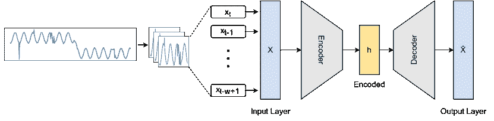

(a) 自编码器

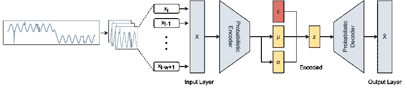

(b) 变分自编码器

图 11. 这是(a)自编码器的基本结构，它将输入窗口压缩为低维表示（$h$），然后从该表示重建输出$\hat{X}$。以及(b)变分自编码器，它接收大小为$w$的输入窗口。通过压缩，编码器创建潜在分布。使用从参数化分布中采样的数据作为输入，解码器输出$\hat{X}$，尽可能接近$X$。

#### 3.3.2\. 变分自编码器 (VAE)

图 11(b) ‣ 3.3\. 基于重建的模型 ‣ 3\. 深度异常检测方法 ‣ 时间序列异常检测的深度学习：一项综述") 显示了变分自编码器 (VAE) 的典型配置，它是一个有向概率图模型，将神经网络自编码器与均值场变分贝叶斯 (Kingma 和 Welling, 2013) 结合起来。VAE 的工作原理类似于自编码器，但它不是将输入编码为单点，而是通过推断网络 $q_{\phi}(Z_{t-w+1:t}|X_{t-w+1:t})$ 将其编码为分布，其中 $\phi$ 是其参数。它将 $d$ 维输入 $X_{t-w+1:t}$ 表示为维度更低的潜在表示 $Z_{t-w+1:t}$，其中 $k<d$。一个采样层从潜在分布中取样，并将其传递给生成网络 $p_{\theta}(X_{t-w+1:t}|Z_{t-w+1:t})$，其参数为 $\theta$，输出为 $g(Z_{t-w+1:t})$，即输入的重建。损失函数有两个组成部分，如方程 (23 ‣ 3.3\. 基于重建的模型 ‣ 3\. 深度异常检测方法 ‣ 时间序列异常检测的深度学习：一项综述")) 中所述，在 VAE 中最小化：一个重建误差，旨在改善编码和解码过程，以及一个正则化因子，旨在通过使编码器的分布尽可能接近首选分布来正则化潜在空间。

| (23) |  | $loss=&#124;&#124;X_{t-w+1:t}-g(Z_{t-w+1:t})&#124;&#124;^{2}+KL(N(\mu_{x},\sigma_{x}),\ N(0,1))$ |  |
| --- | --- | --- | --- |

其中，$KL$ 是 Kullback–Leibler 散度。通过使用正则化训练，它避免了过拟合，并确保潜在空间适合生成过程。

LSTM-VAE（Park et al., 2018）代表了一种基于 LSTM 的变分自编码器，它采用变分推断进行重建。在原始的 VAE 中，FFN 被 LSTM 替代，并使用去噪自编码方法进行训练，以提高表示能力。该模型在给定数据点的对数似然低于阈值时会检测到异常。阈值是动态的、基于状态的，表示随着任务的估计状态而变化的阈值，以减少虚假警报。Xu et al.（2018）发现，对于 VAE 异常检测来说，必须对正常和异常数据进行训练。提出的模型称为 Donut，是一种基于 VAE（一个具有代表性的深度生成模型）的无监督异常检测方法，该模型从随机打乱的训练数据中进行训练。Donut 算法中的三个步骤，即修改的 ELBO（证据下界）、训练中的缺失数据注入和 MCMC（马尔可夫链蒙特卡罗）插补（Rezende et al., 2014）用于检测，使其在检测季节性关键绩效指标（KPI）异常时远远超越其他方法。由于 VAE 的非序列化特性以及数据以滑动窗口格式输入而未考虑其关系，Donut 无法处理时间序列异常。后来，Bagel（Li et al., 2018）作为一种无监督和鲁棒的算法被提出，用于处理时间序列异常。Bagel 没有使用 Donut 中的 VAE，而是采用了条件变分自编码器（CVAE）（Lavin and Ahmad, 2015），（Laxhammar et al., 2009），并考虑了时间信息。VAE 建模了两个随机变量$x$和$z$之间的关系。CVAE 建模了在条件$y$下$x$和$z$之间的关系，即它建模了$p(x,z|y)$。

STORNs（Sölch 等，2016），或称为随机递归网络，被用来通过变分推断（VI）学习高维时间序列数据的概率生成模型。该算法灵活且通用，应用于空间和时间结构化的时间序列时无需任何领域知识。事实上，OmniAnomaly（Su 等，2019）是一个变分自编码器（VAE），其中使用随机递归神经网络来学习多变量数据的稳健表示，并且使用平面归一化流（Rezende 和 Mohamed，2015）来描述潜在空间的非高斯分布。该方法基于重建概率计算异常检测，并根据每个特征的重建概率量化其可解释性。它实现了 POT 方法以找到异常阈值。InterFusion（Li 等，2021b）建议使用具有两个随机潜变量的分层变分自编码器（HVAE）来学习互量度和时间表示；并依赖于辅助的“重建输入”进行双视图嵌入，该输入在度量和时间方面压缩多时间序列（MTS）。为了防止在训练数据中出现过拟合异常，InterFusion 采用了预过滤策略，通过重建过程消除时间异常，以学习准确的互量度表示。本文提出了 MCMC 插补多变量时间序列用于异常解释，并引入了 IPS，一个用于评估异常解释结果的分段度量。

在这一领域中，关于嘈杂时间序列数据异常检测的研究不多。为了捕捉具有非高斯噪声和复杂数据分布的单变量 KPI 中的复杂模式，Buzz（Chen 等，2019）提出了一种基于分区分析的对抗训练方法。该模型提出了一种基于 Wasserstein 距离的主要训练目标形式，并描述了它如何转变为贝叶斯模型。这是一种将贝叶斯网络与最优传输理论连接起来的创新方法。对抗训练计算每个分区上的分布距离，全球距离是所有分区上的分布距离的期望值。SISVAE（平滑引导的序列 VAE）（Li 等，2020）通过在训练深度生成模型之前进行平滑来检测点级异常。这样，它既受益于经典优化模型的效率，又能够通过深度生成模型建模不确定性。在此模型中，均值和方差对于每个时间戳独立参数化，这提供了根据噪声估计动态调整的阈值。考虑到时间序列可能随时间变化，这一特性至关重要。许多研究已经使用 VAE 进行异常检测，假设生成过程中使用单峰高斯分布作为先验。由于时间序列数据的内在多模态分布，现有研究无法学习数据的复杂分布。这一挑战通过（Guo 等，2018）提出的无监督 GRU-based Gaussian Mixture VAE 得到解决。利用 GRU 单元，可以发现时间序列之间的相关性。随后，多模态数据的潜在空间由高斯混合表示。通过优化变分下界，VAE 推断潜在嵌入和重构概率。

在（张等，2019b）中，提出了一种带有两个附加模块的 VAE：Re-Encoder 和 Latent Constraint 网络（VELC）。在 VAE 架构中增加了一个再编码器，以获得新的潜在向量。通过采用这种更复杂的架构，可以在原始和潜在空间中最大化异常分数（重构误差），从而准确建模正常样本。此外，VELC 应用于潜在空间，使得模型不会重构未经训练的异常观测值。因此，它生成类似于训练数据的新潜在变量，有助于区分正常数据和异常数据。VAE 和 LSTM 被集成在 PAD（Chen et al., 2021c）中作为一个组件，以支持无监督异常检测和鲁棒预测。VAE 显著减少了噪声对预测单元的影响。至于 LSTM，它们帮助 VAE 维护窗口外的长期序列。此外，光谱残差（SR）（Hou 和 Zhang，2007）被输入到管道中以增强性能。在每个子序列中，SR 为状态分配一个权重，以显示正常程度。

一种 TopoMAD（拓扑感知多变量时间序列异常检测器）（He et al., 2020）结合了 GNN、LSTM 和 VAE，以在云系统中通过时空学习检测无监督异常。TopoMAD 是一个随机 seq2seq 模型，整合了云系统中的拓扑信息，生成基于图的异常表示。因此，两个代表性的图神经网络（GCN 和 GAT）被替换为 LSTM 单元的基本层，以捕捉拓扑的空间依赖关系。研究部分标记的信息已变得更为重要，以便检测异常（Kingma et al., 2014）。在半监督 VAE-GAN（Niu et al., 2020）模型中，LSTM 被作为层并入 VAE，以捕捉长期模式。一个编码器、一个生成器和一个鉴别器同时训练，从而利用编码器的映射和鉴别器的能力。此外，通过结合 VAE 重构差异与鉴别器结果，可以更好地区分正常数据中的异常。

最近，开发了一种强健的深度状态空间模型（RDSSM）（Li 等，2022），这是一个基于无监督密度重构的模型，用于检测多变量时间序列中的异常。该模型与大多数现有异常检测方法的不同之处在于，它在训练过程中使用的是被异常污染的原始数据，而不是假设数据没有异常。该模型有两个过渡模块，以考虑时间依赖性和不确定性。为了处理由于异常引起的变化，发射模型采用了重尾分布误差缓冲组件，这为受污染和未标记的训练数据提供了强健的训练。通过使用上述生成模型，他们设计了一种处理随时间波动的噪声的检测方法。与现有方法相比，该模型能够为概率检测分配自适应异常评分。

在（Wang 等，2022）中，提出了一种变分变换器作为多变量时间序列数据无监督异常检测的技术。该模型通过自注意力提取相关性，而不是构建特征关系图来捕捉相关信息。由于多变量时间序列的维度降低和序列之间的稀疏相关性，模型的性能得到了提升。变换器的位置编码，也称为模型中的全局时间编码，将时间序列和周期性数据结合起来，以捕捉长期依赖性。多尺度特征融合使模型能够通过整合来自多个时间尺度的特征信息获得更强健的特征表达。通过其残差变分自编码器模块，该模型使用强健的局部特征对隐藏空间进行规则编码。由于模块的残差结构，KL 散度得到缓解，模型生成的下限得到改进。

#### 3.3.3\. 生成对抗网络（GAN）

生成对抗网络（GAN）是一种基于博弈论（Goodfellow 等，2014），（Goodfellow 等，2014）设计的生成建模的人工智能算法。在生成模型中，会探索训练样本，并学习生成这些样本的概率分布。通过这种方式，生成对抗网络可以基于估计的分布生成更多示例，如图 12 ‣ 3.3\. Reconstruction-based models ‣ 3\. Deep Anomaly Detection Methods ‣ Deep Learning for Time Series Anomaly Detection: A Survey")所示。假设我们将生成器命名为$G$，将判别器命名为$D$。为了训练生成器和判别器，使用以下极小极大博弈：

| (24) |  | $\underset{G}{m}in\ \underset{D}{m}ax\ V(D,G)=\mathbb{E}_{x\sim p(X)}[log\ D(X_{t-w+1:t})]+\mathbb{E}_{z\sim p(Z)}[log(1-D(Z_{t-w+1:t}))]$ |  |
| --- | --- | --- | --- |

其中，$p(x)$ 是输入数据的概率分布，$X_{t-w+1:t}$ 是训练集中的滑动窗口，如图 12 ‣ 3.3\. Reconstruction-based models ‣ 3\. Deep Anomaly Detection Methods ‣ Deep Learning for Time Series Anomaly Detection: A Survey") 所示，称为实际输入。同时，$p(z)$ 是生成变量的先验概率分布，$Z_{t-w+1:t}$ 是从随机空间中取出的具有相同窗口大小的生成输入窗口。

尽管 GAN 已经应用于各种目的（主要是在研究中），由于依赖于博弈论，这与大多数生成建模方法不同，因此它们仍然面临独特的挑战和研究机会。通常，基于 GAN 的模型考虑到对抗学习使得判别器对当前数据集之外的数据更为敏感，这使得对这些数据的重建更具挑战性。BeatGAN（Zhou 等，2019）能够通过利用自编码器和 GAN（Goodfellow 等，2014）的组合来稳健地正则化其重建，尤其是在标签不可用的情况下。此外，使用时间序列扭曲方法通过在训练数据集中加速训练来提高检测准确性，并使 BeatGAN 在时间序列数据中的时间扭曲变异性方面具有鲁棒性。研究表明，BeatGAN 可以在 ECG 和传感器数据中准确检测异常。

然而，GAN 的训练通常很困难，需要仔细平衡判别器和生成器（Kodali et al., 2017）。基于对抗训练的系统不适合在线使用，因为其不稳定性和收敛困难。使用对抗自编码异常检测解释（DAEMON）（Chen et al., 2021b），通过对抗生成的时间序列来检测异常。DAEMON 自编码器的训练包括三个部分：首先通过一维 CNN 对多变量时间序列进行编码。一个先验分布被应用于潜在向量，而不是直接解码隐藏变量，并使用对抗策略将隐藏变量的后验分布拟合到先验分布。这是因为如果模型之前没有观察到相同的模式，直接解码潜在向量并使用重建误差将无法准确重建时间序列。随后，通过解码器生成重建的时间序列。另一种对抗训练过程并行使用，以减少原始值和重建值之间的差异。它通过计算每个指标的重建误差来确定根本原因，并根据一个新的指标——重建折扣累计增益（RDCG@P%），选择具有最高重建误差的前 k 个指标，RDCG@P%利用了归一化折扣累计增益（NDCG）。NDCG 是与网络搜索引擎算法或相关应用相关的排名质量度量。

MAD-GAN（基于 GAN 的多变量异常检测）（Li et al., 2019）是一个基于通用对抗网络（GAN）的模型。它通过 LSTM-RNN 捕捉时间序列分布之间的时间关系，LSTM-RNN 作为 GAN 中的生成器和判别器，考虑所有数据以同时捕捉它们之间的潜在交互。为了检测异常，使用了重建误差和判别损失。FGANomaly（Du et al., 2021）（Filter GAN）通过在训练前使用伪标签筛选可能的异常样本，从而减少了传统 AE-based 和 GAN-based 异常检测模型中的过拟合问题，结果是更准确地捕捉正常分布。生成器还有一个目标称为自适应权重损失，它根据训练过程中的重建误差动态分配权重。通过使用这个训练目标，模型可以更多地关注合理的正常数据，从而缓解过拟合。

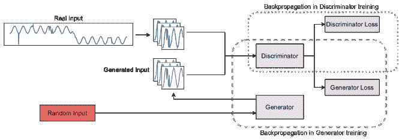

图 12. 生成对抗网络（GAN）的概述，主要由两个组件组成：生成器和鉴别器。生成器构建与鉴别器输入直接连接的时间序列假输入窗口。鉴别器通过使用生成的实例作为负训练样本来学习区分真实时间序列和假窗口。可以通过将训练好的鉴别器和生成器结合起来计算综合异常分数。

#### 3.3.4\. 变换器

**异常变换器**（Xu et al., 2021）提出了一种带有注意力机制的模型，通过同时建模每个时间戳的先前关联和系列关联来捕捉关联差异，使得稀有异常更容易区分。在这个视角下，异常与整个系列的联系更困难，而正常状态与相邻时间戳的联系更容易。先前的关联使用高斯核来估计相邻集中 inductive bias，而系列关联则使用从原始数据中学习到的自注意力权重。除了重建损失外，还设计了一种**MINIMAX**方法，以提高正常-异常的关联差异的识别度。**TranAD**（Tuli et al., 2022）是另一种基于变换器的异常检测模型，具有自条件和对抗训练。由于其架构的原因，它在处理大量输入时效率高，同时保持稳定性。当偏差过小时，即数据接近正常，基于变换器的编码-解码网络可能无法检测到异常。可以通过在**TranAD**中放大重建误差的对抗训练策略来克服这一问题。此外，自条件用于强健的多模态特征检索，可以实现训练稳定性并促进泛化。

Li et al. (2021a) 提出了一种名为**膨胀卷积变换器 GAN**（**DCT-GAN**）的无监督方法。在这项研究中，他们使用变换器处理时间序列数据，使用基于 GAN 的模型来重建样本并检测异常，并使用膨胀 CNN 结构从潜在空间中提取时间信息。它结合了几个具有不同尺度的变换器生成器，在基于 GAN 的框架内获得粗粒度和细粒度的信息，以提高其泛化能力。该模型通过权重机制来整合生成器，使其兼容不同类型的异常。此外，**MT-RVAE**（Wang et al., 2022）显著受益于变换器的序列建模和 VAE 能力，这些能力在这两种架构中都有体现。

### 3.4\. 混合模型

这些模型将基于预测的模型与基于重建的模型相结合，以获得更好的时间序列表示。根据第 3.2 节和第 3.3 节，基于预测的模型使用下一个时间戳的预测，而基于重建的模型使用整个时间序列的潜在表示。可以通过使用联合目标函数来同时优化这两种模型。

#### 3.4.1\. 自编码器 (AE)

通过捕捉多传感器时间序列中的时空相关性，CAE-M（深度卷积自编码记忆网络）（Zhang 等，2021）可以通过同时进行重建和预测来基于规范化数据建模广义模式。我们首先构建一个带有最大均值差异 (MMD) 惩罚的深度卷积自编码器，以在低维空间中逼近一些目标分布，并减少由于噪声和异常值引起的过拟合可能性。为了更好地表示时间依赖性，采用了具有注意力机制的非线性双向 LSTM 和线性自回归模型。神经系统识别和贝叶斯过滤 (NSIBF)（Feng 和 Tian，2021）是一种新型的基于密度的时间序列异常检测框架，用于网络物理安全 (CPS)。使用状态空间模型实现的端到端训练的神经网络，递归地跟踪隐藏状态的随时间变化的不确定性，以捕捉 CPS 动态。在检测阶段，贝叶斯过滤会自动应用于“识别”后的状态空间模型，以筛选隐藏状态并估计观测值的可能性。由于神经网络的表达能力与贝叶斯滤波器跟踪不确定性的能力相结合，NSIBF 可以高精度地检测复杂 CPS 中的噪声传感器数据的异常。

#### 3.4.2\. 循环神经网络 (RNN)

通过 TAnoGan（Bashar 和 Nayak，2020），他们开发了一种能够在提供有限数量示例的情况下检测时间序列异常的方法。TAnoGan 已使用 46 个 NAB 时间序列数据集进行了评估，涵盖了各种主题。实验表明，当面临时间序列数据的对抗训练时，基于 LSTM 的 GANs 可以优于其他基于 LSTM 的 GANs。

#### 3.4.3\. 图神经网络 (GNN)

在 (Zhao et al., 2020) 中，提出了两个并行的图注意力 (GAT) 层，用于自监督多变量时间序列异常检测，这将提取不同时间序列之间的相关性（指标间依赖）并学习时间戳之间的关系（时间依赖）。该模型通过定义一个综合目标，结合了预测模型和重建模型。预测模型仅预测一个点，而重建模型学习整个时间序列的潜在表示。该模型可以诊断异常时间序列（可解释性）。融合稀疏自编码器和图神经网络（FuSAGNet）（Han 和 Woo, 2022）是一个融合了 SAE 重建和 GNN 预测的框架，用于发现多变量数据中的复杂异常类型。FuSAGNet 融合了 GDN（Deng 和 Hooi, 2021），但在每个过程中嵌入传感器，然后使用递归单元捕获时间依赖性。通过学习递归传感器嵌入和输入的稀疏潜在表示，GNN 在测试时预测预期行为。

## 4\. 数据集

表 3. 主要用于时间序列异常检测的公共数据集和基准。第一列中有直接的超链接到它们的名称。

| 数据集/基准 | 实际/合成 | MTS/UTS¹ | # 样本² | # 实体³ | # 维度⁴ | 领域 |
| --- | --- | --- | --- | --- | --- | --- |
| [CalIt2](https://archive.ics.uci.edu/ml/datasets/CalIt2+Building+People+Counts) (Dua and Graff, 2017) | 实际 | MTS | 10,080 | 2 | 2 | 城市事件管理 |
| [CAP](https://physionet.org/content/capslpdb/1.0.0/) (Terzano et al., 2001) (Goldberger et al., 2000) | 实际 | MTS | 921,700,000 | 108 | 21 | 医疗与健康 |
| [CICIDS2017](https://www.unb.ca/cic/datasets/ids-2017.html) (Sharafaldin et al., 2018) | 实际 | MTS | 2,830,540 | 15 | 83 | 服务器监控 |
| [信用卡欺诈检测](https://www.openml.org/search?type=data&sort=runs&id=1597&status=active) (Dal Pozzolo et al., 2015) | 实际 | MTS | 284,807 | 1 | 31 | 欺诈检测 |
| [DMDS](https://iair.mchtr.pw.edu.pl/Damadics) (Warszawska, 2020) | 实际 | MTS | 725,402 | 1 | 32 | 工业控制系统 |
| [引擎数据集](https://www.cs.ucr.edu/%C2%A0eamonn/time_series_data_2018/) (Dau et al., 2018) | 实际 | MTS | 无 | 无 | 12 | 工业控制系统 |
| [Exathlon](https://github.com/exathlonbenchmark/exathlon) (Jacob et al., 2020) | 实际 | MTS | 47,530 | 39 | 45 | 服务器监控 |
| [GECCO IoT](https://zenodo.org/record/3884398#.Y1NlUtJByRQ) (Moritz et al., 2018) | 实际 | MTS | 139,566 | 1 | 9 | 物联网 (IoT) |
| [Genesis](https://www.kaggle.com/inIT-OWL/genesis-demonstrator-data-for-machine-learning) (von Birgelen and Niggemann, 2018) | 实际 | MTS | 16,220 | 1 | 18 | 工业控制系统 |
| [GHL](https://kas.pr/ics-research/dataset_ghl_1) (Filonov et al., 2016) | 合成 | MTS | 200,001 | 48 | 22 | 工业控制系统 |
| [IOnsphere](https://search.r-project.org/CRAN/refmans/fdm2id/html/ionosphere.html) (Dua and Graff, 2017) | 实际 | MTS | 351 |  | 32 | 天文学研究 |
| [KDDCUP99](https://kdd.ics.uci.edu/databases/kddcup99/kddcup99.html) (Discovery and Competition, 1999) | 实际 | MTS | 4,898,427 | 5 | 41 | 计算机网络 |
| [Kitsune](https://archive.ics.uci.edu/ml/datasets/Kitsune+Network+Attack+Dataset) (Dua and Graff, 2017) | 实际 | MTS | 3,018,973 | 9 | 115 | 计算机网络 |
| [MBD](https://github.com/QAZASDEDC/TopoMAD) (He et al., 2020) | 实际 | MTS | 8,640 | 5 | 26 | 服务器监控 |
| [Metro](https://archive.ics.uci.edu/ml/datasets/Metro+Interstate+Traffic+Volume) (Dua and Graff, 2017) | 实际 | MTS | 48,204 | 1 | 5 | 城市事件管理 |
| [MIT-BIH Arrhythmia (ECG)](https://physionet.org/content/mitdb/1.0.0/) (Moody and Mark, 2001) (Goldberger et al., 2000) | 实际 | MTS | 28,600,000 | 48 | 2 | 医疗健康 |
| [MIT-BIH-SVDB](https://doi.org/10.13026/C2V30W) (Greenwald et al., 1990) (Goldberger et al., 2000) | 实际 | MTS | 17,971,200 | 78 | 2 | 医疗健康 |
| [MMS](https://github.com/QAZASDEDC/TopoMAD) (He et al., 2020) | 实际 | MTS | 4,370 | 50 | 7 | 服务器监控 |
| [MSL](https://github.com/khundman/telemanom) (Hundman et al., 2018) | 实际 | MTS | 132,046 | 27 | 55 | 航空航天 |
| [NAB-realAdExchange](https://github.com/numenta/NAB) (Ahmad et al., 2017) | 实际 | MTS | 9,616 | 3 | 2 | 商业 |
| [NAB-realAWSCloudwatch](https://github.com/numenta/NAB) (Ahmad et al., 2017) | 实际 | MTS | 67,644 | 1 | 17 | 服务器监控 |
| [NASA Shuttle Valve Data](https://cs.fit.edu/%C2%A0pkc/nasa/data/) (Ferrell and Santuro, 2005) | 实际 | MTS | 49,097 | 1 | 9 | 航空航天 |
| [OPPORTUNITY](https://archive.ics.uci.edu/ml/datasets/URL+Reputation) (Dua and Graff, 2017) | 实际 | MTS | 869,376 | 24 | 133 | 计算机网络 |
| [Pooled Server Metrics (PSM)](https://github.com/eBay/RANSynCoders) (Abdulaal et al., 2021) | 实际 | MTS | 132,480 | 1 | 24 | 服务器监控 |
| [PUMP](https://www.kaggle.com/datasets/nphantawee/pump-sensor-data) (sensor data, 2018) | 实际 | MTS | 220,302 | 1 | 44 | 工业控制系统 |
| [SMAP](https://github.com/khundman/telemanom) (Hundman et al., 2018) | 实际 | MTS | 562,800 | 55 | 25 | 环境管理 |
| [SMD](https://github.com/NetManAIOps/OmniAnomaly/) (Li et al., 2018) | 真实 | 多变量 | 1,416,825 | 28 | 38 | 服务器监控 |
| [SWAN-SF](https://dataverse.harvard.edu/dataset.xhtml?persistentId=doi:10.7910/DVN/EBCFKM) (Angryk et al., 2020) | 真实 | 多变量 | 355,330 | 5 | 51 | 天文研究 |
| [SWaT](http://itrust.sutd.edu.sg/research/testbeds/secure-water-treatment-swat/) (Mathur and Tippenhauer, 2016) | 真实 | 多变量 | 946,719 | 1 | 51 | 工业控制系统 |
| [WADI](https://itrust.sutd.edu.sg/testbeds/water-distribution-wadi/) (Ahmed et al., 2017) | 真实 | 多变量 | 957,372 | 1 | 127 | 工业控制系统 |
| [NYC Bike](https://ride.citibikenyc.com/system-data) (Lyft, 2022) | 真实 | 多变量/单变量 | +25M | NA | NA | 城市事件管理 |
| [NYC Taxi](https://www1.nyc.gov/site/tlc/about/tlc-trip-record-data.page) (Taxi and Commission, 2022) | 真实 | 多变量/单变量 | +200M | NA | NA | 城市事件管理 |
| [UCR](https://www.cs.ucr.edu/%C2%A0eamonn/time_series_data_2018/) (Dau et al., 2018) | 真实/合成 | 多变量/单变量 | NA | NA | NA | 多领域 |
| [Dodgers Loop Sensor Dataset](https://archive.ics.uci.edu/ml/datasets/dodgers+loop+sensor) (Dua and Graff, 2017) | 真实 | 单变量 | 50,400 | 1 | 1 | 城市事件管理 |
| [KPI AIOPS](https://competition.aiops-challenge.com/home/competition/1484452272200032281) (Challenges, 2018) | 真实 | 单变量 | 5,922,913 | 58 | 1 | 商业 |
| [MGAB](https://github.com/MarkusThill/MGAB/.) (Thill et al., 2020b) | 合成 | 单变量 | 100,000 | 10 | 1 | 医疗与健康 |
| [MIT-BIH-LTDB](https://doi.org/10.13026/C2KS3F) (Goldberger et al., 2000) | 真实 | 单变量 | 67,944,954 | 7 | 1 | 医疗与健康 |
| [NAB-artificialNoAnomaly](https://github.com/numenta/NAB) (Ahmad et al., 2017) | 合成 | 单变量 | 20,165 | 5 | 1 | - |
| [NAB-artificialWithAnomaly](https://github.com/numenta/NAB) (Ahmad et al., 2017) | 合成 | 单变量 | 24,192 | 6 | 1 | - |
| [NAB-realKnownCause](https://github.com/numenta/NAB) (Ahmad et al., 2017) | 真实 | 单变量 | 69,568 | 7 | 1 | 多领域 |
| [NAB-realTraffic](https://github.com/numenta/NAB) (Ahmad et al., 2017) | 真实 | 单变量 | 15,662 | 7 | 1 | 城市事件管理 |
| [NAB-realTweets](https://github.com/numenta/NAB) (Ahmad et al., 2017) | 真实 | 单变量 | 158,511 | 10 | 1 | 商业 |
| [NeurIPS-TS](https://github.com/datamllab/tods/tree/benchmark/benchmark/synthetic) (Lai et al., 2021) | 合成 | 单变量 | NA | 1 | 1 | - |
| [NormA](https://helios2.mi.parisdescartes.fr/%C2%A0themisp/norma/) (Boniol et al., 2021) | 真实/合成 | 单变量 | 1,756,524 | 21 | 1 | 多领域 |
| [Power Demand Dataset](https://www.cs.ucr.edu/%C2%A0eamonn/time_series_data_2018/) (Dau et al., 2018) | 真实 | UTS | 35,040 | 1 | 1 | 工业控制系统 |
| [SensoreScope](https://doi.org/10.5281/zenodo.2654726) (Barrenetxea, 2019) | 真实 | UTS | 621,874 | 23 | 1 | 物联网 (IoT) |
| [Space Shuttle Dataset](https://www.cs.ucr.edu/%C2%A0eamonn/time_series_data_2018/) (Dau et al., 2018) | 真实 | UTS | 15,000 | 15 | 1 | 航空航天 |
| [Yahoo](https://webscope.sandbox.yahoo.com/catalog.php?datatype=s&did=70&guccounter=1) (Inc., 2021) | 真实/合成 | UTS | 572,966 | 367 | 1 | 多领域 |

¹ MTS/UTS: 多变量/单变量, ² $\#$ samples: 样本总数, ³ $\#$ Entities: 不同时间序列的数量, ⁴ $\#$ Dim: MTS 中的指标数量

本节总结了用于时间序列异常检测的数据集和基准，提供了丰富的资源供时间序列异常检测研究人员使用。其中一些数据集是用于异常检测的单一目的数据集，而一些是通用的时间序列数据集，我们可以在异常检测模型评估中使用这些数据集，但需要做一些假设或定制。我们可以根据多个方面及其自然特征来描述每个数据集或基准。这里我们收集了 48 个经典和/或高度引用的数据集，这些数据集已被经典和先进的深度模型用于时间序列异常检测。这些数据集根据以下属性进行描述：

+   •

    数据生成的性质，可以是真实的、合成的或两者的组合。

+   •

    实体数量，即每个数据集中独立时间序列的数量。

+   •

    每个数据集或基准的类型，可以是多变量、单变量或两者的组合。

+   •

    维度数量，即数据集中每个实体的特征数。

+   •

    数据集中所有实体的样本总数。

+   •

    数据集的应用领域。

注意，某些数据集已经由其作者和贡献者偶尔或定期更新。我们考虑并报告了数据集及其属性的最新更新情况。表 3 显示了所有 48 个数据集及其所有提及的属性。它还包括下载数据集最新版本的主要来源的超链接。

关于这些数据集的更多详细信息可以在此 GitHub 仓库找到：[`github.com/zamanzadeh/ts-anomaly-benchmark`](https://github.com/zamanzadeh/ts-anomaly-benchmark)。

## 5\. 深度异常检测在时间序列中的应用领域

一个应用程序通常通过一系列生成过程生成数据，这些数据进一步反映系统操作或提供关于实体的观察信息。生成过程中的异常行为结果就是一个异常。换句话说，异常通常揭示了生成数据所使用的系统和实体的异常特征。通过识别这些不寻常的特征，我们可以从不同的应用中获得有用的见解。以下深度模型根据它们所使用的应用进行分类。

### 5.1\. 物联网（IoT）

作为智能世界的一部分，物联网（IoT）在监控电厂中使用的各种工业设备和处理紧急情况方面发挥着越来越重要的作用（Qiu 等， 2017）。分析数据异常可以识别需要人工关注的环境情况，揭示清洗传感器数据时的异常值，或通过预过滤不需要的数据部分来节省计算资源。温室（Lee 等， 2018）在大规模物联网时间序列上应用了多步预测的 LSTM。一个半监督的层次堆叠 TCN 被提出于 (Cheng 等， 2019)，其目标是检测智能家居通信中的异常。由于使用了离线学习，这些方法对输入分布的变化不具备抗干扰能力。

在工业物联网（IIoT）中，生成了大量的数据，这些数据对监控底层设备的状态和提升操作性能非常有价值。一个基于 LSTM 的模型在 (Zhang 等， 2018) 中被提出，用于分析和预测 IIoT 设备的传感器数据，以捕捉围绕故障的时间跨度。(Kim 等， 2018) 使用真实工业 IIoT 时间序列，如制造 CNC 和 UCI 时间序列，进行无监督异常检测，采用在边缘计算环境中部署的压缩卷积变分自编码器（SCVAE）。

### 5.2\. 服务器机器监控与维护

云系统推动了 IT 行业内微服务架构的发展。这种架构具有许多优势，包括独立部署、快速交付和灵活扩展（Dragoni 等，2017）。在这种架构中，服务失败可能会引发一系列故障，负面影响客户体验和公司的收入。因此，事件发生后需要尽快进行故障排除。为此，持续监控在线系统的任何异常是至关重要的。SLA-VAE（Huang 等，2022）使用半监督 VAE 来识别多变量时间序列中的异常，以增强鲁棒性。通过主动学习，设计了一个可以基于小样本的高不确定数据在线学习和更新检测模型的框架。实验使用了来自两种不同类型游戏业务的云服务器数据。对于每个云服务器，采用了 11 个监控指标，例如 CPU 使用率、CPU 负载、磁盘使用率和内存使用率。

在物联网（IoT）中，无线传感器网络（WSNs）发挥着关键作用。在这种情况下，检测异常至关重要，因为它可以揭示设备故障和之前未知的事件。（Luo 和 Nagarajan，2018）介绍了一种基于 AE 的模型来解决 WSNs 中的异常检测问题。该算法旨在在传感器本地检测异常，而无需与其他传感器或云进行通信。它通过一个真实的 WSN 室内测试床进行评估，该测试床由 8 个传感器组成，收集了 4 个月的合成异常数据。

### 5.3\. 计算机网络

计算机网络系统的入侵检测正成为今天网络管理员最关键的任务之一。由于计算机网络中托管的宝贵资源，它对组织、政府和社会具有重要作用。传统的滥用检测策略无法检测新型和未知的入侵类型。相反，网络安全中的异常检测旨在区分非法或恶意事件与网络系统的正常行为。异常检测可以用来建立正常网络行为，并检测那些显著偏离正常模型的新模式。目前大多数关于异常检测的研究都基于对正常和异常行为的学习。

内容分发网络（CDNs）为网站和云服务提供了增强的用户体验和更短的响应时间。为了管理服务质量，CDN 运营商测量和收集关键绩效指标（KPI），如流量量、缓存命中率和服务器响应时间，以检查和诊断系统功能。SDFVAE（静态和动态因子化 VAE）（Dai et al., 2021）是一种抗噪声异常检测模型，通过明确地将 KPI 分解为对应于动态和静态特征的两部分来学习 KPI 的潜在表示。

保护公司计算机网络的一个重要部分是使用网络入侵检测系统（NIDS）来检测不同的安全漏洞。现代网络的可行性和可持续性面临着对人类交互增加和检测准确性下降的挑战。NIDS 可以监控和分析网络流量，并在检测到入侵时发出警报。在（Javaid et al., 2016）中，他们使用深度学习技术从未标记的网络流量数据中获得高质量的特征表示。这些特征随后被应用于基于一个小而标记的数据集的正常与异常流量记录的监督分类。在这个模型中，NIDS 是通过采用自我学习，一种基于稀疏自编码和 soft-max 回归的深度学习技术开发的。它依赖于 KDD Cup 99 数据集（Tavallaee et al., 2009），该数据集源自网络流量，包括正常流量和攻击流量，如 DoS、探测和 User-to-Root（U2R）以及 Root-to-Local（R2L）。此外，（Alrawashdeh 和 Purdy, 2016）中使用了限制玻尔兹曼机（RBM）和深度信念网络用于 KDD Cup 99 中的攻击（异常）检测。S-NDAE（Shone et al., 2018）以无监督方式训练，从数据集中提取重要特征。本研究中描述了利用非对称深度自编码器（NDAEs）进行无监督特征学习。此外，还介绍了一种通过堆叠 NDAEs 构建的深度学习分类模型，并通过如 KDD Cup 99 等数据集进行了评估。

随着移动数据流量的迅猛增长以及连接设备和应用程序数量的增加，建立一个能够有效预测和检测异常的网络管理系统变得必要。衡量这些网络中的延迟的一种方式是探测器与监控无线可用性的中央服务器之间的往返延迟（RTT）。RCAD（Ahmed et al., 2022）提出了一种分布式架构，用于无监督检测 RTT 异常，特别是 RTT 的增加。它使用层次时间记忆（HTM）算法来构建预测模型。

### 5.4\. 城市事件管理

交通异常，如交通事故和意外人群聚集，如果未能及时处理，可能会危害公共安全。及早检测交通异常有利于提升市民的生活质量和城市规划。然而，交通异常检测面临两个主要挑战。首先，由于交通数据的复杂时空特征，建模交通动态具有挑战性。其次，交通异常的标准可能因地点和时间而异。张等人（2019a）提出了一种时空分解框架，用于检测城市异常。空间和时间特征通过图嵌入算法获得，以适应不同地点和时间。一个三层神经网络，具有完全连接的核心，聚合了空间和时间特征，并以半监督的方式估计城市行为的正常成分。

（邓等人，2022）提出了一种基于时空图卷积对抗网络（STGAN）的交通异常检测模型，包含一个时空生成器和一个时空判别器，用于评估输入序列是否真实。时空生成器可用于捕捉交通数据的时空依赖关系。该模型有三个独立的模块：趋势、外部和最近。在趋势模块中，LSTM 被用来学习长期时间特征。外部模块以外部特征作为输入，并被构建为一个完全连接层。由于邻近数据之间强烈的空间和时间相关性，生成器和判别器的基本组件是最近模块，并利用图卷积门控递归单元（GCGRU）帮助它们学习短期时空特征。三个模块的输出通过图卷积网络（GCN）层结合，以获得最终的预测结果。开发了一种位置感知和时间感知的异常评分。

为了有效建模动态多变量数据，CHAT（黄等人，2021b）被设计出来。在 CHAT 中，作者基于层次注意力网络建模城市异常预测问题。实际上，他们的架构结合了双向递归层（BiLSTM）和时间注意力机制，以捕捉与预测未来异常相关的异常信息。此外，他们设计了一个交互注意力机制，用于学习区域、异常类别和子序列之间的互动。Uber 使用端到端神经网络架构进行不确定性估计（Zhu 和 Laptev，2017）。为了提高异常检测的准确性，提出的不确定性估计用于衡量特殊事件（如节假日）的不确定性。当不确定性信息被纳入异常检测模型时，在高不确定性事件期间，假阳性减少，从而提高了准确性。

智能交通系统中最具挑战性的任务之一是预测交通速度。使用导航系统在旅行前预测城市地区的交通情况，可以帮助驾驶员避免潜在的拥堵并减少旅行时间。GTransformer（Lu et al., 2022）的目标是研究如何将图神经网络（GNNs）与注意机制结合以提高交通预测的准确性。此外，TH-GAT（Huang et al., 2021a）是一种专门为此目的设计的时间层次图注意网络。一般来说，这一概念涉及将原始道路网络与可以建模层次区域结构的区域增强网络结合。

### 5.5\. 天文学研究

随着天文学观察和数据处理技术的进步，生成的数据量呈指数级增长。通过对恒星图像进行一系列处理步骤，可以生成“光变曲线”。研究光变曲线有助于天文学，它是检测异常天文事件的一种新方法（Li et al., 2001）。在（Zhang 和 Zou，2018）中，提出了一种用于预测光变曲线的 LSTM 神经网络。

### 5.6\. 航空航天

由于航天器的复杂性和成本，飞行过程中未能检测到危险可能导致严重甚至灾难性的破坏。在这种情况下，存在一个异常检测系统是至关重要的，以便在没有足够措施的情况下提醒操作工程师。在（Meng et al., 2019）中，提出了一种基于变换器的模型，该模型具有两个新颖的组件，即并发更新时间戳的注意机制和提前检测异常的掩码策略。测试在 NASA 的遥测数据集上进行。

监测和诊断液体火箭发动机（LREs）的健康状况是航天器和车辆安全的最重要问题，特别是在载人发射的情况下。发动机的故障将直接导致航天发射的失败，从而造成不可挽回的损失。为了实现对大型设备如 LREs 和多源数据的可靠和自动异常检测，Feng 等人（2022）建议使用一种多模态无监督方法来处理缺失源的数据。在由多个深度自编码器（AE）和一个跳跃连接的自编码器组成的统一框架中，所提出的方法集成了内部模态融合、跨模态融合和决策融合。

### 5.7\. 自然灾害检测

实时检测地震需要一个高密度网络，以充分利用廉价传感器。在过去的几年里，低成本加速度传感器已经被广泛用于地震检测。为了准确实时检测地震波形，必须开发一种检测算法，该算法能够分析并区分地震波形与非地震波形。因此，Petrol 等（Perol 等，2018）提出了用于检测地震的卷积神经网络（CNN），并从由两处本地站点记录的现有地震信号中定位地震。通过深度 CNN，Phasenet（Zhu 和 Beroza，2019）能够确定档案中地震波的到达时间。在 CrowdQuake（Huang 等，2020）中，提出了一种卷积-RNN（CRNN）模型作为核心检测算法。这种方法依赖于分布在大面积范围内的数百到数千个低成本加速度传感器，以实时检测地震。此外，过去的加速度数据可以存储在数据库中并进行事后分析，以识别可能被实时检测遗漏的地震。在此模型中，异常传感器可以定期被识别，可能会影响地震事件。

地震预测在很大程度上依赖于地震前兆数据。与地震前兆相关的异常可以分为两大类：趋势变化和高频突变。当趋势没有遵循其正常的周期性演变时，称为趋势变化。高频干扰指的是观察中出现的突然变化，这些变化发生频率高、幅度大，且通常表现出不规则的模式。Cai 等（2019）通过采用 LSTM 单元开发了一种用于正常数据的预测模型。此外，预测误差被用于判断行为是正常还是异常。LSTM 网络的进一步优势包括能够在不进行复杂预处理的情况下直接检测地震前兆数据。

### 5.8\. 医疗与健康

随着电子健康记录的广泛采用，对能够有效处理临床时间序列数据的预测模型的重视也在增加。随着医疗技术的持续改进，越来越多的主动性方法被采纳，以在生病之前预测和缓解风险，从而进一步提升已经可靠的医疗系统。这些方法旨在分析生理时间序列，识别潜在的疾病风险，并确定应采取的缓解措施。（王等，2016）使用了几个卷积层从输入中提取有用特征，然后将这些特征输入到多变量高斯分布中以检测异常。

心电图（ECG）信号常用于评估心脏健康，所得时间序列信号由医疗专业人员手动分析以检测任何发生的心律失常。像心脏这样的复杂器官可能引起多种不同的心律失常。因此，采用异常检测方法来分析 ECG 信号是非常有益的，这些方法在（Kieu et al., 2019）、（Zhou et al., 2019）和（Chauhan and Vig, 2015）中有所发展。

心血管疾病（CVDs）是全球主要的死亡原因。检测异常心率可以帮助医生发现患者的 CVDs。使用 CNN，Rubin et al.（2017）开发了一个基于深度学习的异常心跳自动识别系统。与其他流行的深度模型如 CNN 相比，RNN 在捕捉心跳序列的时间特征方面更为有效。使用心音图信号进行异常心跳检测的研究见于（Rubin et al., 2017）。研究表明，即使在噪声存在的情况下，RNN 也能产生有希望的结果。此外，Latif et al.（2018）由于 RNN 在嘈杂环境中建模顺序和时间数据的能力，使用 RNN 自动检测异常心跳。（Chen et al., 2020b）提出了一种使用经典回声状态网络（ESN）（Jaeger, 2007）训练的模型，应用于不平衡的单变量心率数据集，该模型代表了两种经典的储层计算模型之一，其中回馈神经网络作为储层。

一种基于 TCN、Gaussian 混合模型和贝叶斯推断的癫痫检测框架，称为 TCN-GMM（Liu et al., 2019），使用 TCN 从 EEG 时间序列中提取特征。在这项研究中，未发生癫痫的 EEG 时间序列数据集被视为正常样本，而发生癫痫的数据集被视为异常样本。如果疾病能早期发现，则可以更有效地治疗阿尔茨海默病。一个 2D-CNN 随机化集成模型在（Lopez-Martin et al., 2020）中提出，该模型利用磁脑电图（MEG）同步测量来检测早期阿尔茨海默病症状。所提出的检测模型是一个二分类器（疾病/非疾病），用于 MEG 活动的时间序列。

### 5.9\. 能量

不可避免的是，净化和精炼过程会影响各种石油产品。针对这一点，（Filonov 等，2016）采用基于 LSTM 的方法来监控和检测包含来自气油厂加热回路（GHL）传感器和控制系统信号的多变量工业时间序列中的故障。该提议的网络架构使用了两个堆叠的 LSTM 层以及一个线性输出层。LSTM 被用于基于时间信息执行序列到序列的预测。同样地，根据 Wen 和 Keyes (2019)，使用 CNN 来检测时间序列异常，利用迁移学习框架解决数据稀疏问题。结果在 GHL 数据集（Filonov 等，2016）上展示，该数据集包含关于公用系统网络攻击的数据。

公用事业公司使用相量测量单元（PMU）进行电力系统监控，增加了网络攻击的潜在风险。在 (Basumallik 等，2019) 中，检测到 PMU 数据包生成的多变量时间序列数据中的异常，这些数据包对应于不同事件，如线路故障、跳闸、发电和负荷状态估计周期前的状态。基于 CNN 的过滤器可以通过在状态估计前去除虚假数据来提供额外的安全层。因此，它可以帮助操作员识别有针对性的网络攻击，并做出更好的决策以确保电网可靠性。

对建筑物中的能源管理可以提高能源效率，延长设备使用寿命，同时减少能源消耗和运营成本。Fan 等 (2018) 提出了基于自编码器的集成方法，用于分析建筑中的能源时间序列和检测意外消耗模式及过度浪费。其在建筑冷却负荷和制冷机组电力消耗上的应用已被测试。

### 5.10\. 工业控制系统

系统调用可以通过定期调度的任务生成，这些任务是某个过程的事件的结果，有时，它们是由事件触发的中断引起的。此外，如果过程是事件驱动的，它可能具有快慢不同的特征，使得建模其正常行为变得困难。类似地，在建模实时过程时，时间戳属性是建模响应时间和执行时间约束的最佳方式。由于一些过程是时间驱动的、事件驱动的或两者兼具，使用系统调用信息构建特征文件是困难的。

THREAT（Ezeme 等，2020）通过系统属性和系统调用提供了对系统过程异常检测的深入洞察。内核级别的异常检测为更复杂的机器对机器交互提供了新的见解。这是通过从系统调用中提取有用特征来实现的，从而扩大了检测异常的范围。随后，开发了一种 MIMO（多输入多输出）架构，以扩展模型的范围，并应对更深层次抽象带来的更高威胁范围。在这项研究中，基于 MIMO 的模型和扩展的特征集不仅有助于增加异常检测的范围，还帮助理解一种异常类型如何影响另一个旨在检测不同类型异常的模型的输出。

基于 GAN 的异常检测和定位框架（Choi 等，2020）提出了一种称为距离图像的变换方法，用于多变量时间序列。多变量时间序列可以被转化为二维图像，以利用编码器和解码器。生成器可以学习距离图像之间的映射，从而通过卷积滤波器分析时间序列数据的时间关联性以及多变量之间的相关性。逐点卷积编码器确保每个时间序列的时间信息被编码，同时变量之间的相互关联也得到编码。此外，残差二维图像可以用于图像中的异常定位。

Hsieh 等（2019）实现了一种基于 LSTM 的自编码器，用于检测生产设备组件中出现的多变量流的异常。在这种技术中，LSTM 网络用于编码和解码实际值，并评估重建值与实际值之间的偏差。使用 CNN 处理来自半导体制造过程的多变量时间序列是（Kim 等，2019）中模型的基础。此外，（Hsu 和 Liu，2021）提出了一种 MTS-CNN，用于检测异常晶圆并提供有用的信息以进行半导体生产中的根本原因分析。生成多种不同长度的滑动窗口以提高多样性，并通过堆叠卷积-池化层学习设备传感器的关键特征。

### 5.11\. 机器人技术

在现代制造业中，工业机器人发挥着越来越突出的作用，因为它们提高了生产力和质量。随着生产线越来越依赖于机器人，任何机器人出现故障都可能导致严重的情况，而有些故障则难以识别。因此，必须对工业机器人进行维护，以确保其高性能。为了在机器人完全停止工作之前检测到初期故障，需要一种实时方法，通过收集机器人时间序列来持续跟踪机器人。提出了一种滑动窗口卷积变分自编码器（SWCVAE），用于以无监督的方式在空间和时间上检测多变量时间序列中的异常（Chen et al., 2020a）。

许多残疾人需要护理人员提供身体上的帮助，尽管有些人工护理可以被机器人替代。机器人可以帮助完成日常生活活动，例如喂食和剃须。此外，缺乏故障检测系统可能会导致机器人使用量减少，因为它们可能出现故障的成本。通过检测和停止异常任务执行，可以预防或减少潜在的危险。在 LSTM-VAE 中的分析（Park et al., 2018）涉及了来自 24 个个体的 1,555 次机器人喂食执行，包括 12 种异常类型。STORNs Sölch et al. (2016) 是一个基于 VAE 的模型，记录了 Rethink Robotics Baxter 机器人手臂七个关节的联合配置用于训练和测试。目标分布包括在拾取和放置任务中以 15 Hz 收集的 1000 个无异常样本。300 个样本通过随机击打命令手动击打机器人以进行测试。

### 5.12\. 环境管理

在海洋工程中，结构和系统设计在海洋或海洋附近，例如离岸平台、码头和港口、海洋波浪能转换以及水下生命支持系统。在设计和选址阶段，需要分析长期的历史海洋观测数据，并且需要实时监测周围的海洋环境。海洋观测系统（OOS）通过使用在恶劣条件下工作的传感器和设备来提供海洋数据，例如高湿度、盐雾和振动。为了防止因机器故障或自然灾害造成重大损失，有必要尽早检测 OOS 异常。OceanWNN 模型（Wang et al., 2019）利用一种新颖的 WNN（小波神经网络）方法来检测海洋固定点观测时间序列中的异常，而无需任何标记的训练数据。该模型可以实时工作，使用两种检测新未知异常的方法（观测和预测）。该方法的验证由中国国家海洋试验场进行。

废水处理厂（WWTPs）在保护环境中发挥着关键作用。由于其高能耗，这些工厂需要优化操作以最大化效率和最小化能耗。因此，早期故障检测和管理发挥着至关重要的作用。基于 LSTM 的方法被(Mamandipoor 等，2020)用于监控过程并检测集体故障，优于早期方法。此外，能源管理系统必须持续管理气体储存和运输，以减少费用并保护环境。(Song 和 Li，2021)使用基于端到端 CNN 的模型在管道中实现内部流噪声泄漏检测器。

## 6\. 讨论与结论

本节的目的是检查我们在第 2.4 节中描述的几种时间序列异常检测的主要挑战。与大多数常规模式任务不同，异常检测专注于少数、不可预测和不寻常的事件，这带来了许多挑战。以下是使用深度学习模型检测时间序列数据中异常需要克服的一些挑战：

+   •

    现实世界中的系统行为高度动态，并且依赖于当时的环境。因此，由于时间序列数据的非平稳性及数据分布的变化，处理时间序列数据面临挑战。这意味着深度学习模型可以实时检测异常。

+   •

    多变量时间序列数据中的异常检测呈现出特殊挑战，因为这需要同时考虑时间依赖性和指标之间的关系。

+   •

    在缺乏标记异常的情况下，需要使用无监督或半监督的方法。因此，大量正常实例被错误地识别为异常。因此，关键挑战之一是找到一种机制，以最小化假阳性并提高检测的召回率。这被视为未能检测到异常所带来的相当大的成本。

+   •

    时间序列数据集的噪声水平可能存在显著差异，而噪声实例通常是不规则分布的。因此，模型容易受到噪声的影响，输入数据中的噪声严重影响了模型的性能。

+   •

    在将异常检测用作诊断工具的场景中，需要一定程度的可解释性。即便如此，异常检测研究主要集中在检测精度上，未能解决可解释性的问题。

+   •

    除了在文献中很少涉及外，周期性发生的异常使得检测更加具有挑战性。周期子序列异常是指在时间上重复的子序列（Rasheed 和 Alhajj，2013）。与点异常检测相比，周期子序列异常检测技术可以在欺诈检测等领域中适应，用于识别随时间变化的周期性异常交易。

+   •

    有许多领域中正常行为和异常行为之间的界限并不明确，并且不断发展。基于传统学习和深度学习的算法都面临由于界限缺失而带来的挑战。

+   •

    随着序列长度的增加，学习时间序列数据的正常模式和检测异常变得更加复杂。

本研究的主要目标是探索和识别用于时间序列异常检测、工业应用和数据集的最新深度学习模型。在这方面，探讨了关于时间序列特征、时间序列中的异常类型以及时间序列异常检测深度学习模型结构的各种观点。在这些观点的基础上，全面讨论并分类了 56 个近期的深度模型。此外，讨论了跨多个领域的时间序列深度异常检测应用以及在这一研究领域中常用的数据集。未来，需要在时间序列深度异常检测方面进行积极的研究工作，以克服我们在本调查中讨论的挑战。

## 参考文献

+   (1)

+   Abdulaal et al. (2021) Ahmed Abdulaal, Zhuanghua Liu, 和 Tomer Lancewicki. 2021. 实用方法用于异步多变量时间序列异常检测与定位。在 *ACM SIGKDD 知识发现与数据挖掘大会* 中，第 2485–2494 页。

+   Abiodun et al. (2018) Oludare Isaac Abiodun, Aman Jantan, Abiodun Esther Omolara, Kemi Victoria Dada, Nachaat AbdElatif Mohamed, 和 Humaira Arshad. 2018. 人工神经网络应用的最新进展：调查。*Heliyon* 4, 11 (2018)，e00938。

+   Aggarwal (2007) Charu C Aggarwal. 2007. *数据流：模型与算法*。第 31 卷。Springer。

+   Aggarwal (2017) Charu C Aggarwal. 2017. 引言：异常值分析。在 *Outlier analysis* 中。Springer，第 1–34 页。

+   Ahmad et al. (2017) Subutai Ahmad, Alexander Lavin, Scott Purdy, 和 Zuha Agha. 2017. 用于流数据的无监督实时异常检测。*Neurocomputing* 262 (2017)，134–147 页。

+   Ahmed et al. (2022) Azza H Ahmed, Michael A Riegler, Steven A Hicks, 和 Ahmed Elmokashfi. 2022. RCAD: 实时协作异常检测系统用于移动宽带网络。在 *第 28 届 ACM SIGKDD 知识发现与数据挖掘大会论文集* 中，第 2682–2691 页。

+   Ahmed et al. (2017) Chuadhry Mujeeb Ahmed, Venkata Reddy Palleti 和 Aditya P Mathur. 2017. WADI：一个用于设计安全网络物理系统的水分配测试平台。在*第三届国际智能水网络网络物理系统研讨会论文集*中，25–28。

+   Alrawashdeh and Purdy (2016) Khaled Alrawashdeh 和 Carla Purdy. 2016. 基于深度学习的在线异常入侵检测系统的研究。在*2016 年第 15 届 IEEE 国际机器学习与应用会议 (ICMLA)*中，IEEE，195–200。

+   Angryk et al. (2020) Rafal Angryk, Petrus Martens, Berkay Aydin, Dustin Kempton, Sushant Mahajan, Sunitha Basodi, Azim Ahmadzadeh, Xumin Cai, Soukaina Filali Boubrahimi, Shah Muhammad Hamdi, Micheal Schuh 和 Manolis Georgoulis. 2020. *SWAN-SF*. [`doi.org/10.7910/DVN/EBCFKM`](https://doi.org/10.7910/DVN/EBCFKM)

+   Audibert et al. (2020) Julien Audibert, Pietro Michiardi, Frédéric Guyard, Sébastien Marti 和 Maria A Zuluaga. 2020. Usad：多变量时间序列上的无监督异常检测。在*第 26 届 ACM SIGKDD 国际知识发现与数据挖掘大会论文集*中，3395–3404。

+   Bai et al. (2018) Shaojie Bai, J Zico Kolter 和 Vladlen Koltun. 2018. 通用卷积和递归网络在序列建模中的经验评估。*arXiv 预印本 arXiv:1803.01271* (2018)。

+   Barrenetxea (2019) Guillermo Barrenetxea. 2019. *Sensorscope 数据*. [`doi.org/10.5281/zenodo.2654726`](https://doi.org/10.5281/zenodo.2654726)

+   Bashar and Nayak (2020) Md Abul Bashar 和 Richi Nayak. 2020. TAnoGAN：使用生成对抗网络进行时间序列异常检测。在*2020 年 IEEE 计算智能学会年会 (SSCI)*中，IEEE，1778–1785。

+   Basumallik et al. (2019) Sagnik Basumallik, Rui Ma 和 Sara Eftekharnejad. 2019. 基于卷积神经网络的 PMU 状态估计器中的数据包异常检测。*国际电力与能源系统期刊* 107 (2019), 690–702。

+   Benkabou et al. (2018) Seif-Eddine Benkabou, Khalid Benabdeslem 和 Bruno Canitia. 2018. 基于熵和动态时间规整的时间序列无监督离群检测。*知识与信息系统* 54, 2 (2018), 463–486。

+   Bhatia et al. (2021) Siddharth Bhatia, Arjit Jain, Pan Li, Ritesh Kumar 和 Bryan Hooi. 2021. MSTREAM：多方面流中的快速异常检测。在*2021 年网络会议论文集*中，3371–3382。

+   Blázquez-García et al. (2021) Ane Blázquez-García, Angel Conde, Usue Mori 和 Jose A Lozano. 2021. 时间序列数据中的离群值/异常检测综述。*ACM 计算机调查 (CSUR)* 54, 3 (2021), 1–33。

+   Boniol et al. (2021) Paul Boniol, Michele Linardi, Federico Roncallo, Themis Palpanas, Mohammed Meftah 和 Emmanuel Remy. 2021. 大数据序列中的无监督和可扩展子序列异常检测。*VLDB 期刊* 30, 6 (2021), 909–931。

+   Bontemps 等 (2016) Loïc Bontemps, Van Loi Cao, James McDermott 和 Nhien-An Le-Khac. 2016. 基于长短期记忆递归神经网络的集体异常检测。见 *未来数据与安全工程国际会议*。Springer, 141–152。

+   Braei 和 Wagner (2020) Mohammad Braei 和 Sebastian Wagner. 2020. 单变量时间序列中的异常检测：关于最新技术的综述。*arXiv 预印本 arXiv:2004.00433* (2020)。

+   Cai 等 (2019) Yin Cai, Mei-Ling Shyu, Yue-Xuan Tu, Yun-Tian Teng 和 Xing-Xing Hu. 2019. 使用长短期记忆网络的地震前兆数据异常检测。*应用地球物理学* 16, 3 (2019), 257–266。

+   Campos 等 (2021) David Campos, Tung Kieu, Chenjuan Guo, Feiteng Huang, Kai Zheng, Bin Yang 和 Christian S Jensen. 2021. 基于多样性驱动卷积集成的无监督时间序列离群点检测–扩展版。*arXiv 预印本 arXiv:2111.11108* (2021)。

+   Carreño 等 (2020) Ander Carreño, Iñaki Inza 和 Jose A Lozano. 2020. 在监督分类框架下分析稀有事件、异常、创新和离群点检测术语。*人工智能评论* 53, 5 (2020), 3575–3594。

+   Chalapathy 和 Chawla (2019) Raghavendra Chalapathy 和 Sanjay Chawla. 2019. 异常检测的深度学习：综述。*arXiv 预印本 arXiv:1901.03407* (2019)。

+   Challenges (2018) 国际 AIOPS 挑战。2018. *KPI 异常检测*。 [`competition.aiops-challenge.com/home/competition/1484452272200032281`](https://competition.aiops-challenge.com/home/competition/1484452272200032281)

+   Chandola 等 (2009) Varun Chandola, Arindam Banerjee 和 Vipin Kumar. 2009. 异常检测：综述。*ACM 计算调查 (CSUR)* 41, 3 (2009), 1–58。

+   Chang 等 (2017) Shiyu Chang, Yang Zhang, Wei Han, Mo Yu, Xiaoxiao Guo, Wei Tan, Xiaodong Cui, Michael Witbrock, Mark A Hasegawa-Johnson 和 Thomas S Huang. 2017. 膨胀递归神经网络。*神经信息处理系统进展* 30 (2017)。

+   Chauhan 和 Vig (2015) Sucheta Chauhan 和 Lovekesh Vig. 2015. 通过深度长短期记忆网络检测 ECG 时间信号中的异常。见 *2015 IEEE 国际数据科学与高级分析会议 (DSAA)*。IEEE, 1–7。

+   Chen 等 (2017) Jinghui Chen, Saket Sathe, Charu Aggarwal 和 Deepak Turaga. 2017. 使用自编码器集成进行离群点检测。见 *2017 年 SIAM 国际数据挖掘会议论文集*。SIAM, 90–98。

+   Chen 等 (2020b) Qing Chen, Anguo Zhang, Tingwen Huang, Qianping He 和 Yongduan Song. 2020b. 基于不平衡数据集的回声状态网络用于异常检测。*神经计算与应用* 32, 8 (2020), 3685–3694。

+   Chen 等 (2021c) Run-Qing Chen, Guang-Hui Shi, Wan-Lei Zhao 和 Chang-Hui Liang. 2021c. 用于 IT 操作系列预测和异常检测的联合模型。*神经计算* 448 (2021), 130–139。

+   陈等人（2020a）Tingting Chen, Xueping Liu, Bizhong Xia, Wei Wang, 和 Yongzhi Lai。2020a。使用滑动窗口卷积变分自编码器的工业机器人无监督异常检测。*IEEE Access* 8（2020），47072–47081。

+   陈等人（2019）Wenxiao Chen, Haowen Xu, Zeyan Li, Dan Pei, Jie Chen, Honglin Qiao, Yang Feng, 和 Zhaogang Wang。2019。通过对抗性训练的变分自编码器进行复杂 KPI 的无监督异常检测。发表于*IEEE INFOCOM 2019-IEEE 计算机通信会议*。IEEE，1891–1899。

+   陈等人（2021b）Xuanhao Chen, Liwei Deng, Feiteng Huang, Chengwei Zhang, Zongquan Zhang, Yan Zhao, 和 Kai Zheng。2021b。Daemon：用于多变量时间序列的无监督异常检测与解释。发表于*2021 IEEE 第 37 届数据工程国际会议（ICDE）*。IEEE，2225–2230。

+   陈等人（2021a）Zekai Chen, Dingshuo Chen, Xiao Zhang, Zixuan Yuan, 和 Xiuzhen Cheng。2021a。使用变换器学习图结构用于物联网中的多变量时间序列异常检测。*IEEE 物联网期刊*（2021）。

+   程等人（2019）Yongliang Cheng, Yan Xu, Hong Zhong, 和 Yi Liu。2019。HS-TCN：一种用于物联网异常检测的半监督层次堆叠时间卷积网络。发表于*2019 IEEE 第 38 届国际性能计算与通信会议（IPCCC）*。IEEE，1–7。

+   乔等人（2014）Kyunghyun Cho, Bart Van Merriënboer, Dzmitry Bahdanau, 和 Yoshua Bengio。2014。神经机器翻译的性质：编码器-解码器方法。*arXiv 预印本 arXiv:1409.1259*（2014）。

+   崔等人（2021）Kukjin Choi, Jihun Yi, Changhwa Park, 和 Sungroh Yoon。2021。时间序列数据的深度学习异常检测：综述、分析和指导。*IEEE Access*（2021）。

+   崔等人（2020）Yeji Choi, Hyunki Lim, Heeseung Choi, 和 Ig-Jae Kim。2020。基于 GAN 的多变量时间序列数据异常检测与定位用于电厂。发表于*2020 IEEE 国际大数据与智能计算会议（BigComp）*。IEEE，71–74。

+   钟等人（2014）Junyoung Chung, Caglar Gulcehre, KyungHyun Cho, 和 Yoshua Bengio。2014。门控递归神经网络在序列建模中的经验评估。*arXiv 预印本 arXiv:1412.3555*（2014）。

+   崔等人（2017）Yuwei Cui, Subutai Ahmad, 和 Jeff Hawkins。2017。HTM 空间池化器——一种用于在线稀疏分布编码的新皮层算法。*计算神经科学前沿*（2017），111。

+   戴和陈（2022）Enyan Dai 和 Jie Chen。2022。用于多时间序列异常检测的图增强正规化流。*arXiv 预印本 arXiv:2202.07857*（2022）。

+   戴等人（2021）Liang Dai, Tao Lin, Chang Liu, Bo Jiang, Yanwei Liu, Zhen Xu, 和 Zhi-Li Zhang。2021。SDFVAE：用于多变量 CDN KPI 异常检测的静态和动态因子化 VAE。发表于*2021 网络会议论文集*。3076–3086。

+   Dal Pozzolo et al. (2015) Andrea Dal Pozzolo, Olivier Caelen, Reid A Johnson, 和 Gianluca Bontempi. 2015. 使用欠采样校准概率以应对不平衡分类。在 *2015 IEEE 计算智能学术年会*。IEEE, 159–166。

+   Dau et al. (2018) Hoang Anh Dau, Eamonn Keogh, Kaveh Kamgar, Chin-Chia Michael Yeh, Yan Zhu, Shaghayegh Gharghabi, Chotirat Ann Ratanamahatana, Yanping, Bing Hu, Nurjahan Begum, Anthony Bagnall, Abdullah Mueen, Gustavo Batista, 和 Hexagon-ML. 2018. UCR 时间序列分类档案。 [`www.cs.ucr.edu/~eamonn/time_series_data_2018/`](https://www.cs.ucr.edu/~eamonn/time_series_data_2018/)

+   Deng and Hooi (2021) Ailin Deng 和 Bryan Hooi. 2021. 基于图神经网络的多变量时间序列异常检测。在 *AAAI 人工智能会议论文集*，第 35 卷。4027–4035。

+   Deng et al. (2022) Leyan Deng, Defu Lian, Zhenya Huang, 和 Enhong Chen. 2022. 用于时空异常检测的图卷积对抗网络。*IEEE 神经网络与学习系统汇刊* 33, 6 (2022), 2416–2428。

+   Dey and Salem (2017) Rahul Dey 和 Fathi M Salem. 2017. 门控循环单元 (GRU) 神经网络的门控变体。在 *2017 IEEE 第 60 届国际中西部电路与系统研讨会 (MWSCAS)*。IEEE, 1597–1600。

+   Ding et al. (2018) Nan Ding, Huanbo Gao, Hongyu Bu, Haoxuan Ma, 和 Huaiwei Si. 2018. 基于贝叶斯网络的多变量时间序列驱动实时异常检测。*传感器* 18, 10 (2018), 3367。

+   Ding et al. (2019) Nan Ding, HaoXuan Ma, Huanbo Gao, YanHua Ma, 和 GuoZhen Tan. 2019. 基于长短期记忆和高斯混合模型的实时异常检测。*计算机与电气工程* 79 (2019), 106458。

+   Discovery and Competition (1999) 第三届国际知识发现与数据挖掘工具竞赛。1999. *KDD Cup 1999 数据*。 [`kdd.ics.uci.edu/databases/kddcup99/kddcup99.html`](https://kdd.ics.uci.edu/databases/kddcup99/kddcup99.html)

+   Dodge (2008) Yadolah Dodge. 2008. *时间序列*。Springer New York, New York, NY, 536–539. [`doi.org/10.1007/978-0-387-32833-1_401`](https://doi.org/10.1007/978-0-387-32833-1_401)

+   Dragoni et al. (2017) Nicola Dragoni, Saverio Giallorenzo, Alberto Lluch Lafuente, Manuel Mazzara, Fabrizio Montesi, Ruslan Mustafin, 和 Larisa Safina. 2017. 微服务：昨天、今天与明天。*当下及未来的软件工程* (2017), 195–216。

+   Du et al. (2021) Bowen Du, Xuanxuan Sun, Junchen Ye, Ke Cheng, Jingyuan Wang, 和 Leilei Sun. 2021. 基于 GAN 的多变量时间序列异常检测使用污染训练集。*IEEE 知识与数据工程汇刊* (2021)。

+   Dua and Graff (2017) Dheeru Dua 和 Casey Graff. 2017. UCI 机器学习库。 [`archive.ics.uci.edu/ml`](http://archive.ics.uci.edu/ml)

+   Ergen 和 Kozat (2019) Tolga Ergen 和 Suleyman Serdar Kozat. 2019. 使用 LSTM 神经网络进行无监督异常检测。*IEEE Transactions on Neural Networks and Learning Systems* 31, 8 (2019), 3127–3141.

+   Esling 和 Agon (2012) Philippe Esling 和 Carlos Agon. 2012. 时间序列数据挖掘。*ACM Computing Surveys (CSUR)* 45, 1 (2012), 1–34.

+   Ezeme 等 (2020) Okwudili M Ezeme, Qusay Mahmoud 和 Akramul Azim. 2020. 使用核迹进行时间驱动和事件驱动过程的异常检测框架。*IEEE Transactions on Knowledge and Data Engineering* (2020).

+   Fan 等 (2018) Cheng Fan, Fu Xiao, Yang Zhao 和 Jiayuan Wang. 2018. 基于自编码器的方法在建筑能源数据中的无监督异常检测的分析研究。*Applied energy* 211 (2018), 1123–1135.

+   Feng 和 Tian (2021) Cheng Feng 和 Pengwei Tian. 2021. 通过神经系统识别和贝叶斯过滤进行网络物理系统的时间序列异常检测。发表于 *ACM SIGKDD Conference on Knowledge Discovery & Data Mining*. 2858–2867.

+   Feng 等 (2022) Yong Feng, Zijun Liu, Jinglong Chen, Haixin Lv, Jun Wang 和 Xinwei Zhang. 2022. 针对液体火箭发动机的无监督多模态异常检测。*IEEE Transactions on Neural Networks and Learning Systems* (2022).

+   Ferrell 和 Santuro (2005) Bob Ferrell 和 Steven Santuro. 2005. *NASA Shuttle Valve Data*. [`www.cs.fit.edu/~pkc/nasa/data/`](http://www.cs.fit.edu/~pkc/nasa/data/)

+   Filonov 等 (2016) Pavel Filonov, Andrey Lavrentyev 和 Artem Vorontsov. 2016. 带有网络攻击模拟的多变量工业时间序列：使用基于 LSTM 的预测数据模型进行故障检测。*arXiv 预印本 arXiv:1612.06676* (2016).

+   George (2008) Dileep George. 2008. *大脑如何运作：学习和识别的分层和时间模型*。斯坦福大学。

+   Goh 等 (2017) Jonathan Goh, Sridhar Adepu, Marcus Tan 和 Zi Shan Lee. 2017. 使用递归神经网络进行网络物理系统的异常检测。发表于 *2017 IEEE 18th International Symposium on High Assurance Systems Engineering (HASE)*. IEEE, 140–145.

+   Goldberger 等 (2000) A L Goldberger, L A Amaral, L Glass, J M Hausdorff, P C Ivanov, R G Mark, J E Mietus, G B Moody, C K Peng 和 H E Stanley. 2000. PhysioBank, PhysioToolkit 和 PhysioNet：复杂生理信号的新研究资源组成部分。, E215–20 页。

+   Golestani 和 Gras (2014) Abbas Golestani 和 Robin Gras. 2014. 我们能预测不可预测的事物吗？ *Scientific reports* 4, 1 (2014), 1–6.

+   Goodfellow 等 (2014) Ian Goodfellow, Jean Pouget-Abadie, Mehdi Mirza, Bing Xu, David Warde-Farley, Sherjil Ozair, Aaron Courville 和 Yoshua Bengio. 2014. 生成对抗网络。*Advances in neural information processing systems* 27 (2014).

+   Goodge et al. (2020) Adam Goodge, Bryan Hooi, See-Kiong Ng, 和 Wee Siong Ng. 2020. 自编码器在对抗性影响下的异常检测的鲁棒性。载于 *IJCAI*。1244–1250。

+   Greenwald et al. (1990) Scott David Greenwald, Ramesh S Patil, 和 Roger G Mark. 1990. *使用上下文信息改进噪声污染心电图中的心律失常检测与分类*。IEEE。

+   Grubbs (1969) Frank E Grubbs. 1969. 检测样本中异常观察值的程序。*Technometrics* 11, 1 (1969), 1–21。

+   Gulli and Pal (2017) Antonio Gulli 和 Sujit Pal. 2017. *使用 Keras 的深度学习*。Packt Publishing Ltd。

+   Guo et al. (2018) Yifan Guo, Weixian Liao, Qianlong Wang, Lixing Yu, Tianxi Ji, 和 Pan Li. 2018. 多维时间序列异常检测：一种基于 GRU 的高斯混合变分自编码器方法。载于 *亚洲机器学习会议*。PMLR，97–112。

+   Hamilton (2020) James Douglas Hamilton. 2020. *时间序列分析*。普林斯顿大学出版社。

+   Han and Woo (2022) Siho Han and Simon S Woo. 2022. 学习稀疏潜在图表示用于多变量时间序列的异常检测。载于 *第 28 届 ACM SIGKDD 知识发现与数据挖掘会议论文集*。2977–2986。

+   Hawkins (1980) Douglas M Hawkins. 1980. *异常值识别*。第 11 卷。Springer。

+   He and Zhao (2019) Yangdong He 和 Jiabao Zhao. 2019. 时间卷积网络用于时间序列中的异常检测。载于 *物理学杂志：会议系列*，第 1213 卷。IOP Publishing，042050。

+   He et al. (2020) Zilong He, Pengfei Chen, Xiaoyun Li, Yongfeng Wang, Guangba Yu, Cailin Chen, Xinrui Li, 和 Zibin Zheng. 2020. 一种时空深度学习方法用于云系统中的无监督异常检测。*IEEE 神经网络与学习系统汇刊* (2020)。

+   Hermans and Schrauwen (2013) Michiel Hermans 和 Benjamin Schrauwen. 2013. 训练和分析深度递归神经网络。*神经信息处理系统进展* 26 (2013)。

+   Hinton and Salakhutdinov (2006) Geoffrey E Hinton 和 Ruslan R Salakhutdinov. 2006. 使用神经网络降低数据的维度。*科学* 313, 5786 (2006), 504–507。

+   Hochreiter and Schmidhuber (1997) Sepp Hochreiter 和 Jürgen Schmidhuber. 1997. 长短期记忆。*神经计算* 9, 8 (1997), 1735–1780。

+   Hou and Zhang (2007) Xiaodi Hou and Liqing Zhang. 2007. 显著性检测：一种光谱残差方法。载于 *2007 IEEE 计算机视觉与模式识别会议*。IEEE，1–8。

+   Hsieh et al. (2019) Ruei-Jie Hsieh, Jerry Chou, 和 Chih-Hsiang Ho. 2019. 对多变量传感时间序列数据进行无监督在线异常检测用于智能制造。载于 *2019 IEEE 第 12 届面向服务计算和应用（SOCA）会议*。IEEE，90–97。

+   Hsu 和 Liu (2021) Chia-Yu Hsu 和 Wei-Chen Liu. 2021. 多时间序列卷积神经网络用于故障检测和诊断以及在半导体制造中的实证研究。*智能制造学报* 32, 3 (2021)，823–836。

+   Huang 等人 (2021b) Chao Huang, Chuxu Zhang, Peng Dai 和 Liefeng Bo. 2021b. 用于城市异常预测的交叉互动层次注意网络。见于*第二十九届国际联合人工智能会议论文集*，4359–4365。

+   Huang 等人 (2021a) Ling Huang, Xing-Xing Liu, Shu-Qiang Huang, Chang-Dong Wang, Wei Tu, Jia-Meng Xie, Shuai Tang 和 Wendi Xie. 2021a. 用于交通预测的时间层次图注意网络。*ACM 智能系统与技术交易 (TIST)* 12, 6 (2021)，1–21。

+   Huang 等人 (2006) Ling Huang, XuanLong Nguyen, Minos Garofalakis, Michael Jordan, Anthony Joseph 和 Nina Taft. 2006. 网络内 PCA 和异常检测。*神经信息处理系统进展* 19 (2006)。

+   Huang 等人 (2022) Tao Huang, Pengfei Chen 和 Ruipeng Li. 2022. 一种基于半监督 VAE 的活动异常检测框架，用于多变量时间序列的在线系统。见于*ACM 网络会议 2022 论文集*，1797–1806。

+   Huang 等人 (2020) Xin Huang, Jangsoo Lee, Young-Woo Kwon 和 Chul-Ho Lee. 2020. CrowdQuake: 通过深度学习进行地震检测的低成本传感器网络系统。见于*ACM SIGKDD 国际知识发现与数据挖掘大会*，3261–3271。

+   Huet 等人 (2022) Alexis Huet, Jose Manuel Navarro 和 Dario Rossi. 2022. 时间序列异常检测算法的局部评估。见于*第 28 届 ACM SIGKDD 知识发现与数据挖掘会议论文集*，635–645。

+   Hundman 等人 (2018) Kyle Hundman, Valentino Constantinou, Christopher Laporte, Ian Colwell 和 Tom Soderstrom. 2018. 使用 LSTM 和非参数动态阈值检测航天器异常。见于*第 24 届 ACM SIGKDD 国际知识发现与数据挖掘会议论文集*，387–395。

+   Inc. (2021) Yahoo Inc. 2021. *S5-A 标记异常检测数据集，第 1.0 版*。 [`webscope.sandbox.yahoo.com/catalog.php?datatype=s&did=70`](https://webscope.sandbox.yahoo.com/catalog.php?datatype=s&did=70)

+   Jacob 等人 (2020) Vincent Jacob, Fei Song, Arnaud Stiegler, Bijan Rad, Yanlei Diao 和 Nesime Tatbul. 2020. Exathlon: 一个用于时间序列可解释异常检测的基准。*arXiv 预印本 arXiv:2010.05073* (2020)。

+   Jaeger (2007) Herbert Jaeger. 2007. 回声状态网络。*scholarpedia* 2, 9 (2007), 2330。

+   Javaid 等人 (2016) Ahmad Javaid, Quamar Niyaz, Weiqing Sun 和 Mansoor Alam. 2016. 一种深度学习方法用于网络入侵检测系统。见于*第 9 届 EAI 国际生物启发信息与通信技术会议 (前称 BIONETICS) 论文集*，21–26。

+   Kieu 等人（2019）Tung Kieu、Bin Yang、Chenjuan Guo 和 Christian S Jensen。2019 年。《基于递归自编码器集成的时间序列异常检测》。发表于 *IJCAI*。第 2725–2732 页。

+   Kim 等人（2018）Dohyung Kim、Hyochang Yang、Minki Chung、Sungzoon Cho、Huijung Kim、Minhee Kim、Kyungwon Kim 和 Eunseok Kim。2018 年。《压缩卷积变分自编码器用于边缘设备工业物联网中的无监督异常检测》。发表于 *2018 国际信息与计算机技术会议（ICICT）*。IEEE，第 67–71 页。

+   Kim 等人（2019）Eunji Kim、Sungzoon Cho、Byeongeon Lee 和 Myoungsu Cho。2019 年。《利用自注意力卷积神经网络进行半导体制造中变长传感器数据的故障检测与诊断》。*IEEE 半导体制造交易* 32, 3（2019），第 302–309 页。

+   Kim 等人（2022）Siwon Kim、Kukjin Choi、Hyun-Soo Choi、Byunghan Lee 和 Sungroh Yoon。2022 年。《朝着严谨的时间序列异常检测评估迈进》。发表于 *AAAI 人工智能会议论文集*，第 36 卷。第 7194–7201 页。

+   Kingma 等人（2014）Durk P Kingma、Shakir Mohamed、Danilo Jimenez Rezende 和 Max Welling。2014 年。《基于深度生成模型的半监督学习》。*神经信息处理系统进展* 27（2014）。

+   Kingma 和 Welling（2013）Diederik P Kingma 和 Max Welling。2013 年。《自编码变分贝叶斯》。*arXiv 预印本 arXiv:1312.6114*（2013）。

+   Kipf 和 Welling（2016）Thomas N Kipf 和 Max Welling。2016 年。《基于图卷积网络的半监督分类》。*arXiv 预印本 arXiv:1609.02907*（2016）。

+   Kodali 等人（2017）Naveen Kodali、Jacob Abernethy、James Hays 和 Zsolt Kira。2017 年。《关于 GAN 的收敛性与稳定性》。*arXiv 预印本 arXiv:1705.07215*（2017）。

+   Kramer（1991）Mark A Kramer。1991 年。《使用自关联神经网络进行非线性主成分分析》。*AIChE 杂志* 37, 2（1991），第 233–243 页。

+   Lai 等人（2021）Kwei-Herng Lai、Daochen Zha、Junjie Xu、Yue Zhao、Guanchu Wang 和 Xia Hu。2021 年。《重新审视时间序列异常检测：定义与基准》。发表于 *第 35 届神经信息处理系统会议数据集与基准轨道（第 1 轮）*。

+   Latif 等人（2018）Siddique Latif、Muhammad Usman、Rajib Rana 和 Junaid Qadir。2018 年。《利用深度学习进行异常心跳检测的心音图传感》。*IEEE 传感器杂志* 18, 22（2018），第 9393–9400 页。

+   Lavin 和 Ahmad（2015）Alexander Lavin 和 Subutai Ahmad。2015 年。《评估实时异常检测算法——Numenta 异常基准》。发表于 *2015 IEEE 第 14 届国际机器学习与应用会议（ICMLA）*。IEEE，第 38–44 页。

+   Laxhammar 等人（2009）Rikard Laxhammar、Goran Falkman 和 Egils Sviestins。2009 年。《海上交通异常检测——高斯混合模型与核密度估计器的比较》。发表于 *2009 年第 12 届国际信息融合会议*。IEEE，第 756–763 页。

+   Lee 等（2018）李泰俊、贾斯汀·戈特施利赫、内西梅·塔特布尔、埃里克·梅特卡夫和斯坦·兹多尼克。2018。Greenhouse：一种用于时间序列异常检测的零正机器学习系统。*arXiv 预印本 arXiv:1801.03168*（2018）。

+   Li 等（2019）李丹、陈大成、金白虹、石磊、乔纳森·戈和谢景雄。2019。MAD-GAN：用于时间序列数据的多变量异常检测生成对抗网络。发表于*国际人工神经网络会议*。Springer，703–716。

+   Li 等（2020）李龙远、闫俊驰、王海洋和金耀辉。2020。使用平滑性诱导的顺序变分自编码器进行时间序列异常检测。*IEEE 神经网络与学习系统汇刊* 32，3（2020），1177–1191。

+   Li 等（2022）李龙远、闫俊驰、温青松、金耀辉和杨晓康。2022。学习鲁棒的深度状态空间用于受污染时间序列的无监督异常检测。*IEEE 知识与数据工程汇刊*（2022）。

+   Li 等（2021a）李逸凡、彭晓燕、张佳、李志勇和温明。2021a。DCT-GAN：基于扩张卷积变换器的 GAN 用于时间序列异常检测。*IEEE 知识与数据工程汇刊*（2021）。

+   Li 等（2018）李泽彦、陈文晓和裴丹。2018。基于条件变分自编码器的鲁棒且无监督的 KPI 异常检测。发表于*国际性能计算与通信会议（IPCCC）*。IEEE，1–9。

+   Li 等（2001）李章、边霞和董梅成。2001。来自 Geminga 脉冲星的伽马射线光曲线和相位解析光谱。*中国物理* 10，7（2001），662。

+   Li 等（2021b）李志涵、赵有剑、韩佳琪、苏亚、焦睿、温熙道和裴丹。2021b。利用层次化的度量间和时间嵌入进行多变量时间序列异常检测和解释。发表于*ACM SIGKDD 知识发现与数据挖掘会议*。3220–3230。

+   Liu 等（2020）刘凡、周兴社、曹金利、王竹、王天本、王华和张燕春。2020。基于自动数据分割和注意力 LSTM-CNN 的准周期时间序列异常检测。*IEEE 知识与数据工程汇刊*（2020）。

+   Liu 等（2019）刘建伟、朱宏伟、刘永霞、吴浩博、兰云生和张心宇。2019。基于时间卷积网络和高斯混合模型的时间序列异常检测。发表于*物理学杂志：会议系列*，第 1187 卷。IOP Publishing，042111。

+   Lopez-Martin 等（2020）曼努埃尔·洛佩斯-马丁、安赫尔·内瓦多和贝伦·卡罗。2020。基于 MEG 活动和随机卷积神经网络的早期阿尔茨海默病检测。*医学中的人工智能* 107（2020），101924。

+   Lu 等人（2022）Zhilong Lu, Weifeng Lv, Zhipu Xie, Bowen Du, Guixi Xiong, Leilei Sun 和 Haiquan Wang. 2022. 带有注意力机制的图序列神经网络用于交通速度预测。*ACM 智能系统与技术学报（TIST）* 13, 2（2022），1–24。

+   Luo 和 Nagarajan（2018）Tie Luo 和 Sai G Nagarajan. 2018. 在 IoT 的 WSN 中使用自编码神经网络进行分布式异常检测。在 *2018 IEEE 国际通信会议（ICC）*。IEEE，1–6。

+   Lyft（2022）Lyft. 2022. *Citi Bike 行程历史记录*。 [`ride.citibikenyc.com/system-data`](https://ride.citibikenyc.com/system-data)

+   Ma 和 Perkins（2003）Junshui Ma 和 Simon Perkins. 2003. 在线新颖性检测时间序列。在 *第九届 ACM SIGKDD 国际知识发现与数据挖掘会议论文集*。613–618。

+   Malhotra 等人（2016）Pankaj Malhotra, Anusha Ramakrishnan, Gaurangi Anand, Lovekesh Vig, Puneet Agarwal 和 Gautam Shroff. 2016. 基于 LSTM 的编码器-解码器用于多传感器异常检测。*arXiv 预印本 arXiv:1607.00148*（2016）。

+   Malhotra 等人（2015）Pankaj Malhotra, Lovekesh Vig, Gautam Shroff, Puneet Agarwal 等人。2015. 用于时间序列异常检测的长短期记忆网络。在 *ESANN 会议论文集*，第 89 卷。89–94。

+   Mamandipoor 等人（2020）Behrooz Mamandipoor, Mahshid Majd, Seyedmostafa Sheikhalishahi, Claudio Modena 和 Venet Osmani. 2020. 使用深度学习监控和检测污水处理厂中的故障。*环境监测与评估* 192, 2（2020），1–12。

+   Masud 等人（2010）Mohammad M Masud, Qing Chen, Latifur Khan, Charu Aggarwal, Jing Gao, Jiawei Han 和 Bhavani Thuraisingham. 2010. 解决概念漂移数据流中的概念演变。在 *2010 IEEE 国际数据挖掘会议*。IEEE，929–934。

+   Mathur 和 Tippenhauer（2016）Aditya P Mathur 和 Nils Ole Tippenhauer. 2016. SWaT：一个用于研究和培训 ICS 安全的水处理测试平台。在 *2016 国际智能水网络网络物理系统研讨会（CySWater）*。IEEE，31–36。

+   Meng 等人（2019）Hengyu Meng, Yuxuan Zhang, Yuanxiang Li 和 Honghua Zhao. 2019. 通过变换器重构误差进行航天器异常检测。在 *国际航空系统科学与工程会议*。Springer，351–362。

+   Moody 和 Mark（2001）George B Moody 和 Roger G Mark. 2001. MIT-BIH 心律失常数据库的影响。*IEEE 医学与生物学工程杂志* 20, 3（2001），45–50。

+   Moritz 等人（2018）Steffen Moritz, Frederik Rehbach, Sowmya Chandrasekaran, Margarita Rebolledo 和 Thomas Bartz-Beielstein. 2018. *GECCO 工业挑战赛 2018 数据集：用于“物联网：饮用水质量的在线异常检测”竞赛的水质数据集，2018 年遗传与进化计算会议，京都，日本。* [`doi.org/10.5281/zenodo.3884398`](https://doi.org/10.5281/zenodo.3884398)

+   Müller (2007) Meinard Müller. 2007. 动态时间规整。*信息检索用于音乐和运动* (2007), 69–84。

+   Munir et al. (2018) Mohsin Munir, Shoaib Ahmed Siddiqui, Andreas Dengel, 和 Sheraz Ahmed. 2018. DeepAnT: 一种用于时间序列无监督异常检测的深度学习方法。*IEEE Access* 7 (2018), 1991–2005。

+   Ng et al. (2011) Andrew Ng 等. 2011. 稀疏自编码器。*CS294A 讲义* 72, 2011 (2011), 1–19。

+   Niu et al. (2020) Zijian Niu, Ke Yu, 和 Xiaofei Wu. 2020. 基于 LSTM 的 VAE-GAN 用于时间序列异常检测。*传感器* 20, 13 (2020), 3738。

+   Noh et al. (2015) Hyeonwoo Noh, Seunghoon Hong, 和 Bohyung Han. 2015. 学习反卷积网络用于语义分割。在 *IEEE 国际计算机视觉会议论文集*。1520–1528。

+   Pang et al. (2021) Guansong Pang, Chunhua Shen, Longbing Cao, 和 Anton Van Den Hengel. 2021. 异常检测的深度学习：综述。*ACM 计算调查 (CSUR)* 54, 2 (2021), 1–38。

+   Pang et al. (2019) Guansong Pang, Chunhua Shen, 和 Anton van den Hengel. 2019. 使用偏差网络的深度异常检测。在 *ACM SIGKDD 国际知识发现与数据挖掘大会*。353–362。

+   Papadimitriou et al. (2005) Spiros Papadimitriou, Jimeng Sun, 和 Christos Faloutsos. 2005. 多时间序列中的流模式发现。(2005)。

+   Park et al. (2018) Daehyung Park, Yuuna Hoshi, 和 Charles C Kemp. 2018. 一种用于机器人辅助喂养的多模态异常检测器，基于 LSTM 的变分自编码器。*IEEE 机器人与自动化信函* 3, 3 (2018), 1544–1551。

+   Perol et al. (2018) Thibaut Perol, Michaël Gharbi, 和 Marine Denolle. 2018. 用于地震检测和定位的卷积神经网络。*科学进展* 4, 2 (2018), e1700578。

+   Qiu et al. (2017) Tie Qiu, Ruixuan Qiao, 和 Dapeng Oliver Wu. 2017. EABS: 一种面向事件的回压调度方案，用于应急物联网。*IEEE 移动计算交易* 17, 1 (2017), 72–84。

+   Rasheed 和 Alhajj (2013) Faraz Rasheed 和 Reda Alhajj. 2013. 用于时间序列中的周期性异常模式检测的框架。*IEEE 网络控制论交易* 44, 5 (2013), 569–582。

+   Ren et al. (2019) Hansheng Ren, Bixiong Xu, Yujing Wang, Chao Yi, Congrui Huang, Xiaoyu Kou, Tony Xing, Mao Yang, Jie Tong, 和 Qi Zhang. 2019. 微软的时间序列异常检测服务。在 *第 25 届 ACM SIGKDD 国际知识发现与数据挖掘大会论文集*。3009–3017。

+   Rezende 和 Mohamed (2015) Danilo Rezende 和 Shakir Mohamed. 2015. 使用归一化流的变分推断。在 *国际机器学习大会*。PMLR, 1530–1538。

+   Rezende et al. (2014) Danilo Jimenez Rezende, Shakir Mohamed, 和 Daan Wierstra. 2014. 深度生成模型中的随机反向传播和近似推断。在 *国际机器学习大会*。PMLR, 1278–1286。

+   Rubin et al. (2017) Jonathan Rubin, Rui Abreu, Anurag Ganguli, Saigopal Nelaturi, Ion Matei, 和 Kumar Sricharan. 2017. 使用深度学习识别异常心音。见于*IJCAI 的 KHD@*。

+   Ruff et al. (2018) Lukas Ruff, Robert Vandermeulen, Nico Goernitz, Lucas Deecke, Shoaib Ahmed Siddiqui, Alexander Binder, Emmanuel Müller, 和 Marius Kloft. 2018. 深度单类分类。见于*国际机器学习会议*。PMLR, 4393–4402。

+   Sakurada and Yairi (2014) Mayu Sakurada 和 Takehisa Yairi. 2014. 使用具有非线性降维的自编码器进行异常检测。见于*传感数据分析机器学习研讨会*。4–11。

+   Scarselli et al. (2008) Franco Scarselli, Marco Gori, Ah Chung Tsoi, Markus Hagenbuchner, 和 Gabriele Monfardini. 2008. 图神经网络模型。*IEEE 神经网络事务* 20, 1 (2008), 61–80。

+   Schlegel et al. (2019) Udo Schlegel, Hiba Arnout, Mennatallah El-Assady, Daniela Oelke, 和 Daniel A Keim. 2019. 对时间序列中 XAI 方法进行严格评估。见于*2019 IEEE/CVF 国际计算机视觉大会研讨会 (ICCVW)*。IEEE, 4197–4201。

+   Schmidl et al. (2022) Sebastian Schmidl, Phillip Wenig, 和 Thorsten Papenbrock. 2022. 时间序列中的异常检测：全面评估。*VLDB 基金会会议录* 15, 9 (2022), 1779–1797。

+   sensor data (2018) 泵传感器数据。2018. *用于预测性维护的泵传感器数据*。 [`www.kaggle.com/datasets/nphantawee/pump-sensor-data`](https://www.kaggle.com/datasets/nphantawee/pump-sensor-data)

+   Sharafaldin et al. (2018) Iman Sharafaldin, Arash Habibi Lashkari, 和 Ali A Ghorbani. 2018. 生成新的入侵检测数据集和入侵流量特征化。*ICISSp* 1 (2018), 108–116。

+   Shen et al. (2020) Lifeng Shen, Zhuocong Li, 和 James Kwok. 2020. 使用时间层次单类网络进行时间序列异常检测。*神经信息处理系统进展* 33 (2020), 13016–13026。

+   Shone et al. (2018) Nathan Shone, Tran Nguyen Ngoc, Vu Dinh Phai, 和 Qi Shi. 2018. 一种深度学习方法用于网络入侵检测。*IEEE 计算智能新兴话题事务* 2, 1 (2018), 41–50。

+   Siffer et al. (2017) Alban Siffer, Pierre-Alain Fouque, Alexandre Termier, 和 Christine Largouet. 2017. 利用极值理论进行流数据异常检测。见于*第 23 届 ACM SIGKDD 国际知识发现与数据挖掘大会论文集*。1067–1075。

+   Sölch et al. (2016) Maximilian Sölch, Justin Bayer, Marvin Ludersdorfer, 和 Patrick van der Smagt. 2016. 高维时间序列中的在线异常检测的变分推断。*arXiv 预印本 arXiv:1602.07109* (2016)。

+   Song et al. (2018) Huan Song, Deepta Rajan, Jayaraman Thiagarajan, 和 Andreas Spanias. 2018. 注意并诊断：使用注意力模型进行临床时间序列分析。见于*AAAI 人工智能会议论文集*，第 32 卷。

+   Song 等 (2022) Xiaomin Song, Qingsong Wen, Yan Li 和 Liang Sun. 2022. 用于离群点检测和周期性检测的稳健时间序列不相似性度量。*arXiv 预印本 arXiv:2206.02956* (2022)。

+   Song 和 Li (2021) Yanjue Song 和 Suzhen Li. 2021. 使用卷积神经网络检测镀锌钢管内部流动噪声的气体泄漏。*过程安全与环境保护* 146 (2021), 736–744。

+   Su 等 (2019) Ya Su, Youjian Zhao, Chenhao Niu, Rong Liu, Wei Sun 和 Dan Pei. 2019. 通过随机递归神经网络对多变量时间序列进行稳健异常检测。在 *第 25 届 ACM SIGKDD 国际知识发现与数据挖掘大会论文集* 中。2828–2837。

+   Tavallaee 等 (2009) Mahbod Tavallaee, Ebrahim Bagheri, Wei Lu 和 Ali A Ghorbani. 2009. 对 KDD CUP 99 数据集的详细分析。在 *2009 IEEE 计算智能安全与防御应用研讨会* 中。IEEE, 1–6。

+   Tax 和 Duin (2004) David MJ Tax 和 Robert PW Duin. 2004. 支持向量数据描述。*机器学习* 54, 1 (2004), 45–66。

+   Taxi 和委员会 (2022) 纽约市出租车和豪华车委员会. 2022. *TLC 行程记录数据*. [`www.nyc.gov/site/tlc/about/tlc-trip-record-data.page`](https://www.nyc.gov/site/tlc/about/tlc-trip-record-data.page)

+   Taylor 和 Letham (2018) Sean J Taylor 和 Benjamin Letham. 2018. 大规模预测。*美国统计学家* 72, 1 (2018), 37–45。

+   Tealab (2018) Ahmed Tealab. 2018. 使用人工神经网络方法进行时间序列预测：系统评审。*未来计算与信息学期刊* 3, 2 (2018), 334–340。

+   Terzano 等 (2001) M G Terzano, L Parrino, A Sherieri, R Chervin, S Chokroverty, C Guilleminault, M Hirshkowitz, M Mahowald, H Moldofsky, A Rosa, R Thomas 和 A Walters. 2001. 人体睡眠中周期性交替模式 (CAP) 的评分图谱、规则和记录技术。*睡眠医学* 2, 6 (2001 年 11 月), 537–553。

+   Thill 等 (2020a) Markus Thill, Wolfgang Konen 和 Thomas Bäck. 2020a. 使用时间卷积网络的时间序列编码。在 *国际生物启发方法及其应用会议* 上。Springer, 161–173。

+   Thill 等 (2020b) Markus Thill, Wolfgang Konen 和 Thomas Bäck. 2020b. *MarkusThill/MGAB: Mackey-Glass 异常基准*。 [`doi.org/10.5281/zenodo.3760086`](https://doi.org/10.5281/zenodo.3760086)

+   Tuli 等 (2022) Shreshth Tuli, Giuliano Casale 和 Nicholas R Jennings. 2022. TranAD: 用于多变量时间序列数据异常检测的深度变换器网络。*arXiv 预印本 arXiv:2201.07284* (2022)。

+   Vaswani 等 (2017) Ashish Vaswani, Noam Shazeer, Niki Parmar, Jakob Uszkoreit, Llion Jones, Aidan N Gomez, Łukasz Kaiser 和 Illia Polosukhin. 2017. 注意力即一切。*神经信息处理系统进展* 30 (2017)。

+   Veličković et al. (2017) Petar Veličković, Guillem Cucurull, Arantxa Casanova, Adriana Romero, Pietro Lio, 和 Yoshua Bengio. 2017. 图注意力网络。*arXiv 预印本 arXiv:1710.10903* (2017)。

+   Vincent et al. (2008) Pascal Vincent, Hugo Larochelle, Yoshua Bengio, 和 Pierre-Antoine Manzagol. 2008. 使用去噪自编码器提取和组合鲁棒特征。在 *第 25 届国际机器学习会议论文集* 中。1096–1103。

+   von Birgelen and Niggemann (2018) Alexander von Birgelen 和 Oliver Niggemann. 2018. 使用自组织映射的网络物理生产系统异常检测与定位。在 *提高生产系统有效性的创新建模方法* 中。Springer Vieweg，柏林，海德堡，55–71。

+   Wang et al. (2016) Kai Wang, Youjin Zhao, Qingyu Xiong, Min Fan, Guotan Sun, Longkun Ma, 和 Tong Liu. 2016. 基于深度学习的多时间序列生理信号健康异常检测模型研究。*科学编程* 2016 (2016)。

+   Wang et al. (2022) Xixuan Wang, Dechang Pi, Xiangyan Zhang, Hao Liu, 和 Chang Guo. 2022. 基于变分变换器的多变量时间序列异常检测方法。*测量* 191 (2022), 110791。

+   Wang et al. (2019) Yi Wang, Linsheng Han, Wei Liu, Shujia Yang, 和 Yanbo Gao. 2019. 基于小波神经网络的海洋观测数据系列异常检测研究。*海洋工程* 186 (2019), 106129。

+   Warszawska (2020) 波兰华沙理工大学. 2020. *Damadics 基准网站*。 [`iair.mchtr.pw.edu.pl/Damadics`](https://iair.mchtr.pw.edu.pl/Damadics)

+   Welch (1967) Peter Welch. 1967. 使用快速傅里叶变换估计功率谱：一种基于时间平均的短期修改周期图的方法。*IEEE 音频与电声学汇刊* 15, 2 (1967), 70–73。

+   Wen and Keyes (2019) Tailai Wen 和 Roy Keyes. 2019. 使用卷积神经网络和迁移学习进行时间序列异常检测。*arXiv 预印本 arXiv:1905.13628* (2019)。

+   Wu et al. (2018) Jia Wu, Weiru Zeng, 和 Fei Yan. 2018. 基于时间序列的层次时间记忆方法进行异常检测。*神经计算* 273 (2018), 535–546。

+   Wu et al. (2020) Wentai Wu, Ligang He, Weiwei Lin, Yi Su, Yuhua Cui, Carsten Maple, 和 Stephen A Jarvis. 2020. 为多季节时间序列开发一种无监督实时异常检测方案。*IEEE 知识与数据工程汇刊* (2020)。

+   Xu et al. (2018) Haowen Xu, Wenxiao Chen, Nengwen Zhao, Zeyan Li, Jiahao Bu, Zhihan Li, Ying Liu, Youjian Zhao, Dan Pei, Yang Feng, 等. 2018. 基于变分自编码器的季节性 KPI 无监督异常检测。在 *全球网络会议* 中。187–196。

+   Xu et al. (2021) Jiehui Xu, Haixu Wu, Jianmin Wang, 和 Mingsheng Long. 2021. 异常变换器：带有关联差异的时间序列异常检测。*arXiv 预印本 arXiv:2110.02642* (2021)。

+   Yang 等（2012）Xiwang Yang、Harald Steck、Yang Guo 和 Yong Liu。2012 年。在*第六届 ACM 推荐系统会议论文集*中讨论 top-k 推荐算法。67–74。

+   Yu 等（2019）Yue Yu、Jie Chen、Tian Gao 和 Mo Yu。2019 年。DAG-GNN：使用图神经网络进行 DAG 结构学习。在*国际机器学习会议*上。PMLR，7154–7163。

+   Zhang 等（2019b）Chunkai Zhang、Shaocong Li、Hongye Zhang 和 Yingyang Chen。2019b 年。VELC：一种用于时间序列异常检测的新型变分自编码器模型。*arXiv 预印本 arXiv:1907.01702*（2019）。

+   Zhang 等（2019c）Chuxu Zhang、Dongjin Song、Yuncong Chen、Xinyang Feng、Cristian Lumezanu、Wei Cheng、Jingchao Ni、Bo Zong、Haifeng Chen 和 Nitesh V Chawla。2019c 年。一种用于多变量时间序列数据的无监督异常检测和诊断的深度神经网络。在*AAAI 人工智能会议论文集*中，卷 33。1409–1416。

+   Zhang 等（2019a）Mingyang Zhang、Tong Li、Hongzhi Shi、Yong Li、Pan Hui 等。2019a 年。用于时空数据的城市异常检测的分解方法。在*IJCAI 国际人工智能联合会议*上。国际人工智能联合会议。

+   Zhang 和 Zou（2018）Runtian Zhang 和 Qian Zou。2018 年。使用 LSTM 神经网络进行光曲线的时间序列预测和异常检测。在*物理学期刊：会议系列*，卷 1061。IOP Publishing，012012。

+   Zhang 等（2018）Weishan Zhang、Wuwu Guo、Xin Liu、Yan Liu、Jiehan Zhou、Bo Li、Qinghua Lu 和 Su Yang。2018 年。基于 LSTM 的工业物联网设备分析。*IEEE Access* 6（2018），23551–23560。

+   Zhang 等（2021）Yuxin Zhang、Yiqiang Chen、Jindong Wang 和 Zhiwen Pan。2021 年。用于多传感器时间序列信号的无监督深度异常检测。*IEEE 知识与数据工程汇刊*（2021）。

+   Zhang 等（2022）Yuxin Zhang、Jindong Wang、Yiqiang Chen、Han Yu 和 Tao Qin。2022 年。基于自监督学习的自适应记忆网络用于无监督异常检测。*IEEE 知识与数据工程汇刊*（2022）。

+   Zhao 等（2020）Hang Zhao、Yujing Wang、Juanyong Duan、Congrui Huang、Defu Cao、Yunhai Tong、Bixiong Xu、Jing Bai、Jie Tong 和 Qi Zhang。2020 年。通过图注意网络进行多变量时间序列异常检测。在*2020 年 IEEE 国际数据挖掘会议（ICDM）*上。IEEE，841–850。

+   Zhou 等（2019）Bin Zhou、Shenghua Liu、Bryan Hooi、Xueqi Cheng 和 Jing Ye。2019 年。BeatGAN：使用对抗生成时间序列进行异常节奏检测。在*IJCAI*。4433–4439。

+   Zhu 和 Laptev（2017）Lingxue Zhu 和 Nikolay Laptev。2017 年。在*2017 年 IEEE 国际数据挖掘会议研讨会（ICDMW）*中，Uber 的时间序列深度和自信预测。IEEE，103–110。

+   朱和贝罗扎（2019 年）朱伟强和格雷戈里·C·贝罗扎。2019 年。PhaseNet：一种基于深度神经网络的地震到达时间拾取方法。*地球物理学杂志国际版* 216 卷，第 1 期（2019 年），261–273 页。

+   Zong 等人（2018 年）博·宗、齐·宋、马丁·任强·敏、魏·程、克里斯蒂安·卢梅扎努、大基·赵、海峰·陈。2018 年。用于无监督异常检测的深度自编码高斯混合模型。发表于*国际学习表征会议*。
