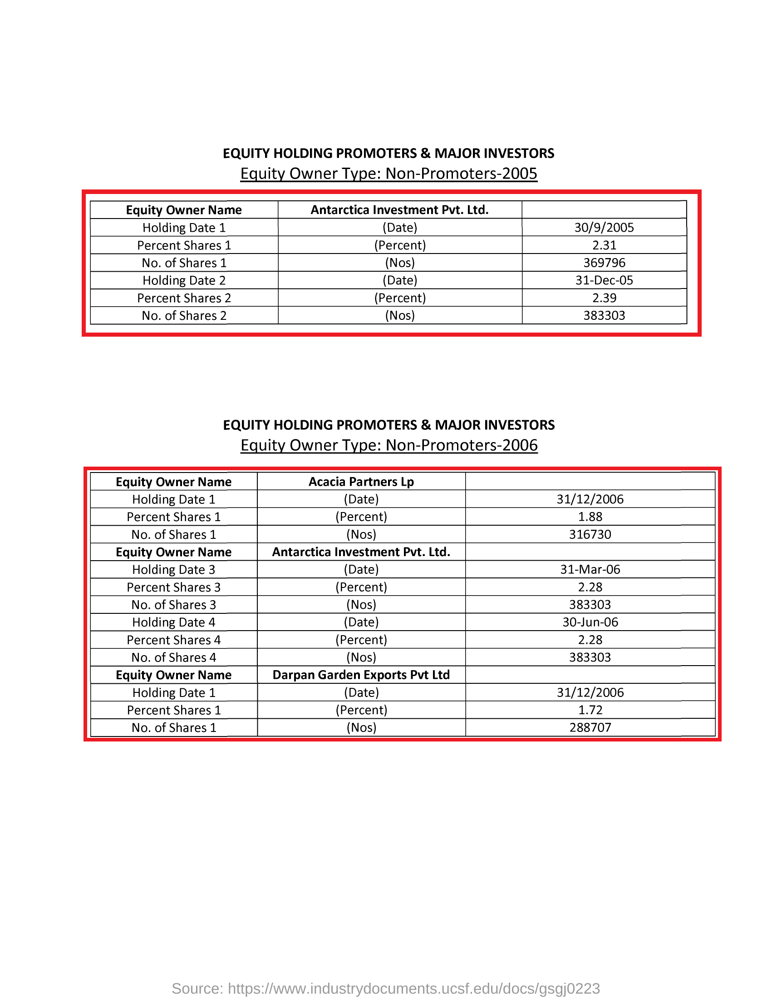

<!--yml

分类：未分类

日期：2024-09-06 19:43:14

-->

# [2211.08469] 深度学习在表格检测和结构识别中的应用：综述

> 来源：[`ar5iv.labs.arxiv.org/html/2211.08469`](https://ar5iv.labs.arxiv.org/html/2211.08469)

# 深度学习在表格检测和结构识别中的应用：综述

马哈茂德·卡塞姆·阿卜杜勒拉赫曼·阿卜杜拉、亚历山大·别连德耶夫、艾布拉欣·埃尔卡迪、马哈茂德·阿卜杜拉、穆罕默德·马哈茂德、穆罕默德·哈马达、达尼亚尔·努尔赛托夫、伊斯兰·塔吉丁

###### 摘要

表格无处不在，从科学期刊、论文、网站到我们在超市购买的商品。因此，检测表格对于自动理解文档内容至关重要。由于深度学习网络的快速发展，表格检测的性能有了显著提升。本文综述的目标是深入理解表格检测领域的主要进展，提供不同方法论的见解，并对不同方法进行系统分类。此外，我们还对经典和新兴应用进行了分析。最后，我们组织了现有模型的数据集和源代码，为读者提供了一个导航，帮助他们了解这一广阔的文献领域。我们还介绍了利用各种物体检测和表格结构识别方法创建有效且高效系统的架构，并概述了跟踪最先进算法和未来研究的发展趋势。我们还建立了一个公开的 GitHub 仓库，用于更新最新的出版物、开放数据和源代码。GitHub 仓库地址为 [`github.com/abdoelsayed2016/table-detection-structure-recognition`](https://github.com/abdoelsayed2016/table-detection-structure-recognition)。

###### 关键词：

卷积神经网络，深度学习，文档处理，表格检测，表格结构识别。\affiliation

[inst1] 机构=信息技术系，FCI，地址=阿斯尤特大学，城市=阿斯尤特，邮政编码=71515，州=阿斯尤特，国家=埃及

\affiliation

[inst2] 机构=国际 IT 大学信息系统系，城市=阿拉木图，邮政编码=050000，国家=哈萨克斯坦

\affiliation

[inst3] 机构=KazMunayGas Engineering LLP，城市=努尔苏丹，邮政编码=010000，国家=哈萨克斯坦

\affiliation

[inst4] 机构=萨特巴耶夫大学，城市=阿拉木图，邮政编码=050013，国家=哈萨克斯坦

\affiliation

[inst5] 机构=信息技术研究所（ITI），城市=亚历山大，邮政编码=5310002，国家=埃及

\affiliation

[inst6] 机构=电气与计算机工程学院，忠北国立大学，城市=清州市，邮政编码=28644，国家=韩国

## 1 引言

教科书、列表、公式、图表、表格和其他元素在文档中很常见。大多数文献，特别是包含多种类型的表格。作为文献的重要组成部分，表格可以用更少的文字传达更多的信息，并允许读者快速浏览、比较和理解内容。表格检测和结构识别在图像分析中至关重要，因为它们可以以数字格式检索表格中的重要信息。由于文档类型和各种文档布局的差异，检测和提取图像或文档中的表格是困难的。研究人员以前使用启发式技术来识别表格或将页面拆分为多个部分以进行表格提取。很少有研究集中在表格检测后文档中的表格结构识别。

文档的布局和内容分析用于检测表格。表格有多种布局和格式。因此，为表格检测和表格结构识别创建通用方法是相当困难的。表格检测被认为是科学界的一个难题。虽然在这个领域进行了大量研究，但大多数研究都有局限性。现有的商业和开源文档分析算法，如 Tesseract，无法完全从文档图像中检测表格区域。[1]。

机器学习和深度学习在计算机视觉研究中已被证明非常有效。在计算机视觉任务如图像分类、物体检测、物体位置估计、学习等方面，深度卷积神经网络（前馈人工神经系统的一种类型）表现优于其他学习模型。卷积神经网络（CNNs）在物体识别中的有效性基于其学习重要的中级视觉特征的能力，而不是通常在特定图像分类方法中使用的手工制作的低级表示。物体由其主要特征定义，包括形状、大小、颜色、纹理等。要识别这样的物体，图像必须清楚地显示物体的存在，并且进一步显示其位置[2]。

物体检测可以被描述为在照片中定位现实世界物体的方法。检测与分类密切相关，因为它涉及确定图像中特定物体的存在和位置。图像中可以识别的物体有很多，如汽车、建筑物、表格、人脸等。深度学习方法，如深度神经网络、基于区域的卷积神经网络和深度卷积神经网络，可以提高物体识别的精度和效率。

近年来，为提高深度学习模型的检测精度并解决深度学习目标识别模型在训练和测试过程中遇到的复杂挑战，采用了多种显著且富有创意的策略。这些独特的策略包括对深度卷积神经网络（CNNs）激活函数的修改[3]、迁移学习[4, 5]、癌症诊断和检测[6, 7, 8]、分类[9]、医学问题回答[10, 11]，以及优化软件项目时间和进度的工程应用[12, 13]、物联网中的入侵检测[14, 15]和多种语言的手写识别[16, 17, 18, 19]。这些策略还包括在提议的深度学习模型中，激活函数和优化系统的组合选择方面的创新方式。在促使表格检测算法快速发展的各种变量和举措中，深度卷积神经网络和 GPU 计算能力的发展应当被归功于此。深度学习模型现已广泛应用于计算机视觉的许多方面，包括通用表格检测[20, 21, 22, 23, 24]。然而，表格结构却受到的关注较少，表格结构通常由表格的行和列特征[25, 26, 27]来定义。

图 1 展示了深度学习技术和传统方法在理解表格任务中的基本流程对比。传统的表格识别技术要么无法很好地处理多样的数据集，要么需要来自 PDF 文件的额外元数据。在多数早期方法中，还使用了大量的预处理和后处理来提高传统表格识别系统的效果。然而，深度学习算法通过神经网络，主要是卷积神经网络[21]，来提取特征，而不是手动创建特征。对象检测或分割网络随后尝试区分表格部分，这些部分在文档图像中进一步分解和识别。

本综述深入考察了基于深度学习的表格检测和分类架构。尽管当前的评估非常全面[28, 29]，但大多数评估并未涉及该领域的最新进展。

以下是论文的主要贡献：

1.  1.

    我们简要回顾了表格数据集的历史及其之间的差异。

1.  2.

    论文考察了重要的表格检测方法以及这些方法随时间的演变。

1.  3.

    我们对表格结构识别进行了深入的详细分析。

1.  4.

    我们提供了表格分类方法并对这些方法进行了比较。我们未能找到提供这些问题广泛总结的研究。

1.  5.

    表格检测某些数据集的实验结果

(a) 传统表格检测方法

(b) 深度学习方法用于表格检测

图 1：传统方法与深度学习方法的表格分析流程比较。虽然深度学习技术中使用了卷积网络，但经典方法主要通过图像处理技术进行特征提取。深度学习方法在解释表格时比传统方法更具通用性且独立于数据。

### 1.1 与之前评论的比较

多年来，表格分析的问题被广泛认可。图 2 显示了过去八年中出版物的上升趋势，这些分析值来源于 Scopus。已经出版了显著的表格检测和表格分类综述。在这些综述中，对表格检测的研究非常出色[28, 29]。近期针对表格检测和分类主题的综述很少。B. Coüasnon [30] 发布了另一篇关于表格识别和表单的综述。该综述快速回顾了当时最新的技术。S. Khusro [31] 发表了关于 PDF 文档中表格识别和提取的最新综述，据我们了解。深度学习使计算模型能够学习非常复杂、微妙和抽象的表示，导致在视觉识别、物体检测、语音识别、自然语言处理和医学图像分析等广泛问题上取得重大进展。相比之下，尽管已经提出了各种基于深度学习的表格识别算法，但我们不知道有任何近期的全面综述。为了进一步推动表格检测的发展，需要对之前的工作进行详细的回顾和解释，特别是对新研究该主题的研究人员。

图 2：展示了表格分析领域扩展趋势的示意图。这些信息是通过查阅 2015 至 2022 年的表格检测和表格识别年度报告收集的，这些分析值来源于 Scopus。

### 1.2 范围

基于深度学习的表格检测研究数量庞大。它们如此众多，以至于对最前沿的全面审查超出了任何适当长度论文的范围。因此，必须制定选择标准，我们将注意力集中在最好的期刊和会议文章上。

本文的主要目标是提供对基于深度学习的表格检测和分类技术的全面调查，包括一些分类法、高层次视角和组织，基于流行的数据集、评估指标、上下文建模和检测提议方法。我们的目标是使我们的分类使读者更容易理解各种策略之间的相似性和差异。建议的分类法为研究人员提供了一个框架，以理解现有研究并突出未来的研究问题。

## 2 主要挑战

### 2.1 物体检测挑战

开发一个既满足高质量/准确性又具备高效率的通用算法是理想的物体检测目标。高质量检测必须准确定位和识别图像或视频帧中的物体，允许区分现实世界中的各种物体类别，并在同一类别内进行物体实例的定位和识别，尽管存在类内外观变化，以实现高鲁棒性。高效率要求在保持合理的内存和存储要求的同时，完成整个检测过程并实时进行。

### 2.2 表格检测挑战

尽管经过训练的分割模型可以准确定位表格，但传统的机器学习技术在表格的结构识别方面存在缺陷。一个主要问题是如此小的空间内大量的物体。因此，网络错过了可能有助于检测和识别表格的关键视觉线索[20]。由于存在物理规则，通过计算水平线和垂直线的交点来识别表格的形成。霍夫变换是计算机视觉中的一种重要方法，帮助检测文档扫描中的线条[32]。利用线条的长度、旋转和平均亮度来过滤掉假阳性，并确定该线是否实际上是表格线[33]。在霍夫线过滤后，计算剩余水平线和垂直线的交点。基于交点创建表格单元格。

## 3 深度学习的快速概述

从图像分类和视频处理到语音识别和自然语言理解，深度学习已经改变了广泛的机器学习活动。鉴于变化的惊人速度[34]，目前有大量关于深度学习的综述研究 [35, 36, 37, 38, 39, 40, 41, 42, 43, 44, 45]，医疗图像分析应用 [38]，自然语言处理 [42]，以及语音识别系统 [44]。

卷积神经网络（CNNs），作为最常见的深度学习模型，可以利用实际信号的基本特性：平移不变性、局部连接和组合层次。典型的 CNN 包含一个分层结构和多个层，用于在不同抽象级别上学习数据表示 [36]。我们从卷积开始

|  | $\begin{split}x^{l-1}*w^{l}\end{split}$ |  | (1) |
| --- | --- | --- | --- |

在前一层 l-1 的特征图和输入特征图 $x^{l-1}$ 之间，通过二维卷积核（或滤波器或权重） $w^{l}$ 进行卷积。这种卷积被视为经历了非线性过程 $\sigma$ 的一系列层，因此

|  | $\begin{split}x^{l}_{j}=\sigma\Bigg{(}\sum_{i=1}^{N^{l-1}}x^{l-1}_{i}*w^{l}_{i,j}+b^{l}_{j}\Bigg{)}\end{split}$ |  | (2) |
| --- | --- | --- | --- |

带有偏置项 $b^{l}_{j}$ 和卷积在 $N^{l-1}$ 个输入特征图 $x^{l-1}_{i}$ 与匹配的卷积核 $w^{l}_{i,j}$ 之间。对于每个元素，逐元素的非线性函数 $\sigma(.)$ 通常是每个元素的修正线性单元（ReLU），

|  | $\begin{split}\sigma(x)=max\{x,0\}\end{split}$ |  | (3) |
| --- | --- | --- | --- |

最后，池化是对特征图进行下采样和上采样的过程。深度卷积神经网络（DCNNs）是具有大量层的 CNN，通常被称为“深层”网络。CNN 的最基本层包括一系列特征图，每个特征图作为一个神经元。每个卷积层中的神经元通过一组权重 $w_{i,j}$ 连接到前一层的特征图（本质上是一组 2D 滤波器）。尽管卷积层和池化层构成了早期的 CNN 层，但随后的层通常是完全连接的。输入图片从早期层到后期层不断进行卷积，每一层的感受野或支持区域随着层数的增加而增长。一般来说，前几层 CNN 提取低级特征（如边缘），而后续层提取更加通用的复杂特征。[35, 46, 47, 36]

DCNN（深度卷积神经网络）具有分层结构，使其能够在多个抽象层次上学习数据表示，学习高度复杂的函数，并能够直接从数据中自动学习特征表示，且对领域专业知识的需求最低。大量标注数据集和具有极高计算能力的 GPU 的可用性是 DCNN 成功的原因之一。

尽管取得了巨大的成就，但仍存在已知的缺陷。对标注训练数据和昂贵计算资源的需求非常迫切，选择合适的学习参数和网络设计仍然需要大量的专业知识和经验。训练后的网络难以理解，缺乏对退化的抵抗力，许多 DCNN 已被证明对攻击脆弱[37]，这些都限制了其在实际应用中的适用性。

## 4 数据集与评估指标

### 4.1 数据集

本节将描述可用的数据集及其在表格检测、表格结构识别和分类任务中最常用的数据集。

#### 4.1.1 ICDAR 2013

ICDAR2013 数据集[48]被用作竞赛的官方练习数据集。作者一直打算尽可能广泛地评估系统，而不是专注于特定子集的文档。该数据集和实际竞赛数据集都是通过系统地从 Google 搜索中收集 PDF 文件生成的，以使选择尽可能客观。它们限于两个政府来源，附加搜索条件为 site:europa.eu 和 site:*.gov，以获取已知为公共领域的文档。ICDAR2013 数据集包含 150 个表格，其中 75 个来自 27 个 EU 摘录，75 个来自 40 个美国政府摘录。表格区域是页面上由坐标定义的矩形区域。一个表格可以跨多个页面，因此一个表格可以包含多个区域。表格检测或定位和表格结构识别是 ICDAR2013 的两个子任务。表格结构识别的任务是比较给定精确位置信息的情况下，确定表格单元格结构的方法。图 3 展示了该数据集的一些示例。

#### 4.1.2 ICDAR 2017 POD

数据集 [49] 为 ICDAR2017 页面对象检测（POD）竞赛发布。该数据集经常用于测试不同的表格检测方法。与 ICDAR2013 表格数据集相比，该数据集显著更大。它总共有 2417 张图像，包括图形、表格和公式。该数据集通常被拆分为 1600 张图像，其中有 731 个表格区域用于训练，其余 817 张图像包含 350 个表格区域用于测试。图 4 展示了该数据集的两个示例。

#### 4.1.3 ICDAR2019

ICDAR2019 [50] 提出了一个用于表格检测（TRACK A）和表格识别（TRACK B）的数据集。该数据集分为历史数据集和现代数据集两种类型。它包含 1600 张训练图像和 839 张测试图像。历史类型包含 1200 张 A 跟 B 路径的训练图像和 499 张测试图像。现代类型包含 600 张 A 跟 B 路径的训练图像和 340 张测试图像。TRACK A 提供了包含一个或多个表格的文档图像。TRACK B 有两个子任务：第一个子任务（B.1）提供表格区域，仅需进行表格结构识别。第二个子任务（B.2）不包含任何先验知识，即需要进行表格区域检测和表格结构识别。数据集的标注采用了类似 ICDAR 2013 [48] 表格竞赛格式的标注方式，结构存储在一个 XML 文件中。每个表格元素对应一个带有 Coords 元素的表格，该元素的 points 属性指示具有 N 个顶点的边界多边形的坐标。每个表格元素还包含一个单元格元素列表。属性 start-row、start-col、end-row 和 end-col 表示每个单元格元素在表格中的位置。单元格元素的 Coords 表示该单元格框的边界多边形的坐标，content 为该单元格内的文本。图 5 展示了来自该数据集的一些示例。

(a)

(b)

图 3: ICDAR 2013 图像示例

(a)

(b)

图 4: ICDAR 2017 图像示例

(a)

(b)

图 5: ICDAR 2019 图像示例

#### 4.1.4 TabStructDB

TabStructDB 是一个不同的公开图像基础表结构识别数据集，由 SA Siddiqui 推广[51]。这个著名的 ICDAR 2017 页面对象检测数据集包含带有结构细节的标注图片，用于策划该数据集。图 6 展示了该数据集的两个示例。

(a)

(b)

图 6：TabStructDB 中的图像示例

#### 4.1.5 TABLE2LATEX-450K

TABLE2LATEX-450K [52] 是另一个大规模数据集，在最近的 ICDAR 会议上发布。该数据集包括 450,000 张标注的表格和相关图片。这个庞大的数据集是通过爬取 1991 年至 2016 年的所有 LaTeX 源文档和 ArXiv 论文创建的。高质量的标注数据集通过源代码提取和进一步的精炼获得。图 7 展示了该数据集的一些示例。

(a)

(b)

图 7：TABLE2LATEX-450K 中的图像示例

#### 4.1.6 RVL-CDIP（子集）

在文档分析领域，著名的数据集是 RVL-CDIP（Ryerson Vision Lab 复杂文档信息处理）[53]。该数据集包含 400,000 张照片，均匀分布在 16 个类别中。为了检测表格，P Riba [54] 通过对 RVL-CDIP 数据集中的 518 张发票进行标注，制作了子集数据集。该数据集已向公众开放。为了测试专门为发票文档图片创建的表格识别方法，这个真实的 RVL-CDIP 数据集子集[53] 是一个重要贡献。图 8 展示了该数据集的一些示例。

(a)

(b)

图 8：RVL-CDIP（子集）中的图像示例

#### 4.1.7 IIIT-AR-13K

IIT-AR-13K 是由 A Mondal [55] 提出的全新数据集。为了创建这个数据集，收集了公开的英文及其他语言的年度报告。根据作者的说法，已发布了针对图形页面对象识别问题的最大人工标注数据集。除了表格外，数据集还包括图形、自然图像、标志和签名。为了处理多个页面对象检测任务，作者提供了训练、验证和测试数据集。为了进行表格检测训练，使用了 11,000 个样本，而为验证和测试分别分配了 2000 和 3000 个样本。图 9 展示了该数据集的两个示例。

(a)

(b)

图 9：IIIT-AR-13K 中的图像示例

#### 4.1.8 CamCap

CamCap 是 W Seo [56] 推荐的相机拍摄照片集合。该数据集中仅包含 85 张照片（38 张在曲面上的表格，共 1295 个单元格，以及 47 张在平面上的表格，共 1162 个单元格）。为了检测表格及其结构，该数据集对公众开放。这个数据集对评估相机拍摄文档图片的表格识别技术的可靠性是一个重要的补充。图 10 展示了该数据集的两个示例。

(a)

(b)

图 10：CamCap 中的图像示例

#### 4.1.9 UNLV 表格

UNLV 表格数据集[57] 包括来自各种来源（杂志、报纸、商业信函、年度报告等）的 2889 页扫描文档图像。扫描图像提供了二值图、灰度图和传真格式，分辨率从 200 到 300 DPI 不等。数据集中除了原始图像外，还包含了人工标记的区域；区域类型以文本格式提供。图 11 展示了该数据集的两个示例。

#### 4.1.10 UW-3 表格

UW-3 Table 数据集 [58] 包含 1600 张经过倾斜修正的英文文档图像，并且每张图像的实体边界框是真实的手工编辑结果。这些边界框围绕了页面框架、文本和非文本区域、文本行和单词。每个区域的类型（文本、数学、表格、半色调等）也有标注。大约有 120 张文档图像标记了至少一个表格区域。UNLV 和 UW-3 Table 数据集教会用户如何使用 T-Truth 工具，并要求他为上述数据集中的目标图像准备真实的标注。每张图像的真实标注都存储在一个 XML 文件中。另一位专家使用 T-Truth 工具的预览编辑模式手动验证了这些真实标注，并对错误的标注进行了纠正。这些迭代过程重复进行了几次，以确保真实标注的准确性。作者发现，大多数错误发生在标记列跨越单元格时，当列边界与单词边界重合时。问题还可能出现在表格结构的多种解释中，如 Nagy[59] 所述，需要领域知识来正确标记表格结构。图 12 展示了该数据集的两个示例。

(a)

(b)

图 11：UNLV 的图像示例

(a)

(b)

图 12：UW3 的图像示例

#### 4.1.11 Marmot

Marmot 数据集[60] 被认为是表格检测领域的第一个大型数据集。它包含 2000 页 PDF 页面，附有真实数据。这项标注任务由 15 人完成。为了减少主观性，建立了统一的标注标准，并且每个真实数据文件都经过双重检查。数据集的规模仍在增长。数据集中的电子文档页面有着广泛的语言类型、页面布局和表格样式。首先，它由大致相等数量的中文和英文页面组成。中文页面从超过 120 本来自方正 Apabi 数字图书馆的电子书中选择，每本书中选择不超过 15 页。英文页面则从网络上检索。从 1970 年到 2011 年的超过 1500 篇会议论文和期刊论文被抓取，涵盖了广泛的主题。中文电子书页面大多为单列，而英文页面则有单列和双列两种格式。该数据集包含了各种类型的表格，从有规则的表格到部分规则和无规则的表格，从横向表格到纵向表格，从内部列表格到跨列表格等。该数据集的几个样本如图 13 所示。

(a)

(b)

图 13: Marmot 数据集中的图像示例

#### 4.1.12 TableBank

TableBank [61] 提出了一个新颖的弱监督方法用于自动创建数据集，该数据集的规模比现有的人类标注数据集要大几个数量级。与传统的弱监督训练集不同，这种方法不仅能够生成大量数据，还能生成高质量的训练数据。如今互联网上有许多电子文档，例如 Microsoft Word (.docx) 和 Latex (.tex) 文件。这些在线文档在其源代码中定义了表格的标记标签。直观上，这些源代码通过在每个文档中使用标记语言添加边界框来进行操作。Word 文档的 Office XML 代码可以被修改，以识别每个表格的边界。Latex 文档的代码也可以被修改以识别表格的边界框。这种方法为各种领域生成了高质量的标注数据，包括商业文档、官方文件、研究论文等，这对大规模的表格分析任务非常有用。TableBank 数据集由 417,234 个高质量的标注表格及其来自各种领域的原始文档组成。该数据集的几个样本如图 14 所示。

(a)

(b)

图 14: TableBank 中的图像示例

#### 4.1.13 DeepFigures

DeepFigures [62] 在大量科学论文中生成高质量的训练标签，无需人工辅助。作者通过利用来自两个大型科学文章网络收藏（PubMed 和 arXiv）的补充数据，定位光栅化 PDF 中的图形和标题。作者提供了大约 550 万张表格和图形标注的结果数据集，以促进现代数据驱动方法的发展，这个数据集比之前最大的图形提取数据集大 4000 倍，平均精度为 96.8%。图 15 显示了该数据集的一些样本。

图 15: DeepFigures 中的图像示例

#### 4.1.14 PubTables-1M

PubTables-1M [63] 包含了来自科学文章的近一百万个表格，支持多种输入模式，并且包含了详细的表格结构标题和位置信息，使其适用于多种建模方法。它还解决了以前数据集中观察到的一种主要地面真实不一致来源——过度分割，采用了一种新颖的标准化程序。我们展示了这些改进显著提升了训练性能，并且在评估时提供了更可靠的模型性能估计。此外，作者表明，基于变压器的目标检测模型在 PubTables-1M 上训练，能够在检测、结构识别和功能分析三个任务中均取得优秀的结果，无需对这些任务进行特殊定制。图 16 展示了该数据集的两个示例。

(a)

(b)

图 16: PubTables-1M 中的图像示例

#### 4.1.15 SciTSR

SciTSR [64] 提供了一个大规模的表格结构识别数据集，来源于科学文章，包含来自 PDF 文件的 15,000 个表格及其相关的结构标签。图 17 展示了该数据集的两个示例。

(a)

(b)

图 17：SciTSR 中的图像示例

#### 4.1.16 FinTabNet

FinTabNet [65] 引入了 GTE，这是一种基于视觉的系统框架，用于结合表格检测和单元格结构识别，可以在任何目标检测模型的基础上构建。利用 GTE-Table 创建一个新的惩罚机制，基于表格的自然单元格包含约束，利用单元格位置预测来训练其表格网络。GTE-Cell 是一种新颖的分层单元格检测网络，利用表格布局来检测单元格。建立一种技术，用于在现有文本中自动标注表格和单元格结构，从而以低成本创建大量训练和测试数据集。FinTabNet 是一个包含现实世界和复杂的科学及金融数据集的集合，具有详尽的表格结构注释，以帮助结构识别的训练和测试。图 18 展示了该数据集的两个示例。

(a)

(b)

图 18：FinTabNet 中的图像示例

#### 4.1.17 PubTabNet

PubTabNet [66] 是最大的公开可用表格识别集合之一，包括 568k 张表格图片和结构化的 HTML 表示。PubTabNet 是通过比较 PubMed CentralTM 开放获取子集（PMCOA）中的科学出版物的 XML 和 PDF 格式自动构建的。作者还建议了一种基于注意力的编码器-双解码器（EDD）架构，用于将表格图形转换为 HTML 代码。模型中包含一个结构解码器，用于重建表格结构，并帮助单元格解码器识别单元格内容。此外，作者还提出了一种基于树编辑距离的相似度（TEDS）度量，它比现有度量更好地捕捉多跳单元格对齐误差和 OCR 错误。图 19 展示了该数据集的两个示例。

(a)

(b)

图 19：PubTabNet 中的图像示例

#### 4.1.18 TNCR

TNCR [67] 是一个新的表格集合，包含从免费访问网站收集的不同质量的图像。TNCR 数据集可用于识别扫描文档图片中的表格，并将其分类为五个类别。TNCR 约有 6621 张照片和 9428 个标注表格。为了建立多个强健的基准，这项工作使用了基于深度学习的最先进的表格检测方法。在 TNCR 数据集上，具有 Resnet-50 Backbone 网络的可变形 DERT 相较于其他方法表现最佳，准确率为 86.7%，召回率为 89.6%，F1 分数为 88.1%。图 20 展示了该数据集中的一些样本。

(a)

(b)

图 20：TNCR 中图像的示例

#### 4.1.19 SynthTabNet

为了纠正早期数据集中的不平衡，A Nassar [68] 提出了 SynthTabNet，一个具有多种外观风格和复杂性的合成数据集。作者创建了四个合成数据集，每个数据集包含 150k 个样本。用于生成表格内容的语料库由 PubTabNet 和 FinTabNet 中最常见的词汇以及随机生成的文本构成。前两个合成数据集已被调整以尽可能接近真实数据集的外观，同时融入了更复杂的表格结构。第三个数据集采用了具有强烈对比的彩色风格，而最后一个数据集则包含内容较少的表格。最后但同样重要的是，作者将所有合成数据集合并成一个包含 600k 个样本的合成数据集。图 21 展示了这个数据集中的一些样本。

(a)

(b)

图 21：SynthTabNet 中图像的示例

表 1 展示了流行的表格检测和结构识别数据集之间的比较。

表 1：该表展示了一些著名表格检测数据集的定量比较。

数据集 总页数 总表格 表格检测 表格结构分类 扫描的 ICDAR2013 462 150 ✓ ✓ ✗ ✓ ICDAR2017-POD 2,417 - ✓ ✗ ✗ ✓ TabStructDB 2.4k - ✗ ✓ ✗ ✓ TABLE2LATEX-450K - 450,000 ✗ ✓ ✗ ✓ RVL-CDIP (子集) 518 - ✓ ✗ ✗ ✓ IIIT-AR-13K 13K - ✓ ✗ ✗ ✓ CamCap 85 - ✓ ✓ ✗ ✗ UNLV 2889 - ✓ ✓ ✗ ✓ UW-3 数据集 1600 - ✓ ✓ ✗ ✓ Marmot 2000 - ✓ ✗ ✗ ✓ TableBank - 417,234 ✓ ✗ ✗ ✓ ICDAR2019 - 2000 ✓ ✓ ✗ ✓ DeepFigures - 550 万 ✓ ✗ ✗ ✓ PubTables-1M 460,589 100 万 ✓ ✓ ✗ ✓ SciTSR - 15,000 ✗ ✓ ✗ ✗ FinTabNet 89,646 112,887 ✓ ✓ ✗ ✗ PubTabNet - 568k ✗ ✓ ✗ ✓ TNCR 6621 9428 ✓ ✗ ✓ ✓ SynthTabNet 600k - ✓ ✓ ✓ ✓

### 4.2 指标

表格检测器使用多种标准来衡量检测器的性能，即每秒帧数 (FPS)、精度和召回率。然而，平均精度 (mAP) 是最常用的评估指标。精度来源于交并比 (IoU)，这是地面真实值和预测边界框之间的重叠区域与联合区域的比率。设置一个阈值来确定检测是否正确。如果 IoU 超过阈值，则分类为真正例，而低于阈值则分类为假正例。如果模型未能检测到地面真实值中存在的对象，则称为假负例。精度衡量正确预测的百分比，而召回率衡量相对于地面真实值的正确预测。

|  | 平均精度 (AP) | $\displaystyle=\frac{\textrm{真正例 (TP)}}{(\textrm{真正例 (TP)}+\textrm{假正例 (FP)})}$ |  | (4) |
| --- | --- | --- | --- | --- |
|  |  | $\displaystyle=\frac{真正例}{所有观察}$ |  |
|  | 平均召回率 (AR) | $\displaystyle=\frac{\textrm{真正例 (TP)}}{(\textrm{真正例 (TP)}+\textrm{假负例 (FN) })}$ |  | (5) |
|  |  | $\displaystyle=\frac{真正例}{所有地面真实值}$ |  |
|  | F1 分数 | $\displaystyle=\frac{2*(\textrm{AP}*\textrm{AR})}{(\textrm{AP}+\textrm{AR})}$ |  | (6) |

根据上述方程，平均精度是为每个类别单独计算的。为了比较检测器之间的性能，使用所有类别的平均精度的平均值，称为平均平均精度 (mAP)，作为最终评估的单一指标。

IoU 是一种度量，用于找出地面真实注释和预测边界框之间的差异。这种度量在大多数先进的物体检测算法中使用。在物体检测中，模型为每个对象预测多个边界框，并根据每个边界框的置信度分数，基于其阈值值移除不必要的框。我们需要根据需求声明阈值值。

|  | IoU | $\displaystyle=\frac{\textrm{联合区域的面积 }}{\textrm{交集区域的面积}}$ |  | (7) |
| --- | --- | --- | --- | --- |

## 5 表格检测和结构识别模型

表格检测已经研究了很长时间。研究人员使用了不同的方法，可以归纳为以下几类：

1.  1.

    基于启发式的方法

1.  2.

    基于机器学习的方法

1.  3.

    基于深度学习的方法

主要的基于启发式的方法在 1990 年代、2000 年代和 2010 年代初期被广泛使用。它们使用了不同的视觉线索，如线条、关键字、空间特征等来检测表格。

P. Pyreddy 等人 [69] 提出了一种通过字符对齐、孔和间隙检测表格的方法。Wang 等人 [70] 使用统计方法根据连续单词之间的距离来检测表格线。将水平连续单词与垂直相邻线进行分组，用于提出表格实体候选项。Jahan 等人 [71] 提出了一种使用局部阈值检测单词间距和行高以识别表格区域的方法。

Itonori [72] 提出了基于规则的方法，该方法通过文本块排列和规则线位置来本地化文档中的表格。Chandran 和 Kasturi [73] 开发了另一种基于垂直和水平线的表格检测方法。Wonkyo Seo 等人 [56] 使用交点（水平和垂直线的交叉点）检测，并进行了进一步处理。

Hassan 等人 [74] 通过分析文本块的空间特征来定位和分割表格。Ruffolo 等人 [75] 引入了 PDF-TREX，一种用于单列 PDF 文档中表格识别的启发式自下而上的方法。它利用页面元素的空间特征对其进行对齐和分组成段落和表格。Nurminen [76] 提出了一组启发式方法，用于定位具有共同对齐的后续文本框，并赋予它们作为表格的概率。

Fang 等人 [77] 以表格头作为起点来检测表格区域并分解其元素。Harit 等人 [78] 提出了基于识别唯一表格开始和结束模式的表格检测技术。Tupaj 等人 [79] 提出了一种基于 OCR 的表格检测技术。该系统根据关键字搜索类似表格的行序列。

上述方法在具有统一布局的文档上效果相对较好。然而，启发式规则需要针对各种表格进行调整，并且不适用于通用解决方案。因此，开始采用机器学习方法来解决表格检测问题。

基于机器学习的方法在 2000 年代和 2010 年代非常常见。

Kieninger 等人 [80] 通过聚类词段应用了无监督学习方法。Cesarini 等人 [81] 使用了修改过的 XY 树监督学习方法。Fan 等人 [82] 结合了监督学习和无监督学习的方法来检测 PDF 文档中的表格。Wang 和 Hu [83] 将决策树和 SVM 分类器应用于布局、内容类型和词组特征。T. Kasar 等人 [84] 使用了交点检测，然后将信息传递给 SVM 分类器。Silva 等人 [85] 将联合概率分布应用于视觉页面元素的序列观察（隐马尔可夫模型），以将潜在的表格线合并为表格。Klampfl 等人 [86] 比较了来自数字科学文章的两种无监督表格识别方法。Docstrum 算法 [87] 应用了 KNN 将结构聚合为行，然后使用行之间的垂直距离和角度将它们合并为文本块。需要注意的是，该算法是在 1993 年提出的，比本节提到的其他方法早。

F Shafait [88] 提出了一个有效的表格识别方法，该方法在具有多种布局的文档上表现良好，包括商业报告、新闻故事和杂志页面。Tesseract OCR 引擎提供了该算法的开源实现。

随着神经网络的兴趣增加，研究人员开始将其应用于文档布局分析任务。最初，它们用于简单的任务，如表格检测。后来，随着更复杂的架构的开发，更多的工作被投入到表格列和整体结构识别中。

Hao 等人 [24] 使用 CNN 检测某个区域提议是否为表格。Azka Gilani 等人 [22] 提出了基于 Faster R-CNN 的模型，以弥补 Hao 等人 [24] 和其他早期方法的局限性。

Sebastian Schreiber 等人 [20] 是首批使用 Faster RCNN 进行表格检测和结构识别的研究者。He 等人 [89] 使用 FCN 进行语义页面分割。S. Arif 等人 [90] 通过使用文本的语义颜色编码来尝试提高 Faster R-CNN 的准确性。Reza 等人 [91] 结合了基于 GAN 的架构进行表格检测。Agarwal 等人 [92] 使用了 Mask R-CNN 的多阶段扩展和双主干进行表格检测。

最近，基于变换器的模型被应用于文档布局分析。Smock、Brandon 等人 [63] 将 Carion 等人 [93] 的 DEtection TRansformer 框架（一种变换器编码器-解码器架构）应用于他们的表格数据集，用于表格检测和结构识别任务。Xu 等人 [94] 提出了一个自监督预训练的文档图像变换器模型，使用大规模无标签文本图像进行文档分析，包括表格检测。

### 5.1 表格检测模型

在本节中，我们审视了用于文档图像表格检测的深度学习方法。为了方便读者，我们将这些方法分为几个深度学习思路。表格 2 列出了所有基于对象识别的表格检测策略。它还讨论了在这些方法中使用的各种基于深度学习的方法。

A Gilani [22] 展示了如何使用深度学习识别表格。建议的技术中，文档图片首先经过预处理。这些照片随后被送入区域提议网络进行表格检测，接着是全连接神经网络。该方法在各种文档图片上，包括文档、研究论文和期刊，具有很高的精度，适用于不同的布局。

D Prasad [95] 提出了一个自动表格检测方法，用于解释文档图片中的表格数据，主要涉及两个问题：表格检测和表格结构识别。使用单一的卷积神经网络（CNN）模型，提供了一种增强的基于深度学习的端到端解决方案，处理表格检测和结构识别挑战。CascadeTabNet 是一个基于 Cascade mask Region-based CNN High-Resolution Network（Cascade mask R-CNN HRNet）的模型，能够同时识别表格区域和从这些表格中识别结构体单元。

SS Paliwal [96] 提出了 TableNet，这是一种新的端到端深度学习模型，用于表格检测和结构识别。该模型利用表格检测和表格结构识别这两个目标之间的依赖关系来划分表格和列区域。然后，从发现的表格子区域中执行基于语义规则的行提取。

Y Huang [97] 描述了一种基于 YOLO 原则的表格检测算法。作者提供了对 YOLOv3 的各种自适应改进，包括一个锚点优化技术和两个后处理方法，以应对文档对象和真实对象之间的显著差异。此外，还采用 k-means 聚类进行锚点优化，以创建更适合表格而非自然对象的锚点，使我们的模型更容易找到表格的确切位置。在后处理过程中，额外的空白和嘈杂的页面对象会被删除。

L Hao [24] 提供了一种新的基于卷积神经网络的 PDF 文档表格检测方法，这是最广泛使用的深度学习模型之一。所提出的方法首先通过一些模糊约束选择一些类似表格的区域，然后构建和优化卷积网络以识别所选区域是否为表格。此外，卷积网络会直接提取和使用表格部分的视觉特征，同时还考虑原始 PDF 文档中的非视觉信息，以帮助获得更好的检测结果。

SA Siddiqui [98] 提出了一个新颖的策略来检测文档中的表格。这里的方法利用了数据识别表格的潜力，不论其排列方式如何。然而，该方法直接作用于照片，使其适用于任何格式。提出的方法使用了独特的可变形 CNN 和更快的 R-CNN/FPN 混合技术。由于表格可能存在于不同的尺寸和变换中，传统的 CNN 具有固定的感受野，这使得表格识别变得困难（方向）。可变形卷积基于输入来调整感受野，从而使其能够匹配输入。由于感受野的这种定制，网络能够适应任何布局的表格。

N Sun [99] 提出了一个基于 Faster R-CNN 的角点检测方法用于表格检测。首先使用 Faster R-CNN 网络进行粗略的表格识别和角点定位。然后，使用坐标匹配来将属于同一表格的角点进行分组，同时过滤掉不可靠的边缘。最后，匹配的角点组细化和调整表格边界。在像素级别，该技术提高了表格边界定位的精确度。

I Kavasidis [100] 提出了使用深度 CNN、图形模型和显著性思想相结合的方法来检测表格和图表。M Holeček [101] 提出了在结构化文档（如账单）中利用图卷积进行表格理解的概念，扩展了图神经网络的适用性。计划中的研究也使用了 PDF 文档。此研究结合了行项表格检测和信息提取，以解决表格检测问题。行项技术可以快速识别任何单词是否为行项。经过单词分类后，由于与账单上的其他文本部分相比，表格行能够有效区分自己，因此可以轻松识别表格区域。

Á Casado-García [102] 使用了目标检测技术。作者在进行全面检查后证明了从更接近的领域进行微调可以提高表格检测的性能。作者利用了 Mask R-CNN、YOLO、SSD 和 Retina Net 结合目标检测算法。在这项研究中选择了两个基本数据集，TableBank 和 PascalVOC。

X Zheng [103] 提出了 Global Table Extractor (GTE) 方法，这是一种联合检测表格和识别单元格结构的方法，可以在任何目标检测模型之上实现。为了利用单元格位置预测训练他们的表格网络，作者开发了 GTE-Table，该方法引入了一种新的惩罚机制，基于表格的固有单元格限制。一个名为 GTE-Cell 的新型分层单元格识别网络利用了表格样式。此外，为了快速且经济地构建大量的训练和测试数据集，作者开发了一种自动分类预存在文本中的表格和单元格结构的方法。

Y Li [104] 提供了一种新网络，用于生成表格文本的布局元素，并提升了对规则较少的表格识别的性能。生成对抗网络（GAN）与该特征生成模型相似。作者要求特征生成模型为严格规则和宽松规则的表格提取类似的特征。

DD Nguyen [105] 介绍了 TableSegNet，这是一种紧凑设计的全卷积网络，同时进行表格的分离和检测。TableSegNet 使用较浅的路径在高分辨率下发现表格位置，使用较深的路径在低分辨率下检测表格区域，将发现的区域划分为不同的表格。TableSegNet 在特征提取过程中使用了具有宽核大小的卷积块，并在主输出中增加了一个表格边界类，以提高检测和分离能力。

D Zhang [106] 提出了基于 YOLO 表格的表格检测方法。为了增强网络对表格空间布局方面的学习能力，作者将内卷技术引入网络核心，并创建了一个简单的特征金字塔网络以提高模型效能。这项研究还提出了一种基于表格的增强技术。

表 2：几种基于深度学习的表格检测方法的优缺点比较

文献方法 优点 缺点 A Gilani[22] Faster R-CNN 1) 这是首个基于深度学习的表格检测方法，应用于扫描文档图片。 2) 通过将 RGB 像素转换为距离测量，简化了物体检测技术。 预处理过程中有额外的阶段。 S Schreiber[20] 迁移学习方法 + Faster R-CNN 端到端策略用于检测表格及表格结构，简单高效 与其他最先进技术相比，准确性较低。 SA Siddiqui [98] 可变形 CNN + Faster R-CNN 可变形卷积神经网络的动态感受野有助于重新配置多个表格边界。 与标准卷积相比，可变形卷积在计算上要求较高。 SS Paliwal [96] 全卷积网络 1) 首次尝试将单一解决方案用于处理表格检测和结构识别问题。 2) 提供了文档图片中结构识别和检测的全面方法。 这种方法在用于表格结构提取时仅对列检测有效。 P Riba [54] 基于 OCR 的图形神经网络利用文本特征 所提出的方法利用了比空间属性更多的数据。 1) 没有与其他最先进策略进行比较。 2) 除了表格数据，还需要额外的注释。 N Sun [99] Faster R-CNN + 定位角点 1) 通过一种新方法获得更好的结果。 2) 使用 Faster R-CNN 不仅检测表格，还检测表格边界的角点 1) 需要进行后处理操作，如角点精细化。 2) 由于额外的检测，计算更加复杂。 I Kavasidis [100] 深度 CNN、图形模型和显著性结合 1) 使用膨胀卷积而不是传统卷积。 2) 使用这种方法进行显著性检测以代替表格检测。 为了提供相同的结果，需要多个处理阶段。 M Holeček [101] 图形神经网络 + 行项识别方法 这种方法在处理发票和 PDF 等布局密集型文档时产生了令人鼓舞的结果。 1) 基线方法有限，未与其他最先进技术进行比较 2) 没有使用公开的表格数据集进行方法评估。 Y Huang [97] YOLO 相较而言，更快速、更有效的策略 所提出的方法依赖于数据驱动的后处理方法。 Y Li [104] 生成对抗网络（GAN） 对于规则和不规则表格，基于 GAN 的方法驱动网络提取相似特征。 在具有不同表格布局的文档图像中，基于生成器的模型表现不稳定。 M Li [61] Faster R-CNN 该方法展示了如何使用简单的 Faster R-CNN 在如 TableBank 这样的大型数据集上取得良好结果。 仅为简单的 Faster-RCNN 实现 D Prasad [95] 级联掩模区域 CNN 高分辨率网络模型 研究展示了如何使用迭代迁移学习来转换图像，这可以减少对大型数据集的依赖。 与[22]相同，预处理过程中有额外的阶段。 Á Casado-García [102] 微调 + Mask R-CNN、RetinaNet、SSD 和 YOLO 描述了在表格检测中结合对象检测网络与领域特定微调技术的优势。 封闭域微调仍不足以获得最先进的解决方案。 M Agarwal [92] Mask R-CNN 的多阶段扩展与双骨干网络 1) 一种综合对象检测框架，利用复合骨干网络实现最先进的结果 2) 对公开可用的表格检测基准数据集进行广泛测试。 由于使用了复合骨干网络以及可变形卷积，这种技术在计算上较为昂贵。 X Zheng [103] 全球表格提取器（GTE），一种通用的对象检测方法 1) 通过引入额外的分段约束损失来提升表格检测问题。 2) 一种适用于所有对象检测框架的完整方法。 由于表格检测依赖于单元格检测，因此需要对单元格边界进行注释。

### 5.2 表格结构识别模型

为了识别文档图像中的表格结构，本部分回顾了深度学习方法。我们将这些方法划分为离散的深度学习原则，以便读者更好地理解。表 3，4 列出了所有基于目标检测的表格结构识别方法及其优缺点。还讨论了在这些方法中使用的各种基于深度学习的方法。

A Zucker [107] 提出了 CluSTi，一种用于识别发票扫描图像中表格结构的聚类方法，作为一种有效的方式。CluSTi 做出了三项贡献。首先，它使用聚类方法消除表格图像中的高噪声。其次，它使用最先进的文本识别技术提取所有文本框。最后，CluSTi 使用水平和垂直聚类技术及优化参数将文本框组织成正确的行和列。Z Zhang [108] 提出的 Split, Embed, and Merge (SEM) 是一种准确的表格结构识别器。M Namysl [109] 在这项研究中提出了一种多功能且模块化的表格提取方法。

E Koci [110] 提供了一种新方法，用于识别电子表格中的表格，并在确定每个单元格的布局角色后构建布局区域。他们使用图模型表达这些区域之间的空间相互关系。在此基础上，他们提出了 Remove and Conquer (RAC)，一种基于精心选择的标准的表格识别算法。

利用可变形卷积网络的潜力，SA Siddiqui [51] 提出了分析文档图片中表格模式的独特方法。P Riba [54] 在本文中提出了一种基于图的技术，用于识别文档图片中的表格。该方法还采用位置、上下文和内容类型，而不是原始内容（识别的文本），因此这只是一个不依赖于语言或文本质量的结构感知技术。E Koci [111] 使用基于遗传算法的图分区技术，识别与表格匹配的图的部分。

SA Siddiqui [112] 将结构识别问题描述为语义分割问题。为了对行和列进行分割，作者采用了全卷积网络。引入了预测瓦片化的方法，这减少了表格结构识别的复杂性，假设表格结构的一致性。作者从 ImageNet 导入了预训练模型，并使用了 FCN 的编码器和解码器的结构模型。给定图像时，模型创建与原始输入图像大小相同的特征。

SA Khan [113] 在这项工作中提出了一种基于深度学习的强大解决方案，用于从文档图片中识别的表格中提取行和列。表格图片在被送入使用门控递归单元 (GRU) 和具有 softmax 激活的全连接层的双向递归神经网络之前进行了预处理。SF Rashid [114] 提出了一个基于学习的新方法，用于在各种文档图片中识别表格内容。SR Qasim [115] 提出了一个基于图网络的表格识别架构，作为对典型神经网络的优越替代方案。S Raja [116] 描述了一种识别表格结构的方法，结合了单元检测和交互模块，以定位单元格并预测它们与其他检测到的单元格的行列关系。此外，还在损失函数中增加了结构限制，以作为单元格识别的额外微分组件。Y Deng [52] 研究了端到端表格识别的现有问题，并强调了该领域需要更大数据集的需求。

Y Zou [117] 的另一项研究呼吁开发一种基于图像的表格结构识别技术，使用全卷积网络。所展示的工作对表格的行、列和单元格进行划分。所有表格组件的估计边界通过连通组件分析得到增强。然后，根据行和列分隔符的位置，为每个单元格分配行和列编号。此外，使用特殊算法来优化单元格的边界。

为了识别表格中的行和列，KA Hashmi [118] 提出了一个用于表格结构识别的引导技术。根据这项研究，通过使用锚点优化方法，行和列的定位可以得到改善。他们提出的工作使用 Mask R-CNN 和优化的锚点来检测行和列的边界。

W Xue [119] 的 ReS2TIM 论文提出了另一种分割表格结构的方法，描述了从表格中重建句法结构。该模型的主要目标是回归每个单元格的坐标。首先，使用新技术构建一个可以识别表格中每个单元格邻居的网络。在研究中，提供了一种基于距离的加权系统，这将帮助网络克服训练相关的类别不平衡问题。

C Tensmeyer [120] 提出了另一种使用膨胀卷积的方法，称为 SPLERGE（Split and Merge）。他们的策略包括使用两个不同的深度学习模型，第一个模型建立表格的网格布局，第二个模型确定是否可能存在跨越多行或列的单元格。

A Nassar [68] 提供了一种全新的表格结构识别模型。该模型在两个重要方面增强了最新的 PubTabNet 端到端深度学习模型。首先，作者提供了一个全新的表格单元对象检测解码器。这使他们能够轻松访问程序化 PDF 中的表格单元内容，而无需训练任何专有 OCR 解码器。作者声称，这一架构改进使得表格内容提取更加精确，并使他们能够处理非英语表格。其次，基于变换器的解码器取代了 LSTM 解码器。

S Raja [121] 提出了一个新颖的基于对象检测的深度模型，该模型专为快速优化而设计，并捕捉表格内单元格的自然对齐。即使在精确的单元格检测下，密集表格识别仍然可能存在问题，因为多行/列跨越的单元格使得捕捉远程行/列关系变得困难。因此，作者还试图通过确定一种独特的直线图基于公式来增强结构识别。作者从语义的角度强调了表格中空单元格的重要性。作者建议对一个受欢迎的评估标准进行修改，以考虑这些单元格。为了激发对该问题的新见解，然后提供一个带有基于人类认知建模注释的中等规模评估数据集。

X Shen [122] 提出了两个模块，称为行聚合（RA）和列聚合（CA）。首先，应用特征切片和拼贴来生成行和列的粗略预测，并解决高误差容忍度的问题。其次，计算通道的注意力图以进一步获得行和列信息。为了完成行分割和列分割，作者使用 RA 和 CA 构建了一个称为行列聚合网络（RCANet）的语义分割网络。

C Ma [123] 提出了 RobusTabNet，这是一种新颖的方法，用于识别表格结构和从各种文档图片中检测其边界。作者建议使用 CornerNet 作为新的区域提议网络，以为 Faster R-CNN 生成更高质量的表格提议，这大大提高了 Faster R-CNN 在表格识别中的定位精度，仅利用了最小的 ResNet-18 主干网络。此外，作者建议了一种全新的分割和合并方法来识别表格结构。在这种方法中，每个检测到的表格使用一种新的空间 CNN 分割线预测模块被划分为单元网格，然后使用 Grid CNN 单元合并模块来恢复跨越的单元。由于空间 CNN 模块可以有效地在整个表格图片中传递上下文信息，他们的表格结构识别器可以准确识别具有显著空白区域和几何变形（甚至弯曲）的表格。B Xiao [124] 假设复杂的表格结构可以通过图形表示，其中顶点和边代表单个单元及其之间的连接。然后，作者设计了一个条件注意网络，并将表格结构识别问题描述为单元关联分类问题（CATT-Net）。

A Jain [125] 建议训练一个深度网络，以识别表格图片中不同单词对之间的空间关系，从而解读表格结构。作者提出了一种称为 TSR-DSAW 的端到端管道：通过词语的深度空间关联来进行 TSR，该方法将表格图片生成 HTML 等结构化格式的数字表示。建议的技术首先利用文本检测网络，如 CRAFT，来识别输入表格图片中的每个单词。接着，使用动态规划创建单词配对。这些单词配对在每个单独的图像中被加下划线，然后交给一个经过训练的 DenseNet-121 分类器，该分类器被训练以识别空间关联，如同一行、同一列、同一单元或无。最后，作者对分类器输出应用后处理，以生成 HTML 表格结构。

H Li [126] 将问题定义为一个单元关系提取挑战，并提供了 T2，这是一种前沿的两阶段方法，成功地从数字保存的文本中提取表格结构。T2 提供了一种广泛的思想，称为主连接，它准确地表示了单元之间的直接关系。为了寻找复杂的表格结构，它还构建了一个对齐图，并使用了消息传递网络。

表 3：几种基于深度学习的表格结构识别方法的优缺点比较

文献方法 利益 缺点 SF Rashid [114] 使用单词的几何位置 + 神经网络模型（autoMLP） 不依赖于复杂的布局分析机制。 可以用于不同布局的多样化文档，但由于每列单词数量的变化，标记列边界的限制较大。 E Koci [110] 使用图表示法对这些区域的空间关系进行编码，以及规则和启发式方法 1）适用于单表和多表电子表格。 2）不依赖于任何有关表格排列的假设。 列数较少和空单元格的表格处理效果较差。 SA Siddiqui [51] 可变形 CNN + Faster R-CNN 1）使用可变形卷积可以处理各种表格结构。 2）发布了一个包含表格结构数据的新数据集。 如果表格有行和列的跨越，提出的方法将无法正确操作。 SA Siddiqui [112] 全卷积神经网络 通过提出的预测平铺方法减少了识别表格结构的任务复杂性。 1）当行或列过度碎片化时，需要额外的后处理过程。 2）该技术基于表格结构的一致性假设。 SR Qasim [115] 图神经网络 + CNN 1）本文还提出了一种基于蒙特卡洛的独特、内存高效的训练策略。 2）建议的方法利用了文本和空间特征。 没有使用公开可访问的表格数据集来测试系统。 W Xue [119] 图神经网络 + 基于距离的权重 对于单元格关系网络，使用基于距离的加权方法解决了类别不平衡问题。 处理稀疏表格时，该方法不够安全。 C Tensmeyer [120] 膨胀卷积 + 全卷积神经网络 该技术在扫描文档和 PDF 文档图像中都有效。 后处理启发式决定了合并部分的方法的工作方式。 SA Khan [113] RNN 双向 GRU 解决了 CNN 的感受野减少问题。 需要包括二值化、降噪和形态学修改在内的预处理步骤。 P Riba [54] 图神经网络方法 1）在单行、列或规则线存在方面不受限制。 2）模型语言独立 1）该方法在处理边界条件时可能存在问题。 2）RVL-CDIP 数据集中训练数据量较少，F1、精准度和召回率指标低于其他方法。 Y Deng [52] 编码器-解码器网络 1）在给定的工作中，研究了端到端表格识别的问题。 2）在表格理解领域做出了另一个大型数据集的贡献。 其他公开可访问的表格识别数据集未用于评估所建议的基线技术。 E Koci [111] 图模型 + 基于遗传算法的方法 几乎不需要领域专家的参与 GE 的准确性取决于边的数量。 具体来说，我们确定 GE 在多表格图上仅实现了 19%的准确率。 D Prasad [95] 级联掩膜区域基础 CNN 高分辨率网络模型 通过端到端方法直接在单元边界处回归。 必须对有/无规则线的表格进行进一步的后处理。 S Raja [116] 掩膜 R-CNN + 基于 ResNet-101 的网络 1）建议为精确的单元格检测增加额外的对齐损失。 2）提出了一个可训练的自顶向下的单元格识别和自底向上的结构识别收集方法。 当单元格为空时，该策略效果较差。

表 4：几种基于深度学习的表格结构识别方法的优缺点比较（继续表 3）

文献方法 优势 缺点 B Xiao [124] 单元格的边界框 + 条件注意力网络 仅利用视觉特征而没有任何元数据 1) 假设表格中单元格的坐标已知。 2) 对于没有边框的表格存在困难。 Y Zou [117] 完全卷积神经网络 1) 使用连接组件分析增强结果。 2) 在表格中，单元格不仅要分割行和列。 为提供对比结果，需要少量的后处理步骤，使用特定算法。 X Zhong [66] 基于注意力的双解码器 1) 为评估表格识别技术，该方法提供了一种称为 TEDS 的独特评估指标。 2) 发布了一个大型表格数据集。 该技术无法与其他最先进技术进行直接比较。 KA Hashmi [118] 利用锚点优化技术 + Mask R-CNN 区域提议的网络由于优化的锚定而更快有效地收敛。 本研究依赖于初步的预处理阶段，将真实数据进行聚类以找到合适的锚点。 A Zucker [107] 文本检测的字符区域感知（CRAFT）和基于密度的空间聚类（DBSCAN） 一种自下而上的方法，强调表格结构是由文本单元格的相对位置形成的，而不是由固有的边界形成的。 无法很好地处理扩展的行或列。 X Zheng [103] 一般物体检测方法 结合了创新的基于集群的技术与分层网络来检测表格形式。 准确分类表格是最终单元格结构识别的前提。 Z Zhang [108] 全卷积网络（FCN）+ RoI-Align + 预训练 BERT 模型 + 门控递归单元（GRU）解码器 直接在表格图像上操作，不依赖于元信息，可以处理简单和复杂的表格。 当单元格之间的空间较大时，会过度分割表格，不能很好地处理合并的单元格。 M Namysl [109] 基于规则的算法 + 基于图的表格解释方法 1) 该方法允许处理图像和数字文档。 2) 处理步骤可以单独调整。 1) 仅支持最常见的表格格式。 依赖于预定义关键字的存在。 2) 易受系统上游组件传播的错误影响。 3) 重点关注带有规则的表格。 A Nassar [68] 端到端神经网络 + CNN 骨干 + 基于变换器的层 1) 处理不同语言，而无需针对这些语言进行训练。 2) 预测表格结构和表格内容的边界框。 处理 PDF 文档。 A Jain [125] 空间关联 + 动态编程技术 识别具有多跨度行/列和缺失单元格的复杂表格结构 使用 OCR 从图像中读取单词 不是语言无关的。 S Raja [121] 物体检测 更好地检测空单元格 对于非常稀疏的表格，无法处理大多数单元格为空的情况。

## 6 方法论

在本节中，我们将扩展在之前的工作中用于 TNCR 数据集的方法论和方法[67]。在之前的工作中，我们描述了 Cascade R-CNN、Cascade Mask R-CNN、Cascade RPN、混合任务级联 (HTC)、YOLO 和 Deformable DETR。本节将描述额外的四种方法，涉及使用目标检测和分类的 Faster R-CNN、Mask R-CNN、HRNets、Resnest 和 Dynamic R-CNN。

### 6.1 Faster R-CNN

Faster R-CNN [127] 包含两个模块：RPN 是一个完全卷积网络，生成区域提案，而 Fast-RCNN 检测器将 RPN 的提案作为输入，生成对象检测结果，如图 22 所示。Faster R-CNN 目标检测网络中采用了一个特征提取网络，通常是一个预训练的 CNN，这与我们为其前身所使用的类似。接下来，有两个可训练的子网络。第一个是区域提案网络（RPN），顾名思义，用于生成对象提案；第二个用于预测对象的实际类别。因此，放在最后一个卷积层后的 RPN 是 Faster R-CNN 的主要区分因素。它被教导在没有任何外部机制（如选择性搜索）的情况下生成区域提案。然后，类似于 Fast R-CNN，使用 ROI 池化、上游分类器和边界框回归器。

图 22：Faster R-CNN

### 6.2 Mask R-CNN

Mask R-CNN [128] 使用 R-CNN 有效地检测图像中的对象，同时对每个感兴趣区域执行对象分割任务。因此，分割与分类和边界框回归并行运行。Mask R-CNN 的高级架构如图 23 所示。

图 23：Mask R-CNN

Mask R-CNN 分为两个阶段。首先，它根据输入图像生成可能存在对象的区域提案。其次，基于第一阶段的提案，它预测对象的类别、细化边界框，并在像素级别创建对象的掩码。主干结构与两个阶段都有关联。Mask R-CNN 的概念很简单：Faster R-CNN 为每个候选对象输出类别标签和边界框偏移量；Mask R-CNN 增加了一个第三个分支，输出对象掩码。

### 6.3 HRNets

孙克等人[129, 130]提出了一种称为 High-Resolution Net 的新型架构，能够在整个过程中保持高分辨率表示。HRNet 项目的第一阶段是构建一个高分辨率子网络。接下来的阶段是添加更多的高到低分辨率子网络。HRNet 通过并行多分辨率网络进行多尺度融合，如图 24 所示。

图 24：HRNet

与现有广泛使用的网络[131, 132, 133, 134]相比，HRNet 有两个优势：可以并行连接高到低分辨率子网络，并且可以提供更好的姿态估计。大多数现有的融合方案将低分辨率和高分辨率表示结合在一起。而 HRNet 通过多尺度融合来提升高分辨率和低分辨率表示。

### 6.4 Resnest

Resnest [135]是一种简单的架构，将多路径网络的特征与通道级注意力策略相结合。它允许在元结构中保留独立的表示。与多路径网络一样，Resnet 网络模块对低维嵌入执行一组变换并连接其输出。每个变换都采用不同的注意力策略来捕捉特征图的相互依赖关系。两者的关键区别在于注意力策略专注于特定通道而非整个网络。Split-Attention 块是一个计算单元，将特征图组和拆分注意力操作结合在一起。Split-Attention 块如图 25 所示。

图 25：Resnest

### 6.5 Dynamic R-CNN

张宏凯等人[136]提出了 Dynamic RCNN，这是一种简单但有效的方法，用于最大化目标检测提议的动态质量。它由两个部分组成：动态标签分配和动态 SmoothL1 Loss，分别用于分类和回归。首先，根据训练过程中的提议分布调整 IoU 阈值，以训练出对高 IoU 提议具有辨别力的更好分类器。将阈值设置为提议的 IoU 在某一百分比处，因为这可以反映整体分布的质量。改变回归损失函数的形状，以适应回归标签分布的变化，并确保高质量样本对训练的贡献。

## 7 实验结果

### 7.1 实验设置

MMdetection [137] 库在 PyTorch 上用于实现所提出和测试的每一个模型。对象检测工具包 MMDetection 包含了各种对象检测和实例分割方法，以及相关的部分和模块。它逐渐演变成一个包括几种广泛使用的检测技术和现代模块的单一平台。在 Google Colaboratory 平台上进行的试验中，使用了三台配备 16 GB GPU 内存的 Tesla V100-SXM GPU、16 GB RAM、两台 Intel Xeon E-5-2680 CPU 和四台 NVIDIA Tesla k20x GPU。所有模型都已被训练和评估，图片缩放到 1300 $\times$ 1500 的恒定尺寸，批量大小为 16。具有 0.9 动量、0.0001 权重衰减和 0.02 学习率的优化器称为 SGD。所有模型都使用了 Feature Pyramid Network (FPN) 颈部。

### 7.2 TNCR 数据集的结果

在大多数骨干网络中，Faster R-CNN 模型在表格检测方面表现良好，相比于 Cascade-RCNN 和 Cascade Mask-RCNN。我们用 L1 损失 [138] 和 Resnet-50 对 Faster R-CNN 模型进行了边界框回归训练。如表 5 所示，它的 f1-score 为 0.921。Resnet-101 骨干网络在 50% 到 65% 之间取得了最高的 F1 分数，ResNeXt-101-64x4d 在 70% 到 95% 之间取得了最高的 F1 分数，ResNeXt-101-64x4d 在 50%:95% 之间取得了 0.786 的 F1 分数。Resnet-50 骨干网络在 1$\times$ Lr 调度下的表现最低，在 50% 到 60% IoUs 之间。同样，Resnet-50 骨干网络与 L1 损失的表现也在 65% 到 95% IoUs 之间最低，并且在 50%:95% 的范围内表现也最低。

表 5：Faster R-CNN

Backbone Lr schd/Losses IoU 50% 55% 60% 65% 70% 75% 80% 85% 90% 95% 50%:95% Resnet-50 L1Loss 精度 0.875 0.872 0.872 0.866 0.858 0.844 0.823 0.782 0.688 0.424 0.649 召回率 0.973 0.972 0.970 0.964 0.956 0.941 0.922 0.890 0.812 0.577 0.775 F1-分数 0.921 0.919 0.918 0.912* 0.904* 0.889* 0.869* 0.832* 0.744* 0.488* 0.706* Resnet-50 1x 精度 0.874 0.872 0.871 0.869 0.863 0.844 0.827 0.783 0.693 0.431 0.653 召回率 0.972 0.969 0.968 0.966 0.959 0.942 0.929 0.895 0.823 0.587 0.779 F1-分数 0.920* 0.917* 0.916* 0.914 0.908 0.890 0.875 0.835 0.752 0.497 0.710 Resnet-101 1x 精度 0.885 0.885 0.882 0.879 0.870 0.867 0.849 0.820 0.763 0.555 0.720 召回率 0.973 0.973 0.971 0.969 0.961 0.956 0.943 0.920 0.870 0.698 0.835 F1-分数 0.926 0.926 0.924 0.921 0.913 0.909 0.893 0.867 0.812 0.618 0.773 ResNeXt-101-32x4d 1x 精度 0.880 0.879 0.877 0.875 0.872 0.866 0.845 0.817 0.760 0.575 0.727 召回率 0.976 0.976 0.975 0.972 0.969 0.962 0.944 0.921 0.871 0.711 0.843 F1-分数 0.925 0.924 0.923 0.920 0.917 0.911 0.891 0.865 0.811 0.635 0.780 ResNeXt-101-64x4d 1x 精度 0.884 0.884 0.880 0.879 0.876 0.871 0.856 0.833 0.780 0.581 0.733 召回率 0.972 0.970 0.969 0.967 0.965 0.961 0.950 0.931 0.884 0.724 0.848 F1-分数 0.925 0.925 0.922 0.920 0.918 0.913 0.900 0.879 0.828 0.644 0.786

我们实现了 Mask R-CNN [128] 用于图像中的表格对象，并且还用于对每个 ROI 进行对象分割。正如在表 6 中所示，Mask R-CNN 在我们的数据集中，在所有骨干网络中显示了良好的精度、召回率和 F1 分数。Resnet-101 骨干网络在 50%:95% 范围内达到了最高的 F1 分数 0.774，并在各种 IoU 上保持了最高的 F1 分数。ResNeXt-101-32x4d 在 50% 到 95% IoU 范围内表现最差，并且在 50%:95% 范围内达到了 F1 分数 0.512。除了 95% IoU 外，ResNeXt-101-64x4d 在各种 IoU 上也表现最差。

表 6: Mask R-CNN

主干 Lr schd IoU 50% 55% 60% 65% 70% 75% 80% 85% 90% 95% 50%:95% Resnet-50 1x 精度 0.877 0.876 0.874 0.871 0.868 0.858 0.834 0.800 0.728 0.506 0.692 召回率 0.973 0.972 0.970 0.967 0.963 0.952 0.932 0.903 0.840 0.651 0.812 F1-Score 0.922 0.921 0.919 0.916 0.913 0.902 0.880 0.848 0.779 0.569 0.747 Resnet-101 1x 精度 0.878 0.877 0.875 0.874 0.869 0.861 0.847 0.812 0.762 0.553 0.716 召回率 0.977 0.976 0.974 0.973 0.966 0.959 0.949 0.918 0.874 0.711 0.844 F1-Score 0.924 0.923 0.921 0.920 0.914 0.907 0.895 0.861 0.814 0.622 0.774 ResNeXt-101-32x4d 1x 精度 0.778 0.777 0.774 0.769 0.759 0.749 0.713 0.651 0.477 0.407 0.434 召回率 0.975 0.974 0.968 0.964 0.952 0.941 0.913 0.856 0.725 0.695 0.626 F1-Score 0.865* 0.864* 0.860* 0.855* 0.844* 0.834* 0.800* 0.739* 0.575* 0.513* 0.512* ResNeXt-101-64x4d 1x 精度 0.778 0.777 0.774 0.769 0.759 0.749 0.713 0.651 0.477 0.417 0.434 召回率 0.975 0.974 0.968 0.964 0.952 0.941 0.913 0.856 0.725 0.705 0.626 F1-Score 0.865 0.864 0.860 0.855 0.844 0.834 0.800 0.739 0.575 0.524 0.512

在接下来的 表 7，8，9，10，11 和 12 显示了我们使用不同方法和每种方法不同主干进行 HRNets 训练的比较分析。在表 7 中，我们评估并计算了 f1 分数。结果显示，HRNetV2p-W40 在 50% 到 65% 的 IoU 范围内表现更好。同时，HRNetV2p-W18 在 70%、75%、80% 和 95% 的 IoU 范围内表现更优。HRNetV2p-W18 在 50%:95% IoU 范围内的 f1 分数为 0.842。HRNetV2p-W32 主干在 50% 到 70% 和 90% 的 IoU 范围内表现最差，而 HRNetV2p-W40 在 75% 到 85% 和 95% 的 IoU 范围内表现最差。HRNetV2p-W40 在 50%:95% IoU 范围内的 f1 分数为 0.841。

表 7: HRNets - Cascade R-CNN

Backbone Lr schd IoU 50% 55% 60% 65% 70% 75% 80% 85% 90% 95% 50%:95% HRNetV2p-W18 20e Precision 0.894 0.894 0.894 0.892 0.892 0.886 0.880 0.862 0.825 0.712 0.803 Recall 0.962 0.962 0.960 0.960 0.960 0.954 0.950 0.937 0.906 0.813 0.887 F1-Score 0.926 0.926 0.925 0.924 0.924 0.918 0.913 0.897 0.863 0.759 0.842 HRNetV2p-W32 20e Precision 0.895 0.895 0.893 0.893 0.893 0.889 0.881 0.869 0.828 0.717 0.806 Recall 0.955 0.955 0.954 0.954 0.953 0.949 0.943 0.933 0.900 0.810 0.882 F1-Score 0.924* 0.924* 0.922* 0.922* 0.922* 0.918 0.910 0.899 0.862* 0.760 0.842 HRNetV2p-W40 20e Precision 0.893 0.891 0.891 0.891 0.888 0.880 0.871 0.854 0.831 0.705 0.799 Recall 0.967 0.965 0.965 0.964 0.961 0.956 0.948 0.935 0.914 0.811 0.889 F1-Score 0.928 0.926 0.926 0.926 0.923 0.916* 0.907* 0.892* 0.870 0.754* 0.841*

表 8 展示了不同主干结构与 Lr 调度组合下 HRNet Faster R-CNN 检测器的性能。与其他主干结构相比，HRNetV2p-W18 搭配 1$\times$ Lr 调度的主干表现较低。其 f1 得分为 0.770，较 HRNetV2p-W18 搭配 2$\times$ Lr 调度低 3.2%。HRNetV2p-W40 搭配 1$\times$ Lr 调度的主干在 50%至 85% IoUs 范围内表现更好，而 HRNetV2p-W40 搭配 2$\times$ Lr 调度的主干在 90%和 95% IoUs 范围内表现更好。HRNetV2p-W18 搭配 2$\times$ Lr 调度的主干在 50%:95% IoUs 范围内的 f1 得分为 0.802。HRNetV2p-W32 搭配 1$\times$ Lr 调度的主干在 50%到 60%范围内表现相同。

表 8：HRNets - Faster R-CNN

Backbone Lr schd IoU 50% 55% 60% 65% 70% 75% 80% 85% 90% 95% 50%:95% HRNetV2p-W18 1x Precision 0.867 0.865 0.863 0.859 0.853 0.845 0.827 0.806 0.750 0.556 0.711 Recall 0.972 0.970 0.968 0.964 0.959 0.952 0.940 0.915 0.869 0.711 0.842 F1-Score 0.916* 0.914* 0.912* 0.908* 0.902* 0.895* 0.879* 0.857* 0.805* 0.624* 0.770* HRNetV2p-W18 2x Precision 0.876 0.873 0.872 0.869 0.867 0.857 0.845 0.817 0.776 0.628 0.752 Recall 0.962 0.960 0.958 0.955 0.953 0.946 0.937 0.910 0.874 0.759 0.860 F1-Score 0.916 0.914 0.912 0.909 0.907 0.899 0.888 0.860 0.822 0.687 0.802 HRNetV2p-W32 1x Precision 0.877 0.876 0.874 0.869 0.862 0.859 0.839 0.822 0.759 0.579 0.728 Recall 0.969 0.968 0.967 0.963 0.957 0.954 0.939 0.922 0.870 0.728 0.849 F1-Score 0.920 0.919 0.918 0.913 0.907 0.904 0.886 0.869 0.810 0.645 0.783 HRNetV2p-W32 2x Precision 0.877 0.877 0.877 0.874 0.869 0.864 0.847 0.820 0.785 0.592 0.735 Recall 0.964 0.964 0.963 0.960 0.956 0.951 0.939 0.918 0.886 0.734 0.849 F1-Score 0.918 0.918 0.917 0.914 0.910 0.905 0.890 0.866 0.832 0.655 0.787 HRNetV2p-W40 1x Precision 0.875 0.874 0.873 0.872 0.868 0.862 0.851 0.827 0.779 0.612 0.743 Recall 0.970 0.969 0.968 0.967 0.964 0.958 0.949 0.930 0.888 0.753 0.862 F1-Score 0.920 0.919 0.918 0.917 0.913 0.907 0.897 0.875 0.829 0.675 0.798 HRNetV2p-W40 2x Precision 0.880 0.880 0.877 0.877 0.873 0.861 0.852 0.834 0.802 0.629 0.754 Recall 0.957 0.957 0.954 0.954 0.951 0.943 0.935 0.918 0.890 0.755 0.856 F1-Score 0.916 0.916 0.913 0.913 0.910 0.900 0.891 0.873 0.843 0.686 0.801

表 9 显示了使用相同 Lr Schedule 的 HRNets HTC 方法的性能。HRNetV2p-W40 骨干在数据集上出现了过拟合。HRNetV2p-W18 在 50%:95%范围内达到了 0.840 的 F1 分数、0.901 的精度和 0.788 的召回率。HRNetV2p-W18 在不同的 IoU 上表现更好。与 HRNetV2p-W18 相比，HRNetV2p-W32 在 50%:95%范围内的 F1 分数低了 8.3%。

表 9：HRNets - HTC

Backbone Lr schd IoU 50% 55% 60% 65% 70% 75% 80% 85% 90% 95% 50%:95% HRNetV2p-W18 20e Precision 0.885 0.885 0.883 0.882 0.881 0.875 0.862 0.849 0.808 0.691 0.788 Recall 0.987 0.987 0.984 0.984 0.982 0.976 0.966 0.954 0.915 0.816 0.901 F1-Score 0.933 0.933 0.930 0.930 0.928 0.922 0.911 0.898 0.858 0.748 0.840 HRNetV2p-W32 20e Precision 0.851 0.851 0.849 0.846 0.843 0.834 0.816 0.792 0.737 0.516 0.684 Recall 0.985 0.985 0.984 0.981 0.976 0.968 0.951 0.929 0.885 0.710 0.848 F1-Score 0.913* 0.913* 0.911* 0.908* 0.904* 0.896* 0.878* 0.855* 0.804* 0.597* 0.757*

表 10 展示了 HRNets HTC 方法在相同 Lr Schedule 下的性能。HRNetV2p-W32 在 50%:95% 范围内达到了最高的 F1 分数 0.871，并且在不同 IoU 上持续取得最高的 F1 分数。HRNetV2p-W32 与 HRNetV2p-W18 比较，F1 分数高出 12%。HRNetV2p-W40 在 1$\times$ 和 2$\times$ Lr Schedule 背景下在数据集上出现了过拟合。表 11 展示了 HRNets Cascade Mask R-CNN 方法的性能。HRNetV2p-W32 和 HRNetV2p-W40 背景在数据集上出现了过拟合。HRNetV2p-W18 在 50%:95% 范围内的 F1 分数为 0.903。

表 10: HRNets - Mask R-CNN

Backbone Lr schd IoU 50% 55% 60% 65% 70% 75% 80% 85% 90% 95% 50%:95% HRNetV2p-W18 1x Precision 0.848 0.845 0.840 0.839 0.835 0.829 0.817 0.793 0.736 0.521 0.684 Recall 0.971 0.969 0.966 0.964 0.960 0.956 0.947 0.928 0.876 0.698 0.834 F1-Score 0.905* 0.902* 0.898* 0.897* 0.893* 0.887* 0.877* 0.855* 0.799* 0.596* 0.751* HRNetV2p-W32 1x Precision 0.859 0.857 0.857 0.857 0.852 0.848 0.833 0.816 0.764 0.585 0.816 Recall 0.971 0.969 0.969 0.969 0.965 0.960 0.947 0.934 0.889 0.744 0.934 F1-Score 0.911 0.909 0.909 0.909 0.904 0.900 0.886 0.871 0.821 0.654 0.871

表 11: HRNets - Cascade Mask R-CNN

Backbone Lr schd IoU 50% 55% 60% 65% 70% 75% 80% 85% 90% 95% 50%:95% HRNetV2p-W18 20e Precision 0.888 0.887 0.887 0.886 0.885 0.884 0.872 0.858 0.828 0.732 0.810 Recall 0.970 0.970 0.970 0.967 0.967 0.965 0.955 0.942 0.918 0.836 0.903 F1-Score 0.927 0.926 0.926 0.924 0.924 0.922 0.911 0.898 0.870 0.780 0.903

表 12 展示了 HRNets 与完全卷积单阶段（FCOS）目标检测的性能。与其他模型相比，HRNets FCOS 的性能较差。HRNetV2p-W18 使用 2$\times$ Lr Schedule 相较于 HRNetV2p-W18 使用 1$\times$ Lr Schedule 增加了 25% 的 F1 分数，而 HRNetV2p-W18 使用 2$\times$ Lr Schedule 相较于 HRNetV2p-W32 增加了 22.5% 的 F1 分数。HRNetV2p-W18 使用 2$\times$ Lr Schedule 的 F1 分数为 0.648。

表 12: HRNets - FCOS

Backbone Lr schd IoU 50% 55% 60% 65% 70% 75% 80% 85% 90% 95% 50%:95% HRNetV2p-W18 1x 精度 0.511 0.507 0.498 0.485 0.467 0.441 0.405 0.328 0.222 0.086 0.298 召回率 0.959 0.946 0.930 0.910 0.885 0.844 0.798 0.697 0.517 0.244 0.601 F1-得分 0.666* 0.660* 0.648* 0.632* 0.611* 0.579* 0.537* 0.446* 0.310* 0.127* 0.398* HRNetV2p-W18 2x 精度 0.790 0.788 0.782 0.779 0.770 0.759 0.729 0.691 0.596 0.335 0.563 召回率 0.983 0.978 0.972 0.969 0.959 0.947 0.917 0.878 0.786 0.545 0.764 F1-得分 0.875 0.872 0.866 0.863 0.854 0.842 0.812 0.773 0.677 0.414 0.648 HRNetV2p-W32 1x 精度 0.566 0.561 0.555 0.539 0.528 0.504 0.469 0.400 0.275 0.086 0.326 召回率 0.970 0.964 0.956 0.928 0.906 0.868 0.818 0.730 0.571 0.241 0.605 F1-得分 0.714 0.709 0.702 0.681 0.667 0.637 0.596 0.516 0.371 0.126 0.423

在接下来的 表 13 和 14 中显示了比较分析，我们已经用 Cascade R-CNN 和 Faster R-CNN 方法训练了 ResNeSt，并且每种方法使用了不同的骨干网络（Resnest-50，Resnest-101）。对于 Cascade R-CNN，S-101 骨干网络在 50%:95% IoU 下达到了 0.845 的 f1 得分，并且与 S-50 骨干网络和 Faster R-CNN 方法相比，表现最好。Faster R-CNN 的 S-101 骨干网络在 50%:95% IoU 下的 f1 得分为 0.748。Cascade R-CNN 的 S-101 骨干网络在 50%:95% 下的 f1 得分提升了 9.2%。

Dynamic RCNN 由 [136] 提出，是一种简单但有效的方法，用于最大化对象检测提案的动态质量。 表 15 显示，Dynamic RCNN 与 Resnet-50 结合时，f1 得分为 0.628，精度为 0.561，召回率为 0.714，IoU 为 50%:95%。

表 13: Resnest - Cascade R-CNN

Backbone Lr schd IoU 50% 55% 60% 65% 70% 75% 80% 85% 90% 95% 50%:95% S-50 1x 精度 0.895 0.894 0.891 0.885 0.881 0.875 0.870 0.854 0.808 0.659 0.777 召回率 0.977 0.976 0.974 0.969 0.965 0.959 0.954 0.940 0.903 0.784 0.880 F1-得分 0.934 0.933 0.930 0.925 0.921 0.915 0.910 0.894 0.852 0.716 0.825 S-101 1x 精度 0.905 0.903 0.902 0.899 0.893 0.891 0.884 0.876 0.826 0.693 0.799 召回率 0.985 0.984 0.983 0.979 0.976 0.972 0.965 0.958 0.917 0.811 0.898 F1-得分 0.943 0.941 0.940 0.937 0.932 0.929 0.922 0.915 0.869 0.747 0.845

表 14: Resnest - Faster R-CNN

主干 Lr schd IoU 50% 55% 60% 65% 70% 75% 80% 85% 90% 95% 50%:95% S-50 1x 精确率 0.884 0.884 0.880 0.879 0.872 0.861 0.844 0.809 0.709 0.429 0.656 召回率 0.970 0.970 0.968 0.967 0.961 0.951 0.935 0.906 0.824 0.597 0.784 F1 值 0.925 0.925 0.921 0.920 0.914 0.903 0.887 0.854 0.762 0.499 0.714 S-101 1x 精确率 0.893 0.893 0.890 0.888 0.879 0.876 0.862 0.823 0.747 0.495 0.694 召回率 0.981 0.979 0.977 0.975 0.967 0.963 0.950 0.921 0.861 0.645 0.813 F1 值 0.934 0.934 0.931 0.929 0.920 0.917 0.903 0.869 0.799 0.560 0.748

表 15：动态 R-CNN

主干 Lr schd IoU 50% 55% 60% 65% 70% 75% 80% 85% 90% 95% 50%:95% Resnet-50 1x 精确率 0.855 0.854 0.853 0.849 0.839 0.823 0.802 0.764 0.646 0.267 0.561 召回率 0.978 0.977 0.975 0.971 0.963 0.943 0.925 0.888 0.793 0.451 0.714 F1 值 0.912 0.911 0.909 0.905 0.896 0.878 0.859 0.821 0.711 0.335 0.628

表 16：表格检测

方法 数据集 方法 IoU 年份 50% 55% 60% 65% 70% 75% 80% 85% 90% 95% 50%:95% Tesseract [88] UNLV 制表符检测 精确度 - - - - - - - - 86.00 - - 2010 召回率 - - - - - - - - 79.00 - - F1 分数 - - - - - - - - 82.35 - - A Gilani[22] UNLV Faster R-CNN 精确度 - - - - - - - - 82.30 - - 2017 召回率 - - - - - - - - 90.67 - - F1 分数 - - - - - - - - 86.29 - - SA Siddiqui[98] UNLV 可变形 CNN + Faster R-CNN 精确度 78.6 - - - - - - - - - - 2018 召回率 74.9 - - - - - - - - - - F1 分数 76.7 - - - - - - - - - - Á Casado-García[102] UNLV YOLO 精确度 - - 93.0 - 92.0 - 83.0 - 48.0 - - 2020 召回率 - - 95.0 - 94.0 - 85.0 - 49.0 - - F1 分数 - - 94.0 - 93.0 - 84.0 - 49.0 - - M Agarwal [92] UNLV Cascade mask R-CNN 精确度 96.0 - 94.4 - 91.5 - 82.6 - 61.8 - - 2018 召回率 77.0 - 75.8 - 73.4 - 66.3 - 49.6 - - F1 分数 86.5 - 85.1 - 82.5 - 74.4 - 55.7 - - S Schreiber[20] ICDAR2013 Mask R-CNN 精确度 97.40 - - - - - - - - - - 2017 召回率 96.15 - - - - - - - - - - F1 分数 96.77 - - - - - - - - - - SA Siddiqui[51] ICDAR2013 可变形 CNN 精确度 99.6 - - - - - - - - - - 2018 召回率 99.6 - - - - - - - - - - F1 分数 99.6 - - - - - - - - - - I Kavasidis[100] ICDAR2013 语义图像分割 精确度 97.5 - - - - - - - - - - 2019 召回率 98.1 - - - - - - - - - - F1 分数 97.8 - - - - - - - - - - Y Huang[97] ICDAR2013 YOLO 精确度 100 - 98.6 - - - 89.2 - - - - 2019 召回率 94.9 - 93.6 - - - 84.6 - - - - F1 分数 97.3 - 96.1 - - - 86.8 - - - - SS Paliwal[96] ICDAR2013 全卷积 精确度 96.97 - - - - - - - - - - 2019 召回率 96.28 - - - - - - - - - - F1 分数 96.62 - - - - - - - - - - Á Casado-García[102] ICDAR2013 Mask R-CNN 精确度 - - 70.0 - 70.0 - 70.0 - 47.0 - - 2020 召回率 - - 97.0 - 97.0 - 97.0 - 65.0 - - F1 分数 - - 81.0 - 81.0 - 81.0 - 54.0 - - D Prasad[95] ICDAR2013 Cascade mask R-CNN HRNet 精确度 100 - - - - - - - - - - 2020 召回率 100 - - - - - - - - - - F1 分数 100 - - - - - - - - - - M Li[61] ICDAR2013 Faster R-CNN 精确度 96.58 - - - - - - - - - - 2020 召回率 95.94 - - - - - - - - - - F1 分数 96.25 - - - - - - - - - - M Agarwal [92] ICDAR2013 Cascade mask R-CNN 精确度 100.0 - 100.0 - 98.7 - 94.2 - 66.0 - - 2021 召回率 100.0 - 100.0 - 98.7 - 94.2 - 66.0 - - F1 分数 100.0 - 100.0 - 98.7 - 94.2 - 66.0 - - X Zheng[103] ICDAR2013 目标检测网络 精确度 98.97 - - - - - - - - - - 2021 召回率 99.77 - - - - - - - - - - F1 分数 99.31 - - - - - - - - - - SA Siddiqui[51] ICDAR2017 可变形 CNN 精确度 - - 96.5 - - - 96.7 - - - - 2018 召回率 - - 97.1 - - - 93.7 - - - - F1 分数 - - 96.8 - - - 95.2 - - - - Y Huang[97] ICDAR2017 YOLO 精确度 - - 97.8 - - - 97.5 - - - - 2019 召回率 - - 97.2 - - - 96.8 - - - - F1 分数 - - 97.5 - - - 97.1 - - - -

表 17：表格检测（继续表格 16）

方法 数据集 方法 IoU 年份 50% 55% 60% 65% 70% 75% 80% 85% 90% 95% 50%:95% Y Li[104] ICDAR2017 生成对抗网络（GAN） 精度 - - 94.4 - - - 90.3 - - - - 2019 召回率 - - 94.4 - - - 90.3 - - - - F1-Score - - 94.4 - - - 90.3 - - - - N Sun [99] ICDAR2017 Faster R-CNN 精度 - - - - - - 94.3 - - - - 2019 召回率 - - - - - - 95.6 - - - - F1-Score - - - - - - 94.9 - - - - Á Casado-García[102] ICDAR2017 RetinaNet 精度 - - 92.0 - 92.0 - 89.0 - 79.0 - - 2020 召回率 - - 87.0 - 87.0 - 84.0 - 75.0 - - F1-Score - - 89.0 - 89.0 - 86.0 - 77.0 - - M Agarwal [92] ICDAR2017 Cascade mask R-CNN 精度 - - 96.9 - - - - - - - - 2021 召回率 - - 89.9 - - - - - - - - F1-Score - - 93.4 - - - - - - - - D Prasad[95] ICDAR2019 Cascade mask R-CNN HRNet 精度 - - - - - - - - - - - 2020 召回率 - - - - - - - - - - - F1-Score - - 94.3 - 93.4 - 92.5 - 90.1 - - M Agarwal [92] ICDAR2019 Cascade mask R-CNN 精度 98.7 - 98.0 - 97.7 - 97.1 - 93.4 - - 2021 召回率 94.6 - 93.9 - 93.6 - 93.0 - 89.5 - - F1-Score 96.6 - 95.9 - 95.6 - 95.0 - 91.5 - - X Zheng[103] ICDAR2019 物体检测网络 精度 - - - - - - 96.0 - 90.0 - - 2021 召回率 - - - - - - 95.0 - 89.0 - - F1-Score - - - - - - 95.5 - 95.5 - - SA Siddiqui[98] Mormot Deformable CNN 精度 84.9 - - - - - - - - - - 2018 召回率 94.6 - - - - - - - - - - F1-Score 89.5 - - - - - - - - - - M Agarwal [92] TableBank Cascade mask R-CNN 精度 93.4 - 99.5 - - - - - - - - 2021 召回率 92.4 - 97.8 - - - - - - - - F1-Score 92.9 - 98.6 - - - - - - - - P Riba [54] RVL-CDIP 图神经网络 精度 15.2 - - - - - - - - - - 2019 召回率 36.5 - - - - - - - - - - F1-Score 21.5 - - - - - - - - - -

表 18：表格结构识别

方法 数据集 方法 IoU 年份 50% 55% 60% 65% 70% 75% 80% 85% 90% 95% 50%:95% S Schreiber[20] ICDAR2013 完全 CNN 精度 95.93 - - - - - - - - - - 2017 召回率 87.36 - - - - - - - - - - F1-Score 91.44 - - - - - - - - - - SA Siddiqui[51] ICDAR2013 可变形 CNN 精度 93.19 - - - - - - - - - - 2019 召回率 93.08 - - - - - - - - - - F1-Score 92.98 - - - - - - - - - - W Xue[119] ICDAR2013 图形 NN + 距离依赖权重 精度 92.6 - - - - - - - - - - 2019 召回率 44.7 - - - - - - - - - - F1-Score 60.3 - - - - - - - - - - SS Paliwal[96] ICDAR2013 完全 CNN 精度 92.15 - - - - - - - - - - 2019 召回率 89.87 - - - - - - - - - - F1-Score 90.98 - - - - - - - - - - SA Khan[113] ICDAR2013 双向 RNN 精度 96.92 - - - - - - - - - - 2019 召回率 90.12 - - - - - - - - - - F1-Score 93.39 - - - - - - - - - - C Tensmeyer[120] ICDAR2013 膨胀卷积 + 完全 CNN 精度 95.8 - - - - - - - - - - 2019 召回率 94.6 - - - - - - - - - - F1-Score 95.2 - - - - - - - - - - Z Chi[64] ICDAR2013 完全 CNN 精度 88.5 - - - - - - - - - - 2019 召回率 86.0 - - - - - - - - - - F1-Score 87.2 - - - - - - - - - - Á Casado-García[102] ICDAR2013 Mask R-CNN 精度 - - 70.0 - 70.0 - 70.0 - 47.0 - - 2020 召回率 - - 97.0 - 97.0 - 97.0 - 65.0 - - F1-Score - - 81.0 - 81.0 - 81.0 - 54.0 - - S Raja[116] ICDAR2013 物体检测方法 精度 92.7 - - - - - - - - - - 2020 召回率 91.1 - - - - - - - - - - F1-Score 91.9 - - - - - - - - - - KA Hashmi[118] ICDAR2013 物体检测方法 精度 95.37 - - - - - - - - - - 2021 召回率 95.56 - - - - - - - - - - F1-Score 95.46 - - - - - - - - - - D Prasad[95] ICDAR2019 物体检测方法 精度 - - - - - - - - - - - 2020 召回率 - - - - - - - - - - - F1-Score - - 43.8 - 35.4 - 19.0 - 3.6 - - Y Zou[117] ICDAR2019 完全 CNN 精度 - - 18.79 - - - 1.71 - - - - 2021 召回率 - - 10.07 - - - 0.92 - - - - F1-Score - - 13.11 - - - 1.19 - - - - X Zheng[103] ICDAR2019 物体检测方法 精度 - - - - - - - - - - - 2021 召回率 - - - - - - - - - - - F1-Score 54.8 - 38.5 - - - - - - - -

表 19：表检测中大多数研究文章的开源代码

文章 模型 年份 框架 链接 Z Chi [64] SciTSR 2019 Pytorch [`github.com/Academic-Hammer/SciTSR`](https://github.com/Academic-Hammer/SciTSR) D Prasad [95] CascadeTabNet 2020 Pytorch [`github.com/DevashishPrasad/CascadeTabNet`](https://github.com/DevashishPrasad/CascadeTabNet) Á Casado-García [102] - 2020 mxnet [`github.com/holms-ur/fine-tuning`](https://github.com/holms-ur/fine-tuning) M Li [95] TableBank 2020 Pytorch, Detectron2 [`github.com/doc-analysis/TableBank`](https://github.com/doc-analysis/TableBank) S Raja S Raja [116] TabStructNet 2020 tensorflow [`github.com/sachinraja13/TabStructNet.git`](https://github.com/sachinraja13/TabStructNet.git) X Zhong [66] PubTabNet 2020 - [`github.com/ibm-aur-nlp/PubTabNet`](https://github.com/ibm-aur-nlp/PubTabNet) M Agarwal [92] CDeC-Net 2021 PyTorch [`github.com/mdv3101/CDeCNet`](https://github.com/mdv3101/CDeCNet)

### 7.3 不同数据集的结果

#### 7.3.1 表格检测评估

识别文档图像中的表格区域并回归已指定为表格区域的边界框坐标是表格检测的任务。表格 16，17 展示了几种经过深入研究的表格检测技术在性能方面的比较。通常使用 ICDAR-2013、ICDAR-2017-POD、ICDAR-2019 和 UNLV 数据集来评估表格检测算法的有效性。

表格 16，17 中还描述了用于确定精度和召回率的交并比（IOU）标准。所有相关数据集中最准确的结果已被标记出来。需要注意的是，一些方法未指定 IOU 阈值，而是将其结果与其他已指定阈值的方法进行比较。因此，对于这些程序，我们考虑了相同的阈值。

#### 7.3.2 表格识别评估

表格识别包括两个方面：一是分割表格的结构（结构分割的任务是根据表格的行或列被准确分割的程度来评估），二是从单元格中提取数据。本部分将回顾之前讨论的几种方法的评估结果。

表 18 提供了结果的总结。需要注意的是，由于这些过程使用了不同的数据集和评估标准，因此提供的方法不能直接相互比较。

### 7.4 开源代码

在线上有多个用于创建通用深度学习模型的开源框架，其中大多数用 Python 编写，包括 TensorFlow、Keras、PyTorch 和 MXNet。用于表格检测和结构识别的开源项目总结见表 19。许多作者还公开了他们提出的模型的开源实现。TensorFlow 和 PyTorch 是这些开源项目中最常用的框架。

## 8 结论

在文档分析领域，表格分析是一个重要且广泛研究的问题。由于采用了深度学习思想，表格解释的挑战发生了显著变化，并设定了新的标准。

正如我们在引言部分的主要贡献段落中所说，我们通过实施深度学习概念，解决了从文档图片中提取表格信息的几个当前流程。我们讨论了利用深度学习来检测、识别和分类表格的方法。我们还展示了用于检测和识别表格的最知名和最不知名的技术。

与第七部分一样，所有公开访问的数据集及其访问详情已被汇总。我们对已处理方法在多个数据集上的性能进行了全面比较。在公开免费获取的知名数据集上，表格检测的最新算法已产生几乎完美的结果。一旦识别了表格区域，就跟随结构分割表格并识别它们的工作。

我们得出结论，这两个领域仍有发展机会。

## 参考文献

+   [1] J. Hu, R. S. Kashi, D. Lopresti, G. T. Wilfong, 评估表格处理算法的性能, 国际文档分析与识别杂志 4 (3) (2002) 140–153。

+   [2] P. Dollár, R. Appel, S. Belongie, P. Perona, 针对目标检测的快速特征金字塔, IEEE 计算机学报 36 (8) (2014) 1532–1545。

+   [3] J. Yang, G. Yang, 基于 dropout 和随机梯度下降优化器的修改卷积神经网络, 算法 11 (3) (2018) 28。

+   [4] S. Li, W. Liu, G. Xiao, 基于深度迁移学习网络的螺母图像检测，见：2019 中国自动化大会（CAC），IEEE，2019，第 951–955 页。

+   [5] K. L. Masita, A. N. Hasan, S. Paul, 基于 R-CNN 对象检测器的行人检测，见：2018 IEEE 拉丁美洲计算智能会议（LA-CCI），IEEE，2018，第 1–6 页。

+   [6] Z. Hu, J. Tang, Z. Wang, K. Zhang, L. Zhang, Q. Sun, 基于图像的癌症检测与诊断的深度学习综述，模式识别 83 (2018) 134–149。

+   [7] J. Redmon, S. Divvala, R. Girshick, A. Farhadi, 你只看一次：统一的实时目标检测，见：IEEE 计算机视觉与模式识别会议论文集，2016，第 779–788 页。

+   [8] A. Abdallah, A. Berendeyev, I. Nuradin, D. Nurseitov, [Tncr: 表格网检测与分类数据集](https://www.sciencedirect.com/science/article/pii/S0925231221018142)，神经计算 473 (2022) 79–97。[doi:10.1016/j.neucom.2021.11.101](https://doi.org/10.1016/j.neucom.2021.11.101)。

    URL [`www.sciencedirect.com/science/article/pii/S0925231221018142`](https://www.sciencedirect.com/science/article/pii/S0925231221018142)

+   [9] R. Fakoor, F. Ladhak, A. Nazi, M. Huber, 使用深度学习增强癌症诊断与分类，见：国际机器学习会议论文集，第 28 卷，ACM，纽约，美国，2013，第 3937–3949 页。

+   [10] S. Minaee, Z. Liu, 基于深度相似性神经网络的自动问答系统，见：2017 IEEE 全球信号与信息处理大会（GlobalSIP），IEEE，2017，第 923–927 页。

+   [11] A. Abdallah, M. Kasem, M. A. Hamada, S. Sdeek, 基于深度学习技术的自动化问答医疗模型，见：第 6 届国际工程与 MIS 会议论文集，2020，第 1–8 页。

+   [12] A. Arpteg, B. Brinne, L. Crnkovic-Friis, J. Bosch, 深度学习的软件工程挑战，见：2018 第 44 届欧罗微软件工程与高级应用会议（SEAA），IEEE，2018，第 50–59 页。

+   [13] M. A. Hamada, A. Abdallah, M. Kasem, M. Abokhalil, 神经网络估计模型优化软件项目的时间安排和进度，见：2021 IEEE 国际智能信息系统与技术会议（SIST），IEEE，2021，第 1–7 页。

+   [14] M. Mahmoud, M. Kasem, A. Abdallah, H. S. Kang, Ae-lstm：基于 LSTM 的自编码器入侵检测在物联网中的应用，见：2022 国际电信会议（ITC-Egypt），IEEE，2022，第 1–6 页。

+   [15] W. Xu, J. Jang-Jaccard, A. Singh, Y. Wei, F. Sabrina, 提升基于自编码器的网络异常检测在 NSL-KDD 数据集上的性能，IEEE Access 9 (2021) 140136–140146。

+   [16] S. A. Mahmoud, I. Ahmad, W. G. Al-Khatib, M. Alshayeb, M. T. Parvez, V. Märgner, G. A. Fink, Khatt：一个开放的阿拉伯离线手写文本数据库，模式识别 47 (3) (2014) 1096–1112。

+   [17] D. Nurseitov, K. Bostanbekov, D. Kurmankhojayev, A. Alimova, A. Abdallah, R. Tolegenov, 用于文本识别的哈萨克语和俄语手写（HKR）数据库，《多媒体工具与应用》80 (21) (2021) 33075–33097。

+   [18] N. Toiganbayeva, M. Kasem, G. Abdimanap, K. Bostanbekov, A. Abdallah, A. Alimova, D. Nurseitov, Kohtd: 哈萨克离线手写文本数据集，《信号处理：图像通信》108 (2022) 116827。

+   [19] A. Fischer, C. Y. Suen, V. Frinken, K. Riesen, H. Bunke, 用于图形化手写识别的快速匹配算法，见：国际图形表示模式识别研讨会，Springer，2013，第 194–203 页。

+   [20] S. Schreiber, S. Agne, I. Wolf, A. Dengel, S. Ahmed, Deepdesrt: 深度学习用于文档图像中表格的检测和结构识别，见：2017 年第 14 届 IAPR 国际文档分析与识别会议（ICDAR），第 1 卷，IEEE，2017，第 1162–1167 页。

+   [21] M. Traquair, E. Kara, B. Kantarci, S. Khan, 深度学习用于从电子组件数据表中检测表格信息，见：2019 IEEE 计算机与通信研讨会（ISCC），IEEE，2019，第 1–6 页。

+   [22] A. Gilani, S. R. Qasim, I. Malik, F. Shafait, 使用深度学习进行表格检测，见：2017 年第 14 届 IAPR 国际文档分析与识别会议（ICDAR），第 1 卷，IEEE，2017，第 771–776 页。

+   [23] D. N. Tran, T. A. Tran, A. Oh, S. H. Kim, I. S. Na, 使用文本块的垂直排列进行文档图像中的表格检测，《内容国际期刊》11 (4) (2015) 77–85。

+   [24] L. Hao, L. Gao, X. Yi, Z. Tang, 基于卷积神经网络的 PDF 文档表格检测方法，见：2016 年第 12 届 IAPR 文档分析系统研讨会（DAS），IEEE，2016，第 287–292 页。

+   [25] S. Mao, A. Rosenfeld, T. Kanungo, 文档结构分析算法：文献综述，《文档识别与检索 X》5010 (2003) 197–207。

+   [26] E. Kara, M. Traquair, M. Simsek, B. Kantarci, S. Khan, 基于深度学习的全面设计用于在数据表图像中发现表格结构，《人工智能工程应用》90 (2020) 103551。

+   [27] M. Sarkar, M. Aggarwal, A. Jain, H. Gupta, B. Krishnamurthy, 使用基于先验的高分辨率层次语义分割进行文档结构提取，见：欧洲计算机视觉会议，Springer，2020，第 649–666 页。

+   [28] R. Zanibbi, D. Blostein, J. R. Cordy, 表格识别综述，《文档分析与识别》7 (1) (2004) 1–16。

+   [29] D. W. Embley, M. Hurst, D. Lopresti, G. Nagy, 表格处理范式：研究综述，《国际文档分析与识别期刊》 (IJDAR) 8 (2) (2006) 66–86。

+   [30] B. Coüasnon, A. Lemaitre, 表格和表单的识别（2014）。

+   [31] S. Khusro, A. Latif, I. Ullah, 关于 PDF 文档中表格检测、提取和注释的方法与工具，《信息科学期刊》41 (1) (2015) 41–57。

+   [32] R. Szeliski, 计算机视觉：算法与应用，Springer Science & Business Media，2010。

+   [33] B. C. G. Lee, 二值文档扫描中的线条检测：国际追踪服务档案的案例研究，见：2017 年 IEEE 国际大数据会议（Big Data），IEEE，2017，第 2256–2261 页。

+   [34] L. Liu, W. Ouyang, X. Wang, P. Fieguth, J. Chen, X. Liu, M. Pietikäinen, 泛用目标检测中的深度学习：综述，International journal of computer vision 128 (2) (2020) 261–318。

+   [35] Y. Bengio, A. Courville, P. Vincent, 表征学习：综述与新视角，IEEE transactions on pattern analysis and machine intelligence 35 (8) (2013) 1798–1828。

+   [36] Y. LeCun, Y. Bengio, G. Hinton, 等，深度学习。nature, 521 (7553), 436-444, Google Scholar Google Scholar Cross Ref Cross Ref (2015)。

+   [37] I. Goodfellow, Y. Bengio, A. Courville, 深度学习，MIT 出版社，2016。

+   [38] G. Litjens, T. Kooi, B. E. Bejnordi, A. A. A. Setio, F. Ciompi, M. Ghafoorian, J. A. Van Der Laak, B. Van Ginneken, C. I. Sánchez, 关于医学图像分析中的深度学习的调查，Medical image analysis 42 (2017) 60–88。

+   [39] X. X. Zhu, D. Tuia, L. Mou, G.-S. Xia, L. Zhang, F. Xu, F. Fraundorfer, 遥感中的深度学习：全面的综述与资源列表，IEEE Geoscience and Remote Sensing Magazine 5 (4) (2017) 8–36。

+   [40] J. Gu, Z. Wang, J. Kuen, L. Ma, A. Shahroudy, B. Shuai, T. Liu, X. Wang, G. Wang, J. Cai, 等，卷积神经网络的近期进展，Pattern Recognition 77 (2018) 354–377。

+   [41] S. Pouyanfar, S. Sadiq, Y. Yan, H. Tian, Y. Tao, M. P. Reyes, M.-L. Shyu, S.-C. Chen, S. S. Iyengar, 关于深度学习的调查：算法、技术和应用，ACM Computing Surveys (CSUR) 51 (5) (2018) 1–36。

+   [42] T. Young, D. Hazarika, S. Poria, E. Cambria, 基于深度学习的自然语言处理的近期趋势，ieee Computational Intelligence Magazine 13 (3) (2018) 55–75。

+   [43] J. Zhou, G. Cui, S. Hu, Z. Zhang, C. Yang, Z. Liu, L. Wang, C. Li, M. Sun, 图神经网络：方法与应用的综述，AI Open 1 (2020) 57–81。

+   [44] Z. Zhang, J. Geiger, J. Pohjalainen, A. E.-D. Mousa, W. Jin, B. Schuller, 环境鲁棒语音识别中的深度学习：近期发展的概述，ACM Transactions on Intelligent Systems and Technology (TIST) 9 (5) (2018) 1–28。

+   [45] Z. Wu, S. Pan, F. Chen, G. Long, C. Zhang, S. Y. Philip, 关于图神经网络的全面调查，IEEE transactions on neural networks and learning systems 32 (1) (2020) 4–24。

+   [46] M. D. Zeiler, R. Fergus, 视觉化与理解卷积网络，见：欧洲计算机视觉会议，Springer，2014，第 818–833 页。

+   [47] M. Oquab, L. Bottou, I. Laptev, J. Sivic, 使用卷积神经网络学习和转移中级图像表征，见：IEEE 计算机视觉与模式识别会议论文集，2014，第 1717–1724 页。

+   [48] M. Göbel, T. Hassan, E. Oro, G. Orsi, ICDAR 2013 表格竞赛，见：2013 年第 12 届国际文档分析与识别大会，IEEE，2013 年，页码 1449–1453。

+   [49] L. Gao, X. Yi, Z. Jiang, L. Hao, Z. Tang, ICDAR2017 页面对象检测竞赛，见：2017 年第 14 届 IAPR 国际文档分析与识别大会（ICDAR），卷 1，IEEE，2017 年，页码 1417–1422。

+   [50] L. Gao, Y. Huang, H. Déjean, J.-L. Meunier, Q. Yan, Y. Fang, F. Kleber, E. Lang, ICDAR 2019 表格检测与识别竞赛（CTDAR），见：2019 年国际文档分析与识别大会（ICDAR），IEEE，2019 年，页码 1510–1515。

+   [51] S. A. Siddiqui, I. A. Fateh, S. T. R. Rizvi, A. Dengel, S. Ahmed, Deeptabstr：基于深度学习的表格结构识别，见：2019 年国际文档分析与识别大会（ICDAR），IEEE，2019 年，页码 1403–1409。

+   [52] Y. Deng, D. Rosenberg, G. Mann, 端到端神经科学表格识别中的挑战，见：2019 年国际文档分析与识别大会（ICDAR），IEEE，2019 年，页码 894–901。

+   [53] A. W. Harley, A. Ufkes, K. G. Derpanis, 深度卷积网络在文档图像分类和检索中的评估，见：2015 年第 13 届国际文档分析与识别大会（ICDAR），IEEE，2015 年，页码 991–995。

+   [54] P. Riba, A. Dutta, L. Goldmann, A. Fornés, O. Ramos, J. Lladós, 基于图神经网络的发票文档中的表格检测，见：2019 年国际文档分析与识别大会（ICDAR），IEEE，2019 年，页码 122–127。

+   [55] A. Mondal, P. Lipps, C. Jawahar, Iiit-ar-13k：用于文档中的图形对象检测的新数据集，见：国际文档分析系统研讨会，Springer，2020 年，页码 216–230。

+   [56] W. Seo, H. I. Koo, N. I. Cho, 基于交点的相机拍摄文档图像中的表格检测，《国际文档分析与识别杂志》（IJDAR）18 (1) (2015) 47–57。

+   [57] A. Shahab, F. Shafait, T. Kieninger, A. Dengel, 面向表格结构识别系统基准测试的开放方法，见：第 9 届 IAPR 国际文档分析系统研讨会论文集，2010 年，页码 113–120。

+   [58] I. T. Phillips, UW 英语/技术文档图像数据库 III 的用户参考手册，UW-III 英语/技术文档图像数据库手册（1996）。

+   [59] J. Hu, R. Kashi, D. Lopresti, G. Nagy, G. Wilfong, 为什么表格真实数据标注很困难，见：第六届国际文档分析与识别大会论文集，IEEE，2001 年，页码 129–133。

+   [60] J. Fang, X. Tao, Z. Tang, R. Qiu, Y. Liu, 数据集、真实数据和表格检测评估的性能指标，见：2012 年第 10 届 IAPR 国际文档分析系统研讨会，IEEE，2012 年，页码 445–449。

+   [61] M. Li, L. Cui, S. Huang, F. Wei, M. Zhou, Z. Li, Tablebank: 图像基础表格检测与识别的表格基准，发表于：第十二届语言资源与评估会议论文集，2020，第 1918–1925 页。

+   [62] N. Siegel, N. Lourie, R. Power, W. Ammar, 使用远程监督神经网络提取科学图形，发表于：第十八届 ACM/IEEE 数字图书馆联合会议论文集，2018，第 223–232 页。

+   [63] B. Smock, R. Pesala, R. Abraham, W. Redmond, Pubtables-1m: 朝着从非结构化文档中进行全面表格提取的目标，arXiv 预印本 arXiv:2110.00061（2021）。

+   [64] Z. Chi, H. Huang, H.-D. Xu, H. Yu, W. Yin, X.-L. Mao, 复杂的表格结构识别，arXiv 预印本 arXiv:1908.04729（2019）。

+   [65] X. Zheng, D. Burdick, L. Popa, P. Zhong, N. X. R. Wang, 全球表格提取器（gte）：基于视觉上下文的联合表格识别和单元格结构识别框架，计算机视觉应用冬季会议（WACV）（2021）。

+   [66] X. Zhong, E. ShafieiBavani, A. Jimeno Yepes, 基于图像的表格识别：数据、模型和评估，发表于：欧洲计算机视觉会议，Springer，2020，第 564–580 页。

+   [67] A. Abdallah, A. Berendeyev, I. Nuradin, D. Nurseitov, Tncr: 表格网检测和分类数据集，Neurocomputing 473（2022）79–97。

+   [68] A. Nassar, N. Livathinos, M. Lysak, P. Staar, Tableformer: 使用变压器进行表格结构理解，发表于：IEEE/CVF 计算机视觉与模式识别会议论文集，2022，第 4614–4623 页。

+   [69] P. Pyreddy, W. Croft, Tinti: 一种用于文本表格检索的系统标题 2（1997）。

+   [70] Y. Wangt, I. T. Phillipst, R. Haralick, 自动表格真实数据生成和基于背景分析的表格结构提取方法，发表于：第六届国际文档分析与识别会议论文集，IEEE，2001，第 528–532 页。

+   [71] M. A. Jahan, R. G. Ragel, 在扫描文档中定位表格以进行重建和再发布，发表于：第七届国际信息与自动化可持续发展会议，IEEE，2014，第 1–6 页。

+   [72] K. Itonori, 基于文本块排列和划线位置的表格结构识别，发表于：第二届国际文档分析与识别会议（ICDAR’93）论文集，IEEE，1993，第 765–768 页。

+   [73] S. Chandran, R. Kasturi, 表格数据的结构化识别，发表于：第二届国际文档分析与识别会议（ICDAR’93）论文集，IEEE，1993，第 516–519 页。

+   [74] T. Hassan, R. Baumgartner, 从 PDF 文件中识别和理解表格，发表于：第九届国际文档分析与识别会议（ICDAR 2007），卷 2，IEEE，2007，第 1143–1147 页。

+   [75] E. Oro, M. Ruffolo, Trex: 一种从 PDF 文档中识别和提取表格的方法，发表于：2009 年第十届国际文档分析与识别会议，IEEE，2009，第 906–910 页。

+   [76] A. Nurminen，《PDF 文档中表格数据的算法提取》，硕士论文（2013 年）。

+   [77] J. Fang, P. Mitra, Z. Tang, C. L. Giles，《表格头检测与分类》，发表于第二十六届 AAAI 人工智能会议，2012 年。

+   [78] G. Harit, A. Bansal，《利用表头和表尾模式进行文档图像中的表格检测》，发表于第八届印度计算机视觉、图形与图像处理会议，2012 年，第 1–8 页。

+   [79] S. Tupaj, Z. Shi, C. H. Chang, H. Alam，《从文本文件中提取表格信息》，EECS 部门，塔夫茨大学，美国梅德福，1（1996 年）。

+   [80] T. Kieninger, A. Dengel，《T-RECS 表格识别与分析系统》，发表于国际文档分析系统研讨会，Springer，1998 年，第 255–270 页。

+   [81] F. Cesarini, S. Marinai, L. Sarti, G. Soda，《文档图像中的可训练表格定位》，发表于《服务机器人用户交互支持的目标识别》第 3 卷，IEEE，2002 年，第 236–240 页。

+   [82] M. Fan, D. S. Kim，《在大规模 PDF 文件中无需标记数据的表格区域检测》，CoRR，abs/1506.08891（2015 年）。

+   [83] Y. Wang, J. Hu，《基于机器学习的网页表格检测方法》，发表于第 11 届国际万维网会议，2002 年，第 242–250 页。

+   [84] T. Kasar, P. Barlas, S. Adam, C. Chatelain, T. Paquet，《利用线条信息检测扫描文档图像中的表格》，发表于 2013 年第 12 届国际文档分析与识别会议，IEEE，2013 年，第 1185–1189 页。

+   [85] A. C. e Silva，《文档分析中的丰富隐马尔可夫模型学习：表格定位》，发表于 2009 年第 10 届国际文档分析与识别会议，IEEE，2009 年，第 843–847 页。

+   [86] S. Klampfl, K. Jack, R. Kern，《对比两种来自数字科学文章的无监督表格识别方法》，《D-Lib 杂志》20（11）（2014 年）第 7 页。

+   [87] L. O’Gorman，《页面布局分析的文档光谱》，《IEEE 模式分析与机器智能汇刊》15（11）（1993 年）1162–1173 页。

+   [88] F. Shafait, R. Smith，《异构文档中的表格检测》，发表于第 9 届 IAPR 国际文档分析系统研讨会，2010 年，第 65–72 页。

+   [89] D. He, S. Cohen, B. Price, D. Kifer, C. L. Giles，《用于语义页面分割和表格检测的多尺度多任务 FCN》，发表于 2017 年第 14 届 IAPR 国际文档分析与识别会议（ICDAR），第 1 卷，IEEE，2017 年，第 254–261 页。

+   [90] S. Arif, F. Shafait，《利用前景和背景特征进行文档图像中的表格检测》，发表于 2018 年数字图像计算：技术与应用（DICTA），IEEE，2018 年，第 1–8 页。

+   [91] M. M. Reza, S. S. Bukhari, M. Jenckel, A. Dengel，《使用 GAN 和 CNN 进行表格定位与分割》，发表于 2019 年国际文档分析与识别研讨会（ICDARW），第 5 卷，IEEE，2019 年，第 152–157 页。

+   [92] M. Agarwal, A. Mondal, C. Jawahar, Cdec-net: 复合可变形级联网络用于文档图像中的表格检测，载于：2020 年第 25 届模式识别国际会议（ICPR），IEEE，2021 年，第 9491–9498 页。

+   [93] N. Carion, F. Massa, G. Synnaeve, N. Usunier, A. Kirillov, S. Zagoruyko, 基于变换器的端到端对象检测，载于：欧洲计算机视觉会议，Springer，2020 年，第 213–229 页。

+   [94] J. Li, Y. Xu, T. Lv, L. Cui, C. Zhang, F. Wei, Dit: 自监督预训练用于文档图像变换器，arXiv 预印本 arXiv:2203.02378 (2022)。

+   [95] D. Prasad, A. Gadpal, K. Kapadni, M. Visave, K. Sultanpure, Cascadetabnet: 一种端到端表格检测和图像文档结构识别的方法，载于：IEEE/CVF 计算机视觉与模式识别会议研讨会论文集，2020 年，第 572–573 页。

+   [96] S. S. Paliwal, D. Vishwanath, R. Rahul, M. Sharma, L. Vig, Tablenet: 深度学习模型用于端到端表格检测和扫描文档图像中的表格数据提取，载于：2019 年国际文档分析与识别会议（ICDAR），IEEE，2019 年，第 128–133 页。

+   [97] Y. Huang, Q. Yan, Y. Li, Y. Chen, X. Wang, L. Gao, Z. Tang, 一种基于 YOLO 的表格检测方法，载于：2019 年国际文档分析与识别会议（ICDAR），IEEE，2019 年，第 813–818 页。

+   [98] S. A. Siddiqui, M. I. Malik, S. Agne, A. Dengel, S. Ahmed, Decnt: 用于表格检测的深度可变形 cnn，IEEE Access 6 (2018) 74151–74161。

+   [99] N. Sun, Y. Zhu, X. Hu, 基于 Faster R-CNN 的表格检测结合角点定位，载于：2019 年国际文档分析与识别会议（ICDAR），IEEE，2019 年，第 1314–1319 页。

+   [100] I. Kavasidis, C. Pino, S. Palazzo, F. Rundo, D. Giordano, P. Messina, C. Spampinato, 一种基于显著性的卷积神经网络用于数字化文档中的表格和图表检测，载于：国际图像分析与处理会议，Springer，2019 年，第 292–302 页。

+   [101] M. Holeček, A. Hoskovec, P. Baudiš, P. Klinger, 结构化文档中的表格理解，载于：2019 年国际文档分析与识别会议研讨会（ICDARW），第 5 卷，IEEE，2019 年，第 158–164 页。

+   [102] Á. Casado-García, C. Domínguez, J. Heras, E. Mata, V. Pascual, 近领域微调在文档图像表格检测中的好处，载于：国际文档分析系统研讨会，Springer，2020 年，第 199–215 页。

+   [103] X. Zheng, D. Burdick, L. Popa, X. Zhong, N. X. R. Wang, 全球表格提取器（gte）：一种用于联合表格识别和单元格结构识别的框架，载于：IEEE/CVF 计算机视觉应用冬季会议论文集，2021 年，第 697–706 页。

+   [104] Y. Li, L. Gao, Z. Tang, Q. Yan, Y. Huang, 基于 GAN 的表格检测特征生成器，载于：2019 年国际文档分析与识别会议（ICDAR），IEEE，2019 年，第 763–768 页。

+   [105] D.-D. Nguyen, Tablesegnet: 用于文档图像中表格检测和分割的全卷积网络, 国际文档分析与识别杂志（IJDAR）25 (1) (2022) 1–14.

+   [106] D. Zhang, R. Mao, R. Guo, Y. Jiang, J. Zhu, Yolo-table: 使用反演的泄露文档表格检测, 国际文档分析与识别杂志（IJDAR）(2022) 1–14.

+   [107] A. Zucker, Y. Belkada, H. Vu, V. N. Nguyen, Clusti: 扫描图像中表格结构识别的聚类方法, 移动网络与应用 26 (4) (2021) 1765–1776.

+   [108] Z. Zhang, J. Zhang, J. Du, F. Wang, 分割、嵌入和合并：一种准确的表格结构识别器, 模式识别 126 (2022) 108565.

+   [109] M. Namysl, A. M. Esser, S. Behnke, J. Köhler, 灵活的表格识别与语义解释系统., 在：VISIGRAPP (4: VISAPP), 2022, 页码 27–37.

+   [110] E. Koci, M. Thiele, W. Lehner, O. Romero, 通过图形表示进行电子表格中的表格识别, 在：2018 年第 13 届 IAPR 国际文档分析系统研讨会（DAS），IEEE，2018 年，页码 139–144.

+   [111] E. Koci, M. Thiele, O. Romero, W. Lehner, 基于遗传算法的电子表格自适应表格识别搜索, 在：2019 年国际文档分析与识别会议（ICDAR），IEEE，2019 年，页码 1274–1279.

+   [112] S. A. Siddiqui, P. I. Khan, A. Dengel, S. Ahmed, 重新思考文档中表格结构识别的语义分割, 在：2019 年国际文档分析与识别会议（ICDAR），IEEE，2019 年，页码 1397–1402.

+   [113] S. A. Khan, S. M. D. Khalid, M. A. Shahzad, F. Shafait, 使用双向门控递归单元网络进行表格结构提取, 在：2019 年国际文档分析与识别会议（ICDAR），IEEE，2019 年，页码 1366–1371.

+   [114] S. F. Rashid, A. Akmal, M. Adnan, A. A. Aslam, A. Dengel, 使用机器学习在异构文档中进行表格识别, 在：2017 年第 14 届 IAPR 国际文档分析与识别会议（ICDAR），第 1 卷，IEEE，2017 年，页码 777–782.

+   [115] S. R. Qasim, H. Mahmood, F. Shafait, 使用图神经网络重新思考表格识别, 在：2019 年国际文档分析与识别会议（ICDAR），IEEE，2019 年，页码 142–147.

+   [116] S. Raja, A. Mondal, C. Jawahar, 使用自上而下和自下而上的线索进行表格结构识别, 在：欧洲计算机视觉会议，Springer，2020 年，页码 70–86.

+   [117] Y. Zou, J. Ma, 一种用于基于图像的表格结构识别的深度语义分割模型, 在：2020 年第 15 届 IEEE 信号处理国际会议（ICSP），第 1 卷，IEEE，2020 年，页码 274–280.

+   [118] K. A. Hashmi, D. Stricker, M. Liwicki, M. N. Afzal, M. Z. Afzal, 通过锚点优化引导的表格结构识别, IEEE Access 9 (2021) 113521–113534.

+   [119] W. Xue, Q. Li, D. Tao, Res2tim：从表格图像中重建句法结构，见：2019 年国际文档分析与识别会议（ICDAR），IEEE，2019，第 749–755 页。

+   [120] C. Tensmeyer, V. I. Morariu, B. Price, S. Cohen, T. Martinez, 深度拆分与合并用于表格结构分解，见：2019 年国际文档分析与识别会议（ICDAR），IEEE，2019，第 114–121 页。

+   [121] S. Raja, A. Mondal, C. Jawahar, 从文档图像中视觉理解复杂的表格结构，见：2022 年 IEEE/CVF 冬季计算机视觉应用会议论文集，第 2299–2308 页。

+   [122] X. Shen, L. Kong, Y. Bao, Y. Zhou, W. Liu, rcanet：一种用于表格结构识别的行列聚合网络，见：2022 年第 3 届信息通信技术会议（ICTC），IEEE，2022，第 112–116 页。

+   [123] C. Ma, W. Lin, L. Sun, Q. Huo, 从异质文档图像中进行鲁棒的表格检测与结构识别，arXiv 预印本 arXiv:2203.09056 (2022)。

+   [124] B. Xiao, M. Simsek, B. Kantarci, A. A. Alkheir, 条件注意力下的表格结构识别，arXiv 预印本 arXiv:2203.03819 (2022)。

+   [125] A. Jain, S. Paliwal, M. Sharma, L. Vig, tsr-dsaw：通过深度空间词汇关联进行表格结构识别，arXiv 预印本 arXiv:2203.06873 (2022)。

+   [126] H. Li, L. Zeng, W. Zhang, J. Zhang, J. Fan, M. Zhang, 一种两阶段方法用于识别复杂结构的表格，见：国际高级应用数据库系统会议，Springer，2022，第 587–595 页。

+   [127] S. Ren, K. He, R. Girshick, J. Sun, Faster r-cnn：通过区域提议网络实现实时目标检测，arXiv 预印本 arXiv:1506.01497 (2015)。

+   [128] K. He, G. Gkioxari, P. Dollar, R. Girshick, Mask r-cnn，2017 年 IEEE 国际计算机视觉会议（ICCV）（2017 年 10 月）。

+   [129] K. Sun, B. Xiao, D. Liu, J. Wang, 深度高分辨率表示学习用于人体姿态估计，见：CVPR，2019。

+   [130] K. Sun, Y. Zhao, B. Jiang, T. Cheng, B. Xiao, D. Liu, Y. Mu, X. Wang, W. Liu, J. Wang, 高分辨率表示用于标记像素和区域，CoRR abs/1904.04514 (2019)。

+   [131] A. Newell, K. Yang, J. Deng, 堆叠的沙漏网络用于人体姿态估计，见：欧洲计算机视觉会议，Springer，2016，第 483–499 页。

+   [132] E. Insafutdinov, L. Pishchulin, B. Andres, M. Andriluka, B. Schiele, Deepercut：一种更深、更强、更快的多人体姿态估计模型，见：欧洲计算机视觉会议，Springer，2016，第 34–50 页。

+   [133] B. Xiao, H. Wu, Y. Wei, 简单基线用于人体姿态估计和跟踪，见：2018 年欧洲计算机视觉会议（ECCV）论文集，第 466–481 页。

+   [134] W. Yang, S. Li, W. Ouyang, H. Li, X. Wang, 学习特征金字塔用于人体姿态估计，见：2017 年 IEEE 国际计算机视觉会议论文集，第 1281–1290 页。

+   [135] H. Zhang, C. Wu, Z. Zhang, Y. Zhu, Z. Zhang, H. Lin, Y. Sun, T. He, J. Muller, R. Manmatha, M. Li, A. Smola, Resnest: 分割注意力网络，arXiv 预印本 arXiv:2004.08955 (2020)。

+   [136] H. Zhang, H. Chang, B. Ma, N. Wang, X. Chen, Dynamic R-CNN: 通过动态训练实现高质量目标检测，arXiv 预印本 arXiv:2004.06002 (2020)。

+   [137] K. Chen, J. Wang, J. Pang, Y. Cao, Y. Xiong, X. Li, S. Sun, W. Feng, Z. Liu, J. Xu 等，Mmdetection: 开源 mmlab 检测工具箱及基准，arXiv 预印本 arXiv:1906.07155 (2019)。

+   [138] S. Wu, J. Yang, X. Wang, X. Li, Iou-balanced 损失函数用于单阶段目标检测，arXiv 预印本 arXiv:1908.05641 (2019)。
